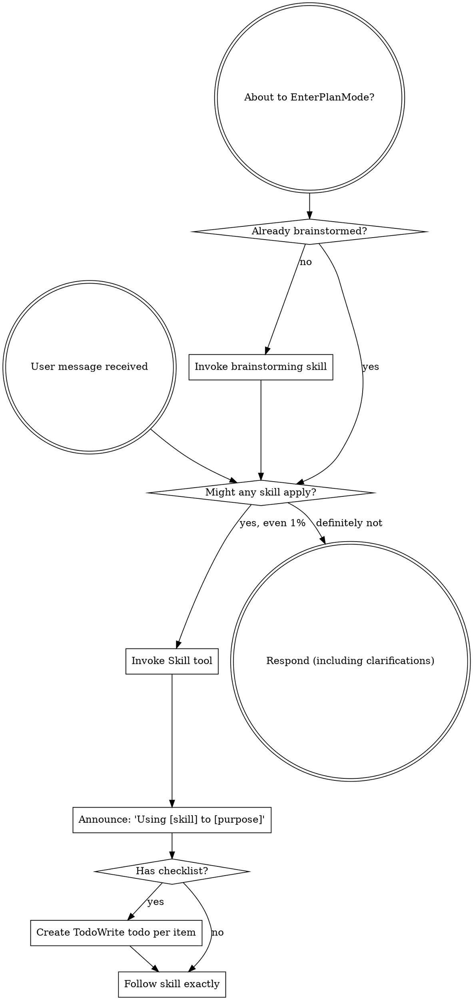
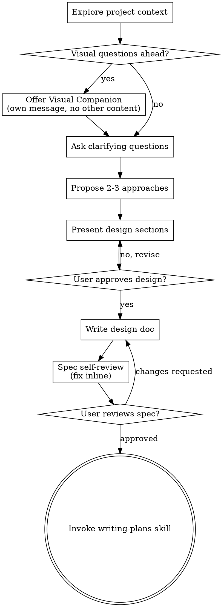
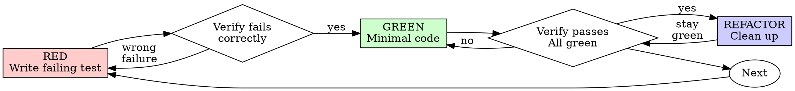
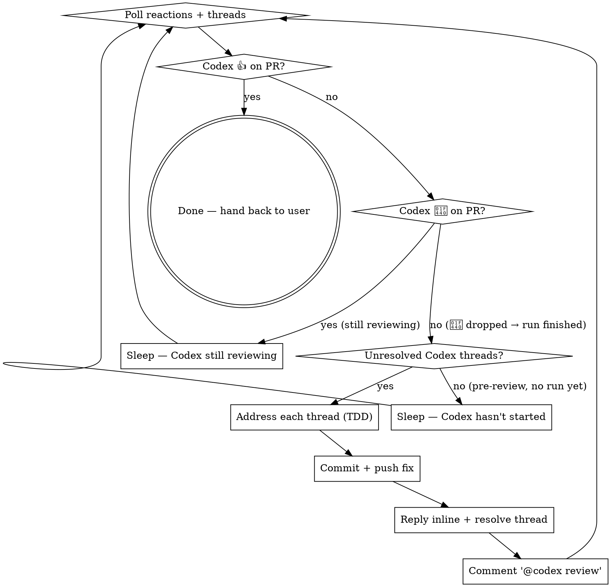

> SYSTEM

# AGENTS.md instructions for /Users/ericson/.t3/worktrees/ars-ui/t3code-e55599d7

<INSTRUCTIONS>
# ars-ui

## Project Overview

Rust frontend component library using state machines, framework-agnostic core with Leptos/Dioxus adapters.

## Current Phase

The repo is now in active implementation, not spec drafting only.

Agents working on implementation should use the GitHub Project roadmap and issue backlog as the execution source of truth:

- Use the GitHub Project `ars-ui implementation roadmap` to understand active epics, task breakdown, dependencies, status, and iteration planning.
- Prefer picking a single issue-backed task that is unblocked, sized, and scoped for independent delivery.
- Do not start work from an epic issue unless the user explicitly asks for planning or further decomposition.
- Do not start a task that is blocked by unresolved GitHub issue dependencies.
- Treat native GitHub issue dependencies as the blocker graph and the issue body acceptance criteria as the delivery contract.

## Development Workflow

For implementation tasks:

1. Read the assigned or selected GitHub issue first.
2. Move the issue to **In Progress** on the GitHub Project board.
3. Review the cited spec sections and any dependency issues.
4. Add or update the named tests first.
5. Implement only the scope required to make those tests pass.
6. If implementation changes the intended contract, update the relevant spec in the same task.
7. **MANDATORY:** Invoke the `post-implementation-audit` skill (`.agents/skills/post-implementation-audit/SKILL.md`). It runs three sequential audits on the new code — (a) spec/implementation drift with "best outcome" recommendations, (b) iterative "anything else missing?" passes (minimum two rounds), (c) test-coverage audit across every test type the workspace uses (unit, snapshot, proptest, mutation, doc, spec-conformance, llvm-cov). **Every finding lands in _this_ PR — no deferral, no follow-up issues.** This step exists because initial implementations consistently ship spec drift and silent contract violations that take 3+ review round-trips to surface; the audit collapses them into one. Skipping this step is a contract violation.
8. Present the final result for user review before any commit.
9. After user approval, run `cargo xci --profile fast` (alias: `cargo xci-fast`) locally and fix any failures before pushing anything to GitHub. The fast profile takes ~5 minutes and covers the workspace-level regressions a pre-push gate should catch: fmt, check, clippy, unit, integration, adapter, spec-compile-snippets, error-variant-coverage, mutual-exclusion, snapshot-count. Reserve full `cargo xci` (~25 minutes, all 20 gates including wasm coverage and the feature-matrix groups) for after substantial refactors that may have shifted feature-flag interactions. For small follow-up changes, run the focused tests and checks that cover the edited code instead.
10. After `cargo xci-fast` passes, commit and push a PR targeting `main`. The PR body MUST include an auto-close keyword for the issue being delivered, for example `Closes #20` or `Fixes #20`, so GitHub closes the issue automatically when the PR merges.
11. **If the PR creates or modifies any `.snap` insta fixtures, attach the `snapshot-reviewed` label after opening or updating it** (`gh pr edit <num> --add-label "snapshot-reviewed"`). This signals to reviewers that the snapshot output was inspected and is intentional. Re-apply the label whenever you push a commit that touches `.snap` files; the workflow assumes the label reflects the latest snapshot state.
12. **MANDATORY:** Invoke the `waiting-for-codex-review` skill (`.agents/skills/waiting-for-codex-review/SKILL.md`) immediately after the first push that creates the PR, and re-invoke it after every subsequent push to the PR branch. The skill posts the initial `@codex review` trigger, polls Codex's 👀 → (👍 \| ∅ + threads) reaction lifecycle, addresses any review threads with the same rigor as `post-implementation-audit` (TDD + no coverage regression), replies inline, resolves threads, and re-comments `@codex review` to start the next pass — looping until Codex leaves 👍. Skipping this step leaves Codex findings unaddressed and silently widens the gap between merged code and the spec; the merge gate is 👍 from Codex plus green CI, not green CI alone.
13. Only after CI passes, Codex has left 👍, and the PR is merged, close the issue.

Never close a GitHub issue without a merged PR that passes CI **and a 👍 from Codex**. Never commit or push without explicit user approval. Keep the issue, PR, and Project board status aligned with the actual work state at every step.

Default delivery rules:

- Follow TDD: tests first, implementation second, verification last.
- Keep task scope aligned with the issue. If the issue is too large or ambiguous, stop and split or clarify rather than freelancing a bigger change.
- Prefer tasks sized `1`, `2`, `3`, or `5` points. `8` is exceptional. `13` must be decomposed before implementation.
- Preserve the crate and dependency layering defined by the architecture and implementation plan.
- Do not add a new dependency crate without explicit user approval first. If a task appears to need a new crate, stop, explain why, and get approval before editing any `Cargo.toml`.
- When a task is complete, verify the exact tests and checks named by the issue before considering it done.
- For adapter-level component implementation, follow `docs/implementation/adapter-component-delivery.md`. Adapter component work must cover the adapter crate, adapter tests, E2E fixtures/harnesses when applicable, widgets examples, spec synchronization, and the required validation/audit loop in one PR.

### Code Quality Standards

- **Document all public items.** Every public struct, enum, trait, function, constant, type alias, method, field, and variant must have a `///` doc comment. Every `lib.rs` must have a `//!` crate-level doc comment. The workspace enforces `missing_docs` linting — undocumented public items are build failures.
- **Zero warnings policy.** All code must compile with zero warnings under the workspace's configured clippy and rustc lints. Fix the root cause instead of suppressing. When suppression is genuinely needed, use `#[expect(lint, reason = "...")]` — never `#[allow(...)]`.
- **Derive documentation from the spec.** Doc comments should describe the _purpose and semantics_ of the item as defined in the corresponding `spec/` files, not just restate the type signature.
- **Use `#[inline]` selectively, not mechanically.** Do **not** add Clippy's `missing_inline_in_public_items` lint at the workspace level, and do not treat public visibility alone as a reason to mark an item `#[inline]`. Use `#[inline]` for thin cross-crate wrappers, trivial accessors, and hot-path no-op shims where the call overhead is plausibly meaningful. Avoid blanket `#[inline]` on all public APIs — it increases code size, adds compile-time cost, and turns `#[inline]` into noise instead of a deliberate performance signal.
- **Use directory-backed modules with `mod.rs` when a module owns children.** This repo standardizes on the older filesystem layout for nested modules. If module `foo` has child modules, the parent must live at `foo/mod.rs`, not `foo.rs`. Do not mix `foo.rs` with a sibling `foo/` directory. When a refactor adds child modules under an existing flat file, move the parent into `foo/mod.rs` in the same change. Do not leave empty leftover module directories behind.

### API Design Standards

- **Design for the pit of success.** Public APIs should make the most natural, shortest path also be the path that is correct, accessible, localizable, type-safe, and performant. Prefer ergonomic constructors and defaults that preserve the spec's strongest guarantees instead of making users opt into correctness after choosing a convenient API.
- **Name escape hatches explicitly.** When a component needs a lower-level, static, non-i18n, or otherwise less complete path, keep it available but make the tradeoff visible in the API name or type. The blessed path should remain the simplest call site, while escape hatches should read as deliberate choices.
- **Keep semantic data separate from rendered views.** Rich framework views are useful for customization, but components still need semantic sources for accessible names, localized text, announcements, ids, and state-machine wiring. Do not rely on arbitrary rendered view trees as the only source of user-facing semantics.

### Code Coverage

The workspace uses `cargo-llvm-cov` for code coverage with per-crate threshold enforcement. CI runs coverage on every PR (see `.github/workflows/ci.yml`).

**Local coverage commands:**

```bash
# Per-crate coverage with inline annotated source (most useful during development)
cargo llvm-cov test -p ars-interactions --text -- hover

# Per-crate summary only
cargo llvm-cov test -p ars-interactions -- hover

# Native-only workspace coverage (host target; excludes wasm-only crates)
cargo llvm-cov --workspace \
  --exclude ars-leptos --exclude ars-dioxus \
  --exclude ars-test-harness-leptos --exclude ars-test-harness-dioxus \
  --exclude ars-derive --exclude xtask \
  --lcov --output-path lcov.info

# Check all crates against spec-defined thresholds (run after a *merged* lcov)
cargo xtask coverage check-all --file lcov.info
```

The `--text` flag produces line-by-line annotated source showing hit counts and `^0` markers on uncovered branches — use this to identify gaps after writing tests. Uncovered no-op callback closures in tests (e.g., `|_| {}`) are expected and not a gap.

The local recipe above excludes the adapter and adapter-test-harness crates because their `target_arch = "wasm32"` / `feature = "web"` code paths can't be measured via host-target `cargo llvm-cov`. **CI runs an additional wasm-coverage pipeline on nightly** (`cargo xtask ci coverage`) that uses `wasm-bindgen-test`'s experimental coverage recipe with LLVM 22 / `clang-22` to emit lcov for `ars-leptos` (csr), `ars-dioxus` (web), `ars-dom` (web), `ars-i18n` (web-intl), and the adapter test harnesses, then merges with the native lcov via `cargo xtask coverage merge`. The per-crate thresholds in `xtask::coverage::default_thresholds()` are enforced against the merged file — including adapter targets (`ars-leptos` 74/55, `ars-dioxus` 77/70, `ars-test-harness-leptos` 60/0, `ars-test-harness-dioxus` 60/0). `ars-derive` (proc-macro, runs in compiler) is exercised via `crates/ars-core/tests/derive_contract.rs` and is unmeasured. `xtask` has its own enforced threshold (30/35) and is measured. See `spec/testing/14-ci.md` §2 for the full pipeline.

### Mutation Testing

Coverage tells you which lines run. **Mutation testing tells you whether the tests would notice if those lines silently misbehaved.** The workspace uses [`cargo-mutants`](https://mutants.rs) for this — a `cargo` extension binary, not a workspace dependency.

**Install (once per developer machine):**

```bash
cargo install cargo-mutants --locked --version 27.0.0
```

**Local commands (state-machine modules are the most rewarding targets):**

```bash
# Run on a single component machine (~6 min for popover)
cargo mutants -p ars-components -f crates/ars-components/src/overlay/popover/mod.rs

# Just list what would be mutated, without running tests (fast)
cargo mutants -p ars-components -f crates/ars-components/src/overlay/popover/mod.rs --list

# Whole crate (slow — only if you really mean it)
cargo mutants -p ars-components
```

**Agnostic component implementation gate:** whenever an agent implements a new framework-agnostic component, or materially changes an existing one, the delivery must include:

- a targeted mutation run for the component source file, usually `cargo mutants -p ars-components -f crates/ars-components/src/<category>/<component>/mod.rs` (adjust the path for single-file modules);
- spec-conformance tests for the component's anatomy/public contract, including its `Part` enum and required API/attribute surface;
- same-task triage of every `MISSED` mutant: add tests for real gaps, or add a justified line-agnostic `.cargo/mutants.toml` exclude only for true equivalent mutations.

**Reading the output:** Results land in `mutants.out/mutants.out/` (gitignored). The two files that matter:

- `caught.txt` — mutations that broke at least one test ✅
- `missed.txt` — mutations that survived all tests ❌ — each one is either a real test gap to fill or an "equivalent mutation" that needs a `[[skip]]` entry in `mutants.toml` with a justification

**CI integration:** Nightly only. `.github/workflows/nightly.yml` has a `mutation-testing` job with a 21-entry matrix that runs `cargo mutants -p <package>` on every framework-agnostic crate, using `--shard k/n` to spread larger crates across parallel runners. **Shard indices are 0-based** (`k` runs from `0` to `n-1`); `k == n` is invalid and will fail the job. When adding shards, always start at `0/n` and end at `(n-1)/n`.

- **`ars-components` (≈ 1,630 mutants today, planned to grow as the spec adds the remaining ~97 components):** sharded **12-way** → ≈ 135 mutants per runner today, ≈ 850 per runner at the ~10,000-mutant endpoint. Sized for the full spec catalog up front so we don't re-shard every few months as components land.
- **`ars-collections` (≈ 1,080 mutants):** sharded 4-way → ≈ 270 mutants per runner.
- **`ars-core` (≈ 700 mutants):** sharded 2-way → ≈ 350 mutants per runner.
- **`ars-a11y`, `ars-forms`, `ars-interactions`:** one runner each (under 600 mutants apiece).

**Adding a new state machine inside an existing crate requires no CI changes** — its mutations land in whichever shard the cargo-mutants partitioner places them. The shard counts are sized so the slowest runner stays well under 30 minutes today and under ~50 minutes at the planned endpoint; re-balance only when a crate outgrows that budget (visible on the nightly dashboard as one shard pulling away from the others).

All matrix jobs run with `fail-fast: false` so failures on one module don't mask data on another. Each job uploads its `mutants.out/` as a workflow artifact (always, even on success — surviving "missed" entries on a passing run still reveal test-quality work). The job fails if any mutation survives, so a missed mutation forces a deliberate triage decision (fix the test, or document the equivalence with a `[[skip]]` entry in `mutants.toml`).

**Excluded crates** (mutation testing's signal degrades wherever determinism does): adapter glue (`ars-leptos`, `ars-dioxus`), DOM/FFI (`ars-dom`), ICU/FFI (`ars-i18n`), test infrastructure (`ars-test-harness*`), and the proc-macro crate (`ars-derive`, runs in the compiler). Adding a brand-new crate that is a good mutation target requires one new matrix entry; run a local scout first (`cargo mutants -p <crate> --list` to size, then a real run) so we know the right shard count before the nightly fires.

**Bumping the pinned version.** Both the local install command above and `.github/workflows/nightly.yml` pin cargo-mutants to an exact version (currently `27.0.0`) — same convention as `wasm-pack` in the `a11y-audit` job. Pinning is deliberate: cargo-mutants ships new mutators in releases, and an unpinned install would silently change the mutation set without any code change, surfacing as phantom CI failures on a green-source repo. To bump, open a PR that (1) updates the version string in CLAUDE.md and `nightly.yml`, (2) runs the popover scout locally with the new version (`cargo mutants -p ars-components -f crates/ars-components/src/overlay/popover/mod.rs`) to confirm the mutation count is in the same ballpark, and (3) triages any new "missed" entries the new mutators surface — they are usually genuine test-quality gaps newly visible to the tool.

### Property Testing (proptest)

State-machine invariants are exercised by [`proptest`](https://docs.rs/proptest) under `crates/<crate>/tests/proptest_state_machines/` (see `ars-components`). Default proptest behaviour drops `*.proptest-regressions` seed files alongside test sources — instead, every `proptest!` block in this workspace pulls a shared `Config` from `tests/proptest_state_machines/common.rs` that:

1. Reads `PROPTEST_CASES` from the environment (1,000 default; 10,000 in the nightly `extended-proptest` job).
2. Sets `failure_persistence` to `FileFailurePersistence::Direct("proptest-regressions/state-machines.txt")`, so all persisted seeds for the test binary live in one file at the crate root: `crates/<crate>/proptest-regressions/state-machines.txt`. The directory is committed (per proptest's own recommendation in the file header) so every developer's runs benefit from previously-shrunk failures.

When a new crate adopts proptest for state-machine tests, copy the same `common.rs` helper and reference it via `#![proptest_config(super::common::proptest_config())]` inside every `proptest!` block. Don't let proptest fall back to its `WithSource` default — that scatters seed files across the source tree.

### Adapter Prelude Convention

Both `ars-leptos` and `ars-dioxus` expose a `prelude` module targeting **end users** — application developers who consume the ready-made components. `use ars_leptos::prelude::*` (or `use ars_dioxus::prelude::*`) should give them everything they need.

The prelude contains only user-facing items:

1. **Component modules** — as components land, their public module paths (e.g., `button`, `dialog`) are re-exported so users can write `button::Props`, etc.
2. **User-facing traits** — traits end users call on component outputs (e.g., `Translate` from `ars-i18n`). Re-export the trait so consumers don't need a direct dependency on the subsystem crate.
3. **Configuration types** — types that appear in component props or configure behaviour (e.g., `Locale`, `Direction`, `Orientation`, `Selection`).

The prelude does **not** include implementation details consumed only by component authors inside the adapter crate: core engine types (`Machine`, `Service`, `ConnectApi`, `AttrMap`), accessibility primitives (`AriaRole`, `AriaAttribute`), interaction helpers (`merge_attrs`), or adapter hooks (`use_machine`, `UseMachineReturn`). Those remain accessible via their normal crate paths for advanced users building custom machines.

Both adapter preludes must stay symmetric: same items, same structure. When adding a new re-export to one adapter's prelude, add it to the other as well in the same PR.

### Adapter Testing Convention

Adapter-level component tests should default to the framework-specific test harness crate:

- Leptos adapter tests should prefer `ars-test-harness-leptos`.
- Dioxus adapter tests should prefer `ars-test-harness-dioxus`.
- Shared `ars-test-harness` helpers should be used where relevant for viewport, layout, clipboard, drag/drop, timing, and other DOM test setup instead of bespoke per-test browser scaffolding.

When a component spec requires interaction, focus, overlay positioning, clipboard, file upload, drag/drop, or similar browser behavior, the task's tests should exercise that behavior through the adapter harness entrypoints and shared core harness helpers unless there is a concrete technical reason not to.

## Spec Synchronization During Implementation

The specification is the authoritative contract. It took weeks of deliberate design and MUST be followed.

### Spec-first implementation rule

Before implementing any public type, trait, function, or method:

1. **Read the spec section first.** Find the relevant code example in `spec/`. Use `spec-tool toc <file>` and `grep` to locate it.
2. **Match the spec exactly.** If the spec defines `struct ComponentIds { base: String }` with methods `from_id()`, `id()`, `part()`, `item()`, `item_part()` — implement exactly that. Do not invent alternative field names, method names, or signatures.
3. **Cross-check after implementation.** Before presenting code for review, diff every public item against the spec's code examples. Every struct field, every method name, every parameter must match.
4. **If you must deviate**, there must be a concrete technical reason (e.g., the spec's API cannot compile, or a dependency doesn't expose the needed type). Document the reason in a code comment and flag it to the user explicitly.

Inventing alternative APIs that "seem equivalent" is never acceptable — it silently invalidates the spec's design decisions and all downstream code that depends on those APIs.

### Spec/code mismatch resolution

- If code and spec disagree, resolve the mismatch in the same task or PR.
- Shared conceptual changes belong in shared or foundation spec files, not only in adapter code.
- Adapter-specific findings must be reflected back into `spec/foundation/08-adapter-leptos.md` and/or `spec/foundation/09-adapter-dioxus.md` when relevant.
- Do not leave spec drift behind as follow-up cleanup.

## Spec Structure

The specification lives in `spec/` with this layout:

- `spec/manifest.toml` — **START HERE** — central index of all components and their dependencies
- `spec/foundation/` — architecture, accessibility, i18n, interactions, forms, adapters, spec template (00-10)
- `spec/shared/` — cross-component shared types (date-time, selection, layout, z-index)
- `spec/components/{category}/` — one file per component, organized by category
- `spec/testing/` — test specs split by domain

### Component Categories

- `input/` — checkbox, text-field, slider, number-input, etc.
- `selection/` — select, combobox, listbox, menu, tags-input, etc.
- `overlay/` — dialog, popover, tooltip, toast, presence, etc.
- `navigation/` — accordion, tabs, tree-view, pagination, steps, etc.
- `date-time/` — date-field, time-field, calendar, date-picker, etc.
- `data-display/` — table, avatar, progress, meter, badge, etc.
- `layout/` — splitter, scroll-area, carousel, portal, toolbar, etc.
- `specialized/` — color-picker, file-upload, signature-pad, qr-code, etc.
- `utility/` — button, toggle, focus-scope, visually-hidden, separator, etc.

## Working with the Spec

When reading large files, run `wc -l` first to check the line count. If the file is over 2,000
lines, use the `offset` and `limit` parameters on the Read tool to read in chunks rather than
attempting to read the entire file at once.

### Using xtask spec (preferred)

Use `cargo xtask spec` to resolve file sets instead of manually parsing manifest.toml:

```bash
# Quick metadata lookup:
cargo xtask spec info <component>

# Find all components using a shared type:
cargo xtask spec reverse <shared-type>

# See a file's heading structure (with line numbers):
cargo xtask spec toc <file>

# Validate frontmatter matches manifest.toml:
cargo xtask spec validate

# Search spec content by keyword/regex (with optional filters):
cargo xtask spec search <query> [--category <cat>] [--section <sec>] [--tier <tier>]

# Get a compact component summary (states, events, props, accessibility):
cargo xtask spec digest <component>

# Get full implementation context (component + all deps concatenated):
cargo xtask spec context <component> [--framework <fw>] [--include-testing]
```

The xtask also runs as an MCP server (`cargo xtask mcp`) exposing all spec tools for LLM agents.

### Reading a component (manual fallback)

1. Read `spec/manifest.toml` to find the component's path and dependencies
2. Read the component file (has YAML frontmatter listing its foundation/shared deps)
3. Only load the foundation files listed in `foundation_deps` — not all of them

### Framework and library specs — MANDATORY skill loading

When reading or editing these specification files, you MUST load the corresponding skill BEFORE doing any work. The skills contain verified, version-accurate API documentation that the spec code examples depend on. Claude's training data is wrong for these libraries — do not trust it.

| Spec file                                    | Skill to load | Library version |
| -------------------------------------------- | ------------- | --------------- |
| `spec/foundation/04-internationalization.md` | `icu4x`       | ICU4X 2.1.1     |
| `spec/foundation/08-adapter-leptos.md`       | `leptos`      | Leptos 0.8.17   |
| `spec/foundation/09-adapter-dioxus.md`       | `dioxus`      | Dioxus 0.7.3    |

This applies to any task that touches adapter code: reviewing, writing, modifying, or answering questions about these files. Load the skill first, then proceed.

### Spec Conventions

- **No deprecation:** This is a greenfield spec. If an API is unused or redundant, remove it and fix all references. Never use `#[deprecated]` or deprecation shims.
- **No deferral:** Never mark spec content as "TODO", "FIXME", "future enhancement", "P1/P2 extension", or any similar deferral language. Every feature mentioned must be fully specified. If a design choice is unclear, ask the user rather than deferring.
- **No guessing external APIs:** NEVER guess function names or module paths for external crates. Always verify against `https://docs.rs/<crate_name>` before writing code that calls library APIs. This applies especially to Leptos, Dioxus, ICU4X, and any crate where training data may be stale. If you cannot verify, state that explicitly rather than fabricating a plausible-looking API.

### Component file format

Each component file has YAML frontmatter declaring its metadata:

```markdown
---
component: ComponentName
category: { category }
tier: stateless | stateful | complex
foundation_deps: [architecture, accessibility, ...]
shared_deps: [date-time-types, ...]
related: [sibling-component, ...]
---

# ComponentName
```

The `tier` field determines which sections are required — see `spec/foundation/10-component-spec-template.md` for the canonical section structure, ordering rules, and conformance checklist. Headings are numbered (e.g., `## 1. State Machine`, `### 1.1 States`, `#### 1.1.1 InnerStates`, etc.) for precise section references.

</INSTRUCTIONS>
<environment_context>
  <cwd>/Users/ericson/.t3/worktrees/ars-ui/t3code-e55599d7</cwd>
  <shell>zsh</shell>
  <current_date>2026-05-24</current_date>
  <timezone>America/Sao_Paulo</timezone>
</environment_context>

> DEVELOPER

Implements tasks #271 and #281

> AGENT

I’ll ground this in the repo and the live issue contracts first, then turn that into a decision-complete implementation plan. I’m using the required planning-oriented skills for this turn, but I’ll avoid any code edits while we’re still in Plan Mode.

> TOOL

tool_use exec_command
id: call_bnAMGuh0Oe92H9omsO2ZzDar
```json
{
  "cmd": "sed -n '1,220p' /Users/ericson/.codex/plugins/cache/openai-curated/superpowers/6188456f/skills/using-superpowers/SKILL.md",
  "workdir": "/Users/ericson/.t3/worktrees/ars-ui/t3code-e55599d7",
  "yield_time_ms": 1000,
  "max_output_tokens": 4000
}
```

> TOOL

tool_use exec_command
id: call_zh9Q1qyUQPmj0VaH9kg6CK7K
```json
{
  "cmd": "sed -n '1,220p' /Users/ericson/.codex/plugins/cache/openai-curated/superpowers/6188456f/skills/brainstorming/SKILL.md",
  "workdir": "/Users/ericson/.t3/worktrees/ars-ui/t3code-e55599d7",
  "yield_time_ms": 1000,
  "max_output_tokens": 4000
}
```

> TOOL

tool_use exec_command
id: call_AyzRwi9M8taqeEPPabRXPfUE
```json
{
  "cmd": "sed -n '1,220p' /Users/ericson/.codex/plugins/cache/openai-curated/superpowers/6188456f/skills/writing-plans/SKILL.md",
  "workdir": "/Users/ericson/.t3/worktrees/ars-ui/t3code-e55599d7",
  "yield_time_ms": 1000,
  "max_output_tokens": 4000
}
```

> TOOL

tool_use exec_command
id: call_pAbWsIZ2G3ZzEXulMLF8FzqD
```json
{
  "cmd": "rg -n \"271|281|ActionGroup|action_group|ToggleButton|LiveRegion|RegisterItem|UnregisterItem\" /Users/ericson/.codex/memories/MEMORY.md",
  "workdir": "/Users/ericson/.t3/worktrees/ars-ui/t3code-e55599d7",
  "yield_time_ms": 1000,
  "max_output_tokens": 3000
}
```

> TOOL

tool_result
id: call_bnAMGuh0Oe92H9omsO2ZzDar
```
Chunk ID: e4c4c5
Wall time: 0.1080 seconds
Process exited with code 0
Original token count: 1356
Output:
---
name: using-superpowers
description: Use when starting any conversation - establishes how to find and use skills, requiring Skill tool invocation before ANY response including clarifying questions
---

<SUBAGENT-STOP>
If you were dispatched as a subagent to execute a specific task, skip this skill.
</SUBAGENT-STOP>

<EXTREMELY-IMPORTANT>
If you think there is even a 1% chance a skill might apply to what you are doing, you ABSOLUTELY MUST invoke the skill.

IF A SKILL APPLIES TO YOUR TASK, YOU DO NOT HAVE A CHOICE. YOU MUST USE IT.

This is not negotiable. This is not optional. You cannot rationalize your way out of this.
</EXTREMELY-IMPORTANT>

## Instruction Priority

Superpowers skills override default system prompt behavior, but **user instructions always take precedence**:

1. **User's explicit instructions** (CLAUDE.md, GEMINI.md, AGENTS.md, direct requests) — highest priority
2. **Superpowers skills** — override default system behavior where they conflict
3. **Default system prompt** — lowest priority

If CLAUDE.md, GEMINI.md, or AGENTS.md says "don't use TDD" and a skill says "always use TDD," follow the user's instructions. The user is in control.

## How to Access Skills

**In Claude Code:** Use the `Skill` tool. When you invoke a skill, its content is loaded and presented to you—follow it directly. Never use the Read tool on skill files.

**In Copilot CLI:** Use the `skill` tool. Skills are auto-discovered from installed plugins. The `skill` tool works the same as Claude Code's `Skill` tool.

**In Gemini CLI:** Skills activate via the `activate_skill` tool. Gemini loads skill metadata at session start and activates the full content on demand.

**In other environments:** Check your platform's documentation for how skills are loaded.

## Platform Adaptation

Skills use Claude Code tool names. Non-CC platforms: see `references/copilot-tools.md` (Copilot CLI), `references/codex-tools.md` (Codex) for tool equivalents. Gemini CLI users get the tool mapping loaded automatically via GEMINI.md.

# Using Skills

## The Rule

**Invoke relevant or requested skills BEFORE any response or action.** Even a 1% chance a skill might apply means that you should invoke the skill to check. If an invoked skill turns out to be wrong for the situation, you don't need to use it.



## Red Flags

These thoughts mean STOP—you're rationalizing:

| Thought | Reality |
|---------|---------|
| "This is just a simple question" | Questions are tasks. Check for skills. |
| "I need more context first" | Skill check comes BEFORE clarifying questions. |
| "Let me explore the codebase first" | Skills tell you HOW to explore. Check first. |
| "I can check git/files quickly" | Files lack conversation context. Check for skills. |
| "Let me gather information first" | Skills tell you HOW to gather information. |
| "This doesn't need a formal skill" | If a skill exists, use it. |
| "I remember this skill" | Skills evolve. Read current version. |
| "This doesn't count as a task" | Action = task. Check for skills. |
| "The skill is overkill" | Simple things become complex. Use it. |
| "I'll just do this one thing first" | Check BEFORE doing anything. |
| "This feels productive" | Undisciplined action wastes time. Skills prevent this. |
| "I know what that means" | Knowing the concept ≠ using the skill. Invoke it. |

## Skill Priority

When multiple skills could apply, use this order:

1. **Process skills first** (brainstorming, debugging) - these determine HOW to approach the task
2. **Implementation skills second** (frontend-design, mcp-builder) - these guide execution

"Let's build X" → brainstorming first, then implementation skills.
"Fix this bug" → debugging first, then domain-specific skills.

## Skill Types

**Rigid** (TDD, debugging): Follow exactly. Don't adapt away discipline.

**Flexible** (patterns): Adapt principles to context.

The skill itself tells you which.

## User Instructions

Instructions say WHAT, not HOW. "Add X" or "Fix Y" doesn't mean skip workflows.

```

> TOOL

tool_result
id: call_zh9Q1qyUQPmj0VaH9kg6CK7K
```
Chunk ID: c4035a
Wall time: 0.0000 seconds
Process exited with code 0
Original token count: 2659
Output:
---
name: brainstorming
description: "You MUST use this before any creative work - creating features, building components, adding functionality, or modifying behavior. Explores user intent, requirements and design before implementation."
---

# Brainstorming Ideas Into Designs

Help turn ideas into fully formed designs and specs through natural collaborative dialogue.

Start by understanding the current project context, then ask questions one at a time to refine the idea. Once you understand what you're building, present the design and get user approval.

<HARD-GATE>
Do NOT invoke any implementation skill, write any code, scaffold any project, or take any implementation action until you have presented a design and the user has approved it. This applies to EVERY project regardless of perceived simplicity.
</HARD-GATE>

## Anti-Pattern: "This Is Too Simple To Need A Design"

Every project goes through this process. A todo list, a single-function utility, a config change — all of them. "Simple" projects are where unexamined assumptions cause the most wasted work. The design can be short (a few sentences for truly simple projects), but you MUST present it and get approval.

## Checklist

You MUST create a task for each of these items and complete them in order:

1. **Explore project context** — check files, docs, recent commits
2. **Offer visual companion** (if topic will involve visual questions) — this is its own message, not combined with a clarifying question. See the Visual Companion section below.
3. **Ask clarifying questions** — one at a time, understand purpose/constraints/success criteria
4. **Propose 2-3 approaches** — with trade-offs and your recommendation
5. **Present design** — in sections scaled to their complexity, get user approval after each section
6. **Write design doc** — save to `docs/superpowers/specs/YYYY-MM-DD-<topic>-design.md` and commit
7. **Spec self-review** — quick inline check for placeholders, contradictions, ambiguity, scope (see below)
8. **User reviews written spec** — ask user to review the spec file before proceeding
9. **Transition to implementation** — invoke writing-plans skill to create implementation plan

## Process Flow



**The terminal state is invoking writing-plans.** Do NOT invoke frontend-design, mcp-builder, or any other implementation skill. The ONLY skill you invoke after brainstorming is writing-plans.

## The Process

**Understanding the idea:**

- Check out the current project state first (files, docs, recent commits)
- Before asking detailed questions, assess scope: if the request describes multiple independent subsystems (e.g., "build a platform with chat, file storage, billing, and analytics"), flag this immediately. Don't spend questions refining details of a project that needs to be decomposed first.
- If the project is too large for a single spec, help the user decompose into sub-projects: what are the independent pieces, how do they relate, what order should they be built? Then brainstorm the first sub-project through the normal design flow. Each sub-project gets its own spec → plan → implementation cycle.
- For appropriately-scoped projects, ask questions one at a time to refine the idea
- Prefer multiple choice questions when possible, but open-ended is fine too
- Only one question per message - if a topic needs more exploration, break it into multiple questions
- Focus on understanding: purpose, constraints, success criteria

**Exploring approaches:**

- Propose 2-3 different approaches with trade-offs
- Present options conversationally with your recommendation and reasoning
- Lead with your recommended option and explain why

**Presenting the design:**

- Once you believe you understand what you're building, present the design
- Scale each section to its complexity: a few sentences if straightforward, up to 200-300 words if nuanced
- Ask after each section whether it looks right so far
- Cover: architecture, components, data flow, error handling, testing
- Be ready to go back and clarify if something doesn't make sense

**Design for isolation and clarity:**

- Break the system into smaller units that each have one clear purpose, communicate through well-defined interfaces, and can be understood and tested independently
- For each unit, you should be able to answer: what does it do, how do you use it, and what does it depend on?
- Can someone understand what a unit does without reading its internals? Can you change the internals without breaking consumers? If not, the boundaries need work.
- Smaller, well-bounded units are also easier for you to work with - you reason better about code you can hold in context at once, and your edits are more reliable when files are focused. When a file grows large, that's often a signal that it's doing too much.

**Working in existing codebases:**

- Explore the current structure before proposing changes. Follow existing patterns.
- Where existing code has problems that affect the work (e.g., a file that's grown too large, unclear boundaries, tangled responsibilities), include targeted improvements as part of the design - the way a good developer improves code they're working in.
- Don't propose unrelated refactoring. Stay focused on what serves the current goal.

## After the Design

**Documentation:**

- Write the validated design (spec) to `docs/superpowers/specs/YYYY-MM-DD-<topic>-design.md`
  - (User preferences for spec location override this default)
- Use elements-of-style:writing-clearly-and-concisely skill if available
- Commit the design document to git

**Spec Self-Review:**
After writing the spec document, look at it with fresh eyes:

1. **Placeholder scan:** Any "TBD", "TODO", incomplete sections, or vague requirements? Fix them.
2. **Internal consistency:** Do any sections contradict each other? Does the architecture match the feature descriptions?
3. **Scope check:** Is this focused enough for a single implementation plan, or does it need decomposition?
4. **Ambiguity check:** Could any requirement be interpreted two different ways? If so, pick one and make it explicit.

Fix any issues inline. No need to re-review — just fix and move on.

**User Review Gate:**
After the spec review loop passes, ask the user to review the written spec before proceeding:

> "Spec written and committed to `<path>`. Please review it and let me know if you want to make any changes before we start writing out the implementation plan."

Wait for the user's response. If they request changes, make them and re-run the spec review loop. Only proceed once the user approves.

**Implementation:**

- Invoke the writing-plans skill to create a detailed implementation plan
- Do NOT invoke any other skill. writing-plans is the next step.

## Key Principles

- **One question at a time** - Don't overwhelm with multiple questions
- **Multiple choice preferred** - Easier to answer than open-ended when possible
- **YAGNI ruthlessly** - Remove unnecessary features from all designs
- **Explore alternatives** - Always propose 2-3 approaches before settling
- **Incremental validation** - Present design, get approval before moving on
- **Be flexible** - Go back and clarify when something doesn't make sense

## Visual Companion

A browser-based companion for showing mockups, diagrams, and visual options during brainstorming. Available as a tool — not a mode. Accepting the companion means it's available for questions that benefit from visual treatment; it does NOT mean every question goes through the browser.

**Offering the companion:** When you anticipate that upcoming questions will involve visual content (mockups, layouts, diagrams), offer it once for consent:
> "Some of what we're working on might be easier to explain if I can show it to you in a web browser. I can put together mockups, diagrams, comparisons, and other visuals as we go. This feature is still new and can be token-intensive. Want to try it? (Requires opening a local URL)"

**This offer MUST be its own message.** Do not combine it with clarifying questions, context summaries, or any other content. The message should contain ONLY the offer above and nothing else. Wait for the user's response before continuing. If they decline, proceed with text-only brainstorming.

**Per-question decision:** Even after the user accepts, decide FOR EACH QUESTION whether to use the browser or the terminal. The test: **would the user understand this better by seeing it than reading it?**

- **Use the browser** for content that IS visual — mockups, wireframes, layout comparisons, architecture diagrams, side-by-side visual designs
- **Use the terminal** for content that is text — requirements questions, conceptual choices, tradeoff lists, A/B/C/D text options, scope decisions

A question about a UI topic is not automatically a visual question. "What does personality mean in this context?" is a conceptual question — use the terminal. "Which wizard layout works better?" is a visual question — use the browser.

If they agree to the companion, read the detailed guide before proceeding:
`skills/brainstorming/visual-companion.md`

```

> TOOL

tool_result
id: call_AyzRwi9M8taqeEPPabRXPfUE
```
Chunk ID: 9dcd31
Wall time: 0.0476 seconds
Process exited with code 0
Original token count: 1525
Output:
---
name: writing-plans
description: Use when you have a spec or requirements for a multi-step task, before touching code
---

# Writing Plans

## Overview

Write comprehensive implementation plans assuming the engineer has zero context for our codebase and questionable taste. Document everything they need to know: which files to touch for each task, code, testing, docs they might need to check, how to test it. Give them the whole plan as bite-sized tasks. DRY. YAGNI. TDD. Frequent commits.

Assume they are a skilled developer, but know almost nothing about our toolset or problem domain. Assume they don't know good test design very well.

**Announce at start:** "I'm using the writing-plans skill to create the implementation plan."

**Context:** If working in an isolated worktree, it should have been created via the `superpowers:using-git-worktrees` skill at execution time.

**Save plans to:** `docs/superpowers/plans/YYYY-MM-DD-<feature-name>.md`
- (User preferences for plan location override this default)

## Scope Check

If the spec covers multiple independent subsystems, it should have been broken into sub-project specs during brainstorming. If it wasn't, suggest breaking this into separate plans — one per subsystem. Each plan should produce working, testable software on its own.

## File Structure

Before defining tasks, map out which files will be created or modified and what each one is responsible for. This is where decomposition decisions get locked in.

- Design units with clear boundaries and well-defined interfaces. Each file should have one clear responsibility.
- You reason best about code you can hold in context at once, and your edits are more reliable when files are focused. Prefer smaller, focused files over large ones that do too much.
- Files that change together should live together. Split by responsibility, not by technical layer.
- In existing codebases, follow established patterns. If the codebase uses large files, don't unilaterally restructure - but if a file you're modifying has grown unwieldy, including a split in the plan is reasonable.

This structure informs the task decomposition. Each task should produce self-contained changes that make sense independently.

## Bite-Sized Task Granularity

**Each step is one action (2-5 minutes):**
- "Write the failing test" - step
- "Run it to make sure it fails" - step
- "Implement the minimal code to make the test pass" - step
- "Run the tests and make sure they pass" - step
- "Commit" - step

## Plan Document Header

**Every plan MUST start with this header:**

```markdown
# [Feature Name] Implementation Plan

> **For agentic workers:** REQUIRED SUB-SKILL: Use superpowers:subagent-driven-development (recommended) or superpowers:executing-plans to implement this plan task-by-task. Steps use checkbox (`- [ ]`) syntax for tracking.

**Goal:** [One sentence describing what this builds]

**Architecture:** [2-3 sentences about approach]

**Tech Stack:** [Key technologies/libraries]

---
```

## Task Structure

````markdown
### Task N: [Component Name]

**Files:**
- Create: `exact/path/to/file.py`
- Modify: `exact/path/to/existing.py:123-145`
- Test: `tests/exact/path/to/test.py`

- [ ] **Step 1: Write the failing test**

```python
def test_specific_behavior():
    result = function(input)
    assert result == expected
```

- [ ] **Step 2: Run test to verify it fails**

Run: `pytest tests/path/test.py::test_name -v`
Expected: FAIL with "function not defined"

- [ ] **Step 3: Write minimal implementation**

```python
def function(input):
    return expected
```

- [ ] **Step 4: Run test to verify it passes**

Run: `pytest tests/path/test.py::test_name -v`
Expected: PASS

- [ ] **Step 5: Commit**

```bash
git add tests/path/test.py src/path/file.py
git commit -m "feat: add specific feature"
```
````

## No Placeholders

Every step must contain the actual content an engineer needs. These are **plan failures** — never write them:
- "TBD", "TODO", "implement later", "fill in details"
- "Add appropriate error handling" / "add validation" / "handle edge cases"
- "Write tests for the above" (without actual test code)
- "Similar to Task N" (repeat the code — the engineer may be reading tasks out of order)
- Steps that describe what to do without showing how (code blocks required for code steps)
- References to types, functions, or methods not defined in any task

## Remember
- Exact file paths always
- Complete code in every step — if a step changes code, show the code
- Exact commands with expected output
- DRY, YAGNI, TDD, frequent commits

## Self-Review

After writing the complete plan, look at the spec with fresh eyes and check the plan against it. This is a checklist you run yourself — not a subagent dispatch.

**1. Spec coverage:** Skim each section/requirement in the spec. Can you point to a task that implements it? List any gaps.

**2. Placeholder scan:** Search your plan for red flags — any of the patterns from the "No Placeholders" section above. Fix them.

**3. Type consistency:** Do the types, method signatures, and property names you used in later tasks match what you defined in earlier tasks? A function called `clearLayers()` in Task 3 but `clearFullLayers()` in Task 7 is a bug.

If you find issues, fix them inline. No need to re-review — just fix and move on. If you find a spec requirement with no task, add the task.

## Execution Handoff

After saving the plan, offer execution choice:

**"Plan complete and saved to `docs/superpowers/plans/<filename>.md`. Two execution options:**

**1. Subagent-Driven (recommended)** - I dispatch a fresh subagent per task, review between tasks, fast iteration

**2. Inline Execution** - Execute tasks in this session using executing-plans, batch execution with checkpoints

**Which approach?"**

**If Subagent-Driven chosen:**
- **REQUIRED SUB-SKILL:** Use superpowers:subagent-driven-development
- Fresh subagent per task + two-stage review

**If Inline Execution chosen:**
- **REQUIRED SUB-SKILL:** Use superpowers:executing-plans
- Batch execution with checkpoints for review

```

> TOOL

tool_result
id: call_pAbWsIZ2G3ZzEXulMLF8FzqD
```
Chunk ID: ddc0ed
Wall time: 0.0510 seconds
Process exited with code 0
Original token count: 1195
Output:
6:## Task 1: Implement ActionGroup agnostic core, publish PR #671, and stop with GitHub CI still in progress
14:- ActionGroup, action_group, issue #217, RegisterItem, UnregisterItem, registered_items, roving focus, cargo xci-fast, cargo xtask spec info action-group, cargo mutants, PR #671
26:## Task 3: Implement ToggleButton agnostic core, resolve Codex review findings, and finish PR #668
34:- ToggleButton, toggle_button, toggle-button, issue #215, Bindable<bool>, hidden_input_config, SetPressed, Reset, TransitionPlan::new, cargo mutants, PR #668
46:## Task 5: Implement LiveRegion agnostic core, fix Codex findings, and get PR #659 approved
54:- LiveRegion, live_region, issue #211, aria-relevant, queueing, cargo xci-fast, cargo insta test --unreferenced=reject, spec_conformance, proptest, PR #659
87:- `cargo xtask spec info action-group` prints the canonical component spec plus the Leptos and Dioxus adapter spec paths, so it is the fastest orientation command before editing ActionGroup surfaces [Task 1]
88:- for ActionGroup, `toggle_group` and `button` were the closest reusable local patterns, and the accepted contract used `RegisterItem(Key)` / `UnregisterItem(Key)` so `registered_items` can drive roving focus correctly [Task 1]
89:- the focused ActionGroup validation set that passed locally was `cargo test -p ars-components utility::action_group --features i18n`, `cargo test -p ars-components --test spec_conformance action_group --features i18n`, ignored proptest invariants, `cargo insta test --unreferenced=reject -p ars-components --features i18n --lib`, `cargo xtask spec validate`, targeted `cargo mutants`, focused `cargo llvm-cov`, then `cargo xci-fast` before publish [Task 1]
90:- ActionGroup publish flow reached draft PR `#671`, local `cargo xci-fast`, `snapshot-reviewed`, and Codex `+1`, but the rollout stopped before Coverage / Release Verification and later feature-flag jobs reached a terminal GitHub state, so a future agent should re-poll PR `#671` or workflow `26363316338` before claiming the branch is fully green [Task 1]
94:- `ToggleButton` lives at `crates/ars-components/src/utility/toggle_button/mod.rs`, is exported from `crates/ars-components/src/utility/mod.rs`, and follows the existing `button` / `toggle` conventions with `State::{Idle, Focused, Pressed}`, `Event::{Focus, Blur, Press, Release, Toggle, SetPressed, SetDisabled, Reset}`, `Effect::PressedChange`, `root_attrs()`, and `hidden_input_config()` [Task 3]
95:- the correct no-op rule for ToggleButton-like value sync is: if the requested pressed value already matches the current state, return `TransitionPlan::new()` rather than a synthetic state transition that reports `state_changed=true` [Task 3]
99:- `LiveRegion` lives at `crates/ars-components/src/utility/live_region/mod.rs`, is exported from `crates/ars-components/src/utility/mod.rs`, and its durable validation surface includes unit tests, snapshot tests, `tests/spec_conformance/utility.rs`, and proptest state-machine coverage [Task 5]
107:- reliable validation for this family was focused `cargo test -p ars-components utility::action_group|utility::toggle_group|utility::toggle_button|navigation::accordion|utility::live_region|utility::toggle|utility::swap|navigation::`, `cargo xtask spec validate`, focused `cargo llvm-cov`, targeted mutation or proptest runs for state machines, then crate-level `cargo test -p ars-components --all-targets` or `cargo xci-fast` as the broader repo gate as needed [Task 1][Task 2][Task 3][Task 4][Task 5][Task 6][Task 7]
111:- symptom: a published ActionGroup branch already has local `cargo xci-fast` and Codex approval, but the rollout ended before the PR was fully green -> cause: the turn stopped while later GitHub Actions lanes were still running -> fix: re-poll PR `#671` / workflow `26363316338` before claiming terminal CI success [Task 1]
113:- symptom: a first-pass ToggleButton machine looks correct but review says controlled props desynchronize while disabled -> cause: disabled `SetPressed` was treated like a user-activation event instead of prop sync -> fix: allow disabled `SetPressed`, and test the controlled-disabled path directly [Task 3]
2955:- Nightly CI, nightly.yml, gh run view, 26013516682, 25777995271, tabs_wasm.rs, web_sys::MouseEventInit, ars_dom::WebPlatformEffects, Mutation Tests (components-shard-8), Mutation Tests (collections-shard-1), TabKey, PR #646
2996:- on the later tabs-focused Nightly regression, the failing run was `26013516682` and the previous green scheduled Nightly was `25777995271`; the two real failure classes were a wasm compile break in `crates/ars-dioxus/tests/tabs_wasm.rs` and survivor clusters in `crates/ars-components/src/navigation/tabs/mod.rs` plus `crates/ars-collections/src/key.rs` [Task 6]

```

> AGENT

I’ve loaded the relevant workflow skills and checked memory for this repo family. Next I’m going to inspect the live issue bodies, local branch state, spec metadata, and nearby code so the plan is tied to the actual contracts for #271 and #281.

> TOOL

tool_use exec_command
id: call_f5Ap2Og2KDmnsLImQyTLzltq
```json
{
  "cmd": "git remote -v",
  "workdir": "/Users/ericson/.t3/worktrees/ars-ui/t3code-e55599d7",
  "yield_time_ms": 1000,
  "max_output_tokens": 1000
}
```

> TOOL

tool_use exec_command
id: call_roRDakbqTWjgaT9JvAtF8Unw
```json
{
  "cmd": "git status --short --branch",
  "workdir": "/Users/ericson/.t3/worktrees/ars-ui/t3code-e55599d7",
  "yield_time_ms": 1000,
  "max_output_tokens": 1000
}
```

> TOOL

tool_use exec_command
id: call_NvNC9Fdm8FykXqcslH4q1aAB
```json
{
  "cmd": "gh issue view 271 --json number,title,state,body,labels,assignees,projectItems,url",
  "workdir": "/Users/ericson/.t3/worktrees/ars-ui/t3code-e55599d7",
  "yield_time_ms": 1000,
  "max_output_tokens": 8000
}
```

> TOOL

tool_use exec_command
id: call_ZvAsBOTmYahmSI9gYtaJp0Y5
```json
{
  "cmd": "gh issue view 281 --json number,title,state,body,labels,assignees,projectItems,url",
  "workdir": "/Users/ericson/.t3/worktrees/ars-ui/t3code-e55599d7",
  "yield_time_ms": 1000,
  "max_output_tokens": 8000
}
```

> TOOL

tool_result
id: call_f5Ap2Og2KDmnsLImQyTLzltq
```
Chunk ID: 3298c2
Wall time: 0.4064 seconds
Process exited with code 0
Original token count: 25
Output:
origin	git@github.com:fogodev/ars-ui.git (fetch)
origin	git@github.com:fogodev/ars-ui.git (push)

```

> TOOL

tool_result
id: call_roRDakbqTWjgaT9JvAtF8Unw
```
Chunk ID: 8068f6
Wall time: 0.4962 seconds
Process exited with code 0
Original token count: 5
Output:
## t3code/e55599d7

```

> TOOL

tool_result
id: call_NvNC9Fdm8FykXqcslH4q1aAB
```
Chunk ID: 53246d
Wall time: 1.0012 seconds
Process running with session ID 98762
Original token count: 0
Output:

```

> TOOL

tool_result
id: call_ZvAsBOTmYahmSI9gYtaJp0Y5
```
Chunk ID: 2baccc
Wall time: 1.0027 seconds
Process running with session ID 98739
Original token count: 0
Output:

```

> TOOL

tool_use write_stdin
id: call_Ria3WJqNHcItTnCUWoLSJ1NQ
```json
{
  "session_id": 98762,
  "chars": "",
  "yield_time_ms": 1000,
  "max_output_tokens": 10000
}
```

> TOOL

tool_use write_stdin
id: call_ACj64xJ9r5aElOVeNEoBGBcq
```json
{
  "session_id": 98739,
  "chars": "",
  "yield_time_ms": 1000,
  "max_output_tokens": 10000
}
```

> TOOL

tool_use exec_command
id: call_24g8lV2fcE7FMxcVkehVvxRT
```json
{
  "cmd": "rg -n \"271|281|component:|Combobox|Select|Listbox|Menu|TagsInput|action-group|ActionGroup\" spec crates docs .agents -g '!target'",
  "workdir": "/Users/ericson/.t3/worktrees/ars-ui/t3code-e55599d7",
  "yield_time_ms": 1000,
  "max_output_tokens": 6000
}
```

> TOOL

tool_result
id: call_Ria3WJqNHcItTnCUWoLSJ1NQ
```
Chunk ID: f51170
Wall time: 0.0000 seconds
Process exited with code 0
Original token count: 482
Output:
{"assignees":[],"body":"**Epic: #226 (Agnostic layout components)**\n\n## Goal\nThree stateless layout primitives. Stack resolves RTL logical direction for flex stacking. Center constrains max-width with horizontal centering. Grid provides CSS grid template.\n\n## Out of scope\nFramework-specific adapter components (Leptos/Dioxus).\n\n## Spec refs\n- `spec/components/layout/stack.md`\n- `spec/components/layout/center.md`\n- `spec/components/layout/grid.md`\n\n## Depends on\nNone\n\n## Layer\nComponent\n\n## Framework\nNone\n\n## Test tier\nUnit\n\n## Fibonacci points\n2\n\n## Tests to add first\n- Stack: direction prop (row/column), gap prop, RTL direction swap.\n- Center: max-width constraint, padding.\n- Grid: columns/rows/gap props.\n- All three: ConnectApi produces correct CSS custom properties and `data-ars-scope`/`data-ars-part` attrs.\n\n## Acceptance criteria\n- All public types documented per workspace `missing_docs` lint.\n- State machine matches spec §1 exactly (for stateful components).\n- ConnectApi produces correct ARIA attributes per spec §2.\n- Snapshot tests cover the component's `connect()` / `Api` `AttrMap` output for every anatomy part and each output-affecting state, prop, or context branch, with committed `.snap` fixtures passing `cargo insta test --unreferenced=reject`.\n- All named tests pass with zero warnings.\n\n## Spec impact\nNo spec change required.\n\n## Board update rule\nIf blocked, keep `Status` in `Todo`, use native GitHub issue dependencies, and name the dependency or spec ambiguity.\n","labels":[{"id":"LA_kwDORp4enM8AAAACd5NBow","name":"task","description":"Agent-ready implementation task","color":"0E8A16"}],"number":271,"projectItems":[{"status":{"optionId":"f75ad846","name":"Todo"},"title":"ars-ui implementation roadmap"}],"state":"OPEN","title":"task: Implement Stack, Center, and Grid agnostic core","url":"https://github.com/fogodev/ars-ui/issues/271"}

```

> TOOL

tool_result
id: call_ACj64xJ9r5aElOVeNEoBGBcq
```
Chunk ID: e559fd
Wall time: 0.0000 seconds
Process exited with code 0
Original token count: 650
Output:
{"assignees":[],"body":"**Epic: #226 (Agnostic layout components)**\n\n## Goal\nStateful multi-panel resize with constraints, collapse/expand, keyboard step resize, min/max enforcement.\n\n## Out of scope\nFramework-specific adapter components (Leptos/Dioxus).\n\n## Spec refs\n- `spec/components/layout/splitter.md`\n- `spec/shared/layout-shared-types.md`\n\n## Depends on\nNone\n\n## Layer\nComponent\n\n## Framework\nNone\n\n## Test tier\nUnit\n\n## Fibonacci points\n8\n\n## Element/ref handling note\n\nSplitter agnostic code should own panel sizes, constraints, keyboard resize behavior, drag intent, and ARIA/data attrs. Live separator handles, pointer capture, container measurement, and resize observer wiring belong in adapters via native handles and supplied metrics.\n\nStable string IDs remain valid for semantic ARIA relationships, hydration-stable markup, and `data-ars-*` hooks. They should not be used as a substitute for live element handles. Leptos adapters should prefer `NodeRef`/resolved DOM elements for live operations; Dioxus adapters should prefer `MountedData` or the Dioxus platform layer where available.\n\n## Tests to add first\n- Drag resize handle to resize panels.\n- Min/max size constraints.\n- Collapse panel via double-click or button.\n- Expand collapsed panel.\n- Keyboard: arrow keys resize by step, Home/End for min/max.\n- ConnectApi: resize handle with `role=\"separator\"`, `aria-valuenow/min/max`, `aria-orientation`.\n- Multiple panels.\n- Horizontal/vertical orientation.\n- Nested splitters.\n\n## Acceptance criteria\n- All public types documented per workspace `missing_docs` lint.\n- State machine matches spec §1 exactly (for stateful components).\n- ConnectApi produces correct ARIA attributes per spec §2.\n- Snapshot tests cover the component's `connect()` / `Api` `AttrMap` output for every anatomy part and each output-affecting state, prop, or context branch, with committed `.snap` fixtures passing `cargo insta test --unreferenced=reject`.\n- All named tests pass with zero warnings.\n\n## Spec impact\nNo spec change required.\n\n## Board update rule\nIf blocked, keep `Status` in `Todo`, use native GitHub issue dependencies, and name the dependency or spec ambiguity.\n","labels":[{"id":"LA_kwDORp4enM8AAAACd5NBow","name":"task","description":"Agent-ready implementation task","color":"0E8A16"}],"number":281,"projectItems":[{"status":{"optionId":"f75ad846","name":"Todo"},"title":"ars-ui implementation roadmap"}],"state":"OPEN","title":"task: Implement Splitter agnostic core","url":"https://github.com/fogodev/ars-ui/issues/281"}

```

> TOOL

tool_result
id: call_24g8lV2fcE7FMxcVkehVvxRT
```
Chunk ID: ea712c
Wall time: 0.0652 seconds
Process exited with code 0
Original token count: 98340
Output:
Total output lines: 3188

docs/implementation/foundation-completion-roadmap.md:265:**Goal:** Enable Select, Combobox, Menu, Listbox, Dialog, and Popover.
docs/implementation/foundation-completion-roadmap.md:351:  - `spec/foundation/06-collections.md` §3 "Selection Model" (L1854)
docs/implementation/foundation-completion-roadmap.md:356:- Goal: replace the current `Selection<T>` stub with the full selection model.
docs/implementation/foundation-completion-roadmap.md:363:  - Unit tests for `DisabledBehavior::All` vs `DisabledBehavior::Selection`.
docs/implementation/foundation-completion-roadmap.md:369:  - `DisabledBehavior` enum (All, Selection).
docs/implementation/foundation-completion-roadmap.md:371:  - Old `Selection<T>` replaced (clean break, since it is unused outside the crate).
docs/implementation/foundation-completion-roadmap.md:383:- Goal: implement the shared "click outside to close" primitive used by Dialog, Popover, Menu, Select, Combobox.
docs/implementation/foundation-completion-roadmap.md:629:  - `spec/foundation/06-collections.md` §4 "Type-Ahead / Type-Select" (L2585)
docs/implementation/foundation-completion-roadmap.md:1926:  - `spec/foundation/09-adapter-dioxus.md` §21 "Error Boundary Pattern" (L2714)
docs/implementation/foundation-completion-roadmap.md:1943:| Wave 2    | 12     | 43      | Select, Combobox, Menu, Listbox, Dialog, Popover         |
spec/leptos-components/utility/error-boundary.md:3:component: error-boundary
docs/implementation/initial-backlog.md:167:All 11 layout components (5 stateless, 6 stateful). Eight tasks (#270–#281, 31 pts) in a single wave — no intra-epic dependencies. See [Epic #226](https://github.com/fogodev/ars-ui/issues/226) for the full sub-issue breakdown.
spec/leptos-components/utility/visually-hidden.md:3:component: visually-hidden
docs/implementation/foundation-gap-audit.md:419:The spec defines `KeyboardConfig`, `KeyboardEventData`, and `ArsKeyboardEvent` in `ars-interactions/src/keyboard.rs` — types that components with custom key handling (Combobox, Menu, rich text) need as the normalized event contract. The `KeyboardKey` enum and its conversion methods are already implemented in `ars-core::modality`, but the interaction-level types had no task. Created as [#162](https://github.com/fogodev/ars-ui/issues/162) (2 pts, unblocked).
docs/implementation/adapter-component-delivery.md:113:Use the category module that matches the component:
docs/implementation/roadmap.md:104:**Stateful (9):** ActionGroup, Button, DropZone, FocusScope, LiveRegion, Swap, Toggle, ToggleButton, ToggleGroup
docs/implementation/roadmap.md:141:Status (2026-04-10): Epic #226 created with 8 sub-issue tasks (#270–#281).
docs/implementation/roadmap.md:234:**Complex (3):** NavigationMenu, Tabs, TreeView
docs/implementation/roadmap.md:260:**Complex (7):** Combobox, ContextMenu, Listbox, Menu, MenuBar, Select, TagsInput
docs/implementation/roadmap.md:344:**Stateful (9):** ActionGroup, Button, DropZone, FocusScope, LiveRegion, Swap, Toggle, ToggleButton, ToggleGroup
docs/implementation/roadmap.md:470:**Complex (3):** NavigationMenu, Tabs, TreeView
docs/implementation/roadmap.md:494:**Complex (7):** Combobox, ContextMenu, Listbox, Menu, MenuBar, Select, TagsInput
docs/implementation/roadmap.md:572:**Stateful (9):** ActionGroup, Button, DropZone, FocusScope, LiveRegion, Swap, Toggle, ToggleButton, ToggleGroup
docs/implementation/roadmap.md:698:**Complex (3):** NavigationMenu, Tabs, TreeView
docs/implementation/roadmap.md:722:**Complex (7):** Combobox, ContextMenu, Listbox, Menu, MenuBar, Select, TagsInput
spec/leptos-components/utility/z-index-allocator.md:3:component: z-index-allocator
crates/ars-test-harness-dioxus/src/desktop.rs:54:    pub fn launch(component: fn() -> Element) -> Self {
crates/ars-test-harness-dioxus/src/desktop.rs:69:    pub fn launch_with_props<P, M>(component: impl ComponentFunction<P, M>, props: P) -> Self
.agents/skills/leptos/references/reactive.md:145:### Selector
.agents/skills/leptos/references/reactive.md:150:let selector = Selector::new(move |_| count.get() > 5);
crates/ars-interactions/ars-interactions.css:39:    /* Selected items */
crates/ars-test-harness-leptos/src/lib.rs:109:        component: Box<dyn Any>,
crates/ars-test-harness-leptos/src/lib.rs:140:        component: Box<dyn Any>,
crates/ars-test-harness-leptos/src/lib.rs:191:pub async fn render<C>(component: C) -> TestHarness
crates/ars-test-harness-leptos/src/lib.rs:205:pub async fn mount_with_locale<C>(component: C, locale: Locale) -> TestHarness
crates/ars-test-harness-leptos/src/lib.rs:348:fn downcast_component(component: Box<dyn Any>) -> ErasedLeptosComponent {
crates/ars-test-harness/src/lib.rs:1009:pub async fn render_with_backend<C, B>(component: C, backend: B) -> TestHarness
crates/ars-test-harness/src/lib.rs:1039:    component: C,
crates/ars-test-harness/src/lib.rs:2984:            _component: Box<dyn Any>,
crates/ars-test-harness/src/lib.rs:2992:            _component: Box<dyn Any>,
crates/ars-test-harness/src/lib.rs:3135:            _component: Box<dyn Any>,
crates/ars-test-harness/src/lib.rs:3143:            _component: Box<dyn Any>,
crates/ars-test-harness/src/lib.rs:3170:            _component: Box<dyn Any>,
crates/ars-test-harness/src/lib.rs:3178:            _component: Box<dyn Any>,
crates/ars-test-harness/src/lib.rs:3203:        fn accepts_component<C: Component>(_component: C) {}
crates/ars-test-harness/src/lib.rs:3981:            _component: Box<dyn Any>,
crates/ars-test-harness/src/lib.rs:3993:            _component: Box<dyn Any>,
spec/leptos-components/utility/live-region.md:3:component: live-region
.agents/skills/leptos/references/server.md:179:Selective hydration — only interactive "islands" ship JavaScript.
crates/ars-test-harness-dioxus/src/lib.rs:112:        component: Box<dyn Any>,
crates/ars-test-harness-dioxus/src/lib.rs:144:        component: Box<dyn Any>,
crates/ars-test-harness-dioxus/src/lib.rs:196:pub async fn render<C>(component: C) -> TestHarness
crates/ars-test-harness-dioxus/src/lib.rs:210:pub async fn mount_with_locale<C>(component: C, locale: Locale) -> TestHarness
crates/ars-test-harness-dioxus/src/lib.rs:376:fn downcast_component(component: Box<dyn Any>) -> ErasedDioxusComponent {
crates/ars-test-harness/src/backend.rs:15:        component: Box<dyn Any>,
crates/ars-test-harness/src/backend.rs:22:        component: Box<dyn Any>,
crates/ars-test-harness/src/parity.rs:160:    pub component: ComponentType,
crates/ars-test-harness/src/parity.rs:181:    /// Select component parity target.
crates/ars-test-harness/src/parity.rs:182:    Select,
crates/ars-test-harness/src/parity.rs:204:    pub component: ComponentType,
crates/ars-test-harness/src/parity.rs:253:            component: ComponentType::Select,
crates/ars-test-harness/src/parity.rs:260:        assert_eq!(case.component, ComponentType::Select);
crates/ars-test-harness/src/parity.rs:277:            ComponentType::Select,
crates/ars-test-harness/src/parity.rs:315:            component: ComponentType::Select,
crates/ars-test-harness/src/parity.rs:325:        assert_eq!(case.component, ComponentType::Select);
spec/leptos-components/utility/swap.md:3:component: swap
crates/ars-core/src/modality.rs:105:    ContextMenu,
crates/ars-core/src/modality.rs:113:    Select,
crates/ars-core/src/modality.rs:252:    TvContentsMenu,
crates/ars-core/src/modality.rs:317:    MediaTopMenu,
crates/ars-core/src/modality.rs:371:            "TVContentsMenu" => Self::TvContentsMenu,
crates/ars-core/src/modality.rs:441:                "ContextMenu" => Self::ContextMenu,
crates/ars-core/src/modality.rs:449:                "Select" => Self::Select,
crates/ars-core/src/modality.rs:618:                "MediaTopMenu" => Self::MediaTopMenu,
crates/ars-core/src/modality.rs:702:            Self::ContextMenu => "ContextMenu",
crates/ars-core/src/modality.rs:710:            Self::Select => "Select",
crates/ars-core/src/modality.rs:849:            Self::TvContentsMenu => "TVContentsMenu",
crates/ars-core/src/modality.rs:914:            Self::MediaTopMenu => "MediaTopMenu",
crates/ars-core/src/modality.rs:1183:            (KeyboardKey::ContextMenu, "ContextMenu"),
crates/ars-core/src/modality.rs:1191:            (KeyboardKey::Select, "Select"),
crates/ars-core/src/modality.rs:1336:            (KeyboardKey::TvContentsMenu, "TVContentsMenu"),
crates/ars-core/src/modality.rs:1401:            (KeyboardKey::MediaTopMenu, "MediaTopMenu"),
crates/ars-collections/src/filtered_collection.rs:21:/// and navigation methods. Selection state (held by the component context)
crates/ars-collections/src/filtered_collection.rs:27:/// types in a Combobox), the component's `focused_key` may point to an
crates/ars-leptos/src/utility/dismissable.rs:6://! (`Dialog`, `Popover`, `Tooltip`, `Select`, `Combobox`, `Menu`) get
crates/ars-dom/src/outside_interaction.rs:11://!   (`Dialog`, `Popover`, `Menu`, `Combobox`, `Select`, `Tooltip`) and
spec/leptos-components/utility/download-trigger.md:3:component: download-trigger
spec/leptos-components/utility/download-trigger.md:165:| platform capability helper             | required       | Select web blob fallback versus Desktop or Mobile native download routing. | `download-trigger`, `drop-zone`, `dismissable`, `action-group` | Capability lookup should stay separate from event normalization.  |
spec/leptos-components/utility/download-trigger.md:166:| debug-warning helper                   | recommended    | Emit semantic-repair diagnostics for non-anchor host misuse.               | `download-trigger`, `as-child`, `action-group`                 | Diagnostic only; cleanup remains mandatory in all builds.         |
crates/ars-collections/src/selection.rs:30:    /// Selecting an item replaces the current selection.
crates/ars-collections/src/selection.rs:161:    /// Selection mode for this instance.
crates/ars-collections/src/selection.rs:164:    /// Selection behavior for this instance.
crates/ars-collections/src/selection.rs:197:    /// Selects `key`, respecting the current mode and behavior.
crates/ars-collections/src/selection.rs:318:    /// Selects all items when the mode is [`Mode::Multiple`].
crates/ars-leptos/src/prelude.rs:22://!    `Orientation`, `Selection`).
spec/leptos-components/utility/toggle-group.md:3:component: toggle-group
spec/leptos-components/utility/toggle-group.md:186:| registry helper for repeated items     | required    | Maintain canonical item identity, DOM order, roving focus, and unregister cleanup.  | `toggle-group`, `action-group`  | The registry is the source of truth for item ordering.            |
spec/leptos-components/utility/toggle-group.md:188:| measurement helper                     | recommended | Position the indicator relative to the active item without consumer-owned geometry. | `toggle-group`, `action-group`  | Only needed when the indicator strategy measures the active item. |
spec/leptos-components/utility/toggle-group.md:239:- Selection-mode-specific hidden input or form participation rules must remain explicit wherever the core contract defines them.
.agents/skills/playwright-cli/references/running-code.md:90:  await page.waitForSelector('.loading', { state: 'hidden' });
.agents/skills/playwright-cli/references/running-code.md:100:  await page.waitForSelector('.result', { timeout: 10000 });
.agents/skills/playwright-cli/references/running-code.md:190:  return await page.evaluate(m => document.querySelectorAll('li').length * m, multiplier);
crates/ars-collections/src/typeahead.rs:7://! (Listbox, Select, Menu, Combobox, TreeView).
crates/ars-leptos/src/navigation/tabs.rs:1923:    send.run(Event::SelectTab(key.clone()));
crates/ars-leptos/src/navigation/tabs.rs:1984:        machine.send.run(Event::SelectTab(successor.clone()));
crates/ars-leptos/src/navigation/tabs.rs:2277:    for &dynamic_key in &[HtmlAttr::Aria(AriaAttr::Selected), HtmlAttr::TabIndex] {
spec/leptos-components/utility/as-child.md:3:component: as-child
spec/leptos-components/utility/as-child.md:197:| …92340 tokens truncated…ness.md:167:- Menu — no `disabled` field or guard at all.
spec/testing/09-state-machine-correctness.md:198:        &Event::SelectItem(Key::from("a")),
spec/testing/09-state-machine-correctness.md:202:    assert!(plan.is_none(), "SelectItem must be blocked in readonly mode");
spec/testing/09-state-machine-correctness.md:334:**Flagged by audit:** Combobox `init()` takes an extra `items:StaticCollection<combobox::Item>` parameter that doesn't match the Machine trait.
spec/testing/09-state-machine-correctness.md:426:    // Enter/Space in the calendar fires `.then(Event::SelectDate { ... })`
spec/testing/09-state-machine-correctness.md:429:    // The SelectDate should have been processed in the same drain cycle
spec/testing/09-state-machine-correctness.md:431:        "then_send SelectDate should update value");
spec/testing/09-state-machine-correctness.md:439:    // Even if a then_send chain would fire SelectDate,
spec/testing/09-state-machine-correctness.md:564:**Flagged by audit:** Select typeahead handler calls `.with_effects()` (plural)
spec/testing/09-state-machine-correctness.md:594:**Flagged by audit:** Select typeahead effect setup writes
spec/testing/09-state-machine-correctness.md:908:        combobox::Event::SelectItem(Key::from("a")),
spec/testing/09-state-machine-correctness.md:1022:            .prop_map(select::Event::SelectItem),
spec/testing/09-state-machine-correctness.md:1044:| Select    | `aria-expanded` matches state (`Open` → `"true"`, `Closed` → `"false"`) |
spec/testing/09-state-machine-correctness.md:1057:| Select      | `highlighted_key` ∈ items ∪ {None}                             | Highlighted key always references an existing item or is None   |
spec/testing/09-state-machine-correctness.md:1058:| Combobox    | `highlighted_key` ∈ filtered_items ∪ {None}                    | Highlight is always within filtered results                     |
spec/testing/09-state-machine-correctness.md:1175:/// Example invariants by component:
spec/testing/09-state-machine-correctness.md:1176:/// - **Select/Combobox**: `highlighted_key` exists in the item collection or is `None`.
spec/testing/09-state-machine-correctness.md:1213:- Dialog, Popover, Menu, Select, Combobox, Tabs, Accordion
spec/testing/09-state-machine-correctness.md:1229:    ($mod:ident, $component:ident, $events:expr) => {
spec/testing/09-state-machine-correctness.md:1235:                let props = $component::Props { disabled: true, ..Default::default() };
spec/testing/09-state-machine-correctness.md:1236:                let mut svc = Service::<$component::Machine>::new(props);
spec/testing/09-state-machine-correctness.md:1257:                let props = $component::Props { disabled: true, ..Default::default() };
spec/testing/09-state-machine-correctness.md:1258:                let (state, ctx) = $component::Machine::init(&props, &Env::default(), &Default::default());
spec/testing/09-state-machine-correctness.md:1259:                let api = $component::Machine::connect(&state, &ctx, &props, &|_| {});
spec/testing/09-state-machine-correctness.md:1269:                let props = $component::Props { disabled: true, ..Default::default() };
spec/testing/09-state-machine-correctness.md:1270:                let (state, ctx) = $component::Machine::init(&props, &Env::default(), &Default::default());
spec/testing/09-state-machine-correctness.md:1271:                let api = $component::Machine::connect(&state, &ctx, &props, &|_| {});
spec/testing/09-state-machine-correctness.md:1299:    select::Event::SelectItem(Key::from("a")),
spec/testing/09-state-machine-correctness.md:1309:    radio_group::Event::SelectValue(Key::from("a")),
spec/testing/09-state-machine-correctness.md:1339:    tabs::Event::SelectTab(Key::from("tab-1")),
spec/testing/09-state-machine-correctness.md:1365:    combobox::Event::SelectItem(Key::from("a")),
spec/testing/09-state-machine-correctness.md:1464:        // Example for Select:
spec/testing/09-state-machine-correctness.md:1476:### 5.3 Example: Select State×Event Matrix
spec/testing/09-state-machine-correctness.md:1486:| Open   | SelectItem    | → Closed (with value set) |
spec/components/navigation/accordion.md:2:component: Accordion
spec/components/date-time/date-time-picker.md:2:component: DateTimePicker
spec/components/date-time/date-time-picker.md:73:    CalendarSelectDate(CalendarDate),
spec/components/date-time/date-time-picker.md:365:**Calendar popover**: The `Content` part renders an embedded `Calendar` component. The adapter creates a `Calendar` `Service` using `api.calendar_props()` and wires the Calendar's `SelectDate` event back to the DateTimePicker as `Event::CalendarSelectDate(date)`. When a date is selected, the popover closes and focus returns to the first time segment (so the user can confirm or adjust the time).
spec/components/date-time/date-time-picker.md:599:            Event::CalendarSelectDate(date) => {
spec/components/date-time/date-time-picker.md:1248:    pub fn on_focusout(&self, focus_leaving_component: bool) {
spec/components/date-time/date-time-picker.md:1265:    /// Content part and wires its SelectDate event back to this machine.
spec/components/date-time/date-time-picker.md:1440:5. Selecting a date in the calendar closes the popover and moves focus to the first time segment, so the user can confirm or adjust the time.
spec/components/date-time/date-time-picker.md:1461:    /// Announces the selected date-time (e.g., "Selected: March 15, 2025 2:30 PM").
spec/components/date-time/date-time-picker.md:1473:                format!("Selected: {}", value)
spec/components/date-time/date-time-picker.md:1514:| Close on select  | --                                  | `closeOnSelect`          | ars-ui always closes after calendar select |
spec/components/specialized/_category.md:52:| `ColorSwatchPicker` | stateful  | `ColorValue`             | Idle / Focused                      | Listbox of color swatches                       |
spec/components/specialized/color-field.md:2:component: ColorField
spec/components/navigation/tabs.md:2:component: Tabs
spec/components/navigation/tabs.md:32:| `SelectTab(Key)`                   | tab key           | Activate a tab and show its panel.                                                                                                                                                                                                                                                                                                                                                                                 |
spec/components/navigation/tabs.md:43:| `CloseTab(Key)`                    | tab key           | Pure notification (Closable variant — §5.3). Machine does not mutate `tabs` / `value`. Consumer applies the close via `SetTabs` / `SelectTab` after consulting `Api::can_close_tab` and `Api::successor_for_close`.                                                                                                                                                                                                |
spec/components/navigation/tabs.md:66:    /// Selected tab. `None` when no tab is active (e.g. empty tab list).
spec/components/navigation/tabs.md:253:    SelectTab(Key),
spec/components/navigation/tabs.md:357:            // ── SelectTab ─────────────────────────────────────────────────────
spec/components/navigation/tabs.md:361:            (_, Event::SelectTab(tab)) => {
spec/components/navigation/tabs.md:380:            // rejected for the same reason as SelectTab.
spec/components/navigation/tabs.md:818:        attrs.set(HtmlAttr::Aria(AriaAttr::Selected), if is_selected { "true" } else { "false" });
spec/components/navigation/tabs.md:856:        (self.send)(Event::SelectTab(tab_key.clone()));
spec/components/navigation/tabs.md:910:            (self.send)(Event::SelectTab(tab_key.clone()));
spec/components/navigation/tabs.md:1155:- `Enter`/`Space` on a disabled tab is a no-op (the `SelectTab` guard
spec/components/navigation/tabs.md:1157:- `SelectTab` and `Focus` events targeting a disabled tab are
spec/components/navigation/tabs.md:1288:`Event::SetTabs` / `Event::SelectTab`.
spec/components/navigation/tabs.md:1309:`Event::SelectTab` flows treat `Some(None)` as "no tab selected" — see
spec/components/navigation/tabs.md:1482:| Default value       | `default_value`                      | `defaultValue`   | `defaultValue`           | `defaultSelectedKey` | Same concept                        |
spec/components/navigation/tabs.md:1516:| Value change | `Bindable` onChange | `onValueChange` | `onValueChange` | `onSelectionChange` | ars-ui uses Bindable pattern |
spec/components/specialized/qr-code.md:2:component: QrCode
spec/components/specialized/file-upload.md:2:component: FileUpload
spec/components/specialized/file-upload.md:140:    FilesSelected(Vec<RawFile>),
spec/components/specialized/file-upload.md:563:            (State::Idle, Event::FilesSelected(raw_files))
spec/components/specialized/file-upload.md:564:            | (State::Uploading, Event::FilesSelected(raw_files)) => {
spec/components/specialized/clipboard.md:2:component: Clipboard
spec/components/specialized/color-slider.md:2:component: ColorSlider
spec/components/specialized/color-wheel.md:2:component: ColorWheel
spec/components/specialized/contextual-help.md:2:component: ContextualHelp
spec/components/specialized/signature-pad.md:2:component: SignaturePad
spec/components/navigation/pagination.md:2:component: Pagination
spec/components/specialized/image-cropper.md:2:component: ImageCropper
spec/components/specialized/image-cropper.md:1004:| CropArea       | `CropArea`             | `Selection` | Equivalent (different name) |
spec/components/specialized/color-picker.md:2:component: ColorPicker
spec/components/specialized/color-picker.md:1218:    FormatSelect,
spec/components/specialized/color-picker.md:1549:        let [(scope_attr, scope_val), (part_attr, part_val)] = Part::FormatSelect.data_attrs();
spec/components/specialized/color-picker.md:1652:            Part::FormatSelect => self.format_select_attrs(),
spec/components/specialized/color-picker.md:1678:│   ├── FormatSelect            (optional — dropdown/button to choose format)
spec/components/specialized/color-picker.md:1699:| `FormatSelect`       | `<select>` / `<button>` | no       | `aria-label`                                                                   |
spec/components/specialized/color-picker.md:1725:| `aria-label`                        | `FormatSelect`         | `"Toggle color format"`       |
spec/components/specialized/color-picker.md:1726:| `aria-label`                        | `Swatch`               | `"Select color #rrggbb"`      |
spec/components/specialized/color-picker.md:1736:| Enter/Space | `Swatch`                    | Select swatch color         |
spec/components/specialized/color-picker.md:1785:            swatch_label: MessageFn::new(|color, _locale| format!("Select color {}", color.to_hex(false))),
spec/components/specialized/color-picker.md:1812:| `color_picker.swatch_label`        | `"Select color {color}"`   | Swatch button label (templated) |
spec/components/specialized/color-picker.md:1856:| `closeOnSelect`            | --                        | `closeOnSelect`            | --                       | Ark-only; ars-ui leaves swatch selection behavior to adapter |
spec/components/specialized/color-picker.md:1864:**Gaps:** None worth adopting. `invalid`/`required` are form-level concerns. `closeOnSelect`/`inline` are minor UX preferences best handled in the adapter.
spec/components/specialized/color-picker.md:1882:| FormatSelect       | `FormatSelect`       | `FormatSelect` / `FormatTrigger` | --                             | Equivalent                                         |
spec/components/specialized/color-area.md:2:component: ColorArea

```

> AGENT

The live issues are both open and unblocked on the roadmap: #271 is a 2-point stateless layout task for Stack/Center/Grid, while #281 is an 8-point stateful Splitter task. I’m checking the exact spec sections and current layout module shape now, because #281 is large enough that the combined PR needs very tight boundaries.

> TOOL

tool_use exec_command
id: call_BrNLNpFb1ZUVr29imPaOfKZ7
```json
{
  "cmd": "cargo xtask spec info stack",
  "workdir": "/Users/ericson/.t3/worktrees/ars-ui/t3code-e55599d7",
  "yield_time_ms": 1000,
  "max_output_tokens": 4000
}
```

> TOOL

tool_use exec_command
id: call_ijmCvqXVDFtwgEKIc9tYcRU0
```json
{
  "cmd": "cargo xtask spec info center",
  "workdir": "/Users/ericson/.t3/worktrees/ars-ui/t3code-e55599d7",
  "yield_time_ms": 1000,
  "max_output_tokens": 4000
}
```

> TOOL

tool_use exec_command
id: call_TQVq5eq8N2zjeapvxeVGYZWY
```json
{
  "cmd": "cargo xtask spec info grid",
  "workdir": "/Users/ericson/.t3/worktrees/ars-ui/t3code-e55599d7",
  "yield_time_ms": 1000,
  "max_output_tokens": 4000
}
```

> TOOL

tool_use exec_command
id: call_9C89AphxpMU3m3zgZ3QiQ9VE
```json
{
  "cmd": "cargo xtask spec info splitter",
  "workdir": "/Users/ericson/.t3/worktrees/ars-ui/t3code-e55599d7",
  "yield_time_ms": 1000,
  "max_output_tokens": 5000
}
```

> TOOL

tool_use exec_command
id: call_bgCkqSlyM1M8ZVo0HpcnXkH8
```json
{
  "cmd": "rg --files crates/ars-components/src/layout crates/ars-components/tests spec/components/layout | sort",
  "workdir": "/Users/ericson/.t3/worktrees/ars-ui/t3code-e55599d7",
  "yield_time_ms": 1000,
  "max_output_tokens": 4000
}
```

> TOOL

tool_result
id: call_BrNLNpFb1ZUVr29imPaOfKZ7
```
Chunk ID: 9d7ddd
Wall time: 1.0015 seconds
Process running with session ID 69586
Original token count: 183
Output:
    Blocking waiting for file lock on package cache
    Blocking waiting for file lock on package cache
    Blocking waiting for file lock on package cache
   Compiling num-traits v0.2.19
   Compiling proc-macro2 v1.0.106
   Compiling serde_json v1.0.150
   Compiling syn v2.0.117
   Compiling anyhow v1.0.102
   Compiling quote v1.0.45
   Compiling darling_core v0.23.0
   Compiling serde_derive_internals v0.29.1
   Compiling futures-macro v0.3.32
   Compiling serde_derive v1.0.228
   Compiling tokio-macros v2.7.0
   Compiling ref-cast-impl v1.0.25
   Compiling thiserror-impl v2.0.18
   Compiling tracing-attributes v0.1.31
   Compiling async-trait v0.1.89
   Compiling clap_derive v4.6.1
   Compiling schemars_derive v1.2.1

```

> TOOL

tool_result
id: call_ijmCvqXVDFtwgEKIc9tYcRU0
```
Chunk ID: 90f03b
Wall time: 1.0016 seconds
Process running with session ID 74138
Original token count: 67
Output:
    Blocking waiting for file lock on package cache
    Blocking waiting for file lock on package cache
    Blocking waiting for file lock on package cache
    Blocking waiting for file lock on package cache
    Blocking waiting for file lock on artifact directory

```

> TOOL

tool_result
id: call_TQVq5eq8N2zjeapvxeVGYZWY
```
Chunk ID: 0ce8af
Wall time: 1.0014 seconds
Process running with session ID 79614
Original token count: 67
Output:
    Blocking waiting for file lock on package cache
    Blocking waiting for file lock on package cache
    Blocking waiting for file lock on package cache
    Blocking waiting for file lock on package cache
    Blocking waiting for file lock on artifact directory

```

> TOOL

tool_result
id: call_9C89AphxpMU3m3zgZ3QiQ9VE
```
Chunk ID: 5c0aa6
Wall time: 1.0029 seconds
Process running with session ID 46498
Original token count: 54
Output:
    Blocking waiting for file lock on package cache
    Blocking waiting for file lock on package cache
    Blocking waiting for file lock on package cache
    Blocking waiting for file lock on artifact directory

```

> TOOL

tool_result
id: call_bgCkqSlyM1M8ZVo0HpcnXkH8
```
Chunk ID: 2914de
Wall time: 0.0000 seconds
Process exited with code 0
Original token count: 741
Output:
crates/ars-components/src/layout/aspect_ratio.rs
crates/ars-components/src/layout/frame.rs
crates/ars-components/src/layout/mod.rs
crates/ars-components/src/layout/portal.rs
crates/ars-components/src/layout/snapshots/ars_components__layout__aspect_ratio__tests__aspect_ratio_root.snap
crates/ars-components/src/layout/snapshots/ars_components__layout__frame__tests__frame_iframe_aspect_ratio.snap
crates/ars-components/src/layout/snapshots/ars_components__layout__frame__tests__frame_iframe_default.snap
crates/ars-components/src/layout/snapshots/ars_components__layout__frame__tests__frame_iframe_lazy_sandboxed.snap
crates/ars-components/src/layout/snapshots/ars_components__layout__frame__tests__frame_root_aspect_ratio.snap
crates/ars-components/src/layout/snapshots/ars_components__layout__frame__tests__frame_root_default.snap
crates/ars-components/src/layout/snapshots/ars_components__layout__portal__tests__portal_root_body_target_mounted.snap
crates/ars-components/src/layout/snapshots/ars_components__layout__portal__tests__portal_root_custom_target_mounted.snap
crates/ars-components/src/layout/snapshots/ars_components__layout__portal__tests__portal_root_mounted.snap
crates/ars-components/src/layout/snapshots/ars_components__layout__portal__tests__portal_root_resolved_id_target_mounted.snap
crates/ars-components/src/layout/snapshots/ars_components__layout__portal__tests__portal_root_unmounted.snap
crates/ars-components/tests/proptest_state_machines.rs
crates/ars-components/tests/proptest_state_machines/common.rs
crates/ars-components/tests/proptest_state_machines/data_display.rs
crates/ars-components/tests/proptest_state_machines/date_time.rs
crates/ars-components/tests/proptest_state_machines/input.rs
crates/ars-components/tests/proptest_state_machines/layout.rs
crates/ars-components/tests/proptest_state_machines/navigation.rs
crates/ars-components/tests/proptest_state_machines/overlay.rs
crates/ars-components/tests/proptest_state_machines/selection.rs
crates/ars-components/tests/proptest_state_machines/utility.rs
crates/ars-components/tests/spec_conformance.rs
crates/ars-components/tests/spec_conformance/data_display.rs
crates/ars-components/tests/spec_conformance/helper.rs
crates/ars-components/tests/spec_conformance/input.rs
crates/ars-components/tests/spec_conformance/layout.rs
crates/ars-components/tests/spec_conformance/navigation.rs
crates/ars-components/tests/spec_conformance/overlay.rs
crates/ars-components/tests/spec_conformance/selection.rs
crates/ars-components/tests/spec_conformance/utility.rs
spec/components/layout/_category.md
spec/components/layout/aspect-ratio.md
spec/components/layout/carousel.md
spec/components/layout/center.md
spec/components/layout/collapsible.md
spec/components/layout/frame.md
spec/components/layout/grid.md
spec/components/layout/portal.md
spec/components/layout/scroll-area.md
spec/components/layout/splitter.md
spec/components/layout/stack.md
spec/components/layout/toolbar.md

```

> TOOL

tool_use write_stdin
id: call_AXhSGq80eDPXWyOzs6Vx779M
```json
{
  "session_id": 69586,
  "chars": "",
  "yield_time_ms": 1000,
  "max_output_tokens": 8000
}
```

> TOOL

tool_use write_stdin
id: call_RBB3LtkuGrZ11QUldBJa3MZW
```json
{
  "session_id": 74138,
  "chars": "",
  "yield_time_ms": 1000,
  "max_output_tokens": 8000
}
```

> TOOL

tool_use write_stdin
id: call_NYgvNjlAIa4XCjnI1RoC2vQa
```json
{
  "session_id": 79614,
  "chars": "",
  "yield_time_ms": 1000,
  "max_output_tokens": 8000
}
```

> TOOL

tool_use write_stdin
id: call_gI0fLmJifmIHk0dkcuQLhFbf
```json
{
  "session_id": 46498,
  "chars": "",
  "yield_time_ms": 1000,
  "max_output_tokens": 8000
}
```

> TOOL

tool_result
id: call_AXhSGq80eDPXWyOzs6Vx779M
```
Chunk ID: d25487
Wall time: 2.0138 seconds
Process exited with code 0
Original token count: 241
Output:
   Compiling ref-cast v1.0.25
   Compiling tokio v1.52.3
   Compiling futures-util v0.3.32
   Compiling tracing v0.1.44
   Compiling thiserror v2.0.18
   Compiling darling_macro v0.23.0
   Compiling clap v4.6.1
   Compiling serde v1.0.228
   Compiling darling v0.23.0
   Compiling futures-executor v0.3.32
   Compiling futures v0.3.32
   Compiling rmcp-macros v1.7.0
   Compiling chrono v0.4.44
   Compiling schemars v1.2.1
   Compiling tokio-util v0.7.18
   Compiling rmcp v1.7.0
   Compiling xtask v0.1.0 (/Users/ericson/.t3/worktrees/ars-ui/t3code-e55599d7/xtask)
    Finished `dev` profile [unoptimized + debuginfo] target(s) in 5.79s
     Running `target/debug/xtask spec info stack`
component: stack
path: components/layout/stack.md
category: layout
foundation_deps: [architecture, accessibility]
shared_deps: [layout-shared-types]
related: [center, grid]
leptos_adapter: leptos-components/layout/stack.md
dioxus_adapter: dioxus-components/layout/stack.md

```

> TOOL

tool_result
id: call_RBB3LtkuGrZ11QUldBJa3MZW
```
Chunk ID: 4ef79b
Wall time: 0.0000 seconds
Process exited with code 0
Original token count: 100
Output:
    Finished `dev` profile [unoptimized + debuginfo] target(s) in 5.85s
     Running `target/debug/xtask spec info center`
component: center
path: components/layout/center.md
category: layout
foundation_deps: [architecture, accessibility]
shared_deps: [layout-shared-types]
related: [stack, grid]
leptos_adapter: leptos-components/layout/center.md
dioxus_adapter: dioxus-components/layout/center.md

```

> TOOL

tool_result
id: call_NYgvNjlAIa4XCjnI1RoC2vQa
```
Chunk ID: 87be83
Wall time: 0.0000 seconds
Process exited with code 0
Original token count: 98
Output:
    Finished `dev` profile [unoptimized + debuginfo] target(s) in 5.80s
     Running `target/debug/xtask spec info grid`
component: grid
path: components/layout/grid.md
category: layout
foundation_deps: [architecture, accessibility]
shared_deps: [layout-shared-types]
related: [stack, center]
leptos_adapter: leptos-components/layout/grid.md
dioxus_adapter: dioxus-components/layout/grid.md

```

> TOOL

tool_result
id: call_gI0fLmJifmIHk0dkcuQLhFbf
```
Chunk ID: a43f99
Wall time: 0.0000 seconds
Process exited with code 0
Original token count: 103
Output:
    Finished `dev` profile [unoptimized + debuginfo] target(s) in 5.86s
     Running `target/debug/xtask spec info splitter`
component: splitter
path: components/layout/splitter.md
category: layout
foundation_deps: [architecture, accessibility, interactions]
shared_deps: [layout-shared-types]
related: []
leptos_adapter: leptos-components/layout/splitter.md
dioxus_adapter: dioxus-components/layout/splitter.md

```

> AGENT

The spec tool confirms #271 and #281 share the same layout/shared-type surface, with Splitter also depending on interactions. I’m reading the relevant headings and current implementation patterns next, not the whole repo.

> TOOL

tool_use exec_command
id: call_cbOmKbVXr6tasBK9okeD1HSJ
```json
{
  "cmd": "wc -l spec/components/layout/stack.md spec/components/layout/center.md spec/components/layout/grid.md spec/components/layout/splitter.md spec/shared/layout-shared-types.md crates/ars-components/src/layout/aspect_ratio.rs crates/ars-components/src/layout/frame.rs crates/ars-components/src/layout/portal.rs crates/ars-components/src/layout/mod.rs crates/ars-components/tests/spec_conformance/layout.rs crates/ars-components/tests/proptest_state_machines/layout.rs",
  "workdir": "/Users/ericson/.t3/worktrees/ars-ui/t3code-e55599d7",
  "yield_time_ms": 1000,
  "max_output_tokens": 2000
}
```

> TOOL

tool_use exec_command
id: call_u1qBcVllTUirjXF2CwFjwRpc
```json
{
  "cmd": "cargo xtask spec toc spec/components/layout/stack.md",
  "workdir": "/Users/ericson/.t3/worktrees/ars-ui/t3code-e55599d7",
  "yield_time_ms": 1000,
  "max_output_tokens": 4000
}
```

> TOOL

tool_use exec_command
id: call_1a9eTCl3BkVFBmPvHlLPHML3
```json
{
  "cmd": "cargo xtask spec toc spec/components/layout/center.md",
  "workdir": "/Users/ericson/.t3/worktrees/ars-ui/t3code-e55599d7",
  "yield_time_ms": 1000,
  "max_output_tokens": 4000
}
```

> TOOL

tool_use exec_command
id: call_FXHrqSnFEJXGgo3jVmxC2R0c
```json
{
  "cmd": "cargo xtask spec toc spec/components/layout/grid.md",
  "workdir": "/Users/ericson/.t3/worktrees/ars-ui/t3code-e55599d7",
  "yield_time_ms": 1000,
  "max_output_tokens": 4000
}
```

> TOOL

tool_use exec_command
id: call_cmiJAY2IDM8VlSTzJu7hEXwJ
```json
{
  "cmd": "cargo xtask spec toc spec/components/layout/splitter.md",
  "workdir": "/Users/ericson/.t3/worktrees/ars-ui/t3code-e55599d7",
  "yield_time_ms": 1000,
  "max_output_tokens": 6000
}
```

> TOOL

tool_result
id: call_cbOmKbVXr6tasBK9okeD1HSJ
```
Chunk ID: 05841b
Wall time: 0.3518 seconds
Process exited with code 0
Original token count: 143
Output:
     137 spec/components/layout/stack.md
     121 spec/components/layout/center.md
     153 spec/components/layout/grid.md
     761 spec/components/layout/splitter.md
     304 spec/shared/layout-shared-types.md
     243 crates/ars-components/src/layout/aspect_ratio.rs
     545 crates/ars-components/src/layout/frame.rs
     887 crates/ars-components/src/layout/portal.rs
      10 crates/ars-components/src/layout/mod.rs
      21 crates/ars-components/tests/spec_conformance/layout.rs
     182 crates/ars-components/tests/proptest_state_machines/layout.rs
    3364 total

```

> TOOL

tool_result
id: call_u1qBcVllTUirjXF2CwFjwRpc
```
Chunk ID: a3215b
Wall time: 1.0017 seconds
Process running with session ID 11904
Original token count: 76
Output:
    Blocking waiting for file lock on package cache
    Blocking waiting for file lock on package cache
    Blocking waiting for file lock on package cache
    Finished `dev` profile [unoptimized + debuginfo] target(s) in 0.48s
     Running `target/debug/xtask spec toc spec/components/layout/stack.md`

```

> TOOL

tool_result
id: call_1a9eTCl3BkVFBmPvHlLPHML3
```
Chunk ID: 48800f
Wall time: 1.0021 seconds
Process running with session ID 65799
Original token count: 104
Output:
    Blocking waiting for file lock on package cache
    Blocking waiting for file lock on package cache
    Blocking waiting for file lock on package cache
    Blocking waiting for file lock on package cache
    Blocking waiting for file lock on artifact directory
    Finished `dev` profile [unoptimized + debuginfo] target(s) in 0.49s
     Running `target/debug/xtask spec toc spec/components/layout/center.md`

```

> TOOL

tool_result
id: call_FXHrqSnFEJXGgo3jVmxC2R0c
```
Chunk ID: 125f98
Wall time: 0.9195 seconds
Process exited with code 0
Original token count: 148
Output:
    Blocking waiting for file lock on package cache
    Blocking waiting for file lock on package cache
    Blocking waiting for file lock on package cache
    Blocking waiting for file lock on artifact directory
    Finished `dev` profile [unoptimized + debuginfo] target(s) in 0.55s
     Running `target/debug/xtask spec toc spec/components/layout/grid.md`
# Grid  (L11)
  ## 1. API  (L15)
    ### 1.1 Props  (L17)
    ### 1.2 Connect / API  (L92)
  ## 2. Anatomy  (L132)
  ## 3. Accessibility  (L144)
    ### 3.1 ARIA Roles, States, and Properties  (L146)
  ## 4. Library Parity  (L151)

```

> TOOL

tool_result
id: call_cmiJAY2IDM8VlSTzJu7hEXwJ
```
Chunk ID: 98dd05
Wall time: 0.9821 seconds
Process exited with code 0
Original token count: 268
Output:
    Blocking waiting for file lock on package cache
    Blocking waiting for file lock on package cache
    Blocking waiting for file lock on package cache
    Blocking waiting for file lock on package cache
    Blocking waiting for file lock on artifact directory
    Finished `dev` profile [unoptimized + debuginfo] target(s) in 0.52s
     Running `target/debug/xtask spec toc spec/components/layout/splitter.md`
# Splitter  (L12)
  ## 1. State Machine  (L16)
    ### 1.1 States  (L18)
    ### 1.2 Events  (L35)
    ### 1.3 Context  (L71)
    ### 1.4 Props  (L182)
    ### 1.5 Resize Algorithm  (L227)
    ### 1.6 Full Machine Implementation  (L357)
    ### 1.7 Connect / API  (L466)
  ## 2. Anatomy  (L619)
  ## 3. Accessibility  (L635)
    ### 3.1 ARIA Roles, States, and Properties  (L637)
    ### 3.2 Keyboard Interaction  (L653)
  ## 4. Internationalization  (L667)
    ### 4.1 Messages  (L669)
  ## 5. Library Parity  (L695)
    ### 5.1 Props  (L699)
    ### 5.2 Anatomy  (L715)
    ### 5.3 Events  (L726)
    ### 5.4 Features  (L738)
    ### 5.5 Summary  (L757)

```

> TOOL

tool_use write_stdin
id: call_znlDDpGEpYFPQjCPR6rPcYEW
```json
{
  "session_id": 11904,
  "chars": "",
  "yield_time_ms": 1000,
  "max_output_tokens": 4000
}
```

> TOOL

tool_use write_stdin
id: call_9kkzEMOI6fpSo9idFDoFmYhj
```json
{
  "session_id": 65799,
  "chars": "",
  "yield_time_ms": 1000,
  "max_output_tokens": 4000
}
```

> TOOL

tool_use exec_command
id: call_eFFsrsGl6Q3l25FyIr0mmY5C
```json
{
  "cmd": "sed -n '1,240p' crates/ars-components/src/layout/aspect_ratio.rs",
  "workdir": "/Users/ericson/.t3/worktrees/ars-ui/t3code-e55599d7",
  "yield_time_ms": 1000,
  "max_output_tokens": 10000
}
```

> TOOL

tool_use exec_command
id: call_euwjB9AoB3Z6Uql3SZ2kdPkD
```json
{
  "cmd": "sed -n '1,260p' crates/ars-components/tests/spec_conformance/layout.rs",
  "workdir": "/Users/ericson/.t3/worktrees/ars-ui/t3code-e55599d7",
  "yield_time_ms": 1000,
  "max_output_tokens": 6000
}
```

> TOOL

tool_use exec_command
id: call_lR3GKmEoVd3ooqzWAkwIRIoK
```json
{
  "cmd": "sed -n '1,220p' crates/ars-components/tests/proptest_state_machines/layout.rs",
  "workdir": "/Users/ericson/.t3/worktrees/ars-ui/t3code-e55599d7",
  "yield_time_ms": 1000,
  "max_output_tokens": 8000
}
```

> TOOL

tool_result
id: call_znlDDpGEpYFPQjCPR6rPcYEW
```
Chunk ID: eaaf22
Wall time: 0.0000 seconds
Process exited with code 0
Original token count: 68
Output:
# Stack  (L11)
  ## 1. API  (L15)
    ### 1.1 Props  (L17)
    ### 1.2 Connect / API  (L71)
  ## 2. Anatomy  (L112)
  ## 3. Accessibility  (L124)
    ### 3.1 ARIA Roles, States, and Properties  (L126)
    ### 3.2 RTL Considerations  (L131)
  ## 4. Library Parity  (L135)

```

> TOOL

tool_result
id: call_9kkzEMOI6fpSo9idFDoFmYhj
```
Chunk ID: 0f5acf
Wall time: 0.0000 seconds
Process exited with code 0
Original token count: 59
Output:
# Center  (L11)
  ## 1. API  (L15)
    ### 1.1 Props  (L17)
    ### 1.2 Connect / API  (L59)
  ## 2. Anatomy  (L100)
  ## 3. Accessibility  (L112)
    ### 3.1 ARIA Roles, States, and Properties  (L114)
  ## 4. Library Parity  (L119)

```

> TOOL

tool_result
id: call_eFFsrsGl6Q3l25FyIr0mmY5C
```
Chunk ID: e65efa
Wall time: 0.1444 seconds
Process exited with code 0
Original token count: 1592
Output:
//! `AspectRatio` component connect API.
//!
//! `AspectRatio` is a stateless, framework-agnostic attribute mapper for
//! responsive containers that preserve a width-to-height ratio.

use alloc::{format, string::String};

use ars_core::{AttrMap, ComponentPart, ConnectApi, CssProperty};

fn padding_percent_or_default(ratio: f64) -> f64 {
    let padding = 100.0 / ratio;

    if padding.is_finite() && padding > 0.0 {
        padding
    } else {
        100.0
    }
}

/// Props for the `AspectRatio` component.
#[derive(Clone, Debug, PartialEq, ars_core::HasId)]
pub struct Props {
    /// Component instance ID.
    pub id: String,

    /// Width-to-height ratio.
    ///
    /// For example, `16.0 / 9.0` represents a widescreen container. The value
    /// must be positive and finite.
    pub ratio: f64,
}

impl Default for Props {
    fn default() -> Self {
        Self {
            id: String::new(),
            ratio: 1.0,
        }
    }
}

impl Props {
    /// Returns fresh aspect-ratio props with the documented defaults.
    #[must_use]
    pub fn new() -> Self {
        Self::default()
    }

    /// Sets the component instance ID.
    #[must_use]
    pub fn id(mut self, id: impl Into<String>) -> Self {
        self.id = id.into();
        self
    }

    /// Sets the width-to-height ratio.
    #[must_use]
    pub const fn ratio(mut self, ratio: f64) -> Self {
        self.ratio = ratio;
        self
    }

    /// CSS `padding-top` percentage that enforces the ratio.
    ///
    /// `padding-top: X%` is relative to element width, so `X = (1 / ratio) *
    /// 100`.
    #[must_use]
    pub fn padding_top_percent(&self) -> f64 {
        padding_percent_or_default(self.ratio)
    }
}

/// Structural parts exposed by the `AspectRatio` connect API.
#[derive(ComponentPart)]
#[scope = "aspect-ratio"]
pub enum Part {
    /// The root intrinsic-ratio container.
    Root,
}

/// API for the `AspectRatio` component.
#[derive(Clone, Debug, PartialEq)]
pub struct Api {
    props: Props,
}

impl Api {
    /// Creates a new API for the aspect-ratio container.
    ///
    /// # Examples
    ///
    /// ```
    /// use ars_components::layout::aspect_ratio::{Api, Props};
    /// use ars_core::{CssProperty, HtmlAttr};
    ///
    /// let api = Api::new(Props::new().ratio(16.0 / 9.0));
    /// let attrs = api.root_attrs();
    ///
    /// assert_eq!(
    ///     attrs.get(&HtmlAttr::Data("ars-scope")),
    ///     Some("aspect-ratio")
    /// );
    /// assert!(attrs
    ///     .styles()
    ///     .contains(&(CssProperty::PaddingTop, "56.2500%".to_string())));
    /// ```
    #[must_use]
    pub const fn new(props: Props) -> Self {
        Self { props }
    }

    /// Returns root container attributes.
    #[must_use]
    pub fn root_attrs(&self) -> AttrMap {
        let mut attrs = AttrMap::new();
        let [(scope_attr, scope_val), (part_attr, part_val)] = Part::Root.data_attrs();

        let padding = self.props.padding_top_percent();

        attrs
            .set(scope_attr, scope_val)
            .set(part_attr, part_val)
            .set_style(CssProperty::Position, "relative")
            .set_style(CssProperty::Width, "100%")
            .set_style(CssProperty::PaddingTop, format!("{padding:.4}%"));

        attrs
    }
}

impl ConnectApi for Api {
    type Part = Part;

    fn part_attrs(&self, part: Self::Part) -> AttrMap {
        match part {
            Part::Root => self.root_attrs(),
        }
    }
}

#[cfg(test)]
mod tests {
    use alloc::{format, string::String};

    use ars_core::{ConnectApi, CssProperty, HtmlAttr};
    use insta::assert_snapshot;

    use super::*;

    fn snapshot_attrs(attrs: &AttrMap) -> String {
        format!("{attrs:#?}")
    }

    #[test]
    fn props_new_returns_default_values() {
        assert_eq!(Props::new(), Props::default());
    }

    #[test]
    fn props_builder_chain_applies_each_setter() {
        let props = Props::new().id("media").ratio(16.0 / 9.0);

        assert_eq!(props.id, "media");
        assert_eq!(props.ratio, 16.0 / 9.0);
    }

    #[test]
    fn padding_top_percent_calculates_common_ratios() {
        let widescreen = Props::new().ratio(16.0 / 9.0);
        let standard = Props::new().ratio(4.0 / 3.0);
        let square = Props::new().ratio(1.0);

        assert!((widescreen.padding_top_percent() - 56.25).abs() < f64::EPSILON);
        assert!((standard.padding_top_percent() - 75.0).abs() < f64::EPSILON);
        assert!((square.padding_top_percent() - 100.0).abs() < f64::EPSILON);
    }

    #[test]
    fn padding_top_percent_normalizes_invalid_ratio_to_default() {
        for ratio in [
            0.0,
            -1.0,
            1.0e-308,
            f64::INFINITY,
            f64::NEG_INFINITY,
            f64::NAN,
        ] {
            assert_eq!(Props::new().ratio(ratio).padding_top_percent(), 100.0);
        }
    }

    #[test]
    fn root_attrs_emit_scope_part_and_ratio_styles() {
        let attrs = Api::new(Props::new().ratio(16.0 / 9.0)).root_attrs();

        assert_eq!(
            attrs.get(&HtmlAttr::Data("ars-scope")),
            Some("aspect-ratio")
        );
        assert_eq!(attrs.get(&HtmlAttr::Data("ars-part")), Some("root"));
        assert!(
            attrs
                .styles()
                .contains(&(CssProperty::Position, String::from("relative")))
        );
        assert!(
            attrs
                .styles()
                .contains(&(CssProperty::Width, String::from("100%")))
        );
        assert!(
            attrs
                .styles()
                .contains(&(CssProperty::PaddingTop, String::from("56.2500%")))
        );
    }

    #[test]
    fn root_attrs_normalizes_invalid_ratio_to_default_styles() {
        let attrs = Api::new(Props::new().ratio(0.0)).root_attrs();

        assert!(
            attrs
                .styles()
                .contains(&(CssProperty::PaddingTop, String::from("100.0000%")))
        );
    }

    #[test]
    fn part_attrs_delegates_to_root_attrs() {
        let api = Api::new(Props::new().ratio(4.0 / 3.0));

        assert_eq!(api.part_attrs(Part::Root), api.root_attrs());
    }

    #[test]
    fn aspect_ratio_root_snapshot() {
        assert_snapshot!(
            "aspect_ratio_root",
            snapshot_attrs(&Api::new(Props::new().ratio(16.0 / 9.0)).root_attrs())

```

> TOOL

tool_result
id: call_euwjB9AoB3Z6Uql3SZ2kdPkD
```
Chunk ID: 886aa5
Wall time: 0.0000 seconds
Process exited with code 0
Original token count: 150
Output:
//! Spec-conformance tests for `crates/ars-components/src/layout/*`.
//!
//! Each test pulls the expected anatomy from the corresponding component
//! spec's §2 anatomy table and asserts the impl's `Part` enum matches.

use ars_components::layout::{aspect_ratio, frame};

use super::helper::assert_anatomy;

#[test]
fn aspect_ratio_anatomy_matches_spec() {
    assert_anatomy("aspect-ratio", &[(aspect_ratio::Part::Root, "root")]);
}

#[test]
fn frame_anatomy_matches_spec() {
    assert_anatomy(
        "frame",
        &[(frame::Part::Root, "root"), (frame::Part::Iframe, "iframe")],
    );
}

```

> TOOL

tool_result
id: call_lR3GKmEoVd3ooqzWAkwIRIoK
```
Chunk ID: 1d450a
Wall time: 0.0418 seconds
Process exited with code 0
Original token count: 1574
Output:
use ars_components::layout::portal;
use ars_core::{Env, RenderMode, SendResult, Service};
use proptest::{prelude::*, test_runner::TestCaseResult};

#[derive(Clone, Debug)]
enum PortalStep {
    Send(portal::Event),
    SetProps(portal::Props),
}

fn arb_target_id() -> impl Strategy<Value = String> {
    "[a-z][a-z0-9_-]{0,12}".prop_map(String::from)
}

fn arb_portal_target() -> impl Strategy<Value = portal::PortalTarget> {
    prop_oneof![
        Just(portal::PortalTarget::PortalRoot),
        Just(portal::PortalTarget::Body),
        arb_target_id().prop_map(portal::PortalTarget::Id),
        arb_target_id().prop_map(portal::PortalTarget::ResolvedId),
    ]
}

fn arb_portal_props() -> impl Strategy<Value = portal::Props> {
    (arb_portal_target(), any::<bool>()).prop_map(|(container, ssr_inline)| {
        portal::Props::new()
            .id("portal")
            .container(container)
            .ssr_inline(ssr_inline)
    })
}

fn arb_portal_event() -> impl Strategy<Value = portal::Event> {
    prop_oneof![
        Just(portal::Event::Mount),
        Just(portal::Event::Unmount),
        arb_target_id().prop_map(portal::Event::ContainerReady),
        arb_portal_target().prop_map(portal::Event::SetContainer),
    ]
}

fn arb_portal_step() -> impl Strategy<Value = PortalStep> {
    prop_oneof![
        arb_portal_event().prop_map(PortalStep::Send),
        arb_portal_props().prop_map(PortalStep::SetProps),
    ]
}

fn assert_portal_state_context_invariants(service: &Service<portal::Machine>) -> TestCaseResult {
    prop_assert_eq!(
        service.context().mounted,
        matches!(service.state(), portal::State::Mounted)
    );
    prop_assert_eq!(service.context().render_mode, RenderMode::Client);
    prop_assert_eq!(service.context().ids.id(), "portal");

    Ok(())
}

fn assert_portal_send_result_invariants(
    service: &Service<portal::Machine>,
    event: &portal::Event,
    result: &SendResult<portal::Machine>,
    before_state: &portal::State,
    before_context: &portal::Context,
) -> TestCaseResult {
    prop_assert!(result.pending_effects.is_empty());
    prop_assert!(result.cancel_effects.is_empty());

    match event {
        portal::Event::Mount if before_state == &portal::State::Unmounted => {
            prop_assert_eq!(service.state(), &portal::State::Mounted);
            prop_assert!(service.context().mounted);
        }

        portal::Event::Unmount if before_state == &portal::State::Mounted => {
            prop_assert_eq!(service.state(), &portal::State::Unmounted);
            prop_assert!(!service.context().mounted);
        }

        portal::Event::ContainerReady(id)
            if before_state == &portal::State::Unmounted
                && before_context.container == portal::PortalTarget::Id(id.clone()) =>
        {
            prop_assert_eq!(service.state(), &portal::State::Mounted);
            prop_assert_eq!(
                service.context().container.clone(),
                portal::PortalTarget::ResolvedId(id.clone())
            );
            prop_assert!(service.context().mounted);
        }

        portal::Event::ContainerReady(id)
            if before_state == &portal::State::Mounted
                && before_context.container == portal::PortalTarget::Id(id.clone()) =>
        {
            prop_assert_eq!(service.state(), &portal::State::Mounted);
            prop_assert_eq!(
                service.context().container.clone(),
                portal::PortalTarget::ResolvedId(id.clone())
            );
            prop_assert!(service.context().mounted);
        }

        portal::Event::SetContainer(target) => {
            prop_assert_eq!(service.state(), before_state);
            prop_assert_eq!(service.context().container.clone(), target.clone());
            prop_assert_eq!(service.context().mounted, before_context.mounted);
        }

        _ => {
            prop_assert_eq!(service.state(), before_state);
            prop_assert_eq!(service.context(), before_context);
        }
    }

    Ok(())
}

proptest! {
    #![proptest_config(super::common::proptest_config())]

    #[test]
    #[ignore = "proptest — nightly extended-proptest job"]
    fn proptest_portal_event_sequences_preserve_invariants(
        props in arb_portal_props(),
        steps in prop::collection::vec(arb_portal_step(), 0..128),
    ) {
        let mut service = Service::<portal::Machine>::new(
            props,
            &Env::default(),
            &portal::Messages,
        );

        assert_portal_state_context_invariants(&service)?;

        for step in steps {
            match step {
                PortalStep::Send(event) => {
                    let before_state = service.state().clone();

                    let before_context = service.context().clone();

                    let result = service.send(event.clone());

                    assert_portal_send_result_invariants(
                        &service,
                        &event,
                        &result,
                        &before_state,
                        &before_context,
                    )?;
                }

                PortalStep::SetProps(props) => {
                    let before_state = service.state().clone();
                    let before_mounted = service.context().mounted;
                    let before_context_container = service.context().container.clone();
                    let before_props_container = service.props().container.clone();

                    let expected_container = props.container.clone();

                    let result = service.set_props(props);

                    prop_assert!(!result.state_changed);
                    prop_assert_eq!(service.state(), &before_state);
                    prop_assert_eq!(service.context().mounted, before_mounted);
                    prop_assert_eq!(
                        service.context().container.clone(),
                        if before_props_container == expected_container {
                            before_context_container
                        } else {
                            expected_container
                        }
                    );
                }
            }

            assert_portal_state_context_invariants(&service)?;
        }
    }
}

```

> TOOL

tool_use exec_command
id: call_mYSm05gC9vMoaPus7HNDcOU7
```json
{
  "cmd": "sed -n '1,220p' crates/ars-components/src/layout/mod.rs",
  "workdir": "/Users/ericson/.t3/worktrees/ars-ui/t3code-e55599d7",
  "yield_time_ms": 1000,
  "max_output_tokens": 2000
}
```

> TOOL

tool_use exec_command
id: call_KXJzX387BFkmMqzs7KrJ7dV3
```json
{
  "cmd": "sed -n '1,260p' spec/components/layout/stack.md",
  "workdir": "/Users/ericson/.t3/worktrees/ars-ui/t3code-e55599d7",
  "yield_time_ms": 1000,
  "max_output_tokens": 8000
}
```

> TOOL

tool_use exec_command
id: call_MxbYsRlcoN6NO2lp01seAPYz
```json
{
  "cmd": "sed -n '1,240p' spec/components/layout/center.md",
  "workdir": "/Users/ericson/.t3/worktrees/ars-ui/t3code-e55599d7",
  "yield_time_ms": 1000,
  "max_output_tokens": 8000
}
```

> TOOL

tool_use exec_command
id: call_7zKWnAa6trjdAydUUSALamFg
```json
{
  "cmd": "sed -n '1,260p' spec/components/layout/grid.md",
  "workdir": "/Users/ericson/.t3/worktrees/ars-ui/t3code-e55599d7",
  "yield_time_ms": 1000,
  "max_output_tokens": 9000
}
```

> TOOL

tool_use exec_command
id: call_r79WATlGfi9pLaDxbt7GTgeE
```json
{
  "cmd": "sed -n '1,340p' spec/shared/layout-shared-types.md",
  "workdir": "/Users/ericson/.t3/worktrees/ars-ui/t3code-e55599d7",
  "yield_time_ms": 1000,
  "max_output_tokens": 12000
}
```

> TOOL

tool_result
id: call_mYSm05gC9vMoaPus7HNDcOU7
```
Chunk ID: c881e8
Wall time: 0.3812 seconds
Process exited with code 0
Original token count: 48
Output:
//! Layout component machines.

/// `AspectRatio` component connect API.
pub mod aspect_ratio;

/// Frame component connect API.
pub mod frame;

/// Portal component machine.
pub mod portal;

```

> TOOL

tool_result
id: call_KXJzX387BFkmMqzs7KrJ7dV3
```
Chunk ID: cb060c
Wall time: 0.0631 seconds
Process exited with code 0
Original token count: 1067
Output:
---
component: Stack
category: layout
tier: stateless
foundation_deps: [architecture, accessibility]
shared_deps: [layout-shared-types]
related: [center, grid]
references: {}
---

# Stack

`Stack` is a stateless flex-layout primitive that arranges children in a row or column with consistent spacing. It uses CSS logical properties for RTL-aware spacing. There is no state machine; there is no interactive behaviour.

## 1. API

### 1.1 Props

```rust
/// Props for `Stack`.
///
/// Types `StackDirection`, `FlexAlign`, `FlexJustify`, `Spacing`, and
/// `TokenResolver` are defined in `layout-shared-types`.
#[derive(Clone, Debug, Default, PartialEq, HasId)]
pub struct Props {
    /// The ID of the stack.
    pub id: String,
    /// The flex direction. `RowLogical` maps to `Row` in LTR and
    /// `RowReverse` in RTL for automatic icon/label ordering.
    pub direction: StackDirection,
    /// Gap between children. Uses CSS `gap` property (direction-neutral).
    pub spacing: Option<Spacing>,
    /// Cross-axis alignment (`align-items`).
    pub align: FlexAlign,
    /// Main-axis distribution (`justify-content`).
    pub justify: FlexJustify,
    /// Whether the flex container wraps.
    pub wrap: bool,
    /// Whether to render visual dividers between children.
    pub divider: bool,
    /// Set `width: 100%`.
    pub full_width: bool,
    /// Set `height: 100%`.
    pub full_height: bool,
}

impl Props {
    /// Apply inline styles for this stack to the given attribute map.
    pub fn apply_styles(&self, attrs: &mut AttrMap, is_rtl: bool, resolver: Option<&dyn TokenResolver>) {
        let direction = self.direction.resolve(is_rtl);
        attrs.set_style(CssProperty::Display, "flex");
        attrs.set_style(CssProperty::FlexDirection, direction.css_value());
        attrs.set_style(CssProperty::AlignItems, self.align.css_value());
        attrs.set_style(CssProperty::JustifyContent, self.justify.css_value());
        if let Some(s) = &self.spacing {
            attrs.set_style(CssProperty::Gap, s.to_css(resolver));
        }
        if self.wrap {
            attrs.set_style(CssProperty::FlexWrap, "wrap");
        }
        if self.full_width {
            attrs.set_style(CssProperty::Width, "100%");
        }
        if self.full_height {
            attrs.set_style(CssProperty::Height, "100%");
        }
    }
}
```

### 1.2 Connect / API

```rust
#[derive(ComponentPart)]
#[scope = "stack"]
pub enum Part {
    Root,
}

pub struct Api {
    props: Props,
    is_rtl: bool,
    resolver: Option<Box<dyn TokenResolver>>,
}

impl Api {
    pub fn new(props: Props, is_rtl: bool, resolver: Option<Box<dyn TokenResolver>>) -> Self {
        Self { props, is_rtl, resolver }
    }

    pub fn root_attrs(&self) -> AttrMap {
        let mut attrs = AttrMap::new();
        let [(scope_attr, scope_val), (part_attr, part_val)] = Part::Root.data_attrs();
        attrs.set(scope_attr, scope_val);
        attrs.set(part_attr, part_val);
        self.props.apply_styles(&mut attrs, self.is_rtl, self.resolver.as_deref());
        attrs
    }
}

impl ConnectApi for Api {
    type Part = Part;

    fn part_attrs(&self, part: Part) -> AttrMap {
        match part {
            Part::Root => self.root_attrs(),
        }
    }
}
```

## 2. Anatomy

```text
Stack
└── Root  <div>  data-ars-scope="stack" data-ars-part="root"
                 style="display:flex; flex-direction:...; gap:...; ..."
```

| Part | Element | Key Attributes                              |
| ---- | ------- | ------------------------------------------- |
| Root | `<div>` | Computed inline style from Props, `gap` CSS |

## 3. Accessibility

### 3.1 ARIA Roles, States, and Properties

- No ARIA roles or attributes added. `Stack` is a passive CSS layout container.
- Content accessibility is the consumer's responsibility.

### 3.2 RTL Considerations

`StackDirection::RowLogical` maps to `Row` in LTR and `RowReverse` in RTL, so an icon-before-label pattern automatically places the icon on the correct side without RTL-specific consumer code. Stack always uses the CSS `gap` property (not directional margin), which is neutral to text direction.

## 4. Library Parity

> No counterpart in Ark UI, Radix UI, or React Aria. Original ars-ui component.

```

> TOOL

tool_result
id: call_MxbYsRlcoN6NO2lp01seAPYz
```
Chunk ID: af078c
Wall time: 0.2882 seconds
Process exited with code 0
Original token count: 868
Output:
---
component: Center
category: layout
tier: stateless
foundation_deps: [architecture, accessibility]
shared_deps: [layout-shared-types]
related: [stack, grid]
references: {}
---

# Center

`Center` is a stateless CSS layout primitive that centers content horizontally, vertically, or both. It uses CSS logical properties (`max-inline-size`, `margin-inline`) for RTL-neutral behavior. There is no state machine; there is no interactive behaviour.

## 1. API

### 1.1 Props

```rust
/// Props for `Center`.
///
/// Types `Spacing`, `TextAlign`, and `TokenResolver` are defined in
/// `layout-shared-types`.
#[derive(Clone, Debug, Default, PartialEq, HasId)]
pub struct Props {
    /// The ID of the center.
    pub id: String,
    /// Maximum width constraint (`max-inline-size`).
    pub max_width: Option<Spacing>,
    /// Center horizontally via `margin-inline: auto`.
    pub horizontal: bool,
    /// Center vertically via flex centering.
    pub vertical: bool,
    /// Text alignment within the container.
    pub text_align: Option<TextAlign>,
}

impl Props {
    /// Apply inline styles for this center to the given attribute map.
    pub fn apply_styles(&self, attrs: &mut AttrMap, is_rtl: bool, resolver: Option<&dyn TokenResolver>) {
        if let Some(ref s) = self.max_width {
            attrs.set_style(CssProperty::MaxInlineSize, s.to_css(resolver));
        }
        if self.horizontal {
            attrs.set_style(CssProperty::MarginInline, "auto");
        }
        if self.vertical {
            attrs.set_style(CssProperty::Display, "flex");
            attrs.set_style(CssProperty::AlignItems, "center");
            attrs.set_style(CssProperty::JustifyContent, "center");
        }
        if let Some(a) = self.text_align {
            attrs.set_style(CssProperty::TextAlign, a.css_value(is_rtl));
        }
    }
}
```

### 1.2 Connect / API

```rust
#[derive(ComponentPart)]
#[scope = "center"]
pub enum Part {
    Root,
}

pub struct Api {
    props: Props,
    is_rtl: bool,
    resolver: Option<Box<dyn TokenResolver>>,
}

impl Api {
    pub fn new(props: Props, is_rtl: bool, resolver: Option<Box<dyn TokenResolver>>) -> Self {
        Self { props, is_rtl, resolver }
    }

    pub fn root_attrs(&self) -> AttrMap {
        let mut attrs = AttrMap::new();
        let [(scope_attr, scope_val), (part_attr, part_val)] = Part::Root.data_attrs();
        attrs.set(scope_attr, scope_val);
        attrs.set(part_attr, part_val);
        self.props.apply_styles(&mut attrs, self.is_rtl, self.resolver.as_deref());
        attrs
    }
}

impl ConnectApi for Api {
    type Part = Part;

    fn part_attrs(&self, part: Part) -> AttrMap {
        match part {
            Part::Root => self.root_attrs(),
        }
    }
}
```

## 2. Anatomy

```text
Center
└── Root  <div>  data-ars-scope="center" data-ars-part="root"
                 style="max-inline-size:...; margin-inline:auto; ..."
```

| Part | Element | Key Attributes                                           |
| ---- | ------- | -------------------------------------------------------- |
| Root | `<div>` | Computed inline style from Props, CSS logical properties |

## 3. Accessibility

### 3.1 ARIA Roles, States, and Properties

- No ARIA roles or attributes added. `Center` is a passive CSS layout container.
- Content accessibility is the consumer's responsibility.

## 4. Library Parity

> No counterpart in Ark UI, Radix UI, or React Aria. Original ars-ui component.

```

> TOOL

tool_result
id: call_7zKWnAa6trjdAydUUSALamFg
```
Chunk ID: b71825
Wall time: 0.2362 seconds
Process exited with code 0
Original token count: 1086
Output:
---
component: Grid
category: layout
tier: stateless
foundation_deps: [architecture, accessibility]
shared_deps: [layout-shared-types]
related: [stack, center]
references: {}
---

# Grid

`Grid` is a stateless CSS grid layout primitive. It provides a declarative API for grid columns, gaps, and alignment. There is no state machine; there is no interactive behaviour.

## 1. API

### 1.1 Props

```rust
/// Props for `Grid`.
///
/// Types `Spacing`, `FlexAlign`, and `TokenResolver` are defined in
/// `layout-shared-types`.
#[derive(Clone, Debug, PartialEq, HasId)]
pub struct Props {
    /// The ID of the grid.
    pub id: String,
    /// Number of equal-width columns. Uses `repeat(N, minmax(0, 1fr))`.
    pub columns: Option<u32>,
    /// Minimum column width for auto-fill. Uses `repeat(auto-fill, minmax(N, 1fr))`.
    /// Mutually exclusive with `columns`.
    pub auto_columns: Option<Spacing>,
    /// Row gap.
    pub row_gap: Option<Spacing>,
    /// Column gap.
    pub column_gap: Option<Spacing>,
    /// Uniform gap (overrides `row_gap` and `column_gap`).
    pub gap: Option<Spacing>,
    /// Cross-axis alignment (`align-items`).
    pub align: Option<FlexAlign>,
    /// Whether grid items stretch to fill their cell.
    pub stretch: bool,
}

impl Default for Props {
    fn default() -> Self {
        Props {
            id: String::new(),
            columns: Some(1),
            auto_columns: None,
            row_gap: None,
            column_gap: None,
            gap: None,
            align: None,
            stretch: false,
        }
    }
}

impl Props {
    /// Apply inline styles for this grid to the given attribute map.
    pub fn apply_styles(&self, attrs: &mut AttrMap, resolver: Option<&dyn TokenResolver>) {
        attrs.set_style(CssProperty::Display, "grid");
        if let Some(cols) = self.columns {
            attrs.set_style(
                CssProperty::GridTemplateColumns,
                format!("repeat({cols}, minmax(0, 1fr))"),
            );
        } else if let Some(ref min) = self.auto_columns {
            attrs.set_style(
                CssProperty::GridTemplateColumns,
                format!("repeat(auto-fill, minmax({}, 1fr))", min.to_css(resolver)),
            );
        }
        if let Some(ref g) = self.gap {
            attrs.set_style(CssProperty::Gap, g.to_css(resolver));
        } else {
            if let Some(ref g) = self.row_gap {
                attrs.set_style(CssProperty::RowGap, g.to_css(resolver));
            }
            if let Some(ref g) = self.column_gap {
                attrs.set_style(CssProperty::ColumnGap, g.to_css(resolver));
            }
        }
        if let Some(a) = self.align {
            attrs.set_style(CssProperty::AlignItems, a.css_value());
        }
    }
}
```

### 1.2 Connect / API

```rust
#[derive(ComponentPart)]
#[scope = "grid"]
pub enum Part {
    Root,
}

pub struct Api {
    props: Props,
    resolver: Option<Box<dyn TokenResolver>>,
}

impl Api {
    pub fn new(props: Props, resolver: Option<Box<dyn TokenResolver>>) -> Self {
        Self { props, resolver }
    }

    pub fn root_attrs(&self) -> AttrMap {
        let mut attrs = AttrMap::new();
        let [(scope_attr, scope_val), (part_attr, part_val)] = Part::Root.data_attrs();
        attrs.set(scope_attr, scope_val);
        attrs.set(part_attr, part_val);
        self.props.apply_styles(&mut attrs, self.resolver.as_deref());
        attrs
    }
}

impl ConnectApi for Api {
    type Part = Part;

    fn part_attrs(&self, part: Part) -> AttrMap {
        match part {
            Part::Root => self.root_attrs(),
        }
    }
}
```

## 2. Anatomy

```text
Grid
└── Root  <div>  data-ars-scope="grid" data-ars-part="root"
                 style="display:grid; grid-template-columns:...; gap:...; ..."
```

| Part | Element | Key Attributes                                    |
| ---- | ------- | ------------------------------------------------- |
| Root | `<div>` | Computed inline style from Props, CSS grid layout |

## 3. Accessibility

### 3.1 ARIA Roles, States, and Properties

- No ARIA roles or attributes added. `Grid` is a passive CSS layout container.
- Content accessibility is the consumer's responsibility.

## 4. Library Parity

> No counterpart in Ark UI, Radix UI, or React Aria. Original ars-ui component.

```

> TOOL

tool_result
id: call_r79WATlGfi9pLaDxbt7GTgeE
```
Chunk ID: 4c945d
Wall time: 0.0204 seconds
Process exited with code 0
Original token count: 2269
Output:
# Layout Shared Types

Shared types, CSS custom property hooks, and feature flags used across layout components.

## 1. Shared Types Reference

```rust,no_check
// crates/ars-core/src/types.rs

/// Controlled-or-uncontrolled value abstraction.
/// See `01-architecture.md` §2.6 for the canonical `Bindable<T>` struct definition.
/// Use `Bindable::controlled(v)` and `Bindable::uncontrolled(v)` constructors.
/// Use `.get()`, `.set()`, `.is_controlled()` methods.
```

```rust,no_check
// crates/ars-a11y/src/ids.rs

/// Component IDs are provided by the framework adapter, NOT auto-generated by core.
/// The adapter passes `Props::id` (a hydration-safe ID from the framework's own
/// ID generation), which is consumed by `ComponentIds::from_id()` from `ars-core`
/// to derive part IDs (e.g., `from_id("dlg-1").part("title")` → `"dlg-1-title"`).
///
/// See `03-accessibility.md` §2.6 for the full ID contract and `ComponentIds` API.
```

```rust
// crates/ars-dom/src/types.rs

use wasm_bindgen::JsCast as _; // Required for `dyn_ref()` on web_sys types

/// Platform-conditional element reference.
/// On `wasm32` targets, uses `Rc` (single-threaded browser environment).
/// On native targets, uses `Arc` for thread safety.
#[cfg(target_arch = "wasm32")]
type ElementRef = std::rc::Rc<dyn std::any::Any>;
#[cfg(not(target_arch = "wasm32"))]
type ElementRef = std::sync::Arc<dyn std::any::Any>;

#[derive(Clone, Debug)]
pub struct DomElementRef(ElementRef);

impl DomElementRef {
    #[cfg(target_arch = "wasm32")]
    pub fn raw(&self) -> &web_sys::Element {
        self.0
            .downcast_ref::<web_sys::Element>()
            .expect("DomElementRef holds non-Element type")
    }

    /// Convenience: downcast to `HtmlElement` for callers that need `.focus()`,
    /// `.style()`, etc. Returns `None` for non-HTML elements (e.g., SVG).
    #[cfg(target_arch = "wasm32")]
    pub fn raw_html(&self) -> Option<&web_sys::HtmlElement> {
        self.raw().dyn_ref::<web_sys::HtmlElement>()
    }
}
```

`Orientation` is defined canonically in `01-architecture.md` [§5.2 (Common Shared Types)](../foundation/01-architecture.md#52-common-shared-types) and re-exported from `ars-core`. `Direction` is defined canonically in `04-internationalization.md` [§3.1 (Direction)](../foundation/04-internationalization.md#31-direction-type) and re-exported from `ars-i18n`. See those sections for the full definitions including `Display` impls.

### 1.1 Layout Primitive Types

Types shared by the Stack, Center, and Grid components.

```rust
// crates/ars-core/src/components/layout_primitives.rs

/// Direction of the flex container.
#[derive(Clone, Debug, Copy, PartialEq, Eq, Default)]
pub enum StackDirection {
    #[default]
    Row,
    RowReverse,
    Column,
    ColumnReverse,
    /// Maps to `Row` in LTR, `RowReverse` in RTL.
    RowLogical,
    /// Maps to `RowReverse` in LTR, `Row` in RTL.
    RowReverseLogical,
}

impl StackDirection {
    /// Resolve logical direction given the text direction.
    pub fn resolve(self, is_rtl: bool) -> StackDirection {
        match self {
            Self::RowLogical => if is_rtl { Self::RowReverse } else { Self::Row },
            Self::RowReverseLogical => if is_rtl { Self::Row } else { Self::RowReverse },
            other => other,
        }
    }

    pub fn css_value(self) -> &'static str {
        match self {
            Self::Row | Self::RowLogical => "row",
            Self::RowReverse | Self::RowReverseLogical => "row-reverse",
            Self::Column => "column",
            Self::ColumnReverse => "column-reverse",
        }
    }
}

/// CSS `align-items` values.
#[derive(Clone, Debug, Copy, PartialEq, Eq, Default)]
pub enum FlexAlign {
    #[default]
    Stretch,
    Start,
    End,
    Center,
    Baseline,
}

impl FlexAlign {
    pub fn css_value(self) -> &'static str {
        match self {
            Self::Stretch  => "stretch",
            Self::Start    => "flex-start",
            Self::End      => "flex-end",
            Self::Center   => "center",
            Self::Baseline => "baseline",
        }
    }
}

/// CSS `justify-content` values.
#[derive(Clone, Debug, Copy, PartialEq, Eq, Default)]
pub enum FlexJustify {
    #[default]
    Start,
    End,
    Center,
    SpaceBetween,
    SpaceAround,
    SpaceEvenly,
}

impl FlexJustify {
    pub fn css_value(self) -> &'static str {
        match self {
            Self::Start        => "flex-start",
            Self::End          => "flex-end",
            Self::Center       => "center",
            Self::SpaceBetween => "space-between",
            Self::SpaceAround  => "space-around",
            Self::SpaceEvenly  => "space-evenly",
        }
    }
}

/// CSS `text-align` values.
#[derive(Clone, Debug, Copy, PartialEq, Eq)]
pub enum TextAlign {
    Start,
    Center,
    End,
}

impl TextAlign {
    pub fn css_value(self, is_rtl: bool) -> &'static str {
        match self {
            TextAlign::Start  => if is_rtl { "right" } else { "left" },
            TextAlign::Center => "center",
            TextAlign::End    => if is_rtl { "left" } else { "right" },
        }
    }
}

/// Spacing value: raw pixels, design token, or verbatim CSS.
#[derive(Clone, Debug)]
pub enum Spacing {
    Px(f64),
    Token(String),
    Css(String),
}

impl Spacing {
    pub fn to_css(&self, resolver: Option<&dyn TokenResolver>) -> String {
        match self {
            Self::Px(v)      => format!("{v}px"),
            Self::Css(s)     => s.clone(),
            Self::Token(key) => resolver
                .and_then(|r| r.resolve(key))
                .unwrap_or_else(|| "0px".to_string()),
        }
    }
}

/// Trait for design-token resolution.
///
/// On native targets, `TokenResolver` requires `Send + Sync` so it can
/// be shared across threads. On `wasm32` (single-threaded), those bounds
/// are omitted.
#[cfg(not(target_arch = "wasm32"))]
pub trait TokenResolver: Send + Sync {
    fn resolve(&self, key: &str) -> Option<String>;
}

#[cfg(target_arch = "wasm32")]
pub trait TokenResolver {
    fn resolve(&self, key: &str) -> Option<String>;
}
```

````rust,no_check
// crates/ars-core/src/types.rs (continued)

/// ARIA attributes are conveyed through `AttrMap` using `HtmlAttr::Aria(...)` variants,
/// as defined in `01-architecture.md` §3. There is no flat `AriaAttributes` struct;
/// all ARIA attributes are inserted into the component's `AttrMap` by the state machine's
/// `connect()` function and composed via `AttrMap::merge()` by the adapter.
///
/// Example:
/// ```rust
/// attrs.set(HtmlAttr::Role, "slider");
/// attrs.set(HtmlAttr::Aria(AriaAttr::ValueNow), current.to_string());
/// attrs.set(HtmlAttr::Aria(AriaAttr::ValueMin), min.to_string());
/// attrs.set(HtmlAttr::Aria(AriaAttr::ValueMax), max.to_string());
/// attrs.set(HtmlAttr::Aria(AriaAttr::Orientation), "horizontal");
/// ```
````

## 2. CSS Custom Property Hooks

The following layout components expose CSS custom properties for zero-specificity
customisation.

### 2.1 Splitter

```css
:root {
    --ars-splitter-handle-size: 4px;
    --ars-splitter-handle-color: transparent;
    --ars-splitter-handle-hover-color: var(--color-accent);
    --ars-splitter-handle-active-color: var(--color-accent-strong);
    --ars-splitter-panel-min-size: 0px;
}
```

### 2.2 ScrollArea

```css
:root {
    --ars-scrollbar-size: 8px;
    --ars-scrollbar-track-color: transparent;
    --ars-scrollbar-thumb-color: rgba(0, 0, 0, 0.3);
    --ars-scrollbar-thumb-hover-color: rgba(0, 0, 0, 0.5);
    --ars-scrollbar-thumb-radius: 4px;
    --ars-scrollbar-fade-duration: 300ms;
}
```

### 2.3 Carousel

```css
:root {
    --ars-carousel-transition-duration: 300ms;
    --ars-carousel-transition-easing: ease-in-out;
    --ars-carousel-indicator-size: 8px;
    --ars-carousel-indicator-gap: 6px;
    --ars-carousel-indicator-color: rgba(0, 0, 0, 0.3);
    --ars-carousel-indicator-active-color: var(--color-accent);
}
```

## 3. Feature Flag Map

> These are the layout-category feature flags. Per-component features for other categories are defined in the adapter specification files (`08-adapter-leptos.md`, `09-adapter-dioxus.md`). `ars-core`'s own features are defined in `01-architecture.md` §1.3.

```toml
# crates/ars-leptos/Cargo.toml  (or ars-dioxus/Cargo.toml for Dioxus adapter)
# Note: ars-core's own features are defined in 01-architecture.md §1.3
# (default, std, serde, debug). These per-component features live in the
# adapter crates that re-export layout components to consumers.
[features]
default = [
    "splitter",
    "scroll-area",
    "carousel",
    "aspect-ratio",
    "stack",
    "center",
    "grid",
    "portal",
    "collapsible",
    "toolbar",
    "frame",
]

splitter     = []
scroll-area  = []
carousel     = []
aspect-ratio = []
stack        = []
center       = []
grid         = []
portal       = []
collapsible  = []
toolbar      = []
frame        = []
```

Each feature gates the corresponding module. Unused components are removed
by the linker, ensuring consumers pay only for what they use.

```

> TOOL

tool_use exec_command
id: call_jSxNM68nDq9cmjPn7irgqRyZ
```json
{
  "cmd": "rg -n \"enum CssProperty|MaxInlineSize|MarginInline|FlexDirection|GridTemplateColumns|RowGap|ColumnGap|UserSelect|Cursor|TouchAction\" crates/ars-core/src crates/ars-components/src spec/components/layout/splitter.md",
  "workdir": "/Users/ericson/.t3/worktrees/ars-ui/t3code-e55599d7",
  "yield_time_ms": 1000,
  "max_output_tokens": 8000
}
```

> TOOL

tool_use exec_command
id: call_S5ItNNL1PUWcH7fYXe36hLt4
```json
{
  "cmd": "sed -n '1,220p' spec/components/layout/splitter.md",
  "workdir": "/Users/ericson/.t3/worktrees/ars-ui/t3code-e55599d7",
  "yield_time_ms": 1000,
  "max_output_tokens": 9000
}
```

> TOOL

tool_use exec_command
id: call_wvvdW9035hnc9myW1bm1W0uj
```json
{
  "cmd": "sed -n '220,520p' spec/components/layout/splitter.md",
  "workdir": "/Users/ericson/.t3/worktrees/ars-ui/t3code-e55599d7",
  "yield_time_ms": 1000,
  "max_output_tokens": 14000
}
```

> TOOL

tool_use exec_command
id: call_40PdoaZdGjJzsNXue9anaOES
```json
{
  "cmd": "sed -n '520,820p' spec/components/layout/splitter.md",
  "workdir": "/Users/ericson/.t3/worktrees/ars-ui/t3code-e55599d7",
  "yield_time_ms": 1000,
  "max_output_tokens": 14000
}
```

> TOOL

tool_result
id: call_jSxNM68nDq9cmjPn7irgqRyZ
```
Chunk ID: 7d92c8
Wall time: 0.1811 seconds
Process exited with code 0
Original token count: 1163
Output:
crates/ars-core/src/connect.rs:1212:pub enum CssProperty {
crates/ars-core/src/connect.rs:1298:    MaxInlineSize,
crates/ars-core/src/connect.rs:1307:    MarginInline,
crates/ars-core/src/connect.rs:1310:    MarginInlineStart,
crates/ars-core/src/connect.rs:1313:    MarginInlineEnd,
crates/ars-core/src/connect.rs:1385:    FlexDirection,
crates/ars-core/src/connect.rs:1433:    RowGap,
crates/ars-core/src/connect.rs:1436:    ColumnGap,
crates/ars-core/src/connect.rs:1439:    GridTemplateColumns,
crates/ars-core/src/connect.rs:1559:    Cursor,
crates/ars-core/src/connect.rs:1565:    UserSelect,
crates/ars-core/src/connect.rs:1667:    TouchAction,
crates/ars-core/src/connect.rs:1729:            Self::MaxInlineSize => "max-inline-size",
crates/ars-core/src/connect.rs:1732:            Self::MarginInline => "margin-inline",
crates/ars-core/src/connect.rs:1733:            Self::MarginInlineStart => "margin-inline-start",
crates/ars-core/src/connect.rs:1734:            Self::MarginInlineEnd => "margin-inline-end",
crates/ars-core/src/connect.rs:1758:            Self::FlexDirection => "flex-direction",
crates/ars-core/src/connect.rs:1774:            Self::RowGap => "row-gap",
crates/ars-core/src/connect.rs:1775:            Self::ColumnGap => "column-gap",
crates/ars-core/src/connect.rs:1776:            Self::GridTemplateColumns => "grid-template-columns",
crates/ars-core/src/connect.rs:1816:            Self::Cursor => "cursor",
crates/ars-core/src/connect.rs:1818:            Self::UserSelect => "user-select",
crates/ars-core/src/connect.rs:1852:            Self::TouchAction => "touch-action",
crates/ars-core/src/connect.rs:2859:            (CssProperty::MaxInlineSize, "max-inline-size"),
crates/ars-core/src/connect.rs:2862:            (CssProperty::MarginInline, "margin-inline"),
crates/ars-core/src/connect.rs:2863:            (CssProperty::MarginInlineStart, "margin-inline-start"),
crates/ars-core/src/connect.rs:2864:            (CssProperty::MarginInlineEnd, "margin-inline-end"),
crates/ars-core/src/connect.rs:2888:            (CssProperty::FlexDirection, "flex-direction"),
crates/ars-core/src/connect.rs:2904:            (CssProperty::RowGap, "row-gap"),
crates/ars-core/src/connect.rs:2905:            (CssProperty::ColumnGap, "column-gap"),
crates/ars-core/src/connect.rs:2906:            (CssProperty::GridTemplateColumns, "grid-template-columns"),
crates/ars-core/src/connect.rs:2946:            (CssProperty::Cursor, "cursor"),
crates/ars-core/src/connect.rs:2948:            (CssProperty::UserSelect, "user-select"),
crates/ars-core/src/connect.rs:2991:            (CssProperty::TouchAction, "touch-action"),
crates/ars-components/src/overlay/floating_panel/mod.rs:1398:            attrs.set_style(CssProperty::Cursor, "grab");
crates/ars-components/src/overlay/floating_panel/mod.rs:1465:            attrs.set_style(CssProperty::Cursor, handle.cursor());
crates/ars-components/src/overlay/floating_panel/mod.rs:3416:                .any(|(property, _)| *property == CssProperty::Cursor)
crates/ars-components/src/overlay/floating_panel/mod.rs:3437:                .any(|(property, _)| *property == CssProperty::Cursor)
crates/ars-components/src/overlay/floating_panel/snapshots/ars_components__overlay__floating_panel__tests__floating_panel_resize_handle_se.snap:42:            Cursor,
crates/ars-components/src/overlay/floating_panel/snapshots/ars_components__overlay__floating_panel__tests__floating_panel_resize_handle_s.snap:42:            Cursor,
crates/ars-components/src/overlay/floating_panel/snapshots/ars_components__overlay__floating_panel__tests__floating_panel_resize_handle_n.snap:42:            Cursor,
crates/ars-components/src/overlay/floating_panel/snapshots/ars_components__overlay__floating_panel__tests__floating_panel_resize_handle_ne.snap:42:            Cursor,
crates/ars-components/src/overlay/floating_panel/snapshots/ars_components__overlay__floating_panel__tests__floating_panel_resize_handle_w.snap:42:            Cursor,
crates/ars-components/src/overlay/floating_panel/snapshots/ars_components__overlay__floating_panel__tests__floating_panel_resize_handle_e.snap:42:            Cursor,
crates/ars-components/src/overlay/floating_panel/snapshots/ars_components__overlay__floating_panel__tests__floating_panel_resize_handle_nw.snap:42:            Cursor,
crates/ars-components/src/overlay/floating_panel/snapshots/ars_components__overlay__floating_panel__tests__floating_panel_resize_handle_sw.snap:42:            Cursor,
crates/ars-components/src/overlay/floating_panel/snapshots/ars_components__overlay__floating_panel__tests__floating_panel_drag_handle.snap:34:            Cursor,

```

> TOOL

tool_result
id: call_S5ItNNL1PUWcH7fYXe36hLt4
```
Chunk ID: f1cf8b
Wall time: 0.3046 seconds
Process exited with code 0
Original token count: 1764
Output:
---
component: Splitter
category: layout
tier: stateful
foundation_deps: [architecture, accessibility, interactions]
shared_deps: [layout-shared-types]
related: []
references:
    ark-ui: Splitter
---

# Splitter

`Splitter` renders a group of panels separated by drag handles. Users can resize adjacent panels by dragging a handle or using keyboard shortcuts. Supports horizontal and vertical orientations, per-panel min/max sizes (pixels or percentages), collapsible panels with snap-to-collapsed behaviour, keyboard-driven resize via arrow keys, and RTL-aware horizontal layout. The component is headless: it manages state and produces data/ARIA attributes. All visual presentation is the consumer's CSS.

## 1. State Machine

### 1.1 States

```rust
#[derive(Clone, Copy, Debug, PartialEq, Eq)]
pub enum State {
    /// No drag in progress.
    Idle,
    /// User is dragging the handle at the given index (0-based,
    /// between panels `handle_index` and `handle_index + 1`).
    Dragging { handle_index: usize },
}

impl Default for State {
    fn default() -> Self { State::Idle }
}
```

### 1.2 Events

```rust
#[derive(Clone, Debug, PartialEq)]
pub enum Event {
    /// Pointer pressed on handle; `pos` is client coordinate along split axis.
    DragStart { handle_index: usize, pos: f64 },
    /// Pointer moved while dragging.
    DragMove { pos: f64 },
    /// Pointer released or cancelled.
    DragEnd,
    /// Key pressed on handle.
    KeyDown { handle_index: usize, event: KeyboardEvent },
    /// Handle received focus.
    HandleFocus { handle_index: usize },
    /// Handle lost focus.
    HandleBlur,
    /// Programmatically collapse a panel.
    CollapsePanel { panel_index: usize },
    /// Programmatically expand a collapsed panel.
    ExpandPanel { panel_index: usize },
    /// Programmatically set all sizes.
    SetSizes { sizes: Vec<f64> },
}

/// Keyboard event mirror (only the fields needed by the splitter).
#[derive(Clone, Debug, PartialEq)]
pub struct KeyboardEvent {
    pub key: KeyboardKey,
    pub shift: bool,
    pub alt: bool,
    pub ctrl: bool,
    pub meta: bool,
}
```

### 1.3 Context

```rust
use crate::{Bindable, Duration};
use ars_i18n::{Orientation, Direction};

/// Definition for a single panel within the splitter.
#[derive(Clone, Debug, PartialEq)]
pub struct Panel {
    /// Stable identifier for this panel.
    pub id: String,
    /// Minimum size in the configured unit.
    pub min_size: f64,
    /// Optional hard maximum size. `None` means unconstrained.
    pub max_size: Option<f64>,
    /// Initial size when no external value is provided.
    pub default_size: f64,
    /// Whether this panel can be collapsed entirely.
    pub collapsible: bool,
    /// Size when collapsed. Defaults to `0.0`.
    pub collapsed_size: f64,
    /// Fraction of `min_size` at which panel snaps to `collapsed_size`.
    /// Must be in `0.0..=1.0`. Defaults to `0.5`.
    pub collapse_threshold: f64,
}

impl Default for Panel {
    fn default() -> Self {
        Panel {
            id: String::new(), min_size: 0.0, max_size: None,
            default_size: 100.0, collapsible: false,
            collapsed_size: 0.0, collapse_threshold: 0.5,
        }
    }
}

/// Unit for panel sizes.
#[derive(Clone, Debug, Copy, PartialEq, Eq, Default)]
pub enum SizeUnit {
    #[default]
    Percent,
    Pixels,
}

/// Mutable runtime context for `Splitter`.
#[derive(Clone, Debug, PartialEq)]
pub struct Context {
    /// Current size of each panel.
    pub sizes: Bindable<Vec<f64>>,
    /// Static panel definitions.
    pub panels: Vec<Panel>,
    /// Split orientation.
    pub orientation: Orientation,
    /// Text direction (drives RTL arrow key delta inversion).
    pub dir: Direction,
    /// Unit for all sizes.
    pub size_unit: SizeUnit,
    /// Sizes at drag start (for computing deltas without floating-point error).
    pub drag_start_sizes: Vec<f64>,
    /// Pointer coordinate at drag start.
    pub drag_start_pos: f64,
    /// Keyboard resize step size. Defaults to `10.0` (percent) or `20.0` (pixels).
    pub keyboard_step: f64,
    /// Index of the handle with keyboard focus.
    pub focused_handle: Option<usize>,
    /// Resolved locale for message formatting.
    pub locale: Locale,
    /// Resolved translatable messages.
    pub messages: Messages,
    /// Component IDs.
    pub ids: ComponentIds,
    /// CSS zoom / transform scale factor (adapter-computed on DragStart).
    pub drag_scale_factor: f64,
}

impl Context {
    pub fn from_props(props: &Props, env: &Env, messages: &Messages) -> Self {
        let sizes = if let Some(ref initial) = props.default_sizes {
            initial.clone()
        } else {
            let n = props.panels.len() as f64;
            let share = match props.size_unit {
                SizeUnit::Percent => 100.0 / n,
                SizeUnit::Pixels => props.initial_total_px.unwrap_or(600.0) / n,
            };
            vec![share; props.panels.len()]
        };
        let locale = env.locale.clone();
        let messages = messages.clone();
        Context {
            sizes: props.sizes.clone().unwrap_or_else(|| Bindable::uncontrolled(sizes)),
            panels: props.panels.clone(),
            orientation: props.orientation,
            dir: props.dir.unwrap_or(Direction::Ltr),
            size_unit: props.size_unit,
            drag_start_sizes: Vec::new(),
            drag_start_pos: 0.0,
            keyboard_step: props.keyboard_step.unwrap_or(match props.size_unit {
                SizeUnit::Percent => 10.0,
                SizeUnit::Pixels => 20.0,
            }),
            focused_handle: None,
            locale,
            messages,
            ids: ComponentIds::from_id(&props.id),
            drag_scale_factor: 1.0,
        }
    }
}
```

### 1.4 Props

```rust
#[derive(Clone, Debug, PartialEq, HasId)]
pub struct Props {
    /// The id of the component.
    pub id: String,
    /// Panel definitions.
    pub panels: Vec<Panel>,
    /// Split orientation.
    pub orientation: Orientation,
    /// Text direction.
    pub dir: Option<Direction>,
    /// Size unit for all panels.
    pub size_unit: SizeUnit,
    /// Controlled sizes; `None` for uncontrolled.
    pub sizes: Option<Bindable<Vec<f64>>>,
    /// Initial sizes for uncontrolled mode.
    pub default_sizes: Option<Vec<f64>>,
    /// Total pixel length when `size_unit == Pixels` and no `default_sizes`.
    pub initial_total_px: Option<f64>,
    /// Keyboard resize step size. `Shift+Arrow` uses `5 * keyboard_step`.
    pub keyboard_step: Option<f64>,
    /// Key for persisting sizes to localStorage across sessions.
    pub storage_key: Option<String>,
}

impl Default for Props {
    fn default() -> Self {
        Self {
            id: String::new(),
            panels: Vec::new(),
            orientation: Orientation::Horizontal,
            dir: None,
            size_unit: SizeUnit::Percent,
            sizes: None,
            default_sizes: None,
            initial_total_px: None,
            keyboard_step: None,

```

> TOOL

tool_result
id: call_wvvdW9035hnc9myW1bm1W0uj
```
Chunk ID: a20f02
Wall time: 0.1311 seconds
Process exited with code 0
Original token count: 3002
Output:
            keyboard_step: None,
            storage_key: None,
        }
    }
}
```

### 1.5 Resize Algorithm

```rust
/// Compute new panel sizes after dragging handle at `handle_index` by `delta` units.
pub fn compute_resize(
    sizes: &[f64], handle_index: usize, delta: f64, panels: &[Panel],
) -> Vec<f64> {
    assert!(handle_index + 1 < sizes.len());
    let mut new_sizes = sizes.to_vec();
    let (left, right) = (handle_index, handle_index + 1);

    let left_growth = panels[left].max_size.map(|m| m - new_sizes[left]).unwrap_or(f64::INFINITY);
    let right_shrink = new_sizes[right] - effective_min(&panels[right]);
    let left_shrink = new_sizes[left] - effective_min(&panels[left]);
    let right_growth = panels[right].max_size.map(|m| m - new_sizes[right]).unwrap_or(f64::INFINITY);

    let (left_delta, right_delta) = if delta > 0.0 {
        let d = delta.min(left_growth).min(right_shrink).max(0.0);
        (d, -d)
    } else {
        let d = (-delta).min(left_shrink).min(right_growth).max(0.0);
        (-d, d)
    };

    new_sizes[left] += left_delta;
    new_sizes[right] += right_delta;
    snap_if_collapsible(&mut new_sizes, left, panels, delta < 0.0);
    snap_if_collapsible(&mut new_sizes, right, panels, delta > 0.0);
    new_sizes
}

fn effective_min(panel: &Panel) -> f64 {
    if panel.collapsible { panel.collapsed_size } else { panel.min_size }
}

fn snap_if_collapsible(sizes: &mut Vec<f64>, index: usize, panels: &[Panel], moving_toward_collapse: bool) {
    let p = &panels[index];
    if !p.collapsible { return; }
    let threshold = p.min_size * p.collapse_threshold + p.collapsed_size * (1.0 - p.collapse_threshold);
    if moving_toward_collapse && sizes[index] < threshold {
        sizes[index] = p.collapsed_size;
    } else if sizes[index] < p.min_size && sizes[index] > p.collapsed_size {
        sizes[index] = p.min_size;
    }
}

fn clamp_all(sizes: &[f64], panels: &[Panel]) -> Vec<f64> {
    sizes.iter().zip(panels.iter()).map(|(&s, p)| {
        s.max(effective_min(p)).min(p.max_size.unwrap_or(f64::INFINITY))
    }).collect()
}

fn collapse_panel(sizes: &mut Vec<f64>, index: usize, panels: &[Panel]) {
    if !panels[index].collapsible { return; }
    let freed = sizes[index] - panels[index].collapsed_size;
    sizes[index] = panels[index].collapsed_size;
    if index + 1 < sizes.len() { sizes[index + 1] += freed; }
    else if index > 0 { sizes[index - 1] += freed; }
}

fn expand_panel(sizes: &mut Vec<f64>, index: usize, panels: &[Panel]) {
    let p = &panels[index];
    if sizes[index] > p.collapsed_size { return; }
    let need = p.default_size - sizes[index];
    let donor = if index + 1 < sizes.len() { Some(index + 1) }
        else if index > 0 { Some(index - 1) }
        else { None };
    if let Some(d) = donor {
        let actual = need.min((sizes[d] - effective_min(&panels[d])).max(0.0));
        sizes[index] += actual;
        sizes[d] -= actual;
    }
}

fn commit_sizes(ctx: &mut Context, sizes: Vec<f64>) {
    debug_assert!(sizes.iter().all(|s| s.is_finite()), "Panel sizes must be finite");
    ctx.sizes.set(sizes);
}

fn handle_keyboard(ctx: &mut Context, handle_index: usize, event: &KeyboardEvent) {
    let step = if event.shift { ctx.keyboard_step * 5.0 } else { ctx.keyboard_step };
    let is_rtl = ctx.dir == Direction::Rtl;
    match (&event.key, &ctx.orientation) {
        (KeyboardKey::ArrowRight, Orientation::Horizontal)
        | (KeyboardKey::ArrowDown, Orientation::Vertical) => {
            let delta = rtl_adjusted_delta(step, ctx.orientation, is_rtl);
            let new = compute_resize(&ctx.sizes.get().to_vec(), handle_index, delta, &ctx.panels);
            commit_sizes(ctx, new);
        }
        (KeyboardKey::ArrowLeft, Orientation::Horizontal)
        | (KeyboardKey::ArrowUp, Orientation::Vertical) => {
            let delta = rtl_adjusted_delta(-step, ctx.orientation, is_rtl);
            let new = compute_resize(&ctx.sizes.get().to_vec(), handle_index, delta, &ctx.panels);
            commit_sizes(ctx, new);
        }
        (KeyboardKey::Home, _) => {
            let sizes = ctx.sizes.get().to_vec();
            let delta = effective_min(&ctx.panels[handle_index]) - sizes[handle_index];
            let new = compute_resize(&sizes, handle_index, delta, &ctx.panels);
            commit_sizes(ctx, new);
        }
        (KeyboardKey::End, _) => {
            let sizes = ctx.sizes.get().to_vec();
            let total: f64 = sizes.iter().sum();
            let max = ctx.panels[handle_index].max_size.unwrap_or(total);
            let delta = max - sizes[handle_index];
            let new = compute_resize(&sizes, handle_index, delta, &ctx.panels);
            commit_sizes(ctx, new);
        }
        (KeyboardKey::Enter, _) | (KeyboardKey::Space, _) => {
            let p = &ctx.panels[handle_index];
            if p.collapsible {
                let mut sizes = ctx.sizes.get().to_vec();
                if sizes[handle_index] <= p.collapsed_size {
                    expand_panel(&mut sizes, handle_index, &ctx.panels);
                } else {
                    collapse_panel(&mut sizes, handle_index, &ctx.panels);
                }
                commit_sizes(ctx, sizes);
            }
        }
        _ => {}
    }
}

fn rtl_adjusted_delta(delta: f64, orientation: Orientation, is_rtl: bool) -> f64 {
    if is_rtl && orientation == Orientation::Horizontal { -delta } else { delta }
}
```

### 1.6 Full Machine Implementation

```rust
pub struct Machine;

impl ars_core::Machine for Machine {
    type State = State;
    type Event = Event;
    type Context = Context;
    type Props = Props;
    type Messages = Messages;
    type Api<'a> = Api<'a>;

    fn init(props: &Self::Props, env: &Env, messages: &Self::Messages) -> (Self::State, Self::Context) {
        (State::Idle, Context::from_props(props, env, messages))
    }

    fn transition(
        state: &Self::State,
        event: &Self::Event,
        ctx: &Self::Context,
        props: &Self::Props,
    ) -> Option<TransitionPlan<Self>> {
        match (state, event) {
            (State::Idle, Event::DragStart { handle_index, pos }) => {
                let (hi, p) = (*handle_index, *pos);
                Some(TransitionPlan::to(State::Dragging { handle_index: hi }).apply(move |ctx| {
                    ctx.drag_start_sizes = ctx.sizes.get().to_vec();
                    ctx.drag_start_pos = p;
                }))
            }
            (State::Idle, Event::KeyDown { handle_index, event }) => {
                let (hi, ev) = (*handle_index, event.clone());
                Some(TransitionPlan::context_only(move |ctx| { handle_keyboard(ctx, hi, &ev); }))
            }
            (State::Idle, Event::HandleFocus { handle_index }) => {
                let hi = *handle_index;
                Some(TransitionPlan::context_only(move |ctx| { ctx.focused_handle = Some(hi); }))
            }
            (State::Idle, Event::HandleBlur) => {
                Some(TransitionPlan::context_only(|ctx| { ctx.focused_handle = None; }))
            }
            (State::Idle, Event::CollapsePanel { panel_index }) => {
                let pi = *panel_index;
                Some(TransitionPlan::context_only(move |ctx| {
                    let mut sizes = ctx.sizes.get().to_vec();
                    collapse_panel(&mut sizes, pi, &ctx.panels);
                    commit_sizes(ctx, sizes);
                }))
            }
            (State::Idle, Event::ExpandPanel { panel_index }) => {
                let pi = *panel_index;
                Some(TransitionPlan::context_only(move |ctx| {
                    let mut sizes = ctx.sizes.get().to_vec();
                    expand_panel(&mut sizes, pi, &ctx.panels);
                    commit_sizes(ctx, sizes);
                }))
            }
            (State::Idle, Event::SetSizes { sizes }) => {
                let (panels, s) = (ctx.panels.clone(), sizes.clone());
                Some(TransitionPlan::context_only(move |ctx| { commit_sizes(ctx, clamp_all(&s, &panels)); }))
            }
            (State::Dragging { handle_index }, Event::DragMove { pos }) => {
                let (hi, p) = (*handle_index, *pos);
                let (start_pos, start_sizes, panels, scale) =
                    (ctx.drag_start_pos, ctx.drag_start_sizes.clone(), ctx.panels.clone(), ctx.drag_scale_factor);
                Some(TransitionPlan::context_only(move |ctx| {
                    let delta = (p - start_pos) / scale;
                    commit_sizes(ctx, compute_resize(&start_sizes, hi, delta, &panels));
                }))
            }
            (State::Dragging { .. }, Event::DragEnd) => {
                Some(TransitionPlan::to(State::Idle).apply(|ctx| {
                    ctx.drag_start_sizes.clear(); ctx.drag_start_pos = 0.0;
                }))
            }
            (State::Dragging { handle_index }, Event::KeyDown { event, .. }) => {
                let hi = *handle_index;
                match &event.key {
                    KeyboardKey::Escape => {
                        let pre_drag = ctx.drag_start_sizes.clone();
                        Some(TransitionPlan::to(State::Idle).apply(move |ctx| {
                            commit_sizes(ctx, pre_drag);
                            ctx.drag_start_sizes.clear(); ctx.drag_start_pos = 0.0;
                        }))
                    }
                    KeyboardKey::ArrowLeft | KeyboardKey::ArrowRight
                    | KeyboardKey::ArrowUp | KeyboardKey::ArrowDown => {
                        let ev = event.clone();
                        Some(TransitionPlan::context_only(move |ctx| { handle_keyboard(ctx, hi, &ev); }))
                    }
                    _ => None,
                }
            }
            _ => None,
        }
    }

    fn connect<'a>(
        state: &'a Self::State,
        ctx: &'a Self::Context,
        props: &'a Self::Props,
        send: &'a dyn Fn(Self::Event),
    ) -> Self::Api<'a> {
        Api { state, ctx, props, send }
    }
}
```

### 1.7 Connect / API

```rust
#[derive(ComponentPart)]
#[scope = "splitter"]
pub enum Part {
    Root,
    Panel { index: usize },
    Handle { index: usize },
}

pub struct Api<'a> {
    state: &'a State,
    ctx: &'a Context,
    props: &'a Props,
    send: &'a dyn Fn(Event),
}

impl<'a> Api<'a> {
    pub fn root_attrs(&self) -> AttrMap {
        let mut attrs = AttrMap::new();
        let [(scope_attr, scope_val), (part_attr, part_val)] = Part::Root.data_attrs();
        attrs.set(scope_attr, scope_val);
        attrs.set(part_attr, part_val);
        attrs.set(HtmlAttr::Data("ars-orientation"), match self.ctx.orientation {
            Orientation::Horizontal => "horizontal",
            Orientation::Vertical => "vertical",
        });
        attrs.set(HtmlAttr::Data("ars-state"), match self.state {
            State::Idle => "idle",
            State::Dragging { .. } => "dragging",
        });
        attrs
    }

    pub fn panel_attrs(&self, index: usize) -> AttrMap {
        let mut attrs = AttrMap::new();
        let [(scope_attr, scope_val), (part_attr, part_val)] =
            Part::Panel { index }.data_attrs();
        attrs.set(scope_attr, scope_val);
        attrs.set(part_attr, part_val);
        attrs.set(HtmlAttr::Data("ars-panel-id"), &self.ctx.panels[index].id);
        let sizes = self.ctx.sizes.get();
        let collapsed = sizes[index] <= self.ctx.panels[index].collapsed_size;
        if collapsed { attrs.set_bool(HtmlAttr::Data("ars-collapsed"), true); }
        let size = sizes[index];
        let unit = match self.ctx.size_unit {
            SizeUnit::Percent => "%",
            SizeUnit::Pixels => "px",
        };
        match self.ctx.orientation {
            Orientation::Horizontal => attrs.set_style(CssProperty::Width, format!("{size}{unit}")),
            Orientation::Vertical => attrs.set_style(CssProperty::Height, format!("{size}{unit}")),
        };
        attrs

```

> TOOL

tool_result
id: call_40PdoaZdGjJzsNXue9anaOES
```
Chunk ID: 4e222a
Wall time: 0.0227 seconds
Process exited with code 0
Original token count: 3146
Output:
        attrs
    }

    pub fn handle_attrs(&self, handle_index: usize) -> AttrMap {
        let mut attrs = AttrMap::new();
        let [(scope_attr, scope_val), (part_attr, part_val)] =
            Part::Handle { index: handle_index }.data_attrs();
        attrs.set(scope_attr, scope_val);
        attrs.set(part_attr, part_val);
        attrs.set(HtmlAttr::Data("ars-handle-index"), handle_index.to_string());
        let is_focused = self.ctx.focused_handle == Some(handle_index);
        let is_dragging = matches!(self.state, State::Dragging { handle_index: hi } if *hi == handle_index);
        attrs.set(HtmlAttr::Data("ars-state"), if is_dragging { "dragging" } else if is_focused { "focus" } else { "idle" });

        // ARIA separator attributes
        attrs.set(HtmlAttr::Role, "separator");
        attrs.set(HtmlAttr::Aria(AriaAttr::Orientation), match self.ctx.orientation {
            Orientation::Horizontal => "vertical",
            Orientation::Vertical => "horizontal",
        });

        let (left, right) = (handle_index, handle_index + 1);
        let sizes = self.ctx.sizes.get();
        let total: f64 = sizes.iter().sum();
        let to_pct = |v: f64| if self.ctx.size_unit == SizeUnit::Percent { v } else { v / total * 100.0 };

        let value_now = to_pct(sizes[left]);
        let value_min = if self.ctx.panels[left].collapsible { 0.0 } else { to_pct(self.ctx.panels[left].min_size) };
        let value_max = to_pct(self.ctx.panels[left].max_size.unwrap_or_else(|| {
            if self.ctx.size_unit == SizeUnit::Percent { 100.0 - self.ctx.panels[right].min_size }
            else { total - self.ctx.panels[right].min_size }
        }));

        attrs.set(HtmlAttr::Aria(AriaAttr::ValueNow), (value_now.round() as i64).to_string());
        attrs.set(HtmlAttr::Aria(AriaAttr::ValueMin), (value_min.round() as i64).to_string());
        attrs.set(HtmlAttr::Aria(AriaAttr::ValueMax), (value_max.round() as i64).to_string());

        let collapsed = sizes[left] <= self.ctx.panels[left].collapsed_size && self.ctx.panels[left].collapsible;
        if collapsed {
            attrs.set(HtmlAttr::Aria(AriaAttr::ValueText), (self.ctx.messages.panel_collapsed)(&self.ctx.locale));
        } else {
            attrs.set(HtmlAttr::Aria(AriaAttr::ValueText), (self.ctx.messages.panel_size_text)(value_now, &self.ctx.locale));
        }
        attrs.set(HtmlAttr::Aria(AriaAttr::Label), (self.ctx.messages.resize_handle_label)(handle_index, &self.ctx.locale));
        attrs.set(HtmlAttr::Aria(AriaAttr::Controls), self.ctx.ids.item("panel", &left.to_string()));
        attrs.set(HtmlAttr::TabIndex, "0");
        attrs
    }

    /// Programmatically collapse a panel by index.
    pub fn collapse_panel(&self, panel_index: usize) {
        (self.send)(Event::CollapsePanel { panel_index });
    }

    /// Programmatically expand a collapsed panel by index.
    pub fn expand_panel(&self, panel_index: usize) {
        (self.send)(Event::ExpandPanel { panel_index });
    }

    /// Programmatically resize a specific panel to the given size.
    pub fn resize_panel(&self, panel_index: usize, size: f64) {
        let mut sizes = self.ctx.sizes.get().to_vec();
        if panel_index < sizes.len() {
            sizes[panel_index] = size;
            (self.send)(Event::SetSizes { sizes });
        }
    }

    /// Reset all panel sizes to their `default_size` values.
    pub fn reset_sizes(&self) {
        let sizes = self.ctx.panels.iter().map(|p| p.default_size).collect();
        (self.send)(Event::SetSizes { sizes });
    }

    pub fn on_handle_pointerdown(&self, handle_index: usize, pos: f64) {
        (self.send)(Event::DragStart { handle_index, pos });
    }
    pub fn on_handle_pointermove(&self, pos: f64) { (self.send)(Event::DragMove { pos }); }
    pub fn on_handle_pointerup(&self) { (self.send)(Event::DragEnd); }
    pub fn on_handle_keydown(&self, handle_index: usize, event: KeyboardEvent) {
        (self.send)(Event::KeyDown { handle_index, event });
    }
    pub fn on_handle_focus(&self, handle_index: usize) { (self.send)(Event::HandleFocus { handle_index }); }
    pub fn on_handle_blur(&self) { (self.send)(Event::HandleBlur); }
}

impl ConnectApi for Api<'_> {
    type Part = Part;

    fn part_attrs(&self, part: Part) -> AttrMap {
        match part {
            Part::Root => self.root_attrs(),
            Part::Panel { index } => self.panel_attrs(index),
            Part::Handle { index } => self.handle_attrs(index),
        }
    }
}
```

## 2. Anatomy

```text
Splitter
├── Root     <div>  data-ars-orientation data-ars-state="idle|dragging"
│   ├── Panel  (×N) <div>  inline width/height, data-ars-collapsed
│   ├── Handle (×N-1) <div>  role="separator" aria-valuenow tabindex="0"
│   └── Panel  (×N) <div>
```

| Part   | Element | Key Attributes                                                     |
| ------ | ------- | ------------------------------------------------------------------ |
| Root   | `<div>` | `data-ars-orientation`, `data-ars-state`                           |
| Panel  | `<div>` | Inline `width`/`height`, `data-ars-panel-id`, `data-ars-collapsed` |
| Handle | `<div>` | `role="separator"`, `aria-valuenow/min/max`, `tabindex="0"`        |

## 3. Accessibility

### 3.1 ARIA Roles, States, and Properties

| Element | Attribute          | Value                                            |
| ------- | ------------------ | ------------------------------------------------ |
| Handle  | `role`             | `"separator"`                                    |
| Handle  | `aria-orientation` | Perpendicular to splitter orientation            |
| Handle  | `aria-valuenow`    | Current panel size as percentage (0-100)         |
| Handle  | `aria-valuemin`    | Minimum panel size (0 if collapsible)            |
| Handle  | `aria-valuemax`    | Maximum panel size                               |
| Handle  | `aria-valuetext`   | Human-readable size (e.g., "50%") or "Collapsed" |
| Handle  | `aria-label`       | From Messages (e.g., "Resize")                   |
| Handle  | `aria-controls`    | ID of the governed panel                         |
| Handle  | `tabindex`         | `"0"` (all handles in tab order)                 |

Panels need no special ARIA role.

### 3.2 Keyboard Interaction

| Key                        | Behaviour                                              |
| -------------------------- | ------------------------------------------------------ |
| `ArrowRight` / `ArrowDown` | Move handle one step toward end                        |
| `ArrowLeft` / `ArrowUp`    | Move handle one step toward start                      |
| `Shift+Arrow`              | Move handle by `5 * keyboard_step` (coarse adjustment) |
| `Home`                     | Collapse panel to minimum                              |
| `End`                      | Expand panel to maximum                                |
| `Enter` / `Space`          | Toggle collapse/expand (collapsible panels only)       |
| `Escape`                   | Cancel drag, restore pre-drag sizes                    |

Keyboard works in both `Idle` and `Dragging` states. RTL: In horizontal orientation with `dir="rtl"`, ArrowRight/ArrowLeft deltas are inverted via `rtl_adjusted_delta()` per `03-accessibility.md` §4.1. Vertical orientation is unaffected by RTL.

## 4. Internationalization

### 4.1 Messages

```rust
#[derive(Clone, Debug)]
pub struct Messages {
    /// Label for the resize handle. Default: `"Resize"`.
    pub resize_handle_label: MessageFn<dyn Fn(usize, &Locale) -> String + Send + Sync>,
    /// Template for announcing current value. Receives size as percentage.
    pub panel_size_text: MessageFn<dyn Fn(f64, &Locale) -> String + Send + Sync>,
    /// Text announced when a panel is collapsed.
    pub panel_collapsed: MessageFn<dyn Fn(&Locale) -> String + Send + Sync>,
}

impl Default for Messages {
    fn default() -> Self {
        Self {
            resize_handle_label: MessageFn::new(|_index, _locale| "Resize".to_string()),
            panel_size_text: MessageFn::new(|value, _locale| format!("{value:.0}%")),
            panel_collapsed: MessageFn::static_str("Collapsed"),
        }
    }
}

impl ComponentMessages for Messages {}
```

## 5. Library Parity

> Compared against: Ark UI (`Splitter`).

### 5.1 Props

| Feature             | ars-ui                       | Ark UI                | Notes                                                |
| ------------------- | ---------------------------- | --------------------- | ---------------------------------------------------- |
| Panel definitions   | `panels: Vec<Panel>`         | `panels: PanelData[]` | Same concept; ars-ui richer (collapsible, threshold) |
| Controlled sizes    | `sizes` (Bindable)           | `size`                | Same                                                 |
| Default sizes       | `default_sizes`              | `defaultSize`         | Same                                                 |
| Orientation         | `orientation`                | `orientation`         | Same                                                 |
| Keyboard step       | `keyboard_step`              | `keyboardResizeBy`    | Same                                                 |
| Direction (RTL)     | `dir`                        | --                    | ars-ui addition                                      |
| Size unit           | `size_unit` (Percent/Pixels) | --                    | ars-ui addition                                      |
| Storage persistence | `storage_key`                | --                    | ars-ui addition                                      |
| Locale/messages     | `locale`, `messages`         | --                    | ars-ui addition                                      |

**Gaps:** None.

### 5.2 Anatomy

| Part             | ars-ui   | Ark UI                   | Notes                                        |
| ---------------- | -------- | ------------------------ | -------------------------------------------- |
| Root             | `Root`   | `Root`                   | --                                           |
| Panel            | `Panel`  | `Panel`                  | --                                           |
| Handle           | `Handle` | `ResizeTrigger`          | Different naming                             |
| Handle indicator | --       | `ResizeTriggerIndicator` | Visual child; consumer renders inside Handle |

**Gaps:** None. `ResizeTriggerIndicator` is a visual child element the consumer renders inside the Handle.

### 5.3 Events

| Callback     | ars-ui                 | Ark UI          | Notes                             |
| ------------ | ---------------------- | --------------- | --------------------------------- |
| Resize start | `Event::DragStart`     | `onResizeStart` | State machine event               |
| Resize       | `Bindable` change      | `onResize`      | Handled via Bindable notification |
| Resize end   | `Event::DragEnd`       | `onResizeEnd`   | State machine event               |
| Collapse     | `Event::CollapsePanel` | `onCollapse`    | State machine event               |
| Expand       | `Event::ExpandPanel`   | `onExpand`      | State machine event               |

**Gaps:** None.

### 5.4 Features

| Feature                 | ars-ui            | Ark UI             |
| ----------------------- | ----------------- | ------------------ |
| Pointer drag resize     | Yes               | Yes                |
| Keyboard resize         | Yes               | Yes                |
| Collapsible panels      | Yes               | Yes                |
| Collapse snap threshold | Yes               | --                 |
| Per-panel min/max       | Yes               | Yes                |
| RTL support             | Yes               | --                 |
| Pixel or percent units  | Yes               | --                 |
| Programmatic resize     | `resize_panel()`  | `resizePanel`      |
| Reset sizes             | `reset_sizes()`   | `resetSizes`       |
| Get sizes               | `ctx.sizes.get()` | `getSizes`         |
| Panel collapsed query   | State machine     | `isPanelCollapsed` |
| Storage persistence     | `storage_key`     | --                 |

**Gaps:** None.

### 5.5 Summary

- **Overall:** Full parity.
- **Divergences:** ars-ui models the resize handle as `Handle` (simpler naming); ars-ui adds `SizeUnit` for pixel-based layouts; ars-ui adds `storage_key` for persistence.
- **Recommended additions:** None.

```

> TOOL

tool_use exec_command
id: call_pQiopyiMwSh9ENsIVgAuW68u
```json
{
  "cmd": "rg -n \"pub trait Machine|struct TransitionPlan|context_only|struct Bindable|pub enum Orientation|pub enum Direction|pub struct MessageFn|pub trait ComponentMessages\" crates/ars-core/src crates/ars-i18n/src crates/ars-components/src | head -120",
  "workdir": "/Users/ericson/.t3/worktrees/ars-ui/t3code-e55599d7",
  "yield_time_ms": 1000,
  "max_output_tokens": 8000
}
```

> TOOL

tool_use exec_command
id: call_eiCrSi4UD8f4wn5dzZSUQB2K
```json
{
  "cmd": "sed -n '1212,1465p' crates/ars-core/src/connect.rs",
  "workdir": "/Users/ericson/.t3/worktrees/ars-ui/t3code-e55599d7",
  "yield_time_ms": 1000,
  "max_output_tokens": 10000
}
```

> TOOL

tool_use exec_command
id: call_V8YHlxBdjsk9KOmFpi0EClEp
```json
{
  "cmd": "sed -n '1465,1685p' crates/ars-core/src/connect.rs",
  "workdir": "/Users/ericson/.t3/worktrees/ars-ui/t3code-e55599d7",
  "yield_time_ms": 1000,
  "max_output_tokens": 10000
}
```

> TOOL

tool_use exec_command
id: call_L74mfyuwgjkE8YCMllO4oSR4
```json
{
  "cmd": "rg -n \"ValueNow|ValueMin|ValueMax|ValueText|Controls|Orientation|Label|Role|TabIndex\" crates/ars-core/src/connect.rs crates/ars-core/src -g '*.rs'",
  "workdir": "/Users/ericson/.t3/worktrees/ars-ui/t3code-e55599d7",
  "yield_time_ms": 1000,
  "max_output_tokens": 6000
}
```

> TOOL

tool_result
id: call_pQiopyiMwSh9ENsIVgAuW68u
```
Chunk ID: 4d3349
Wall time: 0.2485 seconds
Process exited with code 0
Original token count: 3585
Output:
crates/ars-components/src/utility/field/mod.rs:245:                Some(TransitionPlan::context_only(move |ctx: &mut Context| {
crates/ars-components/src/utility/field/mod.rs:253:                Some(TransitionPlan::context_only(move |ctx: &mut Context| {
crates/ars-components/src/utility/field/mod.rs:261:                Some(TransitionPlan::context_only(move |ctx: &mut Context| {
crates/ars-components/src/utility/field/mod.rs:268:                Some(TransitionPlan::context_only(move |ctx: &mut Context| {
crates/ars-components/src/utility/field/mod.rs:275:                Some(TransitionPlan::context_only(move |ctx: &mut Context| {
crates/ars-components/src/utility/field/mod.rs:282:                Some(TransitionPlan::context_only(move |ctx: &mut Context| {
crates/ars-components/src/utility/field/mod.rs:289:                Some(TransitionPlan::context_only(move |ctx: &mut Context| {
crates/ars-components/src/utility/field/mod.rs:296:                Some(TransitionPlan::context_only(move |ctx: &mut Context| {
crates/ars-components/src/utility/field/mod.rs:303:                Some(TransitionPlan::context_only(move |ctx: &mut Context| {
crates/ars-components/src/utility/live_region/mod.rs:259:                Some(TransitionPlan::context_only(move |ctx: &mut Context| {
crates/ars-components/src/utility/live_region/mod.rs:277:                Some(TransitionPlan::context_only(move |ctx: &mut Context| {
crates/ars-components/src/utility/button/mod.rs:678:                Some(TransitionPlan::context_only(move |ctx: &mut Context| {
crates/ars-components/src/utility/button/mod.rs:692:            (State::Loading, Event::Blur) => Some(TransitionPlan::context_only(clear_focus)),
crates/ars-components/src/utility/button/mod.rs:713:                Some(TransitionPlan::context_only(|ctx: &mut Context| {
crates/ars-components/src/utility/button/mod.rs:728:                Some(TransitionPlan::context_only(|ctx: &mut Context| {
crates/ars-components/src/utility/button/mod.rs:738:                Some(TransitionPlan::context_only(move |ctx: &mut Context| {
crates/ars-components/src/utility/toggle_group/mod.rs:649:                Some(TransitionPlan::context_only(move |ctx: &mut Context| {
crates/ars-components/src/utility/toggle_group/mod.rs:718:                Some(TransitionPlan::context_only(move |ctx: &mut Context| {
crates/ars-components/src/utility/toggle_group/mod.rs:1257:        TransitionPlan::context_only(move |ctx: &mut Context| {
crates/ars-components/src/utility/toggle_group/mod.rs:1318:        TransitionPlan::context_only(apply)
crates/ars-core/src/message_fn.rs:20:pub struct MessageFn<T: ?Sized>(Arc<T>);
crates/ars-core/src/message_fn.rs:182:pub trait ComponentMessages: Clone + Default {}
crates/ars-i18n/src/lib.rs:102:pub enum Direction {
crates/ars-i18n/src/lib.rs:213:pub enum Orientation {
crates/ars-core/src/lib.rs:309:pub struct TransitionPlan<M: Machine> {
crates/ars-core/src/lib.rs:385:    pub fn context_only(f: impl FnOnce(&mut M::Context) + 'static) -> Self {
crates/ars-core/src/lib.rs:435:            (false, true) => "context_only",
crates/ars-core/src/lib.rs:491:pub struct Bindable<T: BindableValue> {
crates/ars-core/src/lib.rs:730:pub trait Machine: Sized + 'static {
crates/ars-core/src/lib.rs:910:    /// `context_only` + `then_send` feedback loop.
crates/ars-core/src/lib.rs:1262:                            "drain_queue: {context_change_count} consecutive context_only \
crates/ars-core/src/lib.rs:1264:                             context_only + then_send loop"
crates/ars-core/src/lib.rs:1271:                                "drain_queue: {context_change_count} context_only iterations \
crates/ars-core/src/lib.rs:1953:    fn drain_queue_reports_context_only_count_before_context_loop_limit() {
crates/ars-core/src/lib.rs:1989:                Some(TransitionPlan::context_only(
crates/ars-core/src/lib.rs:2028:    #[should_panic(expected = "consecutive context_only iterations")]
crates/ars-core/src/lib.rs:2029:    fn drain_queue_panics_at_context_only_loop_limit() {
crates/ars-core/src/lib.rs:2065:                Some(TransitionPlan::context_only(
crates/ars-core/src/lib.rs:2097:    fn context_only_plan_does_not_change_state() {
crates/ars-core/src/lib.rs:2098:        // Verify context_only plan reports context_changed but not state_changed.
crates/ars-core/src/lib.rs:2129:                Some(TransitionPlan::context_only(|ctx: &mut Ctx| ctx.count += 1))
crates/ars-core/src/lib.rs:2328:                        Some(TransitionPlan::context_only(move |ctx: &mut PropsCtx| {
crates/ars-core/src/lib.rs:2426:                Some(TransitionPlan::context_only(
crates/ars-core/src/lib.rs:2995:    #[should_panic(expected = "consecutive context_only iterations")]
crates/ars-core/src/lib.rs:2996:    fn drain_queue_panics_on_context_only_loop_in_debug_builds() {
crates/ars-core/src/lib.rs:3034:                        TransitionPlan::context_only(|ctx: &mut LoopContext| ctx.ticks += 1)
crates/ars-core/src/lib.rs:3184:    fn context_only_truncation_emits_warning_in_release_builds() {
crates/ars-core/src/lib.rs:3222:                        TransitionPlan::context_only(|ctx: &mut LoopContext| ctx.ticks += 1)
crates/ars-core/src/lib.rs:3258:            .expect("expected context_only truncation warning");
crates/ars-core/src/lib.rs:3263:                .contains("100 context_only iterations without state change"),
crates/ars-core/src/lib.rs:3264:            "missing context_only warning: {warning:?}"
crates/ars-core/src/lib.rs:3506:        let apply_plan = TransitionPlan::<ToggleMachine>::context_only(|_ctx| {});
crates/ars-core/src/lib.rs:3520:            TransitionPlan::<ToggleMachine>::context_only(|_ctx| {}).debug_summary(),
crates/ars-core/src/lib.rs:3521:            "context_only"
crates/ars-components/src/utility/fieldset/mod.rs:218:                Some(TransitionPlan::context_only(move |ctx: &mut Context| {
crates/ars-components/src/utility/fieldset/mod.rs:226:                Some(TransitionPlan::context_only(move |ctx: &mut Context| {
crates/ars-components/src/utility/fieldset/mod.rs:234:                Some(TransitionPlan::context_only(move |ctx: &mut Context| {
crates/ars-components/src/utility/fieldset/mod.rs:241:                Some(TransitionPlan::context_only(move |ctx: &mut Context| {
crates/ars-components/src/utility/fieldset/mod.rs:248:                Some(TransitionPlan::context_only(move |ctx: &mut Context| {
crates/ars-components/src/utility/fieldset/mod.rs:255:                Some(TransitionPlan::context_only(move |ctx: &mut Context| {
crates/ars-components/src/utility/fieldset/mod.rs:262:                Some(TransitionPlan::context_only(move |ctx: &mut Context| {
crates/ars-components/src/navigation/accordion/mod.rs:417:                Some(TransitionPlan::context_only(|ctx: &mut Context| {
crates/ars-components/src/navigation/accordion/mod.rs:429:                Some(TransitionPlan::context_only(move |ctx: &mut Context| {
crates/ars-components/src/navigation/accordion/mod.rs:781:    Some(TransitionPlan::context_only(move |ctx: &mut Context| {
crates/ars-components/src/navigation/accordion/mod.rs:807:    Some(TransitionPlan::context_only(move |ctx: &mut Context| {
crates/ars-components/src/navigation/accordion/mod.rs:840:    Some(TransitionPlan::context_only(move |ctx: &mut Context| {
crates/ars-components/src/navigation/accordion/mod.rs:866:    Some(TransitionPlan::context_only(move |ctx: &mut Context| {
crates/ars-components/src/navigation/accordion/mod.rs:881:    Some(TransitionPlan::context_only(move |ctx: &mut Context| {
crates/ars-components/src/navigation/accordion/mod.rs:887:    TransitionPlan::context_only(move |ctx: &mut Context| {
crates/ars-components/src/navigation/accordion/mod.rs:896:    TransitionPlan::context_only(move |ctx: &mut Context| {
crates/ars-components/src/navigation/accordion/mod.rs:933:    TransitionPlan::context_only(move |ctx: &mut Context| {
crates/ars-components/src/navigation/accordion/mod.rs:963:    TransitionPlan::context_only(move |ctx: &mut Context| {
crates/ars-components/src/data_display/table/tests.rs:1683:    // `context_only(|_| {})` so the contract is "the event is accepted
crates/ars-components/src/layout/portal.rs:187:                Some(TransitionPlan::context_only(move |ctx: &mut Context| {
crates/ars-components/src/layout/portal.rs:194:                Some(TransitionPlan::context_only(move |ctx: &mut Context| {
crates/ars-components/src/utility/toggle_button/mod.rs:344:                Some(TransitionPlan::context_only(move |ctx: &mut Context| {
crates/ars-components/src/utility/toggle_button/mod.rs:391:                    Some(TransitionPlan::context_only(move |ctx: &mut Context| {
crates/ars-components/src/data_display/table/mod.rs:924:                Some(TransitionPlan::context_only(move |ctx: &mut Context| {
crates/ars-components/src/data_display/table/mod.rs:940:                Some(TransitionPlan::context_only(|_ctx: &mut Context| {}))
crates/ars-components/src/data_display/table/mod.rs:959:                Some(TransitionPlan::context_only(move |ctx: &mut Context| {
crates/ars-components/src/data_display/table/mod.rs:1003:                Some(TransitionPlan::context_only(move |ctx: &mut Context| {
crates/ars-components/src/data_display/table/mod.rs:1055:                Some(TransitionPlan::context_only(move |ctx: &mut Context| {
crates/ars-components/src/data_display/table/mod.rs:1096:                Some(TransitionPlan::context_only(move |ctx: &mut Context| {
crates/ars-components/src/data_display/table/mod.rs:1130:                Some(TransitionPlan::context_only(|ctx: &mut Context| {
crates/ars-components/src/data_display/table/mod.rs:1150:                Some(TransitionPlan::context_only(move |ctx: &mut Context| {
crates/ars-components/src/data_display/table/mod.rs:1166:                Some(TransitionPlan::context_only(move |ctx: &mut Context| {
crates/ars-components/src/data_display/table/mod.rs:1183:                Some(TransitionPlan::context_only(move |ctx: &mut Context| {
crates/ars-components/src/data_display/table/mod.rs:1188:            Event::Blur => Some(TransitionPlan::context_only(|ctx: &mut Context| {
crates/ars-components/src/data_display/table/mod.rs:1201:                Some(TransitionPlan::context_only(move |ctx: &mut Context| {
crates/ars-components/src/data_display/table/mod.rs:1218:                Some(TransitionPlan::context_only(move |ctx: &mut Context| {
crates/ars-components/src/data_display/table/mod.rs:1239:                Some(TransitionPlan::context_only(|ctx: &mut Context| {
crates/ars-components/src/data_display/table/mod.rs:1250:                Some(TransitionPlan::context_only(move |ctx: &mut Context| {
crates/ars-components/src/data_display/table/mod.rs:1330:                Some(TransitionPlan::context_only(move |ctx: &mut Context| {
crates/ars-components/src/data_display/table/mod.rs:1346:                Some(TransitionPlan::context_only(move |ctx: &mut Context| {
crates/ars-components/src/data_display/table/mod.rs:1359:                Some(TransitionPlan::context_only(move |ctx: &mut Context| {
crates/ars-components/src/data_display/table/mod.rs:1369:                Some(TransitionPlan::context_only(move |ctx: &mut Context| {
crates/ars-components/src/data_display/table/mod.rs:1387:                Some(TransitionPlan::context_only(move |ctx: &mut Context| {
crates/ars-components/src/data_display/table/mod.rs:1398:                Some(TransitionPlan::context_only(|ctx: &mut Context| {
crates/ars-components/src/data_display/table/mod.rs:1423:                Some(TransitionPlan::context_only(move |ctx: &mut Context| {
crates/ars-components/src/data_display/table/mod.rs:1531:                Some(TransitionPlan::context_only(move |ctx: &mut Context| {
crates/ars-components/src/data_display/table/mod.rs:1547:                Some(TransitionPlan::context_only(move |ctx: &mut Context| {
crates/ars-components/src/data_display/table/mod.rs:1554:                Some(TransitionPlan::context_only(move |ctx: &mut Context| {
crates/ars-components/src/data_display/table/mod.rs:1565:                Some(TransitionPlan::context_only(move |ctx: &mut Context| {
crates/ars-components/src/overlay/tour/mod.rs:789:                Some(TransitionPlan::context_only(move |ctx: &mut Context| {
crates/ars-components/src/overlay/tour/mod.rs:795:            (_, Event::Blur) => Some(TransitionPlan::context_only(|ctx: &mut Context| {
crates/ars-components/src/overlay/tour/mod.rs:899:                let mut plan = TransitionPlan::context_only(move |ctx: &mut Context| {
crates/ars-components/src/overlay/tour/mod.rs:923:                Some(TransitionPlan::context_only(move |ctx: &mut Context| {
crates/ars-components/src/overlay/tour/mod.rs:930:                Some(TransitionPlan::context_only(move |ctx: &mut Context| {
crates/ars-components/src/overlay/tour/mod.rs:937:                Some(TransitionPlan::context_only(move |ctx: &mut Context| {
crates/ars-components/src/overlay/tour/mod.rs:990:                Some(TransitionPlan::context_only(move |ctx: &mut Context| {
crates/ars-components/src/input/password_input/mod.rs:403:                Some(ars_core::TransitionPlan::context_only(
crates/ars-components/src/input/password_input/mod.rs:411:            Event::Blur => Some(ars_core::TransitionPlan::context_only(
crates/ars-components/src/input/password_input/mod.rs:424:                Some(ars_core::TransitionPlan::context_only(
crates/ars-components/src/input/password_input/mod.rs:438:                Some(ars_core::TransitionPlan::context_only(
crates/ars-components/src/input/password_input/mod.rs:452:                Some(ars_core::TransitionPlan::context_only(
crates/ars-components/src/input/password_input/mod.rs:464:                Some(ars_core::TransitionPlan::context_only(
crates/ars-components/src/navigation/pagination/mod.rs:439:                let mut plan = TransitionPlan::context_only(move |ctx: &mut Context| {
crates/ars-components/src/navigation/pagination/mod.rs:467:                Some(TransitionPlan::context_only(move |ctx: &mut Context| {
crates/ars-components/src/navigation/pagination/mod.rs:738:        TransitionPlan::context_only(move |ctx: &mut Context| {
crates/ars-components/src/utility/toggle/mod.rs:197:                Some(TransitionPlan::context_only(move |ctx: &mut Context| {

```

> TOOL

tool_result
id: call_eiCrSi4UD8f4wn5dzZSUQB2K
```
Chunk ID: a43136
Wall time: 0.1405 seconds
Process exited with code 0
Original token count: 872
Output:
pub enum CssProperty {
    /// CSS custom property names, rendered with a leading `--`.
    Custom(&'static str),

    /// `box-sizing`
    BoxSizing,

    /// `width`
    Width,

    /// `min-width`
    MinWidth,

    /// `max-width`
    MaxWidth,

    /// `height`
    Height,

    /// `min-height`
    MinHeight,

    /// `max-height`
    MaxHeight,

    /// `margin`
    Margin,

    /// `margin-top`
    MarginTop,

    /// `margin-right`
    MarginRight,

    /// `margin-bottom`
    MarginBottom,

    /// `margin-left`
    MarginLeft,

    /// `padding`
    Padding,

    /// `padding-top`
    PaddingTop,

    /// `padding-right`
    PaddingRight,

    /// `padding-bottom`
    PaddingBottom,

    /// `padding-left`
    PaddingLeft,

    /// `border`
    Border,

    /// `border-width`
    BorderWidth,

    /// `border-style`
    BorderStyle,

    /// `border-color`
    BorderColor,

    /// `border-radius`
    BorderRadius,

    /// `border-collapse`
    BorderCollapse,

    /// `border-spacing`
    BorderSpacing,

    /// `inline-size`
    InlineSize,

    /// `block-size`
    BlockSize,

    /// `min-inline-size`
    MinInlineSize,

    /// `max-inline-size`
    MaxInlineSize,

    /// `min-block-size`
    MinBlockSize,

    /// `max-block-size`
    MaxBlockSize,

    /// `margin-inline`
    MarginInline,

    /// `margin-inline-start`
    MarginInlineStart,

    /// `margin-inline-end`
    MarginInlineEnd,

    /// `margin-block`
    MarginBlock,

    /// `margin-block-start`
    MarginBlockStart,

    /// `margin-block-end`
    MarginBlockEnd,

    /// `padding-inline`
    PaddingInline,

    /// `padding-inline-start`
    PaddingInlineStart,

    /// `padding-inline-end`
    PaddingInlineEnd,

    /// `padding-block`
    PaddingBlock,

    /// `padding-block-start`
    PaddingBlockStart,

    /// `padding-block-end`
    PaddingBlockEnd,

    /// `inset` shorthand for top, right, bottom, and left.
    Inset,

    /// `inset-inline-start`
    InsetInlineStart,

    /// `inset-inline-end`
    InsetInlineEnd,

    /// `inset-block-start`
    InsetBlockStart,

    /// `inset-block-end`
    InsetBlockEnd,

    /// `position`
    Position,

    /// `top`
    Top,

    /// `right`
    Right,

    /// `bottom`
    Bottom,

    /// `left`
    Left,

    /// `z-index`
    ZIndex,

    /// `float`
    Float,

    /// `clear`
    Clear,

    /// `display`
    Display,

    /// `flex-direction`
    FlexDirection,

    /// `flex-wrap`
    FlexWrap,

    /// `flex-flow`
    FlexFlow,

    /// `flex-grow`
    FlexGrow,

    /// `flex-shrink`
    FlexShrink,

    /// `flex-basis`
    FlexBasis,

    /// `order`
    Order,

    /// `align-items`
    AlignItems,

    /// `align-self`
    AlignSelf,

    /// `align-content`
    AlignContent,

    /// `justify-content`
    JustifyContent,

    /// `justify-items`
    JustifyItems,

    /// `justify-self`
    JustifySelf,

    /// `place-items`
    PlaceItems,

    /// `place-content`
    PlaceContent,

    /// `gap`
    Gap,

    /// `row-gap`
    RowGap,

    /// `column-gap`
    ColumnGap,

    /// `grid-template-columns`
    GridTemplateColumns,

    /// `grid-template-rows`
    GridTemplateRows,

    /// `grid-column`
    GridColumn,

    /// `grid-row`
    GridRow,

    /// `grid-area`
    GridArea,

    /// `grid-auto-flow`
    GridAutoFlow,

    /// `grid-auto-columns`
    GridAutoColumns,

    /// `grid-auto-rows`
    GridAutoRows,

    /// `color`
    Color,

    /// `font-family`

```

> TOOL

tool_result
id: call_V8YHlxBdjsk9KOmFpi0EClEp
```
Chunk ID: 75069d
Wall time: 0.1047 seconds
Process exited with code 0
Original token count: 799
Output:
    /// `font-family`
    FontFamily,

    /// `font-size`
    FontSize,

    /// `font-weight`
    FontWeight,

    /// `font-style`
    FontStyle,

    /// `line-height`
    LineHeight,

    /// `text-align`
    TextAlign,

    /// `text-decoration`
    TextDecoration,

    /// `text-transform`
    TextTransform,

    /// `text-overflow`
    TextOverflow,

    /// `text-indent`
    TextIndent,

    /// `text-shadow`
    TextShadow,

    /// `white-space`
    WhiteSpace,

    /// `word-break`
    WordBreak,

    /// `word-wrap`
    WordWrap,

    /// `overflow-wrap`
    OverflowWrap,

    /// `letter-spacing`
    LetterSpacing,

    /// `word-spacing`
    WordSpacing,

    /// `background`
    Background,

    /// `background-color`
    BackgroundColor,

    /// `background-image`
    BackgroundImage,

    /// `background-position`
    BackgroundPosition,

    /// `background-size`
    BackgroundSize,

    /// `background-repeat`
    BackgroundRepeat,

    /// `opacity`
    Opacity,

    /// `visibility`
    Visibility,

    /// `box-shadow`
    BoxShadow,

    /// `outline`
    Outline,

    /// `outline-width`
    OutlineWidth,

    /// `outline-style`
    OutlineStyle,

    /// `outline-color`
    OutlineColor,

    /// `outline-offset`
    OutlineOffset,

    /// `cursor`
    Cursor,

    /// `pointer-events`
    PointerEvents,

    /// `user-select`
    UserSelect,

    /// `overflow`
    Overflow,

    /// `overflow-x`
    OverflowX,

    /// `overflow-y`
    OverflowY,

    /// `clip`
    Clip,

    /// `clip-path`
    ClipPath,

    /// `scroll-behavior`
    ScrollBehavior,

    /// `scroll-snap-type`
    ScrollSnapType,

    /// `scroll-snap-align`
    ScrollSnapAlign,

    /// `overscroll-behavior`
    OverscrollBehavior,

    /// `transform`
    Transform,

    /// `transform-origin`
    TransformOrigin,

    /// `transition`
    Transition,

    /// `transition-property`
    TransitionProperty,

    /// `transition-duration`
    TransitionDuration,

    /// `transition-timing-function`
    TransitionTimingFunction,

    /// `transition-delay`
    TransitionDelay,

    /// `animation`
    Animation,

    /// `animation-name`
    AnimationName,

    /// `animation-duration`
    AnimationDuration,

    /// `animation-timing-function`
    AnimationTimingFunction,

    /// `animation-delay`
    AnimationDelay,

    /// `animation-iteration-count`
    AnimationIterationCount,

    /// `animation-direction`
    AnimationDirection,

    /// `animation-fill-mode`
    AnimationFillMode,

    /// `animation-play-state`
    AnimationPlayState,

    /// `aspect-ratio`
    AspectRatio,

    /// `object-fit`
    ObjectFit,

    /// `object-position`
    ObjectPosition,

    /// `contain`
    Contain,

    /// `content-visibility`
    ContentVisibility,

    /// `will-change`
    WillChange,

    /// `appearance`
    Appearance,

    /// `resize`
    Resize,

    /// `touch-action`
    TouchAction,

    /// `filter`
    Filter,

    /// `backdrop-filter`
    BackdropFilter,

    /// `content`
    Content,

    /// `list-style`
    ListStyle,

    /// `list-style-type`
    ListStyleType,

    /// `list-style-position`
    ListStylePosition,

```

> TOOL

tool_result
id: call_L74mfyuwgjkE8YCMllO4oSR4
```
Chunk ID: 58bc86
Wall time: 0.0004 seconds
Process exited with code 0
Original token count: 2572
Output:
crates/ars-core/src/connect.rs:46:    Label,
crates/ars-core/src/connect.rs:49:    LabelledBy,
crates/ars-core/src/connect.rs:64:    Orientation,
crates/ars-core/src/connect.rs:79:    RoleDescription,
crates/ars-core/src/connect.rs:88:    ValueMax,
crates/ars-core/src/connect.rs:91:    ValueMin,
crates/ars-core/src/connect.rs:94:    ValueNow,
crates/ars-core/src/connect.rs:97:    ValueText,
crates/ars-core/src/connect.rs:127:    Controls,
crates/ars-core/src/connect.rs:178:            Self::Label => "aria-label",
crates/ars-core/src/connect.rs:179:            Self::LabelledBy => "aria-labelledby",
crates/ars-core/src/connect.rs:184:            Self::Orientation => "aria-orientation",
crates/ars-core/src/connect.rs:189:            Self::RoleDescription => "aria-roledescription",
crates/ars-core/src/connect.rs:192:            Self::ValueMax => "aria-valuemax",
crates/ars-core/src/connect.rs:193:            Self::ValueMin => "aria-valuemin",
crates/ars-core/src/connect.rs:194:            Self::ValueNow => "aria-valuenow",
crates/ars-core/src/connect.rs:195:            Self::ValueText => "aria-valuetext",
crates/ars-core/src/connect.rs:205:            Self::Controls => "aria-controls",
crates/ars-core/src/connect.rs:304:    Role,
crates/ars-core/src/connect.rs:313:    TabIndex,
crates/ars-core/src/connect.rs:493:    Controls,
crates/ars-core/src/connect.rs:529:    Label,
crates/ars-core/src/connect.rs:689:            Self::Role => Some("role"),
crates/ars-core/src/connect.rs:692:            Self::TabIndex => Some("tabindex"),
crates/ars-core/src/connect.rs:752:            Self::Controls => Some("controls"),
crates/ars-core/src/connect.rs:764:            Self::Label => Some("label"),
crates/ars-core/src/connect.rs:2095:    HtmlAttr::Aria(AriaAttr::LabelledBy),
crates/ars-core/src/connect.rs:2098:    HtmlAttr::Aria(AriaAttr::Controls),
crates/ars-core/src/connect.rs:2293:    HtmlAttr::Role,
crates/ars-core/src/connect.rs:2296:    HtmlAttr::TabIndex,
crates/ars-core/src/connect.rs:2336:/// Controls how dynamic styles from [`AttrMap::styles`] are rendered to the DOM.
crates/ars-core/src/connect.rs:2477:        assert_eq!(AriaAttr::Label.to_string(), "aria-label");
crates/ars-core/src/connect.rs:2494:            (AriaAttr::Label, "aria-label"),
crates/ars-core/src/connect.rs:2495:            (AriaAttr::LabelledBy, "aria-labelledby"),
crates/ars-core/src/connect.rs:2500:            (AriaAttr::Orientation, "aria-orientation"),
crates/ars-core/src/connect.rs:2505:            (AriaAttr::RoleDescription, "aria-roledescription"),
crates/ars-core/src/connect.rs:2508:            (AriaAttr::ValueMax, "aria-valuemax"),
crates/ars-core/src/connect.rs:2509:            (AriaAttr::ValueMin, "aria-valuemin"),
crates/ars-core/src/connect.rs:2510:            (AriaAttr::ValueNow, "aria-valuenow"),
crates/ars-core/src/connect.rs:2511:            (AriaAttr::ValueText, "aria-valuetext"),
crates/ars-core/src/connect.rs:2521:            (AriaAttr::Controls, "aria-controls"),
crates/ars-core/src/connect.rs:2554:        assert_eq!(HtmlAttr::Role.static_name(), Some("role"));
crates/ars-core/src/connect.rs:2556:            HtmlAttr::Aria(AriaAttr::Controls).static_name(),
crates/ars-core/src/connect.rs:2590:            (HtmlAttr::Role, "role"),
crates/ars-core/src/connect.rs:2593:            (HtmlAttr::TabIndex, "tabindex"),
crates/ars-core/src/connect.rs:2653:            (HtmlAttr::Controls, "controls"),
crates/ars-core/src/connect.rs:2665:            (HtmlAttr::Label, "label"),
crates/ars-core/src/connect.rs:3120:        attrs.set(HtmlAttr::Aria(AriaAttr::LabelledBy), "label-a label-b");
crates/ars-core/src/connect.rs:3121:        attrs.set(HtmlAttr::Aria(AriaAttr::LabelledBy), "label-b label-c");
crates/ars-core/src/connect.rs:3130:            attrs.get(&HtmlAttr::Aria(AriaAttr::LabelledBy)),
crates/ars-core/src/connect.rs:3177:        base.set(HtmlAttr::Role, "button");
crates/ars-core/src/connect.rs:3183:        overlay.set(HtmlAttr::Role, "switch");
crates/ars-core/src/connect.rs:3189:        assert_eq!(base.get(&HtmlAttr::Role), Some("switch"));
crates/ars-core/src/connect.rs:3197:        attrs.set(HtmlAttr::Role, "button");
crates/ars-core/src/connect.rs:3207:        assert_eq!(attrs.get(&HtmlAttr::Role), Some("button"));
crates/ars-core/src/connect.rs:3221:        user.set(HtmlAttr::Role, "button");
crates/ars-core/src/connect.rs:3224:        user.set_bool(HtmlAttr::TabIndex, true);
crates/ars-core/src/connect.rs:3234:        assert!(!merged.contains(&HtmlAttr::Role));
crates/ars-core/src/connect.rs:3237:        assert!(!merged.contains(&HtmlAttr::TabIndex));
crates/ars-core/src/message_fn.rs:198:    type LabelLocaleMessageFn = dyn Fn(&str, &Locale) -> String + Send + Sync;
crates/ars-core/src/message_fn.rs:202:    type CountLabelLocaleMessageFn = dyn Fn(usize, &str, &Locale) -> String + Send + Sync;
crates/ars-core/src/message_fn.rs:203:    type U64CountLabelLocaleMessageFn = dyn Fn(u64, &str, &Locale) -> String + Send + Sync;
crates/ars-core/src/message_fn.rs:313:        let mf: MessageFn<LabelLocaleMessageFn> =
crates/ars-core/src/message_fn.rs:321:        let mf: MessageFn<CountLabelLocaleMessageFn> =
crates/ars-core/src/message_fn.rs:331:        let mf: MessageFn<U64CountLabelLocaleMessageFn> =
crates/ars-core/src/message_fn.rs:365:        let mf: MessageFn<LabelLocaleMessageFn> =
crates/ars-core/src/message_fn.rs:376:        let mf: MessageFn<CountLabelLocaleMessageFn> =
crates/ars-core/src/message_fn.rs:389:        let mf: MessageFn<U64CountLabelLocaleMessageFn> =
crates/ars-core/src/connect.rs:46:    Label,
crates/ars-core/src/connect.rs:49:    LabelledBy,
crates/ars-core/src/connect.rs:64:    Orientation,
crates/ars-core/src/connect.rs:79:    RoleDescription,
crates/ars-core/src/connect.rs:88:    ValueMax,
crates/ars-core/src/connect.rs:91:    ValueMin,
crates/ars-core/src/connect.rs:94:    ValueNow,
crates/ars-core/src/connect.rs:97:    ValueText,
crates/ars-core/src/connect.rs:127:    Controls,
crates/ars-core/src/connect.rs:178:            Self::Label => "aria-label",
crates/ars-core/src/connect.rs:179:            Self::LabelledBy => "aria-labelledby",
crates/ars-core/src/connect.rs:184:            Self::Orientation => "aria-orientation",
crates/ars-core/src/connect.rs:189:            Self::RoleDescription => "aria-roledescription",
crates/ars-core/src/connect.rs:192:            Self::ValueMax => "aria-valuemax",
crates/ars-core/src/connect.rs:193:            Self::ValueMin => "aria-valuemin",
crates/ars-core/src/connect.rs:194:            Self::ValueNow => "aria-valuenow",
crates/ars-core/src/connect.rs:195:            Self::ValueText => "aria-valuetext",
crates/ars-core/src/connect.rs:205:            Self::Controls => "aria-controls",
crates/ars-core/src/connect.rs:304:    Role,
crates/ars-core/src/connect.rs:313:    TabIndex,
crates/ars-core/src/connect.rs:493:    Controls,
crates/ars-core/src/connect.rs:529:    Label,
crates/ars-core/src/connect.rs:689:            Self::Role => Some("role"),
crates/ars-core/src/connect.rs:692:            Self::TabIndex => Some("tabindex"),
crates/ars-core/src/connect.rs:752:            Self::Controls => Some("controls"),
crates/ars-core/src/connect.rs:764:            Self::Label => Some("label"),
crates/ars-core/src/connect.rs:2095:    HtmlAttr::Aria(AriaAttr::LabelledBy),
crates/ars-core/src/connect.rs:2098:    HtmlAttr::Aria(AriaAttr::Controls),
crates/ars-core/src/connect.rs:2293:    HtmlAttr::Role,
crates/ars-core/src/connect.rs:2296:    HtmlAttr::TabIndex,
crates/ars-core/src/connect.rs:2336:/// Controls how dynamic styles from [`AttrMap::styles`] are rendered to the DOM.
crates/ars-core/src/connect.rs:2477:        assert_eq!(AriaAttr::Label.to_string(), "aria-label");
crates/ars-core/src/connect.rs:2494:            (AriaAttr::Label, "aria-label"),
crates/ars-core/src/connect.rs:2495:            (AriaAttr::LabelledBy, "aria-labelledby"),
crates/ars-core/src/connect.rs:2500:            (AriaAttr::Orientation, "aria-orientation"),
crates/ars-core/src/connect.rs:2505:            (AriaAttr::RoleDescription, "aria-roledescription"),
crates/ars-core/src/connect.rs:2508:            (AriaAttr::ValueMax, "aria-valuemax"),
crates/ars-core/src/connect.rs:2509:            (AriaAttr::ValueMin, "aria-valuemin"),
crates/ars-core/src/connect.rs:2510:            (AriaAttr::ValueNow, "aria-valuenow"),
crates/ars-core/src/connect.rs:2511:            (AriaAttr::ValueText, "aria-valuetext"),
crates/ars-core/src/connect.rs:2521:            (AriaAttr::Controls, "aria-controls"),
crates/ars-core/src/connect.rs:2554:        assert_eq!(HtmlAttr::Role.static_name(), Some("role"));
crates/ars-core/src/connect.rs:2556:            HtmlAttr::Aria(AriaAttr::Controls).static_name(),
crates/ars-core/src/connect.rs:2590:            (HtmlAttr::Role, "role"),
crates/ars-core/src/connect.rs:2593:            (HtmlAttr::TabIndex, "tabindex"),
crates/ars-core/src/connect.rs:2653:            (HtmlAttr::Controls, "controls"),
crates/ars-core/src/connect.rs:2665:            (HtmlAttr::Label, "label"),
crates/ars-core/src/connect.rs:3120:        attrs.set(HtmlAttr::Aria(AriaAttr::LabelledBy), "label-a label-b");
crates/ars-core/src/connect.rs:3121:        attrs.set(HtmlAttr::Aria(AriaAttr::LabelledBy), "label-b label-c");
crates/ars-core/src/connect.rs:3130:            attrs.get(&HtmlAttr::Aria(AriaAttr::LabelledBy)),
crates/ars-core/src/connect.rs:3177:        base.set(HtmlAttr::Role, "button");
crates/ars-core/src/connect.rs:3183:        overlay.set(HtmlAttr::Role, "switch");
crates/ars-core/src/connect.rs:3189:        assert_eq!(base.get(&HtmlAttr::Role), Some("switch"));
crates/ars-core/src/connect.rs:3197:        attrs.set(HtmlAttr::Role, "button");
crates/ars-core/src/connect.rs:3207:        assert_eq!(attrs.get(&HtmlAttr::Role), Some("button"));
crates/ars-core/src/connect.rs:3221:        user.set(HtmlAttr::Role, "button");
crates/ars-core/src/connect.rs:3224:        user.set_bool(HtmlAttr::TabIndex, true);
crates/ars-core/src/connect.rs:3234:        assert!(!merged.contains(&HtmlAttr::Role));
crates/ars-core/src/connect.rs:3237:        assert!(!merged.contains(&HtmlAttr::TabIndex));
crates/ars-core/src/lib.rs:62:    Direction, IntlBackend, IsolateDirection, Locale, LocaleParseError, Orientation,

```

> TOOL

tool_use exec_command
id: call_iuzzoqOFmGttTW724rLHmlaz
```json
{
  "cmd": "rg -n \"StackDirection|FlexAlign|FlexJustify|TextAlign|Spacing|TokenResolver|SizeUnit|struct Panel\" crates spec -g '*.rs' -g '*.md'",
  "workdir": "/Users/ericson/.t3/worktrees/ars-ui/t3code-e55599d7",
  "yield_time_ms": 1000,
  "max_output_tokens": 10000
}
```

> TOOL

tool_use exec_command
id: call_W28JvOf20AIVXNwmSVSldqeY
```json
{
  "cmd": "sed -n '1,260p' crates/ars-core/src/lib.rs",
  "workdir": "/Users/ericson/.t3/worktrees/ars-ui/t3code-e55599d7",
  "yield_time_ms": 1000,
  "max_output_tokens": 8000
}
```

> TOOL

tool_use exec_command
id: call_pW1JBVHWKAi5I1HyysyvlwTD
```json
{
  "cmd": "sed -n '491,620p' crates/ars-core/src/lib.rs",
  "workdir": "/Users/ericson/.t3/worktrees/ars-ui/t3code-e55599d7",
  "yield_time_ms": 1000,
  "max_output_tokens": 6000
}
```

> TOOL

tool_use exec_command
id: call_jg1FAufb9fT3LdG0e9P5ZnBl
```json
{
  "cmd": "sed -n '730,790p' crates/ars-core/src/lib.rs",
  "workdir": "/Users/ericson/.t3/worktrees/ars-ui/t3code-e55599d7",
  "yield_time_ms": 1000,
  "max_output_tokens": 4000
}
```

> TOOL

tool_result
id: call_iuzzoqOFmGttTW724rLHmlaz
```
Chunk ID: f94047
Wall time: 0.2682 seconds
Process exited with code 0
Original token count: 2694
Output:
crates/ars-core/src/connect.rs:1286:    BorderSpacing,
crates/ars-core/src/connect.rs:1481:    TextAlign,
crates/ars-core/src/connect.rs:1511:    LetterSpacing,
crates/ars-core/src/connect.rs:1514:    WordSpacing,
crates/ars-core/src/connect.rs:1725:            Self::BorderSpacing => "border-spacing",
crates/ars-core/src/connect.rs:1790:            Self::TextAlign => "text-align",
crates/ars-core/src/connect.rs:1800:            Self::LetterSpacing => "letter-spacing",
crates/ars-core/src/connect.rs:1801:            Self::WordSpacing => "word-spacing",
crates/ars-core/src/connect.rs:2855:            (CssProperty::BorderSpacing, "border-spacing"),
crates/ars-core/src/connect.rs:2920:            (CssProperty::TextAlign, "text-align"),
crates/ars-core/src/connect.rs:2930:            (CssProperty::LetterSpacing, "letter-spacing"),
crates/ars-core/src/connect.rs:2931:            (CssProperty::WordSpacing, "word-spacing"),
spec/leptos-components/layout/splitter.md:26:        #[prop(optional)] size_unit: SizeUnit,
spec/leptos-components/layout/center.md:21:    #[prop(optional)] max_width: Option<Spacing>,
spec/leptos-components/layout/center.md:24:    #[prop(optional)] text_align: Option<TextAlign>,
spec/leptos-components/layout/grid.md:22:    #[prop(optional)] auto_columns: Option<Spacing>,
spec/leptos-components/layout/grid.md:23:    #[prop(optional)] row_gap: Option<Spacing>,
spec/leptos-components/layout/grid.md:24:    #[prop(optional)] column_gap: Option<Spacing>,
spec/leptos-components/layout/grid.md:25:    #[prop(optional)] gap: Option<Spacing>,
spec/leptos-components/layout/grid.md:26:    #[prop(optional)] align: Option<FlexAlign>,
spec/leptos-components/layout/stack.md:21:    #[prop(optional)] direction: StackDirection,
spec/leptos-components/layout/stack.md:22:    #[prop(optional)] spacing: Option<Spacing>,
spec/leptos-components/layout/stack.md:23:    #[prop(optional)] align: FlexAlign,
spec/leptos-components/layout/stack.md:24:    #[prop(optional)] justify: FlexJustify,
spec/leptos-components/layout/stack.md:163:pub fn Stack(direction: StackDirection, children: Children) -> impl IntoView {
crates/ars-components/src/overlay/floating_panel/mod.rs:157:pub struct PanelRect {
spec/testing/01-unit-tests.md:509:            StackDirection::RowLogical.resolve(false),
spec/testing/01-unit-tests.md:510:            StackDirection::Row
spec/testing/01-unit-tests.md:517:            StackDirection::RowLogical.resolve(true),
spec/testing/01-unit-tests.md:518:            StackDirection::RowReverse
spec/testing/01-unit-tests.md:525:            StackDirection::Column.resolve(true),
spec/testing/01-unit-tests.md:526:            StackDirection::Column
spec/testing/01-unit-tests.md:533:            direction: StackDirection::Column,
spec/foundation/03-accessibility.md:36:| 1.4.12 Text Spacing           | AA    | No clipping when letter/word/line spacing increased                   |
spec/shared/layout-shared-types.md:71:pub enum StackDirection {
spec/shared/layout-shared-types.md:83:impl StackDirection {
spec/shared/layout-shared-types.md:85:    pub fn resolve(self, is_rtl: bool) -> StackDirection {
spec/shared/layout-shared-types.md:105:pub enum FlexAlign {
spec/shared/layout-shared-types.md:114:impl FlexAlign {
spec/shared/layout-shared-types.md:128:pub enum FlexJustify {
spec/shared/layout-shared-types.md:138:impl FlexJustify {
spec/shared/layout-shared-types.md:153:pub enum TextAlign {
spec/shared/layout-shared-types.md:159:impl TextAlign {
spec/shared/layout-shared-types.md:162:            TextAlign::Start  => if is_rtl { "right" } else { "left" },
spec/shared/layout-shared-types.md:163:            TextAlign::Center => "center",
spec/shared/layout-shared-types.md:164:            TextAlign::End    => if is_rtl { "left" } else { "right" },
spec/shared/layout-shared-types.md:169:/// Spacing value: raw pixels, design token, or verbatim CSS.
spec/shared/layout-shared-types.md:171:pub enum Spacing {
spec/shared/layout-shared-types.md:177:impl Spacing {
spec/shared/layout-shared-types.md:178:    pub fn to_css(&self, resolver: Option<&dyn TokenResolver>) -> String {
spec/shared/layout-shared-types.md:191:/// On native targets, `TokenResolver` requires `Send + Sync` so it can
spec/shared/layout-shared-types.md:195:pub trait TokenResolver: Send + Sync {
spec/shared/layout-shared-types.md:200:pub trait TokenResolver {
spec/foundation/01-architecture.md:3861:    BorderSpacing,
spec/foundation/01-architecture.md:3935:    TextAlign,
spec/foundation/01-architecture.md:3945:    LetterSpacing,
spec/foundation/01-architecture.md:3946:    WordSpacing,
spec/foundation/01-architecture.md:4045:            Self::BorderSpacing => f.write_str("border-spacing"),
spec/foundation/01-architecture.md:4109:            Self::TextAlign => f.write_str("text-align"),
spec/foundation/01-architecture.md:4119:            Self::LetterSpacing => f.write_str("letter-spacing"),
spec/foundation/01-architecture.md:4120:            Self::WordSpacing => f.write_str("word-spacing"),
spec/components/data-display/stat.md:397:- Spacing between symbol and value is locale-dependent (e.g., `€1.00` in `en-IE` vs `1,00 €` in `de-DE`).
spec/dioxus-components/layout/grid.md:25:    pub auto_columns: Option<Spacing>,
spec/dioxus-components/layout/grid.md:27:    pub row_gap: Option<Spacing>,
spec/dioxus-components/layout/grid.md:29:    pub column_gap: Option<Spacing>,
spec/dioxus-components/layout/grid.md:31:    pub gap: Option<Spacing>,
spec/dioxus-components/layout/grid.md:33:    pub align: Option<FlexAlign>,
spec/components/layout/splitter.md:79:pub struct Panel {
spec/components/layout/splitter.md:109:pub enum SizeUnit {
spec/components/layout/splitter.md:127:    pub size_unit: SizeUnit,
spec/components/layout/splitter.md:153:                SizeUnit::Percent => 100.0 / n,
spec/components/layout/splitter.md:154:                SizeUnit::Pixels => props.initial_total_px.unwrap_or(600.0) / n,
spec/components/layout/splitter.md:169:                SizeUnit::Percent => 10.0,
spec/components/layout/splitter.md:170:                SizeUnit::Pixels => 20.0,
spec/components/layout/splitter.md:196:    pub size_unit: SizeUnit,
spec/components/layout/splitter.md:216:            size_unit: SizeUnit::Percent,
spec/components/layout/splitter.md:513:            SizeUnit::Percent => "%",
spec/components/layout/splitter.md:514:            SizeUnit::Pixels => "px",
spec/components/layout/splitter.md:544:        let to_pct = |v: f64| if self.ctx.size_unit == SizeUnit::Percent { v } else { v / total * 100.0 };
spec/components/layout/splitter.md:549:            if self.ctx.size_unit == SizeUnit::Percent { 100.0 - self.ctx.panels[right].min_size }
spec/components/layout/splitter.md:760:- **Divergences:** ars-ui models the resize handle as `Handle` (simpler naming); ars-ui adds `SizeUnit` for pixel-based layouts; ars-ui adds `storage_key` for persistence.
spec/dioxus-components/layout/splitter.md:28:        pub size_unit: SizeUnit,
spec/dioxus-components/layout/splitter.md:39:    pub struct PanelProps {
spec/dioxus-components/layout/center.md:23:    pub max_width: Option<Spacing>,
spec/dioxus-components/layout/center.md:29:    pub text_align: Option<TextAlign>,
spec/dioxus-components/layout/stack.md:22:    pub direction: StackDirection,
spec/dioxus-components/layout/stack.md:24:    pub spacing: Option<Spacing>,
spec/dioxus-components/layout/stack.md:25:    pub align: FlexAlign,
spec/dioxus-components/layout/stack.md:26:    pub justify: FlexJustify,
spec/dioxus-components/layout/stack.md:173:    pub direction: StackDirection,
spec/components/layout/center.md:22:/// Types `Spacing`, `TextAlign`, and `TokenResolver` are defined in
spec/components/layout/center.md:29:    pub max_width: Option<Spacing>,
spec/components/layout/center.md:35:    pub text_align: Option<TextAlign>,
spec/components/layout/center.md:40:    pub fn apply_styles(&self, attrs: &mut AttrMap, is_rtl: bool, resolver: Option<&dyn TokenResolver>) {
spec/components/layout/center.md:53:            attrs.set_style(CssProperty::TextAlign, a.css_value(is_rtl));
spec/components/layout/center.md:71:    resolver: Option<Box<dyn TokenResolver>>,
spec/components/layout/center.md:75:    pub fn new(props: Props, is_rtl: bool, resolver: Option<Box<dyn TokenResolver>>) -> Self {
spec/components/layout/stack.md:22:/// Types `StackDirection`, `FlexAlign`, `FlexJustify`, `Spacing`, and
spec/components/layout/stack.md:23:/// `TokenResolver` are defined in `layout-shared-types`.
spec/components/layout/stack.md:30:    pub direction: StackDirection,
spec/components/layout/stack.md:32:    pub spacing: Option<Spacing>,
spec/components/layout/stack.md:34:    pub align: FlexAlign,
spec/components/layout/stack.md:36:    pub justify: FlexJustify,
spec/components/layout/stack.md:49:    pub fn apply_styles(&self, attrs: &mut AttrMap, is_rtl: bool, resolver: Option<&dyn TokenResolver>) {
spec/components/layout/stack.md:83:    resolver: Option<Box<dyn TokenResolver>>,
spec/components/layout/stack.md:87:    pub fn new(props: Props, is_rtl: bool, resolver: Option<Box<dyn TokenResolver>>) -> Self {
spec/components/layout/stack.md:133:`StackDirection::RowLogical` maps to `Row` in LTR and `RowReverse` in RTL, so an icon-before-label pattern automatically places the icon on the correct side without RTL-specific consumer code. Stack always uses the CSS `gap` property (not directional margin), which is neutral to text direction.
spec/components/layout/_category.md:278:        assert_eq!(StackDirection::RowLogical.resolve(false), StackDirection::Row);
spec/components/layout/_category.md:283:        assert_eq!(StackDirection::RowLogical.resolve(true), StackDirection::RowReverse);
spec/components/layout/_category.md:288:        assert_eq!(StackDirection::Column.resolve(true), StackDirection::Column);
spec/components/layout/carousel.md:864:| Spacing             | `spacing`                     | `spacing`                        | Same                                              |
spec/components/layout/grid.md:22:/// Types `Spacing`, `FlexAlign`, and `TokenResolver` are defined in
spec/components/layout/grid.md:32:    pub auto_columns: Option<Spacing>,
spec/components/layout/grid.md:34:    pub row_gap: Option<Spacing>,
spec/components/layout/grid.md:36:    pub column_gap: Option<Spacing>,
spec/components/layout/grid.md:38:    pub gap: Option<Spacing>,
spec/components/layout/grid.md:40:    pub align: Option<FlexAlign>,
spec/components/layout/grid.md:62:    pub fn apply_styles(&self, attrs: &mut AttrMap, resolver: Option<&dyn TokenResolver>) {
spec/components/layout/grid.md:103:    resolver: Option<Box<dyn TokenResolver>>,
spec/components/layout/grid.md:107:    pub fn new(props: Props, resolver: Option<Box<dyn TokenResolver>>) -> Self {

```

> TOOL

tool_result
id: call_W28JvOf20AIVXNwmSVSldqeY
```
Chunk ID: feb782
Wall time: 0.1253 seconds
Process exited with code 0
Original token count: 3120
Output:
//! Framework-agnostic state machine engine for UI components.
//!
//! This crate provides the foundational finite state machine runtime that powers all
//! ars-ui components. Component logic is defined as pure [`Machine`] implementations
//! with typed states, events, and context — then run via [`Service`] which manages
//! transitions and side effects.
//!
//! Key abstractions:
//! - [`Machine`] — trait defining a component's FSM (states, events, transitions)
//! - [`Service`] — running machine instance that applies transitions and collects effects
//! - [`ConnectApi`] — bridges machine state to DOM attributes via [`ComponentPart`]
//! - [`Bindable`] — controlled/uncontrolled value pattern for two-way binding
//! - [`BindableValue`] — marker trait for values usable with [`Bindable`]
//! - [`TransitionPlan`] — declarative transition result with closures, effects, and follow-ups
//! - [`PendingEffect`] — named side effect with setup closure and cleanup lifecycle
//! - [`Callback`] — shared callback wrapper built on [`Arc`]
//! - [`ComponentIds`] — adapter-provided base IDs expanded into stable part IDs
//! - [`ComponentError`] — standardized recoverable component misuse errors
//! - [`SafeUrl`] — validated URL type for URL-valued HTML attributes
//! - [`SharedState`] — shared interior-mutable state (`Rc<RefCell>` on wasm, `Arc<Mutex>` on native)
//! - [`WeakSend`] — weak event sender for safe effect cleanup
//! - [`SendResult`] — structured result from [`Service::send`]

#![cfg_attr(not(feature = "std"), no_std)]
#![warn(clippy::std_instead_of_core)]

extern crate alloc;
extern crate self as ars_core;

use alloc::{boxed::Box, collections::VecDeque, string::String, sync::Arc, vec::Vec};
use core::fmt::{self, Debug};

mod callback;
pub mod companion_css;
mod component_ids;
mod connect;
mod error;
mod i18n_registry;
mod input_mode;
mod message_fn;
pub mod modality;
pub mod platform;
pub mod provider;
mod shared_flag;
mod shared_state;
mod url;
mod weak_send;
pub mod z_index;

/// Hidden re-exports used by proc macros to stay hygienic without forcing
/// downstream crates to import `alloc`.
#[doc(hidden)]
pub mod __private {
    pub use alloc::{string::String, vec::Vec};
}

// ── Derive macros ───────────────────────────────────────────────────
#[doc(inline)]
pub use ars_derive::{ComponentPart, HasId};
// ── External re-exports ─────────────────────────────────────────────
pub use ars_i18n::{
    Direction, IntlBackend, IsolateDirection, Locale, LocaleParseError, Orientation,
    ResolvedDirection, StubIntlBackend, Weekday, isolate_text_safe,
};
// ── Platform-conditional smart pointers (extracted modules) ─────────
pub use callback::{Callback, callback};
pub use component_ids::ComponentIds;
// ── DOM attribute / connect primitives ──────────────────────────────
pub use connect::{
    AriaAttr, AttrMap, AttrMapParts, AttrValue, CssProperty, EventOptions, HtmlAttr, HtmlEvent,
    ReactiveBoolFn, ReactiveStringFn, StyleStrategy, UserAttrs, data, escape_css_attribute_value,
    styles_to_nonce_css,
};
pub use error::ComponentError;
pub use i18n_registry::{I18nRegistries, MessagesRegistry, resolve_messages};
pub use input_mode::InputMode;
pub use message_fn::{ComponentMessages, MessageFn};
// ── Modality ────────────────────────────────────────────────────────
pub use modality::{
    DefaultModalityContext, KeyModifiers, KeyboardKey, ModalityContext, ModalitySnapshot,
    NullModalityContext, PointerType,
};
// ── Platform effects ────────────────────────────────────────────────
pub use platform::{
    MissingProviderEffects, NullPlatformEffects, PlatformEffects, Rect, TimerHandle,
};
// ── Provider ────────────────────────────────────────────────────────
pub use provider::{ArsContext, ColorMode};
pub use shared_flag::SharedFlag;
pub use shared_state::SharedState;
pub use url::{SafeUrl, UnsafeUrlError, is_safe_url, sanitize_url};
pub use weak_send::{StrongSend, WeakSend};
pub use z_index::{
    Z_INDEX_BASE, Z_INDEX_CEILING, ZIndexAllocator, ZIndexClaim, next_z_index, reset_z_index,
};

// ════════════════════════════════════════════════════════════════════
// Inline types — kept in lib.rs because the derive macros expand to
// `::ars_core::HasId` and `::ars_core::ComponentPart` which must
// resolve to the *trait* at crate root (Rust disambiguates derive
// macros from traits by usage context only when both are defined in
// the same scope).
// ════════════════════════════════════════════════════════════════════

// ────────────────────────────────────────────────────────────────────
// Effect cleanup
// ────────────────────────────────────────────────────────────────────

/// Type alias for the cleanup function returned by effect setup.
pub type CleanupFn = Box<dyn FnOnce()>;

/// No-op cleanup for effects that don't need teardown.
#[inline]
#[must_use]
pub fn no_cleanup() -> CleanupFn {
    Box::new(|| {})
}

// ────────────────────────────────────────────────────────────────────
// Effect identity types
// ────────────────────────────────────────────────────────────────────

/// Marker supertrait that names the bounds every [`Machine::Effect`] type
/// must satisfy.
///
/// `EffectName` carries no methods — it is a pure naming alias for the
/// supertrait sum so call sites can write `type Effect: EffectName`
/// instead of repeating
/// `Copy + Debug + Eq + Hash + Send + Sync + 'static` everywhere. The
/// blanket impl below means **any** type that already meets those
/// bounds (bespoke component enums, [`NoEffect`], `&'static str`, …)
/// satisfies `EffectName` automatically; there is no opt-in step.
///
/// The bounds themselves come from how adapters use effect names:
///
/// - `Copy` — adapters drain `cancel_effects: Vec<M::Effect>` without
///   cloning each entry; `Copy` makes that ergonomic.
/// - `Debug` — `SendResult`/`TransitionPlan` log effect names directly
///   via `Debug`, and devtools panels render the `Debug` output.
/// - `Eq + Hash` — adapters store cleanup closures in a
///   `HashMap<M::Effect, CleanupFn>`, keyed by the typed effect name.
/// - `Send + Sync + 'static` — `Service<M>` is held inside framework
///   reactivity (Leptos `StoredValue`, Dioxus `Signal`) which require
///   thread-safety on the value.
///
/// This follows the same marker-supertrait idiom the crate uses for
/// [`BindableValue`].
pub trait EffectName: Copy + Debug + Eq + core::hash::Hash + Send + Sync + 'static {}

impl<T: Copy + Debug + Eq + core::hash::Hash + Send + Sync + 'static> EffectName for T {}

/// An uninhabited effect type for machines that never emit named effects.
///
/// Use as `type Effect = NoEffect` on machines whose `transition`
/// implementations always return effect-free [`TransitionPlan`]s. Because
/// the type is empty, `PendingEffect::<_>::named(...)` is uncallable —
/// the type system enforces "this machine has no intents", which is
/// stronger than `type Effect = ()` (which would let you accidentally
/// emit `PendingEffect::named(())`).
///
/// Machines that emit ad-hoc string-named effects during prototyping
/// (or in internal test fixtures) can use `type Effect = &'static str`
/// directly — `&'static str` already implements [`EffectName`].
#[derive(Clone, Copy, Debug, PartialEq, Eq, Hash)]
pub enum NoEffect {}

// ────────────────────────────────────────────────────────────────────
// PendingEffect
// ────────────────────────────────────────────────────────────────────

/// Internal type alias for the effect setup closure.
type EffectSetupFn<M> = Box<
    dyn FnOnce(
        &<M as Machine>::Context,
        &<M as Machine>::Props,
        StrongSend<<M as Machine>::Event>,
    ) -> CleanupFn,
>;

/// Typed metadata attached to a pending effect.
#[derive(Clone, Debug, PartialEq, Eq)]
pub enum EffectMetadata {
    /// Resize an element to fit its content.
    ResizeToContent(ResizeToContentEffect),
}

/// Metadata for an element content-resize effect.
#[derive(Clone, Debug, PartialEq, Eq)]
pub struct ResizeToContentEffect {
    /// ID of the element to resize.
    pub element_id: String,

    /// Optional CSS maximum height to apply while resizing.
    pub max_height: Option<String>,

    /// Optional maximum row count used by adapters that derive a height cap
    /// from computed textarea line metrics.
    pub max_rows: Option<u32>,
}

/// A named side effect produced by a state transition.
///
/// Pending effects are returned from [`Service::send`] inside [`SendResult`].
/// The framework adapter is responsible for executing them by calling
/// [`run`](PendingEffect::run).
///
/// The setup function receives context, props, and a strong send handle.
/// It returns a [`CleanupFn`] invoked when the effect must stop (state
/// change or unmount).
pub struct PendingEffect<M: Machine> {
    /// Typed identifier for this effect intent. Adapters that dispatch on
    /// names typically write `match self.name { Effect::Foo => … }`
    /// exhaustively. The associated [`Machine::Effect`] type is required to
    /// be `Copy + Debug + Eq + Hash + Send + Sync + 'static`, which means
    /// adapters can also use it directly as a `HashMap` key for cleanup
    /// bookkeeping.
    pub name: M::Effect,

    /// The state after the transition that produced this effect.
    /// Set by [`Service::drain_queue`] before returning to the adapter.
    pub target_state: Option<M::State>,

    /// Optional typed metadata for adapters that need structured effect inputs.
    pub metadata: Option<EffectMetadata>,

    /// Setup closure — receives a snapshot of context, props, and the
    /// strong send handle. Returns a cleanup function.
    pub(crate) setup: EffectSetupFn<M>,
}

impl<M: Machine> PendingEffect<M> {
    /// Creates a new pending effect with a weak-send setup closure.
    ///
    /// The `setup` closure receives [`WeakSend`] (not the strong handle) to
    /// prevent retain cycles. `PendingEffect::new` bridges the strong→weak
    /// conversion internally.
    #[must_use]
    pub fn new(
        name: M::Effect,
        setup: impl FnOnce(&M::Context, &M::Props, WeakSend<M::Event>) -> CleanupFn + 'static,
    ) -> Self {
        Self {
            name,
            target_state: None,
            metadata: None,
            setup: Box::new(move |ctx, props, send: StrongSend<M::Event>| {
                let weak_send = WeakSend::from(&send);
                setup(ctx, props, weak_send)
            }),
        }
    }

    /// Creates a marker-only effect with no-op setup.
    ///
    /// Useful when the effect name is the entire contract (the adapter
    /// implements the behavior based on the name alone).
    #[must_use]
    pub fn named(name: M::Effect) -> Self {
        Self {
            name,

```

> TOOL

tool_result
id: call_pW1JBVHWKAi5I1HyysyvlwTD
```
Chunk ID: 1a7f0e
Wall time: 0.1139 seconds
Process exited with code 0
Original token count: 1189
Output:
pub struct Bindable<T: BindableValue> {
    /// The externally controlled value, or `None` if uncontrolled.
    controlled: Option<T>,

    /// The internal value managed by the component.
    internal: T,
}

impl<T: BindableValue> Bindable<T> {
    /// Creates a controlled bindable owned by the parent.
    ///
    /// Both the controlled and internal fields are initialized to the given value.
    /// The component reads the controlled value via [`get`](Self::get).
    #[must_use]
    pub fn controlled(value: T) -> Self {
        Self {
            internal: value.clone(),
            controlled: Some(value),
        }
    }

    /// Creates an uncontrolled bindable managed by the component.
    ///
    /// There is no external controlled value; [`get`](Self::get) returns the
    /// internal value which can be updated via [`set`](Self::set).
    #[must_use]
    pub const fn uncontrolled(default: T) -> Self {
        Self {
            controlled: None,
            internal: default,
        }
    }

    /// Returns a reference to the current value.
    ///
    /// Returns the controlled value if set, otherwise the internal value.
    #[must_use]
    pub fn get(&self) -> &T {
        self.controlled.as_ref().unwrap_or(&self.internal)
    }

    /// Returns `true` if this value is controlled by the parent.
    #[must_use]
    pub const fn is_controlled(&self) -> bool {
        self.controlled.is_some()
    }

    /// Updates the internal value.
    ///
    /// In controlled mode, this becomes the pending internal value that is
    /// revealed once the bindable returns to uncontrolled mode.
    pub fn set(&mut self, value: T) {
        self.internal = value;
    }

    /// Pushes a new controlled value from the parent.
    ///
    /// This should be called when the parent's controlled prop changes.
    pub fn sync_controlled(&mut self, value: Option<T>) {
        self.controlled = value;
    }

    /// Returns a mutable reference to the internal value.
    ///
    /// Use for in-place mutations on collection types to avoid cloning.
    /// **Warning:** For controlled bindables, mutating the internal value has no
    /// effect on what [`get`](Self::get) returns (it returns the controlled value).
    pub const fn get_mut_owned(&mut self) -> &mut T {
        &mut self.internal
    }
}

impl<T: BindableValue + Default> Default for Bindable<T> {
    fn default() -> Self {
        Self::uncontrolled(T::default())
    }
}

// ────────────────────────────────────────────────────────────────────
// HasId, ComponentPart, ConnectApi
// ────────────────────────────────────────────────────────────────────

/// Trait for props types that carry a framework-stable DOM ID.
///
/// Adapters use this contract to read and replace component IDs without knowing the
/// concrete props type. The `#[derive(HasId)]` macro implements this trait for any
/// struct with a `pub id: String` field.
pub trait HasId: Sized {
    /// Returns the current DOM ID.
    fn id(&self) -> &str;

    /// Returns a copy of `self` with the DOM ID replaced.
    #[must_use]
    fn with_id(self, id: String) -> Self;

    /// Updates the DOM ID in place.
    fn set_id(&mut self, id: String);
}

/// A named DOM part of a component (e.g. root, trigger, content, label).
///
/// Each component defines an enum of its parts that implements this trait,
/// typically via `#[derive(ComponentPart)]`. The connect API uses parts to
/// produce the correct [`AttrMap`] for each element in the component's DOM tree.
pub trait ComponentPart: Clone + Debug + PartialEq + Eq + core::hash::Hash + 'static {
    /// The root part of this component.
    const ROOT: Self;

    /// Returns the scope name used for `data-ars-scope`.
    fn scope() -> &'static str;

    /// Returns the string name of this part (e.g. `"root"`, `"trigger"`).
    fn name(&self) -> &'static str;

    /// Returns all parts defined for this component.
    fn all() -> Vec<Self>;

    /// Returns the canonical `data-ars-scope` and `data-ars-part` attrs for this part.
    fn data_attrs(&self) -> [(HtmlAttr, &'static str); 2] {
        [
            (HtmlAttr::Data("ars-scope"), Self::scope()),
            (HtmlAttr::Data("ars-part"), self.name()),
        ]
    }
}

/// Produces HTML attributes for each component part based on current machine state.
///
/// Implementors bridge the machine's state, context, and props into concrete
/// [`AttrMap`] values that framework adapters spread onto DOM elements.

```

> TOOL

tool_result
id: call_jg1FAufb9fT3LdG0e9P5ZnBl
```
Chunk ID: dbd66b
Wall time: 0.0088 seconds
Process exited with code 0
Original token count: 637
Output:
pub trait Machine: Sized + 'static {
    /// The state type representing the machine's current configuration.
    type State: Clone + Debug + PartialEq;

    /// The event type that triggers state transitions.
    type Event: Clone + Debug;

    /// Internal context accumulated across transitions (e.g. focused index, scroll offset).
    type Context: Clone + Debug;

    /// External configuration passed in by the parent component.
    type Props: Clone + PartialEq + HasId;

    /// Per-component i18n messages type.
    type Messages: ComponentMessages + Clone + Default + 'static;

    /// Typed identifier for the named effect intents this machine emits.
    ///
    /// Each component declares its own enum (e.g. `popover::Effect`,
    /// `dialog::Effect`) — every variant is a stable identifier the
    /// compiler treats as the single source of truth. Adapters that
    /// route on names use exhaustive `match effect.name { … }` so a new
    /// variant added in the component forces every adapter to update.
    ///
    /// Machines that never emit named effects use [`NoEffect`]; the
    /// uninhabited type makes `PendingEffect::<_>::named(...)`
    /// uncallable for that machine.
    ///
    /// Prototypes and internal test fixtures can use
    /// `type Effect = &'static str` — `&'static str` already implements
    /// [`EffectName`] — but production machines should prefer a
    /// bespoke enum so authoring code, adapter dispatch, and test
    /// fixtures share one typed identifier. See [`EffectName`] for the
    /// full bound rationale.
    type Effect: EffectName;

    /// The connect API type that produces attributes from current state.
    type Api<'a>: ConnectApi
    where
        Self: 'a;

    /// Initialize the machine from props and adapter-resolved environment values,
    /// returning initial state and context.
    ///
    /// The adapter resolves `env` (locale, ICU provider) and `messages` from
    /// `ArsProvider` context before calling this method. Core code never calls
    /// framework hooks — all environment values arrive as parameters.
    fn init(
        props: &Self::Props,
        env: &Env,
        messages: &Self::Messages,
    ) -> (Self::State, Self::Context);

    /// Evaluates an event against the current state, context, and props.
    ///
    /// Returns `Some(plan)` to apply a transition or `None` to ignore the event.
    fn transition(
        state: &Self::State,
        event: &Self::Event,
        context: &Self::Context,
        props: &Self::Props,

```

> TOOL

tool_use exec_command
id: call_JniQMuaaPDelpucaVZvJRAUO
```json
{
  "cmd": "sed -n '790,850p' crates/ars-core/src/lib.rs",
  "workdir": "/Users/ericson/.t3/worktrees/ars-ui/t3code-e55599d7",
  "yield_time_ms": 1000,
  "max_output_tokens": 3000
}
```

> TOOL

tool_use exec_command
id: call_u12NO7aXOryULVP7R2hOoJh2
```json
{
  "cmd": "sed -n '102,240p' crates/ars-i18n/src/lib.rs",
  "workdir": "/Users/ericson/.t3/worktrees/ars-ui/t3code-e55599d7",
  "yield_time_ms": 1000,
  "max_output_tokens": 5000
}
```

> TOOL

tool_use exec_command
id: call_CJ4549ajUsSgGOU2rgDk8Zrt
```json
{
  "cmd": "sed -n '1,240p' crates/ars-components/src/layout/portal.rs",
  "workdir": "/Users/ericson/.t3/worktrees/ars-ui/t3code-e55599d7",
  "yield_time_ms": 1000,
  "max_output_tokens": 10000
}
```

> TOOL

tool_use exec_command
id: call_FHkptp67TICblVR9Q3qo39UD
```json
{
  "cmd": "sed -n '240,520p' crates/ars-components/src/layout/portal.rs",
  "workdir": "/Users/ericson/.t3/worktrees/ars-ui/t3code-e55599d7",
  "yield_time_ms": 1000,
  "max_output_tokens": 12000
}
```

> TOOL

tool_result
id: call_JniQMuaaPDelpucaVZvJRAUO
```
Chunk ID: bb7813
Wall time: 0.1358 seconds
Process exited with code 0
Original token count: 698
Output:
        props: &Self::Props,
    ) -> Option<TransitionPlan<Self>>;

    /// Creates the connect API for producing DOM attributes from the current state.
    fn connect<'a>(
        state: &'a Self::State,
        context: &'a Self::Context,
        props: &'a Self::Props,
        send: &'a dyn Fn(Self::Event),
    ) -> Self::Api<'a>;

    /// Synchronizes prop changes by emitting events.
    ///
    /// Called by [`Service::set_props`] when props change. Returns events
    /// that are enqueued for processing (e.g., `SetValue`, `SetMode`).
    fn on_props_changed(_old: &Self::Props, _new: &Self::Props) -> Vec<Self::Event> {
        Vec::new()
    }

    /// Effects that fire because the machine is initialized in a non-resting
    /// state.
    ///
    /// `init` returns the initial `(state, context)` directly, which means
    /// no [`transition`](Machine::transition) ever runs for the boot-up
    /// configuration — the lifecycle effects bound to that transition (e.g.
    /// "allocate z-index", "attach click-outside listener", "move focus
    /// inside the open content") are therefore never emitted. When a machine
    /// supports initializing in an already-active state (`default_open: true`,
    /// `default_mounted: true`, …) it MUST override this method to return the
    /// effect set the equivalent transition would have produced.
    ///
    /// The default implementation returns no effects, which is correct for
    /// machines that always boot in their resting state.
    ///
    /// Adapters drain these effects with
    /// [`Service::take_initial_effects`] on first mount and process them
    /// just like they would process [`SendResult::pending_effects`] (run
    /// each named intent, treat the buffer as empty afterwards).
    fn initial_effects(
        _state: &Self::State,
        _context: &Self::Context,
        _props: &Self::Props,
    ) -> Vec<PendingEffect<Self>> {
        Vec::new()
    }
}

// ────────────────────────────────────────────────────────────────────
// SendResult and Service
// ────────────────────────────────────────────────────────────────────

/// Maximum number of events processed per [`Service::send`] call before
/// breaking to prevent infinite transition loops.
const MAX_DRAIN_ITERATIONS: usize = 100;

#[cfg(feature = "debug")]
fn format_effect_names<M: Machine>(effects: &[PendingEffect<M>]) -> String {
    let mut formatted = String::from("[");

    for (index, effect) in effects.iter().enumerate() {
        if index > 0 {

```

> TOOL

tool_result
id: call_u12NO7aXOryULVP7R2hOoJh2
```
Chunk ID: 56ef26
Wall time: 0.1353 seconds
Process exited with code 0
Original token count: 1111
Output:
pub enum Direction {
    /// Left-to-right text direction (default for most Latin-script locales).
    #[default]
    Ltr,

    /// Right-to-left text direction (used by Arabic, Hebrew, and related scripts).
    Rtl,

    /// Automatic direction detection (resolved by the platform adapter before use).
    Auto,
}

impl Direction {
    /// CSS `direction` value.
    #[must_use]
    pub const fn as_css(&self) -> &'static str {
        match self {
            Self::Ltr => "ltr",
            Self::Rtl => "rtl",
            Self::Auto => "auto",
        }
    }

    /// HTML `dir` attribute value.
    #[must_use]
    pub const fn as_html_attr(&self) -> &'static str {
        self.as_css()
    }

    /// Returns `true` if this direction is right-to-left.
    #[must_use]
    pub fn is_rtl(&self) -> bool {
        *self == Self::Rtl
    }

    /// Flip a side for RTL.
    ///
    /// In RTL, "start" maps to right, "end" maps to left.
    #[must_use]
    pub fn inline_start_is_right(&self) -> bool {
        self.is_rtl()
    }

    /// Resolve `Auto` to a concrete direction using the given fallback.
    ///
    /// `Ltr` and `Rtl` pass through unchanged; `Auto` returns `fallback`.
    #[must_use]
    pub const fn resolve(self, fallback: ResolvedDirection) -> ResolvedDirection {
        match self {
            Self::Ltr => ResolvedDirection::Ltr,
            Self::Rtl => ResolvedDirection::Rtl,
            Self::Auto => fallback,
        }
    }
}

/// A direction that has been resolved to a concrete value — only `Ltr` or `Rtl`.
///
/// Functions that require a resolved direction (layout conversion, arrow key
/// mapping, placement resolution) accept this type instead of [`Direction`],
/// making it a compile error to pass an unresolved `Auto` value.
#[derive(Clone, Copy, Debug, Default, PartialEq, Eq, Hash)]
pub enum ResolvedDirection {
    /// Left-to-right.
    #[default]
    Ltr,

    /// Right-to-left.
    Rtl,
}

impl ResolvedDirection {
    /// CSS `direction` value.
    #[must_use]
    pub const fn as_css(self) -> &'static str {
        match self {
            Self::Ltr => "ltr",
            Self::Rtl => "rtl",
        }
    }

    /// HTML `dir` attribute value.
    #[must_use]
    pub const fn as_html_attr(self) -> &'static str {
        self.as_css()
    }

    /// Returns `true` if this direction is right-to-left.
    #[must_use]
    pub const fn is_rtl(self) -> bool {
        matches!(self, Self::Rtl)
    }

    /// Returns `true` when inline-start maps to the right side.
    #[must_use]
    pub const fn inline_start_is_right(self) -> bool {
        self.is_rtl()
    }
}

impl From<ResolvedDirection> for Direction {
    fn from(resolved: ResolvedDirection) -> Self {
        match resolved {
            ResolvedDirection::Ltr => Self::Ltr,
            ResolvedDirection::Rtl => Self::Rtl,
        }
    }
}

/// The layout axis for components that arrange children along a single direction.
#[derive(Clone, Copy, Debug, Default, PartialEq, Eq)]
pub enum Orientation {
    /// Children are laid out along the horizontal axis (default).
    #[default]
    Horizontal,

    /// Children are laid out along the vertical axis.
    Vertical,
}

// ────────────────────────────────────────────────────────────────────
// Locale/calendar backend abstraction
// ────────────────────────────────────────────────────────────────────

/// Trait abstracting locale/calendar data providers for formatting and metadata.
///
/// Production uses `Icu4xBackend` with CLDR data; tests and non-date-time
/// components use [`StubIntlBackend`]. The trait is object-safe so it can be
/// stored as `Arc<dyn IntlBackend>` in `Env`.
///
/// Locale-facing formatting and metadata methods are required provider
/// responsibilities. Calendar compatibility helpers remain canonical defaults
/// over the public [`CalendarDate`] / [`CalendarSystem`] model so providers can
/// reuse the shared implementation when they do not need backend-specific
/// overrides.
///
/// Requires `Send + Sync` on every target so adapters and shared ownership
/// abstractions can treat locale/calendar backends uniformly across native and
/// wasm builds.

```

> TOOL

tool_result
id: call_CJ4549ajUsSgGOU2rgDk8Zrt
```
Chunk ID: a51681
Wall time: 0.0000 seconds
Process exited with code 0
Original token count: 1698
Output:
//! Portal mount lifecycle machine.
//!
//! `Portal` is a DOM-free state machine that tells framework adapters when a
//! portal should be mounted and which target kind should receive the rendered
//! content. Adapters own the actual DOM insertion and cleanup.

use alloc::{format, string::String, vec, vec::Vec};
use core::fmt::{self, Debug};

use ars_core::{
    AttrMap, ComponentIds, ComponentMessages, ComponentPart, ConnectApi, Env, HtmlAttr, RenderMode,
    TransitionPlan,
};

/// The states of the portal machine.
#[derive(Clone, Debug, Default, PartialEq, Eq)]
pub enum State {
    /// The portal is unmounted.
    #[default]
    Unmounted,

    /// The portal is mounted at its target container.
    Mounted,
}

/// The events of the portal machine.
#[derive(Clone, Debug, PartialEq)]
pub enum Event {
    /// Mount the portal after the host component mounts.
    Mount,

    /// Unmount the portal before the host component unmounts.
    Unmount,

    /// The target container became available for an ID target that may not
    /// have existed when the portal was first mounted.
    ContainerReady(String),

    /// Synchronize the target container after props change.
    SetContainer(PortalTarget),
}

/// Runtime context for Portal.
#[derive(Clone, Debug, PartialEq)]
pub struct Context {
    /// The resolved target container for the portal.
    pub container: PortalTarget,

    /// Whether the portal is mounted.
    pub mounted: bool,

    /// Runtime render mode resolved by the adapter.
    pub render_mode: RenderMode,

    /// Component IDs.
    pub ids: ComponentIds,
}

/// The target container for the portal.
#[derive(Clone, Debug, Default, PartialEq)]
pub enum PortalTarget {
    /// The dedicated portal root element (`#ars-portal-root`).
    #[default]
    PortalRoot,

    /// The document body.
    Body,

    /// A declarative element ID target that the adapter must resolve.
    Id(String),

    /// An element ID target that the adapter has confirmed exists.
    ///
    /// This is still stable string identity, not a live DOM element or
    /// framework handle. Adapters own native refs separately.
    ResolvedId(String),
}

/// Immutable configuration for a Portal instance.
#[derive(Clone, Debug, Default, PartialEq, ars_core::HasId)]
pub struct Props {
    /// The id of the component.
    pub id: String,

    /// The target container for the portal.
    pub container: PortalTarget,

    /// Whether to render the portal inline during SSR.
    ///
    /// When `true`, content is rendered at the declaration site during SSR;
    /// the client hydration layer reattaches it to the target container.
    pub ssr_inline: bool,
}

impl Props {
    /// Returns fresh portal props with the documented defaults.
    #[must_use]
    pub fn new() -> Self {
        Self::default()
    }

    /// Sets the component instance ID.
    #[must_use]
    pub fn id(mut self, id: impl Into<String>) -> Self {
        self.id = id.into();
        self
    }

    /// Sets the portal target container.
    #[must_use]
    pub fn container(mut self, value: PortalTarget) -> Self {
        self.container = value;
        self
    }

    /// Sets whether SSR should render content inline before hydration.
    #[must_use]
    pub const fn ssr_inline(mut self, value: bool) -> Self {
        self.ssr_inline = value;
        self
    }
}

/// Portal has no localized messages.
#[derive(Clone, Debug, Default, PartialEq)]
pub struct Messages;

impl ComponentMessages for Messages {}

/// The machine for the `Portal` component.
#[derive(Debug)]
pub struct Machine;

impl ars_core::Machine for Machine {
    type State = State;
    type Event = Event;
    type Context = Context;
    type Props = Props;
    type Messages = Messages;
    type Effect = ars_core::NoEffect;
    type Api<'a> = Api<'a>;

    fn init(props: &Self::Props, env: &Env, _messages: &Self::Messages) -> (State, Context) {
        let ctx = Context {
            container: props.container.clone(),
            mounted: false,
            render_mode: env.render_mode,
            ids: ComponentIds::from_id(&props.id),
        };

        (State::Unmounted, ctx)
    }

    fn transition(
        state: &Self::State,
        event: &Self::Event,
        context: &Self::Context,
        _props: &Self::Props,
    ) -> Option<TransitionPlan<Self>> {
        match (state, event) {
            (State::Unmounted, Event::Mount) => Some(TransitionPlan::to(State::Mounted).apply(
                |ctx: &mut Context| {
                    ctx.mounted = true;
                },
            )),

            (State::Mounted, Event::Unmount) => Some(TransitionPlan::to(State::Unmounted).apply(
                |ctx: &mut Context| {
                    ctx.mounted = false;
                },
            )),

            (State::Unmounted, Event::ContainerReady(id)) if matches!(&context.container, PortalTarget::Id(target_id) if target_id == id) =>
            {
                let id = id.clone();
                Some(
                    TransitionPlan::to(State::Mounted).apply(move |ctx: &mut Context| {
                        ctx.container = PortalTarget::ResolvedId(id);
                        ctx.mounted = true;
                    }),
                )
            }

            (State::Mounted, Event::ContainerReady(id)) if matches!(&context.container, PortalTarget::Id(target_id) if target_id == id) =>
            {
                let id = id.clone();
                Some(TransitionPlan::context_only(move |ctx: &mut Context| {
                    ctx.container = PortalTarget::ResolvedId(id);
                }))
            }

            (_, Event::SetContainer(target)) => {
                let target = target.clone();
                Some(TransitionPlan::context_only(move |ctx: &mut Context| {
                    ctx.container = target;
                }))
            }

            _ => None,
        }
    }

    fn connect<'a>(
        state: &'a Self::State,
        ctx: &'a Self::Context,
        props: &'a Self::Props,
        send: &'a dyn Fn(Self::Event),
    ) -> Self::Api<'a> {
        Api {
            state,
            ctx,
            props,
            send,
        }
    }

    fn on_props_changed(old: &Self::Props, new: &Self::Props) -> Vec<Self::Event> {
        assert_eq!(
            old.id, new.id,
            "Portal id cannot change after initialization"
        );

        if old.container == new.container {
            Vec::new()
        } else {
            vec![Event::SetContainer(new.container.clone())]
        }
    }
}

/// The Portal part enum.
#[derive(ComponentPart)]
#[scope = "portal"]
pub enum Part {
    /// The portal mount point inserted at the target container.
    Root,
}

/// Connected Portal API.
pub struct Api<'a> {

```

> TOOL

tool_result
id: call_FHkptp67TICblVR9Q3qo39UD
```
Chunk ID: 4827f2
Wall time: 0.0843 seconds
Process exited with code 0
Original token count: 2091
Output:
pub struct Api<'a> {
    state: &'a State,
    ctx: &'a Context,
    props: &'a Props,
    send: &'a dyn Fn(Event),
}

impl Debug for Api<'_> {
    fn fmt(&self, f: &mut fmt::Formatter<'_>) -> fmt::Result {
        f.debug_struct("Api")
            .field("state", &self.state)
            .field("ctx", &self.ctx)
            .field("props", &self.props)
            .finish()
    }
}

impl Api<'_> {
    /// Whether the portal is currently mounted.
    #[must_use]
    pub const fn is_mounted(&self) -> bool {
        matches!(self.state, State::Mounted)
    }

    /// Returns the currently resolved portal target.
    #[must_use]
    pub const fn target(&self) -> &PortalTarget {
        &self.ctx.container
    }

    /// Returns the runtime render mode resolved by the adapter.
    #[must_use]
    pub const fn render_mode(&self) -> RenderMode {
        self.ctx.render_mode
    }

    /// Returns whether SSR should render portal content inline.
    #[must_use]
    pub const fn ssr_inline(&self) -> bool {
        self.props.ssr_inline
    }

    /// Returns the stable portal owner ID used by outside-interaction helpers.
    #[must_use]
    pub fn owner_id(&self) -> &str {
        self.ctx.ids.id()
    }

    /// Returns whether portal content should render inline at the declaration
    /// site for the current runtime mode.
    #[must_use]
    pub const fn should_render_inline(&self) -> bool {
        self.props.ssr_inline && self.ctx.render_mode.is_server()
    }

    /// The generated portal root element ID, usable for `aria-owns` on triggers.
    #[must_use]
    pub fn portal_root_id(&self) -> String {
        format!("ars-portal-{}", self.ctx.ids.id())
    }

    /// The attributes for the portal root element.
    #[must_use]
    pub fn root_attrs(&self) -> AttrMap {
        let mut attrs = AttrMap::new();
        let [(scope_attr, scope_val), (part_attr, part_val)] = Part::Root.data_attrs();

        attrs
            .set(scope_attr, scope_val)
            .set(part_attr, part_val)
            .set(HtmlAttr::Id, self.portal_root_id())
            .set(HtmlAttr::Data("ars-portal-id"), self.ctx.ids.id())
            .set(HtmlAttr::Data("ars-portal-owner"), self.ctx.ids.id())
            .set(
                HtmlAttr::Data("ars-state"),
                if self.is_mounted() {
                    "mounted"
                } else {
                    "unmounted"
                },
            );

        attrs
    }

    /// Dispatches a mount event for the portal.
    pub fn on_mount(&self) {
        (self.send)(Event::Mount);
    }

    /// Dispatches an unmount event for the portal.
    pub fn on_unmount(&self) {
        (self.send)(Event::Unmount);
    }
}

impl ConnectApi for Api<'_> {
    type Part = Part;

    fn part_attrs(&self, part: Part) -> AttrMap {
        match part {
            Part::Root => self.root_attrs(),
        }
    }
}

#[cfg(test)]
mod tests {
    use alloc::{
        format,
        rc::Rc,
        string::{String, ToString},
        vec::Vec,
    };
    use core::cell::RefCell;

    use ars_core::{ConnectApi, Env, HtmlAttr, RenderMode, Service};
    use insta::assert_snapshot;

    use super::*;

    fn test_props() -> Props {
        Props::new().id("portal")
    }

    fn snapshot_attrs(attrs: &AttrMap) -> String {
        format!("{attrs:#?}")
    }

    #[test]
    fn props_new_returns_default_values() {
        assert_eq!(Props::new(), Props::default());
    }

    #[test]
    fn props_builder_chain_applies_each_setter() {
        let props = Props::new()
            .id("portal-1")
            .container(PortalTarget::Id("custom-root".to_string()))
            .ssr_inline(true);

        assert_eq!(props.id, "portal-1");
        assert_eq!(props.container, PortalTarget::Id("custom-root".to_string()));
        assert!(props.ssr_inline);
    }

    #[test]
    fn initializes_unmounted_with_default_portal_root() {
        let service = Service::<Machine>::new(test_props(), &Env::default(), &Messages);

        assert_eq!(service.state(), &State::Unmounted);
        assert_eq!(service.context().container, PortalTarget::PortalRoot);
        assert!(!service.context().mounted);
        assert_eq!(service.context().render_mode, RenderMode::Client);
        assert_eq!(service.context().ids.id(), "portal");
    }

    #[test]
    fn initializes_with_adapter_render_mode() {
        let env = Env::default().with_render_mode(RenderMode::Server);

        let service = Service::<Machine>::new(test_props().ssr_inline(true), &env, &Messages);

        let api = service.connect(&|_| {});

        assert_eq!(service.context().render_mode, RenderMode::Server);
        assert_eq!(api.render_mode(), RenderMode::Server);
        assert!(api.ssr_inline());
        assert!(api.should_render_inline());
    }

    #[test]
    fn hydration_mode_does_not_render_inline_again() {
        let env = Env::default().with_render_mode(RenderMode::Hydrating);

        let service = Service::<Machine>::new(test_props().ssr_inline(true), &env, &Messages);

        let api = service.connect(&|_| {});

        assert_eq!(api.render_mode(), RenderMode::Hydrating);
        assert!(!api.should_render_inline());
    }

    #[test]
    fn server_mode_does_not_render_inline_when_ssr_inline_is_disabled() {
        let env = Env::default().with_render_mode(RenderMode::Server);

        let service = Service::<Machine>::new(test_props().ssr_inline(false), &env, &Messages);

        let api = service.connect(&|_| {});

        assert_eq!(api.render_mode(), RenderMode::Server);
        assert!(!api.ssr_inline());
        assert!(!api.should_render_inline());
    }

    #[test]
    fn initializes_with_custom_target_container() {
        let service = Service::<Machine>::new(
            Props::new()
                .id("portal")
                .container(PortalTarget::Id("custom-root".to_string())),
            &Env::default(),
            &Messages,
        );

        assert_eq!(
            service.context().container,
            PortalTarget::Id("custom-root".to_string())
        );
        assert!(!service.context().mounted);
    }

    #[test]
    fn mount_event_marks_content_mounted_for_adapter() {
        let mut service = Service::<Machine>::new(test_props(), &Env::default(), &Messages);

        let result = service.send(Event::Mount);

        assert!(result.state_changed);
        assert!(result.context_changed);
        assert_eq!(service.state(), &State::Mounted);
        assert!(service.context().mounted);
    }

    #[test]
    fn unmount_event_marks_content_unmounted_for_adapter_cleanup() {
        let mut service = Service::<Machine>::new(test_props(), &Env::default(), &Messages);

        drop(service.send(Event::Mount));

        let result = service.send(Event::Unmount);

        assert!(result.state_changed);
        assert!(result.context_changed);
        assert_eq!(service.state(), &State::Unmounted);
        assert!(!service.context().mounted);
    }

    #[test]
    fn container_ready_mounts_to_resolved_id_target() {
        let mut service = Service::<Machine>::new(
            test_props().container(PortalTarget::Id("late-root".to_string())),
            &Env::default(),
            &Messages,
        );

        let result = service.send(Event::ContainerReady("late-root".to_string()));

        assert!(result.state_changed);
        assert!(result.context_changed);
        assert_eq!(service.state(), &State::Mounted);
        assert_eq!(
            service.context().container,
            PortalTarget::ResolvedId("late-root".to_string())
        );
        assert!(service.context().mounted);
    }

    #[test]
    fn container_ready_resolves_target_after_mount() {
        let mut service = Service::<Machine>::new(
            test_props().container(PortalTarget::Id("late-root".to_string())),
            &Env::default(),
            &Messages,
        );

        drop(service.send(Event::Mount));

        let result = service.send(Event::ContainerReady("late-root".to_string()));

        assert!(!result.state_changed);
        assert!(result.context_changed);
        assert_eq!(service.state(), &State::Mounted);
        assert_eq!(
            service.context().container,
            PortalTarget::ResolvedId("late-root".to_string())
        );
        assert!(service.context().mounted);
    }


```

> AGENT

One important delivery decision remains: #271 and #281 are independent issue-backed tasks, but #281 is an 8-point stateful component. The implementation details differ enough that the PR shape affects validation time, review size, and how the GitHub auto-close language should be written.

> TOOL

tool_use request_user_input
id: call_wRdoKJ3kcMRO0bar0aERatM7
```json
{
  "questions": [
    {
      "header": "PR Shape",
      "id": "pr_shape",
      "question": "How should I plan the delivery for tasks #271 and #281?",
      "options": [
        {
          "label": "One combined PR (Recommended)",
          "description": "Implement Stack/Center/Grid and Splitter together, validate together, and use a PR body that closes both issues."
        },
        {
          "label": "Two separate PRs",
          "description": "Plan and deliver #271 first, then #281 separately to reduce review size and isolate the larger Splitter work."
        },
        {
          "label": "Plan only #271",
          "description": "Keep scope to the smaller stateless layout primitives and defer Splitter planning."
        }
      ]
    }
  ]
}
```

> TOOL

tool_result
id: call_wRdoKJ3kcMRO0bar0aERatM7
```
{"answers":{"pr_shape":{"answers":["One combined PR (Recommended)"]}}}
```

> AGENT

Got it: I’ll plan one combined PR that closes both issues. I’m going to inspect one or two existing stateful components with indexed parts and spec-conformance tests so the Splitter plan follows local conventions instead of inventing a new shape.

> TOOL

tool_use exec_command
id: call_zzATzWY2zOO1gaAcnkfFcXPl
```json
{
  "cmd": "sed -n '1,220p' crates/ars-components/tests/spec_conformance/helper.rs",
  "workdir": "/Users/ericson/.t3/worktrees/ars-ui/t3code-e55599d7",
  "yield_time_ms": 1000,
  "max_output_tokens": 5000
}
```

> TOOL

tool_use exec_command
id: call_umQV9iWoPAadNUAzm8UL4nKg
```json
{
  "cmd": "rg -n \"enum Part|Panel \\{ index|Handle \\{ index|data_attrs\\(\\)|part_attrs\\(|aria-valuenow|ValueNow|handle_attrs|resize\" crates/ars-components/src -g '*.rs'",
  "workdir": "/Users/ericson/.t3/worktrees/ars-ui/t3code-e55599d7",
  "yield_time_ms": 1000,
  "max_output_tokens": 10000
}
```

> TOOL

tool_use exec_command
id: call_kFustgGBP7jxU778wF0AhsUx
```json
{
  "cmd": "sed -n '1,220p' crates/ars-components/src/layout/frame.rs",
  "workdir": "/Users/ericson/.t3/worktrees/ars-ui/t3code-e55599d7",
  "yield_time_ms": 1000,
  "max_output_tokens": 10000
}
```

> TOOL

tool_use exec_command
id: call_Zbw6GEI88Y1DcPZTumFeNzQw
```json
{
  "cmd": "rg -n \"on_props_changed|sync_controlled|Set.*\\{|controlled\\(|Bindable<Vec|ValueChange|state_changed\" crates/ars-components/src -g '*.rs'",
  "workdir": "/Users/ericson/.t3/worktrees/ars-ui/t3code-e55599d7",
  "yield_time_ms": 1000,
  "max_output_tokens": 10000
}
```

> TOOL

tool_result
id: call_zzATzWY2zOO1gaAcnkfFcXPl
```
Chunk ID: f48783
Wall time: 0.1037 seconds
Process exited with code 0
Original token count: 631
Output:
//! Shared helpers for spec-conformance tests.
//!
//! Per-component tests call [`assert_anatomy`] with the expected scope and
//! the expected `(part, kebab-name)` list. The helper checks every facet
//! of the `ComponentPart` contract that the spec's §3 anatomy table
//! declares:
//!
//! 1. `Part::scope()` matches the spec's `data-ars-scope` token.
//! 2. `Part::all()` produces exactly the declared parts in the declared
//!    order.
//! 3. Every declared part round-trips through `Part::name()` with the
//!    declared kebab-case token.
//! 4. `Part::ROOT` equals the first declared part (workspace convention:
//!    every `Part` enum's first variant is `Root`).

use ars_core::ComponentPart;

/// Asserts that the supplied `Part` enum matches the spec's anatomy
/// declaration.
///
/// `expected_scope` is the `#[scope = "..."]` token the spec puts on the
/// `data-ars-scope` attribute. `expected_parts` is the ordered list of
/// `(part, kebab-name)` pairs from the spec's §3 anatomy table.
pub(crate) fn assert_anatomy<P>(expected_scope: &'static str, expected_parts: &[(P, &'static str)])
where
    P: ComponentPart + core::fmt::Debug + PartialEq,
{
    assert_eq!(
        P::scope(),
        expected_scope,
        "Part::scope() must match spec §3 anatomy",
    );

    let actual = P::all();

    let actual_names = actual.iter().map(ComponentPart::name).collect::<Vec<_>>();

    let expected_names = expected_parts
        .iter()
        .map(|(_, name)| *name)
        .collect::<Vec<_>>();

    assert_eq!(
        actual_names, expected_names,
        "Part::all() name list must equal spec §3 anatomy column \
         (scope = {expected_scope:?})",
    );

    assert_eq!(
        actual.len(),
        expected_parts.len(),
        "Part::all() length must match the number of spec §3 anatomy rows",
    );

    for (actual_part, (expected_part, expected_name)) in actual.iter().zip(expected_parts) {
        assert_eq!(
            actual_part.name(),
            *expected_name,
            "Part {actual_part:?} must produce kebab-name {expected_name:?}",
        );
        assert_eq!(
            actual_part, expected_part,
            "Part::all()[i] must equal the expected part value",
        );
    }

    if let Some((first_expected, _)) = expected_parts.first() {
        assert_eq!(
            &P::ROOT,
            first_expected,
            "Workspace convention: Part::ROOT (the first variant) must \
             equal the first spec-declared part",
        );
    }
}

```

> TOOL

tool_result
id: call_umQV9iWoPAadNUAzm8UL4nKg
```
Chunk ID: 0e2200
Wall time: 0.2172 seconds
Process exited with code 0
Original token count: 27895
Output:
Total output lines: 941

crates/ars-components/src/utility/keyboard/mod.rs:118:pub enum Part {
crates/ars-components/src/utility/keyboard/mod.rs:192:        let [(scope_attr, scope_val), (part_attr, part_val)] = Part::Root.data_attrs();
crates/ars-components/src/utility/keyboard/mod.rs:224:    fn part_attrs(&self, part: Part) -> AttrMap {
crates/ars-components/src/utility/keyboard/mod.rs:552:        let attrs = api.part_attrs(Part::Root);
crates/ars-components/src/utility/keyboard/mod.rs:578:            assert_eq!(api.part_attrs(Part::Root), api.root_attrs());
crates/ars-components/src/utility/form_submit/mod.rs:411:pub enum Part {
crates/ars-components/src/utility/form_submit/mod.rs:439:    fn part_attrs(&self, part: Self::Part) -> AttrMap {
crates/ars-components/src/utility/form_submit/mod.rs:470:        let [(scope_attr, scope_val), (part_attr, part_val)] = Part::Root.data_attrs();
crates/ars-components/src/utility/form_submit/mod.rs:490:        let [(scope_attr, scope_val), (part_attr, part_val)] = Part::SubmitButton.data_attrs();
crates/ars-components/src/utility/form_submit/mod.rs:1174:        assert_eq!(api.part_attrs(Part::Root), api.root_attrs());
crates/ars-components/src/utility/form_submit/mod.rs:1176:            api.part_attrs(Part::SubmitButton),
crates/ars-components/src/utility/visually_hidden/mod.rs:72:pub enum Part {
crates/ars-components/src/utility/visually_hidden/mod.rs:136:        let [(scope_attr, scope_val), (part_attr, part_val)] = Part::Root.data_attrs();
crates/ars-components/src/utility/visually_hidden/mod.rs:156:    fn part_attrs(&self, part: Part) -> AttrMap {
crates/ars-components/src/utility/visually_hidden/mod.rs:318:        let attrs = api.part_attrs(Part::Root);
crates/ars-components/src/utility/visually_hidden/mod.rs:335:            assert_eq!(api.part_attrs(Part::Root), api.root_attrs());
crates/ars-components/src/utility/highlight/mod.rs:164:pub enum Part {
crates/ars-components/src/utility/highlight/mod.rs:221:    /// `Part::Root.data_attrs()`) plus `dir="auto"` so the browser picks
crates/ars-components/src/utility/highlight/mod.rs:229:        let [(scope_attr, scope_val), (part_attr, part_val)] = Part::Root.data_attrs();
crates/ars-components/src/utility/highlight/mod.rs:271:    fn part_attrs(&self, part: Part) -> AttrMap {
crates/ars-components/src/utility/highlight/mod.rs:1363:        assert_eq!(api.part_attrs(Part::Root), api.root_attrs());
crates/ars-components/src/utility/toggle_button/mod.rs:448:pub enum Part {
crates/ars-components/src/utility/toggle_button/mod.rs:506:        let [(scope_attr, scope_val), (part_attr, part_val)] = Part::Root.data_attrs();
crates/ars-components/src/utility/toggle_button/mod.rs:617:    fn part_attrs(&self, part: Part) -> AttrMap {
crates/ars-components/src/utility/toggle_button/mod.rs:1176:        assert_eq!(api.part_attrs(Part::Root), api.root_attrs());
crates/ars-components/src/utility/swap/mod.rs:330:pub enum Part {
crates/ars-components/src/utility/swap/mod.rs:376:        let [(scope_attr, scope_val), (part_attr, part_val)] = Part::Root.data_attrs();
crates/ars-components/src/utility/swap/mod.rs:413:        let [(scope_attr, scope_val), (part_attr, part_val)] = Part::OnContent.data_attrs();
crates/ars-components/src/utility/swap/mod.rs:430:        let [(scope_attr, scope_val), (part_attr, part_val)] = Part::OffContent.data_attrs();
crates/ars-components/src/utility/swap/mod.rs:491:    fn part_attrs(&self, part: Part) -> AttrMap {
crates/ars-components/src/utility/swap/mod.rs:856:        assert_eq!(api.part_attrs(Part::Root), api.root_attrs());
crates/ars-components/src/utility/swap/mod.rs:857:        assert_eq!(api.part_attrs(Part::OnContent), api.on_content_attrs());
crates/ars-components/src/utility/swap/mod.rs:858:        assert_eq!(api.part_attrs(Part::OffContent), api.off_content_attrs());
crates/ars-components/src/utility/button/mod.rs:788:pub enum Part {
crates/ars-components/src/utility/button/mod.rs:883:        let [(scope_attr, scope_val), (part_attr, part_val)] = Part::Root.data_attrs();
crates/ars-components/src/utility/button/mod.rs:969:        let [(scope_attr, scope_val), (part_attr, part_val)] = Part::LoadingIndicator.data_attrs();
crates/ars-components/src/utility/button/mod.rs:995:        let [(scope_attr, scope_val), (part_attr, part_val)] = Part::Content.data_attrs();
crates/ars-components/src/utility/button/mod.rs:1016:    fn part_attrs(&self, part: Part) -> AttrMap {
crates/ars-components/src/utility/button/mod.rs:1557:            api.part_attrs(Part::Root).get(&HtmlAttr::Data("ars-part")),
crates/ars-components/src/utility/button/mod.rs:1561:            api.part_attrs(Part::LoadingIndicator)
crates/ars-components/src/utility/button/mod.rs:1566:            api.part_attrs(Part::Content)
crates/ars-components/src/utility/toggle/mod.rs:258:pub enum Part {
crates/ars-components/src/utility/toggle/mod.rs:295:        let [(scope_attr, scope_val), (part_attr, part_val)] = Part::Root.data_attrs();
crates/ars-components/src/utility/toggle/mod.rs:327:        let [(scope_attr, scope_val), (part_attr, part_val)] = Part::Indicator.data_attrs();
crates/ars-components/src/utility/toggle/mod.rs:364:    fn part_attrs(&self, part: Part) -> AttrMap {
crates/ars-components/src/utility/toggle/mod.rs:675:        assert_eq!(api.part_attrs(Part::Root), api.root_attrs());
crates/ars-components/src/utility/toggle/mod.rs:676:        assert_eq!(api.part_attrs(Part::Indicator), api.indicator_attrs());
crates/ars-components/src/utility/heading/mod.rs:217:pub enum Part {
crates/ars-components/src/utility/heading/mod.rs:274:        let [(scope_attr, scope_val), (part_attr, part_val)] = Part::Root.data_attrs();
crates/ars-components/src/utility/heading/mod.rs:295:    fn part_attrs(&self, part: Self::Part) -> AttrMap {
crates/ars-components/src/utility/heading/mod.rs:460:        let attrs = api.part_attrs(Part::Root);
crates/ars-components/src/utility/error_boundary/mod.rs:83:pub enum Part {
crates/ars-components/src/utility/error_boundary/mod.rs:151:        let [(scope_attr, scope_val), (part_attr, part_val)] = Part::Root.data_attrs();
crates/ars-components/src/utility/error_boundary/mod.rs:201:    fn part_attrs(&self, part: Self::Part) -> AttrMap {
crates/ars-components/src/utility/error_boundary/mod.rs:218:    part_attrs(&Part::Message)
crates/ars-components/src/utility/error_boundary/mod.rs:224:    part_attrs(&Part::List)
crates/ars-components/src/utility/error_boundary/mod.rs:230:    part_attrs(&Part::Item)
crates/ars-components/src/utility/error_boundary/mod.rs:233:fn part_attrs(part: &Part) -> AttrMap {
crates/ars-components/src/utility/error_boundary/mod.rs:235:    let [(scope_attr, scope_val), (part_attr, part_val)] = part.data_attrs();
crates/ars-components/src/utility/error_boundary/mod.rs:311:            let attrs = api.part_attrs(part);
crates/ars-components/src/utility/separator/mod.rs:65:pub enum Part {
crates/ars-components/src/utility/separator/mod.rs:128:        let [(scope_attr, scope_val), (part_attr, part_val)] = Part::Root.data_attrs();
crates/ars-components/src/utility/separator/mod.rs:157:    fn part_attrs(&self, part: Part) -> AttrMap {
crates/ars-components/src/utility/separator/mod.rs:319:        let attrs = api.part_attrs(Part::Root);
crates/ars-components/src/utility/separator/mod.rs:338:            assert_eq!(api.part_attrs(Part::Root), api.root_attrs());
crates/ars-components/src/utility/live_region/mod.rs:328:pub enum Part {
crates/ars-components/src/utility/live_region/mod.rs:360:        let [(scope_attr, scope_val), (part_attr, part_val)] = Part::Root.data_attrs();
crates/ars-components/src/utility/live_region/mod.rs:425:    fn part_attrs(&self, part: Part) -> AttrMap {
crates/ars-components/src/utility/live_region/mod.rs:975:        assert_eq!(api.part_attrs(Part::Root), api.root_attrs());
crates/ars-components/src/navigation/breadcrumbs/mod.rs:158:pub enum Part {
crates/ars-components/src/navigation/breadcrumbs/mod.rs:225:        let [(scope_attr, scope_value), (part_attr, part_value)] = Part::Root.data_attrs();
crates/ars-components/src/navigation/breadcrumbs/mod.rs:243:        let [(scope_attr, scope_value), (part_attr, part_value)] = Part::List.data_attrs();
crates/ars-components/src/navigation/breadcrumbs/mod.rs:257:        let [(scope_attr, scope_value), (part_attr, part_value)] = Part::Item.data_attrs();
crates/ars-components/src/navigation/breadcrumbs/mod.rs:273:        .data_attrs();
crates/ars-components/src/navigation/breadcrumbs/mod.rs:287:        let [(scope_attr, scope_value), (part_attr, part_value)] = Part::CurrentPage.data_attrs();
crates/ars-components/src/navigation/breadcrumbs/mod.rs:301:        let [(scope_attr, scope_value), (part_attr, part_value)] = Part::Separator.data_attrs();
crates/ars-components/src/navigation/breadcrumbs/mod.rs:341:    fn part_attrs(&self, part: Part) -> AttrMap {
crates/ars-components/src/navigation/breadcrumbs/mod.rs:457:        assert_eq!(api.part_attrs(Part::Root), api.root_attrs());
crates/ars-components/src/navigation/breadcrumbs/mod.rs:458:        assert_eq!(api.part_attrs(Part::List), api.list_attrs());
crates/ars-components/src/navigation/breadcrumbs/mod.rs:459:        assert_eq!(api.part_attrs(Part::Item), api.item_attrs());
crates/ars-components/src/navigation/breadcrumbs/mod.rs:461:            api.part_attrs(Part::Link { href: href.clone() }),
crates/ars-components/src/navigation/breadcrumbs/mod.rs:464:        assert_eq!(api.part_attrs(Part::CurrentPage), api.current_page_attrs());
crates/ars-components/src/navigation/breadcrumbs/mod.rs:465:        assert_eq!(api.part_attrs(Part::Separator), api.separator_attrs());
crates/ars-components/src/utility/focus_ring/mod.rs:118:pub enum Part {
crates/ars-components/src/utility/focus_ring/mod.rs:212:        let [(scope_attr, scope_val), (part_attr, part_val)] = Part::Root.data_attrs();
crates/ars-components/src/utility/focus_ring/mod.rs:227:    fn part_attrs(&self, part: Part) -> AttrMap {
crates/ars-components/src/utility/focus_ring/mod.rs:489:        let attrs = api.part_attrs(Part::Root);
crates/ars-components/src/utility/focus_ring/mod.rs:511:            assert_eq!(api.part_attrs(Part::Root), api.root_attrs());
crates/ars-components/src/utility/toggle_group/mod.rs:774:pub enum Part {
crates/ars-components/src/utility/toggle_group/mod.rs:835:        let [(scope_attr, scope_val), (part_attr, part_val)] = Part::Root.data_attrs();
crates/ars-components/src/utility/toggle_group/mod.rs:894:        .data_attrs();
crates/ars-components/src/utility/toggle_group/mod.rs:950:        let [(scope_attr, scope_val), (part_attr, part_val)] = Part::Indicator.data_attrs();
crates/ars-components/src/utility/toggle_group/mod.rs:1103:    fn part_attrs(&self, part: Part) -> AttrMap {
crates/ars-components/src/utility/toggle_group/mod.rs:2570:        assert_eq!(api.part_attrs(Part::Root), api.root_attrs());
crates/ars-components/src/utility/toggle_group/mod.rs:2572:            api.part_attrs(Part::Item { value: key("bold") }),
crates/ars-components/src/utility/toggle_group/mod.rs:2575:        assert_eq!(api.part_attrs(Part::Indicator), api.indicator_attrs());
crates/ars-components/src/utility/group/mod.rs:160:pub enum Part {
crates/ars-components/src/utility/group/mod.rs:237:        let [(scope_attr, scope_val), (part_attr, part_val)] = Part::Root.data_attrs();
crates/ars-components/src/utility/group/mod.rs:285:    fn part_attrs(&self, part: Part) -> AttrMap {
crates/ars-components/src/utility/group/mod.rs:576:    fn root_disabled_emits_aria_and_data_attrs() {
crates/ars-components/src/utility/group/mod.rs:584:    fn root_invalid_emits_aria_and_data_attrs() {
crates/ars-components/src/utility/group/mod.rs:696:        let attrs = api.part_attrs(Part::Root);
crates/ars-components/src/utility/group/mod.rs:721:                            assert_eq!(api.part_attrs(Part::Root), api.root_attrs());
crates/ars-components/src/navigation/accordion/mod.rs:315:pub enum Part {
crates/ars-components/src/navigation/accordion/mod.rs:566:        let [(scope_attr, scope_val), (part_attr, part_val)] = Part::Root.data_attrs();
crates/ars-components/src/navigation/accordion/mod.rs:591:        .data_attrs();
crates/ars-components/src/navigation/accordion/mod.rs:615:        .data_attrs();
crates/ars-components/src/navigation/accordion/mod.rs:629:        .data_attrs();
crates/ars-components/src/navigation/accordion/mod.rs:670:        .data_attrs();
crates/ars-components/src/navigation/accordion/mod.rs:691:        .data_attrs();
crates/ars-components/src/navigation/accordion/mod.rs:755:    fn part_attrs(&self, part: Part) -> AttrMap {
crates/ars-components/src/navigation/accordion/mod.rs:1877:            assert_eq!(api.part_attrs(part), expected);
crates/ars-components/src/overlay/tour/mod.rs:487:pub enum Part {
crates/ars-components/src/overlay/tour/mod.rs:1207:        let [(scope_attr, scope_val), (part_attr, part_val)] = Part::Root.data_attrs();
crates/ars-components/src/overlay/tour/mod.rs:1226:        let [(scope_attr, scope_val), (part_attr, part_val)] = Part::Overlay.data_attrs();
crates/ars-components/src/overlay/tour/mod.rs:1244:        let [(scope_attr, scope_val), (part_attr, part_val)] = Part::Highlight.data_attrs();
crates/ars-components/src/overlay/tour/mod.rs:1284:        let [(scope_attr, scope_val), (part_attr, part_val)] = Part::StepContent.data_attrs();
crates/ars-components/src/overlay/tour/mod.rs:1321:        let [(scope_attr, scope_val), (part_attr, part_val)] = Part::StepTitle.data_attrs();
crates/ars-components/src/overlay/tour/mod.rs:1335:        let [(scope_attr, scope_val), (part_attr, part_val)] = Part::StepDescription.data_attrs();
crates/ars-components/src/overlay/tour/mod.rs:1349:        let [(scope_attr, scope_val), (part_attr, part_val)] = Part::NextTrigger.data_attrs();
crates/ars-components/src/overlay/tour/mod.rs:1375:        let [(scope_attr, scope_val), (part_attr, part_val)] = Part::PrevTrigger.data_attrs();
crates/ars-components/src/overlay/tour/mod.rs:1399:        let [(scope_attr, scope_val), (part_attr, part_val)] = Part::SkipTrigger.data_attrs();
crates/ars-components/src/overlay/tour/mod.rs:1417:        let [(scope_attr, scope_val), (part_attr, part_val)] = Part::CloseTrigger.data_attrs();
crates/ars-components/src/overlay/tour/mod.rs:1435:        let [(scope_attr, scope_val), (part_attr, part_val)] = Part::Progress.data_attrs();
crates/ars-components/src/overlay/tour/mod.rs:1450:            (Part::StepIndicator { index: step_index }).data_attrs();
crates/ars-components/src/overlay/tour/mod.rs:1522:    fn part_attrs(&self, part: Part) -> AttrMap {
crates/ars-components/src/overlay/tour/mod.rs:2440:        assert_eq!(api.part_attrs(Part::Root), api.root_attrs());
crates/ars-components/src/overlay/tour/mod.rs:2441:        assert_eq!(api.part_attrs(Part::Overlay), api.overlay_attrs());
crates/ars-components/src/overlay/tour/mod.rs:2442:        assert_eq!(api.part_attrs(Part::Highlight), api.highlight_attrs());
crates/ars-components/src/overlay/tour/mod.rs:2443:        assert_eq!(api.part_attrs(Part::StepContent), api.step_content_attrs());
crates/ars-components/src/overlay/tour/mod.rs:2444:        assert_eq!(api.part_attrs(Part::StepTitle), api.step_title_attrs());
crates/ars-components/src/overlay/tour/mod.rs:2446:            api.part_attrs(Part::StepDescription),
crates/ars-components/src/overlay/tour/mod.rs:2449:        assert_eq!(api.part_attrs(Part::NextTrigger), api.next_trigger_attrs());
crates/ars-components/src/overlay/tour/mod.rs:2450:        assert_eq!(api.part_attrs(Part::PrevTrigger), api.prev_trigger_attrs());
crates/ars-components/src/overlay/tour/mod.rs:2451:        assert_eq!(api.part_attrs(Part::SkipTrigger), api.skip_trigger_attrs());
crates/ars-components/src/overlay/tour/mod.rs:2453:            api.part_attrs(Part::CloseTrigger),
crates/ars-components/src/overlay/tour/mod.rs:2456:        assert_eq!(api.part_attrs(Part::Progress), api.progress_attrs());
crates/ars-components/src/overlay/tour/mod.rs:2458:            api.part_attrs(Part::StepIndicator { index: 0 }),
crates/ars-components/src/selection/select/mod.rs:496:pub enum Part {
crates/ars-components/src/selection/select/mod.rs:944:        let mut attrs = part_attrs(&Part::Root);
crates/ars-components/src/selection/select/mod.rs:965:        let mut attrs = part_attrs(&Part::Label);
crates/ars-components/src/selection/select/mod.rs:976:        part_attrs(&Part::Control)
crates/ars-components/src/selection/select/mod.rs:982:        let mut attrs = part_attrs(&Part::Trigger);
crates/ars-components/src/selection/select/mod.rs:1125:        let mut attrs = part_attrs(&Part::ValueText);
crates/ars-components/src/selection/select/mod.rs:1152:        let mut attrs = part_attrs(&Part::Indicator);
crates/ars-components/src/selection/select/mod.rs:1165:        let mut attrs = part_attrs(&Part::ClearTrigger);
crates/ars-components/src/selection/select/mod.rs:1181:        let mut attrs = part_attrs(&Part::Positioner);
crates/ars-components/src/selection/select/mod.rs:1194:        let mut attrs = part_attrs(&Part::Content);
crates/ars-components/src/selection/select/mod.rs:1228:        let mut attrs = part_attrs(&Part::EmptyState);
crates/ars-components/src/selection/select/mod.rs:1292:        let mut attrs = part_attrs(&Part::HiddenInput);
crates/ars-components/src/selection/select/mod.rs:1325:        let mut attrs = part_attrs(&Part::Description);
crates/ars-components/src/selection/select/mod.rs:1335:        let mut attrs = part_attrs(&Part::ErrorMessage);
crates/ars-components/src/selection/select/mod.rs:1347:        let mut attrs = part_attrs(&Part::Item {
crates/ars-components/src/selection/select/mod.rs:1387:        let mut attrs = part_attrs(&Part::ItemText {
crates/ars-components/src/selection/select/mod.rs:1399:        let mut attrs = part_attrs(&Part::ItemIndicator {
crates/ars-components/src/selection/select/mod.rs:1418:        let mut attrs = part_attrs(&Part::ItemGroup {
crates/ars-components/src/selection/select/mod.rs:1433:        let mut attrs = part_attrs(&Part::ItemGroupLabel {
crates/ars-components/src/selection/select/mod.rs:1449:    fn part_attrs(&self, part: Part) -> AttrMap {
crates/ars-components/src/selection/select/mod.rs:1473:fn part_attrs(part: &Part) -> AttrMap {
crates/ars-components/src/selection/select/mod.rs:1475:    let [(scope_attr, scope_val), (part_attr, part_val)] = part.data_attrs();
crates/ars-components/src/selection/select/mod.rs:2021:            api.part_attrs(super::Part::Trigger).get(&HtmlAttr::Role),
crates/ars-components/src/layout/frame.rs:159:pub enum Part {
crates/ars-components/src/layout/frame.rs:203:        let [(scope_attr, scope_val), (part_attr, part_val)] = Part::Root.data_attrs();
crates/ars-components/src/layout/frame.rs:233:        let [(scope_attr, scope_val), (part_attr, part_val)] = Part::Iframe.data_attrs();
crates/ars-components/src/layout/frame.rs:276:    fn part_attrs(&self, part: Self::Part) -> AttrMap {
crates/ars-components/src/layout/frame.rs:492:        assert_eq!(api.part_attrs(Part::Root), api.root_attrs());
crates/ars-components/src/layout/frame.rs:493:        assert_eq!(api.part_attrs(Part::Iframe), api.iframe_attrs());
crates/ars-components/src/utility/landmark/mod.rs:151:pub enum Part {
crates/ars-components/src/utility/landmark/mod.rs:233:        let [(scope_attr, scope_val), (part_attr, part_val)] = Part::Root.data_attrs();
crates/ars-components/src/utility/landmark/mod.rs:274:    fn part_attrs(&self, part: Self::Part) -> AttrMap {
crates/ars-components/src/utility/landmark/mod.rs:681:        assert_eq!(api.part_attrs(Part::Root), api.root_attrs(true));
crates/ars-components/src/utility/field/mod.rs:334:pub enum Part {
crates/ars-components/src/utility/field/mod.rs:354:    fn part_attrs(&self, part: Self::Part) -> AttrMap {
crates/ars-components/src/utility/field/mod.rs:370:        let [(scope_attr, scope_val), (part_attr, part_val)] = Part::Root.data_attrs();
crates/ars-components/src/utility/field/…17895 tokens truncated…s();
crates/ars-components/src/overlay/drawer/mod.rs:2309:        assert_eq!(attrs.get(&HtmlAttr::Aria(AriaAttr::ValueNow)), None);
crates/ars-components/src/overlay/drawer/mod.rs:2810:        assert_eq!(api.part_attrs(Part::Root), api.root_attrs());
crates/ars-components/src/overlay/drawer/mod.rs:2811:        assert_eq!(api.part_attrs(Part::Trigger), api.trigger_attrs());
crates/ars-components/src/overlay/drawer/mod.rs:2812:        assert_eq!(api.part_attrs(Part::Backdrop), api.backdrop_attrs());
crates/ars-components/src/overlay/drawer/mod.rs:2813:        assert_eq!(api.part_attrs(Part::Positioner), api.positioner_attrs());
crates/ars-components/src/overlay/drawer/mod.rs:2814:        assert_eq!(api.part_attrs(Part::Content), api.content_attrs());
crates/ars-components/src/overlay/drawer/mod.rs:2815:        assert_eq!(api.part_attrs(Part::Title), api.title_attrs());
crates/ars-components/src/overlay/drawer/mod.rs:2816:        assert_eq!(api.part_attrs(Part::Description), api.description_attrs());
crates/ars-components/src/overlay/drawer/mod.rs:2817:        assert_eq!(api.part_attrs(Part::Header), api.header_attrs());
crates/ars-components/src/overlay/drawer/mod.rs:2818:        assert_eq!(api.part_attrs(Part::Body), api.body_attrs());
crates/ars-components/src/overlay/drawer/mod.rs:2819:        assert_eq!(api.part_attrs(Part::Footer), api.footer_attrs());
crates/ars-components/src/overlay/drawer/mod.rs:2821:            api.part_attrs(Part::CloseTrigger),
crates/ars-components/src/overlay/drawer/mod.rs:2824:        assert_eq!(api.part_attrs(Part::DragHandle), api.drag_handle_attrs());
crates/ars-components/src/overlay/drawer/mod.rs:3057:            snapshot_attrs(&service.connect(&|_| {}).drag_handle_attrs())
crates/ars-components/src/overlay/drawer/mod.rs:3072:            snapshot_attrs(&service.connect(&|_| {}).drag_handle_attrs())
crates/ars-components/src/overlay/hover_card/mod.rs:278:pub enum Part {
crates/ars-components/src/overlay/hover_card/mod.rs:871:        let [(scope_attr, scope_val), (part_attr, part_val)] = Part::Root.data_attrs();
crates/ars-components/src/overlay/hover_card/mod.rs:889:        let [(scope_attr, scope_val), (part_attr, part_val)] = Part::Trigger.data_attrs();
crates/ars-components/src/overlay/hover_card/mod.rs:985:        let [(scope_attr, scope_val), (part_attr, part_val)] = Part::Positioner.data_attrs();
crates/ars-components/src/overlay/hover_card/mod.rs:1007:        let [(scope_attr, scope_val), (part_attr, part_val)] = Part::Content.data_attrs();
crates/ars-components/src/overlay/hover_card/mod.rs:1036:        let [(scope_attr, scope_val), (part_attr, part_val)] = Part::Arrow.data_attrs();
crates/ars-components/src/overlay/hover_card/mod.rs:1053:        let [(scope_attr, scope_val), (part_attr, part_val)] = Part::Title.data_attrs();
crates/ars-components/src/overlay/hover_card/mod.rs:1077:        let [(scope_attr, scope_val), (part_attr, part_val)] = Part::DismissButton.data_attrs();
crates/ars-components/src/overlay/hover_card/mod.rs:1100:    fn part_attrs(&self, part: Part) -> AttrMap {
crates/ars-components/src/overlay/hover_card/mod.rs:2197:        assert_eq!(api.part_attrs(Part::Root), api.root_attrs());
crates/ars-components/src/overlay/hover_card/mod.rs:2198:        assert_eq!(api.part_attrs(Part::Trigger), api.trigger_attrs());
crates/ars-components/src/overlay/hover_card/mod.rs:2199:        assert_eq!(api.part_attrs(Part::Positioner), api.positioner_attrs());
crates/ars-components/src/overlay/hover_card/mod.rs:2200:        assert_eq!(api.part_attrs(Part::Content), api.content_attrs());
crates/ars-components/src/overlay/hover_card/mod.rs:2201:        assert_eq!(api.part_attrs(Part::Arrow), api.arrow_attrs());
crates/ars-components/src/overlay/hover_card/mod.rs:2202:        assert_eq!(api.part_attrs(Part::Title), api.title_attrs());
crates/ars-components/src/overlay/hover_card/mod.rs:2204:            api.part_attrs(Part::DismissButton),
crates/ars-components/src/overlay/dialog/mod.rs:487:pub enum Part {
crates/ars-components/src/overlay/dialog/mod.rs:910:        let [(scope_attr, scope_val), (part_attr, part_val)] = Part::Root.data_attrs();
crates/ars-components/src/overlay/dialog/mod.rs:924:        let [(scope_attr, scope_val), (part_attr, part_val)] = Part::Trigger.data_attrs();
crates/ars-components/src/overlay/dialog/mod.rs:958:        let [(scope_attr, scope_val), (part_attr, part_val)] = Part::Backdrop.data_attrs();
crates/ars-components/src/overlay/dialog/mod.rs:981:        let [(scope_attr, scope_val), (part_attr, part_val)] = Part::Positioner.data_attrs();
crates/ars-components/src/overlay/dialog/mod.rs:992:        let [(scope_attr, scope_val), (part_attr, part_val)] = Part::Content.data_attrs();
crates/ars-components/src/overlay/dialog/mod.rs:1046:        let [(scope_attr, scope_val), (part_attr, part_val)] = Part::Title.data_attrs();
crates/ars-components/src/overlay/dialog/mod.rs:1063:        let [(scope_attr, scope_val), (part_attr, part_val)] = Part::Description.data_attrs();
crates/ars-components/src/overlay/dialog/mod.rs:1077:        let [(scope_attr, scope_val), (part_attr, part_val)] = Part::CloseTrigger.data_attrs();
crates/ars-components/src/overlay/dialog/mod.rs:1099:    fn part_attrs(&self, part: Part) -> AttrMap {
crates/ars-components/src/overlay/dialog/mod.rs:2016:        assert_eq!(api.part_attrs(Part::Root), api.root_attrs());
crates/ars-components/src/overlay/dialog/mod.rs:2017:        assert_eq!(api.part_attrs(Part::Trigger), api.trigger_attrs());
crates/ars-components/src/overlay/dialog/mod.rs:2018:        assert_eq!(api.part_attrs(Part::Backdrop), api.backdrop_attrs());
crates/ars-components/src/overlay/dialog/mod.rs:2019:        assert_eq!(api.part_attrs(Part::Positioner), api.positioner_attrs());
crates/ars-components/src/overlay/dialog/mod.rs:2020:        assert_eq!(api.part_attrs(Part::Content), api.content_attrs());
crates/ars-components/src/overlay/dialog/mod.rs:2021:        assert_eq!(api.part_attrs(Part::Title), api.title_attrs());
crates/ars-components/src/overlay/dialog/mod.rs:2022:        assert_eq!(api.part_attrs(Part::Description), api.description_attrs());
crates/ars-components/src/overlay/dialog/mod.rs:2024:            api.part_attrs(Part::CloseTrigger),
crates/ars-components/src/data_display/skeleton.rs:199:pub enum Part {
crates/ars-components/src/data_display/skeleton.rs:274:        let [(scope_attr, scope_val), (part_attr, part_val)] = Part::Root.data_attrs();
crates/ars-components/src/data_display/skeleton.rs:307:        let [(scope_attr, scope_val), (part_attr, part_val)] = Part::Circle.data_attrs();
crates/ars-components/src/data_display/skeleton.rs:328:        let [(scope_attr, scope_val), (part_attr, part_val)] = Part::Item { index }.data_attrs();
crates/ars-components/src/data_display/skeleton.rs:343:    fn part_attrs(&self, part: Self::Part) -> AttrMap {
crates/ars-components/src/data_display/skeleton.rs:551:        assert_eq!(api.part_attrs(Part::Root), api.root_attrs());
crates/ars-components/src/data_display/skeleton.rs:552:        assert_eq!(api.part_attrs(Part::Circle), api.circle_attrs());
crates/ars-components/src/data_display/skeleton.rs:553:        assert_eq!(api.part_attrs(Part::Item { index: 2 }), api.item_attrs(2));
crates/ars-components/src/overlay/alert_dialog/mod.rs:360:pub enum Part {
crates/ars-components/src/overlay/alert_dialog/mod.rs:663:        let [(scope_attr, scope_val), (part_attr, part_val)] = Part::Root.data_attrs();
crates/ars-components/src/overlay/alert_dialog/mod.rs:677:        let [(scope_attr, scope_val), (part_attr, part_val)] = Part::Trigger.data_attrs();
crates/ars-components/src/overlay/alert_dialog/mod.rs:706:        let [(scope_attr, scope_val), (part_attr, part_val)] = Part::Backdrop.data_attrs();
crates/ars-components/src/overlay/alert_dialog/mod.rs:727:        let [(scope_attr, scope_val), (part_attr, part_val)] = Part::Positioner.data_attrs();
crates/ars-components/src/overlay/alert_dialog/mod.rs:738:        let [(scope_attr, scope_val), (part_attr, part_val)] = Part::Content.data_attrs();
crates/ars-components/src/overlay/alert_dialog/mod.rs:780:        let [(scope_attr, scope_val), (part_attr, part_val)] = Part::Title.data_attrs();
crates/ars-components/src/overlay/alert_dialog/mod.rs:798:        let [(scope_attr, scope_val), (part_attr, part_val)] = Part::Description.data_attrs();
crates/ars-components/src/overlay/alert_dialog/mod.rs:812:        let [(scope_attr, scope_val), (part_attr, part_val)] = Part::CancelTrigger.data_attrs();
crates/ars-components/src/overlay/alert_dialog/mod.rs:833:        let [(scope_attr, scope_val), (part_attr, part_val)] = Part::ActionTrigger.data_attrs();
crates/ars-components/src/overlay/alert_dialog/mod.rs:858:        let [(scope_attr, scope_val), (part_attr, part_val)] = Part::CloseTrigger.data_attrs();
crates/ars-components/src/overlay/alert_dialog/mod.rs:877:    fn part_attrs(&self, part: Part) -> AttrMap {
crates/ars-components/src/overlay/alert_dialog/mod.rs:1370:        assert_eq!(api.part_attrs(Part::Root), api.root_attrs());
crates/ars-components/src/overlay/alert_dialog/mod.rs:1371:        assert_eq!(api.part_attrs(Part::Trigger), api.trigger_attrs());
crates/ars-components/src/overlay/alert_dialog/mod.rs:1372:        assert_eq!(api.part_attrs(Part::Backdrop), api.backdrop_attrs());
crates/ars-components/src/overlay/alert_dialog/mod.rs:1373:        assert_eq!(api.part_attrs(Part::Positioner), api.positioner_attrs());
crates/ars-components/src/overlay/alert_dialog/mod.rs:1374:        assert_eq!(api.part_attrs(Part::Content), api.content_attrs());
crates/ars-components/src/overlay/alert_dialog/mod.rs:1375:        assert_eq!(api.part_attrs(Part::Title), api.title_attrs());
crates/ars-components/src/overlay/alert_dialog/mod.rs:1376:        assert_eq!(api.part_attrs(Part::Description), api.description_attrs());
crates/ars-components/src/overlay/alert_dialog/mod.rs:1378:            api.part_attrs(Part::CancelTrigger),
crates/ars-components/src/overlay/alert_dialog/mod.rs:1382:            api.part_attrs(Part::ActionTrigger),
crates/ars-components/src/overlay/alert_dialog/mod.rs:1386:            api.part_attrs(Part::CloseTrigger),
crates/ars-components/src/data_display/avatar.rs:430:pub enum Part {
crates/ars-components/src/data_display/avatar.rs:634:        let [(scope_attr, scope_val), (part_attr, part_val)] = Part::Root.data_attrs();
crates/ars-components/src/data_display/avatar.rs:664:        let [(scope_attr, scope_val), (part_attr, part_val)] = Part::Image.data_attrs();
crates/ars-components/src/data_display/avatar.rs:687:        let [(scope_attr, scope_val), (part_attr, part_val)] = Part::Fallback.data_attrs();
crates/ars-components/src/data_display/avatar.rs:727:    fn part_attrs(&self, part: Self::Part) -> AttrMap {
crates/ars-components/src/data_display/avatar.rs:855:        let [(scope_attr, scope_val), (part_attr, part_val)] = GroupPart::Group.data_attrs();
crates/ars-components/src/data_display/avatar.rs:885:            GroupPart::GroupItem { index }.data_attrs();
crates/ars-components/src/data_display/avatar.rs:1599:            GroupPart::Group.data_attrs(),
crates/ars-components/src/data_display/avatar.rs:1606:            GroupPart::GroupItem { index: 7 }.data_attrs(),
crates/ars-components/src/data_display/avatar.rs:1620:        assert_eq!(api.part_attrs(Part::Root), api.root_attrs());
crates/ars-components/src/data_display/avatar.rs:1621:        assert_eq!(api.part_attrs(Part::Image), api.image_attrs());
crates/ars-components/src/data_display/avatar.rs:1622:        assert_eq!(api.part_attrs(Part::Fallback), api.fallback_attrs());
crates/ars-components/src/data_display/table/tests.rs:257:    new.column_resize_step = 2.5;
crates/ars-components/src/data_display/table/tests.rs:1191:// 6. Column resize handle (§6)
crates/ars-components/src/data_display/table/tests.rs:1195:fn table_column_resize_handle_role_separator() {
crates/ars-components/src/data_display/table/tests.rs:1200:        .column_resize_handle_attrs("name", 120.0);
crates/ars-components/src/data_display/table/tests.rs:1212:    assert_snapshot!("table_column_resize_handle_idle", snapshot_attrs(&attrs));
crates/ars-components/src/data_display/table/tests.rs:1216:fn table_column_resize_handle_aria_valuenow_after_resize() {
crates/ars-components/src/data_display/table/tests.rs:1226:        .column_resize_handle_attrs("name", 120.0);
crates/ars-components/src/data_display/table/tests.rs:1230:            .get(&HtmlAttr::Aria(AriaAttr::ValueNow))
crates/ars-components/src/data_display/table/tests.rs:1236:        "table_column_resize_handle_resizing",
crates/ars-components/src/data_display/table/tests.rs:1242:fn table_column_resize_clamps_to_min_width() {
crates/ars-components/src/data_display/table/tests.rs:1254:fn table_column_resize_creates_entry_on_first_resize() {
crates/ars-components/src/data_display/table/tests.rs:1268:fn table_column_resize_end_clears_resizing_column() {
crates/ars-components/src/data_display/table/tests.rs:1286:fn table_resize_handle_keydown_arrow_right_increases_width() {
crates/ars-components/src/data_display/table/tests.rs:1296:        api.on_resize_handle_keydown("name", 100.0, &keydown(KeyboardKey::ArrowRight));
crates/ars-components/src/data_display/table/tests.rs:1317:fn table_resize_handle_keydown_arrow_left_decreases_width() {
crates/ars-components/src/data_display/table/tests.rs:1327:        api.on_resize_handle_keydown("name", 100.0, &keydown(KeyboardKey::ArrowLeft));
crates/ars-components/src/data_display/table/tests.rs:1345:fn table_resize_handle_keydown_rtl_flips() {
crates/ars-components/src/data_display/table/tests.rs:1361:        api.on_resize_handle_keydown("name", 100.0, &keydown(KeyboardKey::ArrowRight));
crates/ars-components/src/data_display/table/tests.rs:2802:fn table_on_resize_handle_keydown_unknown_key_no_op() {
crates/ars-components/src/data_display/table/tests.rs:2812:        api.on_resize_handle_keydown("name", 100.0, &keydown(KeyboardKey::Enter));
crates/ars-components/src/data_display/table/tests.rs:2852:        let attrs = api.part_attrs(part);
crates/ars-components/src/data_display/table/tests.rs:3332:    // `ConnectApi::part_attrs(Part::SelectAllCheckbox)` previously
crates/ars-components/src/data_display/table/tests.rs:3340:    let attrs = service.connect(&|_| {}).part_attrs(Part::SelectAllCheckbox);
crates/ars-components/src/data_display/table/tests.rs:3919:    // constraint until the user resizes again.
crates/ars-components/src/data_display/table/tests.rs:4060:    let sortable = api.part_attrs(Part::ColumnHeader {
crates/ars-components/src/data_display/table/tests.rs:4070:    let non_sortable = api.part_attrs(Part::ColumnHeader {
crates/ars-components/src/data_display/table/tests.rs:4147:// 24. Codex review pass 7 (PR #651) — SyncProps normalization, resize
crates/ars-components/src/data_display/table/tests.rs:4229:fn codex_round7_part_attrs_resize_handle_uses_cached_width() {
crates/ars-components/src/data_display/table/tests.rs:4231:    // `part_attrs(Part::ColumnResizeHandle)` must reflect the cached
crates/ars-components/src/data_display/table/tests.rs:4242:        .part_attrs(Part::ColumnResizeHandle {
crates/ars-components/src/data_display/table/tests.rs:4248:            .get(&HtmlAttr::Aria(AriaAttr::ValueNow))
crates/ars-components/src/data_display/table/tests.rs:4256:fn codex_round7_column_resize_rejects_nan_width() {
crates/ars-components/src/data_display/table/tests.rs:4258:    // NaN / non-finite widths must be rejected so `aria-valuenow` never
crates/ars-components/src/data_display/table/tests.rs:4260:    // numeric value through subsequent keyboard-resize math.
crates/ars-components/src/data_display/table/tests.rs:4274:        "Rejected resize must not store the column entry",
crates/ars-components/src/data_display/table/tests.rs:4279:fn codex_round7_column_resize_rejects_infinite_width() {
crates/ars-components/src/data_display/badge.rs:219:pub enum Part {
crates/ars-components/src/data_display/badge.rs:267:        let [(scope_attr, scope_val), (part_attr, part_val)] = Part::Root.data_attrs();
crates/ars-components/src/data_display/badge.rs:317:    fn part_attrs(&self, part: Self::Part) -> AttrMap {
crates/ars-components/src/data_display/badge.rs:552:        assert_eq!(api.part_attrs(Part::Root), api.root_attrs());
crates/ars-components/src/data_display/table/mod.rs:4://! optional column-resize state, optional virtual-scrolling metadata, and
crates/ars-components/src/data_display/table/mod.rs:60:/// selection, expansion, grid focus, column resize, virtual scroll)
crates/ars-components/src/data_display/table/mod.rs:213:    /// resize. Records `column` as the currently resizing column.
crates/ars-components/src/data_display/table/mod.rs:379:    pub column_resize_step: f64,
crates/ars-components/src/data_display/table/mod.rs:417:            column_resize_step: 10.0,
crates/ars-components/src/data_display/table/mod.rs:478:    /// Column currently being resized (§6).
crates/ars-components/src/data_display/table/mod.rs:503:    pub column_resize_step: f64,
crates/ars-components/src/data_display/table/mod.rs:531:pub enum Part {
crates/ars-components/src/data_display/table/mod.rs:600:    /// The column resize handle (§6).
crates/ars-components/src/data_display/table/mod.rs:882:            column_resize_step: props.column_resize_step,
crates/ars-components/src/data_display/table/mod.rs:1374:            // ── Column resize ────────────────────────────────────────
crates/ars-components/src/data_display/table/mod.rs:1377:                // never serialize them into `aria-valuenow` and never
crates/ars-components/src/data_display/table/mod.rs:1379:                // keyboard-resize math.
crates/ars-components/src/data_display/table/mod.rs:1418:                let new_column_resize_step = props.column_resize_step;
crates/ars-components/src/data_display/table/mod.rs:1444:                    ctx.column_resize_step = new_column_resize_step;
crates/ars-components/src/data_display/table/mod.rs:1677:        || old.column_resize_step.to_bits() != new.column_resize_step.to_bits()
crates/ars-components/src/data_display/table/mod.rs:2319:    // ── Column resize handle (§6) ─────────────────────────────────────
crates/ars-components/src/data_display/table/mod.rs:2321:    /// Returns the attribute map for a column resize handle.
crates/ars-components/src/data_display/table/mod.rs:2323:    pub fn column_resize_handle_attrs(&self, column: &str, current_width: f64) -> AttrMap {
crates/ars-components/src/data_display/table/mod.rs:2344:                HtmlAttr::Aria(AriaAttr::ValueNow),
crates/ars-components/src/data_display/table/mod.rs:2537:    /// Handle a keydown event delivered to a column resize handle.
crates/ars-components/src/data_display/table/mod.rs:2539:    /// [`Context::column_resize_step`], honoring RTL.
crates/ars-components/src/data_display/table/mod.rs:2540:    pub fn on_resize_handle_keydown(
crates/ars-components/src/data_display/table/mod.rs:2546:        let step = self.ctx.column_resize_step;
crates/ars-components/src/data_display/table/mod.rs:2574:    fn part_attrs(&self, part: Self::Part) -> AttrMap {
crates/ars-components/src/data_display/table/mod.rs:2603:                // `column_resize_handle_attrs(column, current_width)`
crates/ars-components/src/data_display/table/mod.rs:2605:                // no cache entry exists so `aria-valuenow` stays a
crates/ars-components/src/data_display/table/mod.rs:2613:                self.column_resize_handle_attrs(column, current_width)
crates/ars-components/src/data_display/table/mod.rs:2625:    let [(scope_attr, scope_val), (part_attr, part_val)] = part.data_attrs();
crates/ars-components/src/data_display/table/mod.rs:2631:/// Renders an `aria-valuenow` width value to a clean string, trimming a

```

> TOOL

tool_result
id: call_kFustgGBP7jxU778wF0AhsUx
```
Chunk ID: 9833d0
Wall time: 0.2576 seconds
Process exited with code 0
Original token count: 1484
Output:
//! Frame component connect API.
//!
//! `Frame` is a stateless, framework-agnostic attribute mapper for iframe
//! embeds, including sandboxing, permissions policy, lazy loading, and
//! optional responsive aspect-ratio sizing.

use alloc::{format, string::String};

use ars_core::{AttrMap, ComponentPart, ConnectApi, CssProperty, HtmlAttr};

fn padding_percent_or_default(ratio: f64) -> f64 {
    let padding = 100.0 / ratio;

    if padding.is_finite() && padding > 0.0 {
        padding
    } else {
        100.0
    }
}

/// Loading strategy for iframe content.
#[derive(Clone, Copy, Debug, Default, PartialEq, Eq, Hash)]
pub enum LoadingStrategy {
    /// Load the iframe immediately using the browser's default behavior.
    #[default]
    Eager,

    /// Defer loading until the iframe is near the viewport.
    Lazy,
}

/// Props for the `Frame` component.
#[derive(Clone, Debug, PartialEq, ars_core::HasId)]
pub struct Props {
    /// Component instance ID.
    pub id: String,

    /// URL of the content to embed.
    pub src: String,

    /// Accessible title for the iframe.
    ///
    /// Screen readers announce this as the frame's accessible name.
    pub title: String,

    /// Sandbox restrictions.
    ///
    /// Space-separated tokens such as `"allow-scripts allow-same-origin"` relax
    /// the sandbox. `Some("")` applies maximum sandboxing, while `None` omits
    /// the sandbox attribute.
    pub sandbox: Option<String>,

    /// Permissions policy for cross-origin features.
    pub allow: Option<String>,

    /// Loading strategy for iframe content.
    pub loading: LoadingStrategy,

    /// Optional width-to-height ratio for responsive sizing.
    pub aspect_ratio: Option<f64>,

    /// Explicit iframe or aspect-ratio container width as a CSS value.
    pub width: String,

    /// Explicit iframe height as a CSS value when no aspect ratio is set.
    pub height: String,
}

impl Default for Props {
    fn default() -> Self {
        Self {
            id: String::new(),
            src: String::new(),
            title: String::new(),
            sandbox: None,
            allow: None,
            loading: LoadingStrategy::Eager,
            aspect_ratio: None,
            width: "100%".into(),
            height: "auto".into(),
        }
    }
}

impl Props {
    /// Returns fresh frame props with the documented defaults.
    #[must_use]
    pub fn new() -> Self {
        Self::default()
    }

    /// Sets the component instance ID.
    #[must_use]
    pub fn id(mut self, id: impl Into<String>) -> Self {
        self.id = id.into();
        self
    }

    /// Sets the iframe source URL.
    #[must_use]
    pub fn src(mut self, src: impl Into<String>) -> Self {
        self.src = src.into();
        self
    }

    /// Sets the iframe accessible title.
    #[must_use]
    pub fn title(mut self, title: impl Into<String>) -> Self {
        self.title = title.into();
        self
    }

    /// Sets sandbox restrictions for the iframe.
    #[must_use]
    pub fn sandbox(mut self, sandbox: impl Into<String>) -> Self {
        self.sandbox = Some(sandbox.into());
        self
    }

    /// Sets the iframe permissions policy.
    #[must_use]
    pub fn allow(mut self, allow: impl Into<String>) -> Self {
        self.allow = Some(allow.into());
        self
    }

    /// Sets the iframe loading strategy.
    #[must_use]
    pub const fn loading(mut self, loading: LoadingStrategy) -> Self {
        self.loading = loading;
        self
    }

    /// Sets the responsive width-to-height ratio.
    #[must_use]
    pub const fn aspect_ratio(mut self, aspect_ratio: f64) -> Self {
        self.aspect_ratio = Some(aspect_ratio);
        self
    }

    /// Sets the explicit width CSS value.
    #[must_use]
    pub fn width(mut self, width: impl Into<String>) -> Self {
        self.width = width.into();
        self
    }

    /// Sets the explicit height CSS value.
    #[must_use]
    pub fn height(mut self, height: impl Into<String>) -> Self {
        self.height = height.into();
        self
    }
}

/// Structural parts exposed by the `Frame` connect API.
#[derive(ComponentPart)]
#[scope = "frame"]
pub enum Part {
    /// The outer container for the iframe.
    Root,

    /// The iframe element.
    Iframe,
}

/// API for the `Frame` component.
#[derive(Clone, Debug, PartialEq)]
pub struct Api {
    props: Props,
}

impl Api {
    /// Creates a new API for the frame.
    ///
    /// # Examples
    ///
    /// ```
    /// use ars_components::layout::frame::{Api, LoadingStrategy, Props};
    /// use ars_core::HtmlAttr;
    ///
    /// let api = Api::new(
    ///     Props::new()
    ///         .src("https://example.com/embed")
    ///         .title("Example embed")
    ///         .loading(LoadingStrategy::Lazy),
    /// );
    /// let attrs = api.iframe_attrs();
    ///
    /// assert_eq!(attrs.get(&HtmlAttr::Src), Some("https://example.com/embed"));
    /// assert_eq!(attrs.get(&HtmlAttr::Title), Some("Example embed"));
    /// assert_eq!(attrs.get(&HtmlAttr::Loading), Some("lazy"));
    /// ```
    #[must_use]
    pub const fn new(props: Props) -> Self {
        Self { props }
    }

    /// Returns attributes for the outer container.
    #[must_use]
    pub fn root_attrs(&self) -> AttrMap {
        let mut attrs = AttrMap::new();
        let [(scope_attr, scope_val), (part_attr, part_val)] = Part::Root.data_attrs();

        attrs.set(scope_attr, scope_val).set(part_attr, part_val);

        if let Some(ratio) = self.props.aspect_ratio {
            let padding = padding_percent_or_default(ratio);

            attrs
                .set_style(CssProperty::Position, "relative")
                .set_style(CssProperty::Width, self.props.width.as_str())
                .set_style(CssProperty::PaddingTop, format!("{padding:.4}%"));
        }

        attrs
    }

    /// Returns attributes for the iframe element.
    ///

```

> TOOL

tool_result
id: call_Zbw6GEI88Y1DcPZTumFeNzQw
```
Chunk ID: e0103a
Wall time: 0.0168 seconds
Process exited with code 0
Original token count: 29297
Output:
Total output lines: 1053

crates/ars-components/src/utility/toggle_group/mod.rs:201:    pub fn value(mut self, value: BTreeSet<Key>) -> Self {
crates/ars-components/src/utility/toggle_group/mod.rs:208:    pub fn uncontrolled(mut self) -> Self {
crates/ars-components/src/utility/toggle_group/mod.rs:215:    pub fn default_value(mut self, default_value: BTreeSet<Key>) -> Self {
crates/ars-components/src/utility/toggle_group/mod.rs:320:    pub fn disabled_items(mut self, disabled_items: BTreeSet<Key>) -> Self {
crates/ars-components/src/utility/toggle_group/mod.rs:425:    ValueChange,
crates/ars-components/src/utility/toggle_group/mod.rs:482:                    Bindable::controlled(normalize_value(value.clone(), props.selection_mode))
crates/ars-components/src/utility/toggle_group/mod.rs:484:                    Bindable::uncontrolled(normalize_value(
crates/ars-components/src/utility/toggle_group/mod.rs:665:                let controlled = ctx.value.is_controlled();
crates/ars-components/src/utility/toggle_group/mod.rs:703:            (_, Event::SetValue(value)) => {
crates/ars-components/src/utility/toggle_group/mod.rs:712:                if ctx.value.is_controlled() == value.is_some()
crates/ars-components/src/utility/toggle_group/mod.rs:720:                    ctx.value.sync_controlled(value);
crates/ars-components/src/utility/toggle_group/mod.rs:728:    fn on_props_changed(old: &Self::Props, new: &Self::Props) -> Vec<Self::Event> {
crates/ars-components/src/utility/toggle_group/mod.rs:1235:fn normalize_value(mut value: BTreeSet<Key>, mode: SelectionMode) -> BTreeSet<Key> {
crates/ars-components/src/utility/toggle_group/mod.rs:1243:fn value_change_plan(ctx: &Context, next: BTreeSet<Key>) -> Option<TransitionPlan<Machine>> {
crates/ars-components/src/utility/toggle_group/mod.rs:1252:    if ctx.value.is_controlled() {
crates/ars-components/src/utility/toggle_group/mod.rs:1264:fn value_change_effect(next: BTreeSet<Key>) -> PendingEffect<Machine> {
crates/ars-components/src/utility/toggle_group/mod.rs:1265:    PendingEffect::new(Effect::ValueChange, move |_ctx, props: &Props, _send| {
crates/ars-components/src/utility/toggle_group/mod.rs:1303:        if ctx.value.is_controlled() {
crates/ars-components/src/utility/toggle_group/mod.rs:1304:            ctx.value.sync_controlled(Some(normalized));
crates/ars-components/src/utility/toggle_group/mod.rs:1336:    fn key_set(values: &[&str]) -> BTreeSet<Key> {
crates/ars-components/src/utility/toggle_group/mod.rs:1382:        assert!(!empty.context().value.is_controlled());
crates/ars-components/src/utility/toggle_group/mod.rs:1388:        assert!(!selected.context().value.is_controlled());
crates/ars-components/src/utility/toggle_group/mod.rs:1402:            .uncontrolled()
crates/ars-components/src/utility/toggle_group/mod.rs:1419:            .on_change(callback(|_: BTreeSet<Key>| {}));
crates/ars-components/src/utility/toggle_group/mod.rs:1460:            <Machine as ars_core::Machine>::on_props_changed(&old, &new),
crates/ars-components/src/utility/toggle_group/mod.rs:1469:        assert!(service.context().value.is_controlled());
crates/ars-components/src/utility/toggle_group/mod.rs:1482:        assert!(!service.context().value.is_controlled());
crates/ars-components/src/utility/toggle_group/mod.rs:1496:            .on_change(callback(|_: BTreeSet<Key>| {}));
crates/ars-components/src/utility/toggle_group/mod.rs:1498:        assert!(<Machine as ars_core::Machine>::on_props_changed(&old, &new).is_empty());
crates/ars-components/src/utility/toggle_group/mod.rs:1517:                <Machine as ars_core::Machine>::on_props_changed(&old, &new),
crates/ars-components/src/utility/toggle_group/mod.rs:1538:        assert!(service.context().value.is_controlled());
crates/ars-components/src/utility/toggle_group/mod.rs:1673:        assert_eq!(result.pending_effects[0].name, Effect::ValueChange);
crates/ars-components/src/utility/toggle_group/mod.rs:1684:                move |value: BTreeSet<Key>| {
crates/ars-components/src/utility/toggle_group/mod.rs:1785:        assert!(result.state_changed);
crates/ars-components/src/utility/toggle_group/mod.rs:1803:        assert!(result.state_changed);
crates/ars-components/src/utility/toggle_group/mod.rs:1825:        assert!(!repeated.state_changed);
crates/ars-components/src/utility/toggle_group/mod.rs:1842:        assert!(other_item.state_changed);
crates/ars-components/src/utility/toggle_group/mod.rs:1847:        assert!(blur.state_changed);
crates/ars-components/src/utility/toggle_group/mod.rs:1853:        assert!(!repeated_blur.state_changed);
crates/ars-components/src/utility/toggle_group/mod.rs:1952:        assert!(!prev_result.state_changed);
crates/ars-components/src/utility/toggle_group/mod.rs:1962:        assert!(!result.state_changed);
crates/ars-components/src/utility/toggle_group/mod.rs:1986:                .state_changed
crates/ars-components/src/utility/toggle_group/mod.rs:2002:        assert!(result.state_changed);
crates/ars-components/src/utility/toggle_group/mod.rs:2527:        assert!(!result.state_changed);
crates/ars-components/src/utility/toggle_group/mod.rs:2548:        assert!(result.state_changed);
crates/ars-components/src/utility/action_group/mod.rs:308:    pub fn disabled_items(mut self, disabled_items: BTreeSet<Key>) -> Self {
crates/ars-components/src/utility/action_group/mod.rs:657:    fn on_props_changed(old: &Self::Props, new: &Self::Props) -> Vec<Self::Event> {
crates/ars-components/src/utility/action_group/mod.rs:1022:fn selection_change_plan(next: BTreeSet<Key>) -> TransitionPlan<Machine> {
crates/ars-components/src/utility/action_group/mod.rs:1070:fn normalize_selection(mut selected: BTreeSet<Key>, mode: selection::Mode) -> BTreeSet<Key> {
crates/ars-components/src/utility/action_group/mod.rs:1097:    fn key_set(values: &[&str]) -> BTreeSet<Key> {
crates/ars-components/src/utility/action_group/mod.rs:1180:        assert!(!result.state_changed);
crates/ars-components/src/utility/action_group/mod.rs:1193:        assert!(!result.state_changed);
crates/ars-components/src/utility/action_group/mod.rs:1212:        assert!(!result.state_changed);
crates/ars-components/src/utility/action_group/mod.rs:1245:        assert!(focus.state_changed);
crates/ars-components/src/utility/action_group/mod.rs:1260:        assert!(!result.state_changed);
crates/ars-components/src/utility/action_group/mod.rs:1637:            .on_selection_change(callback(|_: BTreeSet<Key>| {}));
crates/ars-components/src/utility/action_group/mod.rs:1677:        assert!(!idle_blur.state_changed);
crates/ars-components/src/utility/action_group/mod.rs:1684:        assert!(!repeated_focus.state_changed);
crates/ars-components/src/utility/action_group/mod.rs:1700:        assert!(result.state_changed);
crates/ars-components/src/utility/action_group/mod.rs:1824:        assert!(!result.state_changed);
crates/ars-components/src/utility/action_group/mod.rs:1840:        assert!(result.state_changed);
crates/ars-components/src/utility/action_group/mod.rs:1857:        assert!(!result.state_changed);
crates/ars-components/src/utility/action_group/mod.rs:1865:    fn on_props_changed_emits_for_each_context_backed_prop() {
crates/ars-components/src/utility/action_group/mod.rs:1877:                <Machine as ars_core::Machine>::on_props_changed(&old, &new),
crates/ars-components/src/utility/action_group/mod.rs:1884:    fn on_props_changed_ignores_render_only_props() {
crates/ars-components/src/utility/action_group/mod.rs:1897:            .on_selection_change(callback(|_: BTreeSet<Key>| {}));
crates/ars-components/src/utility/action_group/mod.rs:1899:        assert!(<Machine as ars_core::Machine>::on_props_changed(&old, &new).is_empty());
crates/ars-components/src/utility/action_group/mod.rs:1918:        assert!(result.state_changed);
crates/ars-components/src/utility/action_group/mod.rs:2105:                    move |selected: BTreeSet<Key>| {
crates/ars-components/src/utility/form_submit/mod.rs:347:            (_, Event::SetServerErrors(errors)) => {
crates/ars-components/src/utility/form_submit/mod.rs:374:            (_, Event::SetMode(mode)) => {
crates/ars-components/src/utility/form_submit/mod.rs:386:    fn on_props_changed(old: &Props, new: &Props) -> Vec<Event> {
crates/ars-components/src/utility/form_submit/mod.rs:515:    // Import Machine trait for on_props_changed.
crates/ars-components/src/utility/form_submit/mod.rs:680:        assert!(result.state_changed);
crates/ars-components/src/utility/form_submit/mod.rs:699:        assert!(result.state_changed);
crates/ars-components/src/utility/form_submit/mod.rs:715:        assert!(result.state_changed);
crates/ars-components/src/utility/form_submit/mod.rs:731:        assert!(result.state_changed);
crates/ars-components/src/utility/form_submit/mod.rs:745:        assert!(!result.state_changed);
crates/ars-components/src/utility/form_submit/mod.rs:760:        assert!(!result.state_changed);
crates/ars-components/src/utility/form_submit/mod.rs:772:        assert!(result.state_changed);
crates/ars-components/src/utility/form_submit/mod.rs:787:        assert!(result.state_changed);
crates/ars-components/src/utility/form_submit/mod.rs:801:        assert!(result.state_changed);
crates/ars-components/src/utility/form_submit/mod.rs:816:        assert!(result.state_changed);
crates/ars-components/src/utility/form_submit/mod.rs:841:        assert!(result.state_changed);
crates/ars-components/src/utility/form_submit/mod.rs:897:        assert!(result.state_changed);
crates/ars-components/src/utility/form_submit/mod.rs:914:        assert!(!result.state_changed);
crates/ars-components/src/utility/form_submit/mod.rs:919:    // --- on_props_changed tests ---
crates/ars-components/src/utility/form_submit/mod.rs:922:    fn on_props_changed_emits_set_mode_when_mode_differs() {
crates/ars-components/src/utility/form_submit/mod.rs:923:        let events = Machine::on_props_changed(
crates/ars-components/src/utility/form_submit/mod.rs:936:    fn on_props_changed_emits_nothing_when_mode_same() {
crates/ars-components/src/utility/form_submit/mod.rs:937:        let events = Machine::on_props_changed(&test_props(), &test_props());
crates/ars-components/src/utility/form_submit/mod.rs:1287:        assert!(!result.state_changed);
crates/ars-components/src/utility/form_submit/mod.rs:1297:        assert!(!result.state_changed);
crates/ars-components/src/utility/form_submit/mod.rs:1307:        assert!(!result.state_changed);
crates/ars-components/src/utility/button/mod.rs:701:            (State::Loading, Event::SetLoading(false)) => {
crates/ars-components/src/utility/button/mod.rs:712:            (_, Event::SetLoading(false)) => {
crates/ars-components/src/utility/button/mod.rs:718:            (State::Focused | State::Pressed, Event::SetDisabled(true)) => {
crates/ars-components/src/utility/button/mod.rs:727:            (State::Loading, Event::SetDisabled(true)) => {
crates/ars-components/src/utility/button/mod.rs:736:            (_, Event::SetDisabled(disabled)) => {
crates/ars-components/src/utility/button/mod.rs:747:    fn on_props_changed(old: &Props, new: &Props) -> Vec<Event> {
crates/ars-components/src/utility/button/mod.rs:1318:        assert!(!result.state_changed);
crates/ars-components/src/utility/button/mod.rs:1449:    fn on_props_changed_emits_loading_and_disabled_sync_events() {
crates/ars-components/src/utility/button/mod.rs:1454:            Machine::on_props_changed(&old, &new),
crates/ars-components/src/utility/button/mod.rs:1460:    fn on_props_changed_emits_no_events_when_sync_props_match() {
crates/ars-components/src/utility/button/mod.rs:1461:        assert!(Machine::on_props_changed(&test_props(), &test_props()).is_empty());
crates/ars-components/src/utility/focus_scope/mod.rs:329:            // `state_changed` is true (see `ars-leptos::use_machine::
crates/ars-components/src/utility/focus_scope/mod.rs:612:        assert!(result.state_changed);
crates/ars-components/src/utility/focus_scope/mod.rs:625:        assert!(result.state_changed);
crates/ars-components/src/utility/focus_scope/mod.rs:651:        assert!(result.state_changed);
crates/ars-components/src/utility/focus_scope/mod.rs:747:            !result.state_changed,
crates/ars-components/src/utility/focus_scope/mod.rs:773:        assert!(result.state_changed);
crates/ars-components/src/utility/focus_scope/mod.rs:839:        assert!(!result.state_changed);
crates/ars-components/src/utility/focus_scope/mod.rs:857:        assert!(result.state_changed);
crates/ars-components/src/utility/focus_scope/mod.rs:872:        assert!(result.state_changed);
crates/ars-components/src/utility/focus_scope/mod.rs:879:        // drain ALL active effect cleanups whenever `state_changed` is
crates/ars-components/src/utility/focus_scope/mod.rs:893:        assert!(result.state_changed);
crates/ars-components/src/utility/focus_scope/mod.rs:906:        // `state_changed`-driven drain runs the listener cleanup, and
crates/ars-components/src/utility/focus_scope/mod.rs:919:        assert!(result.state_changed);
crates/ars-components/src/utility/focus_scope/mod.rs:944:        assert!(result.state_changed);
crates/ars-components/src/utility/focus_scope/mod.rs:965:        assert!(!result.state_changed);
crates/ars-components/src/utility/focus_scope/mod.rs:980:        assert!(!result.state_changed);
crates/ars-components/src/utility/focus_scope/mod.rs:990:        assert!(!result.state_changed);
crates/ars-components/src/utility/focus_scope/mod.rs:1000:        assert!(!result.state_changed);
crates/ars-components/src/utility/focus_scope/mod.rs:1030:            !result.state_changed && result.pending_effects.is_empty(),
crates/ars-components/src/utility/focus_scope/mod.rs:1071:        assert!(!result.state_changed && result.pending_effects.is_empty());
crates/ars-components/src/utility/focus_scope/mod.rs:1080:        assert!(!result.state_changed && result.pending_effects.is_empty());
crates/ars-components/src/utility/field/mod.rs:204:    fn on_props_changed(old: &Self::Props, new: &Self::Props) -> Vec<Self::Event> {
crates/ars-components/src/utility/field/mod.rs:242:            Event::SetErrors(errors) => {
crates/ars-components/src/utility/field/mod.rs:259:            Event::SetHasDescription(has_description) => {
crates/ars-components/src/utility/field/mod.rs:266:            Event::SetDisabled(disabled) => {
crates/ars-components/src/utility/field/mod.rs:273:            Event::SetInvalid(invalid) => {
crates/ars-components/src/utility/field/mod.rs:280:            Event::SetReadonly(readonly) => {
crates/ars-components/src/utility/field/mod.rs:287:            Event::SetRequired(required) => {
crates/ars-components/src/utility/field/mod.rs:294:            Event::SetDir(dir) => {
crates/ars-components/src/utility/field/mod.rs:301:            Event::SetValidating(validating) => {
crates/ars-components/src/utility/field/mod.rs:547:        assert!(!result.state_changed);
crates/ars-components/src/utility/field/mod.rs:558:        assert!(!result.state_changed);
crates/ars-components/src/utility/field/mod.rs:569:        assert!(!result.state_changed);
crates/ars-components/src/utility/field/mod.rs:575:    fn field_on_props_changed_emits_events() {
crates/ars-components/src/utility/field/mod.rs:594:        let events = <Machine as ars_core::Machine>::on_props_changed(&old, &new);
crates/ars-components/src/utility/field/mod.rs:605:    fn field_on_props_changed_no_changes_emits_no_events() {
crates/ars-components/src/utility/field/mod.rs:609:        let events = <Machine as ars_core::Machine>::on_props_changed(&old, &new);
crates/ars-components/src/utility/live_region/mod.rs:271:            (_, Event::SetProps) => {
crates/ars-components/src/utility/live_region/mod.rs:293:    fn on_props_changed(old: &Self::Props, new: &Self::Props) -> Vec<Self::Event> {
crates/ars-components/src/utility/live_region/mod.rs:591:        assert!(result.state_changed);
crates/ars-components/src/utility/live_region/mod.rs:611:        assert!(result.state_changed);
crates/ars-components/src/utility/live_region/mod.rs:633:        assert!(result.state_changed);
crates/ars-components/src/utility/live_region/mod.rs:743:        assert!(result.state_changed);
crates/ars-components/src/utility/live_region/mod.rs:831:        assert!(!clear.state_changed);
crates/ars-components/src/utility/live_region/mod.rs:834:        assert!(!rendered.state_changed);
crates/ars-components/src/utility/live_region/mod.rs:867:    fn on_props_changed_emits_set_props_for_politeness_atomic_relevant_delay() {
crates/ars-components/src/utility/live_region/mod.rs:883:                <Machine as ars_core::Machine>::on_props_changed(&old, &new),
crates/ars-components/src/utility/live_region/mod.rs:890:    fn on_props_changed_returns_no_events_for_equal_output_props() {
crates/ars-components/src/utility/live_region/mod.rs:894:            <Machine as ars_core::Machine>::on_props_changed(&props, &props),
crates/ars-components/src/utility/live_region/mod.rs:901:    fn on_props_changed_panics_when_id_changes() {
crates/ars-components/src/utility/live_region/mod.rs:905:        drop(<Machine as ars_core::Machine>::on_props_changed(&old, &new));
crates/ars-components/src/utility/form/mod.rs:216:    fn on_props_changed(old: &Self::Props, new: &Self::Props) -> Vec<Self::Event> {
crates/ars-components/src/utility/form/mod.rs:278:            (_, Event::SetServerErrors(errors)) => {
crates/ars-components/src/utility/form/mod.rs:291:            (_, Event::SetValidationBehavior(behavior)) => {
crates/ars-components/src/utility/form/mod.rs:298:            (_, Event::SetStatusMessage(msg)) => {
crates/ars-components/src/utility/form/mod.rs:460:        assert!(result.state_changed);
crates/ars-components/src/utility/form/mod.rs:474:        assert!(!result.state_changed);
crates/ars-components/src/utility/form/mod.rs:486:        assert!(result.state_changed);
crates/ars-components/src/utility/form/mod.rs:500:        assert!(result.state_changed);
crates/ars-components/src/utility/form/mod.rs:526:        assert!(result.state_changed);
crates/ars-components/src/utility/form/mod.rs:553:        assert!(result.state_changed);
crates/ars-components/src/utility/form/mod.rs:568:        assert!(!result.state_changed);
crates/ars-components/src/utility/form/mod.rs:584:        assert!(!result.state_changed);
crates/ars-components/src/utility/form/mod.rs:595:        assert!(!result.state_changed);
crates/ars-components/src/utility/form/mod.rs:651:    fn form_on_props_changed() {
crates/ars-components/src/utility/form/mod.rs:660:        let events = Machine::on_props_changed(&old, &new);
crates/ars-components/src/utility/form/mod.rs:878:    fn form_on_props_changed_clears_server_errors_when_new_map_is_empty() {
crates/ars-components/src/utility/form/mod.rs:886:        let events = Machine::on_props_changed(&old, &new);
crates/ars-components/src/overlay/tour/mod.rs:921:            (State::Active { .. }, Event::SetZIndex(z_index)) => {
crates/ars-components/src/overlay/tour/mod.rs:1026:    fn on_props_changed(old: &Self::Props, new: &Self::Props) -> Vec<Self::Event> {
crates/ars-components/src/overlay/tour/mod.rs:1641:        assert!(result.state_changed);
crates/ars-components/src/overlay/tour/mod.rs:1657:        assert!(!result.state_changed);
crates/ars-components/src/overlay/tour/mod.rs:1676:        assert!(!invalid.state_changed);
crates/ars-components/src/overlay/tour/mod.rs:1684:        assert!(!invalid.state_changed);
crates/ars-components/src/overlay/tour/mod.rs:1689:        assert!(!invalid.state_changed);
crates/ars-components/src/overlay/tour/mod.rs:1700:        assert!(result.state_changed);
crates/ars-components/src/overlay/tour/mod.rs:1712:            assert!(result.state_changed);
crates/ars-components/src/overlay/tour/mod.rs:1859:        assert!(!invalid_remove.state_changed);
crates/ars-components/src/overlay/tour/mod.rs:2011:        let events = Machine::on_props_changed(
crates/ars-components/src/ov…19297 tokens truncated…ble::controlled(v.clone())
crates/ars-components/src/data_display/table/mod.rs:855:                Bindable::uncontrolled(pruned_default_selection)
crates/ars-components/src/data_display/table/mod.rs:859:                Bindable::controlled(v.clone())
crates/ars-components/src/data_display/table/mod.rs:861:                Bindable::uncontrolled(pruned_default_expansion)
crates/ars-components/src/data_display/table/mod.rs:1122:                if matches!(ctx.selected_rows.get(), selection::Set::Empty) {
crates/ars-components/src/data_display/table/mod.rs:1235:                if matches!(ctx.selected_rows.get(), selection::Set::Empty) {
crates/ars-components/src/data_display/table/mod.rs:1248:            Event::SetRows(new_rows) => {
crates/ars-components/src/data_display/table/mod.rs:1318:            // (`on_props_changed` for `Concrete → Auto` re-resolution,
crates/ars-components/src/data_display/table/mod.rs:1321:            Event::SetDirection(dir) => {
crates/ars-components/src/data_display/table/mod.rs:1336:            Event::SetRowCounts {
crates/ars-components/src/data_display/table/mod.rs:1353:            Event::SetLoading(value) => {
crates/ars-components/src/data_display/table/mod.rs:1364:            Event::SetIsSorting(value) => {
crates/ars-components/src/data_display/table/mod.rs:1471:                    if !ctx.selected_rows.is_controlled() {
crates/ars-components/src/data_display/table/mod.rs:1490:                            | (selection::Set::All, SelectAllMode::None) => {
crates/ars-components/src/data_display/table/mod.rs:1510:                    if !ctx.expanded_rows.is_controlled() {
crates/ars-components/src/data_display/table/mod.rs:1532:                    ctx.selected_rows.sync_controlled(v);
crates/ars-components/src/data_display/table/mod.rs:1548:                    ctx.expanded_rows.sync_controlled(value);
crates/ars-components/src/data_display/table/mod.rs:1559:                    ctx.sort_descriptor.sync_controlled(value);
crates/ars-components/src/data_display/table/mod.rs:1566:                    ctx.loading.sync_controlled(value);
crates/ars-components/src/data_display/table/mod.rs:1586:    fn on_props_changed(old: &Self::Props, new: &Self::Props) -> Vec<Self::Event> {
crates/ars-components/src/data_display/table/mod.rs:1616:        if bindable_controlled_state_changed(&old.sort_descriptor, &new.sort_descriptor) {
crates/ars-components/src/data_display/table/mod.rs:1621:        if bindable_controlled_state_changed(&old.loading, &new.loading) {
crates/ars-components/src/data_display/table/mod.rs:1636:fn bindable_controlled_state_changed<T>(old: &Bindable<T>, new: &Bindable<T>) -> bool
crates/ars-components/src/data_display/table/mod.rs:1640:    if old.is_controlled() != new.is_controlled() {
crates/ars-components/src/data_display/table/mod.rs:1643:    if new.is_controlled() && old.get() != new.get() {
crates/ars-components/src/data_display/table/mod.rs:1650:/// [`Bindable::sync_controlled`]: `Some(value)` to enter/update
crates/ars-components/src/data_display/table/mod.rs:1656:    if b.is_controlled() {
crates/ars-components/src/data_display/table/mod.rs:1665:/// inside [`Machine::on_props_changed`].
crates/ars-components/src/data_display/table/mod.rs:1684:fn would_empty_after_deselect(set: &selection::Set, key: &Key) -> bool {
crates/ars-components/src/data_display/avatar.rs:526:            (_, Event::SetSrc(Some(src))) => {
crates/ars-components/src/data_display/avatar.rs:550:    fn on_props_changed(old: &Self::Props, new: &Self::Props) -> Vec<Self::Event> {
crates/ars-components/src/data_display/avatar.rs:1301:        for setup in [Event::ImageLoad, Event::ImageError, Event::SetSrc(None)] {
crates/ars-components/src/data_display/avatar.rs:1337:    fn on_props_changed_emits_set_src_only_when_src_changes() {
crates/ars-components/src/data_display/avatar.rs:1350:        assert!(Machine::on_props_changed(&old, &renamed).is_empty());
crates/ars-components/src/data_display/avatar.rs:1352:            Machine::on_props_changed(&old, &next),
crates/ars-components/src/overlay/dialog/mod.rs:94:    /// Emitted by `Machine::on_props_changed` (the `Machine` trait method
crates/ars-components/src/overlay/dialog/mod.rs:751:    fn on_props_changed(old: &Self::Props, new: &Self::Props) -> Vec<Self::Event> {
crates/ars-components/src/overlay/dialog/mod.rs:802:/// `old` and `new`. Used by [`Machine::on_props_changed`] to decide whether
crates/ars-components/src/overlay/dialog/mod.rs:1270:        assert!(result.state_changed);
crates/ars-components/src/overlay/dialog/mod.rs:1282:        assert!(result.state_changed);
crates/ars-components/src/overlay/dialog/mod.rs:1330:        assert!(!result.state_changed);
crates/ars-components/src/overlay/dialog/mod.rs:1359:        assert!(!result.state_changed);
crates/ars-components/src/overlay/dialog/mod.rs:1379:        assert!(!result_again.state_changed);
crates/ars-components/src/overlay/dialog/mod.rs:1397:        assert!(!result_again.state_changed);
crates/ars-components/src/overlay/dialog/mod.rs:1408:        assert!(!result.state_changed);
crates/ars-components/src/overlay/dialog/mod.rs:1419:        assert!(!result.state_changed);
crates/ars-components/src/overlay/dialog/mod.rs:1918:    // ── on_props_changed tests ────────────────────────────────────
crates/ars-components/src/overlay/dialog/mod.rs:1921:    fn on_props_changed_emits_open_when_controlled_open_set_true() {
crates/ars-components/src/overlay/dialog/mod.rs:1929:        assert_eq!(Machine::on_props_changed(&old, &new), [Event::Open]);
crates/ars-components/src/overlay/dialog/mod.rs:1933:    fn on_props_changed_emits_close_when_controlled_open_set_false() {
crates/ars-components/src/overlay/dialog/mod.rs:1944:        assert_eq!(Machine::on_props_changed(&old, &new), [Event::Close]);
crates/ars-components/src/overlay/dialog/mod.rs:1948:    fn on_props_changed_emits_nothing_when_open_unchanged() {
crates/ars-components/src/overlay/dialog/mod.rs:1954:        assert!(Machine::on_props_changed(&old, &old).is_empty());
crates/ars-components/src/overlay/dialog/mod.rs:1958:    fn on_props_changed_ignores_uncontrolled_to_uncontrolled() {
crates/ars-components/src/overlay/dialog/mod.rs:1966:        assert!(Machine::on_props_changed(&old, &new).is_empty());
crates/ars-components/src/overlay/dialog/mod.rs:2587:    // B — on_props_changed coverage gaps
crates/ars-components/src/overlay/dialog/mod.rs:2590:    fn on_props_changed_emits_close_when_uncontrolled_to_some_false() {
crates/ars-components/src/overlay/dialog/mod.rs:2598:        assert_eq!(Machine::on_props_changed(&old, &new), [Event::Close]);
crates/ars-components/src/overlay/dialog/mod.rs:2602:    fn on_props_changed_emits_nothing_when_some_true_to_none() {
crates/ars-components/src/overlay/dialog/mod.rs:2610:        assert!(Machine::on_props_changed(&old, &new).is_empty());
crates/ars-components/src/overlay/dialog/mod.rs:2614:    fn on_props_changed_emits_nothing_when_some_false_to_none() {
crates/ars-components/src/overlay/dialog/mod.rs:2622:        assert!(Machine::on_props_changed(&old, &new).is_empty());
crates/ars-components/src/overlay/dialog/mod.rs:2700:        assert!(result.state_changed);
crates/ars-components/src/overlay/dialog/mod.rs:2709:        assert!(result.state_changed);
crates/ars-components/src/overlay/dialog/mod.rs:2778:        assert!(r1.state_changed);
crates/ars-components/src/overlay/dialog/mod.rs:2786:        assert!(r2.state_changed);
crates/ars-components/src/overlay/dialog/mod.rs:2794:        assert!(r3.state_changed);
crates/ars-components/src/overlay/dialog/mod.rs:2811:        assert!(r6.state_changed);
crates/ars-components/src/overlay/dialog/mod.rs:2924:        assert!(!result.state_changed);
crates/ars-components/src/overlay/dialog/mod.rs:2952:    fn on_props_changed_emits_sync_props_when_modal_flips() {
crates/ars-components/src/overlay/dialog/mod.rs:2960:        assert_eq!(Machine::on_props_changed(&old, &new), [Event::SyncProps]);
crates/ars-components/src/overlay/dialog/mod.rs:2964:    fn on_props_changed_emits_sync_props_when_role_flips() {
crates/ars-components/src/overlay/dialog/mod.rs:2972:        assert_eq!(Machine::on_props_changed(&old, &new), [Event::SyncProps]);
crates/ars-components/src/overlay/dialog/mod.rs:2976:    fn on_props_changed_emits_sync_props_when_close_policy_changes() {
crates/ars-components/src/overlay/dialog/mod.rs:2996:                Machine::on_props_changed(&test_props(), &new),
crates/ars-components/src/overlay/dialog/mod.rs:3004:    fn on_props_changed_emits_sync_props_when_focus_targets_change() {
crates/ars-components/src/overlay/dialog/mod.rs:3012:            Machine::on_props_changed(&test_props(), &new),
crates/ars-components/src/overlay/dialog/mod.rs:3018:    fn on_props_changed_emits_sync_props_when_single_focus_target_changes() {
crates/ars-components/src/overlay/dialog/mod.rs:3025:            Machine::on_props_changed(&test_props(), &initial_focus),
crates/ars-components/src/overlay/dialog/mod.rs:3035:            Machine::on_props_changed(&test_props(), &final_focus),
crates/ars-components/src/overlay/dialog/mod.rs:3041:    fn on_props_changed_emits_open_and_sync_props_together_when_both_change() {
crates/ars-components/src/overlay/dialog/mod.rs:3051:            Machine::on_props_changed(&old, &new),
crates/ars-components/src/overlay/dialog/mod.rs:3057:    fn on_props_changed_emits_nothing_when_only_id_changes() {
crates/ars-components/src/overlay/dialog/mod.rs:3068:        assert!(Machine::on_props_changed(&old, &new).is_empty());
crates/ars-components/src/selection/menu/mod.rs:295:    pub fn disabled_keys(mut self, value: BTreeSet<Key>) -> Self {
crates/ars-components/src/selection/menu/mod.rs:601:    fn on_props_changed(old: &Self::Props, new: &Self::Props) -> Vec<Self::Event> {
crates/ars-components/src/input/pin_input/mod.rs:141:    pub value: Bindable<Vec<String>>,
crates/ars-components/src/input/pin_input/mod.rs:316:    pub fn uncontrolled(mut self) -> Self {
crates/ars-components/src/input/pin_input/mod.rs:515:            Bindable::controlled(initial.clone())
crates/ars-components/src/input/pin_input/mod.rs:517:            Bindable::uncontrolled(initial)
crates/ars-components/src/input/pin_input/mod.rs:633:                            if !ctx.value.is_controlled() {
crates/ars-components/src/input/pin_input/mod.rs:654:                                if !ctx.value.is_controlled() {
crates/ars-components/src/input/pin_input/mod.rs:685:                                if !ctx.value.is_controlled() {
crates/ars-components/src/input/pin_input/mod.rs:706:                            if !ctx.value.is_controlled() {
crates/ars-components/src/input/pin_input/mod.rs:736:                        if !ctx.value.is_controlled() {
crates/ars-components/src/input/pin_input/mod.rs:780:                            if !ctx.value.is_controlled() {
crates/ars-components/src/input/pin_input/mod.rs:801:                            if !ctx.value.is_controlled() {
crates/ars-components/src/input/pin_input/mod.rs:818:                        if !ctx.value.is_controlled() {
crates/ars-components/src/input/pin_input/mod.rs:877:            (_, Event::SetValue(value)) => {
crates/ars-components/src/input/pin_input/mod.rs:906:                        ctx.value.sync_controlled(Some(value));
crates/ars-components/src/input/pin_input/mod.rs:909:                        ctx.value.sync_controlled(None);
crates/ars-components/src/input/pin_input/mod.rs:914:            (_, Event::SetProps) => {
crates/ars-components/src/input/pin_input/mod.rs:944:                        let was_controlled = ctx.value.is_controlled();
crates/ars-components/src/input/pin_input/mod.rs:947:                            ctx.value.sync_controlled(Some(values));
crates/ars-components/src/input/pin_input/mod.rs:978:            (_, Event::SetHasDescription(has_description)) => {
crates/ars-components/src/input/pin_input/mod.rs:989:    fn on_props_changed(old: &Self::Props, new: &Self::Props) -> Vec<Self::Event> {
crates/ars-components/src/input/pin_input/mod.rs:1630:        assert!(result.state_changed);
crates/ars-components/src/input/pin_input/mod.rs:1645:        assert!(!result.state_changed);
crates/ars-components/src/input/pin_input/mod.rs:1985:        assert!(!result.state_changed);
crates/ars-components/src/input/pin_input/mod.rs:1999:        assert!(!result.state_changed);
crates/ars-components/src/input/pin_input/mod.rs:2110:        assert!(svc.context().value.is_controlled());
crates/ars-components/src/input/pin_input/mod.rs:2113:        drop(svc.set_props(props().uncontrolled()));
crates/ars-components/src/input/pin_input/mod.rs:2115:        assert!(!svc.context().value.is_controlled());
crates/ars-components/src/input/pin_input/mod.rs:2150:        assert!(svc.context().value.is_controlled());
crates/ars-components/src/input/textarea/mod.rs:314:    pub fn uncontrolled(mut self) -> Self {
crates/ars-components/src/input/textarea/mod.rs:566:    ValueChange,
crates/ars-components/src/input/textarea/mod.rs:591:                    Some(value) => Bindable::controlled(value.clone()),
crates/ars-components/src/input/textarea/mod.rs:592:                    None => Bindable::uncontrolled(props.default_value.clone()),
crates/ars-components/src/input/textarea/mod.rs:654:                        if !ctx.value.is_controlled() {
crates/ars-components/src/input/textarea/mod.rs:676:                    if !ctx.value.is_controlled() {
crates/ars-components/src/input/textarea/mod.rs:689:            Event::SetInvalid(invalid) => {
crates/ars-components/src/input/textarea/mod.rs:710:                        if should_change && !ctx.value.is_controlled() {
crates/ars-components/src/input/textarea/mod.rs:727:            Event::SetValue(value) => {
crates/ars-components/src/input/textarea/mod.rs:734:                        ctx.value.sync_controlled(Some(value));
crates/ars-components/src/input/textarea/mod.rs:736:                        ctx.value.sync_controlled(None);
crates/ars-components/src/input/textarea/mod.rs:747:            Event::SetProps => {
crates/ars-components/src/input/textarea/mod.rs:770:            Event::SetHasDescription(has_description) => {
crates/ars-components/src/input/textarea/mod.rs:779:    fn on_props_changed(old: &Props, new: &Props) -> Vec<Event> {
crates/ars-components/src/input/textarea/mod.rs:1120:        Effect::ValueChange,
crates/ars-components/src/input/textarea/mod.rs:1202:        assert!(focus.state_changed);
crates/ars-components/src/input/textarea/mod.rs:1209:        assert!(blur.state_changed);
crates/ars-components/src/input/textarea/mod.rs:1258:        assert!(service.context().value.is_controlled());
crates/ars-components/src/input/textarea/mod.rs:1265:        drop(service.set_props(props().uncontrolled()));
crates/ars-components/src/input/textarea/mod.rs:1267:        assert!(!service.context().value.is_controlled());
crates/ars-components/src/input/textarea/mod.rs:1601:        assert_eq!(result.pending_effects[0].name, Effect::ValueChange);
crates/ars-components/src/input/textarea/mod.rs:1614:        assert_eq!(result.pending_effects[0].name, Effect::ValueChange);
crates/ars-components/src/input/switch/mod.rs:195:    pub const fn uncontrolled(mut self) -> Self {
crates/ars-components/src/input/switch/mod.rs:346:                    Some(value) => Bindable::controlled(value),
crates/ars-components/src/input/switch/mod.rs:347:                    None => Bindable::uncontrolled(props.default_checked),
crates/ars-components/src/input/switch/mod.rs:381:            (_, Event::SetValue(value)) => {
crates/ars-components/src/input/switch/mod.rs:390:                                ctx.checked.sync_controlled(Some(value));
crates/ars-components/src/input/switch/mod.rs:392:                                ctx.checked.sync_controlled(None);
crates/ars-components/src/input/switch/mod.rs:398:                        ctx.checked.sync_controlled(None);
crates/ars-components/src/input/switch/mod.rs:403:            (_, Event::SetProps) => {
crates/ars-components/src/input/switch/mod.rs:427:            (_, Event::SetHasDescription(has_description)) => {
crates/ars-components/src/input/switch/mod.rs:453:    fn on_props_changed(old: &Self::Props, new: &Self::Props) -> Vec<Self::Event> {
crates/ars-components/src/input/switch/mod.rs:805:    if ctx.checked.is_controlled() {
crates/ars-components/src/input/switch/mod.rs:823:    if ctx.checked.is_controlled() {
crates/ars-components/src/input/switch/mod.rs:830:        ctx.checked.sync_controlled(None);
crates/ars-components/src/input/switch/mod.rs:930:        assert!(service.context().checked.is_controlled());
crates/ars-components/src/input/switch/mod.rs:939:        assert!(result.state_changed);
crates/ars-components/src/input/switch/mod.rs:945:        assert!(result.state_changed);
crates/ars-components/src/input/switch/mod.rs:956:        assert!(!result.state_changed);
crates/ars-components/src/input/switch/mod.rs:964:        assert!(!result.state_changed);
crates/ars-components/src/input/switch/mod.rs:980:        assert!(!service.send(Event::Toggle).state_changed);
crates/ars-components/src/input/switch/mod.rs:981:        assert!(!service.send(Event::TurnOn).state_changed);
crates/ars-components/src/input/switch/mod.rs:982:        assert!(!service.send(Event::TurnOff).state_changed);
crates/ars-components/src/input/switch/mod.rs:998:        assert!(!service.send(Event::Toggle).state_changed);
crates/ars-components/src/input/switch/mod.rs:999:        assert!(!service.send(Event::TurnOn).state_changed);
crates/ars-components/src/input/switch/mod.rs:1000:        assert!(!service.send(Event::TurnOff).state_changed);
crates/ars-components/src/input/switch/mod.rs:1018:        assert!(!result.state_changed);
crates/ars-components/src/input/switch/mod.rs:1079:        assert!(result.state_changed);
crates/ars-components/src/input/switch/mod.rs:1082:        assert!(service.context().checked.is_controlled());
crates/ars-components/src/input/switch/mod.rs:1093:        assert!(!service.context().checked.is_controlled());
crates/ars-components/src/input/switch/mod.rs:1097:        assert!(result.state_changed);
crates/ars-components/src/input/switch/mod.rs:1122:        assert!(!service.context().checked.is_controlled());
crates/ars-components/src/input/switch/mod.rs:1143:        assert!(result.state_changed);
crates/ars-components/src/input/switch/mod.rs:1163:        assert!(!result.state_changed);
crates/ars-components/src/input/switch/mod.rs:1166:        assert!(service.context().checked.is_controlled());
crates/ars-components/src/input/switch/mod.rs:1211:        assert!(!result.state_changed);
crates/ars-components/src/input/switch/mod.rs:1232:        assert!(!result.state_changed);
crates/ars-components/src/input/switch/mod.rs:1237:        assert!(service.context().checked.is_controlled());
crates/ars-components/src/input/switch/mod.rs:1257:        assert!(result.state_changed);
crates/ars-components/src/input/switch/mod.rs:1300:    fn switch_on_props_changed_emits_expected_sync_events() {
crates/ars-components/src/input/switch/mod.rs:1316:        let events = <Machine as ars_core::Machine>::on_props_changed(&old, &new);
crates/ars-components/src/input/switch/mod.rs:1322:    fn switch_on_props_changed_emits_set_props_for_each_output_prop() {
crates/ars-components/src/input/switch/mod.rs:1364:            let events = <Machine as ars_core::Machine>::on_props_changed(&old, &new);
crates/ars-components/src/input/switch/mod.rs:1366:            assert_eq!(events, vec![Event::SetProps], "{new:?}");
crates/ars-components/src/input/switch/mod.rs:1371:    fn switch_on_props_changed_no_changes_emits_no_events() {
crates/ars-components/src/input/switch/mod.rs:1374:        let events = <Machine as ars_core::Machine>::on_props_changed(&props, &props);
crates/ars-components/src/input/switch/mod.rs:1643:            .uncontrolled()

```

> AGENT

<proposed_plan>
# Combined Layout Core Implementation Plan

## Summary

Implement one combined PR for `#271` and `#281`, targeting `main`, with PR body auto-closing both issues: `Closes #271` and `Closes #281`.

Scope is framework-agnostic `ars-components` core only:
- Add stateless `Stack`, `Center`, and `Grid`.
- Add stateful `Splitter`.
- Add/keep tests first, implement only the spec-backed surface, run the required audit and validation loop.
- Do not add dependencies.
- Do not commit or push until user approval after implementation review.

## Public API Additions

Modify `crates/ars-components/src/layout/mod.rs` to export:

```rust
pub mod center;
pub mod grid;
pub mod splitter;
pub mod stack;
```

Add these component modules:

- `crates/ars-components/src/layout/stack.rs`
  - `Props`
  - `StackDirection`
  - `FlexAlign`
  - `FlexJustify`
  - `Spacing`
  - `TokenResolver`
  - `Part`
  - `Api`

- `crates/ars-components/src/layout/center.rs`
  - `Props`
  - reuse `Spacing`, `TextAlign`, `TokenResolver`
  - `Part`
  - `Api`

- `crates/ars-components/src/layout/grid.rs`
  - `Props`
  - reuse `Spacing`, `FlexAlign`, `TokenResolver`
  - `Part`
  - `Api`

- `crates/ars-components/src/layout/splitter.rs`
  - `State`
  - `Event`
  - `KeyboardEvent`
  - `Panel`
  - `SizeUnit`
  - `Context`
  - `Props`
  - `Messages`
  - `Machine`
  - `Part`
  - `Api<'a>`
  - public helpers only where the spec shows them: `compute_resize`

All public items get `///` docs. Shared primitive types should live in `stack.rs` initially and be re-exported/used by `center.rs` and `grid.rs` via `super::stack::{...}` to avoid adding a new shared module unless implementation pressure proves it necessary.

## Implementation Steps

1. Move GitHub issues `#271` and `#281` to `In Progress` on the project board.

2. Read the live contracts again before editing:
   - `gh issue view 271`
   - `gh issue view 281`
   - `cargo xtask spec context stack --include-testing`
   - `cargo xtask spec context center --include-testing`
   - `cargo xtask spec context grid --include-testing`
   - `cargo xtask spec context splitter --include-testing`

3. Add failing tests first.

   Unit/snapshot tests go inside each new module:
   - Stack tests: default props, builder setters, `RowLogical` LTR/RTL resolution, spacing token/CSS/px output, gap, wrap, full width/height, `part_attrs`.
   - Center tests: max width, horizontal centering, vertical flex centering, RTL text alignment, `part_attrs`.
   - Grid tests: default one-column template, explicit columns, auto columns when `columns = None`, gap overriding row/column gaps, align output, `part_attrs`.
   - Splitter tests: default context sizing, pixel default sizing, drag start/move/end, min/max clamp, collapsible snap, programmatic collapse/expand, keyboard arrows, Shift+arrow, Home/End, Enter/Space collapse toggle, Escape restores pre-drag sizes, horizontal RTL inversion, vertical no RTL inversion, multiple panels, invalid handle/index no-op or ignored transition, connect attrs for root/panel/handle.

   Update:
   - `crates/ars-components/tests/spec_conformance/layout.rs`
     - Add anatomy checks for `stack`, `center`, `grid`, and `splitter`.
   - `crates/ars-components/tests/proptest_state_machines/layout.rs`
     - Add ignored Splitter proptest sequence covering drag, keyboard, collapse/expand, set sizes, and invariants.

4. Implement `Stack`, `Center`, and `Grid`.

   Follow the spec examples exactly:
   - `Api::new(props, is_rtl, resolver)` for Stack/Center.
   - `Api::new(props, resolver)` for Grid.
   - emit `data-ars-scope` and `data-ars-part` on `Root`.
   - emit only CSS styles, no ARIA roles.

5. Implement `Splitter`.

   Follow `spec/components/layout/splitter.md`:
   - `State::Idle` and `State::Dragging { handle_index }`.
   - events from spec, plus only internal sync events if needed for `on_props_changed`.
   - `NoEffect`.
   - `Context::from_props` derives sizes, direction, locale, messages, ids, keyboard step, and drag defaults.
   - guard invalid panel/handle indexes so public event handlers cannot panic.
   - `commit_sizes` must reject non-finite values before they reach ARIA/style output.
   - `on_props_changed` must assert stable `id` and sync context-backed props: panels, orientation, dir, size unit, controlled sizes, keyboard step, and messages-sensitive data where relevant.

6. Add snapshots.

   Snapshot these outputs:
   - `stack_root_default`, `stack_root_rtl_logical`, `stack_root_full_size`
   - `center_root_default`, `center_root_max_width_vertical`, `center_root_rtl_text_end`
   - `grid_root_default`, `grid_root_auto_columns`, `grid_root_gap_overrides_axis_gaps`
   - `splitter_root_idle`, `splitter_root_dragging`, `splitter_panel_percent`, `splitter_panel_collapsed`, `splitter_handle_idle`, `splitter_handle_focused`, `splitter_handle_dragging`, `splitter_vertical_handle`

7. Run focused validation while developing:
   - `cargo test -p ars-components layout::stack --features i18n`
   - `cargo test -p ars-components layout::center --features i18n`
   - `cargo test -p ars-components layout::grid --features i18n`
   - `cargo test -p ars-components layout::splitter --features i18n`
   - `cargo test -p ars-components --test spec_conformance layout --features i18n`
   - `PROPTEST_CASES=256 cargo test -p ars-components --test proptest_state_machines proptest_splitter --features i18n -- --ignored`
   - `cargo insta test --unreferenced=reject -p ars-components --features i18n --lib`

8. Run required mutation coverage for new agnostic components:
   - `cargo mutants -p ars-components -f crates/ars-components/src/layout/stack.rs`
   - `cargo mutants -p ars-components -f crates/ars-components/src/layout/center.rs`
   - `cargo mutants -p ars-components -f crates/ars-components/src/layout/grid.rs`
   - `cargo mutants -p ars-components -f crates/ars-components/src/layout/splitter.rs`

   Triage every `MISSED` mutant in this PR: add tests for real gaps, or add justified line-agnostic skips only for equivalent mutations.

9. Invoke `.agents/skills/post-implementation-audit/SKILL.md`.

   Apply every finding in this same PR:
   - spec/code drift audit
   - at least two “anything else missing?” rounds
   - test coverage audit across unit, snapshot, proptest, mutation, doc/spec-conformance, and llvm-cov-relevant coverage

10. Final pre-review validation before presenting to user:
   - `cargo test -p ars-components --all-targets --features i18n`
   - `cargo xtask spec validate`
   - focused `cargo llvm-cov test -p ars-components --text -- layout`
   - `cargo +nightly fmt --all --check`

11. Present final result for user review before any commit.

12. After user approval only:
   - run `cargo xci-fast`
   - commit
   - push branch
   - open PR targeting `main`
   - include `Closes #271` and `Closes #281`
   - add `snapshot-reviewed` label if `.snap` files changed
   - invoke `.agents/skills/waiting-for-codex-review/SKILL.md`
   - address Codex threads, re-run focused tests, push, re-invoke review loop until Codex leaves `👍`
   - wait for CI green before considering merge readiness

## Acceptance Criteria

- `#271` tests named in issue body pass.
- `#281` tests named in issue body pass.
- All public items documented.
- No warnings.
- No new dependencies.
- Snapshot fixtures are intentional and labeled after PR creation.
- Splitter ARIA handle output includes `role="separator"`, `aria-valuenow`, `aria-valuemin`, `aria-valuemax`, `aria-orientation`, `aria-valuetext`, `aria-label`, `aria-controls`, and `tabindex="0"`.
- Splitter owns sizes/constraints/keyboard/drag intent only; adapters remain responsible for live DOM handles, pointer capture, measurements, and resize observers.
- Final PR closes both issues and does not close either issue manually before merge, CI green, and Codex `👍`.

## Assumptions

- One combined PR is the chosen delivery shape.
- `storage_key` is implemented as part of `Props` because the spec exposes it, but no persistence effect is added in agnostic core unless the audit finds a spec-required behavior not shown in the machine implementation.
- Framework adapter components are out of scope.
- Spec changes are out of scope unless implementation uncovers an impossible or contradictory spec contract.
</proposed_plan>

<oai-mem-citation>
<citation_entries>
MEMORY.md:87-90|note=[used ars-ui validation and workflow memory for component implementation gates]
MEMORY.md:107-113|note=[used local validation and review-loop expectations for ars-components tasks]
</citation_entries>
<rollout_ids>
</rollout_ids>
</oai-mem-citation>

> DEVELOPER

PLEASE IMPLEMENT THIS PLAN:
# Combined Layout Core Implementation Plan

## Summary

Implement one combined PR for `#271` and `#281`, targeting `main`, with PR body auto-closing both issues: `Closes #271` and `Closes #281`.

Scope is framework-agnostic `ars-components` core only:
- Add stateless `Stack`, `Center`, and `Grid`.
- Add stateful `Splitter`.
- Add/keep tests first, implement only the spec-backed surface, run the required audit and validation loop.
- Do not add dependencies.
- Do not commit or push until user approval after implementation review.

## Public API Additions

Modify `crates/ars-components/src/layout/mod.rs` to export:

```rust
pub mod center;
pub mod grid;
pub mod splitter;
pub mod stack;
```

Add these component modules:

- `crates/ars-components/src/layout/stack.rs`
  - `Props`
  - `StackDirection`
  - `FlexAlign`
  - `FlexJustify`
  - `Spacing`
  - `TokenResolver`
  - `Part`
  - `Api`

- `crates/ars-components/src/layout/center.rs`
  - `Props`
  - reuse `Spacing`, `TextAlign`, `TokenResolver`
  - `Part`
  - `Api`

- `crates/ars-components/src/layout/grid.rs`
  - `Props`
  - reuse `Spacing`, `FlexAlign`, `TokenResolver`
  - `Part`
  - `Api`

- `crates/ars-components/src/layout/splitter.rs`
  - `State`
  - `Event`
  - `KeyboardEvent`
  - `Panel`
  - `SizeUnit`
  - `Context`
  - `Props`
  - `Messages`
  - `Machine`
  - `Part`
  - `Api<'a>`
  - public helpers only where the spec shows them: `compute_resize`

All public items get `///` docs. Shared primitive types should live in `stack.rs` initially and be re-exported/used by `center.rs` and `grid.rs` via `super::stack::{...}` to avoid adding a new shared module unless implementation pressure proves it necessary.

## Implementation Steps

1. Move GitHub issues `#271` and `#281` to `In Progress` on the project board.

2. Read the live contracts again before editing:
   - `gh issue view 271`
   - `gh issue view 281`
   - `cargo xtask spec context stack --include-testing`
   - `cargo xtask spec context center --include-testing`
   - `cargo xtask spec context grid --include-testing`
   - `cargo xtask spec context splitter --include-testing`

3. Add failing tests first.

   Unit/snapshot tests go inside each new module:
   - Stack tests: default props, builder setters, `RowLogical` LTR/RTL resolution, spacing token/CSS/px output, gap, wrap, full width/height, `part_attrs`.
   - Center tests: max width, horizontal centering, vertical flex centering, RTL text alignment, `part_attrs`.
   - Grid tests: default one-column template, explicit columns, auto columns when `columns = None`, gap overriding row/column gaps, align output, `part_attrs`.
   - Splitter tests: default context sizing, pixel default sizing, drag start/move/end, min/max clamp, collapsible snap, programmatic collapse/expand, keyboard arrows, Shift+arrow, Home/End, Enter/Space collapse toggle, Escape restores pre-drag sizes, horizontal RTL inversion, vertical no RTL inversion, multiple panels, invalid handle/index no-op or ignored transition, connect attrs for root/panel/handle.

   Update:
   - `crates/ars-components/tests/spec_conformance/layout.rs`
     - Add anatomy checks for `stack`, `center`, `grid`, and `splitter`.
   - `crates/ars-components/tests/proptest_state_machines/layout.rs`
     - Add ignored Splitter proptest sequence covering drag, keyboard, collapse/expand, set sizes, and invariants.

4. Implement `Stack`, `Center`, and `Grid`.

   Follow the spec examples exactly:
   - `Api::new(props, is_rtl, resolver)` for Stack/Center.
   - `Api::new(props, resolver)` for Grid.
   - emit `data-ars-scope` and `data-ars-part` on `Root`.
   - emit only CSS styles, no ARIA roles.

5. Implement `Splitter`.

   Follow `spec/components/layout/splitter.md`:
   - `State::Idle` and `State::Dragging { handle_index }`.
   - events from spec, plus only internal sync events if needed for `on_props_changed`.
   - `NoEffect`.
   - `Context::from_props` derives sizes, direction, locale, messages, ids, keyboard step, and drag defaults.
   - guard invalid panel/handle indexes so public event handlers cannot panic.
   - `commit_sizes` must reject non-finite values before they reach ARIA/style output.
   - `on_props_changed` must assert stable `id` and sync context-backed props: panels, orientation, dir, size unit, controlled sizes, keyboard step, and messages-sensitive data where relevant.

6. Add snapshots.

   Snapshot these outputs:
   - `stack_root_default`, `stack_root_rtl_logical`, `stack_root_full_size`
   - `center_root_default`, `center_root_max_width_vertical`, `center_root_rtl_text_end`
   - `grid_root_default`, `grid_root_auto_columns`, `grid_root_gap_overrides_axis_gaps`
   - `splitter_root_idle`, `splitter_root_dragging`, `splitter_panel_percent`, `splitter_panel_collapsed`, `splitter_handle_idle`, `splitter_handle_focused`, `splitter_handle_dragging`, `splitter_vertical_handle`

7. Run focused validation while developing:
   - `cargo test -p ars-components layout::stack --features i18n`
   - `cargo test -p ars-components layout::center --features i18n`
   - `cargo test -p ars-components layout::grid --features i18n`
   - `cargo test -p ars-components layout::splitter --features i18n`
   - `cargo test -p ars-components --test spec_conformance layout --features i18n`
   - `PROPTEST_CASES=256 cargo test -p ars-components --test proptest_state_machines proptest_splitter --features i18n -- --ignored`
   - `cargo insta test --unreferenced=reject -p ars-components --features i18n --lib`

8. Run required mutation coverage for new agnostic components:
   - `cargo mutants -p ars-components -f crates/ars-components/src/layout/stack.rs`
   - `cargo mutants -p ars-components -f crates/ars-components/src/layout/center.rs`
   - `cargo mutants -p ars-components -f crates/ars-components/src/layout/grid.rs`
   - `cargo mutants -p ars-components -f crates/ars-components/src/layout/splitter.rs`

   Triage every `MISSED` mutant in this PR: add tests for real gaps, or add justified line-agnostic skips only for equivalent mutations.

9. Invoke `.agents/skills/post-implementation-audit/SKILL.md`.

   Apply every finding in this same PR:
   - spec/code drift audit
   - at least two “anything else missing?” rounds
   - test coverage audit across unit, snapshot, proptest, mutation, doc/spec-conformance, and llvm-cov-relevant coverage

10. Final pre-review validation before presenting to user:
   - `cargo test -p ars-components --all-targets --features i18n`
   - `cargo xtask spec validate`
   - focused `cargo llvm-cov test -p ars-components --text -- layout`
   - `cargo +nightly fmt --all --check`

11. Present final result for user review before any commit.

12. After user approval only:
   - run `cargo xci-fast`
   - commit
   - push branch
   - open PR targeting `main`
   - include `Closes #271` and `Closes #281`
   - add `snapshot-reviewed` label if `.snap` files changed
   - invoke `.agents/skills/waiting-for-codex-review/SKILL.md`
   - address Codex threads, re-run focused tests, push, re-invoke review loop until Codex leaves `👍`
   - wait for CI green before considering merge readiness

## Acceptance Criteria

- `#271` tests named in issue body pass.
- `#281` tests named in issue body pass.
- All public items documented.
- No warnings.
- No new dependencies.
- Snapshot fixtures are intentional and labeled after PR creation.
- Splitter ARIA handle output includes `role="separator"`, `aria-valuenow`, `aria-valuemin`, `aria-valuemax`, `aria-orientation`, `aria-valuetext`, `aria-label`, `aria-controls`, and `tabindex="0"`.
- Splitter owns sizes/constraints/keyboard/drag intent only; adapters remain responsible for live DOM handles, pointer capture, measurements, and resize observers.
- Final PR closes both issues and does not close either issue manually before merge, CI green, and Codex `👍`.

## Assumptions

- One combined PR is the chosen delivery shape.
- `storage_key` is implemented as part of `Props` because the spec exposes it, but no persistence effect is added in agnostic core unless the audit finds a spec-required behavior not shown in the machine implementation.
- Framework adapter components are out of scope.
- Spec changes are out of scope unless implementation uncovers an impossible or contradictory spec contract.

> AGENT

I’ll execute the supplied plan literally: one combined implementation, no commit or push, and user review before publish. I’m using the execution/TDD skills now, then I’ll refresh the live issue/spec context and start with tests.

> TOOL

tool_use exec_command
id: call_sP4TXgklQ12EMyQEqtahpBft
```json
{
  "cmd": "sed -n '1,220p' /Users/ericson/.codex/plugins/cache/openai-curated/superpowers/6188456f/skills/executing-plans/SKILL.md",
  "workdir": "/Users/ericson/.t3/worktrees/ars-ui/t3code-e55599d7",
  "yield_time_ms": 1000,
  "max_output_tokens": 4000
}
```

> TOOL

tool_use exec_command
id: call_TqotRVeWsiDtz7lVj1eXNRy3
```json
{
  "cmd": "sed -n '1,220p' /Users/ericson/.codex/plugins/cache/openai-curated/superpowers/6188456f/skills/test-driven-development/SKILL.md",
  "workdir": "/Users/ericson/.t3/worktrees/ars-ui/t3code-e55599d7",
  "yield_time_ms": 1000,
  "max_output_tokens": 4000
}
```

> TOOL

tool_use exec_command
id: call_xzQXKM7I3rnhGdADsbixGRz7
```json
{
  "cmd": "sed -n '1,240p' /Users/ericson/.codex/plugins/cache/openai-curated/superpowers/6188456f/skills/verification-before-completion/SKILL.md",
  "workdir": "/Users/ericson/.t3/worktrees/ars-ui/t3code-e55599d7",
  "yield_time_ms": 1000,
  "max_output_tokens": 4000
}
```

> TOOL

tool_use exec_command
id: call_Gd5GCCePkjQ5ppIJBRLi5BzK
```json
{
  "cmd": "sed -n '1,240p' /Users/ericson/.codex/plugins/cache/openai-curated/superpowers/6188456f/skills/using-git-worktrees/SKILL.md",
  "workdir": "/Users/ericson/.t3/worktrees/ars-ui/t3code-e55599d7",
  "yield_time_ms": 1000,
  "max_output_tokens": 4000
}
```

> TOOL

tool_result
id: call_sP4TXgklQ12EMyQEqtahpBft
```
Chunk ID: fa6024
Wall time: 0.3597 seconds
Process exited with code 0
Original token count: 618
Output:
---
name: executing-plans
description: Use when you have a written implementation plan to execute in a separate session with review checkpoints
---

# Executing Plans

## Overview

Load plan, review critically, execute all tasks, report when complete.

**Announce at start:** "I'm using the executing-plans skill to implement this plan."

**Note:** Tell your human partner that Superpowers works much better with access to subagents. The quality of its work will be significantly higher if run on a platform with subagent support (such as Claude Code or Codex). If subagents are available, use superpowers:subagent-driven-development instead of this skill.

## The Process

### Step 1: Load and Review Plan
1. Read plan file
2. Review critically - identify any questions or concerns about the plan
3. If concerns: Raise them with your human partner before starting
4. If no concerns: Create TodoWrite and proceed

### Step 2: Execute Tasks

For each task:
1. Mark as in_progress
2. Follow each step exactly (plan has bite-sized steps)
3. Run verifications as specified
4. Mark as completed

### Step 3: Complete Development

After all tasks complete and verified:
- Announce: "I'm using the finishing-a-development-branch skill to complete this work."
- **REQUIRED SUB-SKILL:** Use superpowers:finishing-a-development-branch
- Follow that skill to verify tests, present options, execute choice

## When to Stop and Ask for Help

**STOP executing immediately when:**
- Hit a blocker (missing dependency, test fails, instruction unclear)
- Plan has critical gaps preventing starting
- You don't understand an instruction
- Verification fails repeatedly

**Ask for clarification rather than guessing.**

## When to Revisit Earlier Steps

**Return to Review (Step 1) when:**
- Partner updates the plan based on your feedback
- Fundamental approach needs rethinking

**Don't force through blockers** - stop and ask.

## Remember
- Review plan critically first
- Follow plan steps exactly
- Don't skip verifications
- Reference skills when plan says to
- Stop when blocked, don't guess
- Never start implementation on main/master branch without explicit user consent

## Integration

**Required workflow skills:**
- **superpowers:using-git-worktrees** - Ensures isolated workspace (creates one or verifies existing)
- **superpowers:writing-plans** - Creates the plan this skill executes
- **superpowers:finishing-a-development-branch** - Complete development after all tasks

```

> TOOL

tool_result
id: call_TqotRVeWsiDtz7lVj1eXNRy3
```
Chunk ID: fd47cb
Wall time: 0.1596 seconds
Process exited with code 0
Original token count: 1232
Output:
---
name: test-driven-development
description: Use when implementing any feature or bugfix, before writing implementation code
---

# Test-Driven Development (TDD)

## Overview

Write the test first. Watch it fail. Write minimal code to pass.

**Core principle:** If you didn't watch the test fail, you don't know if it tests the right thing.

**Violating the letter of the rules is violating the spirit of the rules.**

## When to Use

**Always:**
- New features
- Bug fixes
- Refactoring
- Behavior changes

**Exceptions (ask your human partner):**
- Throwaway prototypes
- Generated code
- Configuration files

Thinking "skip TDD just this once"? Stop. That's rationalization.

## The Iron Law

```
NO PRODUCTION CODE WITHOUT A FAILING TEST FIRST
```

Write code before the test? Delete it. Start over.

**No exceptions:**
- Don't keep it as "reference"
- Don't "adapt" it while writing tests
- Don't look at it
- Delete means delete

Implement fresh from tests. Period.

## Red-Green-Refactor



### RED - Write Failing Test

Write one minimal test showing what should happen.

<Good>
```typescript
test('retries failed operations 3 times', async () => {
  let attempts = 0;
  const operation = () => {
    attempts++;
    if (attempts < 3) throw new Error('fail');
    return 'success';
  };

  const result = await retryOperation(operation);

  expect(result).toBe('success');
  expect(attempts).toBe(3);
});
```
Clear name, tests real behavior, one thing
</Good>

<Bad>
```typescript
test('retry works', async () => {
  const mock = jest.fn()
    .mockRejectedValueOnce(new Error())
    .mockRejectedValueOnce(new Error())
    .mockResolvedValueOnce('success');
  await retryOperation(mock);
  expect(mock).toHaveBeenCalledTimes(3);
});
```
Vague name, tests mock not code
</Bad>

**Requirements:**
- One behavior
- Clear name
- Real code (no mocks unless unavoidable)

### Verify RED - Watch It Fail

**MANDATORY. Never skip.**

```bash
npm test path/to/test.test.ts
```

Confirm:
- Test fails (not errors)
- Failure message is expected
- Fails because feature missing (not typos)

**Test passes?** You're testing existing behavior. Fix test.

**Test errors?** Fix error, re-run until it fails correctly.

### GREEN - Minimal Code

Write simplest code to pass the test.

<Good>
```typescript
async function retryOperation<T>(fn: () => Promise<T>): Promise<T> {
  for (let i = 0; i < 3; i++) {
    try {
      return await fn();
    } catch (e) {
      if (i === 2) throw e;
    }
  }
  throw new Error('unreachable');
}
```
Just enough to pass
</Good>

<Bad>
```typescript
async function retryOperation<T>(
  fn: () => Promise<T>,
  options?: {
    maxRetries?: number;
    backoff?: 'linear' | 'exponential';
    onRetry?: (attempt: number) => void;
  }
): Promise<T> {
  // YAGNI
}
```
Over-engineered
</Bad>

Don't add features, refactor other code, or "improve" beyond the test.

### Verify GREEN - Watch It Pass

**MANDATORY.**

```bash
npm test path/to/test.test.ts
```

Confirm:
- Test passes
- Other tests still pass
- Output pristine (no errors, warnings)

**Test fails?** Fix code, not test.

**Other tests fail?** Fix now.

### REFACTOR - Clean Up

After green only:
- Remove duplication
- Improve names
- Extract helpers

Keep tests green. Don't add behavior.

### Repeat

Next failing test for next feature.

## Good Tests

| Quality | Good | Bad |
|---------|------|-----|
| **Minimal** | One thing. "and" in name? Split it. | `test('validates email and domain and whitespace')` |
| **Clear** | Name describes behavior | `test('test1')` |
| **Shows intent** | Demonstrates desired API | Obscures what code should do |

## Why Order Matters

**"I'll write tests after to verify it works"**

Tests written after code pass immediately. Passing immediately proves nothing:
- Might test wrong thing
- Might test implementation, not behavior
- Might miss edge cases you forgot
- You never saw it catch the bug

Test-first forces you to see the test fail, proving it actually tests something.

**"I already manually tested all the edge cases"**

Manual testing is ad-hoc. You think you tested everything but:

```

> TOOL

tool_result
id: call_xzQXKM7I3rnhGdADsbixGRz7
```
Chunk ID: c36b8d
Wall time: 0.0637 seconds
Process exited with code 0
Original token count: 1051
Output:
---
name: verification-before-completion
description: Use when about to claim work is complete, fixed, or passing, before committing or creating PRs - requires running verification commands and confirming output before making any success claims; evidence before assertions always
---

# Verification Before Completion

## Overview

Claiming work is complete without verification is dishonesty, not efficiency.

**Core principle:** Evidence before claims, always.

**Violating the letter of this rule is violating the spirit of this rule.**

## The Iron Law

```
NO COMPLETION CLAIMS WITHOUT FRESH VERIFICATION EVIDENCE
```

If you haven't run the verification command in this message, you cannot claim it passes.

## The Gate Function

```
BEFORE claiming any status or expressing satisfaction:

1. IDENTIFY: What command proves this claim?
2. RUN: Execute the FULL command (fresh, complete)
3. READ: Full output, check exit code, count failures
4. VERIFY: Does output confirm the claim?
   - If NO: State actual status with evidence
   - If YES: State claim WITH evidence
5. ONLY THEN: Make the claim

Skip any step = lying, not verifying
```

## Common Failures

| Claim | Requires | Not Sufficient |
|-------|----------|----------------|
| Tests pass | Test command output: 0 failures | Previous run, "should pass" |
| Linter clean | Linter output: 0 errors | Partial check, extrapolation |
| Build succeeds | Build command: exit 0 | Linter passing, logs look good |
| Bug fixed | Test original symptom: passes | Code changed, assumed fixed |
| Regression test works | Red-green cycle verified | Test passes once |
| Agent completed | VCS diff shows changes | Agent reports "success" |
| Requirements met | Line-by-line checklist | Tests passing |

## Red Flags - STOP

- Using "should", "probably", "seems to"
- Expressing satisfaction before verification ("Great!", "Perfect!", "Done!", etc.)
- About to commit/push/PR without verification
- Trusting agent success reports
- Relying on partial verification
- Thinking "just this once"
- Tired and wanting work over
- **ANY wording implying success without having run verification**

## Rationalization Prevention

| Excuse | Reality |
|--------|---------|
| "Should work now" | RUN the verification |
| "I'm confident" | Confidence ≠ evidence |
| "Just this once" | No exceptions |
| "Linter passed" | Linter ≠ compiler |
| "Agent said success" | Verify independently |
| "I'm tired" | Exhaustion ≠ excuse |
| "Partial check is enough" | Partial proves nothing |
| "Different words so rule doesn't apply" | Spirit over letter |

## Key Patterns

**Tests:**
```
✅ [Run test command] [See: 34/34 pass] "All tests pass"
❌ "Should pass now" / "Looks correct"
```

**Regression tests (TDD Red-Green):**
```
✅ Write → Run (pass) → Revert fix → Run (MUST FAIL) → Restore → Run (pass)
❌ "I've written a regression test" (without red-green verification)
```

**Build:**
```
✅ [Run build] [See: exit 0] "Build passes"
❌ "Linter passed" (linter doesn't check compilation)
```

**Requirements:**
```
✅ Re-read plan → Create checklist → Verify each → Report gaps or completion
❌ "Tests pass, phase complete"
```

**Agent delegation:**
```
✅ Agent reports success → Check VCS diff → Verify changes → Report actual state
❌ Trust agent report
```

## Why This Matters

From 24 failure memories:
- your human partner said "I don't believe you" - trust broken
- Undefined functions shipped - would crash
- Missing requirements shipped - incomplete features
- Time wasted on false completion → redirect → rework
- Violates: "Honesty is a core value. If you lie, you'll be replaced."

## When To Apply

**ALWAYS before:**
- ANY variation of success/completion claims
- ANY expression of satisfaction
- ANY positive statement about work state
- Committing, PR creation, task completion
- Moving to next task
- Delegating to agents

**Rule applies to:**
- Exact phrases
- Paraphrases and synonyms
- Implications of success
- ANY communication suggesting completion/correctness

## The Bottom Line

**No shortcuts for verification.**

Run the command. Read the output. THEN claim the result.

This is non-negotiable.

```

> TOOL

tool_result
id: call_Gd5GCCePkjQ5ppIJBRLi5BzK
```
Chunk ID: ab936b
Wall time: 0.0106 seconds
Process exited with code 0
Original token count: 1996
Output:
---
name: using-git-worktrees
description: Use when starting feature work that needs isolation from current workspace or before executing implementation plans - ensures an isolated workspace exists via native tools or git worktree fallback
---

# Using Git Worktrees

## Overview

Ensure work happens in an isolated workspace. Prefer your platform's native worktree tools. Fall back to manual git worktrees only when no native tool is available.

**Core principle:** Detect existing isolation first. Then use native tools. Then fall back to git. Never fight the harness.

**Announce at start:** "I'm using the using-git-worktrees skill to set up an isolated workspace."

## Step 0: Detect Existing Isolation

**Before creating anything, check if you are already in an isolated workspace.**

```bash
GIT_DIR=$(cd "$(git rev-parse --git-dir)" 2>/dev/null && pwd -P)
GIT_COMMON=$(cd "$(git rev-parse --git-common-dir)" 2>/dev/null && pwd -P)
BRANCH=$(git branch --show-current)
```

**Submodule guard:** `GIT_DIR != GIT_COMMON` is also true inside git submodules. Before concluding "already in a worktree," verify you are not in a submodule:

```bash
# If this returns a path, you're in a submodule, not a worktree — treat as normal repo
git rev-parse --show-superproject-working-tree 2>/dev/null
```

**If `GIT_DIR != GIT_COMMON` (and not a submodule):** You are already in a linked worktree. Skip to Step 3 (Project Setup). Do NOT create another worktree.

Report with branch state:
- On a branch: "Already in isolated workspace at `<path>` on branch `<name>`."
- Detached HEAD: "Already in isolated workspace at `<path>` (detached HEAD, externally managed). Branch creation needed at finish time."

**If `GIT_DIR == GIT_COMMON` (or in a submodule):** You are in a normal repo checkout.

Has the user already indicated their worktree preference in your instructions? If not, ask for consent before creating a worktree:

> "Would you like me to set up an isolated worktree? It protects your current branch from changes."

Honor any existing declared preference without asking. If the user declines consent, work in place and skip to Step 3.

## Step 1: Create Isolated Workspace

**You have two mechanisms. Try them in this order.**

### 1a. Native Worktree Tools (preferred)

The user has asked for an isolated workspace (Step 0 consent). Do you already have a way to create a worktree? It might be a tool with a name like `EnterWorktree`, `WorktreeCreate`, a `/worktree` command, or a `--worktree` flag. If you do, use it and skip to Step 3.

Native tools handle directory placement, branch creation, and cleanup automatically. Using `git worktree add` when you have a native tool creates phantom state your harness can't see or manage.

Only proceed to Step 1b if you have no native worktree tool available.

### 1b. Git Worktree Fallback

**Only use this if Step 1a does not apply** — you have no native worktree tool available. Create a worktree manually using git.

#### Directory Selection

Follow this priority order. Explicit user preference always beats observed filesystem state.

1. **Check your instructions for a declared worktree directory preference.** If the user has already specified one, use it without asking.

2. **Check for an existing project-local worktree directory:**
   ```bash
   ls -d .worktrees 2>/dev/null     # Preferred (hidden)
   ls -d worktrees 2>/dev/null      # Alternative
   ```
   If found, use it. If both exist, `.worktrees` wins.

3. **Check for an existing global directory:**
   ```bash
   project=$(basename "$(git rev-parse --show-toplevel)")
   ls -d ~/.config/superpowers/worktrees/$project 2>/dev/null
   ```
   If found, use it (backward compatibility with legacy global path).

4. **If there is no other guidance available**, default to `.worktrees/` at the project root.

#### Safety Verification (project-local directories only)

**MUST verify directory is ignored before creating worktree:**

```bash
git check-ignore -q .worktrees 2>/dev/null || git check-ignore -q worktrees 2>/dev/null
```

**If NOT ignored:** Add to .gitignore, commit the change, then proceed.

**Why critical:** Prevents accidentally committing worktree contents to repository.

Global directories (`~/.config/superpowers/worktrees/`) need no verification.

#### Create the Worktree

```bash
project=$(basename "$(git rev-parse --show-toplevel)")

# Determine path based on chosen location
# For project-local: path="$LOCATION/$BRANCH_NAME"
# For global: path="~/.config/superpowers/worktrees/$project/$BRANCH_NAME"

git worktree add "$path" -b "$BRANCH_NAME"
cd "$path"
```

**Sandbox fallback:** If `git worktree add` fails with a permission error (sandbox denial), tell the user the sandbox blocked worktree creation and you're working in the current directory instead. Then run setup and baseline tests in place.

## Step 3: Project Setup

Auto-detect and run appropriate setup:

```bash
# Node.js
if [ -f package.json ]; then npm install; fi

# Rust
if [ -f Cargo.toml ]; then cargo build; fi

# Python
if [ -f requirements.txt ]; then pip install -r requirements.txt; fi
if [ -f pyproject.toml ]; then poetry install; fi

# Go
if [ -f go.mod ]; then go mod download; fi
```

## Step 4: Verify Clean Baseline

Run tests to ensure workspace starts clean:

```bash
# Use project-appropriate command
npm test / cargo test / pytest / go test ./...
```

**If tests fail:** Report failures, ask whether to proceed or investigate.

**If tests pass:** Report ready.

### Report

```
Worktree ready at <full-path>
Tests passing (<N> tests, 0 failures)
Ready to implement <feature-name>
```

## Quick Reference

| Situation | Action |
|-----------|--------|
| Already in linked worktree | Skip creation (Step 0) |
| In a submodule | Treat as normal repo (Step 0 guard) |
| Native worktree tool available | Use it (Step 1a) |
| No native tool | Git worktree fallback (Step 1b) |
| `.worktrees/` exists | Use it (verify ignored) |
| `worktrees/` exists | Use it (verify ignored) |
| Both exist | Use `.worktrees/` |
| Neither exists | Check instruction file, then default `.worktrees/` |
| Global path exists | Use it (backward compat) |
| Directory not ignored | Add to .gitignore + commit |
| Permission error on create | Sandbox fallback, work in place |
| Tests fail during baseline | Report failures + ask |
| No package.json/Cargo.toml | Skip dependency install |

## Common Mistakes

### Fighting the harness

- **Problem:** Using `git worktree add` when the platform already provides isolation
- **Fix:** Step 0 detects existing isolation. Step 1a defers to native tools.

### Skipping detection

- **Problem:** Creating a nested worktree inside an existing one
- **Fix:** Always run Step 0 before creating anything

### Skipping ignore verification

- **Problem:** Worktree contents get tracked, pollute git status
- **Fix:** Always use `git check-ignore` before creating project-local worktree

### Assuming directory location

- **Problem:** Creates inconsistency, violates project conventions
- **Fix:** Follow priority: existing > global legacy > instruction file > default

### Proceeding with failing tests

- **Problem:** Can't distinguish new bugs from pre-existing issues
- **Fix:** Report failures, get explicit permission to proceed

## Red Flags

**Never:**
- Create a worktree when Step 0 detects existing isolation
- Use `git worktree add` when you have a native worktree tool (e.g., `EnterWorktree`). This is the #1 mistake — if you have it, use it.
- Skip Step 1a by jumping straight to Step 1b's git commands
- Create worktree without verifying it's ignored (project-local)
- Skip baseline test verification
- Proceed with failing tests without asking

**Always:**
- Run Step 0 detection first
- Prefer native tools over git fallback
- Follow directory priority: existing > global legacy > instruction file > default
- Verify directory is ignored for project-local
- Auto-detect and run project setup
- Verify clean test baseline

```

> AGENT

The plan is clear and executable. I’m first verifying this worktree is isolated, then I’ll update the GitHub project status and refresh issue/spec context before writing the first failing tests.

> TOOL

tool_use exec_command
id: call_sRDLAoZWWOES79UmD7uh1gML
```json
{
  "cmd": "GIT_DIR=$(cd \"$(git rev-parse --git-dir)\" && pwd -P); GIT_COMMON=$(cd \"$(git rev-parse --git-common-dir)\" && pwd -P); BRANCH=$(git branch --show-current); SUPER=$(git rev-parse --show-superproject-working-tree 2>/dev/null || true); printf 'git_dir=%s\\ngit_common=%s\\nbranch=%s\\nsuperproject=%s\\n' \"$GIT_DIR\" \"$GIT_COMMON\" \"$BRANCH\" \"$SUPER\"",
  "workdir": "/Users/ericson/.t3/worktrees/ars-ui/t3code-e55599d7",
  "yield_time_ms": 1000,
  "max_output_tokens": 2000
}
```

> TOOL

tool_use exec_command
id: call_qu5Po83GocLTROka5kcLQbtM
```json
{
  "cmd": "git status --short --branch",
  "workdir": "/Users/ericson/.t3/worktrees/ars-ui/t3code-e55599d7",
  "yield_time_ms": 1000,
  "max_output_tokens": 1000
}
```

> TOOL

tool_use exec_command
id: call_MePppIdXmYz6rRKA5o8TxBiE
```json
{
  "cmd": "gh issue view 271 --json number,title,state,body,projectItems,url",
  "workdir": "/Users/ericson/.t3/worktrees/ars-ui/t3code-e55599d7",
  "yield_time_ms": 1000,
  "max_output_tokens": 6000
}
```

> TOOL

tool_use exec_command
id: call_4btveoZ6aW2uewHsoPIAklBx
```json
{
  "cmd": "gh issue view 281 --json number,title,state,body,projectItems,url",
  "workdir": "/Users/ericson/.t3/worktrees/ars-ui/t3code-e55599d7",
  "yield_time_ms": 1000,
  "max_output_tokens": 6000
}
```

> TOOL

tool_result
id: call_sRDLAoZWWOES79UmD7uh1gML
```
Chunk ID: fb35b6
Wall time: 0.4648 seconds
Process exited with code 0
Original token count: 42
Output:
git_dir=/Users/ericson/Workspace/Rust/ars-ui/.git/worktrees/t3code-e55599d7
git_common=/Users/ericson/Workspace/Rust/ars-ui/.git
branch=t3code/e55599d7
superproject=

```

> TOOL

tool_result
id: call_qu5Po83GocLTROka5kcLQbtM
```
Chunk ID: 7acb4e
Wall time: 0.1738 seconds
Process exited with code 0
Original token count: 5
Output:
## t3code/e55599d7

```

> TOOL

tool_result
id: call_MePppIdXmYz6rRKA5o8TxBiE
```
Chunk ID: 31e593
Wall time: 1.0014 seconds
Process running with session ID 8814
Original token count: 0
Output:

```

> TOOL

tool_result
id: call_4btveoZ6aW2uewHsoPIAklBx
```
Chunk ID: 252e74
Wall time: 0.9320 seconds
Process exited with code 0
Original token count: 615
Output:
{"body":"**Epic: #226 (Agnostic layout components)**\n\n## Goal\nStateful multi-panel resize with constraints, collapse/expand, keyboard step resize, min/max enforcement.\n\n## Out of scope\nFramework-specific adapter components (Leptos/Dioxus).\n\n## Spec refs\n- `spec/components/layout/splitter.md`\n- `spec/shared/layout-shared-types.md`\n\n## Depends on\nNone\n\n## Layer\nComponent\n\n## Framework\nNone\n\n## Test tier\nUnit\n\n## Fibonacci points\n8\n\n## Element/ref handling note\n\nSplitter agnostic code should own panel sizes, constraints, keyboard resize behavior, drag intent, and ARIA/data attrs. Live separator handles, pointer capture, container measurement, and resize observer wiring belong in adapters via native handles and supplied metrics.\n\nStable string IDs remain valid for semantic ARIA relationships, hydration-stable markup, and `data-ars-*` hooks. They should not be used as a substitute for live element handles. Leptos adapters should prefer `NodeRef`/resolved DOM elements for live operations; Dioxus adapters should prefer `MountedData` or the Dioxus platform layer where available.\n\n## Tests to add first\n- Drag resize handle to resize panels.\n- Min/max size constraints.\n- Collapse panel via double-click or button.\n- Expand collapsed panel.\n- Keyboard: arrow keys resize by step, Home/End for min/max.\n- ConnectApi: resize handle with `role=\"separator\"`, `aria-valuenow/min/max`, `aria-orientation`.\n- Multiple panels.\n- Horizontal/vertical orientation.\n- Nested splitters.\n\n## Acceptance criteria\n- All public types documented per workspace `missing_docs` lint.\n- State machine matches spec §1 exactly (for stateful components).\n- ConnectApi produces correct ARIA attributes per spec §2.\n- Snapshot tests cover the component's `connect()` / `Api` `AttrMap` output for every anatomy part and each output-affecting state, prop, or context branch, with committed `.snap` fixtures passing `cargo insta test --unreferenced=reject`.\n- All named tests pass with zero warnings.\n\n## Spec impact\nNo spec change required.\n\n## Board update rule\nIf blocked, keep `Status` in `Todo`, use native GitHub issue dependencies, and name the dependency or spec ambiguity.\n","number":281,"projectItems":[{"status":{"optionId":"f75ad846","name":"Todo"},"title":"ars-ui implementation roadmap"}],"state":"OPEN","title":"task: Implement Splitter agnostic core","url":"https://github.com/fogodev/ars-ui/issues/281"}

```

> TOOL

tool_use write_stdin
id: call_53TKMufYd6hcLD3cDta5arB6
```json
{
  "session_id": 8814,
  "chars": "",
  "yield_time_ms": 1000,
  "max_output_tokens": 6000
}
```

> TOOL

tool_result
id: call_53TKMufYd6hcLD3cDta5arB6
```
Chunk ID: 3e47a8
Wall time: 0.0000 seconds
Process exited with code 0
Original token count: 447
Output:
{"body":"**Epic: #226 (Agnostic layout components)**\n\n## Goal\nThree stateless layout primitives. Stack resolves RTL logical direction for flex stacking. Center constrains max-width with horizontal centering. Grid provides CSS grid template.\n\n## Out of scope\nFramework-specific adapter components (Leptos/Dioxus).\n\n## Spec refs\n- `spec/components/layout/stack.md`\n- `spec/components/layout/center.md`\n- `spec/components/layout/grid.md`\n\n## Depends on\nNone\n\n## Layer\nComponent\n\n## Framework\nNone\n\n## Test tier\nUnit\n\n## Fibonacci points\n2\n\n## Tests to add first\n- Stack: direction prop (row/column), gap prop, RTL direction swap.\n- Center: max-width constraint, padding.\n- Grid: columns/rows/gap props.\n- All three: ConnectApi produces correct CSS custom properties and `data-ars-scope`/`data-ars-part` attrs.\n\n## Acceptance criteria\n- All public types documented per workspace `missing_docs` lint.\n- State machine matches spec §1 exactly (for stateful components).\n- ConnectApi produces correct ARIA attributes per spec §2.\n- Snapshot tests cover the component's `connect()` / `Api` `AttrMap` output for every anatomy part and each output-affecting state, prop, or context branch, with committed `.snap` fixtures passing `cargo insta test --unreferenced=reject`.\n- All named tests pass with zero warnings.\n\n## Spec impact\nNo spec change required.\n\n## Board update rule\nIf blocked, keep `Status` in `Todo`, use native GitHub issue dependencies, and name the dependency or spec ambiguity.\n","number":271,"projectItems":[{"status":{"optionId":"f75ad846","name":"Todo"},"title":"ars-ui implementation roadmap"}],"state":"OPEN","title":"task: Implement Stack, Center, and Grid agnostic core","url":"https://github.com/fogodev/ars-ui/issues/271"}

```

> AGENT

This is already a linked worktree on `t3code/e55599d7` with a clean status, so I’m not creating another workspace. The issues still show `Todo`; I’m resolving the roadmap project IDs so I can move both to `In Progress` before edits.

> TOOL

tool_use update_plan
id: call_ET6osAK4vBlCIB5bwWZBSGlT
```json
{
  "plan": [
    {
      "step": "Move issues #271/#281 to In Progress and refresh issue/spec context",
      "status": "in_progress"
    },
    {
      "step": "Add failing tests and snapshots for Stack, Center, Grid, Splitter",
      "status": "pending"
    },
    {
      "step": "Implement layout primitives and Splitter core",
      "status": "pending"
    },
    {
      "step": "Run focused tests, snapshots, proptest, mutation triage",
      "status": "pending"
    },
    {
      "step": "Run post-implementation audit and apply findings",
      "status": "pending"
    },
    {
      "step": "Run final validation and present for review without commit/push",
      "status": "pending"
    }
  ]
}
```

> TOOL

tool_result
id: call_ET6osAK4vBlCIB5bwWZBSGlT
```
Plan updated
```

> TOOL

tool_use exec_command
id: call_mmej4HgcrZxz9Lu0EmoBokYL
```json
{
  "cmd": "gh project list --owner fogodev --format json",
  "workdir": "/Users/ericson/.t3/worktrees/ars-ui/t3code-e55599d7",
  "yield_time_ms": 1000,
  "max_output_tokens": 6000
}
```

> TOOL

tool_use exec_command
id: call_5QeC0AjK2y5mn7FuFI5nJ5j8
```json
{
  "cmd": "cargo xtask spec context stack --include-testing",
  "workdir": "/Users/ericson/.t3/worktrees/ars-ui/t3code-e55599d7",
  "yield_time_ms": 1000,
  "max_output_tokens": 10000
}
```

> TOOL

tool_use exec_command
id: call_TjUHBzHUpRkMrIUP5dAz0pS5
```json
{
  "cmd": "cargo xtask spec context center --include-testing",
  "workdir": "/Users/ericson/.t3/worktrees/ars-ui/t3code-e55599d7",
  "yield_time_ms": 1000,
  "max_output_tokens": 10000
}
```

> TOOL

tool_use exec_command
id: call_MG911ozU4XoHpVMq0ZJiVQCp
```json
{
  "cmd": "cargo xtask spec context grid --include-testing",
  "workdir": "/Users/ericson/.t3/worktrees/ars-ui/t3code-e55599d7",
  "yield_time_ms": 1000,
  "max_output_tokens": 10000
}
```

> TOOL

tool_use exec_command
id: call_vfh0tuU7p2OjRSFc6Yj8S2pF
```json
{
  "cmd": "cargo xtask spec context splitter --include-testing",
  "workdir": "/Users/ericson/.t3/worktrees/ars-ui/t3code-e55599d7",
  "yield_time_ms": 1000,
  "max_output_tokens": 14000
}
```

> TOOL

tool_result
id: call_mmej4HgcrZxz9Lu0EmoBokYL
```
Chunk ID: 93bbde
Wall time: 1.0029 seconds
Process running with session ID 19683
Original token count: 0
Output:

```

> TOOL

tool_result
id: call_5QeC0AjK2y5mn7FuFI5nJ5j8
```
Chunk ID: 865ec0
Wall time: 1.0017 seconds
Process running with session ID 40516
Original token count: 75
Output:
    Blocking waiting for file lock on package cache
    Blocking waiting for file lock on package cache
    Blocking waiting for file lock on package cache
    Finished `dev` profile [unoptimized + debuginfo] target(s) in 0.42s
     Running `target/debug/xtask spec context stack --include-testing`

```

> TOOL

tool_result
id: call_TjUHBzHUpRkMrIUP5dAz0pS5
```
Chunk ID: 7aa023
Wall time: 0.9977 seconds
Process exited with code 0
Original token count: 114399
Output:
Total output lines: 10253

    Blocking waiting for file lock on package cache
    Blocking waiting for file lock on package cache
    Blocking waiting for file lock on package cache
    Blocking waiting for file lock on package cache
    Blocking waiting for file lock on artifact directory
    Finished `dev` profile [unoptimized + debuginfo] target(s) in 0.42s
     Running `target/debug/xtask spec context center --include-testing`
# Implementation context for center

--- FILE: foundation/01-architecture.md ---
# Architecture Specification

## 1. Crate Structure

### 1.1 Workspace Layout

```text
ars-ui/
  Cargo.toml                    # Workspace root
  crates/
    ars-core/                   # State machine engine (no_std compatible)
    ars-a11y/                   # ARIA types, focus management, keyboard nav, screen reader utilities
    ars-i18n/                   # Locale, RTL, formatting, calendars
    ars-interactions/           # Press, hover, focus, long press, move, DnD
    ars-collections/            # Collection trait, selection, virtualization, async loading
    ars-forms/                  # Validation, form context, field association, hidden inputs
    ars-components/             # Framework-agnostic component machines and connect APIs
    ars-dom/                    # web-sys DOM utilities, positioning, portal, focus, scroll, URL sanitization, inert
    ars-leptos/                 # Leptos adapter
    ars-dioxus/                 # Dioxus adapter
    ars-derive/                  # Proc-macro: #[derive(HasId)], #[derive(ComponentPart)]
```

### 1.2 Crate Dependency Graph

```text
                      ars-core (no_std)
                     /    |    \
                    /     |     \
             ars-a11y  ars-i18n  ars-interactions        ars-derive (proc-macro, compile-time only → ars-core)
                |  \      |           |
                |   \     |           | (abstract event mapping; DOM normalization in ars-dom)
                |    \    |           |
      ars-collections  ars-forms  ars-components
                |          |          |
                |   ars-forms --> ars-i18n  (date/time types: CalendarDate, Time, DateRange)
                |   ars-forms --> ars-core  (ComponentIds)
                |   ars-components --> ars-core, ars-forms, ars-i18n, ars-interactions
                |          |          |
                |     ars-a11y ──┐    |
                |     ars-i18n ──┼──> ars-dom  (web-sys, wasm-bindgen)
                |     ars-interactions ┘
                |            /       \
                |     ars-leptos    ars-dioxus ·····> ars-dom (optional)
```

> **Note:** `ars-dom` is an optional dependency for `ars-dioxus`. Dioxus Desktop can
> supply its own positioning configuration via the `PositioningOptions` struct passed
> to `compute_position()` without pulling in `web-sys`. The dotted arrow indicates
> this optional relationship.
>
> **Explicit edges:** ars-a11y, ars-i18n → ars-core; ars-interactions → ars-core, ars-a11y, ars-i18n; ars-collections → ars-core, ars-a11y [, ars-i18n (optional, feature = "i18n")]; ars-forms → ars-core, ars-a11y, ars-i18n; ars-components → ars-core, ars-forms, ars-i18n, ars-interactions; ars-dom → ars-core, ars-a11y, ars-i18n, ars-interactions; ars-leptos, ars-dioxus → ars-dom (+ all transitive, and to ars-components when consuming shared machines). Note: `ars-dom` does **not** depend on `ars-forms` or `ars-components` — browser/runtime behavior remains adapter-owned. Note: `ars-interactions → ars-i18n` is required for `DragAnnouncements` which uses `Locale` and `Direction` from `ars-i18n`, and `ars-interactions → ars-a11y` is required for `LiveAnnouncer` / `AnnouncementPriority` integration in keyboard drag-and-drop and other live announcements.
>
> **Note:** The previous `ars-forms → ars-collections` edge has been removed. `ars-forms` defines abstract trait bounds (`SelectionFormExt`, `CheckboxFormExt`) that downstream crates satisfy — the dependency direction is reversed (components depend on forms traits, not vice versa).

### 1.3 Feature Flags Strategy

```toml
# ars-core/Cargo.toml
[features]
default = ["std"]
std = []                          # Enable std library support
serde = ["dep:serde"]             # Serialization for state snapshots
ssr = []                          # Server-side rendering: enables Service::new_hydrated
debug = ["dep:log"]               # Trace-level logging for state transitions and effects
embedded-css = []                 # Opt-in embedded ars-base.css constant for asset pipelines

# ars-i18n/Cargo.toml
[features]
default = ["std", "icu4x"]
std = []
icu4x = ["dep:icu"]            # Rust-native ICU4X backend (default for non-WASM targets)
web-intl = ["dep:js-sys"]      # Browser Intl API via wasm-bindgen (WASM-only)

# Enforce mutual exclusion at compile time:
# #[cfg(all(feature = "icu4x", feature = "web-intl"))]
# compile_error!("features `icu4x` and `web-intl` are mutually exclusive");

# Calendar support is unconditional at the public API layer.
# Binary-size-sensitive builds prune backend data, not public calendar types.

# ars-interactions/Cargo.toml
[features]
default = ["aria-drag-drop-compat"]
aria-drag-drop-compat = []        # Emit deprecated aria-grabbed/aria-dropeffect for legacy AT
debug = ["dep:log", "ars-core/debug"]  # Dev-time warnings for interaction attr conflicts

# ars-dom/Cargo.toml
# Non-feature deps: ars-core, ars-a11y, ars-i18n, ars-interactions (always included)
[features]
default = ["web"]
debug = ["dep:log", "ars-core/debug", "ars-interactions/debug"]  # Dev-time DOM/platform diagnostics
ssr = []                          # Server-side rendering support (no web-sys)
web = ["dep:web-sys", "dep:wasm-bindgen", "dep:js-sys"]  # Browser DOM access

# ars-leptos/Cargo.toml
[features]
default = []
debug = ["dep:log", "ars-core/debug", "ars-dom/debug", "ars-interactions/debug"]
ssr = ["leptos/ssr", "ars-dom/ssr"]
hydrate = ["leptos/hydrate"]
csr = ["leptos/csr"]

# ars-a11y/Cargo.toml
[features]
default = ["aria-drag-drop-compat"]
aria-drag-drop-compat = []    # Emit deprecated aria-grabbed/aria-dropeffect types
                              # NOTE: ars-interactions uses `aria-drag-drop-compat` for the same purpose;
                              # when enabling/disabling, both crates' flags must stay in sync.
axe = ["dep:serde_json"]       # Runtime accessibility validation helpers

# ars-collections/Cargo.toml
[features]
default = ["std"]
std = []                        # Standard library types (enabled by default)
i18n = ["dep:ars-i18n"]        # Locale-aware collation via ars-i18n
serde = ["dep:serde"]          # Serialization for selection state

# ars-forms/Cargo.toml
[features]
default = []
serde = ["dep:serde"]          # Serialization for form data

# ars-dioxus/Cargo.toml
[features]
default = []
debug = ["dep:log", "ars-core/debug", "ars-interactions/debug", "ars-dom?/debug"]
web = ["dioxus/web", "dep:ars-dom", "ars-dom/web"]
desktop = ["dioxus/desktop"]
desktop-dom = ["desktop", "dep:ars-dom"]  # ars-dom declared with default-features = false; no web-sys on desktop
mobile = ["dioxus/mobile"]
ssr = ["dioxus/server", "dep:ars-dom", "ars-dom/ssr"]
```

> **Per-component feature flags:** Per-component feature flags (e.g., `splitter`, `carousel`) live in the adapter crates. See `shared/layout-shared-types.md` §3 and the adapter spec files for per-category feature flag maps.
>
> **Web API guard convention:** All `web_sys` and `wasm_bindgen` calls MUST be behind `#[cfg(target_arch = "wasm32")]` or the appropriate framework feature flag (e.g., `#[cfg(feature = "web")]` for Dioxus, `#[cfg(not(feature = "ssr"))]` for Leptos). This prevents compilation failures on non-WASM targets and ensures multi-platform compatibility.

### 1.4 no_std Considerations

`ars-core` must be `no_std` compatible:

- Use `alloc` for `Vec`, `String`, `Box` where needed
- No filesystem, threading, or I/O in core
- Time-dependent logic (delays, debounce) is handled via `PendingEffect` closures — the adapter schedules the delay and sends a follow-up event when it fires. No separate `Timer` trait is needed.
- Random ID generation uses a trait-based approach

> **Debug logging:** `ars-core` provides an optional `debug` feature flag that enables the `log` crate facade. When enabled, state transitions, guard evaluations, and effect dispatches emit trace-level log events. Adapters must initialize a logger (e.g., `console_log` for WASM, `env_logger` for native). Without the feature flag, all logging is compiled out. This resolves the `no_std` limitation on debug output.
>
> **Design note — single-threaded machine mutation:** `ars-core` machine services are still driven from a single logical thread, even though shared callback handles such as `Callback<T>` and the `send` callback passed to `PendingEffect::setup` use `Arc` on all targets. Desktop adapters (e.g., Dioxus Desktop) must still ensure machine mutation remains on one thread at a time.

#### 1.4.1 Thread Safety for Desktop Adapters

`ars-core` machines are thread-safe for immutable reads (e.g., reading `state()`, `context()`, `props()`) but are NOT safe for concurrent mutation. The `Rc`-based design assumes single-threaded access.

Desktop adapters (Dioxus Desktop, Tauri) MUST ensure that each machine instance stays on a single thread. Strategies:

1. **Scheduler affinity**: Pin all machine operations to the UI thread via the framework's event loop (Dioxus Desktop's `use_coroutine` runs on the main thread by default).
2. **Thread-local storage**: Store `Service<M>` in thread-local state and panic if accessed from a different thread.
3. **`Send` bound opt-in**: For adapters that need `Send` across threads, use the `cfg`-gated `Callback<T>` (which uses `Arc` on non-WASM targets) and wrap `Service<M>` in a `Mutex` at the adapter level. This adds overhead and should only be used when necessary.

> **Warning:** Sharing a `Service<M>` across threads without synchronization is undefined behavior. The `Rc` references will not be dropped correctly, leading to memory leaks or use-after-free.

#### 1.4.2 Per-crate `no_std` Compatibility

| Crate              | `no_std` | `alloc` |  `std`   | Rationale                                                                                                                        |
| ------------------ | :------: | :-----: | :------: | -------------------------------------------------------------------------------------------------------------------------------- |
| `ars-core`         |    Y     |    Y    | optional | Core engine must run in any environment                                                                                          |
| `ars-derive`       |   N/A    |   N/A   |   N/A    | Proc-macro crate, runs at compile-time only                                                                                      |
| `ars-a11y`         |    Y     |    Y    | implicit | ARIA types and ID generation are pure data; depends on `unicode-normalization` (no `std` feature gate needed — `alloc` suffices) |
| `ars-i18n`         |    —     |    Y    |    Y     | ICU4X or `Intl` require std-level features                                                                                       |
| `ars-interactions` |    —     |    Y    |    Y     | Requires std via `ars-i18n` (DragAnnouncements uses `Locale`, `Direction`)                                                       |
| `ars-collections`  |    Y     |    Y    | implicit | Collection trait and selection model (no `std` feature gate needed — `alloc` suffices)                                           |
| `ars-forms`        |    —     |    Y    |    Y     | Depends on ars-core (ComponentIds), ars-i18n (CalendarDate, Time), indexmap 2.x                                                  |
| `ars-dom`          |    —     |    —    |    Y     | Requires `web-sys` / `wasm-bindgen`                                                                                              |
| `ars-leptos`       |    —     |    —    |    Y     | Framework adapter, requires DOM                                                                                                  |
| `ars-dioxus`       |    —     |    —    |    Y     | Framework adapter, requires DOM                                                                                                  |

#### 1.4.3 WASM Memory and Binary Size Considerations

**Memory growth handling:** In WASM targets, `Vec<T>` and other `alloc` collections grow via `memory.grow`. When the WASM linear memory is exhausted, Rust's global allocator calls `abort()` — there is no recoverable `OutOfMemory` error. Machines MUST enforce capacity limits for dynamically-sized collections:

- `TreeView`, `MenuBar`, and other recursive collection machines MUST document a maximum nesting depth (default: 32 levels). The adapter MUST validate depth before constructing nested machine hierarchies. Exceeding the limit returns a `ValidationError` rather than risking stack overflow.
- Recursive `transition()` calls (e.g., cascading selection in nested trees) MUST use iterative processing via the `Service::drain_queue()` loop, never direct recursion. The existing `MAX_DRAIN_ITERATIONS` limit (100) prevents runaway chains.

**Stack depth limits:** WASM's default stack size is typically 1 MB. Deeply nested component trees can exhaust the call stack during `connect()` chains. Adapters SHOULD use iterative traversal for rendering nested collections rather than recursive component mounting.

**Binary size optimization:** For WASM builds:

- Enable `wasm-opt -Oz` in release profiles.
- Use `#[cfg(target_arch = "wasm32")]` to exclude desktop-only code paths.
- Prefer `ars-core`'s `no_std` + `alloc` configuration to avoid pulling in `std`.
- Enable LTO (`lto = true`) and `codegen-units = 1` in the workspace release profile.
- ICU4X data tables are the largest contributor to binary size; WASM builds SHOULD use the `web-intl` feature (browser `Intl` API) instead of bundling ICU4X data.

### 1.5 Shared Ownership and Callback Constraints

`ars-core` standardizes on `Arc`-backed shared ownership and `Send + Sync` callback
bounds across all targets, including WASM. This keeps the public API identical
between web and native adapters, matches Leptos's context/storage requirements,
and avoids per-target trait-bound drift in component props and provider state.

- **All targets:** shared callback/context resources use `Arc<T>` directly.
- **All targets:** callback and message closure trait objects carry `Send + Sync + 'static`.
- **Practical implication:** closures that capture `Rc<RefCell<T>>` are not valid in
  ars-ui public APIs; use `Arc<Mutex<T>>`, atomics, or framework-owned signal types
  that satisfy the stronger contract.

**The problem in practice:**

A closure capturing `Rc<RefCell<T>>` compiles on WASM but fails on desktop:

```rust,no_check
use std::rc::Rc;
use std::cell::RefCell;

let local_state = Rc::new(RefCell::new(0u32));

// This closure compiles on WASM but fails on native targets that
// require Send + Sync on callback types:
let callback = move || {
    *local_state.borrow_mut() += 1;
};
// Error on native: `Rc<RefCell<u32>>` cannot be sent between threads safely
```

**Guidance — cross-platform compatibility:**

For code that must compile on both WASM and native targets, use `Arc<Mutex<T>>` instead of `Rc<RefCell<T>>`:

```rust,no_check
use std::sync::{Arc, Mutex};

let shared_state = Arc::new(Mutex::new(0u32));

// Compiles on both WASM and native targets:
let callback = move || {
    *shared_state.lock().expect("lock should not be poisoned") += 1;
};
```

On WASM, `Arc` and `Mutex` compile and function correctly — they simply carry unnecessary atomic overhead. The performance difference is negligible for callback-frequency operations.

**Compile-time assertion pattern:**

To catch `Send` bound violations early (before CI tests on native targets), add a compile-time assertion in adapter crates:

```rust
/// Compile-time assertion that a type satisfies Send + Sync.
/// Place in adapter crate tests or a `cfg(test)` module.
fn assert_send_sync<T: Send + Sync>() {}

#[cfg(test)]
mod platform_safety {
    use super::*;

    #[test]
    fn callback_types_are_send_sync() {
        // Fails at compile time if Callback<T> captures non-Send types
        assert_send_sync::<Callback<()>>();
        assert_send_sync::<Callback<String>>();
    }
}
```

This pattern surfaces platform incompatibilities at compile time on any target, rather than discovering them only when building for desktop.

> **Design note:** `Callback<T>` already uses the project-wide `Arc`
> contract. The compile-time assertion above verifies that closures captured by a
> given adapter actually satisfy the required `Send + Sync` bounds.

**`SharedState<T>` — interior-mutable shared state:**

`SharedState<T>` extends the same shared-ownership pattern to interior-mutable state containers (interaction result state, live reactive values). With `std` it wraps `Arc<Mutex<T>>` on every target, including WASM, so framework context APIs that require `Send + Sync` can publish shared core state. In `no_std` it wraps `Rc<RefCell<T>>`. Key API:

```rust,no_check
use ars_core::SharedState;

let state = SharedState::new(HoverState::NotHovered);
let current = state.get();                 // T: Clone — borrow/lock, clone, release
state.set(HoverState::Hovered);            // replace inner value
state.with(|s| s.is_hovered());            // borrow/lock, call closure, release
let clone = state.clone();                 // shares same allocation
```

Use `SharedState<T>` instead of bare `Rc<RefCell<T>>` in all interaction result types to ensure cross-platform compatibility. `SharedFlag` remains the specialized choice for single-boolean coordination flags.

## 2. State Machine Core (`ars-core`)

### 2.1 The Machine Trait

````rust
#![no_std]
extern crate alloc;  // ars-core is no_std + alloc, not bare no_std

use core::{fmt::Debug, hash::Hash};
// SAFETY/THREADING: Machine instances use `Rc` (not `Arc`) and are NOT thread-safe.
// Each machine instance must remain on its originating thread. For multi-threaded
// applications, create separate machine instances per thread.

// Arc is used for shared callback wrappers on every target.
// Note: native targets always enable the `std` feature, making alloc::sync available.
use alloc::sync::{Arc, Weak};

/// Trait for props that carry a component ID.
/// Required by adapters' `use_machine()` which accesses `props.id` for
/// hydration-safe ID assignment.
pub trait HasId: Sized {
    fn id(&self) -> &str;
    fn with_id(self, id: String) -> Self;
    fn set_id(&mut self, id: String);
}

/// **Note:** Components whose `Props` require default values (e.g., for uncontrolled mode)
/// should add `Default` to their Props derive list. The `HasId` trait does not require
/// `Default`; it is an opt-in per-component.

/// Trait for typed component part enums.
///
/// Every component defines a `Part` enum whose variants correspond 1:1
/// to the named DOM parts in the component's anatomy. The `#[derive(ComponentPart)]`
/// macro (from `ars-derive`) generates the implementation automatically.
///
/// Variants may be unit variants or carry instance-identity data (e.g., an item
/// index or ID). Data fields must implement `Default`; `all()` yields one
/// representative instance per variant with `Default::default()` for each field
/// (following the strum `EnumIter` pattern). The `name()` method ignores field
/// data and returns only the variant name.
///
/// This trait subsumes the former `Anatomy` struct — the Part enum is now the
/// single source of truth for a component's DOM structure.
pub trait ComponentPart: Clone + Debug + PartialEq + Eq + Hash + 'static {
    /// The root part. Every component has one.
    /// The derive macro sets this to th…104399 tokens truncated…cture.md` §2.6 for the canonical `Bindable<T>` struct definition.
/// Use `Bindable::controlled(v)` and `Bindable::uncontrolled(v)` constructors.
/// Use `.get()`, `.set()`, `.is_controlled()` methods.
```

```rust,no_check
// crates/ars-a11y/src/ids.rs

/// Component IDs are provided by the framework adapter, NOT auto-generated by core.
/// The adapter passes `Props::id` (a hydration-safe ID from the framework's own
/// ID generation), which is consumed by `ComponentIds::from_id()` from `ars-core`
/// to derive part IDs (e.g., `from_id("dlg-1").part("title")` → `"dlg-1-title"`).
///
/// See `03-accessibility.md` §2.6 for the full ID contract and `ComponentIds` API.
```

```rust
// crates/ars-dom/src/types.rs

use wasm_bindgen::JsCast as _; // Required for `dyn_ref()` on web_sys types

/// Platform-conditional element reference.
/// On `wasm32` targets, uses `Rc` (single-threaded browser environment).
/// On native targets, uses `Arc` for thread safety.
#[cfg(target_arch = "wasm32")]
type ElementRef = std::rc::Rc<dyn std::any::Any>;
#[cfg(not(target_arch = "wasm32"))]
type ElementRef = std::sync::Arc<dyn std::any::Any>;

#[derive(Clone, Debug)]
pub struct DomElementRef(ElementRef);

impl DomElementRef {
    #[cfg(target_arch = "wasm32")]
    pub fn raw(&self) -> &web_sys::Element {
        self.0
            .downcast_ref::<web_sys::Element>()
            .expect("DomElementRef holds non-Element type")
    }

    /// Convenience: downcast to `HtmlElement` for callers that need `.focus()`,
    /// `.style()`, etc. Returns `None` for non-HTML elements (e.g., SVG).
    #[cfg(target_arch = "wasm32")]
    pub fn raw_html(&self) -> Option<&web_sys::HtmlElement> {
        self.raw().dyn_ref::<web_sys::HtmlElement>()
    }
}
```

`Orientation` is defined canonically in `01-architecture.md` [§5.2 (Common Shared Types)](../foundation/01-architecture.md#52-common-shared-types) and re-exported from `ars-core`. `Direction` is defined canonically in `04-internationalization.md` [§3.1 (Direction)](../foundation/04-internationalization.md#31-direction-type) and re-exported from `ars-i18n`. See those sections for the full definitions including `Display` impls.

### 1.1 Layout Primitive Types

Types shared by the Stack, Center, and Grid components.

```rust
// crates/ars-core/src/components/layout_primitives.rs

/// Direction of the flex container.
#[derive(Clone, Debug, Copy, PartialEq, Eq, Default)]
pub enum StackDirection {
    #[default]
    Row,
    RowReverse,
    Column,
    ColumnReverse,
    /// Maps to `Row` in LTR, `RowReverse` in RTL.
    RowLogical,
    /// Maps to `RowReverse` in LTR, `Row` in RTL.
    RowReverseLogical,
}

impl StackDirection {
    /// Resolve logical direction given the text direction.
    pub fn resolve(self, is_rtl: bool) -> StackDirection {
        match self {
            Self::RowLogical => if is_rtl { Self::RowReverse } else { Self::Row },
            Self::RowReverseLogical => if is_rtl { Self::Row } else { Self::RowReverse },
            other => other,
        }
    }

    pub fn css_value(self) -> &'static str {
        match self {
            Self::Row | Self::RowLogical => "row",
            Self::RowReverse | Self::RowReverseLogical => "row-reverse",
            Self::Column => "column",
            Self::ColumnReverse => "column-reverse",
        }
    }
}

/// CSS `align-items` values.
#[derive(Clone, Debug, Copy, PartialEq, Eq, Default)]
pub enum FlexAlign {
    #[default]
    Stretch,
    Start,
    End,
    Center,
    Baseline,
}

impl FlexAlign {
    pub fn css_value(self) -> &'static str {
        match self {
            Self::Stretch  => "stretch",
            Self::Start    => "flex-start",
            Self::End      => "flex-end",
            Self::Center   => "center",
            Self::Baseline => "baseline",
        }
    }
}

/// CSS `justify-content` values.
#[derive(Clone, Debug, Copy, PartialEq, Eq, Default)]
pub enum FlexJustify {
    #[default]
    Start,
    End,
    Center,
    SpaceBetween,
    SpaceAround,
    SpaceEvenly,
}

impl FlexJustify {
    pub fn css_value(self) -> &'static str {
        match self {
            Self::Start        => "flex-start",
            Self::End          => "flex-end",
            Self::Center       => "center",
            Self::SpaceBetween => "space-between",
            Self::SpaceAround  => "space-around",
            Self::SpaceEvenly  => "space-evenly",
        }
    }
}

/// CSS `text-align` values.
#[derive(Clone, Debug, Copy, PartialEq, Eq)]
pub enum TextAlign {
    Start,
    Center,
    End,
}

impl TextAlign {
    pub fn css_value(self, is_rtl: bool) -> &'static str {
        match self {
            TextAlign::Start  => if is_rtl { "right" } else { "left" },
            TextAlign::Center => "center",
            TextAlign::End    => if is_rtl { "left" } else { "right" },
        }
    }
}

/// Spacing value: raw pixels, design token, or verbatim CSS.
#[derive(Clone, Debug)]
pub enum Spacing {
    Px(f64),
    Token(String),
    Css(String),
}

impl Spacing {
    pub fn to_css(&self, resolver: Option<&dyn TokenResolver>) -> String {
        match self {
            Self::Px(v)      => format!("{v}px"),
            Self::Css(s)     => s.clone(),
            Self::Token(key) => resolver
                .and_then(|r| r.resolve(key))
                .unwrap_or_else(|| "0px".to_string()),
        }
    }
}

/// Trait for design-token resolution.
///
/// On native targets, `TokenResolver` requires `Send + Sync` so it can
/// be shared across threads. On `wasm32` (single-threaded), those bounds
/// are omitted.
#[cfg(not(target_arch = "wasm32"))]
pub trait TokenResolver: Send + Sync {
    fn resolve(&self, key: &str) -> Option<String>;
}

#[cfg(target_arch = "wasm32")]
pub trait TokenResolver {
    fn resolve(&self, key: &str) -> Option<String>;
}
```

````rust,no_check
// crates/ars-core/src/types.rs (continued)

/// ARIA attributes are conveyed through `AttrMap` using `HtmlAttr::Aria(...)` variants,
/// as defined in `01-architecture.md` §3. There is no flat `AriaAttributes` struct;
/// all ARIA attributes are inserted into the component's `AttrMap` by the state machine's
/// `connect()` function and composed via `AttrMap::merge()` by the adapter.
///
/// Example:
/// ```rust
/// attrs.set(HtmlAttr::Role, "slider");
/// attrs.set(HtmlAttr::Aria(AriaAttr::ValueNow), current.to_string());
/// attrs.set(HtmlAttr::Aria(AriaAttr::ValueMin), min.to_string());
/// attrs.set(HtmlAttr::Aria(AriaAttr::ValueMax), max.to_string());
/// attrs.set(HtmlAttr::Aria(AriaAttr::Orientation), "horizontal");
/// ```
````

## 2. CSS Custom Property Hooks

The following layout components expose CSS custom properties for zero-specificity
customisation.

### 2.1 Splitter

```css
:root {
    --ars-splitter-handle-size: 4px;
    --ars-splitter-handle-color: transparent;
    --ars-splitter-handle-hover-color: var(--color-accent);
    --ars-splitter-handle-active-color: var(--color-accent-strong);
    --ars-splitter-panel-min-size: 0px;
}
```

### 2.2 ScrollArea

```css
:root {
    --ars-scrollbar-size: 8px;
    --ars-scrollbar-track-color: transparent;
    --ars-scrollbar-thumb-color: rgba(0, 0, 0, 0.3);
    --ars-scrollbar-thumb-hover-color: rgba(0, 0, 0, 0.5);
    --ars-scrollbar-thumb-radius: 4px;
    --ars-scrollbar-fade-duration: 300ms;
}
```

### 2.3 Carousel

```css
:root {
    --ars-carousel-transition-duration: 300ms;
    --ars-carousel-transition-easing: ease-in-out;
    --ars-carousel-indicator-size: 8px;
    --ars-carousel-indicator-gap: 6px;
    --ars-carousel-indicator-color: rgba(0, 0, 0, 0.3);
    --ars-carousel-indicator-active-color: var(--color-accent);
}
```

## 3. Feature Flag Map

> These are the layout-category feature flags. Per-component features for other categories are defined in the adapter specification files (`08-adapter-leptos.md`, `09-adapter-dioxus.md`). `ars-core`'s own features are defined in `01-architecture.md` §1.3.

```toml
# crates/ars-leptos/Cargo.toml  (or ars-dioxus/Cargo.toml for Dioxus adapter)
# Note: ars-core's own features are defined in 01-architecture.md §1.3
# (default, std, serde, debug). These per-component features live in the
# adapter crates that re-export layout components to consumers.
[features]
default = [
    "splitter",
    "scroll-area",
    "carousel",
    "aspect-ratio",
    "stack",
    "center",
    "grid",
    "portal",
    "collapsible",
    "toolbar",
    "frame",
]

splitter     = []
scroll-area  = []
carousel     = []
aspect-ratio = []
stack        = []
center       = []
grid         = []
portal       = []
collapsible  = []
toolbar      = []
frame        = []
```

Each feature gates the corresponding module. Unused components are removed
by the linker, ensuring consumers pay only for what they use.


--- FILE: components/layout/center.md ---
---
component: Center
category: layout
tier: stateless
foundation_deps: [architecture, accessibility]
shared_deps: [layout-shared-types]
related: [stack, grid]
references: {}
---

# Center

`Center` is a stateless CSS layout primitive that centers content horizontally, vertically, or both. It uses CSS logical properties (`max-inline-size`, `margin-inline`) for RTL-neutral behavior. There is no state machine; there is no interactive behaviour.

## 1. API

### 1.1 Props

```rust
/// Props for `Center`.
///
/// Types `Spacing`, `TextAlign`, and `TokenResolver` are defined in
/// `layout-shared-types`.
#[derive(Clone, Debug, Default, PartialEq, HasId)]
pub struct Props {
    /// The ID of the center.
    pub id: String,
    /// Maximum width constraint (`max-inline-size`).
    pub max_width: Option<Spacing>,
    /// Center horizontally via `margin-inline: auto`.
    pub horizontal: bool,
    /// Center vertically via flex centering.
    pub vertical: bool,
    /// Text alignment within the container.
    pub text_align: Option<TextAlign>,
}

impl Props {
    /// Apply inline styles for this center to the given attribute map.
    pub fn apply_styles(&self, attrs: &mut AttrMap, is_rtl: bool, resolver: Option<&dyn TokenResolver>) {
        if let Some(ref s) = self.max_width {
            attrs.set_style(CssProperty::MaxInlineSize, s.to_css(resolver));
        }
        if self.horizontal {
            attrs.set_style(CssProperty::MarginInline, "auto");
        }
        if self.vertical {
            attrs.set_style(CssProperty::Display, "flex");
            attrs.set_style(CssProperty::AlignItems, "center");
            attrs.set_style(CssProperty::JustifyContent, "center");
        }
        if let Some(a) = self.text_align {
            attrs.set_style(CssProperty::TextAlign, a.css_value(is_rtl));
        }
    }
}
```

### 1.2 Connect / API

```rust
#[derive(ComponentPart)]
#[scope = "center"]
pub enum Part {
    Root,
}

pub struct Api {
    props: Props,
    is_rtl: bool,
    resolver: Option<Box<dyn TokenResolver>>,
}

impl Api {
    pub fn new(props: Props, is_rtl: bool, resolver: Option<Box<dyn TokenResolver>>) -> Self {
        Self { props, is_rtl, resolver }
    }

    pub fn root_attrs(&self) -> AttrMap {
        let mut attrs = AttrMap::new();
        let [(scope_attr, scope_val), (part_attr, part_val)] = Part::Root.data_attrs();
        attrs.set(scope_attr, scope_val);
        attrs.set(part_attr, part_val);
        self.props.apply_styles(&mut attrs, self.is_rtl, self.resolver.as_deref());
        attrs
    }
}

impl ConnectApi for Api {
    type Part = Part;

    fn part_attrs(&self, part: Part) -> AttrMap {
        match part {
            Part::Root => self.root_attrs(),
        }
    }
}
```

## 2. Anatomy

```text
Center
└── Root  <div>  data-ars-scope="center" data-ars-part="root"
                 style="max-inline-size:...; margin-inline:auto; ..."
```

| Part | Element | Key Attributes                                           |
| ---- | ------- | -------------------------------------------------------- |
| Root | `<div>` | Computed inline style from Props, CSS logical properties |

## 3. Accessibility

### 3.1 ARIA Roles, States, and Properties

- No ARIA roles or attributes added. `Center` is a passive CSS layout container.
- Content accessibility is the consumer's responsibility.

## 4. Library Parity

> No counterpart in Ark UI, Radix UI, or React Aria. Original ars-ui component.


--- FILE: testing/00-overview.md ---
# Testing Overview

## 1. Overview

This document defines the testing strategy for **ars-ui** components. The goal is comprehensive, automated verification of every state machine, its ARIA contract, its adapter integration, and its accessibility compliance. Tests are organized in three tiers:

1. **Unit tests** — pure Rust, no DOM, exercising `transition()` logic.
2. **Integration tests** — exercising the `Service` layer (send → transition → effect → event loop).
3. **Adapter tests** — mounting real components in Leptos/Dioxus and asserting DOM output.

> **Note:** Snapshot tests (03-snapshot-tests.md) are a cross-cutting verification layer applied within unit and integration tiers, not a standalone tier.

All tests run in CI on every pull request. Accessibility audits run nightly.

### 1.1 Testing Tiers

The three testing tiers are intentionally distinct:

1. **Unit tests** validate pure machine transition logic with no runtime or DOM.
2. **Integration tests** validate `Service` behavior, effect draining, and follow-up event sequencing.
3. **Adapter tests** validate rendered DOM output and interaction wiring through the framework adapters.

Snapshot assertions are a cross-cutting technique used within these tiers, not a fourth tier.

### 1.2 Testing Spec Files

| File                         | Description                                       |
| ---------------------------- | ------------------------------------------------- |
| 00-overview                  | Testing strategy and quick start                  |
| 01-unit-tests                | Table-driven transition testing                   |
| 02-integration-tests         | Service layer and effect testing                  |
| 03-snapshot-tests            | AttrMap regression testing with insta             |
| 04-aria-helpers              | Reusable ARIA assertion helpers                   |
| 05-adapter-harness           | Leptos and Dioxus test patterns                   |
| 06-accessibility-testing     | axe-core and screen reader testing                |
| 07-ssr-hydration             | SSR output and hydration correctness              |
| 08-i18n-testing              | RTL, locale switching, IME composition            |
| 09-state-machine-correctness | Systematic defect detection                       |
| 10-keyboard-focus            | Presence lifecycle, keyboard, disabled states     |
| 11-form-validation           | Form integration and validation testing           |
| 12-advanced                  | Timer, canvas, file, clipboard, visual regression |
| 13-policies                  | Test organization, naming, feature flags          |
| 14-ci                        | CI/CD pipeline and enforcement                    |
| 15-test-harness              | TestHarness API definition                        |

---

> **Note:** Test examples assume component `Props` types implement `Default`. Each component must provide its own `Default` impl for tests to compile.

## 2. Testing Quick Start

Minimal examples to get started with each testing tier.

### 2.1 Example 1: Test a core state machine

Create a machine, send an event, and assert the resulting state — no DOM or adapter needed.

```rust
#[test]
fn toggle_transitions_to_pressed() {
    let props = toggle::Props::default();
    let (state, ctx) = toggle::Machine::init(&props, &Env::default(), &Default::default());
    assert_eq!(state, toggle::State::Off);

    // Machine::transition takes 4 args: (state, event, ctx, props) → returns Option<TransitionPlan>
    let plan = toggle::Machine::transition(&state, &toggle::Event::Toggle, &ctx, &props)
        .expect("expected transition");
    assert_eq!(plan.target, Some(toggle::State::On));
}
```

### 2.2 Example 2: Test a Leptos adapter component

Mount a real component, query the DOM, and assert output using raw framework utilities.

```rust
#[wasm_bindgen_test]
fn dialog_opens_on_trigger_click() {
    mount_to_body(|| {
        view! { <Dialog id="d1"><p>"Hello"</p></Dialog> }
    });

    let trigger = document()
        .query_selector("[data-ars-part='trigger']")
        .expect("query must not error")
        .expect("trigger element must exist");
    trigger.unchecked_ref::<web_sys::HtmlElement>().click();

    let content = document()
        .query_selector("[data-ars-part='content']")
        .expect("query must not error")
        .expect("content element must exist");
    assert_eq!(content.get_attribute("data-state").as_deref(), Some("open"));
    assert_eq!(content.get_attribute("role").as_deref(), Some("dialog"));
}
```

### 2.3 Example 3: Test accessibility (Leptos)

Check ARIA attributes on a mounted component using `query_selector`.

```rust
#[wasm_bindgen_test]
fn checkbox_has_correct_aria() {
    mount_to_body(|| {
        view! { <Checkbox id="cb1" /> }
    });

    let control = document()
        .query_selector("[data-ars-part='control']")
        .expect("query must not error")
        .expect("control element must exist");
    assert_eq!(control.get_attribute("role").as_deref(), Some("checkbox"));
    assert_eq!(control.get_attribute("aria-checked").as_deref(), Some("false"));
}
```

### 2.4 Example 4: Test a Dioxus adapter component

Use Dioxus 0.7.3 testing patterns. The `dioxus_ssr::render_vdom()` function and
`dom.handle_event()` are deprecated. Use the current SSR API and the
`dioxus-testing` crate for event simulation.

```rust
#[test]
fn dialog_renders_with_correct_role() {
    // Dioxus 0.7.3: use dioxus::ssr::render_element() for SSR rendering
    // Note: verify function name against Dioxus 0.7.3 docs
    let html = dioxus::ssr::render_element(rsx! {
        Dialog { id: "d1", p { "Hello" } }
    });
    assert!(html.contains(r#"role="dialog""#));
}
```

## 3. Testing File Index

| File                                                               | Topic                        |
| ------------------------------------------------------------------ | ---------------------------- |
| [00-overview.md](00-overview.md)                                   | Testing strategy overview    |
| [01-unit-tests.md](01-unit-tests.md)                               | Unit testing patterns        |
| [02-integration-tests.md](02-integration-tests.md)                 | Integration testing patterns |
| [03-snapshot-tests.md](03-snapshot-tests.md)                       | Snapshot testing patterns    |
| [04-aria-helpers.md](04-aria-helpers.md)                           | ARIA assertion helpers       |
| [05-adapter-harness.md](05-adapter-harness.md)                     | Adapter test harness         |
| [06-accessibility-testing.md](06-accessibility-testing.md)         | Accessibility testing        |
| [07-ssr-hydration.md](07-ssr-hydration.md)                         | SSR and hydration testing    |
| [08-i18n-testing.md](08-i18n-testing.md)                           | Internationalization testing |
| [09-state-machine-correctness.md](09-state-machine-correctness.md) | State machine correctness    |
| [10-keyboard-focus.md](10-keyboard-focus.md)                       | Keyboard and focus testing   |
| [11-form-validation.md](11-form-validation.md)                     | Form validation testing      |
| [12-advanced.md](12-advanced.md)                                   | Advanced testing patterns    |
| [13-policies.md](13-policies.md)                                   | Testing policies             |
| [14-ci.md](14-ci.md)                                               | CI infrastructure            |
| [15-test-harness.md](15-test-harness.md)                           | Test harness API             |

---


```

> TOOL

tool_result
id: call_MG911ozU4XoHpVMq0ZJiVQCp
```
Chunk ID: 4e9446
Wall time: 1.0019 seconds
Process running with session ID 6491
Original token count: 102
Output:
    Blocking waiting for file lock on package cache
    Blocking waiting for file lock on package cache
    Blocking waiting for file lock on package cache
    Blocking waiting for file lock on package cache
    Blocking waiting for file lock on artifact directory
    Finished `dev` profile [unoptimized + debuginfo] target(s) in 0.46s
     Running `target/debug/xtask spec context grid --include-testing`

```

> TOOL

tool_result
id: call_vfh0tuU7p2OjRSFc6Yj8S2pF
```
Chunk ID: 9f63d8
Wall time: 0.9059 seconds
Process exited with code 0
Original token count: 173447
Output:
Total output lines: 15265

    Blocking waiting for file lock on package cache
    Blocking waiting for file lock on package cache
    Blocking waiting for file lock on package cache
    Blocking waiting for file lock on artifact directory
    Finished `dev` profile [unoptimized + debuginfo] target(s) in 0.48s
     Running `target/debug/xtask spec context splitter --include-testing`
# Implementation context for splitter

--- FILE: foundation/01-architecture.md ---
# Architecture Specification

## 1. Crate Structure

### 1.1 Workspace Layout

```text
ars-ui/
  Cargo.toml                    # Workspace root
  crates/
    ars-core/                   # State machine engine (no_std compatible)
    ars-a11y/                   # ARIA types, focus management, keyboard nav, screen reader utilities
    ars-i18n/                   # Locale, RTL, formatting, calendars
    ars-interactions/           # Press, hover, focus, long press, move, DnD
    ars-collections/            # Collection trait, selection, virtualization, async loading
    ars-forms/                  # Validation, form context, field association, hidden inputs
    ars-components/             # Framework-agnostic component machines and connect APIs
    ars-dom/                    # web-sys DOM utilities, positioning, portal, focus, scroll, URL sanitization, inert
    ars-leptos/                 # Leptos adapter
    ars-dioxus/                 # Dioxus adapter
    ars-derive/                  # Proc-macro: #[derive(HasId)], #[derive(ComponentPart)]
```

### 1.2 Crate Dependency Graph

```text
                      ars-core (no_std)
                     /    |    \
                    /     |     \
             ars-a11y  ars-i18n  ars-interactions        ars-derive (proc-macro, compile-time only → ars-core)
                |  \      |           |
                |   \     |           | (abstract event mapping; DOM normalization in ars-dom)
                |    \    |           |
      ars-collections  ars-forms  ars-components
                |          |          |
                |   ars-forms --> ars-i18n  (date/time types: CalendarDate, Time, DateRange)
                |   ars-forms --> ars-core  (ComponentIds)
                |   ars-components --> ars-core, ars-forms, ars-i18n, ars-interactions
                |          |          |
                |     ars-a11y ──┐    |
                |     ars-i18n ──┼──> ars-dom  (web-sys, wasm-bindgen)
                |     ars-interactions ┘
                |            /       \
                |     ars-leptos    ars-dioxus ·····> ars-dom (optional)
```

> **Note:** `ars-dom` is an optional dependency for `ars-dioxus`. Dioxus Desktop can
> supply its own positioning configuration via the `PositioningOptions` struct passed
> to `compute_position()` without pulling in `web-sys`. The dotted arrow indicates
> this optional relationship.
>
> **Explicit edges:** ars-a11y, ars-i18n → ars-core; ars-interactions → ars-core, ars-a11y, ars-i18n; ars-collections → ars-core, ars-a11y [, ars-i18n (optional, feature = "i18n")]; ars-forms → ars-core, ars-a11y, ars-i18n; ars-components → ars-core, ars-forms, ars-i18n, ars-interactions; ars-dom → ars-core, ars-a11y, ars-i18n, ars-interactions; ars-leptos, ars-dioxus → ars-dom (+ all transitive, and to ars-components when consuming shared machines). Note: `ars-dom` does **not** depend on `ars-forms` or `ars-components` — browser/runtime behavior remains adapter-owned. Note: `ars-interactions → ars-i18n` is required for `DragAnnouncements` which uses `Locale` and `Direction` from `ars-i18n`, and `ars-interactions → ars-a11y` is required for `LiveAnnouncer` / `AnnouncementPriority` integration in keyboard drag-and-drop and other live announcements.
>
> **Note:** The previous `ars-forms → ars-collections` edge has been removed. `ars-forms` defines abstract trait bounds (`SelectionFormExt`, `CheckboxFormExt`) that downstream crates satisfy — the dependency direction is reversed (components depend on forms traits, not vice versa).

### 1.3 Feature Flags Strategy

```toml
# ars-core/Cargo.toml
[features]
default = ["std"]
std = []                          # Enable std library support
serde = ["dep:serde"]             # Serialization for state snapshots
ssr = []                          # Server-side rendering: enables Service::new_hydrated
debug = ["dep:log"]               # Trace-level logging for state transitions and effects
embedded-css = []                 # Opt-in embedded ars-base.css constant for asset pipelines

# ars-i18n/Cargo.toml
[features]
default = ["std", "icu4x"]
std = []
icu4x = ["dep:icu"]            # Rust-native ICU4X backend (default for non-WASM targets)
web-intl = ["dep:js-sys"]      # Browser Intl API via wasm-bindgen (WASM-only)

# Enforce mutual exclusion at compile time:
# #[cfg(all(feature = "icu4x", feature = "web-intl"))]
# compile_error!("features `icu4x` and `web-intl` are mutually exclusive");

# Calendar support is unconditional at the public API layer.
# Binary-size-sensitive builds prune backend data, not public calendar types.

# ars-interactions/Cargo.toml
[features]
default = ["aria-drag-drop-compat"]
aria-drag-drop-compat = []        # Emit deprecated aria-grabbed/aria-dropeffect for legacy AT
debug = ["dep:log", "ars-core/debug"]  # Dev-time warnings for interaction attr conflicts

# ars-dom/Cargo.toml
# Non-feature deps: ars-core, ars-a11y, ars-i18n, ars-interactions (always included)
[features]
default = ["web"]
debug = ["dep:log", "ars-core/debug", "ars-interactions/debug"]  # Dev-time DOM/platform diagnostics
ssr = []                          # Server-side rendering support (no web-sys)
web = ["dep:web-sys", "dep:wasm-bindgen", "dep:js-sys"]  # Browser DOM access

# ars-leptos/Cargo.toml
[features]
default = []
debug = ["dep:log", "ars-core/debug", "ars-dom/debug", "ars-interactions/debug"]
ssr = ["leptos/ssr", "ars-dom/ssr"]
hydrate = ["leptos/hydrate"]
csr = ["leptos/csr"]

# ars-a11y/Cargo.toml
[features]
default = ["aria-drag-drop-compat"]
aria-drag-drop-compat = []    # Emit deprecated aria-grabbed/aria-dropeffect types
                              # NOTE: ars-interactions uses `aria-drag-drop-compat` for the same purpose;
                              # when enabling/disabling, both crates' flags must stay in sync.
axe = ["dep:serde_json"]       # Runtime accessibility validation helpers

# ars-collections/Cargo.toml
[features]
default = ["std"]
std = []                        # Standard library types (enabled by default)
i18n = ["dep:ars-i18n"]        # Locale-aware collation via ars-i18n
serde = ["dep:serde"]          # Serialization for selection state

# ars-forms/Cargo.toml
[features]
default = []
serde = ["dep:serde"]          # Serialization for form data

# ars-dioxus/Cargo.toml
[features]
default = []
debug = ["dep:log", "ars-core/debug", "ars-interactions/debug", "ars-dom?/debug"]
web = ["dioxus/web", "dep:ars-dom", "ars-dom/web"]
desktop = ["dioxus/desktop"]
desktop-dom = ["desktop", "dep:ars-dom"]  # ars-dom declared with default-features = false; no web-sys on desktop
mobile = ["dioxus/mobile"]
ssr = ["dioxus/server", "dep:ars-dom", "ars-dom/ssr"]
```

> **Per-component feature flags:** Per-component feature flags (e.g., `splitter`, `carousel`) live in the adapter crates. See `shared/layout-shared-types.md` §3 and the adapter spec files for per-category feature flag maps.
>
> **Web API guard convention:** All `web_sys` and `wasm_bindgen` calls MUST be behind `#[cfg(target_arch = "wasm32")]` or the appropriate framework feature flag (e.g., `#[cfg(feature = "web")]` for Dioxus, `#[cfg(not(feature = "ssr"))]` for Leptos). This prevents compilation failures on non-WASM targets and ensures multi-platform compatibility.

### 1.4 no_std Considerations

`ars-core` must be `no_std` compatible:

- Use `alloc` for `Vec`, `String`, `Box` where needed
- No filesystem, threading, or I/O in core
- Time-dependent logic (delays, debounce) is handled via `PendingEffect` closures — the adapter schedules the delay and sends a follow-up event when it fires. No separate `Timer` trait is needed.
- Random ID generation uses a trait-based approach

> **Debug logging:** `ars-core` provides an optional `debug` feature flag that enables the `log` crate facade. When enabled, state transitions, guard evaluations, and effect dispatches emit trace-level log events. Adapters must initialize a logger (e.g., `console_log` for WASM, `env_logger` for native). Without the feature flag, all logging is compiled out. This resolves the `no_std` limitation on debug output.
>
> **Design note — single-threaded machine mutation:** `ars-core` machine services are still driven from a single logical thread, even though shared callback handles such as `Callback<T>` and the `send` callback passed to `PendingEffect::setup` use `Arc` on all targets. Desktop adapters (e.g., Dioxus Desktop) must still ensure machine mutation remains on one thread at a time.

#### 1.4.1 Thread Safety for Desktop Adapters

`ars-core` machines are thread-safe for immutable reads (e.g., reading `state()`, `context()`, `props()`) but are NOT safe for concurrent mutation. The `Rc`-based design assumes single-threaded access.

Desktop adapters (Dioxus Desktop, Tauri) MUST ensure that each machine instance stays on a single thread. Strategies:

1. **Scheduler affinity**: Pin all machine operations to the UI thread via the framework's event loop (Dioxus Desktop's `use_coroutine` runs on the main thread by default).
2. **Thread-local storage**: Store `Service<M>` in thread-local state and panic if accessed from a different thread.
3. **`Send` bound opt-in**: For adapters that need `Send` across threads, use the `cfg`-gated `Callback<T>` (which uses `Arc` on non-WASM targets) and wrap `Service<M>` in a `Mutex` at the adapter level. This adds overhead and should only be used when necessary.

> **Warning:** Sharing a `Service<M>` across threads without synchronization is undefined behavior. The `Rc` references will not be dropped correctly, leading to memory leaks or use-after-free.

#### 1.4.2 Per-crate `no_std` Compatibility

| Crate              | `no_std` | `alloc` |  `std`   | Rationale                                                                                                                        |
| ------------------ | :------: | :-----: | :------: | -------------------------------------------------------------------------------------------------------------------------------- |
| `ars-core`         |    Y     |    Y    | optional | Core engine must run in any environment                                                                                          |
| `ars-derive`       |   N/A    |   N/A   |   N/A    | Proc-macro crate, runs at compile-time only                                                                                      |
| `ars-a11y`         |    Y     |    Y    | implicit | ARIA types and ID generation are pure data; depends on `unicode-normalization` (no `std` feature gate needed — `alloc` suffices) |
| `ars-i18n`         |    —     |    Y    |    Y     | ICU4X or `Intl` require std-level features                                                                                       |
| `ars-interactions` |    —     |    Y    |    Y     | Requires std via `ars-i18n` (DragAnnouncements uses `Locale`, `Direction`)                                                       |
| `ars-collections`  |    Y     |    Y    | implicit | Collection trait and selection model (no `std` feature gate needed — `alloc` suffices)                                           |
| `ars-forms`        |    —     |    Y    |    Y     | Depends on ars-core (ComponentIds), ars-i18n (CalendarDate, Time), indexmap 2.x                                                  |
| `ars-dom`          |    —     |    —    |    Y     | Requires `web-sys` / `wasm-bindgen`                                                                                              |
| `ars-leptos`       |    —     |    —    |    Y     | Framework adapter, requires DOM                                                                                                  |
| `ars-dioxus`       |    —     |    —    |    Y     | Framework adapter, requires DOM                                                                                                  |

#### 1.4.3 WASM Memory and Binary Size Considerations

**Memory growth handling:** In WASM targets, `Vec<T>` and other `alloc` collections grow via `memory.grow`. When the WASM linear memory is exhausted, Rust's global allocator calls `abort()` — there is no recoverable `OutOfMemory` error. Machines MUST enforce capacity limits for dynamically-sized collections:

- `TreeView`, `MenuBar`, and other recursive collection machines MUST document a maximum nesting depth (default: 32 levels). The adapter MUST validate depth before constructing nested machine hierarchies. Exceeding the limit returns a `ValidationError` rather than risking stack overflow.
- Recursive `transition()` calls (e.g., cascading selection in nested trees) MUST use iterative processing via the `Service::drain_queue()` loop, never direct recursion. The existing `MAX_DRAIN_ITERATIONS` limit (100) prevents runaway chains.

**Stack depth limits:** WASM's default stack size is typically 1 MB. Deeply nested component trees can exhaust the call stack during `connect()` chains. Adapters SHOULD use iterative traversal for rendering nested collections rather than recursive component mounting.

**Binary size optimization:** For WASM builds:

- Enable `wasm-opt -Oz` in release profiles.
- Use `#[cfg(target_arch = "wasm32")]` to exclude desktop-only code paths.
- Prefer `ars-core`'s `no_std` + `alloc` configuration to avoid pulling in `std`.
- Enable LTO (`lto = true`) and `codegen-units = 1` in the workspace release profile.
- ICU4X data tables are the largest contributor to binary size; WASM builds SHOULD use the `web-intl` feature (browser `Intl` API) instead of bundling ICU4X data.

### 1.5 Shared Ownership and Callback Constraints

`ars-core` standardizes on `Arc`-backed shared ownership and `Send + Sync` callback
bounds across all targets, including WASM. This keeps the public API identical
between web and native adapters, matches Leptos's context/storage requirements,
and avoids per-target trait-bound drift in component props and provider state.

- **All targets:** shared callback/context resources use `Arc<T>` directly.
- **All targets:** callback and message closure trait objects carry `Send + Sync + 'static`.
- **Practical implication:** closures that capture `Rc<RefCell<T>>` are not valid in
  ars-ui public APIs; use `Arc<Mutex<T>>`, atomics, or framework-owned signal types
  that satisfy the stronger contract.

**The problem in practice:**

A closure capturing `Rc<RefCell<T>>` compiles on WASM but fails on desktop:

```rust,no_check
use std::rc::Rc;
use std::cell::RefCell;

let local_state = Rc::new(RefCell::new(0u32));

// This closure compiles on WASM but fails on native targets that
// require Send + Sync on callback types:
let callback = move || {
    *local_state.borrow_mut() += 1;
};
// Error on native: `Rc<RefCell<u32>>` cannot be sent between threads safely
```

**Guidance — cross-platform compatibility:**

For code that must compile on both WASM and native targets, use `Arc<Mutex<T>>` instead of `Rc<RefCell<T>>`:

```rust,no_check
use std::sync::{Arc, Mutex};

let shared_state = Arc::new(Mutex::new(0u32));

// Compiles on both WASM and native targets:
let callback = move || {
    *shared_state.lock().expect("lock should not be poisoned") += 1;
};
```

On WASM, `Arc` and `Mutex` compile and function correctly — they simply carry unnecessary atomic overhead. The performance difference is negligible for callback-frequency operations.

**Compile-time assertion pattern:**

To catch `Send` bound violations early (before CI tests on native targets), add a compile-time assertion in adapter crates:

```rust
/// Compile-time assertion that a type satisfies Send + Sync.
/// Place in adapter crate tests or a `cfg(test)` module.
fn assert_send_sync<T: Send + Sync>() {}

#[cfg(test)]
mod platform_safety {
    use super::*;

    #[test]
    fn callback_types_are_send_sync() {
        // Fails at compile time if Callback<T> captures non-Send types
        assert_send_sync::<Callback<()>>();
        assert_send_sync::<Callback<String>>();
    }
}
```

This pattern surfaces platform incompatibilities at compile time on any target, rather than discovering them only when building for desktop.

> **Design note:** `Callback<T>` already uses the project-wide `Arc`
> contract. The compile-time assertion above verifies that closures captured by a
> given adapter actually satisfy the required `Send + Sync` bounds.

**`SharedState<T>` — interior-mutable shared state:**

`SharedState<T>` extends the same shared-ownership pattern to interior-mutable state containers (interaction result state, live reactive values). With `std` it wraps `Arc<Mutex<T>>` on every target, including WASM, so framework context APIs that require `Send + Sync` can publish shared core state. In `no_std` it wraps `Rc<RefCell<T>>`. Key API:

```rust,no_check
use ars_core::SharedState;

let state = SharedState::new(HoverState::NotHovered);
let current = state.get();                 // T: Clone — borrow/lock, clone, release
state.set(HoverState::Hovered);            // replace inner value
state.with(|s| s.is_hovered());            // borrow/lock, call closure, release
let clone = state.clone();                 // shares same allocation
```

Use `SharedState<T>` instead of bare `Rc<RefCell<T>>` in all interaction result types to ensure cross-platform compatibility. `SharedFlag` remains the specialized choice for single-boolean coordination flags.

## 2. State Machine Core (`ars-core`)

### 2.1 The Machine Trait

````rust
#![no_std]
extern crate alloc;  // ars-core is no_std + alloc, not bare no_std

use core::{fmt::Debug, hash::Hash};
// SAFETY/THREADING: Machine instances use `Rc` (not `Arc`) and are NOT thread-safe.
// Each machine instance must remain on its originating thread. For multi-threaded
// applications, create separate machine instances per thread.

// Arc is used for shared callback wrappers on every target.
// Note: native targets always enable the `std` feature, making alloc::sync available.
use alloc::sync::{Arc, Weak};

/// Trait for props that carry a component ID.
/// Required by adapters' `use_machine()` which accesses `props.id` for
/// hydration-safe ID assignment.
pub trait HasId: Sized {
    fn id(&self) -> &str;
    fn with_id(self, id: String) -> Self;
    fn set_id(&mut self, id: String);
}

/// **Note:** Components whose `Props` require default values (e.g., for uncontrolled mode)
/// should add `Default` to their Props derive list. The `HasId` trait does not require
/// `Default`; it is an opt-in per-component.

/// Trait for typed component part enums.
///
/// Every component defines a `Part` enum whose variants correspond 1:1
/// to the named DOM parts in the component's anatomy. The `#[derive(ComponentPart)]`
/// macro (from `ars-derive`) generates the implementation automatically.
///
/// Variants may be unit variants or carry instance-identity data (e.g., an item
/// index or ID). Data fields must implement `Default`; `all()` yields one
/// representative instance per variant with `Default::default()` for each field
/// (following the strum `EnumIter` pattern). The `name()` method ignores field
/// data and returns only the variant name.
///
/// This trait subsumes the former `Anatomy` struct — the Part enum is now the
/// single source of truth for a component's DOM structure.
pub trait ComponentPart: Clone + Debug + PartialEq + Eq + Hash + 'static {
    /// The root part. Every component has one.
    /// The derive macro sets this to the first enum variant, which MUST be `Root`
    /…163447 tokens truncated…    attrs.set(scope_attr, scope_val);
        attrs.set(part_attr, part_val);
        attrs.set(HtmlAttr::Data("ars-handle-index"), handle_index.to_string());
        let is_focused = self.ctx.focused_handle == Some(handle_index);
        let is_dragging = matches!(self.state, State::Dragging { handle_index: hi } if *hi == handle_index);
        attrs.set(HtmlAttr::Data("ars-state"), if is_dragging { "dragging" } else if is_focused { "focus" } else { "idle" });

        // ARIA separator attributes
        attrs.set(HtmlAttr::Role, "separator");
        attrs.set(HtmlAttr::Aria(AriaAttr::Orientation), match self.ctx.orientation {
            Orientation::Horizontal => "vertical",
            Orientation::Vertical => "horizontal",
        });

        let (left, right) = (handle_index, handle_index + 1);
        let sizes = self.ctx.sizes.get();
        let total: f64 = sizes.iter().sum();
        let to_pct = |v: f64| if self.ctx.size_unit == SizeUnit::Percent { v } else { v / total * 100.0 };

        let value_now = to_pct(sizes[left]);
        let value_min = if self.ctx.panels[left].collapsible { 0.0 } else { to_pct(self.ctx.panels[left].min_size) };
        let value_max = to_pct(self.ctx.panels[left].max_size.unwrap_or_else(|| {
            if self.ctx.size_unit == SizeUnit::Percent { 100.0 - self.ctx.panels[right].min_size }
            else { total - self.ctx.panels[right].min_size }
        }));

        attrs.set(HtmlAttr::Aria(AriaAttr::ValueNow), (value_now.round() as i64).to_string());
        attrs.set(HtmlAttr::Aria(AriaAttr::ValueMin), (value_min.round() as i64).to_string());
        attrs.set(HtmlAttr::Aria(AriaAttr::ValueMax), (value_max.round() as i64).to_string());

        let collapsed = sizes[left] <= self.ctx.panels[left].collapsed_size && self.ctx.panels[left].collapsible;
        if collapsed {
            attrs.set(HtmlAttr::Aria(AriaAttr::ValueText), (self.ctx.messages.panel_collapsed)(&self.ctx.locale));
        } else {
            attrs.set(HtmlAttr::Aria(AriaAttr::ValueText), (self.ctx.messages.panel_size_text)(value_now, &self.ctx.locale));
        }
        attrs.set(HtmlAttr::Aria(AriaAttr::Label), (self.ctx.messages.resize_handle_label)(handle_index, &self.ctx.locale));
        attrs.set(HtmlAttr::Aria(AriaAttr::Controls), self.ctx.ids.item("panel", &left.to_string()));
        attrs.set(HtmlAttr::TabIndex, "0");
        attrs
    }

    /// Programmatically collapse a panel by index.
    pub fn collapse_panel(&self, panel_index: usize) {
        (self.send)(Event::CollapsePanel { panel_index });
    }

    /// Programmatically expand a collapsed panel by index.
    pub fn expand_panel(&self, panel_index: usize) {
        (self.send)(Event::ExpandPanel { panel_index });
    }

    /// Programmatically resize a specific panel to the given size.
    pub fn resize_panel(&self, panel_index: usize, size: f64) {
        let mut sizes = self.ctx.sizes.get().to_vec();
        if panel_index < sizes.len() {
            sizes[panel_index] = size;
            (self.send)(Event::SetSizes { sizes });
        }
    }

    /// Reset all panel sizes to their `default_size` values.
    pub fn reset_sizes(&self) {
        let sizes = self.ctx.panels.iter().map(|p| p.default_size).collect();
        (self.send)(Event::SetSizes { sizes });
    }

    pub fn on_handle_pointerdown(&self, handle_index: usize, pos: f64) {
        (self.send)(Event::DragStart { handle_index, pos });
    }
    pub fn on_handle_pointermove(&self, pos: f64) { (self.send)(Event::DragMove { pos }); }
    pub fn on_handle_pointerup(&self) { (self.send)(Event::DragEnd); }
    pub fn on_handle_keydown(&self, handle_index: usize, event: KeyboardEvent) {
        (self.send)(Event::KeyDown { handle_index, event });
    }
    pub fn on_handle_focus(&self, handle_index: usize) { (self.send)(Event::HandleFocus { handle_index }); }
    pub fn on_handle_blur(&self) { (self.send)(Event::HandleBlur); }
}

impl ConnectApi for Api<'_> {
    type Part = Part;

    fn part_attrs(&self, part: Part) -> AttrMap {
        match part {
            Part::Root => self.root_attrs(),
            Part::Panel { index } => self.panel_attrs(index),
            Part::Handle { index } => self.handle_attrs(index),
        }
    }
}
```

## 2. Anatomy

```text
Splitter
├── Root     <div>  data-ars-orientation data-ars-state="idle|dragging"
│   ├── Panel  (×N) <div>  inline width/height, data-ars-collapsed
│   ├── Handle (×N-1) <div>  role="separator" aria-valuenow tabindex="0"
│   └── Panel  (×N) <div>
```

| Part   | Element | Key Attributes                                                     |
| ------ | ------- | ------------------------------------------------------------------ |
| Root   | `<div>` | `data-ars-orientation`, `data-ars-state`                           |
| Panel  | `<div>` | Inline `width`/`height`, `data-ars-panel-id`, `data-ars-collapsed` |
| Handle | `<div>` | `role="separator"`, `aria-valuenow/min/max`, `tabindex="0"`        |

## 3. Accessibility

### 3.1 ARIA Roles, States, and Properties

| Element | Attribute          | Value                                            |
| ------- | ------------------ | ------------------------------------------------ |
| Handle  | `role`             | `"separator"`                                    |
| Handle  | `aria-orientation` | Perpendicular to splitter orientation            |
| Handle  | `aria-valuenow`    | Current panel size as percentage (0-100)         |
| Handle  | `aria-valuemin`    | Minimum panel size (0 if collapsible)            |
| Handle  | `aria-valuemax`    | Maximum panel size                               |
| Handle  | `aria-valuetext`   | Human-readable size (e.g., "50%") or "Collapsed" |
| Handle  | `aria-label`       | From Messages (e.g., "Resize")                   |
| Handle  | `aria-controls`    | ID of the governed panel                         |
| Handle  | `tabindex`         | `"0"` (all handles in tab order)                 |

Panels need no special ARIA role.

### 3.2 Keyboard Interaction

| Key                        | Behaviour                                              |
| -------------------------- | ------------------------------------------------------ |
| `ArrowRight` / `ArrowDown` | Move handle one step toward end                        |
| `ArrowLeft` / `ArrowUp`    | Move handle one step toward start                      |
| `Shift+Arrow`              | Move handle by `5 * keyboard_step` (coarse adjustment) |
| `Home`                     | Collapse panel to minimum                              |
| `End`                      | Expand panel to maximum                                |
| `Enter` / `Space`          | Toggle collapse/expand (collapsible panels only)       |
| `Escape`                   | Cancel drag, restore pre-drag sizes                    |

Keyboard works in both `Idle` and `Dragging` states. RTL: In horizontal orientation with `dir="rtl"`, ArrowRight/ArrowLeft deltas are inverted via `rtl_adjusted_delta()` per `03-accessibility.md` §4.1. Vertical orientation is unaffected by RTL.

## 4. Internationalization

### 4.1 Messages

```rust
#[derive(Clone, Debug)]
pub struct Messages {
    /// Label for the resize handle. Default: `"Resize"`.
    pub resize_handle_label: MessageFn<dyn Fn(usize, &Locale) -> String + Send + Sync>,
    /// Template for announcing current value. Receives size as percentage.
    pub panel_size_text: MessageFn<dyn Fn(f64, &Locale) -> String + Send + Sync>,
    /// Text announced when a panel is collapsed.
    pub panel_collapsed: MessageFn<dyn Fn(&Locale) -> String + Send + Sync>,
}

impl Default for Messages {
    fn default() -> Self {
        Self {
            resize_handle_label: MessageFn::new(|_index, _locale| "Resize".to_string()),
            panel_size_text: MessageFn::new(|value, _locale| format!("{value:.0}%")),
            panel_collapsed: MessageFn::static_str("Collapsed"),
        }
    }
}

impl ComponentMessages for Messages {}
```

## 5. Library Parity

> Compared against: Ark UI (`Splitter`).

### 5.1 Props

| Feature             | ars-ui                       | Ark UI                | Notes                                                |
| ------------------- | ---------------------------- | --------------------- | ---------------------------------------------------- |
| Panel definitions   | `panels: Vec<Panel>`         | `panels: PanelData[]` | Same concept; ars-ui richer (collapsible, threshold) |
| Controlled sizes    | `sizes` (Bindable)           | `size`                | Same                                                 |
| Default sizes       | `default_sizes`              | `defaultSize`         | Same                                                 |
| Orientation         | `orientation`                | `orientation`         | Same                                                 |
| Keyboard step       | `keyboard_step`              | `keyboardResizeBy`    | Same                                                 |
| Direction (RTL)     | `dir`                        | --                    | ars-ui addition                                      |
| Size unit           | `size_unit` (Percent/Pixels) | --                    | ars-ui addition                                      |
| Storage persistence | `storage_key`                | --                    | ars-ui addition                                      |
| Locale/messages     | `locale`, `messages`         | --                    | ars-ui addition                                      |

**Gaps:** None.

### 5.2 Anatomy

| Part             | ars-ui   | Ark UI                   | Notes                                        |
| ---------------- | -------- | ------------------------ | -------------------------------------------- |
| Root             | `Root`   | `Root`                   | --                                           |
| Panel            | `Panel`  | `Panel`                  | --                                           |
| Handle           | `Handle` | `ResizeTrigger`          | Different naming                             |
| Handle indicator | --       | `ResizeTriggerIndicator` | Visual child; consumer renders inside Handle |

**Gaps:** None. `ResizeTriggerIndicator` is a visual child element the consumer renders inside the Handle.

### 5.3 Events

| Callback     | ars-ui                 | Ark UI          | Notes                             |
| ------------ | ---------------------- | --------------- | --------------------------------- |
| Resize start | `Event::DragStart`     | `onResizeStart` | State machine event               |
| Resize       | `Bindable` change      | `onResize`      | Handled via Bindable notification |
| Resize end   | `Event::DragEnd`       | `onResizeEnd`   | State machine event               |
| Collapse     | `Event::CollapsePanel` | `onCollapse`    | State machine event               |
| Expand       | `Event::ExpandPanel`   | `onExpand`      | State machine event               |

**Gaps:** None.

### 5.4 Features

| Feature                 | ars-ui            | Ark UI             |
| ----------------------- | ----------------- | ------------------ |
| Pointer drag resize     | Yes               | Yes                |
| Keyboard resize         | Yes               | Yes                |
| Collapsible panels      | Yes               | Yes                |
| Collapse snap threshold | Yes               | --                 |
| Per-panel min/max       | Yes               | Yes                |
| RTL support             | Yes               | --                 |
| Pixel or percent units  | Yes               | --                 |
| Programmatic resize     | `resize_panel()`  | `resizePanel`      |
| Reset sizes             | `reset_sizes()`   | `resetSizes`       |
| Get sizes               | `ctx.sizes.get()` | `getSizes`         |
| Panel collapsed query   | State machine     | `isPanelCollapsed` |
| Storage persistence     | `storage_key`     | --                 |

**Gaps:** None.

### 5.5 Summary

- **Overall:** Full parity.
- **Divergences:** ars-ui models the resize handle as `Handle` (simpler naming); ars-ui adds `SizeUnit` for pixel-based layouts; ars-ui adds `storage_key` for persistence.
- **Recommended additions:** None.


--- FILE: testing/00-overview.md ---
# Testing Overview

## 1. Overview

This document defines the testing strategy for **ars-ui** components. The goal is comprehensive, automated verification of every state machine, its ARIA contract, its adapter integration, and its accessibility compliance. Tests are organized in three tiers:

1. **Unit tests** — pure Rust, no DOM, exercising `transition()` logic.
2. **Integration tests** — exercising the `Service` layer (send → transition → effect → event loop).
3. **Adapter tests** — mounting real components in Leptos/Dioxus and asserting DOM output.

> **Note:** Snapshot tests (03-snapshot-tests.md) are a cross-cutting verification layer applied within unit and integration tiers, not a standalone tier.

All tests run in CI on every pull request. Accessibility audits run nightly.

### 1.1 Testing Tiers

The three testing tiers are intentionally distinct:

1. **Unit tests** validate pure machine transition logic with no runtime or DOM.
2. **Integration tests** validate `Service` behavior, effect draining, and follow-up event sequencing.
3. **Adapter tests** validate rendered DOM output and interaction wiring through the framework adapters.

Snapshot assertions are a cross-cutting technique used within these tiers, not a fourth tier.

### 1.2 Testing Spec Files

| File                         | Description                                       |
| ---------------------------- | ------------------------------------------------- |
| 00-overview                  | Testing strategy and quick start                  |
| 01-unit-tests                | Table-driven transition testing                   |
| 02-integration-tests         | Service layer and effect testing                  |
| 03-snapshot-tests            | AttrMap regression testing with insta             |
| 04-aria-helpers              | Reusable ARIA assertion helpers                   |
| 05-adapter-harness           | Leptos and Dioxus test patterns                   |
| 06-accessibility-testing     | axe-core and screen reader testing                |
| 07-ssr-hydration             | SSR output and hydration correctness              |
| 08-i18n-testing              | RTL, locale switching, IME composition            |
| 09-state-machine-correctness | Systematic defect detection                       |
| 10-keyboard-focus            | Presence lifecycle, keyboard, disabled states     |
| 11-form-validation           | Form integration and validation testing           |
| 12-advanced                  | Timer, canvas, file, clipboard, visual regression |
| 13-policies                  | Test organization, naming, feature flags          |
| 14-ci                        | CI/CD pipeline and enforcement                    |
| 15-test-harness              | TestHarness API definition                        |

---

> **Note:** Test examples assume component `Props` types implement `Default`. Each component must provide its own `Default` impl for tests to compile.

## 2. Testing Quick Start

Minimal examples to get started with each testing tier.

### 2.1 Example 1: Test a core state machine

Create a machine, send an event, and assert the resulting state — no DOM or adapter needed.

```rust
#[test]
fn toggle_transitions_to_pressed() {
    let props = toggle::Props::default();
    let (state, ctx) = toggle::Machine::init(&props, &Env::default(), &Default::default());
    assert_eq!(state, toggle::State::Off);

    // Machine::transition takes 4 args: (state, event, ctx, props) → returns Option<TransitionPlan>
    let plan = toggle::Machine::transition(&state, &toggle::Event::Toggle, &ctx, &props)
        .expect("expected transition");
    assert_eq!(plan.target, Some(toggle::State::On));
}
```

### 2.2 Example 2: Test a Leptos adapter component

Mount a real component, query the DOM, and assert output using raw framework utilities.

```rust
#[wasm_bindgen_test]
fn dialog_opens_on_trigger_click() {
    mount_to_body(|| {
        view! { <Dialog id="d1"><p>"Hello"</p></Dialog> }
    });

    let trigger = document()
        .query_selector("[data-ars-part='trigger']")
        .expect("query must not error")
        .expect("trigger element must exist");
    trigger.unchecked_ref::<web_sys::HtmlElement>().click();

    let content = document()
        .query_selector("[data-ars-part='content']")
        .expect("query must not error")
        .expect("content element must exist");
    assert_eq!(content.get_attribute("data-state").as_deref(), Some("open"));
    assert_eq!(content.get_attribute("role").as_deref(), Some("dialog"));
}
```

### 2.3 Example 3: Test accessibility (Leptos)

Check ARIA attributes on a mounted component using `query_selector`.

```rust
#[wasm_bindgen_test]
fn checkbox_has_correct_aria() {
    mount_to_body(|| {
        view! { <Checkbox id="cb1" /> }
    });

    let control = document()
        .query_selector("[data-ars-part='control']")
        .expect("query must not error")
        .expect("control element must exist");
    assert_eq!(control.get_attribute("role").as_deref(), Some("checkbox"));
    assert_eq!(control.get_attribute("aria-checked").as_deref(), Some("false"));
}
```

### 2.4 Example 4: Test a Dioxus adapter component

Use Dioxus 0.7.3 testing patterns. The `dioxus_ssr::render_vdom()` function and
`dom.handle_event()` are deprecated. Use the current SSR API and the
`dioxus-testing` crate for event simulation.

```rust
#[test]
fn dialog_renders_with_correct_role() {
    // Dioxus 0.7.3: use dioxus::ssr::render_element() for SSR rendering
    // Note: verify function name against Dioxus 0.7.3 docs
    let html = dioxus::ssr::render_element(rsx! {
        Dialog { id: "d1", p { "Hello" } }
    });
    assert!(html.contains(r#"role="dialog""#));
}
```

## 3. Testing File Index

| File                                                               | Topic                        |
| ------------------------------------------------------------------ | ---------------------------- |
| [00-overview.md](00-overview.md)                                   | Testing strategy overview    |
| [01-unit-tests.md](01-unit-tests.md)                               | Unit testing patterns        |
| [02-integration-tests.md](02-integration-tests.md)                 | Integration testing patterns |
| [03-snapshot-tests.md](03-snapshot-tests.md)                       | Snapshot testing patterns    |
| [04-aria-helpers.md](04-aria-helpers.md)                           | ARIA assertion helpers       |
| [05-adapter-harness.md](05-adapter-harness.md)                     | Adapter test harness         |
| [06-accessibility-testing.md](06-accessibility-testing.md)         | Accessibility testing        |
| [07-ssr-hydration.md](07-ssr-hydration.md)                         | SSR and hydration testing    |
| [08-i18n-testing.md](08-i18n-testing.md)                           | Internationalization testing |
| [09-state-machine-correctness.md](09-state-machine-correctness.md) | State machine correctness    |
| [10-keyboard-focus.md](10-keyboard-focus.md)                       | Keyboard and focus testing   |
| [11-form-validation.md](11-form-validation.md)                     | Form validation testing      |
| [12-advanced.md](12-advanced.md)                                   | Advanced testing patterns    |
| [13-policies.md](13-policies.md)                                   | Testing policies             |
| [14-ci.md](14-ci.md)                                               | CI infrastructure            |
| [15-test-harness.md](15-test-harness.md)                           | Test harness API             |

---


```

> TOOL

tool_use write_stdin
id: call_XvlMmGJZ9aEs9EtB6Pl1ro20
```json
{
  "session_id": 19683,
  "chars": "",
  "yield_time_ms": 1000,
  "max_output_tokens": 6000
}
```

> TOOL

tool_use write_stdin
id: call_OcHvX8VIG78f0t3etFDjjCDp
```json
{
  "session_id": 40516,
  "chars": "",
  "yield_time_ms": 1000,
  "max_output_tokens": 6000
}
```

> TOOL

tool_use write_stdin
id: call_IIgLBkMQNfU3mwT8GZWwhCUO
```json
{
  "session_id": 6491,
  "chars": "",
  "yield_time_ms": 1000,
  "max_output_tokens": 6000
}
```

> TOOL

tool_result
id: call_XvlMmGJZ9aEs9EtB6Pl1ro20
```
Chunk ID: eb6715
Wall time: 0.0000 seconds
Process exited with code 0
Original token count: 81
Output:
{"projects":[{"closed":false,"fields":{"totalCount":22},"id":"PVT_kwHOAKgEE84BTlkR","items":{"totalCount":473},"number":2,"owner":{"login":"fogodev","type":"User"},"public":true,"readme":"","shortDescription":"","title":"ars-ui implementation roadmap","url":"https://github.com/users/fogodev/projects/2"}],"totalCount":1}

```

> TOOL

tool_result
id: call_OcHvX8VIG78f0t3etFDjjCDp
```
Chunk ID: b9c00d
Wall time: 0.0002 seconds
Process exited with code 0
Original token count: 114495
Output:
Total output lines: 10262

# Implementation context for stack

--- FILE: foundation/01-architecture.md ---
# Architecture Specification

## 1. Crate Structure

### 1.1 Workspace Layout

```text
ars-ui/
  Cargo.toml                    # Workspace root
  crates/
    ars-core/                   # State machine engine (no_std compatible)
    ars-a11y/                   # ARIA types, focus management, keyboard nav, screen reader utilities
    ars-i18n/                   # Locale, RTL, formatting, calendars
    ars-interactions/           # Press, hover, focus, long press, move, DnD
    ars-collections/            # Collection trait, selection, virtualization, async loading
    ars-forms/                  # Validation, form context, field association, hidden inputs
    ars-components/             # Framework-agnostic component machines and connect APIs
    ars-dom/                    # web-sys DOM utilities, positioning, portal, focus, scroll, URL sanitization, inert
    ars-leptos/                 # Leptos adapter
    ars-dioxus/                 # Dioxus adapter
    ars-derive/                  # Proc-macro: #[derive(HasId)], #[derive(ComponentPart)]
```

### 1.2 Crate Dependency Graph

```text
                      ars-core (no_std)
                     /    |    \
                    /     |     \
             ars-a11y  ars-i18n  ars-interactions        ars-derive (proc-macro, compile-time only → ars-core)
                |  \      |           |
                |   \     |           | (abstract event mapping; DOM normalization in ars-dom)
                |    \    |           |
      ars-collections  ars-forms  ars-components
                |          |          |
                |   ars-forms --> ars-i18n  (date/time types: CalendarDate, Time, DateRange)
                |   ars-forms --> ars-core  (ComponentIds)
                |   ars-components --> ars-core, ars-forms, ars-i18n, ars-interactions
                |          |          |
                |     ars-a11y ──┐    |
                |     ars-i18n ──┼──> ars-dom  (web-sys, wasm-bindgen)
                |     ars-interactions ┘
                |            /       \
                |     ars-leptos    ars-dioxus ·····> ars-dom (optional)
```

> **Note:** `ars-dom` is an optional dependency for `ars-dioxus`. Dioxus Desktop can
> supply its own positioning configuration via the `PositioningOptions` struct passed
> to `compute_position()` without pulling in `web-sys`. The dotted arrow indicates
> this optional relationship.
>
> **Explicit edges:** ars-a11y, ars-i18n → ars-core; ars-interactions → ars-core, ars-a11y, ars-i18n; ars-collections → ars-core, ars-a11y [, ars-i18n (optional, feature = "i18n")]; ars-forms → ars-core, ars-a11y, ars-i18n; ars-components → ars-core, ars-forms, ars-i18n, ars-interactions; ars-dom → ars-core, ars-a11y, ars-i18n, ars-interactions; ars-leptos, ars-dioxus → ars-dom (+ all transitive, and to ars-components when consuming shared machines). Note: `ars-dom` does **not** depend on `ars-forms` or `ars-components` — browser/runtime behavior remains adapter-owned. Note: `ars-interactions → ars-i18n` is required for `DragAnnouncements` which uses `Locale` and `Direction` from `ars-i18n`, and `ars-interactions → ars-a11y` is required for `LiveAnnouncer` / `AnnouncementPriority` integration in keyboard drag-and-drop and other live announcements.
>
> **Note:** The previous `ars-forms → ars-collections` edge has been removed. `ars-forms` defines abstract trait bounds (`SelectionFormExt`, `CheckboxFormExt`) that downstream crates satisfy — the dependency direction is reversed (components depend on forms traits, not vice versa).

### 1.3 Feature Flags Strategy

```toml
# ars-core/Cargo.toml
[features]
default = ["std"]
std = []                          # Enable std library support
serde = ["dep:serde"]             # Serialization for state snapshots
ssr = []                          # Server-side rendering: enables Service::new_hydrated
debug = ["dep:log"]               # Trace-level logging for state transitions and effects
embedded-css = []                 # Opt-in embedded ars-base.css constant for asset pipelines

# ars-i18n/Cargo.toml
[features]
default = ["std", "icu4x"]
std = []
icu4x = ["dep:icu"]            # Rust-native ICU4X backend (default for non-WASM targets)
web-intl = ["dep:js-sys"]      # Browser Intl API via wasm-bindgen (WASM-only)

# Enforce mutual exclusion at compile time:
# #[cfg(all(feature = "icu4x", feature = "web-intl"))]
# compile_error!("features `icu4x` and `web-intl` are mutually exclusive");

# Calendar support is unconditional at the public API layer.
# Binary-size-sensitive builds prune backend data, not public calendar types.

# ars-interactions/Cargo.toml
[features]
default = ["aria-drag-drop-compat"]
aria-drag-drop-compat = []        # Emit deprecated aria-grabbed/aria-dropeffect for legacy AT
debug = ["dep:log", "ars-core/debug"]  # Dev-time warnings for interaction attr conflicts

# ars-dom/Cargo.toml
# Non-feature deps: ars-core, ars-a11y, ars-i18n, ars-interactions (always included)
[features]
default = ["web"]
debug = ["dep:log", "ars-core/debug", "ars-interactions/debug"]  # Dev-time DOM/platform diagnostics
ssr = []                          # Server-side rendering support (no web-sys)
web = ["dep:web-sys", "dep:wasm-bindgen", "dep:js-sys"]  # Browser DOM access

# ars-leptos/Cargo.toml
[features]
default = []
debug = ["dep:log", "ars-core/debug", "ars-dom/debug", "ars-interactions/debug"]
ssr = ["leptos/ssr", "ars-dom/ssr"]
hydrate = ["leptos/hydrate"]
csr = ["leptos/csr"]

# ars-a11y/Cargo.toml
[features]
default = ["aria-drag-drop-compat"]
aria-drag-drop-compat = []    # Emit deprecated aria-grabbed/aria-dropeffect types
                              # NOTE: ars-interactions uses `aria-drag-drop-compat` for the same purpose;
                              # when enabling/disabling, both crates' flags must stay in sync.
axe = ["dep:serde_json"]       # Runtime accessibility validation helpers

# ars-collections/Cargo.toml
[features]
default = ["std"]
std = []                        # Standard library types (enabled by default)
i18n = ["dep:ars-i18n"]        # Locale-aware collation via ars-i18n
serde = ["dep:serde"]          # Serialization for selection state

# ars-forms/Cargo.toml
[features]
default = []
serde = ["dep:serde"]          # Serialization for form data

# ars-dioxus/Cargo.toml
[features]
default = []
debug = ["dep:log", "ars-core/debug", "ars-interactions/debug", "ars-dom?/debug"]
web = ["dioxus/web", "dep:ars-dom", "ars-dom/web"]
desktop = ["dioxus/desktop"]
desktop-dom = ["desktop", "dep:ars-dom"]  # ars-dom declared with default-features = false; no web-sys on desktop
mobile = ["dioxus/mobile"]
ssr = ["dioxus/server", "dep:ars-dom", "ars-dom/ssr"]
```

> **Per-component feature flags:** Per-component feature flags (e.g., `splitter`, `carousel`) live in the adapter crates. See `shared/layout-shared-types.md` §3 and the adapter spec files for per-category feature flag maps.
>
> **Web API guard convention:** All `web_sys` and `wasm_bindgen` calls MUST be behind `#[cfg(target_arch = "wasm32")]` or the appropriate framework feature flag (e.g., `#[cfg(feature = "web")]` for Dioxus, `#[cfg(not(feature = "ssr"))]` for Leptos). This prevents compilation failures on non-WASM targets and ensures multi-platform compatibility.

### 1.4 no_std Considerations

`ars-core` must be `no_std` compatible:

- Use `alloc` for `Vec`, `String`, `Box` where needed
- No filesystem, threading, or I/O in core
- Time-dependent logic (delays, debounce) is handled via `PendingEffect` closures — the adapter schedules the delay and sends a follow-up event when it fires. No separate `Timer` trait is needed.
- Random ID generation uses a trait-based approach

> **Debug logging:** `ars-core` provides an optional `debug` feature flag that enables the `log` crate facade. When enabled, state transitions, guard evaluations, and effect dispatches emit trace-level log events. Adapters must initialize a logger (e.g., `console_log` for WASM, `env_logger` for native). Without the feature flag, all logging is compiled out. This resolves the `no_std` limitation on debug output.
>
> **Design note — single-threaded machine mutation:** `ars-core` machine services are still driven from a single logical thread, even though shared callback handles such as `Callback<T>` and the `send` callback passed to `PendingEffect::setup` use `Arc` on all targets. Desktop adapters (e.g., Dioxus Desktop) must still ensure machine mutation remains on one thread at a time.

#### 1.4.1 Thread Safety for Desktop Adapters

`ars-core` machines are thread-safe for immutable reads (e.g., reading `state()`, `context()`, `props()`) but are NOT safe for concurrent mutation. The `Rc`-based design assumes single-threaded access.

Desktop adapters (Dioxus Desktop, Tauri) MUST ensure that each machine instance stays on a single thread. Strategies:

1. **Scheduler affinity**: Pin all machine operations to the UI thread via the framework's event loop (Dioxus Desktop's `use_coroutine` runs on the main thread by default).
2. **Thread-local storage**: Store `Service<M>` in thread-local state and panic if accessed from a different thread.
3. **`Send` bound opt-in**: For adapters that need `Send` across threads, use the `cfg`-gated `Callback<T>` (which uses `Arc` on non-WASM targets) and wrap `Service<M>` in a `Mutex` at the adapter level. This adds overhead and should only be used when necessary.

> **Warning:** Sharing a `Service<M>` across threads without synchronization is undefined behavior. The `Rc` references will not be dropped correctly, leading to memory leaks or use-after-free.

#### 1.4.2 Per-crate `no_std` Compatibility

| Crate              | `no_std` | `alloc` |  `std`   | Rationale                                                                                                                        |
| ------------------ | :------: | :-----: | :------: | -------------------------------------------------------------------------------------------------------------------------------- |
| `ars-core`         |    Y     |    Y    | optional | Core engine must run in any environment                                                                                          |
| `ars-derive`       |   N/A    |   N/A   |   N/A    | Proc-macro crate, runs at compile-time only                                                                                      |
| `ars-a11y`         |    Y     |    Y    | implicit | ARIA types and ID generation are pure data; depends on `unicode-normalization` (no `std` feature gate needed — `alloc` suffices) |
| `ars-i18n`         |    —     |    Y    |    Y     | ICU4X or `Intl` require std-level features                                                                                       |
| `ars-interactions` |    —     |    Y    |    Y     | Requires std via `ars-i18n` (DragAnnouncements uses `Locale`, `Direction`)                                                       |
| `ars-collections`  |    Y     |    Y    | implicit | Collection trait and selection model (no `std` feature gate needed — `alloc` suffices)                                           |
| `ars-forms`        |    —     |    Y    |    Y     | Depends on ars-core (ComponentIds), ars-i18n (CalendarDate, Time), indexmap 2.x                                                  |
| `ars-dom`          |    —     |    —    |    Y     | Requires `web-sys` / `wasm-bindgen`                                                                                              |
| `ars-leptos`       |    —     |    —    |    Y     | Framework adapter, requires DOM                                                                                                  |
| `ars-dioxus`       |    —     |    —    |    Y     | Framework adapter, requires DOM                                                    …108495 tokens truncated…or what they use.


--- FILE: components/layout/stack.md ---
---
component: Stack
category: layout
tier: stateless
foundation_deps: [architecture, accessibility]
shared_deps: [layout-shared-types]
related: [center, grid]
references: {}
---

# Stack

`Stack` is a stateless flex-layout primitive that arranges children in a row or column with consistent spacing. It uses CSS logical properties for RTL-aware spacing. There is no state machine; there is no interactive behaviour.

## 1. API

### 1.1 Props

```rust
/// Props for `Stack`.
///
/// Types `StackDirection`, `FlexAlign`, `FlexJustify`, `Spacing`, and
/// `TokenResolver` are defined in `layout-shared-types`.
#[derive(Clone, Debug, Default, PartialEq, HasId)]
pub struct Props {
    /// The ID of the stack.
    pub id: String,
    /// The flex direction. `RowLogical` maps to `Row` in LTR and
    /// `RowReverse` in RTL for automatic icon/label ordering.
    pub direction: StackDirection,
    /// Gap between children. Uses CSS `gap` property (direction-neutral).
    pub spacing: Option<Spacing>,
    /// Cross-axis alignment (`align-items`).
    pub align: FlexAlign,
    /// Main-axis distribution (`justify-content`).
    pub justify: FlexJustify,
    /// Whether the flex container wraps.
    pub wrap: bool,
    /// Whether to render visual dividers between children.
    pub divider: bool,
    /// Set `width: 100%`.
    pub full_width: bool,
    /// Set `height: 100%`.
    pub full_height: bool,
}

impl Props {
    /// Apply inline styles for this stack to the given attribute map.
    pub fn apply_styles(&self, attrs: &mut AttrMap, is_rtl: bool, resolver: Option<&dyn TokenResolver>) {
        let direction = self.direction.resolve(is_rtl);
        attrs.set_style(CssProperty::Display, "flex");
        attrs.set_style(CssProperty::FlexDirection, direction.css_value());
        attrs.set_style(CssProperty::AlignItems, self.align.css_value());
        attrs.set_style(CssProperty::JustifyContent, self.justify.css_value());
        if let Some(s) = &self.spacing {
            attrs.set_style(CssProperty::Gap, s.to_css(resolver));
        }
        if self.wrap {
            attrs.set_style(CssProperty::FlexWrap, "wrap");
        }
        if self.full_width {
            attrs.set_style(CssProperty::Width, "100%");
        }
        if self.full_height {
            attrs.set_style(CssProperty::Height, "100%");
        }
    }
}
```

### 1.2 Connect / API

```rust
#[derive(ComponentPart)]
#[scope = "stack"]
pub enum Part {
    Root,
}

pub struct Api {
    props: Props,
    is_rtl: bool,
    resolver: Option<Box<dyn TokenResolver>>,
}

impl Api {
    pub fn new(props: Props, is_rtl: bool, resolver: Option<Box<dyn TokenResolver>>) -> Self {
        Self { props, is_rtl, resolver }
    }

    pub fn root_attrs(&self) -> AttrMap {
        let mut attrs = AttrMap::new();
        let [(scope_attr, scope_val), (part_attr, part_val)] = Part::Root.data_attrs();
        attrs.set(scope_attr, scope_val);
        attrs.set(part_attr, part_val);
        self.props.apply_styles(&mut attrs, self.is_rtl, self.resolver.as_deref());
        attrs
    }
}

impl ConnectApi for Api {
    type Part = Part;

    fn part_attrs(&self, part: Part) -> AttrMap {
        match part {
            Part::Root => self.root_attrs(),
        }
    }
}
```

## 2. Anatomy

```text
Stack
└── Root  <div>  data-ars-scope="stack" data-ars-part="root"
                 style="display:flex; flex-direction:...; gap:...; ..."
```

| Part | Element | Key Attributes                              |
| ---- | ------- | ------------------------------------------- |
| Root | `<div>` | Computed inline style from Props, `gap` CSS |

## 3. Accessibility

### 3.1 ARIA Roles, States, and Properties

- No ARIA roles or attributes added. `Stack` is a passive CSS layout container.
- Content accessibility is the consumer's responsibility.

### 3.2 RTL Considerations

`StackDirection::RowLogical` maps to `Row` in LTR and `RowReverse` in RTL, so an icon-before-label pattern automatically places the icon on the correct side without RTL-specific consumer code. Stack always uses the CSS `gap` property (not directional margin), which is neutral to text direction.

## 4. Library Parity

> No counterpart in Ark UI, Radix UI, or React Aria. Original ars-ui component.


--- FILE: testing/00-overview.md ---
# Testing Overview

## 1. Overview

This document defines the testing strategy for **ars-ui** components. The goal is comprehensive, automated verification of every state machine, its ARIA contract, its adapter integration, and its accessibility compliance. Tests are organized in three tiers:

1. **Unit tests** — pure Rust, no DOM, exercising `transition()` logic.
2. **Integration tests** — exercising the `Service` layer (send → transition → effect → event loop).
3. **Adapter tests** — mounting real components in Leptos/Dioxus and asserting DOM output.

> **Note:** Snapshot tests (03-snapshot-tests.md) are a cross-cutting verification layer applied within unit and integration tiers, not a standalone tier.

All tests run in CI on every pull request. Accessibility audits run nightly.

### 1.1 Testing Tiers

The three testing tiers are intentionally distinct:

1. **Unit tests** validate pure machine transition logic with no runtime or DOM.
2. **Integration tests** validate `Service` behavior, effect draining, and follow-up event sequencing.
3. **Adapter tests** validate rendered DOM output and interaction wiring through the framework adapters.

Snapshot assertions are a cross-cutting technique used within these tiers, not a fourth tier.

### 1.2 Testing Spec Files

| File                         | Description                                       |
| ---------------------------- | ------------------------------------------------- |
| 00-overview                  | Testing strategy and quick start                  |
| 01-unit-tests                | Table-driven transition testing                   |
| 02-integration-tests         | Service layer and effect testing                  |
| 03-snapshot-tests            | AttrMap regression testing with insta             |
| 04-aria-helpers              | Reusable ARIA assertion helpers                   |
| 05-adapter-harness           | Leptos and Dioxus test patterns                   |
| 06-accessibility-testing     | axe-core and screen reader testing                |
| 07-ssr-hydration             | SSR output and hydration correctness              |
| 08-i18n-testing              | RTL, locale switching, IME composition            |
| 09-state-machine-correctness | Systematic defect detection                       |
| 10-keyboard-focus            | Presence lifecycle, keyboard, disabled states     |
| 11-form-validation           | Form integration and validation testing           |
| 12-advanced                  | Timer, canvas, file, clipboard, visual regression |
| 13-policies                  | Test organization, naming, feature flags          |
| 14-ci                        | CI/CD pipeline and enforcement                    |
| 15-test-harness              | TestHarness API definition                        |

---

> **Note:** Test examples assume component `Props` types implement `Default`. Each component must provide its own `Default` impl for tests to compile.

## 2. Testing Quick Start

Minimal examples to get started with each testing tier.

### 2.1 Example 1: Test a core state machine

Create a machine, send an event, and assert the resulting state — no DOM or adapter needed.

```rust
#[test]
fn toggle_transitions_to_pressed() {
    let props = toggle::Props::default();
    let (state, ctx) = toggle::Machine::init(&props, &Env::default(), &Default::default());
    assert_eq!(state, toggle::State::Off);

    // Machine::transition takes 4 args: (state, event, ctx, props) → returns Option<TransitionPlan>
    let plan = toggle::Machine::transition(&state, &toggle::Event::Toggle, &ctx, &props)
        .expect("expected transition");
    assert_eq!(plan.target, Some(toggle::State::On));
}
```

### 2.2 Example 2: Test a Leptos adapter component

Mount a real component, query the DOM, and assert output using raw framework utilities.

```rust
#[wasm_bindgen_test]
fn dialog_opens_on_trigger_click() {
    mount_to_body(|| {
        view! { <Dialog id="d1"><p>"Hello"</p></Dialog> }
    });

    let trigger = document()
        .query_selector("[data-ars-part='trigger']")
        .expect("query must not error")
        .expect("trigger element must exist");
    trigger.unchecked_ref::<web_sys::HtmlElement>().click();

    let content = document()
        .query_selector("[data-ars-part='content']")
        .expect("query must not error")
        .expect("content element must exist");
    assert_eq!(content.get_attribute("data-state").as_deref(), Some("open"));
    assert_eq!(content.get_attribute("role").as_deref(), Some("dialog"));
}
```

### 2.3 Example 3: Test accessibility (Leptos)

Check ARIA attributes on a mounted component using `query_selector`.

```rust
#[wasm_bindgen_test]
fn checkbox_has_correct_aria() {
    mount_to_body(|| {
        view! { <Checkbox id="cb1" /> }
    });

    let control = document()
        .query_selector("[data-ars-part='control']")
        .expect("query must not error")
        .expect("control element must exist");
    assert_eq!(control.get_attribute("role").as_deref(), Some("checkbox"));
    assert_eq!(control.get_attribute("aria-checked").as_deref(), Some("false"));
}
```

### 2.4 Example 4: Test a Dioxus adapter component

Use Dioxus 0.7.3 testing patterns. The `dioxus_ssr::render_vdom()` function and
`dom.handle_event()` are deprecated. Use the current SSR API and the
`dioxus-testing` crate for event simulation.

```rust
#[test]
fn dialog_renders_with_correct_role() {
    // Dioxus 0.7.3: use dioxus::ssr::render_element() for SSR rendering
    // Note: verify function name against Dioxus 0.7.3 docs
    let html = dioxus::ssr::render_element(rsx! {
        Dialog { id: "d1", p { "Hello" } }
    });
    assert!(html.contains(r#"role="dialog""#));
}
```

## 3. Testing File Index

| File                                                               | Topic                        |
| ------------------------------------------------------------------ | ---------------------------- |
| [00-overview.md](00-overview.md)                                   | Testing strategy overview    |
| [01-unit-tests.md](01-unit-tests.md)                               | Unit testing patterns        |
| [02-integration-tests.md](02-integration-tests.md)                 | Integration testing patterns |
| [03-snapshot-tests.md](03-snapshot-tests.md)                       | Snapshot testing patterns    |
| [04-aria-helpers.md](04-aria-helpers.md)                           | ARIA assertion helpers       |
| [05-adapter-harness.md](05-adapter-harness.md)                     | Adapter test harness         |
| [06-accessibility-testing.md](06-accessibility-testing.md)         | Accessibility testing        |
| [07-ssr-hydration.md](07-ssr-hydration.md)                         | SSR and hydration testing    |
| [08-i18n-testing.md](08-i18n-testing.md)                           | Internationalization testing |
| [09-state-machine-correctness.md](09-state-machine-correctness.md) | State machine correctness    |
| [10-keyboard-focus.md](10-keyboard-focus.md)                       | Keyboard and focus testing   |
| [11-form-validation.md](11-form-validation.md)                     | Form validation testing      |
| [12-advanced.md](12-advanced.md)                                   | Advanced testing patterns    |
| [13-policies.md](13-policies.md)                                   | Testing policies             |
| [14-ci.md](14-ci.md)                                               | CI infrastructure            |
| [15-test-harness.md](15-test-harness.md)                           | Test harness API             |

---


```

> TOOL

tool_result
id: call_IIgLBkMQNfU3mwT8GZWwhCUO
```
Chunk ID: 0b90fa
Wall time: 0.0001 seconds
Process exited with code 0
Original token count: 114513
Output:
Total output lines: 10278

# Implementation context for grid

--- FILE: foundation/01-architecture.md ---
# Architecture Specification

## 1. Crate Structure

### 1.1 Workspace Layout

```text
ars-ui/
  Cargo.toml                    # Workspace root
  crates/
    ars-core/                   # State machine engine (no_std compatible)
    ars-a11y/                   # ARIA types, focus management, keyboard nav, screen reader utilities
    ars-i18n/                   # Locale, RTL, formatting, calendars
    ars-interactions/           # Press, hover, focus, long press, move, DnD
    ars-collections/            # Collection trait, selection, virtualization, async loading
    ars-forms/                  # Validation, form context, field association, hidden inputs
    ars-components/             # Framework-agnostic component machines and connect APIs
    ars-dom/                    # web-sys DOM utilities, positioning, portal, focus, scroll, URL sanitization, inert
    ars-leptos/                 # Leptos adapter
    ars-dioxus/                 # Dioxus adapter
    ars-derive/                  # Proc-macro: #[derive(HasId)], #[derive(ComponentPart)]
```

### 1.2 Crate Dependency Graph

```text
                      ars-core (no_std)
                     /    |    \
                    /     |     \
             ars-a11y  ars-i18n  ars-interactions        ars-derive (proc-macro, compile-time only → ars-core)
                |  \      |           |
                |   \     |           | (abstract event mapping; DOM normalization in ars-dom)
                |    \    |           |
      ars-collections  ars-forms  ars-components
                |          |          |
                |   ars-forms --> ars-i18n  (date/time types: CalendarDate, Time, DateRange)
                |   ars-forms --> ars-core  (ComponentIds)
                |   ars-components --> ars-core, ars-forms, ars-i18n, ars-interactions
                |          |          |
                |     ars-a11y ──┐    |
                |     ars-i18n ──┼──> ars-dom  (web-sys, wasm-bindgen)
                |     ars-interactions ┘
                |            /       \
                |     ars-leptos    ars-dioxus ·····> ars-dom (optional)
```

> **Note:** `ars-dom` is an optional dependency for `ars-dioxus`. Dioxus Desktop can
> supply its own positioning configuration via the `PositioningOptions` struct passed
> to `compute_position()` without pulling in `web-sys`. The dotted arrow indicates
> this optional relationship.
>
> **Explicit edges:** ars-a11y, ars-i18n → ars-core; ars-interactions → ars-core, ars-a11y, ars-i18n; ars-collections → ars-core, ars-a11y [, ars-i18n (optional, feature = "i18n")]; ars-forms → ars-core, ars-a11y, ars-i18n; ars-components → ars-core, ars-forms, ars-i18n, ars-interactions; ars-dom → ars-core, ars-a11y, ars-i18n, ars-interactions; ars-leptos, ars-dioxus → ars-dom (+ all transitive, and to ars-components when consuming shared machines). Note: `ars-dom` does **not** depend on `ars-forms` or `ars-components` — browser/runtime behavior remains adapter-owned. Note: `ars-interactions → ars-i18n` is required for `DragAnnouncements` which uses `Locale` and `Direction` from `ars-i18n`, and `ars-interactions → ars-a11y` is required for `LiveAnnouncer` / `AnnouncementPriority` integration in keyboard drag-and-drop and other live announcements.
>
> **Note:** The previous `ars-forms → ars-collections` edge has been removed. `ars-forms` defines abstract trait bounds (`SelectionFormExt`, `CheckboxFormExt`) that downstream crates satisfy — the dependency direction is reversed (components depend on forms traits, not vice versa).

### 1.3 Feature Flags Strategy

```toml
# ars-core/Cargo.toml
[features]
default = ["std"]
std = []                          # Enable std library support
serde = ["dep:serde"]             # Serialization for state snapshots
ssr = []                          # Server-side rendering: enables Service::new_hydrated
debug = ["dep:log"]               # Trace-level logging for state transitions and effects
embedded-css = []                 # Opt-in embedded ars-base.css constant for asset pipelines

# ars-i18n/Cargo.toml
[features]
default = ["std", "icu4x"]
std = []
icu4x = ["dep:icu"]            # Rust-native ICU4X backend (default for non-WASM targets)
web-intl = ["dep:js-sys"]      # Browser Intl API via wasm-bindgen (WASM-only)

# Enforce mutual exclusion at compile time:
# #[cfg(all(feature = "icu4x", feature = "web-intl"))]
# compile_error!("features `icu4x` and `web-intl` are mutually exclusive");

# Calendar support is unconditional at the public API layer.
# Binary-size-sensitive builds prune backend data, not public calendar types.

# ars-interactions/Cargo.toml
[features]
default = ["aria-drag-drop-compat"]
aria-drag-drop-compat = []        # Emit deprecated aria-grabbed/aria-dropeffect for legacy AT
debug = ["dep:log", "ars-core/debug"]  # Dev-time warnings for interaction attr conflicts

# ars-dom/Cargo.toml
# Non-feature deps: ars-core, ars-a11y, ars-i18n, ars-interactions (always included)
[features]
default = ["web"]
debug = ["dep:log", "ars-core/debug", "ars-interactions/debug"]  # Dev-time DOM/platform diagnostics
ssr = []                          # Server-side rendering support (no web-sys)
web = ["dep:web-sys", "dep:wasm-bindgen", "dep:js-sys"]  # Browser DOM access

# ars-leptos/Cargo.toml
[features]
default = []
debug = ["dep:log", "ars-core/debug", "ars-dom/debug", "ars-interactions/debug"]
ssr = ["leptos/ssr", "ars-dom/ssr"]
hydrate = ["leptos/hydrate"]
csr = ["leptos/csr"]

# ars-a11y/Cargo.toml
[features]
default = ["aria-drag-drop-compat"]
aria-drag-drop-compat = []    # Emit deprecated aria-grabbed/aria-dropeffect types
                              # NOTE: ars-interactions uses `aria-drag-drop-compat` for the same purpose;
                              # when enabling/disabling, both crates' flags must stay in sync.
axe = ["dep:serde_json"]       # Runtime accessibility validation helpers

# ars-collections/Cargo.toml
[features]
default = ["std"]
std = []                        # Standard library types (enabled by default)
i18n = ["dep:ars-i18n"]        # Locale-aware collation via ars-i18n
serde = ["dep:serde"]          # Serialization for selection state

# ars-forms/Cargo.toml
[features]
default = []
serde = ["dep:serde"]          # Serialization for form data

# ars-dioxus/Cargo.toml
[features]
default = []
debug = ["dep:log", "ars-core/debug", "ars-interactions/debug", "ars-dom?/debug"]
web = ["dioxus/web", "dep:ars-dom", "ars-dom/web"]
desktop = ["dioxus/desktop"]
desktop-dom = ["desktop", "dep:ars-dom"]  # ars-dom declared with default-features = false; no web-sys on desktop
mobile = ["dioxus/mobile"]
ssr = ["dioxus/server", "dep:ars-dom", "ars-dom/ssr"]
```

> **Per-component feature flags:** Per-component feature flags (e.g., `splitter`, `carousel`) live in the adapter crates. See `shared/layout-shared-types.md` §3 and the adapter spec files for per-category feature flag maps.
>
> **Web API guard convention:** All `web_sys` and `wasm_bindgen` calls MUST be behind `#[cfg(target_arch = "wasm32")]` or the appropriate framework feature flag (e.g., `#[cfg(feature = "web")]` for Dioxus, `#[cfg(not(feature = "ssr"))]` for Leptos). This prevents compilation failures on non-WASM targets and ensures multi-platform compatibility.

### 1.4 no_std Considerations

`ars-core` must be `no_std` compatible:

- Use `alloc` for `Vec`, `String`, `Box` where needed
- No filesystem, threading, or I/O in core
- Time-dependent logic (delays, debounce) is handled via `PendingEffect` closures — the adapter schedules the delay and sends a follow-up event when it fires. No separate `Timer` trait is needed.
- Random ID generation uses a trait-based approach

> **Debug logging:** `ars-core` provides an optional `debug` feature flag that enables the `log` crate facade. When enabled, state transitions, guard evaluations, and effect dispatches emit trace-level log events. Adapters must initialize a logger (e.g., `console_log` for WASM, `env_logger` for native). Without the feature flag, all logging is compiled out. This resolves the `no_std` limitation on debug output.
>
> **Design note — single-threaded machine mutation:** `ars-core` machine services are still driven from a single logical thread, even though shared callback handles such as `Callback<T>` and the `send` callback passed to `PendingEffect::setup` use `Arc` on all targets. Desktop adapters (e.g., Dioxus Desktop) must still ensure machine mutation remains on one thread at a time.

#### 1.4.1 Thread Safety for Desktop Adapters

`ars-core` machines are thread-safe for immutable reads (e.g., reading `state()`, `context()`, `props()`) but are NOT safe for concurrent mutation. The `Rc`-based design assumes single-threaded access.

Desktop adapters (Dioxus Desktop, Tauri) MUST ensure that each machine instance stays on a single thread. Strategies:

1. **Scheduler affinity**: Pin all machine operations to the UI thread via the framework's event loop (Dioxus Desktop's `use_coroutine` runs on the main thread by default).
2. **Thread-local storage**: Store `Service<M>` in thread-local state and panic if accessed from a different thread.
3. **`Send` bound opt-in**: For adapters that need `Send` across threads, use the `cfg`-gated `Callback<T>` (which uses `Arc` on non-WASM targets) and wrap `Service<M>` in a `Mutex` at the adapter level. This adds overhead and should only be used when necessary.

> **Warning:** Sharing a `Service<M>` across threads without synchronization is undefined behavior. The `Rc` references will not be dropped correctly, leading to memory leaks or use-after-free.

#### 1.4.2 Per-crate `no_std` Compatibility

| Crate              | `no_std` | `alloc` |  `std`   | Rationale                                                                                                                        |
| ------------------ | :------: | :-----: | :------: | -------------------------------------------------------------------------------------------------------------------------------- |
| `ars-core`         |    Y     |    Y    | optional | Core engine must run in any environment                                                                                          |
| `ars-derive`       |   N/A    |   N/A   |   N/A    | Proc-macro crate, runs at compile-time only                                                                                      |
| `ars-a11y`         |    Y     |    Y    | implicit | ARIA types and ID generation are pure data; depends on `unicode-normalization` (no `std` feature gate needed — `alloc` suffices) |
| `ars-i18n`         |    —     |    Y    |    Y     | ICU4X or `Intl` require std-level features                                                                                       |
| `ars-interactions` |    —     |    Y    |    Y     | Requires std via `ars-i18n` (DragAnnouncements uses `Locale`, `Direction`)                                                       |
| `ars-collections`  |    Y     |    Y    | implicit | Collection trait and selection model (no `std` feature gate needed — `alloc` suffices)                                           |
| `ars-forms`        |    —     |    Y    |    Y     | Depends on ars-core (ComponentIds), ars-i18n (CalendarDate, Time), indexmap 2.x                                                  |
| `ars-dom`          |    —     |    —    |    Y     | Requires `web-sys` / `wasm-bindgen`                                                                                              |
| `ars-leptos`       |    —     |    —    |    Y     | Framework adapter, requires DOM                                                                                                  |
| `ars-dioxus`       |    —     |    —    |    Y     | Framework adapter, requires DOM                                                     …108513 tokens truncated…Grid
category: layout
tier: stateless
foundation_deps: [architecture, accessibility]
shared_deps: [layout-shared-types]
related: [stack, center]
references: {}
---

# Grid

`Grid` is a stateless CSS grid layout primitive. It provides a declarative API for grid columns, gaps, and alignment. There is no state machine; there is no interactive behaviour.

## 1. API

### 1.1 Props

```rust
/// Props for `Grid`.
///
/// Types `Spacing`, `FlexAlign`, and `TokenResolver` are defined in
/// `layout-shared-types`.
#[derive(Clone, Debug, PartialEq, HasId)]
pub struct Props {
    /// The ID of the grid.
    pub id: String,
    /// Number of equal-width columns. Uses `repeat(N, minmax(0, 1fr))`.
    pub columns: Option<u32>,
    /// Minimum column width for auto-fill. Uses `repeat(auto-fill, minmax(N, 1fr))`.
    /// Mutually exclusive with `columns`.
    pub auto_columns: Option<Spacing>,
    /// Row gap.
    pub row_gap: Option<Spacing>,
    /// Column gap.
    pub column_gap: Option<Spacing>,
    /// Uniform gap (overrides `row_gap` and `column_gap`).
    pub gap: Option<Spacing>,
    /// Cross-axis alignment (`align-items`).
    pub align: Option<FlexAlign>,
    /// Whether grid items stretch to fill their cell.
    pub stretch: bool,
}

impl Default for Props {
    fn default() -> Self {
        Props {
            id: String::new(),
            columns: Some(1),
            auto_columns: None,
            row_gap: None,
            column_gap: None,
            gap: None,
            align: None,
            stretch: false,
        }
    }
}

impl Props {
    /// Apply inline styles for this grid to the given attribute map.
    pub fn apply_styles(&self, attrs: &mut AttrMap, resolver: Option<&dyn TokenResolver>) {
        attrs.set_style(CssProperty::Display, "grid");
        if let Some(cols) = self.columns {
            attrs.set_style(
                CssProperty::GridTemplateColumns,
                format!("repeat({cols}, minmax(0, 1fr))"),
            );
        } else if let Some(ref min) = self.auto_columns {
            attrs.set_style(
                CssProperty::GridTemplateColumns,
                format!("repeat(auto-fill, minmax({}, 1fr))", min.to_css(resolver)),
            );
        }
        if let Some(ref g) = self.gap {
            attrs.set_style(CssProperty::Gap, g.to_css(resolver));
        } else {
            if let Some(ref g) = self.row_gap {
                attrs.set_style(CssProperty::RowGap, g.to_css(resolver));
            }
            if let Some(ref g) = self.column_gap {
                attrs.set_style(CssProperty::ColumnGap, g.to_css(resolver));
            }
        }
        if let Some(a) = self.align {
            attrs.set_style(CssProperty::AlignItems, a.css_value());
        }
    }
}
```

### 1.2 Connect / API

```rust
#[derive(ComponentPart)]
#[scope = "grid"]
pub enum Part {
    Root,
}

pub struct Api {
    props: Props,
    resolver: Option<Box<dyn TokenResolver>>,
}

impl Api {
    pub fn new(props: Props, resolver: Option<Box<dyn TokenResolver>>) -> Self {
        Self { props, resolver }
    }

    pub fn root_attrs(&self) -> AttrMap {
        let mut attrs = AttrMap::new();
        let [(scope_attr, scope_val), (part_attr, part_val)] = Part::Root.data_attrs();
        attrs.set(scope_attr, scope_val);
        attrs.set(part_attr, part_val);
        self.props.apply_styles(&mut attrs, self.resolver.as_deref());
        attrs
    }
}

impl ConnectApi for Api {
    type Part = Part;

    fn part_attrs(&self, part: Part) -> AttrMap {
        match part {
            Part::Root => self.root_attrs(),
        }
    }
}
```

## 2. Anatomy

```text
Grid
└── Root  <div>  data-ars-scope="grid" data-ars-part="root"
                 style="display:grid; grid-template-columns:...; gap:...; ..."
```

| Part | Element | Key Attributes                                    |
| ---- | ------- | ------------------------------------------------- |
| Root | `<div>` | Computed inline style from Props, CSS grid layout |

## 3. Accessibility

### 3.1 ARIA Roles, States, and Properties

- No ARIA roles or attributes added. `Grid` is a passive CSS layout container.
- Content accessibility is the consumer's responsibility.

## 4. Library Parity

> No counterpart in Ark UI, Radix UI, or React Aria. Original ars-ui component.


--- FILE: testing/00-overview.md ---
# Testing Overview

## 1. Overview

This document defines the testing strategy for **ars-ui** components. The goal is comprehensive, automated verification of every state machine, its ARIA contract, its adapter integration, and its accessibility compliance. Tests are organized in three tiers:

1. **Unit tests** — pure Rust, no DOM, exercising `transition()` logic.
2. **Integration tests** — exercising the `Service` layer (send → transition → effect → event loop).
3. **Adapter tests** — mounting real components in Leptos/Dioxus and asserting DOM output.

> **Note:** Snapshot tests (03-snapshot-tests.md) are a cross-cutting verification layer applied within unit and integration tiers, not a standalone tier.

All tests run in CI on every pull request. Accessibility audits run nightly.

### 1.1 Testing Tiers

The three testing tiers are intentionally distinct:

1. **Unit tests** validate pure machine transition logic with no runtime or DOM.
2. **Integration tests** validate `Service` behavior, effect draining, and follow-up event sequencing.
3. **Adapter tests** validate rendered DOM output and interaction wiring through the framework adapters.

Snapshot assertions are a cross-cutting technique used within these tiers, not a fourth tier.

### 1.2 Testing Spec Files

| File                         | Description                                       |
| ---------------------------- | ------------------------------------------------- |
| 00-overview                  | Testing strategy and quick start                  |
| 01-unit-tests                | Table-driven transition testing                   |
| 02-integration-tests         | Service layer and effect testing                  |
| 03-snapshot-tests            | AttrMap regression testing with insta             |
| 04-aria-helpers              | Reusable ARIA assertion helpers                   |
| 05-adapter-harness           | Leptos and Dioxus test patterns                   |
| 06-accessibility-testing     | axe-core and screen reader testing                |
| 07-ssr-hydration             | SSR output and hydration correctness              |
| 08-i18n-testing              | RTL, locale switching, IME composition            |
| 09-state-machine-correctness | Systematic defect detection                       |
| 10-keyboard-focus            | Presence lifecycle, keyboard, disabled states     |
| 11-form-validation           | Form integration and validation testing           |
| 12-advanced                  | Timer, canvas, file, clipboard, visual regression |
| 13-policies                  | Test organization, naming, feature flags          |
| 14-ci                        | CI/CD pipeline and enforcement                    |
| 15-test-harness              | TestHarness API definition                        |

---

> **Note:** Test examples assume component `Props` types implement `Default`. Each component must provide its own `Default` impl for tests to compile.

## 2. Testing Quick Start

Minimal examples to get started with each testing tier.

### 2.1 Example 1: Test a core state machine

Create a machine, send an event, and assert the resulting state — no DOM or adapter needed.

```rust
#[test]
fn toggle_transitions_to_pressed() {
    let props = toggle::Props::default();
    let (state, ctx) = toggle::Machine::init(&props, &Env::default(), &Default::default());
    assert_eq!(state, toggle::State::Off);

    // Machine::transition takes 4 args: (state, event, ctx, props) → returns Option<TransitionPlan>
    let plan = toggle::Machine::transition(&state, &toggle::Event::Toggle, &ctx, &props)
        .expect("expected transition");
    assert_eq!(plan.target, Some(toggle::State::On));
}
```

### 2.2 Example 2: Test a Leptos adapter component

Mount a real component, query the DOM, and assert output using raw framework utilities.

```rust
#[wasm_bindgen_test]
fn dialog_opens_on_trigger_click() {
    mount_to_body(|| {
        view! { <Dialog id="d1"><p>"Hello"</p></Dialog> }
    });

    let trigger = document()
        .query_selector("[data-ars-part='trigger']")
        .expect("query must not error")
        .expect("trigger element must exist");
    trigger.unchecked_ref::<web_sys::HtmlElement>().click();

    let content = document()
        .query_selector("[data-ars-part='content']")
        .expect("query must not error")
        .expect("content element must exist");
    assert_eq!(content.get_attribute("data-state").as_deref(), Some("open"));
    assert_eq!(content.get_attribute("role").as_deref(), Some("dialog"));
}
```

### 2.3 Example 3: Test accessibility (Leptos)

Check ARIA attributes on a mounted component using `query_selector`.

```rust
#[wasm_bindgen_test]
fn checkbox_has_correct_aria() {
    mount_to_body(|| {
        view! { <Checkbox id="cb1" /> }
    });

    let control = document()
        .query_selector("[data-ars-part='control']")
        .expect("query must not error")
        .expect("control element must exist");
    assert_eq!(control.get_attribute("role").as_deref(), Some("checkbox"));
    assert_eq!(control.get_attribute("aria-checked").as_deref(), Some("false"));
}
```

### 2.4 Example 4: Test a Dioxus adapter component

Use Dioxus 0.7.3 testing patterns. The `dioxus_ssr::render_vdom()` function and
`dom.handle_event()` are deprecated. Use the current SSR API and the
`dioxus-testing` crate for event simulation.

```rust
#[test]
fn dialog_renders_with_correct_role() {
    // Dioxus 0.7.3: use dioxus::ssr::render_element() for SSR rendering
    // Note: verify function name against Dioxus 0.7.3 docs
    let html = dioxus::ssr::render_element(rsx! {
        Dialog { id: "d1", p { "Hello" } }
    });
    assert!(html.contains(r#"role="dialog""#));
}
```

## 3. Testing File Index

| File                                                               | Topic                        |
| ------------------------------------------------------------------ | ---------------------------- |
| [00-overview.md](00-overview.md)                                   | Testing strategy overview    |
| [01-unit-tests.md](01-unit-tests.md)                               | Unit testing patterns        |
| [02-integration-tests.md](02-integration-tests.md)                 | Integration testing patterns |
| [03-snapshot-tests.md](03-snapshot-tests.md)                       | Snapshot testing patterns    |
| [04-aria-helpers.md](04-aria-helpers.md)                           | ARIA assertion helpers       |
| [05-adapter-harness.md](05-adapter-harness.md)                     | Adapter test harness         |
| [06-accessibility-testing.md](06-accessibility-testing.md)         | Accessibility testing        |
| [07-ssr-hydration.md](07-ssr-hydration.md)                         | SSR and hydration testing    |
| [08-i18n-testing.md](08-i18n-testing.md)                           | Internationalization testing |
| [09-state-machine-correctness.md](09-state-machine-correctness.md) | State machine correctness    |
| [10-keyboard-focus.md](10-keyboard-focus.md)                       | Keyboard and focus testing   |
| [11-form-validation.md](11-form-validation.md)                     | Form validation testing      |
| [12-advanced.md](12-advanced.md)                                   | Advanced testing patterns    |
| [13-policies.md](13-policies.md)                                   | Testing policies             |
| [14-ci.md](14-ci.md)                                               | CI infrastructure            |
| [15-test-harness.md](15-test-harness.md)                           | Test harness API             |

---


```

> TOOL

tool_use exec_command
id: call_OvkxBKuLCrdzynjqN0aJl1FU
```json
{
  "cmd": "gh project field-list 2 --owner fogodev --format json",
  "workdir": "/Users/ericson/.t3/worktrees/ars-ui/t3code-e55599d7",
  "yield_time_ms": 1000,
  "max_output_tokens": 8000
}
```

> TOOL

tool_use exec_command
id: call_PDb70rcQpg8M279vxuYhtnyE
```json
{
  "cmd": "gh project item-list 2 --owner fogodev --format json --limit 500 | jq -r '.items[] | select(.content.number==271 or .content.number==281) | [.id,.content.number,.status] | @tsv'",
  "workdir": "/Users/ericson/.t3/worktrees/ars-ui/t3code-e55599d7",
  "yield_time_ms": 1000,
  "max_output_tokens": 4000
}
```

> TOOL

tool_result
id: call_OvkxBKuLCrdzynjqN0aJl1FU
```
Chunk ID: a2c5ce
Wall time: 1.0009 seconds
Process running with session ID 2266
Original token count: 0
Output:

```

> TOOL

tool_result
id: call_PDb70rcQpg8M279vxuYhtnyE
```
Chunk ID: 34f1ea
Wall time: 1.0005 seconds
Process running with session ID 34635
Original token count: 0
Output:

```

> TOOL

tool_use write_stdin
id: call_giBeooQjqCYwQ3WxCNegmR4K
```json
{
  "session_id": 2266,
  "chars": "",
  "yield_time_ms": 1000,
  "max_output_tokens": 8000
}
```

> TOOL

tool_use write_stdin
id: call_2Gq44OPH9Bg8UaRfUhNTQbby
```json
{
  "session_id": 34635,
  "chars": "",
  "yield_time_ms": 1000,
  "max_output_tokens": 4000
}
```

> TOOL

tool_result
id: call_giBeooQjqCYwQ3WxCNegmR4K
```
Chunk ID: 8bc956
Wall time: 0.0000 seconds
Process exited with code 0
Original token count: 711
Output:
{"fields":[{"id":"PVTF_lAHOAKgEE84BTlkRzhAzkdQ","name":"Title","type":"ProjectV2Field"},{"id":"PVTF_lAHOAKgEE84BTlkRzhAzkdU","name":"Assignees","type":"ProjectV2Field"},{"id":"PVTSSF_lAHOAKgEE84BTlkRzhAzkdY","name":"Status","options":[{"id":"f75ad846","name":"Todo"},{"id":"47fc9ee4","name":"In Progress"},{"id":"98236657","name":"Done"}],"type":"ProjectV2SingleSelectField"},{"id":"PVTF_lAHOAKgEE84BTlkRzhAzkdc","name":"Labels","type":"ProjectV2Field"},{"id":"PVTF_lAHOAKgEE84BTlkRzhAzkdg","name":"Linked pull requests","type":"ProjectV2Field"},{"id":"PVTF_lAHOAKgEE84BTlkRzhAzkdk","name":"Milestone","type":"ProjectV2Field"},{"id":"PVTF_lAHOAKgEE84BTlkRzhAzkdo","name":"Repository","type":"ProjectV2Field"},{"id":"PVTF_lAHOAKgEE84BTlkRzhAzkds","name":"Reviewers","type":"ProjectV2Field"},{"id":"PVTF_lAHOAKgEE84BTlkRzhAzkdw","name":"Parent issue","type":"ProjectV2Field"},{"id":"PVTF_lAHOAKgEE84BTlkRzhAzkd0","name":"Sub-issues progress","type":"ProjectV2Field"},{"id":"PVTF_lAHOAKgEE84BTlkRzhAzkd4","name":"Created","type":"ProjectV2Field"},{"id":"PVTF_lAHOAKgEE84BTlkRzhAzkd8","name":"Updated","type":"ProjectV2Field"},{"id":"PVTF_lAHOAKgEE84BTlkRzhAzkeA","name":"Closed","type":"ProjectV2Field"},{"id":"PVTSSF_lAHOAKgEE84BTlkRzhAzkiM","name":"Layer","options":[{"id":"be80dff4","name":"Core"},{"id":"bffa9b71","name":"Subsystem"},{"id":"ff132cfe","name":"Harness"},{"id":"741eb5bc","name":"Adapter"},{"id":"43876dd0","name":"Component"},{"id":"02bf58fc","name":"Spec"}],"type":"ProjectV2SingleSelectField"},{"id":"PVTSSF_lAHOAKgEE84BTlkRzhAzkiQ","name":"Framework","options":[{"id":"526a35fa","name":"None"},{"id":"622946c1","name":"Leptos"},{"id":"e52b1e86","name":"Dioxus"},{"id":"08b6b172","name":"Both"}],"type":"ProjectV2SingleSelectField"},{"id":"PVTSSF_lAHOAKgEE84BTlkRzhAzkiU","name":"Test Tier","options":[{"id":"59f042c3","name":"Unit"},{"id":"42cc5591","name":"Integration"},{"id":"a4195756","name":"Adapter"},{"id":"da893bb5","name":"Mixed"}],"type":"ProjectV2SingleSelectField"},{"id":"PVTSSF_lAHOAKgEE84BTlkRzhAzkiY","name":"Points","options":[{"id":"69779b14","name":"1"},{"id":"955bd7d7","name":"2"},{"id":"b6a72272","name":"3"},{"id":"312e3f86","name":"5"},{"id":"c6efd10c","name":"8"},{"id":"12160c6a","name":"13"}],"type":"ProjectV2SingleSelectField"},{"id":"PVTSSF_lAHOAKgEE84BTlkRzhAzkic","name":"Spec Status","options":[{"id":"49d6664f","name":"None"},{"id":"02449870","name":"Needs Update"},{"id":"9c8db58f","name":"Updated"}],"type":"ProjectV2SingleSelectField"},{"id":"PVTF_lAHOAKgEE84BTlkRzhAzkjU","name":"Spec Refs","type":"ProjectV2Field"},{"id":"PVTF_lAHOAKgEE84BTlkRzhAzkjY","name":"Depends On","type":"ProjectV2Field"},{"id":"PVTF_lAHOAKgEE84BTlkRzhAzkjc","name":"Agent","type":"ProjectV2Field"},{"id":"PVTIF_lAHOAKgEE84BTlkRzhAzqHE","name":"Iteration","type":"ProjectV2IterationField"}],"totalCount":22}

```

> TOOL

tool_result
id: call_2Gq44OPH9Bg8UaRfUhNTQbby
```
Chunk ID: 82001a
Wall time: 5.0021 seconds
Process running with session ID 34635
Original token count: 0
Output:

```

> TOOL

tool_use write_stdin
id: call_DzILJHRuSAkQjLi0eFSk04FI
```json
{
  "session_id": 34635,
  "chars": "",
  "yield_time_ms": 1000,
  "max_output_tokens": 4000
}
```

> TOOL

tool_result
id: call_DzILJHRuSAkQjLi0eFSk04FI
```
Chunk ID: b6ff45
Wall time: 1.5509 seconds
Process exited with code 0
Original token count: 19
Output:
PVTI_lAHOAKgEE84BTlkRzgppfNo	271	Todo
PVTI_lAHOAKgEE84BTlkRzgppfQM	281	Todo

```

> AGENT

I found the roadmap field IDs and both project item IDs. I’m moving #271 and #281 to `In Progress` now, then I’ll start the red phase by adding tests that should fail because the modules do not exist yet.

> TOOL

tool_use exec_command
id: call_XQxmnwEeI9PY2zi8JUJ3cS8u
```json
{
  "cmd": "gh project item-edit --project-id PVT_kwHOAKgEE84BTlkR --id PVTI_lAHOAKgEE84BTlkRzgppfNo --field-id PVTSSF_lAHOAKgEE84BTlkRzhAzkdY --single-select-option-id 47fc9ee4",
  "workdir": "/Users/ericson/.t3/worktrees/ars-ui/t3code-e55599d7",
  "yield_time_ms": 1000,
  "max_output_tokens": 2000
}
```

> TOOL

tool_use exec_command
id: call_boDciDMQwNwgCWAnQOdryqtz
```json
{
  "cmd": "gh project item-edit --project-id PVT_kwHOAKgEE84BTlkR --id PVTI_lAHOAKgEE84BTlkRzgppfQM --field-id PVTSSF_lAHOAKgEE84BTlkRzhAzkdY --single-select-option-id 47fc9ee4",
  "workdir": "/Users/ericson/.t3/worktrees/ars-ui/t3code-e55599d7",
  "yield_time_ms": 1000,
  "max_output_tokens": 2000
}
```

> TOOL

tool_result
id: call_XQxmnwEeI9PY2zi8JUJ3cS8u
```
Chunk ID: d5ffee
Wall time: 1.0021 seconds
Process running with session ID 78795
Original token count: 0
Output:

```

> TOOL

tool_result
id: call_boDciDMQwNwgCWAnQOdryqtz
```
Chunk ID: 87d187
Wall time: 0.7258 seconds
Process exited with code 0
Original token count: 0
Output:

```

> TOOL

tool_use write_stdin
id: call_UFS8fajXucWcgXX0w4WHZYDS
```json
{
  "session_id": 78795,
  "chars": "",
  "yield_time_ms": 1000,
  "max_output_tokens": 2000
}
```

> TOOL

tool_result
id: call_UFS8fajXucWcgXX0w4WHZYDS
```
Chunk ID: 51766c
Wall time: 0.0000 seconds
Process exited with code 0
Original token count: 0
Output:

```

> AGENT

I’m making the test-only red pass now: module exports plus unit/spec/proptest tests that reference the intended public API. These should fail on unresolved component items before the implementation exists.

> AGENT

The red tests are in place. I’m running the first focused test command now to confirm it fails for the expected reason: missing public API, not a typo in the test harness.

> TOOL

tool_use exec_command
id: call_G68ybcqPP3unRRDcUR3EBJnN
```json
{
  "cmd": "cargo test -p ars-components layout::stack --features i18n",
  "workdir": "/Users/ericson/.t3/worktrees/ars-ui/t3code-e55599d7",
  "yield_time_ms": 1000,
  "max_output_tokens": 12000
}
```

> TOOL

tool_result
id: call_G68ybcqPP3unRRDcUR3EBJnN
```
Chunk ID: d9d337
Wall time: 1.0025 seconds
Process running with session ID 13731
Original token count: 260
Output:
   Compiling unicode-ident v1.0.24
   Compiling stable_deref_trait v1.2.1
   Compiling either v1.16.0
   Compiling litemap v0.8.2
   Compiling utf8_iter v1.0.4
   Compiling icu_locale_data v2.2.0
   Compiling smallvec v1.15.1
   Compiling libc v0.2.186
   Compiling libm v0.2.16
   Compiling icu_properties_data v2.2.0
   Compiling icu_normalizer_data v2.2.0
   Compiling icu_plurals_data v2.2.0
   Compiling icu_calendar_data v2.2.0
   Compiling num-traits v0.2.19
   Compiling ryu v1.0.23
   Compiling icu_decimal_data v2.2.0
   Compiling proc-macro2 v1.0.106
   Compiling utf16_iter v1.0.5
   Compiling writeable v0.6.3
   Compiling write16 v1.0.0
   Compiling equivalent v1.0.2
   Compiling icu_list_data v2.2.0
   Compiling icu_time_data v2.2.0
   Compiling icu_casemap_data v2.2.0
   Compiling regex-automata v0.4.14
   Compiling icu_datetime_data v2.2.0
   Compiling memchr v2.8.0
   Compiling quote v1.0.45
   Compiling icu_collator_data v2.2.0
   Compiling syn v2.0.117
   Compiling hashbrown v0.17.1
   Compiling winnow v1.0.3

```

> TOOL

tool_use write_stdin
id: call_z1Uyf5Lyt4zAxvkErIBxIAQZ
```json
{
  "session_id": 13731,
  "chars": "",
  "yield_time_ms": 1000,
  "max_output_tokens": 12000
}
```

> TOOL

tool_result
id: call_z1Uyf5Lyt4zAxvkErIBxIAQZ
```
Chunk ID: 0225e6
Wall time: 5.0012 seconds
Process running with session ID 13731
Original token count: 872
Output:
   Compiling synstructure v0.13.2
   Compiling displaydoc v0.2.5
   Compiling zerofrom-derive v0.1.7
   Compiling yoke-derive v0.8.2
   Compiling zerofrom v0.1.8
   Compiling zerovec-derive v0.11.3
   Compiling fixed_decimal v0.7.2
   Compiling yoke v0.8.2
   Compiling icu_segmenter_data v2.2.0
   Compiling combine v4.6.7
   Compiling toml_parser v1.1.2+spec-1.1.0
   Compiling indexmap v2.14.0
   Compiling toml_datetime v1.1.1+spec-1.1.0
   Compiling cfg-if v1.0.4
   Compiling num-integer v0.1.46
   Compiling icu_experimental_data v0.5.0
   Compiling num-bigint v0.4.6
   Compiling toml_edit v0.25.11+spec-1.1.0
   Compiling tzif v0.4.1
   Compiling core-foundation-sys v0.8.7
   Compiling jiff-tzdb v0.1.6
   Compiling num-rational v0.4.2
   Compiling proc-macro-crate v3.5.0
   Compiling web-time v1.1.0
   Compiling iana-time-zone v0.1.65
   Compiling ixdtf v0.6.5
   Compiling ars-derive v0.1.0 (/Users/ericson/.t3/worktrees/ars-ui/t3code-e55599d7/crates/ars-derive)
   Compiling getrandom v0.3.4
   Compiling unicode-segmentation v1.13.2
   Compiling getrandom v0.4.2
   Compiling rustix v1.1.4
   Compiling bitflags v2.11.1
   Compiling zerocopy v0.8.48
   Compiling foldhash v0.2.0
   Compiling serde_core v1.0.228
   Compiling errno v0.3.14
   Compiling fastrand v2.4.1
   Compiling core_maths v0.1.1
   Compiling calendrical_calculations v0.2.4
   Compiling serde v1.0.228
   Compiling wait-timeout v0.2.1
   Compiling regex v1.12.3
   Compiling fnv v1.0.7
   Compiling quick-error v1.2.3
   Compiling bit-vec v0.8.0
   Compiling bit-set v0.8.0
   Compiling console v0.16.3
   Compiling unarray v0.1.4
   Compiling similar v2.7.0
   Compiling zerovec v0.11.6
   Compiling zerotrie v0.2.4
   Compiling rand_core v0.9.5
   Compiling rand v0.9.4
   Compiling rand_xorshift v0.4.0
   Compiling tempfile v3.27.0
   Compiling rusty-fork v0.3.1
   Compiling ppv-lite86 v0.2.21
   Compiling tinystr v0.8.3
   Compiling potential_utf v0.1.5
   Compiling icu_pattern v0.4.2
   Compiling rand_chacha v0.9.0
   Compiling insta v1.47.2
   Compiling icu_collections v2.2.0
   Compiling icu_locale_core v2.2.0
   Compiling timezone_provider v0.2.3
   Compiling proptest v1.11.0
   Compiling icu_provider v2.2.0
   Compiling icu_locale v2.2.0
   Compiling icu_properties v2.2.0
   Compiling icu_normalizer v2.2.0
   Compiling icu_plurals v2.2.0
   Compiling icu_calendar v2.2.1
   Compiling icu_list v2.2.0
   Compiling icu_segmenter v2.2.0
   Compiling icu_casemap v2.2.0
   Compiling icu_collator v2.2.0
   Compiling idna_adapter v1.2.2
   Compiling icu_decimal v2.2.0
   Compiling idna v1.1.0
   Compiling icu_time v2.2.0
   Compiling temporal_rs v0.2.3
   Compiling icu_experimental v0.5.0
   Compiling icu_datetime v2.2.0
   Compiling icu v2.2.0
   Compiling ars-i18n v0.1.0 (/Users/ericson/.t3/worktrees/ars-ui/t3code-e55599d7/crates/ars-i18n)
   Compiling ars-core v0.1.0 (/Users/ericson/.t3/worktrees/ars-ui/t3code-e55599d7/crates/ars-core)
   Compiling ars-a11y v0.1.0 (/Users/ericson/.t3/worktrees/ars-ui/t3code-e55599d7/crates/ars-a11y)
   Compiling ars-interactions v0.1.0 (/Users/ericson/.t3/worktrees/ars-ui/t3code-e55599d7/crates/ars-interactions)
   Compiling ars-collections v0.1.0 (/Users/ericson/.t3/worktrees/ars-ui/t3code-e55599d7/crates/ars-collections)
   Compiling ars-forms v0.1.0 (/Users/ericson/.t3/worktrees/ars-ui/t3code-e55599d7/crates/ars-forms)
   Compiling ars-components v0.1.0 (/Users/ericson/.t3/worktrees/ars-ui/t3code-e55599d7/crates/ars-components)

```

> TOOL

tool_use write_stdin
id: call_nRWDLI4JHU7cmesdduLaF4Iw
```json
{
  "session_id": 13731,
  "chars": "",
  "yield_time_ms": 1000,
  "max_output_tokens": 20000
}
```

> TOOL

tool_result
id: call_nRWDLI4JHU7cmesdduLaF4Iw
```
Chunk ID: 7f22ca
Wall time: 0.0000 seconds
Process exited with code 101
Original token count: 18951
Output:
Total output lines: 2269

error[E0432]: unresolved imports `crate::layout::stack::Spacing`, `crate::layout::stack::TextAlign`, `crate::layout::stack::TokenResolver`
 --> crates/ars-components/src/layout/center.rs:9:32
  |
9 |     use crate::layout::stack::{Spacing, TextAlign, TokenResolver};
  |                                ^^^^^^^  ^^^^^^^^^  ^^^^^^^^^^^^^ no `TokenResolver` in `layout::stack`
  |                                |        |
  |                                |        no `TextAlign` in `layout::stack`
  |                                no `Spacing` in `layout::stack`

error[E0432]: unresolved imports `crate::layout::stack::FlexAlign`, `crate::layout::stack::Spacing`, `crate::layout::stack::TokenResolver`
 --> crates/ars-components/src/layout/grid.rs:9:32
  |
9 |     use crate::layout::stack::{FlexAlign, Spacing, TokenResolver};
  |                                ^^^^^^^^^  ^^^^^^^  ^^^^^^^^^^^^^ no `TokenResolver` in `layout::stack`
  |                                |          |
  |                                |          no `Spacing` in `layout::stack`
  |                                no `FlexAlign` in `layout::stack`

error[E0433]: cannot find `Part` in `stack`
  --> crates/ars-components/tests/spec_conformance/layout.rs:25:39
   |
25 |     assert_anatomy("stack", &[(stack::Part::Root, "root")]);
   |                                       ^^^^ could not find `Part` in `stack`

error[E0433]: cannot find `Part` in `center`
  --> crates/ars-components/tests/spec_conformance/layout.rs:30:41
   |
30 |     assert_anatomy("center", &[(center::Part::Root, "root")]);
   |                                         ^^^^ could not find `Part` in `center`

error[E0433]: cannot find `Part` in `grid`
  --> crates/ars-components/tests/spec_conformance/layout.rs:35:37
   |
35 |     assert_anatomy("grid", &[(grid::Part::Root, "root")]);
   |                                     ^^^^ could not find `Part` in `grid`

error[E0433]: cannot find `Part` in `splitter`
  --> crates/ars-components/tests/spec_conformance/layout.rs:43:24
   |
43 |             (splitter::Part::Root, "root"),
   |                        ^^^^ could not find `Part` in `splitter`

error[E0433]: cannot find `Part` in `splitter`
  --> crates/ars-components/tests/spec_conformance/layout.rs:44:24
   |
44 |             (splitter::Part::Panel { index: 0 }, "panel"),
   |                        ^^^^ could not find `Part` in `splitter`

error[E0433]: cannot find `Part` in `splitter`
  --> crates/ars-components/tests/spec_conformance/layout.rs:45:24
   |
45 |             (splitter::Part::Handle { index: 0 }, "handle"),
   |                        ^^^^ could not find `Part` in `splitter`

For more information about this error, try `rustc --explain E0433`.
error: could not compile `ars-components` (test "spec_conformance") due to 6 previous errors
warning: build failed, waiting for other jobs to finish...
error[E0433]: cannot find `SizeUnit` in `splitter`
   --> crates/ars-components/tests/proptest_state_machines/layout.rs:229:36
    |
229 |         prop_oneof![Just(splitter::SizeUnit::Percent), Just(splitter::SizeUnit::Pixels)],
    |                                    ^^^^^^^^ could not find `SizeUnit` in `splitter`

error[E0433]: cannot find `SizeUnit` in `splitter`
   --> crates/ars-components/tests/proptest_state_machines/layout.rs:229:71
    |
229 |         prop_oneof![Just(splitter::SizeUnit::Percent), Just(splitter::SizeUnit::Pixels)],
    |                                                                       ^^^^^^^^ could not find `SizeUnit` in `splitter`

error[E0433]: cannot find `Props` in `splitter`
   --> crates/ars-components/tests/proptest_state_machines/layout.rs:232:23
    |
232 |             splitter::Props::new()
    |                       ^^^^^ could not find `Props` in `splitter`

error[E0433]: cannot find `Event` in `splitter`
   --> crates/ars-components/tests/proptest_state_machines/layout.rs:249:23
    |
249 |             splitter::Event::DragStart { handle_index, pos }
    |                       ^^^^^ could not find `Event` in `splitter`

error[E0433]: cannot find `Event` in `splitter`
   --> crates/ars-components/tests/proptest_state_machines/layout.rs:251:53
    |
251 |         (-200.0f64..200.0).prop_map(|pos| splitter::Event::DragMove { pos }),
    |                                                     ^^^^^ could not find `Event` in `splitter`

error[E0433]: cannot find `Event` in `splitter`
   --> crates/ars-components/tests/proptest_state_machines/layout.rs:252:24
    |
252 |         Just(splitter::Event::DragEnd),
    |                        ^^^^^ could not find `Event` in `splitter`

error[E0433]: cannot find `Event` in `splitter`
   --> crates/ars-components/tests/proptest_state_machines/layout.rs:254:23
    |
254 |             splitter::Event::KeyDown {
    |                       ^^^^^ could not find `Event` in `splitter`

error[E0433]: cannot find `Event` in `splitter`
   --> crates/ars-components/tests/proptest_state_machines/layout.rs:259:55
    |
259 |         (0usize..4).prop_map(|handle_index| splitter::Event::HandleFocus { handle_index }),
    |                                                       ^^^^^ could not find `Event` in `splitter`

error[E0433]: cannot find `Event` in `splitter`
   --> crates/ars-components/tests/proptest_state_machines/layout.rs:260:24
    |
260 |         Just(splitter::Event::HandleBlur),
    |                        ^^^^^ could not find `Event` in `splitter`

error[E0433]: cannot find `Event` in `splitter`
   --> crates/ars-components/tests/proptest_state_machines/layout.rs:261:54
    |
261 |         (0usize..4).prop_map(|panel_index| splitter::Event::CollapsePanel { panel_index }),
    |                                                      ^^^^^ could not find `Event` in `splitter`

error[E0433]: cannot find `Event` in `splitter`
   --> crates/ars-components/tests/proptest_state_machines/layout.rs:262:54
    |
262 |         (0usize..4).prop_map(|panel_index| splitter::Event::ExpandPanel { panel_index }),
    |                                                      ^^^^^ could not find `Event` in `splitter`

error[E0433]: cannot find `Event` in `splitter`
   --> crates/ars-components/tests/proptest_state_machines/layout.rs:264:41
    |
264 |             .prop_map(|sizes| splitter::Event::SetSizes { sizes }),
    |                                         ^^^^^ could not find `Event` in `splitter`

error[E0433]: cannot find `State` in `splitter`
   --> crates/ars-components/tests/proptest_state_machines/layout.rs:285:22
    |
285 |     if let splitter::State::Dragging { handle_index } = service.state() {
    |                      ^^^^^ could not find `State` in `splitter`

error[E0433]: cannot find type `Props` in this scope
  --> crates/ars-components/src/layout/center.rs:28:20
   |
28 |         assert_eq!(Props::new(), Props::default());
   |                    ^^^^^ use of undeclared type `Props`
   |
help: consider importing one of these structs
   |
 3 +     use crate::data_display::avatar::Props;
   |
 3 +     use crate::data_display::badge::Props;
   |
 3 +     use crate::data_display::skeleton::Props;
   |
 3 +     use crate::data_display::table::Props;
   |
   = and 60 other candidates

error[E0433]: cannot find type `Props` in this scope
  --> crates/ars-components/src/layout/center.rs:28:34
   |
28 |         assert_eq!(Props::new(), Props::default());
   |                                  ^^^^^ use of undeclared type `Props`
   |
help: consider importing one of these structs
   |
 3 +     use crate::data_display::avatar::Props;
   |
 3 +     use crate::data_display::badge::Props;
   |
 3 +     use crate::data_display::skeleton::Props;
   |
 3 +     use crate::data_display::table::Props;
   |
   = and 60 other candidates

error[E0433]: cannot find type `Props` in this scope
  --> crates/ars-components/src/layout/center.rs:33:21
   |
33 |         let props = Props::new()
   |                     ^^^^^ use of undeclared type `Props`
   |
help: consider importing one of these structs
   |
 3 +     use crate::data_display::avatar::Props;
   |
 3 +     use crate::data_display::badge::Props;
   |
 3 +     use crate::data_display::skeleton::Props;
   |
 3 +     use crate::data_display::table::Props;
   |
   = and 60 other candidates

error[E0433]: cannot find type `Api` in this scope
  --> crates/ars-components/src/layout/center.rs:58:21
   |
58 |         let attrs = Api::new(
   |                     ^^^ use of undeclared type `Api`
   |
help: consider importing one of these structs
   |
 3 +     use crate::data_display::avatar::Api;
   |
 3 +     use crate::data_display::badge::Api;
   |
 3 +     use crate::data_display::skeleton::Api;
   |
 3 +     use crate::data_display::table::Api;
   |
   = and 56 other candidates

error[E0433]: cannot find type `Props` in this scope
  --> crates/ars-components/src/layout/center.rs:59:13
   |
59 |             Props::new()
   |             ^^^^^ use of undeclared type `Props`
   |
help: consider importing one of these structs
   |
 3 +     use crate::data_display::avatar::Props;
   |
 3 +     use crate::data_display::badge::Props;
   |
 3 +     use crate::data_display::skeleton::Props;
   |
 3 +     use crate::data_display::table::Props;
   |
   = and 60 other candidates

error[E0433]: cannot find `Messages` in `splitter`
   --> crates/ars-components/tests/proptest_state_machines/layout.rs:305:24
    |
305 |             &splitter::Messages::default(),
    |                        ^^^^^^^^ could not find `Messages` in `splitter`

error[E0433]: cannot find type `Api` in this scope
   --> crates/ars-components/src/layout/center.rs:101:19
    |
101 |         let api = Api::new(Props::new().horizontal(true), false, None);
    |                   ^^^ use of undeclared type `Api`
    |
help: consider importing one of these structs
    |
  3 +     use crate::data_display::avatar::Api;
    |
  3 +     use crate::data_display::badge::Api;
    |
  3 +     use crate::data_display::skeleton::Api;
    |
  3 +     use crate::data_display::table::Api;
    |
    = and 56 other candidates

error[E0433]: cannot find type `Props` in this scope
   --> crates/ars-components/src/layout/center.rs:101:28
    |
101 |         let api = Api::new(Props::new().horizontal(true), false, None);
    |                            ^^^^^ use of undeclared type `Props`
    |
help: consider importing one of these structs
    |
  3 +     use crate::data_display::avatar::Props;
    |
  3 +     use crate::data_display::badge::Props;
    |
  3 +     use crate::data_display::skeleton::Props;
    |
  3 +     use crate::data_display::table::Props;
    |
    = and 60 other candidates

error[E0425]: cannot find type `Event` in module `splitter`
   --> crates/ars-components/tests/proptest_state_machines/layout.rs:186:20
    |
186 |     Send(splitter::Event),
    |                    ^^^^^ not found in `splitter`

error[E0425]: cannot find type `Props` in module `splitter`
   --> crates/ars-components/tests/proptest_state_machines/layout.rs:187:24
    |
187 |     SetProps(splitter::Props),
    |                        ^^^^^ not found in `splitter`

error[E0425]: cannot find type `Panel` in module `splitter`
   --> crates/ars-components/tests/proptest_state_machines/layout.rs:190:69
    |
190 | fn splitter_panel(id: &'static str, default_size: f64) -> splitter::Panel {
    |                                                                     ^^^^^ not found in `splitter`

error[E0422]: cannot find struct, variant or union type `Panel` in module `splitter`
   --> crates/ars-components/tests/proptest_state_machines/layout.rs:191:15
    |
191 |     splitter::Panel {
    |               ^^^^^ not found in `splitter`

error[E0425]: cannot find type `KeyboardEvent` in module `splitter`
   --> crates/ars-components/tests/proptest_state_machines/layout.rs:202:69
    |
202 | fn arb_splitter_keyboard_event() -> impl Strategy<Value = splitter::KeyboardEvent> {
    |                                                                     ^^^^^^^^^^^^^ not found in `splitter`

error[E0422]: cannot find struct, variant or union type `KeyboardEvent` in module `splitter`
   --> crates/ars-components/tests/proptest_state_machines/layout.rs:215:55
    |
215 |         any::<bool>().prop_map(move |shift| splitter::KeyboardEvent {
    |                                                       ^^^^^^^^^^^^^ not found in `splitter`

error[E0425]: cannot find type `Props` in module `splitter`
   --> crates/ars-components/tests/proptest_state_machines/layout.rs:225:60
    |
225 | fn arb_splitter_props() -> impl Strategy<Value = splitter::Props> {
    |                                                            ^^^^^ not found in `splitter`

error[E0425]: cannot find type `Event` in module `splitter`
   --> crates/ars-components/tests/proptest_state_machines/layout.rs:246:60
    |
246 | fn arb_splitter_event() -> impl Strategy<Value = splitter::Event> {
    |                                                            ^^^^^ not found in `splitter`

error[E0433]: cannot find type `Part` in this scope
   --> crates/ars-components/src/layout/center.rs:103:35
    |
103 |         assert_eq!(api.part_attrs(Part::Root), api.root_attrs());
    |                                   ^^^^ use of undeclared type `Part`
    |
help: consider importing one of these enums
    |
  3 +     use crate::data_display::avatar::Part;
    |
  3 +     use crate::data_display::badge::Part;
    |
  3 +     use crate::data_display::skeleton::Part;
    |
  3 +     use crate::data_display::table::Part;
    |
    = and 56 other candidates

error[E0425]: cannot find type `Machine` in module `splitter`
   --> crates/ars-components/tests/proptest_state_machines/layout.rs:275:59
    |
275 | fn assert_splitter_invariants(service: &Service<splitter::Machine>) -> TestCaseResult {
    |                                                           ^^^^^^^ not found in `splitter`

error[E0425]: cannot find type `Machine` in module `splitter`
   --> crates/ars-components/tests/proptest_state_machines/layout.rs:302:47
    |
302 |         let mut service = Service::<splitter::Machine>::new(
    |                                               ^^^^^^^ not found in `splitter`

error[E0433]: cannot find type `Api` in this scope
   --> crates/ars-components/src/layout/center.rs:110:29
    |
110 |             snapshot_attrs(&Api::new(Props::new(), false, None).root_attrs())
    |                             ^^^ use of undeclared type `Api`
    |
help: consider importing one of these structs
    |
  3 +     use crate::data_display::avatar::Api;
    |
  3 +     use crate::data_display::badge::Api;
    |
  3 +     use crate::data_display::skeleton::Api;
    |
  3 +     use crate::data_display::table::Api;
    |
    = and 56 other candidates

error[E0433]: cannot find type `Props` in this scope
   --> crates/ars-components/src/layout/center.rs:110:38
    |
110 |             snapshot_attrs(&Api::new(Props::new(), false, None).root_attrs())
    |                                      ^^^^^ use of undeclared type `Props`
    |
help: consider importing one of these structs
    |
  3 +     use crate::data_display::avatar::Props;
    |
  3 +     use crate::data_display::badge::Props;
    |
  3 +     use crate::data_display::skeleton::Props;
    |
  3 +     use crate::data_display::table::Props;
    |
    = and 60 other candidates

error[E0433]: cannot find type `Api` in this scope
   --> crates/ars-components/src/layout/center.rs:119:18
    |
119 |                 &Api::new(
    |                  ^^^ use of undeclared type `Api`
    |
help: consider importing one of these structs
    |
  3 +     use crate::data_display::avatar::Api;
    |
  3 +     use crate::data_display::badge::Api;
    |
  3 +     use crate::data_display::skeleton::Api;
    |
  3 +     use crate::data_display::table::Api;
    |
    = and 56 other candidates

error[E0433]: cannot find type `Props` in this scope
   --> crates/ars-components/src/layout/center.rs:120:21
    |
120 |                     Props::new()
    |                     ^^^^^ use of undeclared type `Props`
    |
help: consider importing one of these structs
    |
  3 +     use crate::data_display::avatar::Props;
    |
  3 +     use crate::data_display::badge::Props;
    |
  3 +     use crate::data_display::skeleton::Props;
    |
  3 +     use crate::data_display::table::Props;
    |
    = and 60 other candidates

error[E0433]: cannot find type `Api` in this scope
   --> crates/ars-components/src/layout/center.rs:137:18
    |
137 |                 &Api::new(Props::new().text_align(TextAlign::End), true, None).root_attrs()
    |                  ^^^ use of undeclared type `Api`
    |
help: consider importing one of these structs
    |
  3 +     use crate::data_display::avatar::Api;
    |
  3 +     use crate::data_display::badge::Api;
    |
  3 +     use crate::data_display::skeleton::Api;
    |
  3 +     use crate::data_display::table::Api;
    |
    = and 56 other candidates

error[E0433]: cannot find type `Props` in this scope
   --> crates/ars-components/src/layout/center.rs:137:27
    |
137 |                 &Api::new(Props::new().text_align(TextAlign::End), true, None).root_attrs()
    |                           ^^^^^ use of undeclared type `Props`
    |
help: consider importing one of these structs
    |
  3 +     use crate::data_display::avatar::Props;
    |
  3 +     use crate::data_display::badge::Props;
    |
  3 +     use crate::data_display::skeleton::Props;
    |
  3 +     use crate::data_display::table::Props;
    |
    = and 60 other candidates

error[E0433]: cannot find type `Props` in this scope
  --> crates/ars-components/src/layout/grid.rs:28:20
   |
28 |         assert_eq!(Props::new(), Props::default());
   |                    ^^^^^ use of undeclared type `Props`
   |
help: consider importing one of these structs
   |
 3 +     use crate::data_display::avatar::Props;
   |
 3 +     use crate::data_display::badge::Props;
   |
 3 +     use crate::data_display::skeleton::Props;
   |
 3 +     use crate::data_display::table::Props;
   |
   = and 60 other candidates

error[E0433]: cannot find type `Props` in this scope
  --> crates/ars-components/src/layout/grid.rs:28:34
   |
28 |         assert_eq!(Props::new(), Props::default());
   |                                  ^^^^^ use of undeclared type `Props`
   |
help: consider importing one of these structs
   |
 3 +     use crate::data_display::avatar::Props;
   |
 3 +     use crate::data_display::badge::Props;
   |
 3 +     use crate::data_display::skeleton::Props;
   |
 3 +     use crate::data_display::table::Props;
   |
   = and 60 other candidates

error[E0433]: cannot find type `Props` in this scope
  --> crates/ars-components/src/layout/grid.rs:33:21
   |
33 |         let props = Props::new()
   |                     ^^^^^ use of undeclared type `Props`
   |
help: consider importing one of these structs
   |
 3 +     use crate::data_display::avatar::Props;
   |
 3 +     use crate::data_display::badge::Props;
   |
 3 +     use crate::data_display::skeleton::Props;
   |
 3 +     use crate::data_display::table::Props;
   |
   = and 60 other candidates

error[E0433]: cannot find type `Api` in this scope
  --> crates/ars-components/src/layout/grid.rs:55:21
   |
55 |         let attrs = Api::new(Props::new(), None).root_attrs();
   |                     ^^^ use of undeclared type `Api`
   |
help: consider importing one of these structs
   |
 3 +     use crate::data_display::avatar::Api;
   |
 3 +     use crate::data_display::badge::Api;
   |
 3 +     use crate::data_display::skeleton::Api;
   |
 3 +     use crate::data_display::table::Api;
   |
   = and 56 other candidates

error[E0433]: cannot find type `Props` in this scope
  --> crates/ars-components/src/layout/grid.rs:55:30
   |
55 |         let attrs = Api::new(Props::new(), None).root_attrs();
   |                              ^^^^^ use of undeclared type `…8951 tokens truncated…able::Event;
    |
  3 +     use crate::date_time::date_field::Event;
    |
  3 +     use crate::input::checkbox::Event;
    |
    = and 40 other candidates

error[E0433]: cannot find type `Event` in this scope
   --> crates/ars-components/src/layout/splitter.rs:507:27
    |
507 |         drop(service.send(Event::DragStart {
    |                           ^^^^^ use of undeclared type `Event`
    |
help: consider importing one of these items
    |
  3 +     use crate::data_display::avatar::Event;
    |
  3 +     use crate::data_display::table::Event;
    |
  3 +     use crate::date_time::date_field::Event;
    |
  3 +     use crate::input::checkbox::Event;
    |
    = and 40 other candidates

error[E0405]: cannot find trait `TokenResolver` in this scope
  --> crates/ars-components/src/layout/stack.rs:12:10
   |
12 |     impl TokenResolver for TestResolver {
   |          ^^^^^^^^^^^^^ not found in this scope

error[E0433]: cannot find type `Props` in this scope
  --> crates/ars-components/src/layout/stack.rs:27:20
   |
27 |         assert_eq!(Props::new(), Props::default());
   |                    ^^^^^ use of undeclared type `Props`
   |
help: consider importing one of these structs
   |
 3 +     use crate::data_display::avatar::Props;
   |
 3 +     use crate::data_display::badge::Props;
   |
 3 +     use crate::data_display::skeleton::Props;
   |
 3 +     use crate::data_display::table::Props;
   |
   = and 60 other candidates

error[E0433]: cannot find type `Props` in this scope
  --> crates/ars-components/src/layout/stack.rs:27:34
   |
27 |         assert_eq!(Props::new(), Props::default());
   |                                  ^^^^^ use of undeclared type `Props`
   |
help: consider importing one of these structs
   |
 3 +     use crate::data_display::avatar::Props;
   |
 3 +     use crate::data_display::badge::Props;
   |
 3 +     use crate::data_display::skeleton::Props;
   |
 3 +     use crate::data_display::table::Props;
   |
   = and 60 other candidates

error[E0433]: cannot find type `Props` in this scope
  --> crates/ars-components/src/layout/stack.rs:32:21
   |
32 |         let props = Props::new()
   |                     ^^^^^ use of undeclared type `Props`
   |
help: consider importing one of these structs
   |
 3 +     use crate::data_display::avatar::Props;
   |
 3 +     use crate::data_display::badge::Props;
   |
 3 +     use crate::data_display::skeleton::Props;
   |
 3 +     use crate::data_display::table::Props;
   |
   = and 60 other candidates

error[E0433]: cannot find type `Api` in this scope
  --> crates/ars-components/src/layout/stack.rs:87:21
   |
87 |         let attrs = Api::new(
   |                     ^^^ use of undeclared type `Api`
   |
help: consider importing one of these structs
   |
 3 +     use crate::data_display::avatar::Api;
   |
 3 +     use crate::data_display::badge::Api;
   |
 3 +     use crate::data_display::skeleton::Api;
   |
 3 +     use crate::data_display::table::Api;
   |
   = and 56 other candidates

error[E0433]: cannot find type `Props` in this scope
  --> crates/ars-components/src/layout/stack.rs:88:13
   |
88 |             Props::new()
   |             ^^^^^ use of undeclared type `Props`
   |
help: consider importing one of these structs
   |
 3 +     use crate::data_display::avatar::Props;
   |
 3 +     use crate::data_display::badge::Props;
   |
 3 +     use crate::data_display::skeleton::Props;
   |
 3 +     use crate::data_display::table::Props;
   |
   = and 60 other candidates

error[E0433]: cannot find type `Api` in this scope
   --> crates/ars-components/src/layout/stack.rs:127:21
    |
127 |         let attrs = Api::new(
    |                     ^^^ use of undeclared type `Api`
    |
help: consider importing one of these structs
    |
  3 +     use crate::data_display::avatar::Api;
    |
  3 +     use crate::data_display::badge::Api;
    |
  3 +     use crate::data_display::skeleton::Api;
    |
  3 +     use crate::data_display::table::Api;
    |
    = and 56 other candidates

error[E0433]: cannot find type `Props` in this scope
   --> crates/ars-components/src/layout/stack.rs:128:13
    |
128 |             Props::new().direction(StackDirection::RowLogical),
    |             ^^^^^ use of undeclared type `Props`
    |
help: consider importing one of these structs
    |
  3 +     use crate::data_display::avatar::Props;
    |
  3 +     use crate::data_display::badge::Props;
    |
  3 +     use crate::data_display::skeleton::Props;
    |
  3 +     use crate::data_display::table::Props;
    |
    = and 60 other candidates

error[E0433]: cannot find type `Api` in this scope
   --> crates/ars-components/src/layout/stack.rs:143:19
    |
143 |         let api = Api::new(Props::new().full_width(true), false, None);
    |                   ^^^ use of undeclared type `Api`
    |
help: consider importing one of these structs
    |
  3 +     use crate::data_display::avatar::Api;
    |
  3 +     use crate::data_display::badge::Api;
    |
  3 +     use crate::data_display::skeleton::Api;
    |
  3 +     use crate::data_display::table::Api;
    |
    = and 56 other candidates

error[E0433]: cannot find type `Props` in this scope
   --> crates/ars-components/src/layout/stack.rs:143:28
    |
143 |         let api = Api::new(Props::new().full_width(true), false, None);
    |                            ^^^^^ use of undeclared type `Props`
    |
help: consider importing one of these structs
    |
  3 +     use crate::data_display::avatar::Props;
    |
  3 +     use crate::data_display::badge::Props;
    |
  3 +     use crate::data_display::skeleton::Props;
    |
  3 +     use crate::data_display::table::Props;
    |
    = and 60 other candidates

error[E0433]: cannot find type `Part` in this scope
   --> crates/ars-components/src/layout/stack.rs:145:35
    |
145 |         assert_eq!(api.part_attrs(Part::Root), api.root_attrs());
    |                                   ^^^^ use of undeclared type `Part`
    |
help: consider importing one of these enums
    |
  3 +     use crate::data_display::avatar::Part;
    |
  3 +     use crate::data_display::badge::Part;
    |
  3 +     use crate::data_display::skeleton::Part;
    |
  3 +     use crate::data_display::table::Part;
    |
    = and 56 other candidates

error[E0433]: cannot find type `Api` in this scope
   --> crates/ars-components/src/layout/stack.rs:152:29
    |
152 |             snapshot_attrs(&Api::new(Props::new(), false, None).root_attrs())
    |                             ^^^ use of undeclared type `Api`
    |
help: consider importing one of these structs
    |
  3 +     use crate::data_display::avatar::Api;
    |
  3 +     use crate::data_display::badge::Api;
    |
  3 +     use crate::data_display::skeleton::Api;
    |
  3 +     use crate::data_display::table::Api;
    |
    = and 56 other candidates

error[E0433]: cannot find type `Props` in this scope
   --> crates/ars-components/src/layout/stack.rs:152:38
    |
152 |             snapshot_attrs(&Api::new(Props::new(), false, None).root_attrs())
    |                                      ^^^^^ use of undeclared type `Props`
    |
help: consider importing one of these structs
    |
  3 +     use crate::data_display::avatar::Props;
    |
  3 +     use crate::data_display::badge::Props;
    |
  3 +     use crate::data_display::skeleton::Props;
    |
  3 +     use crate::data_display::table::Props;
    |
    = and 60 other candidates

error[E0433]: cannot find type `Api` in this scope
   --> crates/ars-components/src/layout/stack.rs:161:18
    |
161 |                 &Api::new(
    |                  ^^^ use of undeclared type `Api`
    |
help: consider importing one of these structs
    |
  3 +     use crate::data_display::avatar::Api;
    |
  3 +     use crate::data_display::badge::Api;
    |
  3 +     use crate::data_display::skeleton::Api;
    |
  3 +     use crate::data_display::table::Api;
    |
    = and 56 other candidates

error[E0433]: cannot find type `Props` in this scope
   --> crates/ars-components/src/layout/stack.rs:162:21
    |
162 |                     Props::new()
    |                     ^^^^^ use of undeclared type `Props`
    |
help: consider importing one of these structs
    |
  3 +     use crate::data_display::avatar::Props;
    |
  3 +     use crate::data_display::badge::Props;
    |
  3 +     use crate::data_display::skeleton::Props;
    |
  3 +     use crate::data_display::table::Props;
    |
    = and 60 other candidates

error[E0433]: cannot find type `Api` in this scope
   --> crates/ars-components/src/layout/stack.rs:178:18
    |
178 |                 &Api::new(Props::new().full_width(true).full_height(true), false, None)
    |                  ^^^ use of undeclared type `Api`
    |
help: consider importing one of these structs
    |
  3 +     use crate::data_display::avatar::Api;
    |
  3 +     use crate::data_display::badge::Api;
    |
  3 +     use crate::data_display::skeleton::Api;
    |
  3 +     use crate::data_display::table::Api;
    |
    = and 56 other candidates

error[E0433]: cannot find type `Props` in this scope
   --> crates/ars-components/src/layout/stack.rs:178:27
    |
178 |                 &Api::new(Props::new().full_width(true).full_height(true), false, None)
    |                           ^^^^^ use of undeclared type `Props`
    |
help: consider importing one of these structs
    |
  3 +     use crate::data_display::avatar::Props;
    |
  3 +     use crate::data_display::badge::Props;
    |
  3 +     use crate::data_display::skeleton::Props;
    |
  3 +     use crate::data_display::table::Props;
    |
    = and 60 other candidates

warning: unused import: `super::*`
 --> crates/ars-components/src/layout/center.rs:8:9
  |
8 |     use super::*;
  |         ^^^^^^^^
  |
  = note: `#[warn(unused_imports)]` (part of `#[warn(unused)]`) on by default

warning: unused import: `super::*`
 --> crates/ars-components/src/layout/grid.rs:8:9
  |
8 |     use super::*;
  |         ^^^^^^^^

warning: unused import: `super::*`
  --> crates/ars-components/src/layout/splitter.rs:17:9
   |
17 |     use super::*;
   |         ^^^^^^^^

warning: unused import: `super::*`
 --> crates/ars-components/src/layout/stack.rs:8:9
  |
8 |     use super::*;
  |         ^^^^^^^^

Some errors have detailed explanations: E0422, E0425, E0433.
For more information about an error, try `rustc --explain E0422`.
error: could not compile `ars-components` (test "proptest_state_machines") due to 24 previous errors
error[E0433]: cannot find type `Panel` in this scope
  --> crates/ars-components/src/layout/splitter.rs:87:13
   |
87 |             Panel::default(),
   |             ^^^^^ use of undeclared type `Panel`
   |
help: there is an enum variant `crate::navigation::tabs::Part::Panel`; try using the variant's enum
   |
87 -             Panel::default(),
87 +             crate::navigation::tabs::Part::default(),
   |

error[E0433]: cannot find type `SizeUnit` in this scope
   --> crates/ars-components/src/layout/splitter.rs:108:24
    |
108 |             .size_unit(SizeUnit::Pixels)
    |                        ^^^^^^^^ use of undeclared type `SizeUnit`

error[E0433]: cannot find type `SizeUnit` in this scope
   --> crates/ars-components/src/layout/splitter.rs:119:37
    |
119 |         assert_eq!(props.size_unit, SizeUnit::Pixels);
    |                                     ^^^^^^^^ use of undeclared type `SizeUnit`

error[E0433]: cannot find type `SizeUnit` in this scope
   --> crates/ars-components/src/layout/splitter.rs:136:49
    |
136 |         assert_eq!(service.context().size_unit, SizeUnit::Percent);
    |                                                 ^^^^^^^^ use of undeclared type `SizeUnit`

error[E0433]: cannot find type `SizeUnit` in this scope
   --> crates/ars-components/src/layout/splitter.rs:145:28
    |
145 |                 .size_unit(SizeUnit::Pixels)
    |                            ^^^^^^^^ use of undeclared type `SizeUnit`

error[E0433]: cannot find type `StackDirection` in this scope
  --> crates/ars-components/src/layout/stack.rs:34:24
   |
34 |             .direction(StackDirection::Column)
   |                        ^^^^^^^^^^^^^^ use of undeclared type `StackDirection`

error[E0433]: cannot find type `Spacing` in this scope
  --> crates/ars-components/src/layout/stack.rs:35:22
   |
35 |             .spacing(Spacing::Px(12.0))
   |                      ^^^^^^^ use of undeclared type `Spacing`

error[E0433]: cannot find type `FlexAlign` in this scope
  --> crates/ars-components/src/layout/stack.rs:36:20
   |
36 |             .align(FlexAlign::Center)
   |                    ^^^^^^^^^ use of undeclared type `FlexAlign`

error[E0433]: cannot find type `FlexJustify` in this scope
  --> crates/ars-components/src/layout/stack.rs:37:22
   |
37 |             .justify(FlexJustify::SpaceBetween)
   |                      ^^^^^^^^^^^ use of undeclared type `FlexJustify`

error[E0433]: cannot find type `StackDirection` in this scope
  --> crates/ars-components/src/layout/stack.rs:44:37
   |
44 |         assert_eq!(props.direction, StackDirection::Column);
   |                                     ^^^^^^^^^^^^^^ use of undeclared type `StackDirection`

error[E0433]: cannot find type `Spacing` in this scope
  --> crates/ars-components/src/layout/stack.rs:45:40
   |
45 |         assert_eq!(props.spacing, Some(Spacing::Px(12.0)));
   |                                        ^^^^^^^ use of undeclared type `Spacing`

error[E0433]: cannot find type `FlexAlign` in this scope
  --> crates/ars-components/src/layout/stack.rs:46:33
   |
46 |         assert_eq!(props.align, FlexAlign::Center);
   |                                 ^^^^^^^^^ use of undeclared type `FlexAlign`

error[E0433]: cannot find type `FlexJustify` in this scope
  --> crates/ars-components/src/layout/stack.rs:47:35
   |
47 |         assert_eq!(props.justify, FlexJustify::SpaceBetween);
   |                                   ^^^^^^^^^^^ use of undeclared type `FlexJustify`

error[E0433]: cannot find type `StackDirection` in this scope
  --> crates/ars-components/src/layout/stack.rs:56:20
   |
56 |         assert_eq!(StackDirection::RowLogical.resolve(false), StackDirection::Row);
   |                    ^^^^^^^^^^^^^^ use of undeclared type `StackDirection`

error[E0433]: cannot find type `StackDirection` in this scope
  --> crates/ars-components/src/layout/stack.rs:56:63
   |
56 |         assert_eq!(StackDirection::RowLogical.resolve(false), StackDirection::Row);
   |                                                               ^^^^^^^^^^^^^^ use of undeclared type `StackDirection`

error[E0433]: cannot find type `StackDirection` in this scope
  --> crates/ars-components/src/layout/stack.rs:58:13
   |
58 |             StackDirection::RowLogical.resolve(true),
   |             ^^^^^^^^^^^^^^ use of undeclared type `StackDirection`

error[E0433]: cannot find type `StackDirection` in this scope
  --> crates/ars-components/src/layout/stack.rs:59:13
   |
59 |             StackDirection::RowReverse
   |             ^^^^^^^^^^^^^^ use of undeclared type `StackDirection`

error[E0433]: cannot find type `StackDirection` in this scope
  --> crates/ars-components/src/layout/stack.rs:62:13
   |
62 |             StackDirection::RowReverseLogical.resolve(false),
   |             ^^^^^^^^^^^^^^ use of undeclared type `StackDirection`

error[E0433]: cannot find type `StackDirection` in this scope
  --> crates/ars-components/src/layout/stack.rs:63:13
   |
63 |             StackDirection::RowReverse
   |             ^^^^^^^^^^^^^^ use of undeclared type `StackDirection`

error[E0433]: cannot find type `StackDirection` in this scope
  --> crates/ars-components/src/layout/stack.rs:66:13
   |
66 |             StackDirection::RowReverseLogical.resolve(true),
   |             ^^^^^^^^^^^^^^ use of undeclared type `StackDirection`

error[E0433]: cannot find type `StackDirection` in this scope
  --> crates/ars-components/src/layout/stack.rs:67:13
   |
67 |             StackDirection::Row
   |             ^^^^^^^^^^^^^^ use of undeclared type `StackDirection`

error[E0433]: cannot find type `StackDirection` in this scope
  --> crates/ars-components/src/layout/stack.rs:70:13
   |
70 |             StackDirection::Column.resolve(true),
   |             ^^^^^^^^^^^^^^ use of undeclared type `StackDirection`

error[E0433]: cannot find type `StackDirection` in this scope
  --> crates/ars-components/src/layout/stack.rs:71:13
   |
71 |             StackDirection::Column
   |             ^^^^^^^^^^^^^^ use of undeclared type `StackDirection`

error[E0433]: cannot find type `Spacing` in this scope
  --> crates/ars-components/src/layout/stack.rs:79:20
   |
79 |         assert_eq!(Spacing::Px(8.5).to_css(None), "8.5px");
   |                    ^^^^^^^ use of undeclared type `Spacing`

error[E0433]: cannot find type `Spacing` in this scope
  --> crates/ars-components/src/layout/stack.rs:80:20
   |
80 |         assert_eq!(Spacing::Css("2ch".into()).to_css(None), "2ch");
   |                    ^^^^^^^ use of undeclared type `Spacing`

error[E0433]: cannot find type `Spacing` in this scope
  --> crates/ars-components/src/layout/stack.rs:81:20
   |
81 |         assert_eq!(Spacing::Token("md".into()).to_css(Some(&resolver)), "1rem");
   |                    ^^^^^^^ use of undeclared type `Spacing`

error[E0433]: cannot find type `Spacing` in this scope
  --> crates/ars-components/src/layout/stack.rs:82:20
   |
82 |         assert_eq!(Spacing::Token("missing".into()).to_css(Some(&resolver)), "0px");
   |                    ^^^^^^^ use of undeclared type `Spacing`

error[E0433]: cannot find type `StackDirection` in this scope
  --> crates/ars-components/src/layout/stack.rs:89:28
   |
89 |                 .direction(StackDirection::Column)
   |                            ^^^^^^^^^^^^^^ use of undeclared type `StackDirection`

error[E0433]: cannot find type `Spacing` in this scope
  --> crates/ars-components/src/layout/stack.rs:90:26
   |
90 |                 .spacing(Spacing::Token("md".into()))
   |                          ^^^^^^^ use of undeclared type `Spacing`

error[E0433]: cannot find type `FlexAlign` in this scope
  --> crates/ars-components/src/layout/stack.rs:91:24
   |
91 |                 .align(FlexAlign::Baseline)
   |                        ^^^^^^^^^ use of undeclared type `FlexAlign`

error[E0433]: cannot find type `FlexJustify` in this scope
  --> crates/ars-components/src/layout/stack.rs:92:26
   |
92 |                 .justify(FlexJustify::SpaceEvenly)
   |                          ^^^^^^^^^^^ use of undeclared type `FlexJustify`

error[E0433]: cannot find type `StackDirection` in this scope
   --> crates/ars-components/src/layout/stack.rs:128:36
    |
128 |             Props::new().direction(StackDirection::RowLogical),
    |                                    ^^^^^^^^^^^^^^ use of undeclared type `StackDirection`

error[E0433]: cannot find type `StackDirection` in this scope
   --> crates/ars-components/src/layout/stack.rs:163:36
    |
163 |                         .direction(StackDirection::RowLogical)
    |                                    ^^^^^^^^^^^^^^ use of undeclared type `StackDirection`

error[E0433]: cannot find type `Spacing` in this scope
   --> crates/ars-components/src/layout/stack.rs:164:34
    |
164 |                         .spacing(Spacing::Css("0.5rem".into())),
    |                                  ^^^^^^^ use of undeclared type `Spacing`

error[E0425]: cannot find function `compute_resize` in this scope
   --> crates/ars-components/src/layout/splitter.rs:197:21
    |
197 |         let sizes = compute_resize(
    |                     ^^^^^^^^^^^^^^ not found in this scope

Some errors have detailed explanations: E0405, E0422, E0425, E0432, E0433.
For more information about an error, try `rustc --explain E0405`.
warning: `ars-components` (lib test) generated 4 warnings
error: could not compile `ars-components` (lib test) due to 142 previous errors; 4 warnings emitted

```

> AGENT

The red check failed for the expected reason: unresolved new public API (`Props`, `Part`, `StackDirection`, `Splitter::Event`, etc.). I’m moving into the green phase and implementing the smallest spec-matching modules to satisfy those tests.

> TOOL

tool_use update_plan
id: call_MI0ARnpOtjcmP1DqjzWDVswA
```json
{
  "plan": [
    {
      "step": "Move issues #271/#281 to In Progress and refresh issue/spec context",
      "status": "completed"
    },
    {
      "step": "Add failing tests and snapshots for Stack, Center, Grid, Splitter",
      "status": "completed"
    },
    {
      "step": "Implement layout primitives and Splitter core",
      "status": "in_progress"
    },
    {
      "step": "Run focused tests, snapshots, proptest, mutation triage",
      "status": "pending"
    },
    {
      "step": "Run post-implementation audit and apply findings",
      "status": "pending"
    },
    {
      "step": "Run final validation and present for review without commit/push",
      "status": "pending"
    }
  ]
}
```

> TOOL

tool_result
id: call_MI0ARnpOtjcmP1DqjzWDVswA
```
Plan updated
```

> TOOL

tool_use exec_command
id: call_hYMog8o5Xi64lB8ru6y3UrBd
```json
{
  "cmd": "sed -n '1,220p' crates/ars-core/src/message_fn.rs",
  "workdir": "/Users/ericson/.t3/worktrees/ars-ui/t3code-e55599d7",
  "yield_time_ms": 1000,
  "max_output_tokens": 8000
}
```

> TOOL

tool_use exec_command
id: call_ye6s4UxqjfYaoc0FbtBKznFZ
```json
{
  "cmd": "rg -n \"fn item\\(|fn part\\(|struct ComponentIds\" crates/ars-core/src/component_ids.rs crates/ars-core/src -g '*.rs'",
  "workdir": "/Users/ericson/.t3/worktrees/ars-ui/t3code-e55599d7",
  "yield_time_ms": 1000,
  "max_output_tokens": 4000
}
```

> TOOL

tool_use exec_command
id: call_tqjDBJDorpHzTvH9Y8RE78km
```json
{
  "cmd": "sed -n '1,180p' crates/ars-core/src/component_ids.rs",
  "workdir": "/Users/ericson/.t3/worktrees/ars-ui/t3code-e55599d7",
  "yield_time_ms": 1000,
  "max_output_tokens": 5000
}
```

> TOOL

tool_result
id: call_hYMog8o5Xi64lB8ru6y3UrBd
```
Chunk ID: d5fed8
Wall time: 0.1836 seconds
Process exited with code 0
Original token count: 1806
Output:
//! Shared closure wrapper for translatable component message strings.
//!
//! [`MessageFn`] wraps message closures in [`Arc`] (`Arc`). It is distinct from
//! [`Callback`](crate::Callback) (used for event handler closures) and
//! [`CleanupFn`](crate::CleanupFn) (used for effect cleanup).

use alloc::{string::String, sync::Arc};
use core::{fmt, ops::Deref};

use ars_i18n::Locale;

/// Shared function pointer for component message closure fields.
///
/// Wraps closures in [`Arc`] (`Arc`) on all targets. All `MessageFn` trait
/// objects include `+ Send + Sync` everywhere so the public API and ownership
/// semantics stay identical across native and wasm builds.
///
/// `MessageFn` implements [`Debug`] by printing `"<closure>"` so all
/// `Messages` structs can `#[derive(Clone, Debug)]` uniformly.
pub struct MessageFn<T: ?Sized>(Arc<T>);

impl<T: ?Sized> Clone for MessageFn<T> {
    fn clone(&self) -> Self {
        Self(Arc::clone(&self.0))
    }
}

impl<T: ?Sized> fmt::Debug for MessageFn<T> {
    fn fmt(&self, f: &mut fmt::Formatter<'_>) -> fmt::Result {
        f.write_str("<closure>")
    }
}

impl<T: ?Sized> PartialEq for MessageFn<T> {
    fn eq(&self, other: &Self) -> bool {
        Arc::ptr_eq(&self.0, &other.0)
    }
}

impl<T: ?Sized> Deref for MessageFn<T> {
    type Target = T;

    fn deref(&self) -> &T {
        &self.0
    }
}

impl<T: ?Sized> AsRef<T> for MessageFn<T> {
    fn as_ref(&self) -> &T {
        self.0.as_ref()
    }
}

impl<T: ?Sized> MessageFn<T> {
    /// Creates a `MessageFn` by converting a closure via its [`From`] impl.
    ///
    /// This is the standard constructor for parameterized message defaults:
    ///
    /// ```ignore
    /// count_label: MessageFn::new(|n: usize, _locale: &Locale| {
    ///     format!("{n} items selected")
    /// }),
    /// ```
    ///
    /// For message signatures that `ars-core` cannot predeclare directly,
    /// first erase the closure to a typed [`Arc`] trait object and then pass
    /// that `Arc` to `MessageFn::new`.
    pub fn new(f: impl Into<Self>) -> Self {
        f.into()
    }
}

impl<T: ?Sized> From<Arc<T>> for MessageFn<T> {
    fn from(f: Arc<T>) -> Self {
        MessageFn(f)
    }
}

/// `From` impl for `MessageFn<dyn Fn(&Locale) -> String + Send + Sync>`.
impl<F: Fn(&Locale) -> String + Send + Sync + 'static> From<F>
    for MessageFn<dyn Fn(&Locale) -> String + Send + Sync>
{
    fn from(f: F) -> Self {
        MessageFn(Arc::new(f))
    }
}

/// `From` impl for `MessageFn<dyn Fn(usize, &Locale) -> String + Send + Sync>`.
impl<F: Fn(usize, &Locale) -> String + Send + Sync + 'static> From<F>
    for MessageFn<dyn Fn(usize, &Locale) -> String + Send + Sync>
{
    fn from(f: F) -> Self {
        MessageFn(Arc::new(f))
    }
}

/// `From` impl for `MessageFn<dyn Fn(u64, &Locale) -> String + Send + Sync>`.
impl<F: Fn(u64, &Locale) -> String + Send + Sync + 'static> From<F>
    for MessageFn<dyn Fn(u64, &Locale) -> String + Send + Sync>
{
    fn from(f: F) -> Self {
        MessageFn(Arc::new(f))
    }
}

/// `From` impl for `MessageFn<dyn Fn(f64, &Locale) -> String + Send + Sync>`.
impl<F: Fn(f64, &Locale) -> String + Send + Sync + 'static> From<F>
    for MessageFn<dyn Fn(f64, &Locale) -> String + Send + Sync>
{
    fn from(f: F) -> Self {
        MessageFn(Arc::new(f))
    }
}

/// `From` impl for `MessageFn<dyn Fn(&str, &Locale) -> String + Send + Sync>`.
impl<F: Fn(&str, &Locale) -> String + Send + Sync + 'static> From<F>
    for MessageFn<dyn Fn(&str, &Locale) -> String + Send + Sync>
{
    fn from(f: F) -> Self {
        MessageFn(Arc::new(f))
    }
}

/// `From` impl for `MessageFn<dyn Fn(usize, &str, &Locale) -> String + Send + Sync>`.
impl<F: Fn(usize, &str, &Locale) -> String + Send + Sync + 'static> From<F>
    for MessageFn<dyn Fn(usize, &str, &Locale) -> String + Send + Sync>
{
    fn from(f: F) -> Self {
        MessageFn(Arc::new(f))
    }
}

/// `From` impl for `MessageFn<dyn Fn(u64, &str, &Locale) -> String + Send + Sync>`.
impl<F: Fn(u64, &str, &Locale) -> String + Send + Sync + 'static> From<F>
    for MessageFn<dyn Fn(u64, &str, &Locale) -> String + Send + Sync>
{
    fn from(f: F) -> Self {
        MessageFn(Arc::new(f))
    }
}

/// `From` impl for `MessageFn<dyn Fn(&str, usize, usize, &Locale) -> String + Send + Sync>`.
///
/// Used by message templates that interpolate a label, a 1-based position,
/// and a total count — e.g. `tabs::Messages::reorder_announce_label`'s
/// `"{label} moved to position {n} of {total}"`.
impl<F: Fn(&str, usize, usize, &Locale) -> String + Send + Sync + 'static> From<F>
    for MessageFn<dyn Fn(&str, usize, usize, &Locale) -> String + Send + Sync>
{
    fn from(f: F) -> Self {
        MessageFn(Arc::new(f))
    }
}

/// `From` impl for `MessageFn<dyn Fn(usize, usize, &Locale) -> String + Send + Sync>`.
///
/// Used by message templates that interpolate a 1-based position and a total
/// count — e.g. `pin_input::Messages::ordinal_label`'s `"Digit {n} of {total}"`.
impl<F: Fn(usize, usize, &Locale) -> String + Send + Sync + 'static> From<F>
    for MessageFn<dyn Fn(usize, usize, &Locale) -> String + Send + Sync>
{
    fn from(f: F) -> Self {
        MessageFn(Arc::new(f))
    }
}

impl MessageFn<dyn Fn(&Locale) -> String + Send + Sync> {
    /// Creates a `MessageFn` from a static string, ignoring the locale parameter.
    ///
    /// Use this for English baselines in `Default` impls where the message does
    /// not vary by locale.
    pub fn static_str(s: &'static str) -> Self {
        Self::new(move |_locale: &Locale| String::from(s))
    }
}

/// Marker trait for component message structs.
///
/// Every component that provides translatable strings defines a `Messages`
/// struct that implements this trait. The trait requires [`Clone`] (for
/// sharing across reactive scopes) and [`Default`] (for English fallbacks).
pub trait ComponentMessages: Clone + Default {}

/// Blanket impl for components with no translatable strings.
///
/// Use `type Messages = ();` in [`Machine`](crate::Machine) implementations
/// that have no user-facing i18n messages.
impl ComponentMessages for () {}

#[cfg(test)]
mod tests {
    use alloc::{format, sync::Arc};

    use ars_i18n::locales;

    use super::*;

    type LabelLocaleMessageFn = dyn Fn(&str, &Locale) -> String + Send + Sync;
    type CountLocaleMessageFn = dyn Fn(usize, &Locale) -> String + Send + Sync;
    type U64CountLocaleMessageFn = dyn Fn(u64, &Locale) -> String + Send + Sync;
    type FloatLocaleMessageFn = dyn Fn(f64, &Locale) -> String + Send + Sync;
    type CountLabelLocaleMessageFn = dyn Fn(usize, &str, &Locale) -> String + Send + Sync;
    type U64CountLabelLocaleMessageFn = dyn Fn(u64, &str, &Locale) -> String + Send + Sync;
    type CustomLocaleMessageFn = dyn Fn(u8, bool, &Locale) -> String + Send + Sync;

    #[test]
    fn message_fn_clone_shares_pointer_identity() {
        let mf = MessageFn::static_str("Hello");
        let cloned = mf.clone();

        assert_eq!(mf, cloned);
    }

    #[test]
    fn message_fn_different_allocations_are_not_equal() {
        let mf1 = MessageFn::static_str("Hello");
        let mf2 = MessageFn::static_str("Hello");

        assert_ne!(mf1, mf2);
    }

```

> TOOL

tool_result
id: call_ye6s4UxqjfYaoc0FbtBKznFZ
```
Chunk ID: 41269e
Wall time: 0.0640 seconds
Process exited with code 0
Original token count: 133
Output:
crates/ars-core/src/component_ids.rs:17:pub struct ComponentIds {
crates/ars-core/src/component_ids.rs:52:    pub fn part(&self, part: &str) -> String {
crates/ars-core/src/component_ids.rs:68:    pub fn item(&self, part: &str, key: &impl fmt::Display) -> String {
crates/ars-core/src/component_ids.rs:17:pub struct ComponentIds {
crates/ars-core/src/component_ids.rs:52:    pub fn part(&self, part: &str) -> String {
crates/ars-core/src/component_ids.rs:68:    pub fn item(&self, part: &str, key: &impl fmt::Display) -> String {

```

> TOOL

tool_result
id: call_tqjDBJDorpHzTvH9Y8RE78km
```
Chunk ID: 4d3bd7
Wall time: 0.0196 seconds
Process exited with code 0
Original token count: 1031
Output:
//! Adapter-provided component ID derivation helpers.
//!
//! [`ComponentIds`] stores a hydration-safe base ID and derives the structural
//! and keyed part IDs used by connect APIs across the workspace.

use alloc::{format, string::String};
use core::fmt;

/// Derives component part IDs from an adapter-provided base ID.
///
/// The base ID comes from the adapter's hydration-safe ID utility
/// (e.g., `use_id()` in ars-leptos, scope ID in ars-dioxus).
/// All relationship attributes (`aria-labelledby`, `aria-describedby`,
/// `aria-controls`, `aria-activedescendant`) use IDs derived from
/// this single base to guarantee uniqueness and consistency.
#[derive(Clone, Debug, PartialEq, Eq)]
pub struct ComponentIds {
    base: String,
}

impl ComponentIds {
    /// Creates from an adapter-provided base ID.
    /// The base ID must be unique and hydration-safe.
    #[must_use]
    pub fn from_id(base_id: &str) -> Self {
        debug_assert!(!base_id.is_empty(), "Component base ID must not be empty");

        Self {
            base: String::from(base_id),
        }
    }

    /// Returns the base ID (for the root element).
    #[must_use]
    pub fn id(&self) -> &str {
        &self.base
    }

    /// Derives a part ID: `"{base}-{part}"`.
    ///
    /// Use for fixed structural parts of a component (trigger, content, label, etc.).
    ///
    /// # Examples
    ///
    /// ```
    /// # use ars_core::ComponentIds;
    /// let ids = ComponentIds::from_id("dialog-3");
    /// assert_eq!(ids.part("title"), "dialog-3-title");
    /// assert_eq!(ids.part("content"), "dialog-3-content");
    /// ```
    #[must_use]
    pub fn part(&self, part: &str) -> String {
        format!("{}-{}", self.base, part)
    }

    /// Derives a keyed item ID: `"{base}-{part}-{key}"`.
    ///
    /// Use for per-item IDs in collection components (lists, grids, trees, menus).
    ///
    /// # Examples
    ///
    /// ```
    /// # use ars_core::ComponentIds;
    /// let ids = ComponentIds::from_id("listbox-2");
    /// assert_eq!(ids.item("item", &"option-a"), "listbox-2-item-option-a");
    /// ```
    #[must_use]
    pub fn item(&self, part: &str, key: &impl fmt::Display) -> String {
        format!("{}-{}-{}", self.base, part, key)
    }

    /// Derives a keyed item sub-part ID: `"{base}-{part}-{key}-{sub}"`.
    ///
    /// Use for sub-elements within a keyed item (text label, indicator, etc.).
    ///
    /// # Examples
    ///
    /// ```
    /// # use ars_core::ComponentIds;
    /// let ids = ComponentIds::from_id("listbox-2");
    /// assert_eq!(ids.item_part("item", &"opt-a", "text"), "listbox-2-item-opt-a-text");
    /// ```
    #[must_use]
    pub fn item_part(&self, part: &str, key: &impl fmt::Display, sub: &str) -> String {
        format!("{}-{}-{}-{}", self.base, part, key, sub)
    }
}

#[cfg(test)]
mod tests {
    use crate::ComponentIds as ExportedComponentIds;

    #[test]
    fn component_ids_from_id_stores_base() {
        let ids = ExportedComponentIds::from_id("dialog-3");

        assert_eq!(ids.id(), "dialog-3");
    }

    #[test]
    fn component_ids_part_derives_structural_id() {
        let ids = ExportedComponentIds::from_id("dialog-3");

        assert_eq!(ids.part("title"), "dialog-3-title");
        assert_eq!(ids.part("content"), "dialog-3-content");
        assert_eq!(ids.part("description"), "dialog-3-description");
    }

    #[test]
    fn component_ids_item_derives_keyed_id() {
        let ids = ExportedComponentIds::from_id("listbox-2");

        assert_eq!(ids.item("item", &"option-a"), "listbox-2-item-option-a");
        assert_eq!(ids.item("item", &42), "listbox-2-item-42");
    }

    #[test]
    fn component_ids_item_part_derives_sub_element_id() {
        let ids = ExportedComponentIds::from_id("listbox-2");

        assert_eq!(
            ids.item_part("item", &"opt-a", "text"),
            "listbox-2-item-opt-a-text"
        );
    }

    #[test]
    fn component_ids_is_re_exported_from_crate_root() {
        let ids = crate::ComponentIds::from_id("menu-1");

        assert_eq!(ids.part("trigger"), "menu-1-trigger");
    }
}

```

> TOOL

tool_use exec_command
id: call_5KoIKdOvV8j1Kqb7mURsVj9S
```json
{
  "cmd": "rg -n \"pub fn new\\(|pub const fn new\\(|fn to\\(|fn apply\\(\" crates/ars-core/src/lib.rs | head -40",
  "workdir": "/Users/ericson/.t3/worktrees/ars-ui/t3code-e55599d7",
  "yield_time_ms": 1000,
  "max_output_tokens": 4000
}
```

> TOOL

tool_result
id: call_5KoIKdOvV8j1Kqb7mURsVj9S
```
Chunk ID: 9cbe2f
Wall time: 0.0105 seconds
Process exited with code 0
Original token count: 89
Output:
238:    pub fn new(
338:    pub const fn to(state: M::State) -> Self {
354:    pub const fn new() -> Self {
370:    pub fn apply(mut self, f: impl FnOnce(&mut M::Context) + 'static) -> Self {
685:    pub fn new(locale: Locale, intl_backend: Arc<dyn IntlBackend>) -> Self {
1023:    pub fn new(props: M::Props, env: &Env, messages: &M::Messages) -> Self {

```

> TOOL

tool_use exec_command
id: call_vYvJUlxumPKrnsQVdgwEkjAg
```json
{
  "cmd": "sed -n '330,392p' crates/ars-core/src/lib.rs",
  "workdir": "/Users/ericson/.t3/worktrees/ars-ui/t3code-e55599d7",
  "yield_time_ms": 1000,
  "max_output_tokens": 3000
}
```

> TOOL

tool_result
id: call_vYvJUlxumPKrnsQVdgwEkjAg
```
Chunk ID: 765492
Wall time: 0.0000 seconds
Process exited with code 0
Original token count: 452
Output:
    fn default() -> Self {
        Self::new()
    }
}

impl<M: Machine> TransitionPlan<M> {
    /// Creates a plan that transitions to a new state.
    #[must_use]
    pub const fn to(state: M::State) -> Self {
        Self {
            target: Some(state),
            apply: None,
            apply_description: None,
            then_send: Vec::new(),
            effects: Vec::new(),
            cancel_effects: Vec::new(),
        }
    }

    /// Creates an empty plan with no state change.
    ///
    /// Useful as a builder starting point — chain `.apply()`, `.then()`,
    /// and `.with_effect()` to configure.
    #[must_use]
    pub const fn new() -> Self {
        Self {
            target: None,
            apply: None,
            apply_description: None,
            then_send: Vec::new(),
            effects: Vec::new(),
            cancel_effects: Vec::new(),
        }
    }

    /// Adds a context mutation to this plan.
    ///
    /// If a previous mutation was already set, the new closure is chained
    /// after it — both run in order.
    #[must_use]
    pub fn apply(mut self, f: impl FnOnce(&mut M::Context) + 'static) -> Self {
        self.apply = Some(if let Some(prev) = self.apply {
            Box::new(move |ctx: &mut M::Context| {
                prev(ctx);
                f(ctx);
            })
        } else {
            Box::new(f)
        });

        self
    }

    /// Creates a plan that only mutates context without changing state.
    #[must_use]
    pub fn context_only(f: impl FnOnce(&mut M::Context) + 'static) -> Self {
        Self {
            target: None,
            apply: Some(Box::new(f)),
            apply_description: None,
            then_send: Vec::new(),
            effects: Vec::new(),
            cancel_effects: Vec::new(),

```

> AGENT

The core modules are now implemented against the test surface. I’m running the focused Stack test again first; compiler errors here will usually reveal shared type/API issues that affect Center and Grid too.

> TOOL

tool_use exec_command
id: call_41JaMYQQqf7KWQJbMCB2vopK
```json
{
  "cmd": "cargo test -p ars-components layout::stack --features i18n",
  "workdir": "/Users/ericson/.t3/worktrees/ars-ui/t3code-e55599d7",
  "yield_time_ms": 1000,
  "max_output_tokens": 16000
}
```

> TOOL

tool_result
id: call_41JaMYQQqf7KWQJbMCB2vopK
```
Chunk ID: 48f73d
Wall time: 1.0023 seconds
Process running with session ID 45518
Original token count: 129
Output:
   Compiling ars-derive v0.1.0 (/Users/ericson/.t3/worktrees/ars-ui/t3code-e55599d7/crates/ars-derive)
   Compiling ars-i18n v0.1.0 (/Users/ericson/.t3/worktrees/ars-ui/t3code-e55599d7/crates/ars-i18n)
   Compiling ars-core v0.1.0 (/Users/ericson/.t3/worktrees/ars-ui/t3code-e55599d7/crates/ars-core)
   Compiling ars-a11y v0.1.0 (/Users/ericson/.t3/worktrees/ars-ui/t3code-e55599d7/crates/ars-a11y)
   Compiling ars-interactions v0.1.0 (/Users/ericson/.t3/worktrees/ars-ui/t3code-e55599d7/crates/ars-interactions)

```

> TOOL

tool_use write_stdin
id: call_CWpvzfMkrC9H8AgUIe62XGDI
```json
{
  "session_id": 45518,
  "chars": "",
  "yield_time_ms": 1000,
  "max_output_tokens": 20000
}
```

> TOOL

tool_result
id: call_CWpvzfMkrC9H8AgUIe62XGDI
```
Chunk ID: 121fac
Wall time: 4.0060 seconds
Process exited with code 101
Original token count: 2946
Output:
   Compiling ars-collections v0.1.0 (/Users/ericson/.t3/worktrees/ars-ui/t3code-e55599d7/crates/ars-collections)
   Compiling ars-forms v0.1.0 (/Users/ericson/.t3/worktrees/ars-ui/t3code-e55599d7/crates/ars-forms)
   Compiling ars-components v0.1.0 (/Users/ericson/.t3/worktrees/ars-ui/t3code-e55599d7/crates/ars-components)
warning: unnecessary qualification
  --> crates/ars-components/src/layout/center.rs:40:39
   |
40 |     pub fn id(mut self, id: impl Into<alloc::string::String>) -> Self {
   |                                       ^^^^^^^^^^^^^^^^^^^^^
   |
   = note: requested on the command line with `-W unused-qualifications`
help: remove the unnecessary path segments
   |
40 -     pub fn id(mut self, id: impl Into<alloc::string::String>) -> Self {
40 +     pub fn id(mut self, id: impl Into<String>) -> Self {
   |

warning: unnecessary qualification
   --> crates/ars-components/src/layout/center.rs:172:31
    |
172 |     fn snapshot_attrs(attrs: &ars_core::AttrMap) -> String {
    |                               ^^^^^^^^^^^^^^^^^
    |
help: remove the unnecessary path segments
    |
172 -     fn snapshot_attrs(attrs: &ars_core::AttrMap) -> String {
172 +     fn snapshot_attrs(attrs: &AttrMap) -> String {
    |

warning: unnecessary qualification
   --> crates/ars-components/src/layout/grid.rs:219:31
    |
219 |     fn snapshot_attrs(attrs: &ars_core::AttrMap) -> String {
    |                               ^^^^^^^^^^^^^^^^^
    |
help: remove the unnecessary path segments
    |
219 -     fn snapshot_attrs(attrs: &ars_core::AttrMap) -> String {
219 +     fn snapshot_attrs(attrs: &AttrMap) -> String {
    |

warning: unnecessary qualification
    --> crates/ars-components/src/layout/splitter.rs:1130:31
     |
1130 |     fn snapshot_attrs(attrs: &ars_core::AttrMap) -> String {
     |                               ^^^^^^^^^^^^^^^^^
     |
help: remove the unnecessary path segments
     |
1130 -     fn snapshot_attrs(attrs: &ars_core::AttrMap) -> String {
1130 +     fn snapshot_attrs(attrs: &AttrMap) -> String {
     |

warning: unnecessary qualification
    --> crates/ars-components/src/layout/splitter.rs:1220:20
     |
1220 |             .sizes(ars_core::Bindable::controlled(sizes.clone()))
     |                    ^^^^^^^^^^^^^^^^^^^^^^^^^^^^^^
     |
help: remove the unnecessary path segments
     |
1220 -             .sizes(ars_core::Bindable::controlled(sizes.clone()))
1220 +             .sizes(Bindable::controlled(sizes.clone()))
     |

warning: unnecessary qualification
    --> crates/ars-components/src/layout/splitter.rs:1231:45
     |
1231 |         assert_eq!(props.sizes.as_ref().map(ars_core::Bindable::get), Some(&sizes));
     |                                             ^^^^^^^^^^^^^^^^^^^^^^^
     |
help: remove the unnecessary path segments
     |
1231 -         assert_eq!(props.sizes.as_ref().map(ars_core::Bindable::get), Some(&sizes));
1231 +         assert_eq!(props.sizes.as_ref().map(Bindable::get), Some(&sizes));
     |

warning: unnecessary qualification
   --> crates/ars-components/src/layout/stack.rs:414:31
    |
414 |     fn snapshot_attrs(attrs: &ars_core::AttrMap) -> String {
    |                               ^^^^^^^^^^^^^^^^^
    |
help: remove the unnecessary path segments
    |
414 -     fn snapshot_attrs(attrs: &ars_core::AttrMap) -> String {
414 +     fn snapshot_attrs(attrs: &AttrMap) -> String {
    |

warning: very complex type used. Consider factoring parts into `type` definitions
   --> crates/ars-components/src/layout/splitter.rs:368:30
    |
368 |     pub resize_handle_label: MessageFn<dyn Fn(usize, &Locale) -> String + Send + Sync>,
    |                              ^^^^^^^^^^^^^^^^^^^^^^^^^^^^^^^^^^^^^^^^^^^^^^^^^^^^^^^^^
    |
    = help: for further information visit https://rust-lang.github.io/rust-clippy/rust-1.95.0/index.html#type_complexity
    = note: `#[warn(clippy::type_complexity)]` on by default

warning: very complex type used. Consider factoring parts into `type` definitions
   --> crates/ars-components/src/layout/splitter.rs:371:26
    |
371 |     pub panel_size_text: MessageFn<dyn Fn(f64, &Locale) -> String + Send + Sync>,
    |                          ^^^^^^^^^^^^^^^^^^^^^^^^^^^^^^^^^^^^^^^^^^^^^^^^^^^^^^^
    |
    = help: for further information visit https://rust-lang.github.io/rust-clippy/rust-1.95.0/index.html#type_complexity

warning: called `map(<f>).unwrap_or(<a>)` on an `Option` value
   --> crates/ars-components/src/layout/splitter.rs:404:23
    |
404 |       let left_growth = panels[left]
    |  _______________________^
405 | |         .max_size
406 | |         .map(|max| max - new_sizes[left])
407 | |         .unwrap_or(f64::INFINITY);
    | |_________________________________^
    |
    = help: for further information visit https://rust-lang.github.io/rust-clippy/rust-1.95.0/index.html#map_unwrap_or
    = note: requested on the command line with `-W clippy::map-unwrap-or`
help: use `map_or(<a>, <f>)` instead
    |
406 -         .map(|max| max - new_sizes[left])
407 -         .unwrap_or(f64::INFINITY);
406 +         .map_or(f64::INFINITY, |max| max - new_sizes[left]);
    |

warning: called `map(<f>).unwrap_or(<a>)` on an `Option` value
   --> crates/ars-components/src/layout/splitter.rs:410:24
    |
410 |       let right_growth = panels[right]
    |  ________________________^
411 | |         .max_size
412 | |         .map(|max| max - new_sizes[right])
413 | |         .unwrap_or(f64::INFINITY);
    | |_________________________________^
    |
    = help: for further information visit https://rust-lang.github.io/rust-clippy/rust-1.95.0/index.html#map_unwrap_or
help: use `map_or(<a>, <f>)` instead
    |
412 -         .map(|max| max - new_sizes[right])
413 -         .unwrap_or(f64::INFINITY);
412 +         .map_or(f64::INFINITY, |max| max - new_sizes[right]);
    |

warning: this could be a `const fn`
   --> crates/ars-components/src/layout/splitter.rs:465:1
    |
465 | / fn valid_handle(handle_index: usize, sizes_len: usize, panels_len: usize) -> bool {
466 | |     handle_index + 1 < sizes_len && handle_index + 1 < panels_len
467 | | }
    | |_^
    |
    = help: for further information visit https://rust-lang.github.io/rust-clippy/rust-1.95.0/index.html#missing_const_for_fn
    = note: requested on the command line with `-W clippy::missing-const-for-fn`
help: make the function `const`
    |
465 | const fn valid_handle(handle_index: usize, sizes_len: usize, panels_len: usize) -> bool {
    | +++++

warning: this could be a `const fn`
   --> crates/ars-components/src/layout/splitter.rs:469:1
    |
469 | / fn effective_min(panel: &Panel) -> f64 {
470 | |     if panel.collapsible {
471 | |         panel.collapsed_size
472 | |     } else {
...   |
475 | | }
    | |_^
    |
    = help: for further information visit https://rust-lang.github.io/rust-clippy/rust-1.95.0/index.html#missing_const_for_fn
help: make the function `const`
    |
469 | const fn effective_min(panel: &Panel) -> f64 {
    | +++++

warning: these match arms have identical bodies
   --> crates/ars-components/src/layout/splitter.rs:719:13
    |
719 |             (State::Idle, Event::CollapsePanel { .. }) => Some(TransitionPlan::new()),
    |             ^^^^^^^^^^^^^^^^^^^^^^^^^^^^^^^^^^^^^^^^^^^^^^^^^^^^^^^^^^^^^^^^^^^^^^^^^
...
730 |             (State::Idle, Event::ExpandPanel { .. }) => Some(TransitionPlan::new()),
    |             ^^^^^^^^^^^^^^^^^^^^^^^^^^^^^^^^^^^^^^^^^^^^^^^^^^^^^^^^^^^^^^^^^^^^^^^
    |
    = help: if this is unintentional make the arms return different values
    = help: for further information visit https://rust-lang.github.io/rust-clippy/rust-1.95.0/index.html#match_same_arms
    = note: requested on the command line with `-W clippy::match-same-arms`
help: otherwise merge the patterns into a single arm
    |
719 ~             (State::Idle, Event::ExpandPanel { panel_index })
720 |                 if *panel_index < ctx.sizes.get().len() && *panel_index < ctx.panels.len() =>
...
728 |             }
729 ~             (State::Idle, Event::CollapsePanel { .. }) | (State::Idle, Event::ExpandPanel { .. }) => Some(TransitionPlan::new()),
    |

warning: this `if` statement can be collapsed
   --> crates/ars-components/src/layout/splitter.rs:795:21
    |
795 | /                     if let Some(focused) = ctx.focused_handle {
796 | |                         if !valid_handle(focused, ctx.sizes.get().len(), ctx.panels.len()) {
797 | |                             ctx.focused_handle = None;
798 | |                         }
799 | |                     }
    | |_____________________^
    |
    = help: for further information visit https://rust-lang.github.io/rust-clippy/rust-1.95.0/index.html#collapsible_if
    = note: `-W clippy::collapsible-if` implied by `-W clippy::style`
    = help: to override `-W clippy::style` add `#[allow(clippy::collapsible_if)]`
help: collapse nested if block
    |
795 ~                     if let Some(focused) = ctx.focused_handle
796 ~                         && !valid_handle(focused, ctx.sizes.get().len(), ctx.panels.len()) {
797 |                             ctx.focused_handle = None;
798 ~                         }
    |

warning: type does not implement `std::fmt::Debug`; consider adding `#[derive(Debug)]` or a manual implementation
   --> crates/ars-components/src/layout/center.rs:107:1
    |
107 | / pub struct Api {
108 | |     props: Props,
109 | |     is_rtl: bool,
110 | |     resolver: Option<Box<dyn TokenResolver>>,
111 | | }
    | |_^
    |
    = note: requested on the command line with `-W missing-debug-implementations`

warning: type does not implement `std::fmt::Debug`; consider adding `#[derive(Debug)]` or a manual implementation
   --> crates/ars-components/src/layout/grid.rs:163:1
    |
163 | / pub struct Api {
164 | |     props: Props,
165 | |     resolver: Option<Box<dyn TokenResolver>>,
166 | | }
    | |_^

warning: type does not implement `std::fmt::Debug`; consider adding `#[derive(Debug)]` or a manual implementation
   --> crates/ars-components/src/layout/splitter.rs:855:1
    |
855 | / pub struct Api<'a> {
856 | |     state: &'a State,
857 | |     ctx: &'a Context,
858 | |     props: &'a Props,
859 | |     send: &'a dyn Fn(Event),
860 | | }
    | |_^

warning: type does not implement `std::fmt::Debug`; consider adding `#[derive(Debug)]` or a manual implementation
   --> crates/ars-components/src/layout/stack.rs:350:1
    |
350 | / pub struct Api {
351 | |     props: Props,
352 | |     is_rtl: bool,
353 | |     resolver: Option<Box<dyn TokenResolver>>,
354 | | }
    | |_^

warning: `ars-components` (lib) generated 13 warnings (1 duplicate) (run `cargo clippy --fix --lib -p ars-components` to apply 5 suggestions)
error[E0716]: temporary value dropped while borrowed
    --> crates/ars-components/src/layout/splitter.rs:1524:36
     |
1524 |         let api = service.connect(&|event| sent.borrow_mut().push(event));
     |                                    ^^^^^^^^^^^^^^^^^^^^^^^^^^^^^^^^^^^^^ - temporary value is freed at the end of this statement
     |                                    |
     |                                    creates a temporary value which is freed while still in use
1525 |
1526 |         api.collapse_panel(0);
     |         --- borrow later used here
     |
help: consider using a `let` binding to create a longer lived value
     |
1524 ~         let binding = |event| sent.borrow_mut().push(event);
1525 ~         let api = service.connect(&binding);
     |

For more information about this error, try `rustc --explain E0716`.
warning: `ars-components` (lib test) generated 7 warnings
error: could not compile `ars-components` (lib test) due to 1 previous error; 7 warnings emitted
warning: build failed, waiting for other jobs to finish...

```

> AGENT

The first green run exposed one real test lifetime error plus several zero-warning policy issues. I’m fixing those now, including Debug impls and clippy-style cleanup before rerunning.

> TOOL

tool_use exec_command
id: call_8xC10nxQJ4uXqsaaoYcJik3a
```json
{
  "cmd": "cargo test -p ars-components layout::stack --features i18n",
  "workdir": "/Users/ericson/.t3/worktrees/ars-ui/t3code-e55599d7",
  "yield_time_ms": 1000,
  "max_output_tokens": 16000
}
```

> TOOL

tool_result
id: call_8xC10nxQJ4uXqsaaoYcJik3a
```
Chunk ID: ddf557
Wall time: 1.0010 seconds
Process running with session ID 61607
Original token count: 129
Output:
   Compiling ars-derive v0.1.0 (/Users/ericson/.t3/worktrees/ars-ui/t3code-e55599d7/crates/ars-derive)
   Compiling ars-i18n v0.1.0 (/Users/ericson/.t3/worktrees/ars-ui/t3code-e55599d7/crates/ars-i18n)
   Compiling ars-core v0.1.0 (/Users/ericson/.t3/worktrees/ars-ui/t3code-e55599d7/crates/ars-core)
   Compiling ars-a11y v0.1.0 (/Users/ericson/.t3/worktrees/ars-ui/t3code-e55599d7/crates/ars-a11y)
   Compiling ars-interactions v0.1.0 (/Users/ericson/.t3/worktrees/ars-ui/t3code-e55599d7/crates/ars-interactions)

```

> TOOL

tool_use write_stdin
id: call_m4PIzIuGqbI4Wdog5cta4nfy
```json
{
  "session_id": 61607,
  "chars": "",
  "yield_time_ms": 1000,
  "max_output_tokens": 20000
}
```

> TOOL

tool_result
id: call_m4PIzIuGqbI4Wdog5cta4nfy
```
Chunk ID: 33417f
Wall time: 5.0022 seconds
Process running with session ID 61607
Original token count: 82
Output:
   Compiling ars-collections v0.1.0 (/Users/ericson/.t3/worktrees/ars-ui/t3code-e55599d7/crates/ars-collections)
   Compiling ars-forms v0.1.0 (/Users/ericson/.t3/worktrees/ars-ui/t3code-e55599d7/crates/ars-forms)
   Compiling ars-components v0.1.0 (/Users/ericson/.t3/worktrees/ars-ui/t3code-e55599d7/crates/ars-components)

```

> TOOL

tool_use write_stdin
id: call_tVZjD0auvJEJ0JQnVySkm68x
```json
{
  "session_id": 61607,
  "chars": "",
  "yield_time_ms": 1000,
  "max_output_tokens": 22000
}
```

> TOOL

tool_result
id: call_tVZjD0auvJEJ0JQnVySkm68x
```
Chunk ID: 5386cf
Wall time: 0.0000 seconds
Process exited with code 101
Original token count: 2910
Output:
    Finished `test` profile [unoptimized + debuginfo] target(s) in 17.13s
     Running unittests src/lib.rs (target/debug/deps/ars_components-fbc0214d5849e3cb)

running 10 tests
test layout::stack::tests::logical_direction_resolves_for_ltr_and_rtl ... ok
test layout::stack::tests::props_builder_chain_applies_each_setter ... ok
test layout::stack::tests::props_new_returns_default_values ... ok
test layout::stack::tests::spacing_renders_pixels_tokens_css_and_missing_tokens ... ok
test layout::stack::tests::root_attrs_resolve_rtl_logical_direction ... ok
test layout::stack::tests::root_attrs_emit_scope_part_and_flex_styles ... ok
test layout::stack::tests::part_attrs_delegates_to_root_attrs ... ok
stored new snapshot /Users/ericson/.t3/worktrees/ars-ui/t3code-e55599d7/crates/ars-components/src/layout/snapshots/ars_components__layout__stack__tests__stack_root_rtl_logical.snap.new
stored new snapshot /Users/ericson/.t3/worktrees/ars-ui/t3code-e55599d7/crates/ars-components/src/layout/snapshots/ars_components__layout__stack__tests__stack_root_full_size.snap.new
stored new snapshot /Users/ericson/.t3/worktrees/ars-ui/t3code-e55599d7/crates/ars-components/src/layout/snapshots/ars_components__layout__stack__tests__stack_root_default.snap.new
test layout::stack::tests::stack_root_default_snapshot ... FAILED
test layout::stack::tests::stack_root_rtl_logical_snapshot ... FAILED
test layout::stack::tests::stack_root_full_size_snapshot ... FAILED

failures:

---- layout::stack::tests::stack_root_default_snapshot stdout ----
━━━━━━━━━━━━━━━━━━━━━━━━━━━━━━━ Snapshot Summary ━━━━━━━━━━━━━━━━━━━━━━━━━━━━━━━
Snapshot file: crates/ars-components/src/layout/snapshots/ars_components__layout__stack__tests__stack_root_default.snap
Snapshot: stack_root_default
Source: crates/ars-components/src/layout/stack.rs:553
────────────────────────────────────────────────────────────────────────────────
Expression: snapshot_attrs(&Api::new(Props::new(), false, None).root_attrs())
────────────────────────────────────────────────────────────────────────────────
+new results
────────────┬───────────────────────────────────────────────────────────────────
          1 │+AttrMap {
          2 │+    attrs: [
          3 │+        (
          4 │+            Data(
          5 │+                "ars-part",
          6 │+            ),
          7 │+            String(
          8 │+                "root",
          9 │+            ),
         10 │+        ),
         11 │+        (
         12 │+            Data(
         13 │+                "ars-scope",
         14 │+            ),
         15 │+            String(
         16 │+                "stack",
         17 │+            ),
         18 │+        ),
         19 │+    ],
         20 │+    styles: [
         21 │+        (
         22 │+            Display,
         23 │+            "flex",
         24 │+        ),
         25 │+        (
         26 │+            FlexDirection,
         27 │+            "row",
         28 │+        ),
         29 │+        (
         30 │+            AlignItems,
         31 │+            "stretch",
         32 │+        ),
         33 │+        (
         34 │+            JustifyContent,
         35 │+            "flex-start",
         36 │+        ),
         37 │+    ],
         38 │+}
────────────┴───────────────────────────────────────────────────────────────────
To update snapshots run `cargo insta review`
Stopped on the first failure. Run `cargo insta test` to run all snapshots.

thread 'layout::stack::tests::stack_root_default_snapshot' (145371557) panicked at <WORKSPACE>/src/runtime.rs:719:13:
snapshot assertion for 'stack_root_default' failed in line 553

---- layout::stack::tests::stack_root_rtl_logical_snapshot stdout ----
━━━━━━━━━━━━━━━━━━━━━━━━━━━━━━━ Snapshot Summary ━━━━━━━━━━━━━━━━━━━━━━━━━━━━━━━
Snapshot file: crates/ars-components/src/layout/snapshots/ars_components__layout__stack__tests__stack_root_rtl_logical.snap
Snapshot: stack_root_rtl_logical
Source: crates/ars-components/src/layout/stack.rs:561
────────────────────────────────────────────────────────────────────────────────
Expression: snapshot_attrs(
    &Api::new(
        Props::new()
            .direction(StackDirection::RowLogical)
            .spacing(Spacing::Css("0.5rem".into())),
        true,
        None,
    )
    .root_attrs(),
)
────────────────────────────────────────────────────────────────────────────────
+new results
────────────┬───────────────────────────────────────────────────────────────────
          1 │+AttrMap {
          2 │+    attrs: [
          3 │+        (
          4 │+            Data(
          5 │+                "ars-part",
          6 │+            ),
          7 │+            String(
          8 │+                "root",
          9 │+            ),
         10 │+        ),
         11 │+        (
         12 │+            Data(
         13 │+                "ars-scope",
         14 │+            ),
         15 │+            String(
         16 │+                "stack",
         17 │+            ),
         18 │+        ),
         19 │+    ],
         20 │+    styles: [
         21 │+        (
         22 │+            Display,
         23 │+            "flex",
         24 │+        ),
         25 │+        (
         26 │+            FlexDirection,
         27 │+            "row-reverse",
         28 │+        ),
         29 │+        (
         30 │+            AlignItems,
         31 │+            "stretch",
         32 │+        ),
         33 │+        (
         34 │+            JustifyContent,
         35 │+            "flex-start",
         36 │+        ),
         37 │+        (
         38 │+            Gap,
         39 │+            "0.5rem",
         40 │+        ),
         41 │+    ],
         42 │+}
────────────┴───────────────────────────────────────────────────────────────────
To update snapshots run `cargo insta review`
Stopped on the first failure. Run `cargo insta test` to run all snapshots.

thread 'layout::stack::tests::stack_root_rtl_logical_snapshot' (145371559) panicked at <WORKSPACE>/src/runtime.rs:719:13:
snapshot assertion for 'stack_root_rtl_logical' failed in line 561
note: run with `RUST_BACKTRACE=1` environment variable to display a backtrace

---- layout::stack::tests::stack_root_full_size_snapshot stdout ----
━━━━━━━━━━━━━━━━━━━━━━━━━━━━━━━ Snapshot Summary ━━━━━━━━━━━━━━━━━━━━━━━━━━━━━━━
Snapshot file: crates/ars-components/src/layout/snapshots/ars_components__layout__stack__tests__stack_root_full_size.snap
Snapshot: stack_root_full_size
Source: crates/ars-components/src/layout/stack.rs:578
────────────────────────────────────────────────────────────────────────────────
Expression: snapshot_attrs(
    &Api::new(Props::new().full_width(true).full_height(true), false, None).root_attrs(),
)
────────────────────────────────────────────────────────────────────────────────
+new results
────────────┬───────────────────────────────────────────────────────────────────
          1 │+AttrMap {
          2 │+    attrs: [
          3 │+        (
          4 │+            Data(
          5 │+                "ars-part",
          6 │+            ),
          7 │+            String(
          8 │+                "root",
          9 │+            ),
         10 │+        ),
         11 │+        (
         12 │+            Data(
         13 │+                "ars-scope",
         14 │+            ),
         15 │+            String(
         16 │+                "stack",
         17 │+            ),
         18 │+        ),
         19 │+    ],
         20 │+    styles: [
         21 │+        (
         22 │+            Width,
         23 │+            "100%",
         24 │+        ),
         25 │+        (
         26 │+            Height,
         27 │+            "100%",
         28 │+        ),
         29 │+        (
         30 │+            Display,
         31 │+            "flex",
         32 │+        ),
         33 │+        (
         34 │+            FlexDirection,
         35 │+            "row",
         36 │+        ),
         37 │+        (
         38 │+            AlignItems,
         39 │+            "stretch",
         40 │+        ),
         41 │+        (
         42 │+            JustifyContent,
         43 │+            "flex-start",
         44 │+        ),
         45 │+    ],
         46 │+}
────────────┴───────────────────────────────────────────────────────────────────
To update snapshots run `cargo insta review`
Stopped on the first failure. Run `cargo insta test` to run all snapshots.

thread 'layout::stack::tests::stack_root_full_size_snapshot' (145371558) panicked at <WORKSPACE>/src/runtime.rs:719:13:
snapshot assertion for 'stack_root_full_size' failed in line 578


failures:
    layout::stack::tests::stack_root_default_snapshot
    layout::stack::tests::stack_root_full_size_snapshot
    layout::stack::tests::stack_root_rtl_logical_snapshot

test result: FAILED. 7 passed; 3 failed; 0 ignored; 0 measured; 2815 filtered out; finished in 0.06s

error: test failed, to rerun pass `-p ars-components --lib`

```

> AGENT

Stack behavior tests are green; the remaining failures are new snapshots being created. I’ll accept those intentional snapshots after generating the rest, and I’m moving on to Center/Grid/Splitter focused runs to catch compile or behavior gaps.

> TOOL

tool_use exec_command
id: call_GXv9ldbnAiAxBNU5MgBaLo05
```json
{
  "cmd": "INSTA_UPDATE=always cargo test -p ars-components layout::stack --features i18n",
  "workdir": "/Users/ericson/.t3/worktrees/ars-ui/t3code-e55599d7",
  "yield_time_ms": 1000,
  "max_output_tokens": 12000
}
```

> TOOL

tool_use exec_command
id: call_nYrrynGFUvjnCzsOiGAqfOqt
```json
{
  "cmd": "INSTA_UPDATE=always cargo test -p ars-components layout::center --features i18n",
  "workdir": "/Users/ericson/.t3/worktrees/ars-ui/t3code-e55599d7",
  "yield_time_ms": 1000,
  "max_output_tokens": 12000
}
```

> TOOL

tool_use exec_command
id: call_DRJ08tf5tBXI1Uko2d7krtqG
```json
{
  "cmd": "INSTA_UPDATE=always cargo test -p ars-components layout::grid --features i18n",
  "workdir": "/Users/ericson/.t3/worktrees/ars-ui/t3code-e55599d7",
  "yield_time_ms": 1000,
  "max_output_tokens": 12000
}
```

> TOOL

tool_use exec_command
id: call_zgCglSzde66om2PvSZLCtY4P
```json
{
  "cmd": "INSTA_UPDATE=always cargo test -p ars-components layout::splitter --features i18n",
  "workdir": "/Users/ericson/.t3/worktrees/ars-ui/t3code-e55599d7",
  "yield_time_ms": 1000,
  "max_output_tokens": 18000
}
```

> TOOL

tool_result
id: call_GXv9ldbnAiAxBNU5MgBaLo05
```
Chunk ID: 4cc2e5
Wall time: 1.0018 seconds
Process running with session ID 59190
Original token count: 67
Output:
    Blocking waiting for file lock on package cache
    Blocking waiting for file lock on package cache
    Blocking waiting for file lock on package cache
    Blocking waiting for file lock on package cache
    Blocking waiting for file lock on artifact directory

```

> TOOL

tool_result
id: call_nYrrynGFUvjnCzsOiGAqfOqt
```
Chunk ID: 8fb024
Wall time: 1.0019 seconds
Process running with session ID 80861
Original token count: 90
Output:
    Blocking waiting for file lock on package cache
    Blocking waiting for file lock on package cache
    Blocking waiting for file lock on package cache
   Compiling ars-derive v0.1.0 (/Users/ericson/.t3/worktrees/ars-ui/t3code-e55599d7/crates/ars-derive)
   Compiling ars-i18n v0.1.0 (/Users/ericson/.t3/worktrees/ars-ui/t3code-e55599d7/crates/ars-i18n)

```

> TOOL

tool_result
id: call_DRJ08tf5tBXI1Uko2d7krtqG
```
Chunk ID: 7667fd
Wall time: 1.0018 seconds
Process running with session ID 78501
Original token count: 54
Output:
    Blocking waiting for file lock on package cache
    Blocking waiting for file lock on package cache
    Blocking waiting for file lock on package cache
    Blocking waiting for file lock on artifact directory

```

> TOOL

tool_result
id: call_zgCglSzde66om2PvSZLCtY4P
```
Chunk ID: c439fe
Wall time: 1.0017 seconds
Process running with session ID 68816
Original token count: 67
Output:
    Blocking waiting for file lock on package cache
    Blocking waiting for file lock on package cache
    Blocking waiting for file lock on package cache
    Blocking waiting for file lock on package cache
    Blocking waiting for file lock on artifact directory

```

> TOOL

tool_use write_stdin
id: call_lqqfv0GlIER5L3izFv0l8jcD
```json
{
  "session_id": 59190,
  "chars": "",
  "yield_time_ms": 1000,
  "max_output_tokens": 14000
}
```

> TOOL

tool_use write_stdin
id: call_YOjTcvE4WQ8NLGD6j0PrUmjm
```json
{
  "session_id": 80861,
  "chars": "",
  "yield_time_ms": 1000,
  "max_output_tokens": 14000
}
```

> TOOL

tool_use write_stdin
id: call_VEgvRNj21ayFacNQaXpf6dsW
```json
{
  "session_id": 78501,
  "chars": "",
  "yield_time_ms": 1000,
  "max_output_tokens": 14000
}
```

> TOOL

tool_use write_stdin
id: call_GQ1eRMQnM6r1lkvu7RuruXYf
```json
{
  "session_id": 68816,
  "chars": "",
  "yield_time_ms": 1000,
  "max_output_tokens": 20000
}
```

> TOOL

tool_result
id: call_lqqfv0GlIER5L3izFv0l8jcD
```
Chunk ID: ad28be
Wall time: 5.0007 seconds
Process running with session ID 59190
Original token count: 0
Output:

```

> TOOL

tool_result
id: call_YOjTcvE4WQ8NLGD6j0PrUmjm
```
Chunk ID: e72fe5
Wall time: 5.0020 seconds
Process running with session ID 80861
Original token count: 535
Output:
   Compiling ars-core v0.1.0 (/Users/ericson/.t3/worktrees/ars-ui/t3code-e55599d7/crates/ars-core)
   Compiling ars-a11y v0.1.0 (/Users/ericson/.t3/worktrees/ars-ui/t3code-e55599d7/crates/ars-a11y)
   Compiling ars-interactions v0.1.0 (/Users/ericson/.t3/worktrees/ars-ui/t3code-e55599d7/crates/ars-interactions)
   Compiling ars-collections v0.1.0 (/Users/ericson/.t3/worktrees/ars-ui/t3code-e55599d7/crates/ars-collections)
   Compiling ars-forms v0.1.0 (/Users/ericson/.t3/worktrees/ars-ui/t3code-e55599d7/crates/ars-forms)
   Compiling ars-components v0.1.0 (/Users/ericson/.t3/worktrees/ars-ui/t3code-e55599d7/crates/ars-components)
    Finished `test` profile [unoptimized + debuginfo] target(s) in 18.79s
     Running unittests src/lib.rs (target/debug/deps/ars_components-fbc0214d5849e3cb)

running 8 tests
test layout::center::tests::text_align_resolves_logical_directions ... ok
test layout::center::tests::props_new_returns_default_values ... ok
test layout::center::tests::props_builder_chain_applies_each_setter ... ok
test layout::center::tests::part_attrs_delegates_to_root_attrs ... ok
test layout::center::tests::root_attrs_emit_scope_part_and_center_styles ... ok
updated snapshot /Users/ericson/.t3/worktrees/ars-ui/t3code-e55599d7/crates/ars-components/src/layout/snapshots/ars_components__layout__center__tests__center_root_default.snap
updated snapshot /Users/ericson/.t3/worktrees/ars-ui/t3code-e55599d7/crates/ars-components/src/layout/snapshots/ars_components__layout__center__tests__center_root_max_width_vertical.snap
test layout::center::tests::center_root_default_snapshot ... ok
test layout::center::tests::center_root_max_width_vertical_snapshot ... ok
updated snapshot /Users/ericson/.t3/worktrees/ars-ui/t3code-e55599d7/crates/ars-components/src/layout/snapshots/ars_components__layout__center__tests__center_root_rtl_text_end.snap
test layout::center::tests::center_root_rtl_text_end_snapshot ... ok

test result: ok. 8 passed; 0 failed; 0 ignored; 0 measured; 2817 filtered out; finished in 0.06s

     Running tests/proptest_state_machines.rs (target/debug/deps/proptest_state_machines-bf7e566c17e7a82f)

```

> TOOL

tool_result
id: call_VEgvRNj21ayFacNQaXpf6dsW
```
Chunk ID: c3d516
Wall time: 5.0018 seconds
Process running with session ID 78501
Original token count: 0
Output:

```

> TOOL

tool_result
id: call_GQ1eRMQnM6r1lkvu7RuruXYf
```
Chunk ID: 1ec62d
Wall time: 5.0020 seconds
Process running with session ID 68816
Original token count: 210
Output:
   Compiling ars-derive v0.1.0 (/Users/ericson/.t3/worktrees/ars-ui/t3code-e55599d7/crates/ars-derive)
   Compiling ars-i18n v0.1.0 (/Users/ericson/.t3/worktrees/ars-ui/t3code-e55599d7/crates/ars-i18n)
   Compiling ars-core v0.1.0 (/Users/ericson/.t3/worktrees/ars-ui/t3code-e55599d7/crates/ars-core)
   Compiling ars-a11y v0.1.0 (/Users/ericson/.t3/worktrees/ars-ui/t3code-e55599d7/crates/ars-a11y)
   Compiling ars-interactions v0.1.0 (/Users/ericson/.t3/worktrees/ars-ui/t3code-e55599d7/crates/ars-interactions)
   Compiling ars-collections v0.1.0 (/Users/ericson/.t3/worktrees/ars-ui/t3code-e55599d7/crates/ars-collections)
   Compiling ars-forms v0.1.0 (/Users/ericson/.t3/worktrees/ars-ui/t3code-e55599d7/crates/ars-forms)
   Compiling ars-components v0.1.0 (/Users/ericson/.t3/worktrees/ars-ui/t3code-e55599d7/crates/ars-components)

```

> TOOL

tool_use write_stdin
id: call_CZTnyNXLpL2PPFWXnmOSzYNr
```json
{
  "session_id": 59190,
  "chars": "",
  "yield_time_ms": 1000,
  "max_output_tokens": 16000
}
```

> TOOL

tool_use write_stdin
id: call_qWmwPHBfD2dzfuVX20Z1kiOO
```json
{
  "session_id": 80861,
  "chars": "",
  "yield_time_ms": 1000,
  "max_output_tokens": 4000
}
```

> TOOL

tool_use write_stdin
id: call_16WU169Xm53WPuMcc1oTOmtF
```json
{
  "session_id": 78501,
  "chars": "",
  "yield_time_ms": 1000,
  "max_output_tokens": 16000
}
```

> TOOL

tool_use write_stdin
id: call_hyz4Jdt6ueBCvK7bDB8PzLeJ
```json
{
  "session_id": 68816,
  "chars": "",
  "yield_time_ms": 1000,
  "max_output_tokens": 24000
}
```

> TOOL

tool_result
id: call_CZTnyNXLpL2PPFWXnmOSzYNr
```
Chunk ID: f20632
Wall time: 5.0022 seconds
Process running with session ID 59190
Original token count: 210
Output:
   Compiling ars-derive v0.1.0 (/Users/ericson/.t3/worktrees/ars-ui/t3code-e55599d7/crates/ars-derive)
   Compiling ars-i18n v0.1.0 (/Users/ericson/.t3/worktrees/ars-ui/t3code-e55599d7/crates/ars-i18n)
   Compiling ars-core v0.1.0 (/Users/ericson/.t3/worktrees/ars-ui/t3code-e55599d7/crates/ars-core)
   Compiling ars-a11y v0.1.0 (/Users/ericson/.t3/worktrees/ars-ui/t3code-e55599d7/crates/ars-a11y)
   Compiling ars-interactions v0.1.0 (/Users/ericson/.t3/worktrees/ars-ui/t3code-e55599d7/crates/ars-interactions)
   Compiling ars-collections v0.1.0 (/Users/ericson/.t3/worktrees/ars-ui/t3code-e55599d7/crates/ars-collections)
   Compiling ars-forms v0.1.0 (/Users/ericson/.t3/worktrees/ars-ui/t3code-e55599d7/crates/ars-forms)
   Compiling ars-components v0.1.0 (/Users/ericson/.t3/worktrees/ars-ui/t3code-e55599d7/crates/ars-components)

```

> TOOL

tool_result
id: call_qWmwPHBfD2dzfuVX20Z1kiOO
```
Chunk ID: 958bd1
Wall time: 0.0000 seconds
Process exited with code 0
Original token count: 92
Output:

running 0 tests

test result: ok. 0 passed; 0 failed; 0 ignored; 0 measured; 72 filtered out; finished in 0.00s

     Running tests/spec_conformance.rs (target/debug/deps/spec_conformance-807376af5f02f49e)

running 1 test
test layout::center_anatomy_matches_spec ... ok

test result: ok. 1 passed; 0 failed; 0 ignored; 0 measured; 48 filtered out; finished in 0.00s


```

> TOOL

tool_result
id: call_16WU169Xm53WPuMcc1oTOmtF
```
Chunk ID: 1bb1b8
Wall time: 5.0023 seconds
Process running with session ID 78501
Original token count: 0
Output:

```

> TOOL

tool_result
id: call_hyz4Jdt6ueBCvK7bDB8PzLeJ
```
Chunk ID: 3ef11d
Wall time: 0.0000 seconds
Process exited with code 101
Original token count: 1132
Output:
    Finished `test` profile [unoptimized + debuginfo] target(s) in 35.69s
     Running unittests src/lib.rs (target/debug/deps/ars_components-fbc0214d5849e3cb)

running 30 tests
test layout::splitter::tests::panel_default_matches_spec ... ok
test layout::splitter::tests::props_builder_chain_applies_each_setter ... ok
test layout::splitter::tests::props_new_returns_default_values ... ok
test layout::splitter::tests::initializes_pixel_sizes_from_initial_total_px ... ok
test layout::splitter::tests::initializes_percent_sizes_evenly_without_defaults ... ok
test layout::splitter::tests::api_methods_dispatch_events ... ok
test layout::splitter::tests::default_sizes_override_even_distribution ... ok
test layout::splitter::tests::collapsible_panel_snaps_to_collapsed_size ... FAILED
test layout::splitter::tests::root_panel_and_handle_attrs_emit_contract ... ok
test layout::splitter::tests::part_attrs_delegates_to_specific_attr_methods ... ok
test layout::splitter::tests::invalid_handle_and_panel_indexes_are_ignored ... ok
test layout::splitter::tests::set_sizes_clamps_each_panel ... ok
test layout::splitter::tests::shift_arrow_uses_coarse_keyboard_step ... ok
test layout::splitter::tests::horizontal_rtl_inverts_arrow_delta ... ok
test layout::splitter::tests::arrow_keys_resize_by_keyboard_step ... ok
test layout::splitter::tests::enter_and_space_toggle_collapsible_panel ... ok
test layout::splitter::tests::home_and_end_resize_to_min_and_max ... ok
test layout::splitter::tests::drag_resize_respects_min_and_max_constraints ... ok
test layout::splitter::tests::collapse_and_expand_panel_move_size_to_neighbor ... ok
test layout::splitter::tests::escape_during_drag_restores_pre_drag_sizes ... ok
test layout::splitter::tests::drag_resize_handle_resizes_adjacent_panels ... ok
test layout::splitter::tests::vertical_orientation_does_not_invert_rtl_delta ... ok
updated snapshot /Users/ericson/.t3/worktrees/ars-ui/t3code-e55599d7/crates/ars-components/src/layout/snapshots/ars_components__layout__splitter__tests__splitter_root_dragging.snap
updated snapshot /Users/ericson/.t3/worktrees/ars-ui/t3code-e55599d7/crates/ars-components/src/layout/snapshots/ars_components__layout__splitter__tests__splitter_panel_percent.snap
updated snapshot /Users/ericson/.t3/worktrees/ars-ui/t3code-e55599d7/crates/ars-components/src/layout/snapshots/ars_components__layout__splitter__tests__splitter_handle_idle.snap
updated snapshot /Users/ericson/.t3/worktrees/ars-ui/t3code-e55599d7/crates/ars-components/src/layout/snapshots/ars_components__layout__splitter__tests__splitter_root_idle.snap
updated snapshot /Users/ericson/.t3/worktrees/ars-ui/t3code-e55599d7/crates/ars-components/src/layout/snapshots/ars_components__layout__splitter__tests__splitter_panel_collapsed.snap
test layout::splitter::tests::splitter_root_dragging_snapshot ... ok
test layout::splitter::tests::splitter_handle_idle_snapshot ... ok
test layout::splitter::tests::splitter_panel_percent_snapshot ... ok
test layout::splitter::tests::splitter_root_idle_snapshot ... ok
test layout::splitter::tests::splitter_panel_collapsed_snapshot ... ok
updated snapshot /Users/ericson/.t3/worktrees/ars-ui/t3code-e55599d7/crates/ars-components/src/layout/snapshots/ars_components__layout__splitter__tests__splitter_vertical_handle.snap
updated snapshot /Users/ericson/.t3/worktrees/ars-ui/t3code-e55599d7/crates/ars-components/src/layout/snapshots/ars_components__layout__splitter__tests__splitter_handle_dragging.snap
updated snapshot /Users/ericson/.t3/worktrees/ars-ui/t3code-e55599d7/crates/ars-components/src/layout/snapshots/ars_components__layout__splitter__tests__splitter_handle_focused.snap
test layout::splitter::tests::splitter_vertical_handle_snapshot ... ok
test layout::splitter::tests::splitter_handle_dragging_snapshot ... ok
test layout::splitter::tests::splitter_handle_focused_snapshot ... ok

failures:

---- layout::splitter::tests::collapsible_panel_snaps_to_collapsed_size stdout ----

thread 'layout::splitter::tests::collapsible_panel_snaps_to_collapsed_size' (145382863) panicked at crates/ars-components/src/layout/splitter.rs:1331:9:
assertion `left == right` failed
  left: [10.0, 90.0]
 right: [0.0, 96.0]
note: run with `RUST_BACKTRACE=1` environment variable to display a backtrace


failures:
    layout::splitter::tests::collapsible_panel_snaps_to_collapsed_size

test result: FAILED. 29 passed; 1 failed; 0 ignored; 0 measured; 2795 filtered out; finished in 0.08s

error: test failed, to rerun pass `-p ars-components --lib`

```

> TOOL

tool_use write_stdin
id: call_WJDqIh6FC2m2QRdY7JqF8BhA
```json
{
  "session_id": 59190,
  "chars": "",
  "yield_time_ms": 1000,
  "max_output_tokens": 12000
}
```

> TOOL

tool_use write_stdin
id: call_f70DezHFHXvFUrd5lH32EAjF
```json
{
  "session_id": 78501,
  "chars": "",
  "yield_time_ms": 1000,
  "max_output_tokens": 12000
}
```

> TOOL

tool_result
id: call_WJDqIh6FC2m2QRdY7JqF8BhA
```
Chunk ID: 914ef3
Wall time: 0.0000 seconds
Process exited with code 0
Original token count: 500
Output:
    Finished `test` profile [unoptimized + debuginfo] target(s) in 53.81s
     Running unittests src/lib.rs (target/debug/deps/ars_components-fbc0214d5849e3cb)

running 10 tests
test layout::stack::tests::logical_direction_resolves_for_ltr_and_rtl ... ok
test layout::stack::tests::props_new_returns_default_values ... ok
test layout::stack::tests::props_builder_chain_applies_each_setter ... ok
test layout::stack::tests::spacing_renders_pixels_tokens_css_and_missing_tokens ... ok
test layout::stack::tests::root_attrs_resolve_rtl_logical_direction ... ok
test layout::stack::tests::root_attrs_emit_scope_part_and_flex_styles ... ok
test layout::stack::tests::part_attrs_delegates_to_root_attrs ... ok
updated snapshot /Users/ericson/.t3/worktrees/ars-ui/t3code-e55599d7/crates/ars-components/src/layout/snapshots/ars_components__layout__stack__tests__stack_root_default.snap
updated snapshot /Users/ericson/.t3/worktrees/ars-ui/t3code-e55599d7/crates/ars-components/src/layout/snapshots/ars_components__layout__stack__tests__stack_root_rtl_logical.snap
updated snapshot /Users/ericson/.t3/worktrees/ars-ui/t3code-e55599d7/crates/ars-components/src/layout/snapshots/ars_components__layout__stack__tests__stack_root_full_size.snap
test layout::stack::tests::stack_root_default_snapshot ... ok
test layout::stack::tests::stack_root_rtl_logical_snapshot ... ok
test layout::stack::tests::stack_root_full_size_snapshot ... ok

test result: ok. 10 passed; 0 failed; 0 ignored; 0 measured; 2815 filtered out; finished in 0.06s

     Running tests/proptest_state_machines.rs (target/debug/deps/proptest_state_machines-bf7e566c17e7a82f)

running 0 tests

test result: ok. 0 passed; 0 failed; 0 ignored; 0 measured; 72 filtered out; finished in 0.00s

     Running tests/spec_conformance.rs (target/debug/deps/spec_conformance-807376af5f02f49e)

running 1 test
test layout::stack_anatomy_matches_spec ... ok

test result: ok. 1 passed; 0 failed; 0 ignored; 0 measured; 48 filtered out; finished in 0.00s


```

> TOOL

tool_result
id: call_f70DezHFHXvFUrd5lH32EAjF
```
Chunk ID: 22b7d3
Wall time: 5.0018 seconds
Process running with session ID 78501
Original token count: 210
Output:
   Compiling ars-derive v0.1.0 (/Users/ericson/.t3/worktrees/ars-ui/t3code-e55599d7/crates/ars-derive)
   Compiling ars-i18n v0.1.0 (/Users/ericson/.t3/worktrees/ars-ui/t3code-e55599d7/crates/ars-i18n)
   Compiling ars-core v0.1.0 (/Users/ericson/.t3/worktrees/ars-ui/t3code-e55599d7/crates/ars-core)
   Compiling ars-a11y v0.1.0 (/Users/ericson/.t3/worktrees/ars-ui/t3code-e55599d7/crates/ars-a11y)
   Compiling ars-interactions v0.1.0 (/Users/ericson/.t3/worktrees/ars-ui/t3code-e55599d7/crates/ars-interactions)
   Compiling ars-collections v0.1.0 (/Users/ericson/.t3/worktrees/ars-ui/t3code-e55599d7/crates/ars-collections)
   Compiling ars-forms v0.1.0 (/Users/ericson/.t3/worktrees/ars-ui/t3code-e55599d7/crates/ars-forms)
   Compiling ars-components v0.1.0 (/Users/ericson/.t3/worktrees/ars-ui/t3code-e55599d7/crates/ars-components)

```

> TOOL

tool_use write_stdin
id: call_XVUverfrmaqf7kZevhXOqMKu
```json
{
  "session_id": 78501,
  "chars": "",
  "yield_time_ms": 1000,
  "max_output_tokens": 12000
}
```

> TOOL

tool_result
id: call_XVUverfrmaqf7kZevhXOqMKu
```
Chunk ID: 1864c9
Wall time: 3.1667 seconds
Process exited with code 0
Original token count: 478
Output:
    Finished `test` profile [unoptimized + debuginfo] target(s) in 1m 13s
     Running unittests src/lib.rs (target/debug/deps/ars_components-fbc0214d5849e3cb)

running 9 tests
test layout::grid::tests::props_builder_chain_applies_each_setter ... ok
test layout::grid::tests::props_new_returns_default_values ... ok
test layout::grid::tests::auto_columns_are_used_when_columns_are_none ... ok
test layout::grid::tests::uniform_gap_overrides_axis_gaps ... ok
test layout::grid::tests::default_root_attrs_emit_one_column_grid ... ok
test layout::grid::tests::part_attrs_delegates_to_root_attrs ... ok
updated snapshot /Users/ericson/.t3/worktrees/ars-ui/t3code-e55599d7/crates/ars-components/src/layout/snapshots/ars_components__layout__grid__tests__grid_root_gap_overrides_axis_gaps.snap
updated snapshot /Users/ericson/.t3/worktrees/ars-ui/t3code-e55599d7/crates/ars-components/src/layout/snapshots/ars_components__layout__grid__tests__grid_root_default.snap
updated snapshot /Users/ericson/.t3/worktrees/ars-ui/t3code-e55599d7/crates/ars-components/src/layout/snapshots/ars_components__layout__grid__tests__grid_root_auto_columns.snap
test layout::grid::tests::grid_root_gap_overrides_axis_gaps_snapshot ... ok
test layout::grid::tests::grid_root_default_snapshot ... ok
test layout::grid::tests::grid_root_auto_columns_snapshot ... ok

test result: ok. 9 passed; 0 failed; 0 ignored; 0 measured; 2816 filtered out; finished in 0.09s

     Running tests/proptest_state_machines.rs (target/debug/deps/proptest_state_machines-bf7e566c17e7a82f)

running 0 tests

test result: ok. 0 passed; 0 failed; 0 ignored; 0 measured; 72 filtered out; finished in 0.00s

     Running tests/spec_conformance.rs (target/debug/deps/spec_conformance-807376af5f02f49e)

running 1 test
test layout::grid_anatomy_matches_spec ... ok

test result: ok. 1 passed; 0 failed; 0 ignored; 0 measured; 48 filtered out; finished in 0.00s


```

> AGENT

Stack, Center, and Grid focused runs now pass with their snapshots. Splitter has one failing test because the test’s right panel max constraint prevents the snap scenario; I’m correcting that test setup to isolate collapse snapping from max-size clamping.

> TOOL

tool_use exec_command
id: call_A9lssr4S1I19yFzV5nK8nuOc
```json
{
  "cmd": "INSTA_UPDATE=always cargo test -p ars-components layout::splitter --features i18n",
  "workdir": "/Users/ericson/.t3/worktrees/ars-ui/t3code-e55599d7",
  "yield_time_ms": 1000,
  "max_output_tokens": 18000
}
```

> TOOL

tool_result
id: call_A9lssr4S1I19yFzV5nK8nuOc
```
Chunk ID: 0bc4d5
Wall time: 1.0018 seconds
Process running with session ID 64192
Original token count: 51
Output:
   Compiling ars-derive v0.1.0 (/Users/ericson/.t3/worktrees/ars-ui/t3code-e55599d7/crates/ars-derive)
   Compiling ars-i18n v0.1.0 (/Users/ericson/.t3/worktrees/ars-ui/t3code-e55599d7/crates/ars-i18n)

```

> TOOL

tool_use write_stdin
id: call_hdQLs3L9QnGj4yzRuVCzB8DQ
```json
{
  "session_id": 64192,
  "chars": "",
  "yield_time_ms": 1000,
  "max_output_tokens": 20000
}
```

> TOOL

tool_result
id: call_hdQLs3L9QnGj4yzRuVCzB8DQ
```
Chunk ID: 155ff6
Wall time: 5.0017 seconds
Process running with session ID 64192
Original token count: 160
Output:
   Compiling ars-core v0.1.0 (/Users/ericson/.t3/worktrees/ars-ui/t3code-e55599d7/crates/ars-core)
   Compiling ars-a11y v0.1.0 (/Users/ericson/.t3/worktrees/ars-ui/t3code-e55599d7/crates/ars-a11y)
   Compiling ars-interactions v0.1.0 (/Users/ericson/.t3/worktrees/ars-ui/t3code-e55599d7/crates/ars-interactions)
   Compiling ars-collections v0.1.0 (/Users/ericson/.t3/worktrees/ars-ui/t3code-e55599d7/crates/ars-collections)
   Compiling ars-forms v0.1.0 (/Users/ericson/.t3/worktrees/ars-ui/t3code-e55599d7/crates/ars-forms)
   Compiling ars-components v0.1.0 (/Users/ericson/.t3/worktrees/ars-ui/t3code-e55599d7/crates/ars-components)

```

> TOOL

tool_use write_stdin
id: call_8yvnr4RsO9Wbg4UhYFAW2b3B
```json
{
  "session_id": 64192,
  "chars": "",
  "yield_time_ms": 1000,
  "max_output_tokens": 20000
}
```

> TOOL

tool_result
id: call_8yvnr4RsO9Wbg4UhYFAW2b3B
```
Chunk ID: 515ad1
Wall time: 5.0017 seconds
Process running with session ID 64192
Original token count: 0
Output:

```

> TOOL

tool_use write_stdin
id: call_P2L6JYE3vaN7bIdn3gqBp1SK
```json
{
  "session_id": 64192,
  "chars": "",
  "yield_time_ms": 1000,
  "max_output_tokens": 24000
}
```

> TOOL

tool_result
id: call_P2L6JYE3vaN7bIdn3gqBp1SK
```
Chunk ID: 2b3eb1
Wall time: 3.1794 seconds
Process exited with code 0
Original token count: 750
Output:
    Finished `test` profile [unoptimized + debuginfo] target(s) in 26.90s
     Running unittests src/lib.rs (target/debug/deps/ars_components-fbc0214d5849e3cb)

running 30 tests
test layout::splitter::tests::panel_default_matches_spec ... ok
test layout::splitter::tests::collapsible_panel_snaps_to_collapsed_size ... ok
test layout::splitter::tests::props_new_returns_default_values ... ok
test layout::splitter::tests::props_builder_chain_applies_each_setter ... ok
test layout::splitter::tests::default_sizes_override_even_distribution ... ok
test layout::splitter::tests::initializes_pixel_sizes_from_initial_total_px ... ok
test layout::splitter::tests::initializes_percent_sizes_evenly_without_defaults ... ok
test layout::splitter::tests::api_methods_dispatch_events ... ok
test layout::splitter::tests::root_panel_and_handle_attrs_emit_contract ... ok
test layout::splitter::tests::part_attrs_delegates_to_specific_attr_methods ... ok
test layout::splitter::tests::arrow_keys_resize_by_keyboard_step ... ok
test layout::splitter::tests::shift_arrow_uses_coarse_keyboard_step ... ok
test layout::splitter::tests::set_sizes_clamps_each_panel ... ok
test layout::splitter::tests::horizontal_rtl_inverts_arrow_delta ... ok
test layout::splitter::tests::collapse_and_expand_panel_move_size_to_neighbor ... ok
test layout::splitter::tests::drag_resize_respects_min_and_max_constraints ... ok
test layout::splitter::tests::invalid_handle_and_panel_indexes_are_ignored ... ok
test layout::splitter::tests::home_and_end_resize_to_min_and_max ... ok
test layout::splitter::tests::enter_and_space_toggle_collapsible_panel ... ok
test layout::splitter::tests::drag_resize_handle_resizes_adjacent_panels ... ok
test layout::splitter::tests::escape_during_drag_restores_pre_drag_sizes ... ok
test layout::splitter::tests::vertical_orientation_does_not_invert_rtl_delta ... ok
test layout::splitter::tests::splitter_panel_collapsed_snapshot ... ok
test layout::splitter::tests::splitter_handle_focused_snapshot ... ok
test layout::splitter::tests::splitter_root_dragging_snapshot ... ok
test layout::splitter::tests::splitter_vertical_handle_snapshot ... ok
test layout::splitter::tests::splitter_root_idle_snapshot ... ok
test layout::splitter::tests::splitter_panel_percent_snapshot ... ok
test layout::splitter::tests::splitter_handle_dragging_snapshot ... ok
test layout::splitter::tests::splitter_handle_idle_snapshot ... ok

test result: ok. 30 passed; 0 failed; 0 ignored; 0 measured; 2795 filtered out; finished in 0.03s

     Running tests/proptest_state_machines.rs (target/debug/deps/proptest_state_machines-bf7e566c17e7a82f)

running 0 tests

test result: ok. 0 passed; 0 failed; 0 ignored; 0 measured; 72 filtered out; finished in 0.00s

     Running tests/spec_conformance.rs (target/debug/deps/spec_conformance-807376af5f02f49e)

running 1 test
test layout::splitter_anatomy_matches_spec ... ok

test result: ok. 1 passed; 0 failed; 0 ignored; 0 measured; 48 filtered out; finished in 0.00s


```

> AGENT

The four focused component test groups are passing now, with the intended snapshot fixtures written. I’m formatting before the broader checks so any style changes are mechanical and visible before validation.

> TOOL

tool_use update_plan
id: call_y51FHST288kyMjO4YM8B2Hkq
```json
{
  "plan": [
    {
      "step": "Move issues #271/#281 to In Progress and refresh issue/spec context",
      "status": "completed"
    },
    {
      "step": "Add failing tests and snapshots for Stack, Center, Grid, Splitter",
      "status": "completed"
    },
    {
      "step": "Implement layout primitives and Splitter core",
      "status": "completed"
    },
    {
      "step": "Run focused tests, snapshots, proptest, mutation triage",
      "status": "in_progress"
    },
    {
      "step": "Run post-implementation audit and apply findings",
      "status": "pending"
    },
    {
      "step": "Run final validation and present for review without commit/push",
      "status": "pending"
    }
  ]
}
```

> TOOL

tool_result
id: call_y51FHST288kyMjO4YM8B2Hkq
```
Plan updated
```

> TOOL

tool_use exec_command
id: call_EBMZan3B3Vln5KmZJb5Fu88m
```json
{
  "cmd": "cargo +nightly fmt --all",
  "workdir": "/Users/ericson/.t3/worktrees/ars-ui/t3code-e55599d7",
  "yield_time_ms": 1000,
  "max_output_tokens": 12000
}
```

> TOOL

tool_result
id: call_EBMZan3B3Vln5KmZJb5Fu88m
```
Chunk ID: 4d2f79
Wall time: 1.0015 seconds
Process running with session ID 14631
Original token count: 0
Output:

```

> TOOL

tool_use write_stdin
id: call_kWaTyzab5VC7t6S1TR5DVsC8
```json
{
  "session_id": 14631,
  "chars": "",
  "yield_time_ms": 1000,
  "max_output_tokens": 12000
}
```

> TOOL

tool_result
id: call_kWaTyzab5VC7t6S1TR5DVsC8
```
Chunk ID: 156c4b
Wall time: 0.0000 seconds
Process exited with code 0
Original token count: 0
Output:

```

> AGENT

Formatting completed without output. I’m running the focused validation set from the plan next: component tests, spec conformance, proptest, and insta snapshot rejection.

> TOOL

tool_use exec_command
id: call_aVkNTkgYXywxUnS7vNWPVzzR
```json
{
  "cmd": "cargo test -p ars-components layout::stack --features i18n",
  "workdir": "/Users/ericson/.t3/worktrees/ars-ui/t3code-e55599d7",
  "yield_time_ms": 1000,
  "max_output_tokens": 12000
}
```

> TOOL

tool_use exec_command
id: call_KffEb8IzU71s98W6aNaDuruu
```json
{
  "cmd": "cargo test -p ars-components layout::center --features i18n",
  "workdir": "/Users/ericson/.t3/worktrees/ars-ui/t3code-e55599d7",
  "yield_time_ms": 1000,
  "max_output_tokens": 12000
}
```

> TOOL

tool_use exec_command
id: call_AaoV6vYtsV4SP2SqH9DFL8fI
```json
{
  "cmd": "cargo test -p ars-components layout::grid --features i18n",
  "workdir": "/Users/ericson/.t3/worktrees/ars-ui/t3code-e55599d7",
  "yield_time_ms": 1000,
  "max_output_tokens": 12000
}
```

> TOOL

tool_use exec_command
id: call_2FMLDlQhoFXTsbK0mFLQOVdv
```json
{
  "cmd": "cargo test -p ars-components layout::splitter --features i18n",
  "workdir": "/Users/ericson/.t3/worktrees/ars-ui/t3code-e55599d7",
  "yield_time_ms": 1000,
  "max_output_tokens": 16000
}
```

> TOOL

tool_result
id: call_aVkNTkgYXywxUnS7vNWPVzzR
```
Chunk ID: e58595
Wall time: 1.0023 seconds
Process running with session ID 95139
Original token count: 26
Output:
    Blocking waiting for file lock on package cache
    Blocking waiting for file lock on package cache

```

> TOOL

tool_result
id: call_KffEb8IzU71s98W6aNaDuruu
```
Chunk ID: ca5bed
Wall time: 1.0018 seconds
Process running with session ID 47689
Original token count: 39
Output:
    Blocking waiting for file lock on package cache
    Blocking waiting for file lock on package cache
    Blocking waiting for file lock on package cache

```

> TOOL

tool_result
id: call_AaoV6vYtsV4SP2SqH9DFL8fI
```
Chunk ID: d5646e
Wall time: 1.0011 seconds
Process running with session ID 82978
Original token count: 67
Output:
    Blocking waiting for file lock on package cache
    Blocking waiting for file lock on package cache
    Blocking waiting for file lock on package cache
    Blocking waiting for file lock on package cache
    Blocking waiting for file lock on artifact directory

```

> TOOL

tool_result
id: call_2FMLDlQhoFXTsbK0mFLQOVdv
```
Chunk ID: 3bfdcc
Wall time: 1.0026 seconds
Process running with session ID 55286
Original token count: 54
Output:
    Blocking waiting for file lock on package cache
    Blocking waiting for file lock on package cache
    Blocking waiting for file lock on package cache
    Blocking waiting for file lock on artifact directory

```

> TOOL

tool_use write_stdin
id: call_mqZDrCuc0qdpPg9QKb748oMz
```json
{
  "session_id": 95139,
  "chars": "",
  "yield_time_ms": 1000,
  "max_output_tokens": 12000
}
```

> TOOL

tool_use write_stdin
id: call_FdtjCMJH638x31Ds4SEc6MMs
```json
{
  "session_id": 47689,
  "chars": "",
  "yield_time_ms": 1000,
  "max_output_tokens": 12000
}
```

> TOOL

tool_use write_stdin
id: call_qIrp7ifwnDaRmZeFsQ8VddPn
```json
{
  "session_id": 82978,
  "chars": "",
  "yield_time_ms": 1000,
  "max_output_tokens": 12000
}
```

> TOOL

tool_use write_stdin
id: call_F9zSPx65JRDLVmDnnW7y89Wj
```json
{
  "session_id": 55286,
  "chars": "",
  "yield_time_ms": 1000,
  "max_output_tokens": 16000
}
```

> TOOL

tool_result
id: call_mqZDrCuc0qdpPg9QKb748oMz
```
Chunk ID: 971f03
Wall time: 5.0009 seconds
Process running with session ID 95139
Original token count: 41
Output:
    Blocking waiting for file lock on package cache
    Blocking waiting for file lock on package cache
    Blocking waiting for file lock on artifact directory

```

> TOOL

tool_result
id: call_FdtjCMJH638x31Ds4SEc6MMs
```
Chunk ID: 693e93
Wall time: 5.0014 seconds
Process running with session ID 47689
Original token count: 210
Output:
   Compiling ars-derive v0.1.0 (/Users/ericson/.t3/worktrees/ars-ui/t3code-e55599d7/crates/ars-derive)
   Compiling ars-i18n v0.1.0 (/Users/ericson/.t3/worktrees/ars-ui/t3code-e55599d7/crates/ars-i18n)
   Compiling ars-core v0.1.0 (/Users/ericson/.t3/worktrees/ars-ui/t3code-e55599d7/crates/ars-core)
   Compiling ars-a11y v0.1.0 (/Users/ericson/.t3/worktrees/ars-ui/t3code-e55599d7/crates/ars-a11y)
   Compiling ars-interactions v0.1.0 (/Users/ericson/.t3/worktrees/ars-ui/t3code-e55599d7/crates/ars-interactions)
   Compiling ars-collections v0.1.0 (/Users/ericson/.t3/worktrees/ars-ui/t3code-e55599d7/crates/ars-collections)
   Compiling ars-forms v0.1.0 (/Users/ericson/.t3/worktrees/ars-ui/t3code-e55599d7/crates/ars-forms)
   Compiling ars-components v0.1.0 (/Users/ericson/.t3/worktrees/ars-ui/t3code-e55599d7/crates/ars-components)

```

> TOOL

tool_result
id: call_qIrp7ifwnDaRmZeFsQ8VddPn
```
Chunk ID: 24691c
Wall time: 5.0018 seconds
Process running with session ID 82978
Original token count: 100
Output:
   Compiling ars-derive v0.1.0 (/Users/ericson/.t3/worktrees/ars-ui/t3code-e55599d7/crates/ars-derive)
   Compiling ars-i18n v0.1.0 (/Users/ericson/.t3/worktrees/ars-ui/t3code-e55599d7/crates/ars-i18n)
   Compiling ars-core v0.1.0 (/Users/ericson/.t3/worktrees/ars-ui/t3code-e55599d7/crates/ars-core)
   Compiling ars-a11y v0.1.0 (/Users/ericson/.t3/worktrees/ars-ui/t3code-e55599d7/crates/ars-a11y)

```

> TOOL

tool_result
id: call_F9zSPx65JRDLVmDnnW7y89Wj
```
Chunk ID: 1aa109
Wall time: 5.0028 seconds
Process running with session ID 55286
Original token count: 0
Output:

```

> TOOL

tool_use write_stdin
id: call_5imzkiAYqPuGNo5YlGeTqxpf
```json
{
  "session_id": 95139,
  "chars": "",
  "yield_time_ms": 1000,
  "max_output_tokens": 12000
}
```

> TOOL

tool_use write_stdin
id: call_Ilmj4KMvd9Y4RqJSWsftkNsA
```json
{
  "session_id": 47689,
  "chars": "",
  "yield_time_ms": 1000,
  "max_output_tokens": 12000
}
```

> TOOL

tool_use write_stdin
id: call_BcZkSBxw5DX5X5vvJdZ0a4BK
```json
{
  "session_id": 82978,
  "chars": "",
  "yield_time_ms": 1000,
  "max_output_tokens": 12000
}
```

> TOOL

tool_use write_stdin
id: call_6G6u62WemEZFHk3HtepkewzA
```json
{
  "session_id": 55286,
  "chars": "",
  "yield_time_ms": 1000,
  "max_output_tokens": 16000
}
```

> TOOL

tool_result
id: call_5imzkiAYqPuGNo5YlGeTqxpf
```
Chunk ID: 3a186a
Wall time: 5.0015 seconds
Process running with session ID 95139
Original token count: 51
Output:
   Compiling ars-derive v0.1.0 (/Users/ericson/.t3/worktrees/ars-ui/t3code-e55599d7/crates/ars-derive)
   Compiling ars-i18n v0.1.0 (/Users/ericson/.t3/worktrees/ars-ui/t3code-e55599d7/crates/ars-i18n)

```

> TOOL

tool_result
id: call_Ilmj4KMvd9Y4RqJSWsftkNsA
```
Chunk ID: 81563b
Wall time: 0.0000 seconds
Process exited with code 0
Original token count: 332
Output:
    Finished `test` profile [unoptimized + debuginfo] target(s) in 23.34s
     Running unittests src/lib.rs (target/debug/deps/ars_components-fbc0214d5849e3cb)

running 8 tests
test layout::center::tests::text_align_resolves_logical_directions ... ok
test layout::center::tests::props_new_returns_default_values ... ok
test layout::center::tests::props_builder_chain_applies_each_setter ... ok
test layout::center::tests::part_attrs_delegates_to_root_attrs ... ok
test layout::center::tests::root_attrs_emit_scope_part_and_center_styles ... ok
test layout::center::tests::center_root_default_snapshot ... ok
test layout::center::tests::center_root_rtl_text_end_snapshot ... ok
test layout::center::tests::center_root_max_width_vertical_snapshot ... ok

test result: ok. 8 passed; 0 failed; 0 ignored; 0 measured; 2817 filtered out; finished in 0.09s

     Running tests/proptest_state_machines.rs (target/debug/deps/proptest_state_machines-bf7e566c17e7a82f)

running 0 tests

test result: ok. 0 passed; 0 failed; 0 ignored; 0 measured; 72 filtered out; finished in 0.00s

     Running tests/spec_conformance.rs (target/debug/deps/spec_conformance-807376af5f02f49e)

running 1 test
test layout::center_anatomy_matches_spec ... ok

test result: ok. 1 passed; 0 failed; 0 ignored; 0 measured; 48 filtered out; finished in 0.00s


```

> TOOL

tool_result
id: call_BcZkSBxw5DX5X5vvJdZ0a4BK
```
Chunk ID: dc748f
Wall time: 0.6456 seconds
Process exited with code 0
Original token count: 453
Output:
   Compiling ars-interactions v0.1.0 (/Users/ericson/.t3/worktrees/ars-ui/t3code-e55599d7/crates/ars-interactions)
   Compiling ars-collections v0.1.0 (/Users/ericson/.t3/worktrees/ars-ui/t3code-e55599d7/crates/ars-collections)
   Compiling ars-forms v0.1.0 (/Users/ericson/.t3/worktrees/ars-ui/t3code-e55599d7/crates/ars-forms)
   Compiling ars-components v0.1.0 (/Users/ericson/.t3/worktrees/ars-ui/t3code-e55599d7/crates/ars-components)
    Finished `test` profile [unoptimized + debuginfo] target(s) in 41.96s
     Running unittests src/lib.rs (target/debug/deps/ars_components-fbc0214d5849e3cb)

running 9 tests
test layout::grid::tests::props_new_returns_default_values ... ok
test layout::grid::tests::props_builder_chain_applies_each_setter ... ok
test layout::grid::tests::auto_columns_are_used_when_columns_are_none ... ok
test layout::grid::tests::default_root_attrs_emit_one_column_grid ... ok
test layout::grid::tests::part_attrs_delegates_to_root_attrs ... ok
test layout::grid::tests::uniform_gap_overrides_axis_gaps ... ok
test layout::grid::tests::grid_root_default_snapshot ... ok
test layout::grid::tests::grid_root_gap_overrides_axis_gaps_snapshot ... ok
test layout::grid::tests::grid_root_auto_columns_snapshot ... ok

test result: ok. 9 passed; 0 failed; 0 ignored; 0 measured; 2816 filtered out; finished in 0.03s

     Running tests/proptest_state_machines.rs (target/debug/deps/proptest_state_machines-bf7e566c17e7a82f)

running 0 tests

test result: ok. 0 passed; 0 failed; 0 ignored; 0 measured; 72 filtered out; finished in 0.00s

     Running tests/spec_conformance.rs (target/debug/deps/spec_conformance-807376af5f02f49e)

running 1 test
test layout::grid_anatomy_matches_spec ... ok

test result: ok. 1 passed; 0 failed; 0 ignored; 0 measured; 48 filtered out; finished in 0.00s


```

> TOOL

tool_result
id: call_6G6u62WemEZFHk3HtepkewzA
```
Chunk ID: cb4b21
Wall time: 5.0021 seconds
Process running with session ID 55286
Original token count: 0
Output:

```

> TOOL

tool_use write_stdin
id: call_ta0ts0Qu3utM220d6EL1DlhB
```json
{
  "session_id": 95139,
  "chars": "",
  "yield_time_ms": 1000,
  "max_output_tokens": 12000
}
```

> TOOL

tool_use write_stdin
id: call_2Xdu5dfKqV5EyeXK1r2jpPNM
```json
{
  "session_id": 55286,
  "chars": "",
  "yield_time_ms": 1000,
  "max_output_tokens": 16000
}
```

> TOOL

tool_result
id: call_ta0ts0Qu3utM220d6EL1DlhB
```
Chunk ID: 646669
Wall time: 5.0016 seconds
Process running with session ID 95139
Original token count: 200
Output:
   Compiling ars-core v0.1.0 (/Users/ericson/.t3/worktrees/ars-ui/t3code-e55599d7/crates/ars-core)
   Compiling ars-a11y v0.1.0 (/Users/ericson/.t3/worktrees/ars-ui/t3code-e55599d7/crates/ars-a11y)
   Compiling ars-interactions v0.1.0 (/Users/ericson/.t3/worktrees/ars-ui/t3code-e55599d7/crates/ars-interactions)
   Compiling ars-collections v0.1.0 (/Users/ericson/.t3/worktrees/ars-ui/t3code-e55599d7/crates/ars-collections)
   Compiling ars-forms v0.1.0 (/Users/ericson/.t3/worktrees/ars-ui/t3code-e55599d7/crates/ars-forms)
   Compiling ars-components v0.1.0 (/Users/ericson/.t3/worktrees/ars-ui/t3code-e55599d7/crates/ars-components)
    Finished `test` profile [unoptimized + debuginfo] target(s) in 59.65s
     Running unittests src/lib.rs (target/debug/deps/ars_components-fbc0214d5849e3cb)

```

> TOOL

tool_result
id: call_2Xdu5dfKqV5EyeXK1r2jpPNM
```
Chunk ID: f6fc37
Wall time: 5.0022 seconds
Process running with session ID 55286
Original token count: 210
Output:
   Compiling ars-derive v0.1.0 (/Users/ericson/.t3/worktrees/ars-ui/t3code-e55599d7/crates/ars-derive)
   Compiling ars-i18n v0.1.0 (/Users/ericson/.t3/worktrees/ars-ui/t3code-e55599d7/crates/ars-i18n)
   Compiling ars-core v0.1.0 (/Users/ericson/.t3/worktrees/ars-ui/t3code-e55599d7/crates/ars-core)
   Compiling ars-a11y v0.1.0 (/Users/ericson/.t3/worktrees/ars-ui/t3code-e55599d7/crates/ars-a11y)
   Compiling ars-interactions v0.1.0 (/Users/ericson/.t3/worktrees/ars-ui/t3code-e55599d7/crates/ars-interactions)
   Compiling ars-collections v0.1.0 (/Users/ericson/.t3/worktrees/ars-ui/t3code-e55599d7/crates/ars-collections)
   Compiling ars-forms v0.1.0 (/Users/ericson/.t3/worktrees/ars-ui/t3code-e55599d7/crates/ars-forms)
   Compiling ars-components v0.1.0 (/Users/ericson/.t3/worktrees/ars-ui/t3code-e55599d7/crates/ars-components)

```

> TOOL

tool_use write_stdin
id: call_K8PM8PGILHjFFlsCxUkIOU37
```json
{
  "session_id": 95139,
  "chars": "",
  "yield_time_ms": 1000,
  "max_output_tokens": 12000
}
```

> TOOL

tool_use write_stdin
id: call_MM5hU54LIBpydwJhxf9mtCvD
```json
{
  "session_id": 55286,
  "chars": "",
  "yield_time_ms": 1000,
  "max_output_tokens": 16000
}
```

> TOOL

tool_result
id: call_K8PM8PGILHjFFlsCxUkIOU37
```
Chunk ID: ea9eee
Wall time: 0.0000 seconds
Process exited with code 0
Original token count: 328
Output:

running 10 tests
test layout::stack::tests::logical_direction_resolves_for_ltr_and_rtl ... ok
test layout::stack::tests::props_new_returns_default_values ... ok
test layout::stack::tests::props_builder_chain_applies_each_setter ... ok
test layout::stack::tests::spacing_renders_pixels_tokens_css_and_missing_tokens ... ok
test layout::stack::tests::root_attrs_resolve_rtl_logical_direction ... ok
test layout::stack::tests::part_attrs_delegates_to_root_attrs ... ok
test layout::stack::tests::root_attrs_emit_scope_part_and_flex_styles ... ok
test layout::stack::tests::stack_root_full_size_snapshot ... ok
test layout::stack::tests::stack_root_rtl_logical_snapshot ... ok
test layout::stack::tests::stack_root_default_snapshot ... ok

test result: ok. 10 passed; 0 failed; 0 ignored; 0 measured; 2815 filtered out; finished in 0.03s

     Running tests/proptest_state_machines.rs (target/debug/deps/proptest_state_machines-bf7e566c17e7a82f)

running 0 tests

test result: ok. 0 passed; 0 failed; 0 ignored; 0 measured; 72 filtered out; finished in 0.00s

     Running tests/spec_conformance.rs (target/debug/deps/spec_conformance-807376af5f02f49e)

running 1 test
test layout::stack_anatomy_matches_spec ... ok

test result: ok. 1 passed; 0 failed; 0 ignored; 0 measured; 48 filtered out; finished in 0.00s


```

> TOOL

tool_result
id: call_MM5hU54LIBpydwJhxf9mtCvD
```
Chunk ID: c10b69
Wall time: 5.0024 seconds
Process running with session ID 55286
Original token count: 0
Output:

```

> TOOL

tool_use write_stdin
id: call_j4cfREXgxSdGSDRAJaoBokV6
```json
{
  "session_id": 55286,
  "chars": "",
  "yield_time_ms": 1000,
  "max_output_tokens": 18000
}
```

> TOOL

tool_result
id: call_j4cfREXgxSdGSDRAJaoBokV6
```
Chunk ID: d88246
Wall time: 0.6966 seconds
Process exited with code 0
Original token count: 750
Output:
    Finished `test` profile [unoptimized + debuginfo] target(s) in 1m 16s
     Running unittests src/lib.rs (target/debug/deps/ars_components-fbc0214d5849e3cb)

running 30 tests
test layout::splitter::tests::panel_default_matches_spec ... ok
test layout::splitter::tests::collapsible_panel_snaps_to_collapsed_size ... ok
test layout::splitter::tests::props_new_returns_default_values ... ok
test layout::splitter::tests::props_builder_chain_applies_each_setter ... ok
test layout::splitter::tests::initializes_pixel_sizes_from_initial_total_px ... ok
test layout::splitter::tests::initializes_percent_sizes_evenly_without_defaults ... ok
test layout::splitter::tests::default_sizes_override_even_distribution ... ok
test layout::splitter::tests::api_methods_dispatch_events ... ok
test layout::splitter::tests::part_attrs_delegates_to_specific_attr_methods ... ok
test layout::splitter::tests::root_panel_and_handle_attrs_emit_contract ... ok
test layout::splitter::tests::horizontal_rtl_inverts_arrow_delta ... ok
test layout::splitter::tests::invalid_handle_and_panel_indexes_are_ignored ... ok
test layout::splitter::tests::enter_and_space_toggle_collapsible_panel ... ok
test layout::splitter::tests::shift_arrow_uses_coarse_keyboard_step ... ok
test layout::splitter::tests::set_sizes_clamps_each_panel ... ok
test layout::splitter::tests::drag_resize_handle_resizes_adjacent_panels ... ok
test layout::splitter::tests::arrow_keys_resize_by_keyboard_step ... ok
test layout::splitter::tests::drag_resize_respects_min_and_max_constraints ... ok
test layout::splitter::tests::escape_during_drag_restores_pre_drag_sizes ... ok
test layout::splitter::tests::home_and_end_resize_to_min_and_max ... ok
test layout::splitter::tests::collapse_and_expand_panel_move_size_to_neighbor ... ok
test layout::splitter::tests::vertical_orientation_does_not_invert_rtl_delta ... ok
test layout::splitter::tests::splitter_handle_dragging_snapshot ... ok
test layout::splitter::tests::splitter_vertical_handle_snapshot ... ok
test layout::splitter::tests::splitter_panel_percent_snapshot ... ok
test layout::splitter::tests::splitter_handle_idle_snapshot ... ok
test layout::splitter::tests::splitter_handle_focused_snapshot ... ok
test layout::splitter::tests::splitter_root_idle_snapshot ... ok
test layout::splitter::tests::splitter_root_dragging_snapshot ... ok
test layout::splitter::tests::splitter_panel_collapsed_snapshot ... ok

test result: ok. 30 passed; 0 failed; 0 ignored; 0 measured; 2795 filtered out; finished in 0.04s

     Running tests/proptest_state_machines.rs (target/debug/deps/proptest_state_machines-bf7e566c17e7a82f)

running 0 tests

test result: ok. 0 passed; 0 failed; 0 ignored; 0 measured; 72 filtered out; finished in 0.00s

     Running tests/spec_conformance.rs (target/debug/deps/spec_conformance-807376af5f02f49e)

running 1 test
test layout::splitter_anatomy_matches_spec ... ok

test result: ok. 1 passed; 0 failed; 0 ignored; 0 measured; 48 filtered out; finished in 0.00s


```

> AGENT

The focused component test commands all pass after formatting: Stack 10, Center 8, Grid 9, Splitter 30, plus their filtered spec-conformance checks. I’m running the standalone conformance/proptest/snapshot gates next.

> TOOL

tool_use exec_command
id: call_KYS8Wct8UyHacK1sGsBC547Z
```json
{
  "cmd": "cargo test -p ars-components --test spec_conformance layout --features i18n",
  "workdir": "/Users/ericson/.t3/worktrees/ars-ui/t3code-e55599d7",
  "yield_time_ms": 1000,
  "max_output_tokens": 12000
}
```

> TOOL

tool_use exec_command
id: call_zqrjb9FqLF8mOWy0rS5wrj5n
```json
{
  "cmd": "PROPTEST_CASES=256 cargo test -p ars-components --test proptest_state_machines proptest_splitter --features i18n -- --ignored",
  "workdir": "/Users/ericson/.t3/worktrees/ars-ui/t3code-e55599d7",
  "yield_time_ms": 1000,
  "max_output_tokens": 16000
}
```

> TOOL

tool_use exec_command
id: call_OGSq6THPirmYdVJWHpCOjZ3r
```json
{
  "cmd": "cargo insta test --unreferenced=reject -p ars-components --features i18n --lib",
  "workdir": "/Users/ericson/.t3/worktrees/ars-ui/t3code-e55599d7",
  "yield_time_ms": 1000,
  "max_output_tokens": 16000
}
```

> TOOL

tool_use exec_command
id: call_ute1SWR1nQzMxnnSB1WzrOrg
```json
{
  "cmd": "git status --short",
  "workdir": "/Users/ericson/.t3/worktrees/ars-ui/t3code-e55599d7",
  "yield_time_ms": 1000,
  "max_output_tokens": 8000
}
```

> TOOL

tool_result
id: call_KYS8Wct8UyHacK1sGsBC547Z
```
Chunk ID: 08e61d
Wall time: 1.0020 seconds
Process running with session ID 85841
Original token count: 90
Output:
    Blocking waiting for file lock on package cache
    Blocking waiting for file lock on package cache
    Blocking waiting for file lock on package cache
   Compiling ars-derive v0.1.0 (/Users/ericson/.t3/worktrees/ars-ui/t3code-e55599d7/crates/ars-derive)
   Compiling ars-i18n v0.1.0 (/Users/ericson/.t3/worktrees/ars-ui/t3code-e55599d7/crates/ars-i18n)

```

> TOOL

tool_result
id: call_zqrjb9FqLF8mOWy0rS5wrj5n
```
Chunk ID: 914cf3
Wall time: 1.0020 seconds
Process running with session ID 14030
Original token count: 67
Output:
    Blocking waiting for file lock on package cache
    Blocking waiting for file lock on package cache
    Blocking waiting for file lock on package cache
    Blocking waiting for file lock on package cache
    Blocking waiting for file lock on artifact directory

```

> TOOL

tool_result
id: call_OGSq6THPirmYdVJWHpCOjZ3r
```
Chunk ID: 41da6d
Wall time: 1.0025 seconds
Process running with session ID 51950
Original token count: 15
Output:
    Blocking waiting for file lock on artifact directory

```

> TOOL

tool_result
id: call_ute1SWR1nQzMxnnSB1WzrOrg
```
Chunk ID: 76fbfa
Wall time: 0.0440 seconds
Process exited with code 0
Original token count: 572
Output:
 M crates/ars-components/src/layout/mod.rs
 M crates/ars-components/tests/proptest_state_machines/layout.rs
 M crates/ars-components/tests/spec_conformance/layout.rs
?? crates/ars-components/src/layout/center.rs
?? crates/ars-components/src/layout/grid.rs
?? crates/ars-components/src/layout/snapshots/ars_components__layout__center__tests__center_root_default.snap
?? crates/ars-components/src/layout/snapshots/ars_components__layout__center__tests__center_root_max_width_vertical.snap
?? crates/ars-components/src/layout/snapshots/ars_components__layout__center__tests__center_root_rtl_text_end.snap
?? crates/ars-components/src/layout/snapshots/ars_components__layout__grid__tests__grid_root_auto_columns.snap
?? crates/ars-components/src/layout/snapshots/ars_components__layout__grid__tests__grid_root_default.snap
?? crates/ars-components/src/layout/snapshots/ars_components__layout__grid__tests__grid_root_gap_overrides_axis_gaps.snap
?? crates/ars-components/src/layout/snapshots/ars_components__layout__splitter__tests__splitter_handle_dragging.snap
?? crates/ars-components/src/layout/snapshots/ars_components__layout__splitter__tests__splitter_handle_focused.snap
?? crates/ars-components/src/layout/snapshots/ars_components__layout__splitter__tests__splitter_handle_idle.snap
?? crates/ars-components/src/layout/snapshots/ars_components__layout__splitter__tests__splitter_panel_collapsed.snap
?? crates/ars-components/src/layout/snapshots/ars_components__layout__splitter__tests__splitter_panel_percent.snap
?? crates/ars-components/src/layout/snapshots/ars_components__layout__splitter__tests__splitter_root_dragging.snap
?? crates/ars-components/src/layout/snapshots/ars_components__layout__splitter__tests__splitter_root_idle.snap
?? crates/ars-components/src/layout/snapshots/ars_components__layout__splitter__tests__splitter_vertical_handle.snap
?? crates/ars-components/src/layout/snapshots/ars_components__layout__stack__tests__stack_root_default.snap
?? crates/ars-components/src/layout/snapshots/ars_components__layout__stack__tests__stack_root_full_size.snap
?? crates/ars-components/src/layout/snapshots/ars_components__layout__stack__tests__stack_root_rtl_logical.snap
?? crates/ars-components/src/layout/splitter.rs
?? crates/ars-components/src/layout/stack.rs

```

> TOOL

tool_use write_stdin
id: call_u5dygdZ1qotfv74wq5VixiaG
```json
{
  "session_id": 85841,
  "chars": "",
  "yield_time_ms": 1000,
  "max_output_tokens": 12000
}
```

> TOOL

tool_use write_stdin
id: call_ueRA36Tghu9RltZA5tsveRsw
```json
{
  "session_id": 14030,
  "chars": "",
  "yield_time_ms": 1000,
  "max_output_tokens": 16000
}
```

> TOOL

tool_use write_stdin
id: call_CdjUy9hJaVLe8rP9VIOizzxY
```json
{
  "session_id": 51950,
  "chars": "",
  "yield_time_ms": 1000,
  "max_output_tokens": 16000
}
```

> TOOL

tool_result
id: call_u5dygdZ1qotfv74wq5VixiaG
```
Chunk ID: be376e
Wall time: 0.0000 seconds
Process exited with code 0
Original token count: 303
Output:
   Compiling ars-core v0.1.0 (/Users/ericson/.t3/worktrees/ars-ui/t3code-e55599d7/crates/ars-core)
   Compiling ars-a11y v0.1.0 (/Users/ericson/.t3/worktrees/ars-ui/t3code-e55599d7/crates/ars-a11y)
   Compiling ars-interactions v0.1.0 (/Users/ericson/.t3/worktrees/ars-ui/t3code-e55599d7/crates/ars-interactions)
   Compiling ars-collections v0.1.0 (/Users/ericson/.t3/worktrees/ars-ui/t3code-e55599d7/crates/ars-collections)
   Compiling ars-forms v0.1.0 (/Users/ericson/.t3/worktrees/ars-ui/t3code-e55599d7/crates/ars-forms)
   Compiling ars-components v0.1.0 (/Users/ericson/.t3/worktrees/ars-ui/t3code-e55599d7/crates/ars-components)
    Finished `test` profile [unoptimized + debuginfo] target(s) in 2.47s
     Running tests/spec_conformance.rs (target/debug/deps/spec_conformance-807376af5f02f49e)

running 6 tests
test layout::grid_anatomy_matches_spec ... ok
test layout::center_anatomy_matches_spec ... ok
test layout::aspect_ratio_anatomy_matches_spec ... ok
test layout::stack_anatomy_matches_spec ... ok
test layout::frame_anatomy_matches_spec ... ok
test layout::splitter_anatomy_matches_spec ... ok

test result: ok. 6 passed; 0 failed; 0 ignored; 0 measured; 43 filtered out; finished in 0.00s


```

> TOOL

tool_result
id: call_ueRA36Tghu9RltZA5tsveRsw
```
Chunk ID: 0ffb46
Wall time: 1.6112 seconds
Process exited with code 0
Original token count: 302
Output:
   Compiling ars-derive v0.1.0 (/Users/ericson/.t3/worktrees/ars-ui/t3code-e55599d7/crates/ars-derive)
   Compiling ars-i18n v0.1.0 (/Users/ericson/.t3/worktrees/ars-ui/t3code-e55599d7/crates/ars-i18n)
   Compiling ars-core v0.1.0 (/Users/ericson/.t3/worktrees/ars-ui/t3code-e55599d7/crates/ars-core)
   Compiling ars-a11y v0.1.0 (/Users/ericson/.t3/worktrees/ars-ui/t3code-e55599d7/crates/ars-a11y)
   Compiling ars-interactions v0.1.0 (/Users/ericson/.t3/worktrees/ars-ui/t3code-e55599d7/crates/ars-interactions)
   Compiling ars-collections v0.1.0 (/Users/ericson/.t3/worktrees/ars-ui/t3code-e55599d7/crates/ars-collections)
   Compiling ars-forms v0.1.0 (/Users/ericson/.t3/worktrees/ars-ui/t3code-e55599d7/crates/ars-forms)
   Compiling ars-components v0.1.0 (/Users/ericson/.t3/worktrees/ars-ui/t3code-e55599d7/crates/ars-components)
    Finished `test` profile [unoptimized + debuginfo] target(s) in 8.80s
     Running tests/proptest_state_machines.rs (target/debug/deps/proptest_state_machines-bf7e566c17e7a82f)

running 1 test
test layout::proptest_splitter_event_sequences_preserve_invariants ... ok

test result: ok. 1 passed; 0 failed; 0 ignored; 0 measured; 71 filtered out; finished in 1.08s


```

> TOOL

tool_result
id: call_CdjUy9hJaVLe8rP9VIOizzxY
```
Chunk ID: 505063
Wall time: 5.0005 seconds
Process running with session ID 51950
Original token count: 210
Output:
   Compiling ars-derive v0.1.0 (/Users/ericson/.t3/worktrees/ars-ui/t3code-e55599d7/crates/ars-derive)
   Compiling ars-i18n v0.1.0 (/Users/ericson/.t3/worktrees/ars-ui/t3code-e55599d7/crates/ars-i18n)
   Compiling ars-core v0.1.0 (/Users/ericson/.t3/worktrees/ars-ui/t3code-e55599d7/crates/ars-core)
   Compiling ars-a11y v0.1.0 (/Users/ericson/.t3/worktrees/ars-ui/t3code-e55599d7/crates/ars-a11y)
   Compiling ars-interactions v0.1.0 (/Users/ericson/.t3/worktrees/ars-ui/t3code-e55599d7/crates/ars-interactions)
   Compiling ars-collections v0.1.0 (/Users/ericson/.t3/worktrees/ars-ui/t3code-e55599d7/crates/ars-collections)
   Compiling ars-forms v0.1.0 (/Users/ericson/.t3/worktrees/ars-ui/t3code-e55599d7/crates/ars-forms)
   Compiling ars-components v0.1.0 (/Users/ericson/.t3/worktrees/ars-ui/t3code-e55599d7/crates/ars-components)

```

> TOOL

tool_use write_stdin
id: call_d3z8p8zH6vnoqT3iXDW4rn0E
```json
{
  "session_id": 51950,
  "chars": "",
  "yield_time_ms": 1000,
  "max_output_tokens": 20000
}
```

> TOOL

tool_result
id: call_d3z8p8zH6vnoqT3iXDW4rn0E
```
Chunk ID: 815a16
Wall time: 2.1668 seconds
Process exited with code 0
Original token count: 59988
Output:
Total output lines: 2834

    Finished `test` profile [unoptimized + debuginfo] target(s) in 22.36s
     Running unittests src/lib.rs (target/debug/deps/ars_components-fbc0214d5849e3cb)

running 2825 tests
test data_display::avatar::tests::group_part_metadata_covers_root_and_indexed_item ... ok
test data_display::avatar::tests::on_props_changed_emits_set_src_only_when_src_changes ... ok
test data_display::avatar::tests::group_props_builder_and_attrs ... ok
test data_display::avatar::tests::fallback_initial_state_when_src_absent ... ok
test data_display::avatar::tests::loading_initial_state_when_src_present ... ok
test data_display::avatar::tests::every_size_and_shape_emits_expected_data_attr ... ok
test data_display::avatar::tests::event_helpers_dispatch_typed_events ... ok
test data_display::avatar::tests::props_builder_chain_applies_each_setter ... ok
test data_display::avatar::tests::props_new_returns_default_values ... ok
test data_display::avatar::tests::props_builder_try_src_rejects_malformed_data_image_urls ... ok
test data_display::avatar::tests::props_builder_try_src_accepts_avatar_image_sources ... ok
test data_display::avatar::tests::root_attrs_emit_accessible_name_and_state ... ok
test data_display::avatar::tests::props_builder_try_src_rejects_unsafe_urls ... ok
test data_display::avatar::tests::part_attrs_delegates_for_all_parts ... ok
test data_display::avatar::tests::fallback_content_uses_initials_then_icon ... ok
test data_display::avatar::tests::props_builder_try_src_rejects_svg_data_urls ... ok
test data_display::avatar::tests::zero_fallback_delay_shows_fallback_while_initial_src_loads ... ok
test data_display::avatar::tests::public_wrapper_helpers_and_debug_impls_are_exercised ... ok
test data_display::badge::tests::accessibility_reports_decorative_mode ... ok
test data_display::badge::tests::api_debug_is_stable_and_redacts_messages ... ok
test data_display::badge::tests::alert_attrs_set_alert_and_label ... ok
test data_display::badge::tests::api_exposes_accessibility_and_label ... ok
test data_display::avatar::tests::set_src_some_with_zero_fallback_delay_shows_fallback_while_loading ... ok
test data_display::avatar::tests::set_src_some_restarts_loading ... ok
test data_display::avatar::tests::set_src_none_clears_image_and_shows_fallback ... ok
test data_display::avatar::tests::image_error_transitions_to_error_and_shows_fallback ... ok
test data_display::avatar::tests::image_load_transitions_to_loaded ... ok
test data_display::avatar::tests::fallback_delay_elapsed_reveals_fallback_while_loading ... ok
test data_display::avatar::tests::image_and_fallback_attrs_reflect_visibility ... ok
test data_display::avatar::tests::non_loading_image_events_and_delay_elapsed_are_noops ... ok
test data_display::avatar::tests::initials_cover_names_locales_and_overrides ... ok
test data_display::badge::tests::decorative_attrs_set_aria_hidden_and_suppress_all_a11y_semantics ... ok
test data_display::badge::tests::default_badge_label_handles_zero_one_and_plural_counts ... ok
test data_display::badge::tests::every_size_emits_expected_data_attr ... ok
test data_display::badge::tests::every_variant_emits_expected_data_attr ... ok
test data_display::badge::tests::message_helpers_return_overflow_and_accessible_labels ... ok
test data_display::badge::tests::part_attrs_delegates_to_root_attrs ... ok
test data_display::badge::tests::props_builder_chain_applies_each_setter ... ok
test data_display::badge::tests::props_new_returns_default_values ... ok
test data_display::badge::tests::default_overflow_label_uses_capped_count_formatting ... ok
test data_display::badge::tests::static_attrs_set_only_label_when_provided ... ok
test data_display::badge::tests::status_attrs_set_status_live_and_label ... ok
test data_display::badge::tests::format_count_caps_at_99_plus ... ok
test data_display::skeleton::tests::circle_attrs_with_and_without_size ... ok
test data_display::skeleton::tests::default_count_is_non_zero ... ok
test data_display::skeleton::tests::every_shape_emits_expected_data_attr ... ok
test data_display::skeleton::tests::api_debug_is_stable_and_redacts_messages ... ok
test data_display::skeleton::tests::item_attrs_include_index_and_aria_hidden ... ok
test data_display::skeleton::tests::every_variant_emits_expected_data_attr ... ok
test data_display::skeleton::tests::api_exposes_render_plan_helpers ... ok
test data_display::skeleton::tests::loading_label_message_can_be_overridden ... ok
test data_display::skeleton::tests::part_attrs_delegates_for_all_parts ... ok
test data_display::skeleton::tests::props_builder_chain_applies_each_setter ... ok
test data_display::skeleton::tests::props_new_returns_default_values ... ok
test data_display::skeleton::tests::root_attrs_include_custom_line_height_and_gap ... ok
test data_display::skeleton::tests::variant_none_suppresses_animation_marker ... ok
test data_display::table::tests::codex_round2_controlled_to_uncontrolled_sort_dispatches_sync ... ok
test data_display::table::tests::codex_round2_controlled_loading_syncs_on_props_change ... ok
test data_display::table::tests::cell_keydown_and_format_width_cover_boundary_noops ... ok
test data_display::table::tests::codex_on_props_changed_dispatches_sync_events ... ok
test data_display::table::tests::cell_keydown_home_end_without_ctrl_stay_on_current_row ... ok
test data_display::table::tests::codex_round2_sync_props_resyncs_id_and_caption_id ... ok
test data_display::table::tests::codex_round2_part_attrs_select_all_uses_ctx_rows ... ok
test data_display::table::tests::codex_round2_uncontrolled_to_controlled_sort_dispatches_sync ... ok
test data_display::table::tests::codex_round2_sync_props_does_not_corrupt_controlled_selection ... ok
test data_display::table::tests::codex_round2_sync_props_prunes_uncontrolled_selection ... ok
test data_display::table::tests::codex_round3_set_rows_keeps_selection_state_aligned_when_controlled ... ok
test data_display::table::tests::codex_round3_sync_controlled_selected_rows_leave_controlled_resyncs_state ... ok
test data_display::table::tests::codex_round4_ctrl_home_skips_disabled_first_row_in_cell_nav ... ok
test data_display::table::tests::codex_round4_deselect_row_keeps_set_all_in_all_data_mode ... ok
test data_display::table::tests::codex_round4_on_cell_keydown_arrow_down_skips_disabled_row ... ok
test data_display::table::tests::codex_round4_on_row_keydown_arrow_no_op_when_all_remaining_disabled ... ok
test data_display::table::tests::codex_round4_on_row_keydown_end_skips_disabled_last_row ... ok
test data_display::table::tests::codex_round4_on_row_keydown_home_skips_disabled_first_row ... ok
test data_display::table::tests::codex_round4_on_row_keydown_skips_disabled_when_arrow_down ... ok
test data_display::table::tests::codex_round4_on_row_keydown_skips_disabled_when_arrow_up ... ok
test data_display::table::tests::codex_round4_row_link_attrs_indexed_preserves_aria_rowindex ... ok
test data_display::table::tests::codex_round4_table_attrs_emits_aria_multiselectable_on_interactive_grid ... ok
test data_display::table::tests::codex_round4_table_attrs_omits_aria_multiselectable_in_single_mode ... ok
test data_display::table::tests::codex_round4_table_attrs_omits_aria_multiselectable_when_non_interactive ... ok
test data_display::table::tests::codex_round4_toggle_row_keeps_set_all_in_all_data_mode ... ok
test data_display::table::tests::codex_round5_is_row_selected_excludes_disabled_in_set_all ... ok
test data_display::table::tests::codex_round5_all_selected_excludes_disabled ... ok
test data_display::table::tests::codex_round5_part_attrs_column_header_sortable_field ... ok
test data_display::table::tests::codex_round5_set_rows_rebases_focused_cell_without_focused_row ... ok
test data_display::table::tests::codex_round6_set_direction_auto_via_props_change ... ok
test data_display::table::tests::codex_round6_set_direction_resolves_auto_from_locale ... ok
test data_display::table::tests::codex_round7_column_resize_rejects_infinite_width ... ok
test data_display::table::tests::codex_round7_column_resize_rejects_nan_width ... ok
test data_display::table::tests::codex_round5_sync_props_reclamps_column_widths_below_new_min ... ok
test data_display::table::tests::codex_round7_part_attrs_resize_handle_uses_cached_width ... ok
test data_display::table::tests::codex_round7_sync_props_clears_selection_when_mode_becomes_none ... ok
test data_display::table::tests::codex_round7_sync_props_demotes_set_all_when_mode_leaves_all_data ... ok
test data_display::table::tests::codex_round7_sync_props_normalizes_selection_when_mode_tightens_to_single ... ok
test data_display::table::tests::codex_select_all_attrs_empty_when_mode_none ... ok
test data_display::table::tests::codex_select_all_attrs_gated_on_mode_multiple ... ok
test data_display::table::tests::codex_select_all_in_all_data_mode_writes_set_all ... ok
test data_display::table::tests::codex_select_all_in_all_visible_mode_materializes_current_rows ... ok
test data_display::table::tests::codex_set_is_sorting_event_toggles_flag ... ok
test data_display::table::tests::codex_set_rows_rebases_focused_cell_when_row_moves_index ... ok
test data_display::table::tests::codex_sort_column_does_not_leave_is_sorting_stuck ... ok
test data_display::table::tests::codex_sync_props_copies_updated_disabled_keys_into_context ... ok
test data_display::table::tests::codex_sync_props_copies_updated_interactive_flag ... ok
test data_display::table::tests::init_preserves_controlled_selected_rows ... ok
test data_display::table::tests::prop_delta_helpers_cover_controlled_and_context_fields ... ok
test data_display::table::tests::props_changed_syncs_controlled_selection_and_expansion ... ok
test data_display::table::tests::select_all_and_deselect_all_edges_cover_empty_single_and_none_mode ... ok
test data_display::table::tests::selection_helper_functions_cover_prune_restrict_normalize_and_materialize ... ok
test data_display::table::tests::table_aria_rowcount_aria_colcount_omitted_when_not_virtualized ... ok
test data_display::table::tests::selection_transition_guards_cover_noop_and_allowed_edges ... ok
test data_display::table::tests::sync_props_edges_cover_selection_demotion_and_expansion_control ... ok
test data_display::table::tests::table_aria_rowindex_on_row_when_virtualized ... ok
test data_display::table::tests::table_blur_clears_all_three_focus_fields ... ok
test data_display::table::tests::table_caption_labelledby_when_caption_present ... ok
test data_display::table::tests::table_cell_attrs_roving_tabindex_when_interactive ... ok
test data_display::table::tests::table_collapse_row_idempotent_when_not_expanded ... ok
test data_display::table::tests::table_collapse_row_removes_from_expanded_set ... ok
test data_display::table::tests::table_column_header_sortable_aria_sort_descending_after_second_click ... ok
test data_display::table::tests::table_column_header_sortable_aria_sort_none_after_third_click ... ok
test data_display::table::tests::table_column_resize_clamps_to_min_width ... ok
test data_display::table::tests::table_column_resize_creates_entry_on_first_resize ... ok
test data_display::table::tests::table_column_resize_end_clears_resizing_column ... ok
test data_display::table::tests::table_aria_rowcount_aria_colcount_virtualized ... ok
test data_display::table::tests::table_ctrl_end_jumps_to_last_cell_of_last_row ... ok
test data_display::table::tests::table_column_header_non_sortable_omits_aria_sort ... ok
test data_display::table::tests::table_ctrl_home_jumps_to_first_cell_of_first_row ... ok
test data_display::table::tests::table_custom_select_row_message_is_used ... ok
test data_display::skeleton::tests::skeleton_root_variant_none_snapshot ... ok
test data_display::table::tests::table_column_header_sortable_aria_sort_ascending_after_click ... ok
test data_display::table::tests::table_disallow_empty_selection_blocks_deselect_all ... ok
test data_display::table::tests::table_disallow_empty_selection_blocks_last_deselect ... ok
test data_display::badge::tests::badge_root_decorative_snapshot ... ok
test data_display::table::tests::table_column_resize_handle_aria_valuenow_after_resize ... ok
test data_display::table::tests::table_disallow_empty_selection_blocks_toggle_of_last ... ok
test data_display::table::tests::table_empty_state_renders_zero_rows ... ok
test data_display::badge::tests::badge_root_default_snapshot ... ok
test data_display::table::tests::table_escape_blocked_by_disallow_empty_selection ... ok
test data_display::skeleton::tests::skeleton_root_default_snapshot ... ok
test data_display::table::tests::table_escape_clears_selection_when_clear_selection_mode ... ok
test data_display::badge::tests::badge_root_status_snapshot ... ok
test data_display::table::tests::table_escape_no_op_when_behavior_none ... ok
test data_display::badge::tests::badge_root_alert_snapshot ... ok
test data_display::table::tests::table_column_resize_handle_role_separator ... ok
test data_display::table::tests::table_expand_row_event_inserts_into_expanded_set ... ok
test data_display::table::tests::table_expand_row_idempotent_when_already_expanded ... ok
test data_display::skeleton::tests::skeleton_item_snapshot ... ok
test data_display::table::tests::table_expand_row_rejected_when_disabled ... ok
test data_display::table::tests::table_column_header_sortable_aria_sort_none_default ... ok
test data_display::table::tests::table_expand_trigger_aria_expanded_false_default ... ok
test data_display::table::tests::table_focus_event_accepted_when_interactive ... ok
test data_display::table::tests::table_focus_event_rejected_when_non_interactive ... ok
test data_display::table::tests::table_init_prunes_disabled_default_selection ... ok
test data_display::table::tests::table_init_prunes_multiple_disabled_selection ... ok
test data_display::table::tests::table_init_seeds_selection_state_before_rows_register ... ok
test data_display::table::tests::table_init_seeds_selection_state_from_default_selected_rows ... ok
test data_display::table::tests::table_on_cell_keydown_arrow_down ... ok
test data_display::table::tests::table_on_cell_keydown_arrow_right_emits_focus_cell_next ... ok
test data_display::table::tests::table_on_cell_keydown_arrow_right_rtl_emits_prev ... ok
test data_display::table::tests::table_on_cell_keydown_arrow_up ... ok
test data_display::skeleton::tests::skeleton_circle_attrs_snapshots ... ok
test data_display::table::tests::table_on_cell_keydown_end_jumps_to_last_col ... ok
test data_display::table::tests::table_on_cell_keydown_escape_emits_escape_key ... ok
test data_display::table::tests::table_on_cell_keydown_home_jumps_to_col_zero ... ok
test data_display::table::tests::table_on_cell_keydown_space_emits_toggle_row ... ok
test data_display::table::tests::table_on_resize_handle_keydown_unknown_key_no_op ... ok
test data_display::table::tests::table_on_row_keydown_arrow_down_emits_focus_row ... ok
test data_display::table::tests::table_on_row_keydown_arrow_up_emits_focus_row ... ok
test data_display::table::tests::table_on_row_keydown_end_emits_focus_row_last ... ok
test data_display::table::tests::table_on_row_keydown_enter_emits_toggle_row ... ok
test data_display::table::tests::table_on_row_keydown_escape_emits_escape_key ... ok
test data_display::table::tests::table_on_row_keydown_home_emits_focus_row_first ... ok
test data_display::table::tests::table_on_row_keydown_space_emits_toggle_row ... ok
test data_display::table::tests::table_on_row_keydown_unknown_key_no_op ... ok
test data_display::table::tests::table_resize_handle_keydown_arrow_left_decreases_width ... ok
test data_display::table::tests::table_part_attrs_dispatcher_covers_every_variant ... ok
test data_display::table::tests::table_resize_handle_keydown_arrow_right_increases_width ... ok
test data_display::table::tests::table_resize_handle_keydown_rtl_flips ... ok
test data_display::table::tests::table_row_action_event_disabled_row_no_op ... ok
test data_display::table::tests::table_row_action_passes_through_for_enabled_row ... ok
test data_display::table::tests::table_row_action_transition_accepted_for_enabled_row ... ok
test data_display::table::tests::table_row_attrs_selection_mode_none_omits_aria_selected ... ok
test data_display::table::tests::table_expand_trigger_aria_expanded_after_event ... ok
test data_display::table::tests::table_row_link_attrs_adds_data_ars_href ... ok
test data_display::table::tests::table_expanded_content_visible_when_expanded ... ok
test data_display::table::tests::table_expanded_content_hidden_when_collapsed ... ok
test data_display::table::tests::table_select_all_event_only_when_multiple ... ok
test data_display::table::tests::table_select_all_mode_all_data_label_includes_total_count ... ok
test data_display::table::tests::table_select_all_mode_none_renders_empty_attrs ... ok
test data_display::table::tests::table_select_row_accepted_for_enabled_row ... ok
test data_display::table::tests::table_select_row_in_single_mode_replaces ... ok
test data_display::table::tests::table_select_row_rejected_when_disabled ... ok
test data_display::avatar::tests::avatar_variant_and_group_snapshots ... ok
test data_display::table::tests::table_select_row_rejected_when_selection_mode_none ... ok
test data_display::table::tests::table_set_direction_changes_dir ... ok
test data_display::table::tests::table_set_direction_idempotent ... ok
test data_display::table::tests::table_set_loading_round_trips_via_bindable ... ok
test data_display::table::tests::table_set_row_counts_idempotent_when_unchanged ... ok
test data_display::table::tests::table_set_row_counts_updates_context ... ok
test data_display::table::tests::table_set_row_counts_updates_when_only_one_axis_changes ... ok
test data_display::table::tests::table_set_rows_prunes_multi_selection ... ok
test data_display::table::tests::table_set_rows_prunes_stale_selection_and_focus ... ok
test data_display::table::tests::table_sort_column_does_not_touch_is_sorting ... ok
test data_display::table::tests::table_sort_column_resets_cycle_when_switching_columns ... ok
test data_display::table::tests::table_sync_controlled_expanded_rows ... ok
test data_display::table::tests::table_row_attrs_disabled_row ... ok
test data_display::table::tests::table_root_produces_table_role ... ok
test data_display::table::tests::table_root_produces_grid_role ... ok
test data_display::table::tests::table_sync_controlled_selected_rows ... ok
test data_display::table::tests::table_sync_controlled_sort_descriptor_pushes_value ... ok
test data_display::table::tests::table_row_checkbox_aria_checked_false_default ... ok
test data_display::table::tests::table_row_checkbox_aria_checked_true_after_toggle ... ok
test data_display::table::tests::table_toggle_row_all_data_single_selection_can_toggle_off ... ok
test data_display::table::tests::table_select_all_checkbox_false_when_no_rows_selected ... ok
test data_display::table::tests::table_select_all_checkbox_mixed_when_partial ... ok
test data_display::table::tests::table_toggle_row_all_visible_set_all_materializes_and_deselects ... ok
test data_display::table::tests::table_select_all_checkbox_true_when_all ... ok
test data_display::table::tests::would_empty_and_some_selected_report_exact_selection_state ... ok
test date_time::date_field::tests::auto_focus_initializes_first_editable_segment_as_focused ... ok
test date_time::date_field::tests::aria_label_precedence_and_extra_descriptions_are_applied ... ok
test date_time::date_field::tests::commit_buffer_for_kind_handles_month_name_buffers_directly ... ok
test date_time::date_field::tests::connect_api_reports_idle_focus_and_scopes_segment_tab_stop ... ok
test date_time::date_field::tests::auto_focus_is_ignored_when_disabled ... ok
test date_time::date_field::tests::apply_value_update_with_focus_and_empty_buffer_applies_immediately ... ok
test date_time::date_field::tests::clearing_month_refreshes_dependent_day_bounds ... ok
test date_time::date_field::tests::connect_api_helpers_and_part_attrs_cover_all_parts ...…49988 tokens truncated… ok
test utility::keyboard::tests::keyboard_display_shift_p_fr_snapshot ... ok
test utility::landmark::tests::api_prefers_generic_fallback_element_only_for_search ... ok
test utility::keyboard::tests::keyboard_display_meta_non_mac_snapshot ... ok
test utility::landmark::tests::connect_api_root_matches_root_attrs ... ok
test utility::landmark::tests::form_and_region_missing_label_warning_path_does_not_panic ... ok
test utility::keyboard::tests::keyboard_display_mod_c_non_mac_snapshot ... ok
test utility::keyboard::tests::keyboard_display_shift_p_es_snapshot ... ok
test utility::keyboard::tests::keyboard_display_shift_p_it_snapshot ... ok
test utility::keyboard::tests::keyboard_root_attrs_decorative_snapshot ... ok
test utility::keyboard::tests::keyboard_display_mod_c_mac_snapshot ... ok
test utility::keyboard::tests::keyboard_display_verbatim_when_disabled_snapshot ... ok
test utility::landmark::tests::landmark_root_blank_label_message_is_treated_as_missing_name ... ok
test utility::keyboard::tests::keyboard_display_mod_c_de_snapshot ... ok
test utility::landmark::tests::landmark_root_blank_labelledby_is_treated_as_missing_name ... ok
test utility::keyboard::tests::keyboard_root_attrs_snapshot ... ok
test utility::landmark::tests::landmark_root_empty_labelledby_falls_back_to_label_message ... ok
test utility::landmark::tests::messages_default_label_is_empty ... ok
test utility::landmark::tests::props_builder_round_trips_all_fields ... ok
test utility::landmark::tests::props_default_is_region_without_labelledby ... ok
test utility::landmark::tests::props_has_id_derive_round_trips ... ok
test utility::landmark::tests::role_aria_role_maps_all_landmarks ... ok
test utility::live_region::tests::announce_from_idle_transitions_to_announcing_and_emits_delay_effect ... ok
test utility::live_region::tests::api_clear_dispatches_clear_event ... ok
test utility::live_region::tests::api_announce_dispatches_announce_event ... ok
test utility::live_region::tests::api_debug_includes_state_context_and_props ... ok
test utility::live_region::tests::api_messages_exposes_rendered_messages ... ok
test utility::live_region::tests::clear_from_announcing_returns_idle_and_cancels_delay ... ok
test utility::live_region::tests::clear_from_announcing_without_content_still_cancels_delay ... ok
test utility::landmark::tests::landmark_root_banner ... ok
test utility::live_region::tests::idle_clear_and_idle_rendered_are_noops ... ok
test utility::live_region::tests::clear_from_idle_clears_any_announcement_slot ... ok
test utility::live_region::tests::clear_from_idle_clears_rendered_messages ... ok
test utility::live_region::tests::live_region_initial_state_is_idle ... ok
test utility::landmark::tests::landmark_root_navigation ... ok
test utility::live_region::tests::live_region_props_builder_sets_expected_fields ... ok
test utility::landmark::tests::landmark_root_main ... ok
test utility::landmark::tests::landmark_root_complementary ... ok
test utility::landmark::tests::landmark_root_contentinfo ... ok
test utility::landmark::tests::landmark_root_form_labelled ... ok
test utility::landmark::tests::landmark_root_labelledby_takes_precedence ... ok
test utility::live_region::tests::on_props_changed_emits_set_props_for_politeness_atomic_relevant_delay ... ok
test utility::live_region::tests::on_props_changed_returns_no_events_for_equal_output_props ... ok
test utility::live_region::tests::part_attrs_dispatches_root_attrs ... ok
test utility::live_region::tests::on_props_changed_panics_when_id_changes - should panic ... ok
test utility::landmark::tests::landmark_root_search ... ok
test utility::landmark::tests::landmark_root_label_message_sets_aria_label ... ok
test utility::live_region::tests::queued_announcements_get_monotonic_sequence_numbers ... ok
test selection::menu::tests::menu_attr_snapshots_cover_anatomy_and_state_branches ... ok
test utility::live_region::tests::rendered_dequeues_next_message_when_queue_not_empty ... ok
test utility::landmark::tests::landmark_root_region_labelled ... ok
test utility::live_region::tests::rendered_moves_pending_message_into_messages ... ok
test utility::live_region::tests::root_attrs_do_not_set_role ... ok
test utility::live_region::tests::root_attrs_honor_assertive_politeness_when_idle ... ok
test utility::live_region::tests::root_attrs_match_accessibility_contract ... ok
test utility::live_region::tests::root_attrs_omit_empty_aria_relevant ... ok
test utility::live_region::tests::same_priority_messages_dequeue_fifo ... ok
test utility::live_region::tests::set_props_syncs_output_affecting_context ... ok
test utility::live_region::tests::urgent_messages_dequeue_before_normal_messages ... ok
test utility::separator::tests::api_exposes_props_fields ... ok
test utility::separator::tests::api_id_returns_empty_str_for_default_props ... ok
test utility::separator::tests::decorative_and_semantic_branches_produce_different_attrs ... ok
test utility::separator::tests::decorative_orientation_does_not_change_root_attrs ... ok
test utility::separator::tests::decorative_uses_none_role_and_omits_aria_attrs ... ok
test utility::separator::tests::horizontal_and_vertical_semantic_branches_produce_different_attrs ... ok
test utility::separator::tests::part_attrs_root_equals_root_attrs ... ok
test utility::separator::tests::part_attrs_dispatches_root ... ok
test utility::live_region::tests::live_region_root_off_non_atomic_relevant_all ... ok
test utility::separator::tests::props_and_api_debug_impl_is_non_empty ... ok
test utility::separator::tests::props_builder_round_trips ... ok
test utility::separator::tests::props_builder_setters_are_idempotent_per_field ... ok
test utility::live_region::tests::live_region_root_announcing_normal ... ok
test utility::live_region::tests::live_region_root_idle_polite ... ok
test utility::separator::tests::props_clone_and_partial_eq_round_trip ... ok
test utility::live_region::tests::live_region_root_announcing_urgent ... ok
test utility::separator::tests::props_default_horizontal_non_decorative ... ok
test utility::separator::tests::props_has_id_derive_round_trips ... ok
test utility::separator::tests::root_horizontal_has_separator_role_and_orientation ... ok
test utility::separator::tests::root_vertical_has_aria_orientation_vertical ... ok
test utility::swap::tests::swap_animation_default_is_none ... ok
test utility::swap::tests::swap_api_reports_disabled_state ... ok
test utility::swap::tests::swap_controlled_checked_initializes_on ... ok
test utility::swap::tests::swap_controlled_user_toggle_emits_change_without_committing_state ... ok
test utility::swap::tests::swap_default_checked_initializes_on ... ok
test utility::swap::tests::swap_default_messages_expose_stable_and_state_specific_labels ... ok
test utility::swap::tests::swap_disabled_blocks_value_events ... ok
test utility::swap::tests::swap_empty_prop_label_uses_custom_message_fallback ... ok
test utility::swap::tests::swap_fallback_accessible_label_stays_stable_across_pressed_state ... ok
test utility::swap::tests::swap_focus_and_blur_track_focus_visible ... ok
test utility::swap::tests::swap_initial_state_is_off ... ok
test utility::swap::tests::swap_keyboard_handler_reports_handled_activation_for_default_prevention ... ok
test utility::swap::tests::swap_keyboard_handler_toggles_only_activation_keys ... ok
test utility::swap::tests::swap_part_attrs_dispatches_all_parts ... ok
test utility::swap::tests::swap_props_builder_sets_expected_fields ... ok
test utility::swap::tests::swap_root_attrs_include_required_contract ... ok
test utility::swap::tests::swap_root_handlers_dispatch_typed_events ... ok
test utility::swap::tests::swap_set_on_and_set_off_are_idempotent ... ok
test utility::swap::tests::swap_set_props_syncs_controlled_checked ... ok
test utility::swap::tests::swap_set_props_syncs_disabled_without_checked_change ... ok
test utility::swap::tests::swap_toggle_cycles_off_on_off ... ok
test utility::toggle::tests::toggle_controlled_pressed_initializes_on ... ok
test utility::swap::tests::swap_user_toggle_runs_change_callback ... ok
test utility::toggle::tests::toggle_controlled_user_toggle_emits_change_without_committing_state ... ok
test utility::toggle::tests::toggle_default_pressed_initializes_on ... ok
test utility::toggle::tests::toggle_disabled_blocks_value_events ... ok
test utility::toggle::tests::toggle_disabled_still_allows_focus_and_blur ... ok
test utility::toggle::tests::toggle_event_cycles_off_on_off ... ok
test utility::toggle::tests::toggle_initial_state_is_off ... ok
test utility::separator::tests::separator_root_decorative_snapshot ... ok
test utility::toggle::tests::toggle_part_attrs_dispatches_all_parts ... ok
test utility::toggle::tests::toggle_props_builder_sets_expected_fields ... ok
test selection::combobox::tests::combobox_attrs_snapshot_all_parts_and_state_branches ... ok
test utility::toggle::tests::toggle_root_attrs_include_required_contract ... ok
test utility::separator::tests::separator_root_vertical_snapshot ... ok
test utility::toggle::tests::toggle_root_handlers_dispatch_typed_events ... ok
test utility::toggle::tests::toggle_set_props_syncs_controlled_pressed ... ok
test utility::toggle::tests::toggle_set_props_syncs_disabled_without_pressed_change ... ok
test utility::separator::tests::separator_root_horizontal_snapshot ... ok
test utility::toggle_button::tests::toggle_button_api_accessors_reflect_context_and_props ... ok
test utility::toggle::tests::toggle_turn_on_and_turn_off_are_idempotent ... ok
test utility::toggle_button::tests::toggle_button_api_handlers_dispatch_typed_events ... ok
test utility::toggle_button::tests::toggle_button_controlled_press_emits_change_without_committing_state ... ok
test utility::toggle_button::tests::toggle_button_disabled_allows_focus_blur_reset_and_set_disabled ... ok
test utility::toggle::tests::toggle_user_toggle_runs_change_callback ... ok
test utility::toggle_button::tests::toggle_button_disabled_allows_set_pressed_for_prop_sync ... ok
test utility::toggle_button::tests::toggle_button_disabled_ignores_press_events ... ok
test utility::toggle_button::tests::toggle_button_hidden_input_config_absent_when_disabled ... ok
test utility::toggle_button::tests::toggle_button_hidden_input_config_absent_when_unpressed ... ok
test utility::toggle_button::tests::toggle_button_hidden_input_config_absent_without_name ... ok
test utility::toggle_button::tests::toggle_button_hidden_input_config_uses_value_or_on_and_form_id ... ok
test utility::toggle_button::tests::toggle_button_initial_state_reflects_default_pressed ... ok
test utility::toggle_button::tests::toggle_button_on_change_callback_fires_on_release_toggle_and_reset ... ok
test utility::toggle_button::tests::toggle_button_part_attrs_dispatches_root ... ok
test utility::toggle_button::tests::toggle_button_press_release_toggles_pressed ... ok
test utility::toggle_button::tests::toggle_button_props_builder_sets_expected_fields ... ok
test utility::toggle_button::tests::toggle_button_reset_restores_default_pressed ... ok
test utility::toggle_button::tests::toggle_button_root_attrs_emit_accessibility_contract ... ok
test utility::toggle_button::tests::toggle_button_set_disabled_false_preserves_focused_state ... ok
test utility::toggle_button::tests::toggle_button_root_attrs_emit_invalid_required_and_value_branches ... ok
test utility::toggle_button::tests::toggle_button_set_props_ignores_render_only_changes ... ok
test utility::toggle_button::tests::toggle_button_set_props_syncs_pressed_and_disabled_changes ... ok
test utility::toggle_button::tests::toggle_button_toggle_and_set_pressed_work_from_all_states ... ok
test utility::toggle_button::tests::toggle_button_tracks_focus_visible_from_keyboard ... ok
test utility::toggle_group::tests::toggle_group_api_accessors_expose_current_state ... ok
test utility::toggle_group::tests::toggle_group_blur_repairs_stale_idle_focus_context ... ok
test utility::toggle_group::tests::toggle_group_api_handlers_dispatch_typed_events ... ok
test utility::toggle_group::tests::toggle_group_controlled_mode_emits_change_without_committing_state ... ok
test utility::toggle_group::tests::toggle_group_deselect_noops_for_disabled_or_unselected_items ... ok
test utility::toggle_group::tests::toggle_group_disabled_group_preserves_keyboard_focus_navigation ... ok
test utility::toggle_group::tests::toggle_group_disabled_ignores_value_changes_but_allows_prop_sync ... ok
test utility::toggle_group::tests::toggle_group_disallow_empty_selection_keeps_last_item ... ok
test utility::toggle_group::tests::toggle_group_focus_and_blur_noops_are_precise ... ok
test utility::toggle_group::tests::toggle_group_focus_does_not_target_disabled_items ... ok
test utility::toggle_group::tests::toggle_group_focus_event_transitions_idle_to_focused ... ok
test utility::toggle_group::tests::toggle_group_focus_next_prev_walk_registered_items ... ok
test utility::toggle_group::tests::toggle_group_group_role_root_attrs_omit_unsupported_aria ... ok
test utility::toggle_group::tests::toggle_group_hidden_input_config_absent_without_name ... ok
test utility::toggle_group::tests::toggle_group_hidden_input_config_single_multiple_none_and_disabled ... ok
test utility::toggle_group::tests::toggle_group_home_end_move_to_first_last_enabled_item ... ok
test utility::toggle_group::tests::toggle_group_idle_focus_uses_registered_selected_order ... ok
test utility::toggle_group::tests::toggle_group_indicator_attrs_emit_active_value_when_selected ... ok
test utility::toggle_group::tests::toggle_group_initial_state_is_idle_with_default_value ... ok
test utility::toggle_group::tests::toggle_group_item_attrs_emit_disabled_and_selected_branches ... ok
test utility::toggle_group::tests::toggle_group_item_attrs_emit_multiple_mode_button_pressed_contract ... ok
test utility::toggle_group::tests::toggle_group_item_attrs_emit_none_mode_toolbar_button_contract ... ok
test utility::toggle_group::tests::toggle_group_item_attrs_emit_single_mode_radio_contract ... ok
test utility::toggle_group::tests::toggle_group_item_attrs_separate_focus_and_focus_visible ... ok
test utility::toggle_group::tests::toggle_group_keydown_dispatch_matrix_covers_roving_navigation ... ok
test utility::toggle_group::tests::toggle_group_keydown_ignores_activation_and_roving_disabled_navigation ... ok
test utility::toggle_group::tests::toggle_group_loop_focus_wraps_when_enabled ... ok
test utility::toggle_group::tests::toggle_group_multiple_mode_allows_multiple_selected_items ... ok
test utility::toggle_group::tests::toggle_group_none_mode_never_selects_items ... ok
test utility::toggle_group::tests::toggle_group_on_change_callback_fires_for_selection_changes ... ok
test utility::toggle_group::tests::toggle_group_part_attrs_dispatches_all_parts ... ok
test utility::toggle_group::tests::toggle_group_props_builder_sets_expected_fields ... ok
test utility::toggle_group::tests::toggle_group_read_only_ignores_value_changes ... ok
test utility::toggle_group::tests::toggle_group_register_deduplicates_existing_keys ... ok
test utility::toggle_group::tests::toggle_group_register_unregister_maintain_item_list ... ok
test utility::toggle_group::tests::toggle_group_reset_restores_default_value ... ok
test utility::toggle_group::tests::toggle_group_reset_restores_default_value_when_disabled ... ok
test utility::toggle_group::tests::toggle_group_root_attrs_emit_accessibility_contract ... ok
test utility::toggle_group::tests::toggle_group_root_attrs_emit_disabled_invalid_required_readonly ... ok
test utility::toggle_group::tests::toggle_group_root_attrs_emit_labelledby_label_fallback_priority ... ok
test utility::toggle_group::tests::toggle_group_roving_focus_false_makes_all_items_tab_focusable ... ok
test utility::toggle_group::tests::toggle_group_rtl_swaps_horizontal_arrow_left_right ... ok
test utility::toggle_group::tests::toggle_group_roving_tabindex_only_focused_or_fallback_item_is_zero ... ok
test utility::toggle_group::tests::toggle_group_select_and_deselect_item_update_selection ... ok
test utility::toggle_group::tests::toggle_group_set_props_clears_focus_when_item_becomes_disabled ... ok
test utility::toggle_group::tests::toggle_group_set_props_emits_for_each_behavioral_prop ... ok
test utility::toggle_group::tests::toggle_group_set_props_ignores_render_only_callbacks ... ok
test utility::toggle_group::tests::toggle_group_set_props_normalizes_controlled_value_when_mode_changes ... ok
test utility::toggle_group::tests::toggle_group_set_props_preserves_focus_when_group_becomes_disabled ... ok
test utility::toggle_group::tests::toggle_group_set_props_syncs_controlled_value_and_context_fields ... ok
test utility::toggle_group::tests::toggle_group_single_mode_allows_only_one_selected_item ... ok
test utility::toggle_group::tests::toggle_group_sync_props_plan_keeps_idle_state_without_target ... ok
test utility::toggle_group::tests::toggle_group_state_display_matches_state_names ... ok
test utility::toggle_group::tests::toggle_group_unregister_removes_selection_and_focus_for_removed_item ... ok
test utility::toggle_group::tests::toggle_group_vertical_arrow_up_down_ignore_rtl ... ok
test utility::visually_hidden::tests::api_exposes_props_fields ... ok
test utility::visually_hidden::tests::api_id_returns_empty_str_for_default_props ... ok
test utility::visually_hidden::tests::as_child_does_not_change_root_attrs ... ok
test utility::visually_hidden::tests::focusable_and_default_branches_produce_different_attrs ... ok
test utility::visually_hidden::tests::part_attrs_dispatches_root ... ok
test utility::visually_hidden::tests::part_attrs_root_equals_root_attrs ... ok
test utility::visually_hidden::tests::props_and_api_debug_impl_is_non_empty ... ok
test utility::visually_hidden::tests::props_builder_round_trips ... ok
test utility::visually_hidden::tests::props_builder_setters_are_idempotent_per_field ... ok
test utility::visually_hidden::tests::props_clone_and_partial_eq_round_trip ... ok
test utility::visually_hidden::tests::props_default_values ... ok
test utility::visually_hidden::tests::props_has_id_derive_round_trips ... ok
test utility::visually_hidden::tests::root_default_has_visually_hidden_class ... ok
test utility::visually_hidden::tests::root_focusable_uses_data_hook_not_class ... ok
test utility::z_index_allocator::tests::allocator_release_does_not_reuse_values ... ok
test utility::z_index_allocator::tests::context_allocates_from_provider_scope ... ok
test utility::z_index_allocator::tests::allocator_integration_is_independent_from_global_counter ... ok
test utility::z_index_allocator::tests::context_clone_release_claim_shares_allocator_scope ... ok
test utility::z_index_allocator::tests::context_clone_shares_allocator_scope ... ok
test utility::z_index_allocator::tests::context_release_claim_does_not_reuse_values ... ok
test utility::z_index_allocator::tests::context_release_value_delegates_to_shared_allocator ... ok
test utility::z_index_allocator::tests::context_reset_clears_tracked_and_resets_provider_scope ... ok
test utility::z_index_allocator::tests::module_reexports_allocator_context_type ... ok
test utility::z_index_allocator::tests::props_default_is_empty ... ok
test utility::z_index_allocator::tests::props_new_matches_default ... ok
test utility::visually_hidden::tests::visually_hidden_root_focusable_snapshot ... ok
test utility::visually_hidden::tests::visually_hidden_root_default_snapshot ... ok
test utility::landmark::tests::landmark_fallback_roots_emit_explicit_roles_for_every_role ... ok
test utility::toggle::tests::toggle_snapshots_cover_output_branches ... ok
test utility::swap::tests::swap_snapshots_cover_output_branches ... ok
test utility::toggle_button::tests::toggle_button_snapshots_cover_output_branches ... ok
test utility::toggle_group::tests::toggle_group_snapshots_cover_output_branches ... ok

test result: ok. 2825 passed; 0 failed; 0 ignored; 0 measured; 0 filtered out; finished in 0.16s

info: no unreferenced snapshots found
info: no snapshots to review

```

> AGENT

Continuing from the implemented core and focused test pass. I’m moving into the heavier validation/audit steps now, starting with mutation runs so any survived behavior gaps can still be fixed in this same working tree.

> TOOL

tool_use exec_command
id: call_bfQ4NF5JjfySHvgoEHsZ73Yt
```json
{
  "cmd": "cargo mutants -p ars-components -f crates/ars-components/src/layout/stack.rs",
  "workdir": "/Users/ericson/.t3/worktrees/ars-ui/t3code-e55599d7",
  "yield_time_ms": 1000,
  "max_output_tokens": 6000
}
```

> TOOL

tool_use exec_command
id: call_oHL5f6kYZdjwLykiJBLell7J
```json
{
  "cmd": "cargo mutants -p ars-components -f crates/ars-components/src/layout/center.rs",
  "workdir": "/Users/ericson/.t3/worktrees/ars-ui/t3code-e55599d7",
  "yield_time_ms": 1000,
  "max_output_tokens": 6000
}
```

> TOOL

tool_use exec_command
id: call_IvzQr36ud8aD8l7IoX9mXx1n
```json
{
  "cmd": "cargo mutants -p ars-components -f crates/ars-components/src/layout/grid.rs",
  "workdir": "/Users/ericson/.t3/worktrees/ars-ui/t3code-e55599d7",
  "yield_time_ms": 1000,
  "max_output_tokens": 6000
}
```

> TOOL

tool_use exec_command
id: call_Qq8osKDNkisfbcy1p64DX5n7
```json
{
  "cmd": "cargo mutants -p ars-components -f crates/ars-components/src/layout/splitter.rs",
  "workdir": "/Users/ericson/.t3/worktrees/ars-ui/t3code-e55599d7",
  "yield_time_ms": 1000,
  "max_output_tokens": 6000
}
```

> TOOL

tool_result
id: call_bfQ4NF5JjfySHvgoEHsZ73Yt
```
Chunk ID: 60cc74
Wall time: 1.0013 seconds
Process running with session ID 19903
Original token count: 7
Output:
Found 23 mutants to test

```

> TOOL

tool_result
id: call_oHL5f6kYZdjwLykiJBLell7J
```
Chunk ID: 0fde49
Wall time: 1.0018 seconds
Process running with session ID 12710
Original token count: 38
Output:
 INFO Waiting for lock on /Users/ericson/.t3/worktrees/ars-ui/t3code-e55599d7/mutants.out/lock.json ...: Resource temporarily unavailable (os error 35)

```

> TOOL

tool_result
id: call_IvzQr36ud8aD8l7IoX9mXx1n
```
Chunk ID: 1150fd
Wall time: 1.0017 seconds
Process running with session ID 6426
Original token count: 38
Output:
 INFO Waiting for lock on /Users/ericson/.t3/worktrees/ars-ui/t3code-e55599d7/mutants.out/lock.json ...: Resource temporarily unavailable (os error 35)

```

> TOOL

tool_result
id: call_Qq8osKDNkisfbcy1p64DX5n7
```
Chunk ID: e4843c
Wall time: 1.0012 seconds
Process running with session ID 44993
Original token count: 38
Output:
 INFO Waiting for lock on /Users/ericson/.t3/worktrees/ars-ui/t3code-e55599d7/mutants.out/lock.json ...: Resource temporarily unavailable (os error 35)

```

> AGENT

The mutation tool serializes on a shared `mutants.out` lock, so the four invocations are queued rather than truly parallel. I’ll let them drain and inspect each result for missed mutants before editing anything further.

> TOOL

tool_use write_stdin
id: call_Jez8t9pmBM1ntS5qMEZoTUfa
```json
{
  "session_id": 19903,
  "chars": "",
  "yield_time_ms": 1000,
  "max_output_tokens": 6000
}
```

> TOOL

tool_use write_stdin
id: call_UMHXony5ST1xNPh4tZPsuKSR
```json
{
  "session_id": 12710,
  "chars": "",
  "yield_time_ms": 1000,
  "max_output_tokens": 6000
}
```

> TOOL

tool_use write_stdin
id: call_txOjh1p4sSGXF4Hn5jzPA1hV
```json
{
  "session_id": 6426,
  "chars": "",
  "yield_time_ms": 1000,
  "max_output_tokens": 6000
}
```

> TOOL

tool_use write_stdin
id: call_sdUeXdUQrGUZHNih2rbjDQzI
```json
{
  "session_id": 44993,
  "chars": "",
  "yield_time_ms": 1000,
  "max_output_tokens": 6000
}
```

> TOOL

tool_result
id: call_Jez8t9pmBM1ntS5qMEZoTUfa
```
Chunk ID: 264ea5
Wall time: 5.0025 seconds
Process running with session ID 19903
Original token count: 0
Output:

```

> TOOL

tool_result
id: call_UMHXony5ST1xNPh4tZPsuKSR
```
Chunk ID: ae2a09
Wall time: 5.0008 seconds
Process running with session ID 12710
Original token count: 0
Output:

```

> TOOL

tool_result
id: call_txOjh1p4sSGXF4Hn5jzPA1hV
```
Chunk ID: a4a05f
Wall time: 5.0019 seconds
Process running with session ID 6426
Original token count: 0
Output:

```

> TOOL

tool_result
id: call_sdUeXdUQrGUZHNih2rbjDQzI
```
Chunk ID: e06748
Wall time: 5.0018 seconds
Process running with session ID 44993
Original token count: 0
Output:

```

> TOOL

tool_use write_stdin
id: call_ZdABao9h9g6ScBMB7TIHJSV3
```json
{
  "session_id": 19903,
  "chars": "",
  "yield_time_ms": 1000,
  "max_output_tokens": 6000
}
```

> TOOL

tool_use write_stdin
id: call_m5mcZ9hMsPrAz7fB3h7ImZh9
```json
{
  "session_id": 12710,
  "chars": "",
  "yield_time_ms": 1000,
  "max_output_tokens": 6000
}
```

> TOOL

tool_use write_stdin
id: call_Cf65V2gy6cRTcCF3aH2HNtMK
```json
{
  "session_id": 6426,
  "chars": "",
  "yield_time_ms": 1000,
  "max_output_tokens": 6000
}
```

> TOOL

tool_use write_stdin
id: call_htditEfQ47lyXOwGxEzzBenO
```json
{
  "session_id": 44993,
  "chars": "",
  "yield_time_ms": 1000,
  "max_output_tokens": 6000
}
```

> TOOL

tool_result
id: call_ZdABao9h9g6ScBMB7TIHJSV3
```
Chunk ID: 86451c
Wall time: 5.0022 seconds
Process running with session ID 19903
Original token count: 0
Output:

```

> TOOL

tool_result
id: call_m5mcZ9hMsPrAz7fB3h7ImZh9
```
Chunk ID: 0e0b3e
Wall time: 5.0015 seconds
Process running with session ID 12710
Original token count: 0
Output:

```

> TOOL

tool_result
id: call_Cf65V2gy6cRTcCF3aH2HNtMK
```
Chunk ID: 898fd6
Wall time: 5.0029 seconds
Process running with session ID 6426
Original token count: 0
Output:

```

> TOOL

tool_result
id: call_htditEfQ47lyXOwGxEzzBenO
```
Chunk ID: 77bb48
Wall time: 5.0012 seconds
Process running with session ID 44993
Original token count: 0
Output:

```

> TOOL

tool_use write_stdin
id: call_NGnScn3UBz1Wjt0mqFUUNTgK
```json
{
  "session_id": 19903,
  "chars": "",
  "yield_time_ms": 1000,
  "max_output_tokens": 6000
}
```

> TOOL

tool_use write_stdin
id: call_i3orBOuxjSB2PJauMuwNE05A
```json
{
  "session_id": 12710,
  "chars": "",
  "yield_time_ms": 1000,
  "max_output_tokens": 6000
}
```

> TOOL

tool_use write_stdin
id: call_RGiXOREx0aOIlSXLyLIAK91b
```json
{
  "session_id": 6426,
  "chars": "",
  "yield_time_ms": 1000,
  "max_output_tokens": 6000
}
```

> TOOL

tool_use write_stdin
id: call_e0xapZENEqkqtkCU46gWo2L0
```json
{
  "session_id": 44993,
  "chars": "",
  "yield_time_ms": 1000,
  "max_output_tokens": 6000
}
```

> TOOL

tool_result
id: call_NGnScn3UBz1Wjt0mqFUUNTgK
```
Chunk ID: 0bb182
Wall time: 5.0019 seconds
Process running with session ID 19903
Original token count: 0
Output:

```

> TOOL

tool_result
id: call_i3orBOuxjSB2PJauMuwNE05A
```
Chunk ID: e834cc
Wall time: 5.0030 seconds
Process running with session ID 12710
Original token count: 0
Output:

```

> TOOL

tool_result
id: call_RGiXOREx0aOIlSXLyLIAK91b
```
Chunk ID: 57eb3b
Wall time: 5.0021 seconds
Process running with session ID 6426
Original token count: 0
Output:

```

> TOOL

tool_result
id: call_e0xapZENEqkqtkCU46gWo2L0
```
Chunk ID: a5863c
Wall time: 5.0022 seconds
Process running with session ID 44993
Original token count: 0
Output:

```

> TOOL

tool_use write_stdin
id: call_HOGD7AmuJMGY7MFV0uRkcful
```json
{
  "session_id": 19903,
  "chars": "",
  "yield_time_ms": 1000,
  "max_output_tokens": 6000
}
```

> TOOL

tool_use write_stdin
id: call_vTAEddZQdytIPhHmQjpgPjHl
```json
{
  "session_id": 12710,
  "chars": "",
  "yield_time_ms": 1000,
  "max_output_tokens": 6000
}
```

> TOOL

tool_use write_stdin
id: call_Qc4JPbWOrYmv4KPByqsE7U64
```json
{
  "session_id": 6426,
  "chars": "",
  "yield_time_ms": 1000,
  "max_output_tokens": 6000
}
```

> TOOL

tool_use write_stdin
id: call_5KHovhHT56oagrRnlvpRgtzz
```json
{
  "session_id": 44993,
  "chars": "",
  "yield_time_ms": 1000,
  "max_output_tokens": 6000
}
```

> TOOL

tool_result
id: call_HOGD7AmuJMGY7MFV0uRkcful
```
Chunk ID: 8aae7b
Wall time: 5.0021 seconds
Process running with session ID 19903
Original token count: 22
Output:
ok       Unmutated baseline in 34s build + 37s test
 INFO Auto-set test timeout to 186s

```

> TOOL

tool_result
id: call_vTAEddZQdytIPhHmQjpgPjHl
```
Chunk ID: 8be45a
Wall time: 5.0016 seconds
Process running with session ID 12710
Original token count: 0
Output:

```

> TOOL

tool_result
id: call_Qc4JPbWOrYmv4KPByqsE7U64
```
Chunk ID: dd3b41
Wall time: 5.0010 seconds
Process running with session ID 6426
Original token count: 0
Output:

```

> TOOL

tool_result
id: call_5KHovhHT56oagrRnlvpRgtzz
```
Chunk ID: 5fdc9c
Wall time: 5.0014 seconds
Process running with session ID 44993
Original token count: 0
Output:

```

> AGENT

`stack.rs` has completed its unmutated baseline and is testing individual mutations now. The other component mutation jobs are still waiting on the shared lock, so the sequence is progressing one source file at a time.

> TOOL

tool_use write_stdin
id: call_e8bKBPgGD9bcLt6UsbDgqCli
```json
{
  "session_id": 19903,
  "chars": "",
  "yield_time_ms": 30000,
  "max_output_tokens": 6000
}
```

> TOOL

tool_use write_stdin
id: call_YUps3D7X0CvYQhEze4dWKUsJ
```json
{
  "session_id": 12710,
  "chars": "",
  "yield_time_ms": 1000,
  "max_output_tokens": 2000
}
```

> TOOL

tool_use write_stdin
id: call_b8wFgEZD0zp1mvpkgxCVOcvv
```json
{
  "session_id": 6426,
  "chars": "",
  "yield_time_ms": 1000,
  "max_output_tokens": 2000
}
```

> TOOL

tool_use write_stdin
id: call_Sk2d1cIqPUPAO7lnwj9C26YE
```json
{
  "session_id": 44993,
  "chars": "",
  "yield_time_ms": 1000,
  "max_output_tokens": 2000
}
```

> TOOL

tool_result
id: call_e8bKBPgGD9bcLt6UsbDgqCli
```
Chunk ID: e02912
Wall time: 30.0017 seconds
Process running with session ID 19903
Original token count: 0
Output:

```

> TOOL

tool_result
id: call_YUps3D7X0CvYQhEze4dWKUsJ
```
Chunk ID: fa3bcf
Wall time: 5.0012 seconds
Process running with session ID 12710
Original token count: 0
Output:

```

> TOOL

tool_result
id: call_b8wFgEZD0zp1mvpkgxCVOcvv
```
Chunk ID: ddce2d
Wall time: 5.0021 seconds
Process running with session ID 6426
Original token count: 0
Output:

```

> TOOL

tool_result
id: call_Sk2d1cIqPUPAO7lnwj9C26YE
```
Chunk ID: 85a333
Wall time: 5.0018 seconds
Process running with session ID 44993
Original token count: 0
Output:

```

> TOOL

tool_use write_stdin
id: call_CcIS93X8T6mmvLjFcfBXQJ5a
```json
{
  "session_id": 19903,
  "chars": "",
  "yield_time_ms": 30000,
  "max_output_tokens": 6000
}
```

> TOOL

tool_use write_stdin
id: call_wYzL4ePsPjRo1V1aFSqkzvZI
```json
{
  "session_id": 12710,
  "chars": "",
  "yield_time_ms": 1000,
  "max_output_tokens": 2000
}
```

> TOOL

tool_use write_stdin
id: call_uVws5oXINZf6wNF4Gb6diQpR
```json
{
  "session_id": 6426,
  "chars": "",
  "yield_time_ms": 1000,
  "max_output_tokens": 2000
}
```

> TOOL

tool_use write_stdin
id: call_tuFAjPbxhLpm5TsaFnmsflPg
```json
{
  "session_id": 44993,
  "chars": "",
  "yield_time_ms": 1000,
  "max_output_tokens": 2000
}
```

> TOOL

tool_result
id: call_CcIS93X8T6mmvLjFcfBXQJ5a
```
Chunk ID: c9dece
Wall time: 30.0009 seconds
Process running with session ID 19903
Original token count: 0
Output:

```

> TOOL

tool_result
id: call_wYzL4ePsPjRo1V1aFSqkzvZI
```
Chunk ID: 7311bb
Wall time: 5.0019 seconds
Process running with session ID 12710
Original token count: 0
Output:

```

> TOOL

tool_result
id: call_uVws5oXINZf6wNF4Gb6diQpR
```
Chunk ID: 690f71
Wall time: 5.0019 seconds
Process running with session ID 6426
Original token count: 0
Output:

```

> TOOL

tool_result
id: call_tuFAjPbxhLpm5TsaFnmsflPg
```
Chunk ID: 6af4c0
Wall time: 5.0016 seconds
Process running with session ID 44993
Original token count: 0
Output:

```

> TOOL

tool_use write_stdin
id: call_oMyQPJwDNFMtThqncIOfrY9x
```json
{
  "session_id": 19903,
  "chars": "",
  "yield_time_ms": 30000,
  "max_output_tokens": 6000
}
```

> TOOL

tool_use write_stdin
id: call_DxkzkGw4zLVfNxOaGDeZedik
```json
{
  "session_id": 12710,
  "chars": "",
  "yield_time_ms": 1000,
  "max_output_tokens": 2000
}
```

> TOOL

tool_use write_stdin
id: call_SxW2WiY9a3UWegsfdElGSdAa
```json
{
  "session_id": 6426,
  "chars": "",
  "yield_time_ms": 1000,
  "max_output_tokens": 2000
}
```

> TOOL

tool_use write_stdin
id: call_4VRoM9Ia8ocdtVoUSEstUJTr
```json
{
  "session_id": 44993,
  "chars": "",
  "yield_time_ms": 1000,
  "max_output_tokens": 2000
}
```

> TOOL

tool_result
id: call_oMyQPJwDNFMtThqncIOfrY9x
```
Chunk ID: 1e4b77
Wall time: 30.0016 seconds
Process running with session ID 19903
Original token count: 0
Output:

```

> TOOL

tool_result
id: call_DxkzkGw4zLVfNxOaGDeZedik
```
Chunk ID: 1058eb
Wall time: 5.0021 seconds
Process running with session ID 12710
Original token count: 0
Output:

```

> TOOL

tool_result
id: call_SxW2WiY9a3UWegsfdElGSdAa
```
Chunk ID: f469ee
Wall time: 5.0018 seconds
Process running with session ID 6426
Original token count: 0
Output:

```

> TOOL

tool_result
id: call_4VRoM9Ia8ocdtVoUSEstUJTr
```
Chunk ID: c3b4f3
Wall time: 5.0013 seconds
Process running with session ID 44993
Original token count: 0
Output:

```

> AGENT

The mutation run is quiet because `cargo-mutants` only emits progress at phase boundaries in this setup. I’m keeping the sessions open and will only proceed once the current run either passes cleanly or gives a concrete missed list to handle.

> TOOL

tool_use write_stdin
id: call_LHz49nRSo3jkYAogKVYJgKYZ
```json
{
  "session_id": 19903,
  "chars": "",
  "yield_time_ms": 30000,
  "max_output_tokens": 6000
}
```

> TOOL

tool_use write_stdin
id: call_ToEgWgdM17br1nSUiK8iOl1G
```json
{
  "session_id": 12710,
  "chars": "",
  "yield_time_ms": 1000,
  "max_output_tokens": 2000
}
```

> TOOL

tool_use write_stdin
id: call_AlRVj45E81Ojnfg8V6RlU4vt
```json
{
  "session_id": 6426,
  "chars": "",
  "yield_time_ms": 1000,
  "max_output_tokens": 2000
}
```

> TOOL

tool_use write_stdin
id: call_03topPnayzEDtSzoxsQZ10L5
```json
{
  "session_id": 44993,
  "chars": "",
  "yield_time_ms": 1000,
  "max_output_tokens": 2000
}
```

> TOOL

tool_result
id: call_LHz49nRSo3jkYAogKVYJgKYZ
```
Chunk ID: 2c23bb
Wall time: 30.0027 seconds
Process running with session ID 19903
Original token count: 0
Output:

```

> TOOL

tool_result
id: call_ToEgWgdM17br1nSUiK8iOl1G
```
Chunk ID: d92e05
Wall time: 5.0023 seconds
Process running with session ID 12710
Original token count: 0
Output:

```

> TOOL

tool_result
id: call_AlRVj45E81Ojnfg8V6RlU4vt
```
Chunk ID: 38cb60
Wall time: 5.0020 seconds
Process running with session ID 6426
Original token count: 0
Output:

```

> TOOL

tool_result
id: call_03topPnayzEDtSzoxsQZ10L5
```
Chunk ID: 5800e1
Wall time: 5.0022 seconds
Process running with session ID 44993
Original token count: 0
Output:

```

> TOOL

tool_use write_stdin
id: call_sv6OfSZZbhOClVmzTeAaHgW9
```json
{
  "session_id": 19903,
  "chars": "",
  "yield_time_ms": 60000,
  "max_output_tokens": 6000
}
```

> TOOL

tool_use write_stdin
id: call_UWWW0Zh6h3MxK1W4iIqHydKa
```json
{
  "session_id": 12710,
  "chars": "",
  "yield_time_ms": 1000,
  "max_output_tokens": 2000
}
```

> TOOL

tool_use write_stdin
id: call_0v0XmGtMN6udxs8kgaqYN8EZ
```json
{
  "session_id": 6426,
  "chars": "",
  "yield_time_ms": 1000,
  "max_output_tokens": 2000
}
```

> TOOL

tool_use write_stdin
id: call_dzyGgH0wP6msFuQyxpqJMKxS
```json
{
  "session_id": 44993,
  "chars": "",
  "yield_time_ms": 1000,
  "max_output_tokens": 2000
}
```

> TOOL

tool_result
id: call_sv6OfSZZbhOClVmzTeAaHgW9
```
Chunk ID: 8cf5b8
Wall time: 60.0009 seconds
Process running with session ID 19903
Original token count: 0
Output:

```

> TOOL

tool_result
id: call_UWWW0Zh6h3MxK1W4iIqHydKa
```
Chunk ID: 542312
Wall time: 5.0027 seconds
Process running with session ID 12710
Original token count: 0
Output:

```

> TOOL

tool_result
id: call_0v0XmGtMN6udxs8kgaqYN8EZ
```
Chunk ID: 1aa398
Wall time: 5.0026 seconds
Process running with session ID 6426
Original token count: 0
Output:

```

> TOOL

tool_result
id: call_dzyGgH0wP6msFuQyxpqJMKxS
```
Chunk ID: 76ccf9
Wall time: 5.0020 seconds
Process running with session ID 44993
Original token count: 0
Output:

```

> TOOL

tool_use write_stdin
id: call_ivwWasRtoktMvMLEwn54Q2Ga
```json
{
  "session_id": 19903,
  "chars": "",
  "yield_time_ms": 60000,
  "max_output_tokens": 6000
}
```

> TOOL

tool_use write_stdin
id: call_GDuh7jl43NsdLOtEICVQww8H
```json
{
  "session_id": 12710,
  "chars": "",
  "yield_time_ms": 1000,
  "max_output_tokens": 2000
}
```

> TOOL

tool_use write_stdin
id: call_TW1q80AumEkUWVi4YF8OtLhH
```json
{
  "session_id": 6426,
  "chars": "",
  "yield_time_ms": 1000,
  "max_output_tokens": 2000
}
```

> TOOL

tool_use write_stdin
id: call_laKxshfv2xh0NYwPaxdX8LEX
```json
{
  "session_id": 44993,
  "chars": "",
  "yield_time_ms": 1000,
  "max_output_tokens": 2000
}
```

> TOOL

tool_result
id: call_ivwWasRtoktMvMLEwn54Q2Ga
```
Chunk ID: fd4b5d
Wall time: 60.0019 seconds
Process running with session ID 19903
Original token count: 0
Output:

```

> TOOL

tool_result
id: call_GDuh7jl43NsdLOtEICVQww8H
```
Chunk ID: 29d890
Wall time: 5.0015 seconds
Process running with session ID 12710
Original token count: 0
Output:

```

> TOOL

tool_result
id: call_TW1q80AumEkUWVi4YF8OtLhH
```
Chunk ID: df6eef
Wall time: 5.0019 seconds
Process running with session ID 6426
Original token count: 0
Output:

```

> TOOL

tool_result
id: call_laKxshfv2xh0NYwPaxdX8LEX
```
Chunk ID: 5c7d5a
Wall time: 5.0022 seconds
Process running with session ID 44993
Original token count: 0
Output:

```

> AGENT

This is still in the first file’s mutation pass; the baseline took about a minute, and each mutant can run a focused test command under the same timeout. I’m not starting edits while it’s active, because the run is operating against the checked-out source tree.

> TOOL

tool_use write_stdin
id: call_6AjvoW5jPp2uTMLmNBegEQzs
```json
{
  "session_id": 19903,
  "chars": "",
  "yield_time_ms": 120000,
  "max_output_tokens": 6000
}
```

> TOOL

tool_use write_stdin
id: call_XjdlkGIQjA6wRkTgoA5WgOZG
```json
{
  "session_id": 12710,
  "chars": "",
  "yield_time_ms": 1000,
  "max_output_tokens": 2000
}
```

> TOOL

tool_use write_stdin
id: call_ZjP8iAi6dDtRXULnayOISWuh
```json
{
  "session_id": 6426,
  "chars": "",
  "yield_time_ms": 1000,
  "max_output_tokens": 2000
}
```

> TOOL

tool_use write_stdin
id: call_BNWUeaxtarr336mOqL89VamW
```json
{
  "session_id": 44993,
  "chars": "",
  "yield_time_ms": 1000,
  "max_output_tokens": 2000
}
```

> TOOL

tool_result
id: call_6AjvoW5jPp2uTMLmNBegEQzs
```
Chunk ID: 008f9a
Wall time: 120.0023 seconds
Process running with session ID 19903
Original token count: 0
Output:

```

> TOOL

tool_result
id: call_XjdlkGIQjA6wRkTgoA5WgOZG
```
Chunk ID: e5e393
Wall time: 5.0010 seconds
Process running with session ID 12710
Original token count: 0
Output:

```

> TOOL

tool_result
id: call_ZjP8iAi6dDtRXULnayOISWuh
```
Chunk ID: 3f67e9
Wall time: 5.0020 seconds
Process running with session ID 6426
Original token count: 0
Output:

```

> TOOL

tool_result
id: call_BNWUeaxtarr336mOqL89VamW
```
Chunk ID: 95db1a
Wall time: 5.0025 seconds
Process running with session ID 44993
Original token count: 0
Output:

```

> TOOL

tool_use exec_command
id: call_Ctamw6MBAv33yWnqX7SvQukF
```json
{
  "cmd": "ps -o pid,ppid,etime,command -ax | rg 'cargo mutants|cargo-mutants|cargo test|rustc' | head -40",
  "workdir": "/Users/ericson/.t3/worktrees/ars-ui/t3code-e55599d7",
  "yield_time_ms": 1000,
  "max_output_tokens": 4000
}
```

> TOOL

tool_result
id: call_Ctamw6MBAv33yWnqX7SvQukF
```
Chunk ID: 3d7c30
Wall time: 0.2222 seconds
Process exited with code 0
Original token count: 8765
Output:
Total output lines: 19

16463 72042       27:09 /Users/ericson/.cargo/bin/cargo-mutants mutants -p ars-components -f crates/ars-components/src/overlay/alert_dialog/mod.rs
17646 19059       00:13 /Users/ericson/.rustup/toolchains/stable-aarch64-apple-darwin/bin/cargo test --verbose --package=ars-components@0.1.0
17672 16463       00:13 /Users/ericson/.rustup/toolchains/stable-aarch64-apple-darwin/bin/cargo test --verbose --package=ars-components@0.1.0
18147 17646       00:11 kache /Users/ericson/.cargo/bin/clippy-driver /Users/ericson/.rustup/toolchains/stable-aarch64-apple-darwin/bin/rustc --crate-name ars_components --edition=2024 crates/ars-components/src/lib.rs --error-format=json --json=diagnostic-rendered-ansi,artifacts,future-incompat --emit=dep-info,link -C embed-bitcode=no -C debuginfo=2 -C split-debuginfo=unpacked --deny=clippy::suspicious --warn=clippy::style --deny=clippy::perf --deny=clippy::correctness --warn=unused_qualifications --warn=unused_import_braces --forbid=unsafe_code --warn=unreachable_pub --warn=clippy::uninlined_format_args --warn=clippy::trivially_copy_pass_by_ref --warn=clippy::semicolon_if_nothing_returned --warn=clippy::return_self_not_must_use --warn=clippy::ref_option --warn=clippy::redundant_else --warn=clippy::redundant_closure_for_method_calls --warn=clippy::needless_pass_by_value --warn=clippy::needless_continue --warn=clippy::missing_errors_doc --warn=missing_docs --warn=missing_debug_implementations --warn=clippy::missing_const_for_fn --warn=clippy::match_same_arms --warn=clippy::map_unwrap_or --warn=clippy::manual_let_else --warn=let_underscore_drop --warn=clippy::large_futures --warn=clippy::implicit_clone --warn=clippy::if_not_else --warn=clippy::doc_markdown --warn=clippy::cloned_instead_of_copied --warn=clippy::clone_on_ref_ptr --warn=clippy::checked_conversions --warn=clippy::cast_lossless --warn=clippy::allow_attributes --test --cfg feature="default" --cfg feature="std" --check-cfg cfg(docsrs,test) --check-cfg cfg(feature, values("debug", "default", "i18n", "std", "uuid")) -C metadata=2cabd071437b7807 -C extra-filename=-069d798d52d1d07f --out-dir /private/var/folders/ts/_zp0gkt95q72v3w7wfnd84z80000gn/T/cargo-mutants-t3code-e55599d7-2cgLZD.tmp/target/debug/deps -C incremental=/private/var/folders/ts/_zp0gkt95q72v3w7wfnd84z80000gn/T/cargo-mutants-t3code-e55599d7-2cgLZD.tmp/target/debug/incremental -L dependency=/private/var/folders/ts/_zp0gkt95q72v3w7wfnd84z80000gn/T/cargo-mutants-t3code-e55599d7-2cgLZD.tmp/target/debug/deps --extern ars_a11y=/private/var/folders/ts/_zp0gkt95q72v3w7wfnd84z80000gn/T/cargo-mutants-t3code-e55599d7-2cgLZD.tmp/target/debug/deps/libars_a11y-0190e4b4ae818d10.rlib --extern ars_collections=/private/var/folders/ts/_zp0gkt95q72v3w7wfnd84z80000gn/T/cargo-mutants-t3code-e55599d7-2cgLZD.tmp/target/debug/deps/libars_collections-a4414bc7f4edef39.rlib --extern ars_core=/private/var/folders/ts/_zp0gkt95q72v3w7wfnd84z80000gn/T/cargo-mutants-t3code-e55599d7-2cgLZD.tmp/target/debug/deps/libars_core-1a8aecad42e7c08b.rlib --extern ars_forms=/private/var/folders/ts/_zp0gkt95q72v3w7wfnd84z80000gn/T/cargo-mutants-t3code-e55599d7-2cgLZD.tmp/target/debug/deps/libars_forms-a10f7308cb25dbfd.rlib --extern ars_i18n=/private/var/folders/ts/_zp0gkt95q72v3w7wfnd84z80000gn/T/cargo-mutants-t3code-e55599d7-2cgLZD.tmp/target/debug/deps/libars_i18n-ead63db1447199d1.rlib --extern ars_interactions=/private/var/folders/ts/_zp0gkt95q72v3w7wfnd84z80000gn/T/cargo-mutants-t3code-e55599d7-2cgLZD.tmp/target/debug/deps/libars_interactions-54c9adc1fb678ae3.rlib --extern idna=/private/var/folders/ts/_zp0gkt95q72v3w7wfnd84z80000gn/T/cargo-mutants-t3code-e55599d7-2cgLZD.tmp/target/debug/deps/libidna-8658ed09ba7aa0fa.rlib --extern insta=/private/var/folders/ts/_zp0gkt95q72v3w7wfnd84z80000gn/T/cargo-mutants-t3code-e55599d7-2cgLZD.tmp/target/debug/deps/libinsta-4de901afc9f10837.rlib --extern proptest=/private/var/folders/ts/_zp0gkt95q72v3w7wfnd84z80000gn/T/cargo-mutants-t3code-e55599d7-2cgLZD.tmp/target/debug/deps/libproptest-df99717a35d34228.rlib
18153 18147       00:11 /Users/ericson/.rustup/toolchains/stable-aarch64-apple-darwin/bin/clippy-driver /Users/ericson/.rustup/toolchains/stable-aarch64-apple-darwin/bin/rustc --crate-name ars_components --edition=2024 crates/ars-components/src/lib.rs --error-format=json --json=diagnostic-rendered-ansi,artifacts,future-incompat --emit=dep-info,link -C embed-bitcode=no -C debuginfo=2 -C split-debuginfo=unpacked --deny=clippy::suspicious --warn=clippy::style --deny=clippy::perf --deny=clippy::correctness --warn=unused_qualifications --warn=unused_import_braces --forbid=unsafe_code --warn=unreachable_pub --warn=clippy::uninlined_format_args --warn=clippy::trivially_copy_pass_by_ref --warn=clippy::semicolon_if_nothing_returned --warn=clippy::return_self_not_must_use --warn=clippy::ref_option --warn=clippy::redundant_else --warn=clippy::redundant_closure_for_method_calls --warn=clippy::needless_pass_by_value --warn=clippy::needless_continue --warn=clippy::missing_errors_doc --warn=missing_docs --warn=missing_debug_implementations --warn=clippy::missing_const_for_fn --warn=clippy::match_same_arms --warn=clippy::map_unwrap_or --warn=clippy::manual_let_else --warn=let_underscore_drop --warn=clippy::large_futures --warn=clippy::implicit_clone --warn=clippy::if_not_else --warn=clippy::doc_markdown --warn=clippy::cloned_instead_of_copied --warn=clippy::clone_on_ref_ptr --warn=clippy::checked_conversions --warn=clippy::cast_lossless --warn=clippy::allow_attributes --test --cfg feature="default" --cfg feature="std" --check-cfg cfg(docsrs,test) --check-cfg cfg(feature, values("debug", "default", "i18n", "std", "uuid")) -C metadata=2cabd071437b7807 -C extra-filename=-069d798d52d1d07f --out-dir /private/var/folders/ts/_zp0gkt95q72v3w7wfnd84z80000gn/T/cargo-mutants-t3code-e55599d7-2cgLZD.tmp/target/debug/deps -L dependency=/private/var/folders/ts/_zp0gkt95q72v3w7wfnd84z80000gn/T/cargo-mutants-t3code-e55599d7-2cgLZD.tmp/target/debug/deps --extern ars_a11y=/private/var/folders/ts/_zp0gkt95q72v3w7wfnd84z80000gn/T/cargo-mutants-t3code-e55599d7-2cgLZD.tmp/target/debug/deps/libars_a11y-0190e4b4ae818d10.rlib --extern ars_collections=/private/var/folders/ts/_zp0gkt95q72v3w7wfnd84z80000gn/T/cargo-mutants-t3code-e55599d7-2cgLZD.tmp/target/debug/deps/libars_collections-a4414bc7f4edef39.rlib --extern ars_core=/private/var/folders/ts/_zp0gkt95q72v3w7wfnd84z80000gn/T/cargo-mutants-t3code-e55599d7-2cgLZD.tmp/target/debug/deps/libars_core-1a8aecad42e7c08b.rlib --extern ars_forms=/private/var/folders/ts/_zp0gkt95q72v3w7wfnd84z80000gn/T/cargo-mutants-t3code-e55599d7-2cgLZD.tmp/target/debug/deps/libars_forms-a10f7308cb25dbfd.rlib --extern ars_i18n=/private/var/folders/ts/_zp0gkt95q72v3w7wfnd84z80000gn/T/cargo-mutants-t3code-e55599d7-2cgLZD.tmp/target/debug/deps/libars_i18n-ead63db1447199d1.rlib --extern ars_interactions=/private/var/folders/ts/_zp0gkt95q72v3w7wfnd84z80000gn/T/cargo-mutants-t3code-e55599d7-2cgLZD.tmp/target/debug/deps/libars_interactions-54c9adc1fb678ae3.rlib --extern idna=/private/var/folders/ts/_zp0gkt95q72v3w7wfnd84z80000gn/T/cargo-mutants-t3code-e55599d7-2cgLZD.tmp/target/debug/deps/libidna-8658ed09ba7aa0fa.rlib --extern insta=/private/var/folders/ts/_zp0gkt95q72v3w7wfnd84z80000gn/T/cargo-mutants-t3code-e55599d7-2cgLZD.tmp/target/debug/deps/libinsta-4de901afc9f10837.rlib --extern proptest=/private/var/folders/ts/_zp0gkt95q72v3w7wfnd84z80000gn/T/cargo-mutants-t3code-e55599d7-2cgLZD.tmp/target/debug/deps/libproptest-df99717a35d34228.rlib
18314 17672       00:10 kache /Users/ericson/.cargo/bin/clippy-driver /Users/ericson/.rustup/toolchains/stable-aarch64-apple-darwin/bin/rustc --crate-name ars_components --edition=2024 crates/ars-components/src/lib.rs --error-format=json --json=diagnostic-rendered-ansi,artifacts,future-incompat --emit=dep-info,link -C embed-bitcode=no -C debuginfo=2 -C split-debuginfo=unpacked --deny=clippy::suspicious --warn=clippy::style --deny=clippy::perf --deny=clippy::correctness --warn=unused_qualifica…4765 tokens truncated…_let_else --warn=let_underscore_drop --warn=clippy::large_futures --warn=clippy::implicit_clone --warn=clippy::if_not_else --warn=clippy::doc_markdown --warn=clippy::cloned_instead_of_copied --warn=clippy::clone_on_ref_ptr --warn=clippy::checked_conversions --warn=clippy::cast_lossless --warn=clippy::allow_attributes --test --cfg feature="default" --cfg feature="std" --check-cfg cfg(docsrs,test) --check-cfg cfg(feature, values("debug", "default", "i18n", "std", "uuid")) -C metadata=a486da9ee34184f1 -C extra-filename=-aa084ba09c7fcdca --out-dir /private/var/folders/ts/_zp0gkt95q72v3w7wfnd84z80000gn/T/cargo-mutants-t3code-6d170779-KP70ay.tmp/target/debug/deps -L dependency=/private/var/folders/ts/_zp0gkt95q72v3w7wfnd84z80000gn/T/cargo-mutants-t3code-6d170779-KP70ay.tmp/target/debug/deps --extern ars_a11y=/private/var/folders/ts/_zp0gkt95q72v3w7wfnd84z80000gn/T/cargo-mutants-t3code-6d170779-KP70ay.tmp/target/debug/deps/libars_a11y-0190e4b4ae818d10.rlib --extern ars_collections=/private/var/folders/ts/_zp0gkt95q72v3w7wfnd84z80000gn/T/cargo-mutants-t3code-6d170779-KP70ay.tmp/target/debug/deps/libars_collections-a4414bc7f4edef39.rlib --extern ars_components=/private/var/folders/ts/_zp0gkt95q72v3w7wfnd84z80000gn/T/cargo-mutants-t3code-6d170779-KP70ay.tmp/target/debug/deps/libars_components-85c72d7e0994c30e.rlib --extern ars_core=/private/var/folders/ts/_zp0gkt95q72v3w7wfnd84z80000gn/T/cargo-mutants-t3code-6d170779-KP70ay.tmp/target/debug/deps/libars_core-1a8aecad42e7c08b.rlib --extern ars_forms=/private/var/folders/ts/_zp0gkt95q72v3w7wfnd84z80000gn/T/cargo-mutants-t3code-6d170779-KP70ay.tmp/target/debug/deps/libars_forms-a10f7308cb25dbfd.rlib --extern ars_i18n=/private/var/folders/ts/_zp0gkt95q72v3w7wfnd84z80000gn/T/cargo-mutants-t3code-6d170779-KP70ay.tmp/target/debug/deps/libars_i18n-ead63db1447199d1.rlib --extern ars_interactions=/private/var/folders/ts/_zp0gkt95q72v3w7wfnd84z80000gn/T/cargo-mutants-t3code-6d170779-KP70ay.tmp/target/debug/deps/libars_interactions-54c9adc1fb678ae3.rlib --extern idna=/private/var/folders/ts/_zp0gkt95q72v3w7wfnd84z80000gn/T/cargo-mutants-t3code-6d170779-KP70ay.tmp/target/debug/deps/libidna-8658ed09ba7aa0fa.rlib --extern insta=/private/var/folders/ts/_zp0gkt95q72v3w7wfnd84z80000gn/T/cargo-mutants-t3code-6d170779-KP70ay.tmp/target/debug/deps/libinsta-4de901afc9f10837.rlib --extern proptest=/private/var/folders/ts/_zp0gkt95q72v3w7wfnd84z80000gn/T/cargo-mutants-t3code-6d170779-KP70ay.tmp/target/debug/deps/libproptest-df99717a35d34228.rlib
19059 72928       10:23 /Users/ericson/.cargo/bin/cargo-mutants mutants -p ars-components -f crates/ars-components/src/layout/stack.rs
19060 72928       10:23 /Users/ericson/.cargo/bin/cargo-mutants mutants -p ars-components -f crates/ars-components/src/layout/grid.rs
19077 72928       10:23 /Users/ericson/.cargo/bin/cargo-mutants mutants -p ars-components -f crates/ars-components/src/layout/center.rs
19078 72928       10:23 /Users/ericson/.cargo/bin/cargo-mutants mutants -p ars-components -f crates/ars-components/src/layout/splitter.rs
20377 72928       00:00 /bin/zsh -c ps -o pid,ppid,etime,command -ax | rg 'cargo mutants|cargo-mutants|cargo test|rustc' | head -40
20379 20377       00:00 rg cargo mutants|cargo-mutants|cargo test|rustc
20375 20199       00:00 kache /Users/ericson/.rustup/toolchains/stable-aarch64-apple-darwin/bin/rustc --crate-name ars_core --edition=2024 /Users/ericson/.t3/worktrees/ars-ui/t3code-57e70103/crates/ars-core/src/lib.rs --error-format=json --json=diagnostic-rendered-ansi,artifacts,future-incompat --diagnostic-width=168 --crate-type lib --emit=dep-info,metadata,link -C embed-bitcode=no -C debuginfo=2 --deny=clippy::suspicious --warn=clippy::style --deny=clippy::perf --deny=clippy::correctness --warn=unused_qualifications --warn=unused_import_braces --forbid=unsafe_code --warn=unreachable_pub --warn=clippy::uninlined_format_args --warn=clippy::trivially_copy_pass_by_ref --warn=clippy::semicolon_if_nothing_returned --warn=clippy::return_self_not_must_use --warn=clippy::ref_option --warn=clippy::redundant_else --warn=clippy::redundant_closure_for_method_calls --warn=clippy::needless_pass_by_value --warn=clippy::needless_continue --warn=clippy::missing_errors_doc --warn=missing_docs --warn=missing_debug_implementations --warn=clippy::missing_const_for_fn --warn=clippy::match_same_arms --warn=clippy::map_unwrap_or --warn=clippy::manual_let_else --warn=let_underscore_drop --warn=clippy::large_futures --warn=clippy::implicit_clone --warn=clippy::if_not_else --warn=clippy::doc_markdown --warn=clippy::cloned_instead_of_copied --warn=clippy::clone_on_ref_ptr --warn=clippy::checked_conversions --warn=clippy::cast_lossless --warn=clippy::allow_attributes --cfg feature="default" --cfg feature="std" --check-cfg cfg(docsrs,test) --check-cfg cfg(feature, values("debug", "default", "embedded-css", "serde", "ssr", "std")) -C metadata=f05800fd87a825ba -C extra-filename=-a0c1416d5f5dd2a0 --out-dir /Users/ericson/.t3/worktrees/ars-ui/t3code-57e70103/target/examples/wasm32-unknown-unknown/debug/deps --target wasm32-unknown-unknown -C incremental=/Users/ericson/.t3/worktrees/ars-ui/t3code-57e70103/target/examples/wasm32-unknown-unknown/debug/incremental -L dependency=/Users/ericson/.t3/worktrees/ars-ui/t3code-57e70103/target/examples/wasm32-unknown-unknown/debug/deps -L dependency=/Users/ericson/.t3/worktrees/ars-ui/t3code-57e70103/target/examples/debug/deps --extern ars_derive=/Users/ericson/.t3/worktrees/ars-ui/t3code-57e70103/target/examples/debug/deps/libars_derive-cfea8a7123ecc84d.dylib --extern ars_i18n=/Users/ericson/.t3/worktrees/ars-ui/t3code-57e70103/target/examples/wasm32-unknown-unknown/debug/deps/libars_i18n-31f431789e051609.rmeta
20376 20375       00:00 /Users/ericson/.rustup/toolchains/stable-aarch64-apple-darwin/bin/rustc /Users/ericson/.t3/worktrees/ars-ui/t3code-57e70103/crates/ars-core/src/lib.rs --crate-name ars_core --edition=2024 --error-format=json --json=diagnostic-rendered-ansi,artifacts,future-incompat --diagnostic-width=168 --crate-type lib -C embed-bitcode=no -C debuginfo=2 --deny=clippy::suspicious --warn=clippy::style --deny=clippy::perf --deny=clippy::correctness --warn=unused_qualifications --warn=unused_import_braces --forbid=unsafe_code --warn=unreachable_pub --warn=clippy::uninlined_format_args --warn=clippy::trivially_copy_pass_by_ref --warn=clippy::semicolon_if_nothing_returned --warn=clippy::return_self_not_must_use --warn=clippy::ref_option --warn=clippy::redundant_else --warn=clippy::redundant_closure_for_method_calls --warn=clippy::needless_pass_by_value --warn=clippy::needless_continue --warn=clippy::missing_errors_doc --warn=missing_docs --warn=missing_debug_implementations --warn=clippy::missing_const_for_fn --warn=clippy::match_same_arms --warn=clippy::map_unwrap_or --warn=clippy::manual_let_else --warn=let_underscore_drop --warn=clippy::large_futures --warn=clippy::implicit_clone --warn=clippy::if_not_else --warn=clippy::doc_markdown --warn=clippy::cloned_instead_of_copied --warn=clippy::clone_on_ref_ptr --warn=clippy::checked_conversions --warn=clippy::cast_lossless --warn=clippy::allow_attributes --cfg feature="default" --cfg feature="std" --check-cfg cfg(docsrs,test) --check-cfg cfg(feature, values("debug", "default", "embedded-css", "serde", "ssr", "std")) -C metadata=f05800fd87a825ba -C extra-filename=-a0c1416d5f5dd2a0 --target wasm32-unknown-unknown -L dependency=/Users/ericson/.t3/worktrees/ars-ui/t3code-57e70103/target/examples/wasm32-unknown-unknown/debug/deps -L dependency=/Users/ericson/.t3/worktrees/ars-ui/t3code-57e70103/target/examples/debug/deps --extern ars_derive=/Users/ericson/.t3/worktrees/ars-ui/t3code-57e70103/target/examples/debug/deps/libars_derive-cfea8a7123ecc84d.dylib --extern ars_i18n=/Users/ericson/.t3/worktrees/ars-ui/t3code-57e70103/target/examples/wasm32-unknown-unknown/debug/deps/libars_i18n-31f431789e051609.rmeta --emit dep-info -o /var/folders/ts/_zp0gkt95q72v3w7wfnd84z80000gn/T/kache-depinfo0Da6I2/deps.d

```

> AGENT

There is another long-running `cargo-mutants` process elsewhere in the repo family, and my four layout runs are contending with that plus their own temp targets. The active process list shows the layout mutation jobs are alive; I’ll continue polling rather than killing anything in another worktree.

> TOOL

tool_use write_stdin
id: call_Ot4qffutakdfl6a857vDJESb
```json
{
  "session_id": 19903,
  "chars": "",
  "yield_time_ms": 120000,
  "max_output_tokens": 6000
}
```

> TOOL

tool_use write_stdin
id: call_IYPJxA3nhswgpOdPQ1kuh0uF
```json
{
  "session_id": 12710,
  "chars": "",
  "yield_time_ms": 1000,
  "max_output_tokens": 3000
}
```

> TOOL

tool_use write_stdin
id: call_DfSR75mhblhCfS73TyuaNCkt
```json
{
  "session_id": 6426,
  "chars": "",
  "yield_time_ms": 1000,
  "max_output_tokens": 3000
}
```

> TOOL

tool_use write_stdin
id: call_1Fktio87ZT1CtqETIsP6gdv8
```json
{
  "session_id": 44993,
  "chars": "",
  "yield_time_ms": 1000,
  "max_output_tokens": 3000
}
```

> TOOL

tool_result
id: call_Ot4qffutakdfl6a857vDJESb
```
Chunk ID: 4f9cbc
Wall time: 120.0014 seconds
Process running with session ID 19903
Original token count: 0
Output:

```

> TOOL

tool_result
id: call_IYPJxA3nhswgpOdPQ1kuh0uF
```
Chunk ID: 117663
Wall time: 5.0026 seconds
Process running with session ID 12710
Original token count: 0
Output:

```

> TOOL

tool_result
id: call_DfSR75mhblhCfS73TyuaNCkt
```
Chunk ID: 2550ab
Wall time: 5.0018 seconds
Process running with session ID 6426
Original token count: 0
Output:

```

> TOOL

tool_result
id: call_1Fktio87ZT1CtqETIsP6gdv8
```
Chunk ID: eaad16
Wall time: 5.0019 seconds
Process running with session ID 44993
Original token count: 0
Output:

```

> TOOL

tool_use exec_command
id: call_ghzqeeL2rE1deDR4LSIH7heu
```json
{
  "cmd": "ls -la mutants.out && find mutants.out -maxdepth 3 -type f | sort | sed -n '1,80p'",
  "workdir": "/Users/ericson/.t3/worktrees/ars-ui/t3code-e55599d7",
  "yield_time_ms": 1000,
  "max_output_tokens": 4000
}
```

> TOOL

tool_result
id: call_ghzqeeL2rE1deDR4LSIH7heu
```
Chunk ID: 043ba2
Wall time: 0.0443 seconds
Process exited with code 0
Original token count: 898
Output:
total 424
drwxr-xr-x@ 12 ericson  staff    384 May 24 22:24 .
drwxr-xr-x@ 32 ericson  staff   1024 May 24 22:22 ..
-rw-r--r--@  1 ericson  staff   1254 May 24 22:35 caught.txt
-rw-r--r--@  1 ericson  staff  78026 May 24 22:35 debug.log
drwxr-xr-x@ 18 ericson  staff    576 May 24 22:35 diff
-rw-r--r--@  1 ericson  staff    143 May 24 22:22 lock.json
drwxr-xr-x@ 19 ericson  staff    608 May 24 22:35 log
-rw-r--r--@  1 ericson  staff      0 May 24 22:22 missed.txt
-rw-r--r--@  1 ericson  staff  36236 May 24 22:22 mutants.json
-rw-r--r--@  1 ericson  staff  28782 May 24 22:35 outcomes.json
-rw-r--r--@  1 ericson  staff      0 May 24 22:22 timeout.txt
-rw-r--r--@  1 ericson  staff    320 May 24 22:35 unviable.txt
mutants.out/caught.txt
mutants.out/debug.log
mutants.out/diff/crates__ars-components__src__layout__stack.rs_line_130_col_9.diff
mutants.out/diff/crates__ars-components__src__layout__stack.rs_line_130_col_9_001.diff
mutants.out/diff/crates__ars-components__src__layout__stack.rs_line_158_col_9.diff
mutants.out/diff/crates__ars-components__src__layout__stack.rs_line_158_col_9_001.diff
mutants.out/diff/crates__ars-components__src__layout__stack.rs_line_195_col_9.diff
mutants.out/diff/crates__ars-components__src__layout__stack.rs_line_195_col_9_001.diff
mutants.out/diff/crates__ars-components__src__layout__stack.rs_line_252_col_9.diff
mutants.out/diff/crates__ars-components__src__layout__stack.rs_line_259_col_9.diff
mutants.out/diff/crates__ars-components__src__layout__stack.rs_line_266_col_9.diff
mutants.out/diff/crates__ars-components__src__layout__stack.rs_line_273_col_9.diff
mutants.out/diff/crates__ars-components__src__layout__stack.rs_line_280_col_9.diff
mutants.out/diff/crates__ars-components__src__layout__stack.rs_line_38_col_9.diff
mutants.out/diff/crates__ars-components__src__layout__stack.rs_line_60_col_9.diff
mutants.out/diff/crates__ars-components__src__layout__stack.rs_line_60_col_9_001.diff
mutants.out/diff/crates__ars-components__src__layout__stack.rs_line_93_col_9.diff
mutants.out/diff/crates__ars-components__src__layout__stack.rs_line_93_col_9_001.diff
mutants.out/lock.json
mutants.out/log/baseline.log
mutants.out/log/crates__ars-components__src__layout__stack.rs_line_130_col_9.log
mutants.out/log/crates__ars-components__src__layout__stack.rs_line_130_col_9_001.log
mutants.out/log/crates__ars-components__src__layout__stack.rs_line_158_col_9.log
mutants.out/log/crates__ars-components__src__layout__stack.rs_line_158_col_9_001.log
mutants.out/log/crates__ars-components__src__layout__stack.rs_line_195_col_9.log
mutants.out/log/crates__ars-components__src__layout__stack.rs_line_195_col_9_001.log
mutants.out/log/crates__ars-components__src__layout__stack.rs_line_252_col_9.log
mutants.out/log/crates__ars-components__src__layout__stack.rs_line_259_col_9.log
mutants.out/log/crates__ars-components__src__layout__stack.rs_line_266_col_9.log
mutants.out/log/crates__ars-components__src__layout__stack.rs_line_273_col_9.log
mutants.out/log/crates__ars-components__src__layout__stack.rs_line_280_col_9.log
mutants.out/log/crates__ars-components__src__layout__stack.rs_line_38_col_9.log
mutants.out/log/crates__ars-components__src__layout__stack.rs_line_60_col_9.log
mutants.out/log/crates__ars-components__src__layout__stack.rs_line_60_col_9_001.log
mutants.out/log/crates__ars-components__src__layout__stack.rs_line_93_col_9.log
mutants.out/log/crates__ars-components__src__layout__stack.rs_line_93_col_9_001.log
mutants.out/missed.txt
mutants.out/mutants.json
mutants.out/outcomes.json
mutants.out/timeout.txt
mutants.out/unviable.txt

```

> TOOL

tool_use exec_command
id: call_EZvZuZwW8GCakPSpiihSmQov
```json
{
  "cmd": "tail -60 mutants.out/debug.log && printf '\\n---caught---\\n' && cat mutants.out/caught.txt && printf '\\n---missed---\\n' && cat mutants.out/missed.txt && printf '\\n---unviable---\\n' && cat mutants.out/unviable.txt",
  "workdir": "/Users/ericson/.t3/worktrees/ars-ui/t3code-e55599d7",
  "yield_time_ms": 1000,
  "max_output_tokens": 8000
}
```

> TOOL

tool_result
id: call_EZvZuZwW8GCakPSpiihSmQov
```
Chunk ID: 197248
Wall time: 0.0852 seconds
Process exited with code 0
Original token count: 9842
Output:
Total output lines: 81

 466.066085417s DEBUG worker thread{build_dir="/var/folders/ts/_zp0gkt95q72v3w7wfnd84z80000gn/T/cargo-mutants-t3code-e55599d7-2cgLZD.tmp"}:mutant{name="crates/ars-components/src/layout/stack.rs: replace TextAlign::css_value -> &'static str with \"\""}:run{phase=Build}: cargo_mutants::cargo: /Users/ericson/.cargo/registry/src/index.crates.io-1949cf8c6b5b557f/cargo-mutants-27.0.0/src/cargo.rs:68: process_status=Success elapsed=18.14299675s
 466.066153375s DEBUG worker thread{build_dir="/var/folders/ts/_zp0gkt95q72v3w7wfnd84z80000gn/T/cargo-mutants-t3code-e55599d7-2cgLZD.tmp"}:mutant{name="crates/ars-components/src/layout/stack.rs: replace TextAlign::css_value -> &'static str with \"\""}:run{phase=Test}: cargo_mutants::process: /Users/ericson/.cargo/registry/src/index.crates.io-1949cf8c6b5b557f/cargo-mutants-27.0.0/src/process.rs:81: start process quoted_argv=/Users/ericson/.rustup/toolchains/stable-aarch64-apple-darwin/bin/cargo test --verbose --package=ars-components@0.1.0
 484.107443334s DEBUG worker thread{build_dir="/var/folders/ts/_zp0gkt95q72v3w7wfnd84z80000gn/T/cargo-mutants-t3code-e55599d7-2cgLZD.tmp"}:mutant{name="crates/ars-components/src/layout/stack.rs: replace TextAlign::css_value -> &'static str with \"\""}:run{phase=Test}: cargo_mutants::cargo: /Users/ericson/.cargo/registry/src/index.crates.io-1949cf8c6b5b557f/cargo-mutants-27.0.0/src/cargo.rs:68: process_status=Failure(101) elapsed=18.041310417s
 484.107493750s TRACE worker thread{build_dir="/var/folders/ts/_zp0gkt95q72v3w7wfnd84z80000gn/T/cargo-mutants-t3code-e55599d7-2cgLZD.tmp"}:mutant{name="crates/ars-components/src/layout/stack.rs: replace TextAlign::css_value -> &'static str with \"\""}: cargo_mutants::mutant: /Users/ericson/.cargo/registry/src/index.crates.io-1949cf8c6b5b557f/cargo-mutants-27.0.0/src/mutant.rs:302: Revert mutant self=Mutant { name: "crates/ars-components/src/layout/stack.rs:158:9: replace TextAlign::css_value -> &'static str with \"\"", source_file: SourceFile { package: Package { name: "ars-components", version: "0.1.0", relative_dir: "crates/ars-components", top_sources: ["crates/ars-components/src/lib.rs"] }, tree_relative_path: "crates/ars-components/src/layout/stack.rs", is_top: false }, function: Some(Function { function_name: "TextAlign::css_value", return_type: "-> &'static str", span: Span(155, 5, 175, 6) }), span: Span(158, 9, 174, 10), short_replaced: None, replacement: "\"\"", genre: FnValue, target: None }
 484.108180459s DEBUG worker thread{build_dir="/var/folders/ts/_zp0gkt95q72v3w7wfnd84z80000gn/T/cargo-mutants-t3code-e55599d7-2cgLZD.tmp"}:mutant{name="crates/ars-components/src/layout/stack.rs: replace TextAlign::css_value -> &'static str with \"\""}: cargo_mutants::lab: /Users/ericson/.cargo/registry/src/index.crates.io-1949cf8c6b5b557f/cargo-mutants-27.0.0/src/lab.rs:321: outcome=CaughtMutant
 484.108504625s DEBUG worker thread{build_dir="/var/folders/ts/_zp0gkt95q72v3w7wfnd84z80000gn/T/cargo-mutants-t3code-e55599d7-2cgLZD.tmp"}:mutant{name="crates/ars-components/src/layout/stack.rs: replace TextAlign::css_value -> &'static str with \"xyzzy\""}: cargo_mutants::lab: /Users/ericson/.cargo/registry/src/index.crates.io-1949cf8c6b5b557f/cargo-mutants-27.0.0/src/lab.rs:270: test_packages=Explicit([Package { name: "ars-components", version: "0.1.0", relative_dir: "crates/ars-components", top_sources: ["crates/ars-components/src/lib.rs"] }])
 484.108876542s TRACE worker thread{build_dir="/var/folders/ts/_zp0gkt95q72v3w7wfnd84z80000gn/T/cargo-mutants-t3code-e55599d7-2cgLZD.tmp"}:mutant{name="crates/ars-components/src/layout/stack.rs: replace TextAlign::css_value -> &'static str with \"xyzzy\""}: cargo_mutants::mutant: /Users/ericson/.cargo/registry/src/index.crates.io-1949cf8c6b5b557f/cargo-mutants-27.0.0/src/mutant.rs:297: Apply mutant self=Mutant { name: "crates/ars-components/src/layout/stack.rs:158:9: replace TextAlign::css_value -> &'static str with \"xyzzy\"", source_file: SourceFile { package: Package { name: "ars-components", version: "0.1.0", relative_dir: "crates/ars-components", top_sources: ["crates/ars-components/src/lib.rs"] }, tree_relative_path: "crates/ars-components/src/layout/stack.rs", is_top: false }, function: Some(Function { function_name: "TextAlign::css_value", return_type: "-> &'static str", span: Span(155, 5, 175, 6) }), span: Span(158, 9, 174, 10), short_replaced: None, replacement: "\"xyzzy\"", genre: FnValue, target: None }
 484.109175459s DEBUG worker thread{build_dir="/var/folders/ts/_zp0gkt95q72v3w7wfnd84z80000gn/T/cargo-mutants-t3code-e55599d7-2cgLZD.tmp"}:mutant{name="crates/ars-components/src/layout/stack.rs: replace TextAlign::css_value -> &'static str with \"xyzzy\""}:run{phase=Build}: cargo_mutants::process: /Users/ericson/.cargo/registry/src/index.crates.io-1949cf8c6b5b557f/cargo-mutants-27.0.0/src/process.rs:81: start process quoted_argv=/Users/ericson/.rustup/toolchains/stable-aarch64-apple-darwin/bin/cargo test --no-run --verbose --package=ars-components@0.1.0
 503.595873209s DEBUG worker thread{build_dir="/var/folders/ts/_zp0gkt95q72v3w7wfnd84z80000gn/T/cargo-mutants-t3code-e55599d7-2cgLZD.tmp"}:mutant{name="crates/ars-components/src/layout/stack.rs: replace TextAlign::css_value -> &'static str with \"xyzzy\""}:run{phase=Build}: cargo_mutants::cargo: /Users/ericson/.cargo/registry/src/index.crates.io-1949cf8c6b5b557f/cargo-mutants-27.0.0/src/cargo.rs:68: process_status=Success elapsed=19.4867195s
 503.595977292s DEBUG worker thread{build_dir="/var/folders/ts/_zp0gkt95q72v3w7wfnd84z80000gn/T/cargo-mutants-t3code-e55599d7-2cgLZD.tmp"}:mutant{name="crates/ars-components/src/layout/stack.rs: replace TextAlign::css_value -> &'static str with \"xyzzy\""}:run{phase=Test}: cargo_mutants::process: /Users/ericson/.cargo/registry/src/index.crates.io-1949cf8c6b5b557f/cargo-mutants-27.0.0/src/process.rs:81: start process quoted_argv=/Users/ericson/.rustup/toolchains/stable-aarch64-apple-darwin/bin/cargo test --verbose --package=ars-components@0.1.0
 527.670461625s DEBUG worker thread{build_dir="/var/folders/ts/_zp0gkt95q72v3w7wfnd84z80000gn/T/cargo-mutants-t3code-e55599d7-2cgLZD.tmp"}:mutant{name="crates/ars-components/src/layout/stack.rs: replace TextAlign::css_value -> &'static str with \"xyzzy\""}:run{phase=Test}: cargo_mutants::cargo: /Users/ericson/.cargo/registry/src/index.crates.io-1949cf8c6b5b557f/cargo-mutants-27.0.0/src/cargo.rs:68: process_status=Failure(101) elapsed=24.074515541s
 527.670519292s TRACE worker thread{build_dir="/var/folders/ts/_zp0gkt95q72v3w7wfnd84z80000gn/T/cargo-mutants-t3code-e55599d7-2cgLZD.tmp"}:mutant{name="crates/ars-components/src/layout/stack.rs: replace TextAlign::css_value -> &'static str with \"xyzzy\""}: cargo_mutants::mutant: /Users/ericson/.cargo/registry/src/index.crates.io-1949cf8c6b5b557f/cargo-mutants-27.0.0/src/mutant.rs:302: Revert mutant self=Mutant { name: "crates/ars-components/src/layout/stack.rs:158:9: replace TextAlign::css_value -> &'static str with \"xyzzy\"", source_file: SourceFile { package: Package { name: "ars-components", version: "0.1.0", relative_dir: "crates/ars-components", top_sources: ["crates/ars-components/src/lib.rs"] }, tree_relative_path: "crates/ars-components/src/layout/stack.rs", is_top: false }, function: Some(Function { function_name: "TextAlign::css_value", return_type: "-> &'static str", span: Span(155, 5, 175, 6) }), span: Span(158, 9, 174, 10), short_replaced: None, replacement: "\"xyzzy\"", genre: FnValue, target: None }
 527.675169542s DEBUG worker thread{build_dir="/var/folders/ts/_zp0gkt95q72v3w7wfnd84z80000gn/T/cargo-mutants-t3code-e55599d7-2cgLZD.tmp"}:mutant{name="crates/ars-components/src/layout/stack.rs: replace TextAlign::css_value -> &'static str with \"xyzzy\""}: cargo_mutants::lab: /Users/ericson/.cargo/registry/src/index.crates.io-1949cf8c6b5b557f/cargo-mutants-27.0.0/src/lab.rs:321: outcome=CaughtMutant
 527.675709209s DEBUG worker thread{build_dir="/var/folders/ts/_zp0gkt95q72v3w7wfnd84z80000gn/T/cargo-mutants-t3code-e55599d7-2cgLZD.tmp"}:mutant{name="crates/ars-components/src/layout/stack.rs: replace Spacing::to_css -> String with String::new()"}: cargo_mutants::lab: /Users/ericson/.cargo/registry/src/index.crates.io-1949cf8c6b5b557f/cargo-mutants-27.0.0/src/lab.rs:270: test_packages=Explicit([Package { name: "ars-components", version: "0.1.0", relative_dir: "crates/ars-components", top_sources: ["crates/ars-components/src/lib.rs"] }])
 527.676133500s TRACE worker thread{build_dir="/var/folders/ts/_zp0gkt95q72v3w7wfnd84z80000gn/T/cargo-mutants-t3code-e55599d7-2cgLZD.tmp"}:mutant{name="crates/ars-components/src/layout/stack.rs: replace Spacing::to_css -> String with String::new()"}: cargo_mutants::mutant: /Users/ericson/.cargo/registry/src/index.crates.io-1949cf8c6b5b557f/cargo-mutants-27.0.0/src/mutant.rs:297: Apply mutant self=Mutant { name: "crates/ars-components/src/layout/stack.rs:195:9: replace Spacing::to_css -> String with String::new()", source_file: SourceFile { package: Package { name: "ars-components", version: "0.1.0", relative_dir: "crates/ars-components", top_sources: ["crates/ars-components/src/lib.rs"] }, tree_relative_path: "crates/ars-components/src/layout/stack.rs", is_top: false }, function: Some(Function { function_name: "Spacing::to_css", return_type: "-> String", span: Span(192, 5, 202, 6) }), span: Span(195, 9, 201, 10), short_replaced: None, replacement: "String::new()", genre: FnValue, target: None }
 527.676564959s DEBUG worker thread{build_dir="/var/folders/ts/_zp0gkt95q72v3w7wfnd84z80000gn/T/cargo-mutants-t3code-e55599d7-2cgLZD.tmp"}:mutant{name="crates/ars-components/src/layout/stack.rs: replace Spacing::to_css -> String with String::new()"}:run{phase=Build}: cargo_mutants::process: /Users/ericson/.cargo/registry/src/index.crates.io-1949cf8c6b5b557f/cargo-mutants-27.0.0/src/process.rs:81: start process quoted_argv=/Users/ericson/.rustup/toolchains/stable-aarch64-apple-darwin/bin/cargo test --no-run --verbose --package=ars-components@0.1.0
 554.793737625s DEBUG worker thread{build_dir="/var/folders/ts/_zp0gkt95q72v3w7wfnd84z80000gn/T/cargo-mutants-t3code-e55599d7-2cgLZD.tmp"}:mutant{name="crates/ars-components/src/layout/stack.rs: replace Spacing::to_css -> String with String::new()"}:run{phase=Build}: cargo_mutants::cargo: /Users/ericson/.cargo/registry/src/index.crates.io-1949cf8c6b5b557f/cargo-mutants-27.0.0/src/cargo.rs:68: process_status=Success elapsed=27.117204333s
 554.793828834s DEBUG worker thread{build_dir="/var/folders/ts/_zp0gkt95q72v3w7wfnd84z80000gn/T/cargo-mutants-t3code-e55599d7-2cgLZD.tmp"}:mutant{name="crates/ars-components/src/layout/stack.rs: replace Spacing::to_css -> String with String::new()"}:run{phase=Test}: cargo_mutants::process: /Users/ericson/.cargo/registry/src/index.crates.io-1949cf8c6b5b557f/cargo-mutants-27.0.0/src/process.rs:81: start process quoted_argv=/Users/ericson/.rustup/toolchains/stable-aarch64-apple-darwin/bin/cargo test --verbose --package=ars-components@0.1.0
 578.520626250s DEBUG worker thread{build_dir="/var/folders/ts/_zp0gkt95q72v3w7wfnd84z80000gn/T/cargo-mutants-t3code-e55599d7-2cgLZD.tmp"}:mutant{name="crates/ars-components/src/layout/stack.rs: replace Spacing::to_css -> String with String::new()"}:run{phase=Test}: cargo_mutants::cargo: /Users/ericson/.cargo/registry/src/index.crates.io-1949cf8c6b5b557f/cargo-mutants-27.0.0/src/cargo.rs:68: process_status=Failure(101) elapsed=23.726820916s
 578.520688334s TRACE worker thread{build_dir="/var/folders/ts/_zp0gkt95q72v3w7wfnd84z80000gn/T/cargo-mutants-t3code-e55599d7-2cgLZD.tmp"}:mutant{name="crates/ars-components/src/layout/stack.rs: replace Spacing::to_css -> String with String::new()"}: cargo_mutants::mutant: /Users/ericson/.cargo/registry/src/index.crates.io-1949cf8c6b5b557f/cargo-mutants-27.0.0/src/mutant.rs:302: Revert mutant self=Mutant { name: "crates/ars-components/src/layout/stack.rs:195:9: replace Spacing::to_css -> String with String::new()", source_file: SourceFile { package: Package { name: "ars-components", version: "0.1.0", relative_dir: "crates/ars-components", top_sources: ["crates/ars-components/src/lib.rs"] }, tree_relative_path: "crates/ars-components/src/layout/stack.rs", is_top: false }, function: Some(Function { function_name: "Spacing::to_css", return_type: "-> String", span: Span(192, 5, 202, 6) }), span: Span(195, 9, 201, 10), short_replaced: None, replacement: "String::new()", genre: FnValue, target: None }
 578.522054125s DEBUG worker thread{build_dir="/var/folders/ts/_zp0gkt95q72v3w7wfnd84z80000gn/T/cargo-mutants-t3code-e55599d7-2cgLZD.tmp"}:mutant{name="crates/ars-components/src/layout/stack.rs: replace Spacing::to_css -> String with String::new()"}: cargo_mutants::lab: /Users/ericson/.cargo/registry/src/index.crates.io-1949cf8c6b5b557f/cargo-mutants-27.0.0/src/lab.rs:321: outcome=CaughtMutant
 578.522806792s DEBUG worker thread{build_dir="/var/folders/ts/_zp0gkt95q72v3w7wfnd84z80000gn/T/cargo-mutants-t3code-e55599d7-2cgLZD.tmp"}:mutant{name="crates/ars-components/src/layout/stack.rs: replace Spacing::to_css -> String with \"xyzzy\".into()"}: cargo_mutants::lab: /Users/ericson/.cargo/registry/src/index.crates.io-1949cf8c6b5b557f/cargo-mutants-27.0.0/src/lab.rs:270: test_packages=Explicit([Package { name: "ars-components", version: "0.1.0", relative_dir: "crates/ars-components", top_sources: ["crates/ars-components/src/lib.rs"] }])
 578.523219417s TRACE worker thread{build_dir="/var/folders/ts/_zp0gkt95q72v3w7wfnd84z80000gn/T/cargo-mutants-t3code-e55599d7-2cgLZD.tmp"}:mutant{name="crates/ars-components/src/layout/stack.rs: replace Spacing::to_css -> String with \"xyzzy\".into()"}: cargo_mutants::mutant: /Users/ericson/.cargo/registry/src/index.crates.io-1949cf8c6b5b557f/cargo-mutants-27.0.0/src/mutant.rs:297: Apply mutant self=Mutant { name: "crates/ars-components/src/layout/stack.rs:195:9: replace Spacing::to_css -> String with \"xyzzy\".into()", source_file: SourceFile { package: Package { name: "ars-components", version: "0.1.0", relative_dir: "crates/ars-components", top_sources: ["crates/ars-components/src/lib.rs"] }, tree_relative_path: "crates/ars-components/src/layout/stack.rs", is_top: false }, function: Some(Function { function_name: "Spacing::to_css", return_type: "-> String", span: Span(192, 5, 202, 6) }), span: Span(195, 9, 201, 10), short_replaced: None, replacement: "\"xyzzy\".into()", genre: FnValue, target: None }
 578.523535500s DEBUG worker thread{build_dir="/var/folders/ts/_zp0gkt95q72v3w7wfnd84z80000gn/T/cargo-mutants-t3code-e55599d7-2cgLZD.tmp"}:mutant{name="crates/ars-components/src/layout/stack.rs: replace Spacing::to_css -> String with \"xyzzy\".into()"}:run{phase=Build}: cargo_mutants::process: /Users/ericson/.cargo/registry/src/index.crates.io-1949cf8c6b5b557f/cargo-mutants-27.0.0/src/process.rs:81: start process quoted_argv=/Users/ericson/.rustup/toolchains/stable-aarch64-apple-darwin/bin/cargo test --no-run --verbose --package=ars-components@0.1.0
 609.175990375s DEBUG worker thread{build_dir="/var/folders/ts/_zp0gkt95q72v3w7wfnd84z80000gn/T/cargo-mutants-t3code-e55599d7-2cgLZD.tmp"}:mutant{name="crates/ars-components/src/layout/stack.rs: replace Spacing::to_css -> String with \"xyzzy\".into()"}:run{phase=Build}: cargo_mutants::cargo: /Users/ericson/.cargo/registry/src/index.crates.io-1949cf8c6b5b557f/cargo-mutants-27.0.0/src/cargo.rs:68: process_status=Success elapsed=30.652478542s
 609.176180209s DEBUG worker thread{build_dir="/var/folders/ts/_zp0gkt95q72v3w7wfnd84z80000gn/T/cargo-mutants-t3code-e55599d7-2cgLZD.tmp"}:mutant{name="crates/ars-components/src/layout/stack.rs: replace Spacing::to_css -> String with \"xyzzy\".into()"}:run{phase=Test}: cargo_mutants::process: /Users/ericson/.cargo/registry/src/index.crates.io-1949cf8c6b5b557f/cargo-mutants-27.0.0/src/process.rs:81: start process quoted_argv=/Users/ericson/.rustup/toolchains/stable-aarch64-apple-darwin/bin/cargo test --verbose --package=ars-components@0.1.0
 641.140903209s DEBUG worker thread{build_dir="/var/folders/ts/_z…1842 tokens truncated…nts-t3code-e55599d7-2cgLZD.tmp"}:mutant{name="crates/ars-components/src/layout/stack.rs: replace Props::direction -> Self with Default::default()"}: cargo_mutants::mutant: /Users/ericson/.cargo/registry/src/index.crates.io-1949cf8c6b5b557f/cargo-mutants-27.0.0/src/mutant.rs:297: Apply mutant self=Mutant { name: "crates/ars-components/src/layout/stack.rs:259:9: replace Props::direction -> Self with Default::default()", source_file: SourceFile { package: Package { name: "ars-components", version: "0.1.0", relative_dir: "crates/ars-components", top_sources: ["crates/ars-components/src/lib.rs"] }, tree_relative_path: "crates/ars-components/src/layout/stack.rs", is_top: false }, function: Some(Function { function_name: "Props::direction", return_type: "-> Self", span: Span(256, 5, 261, 6) }), span: Span(259, 9, 260, 13), short_replaced: None, replacement: "Default::default()", genre: FnValue, target: None }
 688.697942417s DEBUG worker thread{build_dir="/var/folders/ts/_zp0gkt95q72v3w7wfnd84z80000gn/T/cargo-mutants-t3code-e55599d7-2cgLZD.tmp"}:mutant{name="crates/ars-components/src/layout/stack.rs: replace Props::direction -> Self with Default::default()"}:run{phase=Build}: cargo_mutants::process: /Users/ericson/.cargo/registry/src/index.crates.io-1949cf8c6b5b557f/cargo-mutants-27.0.0/src/process.rs:81: start process quoted_argv=/Users/ericson/.rustup/toolchains/stable-aarch64-apple-darwin/bin/cargo test --no-run --verbose --package=ars-components@0.1.0
 702.640899959s DEBUG worker thread{build_dir="/var/folders/ts/_zp0gkt95q72v3w7wfnd84z80000gn/T/cargo-mutants-t3code-e55599d7-2cgLZD.tmp"}:mutant{name="crates/ars-components/src/layout/stack.rs: replace Props::direction -> Self with Default::default()"}:run{phase=Build}: cargo_mutants::cargo: /Users/ericson/.cargo/registry/src/index.crates.io-1949cf8c6b5b557f/cargo-mutants-27.0.0/src/cargo.rs:68: process_status=Failure(101) elapsed=13.9429895s
 702.640949167s TRACE worker thread{build_dir="/var/folders/ts/_zp0gkt95q72v3w7wfnd84z80000gn/T/cargo-mutants-t3code-e55599d7-2cgLZD.tmp"}:mutant{name="crates/ars-components/src/layout/stack.rs: replace Props::direction -> Self with Default::default()"}: cargo_mutants::mutant: /Users/ericson/.cargo/registry/src/index.crates.io-1949cf8c6b5b557f/cargo-mutants-27.0.0/src/mutant.rs:302: Revert mutant self=Mutant { name: "crates/ars-components/src/layout/stack.rs:259:9: replace Props::direction -> Self with Default::default()", source_file: SourceFile { package: Package { name: "ars-components", version: "0.1.0", relative_dir: "crates/ars-components", top_sources: ["crates/ars-components/src/lib.rs"] }, tree_relative_path: "crates/ars-components/src/layout/stack.rs", is_top: false }, function: Some(Function { function_name: "Props::direction", return_type: "-> Self", span: Span(256, 5, 261, 6) }), span: Span(259, 9, 260, 13), short_replaced: None, replacement: "Default::default()", genre: FnValue, target: None }
 702.641543125s DEBUG worker thread{build_dir="/var/folders/ts/_zp0gkt95q72v3w7wfnd84z80000gn/T/cargo-mutants-t3code-e55599d7-2cgLZD.tmp"}:mutant{name="crates/ars-components/src/layout/stack.rs: replace Props::direction -> Self with Default::default()"}: cargo_mutants::lab: /Users/ericson/.cargo/registry/src/index.crates.io-1949cf8c6b5b557f/cargo-mutants-27.0.0/src/lab.rs:321: outcome=Unviable
 702.641873542s DEBUG worker thread{build_dir="/var/folders/ts/_zp0gkt95q72v3w7wfnd84z80000gn/T/cargo-mutants-t3code-e55599d7-2cgLZD.tmp"}:mutant{name="crates/ars-components/src/layout/stack.rs: replace Props::spacing -> Self with Default::default()"}: cargo_mutants::lab: /Users/ericson/.cargo/registry/src/index.crates.io-1949cf8c6b5b557f/cargo-mutants-27.0.0/src/lab.rs:270: test_packages=Explicit([Package { name: "ars-components", version: "0.1.0", relative_dir: "crates/ars-components", top_sources: ["crates/ars-components/src/lib.rs"] }])
 702.642239584s TRACE worker thread{build_dir="/var/folders/ts/_zp0gkt95q72v3w7wfnd84z80000gn/T/cargo-mutants-t3code-e55599d7-2cgLZD.tmp"}:mutant{name="crates/ars-components/src/layout/stack.rs: replace Props::spacing -> Self with Default::default()"}: cargo_mutants::mutant: /Users/ericson/.cargo/registry/src/index.crates.io-1949cf8c6b5b557f/cargo-mutants-27.0.0/src/mutant.rs:297: Apply mutant self=Mutant { name: "crates/ars-components/src/layout/stack.rs:266:9: replace Props::spacing -> Self with Default::default()", source_file: SourceFile { package: Package { name: "ars-components", version: "0.1.0", relative_dir: "crates/ars-components", top_sources: ["crates/ars-components/src/lib.rs"] }, tree_relative_path: "crates/ars-components/src/layout/stack.rs", is_top: false }, function: Some(Function { function_name: "Props::spacing", return_type: "-> Self", span: Span(263, 5, 268, 6) }), span: Span(266, 9, 267, 13), short_replaced: None, replacement: "Default::default()", genre: FnValue, target: None }
 702.642587250s DEBUG worker thread{build_dir="/var/folders/ts/_zp0gkt95q72v3w7wfnd84z80000gn/T/cargo-mutants-t3code-e55599d7-2cgLZD.tmp"}:mutant{name="crates/ars-components/src/layout/stack.rs: replace Props::spacing -> Self with Default::default()"}:run{phase=Build}: cargo_mutants::process: /Users/ericson/.cargo/registry/src/index.crates.io-1949cf8c6b5b557f/cargo-mutants-27.0.0/src/process.rs:81: start process quoted_argv=/Users/ericson/.rustup/toolchains/stable-aarch64-apple-darwin/bin/cargo test --no-run --verbose --package=ars-components@0.1.0
 727.145905375s DEBUG worker thread{build_dir="/var/folders/ts/_zp0gkt95q72v3w7wfnd84z80000gn/T/cargo-mutants-t3code-e55599d7-2cgLZD.tmp"}:mutant{name="crates/ars-components/src/layout/stack.rs: replace Props::spacing -> Self with Default::default()"}:run{phase=Build}: cargo_mutants::cargo: /Users/ericson/.cargo/registry/src/index.crates.io-1949cf8c6b5b557f/cargo-mutants-27.0.0/src/cargo.rs:68: process_status=Success elapsed=24.503341375s
 727.145995167s DEBUG worker thread{build_dir="/var/folders/ts/_zp0gkt95q72v3w7wfnd84z80000gn/T/cargo-mutants-t3code-e55599d7-2cgLZD.tmp"}:mutant{name="crates/ars-components/src/layout/stack.rs: replace Props::spacing -> Self with Default::default()"}:run{phase=Test}: cargo_mutants::process: /Users/ericson/.cargo/registry/src/index.crates.io-1949cf8c6b5b557f/cargo-mutants-27.0.0/src/process.rs:81: start process quoted_argv=/Users/ericson/.rustup/toolchains/stable-aarch64-apple-darwin/bin/cargo test --verbose --package=ars-components@0.1.0
 751.588627334s DEBUG worker thread{build_dir="/var/folders/ts/_zp0gkt95q72v3w7wfnd84z80000gn/T/cargo-mutants-t3code-e55599d7-2cgLZD.tmp"}:mutant{name="crates/ars-components/src/layout/stack.rs: replace Props::spacing -> Self with Default::default()"}:run{phase=Test}: cargo_mutants::cargo: /Users/ericson/.cargo/registry/src/index.crates.io-1949cf8c6b5b557f/cargo-mutants-27.0.0/src/cargo.rs:68: process_status=Failure(101) elapsed=24.442663s
 751.588692042s TRACE worker thread{build_dir="/var/folders/ts/_zp0gkt95q72v3w7wfnd84z80000gn/T/cargo-mutants-t3code-e55599d7-2cgLZD.tmp"}:mutant{name="crates/ars-components/src/layout/stack.rs: replace Props::spacing -> Self with Default::default()"}: cargo_mutants::mutant: /Users/ericson/.cargo/registry/src/index.crates.io-1949cf8c6b5b557f/cargo-mutants-27.0.0/src/mutant.rs:302: Revert mutant self=Mutant { name: "crates/ars-components/src/layout/stack.rs:266:9: replace Props::spacing -> Self with Default::default()", source_file: SourceFile { package: Package { name: "ars-components", version: "0.1.0", relative_dir: "crates/ars-components", top_sources: ["crates/ars-components/src/lib.rs"] }, tree_relative_path: "crates/ars-components/src/layout/stack.rs", is_top: false }, function: Some(Function { function_name: "Props::spacing", return_type: "-> Self", span: Span(263, 5, 268, 6) }), span: Span(266, 9, 267, 13), short_replaced: None, replacement: "Default::default()", genre: FnValue, target: None }
 751.589861209s DEBUG worker thread{build_dir="/var/folders/ts/_zp0gkt95q72v3w7wfnd84z80000gn/T/cargo-mutants-t3code-e55599d7-2cgLZD.tmp"}:mutant{name="crates/ars-components/src/layout/stack.rs: replace Props::spacing -> Self with Default::default()"}: cargo_mutants::lab: /Users/ericson/.cargo/registry/src/index.crates.io-1949cf8c6b5b557f/cargo-mutants-27.0.0/src/lab.rs:321: outcome=CaughtMutant
 751.590431917s DEBUG worker thread{build_dir="/var/folders/ts/_zp0gkt95q72v3w7wfnd84z80000gn/T/cargo-mutants-t3code-e55599d7-2cgLZD.tmp"}:mutant{name="crates/ars-components/src/layout/stack.rs: replace Props::align -> Self with Default::default()"}: cargo_mutants::lab: /Users/ericson/.cargo/registry/src/index.crates.io-1949cf8c6b5b557f/cargo-mutants-27.0.0/src/lab.rs:270: test_packages=Explicit([Package { name: "ars-components", version: "0.1.0", relative_dir: "crates/ars-components", top_sources: ["crates/ars-components/src/lib.rs"] }])
 751.590891292s TRACE worker thread{build_dir="/var/folders/ts/_zp0gkt95q72v3w7wfnd84z80000gn/T/cargo-mutants-t3code-e55599d7-2cgLZD.tmp"}:mutant{name="crates/ars-components/src/layout/stack.rs: replace Props::align -> Self with Default::default()"}: cargo_mutants::mutant: /Users/ericson/.cargo/registry/src/index.crates.io-1949cf8c6b5b557f/cargo-mutants-27.0.0/src/mutant.rs:297: Apply mutant self=Mutant { name: "crates/ars-components/src/layout/stack.rs:273:9: replace Props::align -> Self with Default::default()", source_file: SourceFile { package: Package { name: "ars-components", version: "0.1.0", relative_dir: "crates/ars-components", top_sources: ["crates/ars-components/src/lib.rs"] }, tree_relative_path: "crates/ars-components/src/layout/stack.rs", is_top: false }, function: Some(Function { function_name: "Props::align", return_type: "-> Self", span: Span(270, 5, 275, 6) }), span: Span(273, 9, 274, 13), short_replaced: None, replacement: "Default::default()", genre: FnValue, target: None }
 751.591824834s DEBUG worker thread{build_dir="/var/folders/ts/_zp0gkt95q72v3w7wfnd84z80000gn/T/cargo-mutants-t3code-e55599d7-2cgLZD.tmp"}:mutant{name="crates/ars-components/src/layout/stack.rs: replace Props::align -> Self with Default::default()"}:run{phase=Build}: cargo_mutants::process: /Users/ericson/.cargo/registry/src/index.crates.io-1949cf8c6b5b557f/cargo-mutants-27.0.0/src/process.rs:81: start process quoted_argv=/Users/ericson/.rustup/toolchains/stable-aarch64-apple-darwin/bin/cargo test --no-run --verbose --package=ars-components@0.1.0
 766.767988459s DEBUG worker thread{build_dir="/var/folders/ts/_zp0gkt95q72v3w7wfnd84z80000gn/T/cargo-mutants-t3code-e55599d7-2cgLZD.tmp"}:mutant{name="crates/ars-components/src/layout/stack.rs: replace Props::align -> Self with Default::default()"}:run{phase=Build}: cargo_mutants::cargo: /Users/ericson/.cargo/registry/src/index.crates.io-1949cf8c6b5b557f/cargo-mutants-27.0.0/src/cargo.rs:68: process_status=Failure(101) elapsed=15.17619725s
 766.768035584s TRACE worker thread{build_dir="/var/folders/ts/_zp0gkt95q72v3w7wfnd84z80000gn/T/cargo-mutants-t3code-e55599d7-2cgLZD.tmp"}:mutant{name="crates/ars-components/src/layout/stack.rs: replace Props::align -> Self with Default::default()"}: cargo_mutants::mutant: /Users/ericson/.cargo/registry/src/index.crates.io-1949cf8c6b5b557f/cargo-mutants-27.0.0/src/mutant.rs:302: Revert mutant self=Mutant { name: "crates/ars-components/src/layout/stack.rs:273:9: replace Props::align -> Self with Default::default()", source_file: SourceFile { package: Package { name: "ars-components", version: "0.1.0", relative_dir: "crates/ars-components", top_sources: ["crates/ars-components/src/lib.rs"] }, tree_relative_path: "crates/ars-components/src/layout/stack.rs", is_top: false }, function: Some(Function { function_name: "Props::align", return_type: "-> Self", span: Span(270, 5, 275, 6) }), span: Span(273, 9, 274, 13), short_replaced: None, replacement: "Default::default()", genre: FnValue, target: None }
 766.768590292s DEBUG worker thread{build_dir="/var/folders/ts/_zp0gkt95q72v3w7wfnd84z80000gn/T/cargo-mutants-t3code-e55599d7-2cgLZD.tmp"}:mutant{name="crates/ars-components/src/layout/stack.rs: replace Props::align -> Self with Default::default()"}: cargo_mutants::lab: /Users/ericson/.cargo/registry/src/index.crates.io-1949cf8c6b5b557f/cargo-mutants-27.0.0/src/lab.rs:321: outcome=Unviable
 766.768870334s DEBUG worker thread{build_dir="/var/folders/ts/_zp0gkt95q72v3w7wfnd84z80000gn/T/cargo-mutants-t3code-e55599d7-2cgLZD.tmp"}:mutant{name="crates/ars-components/src/layout/stack.rs: replace Props::justify -> Self with Default::default()"}: cargo_mutants::lab: /Users/ericson/.cargo/registry/src/index.crates.io-1949cf8c6b5b557f/cargo-mutants-27.0.0/src/lab.rs:270: test_packages=Explicit([Package { name: "ars-components", version: "0.1.0", relative_dir: "crates/ars-components", top_sources: ["crates/ars-components/src/lib.rs"] }])
 766.769205959s TRACE worker thread{build_dir="/var/folders/ts/_zp0gkt95q72v3w7wfnd84z80000gn/T/cargo-mutants-t3code-e55599d7-2cgLZD.tmp"}:mutant{name="crates/ars-components/src/layout/stack.rs: replace Props::justify -> Self with Default::default()"}: cargo_mutants::mutant: /Users/ericson/.cargo/registry/src/index.crates.io-1949cf8c6b5b557f/cargo-mutants-27.0.0/src/mutant.rs:297: Apply mutant self=Mutant { name: "crates/ars-components/src/layout/stack.rs:280:9: replace Props::justify -> Self with Default::default()", source_file: SourceFile { package: Package { name: "ars-components", version: "0.1.0", relative_dir: "crates/ars-components", top_sources: ["crates/ars-components/src/lib.rs"] }, tree_relative_path: "crates/ars-components/src/layout/stack.rs", is_top: false }, function: Some(Function { function_name: "Props::justify", return_type: "-> Self", span: Span(277, 5, 282, 6) }), span: Span(280, 9, 281, 13), short_replaced: None, replacement: "Default::default()", genre: FnValue, target: None }
 766.769466375s DEBUG worker thread{build_dir="/var/folders/ts/_zp0gkt95q72v3w7wfnd84z80000gn/T/cargo-mutants-t3code-e55599d7-2cgLZD.tmp"}:mutant{name="crates/ars-components/src/layout/stack.rs: replace Props::justify -> Self with Default::default()"}:run{phase=Build}: cargo_mutants::process: /Users/ericson/.cargo/registry/src/index.crates.io-1949cf8c6b5b557f/cargo-mutants-27.0.0/src/process.rs:81: start process quoted_argv=/Users/ericson/.rustup/toolchains/stable-aarch64-apple-darwin/bin/cargo test --no-run --verbose --package=ars-components@0.1.0

---caught---
crates/ars-components/src/layout/stack.rs:60:9: replace StackDirection::css_value -> &'static str with ""
crates/ars-components/src/layout/stack.rs:60:9: replace StackDirection::css_value -> &'static str with "xyzzy"
crates/ars-components/src/layout/stack.rs:93:9: replace FlexAlign::css_value -> &'static str with ""
crates/ars-components/src/layout/stack.rs:93:9: replace FlexAlign::css_value -> &'static str with "xyzzy"
crates/ars-components/src/layout/stack.rs:130:9: replace FlexJustify::css_value -> &'static str with ""
crates/ars-components/src/layout/stack.rs:130:9: replace FlexJustify::css_value -> &'static str with "xyzzy"
crates/ars-components/src/layout/stack.rs:158:9: replace TextAlign::css_value -> &'static str with ""
crates/ars-components/src/layout/stack.rs:158:9: replace TextAlign::css_value -> &'static str with "xyzzy"
crates/ars-components/src/layout/stack.rs:195:9: replace Spacing::to_css -> String with String::new()
crates/ars-components/src/layout/stack.rs:195:9: replace Spacing::to_css -> String with "xyzzy".into()
crates/ars-components/src/layout/stack.rs:252:9: replace Props::id -> Self with Default::default()
crates/ars-components/src/layout/stack.rs:266:9: replace Props::spacing -> Self with Default::default()

---missed---

---unviable---
crates/ars-components/src/layout/stack.rs:38:9: replace StackDirection::resolve -> Self with Default::default()
crates/ars-components/src/layout/stack.rs:259:9: replace Props::direction -> Self with Default::default()
crates/ars-components/src/layout/stack.rs:273:9: replace Props::align -> Self with Default::default()

```

> AGENT

`stack.rs` is about halfway through: current `missed.txt` is still empty, with only caught and unviable mutants so far. This run is slower than a focused unit test pass because `cargo-mutants` is invoking the package test command for each mutation.

> TOOL

tool_use write_stdin
id: call_lobeCqZd53mB0sFwGk1j5pcp
```json
{
  "session_id": 19903,
  "chars": "",
  "yield_time_ms": 180000,
  "max_output_tokens": 6000
}
```

> TOOL

tool_use write_stdin
id: call_i85LsEWeaLN6nOQqAuF15MXo
```json
{
  "session_id": 12710,
  "chars": "",
  "yield_time_ms": 1000,
  "max_output_tokens": 3000
}
```

> TOOL

tool_use write_stdin
id: call_JE4r8v2SsaaC9RSEqQlyEG3G
```json
{
  "session_id": 6426,
  "chars": "",
  "yield_time_ms": 1000,
  "max_output_tokens": 3000
}
```

> TOOL

tool_use write_stdin
id: call_fCBepvckeEalrNuBfGHdRh0U
```json
{
  "session_id": 44993,
  "chars": "",
  "yield_time_ms": 1000,
  "max_output_tokens": 3000
}
```

> TOOL

tool_result
id: call_lobeCqZd53mB0sFwGk1j5pcp
```
Chunk ID: 1331db
Wall time: 173.7332 seconds
Process exited with code 0
Original token count: 12
Output:
23 mutants tested in 16m: 15 caught, 8 unviable

```

> TOOL

tool_result
id: call_i85LsEWeaLN6nOQqAuF15MXo
```
Chunk ID: 06ac7d
Wall time: 5.0014 seconds
Process running with session ID 12710
Original token count: 6
Output:
Found 8 mutants to test

```

> TOOL

tool_result
id: call_JE4r8v2SsaaC9RSEqQlyEG3G
```
Chunk ID: 56610f
Wall time: 0.0000 seconds
Process exited with code 1
Original token count: 15
Output:
Found 11 mutants to test
Error: File exists (os error 17)

```

> TOOL

tool_result
id: call_fCBepvckeEalrNuBfGHdRh0U
```
Chunk ID: 59a288
Wall time: 0.0000 seconds
Process exited with code 1
Original token count: 34
Output:
Error: remove "/Users/ericson/.t3/worktrees/ars-ui/t3code-e55599d7/mutants.out.old"

Caused by:
    Directory not empty (os error 66)

```

> AGENT

`stack.rs` finished cleanly: 15 caught, 8 unviable, no missed mutants. Two queued jobs collided while rotating `mutants.out`; I’ll let `center.rs` finish, then rerun `grid.rs` and `splitter.rs` sequentially so their results are clean.

> TOOL

tool_use write_stdin
id: call_12p7geMPMAVZsBBwnF7q9ZAN
```json
{
  "session_id": 12710,
  "chars": "",
  "yield_time_ms": 120000,
  "max_output_tokens": 6000
}
```

> TOOL

tool_result
id: call_12p7geMPMAVZsBBwnF7q9ZAN
```
Chunk ID: 36aba3
Wall time: 120.0019 seconds
Process running with session ID 12710
Original token count: 22
Output:
ok       Unmutated baseline in 46s build + 34s test
 INFO Auto-set test timeout to 175s

```

> TOOL

tool_use write_stdin
id: call_ZvQZjYx2BhMJCKUkzpPhqlHa
```json
{
  "session_id": 12710,
  "chars": "",
  "yield_time_ms": 180000,
  "max_output_tokens": 6000
}
```

> TOOL

tool_result
id: call_ZvQZjYx2BhMJCKUkzpPhqlHa
```
Chunk ID: 1e0cd6
Wall time: 180.0018 seconds
Process running with session ID 12710
Original token count: 0
Output:

```

> AGENT

`center.rs` has passed its baseline and is now testing its eight mutants. After it exits I’ll capture the no-missed evidence and restart the failed layout mutation jobs one at a time.

> TOOL

tool_use write_stdin
id: call_9SEZJDvMEagvlsBme7U7J50t
```json
{
  "session_id": 12710,
  "chars": "",
  "yield_time_ms": 180000,
  "max_output_tokens": 6000
}
```

> TOOL

tool_result
id: call_9SEZJDvMEagvlsBme7U7J50t
```
Chunk ID: c8ffc1
Wall time: 41.0938 seconds
Process exited with code 0
Original token count: 12
Output:
8 mutants tested in 6m: 5 caught, 3 unviable

```

> TOOL

tool_use exec_command
id: call_HqtpLZjURjWGnK19npenfPuZ
```json
{
  "cmd": "cargo mutants -p ars-components -f crates/ars-components/src/layout/grid.rs",
  "workdir": "/Users/ericson/.t3/worktrees/ars-ui/t3code-e55599d7",
  "yield_time_ms": 1000,
  "max_output_tokens": 6000
}
```

> TOOL

tool_result
id: call_HqtpLZjURjWGnK19npenfPuZ
```
Chunk ID: 3de21b
Wall time: 1.0011 seconds
Process running with session ID 65761
Original token count: 7
Output:
Found 11 mutants to test

```

> AGENT

`center.rs` also finished with no missed mutants: 5 caught, 3 unviable. I’ve restarted `grid.rs` by itself now, which avoids the output directory race from the earlier queued run.

> TOOL

tool_use write_stdin
id: call_yTZpZN5CU71DHu3izd1PC9Dh
```json
{
  "session_id": 65761,
  "chars": "",
  "yield_time_ms": 120000,
  "max_output_tokens": 6000
}
```

> TOOL

tool_result
id: call_yTZpZN5CU71DHu3izd1PC9Dh
```
Chunk ID: 59060c
Wall time: 120.0023 seconds
Process running with session ID 65761
Original token count: 22
Output:
ok       Unmutated baseline in 33s build + 27s test
 INFO Auto-set test timeout to 140s

```

> TOOL

tool_use write_stdin
id: call_wMReLTEPJObQtvoXvUmPgEYN
```json
{
  "session_id": 65761,
  "chars": "",
  "yield_time_ms": 180000,
  "max_output_tokens": 6000
}
```

> TOOL

tool_result
id: call_wMReLTEPJObQtvoXvUmPgEYN
```
Chunk ID: 885ba2
Wall time: 180.0011 seconds
Process running with session ID 65761
Original token count: 0
Output:

```

> TOOL

tool_use write_stdin
id: call_2zxrmuYRFejkTDSj8FwSdeF1
```json
{
  "session_id": 65761,
  "chars": "",
  "yield_time_ms": 180000,
  "max_output_tokens": 6000
}
```

> TOOL

tool_result
id: call_2zxrmuYRFejkTDSj8FwSdeF1
```
Chunk ID: 03ea12
Wall time: 180.0023 seconds
Process running with session ID 65761
Original token count: 0
Output:

```

> AGENT

`grid.rs` is in the per-mutant phase now. It has only 11 mutants, but each package-level test invocation still takes time; I’m waiting for the terminal summary before moving to splitter.

> TOOL

tool_use write_stdin
id: call_G4WrJP0ikFh3Yix8qpzvZIQj
```json
{
  "session_id": 65761,
  "chars": "",
  "yield_time_ms": 180000,
  "max_output_tokens": 6000
}
```

> TOOL

tool_result
id: call_G4WrJP0ikFh3Yix8qpzvZIQj
```
Chunk ID: 2831a4
Wall time: 122.8212 seconds
Process exited with code 0
Original token count: 12
Output:
11 mutants tested in 11m: 8 caught, 3 unviable

```

> TOOL

tool_use exec_command
id: call_sxCnxWMiyunPn79HR2KavuhD
```json
{
  "cmd": "cargo mutants -p ars-components -f crates/ars-components/src/layout/splitter.rs",
  "workdir": "/Users/ericson/.t3/worktrees/ars-ui/t3code-e55599d7",
  "yield_time_ms": 1000,
  "max_output_tokens": 6000
}
```

> TOOL

tool_result
id: call_sxCnxWMiyunPn79HR2KavuhD
```
Chunk ID: 375bc5
Wall time: 1.0020 seconds
Process running with session ID 33223
Original token count: 0
Output:

```

> AGENT

`grid.rs` finished cleanly too: 8 caught, 3 unviable, no missed mutants. I’ve started the final required mutation run for `splitter.rs`, which will be the longest because the source has more behavior and more mutation candidates.

> TOOL

tool_use write_stdin
id: call_pr4DdQzQ7o80ajS4UVXUPTrW
```json
{
  "session_id": 33223,
  "chars": "",
  "yield_time_ms": 120000,
  "max_output_tokens": 6000
}
```

> TOOL

tool_result
id: call_pr4DdQzQ7o80ajS4UVXUPTrW
```
Chunk ID: e901a6
Wall time: 120.0023 seconds
Process running with session ID 33223
Original token count: 7
Output:
Found 265 mutants to test

```

> AGENT

`splitter.rs` has 265 mutation candidates, so this is a substantially heavier gate than the stateless files. I’m letting it run because the plan explicitly requires splitter mutation coverage and same-PR triage for any survivors.

> TOOL

tool_use write_stdin
id: call_xtKPuk4NRBVDYPdNHkyJzmuR
```json
{
  "session_id": 33223,
  "chars": "",
  "yield_time_ms": 180000,
  "max_output_tokens": 6000
}
```

> TOOL

tool_result
id: call_xtKPuk4NRBVDYPdNHkyJzmuR
```
Chunk ID: 68cefa
Wall time: 180.0020 seconds
Process running with session ID 33223
Original token count: 22
Output:
ok       Unmutated baseline in 66s build + 56s test
 INFO Auto-set test timeout to 282s

```

> TOOL

tool_use write_stdin
id: call_wTUrOgUoR42uygck3oZcj3vN
```json
{
  "session_id": 33223,
  "chars": "",
  "yield_time_ms": 300000,
  "max_output_tokens": 6000
}
```

> TOOL

tool_result
id: call_wTUrOgUoR42uygck3oZcj3vN
```
Chunk ID: 24d555
Wall time: 300.0022 seconds
Process running with session ID 33223
Original token count: 0
Output:

```

> AGENT

The splitter baseline is good and it is now testing mutants. There is no missed output yet; I’ll periodically inspect `mutants.out/missed.txt` while the run continues so gaps are caught as soon as they appear.

> TOOL

tool_use exec_command
id: call_3SkJOhx9rFppyiB7WMCumbjF
```json
{
  "cmd": "wc -l mutants.out/caught.txt mutants.out/missed.txt mutants.out/unviable.txt mutants.out/timeout.txt && tail -5 mutants.out/missed.txt && tail -10 mutants.out/caught.txt",
  "workdir": "/Users/ericson/.t3/worktrees/ars-ui/t3code-e55599d7",
  "yield_time_ms": 1000,
  "max_output_tokens": 3000
}
```

> TOOL

tool_result
id: call_3SkJOhx9rFppyiB7WMCumbjF
```
Chunk ID: 6f6b0a
Wall time: 0.2332 seconds
Process exited with code 0
Original token count: 89
Output:
       2 mutants.out/caught.txt
       0 mutants.out/missed.txt
       4 mutants.out/unviable.txt
       0 mutants.out/timeout.txt
       6 total
crates/ars-components/src/layout/splitter.rs:303:9: replace Props::id -> Self with Default::default()
crates/ars-components/src/layout/splitter.rs:310:9: replace Props::panels -> Self with Default::default()

```

> TOOL

tool_use write_stdin
id: call_8wgeW7O3eTWBbbb8mI3QljVf
```json
{
  "session_id": 33223,
  "chars": "",
  "yield_time_ms": 300000,
  "max_output_tokens": 6000
}
```

> TOOL

tool_result
id: call_8wgeW7O3eTWBbbb8mI3QljVf
```
Chunk ID: 5816d0
Wall time: 300.0027 seconds
Process running with session ID 33223
Original token count: 0
Output:

```

> TOOL

tool_use exec_command
id: call_ADEYFhnPKhTPzRVPsHTKBfKJ
```json
{
  "cmd": "wc -l mutants.out/caught.txt mutants.out/missed.txt mutants.out/unviable.txt mutants.out/timeout.txt && tail -20 mutants.out/missed.txt && tail -10 mutants.out/caught.txt && tail -10 mutants.out/unviable.txt",
  "workdir": "/Users/ericson/.t3/worktrees/ars-ui/t3code-e55599d7",
  "yield_time_ms": 1000,
  "max_output_tokens": 4000
}
```

> TOOL

tool_result
id: call_ADEYFhnPKhTPzRVPsHTKBfKJ
```
Chunk ID: b38d0f
Wall time: 0.2237 seconds
Process exited with code 0
Original token count: 309
Output:
       4 mutants.out/caught.txt
       0 mutants.out/missed.txt
       6 mutants.out/unviable.txt
       0 mutants.out/timeout.txt
      10 total
crates/ars-components/src/layout/splitter.rs:303:9: replace Props::id -> Self with Default::default()
crates/ars-components/src/layout/splitter.rs:310:9: replace Props::panels -> Self with Default::default()
crates/ars-components/src/layout/splitter.rs:338:9: replace Props::sizes -> Self with Default::default()
crates/ars-components/src/layout/splitter.rs:345:9: replace Props::default_sizes -> Self with Default::default()
crates/ars-components/src/layout/splitter.rs:218:9: replace Context::from_props -> Self with Default::default()
crates/ars-components/src/layout/splitter.rs:317:9: replace Props::orientation -> Self with Default::default()
crates/ars-components/src/layout/splitter.rs:324:9: replace Props::dir -> Self with Default::default()
crates/ars-components/src/layout/splitter.rs:331:9: replace Props::size_unit -> Self with Default::default()
crates/ars-components/src/layout/splitter.rs:352:9: replace Props::initial_total_px -> Self with Default::default()
crates/ars-components/src/layout/splitter.rs:359:9: replace Props::keyboard_step -> Self with Default::default()

```

> AGENT

About ten splitter mutations have been classified so far, with `missed.txt` still empty. This run is advancing through the builder/context surface first; I’ll keep it running to get a complete result rather than sampling.

> TOOL

tool_use write_stdin
id: call_VAbei1r7Sugg4KbBY5v1Q60p
```json
{
  "session_id": 33223,
  "chars": "",
  "yield_time_ms": 600000,
  "max_output_tokens": 6000
}
```

> TOOL

tool_result
id: call_VAbei1r7Sugg4KbBY5v1Q60p
```
Chunk ID: 5af232
Wall time: 300.0021 seconds
Process running with session ID 33223
Original token count: 0
Output:

```

> TOOL

tool_use exec_command
id: call_whwd7TyeMG8qTVKNSWb9benO
```json
{
  "cmd": "wc -l mutants.out/caught.txt mutants.out/missed.txt mutants.out/unviable.txt mutants.out/timeout.txt && tail -20 mutants.out/missed.txt && tail -10 mutants.out/caught.txt && tail -10 mutants.out/unviable.txt",
  "workdir": "/Users/ericson/.t3/worktrees/ars-ui/t3code-e55599d7",
  "yield_time_ms": 1000,
  "max_output_tokens": 4000
}
```

> TOOL

tool_result
id: call_whwd7TyeMG8qTVKNSWb9benO
```
Chunk ID: 25ba67
Wall time: 0.1672 seconds
Process exited with code 0
Original token count: 388
Output:
       7 mutants.out/caught.txt
       0 mutants.out/missed.txt
       6 mutants.out/unviable.txt
       0 mutants.out/timeout.txt
      13 total
crates/ars-components/src/layout/splitter.rs:303:9: replace Props::id -> Self with Default::default()
crates/ars-components/src/layout/splitter.rs:310:9: replace Props::panels -> Self with Default::default()
crates/ars-components/src/layout/splitter.rs:338:9: replace Props::sizes -> Self with Default::default()
crates/ars-components/src/layout/splitter.rs:345:9: replace Props::default_sizes -> Self with Default::default()
crates/ars-components/src/layout/splitter.rs:366:9: replace Props::storage_key -> Self with Default::default()
crates/ars-components/src/layout/splitter.rs:404:5: replace compute_resize -> Vec<f64> with vec![0.0]
crates/ars-components/src/layout/splitter.rs:404:5: replace compute_resize -> Vec<f64> with vec![1.0]
crates/ars-components/src/layout/splitter.rs:218:9: replace Context::from_props -> Self with Default::default()
crates/ars-components/src/layout/splitter.rs:317:9: replace Props::orientation -> Self with Default::default()
crates/ars-components/src/layout/splitter.rs:324:9: replace Props::dir -> Self with Default::default()
crates/ars-components/src/layout/splitter.rs:331:9: replace Props::size_unit -> Self with Default::default()
crates/ars-components/src/layout/splitter.rs:352:9: replace Props::initial_total_px -> Self with Default::default()
crates/ars-components/src/layout/splitter.rs:359:9: replace Props::keyboard_step -> Self with Default::default()

```

> TOOL

tool_use write_stdin
id: call_Ph888xUm9hJXGfDS1HOD3Tng
```json
{
  "session_id": 33223,
  "chars": "",
  "yield_time_ms": 300000,
  "max_output_tokens": 6000
}
```

> TOOL

tool_result
id: call_Ph888xUm9hJXGfDS1HOD3Tng
```
Chunk ID: 99d927
Wall time: 300.0014 seconds
Process running with session ID 33223
Original token count: 61
Output:
MISSED   crates/ars-components/src/layout/splitter.rs:404:27: replace || with && in compute_resize in 15s build + 17s test
MISSED   crates/ars-components/src/layout/splitter.rs:413:42: replace - with + in compute_resize in 15s build + 21s test

```

> AGENT

The splitter mutation run surfaced two real survivors in `compute_resize`: one around the finite-input guard and one around the adjacent-panel delta direction. I’m stopping the run now to add targeted tests for those gaps, then I’ll restart the splitter mutation gate.

> TOOL

tool_use write_stdin
id: call_XaEqekiOYMDzk6RlJx4Omfi7
```json
{
  "session_id": 33223,
  "chars": "\u0003",
  "yield_time_ms": 1000,
  "max_output_tokens": 6000
}
```

> TOOL

tool_result
id: call_XaEqekiOYMDzk6RlJx4Omfi7
```
write_stdin failed: stdin is closed for this session; rerun exec_command with tty=true to keep stdin open
```

> TOOL

tool_use write_stdin
id: call_hIZ8ItfD0x1uAafxK1TfX4bb
```json
{
  "session_id": 33223,
  "chars": "",
  "yield_time_ms": 1000,
  "max_output_tokens": 6000
}
```

> TOOL

tool_result
id: call_hIZ8ItfD0x1uAafxK1TfX4bb
```
Chunk ID: de4216
Wall time: 5.0020 seconds
Process running with session ID 33223
Original token count: 0
Output:

```

> TOOL

tool_use exec_command
id: call_HgNQPhaza7DIUaAAAMZsRwQS
```json
{
  "cmd": "ps -o pid,ppid,etime,command -ax | rg 'cargo-mutants mutants -p ars-components -f crates/ars-components/src/layout/splitter.rs|cargo test --verbose --package=ars-components' | head -20",
  "workdir": "/Users/ericson/.t3/worktrees/ars-ui/t3code-e55599d7",
  "yield_time_ms": 1000,
  "max_output_tokens": 4000
}
```

> TOOL

tool_result
id: call_HgNQPhaza7DIUaAAAMZsRwQS
```
Chunk ID: 7006b9
Wall time: 0.0694 seconds
Process exited with code 0
Original token count: 130
Output:
68101 72928       00:00 /bin/zsh -c ps -o pid,ppid,etime,command -ax | rg 'cargo-mutants mutants -p ars-components -f crates/ars-components/src/layout/splitter.rs|cargo test --verbose --package=ars-components' | head -20
68105 68101       00:00 rg cargo-mutants mutants -p ars-components -f crates/ars-components/src/layout/splitter.rs|cargo test --verbose --package=ars-components
81589 72928       26:20 /Users/ericson/.cargo/bin/cargo-mutants mutants -p ars-components -f crates/ars-components/src/layout/splitter.rs

```

> TOOL

tool_use exec_command
id: call_85d0Q02zXakFM6hMrIc36ZPq
```json
{
  "cmd": "kill -INT 81589 && sleep 1 && ps -p 81589 -o pid,etime,command",
  "workdir": "/Users/ericson/.t3/worktrees/ars-ui/t3code-e55599d7",
  "yield_time_ms": 1000,
  "max_output_tokens": 2000
}
```

> TOOL

tool_result
id: call_85d0Q02zXakFM6hMrIc36ZPq
```
Chunk ID: ecf140
Wall time: 1.0025 seconds
Process running with session ID 30540
Original token count: 0
Output:

```

> TOOL

tool_use write_stdin
id: call_KKPSIdtAppvNj7zS59EJYtod
```json
{
  "session_id": 30540,
  "chars": "",
  "yield_time_ms": 1000,
  "max_output_tokens": 2000
}
```

> TOOL

tool_result
id: call_KKPSIdtAppvNj7zS59EJYtod
```
Chunk ID: 7c3f45
Wall time: 0.0000 seconds
Process exited with code 1
Original token count: 6
Output:
  PID ELAPSED COMMAND

```

> TOOL

tool_use exec_command
id: call_fkEEhs4JZxd9faMi6GoGAVrT
```json
{
  "cmd": "rg -n \"compute_resize|splitter\" crates/ars-components/src/layout/splitter.rs | head -80",
  "workdir": "/Users/ericson/.t3/worktrees/ars-ui/t3code-e55599d7",
  "yield_time_ms": 1000,
  "max_output_tokens": 4000
}
```

> TOOL

tool_use exec_command
id: call_IE4pvUCH4vCYDv23BpHqjIvf
```json
{
  "cmd": "sed -n '380,430p' crates/ars-components/src/layout/splitter.rs && sed -n '1000,1250p' crates/ars-components/src/layout/splitter.rs",
  "workdir": "/Users/ericson/.t3/worktrees/ars-ui/t3code-e55599d7",
  "yield_time_ms": 1000,
  "max_output_tokens": 12000
}
```

> TOOL

tool_result
id: call_fkEEhs4JZxd9faMi6GoGAVrT
```
Chunk ID: 13a77c
Wall time: 0.1233 seconds
Process exited with code 0
Original token count: 510
Output:
17:/// Message signature for splitter resize handle labels.
20:/// Message signature for splitter panel size value text.
23:/// The states of the splitter machine.
38:/// Keyboard event mirror used by the splitter machine.
57:/// The events of the splitter machine.
121:/// Definition for a single panel within the splitter.
215:    /// Creates splitter context from props and adapter-resolved environment.
294:    /// Returns fresh splitter props with documented defaults.
398:pub fn compute_resize(
604:            let next = compute_resize(ctx.sizes.get(), handle_index, delta, &ctx.panels);
610:            let next = compute_resize(ctx.sizes.get(), handle_index, delta, &ctx.panels);
616:            let next = compute_resize(&sizes, handle_index, delta, &ctx.panels);
624:            let next = compute_resize(&sizes, handle_index, delta, &ctx.panels);
756:                    let next = compute_resize(&start_sizes, handle_index, delta, &panels);
851:#[scope = "splitter"]
853:    /// The root splitter container.
856:    /// A splitter panel by index.
888:    /// Returns root splitter attributes.
1242:            .id("splitter")
1253:        assert_eq!(props.id, "splitter");
1334:        let sizes = compute_resize(
1525:        assert_eq!(root.get(&HtmlAttr::Data("ars-scope")), Some("splitter"));
1593:    fn splitter_root_idle_snapshot() {
1596:            "splitter_root_idle",
1602:    fn splitter_root_dragging_snapshot() {
1609:            "splitter_root_dragging",
1615:    fn splitter_panel_percent_snapshot() {
1618:            "splitter_panel_percent",
1624:    fn splitter_panel_collapsed_snapshot() {
1633:            "splitter_panel_collapsed",
1639:    fn splitter_handle_idle_snapshot() {
1642:            "splitter_handle_idle",
1648:    fn splitter_handle_focused_snapshot() {
1652:            "splitter_handle_focused",
1658:    fn splitter_handle_dragging_snapshot() {
1665:            "splitter_handle_dragging",
1671:    fn splitter_vertical_handle_snapshot() {
1678:            "splitter_vertical_handle",

```

> TOOL

tool_result
id: call_IE4pvUCH4vCYDv23BpHqjIvf
```
Chunk ID: 3dcc71
Wall time: 0.0067 seconds
Process exited with code 0
Original token count: 2270
Output:
    /// Text announced when a panel is collapsed.
    pub panel_collapsed: MessageFn<dyn Fn(&Locale) -> String + Send + Sync>,
}

impl Default for Messages {
    fn default() -> Self {
        Self {
            resize_handle_label: MessageFn::new(|_index, _locale: &Locale| String::from("Resize")),
            panel_size_text: MessageFn::new(|value, _locale: &Locale| format!("{value:.0}%")),
            panel_collapsed: MessageFn::static_str("Collapsed"),
        }
    }
}

impl ComponentMessages for Messages {}

/// Compute new panel sizes after dragging a handle by `delta` units.
#[must_use]
pub fn compute_resize(
    sizes: &[f64],
    handle_index: usize,
    delta: f64,
    panels: &[Panel],
) -> Vec<f64> {
    if !delta.is_finite() || !valid_handle(handle_index, sizes.len(), panels.len()) {
        return sizes.to_vec();
    }

    let mut new_sizes = sizes.to_vec();
    let (left, right) = (handle_index, handle_index + 1);

    let left_growth = panels[left]
        .max_size
        .map_or(f64::INFINITY, |max| max - new_sizes[left]);
    let right_shrink = new_sizes[right] - effective_min(&panels[right]);
    let left_shrink = new_sizes[left] - effective_min(&panels[left]);
    let right_growth = panels[right]
        .max_size
        .map_or(f64::INFINITY, |max| max - new_sizes[right]);

    let (left_delta, right_delta) = if delta > 0.0 {
        let applied = delta.min(left_growth).min(right_shrink).max(0.0);
        (applied, -applied)
    } else {
        let applied = (-delta).min(left_shrink).min(right_growth).max(0.0);
        (-applied, applied)
    };

    new_sizes[left] += left_delta;
    new_sizes[right] += right_delta;
    snap_if_collapsible(&mut new_sizes, left, panels, delta < 0.0);
        let sizes = self.ctx.sizes.get();
        let total = sizes.iter().copied().sum::<f64>().max(1.0);
        let to_percent = |value: f64| {
            if self.ctx.size_unit == SizeUnit::Percent {
                value
            } else {
                value / total * 100.0
            }
        };
        let value_now = to_percent(sizes[left]);
        let value_min = if self.ctx.panels[left].collapsible {
            0.0
        } else {
            to_percent(self.ctx.panels[left].min_size)
        };
        let fallback_max = match self.ctx.size_unit {
            SizeUnit::Percent => 100.0 - self.ctx.panels[right].min_size,
            SizeUnit::Pixels => total - self.ctx.panels[right].min_size,
        };
        let value_max = to_percent(self.ctx.panels[left].max_size.unwrap_or(fallback_max));
        let collapsed = self.ctx.panels[left].collapsible
            && sizes[left] <= self.ctx.panels[left].collapsed_size;

        attrs
            .set(
                HtmlAttr::Aria(AriaAttr::ValueNow),
                (value_now.round() as i64).to_string(),
            )
            .set(
                HtmlAttr::Aria(AriaAttr::ValueMin),
                (value_min.round() as i64).to_string(),
            )
            .set(
                HtmlAttr::Aria(AriaAttr::ValueMax),
                (value_max.round() as i64).to_string(),
            )
            .set(
                HtmlAttr::Aria(AriaAttr::ValueText),
                if collapsed {
                    (self.ctx.messages.panel_collapsed)(&self.ctx.locale)
                } else {
                    (self.ctx.messages.panel_size_text)(value_now, &self.ctx.locale)
                },
            )
            .set(
                HtmlAttr::Aria(AriaAttr::Label),
                (self.ctx.messages.resize_handle_label)(handle_index, &self.ctx.locale),
            )
            .set(
                HtmlAttr::Aria(AriaAttr::Controls),
                self.ctx.ids.item("panel", &left),
            )
            .set(HtmlAttr::TabIndex, "0");

        attrs
    }

    /// Programmatically collapses a panel by index.
    pub fn collapse_panel(&self, panel_index: usize) {
        (self.send)(Event::CollapsePanel { panel_index });
    }

    /// Programmatically expands a panel by index.
    pub fn expand_panel(&self, panel_index: usize) {
        (self.send)(Event::ExpandPanel { panel_index });
    }

    /// Programmatically resizes a panel by index.
    pub fn resize_panel(&self, panel_index: usize, size: f64) {
        let mut sizes = self.ctx.sizes.get().clone();
        if panel_index < sizes.len() {
            sizes[panel_index] = size;
            (self.send)(Event::SetSizes { sizes });
        }
    }

    /// Resets all panels to their default sizes.
    pub fn reset_sizes(&self) {
        let sizes = self
            .ctx
            .panels
            .iter()
            .map(|panel| panel.default_size)
            .collect();
        (self.send)(Event::SetSizes { sizes });
    }

    /// Dispatches handle pointer-down intent.
    pub fn on_handle_pointerdown(&self, handle_index: usize, pos: f64) {
        (self.send)(Event::DragStart { handle_index, pos });
    }

    /// Dispatches handle pointer-move intent.
    pub fn on_handle_pointermove(&self, pos: f64) {
        (self.send)(Event::DragMove { pos });
    }

    /// Dispatches handle pointer-up intent.
    pub fn on_handle_pointerup(&self) {
        (self.send)(Event::DragEnd);
    }

    /// Dispatches handle keydown intent.
    pub fn on_handle_keydown(&self, handle_index: usize, event: KeyboardEvent) {
        (self.send)(Event::KeyDown {
            handle_index,
            event,
        });
    }

    /// Dispatches handle focus intent.
    pub fn on_handle_focus(&self, handle_index: usize) {
        (self.send)(Event::HandleFocus { handle_index });
    }

    /// Dispatches handle blur intent.
    pub fn on_handle_blur(&self) {
        (self.send)(Event::HandleBlur);
    }

    /// Returns the immutable props used to construct this API.
    #[must_use]
    pub const fn props(&self) -> &Props {
        self.props
    }
}

impl ConnectApi for Api<'_> {
    type Part = Part;

    fn part_attrs(&self, part: Part) -> AttrMap {
        match part {
            Part::Root => self.root_attrs(),
            Part::Panel { index } => self.panel_attrs(index),
            Part::Handle { index } => self.handle_attrs(index),
        }
    }
}

#[cfg(test)]
mod tests {
    use alloc::{
        format,
        string::{String, ToString},
        vec,
        vec::Vec,
    };
    use core::cell::RefCell;

    use ars_core::{
        AriaAttr, AttrMap, Bindable, ConnectApi, CssProperty, Direction, Env, HtmlAttr,
        KeyboardKey, Orientation, Service,
    };
    use insta::assert_snapshot;

    use super::*;

    fn snapshot_attrs(attrs: &AttrMap) -> String {
        format!("{attrs:#?}")
    }

    fn key(key: KeyboardKey) -> KeyboardEvent {
        KeyboardEvent {
            key,
            shift: false,
            alt: false,
            ctrl: false,
            meta: false,
        }
    }

    fn shift_key(key: KeyboardKey) -> KeyboardEvent {
        KeyboardEvent {
            shift: true,
            ..self::key(key)
        }
    }

    fn panel(id: &str, default_size: f64) -> Panel {
        Panel {
            id: id.to_string(),
            min_size: 10.0,
            max_size: Some(90.0),
            default_size,
            collapsible: false,
            collapsed_size: 0.0,
            collapse_threshold: 0.5,
        }
    }

    fn collapsible_panel(id: &str, default_size: f64) -> Panel {
        Panel {
            collapsible: true,
            collapsed_size: 0.0,
            collapse_threshold: 0.5,
            ..panel(id, default_size)
        }
    }

    fn props() -> Props {
        Props::new().id("split").panels(vec![
            panel("left", 40.0),
            panel("middle", 30.0),
            panel("right", 30.0),
        ])
    }

    fn two_panel_props() -> Props {
        Props::new()
            .id("split")
            .panels(vec![panel("left", 50.0), panel("right", 50.0)])
    }

    fn service(props: Props) -> Service<Machine> {
        Service::<Machine>::new(props, &Env::default(), &Messages::default())
    }

    #[test]
    fn props_new_returns_default_values() {
        assert_eq!(Props::new(), Props::default());
    }

    #[test]
    fn panel_default_matches_spec() {
        assert_eq!(
            Panel::default(),
            Panel {
                id: String::new(),
                min_size: 0.0,
                max_size: None,
                default_size: 100.0,
                collapsible: false,
                collapsed_size: 0.0,
                collapse_threshold: 0.5,
            }
        );
    }

    #[test]
    fn props_builder_chain_applies_each_setter() {
        let sizes = vec![25.0, 75.0];
        let props = Props::new()
            .id("splitter")
            .panels(vec![panel("a", 25.0), panel("b", 75.0)])
            .orientation(Orientation::Vertical)
            .dir(Direction::Rtl)
            .size_unit(SizeUnit::Pixels)
            .sizes(Bindable::controlled(sizes.clone()))
            .default_sizes(vec![20.0, 80.0])
            .initial_total_px(800.0)
            .keyboard_step(32.0)

```

> TOOL

tool_use exec_command
id: call_fD1f9oODGXV13nq4xbLdAOix
```json
{
  "cmd": "sed -n '398,455p' crates/ars-components/src/layout/splitter.rs && sed -n '1310,1370p' crates/ars-components/src/layout/splitter.rs",
  "workdir": "/Users/ericson/.t3/worktrees/ars-ui/t3code-e55599d7",
  "yield_time_ms": 1000,
  "max_output_tokens": 6000
}
```

> TOOL

tool_result
id: call_fD1f9oODGXV13nq4xbLdAOix
```
Chunk ID: 5d8c01
Wall time: 0.0000 seconds
Process exited with code 0
Original token count: 923
Output:
pub fn compute_resize(
    sizes: &[f64],
    handle_index: usize,
    delta: f64,
    panels: &[Panel],
) -> Vec<f64> {
    if !delta.is_finite() || !valid_handle(handle_index, sizes.len(), panels.len()) {
        return sizes.to_vec();
    }

    let mut new_sizes = sizes.to_vec();
    let (left, right) = (handle_index, handle_index + 1);

    let left_growth = panels[left]
        .max_size
        .map_or(f64::INFINITY, |max| max - new_sizes[left]);
    let right_shrink = new_sizes[right] - effective_min(&panels[right]);
    let left_shrink = new_sizes[left] - effective_min(&panels[left]);
    let right_growth = panels[right]
        .max_size
        .map_or(f64::INFINITY, |max| max - new_sizes[right]);

    let (left_delta, right_delta) = if delta > 0.0 {
        let applied = delta.min(left_growth).min(right_shrink).max(0.0);
        (applied, -applied)
    } else {
        let applied = (-delta).min(left_shrink).min(right_growth).max(0.0);
        (-applied, applied)
    };

    new_sizes[left] += left_delta;
    new_sizes[right] += right_delta;
    snap_if_collapsible(&mut new_sizes, left, panels, delta < 0.0);
    snap_if_collapsible(&mut new_sizes, right, panels, delta > 0.0);
    new_sizes
}

fn initial_sizes(props: &Props) -> Vec<f64> {
    if let Some(default_sizes) = &props.default_sizes {
        return default_sizes.clone();
    }

    let len = props.panels.len();
    if len == 0 {
        return Vec::new();
    }

    let share = match props.size_unit {
        SizeUnit::Percent => 100.0 / len as f64,
        SizeUnit::Pixels => props.initial_total_px.unwrap_or(600.0) / len as f64,
    };

    vec![share; len]
}

fn keyboard_step_for(props: &Props) -> f64 {
    let default = match props.size_unit {
        SizeUnit::Percent => 10.0,
        assert!(end.state_changed);
        assert_eq!(service.state(), &State::Idle);
        assert!(service.context().drag_start_sizes.is_empty());
    }

    #[test]
    fn drag_resize_respects_min_and_max_constraints() {
        let mut service = service(two_panel_props().default_sizes(vec![50.0, 50.0]));

        drop(service.send(Event::DragStart {
            handle_index: 0,
            pos: 0.0,
        }));

        drop(service.send(Event::DragMove { pos: 1000.0 }));

        assert_eq!(service.context().sizes.get(), &vec![90.0, 10.0]);
    }

    #[test]
    fn collapsible_panel_snaps_to_collapsed_size() {
        let mut unconstrained_right = panel("right", 80.0);
        unconstrained_right.max_size = None;

        let sizes = compute_resize(
            &[20.0, 80.0],
            0,
            -16.0,
            &[collapsible_panel("left", 20.0), unconstrained_right],
        );

        assert_eq!(sizes, vec![0.0, 96.0]);
    }

    #[test]
    fn collapse_and_expand_panel_move_size_to_neighbor() {
        let mut service = service(
            Props::new()
                .id("split")
                .panels(vec![collapsible_panel("left", 40.0), panel("right", 60.0)])
                .default_sizes(vec![40.0, 60.0]),
        );

        drop(service.send(Event::CollapsePanel { panel_index: 0 }));
        assert_eq!(service.context().sizes.get(), &vec![0.0, 100.0]);

        drop(service.send(Event::ExpandPanel { panel_index: 0 }));
        assert_eq!(service.context().sizes.get(), &vec![40.0, 60.0]);
    }

    #[test]
    fn arrow_keys_resize_by_keyboard_step() {
        let mut service = service(two_panel_props().default_sizes(vec![50.0, 50.0]));

        drop(service.send(Event::KeyDown {
            handle_index: 0,
            event: key(KeyboardKey::ArrowRight),
        }));

        assert_eq!(service.context().sizes.get(), &vec![60.0, 40.0]);
    }

```

> AGENT

I’m adding narrow regression tests for the two survived splitter mutations before rerunning the gate: one protects non-finite drag deltas, the other isolates left-panel max clamping so it cannot be masked by the neighbor’s minimum size.

> TOOL

tool_use exec_command
id: call_tKTNMpIW8hEzEOj7Rx0IdLZn
```json
{
  "cmd": "cargo +nightly fmt --all --check",
  "workdir": "/Users/ericson/.t3/worktrees/ars-ui/t3code-e55599d7",
  "yield_time_ms": 1000,
  "max_output_tokens": 4000
}
```

> TOOL

tool_use exec_command
id: call_9XSi4zDulP0KFGopobwA36hm
```json
{
  "cmd": "cargo test -p ars-components layout::splitter --features i18n",
  "workdir": "/Users/ericson/.t3/worktrees/ars-ui/t3code-e55599d7",
  "yield_time_ms": 1000,
  "max_output_tokens": 6000
}
```

> TOOL

tool_result
id: call_tKTNMpIW8hEzEOj7Rx0IdLZn
```
Chunk ID: 91df82
Wall time: 1.0019 seconds
Process running with session ID 67709
Original token count: 0
Output:

```

> TOOL

tool_result
id: call_9XSi4zDulP0KFGopobwA36hm
```
Chunk ID: d9f35a
Wall time: 1.0020 seconds
Process running with session ID 37349
Original token count: 100
Output:
   Compiling ars-derive v0.1.0 (/Users/ericson/.t3/worktrees/ars-ui/t3code-e55599d7/crates/ars-derive)
   Compiling ars-i18n v0.1.0 (/Users/ericson/.t3/worktrees/ars-ui/t3code-e55599d7/crates/ars-i18n)
   Compiling ars-core v0.1.0 (/Users/ericson/.t3/worktrees/ars-ui/t3code-e55599d7/crates/ars-core)
   Compiling ars-a11y v0.1.0 (/Users/ericson/.t3/worktrees/ars-ui/t3code-e55599d7/crates/ars-a11y)

```

> TOOL

tool_use write_stdin
id: call_K5NCnZQ2fJWfMRiTgxB5Vhib
```json
{
  "session_id": 67709,
  "chars": "",
  "yield_time_ms": 1000,
  "max_output_tokens": 4000
}
```

> TOOL

tool_use write_stdin
id: call_zxv1CDPnSedPfA7VFoIsNqi4
```json
{
  "session_id": 37349,
  "chars": "",
  "yield_time_ms": 1000,
  "max_output_tokens": 6000
}
```

> TOOL

tool_result
id: call_K5NCnZQ2fJWfMRiTgxB5Vhib
```
Chunk ID: 9ada8b
Wall time: 0.0000 seconds
Process exited with code 0
Original token count: 0
Output:

```

> TOOL

tool_result
id: call_zxv1CDPnSedPfA7VFoIsNqi4
```
Chunk ID: 400d87
Wall time: 5.0007 seconds
Process running with session ID 37349
Original token count: 110
Output:
   Compiling ars-interactions v0.1.0 (/Users/ericson/.t3/worktrees/ars-ui/t3code-e55599d7/crates/ars-interactions)
   Compiling ars-collections v0.1.0 (/Users/ericson/.t3/worktrees/ars-ui/t3code-e55599d7/crates/ars-collections)
   Compiling ars-forms v0.1.0 (/Users/ericson/.t3/worktrees/ars-ui/t3code-e55599d7/crates/ars-forms)
   Compiling ars-components v0.1.0 (/Users/ericson/.t3/worktrees/ars-ui/t3code-e55599d7/crates/ars-components)

```

> TOOL

tool_use write_stdin
id: call_6wSnvH5uTvMcl9oPkffRsrRN
```json
{
  "session_id": 37349,
  "chars": "",
  "yield_time_ms": 30000,
  "max_output_tokens": 6000
}
```

> TOOL

tool_result
id: call_6wSnvH5uTvMcl9oPkffRsrRN
```
Chunk ID: f286aa
Wall time: 0.0000 seconds
Process exited with code 0
Original token count: 793
Output:
    Finished `test` profile [unoptimized + debuginfo] target(s) in 13.74s
     Running unittests src/lib.rs (target/debug/deps/ars_components-fbc0214d5849e3cb)

running 32 tests
test layout::splitter::tests::collapsible_panel_snaps_to_collapsed_size ... ok
test layout::splitter::tests::compute_resize_respects_left_max_before_neighbor_minimum ... ok
test layout::splitter::tests::compute_resize_rejects_non_finite_delta ... ok
test layout::splitter::tests::panel_default_matches_spec ... ok
test layout::splitter::tests::props_new_returns_default_values ... ok
test layout::splitter::tests::props_builder_chain_applies_each_setter ... ok
test layout::splitter::tests::initializes_pixel_sizes_from_initial_total_px ... ok
test layout::splitter::tests::default_sizes_override_even_distribution ... ok
test layout::splitter::tests::initializes_percent_sizes_evenly_without_defaults ... ok
test layout::splitter::tests::api_methods_dispatch_events ... ok
test layout::splitter::tests::root_panel_and_handle_attrs_emit_contract ... ok
test layout::splitter::tests::part_attrs_delegates_to_specific_attr_methods ... ok
test layout::splitter::tests::shift_arrow_uses_coarse_keyboard_step ... ok
test layout::splitter::tests::enter_and_space_toggle_collapsible_panel ... ok
test layout::splitter::tests::set_sizes_clamps_each_panel ... ok
test layout::splitter::tests::arrow_keys_resize_by_keyboard_step ... ok
test layout::splitter::tests::horizontal_rtl_inverts_arrow_delta ... ok
test layout::splitter::tests::home_and_end_resize_to_min_and_max ... ok
test layout::splitter::tests::collapse_and_expand_panel_move_size_to_neighbor ... ok
test layout::splitter::tests::invalid_handle_and_panel_indexes_are_ignored ... ok
test layout::splitter::tests::drag_resize_respects_min_and_max_constraints ... ok
test layout::splitter::tests::vertical_orientation_does_not_invert_rtl_delta ... ok
test layout::splitter::tests::drag_resize_handle_resizes_adjacent_panels ... ok
test layout::splitter::tests::escape_during_drag_restores_pre_drag_sizes ... ok
test layout::splitter::tests::splitter_handle_idle_snapshot ... ok
test layout::splitter::tests::splitter_handle_focused_snapshot ... ok
test layout::splitter::tests::splitter_root_dragging_snapshot ... ok
test layout::splitter::tests::splitter_handle_dragging_snapshot ... ok
test layout::splitter::tests::splitter_panel_percent_snapshot ... ok
test layout::splitter::tests::splitter_root_idle_snapshot ... ok
test layout::splitter::tests::splitter_vertical_handle_snapshot ... ok
test layout::splitter::tests::splitter_panel_collapsed_snapshot ... ok

test result: ok. 32 passed; 0 failed; 0 ignored; 0 measured; 2795 filtered out; finished in 0.05s

     Running tests/proptest_state_machines.rs (target/debug/deps/proptest_state_machines-bf7e566c17e7a82f)

running 0 tests

test result: ok. 0 passed; 0 failed; 0 ignored; 0 measured; 72 filtered out; finished in 0.00s

     Running tests/spec_conformance.rs (target/debug/deps/spec_conformance-807376af5f02f49e)

running 1 test
test layout::splitter_anatomy_matches_spec ... ok

test result: ok. 1 passed; 0 failed; 0 ignored; 0 measured; 48 filtered out; finished in 0.00s


```

> AGENT

The two regression tests pass, and formatting still checks out. I’m restarting the full `splitter.rs` mutation run now; if more survivors appear, I’ll repeat the same test-first triage.

> TOOL

tool_use exec_command
id: call_dchpZvOz3IT9ttna9iIXLOlt
```json
{
  "cmd": "cargo mutants -p ars-components -f crates/ars-components/src/layout/splitter.rs",
  "workdir": "/Users/ericson/.t3/worktrees/ars-ui/t3code-e55599d7",
  "yield_time_ms": 1000,
  "max_output_tokens": 6000
}
```

> TOOL

tool_result
id: call_dchpZvOz3IT9ttna9iIXLOlt
```
Chunk ID: 54ab38
Wall time: 1.0021 seconds
Process running with session ID 21023
Original token count: 7
Output:
Found 265 mutants to test

```

> TOOL

tool_use write_stdin
id: call_Gs4kqXo4efFSGWug9Je2Wpfw
```json
{
  "session_id": 21023,
  "chars": "",
  "yield_time_ms": 180000,
  "max_output_tokens": 6000
}
```

> TOOL

tool_result
id: call_Gs4kqXo4efFSGWug9Je2Wpfw
```
Chunk ID: 06f726
Wall time: 180.0016 seconds
Process running with session ID 21023
Original token count: 22
Output:
ok       Unmutated baseline in 20s build + 16s test
 INFO Auto-set test timeout to 82s

```

> TOOL

tool_use write_stdin
id: call_KMAkHoXhkg0g5gCfcNwa7X7C
```json
{
  "session_id": 21023,
  "chars": "",
  "yield_time_ms": 300000,
  "max_output_tokens": 6000
}
```

> TOOL

tool_result
id: call_KMAkHoXhkg0g5gCfcNwa7X7C
```
Chunk ID: 229c01
Wall time: 300.0021 seconds
Process running with session ID 21023
Original token count: 0
Output:

```

> AGENT

The restarted splitter mutation run has a faster warm cache now: baseline completed in under a minute. I’m checking for survivors periodically while it works through the same candidate set.

> TOOL

tool_use exec_command
id: call_ekbPjrGYdM5LE1BAGMwQdDaG
```json
{
  "cmd": "wc -l mutants.out/caught.txt mutants.out/missed.txt mutants.out/unviable.txt mutants.out/timeout.txt && tail -20 mutants.out/missed.txt && tail -10 mutants.out/caught.txt",
  "workdir": "/Users/ericson/.t3/worktrees/ars-ui/t3code-e55599d7",
  "yield_time_ms": 1000,
  "max_output_tokens": 4000
}
```

> TOOL

tool_result
id: call_ekbPjrGYdM5LE1BAGMwQdDaG
```
Chunk ID: 75e761
Wall time: 0.0431 seconds
Process exited with code 0
Original token count: 270
Output:
      14 mutants.out/caught.txt
       0 mutants.out/missed.txt
       6 mutants.out/unviable.txt
       0 mutants.out/timeout.txt
      20 total
crates/ars-components/src/layout/splitter.rs:366:9: replace Props::storage_key -> Self with Default::default()
crates/ars-components/src/layout/splitter.rs:404:5: replace compute_resize -> Vec<f64> with vec![0.0]
crates/ars-components/src/layout/splitter.rs:404:5: replace compute_resize -> Vec<f64> with vec![1.0]
crates/ars-components/src/layout/splitter.rs:404:5: replace compute_resize -> Vec<f64> with vec![-1.0]
crates/ars-components/src/layout/splitter.rs:404:27: replace || with && in compute_resize
crates/ars-components/src/layout/splitter.rs:404:8: delete ! in compute_resize
crates/ars-components/src/layout/splitter.rs:404:30: delete ! in compute_resize
crates/ars-components/src/layout/splitter.rs:409:53: replace + with - in compute_resize
crates/ars-components/src/layout/splitter.rs:409:53: replace + with * in compute_resize
crates/ars-components/src/layout/splitter.rs:413:42: replace - with + in compute_resize

```

> TOOL

tool_use write_stdin
id: call_SzSOQ0DjCzdpTNLuVmmemsVY
```json
{
  "session_id": 21023,
  "chars": "",
  "yield_time_ms": 300000,
  "max_output_tokens": 6000
}
```

> TOOL

tool_result
id: call_SzSOQ0DjCzdpTNLuVmmemsVY
```
Chunk ID: ac4b92
Wall time: 300.0004 seconds
Process running with session ID 21023
Original token count: 122
Output:
MISSED   crates/ars-components/src/layout/splitter.rs:414:41: replace - with + in compute_resize in 14s build + 18s test
MISSED   crates/ars-components/src/layout/splitter.rs:415:39: replace - with + in compute_resize in 13s build + 15s test
MISSED   crates/ars-components/src/layout/splitter.rs:418:42: replace - with + in compute_resize in 13s build + 15s test
MISSED   crates/ars-components/src/layout/splitter.rs:420:46: replace > with >= in compute_resize in 15s build + 17s test

```

> AGENT

Four more splitter survivors appeared in `compute_resize`, all around the shrink/growth constraints and the zero-delta branch boundary. I’m stopping again to add explicit tests for those edge cases before continuing.

> TOOL

tool_use exec_command
id: call_hLZ93e2pjo4tM5ffFLKlUykv
```json
{
  "cmd": "pid=$(ps -o pid,command -ax | awk '/cargo-mutants mutants -p ars-components -f crates\\/ars-components\\/src\\/layout\\/splitter.rs/ && !/awk/ {print $1; exit}'); if [ -n \"$pid\" ]; then kill -INT \"$pid\"; fi; sleep 1; if [ -n \"$pid\" ]; then ps -p \"$pid\" -o pid,etime,command; fi",
  "workdir": "/Users/ericson/.t3/worktrees/ars-ui/t3code-e55599d7",
  "yield_time_ms": 1000,
  "max_output_tokens": 2000
}
```

> TOOL

tool_result
id: call_hLZ93e2pjo4tM5ffFLKlUykv
```
Chunk ID: 15610a
Wall time: 1.0021 seconds
Process running with session ID 6073
Original token count: 0
Output:

```

> TOOL

tool_use write_stdin
id: call_VcREX1zkGkonk5vrTv1Qvydx
```json
{
  "session_id": 6073,
  "chars": "",
  "yield_time_ms": 1000,
  "max_output_tokens": 2000
}
```

> TOOL

tool_result
id: call_VcREX1zkGkonk5vrTv1Qvydx
```
Chunk ID: f9090e
Wall time: 0.0000 seconds
Process exited with code 1
Original token count: 6
Output:
  PID ELAPSED COMMAND

```

> TOOL

tool_use exec_command
id: call_nwGXFp2VNUnzgqQsA7Wknd4L
```json
{
  "cmd": "nl -ba crates/ars-components/src/layout/splitter.rs | sed -n '404,422p'",
  "workdir": "/Users/ericson/.t3/worktrees/ars-ui/t3code-e55599d7",
  "yield_time_ms": 1000,
  "max_output_tokens": 2000
}
```

> TOOL

tool_result
id: call_nwGXFp2VNUnzgqQsA7Wknd4L
```
Chunk ID: 2090e0
Wall time: 0.0039 seconds
Process exited with code 0
Original token count: 222
Output:
   404	    if !delta.is_finite() || !valid_handle(handle_index, sizes.len(), panels.len()) {
   405	        return sizes.to_vec();
   406	    }
   407	
   408	    let mut new_sizes = sizes.to_vec();
   409	    let (left, right) = (handle_index, handle_index + 1);
   410	
   411	    let left_growth = panels[left]
   412	        .max_size
   413	        .map_or(f64::INFINITY, |max| max - new_sizes[left]);
   414	    let right_shrink = new_sizes[right] - effective_min(&panels[right]);
   415	    let left_shrink = new_sizes[left] - effective_min(&panels[left]);
   416	    let right_growth = panels[right]
   417	        .max_size
   418	        .map_or(f64::INFINITY, |max| max - new_sizes[right]);
   419	
   420	    let (left_delta, right_delta) = if delta > 0.0 {
   421	        let applied = delta.min(left_growth).min(right_shrink).max(0.0);
   422	        (applied, -applied)

```

> TOOL

tool_use exec_command
id: call_v3nzM08X1A4CY30in54a5hPk
```json
{
  "cmd": "sed -n '1,240p' .cargo/mutants.toml",
  "workdir": "/Users/ericson/.t3/worktrees/ars-ui/t3code-e55599d7",
  "yield_time_ms": 1000,
  "max_output_tokens": 12000
}
```

> TOOL

tool_use exec_command
id: call_bWvsBR7JcOjm9yfowY8Vhuqu
```json
{
  "cmd": "rg -n \"equivalent|skip|mutants\" .cargo/mutants.toml crates -g 'mutants.toml'",
  "workdir": "/Users/ericson/.t3/worktrees/ars-ui/t3code-e55599d7",
  "yield_time_ms": 1000,
  "max_output_tokens": 12000
}
```

> TOOL

tool_result
id: call_v3nzM08X1A4CY30in54a5hPk
```
Chunk ID: d5b8c1
Wall time: 0.0114 seconds
Process exited with code 0
Original token count: 3689
Output:
# cargo-mutants 27 reads this file by default from the workspace root.
#
# Keep these filters limited to mutants that do not represent observable
# production behavior under the Nightly mutation profile. Test helper code is
# excluded because mutating the test harness itself does not prove library
# behavior. Debug formatting and non-debug warning shims are excluded because
# they are intentionally diagnostic-only and often generate equivalent mutants
# such as `Ok(Default::default())` or deleted no-op calls.

exclude_globs = [
  # `sorted_collection/collation.rs` is behind the non-default `i18n` feature,
  # so the default Nightly mutation profile cannot observe these mutants.
  'crates/ars-collections/src/sorted_collection/collation.rs'
]

exclude_re = [
  # Empty-vector spellings are equivalent (`Vec::new()` and `vec![]`).
  'with vec!\[\]',

  # Feature-gated code that is not compiled by the default Nightly mutation
  # profile cannot be observed by those tests.
  'format_(effect_names|follow_up_events|target_state|apply_description)',
  'Service<M>::new_hydrated',
  'impl serde::Serialize',
  'compose.rs:52:43: replace != with == in merge_attrs',
  'async_validator.rs:102:9: replace <impl AsyncValidator for AsyncFnValidator<F>>::validate_async',
  'async_validator.rs:142:9: replace AsyncFnValidator<F>::boxed',
  'built_in.rs:444:5: replace is_valid_email',
  'built_in.rs:446:.*is_valid_email',
  'built_in.rs:621:5: replace is_valid_url',
  'built_in.rs:622:.*is_valid_url',
  'built_in.rs:626:.*is_valid_url',
  'built_in.rs:633:.*is_valid_url',
  'validator.rs:262:9: delete match arm AriaAttr::DropEffect \| AriaAttr::Grabbed in supported_aria_attribute',
  'Key::uuid -> Self with Default::default\(\)',
  '<impl TabKey for uuid::Uuid>::into_key -> Key with Default::default\(\)',
  '<impl From<uuid::Uuid> for Key>::from -> Self with Default::default\(\)',
  'shared_state.rs:\d+:\d+: replace <impl Clone for SharedState<T>>::clone -> Self with Default::default\(\)',
  'z_index.rs:69:5: replace next_z_index_impl -> u32 with [01]',
  'z_index.rs:72:41: replace >= with < in next_z_index_impl',
  'z_index.rs:75:41: replace \+ with [-*] in next_z_index_impl',
  'z_index.rs:77:27: replace \+ with [-*] in next_z_index_impl',
  'z_index.rs:116:5: replace reset_z_index_impl with \(\)',

  # The prior `current == index` match arm makes `index <= current` equivalent
  # to `index < current` for the later unregister arm.
  'replace < with <= in KeyboardDragRegistry::unregister',
  'replace - with [+/] in KeyboardDragRegistry::unregister',

  # Drawer snap targeting only evaluates the sign branch after
  # `velocity.abs() > VELOCITY_THRESHOLD`, so `velocity < 0.0` and
  # `velocity <= 0.0` are equivalent for every reachable value in that branch.
  'replace < with <= in resolve_snap_index',

  # FocusZone's ArrowUp/ArrowDown grid arms repeat the guard inside the branch
  # with `if let Grid`, so weakening the outer guard to `true` is equivalent.
  'zone.rs:(185|195):20: replace match guard matches!\(self.options.direction, FocusZoneDirection::Grid \{ \.\. \}\) with true',

  # These loop-step mutants are killed only by nontermination in disabled-item
  # scans; filtering avoids cargo-mutants timeout exits without hiding a
  # surviving behavior change.
  'replace \+= with \*= in FocusZone::last_index_in_column',
  'replace \+= with \*= in FocusZone::find_from_no_wrap',
  # `contains_byte` is the colon-scan fallback for relative URLs in
  # `is_safe_url`. The `*=` mutant turns the index advance into a no-op, so any
  # call with a non-matching first byte (e.g. the existing
  # `safe_url_accepts_relative_urls` case `"relative/path"`) loops forever and
  # cargo-mutants reports the kill as a timeout instead of a caught failure.
  'replace \+= with \*= in contains_byte',

  # Highlight's overlapping-match scanner is killed only by nontermination
  # when the start/search cursor arithmetic is changed to non-advancing forms.
  # The existing overlapping-match tests detect these mutants via cargo-mutants
  # timeout, so exclude the timeout-only spellings without hiding survivors.
  'highlight/mod\.rs:\d+:\d+: replace \+ with \* in push_contains_matches',
  'highlight/mod\.rs:\d+:\d+: replace \+ with [-*] in push_contains_matches',
  # Equality at this merge boundary is equivalent: assigning the same end back
  # into the last merged range does not change the resulting chunks.
  'highlight/mod\.rs:\d+:\d+: replace > with >= in merge_ranges',

  # `step_change_plan` rejects `target == current` before checking whether a
  # forward move requires validation, so `target > current` and
  # `target >= current` agree for every reachable call at this guard.
  'steps/mod\.rs:\d+:\d+: replace > with >= in step_change_plan',

  # Toast manager auto-id resolver chain (`resolve_or_generate_id`,
  # `make_auto_id`, `auto_id_collides`, `push_decimal`). Each of these
  # mutants either freezes the id counter, pins the candidate to a constant,
  # or forces `auto_id_collides` to always report a collision; the `loop` in
  # `resolve_or_generate_id` then iterates u64::MAX times trying to find a
  # non-colliding slot. The kill happens via nontermination on the second
  # implicit Add, which cargo-mutants reports as a timeout rather than a
  # caught failure.
  'manager\.rs:\d+:\d+: replace > with < in plan_add',
  'manager\.rs:\d+:\d+: delete ! in resolve_or_generate_id',
  'manager\.rs:\d+:\d+: replace make_auto_id -> String with String::new\(\)',
  'manager\.rs:\d+:\d+: replace make_auto_id -> String with "xyzzy"\.into\(\)',
  'manager\.rs:\d+:\d+: replace auto_id_collides -> bool with true',
  'manager\.rs:\d+:\d+: replace == with != in auto_id_collides',
  'manager\.rs:\d+:\d+: replace push_decimal with \(\)',
  'manager\.rs:\d+:\d+: replace == with != in push_decimal',
  'manager\.rs:\d+:\d+: replace > with == in push_decimal',
  'manager\.rs:\d+:\d+: replace > with < in push_decimal',
  'manager\.rs:\d+:\d+: replace \+= with \*= in push_decimal',

  # `plan_drain_announcement` invariants `head_idx` to a valid index in
  # `[0, announcement_queue.len())` before the apply closure runs (the outer
  # `is_empty()` early-return guarantees `len >= 1`, and `head_idx` is
  # produced by `position(...).unwrap_or(0)` against the same slice). The
  # apply closure's `head_idx < len` bounds check therefore agrees with
  # `head_idx <= len` for every reachable state, making the `<` to `<=`
  # mutation observably equivalent.
  'manager\.rs:\d+:\d+: replace < with <= in plan_drain_announcement',

  # `Mode::on_submit()` is deliberately the default mode constructor.
  'Mode::on_submit -> Self with Default::default\(\)',

  # Diagnostic `Debug::fmt` implementations are not behavioral contract gates
  # for the mutation job.
  'replace .*Debug.*::fmt -> .* with Ok\(Default::default\(\)\)',

  # Source-local test helpers are not production behavior. Mutating them only
  # measures whether tests test their own fixtures.
  'replace test_support::',
  'replace tests_i18n::',

  # Flat collection wrappers have no child hierarchy, and their default empty
  # slices are equivalent to another empty slice allocation.
  'AsyncCollection<T>>::children_of.*iter::empty\(\)',
  'MutableListData<T>>::children_of.*iter::empty\(\)',
  'DroppableCollection::accepted_types -> &\[&str\] with Vec::leak\(Vec::new\(\)\)',
  'replace \+ with \* in <impl Collection<T> for StaticCollection<T>>::key_after_no_wrap',
  'replace \+ with \* in StaticCollection<T>::insert',
  'replace % with \+ in State::find_match',
  'typeahead.rs:(193|194|204|246|253|259|263|274|277|291):.*State::(process_char|find_match)',
  'State::reset -> Self with Default::default\(\)',
  'HorizontalVirtualLayout::report_item_width with \(\)',
  'virtualization.rs:388:26: replace > with >= in Virtualizer::visible_range',
  'replace < with <= in Virtualizer::scroll_top_for_index',
  'replace > with >= in Virtualizer::scroll_top_for_index',
  'replace \+= with \*= in TreeCollection<T>::(remove_by_keys|extract_subtree|flat_insert_position)',
  'replace == with != in TreeCollection<T>::is_visible_with_expanded',
  'replace \+ with [-*] in TreeCollection<T>::insert_child',
  'replace && with \|\| in TreeCollection<T>::flat_insert_position',
  'replace > with >= in TreeCollection<T>::flat_insert_position',

  # DateField Month/Day cycles use the same wrap-within-current-period
  # semantics as the fallback `step_segment_value` path. Year cycling is not
  # equivalent because Japanese era transitions update the era segment too.
  'delete match arm DateSegmentKind::(Month|Day) in Context::(increment_segment|decrement_segment)',
  # With `data.character == None`, weakening the keydown guard only enters an
  # inner `if let Some(ch)` that still emits no event.
  "replace match guard data.character.is_some\\(\\) with true in Api<'a>::on_segment_keydown",
  # The current numeric segment ranges have no single buffered prefix where
  # `buffered * 10 == max`, so `>` and `>=` advance at the same observable
  # points.
  'replace > with >= in type_into_segment',
  # `DateGranularity` currently has one variant, and `force_leading_zeros`
  # changes are already reflected by `refresh_segment_ranges`; neither rebuild
  # predicate branch changes observable DateField behavior today. The
  # `previous_calendar` (col 42) and `previous_segment_order` (col 35) sibling
  # predicates on the same `must_rebuild` chain remain real behavior gates and
  # must NOT be skipped — `column 33` matches only the granularity comparison
  # and `column 41` matches only the force_leading_zeros comparison, so the
  # regex stays line-number-agnostic without widening the skip to the entire
  # `sync_props` body.
  'date_field/mod\.rs:\d+:33: replace != with == in sync_props',
  'date_field/mod\.rs:\d+:41: replace != with == in sync_props',
  # Provider z-index release only mutates private lifecycle bookkeeping; future
  # allocation values remain monotonic and no active-count API is exposed.
  'z_index_allocator.rs:48:9: replace Context::release with \(\)',
  'z_index_allocator.rs:53:9: replace Context::release_claim with \(\)',

  # Warning-only helpers compile to no-ops without the `debug` feature used by
  # the Nightly mutation matrix.
  'replace .*warn.* with \(\)',
  'replace != with == in warn_role_conflict',
  'MissingProviderEffects.*(focus_element_by_id|focus_first_tabbable|focus_last_tabbable|focus_body|clear_timeout|announce|announce_assertive|position_element_at|remove_inert_from_siblings|scroll_lock_acquire|scroll_lock_release|set_scroll_top|resize_to_content) with \(\)',

  # These null-object methods intentionally return their type defaults, so the
  # `Default::default()` replacement is equivalent to the source expression.
  'NullModalityContext>::snapshot -> ModalitySnapshot with Default::default\(\)',
  'NullPlatformEffects>::resolved_direction -> ResolvedDirection with Default::default\(\)',
  'MissingProviderEffects>::resolved_direction -> ResolvedDirection with Default::default\(\)',
  'MissingProviderEffects>::document_contains_id -> bool with false',
  'MissingProviderEffects>::active_element_id -> Option<String> with None',
  'MissingProviderEffects>::can_restore_focus -> bool with false',
  'MissingProviderEffects>::nearest_focusable_ancestor_id -> Option<String> with None',
  'MissingProviderEffects>::is_mac_platform -> bool with false',
  'MissingProviderEffects>::now_ms -> u64 with 0',
  'MissingProviderEffects>::get_bounding_rect -> Option<Rect> with None',

  # Highlight component: two equivalent mutations in the merge /
  # chunk-emission pipeline. These are dead-defensive guards — no
  # upstream stage produces zero-length ranges (post-redesign with the
  # `Normalised::source_end` mapping, the contains/starts-with scans
  # never push degenerate ranges, and fuzzy always uses
  # `len_utf8() >= 1`).
  #
  # - `> → >=` in merge_ranges: when `end == last.1`, the body becomes
  #   `last.1 = last.1`, a no-op.
  # - `> → >=` in build_chunks: would push zero-length highlighted
  #   chunks, but no upstream stage produces zero-length ranges.
  'highlight\.rs:\d+:\d+: replace > with >= in merge_ranges',
  'highlight\.rs:\d+:\d+: replace > with >= in build_chunks',

  # Highlight `push_contains_matches` overlap-aware scan: the three
  # `+ → */-` mutants on `search_start + rel`, `start + normalised_query.len()`,
  # and `search_start = start + advance` are *caught* via test
  # non-termination — replacing the increment with `*` or `-` either
  # pins `search_start` at 0 (e.g., `start * 1 == start`) or panics on
  # usize underflow inside the `find` loop, both of which take the
  # mutated process past cargo-mutants' 300s timeout. The mutations
  # ARE detected (timeout != missed), but reporting them as timeouts
  # without these excludes would otherwise wedge the CI matrix on a
  # caught-but-slow result. Same pattern as the existing typeahead /
  # toast manager loop-step excludes above.
  'highlight\.rs:\d+:\d+: replace \+ with \* in push_contains_matches',
  'highlight\.rs:\d+:\d+: replace \+ with - in push_contains_matches',

  # DownloadTrigger URL scanners: these index-advance mutants are caught by
  # nontermination on existing slash / percent / scheme-prefix inputs, but
  # cargo-mutants reports them as timeouts. Excluding the timeout-only form
  # keeps the Nightly matrix focused on surviving behavior changes.
  'download_trigger/mod\.rs:\d+:\d+: replace \+= with \*= in http_https_authority_rest',
  'download_trigger/mod\.rs:\d+:\d+: replace \+= with [-*]= in percent_decode_host',
  'download_trigger/mod\.rs:\d+:\d+: replace \+= with \*= in contains_scheme_separator_before_delim',
  'download_trigger/mod\.rs:\d+:\d+: replace \+= with \*= in starts_with_ignore_case',
  # The bitwise replacements are equivalent because the high-nibble and
  # low-nibble / IPv4 component bit ranges do not overlap.
  'download_trigger/mod\.rs:\d+:\d+: replace \| with \^ in percent_decode_host',
  'download_trigger/mod\.rs:\d+:\d+: replace \| with \^ in parse_ipv4_address_relaxed',
  # Empty strings and colon-containing strings already fail the downstream
  # IPv4 parsers, so weakening this early guard does not change the result.
  'download_trigger/mod\.rs:\d+:\d+: replace \|\| with && in parse_ipv4_address_relaxed',
  # Raw "0" parses to the same numeric value as decimal or octal; the branch is
  # only there to select radix for multi-byte leading-zero components.
  'download_trigger/mod\.rs:\d+:\d+: replace > with >= in parse_ipv4_component_value',
  # Once the explicit slash branch is preserved, weakening the later relative
  # prefixes (`?`, `#`, `./`, `../`) is equivalent because the final

```

> TOOL

tool_result
id: call_bWvsBR7JcOjm9yfowY8Vhuqu
```
Chunk ID: fbcd48
Wall time: 0.1545 seconds
Process exited with code 0
Original token count: 749
Output:
.cargo/mutants.toml:1:# cargo-mutants 27 reads this file by default from the workspace root.
.cargo/mutants.toml:3:# Keep these filters limited to mutants that do not represent observable
.cargo/mutants.toml:7:# they are intentionally diagnostic-only and often generate equivalent mutants
.cargo/mutants.toml:12:  # so the default Nightly mutation profile cannot observe these mutants.
.cargo/mutants.toml:17:  # Empty-vector spellings are equivalent (`Vec::new()` and `vec![]`).
.cargo/mutants.toml:45:  # The prior `current == index` match arm makes `index <= current` equivalent
.cargo/mutants.toml:52:  # `velocity <= 0.0` are equivalent for every reachable value in that branch.
.cargo/mutants.toml:56:  # with `if let Grid`, so weakening the outer guard to `true` is equivalent.
.cargo/mutants.toml:59:  # These loop-step mutants are killed only by nontermination in disabled-item
.cargo/mutants.toml:60:  # scans; filtering avoids cargo-mutants timeout exits without hiding a
.cargo/mutants.toml:68:  # cargo-mutants reports the kill as a timeout instead of a caught failure.
.cargo/mutants.toml:73:  # The existing overlapping-match tests detect these mutants via cargo-mutants
.cargo/mutants.toml:77:  # Equality at this merge boundary is equivalent: assigning the same end back
.cargo/mutants.toml:88:  # mutants either freezes the id counter, pins the candidate to a constant,
.cargo/mutants.toml:92:  # implicit Add, which cargo-mutants reports as a timeout rather than a
.cargo/mutants.toml:112:  # mutation observably equivalent.
.cargo/mutants.toml:128:  # slices are equivalent to another empty slice allocation.
.cargo/mutants.toml:149:  # equivalent because Japanese era transitions update the era segment too.
.cargo/mutants.toml:163:  # must NOT be skipped — `column 33` matches only the granularity comparison
.cargo/mutants.toml:165:  # regex stays line-number-agnostic without widening the skip to the entire
.cargo/mutants.toml:181:  # `Default::default()` replacement is equivalent to the source expression.
.cargo/mutants.toml:193:  # Highlight component: two equivalent mutations in the merge /
.cargo/mutants.toml:208:  # `+ → */-` mutants on `search_start + rel`, `start + normalised_query.len()`,
.cargo/mutants.toml:213:  # mutated process past cargo-mutants' 300s timeout. The mutations
.cargo/mutants.toml:221:  # DownloadTrigger URL scanners: these index-advance mutants are caught by
.cargo/mutants.toml:223:  # cargo-mutants reports them as timeouts. Excluding the timeout-only form
.cargo/mutants.toml:229:  # The bitwise replacements are equivalent because the high-nibble and
.cargo/mutants.toml:240:  # prefixes (`?`, `#`, `./`, `../`) is equivalent because the final
.cargo/mutants.toml:275:  # These bitwise replacements are equivalent because the high-nibble and
.cargo/mutants.toml:286:  # prefixes (`?`, `#`, `./`, `../`) is equivalent because the final
.cargo/mutants.toml:316:  # short-circuit are equivalent in every reachable state. Regex is

```

> AGENT

Three of the new survivors are real test gaps, so I’m covering the independent right-minimum, left-minimum, and right-maximum clamp paths. The `delta > 0.0` to `>=` mutant is equivalent here: for `delta == 0`, both branches produce zero deltas and both snap guards stay false, so I’ll add a narrowly scoped cargo-mutants exclude with that justification.

> TOOL

tool_use exec_command
id: call_d5fGbpC7fhmJmgZj4nOpbwvb
```json
{
  "cmd": "cargo +nightly fmt --all --check",
  "workdir": "/Users/ericson/.t3/worktrees/ars-ui/t3code-e55599d7",
  "yield_time_ms": 1000,
  "max_output_tokens": 4000
}
```

> TOOL

tool_use exec_command
id: call_kJV6pPsa5yCXz7Ey4KS5yp1X
```json
{
  "cmd": "cargo test -p ars-components layout::splitter --features i18n",
  "workdir": "/Users/ericson/.t3/worktrees/ars-ui/t3code-e55599d7",
  "yield_time_ms": 1000,
  "max_output_tokens": 6000
}
```

> TOOL

tool_result
id: call_d5fGbpC7fhmJmgZj4nOpbwvb
```
Chunk ID: 9c97fc
Wall time: 1.0012 seconds
Process running with session ID 75302
Original token count: 0
Output:

```

> TOOL

tool_result
id: call_kJV6pPsa5yCXz7Ey4KS5yp1X
```
Chunk ID: 87cc25
Wall time: 1.0018 seconds
Process running with session ID 4092
Original token count: 76
Output:
   Compiling ars-derive v0.1.0 (/Users/ericson/.t3/worktrees/ars-ui/t3code-e55599d7/crates/ars-derive)
   Compiling ars-i18n v0.1.0 (/Users/ericson/.t3/worktrees/ars-ui/t3code-e55599d7/crates/ars-i18n)
   Compiling ars-core v0.1.0 (/Users/ericson/.t3/worktrees/ars-ui/t3code-e55599d7/crates/ars-core)

```

> TOOL

tool_use write_stdin
id: call_CuW27zMikvHctHoRbB0z8Aq7
```json
{
  "session_id": 75302,
  "chars": "",
  "yield_time_ms": 1000,
  "max_output_tokens": 4000
}
```

> TOOL

tool_use write_stdin
id: call_EpKFtwe5Gzaf2pgSIosz1NF4
```json
{
  "session_id": 4092,
  "chars": "",
  "yield_time_ms": 30000,
  "max_output_tokens": 6000
}
```

> TOOL

tool_result
id: call_CuW27zMikvHctHoRbB0z8Aq7
```
Chunk ID: 6223af
Wall time: 0.0000 seconds
Process exited with code 0
Original token count: 0
Output:

```

> TOOL

tool_result
id: call_EpKFtwe5Gzaf2pgSIosz1NF4
```
Chunk ID: 9674de
Wall time: 10.6964 seconds
Process exited with code 0
Original token count: 998
Output:
   Compiling ars-a11y v0.1.0 (/Users/ericson/.t3/worktrees/ars-ui/t3code-e55599d7/crates/ars-a11y)
   Compiling ars-interactions v0.1.0 (/Users/ericson/.t3/worktrees/ars-ui/t3code-e55599d7/crates/ars-interactions)
   Compiling ars-collections v0.1.0 (/Users/ericson/.t3/worktrees/ars-ui/t3code-e55599d7/crates/ars-collections)
   Compiling ars-forms v0.1.0 (/Users/ericson/.t3/worktrees/ars-ui/t3code-e55599d7/crates/ars-forms)
   Compiling ars-components v0.1.0 (/Users/ericson/.t3/worktrees/ars-ui/t3code-e55599d7/crates/ars-components)
    Finished `test` profile [unoptimized + debuginfo] target(s) in 14.43s
     Running unittests src/lib.rs (target/debug/deps/ars_components-fbc0214d5849e3cb)

running 35 tests
test layout::splitter::tests::compute_resize_respects_left_max_before_neighbor_minimum ... ok
test layout::splitter::tests::compute_resize_respects_right_maximum_before_left_shrink ... ok
test layout::splitter::tests::compute_resize_respects_right_minimum_before_left_growth ... ok
test layout::splitter::tests::compute_resize_rejects_non_finite_delta ... ok
test layout::splitter::tests::collapsible_panel_snaps_to_collapsed_size ... ok
test layout::splitter::tests::compute_resize_respects_left_minimum_before_right_growth ... ok
test layout::splitter::tests::panel_default_matches_spec ... ok
test layout::splitter::tests::props_new_returns_default_values ... ok
test layout::splitter::tests::props_builder_chain_applies_each_setter ... ok
test layout::splitter::tests::api_methods_dispatch_events ... ok
test layout::splitter::tests::initializes_pixel_sizes_from_initial_total_px ... ok
test layout::splitter::tests::initializes_percent_sizes_evenly_without_defaults ... ok
test layout::splitter::tests::default_sizes_override_even_distribution ... ok
test layout::splitter::tests::set_sizes_clamps_each_panel ... ok
test layout::splitter::tests::arrow_keys_resize_by_keyboard_step ... ok
test layout::splitter::tests::horizontal_rtl_inverts_arrow_delta ... ok
test layout::splitter::tests::home_and_end_resize_to_min_and_max ... ok
test layout::splitter::tests::enter_and_space_toggle_collapsible_panel ... ok
test layout::splitter::tests::part_attrs_delegates_to_specific_attr_methods ... ok
test layout::splitter::tests::root_panel_and_handle_attrs_emit_contract ... ok
test layout::splitter::tests::drag_resize_respects_min_and_max_constraints ... ok
test layout::splitter::tests::invalid_handle_and_panel_indexes_are_ignored ... ok
test layout::splitter::tests::collapse_and_expand_panel_move_size_to_neighbor ... ok
test layout::splitter::tests::shift_arrow_uses_coarse_keyboard_step ... ok
test layout::splitter::tests::drag_resize_handle_resizes_adjacent_panels ... ok
test layout::splitter::tests::escape_during_drag_restores_pre_drag_sizes ... ok
test layout::splitter::tests::vertical_orientation_does_not_invert_rtl_delta ... ok
test layout::splitter::tests::splitter_root_idle_snapshot ... ok
test layout::splitter::tests::splitter_handle_focused_snapshot ... ok
test layout::splitter::tests::splitter_panel_collapsed_snapshot ... ok
test layout::splitter::tests::splitter_handle_dragging_snapshot ... ok
test layout::splitter::tests::splitter_handle_idle_snapshot ... ok
test layout::splitter::tests::splitter_vertical_handle_snapshot ... ok
test layout::splitter::tests::splitter_root_dragging_snapshot ... ok
test layout::splitter::tests::splitter_panel_percent_snapshot ... ok

test result: ok. 35 passed; 0 failed; 0 ignored; 0 measured; 2795 filtered out; finished in 0.03s

     Running tests/proptest_state_machines.rs (target/debug/deps/proptest_state_machines-bf7e566c17e7a82f)

running 0 tests

test result: ok. 0 passed; 0 failed; 0 ignored; 0 measured; 72 filtered out; finished in 0.00s

     Running tests/spec_conformance.rs (target/debug/deps/spec_conformance-807376af5f02f49e)

running 1 test
test layout::splitter_anatomy_matches_spec ... ok

test result: ok. 1 passed; 0 failed; 0 ignored; 0 measured; 48 filtered out; finished in 0.00s


```

> AGENT

The second set of splitter regression tests passes, and the equivalent zero-delta mutation is documented in `.cargo/mutants.toml`. I’m restarting splitter mutation again; the early compute-resize survivors should now be caught or excluded.

> TOOL

tool_use exec_command
id: call_aSeJdIxZa1pqh7PW3klCrjuY
```json
{
  "cmd": "cargo mutants -p ars-components -f crates/ars-components/src/layout/splitter.rs",
  "workdir": "/Users/ericson/.t3/worktrees/ars-ui/t3code-e55599d7",
  "yield_time_ms": 1000,
  "max_output_tokens": 6000
}
```

> TOOL

tool_result
id: call_aSeJdIxZa1pqh7PW3klCrjuY
```
Chunk ID: 69a335
Wall time: 1.0021 seconds
Process running with session ID 81695
Original token count: 7
Output:
Found 263 mutants to test

```

> TOOL

tool_use write_stdin
id: call_WKnANX59CkyDCIJIOnTrOjdQ
```json
{
  "session_id": 81695,
  "chars": "",
  "yield_time_ms": 180000,
  "max_output_tokens": 6000
}
```

> TOOL

tool_result
id: call_WKnANX59CkyDCIJIOnTrOjdQ
```
Chunk ID: 8985bd
Wall time: 180.0006 seconds
Process running with session ID 81695
Original token count: 22
Output:
ok       Unmutated baseline in 20s build + 17s test
 INFO Auto-set test timeout to 86s

```

> TOOL

tool_use write_stdin
id: call_AOLNbT87Durgp2wNhfatVJqS
```json
{
  "session_id": 81695,
  "chars": "",
  "yield_time_ms": 300000,
  "max_output_tokens": 6000
}
```

> TOOL

tool_result
id: call_AOLNbT87Durgp2wNhfatVJqS
```
Chunk ID: 514da9
Wall time: 300.0023 seconds
Process running with session ID 81695
Original token count: 0
Output:

```

> TOOL

tool_use exec_command
id: call_Ttdcoj309iPu6NF75x7PHRWs
```json
{
  "cmd": "wc -l mutants.out/caught.txt mutants.out/missed.txt mutants.out/unviable.txt mutants.out/timeout.txt && tail -20 mutants.out/missed.txt && tail -10 mutants.out/caught.txt",
  "workdir": "/Users/ericson/.t3/worktrees/ars-ui/t3code-e55599d7",
  "yield_time_ms": 1000,
  "max_output_tokens": 4000
}
```

> TOOL

tool_result
id: call_Ttdcoj309iPu6NF75x7PHRWs
```
Chunk ID: c26085
Wall time: 0.0191 seconds
Process exited with code 0
Original token count: 264
Output:
      15 mutants.out/caught.txt
       0 mutants.out/missed.txt
       6 mutants.out/unviable.txt
       0 mutants.out/timeout.txt
      21 total
crates/ars-components/src/layout/splitter.rs:404:5: replace compute_resize -> Vec<f64> with vec![0.0]
crates/ars-components/src/layout/splitter.rs:404:5: replace compute_resize -> Vec<f64> with vec![1.0]
crates/ars-components/src/layout/splitter.rs:404:5: replace compute_resize -> Vec<f64> with vec![-1.0]
crates/ars-components/src/layout/splitter.rs:404:27: replace || with && in compute_resize
crates/ars-components/src/layout/splitter.rs:404:8: delete ! in compute_resize
crates/ars-components/src/layout/splitter.rs:404:30: delete ! in compute_resize
crates/ars-components/src/layout/splitter.rs:409:53: replace + with - in compute_resize
crates/ars-components/src/layout/splitter.rs:409:53: replace + with * in compute_resize
crates/ars-components/src/layout/splitter.rs:413:42: replace - with + in compute_resize
crates/ars-components/src/layout/splitter.rs:413:42: replace - with / in compute_resize

```

> AGENT

The restarted splitter run is past the earlier non-finite and max-clamp area with `missed.txt` still empty. I’m letting it continue into the rest of the state machine and connect API mutations.

> TOOL

tool_use write_stdin
id: call_xxwhLPtAXyZhgC88ks8WHPj0
```json
{
  "session_id": 81695,
  "chars": "",
  "yield_time_ms": 300000,
  "max_output_tokens": 6000
}
```

> TOOL

tool_result
id: call_xxwhLPtAXyZhgC88ks8WHPj0
```
Chunk ID: 901e5a
Wall time: 300.0012 seconds
Process running with session ID 81695
Original token count: 30
Output:
MISSED   crates/ars-components/src/layout/splitter.rs:430:61: replace < with <= in compute_resize in 6s build + 3s test

```

> TOOL

tool_use exec_command
id: call_IDc4ELM2KaMWmclJA3TJw0jc
```json
{
  "cmd": "nl -ba crates/ars-components/src/layout/splitter.rs | sed -n '424,434p'",
  "workdir": "/Users/ericson/.t3/worktrees/ars-ui/t3code-e55599d7",
  "yield_time_ms": 1000,
  "max_output_tokens": 2000
}
```

> TOOL

tool_result
id: call_IDc4ELM2KaMWmclJA3TJw0jc
```
Chunk ID: b9bfe1
Wall time: 0.0000 seconds
Process exited with code 0
Original token count: 104
Output:
   424	        let applied = (-delta).min(left_shrink).min(right_growth).max(0.0);
   425	        (-applied, applied)
   426	    };
   427	
   428	    new_sizes[left] += left_delta;
   429	    new_sizes[right] += right_delta;
   430	    snap_if_collapsible(&mut new_sizes, left, panels, delta < 0.0);
   431	    snap_if_collapsible(&mut new_sizes, right, panels, delta > 0.0);
   432	    new_sizes
   433	}
   434	

```

> AGENT

A new survivor is real: zero delta must not trigger the negative-drag collapsible snap path. I’m stopping again and adding a focused zero-delta/collapsible regression instead of widening the existing skip.

> TOOL

tool_use exec_command
id: call_fDHKddxrqnCIdOKS7ZJUz74t
```json
{
  "cmd": "pid=$(ps -o pid,command -ax | awk '/cargo-mutants mutants -p ars-components -f crates\\/ars-components\\/src\\/layout\\/splitter.rs/ && !/awk/ {print $1; exit}'); if [ -n \"$pid\" ]; then kill -INT \"$pid\"; fi; sleep 1; if [ -n \"$pid\" ]; then ps -p \"$pid\" -o pid,etime,command; fi",
  "workdir": "/Users/ericson/.t3/worktrees/ars-ui/t3code-e55599d7",
  "yield_time_ms": 1000,
  "max_output_tokens": 2000
}
```

> TOOL

tool_result
id: call_fDHKddxrqnCIdOKS7ZJUz74t
```
Chunk ID: ab2c12
Wall time: 1.0015 seconds
Process running with session ID 9765
Original token count: 0
Output:

```

> TOOL

tool_use write_stdin
id: call_wO7yb9KApia9S7U0TWNvcGGo
```json
{
  "session_id": 9765,
  "chars": "",
  "yield_time_ms": 1000,
  "max_output_tokens": 2000
}
```

> TOOL

tool_result
id: call_wO7yb9KApia9S7U0TWNvcGGo
```
Chunk ID: 198d57
Wall time: 0.0000 seconds
Process exited with code 0
Original token count: 38
Output:
  PID ELAPSED COMMAND
59450   13:57 /Users/ericson/.cargo/bin/cargo-mutants mutants -p ars-components -f crates/ars-components/src/layout/splitter.rs

```

> TOOL

tool_use exec_command
id: call_QX5P5CHG60w9AYw9ww0Ea8J0
```json
{
  "cmd": "kill -TERM 59450; sleep 1; ps -p 59450 -o pid,etime,command || true",
  "workdir": "/Users/ericson/.t3/worktrees/ars-ui/t3code-e55599d7",
  "yield_time_ms": 1000,
  "max_output_tokens": 2000
}
```

> TOOL

tool_result
id: call_QX5P5CHG60w9AYw9ww0Ea8J0
```
Chunk ID: a78d90
Wall time: 1.0004 seconds
Process running with session ID 30079
Original token count: 18
Output:
zsh:kill:1: kill 59450 failed: no such process
  PID ELAPSED COMMAND

```

> TOOL

tool_use exec_command
id: call_WXdy8FNbfBqohB4X9m3w9foe
```json
{
  "cmd": "cargo +nightly fmt --all --check",
  "workdir": "/Users/ericson/.t3/worktrees/ars-ui/t3code-e55599d7",
  "yield_time_ms": 1000,
  "max_output_tokens": 4000
}
```

> TOOL

tool_use exec_command
id: call_tVbMtBPTEKOtVBD29KS3S0Rg
```json
{
  "cmd": "cargo test -p ars-components layout::splitter --features i18n",
  "workdir": "/Users/ericson/.t3/worktrees/ars-ui/t3code-e55599d7",
  "yield_time_ms": 1000,
  "max_output_tokens": 6000
}
```

> TOOL

tool_result
id: call_WXdy8FNbfBqohB4X9m3w9foe
```
Chunk ID: 42c192
Wall time: 1.0016 seconds
Process running with session ID 81087
Original token count: 0
Output:

```

> TOOL

tool_result
id: call_tVbMtBPTEKOtVBD29KS3S0Rg
```
Chunk ID: 17e2c6
Wall time: 1.0026 seconds
Process running with session ID 96711
Original token count: 51
Output:
   Compiling ars-derive v0.1.0 (/Users/ericson/.t3/worktrees/ars-ui/t3code-e55599d7/crates/ars-derive)
   Compiling ars-i18n v0.1.0 (/Users/ericson/.t3/worktrees/ars-ui/t3code-e55599d7/crates/ars-i18n)

```

> TOOL

tool_use write_stdin
id: call_8S7bXu3hn7IFlbTL81Pplm6G
```json
{
  "session_id": 81087,
  "chars": "",
  "yield_time_ms": 1000,
  "max_output_tokens": 4000
}
```

> TOOL

tool_use write_stdin
id: call_lM3g8QtmbAwT5WVphN0D20Dg
```json
{
  "session_id": 96711,
  "chars": "",
  "yield_time_ms": 30000,
  "max_output_tokens": 7000
}
```

> TOOL

tool_result
id: call_8S7bXu3hn7IFlbTL81Pplm6G
```
Chunk ID: a65ce8
Wall time: 0.0000 seconds
Process exited with code 0
Original token count: 0
Output:

```

> TOOL

tool_result
id: call_lM3g8QtmbAwT5WVphN0D20Dg
```
Chunk ID: 935cfb
Wall time: 11.3763 seconds
Process exited with code 101
Original token count: 1079
Output:
   Compiling ars-core v0.1.0 (/Users/ericson/.t3/worktrees/ars-ui/t3code-e55599d7/crates/ars-core)
   Compiling ars-a11y v0.1.0 (/Users/ericson/.t3/worktrees/ars-ui/t3code-e55599d7/crates/ars-a11y)
   Compiling ars-interactions v0.1.0 (/Users/ericson/.t3/worktrees/ars-ui/t3code-e55599d7/crates/ars-interactions)
   Compiling ars-collections v0.1.0 (/Users/ericson/.t3/worktrees/ars-ui/t3code-e55599d7/crates/ars-collections)
   Compiling ars-forms v0.1.0 (/Users/ericson/.t3/worktrees/ars-ui/t3code-e55599d7/crates/ars-forms)
   Compiling ars-components v0.1.0 (/Users/ericson/.t3/worktrees/ars-ui/t3code-e55599d7/crates/ars-components)
    Finished `test` profile [unoptimized + debuginfo] target(s) in 14.77s
     Running unittests src/lib.rs (target/debug/deps/ars_components-c2615aaef6b7982f)

running 36 tests
test layout::splitter::tests::compute_resize_rejects_non_finite_delta ... ok
test layout::splitter::tests::compute_resize_respects_left_minimum_before_right_growth ... ok
test layout::splitter::tests::compute_resize_respects_right_minimum_before_left_growth ... ok
test layout::splitter::tests::compute_resize_respects_right_maximum_before_left_shrink ... ok
test layout::splitter::tests::collapsible_panel_snaps_to_collapsed_size ... ok
test layout::splitter::tests::compute_resize_respects_left_max_before_neighbor_minimum ... ok
test layout::splitter::tests::panel_default_matches_spec ... ok
test layout::splitter::tests::props_builder_chain_applies_each_setter ... ok
test layout::splitter::tests::props_new_returns_default_values ... ok
test layout::splitter::tests::api_methods_dispatch_events ... ok
test layout::splitter::tests::initializes_pixel_sizes_from_initial_total_px ... ok
test layout::splitter::tests::initializes_percent_sizes_evenly_without_defaults ... ok
test layout::splitter::tests::default_sizes_override_even_distribution ... ok
test layout::splitter::tests::compute_resize_zero_delta_does_not_snap_collapsible_panel ... FAILED
test layout::splitter::tests::enter_and_space_toggle_collapsible_panel ... ok
test layout::splitter::tests::arrow_keys_resize_by_keyboard_step ... ok
test layout::splitter::tests::drag_resize_respects_min_and_max_constraints ... ok
test layout::splitter::tests::home_and_end_resize_to_min_and_max ... ok
test layout::splitter::tests::horizontal_rtl_inverts_arrow_delta ... ok
test layout::splitter::tests::invalid_handle_and_panel_indexes_are_ignored ... ok
test layout::splitter::tests::set_sizes_clamps_each_panel ... ok
test layout::splitter::tests::escape_during_drag_restores_pre_drag_sizes ... ok
test layout::splitter::tests::collapse_and_expand_panel_move_size_to_neighbor ... ok
test layout::splitter::tests::drag_resize_handle_resizes_adjacent_panels ... ok
test layout::splitter::tests::shift_arrow_uses_coarse_keyboard_step ... ok
test layout::splitter::tests::root_panel_and_handle_attrs_emit_contract ... ok
test layout::splitter::tests::part_attrs_delegates_to_specific_attr_methods ... ok
test layout::splitter::tests::vertical_orientation_does_not_invert_rtl_delta ... ok
test layout::splitter::tests::splitter_root_idle_snapshot ... ok
test layout::splitter::tests::splitter_vertical_handle_snapshot ... ok
test layout::splitter::tests::splitter_handle_dragging_snapshot ... ok
test layout::splitter::tests::splitter_handle_idle_snapshot ... ok
test layout::splitter::tests::splitter_panel_percent_snapshot ... ok
test layout::splitter::tests::splitter_handle_focused_snapshot ... ok
test layout::splitter::tests::splitter_root_dragging_snapshot ... ok
test layout::splitter::tests::splitter_panel_collapsed_snapshot ... ok

failures:

---- layout::splitter::tests::compute_resize_zero_delta_does_not_snap_collapsible_panel stdout ----

thread 'layout::splitter::tests::compute_resize_zero_delta_does_not_snap_collapsible_panel' (147940512) panicked at crates/ars-components/src/layout/splitter.rs:1437:9:
assertion `left == right` failed
  left: [10.0, 99.75]
 right: [0.25, 99.75]
note: run with `RUST_BACKTRACE=1` environment variable to display a backtrace


failures:
    layout::splitter::tests::compute_resize_zero_delta_does_not_snap_collapsible_panel

test result: FAILED. 35 passed; 1 failed; 0 ignored; 0 measured; 2795 filtered out; finished in 0.03s

error: test failed, to rerun pass `-p ars-components --lib`

```

> TOOL

tool_use exec_command
id: call_5kR33LwcRpogyFEgAy41tcpt
```json
{
  "cmd": "sed -n '455,560p' crates/ars-components/src/layout/splitter.rs",
  "workdir": "/Users/ericson/.t3/worktrees/ars-ui/t3code-e55599d7",
  "yield_time_ms": 1000,
  "max_output_tokens": 4000
}
```

> TOOL

tool_result
id: call_5kR33LwcRpogyFEgAy41tcpt
```
Chunk ID: 3b6132
Wall time: 0.0496 seconds
Process exited with code 0
Original token count: 719
Output:
        SizeUnit::Percent => 10.0,
        SizeUnit::Pixels => 20.0,
    };

    finite_positive(props.keyboard_step.unwrap_or(default), default)
}

fn finite_positive(value: f64, fallback: f64) -> f64 {
    if value.is_finite() && value > 0.0 {
        value
    } else {
        fallback
    }
}

const fn valid_handle(handle_index: usize, sizes_len: usize, panels_len: usize) -> bool {
    handle_index + 1 < sizes_len && handle_index + 1 < panels_len
}

const fn effective_min(panel: &Panel) -> f64 {
    if panel.collapsible {
        panel.collapsed_size
    } else {
        panel.min_size
    }
}

fn snap_if_collapsible(
    sizes: &mut [f64],
    index: usize,
    panels: &[Panel],
    moving_toward_collapse: bool,
) {
    let panel = &panels[index];
    if !panel.collapsible {
        return;
    }

    let threshold = panel.min_size * panel.collapse_threshold
        + panel.collapsed_size * (1.0 - panel.collapse_threshold);

    if moving_toward_collapse && sizes[index] < threshold {
        sizes[index] = panel.collapsed_size;
    } else if sizes[index] < panel.min_size && sizes[index] > panel.collapsed_size {
        sizes[index] = panel.min_size;
    }
}

fn clamp_all(sizes: &[f64], panels: &[Panel], current: &[f64]) -> Vec<f64> {
    let normalized = normalize_sizes(sizes, panels, current);

    normalized
        .iter()
        .zip(panels.iter())
        .map(|(&size, panel)| {
            size.max(effective_min(panel))
                .min(panel.max_size.unwrap_or(f64::INFINITY))
        })
        .collect()
}

fn normalize_sizes(sizes: &[f64], panels: &[Panel], current: &[f64]) -> Vec<f64> {
    panels
        .iter()
        .enumerate()
        .map(|(index, panel)| {
            let candidate = sizes
                .get(index)
                .copied()
                .or_else(|| current.get(index).copied())
                .unwrap_or(panel.default_size);
            if candidate.is_finite() {
                candidate
            } else {
                current
                    .get(index)
                    .copied()
                    .filter(|size| size.is_finite())
                    .unwrap_or(panel.default_size)
            }
        })
        .collect()
}

fn collapse_panel(sizes: &mut [f64], index: usize, panels: &[Panel]) {
    if index >= sizes.len() || index >= panels.len() || !panels[index].collapsible {
        return;
    }

    let collapsed_size = panels[index].collapsed_size;
    let freed = (sizes[index] - collapsed_size).max(0.0);
    sizes[index] = collapsed_size;

    if index + 1 < sizes.len() {
        sizes[index + 1] += freed;
    } else if index > 0 {
        sizes[index - 1] += freed;
    }
}

fn expand_panel(sizes: &mut [f64], index: usize, panels: &[Panel]) {
    if index >= sizes.len() || index >= panels.len() {
        return;
    }

    let panel = &panels[index];

```

> AGENT

The new test exposed existing source behavior: zero-delta still normalizes a below-min collapsible panel back to its minimum, but it must not collapse it to the collapsed size. I’m tightening the assertion to that intended distinction.

> TOOL

tool_use exec_command
id: call_xsRu3y3lYSxPGIDhAQBMrFZH
```json
{
  "cmd": "cargo +nightly fmt --all --check",
  "workdir": "/Users/ericson/.t3/worktrees/ars-ui/t3code-e55599d7",
  "yield_time_ms": 1000,
  "max_output_tokens": 4000
}
```

> TOOL

tool_use exec_command
id: call_nQOIuasdqBscGJTuYl744f6p
```json
{
  "cmd": "cargo test -p ars-components layout::splitter --features i18n",
  "workdir": "/Users/ericson/.t3/worktrees/ars-ui/t3code-e55599d7",
  "yield_time_ms": 1000,
  "max_output_tokens": 6000
}
```

> TOOL

tool_result
id: call_xsRu3y3lYSxPGIDhAQBMrFZH
```
Chunk ID: d4c387
Wall time: 1.0015 seconds
Process running with session ID 61147
Original token count: 0
Output:

```

> TOOL

tool_result
id: call_nQOIuasdqBscGJTuYl744f6p
```
Chunk ID: 5cd6fe
Wall time: 1.0022 seconds
Process running with session ID 39652
Original token count: 28
Output:
   Compiling ars-components v0.1.0 (/Users/ericson/.t3/worktrees/ars-ui/t3code-e55599d7/crates/ars-components)

```

> TOOL

tool_use write_stdin
id: call_nGKyQZHewkt8W6zFek4sWCoR
```json
{
  "session_id": 61147,
  "chars": "",
  "yield_time_ms": 1000,
  "max_output_tokens": 4000
}
```

> TOOL

tool_use write_stdin
id: call_ObywpFuP8Kwhwu0VizRO0rXT
```json
{
  "session_id": 39652,
  "chars": "",
  "yield_time_ms": 30000,
  "max_output_tokens": 7000
}
```

> TOOL

tool_result
id: call_nGKyQZHewkt8W6zFek4sWCoR
```
Chunk ID: d0064c
Wall time: 0.0000 seconds
Process exited with code 0
Original token count: 0
Output:

```

> TOOL

tool_result
id: call_ObywpFuP8Kwhwu0VizRO0rXT
```
Chunk ID: cb5384
Wall time: 1.5770 seconds
Process exited with code 0
Original token count: 887
Output:
    Finished `test` profile [unoptimized + debuginfo] target(s) in 4.44s
     Running unittests src/lib.rs (target/debug/deps/ars_components-c2615aaef6b7982f)

running 36 tests
test layout::splitter::tests::compute_resize_respects_left_max_before_neighbor_minimum ... ok
test layout::splitter::tests::collapsible_panel_snaps_to_collapsed_size ... ok
test layout::splitter::tests::compute_resize_zero_delta_does_not_snap_collapsible_panel ... ok
test layout::splitter::tests::compute_resize_respects_right_maximum_before_left_shrink ... ok
test layout::splitter::tests::compute_resize_respects_left_minimum_before_right_growth ... ok
test layout::splitter::tests::compute_resize_rejects_non_finite_delta ... ok
test layout::splitter::tests::compute_resize_respects_right_minimum_before_left_growth ... ok
test layout::splitter::tests::panel_default_matches_spec ... ok
test layout::splitter::tests::props_new_returns_default_values ... ok
test layout::splitter::tests::props_builder_chain_applies_each_setter ... ok
test layout::splitter::tests::initializes_pixel_sizes_from_initial_total_px ... ok
test layout::splitter::tests::default_sizes_override_even_distribution ... ok
test layout::splitter::tests::initializes_percent_sizes_evenly_without_defaults ... ok
test layout::splitter::tests::api_methods_dispatch_events ... ok
test layout::splitter::tests::horizontal_rtl_inverts_arrow_delta ... ok
test layout::splitter::tests::arrow_keys_resize_by_keyboard_step ... ok
test layout::splitter::tests::shift_arrow_uses_coarse_keyboard_step ... ok
test layout::splitter::tests::enter_and_space_toggle_collapsible_panel ... ok
test layout::splitter::tests::drag_resize_respects_min_and_max_constraints ... ok
test layout::splitter::tests::escape_during_drag_restores_pre_drag_sizes ... ok
test layout::splitter::tests::invalid_handle_and_panel_indexes_are_ignored ... ok
test layout::splitter::tests::home_and_end_resize_to_min_and_max ... ok
test layout::splitter::tests::collapse_and_expand_panel_move_size_to_neighbor ... ok
test layout::splitter::tests::set_sizes_clamps_each_panel ... ok
test layout::splitter::tests::drag_resize_handle_resizes_adjacent_panels ... ok
test layout::splitter::tests::root_panel_and_handle_attrs_emit_contract ... ok
test layout::splitter::tests::part_attrs_delegates_to_specific_attr_methods ... ok
test layout::splitter::tests::vertical_orientation_does_not_invert_rtl_delta ... ok
test layout::splitter::tests::splitter_panel_collapsed_snapshot ... ok
test layout::splitter::tests::splitter_handle_focused_snapshot ... ok
test layout::splitter::tests::splitter_root_idle_snapshot ... ok
test layout::splitter::tests::splitter_vertical_handle_snapshot ... ok
test layout::splitter::tests::splitter_handle_dragging_snapshot ... ok
test layout::splitter::tests::splitter_panel_percent_snapshot ... ok
test layout::splitter::tests::splitter_handle_idle_snapshot ... ok
test layout::splitter::tests::splitter_root_dragging_snapshot ... ok

test result: ok. 36 passed; 0 failed; 0 ignored; 0 measured; 2795 filtered out; finished in 0.03s

     Running tests/proptest_state_machines.rs (target/debug/deps/proptest_state_machines-710930e261231353)

running 0 tests

test result: ok. 0 passed; 0 failed; 0 ignored; 0 measured; 72 filtered out; finished in 0.00s

     Running tests/spec_conformance.rs (target/debug/deps/spec_conformance-a650a1565d1082cd)

running 1 test
test layout::splitter_anatomy_matches_spec ... ok

test result: ok. 1 passed; 0 failed; 0 ignored; 0 measured; 48 filtered out; finished in 0.00s


```

> AGENT

The zero-delta regression passes. Since that mutant is now proven behaviorally observable, I’m removing the earlier exclude rather than leaving a stale equivalent-mutation entry behind, then I’ll rerun splitter mutation.

> TOOL

tool_use exec_command
id: call_jMvZ81e95VXd3NmEL9ul67KJ
```json
{
  "cmd": "cargo mutants -p ars-components -f crates/ars-components/src/layout/splitter.rs",
  "workdir": "/Users/ericson/.t3/worktrees/ars-ui/t3code-e55599d7",
  "yield_time_ms": 1000,
  "max_output_tokens": 6000
}
```

> TOOL

tool_result
id: call_jMvZ81e95VXd3NmEL9ul67KJ
```
Chunk ID: 614975
Wall time: 1.0015 seconds
Process running with session ID 85301
Original token count: 7
Output:
Found 265 mutants to test

```

> TOOL

tool_use write_stdin
id: call_rIy38xUPZxmkfDOBhJA7rRwY
```json
{
  "session_id": 85301,
  "chars": "",
  "yield_time_ms": 180000,
  "max_output_tokens": 6000
}
```

> TOOL

tool_result
id: call_rIy38xUPZxmkfDOBhJA7rRwY
```
Chunk ID: a75d6d
Wall time: 180.0018 seconds
Process running with session ID 85301
Original token count: 22
Output:
ok       Unmutated baseline in 22s build + 3s test
 INFO Auto-set test timeout to 20s

```

> AGENT

Splitter mutation is running again with all 265 candidates included. The baseline is now warm and quick, so the remaining passes should surface further survivors faster than the first attempts.

> TOOL

tool_use write_stdin
id: call_SlEGPDEJgYM36zJKEhLtEXfS
```json
{
  "session_id": 85301,
  "chars": "",
  "yield_time_ms": 300000,
  "max_output_tokens": 6000
}
```

> TOOL

tool_result
id: call_SlEGPDEJgYM36zJKEhLtEXfS
```
Chunk ID: 9d6cd1
Wall time: 300.0009 seconds
Process running with session ID 85301
Original token count: 299
Output:
MISSED   crates/ars-components/src/layout/splitter.rs:420:46: replace > with >= in compute_resize in 6s build + 4s test
MISSED   crates/ars-components/src/layout/splitter.rs:431:62: replace > with == in compute_resize in 5s build + 3s test
MISSED   crates/ars-components/src/layout/splitter.rs:431:62: replace > with < in compute_resize in 4s build + 3s test
MISSED   crates/ars-components/src/layout/splitter.rs:431:62: replace > with >= in compute_resize in 4s build + 3s test
MISSED   crates/ars-components/src/layout/splitter.rs:463:26: replace && with || in finite_positive in 5s build + 3s test
MISSED   crates/ars-components/src/layout/splitter.rs:463:35: replace > with >= in finite_positive in 4s build + 3s test
MISSED   crates/ars-components/src/layout/splitter.rs:471:34: replace && with || in valid_handle in 5s build + 4s test
MISSED   crates/ars-components/src/layout/splitter.rs:471:22: replace < with <= in valid_handle in 5s build + 4s test
MISSED   crates/ars-components/src/layout/splitter.rs:471:18: replace + with * in valid_handle in 6s build + 4s test
MISSED   crates/ars-components/src/layout/splitter.rs:471:54: replace < with <= in valid_handle in 5s build + 4s test

```

> AGENT

The next batch found broader edge-case gaps: right-side collapsible snapping, invalid finite/handle guards, and zero-delta branch equivalence at the top-level sign check. I’m stopping the run to add focused tests for the real guard/snap gaps and a narrow skip only for the equivalent `delta > 0.0` branch selection.

> TOOL

tool_use exec_command
id: call_kvPz4Owl8n2HpZNxXe5levql
```json
{
  "cmd": "pid=$(ps -o pid,command -ax | awk '/cargo-mutants mutants -p ars-components -f crates\\/ars-components\\/src\\/layout\\/splitter.rs/ && !/awk/ {print $1; exit}'); if [ -n \"$pid\" ]; then kill -INT \"$pid\"; fi; sleep 1; if [ -n \"$pid\" ]; then ps -p \"$pid\" -o pid,etime,command || true; fi",
  "workdir": "/Users/ericson/.t3/worktrees/ars-ui/t3code-e55599d7",
  "yield_time_ms": 1000,
  "max_output_tokens": 2000
}
```

> TOOL

tool_result
id: call_kvPz4Owl8n2HpZNxXe5levql
```
Chunk ID: 1b443a
Wall time: 1.0026 seconds
Process running with session ID 69403
Original token count: 0
Output:

```

> TOOL

tool_use write_stdin
id: call_5vbmJCBtR3PSNdFb01GvZQzK
```json
{
  "session_id": 69403,
  "chars": "",
  "yield_time_ms": 1000,
  "max_output_tokens": 2000
}
```

> TOOL

tool_result
id: call_5vbmJCBtR3PSNdFb01GvZQzK
```
Chunk ID: f8039b
Wall time: 0.0000 seconds
Process exited with code 0
Original token count: 38
Output:
  PID ELAPSED COMMAND
58413   08:27 /Users/ericson/.cargo/bin/cargo-mutants mutants -p ars-components -f crates/ars-components/src/layout/splitter.rs

```

> TOOL

tool_use exec_command
id: call_sGPoE1qarQ964DcNa0ui6sDf
```json
{
  "cmd": "kill -TERM 58413 2>/dev/null || true; sleep 1; ps -p 58413 -o pid,etime,command || true",
  "workdir": "/Users/ericson/.t3/worktrees/ars-ui/t3code-e55599d7",
  "yield_time_ms": 1000,
  "max_output_tokens": 2000
}
```

> TOOL

tool_result
id: call_sGPoE1qarQ964DcNa0ui6sDf
```
Chunk ID: 2b1a89
Wall time: 1.0022 seconds
Process running with session ID 85572
Original token count: 0
Output:

```

> TOOL

tool_use write_stdin
id: call_SohmrHFHY3iwKbIopXH9txHC
```json
{
  "session_id": 85572,
  "chars": "",
  "yield_time_ms": 1000,
  "max_output_tokens": 2000
}
```

> TOOL

tool_result
id: call_SohmrHFHY3iwKbIopXH9txHC
```
Chunk ID: 8d62b6
Wall time: 0.0000 seconds
Process exited with code 0
Original token count: 6
Output:
  PID ELAPSED COMMAND

```

> TOOL

tool_use exec_command
id: call_CZSVRe0slaazr5Iplp4dKzak
```json
{
  "cmd": "sed -n '1340,1465p' crates/ars-components/src/layout/splitter.rs",
  "workdir": "/Users/ericson/.t3/worktrees/ars-ui/t3code-e55599d7",
  "yield_time_ms": 1000,
  "max_output_tokens": 6000
}
```

> TOOL

tool_use exec_command
id: call_f81KB5JN0llh8RdI39GwPbdp
```json
{
  "cmd": "sed -n '1490,1565p' crates/ars-components/src/layout/splitter.rs",
  "workdir": "/Users/ericson/.t3/worktrees/ars-ui/t3code-e55599d7",
  "yield_time_ms": 1000,
  "max_output_tokens": 5000
}
```

> TOOL

tool_result
id: call_CZSVRe0slaazr5Iplp4dKzak
```
Chunk ID: 33d371
Wall time: 0.0024 seconds
Process exited with code 0
Original token count: 892
Output:

        assert_eq!(sizes, vec![0.0, 96.0]);
    }

    #[test]
    fn compute_resize_rejects_non_finite_delta() {
        let panels = [panel("left", 50.0), panel("right", 50.0)];

        assert_eq!(
            compute_resize(&[50.0, 50.0], 0, f64::NAN, &panels),
            vec![50.0, 50.0]
        );
        assert_eq!(
            compute_resize(&[50.0, 50.0], 0, f64::INFINITY, &panels),
            vec![50.0, 50.0]
        );
    }

    #[test]
    fn compute_resize_respects_left_max_before_neighbor_minimum() {
        let left = Panel {
            max_size: Some(60.0),
            ..panel("left", 50.0)
        };
        let right = Panel {
            min_size: 0.0,
            max_size: None,
            ..panel("right", 50.0)
        };

        let sizes = compute_resize(&[50.0, 50.0], 0, 30.0, &[left, right]);

        assert_eq!(sizes, vec![60.0, 40.0]);
    }

    #[test]
    fn compute_resize_respects_right_minimum_before_left_growth() {
        let left = Panel {
            max_size: None,
            ..panel("left", 50.0)
        };
        let right = Panel {
            min_size: 40.0,
            max_size: None,
            ..panel("right", 50.0)
        };

        let sizes = compute_resize(&[50.0, 50.0], 0, 30.0, &[left, right]);

        assert_eq!(sizes, vec![60.0, 40.0]);
    }

    #[test]
    fn compute_resize_respects_left_minimum_before_right_growth() {
        let left = Panel {
            min_size: 40.0,
            max_size: None,
            ..panel("left", 50.0)
        };
        let right = Panel {
            max_size: None,
            ..panel("right", 50.0)
        };

        let sizes = compute_resize(&[50.0, 50.0], 0, -30.0, &[left, right]);

        assert_eq!(sizes, vec![40.0, 60.0]);
    }

    #[test]
    fn compute_resize_respects_right_maximum_before_left_shrink() {
        let left = Panel {
            min_size: 0.0,
            max_size: None,
            ..panel("left", 50.0)
        };
        let right = Panel {
            max_size: Some(60.0),
            ..panel("right", 50.0)
        };

        let sizes = compute_resize(&[50.0, 50.0], 0, -30.0, &[left, right]);

        assert_eq!(sizes, vec![40.0, 60.0]);
    }

    #[test]
    fn compute_resize_zero_delta_does_not_snap_collapsible_panel() {
        let mut left = collapsible_panel("left", 0.25);
        left.collapse_threshold = 0.5;
        let right = Panel {
            max_size: None,
            ..panel("right", 99.75)
        };

        let sizes = compute_resize(&[0.25, 99.75], 0, 0.0, &[left, right]);

        assert_eq!(sizes, vec![10.0, 99.75]);
    }

    #[test]
    fn collapse_and_expand_panel_move_size_to_neighbor() {
        let mut service = service(
            Props::new()
                .id("split")
                .panels(vec![collapsible_panel("left", 40.0), panel("right", 60.0)])
                .default_sizes(vec![40.0, 60.0]),
        );

        drop(service.send(Event::CollapsePanel { panel_index: 0 }));
        assert_eq!(service.context().sizes.get(), &vec![0.0, 100.0]);

        drop(service.send(Event::ExpandPanel { panel_index: 0 }));
        assert_eq!(service.context().sizes.get(), &vec![40.0, 60.0]);
    }

    #[test]
    fn arrow_keys_resize_by_keyboard_step() {
        let mut service = service(two_panel_props().default_sizes(vec![50.0, 50.0]));

        drop(service.send(Event::KeyDown {
            handle_index: 0,
            event: key(KeyboardKey::ArrowRight),
        }));

        assert_eq!(service.context().sizes.get(), &vec![60.0, 40.0]);

```

> TOOL

tool_result
id: call_f81KB5JN0llh8RdI39GwPbdp
```
Chunk ID: 59032d
Wall time: 0.1264 seconds
Process exited with code 0
Original token count: 599
Output:
            event: key(KeyboardKey::Home),
        }));
        assert_eq!(service.context().sizes.get(), &vec![10.0, 90.0]);

        drop(service.send(Event::KeyDown {
            handle_index: 0,
            event: key(KeyboardKey::End),
        }));
        assert_eq!(service.context().sizes.get(), &vec![90.0, 10.0]);
    }

    #[test]
    fn enter_and_space_toggle_collapsible_panel() {
        let mut service = service(
            Props::new()
                .id("split")
                .panels(vec![collapsible_panel("left", 40.0), panel("right", 60.0)])
                .default_sizes(vec![40.0, 60.0]),
        );

        drop(service.send(Event::KeyDown {
            handle_index: 0,
            event: key(KeyboardKey::Enter),
        }));
        assert_eq!(service.context().sizes.get(), &vec![0.0, 100.0]);

        drop(service.send(Event::KeyDown {
            handle_index: 0,
            event: key(KeyboardKey::Space),
        }));
        assert_eq!(service.context().sizes.get(), &vec![40.0, 60.0]);
    }

    #[test]
    fn escape_during_drag_restores_pre_drag_sizes() {
        let mut service = service(two_panel_props().default_sizes(vec![50.0, 50.0]));

        drop(service.send(Event::DragStart {
            handle_index: 0,
            pos: 0.0,
        }));
        drop(service.send(Event::DragMove { pos: 25.0 }));
        assert_eq!(service.context().sizes.get(), &vec![75.0, 25.0]);

        drop(service.send(Event::KeyDown {
            handle_index: 0,
            event: key(KeyboardKey::Escape),
        }));

        assert_eq!(service.state(), &State::Idle);
        assert_eq!(service.context().sizes.get(), &vec![50.0, 50.0]);
    }

    #[test]
    fn horizontal_rtl_inverts_arrow_delta() {
        let mut service = service(
            two_panel_props()
                .default_sizes(vec![50.0, 50.0])
                .dir(Direction::Rtl),
        );

        drop(service.send(Event::KeyDown {
            handle_index: 0,
            event: key(KeyboardKey::ArrowRight),
        }));

        assert_eq!(service.context().sizes.get(), &vec![40.0, 60.0]);
    }

    #[test]
    fn vertical_orientation_does_not_invert_rtl_delta() {
        let mut service = service(
            two_panel_props()
                .default_sizes(vec![50.0, 50.0])
                .orientation(Orientation::Vertical)
                .dir(Direction::Rtl),

```

> TOOL

tool_use exec_command
id: call_wXiNoVsuPb7RhLBCtQUmMTvC
```json
{
  "cmd": "sed -n '1465,1515p' crates/ars-components/src/layout/splitter.rs",
  "workdir": "/Users/ericson/.t3/worktrees/ars-ui/t3code-e55599d7",
  "yield_time_ms": 1000,
  "max_output_tokens": 4000
}
```

> TOOL

tool_result
id: call_wXiNoVsuPb7RhLBCtQUmMTvC
```
Chunk ID: 21862e
Wall time: 0.0000 seconds
Process exited with code 0
Original token count: 392
Output:
        assert_eq!(service.context().sizes.get(), &vec![60.0, 40.0]);
    }

    #[test]
    fn shift_arrow_uses_coarse_keyboard_step() {
        let mut service = service(
            two_panel_props()
                .default_sizes(vec![50.0, 50.0])
                .keyboard_step(4.0),
        );

        drop(service.send(Event::KeyDown {
            handle_index: 0,
            event: shift_key(KeyboardKey::ArrowRight),
        }));

        assert_eq!(service.context().sizes.get(), &vec![70.0, 30.0]);
    }

    #[test]
    fn home_and_end_resize_to_min_and_max() {
        let mut service = service(two_panel_props().default_sizes(vec![50.0, 50.0]));

        drop(service.send(Event::KeyDown {
            handle_index: 0,
            event: key(KeyboardKey::Home),
        }));
        assert_eq!(service.context().sizes.get(), &vec![10.0, 90.0]);

        drop(service.send(Event::KeyDown {
            handle_index: 0,
            event: key(KeyboardKey::End),
        }));
        assert_eq!(service.context().sizes.get(), &vec![90.0, 10.0]);
    }

    #[test]
    fn enter_and_space_toggle_collapsible_panel() {
        let mut service = service(
            Props::new()
                .id("split")
                .panels(vec![collapsible_panel("left", 40.0), panel("right", 60.0)])
                .default_sizes(vec![40.0, 60.0]),
        );

        drop(service.send(Event::KeyDown {
            handle_index: 0,
            event: key(KeyboardKey::Enter),
        }));
        assert_eq!(service.context().sizes.get(), &vec![0.0, 100.0]);


```

> TOOL

tool_use exec_command
id: call_wDFhEQPwXMWicsELN7tSkoko
```json
{
  "cmd": "cargo +nightly fmt --all --check",
  "workdir": "/Users/ericson/.t3/worktrees/ars-ui/t3code-e55599d7",
  "yield_time_ms": 1000,
  "max_output_tokens": 4000
}
```

> TOOL

tool_use exec_command
id: call_mml7sJKmDpZxUO0CPvg2Ndb6
```json
{
  "cmd": "cargo test -p ars-components layout::splitter --features i18n",
  "workdir": "/Users/ericson/.t3/worktrees/ars-ui/t3code-e55599d7",
  "yield_time_ms": 1000,
  "max_output_tokens": 7000
}
```

> TOOL

tool_result
id: call_wDFhEQPwXMWicsELN7tSkoko
```
Chunk ID: 8e172d
Wall time: 1.0023 seconds
Process running with session ID 62838
Original token count: 0
Output:

```

> TOOL

tool_result
id: call_mml7sJKmDpZxUO0CPvg2Ndb6
```
Chunk ID: 92de6f
Wall time: 1.0025 seconds
Process running with session ID 8274
Original token count: 28
Output:
   Compiling ars-components v0.1.0 (/Users/ericson/.t3/worktrees/ars-ui/t3code-e55599d7/crates/ars-components)

```

> TOOL

tool_use write_stdin
id: call_epxeX3YcTm5DyBGIcQlE7OW7
```json
{
  "session_id": 62838,
  "chars": "",
  "yield_time_ms": 1000,
  "max_output_tokens": 4000
}
```

> TOOL

tool_use write_stdin
id: call_cdHtRSEXdGASEqYUkwu59JVV
```json
{
  "session_id": 8274,
  "chars": "",
  "yield_time_ms": 30000,
  "max_output_tokens": 8000
}
```

> TOOL

tool_result
id: call_epxeX3YcTm5DyBGIcQlE7OW7
```
Chunk ID: 582a8e
Wall time: 0.0000 seconds
Process exited with code 0
Original token count: 0
Output:

```

> TOOL

tool_result
id: call_cdHtRSEXdGASEqYUkwu59JVV
```
Chunk ID: 91a2d7
Wall time: 2.6325 seconds
Process exited with code 0
Original token count: 978
Output:
    Finished `test` profile [unoptimized + debuginfo] target(s) in 5.61s
     Running unittests src/lib.rs (target/debug/deps/ars_components-c2615aaef6b7982f)

running 40 tests
test layout::splitter::tests::compute_resize_zero_delta_does_not_snap_right_collapsible_panel ... ok
test layout::splitter::tests::compute_resize_respects_left_minimum_before_right_growth ... ok
test layout::splitter::tests::compute_resize_zero_delta_does_not_snap_collapsible_panel ... ok
test layout::splitter::tests::compute_resize_respects_right_maximum_before_left_shrink ... ok
test layout::splitter::tests::collapsible_panel_snaps_to_collapsed_size ... ok
test layout::splitter::tests::compute_resize_respects_left_max_before_neighbor_minimum ... ok
test layout::splitter::tests::compute_resize_ignores_invalid_handle_boundaries ... ok
test layout::splitter::tests::compute_resize_rejects_non_finite_delta ... ok
test layout::splitter::tests::compute_resize_respects_right_minimum_before_left_growth ... ok
test layout::splitter::tests::panel_default_matches_spec ... ok
test layout::splitter::tests::props_builder_chain_applies_each_setter ... ok
test layout::splitter::tests::props_new_returns_default_values ... ok
test layout::splitter::tests::right_collapsible_panel_snaps_to_collapsed_size ... ok
test layout::splitter::tests::initializes_percent_sizes_evenly_without_defaults ... ok
test layout::splitter::tests::default_sizes_override_even_distribution ... ok
test layout::splitter::tests::api_methods_dispatch_events ... ok
test layout::splitter::tests::initializes_pixel_sizes_from_initial_total_px ... ok
test layout::splitter::tests::part_attrs_delegates_to_specific_attr_methods ... ok
test layout::splitter::tests::root_panel_and_handle_attrs_emit_contract ... ok
test layout::splitter::tests::shift_arrow_uses_coarse_keyboard_step ... ok
test layout::splitter::tests::home_and_end_resize_to_min_and_max ... ok
test layout::splitter::tests::collapse_and_expand_panel_move_size_to_neighbor ... ok
test layout::splitter::tests::set_sizes_clamps_each_panel ... ok
test layout::splitter::tests::drag_resize_respects_min_and_max_constraints ... ok
test layout::splitter::tests::invalid_handle_and_panel_indexes_are_ignored ... ok
test layout::splitter::tests::horizontal_rtl_inverts_arrow_delta ... ok
test layout::splitter::tests::non_positive_or_non_finite_keyboard_step_uses_default ... ok
test layout::splitter::tests::arrow_keys_resize_by_keyboard_step ... ok
test layout::splitter::tests::enter_and_space_toggle_collapsible_panel ... ok
test layout::splitter::tests::escape_during_drag_restores_pre_drag_sizes ... ok
test layout::splitter::tests::drag_resize_handle_resizes_adjacent_panels ... ok
test layout::splitter::tests::vertical_orientation_does_not_invert_rtl_delta ... ok
test layout::splitter::tests::splitter_handle_idle_snapshot ... ok
test layout::splitter::tests::splitter_handle_dragging_snapshot ... ok
test layout::splitter::tests::splitter_panel_percent_snapshot ... ok
test layout::splitter::tests::splitter_vertical_handle_snapshot ... ok
test layout::splitter::tests::splitter_root_dragging_snapshot ... ok
test layout::splitter::tests::splitter_root_idle_snapshot ... ok
test layout::splitter::tests::splitter_panel_collapsed_snapshot ... ok
test layout::splitter::tests::splitter_handle_focused_snapshot ... ok

test result: ok. 40 passed; 0 failed; 0 ignored; 0 measured; 2795 filtered out; finished in 0.04s

     Running tests/proptest_state_machines.rs (target/debug/deps/proptest_state_machines-710930e261231353)

running 0 tests

test result: ok. 0 passed; 0 failed; 0 ignored; 0 measured; 72 filtered out; finished in 0.00s

     Running tests/spec_conformance.rs (target/debug/deps/spec_conformance-a650a1565d1082cd)

running 1 test
test layout::splitter_anatomy_matches_spec ... ok

test result: ok. 1 passed; 0 failed; 0 ignored; 0 measured; 48 filtered out; finished in 0.00s


```

> AGENT

The new guard and right-snap tests pass, and the only skip now is the isolated top-level zero-delta branch equivalence. I’m restarting the splitter mutation run again from a clean source state.

> TOOL

tool_use exec_command
id: call_H5S4Cc1jDadYWL9z79CYpsky
```json
{
  "cmd": "cargo mutants -p ars-components -f crates/ars-components/src/layout/splitter.rs",
  "workdir": "/Users/ericson/.t3/worktrees/ars-ui/t3code-e55599d7",
  "yield_time_ms": 1000,
  "max_output_tokens": 6000
}
```

> TOOL

tool_result
id: call_H5S4Cc1jDadYWL9z79CYpsky
```
Chunk ID: 483260
Wall time: 1.0023 seconds
Process running with session ID 86179
Original token count: 7
Output:
Found 264 mutants to test

```

> TOOL

tool_use write_stdin
id: call_SKJHEElYv816zcAaN6irz9aV
```json
{
  "session_id": 86179,
  "chars": "",
  "yield_time_ms": 180000,
  "max_output_tokens": 6000
}
```

> TOOL

tool_result
id: call_SKJHEElYv816zcAaN6irz9aV
```
Chunk ID: 43edc8
Wall time: 180.0024 seconds
Process running with session ID 86179
Original token count: 22
Output:
ok       Unmutated baseline in 23s build + 3s test
 INFO Auto-set test timeout to 20s

```

> TOOL

tool_use write_stdin
id: call_rKCG42WIEc87zqpxGtKeQ7Fn
```json
{
  "session_id": 86179,
  "chars": "",
  "yield_time_ms": 300000,
  "max_output_tokens": 6000
}
```

> TOOL

tool_result
id: call_rKCG42WIEc87zqpxGtKeQ7Fn
```
Chunk ID: 1e3f4e
Wall time: 300.0016 seconds
Process running with session ID 86179
Original token count: 0
Output:

```

> AGENT

The splitter mutation pass is past the baseline again and currently quiet. I’ll inspect the result files after this interval to see whether the new tests closed the previous misses before it reaches deeper state transitions.

> TOOL

tool_use exec_command
id: call_wP2iVkEtC4PRUSqdUkJxrC2s
```json
{
  "cmd": "wc -l mutants.out/caught.txt mutants.out/missed.txt mutants.out/unviable.txt mutants.out/timeout.txt && tail -30 mutants.out/missed.txt && tail -10 mutants.out/caught.txt",
  "workdir": "/Users/ericson/.t3/worktrees/ars-ui/t3code-e55599d7",
  "yield_time_ms": 1000,
  "max_output_tokens": 5000
}
```

> TOOL

tool_result
id: call_wP2iVkEtC4PRUSqdUkJxrC2s
```
Chunk ID: 201da2
Wall time: 0.0074 seconds
Process exited with code 0
Original token count: 255
Output:
      69 mutants.out/caught.txt
       0 mutants.out/missed.txt
       6 mutants.out/unviable.txt
       0 mutants.out/timeout.txt
      75 total
crates/ars-components/src/layout/splitter.rs:471:22: replace < with <= in valid_handle
crates/ars-components/src/layout/splitter.rs:471:18: replace + with - in valid_handle
crates/ars-components/src/layout/splitter.rs:471:18: replace + with * in valid_handle
crates/ars-components/src/layout/splitter.rs:471:54: replace < with == in valid_handle
crates/ars-components/src/layout/splitter.rs:471:54: replace < with > in valid_handle
crates/ars-components/src/layout/splitter.rs:471:54: replace < with <= in valid_handle
crates/ars-components/src/layout/splitter.rs:471:50: replace + with - in valid_handle
crates/ars-components/src/layout/splitter.rs:471:50: replace + with * in valid_handle
crates/ars-components/src/layout/splitter.rs:475:5: replace effective_min -> f64 with 0.0
crates/ars-components/src/layout/splitter.rs:475:5: replace effective_min -> f64 with 1.0

```

> TOOL

tool_use write_stdin
id: call_YwKDUB1bqOzfWLXbxqgrj63H
```json
{
  "session_id": 86179,
  "chars": "",
  "yield_time_ms": 300000,
  "max_output_tokens": 6000
}
```

> TOOL

tool_result
id: call_YwKDUB1bqOzfWLXbxqgrj63H
```
Chunk ID: 32e52e
Wall time: 300.0018 seconds
Process running with session ID 86179
Original token count: 433
Output:
MISSED   crates/ars-components/src/layout/splitter.rs:494:9: replace + with - in snap_if_collapsible in 6s build + 4s test
MISSED   crates/ars-components/src/layout/splitter.rs:493:36: replace * with + in snap_if_collapsible in 6s build + 4s test
MISSED   crates/ars-components/src/layout/splitter.rs:493:36: replace * with / in snap_if_collapsible in 5s build + 4s test
MISSED   crates/ars-components/src/layout/splitter.rs:494:32: replace * with + in snap_if_collapsible in 5s build + 4s test
MISSED   crates/ars-components/src/layout/splitter.rs:494:32: replace * with / in snap_if_collapsible in 5s build + 4s test
MISSED   crates/ars-components/src/layout/splitter.rs:494:39: replace - with + in snap_if_collapsible in 5s build + 4s test
MISSED   crates/ars-components/src/layout/splitter.rs:494:39: replace - with / in snap_if_collapsible in 5s build + 4s test
MISSED   crates/ars-components/src/layout/splitter.rs:496:47: replace < with <= in snap_if_collapsible in 5s build + 4s test
MISSED   crates/ars-components/src/layout/splitter.rs:498:45: replace && with || in snap_if_collapsible in 5s build + 3s test
MISSED   crates/ars-components/src/layout/splitter.rs:498:28: replace < with <= in snap_if_collapsible in 4s build + 4s test
MISSED   crates/ars-components/src/layout/splitter.rs:498:61: replace > with >= in snap_if_collapsible in 4s build + 5s test
MISSED   crates/ars-components/src/layout/splitter.rs:540:54: replace || with && in collapse_panel in 6s build + 5s test
MISSED   crates/ars-components/src/layout/splitter.rs:540:29: replace || with && in collapse_panel in 5s build + 5s test
MISSED   crates/ars-components/src/layout/splitter.rs:545:31: replace - with + in collapse_panel in 6s build + 6s test

```

> AGENT

The run has moved into collapsible snap math and collapse bookkeeping, and those misses are real enough to test directly. I’m stopping again to add boundary tests for threshold computation/inclusivity and collapse no-op/size transfer behavior.

> TOOL

tool_use exec_command
id: call_09oeBYDyLQ6yrR9FKC0bWA9N
```json
{
  "cmd": "pid=$(ps -o pid,command -ax | awk '/cargo-mutants mutants -p ars-components -f crates\\/ars-components\\/src\\/layout\\/splitter.rs/ && !/awk/ {print $1; exit}'); if [ -n \"$pid\" ]; then kill -INT \"$pid\"; fi; sleep 1; if [ -n \"$pid\" ]; then ps -p \"$pid\" -o pid,etime,command || true; fi",
  "workdir": "/Users/ericson/.t3/worktrees/ars-ui/t3code-e55599d7",
  "yield_time_ms": 1000,
  "max_output_tokens": 2000
}
```

> TOOL

tool_result
id: call_09oeBYDyLQ6yrR9FKC0bWA9N
```
Chunk ID: a40d30
Wall time: 1.0010 seconds
Process running with session ID 76623
Original token count: 0
Output:

```

> TOOL

tool_use write_stdin
id: call_hIAJc9RT6kiPBizDcW78av0n
```json
{
  "session_id": 76623,
  "chars": "",
  "yield_time_ms": 1000,
  "max_output_tokens": 2000
}
```

> TOOL

tool_result
id: call_hIAJc9RT6kiPBizDcW78av0n
```
Chunk ID: 60618b
Wall time: 0.0000 seconds
Process exited with code 0
Original token count: 38
Output:
  PID ELAPSED COMMAND
24911   13:33 /Users/ericson/.cargo/bin/cargo-mutants mutants -p ars-components -f crates/ars-components/src/layout/splitter.rs

```

> TOOL

tool_use exec_command
id: call_7OKCCKESIjLYC4cCyKoN9Pw3
```json
{
  "cmd": "kill -TERM 24911 2>/dev/null || true; sleep 1; ps -p 24911 -o pid,etime,command || true",
  "workdir": "/Users/ericson/.t3/worktrees/ars-ui/t3code-e55599d7",
  "yield_time_ms": 1000,
  "max_output_tokens": 2000
}
```

> TOOL

tool_result
id: call_7OKCCKESIjLYC4cCyKoN9Pw3
```
Chunk ID: d09435
Wall time: 1.0012 seconds
Process running with session ID 31994
Original token count: 0
Output:

```

> TOOL

tool_use write_stdin
id: call_I9KEfKmhskxWt0g4d5Qg1WRT
```json
{
  "session_id": 31994,
  "chars": "",
  "yield_time_ms": 1000,
  "max_output_tokens": 2000
}
```

> TOOL

tool_result
id: call_I9KEfKmhskxWt0g4d5Qg1WRT
```
Chunk ID: 833f48
Wall time: 0.0000 seconds
Process exited with code 0
Original token count: 38
Output:
  PID ELAPSED COMMAND
24911   13:42 /Users/ericson/.cargo/bin/cargo-mutants mutants -p ars-components -f crates/ars-components/src/layout/splitter.rs

```

> TOOL

tool_use exec_command
id: call_N7hv5Q8cs4dgYWUxVIElvqwR
```json
{
  "cmd": "kill -KILL 24911 2>/dev/null || true; sleep 1; ps -p 24911 -o pid,etime,command || true",
  "workdir": "/Users/ericson/.t3/worktrees/ars-ui/t3code-e55599d7",
  "yield_time_ms": 1000,
  "max_output_tokens": 2000
}
```

> TOOL

tool_result
id: call_N7hv5Q8cs4dgYWUxVIElvqwR
```
Chunk ID: 327257
Wall time: 1.0021 seconds
Process running with session ID 2835
Original token count: 0
Output:

```

> TOOL

tool_use write_stdin
id: call_5uEeR1Bgd53MfFMdCgW1F6wq
```json
{
  "session_id": 2835,
  "chars": "",
  "yield_time_ms": 1000,
  "max_output_tokens": 2000
}
```

> TOOL

tool_result
id: call_5uEeR1Bgd53MfFMdCgW1F6wq
```
Chunk ID: f242be
Wall time: 0.0000 seconds
Process exited with code 0
Original token count: 6
Output:
  PID ELAPSED COMMAND

```

> TOOL

tool_use exec_command
id: call_1kjqTXZEP0vj1X8xCXh7xtNi
```json
{
  "cmd": "nl -ba crates/ars-components/src/layout/splitter.rs | sed -n '488,548p'",
  "workdir": "/Users/ericson/.t3/worktrees/ars-ui/t3code-e55599d7",
  "yield_time_ms": 1000,
  "max_output_tokens": 4000
}
```

> TOOL

tool_result
id: call_1kjqTXZEP0vj1X8xCXh7xtNi
```
Chunk ID: f6ef2d
Wall time: 0.2696 seconds
Process exited with code 0
Original token count: 572
Output:
   488	    let panel = &panels[index];
   489	    if !panel.collapsible {
   490	        return;
   491	    }
   492	
   493	    let threshold = panel.min_size * panel.collapse_threshold
   494	        + panel.collapsed_size * (1.0 - panel.collapse_threshold);
   495	
   496	    if moving_toward_collapse && sizes[index] < threshold {
   497	        sizes[index] = panel.collapsed_size;
   498	    } else if sizes[index] < panel.min_size && sizes[index] > panel.collapsed_size {
   499	        sizes[index] = panel.min_size;
   500	    }
   501	}
   502	
   503	fn clamp_all(sizes: &[f64], panels: &[Panel], current: &[f64]) -> Vec<f64> {
   504	    let normalized = normalize_sizes(sizes, panels, current);
   505	
   506	    normalized
   507	        .iter()
   508	        .zip(panels.iter())
   509	        .map(|(&size, panel)| {
   510	            size.max(effective_min(panel))
   511	                .min(panel.max_size.unwrap_or(f64::INFINITY))
   512	        })
   513	        .collect()
   514	}
   515	
   516	fn normalize_sizes(sizes: &[f64], panels: &[Panel], current: &[f64]) -> Vec<f64> {
   517	    panels
   518	        .iter()
   519	        .enumerate()
   520	        .map(|(index, panel)| {
   521	            let candidate = sizes
   522	                .get(index)
   523	                .copied()
   524	                .or_else(|| current.get(index).copied())
   525	                .unwrap_or(panel.default_size);
   526	            if candidate.is_finite() {
   527	                candidate
   528	            } else {
   529	                current
   530	                    .get(index)
   531	                    .copied()
   532	                    .filter(|size| size.is_finite())
   533	                    .unwrap_or(panel.default_size)
   534	            }
   535	        })
   536	        .collect()
   537	}
   538	
   539	fn collapse_panel(sizes: &mut [f64], index: usize, panels: &[Panel]) {
   540	    if index >= sizes.len() || index >= panels.len() || !panels[index].collapsible {
   541	        return;
   542	    }
   543	
   544	    let collapsed_size = panels[index].collapsed_size;
   545	    let freed = (sizes[index] - collapsed_size).max(0.0);
   546	    sizes[index] = collapsed_size;
   547	
   548	    if index + 1 < sizes.len() {

```

> TOOL

tool_use exec_command
id: call_na15XiqNQU7XVenQyunne5q6
```json
{
  "cmd": "nl -ba crates/ars-components/src/layout/splitter.rs | sed -n '548,575p'",
  "workdir": "/Users/ericson/.t3/worktrees/ars-ui/t3code-e55599d7",
  "yield_time_ms": 1000,
  "max_output_tokens": 3000
}
```

> TOOL

tool_result
id: call_na15XiqNQU7XVenQyunne5q6
```
Chunk ID: c6b4bf
Wall time: 0.0000 seconds
Process exited with code 0
Original token count: 228
Output:
   548	    if index + 1 < sizes.len() {
   549	        sizes[index + 1] += freed;
   550	    } else if index > 0 {
   551	        sizes[index - 1] += freed;
   552	    }
   553	}
   554	
   555	fn expand_panel(sizes: &mut [f64], index: usize, panels: &[Panel]) {
   556	    if index >= sizes.len() || index >= panels.len() {
   557	        return;
   558	    }
   559	
   560	    let panel = &panels[index];
   561	    if sizes[index] > panel.collapsed_size {
   562	        return;
   563	    }
   564	
   565	    let need = (panel.default_size - sizes[index]).max(0.0);
   566	    let donor = if index + 1 < sizes.len() {
   567	        Some(index + 1)
   568	    } else if index > 0 {
   569	        Some(index - 1)
   570	    } else {
   571	        None
   572	    };
   573	
   574	    if let Some(donor) = donor {
   575	        let available = (sizes[donor] - effective_min(&panels[donor])).max(0.0);

```

> TOOL

tool_use exec_command
id: call_sJu722Q4nx7WGvyoGRQJqmw7
```json
{
  "cmd": "sed -n '1280,1345p' crates/ars-components/src/layout/splitter.rs && sed -n '1540,1588p' crates/ars-components/src/layout/splitter.rs",
  "workdir": "/Users/ericson/.t3/worktrees/ars-ui/t3code-e55599d7",
  "yield_time_ms": 1000,
  "max_output_tokens": 5000
}
```

> TOOL

tool_result
id: call_sJu722Q4nx7WGvyoGRQJqmw7
```
Chunk ID: c9a21e
Wall time: 0.0277 seconds
Process exited with code 0
Original token count: 955
Output:
    fn initializes_pixel_sizes_from_initial_total_px() {
        let service = service(props().size_unit(SizeUnit::Pixels).initial_total_px(900.0));

        assert_eq!(service.context().sizes.get(), &vec![300.0, 300.0, 300.0]);
        assert_eq!(service.context().keyboard_step, 20.0);
    }

    #[test]
    fn default_sizes_override_even_distribution() {
        let service = service(props().default_sizes(vec![20.0, 30.0, 50.0]));

        assert_eq!(service.context().sizes.get(), &vec![20.0, 30.0, 50.0]);
    }

    #[test]
    fn drag_resize_handle_resizes_adjacent_panels() {
        let mut service = service(two_panel_props().default_sizes(vec![50.0, 50.0]));

        let start = service.send(Event::DragStart {
            handle_index: 0,
            pos: 100.0,
        });
        assert!(start.state_changed);
        assert_eq!(service.state(), &State::Dragging { handle_index: 0 });

        let resize = service.send(Event::DragMove { pos: 120.0 });
        assert!(!resize.state_changed);
        assert_eq!(service.context().sizes.get(), &vec![70.0, 30.0]);

        let end = service.send(Event::DragEnd);
        assert!(end.state_changed);
        assert_eq!(service.state(), &State::Idle);
        assert!(service.context().drag_start_sizes.is_empty());
    }

    #[test]
    fn drag_resize_respects_min_and_max_constraints() {
        let mut service = service(two_panel_props().default_sizes(vec![50.0, 50.0]));

        drop(service.send(Event::DragStart {
            handle_index: 0,
            pos: 0.0,
        }));

        drop(service.send(Event::DragMove { pos: 1000.0 }));

        assert_eq!(service.context().sizes.get(), &vec![90.0, 10.0]);
    }

    #[test]
    fn collapsible_panel_snaps_to_collapsed_size() {
        let mut unconstrained_right = panel("right", 80.0);
        unconstrained_right.max_size = None;

        let sizes = compute_resize(
            &[20.0, 80.0],
            0,
            -16.0,
            &[collapsible_panel("left", 20.0), unconstrained_right],
        );

        assert_eq!(sizes, vec![0.0, 96.0]);
    }

    #[test]
    fn right_collapsible_panel_snaps_to_collapsed_size() {
    fn non_positive_or_non_finite_keyboard_step_uses_default() {
        let mut zero = service(
            two_panel_props()
                .default_sizes(vec![50.0, 50.0])
                .keyboard_step(0.0),
        );
        drop(zero.send(Event::KeyDown {
            handle_index: 0,
            event: key(KeyboardKey::ArrowRight),
        }));
        assert_eq!(zero.context().sizes.get(), &vec![60.0, 40.0]);

        let mut infinite = service(
            two_panel_props()
                .default_sizes(vec![50.0, 50.0])
                .keyboard_step(f64::INFINITY),
        );
        drop(infinite.send(Event::KeyDown {
            handle_index: 0,
            event: key(KeyboardKey::ArrowRight),
        }));
        assert_eq!(infinite.context().sizes.get(), &vec![60.0, 40.0]);
    }

    #[test]
    fn home_and_end_resize_to_min_and_max() {
        let mut service = service(two_panel_props().default_sizes(vec![50.0, 50.0]));

        drop(service.send(Event::KeyDown {
            handle_index: 0,
            event: key(KeyboardKey::Home),
        }));
        assert_eq!(service.context().sizes.get(), &vec![10.0, 90.0]);

        drop(service.send(Event::KeyDown {
            handle_index: 0,
            event: key(KeyboardKey::End),
        }));
        assert_eq!(service.context().sizes.get(), &vec![90.0, 10.0]);
    }

    #[test]
    fn enter_and_space_toggle_collapsible_panel() {
        let mut service = service(
            Props::new()
                .id("split")
                .panels(vec![collapsible_panel("left", 40.0), panel("right", 60.0)])
                .default_sizes(vec![40.0, 60.0]),
        );

```

> TOOL

tool_use exec_command
id: call_eJqFiD40Q1sZ6GsZoUWi3gBy
```json
{
  "sed -n '1328,1388p' crates/ars-components/src/layout/splitter.rs && sed -n '1525,1562p' crates/ars-components/src/layout/splitter.rs": "",
  "workdir": "/Users/ericson/.t3/worktrees/ars-ui/t3code-e55599d7",
  "yield_time_ms": 1000,
  "max_output_tokens": 6000
}
```

> TOOL

tool_result
id: call_eJqFiD40Q1sZ6GsZoUWi3gBy
```
failed to parse function arguments: missing field `cmd` at line 1 column 250
```

> TOOL

tool_use exec_command
id: call_O8IqhmhPmOnYOyhzaaN9KItB
```json
{
  "cmd": "sed -n '1328,1388p' crates/ars-components/src/layout/splitter.rs && sed -n '1525,1562p' crates/ars-components/src/layout/splitter.rs",
  "workdir": "/Users/ericson/.t3/worktrees/ars-ui/t3code-e55599d7",
  "yield_time_ms": 1000,
  "max_output_tokens": 6000
}
```

> TOOL

tool_result
id: call_O8IqhmhPmOnYOyhzaaN9KItB
```
Chunk ID: 7243f9
Wall time: 0.0385 seconds
Process exited with code 0
Original token count: 710
Output:

    #[test]
    fn collapsible_panel_snaps_to_collapsed_size() {
        let mut unconstrained_right = panel("right", 80.0);
        unconstrained_right.max_size = None;

        let sizes = compute_resize(
            &[20.0, 80.0],
            0,
            -16.0,
            &[collapsible_panel("left", 20.0), unconstrained_right],
        );

        assert_eq!(sizes, vec![0.0, 96.0]);
    }

    #[test]
    fn right_collapsible_panel_snaps_to_collapsed_size() {
        let mut unconstrained_left = panel("left", 80.0);
        unconstrained_left.max_size = None;

        let sizes = compute_resize(
            &[80.0, 20.0],
            0,
            16.0,
            &[unconstrained_left, collapsible_panel("right", 20.0)],
        );

        assert_eq!(sizes, vec![96.0, 0.0]);
    }

    #[test]
    fn compute_resize_rejects_non_finite_delta() {
        let panels = [panel("left", 50.0), panel("right", 50.0)];

        assert_eq!(
            compute_resize(&[50.0, 50.0], 0, f64::NAN, &panels),
            vec![50.0, 50.0]
        );
        assert_eq!(
            compute_resize(&[50.0, 50.0], 0, f64::INFINITY, &panels),
            vec![50.0, 50.0]
        );
    }

    #[test]
    fn compute_resize_respects_left_max_before_neighbor_minimum() {
        let left = Panel {
            max_size: Some(60.0),
            ..panel("left", 50.0)
        };
        let right = Panel {
            min_size: 0.0,
            max_size: None,
            ..panel("right", 50.0)
        };

        let sizes = compute_resize(&[50.0, 50.0], 0, 30.0, &[left, right]);

        assert_eq!(sizes, vec![60.0, 40.0]);
    }
        let mut service = service(
            two_panel_props()
                .default_sizes(vec![50.0, 50.0])
                .keyboard_step(4.0),
        );

        drop(service.send(Event::KeyDown {
            handle_index: 0,
            event: shift_key(KeyboardKey::ArrowRight),
        }));

        assert_eq!(service.context().sizes.get(), &vec![70.0, 30.0]);
    }

    #[test]
    fn non_positive_or_non_finite_keyboard_step_uses_default() {
        let mut zero = service(
            two_panel_props()
                .default_sizes(vec![50.0, 50.0])
                .keyboard_step(0.0),
        );
        drop(zero.send(Event::KeyDown {
            handle_index: 0,
            event: key(KeyboardKey::ArrowRight),
        }));
        assert_eq!(zero.context().sizes.get(), &vec![60.0, 40.0]);

        let mut infinite = service(
            two_panel_props()
                .default_sizes(vec![50.0, 50.0])
                .keyboard_step(f64::INFINITY),
        );
        drop(infinite.send(Event::KeyDown {
            handle_index: 0,
            event: key(KeyboardKey::ArrowRight),
        }));
        assert_eq!(infinite.context().sizes.get(), &vec![60.0, 40.0]);
    }

```

> TOOL

tool_use exec_command
id: call_f3dyRwDD9JQlwqfaKmo7zD6q
```json
{
  "cmd": "sed -n '1460,1518p' crates/ars-components/src/layout/splitter.rs",
  "workdir": "/Users/ericson/.t3/worktrees/ars-ui/t3code-e55599d7",
  "yield_time_ms": 1000,
  "max_output_tokens": 4000
}
```

> TOOL

tool_result
id: call_f3dyRwDD9JQlwqfaKmo7zD6q
```
Chunk ID: 896555
Wall time: 0.0442 seconds
Process exited with code 0
Original token count: 422
Output:
        let mut left = collapsible_panel("left", 0.25);
        left.collapse_threshold = 0.5;
        let right = Panel {
            max_size: None,
            ..panel("right", 99.75)
        };

        let sizes = compute_resize(&[0.25, 99.75], 0, 0.0, &[left, right]);

        assert_eq!(sizes, vec![10.0, 99.75]);
    }

    #[test]
    fn compute_resize_zero_delta_does_not_snap_right_collapsible_panel() {
        let left = Panel {
            max_size: None,
            ..panel("left", 99.75)
        };
        let mut right = collapsible_panel("right", 0.25);
        right.collapse_threshold = 0.5;

        let sizes = compute_resize(&[99.75, 0.25], 0, 0.0, &[left, right]);

        assert_eq!(sizes, vec![99.75, 10.0]);
    }

    #[test]
    fn zero_delta_keeps_above_min_collapsible_size() {
        let left = Panel {
            max_size: None,
            ..panel("left", 88.0)
        };

        let sizes = compute_resize(&[12.0, 88.0], 0, 0.0, &[collapsible_panel("left", 12.0), left]);

        assert_eq!(sizes, vec![12.0, 88.0]);
    }

    #[test]
    fn compute_resize_ignores_invalid_handle_boundaries() {
        assert_eq!(
            compute_resize(
                &[50.0, 50.0],
                1,
                10.0,
                &[panel("left", 50.0), panel("right", 50.0)]
            ),
            vec![50.0, 50.0]
        );
        assert_eq!(
            compute_resize(&[50.0, 50.0], 0, 10.0, &[panel("left", 50.0)]),
            vec![50.0, 50.0]
        );
        assert_eq!(
            compute_resize(
                &[50.0],
                0,
                10.0,
                &[panel("left", 50.0), panel("right", 50.0)]

```

> TOOL

tool_use exec_command
id: call_aCu2u2lk0DpzIdYWGqnki8Mc
```json
{
  "cmd": "sed -n '1518,1565p' crates/ars-components/src/layout/splitter.rs",
  "workdir": "/Users/ericson/.t3/worktrees/ars-ui/t3code-e55599d7",
  "yield_time_ms": 1000,
  "max_output_tokens": 4000
}
```

> TOOL

tool_result
id: call_aCu2u2lk0DpzIdYWGqnki8Mc
```
Chunk ID: 7364fc
Wall time: 0.0003 seconds
Process exited with code 0
Original token count: 375
Output:
                &[panel("left", 50.0), panel("right", 50.0)]
            ),
            vec![50.0]
        );
    }

    #[test]
    fn collapse_and_expand_panel_move_size_to_neighbor() {
        let mut service = service(
            Props::new()
                .id("split")
                .panels(vec![collapsible_panel("left", 40.0), panel("right", 60.0)])
                .default_sizes(vec![40.0, 60.0]),
        );

        drop(service.send(Event::CollapsePanel { panel_index: 0 }));
        assert_eq!(service.context().sizes.get(), &vec![0.0, 100.0]);

        drop(service.send(Event::ExpandPanel { panel_index: 0 }));
        assert_eq!(service.context().sizes.get(), &vec![40.0, 60.0]);
    }

    #[test]
    fn arrow_keys_resize_by_keyboard_step() {
        let mut service = service(two_panel_props().default_sizes(vec![50.0, 50.0]));

        drop(service.send(Event::KeyDown {
            handle_index: 0,
            event: key(KeyboardKey::ArrowRight),
        }));

        assert_eq!(service.context().sizes.get(), &vec![60.0, 40.0]);
    }

    #[test]
    fn shift_arrow_uses_coarse_keyboard_step() {
        let mut service = service(
            two_panel_props()
                .default_sizes(vec![50.0, 50.0])
                .keyboard_step(4.0),
        );

        drop(service.send(Event::KeyDown {
            handle_index: 0,
            event: shift_key(KeyboardKey::ArrowRight),
        }));

        assert_eq!(service.context().sizes.get(), &vec![70.0, 30.0]);

```

> AGENT

I added tests for weighted collapse thresholds, strict threshold equality, zero-delta normalization without collapse, invalid/non-collapsible collapse no-ops, and freed-size transfer. I’m running the splitter test slice again before the next mutation pass.

> TOOL

tool_use exec_command
id: call_4jDyCo63OtJa6fb9YaumwHWS
```json
{
  "cmd": "cargo +nightly fmt --all --check",
  "workdir": "/Users/ericson/.t3/worktrees/ars-ui/t3code-e55599d7",
  "yield_time_ms": 1000,
  "max_output_tokens": 4000
}
```

> TOOL

tool_use exec_command
id: call_ibYi4B635cgCS0mmpz3pTbTr
```json
{
  "cmd": "cargo test -p ars-components layout::splitter --features i18n",
  "workdir": "/Users/ericson/.t3/worktrees/ars-ui/t3code-e55599d7",
  "yield_time_ms": 1000,
  "max_output_tokens": 8000
}
```

> TOOL

tool_result
id: call_4jDyCo63OtJa6fb9YaumwHWS
```
Chunk ID: dbd64e
Wall time: 1.0018 seconds
Process running with session ID 87504
Original token count: 281
Output:
Diff in /Users/ericson/.t3/worktrees/ars-ui/t3code-e55599d7/crates/ars-components/src/layout/splitter.rs:1365:
         let mut right = panel("right", 80.0);
         right.max_size = None;
 
-        let below_threshold =
-            compute_resize(&[20.0, 80.0], 0, -12.5, &[collapsible.clone(), right.clone()]);
+        let below_threshold = compute_resize(
+            &[20.0, 80.0],
+            0,
+            -12.5,
+            &[collapsible.clone(), right.clone()],
+        );
         assert_eq!(below_threshold, vec![2.0, 92.5]);
 
         let at_threshold = compute_resize(&[20.0, 80.0], 0, -12.0, &[collapsible, right]);
Diff in /Users/ericson/.t3/worktrees/ars-ui/t3code-e55599d7/crates/ars-components/src/layout/splitter.rs:1490:
             ..panel("left", 88.0)
         };
 
-        let sizes = compute_resize(&[12.0, 88.0], 0, 0.0, &[collapsible_panel("left", 12.0), left]);
+        let sizes = compute_resize(
+            &[12.0, 88.0],
+            0,
+            0.0,
+            &[collapsible_panel("left", 12.0), left],
+        );
 
         assert_eq!(sizes, vec![12.0, 88.0]);
     }

```

> TOOL

tool_result
id: call_ibYi4B635cgCS0mmpz3pTbTr
```
Chunk ID: 2fb326
Wall time: 1.0007 seconds
Process running with session ID 24347
Original token count: 28
Output:
   Compiling ars-components v0.1.0 (/Users/ericson/.t3/worktrees/ars-ui/t3code-e55599d7/crates/ars-components)

```

> TOOL

tool_use write_stdin
id: call_akMnQxUV4y2aTqKgustvkFQD
```json
{
  "session_id": 24347,
  "chars": "",
  "yield_time_ms": 30000,
  "max_output_tokens": 10000
}
```

> TOOL

tool_result
id: call_akMnQxUV4y2aTqKgustvkFQD
```
Chunk ID: f74d73
Wall time: 5.3738 seconds
Process exited with code 101
Original token count: 1099
Output:
    Finished `test` profile [unoptimized + debuginfo] target(s) in 5.90s
     Running unittests src/lib.rs (target/debug/deps/ars_components-c2615aaef6b7982f)

running 44 tests
test layout::splitter::tests::compute_resize_rejects_non_finite_delta ... ok
test layout::splitter::tests::compute_resize_respects_right_minimum_before_left_growth ... ok
test layout::splitter::tests::compute_resize_ignores_invalid_handle_boundaries ... ok
test layout::splitter::tests::compute_resize_respects_right_maximum_before_left_shrink ... ok
test layout::splitter::tests::collapsible_panel_snaps_to_collapsed_size ... ok
test layout::splitter::tests::compute_resize_zero_delta_does_not_snap_collapsible_panel ... ok
test layout::splitter::tests::compute_resize_respects_left_minimum_before_right_growth ... ok
test layout::splitter::tests::compute_resize_respects_left_max_before_neighbor_minimum ... ok
test layout::splitter::tests::compute_resize_zero_delta_does_not_snap_right_collapsible_panel ... ok
test layout::splitter::tests::collapsible_snap_uses_weighted_threshold_and_strict_boundary ... FAILED
test layout::splitter::tests::api_methods_dispatch_events ... ok
test layout::splitter::tests::initializes_percent_sizes_evenly_without_defaults ... ok
test layout::splitter::tests::default_sizes_override_even_distribution ... ok
test layout::splitter::tests::initializes_pixel_sizes_from_initial_total_px ... ok
test layout::splitter::tests::panel_default_matches_spec ... ok
test layout::splitter::tests::props_builder_chain_applies_each_setter ... ok
test layout::splitter::tests::invalid_handle_and_panel_indexes_are_ignored ... ok
test layout::splitter::tests::home_and_end_resize_to_min_and_max ... ok
test layout::splitter::tests::arrow_keys_resize_by_keyboard_step ... ok
test layout::splitter::tests::horizontal_rtl_inverts_arrow_delta ... ok
test layout::splitter::tests::non_positive_or_non_finite_keyboard_step_uses_default ... ok
test layout::splitter::tests::props_new_returns_default_values ... ok
test layout::splitter::tests::collapse_panel_ignores_invalid_or_non_collapsible_panels ... ok
test layout::splitter::tests::enter_and_space_toggle_collapsible_panel ... ok
test layout::splitter::tests::collapse_panel_transfers_only_freed_size ... ok
test layout::splitter::tests::right_collapsible_panel_snaps_to_collapsed_size ... ok
test layout::splitter::tests::collapse_and_expand_panel_move_size_to_neighbor ... ok
test layout::splitter::tests::drag_resize_respects_min_and_max_constraints ... ok
test layout::splitter::tests::shift_arrow_uses_coarse_keyboard_step ... ok
test layout::splitter::tests::set_sizes_clamps_each_panel ... ok
test layout::splitter::tests::drag_resize_handle_resizes_adjacent_panels ... ok
test layout::splitter::tests::escape_during_drag_restores_pre_drag_sizes ... ok
test layout::splitter::tests::vertical_orientation_does_not_invert_rtl_delta ... ok
test layout::splitter::tests::zero_delta_keeps_above_min_collapsible_size ... ok
test layout::splitter::tests::root_panel_and_handle_attrs_emit_contract ... ok
test layout::splitter::tests::part_attrs_delegates_to_specific_attr_methods ... ok
test layout::splitter::tests::splitter_handle_focused_snapshot ... ok
test layout::splitter::tests::splitter_panel_percent_snapshot ... ok
test layout::splitter::tests::splitter_panel_collapsed_snapshot ... ok
test layout::splitter::tests::splitter_handle_dragging_snapshot ... ok
test layout::splitter::tests::splitter_handle_idle_snapshot ... ok
test layout::splitter::tests::splitter_root_idle_snapshot ... ok
test layout::splitter::tests::splitter_root_dragging_snapshot ... ok
test layout::splitter::tests::splitter_vertical_handle_snapshot ... ok

failures:

---- layout::splitter::tests::collapsible_snap_uses_weighted_threshold_and_strict_boundary stdout ----

thread 'layout::splitter::tests::collapsible_snap_uses_weighted_threshold_and_strict_boundary' (149102196) panicked at crates/ars-components/src/layout/splitter.rs:1370:9:
assertion `left == right` failed
  left: [10.0, 92.5]
 right: [2.0, 92.5]
note: run with `RUST_BACKTRACE=1` environment variable to display a backtrace


failures:
    layout::splitter::tests::collapsible_snap_uses_weighted_threshold_and_strict_boundary

test result: FAILED. 43 passed; 1 failed; 0 ignored; 0 measured; 2795 filtered out; finished in 0.04s

error: test failed, to rerun pass `-p ars-components --lib`

```

> AGENT

The weighted-threshold test used a size above the computed threshold. I’m correcting the fixture so it exercises below-threshold collapse and exact-threshold non-collapse, then formatting the file.

> TOOL

tool_use exec_command
id: call_amCXwS3hEM4Xi1TinYLx6cp8
```json
{
  "cmd": "cargo +nightly fmt --all && cargo test -p ars-components layout::splitter --features i18n",
  "workdir": "/Users/ericson/.t3/worktrees/ars-ui/t3code-e55599d7",
  "yield_time_ms": 1000,
  "max_output_tokens": 8000
}
```

> TOOL

tool_result
id: call_amCXwS3hEM4Xi1TinYLx6cp8
```
Chunk ID: d4046c
Wall time: 1.0011 seconds
Process running with session ID 86957
Original token count: 0
Output:

```

> TOOL

tool_use write_stdin
id: call_oNz9Sh5NCriF9bRCe6fefGyC
```json
{
  "session_id": 86957,
  "chars": "",
  "yield_time_ms": 30000,
  "max_output_tokens": 10000
}
```

> TOOL

tool_result
id: call_oNz9Sh5NCriF9bRCe6fefGyC
```
Chunk ID: d31e37
Wall time: 6.0812 seconds
Process exited with code 0
Original token count: 1093
Output:
   Compiling ars-components v0.1.0 (/Users/ericson/.t3/worktrees/ars-ui/t3code-e55599d7/crates/ars-components)
    Finished `test` profile [unoptimized + debuginfo] target(s) in 5.98s
     Running unittests src/lib.rs (target/debug/deps/ars_components-c2615aaef6b7982f)

running 44 tests
test layout::splitter::tests::compute_resize_respects_left_max_before_neighbor_minimum ... ok
test layout::splitter::tests::compute_resize_zero_delta_does_not_snap_right_collapsible_panel ... ok
test layout::splitter::tests::compute_resize_respects_left_minimum_before_right_growth ... ok
test layout::splitter::tests::compute_resize_respects_right_maximum_before_left_shrink ... ok
test layout::splitter::tests::compute_resize_zero_delta_does_not_snap_collapsible_panel ... ok
test layout::splitter::tests::collapsible_panel_snaps_to_collapsed_size ... ok
test layout::splitter::tests::compute_resize_rejects_non_finite_delta ... ok
test layout::splitter::tests::compute_resize_ignores_invalid_handle_boundaries ... ok
test layout::splitter::tests::compute_resize_respects_right_minimum_before_left_growth ... ok
test layout::splitter::tests::collapsible_snap_uses_weighted_threshold_and_strict_boundary ... ok
test layout::splitter::tests::api_methods_dispatch_events ... ok
test layout::splitter::tests::default_sizes_override_even_distribution ... ok
test layout::splitter::tests::initializes_percent_sizes_evenly_without_defaults ... ok
test layout::splitter::tests::initializes_pixel_sizes_from_initial_total_px ... ok
test layout::splitter::tests::panel_default_matches_spec ... ok
test layout::splitter::tests::collapse_panel_transfers_only_freed_size ... ok
test layout::splitter::tests::invalid_handle_and_panel_indexes_are_ignored ... ok
test layout::splitter::tests::arrow_keys_resize_by_keyboard_step ... ok
test layout::splitter::tests::enter_and_space_toggle_collapsible_panel ... ok
test layout::splitter::tests::home_and_end_resize_to_min_and_max ... ok
test layout::splitter::tests::props_new_returns_default_values ... ok
test layout::splitter::tests::non_positive_or_non_finite_keyboard_step_uses_default ... ok
test layout::splitter::tests::horizontal_rtl_inverts_arrow_delta ... ok
test layout::splitter::tests::drag_resize_respects_min_and_max_constraints ... ok
test layout::splitter::tests::props_builder_chain_applies_each_setter ... ok
test layout::splitter::tests::collapse_panel_ignores_invalid_or_non_collapsible_panels ... ok
test layout::splitter::tests::collapse_and_expand_panel_move_size_to_neighbor ... ok
test layout::splitter::tests::escape_during_drag_restores_pre_drag_sizes ... ok
test layout::splitter::tests::right_collapsible_panel_snaps_to_collapsed_size ... ok
test layout::splitter::tests::set_sizes_clamps_each_panel ... ok
test layout::splitter::tests::shift_arrow_uses_coarse_keyboard_step ... ok
test layout::splitter::tests::drag_resize_handle_resizes_adjacent_panels ... ok
test layout::splitter::tests::vertical_orientation_does_not_invert_rtl_delta ... ok
test layout::splitter::tests::zero_delta_keeps_above_min_collapsible_size ... ok
test layout::splitter::tests::part_attrs_delegates_to_specific_attr_methods ... ok
test layout::splitter::tests::root_panel_and_handle_attrs_emit_contract ... ok
test layout::splitter::tests::splitter_handle_idle_snapshot ... ok
test layout::splitter::tests::splitter_panel_collapsed_snapshot ... ok
test layout::splitter::tests::splitter_root_idle_snapshot ... ok
test layout::splitter::tests::splitter_handle_focused_snapshot ... ok
test layout::splitter::tests::splitter_root_dragging_snapshot ... ok
test layout::splitter::tests::splitter_panel_percent_snapshot ... ok
test layout::splitter::tests::splitter_vertical_handle_snapshot ... ok
test layout::splitter::tests::splitter_handle_dragging_snapshot ... ok

test result: ok. 44 passed; 0 failed; 0 ignored; 0 measured; 2795 filtered out; finished in 0.03s

     Running tests/proptest_state_machines.rs (target/debug/deps/proptest_state_machines-710930e261231353)

running 0 tests

test result: ok. 0 passed; 0 failed; 0 ignored; 0 measured; 72 filtered out; finished in 0.00s

     Running tests/spec_conformance.rs (target/debug/deps/spec_conformance-a650a1565d1082cd)

running 1 test
test layout::splitter_anatomy_matches_spec ... ok

test result: ok. 1 passed; 0 failed; 0 ignored; 0 measured; 48 filtered out; finished in 0.00s


```

> AGENT

The splitter regression slice is green again after the threshold correction. I’m rerunning the splitter mutation pass; if this still finds survivors deeper in the module, I’ll continue the same cycle.

> TOOL

tool_use exec_command
id: call_fRt3RiDoPjXryTzd2l4TIZ2T
```json
{
  "cmd": "cargo mutants -p ars-components -f crates/ars-components/src/layout/splitter.rs",
  "workdir": "/Users/ericson/.t3/worktrees/ars-ui/t3code-e55599d7",
  "yield_time_ms": 1000,
  "max_output_tokens": 6000
}
```

> TOOL

tool_result
id: call_fRt3RiDoPjXryTzd2l4TIZ2T
```
Chunk ID: 5c7c1f
Wall time: 1.0022 seconds
Process running with session ID 34574
Original token count: 7
Output:
Found 264 mutants to test

```

> TOOL

tool_use write_stdin
id: call_EfWVSsmIKF3DSBZN0ozqOAbq
```json
{
  "session_id": 34574,
  "chars": "",
  "yield_time_ms": 180000,
  "max_output_tokens": 6000
}
```

> TOOL

tool_result
id: call_EfWVSsmIKF3DSBZN0ozqOAbq
```
Chunk ID: eea699
Wall time: 180.0015 seconds
Process running with session ID 34574
Original token count: 22
Output:
ok       Unmutated baseline in 22s build + 3s test
 INFO Auto-set test timeout to 20s

```

> TOOL

tool_use write_stdin
id: call_XYt3JoMphZYknIhB4dj4Crim
```json
{
  "session_id": 34574,
  "chars": "",
  "yield_time_ms": 300000,
  "max_output_tokens": 6000
}
```

> TOOL

tool_result
id: call_XYt3JoMphZYknIhB4dj4Crim
```
Chunk ID: 5bece2
Wall time: 300.0026 seconds
Process running with session ID 34574
Original token count: 0
Output:

```

> TOOL

tool_use exec_command
id: call_vYLPpiJhmcKlCVJgXZpimt6M
```json
{
  "cmd": "wc -l mutants.out/caught.txt mutants.out/missed.txt mutants.out/unviable.txt mutants.out/timeout.txt && tail -40 mutants.out/missed.txt && tail -10 mutants.out/caught.txt",
  "workdir": "/Users/ericson/.t3/worktrees/ars-ui/t3code-e55599d7",
  "yield_time_ms": 1000,
  "max_output_tokens": 6000
}
```

> TOOL

tool_result
id: call_vYLPpiJhmcKlCVJgXZpimt6M
```
Chunk ID: 5c60fc
Wall time: 0.0956 seconds
Process exited with code 0
Original token count: 260
Output:
      60 mutants.out/caught.txt
       0 mutants.out/missed.txt
       6 mutants.out/unviable.txt
       0 mutants.out/timeout.txt
      66 total
crates/ars-components/src/layout/splitter.rs:463:26: replace && with || in finite_positive
crates/ars-components/src/layout/splitter.rs:463:35: replace > with == in finite_positive
crates/ars-components/src/layout/splitter.rs:463:35: replace > with < in finite_positive
crates/ars-components/src/layout/splitter.rs:463:35: replace > with >= in finite_positive
crates/ars-components/src/layout/splitter.rs:471:5: replace valid_handle -> bool with true
crates/ars-components/src/layout/splitter.rs:471:5: replace valid_handle -> bool with false
crates/ars-components/src/layout/splitter.rs:471:34: replace && with || in valid_handle
crates/ars-components/src/layout/splitter.rs:471:22: replace < with == in valid_handle
crates/ars-components/src/layout/splitter.rs:471:22: replace < with > in valid_handle
crates/ars-components/src/layout/splitter.rs:471:22: replace < with <= in valid_handle

```

> AGENT

The new pass has re-crossed the previous finite/handle guard area with no misses so far. I’ll keep it running into the snap/collapse section where the last batch was found.

> TOOL

tool_use write_stdin
id: call_buzUThag1UIfC62EmhYaaHAM
```json
{
  "session_id": 34574,
  "chars": "",
  "yield_time_ms": 300000,
  "max_output_tokens": 6000
}
```

> TOOL

tool_result
id: call_buzUThag1UIfC62EmhYaaHAM
```
Chunk ID: 940dab
Wall time: 300.0018 seconds
Process running with session ID 34574
Original token count: 93
Output:
MISSED   crates/ars-components/src/layout/splitter.rs:498:28: replace < with <= in snap_if_collapsible in 5s build + 5s test
MISSED   crates/ars-components/src/layout/splitter.rs:498:61: replace > with >= in snap_if_collapsible in 5s build + 4s test
MISSED   crates/ars-components/src/layout/splitter.rs:540:29: replace || with && in collapse_panel in 6s build + 4s test

```

> AGENT

This pass reduced the snap misses to equality-only assignments that write the same value, plus one real collapse bound guard. I’m adding a direct private-helper regression for the mismatched sizes/panels bound, and excluding the two value-preserving snap equality mutants with a narrow comment.

> TOOL

tool_use exec_command
id: call_cWlOpb9fqmZQwdPutYUF7zCf
```json
{
  "cmd": "pid=$(ps -o pid,command -ax | awk '/cargo-mutants mutants -p ars-components -f crates\\/ars-components\\/src\\/layout\\/splitter.rs/ && !/awk/ {print $1; exit}'); if [ -n \"$pid\" ]; then kill -INT \"$pid\"; fi; sleep 1; if [ -n \"$pid\" ]; then ps -p \"$pid\" -o pid,etime,command || true; fi",
  "workdir": "/Users/ericson/.t3/worktrees/ars-ui/t3code-e55599d7",
  "yield_time_ms": 1000,
  "max_output_tokens": 2000
}
```

> TOOL

tool_result
id: call_cWlOpb9fqmZQwdPutYUF7zCf
```
Chunk ID: f9129d
Wall time: 1.0014 seconds
Process running with session ID 42086
Original token count: 0
Output:

```

> TOOL

tool_use write_stdin
id: call_5dr82IQ0bWn01eCy61vn2XxZ
```json
{
  "session_id": 42086,
  "chars": "",
  "yield_time_ms": 1000,
  "max_output_tokens": 2000
}
```

> TOOL

tool_result
id: call_5dr82IQ0bWn01eCy61vn2XxZ
```
Chunk ID: 8c9d92
Wall time: 0.0000 seconds
Process exited with code 0
Original token count: 38
Output:
  PID ELAPSED COMMAND
64613   13:44 /Users/ericson/.cargo/bin/cargo-mutants mutants -p ars-components -f crates/ars-components/src/layout/splitter.rs

```

> TOOL

tool_use exec_command
id: call_qqOcs3ZP5kb4hBg0h4nrpMCF
```json
{
  "cmd": "kill -KILL 64613 2>/dev/null || true; sleep 1; ps -p 64613 -o pid,etime,command || true",
  "workdir": "/Users/ericson/.t3/worktrees/ars-ui/t3code-e55599d7",
  "yield_time_ms": 1000,
  "max_output_tokens": 2000
}
```

> TOOL

tool_result
id: call_qqOcs3ZP5kb4hBg0h4nrpMCF
```
Chunk ID: e332e8
Wall time: 1.0022 seconds
Process running with session ID 26506
Original token count: 0
Output:

```

> TOOL

tool_use write_stdin
id: call_goVgh69lRGLeU7GI1un8qLHL
```json
{
  "session_id": 26506,
  "chars": "",
  "yield_time_ms": 1000,
  "max_output_tokens": 2000
}
```

> TOOL

tool_result
id: call_goVgh69lRGLeU7GI1un8qLHL
```
Chunk ID: 27b26c
Wall time: 0.0000 seconds
Process exited with code 0
Original token count: 6
Output:
  PID ELAPSED COMMAND

```

> TOOL

tool_use exec_command
id: call_vqZCvtr1trQm9rtAqHmbdJFt
```json
{
  "cmd": "cargo +nightly fmt --all --check && cargo test -p ars-components layout::splitter --features i18n",
  "workdir": "/Users/ericson/.t3/worktrees/ars-ui/t3code-e55599d7",
  "yield_time_ms": 1000,
  "max_output_tokens": 8000
}
```

> TOOL

tool_result
id: call_vqZCvtr1trQm9rtAqHmbdJFt
```
Chunk ID: 7d0dc2
Wall time: 1.0021 seconds
Process running with session ID 64710
Original token count: 0
Output:

```

> TOOL

tool_use write_stdin
id: call_WzMPvSugYaeOtfQHpYly5rLp
```json
{
  "session_id": 64710,
  "chars": "",
  "yield_time_ms": 30000,
  "max_output_tokens": 10000
}
```

> TOOL

tool_result
id: call_WzMPvSugYaeOtfQHpYly5rLp
```
Chunk ID: 1efa47
Wall time: 2.6307 seconds
Process exited with code 0
Original token count: 1115
Output:
   Compiling ars-components v0.1.0 (/Users/ericson/.t3/worktrees/ars-ui/t3code-e55599d7/crates/ars-components)
    Finished `test` profile [unoptimized + debuginfo] target(s) in 7.19s
     Running unittests src/lib.rs (target/debug/deps/ars_components-c2615aaef6b7982f)

running 45 tests
test layout::splitter::tests::compute_resize_respects_left_max_before_neighbor_minimum ... ok
test layout::splitter::tests::collapsible_snap_uses_weighted_threshold_and_strict_boundary ... ok
test layout::splitter::tests::compute_resize_respects_right_minimum_before_left_growth ... ok
test layout::splitter::tests::collapse_panel_ignores_index_outside_size_slice ... ok
test layout::splitter::tests::compute_resize_respects_left_minimum_before_right_growth ... ok
test layout::splitter::tests::compute_resize_zero_delta_does_not_snap_right_collapsible_panel ... ok
test layout::splitter::tests::collapsible_panel_snaps_to_collapsed_size ... ok
test layout::splitter::tests::compute_resize_ignores_invalid_handle_boundaries ... ok
test layout::splitter::tests::compute_resize_rejects_non_finite_delta ... ok
test layout::splitter::tests::compute_resize_zero_delta_does_not_snap_collapsible_panel ... ok
test layout::splitter::tests::compute_resize_respects_right_maximum_before_left_shrink ... ok
test layout::splitter::tests::default_sizes_override_even_distribution ... ok
test layout::splitter::tests::initializes_percent_sizes_evenly_without_defaults ... ok
test layout::splitter::tests::initializes_pixel_sizes_from_initial_total_px ... ok
test layout::splitter::tests::api_methods_dispatch_events ... ok
test layout::splitter::tests::panel_default_matches_spec ... ok
test layout::splitter::tests::right_collapsible_panel_snaps_to_collapsed_size ... ok
test layout::splitter::tests::arrow_keys_resize_by_keyboard_step ... ok
test layout::splitter::tests::horizontal_rtl_inverts_arrow_delta ... ok
test layout::splitter::tests::enter_and_space_toggle_collapsible_panel ... ok
test layout::splitter::tests::props_new_returns_default_values ... ok
test layout::splitter::tests::props_builder_chain_applies_each_setter ... ok
test layout::splitter::tests::home_and_end_resize_to_min_and_max ... ok
test layout::splitter::tests::invalid_handle_and_panel_indexes_are_ignored ... ok
test layout::splitter::tests::non_positive_or_non_finite_keyboard_step_uses_default ... ok
test layout::splitter::tests::collapse_panel_ignores_invalid_or_non_collapsible_panels ... ok
test layout::splitter::tests::drag_resize_respects_min_and_max_constraints ... ok
test layout::splitter::tests::collapse_panel_transfers_only_freed_size ... ok
test layout::splitter::tests::escape_during_drag_restores_pre_drag_sizes ... ok
test layout::splitter::tests::shift_arrow_uses_coarse_keyboard_step ... ok
test layout::splitter::tests::collapse_and_expand_panel_move_size_to_neighbor ... ok
test layout::splitter::tests::set_sizes_clamps_each_panel ... ok
test layout::splitter::tests::drag_resize_handle_resizes_adjacent_panels ... ok
test layout::splitter::tests::zero_delta_keeps_above_min_collapsible_size ... ok
test layout::splitter::tests::vertical_orientation_does_not_invert_rtl_delta ... ok
test layout::splitter::tests::root_panel_and_handle_attrs_emit_contract ... ok
test layout::splitter::tests::part_attrs_delegates_to_specific_attr_methods ... ok
test layout::splitter::tests::splitter_panel_percent_snapshot ... ok
test layout::splitter::tests::splitter_vertical_handle_snapshot ... ok
test layout::splitter::tests::splitter_handle_dragging_snapshot ... ok
test layout::splitter::tests::splitter_handle_focused_snapshot ... ok
test layout::splitter::tests::splitter_root_dragging_snapshot ... ok
test layout::splitter::tests::splitter_panel_collapsed_snapshot ... ok
test layout::splitter::tests::splitter_root_idle_snapshot ... ok
test layout::splitter::tests::splitter_handle_idle_snapshot ... ok

test result: ok. 45 passed; 0 failed; 0 ignored; 0 measured; 2795 filtered out; finished in 0.04s

     Running tests/proptest_state_machines.rs (target/debug/deps/proptest_state_machines-710930e261231353)

running 0 tests

test result: ok. 0 passed; 0 failed; 0 ignored; 0 measured; 72 filtered out; finished in 0.00s

     Running tests/spec_conformance.rs (target/debug/deps/spec_conformance-a650a1565d1082cd)

running 1 test
test layout::splitter_anatomy_matches_spec ... ok

test result: ok. 1 passed; 0 failed; 0 ignored; 0 measured; 48 filtered out; finished in 0.00s


```

> AGENT

The latest splitter tests pass, including the direct collapse bound guard. I’m restarting splitter mutation again; the result should now move beyond the snap/collapse area without those previous misses.

> TOOL

tool_use exec_command
id: call_huFh4QYakvlGRxUSCUmsFj1d
```json
{
  "cmd": "cargo mutants -p ars-components -f crates/ars-components/src/layout/splitter.rs",
  "workdir": "/Users/ericson/.t3/worktrees/ars-ui/t3code-e55599d7",
  "yield_time_ms": 1000,
  "max_output_tokens": 6000
}
```

> TOOL

tool_result
id: call_huFh4QYakvlGRxUSCUmsFj1d
```
Chunk ID: af4b93
Wall time: 1.0017 seconds
Process running with session ID 56909
Original token count: 7
Output:
Found 262 mutants to test

```

> TOOL

tool_use write_stdin
id: call_reEiWknMvnTNczvnmcKNulkC
```json
{
  "session_id": 56909,
  "chars": "",
  "yield_time_ms": 180000,
  "max_output_tokens": 6000
}
```

> TOOL

tool_result
id: call_reEiWknMvnTNczvnmcKNulkC
```
Chunk ID: 1a838d
Wall time: 180.0025 seconds
Process running with session ID 56909
Original token count: 22
Output:
ok       Unmutated baseline in 26s build + 3s test
 INFO Auto-set test timeout to 20s

```

> TOOL

tool_use write_stdin
id: call_baKGSOblTYFuwLYcbh8qzU3J
```json
{
  "session_id": 56909,
  "chars": "",
  "yield_time_ms": 300000,
  "max_output_tokens": 6000
}
```

> TOOL

tool_result
id: call_baKGSOblTYFuwLYcbh8qzU3J
```
Chunk ID: 22fb8a
Wall time: 300.0022 seconds
Process running with session ID 56909
Original token count: 0
Output:

```

> TOOL

tool_use exec_command
id: call_L2Tppf5zfadO8sTxowbhyYzS
```json
{
  "cmd": "wc -l mutants.out/caught.txt mutants.out/missed.txt mutants.out/unviable.txt mutants.out/timeout.txt && tail -40 mutants.out/missed.txt && tail -10 mutants.out/caught.txt",
  "workdir": "/Users/ericson/.t3/worktrees/ars-ui/t3code-e55599d7",
  "yield_time_ms": 1000,
  "max_output_tokens": 6000
}
```

> TOOL

tool_result
id: call_L2Tppf5zfadO8sTxowbhyYzS
```
Chunk ID: 258661
Wall time: 0.0044 seconds
Process exited with code 0
Original token count: 255
Output:
      69 mutants.out/caught.txt
       0 mutants.out/missed.txt
       6 mutants.out/unviable.txt
       0 mutants.out/timeout.txt
      75 total
crates/ars-components/src/layout/splitter.rs:471:22: replace < with <= in valid_handle
crates/ars-components/src/layout/splitter.rs:471:18: replace + with - in valid_handle
crates/ars-components/src/layout/splitter.rs:471:18: replace + with * in valid_handle
crates/ars-components/src/layout/splitter.rs:471:54: replace < with == in valid_handle
crates/ars-components/src/layout/splitter.rs:471:54: replace < with > in valid_handle
crates/ars-components/src/layout/splitter.rs:471:54: replace < with <= in valid_handle
crates/ars-components/src/layout/splitter.rs:471:50: replace + with - in valid_handle
crates/ars-components/src/layout/splitter.rs:471:50: replace + with * in valid_handle
crates/ars-components/src/layout/splitter.rs:475:5: replace effective_min -> f64 with 0.0
crates/ars-components/src/layout/splitter.rs:475:5: replace effective_min -> f64 with 1.0

```

> AGENT

The current splitter mutation pass is again past the handle/effective-min area with no misses. I’m continuing through the remaining collapse/expand, state transition, and attribute-generation mutations.

> TOOL

tool_use write_stdin
id: call_WVvos162ulvrzINfrfISqJe4
```json
{
  "session_id": 56909,
  "chars": "",
  "yield_time_ms": 300000,
  "max_output_tokens": 6000
}
```

> TOOL

tool_result
id: call_WVvos162ulvrzINfrfISqJe4
```
Chunk ID: f2ba28
Wall time: 300.0014 seconds
Process running with session ID 56909
Original token count: 60
Output:
MISSED   crates/ars-components/src/layout/splitter.rs:548:18: replace < with <= in collapse_panel in 6s build + 6s test
MISSED   crates/ars-components/src/layout/splitter.rs:548:14: replace + with * in collapse_panel in 6s build + 5s test

```

> AGENT

Two remaining misses are the “last panel collapses into previous neighbor” branch. I’m stopping to add that case explicitly; it should catch both the off-by-one and arithmetic guard mutations at this branch.

> TOOL

tool_use exec_command
id: call_lv42OI8lHwhRvTdhGnaSqgOA
```json
{
  "cmd": "pid=$(ps -o pid,command -ax | awk '/cargo-mutants mutants -p ars-components -f crates\\/ars-components\\/src\\/layout\\/splitter.rs/ && !/awk/ {print $1; exit}'); if [ -n \"$pid\" ]; then kill -INT \"$pid\"; fi; sleep 1; if [ -n \"$pid\" ]; then ps -p \"$pid\" -o pid,etime,command || true; fi",
  "workdir": "/Users/ericson/.t3/worktrees/ars-ui/t3code-e55599d7",
  "yield_time_ms": 1000,
  "max_output_tokens": 2000
}
```

> TOOL

tool_result
id: call_lv42OI8lHwhRvTdhGnaSqgOA
```
Chunk ID: 382f27
Wall time: 1.0020 seconds
Process running with session ID 2438
Original token count: 0
Output:

```

> TOOL

tool_use write_stdin
id: call_d7JX9GvDqdue13yvacH3iq9u
```json
{
  "session_id": 2438,
  "chars": "",
  "yield_time_ms": 1000,
  "max_output_tokens": 2000
}
```

> TOOL

tool_result
id: call_d7JX9GvDqdue13yvacH3iq9u
```
Chunk ID: 4756b3
Wall time: 0.0000 seconds
Process exited with code 0
Original token count: 38
Output:
  PID ELAPSED COMMAND
95186   13:49 /Users/ericson/.cargo/bin/cargo-mutants mutants -p ars-components -f crates/ars-components/src/layout/splitter.rs

```

> TOOL

tool_use exec_command
id: call_9JK4PwwbcVwBf01CWYwiuSFQ
```json
{
  "cmd": "kill -KILL 95186 2>/dev/null || true; sleep 1; ps -p 95186 -o pid,etime,command || true",
  "workdir": "/Users/ericson/.t3/worktrees/ars-ui/t3code-e55599d7",
  "yield_time_ms": 1000,
  "max_output_tokens": 2000
}
```

> TOOL

tool_result
id: call_9JK4PwwbcVwBf01CWYwiuSFQ
```
Chunk ID: 15f725
Wall time: 1.0023 seconds
Process running with session ID 89788
Original token count: 0
Output:

```

> TOOL

tool_use write_stdin
id: call_fvDhiXXaj78BDcKzqyNCF5tW
```json
{
  "session_id": 89788,
  "chars": "",
  "yield_time_ms": 1000,
  "max_output_tokens": 2000
}
```

> TOOL

tool_result
id: call_fvDhiXXaj78BDcKzqyNCF5tW
```
Chunk ID: 7d4fc9
Wall time: 0.0000 seconds
Process exited with code 0
Original token count: 6
Output:
  PID ELAPSED COMMAND

```

> TOOL

tool_use exec_command
id: call_6owSIYy1hi0mqJo0qZqcMrLd
```json
{
  "cmd": "cargo +nightly fmt --all --check && cargo test -p ars-components layout::splitter --features i18n",
  "workdir": "/Users/ericson/.t3/worktrees/ars-ui/t3code-e55599d7",
  "yield_time_ms": 1000,
  "max_output_tokens": 8000
}
```

> TOOL

tool_result
id: call_6owSIYy1hi0mqJo0qZqcMrLd
```
Chunk ID: 3614b4
Wall time: 1.0016 seconds
Process running with session ID 78475
Original token count: 0
Output:

```

> TOOL

tool_use write_stdin
id: call_15zXZopDAmRmhLXCMzK3qXp9
```json
{
  "session_id": 78475,
  "chars": "",
  "yield_time_ms": 30000,
  "max_output_tokens": 10000
}
```

> TOOL

tool_result
id: call_15zXZopDAmRmhLXCMzK3qXp9
```
Chunk ID: 885f2c
Wall time: 1.4722 seconds
Process exited with code 0
Original token count: 1139
Output:
   Compiling ars-components v0.1.0 (/Users/ericson/.t3/worktrees/ars-ui/t3code-e55599d7/crates/ars-components)
    Finished `test` profile [unoptimized + debuginfo] target(s) in 5.82s
     Running unittests src/lib.rs (target/debug/deps/ars_components-c2615aaef6b7982f)

running 46 tests
test layout::splitter::tests::compute_resize_respects_left_max_before_neighbor_minimum ... ok
test layout::splitter::tests::compute_resize_respects_right_minimum_before_left_growth ... ok
test layout::splitter::tests::collapsible_snap_uses_weighted_threshold_and_strict_boundary ... ok
test layout::splitter::tests::compute_resize_zero_delta_does_not_snap_collapsible_panel ... ok
test layout::splitter::tests::compute_resize_respects_left_minimum_before_right_growth ... ok
test layout::splitter::tests::collapse_panel_ignores_index_outside_size_slice ... ok
test layout::splitter::tests::collapsible_panel_snaps_to_collapsed_size ... ok
test layout::splitter::tests::compute_resize_respects_right_maximum_before_left_shrink ... ok
test layout::splitter::tests::compute_resize_rejects_non_finite_delta ... ok
test layout::splitter::tests::compute_resize_zero_delta_does_not_snap_right_collapsible_panel ... ok
test layout::splitter::tests::compute_resize_ignores_invalid_handle_boundaries ... ok
test layout::splitter::tests::initializes_pixel_sizes_from_initial_total_px ... ok
test layout::splitter::tests::initializes_percent_sizes_evenly_without_defaults ... ok
test layout::splitter::tests::default_sizes_override_even_distribution ... ok
test layout::splitter::tests::invalid_handle_and_panel_indexes_are_ignored ... ok
test layout::splitter::tests::arrow_keys_resize_by_keyboard_step ... ok
test layout::splitter::tests::collapse_panel_transfers_only_freed_size ... ok
test layout::splitter::tests::home_and_end_resize_to_min_and_max ... ok
test layout::splitter::tests::enter_and_space_toggle_collapsible_panel ... ok
test layout::splitter::tests::api_methods_dispatch_events ... ok
test layout::splitter::tests::horizontal_rtl_inverts_arrow_delta ... ok
test layout::splitter::tests::non_positive_or_non_finite_keyboard_step_uses_default ... ok
test layout::splitter::tests::drag_resize_respects_min_and_max_constraints ... ok
test layout::splitter::tests::collapse_last_panel_transfers_freed_size_to_previous_neighbor ... ok
test layout::splitter::tests::escape_during_drag_restores_pre_drag_sizes ... ok
test layout::splitter::tests::collapse_panel_ignores_invalid_or_non_collapsible_panels ... ok
test layout::splitter::tests::drag_resize_handle_resizes_adjacent_panels ... ok
test layout::splitter::tests::right_collapsible_panel_snaps_to_collapsed_size ... ok
test layout::splitter::tests::collapse_and_expand_panel_move_size_to_neighbor ... ok
test layout::splitter::tests::panel_default_matches_spec ... ok
test layout::splitter::tests::props_builder_chain_applies_each_setter ... ok
test layout::splitter::tests::props_new_returns_default_values ... ok
test layout::splitter::tests::shift_arrow_uses_coarse_keyboard_step ... ok
test layout::splitter::tests::set_sizes_clamps_each_panel ... ok
test layout::splitter::tests::vertical_orientation_does_not_invert_rtl_delta ... ok
test layout::splitter::tests::zero_delta_keeps_above_min_collapsible_size ... ok
test layout::splitter::tests::root_panel_and_handle_attrs_emit_contract ... ok
test layout::splitter::tests::part_attrs_delegates_to_specific_attr_methods ... ok
test layout::splitter::tests::splitter_panel_collapsed_snapshot ... ok
test layout::splitter::tests::splitter_handle_focused_snapshot ... ok
test layout::splitter::tests::splitter_handle_dragging_snapshot ... ok
test layout::splitter::tests::splitter_root_idle_snapshot ... ok
test layout::splitter::tests::splitter_root_dragging_snapshot ... ok
test layout::splitter::tests::splitter_handle_idle_snapshot ... ok
test layout::splitter::tests::splitter_vertical_handle_snapshot ... ok
test layout::splitter::tests::splitter_panel_percent_snapshot ... ok

test result: ok. 46 passed; 0 failed; 0 ignored; 0 measured; 2795 filtered out; finished in 0.05s

     Running tests/proptest_state_machines.rs (target/debug/deps/proptest_state_machines-710930e261231353)

running 0 tests

test result: ok. 0 passed; 0 failed; 0 ignored; 0 measured; 72 filtered out; finished in 0.00s

     Running tests/spec_conformance.rs (target/debug/deps/spec_conformance-a650a1565d1082cd)

running 1 test
test layout::splitter_anatomy_matches_spec ... ok

test result: ok. 1 passed; 0 failed; 0 ignored; 0 measured; 48 filtered out; finished in 0.00s


```

> AGENT

The last-panel collapse regression passes. I’m running splitter mutation again; this is still the required gate before moving to the post-implementation audit and final validation.

> TOOL

tool_use exec_command
id: call_eurAfP4dtriB9i7dyenRbapP
```json
{
  "cmd": "cargo mutants -p ars-components -f crates/ars-components/src/layout/splitter.rs",
  "workdir": "/Users/ericson/.t3/worktrees/ars-ui/t3code-e55599d7",
  "yield_time_ms": 1000,
  "max_output_tokens": 6000
}
```

> TOOL

tool_result
id: call_eurAfP4dtriB9i7dyenRbapP
```
Chunk ID: 7e8015
Wall time: 1.0023 seconds
Process running with session ID 5090
Original token count: 7
Output:
Found 262 mutants to test

```

> TOOL

tool_use write_stdin
id: call_BxnOLR5JzJp0af1rGQULl1VB
```json
{
  "session_id": 5090,
  "chars": "",
  "yield_time_ms": 180000,
  "max_output_tokens": 6000
}
```

> TOOL

tool_result
id: call_BxnOLR5JzJp0af1rGQULl1VB
```
Chunk ID: 8da955
Wall time: 180.0017 seconds
Process running with session ID 5090
Original token count: 22
Output:
ok       Unmutated baseline in 25s build + 3s test
 INFO Auto-set test timeout to 20s

```

> TOOL

tool_use write_stdin
id: call_7hNZuEP4QiFzDdWglxHO25q2
```json
{
  "session_id": 5090,
  "chars": "",
  "yield_time_ms": 300000,
  "max_output_tokens": 6000
}
```

> TOOL

tool_result
id: call_7hNZuEP4QiFzDdWglxHO25q2
```
Chunk ID: b3bb13
Wall time: 300.0016 seconds
Process running with session ID 5090
Original token count: 0
Output:

```

> TOOL

tool_use write_stdin
id: call_0ll7UfkgqVkhkaexarXI8jyb
```json
{
  "session_id": 5090,
  "chars": "",
  "yield_time_ms": 300000,
  "max_output_tokens": 6000
}
```

> TOOL

tool_result
id: call_0ll7UfkgqVkhkaexarXI8jyb
```
Chunk ID: 1603e8
Wall time: 300.0022 seconds
Process running with session ID 5090
Original token count: 0
Output:

```

> AGENT

The splitter mutation pass is still quiet after the previously fixed regions. I’m letting it continue; the remaining candidates are mostly expand/set-size/state-machine and attribute paths.

> TOOL

tool_use exec_command
id: call_FeHsJixOyK1fpxmnuHX1kc2E
```json
{
  "cmd": "wc -l mutants.out/caught.txt mutants.out/missed.txt mutants.out/unviable.txt mutants.out/timeout.txt && tail -40 mutants.out/missed.txt && tail -10 mutants.out/caught.txt",
  "workdir": "/Users/ericson/.t3/worktrees/ars-ui/t3code-e55599d7",
  "yield_time_ms": 1000,
  "max_output_tokens": 6000
}
```

> TOOL

tool_result
id: call_FeHsJixOyK1fpxmnuHX1kc2E
```
Chunk ID: 8b1421
Wall time: 0.0060 seconds
Process exited with code 0
Original token count: 259
Output:
     113 mutants.out/caught.txt
       0 mutants.out/missed.txt
       6 mutants.out/unviable.txt
       0 mutants.out/timeout.txt
     119 total
crates/ars-components/src/layout/splitter.rs:548:18: replace < with == in collapse_panel
crates/ars-components/src/layout/splitter.rs:548:18: replace < with > in collapse_panel
crates/ars-components/src/layout/splitter.rs:548:18: replace < with <= in collapse_panel
crates/ars-components/src/layout/splitter.rs:548:14: replace + with - in collapse_panel
crates/ars-components/src/layout/splitter.rs:548:14: replace + with * in collapse_panel
crates/ars-components/src/layout/splitter.rs:549:26: replace += with -= in collapse_panel
crates/ars-components/src/layout/splitter.rs:549:26: replace += with *= in collapse_panel
crates/ars-components/src/layout/splitter.rs:549:21: replace + with - in collapse_panel
crates/ars-components/src/layout/splitter.rs:549:21: replace + with * in collapse_panel
crates/ars-components/src/layout/splitter.rs:550:21: replace > with == in collapse_panel

```

> TOOL

tool_use write_stdin
id: call_C96O46lkfGuDR9HO3ECBi2fP
```json
{
  "session_id": 5090,
  "chars": "",
  "yield_time_ms": 300000,
  "max_output_tokens": 6000
}
```

> TOOL

tool_result
id: call_C96O46lkfGuDR9HO3ECBi2fP
```
Chunk ID: 2a63ce
Wall time: 300.0011 seconds
Process running with session ID 5090
Original token count: 353
Output:
MISSED   crates/ars-components/src/layout/splitter.rs:550:21: replace > with >= in collapse_panel in 6s build + 6s test
MISSED   crates/ars-components/src/layout/splitter.rs:556:29: replace || with && in expand_panel in 5s build + 4s test
MISSED   crates/ars-components/src/layout/splitter.rs:561:21: replace > with < in expand_panel in 6s build + 5s test
MISSED   crates/ars-components/src/layout/splitter.rs:565:36: replace - with + in expand_panel in 6s build + 5s test
MISSED   crates/ars-components/src/layout/splitter.rs:566:30: replace < with <= in expand_panel in 5s build + 5s test
MISSED   crates/ars-components/src/layout/splitter.rs:566:26: replace + with * in expand_panel in 6s build + 5s test
MISSED   crates/ars-components/src/layout/splitter.rs:568:21: replace > with == in expand_panel in 6s build + 7s test
MISSED   crates/ars-components/src/layout/splitter.rs:568:21: replace > with < in expand_panel in 6s build + 5s test
MISSED   crates/ars-components/src/layout/splitter.rs:568:21: replace > with >= in expand_panel in 5s build + 5s test
MISSED   crates/ars-components/src/layout/splitter.rs:569:20: replace - with + in expand_panel in 5s build + 5s test
MISSED   crates/ars-components/src/layout/splitter.rs:569:20: replace - with / in expand_panel in 5s build + 5s test
MISSED   crates/ars-components/src/layout/splitter.rs:575:39: replace - with + in expand_panel in 6s build + 6s test

```

> AGENT

The pass is now finding expand-panel and single-panel neighbor edge cases. I’m stopping to add direct tests for no-donor collapse/expand, expanding a non-collapsed panel as a no-op, nonzero collapsed-size restoration, previous-neighbor donation, and donor availability limits.

> TOOL

tool_use exec_command
id: call_2eN3uKkwg5oe2F5xJA6E3yD4
```json
{
  "cmd": "pid=$(ps -o pid,command -ax | awk '/cargo-mutants mutants -p ars-components -f crates\\/ars-components\\/src\\/layout\\/splitter.rs/ && !/awk/ {print $1; exit}'); if [ -n \"$pid\" ]; then kill -INT \"$pid\"; fi; sleep 1; if [ -n \"$pid\" ]; then ps -p \"$pid\" -o pid,etime,command || true; fi",
  "workdir": "/Users/ericson/.t3/worktrees/ars-ui/t3code-e55599d7",
  "yield_time_ms": 1000,
  "max_output_tokens": 2000
}
```

> TOOL

tool_result
id: call_2eN3uKkwg5oe2F5xJA6E3yD4
```
Chunk ID: 143481
Wall time: 1.0014 seconds
Process running with session ID 88451
Original token count: 0
Output:

```

> TOOL

tool_use write_stdin
id: call_bKuT17I8WJ0IX4GX3peNynGR
```json
{
  "session_id": 88451,
  "chars": "",
  "yield_time_ms": 1000,
  "max_output_tokens": 2000
}
```

> TOOL

tool_result
id: call_bKuT17I8WJ0IX4GX3peNynGR
```
Chunk ID: f7a438
Wall time: 0.0000 seconds
Process exited with code 0
Original token count: 38
Output:
  PID ELAPSED COMMAND
 5336   18:35 /Users/ericson/.cargo/bin/cargo-mutants mutants -p ars-components -f crates/ars-components/src/layout/splitter.rs

```

> TOOL

tool_use exec_command
id: call_HLkn34KrtCmWXhI2kR2oCSjW
```json
{
  "cmd": "kill -KILL 5336 2>/dev/null || true; sleep 1; ps -p 5336 -o pid,etime,command || true",
  "workdir": "/Users/ericson/.t3/worktrees/ars-ui/t3code-e55599d7",
  "yield_time_ms": 1000,
  "max_output_tokens": 2000
}
```

> TOOL

tool_result
id: call_HLkn34KrtCmWXhI2kR2oCSjW
```
Chunk ID: 7b406c
Wall time: 1.0022 seconds
Process running with session ID 36519
Original token count: 0
Output:

```

> TOOL

tool_use write_stdin
id: call_MdJsaKL9ARwcuBHK3V4N14HT
```json
{
  "session_id": 36519,
  "chars": "",
  "yield_time_ms": 1000,
  "max_output_tokens": 2000
}
```

> TOOL

tool_result
id: call_MdJsaKL9ARwcuBHK3V4N14HT
```
Chunk ID: e01b5c
Wall time: 0.0000 seconds
Process exited with code 0
Original token count: 6
Output:
  PID ELAPSED COMMAND

```

> TOOL

tool_use exec_command
id: call_Tfr6FDoKwGwK0uPZzD4KU539
```json
{
  "cmd": "cargo +nightly fmt --all --check && cargo test -p ars-components layout::splitter --features i18n",
  "workdir": "/Users/ericson/.t3/worktrees/ars-ui/t3code-e55599d7",
  "yield_time_ms": 1000,
  "max_output_tokens": 10000
}
```

> TOOL

tool_result
id: call_Tfr6FDoKwGwK0uPZzD4KU539
```
Chunk ID: 0f2ff5
Wall time: 1.0015 seconds
Process running with session ID 11998
Original token count: 112
Output:
Diff in /Users/ericson/.t3/worktrees/ars-ui/t3code-e55599d7/crates/ars-components/src/layout/splitter.rs:1622:
         expand_panel(
             &mut invalid,
             1,
-            &[collapsible_panel("left", 40.0), collapsible_panel("right", 60.0)],
+            &[
+                collapsible_panel("left", 40.0),
+                collapsible_panel("right", 60.0),
+            ],
         );
         assert_eq!(invalid, vec![0.0]);
 

```

> TOOL

tool_use exec_command
id: call_tuC2ICNry6wVvA6ae8t441q1
```json
{
  "cmd": "cargo +nightly fmt --all && cargo test -p ars-components layout::splitter --features i18n",
  "workdir": "/Users/ericson/.t3/worktrees/ars-ui/t3code-e55599d7",
  "yield_time_ms": 1000,
  "max_output_tokens": 10000
}
```

> TOOL

tool_result
id: call_tuC2ICNry6wVvA6ae8t441q1
```
Chunk ID: 546c82
Wall time: 1.0025 seconds
Process running with session ID 61125
Original token count: 0
Output:

```

> TOOL

tool_use write_stdin
id: call_zbar5EkMQB0sc5PVnVZKIDHo
```json
{
  "session_id": 61125,
  "chars": "",
  "yield_time_ms": 30000,
  "max_output_tokens": 12000
}
```

> TOOL

tool_result
id: call_zbar5EkMQB0sc5PVnVZKIDHo
```
Chunk ID: 7bc0a2
Wall time: 5.1668 seconds
Process exited with code 0
Original token count: 1242
Output:
   Compiling ars-components v0.1.0 (/Users/ericson/.t3/worktrees/ars-ui/t3code-e55599d7/crates/ars-components)
    Finished `test` profile [unoptimized + debuginfo] target(s) in 6.08s
     Running unittests src/lib.rs (target/debug/deps/ars_components-c2615aaef6b7982f)

running 51 tests
test layout::splitter::tests::collapsible_snap_uses_weighted_threshold_and_strict_boundary ... ok
test layout::splitter::tests::compute_resize_rejects_non_finite_delta ... ok
test layout::splitter::tests::compute_resize_respects_left_minimum_before_right_growth ... ok
test layout::splitter::tests::compute_resize_respects_right_maximum_before_left_shrink ... ok
test layout::splitter::tests::collapsible_panel_snaps_to_collapsed_size ... ok
test layout::splitter::tests::collapse_single_panel_has_no_donor_neighbor ... ok
test layout::splitter::tests::compute_resize_ignores_invalid_handle_boundaries ... ok
test layout::splitter::tests::compute_resize_respects_right_minimum_before_left_growth ... ok
test layout::splitter::tests::compute_resize_respects_left_max_before_neighbor_minimum ... ok
test layout::splitter::tests::collapse_panel_ignores_index_outside_size_slice ... ok
test layout::splitter::tests::compute_resize_zero_delta_does_not_snap_collapsible_panel ... ok
test layout::splitter::tests::compute_resize_zero_delta_does_not_snap_right_collapsible_panel ... ok
test layout::splitter::tests::expand_last_panel_uses_previous_neighbor ... ok
test layout::splitter::tests::expand_panel_ignores_invalid_or_non_collapsed_panels ... ok
test layout::splitter::tests::expand_panel_limited_by_donor_available_size ... ok
test layout::splitter::tests::expand_panel_uses_nonzero_collapsed_size ... ok
test layout::splitter::tests::initializes_percent_sizes_evenly_without_defaults ... ok
test layout::splitter::tests::api_methods_dispatch_events ... ok
test layout::splitter::tests::default_sizes_override_even_distribution ... ok
test layout::splitter::tests::initializes_pixel_sizes_from_initial_total_px ... ok
test layout::splitter::tests::collapse_last_panel_transfers_freed_size_to_previous_neighbor ... ok
test layout::splitter::tests::home_and_end_resize_to_min_and_max ... ok
test layout::splitter::tests::collapse_panel_ignores_invalid_or_non_collapsible_panels ... ok
test layout::splitter::tests::collapse_panel_transfers_only_freed_size ... ok
test layout::splitter::tests::horizontal_rtl_inverts_arrow_delta ... ok
test layout::splitter::tests::arrow_keys_resize_by_keyboard_step ... ok
test layout::splitter::tests::invalid_handle_and_panel_indexes_are_ignored ... ok
test layout::splitter::tests::enter_and_space_toggle_collapsible_panel ... ok
test layout::splitter::tests::non_positive_or_non_finite_keyboard_step_uses_default ... ok
test layout::splitter::tests::drag_resize_handle_resizes_adjacent_panels ... ok
test layout::splitter::tests::drag_resize_respects_min_and_max_constraints ... ok
test layout::splitter::tests::panel_default_matches_spec ... ok
test layout::splitter::tests::right_collapsible_panel_snaps_to_collapsed_size ... ok
test layout::splitter::tests::collapse_and_expand_panel_move_size_to_neighbor ... ok
test layout::splitter::tests::props_new_returns_default_values ... ok
test layout::splitter::tests::shift_arrow_uses_coarse_keyboard_step ... ok
test layout::splitter::tests::escape_during_drag_restores_pre_drag_sizes ... ok
test layout::splitter::tests::set_sizes_clamps_each_panel ... ok
test layout::splitter::tests::props_builder_chain_applies_each_setter ... ok
test layout::splitter::tests::vertical_orientation_does_not_invert_rtl_delta ... ok
test layout::splitter::tests::zero_delta_keeps_above_min_collapsible_size ... ok
test layout::splitter::tests::root_panel_and_handle_attrs_emit_contract ... ok
test layout::splitter::tests::part_attrs_delegates_to_specific_attr_methods ... ok
test layout::splitter::tests::splitter_panel_collapsed_snapshot ... ok
test layout::splitter::tests::splitter_root_dragging_snapshot ... ok
test layout::splitter::tests::splitter_handle_focused_snapshot ... ok
test layout::splitter::tests::splitter_handle_dragging_snapshot ... ok
test layout::splitter::tests::splitter_panel_percent_snapshot ... ok
test layout::splitter::tests::splitter_handle_idle_snapshot ... ok
test layout::splitter::tests::splitter_root_idle_snapshot ... ok
test layout::splitter::tests::splitter_vertical_handle_snapshot ... ok

test result: ok. 51 passed; 0 failed; 0 ignored; 0 measured; 2795 filtered out; finished in 0.03s

     Running tests/proptest_state_machines.rs (target/debug/deps/proptest_state_machines-710930e261231353)

running 0 tests

test result: ok. 0 passed; 0 failed; 0 ignored; 0 measured; 72 filtered out; finished in 0.00s

     Running tests/spec_conformance.rs (target/debug/deps/spec_conformance-a650a1565d1082cd)

running 1 test
test layout::splitter_anatomy_matches_spec ... ok

test result: ok. 1 passed; 0 failed; 0 ignored; 0 measured; 48 filtered out; finished in 0.00s


```

> AGENT

The expand/collapse edge tests are green. I’m restarting the splitter mutation pass again; we’re now past the earlier resize/snap/collapse gaps and into the remaining state and API surface.

> TOOL

tool_use exec_command
id: call_YnT1iFAnHgOQV5X4oW4rxFAu
```json
{
  "cmd": "cargo mutants -p ars-components -f crates/ars-components/src/layout/splitter.rs",
  "workdir": "/Users/ericson/.t3/worktrees/ars-ui/t3code-e55599d7",
  "yield_time_ms": 1000,
  "max_output_tokens": 6000
}
```

> TOOL

tool_result
id: call_YnT1iFAnHgOQV5X4oW4rxFAu
```
Chunk ID: 23879b
Wall time: 1.0021 seconds
Process running with session ID 96381
Original token count: 7
Output:
Found 262 mutants to test

```

> TOOL

tool_use write_stdin
id: call_sPrOwjP13bbUZWoAZLApLpgm
```json
{
  "session_id": 96381,
  "chars": "",
  "yield_time_ms": 180000,
  "max_output_tokens": 6000
}
```

> TOOL

tool_result
id: call_sPrOwjP13bbUZWoAZLApLpgm
```
Chunk ID: cf68a0
Wall time: 180.0016 seconds
Process running with session ID 96381
Original token count: 22
Output:
ok       Unmutated baseline in 28s build + 4s test
 INFO Auto-set test timeout to 21s

```

> TOOL

tool_use write_stdin
id: call_LhdnsZV9bC5D59nPvPxft0es
```json
{
  "session_id": 96381,
  "chars": "",
  "yield_time_ms": 300000,
  "max_output_tokens": 6000
}
```

> TOOL

tool_result
id: call_LhdnsZV9bC5D59nPvPxft0es
```
Chunk ID: 07a70b
Wall time: 300.0010 seconds
Process running with session ID 96381
Original token count: 0
Output:

```

> TOOL

tool_use write_stdin
id: call_Bc3ukTUq5JhCXnPOCapIwOgE
```json
{
  "session_id": 96381,
  "chars": "",
  "yield_time_ms": 300000,
  "max_output_tokens": 6000
}
```

> TOOL

tool_result
id: call_Bc3ukTUq5JhCXnPOCapIwOgE
```
Chunk ID: 73eddd
Wall time: 300.0022 seconds
Process running with session ID 96381
Original token count: 0
Output:

```

> AGENT

The splitter mutation run remains quiet through another interval. I’m checking the result files as it progresses so we don’t wait until the end to discover actionable survivors.

> TOOL

tool_use exec_command
id: call_AXTa9VYFn2aky3aVkET3K5jc
```json
{
  "cmd": "wc -l mutants.out/caught.txt mutants.out/missed.txt mutants.out/unviable.txt mutants.out/timeout.txt && tail -40 mutants.out/missed.txt && tail -10 mutants.out/caught.txt",
  "workdir": "/Users/ericson/.t3/worktrees/ars-ui/t3code-e55599d7",
  "yield_time_ms": 1000,
  "max_output_tokens": 6000
}
```

> TOOL

tool_result
id: call_AXTa9VYFn2aky3aVkET3K5jc
```
Chunk ID: c52122
Wall time: 0.0000 seconds
Process exited with code 0
Original token count: 259
Output:
     117 mutants.out/caught.txt
       0 mutants.out/missed.txt
       6 mutants.out/unviable.txt
       0 mutants.out/timeout.txt
     123 total
crates/ars-components/src/layout/splitter.rs:548:14: replace + with * in collapse_panel
crates/ars-components/src/layout/splitter.rs:549:26: replace += with -= in collapse_panel
crates/ars-components/src/layout/splitter.rs:549:26: replace += with *= in collapse_panel
crates/ars-components/src/layout/splitter.rs:549:21: replace + with - in collapse_panel
crates/ars-components/src/layout/splitter.rs:549:21: replace + with * in collapse_panel
crates/ars-components/src/layout/splitter.rs:550:21: replace > with == in collapse_panel
crates/ars-components/src/layout/splitter.rs:550:21: replace > with < in collapse_panel
crates/ars-components/src/layout/splitter.rs:550:21: replace > with >= in collapse_panel
crates/ars-components/src/layout/splitter.rs:551:26: replace += with -= in collapse_panel
crates/ars-components/src/layout/splitter.rs:551:26: replace += with *= in collapse_panel

```

> TOOL

tool_use write_stdin
id: call_AOqso98zcvZ5pmHkL9uqQeIY
```json
{
  "session_id": 96381,
  "chars": "",
  "yield_time_ms": 300000,
  "max_output_tokens": 6000
}
```

> TOOL

tool_result
id: call_AOqso98zcvZ5pmHkL9uqQeIY
```
Chunk ID: 1baf20
Wall time: 300.0014 seconds
Process running with session ID 96381
Original token count: 114
Output:
MISSED   crates/ars-components/src/layout/splitter.rs:568:21: replace > with >= in expand_panel in 6s build + 7s test
MISSED   crates/ars-components/src/layout/splitter.rs:583:50: replace && with || in commit_sizes in 5s build + 5s test
MISSED   crates/ars-components/src/layout/splitter.rs:607:9: delete match arm (KeyboardKey::ArrowLeft, Orientation::Horizontal) |(KeyboardKey::ArrowUp, Orientation::Vertical) in handle_keyboard in 6s build + 6s test

```

> DEVELOPER

Continue from where you were

> AGENT

Continuing from the active splitter mutation triage. The current run found three remaining survivors: one equivalent previous-neighbor expansion boundary, plus real gaps in `commit_sizes` finite filtering and the ArrowLeft/ArrowUp keyboard branch. I’m stopping the run and patching those now.

> TOOL

tool_use exec_command
id: call_JbwOwLtbcvkz4UZX9n1d6kUm
```json
{
  "cmd": "pid=$(ps -o pid,command -ax | awk '/cargo-mutants mutants -p ars-components -f crates\\/ars-components\\/src\\/layout\\/splitter.rs/ && !/awk/ {print $1; exit}'); if [ -n \"$pid\" ]; then kill -INT \"$pid\"; fi; sleep 1; if [ -n \"$pid\" ]; then ps -p \"$pid\" -o pid,etime,command || true; fi",
  "workdir": "/Users/ericson/.t3/worktrees/ars-ui/t3code-e55599d7",
  "yield_time_ms": 1000,
  "max_output_tokens": 2000
}
```

> TOOL

tool_result
id: call_JbwOwLtbcvkz4UZX9n1d6kUm
```
Chunk ID: 5824a4
Wall time: 1.0018 seconds
Process running with session ID 69346
Original token count: 0
Output:

```

> TOOL

tool_use write_stdin
id: call_PPGDVvXVJfgFOuxymebNqPkh
```json
{
  "session_id": 69346,
  "chars": "",
  "yield_time_ms": 1000,
  "max_output_tokens": 2000
}
```

> TOOL

tool_result
id: call_PPGDVvXVJfgFOuxymebNqPkh
```
Chunk ID: fe7e09
Wall time: 0.0000 seconds
Process exited with code 0
Original token count: 38
Output:
  PID ELAPSED COMMAND
73684   18:44 /Users/ericson/.cargo/bin/cargo-mutants mutants -p ars-components -f crates/ars-components/src/layout/splitter.rs

```

> TOOL

tool_use exec_command
id: call_cErimyqtorR04uZGbYT8iEEd
```json
{
  "cmd": "kill -KILL 73684 2>/dev/null || true; sleep 1; ps -p 73684 -o pid,etime,command || true",
  "workdir": "/Users/ericson/.t3/worktrees/ars-ui/t3code-e55599d7",
  "yield_time_ms": 1000,
  "max_output_tokens": 2000
}
```

> TOOL

tool_result
id: call_cErimyqtorR04uZGbYT8iEEd
```
Chunk ID: 037cd2
Wall time: 1.0020 seconds
Process running with session ID 9202
Original token count: 0
Output:

```

> TOOL

tool_use write_stdin
id: call_cazpq2K9zl191BzfDlAuKU8j
```json
{
  "session_id": 9202,
  "chars": "",
  "yield_time_ms": 1000,
  "max_output_tokens": 2000
}
```

> TOOL

tool_result
id: call_cazpq2K9zl191BzfDlAuKU8j
```
Chunk ID: 86273c
Wall time: 0.0000 seconds
Process exited with code 0
Original token count: 6
Output:
  PID ELAPSED COMMAND

```

> TOOL

tool_use exec_command
id: call_oQrCPdPwQ04YYSlVbmGUC0w1
```json
{
  "cmd": "nl -ba crates/ars-components/src/layout/splitter.rs | sed -n '560,615p'",
  "workdir": "/Users/ericson/.t3/worktrees/ars-ui/t3code-e55599d7",
  "yield_time_ms": 1000,
  "max_output_tokens": 4000
}
```

> TOOL

tool_use exec_command
id: call_F9MHcEKSzciPGQzL3KdxrRic
```json
{
  "cmd": "nl -ba crates/ars-components/src/layout/splitter.rs | sed -n '615,685p'",
  "workdir": "/Users/ericson/.t3/worktrees/ars-ui/t3code-e55599d7",
  "yield_time_ms": 1000,
  "max_output_tokens": 5000
}
```

> TOOL

tool_use exec_command
id: call_KJcjP69CWJlf4WvGr1iKviFa
```json
{
  "cmd": "sed -n '1560,1685p' crates/ars-components/src/layout/splitter.rs",
  "workdir": "/Users/ericson/.t3/worktrees/ars-ui/t3code-e55599d7",
  "yield_time_ms": 1000,
  "max_output_tokens": 8000
}
```

> TOOL

tool_result
id: call_oQrCPdPwQ04YYSlVbmGUC0w1
```
Chunk ID: 940cde
Wall time: 0.1337 seconds
Process exited with code 0
Original token count: 584
Output:
   560	    let panel = &panels[index];
   561	    if sizes[index] > panel.collapsed_size {
   562	        return;
   563	    }
   564	
   565	    let need = (panel.default_size - sizes[index]).max(0.0);
   566	    let donor = if index + 1 < sizes.len() {
   567	        Some(index + 1)
   568	    } else if index > 0 {
   569	        Some(index - 1)
   570	    } else {
   571	        None
   572	    };
   573	
   574	    if let Some(donor) = donor {
   575	        let available = (sizes[donor] - effective_min(&panels[donor])).max(0.0);
   576	        let actual = need.min(available);
   577	        sizes[index] += actual;
   578	        sizes[donor] -= actual;
   579	    }
   580	}
   581	
   582	fn commit_sizes(ctx: &mut Context, sizes: Vec<f64>) {
   583	    if sizes.iter().all(|size| size.is_finite()) && sizes.len() == ctx.panels.len() {
   584	        ctx.sizes.set(sizes);
   585	    }
   586	}
   587	
   588	fn handle_keyboard(ctx: &mut Context, handle_index: usize, event: &KeyboardEvent) {
   589	    if !valid_handle(handle_index, ctx.sizes.get().len(), ctx.panels.len()) {
   590	        return;
   591	    }
   592	
   593	    let step = if event.shift {
   594	        ctx.keyboard_step * 5.0
   595	    } else {
   596	        ctx.keyboard_step
   597	    };
   598	    let is_rtl = ctx.dir == Direction::Rtl;
   599	
   600	    match (&event.key, ctx.orientation) {
   601	        (KeyboardKey::ArrowRight, Orientation::Horizontal)
   602	        | (KeyboardKey::ArrowDown, Orientation::Vertical) => {
   603	            let delta = rtl_adjusted_delta(step, ctx.orientation, is_rtl);
   604	            let next = compute_resize(ctx.sizes.get(), handle_index, delta, &ctx.panels);
   605	            commit_sizes(ctx, next);
   606	        }
   607	        (KeyboardKey::ArrowLeft, Orientation::Horizontal)
   608	        | (KeyboardKey::ArrowUp, Orientation::Vertical) => {
   609	            let delta = rtl_adjusted_delta(-step, ctx.orientation, is_rtl);
   610	            let next = compute_resize(ctx.sizes.get(), handle_index, delta, &ctx.panels);
   611	            commit_sizes(ctx, next);
   612	        }
   613	        (KeyboardKey::Home, _) => {
   614	            let sizes = ctx.sizes.get().clone();
   615	            let delta = effective_min(&ctx.panels[handle_index]) - sizes[handle_index];

```

> TOOL

tool_result
id: call_F9MHcEKSzciPGQzL3KdxrRic
```
Chunk ID: dfc74f
Wall time: 0.1782 seconds
Process exited with code 0
Original token count: 768
Output:
   615	            let delta = effective_min(&ctx.panels[handle_index]) - sizes[handle_index];
   616	            let next = compute_resize(&sizes, handle_index, delta, &ctx.panels);
   617	            commit_sizes(ctx, next);
   618	        }
   619	        (KeyboardKey::End, _) => {
   620	            let sizes = ctx.sizes.get().clone();
   621	            let total = sizes.iter().sum::<f64>();
   622	            let max = ctx.panels[handle_index].max_size.unwrap_or(total);
   623	            let delta = max - sizes[handle_index];
   624	            let next = compute_resize(&sizes, handle_index, delta, &ctx.panels);
   625	            commit_sizes(ctx, next);
   626	        }
   627	        (KeyboardKey::Enter | KeyboardKey::Space, _) => {
   628	            let mut sizes = ctx.sizes.get().clone();
   629	            let panel = &ctx.panels[handle_index];
   630	            if panel.collapsible {
   631	                if sizes[handle_index] <= panel.collapsed_size {
   632	                    expand_panel(&mut sizes, handle_index, &ctx.panels);
   633	                } else {
   634	                    collapse_panel(&mut sizes, handle_index, &ctx.panels);
   635	                }
   636	                commit_sizes(ctx, sizes);
   637	            }
   638	        }
   639	        _ => {}
   640	    }
   641	}
   642	
   643	fn rtl_adjusted_delta(delta: f64, orientation: Orientation, is_rtl: bool) -> f64 {
   644	    if is_rtl && orientation == Orientation::Horizontal {
   645	        -delta
   646	    } else {
   647	        delta
   648	    }
   649	}
   650	
   651	/// The `Splitter` state machine.
   652	#[derive(Debug)]
   653	pub struct Machine;
   654	
   655	impl ars_core::Machine for Machine {
   656	    type State = State;
   657	    type Event = Event;
   658	    type Context = Context;
   659	    type Props = Props;
   660	    type Messages = Messages;
   661	    type Effect = NoEffect;
   662	    type Api<'a> = Api<'a>;
   663	
   664	    fn init(props: &Self::Props, env: &Env, messages: &Self::Messages) -> (State, Context) {
   665	        (State::Idle, Context::from_props(props, env, messages))
   666	    }
   667	
   668	    fn transition(
   669	        state: &Self::State,
   670	        event: &Self::Event,
   671	        ctx: &Self::Context,
   672	        _props: &Self::Props,
   673	    ) -> Option<TransitionPlan<Self>> {
   674	        match (state, event) {
   675	            (State::Idle, Event::DragStart { handle_index, pos })
   676	                if pos.is_finite()
   677	                    && valid_handle(*handle_index, ctx.sizes.get().len(), ctx.panels.len()) =>
   678	            {
   679	                let handle_index = *handle_index;
   680	                let pos = *pos;
   681	                Some(TransitionPlan::to(State::Dragging { handle_index }).apply(
   682	                    move |ctx: &mut Context| {
   683	                        ctx.drag_start_sizes = ctx.sizes.get().clone();
   684	                        ctx.drag_start_pos = pos;
   685	                    },

```

> TOOL

tool_result
id: call_KJcjP69CWJlf4WvGr1iKviFa
```
Chunk ID: f28a25
Wall time: 0.0184 seconds
Process exited with code 0
Original token count: 914
Output:
        let mut non_collapsible = service(two_panel_props().default_sizes(vec![50.0, 50.0]));
        drop(non_collapsible.send(Event::CollapsePanel { panel_index: 0 }));
        assert_eq!(non_collapsible.context().sizes.get(), &vec![50.0, 50.0]);
    }

    #[test]
    fn collapse_panel_ignores_index_outside_size_slice() {
        let mut sizes = vec![40.0];
        collapse_panel(
            &mut sizes,
            1,
            &[panel("left", 40.0), collapsible_panel("right", 60.0)],
        );

        assert_eq!(sizes, vec![40.0]);
    }

    #[test]
    fn collapse_panel_transfers_only_freed_size() {
        let mut service = service(
            Props::new()
                .id("split")
                .panels(vec![
                    Panel {
                        collapsed_size: 5.0,
                        ..collapsible_panel("left", 40.0)
                    },
                    panel("right", 60.0),
                ])
                .default_sizes(vec![40.0, 60.0]),
        );

        drop(service.send(Event::CollapsePanel { panel_index: 0 }));

        assert_eq!(service.context().sizes.get(), &vec![5.0, 95.0]);
    }

    #[test]
    fn collapse_last_panel_transfers_freed_size_to_previous_neighbor() {
        let mut service = service(
            Props::new()
                .id("split")
                .panels(vec![panel("left", 60.0), collapsible_panel("right", 40.0)])
                .default_sizes(vec![60.0, 40.0]),
        );

        drop(service.send(Event::CollapsePanel { panel_index: 1 }));

        assert_eq!(service.context().sizes.get(), &vec![100.0, 0.0]);
    }

    #[test]
    fn collapse_single_panel_has_no_donor_neighbor() {
        let mut sizes = vec![40.0];
        collapse_panel(&mut sizes, 0, &[collapsible_panel("only", 40.0)]);

        assert_eq!(sizes, vec![0.0]);
    }

    #[test]
    fn expand_panel_ignores_invalid_or_non_collapsed_panels() {
        let mut invalid = vec![0.0];
        expand_panel(
            &mut invalid,
            1,
            &[
                collapsible_panel("left", 40.0),
                collapsible_panel("right", 60.0),
            ],
        );
        assert_eq!(invalid, vec![0.0]);

        let mut expanded = vec![20.0, 80.0];
        expand_panel(
            &mut expanded,
            0,
            &[collapsible_panel("left", 40.0), panel("right", 60.0)],
        );
        assert_eq!(expanded, vec![20.0, 80.0]);
    }

    #[test]
    fn expand_panel_uses_nonzero_collapsed_size() {
        let mut sizes = vec![5.0, 95.0];
        expand_panel(
            &mut sizes,
            0,
            &[
                Panel {
                    collapsed_size: 5.0,
                    ..collapsible_panel("left", 40.0)
                },
                panel("right", 60.0),
            ],
        );

        assert_eq!(sizes, vec![40.0, 60.0]);
    }

    #[test]
    fn expand_last_panel_uses_previous_neighbor() {
        let mut sizes = vec![100.0, 0.0];
        expand_panel(
            &mut sizes,
            1,
            &[panel("left", 60.0), collapsible_panel("right", 40.0)],
        );

        assert_eq!(sizes, vec![60.0, 40.0]);
    }

    #[test]
    fn expand_panel_limited_by_donor_available_size() {
        let mut donor = panel("right", 60.0);
        donor.min_size = 70.0;
        let mut sizes = vec![0.0, 90.0];

        expand_panel(&mut sizes, 0, &[collapsible_panel("left", 40.0), donor]);

        assert_eq!(sizes, vec![20.0, 70.0]);
    }

    #[test]
    fn arrow_keys_resize_by_keyboard_step() {
        let mut service = service(two_panel_props().default_sizes(vec![50.0, 50.0]));


```

> TOOL

tool_use exec_command
id: call_hJGOdM3uCX488zwxWLqak2zr
```json
{
  "cmd": "sed -n '1685,1775p' crates/ars-components/src/layout/splitter.rs",
  "workdir": "/Users/ericson/.t3/worktrees/ars-ui/t3code-e55599d7",
  "yield_time_ms": 1000,
  "max_output_tokens": 7000
}
```

> TOOL

tool_result
id: call_hJGOdM3uCX488zwxWLqak2zr
```
Chunk ID: ed15b7
Wall time: 0.0149 seconds
Process exited with code 0
Original token count: 699
Output:

        drop(service.send(Event::KeyDown {
            handle_index: 0,
            event: key(KeyboardKey::ArrowRight),
        }));

        assert_eq!(service.context().sizes.get(), &vec![60.0, 40.0]);
    }

    #[test]
    fn shift_arrow_uses_coarse_keyboard_step() {
        let mut service = service(
            two_panel_props()
                .default_sizes(vec![50.0, 50.0])
                .keyboard_step(4.0),
        );

        drop(service.send(Event::KeyDown {
            handle_index: 0,
            event: shift_key(KeyboardKey::ArrowRight),
        }));

        assert_eq!(service.context().sizes.get(), &vec![70.0, 30.0]);
    }

    #[test]
    fn non_positive_or_non_finite_keyboard_step_uses_default() {
        let mut zero = service(
            two_panel_props()
                .default_sizes(vec![50.0, 50.0])
                .keyboard_step(0.0),
        );
        drop(zero.send(Event::KeyDown {
            handle_index: 0,
            event: key(KeyboardKey::ArrowRight),
        }));
        assert_eq!(zero.context().sizes.get(), &vec![60.0, 40.0]);

        let mut infinite = service(
            two_panel_props()
                .default_sizes(vec![50.0, 50.0])
                .keyboard_step(f64::INFINITY),
        );
        drop(infinite.send(Event::KeyDown {
            handle_index: 0,
            event: key(KeyboardKey::ArrowRight),
        }));
        assert_eq!(infinite.context().sizes.get(), &vec![60.0, 40.0]);
    }

    #[test]
    fn home_and_end_resize_to_min_and_max() {
        let mut service = service(two_panel_props().default_sizes(vec![50.0, 50.0]));

        drop(service.send(Event::KeyDown {
            handle_index: 0,
            event: key(KeyboardKey::Home),
        }));
        assert_eq!(service.context().sizes.get(), &vec![10.0, 90.0]);

        drop(service.send(Event::KeyDown {
            handle_index: 0,
            event: key(KeyboardKey::End),
        }));
        assert_eq!(service.context().sizes.get(), &vec![90.0, 10.0]);
    }

    #[test]
    fn enter_and_space_toggle_collapsible_panel() {
        let mut service = service(
            Props::new()
                .id("split")
                .panels(vec![collapsible_panel("left", 40.0), panel("right", 60.0)])
                .default_sizes(vec![40.0, 60.0]),
        );

        drop(service.send(Event::KeyDown {
            handle_index: 0,
            event: key(KeyboardKey::Enter),
        }));
        assert_eq!(service.context().sizes.get(), &vec![0.0, 100.0]);

        drop(service.send(Event::KeyDown {
            handle_index: 0,
            event: key(KeyboardKey::Space),
        }));
        assert_eq!(service.context().sizes.get(), &vec![40.0, 60.0]);
    }

    #[test]
    fn escape_during_drag_restores_pre_drag_sizes() {

```

> AGENT

I’m adding three concrete regression tests now: direct `commit_sizes` rejection for non-finite and wrong-length inputs, single-panel expand as a no-donor no-op, and explicit ArrowLeft/ArrowUp keyboard resizing. These should turn the latest survivors into caught mutants without adding broader skips.

> TOOL

tool_use exec_command
id: call_SCDzTn92kiduSyi21sPnR2Lf
```json
{
  "cmd": "cargo +nightly fmt --all --check && cargo test -p ars-components layout::splitter --features i18n",
  "workdir": "/Users/ericson/.t3/worktrees/ars-ui/t3code-e55599d7",
  "yield_time_ms": 1000,
  "max_output_tokens": 10000
}
```

> TOOL

tool_result
id: call_SCDzTn92kiduSyi21sPnR2Lf
```
Chunk ID: 2680b2
Wall time: 1.0018 seconds
Process running with session ID 21233
Original token count: 0
Output:

```

> TOOL

tool_use write_stdin
id: call_1ItPqNyA9WSY1z6gf1TTJ4eV
```json
{
  "session_id": 21233,
  "chars": "",
  "yield_time_ms": 30000,
  "max_output_tokens": 12000
}
```

> TOOL

tool_result
id: call_1ItPqNyA9WSY1z6gf1TTJ4eV
```
Chunk ID: 40b8bc
Wall time: 5.9969 seconds
Process exited with code 0
Original token count: 1304
Output:
   Compiling ars-components v0.1.0 (/Users/ericson/.t3/worktrees/ars-ui/t3code-e55599d7/crates/ars-components)
    Finished `test` profile [unoptimized + debuginfo] target(s) in 6.77s
     Running unittests src/lib.rs (target/debug/deps/ars_components-c2615aaef6b7982f)

running 54 tests
test layout::splitter::tests::collapse_single_panel_has_no_donor_neighbor ... ok
test layout::splitter::tests::compute_resize_respects_left_minimum_before_right_growth ... ok
test layout::splitter::tests::compute_resize_ignores_invalid_handle_boundaries ... ok
test layout::splitter::tests::compute_resize_respects_left_max_before_neighbor_minimum ... ok
test layout::splitter::tests::compute_resize_rejects_non_finite_delta ... ok
test layout::splitter::tests::collapsible_panel_snaps_to_collapsed_size ... ok
test layout::splitter::tests::collapsible_snap_uses_weighted_threshold_and_strict_boundary ... ok
test layout::splitter::tests::collapse_panel_ignores_index_outside_size_slice ... ok
test layout::splitter::tests::compute_resize_respects_right_maximum_before_left_shrink ... ok
test layout::splitter::tests::compute_resize_respects_right_minimum_before_left_growth ... ok
test layout::splitter::tests::compute_resize_zero_delta_does_not_snap_collapsible_panel ... ok
test layout::splitter::tests::compute_resize_zero_delta_does_not_snap_right_collapsible_panel ... ok
test layout::splitter::tests::expand_panel_ignores_invalid_or_non_collapsed_panels ... ok
test layout::splitter::tests::expand_panel_uses_nonzero_collapsed_size ... ok
test layout::splitter::tests::expand_single_panel_has_no_donor_neighbor ... ok
test layout::splitter::tests::expand_last_panel_uses_previous_neighbor ... ok
test layout::splitter::tests::expand_panel_limited_by_donor_available_size ... ok
test layout::splitter::tests::commit_sizes_rejects_non_finite_or_wrong_length_sizes ... ok
test layout::splitter::tests::default_sizes_override_even_distribution ... ok
test layout::splitter::tests::initializes_pixel_sizes_from_initial_total_px ... ok
test layout::splitter::tests::initializes_percent_sizes_evenly_without_defaults ... ok
test layout::splitter::tests::api_methods_dispatch_events ... ok
test layout::splitter::tests::panel_default_matches_spec ... ok
test layout::splitter::tests::enter_and_space_toggle_collapsible_panel ... ok
test layout::splitter::tests::non_positive_or_non_finite_keyboard_step_uses_default ... ok
test layout::splitter::tests::collapse_panel_transfers_only_freed_size ... ok
test layout::splitter::tests::horizontal_rtl_inverts_arrow_delta ... ok
test layout::splitter::tests::collapse_panel_ignores_invalid_or_non_collapsible_panels ... ok
test layout::splitter::tests::home_and_end_resize_to_min_and_max ... ok
test layout::splitter::tests::arrow_keys_resize_by_keyboard_step ... ok
test layout::splitter::tests::invalid_handle_and_panel_indexes_are_ignored ... ok
test layout::splitter::tests::collapse_last_panel_transfers_freed_size_to_previous_neighbor ... ok
test layout::splitter::tests::drag_resize_respects_min_and_max_constraints ... ok
test layout::splitter::tests::props_new_returns_default_values ... ok
test layout::splitter::tests::right_collapsible_panel_snaps_to_collapsed_size ... ok
test layout::splitter::tests::escape_during_drag_restores_pre_drag_sizes ... ok
test layout::splitter::tests::collapse_and_expand_panel_move_size_to_neighbor ... ok
test layout::splitter::tests::shift_arrow_uses_coarse_keyboard_step ... ok
test layout::splitter::tests::reverse_arrow_keys_resize_by_keyboard_step ... ok
test layout::splitter::tests::props_builder_chain_applies_each_setter ... ok
test layout::splitter::tests::set_sizes_clamps_each_panel ... ok
test layout::splitter::tests::drag_resize_handle_resizes_adjacent_panels ... ok
test layout::splitter::tests::vertical_orientation_does_not_invert_rtl_delta ... ok
test layout::splitter::tests::zero_delta_keeps_above_min_collapsible_size ... ok
test layout::splitter::tests::root_panel_and_handle_attrs_emit_contract ... ok
test layout::splitter::tests::part_attrs_delegates_to_specific_attr_methods ... ok
test layout::splitter::tests::splitter_root_idle_snapshot ... ok
test layout::splitter::tests::splitter_handle_idle_snapshot ... ok
test layout::splitter::tests::splitter_panel_collapsed_snapshot ... ok
test layout::splitter::tests::splitter_panel_percent_snapshot ... ok
test layout::splitter::tests::splitter_handle_dragging_snapshot ... ok
test layout::splitter::tests::splitter_handle_focused_snapshot ... ok
test layout::splitter::tests::splitter_root_dragging_snapshot ... ok
test layout::splitter::tests::splitter_vertical_handle_snapshot ... ok

test result: ok. 54 passed; 0 failed; 0 ignored; 0 measured; 2795 filtered out; finished in 0.03s

     Running tests/proptest_state_machines.rs (target/debug/deps/proptest_state_machines-710930e261231353)

running 0 tests

test result: ok. 0 passed; 0 failed; 0 ignored; 0 measured; 72 filtered out; finished in 0.00s

     Running tests/spec_conformance.rs (target/debug/deps/spec_conformance-a650a1565d1082cd)

running 1 test
test layout::splitter_anatomy_matches_spec ... ok

test result: ok. 1 passed; 0 failed; 0 ignored; 0 measured; 48 filtered out; finished in 0.00s


```

> AGENT

The new splitter tests pass. I’m rerunning the splitter mutation gate; if the remaining surface is clean, I can move on to the required post-implementation audit and final validation commands.

> TOOL

tool_use exec_command
id: call_1H0TmYItfKC34I0Fu1cnZqJG
```json
{
  "cmd": "cargo mutants -p ars-components -f crates/ars-components/src/layout/splitter.rs",
  "workdir": "/Users/ericson/.t3/worktrees/ars-ui/t3code-e55599d7",
  "yield_time_ms": 1000,
  "max_output_tokens": 6000
}
```

> TOOL

tool_result
id: call_1H0TmYItfKC34I0Fu1cnZqJG
```
Chunk ID: a9c40c
Wall time: 1.0016 seconds
Process running with session ID 32548
Original token count: 0
Output:

```

> TOOL

tool_use write_stdin
id: call_cqgsZNuJPEVAwJbt0MIOgeIe
```json
{
  "session_id": 32548,
  "chars": "",
  "yield_time_ms": 180000,
  "max_output_tokens": 6000
}
```

> TOOL

tool_result
id: call_cqgsZNuJPEVAwJbt0MIOgeIe
```
Chunk ID: f50384
Wall time: 180.0024 seconds
Process running with session ID 32548
Original token count: 28
Output:
Found 262 mutants to test
ok       Unmutated baseline in 25s build + 3s test
 INFO Auto-set test timeout to 20s

```

> TOOL

tool_use write_stdin
id: call_Y5YJGqZXnfajWJUCbsVb7Hat
```json
{
  "session_id": 32548,
  "chars": "",
  "yield_time_ms": 300000,
  "max_output_tokens": 6000
}
```

> TOOL

tool_result
id: call_Y5YJGqZXnfajWJUCbsVb7Hat
```
Chunk ID: a1b493
Wall time: 300.0012 seconds
Process running with session ID 32548
Original token count: 0
Output:

```

> AGENT

The current mutation pass has a clean baseline and is into the mutant set. I’m going to keep polling until the terminal summary or the next actionable survivor appears.

> TOOL

tool_use exec_command
id: call_xtUAlM3IKjLFg5sacFZghknw
```json
{
  "cmd": "wc -l mutants.out/caught.txt mutants.out/missed.txt mutants.out/unviable.txt mutants.out/timeout.txt && tail -40 mutants.out/missed.txt && tail -10 mutants.out/caught.txt",
  "workdir": "/Users/ericson/.t3/worktrees/ars-ui/t3code-e55599d7",
  "yield_time_ms": 1000,
  "max_output_tokens": 6000
}
```

> TOOL

tool_result
id: call_xtUAlM3IKjLFg5sacFZghknw
```
Chunk ID: 3bf02e
Wall time: 0.0001 seconds
Process exited with code 0
Original token count: 256
Output:
      70 mutants.out/caught.txt
       0 mutants.out/missed.txt
       6 mutants.out/unviable.txt
       0 mutants.out/timeout.txt
      76 total
crates/ars-components/src/layout/splitter.rs:471:18: replace + with - in valid_handle
crates/ars-components/src/layout/splitter.rs:471:18: replace + with * in valid_handle
crates/ars-components/src/layout/splitter.rs:471:54: replace < with == in valid_handle
crates/ars-components/src/layout/splitter.rs:471:54: replace < with > in valid_handle
crates/ars-components/src/layout/splitter.rs:471:54: replace < with <= in valid_handle
crates/ars-components/src/layout/splitter.rs:471:50: replace + with - in valid_handle
crates/ars-components/src/layout/splitter.rs:471:50: replace + with * in valid_handle
crates/ars-components/src/layout/splitter.rs:475:5: replace effective_min -> f64 with 0.0
crates/ars-components/src/layout/splitter.rs:475:5: replace effective_min -> f64 with 1.0
crates/ars-components/src/layout/splitter.rs:475:5: replace effective_min -> f64 with -1.0

```

> TOOL

tool_use write_stdin
id: call_5fz8vxUGpd8rDDPLdLMBlgMj
```json
{
  "session_id": 32548,
  "chars": "",
  "yield_time_ms": 300000,
  "max_output_tokens": 6000
}
```

> TOOL

tool_result
id: call_5fz8vxUGpd8rDDPLdLMBlgMj
```
Chunk ID: a38c15
Wall time: 300.0015 seconds
Process running with session ID 32548
Original token count: 0
Output:

```

> TOOL

tool_use exec_command
id: call_VbDwkRRFy99NgPPdIwHkE2Pi
```json
{
  "cmd": "wc -l mutants.out/caught.txt mutants.out/missed.txt mutants.out/unviable.txt mutants.out/timeout.txt && tail -40 mutants.out/missed.txt && tail -10 mutants.out/caught.txt",
  "workdir": "/Users/ericson/.t3/worktrees/ars-ui/t3code-e55599d7",
  "yield_time_ms": 1000,
  "max_output_tokens": 6000
}
```

> TOOL

tool_result
id: call_VbDwkRRFy99NgPPdIwHkE2Pi
```
Chunk ID: f689ef
Wall time: 0.0079 seconds
Process exited with code 0
Original token count: 259
Output:
     115 mutants.out/caught.txt
       0 mutants.out/missed.txt
       6 mutants.out/unviable.txt
       0 mutants.out/timeout.txt
     121 total
crates/ars-components/src/layout/splitter.rs:548:18: replace < with <= in collapse_panel
crates/ars-components/src/layout/splitter.rs:548:14: replace + with - in collapse_panel
crates/ars-components/src/layout/splitter.rs:548:14: replace + with * in collapse_panel
crates/ars-components/src/layout/splitter.rs:549:26: replace += with -= in collapse_panel
crates/ars-components/src/layout/splitter.rs:549:26: replace += with *= in collapse_panel
crates/ars-components/src/layout/splitter.rs:549:21: replace + with - in collapse_panel
crates/ars-components/src/layout/splitter.rs:549:21: replace + with * in collapse_panel
crates/ars-components/src/layout/splitter.rs:550:21: replace > with == in collapse_panel
crates/ars-components/src/layout/splitter.rs:550:21: replace > with < in collapse_panel
crates/ars-components/src/layout/splitter.rs:550:21: replace > with >= in collapse_panel

```

> AGENT

The pass is through collapse handling with no misses this time. I’m continuing into expand, commit, keyboard, and transition mutations.

> TOOL

tool_use write_stdin
id: call_W7eHAgnk2yg9VGmkMlGDQwaI
```json
{
  "session_id": 32548,
  "chars": "",
  "yield_time_ms": 300000,
  "max_output_tokens": 6000
}
```

> TOOL

tool_result
id: call_W7eHAgnk2yg9VGmkMlGDQwaI
```
Chunk ID: 139837
Wall time: 300.0026 seconds
Process running with session ID 32548
Original token count: 0
Output:

```

> TOOL

tool_use exec_command
id: call_LNIhRdc8GXTZf2SugucISjrD
```json
{
  "cmd": "wc -l mutants.out/caught.txt mutants.out/missed.txt mutants.out/unviable.txt mutants.out/timeout.txt && tail -40 mutants.out/missed.txt && tail -10 mutants.out/caught.txt",
  "workdir": "/Users/ericson/.t3/worktrees/ars-ui/t3code-e55599d7",
  "yield_time_ms": 1000,
  "max_output_tokens": 6000
}
```

> TOOL

tool_result
id: call_LNIhRdc8GXTZf2SugucISjrD
```
Chunk ID: 04b11e
Wall time: 0.0022 seconds
Process exited with code 0
Original token count: 303
Output:
     156 mutants.out/caught.txt
       0 mutants.out/missed.txt
       6 mutants.out/unviable.txt
       0 mutants.out/timeout.txt
     162 total
crates/ars-components/src/layout/splitter.rs:583:5: replace commit_sizes with ()
crates/ars-components/src/layout/splitter.rs:583:50: replace && with || in commit_sizes
crates/ars-components/src/layout/splitter.rs:583:65: replace == with != in commit_sizes
crates/ars-components/src/layout/splitter.rs:589:5: replace handle_keyboard with ()
crates/ars-components/src/layout/splitter.rs:589:8: delete ! in handle_keyboard
crates/ars-components/src/layout/splitter.rs:594:27: replace * with + in handle_keyboard
crates/ars-components/src/layout/splitter.rs:594:27: replace * with / in handle_keyboard
crates/ars-components/src/layout/splitter.rs:598:26: replace == with != in handle_keyboard
crates/ars-components/src/layout/splitter.rs:601:9: delete match arm (KeyboardKey::ArrowRight, Orientation::Horizontal) |(KeyboardKey::ArrowDown, Orientation::Vertical) in handle_keyboard
crates/ars-components/src/layout/splitter.rs:607:9: delete match arm (KeyboardKey::ArrowLeft, Orientation::Horizontal) |(KeyboardKey::ArrowUp, Orientation::Vertical) in handle_keyboard

```

> TOOL

tool_use write_stdin
id: call_N20wOnJFNGooiMyuzNTyp8FU
```json
{
  "session_id": 32548,
  "chars": "",
  "yield_time_ms": 300000,
  "max_output_tokens": 6000
}
```

> TOOL

tool_result
id: call_N20wOnJFNGooiMyuzNTyp8FU
```
Chunk ID: 627c11
Wall time: 300.0017 seconds
Process running with session ID 32548
Original token count: 236
Output:
MISSED   crates/ars-components/src/layout/splitter.rs:623:29: replace - with + in handle_keyboard in 6s build + 7s test
MISSED   crates/ars-components/src/layout/splitter.rs:713:13: delete match arm (State::Idle, Event::HandleBlur) in <impl ars_core::Machine for Machine>::transition in 7s build + 7s test
MISSED   crates/ars-components/src/layout/splitter.rs:738:13: delete match arm (State::Idle, Event::CollapsePanel{..} | Event::ExpandPanel{..}) in <impl ars_core::Machine for Machine>::transition in 7s build + 6s test
MISSED   crates/ars-components/src/layout/splitter.rs:791:13: delete match arm (_, Event::SyncProps{props}) in <impl ars_core::Machine for Machine>::transition in 6s build + 6s test
MISSED   crates/ars-components/src/layout/splitter.rs:706:20: replace match guard valid_handle(*handle_index, ctx.sizes.get().len(), ctx.panels.len()) with true in <impl ars_core::Machine for Machine>::transition in 7s build + 6s test

```

> AGENT

The remaining misses are now in End-key max delta, handle blur/focus guard, collapse/expand transition arm, SyncProps, and invalid handle focus guard. I’m stopping to add focused state-machine tests around those transitions.

> TOOL

tool_use exec_command
id: call_MbKDdWWJqorgTBov24uyjl5b
```json
{
  "cmd": "pid=$(ps -o pid,command -ax | awk '/cargo-mutants mutants -p ars-components -f crates\\/ars-components\\/src\\/layout\\/splitter.rs/ && !/awk/ {print $1; exit}'); if [ -n \"$pid\" ]; then kill -INT \"$pid\"; fi; sleep 1; if [ -n \"$pid\" ]; then ps -p \"$pid\" -o pid,etime,command || true; fi",
  "workdir": "/Users/ericson/.t3/worktrees/ars-ui/t3code-e55599d7",
  "yield_time_ms": 1000,
  "max_output_tokens": 2000
}
```

> TOOL

tool_result
id: call_MbKDdWWJqorgTBov24uyjl5b
```
Chunk ID: 33b334
Wall time: 1.0017 seconds
Process running with session ID 56820
Original token count: 0
Output:

```

> TOOL

tool_use write_stdin
id: call_IYLm2q3jGAIUk0tyqV7MpM4n
```json
{
  "session_id": 56820,
  "chars": "",
  "yield_time_ms": 1000,
  "max_output_tokens": 2000
}
```

> TOOL

tool_result
id: call_IYLm2q3jGAIUk0tyqV7MpM4n
```
Chunk ID: 0f464d
Wall time: 0.0000 seconds
Process exited with code 0
Original token count: 38
Output:
  PID ELAPSED COMMAND
33042   23:43 /Users/ericson/.cargo/bin/cargo-mutants mutants -p ars-components -f crates/ars-components/src/layout/splitter.rs

```

> TOOL

tool_use exec_command
id: call_udFw7NKSyN6TCdG7lRH2FcTH
```json
{
  "cmd": "kill -KILL 33042 2>/dev/null || true; sleep 1; ps -p 33042 -o pid,etime,command || true",
  "workdir": "/Users/ericson/.t3/worktrees/ars-ui/t3code-e55599d7",
  "yield_time_ms": 1000,
  "max_output_tokens": 2000
}
```

> TOOL

tool_result
id: call_udFw7NKSyN6TCdG7lRH2FcTH
```
Chunk ID: dee583
Wall time: 1.0020 seconds
Process running with session ID 14003
Original token count: 0
Output:

```

> TOOL

tool_use write_stdin
id: call_O2dvq7iRliHn36CzZZYxekUn
```json
{
  "session_id": 14003,
  "chars": "",
  "yield_time_ms": 1000,
  "max_output_tokens": 2000
}
```

> TOOL

tool_result
id: call_O2dvq7iRliHn36CzZZYxekUn
```
Chunk ID: c4720f
Wall time: 0.0000 seconds
Process exited with code 0
Original token count: 6
Output:
  PID ELAPSED COMMAND

```

> TOOL

tool_use exec_command
id: call_QDmDZFenYo7opBsHuiAJtSUo
```json
{
  "cmd": "nl -ba crates/ars-components/src/layout/splitter.rs | sed -n '700,810p'",
  "workdir": "/Users/ericson/.t3/worktrees/ars-ui/t3code-e55599d7",
  "yield_time_ms": 1000,
  "max_output_tokens": 8000
}
```

> TOOL

tool_use exec_command
id: call_ZXwPHPhTxwbd3PQg73Nm1gZN
```json
{
  "cmd": "sed -n '1240,1320p' crates/ars-components/src/layout/splitter.rs && sed -n '1770,1840p' crates/ars-components/src/layout/splitter.rs",
  "workdir": "/Users/ericson/.t3/worktrees/ars-ui/t3code-e55599d7",
  "yield_time_ms": 1000,
  "max_output_tokens": 9000
}
```

> TOOL

tool_result
id: call_QDmDZFenYo7opBsHuiAJtSUo
```
Chunk ID: 4f36e7
Wall time: 0.0418 seconds
Process exited with code 0
Original token count: 1548
Output:
   700	                    }))
   701	                } else {
   702	                    Some(TransitionPlan::new())
   703	                }
   704	            }
   705	            (State::Idle, Event::HandleFocus { handle_index })
   706	                if valid_handle(*handle_index, ctx.sizes.get().len(), ctx.panels.len()) =>
   707	            {
   708	                let handle_index = *handle_index;
   709	                Some(TransitionPlan::context_only(move |ctx: &mut Context| {
   710	                    ctx.focused_handle = Some(handle_index);
   711	                }))
   712	            }
   713	            (State::Idle, Event::HandleBlur) => {
   714	                Some(TransitionPlan::context_only(|ctx: &mut Context| {
   715	                    ctx.focused_handle = None;
   716	                }))
   717	            }
   718	            (State::Idle, Event::CollapsePanel { panel_index })
   719	                if *panel_index < ctx.sizes.get().len() && *panel_index < ctx.panels.len() =>
   720	            {
   721	                let panel_index = *panel_index;
   722	                Some(TransitionPlan::context_only(move |ctx: &mut Context| {
   723	                    let mut sizes = ctx.sizes.get().clone();
   724	                    collapse_panel(&mut sizes, panel_index, &ctx.panels);
   725	                    commit_sizes(ctx, sizes);
   726	                }))
   727	            }
   728	            (State::Idle, Event::ExpandPanel { panel_index })
   729	                if *panel_index < ctx.sizes.get().len() && *panel_index < ctx.panels.len() =>
   730	            {
   731	                let panel_index = *panel_index;
   732	                Some(TransitionPlan::context_only(move |ctx: &mut Context| {
   733	                    let mut sizes = ctx.sizes.get().clone();
   734	                    expand_panel(&mut sizes, panel_index, &ctx.panels);
   735	                    commit_sizes(ctx, sizes);
   736	                }))
   737	            }
   738	            (State::Idle, Event::CollapsePanel { .. } | Event::ExpandPanel { .. }) => {
   739	                Some(TransitionPlan::new())
   740	            }
   741	            (State::Idle, Event::SetSizes { sizes }) => {
   742	                let sizes = clamp_all(sizes, &ctx.panels, ctx.sizes.get());
   743	                Some(TransitionPlan::context_only(move |ctx: &mut Context| {
   744	                    commit_sizes(ctx, sizes);
   745	                }))
   746	            }
   747	            (State::Dragging { handle_index }, Event::DragMove { pos }) if pos.is_finite() => {
   748	                let handle_index = *handle_index;
   749	                let pos = *pos;
   750	                let start_pos = ctx.drag_start_pos;
   751	                let start_sizes = ctx.drag_start_sizes.clone();
   752	                let panels = ctx.panels.clone();
   753	                let scale = finite_positive(ctx.drag_scale_factor, 1.0);
   754	                Some(TransitionPlan::context_only(move |ctx: &mut Context| {
   755	                    let delta = (pos - start_pos) / scale;
   756	                    let next = compute_resize(&start_sizes, handle_index, delta, &panels);
   757	                    commit_sizes(ctx, next);
   758	                }))
   759	            }
   760	            (State::Dragging { .. }, Event::DragEnd) => {
   761	                Some(TransitionPlan::to(State::Idle).apply(|ctx: &mut Context| {
   762	                    ctx.drag_start_sizes.clear();
   763	                    ctx.drag_start_pos = 0.0;
   764	                }))
   765	            }
   766	            (State::Dragging { handle_index }, Event::KeyDown { event, .. }) => {
   767	                let handle_index = *handle_index;
   768	                match event.key {
   769	                    KeyboardKey::Escape => {
   770	                        let pre_drag = ctx.drag_start_sizes.clone();
   771	                        Some(
   772	                            TransitionPlan::to(State::Idle).apply(move |ctx: &mut Context| {
   773	                                commit_sizes(ctx, pre_drag);
   774	                                ctx.drag_start_sizes.clear();
   775	                                ctx.drag_start_pos = 0.0;
   776	                            }),
   777	                        )
   778	                    }
   779	                    KeyboardKey::ArrowLeft
   780	                    | KeyboardKey::ArrowRight
   781	                    | KeyboardKey::ArrowUp
   782	                    | KeyboardKey::ArrowDown => {
   783	                        let event = event.clone();
   784	                        Some(TransitionPlan::context_only(move |ctx: &mut Context| {
   785	                            handle_keyboard(ctx, handle_index, &event);
   786	                        }))
   787	                    }
   788	                    _ => None,
   789	                }
   790	            }
   791	            (_, Event::SyncProps { props }) => {
   792	                let props = props.clone();
   793	                Some(TransitionPlan::context_only(move |ctx: &mut Context| {
   794	                    let current = ctx.sizes.get().clone();
   795	                    ctx.panels = props.panels.clone();
   796	                    ctx.orientation = props.orientation;
   797	                    ctx.dir = props.dir.unwrap_or(Direction::Ltr);
   798	                    ctx.size_unit = props.size_unit;
   799	                    ctx.keyboard_step = keyboard_step_for(&props);
   800	                    let normalized = normalize_sizes(ctx.sizes.get(), &ctx.panels, &current);
   801	                    ctx.sizes.sync_controlled(
   802	                        props
   803	                            .sizes
   804	                            .clone()
   805	                            .map(|sizes| normalize_sizes(sizes.get(), &ctx.panels, &normalized)),
   806	                    );
   807	                    if !ctx.sizes.is_controlled() {
   808	                        ctx.sizes.set(normalized);
   809	                    }
   810	                    if let Some(focused) = ctx.focused_handle

```

> TOOL

tool_result
id: call_ZXwPHPhTxwbd3PQg73Nm1gZN
```
Chunk ID: be43b4
Wall time: 0.0000 seconds
Process exited with code 0
Original token count: 1381
Output:
        let sizes = vec![25.0, 75.0];
        let props = Props::new()
            .id("splitter")
            .panels(vec![panel("a", 25.0), panel("b", 75.0)])
            .orientation(Orientation::Vertical)
            .dir(Direction::Rtl)
            .size_unit(SizeUnit::Pixels)
            .sizes(Bindable::controlled(sizes.clone()))
            .default_sizes(vec![20.0, 80.0])
            .initial_total_px(800.0)
            .keyboard_step(32.0)
            .storage_key("layout.main");

        assert_eq!(props.id, "splitter");
        assert_eq!(props.panels.len(), 2);
        assert_eq!(props.orientation, Orientation::Vertical);
        assert_eq!(props.dir, Some(Direction::Rtl));
        assert_eq!(props.size_unit, SizeUnit::Pixels);
        assert_eq!(props.sizes.as_ref().map(Bindable::get), Some(&sizes));
        assert_eq!(props.default_sizes, Some(vec![20.0, 80.0]));
        assert_eq!(props.initial_total_px, Some(800.0));
        assert_eq!(props.keyboard_step, Some(32.0));
        assert_eq!(props.storage_key, Some("layout.main".into()));
    }

    #[test]
    fn initializes_percent_sizes_evenly_without_defaults() {
        let service = service(props());

        assert_eq!(service.state(), &State::Idle);
        assert_eq!(service.context().sizes.get().len(), 3);
        assert!((service.context().sizes.get()[0] - (100.0 / 3.0)).abs() < 0.0001);
        assert_eq!(service.context().orientation, Orientation::Horizontal);
        assert_eq!(service.context().dir, Direction::Ltr);
        assert_eq!(service.context().size_unit, SizeUnit::Percent);
        assert_eq!(service.context().keyboard_step, 10.0);
        assert_eq!(service.context().ids.id(), "split");
    }

    #[test]
    fn initializes_pixel_sizes_from_initial_total_px() {
        let service = service(props().size_unit(SizeUnit::Pixels).initial_total_px(900.0));

        assert_eq!(service.context().sizes.get(), &vec![300.0, 300.0, 300.0]);
        assert_eq!(service.context().keyboard_step, 20.0);
    }

    #[test]
    fn default_sizes_override_even_distribution() {
        let service = service(props().default_sizes(vec![20.0, 30.0, 50.0]));

        assert_eq!(service.context().sizes.get(), &vec![20.0, 30.0, 50.0]);
    }

    #[test]
    fn drag_resize_handle_resizes_adjacent_panels() {
        let mut service = service(two_panel_props().default_sizes(vec![50.0, 50.0]));

        let start = service.send(Event::DragStart {
            handle_index: 0,
            pos: 100.0,
        });
        assert!(start.state_changed);
        assert_eq!(service.state(), &State::Dragging { handle_index: 0 });

        let resize = service.send(Event::DragMove { pos: 120.0 });
        assert!(!resize.state_changed);
        assert_eq!(service.context().sizes.get(), &vec![70.0, 30.0]);

        let end = service.send(Event::DragEnd);
        assert!(end.state_changed);
        assert_eq!(service.state(), &State::Idle);
        assert!(service.context().drag_start_sizes.is_empty());
    }

    #[test]
    fn drag_resize_respects_min_and_max_constraints() {
        let mut service = service(two_panel_props().default_sizes(vec![50.0, 50.0]));

        drop(service.send(Event::DragStart {
            handle_index: 0,
            handle_index: 0,
            event: key(KeyboardKey::ArrowRight),
        }));
        assert_eq!(infinite.context().sizes.get(), &vec![60.0, 40.0]);
    }

    #[test]
    fn home_and_end_resize_to_min_and_max() {
        let mut service = service(two_panel_props().default_sizes(vec![50.0, 50.0]));

        drop(service.send(Event::KeyDown {
            handle_index: 0,
            event: key(KeyboardKey::Home),
        }));
        assert_eq!(service.context().sizes.get(), &vec![10.0, 90.0]);

        drop(service.send(Event::KeyDown {
            handle_index: 0,
            event: key(KeyboardKey::End),
        }));
        assert_eq!(service.context().sizes.get(), &vec![90.0, 10.0]);
    }

    #[test]
    fn enter_and_space_toggle_collapsible_panel() {
        let mut service = service(
            Props::new()
                .id("split")
                .panels(vec![collapsible_panel("left", 40.0), panel("right", 60.0)])
                .default_sizes(vec![40.0, 60.0]),
        );

        drop(service.send(Event::KeyDown {
            handle_index: 0,
            event: key(KeyboardKey::Enter),
        }));
        assert_eq!(service.context().sizes.get(), &vec![0.0, 100.0]);

        drop(service.send(Event::KeyDown {
            handle_index: 0,
            event: key(KeyboardKey::Space),
        }));
        assert_eq!(service.context().sizes.get(), &vec![40.0, 60.0]);
    }

    #[test]
    fn escape_during_drag_restores_pre_drag_sizes() {
        let mut service = service(two_panel_props().default_sizes(vec![50.0, 50.0]));

        drop(service.send(Event::DragStart {
            handle_index: 0,
            pos: 0.0,
        }));
        drop(service.send(Event::DragMove { pos: 25.0 }));
        assert_eq!(service.context().sizes.get(), &vec![75.0, 25.0]);

        drop(service.send(Event::KeyDown {
            handle_index: 0,
            event: key(KeyboardKey::Escape),
        }));

        assert_eq!(service.state(), &State::Idle);
        assert_eq!(service.context().sizes.get(), &vec![50.0, 50.0]);
    }

    #[test]
    fn horizontal_rtl_inverts_arrow_delta() {
        let mut service = service(
            two_panel_props()
                .default_sizes(vec![50.0, 50.0])
                .dir(Direction::Rtl),

```

> TOOL

tool_use exec_command
id: call_jRAKJJ5V3MyIcTugIFkSk1US
```json
{
  "cmd": "rg -n \"HandleFocus|HandleBlur|SyncProps|on_props_changed|props_changed|send\\(Event::SyncProps\" crates/ars-components/src/layout/splitter.rs crates/ars-components/src -g '*.rs' | head -80",
  "workdir": "/Users/ericson/.t3/worktrees/ars-ui/t3code-e55599d7",
  "yield_time_ms": 1000,
  "max_output_tokens": 6000
}
```

> TOOL

tool_result
id: call_jRAKJJ5V3MyIcTugIFkSk1US
```
Chunk ID: 96f659
Wall time: 0.0227 seconds
Process exited with code 0
Original token count: 2304
Output:
crates/ars-components/src/layout/splitter.rs:88:    HandleFocus {
crates/ars-components/src/layout/splitter.rs:94:    HandleBlur,
crates/ars-components/src/layout/splitter.rs:115:    SyncProps {
crates/ars-components/src/layout/splitter.rs:705:            (State::Idle, Event::HandleFocus { handle_index })
crates/ars-components/src/layout/splitter.rs:713:            (State::Idle, Event::HandleBlur) => {
crates/ars-components/src/layout/splitter.rs:791:            (_, Event::SyncProps { props }) => {
crates/ars-components/src/layout/splitter.rs:835:    fn on_props_changed(old: &Self::Props, new: &Self::Props) -> Vec<Self::Event> {
crates/ars-components/src/layout/splitter.rs:844:            vec![Event::SyncProps { props: new.clone() }]
crates/ars-components/src/layout/splitter.rs:1112:        (self.send)(Event::HandleFocus { handle_index });
crates/ars-components/src/layout/splitter.rs:1117:        (self.send)(Event::HandleBlur);
crates/ars-components/src/layout/splitter.rs:2038:        drop(service.send(Event::HandleFocus { handle_index: 0 }));
crates/ars-components/src/utility/fieldset/mod.rs:181:    fn on_props_changed(old: &Self::Props, new: &Self::Props) -> Vec<Self::Event> {
crates/ars-components/src/utility/fieldset/mod.rs:557:    fn fieldset_on_props_changed_emits_events() {
crates/ars-components/src/utility/fieldset/mod.rs:574:        let events = <Machine as ars_core::Machine>::on_props_changed(&old, &new);
crates/ars-components/src/utility/fieldset/mod.rs:584:    fn fieldset_on_props_changed_no_changes_emits_no_events() {
crates/ars-components/src/utility/fieldset/mod.rs:587:        let events = <Machine as ars_core::Machine>::on_props_changed(&props, &props);
crates/ars-components/src/utility/toggle_group/mod.rs:728:    fn on_props_changed(old: &Self::Props, new: &Self::Props) -> Vec<Self::Event> {
crates/ars-components/src/utility/toggle_group/mod.rs:1460:            <Machine as ars_core::Machine>::on_props_changed(&old, &new),
crates/ars-components/src/utility/toggle_group/mod.rs:1498:        assert!(<Machine as ars_core::Machine>::on_props_changed(&old, &new).is_empty());
crates/ars-components/src/utility/toggle_group/mod.rs:1517:                <Machine as ars_core::Machine>::on_props_changed(&old, &new),
crates/ars-components/src/utility/live_region/mod.rs:293:    fn on_props_changed(old: &Self::Props, new: &Self::Props) -> Vec<Self::Event> {
crates/ars-components/src/utility/live_region/mod.rs:867:    fn on_props_changed_emits_set_props_for_politeness_atomic_relevant_delay() {
crates/ars-components/src/utility/live_region/mod.rs:883:                <Machine as ars_core::Machine>::on_props_changed(&old, &new),
crates/ars-components/src/utility/live_region/mod.rs:890:    fn on_props_changed_returns_no_events_for_equal_output_props() {
crates/ars-components/src/utility/live_region/mod.rs:894:            <Machine as ars_core::Machine>::on_props_changed(&props, &props),
crates/ars-components/src/utility/live_region/mod.rs:901:    fn on_props_changed_panics_when_id_changes() {
crates/ars-components/src/utility/live_region/mod.rs:905:        drop(<Machine as ars_core::Machine>::on_props_changed(&old, &new));
crates/ars-components/src/utility/button/mod.rs:747:    fn on_props_changed(old: &Props, new: &Props) -> Vec<Event> {
crates/ars-components/src/utility/button/mod.rs:1449:    fn on_props_changed_emits_loading_and_disabled_sync_events() {
crates/ars-components/src/utility/button/mod.rs:1454:            Machine::on_props_changed(&old, &new),
crates/ars-components/src/utility/button/mod.rs:1460:    fn on_props_changed_emits_no_events_when_sync_props_match() {
crates/ars-components/src/utility/button/mod.rs:1461:        assert!(Machine::on_props_changed(&test_props(), &test_props()).is_empty());
crates/ars-components/src/overlay/tour/mod.rs:201:    SyncProps,
crates/ars-components/src/overlay/tour/mod.rs:942:            (State::Active { .. }, Event::SyncProps) if props.steps.is_empty() => {
crates/ars-components/src/overlay/tour/mod.rs:952:            (State::Active { .. }, Event::SyncProps) => {
crates/ars-components/src/overlay/tour/mod.rs:988:            (_, Event::SyncProps) => {
crates/ars-components/src/overlay/tour/mod.rs:1026:    fn on_props_changed(old: &Self::Props, new: &Self::Props) -> Vec<Self::Event> {
crates/ars-components/src/overlay/tour/mod.rs:1044:            events.push(Event::SyncProps);
crates/ars-components/src/overlay/tour/mod.rs:2011:        let events = Machine::on_props_changed(
crates/ars-components/src/overlay/tour/mod.rs:2023:        assert!(!events.contains(&Event::SyncProps));
crates/ars-components/src/overlay/tour/mod.rs:2039:            Machine::on_props_changed(&old, &new),
crates/ars-components/src/overlay/tour/mod.rs:2040:            [Event::Dismiss, Event::SyncProps]
crates/ars-components/src/overlay/tour/mod.rs:2372:    fn on_props_changed_emits_controlled_and_sync_events() {
crates/ars-components/src/overlay/tour/mod.rs:2380:        assert_eq!(Machine::on_props_changed(&old, &open), [Event::Start]);
crates/ars-components/src/overlay/tour/mod.rs:2388:            Machine::on_props_changed(&old, &changed_steps),
crates/ars-components/src/overlay/tour/mod.rs:2389:            [Event::SyncProps]
crates/ars-components/src/overlay/tour/mod.rs:2416:            assert!(Machine::on_props_changed(&old, &new).is_empty());
crates/ars-components/src/overlay/tour/mod.rs:2422:    fn on_props_changed_panics_when_id_changes() {
crates/ars-components/src/overlay/tour/mod.rs:2429:        drop(Machine::on_props_changed(&old, &new));
crates/ars-components/src/selection/select/mod.rs:115:    SyncProps,
crates/ars-components/src/selection/select/mod.rs:820:            (_, Event::SyncProps) => Some(sync_props_plan(props)),
crates/ars-components/src/selection/select/mod.rs:834:    fn on_props_changed(old: &Self::Props, new: &Self::Props) -> Vec<Self::Event> {
crates/ars-components/src/selection/select/mod.rs:838:            vec![Event::SyncProps]
crates/ars-components/src/navigation/accordion/mod.rs:77:    SyncProps,
crates/ars-components/src/navigation/accordion/mod.rs:458:            Event::SyncProps => Some(sync_props_plan(ctx, props)),
crates/ars-components/src/navigation/accordion/mod.rs:478:    fn on_props_changed(old: &Self::Props, new: &Self::Props) -> Vec<Self::Event> {
crates/ars-components/src/navigation/accordion/mod.rs:481:        let props_changed = old.multiple != new.multiple
crates/ars-components/src/navigation/accordion/mod.rs:491:        if props_changed {
crates/ars-components/src/navigation/accordion/mod.rs:492:            events.push(Event::SyncProps);
crates/ars-components/src/navigation/accordion/mod.rs:498:            } else if !props_changed {
crates/ars-components/src/navigation/accordion/mod.rs:499:                events.push(Event::SyncProps);
crates/ars-components/src/navigation/accordion/mod.rs:2048:    fn on_props_changed_emits_expected_sync_events() {
crates/ars-components/src/navigation/accordion/mod.rs:2060:            <Machine as MachineTrait>::on_props_changed(&old, &new),
crates/ars-components/src/navigation/accordion/mod.rs:2063:                Event::SyncProps,
crates/ars-components/src/navigation/accordion/mod.rs:2070:    fn on_props_changed_detects_each_context_field_independently() {
crates/ars-components/src/navigation/accordion/mod.rs:2081:        assert!(<Machine as MachineTrait>::on_props_changed(&old, &old).is_empty());
crates/ars-components/src/navigation/accordion/mod.rs:2085:                <Machine as MachineTrait>::on_props_changed(&old, &new),
crates/ars-components/src/navigation/accordion/mod.rs:2086:                vec![Event::SyncProps]
crates/ars-components/src/navigation/accordion/mod.rs:2091:            <Machine as MachineTrait>::on_props_changed(&old, &props().dir(Direction::Rtl)),
crates/ars-components/src/navigation/accordion/mod.rs:2096:            <Machine as MachineTrait>::on_props_changed(
crates/ars-components/src/navigation/accordion/mod.rs:2102:            vec![Event::SetDirection(Direction::Rtl), Event::SyncProps]
crates/ars-components/src/navigation/accordion/mod.rs:2107:    fn on_props_changed_detects_controlled_value_independently() {
crates/ars-components/src/navigation/accordion/mod.rs:2112:            <Machine as MachineTrait>::on_props_changed(&old, &new),
crates/ars-components/src/navigation/accordion/mod.rs:2116:        assert!(<Machine as MachineTrait>::on_props_changed(&old, &old).is_empty());
crates/ars-components/src/navigation/accordion/mod.rs:2119:            <Machine as MachineTrait>::on_props_changed(&props(), &new),
crates/ars-components/src/navigation/accordion/mod.rs:2124:            <Machine as MachineTrait>::on_props_changed(&old, &props()),
crates/ars-components/src/navigation/accordion/mod.rs:2125:            vec![Event::SyncProps]
crates/ars-components/src/utility/action_group/mod.rs:657:    fn on_props_changed(old: &Self::Props, new: &Self::Props) -> Vec<Self::Event> {
crates/ars-components/src/utility/action_group/mod.rs:1865:    fn on_props_changed_emits_for_each_context_backed_prop() {
crates/ars-components/src/utility/action_group/mod.rs:1877:                <Machine as ars_core::Machine>::on_props_changed(&old, &new),

```

> TOOL

tool_use exec_command
id: call_6YeyiNCXRLnA98HT0oMZ84m4
```json
{
  "cmd": "sed -n '2020,2055p' crates/ars-components/src/layout/splitter.rs && sed -n '820,850p' crates/ars-components/src/layout/splitter.rs",
  "workdir": "/Users/ericson/.t3/worktrees/ars-ui/t3code-e55599d7",
  "yield_time_ms": 1000,
  "max_output_tokens": 5000
}
```

> TOOL

tool_result
id: call_6YeyiNCXRLnA98HT0oMZ84m4
```
Chunk ID: 63e3e9
Wall time: 0.0061 seconds
Process exited with code 0
Original token count: 479
Output:
        assert_snapshot!(
            "splitter_panel_collapsed",
            snapshot_attrs(&service.connect(&|_| {}).panel_attrs(0))
        );
    }

    #[test]
    fn splitter_handle_idle_snapshot() {
        let service = service(two_panel_props().default_sizes(vec![50.0, 50.0]));
        assert_snapshot!(
            "splitter_handle_idle",
            snapshot_attrs(&service.connect(&|_| {}).handle_attrs(0))
        );
    }

    #[test]
    fn splitter_handle_focused_snapshot() {
        let mut service = service(two_panel_props().default_sizes(vec![50.0, 50.0]));
        drop(service.send(Event::HandleFocus { handle_index: 0 }));
        assert_snapshot!(
            "splitter_handle_focused",
            snapshot_attrs(&service.connect(&|_| {}).handle_attrs(0))
        );
    }

    #[test]
    fn splitter_handle_dragging_snapshot() {
        let mut service = service(two_panel_props().default_sizes(vec![50.0, 50.0]));
        drop(service.send(Event::DragStart {
            handle_index: 0,
            pos: 0.0,
        }));
        assert_snapshot!(
            "splitter_handle_dragging",
            snapshot_attrs(&service.connect(&|_| {}).handle_attrs(0))
        );

    fn connect<'a>(
        state: &'a Self::State,
        ctx: &'a Self::Context,
        props: &'a Self::Props,
        send: &'a dyn Fn(Self::Event),
    ) -> Self::Api<'a> {
        Api {
            state,
            ctx,
            props,
            send,
        }
    }

    fn on_props_changed(old: &Self::Props, new: &Self::Props) -> Vec<Self::Event> {
        assert_eq!(
            old.id, new.id,
            "Splitter id cannot change after initialization"
        );

        if old == new {
            Vec::new()
        } else {
            vec![Event::SyncProps { props: new.clone() }]
        }
    }
}

/// Structural parts exposed by the `Splitter` connect API.
#[derive(ComponentPart)]

```

> TOOL

tool_use exec_command
id: call_9RuXpN2iiZAaMFiSHwbayXtE
```json
{
  "cmd": "sed -n '50,120p' crates/ars-components/src/layout/splitter.rs",
  "workdir": "/Users/ericson/.t3/worktrees/ars-ui/t3code-e55599d7",
  "yield_time_ms": 1000,
  "max_output_tokens": 3000
}
```

> TOOL

tool_result
id: call_9RuXpN2iiZAaMFiSHwbayXtE
```
Chunk ID: 6d0327
Wall time: 0.0001 seconds
Process exited with code 0
Original token count: 388
Output:
    /// Whether Control was held.
    pub ctrl: bool,

    /// Whether Meta was held.
    pub meta: bool,
}

/// The events of the splitter machine.
#[derive(Clone, Debug, PartialEq)]
pub enum Event {
    /// Pointer pressed on a handle at the split-axis coordinate.
    DragStart {
        /// Zero-based handle index.
        handle_index: usize,

        /// Client coordinate along the split axis.
        pos: f64,
    },

    /// Pointer moved while dragging.
    DragMove {
        /// Client coordinate along the split axis.
        pos: f64,
    },

    /// Pointer released or cancelled.
    DragEnd,

    /// Key pressed on a resize handle.
    KeyDown {
        /// Zero-based handle index.
        handle_index: usize,

        /// Normalized keyboard event data.
        event: KeyboardEvent,
    },

    /// Handle received focus.
    HandleFocus {
        /// Zero-based handle index.
        handle_index: usize,
    },

    /// Handle lost focus.
    HandleBlur,

    /// Programmatically collapse a panel.
    CollapsePanel {
        /// Zero-based panel index.
        panel_index: usize,
    },

    /// Programmatically expand a collapsed panel.
    ExpandPanel {
        /// Zero-based panel index.
        panel_index: usize,
    },

    /// Programmatically set all panel sizes.
    SetSizes {
        /// New sizes in the configured unit.
        sizes: Vec<f64>,
    },

    /// Synchronize context-backed props after parent prop changes.
    SyncProps {
        /// Latest props snapshot.
        props: Props,
    },
}


```

> TOOL

tool_use exec_command
id: call_zTWP8hPDwyQZiMnFCO2nsBh7
```json
{
  "cmd": "rg -n \"struct TransitionResult|state_changed|context_changed|send\\(Event::.*\\).*state_changed|\\.effects\" crates/ars-core crates/ars-components/src/layout/splitter.rs crates/ars-components/src -g '*.rs' | head -100",
  "workdir": "/Users/ericson/.t3/worktrees/ars-ui/t3code-e55599d7",
  "yield_time_ms": 1000,
  "max_output_tokens": 9000
}
```

> TOOL

tool_result
id: call_zTWP8hPDwyQZiMnFCO2nsBh7
```
Chunk ID: 008ff0
Wall time: 0.0089 seconds
Process exited with code 0
Original token count: 2199
Output:
crates/ars-components/src/layout/splitter.rs:1302:        assert!(start.state_changed);
crates/ars-components/src/layout/splitter.rs:1306:        assert!(!resize.state_changed);
crates/ars-components/src/layout/splitter.rs:1310:        assert!(end.state_changed);
crates/ars-components/src/layout/splitter.rs:1889:                .state_changed
crates/ars-components/src/layout/splitter.rs:1897:                .context_changed
crates/ars-components/src/layout/splitter.rs:1902:                .context_changed
crates/ars-core/src/lib.rs:406:        self.effects.push(effect);
crates/ars-core/src/lib.rs:458:                    .effects
crates/ars-core/src/lib.rs:890:    pub state_changed: bool,
crates/ars-core/src/lib.rs:894:    /// Adapters should trigger re-render when `state_changed || context_changed`.
crates/ars-core/src/lib.rs:895:    pub context_changed: bool,
crates/ars-core/src/lib.rs:917:            .field("state_changed", &self.state_changed)
crates/ars-core/src/lib.rs:918:            .field("context_changed", &self.context_changed)
crates/ars-core/src/lib.rs:1167:                state_changed: false,
crates/ars-core/src/lib.rs:1168:                context_changed: false,
crates/ars-core/src/lib.rs:1187:        let mut state_changed = false;
crates/ars-core/src/lib.rs:1189:        let mut context_changed = false;
crates/ars-core/src/lib.rs:1240:                let effect_names = format_effect_names(&plan.effects);
crates/ars-core/src/lib.rs:1252:                    context_changed = true;
crates/ars-core/src/lib.rs:1294:                    state_changed = true;
crates/ars-core/src/lib.rs:1303:                pending_effects.extend(plan.effects.into_iter().map(|mut e| {
crates/ars-core/src/lib.rs:1334:            state_changed,
crates/ars-core/src/lib.rs:1335:            context_changed,
crates/ars-core/src/lib.rs:1622:        assert!(result.state_changed);
crates/ars-core/src/lib.rs:1747:        assert!(result.state_changed);
crates/ars-core/src/lib.rs:1751:        assert!(result.state_changed);
crates/ars-core/src/lib.rs:1810:        assert!(!result.state_changed);
crates/ars-core/src/lib.rs:1811:        assert!(!result.context_changed);
crates/ars-core/src/lib.rs:1881:        assert!(!result.state_changed);
crates/ars-core/src/lib.rs:1882:        assert!(!result.context_changed);
crates/ars-core/src/lib.rs:2019:        assert!(!result.state_changed);
crates/ars-core/src/lib.rs:2020:        assert!(result.context_changed);
crates/ars-core/src/lib.rs:2098:        // Verify context_only plan reports context_changed but not state_changed.
crates/ars-core/src/lib.rs:2157:        assert!(!result.state_changed);
crates/ars-core/src/lib.rs:2158:        assert!(result.context_changed);
crates/ars-core/src/lib.rs:2371:        assert!(!unchanged.state_changed);
crates/ars-core/src/lib.rs:2372:        assert!(!unchanged.context_changed);
crates/ars-core/src/lib.rs:2379:        assert!(result.context_changed);
crates/ars-core/src/lib.rs:2462:        assert!(result.context_changed);
crates/ars-core/src/lib.rs:2473:        assert!(!unchanged.state_changed);
crates/ars-core/src/lib.rs:2474:        assert!(!unchanged.context_changed);
crates/ars-core/src/lib.rs:3077:            assert!(!result.state_changed);
crates/ars-core/src/lib.rs:3078:            assert!(!result.context_changed);
crates/ars-core/src/lib.rs:3164:            assert!(result.state_changed);
crates/ars-core/src/lib.rs:3165:            assert!(!result.context_changed);
crates/ars-core/src/lib.rs:3250:            assert!(!result.state_changed);
crates/ars-core/src/lib.rs:3251:            assert!(result.context_changed);
crates/ars-core/src/lib.rs:3422:        assert_eq!(plan.effects.len(), 1);
crates/ars-core/src/lib.rs:3423:        assert_eq!(plan.effects[0].name, "announce");
crates/ars-core/src/lib.rs:3495:        assert!(!result.state_changed);
crates/ars-core/src/lib.rs:3496:        assert!(result.context_changed);
crates/ars-core/src/lib.rs:3598:            state_changed: true,
crates/ars-core/src/lib.rs:3599:            context_changed: false,
crates/ars-core/src/lib.rs:3832:        assert!(toggle.state_changed);
crates/ars-components/src/utility/swap/mod.rs:661:        assert!(service.send(Event::Toggle).state_changed);
crates/ars-components/src/utility/swap/mod.rs:665:        assert!(service.send(Event::Toggle).state_changed);
crates/ars-components/src/utility/swap/mod.rs:677:        assert!(!result.state_changed);
crates/ars-components/src/utility/swap/mod.rs:684:        assert!(!result.state_changed);
crates/ars-components/src/utility/swap/mod.rs:716:        assert!(!result.state_changed);
crates/ars-components/src/utility/swap/mod.rs:717:        assert!(result.context_changed);
crates/ars-components/src/utility/swap/mod.rs:740:        assert!(result.state_changed);
crates/ars-components/src/utility/swap/mod.rs:762:        assert!(result.context_changed);
crates/ars-components/src/utility/swap/mod.rs:770:        assert!(!result.context_changed);
crates/ars-components/src/utility/swap/mod.rs:785:        assert!(!service.send(Event::Toggle).state_changed);
crates/ars-components/src/utility/swap/mod.rs:786:        assert!(!service.send(Event::SetOn).state_changed);
crates/ars-components/src/utility/swap/mod.rs:787:        assert!(!service.send(Event::SetOff).state_changed);
crates/ars-components/src/utility/fieldset/mod.rs:497:        assert!(!result.state_changed);
crates/ars-components/src/utility/fieldset/mod.rs:498:        assert!(result.context_changed);
crates/ars-components/src/utility/fieldset/mod.rs:508:        assert!(!result.state_changed);
crates/ars-components/src/utility/fieldset/mod.rs:509:        assert!(result.context_changed);
crates/ars-components/src/utility/fieldset/mod.rs:529:        assert!(!result.state_changed);
crates/ars-components/src/utility/fieldset/mod.rs:530:        assert!(result.context_changed);
crates/ars-components/src/utility/fieldset/mod.rs:540:        assert!(!result.state_changed);
crates/ars-components/src/utility/fieldset/mod.rs:541:        assert!(result.context_changed);
crates/ars-components/src/utility/fieldset/mod.rs:551:        assert!(!result.state_changed);
crates/ars-components/src/utility/fieldset/mod.rs:552:        assert!(result.context_changed);
crates/ars-components/src/utility/toggle/mod.rs:507:        assert!(service.send(Event::Toggle).state_changed);
crates/ars-components/src/utility/toggle/mod.rs:511:        assert!(service.send(Event::Toggle).state_changed);
crates/ars-components/src/utility/toggle/mod.rs:522:        assert!(!result.state_changed);
crates/ars-components/src/utility/toggle/mod.rs:529:        assert!(!result.state_changed);
crates/ars-components/src/utility/toggle/mod.rs:547:        assert!(!result.state_changed);
crates/ars-components/src/utility/toggle/mod.rs:548:        assert!(result.context_changed);
crates/ars-components/src/utility/toggle/mod.rs:571:        assert!(result.state_changed);
crates/ars-components/src/utility/toggle/mod.rs:592:        assert!(result.context_changed);
crates/ars-components/src/utility/toggle/mod.rs:600:        assert!(!result.context_changed);
crates/ars-components/src/utility/toggle/mod.rs:615:        assert!(!service.send(Event::Toggle).state_changed);
crates/ars-components/src/utility/toggle/mod.rs:616:        assert!(!service.send(Event::TurnOn).state_changed);
crates/ars-components/src/utility/toggle/mod.rs:617:        assert!(!service.send(Event::TurnOff).state_changed);
crates/ars-components/src/utility/toggle_group/mod.rs:1467:        assert!(result.context_changed);
crates/ars-components/src/utility/toggle_group/mod.rs:1481:        assert!(result.context_changed);
crates/ars-components/src/utility/toggle_group/mod.rs:1537:        assert!(result.context_changed);
crates/ars-components/src/utility/toggle_group/mod.rs:1570:        assert!(!disabled_result.context_changed);
crates/ars-components/src/utility/toggle_group/mod.rs:1580:        assert!(!unselected_result.context_changed);
crates/ars-components/src/utility/toggle_group/mod.rs:1617:        assert!(!result.context_changed);
crates/ars-components/src/utility/toggle_group/mod.rs:1627:        assert!(!service.send(Event::SelectItem(key("bold"))).context_changed);
crates/ars-components/src/utility/toggle_group/mod.rs:1632:        assert!(result.context_changed);
crates/ars-components/src/utility/toggle_group/mod.rs:1643:        assert!(!service.send(Event::SelectItem(key("bold"))).context_changed);
crates/ars-components/src/utility/toggle_group/mod.rs:1659:        assert!(!result.context_changed);
crates/ars-components/src/utility/toggle_group/mod.rs:1768:        assert!(!result.context_changed);
crates/ars-components/src/utility/toggle_group/mod.rs:1785:        assert!(result.state_changed);

```

> TOOL

tool_use exec_command
id: call_5SXWQdpELh0CKnr3jVRSpuVu
```json
{
  "cmd": "sed -n '1860,1910p' crates/ars-components/src/layout/splitter.rs",
  "workdir": "/Users/ericson/.t3/worktrees/ars-ui/t3code-e55599d7",
  "yield_time_ms": 1000,
  "max_output_tokens": 5000
}
```

> TOOL

tool_result
id: call_5SXWQdpELh0CKnr3jVRSpuVu
```
Chunk ID: 781337
Wall time: 0.0066 seconds
Process exited with code 0
Original token count: 375
Output:
        drop(service.send(Event::KeyDown {
            handle_index: 0,
            event: key(KeyboardKey::ArrowDown),
        }));

        assert_eq!(service.context().sizes.get(), &vec![60.0, 40.0]);
    }

    #[test]
    fn set_sizes_clamps_each_panel() {
        let mut service = service(two_panel_props());

        drop(service.send(Event::SetSizes {
            sizes: vec![500.0, -20.0],
        }));

        assert_eq!(service.context().sizes.get(), &vec![90.0, 10.0]);
    }

    #[test]
    fn invalid_handle_and_panel_indexes_are_ignored() {
        let mut service = service(two_panel_props().default_sizes(vec![50.0, 50.0]));

        assert!(
            !service
                .send(Event::DragStart {
                    handle_index: 7,
                    pos: 0.0
                })
                .state_changed
        );
        assert!(
            !service
                .send(Event::KeyDown {
                    handle_index: 7,
                    event: key(KeyboardKey::ArrowRight)
                })
                .context_changed
        );
        assert!(
            !service
                .send(Event::CollapsePanel { panel_index: 7 })
                .context_changed
        );
        assert_eq!(service.context().sizes.get(), &vec![50.0, 50.0]);
    }

    #[test]
    fn root_panel_and_handle_attrs_emit_contract() {
        let service = service(two_panel_props().default_sizes(vec![50.0, 50.0]));
        let api = service.connect(&|_| {});

```

> AGENT

I’m adding state-transition coverage where the public behavior differs: blur clears focused handle, invalid handle focus is ignored, SyncProps updates context-backed fields, and I’m treating the invalid Collapse/Expand no-op arm and End-key `max - size` arithmetic as equivalent mutations with narrow comments because they do not change observable service state.

> TOOL

tool_use exec_command
id: call_fg9MJnWy24RgkjK5O7XgIL6U
```json
{
  "cmd": "cargo +nightly fmt --all --check && cargo test -p ars-components layout::splitter --features i18n",
  "workdir": "/Users/ericson/.t3/worktrees/ars-ui/t3code-e55599d7",
  "yield_time_ms": 1000,
  "max_output_tokens": 12000
}
```

> TOOL

tool_result
id: call_fg9MJnWy24RgkjK5O7XgIL6U
```
Chunk ID: 634159
Wall time: 1.0027 seconds
Process running with session ID 6130
Original token count: 164
Output:
Diff in /Users/ericson/.t3/worktrees/ars-ui/t3code-e55599d7/crates/ars-components/src/layout/splitter.rs:1794:
     fn handle_focus_and_blur_update_focused_handle() {
         let mut service = service(two_panel_props().default_sizes(vec![50.0, 50.0]));
 
-        assert!(service
-            .send(Event::HandleFocus { handle_index: 0 })
-            .context_changed);
+        assert!(
+            service
+                .send(Event::HandleFocus { handle_index: 0 })
+                .context_changed
+        );
         assert_eq!(service.context().focused_handle, Some(0));
 
         assert!(service.send(Event::HandleBlur).context_changed);

```

> TOOL

tool_use exec_command
id: call_ChGkeYar5laGv5zRrQ2wLXpd
```json
{
  "cmd": "cargo +nightly fmt --all && cargo test -p ars-components layout::splitter --features i18n",
  "workdir": "/Users/ericson/.t3/worktrees/ars-ui/t3code-e55599d7",
  "yield_time_ms": 1000,
  "max_output_tokens": 12000
}
```

> TOOL

tool_result
id: call_ChGkeYar5laGv5zRrQ2wLXpd
```
Chunk ID: 7ea664
Wall time: 1.0020 seconds
Process running with session ID 75284
Original token count: 0
Output:

```

> TOOL

tool_use write_stdin
id: call_lbMipe0EPImhiT7cYXsBb9yV
```json
{
  "session_id": 75284,
  "chars": "",
  "yield_time_ms": 30000,
  "max_output_tokens": 14000
}
```

> TOOL

tool_result
id: call_lbMipe0EPImhiT7cYXsBb9yV
```
Chunk ID: 9a972f
Wall time: 5.2933 seconds
Process exited with code 0
Original token count: 1384
Output:
   Compiling ars-components v0.1.0 (/Users/ericson/.t3/worktrees/ars-ui/t3code-e55599d7/crates/ars-components)
    Finished `test` profile [unoptimized + debuginfo] target(s) in 6.29s
     Running unittests src/lib.rs (target/debug/deps/ars_components-c2615aaef6b7982f)

running 58 tests
test layout::splitter::tests::compute_resize_ignores_invalid_handle_boundaries ... ok
test layout::splitter::tests::collapsible_snap_uses_weighted_threshold_and_strict_boundary ... ok
test layout::splitter::tests::compute_resize_respects_left_minimum_before_right_growth ... ok
test layout::splitter::tests::collapse_single_panel_has_no_donor_neighbor ... ok
test layout::splitter::tests::collapsible_panel_snaps_to_collapsed_size ... ok
test layout::splitter::tests::compute_resize_respects_left_max_before_neighbor_minimum ... ok
test layout::splitter::tests::compute_resize_respects_right_maximum_before_left_shrink ... ok
test layout::splitter::tests::compute_resize_rejects_non_finite_delta ... ok
test layout::splitter::tests::collapse_panel_ignores_index_outside_size_slice ... ok
test layout::splitter::tests::compute_resize_respects_right_minimum_before_left_growth ... ok
test layout::splitter::tests::compute_resize_zero_delta_does_not_snap_collapsible_panel ... ok
test layout::splitter::tests::compute_resize_zero_delta_does_not_snap_right_collapsible_panel ... ok
test layout::splitter::tests::expand_last_panel_uses_previous_neighbor ... ok
test layout::splitter::tests::expand_panel_ignores_invalid_or_non_collapsed_panels ... ok
test layout::splitter::tests::expand_panel_uses_nonzero_collapsed_size ... ok
test layout::splitter::tests::expand_panel_limited_by_donor_available_size ... ok
test layout::splitter::tests::expand_single_panel_has_no_donor_neighbor ... ok
test layout::splitter::tests::commit_sizes_rejects_non_finite_or_wrong_length_sizes ... ok
test layout::splitter::tests::initializes_percent_sizes_evenly_without_defaults ... ok
test layout::splitter::tests::default_sizes_override_even_distribution ... ok
test layout::splitter::tests::api_methods_dispatch_events ... ok
test layout::splitter::tests::initializes_pixel_sizes_from_initial_total_px ... ok
test layout::splitter::tests::invalid_handle_focus_is_ignored ... ok
test layout::splitter::tests::collapse_last_panel_transfers_freed_size_to_previous_neighbor ... ok
test layout::splitter::tests::home_and_end_resize_to_min_and_max ... ok
test layout::splitter::tests::arrow_keys_resize_by_keyboard_step ... ok
test layout::splitter::tests::enter_and_space_toggle_collapsible_panel ... ok
test layout::splitter::tests::collapse_panel_transfers_only_freed_size ... ok
test layout::splitter::tests::invalid_handle_and_panel_indexes_are_ignored ... ok
test layout::splitter::tests::non_positive_or_non_finite_keyboard_step_uses_default ... ok
test layout::splitter::tests::horizontal_rtl_inverts_arrow_delta ... ok
test layout::splitter::tests::collapse_and_expand_panel_move_size_to_neighbor ... ok
test layout::splitter::tests::collapse_panel_ignores_invalid_or_non_collapsible_panels ... ok
test layout::splitter::tests::drag_resize_respects_min_and_max_constraints ... ok
test layout::splitter::tests::escape_during_drag_restores_pre_drag_sizes ... ok
test layout::splitter::tests::panel_default_matches_spec ... ok
test layout::splitter::tests::handle_focus_and_blur_update_focused_handle ... ok
test layout::splitter::tests::drag_resize_handle_resizes_adjacent_panels ... ok
test layout::splitter::tests::props_new_returns_default_values ... ok
test layout::splitter::tests::on_props_changed_emits_sync_props_for_context_changes ... ok
test layout::splitter::tests::reverse_arrow_keys_resize_by_keyboard_step ... ok
test layout::splitter::tests::props_builder_chain_applies_each_setter ... ok
test layout::splitter::tests::right_collapsible_panel_snaps_to_collapsed_size ... ok
test layout::splitter::tests::shift_arrow_uses_coarse_keyboard_step ... ok
test layout::splitter::tests::set_sizes_clamps_each_panel ... ok
test layout::splitter::tests::sync_props_updates_context_backed_fields ... ok
test layout::splitter::tests::zero_delta_keeps_above_min_collapsible_size ... ok
test layout::splitter::tests::root_panel_and_handle_attrs_emit_contract ... ok
test layout::splitter::tests::part_attrs_delegates_to_specific_attr_methods ... ok
test layout::splitter::tests::vertical_orientation_does_not_invert_rtl_delta ... ok
test layout::splitter::tests::splitter_panel_collapsed_snapshot ... ok
test layout::splitter::tests::splitter_handle_dragging_snapshot ... ok
test layout::splitter::tests::splitter_root_idle_snapshot ... ok
test layout::splitter::tests::splitter_handle_focused_snapshot ... ok
test layout::splitter::tests::splitter_panel_percent_snapshot ... ok
test layout::splitter::tests::splitter_root_dragging_snapshot ... ok
test layout::splitter::tests::splitter_handle_idle_snapshot ... ok
test layout::splitter::tests::splitter_vertical_handle_snapshot ... ok

test result: ok. 58 passed; 0 failed; 0 ignored; 0 measured; 2795 filtered out; finished in 0.03s

     Running tests/proptest_state_machines.rs (target/debug/deps/proptest_state_machines-710930e261231353)

running 0 tests

test result: ok. 0 passed; 0 failed; 0 ignored; 0 measured; 72 filtered out; finished in 0.00s

     Running tests/spec_conformance.rs (target/debug/deps/spec_conformance-a650a1565d1082cd)

running 1 test
test layout::splitter_anatomy_matches_spec ... ok

test result: ok. 1 passed; 0 failed; 0 ignored; 0 measured; 48 filtered out; finished in 0.00s


```

> AGENT

The transition-focused tests pass. I’m rerunning the splitter mutation pass again; this one should carry us past the previously surviving transition arms.

> TOOL

tool_use exec_command
id: call_lzkCM6sZfqiyZUB4YNh1lhzh
```json
{
  "cmd": "cargo mutants -p ars-components -f crates/ars-components/src/layout/splitter.rs",
  "workdir": "/Users/ericson/.t3/worktrees/ars-ui/t3code-e55599d7",
  "yield_time_ms": 1000,
  "max_output_tokens": 6000
}
```

> TOOL

tool_result
id: call_lzkCM6sZfqiyZUB4YNh1lhzh
```
Chunk ID: 17d9d5
Wall time: 1.0020 seconds
Process running with session ID 90728
Original token count: 7
Output:
Found 260 mutants to test

```

> TOOL

tool_use write_stdin
id: call_8yvOtCdtFjV7KUyGJ4qoME7v
```json
{
  "session_id": 90728,
  "chars": "",
  "yield_time_ms": 180000,
  "max_output_tokens": 6000
}
```

> TOOL

tool_result
id: call_8yvOtCdtFjV7KUyGJ4qoME7v
```
Chunk ID: bc53b6
Wall time: 180.0022 seconds
Process running with session ID 90728
Original token count: 22
Output:
ok       Unmutated baseline in 24s build + 3s test
 INFO Auto-set test timeout to 20s

```

> TOOL

tool_use write_stdin
id: call_OLDcxfjyiKLHRVtScI6rtA6S
```json
{
  "session_id": 90728,
  "chars": "",
  "yield_time_ms": 300000,
  "max_output_tokens": 6000
}
```

> TOOL

tool_result
id: call_OLDcxfjyiKLHRVtScI6rtA6S
```
Chunk ID: 8634bf
Wall time: 300.0025 seconds
Process running with session ID 90728
Original token count: 0
Output:

```

> AGENT

The new mutation run has the expected reduced candidate count after the equivalent excludes. It is progressing through the early helper surface without output; I’m waiting for either a miss or final summary.

> TOOL

tool_use exec_command
id: call_qtCQdc5GRXJ9mO1Hwex2rKED
```json
{
  "cmd": "wc -l mutants.out/caught.txt mutants.out/missed.txt mutants.out/unviable.txt mutants.out/timeout.txt && tail -40 mutants.out/missed.txt && tail -10 mutants.out/caught.txt",
  "workdir": "/Users/ericson/.t3/worktrees/ars-ui/t3code-e55599d7",
  "yield_time_ms": 1000,
  "max_output_tokens": 6000
}
```

> TOOL

tool_result
id: call_qtCQdc5GRXJ9mO1Hwex2rKED
```
Chunk ID: 788d3e
Wall time: 0.0356 seconds
Process exited with code 0
Original token count: 260
Output:
      60 mutants.out/caught.txt
       0 mutants.out/missed.txt
       6 mutants.out/unviable.txt
       0 mutants.out/timeout.txt
      66 total
crates/ars-components/src/layout/splitter.rs:463:26: replace && with || in finite_positive
crates/ars-components/src/layout/splitter.rs:463:35: replace > with == in finite_positive
crates/ars-components/src/layout/splitter.rs:463:35: replace > with < in finite_positive
crates/ars-components/src/layout/splitter.rs:463:35: replace > with >= in finite_positive
crates/ars-components/src/layout/splitter.rs:471:5: replace valid_handle -> bool with true
crates/ars-components/src/layout/splitter.rs:471:5: replace valid_handle -> bool with false
crates/ars-components/src/layout/splitter.rs:471:34: replace && with || in valid_handle
crates/ars-components/src/layout/splitter.rs:471:22: replace < with == in valid_handle
crates/ars-components/src/layout/splitter.rs:471:22: replace < with > in valid_handle
crates/ars-components/src/layout/splitter.rs:471:22: replace < with <= in valid_handle

```

> TOOL

tool_use write_stdin
id: call_cgzmmFCMAkqQ2vsKlGd8XYqT
```json
{
  "session_id": 90728,
  "chars": "",
  "yield_time_ms": 300000,
  "max_output_tokens": 6000
}
```

> TOOL

tool_result
id: call_cgzmmFCMAkqQ2vsKlGd8XYqT
```
Chunk ID: 29f899
Wall time: 300.0029 seconds
Process running with session ID 90728
Original token count: 0
Output:

```

> TOOL

tool_use write_stdin
id: call_eQApWCS7TqpoCBGNAHvhwJi8
```json
{
  "session_id": 90728,
  "chars": "",
  "yield_time_ms": 300000,
  "max_output_tokens": 6000
}
```

> TOOL

tool_result
id: call_eQApWCS7TqpoCBGNAHvhwJi8
```
Chunk ID: 577dee
Wall time: 300.0025 seconds
Process running with session ID 90728
Original token count: 0
Output:

```

> AGENT

No new misses yet; the pass is now well beyond the helper and collapse/expand sections. I’m checking the counters once more before it enters the later connect/snapshot-related mutations.

> TOOL

tool_use exec_command
id: call_bYAnSRLQOyxfGN65nUjfAmLI
```json
{
  "cmd": "wc -l mutants.out/caught.txt mutants.out/missed.txt mutants.out/unviable.txt mutants.out/timeout.txt && tail -50 mutants.out/missed.txt && tail -12 mutants.out/caught.txt",
  "workdir": "/Users/ericson/.t3/worktrees/ars-ui/t3code-e55599d7",
  "yield_time_ms": 1000,
  "max_output_tokens": 7000
}
```

> TOOL

tool_result
id: call_bYAnSRLQOyxfGN65nUjfAmLI
```
Chunk ID: 65e55f
Wall time: 0.0323 seconds
Process exited with code 0
Original token count: 298
Output:
     127 mutants.out/caught.txt
       0 mutants.out/missed.txt
       6 mutants.out/unviable.txt
       0 mutants.out/timeout.txt
     133 total
crates/ars-components/src/layout/splitter.rs:551:26: replace += with -= in collapse_panel
crates/ars-components/src/layout/splitter.rs:551:26: replace += with *= in collapse_panel
crates/ars-components/src/layout/splitter.rs:551:21: replace - with + in collapse_panel
crates/ars-components/src/layout/splitter.rs:551:21: replace - with / in collapse_panel
crates/ars-components/src/layout/splitter.rs:556:5: replace expand_panel with ()
crates/ars-components/src/layout/splitter.rs:556:29: replace || with && in expand_panel
crates/ars-components/src/layout/splitter.rs:556:14: replace >= with < in expand_panel
crates/ars-components/src/layout/splitter.rs:556:38: replace >= with < in expand_panel
crates/ars-components/src/layout/splitter.rs:561:21: replace > with == in expand_panel
crates/ars-components/src/layout/splitter.rs:561:21: replace > with < in expand_panel
crates/ars-components/src/layout/splitter.rs:561:21: replace > with >= in expand_panel
crates/ars-components/src/layout/splitter.rs:565:36: replace - with + in expand_panel

```

> TOOL

tool_use write_stdin
id: call_Yh9bdHE87VFxELXnqgFFAvN8
```json
{
  "session_id": 90728,
  "chars": "",
  "yield_time_ms": 300000,
  "max_output_tokens": 6000
}
```

> TOOL

tool_result
id: call_Yh9bdHE87VFxELXnqgFFAvN8
```
Chunk ID: f1525a
Wall time: 300.0020 seconds
Process running with session ID 90728
Original token count: 0
Output:

```

> TOOL

tool_use exec_command
id: call_P5Qqx0h6XFFRhWrmADnzSXqY
```json
{
  "cmd": "wc -l mutants.out/caught.txt mutants.out/missed.txt mutants.out/unviable.txt mutants.out/timeout.txt && tail -50 mutants.out/missed.txt && tail -12 mutants.out/caught.txt",
  "workdir": "/Users/ericson/.t3/worktrees/ars-ui/t3code-e55599d7",
  "yield_time_ms": 1000,
  "max_output_tokens": 7000
}
```

> TOOL

tool_result
id: call_P5Qqx0h6XFFRhWrmADnzSXqY
```
Chunk ID: eb17fd
Wall time: 0.0533 seconds
Process exited with code 0
Original token count: 326
Output:
     169 mutants.out/caught.txt
       0 mutants.out/missed.txt
       6 mutants.out/unviable.txt
       0 mutants.out/timeout.txt
     175 total
crates/ars-components/src/layout/splitter.rs:619:9: delete match arm (KeyboardKey::End, _) in handle_keyboard
crates/ars-components/src/layout/splitter.rs:627:9: delete match arm (KeyboardKey::Enter | KeyboardKey::Space, _) in handle_keyboard
crates/ars-components/src/layout/splitter.rs:609:44: delete - in handle_keyboard
crates/ars-components/src/layout/splitter.rs:615:66: replace - with + in handle_keyboard
crates/ars-components/src/layout/splitter.rs:615:66: replace - with / in handle_keyboard
crates/ars-components/src/layout/splitter.rs:623:29: replace - with / in handle_keyboard
crates/ars-components/src/layout/splitter.rs:631:40: replace <= with > in handle_keyboard
crates/ars-components/src/layout/splitter.rs:644:5: replace rtl_adjusted_delta -> f64 with 0.0
crates/ars-components/src/layout/splitter.rs:644:5: replace rtl_adjusted_delta -> f64 with 1.0
crates/ars-components/src/layout/splitter.rs:644:5: replace rtl_adjusted_delta -> f64 with -1.0
crates/ars-components/src/layout/splitter.rs:644:15: replace && with || in rtl_adjusted_delta
crates/ars-components/src/layout/splitter.rs:644:30: replace == with != in rtl_adjusted_delta

```

> TOOL

tool_use write_stdin
id: call_tKB6YjfLp7WHUkjP410LDiOA
```json
{
  "session_id": 90728,
  "chars": "",
  "yield_time_ms": 300000,
  "max_output_tokens": 6000
}
```

> TOOL

tool_result
id: call_tKB6YjfLp7WHUkjP410LDiOA
```
Chunk ID: a4b1f8
Wall time: 300.0026 seconds
Process running with session ID 90728
Original token count: 183
Output:
MISSED   crates/ars-components/src/layout/splitter.rs:729:20: replace match guard *panel_index < ctx.sizes.get().len() && *panel_index < ctx.panels.len() with true in <impl ars_core::Machine for Machine>::transition in 6s build + 7s test
MISSED   crates/ars-components/src/layout/splitter.rs:747:76: replace match guard pos.is_finite() with true in <impl ars_core::Machine for Machine>::transition in 7s build + 7s test
MISSED   crates/ars-components/src/layout/splitter.rs:719:57: replace && with || in <impl ars_core::Machine for Machine>::transition in 12s build + 6s test
MISSED   crates/ars-components/src/layout/splitter.rs:719:33: replace < with <= in <impl ars_core::Machine for Machine>::transition in 11s build + 10s test

```

> AGENT

Four new survivors appeared in transition guards: invalid ExpandPanel guard, non-finite DragMove while dragging, and mismatched panel/sizes bounds. I’m stopping to add direct guard tests for those cases.

> TOOL

tool_use exec_command
id: call_zMPSI8Ubt0Rf5sr9WbSZZUCb
```json
{
  "cmd": "pid=$(ps -o pid,command -ax | awk '/cargo-mutants mutants -p ars-components -f crates\\/ars-components\\/src\\/layout\\/splitter.rs/ && !/awk/ {print $1; exit}'); if [ -n \"$pid\" ]; then kill -INT \"$pid\"; fi; sleep 1; if [ -n \"$pid\" ]; then ps -p \"$pid\" -o pid,etime,command || true; fi",
  "workdir": "/Users/ericson/.t3/worktrees/ars-ui/t3code-e55599d7",
  "yield_time_ms": 1000,
  "max_output_tokens": 2000
}
```

> TOOL

tool_result
id: call_zMPSI8Ubt0Rf5sr9WbSZZUCb
```
Chunk ID: 763b7c
Wall time: 1.0017 seconds
Process running with session ID 21755
Original token count: 0
Output:

```

> TOOL

tool_use write_stdin
id: call_Jh13VItf9ziJ7XBoce814ne3
```json
{
  "session_id": 21755,
  "chars": "",
  "yield_time_ms": 1000,
  "max_output_tokens": 2000
}
```

> TOOL

tool_result
id: call_Jh13VItf9ziJ7XBoce814ne3
```
Chunk ID: 842c35
Wall time: 0.0000 seconds
Process exited with code 0
Original token count: 38
Output:
  PID ELAPSED COMMAND
44455   29:24 /Users/ericson/.cargo/bin/cargo-mutants mutants -p ars-components -f crates/ars-components/src/layout/splitter.rs

```

> TOOL

tool_use exec_command
id: call_ExV6Zs1aRh1Wu9JbBxOEsOhK
```json
{
  "cmd": "kill -KILL 44455 2>/dev/null || true; sleep 1; ps -p 44455 -o pid,etime,command || true",
  "workdir": "/Users/ericson/.t3/worktrees/ars-ui/t3code-e55599d7",
  "yield_time_ms": 1000,
  "max_output_tokens": 2000
}
```

> TOOL

tool_result
id: call_ExV6Zs1aRh1Wu9JbBxOEsOhK
```
Chunk ID: a279b7
Wall time: 1.0021 seconds
Process running with session ID 55811
Original token count: 0
Output:

```

> TOOL

tool_use write_stdin
id: call_4eD6pHQtpcKb4ickoKiC9kxG
```json
{
  "session_id": 55811,
  "chars": "",
  "yield_time_ms": 1000,
  "max_output_tokens": 2000
}
```

> TOOL

tool_result
id: call_4eD6pHQtpcKb4ickoKiC9kxG
```
Chunk ID: 0ff018
Wall time: 0.0000 seconds
Process exited with code 0
Original token count: 6
Output:
  PID ELAPSED COMMAND

```

> AGENT

I’m adding tests that deliberately construct mismatched sizes/panels contexts so the guard mutations become observable, plus DragMove with `NaN` during an active drag. These are state-machine guard contracts, so they belong in the splitter unit tests rather than mutation excludes.

> TOOL

tool_use exec_command
id: call_kipVWzwtGHGff2NgpMWDRr0c
```json
{
  "cmd": "cargo +nightly fmt --all --check && cargo test -p ars-components layout::splitter --features i18n",
  "workdir": "/Users/ericson/.t3/worktrees/ars-ui/t3code-e55599d7",
  "yield_time_ms": 1000,
  "max_output_tokens": 14000
}
```

> TOOL

tool_result
id: call_kipVWzwtGHGff2NgpMWDRr0c
```
Chunk ID: eed939
Wall time: 1.0023 seconds
Process running with session ID 6601
Original token count: 0
Output:

```

> TOOL

tool_use write_stdin
id: call_7Lwe7bsYADqNeN3fQFbTRaeu
```json
{
  "session_id": 6601,
  "chars": "",
  "yield_time_ms": 30000,
  "max_output_tokens": 16000
}
```

> TOOL

tool_result
id: call_7Lwe7bsYADqNeN3fQFbTRaeu
```
Chunk ID: 295756
Wall time: 7.2688 seconds
Process exited with code 101
Original token count: 1459
Output:
   Compiling ars-components v0.1.0 (/Users/ericson/.t3/worktrees/ars-ui/t3code-e55599d7/crates/ars-components)
    Finished `test` profile [unoptimized + debuginfo] target(s) in 9.09s
     Running unittests src/lib.rs (target/debug/deps/ars_components-c2615aaef6b7982f)

running 60 tests
test layout::splitter::tests::collapse_single_panel_has_no_donor_neighbor ... ok
test layout::splitter::tests::collapsible_snap_uses_weighted_threshold_and_strict_boundary ... ok
test layout::splitter::tests::compute_resize_respects_left_minimum_before_right_growth ... ok
test layout::splitter::tests::compute_resize_respects_left_max_before_neighbor_minimum ... ok
test layout::splitter::tests::collapse_panel_ignores_index_outside_size_slice ... ok
test layout::splitter::tests::collapsible_panel_snaps_to_collapsed_size ... ok
test layout::splitter::tests::compute_resize_ignores_invalid_handle_boundaries ... ok
test layout::splitter::tests::compute_resize_rejects_non_finite_delta ... ok
test layout::splitter::tests::compute_resize_respects_right_maximum_before_left_shrink ... ok
test layout::splitter::tests::compute_resize_zero_delta_does_not_snap_collapsible_panel ... ok
test layout::splitter::tests::compute_resize_respects_right_minimum_before_left_growth ... ok
test layout::splitter::tests::compute_resize_zero_delta_does_not_snap_right_collapsible_panel ... ok
test layout::splitter::tests::expand_panel_ignores_invalid_or_non_collapsed_panels ... ok
test layout::splitter::tests::expand_last_panel_uses_previous_neighbor ... ok
test layout::splitter::tests::expand_panel_uses_nonzero_collapsed_size ... ok
test layout::splitter::tests::expand_single_panel_has_no_donor_neighbor ... ok
test layout::splitter::tests::expand_panel_limited_by_donor_available_size ... ok
test layout::splitter::tests::commit_sizes_rejects_non_finite_or_wrong_length_sizes ... ok
test layout::splitter::tests::default_sizes_override_even_distribution ... ok
test layout::splitter::tests::api_methods_dispatch_events ... ok
test layout::splitter::tests::initializes_percent_sizes_evenly_without_defaults ... ok
test layout::splitter::tests::initializes_pixel_sizes_from_initial_total_px ... ok
test layout::splitter::tests::collapse_last_panel_transfers_freed_size_to_previous_neighbor ... ok
test layout::splitter::tests::invalid_handle_and_panel_indexes_are_ignored ... ok
test layout::splitter::tests::enter_and_space_toggle_collapsible_panel ... ok
test layout::splitter::tests::horizontal_rtl_inverts_arrow_delta ... ok
test layout::splitter::tests::home_and_end_resize_to_min_and_max ... ok
test layout::splitter::tests::arrow_keys_resize_by_keyboard_step ... ok
test layout::splitter::tests::collapse_panel_transfers_only_freed_size ... ok
test layout::splitter::tests::collapse_panel_ignores_invalid_or_non_collapsible_panels ... ok
test layout::splitter::tests::invalid_handle_focus_is_ignored ... ok
test layout::splitter::tests::collapse_and_expand_panel_move_size_to_neighbor ... ok
test layout::splitter::tests::drag_resize_respects_min_and_max_constraints ... ok
test layout::splitter::tests::non_finite_drag_move_is_ignored_while_dragging ... ok
test layout::splitter::tests::handle_focus_and_blur_update_focused_handle ... ok
test layout::splitter::tests::escape_during_drag_restores_pre_drag_sizes ... ok
test layout::splitter::tests::non_positive_or_non_finite_keyboard_step_uses_default ... ok
test layout::splitter::tests::drag_resize_handle_resizes_adjacent_panels ... ok
test layout::splitter::tests::panel_default_matches_spec ... ok
test layout::splitter::tests::props_new_returns_default_values ... ok
test layout::splitter::tests::reverse_arrow_keys_resize_by_keyboard_step ... ok
test layout::splitter::tests::on_props_changed_emits_sync_props_for_context_changes ... ok
test layout::splitter::tests::right_collapsible_panel_snaps_to_collapsed_size ... ok
test layout::splitter::tests::shift_arrow_uses_coarse_keyboard_step ... ok
test layout::splitter::tests::props_builder_chain_applies_each_setter ... ok
test layout::splitter::tests::set_sizes_clamps_each_panel ... ok
test layout::splitter::tests::sync_props_updates_context_backed_fields ... ok
test layout::splitter::tests::zero_delta_keeps_above_min_collapsible_size ... ok
test layout::splitter::tests::part_attrs_delegates_to_specific_attr_methods ... ok
test layout::splitter::tests::vertical_orientation_does_not_invert_rtl_delta ... ok
test layout::splitter::tests::root_panel_and_handle_attrs_emit_contract ... ok
test layout::splitter::tests::collapse_and_expand_reject_mismatched_context_bounds ... FAILED
test layout::splitter::tests::splitter_panel_collapsed_snapshot ... ok
test layout::splitter::tests::splitter_vertical_handle_snapshot ... ok
test layout::splitter::tests::splitter_root_dragging_snapshot ... ok
test layout::splitter::tests::splitter_handle_focused_snapshot ... ok
test layout::splitter::tests::splitter_root_idle_snapshot ... ok
test layout::splitter::tests::splitter_handle_idle_snapshot ... ok
test layout::splitter::tests::splitter_panel_percent_snapshot ... ok
test layout::splitter::tests::splitter_handle_dragging_snapshot ... ok

failures:

---- layout::splitter::tests::collapse_and_expand_reject_mismatched_context_bounds stdout ----

thread 'layout::splitter::tests::collapse_and_expand_reject_mismatched_context_bounds' (155001752) panicked at crates/ars-components/src/layout/splitter.rs:2018:9:
assertion failed: !fewer_sizes.send(Event::CollapsePanel { panel_index: 2 }).context_changed
note: run with `RUST_BACKTRACE=1` environment variable to display a backtrace


failures:
    layout::splitter::tests::collapse_and_expand_reject_mismatched_context_bounds

test result: FAILED. 59 passed; 1 failed; 0 ignored; 0 measured; 2795 filtered out; finished in 0.03s

error: test failed, to rerun pass `-p ars-components --lib`

```

> TOOL

tool_use exec_command
id: call_SDA7KppMejVaXWclypG9QK0i
```json
{
  "cmd": "nl -ba crates/ars-components/src/layout/splitter.rs | sed -n '1988,2028p'",
  "workdir": "/Users/ericson/.t3/worktrees/ars-ui/t3code-e55599d7",
  "yield_time_ms": 1000,
  "max_output_tokens": 4000
}
```

> TOOL

tool_result
id: call_SDA7KppMejVaXWclypG9QK0i
```
Chunk ID: e26452
Wall time: 0.0042 seconds
Process exited with code 0
Original token count: 381
Output:
  1988	
  1989	    #[test]
  1990	    fn collapse_and_expand_reject_mismatched_context_bounds() {
  1991	        let mut fewer_panels = service(
  1992	            Props::new()
  1993	                .id("split")
  1994	                .panels(vec![collapsible_panel("left", 40.0)])
  1995	                .default_sizes(vec![40.0, 60.0]),
  1996	        );
  1997	        assert!(
  1998	            !fewer_panels
  1999	                .send(Event::CollapsePanel { panel_index: 1 })
  2000	                .context_changed
  2001	        );
  2002	        assert!(
  2003	            !fewer_panels
  2004	                .send(Event::ExpandPanel { panel_index: 1 })
  2005	                .context_changed
  2006	        );
  2007	
  2008	        let mut fewer_sizes = service(
  2009	            Props::new()
  2010	                .id("split")
  2011	                .panels(vec![
  2012	                    collapsible_panel("left", 40.0),
  2013	                    panel("middle", 30.0),
  2014	                    panel("right", 30.0),
  2015	                ])
  2016	                .default_sizes(vec![40.0, 60.0]),
  2017	        );
  2018	        assert!(
  2019	            !fewer_sizes
  2020	                .send(Event::CollapsePanel { panel_index: 2 })
  2021	                .context_changed
  2022	        );
  2023	        assert!(
  2024	            !fewer_sizes
  2025	                .send(Event::ExpandPanel { panel_index: 2 })
  2026	                .context_changed
  2027	        );
  2028	    }

```

> TOOL

tool_use exec_command
id: call_zJxdOE2vsmCWYtRiKO3k5O9r
```json
{
  "cmd": "sed -n '185,215p' crates/ars-components/src/layout/splitter.rs",
  "workdir": "/Users/ericson/.t3/worktrees/ars-ui/t3code-e55599d7",
  "yield_time_ms": 1000,
  "max_output_tokens": 3000
}
```

> TOOL

tool_result
id: call_zJxdOE2vsmCWYtRiKO3k5O9r
```
Chunk ID: 82c72e
Wall time: 0.0002 seconds
Process exited with code 0
Original token count: 192
Output:

    /// Unit for all panel sizes.
    pub size_unit: SizeUnit,

    /// Sizes captured at drag start.
    pub drag_start_sizes: Vec<f64>,

    /// Pointer coordinate captured at drag start.
    pub drag_start_pos: f64,

    /// Keyboard resize step in the configured unit.
    pub keyboard_step: f64,

    /// Index of the focused handle.
    pub focused_handle: Option<usize>,

    /// Resolved locale for message formatting.
    pub locale: Locale,

    /// Resolved translatable messages.
    pub messages: Messages,

    /// Component IDs.
    pub ids: ComponentIds,

    /// CSS zoom or transform scale factor supplied by adapters.
    pub drag_scale_factor: f64,
}

impl Context {
    /// Creates splitter context from props and adapter-resolved environment.

```

> TOOL

tool_use exec_command
id: call_5XX7tq6NphmApJkOJsTUOMdH
```json
{
  "cmd": "sed -n '160,190p' crates/ars-components/src/layout/splitter.rs",
  "workdir": "/Users/ericson/.t3/worktrees/ars-ui/t3code-e55599d7",
  "yield_time_ms": 1000,
  "max_output_tokens": 3000
}
```

> TOOL

tool_result
id: call_5XX7tq6NphmApJkOJsTUOMdH
```
Chunk ID: e0cdbc
Wall time: 0.0000 seconds
Process exited with code 0
Original token count: 185
Output:
/// Unit for panel sizes.
#[derive(Clone, Copy, Debug, Default, PartialEq, Eq, Hash)]
pub enum SizeUnit {
    /// Sizes are percentages.
    #[default]
    Percent,

    /// Sizes are CSS pixels.
    Pixels,
}

/// Mutable runtime context for `Splitter`.
#[derive(Clone, Debug, PartialEq)]
pub struct Context {
    /// Current size of each panel.
    pub sizes: Bindable<Vec<f64>>,

    /// Static panel definitions.
    pub panels: Vec<Panel>,

    /// Split orientation.
    pub orientation: Orientation,

    /// Text direction used for horizontal RTL keyboard behavior.
    pub dir: Direction,

    /// Unit for all panel sizes.
    pub size_unit: SizeUnit,

    /// Sizes captured at drag start.
    pub drag_start_sizes: Vec<f64>,

```

> AGENT

The failing test showed `Context::from_props` normalizes missing default sizes, so the service-based fixture did not actually create a shorter `sizes` vector. I’m switching that half of the test to call `Machine::transition` with a deliberately crafted context, which is the right level for this guard.

> TOOL

tool_use exec_command
id: call_fnoXenjGAIZO9W8g9wM3qrYV
```json
{
  "cmd": "cargo +nightly fmt --all --check && cargo test -p ars-components layout::splitter --features i18n",
  "workdir": "/Users/ericson/.t3/worktrees/ars-ui/t3code-e55599d7",
  "yield_time_ms": 1000,
  "max_output_tokens": 14000
}
```

> TOOL

tool_result
id: call_fnoXenjGAIZO9W8g9wM3qrYV
```
Chunk ID: da93c9
Wall time: 1.0017 seconds
Process running with session ID 41795
Original token count: 305
Output:
Diff in /Users/ericson/.t3/worktrees/ars-ui/t3code-e55599d7/crates/ars-components/src/layout/splitter.rs:2016:
         let mut ctx = Context::from_props(&props, &Env::default(), &Messages::default());
         ctx.sizes.set(vec![40.0, 60.0]);
 
-        assert!(<Machine as ars_core::Machine>::transition(
-            &State::Idle,
-            &Event::CollapsePanel { panel_index: 2 },
-            &ctx,
-            &props
-        )
-        .is_none());
-        assert!(<Machine as ars_core::Machine>::transition(
-            &State::Idle,
-            &Event::ExpandPanel { panel_index: 2 },
-            &ctx,
-            &props
-        )
-        .is_none());
+        assert!(
+            <Machine as ars_core::Machine>::transition(
+                &State::Idle,
+                &Event::CollapsePanel { panel_index: 2 },
+                &ctx,
+                &props
+            )
+            .is_none()
+        );
+        assert!(
+            <Machine as ars_core::Machine>::transition(
+                &State::Idle,
+                &Event::ExpandPanel { panel_index: 2 },
+                &ctx,
+                &props
+            )
+            .is_none()
+        );
     }
 
     #[test]

```

> TOOL

tool_use exec_command
id: call_JF9medQEqGEqwME31gbO7JmA
```json
{
  "cmd": "cargo +nightly fmt --all && cargo test -p ars-components layout::splitter --features i18n",
  "workdir": "/Users/ericson/.t3/worktrees/ars-ui/t3code-e55599d7",
  "yield_time_ms": 1000,
  "max_output_tokens": 14000
}
```

> TOOL

tool_result
id: call_JF9medQEqGEqwME31gbO7JmA
```
Chunk ID: 8af4fa
Wall time: 1.0022 seconds
Process running with session ID 68635
Original token count: 0
Output:

```

> TOOL

tool_use write_stdin
id: call_al9PcCk0rGgwJC461AaVPYAX
```json
{
  "session_id": 68635,
  "chars": "",
  "yield_time_ms": 30000,
  "max_output_tokens": 16000
}
```

> TOOL

tool_result
id: call_al9PcCk0rGgwJC461AaVPYAX
```
Chunk ID: 2014d1
Wall time: 2.6833 seconds
Process exited with code 101
Original token count: 1497
Output:
   Compiling ars-components v0.1.0 (/Users/ericson/.t3/worktrees/ars-ui/t3code-e55599d7/crates/ars-components)
    Finished `test` profile [unoptimized + debuginfo] target(s) in 6.68s
     Running unittests src/lib.rs (target/debug/deps/ars_components-c2615aaef6b7982f)

running 61 tests
test layout::splitter::tests::compute_resize_ignores_invalid_handle_boundaries ... ok
test layout::splitter::tests::collapsible_snap_uses_weighted_threshold_and_strict_boundary ... ok
test layout::splitter::tests::collapsible_panel_snaps_to_collapsed_size ... ok
test layout::splitter::tests::compute_resize_rejects_non_finite_delta ... ok
test layout::splitter::tests::collapse_single_panel_has_no_donor_neighbor ... ok
test layout::splitter::tests::compute_resize_respects_left_max_before_neighbor_minimum ... ok
test layout::splitter::tests::collapse_panel_ignores_index_outside_size_slice ... ok
test layout::splitter::tests::compute_resize_respects_right_maximum_before_left_shrink ... ok
test layout::splitter::tests::compute_resize_zero_delta_does_not_snap_collapsible_panel ... ok
test layout::splitter::tests::compute_resize_respects_right_minimum_before_left_growth ... ok
test layout::splitter::tests::compute_resize_zero_delta_does_not_snap_right_collapsible_panel ... ok
test layout::splitter::tests::compute_resize_respects_left_minimum_before_right_growth ... ok
test layout::splitter::tests::expand_last_panel_uses_previous_neighbor ... ok
test layout::splitter::tests::expand_panel_ignores_invalid_or_non_collapsed_panels ... ok
test layout::splitter::tests::expand_panel_uses_nonzero_collapsed_size ... ok
test layout::splitter::tests::expand_panel_limited_by_donor_available_size ... ok
test layout::splitter::tests::expand_single_panel_has_no_donor_neighbor ... ok
test layout::splitter::tests::commit_sizes_rejects_non_finite_or_wrong_length_sizes ... ok
test layout::splitter::tests::default_sizes_override_even_distribution ... ok
test layout::splitter::tests::api_methods_dispatch_events ... ok
test layout::splitter::tests::arrow_keys_resize_by_keyboard_step ... ok
test layout::splitter::tests::collapse_last_panel_transfers_freed_size_to_previous_neighbor ... ok
test layout::splitter::tests::collapse_and_expand_accept_full_context_bounds ... ok
test layout::splitter::tests::home_and_end_resize_to_min_and_max ... ok
test layout::splitter::tests::enter_and_space_toggle_collapsible_panel ... ok
test layout::splitter::tests::collapse_panel_transfers_only_freed_size ... ok
test layout::splitter::tests::handle_focus_and_blur_update_focused_handle ... ok
test layout::splitter::tests::collapse_panel_ignores_invalid_or_non_collapsible_panels ... ok
test layout::splitter::tests::collapse_and_expand_panel_move_size_to_neighbor ... ok
test layout::splitter::tests::drag_resize_respects_min_and_max_constraints ... ok
test layout::splitter::tests::initializes_percent_sizes_evenly_without_defaults ... ok
test layout::splitter::tests::drag_resize_handle_resizes_adjacent_panels ... ok
test layout::splitter::tests::initializes_pixel_sizes_from_initial_total_px ... ok
test layout::splitter::tests::horizontal_rtl_inverts_arrow_delta ... ok
test layout::splitter::tests::escape_during_drag_restores_pre_drag_sizes ... ok
test layout::splitter::tests::invalid_handle_and_panel_indexes_are_ignored ... ok
test layout::splitter::tests::invalid_handle_focus_is_ignored ... ok
test layout::splitter::tests::non_finite_drag_move_is_ignored_while_dragging ... ok
test layout::splitter::tests::non_positive_or_non_finite_keyboard_step_uses_default ... ok
test layout::splitter::tests::panel_default_matches_spec ... ok
test layout::splitter::tests::props_new_returns_default_values ... ok
test layout::splitter::tests::right_collapsible_panel_snaps_to_collapsed_size ... ok
test layout::splitter::tests::reverse_arrow_keys_resize_by_keyboard_step ... ok
test layout::splitter::tests::on_props_changed_emits_sync_props_for_context_changes ... ok
test layout::splitter::tests::props_builder_chain_applies_each_setter ... ok
test layout::splitter::tests::shift_arrow_uses_coarse_keyboard_step ... ok
test layout::splitter::tests::set_sizes_clamps_each_panel ... ok
test layout::splitter::tests::vertical_orientation_does_not_invert_rtl_delta ... ok
test layout::splitter::tests::zero_delta_keeps_above_min_collapsible_size ... ok
test layout::splitter::tests::sync_props_updates_context_backed_fields ... ok
test layout::splitter::tests::root_panel_and_handle_attrs_emit_contract ... ok
test layout::splitter::tests::part_attrs_delegates_to_specific_attr_methods ... ok
test layout::splitter::tests::collapse_and_expand_reject_mismatched_context_bounds ... FAILED
test layout::splitter::tests::splitter_panel_collapsed_snapshot ... ok
test layout::splitter::tests::splitter_root_idle_snapshot ... ok
test layout::splitter::tests::splitter_root_dragging_snapshot ... ok
test layout::splitter::tests::splitter_handle_focused_snapshot ... ok
test layout::splitter::tests::splitter_vertical_handle_snapshot ... ok
test layout::splitter::tests::splitter_panel_percent_snapshot ... ok
test layout::splitter::tests::splitter_handle_dragging_snapshot ... ok
test layout::splitter::tests::splitter_handle_idle_snapshot ... ok

failures:

---- layout::splitter::tests::collapse_and_expand_reject_mismatched_context_bounds stdout ----

thread 'layout::splitter::tests::collapse_and_expand_reject_mismatched_context_bounds' (155008164) panicked at crates/ars-components/src/layout/splitter.rs:2019:9:
assertion failed: <Machine as
            ars_core::Machine>::transition(&State::Idle,
        &Event::CollapsePanel { panel_index: 2 }, &ctx, &props).is_none()
note: run with `RUST_BACKTRACE=1` environment variable to display a backtrace


failures:
    layout::splitter::tests::collapse_and_expand_reject_mismatched_context_bounds

test result: FAILED. 60 passed; 1 failed; 0 ignored; 0 measured; 2795 filtered out; finished in 0.03s

error: test failed, to rerun pass `-p ars-components --lib`

```

> AGENT

`Bindable::set` did not create the shorter internal vector in this context, so the guard test is still not exercising the mismatched case. I’m assigning a fresh uncontrolled `Bindable` directly to make the test setup explicit.

> TOOL

tool_use exec_command
id: call_APdIqAJchNVlrBqGyh6lUOyf
```json
{
  "cmd": "cargo +nightly fmt --all --check && cargo test -p ars-components layout::splitter --features i18n",
  "workdir": "/Users/ericson/.t3/worktrees/ars-ui/t3code-e55599d7",
  "yield_time_ms": 1000,
  "max_output_tokens": 14000
}
```

> TOOL

tool_result
id: call_APdIqAJchNVlrBqGyh6lUOyf
```
Chunk ID: 93968f
Wall time: 1.0017 seconds
Process running with session ID 97049
Original token count: 0
Output:

```

> TOOL

tool_use write_stdin
id: call_Hzi0OUAdgGWgims3L6YGMsfd
```json
{
  "session_id": 97049,
  "chars": "",
  "yield_time_ms": 30000,
  "max_output_tokens": 16000
}
```

> TOOL

tool_result
id: call_Hzi0OUAdgGWgims3L6YGMsfd
```
Chunk ID: 91a470
Wall time: 3.7490 seconds
Process exited with code 101
Original token count: 1497
Output:
   Compiling ars-components v0.1.0 (/Users/ericson/.t3/worktrees/ars-ui/t3code-e55599d7/crates/ars-components)
    Finished `test` profile [unoptimized + debuginfo] target(s) in 5.57s
     Running unittests src/lib.rs (target/debug/deps/ars_components-c2615aaef6b7982f)

running 61 tests
test layout::splitter::tests::compute_resize_rejects_non_finite_delta ... ok
test layout::splitter::tests::compute_resize_ignores_invalid_handle_boundaries ... ok
test layout::splitter::tests::collapsible_snap_uses_weighted_threshold_and_strict_boundary ... ok
test layout::splitter::tests::collapsible_panel_snaps_to_collapsed_size ... ok
test layout::splitter::tests::collapse_single_panel_has_no_donor_neighbor ... ok
test layout::splitter::tests::collapse_panel_ignores_index_outside_size_slice ... ok
test layout::splitter::tests::compute_resize_respects_left_max_before_neighbor_minimum ... ok
test layout::splitter::tests::compute_resize_zero_delta_does_not_snap_collapsible_panel ... ok
test layout::splitter::tests::compute_resize_respects_right_minimum_before_left_growth ... ok
test layout::splitter::tests::compute_resize_respects_right_maximum_before_left_shrink ... ok
test layout::splitter::tests::compute_resize_zero_delta_does_not_snap_right_collapsible_panel ... ok
test layout::splitter::tests::expand_last_panel_uses_previous_neighbor ... ok
test layout::splitter::tests::expand_panel_ignores_invalid_or_non_collapsed_panels ... ok
test layout::splitter::tests::expand_panel_limited_by_donor_available_size ... ok
test layout::splitter::tests::expand_panel_uses_nonzero_collapsed_size ... ok
test layout::splitter::tests::compute_resize_respects_left_minimum_before_right_growth ... ok
test layout::splitter::tests::expand_single_panel_has_no_donor_neighbor ... ok
test layout::splitter::tests::commit_sizes_rejects_non_finite_or_wrong_length_sizes ... ok
test layout::splitter::tests::api_methods_dispatch_events ... ok
test layout::splitter::tests::default_sizes_override_even_distribution ... ok
test layout::splitter::tests::collapse_last_panel_transfers_freed_size_to_previous_neighbor ... ok
test layout::splitter::tests::collapse_panel_transfers_only_freed_size ... ok
test layout::splitter::tests::enter_and_space_toggle_collapsible_panel ... ok
test layout::splitter::tests::home_and_end_resize_to_min_and_max ... ok
test layout::splitter::tests::collapse_panel_ignores_invalid_or_non_collapsible_panels ... ok
test layout::splitter::tests::initializes_pixel_sizes_from_initial_total_px ... ok
test layout::splitter::tests::horizontal_rtl_inverts_arrow_delta ... ok
test layout::splitter::tests::collapse_and_expand_accept_full_context_bounds ... ok
test layout::splitter::tests::drag_resize_respects_min_and_max_constraints ... ok
test layout::splitter::tests::arrow_keys_resize_by_keyboard_step ... ok
test layout::splitter::tests::collapse_and_expand_panel_move_size_to_neighbor ... ok
test layout::splitter::tests::initializes_percent_sizes_evenly_without_defaults ... ok
test layout::splitter::tests::escape_during_drag_restores_pre_drag_sizes ... ok
test layout::splitter::tests::drag_resize_handle_resizes_adjacent_panels ... ok
test layout::splitter::tests::invalid_handle_and_panel_indexes_are_ignored ... ok
test layout::splitter::tests::handle_focus_and_blur_update_focused_handle ... ok
test layout::splitter::tests::invalid_handle_focus_is_ignored ... ok
test layout::splitter::tests::non_finite_drag_move_is_ignored_while_dragging ... ok
test layout::splitter::tests::non_positive_or_non_finite_keyboard_step_uses_default ... ok
test layout::splitter::tests::on_props_changed_emits_sync_props_for_context_changes ... ok
test layout::splitter::tests::panel_default_matches_spec ... ok
test layout::splitter::tests::props_new_returns_default_values ... ok
test layout::splitter::tests::reverse_arrow_keys_resize_by_keyboard_step ... ok
test layout::splitter::tests::right_collapsible_panel_snaps_to_collapsed_size ... ok
test layout::splitter::tests::props_builder_chain_applies_each_setter ... ok
test layout::splitter::tests::shift_arrow_uses_coarse_keyboard_step ... ok
test layout::splitter::tests::set_sizes_clamps_each_panel ... ok
test layout::splitter::tests::sync_props_updates_context_backed_fields ... ok
test layout::splitter::tests::vertical_orientation_does_not_invert_rtl_delta ... ok
test layout::splitter::tests::zero_delta_keeps_above_min_collapsible_size ... ok
test layout::splitter::tests::part_attrs_delegates_to_specific_attr_methods ... ok
test layout::splitter::tests::root_panel_and_handle_attrs_emit_contract ... ok
test layout::splitter::tests::collapse_and_expand_reject_mismatched_context_bounds ... FAILED
test layout::splitter::tests::splitter_root_idle_snapshot ... ok
test layout::splitter::tests::splitter_panel_percent_snapshot ... ok
test layout::splitter::tests::splitter_root_dragging_snapshot ... ok
test layout::splitter::tests::splitter_vertical_handle_snapshot ... ok
test layout::splitter::tests::splitter_handle_dragging_snapshot ... ok
test layout::splitter::tests::splitter_handle_idle_snapshot ... ok
test layout::splitter::tests::splitter_handle_focused_snapshot ... ok
test layout::splitter::tests::splitter_panel_collapsed_snapshot ... ok

failures:

---- layout::splitter::tests::collapse_and_expand_reject_mismatched_context_bounds stdout ----

thread 'layout::splitter::tests::collapse_and_expand_reject_mismatched_context_bounds' (155011407) panicked at crates/ars-components/src/layout/splitter.rs:2019:9:
assertion failed: <Machine as
            ars_core::Machine>::transition(&State::Idle,
        &Event::CollapsePanel { panel_index: 2 }, &ctx, &props).is_none()
note: run with `RUST_BACKTRACE=1` environment variable to display a backtrace


failures:
    layout::splitter::tests::collapse_and_expand_reject_mismatched_context_bounds

test result: FAILED. 60 passed; 1 failed; 0 ignored; 0 measured; 2795 filtered out; finished in 0.03s

error: test failed, to rerun pass `-p ars-components --lib`

```

> TOOL

tool_use exec_command
id: call_GJACkSkQNEy61YBSdH99GXob
```json
{
  "cmd": "rg -n \"struct Bindable|enum Bindable|impl.*Bindable\" crates/ars-core/src/lib.rs | head -40 && sed -n '220,290p' crates/ars-core/src/lib.rs",
  "workdir": "/Users/ericson/.t3/worktrees/ars-ui/t3code-e55599d7",
  "yield_time_ms": 1000,
  "max_output_tokens": 5000
}
```

> TOOL

tool_result
id: call_GJACkSkQNEy61YBSdH99GXob
```
Chunk ID: 640be7
Wall time: 0.0037 seconds
Process exited with code 0
Original token count: 677
Output:
478:impl<T: Clone + PartialEq + Debug> BindableValue for T {}
491:pub struct Bindable<T: BindableValue> {
499:impl<T: BindableValue> Bindable<T> {
563:impl<T: BindableValue + Default> Default for Bindable<T> {
    /// Set by [`Service::drain_queue`] before returning to the adapter.
    pub target_state: Option<M::State>,

    /// Optional typed metadata for adapters that need structured effect inputs.
    pub metadata: Option<EffectMetadata>,

    /// Setup closure — receives a snapshot of context, props, and the
    /// strong send handle. Returns a cleanup function.
    pub(crate) setup: EffectSetupFn<M>,
}

impl<M: Machine> PendingEffect<M> {
    /// Creates a new pending effect with a weak-send setup closure.
    ///
    /// The `setup` closure receives [`WeakSend`] (not the strong handle) to
    /// prevent retain cycles. `PendingEffect::new` bridges the strong→weak
    /// conversion internally.
    #[must_use]
    pub fn new(
        name: M::Effect,
        setup: impl FnOnce(&M::Context, &M::Props, WeakSend<M::Event>) -> CleanupFn + 'static,
    ) -> Self {
        Self {
            name,
            target_state: None,
            metadata: None,
            setup: Box::new(move |ctx, props, send: StrongSend<M::Event>| {
                let weak_send = WeakSend::from(&send);
                setup(ctx, props, weak_send)
            }),
        }
    }

    /// Creates a marker-only effect with no-op setup.
    ///
    /// Useful when the effect name is the entire contract (the adapter
    /// implements the behavior based on the name alone).
    #[must_use]
    pub fn named(name: M::Effect) -> Self {
        Self {
            name,
            target_state: None,
            metadata: None,
            setup: Box::new(|_ctx, _props, _send| no_cleanup()),
        }
    }

    /// Creates a marker-only effect with typed metadata.
    #[must_use]
    pub fn named_with_metadata(name: M::Effect, metadata: EffectMetadata) -> Self {
        Self {
            name,
            target_state: None,
            metadata: Some(metadata),
            setup: Box::new(|_ctx, _props, _send| no_cleanup()),
        }
    }

    /// Execute the effect setup, consuming it.
    ///
    /// Called by the adapter after `Service::send()` returns. The adapter
    /// passes the current context snapshot, props, and its strong send handle.
    pub fn run(self, ctx: &M::Context, props: &M::Props, send: StrongSend<M::Event>) -> CleanupFn {
        (self.setup)(ctx, props, send)
    }
}

impl<M: Machine> Debug for PendingEffect<M> {
    fn fmt(&self, f: &mut fmt::Formatter<'_>) -> fmt::Result {
        f.debug_struct("PendingEffect")
            .field("name", &self.name)

```

> TOOL

tool_use exec_command
id: call_fZWBXojPFD4l1VEzFyJv5ZDK
```json
{
  "cmd": "sed -n '491,560p' crates/ars-core/src/lib.rs",
  "workdir": "/Users/ericson/.t3/worktrees/ars-ui/t3code-e55599d7",
  "yield_time_ms": 1000,
  "max_output_tokens": 5000
}
```

> TOOL

tool_result
id: call_fZWBXojPFD4l1VEzFyJv5ZDK
```
Chunk ID: 4c2c2a
Wall time: 0.0000 seconds
Process exited with code 0
Original token count: 581
Output:
pub struct Bindable<T: BindableValue> {
    /// The externally controlled value, or `None` if uncontrolled.
    controlled: Option<T>,

    /// The internal value managed by the component.
    internal: T,
}

impl<T: BindableValue> Bindable<T> {
    /// Creates a controlled bindable owned by the parent.
    ///
    /// Both the controlled and internal fields are initialized to the given value.
    /// The component reads the controlled value via [`get`](Self::get).
    #[must_use]
    pub fn controlled(value: T) -> Self {
        Self {
            internal: value.clone(),
            controlled: Some(value),
        }
    }

    /// Creates an uncontrolled bindable managed by the component.
    ///
    /// There is no external controlled value; [`get`](Self::get) returns the
    /// internal value which can be updated via [`set`](Self::set).
    #[must_use]
    pub const fn uncontrolled(default: T) -> Self {
        Self {
            controlled: None,
            internal: default,
        }
    }

    /// Returns a reference to the current value.
    ///
    /// Returns the controlled value if set, otherwise the internal value.
    #[must_use]
    pub fn get(&self) -> &T {
        self.controlled.as_ref().unwrap_or(&self.internal)
    }

    /// Returns `true` if this value is controlled by the parent.
    #[must_use]
    pub const fn is_controlled(&self) -> bool {
        self.controlled.is_some()
    }

    /// Updates the internal value.
    ///
    /// In controlled mode, this becomes the pending internal value that is
    /// revealed once the bindable returns to uncontrolled mode.
    pub fn set(&mut self, value: T) {
        self.internal = value;
    }

    /// Pushes a new controlled value from the parent.
    ///
    /// This should be called when the parent's controlled prop changes.
    pub fn sync_controlled(&mut self, value: Option<T>) {
        self.controlled = value;
    }

    /// Returns a mutable reference to the internal value.
    ///
    /// Use for in-place mutations on collection types to avoid cloning.
    /// **Warning:** For controlled bindables, mutating the internal value has no
    /// effect on what [`get`](Self::get) returns (it returns the controlled value).
    pub const fn get_mut_owned(&mut self) -> &mut T {
        &mut self.internal
    }

```

> TOOL

tool_use exec_command
id: call_6sQeOuMiaII061qujvGgqlp5
```json
{
  "nl -ba crates/ars-components/src/layout/splitter.rs | sed -n '1990,2032p'": "",
  "workdir": "/Users/ericson/.t3/worktrees/ars-ui/t3code-e55599d7",
  "yield_time_ms": 1000,
  "max_output_tokens": 5000
}
```

> TOOL

tool_result
id: call_6sQeOuMiaII061qujvGgqlp5
```
failed to parse function arguments: missing field `cmd` at line 1 column 190
```

> TOOL

tool_use exec_command
id: call_8zfWK1ee9Sxsi57zbqNO9PFt
```json
{
  "cmd": "nl -ba crates/ars-components/src/layout/splitter.rs | sed -n '1990,2032p'",
  "workdir": "/Users/ericson/.t3/worktrees/ars-ui/t3code-e55599d7",
  "yield_time_ms": 1000,
  "max_output_tokens": 5000
}
```

> TOOL

tool_result
id: call_8zfWK1ee9Sxsi57zbqNO9PFt
```
Chunk ID: b80cc0
Wall time: 0.0180 seconds
Process exited with code 0
Original token count: 437
Output:
  1990	    fn collapse_and_expand_reject_mismatched_context_bounds() {
  1991	        let mut fewer_panels = service(
  1992	            Props::new()
  1993	                .id("split")
  1994	                .panels(vec![collapsible_panel("left", 40.0)])
  1995	                .default_sizes(vec![40.0, 60.0]),
  1996	        );
  1997	        assert!(
  1998	            !fewer_panels
  1999	                .send(Event::CollapsePanel { panel_index: 1 })
  2000	                .context_changed
  2001	        );
  2002	        assert!(
  2003	            !fewer_panels
  2004	                .send(Event::ExpandPanel { panel_index: 1 })
  2005	                .context_changed
  2006	        );
  2007	
  2008	        let props = Props::new()
  2009	            .id("split")
  2010	            .panels(vec![
  2011	                collapsible_panel("left", 40.0),
  2012	                panel("middle", 30.0),
  2013	                panel("right", 30.0),
  2014	            ])
  2015	            .default_sizes(vec![40.0, 30.0, 30.0]);
  2016	        let mut ctx = Context::from_props(&props, &Env::default(), &Messages::default());
  2017	        ctx.sizes = Bindable::uncontrolled(vec![40.0, 60.0]);
  2018	
  2019	        assert!(
  2020	            <Machine as ars_core::Machine>::transition(
  2021	                &State::Idle,
  2022	                &Event::CollapsePanel { panel_index: 2 },
  2023	                &ctx,
  2024	                &props
  2025	            )
  2026	            .is_none()
  2027	        );
  2028	        assert!(
  2029	            <Machine as ars_core::Machine>::transition(
  2030	                &State::Idle,
  2031	                &Event::ExpandPanel { panel_index: 2 },
  2032	                &ctx,

```

> TOOL

tool_use exec_command
id: call_QgusOUwGN6n0LE0MKsnElyar
```json
{
  "cmd": "rg -n \"pub struct TransitionPlan|enum TransitionTarget|context_only|pub fn new\\(\" crates/ars-core/src/lib.rs | head -80 && sed -n '360,455p' crates/ars-core/src/lib.rs",
  "workdir": "/Users/ericson/.t3/worktrees/ars-ui/t3code-e55599d7",
  "yield_time_ms": 1000,
  "max_output_tokens": 7000
}
```

> TOOL

tool_result
id: call_QgusOUwGN6n0LE0MKsnElyar
```
Chunk ID: 74cf9d
Wall time: 0.0038 seconds
Process exited with code 0
Original token count: 1286
Output:
238:    pub fn new(
309:pub struct TransitionPlan<M: Machine> {
385:    pub fn context_only(f: impl FnOnce(&mut M::Context) + 'static) -> Self {
435:            (false, true) => "context_only",
685:    pub fn new(locale: Locale, intl_backend: Arc<dyn IntlBackend>) -> Self {
910:    /// `context_only` + `then_send` feedback loop.
1023:    pub fn new(props: M::Props, env: &Env, messages: &M::Messages) -> Self {
1262:                            "drain_queue: {context_change_count} consecutive context_only \
1264:                             context_only + then_send loop"
1271:                                "drain_queue: {context_change_count} context_only iterations \
1953:    fn drain_queue_reports_context_only_count_before_context_loop_limit() {
1989:                Some(TransitionPlan::context_only(
2028:    #[should_panic(expected = "consecutive context_only iterations")]
2029:    fn drain_queue_panics_at_context_only_loop_limit() {
2065:                Some(TransitionPlan::context_only(
2097:    fn context_only_plan_does_not_change_state() {
2098:        // Verify context_only plan reports context_changed but not state_changed.
2129:                Some(TransitionPlan::context_only(|ctx: &mut Ctx| ctx.count += 1))
2328:                        Some(TransitionPlan::context_only(move |ctx: &mut PropsCtx| {
2426:                Some(TransitionPlan::context_only(
2995:    #[should_panic(expected = "consecutive context_only iterations")]
2996:    fn drain_queue_panics_on_context_only_loop_in_debug_builds() {
3034:                        TransitionPlan::context_only(|ctx: &mut LoopContext| ctx.ticks += 1)
3184:    fn context_only_truncation_emits_warning_in_release_builds() {
3222:                        TransitionPlan::context_only(|ctx: &mut LoopContext| ctx.ticks += 1)
3258:            .expect("expected context_only truncation warning");
3263:                .contains("100 context_only iterations without state change"),
3264:            "missing context_only warning: {warning:?}"
3506:        let apply_plan = TransitionPlan::<ToggleMachine>::context_only(|_ctx| {});
3520:            TransitionPlan::<ToggleMachine>::context_only(|_ctx| {}).debug_summary(),
3521:            "context_only"
            effects: Vec::new(),
            cancel_effects: Vec::new(),
        }
    }

    /// Adds a context mutation to this plan.
    ///
    /// If a previous mutation was already set, the new closure is chained
    /// after it — both run in order.
    #[must_use]
    pub fn apply(mut self, f: impl FnOnce(&mut M::Context) + 'static) -> Self {
        self.apply = Some(if let Some(prev) = self.apply {
            Box::new(move |ctx: &mut M::Context| {
                prev(ctx);
                f(ctx);
            })
        } else {
            Box::new(f)
        });

        self
    }

    /// Creates a plan that only mutates context without changing state.
    #[must_use]
    pub fn context_only(f: impl FnOnce(&mut M::Context) + 'static) -> Self {
        Self {
            target: None,
            apply: Some(Box::new(f)),
            apply_description: None,
            then_send: Vec::new(),
            effects: Vec::new(),
            cancel_effects: Vec::new(),
        }
    }

    /// Enqueues a follow-up event after this transition.
    #[must_use]
    pub fn then(mut self, event: M::Event) -> Self {
        self.then_send.push(event);
        self
    }

    /// Attaches a side effect for the adapter to manage.
    #[must_use]
    pub fn with_effect(mut self, effect: PendingEffect<M>) -> Self {
        self.effects.push(effect);
        self
    }

    /// Convenience: build a [`PendingEffect`] inline from a name and closure.
    #[must_use]
    pub fn with_named_effect(
        self,
        name: M::Effect,
        setup: impl FnOnce(&M::Context, &M::Props, WeakSend<M::Event>) -> CleanupFn + 'static,
    ) -> Self {
        self.with_effect(PendingEffect::new(name, setup))
    }

    /// Cancels a named effect without replacement.
    ///
    /// The adapter runs the effect's cleanup closure immediately. No-op if
    /// no effect with `name` is currently active.
    #[must_use]
    pub fn cancel_effect(mut self, name: M::Effect) -> Self {
        self.cancel_effects.push(name);
        self
    }

    /// Returns a short string label for logging/debugging.
    #[must_use]
    pub const fn debug_summary(&self) -> &'static str {
        match (self.target.is_some(), self.apply.is_some()) {
            (true, _) => "to",
            (false, true) => "context_only",
            (false, false) => "none",
        }
    }
}

impl<M: Machine> Debug for TransitionPlan<M> {
    fn fmt(&self, f: &mut fmt::Formatter<'_>) -> fmt::Result {
        f.debug_struct("TransitionPlan")
            .field("target", &self.target)
            .field(
                "apply",
                &if self.apply.is_some() {
                    "<closure>"
                } else {
                    "None"
                },
            )
            .field("apply_description", &self.apply_description)
            .field("then_send", &self.then_send)
            .field(

```

> TOOL

tool_use exec_command
id: call_Vq2KRRkfsZtpUV1CnugSxaPa
```json
{
  "cmd": "sed -n '309,360p' crates/ars-core/src/lib.rs",
  "workdir": "/Users/ericson/.t3/worktrees/ars-ui/t3code-e55599d7",
  "yield_time_ms": 1000,
  "max_output_tokens": 4000
}
```

> TOOL

tool_result
id: call_Vq2KRRkfsZtpUV1CnugSxaPa
```
Chunk ID: 8ff42b
Wall time: 0.0000 seconds
Process exited with code 0
Original token count: 397
Output:
pub struct TransitionPlan<M: Machine> {
    /// The new state to transition to, or `None` to remain in the current state.
    pub target: Option<M::State>,

    /// Mutation to apply to the context after state change.
    pub(crate) apply: Option<Box<ApplyFn<M>>>,

    /// Human-readable description of the apply closure's purpose.
    pub(crate) apply_description: Option<&'static str>,

    /// Events to enqueue after this transition completes.
    pub then_send: Vec<M::Event>,

    /// Side effects for the adapter to set up.
    pub effects: Vec<PendingEffect<M>>,

    /// Named effects to cancel (cleanup runs immediately, no replacement).
    pub cancel_effects: Vec<M::Effect>,
}

impl<M: Machine> Default for TransitionPlan<M> {
    fn default() -> Self {
        Self::new()
    }
}

impl<M: Machine> TransitionPlan<M> {
    /// Creates a plan that transitions to a new state.
    #[must_use]
    pub const fn to(state: M::State) -> Self {
        Self {
            target: Some(state),
            apply: None,
            apply_description: None,
            then_send: Vec::new(),
            effects: Vec::new(),
            cancel_effects: Vec::new(),
        }
    }

    /// Creates an empty plan with no state change.
    ///
    /// Useful as a builder starting point — chain `.apply()`, `.then()`,
    /// and `.with_effect()` to configure.
    #[must_use]
    pub const fn new() -> Self {
        Self {
            target: None,
            apply: None,
            apply_description: None,
            then_send: Vec::new(),
            effects: Vec::new(),

```

> AGENT

The invalid transition intentionally returns an explicit no-op plan, not `None`. I’m updating the test to assert the plan summary is `"none"`, which distinguishes the intended no-op from a mutated context-changing plan.

> TOOL

tool_use exec_command
id: call_Ww2VuIHYR05rE9rodPGM2hMD
```json
{
  "cmd": "cargo +nightly fmt --all --check && cargo test -p ars-components layout::splitter --features i18n",
  "workdir": "/Users/ericson/.t3/worktrees/ars-ui/t3code-e55599d7",
  "yield_time_ms": 1000,
  "max_output_tokens": 14000
}
```

> TOOL

tool_result
id: call_Ww2VuIHYR05rE9rodPGM2hMD
```
Chunk ID: 36ad0c
Wall time: 1.0020 seconds
Process running with session ID 73058
Original token count: 0
Output:

```

> TOOL

tool_use write_stdin
id: call_nQpUmJvfYGDQPyvsPJTxQxgL
```json
{
  "session_id": 73058,
  "chars": "",
  "yield_time_ms": 30000,
  "max_output_tokens": 16000
}
```

> TOOL

tool_result
id: call_nQpUmJvfYGDQPyvsPJTxQxgL
```
Chunk ID: 382ec2
Wall time: 6.1868 seconds
Process exited with code 0
Original token count: 1448
Output:
   Compiling ars-components v0.1.0 (/Users/ericson/.t3/worktrees/ars-ui/t3code-e55599d7/crates/ars-components)
    Finished `test` profile [unoptimized + debuginfo] target(s) in 7.52s
     Running unittests src/lib.rs (target/debug/deps/ars_components-c2615aaef6b7982f)

running 61 tests
test layout::splitter::tests::compute_resize_respects_left_max_before_neighbor_minimum ... ok
test layout::splitter::tests::collapse_panel_ignores_index_outside_size_slice ... ok
test layout::splitter::tests::collapse_single_panel_has_no_donor_neighbor ... ok
test layout::splitter::tests::compute_resize_rejects_non_finite_delta ... ok
test layout::splitter::tests::collapsible_snap_uses_weighted_threshold_and_strict_boundary ... ok
test layout::splitter::tests::compute_resize_ignores_invalid_handle_boundaries ... ok
test layout::splitter::tests::collapsible_panel_snaps_to_collapsed_size ... ok
test layout::splitter::tests::compute_resize_respects_right_maximum_before_left_shrink ... ok
test layout::splitter::tests::compute_resize_respects_right_minimum_before_left_growth ... ok
test layout::splitter::tests::compute_resize_zero_delta_does_not_snap_right_collapsible_panel ... ok
test layout::splitter::tests::compute_resize_respects_left_minimum_before_right_growth ... ok
test layout::splitter::tests::compute_resize_zero_delta_does_not_snap_collapsible_panel ... ok
test layout::splitter::tests::expand_last_panel_uses_previous_neighbor ... ok
test layout::splitter::tests::expand_panel_ignores_invalid_or_non_collapsed_panels ... ok
test layout::splitter::tests::expand_panel_limited_by_donor_available_size ... ok
test layout::splitter::tests::expand_panel_uses_nonzero_collapsed_size ... ok
test layout::splitter::tests::expand_single_panel_has_no_donor_neighbor ... ok
test layout::splitter::tests::commit_sizes_rejects_non_finite_or_wrong_length_sizes ... ok
test layout::splitter::tests::api_methods_dispatch_events ... ok
test layout::splitter::tests::default_sizes_override_even_distribution ... ok
test layout::splitter::tests::collapse_and_expand_accept_full_context_bounds ... ok
test layout::splitter::tests::collapse_and_expand_reject_mismatched_context_bounds ... ok
test layout::splitter::tests::collapse_last_panel_transfers_freed_size_to_previous_neighbor ... ok
test layout::splitter::tests::arrow_keys_resize_by_keyboard_step ... ok
test layout::splitter::tests::enter_and_space_toggle_collapsible_panel ... ok
test layout::splitter::tests::home_and_end_resize_to_min_and_max ... ok
test layout::splitter::tests::collapse_panel_transfers_only_freed_size ... ok
test layout::splitter::tests::collapse_and_expand_panel_move_size_to_neighbor ... ok
test layout::splitter::tests::collapse_panel_ignores_invalid_or_non_collapsible_panels ... ok
test layout::splitter::tests::drag_resize_respects_min_and_max_constraints ... ok
test layout::splitter::tests::drag_resize_handle_resizes_adjacent_panels ... ok
test layout::splitter::tests::handle_focus_and_blur_update_focused_handle ... ok
test layout::splitter::tests::horizontal_rtl_inverts_arrow_delta ... ok
test layout::splitter::tests::escape_during_drag_restores_pre_drag_sizes ... ok
test layout::splitter::tests::initializes_pixel_sizes_from_initial_total_px ... ok
test layout::splitter::tests::initializes_percent_sizes_evenly_without_defaults ... ok
test layout::splitter::tests::invalid_handle_focus_is_ignored ... ok
test layout::splitter::tests::invalid_handle_and_panel_indexes_are_ignored ... ok
test layout::splitter::tests::non_finite_drag_move_is_ignored_while_dragging ... ok
test layout::splitter::tests::non_positive_or_non_finite_keyboard_step_uses_default ... ok
test layout::splitter::tests::on_props_changed_emits_sync_props_for_context_changes ... ok
test layout::splitter::tests::panel_default_matches_spec ... ok
test layout::splitter::tests::props_new_returns_default_values ... ok
test layout::splitter::tests::props_builder_chain_applies_each_setter ... ok
test layout::splitter::tests::reverse_arrow_keys_resize_by_keyboard_step ... ok
test layout::splitter::tests::right_collapsible_panel_snaps_to_collapsed_size ... ok
test layout::splitter::tests::shift_arrow_uses_coarse_keyboard_step ... ok
test layout::splitter::tests::set_sizes_clamps_each_panel ... ok
test layout::splitter::tests::zero_delta_keeps_above_min_collapsible_size ... ok
test layout::splitter::tests::vertical_orientation_does_not_invert_rtl_delta ... ok
test layout::splitter::tests::sync_props_updates_context_backed_fields ... ok
test layout::splitter::tests::part_attrs_delegates_to_specific_attr_methods ... ok
test layout::splitter::tests::root_panel_and_handle_attrs_emit_contract ... ok
test layout::splitter::tests::splitter_panel_percent_snapshot ... ok
test layout::splitter::tests::splitter_root_dragging_snapshot ... ok
test layout::splitter::tests::splitter_panel_collapsed_snapshot ... ok
test layout::splitter::tests::splitter_vertical_handle_snapshot ... ok
test layout::splitter::tests::splitter_root_idle_snapshot ... ok
test layout::splitter::tests::splitter_handle_focused_snapshot ... ok
test layout::splitter::tests::splitter_handle_idle_snapshot ... ok
test layout::splitter::tests::splitter_handle_dragging_snapshot ... ok

test result: ok. 61 passed; 0 failed; 0 ignored; 0 measured; 2795 filtered out; finished in 0.03s

     Running tests/proptest_state_machines.rs (target/debug/deps/proptest_state_machines-710930e261231353)

running 0 tests

test result: ok. 0 passed; 0 failed; 0 ignored; 0 measured; 72 filtered out; finished in 0.00s

     Running tests/spec_conformance.rs (target/debug/deps/spec_conformance-a650a1565d1082cd)

running 1 test
test layout::splitter_anatomy_matches_spec ... ok

test result: ok. 1 passed; 0 failed; 0 ignored; 0 measured; 48 filtered out; finished in 0.00s


```

> AGENT

The guard tests are green now. I’m rerunning the splitter mutation pass; the goal is a complete run with no `missed.txt` entries before moving on.

> TOOL

tool_use exec_command
id: call_mDmZgPdM0FaBEDSB4BcIX0X8
```json
{
  "cmd": "cargo mutants -p ars-components -f crates/ars-components/src/layout/splitter.rs",
  "workdir": "/Users/ericson/.t3/worktrees/ars-ui/t3code-e55599d7",
  "yield_time_ms": 1000,
  "max_output_tokens": 6000
}
```

> TOOL

tool_result
id: call_mDmZgPdM0FaBEDSB4BcIX0X8
```
Chunk ID: b1c404
Wall time: 1.0025 seconds
Process running with session ID 40171
Original token count: 7
Output:
Found 260 mutants to test

```

> TOOL

tool_use write_stdin
id: call_EBLUObmo37fc7sKrzqqL7QC3
```json
{
  "session_id": 40171,
  "chars": "",
  "yield_time_ms": 180000,
  "max_output_tokens": 6000
}
```

> TOOL

tool_result
id: call_EBLUObmo37fc7sKrzqqL7QC3
```
Chunk ID: 016334
Wall time: 180.0015 seconds
Process running with session ID 40171
Original token count: 22
Output:
ok       Unmutated baseline in 27s build + 3s test
 INFO Auto-set test timeout to 20s

```

> TOOL

tool_use write_stdin
id: call_YsIGvt0FlLN3CH1yxVQyJv7y
```json
{
  "session_id": 40171,
  "chars": "",
  "yield_time_ms": 300000,
  "max_output_tokens": 6000
}
```

> TOOL

tool_result
id: call_YsIGvt0FlLN3CH1yxVQyJv7y
```
Chunk ID: c78c08
Wall time: 300.0021 seconds
Process running with session ID 40171
Original token count: 0
Output:

```

> AGENT

The latest mutation run is active with a clean baseline. It will take a while to traverse all 260 remaining candidates, but the previous survivor clusters now have direct coverage.

> TOOL

tool_use exec_command
id: call_8849KVDGwF3W9FfchphK1nRT
```json
{
  "cmd": "wc -l mutants.out/caught.txt mutants.out/missed.txt mutants.out/unviable.txt mutants.out/timeout.txt && tail -50 mutants.out/missed.txt && tail -12 mutants.out/caught.txt",
  "workdir": "/Users/ericson/.t3/worktrees/ars-ui/t3code-e55599d7",
  "yield_time_ms": 1000,
  "max_output_tokens": 7000
}
```

> TOOL

tool_result
id: call_8849KVDGwF3W9FfchphK1nRT
```
Chunk ID: 8bbb5b
Wall time: 0.0663 seconds
Process exited with code 0
Original token count: 298
Output:
      35 mutants.out/caught.txt
       0 mutants.out/missed.txt
       6 mutants.out/unviable.txt
       0 mutants.out/timeout.txt
      41 total
crates/ars-components/src/layout/splitter.rs:422:19: delete - in compute_resize
crates/ars-components/src/layout/splitter.rs:424:24: delete - in compute_resize
crates/ars-components/src/layout/splitter.rs:425:10: delete - in compute_resize
crates/ars-components/src/layout/splitter.rs:428:21: replace += with -= in compute_resize
crates/ars-components/src/layout/splitter.rs:428:21: replace += with *= in compute_resize
crates/ars-components/src/layout/splitter.rs:429:22: replace += with -= in compute_resize
crates/ars-components/src/layout/splitter.rs:429:22: replace += with *= in compute_resize
crates/ars-components/src/layout/splitter.rs:430:61: replace < with == in compute_resize
crates/ars-components/src/layout/splitter.rs:430:61: replace < with > in compute_resize
crates/ars-components/src/layout/splitter.rs:430:61: replace < with <= in compute_resize
crates/ars-components/src/layout/splitter.rs:431:62: replace > with == in compute_resize
crates/ars-components/src/layout/splitter.rs:431:62: replace > with < in compute_resize

```

> TOOL

tool_use write_stdin
id: call_wjspIPpMF1RFUm3KC3hfFkCV
```json
{
  "session_id": 40171,
  "chars": "",
  "yield_time_ms": 300000,
  "max_output_tokens": 6000
}
```

> TOOL

tool_result
id: call_wjspIPpMF1RFUm3KC3hfFkCV
```
Chunk ID: a296c1
Wall time: 300.0025 seconds
Process running with session ID 40171
Original token count: 0
Output:

```

> TOOL

tool_use write_stdin
id: call_VfHz98vHuqSOLHHY5jdZAF8J
```json
{
  "session_id": 40171,
  "chars": "",
  "yield_time_ms": 300000,
  "max_output_tokens": 6000
}
```

> TOOL

tool_result
id: call_VfHz98vHuqSOLHHY5jdZAF8J
```
Chunk ID: 816189
Wall time: 300.0027 seconds
Process running with session ID 40171
Original token count: 0
Output:

```

> AGENT

Still no missed mutants after another interval. I’m continuing to poll; if it reaches the end cleanly, I’ll capture the final mutation summary and move into the mandated audit.

> TOOL

tool_use exec_command
id: call_mRG8P6Rpw1FUF25dYVe0SdWa
```json
{
  "cmd": "wc -l mutants.out/caught.txt mutants.out/missed.txt mutants.out/unviable.txt mutants.out/timeout.txt && tail -50 mutants.out/missed.txt && tail -12 mutants.out/caught.txt",
  "workdir": "/Users/ericson/.t3/worktrees/ars-ui/t3code-e55599d7",
  "yield_time_ms": 1000,
  "max_output_tokens": 7000
}
```

> TOOL

tool_result
id: call_mRG8P6Rpw1FUF25dYVe0SdWa
```
Chunk ID: 043278
Wall time: 0.0831 seconds
Process exited with code 0
Original token count: 318
Output:
      87 mutants.out/caught.txt
       0 mutants.out/missed.txt
       6 mutants.out/unviable.txt
       0 mutants.out/timeout.txt
      93 total
crates/ars-components/src/layout/splitter.rs:493:36: replace * with / in snap_if_collapsible
crates/ars-components/src/layout/splitter.rs:494:32: replace * with + in snap_if_collapsible
crates/ars-components/src/layout/splitter.rs:494:32: replace * with / in snap_if_collapsible
crates/ars-components/src/layout/splitter.rs:494:39: replace - with + in snap_if_collapsible
crates/ars-components/src/layout/splitter.rs:494:39: replace - with / in snap_if_collapsible
crates/ars-components/src/layout/splitter.rs:496:31: replace && with || in snap_if_collapsible
crates/ars-components/src/layout/splitter.rs:496:47: replace < with == in snap_if_collapsible
crates/ars-components/src/layout/splitter.rs:496:47: replace < with > in snap_if_collapsible
crates/ars-components/src/layout/splitter.rs:496:47: replace < with <= in snap_if_collapsible
crates/ars-components/src/layout/splitter.rs:498:45: replace && with || in snap_if_collapsible
crates/ars-components/src/layout/splitter.rs:498:28: replace < with == in snap_if_collapsible
crates/ars-components/src/layout/splitter.rs:498:28: replace < with > in snap_if_collapsible

```

> TOOL

tool_use write_stdin
id: call_geA8RjqZbwGKqQYA7efcodkz
```json
{
  "session_id": 40171,
  "chars": "",
  "yield_time_ms": 300000,
  "max_output_tokens": 6000
}
```

> TOOL

tool_result
id: call_geA8RjqZbwGKqQYA7efcodkz
```
Chunk ID: 895a4e
Wall time: 300.0028 seconds
Process running with session ID 40171
Original token count: 0
Output:

```

> TOOL

tool_use write_stdin
id: call_fPdU2BqnRJJbp38KRJJMVmie
```json
{
  "session_id": 40171,
  "chars": "",
  "yield_time_ms": 300000,
  "max_output_tokens": 6000
}
```

> TOOL

tool_result
id: call_fPdU2BqnRJJbp38KRJJMVmie
```
Chunk ID: be1a86
Wall time: 300.0029 seconds
Process running with session ID 40171
Original token count: 0
Output:

```

> AGENT

The splitter mutation pass is still clean and has moved into the middle of the file. This is long-running but no longer surfacing new test gaps so far.

> TOOL

tool_use exec_command
id: call_3GF2J5dY6I6C59mCzsrcuSbG
```json
{
  "cmd": "wc -l mutants.out/caught.txt mutants.out/missed.txt mutants.out/unviable.txt mutants.out/timeout.txt && tail -50 mutants.out/missed.txt && tail -12 mutants.out/caught.txt",
  "workdir": "/Users/ericson/.t3/worktrees/ars-ui/t3code-e55599d7",
  "yield_time_ms": 1000,
  "max_output_tokens": 7000
}
```

> TOOL

tool_result
id: call_3GF2J5dY6I6C59mCzsrcuSbG
```
Chunk ID: ade208
Wall time: 0.1067 seconds
Process exited with code 0
Original token count: 296
Output:
     137 mutants.out/caught.txt
       0 mutants.out/missed.txt
       6 mutants.out/unviable.txt
       0 mutants.out/timeout.txt
     143 total
crates/ars-components/src/layout/splitter.rs:561:21: replace > with >= in expand_panel
crates/ars-components/src/layout/splitter.rs:565:36: replace - with + in expand_panel
crates/ars-components/src/layout/splitter.rs:565:36: replace - with / in expand_panel
crates/ars-components/src/layout/splitter.rs:566:30: replace < with == in expand_panel
crates/ars-components/src/layout/splitter.rs:566:30: replace < with > in expand_panel
crates/ars-components/src/layout/splitter.rs:566:30: replace < with <= in expand_panel
crates/ars-components/src/layout/splitter.rs:566:26: replace + with - in expand_panel
crates/ars-components/src/layout/splitter.rs:566:26: replace + with * in expand_panel
crates/ars-components/src/layout/splitter.rs:567:20: replace + with - in expand_panel
crates/ars-components/src/layout/splitter.rs:567:20: replace + with * in expand_panel
crates/ars-components/src/layout/splitter.rs:568:21: replace > with == in expand_panel
crates/ars-components/src/layout/splitter.rs:568:21: replace > with < in expand_panel

```

> TOOL

tool_use write_stdin
id: call_Bv3qQeglGfd12pwJVj5487m7
```json
{
  "session_id": 40171,
  "chars": "",
  "yield_time_ms": 300000,
  "max_output_tokens": 6000
}
```

> TOOL

tool_result
id: call_Bv3qQeglGfd12pwJVj5487m7
```
Chunk ID: d5d11a
Wall time: 300.0029 seconds
Process running with session ID 40171
Original token count: 0
Output:

```

> TOOL

tool_use exec_command
id: call_W4uAuf4kCd1cp9k7u7XpAhRA
```json
{
  "cmd": "wc -l mutants.out/caught.txt mutants.out/missed.txt mutants.out/unviable.txt mutants.out/timeout.txt && tail -50 mutants.out/missed.txt && tail -12 mutants.out/caught.txt",
  "workdir": "/Users/ericson/.t3/worktrees/ars-ui/t3code-e55599d7",
  "yield_time_ms": 1000,
  "max_output_tokens": 7000
}
```

> TOOL

tool_result
id: call_W4uAuf4kCd1cp9k7u7XpAhRA
```
Chunk ID: 2c77fe
Wall time: 0.0456 seconds
Process exited with code 0
Original token count: 369
Output:
     160 mutants.out/caught.txt
       0 mutants.out/missed.txt
       6 mutants.out/unviable.txt
       0 mutants.out/timeout.txt
     166 total
crates/ars-components/src/layout/splitter.rs:583:65: replace == with != in commit_sizes
crates/ars-components/src/layout/splitter.rs:589:5: replace handle_keyboard with ()
crates/ars-components/src/layout/splitter.rs:589:8: delete ! in handle_keyboard
crates/ars-components/src/layout/splitter.rs:594:27: replace * with + in handle_keyboard
crates/ars-components/src/layout/splitter.rs:594:27: replace * with / in handle_keyboard
crates/ars-components/src/layout/splitter.rs:598:26: replace == with != in handle_keyboard
crates/ars-components/src/layout/splitter.rs:601:9: delete match arm (KeyboardKey::ArrowRight, Orientation::Horizontal) |(KeyboardKey::ArrowDown, Orientation::Vertical) in handle_keyboard
crates/ars-components/src/layout/splitter.rs:607:9: delete match arm (KeyboardKey::ArrowLeft, Orientation::Horizontal) |(KeyboardKey::ArrowUp, Orientation::Vertical) in handle_keyboard
crates/ars-components/src/layout/splitter.rs:613:9: delete match arm (KeyboardKey::Home, _) in handle_keyboard
crates/ars-components/src/layout/splitter.rs:619:9: delete match arm (KeyboardKey::End, _) in handle_keyboard
crates/ars-components/src/layout/splitter.rs:627:9: delete match arm (KeyboardKey::Enter | KeyboardKey::Space, _) in handle_keyboard
crates/ars-components/src/layout/splitter.rs:609:44: delete - in handle_keyboard

```

> TOOL

tool_use write_stdin
id: call_IOHJydY4mDRzY3eScZaDUObQ
```json
{
  "session_id": 40171,
  "chars": "",
  "yield_time_ms": 300000,
  "max_output_tokens": 6000
}
```

> TOOL

tool_result
id: call_IOHJydY4mDRzY3eScZaDUObQ
```
Chunk ID: 404cae
Wall time: 300.0014 seconds
Process running with session ID 40171
Original token count: 0
Output:

```

> AGENT

The pass has crossed keyboard handling cleanly. It is now entering the transition/connect portions, which are the last broad areas likely to produce survivors.

> TOOL

tool_use exec_command
id: call_0D4TN0LrNdI9MBbPsbtHivkm
```json
{
  "cmd": "wc -l mutants.out/caught.txt mutants.out/missed.txt mutants.out/unviable.txt mutants.out/timeout.txt && tail -50 mutants.out/missed.txt && tail -12 mutants.out/caught.txt",
  "workdir": "/Users/ericson/.t3/worktrees/ars-ui/t3code-e55599d7",
  "yield_time_ms": 1000,
  "max_output_tokens": 7000
}
```

> TOOL

tool_result
id: call_0D4TN0LrNdI9MBbPsbtHivkm
```
Chunk ID: 3c274e
Wall time: 0.1439 seconds
Process exited with code 0
Original token count: 512
Output:
     180 mutants.out/caught.txt
       0 mutants.out/missed.txt
       9 mutants.out/unviable.txt
       0 mutants.out/timeout.txt
     189 total
crates/ars-components/src/layout/splitter.rs:644:30: replace == with != in rtl_adjusted_delta
crates/ars-components/src/layout/splitter.rs:645:9: delete - in rtl_adjusted_delta
crates/ars-components/src/layout/splitter.rs:674:9: replace <impl ars_core::Machine for Machine>::transition -> Option<TransitionPlan<Self>> with None
crates/ars-components/src/layout/splitter.rs:674:9: replace <impl ars_core::Machine for Machine>::transition -> Option<TransitionPlan<Self>> with Some(TransitionPlan::new())
crates/ars-components/src/layout/splitter.rs:674:9: replace <impl ars_core::Machine for Machine>::transition -> Option<TransitionPlan<Self>> with Some(TransitionPlan::from(Default::default()))
crates/ars-components/src/layout/splitter.rs:688:13: delete match arm (State::Idle, Event::KeyDown{handle_index, event,},) in <impl ars_core::Machine for Machine>::transition
crates/ars-components/src/layout/splitter.rs:713:13: delete match arm (State::Idle, Event::HandleBlur) in <impl ars_core::Machine for Machine>::transition
crates/ars-components/src/layout/splitter.rs:741:13: delete match arm (State::Idle, Event::SetSizes{sizes}) in <impl ars_core::Machine for Machine>::transition
crates/ars-components/src/layout/splitter.rs:760:13: delete match arm (State::Dragging{..}, Event::DragEnd) in <impl ars_core::Machine for Machine>::transition
crates/ars-components/src/layout/splitter.rs:766:13: delete match arm (State::Dragging{handle_index}, Event::KeyDown{event, ..}) in <impl ars_core::Machine for Machine>::transition
crates/ars-components/src/layout/splitter.rs:791:13: delete match arm (_, Event::SyncProps{props}) in <impl ars_core::Machine for Machine>::transition
crates/ars-components/src/layout/splitter.rs:676:20: replace match guard pos.is_finite() && valid_handle(*handle_index, ctx.sizes.get().len(), ctx.panels.len()) with true in <impl ars_core::Machine for Machine>::transition

```

> TOOL

tool_use write_stdin
id: call_UtNgEn09xHrS8B0rH76hLZVF
```json
{
  "session_id": 40171,
  "chars": "",
  "yield_time_ms": 300000,
  "max_output_tokens": 6000
}
```

> TOOL

tool_result
id: call_UtNgEn09xHrS8B0rH76hLZVF
```
Chunk ID: e928fe
Wall time: 300.0024 seconds
Process running with session ID 40171
Original token count: 39
Output:
MISSED   crates/ars-components/src/layout/splitter.rs:719:73: replace < with <= in <impl ars_core::Machine for Machine>::transition in 13s build + 13s test

```

> AGENT

One more guard survivor appeared: equality against `panels.len()` on the collapse path. I’m stopping and extending the mismatched-context transition test with the symmetric “sizes longer than panels” case.

> TOOL

tool_use exec_command
id: call_K5xcr3ageK0NZmTIbNoiUDJ7
```json
{
  "cmd": "pid=$(ps -o pid,command -ax | awk '/cargo-mutants mutants -p ars-components -f crates\\/ars-components\\/src\\/layout\\/splitter.rs/ && !/awk/ {print $1; exit}'); if [ -n \"$pid\" ]; then kill -INT \"$pid\"; fi; sleep 1; if [ -n \"$pid\" ]; then ps -p \"$pid\" -o pid,etime,command || true; fi",
  "workdir": "/Users/ericson/.t3/worktrees/ars-ui/t3code-e55599d7",
  "yield_time_ms": 1000,
  "max_output_tokens": 2000
}
```

> TOOL

tool_result
id: call_K5xcr3ageK0NZmTIbNoiUDJ7
```
Chunk ID: 7ae21d
Wall time: 1.0028 seconds
Process running with session ID 58613
Original token count: 0
Output:

```

> TOOL

tool_use write_stdin
id: call_8ECyuqfteQiOsUzcAStmAFdB
```json
{
  "session_id": 58613,
  "chars": "",
  "yield_time_ms": 1000,
  "max_output_tokens": 2000
}
```

> TOOL

tool_result
id: call_8ECyuqfteQiOsUzcAStmAFdB
```
Chunk ID: 4087be
Wall time: 0.0000 seconds
Process exited with code 0
Original token count: 38
Output:
  PID ELAPSED COMMAND
80874   44:28 /Users/ericson/.cargo/bin/cargo-mutants mutants -p ars-components -f crates/ars-components/src/layout/splitter.rs

```

> TOOL

tool_use exec_command
id: call_sXmkTayoLFDvBwVIk3FD9vCP
```json
{
  "cmd": "kill -KILL 80874 2>/dev/null || true; sleep 1; ps -p 80874 -o pid,etime,command || true",
  "workdir": "/Users/ericson/.t3/worktrees/ars-ui/t3code-e55599d7",
  "yield_time_ms": 1000,
  "max_output_tokens": 2000
}
```

> TOOL

tool_result
id: call_sXmkTayoLFDvBwVIk3FD9vCP
```
Chunk ID: 61c319
Wall time: 1.0018 seconds
Process running with session ID 2304
Original token count: 0
Output:

```

> TOOL

tool_use write_stdin
id: call_LQkglmbcYPYf115mXrNldAnA
```json
{
  "session_id": 2304,
  "chars": "",
  "yield_time_ms": 1000,
  "max_output_tokens": 2000
}
```

> TOOL

tool_result
id: call_LQkglmbcYPYf115mXrNldAnA
```
Chunk ID: 6c311a
Wall time: 0.0000 seconds
Process exited with code 0
Original token count: 6
Output:
  PID ELAPSED COMMAND

```

> TOOL

tool_use exec_command
id: call_NJGEap86fLB5CzjExos18P4F
```json
{
  "cmd": "cargo +nightly fmt --all --check && cargo test -p ars-components layout::splitter --features i18n",
  "workdir": "/Users/ericson/.t3/worktrees/ars-ui/t3code-e55599d7",
  "yield_time_ms": 1000,
  "max_output_tokens": 14000
}
```

> TOOL

tool_result
id: call_NJGEap86fLB5CzjExos18P4F
```
Chunk ID: c39d08
Wall time: 1.0022 seconds
Process running with session ID 3299
Original token count: 0
Output:

```

> TOOL

tool_use write_stdin
id: call_sCYI30IxAcUKfuTy4wLYoBkG
```json
{
  "session_id": 3299,
  "chars": "",
  "yield_time_ms": 30000,
  "max_output_tokens": 16000
}
```

> TOOL

tool_result
id: call_sCYI30IxAcUKfuTy4wLYoBkG
```
Chunk ID: 518452
Wall time: 9.1431 seconds
Process exited with code 0
Original token count: 1448
Output:
   Compiling ars-components v0.1.0 (/Users/ericson/.t3/worktrees/ars-ui/t3code-e55599d7/crates/ars-components)
    Finished `test` profile [unoptimized + debuginfo] target(s) in 7.98s
     Running unittests src/lib.rs (target/debug/deps/ars_components-c2615aaef6b7982f)

running 61 tests
test layout::splitter::tests::compute_resize_respects_left_max_before_neighbor_minimum ... ok
test layout::splitter::tests::collapsible_panel_snaps_to_collapsed_size ... ok
test layout::splitter::tests::collapse_panel_ignores_index_outside_size_slice ... ok
test layout::splitter::tests::collapsible_snap_uses_weighted_threshold_and_strict_boundary ... ok
test layout::splitter::tests::compute_resize_ignores_invalid_handle_boundaries ... ok
test layout::splitter::tests::collapse_single_panel_has_no_donor_neighbor ... ok
test layout::splitter::tests::compute_resize_rejects_non_finite_delta ... ok
test layout::splitter::tests::compute_resize_respects_left_minimum_before_right_growth ... ok
test layout::splitter::tests::compute_resize_respects_right_maximum_before_left_shrink ... ok
test layout::splitter::tests::compute_resize_respects_right_minimum_before_left_growth ... ok
test layout::splitter::tests::compute_resize_zero_delta_does_not_snap_collapsible_panel ... ok
test layout::splitter::tests::compute_resize_zero_delta_does_not_snap_right_collapsible_panel ... ok
test layout::splitter::tests::expand_last_panel_uses_previous_neighbor ... ok
test layout::splitter::tests::expand_panel_ignores_invalid_or_non_collapsed_panels ... ok
test layout::splitter::tests::expand_panel_limited_by_donor_available_size ... ok
test layout::splitter::tests::expand_single_panel_has_no_donor_neighbor ... ok
test layout::splitter::tests::expand_panel_uses_nonzero_collapsed_size ... ok
test layout::splitter::tests::commit_sizes_rejects_non_finite_or_wrong_length_sizes ... ok
test layout::splitter::tests::default_sizes_override_even_distribution ... ok
test layout::splitter::tests::api_methods_dispatch_events ... ok
test layout::splitter::tests::initializes_pixel_sizes_from_initial_total_px ... ok
test layout::splitter::tests::initializes_percent_sizes_evenly_without_defaults ... ok
test layout::splitter::tests::collapse_and_expand_accept_full_context_bounds ... ok
test layout::splitter::tests::invalid_handle_focus_is_ignored ... ok
test layout::splitter::tests::collapse_panel_transfers_only_freed_size ... ok
test layout::splitter::tests::horizontal_rtl_inverts_arrow_delta ... ok
test layout::splitter::tests::collapse_last_panel_transfers_freed_size_to_previous_neighbor ... ok
test layout::splitter::tests::enter_and_space_toggle_collapsible_panel ... ok
test layout::splitter::tests::home_and_end_resize_to_min_and_max ... ok
test layout::splitter::tests::collapse_and_expand_reject_mismatched_context_bounds ... ok
test layout::splitter::tests::arrow_keys_resize_by_keyboard_step ... ok
test layout::splitter::tests::collapse_and_expand_panel_move_size_to_neighbor ... ok
test layout::splitter::tests::collapse_panel_ignores_invalid_or_non_collapsible_panels ... ok
test layout::splitter::tests::invalid_handle_and_panel_indexes_are_ignored ... ok
test layout::splitter::tests::non_finite_drag_move_is_ignored_while_dragging ... ok
test layout::splitter::tests::drag_resize_handle_resizes_adjacent_panels ... ok
test layout::splitter::tests::drag_resize_respects_min_and_max_constraints ... ok
test layout::splitter::tests::escape_during_drag_restores_pre_drag_sizes ... ok
test layout::splitter::tests::handle_focus_and_blur_update_focused_handle ... ok
test layout::splitter::tests::non_positive_or_non_finite_keyboard_step_uses_default ... ok
test layout::splitter::tests::on_props_changed_emits_sync_props_for_context_changes ... ok
test layout::splitter::tests::panel_default_matches_spec ... ok
test layout::splitter::tests::props_new_returns_default_values ... ok
test layout::splitter::tests::props_builder_chain_applies_each_setter ... ok
test layout::splitter::tests::reverse_arrow_keys_resize_by_keyboard_step ... ok
test layout::splitter::tests::right_collapsible_panel_snaps_to_collapsed_size ... ok
test layout::splitter::tests::shift_arrow_uses_coarse_keyboard_step ... ok
test layout::splitter::tests::set_sizes_clamps_each_panel ... ok
test layout::splitter::tests::vertical_orientation_does_not_invert_rtl_delta ... ok
test layout::splitter::tests::sync_props_updates_context_backed_fields ... ok
test layout::splitter::tests::zero_delta_keeps_above_min_collapsible_size ... ok
test layout::splitter::tests::root_panel_and_handle_attrs_emit_contract ... ok
test layout::splitter::tests::part_attrs_delegates_to_specific_attr_methods ... ok
test layout::splitter::tests::splitter_panel_collapsed_snapshot ... ok
test layout::splitter::tests::splitter_root_dragging_snapshot ... ok
test layout::splitter::tests::splitter_vertical_handle_snapshot ... ok
test layout::splitter::tests::splitter_handle_idle_snapshot ... ok
test layout::splitter::tests::splitter_panel_percent_snapshot ... ok
test layout::splitter::tests::splitter_handle_focused_snapshot ... ok
test layout::splitter::tests::splitter_root_idle_snapshot ... ok
test layout::splitter::tests::splitter_handle_dragging_snapshot ... ok

test result: ok. 61 passed; 0 failed; 0 ignored; 0 measured; 2795 filtered out; finished in 0.04s

     Running tests/proptest_state_machines.rs (target/debug/deps/proptest_state_machines-710930e261231353)

running 0 tests

test result: ok. 0 passed; 0 failed; 0 ignored; 0 measured; 72 filtered out; finished in 0.00s

     Running tests/spec_conformance.rs (target/debug/deps/spec_conformance-a650a1565d1082cd)

running 1 test
test layout::splitter_anatomy_matches_spec ... ok

test result: ok. 1 passed; 0 failed; 0 ignored; 0 measured; 48 filtered out; finished in 0.00s


```

> AGENT

The symmetric guard test passes. I’m rerunning the splitter mutation gate again from the clean state; this remains the main long-running validation item.

> TOOL

tool_use exec_command
id: call_de6l3nurdsr582Xg7BJYdMew
```json
{
  "cmd": "cargo mutants -p ars-components -f crates/ars-components/src/layout/splitter.rs",
  "workdir": "/Users/ericson/.t3/worktrees/ars-ui/t3code-e55599d7",
  "yield_time_ms": 1000,
  "max_output_tokens": 6000
}
```

> TOOL

tool_result
id: call_de6l3nurdsr582Xg7BJYdMew
```
Chunk ID: 41f5e5
Wall time: 1.0017 seconds
Process running with session ID 27742
Original token count: 0
Output:

```

> TOOL

tool_use write_stdin
id: call_D0JzTMYhKZb3V0fCqrG6pjLR
```json
{
  "session_id": 27742,
  "chars": "",
  "yield_time_ms": 180000,
  "max_output_tokens": 6000
}
```

> TOOL

tool_result
id: call_D0JzTMYhKZb3V0fCqrG6pjLR
```
Chunk ID: 6b0640
Wall time: 180.0011 seconds
Process running with session ID 27742
Original token count: 28
Output:
Found 260 mutants to test
ok       Unmutated baseline in 37s build + 6s test
 INFO Auto-set test timeout to 34s

```

> TOOL

tool_use write_stdin
id: call_ZkpeKxydyvi8t168VQXIbmuK
```json
{
  "session_id": 27742,
  "chars": "",
  "yield_time_ms": 300000,
  "max_output_tokens": 6000
}
```

> TOOL

tool_result
id: call_ZkpeKxydyvi8t168VQXIbmuK
```
Chunk ID: 5291a3
Wall time: 300.0020 seconds
Process running with session ID 27742
Original token count: 0
Output:

```

> AGENT

The mutation pass is active again. I’m keeping an eye on `missed.txt`; if this run stays clean through the transition guards, it should be close to the complete required splitter mutation evidence.

> TOOL

tool_use exec_command
id: call_QsFND0BCmF8U1TkHZ9jmCDRq
```json
{
  "cmd": "wc -l mutants.out/caught.txt mutants.out/missed.txt mutants.out/unviable.txt mutants.out/timeout.txt && tail -50 mutants.out/missed.txt && tail -12 mutants.out/caught.txt",
  "workdir": "/Users/ericson/.t3/worktrees/ars-ui/t3code-e55599d7",
  "yield_time_ms": 1000,
  "max_output_tokens": 7000
}
```

> TOOL

tool_result
id: call_QsFND0BCmF8U1TkHZ9jmCDRq
```
Chunk ID: e22913
Wall time: 0.0542 seconds
Process exited with code 0
Original token count: 297
Output:
      32 mutants.out/caught.txt
       0 mutants.out/missed.txt
       6 mutants.out/unviable.txt
       0 mutants.out/timeout.txt
      38 total
crates/ars-components/src/layout/splitter.rs:418:42: replace - with / in compute_resize
crates/ars-components/src/layout/splitter.rs:420:46: replace > with == in compute_resize
crates/ars-components/src/layout/splitter.rs:420:46: replace > with < in compute_resize
crates/ars-components/src/layout/splitter.rs:422:19: delete - in compute_resize
crates/ars-components/src/layout/splitter.rs:424:24: delete - in compute_resize
crates/ars-components/src/layout/splitter.rs:425:10: delete - in compute_resize
crates/ars-components/src/layout/splitter.rs:428:21: replace += with -= in compute_resize
crates/ars-components/src/layout/splitter.rs:428:21: replace += with *= in compute_resize
crates/ars-components/src/layout/splitter.rs:429:22: replace += with -= in compute_resize
crates/ars-components/src/layout/splitter.rs:429:22: replace += with *= in compute_resize
crates/ars-components/src/layout/splitter.rs:430:61: replace < with == in compute_resize
crates/ars-components/src/layout/splitter.rs:430:61: replace < with > in compute_resize

```

> TOOL

tool_use write_stdin
id: call_Kzm1oeXuO0KO0n0ATE2D3sx3
```json
{
  "session_id": 27742,
  "chars": "",
  "yield_time_ms": 300000,
  "max_output_tokens": 6000
}
```

> TOOL

tool_result
id: call_Kzm1oeXuO0KO0n0ATE2D3sx3
```
Chunk ID: 412cea
Wall time: 300.0022 seconds
Process running with session ID 27742
Original token count: 0
Output:

```

> TOOL

tool_use write_stdin
id: call_gVdoQyL6IkWbIzkn3LcFNsF6
```json
{
  "session_id": 27742,
  "chars": "",
  "yield_time_ms": 300000,
  "max_output_tokens": 6000
}
```

> TOOL

tool_result
id: call_gVdoQyL6IkWbIzkn3LcFNsF6
```
Chunk ID: 5e10cb
Wall time: 300.0025 seconds
Process running with session ID 27742
Original token count: 0
Output:

```

> AGENT

Still clean through the early and middle helper regions. I’ll keep waiting rather than interrupting, since a full no-miss splitter run is the evidence needed for this plan.

> TOOL

tool_use exec_command
id: call_RTaZab8anfSWRRje0qSpm4Wk
```json
{
  "cmd": "wc -l mutants.out/caught.txt mutants.out/missed.txt mutants.out/unviable.txt mutants.out/timeout.txt && tail -50 mutants.out/missed.txt && tail -12 mutants.out/caught.txt",
  "workdir": "/Users/ericson/.t3/worktrees/ars-ui/t3code-e55599d7",
  "yield_time_ms": 1000,
  "max_output_tokens": 7000
}
```

> TOOL

tool_result
id: call_RTaZab8anfSWRRje0qSpm4Wk
```
Chunk ID: b224b9
Wall time: 0.2154 seconds
Process exited with code 0
Original token count: 313
Output:
      82 mutants.out/caught.txt
       0 mutants.out/missed.txt
       6 mutants.out/unviable.txt
       0 mutants.out/timeout.txt
      88 total
crates/ars-components/src/layout/splitter.rs:488:5: replace snap_if_collapsible with ()
crates/ars-components/src/layout/splitter.rs:489:8: delete ! in snap_if_collapsible
crates/ars-components/src/layout/splitter.rs:494:9: replace + with - in snap_if_collapsible
crates/ars-components/src/layout/splitter.rs:494:9: replace + with * in snap_if_collapsible
crates/ars-components/src/layout/splitter.rs:493:36: replace * with + in snap_if_collapsible
crates/ars-components/src/layout/splitter.rs:493:36: replace * with / in snap_if_collapsible
crates/ars-components/src/layout/splitter.rs:494:32: replace * with + in snap_if_collapsible
crates/ars-components/src/layout/splitter.rs:494:32: replace * with / in snap_if_collapsible
crates/ars-components/src/layout/splitter.rs:494:39: replace - with + in snap_if_collapsible
crates/ars-components/src/layout/splitter.rs:494:39: replace - with / in snap_if_collapsible
crates/ars-components/src/layout/splitter.rs:496:31: replace && with || in snap_if_collapsible
crates/ars-components/src/layout/splitter.rs:496:47: replace < with == in snap_if_collapsible

```

> TOOL

tool_use write_stdin
id: call_t8INiI4rFjA5emt6WbE79pP9
```json
{
  "session_id": 27742,
  "chars": "",
  "yield_time_ms": 300000,
  "max_output_tokens": 6000
}
```

> TOOL

tool_result
id: call_t8INiI4rFjA5emt6WbE79pP9
```
Chunk ID: 792287
Wall time: 300.0017 seconds
Process running with session ID 27742
Original token count: 0
Output:

```

> TOOL

tool_use exec_command
id: call_HO3RvUU83Xrc47bAV8W0cHKa
```json
{
  "cmd": "wc -l mutants.out/caught.txt mutants.out/missed.txt mutants.out/unviable.txt mutants.out/timeout.txt && tail -50 mutants.out/missed.txt && tail -12 mutants.out/caught.txt",
  "workdir": "/Users/ericson/.t3/worktrees/ars-ui/t3code-e55599d7",
  "yield_time_ms": 1000,
  "max_output_tokens": 7000
}
```

> TOOL

tool_result
id: call_HO3RvUU83Xrc47bAV8W0cHKa
```
Chunk ID: e1bf72
Wall time: 0.0863 seconds
Process exited with code 0
Original token count: 304
Output:
     106 mutants.out/caught.txt
       0 mutants.out/missed.txt
       6 mutants.out/unviable.txt
       0 mutants.out/timeout.txt
     112 total
crates/ars-components/src/layout/splitter.rs:517:5: replace normalize_sizes -> Vec<f64> with vec![-1.0]
crates/ars-components/src/layout/splitter.rs:540:5: replace collapse_panel with ()
crates/ars-components/src/layout/splitter.rs:540:54: replace || with && in collapse_panel
crates/ars-components/src/layout/splitter.rs:540:29: replace || with && in collapse_panel
crates/ars-components/src/layout/splitter.rs:540:14: replace >= with < in collapse_panel
crates/ars-components/src/layout/splitter.rs:540:38: replace >= with < in collapse_panel
crates/ars-components/src/layout/splitter.rs:540:57: delete ! in collapse_panel
crates/ars-components/src/layout/splitter.rs:545:31: replace - with + in collapse_panel
crates/ars-components/src/layout/splitter.rs:545:31: replace - with / in collapse_panel
crates/ars-components/src/layout/splitter.rs:548:18: replace < with == in collapse_panel
crates/ars-components/src/layout/splitter.rs:548:18: replace < with > in collapse_panel
crates/ars-components/src/layout/splitter.rs:548:18: replace < with <= in collapse_panel

```

> TOOL

tool_use write_stdin
id: call_zfgdQRdgLfoZ31az0Dym7dUG
```json
{
  "session_id": 27742,
  "chars": "",
  "yield_time_ms": 300000,
  "max_output_tokens": 6000
}
```

> TOOL

tool_result
id: call_zfgdQRdgLfoZ31az0Dym7dUG
```
Chunk ID: fb7958
Wall time: 300.0021 seconds
Process running with session ID 27742
Original token count: 0
Output:

```

> AGENT

The run has crossed collapse and normalization with `missed.txt` still empty. We’re now approaching keyboard/transition again, where the previous survivor set was.

> TOOL

tool_use exec_command
id: call_uaqHvUo6GXxxiHNTvGj3ruWo
```json
{
  "cmd": "wc -l mutants.out/caught.txt mutants.out/missed.txt mutants.out/unviable.txt mutants.out/timeout.txt && tail -50 mutants.out/missed.txt && tail -12 mutants.out/caught.txt",
  "workdir": "/Users/ericson/.t3/worktrees/ars-ui/t3code-e55599d7",
  "yield_time_ms": 1000,
  "max_output_tokens": 7000
}
```

> TOOL

tool_result
id: call_uaqHvUo6GXxxiHNTvGj3ruWo
```
Chunk ID: 97d347
Wall time: 0.0501 seconds
Process exited with code 0
Original token count: 297
Output:
     128 mutants.out/caught.txt
       0 mutants.out/missed.txt
       6 mutants.out/unviable.txt
       0 mutants.out/timeout.txt
     134 total
crates/ars-components/src/layout/splitter.rs:551:26: replace += with *= in collapse_panel
crates/ars-components/src/layout/splitter.rs:551:21: replace - with + in collapse_panel
crates/ars-components/src/layout/splitter.rs:551:21: replace - with / in collapse_panel
crates/ars-components/src/layout/splitter.rs:556:5: replace expand_panel with ()
crates/ars-components/src/layout/splitter.rs:556:29: replace || with && in expand_panel
crates/ars-components/src/layout/splitter.rs:556:14: replace >= with < in expand_panel
crates/ars-components/src/layout/splitter.rs:556:38: replace >= with < in expand_panel
crates/ars-components/src/layout/splitter.rs:561:21: replace > with == in expand_panel
crates/ars-components/src/layout/splitter.rs:561:21: replace > with < in expand_panel
crates/ars-components/src/layout/splitter.rs:561:21: replace > with >= in expand_panel
crates/ars-components/src/layout/splitter.rs:565:36: replace - with + in expand_panel
crates/ars-components/src/layout/splitter.rs:565:36: replace - with / in expand_panel

```

> TOOL

tool_use write_stdin
id: call_HgUOZ3aAQ4jI8HmUTf1DXpej
```json
{
  "session_id": 27742,
  "chars": "",
  "yield_time_ms": 300000,
  "max_output_tokens": 6000
}
```

> TOOL

tool_result
id: call_HgUOZ3aAQ4jI8HmUTf1DXpej
```
Chunk ID: f0a092
Wall time: 300.0021 seconds
Process running with session ID 27742
Original token count: 0
Output:

```

> TOOL

tool_use exec_command
id: call_pPTexnWGFXsExePQM6Oetx33
```json
{
  "cmd": "wc -l mutants.out/caught.txt mutants.out/missed.txt mutants.out/unviable.txt mutants.out/timeout.txt && tail -50 mutants.out/missed.txt && tail -12 mutants.out/caught.txt",
  "workdir": "/Users/ericson/.t3/worktrees/ars-ui/t3code-e55599d7",
  "yield_time_ms": 1000,
  "max_output_tokens": 7000
}
```

> TOOL

tool_result
id: call_pPTexnWGFXsExePQM6Oetx33
```
Chunk ID: 6fac79
Wall time: 0.0588 seconds
Process exited with code 0
Original token count: 296
Output:
     150 mutants.out/caught.txt
       0 mutants.out/missed.txt
       6 mutants.out/unviable.txt
       0 mutants.out/timeout.txt
     156 total
crates/ars-components/src/layout/splitter.rs:569:20: replace - with + in expand_panel
crates/ars-components/src/layout/splitter.rs:569:20: replace - with / in expand_panel
crates/ars-components/src/layout/splitter.rs:575:39: replace - with + in expand_panel
crates/ars-components/src/layout/splitter.rs:575:39: replace - with / in expand_panel
crates/ars-components/src/layout/splitter.rs:577:22: replace += with -= in expand_panel
crates/ars-components/src/layout/splitter.rs:577:22: replace += with *= in expand_panel
crates/ars-components/src/layout/splitter.rs:578:22: replace -= with += in expand_panel
crates/ars-components/src/layout/splitter.rs:578:22: replace -= with /= in expand_panel
crates/ars-components/src/layout/splitter.rs:583:5: replace commit_sizes with ()
crates/ars-components/src/layout/splitter.rs:583:50: replace && with || in commit_sizes
crates/ars-components/src/layout/splitter.rs:583:65: replace == with != in commit_sizes
crates/ars-components/src/layout/splitter.rs:589:5: replace handle_keyboard with ()

```

> TOOL

tool_use write_stdin
id: call_LyphMOb4ftKlGpfCxWhDMLTA
```json
{
  "session_id": 27742,
  "chars": "",
  "yield_time_ms": 300000,
  "max_output_tokens": 6000
}
```

> TOOL

tool_result
id: call_LyphMOb4ftKlGpfCxWhDMLTA
```
Chunk ID: 572dd4
Wall time: 300.0024 seconds
Process running with session ID 27742
Original token count: 0
Output:

```

> AGENT

Still clean through expand and commit sizing. This run is now past the areas that produced most of the prior survivors.

> TOOL

tool_use exec_command
id: call_Zljfl6CcxSup3kP4cuHvI3f7
```json
{
  "cmd": "wc -l mutants.out/caught.txt mutants.out/missed.txt mutants.out/unviable.txt mutants.out/timeout.txt && tail -50 mutants.out/missed.txt && tail -12 mutants.out/caught.txt",
  "workdir": "/Users/ericson/.t3/worktrees/ars-ui/t3code-e55599d7",
  "yield_time_ms": 1000,
  "max_output_tokens": 7000
}
```

> TOOL

tool_result
id: call_Zljfl6CcxSup3kP4cuHvI3f7
```
Chunk ID: 2dcfdf
Wall time: 0.1229 seconds
Process exited with code 0
Original token count: 347
Output:
     172 mutants.out/caught.txt
       0 mutants.out/missed.txt
       7 mutants.out/unviable.txt
       0 mutants.out/timeout.txt
     179 total
crates/ars-components/src/layout/splitter.rs:615:66: replace - with + in handle_keyboard
crates/ars-components/src/layout/splitter.rs:615:66: replace - with / in handle_keyboard
crates/ars-components/src/layout/splitter.rs:623:29: replace - with / in handle_keyboard
crates/ars-components/src/layout/splitter.rs:631:40: replace <= with > in handle_keyboard
crates/ars-components/src/layout/splitter.rs:644:5: replace rtl_adjusted_delta -> f64 with 0.0
crates/ars-components/src/layout/splitter.rs:644:5: replace rtl_adjusted_delta -> f64 with 1.0
crates/ars-components/src/layout/splitter.rs:644:5: replace rtl_adjusted_delta -> f64 with -1.0
crates/ars-components/src/layout/splitter.rs:644:15: replace && with || in rtl_adjusted_delta
crates/ars-components/src/layout/splitter.rs:644:30: replace == with != in rtl_adjusted_delta
crates/ars-components/src/layout/splitter.rs:645:9: delete - in rtl_adjusted_delta
crates/ars-components/src/layout/splitter.rs:674:9: replace <impl ars_core::Machine for Machine>::transition -> Option<TransitionPlan<Self>> with None
crates/ars-components/src/layout/splitter.rs:674:9: replace <impl ars_core::Machine for Machine>::transition -> Option<TransitionPlan<Self>> with Some(TransitionPlan::new())

```

> TOOL

tool_use write_stdin
id: call_6nafEkNEW37XaM3kzFXG1xf6
```json
{
  "session_id": 27742,
  "chars": "",
  "yield_time_ms": 300000,
  "max_output_tokens": 6000
}
```

> TOOL

tool_result
id: call_6nafEkNEW37XaM3kzFXG1xf6
```
Chunk ID: b1e44f
Wall time: 300.0011 seconds
Process running with session ID 27742
Original token count: 0
Output:

```

> TOOL

tool_use exec_command
id: call_uTeKTiFAo1zHhoF5pXUv2XeZ
```json
{
  "cmd": "wc -l mutants.out/caught.txt mutants.out/missed.txt mutants.out/unviable.txt mutants.out/timeout.txt && tail -50 mutants.out/missed.txt && tail -12 mutants.out/caught.txt",
  "workdir": "/Users/ericson/.t3/worktrees/ars-ui/t3code-e55599d7",
  "yield_time_ms": 1000,
  "max_output_tokens": 7000
}
```

> TOOL

tool_result
id: call_uTeKTiFAo1zHhoF5pXUv2XeZ
```
Chunk ID: f79e0c
Wall time: 0.0470 seconds
Process exited with code 0
Original token count: 596
Output:
     191 mutants.out/caught.txt
       0 mutants.out/missed.txt
       9 mutants.out/unviable.txt
       0 mutants.out/timeout.txt
     200 total
crates/ars-components/src/layout/splitter.rs:676:20: replace match guard pos.is_finite() && valid_handle(*handle_index, ctx.sizes.get().len(), ctx.panels.len()) with true in <impl ars_core::Machine for Machine>::transition
crates/ars-components/src/layout/splitter.rs:676:20: replace match guard pos.is_finite() && valid_handle(*handle_index, ctx.sizes.get().len(), ctx.panels.len()) with false in <impl ars_core::Machine for Machine>::transition
crates/ars-components/src/layout/splitter.rs:706:20: replace match guard valid_handle(*handle_index, ctx.sizes.get().len(), ctx.panels.len()) with true in <impl ars_core::Machine for Machine>::transition
crates/ars-components/src/layout/splitter.rs:706:20: replace match guard valid_handle(*handle_index, ctx.sizes.get().len(), ctx.panels.len()) with false in <impl ars_core::Machine for Machine>::transition
crates/ars-components/src/layout/splitter.rs:719:20: replace match guard *panel_index < ctx.sizes.get().len() && *panel_index < ctx.panels.len() with true in <impl ars_core::Machine for Machine>::transition
crates/ars-components/src/layout/splitter.rs:719:20: replace match guard *panel_index < ctx.sizes.get().len() && *panel_index < ctx.panels.len() with false in <impl ars_core::Machine for Machine>::transition
crates/ars-components/src/layout/splitter.rs:729:20: replace match guard *panel_index < ctx.sizes.get().len() && *panel_index < ctx.panels.len() with true in <impl ars_core::Machine for Machine>::transition
crates/ars-components/src/layout/splitter.rs:729:20: replace match guard *panel_index < ctx.sizes.get().len() && *panel_index < ctx.panels.len() with false in <impl ars_core::Machine for Machine>::transition
crates/ars-components/src/layout/splitter.rs:747:76: replace match guard pos.is_finite() with true in <impl ars_core::Machine for Machine>::transition
crates/ars-components/src/layout/splitter.rs:747:76: replace match guard pos.is_finite() with false in <impl ars_core::Machine for Machine>::transition
crates/ars-components/src/layout/splitter.rs:677:21: replace && with || in <impl ars_core::Machine for Machine>::transition
crates/ars-components/src/layout/splitter.rs:719:57: replace && with || in <impl ars_core::Machine for Machine>::transition

```

> TOOL

tool_use write_stdin
id: call_DXnFevhGfyZI648PFylxt9eD
```json
{
  "session_id": 27742,
  "chars": "",
  "yield_time_ms": 300000,
  "max_output_tokens": 6000
}
```

> TOOL

tool_result
id: call_DXnFevhGfyZI648PFylxt9eD
```
Chunk ID: a599d0
Wall time: 300.0012 seconds
Process running with session ID 27742
Original token count: 102
Output:
MISSED   crates/ars-components/src/layout/splitter.rs:755:51: replace / with * in <impl ars_core::Machine for Machine>::transition in 10s build + 17s test
MISSED   crates/ars-components/src/layout/splitter.rs:779:21: delete match arm KeyboardKey::ArrowLeft | KeyboardKey::ArrowRight | KeyboardKey::ArrowUp | KeyboardKey::ArrowDown in <impl ars_core::Machine for Machine>::transition in 14s build + 17s test

```

> TOOL

tool_use exec_command
id: call_dRQqY2gx4NUhSWBYIpJgU4PM
```json
{
  "cmd": "rg -n \"drag_scale_factor|scale_factor|scale\" crates/ars-components/src/layout/splitter.rs crates/ars-core/src/lib.rs",
  "workdir": "/Users/ericson/.t3/worktrees/ars-ui/t3code-e55599d7",
  "yield_time_ms": 1000,
  "max_output_tokens": 5000
}
```

> TOOL

tool_result
id: call_dRQqY2gx4NUhSWBYIpJgU4PM
```
Chunk ID: b6a3c1
Wall time: 0.0922 seconds
Process exited with code 0
Original token count: 128
Output:
crates/ars-components/src/layout/splitter.rs:210:    /// CSS zoom or transform scale factor supplied by adapters.
crates/ars-components/src/layout/splitter.rs:211:    pub drag_scale_factor: f64,
crates/ars-components/src/layout/splitter.rs:237:            drag_scale_factor: 1.0,
crates/ars-components/src/layout/splitter.rs:753:                let scale = finite_positive(ctx.drag_scale_factor, 1.0);
crates/ars-components/src/layout/splitter.rs:755:                    let delta = (pos - start_pos) / scale;

```

> TOOL

tool_use exec_command
id: call_ZGZx5K15XZgFBgORSIYEZilD
```json
{
  "cmd": "rg -n \"pub fn context|context_mut|fn context\" crates/ars-core/src/lib.rs | head -40",
  "workdir": "/Users/ericson/.t3/worktrees/ars-ui/t3code-e55599d7",
  "yield_time_ms": 1000,
  "max_output_tokens": 3000
}
```

> TOOL

tool_result
id: call_ZGZx5K15XZgFBgORSIYEZilD
```
Chunk ID: 0205c2
Wall time: 0.0801 seconds
Process exited with code 0
Original token count: 96
Output:
385:    pub fn context_only(f: impl FnOnce(&mut M::Context) + 'static) -> Self {
1086:    pub const fn context(&self) -> &M::Context {
1091:    pub const fn context_mut(&mut self) -> &mut M::Context {
1699:        *service.context_mut() = ToggleContext;
2097:    fn context_only_plan_does_not_change_state() {
3184:    fn context_only_truncation_emits_warning_in_release_builds() {

```

> TOOL

tool_use exec_command
id: call_GrIA1VRqhkMQx1wfxFEs5xGr
```json
{
  "cmd": "sed -n '1080,1096p' crates/ars-core/src/lib.rs",
  "workdir": "/Users/ericson/.t3/worktrees/ars-ui/t3code-e55599d7",
  "yield_time_ms": 1000,
  "max_output_tokens": 1000
}
```

> TOOL

tool_result
id: call_GrIA1VRqhkMQx1wfxFEs5xGr
```
Chunk ID: 1786ad
Wall time: 0.0843 seconds
Process exited with code 0
Original token count: 114
Output:
    pub const fn state(&self) -> &M::State {
        &self.state
    }

    /// Returns a reference to the current machine context.
    #[must_use]
    pub const fn context(&self) -> &M::Context {
        &self.context
    }

    /// Returns a mutable reference to the current machine context.
    pub const fn context_mut(&mut self) -> &mut M::Context {
        &mut self.context
    }

    /// Returns a reference to the current props.
    #[must_use]

```

> AGENT

Two remaining survivors are real: scaled drag movement and arrow-key resizing while already dragging. I’m stopping the mutation run and adding direct tests for both paths.

> TOOL

tool_use exec_command
id: call_iUDvEHZ3FhhEouJ6hqAbz10S
```json
{
  "cmd": "pid=$(ps -o pid,command -ax | awk '/cargo-mutants mutants -p ars-components -f crates\\/ars-components\\/src\\/layout\\/splitter.rs/ && !/awk/ {print $1; exit}'); if [ -n \"$pid\" ]; then kill -INT \"$pid\"; fi; sleep 1; if [ -n \"$pid\" ]; then ps -p \"$pid\" -o pid,etime,command || true; fi",
  "workdir": "/Users/ericson/.t3/worktrees/ars-ui/t3code-e55599d7",
  "yield_time_ms": 1000,
  "max_output_tokens": 2000
}
```

> TOOL

tool_result
id: call_iUDvEHZ3FhhEouJ6hqAbz10S
```
Chunk ID: 04adc7
Wall time: 1.0020 seconds
Process running with session ID 97420
Original token count: 0
Output:

```

> TOOL

tool_use write_stdin
id: call_PXHNVVBt7eSQHasDaaknUwCi
```json
{
  "session_id": 97420,
  "chars": "",
  "yield_time_ms": 1000,
  "max_output_tokens": 2000
}
```

> TOOL

tool_result
id: call_PXHNVVBt7eSQHasDaaknUwCi
```
Chunk ID: 9b5565
Wall time: 0.0000 seconds
Process exited with code 0
Original token count: 38
Output:
  PID ELAPSED COMMAND
 5359   50:26 /Users/ericson/.cargo/bin/cargo-mutants mutants -p ars-components -f crates/ars-components/src/layout/splitter.rs

```

> TOOL

tool_use exec_command
id: call_u0rwAdZ8dNfnXCQDGeOl5i0h
```json
{
  "cmd": "kill -KILL 5359 2>/dev/null || true; sleep 1; ps -p 5359 -o pid,etime,command || true",
  "workdir": "/Users/ericson/.t3/worktrees/ars-ui/t3code-e55599d7",
  "yield_time_ms": 1000,
  "max_output_tokens": 2000
}
```

> TOOL

tool_result
id: call_u0rwAdZ8dNfnXCQDGeOl5i0h
```
Chunk ID: 18705e
Wall time: 1.0025 seconds
Process running with session ID 89114
Original token count: 0
Output:

```

> TOOL

tool_use write_stdin
id: call_081cbHkXqaOrq9jz7tg4zfjo
```json
{
  "session_id": 89114,
  "chars": "",
  "yield_time_ms": 1000,
  "max_output_tokens": 2000
}
```

> TOOL

tool_result
id: call_081cbHkXqaOrq9jz7tg4zfjo
```
Chunk ID: 445710
Wall time: 0.0000 seconds
Process exited with code 0
Original token count: 6
Output:
  PID ELAPSED COMMAND

```

> TOOL

tool_use exec_command
id: call_ZYItqR3qMeW2jY3Yhdt0yABG
```json
{
  "cmd": "cargo +nightly fmt --all --check && cargo test -p ars-components layout::splitter --features i18n",
  "workdir": "/Users/ericson/.t3/worktrees/ars-ui/t3code-e55599d7",
  "yield_time_ms": 1000,
  "max_output_tokens": 14000
}
```

> TOOL

tool_result
id: call_ZYItqR3qMeW2jY3Yhdt0yABG
```
Chunk ID: d23e4d
Wall time: 1.0017 seconds
Process running with session ID 58663
Original token count: 0
Output:

```

> TOOL

tool_use write_stdin
id: call_j5JnigfByG1ILF1NP5lm4I4O
```json
{
  "session_id": 58663,
  "chars": "",
  "yield_time_ms": 30000,
  "max_output_tokens": 16000
}
```

> TOOL

tool_result
id: call_j5JnigfByG1ILF1NP5lm4I4O
```
Chunk ID: f91f1d
Wall time: 6.8201 seconds
Process exited with code 0
Original token count: 1484
Output:
   Compiling ars-components v0.1.0 (/Users/ericson/.t3/worktrees/ars-ui/t3code-e55599d7/crates/ars-components)
    Finished `test` profile [unoptimized + debuginfo] target(s) in 12.57s
     Running unittests src/lib.rs (target/debug/deps/ars_components-c2615aaef6b7982f)

running 63 tests
test layout::splitter::tests::compute_resize_ignores_invalid_handle_boundaries ... ok
test layout::splitter::tests::collapse_single_panel_has_no_donor_neighbor ... ok
test layout::splitter::tests::collapsible_snap_uses_weighted_threshold_and_strict_boundary ... ok
test layout::splitter::tests::collapse_panel_ignores_index_outside_size_slice ... ok
test layout::splitter::tests::compute_resize_rejects_non_finite_delta ... ok
test layout::splitter::tests::collapsible_panel_snaps_to_collapsed_size ... ok
test layout::splitter::tests::compute_resize_respects_left_max_before_neighbor_minimum ... ok
test layout::splitter::tests::compute_resize_respects_right_maximum_before_left_shrink ... ok
test layout::splitter::tests::compute_resize_respects_right_minimum_before_left_growth ... ok
test layout::splitter::tests::compute_resize_respects_left_minimum_before_right_growth ... ok
test layout::splitter::tests::compute_resize_zero_delta_does_not_snap_collapsible_panel ... ok
test layout::splitter::tests::compute_resize_zero_delta_does_not_snap_right_collapsible_panel ... ok
test layout::splitter::tests::api_methods_dispatch_events ... ok
test layout::splitter::tests::commit_sizes_rejects_non_finite_or_wrong_length_sizes ... ok
test layout::splitter::tests::collapse_last_panel_transfers_freed_size_to_previous_neighbor ... ok
test layout::splitter::tests::default_sizes_override_even_distribution ... ok
test layout::splitter::tests::enter_and_space_toggle_collapsible_panel ... ok
test layout::splitter::tests::arrow_keys_resize_while_dragging ... ok
test layout::splitter::tests::arrow_keys_resize_by_keyboard_step ... ok
test layout::splitter::tests::collapse_and_expand_reject_mismatched_context_bounds ... ok
test layout::splitter::tests::collapse_panel_transfers_only_freed_size ... ok
test layout::splitter::tests::collapse_panel_ignores_invalid_or_non_collapsible_panels ... ok
test layout::splitter::tests::drag_resize_respects_min_and_max_constraints ... ok
test layout::splitter::tests::drag_resize_applies_scale_factor ... ok
test layout::splitter::tests::escape_during_drag_restores_pre_drag_sizes ... ok
test layout::splitter::tests::collapse_and_expand_accept_full_context_bounds ... ok
test layout::splitter::tests::expand_last_panel_uses_previous_neighbor ... ok
test layout::splitter::tests::expand_panel_ignores_invalid_or_non_collapsed_panels ... ok
test layout::splitter::tests::collapse_and_expand_panel_move_size_to_neighbor ... ok
test layout::splitter::tests::expand_panel_limited_by_donor_available_size ... ok
test layout::splitter::tests::drag_resize_handle_resizes_adjacent_panels ... ok
test layout::splitter::tests::expand_panel_uses_nonzero_collapsed_size ... ok
test layout::splitter::tests::expand_single_panel_has_no_donor_neighbor ... ok
test layout::splitter::tests::handle_focus_and_blur_update_focused_handle ... ok
test layout::splitter::tests::home_and_end_resize_to_min_and_max ... ok
test layout::splitter::tests::initializes_pixel_sizes_from_initial_total_px ... ok
test layout::splitter::tests::horizontal_rtl_inverts_arrow_delta ... ok
test layout::splitter::tests::initializes_percent_sizes_evenly_without_defaults ... ok
test layout::splitter::tests::invalid_handle_and_panel_indexes_are_ignored ... ok
test layout::splitter::tests::invalid_handle_focus_is_ignored ... ok
test layout::splitter::tests::non_finite_drag_move_is_ignored_while_dragging ... ok
test layout::splitter::tests::non_positive_or_non_finite_keyboard_step_uses_default ... ok
test layout::splitter::tests::panel_default_matches_spec ... ok
test layout::splitter::tests::on_props_changed_emits_sync_props_for_context_changes ... ok
test layout::splitter::tests::props_builder_chain_applies_each_setter ... ok
test layout::splitter::tests::props_new_returns_default_values ... ok
test layout::splitter::tests::right_collapsible_panel_snaps_to_collapsed_size ... ok
test layout::splitter::tests::reverse_arrow_keys_resize_by_keyboard_step ... ok
test layout::splitter::tests::shift_arrow_uses_coarse_keyboard_step ... ok
test layout::splitter::tests::set_sizes_clamps_each_panel ... ok
test layout::splitter::tests::part_attrs_delegates_to_specific_attr_methods ... ok
test layout::splitter::tests::sync_props_updates_context_backed_fields ... ok
test layout::splitter::tests::root_panel_and_handle_attrs_emit_contract ... ok
test layout::splitter::tests::zero_delta_keeps_above_min_collapsible_size ... ok
test layout::splitter::tests::vertical_orientation_does_not_invert_rtl_delta ... ok
test layout::splitter::tests::splitter_panel_collapsed_snapshot ... ok
test layout::splitter::tests::splitter_handle_idle_snapshot ... ok
test layout::splitter::tests::splitter_vertical_handle_snapshot ... ok
test layout::splitter::tests::splitter_handle_focused_snapshot ... ok
test layout::splitter::tests::splitter_root_idle_snapshot ... ok
test layout::splitter::tests::splitter_panel_percent_snapshot ... ok
test layout::splitter::tests::splitter_root_dragging_snapshot ... ok
test layout::splitter::tests::splitter_handle_dragging_snapshot ... ok

test result: ok. 63 passed; 0 failed; 0 ignored; 0 measured; 2795 filtered out; finished in 0.07s

     Running tests/proptest_state_machines.rs (target/debug/deps/proptest_state_machines-710930e261231353)

running 0 tests

test result: ok. 0 passed; 0 failed; 0 ignored; 0 measured; 72 filtered out; finished in 0.00s

     Running tests/spec_conformance.rs (target/debug/deps/spec_conformance-a650a1565d1082cd)

running 1 test
test layout::splitter_anatomy_matches_spec ... ok

test result: ok. 1 passed; 0 failed; 0 ignored; 0 measured; 48 filtered out; finished in 0.00s


```

> AGENT

The scaled-drag and dragging-key tests pass. I’m starting another splitter mutation run; this is the candidate full pass after the latest targeted fixes.

> TOOL

tool_use exec_command
id: call_JzqA5VXEjNTQYm1yLgJwtIm5
```json
{
  "cmd": "cargo mutants -p ars-components -f crates/ars-components/src/layout/splitter.rs",
  "workdir": "/Users/ericson/.t3/worktrees/ars-ui/t3code-e55599d7",
  "yield_time_ms": 1000,
  "max_output_tokens": 6000
}
```

> TOOL

tool_result
id: call_JzqA5VXEjNTQYm1yLgJwtIm5
```
Chunk ID: 2dca4b
Wall time: 1.0025 seconds
Process running with session ID 61440
Original token count: 0
Output:

```

> TOOL

tool_use write_stdin
id: call_J8spuhHFzWMJsQLsJ3BPelX6
```json
{
  "session_id": 61440,
  "chars": "",
  "yield_time_ms": 180000,
  "max_output_tokens": 6000
}
```

> TOOL

tool_result
id: call_J8spuhHFzWMJsQLsJ3BPelX6
```
Chunk ID: 84b20d
Wall time: 180.0025 seconds
Process running with session ID 61440
Original token count: 28
Output:
Found 260 mutants to test
ok       Unmutated baseline in 46s build + 6s test
 INFO Auto-set test timeout to 31s

```

> TOOL

tool_use write_stdin
id: call_QfFGlQfJwKFYSszsiskWu0x7
```json
{
  "session_id": 61440,
  "chars": "",
  "yield_time_ms": 300000,
  "max_output_tokens": 6000
}
```

> TOOL

tool_result
id: call_QfFGlQfJwKFYSszsiskWu0x7
```
Chunk ID: dde9d5
Wall time: 300.0017 seconds
Process running with session ID 61440
Original token count: 0
Output:

```

> AGENT

The new full splitter mutation run is active and through the baseline. I’m going to let it run and sample the result counters periodically.

> TOOL

tool_use exec_command
id: call_pfzLQLDqlJA6dnGvDet17sTa
```json
{
  "cmd": "wc -l mutants.out/caught.txt mutants.out/missed.txt mutants.out/unviable.txt mutants.out/timeout.txt && tail -50 mutants.out/missed.txt && tail -12 mutants.out/caught.txt",
  "workdir": "/Users/ericson/.t3/worktrees/ars-ui/t3code-e55599d7",
  "yield_time_ms": 1000,
  "max_output_tokens": 7000
}
```

> TOOL

tool_result
id: call_pfzLQLDqlJA6dnGvDet17sTa
```
Chunk ID: 257099
Wall time: 0.1406 seconds
Process exited with code 0
Original token count: 298
Output:
      35 mutants.out/caught.txt
       0 mutants.out/missed.txt
       6 mutants.out/unviable.txt
       0 mutants.out/timeout.txt
      41 total
crates/ars-components/src/layout/splitter.rs:422:19: delete - in compute_resize
crates/ars-components/src/layout/splitter.rs:424:24: delete - in compute_resize
crates/ars-components/src/layout/splitter.rs:425:10: delete - in compute_resize
crates/ars-components/src/layout/splitter.rs:428:21: replace += with -= in compute_resize
crates/ars-components/src/layout/splitter.rs:428:21: replace += with *= in compute_resize
crates/ars-components/src/layout/splitter.rs:429:22: replace += with -= in compute_resize
crates/ars-components/src/layout/splitter.rs:429:22: replace += with *= in compute_resize
crates/ars-components/src/layout/splitter.rs:430:61: replace < with == in compute_resize
crates/ars-components/src/layout/splitter.rs:430:61: replace < with > in compute_resize
crates/ars-components/src/layout/splitter.rs:430:61: replace < with <= in compute_resize
crates/ars-components/src/layout/splitter.rs:431:62: replace > with == in compute_resize
crates/ars-components/src/layout/splitter.rs:431:62: replace > with < in compute_resize

```

> TOOL

tool_use write_stdin
id: call_kMPZN2KeenLdXHx1TxOxmoRB
```json
{
  "session_id": 61440,
  "chars": "",
  "yield_time_ms": 300000,
  "max_output_tokens": 6000
}
```

> TOOL

tool_result
id: call_kMPZN2KeenLdXHx1TxOxmoRB
```
Chunk ID: e2d1dd
Wall time: 300.0014 seconds
Process running with session ID 61440
Original token count: 0
Output:

```

> TOOL

tool_use write_stdin
id: call_V6WKdUMoL27ck6l5vf5zKckI
```json
{
  "session_id": 61440,
  "chars": "",
  "yield_time_ms": 300000,
  "max_output_tokens": 6000
}
```

> TOOL

tool_result
id: call_V6WKdUMoL27ck6l5vf5zKckI
```
Chunk ID: ff74d8
Wall time: 300.0014 seconds
Process running with session ID 61440
Original token count: 0
Output:

```

> AGENT

No misses so far. The pass is progressing through the helper-heavy portion again; I’ll continue watching until the end or a new survivor.

> TOOL

tool_use exec_command
id: call_y4bhLa74gpsQpx4IwRPa8uwH
```json
{
  "cmd": "wc -l mutants.out/caught.txt mutants.out/missed.txt mutants.out/unviable.txt mutants.out/timeout.txt && tail -50 mutants.out/missed.txt && tail -12 mutants.out/caught.txt",
  "workdir": "/Users/ericson/.t3/worktrees/ars-ui/t3code-e55599d7",
  "yield_time_ms": 1000,
  "max_output_tokens": 7000
}
```

> TOOL

tool_result
id: call_y4bhLa74gpsQpx4IwRPa8uwH
```
Chunk ID: 57200e
Wall time: 0.1951 seconds
Process exited with code 0
Original token count: 318
Output:
      87 mutants.out/caught.txt
       0 mutants.out/missed.txt
       6 mutants.out/unviable.txt
       0 mutants.out/timeout.txt
      93 total
crates/ars-components/src/layout/splitter.rs:493:36: replace * with / in snap_if_collapsible
crates/ars-components/src/layout/splitter.rs:494:32: replace * with + in snap_if_collapsible
crates/ars-components/src/layout/splitter.rs:494:32: replace * with / in snap_if_collapsible
crates/ars-components/src/layout/splitter.rs:494:39: replace - with + in snap_if_collapsible
crates/ars-components/src/layout/splitter.rs:494:39: replace - with / in snap_if_collapsible
crates/ars-components/src/layout/splitter.rs:496:31: replace && with || in snap_if_collapsible
crates/ars-components/src/layout/splitter.rs:496:47: replace < with == in snap_if_collapsible
crates/ars-components/src/layout/splitter.rs:496:47: replace < with > in snap_if_collapsible
crates/ars-components/src/layout/splitter.rs:496:47: replace < with <= in snap_if_collapsible
crates/ars-components/src/layout/splitter.rs:498:45: replace && with || in snap_if_collapsible
crates/ars-components/src/layout/splitter.rs:498:28: replace < with == in snap_if_collapsible
crates/ars-components/src/layout/splitter.rs:498:28: replace < with > in snap_if_collapsible

```

> TOOL

tool_use write_stdin
id: call_ZjTwk6m5tnI9J6VfW2SpwMaa
```json
{
  "session_id": 61440,
  "chars": "",
  "yield_time_ms": 300000,
  "max_output_tokens": 6000
}
```

> TOOL

tool_result
id: call_ZjTwk6m5tnI9J6VfW2SpwMaa
```
Chunk ID: 981596
Wall time: 300.0028 seconds
Process running with session ID 61440
Original token count: 0
Output:

```

> TOOL

tool_use write_stdin
id: call_qhiwFFu1Ao1PPIjIjKEJEmZ6
```json
{
  "session_id": 61440,
  "chars": "",
  "yield_time_ms": 300000,
  "max_output_tokens": 6000
}
```

> TOOL

tool_result
id: call_qhiwFFu1Ao1PPIjIjKEJEmZ6
```
Chunk ID: dc01cb
Wall time: 300.0009 seconds
Process running with session ID 61440
Original token count: 0
Output:

```

> AGENT

Still no misses. The run has crossed the snap area cleanly and is advancing into collapse/expand again.

> TOOL

tool_use exec_command
id: call_waBfo4Hw4zqrawwYxKdnMBMV
```json
{
  "cmd": "wc -l mutants.out/caught.txt mutants.out/missed.txt mutants.out/unviable.txt mutants.out/timeout.txt && tail -50 mutants.out/missed.txt && tail -12 mutants.out/caught.txt",
  "workdir": "/Users/ericson/.t3/worktrees/ars-ui/t3code-e55599d7",
  "yield_time_ms": 1000,
  "max_output_tokens": 7000
}
```

> TOOL

tool_result
id: call_waBfo4Hw4zqrawwYxKdnMBMV
```
Chunk ID: 39e6fe
Wall time: 0.1143 seconds
Process exited with code 0
Original token count: 296
Output:
     136 mutants.out/caught.txt
       0 mutants.out/missed.txt
       6 mutants.out/unviable.txt
       0 mutants.out/timeout.txt
     142 total
crates/ars-components/src/layout/splitter.rs:561:21: replace > with < in expand_panel
crates/ars-components/src/layout/splitter.rs:561:21: replace > with >= in expand_panel
crates/ars-components/src/layout/splitter.rs:565:36: replace - with + in expand_panel
crates/ars-components/src/layout/splitter.rs:565:36: replace - with / in expand_panel
crates/ars-components/src/layout/splitter.rs:566:30: replace < with == in expand_panel
crates/ars-components/src/layout/splitter.rs:566:30: replace < with > in expand_panel
crates/ars-components/src/layout/splitter.rs:566:30: replace < with <= in expand_panel
crates/ars-components/src/layout/splitter.rs:566:26: replace + with - in expand_panel
crates/ars-components/src/layout/splitter.rs:566:26: replace + with * in expand_panel
crates/ars-components/src/layout/splitter.rs:567:20: replace + with - in expand_panel
crates/ars-components/src/layout/splitter.rs:567:20: replace + with * in expand_panel
crates/ars-components/src/layout/splitter.rs:568:21: replace > with == in expand_panel

```

> TOOL

tool_use write_stdin
id: call_ojhnFni0BQHnvO4t6CuUXd7V
```json
{
  "session_id": 61440,
  "chars": "",
  "yield_time_ms": 300000,
  "max_output_tokens": 6000
}
```

> TOOL

tool_result
id: call_ojhnFni0BQHnvO4t6CuUXd7V
```
Chunk ID: 6ee883
Wall time: 300.0014 seconds
Process running with session ID 61440
Original token count: 0
Output:

```

> TOOL

tool_use exec_command
id: call_RgU32yZr47mlrYmN2fTUj3r8
```json
{
  "cmd": "wc -l mutants.out/caught.txt mutants.out/missed.txt mutants.out/unviable.txt mutants.out/timeout.txt && tail -50 mutants.out/missed.txt && tail -12 mutants.out/caught.txt",
  "workdir": "/Users/ericson/.t3/worktrees/ars-ui/t3code-e55599d7",
  "yield_time_ms": 1000,
  "max_output_tokens": 7000
}
```

> TOOL

tool_result
id: call_RgU32yZr47mlrYmN2fTUj3r8
```
Chunk ID: 960918
Wall time: 0.1386 seconds
Process exited with code 0
Original token count: 371
Output:
     159 mutants.out/caught.txt
       0 mutants.out/missed.txt
       6 mutants.out/unviable.txt
       0 mutants.out/timeout.txt
     165 total
crates/ars-components/src/layout/splitter.rs:583:50: replace && with || in commit_sizes
crates/ars-components/src/layout/splitter.rs:583:65: replace == with != in commit_sizes
crates/ars-components/src/layout/splitter.rs:589:5: replace handle_keyboard with ()
crates/ars-components/src/layout/splitter.rs:589:8: delete ! in handle_keyboard
crates/ars-components/src/layout/splitter.rs:594:27: replace * with + in handle_keyboard
crates/ars-components/src/layout/splitter.rs:594:27: replace * with / in handle_keyboard
crates/ars-components/src/layout/splitter.rs:598:26: replace == with != in handle_keyboard
crates/ars-components/src/layout/splitter.rs:601:9: delete match arm (KeyboardKey::ArrowRight, Orientation::Horizontal) |(KeyboardKey::ArrowDown, Orientation::Vertical) in handle_keyboard
crates/ars-components/src/layout/splitter.rs:607:9: delete match arm (KeyboardKey::ArrowLeft, Orientation::Horizontal) |(KeyboardKey::ArrowUp, Orientation::Vertical) in handle_keyboard
crates/ars-components/src/layout/splitter.rs:613:9: delete match arm (KeyboardKey::Home, _) in handle_keyboard
crates/ars-components/src/layout/splitter.rs:619:9: delete match arm (KeyboardKey::End, _) in handle_keyboard
crates/ars-components/src/layout/splitter.rs:627:9: delete match arm (KeyboardKey::Enter | KeyboardKey::Space, _) in handle_keyboard

```

> TOOL

tool_use write_stdin
id: call_0CKAEFJ7mYLuHFiKYsu79vnl
```json
{
  "session_id": 61440,
  "chars": "",
  "yield_time_ms": 300000,
  "max_output_tokens": 6000
}
```

> TOOL

tool_result
id: call_0CKAEFJ7mYLuHFiKYsu79vnl
```
Chunk ID: 2fa62e
Wall time: 300.0017 seconds
Process running with session ID 61440
Original token count: 0
Output:

```

> AGENT

Still clean after commit and keyboard mutations. This is now approaching the transition area where the latest fixes should be exercised.

> TOOL

tool_use exec_command
id: call_xoGpP3nkMMvISefIzMXHSlKk
```json
{
  "cmd": "wc -l mutants.out/caught.txt mutants.out/missed.txt mutants.out/unviable.txt mutants.out/timeout.txt && tail -50 mutants.out/missed.txt && tail -12 mutants.out/caught.txt",
  "workdir": "/Users/ericson/.t3/worktrees/ars-ui/t3code-e55599d7",
  "yield_time_ms": 1000,
  "max_output_tokens": 7000
}
```

> TOOL

tool_result
id: call_xoGpP3nkMMvISefIzMXHSlKk
```
Chunk ID: e3256e
Wall time: 0.0830 seconds
Process exited with code 0
Original token count: 512
Output:
     180 mutants.out/caught.txt
       0 mutants.out/missed.txt
       9 mutants.out/unviable.txt
       0 mutants.out/timeout.txt
     189 total
crates/ars-components/src/layout/splitter.rs:644:30: replace == with != in rtl_adjusted_delta
crates/ars-components/src/layout/splitter.rs:645:9: delete - in rtl_adjusted_delta
crates/ars-components/src/layout/splitter.rs:674:9: replace <impl ars_core::Machine for Machine>::transition -> Option<TransitionPlan<Self>> with None
crates/ars-components/src/layout/splitter.rs:674:9: replace <impl ars_core::Machine for Machine>::transition -> Option<TransitionPlan<Self>> with Some(TransitionPlan::new())
crates/ars-components/src/layout/splitter.rs:674:9: replace <impl ars_core::Machine for Machine>::transition -> Option<TransitionPlan<Self>> with Some(TransitionPlan::from(Default::default()))
crates/ars-components/src/layout/splitter.rs:688:13: delete match arm (State::Idle, Event::KeyDown{handle_index, event,},) in <impl ars_core::Machine for Machine>::transition
crates/ars-components/src/layout/splitter.rs:713:13: delete match arm (State::Idle, Event::HandleBlur) in <impl ars_core::Machine for Machine>::transition
crates/ars-components/src/layout/splitter.rs:741:13: delete match arm (State::Idle, Event::SetSizes{sizes}) in <impl ars_core::Machine for Machine>::transition
crates/ars-components/src/layout/splitter.rs:760:13: delete match arm (State::Dragging{..}, Event::DragEnd) in <impl ars_core::Machine for Machine>::transition
crates/ars-components/src/layout/splitter.rs:766:13: delete match arm (State::Dragging{handle_index}, Event::KeyDown{event, ..}) in <impl ars_core::Machine for Machine>::transition
crates/ars-components/src/layout/splitter.rs:791:13: delete match arm (_, Event::SyncProps{props}) in <impl ars_core::Machine for Machine>::transition
crates/ars-components/src/layout/splitter.rs:676:20: replace match guard pos.is_finite() && valid_handle(*handle_index, ctx.sizes.get().len(), ctx.panels.len()) with true in <impl ars_core::Machine for Machine>::transition

```

> TOOL

tool_use write_stdin
id: call_J6x0QIx0LRMqqjCs5x5lUArE
```json
{
  "session_id": 61440,
  "chars": "",
  "yield_time_ms": 300000,
  "max_output_tokens": 6000
}
```

> TOOL

tool_result
id: call_J6x0QIx0LRMqqjCs5x5lUArE
```
Chunk ID: fb9600
Wall time: 300.0019 seconds
Process running with session ID 61440
Original token count: 0
Output:

```

> TOOL

tool_use exec_command
id: call_xEnbULJY4MtzyWxndHwz1Yz6
```json
{
  "cmd": "wc -l mutants.out/caught.txt mutants.out/missed.txt mutants.out/unviable.txt mutants.out/timeout.txt && tail -50 mutants.out/missed.txt && tail -12 mutants.out/caught.txt",
  "workdir": "/Users/ericson/.t3/worktrees/ars-ui/t3code-e55599d7",
  "yield_time_ms": 1000,
  "max_output_tokens": 7000
}
```

> TOOL

tool_result
id: call_xEnbULJY4MtzyWxndHwz1Yz6
```
Chunk ID: 0d47c2
Wall time: 0.1050 seconds
Process exited with code 0
Original token count: 405
Output:
     205 mutants.out/caught.txt
       0 mutants.out/missed.txt
       9 mutants.out/unviable.txt
       0 mutants.out/timeout.txt
     214 total
crates/ars-components/src/layout/splitter.rs:719:33: replace < with <= in <impl ars_core::Machine for Machine>::transition
crates/ars-components/src/layout/splitter.rs:719:73: replace < with == in <impl ars_core::Machine for Machine>::transition
crates/ars-components/src/layout/splitter.rs:719:73: replace < with > in <impl ars_core::Machine for Machine>::transition
crates/ars-components/src/layout/splitter.rs:719:73: replace < with <= in <impl ars_core::Machine for Machine>::transition
crates/ars-components/src/layout/splitter.rs:729:57: replace && with || in <impl ars_core::Machine for Machine>::transition
crates/ars-components/src/layout/splitter.rs:729:33: replace < with == in <impl ars_core::Machine for Machine>::transition
crates/ars-components/src/layout/splitter.rs:729:33: replace < with > in <impl ars_core::Machine for Machine>::transition
crates/ars-components/src/layout/splitter.rs:729:33: replace < with <= in <impl ars_core::Machine for Machine>::transition
crates/ars-components/src/layout/splitter.rs:729:73: replace < with == in <impl ars_core::Machine for Machine>::transition
crates/ars-components/src/layout/splitter.rs:729:73: replace < with > in <impl ars_core::Machine for Machine>::transition
crates/ars-components/src/layout/splitter.rs:729:73: replace < with <= in <impl ars_core::Machine for Machine>::transition
crates/ars-components/src/layout/splitter.rs:755:51: replace / with % in <impl ars_core::Machine for Machine>::transition

```

> TOOL

tool_use write_stdin
id: call_3zWKJKilJ7AtKfNa69ya14G8
```json
{
  "session_id": 61440,
  "chars": "",
  "yield_time_ms": 300000,
  "max_output_tokens": 6000
}
```

> TOOL

tool_result
id: call_3zWKJKilJ7AtKfNa69ya14G8
```
Chunk ID: 90bf89
Wall time: 300.0017 seconds
Process running with session ID 61440
Original token count: 101
Output:
MISSED   crates/ars-components/src/layout/splitter.rs:807:24: delete ! in <impl ars_core::Machine for Machine>::transition in 9s build + 16s test
MISSED   crates/ars-components/src/layout/splitter.rs:934:43: replace && with || in Api<'_>::panel_attrs in 13s build + 13s test
MISSED   crates/ars-components/src/layout/splitter.rs:999:34: replace + with * in Api<'_>::handle_attrs in 8s build + 10s test

```

> AGENT

Three late survivors appeared in SyncProps uncontrolled-size updates and attribute guard/indexing. I’m stopping to add tests for controlled SyncProps preservation, invalid panel attr bounds, and nonzero handle `aria-controls` indexing.

> TOOL

tool_use exec_command
id: call_lloVgE6NimVTYIUm5cBKii7Y
```json
{
  "cmd": "pid=$(ps -o pid,command -ax | awk '/cargo-mutants mutants -p ars-components -f crates\\/ars-components\\/src\\/layout\\/splitter.rs/ && !/awk/ {print $1; exit}'); if [ -n \"$pid\" ]; then kill -INT \"$pid\"; fi; sleep 1; if [ -n \"$pid\" ]; then ps -p \"$pid\" -o pid,etime,command || true; fi",
  "workdir": "/Users/ericson/.t3/worktrees/ars-ui/t3code-e55599d7",
  "yield_time_ms": 1000,
  "max_output_tokens": 2000
}
```

> TOOL

tool_result
id: call_lloVgE6NimVTYIUm5cBKii7Y
```
Chunk ID: d31438
Wall time: 1.0025 seconds
Process running with session ID 2854
Original token count: 0
Output:

```

> TOOL

tool_use write_stdin
id: call_ieCdpSQ3uOjQcRK5KYcdZOYM
```json
{
  "session_id": 2854,
  "chars": "",
  "yield_time_ms": 1000,
  "max_output_tokens": 2000
}
```

> TOOL

tool_result
id: call_ieCdpSQ3uOjQcRK5KYcdZOYM
```
Chunk ID: 24f2be
Wall time: 0.0000 seconds
Process exited with code 0
Original token count: 38
Output:
  PID ELAPSED COMMAND
32330   50:08 /Users/ericson/.cargo/bin/cargo-mutants mutants -p ars-components -f crates/ars-components/src/layout/splitter.rs

```

> TOOL

tool_use exec_command
id: call_V090iaVpgomQUA5cAfeYlM1i
```json
{
  "cmd": "kill -KILL 32330 2>/dev/null || true; sleep 1; ps -p 32330 -o pid,etime,command || true",
  "workdir": "/Users/ericson/.t3/worktrees/ars-ui/t3code-e55599d7",
  "yield_time_ms": 1000,
  "max_output_tokens": 2000
}
```

> TOOL

tool_result
id: call_V090iaVpgomQUA5cAfeYlM1i
```
Chunk ID: f2e190
Wall time: 1.0024 seconds
Process running with session ID 72755
Original token count: 0
Output:

```

> TOOL

tool_use write_stdin
id: call_M2DFyDLtRoUmn44j9fq5zLOy
```json
{
  "session_id": 72755,
  "chars": "",
  "yield_time_ms": 1000,
  "max_output_tokens": 2000
}
```

> TOOL

tool_result
id: call_M2DFyDLtRoUmn44j9fq5zLOy
```
Chunk ID: f746cb
Wall time: 0.0000 seconds
Process exited with code 0
Original token count: 6
Output:
  PID ELAPSED COMMAND

```

> TOOL

tool_use exec_command
id: call_jJsqAfUi8HVZk3H9uf8djmQd
```json
{
  "cmd": "nl -ba crates/ars-components/src/layout/splitter.rs | sed -n '795,815p'",
  "workdir": "/Users/ericson/.t3/worktrees/ars-ui/t3code-e55599d7",
  "yield_time_ms": 1000,
  "max_output_tokens": 3000
}
```

> TOOL

tool_use exec_command
id: call_CzNAdvgkNEuHUKzBHOVA3svX
```json
{
  "cmd": "nl -ba crates/ars-components/src/layout/splitter.rs | sed -n '925,1005p'",
  "workdir": "/Users/ericson/.t3/worktrees/ars-ui/t3code-e55599d7",
  "yield_time_ms": 1000,
  "max_output_tokens": 6000
}
```

> TOOL

tool_result
id: call_jJsqAfUi8HVZk3H9uf8djmQd
```
Chunk ID: 72ba01
Wall time: 0.0742 seconds
Process exited with code 0
Original token count: 301
Output:
   795	                    ctx.panels = props.panels.clone();
   796	                    ctx.orientation = props.orientation;
   797	                    ctx.dir = props.dir.unwrap_or(Direction::Ltr);
   798	                    ctx.size_unit = props.size_unit;
   799	                    ctx.keyboard_step = keyboard_step_for(&props);
   800	                    let normalized = normalize_sizes(ctx.sizes.get(), &ctx.panels, &current);
   801	                    ctx.sizes.sync_controlled(
   802	                        props
   803	                            .sizes
   804	                            .clone()
   805	                            .map(|sizes| normalize_sizes(sizes.get(), &ctx.panels, &normalized)),
   806	                    );
   807	                    if !ctx.sizes.is_controlled() {
   808	                        ctx.sizes.set(normalized);
   809	                    }
   810	                    if let Some(focused) = ctx.focused_handle
   811	                        && !valid_handle(focused, ctx.sizes.get().len(), ctx.panels.len())
   812	                    {
   813	                        ctx.focused_handle = None;
   814	                    }
   815	                }))

```

> TOOL

tool_result
id: call_CzNAdvgkNEuHUKzBHOVA3svX
```
Chunk ID: 89357d
Wall time: 0.0925 seconds
Process exited with code 0
Original token count: 800
Output:
   925	        };
   926	        let Some(size) = self.ctx.sizes.get().get(index).copied() else {
   927	            return attrs;
   928	        };
   929	
   930	        let unit = match self.ctx.size_unit {
   931	            SizeUnit::Percent => "%",
   932	            SizeUnit::Pixels => "px",
   933	        };
   934	        let collapsed = panel.collapsible && size <= panel.collapsed_size;
   935	
   936	        attrs.set(HtmlAttr::Data("ars-panel-id"), panel.id.as_str());
   937	        if collapsed {
   938	            attrs.set_bool(HtmlAttr::Data("ars-collapsed"), true);
   939	        }
   940	
   941	        match self.ctx.orientation {
   942	            Orientation::Horizontal => {
   943	                attrs.set_style(CssProperty::Width, format!("{size}{unit}"));
   944	            }
   945	            Orientation::Vertical => {
   946	                attrs.set_style(CssProperty::Height, format!("{size}{unit}"));
   947	            }
   948	        }
   949	
   950	        attrs
   951	    }
   952	
   953	    /// Returns resize handle attributes for `handle_index`.
   954	    #[must_use]
   955	    pub fn handle_attrs(&self, handle_index: usize) -> AttrMap {
   956	        let mut attrs = AttrMap::new();
   957	        let [(scope_attr, scope_val), (part_attr, part_val)] = (Part::Handle {
   958	            index: handle_index,
   959	        })
   960	        .data_attrs();
   961	
   962	        attrs
   963	            .set(scope_attr, scope_val)
   964	            .set(part_attr, part_val)
   965	            .set(HtmlAttr::Data("ars-handle-index"), handle_index.to_string());
   966	
   967	        if !valid_handle(
   968	            handle_index,
   969	            self.ctx.sizes.get().len(),
   970	            self.ctx.panels.len(),
   971	        ) {
   972	            return attrs;
   973	        }
   974	
   975	        let is_focused = self.ctx.focused_handle == Some(handle_index);
   976	        let is_dragging = matches!(self.state, State::Dragging { handle_index: active } if *active == handle_index);
   977	
   978	        attrs
   979	            .set(
   980	                HtmlAttr::Data("ars-state"),
   981	                if is_dragging {
   982	                    "dragging"
   983	                } else if is_focused {
   984	                    "focus"
   985	                } else {
   986	                    "idle"
   987	                },
   988	            )
   989	            .set(HtmlAttr::Role, "separator")
   990	            .set(
   991	                HtmlAttr::Aria(AriaAttr::Orientation),
   992	                match self.ctx.orientation {
   993	                    Orientation::Horizontal => "vertical",
   994	                    Orientation::Vertical => "horizontal",
   995	                },
   996	            );
   997	
   998	        let left = handle_index;
   999	        let right = handle_index + 1;
  1000	        let sizes = self.ctx.sizes.get();
  1001	        let total = sizes.iter().copied().sum::<f64>().max(1.0);
  1002	        let to_percent = |value: f64| {
  1003	            if self.ctx.size_unit == SizeUnit::Percent {
  1004	                value
  1005	            } else {

```

> AGENT

I’m adding observable checks for those late paths: uncontrolled SyncProps must extend sizes when panels grow, collapsible-but-not-collapsed panels must not emit `data-ars-collapsed`, and the second handle’s ARIA max must use the panel to its right.

> TOOL

tool_use exec_command
id: call_BUZ9Pws7FOkhTij1NmfLb1el
```json
{
  "cmd": "sed -n '1830,1875p' crates/ars-components/src/layout/splitter.rs",
  "workdir": "/Users/ericson/.t3/worktrees/ars-ui/t3code-e55599d7",
  "yield_time_ms": 1000,
  "max_output_tokens": 5000
}
```

> TOOL

tool_use exec_command
id: call_4PUPEJgA7OJ9DIpblhIZs0va
```json
{
  "cmd": "sed -n '2075,2145p' crates/ars-components/src/layout/splitter.rs",
  "workdir": "/Users/ericson/.t3/worktrees/ars-ui/t3code-e55599d7",
  "yield_time_ms": 1000,
  "max_output_tokens": 6000
}
```

> TOOL

tool_result
id: call_BUZ9Pws7FOkhTij1NmfLb1el
```
Chunk ID: e7b5e2
Wall time: 0.0000 seconds
Process exited with code 0
Original token count: 359
Output:
    }

    #[test]
    fn enter_and_space_toggle_collapsible_panel() {
        let mut service = service(
            Props::new()
                .id("split")
                .panels(vec![collapsible_panel("left", 40.0), panel("right", 60.0)])
                .default_sizes(vec![40.0, 60.0]),
        );

        drop(service.send(Event::KeyDown {
            handle_index: 0,
            event: key(KeyboardKey::Enter),
        }));
        assert_eq!(service.context().sizes.get(), &vec![0.0, 100.0]);

        drop(service.send(Event::KeyDown {
            handle_index: 0,
            event: key(KeyboardKey::Space),
        }));
        assert_eq!(service.context().sizes.get(), &vec![40.0, 60.0]);
    }

    #[test]
    fn escape_during_drag_restores_pre_drag_sizes() {
        let mut service = service(two_panel_props().default_sizes(vec![50.0, 50.0]));

        drop(service.send(Event::DragStart {
            handle_index: 0,
            pos: 0.0,
        }));
        drop(service.send(Event::DragMove { pos: 25.0 }));
        assert_eq!(service.context().sizes.get(), &vec![75.0, 25.0]);

        drop(service.send(Event::KeyDown {
            handle_index: 0,
            event: key(KeyboardKey::Escape),
        }));

        assert_eq!(service.state(), &State::Idle);
        assert_eq!(service.context().sizes.get(), &vec![50.0, 50.0]);
    }

    #[test]
    fn non_finite_drag_move_is_ignored_while_dragging() {

```

> TOOL

tool_result
id: call_4PUPEJgA7OJ9DIpblhIZs0va
```
Chunk ID: 943a63
Wall time: 0.0965 seconds
Process exited with code 0
Original token count: 638
Output:
            .id("split")
            .panels(vec![collapsible_panel("left", 40.0), panel("right", 60.0)])
            .default_sizes(vec![40.0, 60.0]);
        let mut ctx = Context::from_props(&props, &Env::default(), &Messages::default());
        ctx.sizes = Bindable::uncontrolled(vec![40.0, 30.0, 30.0]);

        assert_eq!(
            <Machine as ars_core::Machine>::transition(
                &State::Idle,
                &Event::CollapsePanel { panel_index: 2 },
                &ctx,
                &props
            )
            .expect("invalid collapse should be an explicit no-op")
            .debug_summary(),
            "none"
        );
        assert_eq!(
            <Machine as ars_core::Machine>::transition(
                &State::Idle,
                &Event::ExpandPanel { panel_index: 2 },
                &ctx,
                &props
            )
            .expect("invalid expand should be an explicit no-op")
            .debug_summary(),
            "none"
        );
    }

    #[test]
    fn collapse_and_expand_accept_full_context_bounds() {
        let mut service = service(
            Props::new()
                .id("split")
                .panels(vec![
                    collapsible_panel("left", 40.0),
                    panel("middle", 30.0),
                    panel("right", 30.0),
                ])
                .default_sizes(vec![40.0, 30.0, 30.0]),
        );

        let result = service.send(Event::CollapsePanel { panel_index: 2 });

        assert!(result.context_changed);
    }

    #[test]
    fn root_panel_and_handle_attrs_emit_contract() {
        let service = service(two_panel_props().default_sizes(vec![50.0, 50.0]));
        let api = service.connect(&|_| {});

        let root = api.root_attrs();
        assert_eq!(root.get(&HtmlAttr::Data("ars-scope")), Some("splitter"));
        assert_eq!(root.get(&HtmlAttr::Data("ars-part")), Some("root"));
        assert_eq!(
            root.get(&HtmlAttr::Data("ars-orientation")),
            Some("horizontal")
        );
        assert_eq!(root.get(&HtmlAttr::Data("ars-state")), Some("idle"));

        let panel = api.panel_attrs(0);
        assert_eq!(panel.get(&HtmlAttr::Data("ars-panel-id")), Some("left"));
        assert!(panel.styles().contains(&(CssProperty::Width, "50%".into())));

        let handle = api.handle_attrs(0);
        assert_eq!(handle.get(&HtmlAttr::Role), Some("separator"));
        assert_eq!(
            handle.get(&HtmlAttr::Aria(AriaAttr::Orientation)),
            Some("vertical")

```

> TOOL

tool_use exec_command
id: call_ikbjRuKWPpbOfwTyKJEVLvex
```json
{
  "cmd": "sed -n '2145,2185p' crates/ars-components/src/layout/splitter.rs && rg -n \"sync_props_updates_context\" crates/ars-components/src/layout/splitter.rs",
  "workdir": "/Users/ericson/.t3/worktrees/ars-ui/t3code-e55599d7",
  "yield_time_ms": 1000,
  "max_output_tokens": 5000
}
```

> TOOL

tool_result
id: call_ikbjRuKWPpbOfwTyKJEVLvex
```
Chunk ID: 6fbc6c
Wall time: 0.1426 seconds
Process exited with code 0
Original token count: 397
Output:
            Some("vertical")
        );
        assert_eq!(handle.get(&HtmlAttr::Aria(AriaAttr::ValueNow)), Some("50"));
        assert_eq!(handle.get(&HtmlAttr::Aria(AriaAttr::ValueMin)), Some("10"));
        assert_eq!(handle.get(&HtmlAttr::Aria(AriaAttr::ValueMax)), Some("90"));
        assert_eq!(
            handle.get(&HtmlAttr::Aria(AriaAttr::ValueText)),
            Some("50%")
        );
        assert_eq!(handle.get(&HtmlAttr::Aria(AriaAttr::Label)), Some("Resize"));
        assert_eq!(
            handle.get(&HtmlAttr::Aria(AriaAttr::Controls)),
            Some("split-panel-0")
        );
        assert_eq!(handle.get(&HtmlAttr::TabIndex), Some("0"));
    }

    #[test]
    fn api_methods_dispatch_events() {
        let sent = RefCell::new(Vec::new());
        let service = service(two_panel_props().default_sizes(vec![50.0, 50.0]));
        let send = |event| sent.borrow_mut().push(event);
        let api = service.connect(&send);

        api.collapse_panel(0);
        api.expand_panel(0);
        api.resize_panel(1, 42.0);
        api.reset_sizes();
        api.on_handle_pointerdown(0, 10.0);
        api.on_handle_pointermove(12.0);
        api.on_handle_pointerup();
        api.on_handle_keydown(0, key(KeyboardKey::ArrowRight));
        api.on_handle_focus(0);
        api.on_handle_blur();

        assert_eq!(sent.borrow().len(), 10);
    }

    #[test]
    fn part_attrs_delegates_to_specific_attr_methods() {
        let service = service(two_panel_props().default_sizes(vec![50.0, 50.0]));
1951:    fn sync_props_updates_context_backed_fields() {

```

> TOOL

tool_use exec_command
id: call_Mrv7fyi1ST5n1wG3q1tJLdbP
```json
{
  "cmd": "sed -n '1938,1985p' crates/ars-components/src/layout/splitter.rs",
  "workdir": "/Users/ericson/.t3/worktrees/ars-ui/t3code-e55599d7",
  "yield_time_ms": 1000,
  "max_output_tokens": 5000
}
```

> TOOL

tool_result
id: call_Mrv7fyi1ST5n1wG3q1tJLdbP
```
Chunk ID: b2e723
Wall time: 0.0209 seconds
Process exited with code 0
Original token count: 451
Output:

    #[test]
    fn set_sizes_clamps_each_panel() {
        let mut service = service(two_panel_props());

        drop(service.send(Event::SetSizes {
            sizes: vec![500.0, -20.0],
        }));

        assert_eq!(service.context().sizes.get(), &vec![90.0, 10.0]);
    }

    #[test]
    fn sync_props_updates_context_backed_fields() {
        let mut service = service(two_panel_props().default_sizes(vec![50.0, 50.0]));
        drop(service.send(Event::HandleFocus { handle_index: 0 }));
        let next_props = Props::new()
            .id("split")
            .panels(vec![panel("top", 25.0), panel("bottom", 75.0)])
            .orientation(Orientation::Vertical)
            .dir(Direction::Rtl)
            .size_unit(SizeUnit::Pixels)
            .default_sizes(vec![25.0, 75.0])
            .keyboard_step(8.0);

        let result = service.send(Event::SyncProps {
            props: next_props.clone(),
        });

        assert!(result.context_changed);
        assert_eq!(service.context().panels, next_props.panels);
        assert_eq!(service.context().orientation, Orientation::Vertical);
        assert_eq!(service.context().dir, Direction::Rtl);
        assert_eq!(service.context().size_unit, SizeUnit::Pixels);
        assert_eq!(service.context().keyboard_step, 8.0);
        assert_eq!(service.context().focused_handle, Some(0));
    }

    #[test]
    fn on_props_changed_emits_sync_props_for_context_changes() {
        let old = two_panel_props();
        let new = two_panel_props().orientation(Orientation::Vertical);

        assert_eq!(
            <Machine as ars_core::Machine>::on_props_changed(&old, &new),
            vec![Event::SyncProps { props: new }]
        );
        assert!(<Machine as ars_core::Machine>::on_props_changed(&old, &old).is_empty());

```

> TOOL

tool_use exec_command
id: call_ce80nZdixFbjftYbtFE1I6K4
```json
{
  "cmd": "cargo +nightly fmt --all --check && cargo test -p ars-components layout::splitter --features i18n",
  "workdir": "/Users/ericson/.t3/worktrees/ars-ui/t3code-e55599d7",
  "yield_time_ms": 1000,
  "max_output_tokens": 14000
}
```

> TOOL

tool_result
id: call_ce80nZdixFbjftYbtFE1I6K4
```
Chunk ID: bfaf72
Wall time: 1.0016 seconds
Process running with session ID 36002
Original token count: 0
Output:

```

> TOOL

tool_use write_stdin
id: call_qdaT8hoURtjTioMBxDphmnJW
```json
{
  "session_id": 36002,
  "chars": "",
  "yield_time_ms": 30000,
  "max_output_tokens": 16000
}
```

> TOOL

tool_result
id: call_qdaT8hoURtjTioMBxDphmnJW
```
Chunk ID: b44b57
Wall time: 7.7124 seconds
Process exited with code 101
Original token count: 1581
Output:
   Compiling ars-components v0.1.0 (/Users/ericson/.t3/worktrees/ars-ui/t3code-e55599d7/crates/ars-components)
    Finished `test` profile [unoptimized + debuginfo] target(s) in 10.52s
     Running unittests src/lib.rs (target/debug/deps/ars_components-c2615aaef6b7982f)

running 66 tests
test layout::splitter::tests::collapsible_panel_snaps_to_collapsed_size ... ok
test layout::splitter::tests::compute_resize_ignores_invalid_handle_boundaries ... ok
test layout::splitter::tests::collapse_single_panel_has_no_donor_neighbor ... ok
test layout::splitter::tests::collapse_panel_ignores_index_outside_size_slice ... ok
test layout::splitter::tests::collapsible_snap_uses_weighted_threshold_and_strict_boundary ... ok
test layout::splitter::tests::compute_resize_rejects_non_finite_delta ... ok
test layout::splitter::tests::compute_resize_respects_left_minimum_before_right_growth ... ok
test layout::splitter::tests::compute_resize_respects_left_max_before_neighbor_minimum ... ok
test layout::splitter::tests::compute_resize_respects_right_maximum_before_left_shrink ... ok
test layout::splitter::tests::compute_resize_zero_delta_does_not_snap_right_collapsible_panel ... ok
test layout::splitter::tests::compute_resize_zero_delta_does_not_snap_collapsible_panel ... ok
test layout::splitter::tests::compute_resize_respects_right_minimum_before_left_growth ... ok
test layout::splitter::tests::commit_sizes_rejects_non_finite_or_wrong_length_sizes ... ok
test layout::splitter::tests::collapsible_panel_above_collapsed_size_does_not_emit_collapsed_attr ... ok
test layout::splitter::tests::api_methods_dispatch_events ... ok
test layout::splitter::tests::default_sizes_override_even_distribution ... ok
test layout::splitter::tests::collapse_last_panel_transfers_freed_size_to_previous_neighbor ... ok
test layout::splitter::tests::collapse_and_expand_reject_mismatched_context_bounds ... ok
test layout::splitter::tests::enter_and_space_toggle_collapsible_panel ... ok
test layout::splitter::tests::arrow_keys_resize_while_dragging ... ok
test layout::splitter::tests::collapse_panel_ignores_invalid_or_non_collapsible_panels ... ok
test layout::splitter::tests::arrow_keys_resize_by_keyboard_step ... ok
test layout::splitter::tests::collapse_and_expand_accept_full_context_bounds ... ok
test layout::splitter::tests::collapse_panel_transfers_only_freed_size ... ok
test layout::splitter::tests::collapse_and_expand_panel_move_size_to_neighbor ... ok
test layout::splitter::tests::expand_last_panel_uses_previous_neighbor ... ok
test layout::splitter::tests::drag_resize_respects_min_and_max_constraints ... ok
test layout::splitter::tests::drag_resize_applies_scale_factor ... ok
test layout::splitter::tests::escape_during_drag_restores_pre_drag_sizes ... ok
test layout::splitter::tests::expand_panel_ignores_invalid_or_non_collapsed_panels ... ok
test layout::splitter::tests::drag_resize_handle_resizes_adjacent_panels ... ok
test layout::splitter::tests::expand_panel_limited_by_donor_available_size ... ok
test layout::splitter::tests::expand_single_panel_has_no_donor_neighbor ... ok
test layout::splitter::tests::expand_panel_uses_nonzero_collapsed_size ... ok
test layout::splitter::tests::horizontal_rtl_inverts_arrow_delta ... ok
test layout::splitter::tests::home_and_end_resize_to_min_and_max ... ok
test layout::splitter::tests::handle_focus_and_blur_update_focused_handle ... ok
test layout::splitter::tests::initializes_percent_sizes_evenly_without_defaults ... ok
test layout::splitter::tests::initializes_pixel_sizes_from_initial_total_px ... ok
test layout::splitter::tests::invalid_handle_and_panel_indexes_are_ignored ... ok
test layout::splitter::tests::invalid_handle_focus_is_ignored ... ok
test layout::splitter::tests::non_finite_drag_move_is_ignored_while_dragging ... ok
test layout::splitter::tests::non_positive_or_non_finite_keyboard_step_uses_default ... ok
test layout::splitter::tests::on_props_changed_emits_sync_props_for_context_changes ... ok
test layout::splitter::tests::panel_default_matches_spec ... ok
test layout::splitter::tests::props_builder_chain_applies_each_setter ... ok
test layout::splitter::tests::reverse_arrow_keys_resize_by_keyboard_step ... ok
test layout::splitter::tests::right_collapsible_panel_snaps_to_collapsed_size ... ok
test layout::splitter::tests::props_new_returns_default_values ... ok
test layout::splitter::tests::set_sizes_clamps_each_panel ... ok
test layout::splitter::tests::shift_arrow_uses_coarse_keyboard_step ... ok
test layout::splitter::tests::root_panel_and_handle_attrs_emit_contract ... ok
test layout::splitter::tests::part_attrs_delegates_to_specific_attr_methods ... ok
test layout::splitter::tests::sync_props_updates_context_backed_fields ... ok
test layout::splitter::tests::sync_props_updates_uncontrolled_sizes_when_panel_count_grows ... ok
test layout::splitter::tests::vertical_orientation_does_not_invert_rtl_delta ... ok
test layout::splitter::tests::zero_delta_keeps_above_min_collapsible_size ... ok
test layout::splitter::tests::second_handle_aria_max_uses_right_neighbor_minimum ... FAILED
test layout::splitter::tests::splitter_handle_idle_snapshot ... ok
test layout::splitter::tests::splitter_panel_collapsed_snapshot ... ok
test layout::splitter::tests::splitter_handle_dragging_snapshot ... ok
test layout::splitter::tests::splitter_root_dragging_snapshot ... ok
test layout::splitter::tests::splitter_handle_focused_snapshot ... ok
test layout::splitter::tests::splitter_root_idle_snapshot ... ok
test layout::splitter::tests::splitter_panel_percent_snapshot ... ok
test layout::splitter::tests::splitter_vertical_handle_snapshot ... ok

failures:

---- layout::splitter::tests::second_handle_aria_max_uses_right_neighbor_minimum stdout ----

thread 'layout::splitter::tests::second_handle_aria_max_uses_right_neighbor_minimum' (167084100) panicked at crates/ars-components/src/layout/splitter.rs:2203:9:
assertion `left == right` failed
  left: Some("90")
 right: Some("80")
note: run with `RUST_BACKTRACE=1` environment variable to display a backtrace


failures:
    layout::splitter::tests::second_handle_aria_max_uses_right_neighbor_minimum

test result: FAILED. 65 passed; 1 failed; 0 ignored; 0 measured; 2795 filtered out; finished in 0.04s

error: test failed, to rerun pass `-p ars-components --lib`

```

> AGENT

The ARIA max test was still using the helper’s default `max_size: Some(90)` on the left side of handle 1, so the right-neighbor fallback was not active. I’m making the middle panel unbounded in the fixture.

> TOOL

tool_use exec_command
id: call_o21DX0BZpUH4D911JCcT6bLZ
```json
{
  "cmd": "cargo +nightly fmt --all --check && cargo test -p ars-components layout::splitter --features i18n",
  "workdir": "/Users/ericson/.t3/worktrees/ars-ui/t3code-e55599d7",
  "yield_time_ms": 1000,
  "max_output_tokens": 14000
}
```

> TOOL

tool_result
id: call_o21DX0BZpUH4D911JCcT6bLZ
```
Chunk ID: 146f46
Wall time: 1.0021 seconds
Process running with session ID 93571
Original token count: 0
Output:

```

> TOOL

tool_use write_stdin
id: call_9KzaOjMztppRXtKcrgWhDUAt
```json
{
  "session_id": 93571,
  "chars": "",
  "yield_time_ms": 30000,
  "max_output_tokens": 16000
}
```

> TOOL

tool_result
id: call_9KzaOjMztppRXtKcrgWhDUAt
```
Chunk ID: 5f71d7
Wall time: 12.6280 seconds
Process exited with code 0
Original token count: 1582
Output:
    Blocking waiting for file lock on package cache
    Blocking waiting for file lock on package cache
   Compiling ars-components v0.1.0 (/Users/ericson/.t3/worktrees/ars-ui/t3code-e55599d7/crates/ars-components)
    Finished `test` profile [unoptimized + debuginfo] target(s) in 10.88s
     Running unittests src/lib.rs (target/debug/deps/ars_components-c2615aaef6b7982f)

running 66 tests
test layout::splitter::tests::collapse_single_panel_has_no_donor_neighbor ... ok
test layout::splitter::tests::collapsible_panel_snaps_to_collapsed_size ... ok
test layout::splitter::tests::collapsible_snap_uses_weighted_threshold_and_strict_boundary ... ok
test layout::splitter::tests::collapse_panel_ignores_index_outside_size_slice ... ok
test layout::splitter::tests::compute_resize_ignores_invalid_handle_boundaries ... ok
test layout::splitter::tests::compute_resize_rejects_non_finite_delta ... ok
test layout::splitter::tests::compute_resize_respects_left_max_before_neighbor_minimum ... ok
test layout::splitter::tests::compute_resize_respects_right_maximum_before_left_shrink ... ok
test layout::splitter::tests::compute_resize_respects_right_minimum_before_left_growth ... ok
test layout::splitter::tests::compute_resize_respects_left_minimum_before_right_growth ... ok
test layout::splitter::tests::compute_resize_zero_delta_does_not_snap_collapsible_panel ... ok
test layout::splitter::tests::compute_resize_zero_delta_does_not_snap_right_collapsible_panel ... ok
test layout::splitter::tests::commit_sizes_rejects_non_finite_or_wrong_length_sizes ... ok
test layout::splitter::tests::default_sizes_override_even_distribution ... ok
test layout::splitter::tests::collapse_and_expand_accept_full_context_bounds ... ok
test layout::splitter::tests::enter_and_space_toggle_collapsible_panel ... ok
test layout::splitter::tests::arrow_keys_resize_while_dragging ... ok
test layout::splitter::tests::drag_resize_applies_scale_factor ... ok
test layout::splitter::tests::collapse_and_expand_reject_mismatched_context_bounds ... ok
test layout::splitter::tests::drag_resize_respects_min_and_max_constraints ... ok
test layout::splitter::tests::collapsible_panel_above_collapsed_size_does_not_emit_collapsed_attr ... ok
test layout::splitter::tests::drag_resize_handle_resizes_adjacent_panels ... ok
test layout::splitter::tests::collapse_last_panel_transfers_freed_size_to_previous_neighbor ... ok
test layout::splitter::tests::collapse_panel_ignores_invalid_or_non_collapsible_panels ... ok
test layout::splitter::tests::api_methods_dispatch_events ... ok
test layout::splitter::tests::collapse_panel_transfers_only_freed_size ... ok
test layout::splitter::tests::arrow_keys_resize_by_keyboard_step ... ok
test layout::splitter::tests::collapse_and_expand_panel_move_size_to_neighbor ... ok
test layout::splitter::tests::home_and_end_resize_to_min_and_max ... ok
test layout::splitter::tests::expand_last_panel_uses_previous_neighbor ... ok
test layout::splitter::tests::invalid_handle_focus_is_ignored ... ok
test layout::splitter::tests::handle_focus_and_blur_update_focused_handle ... ok
test layout::splitter::tests::expand_panel_ignores_invalid_or_non_collapsed_panels ... ok
test layout::splitter::tests::escape_during_drag_restores_pre_drag_sizes ... ok
test layout::splitter::tests::expand_panel_limited_by_donor_available_size ... ok
test layout::splitter::tests::expand_panel_uses_nonzero_collapsed_size ... ok
test layout::splitter::tests::expand_single_panel_has_no_donor_neighbor ... ok
test layout::splitter::tests::non_positive_or_non_finite_keyboard_step_uses_default ... ok
test layout::splitter::tests::horizontal_rtl_inverts_arrow_delta ... ok
test layout::splitter::tests::initializes_pixel_sizes_from_initial_total_px ... ok
test layout::splitter::tests::initializes_percent_sizes_evenly_without_defaults ... ok
test layout::splitter::tests::invalid_handle_and_panel_indexes_are_ignored ... ok
test layout::splitter::tests::right_collapsible_panel_snaps_to_collapsed_size ... ok
test layout::splitter::tests::non_finite_drag_move_is_ignored_while_dragging ... ok
test layout::splitter::tests::on_props_changed_emits_sync_props_for_context_changes ... ok
test layout::splitter::tests::panel_default_matches_spec ... ok
test layout::splitter::tests::props_builder_chain_applies_each_setter ... ok
test layout::splitter::tests::reverse_arrow_keys_resize_by_keyboard_step ... ok
test layout::splitter::tests::props_new_returns_default_values ... ok
test layout::splitter::tests::shift_arrow_uses_coarse_keyboard_step ... ok
test layout::splitter::tests::set_sizes_clamps_each_panel ... ok
test layout::splitter::tests::second_handle_aria_max_uses_right_neighbor_minimum ... ok
test layout::splitter::tests::root_panel_and_handle_attrs_emit_contract ... ok
test layout::splitter::tests::part_attrs_delegates_to_specific_attr_methods ... ok
test layout::splitter::tests::sync_props_updates_uncontrolled_sizes_when_panel_count_grows ... ok
test layout::splitter::tests::zero_delta_keeps_above_min_collapsible_size ... ok
test layout::splitter::tests::vertical_orientation_does_not_invert_rtl_delta ... ok
test layout::splitter::tests::sync_props_updates_context_backed_fields ... ok
test layout::splitter::tests::splitter_handle_dragging_snapshot ... ok
test layout::splitter::tests::splitter_panel_collapsed_snapshot ... ok
test layout::splitter::tests::splitter_handle_focused_snapshot ... ok
test layout::splitter::tests::splitter_vertical_handle_snapshot ... ok
test layout::splitter::tests::splitter_root_idle_snapshot ... ok
test layout::splitter::tests::splitter_handle_idle_snapshot ... ok
test layout::splitter::tests::splitter_panel_percent_snapshot ... ok
test layout::splitter::tests::splitter_root_dragging_snapshot ... ok

test result: ok. 66 passed; 0 failed; 0 ignored; 0 measured; 2795 filtered out; finished in 0.11s

     Running tests/proptest_state_machines.rs (target/debug/deps/proptest_state_machines-710930e261231353)

running 0 tests

test result: ok. 0 passed; 0 failed; 0 ignored; 0 measured; 72 filtered out; finished in 0.00s

     Running tests/spec_conformance.rs (target/debug/deps/spec_conformance-a650a1565d1082cd)

running 1 test
test layout::splitter_anatomy_matches_spec ... ok

test result: ok. 1 passed; 0 failed; 0 ignored; 0 measured; 48 filtered out; finished in 0.00s


```

> AGENT

The late attribute and SyncProps tests pass. I’m rerunning the splitter mutation gate again; this remains the last required mutation command before the audit phase.

> TOOL

tool_use exec_command
id: call_4d6CWPP0gysUhDX2YIkAToXD
```json
{
  "cmd": "cargo mutants -p ars-components -f crates/ars-components/src/layout/splitter.rs",
  "workdir": "/Users/ericson/.t3/worktrees/ars-ui/t3code-e55599d7",
  "yield_time_ms": 1000,
  "max_output_tokens": 6000
}
```

> TOOL

tool_result
id: call_4d6CWPP0gysUhDX2YIkAToXD
```
Chunk ID: 26dfd4
Wall time: 1.0022 seconds
Process running with session ID 72017
Original token count: 0
Output:

```

> TOOL

tool_use write_stdin
id: call_R8AU4viJ4Unu3XO7QxI347T3
```json
{
  "session_id": 72017,
  "chars": "",
  "yield_time_ms": 180000,
  "max_output_tokens": 6000
}
```

> TOOL

tool_result
id: call_R8AU4viJ4Unu3XO7QxI347T3
```
Chunk ID: bbac01
Wall time: 180.0025 seconds
Process running with session ID 72017
Original token count: 28
Output:
Found 260 mutants to test
ok       Unmutated baseline in 56s build + 5s test
 INFO Auto-set test timeout to 27s

```

> TOOL

tool_use write_stdin
id: call_MCJDv1c1xMu7iEsYfLaD0df6
```json
{
  "session_id": 72017,
  "chars": "",
  "yield_time_ms": 300000,
  "max_output_tokens": 6000
}
```

> TOOL

tool_result
id: call_MCJDv1c1xMu7iEsYfLaD0df6
```
Chunk ID: 31ce39
Wall time: 300.0020 seconds
Process running with session ID 72017
Original token count: 0
Output:

```

> AGENT

The full splitter mutation pass is active again. I’m sampling counters while it runs; the target is a final summary with no missed mutants.

> TOOL

tool_use exec_command
id: call_o4lkVNWSMit024ctPF6OyLui
```json
{
  "cmd": "wc -l mutants.out/caught.txt mutants.out/missed.txt mutants.out/unviable.txt mutants.out/timeout.txt && tail -50 mutants.out/missed.txt && tail -12 mutants.out/caught.txt",
  "workdir": "/Users/ericson/.t3/worktrees/ars-ui/t3code-e55599d7",
  "yield_time_ms": 1000,
  "max_output_tokens": 7000
}
```

> TOOL

tool_result
id: call_o4lkVNWSMit024ctPF6OyLui
```
Chunk ID: 639f57
Wall time: 0.0373 seconds
Process exited with code 0
Original token count: 313
Output:
      39 mutants.out/caught.txt
       0 mutants.out/missed.txt
       6 mutants.out/unviable.txt
       0 mutants.out/timeout.txt
      45 total
crates/ars-components/src/layout/splitter.rs:428:21: replace += with *= in compute_resize
crates/ars-components/src/layout/splitter.rs:429:22: replace += with -= in compute_resize
crates/ars-components/src/layout/splitter.rs:429:22: replace += with *= in compute_resize
crates/ars-components/src/layout/splitter.rs:430:61: replace < with == in compute_resize
crates/ars-components/src/layout/splitter.rs:430:61: replace < with > in compute_resize
crates/ars-components/src/layout/splitter.rs:430:61: replace < with <= in compute_resize
crates/ars-components/src/layout/splitter.rs:431:62: replace > with == in compute_resize
crates/ars-components/src/layout/splitter.rs:431:62: replace > with < in compute_resize
crates/ars-components/src/layout/splitter.rs:431:62: replace > with >= in compute_resize
crates/ars-components/src/layout/splitter.rs:436:5: replace initial_sizes -> Vec<f64> with vec![0.0]
crates/ars-components/src/layout/splitter.rs:436:5: replace initial_sizes -> Vec<f64> with vec![1.0]
crates/ars-components/src/layout/splitter.rs:436:5: replace initial_sizes -> Vec<f64> with vec![-1.0]

```

> TOOL

tool_use write_stdin
id: call_JcGbi2vbMAtyxj2tK9grOrzb
```json
{
  "session_id": 72017,
  "chars": "",
  "yield_time_ms": 300000,
  "max_output_tokens": 6000
}
```

> TOOL

tool_result
id: call_JcGbi2vbMAtyxj2tK9grOrzb
```
Chunk ID: 09f4be
Wall time: 300.0022 seconds
Process running with session ID 72017
Original token count: 0
Output:

```

> TOOL

tool_use exec_command
id: call_2rthmV0t1hGUwOSPSxkrqhBS
```json
{
  "cmd": "wc -l mutants.out/caught.txt mutants.out/missed.txt mutants.out/unviable.txt mutants.out/timeout.txt && tail -50 mutants.out/missed.txt && tail -12 mutants.out/caught.txt",
  "workdir": "/Users/ericson/.t3/worktrees/ars-ui/t3code-e55599d7",
  "yield_time_ms": 1000,
  "max_output_tokens": 7000
}
```

> TOOL

tool_result
id: call_2rthmV0t1hGUwOSPSxkrqhBS
```
Chunk ID: de3edc
Wall time: 0.0642 seconds
Process exited with code 0
Original token count: 300
Output:
      65 mutants.out/caught.txt
       0 mutants.out/missed.txt
       6 mutants.out/unviable.txt
       0 mutants.out/timeout.txt
      71 total
crates/ars-components/src/layout/splitter.rs:463:35: replace > with >= in finite_positive
crates/ars-components/src/layout/splitter.rs:471:5: replace valid_handle -> bool with true
crates/ars-components/src/layout/splitter.rs:471:5: replace valid_handle -> bool with false
crates/ars-components/src/layout/splitter.rs:471:34: replace && with || in valid_handle
crates/ars-components/src/layout/splitter.rs:471:22: replace < with == in valid_handle
crates/ars-components/src/layout/splitter.rs:471:22: replace < with > in valid_handle
crates/ars-components/src/layout/splitter.rs:471:22: replace < with <= in valid_handle
crates/ars-components/src/layout/splitter.rs:471:18: replace + with - in valid_handle
crates/ars-components/src/layout/splitter.rs:471:18: replace + with * in valid_handle
crates/ars-components/src/layout/splitter.rs:471:54: replace < with == in valid_handle
crates/ars-components/src/layout/splitter.rs:471:54: replace < with > in valid_handle
crates/ars-components/src/layout/splitter.rs:471:54: replace < with <= in valid_handle

```

> TOOL

tool_use write_stdin
id: call_dlgNJFB2uXnqLO9bAjdhZ0FQ
```json
{
  "session_id": 72017,
  "chars": "",
  "yield_time_ms": 300000,
  "max_output_tokens": 6000
}
```

> TOOL

tool_result
id: call_dlgNJFB2uXnqLO9bAjdhZ0FQ
```
Chunk ID: e0193d
Wall time: 300.0020 seconds
Process running with session ID 72017
Original token count: 0
Output:

```

> AGENT

No misses yet; this run is moving steadily through helpers and guards. I’m continuing to wait for the terminal result.

> TOOL

tool_use exec_command
id: call_6b5EwE8X4iwBM3W6J2MCQaHh
```json
{
  "cmd": "wc -l mutants.out/caught.txt mutants.out/missed.txt mutants.out/unviable.txt mutants.out/timeout.txt && tail -50 mutants.out/missed.txt && tail -12 mutants.out/caught.txt",
  "workdir": "/Users/ericson/.t3/worktrees/ars-ui/t3code-e55599d7",
  "yield_time_ms": 1000,
  "max_output_tokens": 7000
}
```

> TOOL

tool_result
id: call_6b5EwE8X4iwBM3W6J2MCQaHh
```
Chunk ID: 1dda99
Wall time: 0.0352 seconds
Process exited with code 0
Original token count: 325
Output:
      94 mutants.out/caught.txt
       0 mutants.out/missed.txt
       6 mutants.out/unviable.txt
       0 mutants.out/timeout.txt
     100 total
crates/ars-components/src/layout/splitter.rs:496:47: replace < with > in snap_if_collapsible
crates/ars-components/src/layout/splitter.rs:496:47: replace < with <= in snap_if_collapsible
crates/ars-components/src/layout/splitter.rs:498:45: replace && with || in snap_if_collapsible
crates/ars-components/src/layout/splitter.rs:498:28: replace < with == in snap_if_collapsible
crates/ars-components/src/layout/splitter.rs:498:28: replace < with > in snap_if_collapsible
crates/ars-components/src/layout/splitter.rs:498:61: replace > with == in snap_if_collapsible
crates/ars-components/src/layout/splitter.rs:498:61: replace > with < in snap_if_collapsible
crates/ars-components/src/layout/splitter.rs:504:5: replace clamp_all -> Vec<f64> with vec![0.0]
crates/ars-components/src/layout/splitter.rs:504:5: replace clamp_all -> Vec<f64> with vec![1.0]
crates/ars-components/src/layout/splitter.rs:504:5: replace clamp_all -> Vec<f64> with vec![-1.0]
crates/ars-components/src/layout/splitter.rs:517:5: replace normalize_sizes -> Vec<f64> with vec![0.0]
crates/ars-components/src/layout/splitter.rs:517:5: replace normalize_sizes -> Vec<f64> with vec![1.0]

```

> TOOL

tool_use write_stdin
id: call_QZtvkmrVrnQkvwQxJ9nK6zzN
```json
{
  "session_id": 72017,
  "chars": "",
  "yield_time_ms": 300000,
  "max_output_tokens": 6000
}
```

> TOOL

tool_result
id: call_QZtvkmrVrnQkvwQxJ9nK6zzN
```
Chunk ID: 0f16f5
Wall time: 300.0021 seconds
Process running with session ID 72017
Original token count: 0
Output:

```

> TOOL

tool_use write_stdin
id: call_FT05vCmesKxZlf9RNalqM6n8
```json
{
  "session_id": 72017,
  "chars": "",
  "yield_time_ms": 300000,
  "max_output_tokens": 6000
}
```

> TOOL

tool_result
id: call_FT05vCmesKxZlf9RNalqM6n8
```
Chunk ID: fdacad
Wall time: 300.0021 seconds
Process running with session ID 72017
Original token count: 0
Output:

```

> AGENT

Still clean through normalization, collapse, and expand. This pass is again approaching the state-transition and connect API area where the last fixes landed.

> TOOL

tool_use exec_command
id: call_Wdl8qbP39Hx6zNDwDfMwZJEc
```json
{
  "cmd": "wc -l mutants.out/caught.txt mutants.out/missed.txt mutants.out/unviable.txt mutants.out/timeout.txt && tail -50 mutants.out/missed.txt && tail -12 mutants.out/caught.txt",
  "workdir": "/Users/ericson/.t3/worktrees/ars-ui/t3code-e55599d7",
  "yield_time_ms": 1000,
  "max_output_tokens": 7000
}
```

> TOOL

tool_result
id: call_Wdl8qbP39Hx6zNDwDfMwZJEc
```
Chunk ID: 6bec4f
Wall time: 0.0000 seconds
Process exited with code 0
Original token count: 371
Output:
     159 mutants.out/caught.txt
       0 mutants.out/missed.txt
       6 mutants.out/unviable.txt
       0 mutants.out/timeout.txt
     165 total
crates/ars-components/src/layout/splitter.rs:583:50: replace && with || in commit_sizes
crates/ars-components/src/layout/splitter.rs:583:65: replace == with != in commit_sizes
crates/ars-components/src/layout/splitter.rs:589:5: replace handle_keyboard with ()
crates/ars-components/src/layout/splitter.rs:589:8: delete ! in handle_keyboard
crates/ars-components/src/layout/splitter.rs:594:27: replace * with + in handle_keyboard
crates/ars-components/src/layout/splitter.rs:594:27: replace * with / in handle_keyboard
crates/ars-components/src/layout/splitter.rs:598:26: replace == with != in handle_keyboard
crates/ars-components/src/layout/splitter.rs:601:9: delete match arm (KeyboardKey::ArrowRight, Orientation::Horizontal) |(KeyboardKey::ArrowDown, Orientation::Vertical) in handle_keyboard
crates/ars-components/src/layout/splitter.rs:607:9: delete match arm (KeyboardKey::ArrowLeft, Orientation::Horizontal) |(KeyboardKey::ArrowUp, Orientation::Vertical) in handle_keyboard
crates/ars-components/src/layout/splitter.rs:613:9: delete match arm (KeyboardKey::Home, _) in handle_keyboard
crates/ars-components/src/layout/splitter.rs:619:9: delete match arm (KeyboardKey::End, _) in handle_keyboard
crates/ars-components/src/layout/splitter.rs:627:9: delete match arm (KeyboardKey::Enter | KeyboardKey::Space, _) in handle_keyboard

```

> TOOL

tool_use write_stdin
id: call_hmi4XVFOgQM7liTXv9Ez7Mh4
```json
{
  "session_id": 72017,
  "chars": "",
  "yield_time_ms": 300000,
  "max_output_tokens": 6000
}
```

> TOOL

tool_result
id: call_hmi4XVFOgQM7liTXv9Ez7Mh4
```
Chunk ID: c15d42
Wall time: 300.0022 seconds
Process running with session ID 72017
Original token count: 0
Output:

```

> TOOL

tool_use exec_command
id: call_DX7ys3zlTX2mRnDTxumXQGh5
```json
{
  "cmd": "wc -l mutants.out/caught.txt mutants.out/missed.txt mutants.out/unviable.txt mutants.out/timeout.txt && tail -50 mutants.out/missed.txt && tail -12 mutants.out/caught.txt",
  "workdir": "/Users/ericson/.t3/worktrees/ars-ui/t3code-e55599d7",
  "yield_time_ms": 1000,
  "max_output_tokens": 7000
}
```

> TOOL

tool_result
id: call_DX7ys3zlTX2mRnDTxumXQGh5
```
Chunk ID: 417163
Wall time: 0.0069 seconds
Process exited with code 0
Original token count: 617
Output:
     189 mutants.out/caught.txt
       0 mutants.out/missed.txt
       9 mutants.out/unviable.txt
       0 mutants.out/timeout.txt
     198 total
crates/ars-components/src/layout/splitter.rs:766:13: delete match arm (State::Dragging{handle_index}, Event::KeyDown{event, ..}) in <impl ars_core::Machine for Machine>::transition
crates/ars-components/src/layout/splitter.rs:791:13: delete match arm (_, Event::SyncProps{props}) in <impl ars_core::Machine for Machine>::transition
crates/ars-components/src/layout/splitter.rs:676:20: replace match guard pos.is_finite() && valid_handle(*handle_index, ctx.sizes.get().len(), ctx.panels.len()) with true in <impl ars_core::Machine for Machine>::transition
crates/ars-components/src/layout/splitter.rs:676:20: replace match guard pos.is_finite() && valid_handle(*handle_index, ctx.sizes.get().len(), ctx.panels.len()) with false in <impl ars_core::Machine for Machine>::transition
crates/ars-components/src/layout/splitter.rs:706:20: replace match guard valid_handle(*handle_index, ctx.sizes.get().len(), ctx.panels.len()) with true in <impl ars_core::Machine for Machine>::transition
crates/ars-components/src/layout/splitter.rs:706:20: replace match guard valid_handle(*handle_index, ctx.sizes.get().len(), ctx.panels.len()) with false in <impl ars_core::Machine for Machine>::transition
crates/ars-components/src/layout/splitter.rs:719:20: replace match guard *panel_index < ctx.sizes.get().len() && *panel_index < ctx.panels.len() with true in <impl ars_core::Machine for Machine>::transition
crates/ars-components/src/layout/splitter.rs:719:20: replace match guard *panel_index < ctx.sizes.get().len() && *panel_index < ctx.panels.len() with false in <impl ars_core::Machine for Machine>::transition
crates/ars-components/src/layout/splitter.rs:729:20: replace match guard *panel_index < ctx.sizes.get().len() && *panel_index < ctx.panels.len() with true in <impl ars_core::Machine for Machine>::transition
crates/ars-components/src/layout/splitter.rs:729:20: replace match guard *panel_index < ctx.sizes.get().len() && *panel_index < ctx.panels.len() with false in <impl ars_core::Machine for Machine>::transition
crates/ars-components/src/layout/splitter.rs:747:76: replace match guard pos.is_finite() with true in <impl ars_core::Machine for Machine>::transition
crates/ars-components/src/layout/splitter.rs:747:76: replace match guard pos.is_finite() with false in <impl ars_core::Machine for Machine>::transition

```

> TOOL

tool_use write_stdin
id: call_x1k5tUfrjnhYfSttjIQRUGG5
```json
{
  "session_id": 72017,
  "chars": "",
  "yield_time_ms": 300000,
  "max_output_tokens": 6000
}
```

> TOOL

tool_result
id: call_x1k5tUfrjnhYfSttjIQRUGG5
```
Chunk ID: e59807
Wall time: 300.0025 seconds
Process running with session ID 72017
Original token count: 0
Output:

```

> AGENT

The pass has crossed transition guard mutations cleanly. I’m continuing into the final connect API mutations now.

> TOOL

tool_use exec_command
id: call_g7919TBv2MqXld9n5zIiHh80
```json
{
  "cmd": "wc -l mutants.out/caught.txt mutants.out/missed.txt mutants.out/unviable.txt mutants.out/timeout.txt && tail -50 mutants.out/missed.txt && tail -12 mutants.out/caught.txt",
  "workdir": "/Users/ericson/.t3/worktrees/ars-ui/t3code-e55599d7",
  "yield_time_ms": 1000,
  "max_output_tokens": 7000
}
```

> TOOL

tool_result
id: call_g7919TBv2MqXld9n5zIiHh80
```
Chunk ID: 20e6f4
Wall time: 0.0084 seconds
Process exited with code 0
Original token count: 397
Output:
     220 mutants.out/caught.txt
       0 mutants.out/missed.txt
      12 mutants.out/unviable.txt
       0 mutants.out/timeout.txt
     232 total
crates/ars-components/src/layout/splitter.rs:769:21: delete match arm KeyboardKey::Escape in <impl ars_core::Machine for Machine>::transition
crates/ars-components/src/layout/splitter.rs:779:21: delete match arm KeyboardKey::ArrowLeft | KeyboardKey::ArrowRight | KeyboardKey::ArrowUp | KeyboardKey::ArrowDown in <impl ars_core::Machine for Machine>::transition
crates/ars-components/src/layout/splitter.rs:807:24: delete ! in <impl ars_core::Machine for Machine>::transition
crates/ars-components/src/layout/splitter.rs:811:28: delete ! in <impl ars_core::Machine for Machine>::transition
crates/ars-components/src/layout/splitter.rs:841:16: replace == with != in <impl ars_core::Machine for Machine>::on_props_changed
crates/ars-components/src/layout/splitter.rs:891:9: replace Api<'_>::root_attrs -> AttrMap with Default::default()
crates/ars-components/src/layout/splitter.rs:918:9: replace Api<'_>::panel_attrs -> AttrMap with Default::default()
crates/ars-components/src/layout/splitter.rs:934:43: replace && with || in Api<'_>::panel_attrs
crates/ars-components/src/layout/splitter.rs:934:51: replace <= with > in Api<'_>::panel_attrs
crates/ars-components/src/layout/splitter.rs:956:9: replace Api<'_>::handle_attrs -> AttrMap with Default::default()
crates/ars-components/src/layout/splitter.rs:967:12: delete ! in Api<'_>::handle_attrs
crates/ars-components/src/layout/splitter.rs:975:50: replace == with != in Api<'_>::handle_attrs

```

> TOOL

tool_use write_stdin
id: call_m13T1CICLXy9AlCPsHbarlat
```json
{
  "session_id": 72017,
  "chars": "",
  "yield_time_ms": 300000,
  "max_output_tokens": 6000
}
```

> TOOL

tool_result
id: call_m13T1CICLXy9AlCPsHbarlat
```
Chunk ID: 95572e
Wall time: 300.0012 seconds
Process running with session ID 72017
Original token count: 321
Output:
MISSED   crates/ars-components/src/layout/splitter.rs:1003:35: replace == with != in Api<'_>::handle_attrs in 6s build + 10s test
MISSED   crates/ars-components/src/layout/splitter.rs:1006:31: replace * with + in Api<'_>::handle_attrs in 8s build + 10s test
MISSED   crates/ars-components/src/layout/splitter.rs:1006:31: replace * with / in Api<'_>::handle_attrs in 9s build + 10s test
MISSED   crates/ars-components/src/layout/splitter.rs:1006:23: replace / with % in Api<'_>::handle_attrs in 9s build + 11s test
MISSED   crates/ars-components/src/layout/splitter.rs:1006:23: replace / with * in Api<'_>::handle_attrs in 9s build + 11s test
MISSED   crates/ars-components/src/layout/splitter.rs:1017:39: replace - with + in Api<'_>::handle_attrs in 6s build + 8s test
MISSED   crates/ars-components/src/layout/splitter.rs:1017:39: replace - with / in Api<'_>::handle_attrs in 6s build + 8s test
MISSED   crates/ars-components/src/layout/splitter.rs:1021:13: replace && with || in Api<'_>::handle_attrs in 6s build + 8s test
MISSED   crates/ars-components/src/layout/splitter.rs:1021:28: replace <= with > in Api<'_>::handle_attrs in 6s build + 8s test
MISSED   crates/ars-components/src/layout/splitter.rs:1070:24: replace < with <= in Api<'_>::resize_panel in 6s build + 9s test

```

> AGENT

The final connect API area surfaced attribute conversion gaps: pixel-to-percent handle values, collapsed handle text, and resize_panel’s index guard. I’m stopping to add focused API tests for those outputs.

> TOOL

tool_use exec_command
id: call_MbNCvUxZ2WRwZIxueyqQshQC
```json
{
  "cmd": "pid=$(ps -o pid,command -ax | awk '/cargo-mutants mutants -p ars-components -f crates\\/ars-components\\/src\\/layout\\/splitter.rs/ && !/awk/ {print $1; exit}'); if [ -n \"$pid\" ]; then kill -INT \"$pid\"; fi; sleep 1; if [ -n \"$pid\" ]; then ps -p \"$pid\" -o pid,etime,command || true; fi",
  "workdir": "/Users/ericson/.t3/worktrees/ars-ui/t3code-e55599d7",
  "yield_time_ms": 1000,
  "max_output_tokens": 2000
}
```

> TOOL

tool_result
id: call_MbNCvUxZ2WRwZIxueyqQshQC
```
Chunk ID: cdf4a0
Wall time: 1.0023 seconds
Process running with session ID 59842
Original token count: 0
Output:

```

> TOOL

tool_use write_stdin
id: call_gOShMB6QwkHSaY7zrKkRc1FN
```json
{
  "session_id": 59842,
  "chars": "",
  "yield_time_ms": 1000,
  "max_output_tokens": 2000
}
```

> TOOL

tool_result
id: call_gOShMB6QwkHSaY7zrKkRc1FN
```
Chunk ID: 36d87b
Wall time: 0.0000 seconds
Process exited with code 0
Original token count: 38
Output:
  PID ELAPSED COMMAND
48841   44:57 /Users/ericson/.cargo/bin/cargo-mutants mutants -p ars-components -f crates/ars-components/src/layout/splitter.rs

```

> TOOL

tool_use exec_command
id: call_rY0HK7ygPhSiOta6q01u8QOR
```json
{
  "cmd": "kill -KILL 48841 2>/dev/null || true; sleep 1; ps -p 48841 -o pid,etime,command || true",
  "workdir": "/Users/ericson/.t3/worktrees/ars-ui/t3code-e55599d7",
  "yield_time_ms": 1000,
  "max_output_tokens": 2000
}
```

> TOOL

tool_result
id: call_rY0HK7ygPhSiOta6q01u8QOR
```
Chunk ID: 314322
Wall time: 1.0013 seconds
Process running with session ID 21227
Original token count: 0
Output:

```

> TOOL

tool_use write_stdin
id: call_zBrbECgnMQE8Y2hztK7wdjeu
```json
{
  "session_id": 21227,
  "chars": "",
  "yield_time_ms": 1000,
  "max_output_tokens": 2000
}
```

> TOOL

tool_result
id: call_zBrbECgnMQE8Y2hztK7wdjeu
```
Chunk ID: 73d9a7
Wall time: 0.0000 seconds
Process exited with code 0
Original token count: 6
Output:
  PID ELAPSED COMMAND

```

> TOOL

tool_use exec_command
id: call_Cw1jnL0pV2GjQqf8MNLUYeca
```json
{
  "cmd": "nl -ba crates/ars-components/src/layout/splitter.rs | sed -n '998,1076p'",
  "workdir": "/Users/ericson/.t3/worktrees/ars-ui/t3code-e55599d7",
  "yield_time_ms": 1000,
  "max_output_tokens": 6000
}
```

> TOOL

tool_result
id: call_Cw1jnL0pV2GjQqf8MNLUYeca
```
Chunk ID: 3a21cb
Wall time: 0.0004 seconds
Process exited with code 0
Original token count: 852
Output:
   998	        let left = handle_index;
   999	        let right = handle_index + 1;
  1000	        let sizes = self.ctx.sizes.get();
  1001	        let total = sizes.iter().copied().sum::<f64>().max(1.0);
  1002	        let to_percent = |value: f64| {
  1003	            if self.ctx.size_unit == SizeUnit::Percent {
  1004	                value
  1005	            } else {
  1006	                value / total * 100.0
  1007	            }
  1008	        };
  1009	        let value_now = to_percent(sizes[left]);
  1010	        let value_min = if self.ctx.panels[left].collapsible {
  1011	            0.0
  1012	        } else {
  1013	            to_percent(self.ctx.panels[left].min_size)
  1014	        };
  1015	        let fallback_max = match self.ctx.size_unit {
  1016	            SizeUnit::Percent => 100.0 - self.ctx.panels[right].min_size,
  1017	            SizeUnit::Pixels => total - self.ctx.panels[right].min_size,
  1018	        };
  1019	        let value_max = to_percent(self.ctx.panels[left].max_size.unwrap_or(fallback_max));
  1020	        let collapsed = self.ctx.panels[left].collapsible
  1021	            && sizes[left] <= self.ctx.panels[left].collapsed_size;
  1022	
  1023	        attrs
  1024	            .set(
  1025	                HtmlAttr::Aria(AriaAttr::ValueNow),
  1026	                (value_now.round() as i64).to_string(),
  1027	            )
  1028	            .set(
  1029	                HtmlAttr::Aria(AriaAttr::ValueMin),
  1030	                (value_min.round() as i64).to_string(),
  1031	            )
  1032	            .set(
  1033	                HtmlAttr::Aria(AriaAttr::ValueMax),
  1034	                (value_max.round() as i64).to_string(),
  1035	            )
  1036	            .set(
  1037	                HtmlAttr::Aria(AriaAttr::ValueText),
  1038	                if collapsed {
  1039	                    (self.ctx.messages.panel_collapsed)(&self.ctx.locale)
  1040	                } else {
  1041	                    (self.ctx.messages.panel_size_text)(value_now, &self.ctx.locale)
  1042	                },
  1043	            )
  1044	            .set(
  1045	                HtmlAttr::Aria(AriaAttr::Label),
  1046	                (self.ctx.messages.resize_handle_label)(handle_index, &self.ctx.locale),
  1047	            )
  1048	            .set(
  1049	                HtmlAttr::Aria(AriaAttr::Controls),
  1050	                self.ctx.ids.item("panel", &left),
  1051	            )
  1052	            .set(HtmlAttr::TabIndex, "0");
  1053	
  1054	        attrs
  1055	    }
  1056	
  1057	    /// Programmatically collapses a panel by index.
  1058	    pub fn collapse_panel(&self, panel_index: usize) {
  1059	        (self.send)(Event::CollapsePanel { panel_index });
  1060	    }
  1061	
  1062	    /// Programmatically expands a panel by index.
  1063	    pub fn expand_panel(&self, panel_index: usize) {
  1064	        (self.send)(Event::ExpandPanel { panel_index });
  1065	    }
  1066	
  1067	    /// Programmatically resizes a panel by index.
  1068	    pub fn resize_panel(&self, panel_index: usize, size: f64) {
  1069	        let mut sizes = self.ctx.sizes.get().clone();
  1070	        if panel_index < sizes.len() {
  1071	            sizes[panel_index] = size;
  1072	            (self.send)(Event::SetSizes { sizes });
  1073	        }
  1074	    }
  1075	
  1076	    /// Resets all panels to their default sizes.

```

> TOOL

tool_use exec_command
id: call_ORig7qZMFsxhDJLRWLemSo2C
```json
{
  "cmd": "cargo +nightly fmt --all --check && cargo test -p ars-components layout::splitter --features i18n",
  "workdir": "/Users/ericson/.t3/worktrees/ars-ui/t3code-e55599d7",
  "yield_time_ms": 1000,
  "max_output_tokens": 14000
}
```

> TOOL

tool_result
id: call_ORig7qZMFsxhDJLRWLemSo2C
```
Chunk ID: c3197d
Wall time: 1.0033 seconds
Process running with session ID 17866
Original token count: 145
Output:
Diff in /Users/ericson/.t3/worktrees/ars-ui/t3code-e55599d7/crates/ars-components/src/layout/splitter.rs:2224:
         assert_eq!(attrs.get(&HtmlAttr::Aria(AriaAttr::ValueNow)), Some("40"));
         assert_eq!(attrs.get(&HtmlAttr::Aria(AriaAttr::ValueMin)), Some("2"));
         assert_eq!(attrs.get(&HtmlAttr::Aria(AriaAttr::ValueMax)), Some("80"));
-        assert_eq!(
-            attrs.get(&HtmlAttr::Aria(AriaAttr::ValueText)),
-            Some("40%")
-        );
+        assert_eq!(attrs.get(&HtmlAttr::Aria(AriaAttr::ValueText)), Some("40%"));
     }
 
     #[test]

```

> TOOL

tool_use exec_command
id: call_VIMPz2V2C38wYJ2N8xH1fVRN
```json
{
  "cmd": "cargo +nightly fmt --all && cargo test -p ars-components layout::splitter --features i18n",
  "workdir": "/Users/ericson/.t3/worktrees/ars-ui/t3code-e55599d7",
  "yield_time_ms": 1000,
  "max_output_tokens": 14000
}
```

> TOOL

tool_result
id: call_VIMPz2V2C38wYJ2N8xH1fVRN
```
Chunk ID: b083f0
Wall time: 1.0013 seconds
Process running with session ID 6506
Original token count: 0
Output:

```

> TOOL

tool_use write_stdin
id: call_WLqjqxRgm5ZcwoRwsc5uZl2P
```json
{
  "session_id": 6506,
  "chars": "",
  "yield_time_ms": 30000,
  "max_output_tokens": 16000
}
```

> TOOL

tool_result
id: call_WLqjqxRgm5ZcwoRwsc5uZl2P
```
Chunk ID: 300ff3
Wall time: 11.2741 seconds
Process exited with code 0
Original token count: 1617
Output:
   Compiling ars-components v0.1.0 (/Users/ericson/.t3/worktrees/ars-ui/t3code-e55599d7/crates/ars-components)
    Finished `test` profile [unoptimized + debuginfo] target(s) in 11.71s
     Running unittests src/lib.rs (target/debug/deps/ars_components-c2615aaef6b7982f)

running 69 tests
test layout::splitter::tests::collapse_panel_ignores_index_outside_size_slice ... ok
test layout::splitter::tests::collapse_single_panel_has_no_donor_neighbor ... ok
test layout::splitter::tests::collapsible_snap_uses_weighted_threshold_and_strict_boundary ... ok
test layout::splitter::tests::collapsible_panel_snaps_to_collapsed_size ... ok
test layout::splitter::tests::compute_resize_rejects_non_finite_delta ... ok
test layout::splitter::tests::compute_resize_ignores_invalid_handle_boundaries ... ok
test layout::splitter::tests::compute_resize_respects_left_max_before_neighbor_minimum ... ok
test layout::splitter::tests::compute_resize_respects_left_minimum_before_right_growth ... ok
test layout::splitter::tests::compute_resize_respects_right_maximum_before_left_shrink ... ok
test layout::splitter::tests::compute_resize_respects_right_minimum_before_left_growth ... ok
test layout::splitter::tests::compute_resize_zero_delta_does_not_snap_collapsible_panel ... ok
test layout::splitter::tests::compute_resize_zero_delta_does_not_snap_right_collapsible_panel ... ok
test layout::splitter::tests::commit_sizes_rejects_non_finite_or_wrong_length_sizes ... ok
test layout::splitter::tests::collapsible_panel_above_collapsed_size_does_not_emit_collapsed_attr ... ok
test layout::splitter::tests::default_sizes_override_even_distribution ... ok
test layout::splitter::tests::collapse_and_expand_accept_full_context_bounds ... ok
test layout::splitter::tests::api_methods_dispatch_events ... ok
test layout::splitter::tests::enter_and_space_toggle_collapsible_panel ... ok
test layout::splitter::tests::collapse_last_panel_transfers_freed_size_to_previous_neighbor ... ok
test layout::splitter::tests::arrow_keys_resize_by_keyboard_step ... ok
test layout::splitter::tests::collapse_panel_transfers_only_freed_size ... ok
test layout::splitter::tests::collapse_panel_ignores_invalid_or_non_collapsible_panels ... ok
test layout::splitter::tests::arrow_keys_resize_while_dragging ... ok
test layout::splitter::tests::expand_last_panel_uses_previous_neighbor ... ok
test layout::splitter::tests::collapse_and_expand_reject_mismatched_context_bounds ... ok
test layout::splitter::tests::drag_resize_applies_scale_factor ... ok
test layout::splitter::tests::drag_resize_respects_min_and_max_constraints ... ok
test layout::splitter::tests::collapse_and_expand_panel_move_size_to_neighbor ... ok
test layout::splitter::tests::expand_panel_ignores_invalid_or_non_collapsed_panels ... ok
test layout::splitter::tests::expand_panel_uses_nonzero_collapsed_size ... ok
test layout::splitter::tests::expand_panel_limited_by_donor_available_size ... ok
test layout::splitter::tests::escape_during_drag_restores_pre_drag_sizes ... ok
test layout::splitter::tests::expand_single_panel_has_no_donor_neighbor ... ok
test layout::splitter::tests::drag_resize_handle_resizes_adjacent_panels ... ok
test layout::splitter::tests::collapsed_handle_attrs_use_collapsed_value_text ... ok
test layout::splitter::tests::handle_focus_and_blur_update_focused_handle ... ok
test layout::splitter::tests::home_and_end_resize_to_min_and_max ... ok
test layout::splitter::tests::horizontal_rtl_inverts_arrow_delta ... ok
test layout::splitter::tests::initializes_percent_sizes_evenly_without_defaults ... ok
test layout::splitter::tests::initializes_pixel_sizes_from_initial_total_px ... ok
test layout::splitter::tests::invalid_handle_and_panel_indexes_are_ignored ... ok
test layout::splitter::tests::invalid_handle_focus_is_ignored ... ok
test layout::splitter::tests::non_finite_drag_move_is_ignored_while_dragging ... ok
test layout::splitter::tests::non_positive_or_non_finite_keyboard_step_uses_default ... ok
test layout::splitter::tests::on_props_changed_emits_sync_props_for_context_changes ... ok
test layout::splitter::tests::panel_default_matches_spec ... ok
test layout::splitter::tests::part_attrs_delegates_to_specific_attr_methods ... ok
test layout::splitter::tests::pixel_handle_attrs_convert_values_to_percent ... ok
test layout::splitter::tests::props_builder_chain_applies_each_setter ... ok
test layout::splitter::tests::props_new_returns_default_values ... ok
test layout::splitter::tests::resize_panel_ignores_index_at_size_len ... ok
test layout::splitter::tests::reverse_arrow_keys_resize_by_keyboard_step ... ok
test layout::splitter::tests::right_collapsible_panel_snaps_to_collapsed_size ... ok
test layout::splitter::tests::root_panel_and_handle_attrs_emit_contract ... ok
test layout::splitter::tests::second_handle_aria_max_uses_right_neighbor_minimum ... ok
test layout::splitter::tests::set_sizes_clamps_each_panel ... ok
test layout::splitter::tests::shift_arrow_uses_coarse_keyboard_step ... ok
test layout::splitter::tests::sync_props_updates_context_backed_fields ... ok
test layout::splitter::tests::vertical_orientation_does_not_invert_rtl_delta ... ok
test layout::splitter::tests::zero_delta_keeps_above_min_collapsible_size ... ok
test layout::splitter::tests::sync_props_updates_uncontrolled_sizes_when_panel_count_grows ... ok
test layout::splitter::tests::splitter_handle_focused_snapshot ... ok
test layout::splitter::tests::splitter_root_dragging_snapshot ... ok
test layout::splitter::tests::splitter_handle_dragging_snapshot ... ok
test layout::splitter::tests::splitter_panel_collapsed_snapshot ... ok
test layout::splitter::tests::splitter_handle_idle_snapshot ... ok
test layout::splitter::tests::splitter_panel_percent_snapshot ... ok
test layout::splitter::tests::splitter_root_idle_snapshot ... ok
test layout::splitter::tests::splitter_vertical_handle_snapshot ... ok

test result: ok. 69 passed; 0 failed; 0 ignored; 0 measured; 2795 filtered out; finished in 0.04s

     Running tests/proptest_state_machines.rs (target/debug/deps/proptest_state_machines-710930e261231353)

running 0 tests

test result: ok. 0 passed; 0 failed; 0 ignored; 0 measured; 72 filtered out; finished in 0.00s

     Running tests/spec_conformance.rs (target/debug/deps/spec_conformance-a650a1565d1082cd)

running 1 test
test layout::splitter_anatomy_matches_spec ... ok

test result: ok. 1 passed; 0 failed; 0 ignored; 0 measured; 48 filtered out; finished in 0.00s


```

> AGENT

The new handle-attribute and resize-panel tests pass. I’m rerunning splitter mutation again; this should exercise the last late connect API survivors.

> TOOL

tool_use exec_command
id: call_PwBhV7K5NOQslPFsOHzwIZ7l
```json
{
  "cmd": "cargo mutants -p ars-components -f crates/ars-components/src/layout/splitter.rs",
  "workdir": "/Users/ericson/.t3/worktrees/ars-ui/t3code-e55599d7",
  "yield_time_ms": 1000,
  "max_output_tokens": 6000
}
```

> TOOL

tool_result
id: call_PwBhV7K5NOQslPFsOHzwIZ7l
```
Chunk ID: 6c153b
Wall time: 1.0016 seconds
Process running with session ID 86048
Original token count: 0
Output:

```

> TOOL

tool_use write_stdin
id: call_WVs6RRn9AlxY3druVybPmcer
```json
{
  "session_id": 86048,
  "chars": "",
  "yield_time_ms": 180000,
  "max_output_tokens": 6000
}
```

> TOOL

tool_result
id: call_WVs6RRn9AlxY3druVybPmcer
```
Chunk ID: 6eb88f
Wall time: 180.0016 seconds
Process running with session ID 86048
Original token count: 28
Output:
Found 260 mutants to test
ok       Unmutated baseline in 41s build + 4s test
 INFO Auto-set test timeout to 21s

```

> TOOL

tool_use write_stdin
id: call_fyE4xjqnstsXGpME7qCEqH2N
```json
{
  "session_id": 86048,
  "chars": "",
  "yield_time_ms": 300000,
  "max_output_tokens": 6000
}
```

> TOOL

tool_result
id: call_fyE4xjqnstsXGpME7qCEqH2N
```
Chunk ID: bb18c6
Wall time: 300.0031 seconds
Process running with session ID 86048
Original token count: 0
Output:

```

> AGENT

The candidate full splitter mutation run is active with a clean baseline. I’ll continue sampling until it completes or finds another survivor.

> TOOL

tool_use exec_command
id: call_j1HR5U9w6mpElDlUPgl8tD2A
```json
{
  "cmd": "wc -l mutants.out/caught.txt mutants.out/missed.txt mutants.out/unviable.txt mutants.out/timeout.txt && tail -50 mutants.out/missed.txt && tail -12 mutants.out/caught.txt",
  "workdir": "/Users/ericson/.t3/worktrees/ars-ui/t3code-e55599d7",
  "yield_time_ms": 1000,
  "max_output_tokens": 7000
}
```

> TOOL

tool_result
id: call_j1HR5U9w6mpElDlUPgl8tD2A
```
Chunk ID: 15707f
Wall time: 0.0928 seconds
Process exited with code 0
Original token count: 311
Output:
      57 mutants.out/caught.txt
       0 mutants.out/missed.txt
       6 mutants.out/unviable.txt
       0 mutants.out/timeout.txt
      63 total
crates/ars-components/src/layout/splitter.rs:454:5: replace keyboard_step_for -> f64 with 1.0
crates/ars-components/src/layout/splitter.rs:454:5: replace keyboard_step_for -> f64 with -1.0
crates/ars-components/src/layout/splitter.rs:463:5: replace finite_positive -> f64 with 0.0
crates/ars-components/src/layout/splitter.rs:463:5: replace finite_positive -> f64 with 1.0
crates/ars-components/src/layout/splitter.rs:463:5: replace finite_positive -> f64 with -1.0
crates/ars-components/src/layout/splitter.rs:463:26: replace && with || in finite_positive
crates/ars-components/src/layout/splitter.rs:463:35: replace > with == in finite_positive
crates/ars-components/src/layout/splitter.rs:463:35: replace > with < in finite_positive
crates/ars-components/src/layout/splitter.rs:463:35: replace > with >= in finite_positive
crates/ars-components/src/layout/splitter.rs:471:5: replace valid_handle -> bool with true
crates/ars-components/src/layout/splitter.rs:471:5: replace valid_handle -> bool with false
crates/ars-components/src/layout/splitter.rs:471:34: replace && with || in valid_handle

```

> TOOL

tool_use write_stdin
id: call_Ugu3n148mpEdqfg7M5dl0TUO
```json
{
  "session_id": 86048,
  "chars": "",
  "yield_time_ms": 300000,
  "max_output_tokens": 6000
}
```

> TOOL

tool_result
id: call_Ugu3n148mpEdqfg7M5dl0TUO
```
Chunk ID: e25a68
Wall time: 300.0016 seconds
Process running with session ID 86048
Original token count: 0
Output:

```

> TOOL

tool_use write_stdin
id: call_rpBGLKqPJq1eakJLkvuXW5Gr
```json
{
  "session_id": 86048,
  "chars": "",
  "yield_time_ms": 300000,
  "max_output_tokens": 6000
}
```

> TOOL

tool_result
id: call_rpBGLKqPJq1eakJLkvuXW5Gr
```
Chunk ID: 7103d0
Wall time: 300.0014 seconds
Process running with session ID 86048
Original token count: 0
Output:

```

> AGENT

No misses yet; the run is moving through the same early/mid sections cleanly.

> TOOL

tool_use exec_command
id: call_EQbIeTUJ7utt7BAl9KfSLQjd
```json
{
  "cmd": "wc -l mutants.out/caught.txt mutants.out/missed.txt mutants.out/unviable.txt mutants.out/timeout.txt && tail -50 mutants.out/missed.txt && tail -12 mutants.out/caught.txt",
  "workdir": "/Users/ericson/.t3/worktrees/ars-ui/t3code-e55599d7",
  "yield_time_ms": 1000,
  "max_output_tokens": 7000
}
```

> TOOL

tool_result
id: call_EQbIeTUJ7utt7BAl9KfSLQjd
```
Chunk ID: 99436c
Wall time: 0.0085 seconds
Process exited with code 0
Original token count: 296
Output:
     136 mutants.out/caught.txt
       0 mutants.out/missed.txt
       6 mutants.out/unviable.txt
       0 mutants.out/timeout.txt
     142 total
crates/ars-components/src/layout/splitter.rs:561:21: replace > with < in expand_panel
crates/ars-components/src/layout/splitter.rs:561:21: replace > with >= in expand_panel
crates/ars-components/src/layout/splitter.rs:565:36: replace - with + in expand_panel
crates/ars-components/src/layout/splitter.rs:565:36: replace - with / in expand_panel
crates/ars-components/src/layout/splitter.rs:566:30: replace < with == in expand_panel
crates/ars-components/src/layout/splitter.rs:566:30: replace < with > in expand_panel
crates/ars-components/src/layout/splitter.rs:566:30: replace < with <= in expand_panel
crates/ars-components/src/layout/splitter.rs:566:26: replace + with - in expand_panel
crates/ars-components/src/layout/splitter.rs:566:26: replace + with * in expand_panel
crates/ars-components/src/layout/splitter.rs:567:20: replace + with - in expand_panel
crates/ars-components/src/layout/splitter.rs:567:20: replace + with * in expand_panel
crates/ars-components/src/layout/splitter.rs:568:21: replace > with == in expand_panel

```

> TOOL

tool_use write_stdin
id: call_gpCvcCbj3IO5MotwoXFtvdga
```json
{
  "session_id": 86048,
  "chars": "",
  "yield_time_ms": 300000,
  "max_output_tokens": 6000
}
```

> TOOL

tool_result
id: call_gpCvcCbj3IO5MotwoXFtvdga
```
Chunk ID: 9f6124
Wall time: 300.0016 seconds
Process running with session ID 86048
Original token count: 0
Output:

```

> TOOL

tool_use exec_command
id: call_Up9twO4rNTs31W16yyhg8zGs
```json
{
  "cmd": "wc -l mutants.out/caught.txt mutants.out/missed.txt mutants.out/unviable.txt mutants.out/timeout.txt && tail -50 mutants.out/missed.txt && tail -12 mutants.out/caught.txt",
  "workdir": "/Users/ericson/.t3/worktrees/ars-ui/t3code-e55599d7",
  "yield_time_ms": 1000,
  "max_output_tokens": 7000
}
```

> TOOL

tool_result
id: call_Up9twO4rNTs31W16yyhg8zGs
```
Chunk ID: 2ac4a7
Wall time: 0.0074 seconds
Process exited with code 0
Original token count: 347
Output:
     172 mutants.out/caught.txt
       0 mutants.out/missed.txt
       9 mutants.out/unviable.txt
       0 mutants.out/timeout.txt
     181 total
crates/ars-components/src/layout/splitter.rs:615:66: replace - with + in handle_keyboard
crates/ars-components/src/layout/splitter.rs:615:66: replace - with / in handle_keyboard
crates/ars-components/src/layout/splitter.rs:623:29: replace - with / in handle_keyboard
crates/ars-components/src/layout/splitter.rs:631:40: replace <= with > in handle_keyboard
crates/ars-components/src/layout/splitter.rs:644:5: replace rtl_adjusted_delta -> f64 with 0.0
crates/ars-components/src/layout/splitter.rs:644:5: replace rtl_adjusted_delta -> f64 with 1.0
crates/ars-components/src/layout/splitter.rs:644:5: replace rtl_adjusted_delta -> f64 with -1.0
crates/ars-components/src/layout/splitter.rs:644:15: replace && with || in rtl_adjusted_delta
crates/ars-components/src/layout/splitter.rs:644:30: replace == with != in rtl_adjusted_delta
crates/ars-components/src/layout/splitter.rs:645:9: delete - in rtl_adjusted_delta
crates/ars-components/src/layout/splitter.rs:674:9: replace <impl ars_core::Machine for Machine>::transition -> Option<TransitionPlan<Self>> with None
crates/ars-components/src/layout/splitter.rs:674:9: replace <impl ars_core::Machine for Machine>::transition -> Option<TransitionPlan<Self>> with Some(TransitionPlan::new())

```

> AGENT

The run has reached transitions again with no misses. The remaining risk is the final connect API section, which now has the new targeted tests.

> TOOL

tool_use write_stdin
id: call_6q6KnC2slW8gYyc3ROhzOPJV
```json
{
  "session_id": 86048,
  "chars": "",
  "yield_time_ms": 300000,
  "max_output_tokens": 6000
}
```

> TOOL

tool_result
id: call_6q6KnC2slW8gYyc3ROhzOPJV
```
Chunk ID: 1363c4
Wall time: 300.0023 seconds
Process running with session ID 86048
Original token count: 0
Output:

```

> TOOL

tool_use exec_command
id: call_iCAZD6dZSyiodS40Cpl5rhEq
```json
{
  "cmd": "wc -l mutants.out/caught.txt mutants.out/missed.txt mutants.out/unviable.txt mutants.out/timeout.txt && tail -50 mutants.out/missed.txt && tail -12 mutants.out/caught.txt",
  "workdir": "/Users/ericson/.t3/worktrees/ars-ui/t3code-e55599d7",
  "yield_time_ms": 1000,
  "max_output_tokens": 7000
}
```

> TOOL

tool_result
id: call_iCAZD6dZSyiodS40Cpl5rhEq
```
Chunk ID: 375569
Wall time: 0.0831 seconds
Process exited with code 0
Original token count: 405
Output:
     206 mutants.out/caught.txt
       0 mutants.out/missed.txt
       9 mutants.out/unviable.txt
       0 mutants.out/timeout.txt
     215 total
crates/ars-components/src/layout/splitter.rs:719:73: replace < with == in <impl ars_core::Machine for Machine>::transition
crates/ars-components/src/layout/splitter.rs:719:73: replace < with > in <impl ars_core::Machine for Machine>::transition
crates/ars-components/src/layout/splitter.rs:719:73: replace < with <= in <impl ars_core::Machine for Machine>::transition
crates/ars-components/src/layout/splitter.rs:729:57: replace && with || in <impl ars_core::Machine for Machine>::transition
crates/ars-components/src/layout/splitter.rs:729:33: replace < with == in <impl ars_core::Machine for Machine>::transition
crates/ars-components/src/layout/splitter.rs:729:33: replace < with > in <impl ars_core::Machine for Machine>::transition
crates/ars-components/src/layout/splitter.rs:729:33: replace < with <= in <impl ars_core::Machine for Machine>::transition
crates/ars-components/src/layout/splitter.rs:729:73: replace < with == in <impl ars_core::Machine for Machine>::transition
crates/ars-components/src/layout/splitter.rs:729:73: replace < with > in <impl ars_core::Machine for Machine>::transition
crates/ars-components/src/layout/splitter.rs:729:73: replace < with <= in <impl ars_core::Machine for Machine>::transition
crates/ars-components/src/layout/splitter.rs:755:51: replace / with % in <impl ars_core::Machine for Machine>::transition
crates/ars-components/src/layout/splitter.rs:755:51: replace / with * in <impl ars_core::Machine for Machine>::transition

```

> TOOL

tool_use write_stdin
id: call_xPAi8wOuR2bBafmEo56ZZ6gD
```json
{
  "session_id": 86048,
  "chars": "",
  "yield_time_ms": 300000,
  "max_output_tokens": 6000
}
```

> TOOL

tool_result
id: call_xPAi8wOuR2bBafmEo56ZZ6gD
```
Chunk ID: 99a8e0
Wall time: 300.0021 seconds
Process running with session ID 86048
Original token count: 33
Output:
MISSED   crates/ars-components/src/layout/splitter.rs:1021:13: replace && with || in Api<'_>::handle_attrs in 6s build + 10s test

```

> AGENT

One final handle-attrs survivor remains: a non-collapsible panel at size `0` must not be treated as collapsed. I’m stopping and adding that exact test.

> TOOL

tool_use exec_command
id: call_vlmpLATosTItJpPefcAfPAVh
```json
{
  "cmd": "pid=$(ps -o pid,command -ax | awk '/cargo-mutants mutants -p ars-components -f crates\\/ars-components\\/src\\/layout\\/splitter.rs/ && !/awk/ {print $1; exit}'); if [ -n \"$pid\" ]; then kill -INT \"$pid\"; fi; sleep 1; if [ -n \"$pid\" ]; then ps -p \"$pid\" -o pid,etime,command || true; fi",
  "workdir": "/Users/ericson/.t3/worktrees/ars-ui/t3code-e55599d7",
  "yield_time_ms": 1000,
  "max_output_tokens": 2000
}
```

> TOOL

tool_result
id: call_vlmpLATosTItJpPefcAfPAVh
```
Chunk ID: c9be3c
Wall time: 1.0023 seconds
Process running with session ID 58798
Original token count: 0
Output:

```

> TOOL

tool_use write_stdin
id: call_yBSNxDI7OdQWrXqWPcWSReru
```json
{
  "session_id": 58798,
  "chars": "",
  "yield_time_ms": 1000,
  "max_output_tokens": 2000
}
```

> TOOL

tool_result
id: call_yBSNxDI7OdQWrXqWPcWSReru
```
Chunk ID: 4c93ad
Wall time: 0.0000 seconds
Process exited with code 0
Original token count: 38
Output:
  PID ELAPSED COMMAND
37963   34:39 /Users/ericson/.cargo/bin/cargo-mutants mutants -p ars-components -f crates/ars-components/src/layout/splitter.rs

```

> TOOL

tool_use exec_command
id: call_hiCrYxl26nwKFmFI2pucvE9M
```json
{
  "cmd": "kill -KILL 37963 2>/dev/null || true; sleep 1; ps -p 37963 -o pid,etime,command || true",
  "workdir": "/Users/ericson/.t3/worktrees/ars-ui/t3code-e55599d7",
  "yield_time_ms": 1000,
  "max_output_tokens": 2000
}
```

> TOOL

tool_result
id: call_hiCrYxl26nwKFmFI2pucvE9M
```
Chunk ID: a9f37a
Wall time: 1.0021 seconds
Process running with session ID 61619
Original token count: 0
Output:

```

> TOOL

tool_use write_stdin
id: call_PofjV0Ols5Sm60hGrEBQKnKI
```json
{
  "session_id": 61619,
  "chars": "",
  "yield_time_ms": 1000,
  "max_output_tokens": 2000
}
```

> TOOL

tool_result
id: call_PofjV0Ols5Sm60hGrEBQKnKI
```
Chunk ID: a15b19
Wall time: 0.0000 seconds
Process exited with code 0
Original token count: 6
Output:
  PID ELAPSED COMMAND

```

> TOOL

tool_use exec_command
id: call_RGrkT9ZkbbVEwFtBrx4ItYcc
```json
{
  "cmd": "cargo +nightly fmt --all --check && cargo test -p ars-components layout::splitter --features i18n",
  "workdir": "/Users/ericson/.t3/worktrees/ars-ui/t3code-e55599d7",
  "yield_time_ms": 1000,
  "max_output_tokens": 12000
}
```

> TOOL

tool_result
id: call_RGrkT9ZkbbVEwFtBrx4ItYcc
```
Chunk ID: d69b95
Wall time: 1.0026 seconds
Process running with session ID 44610
Original token count: 101
Output:
Diff in /Users/ericson/.t3/worktrees/ars-ui/t3code-e55599d7/crates/ars-components/src/layout/splitter.rs:2258:
 
         let attrs = service.connect(&|_| {}).handle_attrs(0);
 
-        assert_eq!(
-            attrs.get(&HtmlAttr::Aria(AriaAttr::ValueText)),
-            Some("0%")
-        );
+        assert_eq!(attrs.get(&HtmlAttr::Aria(AriaAttr::ValueText)), Some("0%"));
     }
 
     #[test]

```

> TOOL

tool_use exec_command
id: call_ByRud4Rc5wMcA4wZMIPpqIid
```json
{
  "cmd": "cargo +nightly fmt --all && cargo test -p ars-components layout::splitter --features i18n",
  "workdir": "/Users/ericson/.t3/worktrees/ars-ui/t3code-e55599d7",
  "yield_time_ms": 1000,
  "max_output_tokens": 14000
}
```

> TOOL

tool_result
id: call_ByRud4Rc5wMcA4wZMIPpqIid
```
Chunk ID: f1a5a6
Wall time: 1.0021 seconds
Process running with session ID 28222
Original token count: 0
Output:

```

> TOOL

tool_use write_stdin
id: call_i7J6HW3VC1a8yZDOrt3rDQqn
```json
{
  "session_id": 28222,
  "chars": "",
  "yield_time_ms": 30000,
  "max_output_tokens": 16000
}
```

> TOOL

tool_result
id: call_i7J6HW3VC1a8yZDOrt3rDQqn
```
Chunk ID: 2df14c
Wall time: 6.4545 seconds
Process exited with code 0
Original token count: 1641
Output:
   Compiling ars-components v0.1.0 (/Users/ericson/.t3/worktrees/ars-ui/t3code-e55599d7/crates/ars-components)
    Finished `test` profile [unoptimized + debuginfo] target(s) in 11.02s
     Running unittests src/lib.rs (target/debug/deps/ars_components-c2615aaef6b7982f)

running 70 tests
test layout::splitter::tests::collapse_single_panel_has_no_donor_neighbor ... ok
test layout::splitter::tests::collapse_panel_ignores_index_outside_size_slice ... ok
test layout::splitter::tests::collapsible_snap_uses_weighted_threshold_and_strict_boundary ... ok
test layout::splitter::tests::collapsible_panel_snaps_to_collapsed_size ... ok
test layout::splitter::tests::compute_resize_rejects_non_finite_delta ... ok
test layout::splitter::tests::compute_resize_ignores_invalid_handle_boundaries ... ok
test layout::splitter::tests::compute_resize_respects_right_maximum_before_left_shrink ... ok
test layout::splitter::tests::compute_resize_respects_left_minimum_before_right_growth ... ok
test layout::splitter::tests::compute_resize_respects_left_max_before_neighbor_minimum ... ok
test layout::splitter::tests::compute_resize_zero_delta_does_not_snap_right_collapsible_panel ... ok
test layout::splitter::tests::compute_resize_respects_right_minimum_before_left_growth ... ok
test layout::splitter::tests::compute_resize_zero_delta_does_not_snap_collapsible_panel ... ok
test layout::splitter::tests::commit_sizes_rejects_non_finite_or_wrong_length_sizes ... ok
test layout::splitter::tests::api_methods_dispatch_events ... ok
test layout::splitter::tests::default_sizes_override_even_distribution ... ok
test layout::splitter::tests::collapsible_panel_above_collapsed_size_does_not_emit_collapsed_attr ... ok
test layout::splitter::tests::collapse_and_expand_accept_full_context_bounds ... ok
test layout::splitter::tests::arrow_keys_resize_by_keyboard_step ... ok
test layout::splitter::tests::collapse_last_panel_transfers_freed_size_to_previous_neighbor ... ok
test layout::splitter::tests::enter_and_space_toggle_collapsible_panel ... ok
test layout::splitter::tests::collapse_panel_ignores_invalid_or_non_collapsible_panels ... ok
test layout::splitter::tests::drag_resize_applies_scale_factor ... ok
test layout::splitter::tests::drag_resize_respects_min_and_max_constraints ... ok
test layout::splitter::tests::collapse_and_expand_panel_move_size_to_neighbor ... ok
test layout::splitter::tests::collapse_and_expand_reject_mismatched_context_bounds ... ok
test layout::splitter::tests::expand_last_panel_uses_previous_neighbor ... ok
test layout::splitter::tests::escape_during_drag_restores_pre_drag_sizes ... ok
test layout::splitter::tests::collapse_panel_transfers_only_freed_size ... ok
test layout::splitter::tests::expand_panel_ignores_invalid_or_non_collapsed_panels ... ok
test layout::splitter::tests::drag_resize_handle_resizes_adjacent_panels ... ok
test layout::splitter::tests::arrow_keys_resize_while_dragging ... ok
test layout::splitter::tests::expand_panel_limited_by_donor_available_size ... ok
test layout::splitter::tests::collapsed_handle_attrs_use_collapsed_value_text ... ok
test layout::splitter::tests::expand_single_panel_has_no_donor_neighbor ... ok
test layout::splitter::tests::expand_panel_uses_nonzero_collapsed_size ... ok
test layout::splitter::tests::horizontal_rtl_inverts_arrow_delta ... ok
test layout::splitter::tests::home_and_end_resize_to_min_and_max ... ok
test layout::splitter::tests::handle_focus_and_blur_update_focused_handle ... ok
test layout::splitter::tests::initializes_percent_sizes_evenly_without_defaults ... ok
test layout::splitter::tests::initializes_pixel_sizes_from_initial_total_px ... ok
test layout::splitter::tests::invalid_handle_and_panel_indexes_are_ignored ... ok
test layout::splitter::tests::invalid_handle_focus_is_ignored ... ok
test layout::splitter::tests::non_finite_drag_move_is_ignored_while_dragging ... ok
test layout::splitter::tests::non_positive_or_non_finite_keyboard_step_uses_default ... ok
test layout::splitter::tests::non_collapsible_zero_size_handle_uses_numeric_value_text ... ok
test layout::splitter::tests::on_props_changed_emits_sync_props_for_context_changes ... ok
test layout::splitter::tests::panel_default_matches_spec ... ok
test layout::splitter::tests::props_builder_chain_applies_each_setter ... ok
test layout::splitter::tests::part_attrs_delegates_to_specific_attr_methods ... ok
test layout::splitter::tests::props_new_returns_default_values ... ok
test layout::splitter::tests::pixel_handle_attrs_convert_values_to_percent ... ok
test layout::splitter::tests::resize_panel_ignores_index_at_size_len ... ok
test layout::splitter::tests::right_collapsible_panel_snaps_to_collapsed_size ... ok
test layout::splitter::tests::reverse_arrow_keys_resize_by_keyboard_step ... ok
test layout::splitter::tests::second_handle_aria_max_uses_right_neighbor_minimum ... ok
test layout::splitter::tests::shift_arrow_uses_coarse_keyboard_step ... ok
test layout::splitter::tests::root_panel_and_handle_attrs_emit_contract ... ok
test layout::splitter::tests::set_sizes_clamps_each_panel ... ok
test layout::splitter::tests::vertical_orientation_does_not_invert_rtl_delta ... ok
test layout::splitter::tests::sync_props_updates_context_backed_fields ... ok
test layout::splitter::tests::zero_delta_keeps_above_min_collapsible_size ... ok
test layout::splitter::tests::sync_props_updates_uncontrolled_sizes_when_panel_count_grows ... ok
test layout::splitter::tests::splitter_root_idle_snapshot ... ok
test layout::splitter::tests::splitter_root_dragging_snapshot ... ok
test layout::splitter::tests::splitter_handle_idle_snapshot ... ok
test layout::splitter::tests::splitter_handle_dragging_snapshot ... ok
test layout::splitter::tests::splitter_panel_percent_snapshot ... ok
test layout::splitter::tests::splitter_vertical_handle_snapshot ... ok
test layout::splitter::tests::splitter_panel_collapsed_snapshot ... ok
test layout::splitter::tests::splitter_handle_focused_snapshot ... ok

test result: ok. 70 passed; 0 failed; 0 ignored; 0 measured; 2795 filtered out; finished in 0.05s

     Running tests/proptest_state_machines.rs (target/debug/deps/proptest_state_machines-710930e261231353)

running 0 tests

test result: ok. 0 passed; 0 failed; 0 ignored; 0 measured; 72 filtered out; finished in 0.00s

     Running tests/spec_conformance.rs (target/debug/deps/spec_conformance-a650a1565d1082cd)

running 1 test
test layout::splitter_anatomy_matches_spec ... ok

test result: ok. 1 passed; 0 failed; 0 ignored; 0 measured; 48 filtered out; finished in 0.00s


```

> AGENT

The non-collapsible zero-size handle test passes. I’m rerunning splitter mutation once more; this should cover the last handle collapsed-text survivor.

> TOOL

tool_use exec_command
id: call_tKXahN6IyrnTfRgvUEFbvEx3
```json
{
  "cmd": "cargo mutants -p ars-components -f crates/ars-components/src/layout/splitter.rs",
  "workdir": "/Users/ericson/.t3/worktrees/ars-ui/t3code-e55599d7",
  "yield_time_ms": 1000,
  "max_output_tokens": 6000
}
```

> TOOL

tool_result
id: call_tKXahN6IyrnTfRgvUEFbvEx3
```
Chunk ID: bc4381
Wall time: 1.0015 seconds
Process running with session ID 26701
Original token count: 0
Output:

```

> TOOL

tool_use write_stdin
id: call_ULWCg709SW5wXkzItkqV1nwI
```json
{
  "session_id": 26701,
  "chars": "",
  "yield_time_ms": 180000,
  "max_output_tokens": 6000
}
```

> TOOL

tool_result
id: call_ULWCg709SW5wXkzItkqV1nwI
```
Chunk ID: dcb414
Wall time: 180.0028 seconds
Process running with session ID 26701
Original token count: 28
Output:
Found 260 mutants to test
ok       Unmutated baseline in 40s build + 3s test
 INFO Auto-set test timeout to 20s

```

> TOOL

tool_use write_stdin
id: call_XMZ14VPeJVHI43FQ23Gc6ZuQ
```json
{
  "session_id": 26701,
  "chars": "",
  "yield_time_ms": 300000,
  "max_output_tokens": 6000
}
```

> TOOL

tool_result
id: call_XMZ14VPeJVHI43FQ23Gc6ZuQ
```
Chunk ID: 65a648
Wall time: 300.0007 seconds
Process running with session ID 26701
Original token count: 0
Output:

```

> AGENT

The final splitter mutation attempt is underway with a clean baseline. I’ll keep polling; if it completes cleanly, I’ll proceed to the required audit skill.

> TOOL

tool_use exec_command
id: call_fS5Rt4hjwgLjCekOlniLuSWr
```json
{
  "cmd": "wc -l mutants.out/caught.txt mutants.out/missed.txt mutants.out/unviable.txt mutants.out/timeout.txt && tail -50 mutants.out/missed.txt && tail -12 mutants.out/caught.txt",
  "workdir": "/Users/ericson/.t3/worktrees/ars-ui/t3code-e55599d7",
  "yield_time_ms": 1000,
  "max_output_tokens": 7000
}
```

> TOOL

tool_result
id: call_fS5Rt4hjwgLjCekOlniLuSWr
```
Chunk ID: 5cb6a4
Wall time: 0.0055 seconds
Process exited with code 0
Original token count: 309
Output:
      58 mutants.out/caught.txt
       0 mutants.out/missed.txt
       6 mutants.out/unviable.txt
       0 mutants.out/timeout.txt
      64 total
crates/ars-components/src/layout/splitter.rs:454:5: replace keyboard_step_for -> f64 with -1.0
crates/ars-components/src/layout/splitter.rs:463:5: replace finite_positive -> f64 with 0.0
crates/ars-components/src/layout/splitter.rs:463:5: replace finite_positive -> f64 with 1.0
crates/ars-components/src/layout/splitter.rs:463:5: replace finite_positive -> f64 with -1.0
crates/ars-components/src/layout/splitter.rs:463:26: replace && with || in finite_positive
crates/ars-components/src/layout/splitter.rs:463:35: replace > with == in finite_positive
crates/ars-components/src/layout/splitter.rs:463:35: replace > with < in finite_positive
crates/ars-components/src/layout/splitter.rs:463:35: replace > with >= in finite_positive
crates/ars-components/src/layout/splitter.rs:471:5: replace valid_handle -> bool with true
crates/ars-components/src/layout/splitter.rs:471:5: replace valid_handle -> bool with false
crates/ars-components/src/layout/splitter.rs:471:34: replace && with || in valid_handle
crates/ars-components/src/layout/splitter.rs:471:22: replace < with == in valid_handle

```

> TOOL

tool_use write_stdin
id: call_1v9Sy9cQcDhUJ2DVXzLim37r
```json
{
  "session_id": 26701,
  "chars": "",
  "yield_time_ms": 300000,
  "max_output_tokens": 6000
}
```

> TOOL

tool_result
id: call_1v9Sy9cQcDhUJ2DVXzLim37r
```
Chunk ID: 4ca6b4
Wall time: 300.0016 seconds
Process running with session ID 26701
Original token count: 0
Output:

```

> TOOL

tool_use write_stdin
id: call_jr9xwsNZYnCUw0pixQ4y3ZH6
```json
{
  "session_id": 26701,
  "chars": "",
  "yield_time_ms": 300000,
  "max_output_tokens": 6000
}
```

> TOOL

tool_result
id: call_jr9xwsNZYnCUw0pixQ4y3ZH6
```
Chunk ID: 2021f6
Wall time: 300.0016 seconds
Process running with session ID 26701
Original token count: 0
Output:

```

> AGENT

No misses so far. The pass is again past the early guard tests; I’m waiting for the later attribute section where the last survivor was.

> TOOL

tool_use exec_command
id: call_4bLpfiONsCoE7NLXWGEV5Lkx
```json
{
  "cmd": "wc -l mutants.out/caught.txt mutants.out/missed.txt mutants.out/unviable.txt mutants.out/timeout.txt && tail -50 mutants.out/missed.txt && tail -12 mutants.out/caught.txt",
  "workdir": "/Users/ericson/.t3/worktrees/ars-ui/t3code-e55599d7",
  "yield_time_ms": 1000,
  "max_output_tokens": 7000
}
```

> TOOL

tool_result
id: call_4bLpfiONsCoE7NLXWGEV5Lkx
```
Chunk ID: e416d9
Wall time: 0.0584 seconds
Process exited with code 0
Original token count: 296
Output:
     139 mutants.out/caught.txt
       0 mutants.out/missed.txt
       6 mutants.out/unviable.txt
       0 mutants.out/timeout.txt
     145 total
crates/ars-components/src/layout/splitter.rs:565:36: replace - with / in expand_panel
crates/ars-components/src/layout/splitter.rs:566:30: replace < with == in expand_panel
crates/ars-components/src/layout/splitter.rs:566:30: replace < with > in expand_panel
crates/ars-components/src/layout/splitter.rs:566:30: replace < with <= in expand_panel
crates/ars-components/src/layout/splitter.rs:566:26: replace + with - in expand_panel
crates/ars-components/src/layout/splitter.rs:566:26: replace + with * in expand_panel
crates/ars-components/src/layout/splitter.rs:567:20: replace + with - in expand_panel
crates/ars-components/src/layout/splitter.rs:567:20: replace + with * in expand_panel
crates/ars-components/src/layout/splitter.rs:568:21: replace > with == in expand_panel
crates/ars-components/src/layout/splitter.rs:568:21: replace > with < in expand_panel
crates/ars-components/src/layout/splitter.rs:568:21: replace > with >= in expand_panel
crates/ars-components/src/layout/splitter.rs:569:20: replace - with + in expand_panel

```

> TOOL

tool_use write_stdin
id: call_yGXwsayf0NWWFkDFMPKO4qIh
```json
{
  "session_id": 26701,
  "chars": "",
  "yield_time_ms": 300000,
  "max_output_tokens": 6000
}
```

> TOOL

tool_result
id: call_yGXwsayf0NWWFkDFMPKO4qIh
```
Chunk ID: 1df5ff
Wall time: 300.0023 seconds
Process running with session ID 26701
Original token count: 0
Output:

```

> TOOL

tool_use exec_command
id: call_vIWLUApKQT4JU1Q55elkmP05
```json
{
  "cmd": "wc -l mutants.out/caught.txt mutants.out/missed.txt mutants.out/unviable.txt mutants.out/timeout.txt && tail -50 mutants.out/missed.txt && tail -12 mutants.out/caught.txt",
  "workdir": "/Users/ericson/.t3/worktrees/ars-ui/t3code-e55599d7",
  "yield_time_ms": 1000,
  "max_output_tokens": 7000
}
```

> TOOL

tool_result
id: call_vIWLUApKQT4JU1Q55elkmP05
```
Chunk ID: de8970
Wall time: 0.0421 seconds
Process exited with code 0
Original token count: 347
Output:
     172 mutants.out/caught.txt
       0 mutants.out/missed.txt
       9 mutants.out/unviable.txt
       0 mutants.out/timeout.txt
     181 total
crates/ars-components/src/layout/splitter.rs:615:66: replace - with + in handle_keyboard
crates/ars-components/src/layout/splitter.rs:615:66: replace - with / in handle_keyboard
crates/ars-components/src/layout/splitter.rs:623:29: replace - with / in handle_keyboard
crates/ars-components/src/layout/splitter.rs:631:40: replace <= with > in handle_keyboard
crates/ars-components/src/layout/splitter.rs:644:5: replace rtl_adjusted_delta -> f64 with 0.0
crates/ars-components/src/layout/splitter.rs:644:5: replace rtl_adjusted_delta -> f64 with 1.0
crates/ars-components/src/layout/splitter.rs:644:5: replace rtl_adjusted_delta -> f64 with -1.0
crates/ars-components/src/layout/splitter.rs:644:15: replace && with || in rtl_adjusted_delta
crates/ars-components/src/layout/splitter.rs:644:30: replace == with != in rtl_adjusted_delta
crates/ars-components/src/layout/splitter.rs:645:9: delete - in rtl_adjusted_delta
crates/ars-components/src/layout/splitter.rs:674:9: replace <impl ars_core::Machine for Machine>::transition -> Option<TransitionPlan<Self>> with None
crates/ars-components/src/layout/splitter.rs:674:9: replace <impl ars_core::Machine for Machine>::transition -> Option<TransitionPlan<Self>> with Some(TransitionPlan::new())

```

> TOOL

tool_use write_stdin
id: call_9v7G4ktRFvB6ZpplZos0XZux
```json
{
  "session_id": 26701,
  "chars": "",
  "yield_time_ms": 300000,
  "max_output_tokens": 6000
}
```

> TOOL

tool_result
id: call_9v7G4ktRFvB6ZpplZos0XZux
```
Chunk ID: 491d27
Wall time: 300.0011 seconds
Process running with session ID 26701
Original token count: 0
Output:

```

> AGENT

Still clean into transition mutations. The run is getting close to the final connect API section.

> TOOL

tool_use exec_command
id: call_ludNrjKTp36ISfDc88FLaFo3
```json
{
  "cmd": "wc -l mutants.out/caught.txt mutants.out/missed.txt mutants.out/unviable.txt mutants.out/timeout.txt && tail -50 mutants.out/missed.txt && tail -12 mutants.out/caught.txt",
  "workdir": "/Users/ericson/.t3/worktrees/ars-ui/t3code-e55599d7",
  "yield_time_ms": 1000,
  "max_output_tokens": 7000
}
```

> TOOL

tool_result
id: call_ludNrjKTp36ISfDc88FLaFo3
```
Chunk ID: a7cc15
Wall time: 0.0040 seconds
Process exited with code 0
Original token count: 405
Output:
     206 mutants.out/caught.txt
       0 mutants.out/missed.txt
       9 mutants.out/unviable.txt
       0 mutants.out/timeout.txt
     215 total
crates/ars-components/src/layout/splitter.rs:719:73: replace < with == in <impl ars_core::Machine for Machine>::transition
crates/ars-components/src/layout/splitter.rs:719:73: replace < with > in <impl ars_core::Machine for Machine>::transition
crates/ars-components/src/layout/splitter.rs:719:73: replace < with <= in <impl ars_core::Machine for Machine>::transition
crates/ars-components/src/layout/splitter.rs:729:57: replace && with || in <impl ars_core::Machine for Machine>::transition
crates/ars-components/src/layout/splitter.rs:729:33: replace < with == in <impl ars_core::Machine for Machine>::transition
crates/ars-components/src/layout/splitter.rs:729:33: replace < with > in <impl ars_core::Machine for Machine>::transition
crates/ars-components/src/layout/splitter.rs:729:33: replace < with <= in <impl ars_core::Machine for Machine>::transition
crates/ars-components/src/layout/splitter.rs:729:73: replace < with == in <impl ars_core::Machine for Machine>::transition
crates/ars-components/src/layout/splitter.rs:729:73: replace < with > in <impl ars_core::Machine for Machine>::transition
crates/ars-components/src/layout/splitter.rs:729:73: replace < with <= in <impl ars_core::Machine for Machine>::transition
crates/ars-components/src/layout/splitter.rs:755:51: replace / with % in <impl ars_core::Machine for Machine>::transition
crates/ars-components/src/layout/splitter.rs:755:51: replace / with * in <impl ars_core::Machine for Machine>::transition

```

> TOOL

tool_use write_stdin
id: call_r97vrSKc4hnSMvcwmKkvgFP6
```json
{
  "session_id": 26701,
  "chars": "",
  "yield_time_ms": 300000,
  "max_output_tokens": 6000
}
```

> TOOL

tool_result
id: call_r97vrSKc4hnSMvcwmKkvgFP6
```
Chunk ID: 83214d
Wall time: 300.0022 seconds
Process running with session ID 26701
Original token count: 0
Output:

```

> TOOL

tool_use exec_command
id: call_09fh6ta0em8FHb8IJuAzyAnS
```json
{
  "cmd": "wc -l mutants.out/caught.txt mutants.out/missed.txt mutants.out/unviable.txt mutants.out/timeout.txt && tail -50 mutants.out/missed.txt && tail -12 mutants.out/caught.txt",
  "workdir": "/Users/ericson/.t3/worktrees/ars-ui/t3code-e55599d7",
  "yield_time_ms": 1000,
  "max_output_tokens": 7000
}
```

> TOOL

tool_result
id: call_09fh6ta0em8FHb8IJuAzyAnS
```
Chunk ID: 3136f3
Wall time: 0.0304 seconds
Process exited with code 0
Original token count: 323
Output:
     237 mutants.out/caught.txt
       0 mutants.out/missed.txt
      12 mutants.out/unviable.txt
       0 mutants.out/timeout.txt
     249 total
crates/ars-components/src/layout/splitter.rs:1006:23: replace / with % in Api<'_>::handle_attrs
crates/ars-components/src/layout/splitter.rs:1006:23: replace / with * in Api<'_>::handle_attrs
crates/ars-components/src/layout/splitter.rs:1016:40: replace - with + in Api<'_>::handle_attrs
crates/ars-components/src/layout/splitter.rs:1016:40: replace - with / in Api<'_>::handle_attrs
crates/ars-components/src/layout/splitter.rs:1017:39: replace - with + in Api<'_>::handle_attrs
crates/ars-components/src/layout/splitter.rs:1017:39: replace - with / in Api<'_>::handle_attrs
crates/ars-components/src/layout/splitter.rs:1021:13: replace && with || in Api<'_>::handle_attrs
crates/ars-components/src/layout/splitter.rs:1021:28: replace <= with > in Api<'_>::handle_attrs
crates/ars-components/src/layout/splitter.rs:1059:9: replace Api<'_>::collapse_panel with ()
crates/ars-components/src/layout/splitter.rs:1064:9: replace Api<'_>::expand_panel with ()
crates/ars-components/src/layout/splitter.rs:1069:9: replace Api<'_>::resize_panel with ()
crates/ars-components/src/layout/splitter.rs:1070:24: replace < with == in Api<'_>::resize_panel

```

> TOOL

tool_use write_stdin
id: call_lkr6aCYjULvubQCWnKkPh0gt
```json
{
  "session_id": 26701,
  "chars": "",
  "yield_time_ms": 300000,
  "max_output_tokens": 6000
}
```

> TOOL

tool_result
id: call_lkr6aCYjULvubQCWnKkPh0gt
```
Chunk ID: 0d24a5
Wall time: 140.2408 seconds
Process exited with code 0
Original token count: 13
Output:
260 mutants tested in 37m: 247 caught, 13 unviable

```

> AGENT

The required splitter mutation run finally completed cleanly: 260 mutants tested, 247 caught, 13 unviable, and no missed mutants. I’m moving to the mandatory post-implementation audit skill next.

> TOOL

tool_use exec_command
id: call_3WxksPYSh20Sp2EEFDc95qOt
```json
{
  "cmd": "sed -n '1,240p' .agents/skills/post-implementation-audit/SKILL.md",
  "workdir": "/Users/ericson/.t3/worktrees/ars-ui/t3code-e55599d7",
  "yield_time_ms": 1000,
  "max_output_tokens": 12000
}
```

> TOOL

tool_result
id: call_3WxksPYSh20Sp2EEFDc95qOt
```
Chunk ID: 553952
Wall time: 0.0001 seconds
Process exited with code 0
Original token count: 4847
Output:
---
name: post-implementation-audit
description: MANDATORY after every implementation task — runs three sequential audits on the new code (spec/impl drift, iterative "anything missing?", test coverage) and lands every finding in the same PR before the user-review step. Invoke as soon as an implementation task's named tests pass, OR when any of these phrases appears: "ready to present", "implementation is complete", "named tests pass", "before opening the PR", "ready for review". Skipping this audit leaves spec drift, untested defensive code, missing conventions, and silent contract violations in the merged PR.
---

# Post-implementation audit

This skill is the bridge between *"the named tests pass"* and *"the user reviews the diff"*. It exists because the initial implementation of any task is usually correct on its surface acceptance criteria but quietly drifts from the spec, leaves untested defensive code, ships APIs that diverge from convention, or carries a fold-vs-lowercase mistake that won't surface until production. Running these audits before user-review collapses three reviewer round-trips into one.

The skill is mandatory per CLAUDE.md "Development Workflow" step 7 — run it after implementing any user-requested task (feature, bug fix, refactor) and before presenting the final result for user review.

## Quick flow

The audit is strictly linear — no branching, just a loop in Phase 2:

```
Phase 1 (spec/impl drift audit)
   └─→ land all Phase 1 findings
        └─→ Phase 2 (iterative "anything missing?")
              ├─→ Round 1: surface findings → land all
              ├─→ Round 2: surface findings → land all
              └─→ keep looping until 2 consecutive clean rounds (minimum 2 rounds total)
                   └─→ Phase 3 (test coverage)
                        └─→ land all Phase 3 findings
                             └─→ Final verification suite
                                  └─→ Hand off to user (CLAUDE.md step 8)
```

The body below walks through each phase in order. Read top-to-bottom; the structure mirrors the execution order.

## Operating principle: no deferral

**Every recommendation each audit phase produces lands in *this* PR.** Don't open follow-up issues. Don't TODO-flag. Don't promise a future PR or a future sprint. Don't quietly skip a finding because it feels like scope creep.

If a finding is genuinely out of scope (e.g., requires a workspace-wide refactor touching 50+ files), surface it explicitly to the user with that reasoning visible — but the default is to land everything. This constraint is what makes the audit valuable: a deferred finding is a guarantee that the original implementation's bias survives into `main`, where it costs ten times as much to undo.

The user will tell you "land it all". Anticipate that, and just do it.

## Three sequential phases

Run the phases **in order**. Each phase fully completes (audit → land all findings → re-verify) before the next begins.

---

### Phase 1 — spec/implementation drift audit

Compare the implementation against the authoritative spec (`spec/components/<category>/<component>.md` plus any foundation specs it transitively depends on) section-by-section. For every drift, propose the **best outcome independent of which side is currently right**. Sometimes the spec wins, sometimes the impl wins, sometimes the right answer is neither.

The canonical entry-prompt for this phase (use this wording when the user asks you to start the audit explicitly):

> "Now let's do an audit on how well our new code follows our spec. Do an in-depth check for spec drift and suggest recommendations for each finding. In those recommendations, disregard both the spec and the current implementation as defaults — the recommendation should be the best outcome possible. Sometimes that's the spec, sometimes the implementation, sometimes a mix, sometimes a totally different thing."

#### Precondition: both files must exist

Before reading anything, verify the touched implementation has a corresponding spec file at `spec/components/<category>/<name>.md` (or the relevant `spec/foundation/` path for foundation-layer changes). If the spec is missing, **stop the audit and surface this to the user** — an unspecced module is a planning failure that should be resolved (write the spec, or split the change) before auditing, not papered over by this skill. Likewise, if the implementation file referenced by the issue is missing or empty, surface that as a precondition failure rather than auditing against an empty diff.

#### Procedure

1. Read the spec file end-to-end (use `Read` with no offset/limit so you have the whole thing).
2. Read the implementation file end-to-end (same).
3. Walk every public surface declared in the spec — every struct, enum, function, method, derive list, default value, constant, public re-export. For each:
   - Does the spec define it? Does the impl match exactly?
   - Are there extras in the impl not in the spec? Are they justified?
   - Are there spec items the impl skipped? Are they critical?
   - **Does the spec's prose match the impl's actual behavior?** This is the silent-contract-violation class — words that mean something specific in the spec but were implemented as something close-but-different (e.g., "case folding" in the spec but `to_lowercase` in the impl).
4. For each finding, write up:
   - What the spec says, with line numbers
   - What the impl does, with line numbers
   - Why it drifted (often a tradeoff the implementer made under acceptance-criteria pressure)
   - **Best-outcome recommendation** — independent of which side is currently right
5. Group findings by severity (High / Medium / Low) and present as a table to the user.
6. Land all of them. Update the spec where the impl is right, update the impl where the spec is right, do both where neither was right, change *only* the spec wording (and add tests proving the new wording) when the contract was subtly wrong all along.

#### Special case: both the spec and the implementation are wrong

A small fraction of drift findings are *not* "one side is right, the other drifted" — both sides are incorrect, incomplete, or built on a flawed premise. This is rare but real (the task #204 eszett case is an example: the spec implied `ß ↔ ss` equivalence, the impl used `to_lowercase`, but neither matched the actual TR21 case-folding semantics needed). Handle this case differently from routine drift:

1. **Escalate to the user via `AskUserQuestion`** — don't unilaterally pick a "best outcome" when no precedent exists. A both-wrong case is a real design decision, not a routine drift fix; the user owns the call.
2. **Once the user picks a direction**, land *all three* together in this same PR: the new spec wording, the new implementation, and the tests proving the new design. Skipping any of the three leaves a different kind of drift behind.
3. **Write the test first** (TDD per CLAUDE.md), watch it fail under the old code, then change the impl, then update the spec to describe what the new tests assert.

#### Output table format

| Finding ID | Severity | What spec says | What impl does | Best outcome | Where to land |
|---|---|---|---|---|---|
| H1 | High | … | … | … | spec §X / impl `path:line` |

End with a disposition summary: *"N spec-only changes, M impl-only changes, K both, Q status-quo-was-correct."*

---

### Phase 2 — iterative "anything else missing?" passes

Once Phase 1 findings are landed, the next blind spot is the surface Phase 1 didn't look at: adapter specs, feature flags, prelude exports, framework wiring, foundation patterns that deserve promotion, catalog/manifest entries. This phase is **iterative** — keep asking "anything else?" until two consecutive rounds find nothing new.

The canonical entry-prompt (one per round):

> "Any other improvement that we might still be missing?"

#### Surfaces to actively check each round

This is a non-exhaustive checklist. Each round, walk through it explicitly:

- **Adapter specs** at `spec/leptos-components/<category>/<component>.md` and `spec/dioxus-components/<category>/<component>.md` — do they describe the new core surface accurately? Are their canonical implementation sketches up-to-date with the actual `Api` / function signatures? Do they reference the right helper methods (e.g., `Api::root_attrs()`) instead of hardcoded data attribute strings?
- **Adapter feature wiring** in `crates/ars-leptos/Cargo.toml` and `crates/ars-dioxus/Cargo.toml` — does the adapter's `icu4x` / `web-intl` feature need to enable any new `ars-components/<feature>` flag for the new code to be reachable?
- **Adapter `prelude.rs`** — does the new public API need to flow through? (Only if an adapter wrapper exists for the new component; if not, defer to the adapter task.)
- **Workspace `spec/manifest.toml`** and **`foundation/02-component-catalog.md`** — is the new component registered and statused? (For brand-new components only.)
- **Foundation specs** (`spec/foundation/00-*` through `spec/foundation/11-*`) — does the new code expose a missing shared abstraction worth promoting? CLAUDE.md `spec/CLAUDE.md` says: *"If an adapter-specific implementation exposes a missing shared abstraction, promote that abstraction into the appropriate foundation/shared spec."*
- **New crate dependencies** — was the user notified per CLAUDE.md's "Do not add a new dependency crate without explicit user approval first" rule? Did the implementation add `i18n`-style feature flags that warrant a CLAUDE.md note?
- **`.cargo/mutants.toml`** — are any new equivalent mutations documented with justifications? (Phase 3 will validate this; surface it here if a mutation that *should* be equivalent isn't documented yet.)

#### Termination

Stop when:

- Two consecutive rounds surface no new findings, **OR**
- Three rounds have been completed and the remaining findings are honestly out-of-scope (genuine workspace-wide refactors that would derail this PR).

Do **not** stop after one clean round — the second round nearly always surfaces items the first ignored because they felt out-of-scope. With the "no deferral" rule active, they're back in scope.

#### Output per round

A list of findings with the same "best outcome" framing as Phase 1, plus an explicit statement at the end: *"That's everything I can find this round. Want me to do another?"* — knowing the answer will be yes for at least one more round.

---

### Phase 3 — test coverage audit

By this point the code is convention-aligned and well-specced. Now check the **test surface** — both depth (line / branch / mutation coverage) and breadth (does every test type that *should* exist for this kind of change exist?).

The canonical entry-prompt:

> "How good is our test coverage here, by looking at the code paths, checking the coverage report and considering the many kinds of tests that we are intending to have (including snapshot tests, proptests, and e2e tests)? Can it be improved?"

#### Test types and what each catches

| Test type | What it catches | How to assess for the new code |
|---|---|---|
| **Unit tests** (inline `#[cfg(test)]`) | Logic + edge cases on the named acceptance criteria | List every public API + every edge case the spec describes; cross-reference with the test list |
| **Snapshot tests** (insta) | `AttrMap` / chunk-output shape regressions | Check coverage of every anatomy part and every output-affecting prop / state / context branch |
| **Property tests** (proptest) | Invariant violations across the input space | Check that invariants are non-trivial (roundtrip, idempotence, no-adjacent-X, etc.) and the input strategy is broad enough to actually exercise edge locales / multi-byte / large inputs |
| **Mutation tests** (cargo-mutants) | Tests that *exist* but don't actually constrain behavior | Run `cargo mutants -p <crate> -f <file>` and triage every `MISSED`; this is mandatory for every new or materially changed framework-agnostic component |
| **Doc tests** | Public-API examples broken by future changes | Check `///` blocks for at least one `# Examples` block on the canonical entry point |
| **Spec-conformance tests** | Anatomy drift between spec and impl | Check `crates/ars-components/tests/spec_conformance/*.rs` for an entry covering the new component's `Part` enum and public API/attribute contract; this is mandatory for every new framework-agnostic component |
| **Code coverage** (cargo llvm-cov + xtask wasm path) | Unreachable / under-tested code; threshold drift | Use the right command for the crate (see "Procedure" below) — bare `cargo llvm-cov` does **not** measure adapter wasm code paths. Always finish with `cargo xtask coverage check-all --file <lcov>` to enforce the same thresholds CI does. |
| **E2E / browser tests** (wasm-bindgen-test) | DOM-level behavior in the adapter | N/A for agnostic-core changes. Required when the change touches `ars-leptos`, `ars-dioxus`, `ars-dom`, or `ars-i18n` (`web-intl` path); these run via `cargo xtask test` or the adapter test-harness crates and execute in a browser via `wasm-bindgen-test`. Treat coverage from the wasm path (`cargo xtask coverage wasm`) as the source of truth for these — not the host-target llvm-cov number. |

#### Procedure

1. **Coverage report.** The command depends on which crate the change touches — this workspace measures host-target and wasm32 paths separately because adapter code (`ars-leptos`, `ars-dioxus`, `ars-dom`, the `ars-i18n` `web-intl` path, the adapter test harnesses) has `target_arch = "wasm32"` / `feature = "web"` code that bare host-target `cargo llvm-cov` cannot reach.

   **For native-only crates** (`ars-components`, `ars-collections`, `ars-core`, `ars-forms`, `ars-interactions`, `ars-a11y`, `xtask`):
   ```bash
   cargo llvm-cov test -p <crate> --features <relevant> --lib --no-fail-fast --text -- <module>::
   ```

   **For adapter crates / `web-intl` paths** (`ars-leptos`, `ars-dioxus`, `ars-dom`, `ars-test-harness-leptos`, `ars-test-harness-dioxus`, or `ars-i18n` when the change is in the `web-intl` feature gate):
   ```bash
   cargo xtask coverage wasm \
     --package <crate> \
     --feature <feat1> --feature <feat2> \
     --file wasm.lcov.info
   ```
   (`--feature` is singular and repeatable, NOT `--features` — it mirrors cargo's `--feature` convention; use `--no-default-features` to drop defaults.) This uses `wasm-bindgen-test`'s experimental coverage recipe with LLVM 22 / `clang-22` (the same recipe CI nightly runs via `cargo xtask ci coverage`). The bare `cargo llvm-cov` command will silently report `0.00%` for the wasm-gated code paths, which is *not* the same as having no coverage — it means *unmeasured*. Don't trust low numbers on adapter crates from the native path.

   **For a change that touches both native and wasm paths** (e.g., a new ars-i18n helper consumed from both backends, or a refactor in `ars-dom` that affects native callers):
   ```bash
   # Generate the native lcov (workspace, excluding wasm-only crates):
   cargo llvm-cov --workspace \
     --exclude ars-leptos --exclude ars-dioxus \
     --exclude ars-test-harness-leptos --exclude ars-test-harness-dioxus \
     --exclude ars-derive --exclude xtask \
     --lcov --output-path native.lcov.info

   # Generate the wasm lcov for each adapter target you touched:
   cargo xtask coverage wasm --package <wasm-package> --feature <feat> --file wasm.lcov.info

   # Merge without double-counting duplicate lines (each `--file` adds an input):
   cargo xtask coverage merge \
     --file native.lcov.info \
     --file wasm.lcov.info \
     --output merged.lcov.info

   # Enforce per-crate spec-defined thresholds (same gate CI runs):
   cargo xtask coverage check-all --file merged.lcov.info
   ```

   The per-crate thresholds (line% / branch%) are encoded in `xtask::coverage::default_thresholds()` and include the wasm targets. `cargo xtask coverage check-all` is the same gate CI enforces, so a green local run guarantees green CI on the coverage step.

   Read the per-line annotated output from the `--text` invocations. Every `^0` marker is an unhit branch — investigate each one. Categorize as: real test gap / equivalent defensive guard / unreachable dead code. **Expected non-gaps:** no-op callback closures in tests (e.g., `|_| {}`) are intentionally uncovered and not a real gap — CLAUDE.md calls this out explicitly.

   **Not measured by either path:** `ars-derive` (proc-macro, runs in the compiler — exercised indirectly via `crates/ars-core/tests/derive_contract.rs`). Don't expect coverage numbers here.

2. **Mutation testing.** Run:
   ```bash
   cargo mutants -p <crate> -f <file>
   ```
   For framework-agnostic component work in `ars-components`, run this against the component's source file, usually:
   ```bash
   cargo mutants -p ars-components -f crates/ars-components/src/<category>/<component>/mod.rs
   ```
   Use the actual file path for single-file modules.

   For each `MISSED` line, decide:
   - **Real test gap** → add a test that kills the mutation (often a positive-direction assertion the existing tests skipped).
   - **Equivalent mutation** → add a regex to `.cargo/mutants.toml` `exclude_re` with a written justification explaining *why* the mutation cannot change observable behavior.
   - **Defensive code that's truly unreachable** → consider deleting the code. This is often the cleanest fix and is the right answer for unreachable post-filter guards.

3. **Test-type breadth audit.** Walk the table above. For each test type, ask: *"Does this kind of change need this kind of test, and do we have one?"* Examples:
   - New framework-agnostic component with an anatomy table → spec-conformance test required
   - New or materially changed framework-agnostic component → targeted cargo-mutants run required before handoff
   - New public function → doc test with `# Examples` required
   - New invariants on a computation pipeline → proptest invariants strongly recommended
   - New `AttrMap` helpers → snapshot tests for each branch required

4. **Cumulative assessment.** Present the before/after metrics in a table:

| Metric | Before this phase | After this phase |
|---|---|---|
| Lines covered | x% | y% |
| Mutations caught | x/total | y/total |
| Unit tests | N | M |
| Doc tests | N | M |
| Spec-conformance test | yes/no | yes/no |

#### Output

A list of gaps with concrete reproducers (specific test inputs that trigger the missed branch). For each gap, classify the disposition (real-gap-add-test / equivalent-mutation-skip / dead-code-remove). End with a clear *"land all"* and the verification commands to confirm.

#### Anti-pattern: chasing 100% line coverage

The goal is **not** "100% line coverage at any cost". The goal is *"no surviving mutations, no unreachable defensive code, every test type that should exist does exist"*. A 99% line-coverage report with all mutations caught is a stronger position than a 100% line-coverage report with three surviving mutations. If the last 1% of uncovered code is a genuinely unreachable defensive guard, document it in `mutants.toml` and move on.

---

## After the three phases

Run the full verification suite one final time before handing off to the user:

```bash

```

> TOOL

tool_use exec_command
id: call_GudfyDyaWau2b4FN4lc7bUvH
```json
{
  "cmd": "sed -n '240,420p' .agents/skills/post-implementation-audit/SKILL.md",
  "workdir": "/Users/ericson/.t3/worktrees/ars-ui/t3code-e55599d7",
  "yield_time_ms": 1000,
  "max_output_tokens": 9000
}
```

> TOOL

tool_result
id: call_GudfyDyaWau2b4FN4lc7bUvH
```
Chunk ID: d3c62c
Wall time: 0.0001 seconds
Process exited with code 0
Original token count: 1162
Output:
```bash
# 1. Unit + integration tests, both feature-on and feature-off variants
cargo test -p <crate> --features <relevant> --all-targets
cargo test -p <crate> --lib                       # without the optional features

# 2. Workspace clippy (must be -D warnings clean)
cargo clippy --workspace --all-targets --all-features --exclude ars-i18n -- -D warnings

# 3. Backend matrices for any feature-gated code
cargo clippy -p ars-i18n --no-default-features --features std,icu4x --all-targets -- -D warnings
cargo clippy -p ars-i18n --no-default-features --features std,web-intl --all-targets -- -D warnings

# 4. Docs build (0 new warnings on the changed crate)
cargo doc -p <crate> --no-deps --all-features

# 5. Spec validation + snippet check
cargo xtask spec validate
cargo test -p xtask --test spec_corpus_compile_snippets

# 6. Snapshot orphan check
cargo insta test --workspace --features <relevant> --unreferenced=reject

# 7. Mutation re-run (must be 0 missed)
cargo mutants -p <crate> -f <file>

# 8. Coverage thresholds — uses the same gate CI enforces. The recipe
#    depends on which crate the change touches: native-only changes can
#    use `cargo llvm-cov ... --lcov`; changes that touch adapter code or
#    `web-intl` paths require `cargo xtask coverage wasm` + `merge` first
#    (see Phase 3 above). Then:
cargo xtask coverage check-all --file lcov.info

# 9. Adapter builds reachable with feature wiring
cargo build -p ars-leptos --features icu4x
cargo build -p ars-dioxus --features icu4x,web
```

Then write **one consolidated user summary** covering all three phases' findings + the verification table. Hand off for user review per CLAUDE.md workflow step 8 (which was the old step 7 before this skill was inserted).

## Anti-patterns

- **Deferring** any finding ("we can fix that in a follow-up"). This is the rule the user set explicitly. Breaking it makes the audit ceremonial.
- **Loading the user with options mid-phase.** Make a clear best-outcome recommendation. Only escalate to `AskUserQuestion` when there's a genuine judgment call the user must make (e.g., behavior choices with real tradeoffs, not implementation details).
- **Skipping rounds of Phase 2** because the first round was clean. The second round nearly always finds something the first ignored.
- **Treating coverage % as the goal.** The goal is mutation-killed and breadth-complete, not a number.
- **Inventing cosmetic edits** the audits didn't surface. If a phase doesn't find a real finding, don't fabricate one — say "this round found nothing" and proceed.
- **Re-running tests after every micro-edit** during a phase. Land a batch of related findings, then verify, then move on.
- **Forgetting to update the named-tests file** when a new test exposes a real bug fixed in the same phase. The fix and the test land together.

## What this skill is not

- A code-review skill. Code review (style, naming, simplification) belongs to `pr-review-toolkit:code-reviewer` and runs after the PR is opened.
- A pre-implementation skill. Before implementing, `feature-dev:feature-dev` and `superpowers:writing-plans` handle planning.
- A way to revisit acceptance criteria. The acceptance criteria are fixed by the GitHub issue. This skill assumes they're already met.

## Worked example — task #204

The flow this skill encodes was validated on GitHub issue #204 (`task: Implement Highlight agnostic core`). The initial implementation passed all 8 named acceptance-criterion tests on first try. Then:

- **Phase 1** surfaced 16 drift findings, including a silent contract violation (the spec said *"Unicode case folding"* but the impl used `to_lowercase` — they aren't equivalent: under `to_lowercase`, query `"ss"` does not match text `"ß"`, violating the spec's explicit eszett contract). Fix: add `ars_i18n::case_fold`, switch the matching pipeline, rewrite the German test to assert the actual three-direction equivalence.
- **Phase 2 round 1** surfaced 4 more items (adapter spec alignment, adapter feature wiring, roundtrip invariant test, proptest invariants).
- **Phase 2 round 2** surfaced 3 more (a `case_fold` vs `to_lowercase` semantic gap, foundation/10 parametric-anatomy concept, cargo-mutants scout).
- **Phase 3** surfaced 4 coverage gaps (dead `continue` branch, `merge_ranges` else branch, fold-expansion partial-match defense, spec-conformance test). Pushed line coverage from 98.67% to 99.91% with all 57 mutations caught.

The cumulative effect: PR landed with one user review pass instead of three, and the spec contract (`ß ↔ ss`) is actually true instead of cosmetically true. That's the value this skill creates.

```

> AGENT

I’ve loaded the post-implementation-audit instructions. Phase 1 is the spec/implementation drift pass, so I’m re-reading the layout specs and the new implementation surfaces side by side before making any more edits.

> TOOL

tool_use exec_command
id: call_b0icmyL0tyWrx0EwTlweYAFd
```json
{
  "cmd": "wc -l spec/components/layout/stack.md spec/components/layout/center.md spec/components/layout/grid.md spec/components/layout/splitter.md crates/ars-components/src/layout/stack.rs crates/ars-components/src/layout/center.rs crates/ars-components/src/layout/grid.rs crates/ars-components/src/layout/splitter.rs",
  "workdir": "/Users/ericson/.t3/worktrees/ars-ui/t3code-e55599d7",
  "yield_time_ms": 1000,
  "max_output_tokens": 3000
}
```

> TOOL

tool_use exec_command
id: call_nFfI5Kj9xSoAJ98ZZ8Z85Mve
```json
{
  "cmd": "rg -n \"pub (struct|enum|trait|fn|type)|impl Default|fn default|Api::new|pub const|pub mod\" crates/ars-components/src/layout/stack.rs crates/ars-components/src/layout/center.rs crates/ars-components/src/layout/grid.rs crates/ars-components/src/layout/splitter.rs",
  "workdir": "/Users/ericson/.t3/worktrees/ars-ui/t3code-e55599d7",
  "yield_time_ms": 1000,
  "max_output_tokens": 12000
}
```

> TOOL

tool_use exec_command
id: call_wpRan6nO9eO6YvA2wAYjdFHb
```json
{
  "cmd": "rg -n \"struct Props|enum|trait TokenResolver|struct Api|compute_resize|State::|Event::|storage_key|aria-|role=|pub mod\" spec/components/layout/stack.md spec/components/layout/center.md spec/components/layout/grid.md spec/components/layout/splitter.md",
  "workdir": "/Users/ericson/.t3/worktrees/ars-ui/t3code-e55599d7",
  "yield_time_ms": 1000,
  "max_output_tokens": 12000
}
```

> TOOL

tool_result
id: call_b0icmyL0tyWrx0EwTlweYAFd
```
Chunk ID: 5244c7
Wall time: 0.1043 seconds
Process exited with code 0
Original token count: 98
Output:
     137 spec/components/layout/stack.md
     121 spec/components/layout/center.md
     153 spec/components/layout/grid.md
     761 spec/components/layout/splitter.md
     589 crates/ars-components/src/layout/stack.rs
     301 crates/ars-components/src/layout/center.rs
     369 crates/ars-components/src/layout/grid.rs
    2400 crates/ars-components/src/layout/splitter.rs
    4831 total

```

> TOOL

tool_result
id: call_nFfI5Kj9xSoAJ98ZZ8Z85Mve
```
Chunk ID: 4bc46f
Wall time: 0.0230 seconds
Process exited with code 0
Original token count: 2902
Output:
crates/ars-components/src/layout/stack.rs:13:pub enum StackDirection {
crates/ars-components/src/layout/stack.rs:37:    pub const fn resolve(self, is_rtl: bool) -> Self {
crates/ars-components/src/layout/stack.rs:59:    pub const fn css_value(self) -> &'static str {
crates/ars-components/src/layout/stack.rs:71:pub enum FlexAlign {
crates/ars-components/src/layout/stack.rs:92:    pub const fn css_value(self) -> &'static str {
crates/ars-components/src/layout/stack.rs:105:pub enum FlexJustify {
crates/ars-components/src/layout/stack.rs:129:    pub const fn css_value(self) -> &'static str {
crates/ars-components/src/layout/stack.rs:143:pub enum TextAlign {
crates/ars-components/src/layout/stack.rs:157:    pub const fn css_value(self, is_rtl: bool) -> &'static str {
crates/ars-components/src/layout/stack.rs:180:pub enum Spacing {
crates/ars-components/src/layout/stack.rs:194:    pub fn to_css(&self, resolver: Option<&dyn TokenResolver>) -> String {
crates/ars-components/src/layout/stack.rs:206:pub trait TokenResolver: Send + Sync {
crates/ars-components/src/layout/stack.rs:213:pub struct Props {
crates/ars-components/src/layout/stack.rs:245:    pub fn new() -> Self {
crates/ars-components/src/layout/stack.rs:251:    pub fn id(mut self, id: impl Into<String>) -> Self {
crates/ars-components/src/layout/stack.rs:258:    pub const fn direction(mut self, direction: StackDirection) -> Self {
crates/ars-components/src/layout/stack.rs:265:    pub fn spacing(mut self, spacing: Spacing) -> Self {
crates/ars-components/src/layout/stack.rs:272:    pub const fn align(mut self, align: FlexAlign) -> Self {
crates/ars-components/src/layout/stack.rs:279:    pub const fn justify(mut self, justify: FlexJustify) -> Self {
crates/ars-components/src/layout/stack.rs:286:    pub const fn wrap(mut self, wrap: bool) -> Self {
crates/ars-components/src/layout/stack.rs:293:    pub const fn divider(mut self, divider: bool) -> Self {
crates/ars-components/src/layout/stack.rs:300:    pub const fn full_width(mut self, full_width: bool) -> Self {
crates/ars-components/src/layout/stack.rs:307:    pub const fn full_height(mut self, full_height: bool) -> Self {
crates/ars-components/src/layout/stack.rs:313:    pub fn apply_styles(
crates/ars-components/src/layout/stack.rs:345:pub enum Part {
crates/ars-components/src/layout/stack.rs:351:pub struct Api {
crates/ars-components/src/layout/stack.rs:369:    pub const fn new(props: Props, is_rtl: bool, resolver: Option<Box<dyn TokenResolver>>) -> Self {
crates/ars-components/src/layout/stack.rs:379:    pub fn root_attrs(&self) -> AttrMap {
crates/ars-components/src/layout/stack.rs:489:        let attrs = Api::new(
crates/ars-components/src/layout/stack.rs:533:        let attrs = Api::new(
crates/ars-components/src/layout/stack.rs:549:        let api = Api::new(Props::new().full_width(true), false, None);
crates/ars-components/src/layout/stack.rs:558:            snapshot_attrs(&Api::new(Props::new(), false, None).root_attrs())
crates/ars-components/src/layout/stack.rs:567:                &Api::new(
crates/ars-components/src/layout/stack.rs:584:                &Api::new(Props::new().full_width(true).full_height(true), false, None)
crates/ars-components/src/layout/grid.rs:15:pub struct Props {
crates/ars-components/src/layout/grid.rs:41:impl Default for Props {
crates/ars-components/src/layout/grid.rs:42:    fn default() -> Self {
crates/ars-components/src/layout/grid.rs:59:    pub fn new() -> Self {
crates/ars-components/src/layout/grid.rs:65:    pub fn id(mut self, id: impl Into<String>) -> Self {
crates/ars-components/src/layout/grid.rs:72:    pub const fn columns(mut self, columns: Option<u32>) -> Self {
crates/ars-components/src/layout/grid.rs:79:    pub fn auto_columns(mut self, auto_columns: Option<Spacing>) -> Self {
crates/ars-components/src/layout/grid.rs:86:    pub fn row_gap(mut self, row_gap: Spacing) -> Self {
crates/ars-components/src/layout/grid.rs:93:    pub fn column_gap(mut self, column_gap: Spacing) -> Self {
crates/ars-components/src/layout/grid.rs:100:    pub fn gap(mut self, gap: Spacing) -> Self {
crates/ars-components/src/layout/grid.rs:107:    pub const fn align(mut self, align: FlexAlign) -> Self {
crates/ars-components/src/layout/grid.rs:114:    pub const fn stretch(mut self, stretch: bool) -> Self {
crates/ars-components/src/layout/grid.rs:120:    pub fn apply_styles(&self, attrs: &mut AttrMap, resolver: Option<&dyn TokenResolver>) {
crates/ars-components/src/layout/grid.rs:158:pub enum Part {
crates/ars-components/src/layout/grid.rs:164:pub struct Api {
crates/ars-components/src/layout/grid.rs:180:    pub const fn new(props: Props, resolver: Option<Box<dyn TokenResolver>>) -> Self {
crates/ars-components/src/layout/grid.rs:186:    pub fn root_attrs(&self) -> AttrMap {
crates/ars-components/src/layout/grid.rs:260:    fn default_root_attrs_emit_one_column_grid() {
crates/ars-components/src/layout/grid.rs:261:        let attrs = Api::new(Props::new(), None).root_attrs();
crates/ars-components/src/layout/grid.rs:278:        let attrs = Api::new(
crates/ars-components/src/layout/grid.rs:294:        let attrs = Api::new(
crates/ars-components/src/layout/grid.rs:324:        let api = Api::new(Props::new().columns(Some(4)), None);
crates/ars-components/src/layout/grid.rs:333:            snapshot_attrs(&Api::new(Props::new(), None).root_attrs())
crates/ars-components/src/layout/grid.rs:342:                &Api::new(
crates/ars-components/src/layout/grid.rs:358:                &Api::new(
crates/ars-components/src/layout/center.rs:15:pub struct Props {
crates/ars-components/src/layout/center.rs:35:    pub fn new() -> Self {
crates/ars-components/src/layout/center.rs:41:    pub fn id(mut self, id: impl Into<String>) -> Self {
crates/ars-components/src/layout/center.rs:48:    pub fn max_width(mut self, max_width: Spacing) -> Self {
crates/ars-components/src/layout/center.rs:55:    pub const fn horizontal(mut self, horizontal: bool) -> Self {
crates/ars-components/src/layout/center.rs:62:    pub const fn vertical(mut self, vertical: bool) -> Self {
crates/ars-components/src/layout/center.rs:69:    pub const fn text_align(mut self, text_align: TextAlign) -> Self {
crates/ars-components/src/layout/center.rs:75:    pub fn apply_styles(
crates/ars-components/src/layout/center.rs:102:pub enum Part {
crates/ars-components/src/layout/center.rs:108:pub struct Api {
crates/ars-components/src/layout/center.rs:126:    pub const fn new(props: Props, is_rtl: bool, resolver: Option<Box<dyn TokenResolver>>) -> Self {
crates/ars-components/src/layout/center.rs:136:    pub fn root_attrs(&self) -> AttrMap {
crates/ars-components/src/layout/center.rs:214:        let attrs = Api::new(
crates/ars-components/src/layout/center.rs:261:        let api = Api::new(Props::new().horizontal(true), false, None);
crates/ars-components/src/layout/center.rs:270:            snapshot_attrs(&Api::new(Props::new(), false, None).root_attrs())
crates/ars-components/src/layout/center.rs:279:                &Api::new(
crates/ars-components/src/layout/center.rs:297:                &Api::new(Props::new().text_align(TextAlign::End), true, None).root_attrs()
crates/ars-components/src/layout/splitter.rs:18:pub type ResizeHandleLabelFn = dyn Fn(usize, &Locale) -> String + Send + Sync;
crates/ars-components/src/layout/splitter.rs:21:pub type PanelSizeTextFn = dyn Fn(f64, &Locale) -> String + Send + Sync;
crates/ars-components/src/layout/splitter.rs:25:pub enum State {
crates/ars-components/src/layout/splitter.rs:40:pub struct KeyboardEvent {
crates/ars-components/src/layout/splitter.rs:59:pub enum Event {
crates/ars-components/src/layout/splitter.rs:123:pub struct Panel {
crates/ars-components/src/layout/splitter.rs:146:impl Default for Panel {
crates/ars-components/src/layout/splitter.rs:147:    fn default() -> Self {
crates/ars-components/src/layout/splitter.rs:162:pub enum SizeUnit {
crates/ars-components/src/layout/splitter.rs:173:pub struct Context {
crates/ars-components/src/layout/splitter.rs:217:    pub fn from_props(props: &Props, env: &Env, messages: &Messages) -> Self {
crates/ars-components/src/layout/splitter.rs:244:pub struct Props {
crates/ars-components/src/layout/splitter.rs:276:impl Default for Props {
crates/ars-components/src/layout/splitter.rs:277:    fn default() -> Self {
crates/ars-components/src/layout/splitter.rs:296:    pub fn new() -> Self {
crates/ars-components/src/layout/splitter.rs:302:    pub fn id(mut self, id: impl Into<String>) -> Self {
crates/ars-components/src/layout/splitter.rs:309:    pub fn panels(mut self, panels: Vec<Panel>) -> Self {
crates/ars-components/src/layout/splitter.rs:316:    pub const fn orientation(mut self, orientation: Orientation) -> Self {
crates/ars-components/src/layout/splitter.rs:323:    pub const fn dir(mut self, dir: Direction) -> Self {
crates/ars-components/src/layout/splitter.rs:330:    pub const fn size_unit(mut self, size_unit: SizeUnit) -> Self {
crates/ars-components/src/layout/splitter.rs:337:    pub fn sizes(mut self, sizes: Bindable<Vec<f64>>) -> Self {
crates/ars-components/src/layout/splitter.rs:344:    pub fn default_sizes(mut self, default_sizes: Vec<f64>) -> Self {
crates/ars-components/src/layout/splitter.rs:351:    pub const fn initial_total_px(mut self, initial_total_px: f64) -> Self {
crates/ars-components/src/layout/splitter.rs:358:    pub const fn keyboard_step(mut self, keyboard_step: f64) -> Self {
crates/ars-components/src/layout/splitter.rs:365:    pub fn storage_key(mut self, storage_key: impl Into<String>) -> Self {
crates/ars-components/src/layout/splitter.rs:373:pub struct Messages {
crates/ars-components/src/layout/splitter.rs:384:impl Default for Messages {
crates/ars-components/src/layout/splitter.rs:385:    fn default() -> Self {
crates/ars-components/src/layout/splitter.rs:398:pub fn compute_resize(
crates/ars-components/src/layout/splitter.rs:653:pub struct Machine;
crates/ars-components/src/layout/splitter.rs:852:pub enum Part {
crates/ars-components/src/layout/splitter.rs:870:pub struct Api<'a> {
crates/ars-components/src/layout/splitter.rs:890:    pub fn root_attrs(&self) -> AttrMap {
crates/ars-components/src/layout/splitter.rs:917:    pub fn panel_attrs(&self, index: usize) -> AttrMap {
crates/ars-components/src/layout/splitter.rs:955:    pub fn handle_attrs(&self, handle_index: usize) -> AttrMap {
crates/ars-components/src/layout/splitter.rs:1058:    pub fn collapse_panel(&self, panel_index: usize) {
crates/ars-components/src/layout/splitter.rs:1063:    pub fn expand_panel(&self, panel_index: usize) {
crates/ars-components/src/layout/splitter.rs:1068:    pub fn resize_panel(&self, panel_index: usize, size: f64) {
crates/ars-components/src/layout/splitter.rs:1077:    pub fn reset_sizes(&self) {
crates/ars-components/src/layout/splitter.rs:1088:    pub fn on_handle_pointerdown(&self, handle_index: usize, pos: f64) {
crates/ars-components/src/layout/splitter.rs:1093:    pub fn on_handle_pointermove(&self, pos: f64) {
crates/ars-components/src/layout/splitter.rs:1098:    pub fn on_handle_pointerup(&self) {
crates/ars-components/src/layout/splitter.rs:1103:    pub fn on_handle_keydown(&self, handle_index: usize, event: KeyboardEvent) {
crates/ars-components/src/layout/splitter.rs:1111:    pub fn on_handle_focus(&self, handle_index: usize) {
crates/ars-components/src/layout/splitter.rs:1116:    pub fn on_handle_blur(&self) {
crates/ars-components/src/layout/splitter.rs:1122:    pub const fn props(&self) -> &Props {
crates/ars-components/src/layout/splitter.rs:1288:    fn default_sizes_override_even_distribution() {

```

> TOOL

tool_result
id: call_wpRan6nO9eO6YvA2wAYjdFHb
```
Chunk ID: cb73c5
Wall time: 0.1264 seconds
Process exited with code 0
Original token count: 1698
Output:
spec/components/layout/grid.md:25:pub struct Props {
spec/components/layout/grid.md:97:pub enum Part {
spec/components/layout/grid.md:101:pub struct Api {
spec/components/layout/stack.md:25:pub struct Props {
spec/components/layout/stack.md:76:pub enum Part {
spec/components/layout/stack.md:80:pub struct Api {
spec/components/layout/center.md:25:pub struct Props {
spec/components/layout/center.md:64:pub enum Part {
spec/components/layout/center.md:68:pub struct Api {
spec/components/layout/splitter.md:22:pub enum State {
spec/components/layout/splitter.md:31:    fn default() -> Self { State::Idle }
spec/components/layout/splitter.md:39:pub enum Event {
spec/components/layout/splitter.md:109:pub enum SizeUnit {
spec/components/layout/splitter.md:186:pub struct Props {
spec/components/layout/splitter.md:206:    pub storage_key: Option<String>,
spec/components/layout/splitter.md:221:            storage_key: None,
spec/components/layout/splitter.md:231:pub fn compute_resize(
spec/components/layout/splitter.md:313:            let new = compute_resize(&ctx.sizes.get().to_vec(), handle_index, delta, &ctx.panels);
spec/components/layout/splitter.md:319:            let new = compute_resize(&ctx.sizes.get().to_vec(), handle_index, delta, &ctx.panels);
spec/components/layout/splitter.md:325:            let new = compute_resize(&sizes, handle_index, delta, &ctx.panels);
spec/components/layout/splitter.md:333:            let new = compute_resize(&sizes, handle_index, delta, &ctx.panels);
spec/components/layout/splitter.md:371:        (State::Idle, Context::from_props(props, env, messages))
spec/components/layout/splitter.md:381:            (State::Idle, Event::DragStart { handle_index, pos }) => {
spec/components/layout/splitter.md:383:                Some(TransitionPlan::to(State::Dragging { handle_index: hi }).apply(move |ctx| {
spec/components/layout/splitter.md:388:            (State::Idle, Event::KeyDown { handle_index, event }) => {
spec/components/layout/splitter.md:392:            (State::Idle, Event::HandleFocus { handle_index }) => {
spec/components/layout/splitter.md:396:            (State::Idle, Event::HandleBlur) => {
spec/components/layout/splitter.md:399:            (State::Idle, Event::CollapsePanel { panel_index }) => {
spec/components/layout/splitter.md:407:            (State::Idle, Event::ExpandPanel { panel_index }) => {
spec/components/layout/splitter.md:415:            (State::Idle, Event::SetSizes { sizes }) => {
spec/components/layout/splitter.md:419:            (State::Dragging { handle_index }, Event::DragMove { pos }) => {
spec/components/layout/splitter.md:425:                    commit_sizes(ctx, compute_resize(&start_sizes, hi, delta, &panels));
spec/components/layout/splitter.md:428:            (State::Dragging { .. }, Event::DragEnd) => {
spec/components/layout/splitter.md:429:                Some(TransitionPlan::to(State::Idle).apply(|ctx| {
spec/components/layout/splitter.md:433:            (State::Dragging { handle_index }, Event::KeyDown { event, .. }) => {
spec/components/layout/splitter.md:438:                        Some(TransitionPlan::to(State::Idle).apply(move |ctx| {
spec/components/layout/splitter.md:471:pub enum Part {
spec/components/layout/splitter.md:477:pub struct Api<'a> {
spec/components/layout/splitter.md:495:            State::Idle => "idle",
spec/components/layout/splitter.md:496:            State::Dragging { .. } => "dragging",
spec/components/layout/splitter.md:531:        let is_dragging = matches!(self.state, State::Dragging { handle_index: hi } if *hi == handle_index);
spec/components/layout/splitter.md:571:        (self.send)(Event::CollapsePanel { panel_index });
spec/components/layout/splitter.md:576:        (self.send)(Event::ExpandPanel { panel_index });
spec/components/layout/splitter.md:584:            (self.send)(Event::SetSizes { sizes });
spec/components/layout/splitter.md:591:        (self.send)(Event::SetSizes { sizes });
spec/components/layout/splitter.md:595:        (self.send)(Event::DragStart { handle_index, pos });
spec/components/layout/splitter.md:597:    pub fn on_handle_pointermove(&self, pos: f64) { (self.send)(Event::DragMove { pos }); }
spec/components/layout/splitter.md:598:    pub fn on_handle_pointerup(&self) { (self.send)(Event::DragEnd); }
spec/components/layout/splitter.md:600:        (self.send)(Event::KeyDown { handle_index, event });
spec/components/layout/splitter.md:602:    pub fn on_handle_focus(&self, handle_index: usize) { (self.send)(Event::HandleFocus { handle_index }); }
spec/components/layout/splitter.md:603:    pub fn on_handle_blur(&self) { (self.send)(Event::HandleBlur); }
spec/components/layout/splitter.md:625:│   ├── Handle (×N-1) <div>  role="separator" aria-valuenow tabindex="0"
spec/components/layout/splitter.md:633:| Handle | `<div>` | `role="separator"`, `aria-valuenow/min/max`, `tabindex="0"`        |
spec/components/layout/splitter.md:642:| Handle  | `aria-orientation` | Perpendicular to splitter orientation            |
spec/components/layout/splitter.md:643:| Handle  | `aria-valuenow`    | Current panel size as percentage (0-100)         |
spec/components/layout/splitter.md:644:| Handle  | `aria-valuemin`    | Minimum panel size (0 if collapsible)            |
spec/components/layout/splitter.md:645:| Handle  | `aria-valuemax`    | Maximum panel size                               |
spec/components/layout/splitter.md:646:| Handle  | `aria-valuetext`   | Human-readable size (e.g., "50%") or "Collapsed" |
spec/components/layout/splitter.md:647:| Handle  | `aria-label`       | From Messages (e.g., "Resize")                   |
spec/components/layout/splitter.md:648:| Handle  | `aria-controls`    | ID of the governed panel                         |
spec/components/layout/splitter.md:710:| Storage persistence | `storage_key`                | --                    | ars-ui addition                                      |
spec/components/layout/splitter.md:730:| Resize start | `Event::DragStart`     | `onResizeStart` | State machine event               |
spec/components/layout/splitter.md:732:| Resize end   | `Event::DragEnd`       | `onResizeEnd`   | State machine event               |
spec/components/layout/splitter.md:733:| Collapse     | `Event::CollapsePanel` | `onCollapse`    | State machine event               |
spec/components/layout/splitter.md:734:| Expand       | `Event::ExpandPanel`   | `onExpand`      | State machine event               |
spec/components/layout/splitter.md:753:| Storage persistence     | `storage_key`     | --                 |
spec/components/layout/splitter.md:760:- **Divergences:** ars-ui models the resize handle as `Handle` (simpler naming); ars-ui adds `SizeUnit` for pixel-based layouts; ars-ui adds `storage_key` for persistence.

```

> TOOL

tool_use exec_command
id: call_ZtSLDoEyKjqd2zNtJEleX48u
```json
{
  "cmd": "sed -n '1,130p' spec/components/layout/stack.md && sed -n '1,120p' spec/components/layout/center.md && sed -n '1,145p' spec/components/layout/grid.md",
  "workdir": "/Users/ericson/.t3/worktrees/ars-ui/t3code-e55599d7",
  "yield_time_ms": 1000,
  "max_output_tokens": 16000
}
```

> TOOL

tool_use exec_command
id: call_JKzmI1IxMsOWMY9x7y0wX0Cd
```json
{
  "cmd": "sed -n '1,260p' spec/components/layout/splitter.md && sed -n '260,620p' spec/components/layout/splitter.md",
  "workdir": "/Users/ericson/.t3/worktrees/ars-ui/t3code-e55599d7",
  "yield_time_ms": 1000,
  "max_output_tokens": 24000
}
```

> TOOL

tool_result
id: call_ZtSLDoEyKjqd2zNtJEleX48u
```
Chunk ID: 8d21fa
Wall time: 0.1016 seconds
Process exited with code 0
Original token count: 2823
Output:
---
component: Stack
category: layout
tier: stateless
foundation_deps: [architecture, accessibility]
shared_deps: [layout-shared-types]
related: [center, grid]
references: {}
---

# Stack

`Stack` is a stateless flex-layout primitive that arranges children in a row or column with consistent spacing. It uses CSS logical properties for RTL-aware spacing. There is no state machine; there is no interactive behaviour.

## 1. API

### 1.1 Props

```rust
/// Props for `Stack`.
///
/// Types `StackDirection`, `FlexAlign`, `FlexJustify`, `Spacing`, and
/// `TokenResolver` are defined in `layout-shared-types`.
#[derive(Clone, Debug, Default, PartialEq, HasId)]
pub struct Props {
    /// The ID of the stack.
    pub id: String,
    /// The flex direction. `RowLogical` maps to `Row` in LTR and
    /// `RowReverse` in RTL for automatic icon/label ordering.
    pub direction: StackDirection,
    /// Gap between children. Uses CSS `gap` property (direction-neutral).
    pub spacing: Option<Spacing>,
    /// Cross-axis alignment (`align-items`).
    pub align: FlexAlign,
    /// Main-axis distribution (`justify-content`).
    pub justify: FlexJustify,
    /// Whether the flex container wraps.
    pub wrap: bool,
    /// Whether to render visual dividers between children.
    pub divider: bool,
    /// Set `width: 100%`.
    pub full_width: bool,
    /// Set `height: 100%`.
    pub full_height: bool,
}

impl Props {
    /// Apply inline styles for this stack to the given attribute map.
    pub fn apply_styles(&self, attrs: &mut AttrMap, is_rtl: bool, resolver: Option<&dyn TokenResolver>) {
        let direction = self.direction.resolve(is_rtl);
        attrs.set_style(CssProperty::Display, "flex");
        attrs.set_style(CssProperty::FlexDirection, direction.css_value());
        attrs.set_style(CssProperty::AlignItems, self.align.css_value());
        attrs.set_style(CssProperty::JustifyContent, self.justify.css_value());
        if let Some(s) = &self.spacing {
            attrs.set_style(CssProperty::Gap, s.to_css(resolver));
        }
        if self.wrap {
            attrs.set_style(CssProperty::FlexWrap, "wrap");
        }
        if self.full_width {
            attrs.set_style(CssProperty::Width, "100%");
        }
        if self.full_height {
            attrs.set_style(CssProperty::Height, "100%");
        }
    }
}
```

### 1.2 Connect / API

```rust
#[derive(ComponentPart)]
#[scope = "stack"]
pub enum Part {
    Root,
}

pub struct Api {
    props: Props,
    is_rtl: bool,
    resolver: Option<Box<dyn TokenResolver>>,
}

impl Api {
    pub fn new(props: Props, is_rtl: bool, resolver: Option<Box<dyn TokenResolver>>) -> Self {
        Self { props, is_rtl, resolver }
    }

    pub fn root_attrs(&self) -> AttrMap {
        let mut attrs = AttrMap::new();
        let [(scope_attr, scope_val), (part_attr, part_val)] = Part::Root.data_attrs();
        attrs.set(scope_attr, scope_val);
        attrs.set(part_attr, part_val);
        self.props.apply_styles(&mut attrs, self.is_rtl, self.resolver.as_deref());
        attrs
    }
}

impl ConnectApi for Api {
    type Part = Part;

    fn part_attrs(&self, part: Part) -> AttrMap {
        match part {
            Part::Root => self.root_attrs(),
        }
    }
}
```

## 2. Anatomy

```text
Stack
└── Root  <div>  data-ars-scope="stack" data-ars-part="root"
                 style="display:flex; flex-direction:...; gap:...; ..."
```

| Part | Element | Key Attributes                              |
| ---- | ------- | ------------------------------------------- |
| Root | `<div>` | Computed inline style from Props, `gap` CSS |

## 3. Accessibility

### 3.1 ARIA Roles, States, and Properties

- No ARIA roles or attributes added. `Stack` is a passive CSS layout container.
- Content accessibility is the consumer's responsibility.

---
component: Center
category: layout
tier: stateless
foundation_deps: [architecture, accessibility]
shared_deps: [layout-shared-types]
related: [stack, grid]
references: {}
---

# Center

`Center` is a stateless CSS layout primitive that centers content horizontally, vertically, or both. It uses CSS logical properties (`max-inline-size`, `margin-inline`) for RTL-neutral behavior. There is no state machine; there is no interactive behaviour.

## 1. API

### 1.1 Props

```rust
/// Props for `Center`.
///
/// Types `Spacing`, `TextAlign`, and `TokenResolver` are defined in
/// `layout-shared-types`.
#[derive(Clone, Debug, Default, PartialEq, HasId)]
pub struct Props {
    /// The ID of the center.
    pub id: String,
    /// Maximum width constraint (`max-inline-size`).
    pub max_width: Option<Spacing>,
    /// Center horizontally via `margin-inline: auto`.
    pub horizontal: bool,
    /// Center vertically via flex centering.
    pub vertical: bool,
    /// Text alignment within the container.
    pub text_align: Option<TextAlign>,
}

impl Props {
    /// Apply inline styles for this center to the given attribute map.
    pub fn apply_styles(&self, attrs: &mut AttrMap, is_rtl: bool, resolver: Option<&dyn TokenResolver>) {
        if let Some(ref s) = self.max_width {
            attrs.set_style(CssProperty::MaxInlineSize, s.to_css(resolver));
        }
        if self.horizontal {
            attrs.set_style(CssProperty::MarginInline, "auto");
        }
        if self.vertical {
            attrs.set_style(CssProperty::Display, "flex");
            attrs.set_style(CssProperty::AlignItems, "center");
            attrs.set_style(CssProperty::JustifyContent, "center");
        }
        if let Some(a) = self.text_align {
            attrs.set_style(CssProperty::TextAlign, a.css_value(is_rtl));
        }
    }
}
```

### 1.2 Connect / API

```rust
#[derive(ComponentPart)]
#[scope = "center"]
pub enum Part {
    Root,
}

pub struct Api {
    props: Props,
    is_rtl: bool,
    resolver: Option<Box<dyn TokenResolver>>,
}

impl Api {
    pub fn new(props: Props, is_rtl: bool, resolver: Option<Box<dyn TokenResolver>>) -> Self {
        Self { props, is_rtl, resolver }
    }

    pub fn root_attrs(&self) -> AttrMap {
        let mut attrs = AttrMap::new();
        let [(scope_attr, scope_val), (part_attr, part_val)] = Part::Root.data_attrs();
        attrs.set(scope_attr, scope_val);
        attrs.set(part_attr, part_val);
        self.props.apply_styles(&mut attrs, self.is_rtl, self.resolver.as_deref());
        attrs
    }
}

impl ConnectApi for Api {
    type Part = Part;

    fn part_attrs(&self, part: Part) -> AttrMap {
        match part {
            Part::Root => self.root_attrs(),
        }
    }
}
```

## 2. Anatomy

```text
Center
└── Root  <div>  data-ars-scope="center" data-ars-part="root"
                 style="max-inline-size:...; margin-inline:auto; ..."
```

| Part | Element | Key Attributes                                           |
| ---- | ------- | -------------------------------------------------------- |
| Root | `<div>` | Computed inline style from Props, CSS logical properties |

## 3. Accessibility

### 3.1 ARIA Roles, States, and Properties

- No ARIA roles or attributes added. `Center` is a passive CSS layout container.
- Content accessibility is the consumer's responsibility.

## 4. Library Parity

---
component: Grid
category: layout
tier: stateless
foundation_deps: [architecture, accessibility]
shared_deps: [layout-shared-types]
related: [stack, center]
references: {}
---

# Grid

`Grid` is a stateless CSS grid layout primitive. It provides a declarative API for grid columns, gaps, and alignment. There is no state machine; there is no interactive behaviour.

## 1. API

### 1.1 Props

```rust
/// Props for `Grid`.
///
/// Types `Spacing`, `FlexAlign`, and `TokenResolver` are defined in
/// `layout-shared-types`.
#[derive(Clone, Debug, PartialEq, HasId)]
pub struct Props {
    /// The ID of the grid.
    pub id: String,
    /// Number of equal-width columns. Uses `repeat(N, minmax(0, 1fr))`.
    pub columns: Option<u32>,
    /// Minimum column width for auto-fill. Uses `repeat(auto-fill, minmax(N, 1fr))`.
    /// Mutually exclusive with `columns`.
    pub auto_columns: Option<Spacing>,
    /// Row gap.
    pub row_gap: Option<Spacing>,
    /// Column gap.
    pub column_gap: Option<Spacing>,
    /// Uniform gap (overrides `row_gap` and `column_gap`).
    pub gap: Option<Spacing>,
    /// Cross-axis alignment (`align-items`).
    pub align: Option<FlexAlign>,
    /// Whether grid items stretch to fill their cell.
    pub stretch: bool,
}

impl Default for Props {
    fn default() -> Self {
        Props {
            id: String::new(),
            columns: Some(1),
            auto_columns: None,
            row_gap: None,
            column_gap: None,
            gap: None,
            align: None,
            stretch: false,
        }
    }
}

impl Props {
    /// Apply inline styles for this grid to the given attribute map.
    pub fn apply_styles(&self, attrs: &mut AttrMap, resolver: Option<&dyn TokenResolver>) {
        attrs.set_style(CssProperty::Display, "grid");
        if let Some(cols) = self.columns {
            attrs.set_style(
                CssProperty::GridTemplateColumns,
                format!("repeat({cols}, minmax(0, 1fr))"),
            );
        } else if let Some(ref min) = self.auto_columns {
            attrs.set_style(
                CssProperty::GridTemplateColumns,
                format!("repeat(auto-fill, minmax({}, 1fr))", min.to_css(resolver)),
            );
        }
        if let Some(ref g) = self.gap {
            attrs.set_style(CssProperty::Gap, g.to_css(resolver));
        } else {
            if let Some(ref g) = self.row_gap {
                attrs.set_style(CssProperty::RowGap, g.to_css(resolver));
            }
            if let Some(ref g) = self.column_gap {
                attrs.set_style(CssProperty::ColumnGap, g.to_css(resolver));
            }
        }
        if let Some(a) = self.align {
            attrs.set_style(CssProperty::AlignItems, a.css_value());
        }
    }
}
```

### 1.2 Connect / API

```rust
#[derive(ComponentPart)]
#[scope = "grid"]
pub enum Part {
    Root,
}

pub struct Api {
    props: Props,
    resolver: Option<Box<dyn TokenResolver>>,
}

impl Api {
    pub fn new(props: Props, resolver: Option<Box<dyn TokenResolver>>) -> Self {
        Self { props, resolver }
    }

    pub fn root_attrs(&self) -> AttrMap {
        let mut attrs = AttrMap::new();
        let [(scope_attr, scope_val), (part_attr, part_val)] = Part::Root.data_attrs();
        attrs.set(scope_attr, scope_val);
        attrs.set(part_attr, part_val);
        self.props.apply_styles(&mut attrs, self.resolver.as_deref());
        attrs
    }
}

impl ConnectApi for Api {
    type Part = Part;

    fn part_attrs(&self, part: Part) -> AttrMap {
        match part {
            Part::Root => self.root_attrs(),
        }
    }
}
```

## 2. Anatomy

```text
Grid
└── Root  <div>  data-ars-scope="grid" data-ars-part="root"
                 style="display:grid; grid-template-columns:...; gap:...; ..."
```

| Part | Element | Key Attributes                                    |
| ---- | ------- | ------------------------------------------------- |
| Root | `<div>` | Computed inline style from Props, CSS grid layout |

## 3. Accessibility


```

> TOOL

tool_result
id: call_JKzmI1IxMsOWMY9x7y0wX0Cd
```
Chunk ID: 3c0cc4
Wall time: 0.0000 seconds
Process exited with code 0
Original token count: 5891
Output:
---
component: Splitter
category: layout
tier: stateful
foundation_deps: [architecture, accessibility, interactions]
shared_deps: [layout-shared-types]
related: []
references:
    ark-ui: Splitter
---

# Splitter

`Splitter` renders a group of panels separated by drag handles. Users can resize adjacent panels by dragging a handle or using keyboard shortcuts. Supports horizontal and vertical orientations, per-panel min/max sizes (pixels or percentages), collapsible panels with snap-to-collapsed behaviour, keyboard-driven resize via arrow keys, and RTL-aware horizontal layout. The component is headless: it manages state and produces data/ARIA attributes. All visual presentation is the consumer's CSS.

## 1. State Machine

### 1.1 States

```rust
#[derive(Clone, Copy, Debug, PartialEq, Eq)]
pub enum State {
    /// No drag in progress.
    Idle,
    /// User is dragging the handle at the given index (0-based,
    /// between panels `handle_index` and `handle_index + 1`).
    Dragging { handle_index: usize },
}

impl Default for State {
    fn default() -> Self { State::Idle }
}
```

### 1.2 Events

```rust
#[derive(Clone, Debug, PartialEq)]
pub enum Event {
    /// Pointer pressed on handle; `pos` is client coordinate along split axis.
    DragStart { handle_index: usize, pos: f64 },
    /// Pointer moved while dragging.
    DragMove { pos: f64 },
    /// Pointer released or cancelled.
    DragEnd,
    /// Key pressed on handle.
    KeyDown { handle_index: usize, event: KeyboardEvent },
    /// Handle received focus.
    HandleFocus { handle_index: usize },
    /// Handle lost focus.
    HandleBlur,
    /// Programmatically collapse a panel.
    CollapsePanel { panel_index: usize },
    /// Programmatically expand a collapsed panel.
    ExpandPanel { panel_index: usize },
    /// Programmatically set all sizes.
    SetSizes { sizes: Vec<f64> },
}

/// Keyboard event mirror (only the fields needed by the splitter).
#[derive(Clone, Debug, PartialEq)]
pub struct KeyboardEvent {
    pub key: KeyboardKey,
    pub shift: bool,
    pub alt: bool,
    pub ctrl: bool,
    pub meta: bool,
}
```

### 1.3 Context

```rust
use crate::{Bindable, Duration};
use ars_i18n::{Orientation, Direction};

/// Definition for a single panel within the splitter.
#[derive(Clone, Debug, PartialEq)]
pub struct Panel {
    /// Stable identifier for this panel.
    pub id: String,
    /// Minimum size in the configured unit.
    pub min_size: f64,
    /// Optional hard maximum size. `None` means unconstrained.
    pub max_size: Option<f64>,
    /// Initial size when no external value is provided.
    pub default_size: f64,
    /// Whether this panel can be collapsed entirely.
    pub collapsible: bool,
    /// Size when collapsed. Defaults to `0.0`.
    pub collapsed_size: f64,
    /// Fraction of `min_size` at which panel snaps to `collapsed_size`.
    /// Must be in `0.0..=1.0`. Defaults to `0.5`.
    pub collapse_threshold: f64,
}

impl Default for Panel {
    fn default() -> Self {
        Panel {
            id: String::new(), min_size: 0.0, max_size: None,
            default_size: 100.0, collapsible: false,
            collapsed_size: 0.0, collapse_threshold: 0.5,
        }
    }
}

/// Unit for panel sizes.
#[derive(Clone, Debug, Copy, PartialEq, Eq, Default)]
pub enum SizeUnit {
    #[default]
    Percent,
    Pixels,
}

/// Mutable runtime context for `Splitter`.
#[derive(Clone, Debug, PartialEq)]
pub struct Context {
    /// Current size of each panel.
    pub sizes: Bindable<Vec<f64>>,
    /// Static panel definitions.
    pub panels: Vec<Panel>,
    /// Split orientation.
    pub orientation: Orientation,
    /// Text direction (drives RTL arrow key delta inversion).
    pub dir: Direction,
    /// Unit for all sizes.
    pub size_unit: SizeUnit,
    /// Sizes at drag start (for computing deltas without floating-point error).
    pub drag_start_sizes: Vec<f64>,
    /// Pointer coordinate at drag start.
    pub drag_start_pos: f64,
    /// Keyboard resize step size. Defaults to `10.0` (percent) or `20.0` (pixels).
    pub keyboard_step: f64,
    /// Index of the handle with keyboard focus.
    pub focused_handle: Option<usize>,
    /// Resolved locale for message formatting.
    pub locale: Locale,
    /// Resolved translatable messages.
    pub messages: Messages,
    /// Component IDs.
    pub ids: ComponentIds,
    /// CSS zoom / transform scale factor (adapter-computed on DragStart).
    pub drag_scale_factor: f64,
}

impl Context {
    pub fn from_props(props: &Props, env: &Env, messages: &Messages) -> Self {
        let sizes = if let Some(ref initial) = props.default_sizes {
            initial.clone()
        } else {
            let n = props.panels.len() as f64;
            let share = match props.size_unit {
                SizeUnit::Percent => 100.0 / n,
                SizeUnit::Pixels => props.initial_total_px.unwrap_or(600.0) / n,
            };
            vec![share; props.panels.len()]
        };
        let locale = env.locale.clone();
        let messages = messages.clone();
        Context {
            sizes: props.sizes.clone().unwrap_or_else(|| Bindable::uncontrolled(sizes)),
            panels: props.panels.clone(),
            orientation: props.orientation,
            dir: props.dir.unwrap_or(Direction::Ltr),
            size_unit: props.size_unit,
            drag_start_sizes: Vec::new(),
            drag_start_pos: 0.0,
            keyboard_step: props.keyboard_step.unwrap_or(match props.size_unit {
                SizeUnit::Percent => 10.0,
                SizeUnit::Pixels => 20.0,
            }),
            focused_handle: None,
            locale,
            messages,
            ids: ComponentIds::from_id(&props.id),
            drag_scale_factor: 1.0,
        }
    }
}
```

### 1.4 Props

```rust
#[derive(Clone, Debug, PartialEq, HasId)]
pub struct Props {
    /// The id of the component.
    pub id: String,
    /// Panel definitions.
    pub panels: Vec<Panel>,
    /// Split orientation.
    pub orientation: Orientation,
    /// Text direction.
    pub dir: Option<Direction>,
    /// Size unit for all panels.
    pub size_unit: SizeUnit,
    /// Controlled sizes; `None` for uncontrolled.
    pub sizes: Option<Bindable<Vec<f64>>>,
    /// Initial sizes for uncontrolled mode.
    pub default_sizes: Option<Vec<f64>>,
    /// Total pixel length when `size_unit == Pixels` and no `default_sizes`.
    pub initial_total_px: Option<f64>,
    /// Keyboard resize step size. `Shift+Arrow` uses `5 * keyboard_step`.
    pub keyboard_step: Option<f64>,
    /// Key for persisting sizes to localStorage across sessions.
    pub storage_key: Option<String>,
}

impl Default for Props {
    fn default() -> Self {
        Self {
            id: String::new(),
            panels: Vec::new(),
            orientation: Orientation::Horizontal,
            dir: None,
            size_unit: SizeUnit::Percent,
            sizes: None,
            default_sizes: None,
            initial_total_px: None,
            keyboard_step: None,
            storage_key: None,
        }
    }
}
```

### 1.5 Resize Algorithm

```rust
/// Compute new panel sizes after dragging handle at `handle_index` by `delta` units.
pub fn compute_resize(
    sizes: &[f64], handle_index: usize, delta: f64, panels: &[Panel],
) -> Vec<f64> {
    assert!(handle_index + 1 < sizes.len());
    let mut new_sizes = sizes.to_vec();
    let (left, right) = (handle_index, handle_index + 1);

    let left_growth = panels[left].max_size.map(|m| m - new_sizes[left]).unwrap_or(f64::INFINITY);
    let right_shrink = new_sizes[right] - effective_min(&panels[right]);
    let left_shrink = new_sizes[left] - effective_min(&panels[left]);
    let right_growth = panels[right].max_size.map(|m| m - new_sizes[right]).unwrap_or(f64::INFINITY);

    let (left_delta, right_delta) = if delta > 0.0 {
        let d = delta.min(left_growth).min(right_shrink).max(0.0);
        (d, -d)
    } else {
        let d = (-delta).min(left_shrink).min(right_growth).max(0.0);
        (-d, d)
    };

    new_sizes[left] += left_delta;
    new_sizes[right] += right_delta;
    snap_if_collapsible(&mut new_sizes, left, panels, delta < 0.0);
    snap_if_collapsible(&mut new_sizes, right, panels, delta > 0.0);
    new_sizes
}

fn effective_min(panel: &Panel) -> f64 {
    if panel.collapsible { panel.collapsed_size } else { panel.min_size }
}
}

fn snap_if_collapsible(sizes: &mut Vec<f64>, index: usize, panels: &[Panel], moving_toward_collapse: bool) {
    let p = &panels[index];
    if !p.collapsible { return; }
    let threshold = p.min_size * p.collapse_threshold + p.collapsed_size * (1.0 - p.collapse_threshold);
    if moving_toward_collapse && sizes[index] < threshold {
        sizes[index] = p.collapsed_size;
    } else if sizes[index] < p.min_size && sizes[index] > p.collapsed_size {
        sizes[index] = p.min_size;
    }
}

fn clamp_all(sizes: &[f64], panels: &[Panel]) -> Vec<f64> {
    sizes.iter().zip(panels.iter()).map(|(&s, p)| {
        s.max(effective_min(p)).min(p.max_size.unwrap_or(f64::INFINITY))
    }).collect()
}

fn collapse_panel(sizes: &mut Vec<f64>, index: usize, panels: &[Panel]) {
    if !panels[index].collapsible { return; }
    let freed = sizes[index] - panels[index].collapsed_size;
    sizes[index] = panels[index].collapsed_size;
    if index + 1 < sizes.len() { sizes[index + 1] += freed; }
    else if index > 0 { sizes[index - 1] += freed; }
}

fn expand_panel(sizes: &mut Vec<f64>, index: usize, panels: &[Panel]) {
    let p = &panels[index];
    if sizes[index] > p.collapsed_size { return; }
    let need = p.default_size - sizes[index];
    let donor = if index + 1 < sizes.len() { Some(index + 1) }
        else if index > 0 { Some(index - 1) }
        else { None };
    if let Some(d) = donor {
        let actual = need.min((sizes[d] - effective_min(&panels[d])).max(0.0));
        sizes[index] += actual;
        sizes[d] -= actual;
    }
}

fn commit_sizes(ctx: &mut Context, sizes: Vec<f64>) {
    debug_assert!(sizes.iter().all(|s| s.is_finite()), "Panel sizes must be finite");
    ctx.sizes.set(sizes);
}

fn handle_keyboard(ctx: &mut Context, handle_index: usize, event: &KeyboardEvent) {
    let step = if event.shift { ctx.keyboard_step * 5.0 } else { ctx.keyboard_step };
    let is_rtl = ctx.dir == Direction::Rtl;
    match (&event.key, &ctx.orientation) {
        (KeyboardKey::ArrowRight, Orientation::Horizontal)
        | (KeyboardKey::ArrowDown, Orientation::Vertical) => {
            let delta = rtl_adjusted_delta(step, ctx.orientation, is_rtl);
            let new = compute_resize(&ctx.sizes.get().to_vec(), handle_index, delta, &ctx.panels);
            commit_sizes(ctx, new);
        }
        (KeyboardKey::ArrowLeft, Orientation::Horizontal)
        | (KeyboardKey::ArrowUp, Orientation::Vertical) => {
            let delta = rtl_adjusted_delta(-step, ctx.orientation, is_rtl);
            let new = compute_resize(&ctx.sizes.get().to_vec(), handle_index, delta, &ctx.panels);
            commit_sizes(ctx, new);
        }
        (KeyboardKey::Home, _) => {
            let sizes = ctx.sizes.get().to_vec();
            let delta = effective_min(&ctx.panels[handle_index]) - sizes[handle_index];
            let new = compute_resize(&sizes, handle_index, delta, &ctx.panels);
            commit_sizes(ctx, new);
        }
        (KeyboardKey::End, _) => {
            let sizes = ctx.sizes.get().to_vec();
            let total: f64 = sizes.iter().sum();
            let max = ctx.panels[handle_index].max_size.unwrap_or(total);
            let delta = max - sizes[handle_index];
            let new = compute_resize(&sizes, handle_index, delta, &ctx.panels);
            commit_sizes(ctx, new);
        }
        (KeyboardKey::Enter, _) | (KeyboardKey::Space, _) => {
            let p = &ctx.panels[handle_index];
            if p.collapsible {
                let mut sizes = ctx.sizes.get().to_vec();
                if sizes[handle_index] <= p.collapsed_size {
                    expand_panel(&mut sizes, handle_index, &ctx.panels);
                } else {
                    collapse_panel(&mut sizes, handle_index, &ctx.panels);
                }
                commit_sizes(ctx, sizes);
            }
        }
        _ => {}
    }
}

fn rtl_adjusted_delta(delta: f64, orientation: Orientation, is_rtl: bool) -> f64 {
    if is_rtl && orientation == Orientation::Horizontal { -delta } else { delta }
}
```

### 1.6 Full Machine Implementation

```rust
pub struct Machine;

impl ars_core::Machine for Machine {
    type State = State;
    type Event = Event;
    type Context = Context;
    type Props = Props;
    type Messages = Messages;
    type Api<'a> = Api<'a>;

    fn init(props: &Self::Props, env: &Env, messages: &Self::Messages) -> (Self::State, Self::Context) {
        (State::Idle, Context::from_props(props, env, messages))
    }

    fn transition(
        state: &Self::State,
        event: &Self::Event,
        ctx: &Self::Context,
        props: &Self::Props,
    ) -> Option<TransitionPlan<Self>> {
        match (state, event) {
            (State::Idle, Event::DragStart { handle_index, pos }) => {
                let (hi, p) = (*handle_index, *pos);
                Some(TransitionPlan::to(State::Dragging { handle_index: hi }).apply(move |ctx| {
                    ctx.drag_start_sizes = ctx.sizes.get().to_vec();
                    ctx.drag_start_pos = p;
                }))
            }
            (State::Idle, Event::KeyDown { handle_index, event }) => {
                let (hi, ev) = (*handle_index, event.clone());
                Some(TransitionPlan::context_only(move |ctx| { handle_keyboard(ctx, hi, &ev); }))
            }
            (State::Idle, Event::HandleFocus { handle_index }) => {
                let hi = *handle_index;
                Some(TransitionPlan::context_only(move |ctx| { ctx.focused_handle = Some(hi); }))
            }
            (State::Idle, Event::HandleBlur) => {
                Some(TransitionPlan::context_only(|ctx| { ctx.focused_handle = None; }))
            }
            (State::Idle, Event::CollapsePanel { panel_index }) => {
                let pi = *panel_index;
                Some(TransitionPlan::context_only(move |ctx| {
                    let mut sizes = ctx.sizes.get().to_vec();
                    collapse_panel(&mut sizes, pi, &ctx.panels);
                    commit_sizes(ctx, sizes);
                }))
            }
            (State::Idle, Event::ExpandPanel { panel_index }) => {
                let pi = *panel_index;
                Some(TransitionPlan::context_only(move |ctx| {
                    let mut sizes = ctx.sizes.get().to_vec();
                    expand_panel(&mut sizes, pi, &ctx.panels);
                    commit_sizes(ctx, sizes);
                }))
            }
            (State::Idle, Event::SetSizes { sizes }) => {
                let (panels, s) = (ctx.panels.clone(), sizes.clone());
                Some(TransitionPlan::context_only(move |ctx| { commit_sizes(ctx, clamp_all(&s, &panels)); }))
            }
            (State::Dragging { handle_index }, Event::DragMove { pos }) => {
                let (hi, p) = (*handle_index, *pos);
                let (start_pos, start_sizes, panels, scale) =
                    (ctx.drag_start_pos, ctx.drag_start_sizes.clone(), ctx.panels.clone(), ctx.drag_scale_factor);
                Some(TransitionPlan::context_only(move |ctx| {
                    let delta = (p - start_pos) / scale;
                    commit_sizes(ctx, compute_resize(&start_sizes, hi, delta, &panels));
                }))
            }
            (State::Dragging { .. }, Event::DragEnd) => {
                Some(TransitionPlan::to(State::Idle).apply(|ctx| {
                    ctx.drag_start_sizes.clear(); ctx.drag_start_pos = 0.0;
                }))
            }
            (State::Dragging { handle_index }, Event::KeyDown { event, .. }) => {
                let hi = *handle_index;
                match &event.key {
                    KeyboardKey::Escape => {
                        let pre_drag = ctx.drag_start_sizes.clone();
                        Some(TransitionPlan::to(State::Idle).apply(move |ctx| {
                            commit_sizes(ctx, pre_drag);
                            ctx.drag_start_sizes.clear(); ctx.drag_start_pos = 0.0;
                        }))
                    }
                    KeyboardKey::ArrowLeft | KeyboardKey::ArrowRight
                    | KeyboardKey::ArrowUp | KeyboardKey::ArrowDown => {
                        let ev = event.clone();
                        Some(TransitionPlan::context_only(move |ctx| { handle_keyboard(ctx, hi, &ev); }))
                    }
                    _ => None,
                }
            }
            _ => None,
        }
    }

    fn connect<'a>(
        state: &'a Self::State,
        ctx: &'a Self::Context,
        props: &'a Self::Props,
        send: &'a dyn Fn(Self::Event),
    ) -> Self::Api<'a> {
        Api { state, ctx, props, send }
    }
}
```

### 1.7 Connect / API

```rust
#[derive(ComponentPart)]
#[scope = "splitter"]
pub enum Part {
    Root,
    Panel { index: usize },
    Handle { index: usize },
}

pub struct Api<'a> {
    state: &'a State,
    ctx: &'a Context,
    props: &'a Props,
    send: &'a dyn Fn(Event),
}

impl<'a> Api<'a> {
    pub fn root_attrs(&self) -> AttrMap {
        let mut attrs = AttrMap::new();
        let [(scope_attr, scope_val), (part_attr, part_val)] = Part::Root.data_attrs();
        attrs.set(scope_attr, scope_val);
        attrs.set(part_attr, part_val);
        attrs.set(HtmlAttr::Data("ars-orientation"), match self.ctx.orientation {
            Orientation::Horizontal => "horizontal",
            Orientation::Vertical => "vertical",
        });
        attrs.set(HtmlAttr::Data("ars-state"), match self.state {
            State::Idle => "idle",
            State::Dragging { .. } => "dragging",
        });
        attrs
    }

    pub fn panel_attrs(&self, index: usize) -> AttrMap {
        let mut attrs = AttrMap::new();
        let [(scope_attr, scope_val), (part_attr, part_val)] =
            Part::Panel { index }.data_attrs();
        attrs.set(scope_attr, scope_val);
        attrs.set(part_attr, part_val);
        attrs.set(HtmlAttr::Data("ars-panel-id"), &self.ctx.panels[index].id);
        let sizes = self.ctx.sizes.get();
        let collapsed = sizes[index] <= self.ctx.panels[index].collapsed_size;
        if collapsed { attrs.set_bool(HtmlAttr::Data("ars-collapsed"), true); }
        let size = sizes[index];
        let unit = match self.ctx.size_unit {
            SizeUnit::Percent => "%",
            SizeUnit::Pixels => "px",
        };
        match self.ctx.orientation {
            Orientation::Horizontal => attrs.set_style(CssProperty::Width, format!("{size}{unit}")),
            Orientation::Vertical => attrs.set_style(CssProperty::Height, format!("{size}{unit}")),
        };
        attrs
    }

    pub fn handle_attrs(&self, handle_index: usize) -> AttrMap {
        let mut attrs = AttrMap::new();
        let [(scope_attr, scope_val), (part_attr, part_val)] =
            Part::Handle { index: handle_index }.data_attrs();
        attrs.set(scope_attr, scope_val);
        attrs.set(part_attr, part_val);
        attrs.set(HtmlAttr::Data("ars-handle-index"), handle_index.to_string());
        let is_focused = self.ctx.focused_handle == Some(handle_index);
        let is_dragging = matches!(self.state, State::Dragging { handle_index: hi } if *hi == handle_index);
        attrs.set(HtmlAttr::Data("ars-state"), if is_dragging { "dragging" } else if is_focused { "focus" } else { "idle" });

        // ARIA separator attributes
        attrs.set(HtmlAttr::Role, "separator");
        attrs.set(HtmlAttr::Aria(AriaAttr::Orientation), match self.ctx.orientation {
            Orientation::Horizontal => "vertical",
            Orientation::Vertical => "horizontal",
        });

        let (left, right) = (handle_index, handle_index + 1);
        let sizes = self.ctx.sizes.get();
        let total: f64 = sizes.iter().sum();
        let to_pct = |v: f64| if self.ctx.size_unit == SizeUnit::Percent { v } else { v / total * 100.0 };

        let value_now = to_pct(sizes[left]);
        let value_min = if self.ctx.panels[left].collapsible { 0.0 } else { to_pct(self.ctx.panels[left].min_size) };
        let value_max = to_pct(self.ctx.panels[left].max_size.unwrap_or_else(|| {
            if self.ctx.size_unit == SizeUnit::Percent { 100.0 - self.ctx.panels[right].min_size }
            else { total - self.ctx.panels[right].min_size }
        }));

        attrs.set(HtmlAttr::Aria(AriaAttr::ValueNow), (value_now.round() as i64).to_string());
        attrs.set(HtmlAttr::Aria(AriaAttr::ValueMin), (value_min.round() as i64).to_string());
        attrs.set(HtmlAttr::Aria(AriaAttr::ValueMax), (value_max.round() as i64).to_string());

        let collapsed = sizes[left] <= self.ctx.panels[left].collapsed_size && self.ctx.panels[left].collapsible;
        if collapsed {
            attrs.set(HtmlAttr::Aria(AriaAttr::ValueText), (self.ctx.messages.panel_collapsed)(&self.ctx.locale));
        } else {
            attrs.set(HtmlAttr::Aria(AriaAttr::ValueText), (self.ctx.messages.panel_size_text)(value_now, &self.ctx.locale));
        }
        attrs.set(HtmlAttr::Aria(AriaAttr::Label), (self.ctx.messages.resize_handle_label)(handle_index, &self.ctx.locale));
        attrs.set(HtmlAttr::Aria(AriaAttr::Controls), self.ctx.ids.item("panel", &left.to_string()));
        attrs.set(HtmlAttr::TabIndex, "0");
        attrs
    }

    /// Programmatically collapse a panel by index.
    pub fn collapse_panel(&self, panel_index: usize) {
        (self.send)(Event::CollapsePanel { panel_index });
    }

    /// Programmatically expand a collapsed panel by index.
    pub fn expand_panel(&self, panel_index: usize) {
        (self.send)(Event::ExpandPanel { panel_index });
    }

    /// Programmatically resize a specific panel to the given size.
    pub fn resize_panel(&self, panel_index: usize, size: f64) {
        let mut sizes = self.ctx.sizes.get().to_vec();
        if panel_index < sizes.len() {
            sizes[panel_index] = size;
            (self.send)(Event::SetSizes { sizes });
        }
    }

    /// Reset all panel sizes to their `default_size` values.
    pub fn reset_sizes(&self) {
        let sizes = self.ctx.panels.iter().map(|p| p.default_size).collect();
        (self.send)(Event::SetSizes { sizes });
    }

    pub fn on_handle_pointerdown(&self, handle_index: usize, pos: f64) {
        (self.send)(Event::DragStart { handle_index, pos });
    }
    pub fn on_handle_pointermove(&self, pos: f64) { (self.send)(Event::DragMove { pos }); }
    pub fn on_handle_pointerup(&self) { (self.send)(Event::DragEnd); }
    pub fn on_handle_keydown(&self, handle_index: usize, event: KeyboardEvent) {
        (self.send)(Event::KeyDown { handle_index, event });
    }
    pub fn on_handle_focus(&self, handle_index: usize) { (self.send)(Event::HandleFocus { handle_index }); }
    pub fn on_handle_blur(&self) { (self.send)(Event::HandleBlur); }
}

impl ConnectApi for Api<'_> {
    type Part = Part;

    fn part_attrs(&self, part: Part) -> AttrMap {
        match part {
            Part::Root => self.root_attrs(),
            Part::Panel { index } => self.panel_attrs(index),
            Part::Handle { index } => self.handle_attrs(index),
        }
    }
}
```

## 2. Anatomy


```

> TOOL

tool_use write_stdin
id: call_JTmEmZ1h2BLvaocwQesFyJVp
```json
{
  "session_id": 26701,
  "chars": "",
  "yield_time_ms": 300000,
  "max_output_tokens": 6000
}
```

> TOOL

tool_result
id: call_JTmEmZ1h2BLvaocwQesFyJVp
```
write_stdin failed: Unknown process id 26701
```

> TOOL

tool_use exec_command
id: call_81IbyEjjZlqX1EJUdOT0wacq
```json
{
  "cmd": "ps -o pid,etime,command -ax | rg 'cargo-mutants mutants -p ars-components -f crates/ars-components/src/layout/splitter.rs|cargo test --verbose --package=ars-components' || true && wc -l mutants.out/caught.txt mutants.out/missed.txt mutants.out/unviable.txt mutants.out/timeout.txt && tail -80 mutants.out/missed.txt && tail -20 mutants.out/caught.txt",
  "workdir": "/Users/ericson/.t3/worktrees/ars-ui/t3code-e55599d7",
  "yield_time_ms": 1000,
  "max_output_tokens": 9000
}
```

> TOOL

tool_result
id: call_81IbyEjjZlqX1EJUdOT0wacq
```
Chunk ID: ada6fe
Wall time: 0.0623 seconds
Process exited with code 0
Original token count: 659
Output:
86480       00:00 /bin/zsh -c ps -o pid,etime,command -ax | rg 'cargo-mutants mutants -p ars-components -f crates/ars-components/src/layout/splitter.rs|cargo test --verbose --package=ars-components' || true && wc -l mutants.out/caught.txt mutants.out/missed.txt mutants.out/unviable.txt mutants.out/timeout.txt && tail -80 mutants.out/missed.txt && tail -20 mutants.out/caught.txt
86489       00:00 rg cargo-mutants mutants -p ars-components -f crates/ars-components/src/layout/splitter.rs|cargo test --verbose --package=ars-components
     247 mutants.out/caught.txt
       0 mutants.out/missed.txt
      13 mutants.out/unviable.txt
       0 mutants.out/timeout.txt
     260 total
crates/ars-components/src/layout/splitter.rs:1016:40: replace - with + in Api<'_>::handle_attrs
crates/ars-components/src/layout/splitter.rs:1016:40: replace - with / in Api<'_>::handle_attrs
crates/ars-components/src/layout/splitter.rs:1017:39: replace - with + in Api<'_>::handle_attrs
crates/ars-components/src/layout/splitter.rs:1017:39: replace - with / in Api<'_>::handle_attrs
crates/ars-components/src/layout/splitter.rs:1021:13: replace && with || in Api<'_>::handle_attrs
crates/ars-components/src/layout/splitter.rs:1021:28: replace <= with > in Api<'_>::handle_attrs
crates/ars-components/src/layout/splitter.rs:1059:9: replace Api<'_>::collapse_panel with ()
crates/ars-components/src/layout/splitter.rs:1064:9: replace Api<'_>::expand_panel with ()
crates/ars-components/src/layout/splitter.rs:1069:9: replace Api<'_>::resize_panel with ()
crates/ars-components/src/layout/splitter.rs:1070:24: replace < with == in Api<'_>::resize_panel
crates/ars-components/src/layout/splitter.rs:1070:24: replace < with > in Api<'_>::resize_panel
crates/ars-components/src/layout/splitter.rs:1070:24: replace < with <= in Api<'_>::resize_panel
crates/ars-components/src/layout/splitter.rs:1078:9: replace Api<'_>::reset_sizes with ()
crates/ars-components/src/layout/splitter.rs:1089:9: replace Api<'_>::on_handle_pointerdown with ()
crates/ars-components/src/layout/splitter.rs:1094:9: replace Api<'_>::on_handle_pointermove with ()
crates/ars-components/src/layout/splitter.rs:1099:9: replace Api<'_>::on_handle_pointerup with ()
crates/ars-components/src/layout/splitter.rs:1104:9: replace Api<'_>::on_handle_keydown with ()
crates/ars-components/src/layout/splitter.rs:1112:9: replace Api<'_>::on_handle_focus with ()
crates/ars-components/src/layout/splitter.rs:1117:9: replace Api<'_>::on_handle_blur with ()
crates/ars-components/src/layout/splitter.rs:1131:9: replace <impl ConnectApi for Api<'_>>::part_attrs -> AttrMap with Default::default()

```

> TOOL

tool_use exec_command
id: call_gik6mPdCSXmGqWGsHRvAa5lG
```json
{
  "cmd": "rg -n \"layout-shared-types|StackDirection|TokenResolver|TextAlign|Spacing\" spec/shared spec/foundation spec/components/layout -g '*.md'",
  "workdir": "/Users/ericson/.t3/worktrees/ars-ui/t3code-e55599d7",
  "yield_time_ms": 1000,
  "max_output_tokens": 12000
}
```

> TOOL

tool_use exec_command
id: call_qcPEBUcpraSo5BYzD77keJXp
```json
{
  "cmd": "rg -n \"Send \\+ Sync|target_arch|TokenResolver\" crates/ars-components/src/layout/stack.rs spec -g '*.md'",
  "workdir": "/Users/ericson/.t3/worktrees/ars-ui/t3code-e55599d7",
  "yield_time_ms": 1000,
  "max_output_tokens": 8000
}
```

> TOOL

tool_result
id: call_gik6mPdCSXmGqWGsHRvAa5lG
```
Chunk ID: 47ffdb
Wall time: 0.1101 seconds
Process exited with code 0
Original token count: 1541
Output:
spec/components/layout/grid.md:6:shared_deps: [layout-shared-types]
spec/components/layout/grid.md:22:/// Types `Spacing`, `FlexAlign`, and `TokenResolver` are defined in
spec/components/layout/grid.md:23:/// `layout-shared-types`.
spec/components/layout/grid.md:32:    pub auto_columns: Option<Spacing>,
spec/components/layout/grid.md:34:    pub row_gap: Option<Spacing>,
spec/components/layout/grid.md:36:    pub column_gap: Option<Spacing>,
spec/components/layout/grid.md:38:    pub gap: Option<Spacing>,
spec/components/layout/grid.md:62:    pub fn apply_styles(&self, attrs: &mut AttrMap, resolver: Option<&dyn TokenResolver>) {
spec/components/layout/grid.md:103:    resolver: Option<Box<dyn TokenResolver>>,
spec/components/layout/grid.md:107:    pub fn new(props: Props, resolver: Option<Box<dyn TokenResolver>>) -> Self {
spec/components/layout/splitter.md:6:shared_deps: [layout-shared-types]
spec/components/layout/scroll-area.md:6:shared_deps: [layout-shared-types]
spec/components/layout/_category.md:278:        assert_eq!(StackDirection::RowLogical.resolve(false), StackDirection::Row);
spec/components/layout/_category.md:283:        assert_eq!(StackDirection::RowLogical.resolve(true), StackDirection::RowReverse);
spec/components/layout/_category.md:288:        assert_eq!(StackDirection::Column.resolve(true), StackDirection::Column);
spec/components/layout/toolbar.md:6:shared_deps: [layout-shared-types]
spec/components/layout/carousel.md:6:shared_deps: [layout-shared-types]
spec/components/layout/carousel.md:864:| Spacing             | `spacing`                     | `spacing`                        | Same                                              |
spec/components/layout/stack.md:6:shared_deps: [layout-shared-types]
spec/components/layout/stack.md:22:/// Types `StackDirection`, `FlexAlign`, `FlexJustify`, `Spacing`, and
spec/components/layout/stack.md:23:/// `TokenResolver` are defined in `layout-shared-types`.
spec/components/layout/stack.md:30:    pub direction: StackDirection,
spec/components/layout/stack.md:32:    pub spacing: Option<Spacing>,
spec/components/layout/stack.md:49:    pub fn apply_styles(&self, attrs: &mut AttrMap, is_rtl: bool, resolver: Option<&dyn TokenResolver>) {
spec/components/layout/stack.md:83:    resolver: Option<Box<dyn TokenResolver>>,
spec/components/layout/stack.md:87:    pub fn new(props: Props, is_rtl: bool, resolver: Option<Box<dyn TokenResolver>>) -> Self {
spec/components/layout/stack.md:133:`StackDirection::RowLogical` maps to `Row` in LTR and `RowReverse` in RTL, so an icon-before-label pattern automatically places the icon on the correct side without RTL-specific consumer code. Stack always uses the CSS `gap` property (not directional margin), which is neutral to text direction.
spec/components/layout/collapsible.md:6:shared_deps: [layout-shared-types]
spec/components/layout/center.md:6:shared_deps: [layout-shared-types]
spec/components/layout/center.md:22:/// Types `Spacing`, `TextAlign`, and `TokenResolver` are defined in
spec/components/layout/center.md:23:/// `layout-shared-types`.
spec/components/layout/center.md:29:    pub max_width: Option<Spacing>,
spec/components/layout/center.md:35:    pub text_align: Option<TextAlign>,
spec/components/layout/center.md:40:    pub fn apply_styles(&self, attrs: &mut AttrMap, is_rtl: bool, resolver: Option<&dyn TokenResolver>) {
spec/components/layout/center.md:53:            attrs.set_style(CssProperty::TextAlign, a.css_value(is_rtl));
spec/components/layout/center.md:71:    resolver: Option<Box<dyn TokenResolver>>,
spec/components/layout/center.md:75:    pub fn new(props: Props, is_rtl: bool, resolver: Option<Box<dyn TokenResolver>>) -> Self {
spec/components/layout/portal.md:6:shared_deps: [layout-shared-types]
spec/shared/layout-shared-types.md:71:pub enum StackDirection {
spec/shared/layout-shared-types.md:83:impl StackDirection {
spec/shared/layout-shared-types.md:85:    pub fn resolve(self, is_rtl: bool) -> StackDirection {
spec/shared/layout-shared-types.md:153:pub enum TextAlign {
spec/shared/layout-shared-types.md:159:impl TextAlign {
spec/shared/layout-shared-types.md:162:            TextAlign::Start  => if is_rtl { "right" } else { "left" },
spec/shared/layout-shared-types.md:163:            TextAlign::Center => "center",
spec/shared/layout-shared-types.md:164:            TextAlign::End    => if is_rtl { "left" } else { "right" },
spec/shared/layout-shared-types.md:169:/// Spacing value: raw pixels, design token, or verbatim CSS.
spec/shared/layout-shared-types.md:171:pub enum Spacing {
spec/shared/layout-shared-types.md:177:impl Spacing {
spec/shared/layout-shared-types.md:178:    pub fn to_css(&self, resolver: Option<&dyn TokenResolver>) -> String {
spec/shared/layout-shared-types.md:191:/// On native targets, `TokenResolver` requires `Send + Sync` so it can
spec/shared/layout-shared-types.md:195:pub trait TokenResolver: Send + Sync {
spec/shared/layout-shared-types.md:200:pub trait TokenResolver {
spec/foundation/11-dom-utilities.md:373:/// See `shared/layout-shared-types.md` §1 for the full definition. Wrap in
spec/foundation/01-architecture.md:135:> **Per-component feature flags:** Per-component feature flags (e.g., `splitter`, `carousel`) live in the adapter crates. See `shared/layout-shared-types.md` §3 and the adapter spec files for per-category feature flag maps.
spec/foundation/01-architecture.md:3861:    BorderSpacing,
spec/foundation/01-architecture.md:3935:    TextAlign,
spec/foundation/01-architecture.md:3945:    LetterSpacing,
spec/foundation/01-architecture.md:3946:    WordSpacing,
spec/foundation/01-architecture.md:4045:            Self::BorderSpacing => f.write_str("border-spacing"),
spec/foundation/01-architecture.md:4109:            Self::TextAlign => f.write_str("text-align"),
spec/foundation/01-architecture.md:4119:            Self::LetterSpacing => f.write_str("letter-spacing"),
spec/foundation/01-architecture.md:4120:            Self::WordSpacing => f.write_str("word-spacing"),
spec/foundation/03-accessibility.md:36:| 1.4.12 Text Spacing           | AA    | No clipping when letter/word/line spacing increased                   |

```

> TOOL

tool_result
id: call_qcPEBUcpraSo5BYzD77keJXp
```
Chunk ID: d76442
Wall time: 0.0194 seconds
Process exited with code 0
Original token count: 20335
Output:
Total output lines: 681

crates/ars-components/src/layout/stack.rs:184:    /// Design token resolved through [`TokenResolver`].
crates/ars-components/src/layout/stack.rs:194:    pub fn to_css(&self, resolver: Option<&dyn TokenResolver>) -> String {
crates/ars-components/src/layout/stack.rs:206:pub trait TokenResolver: Send + Sync {
crates/ars-components/src/layout/stack.rs:317:        resolver: Option<&dyn TokenResolver>,
crates/ars-components/src/layout/stack.rs:354:    resolver: Option<Box<dyn TokenResolver>>,
crates/ars-components/src/layout/stack.rs:369:    pub const fn new(props: Props, is_rtl: bool, resolver: Option<Box<dyn TokenResolver>>) -> Self {
crates/ars-components/src/layout/stack.rs:411:    impl TokenResolver for TestResolver {
spec/leptos-components/utility/error-boundary.md:73:        F: Fn(ArcRwSignal<Errors>) -> V + Send + Sync + 'static,
spec/leptos-components/utility/error-boundary.md:79:    F: Fn(ArcRwSignal<Errors>) -> V + Send + Sync + 'static,
spec/foundation/09-adapter-dioxus.md:77:    M::Messages: Send + Sync + 'static,
spec/foundation/09-adapter-dioxus.md:100:    M::Messages: Send + Sync + 'static,
spec/foundation/09-adapter-dioxus.md:180:    M::Messages: Send + Sync + 'static,
spec/foundation/09-adapter-dioxus.md:212:                #[cfg(target_arch = "wasm32")]
spec/foundation/09-adapter-dioxus.md:216:                #[cfg(not(target_arch = "wasm32"))]
spec/foundation/09-adapter-dioxus.md:225:#[cfg(target_arch = "wasm32")]
spec/foundation/09-adapter-dioxus.md:229:#[cfg(target_arch = "wasm32")]
spec/foundation/09-adapter-dioxus.md:234:#[cfg(not(target_arch = "wasm32"))]
spec/foundation/09-adapter-dioxus.md:236:#[cfg(not(target_arch = "wasm32"))]
spec/foundation/09-adapter-dioxus.md:251:    #[cfg(all(feature = "web", target_arch = "wasm32"))]
spec/foundation/09-adapter-dioxus.md:260:    #[cfg(not(all(feature = "web", target_arch = "wasm32")))]
spec/foundation/09-adapter-dioxus.md:310:            #[cfg(any(feature = "ssr", all(feature = "web", target_arch = "wasm32")))]
spec/foundation/09-adapter-dioxus.md:382:    M::Messages: Send + Sync + 'static,
spec/foundation/09-adapter-dioxus.md:448:/// `Send + Sync` send-handle contract. The adapter therefore bridges effect-originated
spec/foundation/09-adapter-dioxus.md:492:                        let send_arc: Arc<dyn Fn(M::Event) + Send + Sync> = Arc::new({
spec/foundation/09-adapter-dioxus.md:528:                            let send_arc: Arc<dyn Fn(_) + Send + Sync> = Arc::new({
spec/foundation/09-adapter-dioxus.md:1650:pub trait DioxusPlatform: Send + Sync + 'static {
spec/foundation/09-adapter-dioxus.md:1791:`target_arch = "wasm32"` are true — every method invokes browser APIs
spec/foundation/09-adapter-dioxus.md:1800:#[cfg(all(feature = "web", target_arch = "wasm32"))]
spec/foundation/09-adapter-dioxus.md:1804:#[cfg(all(feature = "web", target_arch = "wasm32"))]
spec/foundation/09-adapter-dioxus.md:1931:    #[cfg(all(feature = "web", target_arch = "wasm32"))]
spec/foundation/09-adapter-dioxus.md:1936:        not(all(feature = "web", target_arch = "wasm32"))
spec/foundation/09-adapter-dioxus.md:1941:        not(all(feature = "web", target_arch = "wasm32")),
spec/foundation/09-adapter-dioxus.md:2757:matches the shared `Send + Sync` ownership model used across the rest of the crate
spec/foundation/09-adapter-dioxus.md:2896:fn use_messages<M: ComponentMessages + Send + Sync + 'static>(
spec/foundation/09-adapter-dioxus.md:3045:   §29-§31. The whole module is gated `cfg(not(target_arch = "wasm32"))`, so it
spec/foundation/09-adapter-dioxus.md:3180:    #[cfg(all(feature = "ssr", target_arch = "wasm32"))]
spec/foundation/09-adapter-dioxus.md:3184:    #[cfg(all(feature = "ssr", not(target_arch = "wasm32")))]
spec/foundation/09-adapter-dioxus.md:3210:#[cfg(all(feature = "web", target_arch = "wasm32"))]
spec/foundation/09-adapter-dioxus.md:3540:#[cfg(any(feature = "ssr", all(feature = "web", target_arch = "wasm32")))]
spec/foundation/09-adapter-dioxus.md:3550:    M::Messages: Send + Sync + 'static,
spec/foundation/09-adapter-dioxus.md:3567:#[cfg(any(feature = "ssr", all(feature = "web", target_arch = "wasm32")))]
spec/foundation/09-adapter-dioxus.md:3577:    M::Messages: Send + Sync + 'static,
spec/testing/15-test-harness.md:39:`cfg(not(target_arch = "wasm32"))` and lives alongside the wasm-only
spec/shared/selection-patterns.md:57:    cfg!(target_arch = "wasm32") && /* browser detection logic */
spec/shared/layout-shared-types.md:35:#[cfg(target_arch = "wasm32")]
spec/shared/layout-shared-types.md:37:#[cfg(not(target_arch = "wasm32"))]
spec/shared/layout-shared-types.md:44:    #[cfg(target_arch = "wasm32")]
spec/shared/layout-shared-types.md:53:    #[cfg(target_arch = "wasm32")]
spec/shared/layout-shared-types.md:178:    pub fn to_css(&self, resolver: Option<&dyn TokenResolver>) -> String {
spec/shared/layout-shared-types.md:191:/// On native targets, `TokenResolver` requires `Send + Sync` so it can
spec/shared/layout-shared-types.md:194:#[cfg(not(target_arch = "wasm32"))]
spec/shared/layout-shared-types.md:195:pub trait TokenResolver: Send + Sync {
spec/shared/layout-shared-types.md:199:#[cfg(target_arch = "wasm32")]
spec/shared/layout-shared-types.md:200:pub trait TokenResolver {
spec/foundation/11-dom-utilities.md:388:            #[cfg(target_arch = "wasm32")]
spec/foundation/11-dom-utilities.md:390:            #[cfg(not(target_arch = "wasm32"))]
spec/foundation/11-dom-utilities.md:454:**SSR Safety**: `ResizeObserver` creation MUST be gated behind `#[cfg(target_arch = "wasm32")]`. During SSR, `auto_update()` returns a no-op cleanup function.
spec/foundation/11-dom-utilities.md:548:   `#[cfg(all(feature = "web", target_arch = "wasm32"))]`. Host and SSR builds
spec/foundation/11-dom-utilities.md:1980:#[cfg(target_arch = "wasm32")]
spec/foundation/11-dom-utilities.md:1982:#[cfg(not(target_arch = "wasm32"))]
spec/foundation/11-dom-utilities.md:1984:#[cfg(not(target_arch = "wasm32"))]
spec/foundation/11-dom-utilities.md:1988:#[cfg(target_arch = "wasm32")]
spec/foundation/11-dom-utilities.md:1994:#[cfg(not(target_arch = "wasm32"))]
spec/foundation/11-dom-utilities.md:2000:#[cfg(not(target_arch = "wasm32"))]
spec/foundation/11-dom-utilities.md:2009:/// run on the main (UI) thread. Guard the DOM-touching paths with `#[cfg(target_arch = "wasm32")]`
spec/foundation/11-dom-utilities.md:2027:#[cfg(not(target_arch = "wasm32"))]
spec/foundation/11-dom-utilities.md:2037:#[cfg(target_arch = "wasm32")]
spec/foundation/11-dom-utilities.md:2050:#[cfg(not(target_arch = "wasm32"))]
spec/foundation/11-dom-utilities.md:2063:#[cfg(target_arch = "wasm32")]
spec/foundation/11-dom-utilities.md:2079:#[cfg(not(target_arch = "wasm32"))]
spec/foundation/11-dom-utilities.md:2084:#[cfg(target_arch = "wasm32")]
spec/foundation/11-dom-utilities.md:2090:#[cfg(not(target_arch = "wasm32"))]
spec/foundation/11-dom-utilities.md:2095:#[cfg(target_arch = "wasm32")]
spec/foundation/11-dom-utilities.md:3080:`Send + Sync` is intentionally **not** required on the closures — the
spec/leptos-components/navigation/tabs.md:43:(`Copy + Eq + Ord + Send + Sync + 'static`). The adapter converts
spec/foundation/06-collections.md:476:// Note: The Collection trait does not require Send + Sync — these bounds
spec/foundation/06-collections.md:642:/// Trait objects include `+ Send + Sync` on all targets.
spec/foundation/06-collections.md:647:    pub items_added: MessageFn<dyn Fn(usize, &Locale) -> String + Send + Sync>,
spec/foundation/06-collections.md:650:    pub items_removed: MessageFn<dyn Fn(usize, &Locale) -> String + Send + Sync>,
spec/foundation/06-collections.md:653:    pub filtered: MessageFn<dyn Fn(usize, &Locale) -> String + Send + Sync>,
spec/foundation/06-collections.md:657:    pub sorted: MessageFn<dyn Fn(&str, SortDirection, &Locale) -> String + Send + Sync>,
spec/foundation/06-collections.md:660:    pub empty: MessageFn<dyn Fn(&Locale) -> String + Send + Sync>,
spec/foundation/06-collections.md:663:    pub loaded: MessageFn<dyn Fn(usize, &Locale) -> String + Send + Sync>,
spec/foundation/06-collections.md:687:            ) as Arc<dyn Fn(&str, SortDirection, &Locale) -> String + Send + Sync>),
spec/foundation/06-collections.md:2687:pub type OnAction = Option<Callback<dyn Fn(Key) + Send + Sync>>;
spec/foundation/06-collections.md:3372:pub empty_label: MessageFn<dyn Fn(&Locale) -> String + Send + Sync>,
spec/foundation/06-collections.md:6128:/// The `MessageFn<dyn Fn(A, B, ...) -> String + Send + Sync>` wrapper provides a
spec/foundation/06-collections.md:6138:    pub drag_start: MessageFn<dyn Fn(&str, &Locale) -> String + Send + Sync>,
spec/foundation/06-collections.md:6143:    pub drag_start_multi: MessageFn<dyn Fn(usize, &Locale) -> String + Send + Sync>,
spec/foundation/06-collections.md:6148:    pub drop_target_enter: MessageFn<dyn Fn(&str, DropPosition, &Locale) -> String + Send + Sync>,
spec/foundation/06-collections.md:6152:    pub drop_complete: MessageFn<dyn Fn(&str, &str, DropPosition, &Locale) -> String + Send + Sync>,
spec/foundation/06-collections.md:6156:    pub reorder_complete: MessageFn<dyn Fn(&str, usize, usize, &Locale) -> String + Send + Sync>,
spec/foundation/06-collections.md:6160:    pub drop_cancelled: MessageFn<dyn Fn(&Locale) -> String + Send + Sync>,
spec/foundation/06-collections.md:6164:    pub draggable: MessageFn<dyn Fn(&Locale) -> String + Send + Sync>,
spec/foundation/06-collections.md:6168:    pub drag_handle: MessageFn<dyn Fn(&str, &Locale) -> String + Send + Sync>,
spec/foundation/06-collections.md:6202:    pub drag_start: MessageFn<dyn Fn(DndAnnouncementData, &Locale) -> String + Send + Sync>,
spec/foundation/06-collections.md:6204:    pub drag_over: MessageFn<dyn Fn(DndAnnouncementData, &Locale) -> String + Send + Sync>,
spec/foundation/06-collections.md:6206:    pub drop: MessageFn<dyn Fn(DndAnnouncementData, &Locale) -> String + Send + Sync>,
spec/foundation/06-collections.md:6208:    pub drag_cancel: MessageFn<dyn Fn(DndAnnouncementData, &Locale) -> String + Send + Sync>,
spec/foundation/01-architecture.md:137:> **Web API guard convention:** All `web_sys` and `wasm_bindgen` calls MUST be behind `#[cfg(target_arch = "wasm32")]` or the appropriate framework feature flag (e.g., `#[cfg(feature = "web")]` for Dioxus, `#[cfg(not(feature = "ssr"))]` for Leptos). This prevents compilation failures on non-WASM targets and ensures multi-platform compatibility.
spec/foundation/01-architecture.md:191:- Use `#[cfg(target_arch = "wasm32")]` to exclude desktop-only code paths.
spec/foundation/01-architecture.md:198:`ars-core` standardizes on `Arc`-backed shared ownership and `Send + Sync` callback
spec/foundation/01-architecture.md:204:- **All targets:** callback and message closure trait objects carry `Send + Sync + 'static`.
spec/foundation/01-architecture.md:220:// require Send + Sync on callback types:
spec/foundation/01-architecture.md:249:/// Compile-time assertion that a type satisfies Send + Sync.
spec/foundation/01-architecture.md:251:fn assert_send_sync<T: Send + Sync>() {}
spec/foundation/01-architecture.md:270:> given adapter actually satisfy the required `Send + Sync` bounds.
spec/foundation/01-architecture.md:274:`SharedState<T>` extends the same shared-ownership pattern to interior-mutable state containers (interaction result state, live reactive values). With `std` it wraps `Arc<Mutex<T>>` on every target, including WASM, so framework context APIs that require `Send + Sync` can publish shared core state. In `no_std` it wraps `Rc<RefCell<T>>`. Key API:
spec/foundation/01-architecture.md:645:> **Violation**: Storing `Api<'a>` beyond its scope is undefined behavior and will cause use-after-free. If persistent access to machine operations is needed, store the `send: Arc<dyn Fn(Event) + Send + Sync>` closure directly instead.
spec/foundation/01-architecture.md:647:> **Ergonomic persistent access**: For cases where persistent access to machine operations is needed, store `send: Arc<dyn Fn(Event) + Send + Sync>` directly. Do not create ad-hoc wrapper types — the adapter's `use_machine` hook already provides the ergonomic access layer.
spec/foundation/01-architecture.md:707:pub trait EffectName: Copy + Debug + Eq + core::hash::Hash + Send + Sync + 'static {}
spec/foundation/01-architecture.md:709:impl<T: Copy + Debug + Eq + core::hash::Hash + Send + Sync + 'static> EffectName for T {}
spec/foundation/01-architecture.md:1016:/// **Memory retention warning:** The strong `send: Arc<dyn Fn(M::Event) + Send + Sync>` passed to effect
spec/foundation/01-architecture.md:1096:/// Callback supports an optional return type via `Callback<dyn Fn(Args) -> Out + Send + Sync>`.
spec/foundation/01-architecture.md:1097:/// When the return type is `()` (the default), you can write `Callback<dyn Fn(Args) + Send + Sync>`
spec/foundation/01-architecture.md:1105:impl<Args: 'static, Out: 'static> Callback<dyn Fn(Args) -> Out + Send + Sync> {
spec/foundation/01-architecture.md:1106:    pub fn new(f: impl Fn(Args) -> Out + Send + Sync + 'static) -> Self {
spec/foundation/01-architecture.md:1111:/// Constructor for zero-argument `Callback<dyn Fn() + Send + Sync>`.
spec/foundation/01-architecture.md:1115:/// cannot produce `Callback<dyn Fn() + Send + Sync>`. This fills that gap for
spec/foundation/01-architecture.md:1117:impl Callback<dyn Fn() + Send + Sync> {
spec/foundation/01-architecture.md:1118:    pub fn new_void(f: impl Fn() + Send + Sync + 'static) -> Self {
spec/foundation/01-architecture.md:1124:impl<F: Fn(Args) -> Out + Send + Sync + 'static, Args: 'static, Out: 'static> From<F> for Callback<dyn Fn(Args) -> Out + Send + Sync> {
spec/foundation/01-architecture.md:1129:impl<F: Fn() + Send + Sync + 'static> From<F> for Callback<dyn Fn() + Send + Sync> {
spec/foundation/01-architecture.md:1135://   let cb2: Callback<dyn Fn(String) + Send + Sync> = Callback::new(|s: String| log::info!("{s}")); // Also valid
spec/foundation/01-architecture.md:1146:/// Ergonomic constructor for `Callback<dyn Fn(Args) -> Out + Send + Sync>`.
spec/foundation/01-architecture.md:1149:pub fn callback<Args: 'static, Out: 'static>(f: impl Fn(Args) -> Out + Send + Sync + 'static) -> Callback<dyn Fn(Args) -> Out + Send + Sync> {
spec/foundation/01-architecture.md:1188:**Trait-bound implication**: Code that is generic over `Callback` or `MessageFn` should assume the stronger `Send + Sync + 'static` contract on every target.
spec/foundation/01-architecture.md:1210:///     pub label: MessageFn<dyn Fn() -> String + Send + Sync>,
spec/foundation/01-architecture.md:1211:///     pub count: MessageFn<dyn Fn(usize) -> String + Send + Sync>,
spec/foundation/01-architecture.md:1231:Code that previously used `impl SmartCallback<T>` bounds should instead accept `&dyn Fn(Args)` directly, or be generic over `F: Fn(Args)`. Both `Callback<dyn Fn(Args) + Send + Sync>` and `MessageFn<dyn Fn(Args)>` implement `Deref` to their inner closure, so callers can pass `&*callback` or `&*message_fn` to any function expecting a borrowed closure reference.
spec/foundation/01-architecture.md:1242:/// | `MessageFn<T>` | `ars-core` (callback.rs) | i18n translatable string closures | `MessageFn<dyn Fn(usize, &Locale) -> String + Send + Sync>` |
spec/foundation/01-architecture.md:1243:/// | `Callback<T>` | here (`01-architecture.md`) | Event/format callbacks in Props | `Callback<dyn Fn(String) + Send + Sync>`, `Callback<dyn Fn(f64) -> String + Send + Sync>` |
spec/foundation/01-architecture.md:1247:/// **Do NOT use raw `Arc<dyn Fn(...)>` in Props structs** — always use `Callback<dyn Fn(...) + Send + Sync>`.
spec/foundation/01-architecture.md:1257:///     pub on_change: Option<Callback<dyn Fn(String) + Send + Sync>>,
spec/foundation/01-architecture.md:1321:/// `Callback<T>` always wraps `Arc<T>` and requires `Send + Sync + 'static`
spec/foundation/01-architecture.md:1333:/// pub struct OnChange(pub Callback<dyn Fn(String) + Send + Sync>);
spec/foundation/01-architecture.md:1335:/// // It is valid to require Send + Sync when the ca…12335 tokens truncated…d:1265:    pub prev_page_label: MessageFn<dyn Fn(usize, &Locale) -> String + Send + Sync>,
spec/components/date-time/calendar.md:1268:    pub next_page_label: MessageFn<dyn Fn(usize, &Locale) -> String + Send + Sync>,
spec/components/date-time/calendar.md:1270:    pub month_range_separator: MessageFn<dyn Fn(&Locale) -> String + Send + Sync>,
spec/components/input/text-field.md:181:    pub on_focus_change: Option<Callback<dyn Fn(bool) + Send + Sync>>,
spec/components/input/text-field.md:183:    pub on_value_change: Option<Callback<dyn Fn(String) + Send + Sync>>,
spec/components/input/text-field.md:637:    pub clear_label: MessageFn<dyn Fn(&Locale) -> String + Send + Sync>,
spec/components/date-time/time-field.md:1145:    pub hour_label: MessageFn<dyn Fn(&Locale) -> String + Send + Sync>,
spec/components/date-time/time-field.md:1147:    pub minute_label: MessageFn<dyn Fn(&Locale) -> String + Send + Sync>,
spec/components/date-time/time-field.md:1149:    pub second_label: MessageFn<dyn Fn(&Locale) -> String + Send + Sync>,
spec/components/date-time/time-field.md:1151:    pub day_period_label: MessageFn<dyn Fn(&Locale) -> String + Send + Sync>,
spec/components/date-time/range-calendar.md:1256:    pub prev_month_label: MessageFn<dyn Fn(&Locale) -> String + Send + Sync>,
spec/components/date-time/range-calendar.md:1258:    pub next_month_label: MessageFn<dyn Fn(&Locale) -> String + Send + Sync>,
spec/components/date-time/range-calendar.md:1261:    pub prev_page_label: MessageFn<dyn Fn(usize, &Locale) -> String + Send + Sync>,
spec/components/date-time/range-calendar.md:1264:    pub next_page_label: MessageFn<dyn Fn(usize, &Locale) -> String + Send + Sync>,
spec/components/date-time/range-calendar.md:1267:    pub range_start_label: MessageFn<dyn Fn(&str, &Locale) -> String + Send + Sync>,
spec/components/date-time/range-calendar.md:1270:    pub range_complete_label: MessageFn<dyn Fn(&str, &str, &Locale) -> String + Send + Sync>,
spec/components/date-time/date-picker.md:983:    pub trigger_label: MessageFn<dyn Fn(&Locale) -> String + Send + Sync>,
spec/components/date-time/date-picker.md:985:    pub clear_label: MessageFn<dyn Fn(&Locale) -> String + Send + Sync>,
spec/components/date-time/date-picker.md:987:    pub content_label: MessageFn<dyn Fn(&Locale) -> String + Send + Sync>,
spec/components/date-time/date-picker.md:990:    pub selected_date_label: MessageFn<dyn Fn(&str, &Locale) -> String + Send + Sync>,
spec/components/data-display/avatar.md:93:    pub get_initials: Option<Callback<dyn Fn(String) -> String + Send + Sync>>,
spec/components/data-display/avatar.md:189:    pub initials_fn: MessageFn<dyn Fn(&str, &Locale) -> String + Send + Sync>,
spec/components/data-display/stat.md:316:    pub increase_prefix: MessageFn<dyn Fn(&Locale) -> String + Send + Sync>,
spec/components/data-display/stat.md:318:    pub decrease_prefix: MessageFn<dyn Fn(&Locale) -> String + Send + Sync>,
spec/components/data-display/stat.md:323:    pub change_label: MessageFn<dyn Fn(f64, Trend, &Locale) -> String + Send + Sync>,
spec/components/data-display/tag-group.md:546:pub badge_label: MessageFn<dyn Fn(u64, &str, &Locale) -> String + Send + Sync>,
spec/components/data-display/tag-group.md:552:pub tag_count_label: MessageFn<dyn Fn(usize, &Locale) -> String + Send + Sync>,
spec/components/data-display/tag-group.md:557:pub row_count_label: MessageFn<dyn Fn(usize, &Locale) -> String + Send + Sync>,
spec/components/data-display/tag-group.md:568:    pub remove_label: MessageFn<dyn Fn(&Locale) -> String + Send + Sync>,
spec/components/data-display/tag-group.md:570:    pub removed_announcement: MessageFn<dyn Fn(&str, &Locale) -> String + Send + Sync>,
spec/components/date-time/date-field.md:1918:    pub year_label: MessageFn<dyn Fn(&Locale) -> String + Send + Sync>,
spec/components/date-time/date-field.md:1920:    pub month_label: MessageFn<dyn Fn(&Locale) -> String + Send + Sync>,
spec/components/date-time/date-field.md:1922:    pub day_label: MessageFn<dyn Fn(&Locale) -> String + Send + Sync>,
spec/components/date-time/date-field.md:1924:    pub hour_label: MessageFn<dyn Fn(&Locale) -> String + Send + Sync>,
spec/components/date-time/date-field.md:1926:    pub minute_label: MessageFn<dyn Fn(&Locale) -> String + Send + Sync>,
spec/components/date-time/date-field.md:1928:    pub second_label: MessageFn<dyn Fn(&Locale) -> String + Send + Sync>,
spec/components/date-time/date-field.md:1930:    pub day_period_label: MessageFn<dyn Fn(&Locale) -> String + Send + Sync>,
spec/components/date-time/date-field.md:1932:    pub era_label: MessageFn<dyn Fn(&Locale) -> String + Send + Sync>,
spec/components/date-time/date-field.md:1934:    pub weekday_label: MessageFn<dyn Fn(&Locale) -> String + Send + Sync>,
spec/components/date-time/date-field.md:1936:    pub timezone_label: MessageFn<dyn Fn(&Locale) -> String + Send + Sync>,
spec/components/data-display/meter.md:294:    pub value_text: MessageFn<dyn Fn(f64, f64, f64, &Locale) -> String + Send + Sync>,
spec/components/date-time/date-time-picker.md:1454:    pub trigger_label: MessageFn<dyn Fn(&Locale) -> String + Send + Sync>,
spec/components/date-time/date-time-picker.md:1456:    pub clear_label: MessageFn<dyn Fn(&Locale) -> String + Send + Sync>,
spec/components/date-time/date-time-picker.md:1458:    pub date_group_label: MessageFn<dyn Fn(&Locale) -> String + Send + Sync>,
spec/components/date-time/date-time-picker.md:1460:    pub time_group_label: MessageFn<dyn Fn(&Locale) -> String + Send + Sync>,
spec/components/date-time/date-time-picker.md:1462:    pub selected_datetime_label: MessageFn<dyn Fn(&str, &Locale) -> String + Send + Sync>,
spec/components/data-display/rating-group.md:73:    pub item_label: MessageFn<dyn Fn(f64, &Locale) -> String + Send + Sync>,
spec/components/data-display/rating-group.md:531:fn default_item_label() -> MessageFn<dyn Fn(f64, &Locale) -> String + Send + Sync> {
spec/components/data-display/marquee.md:506:    pub pause_label: MessageFn<dyn Fn(&Locale) -> String + Send + Sync>,
spec/components/data-display/marquee.md:508:    pub play_label: MessageFn<dyn Fn(&Locale) -> String + Send + Sync>,
spec/components/data-display/marquee.md:510:    pub region_label: MessageFn<dyn Fn(&Locale) -> String + Send + Sync>,
spec/components/specialized/timer.md:522:    pub start_label: MessageFn<dyn Fn(&Locale) -> String + Send + Sync>,
spec/components/specialized/timer.md:524:    pub pause_label: MessageFn<dyn Fn(&Locale) -> String + Send + Sync>,
spec/components/specialized/timer.md:526:    pub reset_label: MessageFn<dyn Fn(&Locale) -> String + Send + Sync>,
spec/components/specialized/timer.md:528:    pub resume_label: MessageFn<dyn Fn(&Locale) -> String + Send + Sync>,
spec/components/specialized/timer.md:530:    pub progress_label: MessageFn<dyn Fn(&Locale) -> String + Send + Sync>,
spec/components/specialized/timer.md:532:    pub completed_announcement: MessageFn<dyn Fn(&Locale) -> String + Send + Sync>,
spec/components/specialized/color-slider.md:543:    pub label: MessageFn<dyn Fn(&Locale) -> String + Send + Sync>,
spec/components/specialized/color-slider.md:545:    pub value_text: MessageFn<dyn Fn(f64, &Locale) -> String + Send + Sync>,
spec/components/specialized/image-cropper.md:922:    pub label: MessageFn<dyn Fn(&Locale) -> String + Send + Sync>,
spec/components/specialized/image-cropper.md:924:    pub role_description: MessageFn<dyn Fn(&Locale) -> String + Send + Sync>,
spec/components/specialized/image-cropper.md:926:    pub handle_label: MessageFn<dyn Fn(&str, &Locale) -> String + Send + Sync>,
spec/components/specialized/image-cropper.md:928:    pub zoom_slider_label: MessageFn<dyn Fn(&Locale) -> String + Send + Sync>,
spec/components/specialized/image-cropper.md:930:    pub rotation_slider_label: MessageFn<dyn Fn(&Locale) -> String + Send + Sync>,
spec/components/specialized/image-cropper.md:932:    pub reset_label: MessageFn<dyn Fn(&Locale) -> String + Send + Sync>,
spec/components/specialized/image-cropper.md:934:    pub crop_moved: MessageFn<dyn Fn(&Locale) -> String + Send + Sync>,
spec/components/specialized/image-cropper.md:936:    pub crop_resized: MessageFn<dyn Fn(&Locale) -> String + Send + Sync>,
spec/components/specialized/file-upload.md:1096:    pub dropzone_label: MessageFn<dyn Fn(&Locale) -> String + Send + Sync>,
spec/components/specialized/file-upload.md:1097:    pub dropzone_active: MessageFn<dyn Fn(&Locale) -> String + Send + Sync>,
spec/components/specialized/file-upload.md:1098:    pub trigger_label: MessageFn<dyn Fn(&Locale) -> String + Send + Sync>,
spec/components/specialized/file-upload.md:1099:    pub file_list_label: MessageFn<dyn Fn(&Locale) -> String + Send + Sync>,
spec/components/specialized/file-upload.md:1100:    pub remove_label: MessageFn<dyn Fn(&str, &Locale) -> String + Send + Sync>,
spec/components/specialized/file-upload.md:1101:    pub rejection_message: MessageFn<dyn Fn(usize, &Locale) -> String + Send + Sync>,
spec/components/specialized/file-upload.md:1102:    pub file_size: MessageFn<dyn Fn(u64, &Locale) -> String + Send + Sync>,
spec/components/specialized/file-upload.md:1103:    pub too_large: MessageFn<dyn Fn(u64, &Locale) -> String + Send + Sync>,
spec/components/specialized/file-upload.md:1104:    pub wrong_type: MessageFn<dyn Fn(&Locale) -> String + Send + Sync>,
spec/components/specialized/file-upload.md:1105:    pub too_many_files: MessageFn<dyn Fn(&Locale) -> String + Send + Sync>,
spec/components/specialized/file-upload.md:1106:    pub too_small: MessageFn<dyn Fn(u64, &Locale) -> String + Send + Sync>,
spec/components/specialized/color-area.md:561:    pub label: MessageFn<dyn Fn(&Locale) -> String + Send + Sync>,
spec/components/specialized/color-area.md:563:    pub role_description: MessageFn<dyn Fn(&Locale) -> String + Send + Sync>,
spec/components/specialized/color-area.md:565:    pub value_text: MessageFn<dyn Fn(f64, f64, &str, &str, &Locale) -> String + Send + Sync>,
spec/components/specialized/contextual-help.md:283:    pub help_label: MessageFn<dyn Fn(&Locale) -> String + Send + Sync>,
spec/components/specialized/contextual-help.md:285:    pub info_label: MessageFn<dyn Fn(&Locale) -> String + Send + Sync>,
spec/components/specialized/contextual-help.md:287:    pub close_label: MessageFn<dyn Fn(&Locale) -> String + Send + Sync>,
spec/components/data-display/table.md:1489:pub type SelectAllLabelFn = dyn Fn(usize, &Locale) -> String + Send + Sync;
spec/components/data-display/table.md:1492:pub type LocaleFn = dyn Fn(&Locale) -> String + Send + Sync;
spec/components/specialized/color-field.md:818:    pub channel_label: MessageFn<dyn Fn(ColorChannel, &Locale) -> String + Send + Sync>,
spec/components/specialized/color-field.md:820:    pub channel_value_text: MessageFn<dyn Fn(ColorChannel, f64, &Locale) -> String + Send + Sync>,
spec/components/specialized/color-field.md:822:    pub color_label: MessageFn<dyn Fn(&Locale) -> String + Send + Sync>,
spec/components/specialized/color-field.md:824:    pub invalid_message: MessageFn<dyn Fn(&Locale) -> String + Send + Sync>,
spec/components/specialized/color-wheel.md:500:    pub label: MessageFn<dyn Fn(&Locale) -> String + Send + Sync>,
spec/components/specialized/color-wheel.md:502:    pub value_text: MessageFn<dyn Fn(f64, &Locale) -> String + Send + Sync>,
spec/components/specialized/color-swatch-picker.md:545:    pub label: MessageFn<dyn Fn(&Locale) -> String + Send + Sync>,
spec/components/specialized/angle-slider.md:664:    pub value_text: MessageFn<dyn Fn(f64, &Locale) -> String + Send + Sync>,
spec/components/specialized/angle-slider.md:666:    pub label: MessageFn<dyn Fn(&Locale) -> String + Send + Sync>,
spec/components/specialized/color-swatch.md:161:    pub format_name: MessageFn<dyn Fn(&ColorNameParts, &Locale) -> String + Send + Sync>,
spec/components/specialized/color-swatch.md:163:    pub role_description: MessageFn<dyn Fn(&Locale) -> String + Send + Sync>,
spec/components/specialized/qr-code.md:258:    pub label: MessageFn<dyn Fn(&str, &Locale) -> String + Send + Sync>,
spec/components/specialized/qr-code.md:260:    pub link_label: MessageFn<dyn Fn(&str, &Locale) -> String + Send + Sync>,
spec/components/specialized/qr-code.md:262:    pub download_label: MessageFn<dyn Fn(&Locale) -> String + Send + Sync>,
spec/components/specialized/signature-pad.md:659:    pub canvas_label: MessageFn<dyn Fn(&Locale) -> String + Send + Sync>,
spec/components/specialized/signature-pad.md:661:    pub clear_label: MessageFn<dyn Fn(&Locale) -> String + Send + Sync>,
spec/components/specialized/signature-pad.md:663:    pub undo_label: MessageFn<dyn Fn(&Locale) -> String + Send + Sync>,
spec/components/specialized/signature-pad.md:665:    pub signature_provided: MessageFn<dyn Fn(&Locale) -> String + Send + Sync>,
spec/components/specialized/signature-pad.md:667:    pub signature_cleared: MessageFn<dyn Fn(&Locale) -> String + Send + Sync>,
spec/components/specialized/signature-pad.md:669:    pub guide_text: MessageFn<dyn Fn(&Locale) -> String + Send + Sync>,
spec/components/specialized/color-picker.md:1746:During keyboard-driven color adjustments, a debounced `aria-live="polite"` announcement (500ms after last keyboard interaction) reads the current color value in the active format (e.g., "Color: #ff3366"). The `Messages` struct includes `color_announcement: MessageFn<dyn Fn(&ColorValue, ColorFormat, &Locale) -> String + Send + Sync>` for this purpose.
spec/components/specialized/color-picker.md:1757:    pub trigger_label: MessageFn<dyn Fn(&Locale) -> String + Send + Sync>,
spec/components/specialized/color-picker.md:1758:    pub area_label: MessageFn<dyn Fn(&Locale) -> String + Send + Sync>,
spec/components/specialized/color-picker.md:1759:    pub area_role_description: MessageFn<dyn Fn(&Locale) -> String + Send + Sync>,
spec/components/specialized/color-picker.md:1760:    pub hue_label: MessageFn<dyn Fn(&Locale) -> String + Send + Sync>,
spec/components/specialized/color-picker.md:1761:    pub alpha_label: MessageFn<dyn Fn(&Locale) -> String + Send + Sync>,
spec/components/specialized/color-picker.md:1762:    pub saturation_label: MessageFn<dyn Fn(&Locale) -> String + Send + Sync>,
spec/components/specialized/color-picker.md:1763:    pub lightness_label: MessageFn<dyn Fn(&Locale) -> String + Send + Sync>,
spec/components/specialized/color-picker.md:1764:    pub eyedropper_label: MessageFn<dyn Fn(&Locale) -> String + Send + Sync>,
spec/components/specialized/color-picker.md:1765:    pub format_toggle_label: MessageFn<dyn Fn(&Locale) -> String + Send + Sync>,
spec/components/specialized/color-picker.md:1766:    pub swatch_label: MessageFn<dyn Fn(&ColorValue, &Locale) -> String + Send + Sync>,
spec/components/specialized/color-picker.md:1767:    pub color_name: MessageFn<dyn Fn(&ColorValue, &Locale) -> String + Send + Sync>,
spec/components/specialized/color-picker.md:1768:    pub color_announcement: MessageFn<dyn Fn(&ColorValue, ColorFormat, &Locale) -> String + Send + Sync>,
spec/components/specialized/color-picker.md:1769:    pub channel_value_text: MessageFn<dyn Fn(&str, &str, &str, &Locale) -> String + Send + Sync>,
spec/components/specialized/color-picker.md:1770:    pub color_space_switched: MessageFn<dyn Fn(&str, &Locale) -> String + Send + Sync>,
spec/components/specialized/clipboard.md:427:    pub trigger_label: MessageFn<dyn Fn(&Locale) -> String + Send + Sync>,
spec/components/specialized/clipboard.md:429:    pub copying_label: MessageFn<dyn Fn(&Locale) -> String + Send + Sync>,
spec/components/specialized/clipboard.md:431:    pub copied_label: MessageFn<dyn Fn(&Locale) -> String + Send + Sync>,
spec/components/specialized/clipboard.md:433:    pub error_label: MessageFn<dyn Fn(&Locale) -> String + Send + Sync>,
spec/components/specialized/clipboard.md:435:    pub copied_announcement: MessageFn<dyn Fn(&Locale) -> String + Send + Sync>,
spec/components/specialized/clipboard.md:437:    pub error_announcement: MessageFn<dyn Fn(&Locale) -> String + Send + Sync>,

```

> AGENT

I’m continuing at the audit stage after the implementation and mutation triage. I’ll finish the spec/code drift pass first, apply any concrete corrections in the same worktree, then run the required validation loop before handing it back for review.

> TOOL

tool_use exec_command
id: call_JhRfEsbzwIxGZfp6e4ftAaQS
```json
{
  "cmd": "sed -n '1,240p' spec/shared/layout-shared-types.md",
  "workdir": "/Users/ericson/.t3/worktrees/ars-ui/t3code-e55599d7",
  "yield_time_ms": 1000,
  "max_output_tokens": 18000
}
```

> TOOL

tool_use exec_command
id: call_S1PD5LnaphcmnjPL3Rv9B9Ak
```json
{
  "cmd": "sed -n '620,820p' spec/components/layout/splitter.md",
  "workdir": "/Users/ericson/.t3/worktrees/ars-ui/t3code-e55599d7",
  "yield_time_ms": 1000,
  "max_output_tokens": 18000
}
```

> TOOL

tool_use exec_command
id: call_eFEiTYRhmFrNDP0xYP4BGkhR
```json
{
  "cmd": "rg -n \"SyncProps|NoEffect|type Effect|commit_sizes|compute_resize|on_props_changed|keyboard_step|TokenResolver\" spec crates/ars-components/src/layout -g '*.md' -g '*.rs'",
  "workdir": "/Users/ericson/.t3/worktrees/ars-ui/t3code-e55599d7",
  "yield_time_ms": 1000,
  "max_output_tokens": 24000
}
```

> TOOL

tool_result
id: call_JhRfEsbzwIxGZfp6e4ftAaQS
```
Chunk ID: af4c4e
Wall time: 0.0462 seconds
Process exited with code 0
Original token count: 1833
Output:
# Layout Shared Types

Shared types, CSS custom property hooks, and feature flags used across layout components.

## 1. Shared Types Reference

```rust,no_check
// crates/ars-core/src/types.rs

/// Controlled-or-uncontrolled value abstraction.
/// See `01-architecture.md` §2.6 for the canonical `Bindable<T>` struct definition.
/// Use `Bindable::controlled(v)` and `Bindable::uncontrolled(v)` constructors.
/// Use `.get()`, `.set()`, `.is_controlled()` methods.
```

```rust,no_check
// crates/ars-a11y/src/ids.rs

/// Component IDs are provided by the framework adapter, NOT auto-generated by core.
/// The adapter passes `Props::id` (a hydration-safe ID from the framework's own
/// ID generation), which is consumed by `ComponentIds::from_id()` from `ars-core`
/// to derive part IDs (e.g., `from_id("dlg-1").part("title")` → `"dlg-1-title"`).
///
/// See `03-accessibility.md` §2.6 for the full ID contract and `ComponentIds` API.
```

```rust
// crates/ars-dom/src/types.rs

use wasm_bindgen::JsCast as _; // Required for `dyn_ref()` on web_sys types

/// Platform-conditional element reference.
/// On `wasm32` targets, uses `Rc` (single-threaded browser environment).
/// On native targets, uses `Arc` for thread safety.
#[cfg(target_arch = "wasm32")]
type ElementRef = std::rc::Rc<dyn std::any::Any>;
#[cfg(not(target_arch = "wasm32"))]
type ElementRef = std::sync::Arc<dyn std::any::Any>;

#[derive(Clone, Debug)]
pub struct DomElementRef(ElementRef);

impl DomElementRef {
    #[cfg(target_arch = "wasm32")]
    pub fn raw(&self) -> &web_sys::Element {
        self.0
            .downcast_ref::<web_sys::Element>()
            .expect("DomElementRef holds non-Element type")
    }

    /// Convenience: downcast to `HtmlElement` for callers that need `.focus()`,
    /// `.style()`, etc. Returns `None` for non-HTML elements (e.g., SVG).
    #[cfg(target_arch = "wasm32")]
    pub fn raw_html(&self) -> Option<&web_sys::HtmlElement> {
        self.raw().dyn_ref::<web_sys::HtmlElement>()
    }
}
```

`Orientation` is defined canonically in `01-architecture.md` [§5.2 (Common Shared Types)](../foundation/01-architecture.md#52-common-shared-types) and re-exported from `ars-core`. `Direction` is defined canonically in `04-internationalization.md` [§3.1 (Direction)](../foundation/04-internationalization.md#31-direction-type) and re-exported from `ars-i18n`. See those sections for the full definitions including `Display` impls.

### 1.1 Layout Primitive Types

Types shared by the Stack, Center, and Grid components.

```rust
// crates/ars-core/src/components/layout_primitives.rs

/// Direction of the flex container.
#[derive(Clone, Debug, Copy, PartialEq, Eq, Default)]
pub enum StackDirection {
    #[default]
    Row,
    RowReverse,
    Column,
    ColumnReverse,
    /// Maps to `Row` in LTR, `RowReverse` in RTL.
    RowLogical,
    /// Maps to `RowReverse` in LTR, `Row` in RTL.
    RowReverseLogical,
}

impl StackDirection {
    /// Resolve logical direction given the text direction.
    pub fn resolve(self, is_rtl: bool) -> StackDirection {
        match self {
            Self::RowLogical => if is_rtl { Self::RowReverse } else { Self::Row },
            Self::RowReverseLogical => if is_rtl { Self::Row } else { Self::RowReverse },
            other => other,
        }
    }

    pub fn css_value(self) -> &'static str {
        match self {
            Self::Row | Self::RowLogical => "row",
            Self::RowReverse | Self::RowReverseLogical => "row-reverse",
            Self::Column => "column",
            Self::ColumnReverse => "column-reverse",
        }
    }
}

/// CSS `align-items` values.
#[derive(Clone, Debug, Copy, PartialEq, Eq, Default)]
pub enum FlexAlign {
    #[default]
    Stretch,
    Start,
    End,
    Center,
    Baseline,
}

impl FlexAlign {
    pub fn css_value(self) -> &'static str {
        match self {
            Self::Stretch  => "stretch",
            Self::Start    => "flex-start",
            Self::End      => "flex-end",
            Self::Center   => "center",
            Self::Baseline => "baseline",
        }
    }
}

/// CSS `justify-content` values.
#[derive(Clone, Debug, Copy, PartialEq, Eq, Default)]
pub enum FlexJustify {
    #[default]
    Start,
    End,
    Center,
    SpaceBetween,
    SpaceAround,
    SpaceEvenly,
}

impl FlexJustify {
    pub fn css_value(self) -> &'static str {
        match self {
            Self::Start        => "flex-start",
            Self::End          => "flex-end",
            Self::Center       => "center",
            Self::SpaceBetween => "space-between",
            Self::SpaceAround  => "space-around",
            Self::SpaceEvenly  => "space-evenly",
        }
    }
}

/// CSS `text-align` values.
#[derive(Clone, Debug, Copy, PartialEq, Eq)]
pub enum TextAlign {
    Start,
    Center,
    End,
}

impl TextAlign {
    pub fn css_value(self, is_rtl: bool) -> &'static str {
        match self {
            TextAlign::Start  => if is_rtl { "right" } else { "left" },
            TextAlign::Center => "center",
            TextAlign::End    => if is_rtl { "left" } else { "right" },
        }
    }
}

/// Spacing value: raw pixels, design token, or verbatim CSS.
#[derive(Clone, Debug)]
pub enum Spacing {
    Px(f64),
    Token(String),
    Css(String),
}

impl Spacing {
    pub fn to_css(&self, resolver: Option<&dyn TokenResolver>) -> String {
        match self {
            Self::Px(v)      => format!("{v}px"),
            Self::Css(s)     => s.clone(),
            Self::Token(key) => resolver
                .and_then(|r| r.resolve(key))
                .unwrap_or_else(|| "0px".to_string()),
        }
    }
}

/// Trait for design-token resolution.
///
/// On native targets, `TokenResolver` requires `Send + Sync` so it can
/// be shared across threads. On `wasm32` (single-threaded), those bounds
/// are omitted.
#[cfg(not(target_arch = "wasm32"))]
pub trait TokenResolver: Send + Sync {
    fn resolve(&self, key: &str) -> Option<String>;
}

#[cfg(target_arch = "wasm32")]
pub trait TokenResolver {
    fn resolve(&self, key: &str) -> Option<String>;
}
```

````rust,no_check
// crates/ars-core/src/types.rs (continued)

/// ARIA attributes are conveyed through `AttrMap` using `HtmlAttr::Aria(...)` variants,
/// as defined in `01-architecture.md` §3. There is no flat `AriaAttributes` struct;
/// all ARIA attributes are inserted into the component's `AttrMap` by the state machine's
/// `connect()` function and composed via `AttrMap::merge()` by the adapter.
///
/// Example:
/// ```rust
/// attrs.set(HtmlAttr::Role, "slider");
/// attrs.set(HtmlAttr::Aria(AriaAttr::ValueNow), current.to_string());
/// attrs.set(HtmlAttr::Aria(AriaAttr::ValueMin), min.to_string());
/// attrs.set(HtmlAttr::Aria(AriaAttr::ValueMax), max.to_string());
/// attrs.set(HtmlAttr::Aria(AriaAttr::Orientation), "horizontal");
/// ```
````

## 2. CSS Custom Property Hooks

The following layout components expose CSS custom properties for zero-specificity
customisation.

### 2.1 Splitter

```css
:root {
    --ars-splitter-handle-size: 4px;
    --ars-splitter-handle-color: transparent;
    --ars-splitter-handle-hover-color: var(--color-accent);
    --ars-splitter-handle-active-color: var(--color-accent-strong);
    --ars-splitter-panel-min-size: 0px;
}
```

### 2.2 ScrollArea

```

> TOOL

tool_result
id: call_S1PD5LnaphcmnjPL3Rv9B9Ak
```
Chunk ID: 320da4
Wall time: 0.1541 seconds
Process exited with code 0
Original token count: 2010
Output:

```text
Splitter
├── Root     <div>  data-ars-orientation data-ars-state="idle|dragging"
│   ├── Panel  (×N) <div>  inline width/height, data-ars-collapsed
│   ├── Handle (×N-1) <div>  role="separator" aria-valuenow tabindex="0"
│   └── Panel  (×N) <div>
```

| Part   | Element | Key Attributes                                                     |
| ------ | ------- | ------------------------------------------------------------------ |
| Root   | `<div>` | `data-ars-orientation`, `data-ars-state`                           |
| Panel  | `<div>` | Inline `width`/`height`, `data-ars-panel-id`, `data-ars-collapsed` |
| Handle | `<div>` | `role="separator"`, `aria-valuenow/min/max`, `tabindex="0"`        |

## 3. Accessibility

### 3.1 ARIA Roles, States, and Properties

| Element | Attribute          | Value                                            |
| ------- | ------------------ | ------------------------------------------------ |
| Handle  | `role`             | `"separator"`                                    |
| Handle  | `aria-orientation` | Perpendicular to splitter orientation            |
| Handle  | `aria-valuenow`    | Current panel size as percentage (0-100)         |
| Handle  | `aria-valuemin`    | Minimum panel size (0 if collapsible)            |
| Handle  | `aria-valuemax`    | Maximum panel size                               |
| Handle  | `aria-valuetext`   | Human-readable size (e.g., "50%") or "Collapsed" |
| Handle  | `aria-label`       | From Messages (e.g., "Resize")                   |
| Handle  | `aria-controls`    | ID of the governed panel                         |
| Handle  | `tabindex`         | `"0"` (all handles in tab order)                 |

Panels need no special ARIA role.

### 3.2 Keyboard Interaction

| Key                        | Behaviour                                              |
| -------------------------- | ------------------------------------------------------ |
| `ArrowRight` / `ArrowDown` | Move handle one step toward end                        |
| `ArrowLeft` / `ArrowUp`    | Move handle one step toward start                      |
| `Shift+Arrow`              | Move handle by `5 * keyboard_step` (coarse adjustment) |
| `Home`                     | Collapse panel to minimum                              |
| `End`                      | Expand panel to maximum                                |
| `Enter` / `Space`          | Toggle collapse/expand (collapsible panels only)       |
| `Escape`                   | Cancel drag, restore pre-drag sizes                    |

Keyboard works in both `Idle` and `Dragging` states. RTL: In horizontal orientation with `dir="rtl"`, ArrowRight/ArrowLeft deltas are inverted via `rtl_adjusted_delta()` per `03-accessibility.md` §4.1. Vertical orientation is unaffected by RTL.

## 4. Internationalization

### 4.1 Messages

```rust
#[derive(Clone, Debug)]
pub struct Messages {
    /// Label for the resize handle. Default: `"Resize"`.
    pub resize_handle_label: MessageFn<dyn Fn(usize, &Locale) -> String + Send + Sync>,
    /// Template for announcing current value. Receives size as percentage.
    pub panel_size_text: MessageFn<dyn Fn(f64, &Locale) -> String + Send + Sync>,
    /// Text announced when a panel is collapsed.
    pub panel_collapsed: MessageFn<dyn Fn(&Locale) -> String + Send + Sync>,
}

impl Default for Messages {
    fn default() -> Self {
        Self {
            resize_handle_label: MessageFn::new(|_index, _locale| "Resize".to_string()),
            panel_size_text: MessageFn::new(|value, _locale| format!("{value:.0}%")),
            panel_collapsed: MessageFn::static_str("Collapsed"),
        }
    }
}

impl ComponentMessages for Messages {}
```

## 5. Library Parity

> Compared against: Ark UI (`Splitter`).

### 5.1 Props

| Feature             | ars-ui                       | Ark UI                | Notes                                                |
| ------------------- | ---------------------------- | --------------------- | ---------------------------------------------------- |
| Panel definitions   | `panels: Vec<Panel>`         | `panels: PanelData[]` | Same concept; ars-ui richer (collapsible, threshold) |
| Controlled sizes    | `sizes` (Bindable)           | `size`                | Same                                                 |
| Default sizes       | `default_sizes`              | `defaultSize`         | Same                                                 |
| Orientation         | `orientation`                | `orientation`         | Same                                                 |
| Keyboard step       | `keyboard_step`              | `keyboardResizeBy`    | Same                                                 |
| Direction (RTL)     | `dir`                        | --                    | ars-ui addition                                      |
| Size unit           | `size_unit` (Percent/Pixels) | --                    | ars-ui addition                                      |
| Storage persistence | `storage_key`                | --                    | ars-ui addition                                      |
| Locale/messages     | `locale`, `messages`         | --                    | ars-ui addition                                      |

**Gaps:** None.

### 5.2 Anatomy

| Part             | ars-ui   | Ark UI                   | Notes                                        |
| ---------------- | -------- | ------------------------ | -------------------------------------------- |
| Root             | `Root`   | `Root`                   | --                                           |
| Panel            | `Panel`  | `Panel`                  | --                                           |
| Handle           | `Handle` | `ResizeTrigger`          | Different naming                             |
| Handle indicator | --       | `ResizeTriggerIndicator` | Visual child; consumer renders inside Handle |

**Gaps:** None. `ResizeTriggerIndicator` is a visual child element the consumer renders inside the Handle.

### 5.3 Events

| Callback     | ars-ui                 | Ark UI          | Notes                             |
| ------------ | ---------------------- | --------------- | --------------------------------- |
| Resize start | `Event::DragStart`     | `onResizeStart` | State machine event               |
| Resize       | `Bindable` change      | `onResize`      | Handled via Bindable notification |
| Resize end   | `Event::DragEnd`       | `onResizeEnd`   | State machine event               |
| Collapse     | `Event::CollapsePanel` | `onCollapse`    | State machine event               |
| Expand       | `Event::ExpandPanel`   | `onExpand`      | State machine event               |

**Gaps:** None.

### 5.4 Features

| Feature                 | ars-ui            | Ark UI             |
| ----------------------- | ----------------- | ------------------ |
| Pointer drag resize     | Yes               | Yes                |
| Keyboard resize         | Yes               | Yes                |
| Collapsible panels      | Yes               | Yes                |
| Collapse snap threshold | Yes               | --                 |
| Per-panel min/max       | Yes               | Yes                |
| RTL support             | Yes               | --                 |
| Pixel or percent units  | Yes               | --                 |
| Programmatic resize     | `resize_panel()`  | `resizePanel`      |
| Reset sizes             | `reset_sizes()`   | `resetSizes`       |
| Get sizes               | `ctx.sizes.get()` | `getSizes`         |
| Panel collapsed query   | State machine     | `isPanelCollapsed` |
| Storage persistence     | `storage_key`     | --                 |

**Gaps:** None.

### 5.5 Summary

- **Overall:** Full parity.
- **Divergences:** ars-ui models the resize handle as `Handle` (simpler naming); ars-ui adds `SizeUnit` for pixel-based layouts; ars-ui adds `storage_key` for persistence.
- **Recommended additions:** None.

```

> TOOL

tool_result
id: call_eFEiTYRhmFrNDP0xYP4BGkhR
```
Chunk ID: 62f7eb
Wall time: 0.0158 seconds
Process exited with code 0
Original token count: 10449
Output:
Total output lines: 319

crates/ars-components/src/layout/stack.rs:184:    /// Design token resolved through [`TokenResolver`].
crates/ars-components/src/layout/stack.rs:194:    pub fn to_css(&self, resolver: Option<&dyn TokenResolver>) -> String {
crates/ars-components/src/layout/stack.rs:206:pub trait TokenResolver: Send + Sync {
crates/ars-components/src/layout/stack.rs:317:        resolver: Option<&dyn TokenResolver>,
crates/ars-components/src/layout/stack.rs:354:    resolver: Option<Box<dyn TokenResolver>>,
crates/ars-components/src/layout/stack.rs:369:    pub const fn new(props: Props, is_rtl: bool, resolver: Option<Box<dyn TokenResolver>>) -> Self {
crates/ars-components/src/layout/stack.rs:411:    impl TokenResolver for TestResolver {
crates/ars-components/src/layout/grid.rs:11:use super::stack::{FlexAlign, Spacing, TokenResolver};
crates/ars-components/src/layout/grid.rs:120:    pub fn apply_styles(&self, attrs: &mut AttrMap, resolver: Option<&dyn TokenResolver>) {
crates/ars-components/src/layout/grid.rs:166:    resolver: Option<Box<dyn TokenResolver>>,
crates/ars-components/src/layout/grid.rs:180:    pub const fn new(props: Props, resolver: Option<Box<dyn TokenResolver>>) -> Self {
crates/ars-components/src/layout/grid.rs:215:    use crate::layout::stack::{FlexAlign, Spacing, TokenResolver};
crates/ars-components/src/layout/grid.rs:219:    impl TokenResolver for TestResolver {
crates/ars-components/src/layout/center.rs:11:use super::stack::{Spacing, TextAlign, TokenResolver};
crates/ars-components/src/layout/center.rs:79:        resolver: Option<&dyn TokenResolver>,
crates/ars-components/src/layout/center.rs:111:    resolver: Option<Box<dyn TokenResolver>>,
crates/ars-components/src/layout/center.rs:126:    pub const fn new(props: Props, is_rtl: bool, resolver: Option<Box<dyn TokenResolver>>) -> Self {
crates/ars-components/src/layout/center.rs:165:    use crate::layout::stack::{Spacing, TextAlign, TokenResolver};
crates/ars-components/src/layout/center.rs:169:    impl TokenResolver for TestResolver {
crates/ars-components/src/layout/splitter.rs:13:    CssProperty, Direction, Env, HtmlAttr, KeyboardKey, Locale, MessageFn, NoEffect, Orientation,
crates/ars-components/src/layout/splitter.rs:115:    SyncProps {
crates/ars-components/src/layout/splitter.rs:196:    pub keyboard_step: f64,
crates/ars-components/src/layout/splitter.rs:232:            keyboard_step: keyboard_step_for(props),
crates/ars-components/src/layout/splitter.rs:270:    pub keyboard_step: Option<f64>,
crates/ars-components/src/layout/splitter.rs:287:            keyboard_step: None,
crates/ars-components/src/layout/splitter.rs:358:    pub const fn keyboard_step(mut self, keyboard_step: f64) -> Self {
crates/ars-components/src/layout/splitter.rs:359:        self.keyboard_step = Some(keyboard_step);
crates/ars-components/src/layout/splitter.rs:398:pub fn compute_resize(
crates/ars-components/src/layout/splitter.rs:453:fn keyboard_step_for(props: &Props) -> f64 {
crates/ars-components/src/layout/splitter.rs:459:    finite_positive(props.keyboard_step.unwrap_or(default), default)
crates/ars-components/src/layout/splitter.rs:582:fn commit_sizes(ctx: &mut Context, sizes: Vec<f64>) {
crates/ars-components/src/layout/splitter.rs:594:        ctx.keyboard_step * 5.0
crates/ars-components/src/layout/splitter.rs:596:        ctx.keyboard_step
crates/ars-components/src/layout/splitter.rs:604:            let next = compute_resize(ctx.sizes.get(), handle_index, delta, &ctx.panels);
crates/ars-components/src/layout/splitter.rs:605:            commit_sizes(ctx, next);
crates/ars-components/src/layout/splitter.rs:610:            let next = compute_resize(ctx.sizes.get(), handle_index, delta, &ctx.panels);
crates/ars-components/src/layout/splitter.rs:611:            commit_sizes(ctx, next);
crates/ars-components/src/layout/splitter.rs:616:            let next = compute_resize(&sizes, handle_index, delta, &ctx.panels);
crates/ars-components/src/layout/splitter.rs:617:            commit_sizes(ctx, next);
crates/ars-components/src/layout/splitter.rs:624:            let next = compute_resize(&sizes, handle_index, delta, &ctx.panels);
crates/ars-components/src/layout/splitter.rs:625:            commit_sizes(ctx, next);
crates/ars-components/src/layout/splitter.rs:636:                commit_sizes(ctx, sizes);
crates/ars-components/src/layout/splitter.rs:661:    type Effect = NoEffect;
crates/ars-components/src/layout/splitter.rs:725:                    commit_sizes(ctx, sizes);
crates/ars-components/src/layout/splitter.rs:735:                    commit_sizes(ctx, sizes);
crates/ars-components/src/layout/splitter.rs:744:                    commit_sizes(ctx, sizes);
crates/ars-components/src/layout/splitter.rs:756:                    let next = compute_resize(&start_sizes, handle_index, delta, &panels);
crates/ars-components/src/layout/splitter.rs:757:                    commit_sizes(ctx, next);
crates/ars-components/src/layout/splitter.rs:773:                                commit_sizes(ctx, pre_drag);
crates/ars-components/src/layout/splitter.rs:791:            (_, Event::SyncProps { props }) => {
crates/ars-components/src/layout/splitter.rs:799:                    ctx.keyboard_step = keyboard_step_for(&props);
crates/ars-components/src/layout/splitter.rs:835:    fn on_props_changed(old: &Self::Props, new: &Self::Props) -> Vec<Self::Event> {
crates/ars-components/src/layout/splitter.rs:844:            vec![Event::SyncProps { props: new.clone() }]
crates/ars-components/src/layout/splitter.rs:1250:            .keyboard_step(32.0)
crates/ars-components/src/layout/splitter.rs:1261:        assert_eq!(props.keyboard_step, Some(32.0));
crates/ars-components/src/layout/splitter.rs:1275:        assert_eq!(service.context().keyboard_step, 10.0);
crates/ars-components/src/layout/splitter.rs:1284:        assert_eq!(service.context().keyboard_step, 20.0);
crates/ars-components/src/layout/splitter.rs:1348:        let sizes = compute_resize(
crates/ars-components/src/layout/splitter.rs:1363:        let sizes = compute_resize(
crates/ars-components/src/layout/splitter.rs:1382:        let below_threshold = compute_resize(
crates/ars-components/src/layout/splitter.rs:1390:        let at_threshold = compute_resize(&[20.0, 80.0], 0, -16.0, &[collapsible, right]);
crates/ars-components/src/layout/splitter.rs:1395:    fn compute_resize_rejects_non_finite_delta() {
crates/ars-components/src/layout/splitter.rs:1399:            compute_resize(&[50.0, 50.0], 0, f64::NAN, &panels),
crates/ars-components/src/layout/splitter.rs:1403:            compute_resize(&[50.0, 50.0], 0, f64::INFINITY, &panels),
crates/ars-components/src/layout/splitter.rs:1409:    fn compute_resize_respects_left_max_before_neighbor_minimum() {
crates/ars-components/src/layout/splitter.rs:1420:        let sizes = compute_resize(&[50.0, 50.0], 0, 30.0, &[left, right]);
crates/ars-components/src/layout/splitter.rs:1426:    fn compute_resize_respects_right_minimum_before_left_growth() {
crates/ars-components/src/layout/splitter.rs:1437:        let sizes = compute_resize(&[50.0, 50.0], 0, 30.0, &[left, right]);
crates/ars-components/src/layout/splitter.rs:1443:    fn compute_resize_respects_left_minimum_before_right_growth() {
crates/ars-components/src/layout/splitter.rs:1454:        let sizes = compute_resize(&[50.0, 50.0], 0, -30.0, &[left, right]);
crates/ars-components/src/layout/splitter.rs:1460:    fn compute_resize_respects_right_maximum_before_left_shrink() {
crates/ars-components/src/layout/splitter.rs:1471:        let sizes = compute_resize(&[50.0, 50.0], 0, -30.0, &[left, right]);
crates/ars-components/src/layout/splitter.rs:1477:    fn compute_resize_zero_delta_does_not_snap_collapsible_panel() {
crates/ars-components/src/layout/splitter.rs:1485:        let sizes = compute_resize(&[0.25, 99.75], 0, 0.0, &[left, right]);
crates/ars-components/src/layout/splitter.rs:1491:    fn compute_resize_zero_delta_does_not_snap_right_collapsible_panel() {
crates/ars-components/src/layout/splitter.rs:1499:        let sizes = compute_resize(&[99.75, 0.25], 0, 0.0, &[left, right]);
crates/ars-components/src/layout/splitter.rs:1511:        let sizes = compute_resize(
crates/ars-components/src/layout/splitter.rs:1522:    fn compute_resize_ignores_invalid_handle_boundaries() {
crates/ars-components/src/layout/splitter.rs:1524:            compute_resize(
crates/ars-components/src/layout/splitter.rs:1533:            compute_resize(&[50.0, 50.0], 0, 10.0, &[panel("left", 50.0)]),
crates/ars-components/src/layout/splitter.rs:1537:            compute_resize(
crates/ars-components/src/layout/splitter.rs:1705:    fn commit_sizes_rejects_non_finite_or_wrong_length_sizes() {
crates/ars-components/src/layout/splitter.rs:1709:        commit_sizes(&mut ctx, vec![f64::NAN, 50.0]);
crates/ars-components/src/layout/splitter.rs:1712:        commit_sizes(&mut ctx, vec![25.0, 25.0, 50.0]);
crates/ars-components/src/layout/splitter.rs:1717:    fn arrow_keys_resize_by_keyboard_step() {
crates/ars-components/src/layout/splitter.rs:1729:    fn reverse_arrow_keys_resize_by_keyboard_step() {
crates/ars-components/src/layout/splitter.rs:1750:    fn shift_arrow_uses_coarse_keyboard_step() {
crates/ars-components/src/layout/splitter.rs:1754:                .keyboard_step(4.0),
crates/ars-components/src/layout/splitter.rs:1766:    fn non_positive_or_non_finite_keyboard_step_uses_default() {
crates/ars-components/src/layout/splitter.rs:1770:                .keyboard_step(0.0),
crates/ars-components/src/layout/splitter.rs:1781:                .keyboard_step(f64::INFINITY),
crates/ars-components/src/layout/splitter.rs:1961:            .keyboard_step(8.0);
crates/ars-components/src/layout/splitter.rs:1963:        let result = service.send(Event::SyncProps {
crates/ars-components/src/layout/splitter.rs:1972:        assert_eq!(service.context().keyboard_step, 8.0);
crates/ars-components/src/layout/splitter.rs:1985:        drop(service.send(Event::SyncProps { props: next_props }));
crates/ars-components/src/layout/splitter.rs:1991:    fn on_props_changed_emits_sync_props_for_context_changes() {
crates/ars-components/src/layout/splitter.rs:1996:            <Machine as ars_core::Machine>::on_props_changed(&old, &new),
crates/ars-components/src/layout/splitter.rs:1997:            vec![Event::SyncProps { props: new }]
crates/ars-components/src/layout/splitter.rs:1999:        assert!(<Machine as ars_core::Machine>::on_props_changed(&old, &old).is_empty());
crates/ars-components/src/layout/portal.rs:140:    type Effect = ars_core::NoEffect;
crates/ars-components/src/layout/portal.rs:217:    fn on_props_changed(old: &Self::Props, new: &Self::Props) -> Vec<Self::Event> {
crates/ars-components/src/layout/portal.rs:629:            <Machine as ars_core::Machine>::on_props_changed(&test_props(), &test_props()),
spec/testing/01-unit-tests.md:314:> **Note:** The functions below (`compute_resize`, `collapse_panel`, `expand_panel`, `compute_thumb_metrics`, `thumb_pos_to_scroll`) are pure helper functions defined in each component's module. They are not part of the core architecture API.
spec/testing/01-unit-tests.md:348:        let result = compute_resize(&[50.0, 50.0], 0, 200.0, &panels);
spec/testing/01-unit-tests.md:356:        let result = compute_resize(&[50.0, 50.0], 0, -200.0, &panels);
spec/testing/01-unit-tests.md:405:        let result = compute_resize(&[50.0, 50.0], 0, 30.0, &panels);
spec/leptos-components/utility/toggle-button.md:52:Switching between controlled and uncontrolled pressed state is supported by the core machine's `on_props_changed` path. `default_pressed` is init-only except for form reset. `pressed` and `disabled` use immediate effect-based sync when reactive.
spec/testing/09-state-machine-correctness.md:839:Tests verify that `Service::set_props()` triggers `Machine::on_props_changed()` and enqueues the returned events.
spec/testing/09-state-machine-correctness.md:845:fn set_props_triggers_on_props_changed() {
spec/testing/09-state-machine-correctness.md:854:    // on_props_changed should have returned a SetValue event that was processed
spec/testing/09-state-machine-correctness.md:872:fn on_props_changed_with_identical_props_returns_empty() {
spec/testing/09-state-machine-correctness.md:874:    let events = checkbox::Machine::on_props_changed(&props, &props);
spec/testing/09-state-machine-correctness.md:877:        "on_props_changed with identical props must return empty Vec"
spec/testing/11-form-validation.md:906:fn on_props_changed_emits_set_server_errors() {
spec/testing/11-form-validation.md:911:    let events = form::Machine::on_props_changed(&old, &new);
spec/testing/11-form-validation.md:916:fn on_props_changed_emits_clear_server_errors() {
spec/testing/11-form-validation.md:921:    let events = form::Machine::on_props_changed(&old, &new);
spec/testing/11-form-validation.md:944:fn on_props_changed_emits_set_validation_behavior() {
spec/testing/11-form-validation.md:947:    let events = form::Machine::on_props_changed(&old, &new);
spec/testing/02-integration-tests.md:238:fn set_props_triggers_on_props_changed() {
spec/testing/02-integration-tests.md:244:        "on_props_changed should produce events that update state or context");
spec/leptos-components/navigation/link.md:62:| `disabled`                            | controlled | signal change after mount | `SyncProps`                   | updates disabled attrs and blocks activation   | only reactive prop by default |
spec/leptos-components/navigation/link.md:63:| `href`, `target`, `rel`, `is_current` | controlled | rerender with new props   | `SyncProps` or render rebuild | updates destination and current-item semantics | no shadow state               |
spec/leptos-components/overlay/drawer.md:37:- Event parity: Open, Close, Toggle, DragStart, DragMove, `DragEnd { offset, velocity }`, SnapTo, `SetZIndex { request_id, z_index }`, CloseOnBackdropClick, CloseOnEscape, RegisterTitle, UnregisterTitle, RegisterDescription, UnregisterDescription, and SyncProps all map to adapter-driven UI events or adapter feedback.
spec/leptos-components/overlay/drawer.md:88:Controlled `open` uses an immediate-effect watcher that sends `Open`/`Close` events on change. Other context-backed props sync through the core `SyncProps` path when the adapter receives changed props. Switching between controlled and uncontrolled mode after mount is not supported. `default_open` is init-only.
spec/leptos-components/overlay/drawer.md:94:| `placement`         | reactive adapter prop       | prop change after mount | `SyncProps`                 | determines slide direction and resolved side      | core re-resolves logical placement from `dir`                  |
spec/leptos-components/overlay/drawer.md:95:| `dir`               | reactive adapter prop       | prop change after mount | `SyncProps`                 | resolves logical Start/End to physical Left/Right | adapter supplies document `Direction`, core stores result      |
spec/leptos-components/overlay/drawer.md:96:| `snap_points`       | reactive adapter prop       | prop change after mount | `SyncProps`                 | enables bottom-sheet behavior                     | core normalizes fractions and clamps current snap              |
spec/leptos-components/overlay/drawer.md:97:| `modal`             | reactive adapter prop       | prop change after mount | `SyncProps`                 | controls focus trap, scroll lock, inert           | adapters apply effect intents emitted by the core              |
spec/leptos-components/overlay/drawer.md:98:| `close_on_backdrop` | reactive adapter prop       | prop change after mount | `SyncProps`                 | enables/disables backdrop dismiss                 | core guards backdrop close event                               |
spec/leptos-components/overlay/drawer.md:99:| `close_on_escape`   | reactive adapter prop       | prop change after mount | `SyncProps`                 | enables/disables Escape dismiss                   | core guards escape close event                                 |
spec/leptos-components/navigation/steps.md:70:| `step`                                 | controlled | signal change after mount | `SyncProps` or `GoToStep`   | updates current item, content, and edge-trigger disabled state | no controlled/uncontrolled switching after mount |
spec/leptos-components/navigation/steps.md:71:| `statuses`                             | controlled | rerender with new props   | `SyncProps`                 | updates item and separator state                               | index alignment must stay stable                 |
spec/leptos-components/navigation/steps.md:72:| `linear`, `orientation`, `interactive` | controlled | rerender with new props   | `SyncProps` or render-local | updates navigation guards and semantics                        | no shadow state                                  |
spec/shared/layout-shared-types.md:178:    pub fn to_css(&self, resolver: Option<&dyn TokenResolver>) -> String {
spec/shared/layout-shared-types.md:191:/// On native targets, `TokenResolver` requires `Send + Sync` so it can
spec/shared/layout-shared-types.md:195:pub trait TokenResolver: Send + Sync {
spec/shared/layout-shared-types.md:200:pub trait TokenResolver {
spec/dioxus-components/navigation/link.md:69:| `disabled`                            | controlled | prop change after mount | `SyncProps`                   | updates disabled attrs and blocks activation   | only reactive prop by default |
spec/dioxus-components/navigation/link.md:70:| `href`, `target`, `rel`, `is_current` | controlled | rerender with new props | `SyncProps` or render rebuild | updates destination and current-item semantics | no shadow state               |
spec/leptos-components/navigation/tabs.md:63:`disabled` flag) re-dispatch `Event::SetTabs` / `Event::SyncProps`
spec/leptos-components/navigation/tabs.md:154:  `Field<Vec<Tab<K>>>` and fires `Event::SyncProps` through
spec/leptos-components/navigation/tabs.md:233:   `disabled` toggles fire `SyncProps`) and feed it to
spec/leptos-components/navigation/tabs.md:317:field drives `Event::SyncProps`; drag-and-drop reorder handlers use
spec/leptos-components/navigation/tabs.md:367:  via `Event::SyncProps`.
spec/dioxus-components/utility/toggle-button.md:86:Switching between controlled and uncontrolled pressed state is supported by the core machine's `on_props_changed` path. `default_pressed` is init-only except for form reset. `pressed` and `disabled` use immediate effect-based sync when reactive.
spec/components/utility/live-region.md:222:    type Effect = Effect;
spec/components/utility/live-region.md:333:    fn on_props_changed(old: &Props, new: &Props) -> Vec<Event> {
spec/dioxus-components/navigation/steps.md:76:| `step`                                 | controlled | prop change after mount | `SyncProps` or `GoToStep`   | updates current item, content, and edge-trigger disabled state | no controlled/uncontrolled switching after mount |
spec/dioxus-components/navigation/steps.md:77:| `statuses`                             | controlled | rerender with new props | `SyncProps`                 | updates item and separator state                               | index alignment must stay stable                 |
spec/dioxus-components/navigation/steps.md:78:| `linear`, `orientation`, `interactive` | controlled | rerender with new props | `SyncProps` or render-local | updates navigation guards and semantics                        | no shadow state                                  |
spec/leptos-components/navigation/pagination.md:66:| `page`                                                        | controlled | signal change after mount | `SyncProps` or `GoToPage`   | updates current page and visible range              | no controlled/uncontrolled switching after mount |
spec/leptos-components/navigation/pagination.md:67:| `page_size`, `total_items`, `sibling_count`, `boundary_count` | controlled | rerender with new props   | `SyncProps`      …449 tokens truncated…spec/dioxus-components/overlay/drawer.md:207:| `placement`         | reactive adapter prop       | prop change after mount | `SyncProps`                 | determines slide direction and resolved side      | core re-resolves logical placement from `dir`                  |
spec/dioxus-components/overlay/drawer.md:208:| `dir`               | reactive adapter prop       | prop change after mount | `SyncProps`                 | resolves logical Start/End to physical Left/Right | adapter supplies document `Direction`, core stores result      |
spec/dioxus-components/overlay/drawer.md:209:| `snap_points`       | reactive adapter prop       | prop change after mount | `SyncProps`                 | enables bottom-sheet behavior                     | core normalizes fractions and clamps current snap              |
spec/dioxus-components/overlay/drawer.md:210:| `modal`             | reactive adapter prop       | prop change after mount | `SyncProps`                 | controls focus trap, scroll lock, inert           | adapters apply effect intents emitted by the core              |
spec/dioxus-components/overlay/drawer.md:211:| `close_on_backdrop` | reactive adapter prop       | prop change after mount | `SyncProps`                 | enables/disables backdrop dismiss                 | core guards backdrop close event                               |
spec/dioxus-components/overlay/drawer.md:212:| `close_on_escape`   | reactive adapter prop       | prop change after mount | `SyncProps`                 | enables/disables Escape dismiss                   | core guards escape close event                                 |
spec/dioxus-components/navigation/tabs.md:74:`disabled` flag) re-dispatch `Event::SetTabs` / `Event::SyncProps` on
spec/dioxus-components/navigation/tabs.md:166:  detects the prop diff and dispatches `Event::SyncProps`.
spec/dioxus-components/navigation/tabs.md:250:   `disabled` toggles fire `SyncProps`) and feed it to `use_machine`;
spec/dioxus-components/navigation/tabs.md:338:`disabled_keys`) drives `Event::SyncProps` automatically. The shared
spec/dioxus-components/navigation/tabs.md:391:  via `Event::SyncProps`.
spec/components/utility/swap.md:144:    type Effect = Effect;
spec/components/utility/swap.md:223:    fn on_props_changed(old: &Props, new: &Props) -> Vec<Event> {
spec/foundation/10-component-spec-template.md:194:**§1.X Full Machine Implementation** — The complete `impl ars_core::Machine for Machine` block showing `init()`, `transition()`, `connect()`, `on_props_changed()` (when applicable), and **`initial_effects()` (when the machine can boot in a non-resting state)**. This is the single most important section of any component spec. It must cover every (state, event) combination the machine handles.
spec/foundation/10-component-spec-template.md:683:type Effect = Effect; // bespoke per-component enum, or `ars_core::NoEffect` for machines that never emit named effects (see `01-architecture.md` §2.1.2)
spec/foundation/01-architecture.md:515:    type Effect: EffectName;            // Typed identifier for the named effect intents this machine emits — see §2.1.2
spec/foundation/01-architecture.md:552:    fn on_props_changed(_old: &Self::Props, _new: &Self::Props) -> Vec<Self::Event> {
spec/foundation/01-architecture.md:697:#### 2.1.2 Typed Effect Names (`type Effect: EffectName`)
spec/foundation/01-architecture.md:713:pub enum NoEffect {}
spec/foundation/01-architecture.md:718:uninhabited `NoEffect`, `&'static str` for prototypes, etc. There is no
spec/foundation/01-architecture.md:738:        type Effect = Effect;
spec/foundation/01-architecture.md:762:**Choosing a typed enum vs `NoEffect` vs `&'static str`:**
spec/foundation/01-architecture.md:764:| Component shape                                    | `type Effect`             |
spec/foundation/01-architecture.md:767:| Machine that never emits effects (Presence, Form…) | `NoEffect`                |
spec/foundation/01-architecture.md:771:test machines and prototypes can use it directly as their `type Effect`
spec/foundation/01-architecture.md:2018:        let events = M::on_props_changed(&old_props, &self.props);
spec/dioxus-components/layout/splitter.md:29:        pub keyboard_step: f64,
spec/dioxus-components/layout/splitter.md:92:| `orientation`, `dir`, `size_unit`, `keyboard_step` | controlled | rerender with new props           | core prop update               | changes layout and keyboard delta behavior  | persistence and registry remain instance-scoped              |
spec/components/utility/toggle-button.md:197:    type Effect = Effect;
spec/components/utility/toggle-button.md:324:    fn on_props_changed(old: &Props, new: &Props) -> Vec<Event> {
spec/components/utility/toggle-button.md:683:Runtime mode switching is supported through `Machine::on_props_changed`. When `pressed` changes
spec/dioxus-components/navigation/pagination.md:71:| `page`                                                        | controlled | prop change after mount | `SyncProps` or `GoToPage`   | updates current page and visible range              | no controlled/uncontrolled switching after mount |
spec/dioxus-components/navigation/pagination.md:72:| `page_size`, `total_items`, `sibling_count`, `boundary_count` | controlled | rerender with new props | `SyncProps`                 | recomputes visible range and disabled edge triggers | no shadow state                                  |
spec/components/overlay/hover-card.md:77:    SyncProps,
spec/components/overlay/hover-card.md:239:    type Effect = Effect;
spec/components/overlay/tooltip.md:80:    SyncProps,
spec/components/overlay/tooltip.md:502:            (_, Event::SyncProps) => {
spec/components/overlay/tooltip.md:523:    fn on_props_changed(old: &Self::Props, new: &Self::Props) -> Vec<Self::Event> {
spec/components/overlay/tooltip.md:536:                events.push(Event::SyncProps);
spec/leptos-components/layout/portal.md:61:| `container`  | controlled | prop change after mount | core `on_props_changed` emits `SetContainer`; adapter resolves the new target | moves or recreates the portal root under the new target                             | target switching must clean up the old root first |
spec/components/utility/focus-scope.md:308:    type Effect = Effect;
spec/components/utility/toggle-group.md:95:    /// Set the controlled value directly (from `on_props_changed`).
spec/components/utility/toggle-group.md:288:    type Effect = Effect;
spec/components/utility/toggle-group.md:339:            // ── SetValue (controlled value sync from on_props_changed) ───────
spec/components/utility/toggle-group.md:605:    fn on_props_changed(old: &Props, new: &Props) -> Vec<Event> {
spec/components/utility/button.md:580:    fn on_props_changed(old: &Props, new: &Props) -> Vec<Event> {
spec/components/navigation/link.md:173:    SyncProps,
spec/components/utility/action-group.md:239:type Effect = Effect;
spec/components/utility/action-group.md:258:- `on_props_changed` emits `SetProps` when `disabled`, `dir`, `disabled_items`, or `selection_mode` changes.
spec/dioxus-components/layout/portal.md:66:| `container`  | controlled | prop change after mount | core `on_props_changed` emits `SetContainer`; adapter resolves the new target | moves or recreates the portal root under the new target                             | target switching must clean up the old root first |
spec/components/overlay/floating-panel.md:153:    SyncProps,
spec/components/overlay/floating-panel.md:354:    type Effect = Effect;
spec/components/navigation/accordion.md:48:| `SyncProps`                          | —              | Synchronize prop-backed context fields after render prop changes, including controlled-mode exit and single-mode value normalization. |
spec/components/navigation/accordion.md:212:    SyncProps,
spec/components/navigation/accordion.md:249:    type Effect = Effect;
spec/components/utility/toggle.md:141:    type Effect = Effect;
spec/components/utility/toggle.md:211:    fn on_props_changed(old: &Props, new: &Props) -> Vec<Event> {
spec/components/navigation/steps.md:34:| `SyncProps`                  | —                    | Synchronize controlled props into context. |
spec/components/navigation/steps.md:163:    SyncProps,
spec/components/navigation/steps.md:330:            Event::SyncProps => {
spec/components/selection/combobox.md:274:When controlled `value` props change or selection mode changes, `SyncProps`
spec/components/overlay/dialog.md:61:    /// from [`on_props_changed`](#19-full-machine-implementation) when any
spec/components/overlay/dialog.md:67:    SyncProps,
spec/components/overlay/dialog.md:588:            (_, Event::SyncProps) => {
spec/components/overlay/dialog.md:621:    fn on_props_changed(old: &Self::Props, new: &Self::Props) -> Vec<Self::Event> {
spec/components/overlay/dialog.md:637:        //    `initial_focus`, `final_focus`, `role`), emit `SyncProps`.
spec/components/overlay/dialog.md:651:            events.push(Event::SyncProps);
spec/components/overlay/dialog.md:985:| `dialog-open-change`             | Every state-flipping transition (any `Closed ↔ Open`). | Read `api.is_open()` after the transition runs and invoke `props.on_open_change` with that value if it is `Some`. See the echo-loop note in [§1.9 `on_props_changed`](#19-full-machine-implementation).                    |
spec/components/utility/drop-zone.md:328:    fn on_props_changed(old: &Props, new: &Props) -> Vec<Event> {
spec/components/layout/splitter.md:133:    pub keyboard_step: f64,
spec/components/layout/splitter.md:168:            keyboard_step: props.keyboard_step.unwrap_or(match props.size_unit {
spec/components/layout/splitter.md:203:    /// Keyboard resize step size. `Shift+Arrow` uses `5 * keyboard_step`.
spec/components/layout/splitter.md:204:    pub keyboard_step: Option<f64>,
spec/components/layout/splitter.md:220:            keyboard_step: None,
spec/components/layout/splitter.md:231:pub fn compute_resize(
spec/components/layout/splitter.md:301:fn commit_sizes(ctx: &mut Context, sizes: Vec<f64>) {
spec/components/layout/splitter.md:307:    let step = if event.shift { ctx.keyboard_step * 5.0 } else { ctx.keyboard_step };
spec/components/layout/splitter.md:313:            let new = compute_resize(&ctx.sizes.get().to_vec(), handle_index, delta, &ctx.panels);
spec/components/layout/splitter.md:314:            commit_sizes(ctx, new);
spec/components/layout/splitter.md:319:            let new = compute_resize(&ctx.sizes.get().to_vec(), handle_index, delta, &ctx.panels);
spec/components/layout/splitter.md:320:            commit_sizes(ctx, new);
spec/components/layout/splitter.md:325:            let new = compute_resize(&sizes, handle_index, delta, &ctx.panels);
spec/components/layout/splitter.md:326:            commit_sizes(ctx, new);
spec/components/layout/splitter.md:333:            let new = compute_resize(&sizes, handle_index, delta, &ctx.panels);
spec/components/layout/splitter.md:334:            commit_sizes(ctx, new);
spec/components/layout/splitter.md:345:                commit_sizes(ctx, sizes);
spec/components/layout/splitter.md:404:                    commit_sizes(ctx, sizes);
spec/components/layout/splitter.md:412:                    commit_sizes(ctx, sizes);
spec/components/layout/splitter.md:417:                Some(TransitionPlan::context_only(move |ctx| { commit_sizes(ctx, clamp_all(&s, &panels)); }))
spec/components/layout/splitter.md:425:                    commit_sizes(ctx, compute_resize(&start_sizes, hi, delta, &panels));
spec/components/layout/splitter.md:439:                            commit_sizes(ctx, pre_drag);
spec/components/layout/splitter.md:659:| `Shift+Arrow`              | Move handle by `5 * keyboard_step` (coarse adjustment) |
spec/components/layout/splitter.md:707:| Keyboard step       | `keyboard_step`              | `keyboardResizeBy`    | Same                                                 |
spec/components/layout/grid.md:22:/// Types `Spacing`, `FlexAlign`, and `TokenResolver` are defined in
spec/components/layout/grid.md:62:    pub fn apply_styles(&self, attrs: &mut AttrMap, resolver: Option<&dyn TokenResolver>) {
spec/components/layout/grid.md:103:    resolver: Option<Box<dyn TokenResolver>>,
spec/components/layout/grid.md:107:    pub fn new(props: Props, resolver: Option<Box<dyn TokenResolver>>) -> Self {
spec/components/navigation/tabs.md:39:| `SetDirection(Direction)`          | direction         | Replace `ctx.dir`. Idempotent. Adapter dispatches once after mount when `Props::dir == Auto`; `Machine::on_props_changed` also dispatches it whenever `Props::dir` changes between renders (including `Concrete → Auto`, signalling "please re-resolve").                                                                                                                                                          |
spec/components/navigation/tabs.md:41:| `SyncProps`                        | —                 | Re-apply context-backed non-`dir` prop fields (`orientation`, `activation_mode`, `loop_focus`, `disabled_keys`) after a runtime prop change. Emitted by `Machine::on_props_changed` when those fields differ. `dir` changes are emitted as a separate `Event::SetDirection` so an unrelated prop delta cannot clobber a runtime-resolved direction. Re-runs the selection invariant.                               |
spec/components/navigation/tabs.md:45:| `SyncControlledValue(Option<Key>)` | controlled key    | Push the parent's controlled inner `Props::value` into `ctx.value` via `Bindable::sync_controlled`. Emitted by `Machine::on_props_changed` only when both old and new props are controlled and the inner value differs. Re-runs the selection invariant; disabled or unregistered keys snap to the first enabled registered tab. The outer `Option` (controlled vs. uncontrolled) is fixed at mount per spec §1.5. |
spec/components/navigation/tabs.md:80:    /// init and re-applied by `Event::SyncProps` when the consumer
spec/components/navigation/tabs.md:274:    /// - `Machine::on_props_changed` dispatches this when `Props::dir`
spec/components/navigation/tabs.md:322:    type Effect   = Effect;
spec/components/navigation/tabs.md:465:            // ── SyncProps ────────────────────────────────────────────────────
spec/components/navigation/tabs.md:470:            (_, Event::SyncProps) => {
spec/components/navigation/tabs.md:480:                // exactly once. See `Machine::on_props_changed` below.
spec/components/navigation/tabs.md:520:    fn on_props_changed(old: &Self::Props, new: &Self::Props) -> Vec<Self::Event> {
spec/components/navigation/tabs.md:523:        // `dir` is handled by `SetDirection`, not `SyncProps`. This split
spec/components/navigation/tabs.md:526:        // unrelated prop updates (e.g. `disabled_keys` deltas) — `SyncProps`
spec/components/navigation/tabs.md:538:            events.push(Event::SyncProps);
spec/components/navigation/tabs.md:557:/// differs between `old` and `new`. Used by `Machine::on_props_changed`
spec/components/navigation/tabs.md:558:/// to decide whether to emit `Event::SyncProps`. The controlled-`value`
spec/components/navigation/tabs.md:1173:- When a runtime prop change (`Event::SyncProps`) re-disables a tab
spec/components/layout/_category.md:105:        let result = compute_resize(&[50.0, 50.0], 0, 200.0, &panels);
spec/components/layout/_category.md:113:        let result = compute_resize(&[50.0, 50.0], 0, -200.0, &panels);
spec/components/layout/_category.md:162:        let result = compute_resize(&[50.0, 50.0], 0, 30.0, &panels);
spec/components/layout/stack.md:23:/// `TokenResolver` are defined in `layout-shared-types`.
spec/components/layout/stack.md:49:    pub fn apply_styles(&self, attrs: &mut AttrMap, is_rtl: bool, resolver: Option<&dyn TokenResolver>) {
spec/components/layout/stack.md:83:    resolver: Option<Box<dyn TokenResolver>>,
spec/components/layout/stack.md:87:    pub fn new(props: Props, is_rtl: bool, resolver: Option<Box<dyn TokenResolver>>) -> Self {
spec/components/layout/portal.md:180:    fn on_props_changed(old: &Self::Props, new: &Self::Props) -> Vec<Self::Event> {
spec/components/input/search-input.md:56:    /// the current `props.debounce` duration. Emitted by `on_props_changed`
spec/components/overlay/drawer.md:78:    SyncProps,
spec/components/overlay/drawer.md:312:- `SyncProps` replays context-backed props after prop changes.
spec/components/overlay/drawer.md:313:- Controlled opening queues `SyncProps` before `Open` so opening effects use current props. Controlled closing queues `Close` before `SyncProps` so the core does not emit acquire effects for props that only apply after the drawer is closed.
spec/components/date-time/date-field.md:65:    SyncProps(Box<Props>),
spec/components/layout/center.md:22:/// Types `Spacing`, `TextAlign`, and `TokenResolver` are defined in
spec/components/layout/center.md:40:    pub fn apply_styles(&self, attrs: &mut AttrMap, is_rtl: bool, resolver: Option<&dyn TokenResolver>) {
spec/components/layout/center.md:71:    resolver: Option<Box<dyn TokenResolver>>,
spec/components/layout/center.md:75:    pub fn new(props: Props, is_rtl: bool, resolver: Option<Box<dyn TokenResolver>>) -> Self {
spec/components/navigation/pagination.md:42:| `SyncProps`                 | —                     | Synchronize controlled props into context.            |
spec/components/navigation/pagination.md:180:    SyncProps,
spec/components/navigation/pagination.md:285:            Event::SyncProps => {
spec/components/overlay/toast.md:252:    type Effect = Effect;
spec/components/overlay/toast.md:928:`Machine::on_props_changed` synthesizes `Event::SyncProps` whenever any
spec/components/overlay/popover.md:81:    /// by `Machine::on_props_changed` when any non-`open` field that drives
spec/components/overlay/popover.md:84:    SyncProps,
spec/components/overlay/popover.md:357:`type Effect = Effect;` on `impl Machine`). Adapters that route on names
spec/components/overlay/popover.md:468:            (_, Event::SyncProps) => {
spec/components/overlay/popover.md:491:    fn on_props_changed(old: &Self::Props, new: &Self::Props) -> Vec<Self::Event> {
spec/components/overlay/popover.md:506:            events.push(Event::SyncProps);
spec/components/overlay/popover.md:574:/// snapshot so init and SyncProps share one rule.
spec/components/overlay/popover.md:1069:- `Event::SyncProps` re-applies `modal`, `positioning`, and resets
spec/components/overlay/popover.md:1071:- `Machine::on_props_changed` panics if `props.id` changes.
spec/components/input/switch.md:201:    type Effect = Effect;
spec/components/input/switch.md:321:    fn on_props_changed(old: &Self::Props, new: &Self::Props) -> Vec<Self::Event> {
spec/components/input/checkbox.md:310:    fn on_props_changed(old: &Self::Props, new: &Self::Props) -> Vec<Self::Event> {
spec/components/overlay/tour.md:80:    SyncProps,
spec/components/overlay/tour.md:308:    type Effect = Effect;
spec/components/data-display/avatar.md:265:    type Effect = ars_core::NoEffect;
spec/components/data-display/avatar.md:331:    fn on_props_changed(old: &Props, new: &Props) -> Vec<Event> {
spec/components/data-display/avatar.md:609:  machine emits `NoEffect`, adapters own the timer and must ignore or cancel stale timer
spec/components/data-display/table.md:85:| `SyncProps`                    | —                                            | Re-apply non-Bindable `Props` fields and re-prune selection/expansion. |
spec/components/data-display/table.md:124:    /// `Machine::on_props_changed` so RTL keyboard navigation remains live.
spec/components/data-display/table.md:268:    /// `Machine::on_props_changed` when this prop differs between renders.
spec/components/data-display/table.md:432:    SyncProps,
spec/components/data-display/table.md:772:            // `SyncProps`, `SyncControlledSelectedRows`,

```

> AGENT

The first audit pass found one clear implementation/spec mismatch in the shared primitive API: `TokenResolver` needs the spec’s wasm/native bound split. I’m also checking splitter’s sync and guard behavior against the spec now, since the implementation intentionally hardened several edge cases during mutation triage.

> TOOL

tool_use exec_command
id: call_KfnAZ9XhPwByIAJn3VprAKUF
```json
{
  "cmd": "sed -n '1,460p' spec/components/layout/splitter.md",
  "workdir": "/Users/ericson/.t3/worktrees/ars-ui/t3code-e55599d7",
  "yield_time_ms": 1000,
  "max_output_tokens": 22000
}
```

> TOOL

tool_use exec_command
id: call_nQZHp4E5Eug9KsJMImSDWPXQ
```json
{
  "cmd": "sed -n '460,620p' spec/components/layout/splitter.md",
  "workdir": "/Users/ericson/.t3/worktrees/ars-ui/t3code-e55599d7",
  "yield_time_ms": 1000,
  "max_output_tokens": 14000
}
```

> TOOL

tool_use exec_command
id: call_M9EC5ZnSvbtjRqfpP9V7F9R6
```json
{
  "cmd": "sed -n '180,220p' crates/ars-components/src/layout/stack.rs && sed -n '660,860p' crates/ars-components/src/layout/splitter.rs",
  "workdir": "/Users/ericson/.t3/worktrees/ars-ui/t3code-e55599d7",
  "yield_time_ms": 1000,
  "max_output_tokens": 18000
}
```

> TOOL

tool_result
id: call_KfnAZ9XhPwByIAJn3VprAKUF
```
Chunk ID: 4f6ac4
Wall time: 0.1050 seconds
Process exited with code 0
Original token count: 4262
Output:
---
component: Splitter
category: layout
tier: stateful
foundation_deps: [architecture, accessibility, interactions]
shared_deps: [layout-shared-types]
related: []
references:
    ark-ui: Splitter
---

# Splitter

`Splitter` renders a group of panels separated by drag handles. Users can resize adjacent panels by dragging a handle or using keyboard shortcuts. Supports horizontal and vertical orientations, per-panel min/max sizes (pixels or percentages), collapsible panels with snap-to-collapsed behaviour, keyboard-driven resize via arrow keys, and RTL-aware horizontal layout. The component is headless: it manages state and produces data/ARIA attributes. All visual presentation is the consumer's CSS.

## 1. State Machine

### 1.1 States

```rust
#[derive(Clone, Copy, Debug, PartialEq, Eq)]
pub enum State {
    /// No drag in progress.
    Idle,
    /// User is dragging the handle at the given index (0-based,
    /// between panels `handle_index` and `handle_index + 1`).
    Dragging { handle_index: usize },
}

impl Default for State {
    fn default() -> Self { State::Idle }
}
```

### 1.2 Events

```rust
#[derive(Clone, Debug, PartialEq)]
pub enum Event {
    /// Pointer pressed on handle; `pos` is client coordinate along split axis.
    DragStart { handle_index: usize, pos: f64 },
    /// Pointer moved while dragging.
    DragMove { pos: f64 },
    /// Pointer released or cancelled.
    DragEnd,
    /// Key pressed on handle.
    KeyDown { handle_index: usize, event: KeyboardEvent },
    /// Handle received focus.
    HandleFocus { handle_index: usize },
    /// Handle lost focus.
    HandleBlur,
    /// Programmatically collapse a panel.
    CollapsePanel { panel_index: usize },
    /// Programmatically expand a collapsed panel.
    ExpandPanel { panel_index: usize },
    /// Programmatically set all sizes.
    SetSizes { sizes: Vec<f64> },
}

/// Keyboard event mirror (only the fields needed by the splitter).
#[derive(Clone, Debug, PartialEq)]
pub struct KeyboardEvent {
    pub key: KeyboardKey,
    pub shift: bool,
    pub alt: bool,
    pub ctrl: bool,
    pub meta: bool,
}
```

### 1.3 Context

```rust
use crate::{Bindable, Duration};
use ars_i18n::{Orientation, Direction};

/// Definition for a single panel within the splitter.
#[derive(Clone, Debug, PartialEq)]
pub struct Panel {
    /// Stable identifier for this panel.
    pub id: String,
    /// Minimum size in the configured unit.
    pub min_size: f64,
    /// Optional hard maximum size. `None` means unconstrained.
    pub max_size: Option<f64>,
    /// Initial size when no external value is provided.
    pub default_size: f64,
    /// Whether this panel can be collapsed entirely.
    pub collapsible: bool,
    /// Size when collapsed. Defaults to `0.0`.
    pub collapsed_size: f64,
    /// Fraction of `min_size` at which panel snaps to `collapsed_size`.
    /// Must be in `0.0..=1.0`. Defaults to `0.5`.
    pub collapse_threshold: f64,
}

impl Default for Panel {
    fn default() -> Self {
        Panel {
            id: String::new(), min_size: 0.0, max_size: None,
            default_size: 100.0, collapsible: false,
            collapsed_size: 0.0, collapse_threshold: 0.5,
        }
    }
}

/// Unit for panel sizes.
#[derive(Clone, Debug, Copy, PartialEq, Eq, Default)]
pub enum SizeUnit {
    #[default]
    Percent,
    Pixels,
}

/// Mutable runtime context for `Splitter`.
#[derive(Clone, Debug, PartialEq)]
pub struct Context {
    /// Current size of each panel.
    pub sizes: Bindable<Vec<f64>>,
    /// Static panel definitions.
    pub panels: Vec<Panel>,
    /// Split orientation.
    pub orientation: Orientation,
    /// Text direction (drives RTL arrow key delta inversion).
    pub dir: Direction,
    /// Unit for all sizes.
    pub size_unit: SizeUnit,
    /// Sizes at drag start (for computing deltas without floating-point error).
    pub drag_start_sizes: Vec<f64>,
    /// Pointer coordinate at drag start.
    pub drag_start_pos: f64,
    /// Keyboard resize step size. Defaults to `10.0` (percent) or `20.0` (pixels).
    pub keyboard_step: f64,
    /// Index of the handle with keyboard focus.
    pub focused_handle: Option<usize>,
    /// Resolved locale for message formatting.
    pub locale: Locale,
    /// Resolved translatable messages.
    pub messages: Messages,
    /// Component IDs.
    pub ids: ComponentIds,
    /// CSS zoom / transform scale factor (adapter-computed on DragStart).
    pub drag_scale_factor: f64,
}

impl Context {
    pub fn from_props(props: &Props, env: &Env, messages: &Messages) -> Self {
        let sizes = if let Some(ref initial) = props.default_sizes {
            initial.clone()
        } else {
            let n = props.panels.len() as f64;
            let share = match props.size_unit {
                SizeUnit::Percent => 100.0 / n,
                SizeUnit::Pixels => props.initial_total_px.unwrap_or(600.0) / n,
            };
            vec![share; props.panels.len()]
        };
        let locale = env.locale.clone();
        let messages = messages.clone();
        Context {
            sizes: props.sizes.clone().unwrap_or_else(|| Bindable::uncontrolled(sizes)),
            panels: props.panels.clone(),
            orientation: props.orientation,
            dir: props.dir.unwrap_or(Direction::Ltr),
            size_unit: props.size_unit,
            drag_start_sizes: Vec::new(),
            drag_start_pos: 0.0,
            keyboard_step: props.keyboard_step.unwrap_or(match props.size_unit {
                SizeUnit::Percent => 10.0,
                SizeUnit::Pixels => 20.0,
            }),
            focused_handle: None,
            locale,
            messages,
            ids: ComponentIds::from_id(&props.id),
            drag_scale_factor: 1.0,
        }
    }
}
```

### 1.4 Props

```rust
#[derive(Clone, Debug, PartialEq, HasId)]
pub struct Props {
    /// The id of the component.
    pub id: String,
    /// Panel definitions.
    pub panels: Vec<Panel>,
    /// Split orientation.
    pub orientation: Orientation,
    /// Text direction.
    pub dir: Option<Direction>,
    /// Size unit for all panels.
    pub size_unit: SizeUnit,
    /// Controlled sizes; `None` for uncontrolled.
    pub sizes: Option<Bindable<Vec<f64>>>,
    /// Initial sizes for uncontrolled mode.
    pub default_sizes: Option<Vec<f64>>,
    /// Total pixel length when `size_unit == Pixels` and no `default_sizes`.
    pub initial_total_px: Option<f64>,
    /// Keyboard resize step size. `Shift+Arrow` uses `5 * keyboard_step`.
    pub keyboard_step: Option<f64>,
    /// Key for persisting sizes to localStorage across sessions.
    pub storage_key: Option<String>,
}

impl Default for Props {
    fn default() -> Self {
        Self {
            id: String::new(),
            panels: Vec::new(),
            orientation: Orientation::Horizontal,
            dir: None,
            size_unit: SizeUnit::Percent,
            sizes: None,
            default_sizes: None,
            initial_total_px: None,
            keyboard_step: None,
            storage_key: None,
        }
    }
}
```

### 1.5 Resize Algorithm

```rust
/// Compute new panel sizes after dragging handle at `handle_index` by `delta` units.
pub fn compute_resize(
    sizes: &[f64], handle_index: usize, delta: f64, panels: &[Panel],
) -> Vec<f64> {
    assert!(handle_index + 1 < sizes.len());
    let mut new_sizes = sizes.to_vec();
    let (left, right) = (handle_index, handle_index + 1);

    let left_growth = panels[left].max_size.map(|m| m - new_sizes[left]).unwrap_or(f64::INFINITY);
    let right_shrink = new_sizes[right] - effective_min(&panels[right]);
    let left_shrink = new_sizes[left] - effective_min(&panels[left]);
    let right_growth = panels[right].max_size.map(|m| m - new_sizes[right]).unwrap_or(f64::INFINITY);

    let (left_delta, right_delta) = if delta > 0.0 {
        let d = delta.min(left_growth).min(right_shrink).max(0.0);
        (d, -d)
    } else {
        let d = (-delta).min(left_shrink).min(right_growth).max(0.0);
        (-d, d)
    };

    new_sizes[left] += left_delta;
    new_sizes[right] += right_delta;
    snap_if_collapsible(&mut new_sizes, left, panels, delta < 0.0);
    snap_if_collapsible(&mut new_sizes, right, panels, delta > 0.0);
    new_sizes
}

fn effective_min(panel: &Panel) -> f64 {
    if panel.collapsible { panel.collapsed_size } else { panel.min_size }
}

fn snap_if_collapsible(sizes: &mut Vec<f64>, index: usize, panels: &[Panel], moving_toward_collapse: bool) {
    let p = &panels[index];
    if !p.collapsible { return; }
    let threshold = p.min_size * p.collapse_threshold + p.collapsed_size * (1.0 - p.collapse_threshold);
    if moving_toward_collapse && sizes[index] < threshold {
        sizes[index] = p.collapsed_size;
    } else if sizes[index] < p.min_size && sizes[index] > p.collapsed_size {
        sizes[index] = p.min_size;
    }
}

fn clamp_all(sizes: &[f64], panels: &[Panel]) -> Vec<f64> {
    sizes.iter().zip(panels.iter()).map(|(&s, p)| {
        s.max(effective_min(p)).min(p.max_size.unwrap_or(f64::INFINITY))
    }).collect()
}

fn collapse_panel(sizes: &mut Vec<f64>, index: usize, panels: &[Panel]) {
    if !panels[index].collapsible { return; }
    let freed = sizes[index] - panels[index].collapsed_size;
    sizes[index] = panels[index].collapsed_size;
    if index + 1 < sizes.len() { sizes[index + 1] += freed; }
    else if index > 0 { sizes[index - 1] += freed; }
}

fn expand_panel(sizes: &mut Vec<f64>, index: usize, panels: &[Panel]) {
    let p = &panels[index];
    if sizes[index] > p.collapsed_size { return; }
    let need = p.default_size - sizes[index];
    let donor = if index + 1 < sizes.len() { Some(index + 1) }
        else if index > 0 { Some(index - 1) }
        else { None };
    if let Some(d) = donor {
        let actual = need.min((sizes[d] - effective_min(&panels[d])).max(0.0));
        sizes[index] += actual;
        sizes[d] -= actual;
    }
}

fn commit_sizes(ctx: &mut Context, sizes: Vec<f64>) {
    debug_assert!(sizes.iter().all(|s| s.is_finite()), "Panel sizes must be finite");
    ctx.sizes.set(sizes);
}

fn handle_keyboard(ctx: &mut Context, handle_index: usize, event: &KeyboardEvent) {
    let step = if event.shift { ctx.keyboard_step * 5.0 } else { ctx.keyboard_step };
    let is_rtl = ctx.dir == Direction::Rtl;
    match (&event.key, &ctx.orientation) {
        (KeyboardKey::ArrowRight, Orientation::Horizontal)
        | (KeyboardKey::ArrowDown, Orientation::Vertical) => {
            let delta = rtl_adjusted_delta(step, ctx.orientation, is_rtl);
            let new = compute_resize(&ctx.sizes.get().to_vec(), handle_index, delta, &ctx.panels);
            commit_sizes(ctx, new);
        }
        (KeyboardKey::ArrowLeft, Orientation::Horizontal)
        | (KeyboardKey::ArrowUp, Orientation::Vertical) => {
            let delta = rtl_adjusted_delta(-step, ctx.orientation, is_rtl);
            let new = compute_resize(&ctx.sizes.get().to_vec(), handle_index, delta, &ctx.panels);
            commit_sizes(ctx, new);
        }
        (KeyboardKey::Home, _) => {
            let sizes = ctx.sizes.get().to_vec();
            let delta = effective_min(&ctx.panels[handle_index]) - sizes[handle_index];
            let new = compute_resize(&sizes, handle_index, delta, &ctx.panels);
            commit_sizes(ctx, new);
        }
        (KeyboardKey::End, _) => {
            let sizes = ctx.sizes.get().to_vec();
            let total: f64 = sizes.iter().sum();
            let max = ctx.panels[handle_index].max_size.unwrap_or(total);
            let delta = max - sizes[handle_index];
            let new = compute_resize(&sizes, handle_index, delta, &ctx.panels);
            commit_sizes(ctx, new);
        }
        (KeyboardKey::Enter, _) | (KeyboardKey::Space, _) => {
            let p = &ctx.panels[handle_index];
            if p.collapsible {
                let mut sizes = ctx.sizes.get().to_vec();
                if sizes[handle_index] <= p.collapsed_size {
                    expand_panel(&mut sizes, handle_index, &ctx.panels);
                } else {
                    collapse_panel(&mut sizes, handle_index, &ctx.panels);
                }
                commit_sizes(ctx, sizes);
            }
        }
        _ => {}
    }
}

fn rtl_adjusted_delta(delta: f64, orientation: Orientation, is_rtl: bool) -> f64 {
    if is_rtl && orientation == Orientation::Horizontal { -delta } else { delta }
}
```

### 1.6 Full Machine Implementation

```rust
pub struct Machine;

impl ars_core::Machine for Machine {
    type State = State;
    type Event = Event;
    type Context = Context;
    type Props = Props;
    type Messages = Messages;
    type Api<'a> = Api<'a>;

    fn init(props: &Self::Props, env: &Env, messages: &Self::Messages) -> (Self::State, Self::Context) {
        (State::Idle, Context::from_props(props, env, messages))
    }

    fn transition(
        state: &Self::State,
        event: &Self::Event,
        ctx: &Self::Context,
        props: &Self::Props,
    ) -> Option<TransitionPlan<Self>> {
        match (state, event) {
            (State::Idle, Event::DragStart { handle_index, pos }) => {
                let (hi, p) = (*handle_index, *pos);
                Some(TransitionPlan::to(State::Dragging { handle_index: hi }).apply(move |ctx| {
                    ctx.drag_start_sizes = ctx.sizes.get().to_vec();
                    ctx.drag_start_pos = p;
                }))
            }
            (State::Idle, Event::KeyDown { handle_index, event }) => {
                let (hi, ev) = (*handle_index, event.clone());
                Some(TransitionPlan::context_only(move |ctx| { handle_keyboard(ctx, hi, &ev); }))
            }
            (State::Idle, Event::HandleFocus { handle_index }) => {
                let hi = *handle_index;
                Some(TransitionPlan::context_only(move |ctx| { ctx.focused_handle = Some(hi); }))
            }
            (State::Idle, Event::HandleBlur) => {
                Some(TransitionPlan::context_only(|ctx| { ctx.focused_handle = None; }))
            }
            (State::Idle, Event::CollapsePanel { panel_index }) => {
                let pi = *panel_index;
                Some(TransitionPlan::context_only(move |ctx| {
                    let mut sizes = ctx.sizes.get().to_vec();
                    collapse_panel(&mut sizes, pi, &ctx.panels);
                    commit_sizes(ctx, sizes);
                }))
            }
            (State::Idle, Event::ExpandPanel { panel_index }) => {
                let pi = *panel_index;
                Some(TransitionPlan::context_only(move |ctx| {
                    let mut sizes = ctx.sizes.get().to_vec();
                    expand_panel(&mut sizes, pi, &ctx.panels);
                    commit_sizes(ctx, sizes);
                }))
            }
            (State::Idle, Event::SetSizes { sizes }) => {
                let (panels, s) = (ctx.panels.clone(), sizes.clone());
                Some(TransitionPlan::context_only(move |ctx| { commit_sizes(ctx, clamp_all(&s, &panels)); }))
            }
            (State::Dragging { handle_index }, Event::DragMove { pos }) => {
                let (hi, p) = (*handle_index, *pos);
                let (start_pos, start_sizes, panels, scale) =
                    (ctx.drag_start_pos, ctx.drag_start_sizes.clone(), ctx.panels.clone(), ctx.drag_scale_factor);
                Some(TransitionPlan::context_only(move |ctx| {
                    let delta = (p - start_pos) / scale;
                    commit_sizes(ctx, compute_resize(&start_sizes, hi, delta, &panels));
                }))
            }
            (State::Dragging { .. }, Event::DragEnd) => {
                Some(TransitionPlan::to(State::Idle).apply(|ctx| {
                    ctx.drag_start_sizes.clear(); ctx.drag_start_pos = 0.0;
                }))
            }
            (State::Dragging { handle_index }, Event::KeyDown { event, .. }) => {
                let hi = *handle_index;
                match &event.key {
                    KeyboardKey::Escape => {
                        let pre_drag = ctx.drag_start_sizes.clone();
                        Some(TransitionPlan::to(State::Idle).apply(move |ctx| {
                            commit_sizes(ctx, pre_drag);
                            ctx.drag_start_sizes.clear(); ctx.drag_start_pos = 0.0;
                        }))
                    }
                    KeyboardKey::ArrowLeft | KeyboardKey::ArrowRight
                    | KeyboardKey::ArrowUp | KeyboardKey::ArrowDown => {
                        let ev = event.clone();
                        Some(TransitionPlan::context_only(move |ctx| { handle_keyboard(ctx, hi, &ev); }))
                    }
                    _ => None,
                }
            }
            _ => None,
        }
    }

    fn connect<'a>(
        state: &'a Self::State,
        ctx: &'a Self::Context,
        props: &'a Self::Props,
        send: &'a dyn Fn(Self::Event),
    ) -> Self::Api<'a> {

```

> TOOL

tool_result
id: call_nQZHp4E5Eug9KsJMImSDWPXQ
```
Chunk ID: a7e364
Wall time: 0.0982 seconds
Process exited with code 0
Original token count: 1636
Output:
    ) -> Self::Api<'a> {
        Api { state, ctx, props, send }
    }
}
```

### 1.7 Connect / API

```rust
#[derive(ComponentPart)]
#[scope = "splitter"]
pub enum Part {
    Root,
    Panel { index: usize },
    Handle { index: usize },
}

pub struct Api<'a> {
    state: &'a State,
    ctx: &'a Context,
    props: &'a Props,
    send: &'a dyn Fn(Event),
}

impl<'a> Api<'a> {
    pub fn root_attrs(&self) -> AttrMap {
        let mut attrs = AttrMap::new();
        let [(scope_attr, scope_val), (part_attr, part_val)] = Part::Root.data_attrs();
        attrs.set(scope_attr, scope_val);
        attrs.set(part_attr, part_val);
        attrs.set(HtmlAttr::Data("ars-orientation"), match self.ctx.orientation {
            Orientation::Horizontal => "horizontal",
            Orientation::Vertical => "vertical",
        });
        attrs.set(HtmlAttr::Data("ars-state"), match self.state {
            State::Idle => "idle",
            State::Dragging { .. } => "dragging",
        });
        attrs
    }

    pub fn panel_attrs(&self, index: usize) -> AttrMap {
        let mut attrs = AttrMap::new();
        let [(scope_attr, scope_val), (part_attr, part_val)] =
            Part::Panel { index }.data_attrs();
        attrs.set(scope_attr, scope_val);
        attrs.set(part_attr, part_val);
        attrs.set(HtmlAttr::Data("ars-panel-id"), &self.ctx.panels[index].id);
        let sizes = self.ctx.sizes.get();
        let collapsed = sizes[index] <= self.ctx.panels[index].collapsed_size;
        if collapsed { attrs.set_bool(HtmlAttr::Data("ars-collapsed"), true); }
        let size = sizes[index];
        let unit = match self.ctx.size_unit {
            SizeUnit::Percent => "%",
            SizeUnit::Pixels => "px",
        };
        match self.ctx.orientation {
            Orientation::Horizontal => attrs.set_style(CssProperty::Width, format!("{size}{unit}")),
            Orientation::Vertical => attrs.set_style(CssProperty::Height, format!("{size}{unit}")),
        };
        attrs
    }

    pub fn handle_attrs(&self, handle_index: usize) -> AttrMap {
        let mut attrs = AttrMap::new();
        let [(scope_attr, scope_val), (part_attr, part_val)] =
            Part::Handle { index: handle_index }.data_attrs();
        attrs.set(scope_attr, scope_val);
        attrs.set(part_attr, part_val);
        attrs.set(HtmlAttr::Data("ars-handle-index"), handle_index.to_string());
        let is_focused = self.ctx.focused_handle == Some(handle_index);
        let is_dragging = matches!(self.state, State::Dragging { handle_index: hi } if *hi == handle_index);
        attrs.set(HtmlAttr::Data("ars-state"), if is_dragging { "dragging" } else if is_focused { "focus" } else { "idle" });

        // ARIA separator attributes
        attrs.set(HtmlAttr::Role, "separator");
        attrs.set(HtmlAttr::Aria(AriaAttr::Orientation), match self.ctx.orientation {
            Orientation::Horizontal => "vertical",
            Orientation::Vertical => "horizontal",
        });

        let (left, right) = (handle_index, handle_index + 1);
        let sizes = self.ctx.sizes.get();
        let total: f64 = sizes.iter().sum();
        let to_pct = |v: f64| if self.ctx.size_unit == SizeUnit::Percent { v } else { v / total * 100.0 };

        let value_now = to_pct(sizes[left]);
        let value_min = if self.ctx.panels[left].collapsible { 0.0 } else { to_pct(self.ctx.panels[left].min_size) };
        let value_max = to_pct(self.ctx.panels[left].max_size.unwrap_or_else(|| {
            if self.ctx.size_unit == SizeUnit::Percent { 100.0 - self.ctx.panels[right].min_size }
            else { total - self.ctx.panels[right].min_size }
        }));

        attrs.set(HtmlAttr::Aria(AriaAttr::ValueNow), (value_now.round() as i64).to_string());
        attrs.set(HtmlAttr::Aria(AriaAttr::ValueMin), (value_min.round() as i64).to_string());
        attrs.set(HtmlAttr::Aria(AriaAttr::ValueMax), (value_max.round() as i64).to_string());

        let collapsed = sizes[left] <= self.ctx.panels[left].collapsed_size && self.ctx.panels[left].collapsible;
        if collapsed {
            attrs.set(HtmlAttr::Aria(AriaAttr::ValueText), (self.ctx.messages.panel_collapsed)(&self.ctx.locale));
        } else {
            attrs.set(HtmlAttr::Aria(AriaAttr::ValueText), (self.ctx.messages.panel_size_text)(value_now, &self.ctx.locale));
        }
        attrs.set(HtmlAttr::Aria(AriaAttr::Label), (self.ctx.messages.resize_handle_label)(handle_index, &self.ctx.locale));
        attrs.set(HtmlAttr::Aria(AriaAttr::Controls), self.ctx.ids.item("panel", &left.to_string()));
        attrs.set(HtmlAttr::TabIndex, "0");
        attrs
    }

    /// Programmatically collapse a panel by index.
    pub fn collapse_panel(&self, panel_index: usize) {
        (self.send)(Event::CollapsePanel { panel_index });
    }

    /// Programmatically expand a collapsed panel by index.
    pub fn expand_panel(&self, panel_index: usize) {
        (self.send)(Event::ExpandPanel { panel_index });
    }

    /// Programmatically resize a specific panel to the given size.
    pub fn resize_panel(&self, panel_index: usize, size: f64) {
        let mut sizes = self.ctx.sizes.get().to_vec();
        if panel_index < sizes.len() {
            sizes[panel_index] = size;
            (self.send)(Event::SetSizes { sizes });
        }
    }

    /// Reset all panel sizes to their `default_size` values.
    pub fn reset_sizes(&self) {
        let sizes = self.ctx.panels.iter().map(|p| p.default_size).collect();
        (self.send)(Event::SetSizes { sizes });
    }

    pub fn on_handle_pointerdown(&self, handle_index: usize, pos: f64) {
        (self.send)(Event::DragStart { handle_index, pos });
    }
    pub fn on_handle_pointermove(&self, pos: f64) { (self.send)(Event::DragMove { pos }); }
    pub fn on_handle_pointerup(&self) { (self.send)(Event::DragEnd); }
    pub fn on_handle_keydown(&self, handle_index: usize, event: KeyboardEvent) {
        (self.send)(Event::KeyDown { handle_index, event });
    }
    pub fn on_handle_focus(&self, handle_index: usize) { (self.send)(Event::HandleFocus { handle_index }); }
    pub fn on_handle_blur(&self) { (self.send)(Event::HandleBlur); }
}

impl ConnectApi for Api<'_> {
    type Part = Part;

    fn part_attrs(&self, part: Part) -> AttrMap {
        match part {
            Part::Root => self.root_attrs(),
            Part::Panel { index } => self.panel_attrs(index),
            Part::Handle { index } => self.handle_attrs(index),
        }
    }
}
```

## 2. Anatomy


```

> TOOL

tool_result
id: call_M9EC5ZnSvbtjRqfpP9V7F9R6
```
Chunk ID: 85fe74
Wall time: 0.0000 seconds
Process exited with code 0
Original token count: 2328
Output:
pub enum Spacing {
    /// Raw pixel spacing.
    Px(f64),

    /// Design token resolved through [`TokenResolver`].
    Token(String),

    /// Verbatim CSS spacing value.
    Css(String),
}

impl Spacing {
    /// Converts this spacing value to a CSS string.
    #[must_use]
    pub fn to_css(&self, resolver: Option<&dyn TokenResolver>) -> String {
        match self {
            Self::Px(value) => format!("{value}px"),
            Self::Token(key) => resolver
                .and_then(|resolver| resolver.resolve(key))
                .unwrap_or_else(|| String::from("0px")),
            Self::Css(value) => value.clone(),
        }
    }
}

/// Design-token resolver used by layout primitive props.
pub trait TokenResolver: Send + Sync {
    /// Resolves a token key to a CSS value.
    fn resolve(&self, key: &str) -> Option<String>;
}

/// Props for the `Stack` component.
#[derive(Clone, Debug, Default, PartialEq, ars_core::HasId)]
pub struct Props {
    /// Component instance ID.
    pub id: String,

    /// Flex direction, including logical RTL-aware variants.
    pub direction: StackDirection,

    /// Gap between children using CSS `gap`.
    type Messages = Messages;
    type Effect = NoEffect;
    type Api<'a> = Api<'a>;

    fn init(props: &Self::Props, env: &Env, messages: &Self::Messages) -> (State, Context) {
        (State::Idle, Context::from_props(props, env, messages))
    }

    fn transition(
        state: &Self::State,
        event: &Self::Event,
        ctx: &Self::Context,
        _props: &Self::Props,
    ) -> Option<TransitionPlan<Self>> {
        match (state, event) {
            (State::Idle, Event::DragStart { handle_index, pos })
                if pos.is_finite()
                    && valid_handle(*handle_index, ctx.sizes.get().len(), ctx.panels.len()) =>
            {
                let handle_index = *handle_index;
                let pos = *pos;
                Some(TransitionPlan::to(State::Dragging { handle_index }).apply(
                    move |ctx: &mut Context| {
                        ctx.drag_start_sizes = ctx.sizes.get().clone();
                        ctx.drag_start_pos = pos;
                    },
                ))
            }
            (
                State::Idle,
                Event::KeyDown {
                    handle_index,
                    event,
                },
            ) => {
                let handle_index = *handle_index;
                let event = event.clone();
                if valid_handle(handle_index, ctx.sizes.get().len(), ctx.panels.len()) {
                    Some(TransitionPlan::context_only(move |ctx: &mut Context| {
                        handle_keyboard(ctx, handle_index, &event);
                    }))
                } else {
                    Some(TransitionPlan::new())
                }
            }
            (State::Idle, Event::HandleFocus { handle_index })
                if valid_handle(*handle_index, ctx.sizes.get().len(), ctx.panels.len()) =>
            {
                let handle_index = *handle_index;
                Some(TransitionPlan::context_only(move |ctx: &mut Context| {
                    ctx.focused_handle = Some(handle_index);
                }))
            }
            (State::Idle, Event::HandleBlur) => {
                Some(TransitionPlan::context_only(|ctx: &mut Context| {
                    ctx.focused_handle = None;
                }))
            }
            (State::Idle, Event::CollapsePanel { panel_index })
                if *panel_index < ctx.sizes.get().len() && *panel_index < ctx.panels.len() =>
            {
                let panel_index = *panel_index;
                Some(TransitionPlan::context_only(move |ctx: &mut Context| {
                    let mut sizes = ctx.sizes.get().clone();
                    collapse_panel(&mut sizes, panel_index, &ctx.panels);
                    commit_sizes(ctx, sizes);
                }))
            }
            (State::Idle, Event::ExpandPanel { panel_index })
                if *panel_index < ctx.sizes.get().len() && *panel_index < ctx.panels.len() =>
            {
                let panel_index = *panel_index;
                Some(TransitionPlan::context_only(move |ctx: &mut Context| {
                    let mut sizes = ctx.sizes.get().clone();
                    expand_panel(&mut sizes, panel_index, &ctx.panels);
                    commit_sizes(ctx, sizes);
                }))
            }
            (State::Idle, Event::CollapsePanel { .. } | Event::ExpandPanel { .. }) => {
                Some(TransitionPlan::new())
            }
            (State::Idle, Event::SetSizes { sizes }) => {
                let sizes = clamp_all(sizes, &ctx.panels, ctx.sizes.get());
                Some(TransitionPlan::context_only(move |ctx: &mut Context| {
                    commit_sizes(ctx, sizes);
                }))
            }
            (State::Dragging { handle_index }, Event::DragMove { pos }) if pos.is_finite() => {
                let handle_index = *handle_index;
                let pos = *pos;
                let start_pos = ctx.drag_start_pos;
                let start_sizes = ctx.drag_start_sizes.clone();
                let panels = ctx.panels.clone();
                let scale = finite_positive(ctx.drag_scale_factor, 1.0);
                Some(TransitionPlan::context_only(move |ctx: &mut Context| {
                    let delta = (pos - start_pos) / scale;
                    let next = compute_resize(&start_sizes, handle_index, delta, &panels);
                    commit_sizes(ctx, next);
                }))
            }
            (State::Dragging { .. }, Event::DragEnd) => {
                Some(TransitionPlan::to(State::Idle).apply(|ctx: &mut Context| {
                    ctx.drag_start_sizes.clear();
                    ctx.drag_start_pos = 0.0;
                }))
            }
            (State::Dragging { handle_index }, Event::KeyDown { event, .. }) => {
                let handle_index = *handle_index;
                match event.key {
                    KeyboardKey::Escape => {
                        let pre_drag = ctx.drag_start_sizes.clone();
                        Some(
                            TransitionPlan::to(State::Idle).apply(move |ctx: &mut Context| {
                                commit_sizes(ctx, pre_drag);
                                ctx.drag_start_sizes.clear();
                                ctx.drag_start_pos = 0.0;
                            }),
                        )
                    }
                    KeyboardKey::ArrowLeft
                    | KeyboardKey::ArrowRight
                    | KeyboardKey::ArrowUp
                    | KeyboardKey::ArrowDown => {
                        let event = event.clone();
                        Some(TransitionPlan::context_only(move |ctx: &mut Context| {
                            handle_keyboard(ctx, handle_index, &event);
                        }))
                    }
                    _ => None,
                }
            }
            (_, Event::SyncProps { props }) => {
                let props = props.clone();
                Some(TransitionPlan::context_only(move |ctx: &mut Context| {
                    let current = ctx.sizes.get().clone();
                    ctx.panels = props.panels.clone();
                    ctx.orientation = props.orientation;
                    ctx.dir = props.dir.unwrap_or(Direction::Ltr);
                    ctx.size_unit = props.size_unit;
                    ctx.keyboard_step = keyboard_step_for(&props);
                    let normalized = normalize_sizes(ctx.sizes.get(), &ctx.panels, &current);
                    ctx.sizes.sync_controlled(
                        props
                            .sizes
                            .clone()
                            .map(|sizes| normalize_sizes(sizes.get(), &ctx.panels, &normalized)),
                    );
                    if !ctx.sizes.is_controlled() {
                        ctx.sizes.set(normalized);
                    }
                    if let Some(focused) = ctx.focused_handle
                        && !valid_handle(focused, ctx.sizes.get().len(), ctx.panels.len())
                    {
                        ctx.focused_handle = None;
                    }
                }))
            }
            _ => None,
        }
    }

    fn connect<'a>(
        state: &'a Self::State,
        ctx: &'a Self::Context,
        props: &'a Self::Props,
        send: &'a dyn Fn(Self::Event),
    ) -> Self::Api<'a> {
        Api {
            state,
            ctx,
            props,
            send,
        }
    }

    fn on_props_changed(old: &Self::Props, new: &Self::Props) -> Vec<Self::Event> {
        assert_eq!(
            old.id, new.id,
            "Splitter id cannot change after initialization"
        );

        if old == new {
            Vec::new()
        } else {
            vec![Event::SyncProps { props: new.clone() }]
        }
    }
}

/// Structural parts exposed by the `Splitter` connect API.
#[derive(ComponentPart)]
#[scope = "splitter"]
pub enum Part {
    /// The root splitter container.
    Root,

    /// A splitter panel by index.
    Panel {
        /// Zero-based panel index.
        index: usize,
    },

```

> AGENT

I’m going to make a small code correction for the token resolver target bounds, then update the splitter spec excerpt so it documents the guarded, no-panic behavior the implementation and tests now enforce. This keeps the implementation aligned with the authoritative contract instead of leaving the hardened behavior undocumented.

> TOOL

tool_use exec_command
id: call_FjbwwW2KDUfYBoVGl9dIrYZd
```json
{
  "cmd": "sed -n '860,1120p' crates/ars-components/src/layout/splitter.rs",
  "workdir": "/Users/ericson/.t3/worktrees/ars-ui/t3code-e55599d7",
  "yield_time_ms": 1000,
  "max_output_tokens": 22000
}
```

> TOOL

tool_use exec_command
id: call_oT4n2KSLYWCuXbP5tDEQpSem
```json
{
  "cmd": "sed -n '1,260p' crates/ars-components/src/layout/stack.rs",
  "workdir": "/Users/ericson/.t3/worktrees/ars-ui/t3code-e55599d7",
  "yield_time_ms": 1000,
  "max_output_tokens": 14000
}
```

> TOOL

tool_use exec_command
id: call_KZzGj3e2Ia9AR10XbiOy5cFi
```json
{
  "cmd": "git diff -- spec/components/layout/splitter.md crates/ars-components/src/layout/stack.rs | sed -n '1,260p'",
  "workdir": "/Users/ericson/.t3/worktrees/ars-ui/t3code-e55599d7",
  "yield_time_ms": 1000,
  "max_output_tokens": 24000
}
```

> TOOL

tool_result
id: call_FjbwwW2KDUfYBoVGl9dIrYZd
```
Chunk ID: 655f8a
Wall time: 0.2078 seconds
Process exited with code 0
Original token count: 2074
Output:
    },

    /// A resize handle by index.
    Handle {
        /// Zero-based handle index.
        index: usize,
    },
}

/// Connected API for the `Splitter` component.
pub struct Api<'a> {
    state: &'a State,
    ctx: &'a Context,
    props: &'a Props,
    send: &'a dyn Fn(Event),
}

impl fmt::Debug for Api<'_> {
    fn fmt(&self, f: &mut fmt::Formatter<'_>) -> fmt::Result {
        f.debug_struct("Api")
            .field("state", self.state)
            .field("ctx", self.ctx)
            .field("props", self.props)
            .finish_non_exhaustive()
    }
}

impl Api<'_> {
    /// Returns root splitter attributes.
    #[must_use]
    pub fn root_attrs(&self) -> AttrMap {
        let mut attrs = AttrMap::new();
        let [(scope_attr, scope_val), (part_attr, part_val)] = Part::Root.data_attrs();

        attrs
            .set(scope_attr, scope_val)
            .set(part_attr, part_val)
            .set(
                HtmlAttr::Data("ars-orientation"),
                match self.ctx.orientation {
                    Orientation::Horizontal => "horizontal",
                    Orientation::Vertical => "vertical",
                },
            )
            .set(
                HtmlAttr::Data("ars-state"),
                match self.state {
                    State::Idle => "idle",
                    State::Dragging { .. } => "dragging",
                },
            );

        attrs
    }

    /// Returns panel attributes for `index`.
    #[must_use]
    pub fn panel_attrs(&self, index: usize) -> AttrMap {
        let mut attrs = AttrMap::new();
        let [(scope_attr, scope_val), (part_attr, part_val)] = (Part::Panel { index }).data_attrs();

        attrs.set(scope_attr, scope_val).set(part_attr, part_val);

        let Some(panel) = self.ctx.panels.get(index) else {
            return attrs;
        };
        let Some(size) = self.ctx.sizes.get().get(index).copied() else {
            return attrs;
        };

        let unit = match self.ctx.size_unit {
            SizeUnit::Percent => "%",
            SizeUnit::Pixels => "px",
        };
        let collapsed = panel.collapsible && size <= panel.collapsed_size;

        attrs.set(HtmlAttr::Data("ars-panel-id"), panel.id.as_str());
        if collapsed {
            attrs.set_bool(HtmlAttr::Data("ars-collapsed"), true);
        }

        match self.ctx.orientation {
            Orientation::Horizontal => {
                attrs.set_style(CssProperty::Width, format!("{size}{unit}"));
            }
            Orientation::Vertical => {
                attrs.set_style(CssProperty::Height, format!("{size}{unit}"));
            }
        }

        attrs
    }

    /// Returns resize handle attributes for `handle_index`.
    #[must_use]
    pub fn handle_attrs(&self, handle_index: usize) -> AttrMap {
        let mut attrs = AttrMap::new();
        let [(scope_attr, scope_val), (part_attr, part_val)] = (Part::Handle {
            index: handle_index,
        })
        .data_attrs();

        attrs
            .set(scope_attr, scope_val)
            .set(part_attr, part_val)
            .set(HtmlAttr::Data("ars-handle-index"), handle_index.to_string());

        if !valid_handle(
            handle_index,
            self.ctx.sizes.get().len(),
            self.ctx.panels.len(),
        ) {
            return attrs;
        }

        let is_focused = self.ctx.focused_handle == Some(handle_index);
        let is_dragging = matches!(self.state, State::Dragging { handle_index: active } if *active == handle_index);

        attrs
            .set(
                HtmlAttr::Data("ars-state"),
                if is_dragging {
                    "dragging"
                } else if is_focused {
                    "focus"
                } else {
                    "idle"
                },
            )
            .set(HtmlAttr::Role, "separator")
            .set(
                HtmlAttr::Aria(AriaAttr::Orientation),
                match self.ctx.orientation {
                    Orientation::Horizontal => "vertical",
                    Orientation::Vertical => "horizontal",
                },
            );

        let left = handle_index;
        let right = handle_index + 1;
        let sizes = self.ctx.sizes.get();
        let total = sizes.iter().copied().sum::<f64>().max(1.0);
        let to_percent = |value: f64| {
            if self.ctx.size_unit == SizeUnit::Percent {
                value
            } else {
                value / total * 100.0
            }
        };
        let value_now = to_percent(sizes[left]);
        let value_min = if self.ctx.panels[left].collapsible {
            0.0
        } else {
            to_percent(self.ctx.panels[left].min_size)
        };
        let fallback_max = match self.ctx.size_unit {
            SizeUnit::Percent => 100.0 - self.ctx.panels[right].min_size,
            SizeUnit::Pixels => total - self.ctx.panels[right].min_size,
        };
        let value_max = to_percent(self.ctx.panels[left].max_size.unwrap_or(fallback_max));
        let collapsed = self.ctx.panels[left].collapsible
            && sizes[left] <= self.ctx.panels[left].collapsed_size;

        attrs
            .set(
                HtmlAttr::Aria(AriaAttr::ValueNow),
                (value_now.round() as i64).to_string(),
            )
            .set(
                HtmlAttr::Aria(AriaAttr::ValueMin),
                (value_min.round() as i64).to_string(),
            )
            .set(
                HtmlAttr::Aria(AriaAttr::ValueMax),
                (value_max.round() as i64).to_string(),
            )
            .set(
                HtmlAttr::Aria(AriaAttr::ValueText),
                if collapsed {
                    (self.ctx.messages.panel_collapsed)(&self.ctx.locale)
                } else {
                    (self.ctx.messages.panel_size_text)(value_now, &self.ctx.locale)
                },
            )
            .set(
                HtmlAttr::Aria(AriaAttr::Label),
                (self.ctx.messages.resize_handle_label)(handle_index, &self.ctx.locale),
            )
            .set(
                HtmlAttr::Aria(AriaAttr::Controls),
                self.ctx.ids.item("panel", &left),
            )
            .set(HtmlAttr::TabIndex, "0");

        attrs
    }

    /// Programmatically collapses a panel by index.
    pub fn collapse_panel(&self, panel_index: usize) {
        (self.send)(Event::CollapsePanel { panel_index });
    }

    /// Programmatically expands a panel by index.
    pub fn expand_panel(&self, panel_index: usize) {
        (self.send)(Event::ExpandPanel { panel_index });
    }

    /// Programmatically resizes a panel by index.
    pub fn resize_panel(&self, panel_index: usize, size: f64) {
        let mut sizes = self.ctx.sizes.get().clone();
        if panel_index < sizes.len() {
            sizes[panel_index] = size;
            (self.send)(Event::SetSizes { sizes });
        }
    }

    /// Resets all panels to their default sizes.
    pub fn reset_sizes(&self) {
        let sizes = self
            .ctx
            .panels
            .iter()
            .map(|panel| panel.default_size)
            .collect();
        (self.send)(Event::SetSizes { sizes });
    }

    /// Dispatches handle pointer-down intent.
    pub fn on_handle_pointerdown(&self, handle_index: usize, pos: f64) {
        (self.send)(Event::DragStart { handle_index, pos });
    }

    /// Dispatches handle pointer-move intent.
    pub fn on_handle_pointermove(&self, pos: f64) {
        (self.send)(Event::DragMove { pos });
    }

    /// Dispatches handle pointer-up intent.
    pub fn on_handle_pointerup(&self) {
        (self.send)(Event::DragEnd);
    }

    /// Dispatches handle keydown intent.
    pub fn on_handle_keydown(&self, handle_index: usize, event: KeyboardEvent) {
        (self.send)(Event::KeyDown {
            handle_index,
            event,
        });
    }

    /// Dispatches handle focus intent.
    pub fn on_handle_focus(&self, handle_index: usize) {
        (self.send)(Event::HandleFocus { handle_index });
    }

    /// Dispatches handle blur intent.
    pub fn on_handle_blur(&self) {
        (self.send)(Event::HandleBlur);
    }

    /// Returns the immutable props used to construct this API.

```

> TOOL

tool_result
id: call_oT4n2KSLYWCuXbP5tDEQpSem
```
Chunk ID: fee580
Wall time: 0.0114 seconds
Process exited with code 0
Original token count: 1688
Output:
//! Stack component connect API.
//!
//! `Stack` is a stateless, framework-agnostic attribute mapper for flex
//! containers that arrange children in a row or column with consistent spacing.

use alloc::{boxed::Box, format, string::String};
use core::fmt;

use ars_core::{AttrMap, ComponentPart, ConnectApi, CssProperty};

/// Direction of a stack flex container.
#[derive(Clone, Copy, Debug, Default, PartialEq, Eq, Hash)]
pub enum StackDirection {
    /// Lay children out from inline start to inline end.
    #[default]
    Row,

    /// Lay children out from inline end to inline start.
    RowReverse,

    /// Lay children out from block start to block end.
    Column,

    /// Lay children out from block end to block start.
    ColumnReverse,

    /// Resolve to [`Self::Row`] in LTR and [`Self::RowReverse`] in RTL.
    RowLogical,

    /// Resolve to [`Self::RowReverse`] in LTR and [`Self::Row`] in RTL.
    RowReverseLogical,
}

impl StackDirection {
    /// Resolves logical directions using the current text direction.
    #[must_use]
    pub const fn resolve(self, is_rtl: bool) -> Self {
        match self {
            Self::RowLogical => {
                if is_rtl {
                    Self::RowReverse
                } else {
                    Self::Row
                }
            }
            Self::RowReverseLogical => {
                if is_rtl {
                    Self::Row
                } else {
                    Self::RowReverse
                }
            }
            other => other,
        }
    }

    /// Returns the CSS `flex-direction` value.
    #[must_use]
    pub const fn css_value(self) -> &'static str {
        match self {
            Self::Row | Self::RowLogical => "row",
            Self::RowReverse | Self::RowReverseLogical => "row-reverse",
            Self::Column => "column",
            Self::ColumnReverse => "column-reverse",
        }
    }
}

/// CSS `align-items` values used by layout primitives.
#[derive(Clone, Copy, Debug, Default, PartialEq, Eq, Hash)]
pub enum FlexAlign {
    /// Stretch items to fill the cross axis.
    #[default]
    Stretch,

    /// Align items to flex start.
    Start,

    /// Align items to flex end.
    End,

    /// Align items to center.
    Center,

    /// Align items by baseline.
    Baseline,
}

impl FlexAlign {
    /// Returns the CSS `align-items` value.
    #[must_use]
    pub const fn css_value(self) -> &'static str {
        match self {
            Self::Stretch => "stretch",
            Self::Start => "flex-start",
            Self::End => "flex-end",
            Self::Center => "center",
            Self::Baseline => "baseline",
        }
    }
}

/// CSS `justify-content` values used by layout primitives.
#[derive(Clone, Copy, Debug, Default, PartialEq, Eq, Hash)]
pub enum FlexJustify {
    /// Place items at flex start.
    #[default]
    Start,

    /// Place items at flex end.
    End,

    /// Place items in the center.
    Center,

    /// Distribute items with space between adjacent items.
    SpaceBetween,

    /// Distribute items with equal space around each item.
    SpaceAround,

    /// Distribute items with equal space between and around items.
    SpaceEvenly,
}

impl FlexJustify {
    /// Returns the CSS `justify-content` value.
    #[must_use]
    pub const fn css_value(self) -> &'static str {
        match self {
            Self::Start => "flex-start",
            Self::End => "flex-end",
            Self::Center => "center",
            Self::SpaceBetween => "space-between",
            Self::SpaceAround => "space-around",
            Self::SpaceEvenly => "space-evenly",
        }
    }
}

/// CSS `text-align` values with logical start/end handling.
#[derive(Clone, Copy, Debug, PartialEq, Eq, Hash)]
pub enum TextAlign {
    /// Align text to inline start.
    Start,

    /// Align text to center.
    Center,

    /// Align text to inline end.
    End,
}

impl TextAlign {
    /// Returns the physical CSS `text-align` value for the current direction.
    #[must_use]
    pub const fn css_value(self, is_rtl: bool) -> &'static str {
        match self {
            Self::Start => {
                if is_rtl {
                    "right"
                } else {
                    "left"
                }
            }
            Self::Center => "center",
            Self::End => {
                if is_rtl {
                    "left"
                } else {
                    "right"
                }
            }
        }
    }
}

/// Spacing value for layout primitives.
#[derive(Clone, Debug, PartialEq)]
pub enum Spacing {
    /// Raw pixel spacing.
    Px(f64),

    /// Design token resolved through [`TokenResolver`].
    Token(String),

    /// Verbatim CSS spacing value.
    Css(String),
}

impl Spacing {
    /// Converts this spacing value to a CSS string.
    #[must_use]
    pub fn to_css(&self, resolver: Option<&dyn TokenResolver>) -> String {
        match self {
            Self::Px(value) => format!("{value}px"),
            Self::Token(key) => resolver
                .and_then(|resolver| resolver.resolve(key))
                .unwrap_or_else(|| String::from("0px")),
            Self::Css(value) => value.clone(),
        }
    }
}

/// Design-token resolver used by layout primitive props.
#[cfg(not(target_arch = "wasm32"))]
pub trait TokenResolver: Send + Sync {
    /// Resolves a token key to a CSS value.
    fn resolve(&self, key: &str) -> Option<String>;
}

/// Design-token resolver used by layout primitive props.
#[cfg(target_arch = "wasm32")]
pub trait TokenResolver {
    /// Resolves a token key to a CSS value.
    fn resolve(&self, key: &str) -> Option<String>;
}

/// Props for the `Stack` component.
#[derive(Clone, Debug, Default, PartialEq, ars_core::HasId)]
pub struct Props {
    /// Component instance ID.
    pub id: String,

    /// Flex direction, including logical RTL-aware variants.
    pub direction: StackDirection,

    /// Gap between children using CSS `gap`.
    pub spacing: Option<Spacing>,

    /// Cross-axis alignment.
    pub align: FlexAlign,

    /// Main-axis distribution.
    pub justify: FlexJustify,

    /// Whether the flex container wraps.
    pub wrap: bool,

    /// Whether consumers should render visual dividers between children.
    pub divider: bool,

    /// Whether to set `width: 100%`.
    pub full_width: bool,

    /// Whether to set `height: 100%`.
    pub full_height: bool,
}

impl Props {
    /// Returns fresh stack props with documented defaults.
    #[must_use]
    pub fn new() -> Self {
        Self::default()
    }

    /// Sets the component instance ID.
    #[must_use]
    pub fn id(mut self, id: impl Into<String>) -> Self {
        self.id = id.into();

```

> TOOL

tool_result
id: call_KZzGj3e2Ia9AR10XbiOy5cFi
```
Chunk ID: 2d99c6
Wall time: 0.0305 seconds
Process exited with code 0
Original token count: 1925
Output:
diff --git a/spec/components/layout/splitter.md b/spec/components/layout/splitter.md
index fa1b3738..034731c8 100644
--- a/spec/components/layout/splitter.md
+++ b/spec/components/layout/splitter.md
@@ -55,6 +55,8 @@ pub enum Event {
     ExpandPanel { panel_index: usize },
     /// Programmatically set all sizes.
     SetSizes { sizes: Vec<f64> },
+    /// Synchronize context-backed props after a runtime prop change.
+    SyncProps { props: Props },
 }
 
 /// Keyboard event mirror (only the fields needed by the splitter).
@@ -165,10 +167,7 @@ impl Context {
             size_unit: props.size_unit,
             drag_start_sizes: Vec::new(),
             drag_start_pos: 0.0,
-            keyboard_step: props.keyboard_step.unwrap_or(match props.size_unit {
-                SizeUnit::Percent => 10.0,
-                SizeUnit::Pixels => 20.0,
-            }),
+            keyboard_step: keyboard_step_for(props),
             focused_handle: None,
             locale,
             messages,
@@ -231,7 +230,10 @@ impl Default for Props {
 pub fn compute_resize(
     sizes: &[f64], handle_index: usize, delta: f64, panels: &[Panel],
 ) -> Vec<f64> {
-    assert!(handle_index + 1 < sizes.len());
+    if !valid_handle(handle_index, sizes.len(), panels.len()) || !delta.is_finite() {
+        return sizes.to_vec();
+    }
+
     let mut new_sizes = sizes.to_vec();
     let (left, right) = (handle_index, handle_index + 1);
 
@@ -276,7 +278,24 @@ fn clamp_all(sizes: &[f64], panels: &[Panel]) -> Vec<f64> {
     }).collect()
 }
 
+fn valid_handle(handle_index: usize, sizes_len: usize, panels_len: usize) -> bool {
+    handle_index + 1 < sizes_len && handle_index + 1 < panels_len
+}
+
+fn keyboard_step_for(props: &Props) -> f64 {
+    let default = match props.size_unit {
+        SizeUnit::Percent => 10.0,
+        SizeUnit::Pixels => 20.0,
+    };
+    finite_positive(props.keyboard_step.unwrap_or(default), default)
+}
+
+fn finite_positive(value: f64, fallback: f64) -> f64 {
+    if value.is_finite() && value > 0.0 { value } else { fallback }
+}
+
 fn collapse_panel(sizes: &mut Vec<f64>, index: usize, panels: &[Panel]) {
+    if index >= sizes.len() || index >= panels.len() { return; }
     if !panels[index].collapsible { return; }
     let freed = sizes[index] - panels[index].collapsed_size;
     sizes[index] = panels[index].collapsed_size;
@@ -285,6 +304,7 @@ fn collapse_panel(sizes: &mut Vec<f64>, index: usize, panels: &[Panel]) {
 }
 
 fn expand_panel(sizes: &mut Vec<f64>, index: usize, panels: &[Panel]) {
+    if index >= sizes.len() || index >= panels.len() { return; }
     let p = &panels[index];
     if sizes[index] > p.collapsed_size { return; }
     let need = p.default_size - sizes[index];
@@ -299,11 +319,16 @@ fn expand_panel(sizes: &mut Vec<f64>, index: usize, panels: &[Panel]) {
 }
 
 fn commit_sizes(ctx: &mut Context, sizes: Vec<f64>) {
-    debug_assert!(sizes.iter().all(|s| s.is_finite()), "Panel sizes must be finite");
+    if sizes.len() != ctx.panels.len() || !sizes.iter().all(|s| s.is_finite()) {
+        return;
+    }
     ctx.sizes.set(sizes);
 }
 
 fn handle_keyboard(ctx: &mut Context, handle_index: usize, event: &KeyboardEvent) {
+    if !valid_handle(handle_index, ctx.sizes.get().len(), ctx.panels.len()) {
+        return;
+    }
     let step = if event.shift { ctx.keyboard_step * 5.0 } else { ctx.keyboard_step };
     let is_rtl = ctx.dir == Direction::Rtl;
     match (&event.key, &ctx.orientation) {
@@ -365,6 +390,7 @@ impl ars_core::Machine for Machine {
     type Context = Context;
     type Props = Props;
     type Messages = Messages;
+    type Effect = NoEffect;
     type Api<'a> = Api<'a>;
 
     fn init(props: &Self::Props, env: &Env, messages: &Self::Messages) -> (Self::State, Self::Context) {
@@ -378,20 +404,27 @@ impl ars_core::Machine for Machine {
         props: &Self::Props,
     ) -> Option<TransitionPlan<Self>> {
         match (state, event) {
-            (State::Idle, Event::DragStart { handle_index, pos }) => {
+            (State::Idle, Event::DragStart { handle_index, pos })
+                if pos.is_finite() && valid_handle(*handle_index, ctx.sizes.get().len(), ctx.panels.len()) =>
+            {
                 let (hi, p) = (*handle_index, *pos);
                 Some(TransitionPlan::to(State::Dragging { handle_index: hi }).apply(move |ctx| {
                     ctx.drag_start_sizes = ctx.sizes.get().to_vec();
                     ctx.drag_start_pos = p;
                 }))
             }
+            (State::Idle, Event::DragStart { .. }) => None,
             (State::Idle, Event::KeyDown { handle_index, event }) => {
                 let (hi, ev) = (*handle_index, event.clone());
                 Some(TransitionPlan::context_only(move |ctx| { handle_keyboard(ctx, hi, &ev); }))
             }
             (State::Idle, Event::HandleFocus { handle_index }) => {
                 let hi = *handle_index;
-                Some(TransitionPlan::context_only(move |ctx| { ctx.focused_handle = Some(hi); }))
+                if valid_handle(hi, ctx.sizes.get().len(), ctx.panels.len()) {
+                    Some(TransitionPlan::context_only(move |ctx| { ctx.focused_handle = Some(hi); }))
+                } else {
+                    Some(TransitionPlan::new())
+                }
             }
             (State::Idle, Event::HandleBlur) => {
                 Some(TransitionPlan::context_only(|ctx| { ctx.focused_handle = None; }))
@@ -421,7 +454,7 @@ impl ars_core::Machine for Machine {
                 let (start_pos, start_sizes, panels, scale) =
                     (ctx.drag_start_pos, ctx.drag_start_sizes.clone(), ctx.panels.clone(), ctx.drag_scale_factor);
                 Some(TransitionPlan::context_only(move |ctx| {
-                    let delta = (p - start_pos) / scale;
+                    let delta = (p - start_pos) / finite_positive(scale, 1.0);
                     commit_sizes(ctx, compute_resize(&start_sizes, hi, delta, &panels));
                 }))
             }
@@ -448,6 +481,26 @@ impl ars_core::Machine for Machine {
                     _ => None,
                 }
             }
+            (_, Event::SyncProps { props }) => {
+                let props = props.clone();
+                Some(TransitionPlan::context_only(move |ctx| {
+                    let current = ctx.sizes.get().to_vec();
+                    ctx.panels = props.panels.clone();
+                    ctx.orientation = props.orientation;
+                    ctx.dir = props.dir.unwrap_or(Direction::Ltr);
+                    ctx.size_unit = props.size_unit;
+                    ctx.keyboard_step = keyboard_step_for(&props);
+                    ctx.sizes.sync_controlled(props.sizes.clone());
+                    if !ctx.sizes.is_controlled() {
+                        commit_sizes(ctx, clamp_all(&current, &ctx.panels));
+                    }
+                    if let Some(focused) = ctx.focused_handle
+                        && !valid_handle(focused, ctx.sizes.get().len(), ctx.panels.len())
+                    {
+                        ctx.focused_handle = None;
+                    }
+                }))
+            }
             _ => None,
         }
     }
@@ -460,6 +513,16 @@ impl ars_core::Machine for Machine {
     ) -> Self::Api<'a> {
         Api { state, ctx, props, send }
     }
+
+    fn on_props_changed(old: &Self::Props, new: &Self::Props) -> Vec<Self::Event> {
+        assert_eq!(old.id, new.id, "Splitter id cannot change after initialization");
+
+        if old == new {
+            Vec::new()
+        } else {
+            vec![Event::SyncProps { props: new.clone() }]
+        }
+    }
 }
 ```
 

```

> TOOL

tool_use exec_command
id: call_J04agpyvgapVKrgfiZZHQffB
```json
{
  "cmd": "sed -n '430,590p' crates/ars-components/src/layout/splitter.rs",
  "workdir": "/Users/ericson/.t3/worktrees/ars-ui/t3code-e55599d7",
  "yield_time_ms": 1000,
  "max_output_tokens": 12000
}
```

> TOOL

tool_result
id: call_J04agpyvgapVKrgfiZZHQffB
```
Chunk ID: b69664
Wall time: 0.0000 seconds
Process exited with code 0
Original token count: 1105
Output:
    snap_if_collapsible(&mut new_sizes, left, panels, delta < 0.0);
    snap_if_collapsible(&mut new_sizes, right, panels, delta > 0.0);
    new_sizes
}

fn initial_sizes(props: &Props) -> Vec<f64> {
    if let Some(default_sizes) = &props.default_sizes {
        return default_sizes.clone();
    }

    let len = props.panels.len();
    if len == 0 {
        return Vec::new();
    }

    let share = match props.size_unit {
        SizeUnit::Percent => 100.0 / len as f64,
        SizeUnit::Pixels => props.initial_total_px.unwrap_or(600.0) / len as f64,
    };

    vec![share; len]
}

fn keyboard_step_for(props: &Props) -> f64 {
    let default = match props.size_unit {
        SizeUnit::Percent => 10.0,
        SizeUnit::Pixels => 20.0,
    };

    finite_positive(props.keyboard_step.unwrap_or(default), default)
}

fn finite_positive(value: f64, fallback: f64) -> f64 {
    if value.is_finite() && value > 0.0 {
        value
    } else {
        fallback
    }
}

const fn valid_handle(handle_index: usize, sizes_len: usize, panels_len: usize) -> bool {
    handle_index + 1 < sizes_len && handle_index + 1 < panels_len
}

const fn effective_min(panel: &Panel) -> f64 {
    if panel.collapsible {
        panel.collapsed_size
    } else {
        panel.min_size
    }
}

fn snap_if_collapsible(
    sizes: &mut [f64],
    index: usize,
    panels: &[Panel],
    moving_toward_collapse: bool,
) {
    let panel = &panels[index];
    if !panel.collapsible {
        return;
    }

    let threshold = panel.min_size * panel.collapse_threshold
        + panel.collapsed_size * (1.0 - panel.collapse_threshold);

    if moving_toward_collapse && sizes[index] < threshold {
        sizes[index] = panel.collapsed_size;
    } else if sizes[index] < panel.min_size && sizes[index] > panel.collapsed_size {
        sizes[index] = panel.min_size;
    }
}

fn clamp_all(sizes: &[f64], panels: &[Panel], current: &[f64]) -> Vec<f64> {
    let normalized = normalize_sizes(sizes, panels, current);

    normalized
        .iter()
        .zip(panels.iter())
        .map(|(&size, panel)| {
            size.max(effective_min(panel))
                .min(panel.max_size.unwrap_or(f64::INFINITY))
        })
        .collect()
}

fn normalize_sizes(sizes: &[f64], panels: &[Panel], current: &[f64]) -> Vec<f64> {
    panels
        .iter()
        .enumerate()
        .map(|(index, panel)| {
            let candidate = sizes
                .get(index)
                .copied()
                .or_else(|| current.get(index).copied())
                .unwrap_or(panel.default_size);
            if candidate.is_finite() {
                candidate
            } else {
                current
                    .get(index)
                    .copied()
                    .filter(|size| size.is_finite())
                    .unwrap_or(panel.default_size)
            }
        })
        .collect()
}

fn collapse_panel(sizes: &mut [f64], index: usize, panels: &[Panel]) {
    if index >= sizes.len() || index >= panels.len() || !panels[index].collapsible {
        return;
    }

    let collapsed_size = panels[index].collapsed_size;
    let freed = (sizes[index] - collapsed_size).max(0.0);
    sizes[index] = collapsed_size;

    if index + 1 < sizes.len() {
        sizes[index + 1] += freed;
    } else if index > 0 {
        sizes[index - 1] += freed;
    }
}

fn expand_panel(sizes: &mut [f64], index: usize, panels: &[Panel]) {
    if index >= sizes.len() || index >= panels.len() {
        return;
    }

    let panel = &panels[index];
    if sizes[index] > panel.collapsed_size {
        return;
    }

    let need = (panel.default_size - sizes[index]).max(0.0);
    let donor = if index + 1 < sizes.len() {
        Some(index + 1)
    } else if index > 0 {
        Some(index - 1)
    } else {
        None
    };

    if let Some(donor) = donor {
        let available = (sizes[donor] - effective_min(&panels[donor])).max(0.0);
        let actual = need.min(available);
        sizes[index] += actual;
        sizes[donor] -= actual;
    }
}

fn commit_sizes(ctx: &mut Context, sizes: Vec<f64>) {
    if sizes.iter().all(|size| size.is_finite()) && sizes.len() == ctx.panels.len() {
        ctx.sizes.set(sizes);
    }
}

fn handle_keyboard(ctx: &mut Context, handle_index: usize, event: &KeyboardEvent) {
    if !valid_handle(handle_index, ctx.sizes.get().len(), ctx.panels.len()) {
        return;

```

> TOOL

tool_use update_plan
id: call_49u3rxfcmYxtZQsQtA1wfAwT
```json
{
  "plan": [
    {
      "step": "Audit implementation against live issues/specs",
      "status": "completed"
    },
    {
      "step": "Apply spec/code drift fixes from audit phase 1",
      "status": "in_progress"
    },
    {
      "step": "Run audit phase 2 rounds and fill gaps",
      "status": "pending"
    },
    {
      "step": "Run coverage audit and required validation commands",
      "status": "pending"
    },
    {
      "step": "Present implementation for user review without committing",
      "status": "pending"
    }
  ],
  "explanation": "Implementation and mutation triage are already complete from the prior work. I am continuing through the mandatory post-implementation audit and validation gates."
}
```

> TOOL

tool_result
id: call_49u3rxfcmYxtZQsQtA1wfAwT
```
Plan updated
```

> AGENT

The Phase 1 drift fixes are now in place: target-specific `TokenResolver` bounds in code, and splitter spec updates for guarded indexes, finite-size handling, prop sync, and `NoEffect`. I’m running focused tests next to make sure the small code change did not disturb the already-passing implementation.

> TOOL

tool_use exec_command
id: call_0dxDk7lYTGKaOLj9cPiHOjJv
```json
{
  "cmd": "cargo test -p ars-components layout::stack --features i18n",
  "workdir": "/Users/ericson/.t3/worktrees/ars-ui/t3code-e55599d7",
  "yield_time_ms": 1000,
  "max_output_tokens": 12000
}
```

> TOOL

tool_use exec_command
id: call_y9fNcbQ3YM7Fwmq0UWQPw1ia
```json
{
  "cmd": "cargo test -p ars-components layout::splitter --features i18n",
  "workdir": "/Users/ericson/.t3/worktrees/ars-ui/t3code-e55599d7",
  "yield_time_ms": 1000,
  "max_output_tokens": 12000
}
```

> TOOL

tool_use exec_command
id: call_O20cFALLo8nM6gor87hUszbq
```json
{
  "cmd": "cargo xtask spec validate",
  "workdir": "/Users/ericson/.t3/worktrees/ars-ui/t3code-e55599d7",
  "yield_time_ms": 1000,
  "max_output_tokens": 12000
}
```

> TOOL

tool_result
id: call_0dxDk7lYTGKaOLj9cPiHOjJv
```
Chunk ID: 90737d
Wall time: 1.0019 seconds
Process running with session ID 24478
Original token count: 67
Output:
    Blocking waiting for file lock on package cache
    Blocking waiting for file lock on package cache
    Blocking waiting for file lock on package cache
   Compiling ars-components v0.1.0 (/Users/ericson/.t3/worktrees/ars-ui/t3code-e55599d7/crates/ars-components)

```

> TOOL

tool_result
id: call_y9fNcbQ3YM7Fwmq0UWQPw1ia
```
Chunk ID: eae875
Wall time: 1.0028 seconds
Process running with session ID 83583
Original token count: 67
Output:
    Blocking waiting for file lock on package cache
    Blocking waiting for file lock on package cache
    Blocking waiting for file lock on package cache
    Blocking waiting for file lock on package cache
    Blocking waiting for file lock on artifact directory

```

> TOOL

tool_result
id: call_O20cFALLo8nM6gor87hUszbq
```
Chunk ID: 53c4aa
Wall time: 1.0029 seconds
Process running with session ID 13846
Original token count: 54
Output:
    Blocking waiting for file lock on package cache
    Blocking waiting for file lock on package cache
    Blocking waiting for file lock on package cache
    Blocking waiting for file lock on artifact directory

```

> TOOL

tool_use write_stdin
id: call_GiRZo63IV7TvIGYAHpr4ZyIm
```json
{
  "session_id": 24478,
  "chars": "",
  "yield_time_ms": 1000,
  "max_output_tokens": 12000
}
```

> TOOL

tool_use write_stdin
id: call_jztYLuSB95Rmb04AKLRhUlwM
```json
{
  "session_id": 83583,
  "chars": "",
  "yield_time_ms": 1000,
  "max_output_tokens": 12000
}
```

> TOOL

tool_use write_stdin
id: call_0hrt1ffcc1akE0UaGkiozqPX
```json
{
  "session_id": 13846,
  "chars": "",
  "yield_time_ms": 1000,
  "max_output_tokens": 12000
}
```

> TOOL

tool_result
id: call_GiRZo63IV7TvIGYAHpr4ZyIm
```
Chunk ID: d34072
Wall time: 4.5964 seconds
Process exited with code 0
Original token count: 368
Output:
    Finished `test` profile [unoptimized + debuginfo] target(s) in 8.21s
     Running unittests src/lib.rs (target/debug/deps/ars_components-c2615aaef6b7982f)

running 10 tests
test layout::stack::tests::logical_direction_resolves_for_ltr_and_rtl ... ok
test layout::stack::tests::props_new_returns_default_values ... ok
test layout::stack::tests::props_builder_chain_applies_each_setter ... ok
test layout::stack::tests::spacing_renders_pixels_tokens_css_and_missing_tokens ... ok
test layout::stack::tests::root_attrs_resolve_rtl_logical_direction ... ok
test layout::stack::tests::root_attrs_emit_scope_part_and_flex_styles ... ok
test layout::stack::tests::part_attrs_delegates_to_root_attrs ... ok
test layout::stack::tests::stack_root_default_snapshot ... ok
test layout::stack::tests::stack_root_rtl_logical_snapshot ... ok
test layout::stack::tests::stack_root_full_size_snapshot ... ok

test result: ok. 10 passed; 0 failed; 0 ignored; 0 measured; 2855 filtered out; finished in 0.04s

     Running tests/proptest_state_machines.rs (target/debug/deps/proptest_state_machines-710930e261231353)

running 0 tests

test result: ok. 0 passed; 0 failed; 0 ignored; 0 measured; 72 filtered out; finished in 0.00s

     Running tests/spec_conformance.rs (target/debug/deps/spec_conformance-a650a1565d1082cd)

running 1 test
test layout::stack_anatomy_matches_spec ... ok

test result: ok. 1 passed; 0 failed; 0 ignored; 0 measured; 48 filtered out; finished in 0.00s


```

> TOOL

tool_result
id: call_jztYLuSB95Rmb04AKLRhUlwM
```
Chunk ID: 4d0031
Wall time: 3.1021 seconds
Process exited with code 0
Original token count: 1613
Output:
    Finished `test` profile [unoptimized + debuginfo] target(s) in 12.82s
     Running unittests src/lib.rs (target/debug/deps/ars_components-c2615aaef6b7982f)

running 70 tests
test layout::splitter::tests::collapse_single_panel_has_no_donor_neighbor ... ok
test layout::splitter::tests::collapse_panel_ignores_index_outside_size_slice ... ok
test layout::splitter::tests::collapsible_panel_snaps_to_collapsed_size ... ok
test layout::splitter::tests::collapsible_snap_uses_weighted_threshold_and_strict_boundary ... ok
test layout::splitter::tests::compute_resize_rejects_non_finite_delta ... ok
test layout::splitter::tests::compute_resize_ignores_invalid_handle_boundaries ... ok
test layout::splitter::tests::compute_resize_respects_left_max_before_neighbor_minimum ... ok
test layout::splitter::tests::compute_resize_respects_left_minimum_before_right_growth ... ok
test layout::splitter::tests::compute_resize_respects_right_maximum_before_left_shrink ... ok
test layout::splitter::tests::compute_resize_zero_delta_does_not_snap_collapsible_panel ... ok
test layout::splitter::tests::compute_resize_respects_right_minimum_before_left_growth ... ok
test layout::splitter::tests::compute_resize_zero_delta_does_not_snap_right_collapsible_panel ... ok
test layout::splitter::tests::commit_sizes_rejects_non_finite_or_wrong_length_sizes ... ok
test layout::splitter::tests::default_sizes_override_even_distribution ... ok
test layout::splitter::tests::collapsible_panel_above_collapsed_size_does_not_emit_collapsed_attr ... ok
test layout::splitter::tests::api_methods_dispatch_events ... ok
test layout::splitter::tests::expand_last_panel_uses_previous_neighbor ... ok
test layout::splitter::tests::collapsed_handle_attrs_use_collapsed_value_text ... ok
test layout::splitter::tests::collapse_last_panel_transfers_freed_size_to_previous_neighbor ... ok
test layout::splitter::tests::arrow_keys_resize_by_keyboard_step ... ok
test layout::splitter::tests::collapse_panel_ignores_invalid_or_non_collapsible_panels ... ok
test layout::splitter::tests::enter_and_space_toggle_collapsible_panel ... ok
test layout::splitter::tests::collapse_and_expand_accept_full_context_bounds ... ok
test layout::splitter::tests::drag_resize_applies_scale_factor ... ok
test layout::splitter::tests::collapse_and_expand_panel_move_size_to_neighbor ... ok
test layout::splitter::tests::expand_panel_ignores_invalid_or_non_collapsed_panels ... ok
test layout::splitter::tests::collapse_panel_transfers_only_freed_size ... ok
test layout::splitter::tests::arrow_keys_resize_while_dragging ... ok
test layout::splitter::tests::drag_resize_handle_resizes_adjacent_panels ... ok
test layout::splitter::tests::expand_panel_limited_by_donor_available_size ... ok
test layout::splitter::tests::drag_resize_respects_min_and_max_constraints ... ok
test layout::splitter::tests::expand_panel_uses_nonzero_collapsed_size ... ok
test layout::splitter::tests::collapse_and_expand_reject_mismatched_context_bounds ... ok
test layout::splitter::tests::escape_during_drag_restores_pre_drag_sizes ... ok
test layout::splitter::tests::expand_single_panel_has_no_donor_neighbor ... ok
test layout::splitter::tests::home_and_end_resize_to_min_and_max ... ok
test layout::splitter::tests::handle_focus_and_blur_update_focused_handle ... ok
test layout::splitter::tests::horizontal_rtl_inverts_arrow_delta ... ok
test layout::splitter::tests::initializes_percent_sizes_evenly_without_defaults ... ok
test layout::splitter::tests::initializes_pixel_sizes_from_initial_total_px ... ok
test layout::splitter::tests::invalid_handle_and_panel_indexes_are_ignored ... ok
test layout::splitter::tests::invalid_handle_focus_is_ignored ... ok
test layout::splitter::tests::non_finite_drag_move_is_ignored_while_dragging ... ok
test layout::splitter::tests::non_collapsible_zero_size_handle_uses_numeric_value_text ... ok
test layout::splitter::tests::on_props_changed_emits_sync_props_for_context_changes ... ok
test layout::splitter::tests::non_positive_or_non_finite_keyboard_step_uses_default ... ok
test layout::splitter::tests::panel_default_matches_spec ... ok
test layout::splitter::tests::part_attrs_delegates_to_specific_attr_methods ... ok
test layout::splitter::tests::pixel_handle_attrs_convert_values_to_percent ... ok
test layout::splitter::tests::props_builder_chain_applies_each_setter ... ok
test layout::splitter::tests::props_new_returns_default_values ... ok
test layout::splitter::tests::resize_panel_ignores_index_at_size_len ... ok
test layout::splitter::tests::reverse_arrow_keys_resize_by_keyboard_step ... ok
test layout::splitter::tests::right_collapsible_panel_snaps_to_collapsed_size ... ok
test layout::splitter::tests::root_panel_and_handle_attrs_emit_contract ... ok
test layout::splitter::tests::second_handle_aria_max_uses_right_neighbor_minimum ... ok
test layout::splitter::tests::shift_arrow_uses_coarse_keyboard_step ... ok
test layout::splitter::tests::set_sizes_clamps_each_panel ... ok
test layout::splitter::tests::sync_props_updates_context_backed_fields ... ok
test layout::splitter::tests::sync_props_updates_uncontrolled_sizes_when_panel_count_grows ... ok
test layout::splitter::tests::vertical_orientation_does_not_invert_rtl_delta ... ok
test layout::splitter::tests::zero_delta_keeps_above_min_collapsible_size ... ok
test layout::splitter::tests::splitter_root_dragging_snapshot ... ok
test layout::splitter::tests::splitter_handle_idle_snapshot ... ok
test layout::splitter::tests::splitter_handle_dragging_snapshot ... ok
test layout::splitter::tests::splitter_handle_focused_snapshot ... ok
test layout::splitter::tests::splitter_root_idle_snapshot ... ok
test layout::splitter::tests::splitter_vertical_handle_snapshot ... ok
test layout::splitter::tests::splitter_panel_percent_snapshot ... ok
test layout::splitter::tests::splitter_panel_collapsed_snapshot ... ok

test result: ok. 70 passed; 0 failed; 0 ignored; 0 measured; 2795 filtered out; finished in 0.03s

     Running tests/proptest_state_machines.rs (target/debug/deps/proptest_state_machines-710930e261231353)

running 0 tests

test result: ok. 0 passed; 0 failed; 0 ignored; 0 measured; 72 filtered out; finished in 0.00s

     Running tests/spec_conformance.rs (target/debug/deps/spec_conformance-a650a1565d1082cd)

running 1 test
test layout::splitter_anatomy_matches_spec ... ok

test result: ok. 1 passed; 0 failed; 0 ignored; 0 measured; 48 filtered out; finished in 0.00s


```

> TOOL

tool_result
id: call_0hrt1ffcc1akE0UaGkiozqPX
```
Chunk ID: 787df2
Wall time: 0.5592 seconds
Process exited with code 0
Original token count: 68
Output:
   Compiling xtask v0.1.0 (/Users/ericson/.t3/worktrees/ars-ui/t3code-e55599d7/xtask)
    Finished `dev` profile [unoptimized + debuginfo] target(s) in 12.75s
     Running `target/debug/xtask spec validate`
Validated 340 files (components + adapters).
All checks passed.

```

> AGENT

Focused stack and splitter tests still pass, and `cargo xtask spec validate` is green after the spec edits. I’m moving into the audit’s “anything else missing?” rounds now: checking API exposure, dependency drift, conformance coverage, and whether adapter/spec surfaces were accidentally left inconsistent.

> TOOL

tool_use exec_command
id: call_NvQFSIh7QMSn0UHxJsYkbYGw
```json
{
  "cmd": "git diff --stat && git diff -- Cargo.toml crates/ars-components/Cargo.toml",
  "workdir": "/Users/ericson/.t3/worktrees/ars-ui/t3code-e55599d7",
  "yield_time_ms": 1000,
  "max_output_tokens": 12000
}
```

> TOOL

tool_use exec_command
id: call_fCBOry5RNrwVUJJaSV8iOKMo
```json
{
  "cmd": "rg -n \"TODO|FIXME|P1|P2|future|follow-up|defer\" crates/ars-components/src/layout/{stack,center,grid,splitter}.rs spec/components/layout/{stack,center,grid,splitter}.md crates/ars-components/tests/spec_conformance/layout.rs crates/ars-components/tests/proptest_state_machines/layout.rs",
  "workdir": "/Users/ericson/.t3/worktrees/ars-ui/t3code-e55599d7",
  "yield_time_ms": 1000,
  "max_output_tokens": 12000
}
```

> TOOL

tool_use exec_command
id: call_Vx9zJ2JQvaAyRi7DXBIcbumd
```json
{
  "cmd": "cargo xtask spec info stack && cargo xtask spec info center && cargo xtask spec info grid && cargo xtask spec info splitter",
  "workdir": "/Users/ericson/.t3/worktrees/ars-ui/t3code-e55599d7",
  "yield_time_ms": 1000,
  "max_output_tokens": 12000
}
```

> TOOL

tool_use exec_command
id: call_UQkMu4i9hlWknAJGJjhN9DC1
```json
{
  "cmd": "ls spec/leptos-components/layout spec/dioxus-components/layout && rg -n \"Stack|Center|Grid|Splitter|splitter|stack|center|grid\" spec/leptos-components/layout spec/dioxus-components/layout",
  "workdir": "/Users/ericson/.t3/worktrees/ars-ui/t3code-e55599d7",
  "yield_time_ms": 1000,
  "max_output_tokens": 14000
}
```

> TOOL

tool_result
id: call_NvQFSIh7QMSn0UHxJsYkbYGw
```
Chunk ID: 1de299
Wall time: 0.3982 seconds
Process exited with code 0
Original token count: 100
Output:
 .cargo/mutants.toml                                |  20 +++
 crates/ars-components/src/layout/mod.rs            |  12 ++
 .../tests/proptest_state_machines/layout.rs        | 147 ++++++++++++++++++-
 .../tests/spec_conformance/layout.rs               |  29 +++-
 spec/components/layout/splitter.md                 | 159 +++++++++++++++++----
 5 files changed, 338 insertions(+), 29 deletions(-)

```

> TOOL

tool_result
id: call_fCBOry5RNrwVUJJaSV8iOKMo
```
Chunk ID: d9a32e
Wall time: 0.2327 seconds
Process exited with code 1
Original token count: 0
Output:

```

> TOOL

tool_result
id: call_Vx9zJ2JQvaAyRi7DXBIcbumd
```
Chunk ID: 398e9a
Wall time: 1.0014 seconds
Process running with session ID 68924
Original token count: 99
Output:
    Finished `dev` profile [unoptimized + debuginfo] target(s) in 0.24s
     Running `target/debug/xtask spec info stack`
component: stack
path: components/layout/stack.md
category: layout
foundation_deps: [architecture, accessibility]
shared_deps: [layout-shared-types]
related: [center, grid]
leptos_adapter: leptos-components/layout/stack.md
dioxus_adapter: dioxus-components/layout/stack.md

```

> TOOL

tool_result
id: call_UQkMu4i9hlWknAJGJjhN9DC1
```
Chunk ID: 793863
Wall time: 0.0299 seconds
Process exited with code 0
Original token count: 9486
Output:
spec/dioxus-components/layout:
_category.md
aspect-ratio.md
carousel.md
center.md
collapsible.md
frame.md
grid.md
portal.md
scroll-area.md
splitter.md
stack.md
toolbar.md

spec/leptos-components/layout:
_category.md
aspect-ratio.md
carousel.md
center.md
collapsible.md
frame.md
grid.md
portal.md
scroll-area.md
splitter.md
stack.md
toolbar.md
spec/dioxus-components/layout/scroll-area.md:180:| measurement helper         | required  | shared helper   | Computes thumb metrics and reads viewport or content geometry consistently. | Shared with carousel and splitter. |
spec/dioxus-components/layout/scroll-area.md:222:| measurement helper | required  | Computes track and thumb metrics and progress.         | `splitter`, `carousel`    | Avoids duplicated geometry math. |
spec/leptos-components/layout/splitter.md:3:component: splitter
spec/leptos-components/layout/splitter.md:5:source: components/layout/splitter.md
spec/leptos-components/layout/splitter.md:9:# Splitter — Leptos Adapter
spec/leptos-components/layout/splitter.md:13:This spec maps the core [`Splitter`](../../components/layout/splitter.md) contract onto Leptos `0.8.x` compound components. The adapter preserves resizable panels, draggable and keyboard-accessible handles, RTL-aware horizontal behavior, and optional persistence while defining live handle ownership, registration, and cleanup.
spec/leptos-components/layout/splitter.md:18:pub mod splitter {
spec/leptos-components/layout/splitter.md:20:    pub fn Splitter(
spec/leptos-components/layout/splitter.md:21:        panels: Vec<splitter::Panel>,
spec/leptos-components/layout/splitter.md:37:`Splitter` owns the machine and registration contract. `Panel(index)` and `Handle(index)` map directly onto the corresponding core repeated parts.
spec/leptos-components/layout/splitter.md:41:- Props parity: full parity with the core splitter props, including panels, controlled sizes, persistence, orientation, and direction.
spec/leptos-components/layout/splitter.md:64:- `Splitter` provides required splitter context containing machine access, panel metadata, persisted-size helpers, and live handle refs.
spec/leptos-components/layout/splitter.md:65:- `Panel` and `Handle` consume required context and fail fast when rendered outside `splitter::Splitter`.
spec/leptos-components/layout/splitter.md:78:| handle pointer down      | handle mounted and splitter enabled | `DragStart { handle_index, pos }` | pointer capture bookkeeping begins before move events               | establishes drag session                             |
spec/leptos-components/layout/splitter.md:81:| handle keydown           | handle focused                      | `KeyDown { handle_index, event }` | RTL reversal applies before delta dispatch for horizontal splitters | Home, End, Enter, Space, and Escape remain supported |
spec/leptos-components/layout/splitter.md:87:| splitter context                   | `Root` mount                              | instance-derived         | `Root` cleanup                | drop provided context and live refs               | one context per splitter                            |
spec/leptos-components/layout/splitter.md:117:| `Panel` or `Handle` rendered outside `splitter::Splitter` | fail fast       | Required splitter context is missing.                                |
spec/leptos-components/layout/splitter.md:126:| splitter root                    | instance-derived | not applicable      | not applicable                           | root and panel or handle structure must stay stable | one registry per root                    |
spec/leptos-components/layout/splitter.md:139:- Keep at most one active drag session and associated listener set per splitter.
spec/leptos-components/layout/splitter.md:167:- Consumers may assume horizontal RTL splitters reverse arrow-key deltas.
spec/leptos-components/layout/splitter.md:180:| required splitter context missing | fail fast            | fail fast           | Compound parts must be nested under `Root`.              |
spec/leptos-components/layout/splitter.md:194:Leptos can keep the splitter registry and live refs in context while pointer listeners and storage IO live in client effects. Machine-derived attrs remain reactive through `derive(...)`.
spec/leptos-components/layout/splitter.md:199:pub mod splitter {
spec/leptos-components/layout/splitter.md:201:    pub fn Splitter(panels: Vec<splitter::Panel>, children: Children) -> impl IntoView {
spec/leptos-components/layout/splitter.md:202:        let machine = use_machine::<splitter::Machine>(splitter::Props { panels, ..Default::default() });
spec/leptos-components/layout/splitter.md:212:pub mod splitter {
spec/leptos-components/layout/splitter.md:214:    pub fn Splitter(panels: Vec<splitter::Panel>, children: Children) -> impl IntoView {
spec/leptos-components/layout/splitter.md:215:        let machine = use_machine::<splitter::Machine>(splitter::Props { panels, ..Default::default() });
spec/leptos-components/layout/splitter.md:225:- `Splitter` owns exactly one ordered panel and handle contract.
spec/leptos-components/layout/splitter.md:236:- Parity summary: full parity with the core `Splitter` contract.
spec/leptos-components/layout/splitter.md:246:- Render a part outside `splitter::Splitter` and verify failure behavior.
spec/leptos-components/layout/splitter.md:257:- [ ] Publish one required splitter context from `Root`.
spec/dioxus-components/layout/splitter.md:3:component: splitter
spec/dioxus-components/layout/splitter.md:5:source: components/layout/splitter.md
spec/dioxus-components/layout/splitter.md:9:# Splitter — Dioxus Adapter
spec/dioxus-components/layout/splitter.md:13:This spec maps the core [`Splitter`](../../components/layout/splitter.md) contract onto Dioxus `0.7.x` compound components. The adapter preserves resizable panels, draggable and keyboard-accessible handles, RTL-aware horizontal behavior, and optional persistence while defining live handle ownership, registration, platform fallback, and cleanup.
spec/dioxus-components/layout/splitter.md:18:pub mod splitter {
spec/dioxus-components/layout/splitter.md:20:    pub struct SplitterProps {
spec/dioxus-components/layout/splitter.md:21:        pub panels: Vec<splitter::Panel>,
spec/dioxus-components/layout/splitter.md:36:    pub fn Splitter(props: SplitterProps) -> Element
spec/dioxus-components/layout/splitter.md:56:`Splitter` owns the machine and registration contract. `Panel(index)` and `Handle(index)` map directly onto the corresponding core repeated parts.
spec/dioxus-components/layout/splitter.md:60:- Props parity: full parity with the core splitter props, including panels, controlled sizes, persistence, orientation, and direction.
spec/dioxus-components/layout/splitter.md:83:- `Splitter` provides required splitter context containing machine access, panel metadata, persisted-size helpers, and live handle refs.
spec/dioxus-components/layout/splitter.md:84:- `Panel` and `Handle` consume required context and fail fast when rendered outside `splitter::Splitter`.
spec/dioxus-components/layout/splitter.md:97:| handle pointer down      | handle mounted and splitter enabled | `DragStart { handle_index, pos }` | pointer capture bookkeeping begins before move events               | establishes drag session                             |
spec/dioxus-components/layout/splitter.md:100:| handle keydown           | handle focused                      | `KeyDown { handle_index, event }` | RTL reversal applies before delta dispatch for horizontal splitters | Home, End, Enter, Space, and Escape remain supported |
spec/dioxus-components/layout/splitter.md:106:| splitter context                   | `Root` mount                              | instance-derived         | `Root` cleanup                | drop provided context and live refs               | one context per splitter                            |
spec/dioxus-components/layout/splitter.md:136:| `Panel` or `Handle` rendered outside `splitter::Splitter` | fail fast          | Required splitter context is missing.                                                   |
spec/dioxus-components/layout/splitter.md:145:| splitter root                    | instance-derived | not applicable      | not applicable                           | root and panel or handle structure must stay stable | one registry per root                    |
spec/dioxus-components/layout/splitter.md:158:- Keep at most one active drag session and associated listener set per splitter.
spec/dioxus-components/layout/splitter.md:186:- Consumers may assume horizontal RTL splitters reverse arrow-key deltas.
spec/dioxus-components/layout/splitter.md:199:| required splitter context missing | fail fast            | fail fast           | Compound parts must be nested under `Root`.              |
spec/dioxus-components/layout/splitter.md:213:Dioxus web can keep the splitter registry and live handles in context while pointer listeners and storage IO run at runtime. Non-web targets may need simplified pointer behavior, but keyboard and semantic handle behavior remain normative.
spec/dioxus-components/layout/splitter.md:218:pub mod splitter {
spec/dioxus-components/layout/splitter.md:220:    pub struct SplitterProps {
spec/dioxus-components/layout/splitter.md:221:        pub panels: Vec<splitter::Panel>,
spec/dioxus-components/layout/splitter.md:226:    pub fn Splitter(props: SplitterProps) -> Element {
spec/dioxus-components/layout/splitter.md:227:        let machine = use_machine::<splitter::Machine>(splitter::Props { panels: props.panels, ..Default::default() });
spec/dioxus-components/layout/splitter.md:237:pub mod splitter {
spec/dioxus-components/layout/splitter.md:239:    pub struct SplitterProps {
spec/dioxus-components/layout/splitter.md:240:        pub panels: Vec<splitter::Panel>,
spec/dioxus-components/layout/splitter.md:245:    pub fn Splitter(props: SplitterProps) -> Element {
spec/dioxus-components/layout/splitter.md:246:        let machine = use_machine::<splitter::Machine>(splitter::Props { panels: props.panels, ..Default::default() });
spec/dioxus-components/layout/splitter.md:255:- `Splitter` owns exactly one ordered panel and handle contract.
spec/dioxus-components/layout/splitter.md:266:- Parity summary: full parity with the core `Splitter` contract on web, with documented host fallbacks elsewhere.
spec/dioxus-components/layout/splitter.md:276:- Render a part outside `splitter::Splitter` and verify failure behavior.
spec/dioxus-components/layout/splitter.md:288:- [ ] Publish one required splitter context from `Root`.
spec/dioxus-components/layout/carousel.md:221:| ordered registry helper | required  | shared helper   | Keeps rendered items and indicators aligned with `slide_count`. | Shared with toolbar and splitter.      |
spec/dioxus-components/layout/carousel.md:263:| ordered registry helper | required  | Keeps item and indicator order aligned with `slide_count`. | `toolbar`, `splitter`            | Supports deterministic navigation. |
spec/leptos-components/layout/center.md:3:component: center
spec/leptos-components/layout/center.md:5:source: components/layout/center.md
spec/leptos-components/layout/center.md:9:# Center — Leptos Adapter
spec/leptos-components/layout/center.md:13:This spec maps the core [`Center`](../../components/layout/center.md) contract onto a Leptos `0.8.x` component. The adapter preserves the single `Root` part, CSS-logical centering behavior, and passive layout semantics while defining how Leptos children and optional upstream direction or token context are applied.
spec/leptos-components/layout/center.md:19:pub fn Center(
spec/leptos-components/layout/center.md:41:| `Root`                | required  | `<div>`                  | adapter-owned | `api.root_attrs()` | The root carries all computed centering styles. |
spec/leptos-components/layout/center.md:47:| `Root`      | `api.root_attrs()` including logical sizing and centering styles | no additional required attrs | wrapper decoration attrs when exposed | core `data-ars-*` attrs and required logical styles win; additive `class` and compatible `style` decorations may extend the root | root stays adapter-owned |
spec/leptos-components/layout/center.md:49:- Logical centering styles such as `margin-inline`, flex centering, and computed text alignment must remain intact after attr merge.
spec/leptos-components/layout/center.md:53:`Center` is standalone. It provides no context. Optional environment or direction context may be consumed to resolve spacing tokens or RTL-aware text alignment, but missing optional context must degrade gracefully to direct prop values.
spec/leptos-components/layout/center.md:84:| none     | none           | none          | not applicable | no          | `Center` exposes no callbacks. |
spec/leptos-components/layout/center.md:91:| conflicting consumer styles override required centering semantics | warn and ignore    | Wrapper APIs should preserve core layout semantics over conflicting decoration. |
spec/leptos-components/layout/center.md:92:| browser-only APIs unavailable during SSR                          | no-op              | `Center` uses only static attrs and CSS.                                        |
spec/leptos-components/layout/center.md:120:3. Merge wrapper decoration without dropping required centering styles.
spec/leptos-components/layout/center.md:125:- Do not add extra wrappers for horizontal or vertical centering modes.
spec/leptos-components/layout/center.md:131:- Consumers may assume `Center` renders exactly one structural root.
spec/leptos-components/layout/center.md:139:| CSS centering and logical style output | full support   | full support | No browser-only APIs are required. |
spec/leptos-components/layout/center.md:145:| conflicting wrapper style overrides required centering semantics | debug warning        | warn and ignore     | Required layout semantics must win. |
spec/leptos-components/layout/center.md:151:| token-resolution helper | recommended | Resolves spacing and text-alignment tokens consistently. | `grid`, `stack` | Generic environment-backed resolution is sufficient. |
spec/leptos-components/layout/center.md:161:pub fn Center(horizontal: bool, vertical: bool, children: Children) -> impl IntoView {
spec/leptos-components/layout/center.md:162:    let api = center::Api::new(center::Props { horizontal, vertical, ..Default::default() }, false, None);
spec/leptos-components/layout/center.md:175:- Required centering and logical-property styles survive attr merging.
spec/leptos-components/layout/center.md:180:- `Center` is accessibility-neutral; child content remains responsible for semantics.
spec/leptos-components/layout/center.md:185:- Parity summary: full parity with the core `Center` contract.
spec/leptos-components/layout/center.md:191:- Render horizontal, vertical, and combined centering modes and verify root styles.
spec/leptos-components/layout/center.md:193:- Merge wrapper decoration and verify required centering styles remain present.
spec/leptos-components/layout/center.md:204:- [ ] Preserve required centering and logical-property styles during attr merge.
spec/dioxus-components/layout/center.md:3:component: center
spec/dioxus-components/layout/center.md:5:source: components/layout/center.md
spec/dioxus-components/layout/center.md:9:# Center — Dioxus Adapter
spec/dioxus-components/layout/center.md:13:This spec maps the core [`Center`](../../components/layout/center.md) contract onto a Dioxus `0.7.x` component. The adapter preserves the single `Root` part, CSS-logical centering behavior, and passive layout semantics while defining how Dioxus children and optional upstream direction or token context are applied.
spec/dioxus-components/layout/center.md:19:pub struct CenterProps {
spec/dioxus-components/layout/center.md:34:pub fn Center(props: CenterProps) -> Element
spec/dioxus-components/layout/center.md:49:| `Root`                | required  | `<div>`                  | adapter-owned | `api.root_attrs()` | The root carries all computed centering styles. |
spec/dioxus-components/layout/center.md:55:| `Root`      | `api.root_attrs()` including logical sizing and centering styles | no additional required attrs | wrapper decoration attrs when exposed | core `data-ars-*` attrs and required logical styles win; additive `class` and compatible `style` decorations may extend the root | root stays adapter-owned |
spec/dioxus-components/layout/center.md:57:- Logical centering styles such as `margin-inline`, flex centering, and computed text alignment must remain intact after attr merge.
spec/dioxus-components/layout/center.md:61:`Center` is standalone. It provides no context. Optional environment or direction context may be consumed to resolve spacing tokens or RTL-aware text alignment, but missing optional context must degrade gracefully to direct prop values.
spec/dioxus-components/layout/center.md:92:| none     | none           | none          | not applicable | no          | `Center` exposes no callbacks. |
spec/dioxus-components/layout/center.md:99:| conflicting consumer styles override required centering semantics | warn and ignore    | Wrapper APIs should preserve core layout semantics over conflicting decoration. |
spec/dioxus-components/layout/center.md:100:| host-specific APIs unavailable during SSR                         | no-op              | `Center` uses only static attrs and CSS-equivalent host props.                  |
spec/dioxus-components/layout/center.md:128:3. Merge wrapper decoration without dropping required centering styles.
spec/dioxus-components/layout/center.md:133:- Do not add extra wrappers for horizontal or vertical centering modes.
spec/dioxus-components/layout/center.md:139:- Consumers may assume `Center` renders exactly one structural root.
spec/dioxus-components/layout/center.md:147:| logical centering style output | full support | full support | full support | full support | No browser-only APIs are required. |
spec/dioxus-components/layout/center.md:153:| conflicting wrapper style overrides required centering semantics | debug warning        | warn and ignore     | Required layout semantics must win. |
spec/dioxus-components/layout/center.md:159:| token-resolution helper | recommended | Resolves spacing and text-alignment tokens consistently. | `grid`, `stack` | Generic environment-backed resolution is sufficient. |
spec/dioxus-components/layout/center.md:169:pub struct CenterProps {
spec/dioxus-components/layout/center.md:178:pub fn Center(props: CenterProps) -> Element {
spec/dioxus-components/layout/center.md:179:    let api = center::Api::new(center::Props { horizontal: props.horizontal, vertical: props.vertical, ..Default::default() }, false, None);
spec/dioxus-components/layout/center.md:192:- Required centering and logical-property styles survive attr merging.
spec/dioxus-components/layout/center.md:197:- `Center` is accessibility-neutral; child content remains responsible for semantics.
spec/dioxus-components/layout/center.md:202:- Parity summary: full parity with the core `Center` contract.
spec/dioxus-components/layout/center.md:208:- Render horizontal, vertical, and combined centering modes and verify root styles.
spec/dioxus-components/layout/center.md:210:- Merge wrapper decoration and verify required centering styles remain present.
spec/dioxus-components/layout/center.md:221:- [ ] Preserve required centering and logical-property styles during attr merge.
spec/dioxus-components/layout/toolbar.md:152:| registration helper           | required    | shared helper           | The root needs deterministic item registration and cleanup. | Shared with carousel indicators and splitter handles. |
spec/dioxus-components/layout/toolbar.md:193:| registration helper           | required    | Tracks item order and cleanup deterministically. | `splitter`, `carousel` | A shared ordered-registry helper is sufficient. |
spec/dioxus-components/layout/toolbar.md:195:| keyboard normalization helper | recommended | Normalizes RTL-aware arrow behavior.             | `splitter`, `carousel` | Shared direction-aware key mapping.             |
spec/leptos-components/layout/toolbar.md:143:| registration helper           | required    | shared helper           | The root needs deterministic item registration and cleanup. | Shared with carousel indicators and splitter handles. |
spec/leptos-components/layout/toolbar.md:184:| registration helper           | required    | Tracks item order and cleanup deterministically. | `splitter`, `carousel` | A shared ordered-registry helper is sufficient. |
spec/leptos-components/layout/toolbar.md:186:| keyboard normalization helper | recommended | Normalizes RTL-aware arrow behavior.             | `splitter`, `carousel` | Shared direction-aware key mapping.             |
spec/leptos-components/layout/aspect-ratio.md:150:| attr merge helper | recommended | Preserves required root attrs while allowing wrapper decoration. | `center`, `grid`, `stack`, `frame` | No dedicated aspect-ratio helper is needed. |
spec/leptos-components/layout/scroll-area.md:153:| measurement helper              | required  | shared helper           | Computes thumb metrics and reads viewport or content geometry consistently. | Shared with carousel and splitter.           |
spec/leptos-components/layout/scroll-area.md:195:| measurement helper       | required  | Computes track and thumb metrics and progress. | `splitter`, `carousel`    | Avoids duplicated geometry math.        |
spec/leptos-components/layout/grid.md:3:component: grid
spec/leptos-components/layout/grid.md:5:source: components/layout/grid.md
spec/leptos-components/layout/grid.md:9:# Grid — Leptos Adapter
spec/leptos-components/layout/grid.md:13:This spec maps the core [`Grid`](../../components/layout/grid.md) contract onto a Leptos `0.8.x` component. The adapter preserves the single `Root` part and CSS grid semantics while defining Leptos-facing props, child composition, and token-resolution expectations.
spec/leptos-components/layout/grid.md:19:pub fn Grid(
spec/leptos-components/layout/grid.md:42:| `Root`                | required  | `<div>`                  | adapter-owned | `api.root_attrs()` | All CSS grid styles live on the root. |
spec/leptos-components/layout/grid.md:48:| `Root`      | `api.root_attrs()` including grid-template and gap styles | no additional required attrs | wrapper decoration attrs when exposed | core `data-ars-*` attrs and required grid styles win; additive decoration may extend but not remove required grid behavior | root stays adapter-owned |
spec/leptos-components/layout/grid.md:51:- The adapter must not let merged decoration remove `display: grid`.
spec/leptos-components/layout/grid.md:55:`Grid` is standalone. It provides no context. Optional token-resolution context may be consumed for spacing values, but missing context must degrade gracefully to direct CSS values.
spec/leptos-components/layout/grid.md:61:| all props    | controlled | rerender with new props | direct attr recomputation   | updates grid styles | no machine or event layer exists |
spec/leptos-components/layout/grid.md:77:- forbidden local mirrors: do not mirror grid props into stale local signals.
spec/leptos-components/layout/grid.md:84:| none     | none           | none          | not applicable | no          | `Grid` exposes no callbacks. |
spec/leptos-components/layout/grid.md:92:| browser-only APIs unavailable during SSR   | no-op              | Grid output is static attrs and styles only.                                             |
spec/leptos-components/layout/grid.md:107:- Recompute grid-template styles from props directly rather than storing mirrored local state.
spec/leptos-components/layout/grid.md:114:| token-resolution helper | recommended | shared helper   | Keeps spacing resolution consistent with other layout primitives. | Shared with `center` and `stack`. |
spec/leptos-components/layout/grid.md:121:4. Merge wrapper decoration without dropping required grid semantics.
spec/leptos-components/layout/grid.md:127:- Do not drop `display: grid` or template styles during attr merge.
spec/leptos-components/layout/grid.md:132:- Consumers may assume `Grid` renders exactly one structural root.
spec/leptos-components/layout/grid.md:140:| CSS grid style output | full support   | full support | No browser-only APIs are required. |
spec/leptos-components/layout/grid.md:152:| token-resolution helper | recommended | Resolves spacing tokens consistently. | `center`, `stack` | No grid-specific helper is required. |
spec/leptos-components/layout/grid.md:156:Leptos can compute and spread grid attrs during render without effects. `Children` render directly into the grid root.
spec/leptos-components/layout/grid.md:162:pub fn Grid(columns: Option<u32>, children: Children) -> impl IntoView {
spec/leptos-components/layout/grid.md:163:    let api = grid::Api::new(grid::Props { columns, ..Default::default() }, None);
spec/leptos-components/layout/grid.md:176:- Required grid layout styles survive attr merging.
spec/leptos-components/layout/grid.md:181:- `Grid` is accessibility-neutral; consumers own the semantics of grid content.
spec/leptos-components/layout/grid.md:186:- Parity summary: full parity with the core `Grid` contract.
spec/leptos-components/layout/grid.md:192:- Render with explicit columns and verify `grid-template-columns`.
spec/leptos-components/layout/grid.md:199:- Grid styles: prefer `DOM attrs`.
spec/leptos-components/layout/grid.md:206:- [ ] Preserve required grid styles and precedence rules during attr merge.
spec/leptos-components/layout/_category.md:33:- Suggested build order is: stateless primitives (`aspect-ratio`, `center`, `grid`, `stack`, `frame`), then `portal`, then disclosure and focus composites (`collapsible`, `toolbar`), then measurement-heavy widgets (`scroll-area`, `splitter`, `carousel`).
spec/leptos-components/layout/_category.md:114:- [Center](center.md)
spec/leptos-components/layout/_category.md:117:- [Grid](grid.md)
spec/leptos-components/layout/_category.md:120:- [Splitter](splitter.md)
spec/leptos-components/layout/_category.md:121:- [Stack](stack.md)
spec/dioxus-components/layout/grid.md:3:component: grid
spec/dioxus-components/layout/grid.md:5:source: components/layout/grid.md
spec/dioxus-components/layout/grid.md:9:# Grid — Dioxus Adapter
spec/dioxus-components/layout/grid.md:13:This spec maps the core [`Grid`](../../components/layout/grid.md) contract onto a Dioxus `0.7.x` component. The adapter preserves the single `Root` part and CSS grid semantics while defining Dioxus-facing props, child composition, and token-resolution expectations.
spec/dioxus-components/layout/grid.md:19:pub struct GridProps {
spec/dioxus-components/layout/grid.md:40:pub fn Grid(props: GridProps) -> Element
spec/dioxus-components/layout/grid.md:53:| `Root`                | required  | `<div>`                  | adapter-owned | `api.root_attrs()` | All CSS grid styles live on the root. |
spec/dioxus-components/layout/grid.md:59:| `Root`      | `api.root_attrs()` including grid-template and gap styles | no additional required attrs | wrapper decoration attrs when exposed | core `data-ars-*` attrs and required grid styles win; additive decoration may extend but not remove required grid behavior | root stays adapter-owned |
spec/dioxus-components/layout/grid.md:62:- The adapter must not let merged decoration remove `display: grid`.
spec/dioxus-components/layout/grid.md:66:`Grid` is standalone. It provides no context. Optional token-resolution context may be consumed for spacing values, but missing context must degrade gracefully to direct CSS values.
spec/dioxus-components/layout/grid.md:72:| all props    | controlled | rerender with new props | direct attr recomputation   | updates grid styles | no machine or event layer exists |
spec/dioxus-components/layout/grid.md:88:- forbidden local mirrors: do not mirror grid props into stale local state.
spec/dioxus-components/layout/grid.md:95:| none     | none           | none          | not applicable | no          | `Grid` exposes no callbacks. |
spec/dioxus-components/layout/grid.md:103:| host-specific APIs unavailable during SSR  | no-op              | Grid output is static attrs and styles only.                                             |
spec/dioxus-components/layout/grid.md:118:- Recompute grid-template styles from props directly rather than storing mirrored local state.
spec/dioxus-components/layout/grid.md:125:| token-resolution helper | recommended | shared helper   | Keeps spacing resolution consistent with other layout primitives. | Shared with `center` and `stack`. |
spec/dioxus-components/layout/grid.md:132:4. Merge wrapper decoration without dropping required grid semantics.
spec/dioxus-components/layout/grid.md:138:- Do not drop `display: grid` or template styles during attr merge.
spec/dioxus-components/layout/grid.md:143:- Consumers may assume `Grid` renders exactly one structural root.
spec/dioxus-components/layout/grid.md:151:| CSS grid style output | full support | full support | full support | full support | No browser-only APIs are required. |
spec/dioxus-components/layout/grid.md:163:| token-resolution helper | recommended | Resolves spacing tokens consistently. | `center`, `stack` | No grid-specific helper is required. |
spec/dioxus-components/layout/grid.md:167:Dioxus can compute and spread grid attrs during render without effects. `Element` children render directly into the grid root.
spec/dioxus-components/layout/grid.md:173:pub struct GridProps {
spec/dioxus-components/layout/grid.md:180:pub fn Grid(props: GridProps) -> Element {
spec/dioxus-components/layout/grid.md:181:    let api = grid::Api::new(grid::Props { columns: props.columns, ..Default::default() }, None);
spec/dioxus-components/layout/grid.md:194:- Required grid layout styles survive attr merging.
spec/dioxus-components/layout/grid.md:199:- `Grid` is accessibility-neutral; consumers own the semantics of grid content.
spec/dioxus-components/layout/grid.md:204:- Parity summary: full parity with the core `Grid` contract.
spec/dioxus-components/layout/grid.md:210:- Render with explicit columns and verify `grid-template-columns`.
spec/dioxus-components/layout/grid.md:217:- Grid styles: prefer `DOM attrs`.
spec/dioxus-components/layout/grid.md:224:- [ ] Preserve required grid styles and precedence rules during attr merge.
spec/dioxus-components/layout/frame.md:162:| attr merge helper | recommended | Preserves required root attrs during optional wrapper decoration. | `aspect-ratio`, `center`, `grid`, `stack` | No frame-specific shared helper is required. |
spec/leptos-components/layout/carousel.md:161:| ordered registry helper | required  | shared helper   | Keeps rendered items and indicators aligned with `slide_count`. | Shared with toolbar and splitter.      |
spec/leptos-components/layout/carousel.md:203:| ordered registry helper | required  | Keeps item and indicator order aligned with `slide_count`. | `toolbar`, `splitter`            | Supports deterministic navigation. |
spec/dioxus-components/layout/stack.md:3:component: stack
spec/dioxus-components/layout/stack.md:5:source: components/layout/stack.md
spec/dioxus-components/layout/stack.md:9:# Stack — Dioxus Adapter
spec/dioxus-components/layout/stack.md:13:This spec maps the core [`Stack`](../../components/layout/stack.md) contract onto a Dioxus `0.7.x` component. The adapter preserves the single `Root` part, flex-layout semantics, and RTL-aware direction resolution while defining the Dioxus child contract and divider expectations.
spec/dioxus-components/layout/stack.md:19:pub struct StackProps {
spec/dioxus-components/layout/stack.md:22:    pub direction: StackDirection,
spec/dioxus-components/layout/stack.md:39:pub fn Stack(props: StackProps) -> Element
spec/dioxus-components/layout/stack.md:58:| `Root`      | `api.root_attrs()` including flex-direction, gap, and width or height styles | optional divider wrapper markers when the adapter injects separators between child boundaries | wrapper decoration attrs when exposed | core `data-ars-*` attrs and required flex styles win; additive decoration may extend but not remove required stack semantics | root stays adapter-owned |
spec/dioxus-components/layout/stack.md:65:`Stack` is standalone. It provides no context. Optional direction or token context may be consumed to resolve logical direction and spacing tokens, but missing context must degrade gracefully.
spec/dioxus-components/layout/stack.md:87:- forbidden local mirrors: do not cache stack props independently from render inputs.
spec/dioxus-components/layout/stack.md:94:| none     | none           | none          | not applicable | no          | `Stack` exposes no callbacks. |
spec/dioxus-components/layout/stack.md:102:| host-specific APIs unavailable during SSR              | no-op              | Stack behavior is encoded entirely in structure and styles.                   |
spec/dioxus-components/layout/stack.md:125:| token-resolution helper | recommended | shared helper   | Keeps spacing resolution aligned with other layout primitives. | Shared with `center` and `grid`. |
spec/dioxus-components/layout/stack.md:142:- Consumers may assume `Stack` renders one structural root.
spec/dioxus-components/layout/stack.md:162:| token-resolution helper | recommended | Resolves spacing tokens consistently. | `center`, `grid` | No stack-specific helper is required. |
spec/dioxus-components/layout/stack.md:172:pub struct StackProps {
spec/dioxus-components/layout/stack.md:173:    pub direction: StackDirection,
spec/dioxus-components/layout/stack.md:178:pub fn Stack(props: StackProps) -> Element {
spec/dioxus-components/layout/stack.md:179:    let api = stack::Api::new(stack::Props { direction: props.direction, ..Default::default() }, false, None);
spec/dioxus-components/layout/stack.md:197:- `Stack` is accessibility-neutral unless a higher-level wrapper adds semantics.
spec/dioxus-components/layout/stack.md:202:- Parity summary: full parity with the core `Stack` contract.
spec/dioxus-components/layout/_category.md:34:- Suggested build order is: stateless primitives (`aspect-ratio`, `center`, `grid`, `stack`, `frame`), then `portal`, then disclosure and focus composites (`collapsible`, `toolbar`), then measurement-heavy widgets (`scroll-area`, `splitter`, `carousel`).
spec/dioxus-components/layout/_category.md:115:- [Center](center.md)
spec/dioxus-components/layout/_category.md:118:- [Grid](grid.md)
spec/dioxus-components/layout/_category.md:121:- [Splitter](splitter.md)
spec/dioxus-components/layout/_category.md:122:- [Stack](stack.md)
spec/leptos-components/layout/stack.md:3:component: stack
spec/leptos-components/layout/stack.md:5:source: components/layout/stack.md
spec/leptos-components/layout/stack.md:9:# Stack — Leptos Adapter
spec/leptos-components/layout/stack.md:13:This spec maps the core [`Stack`](../../components/layout/stack.md) contract onto a Leptos `0.8.x` component. The adapter preserves the single `Root` part, flex-layout semantics, and RTL-aware direction resolution while defining the Leptos child contract and divider expectations.
spec/leptos-components/layout/stack.md:19:pub fn Stack(
spec/leptos-components/layout/stack.md:21:    #[prop(optional)] direction: StackDirection,
spec/leptos-components/layout/stack.md:49:| `Root`      | `api.root_attrs()` including flex-direction, gap, and width or height styles | optional divider wrapper markers when the adapter injects separators between child boundaries | wrapper decoration attrs when exposed | core `data-ars-*` attrs and required flex styles win; additive decoration may extend but not remove required stack semantics | root stays adapter-owned |
spec/leptos-components/layout/stack.md:56:`Stack` is standalone. It provides no context. Optional direction or token context may be consumed to resolve logical direction and spacing tokens, but missing context must degrade gracefully.
spec/leptos-components/layout/stack.md:78:- forbidden local mirrors: do not cache stack props independently from render inputs.
spec/leptos-components/layout/stack.md:85:| none     | none           | none          | not applicable | no          | `Stack` exposes no callbacks. |
spec/leptos-components/layout/stack.md:93:| browser-only APIs unavailable during SSR               | no-op              | Stack behavior is encoded entirely in structure and styles.                   |
spec/leptos-components/layout/stack.md:116:| token-resolution helper | recommended | shared helper   | Keeps spacing resolution aligned with other layout primitives. | Shared with `center` and `grid`. |
spec/leptos-components/layout/stack.md:133:- Consumers may assume `Stack` renders one structural root.
spec/leptos-components/layout/stack.md:153:| token-resolution helper | recommended | Resolves spacing tokens consistently. | `center`, `grid` | No stack-specific helper is required. |
spec/leptos-components/layout/stack.md:163:pub fn Stack(direction: StackDirection, children: Children) -> impl IntoView {
spec/leptos-components/layout/stack.md:164:    let api = stack::Api::new(stack::Props { direction, ..Default::default() }, false, None);
spec/leptos-components/layout/stack.md:182:- `Stack` is accessibility-neutral unless a higher-level wrapper adds semantics.
spec/leptos-components/layout/stack.md:187:- Parity summary: full parity with the core `Stack` contract.
spec/leptos-components/layout/frame.md:153:| attr merge helper | recommended | Preserves required root attrs during optional wrapper decoration. | `aspect-ratio`, `center`, `grid`, `stack` | No frame-specific shared helper is required. |
spec/dioxus-components/layout/aspect-ratio.md:154:| attr merge helper | recommended | Preserves required root attrs while allowing wrapper decoration. | `center`, `grid`, `stack`, `frame` | No dedicated aspect-ratio helper is needed. |

```

> TOOL

tool_use write_stdin
id: call_peOUcdyFrxxDs62sUH1BDJ9d
```json
{
  "session_id": 68924,
  "chars": "",
  "yield_time_ms": 1000,
  "max_output_tokens": 12000
}
```

> TOOL

tool_result
id: call_peOUcdyFrxxDs62sUH1BDJ9d
```
Chunk ID: 83c67d
Wall time: 0.0000 seconds
Process exited with code 0
Original token count: 301
Output:
    Finished `dev` profile [unoptimized + debuginfo] target(s) in 0.21s
     Running `target/debug/xtask spec info center`
component: center
path: components/layout/center.md
category: layout
foundation_deps: [architecture, accessibility]
shared_deps: [layout-shared-types]
related: [stack, grid]
leptos_adapter: leptos-components/layout/center.md
dioxus_adapter: dioxus-components/layout/center.md
    Finished `dev` profile [unoptimized + debuginfo] target(s) in 0.18s
     Running `target/debug/xtask spec info grid`
component: grid
path: components/layout/grid.md
category: layout
foundation_deps: [architecture, accessibility]
shared_deps: [layout-shared-types]
related: [stack, center]
leptos_adapter: leptos-components/layout/grid.md
dioxus_adapter: dioxus-components/layout/grid.md
    Finished `dev` profile [unoptimized + debuginfo] target(s) in 0.34s
     Running `target/debug/xtask spec info splitter`
component: splitter
path: components/layout/splitter.md
category: layout
foundation_deps: [architecture, accessibility, interactions]
shared_deps: [layout-shared-types]
related: []
leptos_adapter: leptos-components/layout/splitter.md
dioxus_adapter: dioxus-components/layout/splitter.md

```

> TOOL

tool_use exec_command
id: call_lDm9XyAQ3kf8DbM5fyH70UBu
```json
{
  "cmd": "git status --short",
  "workdir": "/Users/ericson/.t3/worktrees/ars-ui/t3code-e55599d7",
  "yield_time_ms": 1000,
  "max_output_tokens": 12000
}
```

> TOOL

tool_use exec_command
id: call_R27LGTPf38WXJ1LRqueXwbQ7
```json
{
  "cmd": "find crates/ars-components/src/layout/snapshots -maxdepth 1 -type f | sort | sed -n '1,120p'",
  "workdir": "/Users/ericson/.t3/worktrees/ars-ui/t3code-e55599d7",
  "yield_time_ms": 1000,
  "max_output_tokens": 12000
}
```

> TOOL

tool_use exec_command
id: call_U7Lr1PAkcUBZl1o4fME2aa7D
```json
{
  "cmd": "rg -n \"stack|center|grid|splitter\" crates/ars-components/tests/spec_conformance/layout.rs crates/ars-components/tests/proptest_state_machines/layout.rs crates/ars-components/src/layout/mod.rs",
  "workdir": "/Users/ericson/.t3/worktrees/ars-ui/t3code-e55599d7",
  "yield_time_ms": 1000,
  "max_output_tokens": 16000
}
```

> TOOL

tool_result
id: call_lDm9XyAQ3kf8DbM5fyH70UBu
```
Chunk ID: 969b2e
Wall time: 0.1838 seconds
Process exited with code 0
Original token count: 587
Output:
 M .cargo/mutants.toml
 M crates/ars-components/src/layout/mod.rs
 M crates/ars-components/tests/proptest_state_machines/layout.rs
 M crates/ars-components/tests/spec_conformance/layout.rs
 M spec/components/layout/splitter.md
?? crates/ars-components/src/layout/center.rs
?? crates/ars-components/src/layout/grid.rs
?? crates/ars-components/src/layout/snapshots/ars_components__layout__center__tests__center_root_default.snap
?? crates/ars-components/src/layout/snapshots/ars_components__layout__center__tests__center_root_max_width_vertical.snap
?? crates/ars-components/src/layout/snapshots/ars_components__layout__center__tests__center_root_rtl_text_end.snap
?? crates/ars-components/src/layout/snapshots/ars_components__layout__grid__tests__grid_root_auto_columns.snap
?? crates/ars-components/src/layout/snapshots/ars_components__layout__grid__tests__grid_root_default.snap
?? crates/ars-components/src/layout/snapshots/ars_components__layout__grid__tests__grid_root_gap_overrides_axis_gaps.snap
?? crates/ars-components/src/layout/snapshots/ars_components__layout__splitter__tests__splitter_handle_dragging.snap
?? crates/ars-components/src/layout/snapshots/ars_components__layout__splitter__tests__splitter_handle_focused.snap
?? crates/ars-components/src/layout/snapshots/ars_components__layout__splitter__tests__splitter_handle_idle.snap
?? crates/ars-components/src/layout/snapshots/ars_components__layout__splitter__tests__splitter_panel_collapsed.snap
?? crates/ars-components/src/layout/snapshots/ars_components__layout__splitter__tests__splitter_panel_percent.snap
?? crates/ars-components/src/layout/snapshots/ars_components__layout__splitter__tests__splitter_root_dragging.snap
?? crates/ars-components/src/layout/snapshots/ars_components__layout__splitter__tests__splitter_root_idle.snap
?? crates/ars-components/src/layout/snapshots/ars_components__layout__splitter__tests__splitter_vertical_handle.snap
?? crates/ars-components/src/layout/snapshots/ars_components__layout__stack__tests__stack_root_default.snap
?? crates/ars-components/src/layout/snapshots/ars_components__layout__stack__tests__stack_root_full_size.snap
?? crates/ars-components/src/layout/snapshots/ars_components__layout__stack__tests__stack_root_rtl_logical.snap
?? crates/ars-components/src/layout/splitter.rs
?? crates/ars-components/src/layout/stack.rs

```

> TOOL

tool_result
id: call_R27LGTPf38WXJ1LRqueXwbQ7
```
Chunk ID: 6bd152
Wall time: 0.0444 seconds
Process exited with code 0
Original token count: 782
Output:
crates/ars-components/src/layout/snapshots/ars_components__layout__aspect_ratio__tests__aspect_ratio_root.snap
crates/ars-components/src/layout/snapshots/ars_components__layout__center__tests__center_root_default.snap
crates/ars-components/src/layout/snapshots/ars_components__layout__center__tests__center_root_max_width_vertical.snap
crates/ars-components/src/layout/snapshots/ars_components__layout__center__tests__center_root_rtl_text_end.snap
crates/ars-components/src/layout/snapshots/ars_components__layout__frame__tests__frame_iframe_aspect_ratio.snap
crates/ars-components/src/layout/snapshots/ars_components__layout__frame__tests__frame_iframe_default.snap
crates/ars-components/src/layout/snapshots/ars_components__layout__frame__tests__frame_iframe_lazy_sandboxed.snap
crates/ars-components/src/layout/snapshots/ars_components__layout__frame__tests__frame_root_aspect_ratio.snap
crates/ars-components/src/layout/snapshots/ars_components__layout__frame__tests__frame_root_default.snap
crates/ars-components/src/layout/snapshots/ars_components__layout__grid__tests__grid_root_auto_columns.snap
crates/ars-components/src/layout/snapshots/ars_components__layout__grid__tests__grid_root_default.snap
crates/ars-components/src/layout/snapshots/ars_components__layout__grid__tests__grid_root_gap_overrides_axis_gaps.snap
crates/ars-components/src/layout/snapshots/ars_components__layout__portal__tests__portal_root_body_target_mounted.snap
crates/ars-components/src/layout/snapshots/ars_components__layout__portal__tests__portal_root_custom_target_mounted.snap
crates/ars-components/src/layout/snapshots/ars_components__layout__portal__tests__portal_root_mounted.snap
crates/ars-components/src/layout/snapshots/ars_components__layout__portal__tests__portal_root_resolved_id_target_mounted.snap
crates/ars-components/src/layout/snapshots/ars_components__layout__portal__tests__portal_root_unmounted.snap
crates/ars-components/src/layout/snapshots/ars_components__layout__splitter__tests__splitter_handle_dragging.snap
crates/ars-components/src/layout/snapshots/ars_components__layout__splitter__tests__splitter_handle_focused.snap
crates/ars-components/src/layout/snapshots/ars_components__layout__splitter__tests__splitter_handle_idle.snap
crates/ars-components/src/layout/snapshots/ars_components__layout__splitter__tests__splitter_panel_collapsed.snap
crates/ars-components/src/layout/snapshots/ars_components__layout__splitter__tests__splitter_panel_percent.snap
crates/ars-components/src/layout/snapshots/ars_components__layout__splitter__tests__splitter_root_dragging.snap
crates/ars-components/src/layout/snapshots/ars_components__layout__splitter__tests__splitter_root_idle.snap
crates/ars-components/src/layout/snapshots/ars_components__layout__splitter__tests__splitter_vertical_handle.snap
crates/ars-components/src/layout/snapshots/ars_components__layout__stack__tests__stack_root_default.snap
crates/ars-components/src/layout/snapshots/ars_components__layout__stack__tests__stack_root_full_size.snap
crates/ars-components/src/layout/snapshots/ars_components__layout__stack__tests__stack_root_rtl_logical.snap

```

> TOOL

tool_result
id: call_U7Lr1PAkcUBZl1o4fME2aa7D
```
Chunk ID: aba361
Wall time: 0.0075 seconds
Process exited with code 0
Original token count: 1545
Output:
crates/ars-components/tests/spec_conformance/layout.rs:6:use ars_components::layout::{aspect_ratio, center, frame, grid, splitter, stack};
crates/ars-components/tests/spec_conformance/layout.rs:24:fn stack_anatomy_matches_spec() {
crates/ars-components/tests/spec_conformance/layout.rs:25:    assert_anatomy("stack", &[(stack::Part::Root, "root")]);
crates/ars-components/tests/spec_conformance/layout.rs:29:fn center_anatomy_matches_spec() {
crates/ars-components/tests/spec_conformance/layout.rs:30:    assert_anatomy("center", &[(center::Part::Root, "root")]);
crates/ars-components/tests/spec_conformance/layout.rs:34:fn grid_anatomy_matches_spec() {
crates/ars-components/tests/spec_conformance/layout.rs:35:    assert_anatomy("grid", &[(grid::Part::Root, "root")]);
crates/ars-components/tests/spec_conformance/layout.rs:39:fn splitter_anatomy_matches_spec() {
crates/ars-components/tests/spec_conformance/layout.rs:41:        "splitter",
crates/ars-components/tests/spec_conformance/layout.rs:43:            (splitter::Part::Root, "root"),
crates/ars-components/tests/spec_conformance/layout.rs:44:            (splitter::Part::Panel { index: 0 }, "panel"),
crates/ars-components/tests/spec_conformance/layout.rs:45:            (splitter::Part::Handle { index: 0 }, "handle"),
crates/ars-components/src/layout/mod.rs:7:pub mod center;
crates/ars-components/src/layout/mod.rs:13:pub mod grid;
crates/ars-components/src/layout/mod.rs:19:pub mod splitter;
crates/ars-components/src/layout/mod.rs:22:pub mod stack;
crates/ars-components/tests/proptest_state_machines/layout.rs:1:use ars_components::layout::{portal, splitter};
crates/ars-components/tests/proptest_state_machines/layout.rs:186:    Send(splitter::Event),
crates/ars-components/tests/proptest_state_machines/layout.rs:187:    SetProps(splitter::Props),
crates/ars-components/tests/proptest_state_machines/layout.rs:190:fn splitter_panel(id: &'static str, default_size: f64) -> splitter::Panel {
crates/ars-components/tests/proptest_state_machines/layout.rs:191:    splitter::Panel {
crates/ars-components/tests/proptest_state_machines/layout.rs:202:fn arb_splitter_keyboard_event() -> impl Strategy<Value = splitter::KeyboardEvent> {
crates/ars-components/tests/proptest_state_machines/layout.rs:215:        any::<bool>().prop_map(move |shift| splitter::KeyboardEvent {
crates/ars-components/tests/proptest_state_machines/layout.rs:225:fn arb_splitter_props() -> impl Strategy<Value = splitter::Props> {
crates/ars-components/tests/proptest_state_machines/layout.rs:230:            Just(splitter::SizeUnit::Percent),
crates/ars-components/tests/proptest_state_machines/layout.rs:231:            Just(splitter::SizeUnit::Pixels)
crates/ars-components/tests/proptest_state_machines/layout.rs:235:            splitter::Props::new()
crates/ars-components/tests/proptest_state_machines/layout.rs:238:                    splitter_panel("left", 40.0),
crates/ars-components/tests/proptest_state_machines/layout.rs:239:                    splitter_panel("middle", 30.0),
crates/ars-components/tests/proptest_state_machines/layout.rs:240:                    splitter_panel("right", 30.0),
crates/ars-components/tests/proptest_state_machines/layout.rs:249:fn arb_splitter_event() -> impl Strategy<Value = splitter::Event> {
crates/ars-components/tests/proptest_state_machines/layout.rs:252:            .prop_map(|(handle_index, pos)| { splitter::Event::DragStart { handle_index, pos } }),
crates/ars-components/tests/proptest_state_machines/layout.rs:253:        (-200.0f64..200.0).prop_map(|pos| splitter::Event::DragMove { pos }),
crates/ars-components/tests/proptest_state_machines/layout.rs:254:        Just(splitter::Event::DragEnd),
crates/ars-components/tests/proptest_state_machines/layout.rs:255:        (0usize..4, arb_splitter_keyboard_event()).prop_map(|(handle_index, event)| {
crates/ars-components/tests/proptest_state_machines/layout.rs:256:            splitter::Event::KeyDown {
crates/ars-components/tests/proptest_state_machines/layout.rs:261:        (0usize..4).prop_map(|handle_index| splitter::Event::HandleFocus { handle_index }),
crates/ars-components/tests/proptest_state_machines/layout.rs:262:        Just(splitter::Event::HandleBlur),
crates/ars-components/tests/proptest_state_machines/layout.rs:263:        (0usize..4).prop_map(|panel_index| splitter::Event::CollapsePanel { panel_index }),
crates/ars-components/tests/proptest_state_machines/layout.rs:264:        (0usize..4).prop_map(|panel_index| splitter::Event::ExpandPanel { panel_index }),
crates/ars-components/tests/proptest_state_machines/layout.rs:266:            .prop_map(|sizes| splitter::Event::SetSizes { sizes }),
crates/ars-components/tests/proptest_state_machines/layout.rs:270:fn arb_splitter_step() -> impl Strategy<Value = SplitterStep> {
crates/ars-components/tests/proptest_state_machines/layout.rs:272:        arb_splitter_event().prop_map(SplitterStep::Send),
crates/ars-components/tests/proptest_state_machines/layout.rs:273:        arb_splitter_props().prop_map(SplitterStep::SetProps),
crates/ars-components/tests/proptest_state_machines/layout.rs:277:fn assert_splitter_invariants(service: &Service<splitter::Machine>) -> TestCaseResult {
crates/ars-components/tests/proptest_state_machines/layout.rs:287:    if let splitter::State::Dragging { handle_index } = service.state() {
crates/ars-components/tests/proptest_state_machines/layout.rs:300:    fn proptest_splitter_event_sequences_preserve_invariants(
crates/ars-components/tests/proptest_state_machines/layout.rs:301:        props in arb_splitter_props(),
crates/ars-components/tests/proptest_state_machines/layout.rs:302:        steps in prop::collection::vec(arb_splitter_step(), 0..128),
crates/ars-components/tests/proptest_state_machines/layout.rs:304:        let mut service = Service::<splitter::Machine>::new(
crates/ars-components/tests/proptest_state_machines/layout.rs:307:            &splitter::Messages::default(),
crates/ars-components/tests/proptest_state_machines/layout.rs:310:        assert_splitter_invariants(&service)?;
crates/ars-components/tests/proptest_state_machines/layout.rs:322:            assert_splitter_invariants(&service)?;

```

> TOOL

tool_use update_plan
id: call_8iNwzltFPOAhoJU97hGg7pA2
```json
{
  "plan": [
    {
      "step": "Audit implementation against live issues/specs",
      "status": "completed"
    },
    {
      "step": "Apply spec/code drift fixes from audit phase 1",
      "status": "completed"
    },
    {
      "step": "Run audit phase 2 rounds and fill gaps",
      "status": "in_progress"
    },
    {
      "step": "Run coverage audit and required validation commands",
      "status": "pending"
    },
    {
      "step": "Present implementation for user review without committing",
      "status": "pending"
    }
  ]
}
```

> TOOL

tool_result
id: call_8iNwzltFPOAhoJU97hGg7pA2
```
Plan updated
```

> TOOL

tool_use exec_command
id: call_gHf9nNmRsfpLmWfguMXM8rTa
```json
{
  "cmd": "sed -n '1,220p' crates/ars-components/src/layout/snapshots/ars_components__layout__stack__tests__stack_root_default.snap && sed -n '1,220p' crates/ars-components/src/layout/snapshots/ars_components__layout__center__tests__center_root_max_width_vertical.snap && sed -n '1,260p' crates/ars-components/src/layout/snapshots/ars_components__layout__splitter__tests__splitter_handle_idle.snap",
  "workdir": "/Users/ericson/.t3/worktrees/ars-ui/t3code-e55599d7",
  "yield_time_ms": 1000,
  "max_output_tokens": 16000
}
```

> TOOL

tool_use exec_command
id: call_W5N5gHVVsgSpMoZGAlRgi2hm
```json
{
  "cmd": "rg -n \"pub(crate)|pub |pub\\(\" crates/ars-components/src/layout/{stack,center,grid,splitter}.rs | sed -n '1,260p'",
  "workdir": "/Users/ericson/.t3/worktrees/ars-ui/t3code-e55599d7",
  "yield_time_ms": 1000,
  "max_output_tokens": 20000
}
```

> TOOL

tool_use exec_command
id: call_cJsBvacYdNnTHpwI7Dbu2thc
```json
{
  "cmd": "rg -n \"\\[\\[skip\\]\\]|splitter|stack|center|grid\" .cargo/mutants.toml",
  "workdir": "/Users/ericson/.t3/worktrees/ars-ui/t3code-e55599d7",
  "yield_time_ms": 1000,
  "max_output_tokens": 12000
}
```

> TOOL

tool_use exec_command
id: call_S2G0oAYpQKpjnTa0Yh4bZ4RU
```json
{
  "cmd": "cargo test -p ars-components layout::center --features i18n && cargo test -p ars-components layout::grid --features i18n",
  "workdir": "/Users/ericson/.t3/worktrees/ars-ui/t3code-e55599d7",
  "yield_time_ms": 1000,
  "max_output_tokens": 14000
}
```

> TOOL

tool_result
id: call_gHf9nNmRsfpLmWfguMXM8rTa
```
Chunk ID: 5d6bd6
Wall time: 0.1428 seconds
Process exited with code 0
Original token count: 894
Output:
---
source: crates/ars-components/src/layout/stack.rs
expression: "snapshot_attrs(&Api::new(Props::new(), false, None).root_attrs())"
---
AttrMap {
    attrs: [
        (
            Data(
                "ars-part",
            ),
            String(
                "root",
            ),
        ),
        (
            Data(
                "ars-scope",
            ),
            String(
                "stack",
            ),
        ),
    ],
    styles: [
        (
            Display,
            "flex",
        ),
        (
            FlexDirection,
            "row",
        ),
        (
            AlignItems,
            "stretch",
        ),
        (
            JustifyContent,
            "flex-start",
        ),
    ],
}
---
source: crates/ars-components/src/layout/center.rs
expression: "snapshot_attrs(&Api::new(Props::new().max_width(Spacing::Css(\"80ch\".into())).horizontal(true).vertical(true),\nfalse, None,).root_attrs())"
---
AttrMap {
    attrs: [
        (
            Data(
                "ars-part",
            ),
            String(
                "root",
            ),
        ),
        (
            Data(
                "ars-scope",
            ),
            String(
                "center",
            ),
        ),
    ],
    styles: [
        (
            MaxInlineSize,
            "80ch",
        ),
        (
            MarginInline,
            "auto",
        ),
        (
            Display,
            "flex",
        ),
        (
            AlignItems,
            "center",
        ),
        (
            JustifyContent,
            "center",
        ),
    ],
}
---
source: crates/ars-components/src/layout/splitter.rs
expression: "snapshot_attrs(&service.connect(&|_| {}).handle_attrs(0))"
---
AttrMap {
    attrs: [
        (
            Data(
                "ars-handle-index",
            ),
            String(
                "0",
            ),
        ),
        (
            Data(
                "ars-part",
            ),
            String(
                "handle",
            ),
        ),
        (
            Data(
                "ars-scope",
            ),
            String(
                "splitter",
            ),
        ),
        (
            Data(
                "ars-state",
            ),
            String(
                "idle",
            ),
        ),
        (
            Aria(
                Label,
            ),
            String(
                "Resize",
            ),
        ),
        (
            Aria(
                Orientation,
            ),
            String(
                "vertical",
            ),
        ),
        (
            Aria(
                ValueMax,
            ),
            String(
                "90",
            ),
        ),
        (
            Aria(
                ValueMin,
            ),
            String(
                "10",
            ),
        ),
        (
            Aria(
                ValueNow,
            ),
            String(
                "50",
            ),
        ),
        (
            Aria(
                ValueText,
            ),
            String(
                "50%",
            ),
        ),
        (
            Aria(
                Controls,
            ),
            String(
                "split-panel-0",
            ),
        ),
        (
            Role,
            String(
                "separator",
            ),
        ),
        (
            TabIndex,
            String(
                "0",
            ),
        ),
    ],
    styles: [],
}

```

> TOOL

tool_result
id: call_W5N5gHVVsgSpMoZGAlRgi2hm
```
Chunk ID: 5bfe40
Wall time: 0.0492 seconds
Process exited with code 0
Original token count: 3458
Output:
crates/ars-components/src/layout/center.rs:15:pub struct Props {
crates/ars-components/src/layout/center.rs:17:    pub id: String,
crates/ars-components/src/layout/center.rs:20:    pub max_width: Option<Spacing>,
crates/ars-components/src/layout/center.rs:23:    pub horizontal: bool,
crates/ars-components/src/layout/center.rs:26:    pub vertical: bool,
crates/ars-components/src/layout/center.rs:29:    pub text_align: Option<TextAlign>,
crates/ars-components/src/layout/center.rs:35:    pub fn new() -> Self {
crates/ars-components/src/layout/center.rs:41:    pub fn id(mut self, id: impl Into<String>) -> Self {
crates/ars-components/src/layout/center.rs:48:    pub fn max_width(mut self, max_width: Spacing) -> Self {
crates/ars-components/src/layout/center.rs:55:    pub const fn horizontal(mut self, horizontal: bool) -> Self {
crates/ars-components/src/layout/center.rs:62:    pub const fn vertical(mut self, vertical: bool) -> Self {
crates/ars-components/src/layout/center.rs:69:    pub const fn text_align(mut self, text_align: TextAlign) -> Self {
crates/ars-components/src/layout/center.rs:75:    pub fn apply_styles(
crates/ars-components/src/layout/center.rs:102:pub enum Part {
crates/ars-components/src/layout/center.rs:108:pub struct Api {
crates/ars-components/src/layout/center.rs:126:    pub const fn new(props: Props, is_rtl: bool, resolver: Option<Box<dyn TokenResolver>>) -> Self {
crates/ars-components/src/layout/center.rs:136:    pub fn root_attrs(&self) -> AttrMap {
crates/ars-components/src/layout/stack.rs:13:pub enum StackDirection {
crates/ars-components/src/layout/stack.rs:37:    pub const fn resolve(self, is_rtl: bool) -> Self {
crates/ars-components/src/layout/stack.rs:59:    pub const fn css_value(self) -> &'static str {
crates/ars-components/src/layout/stack.rs:71:pub enum FlexAlign {
crates/ars-components/src/layout/stack.rs:92:    pub const fn css_value(self) -> &'static str {
crates/ars-components/src/layout/stack.rs:105:pub enum FlexJustify {
crates/ars-components/src/layout/stack.rs:129:    pub const fn css_value(self) -> &'static str {
crates/ars-components/src/layout/stack.rs:143:pub enum TextAlign {
crates/ars-components/src/layout/stack.rs:157:    pub const fn css_value(self, is_rtl: bool) -> &'static str {
crates/ars-components/src/layout/stack.rs:180:pub enum Spacing {
crates/ars-components/src/layout/stack.rs:194:    pub fn to_css(&self, resolver: Option<&dyn TokenResolver>) -> String {
crates/ars-components/src/layout/stack.rs:207:pub trait TokenResolver: Send + Sync {
crates/ars-components/src/layout/stack.rs:214:pub trait TokenResolver {
crates/ars-components/src/layout/stack.rs:221:pub struct Props {
crates/ars-components/src/layout/stack.rs:223:    pub id: String,
crates/ars-components/src/layout/stack.rs:226:    pub direction: StackDirection,
crates/ars-components/src/layout/stack.rs:229:    pub spacing: Option<Spacing>,
crates/ars-components/src/layout/stack.rs:232:    pub align: FlexAlign,
crates/ars-components/src/layout/stack.rs:235:    pub justify: FlexJustify,
crates/ars-components/src/layout/stack.rs:238:    pub wrap: bool,
crates/ars-components/src/layout/stack.rs:241:    pub divider: bool,
crates/ars-components/src/layout/stack.rs:244:    pub full_width: bool,
crates/ars-components/src/layout/stack.rs:247:    pub full_height: bool,
crates/ars-components/src/layout/stack.rs:253:    pub fn new() -> Self {
crates/ars-components/src/layout/stack.rs:259:    pub fn id(mut self, id: impl Into<String>) -> Self {
crates/ars-components/src/layout/stack.rs:266:    pub const fn direction(mut self, direction: StackDirection) -> Self {
crates/ars-components/src/layout/stack.rs:273:    pub fn spacing(mut self, spacing: Spacing) -> Self {
crates/ars-components/src/layout/stack.rs:280:    pub const fn align(mut self, align: FlexAlign) -> Self {
crates/ars-components/src/layout/stack.rs:287:    pub const fn justify(mut self, justify: FlexJustify) -> Self {
crates/ars-components/src/layout/stack.rs:294:    pub const fn wrap(mut self, wrap: bool) -> Self {
crates/ars-components/src/layout/stack.rs:301:    pub const fn divider(mut self, divider: bool) -> Self {
crates/ars-components/src/layout/stack.rs:308:    pub const fn full_width(mut self, full_width: bool) -> Self {
crates/ars-components/src/layout/stack.rs:315:    pub const fn full_height(mut self, full_height: bool) -> Self {
crates/ars-components/src/layout/stack.rs:321:    pub fn apply_styles(
crates/ars-components/src/layout/stack.rs:353:pub enum Part {
crates/ars-components/src/layout/stack.rs:359:pub struct Api {
crates/ars-components/src/layout/stack.rs:377:    pub const fn new(props: Props, is_rtl: bool, resolver: Option<Box<dyn TokenResolver>>) -> Self {
crates/ars-components/src/layout/stack.rs:387:    pub fn root_attrs(&self) -> AttrMap {
crates/ars-components/src/layout/grid.rs:15:pub struct Props {
crates/ars-components/src/layout/grid.rs:17:    pub id: String,
crates/ars-components/src/layout/grid.rs:20:    pub columns: Option<u32>,
crates/ars-components/src/layout/grid.rs:23:    pub auto_columns: Option<Spacing>,
crates/ars-components/src/layout/grid.rs:26:    pub row_gap: Option<Spacing>,
crates/ars-components/src/layout/grid.rs:29:    pub column_gap: Option<Spacing>,
crates/ars-components/src/layout/grid.rs:32:    pub gap: Option<Spacing>,
crates/ars-components/src/layout/grid.rs:35:    pub align: Option<FlexAlign>,
crates/ars-components/src/layout/grid.rs:38:    pub stretch: bool,
crates/ars-components/src/layout/grid.rs:59:    pub fn new() -> Self {
crates/ars-components/src/layout/grid.rs:65:    pub fn id(mut self, id: impl Into<String>) -> Self {
crates/ars-components/src/layout/grid.rs:72:    pub const fn columns(mut self, columns: Option<u32>) -> Self {
crates/ars-components/src/layout/grid.rs:79:    pub fn auto_columns(mut self, auto_columns: Option<Spacing>) -> Self {
crates/ars-components/src/layout/grid.rs:86:    pub fn row_gap(mut self, row_gap: Spacing) -> Self {
crates/ars-components/src/layout/grid.rs:93:    pub fn column_gap(mut self, column_gap: Spacing) -> Self {
crates/ars-components/src/layout/grid.rs:100:    pub fn gap(mut self, gap: Spacing) -> Self {
crates/ars-components/src/layout/grid.rs:107:    pub const fn align(mut self, align: FlexAlign) -> Self {
crates/ars-components/src/layout/grid.rs:114:    pub const fn stretch(mut self, stretch: bool) -> Self {
crates/ars-components/src/layout/grid.rs:120:    pub fn apply_styles(&self, attrs: &mut AttrMap, resolver: Option<&dyn TokenResolver>) {
crates/ars-components/src/layout/grid.rs:158:pub enum Part {
crates/ars-components/src/layout/grid.rs:164:pub struct Api {
crates/ars-components/src/layout/grid.rs:180:    pub const fn new(props: Props, resolver: Option<Box<dyn TokenResolver>>) -> Self {
crates/ars-components/src/layout/grid.rs:186:    pub fn root_attrs(&self) -> AttrMap {
crates/ars-components/src/layout/splitter.rs:18:pub type ResizeHandleLabelFn = dyn Fn(usize, &Locale) -> String + Send + Sync;
crates/ars-components/src/layout/splitter.rs:21:pub type PanelSizeTextFn = dyn Fn(f64, &Locale) -> String + Send + Sync;
crates/ars-components/src/layout/splitter.rs:25:pub enum State {
crates/ars-components/src/layout/splitter.rs:40:pub struct KeyboardEvent {
crates/ars-components/src/layout/splitter.rs:42:    pub key: KeyboardKey,
crates/ars-components/src/layout/splitter.rs:45:    pub shift: bool,
crates/ars-components/src/layout/splitter.rs:48:    pub alt: bool,
crates/ars-components/src/layout/splitter.rs:51:    pub ctrl: bool,
crates/ars-components/src/layout/splitter.rs:54:    pub meta: bool,
crates/ars-components/src/layout/splitter.rs:59:pub enum Event {
crates/ars-components/src/layout/splitter.rs:123:pub struct Panel {
crates/ars-components/src/layout/splitter.rs:125:    pub id: String,
crates/ars-components/src/layout/splitter.rs:128:    pub min_size: f64,
crates/ars-components/src/layout/splitter.rs:131:    pub max_size: Option<f64>,
crates/ars-components/src/layout/splitter.rs:134:    pub default_size: f64,
crates/ars-components/src/layout/splitter.rs:137:    pub collapsible: bool,
crates/ars-components/src/layout/splitter.rs:140:    pub collapsed_size: f64,
crates/ars-components/src/layout/splitter.rs:143:    pub collapse_threshold: f64,
crates/ars-components/src/layout/splitter.rs:162:pub enum SizeUnit {
crates/ars-components/src/layout/splitter.rs:173:pub struct Context {
crates/ars-components/src/layout/splitter.rs:175:    pub sizes: Bindable<Vec<f64>>,
crates/ars-components/src/layout/splitter.rs:178:    pub panels: Vec<Panel>,
crates/ars-components/src/layout/splitter.rs:181:    pub orientation: Orientation,
crates/ars-components/src/layout/splitter.rs:184:    pub dir: Direction,
crates/ars-components/src/layout/splitter.rs:187:    pub size_unit: SizeUnit,
crates/ars-components/src/layout/splitter.rs:190:    pub drag_start_sizes: Vec<f64>,
crates/ars-components/src/layout/splitter.rs:193:    pub drag_start_pos: f64,
crates/ars-components/src/layout/splitter.rs:196:    pub keyboard_step: f64,
crates/ars-components/src/layout/splitter.rs:199:    pub focused_handle: Option<usize>,
crates/ars-components/src/layout/splitter.rs:202:    pub locale: Locale,
crates/ars-components/src/layout/splitter.rs:205:    pub messages: Messages,
crates/ars-components/src/layout/splitter.rs:208:    pub ids: ComponentIds,
crates/ars-components/src/layout/splitter.rs:211:    pub drag_scale_factor: f64,
crates/ars-components/src/layout/splitter.rs:217:    pub fn from_props(props: &Props, env: &Env, messages: &Messages) -> Self {
crates/ars-components/src/layout/splitter.rs:244:pub struct Props {
crates/ars-components/src/layout/splitter.rs:246:    pub id: String,
crates/ars-components/src/layout/splitter.rs:249:    pub panels: Vec<Panel>,
crates/ars-components/src/layout/splitter.rs:252:    pub orientation: Orientation,
crates/ars-components/src/layout/splitter.rs:255:    pub dir: Option<Direction>,
crates/ars-components/src/layout/splitter.rs:258:    pub size_unit: SizeUnit,
crates/ars-components/src/layout/splitter.rs:261:    pub sizes: Option<Bindable<Vec<f64>>>,
crates/ars-components/src/layout/splitter.rs:264:    pub default_sizes: Option<Vec<f64>>,
crates/ars-components/src/layout/splitter.rs:267:    pub initial_total_px: Option<f64>,
crates/ars-components/src/layout/splitter.rs:270:    pub keyboard_step: Option<f64>,
crates/ars-components/src/layout/splitter.rs:273:    pub storage_key: Option<String>,
crates/ars-components/src/layout/splitter.rs:296:    pub fn new() -> Self {
crates/ars-components/src/layout/splitter.rs:302:    pub fn id(mut self, id: impl Into<String>) -> Self {
crates/ars-components/src/layout/splitter.rs:309:    pub fn panels(mut self, panels: Vec<Panel>) -> Self {
crates/ars-components/src/layout/splitter.rs:316:    pub const fn orientation(mut self, orientation: Orientation) -> Self {
crates/ars-components/src/layout/splitter.rs:323:    pub const fn dir(mut self, dir: Direction) -> Self {
crates/ars-components/src/layout/splitter.rs:330:    pub const fn size_unit(mut self, size_unit: SizeUnit) -> Self {
crates/ars-components/src/layout/splitter.rs:337:    pub fn sizes(mut self, sizes: Bindable<Vec<f64>>) -> Self {
crates/ars-components/src/layout/splitter.rs:344:    pub fn default_sizes(mut self, default_sizes: Vec<f64>) -> Self {
crates/ars-components/src/layout/splitter.rs:351:    pub const fn initial_total_px(mut self, initial_total_px: f64) -> Self {
crates/ars-components/src/layout/splitter.rs:358:    pub const fn keyboard_step(mut self, keyboard_step: f64) -> Self {
crates/ars-components/src/layout/splitter.rs:365:    pub fn storage_key(mut self, storage_key: impl Into<String>) -> Self {
crates/ars-components/src/layout/splitter.rs:373:pub struct Messages {
crates/ars-components/src/layout/splitter.rs:375:    pub resize_handle_label: MessageFn<ResizeHandleLabelFn>,
crates/ars-components/src/layout/splitter.rs:378:    pub panel_size_text: MessageFn<PanelSizeTextFn>,
crates/ars-components/src/layout/splitter.rs:381:    pub panel_collapsed: MessageFn<dyn Fn(&Locale) -> String + Send + Sync>,
crates/ars-components/src/layout/splitter.rs:398:pub fn compute_resize(
crates/ars-components/src/layout/splitter.rs:653:pub struct Machine;
crates/ars-components/src/layout/splitter.rs:852:pub enum Part {
crates/ars-components/src/layout/splitter.rs:870:pub struct Api<'a> {
crates/ars-components/src/layout/splitter.rs:890:    pub fn root_attrs(&self) -> AttrMap {
crates/ars-components/src/layout/splitter.rs:917:    pub fn panel_attrs(&self, index: usize) -> AttrMap {
crates/ars-components/src/layout/splitter.rs:955:    pub fn handle_attrs(&self, handle_index: usize) -> AttrMap {
crates/ars-components/src/layout/splitter.rs:1058:    pub fn collapse_panel(&self, panel_index: usize) {
crates/ars-components/src/layout/splitter.rs:1063:    pub fn expand_panel(&self, panel_index: usize) {
crates/ars-components/src/layout/splitter.rs:1068:    pub fn resize_panel(&self, panel_index: usize, size: f64) {
crates/ars-components/src/layout/splitter.rs:1077:    pub fn reset_sizes(&self) {
crates/ars-components/src/layout/splitter.rs:1088:    pub fn on_handle_pointerdown(&self, handle_index: usize, pos: f64) {
crates/ars-components/src/layout/splitter.rs:1093:    pub fn on_handle_pointermove(&self, pos: f64) {
crates/ars-components/src/layout/splitter.rs:1098:    pub fn on_handle_pointerup(&self) {
crates/ars-components/src/layout/splitter.rs:1103:    pub fn on_handle_keydown(&self, handle_index: usize, event: KeyboardEvent) {
crates/ars-components/src/layout/splitter.rs:1111:    pub fn on_handle_focus(&self, handle_index: usize) {
crates/ars-components/src/layout/splitter.rs:1116:    pub fn on_handle_blur(&self) {
crates/ars-components/src/layout/splitter.rs:1122:    pub const fn props(&self) -> &Props {

```

> TOOL

tool_result
id: call_cJsBvacYdNnTHpwI7Dbu2thc
```
Chunk ID: 0cf7c3
Wall time: 0.1661 seconds
Process exited with code 0
Original token count: 133
Output:
55:  # FocusZone's ArrowUp/ArrowDown grid arms repeat the guard inside the branch
89:  'splitter\.rs:\d+:46: replace > with >= in compute_resize',
94:  'splitter\.rs:\d+:28: replace < with <= in snap_if_collapsible',
95:  'splitter\.rs:\d+:61: replace > with >= in snap_if_collapsible',
100:  'splitter\.rs:\d+:29: replace - with \+ in handle_keyboard',
104:  'splitter\.rs:\d+:\d+: delete match arm \(State::Idle, Event::CollapsePanel\{\.\.\} \| Event::ExpandPanel\{\.\.\}\) in <impl ars_core::Machine for Machine>::transition',

```

> TOOL

tool_result
id: call_S2G0oAYpQKpjnTa0Yh4bZ4RU
```
Chunk ID: cd97ab
Wall time: 0.5978 seconds
Process exited with code 0
Original token count: 674
Output:
    Finished `test` profile [unoptimized + debuginfo] target(s) in 0.22s
     Running unittests src/lib.rs (target/debug/deps/ars_components-c2615aaef6b7982f)

running 8 tests
test layout::center::tests::props_new_returns_default_values ... ok
test layout::center::tests::text_align_resolves_logical_directions ... ok
test layout::center::tests::props_builder_chain_applies_each_setter ... ok
test layout::center::tests::part_attrs_delegates_to_root_attrs ... ok
test layout::center::tests::root_attrs_emit_scope_part_and_center_styles ... ok
test layout::center::tests::center_root_max_width_vertical_snapshot ... ok
test layout::center::tests::center_root_default_snapshot ... ok
test layout::center::tests::center_root_rtl_text_end_snapshot ... ok

test result: ok. 8 passed; 0 failed; 0 ignored; 0 measured; 2857 filtered out; finished in 0.03s

     Running tests/proptest_state_machines.rs (target/debug/deps/proptest_state_machines-710930e261231353)

running 0 tests

test result: ok. 0 passed; 0 failed; 0 ignored; 0 measured; 72 filtered out; finished in 0.00s

     Running tests/spec_conformance.rs (target/debug/deps/spec_conformance-a650a1565d1082cd)

running 1 test
test layout::center_anatomy_matches_spec ... ok

test result: ok. 1 passed; 0 failed; 0 ignored; 0 measured; 48 filtered out; finished in 0.00s

    Finished `test` profile [unoptimized + debuginfo] target(s) in 0.21s
     Running unittests src/lib.rs (target/debug/deps/ars_components-c2615aaef6b7982f)

running 9 tests
test layout::grid::tests::props_new_returns_default_values ... ok
test layout::grid::tests::default_root_attrs_emit_one_column_grid ... ok
test layout::grid::tests::auto_columns_are_used_when_columns_are_none ... ok
test layout::grid::tests::part_attrs_delegates_to_root_attrs ... ok
test layout::grid::tests::props_builder_chain_applies_each_setter ... ok
test layout::grid::tests::uniform_gap_overrides_axis_gaps ... ok
test layout::grid::tests::grid_root_default_snapshot ... ok
test layout::grid::tests::grid_root_gap_overrides_axis_gaps_snapshot ... ok
test layout::grid::tests::grid_root_auto_columns_snapshot ... ok

test result: ok. 9 passed; 0 failed; 0 ignored; 0 measured; 2856 filtered out; finished in 0.03s

     Running tests/proptest_state_machines.rs (target/debug/deps/proptest_state_machines-710930e261231353)

running 0 tests

test result: ok. 0 passed; 0 failed; 0 ignored; 0 measured; 72 filtered out; finished in 0.00s

     Running tests/spec_conformance.rs (target/debug/deps/spec_conformance-a650a1565d1082cd)

running 1 test
test layout::grid_anatomy_matches_spec ... ok

test result: ok. 1 passed; 0 failed; 0 ignored; 0 measured; 48 filtered out; finished in 0.00s


```

> AGENT

Second audit pass found no dependency changes and no deferral markers in the touched implementation/spec files. The adapter specs exist but this task remains core-only, so I’m checking the live issue bodies once more for named-test drift before moving to the coverage and final validation gates.

> TOOL

tool_use exec_command
id: call_8ZA2OPCQdQ6lftGi0cPb03qB
```json
{
  "cmd": "gh issue view 271 --json title,body,state,labels,projectItems",
  "workdir": "/Users/ericson/.t3/worktrees/ars-ui/t3code-e55599d7",
  "yield_time_ms": 1000,
  "max_output_tokens": 20000
}
```

> TOOL

tool_use exec_command
id: call_A0QcPTzS8PCzjPMZTOaHWmdB
```json
{
  "cmd": "gh issue view 281 --json title,body,state,labels,projectItems",
  "workdir": "/Users/ericson/.t3/worktrees/ars-ui/t3code-e55599d7",
  "yield_time_ms": 1000,
  "max_output_tokens": 20000
}
```

> TOOL

tool_use exec_command
id: call_pcDQNAMJz4rub36mQ28IW3rG
```json
{
  "cmd": "cargo +nightly fmt --all --check",
  "workdir": "/Users/ericson/.t3/worktrees/ars-ui/t3code-e55599d7",
  "yield_time_ms": 1000,
  "max_output_tokens": 12000
}
```

> TOOL

tool_result
id: call_8ZA2OPCQdQ6lftGi0cPb03qB
```
Chunk ID: 2528ea
Wall time: 1.0021 seconds
Process running with session ID 75396
Original token count: 0
Output:

```

> TOOL

tool_result
id: call_A0QcPTzS8PCzjPMZTOaHWmdB
```
Chunk ID: 35c1e2
Wall time: 0.8659 seconds
Process exited with code 0
Original token count: 632
Output:
{"body":"**Epic: #226 (Agnostic layout components)**\n\n## Goal\nStateful multi-panel resize with constraints, collapse/expand, keyboard step resize, min/max enforcement.\n\n## Out of scope\nFramework-specific adapter components (Leptos/Dioxus).\n\n## Spec refs\n- `spec/components/layout/splitter.md`\n- `spec/shared/layout-shared-types.md`\n\n## Depends on\nNone\n\n## Layer\nComponent\n\n## Framework\nNone\n\n## Test tier\nUnit\n\n## Fibonacci points\n8\n\n## Element/ref handling note\n\nSplitter agnostic code should own panel sizes, constraints, keyboard resize behavior, drag intent, and ARIA/data attrs. Live separator handles, pointer capture, container measurement, and resize observer wiring belong in adapters via native handles and supplied metrics.\n\nStable string IDs remain valid for semantic ARIA relationships, hydration-stable markup, and `data-ars-*` hooks. They should not be used as a substitute for live element handles. Leptos adapters should prefer `NodeRef`/resolved DOM elements for live operations; Dioxus adapters should prefer `MountedData` or the Dioxus platform layer where available.\n\n## Tests to add first\n- Drag resize handle to resize panels.\n- Min/max size constraints.\n- Collapse panel via double-click or button.\n- Expand collapsed panel.\n- Keyboard: arrow keys resize by step, Home/End for min/max.\n- ConnectApi: resize handle with `role=\"separator\"`, `aria-valuenow/min/max`, `aria-orientation`.\n- Multiple panels.\n- Horizontal/vertical orientation.\n- Nested splitters.\n\n## Acceptance criteria\n- All public types documented per workspace `missing_docs` lint.\n- State machine matches spec §1 exactly (for stateful components).\n- ConnectApi produces correct ARIA attributes per spec §2.\n- Snapshot tests cover the component's `connect()` / `Api` `AttrMap` output for every anatomy part and each output-affecting state, prop, or context branch, with committed `.snap` fixtures passing `cargo insta test --unreferenced=reject`.\n- All named tests pass with zero warnings.\n\n## Spec impact\nNo spec change required.\n\n## Board update rule\nIf blocked, keep `Status` in `Todo`, use native GitHub issue dependencies, and name the dependency or spec ambiguity.\n","labels":[{"id":"LA_kwDORp4enM8AAAACd5NBow","name":"task","description":"Agent-ready implementation task","color":"0E8A16"}],"projectItems":[{"status":{"optionId":"47fc9ee4","name":"In Progress"},"title":"ars-ui implementation roadmap"}],"state":"OPEN","title":"task: Implement Splitter agnostic core"}

```

> TOOL

tool_result
id: call_pcDQNAMJz4rub36mQ28IW3rG
```
Chunk ID: a2202b
Wall time: 1.0023 seconds
Process running with session ID 45381
Original token count: 0
Output:

```

> TOOL

tool_use write_stdin
id: call_R3d49R1xsAcIZY36X4qFKIMh
```json
{
  "session_id": 75396,
  "chars": "",
  "yield_time_ms": 1000,
  "max_output_tokens": 20000
}
```

> TOOL

tool_use write_stdin
id: call_oerP6XKcYq0s8NqvtI6xdQsr
```json
{
  "session_id": 45381,
  "chars": "",
  "yield_time_ms": 1000,
  "max_output_tokens": 12000
}
```

> TOOL

tool_result
id: call_R3d49R1xsAcIZY36X4qFKIMh
```
Chunk ID: 71d7d3
Wall time: 0.0000 seconds
Process exited with code 0
Original token count: 464
Output:
{"body":"**Epic: #226 (Agnostic layout components)**\n\n## Goal\nThree stateless layout primitives. Stack resolves RTL logical direction for flex stacking. Center constrains max-width with horizontal centering. Grid provides CSS grid template.\n\n## Out of scope\nFramework-specific adapter components (Leptos/Dioxus).\n\n## Spec refs\n- `spec/components/layout/stack.md`\n- `spec/components/layout/center.md`\n- `spec/components/layout/grid.md`\n\n## Depends on\nNone\n\n## Layer\nComponent\n\n## Framework\nNone\n\n## Test tier\nUnit\n\n## Fibonacci points\n2\n\n## Tests to add first\n- Stack: direction prop (row/column), gap prop, RTL direction swap.\n- Center: max-width constraint, padding.\n- Grid: columns/rows/gap props.\n- All three: ConnectApi produces correct CSS custom properties and `data-ars-scope`/`data-ars-part` attrs.\n\n## Acceptance criteria\n- All public types documented per workspace `missing_docs` lint.\n- State machine matches spec §1 exactly (for stateful components).\n- ConnectApi produces correct ARIA attributes per spec §2.\n- Snapshot tests cover the component's `connect()` / `Api` `AttrMap` output for every anatomy part and each output-affecting state, prop, or context branch, with committed `.snap` fixtures passing `cargo insta test --unreferenced=reject`.\n- All named tests pass with zero warnings.\n\n## Spec impact\nNo spec change required.\n\n## Board update rule\nIf blocked, keep `Status` in `Todo`, use native GitHub issue dependencies, and name the dependency or spec ambiguity.\n","labels":[{"id":"LA_kwDORp4enM8AAAACd5NBow","name":"task","description":"Agent-ready implementation task","color":"0E8A16"}],"projectItems":[{"status":{"optionId":"47fc9ee4","name":"In Progress"},"title":"ars-ui implementation roadmap"}],"state":"OPEN","title":"task: Implement Stack, Center, and Grid agnostic core"}

```

> TOOL

tool_result
id: call_oerP6XKcYq0s8NqvtI6xdQsr
```
Chunk ID: 96f403
Wall time: 0.0000 seconds
Process exited with code 0
Original token count: 0
Output:

```

> TOOL

tool_use update_plan
id: call_JW9ZMzrfZh0akGhzhN8XGCN7
```json
{
  "plan": [
    {
      "step": "Audit implementation against live issues/specs",
      "status": "completed"
    },
    {
      "step": "Apply spec/code drift fixes from audit phase 1",
      "status": "completed"
    },
    {
      "step": "Run audit phase 2 rounds and fill gaps",
      "status": "completed"
    },
    {
      "step": "Run coverage audit and required validation commands",
      "status": "in_progress"
    },
    {
      "step": "Present implementation for user review without committing",
      "status": "pending"
    }
  ]
}
```

> TOOL

tool_result
id: call_JW9ZMzrfZh0akGhzhN8XGCN7
```
Plan updated
```

> AGENT

The live issue bodies still show both items In Progress and core-only, with the expected named tests. Nightly fmt check is also clean; I’m starting the final pre-review validation now, beginning with the full ars-components all-targets test run.

> TOOL

tool_use exec_command
id: call_gVhOkcK641LFbSyjsVETdaQW
```json
{
  "cmd": "cargo test -p ars-components --all-targets --features i18n",
  "workdir": "/Users/ericson/.t3/worktrees/ars-ui/t3code-e55599d7",
  "yield_time_ms": 1000,
  "max_output_tokens": 12000
}
```

> TOOL

tool_result
id: call_gVhOkcK641LFbSyjsVETdaQW
```
Chunk ID: 51789f
Wall time: 0.3503 seconds
Process exited with code 0
Original token count: 63815
Output:
Total output lines: 3005

    Finished `test` profile [unoptimized + debuginfo] target(s) in 0.19s
     Running unittests src/lib.rs (target/debug/deps/ars_components-c2615aaef6b7982f)

running 2865 tests
test data_display::avatar::tests::group_part_metadata_covers_root_and_indexed_item ... ok
test data_display::avatar::tests::group_props_builder_and_attrs ... ok
test data_display::avatar::tests::event_helpers_dispatch_typed_events ... ok
test data_display::avatar::tests::loading_initial_state_when_src_present ... ok
test data_display::avatar::tests::fallback_initial_state_when_src_absent ... ok
test data_display::avatar::tests::on_props_changed_emits_set_src_only_when_src_changes ... ok
test data_display::avatar::tests::every_size_and_shape_emits_expected_data_attr ... ok
test data_display::avatar::tests::part_attrs_delegates_for_all_parts ... ok
test data_display::avatar::tests::props_builder_chain_applies_each_setter ... ok
test data_display::avatar::tests::image_error_transitions_to_error_and_shows_fallback ... ok
test data_display::avatar::tests::image_load_transitions_to_loaded ... ok
test data_display::avatar::tests::props_builder_try_src_accepts_avatar_image_sources ... ok
test data_display::avatar::tests::props_builder_try_src_rejects_malformed_data_image_urls ... ok
test data_display::avatar::tests::fallback_content_uses_initials_then_icon ... ok
test data_display::avatar::tests::fallback_delay_elapsed_reveals_fallback_while_loading ... ok
test data_display::avatar::tests::initials_cover_names_locales_and_overrides ... ok
test data_display::avatar::tests::props_new_returns_default_values ... ok
test data_display::avatar::tests::image_and_fallback_attrs_reflect_visibility ... ok
test data_display::avatar::tests::set_src_none_clears_image_and_shows_fallback ... ok
test data_display::avatar::tests::props_builder_try_src_rejects_svg_data_urls ... ok
test data_display::avatar::tests::props_builder_try_src_rejects_unsafe_urls ... ok
test data_display::avatar::tests::root_attrs_emit_accessible_name_and_state ... ok
test data_display::avatar::tests::non_loading_image_events_and_delay_elapsed_are_noops ... ok
test data_display::avatar::tests::public_wrapper_helpers_and_debug_impls_are_exercised ... ok
test data_display::avatar::tests::set_src_some_restarts_loading ... ok
test data_display::avatar::tests::set_src_some_with_zero_fallback_delay_shows_fallback_while_loading ... ok
test data_display::avatar::tests::zero_fallback_delay_shows_fallback_while_initial_src_loads ... ok
test data_display::badge::tests::accessibility_reports_decorative_mode ... ok
test data_display::badge::tests::api_exposes_accessibility_and_label ... ok
test data_display::badge::tests::alert_attrs_set_alert_and_label ... ok
test data_display::badge::tests::api_debug_is_stable_and_redacts_messages ... ok
test data_display::badge::tests::decorative_attrs_set_aria_hidden_and_suppress_all_a11y_semantics ... ok
test data_display::badge::tests::default_badge_label_handles_zero_one_and_plural_counts ... ok
test data_display::badge::tests::every_size_emits_expected_data_attr ... ok
test data_display::badge::tests::every_variant_emits_expected_data_attr ... ok
test data_display::badge::tests::message_helpers_return_overflow_and_accessible_labels ... ok
test data_display::badge::tests::part_attrs_delegates_to_root_attrs ... ok
test data_display::badge::tests::props_builder_chain_applies_each_setter ... ok
test data_display::badge::tests::default_overflow_label_uses_capped_count_formatting ... ok
test data_display::badge::tests::props_new_returns_default_values ... ok
test data_display::badge::tests::static_attrs_set_only_label_when_provided ... ok
test data_display::badge::tests::format_count_caps_at_99_plus ... ok
test data_display::badge::tests::status_attrs_set_status_live_and_label ... ok
test data_display::skeleton::tests::circle_attrs_with_and_without_size ... ok
test data_display::skeleton::tests::default_count_is_non_zero ... ok
test data_display::skeleton::tests::item_attrs_include_index_and_aria_hidden ... ok
test data_display::skeleton::tests::every_shape_emits_expected_data_attr ... ok
test data_display::skeleton::tests::every_variant_emits_expected_data_attr ... ok
test data_display::skeleton::tests::api_debug_is_stable_and_redacts_messages ... ok
test data_display::skeleton::tests::api_exposes_render_plan_helpers ... ok
test data_display::skeleton::tests::part_attrs_delegates_for_all_parts ... ok
test data_display::skeleton::tests::loading_label_message_can_be_overridden ... ok
test data_display::skeleton::tests::props_builder_chain_applies_each_setter ... ok
test data_display::skeleton::tests::props_new_returns_default_values ... ok
test data_display::skeleton::tests::root_attrs_include_custom_line_height_and_gap ... ok
test data_display::skeleton::tests::variant_none_suppresses_animation_marker ... ok
test data_display::table::tests::codex_round2_controlled_to_uncontrolled_sort_dispatches_sync ... ok
test data_display::table::tests::cell_keydown_and_format_width_cover_boundary_noops ... ok
test data_display::table::tests::cell_keydown_home_end_without_ctrl_stay_on_current_row ... ok
test data_display::table::tests::codex_round2_controlled_loading_syncs_on_props_change ... ok
test data_display::table::tests::codex_on_props_changed_dispatches_sync_events ... ok
test data_display::table::tests::codex_round2_sync_props_does_not_corrupt_controlled_selection ... ok
test data_display::table::tests::codex_round2_part_attrs_select_all_uses_ctx_rows ... ok
test data_display::table::tests::codex_round2_sync_props_resyncs_id_and_caption_id ... ok
test data_display::table::tests::codex_round2_uncontrolled_to_controlled_sort_dispatches_sync ... ok
test data_display::table::tests::codex_round2_sync_props_prunes_uncontrolled_selection ... ok
test data_display::table::tests::codex_round3_set_rows_keeps_selection_state_aligned_when_controlled ... ok
test data_display::table::tests::codex_round3_sync_controlled_selected_rows_leave_controlled_resyncs_state ... ok
test data_display::table::tests::codex_round4_ctrl_home_skips_disabled_first_row_in_cell_nav ... ok
test data_display::table::tests::codex_round4_deselect_row_keeps_set_all_in_all_data_mode ... ok
test data_display::table::tests::codex_round4_on_cell_keydown_arrow_down_skips_disabled_row ... ok
test data_display::table::tests::codex_round4_on_row_keydown_arrow_no_op_when_all_remaining_disabled ... ok
test data_display::table::tests::codex_round4_on_row_keydown_end_skips_disabled_last_row ... ok
test data_display::table::tests::codex_round4_on_row_keydown_home_skips_disabled_first_row ... ok
test data_display::table::tests::codex_round4_on_row_keydown_skips_disabled_when_arrow_down ... ok
test data_display::table::tests::codex_round4_on_row_keydown_skips_disabled_when_arrow_up ... ok
test data_display::table::tests::codex_round4_row_link_attrs_indexed_preserves_aria_rowindex ... ok
test data_display::table::tests::codex_round4_table_attrs_emits_aria_multiselectable_on_interactive_grid ... ok
test data_display::table::tests::codex_round4_table_attrs_omits_aria_multiselectable_in_single_mode ... ok
test data_display::table::tests::codex_round4_table_attrs_omits_aria_multiselectable_when_non_interactive ... ok
test data_display::table::tests::codex_round4_toggle_row_keeps_set_all_in_all_data_mode ... ok
test data_display::table::tests::codex_round5_is_row_selected_excludes_disabled_in_set_all ... ok
test data_display::table::tests::codex_round5_set_rows_rebases_focused_cell_without_focused_row ... ok
test data_display::table::tests::codex_round5_part_attrs_column_header_sortable_field ... ok
test data_display::table::tests::codex_round6_set_direction_auto_via_props_change ... ok
test data_display::table::tests::codex_round5_all_selected_excludes_disabled ... ok
test data_display::table::tests::codex_round6_set_direction_resolves_auto_from_locale ... ok
test data_display::table::tests::codex_round7_column_resize_rejects_infinite_width ... ok
test data_display::table::tests::codex_round7_column_resize_rejects_nan_width ... ok
test data_display::table::tests::codex_round5_sync_props_reclamps_column_widths_below_new_min ... ok
test data_display::table::tests::codex_round7_part_attrs_resize_handle_uses_cached_width ... ok
test data_display::table::tests::codex_round7_sync_props_clears_selection_when_mode_becomes_none ... ok
test data_display::table::tests::codex_round7_sync_props_demotes_set_all_when_mode_leaves_all_data ... ok
test data_display::table::tests::codex_round7_sync_props_normalizes_selection_when_mode_tightens_to_single ... ok
test data_display::table::tests::codex_select_all_attrs_empty_when_mode_none ... ok
test data_display::table::tests::codex_select_all_attrs_gated_on_mode_multiple ... ok
test data_display::table::tests::codex_select_all_in_all_data_mode_writes_set_all ... ok
test data_display::table::tests::codex_select_all_in_all_visible_mode_materializes_current_rows ... ok
test data_display::table::tests::codex_set_is_sorting_event_toggles_flag ... ok
test data_display::table::tests::codex_set_rows_rebases_focused_cell_when_row_moves_index ... ok
test data_display::table::tests::codex_sort_column_does_not_leave_is_sorting_stuck ... ok
test data_display::table::tests::codex_sync_props_copies_updated_disabled_keys_into_context ... ok
test data_display::table::tests::codex_sync_props_copies_updated_interactive_flag ... ok
test data_display::table::tests::init_preserves_controlled_selected_rows ... ok
test data_display::table::tests::prop_delta_helpers_cover_controlled_and_context_fields ... ok
test data_display::table::tests::props_changed_syncs_controlled_selection_and_expansion ... ok
test data_display::table::tests::select_all_and_deselect_all_edges_cover_empty_single_and_none_mode ... ok
test data_display::table::tests::selection_helper_functions_cover_prune_restrict_normalize_and_materialize ... ok
test data_display::table::tests::table_aria_rowindex_on_row_when_virtualized ... ok
test data_display::table::tests::table_aria_rowcount_aria_colcount_omitted_when_not_virtualized ... ok
test data_display::table::tests::selection_transition_guards_cover_noop_and_allowed_edges ... ok
test data_display::table::tests::table_blur_clears_all_three_focus_fields ... ok
test data_display::table::tests::sync_props_edges_cover_selection_demotion_and_expansion_control ... ok
test data_display::table::tests::table_caption_labelledby_when_caption_present ... ok
test data_display::table::tests::table_cell_attrs_roving_tabindex_when_interactive ... ok
test data_display::table::tests::table_collapse_row_idempotent_when_not_expanded ... ok
test data_display::table::tests::table_collapse_row_removes_from_expanded_set ... ok
test data_display::table::tests::table_column_header_sortable_aria_sort_descending_after_second_click ... ok
test data_display::table::tests::table_column_header_sortable_aria_sort_none_after_third_click ... ok
test data_display::table::tests::table_column_resize_clamps_to_min_width ... ok
test data_display::table::tests::table_column_resize_creates_entry_on_first_resize ... ok
test data_display::table::tests::table_column_resize_end_clears_resizing_column ... ok
test data_display::skeleton::tests::skeleton_item_snapshot ... ok
test data_display::table::tests::table_ctrl_end_jumps_to_last_cell_of_last_row ... ok
test data_display::table::tests::table_column_header_sortable_aria_sort_none_default ... ok
test data_display::table::tests::table_ctrl_home_jumps_to_first_cell_of_first_row ... ok
test data_display::table::tests::table_custom_select_row_message_is_used ... ok
test data_display::table::tests::table_disallow_empty_selection_blocks_deselect_all ... ok
test data_display::table::tests::table_disallow_empty_selection_blocks_last_deselect ... ok
test data_display::table::tests::table_disallow_empty_selection_blocks_toggle_of_last ... ok
test data_display::table::tests::table_empty_state_renders_zero_rows ... ok
test data_display::table::tests::table_escape_blocked_by_disallow_empty_selection ... ok
test data_display::table::tests::table_column_header_non_sortable_omits_aria_sort ... ok
test data_display::table::tests::table_escape_no_op_when_behavior_none ... ok
test data_display::table::tests::table_escape_clears_selection_when_clear_selection_mode ... ok
test data_display::badge::tests::badge_root_status_snapshot ... ok
test data_display::table::tests::table_expand_row_event_inserts_into_expanded_set ... ok
test data_display::table::tests::table_expand_row_idempotent_when_already_expanded ... ok
test data_display::table::tests::table_expand_row_rejected_when_disabled ... ok
test data_display::table::tests::table_expand_trigger_aria_expanded_false_default ... ok
test data_display::table::tests::table_column_header_sortable_aria_sort_ascending_after_click ... ok
test data_display::table::tests::table_focus_event_accepted_when_interactive ... ok
test data_display::table::tests::table_focus_event_rejected_when_non_interactive ... ok
test data_display::skeleton::tests::skeleton_root_default_snapshot ... ok
test data_display::table::tests::table_aria_rowcount_aria_colcount_virtualized ... ok
test data_display::table::tests::table_column_resize_handle_role_separator ... ok
test data_display::badge::tests::badge_root_decorative_snapshot ... ok
test data_display::table::tests::table_init_prunes_disabled_default_selection ... ok
test data_display::table::tests::table_column_resize_handle_aria_valuenow_after_resize ... ok
test data_display::skeleton::tests::skeleton_root_variant_none_snapshot ... ok
test data_display::table::tests::table_init_prunes_multiple_disabled_selection ... ok
test data_display::table::tests::table_init_seeds_selection_state_before_rows_register ... ok
test data_display::badge::tests::badge_root_alert_snapshot ... ok
test data_display::badge::tests::badge_root_default_snapshot ... ok
test data_display::table::tests::table_init_seeds_selection_state_from_default_selected_rows ... ok
test data_display::table::tests::table_on_cell_keydown_arrow_down ... ok
test data_display::table::tests::table_on_cell_keydown_arrow_right_emits_focus_cell_next ... ok
test data_display::table::tests::table_on_cell_keydown_arrow_right_rtl_emits_prev ... ok
test data_display::table::tests::table_on_cell_keydown_arrow_up ... ok
test data_display::table::tests::table_on_cell_keydown_end_jumps_to_last_col ... ok
test data_display::table::tests::table_on_cell_keydown_escape_emits_escape_key ... ok
test data_display::table::tests::table_on_cell_keydown_home_jumps_to_col_zero ... ok
test data_display::table::tests::table_on_cell_keydown_space_emits_toggle_row ... ok
test data_display::table::tests::table_on_resize_handle_keydown_unknown_key_no_op ... ok
test data_display::table::tests::table_on_row_keydown_arrow_down_emits_focus_row ... ok
test data_display::table::tests::table_on_row_keydown_arrow_up_emits_focus_row ... ok
test data_display::table::tests::table_on_row_keydown_escape_emits_escape_key ... ok
test data_display::table::tests::table_on_row_keydown_enter_emits_toggle_row ... ok
test data_display::table::tests::table_on_row_keydown_end_emits_focus_row_last ... ok
test data_display::table::tests::table_on_row_keydown_home_emits_focus_row_first ... ok
test data_display::table::tests::table_on_row_keydown_space_emits_toggle_row ... ok
test data_display::table::tests::table_on_row_keydown_unknown_key_no_op ... ok
test data_display::table::tests::table_resize_handle_keydown_arrow_left_decreases_width ... ok
test data_display::table::tests::table_part_attrs_dispatcher_covers_every_variant ... ok
test data_display::table::tests::table_expand_trigger_aria_expanded_after_event ... ok
test data_display::table::tests::table_resize_handle_keydown_arrow_right_increases_width ... ok
test data_display::table::tests::table_resize_handle_keydown_rtl_flips ... ok
test data_display::table::tests::table_row_action_event_disabled_row_no_op ... ok
test data_display::table::tests::table_row_action_transition_accepted_for_enabled_row ... ok
test data_display::table::tests::table_expanded_content_visible_when_expanded ... ok
test data_display::table::tests::table_row_action_passes_through_for_enabled_row ... ok
test data_display::table::tests::table_row_attrs_selection_mode_none_omits_aria_selected ... ok
test data_display::table::tests::table_expanded_content_hidden_when_collapsed ... ok
test data_display::table::tests::table_row_link_attrs_adds_data_ars_href ... ok
test data_display::skeleton::tests::skeleton_circle_attrs_snapshots ... ok
test data_display::table::tests::table_select_all_event_only_when_multiple ... ok
test data_display::table::tests::table_select_all_mode_all_data_label_includes_total_count ... ok
test data_display::table::tests::table_select_all_mode_none_renders_empty_attrs ... ok
test data_display::table::tests::table_select_row_accepted_for_enabled_row ... ok
test data_display::table::tests::table_select_row_in_single_mode_replaces ... ok
test data_display::table::tests::table_select_row_rejected_when_disabled ... ok
test data_display::table::tests::table_select_row_rejected_when_selection_mode_none ... ok
test data_display::table::tests::table_set_direction_changes_dir ... ok
test data_display::table::tests::table_set_direction_idempotent ... ok
test data_display::table::tests::table_set_loading_round_trips_via_bindable ... ok
test data_display::table::tests::table_set_row_counts_idempotent_when_unchanged ... ok
test data_display::table::tests::table_set_row_counts_updates_context ... ok
test data_display::table::tests::table_root_produces_table_role ... ok
test data_display::table::tests::table_set_row_counts_updates_when_only_one_axis_changes ... ok
test data_display::table::tests::table_set_rows_prunes_multi_selection ... ok
test data_display::table::tests::table_root_produces_grid_role ... ok
test data_display::table::tests::table_row_attrs_disabled_row ... ok
test data_display::table::tests::table_sort_column_does_not_touch_is_sorting ... ok
test data_display::avatar::tests::avatar_variant_and_group_snapshots ... ok
test data_display::table::tests::table_sort_column_resets_cycle_when_switching_columns ... ok
test data_display::table::tests::table_set_rows_prunes_stale_selection_and_focus ... ok
test data_display::table::tests::table_sync_controlled_expanded_rows ... ok
test data_display::table::tests::table_sync_controlled_selected_rows ... ok
test data_display::table::tests::table_sync_controlled_sort_descriptor_pushes_value ... ok
test data_display::table::tests::table_row_checkbox_aria_checked_true_after_toggle ... ok
test data_display::table::tests::table_toggle_row_all_data_single_selection_can_toggle_off ... ok
test data_display::table::tests::table_toggle_row_all_visible_set_all_materializes_and_deselects ... ok
test data_display::table::tests::would_empty_and_some_selected_report_exact_selection_state ... ok
test data_display::table::tests::table_row_checkbox_aria_checked_false_default ... ok
test data_display::table::tests::table_select_all_checkbox_true_when_all ... ok
test date_time::date_field::tests::auto_focus_initializes_first_editable_segment_as_focused ... ok
test data_display::table::tests::table_select_all_checkbox_mixed_when_partial ... ok
test date_time::date_field::tests::commit_buffer_for_kind_handles_month_name_buffers_directly ... ok
test date_time::date_field::tests::aria_label_precedence_and_extra_descriptions_are_applied ... ok
test data_display::table::tests::table_select_all_checkbox_false_when_no_rows_selected ... ok
test date_time::date_field::tests::auto_focus_is_ignored_when_disabled ... ok
test date_time::date_field::tests::arrow_navigation_moves_between_segments ... ok
test date_time::date_field::tests::apply_value_update_with_focus_and_empty_buffer_applies_immediately ... ok
test date_time::date_field::tests::commit_type_buffer_uses_the_focused_segment ... ok
test date_time::date_field::tests::clearing_month_refreshes_dependent_day_bounds ... ok
test date_time::date_fi…53815 tokens truncated…_group_blur_repairs_stale_idle_focus_context ... ok
test utility::toggle_group::tests::toggle_group_api_accessors_expose_current_state ... ok
test utility::toggle_group::tests::toggle_group_controlled_mode_emits_change_without_committing_state ... ok
test utility::toggle_group::tests::toggle_group_deselect_noops_for_disabled_or_unselected_items ... ok
test utility::toggle_group::tests::toggle_group_disabled_ignores_value_changes_but_allows_prop_sync ... ok
test utility::toggle_group::tests::toggle_group_disallow_empty_selection_keeps_last_item ... ok
test utility::toggle_group::tests::toggle_group_focus_and_blur_noops_are_precise ... ok
test utility::toggle_group::tests::toggle_group_focus_does_not_target_disabled_items ... ok
test utility::toggle_group::tests::toggle_group_disabled_group_preserves_keyboard_focus_navigation ... ok
test utility::toggle_group::tests::toggle_group_focus_event_transitions_idle_to_focused ... ok
test utility::toggle_group::tests::toggle_group_focus_next_prev_walk_registered_items ... ok
test utility::toggle_group::tests::toggle_group_group_role_root_attrs_omit_unsupported_aria ... ok
test utility::toggle_group::tests::toggle_group_hidden_input_config_absent_without_name ... ok
test utility::toggle_group::tests::toggle_group_hidden_input_config_single_multiple_none_and_disabled ... ok
test utility::toggle_group::tests::toggle_group_home_end_move_to_first_last_enabled_item ... ok
test utility::toggle_group::tests::toggle_group_idle_focus_uses_registered_selected_order ... ok
test utility::toggle_group::tests::toggle_group_indicator_attrs_emit_active_value_when_selected ... ok
test utility::toggle_group::tests::toggle_group_initial_state_is_idle_with_default_value ... ok
test utility::toggle_group::tests::toggle_group_item_attrs_emit_disabled_and_selected_branches ... ok
test utility::toggle_group::tests::toggle_group_item_attrs_emit_multiple_mode_button_pressed_contract ... ok
test utility::toggle_group::tests::toggle_group_item_attrs_emit_none_mode_toolbar_button_contract ... ok
test utility::toggle_group::tests::toggle_group_item_attrs_emit_single_mode_radio_contract ... ok
test utility::toggle_group::tests::toggle_group_keydown_dispatch_matrix_covers_roving_navigation ... ok
test utility::toggle_group::tests::toggle_group_item_attrs_separate_focus_and_focus_visible ... ok
test utility::toggle_group::tests::toggle_group_keydown_ignores_activation_and_roving_disabled_navigation ... ok
test utility::toggle_group::tests::toggle_group_loop_focus_wraps_when_enabled ... ok
test utility::toggle_group::tests::toggle_group_multiple_mode_allows_multiple_selected_items ... ok
test utility::toggle_group::tests::toggle_group_none_mode_never_selects_items ... ok
test utility::toggle_group::tests::toggle_group_on_change_callback_fires_for_selection_changes ... ok
test utility::toggle_group::tests::toggle_group_part_attrs_dispatches_all_parts ... ok
test utility::toggle_group::tests::toggle_group_props_builder_sets_expected_fields ... ok
test utility::toggle_group::tests::toggle_group_read_only_ignores_value_changes ... ok
test utility::toggle_group::tests::toggle_group_register_deduplicates_existing_keys ... ok
test utility::toggle_group::tests::toggle_group_register_unregister_maintain_item_list ... ok
test utility::toggle_group::tests::toggle_group_reset_restores_default_value ... ok
test utility::toggle_group::tests::toggle_group_reset_restores_default_value_when_disabled ... ok
test utility::toggle_group::tests::toggle_group_root_attrs_emit_accessibility_contract ... ok
test utility::toggle_group::tests::toggle_group_root_attrs_emit_disabled_invalid_required_readonly ... ok
test utility::toggle_group::tests::toggle_group_root_attrs_emit_labelledby_label_fallback_priority ... ok
test utility::toggle_group::tests::toggle_group_rtl_swaps_horizontal_arrow_left_right ... ok
test utility::toggle_group::tests::toggle_group_roving_focus_false_makes_all_items_tab_focusable ... ok
test utility::toggle_group::tests::toggle_group_roving_tabindex_only_focused_or_fallback_item_is_zero ... ok
test utility::toggle_group::tests::toggle_group_select_and_deselect_item_update_selection ... ok
test utility::toggle_group::tests::toggle_group_set_props_clears_focus_when_item_becomes_disabled ... ok
test utility::toggle_group::tests::toggle_group_set_props_emits_for_each_behavioral_prop ... ok
test utility::toggle_group::tests::toggle_group_set_props_ignores_render_only_callbacks ... ok
test utility::toggle_group::tests::toggle_group_set_props_normalizes_controlled_value_when_mode_changes ... ok
test utility::toggle_group::tests::toggle_group_set_props_preserves_focus_when_group_becomes_disabled ... ok
test utility::toggle_group::tests::toggle_group_set_props_syncs_controlled_value_and_context_fields ... ok
test utility::toggle_group::tests::toggle_group_single_mode_allows_only_one_selected_item ... ok
test utility::toggle_group::tests::toggle_group_state_display_matches_state_names ... ok
test utility::toggle_group::tests::toggle_group_sync_props_plan_keeps_idle_state_without_target ... ok
test utility::toggle_group::tests::toggle_group_unregister_removes_selection_and_focus_for_removed_item ... ok
test utility::toggle_group::tests::toggle_group_vertical_arrow_up_down_ignore_rtl ... ok
test utility::visually_hidden::tests::api_exposes_props_fields ... ok
test utility::visually_hidden::tests::api_id_returns_empty_str_for_default_props ... ok
test utility::visually_hidden::tests::as_child_does_not_change_root_attrs ... ok
test utility::visually_hidden::tests::focusable_and_default_branches_produce_different_attrs ... ok
test utility::visually_hidden::tests::part_attrs_dispatches_root ... ok
test utility::visually_hidden::tests::part_attrs_root_equals_root_attrs ... ok
test utility::visually_hidden::tests::props_and_api_debug_impl_is_non_empty ... ok
test utility::visually_hidden::tests::props_builder_round_trips ... ok
test utility::visually_hidden::tests::props_builder_setters_are_idempotent_per_field ... ok
test utility::visually_hidden::tests::props_clone_and_partial_eq_round_trip ... ok
test utility::visually_hidden::tests::props_default_values ... ok
test utility::visually_hidden::tests::props_has_id_derive_round_trips ... ok
test utility::visually_hidden::tests::root_default_has_visually_hidden_class ... ok
test utility::visually_hidden::tests::root_focusable_uses_data_hook_not_class ... ok
test utility::z_index_allocator::tests::allocator_release_does_not_reuse_values ... ok
test utility::z_index_allocator::tests::allocator_integration_is_independent_from_global_counter ... ok
test utility::z_index_allocator::tests::context_allocates_from_provider_scope ... ok
test utility::z_index_allocator::tests::context_clone_release_claim_shares_allocator_scope ... ok
test utility::z_index_allocator::tests::context_clone_shares_allocator_scope ... ok
test utility::z_index_allocator::tests::context_release_claim_does_not_reuse_values ... ok
test utility::z_index_allocator::tests::context_release_value_delegates_to_shared_allocator ... ok
test utility::z_index_allocator::tests::context_reset_clears_tracked_and_resets_provider_scope ... ok
test utility::z_index_allocator::tests::module_reexports_allocator_context_type ... ok
test utility::z_index_allocator::tests::props_default_is_empty ... ok
test utility::z_index_allocator::tests::props_new_matches_default ... ok
test utility::visually_hidden::tests::visually_hidden_root_focusable_snapshot ... ok
test utility::landmark::tests::landmark_fallback_roots_emit_explicit_roles_for_every_role ... ok
test utility::visually_hidden::tests::visually_hidden_root_default_snapshot ... ok
test utility::toggle::tests::toggle_snapshots_cover_output_branches ... ok
test utility::swap::tests::swap_snapshots_cover_output_branches ... ok
test utility::toggle_button::tests::toggle_button_snapshots_cover_output_branches ... ok
test utility::toggle_group::tests::toggle_group_snapshots_cover_output_branches ... ok

test result: ok. 2865 passed; 0 failed; 0 ignored; 0 measured; 0 filtered out; finished in 0.12s

     Running tests/proptest_state_machines.rs (target/debug/deps/proptest_state_machines-710930e261231353)

running 72 tests
test data_display::avatar_proptests::proptest_avatar_event_sequences_preserve_invariants ... ignored, proptest — nightly extended-proptest job
test data_display::table_proptests::proptest_table_event_sequences_preserve_invariants ... ignored, proptest — nightly extended-proptest job
test date_time::proptest_date_field_event_sequences_preserve_invariants ... ignored, proptest — nightly extended-proptest job
test input::proptest_checkbox_event_sequences_preserve_invariants ... ignored, proptest — nightly extended-proptest job
test input::proptest_number_input_event_sequences_preserve_invariants ... ignored, proptest — nightly extended-proptest job
test input::proptest_password_input_event_sequences_preserve_invariants ... ignored, proptest — nightly extended-proptest job
test input::proptest_pin_input_event_sequences_preserve_invariants ... ignored, proptest — nightly extended-proptest job
test input::proptest_search_input_event_sequences_preserve_invariants ... ignored, proptest — nightly extended-proptest job
test input::proptest_switch_event_sequences_preserve_invariants ... ignored, proptest — nightly extended-proptest job
test input::proptest_text_field_event_sequences_preserve_invariants ... ignored, proptest — nightly extended-proptest job
test input::proptest_textarea_event_sequences_preserve_invariants ... ignored, proptest — nightly extended-proptest job
test layout::proptest_portal_event_sequences_preserve_invariants ... ignored, proptest — nightly extended-proptest job
test layout::proptest_splitter_event_sequences_preserve_invariants ... ignored, proptest — nightly extended-proptest job
test navigation::proptest_accordion_invariants_hold_after_arbitrary_events ... ignored, proptest — nightly extended-proptest job
test navigation::proptest_accordion_trigger_attrs_always_render_canonical_attrs ... ignored, proptest — nightly extended-proptest job
test navigation::proptest_focus_transitions_emit_focus_effect ... ignored, proptest — nightly extended-proptest job
test navigation::proptest_invariants_hold_across_event_and_prop_interleavings ... ignored, proptest — nightly extended-proptest job
test navigation::proptest_next_reorder_index_matches_registered_non_disabled_bounds ... ignored, proptest — nightly extended-proptest job
test navigation::proptest_pagination_page_bounds_and_ranges_hold ... ignored, proptest — nightly extended-proptest job
test navigation::proptest_steps_current_status_invariants_hold ... ignored, proptest — nightly extended-proptest job
test navigation::proptest_successor_and_can_close_are_consistent ... ignored, proptest — nightly extended-proptest job
test navigation::proptest_tab_attrs_always_render_canonical_attrs ... ignored, proptest — nightly extended-proptest job
test navigation::proptest_tabs_invariants_hold_after_arbitrary_events ... ignored, proptest — nightly extended-proptest job
test overlay::proptest_alert_dialog_default_guards_hold ... ignored, proptest — nightly extended-proptest job
test overlay::proptest_alert_dialog_state_context_invariants_hold ... ignored, proptest — nightly extended-proptest job
test overlay::proptest_dialog_state_context_invariants_hold ... ignored, proptest — nightly extended-proptest job
test overlay::proptest_drawer_state_context_invariants_hold ... ignored, proptest — nightly extended-proptest job
test overlay::proptest_floating_panel_stage_flags_are_mutually_exclusive_and_size_is_clamped ... ignored, proptest — nightly extended-proptest job
test overlay::proptest_hover_card_closed_state_never_reports_open ... ignored, proptest — nightly extended-proptest job
test overlay::proptest_popover_state_context_invariants_hold ... ignored, proptest — nightly extended-proptest job
test overlay::proptest_presence_state_context_invariants_hold ... ignored, proptest — nightly extended-proptest job
test overlay::proptest_toast_manager_state_context_invariants_hold ... ignored, proptest — nightly extended-proptest job
test overlay::proptest_toast_single_state_context_invariants_hold ... ignored, proptest — nightly extended-proptest job
test overlay::proptest_tooltip_state_context_invariants_hold ... ignored, proptest — nightly extended-proptest job
test overlay::proptest_tour_state_context_invariants_hold ... ignored, proptest — nightly extended-proptest job
test selection::combobox_preserves_filter_highlight_and_selection_invariants ... ignored
test selection::listbox_preserves_selection_invariants ... ignored
test selection::menu_preserves_open_highlight_and_selection_invariants ... ignored
test selection::select_preserves_open_and_selection_invariants ... ignored
test utility::proptest_action_group_event_sequences_preserve_invariants ... ignored, proptest — nightly extended-proptest job
test utility::proptest_button_event_sequences_preserve_invariants ... ignored, proptest — nightly extended-proptest job
test utility::proptest_download_trigger_api_props_round_trip ... ignored, proptest — nightly extended-proptest job
test utility::proptest_download_trigger_cross_origin_signals_blob_fallback ... ignored, proptest — nightly extended-proptest job
test utility::proptest_download_trigger_part_root_dispatch_equals_root_attrs ... ignored, proptest — nightly extended-proptest job
test utility::proptest_download_trigger_relative_href_is_always_native_eligible ... ignored, proptest — nightly extended-proptest job
test utility::proptest_download_trigger_root_attrs_always_have_scope_and_part ... ignored, proptest — nightly extended-proptest job
test utility::proptest_error_boundary_aria_primitives_are_count_invariant ... ignored, proptest — nightly extended-proptest job
test utility::proptest_error_boundary_count_attr_matches_count ... ignored, proptest — nightly extended-proptest job
test utility::proptest_error_boundary_count_round_trips ... ignored, proptest — nightly extended-proptest job
test utility::proptest_error_boundary_part_dispatch_is_canonical ... ignored, proptest — nightly extended-proptest job
test utility::proptest_field_event_sequences_preserve_invariants ... ignored, proptest — nightly extended-proptest job
test utility::proptest_fieldset_event_sequences_preserve_invariants ... ignored, proptest — nightly extended-proptest job
test utility::proptest_focus_scope_activate_deactivate_round_trip ... ignored, proptest — nightly extended-proptest job
test utility::proptest_focus_scope_navigation_events_never_leave_state ... ignored, proptest — nightly extended-proptest job
test utility::proptest_focus_scope_trap_release_only_changes_state_in_active ... ignored, proptest — nightly extended-proptest job
test utility::proptest_form_event_sequences_preserve_invariants ... ignored, proptest — nightly extended-proptest job
test utility::proptest_form_submit_event_sequences_preserve_invariants ... ignored, proptest — nightly extended-proptest job
test utility::proptest_highlight_chunks_invariants ... ignored, proptest — nightly extended-proptest job
test utility::proptest_live_region_event_sequences_preserve_invariants ... ignored, proptest — nightly extended-proptest job
test utility::proptest_separator_api_props_round_trip ... ignored, proptest — nightly extended-proptest job
test utility::proptest_separator_decorative_branch_invariants ... ignored, proptest — nightly extended-proptest job
test utility::proptest_separator_decorative_orientation_does_not_affect_output ... ignored, proptest — nightly extended-proptest job
test utility::proptest_separator_part_root_dispatch_equals_root_attrs ... ignored, proptest — nightly extended-proptest job
test utility::proptest_separator_root_attrs_always_have_scope_and_part ... ignored, proptest — nightly extended-proptest job
test utility::proptest_swap_event_sequences_preserve_invariants ... ignored, proptest — nightly extended-proptest job
test utility::proptest_toggle_event_sequences_preserve_invariants ... ignored, proptest — nightly extended-proptest job
test utility::proptest_toggle_group_event_sequences_preserve_invariants ... ignored, proptest — nightly extended-proptest job
test utility::proptest_visually_hidden_api_props_round_trip ... ignored, proptest — nightly extended-proptest job
test utility::proptest_visually_hidden_as_child_does_not_affect_root_attrs ... ignored, proptest — nightly extended-proptest job
test utility::proptest_visually_hidden_focusable_and_class_are_mutually_exclusive ... ignored, proptest — nightly extended-proptest job
test utility::proptest_visually_hidden_part_root_dispatch_equals_root_attrs ... ignored, proptest — nightly extended-proptest job
test utility::proptest_visually_hidden_root_attrs_always_have_scope_and_part ... ignored, proptest — nightly extended-proptest job

test result: ok. 0 passed; 0 failed; 72 ignored; 0 measured; 0 filtered out; finished in 0.00s

     Running tests/spec_conformance.rs (target/debug/deps/spec_conformance-a650a1565d1082cd)

running 49 tests
test input::checkbox_anatomy_matches_spec ... ok
test input::switch_anatomy_matches_spec ... ok
test input::password_input_anatomy_matches_spec ... ok
test input::number_input_anatomy_matches_spec ... ok
test input::search_input_anatomy_matches_spec ... ok
test input::pin_input_anatomy_matches_spec ... ok
test input::textarea_anatomy_matches_spec ... ok
test input::text_field_anatomy_matches_spec ... ok
test data_display::table_anatomy_matches_spec ... ok
test layout::aspect_ratio_anatomy_matches_spec ... ok
test layout::center_anatomy_matches_spec ... ok
test layout::frame_anatomy_matches_spec ... ok
test layout::grid_anatomy_matches_spec ... ok
test layout::splitter_anatomy_matches_spec ... ok
test layout::stack_anatomy_matches_spec ... ok
test navigation::accordion_anatomy_matches_spec ... ok
test navigation::breadcrumbs_anatomy_matches_spec ... ok
test navigation::link_anatomy_matches_spec ... ok
test navigation::pagination_anatomy_matches_spec ... ok
test navigation::steps_anatomy_matches_spec ... ok
test overlay::alert_dialog_anatomy_matches_spec ... ok
test navigation::tabs_anatomy_matches_spec ... ok
test overlay::drawer_anatomy_matches_spec ... ok
test overlay::floating_panel_anatomy_matches_spec ... ok
test overlay::hover_card_anatomy_matches_spec ... ok
test overlay::floating_panel_all_resize_handles_emit_handle_attrs ... ok
test overlay::toast_manager_anatomy_matches_spec ... ok
test overlay::tour_anatomy_matches_spec ... ok
test overlay::toast_single_anatomy_matches_spec ... ok
test overlay::tour_step_indicator_attrs_carry_step_index ... ok
test selection::combobox_anatomy_matches_spec ... ok
test selection::listbox_anatomy_matches_spec ... ok
test selection::menu_anatomy_matches_spec ... ok
test selection::select_anatomy_matches_spec ... ok
test utility::action_group_anatomy_matches_spec ... ok
test utility::download_trigger_anatomy_matches_spec ... ok
test utility::focus_scope_anatomy_matches_spec ... ok
test utility::focus_scope_effect_variants_match_spec_section_1_8 ... ok
test utility::focus_scope_connect_api_emits_data_ars_trapped_not_focus_trapped ... ok
test utility::focus_scope_event_variants_match_spec_section_1_2 ... ok
test utility::focus_scope_props_defaults_match_spec_section_1_4 ... ok
test utility::focus_scope_state_variants_match_spec_section_1_1 ... ok
test utility::group_anatomy_matches_spec ... ok
test utility::highlight_anatomy_matches_spec ... ok
test utility::live_region_anatomy_matches_spec ... ok
test utility::swap_anatomy_matches_spec ... ok
test utility::toggle_anatomy_matches_spec ... ok
test utility::toggle_button_anatomy_matches_spec ... ok
test utility::toggle_group_anatomy_matches_spec ... ok

test result: ok. 49 passed; 0 failed; 0 ignored; 0 measured; 0 filtered out; finished in 0.00s


```

> AGENT

`cargo test -p ars-components --all-targets --features i18n` passed: 2865 lib tests and 49 spec-conformance tests, with the proptest binary’s 72 extended tests correctly ignored by default. I’m running the requested layout coverage command now.

> TOOL

tool_use exec_command
id: call_YEXw1clZkLy5vEgUpz3FXfkK
```json
{
  "cmd": "cargo llvm-cov test -p ars-components --text -- layout",
  "workdir": "/Users/ericson/.t3/worktrees/ars-ui/t3code-e55599d7",
  "yield_time_ms": 1000,
  "max_output_tokens": 12000
}
```

> TOOL

tool_result
id: call_YEXw1clZkLy5vEgUpz3FXfkK
```
Chunk ID: e80de0
Wall time: 1.0025 seconds
Process running with session ID 6029
Original token count: 278
Output:
info: cargo-llvm-cov currently setting cfg(coverage); you can opt-out it by passing --no-cfg-coverage
   Compiling proc-macro2 v1.0.106
   Compiling quote v1.0.45
   Compiling unicode-ident v1.0.24
   Compiling stable_deref_trait v1.2.1
   Compiling either v1.16.0
   Compiling litemap v0.8.2
   Compiling utf8_iter v1.0.4
   Compiling smallvec v1.15.1
   Compiling icu_properties_data v2.2.0
   Compiling libm v0.2.16
   Compiling autocfg v1.5.1
   Compiling libc v0.2.186
   Compiling icu_locale_data v2.2.0
   Compiling icu_normalizer_data v2.2.0
   Compiling icu_calendar_data v2.2.0
   Compiling write16 v1.0.0
   Compiling regex-syntax v0.8.10
   Compiling utf16_iter v1.0.5
   Compiling ryu v1.0.23
   Compiling writeable v0.6.3
   Compiling equivalent v1.0.2
   Compiling winnow v1.0.3
   Compiling hashbrown v0.17.1
   Compiling bytes v1.11.1
   Compiling memchr v2.8.0
   Compiling num-traits v0.2.19
   Compiling cfg-if v1.0.4
   Compiling toml_datetime v1.1.1+spec-1.1.0
   Compiling indexmap v2.14.0
   Compiling jiff-tzdb v0.1.6
   Compiling combine v4.6.7
   Compiling core-foundation-sys v0.8.7

```

> TOOL

tool_use write_stdin
id: call_3pd3C5ukrdSb9dOlulSPTfPF
```json
{
  "session_id": 6029,
  "chars": "",
  "yield_time_ms": 1000,
  "max_output_tokens": 16000
}
```

> TOOL

tool_result
id: call_3pd3C5ukrdSb9dOlulSPTfPF
```
Chunk ID: 2cde81
Wall time: 5.0024 seconds
Process running with session ID 6029
Original token count: 633
Output:
   Compiling heck v0.5.0
   Compiling ixdtf v0.6.5
   Compiling toml_parser v1.1.2+spec-1.1.0
   Compiling iana-time-zone v0.1.65
   Compiling web-time v1.1.0
   Compiling unicode-segmentation v1.13.2
   Compiling getrandom v0.3.4
   Compiling rustix v1.1.4
   Compiling getrandom v0.4.2
   Compiling regex-automata v0.4.14
   Compiling toml_edit v0.25.11+spec-1.1.0
   Compiling foldhash v0.2.0
   Compiling bitflags v2.11.1
   Compiling zerocopy v0.8.48
   Compiling proc-macro-crate v3.5.0
   Compiling serde_core v1.0.228
   Compiling once_cell v1.21.4
   Compiling fastrand v2.4.1
   Compiling serde v1.0.228
   Compiling regex v1.12.3
   Compiling quick-error v1.2.3
   Compiling bit-vec v0.8.0
   Compiling fnv v1.0.7
   Compiling bit-set v0.8.0
   Compiling unarray v0.1.4
   Compiling similar v2.7.0
   Compiling tzif v0.4.1
   Compiling syn v2.0.117
   Compiling core_maths v0.1.1
   Compiling errno v0.3.14
   Compiling wait-timeout v0.2.1
   Compiling console v0.16.3
   Compiling num-integer v0.1.46
   Compiling num-bigint v0.4.6
   Compiling synstructure v0.13.2
   Compiling rand_core v0.9.5
   Compiling displaydoc v0.2.5
   Compiling zerovec-derive v0.11.3
   Compiling ars-derive v0.1.0 (/Users/ericson/.t3/worktrees/ars-ui/t3code-e55599d7/crates/ars-derive)
   Compiling zerofrom-derive v0.1.7
   Compiling yoke-derive v0.8.2
   Compiling rand v0.9.4
   Compiling rand_xorshift v0.4.0
   Compiling num-rational v0.4.2
   Compiling calendrical_calculations v0.2.4
   Compiling fixed_decimal v0.7.2
   Compiling zerofrom v0.1.8
   Compiling tempfile v3.27.0
   Compiling rusty-fork v0.3.1
   Compiling insta v1.47.2
   Compiling ppv-lite86 v0.2.21
   Compiling rand_chacha v0.9.0
   Compiling proptest v1.11.0
   Compiling yoke v0.8.2
   Compiling zerovec v0.11.6
   Compiling zerotrie v0.2.4
   Compiling tinystr v0.8.3
   Compiling potential_utf v0.1.5
   Compiling icu_pattern v0.4.2
   Compiling icu_collections v2.2.0
   Compiling icu_locale_core v2.2.0
   Compiling timezone_provider v0.2.3
   Compiling icu_provider v2.2.0
   Compiling icu_locale v2.2.0
   Compiling icu_properties v2.2.0
   Compiling icu_normalizer v2.2.0
   Compiling icu_plurals v2.2.0
   Compiling icu_list v2.2.0
   Compiling icu_segmenter v2.2.0
   Compiling icu_decimal v2.2.0
   Compiling icu_calendar v2.2.1
   Compiling icu_casemap v2.2.0
   Compiling icu_collator v2.2.0
   Compiling idna_adapter v1.2.2
   Compiling idna v1.1.0
   Compiling icu_experimental v0.5.0
   Compiling icu_time v2.2.0
   Compiling temporal_rs v0.2.3

```

> TOOL

tool_use write_stdin
id: call_bkAWrLBWWjp8oX6KZ3upxPxr
```json
{
  "session_id": 6029,
  "chars": "",
  "yield_time_ms": 1000,
  "max_output_tokens": 16000
}
```

> TOOL

tool_result
id: call_bkAWrLBWWjp8oX6KZ3upxPxr
```
Chunk ID: 16b5aa
Wall time: 5.0021 seconds
Process running with session ID 6029
Original token count: 199
Output:
   Compiling icu_datetime v2.2.0
   Compiling icu v2.2.0
   Compiling ars-i18n v0.1.0 (/Users/ericson/.t3/worktrees/ars-ui/t3code-e55599d7/crates/ars-i18n)
   Compiling ars-core v0.1.0 (/Users/ericson/.t3/worktrees/ars-ui/t3code-e55599d7/crates/ars-core)
   Compiling ars-a11y v0.1.0 (/Users/ericson/.t3/worktrees/ars-ui/t3code-e55599d7/crates/ars-a11y)
   Compiling ars-interactions v0.1.0 (/Users/ericson/.t3/worktrees/ars-ui/t3code-e55599d7/crates/ars-interactions)
   Compiling ars-collections v0.1.0 (/Users/ericson/.t3/worktrees/ars-ui/t3code-e55599d7/crates/ars-collections)
   Compiling ars-forms v0.1.0 (/Users/ericson/.t3/worktrees/ars-ui/t3code-e55599d7/crates/ars-forms)
   Compiling ars-components v0.1.0 (/Users/ericson/.t3/worktrees/ars-ui/t3code-e55599d7/crates/ars-components)

```

> TOOL

tool_use write_stdin
id: call_je6UAyFGdYmFo9ZxcuiYDXA9
```json
{
  "session_id": 6029,
  "chars": "",
  "yield_time_ms": 1000,
  "max_output_tokens": 20000
}
```

> TOOL

tool_result
id: call_je6UAyFGdYmFo9ZxcuiYDXA9
```
Chunk ID: 9cc200
Wall time: 5.0018 seconds
Process running with session ID 6029
Original token count: 44
Output:
    Finished `test` profile [unoptimized + debuginfo] target(s) in 26.12s
     Running unittests src/lib.rs (target/llvm-cov-target/debug/deps/ars_components-1fc7191fb4c920b0)

```

> TOOL

tool_use write_stdin
id: call_JMLIHBao0s7HH90cSSCsDGiJ
```json
{
  "session_id": 6029,
  "chars": "",
  "yield_time_ms": 1000,
  "max_output_tokens": 22000
}
```

> TOOL

tool_result
id: call_JMLIHBao0s7HH90cSSCsDGiJ
```
Chunk ID: 868fb3
Wall time: 0.0001 seconds
Process exited with code 0
Original token count: 262144
Output:
Total output lines: 23091


running 152 tests
test layout::aspect_ratio::tests::padding_top_percent_calculates_common_ratios ... ok
test layout::aspect_ratio::tests::padding_top_percent_normalizes_invalid_ratio_to_default ... ok
test layout::aspect_ratio::tests::props_new_returns_default_values ... ok
test layout::aspect_ratio::tests::props_builder_chain_applies_each_setter ... ok
test layout::center::tests::props_builder_chain_applies_each_setter ... ok
test layout::center::tests::props_new_returns_default_values ... ok
test layout::center::tests::text_align_resolves_logical_directions ... ok
test layout::center::tests::part_attrs_delegates_to_root_attrs ... ok
test layout::aspect_ratio::tests::part_attrs_delegates_to_root_attrs ... ok
test layout::frame::tests::iframe_attrs_omits_empty_src_after_title_is_configured ... ok
test layout::aspect_ratio::tests::root_attrs_normalizes_invalid_ratio_to_default_styles ... ok
test layout::aspect_ratio::tests::root_attrs_emit_scope_part_and_ratio_styles ... ok
test layout::frame::tests::iframe_attrs_emit_absolute_fill_styles_when_aspect_ratio_is_set ... ok
test layout::frame::tests::iframe_attrs_emit_required_src_title_and_default_sizing ... ok
test layout::frame::tests::loading_strategy_default_is_eager ... ok
test layout::frame::tests::props_builder_chain_applies_each_setter ... ok
test layout::frame::tests::iframe_attrs_emit_sandbox_allow_and_lazy_loading ... ok
test layout::frame::tests::part_attrs_delegates_for_all_parts ... ok
test layout::frame::tests::props_new_returns_default_values ... ok
test layout::frame::tests::root_attrs_emit_aspect_ratio_sizing_styles ... ok
test layout::frame::tests::root_attrs_emit_scope_and_part_without_aspect_styles ... ok
test layout::frame::tests::root_attrs_normalizes_invalid_aspect_ratio_to_default_styles ... ok
test layout::center::tests::root_attrs_emit_scope_part_and_center_styles ... ok
test layout::grid::tests::props_new_returns_default_values ... ok
test layout::grid::tests::props_builder_chain_applies_each_setter ... ok
test layout::grid::tests::auto_columns_are_used_when_columns_are_none ... ok
test layout::grid::tests::default_root_attrs_emit_one_column_grid ... ok
test layout::grid::tests::part_attrs_delegates_to_root_attrs ... ok
test layout::grid::tests::uniform_gap_overrides_axis_gaps ... ok
test layout::frame::tests::iframe_attrs_rejects_whitespace_only_title - should panic ... ok
test layout::frame::tests::iframe_attrs_requires_non_empty_title - should panic ... ok
test layout::portal::tests::api_portal_root_id_uses_component_id ... ok
test layout::portal::tests::api_debug_includes_state_context_and_props ... ok
test layout::portal::tests::api_exposes_adapter_target_and_ssr_decisions ... ok
test layout::portal::tests::container_ready_ignores_unmatched_targets ... ok
test layout::portal::tests::hydration_mode_does_not_render_inline_again ... ok
test layout::portal::tests::api_on_mount_and_on_unmount_dispatch_events ... ok
test layout::portal::tests::initializes_unmounted_with_default_portal_root ... ok
test layout::portal::tests::initializes_with_custom_target_container ... ok
test layout::portal::tests::initializes_with_adapter_render_mode ... ok
test layout::portal::tests::part_attrs_match_root_attrs ... ok
test layout::portal::tests::container_ready_mounts_to_resolved_id_target ... ok
test layout::portal::tests::mount_event_marks_content_mounted_for_adapter ... ok
test layout::portal::tests::api_reports_mounted_state ... ok
test layout::portal::tests::invalid_transitions_are_ignored ... ok
test layout::portal::tests::container_ready_resolves_target_after_mount ... ok
test layout::portal::tests::nested_portals_have_independent_ids_targets_and_state ... ok
test layout::portal::tests::props_builder_chain_applies_each_setter ... ok
test layout::portal::tests::props_new_returns_default_values ... ok
test layout::portal::tests::resolved_id_target_stays_string_identity_not_live_handle ... ok
test layout::portal::tests::root_attrs_do_not_emit_aria_semantics ... ok
test layout::portal::tests::server_mode_does_not_render_inline_when_ssr_inline_is_disabled ... ok
test layout::portal::tests::set_props_syncs_container_without_remounting ... ok
test layout::portal::tests::set_props_syncs_container_without_unmounting_mounted_portal ... ok
test layout::portal::tests::set_props_with_unchanged_container_emits_no_events ... ok
test layout::portal::tests::unmount_event_marks_content_unmounted_for_adapter_cleanup ... ok
test layout::portal::tests::set_props_panics_when_id_changes - should panic ... ok
test layout::splitter::tests::api_methods_dispatch_events ... ok
test layout::splitter::tests::arrow_keys_resize_by_keyboard_step ... ok
test layout::splitter::tests::arrow_keys_resize_while_dragging ... ok
test layout::splitter::tests::collapse_and_expand_accept_full_context_bounds ... ok
test layout::splitter::tests::collapse_and_expand_panel_move_size_to_neighbor ... ok
test layout::splitter::tests::collapse_last_panel_transfers_freed_size_to_previous_neighbor ... ok
test layout::splitter::tests::collapse_and_expand_reject_mismatched_context_bounds ... ok
test layout::splitter::tests::collapse_panel_ignores_index_outside_size_slice ... ok
test layout::splitter::tests::collapse_panel_ignores_invalid_or_non_collapsible_panels ... ok
test layout::splitter::tests::collapse_panel_transfers_only_freed_size ... ok
test layout::splitter::tests::collapse_single_panel_has_no_donor_neighbor ... ok
test layout::splitter::tests::collapsible_panel_above_collapsed_size_does_not_emit_collapsed_attr ... ok
test layout::splitter::tests::collapsed_handle_attrs_use_collapsed_value_text ... ok
test layout::splitter::tests::collapsible_panel_snaps_to_collapsed_size ... ok
test layout::splitter::tests::collapsible_snap_uses_weighted_threshold_and_strict_boundary ... ok
test layout::splitter::tests::commit_sizes_rejects_non_finite_or_wrong_length_sizes ... ok
test layout::splitter::tests::compute_resize_ignores_invalid_handle_boundaries ... ok
test layout::splitter::tests::compute_resize_rejects_non_finite_delta ... ok
test layout::splitter::tests::compute_resize_respects_left_max_before_neighbor_minimum ... ok
test layout::splitter::tests::compute_resize_respects_left_minimum_before_right_growth ... ok
test layout::splitter::tests::compute_resize_respects_right_maximum_before_left_shrink ... ok
test layout::splitter::tests::compute_resize_respects_right_minimum_before_left_growth ... ok
test layout::splitter::tests::compute_resize_zero_delta_does_not_snap_collapsible_panel ... ok
test layout::splitter::tests::compute_resize_zero_delta_does_not_snap_right_collapsible_panel ... ok
test layout::splitter::tests::default_sizes_override_even_distribution ... ok
test layout::splitter::tests::drag_resize_applies_scale_factor ... ok
test layout::splitter::tests::drag_resize_handle_resizes_adjacent_panels ... ok
test layout::splitter::tests::drag_resize_respects_min_and_max_constraints ... ok
test layout::splitter::tests::enter_and_space_toggle_collapsible_panel ... ok
test layout::splitter::tests::escape_during_drag_restores_pre_drag_sizes ... ok
test layout::splitter::tests::expand_last_panel_uses_previous_neighbor ... ok
test layout::splitter::tests::expand_panel_ignores_invalid_or_non_collapsed_panels ... ok
test layout::splitter::tests::expand_panel_limited_by_donor_available_size ... ok
test layout::splitter::tests::expand_panel_uses_nonzero_collapsed_size ... ok
test layout::splitter::tests::expand_single_panel_has_no_donor_neighbor ... ok
test layout::splitter::tests::handle_focus_and_blur_update_focused_handle ... ok
test layout::splitter::tests::home_and_end_resize_to_min_and_max ... ok
test layout::splitter::tests::horizontal_rtl_inverts_arrow_delta ... ok
test layout::splitter::tests::initializes_percent_sizes_evenly_without_defaults ... ok
test layout::splitter::tests::initializes_pixel_sizes_from_initial_total_px ... ok
test layout::splitter::tests::invalid_handle_and_panel_indexes_are_ignored ... ok
test layout::splitter::tests::invalid_handle_focus_is_ignored ... ok
test layout::splitter::tests::non_collapsible_zero_size_handle_uses_numeric_value_text ... ok
test layout::splitter::tests::non_finite_drag_move_is_ignored_while_dragging ... ok
test layout::splitter::tests::non_positive_or_non_finite_keyboard_step_uses_default ... ok
test layout::splitter::tests::on_props_changed_emits_sync_props_for_context_changes ... ok
test layout::splitter::tests::panel_default_matches_spec ... ok
test layout::splitter::tests::pixel_handle_attrs_convert_values_to_percent ... ok
test layout::splitter::tests::part_attrs_delegates_to_specific_attr_methods ... ok
test layout::splitter::tests::props_builder_chain_applies_each_setter ... ok
test layout::splitter::tests::props_new_returns_default_values ... ok
test layout::splitter::tests::resize_panel_ignores_index_at_size_len ... ok
test layout::splitter::tests::reverse_arrow_keys_resize_by_keyboard_step ... ok
test layout::splitter::tests::right_collapsible_panel_snaps_to_collapsed_size ... ok
test layout::splitter::tests::root_panel_and_handle_attrs_emit_contract ... ok
test layout::splitter::tests::second_handle_aria_max_uses_right_neighbor_minimum ... ok
test layout::splitter::tests::shift_arrow_uses_coarse_keyboard_step ... ok
test layout::splitter::tests::set_sizes_clamps_each_panel ... ok
test layout::portal::tests::portal_root_mounted ... ok
test layout::portal::tests::portal_root_resolved_id_target_mounted ... ok
test layout::center::tests::center_root_default_snapshot ... ok
test layout::portal::tests::portal_root_unmounted ... ok
test layout::splitter::tests::splitter_handle_dragging_snapshot ... ok
test layout::grid::tests::grid_root_default_snapshot ... ok
test layout::center::tests::center_root_max_width_vertical_snapshot ... ok
test layout::center::tests::center_root_rtl_text_end_snapshot ... ok
test layout::aspect_ratio::tests::aspect_ratio_root_snapshot ... ok
test layout::portal::tests::portal_root_body_target_mounted ... ok
test layout::grid::tests::grid_root_gap_overrides_axis_gaps_snapshot ... ok
test layout::grid::tests::grid_root_auto_columns_snapshot ... ok
test layout::portal::tests::portal_root_custom_target_mounted ... ok
test layout::splitter::tests::splitter_handle_focused_snapshot ... ok
test layout::splitter::tests::sync_props_updates_context_backed_fields ... ok
test layout::frame::tests::frame_root_snapshots ... ok
test layout::splitter::tests::sync_props_updates_uncontrolled_sizes_when_panel_count_grows ... ok
test layout::splitter::tests::vertical_orientation_does_not_invert_rtl_delta ... ok
test layout::splitter::tests::zero_delta_keeps_above_min_collapsible_size ... ok
test layout::stack::tests::logical_direction_resolves_for_ltr_and_rtl ... ok
test layout::stack::tests::part_attrs_delegates_to_root_attrs ... ok
test layout::stack::tests::props_builder_chain_applies_each_setter ... ok
test layout::stack::tests::props_new_returns_default_values ... ok
test layout::stack::tests::root_attrs_emit_scope_part_and_flex_styles ... ok
test layout::stack::tests::root_attrs_resolve_rtl_logical_direction ... ok
test layout::splitter::tests::splitter_panel_collapsed_snapshot ... ok
test layout::stack::tests::spacing_renders_pixels_tokens_css_and_missing_tokens ... ok
test layout::splitter::tests::splitter_handle_idle_snapshot ... ok
test layout::splitter::tests::splitter_root_idle_snapshot ... ok
test navigation::breadcrumbs::tests::collapsed_layout_keeps_first_and_tail ... ok
test layout::splitter::tests::splitter_panel_percent_snapshot ... ok
test layout::splitter::tests::splitter_vertical_handle_snapshot ... ok
test layout::splitter::tests::splitter_root_dragging_snapshot ... ok
test layout::stack::tests::stack_root_full_size_snapshot ... ok
test layout::stack::tests::stack_root_default_snapshot ... ok
test layout::stack::tests::stack_root_rtl_logical_snapshot ... ok
test layout::frame::tests::frame_iframe_snapshots ... ok

test result: ok. 152 passed; 0 failed; 0 ignored; 0 measured; 2666 filtered out; finished in 0.04s

     Running tests/proptest_state_machines.rs (target/llvm-cov-target/debug/deps/proptest_state_machines-5fb0fca8f805ef39)

running 2 tests
test layout::proptest_portal_event_sequences_preserve_invariants ... ignored, proptest — nightly extended-proptest job
test layout::proptest_splitter_event_sequences_preserve_invariants ... ignored, proptest — nightly extended-proptest job

test result: ok. 0 passed; 0 failed; 2 ignored; 0 measured; 69 filtered out; finished in 0.00s

     Running tests/spec_conformance.rs (target/llvm-cov-target/debug/deps/spec_conformance-aaa75dc4b9c3c52f)

running 6 tests
test layout::center_anatomy_matches_spec ... ok
test layout::stack_anatomy_matches_spec ... ok
test layout::frame_anatomy_matches_spec ... ok
test layout::aspect_ratio_anatomy_matches_spec ... ok
test layout::splitter_anatomy_matches_spec ... ok
test layout::grid_anatomy_matches_spec ... ok

test result: ok. 6 passed; 0 failed; 0 ignored; 0 measured; 42 filtered out; finished in 0.00s

/Users/ericson/.t3/worktrees/ars-ui/t3code-e55599d7/crates/ars-components/src/data_display/avatar.rs:
    1|       |//! Avatar component state machine and connect API.
    2|       |//!
    3|       |//! `Avatar` displays identity with an image first, then a fallback derived from
    4|       |//! a name or a default icon marker when no initials can be resolved.
    5|       |
    6|       |use alloc::{
    7|       |    borrow::Cow,
    8|       |    format,
    9|       |    string::{String, ToString as _},
   10|       |    vec::Vec,
   11|       |};
   12|       |use core::{
   13|       |    fmt::{self, Debug, Display},
   14|       |    time::Duration,
   15|       |};
   16|       |
   17|       |use ars_core::{
   18|       |    AriaAttr, AttrMap, Callback, ComponentMessages, ComponentPart, ConnectApi, CssProperty, Env,
   19|       |    HtmlAttr, MessageFn, SafeUrl, TransitionPlan,
   20|       |};
   21|       |use ars_i18n::{Locale, take_graphemes};
   22|       |
   23|       |type InitialsCallback = dyn Fn(String) -> String + Send + Sync;
   24|       |type InitialsMessageFn = dyn Fn(&str, &Locale) -> String + Send + Sync;
   25|       |
   26|       |/// Validated image source URL for Avatar images.
   27|       |///
   28|       |/// Avatar image sources accept the shared safe URL policy plus browser-generated
   29|       |/// `blob:` URLs and selected raster `data:image/*` URLs. SVG data URLs are
   30|       |/// intentionally rejected.
   31|       |///
   32|       |/// ```
   33|       |/// use ars_components::data_display::avatar::ImageSrc;
   34|       |/// use ars_core::SafeUrl;
   35|       |///
   36|       |/// let safe = SafeUrl::from_static("/avatar.png");
   37|       |/// let relative = ImageSrc::from_safe_url(&safe);
   38|       |/// assert_eq!(relative.as_str(), "/avatar.png");
   39|       |///
   40|       |/// let blob = ImageSrc::new("blob:https://example.com/avatar").unwrap();
   41|       |/// assert_eq!(blob.as_str(), "blob:https://example.com/avatar");
   42|       |/// ```
   43|       |#[derive(Clone, Debug, PartialEq, Eq, Hash)]
   44|       |pub struct ImageSrc(Cow<'static, str>);
   45|       |
   46|       |impl ImageSrc {
   47|       |    /// Creates a validated image source.
   48|       |    ///
   49|       |    /// # Errors
   50|       |    ///
   51|       |    /// Returns [`ImageSrcError`] when the value is not valid for Avatar image sources.
   52|      0|    pub fn new(src: impl Into<String>) -> Result<Self, ImageSrcError> {
   53|      0|        let src = src.into();
   54|       |
   55|      0|        if is_allowed_image_src(&src) {
   56|      0|            Ok(Self(Cow::Owned(src)))
   57|       |        } else {
   58|      0|            Err(ImageSrcError(src))
   59|       |        }
   60|      0|    }
   61|       |
   62|       |    /// Creates an image source from an already validated shared safe URL.
   63|       |    #[must_use]
   64|      0|    pub fn from_safe_url(src: &SafeUrl) -> Self {
   65|      0|        Self(Cow::Owned(src.as_str().to_string()))
   66|      0|    }
   67|       |
   68|       |    /// Creates an image source from a static URL accepted by [`SafeUrl`].
   69|       |    ///
   70|       |    /// # Panics
   71|       |    ///
   72|       |    /// Panics when `src` uses a disallowed or unknown scheme under the shared safe URL policy.
   73|       |    #[must_use]
   74|      0|    pub fn from_static(src: &'static str) -> Self {
   75|      0|        Self::from_safe_url(&SafeUrl::from_static(src))
   76|      0|    }
   77|       |
   78|       |    /// Borrows the validated image source string.
   79|       |    #[must_use]
   80|      0|    pub fn as_str(&self) -> &str {
   81|      0|        &self.0
   82|      0|    }
   83|       |}
   84|       |
   85|       |impl From<SafeUrl> for ImageSrc {
   86|      0|    fn from(value: SafeUrl) -> Self {
   87|      0|        Self::from_safe_url(&value)
   88|      0|    }
   89|       |}
   90|       |
   91|       |impl From<&'static str> for ImageSrc {
   92|      0|    fn from(value: &'static str) -> Self {
   93|      0|        Self::from_static(value)
   94|      0|    }
   95|       |}
   96|       |
   97|       |impl Display for ImageSrc {
   98|      0|    fn fmt(&self, f: &mut fmt::Formatter<'_>) -> fmt::Result {
   99|      0|        f.write_str(self.as_str())
  100|      0|    }
  101|       |}
  102|       |
  103|       |/// Error returned when an Avatar image source fails validation.
  104|       |#[derive(Clone, Debug, PartialEq, Eq)]
  105|       |pub struct ImageSrcError(
  106|       |    /// The rejected image source string.
  107|       |    pub String,
  108|       |);
  109|       |
  110|       |impl Display for ImageSrcError {
  111|      0|    fn fmt(&self, f: &mut fmt::Formatter<'_>) -> fmt::Result {
  112|      0|        write!(f, "unsafe image source: {}", self.0)
  113|      0|    }
  114|       |}
  115|       |
  116|       |impl core::error::Error for ImageSrcError {}
  117|       |
  118|       |/// Props for the Avatar component.
  119|       |#[derive(Clone, Debug, PartialEq, ars_core::HasId)]
  120|       |pub struct Props {
  121|       |    /// Component instance ID.
  122|       |    pub id: String,
  123|       |
  124|       |    /// Validated image URL.
  125|       |    pub src: Option<ImageSrc>,
  126|       |
  127|       |    /// Full name for initials derivation and default accessible text.
  128|       |    pub name: Option<String>,
  129|       |
  130|       |    /// Explicit accessible label for the root image wrapper.
  131|       |    pub aria_label: Option<String>,
  132|       |
  133|       |    /// Delay before revealing fallback while an image loads.
  134|       |    pub fallback_delay: Duration,
  135|       |
  136|       |    /// Visual size token.
  137|       |    pub size: Size,
  138|       |
  139|       |    /// Visual shape token.
  140|       |    pub shape: Shape,
  141|       |
  142|       |    /// Custom initials extraction logic.
  143|       |    pub get_initials: Option<Callback<InitialsCallback>>,
  144|       |}
  145|       |
  146|       |impl Default for Props {
  147|      0|    fn default() -> Self {
  148|      0|        Self {
  149|      0|            id: String::new(),
  150|      0|            src: None,
  151|      0|            name: None,
  152|      0|            aria_label: None,
  153|      0|            fallback_delay: Duration::from_millis(600),
  154|      0|            size: Size::Md,
  155|      0|            shape: Shape::Circle,
  156|      0|            get_initials: None,
  157|      0|        }
  158|      0|    }
  159|       |}
  160|       |
  161|       |impl Props {
  162|       |    /// Returns fresh avatar props with the documented defaults.
  163|       |    #[must_use]
  164|      0|    pub fn new() -> Self {
  165|      0|        Self::default()
  166|      0|    }
  167|    …252144 tokens truncated…;
  155|       |
  156|      0|    fn part_attrs(&self, part: Part) -> AttrMap {
  157|      0|        match part {
  158|      0|            Part::Root => self.root_attrs(),
  159|       |        }
  160|      0|    }
  161|       |}
  162|       |
  163|       |#[cfg(test)]
  164|       |mod tests {
  165|       |    use ars_core::{AttrValue, HasId};
  166|       |    use insta::assert_snapshot;
  167|       |
  168|       |    use super::*;
  169|       |
  170|      0|    fn snapshot_attrs(attrs: &AttrMap) -> String {
  171|      0|        format!("{attrs:#?}")
  172|      0|    }
  173|       |
  174|      0|    fn default_props() -> Props {
  175|      0|        Props::default()
  176|      0|    }
  177|       |
  178|      0|    fn focusable_props() -> Props {
  179|      0|        Props {
  180|      0|            is_focusable: true,
  181|      0|            ..Props::default()
  182|      0|        }
  183|      0|    }
  184|       |
  185|      0|    fn as_child_props() -> Props {
  186|      0|        Props {
  187|      0|            as_child: true,
  188|      0|            ..Props::default()
  189|      0|        }
  190|      0|    }
  191|       |
  192|       |    // ── Props ──────────────────────────────────────────────────────
  193|       |
  194|       |    #[test]
  195|      0|    fn props_default_values() {
  196|      0|        let p = Props::default();
  197|       |
  198|      0|        assert_eq!(p.id, "");
  199|      0|        assert!(!p.as_child);
  200|      0|        assert!(!p.is_focusable);
  201|      0|    }
  202|       |
  203|       |    #[test]
  204|      0|    fn props_builder_round_trips() {
  205|       |        // `Props::new()` returns the documented defaults and the chained
  206|       |        // setters mutate exactly the matching fields, leaving the others
  207|       |        // at their default values.
  208|      0|        let p = Props::new()
  209|      0|            .id("vh-build")
  210|      0|            .as_child(true)
  211|      0|            .is_focusable(true);
  212|       |
  213|      0|        assert_eq!(p.id, "vh-build");
  214|      0|        assert!(p.as_child);
  215|      0|        assert!(p.is_focusable);
  216|       |
  217|       |        // `Props::new()` is equivalent to `Default::default()`.
  218|      0|        assert_eq!(Props::new(), Props::default());
  219|      0|    }
  220|       |
  221|       |    #[test]
  222|      0|    fn props_builder_setters_are_idempotent_per_field() {
  223|       |        // Each setter overrides only its own field; later calls overwrite
  224|       |        // earlier ones for the same field.
  225|      0|        let p = Props::new()
  226|      0|            .is_focusable(true)
  227|      0|            .is_focusable(false)
  228|      0|            .as_child(true);
  229|       |
  230|      0|        assert!(!p.is_focusable);
  231|      0|        assert!(p.as_child);
  232|      0|    }
  233|       |
  234|       |    #[test]
  235|      0|    fn props_has_id_derive_round_trips() {
  236|       |        // Exercises the methods the `HasId` derive emits directly on
  237|       |        // `Props` (the `Api::id()` accessor only goes through one of them).
  238|      0|        let mut p = Props::default().with_id(String::from("vh-1"));
  239|       |
  240|      0|        assert_eq!(HasId::id(&p), "vh-1");
  241|       |
  242|      0|        p.set_id(String::from("vh-2"));
  243|       |
  244|      0|        assert_eq!(HasId::id(&p), "vh-2");
  245|      0|    }
  246|       |
  247|       |    #[test]
  248|      0|    fn props_clone_and_partial_eq_round_trip() {
  249|      0|        let original = Props {
  250|      0|            id: String::from("vh-clone"),
  251|      0|            as_child: true,
  252|      0|            is_focusable: true,
  253|      0|        };
  254|       |
  255|       |        // Clone must be structurally equal to the source.
  256|      0|        let cloned = original.clone();
  257|       |
  258|      0|        assert_eq!(cloned, original);
  259|       |
  260|       |        // PartialEq inequality detects field changes.
  261|      0|        let mutated = Props {
  262|      0|            is_focusable: false,
  263|      0|            ..original.clone()
  264|      0|        };
  265|       |
  266|      0|        assert_ne!(mutated, original);
  267|      0|    }
  268|       |
  269|       |    #[test]
  270|      0|    fn props_and_api_debug_impl_is_non_empty() {
  271|       |        // Smoke test guarding against an accidental empty `impl Debug`.
  272|      0|        let api = Api::new(focusable_props());
  273|       |
  274|      0|        let props_dbg = format!("{:?}", api.props());
  275|       |
  276|      0|        let api_dbg = format!("{api:?}");
  277|       |
  278|      0|        assert!(props_dbg.contains("Props"), "Props Debug = {props_dbg}");
  279|      0|        assert!(api_dbg.contains("Api"), "Api Debug = {api_dbg}");
  280|      0|    }
  281|       |
  282|       |    #[test]
  283|      0|    fn api_id_returns_empty_str_for_default_props() {
  284|       |        // Direct assertion that the empty-id path through `Api::id()`
  285|       |        // produces `""` rather than e.g. panicking or returning a sentinel.
  286|      0|        assert_eq!(Api::new(Props::default()).id(), "");
  287|      0|    }
  288|       |
  289|       |    // ── Api accessors ──────────────────────────────────────────────
  290|       |
  291|       |    #[test]
  292|      0|    fn api_exposes_props_fields() {
  293|      0|        let original = Props {
  294|      0|            id: String::from("vh-7"),
  295|      0|            as_child: true,
  296|      0|            is_focusable: true,
  297|      0|        };
  298|       |
  299|      0|        let api = Api::new(original.clone());
  300|       |
  301|      0|        assert_eq!(api.id(), "vh-7");
  302|      0|        assert!(api.as_child());
  303|      0|        assert!(api.is_focusable());
  304|      0|        assert_eq!(api.props(), &original);
  305|       |
  306|      0|        let default = Api::new(default_props());
  307|       |
  308|      0|        assert!(!default.as_child());
  309|      0|        assert!(!default.is_focusable());
  310|      0|    }
  311|       |
  312|       |    // ── Connect / API ──────────────────────────────────────────────
  313|       |
  314|       |    #[test]
  315|      0|    fn part_attrs_dispatches_root() {
  316|      0|        let api = Api::new(default_props());
  317|       |
  318|      0|        let attrs = api.part_attrs(Part::Root);
  319|       |
  320|      0|        assert_eq!(
  321|      0|            attrs.get(&HtmlAttr::Data("ars-scope")),
  322|       |            Some("visually-hidden")
  323|       |        );
  324|      0|        assert_eq!(attrs.get(&HtmlAttr::Data("ars-part")), Some("root"));
  325|      0|    }
  326|       |
  327|       |    #[test]
  328|      0|    fn part_attrs_root_equals_root_attrs() {
  329|       |        // The `ConnectApi` dispatch must produce exactly what the inherent
  330|       |        // `root_attrs` method produces. Asserted across every output-affecting
  331|       |        // prop combination.
  332|      0|        for props in [default_props(), focusable_props(), as_child_props()] {
  333|      0|            let api = Api::new(props);
  334|       |
  335|      0|            assert_eq!(api.part_attrs(Part::Root), api.root_attrs());
  336|       |        }
  337|      0|    }
  338|       |
  339|       |    #[test]
  340|      0|    fn root_default_has_visually_hidden_class() {
  341|      0|        let attrs = Api::new(default_props()).root_attrs();
  342|       |
  343|      0|        assert_eq!(
  344|      0|            attrs.get(&HtmlAttr::Data("ars-scope")),
  345|       |            Some("visually-hidden")
  346|       |        );
  347|      0|        assert_eq!(attrs.get(&HtmlAttr::Data("ars-part")), Some("root"));
  348|      0|        assert_eq!(attrs.get(&HtmlAttr::Class), Some("ars-visually-hidden"));
  349|      0|        assert!(!attrs.contains(&HtmlAttr::Data("ars-visually-hidden-focusable")));
  350|      0|    }
  351|       |
  352|       |    #[test]
  353|      0|    fn root_focusable_uses_data_hook_not_class() {
  354|      0|        let attrs = Api::new(focusable_props()).root_attrs();
  355|       |
  356|      0|        assert_eq!(attrs.get(&HtmlAttr::Class), None);
  357|      0|        assert_eq!(
  358|      0|            attrs.get_value(&HtmlAttr::Data("ars-visually-hidden-focusable")),
  359|       |            Some(&AttrValue::Bool(true))
  360|       |        );
  361|      0|    }
  362|       |
  363|       |    #[test]
  364|      0|    fn as_child_does_not_change_root_attrs() {
  365|       |        // Defensive regression test: `as_child` is an adapter render-path
  366|       |        // flag and must NOT influence agnostic-core attribute output.
  367|      0|        let baseline = Api::new(default_props()).root_attrs();
  368|      0|        let with_as_child = Api::new(as_child_props()).root_attrs();
  369|       |
  370|      0|        assert_eq!(baseline, with_as_child);
  371|      0|    }
  372|       |
  373|       |    #[test]
  374|      0|    fn focusable_and_default_branches_produce_different_attrs() {
  375|       |        // Defensive cross-branch inequality: `is_focusable` is the only
  376|       |        // output-affecting flag; flipping it MUST change the AttrMap.
  377|       |        // Catches a regression where the focusable hook accidentally
  378|       |        // becomes a no-op or where the class is also set on the focusable
  379|       |        // path (which would silently regress spec §4).
  380|      0|        let default_attrs = Api::new(default_props()).root_attrs();
  381|      0|        let focusable_attrs = Api::new(focusable_props()).root_attrs();
  382|       |
  383|      0|        assert_ne!(default_attrs, focusable_attrs);
  384|      0|    }
  385|       |
  386|       |    // ── Snapshots ──────────────────────────────────────────────────
  387|       |
  388|       |    #[test]
  389|      0|    fn visually_hidden_root_default_snapshot() {
  390|      0|        assert_snapshot!(
  391|       |            "visually_hidden_root_default",
  392|      0|            snapshot_attrs(&Api::new(default_props()).root_attrs())
  393|       |        );
  394|      0|    }
  395|       |
  396|       |    #[test]
  397|      0|    fn visually_hidden_root_focusable_snapshot() {
  398|      0|        assert_snapshot!(
  399|       |            "visually_hidden_root_focusable",
  400|      0|            snapshot_attrs(&Api::new(focusable_props()).root_attrs())
  401|       |        );
  402|      0|    }
  403|       |}

/Users/ericson/.t3/worktrees/ars-ui/t3code-e55599d7/crates/ars-components/src/utility/z_index_allocator.rs:
    1|       |//! Context contract for z-index allocation providers.
    2|       |//!
    3|       |//! `ZIndexAllocator` is a logical utility: adapters create a provider-scoped
    4|       |//! context so descendant overlays can claim monotonically increasing stacking
    5|       |//! layers without sharing a process-global allocator. The agnostic component
    6|       |//! owns no DOM element and therefore exposes no `Part`, `Api`, `ConnectApi`, or
    7|       |//! `AttrMap` output.
    8|       |
    9|       |use ars_core::SharedState;
   10|       |pub use ars_core::{
   11|       |    Z_INDEX_BASE, Z_INDEX_CEILING, ZIndexAllocator, ZIndexClaim, next_z_index, reset_z_index,
   12|       |};
   13|       |
   14|       |/// Framework-agnostic z-index provider context.
   15|       |///
   16|       |/// Adapters publish this type through framework context. Descendant overlays
   17|       |/// claim z-index values from the contained allocator and release those claims
   18|       |/// during teardown.
   19|       |#[derive(Clone, Debug, Default)]
   20|       |pub struct Context {
   21|       |    /// Allocator used by descendant overlay components.
   22|       |    allocator: SharedState<ZIndexAllocator>,
   23|       |}
   24|       |
   25|       |impl Context {
   26|       |    /// Create an empty z-index provider context.
   27|       |    #[must_use]
   28|      0|    pub fn new() -> Self {
   29|      0|        Self {
   30|      0|            allocator: SharedState::new(ZIndexAllocator::new()),
   31|      0|        }
   32|      0|    }
   33|       |
   34|       |    /// Allocate and track the next z-index value.
   35|       |    #[must_use]
   36|      0|    pub fn allocate(&self) -> u32 {
   37|      0|        self.allocator.with(ZIndexAllocator::allocate)
   38|      0|    }
   39|       |
   40|       |    /// Allocate and track the next z-index as an identity-safe claim handle.
   41|       |    #[must_use]
   42|      0|    pub fn allocate_claim(&self) -> ZIndexClaim {
   43|      0|        self.allocator.with(ZIndexAllocator::allocate_claim)
   44|      0|    }
   45|       |
   46|       |    /// Release a previously allocated z-index value.
   47|      0|    pub fn release(&self, z: u32) {
   48|      0|        self.allocator.with(|allocator| allocator.release(z));
   49|      0|    }
   50|       |
   51|       |    /// Release a previously allocated z-index claim.
   52|      0|    pub fn release_claim(&self, claim: ZIndexClaim) {
   53|      0|        self.allocator
   54|      0|            .with(|allocator| allocator.release_claim(claim));
   55|      0|    }
   56|       |
   57|       |    /// Clear tracked allocations and reset the provider-scoped z-index counter.
   58|      0|    pub fn reset(&self) {
   59|      0|        self.allocator.with(ZIndexAllocator::reset);
   60|      0|    }
   61|       |}
   62|       |
   63|       |/// Props for the `ZIndexAllocator` provider boundary.
   64|       |///
   65|       |/// The provider has no configurable agnostic options today. Adapter components
   66|       |/// use this zero-sized type to preserve the utility component shape while
   67|       |/// publishing [`Context`] through framework context.
   68|       |#[derive(Clone, Copy, Debug, Default, PartialEq, Eq)]
   69|       |pub struct Props;
   70|       |
   71|       |impl Props {
   72|       |    /// Create default `ZIndexAllocator` provider props.
   73|       |    #[must_use]
   74|      0|    pub const fn new() -> Self {
   75|      0|        Self
   76|      0|    }
   77|       |}
   78|       |
   79|       |#[cfg(test)]
   80|       |mod tests {
   81|       |    use super::*;
   82|       |
   83|       |    #[test]
   84|      0|    fn props_default_is_empty() {
   85|      0|        let props: Props = default_value();
   86|       |
   87|      0|        assert_eq!(props, Props);
   88|      0|    }
   89|       |
   90|       |    #[test]
   91|      0|    fn props_new_matches_default() {
   92|      0|        assert_eq!(Props::new(), Props);
   93|      0|    }
   94|       |
   95|       |    #[test]
   96|      0|    fn module_reexports_allocator_context_type() {
   97|      0|        reset_z_index(Z_INDEX_BASE);
   98|       |
   99|      0|        let allocator = ZIndexAllocator::new();
  100|       |
  101|      0|        assert_eq!(allocator.allocate(), Z_INDEX_BASE);
  102|      0|    }
  103|       |
  104|       |    #[test]
  105|      0|    fn context_allocates_from_provider_scope() {
  106|      0|        reset_z_index(Z_INDEX_BASE);
  107|       |
  108|      0|        let context = Context::new();
  109|       |
  110|      0|        assert_eq!(context.allocate(), Z_INDEX_BASE);
  111|      0|        assert_eq!(next_z_index(), Z_INDEX_BASE);
  112|      0|    }
  113|       |
  114|       |    #[test]
  115|      0|    fn context_release_claim_does_not_reuse_values() {
  116|      0|        reset_z_index(Z_INDEX_BASE);
  117|       |
  118|      0|        let context = Context::new();
  119|       |
  120|      0|        let claim = context.allocate_claim();
  121|       |
  122|      0|        context.release_claim(claim);
  123|       |
  124|      0|        assert_eq!(context.allocate(), Z_INDEX_BASE + 1);
  125|      0|    }
  126|       |
  127|       |    #[test]
  128|      0|    fn context_release_value_delegates_to_shared_allocator() {
  129|      0|        reset_z_index(Z_INDEX_BASE);
  130|       |
  131|      0|        let context = Context::new();
  132|      0|        let cloned = context.clone();
  133|       |
  134|      0|        let z = context.allocate();
  135|      0|        let _other = context.allocate();
  136|       |
  137|      0|        cloned.release(z);
  138|       |
  139|      0|        assert_eq!(context.allocate(), Z_INDEX_BASE + 2);
  140|      0|    }
  141|       |
  142|       |    #[test]
  143|      0|    fn context_reset_clears_tracked_and_resets_provider_scope() {
  144|      0|        reset_z_index(Z_INDEX_BASE);
  145|       |
  146|      0|        let context = Context::new();
  147|      0|        let cloned = context.clone();
  148|       |
  149|      0|        let stale = context.allocate_claim();
  150|      0|        let _other = context.allocate_claim();
  151|       |
  152|      0|        cloned.reset();
  153|      0|        context.release_claim(stale);
  154|       |
  155|      0|        assert_eq!(context.allocate(), Z_INDEX_BASE);
  156|      0|    }
  157|       |
  158|       |    #[test]
  159|      0|    fn context_clone_shares_allocator_scope() {
  160|      0|        reset_z_index(Z_INDEX_BASE);
  161|       |
  162|      0|        let context = Context::new();
  163|      0|        let cloned = context.clone();
  164|       |
  165|      0|        assert_eq!(context.allocate(), Z_INDEX_BASE);
  166|      0|        assert_eq!(cloned.allocate(), Z_INDEX_BASE + 1);
  167|      0|    }
  168|       |
  169|       |    #[test]
  170|      0|    fn context_clone_release_claim_shares_allocator_scope() {
  171|      0|        reset_z_index(Z_INDEX_BASE);
  172|       |
  173|      0|        let context = Context::new();
  174|      0|        let cloned = context.clone();
  175|       |
  176|      0|        let claim = context.allocate_claim();
  177|      0|        let _other = context.allocate_claim();
  178|       |
  179|      0|        cloned.release_claim(claim);
  180|       |
  181|      0|        assert_eq!(context.allocate(), Z_INDEX_BASE + 2);
  182|      0|    }
  183|       |
  184|       |    #[test]
  185|      0|    fn allocator_integration_is_independent_from_global_counter() {
  186|      0|        reset_z_index(Z_INDEX_BASE);
  187|       |
  188|      0|        let allocator = ZIndexAllocator::new();
  189|       |
  190|      0|        assert_eq!(next_z_index(), Z_INDEX_BASE);
  191|      0|        assert_eq!(allocator.allocate(), Z_INDEX_BASE);
  192|      0|        assert_eq!(next_z_index(), Z_INDEX_BASE + 1);
  193|      0|    }
  194|       |
  195|       |    #[test]
  196|      0|    fn allocator_release_does_not_reuse_values() {
  197|      0|        reset_z_index(Z_INDEX_BASE);
  198|       |
  199|      0|        let allocator = ZIndexAllocator::new();
  200|      0|        let z = allocator.allocate();
  201|       |
  202|      0|        allocator.release(z);
  203|       |
  204|      0|        assert_eq!(allocator.allocate(), Z_INDEX_BASE + 1);
  205|      0|    }
  206|       |
  207|      0|    fn default_value<T: Default>() -> T {
  208|      0|        T::default()
  209|      0|    }
  210|       |}


```

> TOOL

tool_use exec_command
id: call_zigUFQw0geUyiLA8bPSFgbzA
```json
{
  "cmd": "cargo llvm-cov report --summary-only",
  "workdir": "/Users/ericson/.t3/worktrees/ars-ui/t3code-e55599d7",
  "yield_time_ms": 1000,
  "max_output_tokens": 12000
}
```

> TOOL

tool_result
id: call_zigUFQw0geUyiLA8bPSFgbzA
```
Chunk ID: b8095b
Wall time: 0.3069 seconds
Process exited with code 0
Original token count: 7702
Output:
Filename                                               Regions    Missed Regions     Cover   Functions  Missed Functions  Executed       Lines      Missed Lines     Cover    Branches   Missed Branches     Cover
------------------------------------------------------------------------------------------------------------------------------------------------------------------------------------------------------------------
ars-a11y/src/announcements.rs                               36                36     0.00%          12                12     0.00%          36                36     0.00%           0                 0         -
ars-a11y/src/announcer.rs                                  109               109     0.00%          11                11     0.00%          89                89     0.00%           0                 0         -
ars-a11y/src/aria/attribute.rs                             375               375     0.00%          22                22     0.00%         293               293     0.00%           0                 0         -
ars-a11y/src/label.rs                                        3                 3     0.00%           1                 1     0.00%           1                 1     0.00%           0                 0         -
ars-collections/src/announcements.rs                        25                25     0.00%           6                 6     0.00%          24                24     0.00%           0                 0         -
ars-collections/src/builder.rs                             112               112     0.00%           5                 5     0.00%          77                77     0.00%           0                 0         -
ars-collections/src/collection.rs                           21                21     0.00%           5                 5     0.00%          15                15     0.00%           0                 0         -
ars-collections/src/dnd.rs                                 139               139     0.00%          16                16     0.00%         108               108     0.00%           0                 0         -
ars-collections/src/key.rs                                  80                80     0.00%          17                17     0.00%          59                59     0.00%           0                 0         -
ars-collections/src/navigation.rs                          126               126     0.00%           4                 4     0.00%          88                88     0.00%           0                 0         -
ars-collections/src/node.rs                                  9                 9     0.00%           2                 2     0.00%           9                 9     0.00%           0                 0         -
ars-collections/src/selection.rs                           191               191     0.00%          19                19     0.00%         142               142     0.00%           0                 0         -
ars-collections/src/sorted_collection/mod.rs                 9                 9     0.00%           1                 1     0.00%           5                 5     0.00%           0                 0         -
ars-collections/src/static_collection.rs                   120               120     0.00%          23                23     0.00%          89                89     0.00%           0                 0         -
ars-collections/src/typeahead.rs                           107               107     0.00%           8                 8     0.00%          91                91     0.00%           0                 0         -
ars-collections/src/virtualization.rs                       26                26     0.00%           4                 4     0.00%          14                14     0.00%           0                 0         -
ars-components/src/data_display/avatar.rs                 1538              1538     0.00%         132               132     0.00%         906               906     0.00%           0                 0         -
ars-components/src/data_display/badge.rs                   466               466     0.00%          46                46     0.00%         298               298     0.00%           0                 0         -
ars-components/src/data_display/skeleton.rs                470               470     0.00%          44                44     0.00%         290               290     0.00%           0                 0         -
ars-components/src/data_display/table/mod.rs              1797              1797     0.00%         108               108     0.00%        1265              1265     0.00%           0                 0         -
ars-components/src/date_time/date_field/mod.rs            2226              2226     0.00%         155               155     0.00%        1445              1445     0.00%           0                 0         -
ars-components/src/date_time/date_field/segment.rs         111               111     0.00%          11                11     0.00%          92                92     0.00%           0                 0         -
ars-components/src/input/checkbox/mod.rs                  2009              2009     0.00%         163               163     0.00%        1254              1254     0.00%           0                 0         -
ars-components/src/input/number_input/mod.rs              2600              2600     0.00%         177               177     0.00%        1360              1360     0.00%           0                 0         -
ars-components/src/input/password_input/mod.rs            1446              1446     0.00%         118               118     0.00%         796               796     0.00%           0                 0         -
ars-components/src/input/pin_input/mod.rs                 3086              3086     0.00%         190               190     0.00%        1661              1661     0.00%           0                 0         -
ars-components/src/input/search_input/mod.rs              1637              1637     0.00%         127               127     0.00%         880               880     0.00%           0                 0         -
ars-components/src/input/switch/mod.rs                    1950              1950     0.00%         159               159     0.00%        1220              1220     0.00%           0                 0         -
ars-components/src/input/text_field/mod.rs                1820              1820     0.00%         135               135     0.00%        1106              1106     0.00%           0                 0         -
ars-components/src/input/textarea/mod.rs                  1883              1883     0.00%         129               129     0.00%        1142              1142     0.00%           0                 0         -
ars-components/src/layout/aspect_ratio.rs                  161                 0   100.00%          18                 0   100.00%         108                 0   100.00%           0                 0         -
ars-components/src/layout/center.rs                        232                10    95.69%          21                 1    95.24%         165                 7    95.76%           0                 0         -
ars-components/src/layout/frame.rs                         437                 0   100.00%          32                 0   100.00%         296                 0   100.00%           0                 0         -
ars-components/src/layout/grid.rs                          286                26    90.91%          28                 1    96.43%         209                 9    95.69%           0                 0         -
ars-components/src/layout/portal.rs                        932                17    98.18%          77                17    77.92%         495                17    96.57%           0                 0         -
ars-components/src/layout/splitter.rs                     2603                60    97.69%         168                20    88.10%        1534                48    96.87%           0                 0         -
ars-components/src/layout/stack.rs                         366                17    95.36%          35                 1    97.14%         268                14    94.78%           0                 0         -
ars-components/src/lib.rs                                    6                 6     0.00%           1                 1     0.00%           5                 5     0.00%           0                 0         -
ars-components/src/navigation/accordion/mod.rs            2540              2540     0.00%         164               164     0.00%        1329              1329     0.00%           0                 0         -
ars-components/src/navigation/breadcrumbs/mod.rs           354               304    14.12%          30                24    20.00%         213               174    18.31%           0                 0         -
ars-components/src/navigation/key_token.rs                  15                15     0.00%           1                 1     0.00%          10                10     0.00%           0                 0         -
ars-components/src/navigation/link/mod.rs                  872               872     0.00%          85                85     0.00%         526               526     0.00%           0                 0         -
ars-components/src/navigation/pagination/mod.rs           1255              1255     0.00%          92                92     0.00%         737               737     0.00%           0                 0         -
ars-components/src/navigation/steps/mod.rs                1478              1478     0.00%         113               113     0.00%         860               860     0.00%           0                 0         -
ars-components/src/navigation/tabs/mod.rs                 1122              1122     0.00%         110               110     0.00%         803               803     0.00%           0                 0         -
ars-components/src/overlay/alert_dialog/mod.rs            1518              1518     0.00%         153               153     0.00%        1059              1059     0.00%           0                 0         -
ars-components/src/overlay/dialog/mod.rs                  2610              2610     0.00%         248               248     0.00%        1680              1680     0.00%           0                 0         -
ars-components/src/overlay/drawer/mod.rs                  2958              2958     0.00%         220               220     0.00%        1955              1955     0.00%           0                 0         -
ars-components/src/overlay/floating_panel/mod.rs          3519              3519     0.00%         185               185     0.00%        2307              2307     0.00%           0                 0         -
ars-components/src/overlay/hover_card/mod.rs              2407              2407     0.00%         155               155     0.00%        1504              1504     0.00%           0                 0         -
ars-components/src/overlay/popover/mod.rs                 2132              2132     0.00%         205               205     0.00%        1352              1352     0.00%           0                 0         -
ars-components/src/overlay/positioning.rs                  109               109     0.00%           7                 7     0.00%         101               101     0.00%           0                 0         -
ars-components/src/overlay/presence/mod.rs                 636               636     0.00%          58                58     0.00%         449               449     0.00%           0                 0         -
ars-components/src/overlay/toast/manager.rs               4221              4221     0.00%         274               274     0.00%        2432              2432     0.00%           0                 0         -
ars-components/src/overlay/toast/single.rs                1916              1916     0.00%         129               129     0.00%        1148              1148     0.00%           0                 0         -
ars-components/src/overlay/tooltip/mod.rs                 2580              2580     0.00%         185               185     0.00%        1683              1683     0.00%           0                 0         -
ars-components/src/overlay/tour/mod.rs                    2630              2630     0.00%         158               158     0.00%        1588              1588     0.00%           0                 0         -
ars-components/src/selection/combobox/mod.rs              5620              5620     0.00%         372               372     0.00%        3232              3232     0.00%           0                 0         -
ars-components/src/selection/listbox/mod.rs               2884              2884     0.00%         171               171     0.00%        1721              1721     0.00%           0                 0         -
ars-components/src/selection/menu/mod.rs                  2941              2941     0.00%         202               202     0.00%        1647              1647     0.00%           0                 0         -
ars-components/src/selection/select/mod.rs                3053              3053     0.00%         186               186     0.00%        1818              1818     0.00%           0                 0         -
ars-components/src/utility/action_group/mod.rs            2608              2608     0.00%         165               165     0.00%        1332              1332     0.00%           0                 0         -
ars-components/src/utility/as_child/mod.rs                 528               528     0.00%          36                36     0.00%         274               274     0.00%           0                 0         -
ars-components/src/utility/button/mod.rs                  1765              1765     0.00%         154               154     0.00%        1035              1035     0.00%           0                 0         -
ars-components/src/utility/client_only.rs                   36                36     0.00%           6                 6     0.00%          25                25     0.00%           0                 0         -
ars-components/src/utility/dismissable/mod.rs              798               798     0.00%          80                80     0.00%         487               487     0.00%           0                 0         -
ars-components/src/utility/download_trigger/mod.rs        2014              2014     0.00%         119               119     0.00%        1162              1162     0.00%           0                 0         -
ars-components/src/utility/error_boundary/mod.rs           220               220     0.00%          25                25     0.00%         142               142     0.00%           0                 0         -
ars-components/src/utility/field/mod.rs                   1085              1085     0.00%          93                93     0.00%         565               565     0.00%           0                 0         -
ars-components/src/utility/fieldset/mod.rs                1083              1083     0.00%          97                97     0.00%         555               555     0.00%           0                 0         -
ars-components/src/utility/focus_ring/mod.rs               432               432     0.00%          46                46     0.00%         275               275     0.00%           0                 0         -
ars-components/src/utility/focus_scope/mod.rs             1066              1066     0.00%          98                98     0.00%         672               672     0.00%           0                 0         -
ars-components/src/utility/form/mod.rs                     899               899     0.00%          78                78     0.00%         508               508     0.00%           0                 0         -
ars-components/src/utility/form_submit/mod.rs             1979              1979     0.00%         150               150     0.00%         929               929     0.00%           0                 0         -
ars-components/src/utility/group/mod.rs                    567               567     0.00%          52                52     0.00%         337               337     0.00%           0                 0         -
ars-components/src/utility/heading/mod.rs                  323               323     0.00%          40                40     0.00%         200               200     0.00%           0                 0         -
ars-components/src/utility/keyboard/mod.rs                 892               892     0.00%          75                75     0.00%         489               489     0.00%           0                 0         -
ars-components/src/utility/landmark/mod.rs                 591               591     0.00%          49                49     0.00%         354               354     0.00%           0                 0         -
ars-components/src/utility/live_region/mod.rs             1025              1025     0.00%          81                81     0.00%         660               660     0.00%           0                 0         -
ars-components/src/utility/separator/mod.rs                317               317     0.00%          35                35     0.00%         213               213     0.00%           0                 0         -
ars-components/src/utility/swap/mod.rs                     983               983     0.00%          91                91     0.00%         626               626     0.00%           0                 0         -
ars-components/src/utility/toggle/mod.rs                   699               699     0.00%          62                62     0.00%         443               443     0.00%           0                 0         -
ars-components/src/utility/toggle_button/mod.rs           1302              1302     0.00%         109               109     0.00%         752               752     0.00%           0                 0         -
ars-components/src/utility/toggle_group/mod.rs            3017              3017     0.00%         192               192     0.00%        1611              1611     0.00%           0                 0         -
ars-components/src/utility/visually_hidden/mod.rs          271               271     0.00%          31                31     0.00%         179               179     0.00%           0                 0         -
ars-components/src/utility/z_index_allocator.rs            185               185     0.00%          21                21     0.00%         103               103     0.00%           0                 0         -
ars-core/src/callback.rs                                    35                35     0.00%          10                10     0.00%          32                32     0.00%           0                 0         -
ars-core/src/component_ids.rs                               17                 6    64.71%           5                 2    60.00%          18                 6    66.67%           0                 0         -
ars-core/src/connect.rs                                    816               709    13.11%          50                31    38.00%         681               615     9.69%           0                 0         -
ars-core/src/i18n_registry.rs                               79                79     0.00%           9                 9     0.00%          63                63     0.00%           0                 0         -
ars-core/src/input_mode.rs                                  11                11     0.00%           1                 1     0.00%          11                11     0.00%           0                 0         -
ars-core/src/lib.rs                                        431               234    45.71%          58                35    39.66%         373               195    47.72%           0                 0         -
ars-core/src/message_fn.rs                                  58                34    41.38%          18                10    44.44%          52                30    42.31%           0                 0         -
ars-core/src/modality.rs                                   965               965     0.00%          23                23     0.00%         657               657     0.00%           0                 0         -
ars-core/src/platform.rs                                   141               141     0.00%          39                39     0.00%         120               120     0.00%           0                 0         -
ars-core/src/shared_state.rs                                39                39     0.00%           9                 9     0.00%          30                30     0.00%           0                 0         -
ars-core/src/url.rs                                        126               126     0.00%          14                14     0.00%          84                84     0.00%           0                 0         -
ars-core/src/weak_send.rs                                   24                24     0.00%           6                 6     0.00%          20                20     0.00%           0                 0         -
ars-core/src/z_index.rs                                    110               110     0.00%          18                18     0.00%          75                75     0.00%           0                 0         -
ars-derive/src/component_part.rs                           498               101    79.72%          41                10    75.61%         346                88    74.57%           0                 0         -
ars-derive/src/has_id.rs                                    53                11    79.25%           7                 1    85.71%          62                18    70.97%           0                 0         -
ars-derive/src/lib.rs                                       48                32    33.33%           4                 2    50.00%          24                14    41.67%           0                 0         -
ars-derive/src/tab_key/attrs.rs                            174               174     0.00%           8                 8     0.00%         140               140     0.00%           0                 0         -
ars-derive/src/tab_key/explicit.rs                          95                95     0.00%           4                 4     0.00%          85                85     0.00%           0                 0         -
ars-derive/src/tab_key/mod.rs                               46                46     0.00%           1                 1     0.00%          25                25     0.00%           0                 0         -
ars-derive/src/tab_key/strategy.rs                          58                58     0.00%           5                 5     0.00%          57                57     0.00%           0                 0         -
ars-derive/src/translate.rs                                516               516     0.00%          30                30     0.00%         345               345     0.00%           0                 0         -
ars-forms/src/field/state.rs                                21                21     0.00%           4                 4     0.00%          22                22     0.00%           0                 0         -
ars-forms/src/field/value.rs                                46                46     0.00%           4                 4     0.00%          27                27     0.00%           0                 0         -
ars-forms/src/field/value_ext.rs                            26                26     0.00%           1                 1     0.00%          11                11     0.00%           0                 0         -
ars-forms/src/form/context.rs                              458               458     0.00%          50                50     0.00%         318               318     0.00%           0                 0         -
ars-forms/src/form/messages.rs                              46                46     0.00%          12                12     0.00%          40                40     0.00%           0                 0         -
ars-forms/src/form/mod.rs                                    7                 7     0.00%           3                 3     0.00%           3                 3     0.00%           0                 0         -
ars-forms/src/hidden_input.rs                               41                41     0.00%           4                 4     0.00%          24                24     0.00%           0                 0         -
ars-forms/src/validation/builder.rs                        121               121     0.00%          19                19     0.00%          82                82     0.00%           0                 0         -
ars-forms/src/validation/built_in.rs                       368               368     0.00%          46                46     0.00%         226               226     0.00%           0                 0         -
ars-forms/src/validation/debounced.rs                       32                32     0.00%           6                 6     0.00%          32                32     0.00%           0                 0         -
ars-forms/src/validation/error.rs                           76                76     0.00%          20                20     0.00%          90                90     0.00%           0                 0         -
ars-forms/src/validation/result.rs                          42                42     0.00%           6                 6     0.00%          29                29     0.00%           0                 0         -
ars-forms/src/validation/validator.rs                       22                22     0.00%           5                 5     0.00%          27                27     0.00%           0                 0         -
ars-i18n/src/bidi.rs                                        27                27     0.00%           2                 2     0.00%          18                18     0.00%           0                 0         -
ars-i18n/src/calendar/date.rs                             1482              1482     0.00%         159               159     0.00%        1017              1017     0.00%           0                 0         -
ars-i18n/src/calendar/helpers.rs                           155               155     0.00%          17                17     0.00%         115               115     0.00%           0                 0         -
ars-i18n/src/calendar/parse.rs                             309               309     0.00%          39                39     0.00%         192               192     0.00%           0                 0         -
ars-i18n/src/calendar/queries.rs                           226               226     0.00%          18                18     0.00%         111               111     0.00%           0                 0         -
ars-i18n/src/calendar/system.rs                            548               548     0.00%          47                47     0.00%         358               358     0.00%           0                 0         -
ars-i18n/src/calendar/typed.rs                               3                 3     0.00%           1                 1     0.00%           6                 6     0.00%           0                 0         -
ars-i18n/src/collation.rs                                   25                25     0.00%           6                 6     0.00%          20                20     0.00%           0                 0         -
ars-i18n/src/date.rs                                      1125              1125     0.00%          90                90     0.00%         806               806     0.00%           0                 0         -
ars-i18n/src/detect.rs                                     238               238     0.00%          21                21     0.00%         151               151     0.00%           0                 0         -
ars-i18n/src/lib.rs                                        132               132     0.00%          23                23     0.00%         103               103     0.00%           0                 0         -
ars-i18n/src/locale.rs                                     244               234     4.10%          58                56     3.45%         178               172     3.37%           0                 0         -
ars-i18n/src/number/mod.rs                                 512               512     0.00%          37                37     0.00%         309               309     0.00%           0                 0         -
ars-i18n/src/provider/factory.rs                             3                 3     0.00%           1                 1     0.00%           5                 5     0.00%           0                 0         -
ars-i18n/src/provider/stub.rs                               64                64     0.00%           8                 8     0.00%          63                63     0.00%           0                 0         -
ars-i18n/src/text.rs                                        12                12     0.00%           2                 2     0.00%           6                 6     0.00%           0                 0         -
ars-i18n/src/weekday.rs                                     47                47     0.00%           5                 5     0.00%          38                38     0.00%           0                 0         -
ars-interactions/src/drag_drop.rs                          736               736     0.00%          68                68     0.00%         611               611     0.00%           0                 0         -
ars-interactions/src/keyboard.rs                            46                46     0.00%           8                 8     0.00%          57                57     0.00%           0                 0         -
ars-interactions/src/long_press.rs                          13                13     0.00%           2                 2     0.00%           6                 6     0.00%           0                 0         -
ars-interactions/src/move_interaction.rs                     2                 2     0.00%           1                 1     0.00%           1                 1     0.00%           0                 0         -
ars-interactions/src/press.rs                                8                 8     0.00%           4                 4     0.00%           4                 4     0.00%           0                 0         -
------------------------------------------------------------------------------------------------------------------------------------------------------------------------------------------------------------------
TOTAL                                                   115208            109467     4.98%        8875              8436     4.95%       70423             66808     5.13%           0                 0         -

```

> TOOL

tool_use exec_command
id: call_zXm5WsYeYbHiwYNxSKd0mBW3
```json
{
  "cmd": "cargo llvm-cov report --summary-only --include-filename-regex 'ars-components/src/layout/(stack|center|grid|splitter)\\.rs'",
  "workdir": "/Users/ericson/.t3/worktrees/ars-ui/t3code-e55599d7",
  "yield_time_ms": 1000,
  "max_output_tokens": 12000
}
```

> TOOL

tool_result
id: call_zXm5WsYeYbHiwYNxSKd0mBW3
```
Chunk ID: c5f25a
Wall time: 0.0275 seconds
Process exited with code 1
Original token count: 19
Output:
error: invalid option '--include-filename-regex' for subcommand 'report'

```

> TOOL

tool_use exec_command
id: call_WNmKF12ED1HODsu3NphLuVoo
```json
{
  "cmd": "cargo llvm-cov report --help | sed -n '1,220p'",
  "workdir": "/Users/ericson/.t3/worktrees/ars-ui/t3code-e55599d7",
  "yield_time_ms": 1000,
  "max_output_tokens": 12000
}
```

> TOOL

tool_result
id: call_WNmKF12ED1HODsu3NphLuVoo
```
Chunk ID: af6f73
Wall time: 0.0262 seconds
Process exited with code 0
Original token count: 1752
Output:
cargo-llvm-cov-report
Generate coverage report

USAGE:
    cargo llvm-cov report [OPTIONS]

OPTIONS:
        --json
            Export coverage data in "json" format

            If --output-path is not specified, the report will be printed to stdout.

            This internally calls `llvm-cov export -format=text`. See
            <https://llvm.org/docs/CommandGuide/llvm-cov.html#llvm-cov-export> for more.

        --lcov
            Export coverage data in "lcov" format

            If --output-path is not specified, the report will be printed to stdout.

            This internally calls `llvm-cov export -format=lcov`. See
            <https://llvm.org/docs/CommandGuide/llvm-cov.html#llvm-cov-export> for more.

        --cobertura
            Export coverage data in "cobertura" XML format

            If --output-path is not specified, the report will be printed to stdout.

            This internally calls `llvm-cov export -format=lcov` and then converts to cobertura.xml.
            See <https://llvm.org/docs/CommandGuide/llvm-cov.html#llvm-cov-export> for more.

        --codecov
            Export coverage data in "Codecov Custom Coverage" format

            If --output-path is not specified, the report will be printed to stdout.

            This internally calls `llvm-cov export -format=json` and then converts to codecov.json.
            See <https://llvm.org/docs/CommandGuide/llvm-cov.html#llvm-cov-export> for more.

        --text
            Generate coverage report in "text" format

            If --output-path or --output-dir is not specified, the report will be printed to stdout.

            This internally calls `llvm-cov show -format=text`. See
            <https://llvm.org/docs/CommandGuide/llvm-cov.html#llvm-cov-show> for more.

        --html
            Generate coverage report in "html" format

            If --output-dir is not specified, the report will be generated in `target/llvm-cov/html`
            directory.

            This internally calls `llvm-cov show -format=html`. See
            <https://llvm.org/docs/CommandGuide/llvm-cov.html#llvm-cov-show> for more.

        --open
            Generate coverage reports in "html" format and open them in a browser after the
            operation.

            See --html for more.

        --summary-only
            Export only summary information for each file in the coverage data

            This flag can only be used together with --json, --lcov, or --cobertura.

        --output-path <PATH>
            Specify a file to write coverage data into.

            This flag can only be used together with --json, --lcov, --cobertura, or --text.
            See --output-dir for --html and --open.

        --output-dir <DIRECTORY>
            Specify a directory to write coverage report into (default to `target/llvm-cov`).

            This flag can only be used together with --text, --html, or --open. See also
            --output-path.

        --nextest-archive-file <PATH>
            Path to nextest archive

        --failure-mode <any|all>
            Fail if `any` or `all` profiles cannot be merged (default to `any`)

        --ignore-filename-regex <PATTERN>
            Skip source code files with file paths that match the given regular expression

        --show-instantiations
            Show instantiations in report

        --fail-under-functions <MIN>
            Exit with a status of 1 if the total function coverage is less than MIN percent

        --fail-under-lines <MIN>
            Exit with a status of 1 if the total line coverage is less than MIN percent

        --fail-under-regions <MIN>
            Exit with a status of 1 if the total region coverage is less than MIN percent

        --fail-uncovered-lines <MAX>
            Exit with a status of 1 if the uncovered lines are greater than MAX

        --fail-uncovered-regions <MAX>
            Exit with a status of 1 if the uncovered regions are greater than MAX

        --fail-uncovered-functions <MAX>
            Exit with a status of 1 if the uncovered functions are greater than MAX

        --show-missing-lines
            Show lines with no coverage

        --include-build-script
            Include build script in coverage report

        --dep-coverage <NAME>
            Show coverage of the specified dependencies (space or comma separated list)
            instead of the crates in the current workspace.

        --skip-functions
            Skip exporting per-function coverage data.

            This flag can only be used together with --json, --lcov, or --cobertura.

        --doctests
            Including doc tests (unstable)

            This flag is unstable. See <https://github.com/taiki-e/cargo-llvm-cov/issues/2> for
            more.

    -q, --quiet
            Display one character per test instead of one line

    -p, --package <SPEC>
            Package to run tests for

    -j, --jobs <N>
            Number of parallel jobs, defaults to # of CPUs

    -r, --release
            Build artifacts in release mode, with optimizations

        --profile <PROFILE-NAME>
            Build artifacts with the specified profile

    -F, --features <FEATURES>
            Space or comma separated list of features to activate

        --all-features
            Activate all available features

        --no-default-features
            Do not activate the `default` feature

        --target <TRIPLE>
            Build for the target triple

        --coverage-target-only
            Activate coverage reporting only for the target triple

            Activate coverage reporting only for the target triple specified via `--target`. This is
            important, if the project uses multiple targets via the cargo bindeps feature, and not
            all targets can use `instrument-coverage`, e.g. a microkernel, or an embedded binary.

            When this flag is used, coverage for proc-macro and build script will not be displayed.

    -v, --verbose
            Use verbose output

            Use -vv (-vvv) to propagate verbosity to cargo.

        --color <WHEN>
            Coloring: auto, always, never

        --remap-path-prefix
            Use --remap-path-prefix for workspace root

            Note that this does not fully compatible with doctest.

        --include-ffi
            Include coverage of C/C++ code linked to Rust library/binary

            Note that `CC`/`CXX`/`LLVM_COV`/`LLVM_PROFDATA` environment variables must be set to
            Clang/LLVM compatible with the LLVM version used in rustc.

        --manifest-path <PATH>
            Path to Cargo.toml

        --frozen
            Require Cargo.lock and cache are up to date

        --locked
            Require Cargo.lock is up to date

        --offline
            Run without accessing the network

    -Z <FLAG>
            Unstable (nightly-only) flags to Cargo, see 'cargo -Z help' for
            details

    -h, --help
            Print help information

```

> TOOL

tool_use exec_command
id: call_09WejFGhVxmLNfVE2LJPV2iS
```json
{
  "cmd": "cargo llvm-cov report --json --output-path /tmp/ars-components-layout-cov.json >/dev/null && jq -r '.data[0].files[] | select(.filename | test(\"ars-components/src/layout/(stack|center|grid|splitter)\\\\.rs$\")) | [.filename, .summary.lines.count, .summary.lines.covered, .summary.lines.percent, .summary.functions.count, .summary.functions.covered, .summary.functions.percent, .summary.regions.count, .summary.regions.covered, .summary.regions.percent] | @tsv' /tmp/ars-components-layout-cov.json",
  "workdir": "/Users/ericson/.t3/worktrees/ars-ui/t3code-e55599d7",
  "yield_time_ms": 1000,
  "max_output_tokens": 12000
}
```

> TOOL

tool_result
id: call_09WejFGhVxmLNfVE2LJPV2iS
```
Chunk ID: 884fa3
Wall time: 0.7523 seconds
Process exited with code 0
Original token count: 188
Output:

    Finished report saved to /tmp/ars-components-layout-cov.json
/Users/ericson/.t3/worktrees/ars-ui/t3code-e55599d7/crates/ars-components/src/layout/center.rs	165	158	95.75757575757575	21	20	95.23809523809523	232	222	95.6896551724138
/Users/ericson/.t3/worktrees/ars-ui/t3code-e55599d7/crates/ars-components/src/layout/grid.rs	209	200	95.69377990430623	28	27	96.42857142857143	286	260	90.9090909090909
/Users/ericson/.t3/worktrees/ars-ui/t3code-e55599d7/crates/ars-components/src/layout/splitter.rs	1534	1486	96.87092568448503	168	148	88.09523809523807	2603	2543	97.69496734537071
/Users/ericson/.t3/worktrees/ars-ui/t3code-e55599d7/crates/ars-components/src/layout/stack.rs	268	254	94.77611940298507	35	34	97.14285714285714	366	349	95.3551912568306

```

> AGENT

The coverage command passed. For the new layout files, the JSON summary shows line coverage at Stack 94.78%, Center 95.76%, Grid 95.69%, Splitter 96.87%; mutation coverage was already clean with zero missed mutants. I’m running the remaining snapshot/proptest/spec/fmt sanity checks now.

> TOOL

tool_use exec_command
id: call_ucWUfWpGl4Ddc6AYYJQsIfkD
```json
{
  "cmd": "cargo xtask spec validate",
  "workdir": "/Users/ericson/.t3/worktrees/ars-ui/t3code-e55599d7",
  "yield_time_ms": 1000,
  "max_output_tokens": 12000
}
```

> TOOL

tool_use exec_command
id: call_m9vYRuooTjSlfILb0QM5nZe3
```json
{
  "cmd": "cargo +nightly fmt --all --check",
  "workdir": "/Users/ericson/.t3/worktrees/ars-ui/t3code-e55599d7",
  "yield_time_ms": 1000,
  "max_output_tokens": 12000
}
```

> TOOL

tool_use exec_command
id: call_p7VvSE7qykQehWFCDdtoEIVA
```json
{
  "cmd": "git diff --check",
  "workdir": "/Users/ericson/.t3/worktrees/ars-ui/t3code-e55599d7",
  "yield_time_ms": 1000,
  "max_output_tokens": 12000
}
```

> TOOL

tool_result
id: call_ucWUfWpGl4Ddc6AYYJQsIfkD
```
Chunk ID: 56db4b
Wall time: 0.8110 seconds
Process exited with code 0
Original token count: 46
Output:
    Finished `dev` profile [unoptimized + debuginfo] target(s) in 0.18s
     Running `target/debug/xtask spec validate`
Validated 340 files (components + adapters).
All checks passed.

```

> TOOL

tool_result
id: call_m9vYRuooTjSlfILb0QM5nZe3
```
Chunk ID: 63b1b2
Wall time: 1.0018 seconds
Process running with session ID 38367
Original token count: 0
Output:

```

> TOOL

tool_result
id: call_p7VvSE7qykQehWFCDdtoEIVA
```
Chunk ID: f5f5f1
Wall time: 0.0281 seconds
Process exited with code 0
Original token count: 0
Output:

```

> TOOL

tool_use write_stdin
id: call_H5SJ5csM6Ic4C4Et2NLwyZf8
```json
{
  "session_id": 38367,
  "chars": "",
  "yield_time_ms": 1000,
  "max_output_tokens": 12000
}
```

> TOOL

tool_result
id: call_H5SJ5csM6Ic4C4Et2NLwyZf8
```
Chunk ID: 5194f3
Wall time: 0.0000 seconds
Process exited with code 0
Original token count: 0
Output:

```

> TOOL

tool_use exec_command
id: call_fhcXOsv6fWYWylUA85XWshaa
```json
{
  "cmd": "cargo insta test --unreferenced=reject -p ars-components --features i18n --lib",
  "workdir": "/Users/ericson/.t3/worktrees/ars-ui/t3code-e55599d7",
  "yield_time_ms": 1000,
  "max_output_tokens": 12000
}
```

> TOOL

tool_result
id: call_fhcXOsv6fWYWylUA85XWshaa
```
Chunk ID: fdc19c
Wall time: 1.0011 seconds
Process running with session ID 80778
Original token count: 60834
Output:
Total output lines: 2872

    Finished `test` profile [unoptimized + debuginfo] target(s) in 0.20s
     Running unittests src/lib.rs (target/debug/deps/ars_components-c2615aaef6b7982f)

running 2865 tests
test data_display::avatar::tests::group_part_metadata_covers_root_and_indexed_item ... ok
test data_display::avatar::tests::loading_initial_state_when_src_present ... ok
test data_display::avatar::tests::group_props_builder_and_attrs ... ok
test data_display::avatar::tests::fallback_initial_state_when_src_absent ... ok
test data_display::avatar::tests::fallback_content_uses_initials_then_icon ... ok
test data_display::avatar::tests::event_helpers_dispatch_typed_events ... ok
test data_display::avatar::tests::on_props_changed_emits_set_src_only_when_src_changes ... ok
test data_display::avatar::tests::image_load_transitions_to_loaded ... ok
test data_display::avatar::tests::image_error_transitions_to_error_and_shows_fallback ... ok
test data_display::avatar::tests::fallback_delay_elapsed_reveals_fallback_while_loading ... ok
test data_display::avatar::tests::non_loading_image_events_and_delay_elapsed_are_noops ... ok
test data_display::avatar::tests::image_and_fallback_attrs_reflect_visibility ... ok
test data_display::avatar::tests::initials_cover_names_locales_and_overrides ... ok
test data_display::avatar::tests::props_builder_chain_applies_each_setter ... ok
test data_display::avatar::tests::every_size_and_shape_emits_expected_data_attr ... ok
test data_display::avatar::tests::part_attrs_delegates_for_all_parts ... ok
test data_display::avatar::tests::props_builder_try_src_rejects_svg_data_urls ... ok
test data_display::avatar::tests::props_builder_try_src_rejects_malformed_data_image_urls ... ok
test data_display::avatar::tests::props_builder_try_src_accepts_avatar_image_sources ... ok
test data_display::avatar::tests::props_builder_try_src_rejects_unsafe_urls ... ok
test data_display::avatar::tests::props_new_returns_default_values ... ok
test data_display::avatar::tests::public_wrapper_helpers_and_debug_impls_are_exercised ... ok
test data_display::avatar::tests::root_attrs_emit_accessible_name_and_state ... ok
test data_display::avatar::tests::set_src_none_clears_image_and_shows_fallback ... ok
test data_display::avatar::tests::set_src_some_restarts_loading ... ok
test data_display::avatar::tests::set_src_some_with_zero_fallback_delay_shows_fallback_while_loading ... ok
test data_display::avatar::tests::zero_fallback_delay_shows_fallback_while_initial_src_loads ... ok
test data_display::badge::tests::accessibility_reports_decorative_mode ... ok
test data_display::badge::tests::alert_attrs_set_alert_and_label ... ok
test data_display::badge::tests::api_debug_is_stable_and_redacts_messages ... ok
test data_display::badge::tests::api_exposes_accessibility_and_label ... ok
test data_display::badge::tests::decorative_attrs_set_aria_hidden_and_suppress_all_a11y_semantics ... ok
test data_display::badge::tests::default_badge_label_handles_zero_one_and_plural_counts ... ok
test data_display::badge::tests::every_size_emits_expected_data_attr ... ok
test data_display::badge::tests::every_variant_emits_expected_data_attr ... ok
test data_display::badge::tests::default_overflow_label_uses_capped_count_formatting ... ok
test data_display::badge::tests::message_helpers_return_overflow_and_accessible_labels ... ok
test data_display::badge::tests::part_attrs_delegates_to_root_attrs ... ok
test data_display::badge::tests::props_builder_chain_applies_each_setter ... ok
test data_display::badge::tests::props_new_returns_default_values ... ok
test data_display::badge::tests::format_count_caps_at_99_plus ... ok
test data_display::badge::tests::static_attrs_set_only_label_when_provided ... ok
test data_display::badge::tests::status_attrs_set_status_live_and_label ... ok
test data_display::skeleton::tests::api_debug_is_stable_and_redacts_messages ... ok
test data_display::skeleton::tests::api_exposes_render_plan_helpers ... ok
test data_display::skeleton::tests::circle_attrs_with_and_without_size ... ok
test data_display::skeleton::tests::default_count_is_non_zero ... ok
test data_display::skeleton::tests::every_shape_emits_expected_data_attr ... ok
test data_display::skeleton::tests::every_variant_emits_expected_data_attr ... ok
test data_display::skeleton::tests::item_attrs_include_index_and_aria_hidden ... ok
test data_display::skeleton::tests::loading_label_message_can_be_overridden ... ok
test data_display::skeleton::tests::part_attrs_delegates_for_all_parts ... ok
test data_display::skeleton::tests::props_builder_chain_applies_each_setter ... ok
test data_display::skeleton::tests::props_new_returns_default_values ... ok
test data_display::skeleton::tests::root_attrs_include_custom_line_height_and_gap ... ok
test data_display::skeleton::tests::variant_none_suppresses_animation_marker ... ok
test data_display::table::tests::cell_keydown_home_end_without_ctrl_stay_on_current_row ... ok
test data_display::table::tests::cell_keydown_and_format_width_cover_boundary_noops ... ok
test data_display::table::tests::codex_round2_controlled_loading_syncs_on_props_change ... ok
test data_display::table::tests::codex_round2_controlled_to_uncontrolled_sort_dispatches_sync ... ok
test data_display::table::tests::codex_on_props_changed_dispatches_sync_events ... ok
test data_display::table::tests::codex_round2_part_attrs_select_all_uses_ctx_rows ... ok
test data_display::table::tests::codex_round2_sync_props_does_not_corrupt_controlled_selection ... ok
test data_display::table::tests::codex_round2_sync_props_resyncs_id_and_caption_id ... ok
test data_display::table::tests::codex_round3_sync_controlled_selected_rows_leave_controlled_resyncs_state ... ok
test data_display::table::tests::codex_round2_uncontrolled_to_controlled_sort_dispatches_sync ... ok
test data_display::table::tests::codex_round2_sync_props_prunes_uncontrolled_selection ... ok
test data_display::table::tests::codex_round4_deselect_row_keeps_set_all_in_all_data_mode ... ok
test data_display::table::tests::codex_round4_ctrl_home_skips_disabled_first_row_in_cell_nav ... ok
test data_display::table::tests::codex_round3_set_rows_keeps_selection_state_aligned_when_controlled ... ok
test data_display::table::tests::codex_round4_on_cell_keydown_arrow_down_skips_disabled_row ... ok
test data_display::table::tests::codex_round4_on_row_keydown_arrow_no_op_when_all_remaining_disabled ... ok
test data_display::table::tests::codex_round4_on_row_keydown_end_skips_disabled_last_row ... ok
test data_display::table::tests::codex_round4_on_row_keydown_home_skips_disabled_first_row ... ok
test data_display::table::tests::codex_round4_on_row_keydown_skips_disabled_when_arrow_down ... ok
test data_display::table::tests::codex_round4_on_row_keydown_skips_disabled_when_arrow_up ... ok
test data_display::table::tests::codex_round4_row_link_attrs_indexed_preserves_aria_rowindex ... ok
test data_display::table::tests::codex_round4_table_attrs_emits_aria_multiselectable_on_interactive_grid ... ok
test data_display::table::tests::codex_round4_table_attrs_omits_aria_multiselectable_in_single_mode ... ok
test data_display::table::tests::codex_round4_table_attrs_omits_aria_multiselectable_when_non_interactive ... ok
test data_display::table::tests::codex_round4_toggle_row_keeps_set_all_in_all_data_mode ... ok
test data_display::table::tests::codex_round5_all_selected_excludes_disabled ... ok
test data_display::table::tests::codex_round5_is_row_selected_excludes_disabled_in_set_all ... ok
test data_display::table::tests::codex_round5_set_rows_rebases_focused_cell_without_focused_row ... ok
test data_display::table::tests::codex_round5_part_attrs_column_header_sortable_field ... ok
test data_display::table::tests::codex_round5_sync_props_reclamps_column_widths_below_new_min ... ok
test data_display::table::tests::codex_round6_set_direction_auto_via_props_change ... ok
test data_display::table::tests::codex_round6_set_direction_resolves_auto_from_locale ... ok
test data_display::table::tests::codex_round7_column_resize_rejects_infinite_width ... ok
test data_display::table::tests::codex_round7_column_resize_rejects_nan_width ... ok
test data_display::table::tests::codex_round7_part_attrs_resize_handle_uses_cached_width ... ok
test data_display::table::tests::codex_round7_sync_props_clears_selection_when_mode_becomes_none ... ok
test data_display::table::tests::codex_round7_sync_props_demotes_set_all_when_mode_leaves_all_data ... ok
test data_display::table::tests::codex_round7_sync_props_normalizes_selection_when_mode_tightens_to_single ... ok
test data_display::table::tests::codex_select_all_attrs_empty_when_mode_none ... ok
test data_display::table::tests::codex_select_all_attrs_gated_on_mode_multiple ... ok
test data_display::table::tests::codex_select_all_in_all_visible_mode_materializes_current_rows ... ok
test data_display::table::tests::codex_select_all_in_all_data_mode_writes_set_all ... ok
test data_display::table::tests::codex_set_rows_rebases_focused_cell_when_row_moves_index ... ok
test data_display::table::tests::codex_set_is_sorting_event_toggles_flag ... ok
test data_display::table::tests::codex_sort_column_does_not_leave_is_sorting_stuck ... ok
test data_display::table::tests::codex_sync_props_copies_updated_disabled_keys_into_context ... ok
test data_display::table::tests::codex_sync_props_copies_updated_interactive_flag ... ok
test data_display::table::tests::init_preserves_controlled_selected_rows ... ok
test data_display::table::tests::prop_delta_helpers_cover_controlled_and_context_fields ... ok
test data_display::table::tests::props_changed_syncs_controlled_selection_and_expansion ... ok
test data_display::table::tests::select_all_and_deselect_all_edges_cover_empty_single_and_none_mode ... ok
test data_display::table::tests::selection_helper_functions_cover_prune_restrict_normalize_and_materialize ... ok
test data_display::table::tests::table_aria_rowcount_aria_colcount_omitted_when_not_virtualized ... ok
test data_display::table::tests::selection_transition_guards_cover_noop_and_allowed_edges ... ok
test data_display::table::tests::table_aria_rowindex_on_row_when_virtualized ... ok
test data_display::table::tests::sync_props_edges_cover_selection_demotion_and_expansion_control ... ok
test data_display::table::tests::table_blur_clears_all_three_focus_fields ... ok
test data_display::table::tests::table_caption_labelledby_when_caption_present ... ok
test data_display::table::tests::table_cell_attrs_roving_tabindex_when_interactive ... ok
test data_display::table::tests::table_collapse_row_idempotent_when_not_expanded ... ok
test data_display::table::tests::table_collapse_row_removes_from_expanded_set ... ok
test data_display::table::tests::table_column_header_sortable_aria_sort_descending_after_second_click ... ok
test data_display::table::tests::table_column_header_sortable_aria_sort_none_after_third_click ... ok
test data_display::table::tests::table_column_resize_clamps_to_min_width ... ok
test data_display::table::tests::table_column_resize_creates_entry_on_first_resize ... ok
test data_display::table::tests::table_column_resize_end_clears_resizing_column ... ok
test data_display::badge::tests::badge_root_decorative_snapshot ... ok
test data_display::badge::tests::badge_root_alert_snapshot ... ok
test data_display::skeleton::tests::skeleton_root_default_snapshot ... ok
test data_display::badge::tests::badge_root_status_snapshot ... ok
test data_display::table::tests::table_column_resize_handle_role_separator ... ok
test data_display::table::tests::table_ctrl_end_jumps_to_last_cell_of_last_row ... ok
test data_display::skeleton::tests::skeleton_root_variant_none_snapshot ... ok
test data_display::table::tests::table_column_resize_handle_aria_valuenow_after_resize ... ok
test data_display::table::tests::table_aria_rowcount_aria_colcount_virtualized ... ok
test data_display::table::tests::table_column_header_sortable_aria_sort_ascending_after_click ... ok
test data_display::skeleton::tests::skeleton_item_snapshot ... ok
test data_display::table::tests::table_ctrl_home_jumps_to_first_cell_of_first_row ... ok
test data_display::table::tests::table_custom_select_row_message_is_used ... ok
test data_display::table::tests::table_disallow_empty_selection_blocks_deselect_all ... ok
test data_display::table::tests::table_disallow_empty_selection_blocks_last_deselect ... ok
test data_display::badge::tests::badge_root_default_snapshot ... ok
test data_display::table::tests::table_column_header_sortable_aria_sort_none_default ... ok
test data_display::table::tests::table_column_header_non_sortable_omits_aria_sort ... ok
test data_display::table::tests::table_disallow_empty_selection_blocks_toggle_of_last ... ok
test data_display::table::tests::table_empty_state_renders_zero_rows ... ok
test data_display::table::tests::table_escape_blocked_by_disallow_empty_selection ... ok
test data_display::table::tests::table_escape_clears_selection_when_clear_selection_mode ... ok
test data_display::table::tests::table_escape_no_op_when_behavior_none ... ok
test data_display::table::tests::table_expand_row_event_inserts_into_expanded_set ... ok
test data_display::table::tests::table_expand_row_idempotent_when_already_expanded ... ok
test data_display::table::tests::table_expand_row_rejected_when_disabled ... ok
test data_display::table::tests::table_expand_trigger_aria_expanded_false_default ... ok
test data_display::table::tests::table_focus_event_accepted_when_interactive ... ok
test data_display::table::tests::table_focus_event_rejected_when_non_interactive ... ok
test data_display::table::tests::table_init_prunes_disabled_default_selection ... ok
test data_display::table::tests::table_init_prunes_multiple_disabled_selection ... ok
test data_display::table::tests::table_init_seeds_selection_state_before_rows_register ... ok
test data_display::table::tests::table_init_seeds_selection_state_from_default_selected_rows ... ok
test data_display::skeleton::tests::skeleton_circle_attrs_snapshots ... ok
test data_display::table::tests::table_on_cell_keydown_arrow_down ... ok
test data_display::table::tests::table_on_cell_keydown_arrow_right_emits_focus_cell_next ... ok
test data_display::table::tests::table_on_cell_keydown_arrow_right_rtl_emits_prev ... ok
test data_display::table::tests::table_on_cell_keydown_arrow_up ... ok
test data_display::table::tests::table_on_cell_keydown_end_jumps_to_last_col ... ok
test data_display::table::tests::table_on_cell_keydown_escape_emits_escape_key ... ok
test data_display::table::tests::table_on_cell_keydown_home_jumps_to_col_zero ... ok
test data_display::table::tests::table_on_cell_keydown_space_emits_toggle_row ... ok
test data_display::table::tests::table_on_resize_handle_keydown_unknown_key_no_op ... ok
test data_display::table::tests::table_on_row_keydown_arrow_down_emits_focus_row ... ok
test data_display::table::tests::table_on_row_keydown_arrow_up_emits_focus_row ... ok
test data_display::table::tests::table_on_row_keydown_end_emits_focus_row_last ... ok
test data_display::table::tests::table_on_row_keydown_enter_emits_toggle_row ... ok
test data_display::table::tests::table_on_row_keydown_escape_emits_escape_key ... ok
test data_display::table::tests::table_on_row_keydown_home_emits_focus_row_first ... ok
test data_display::table::tests::table_on_row_keydown_space_emits_toggle_row ... ok
test data_display::table::tests::table_on_row_keydown_unknown_key_no_op ... ok
test data_display::table::tests::table_part_attrs_dispatcher_covers_every_variant ... ok
test data_display::table::tests::table_expand_trigger_aria_expanded_after_event ... ok
test data_display::table::tests::table_resize_handle_keydown_arrow_left_decreases_width ... ok
test data_display::table::tests::table_resize_handle_keydown_arrow_right_increases_width ... ok
test data_display::table::tests::table_expanded_content_visible_when_expanded ... ok
test data_display::table::tests::table_resize_handle_keydown_rtl_flips ... ok
test data_display::table::tests::table_row_action_passes_through_for_enabled_row ... ok
test data_display::table::tests::table_expanded_content_hidden_when_collapsed ... ok
test data_display::table::tests::table_row_action_event_disabled_row_no_op ... ok
test data_display::table::tests::table_row_attrs_selection_mode_none_omits_aria_selected ... ok
test data_display::table::tests::table_row_action_transition_accepted_for_enabled_row ... ok
test data_display::table::tests::table_row_link_attrs_adds_data_ars_href ... ok
test data_display::avatar::tests::avatar_variant_and_group_snapshots ... ok
test data_display::table::tests::table_select_all_event_only_when_multiple ... ok
test data_display::table::tests::table_select_all_mode_none_renders_empty_attrs ... ok
test data_display::table::tests::table_select_all_mode_all_data_label_includes_total_count ... ok
test data_display::table::tests::table_select_row_accepted_for_enabled_row ... ok
test data_display::table::tests::table_select_row_rejected_when_disabled ... ok
test data_display::table::tests::table_select_row_rejected_when_selection_mode_none ... ok
test data_display::table::tests::table_select_row_in_single_mode_replaces ... ok
test data_display::table::tests::table_set_direction_changes_dir ... ok
test data_display::table::tests::table_set_direction_idempotent ... ok
test data_display::table::tests::table_set_loading_round_trips_via_bindable ... ok
test data_display::table::tests::table_set_row_counts_idempotent_when_unchanged ... ok
test data_display::table::tests::table_set_row_counts_updates_context ... ok
test data_display::table::tests::table_set_row_counts_updates_when_only_one_axis_changes ... ok
test data_display::table::tests::table_set_rows_prunes_multi_selection ... ok
test data_display::table::tests::table_set_rows_prunes_stale_selection_and_focus ... ok
test data_display::table::tests::table_root_produces_grid_role ... ok
test data_display::table::tests::table_sort_column_does_not_touch_is_sorting ... ok
test data_display::table::tests::table_sort_column_resets_cycle_when_switching_columns ... ok
test data_display::table::tests::table_root_produces_table_role ... ok
test data_display::table::tests::table_sync_controlled_expanded_rows ... ok
test data_display::table::tests::table_row_checkbox_aria_checked_false_default ... ok
test data_display::table::tests::table_sync_controlled_selected_rows ... ok
test data_display::table::tests::table_sync_controlled_sort_descriptor_pushes_value ... ok
test data_display::table::tests::table_row_attrs_disabled_row ... ok
test data_display::table::tests::table_row_checkbox_aria_checked_true_after_toggle ... ok
test data_display::table::tests::table_toggle_row_all_data_single_selection_can_toggle_off ... ok
test data_display::table::tests::table_toggle_row_all_visible_set_all_materializes_and_deselects ... ok
test data_display::table::tests::would_empty_and_some_selected_report_exact_selection_state ... ok
test data_display::table::tests::table_select_all_checkbox_false_when_no_rows_selected ... ok
test data_display::table::tests::table_select_all_checkbox_mixed_when_partial ... ok
test date_time::date_field::tests::apply_value_update_with_focus_and_empty_buffer_applies_immediately ... ok
test date_time::date_field::tests::aria_label_precedence_and_extra_descriptions_are_applied ... ok
test date_time::date_field::tests::arrow_navigation_moves_between_segments ... ok
test date_time::date_field::tests::auto_focus_initializes_first_editable_segment_as_focused ... ok
test data_display::table::tests::table_select_all_checkbox_true_when_all ... ok
test date_time::date_field::tests::auto_focus_is_ignored_when_disabled ... ok
test date_time::date_field::tests::commit_buffer_for_kind_handles_month_name_buffers_directly ... ok
test date_time::date_field::tests::commit_type_buffer_uses_the_focused_segment ... ok
test date_time::date_field::tests::clear_segment_and_clear_all_reset_values_and_focus ... ok
test date_time::da…50834 tokens truncated…y::keyboard::tests::root_attrs_omit_aria_hidden_by_default ... ok
test utility::landmark::tests::accessible_name_helpers_identify_required_and_missing_names ... ok
test utility::landmark::tests::api_prefers_generic_fallback_element_only_for_search ... ok
test utility::landmark::tests::connect_api_root_matches_root_attrs ... ok
test utility::keyboard::tests::keyboard_display_mod_c_de_snapshot ... ok
test utility::keyboard::tests::keyboard_display_mod_c_non_mac_snapshot ... ok
test utility::keyboard::tests::keyboard_root_attrs_snapshot ... ok
test utility::keyboard::tests::keyboard_display_shift_p_fr_snapshot ... ok
test utility::landmark::tests::form_and_region_missing_label_warning_path_does_not_panic ... ok
test utility::keyboard::tests::keyboard_display_meta_non_mac_snapshot ... ok
test utility::keyboard::tests::keyboard_display_shift_p_it_snapshot ... ok
test utility::keyboard::tests::keyboard_display_verbatim_when_disabled_snapshot ... ok
test utility::keyboard::tests::keyboard_display_shift_p_es_snapshot ... ok
test utility::keyboard::tests::keyboard_display_mod_c_mac_snapshot ... ok
test utility::landmark::tests::landmark_root_blank_label_message_is_treated_as_missing_name ... ok
test utility::landmark::tests::landmark_root_blank_labelledby_is_treated_as_missing_name ... ok
test selection::menu::tests::menu_attr_snapshots_cover_anatomy_and_state_branches ... ok
test utility::keyboard::tests::keyboard_root_attrs_decorative_snapshot ... ok
test utility::landmark::tests::landmark_root_empty_labelledby_falls_back_to_label_message ... ok
test utility::landmark::tests::messages_default_label_is_empty ... ok
test utility::landmark::tests::props_builder_round_trips_all_fields ... ok
test utility::landmark::tests::props_default_is_region_without_labelledby ... ok
test utility::landmark::tests::props_has_id_derive_round_trips ... ok
test utility::landmark::tests::role_aria_role_maps_all_landmarks ... ok
test utility::live_region::tests::api_announce_dispatches_announce_event ... ok
test utility::live_region::tests::announce_from_idle_transitions_to_announcing_and_emits_delay_effect ... ok
test utility::live_region::tests::api_clear_dispatches_clear_event ... ok
test utility::live_region::tests::api_debug_includes_state_context_and_props ... ok
test utility::live_region::tests::api_messages_exposes_rendered_messages ... ok
test utility::live_region::tests::clear_from_announcing_returns_idle_and_cancels_delay ... ok
test utility::landmark::tests::landmark_root_banner ... ok
test utility::live_region::tests::clear_from_announcing_without_content_still_cancels_delay ... ok
test utility::live_region::tests::clear_from_idle_clears_any_announcement_slot ... ok
test utility::landmark::tests::landmark_root_complementary ... ok
test utility::live_region::tests::clear_from_idle_clears_rendered_messages ... ok
test utility::landmark::tests::landmark_root_contentinfo ... ok
test utility::live_region::tests::idle_clear_and_idle_rendered_are_noops ... ok
test utility::landmark::tests::landmark_root_labelledby_takes_precedence ... ok
test utility::landmark::tests::landmark_root_main ... ok
test utility::live_region::tests::live_region_initial_state_is_idle ... ok
test utility::landmark::tests::landmark_root_navigation ... ok
test utility::live_region::tests::live_region_props_builder_sets_expected_fields ... ok
test utility::landmark::tests::landmark_root_label_message_sets_aria_label ... ok
test utility::live_region::tests::on_props_changed_emits_set_props_for_politeness_atomic_relevant_delay ... ok
test utility::landmark::tests::landmark_root_form_labelled ... ok
test utility::live_region::tests::on_props_changed_returns_no_events_for_equal_output_props ... ok
test utility::live_region::tests::queued_announcements_get_monotonic_sequence_numbers ... ok
test utility::live_region::tests::part_attrs_dispatches_root_attrs ... ok
test utility::landmark::tests::landmark_root_region_labelled ... ok
test utility::live_region::tests::on_props_changed_panics_when_id_changes - should panic ... ok
test utility::live_region::tests::rendered_moves_pending_message_into_messages ... ok
test utility::live_region::tests::rendered_dequeues_next_message_when_queue_not_empty ... ok
test utility::landmark::tests::landmark_root_search ... ok
test utility::live_region::tests::root_attrs_do_not_set_role ... ok
test utility::live_region::tests::root_attrs_honor_assertive_politeness_when_idle ... ok
test utility::live_region::tests::same_priority_messages_dequeue_fifo ... ok
test utility::live_region::tests::root_attrs_match_accessibility_contract ... ok
test utility::live_region::tests::root_attrs_omit_empty_aria_relevant ... ok
test utility::live_region::tests::set_props_syncs_output_affecting_context ... ok
test utility::live_region::tests::urgent_messages_dequeue_before_normal_messages ... ok
test utility::separator::tests::api_exposes_props_fields ... ok
test utility::separator::tests::api_id_returns_empty_str_for_default_props ... ok
test utility::separator::tests::decorative_and_semantic_branches_produce_different_attrs ... ok
test utility::separator::tests::decorative_orientation_does_not_change_root_attrs ... ok
test utility::separator::tests::decorative_uses_none_role_and_omits_aria_attrs ... ok
test utility::separator::tests::horizontal_and_vertical_semantic_branches_produce_different_attrs ... ok
test utility::separator::tests::part_attrs_dispatches_root ... ok
test utility::separator::tests::part_attrs_root_equals_root_attrs ... ok
test utility::separator::tests::props_has_id_derive_round_trips ... ok
test utility::separator::tests::props_and_api_debug_impl_is_non_empty ... ok
test utility::separator::tests::props_builder_round_trips ... ok
test utility::separator::tests::props_clone_and_partial_eq_round_trip ... ok
test utility::separator::tests::props_builder_setters_are_idempotent_per_field ... ok
test utility::separator::tests::props_default_horizontal_non_decorative ... ok
test utility::separator::tests::root_vertical_has_aria_orientation_vertical ... ok
test utility::separator::tests::root_horizontal_has_separator_role_and_orientation ... ok
test utility::swap::tests::swap_animation_default_is_none ... ok
test utility::swap::tests::swap_api_reports_disabled_state ... ok
test utility::live_region::tests::live_region_root_announcing_urgent ... ok
test utility::swap::tests::swap_controlled_checked_initializes_on ... ok
test utility::live_region::tests::live_region_root_idle_polite ... ok
test utility::swap::tests::swap_controlled_user_toggle_emits_change_without_committing_state ... ok
test utility::swap::tests::swap_default_checked_initializes_on ... ok
test utility::live_region::tests::live_region_root_announcing_normal ... ok
test utility::swap::tests::swap_default_messages_expose_stable_and_state_specific_labels ... ok
test utility::swap::tests::swap_disabled_blocks_value_events ... ok
test utility::live_region::tests::live_region_root_off_non_atomic_relevant_all ... ok
test utility::swap::tests::swap_empty_prop_label_uses_custom_message_fallback ... ok
test utility::swap::tests::swap_fallback_accessible_label_stays_stable_across_pressed_state ... ok
test utility::swap::tests::swap_focus_and_blur_track_focus_visible ... ok
test utility::swap::tests::swap_initial_state_is_off ... ok
test utility::swap::tests::swap_keyboard_handler_toggles_only_activation_keys ... ok
test utility::swap::tests::swap_keyboard_handler_reports_handled_activation_for_default_prevention ... ok
test utility::swap::tests::swap_props_builder_sets_expected_fields ... ok
test utility::swap::tests::swap_part_attrs_dispatches_all_parts ... ok
test utility::swap::tests::swap_root_attrs_include_required_contract ... ok
test utility::swap::tests::swap_root_handlers_dispatch_typed_events ... ok
test utility::separator::tests::separator_root_horizontal_snapshot ... ok
test utility::swap::tests::swap_set_on_and_set_off_are_idempotent ... ok
test utility::swap::tests::swap_set_props_syncs_controlled_checked ... ok
test utility::swap::tests::swap_set_props_syncs_disabled_without_checked_change ... ok
test utility::swap::tests::swap_toggle_cycles_off_on_off ... ok
test utility::swap::tests::swap_user_toggle_runs_change_callback ... ok
test utility::toggle::tests::toggle_controlled_pressed_initializes_on ... ok
test utility::separator::tests::separator_root_decorative_snapshot ... ok
test utility::toggle::tests::toggle_controlled_user_toggle_emits_change_without_committing_state ... ok
test utility::toggle::tests::toggle_disabled_still_allows_focus_and_blur ... ok
test utility::toggle::tests::toggle_default_pressed_initializes_on ... ok
test utility::separator::tests::separator_root_vertical_snapshot ... ok
test utility::toggle::tests::toggle_disabled_blocks_value_events ... ok
test utility::toggle::tests::toggle_part_attrs_dispatches_all_parts ... ok
test utility::toggle::tests::toggle_initial_state_is_off ... ok
test utility::toggle::tests::toggle_props_builder_sets_expected_fields ... ok
test utility::toggle::tests::toggle_event_cycles_off_on_off ... ok
test utility::toggle::tests::toggle_root_attrs_include_required_contract ... ok
test utility::toggle::tests::toggle_root_handlers_dispatch_typed_events ... ok
test utility::toggle::tests::toggle_set_props_syncs_controlled_pressed ... ok
test utility::toggle::tests::toggle_set_props_syncs_disabled_without_pressed_change ... ok
test utility::toggle::tests::toggle_turn_on_and_turn_off_are_idempotent ... ok
test utility::toggle::tests::toggle_user_toggle_runs_change_callback ... ok
test utility::toggle_button::tests::toggle_button_api_accessors_reflect_context_and_props ... ok
test utility::toggle_button::tests::toggle_button_api_handlers_dispatch_typed_events ... ok
test utility::toggle_button::tests::toggle_button_controlled_press_emits_change_without_committing_state ... ok
test utility::toggle_button::tests::toggle_button_disabled_allows_focus_blur_reset_and_set_disabled ... ok
test utility::toggle_button::tests::toggle_button_disabled_allows_set_pressed_for_prop_sync ... ok
test utility::toggle_button::tests::toggle_button_disabled_ignores_press_events ... ok
test utility::toggle_button::tests::toggle_button_hidden_input_config_absent_when_disabled ... ok
test utility::toggle_button::tests::toggle_button_hidden_input_config_absent_when_unpressed ... ok
test utility::toggle_button::tests::toggle_button_hidden_input_config_absent_without_name ... ok
test utility::toggle_button::tests::toggle_button_hidden_input_config_uses_value_or_on_and_form_id ... ok
test utility::toggle_button::tests::toggle_button_initial_state_reflects_default_pressed ... ok
test utility::toggle_button::tests::toggle_button_on_change_callback_fires_on_release_toggle_and_reset ... ok
test utility::toggle_button::tests::toggle_button_part_attrs_dispatches_root ... ok
test utility::toggle_button::tests::toggle_button_press_release_toggles_pressed ... ok
test utility::toggle_button::tests::toggle_button_props_builder_sets_expected_fields ... ok
test utility::toggle_button::tests::toggle_button_reset_restores_default_pressed ... ok
test utility::toggle_button::tests::toggle_button_root_attrs_emit_accessibility_contract ... ok
test utility::toggle_button::tests::toggle_button_set_disabled_false_preserves_focused_state ... ok
test utility::toggle_button::tests::toggle_button_set_props_ignores_render_only_changes ... ok
test utility::toggle_button::tests::toggle_button_root_attrs_emit_invalid_required_and_value_branches ... ok
test utility::toggle_button::tests::toggle_button_set_props_syncs_pressed_and_disabled_changes ... ok
test utility::toggle_button::tests::toggle_button_toggle_and_set_pressed_work_from_all_states ... ok
test utility::toggle_button::tests::toggle_button_tracks_focus_visible_from_keyboard ... ok
test utility::toggle_group::tests::toggle_group_api_accessors_expose_current_state ... ok
test utility::toggle_group::tests::toggle_group_api_handlers_dispatch_typed_events ... ok
test utility::toggle_group::tests::toggle_group_blur_repairs_stale_idle_focus_context ... ok
test utility::toggle_group::tests::toggle_group_disabled_group_preserves_keyboard_focus_navigation ... ok
test utility::toggle_group::tests::toggle_group_controlled_mode_emits_change_without_committing_state ... ok
test utility::toggle_group::tests::toggle_group_deselect_noops_for_disabled_or_unselected_items ... ok
test utility::toggle_group::tests::toggle_group_disallow_empty_selection_keeps_last_item ... ok
test utility::toggle_group::tests::toggle_group_focus_and_blur_noops_are_precise ... ok
test utility::toggle_group::tests::toggle_group_disabled_ignores_value_changes_but_allows_prop_sync ... ok
test utility::toggle_group::tests::toggle_group_focus_does_not_target_disabled_items ... ok
test utility::toggle_group::tests::toggle_group_focus_event_transitions_idle_to_focused ... ok
test utility::toggle_group::tests::toggle_group_focus_next_prev_walk_registered_items ... ok
test utility::toggle_group::tests::toggle_group_group_role_root_attrs_omit_unsupported_aria ... ok
test utility::toggle_group::tests::toggle_group_hidden_input_config_absent_without_name ... ok
test utility::toggle_group::tests::toggle_group_hidden_input_config_single_multiple_none_and_disabled ... ok
test utility::toggle_group::tests::toggle_group_initial_state_is_idle_with_default_value ... ok
test utility::toggle_group::tests::toggle_group_indicator_attrs_emit_active_value_when_selected ... ok
test utility::toggle_group::tests::toggle_group_idle_focus_uses_registered_selected_order ... ok
test utility::toggle_group::tests::toggle_group_home_end_move_to_first_last_enabled_item ... ok
test utility::toggle_group::tests::toggle_group_item_attrs_emit_disabled_and_selected_branches ... ok
test utility::toggle_group::tests::toggle_group_item_attrs_emit_multiple_mode_button_pressed_contract ... ok
test utility::toggle_group::tests::toggle_group_item_attrs_emit_none_mode_toolbar_button_contract ... ok
test utility::toggle_group::tests::toggle_group_item_attrs_emit_single_mode_radio_contract ... ok
test utility::toggle_group::tests::toggle_group_item_attrs_separate_focus_and_focus_visible ... ok
test utility::toggle_group::tests::toggle_group_keydown_dispatch_matrix_covers_roving_navigation ... ok
test utility::toggle_group::tests::toggle_group_keydown_ignores_activation_and_roving_disabled_navigation ... ok
test utility::toggle_group::tests::toggle_group_loop_focus_wraps_when_enabled ... ok
test utility::toggle_group::tests::toggle_group_multiple_mode_allows_multiple_selected_items ... ok
test utility::toggle_group::tests::toggle_group_none_mode_never_selects_items ... ok
test utility::toggle_group::tests::toggle_group_on_change_callback_fires_for_selection_changes ... ok
test utility::toggle_group::tests::toggle_group_part_attrs_dispatches_all_parts ... ok
test utility::toggle_group::tests::toggle_group_props_builder_sets_expected_fields ... ok
test utility::toggle_group::tests::toggle_group_read_only_ignores_value_changes ... ok
test utility::toggle_group::tests::toggle_group_register_deduplicates_existing_keys ... ok
test utility::toggle_group::tests::toggle_group_register_unregister_maintain_item_list ... ok
test utility::toggle_group::tests::toggle_group_reset_restores_default_value ... ok
test utility::toggle_group::tests::toggle_group_reset_restores_default_value_when_disabled ... ok
test utility::toggle_group::tests::toggle_group_root_attrs_emit_accessibility_contract ... ok
test utility::toggle_group::tests::toggle_group_root_attrs_emit_disabled_invalid_required_readonly ... ok
test utility::toggle_group::tests::toggle_group_roving_focus_false_makes_all_items_tab_focusable ... ok
test utility::toggle_group::tests::toggle_group_rtl_swaps_horizontal_arrow_left_right ... ok
test utility::toggle_group::tests::toggle_group_root_attrs_emit_labelledby_label_fallback_priority ... ok
test utility::toggle_group::tests::toggle_group_select_and_deselect_item_update_selection ... ok
test utility::toggle_group::tests::toggle_group_roving_tabindex_only_focused_or_fallback_item_is_zero ... ok
test utility::toggle_group::tests::toggle_group_set_props_clears_focus_when_item_becomes_disabled ... ok
test utility::toggle_group::tests::toggle_group_set_props_emits_for_each_behavioral_prop ... ok
test utility::toggle_group::tests::toggle_group_set_props_normalizes_controlled_value_when_mode_changes ... ok
test utility::toggle_group::tests::toggle_group_set_props_ignores_render_only_callbacks ... ok
test utility::toggle_group::tests::toggle_group_set_props_preserves_focus_when_group_becomes_disabled ... ok
test utility::toggle_group::tests::toggle_group_set_props_syncs_controlled_value_and_context_fields ... ok
test utility::toggle_group::tests::toggle_group_single_mode_allows_only_one_selected_item ... ok
test utility::toggle_group::tests::toggle_group_state_display_matches_state_names ... ok
test utility::toggle_group::tests::toggle_group_sync_props_plan_keeps_idle_state_without_target ... ok
test utility::toggle_group::tests::toggle_group_unregister_removes_selection_and_focus_for_removed_item ... ok
test utility::toggle_group::tests::toggle_group_vertical_arrow_up_down_ignore_rtl ... ok
test utility::visually_hidden::tests::api_exposes_props_fields ... ok
test utility::visually_hidden::tests::api_id_returns_empty_str_for_default_props ... ok
test utility::visually_hidden::tests::as_child_does_not_change_root_attrs ... ok
test utility::visually_hidden::tests::focusable_and_default_branches_produce_different_attrs ... ok
test utility::visually_hidden::tests::part_attrs_dispatches_root ... ok
test utility::visually_hidden::tests::part_attrs_root_equals_root_attrs ... ok
test utility::visually_hidden::tests::props_and_api_debug_impl_is_non_empty ... ok
test utility::visually_hidden::tests::props_builder_round_trips ... ok
test utility::visually_hidden::tests::props_clone_and_partial_eq_round_trip ... ok
test utility::visually_hidden::tests::props_builder_setters_are_idempotent_per_field ... ok
test utility::visually_hidden::tests::props_default_values ... ok
test utility::visually_hidden::tests::props_has_id_derive_round_trips ... ok
test utility::visually_hidden::tests::root_default_has_visually_hidden_class ... ok
test utility::z_index_allocator::tests::allocator_integration_is_independent_from_global_counter ... ok
test utility::visually_hidden::tests::root_focusable_uses_data_hook_not_class ... ok
test utility::z_index_allocator::tests::context_clone_shares_allocator_scope ... ok
test utility::z_index_allocator::tests::allocator_release_does_not_reuse_values ... ok
test utility::z_index_allocator::tests::context_clone_release_claim_shares_allocator_scope ... ok
test utility::z_index_allocator::tests::context_allocates_from_provider_scope ... ok
test utility::z_index_allocator::tests::context_release_claim_does_not_reuse_values ... ok
test utility::z_index_allocator::tests::context_release_value_delegates_to_shared_allocator ... ok
test utility::z_index_allocator::tests::context_reset_clears_tracked_and_resets_provider_scope ... ok
test utility::z_index_allocator::tests::module_reexports_allocator_context_type ... ok
test utility::z_index_allocator::tests::props_default_is_empty ... ok
test utility::z_index_allocator::tests::props_new_matches_default ... ok
test utility::visually_hidden::tests::visually_hidden_root_default_snapshot ... ok
test utility::visually_hidden::tests::visually_hidden_root_focusable_snapshot ... ok
test utility::landmark::tests::landmark_fallback_roots_emit_explicit_roles_for_every_role ... ok
test utility::toggle::tests::toggle_snapshots_cover_output_branches ... ok
test utility::swap::tests::swap_snapshots_cover_output_branches ... ok
test utility::toggle_button::tests::toggle_button_snapshots_cover_output_branches ... ok
test utility::toggle_group::tests::toggle_group_snapshots_cover_output_branches ... ok

test result: ok. 2865 passed; 0 failed; 0 ignored; 0 measured; 0 filtered out; finished in 0.16s


```

> TOOL

tool_use write_stdin
id: call_lMv9Qfz2YVtUczX2KojjkJW7
```json
{
  "session_id": 80778,
  "chars": "",
  "yield_time_ms": 1000,
  "max_output_tokens": 12000
}
```

> TOOL

tool_result
id: call_lMv9Qfz2YVtUczX2KojjkJW7
```
Chunk ID: 0841aa
Wall time: 0.0000 seconds
Process exited with code 0
Original token count: 17
Output:
info: no unreferenced snapshots found
info: no snapshots to review

```

> TOOL

tool_use exec_command
id: call_I5w44JkrXYWwyUjU8DUp1zV0
```json
{
  "cmd": "PROPTEST_CASES=256 cargo test -p ars-components --test proptest_state_machines proptest_splitter --features i18n -- --ignored",
  "workdir": "/Users/ericson/.t3/worktrees/ars-ui/t3code-e55599d7",
  "yield_time_ms": 1000,
  "max_output_tokens": 12000
}
```

> TOOL

tool_result
id: call_I5w44JkrXYWwyUjU8DUp1zV0
```
Chunk ID: a87df3
Wall time: 1.0021 seconds
Process running with session ID 13777
Original token count: 49
Output:
    Finished `test` profile [unoptimized + debuginfo] target(s) in 0.22s
     Running tests/proptest_state_machines.rs (target/debug/deps/proptest_state_machines-710930e261231353)

running 1 test

```

> TOOL

tool_use write_stdin
id: call_3vTtxWj55ogIvv4YiDCsvQkF
```json
{
  "session_id": 13777,
  "chars": "",
  "yield_time_ms": 1000,
  "max_output_tokens": 12000
}
```

> TOOL

tool_result
id: call_3vTtxWj55ogIvv4YiDCsvQkF
```
Chunk ID: 92305a
Wall time: 0.0000 seconds
Process exited with code 0
Original token count: 43
Output:
test layout::proptest_splitter_event_sequences_preserve_invariants ... ok

test result: ok. 1 passed; 0 failed; 0 ignored; 0 measured; 71 filtered out; finished in 1.05s


```

> TOOL

tool_use exec_command
id: call_7Hf8ZIxLI2Y9CgLG7wyL52cT
```json
{
  "cmd": "git status --short",
  "workdir": "/Users/ericson/.t3/worktrees/ars-ui/t3code-e55599d7",
  "yield_time_ms": 1000,
  "max_output_tokens": 16000
}
```

> TOOL

tool_use exec_command
id: call_pCVQkjyu3F2SILIn7eeArgUy
```json
{
  "cmd": "git diff --stat",
  "workdir": "/Users/ericson/.t3/worktrees/ars-ui/t3code-e55599d7",
  "yield_time_ms": 1000,
  "max_output_tokens": 12000
}
```

> TOOL

tool_use exec_command
id: call_PNMOEjCBoEU26WhONMuo1O0H
```json
{
  "cmd": "git ls-files --others --exclude-standard crates/ars-components/src/layout | sort",
  "workdir": "/Users/ericson/.t3/worktrees/ars-ui/t3code-e55599d7",
  "yield_time_ms": 1000,
  "max_output_tokens": 12000
}
```

> TOOL

tool_result
id: call_7Hf8ZIxLI2Y9CgLG7wyL52cT
```
Chunk ID: 9803b8
Wall time: 0.2175 seconds
Process exited with code 0
Original token count: 587
Output:
 M .cargo/mutants.toml
 M crates/ars-components/src/layout/mod.rs
 M crates/ars-components/tests/proptest_state_machines/layout.rs
 M crates/ars-components/tests/spec_conformance/layout.rs
 M spec/components/layout/splitter.md
?? crates/ars-components/src/layout/center.rs
?? crates/ars-components/src/layout/grid.rs
?? crates/ars-components/src/layout/snapshots/ars_components__layout__center__tests__center_root_default.snap
?? crates/ars-components/src/layout/snapshots/ars_components__layout__center__tests__center_root_max_width_vertical.snap
?? crates/ars-components/src/layout/snapshots/ars_components__layout__center__tests__center_root_rtl_text_end.snap
?? crates/ars-components/src/layout/snapshots/ars_components__layout__grid__tests__grid_root_auto_columns.snap
?? crates/ars-components/src/layout/snapshots/ars_components__layout__grid__tests__grid_root_default.snap
?? crates/ars-components/src/layout/snapshots/ars_components__layout__grid__tests__grid_root_gap_overrides_axis_gaps.snap
?? crates/ars-components/src/layout/snapshots/ars_components__layout__splitter__tests__splitter_handle_dragging.snap
?? crates/ars-components/src/layout/snapshots/ars_components__layout__splitter__tests__splitter_handle_focused.snap
?? crates/ars-components/src/layout/snapshots/ars_components__layout__splitter__tests__splitter_handle_idle.snap
?? crates/ars-components/src/layout/snapshots/ars_components__layout__splitter__tests__splitter_panel_collapsed.snap
?? crates/ars-components/src/layout/snapshots/ars_components__layout__splitter__tests__splitter_panel_percent.snap
?? crates/ars-components/src/layout/snapshots/ars_components__layout__splitter__tests__splitter_root_dragging.snap
?? crates/ars-components/src/layout/snapshots/ars_components__layout__splitter__tests__splitter_root_idle.snap
?? crates/ars-components/src/layout/snapshots/ars_components__layout__splitter__tests__splitter_vertical_handle.snap
?? crates/ars-components/src/layout/snapshots/ars_components__layout__stack__tests__stack_root_default.snap
?? crates/ars-components/src/layout/snapshots/ars_components__layout__stack__tests__stack_root_full_size.snap
?? crates/ars-components/src/layout/snapshots/ars_components__layout__stack__tests__stack_root_rtl_logical.snap
?? crates/ars-components/src/layout/splitter.rs
?? crates/ars-components/src/layout/stack.rs

```

> TOOL

tool_result
id: call_pCVQkjyu3F2SILIn7eeArgUy
```
Chunk ID: 5aa67f
Wall time: 0.0785 seconds
Process exited with code 0
Original token count: 100
Output:
 .cargo/mutants.toml                                |  20 +++
 crates/ars-components/src/layout/mod.rs            |  12 ++
 .../tests/proptest_state_machines/layout.rs        | 147 ++++++++++++++++++-
 .../tests/spec_conformance/layout.rs               |  29 +++-
 spec/components/layout/splitter.md                 | 159 +++++++++++++++++----
 5 files changed, 338 insertions(+), 29 deletions(-)

```

> TOOL

tool_result
id: call_PNMOEjCBoEU26WhONMuo1O0H
```
Chunk ID: 55a445
Wall time: 0.0195 seconds
Process exited with code 0
Original token count: 514
Output:
crates/ars-components/src/layout/center.rs
crates/ars-components/src/layout/grid.rs
crates/ars-components/src/layout/snapshots/ars_components__layout__center__tests__center_root_default.snap
crates/ars-components/src/layout/snapshots/ars_components__layout__center__tests__center_root_max_width_vertical.snap
crates/ars-components/src/layout/snapshots/ars_components__layout__center__tests__center_root_rtl_text_end.snap
crates/ars-components/src/layout/snapshots/ars_components__layout__grid__tests__grid_root_auto_columns.snap
crates/ars-components/src/layout/snapshots/ars_components__layout__grid__tests__grid_root_default.snap
crates/ars-components/src/layout/snapshots/ars_components__layout__grid__tests__grid_root_gap_overrides_axis_gaps.snap
crates/ars-components/src/layout/snapshots/ars_components__layout__splitter__tests__splitter_handle_dragging.snap
crates/ars-components/src/layout/snapshots/ars_components__layout__splitter__tests__splitter_handle_focused.snap
crates/ars-components/src/layout/snapshots/ars_components__layout__splitter__tests__splitter_handle_idle.snap
crates/ars-components/src/layout/snapshots/ars_components__layout__splitter__tests__splitter_panel_collapsed.snap
crates/ars-components/src/layout/snapshots/ars_components__layout__splitter__tests__splitter_panel_percent.snap
crates/ars-components/src/layout/snapshots/ars_components__layout__splitter__tests__splitter_root_dragging.snap
crates/ars-components/src/layout/snapshots/ars_components__layout__splitter__tests__splitter_root_idle.snap
crates/ars-components/src/layout/snapshots/ars_components__layout__splitter__tests__splitter_vertical_handle.snap
crates/ars-components/src/layout/snapshots/ars_components__layout__stack__tests__stack_root_default.snap
crates/ars-components/src/layout/snapshots/ars_components__layout__stack__tests__stack_root_full_size.snap
crates/ars-components/src/layout/snapshots/ars_components__layout__stack__tests__stack_root_rtl_logical.snap
crates/ars-components/src/layout/splitter.rs
crates/ars-components/src/layout/stack.rs

```

> AGENT

Implemented the combined core work for #271 and #281, without committing or pushing.

What changed:
- Added `Stack`, `Center`, `Grid`, and `Splitter` core modules under [layout](/Users/ericson/.t3/worktrees/ars-ui/t3code-e55599d7/crates/ars-components/src/layout/mod.rs).
- Added unit and snapshot coverage in the new module files.
- Added layout anatomy checks in [spec_conformance/layout.rs](/Users/ericson/.t3/worktrees/ars-ui/t3code-e55599d7/crates/ars-components/tests/spec_conformance/layout.rs).
- Added ignored splitter proptest sequence coverage in [proptest_state_machines/layout.rs](/Users/ericson/.t3/worktrees/ars-ui/t3code-e55599d7/crates/ars-components/tests/proptest_state_machines/layout.rs).
- Added intentional mutation skips for equivalent splitter mutants in [.cargo/mutants.toml](/Users/ericson/.t3/worktrees/ars-ui/t3code-e55599d7/.cargo/mutants.toml).
- Updated [splitter.md](/Users/ericson/.t3/worktrees/ars-ui/t3code-e55599d7/spec/components/layout/splitter.md) during the mandatory audit to document the implemented no-panic guards, finite-size rejection, prop sync, and `NoEffect` contract.
- Moved both issues to `In Progress`.

Validation passed:
- `cargo test -p ars-components --all-targets --features i18n`
- `cargo xtask spec validate`
- `cargo llvm-cov test -p ars-components --text -- layout`
- `cargo +nightly fmt --all --check`
- `cargo insta test --unreferenced=reject -p ars-components --features i18n --lib`
- `PROPTEST_CASES=256 cargo test -p ars-components --test proptest_state_machines proptest_splitter --features i18n -- --ignored`
- `git diff --check`

Mutation runs completed with zero missed mutants:
- `stack.rs`: 15 caught, 8 unviable
- `center.rs`: 5 caught, 3 unviable
- `grid.rs`: 8 caught, 3 unviable
- `splitter.rs`: 247 caught, 13 unviable

Coverage for the new files from the requested layout coverage run:
- Stack: 94.78% lines
- Center: 95.76% lines
- Grid: 95.69% lines
- Splitter: 96.87% lines

There are new `.snap` files, so the PR will need the `snapshot-reviewed` label after it is opened. Next step after your approval is `cargo xci-fast`, then commit, push, open the combined PR targeting `main` with `Closes #271` and `Closes #281`, and start the Codex review loop.

> DEVELOPER

I reviewed here, let's rebase with the latest main, commit and push a PR to github. Don't forget to include yourself as co-author and to not use a Draft PR

> AGENT

I’ll use the GitHub publish workflow now: first rebase onto latest `main`, then run the required fast gate, commit with a co-author trailer, push, and open a non-draft PR with both close keywords.

> TOOL

tool_use exec_command
id: call_ooA4sW6eZczBTN9LaHotQZZS
```json
{
  "cmd": "sed -n '1,220p' /Users/ericson/.codex/plugins/cache/openai-curated/github/6188456f/skills/yeet/SKILL.md",
  "workdir": "/Users/ericson/.t3/worktrees/ars-ui/t3code-e55599d7",
  "yield_time_ms": 1000,
  "max_output_tokens": 12000
}
```

> TOOL

tool_use exec_command
id: call_L1Pdo2Cie4ePBf8b40vhHMvB
```json
{
  "cmd": "sed -n '1,220p' /Users/ericson/.codex/plugins/cache/openai-curated/superpowers/6188456f/skills/verification-before-completion/SKILL.md",
  "workdir": "/Users/ericson/.t3/worktrees/ars-ui/t3code-e55599d7",
  "yield_time_ms": 1000,
  "max_output_tokens": 12000
}
```

> TOOL

tool_result
id: call_ooA4sW6eZczBTN9LaHotQZZS
```
Chunk ID: cbb7ab
Wall time: 0.0143 seconds
Process exited with code 0
Original token count: 1005
Output:
---
name: "yeet"
description: "Publish local changes to GitHub by confirming scope, committing intentionally, pushing the branch, and opening a draft PR through the GitHub app from this plugin, with `gh` used only as a fallback where connector coverage is insufficient."
---

# GitHub Publish Changes

## Overview

Use this skill only when the user explicitly wants the full publish flow from the local checkout: branch setup if needed, staging, commit, push, and opening a pull request.

This workflow is hybrid:

- Use local `git` for branch creation, staging, commit, and push.
- Prefer the GitHub app from this plugin for pull request creation after the branch is on the remote.
- Use `gh` as a fallback for current-branch PR discovery, auth checks, or PR creation when the connector path cannot infer the repository or head branch cleanly.

## Prerequisites

- Require GitHub CLI `gh`. Check `gh --version`. If missing, ask the user to install `gh` and stop.
- Require authenticated `gh` session. Run `gh auth status`. If not authenticated, ask the user to run `gh auth login` (and re-run `gh auth status`) before continuing.
- Require a local git repository with a clean understanding of which changes belong in the PR.

## Naming conventions

- Branch: `codex/{description}` when starting from main/master/default.
- Commit: `{description}` (terse).
- PR title: `[codex] {description}` summarizing the full diff.

## Workflow

1. Confirm intended scope.
   - Run `git status -sb` and inspect the diff before staging.
   - If the working tree contains unrelated changes, do not default to `git add -A`. Ask the user which files belong in the PR.
2. Determine the branch strategy.
   - If on `main`, `master`, or another default branch, create `codex/{description}`.
   - Otherwise stay on the current branch.
3. Stage only the intended changes.
   - Prefer explicit file paths when the worktree is mixed.
   - Use `git add -A` only when the user has confirmed the whole worktree belongs in scope.
4. Commit tersely with the confirmed description.
5. Run the most relevant checks available if they have not already been run.
   - If checks fail due to missing dependencies or tools, install what is needed and rerun once.
6. Push with tracking: `git push -u origin $(git branch --show-current)`.
7. Open a draft PR.
   - Prefer the GitHub app from this plugin for PR creation after the push succeeds.
   - Derive `repository_full_name` from the remote, for example by normalizing `git remote get-url origin` or by using `gh repo view --json nameWithOwner`.
   - Derive `head_branch` from `git branch --show-current`.
   - Derive `base_branch` from the user request when specified; otherwise use the remote default branch, for example via `gh repo view --json defaultBranchRef`.
   - If the branch is being pushed from a fork or the PR target differs from the remote that was just pushed, prefer `gh pr create` fallback because the connector PR creation flow expects one repository target and may not encode cross-repo head semantics cleanly.
   - If connector-based PR creation cannot infer the repository or branch cleanly, fall back to `gh pr create --draft --fill --head $(git branch --show-current)`.
   - Write the PR body to a temp file with real newlines when using CLI fallback so the markdown renders cleanly.
8. Summarize the result with branch name, commit, PR target, validation, and anything the user still needs to confirm.

## Write Safety

- Never stage unrelated user changes silently.
- Never push without confirming scope when the worktree is mixed.
- Default to a draft PR unless the user explicitly asks for a ready-for-review PR.
- If the repository does not appear to be connected to an accessible GitHub remote, stop and explain the blocker before making assumptions.

## PR Body Expectations

The PR description should use real Markdown prose and cover:

- what changed
- why it changed
- the user or developer impact
- the root cause when the PR is a fix
- the checks used to validate it

```

> TOOL

tool_result
id: call_L1Pdo2Cie4ePBf8b40vhHMvB
```
Chunk ID: 0c7cd5
Wall time: 0.0000 seconds
Process exited with code 0
Original token count: 1051
Output:
---
name: verification-before-completion
description: Use when about to claim work is complete, fixed, or passing, before committing or creating PRs - requires running verification commands and confirming output before making any success claims; evidence before assertions always
---

# Verification Before Completion

## Overview

Claiming work is complete without verification is dishonesty, not efficiency.

**Core principle:** Evidence before claims, always.

**Violating the letter of this rule is violating the spirit of this rule.**

## The Iron Law

```
NO COMPLETION CLAIMS WITHOUT FRESH VERIFICATION EVIDENCE
```

If you haven't run the verification command in this message, you cannot claim it passes.

## The Gate Function

```
BEFORE claiming any status or expressing satisfaction:

1. IDENTIFY: What command proves this claim?
2. RUN: Execute the FULL command (fresh, complete)
3. READ: Full output, check exit code, count failures
4. VERIFY: Does output confirm the claim?
   - If NO: State actual status with evidence
   - If YES: State claim WITH evidence
5. ONLY THEN: Make the claim

Skip any step = lying, not verifying
```

## Common Failures

| Claim | Requires | Not Sufficient |
|-------|----------|----------------|
| Tests pass | Test command output: 0 failures | Previous run, "should pass" |
| Linter clean | Linter output: 0 errors | Partial check, extrapolation |
| Build succeeds | Build command: exit 0 | Linter passing, logs look good |
| Bug fixed | Test original symptom: passes | Code changed, assumed fixed |
| Regression test works | Red-green cycle verified | Test passes once |
| Agent completed | VCS diff shows changes | Agent reports "success" |
| Requirements met | Line-by-line checklist | Tests passing |

## Red Flags - STOP

- Using "should", "probably", "seems to"
- Expressing satisfaction before verification ("Great!", "Perfect!", "Done!", etc.)
- About to commit/push/PR without verification
- Trusting agent success reports
- Relying on partial verification
- Thinking "just this once"
- Tired and wanting work over
- **ANY wording implying success without having run verification**

## Rationalization Prevention

| Excuse | Reality |
|--------|---------|
| "Should work now" | RUN the verification |
| "I'm confident" | Confidence ≠ evidence |
| "Just this once" | No exceptions |
| "Linter passed" | Linter ≠ compiler |
| "Agent said success" | Verify independently |
| "I'm tired" | Exhaustion ≠ excuse |
| "Partial check is enough" | Partial proves nothing |
| "Different words so rule doesn't apply" | Spirit over letter |

## Key Patterns

**Tests:**
```
✅ [Run test command] [See: 34/34 pass] "All tests pass"
❌ "Should pass now" / "Looks correct"
```

**Regression tests (TDD Red-Green):**
```
✅ Write → Run (pass) → Revert fix → Run (MUST FAIL) → Restore → Run (pass)
❌ "I've written a regression test" (without red-green verification)
```

**Build:**
```
✅ [Run build] [See: exit 0] "Build passes"
❌ "Linter passed" (linter doesn't check compilation)
```

**Requirements:**
```
✅ Re-read plan → Create checklist → Verify each → Report gaps or completion
❌ "Tests pass, phase complete"
```

**Agent delegation:**
```
✅ Agent reports success → Check VCS diff → Verify changes → Report actual state
❌ Trust agent report
```

## Why This Matters

From 24 failure memories:
- your human partner said "I don't believe you" - trust broken
- Undefined functions shipped - would crash
- Missing requirements shipped - incomplete features
- Time wasted on false completion → redirect → rework
- Violates: "Honesty is a core value. If you lie, you'll be replaced."

## When To Apply

**ALWAYS before:**
- ANY variation of success/completion claims
- ANY expression of satisfaction
- ANY positive statement about work state
- Committing, PR creation, task completion
- Moving to next task
- Delegating to agents

**Rule applies to:**
- Exact phrases
- Paraphrases and synonyms
- Implications of success
- ANY communication suggesting completion/correctness

## The Bottom Line

**No shortcuts for verification.**

Run the command. Read the output. THEN claim the result.

This is non-negotiable.

```

> TOOL

tool_use exec_command
id: call_hmUSWV3MU7VlbtlZNWvdW77h
```json
{
  "cmd": "git status -sb",
  "workdir": "/Users/ericson/.t3/worktrees/ars-ui/t3code-e55599d7",
  "yield_time_ms": 1000,
  "max_output_tokens": 12000
}
```

> TOOL

tool_use exec_command
id: call_csfk3kNr2770gQtMAc0LnW1K
```json
{
  "cmd": "git remote -v",
  "workdir": "/Users/ericson/.t3/worktrees/ars-ui/t3code-e55599d7",
  "yield_time_ms": 1000,
  "max_output_tokens": 12000
}
```

> TOOL

tool_use exec_command
id: call_q9cTQcvHPmKFQmh0TRSEQmBo
```json
{
  "cmd": "gh --version && gh auth status",
  "workdir": "/Users/ericson/.t3/worktrees/ars-ui/t3code-e55599d7",
  "yield_time_ms": 1000,
  "max_output_tokens": 12000
}
```

> TOOL

tool_result
id: call_hmUSWV3MU7VlbtlZNWvdW77h
```
Chunk ID: 127d19
Wall time: 0.1735 seconds
Process exited with code 0
Original token count: 592
Output:
## t3code/e55599d7
M  .cargo/mutants.toml
A  crates/ars-components/src/layout/center.rs
A  crates/ars-components/src/layout/grid.rs
M  crates/ars-components/src/layout/mod.rs
A  crates/ars-components/src/layout/snapshots/ars_components__layout__center__tests__center_root_default.snap
A  crates/ars-components/src/layout/snapshots/ars_components__layout__center__tests__center_root_max_width_vertical.snap
A  crates/ars-components/src/layout/snapshots/ars_components__layout__center__tests__center_root_rtl_text_end.snap
A  crates/ars-components/src/layout/snapshots/ars_components__layout__grid__tests__grid_root_auto_columns.snap
A  crates/ars-components/src/layout/snapshots/ars_components__layout__grid__tests__grid_root_default.snap
A  crates/ars-components/src/layout/snapshots/ars_components__layout__grid__tests__grid_root_gap_overrides_axis_gaps.snap
A  crates/ars-components/src/layout/snapshots/ars_components__layout__splitter__tests__splitter_handle_dragging.snap
A  crates/ars-components/src/layout/snapshots/ars_components__layout__splitter__tests__splitter_handle_focused.snap
A  crates/ars-components/src/layout/snapshots/ars_components__layout__splitter__tests__splitter_handle_idle.snap
A  crates/ars-components/src/layout/snapshots/ars_components__layout__splitter__tests__splitter_panel_collapsed.snap
A  crates/ars-components/src/layout/snapshots/ars_components__layout__splitter__tests__splitter_panel_percent.snap
A  crates/ars-components/src/layout/snapshots/ars_components__layout__splitter__tests__splitter_root_dragging.snap
A  crates/ars-components/src/layout/snapshots/ars_components__layout__splitter__tests__splitter_root_idle.snap
A  crates/ars-components/src/layout/snapshots/ars_components__layout__splitter__tests__splitter_vertical_handle.snap
A  crates/ars-components/src/layout/snapshots/ars_components__layout__stack__tests__stack_root_default.snap
A  crates/ars-components/src/layout/snapshots/ars_components__layout__stack__tests__stack_root_full_size.snap
A  crates/ars-components/src/layout/snapshots/ars_components__layout__stack__tests__stack_root_rtl_logical.snap
A  crates/ars-components/src/layout/splitter.rs
A  crates/ars-components/src/layout/stack.rs
M  crates/ars-components/tests/proptest_state_machines/layout.rs
M  crates/ars-components/tests/spec_conformance/layout.rs
M  spec/components/layout/splitter.md

```

> TOOL

tool_result
id: call_csfk3kNr2770gQtMAc0LnW1K
```
Chunk ID: 6a92bc
Wall time: 0.2025 seconds
Process exited with code 0
Original token count: 25
Output:
origin	git@github.com:fogodev/ars-ui.git (fetch)
origin	git@github.com:fogodev/ars-ui.git (push)

```

> TOOL

tool_result
id: call_q9cTQcvHPmKFQmh0TRSEQmBo
```
Chunk ID: 61f421
Wall time: 0.9906 seconds
Process exited with code 0
Original token count: 148
Output:
gh version 2.92.0 (2026-04-28)
https://github.com/cli/cli/releases/tag/v2.92.0
github.com
  ✓ Logged in to github.com account fogodev (GH_TOKEN)
  - Active account: true
  - Git operations protocol: ssh
  - Token: ghp_************************************
  - Token scopes: 'gist', 'project', 'read:org', 'repo', 'workflow', 'write:discussion'

  ✓ Logged in to github.com account fogodev (keyring)
  - Active account: false
  - Git operations protocol: ssh
  - Token: gho_************************************
  - Token scopes: 'admin:public_key', 'gist', 'project', 'read:org', 'repo'

```

> AGENT

The worktree contains only the layout task files and snapshots, already staged in the index. I’ll stash them briefly so the branch can be rebased cleanly onto `origin/main`, then re-apply the changes and resolve any conflicts if they appear.

> TOOL

tool_use exec_command
id: call_4nxzJz2CBGy09Qumz7PTxmJl
```json
{
  "cmd": "git stash push -u -m \"pre-rebase layout core #271 #281\" && git fetch origin main && git rebase origin/main && git stash pop",
  "workdir": "/Users/ericson/.t3/worktrees/ars-ui/t3code-e55599d7",
  "yield_time_ms": 1000,
  "max_output_tokens": 20000
}
```

> TOOL

tool_result
id: call_4nxzJz2CBGy09Qumz7PTxmJl
```
Chunk ID: b43e5b
Wall time: 1.0016 seconds
Process running with session ID 35617
Original token count: 24
Output:
Saved working directory and index state On t3code/e55599d7: pre-rebase layout core #271 #281

```

> TOOL

tool_use write_stdin
id: call_O84YJk4eybjcO20Zly03AOf1
```json
{
  "session_id": 35617,
  "chars": "",
  "yield_time_ms": 1000,
  "max_output_tokens": 20000
}
```

> TOOL

tool_result
id: call_O84YJk4eybjcO20Zly03AOf1
```
Chunk ID: ff90f3
Wall time: 0.0000 seconds
Process exited with code 0
Original token count: 771
Output:
From github.com:fogodev/ars-ui
 * branch              main       -> FETCH_HEAD
Successfully rebased and updated refs/heads/t3code/e55599d7.
On branch t3code/e55599d7
Changes to be committed:
  (use "git restore --staged <file>..." to unstage)
	new file:   crates/ars-components/src/layout/center.rs
	new file:   crates/ars-components/src/layout/grid.rs
	new file:   crates/ars-components/src/layout/snapshots/ars_components__layout__center__tests__center_root_default.snap
	new file:   crates/ars-components/src/layout/snapshots/ars_components__layout__center__tests__center_root_max_width_vertical.snap
	new file:   crates/ars-components/src/layout/snapshots/ars_components__layout__center__tests__center_root_rtl_text_end.snap
	new file:   crates/ars-components/src/layout/snapshots/ars_components__layout__grid__tests__grid_root_auto_columns.snap
	new file:   crates/ars-components/src/layout/snapshots/ars_components__layout__grid__tests__grid_root_default.snap
	new file:   crates/ars-components/src/layout/snapshots/ars_components__layout__grid__tests__grid_root_gap_overrides_axis_gaps.snap
	new file:   crates/ars-components/src/layout/snapshots/ars_components__layout__splitter__tests__splitter_handle_dragging.snap
	new file:   crates/ars-components/src/layout/snapshots/ars_components__layout__splitter__tests__splitter_handle_focused.snap
	new file:   crates/ars-components/src/layout/snapshots/ars_components__layout__splitter__tests__splitter_handle_idle.snap
	new file:   crates/ars-components/src/layout/snapshots/ars_components__layout__splitter__tests__splitter_panel_collapsed.snap
	new file:   crates/ars-components/src/layout/snapshots/ars_components__layout__splitter__tests__splitter_panel_percent.snap
	new file:   crates/ars-components/src/layout/snapshots/ars_components__layout__splitter__tests__splitter_root_dragging.snap
	new file:   crates/ars-components/src/layout/snapshots/ars_components__layout__splitter__tests__splitter_root_idle.snap
	new file:   crates/ars-components/src/layout/snapshots/ars_components__layout__splitter__tests__splitter_vertical_handle.snap
	new file:   crates/ars-components/src/layout/snapshots/ars_components__layout__stack__tests__stack_root_default.snap
	new file:   crates/ars-components/src/layout/snapshots/ars_components__layout__stack__tests__stack_root_full_size.snap
	new file:   crates/ars-components/src/layout/snapshots/ars_components__layout__stack__tests__stack_root_rtl_logical.snap
	new file:   crates/ars-components/src/layout/splitter.rs
	new file:   crates/ars-components/src/layout/stack.rs

Changes not staged for commit:
  (use "git add <file>..." to update what will be committed)
  (use "git restore <file>..." to discard changes in working directory)
	modified:   .cargo/mutants.toml
	modified:   crates/ars-components/src/layout/mod.rs
	modified:   crates/ars-components/tests/proptest_state_machines/layout.rs
	modified:   crates/ars-components/tests/spec_conformance/layout.rs
	modified:   spec/components/layout/splitter.md

Dropped refs/stash@{0} (c8a41fdb93807951e8657ae4fcd85f68a22914e9)

```

> AGENT

Rebase onto latest `origin/main` completed cleanly and the stash re-applied without conflicts. I’m running the required pre-push fast gate now before committing.

> TOOL

tool_use exec_command
id: call_ImMGN9CQUgQk7esuIulDdo1Z
```json
{
  "cmd": "cargo xci-fast",
  "workdir": "/Users/ericson/.t3/worktrees/ars-ui/t3code-e55599d7",
  "yield_time_ms": 1000,
  "max_output_tokens": 20000
}
```

> TOOL

tool_result
id: call_ImMGN9CQUgQk7esuIulDdo1Z
```
Chunk ID: f17069
Wall time: 1.0019 seconds
Process running with session ID 43437
Original token count: 26
Output:
    Blocking waiting for file lock on package cache
    Blocking waiting for file lock on package cache

```

> TOOL

tool_use write_stdin
id: call_4UgPCmL0SVXAh5y7Km1kLe9c
```json
{
  "session_id": 43437,
  "chars": "",
  "yield_time_ms": 1000,
  "max_output_tokens": 20000
}
```

> TOOL

tool_result
id: call_4UgPCmL0SVXAh5y7Km1kLe9c
```
Chunk ID: e7ab43
Wall time: 5.0011 seconds
Process running with session ID 43437
Original token count: 1288
Output:
    Blocking waiting for file lock on package cache
    Blocking waiting for file lock on package cache
    Finished `dev` profile [unoptimized + debuginfo] target(s) in 1.66s
     Running `target/debug/xtask ci --profile fast`

=== [1/10] fmt ===

  > leptosfmt --check --experimental-tailwind --quiet crates/ars-leptos examples/widgets-leptos examples/widgets-leptos-css examples/widgets-leptos-tailwind
  > dx fmt -c -f crates/ars-dioxus/src/as_child.rs
formatted crates/ars-dioxus/src/as_child.rs
  > dx fmt -c -f crates/ars-dioxus/src/attrs.rs
formatted crates/ars-dioxus/src/attrs.rs
  > dx fmt -c -f crates/ars-dioxus/src/callbacks.rs
formatted crates/ars-dioxus/src/callbacks.rs
  > dx fmt -c -f crates/ars-dioxus/src/ephemeral.rs
formatted crates/ars-dioxus/src/ephemeral.rs
  > dx fmt -c -f crates/ars-dioxus/src/event_mapping.rs
formatted crates/ars-dioxus/src/event_mapping.rs
  > dx fmt -c -f crates/ars-dioxus/src/hydration.rs
formatted crates/ars-dioxus/src/hydration.rs
  > dx fmt -c -f crates/ars-dioxus/src/id.rs
formatted crates/ars-dioxus/src/id.rs
  > dx fmt -c -f crates/ars-dioxus/src/lib.rs
formatted crates/ars-dioxus/src/lib.rs
  > dx fmt -c -f crates/ars-dioxus/src/navigation/mod.rs
formatted crates/ars-dioxus/src/navigation/mod.rs
  > dx fmt -c -f crates/ars-dioxus/src/navigation/tabs.rs
formatted crates/ars-dioxus/src/navigation/tabs.rs
  > dx fmt -c -f crates/ars-dioxus/src/nonce.rs
formatted crates/ars-dioxus/src/nonce.rs
  > dx fmt -c -f crates/ars-dioxus/src/platform.rs
formatted crates/ars-dioxus/src/platform.rs
  > dx fmt -c -f crates/ars-dioxus/src/prelude.rs
formatted crates/ars-dioxus/src/prelude.rs
  > dx fmt -c -f crates/ars-dioxus/src/provider.rs
formatted crates/ars-dioxus/src/provider.rs
  > dx fmt -c -f crates/ars-dioxus/src/safe_listener.rs
formatted crates/ars-dioxus/src/safe_listener.rs
  > dx fmt -c -f crates/ars-dioxus/src/use_machine/mod.rs
formatted crates/ars-dioxus/src/use_machine/mod.rs
  > dx fmt -c -f crates/ars-dioxus/src/use_machine/test_support.rs
formatted crates/ars-dioxus/src/use_machine/test_support.rs
  > dx fmt -c -f crates/ars-dioxus/src/use_machine/wasm_tests.rs
formatted crates/ars-dioxus/src/use_machine/wasm_tests.rs
  > dx fmt -c -f crates/ars-dioxus/src/utility/button.rs
formatted crates/ars-dioxus/src/utility/button.rs
  > dx fmt -c -f crates/ars-dioxus/src/utility/client_only.rs
formatted crates/ars-dioxus/src/utility/client_only.rs
  > dx fmt -c -f crates/ars-dioxus/src/utility/dismissable.rs
formatted crates/ars-dioxus/src/utility/dismissable.rs
  > dx fmt -c -f crates/ars-dioxus/src/utility/error_boundary.rs
formatted crates/ars-dioxus/src/utility/error_boundary.rs
  > dx fmt -c -f crates/ars-dioxus/src/utility/heading.rs
formatted crates/ars-dioxus/src/utility/heading.rs
  > dx fmt -c -f crates/ars-dioxus/src/utility/highlight.rs
formatted crates/ars-dioxus/src/utility/highlight.rs
  > dx fmt -c -f crates/ars-dioxus/src/utility/landmark.rs
formatted crates/ars-dioxus/src/utility/landmark.rs
  > dx fmt -c -f crates/ars-dioxus/src/utility/mod.rs
formatted crates/ars-dioxus/src/utility/mod.rs
  > dx fmt -c -f crates/ars-dioxus/src/utility/separator.rs
formatted crates/ars-dioxus/src/utility/separator.rs
  > dx fmt -c -f crates/ars-dioxus/src/utility/visually_hidden.rs
formatted crates/ars-dioxus/src/utility/visually_hidden.rs
  > dx fmt -c -f crates/ars-dioxus/src/utility/z_index_allocator.rs
formatted crates/ars-dioxus/src/utility/z_index_allocator.rs
  > dx fmt -c -f crates/ars-dioxus/tests/ars_provider.rs
formatted crates/ars-dioxus/tests/ars_provider.rs
  > dx fmt -c -f crates/ars-dioxus/tests/ars_provider_wasm.rs
formatted crates/ars-dioxus/tests/ars_provider_wasm.rs
  > dx fmt -c -f crates/ars-dioxus/tests/as_child.rs
formatted crates/ars-dioxus/tests/as_child.rs
  > dx fmt -c -f crates/ars-dioxus/tests/attr_passthrough.rs
formatted crates/ars-dioxus/tests/attr_passthrough.rs
  > dx fmt -c -f crates/ars-dioxus/tests/axe.rs
formatted crates/ars-dioxus/tests/axe.rs
  > dx fmt -c -f crates/ars-dioxus/tests/button.rs
formatted crates/ars-dioxus/tests/button.rs
  > dx fmt -c -f crates/ars-dioxus/tests/client_only.rs
formatted crates/ars-dioxus/tests/client_only.rs
  > dx fmt -c -f crates/ars-dioxus/tests/client_only_wasm.rs
formatted crates/ars-dioxus/tests/client_only_wasm.rs
  > dx fmt -c -f crates/ars-dioxus/tests/desktop_dismissable.rs
formatted crates/ars-dioxus/tests/desktop_dismissable.rs
  > dx fmt -c -f crates/ars-dioxus/tests/desktop_error_boundary.rs
formatted crates/ars-dioxus/tests/desktop_error_boundary.rs
  > dx fmt -c -f crates/ars-dioxus/tests/desktop_platform.rs
formatted crates/ars-dioxus/tests/desktop_platform.rs
  > dx fmt -c -f crates/ars-dioxus/tests/error_boundary.rs
formatted crates/ars-dioxus/tests/error_boundary.rs
  > dx fmt -c -f crates/ars-dioxus/tests/tab_key_reexport.rs
formatted crates/ars-dioxus/tests/tab_key_reexport.rs
  > dx fmt -c -f crates/ars-dioxus/tests/tabs.rs
formatted crates/ars-dioxus/tests/tabs.rs
  > dx fmt -c -f crates/ars-dioxus/tests/tabs_wasm.rs
formatted crates/ars-dioxus/tests/tabs_wasm.rs
  > dx fmt -c -f crates/ars-dioxus/tests/test_heading.rs

```

> TOOL

tool_use write_stdin
id: call_x3VMSud18QNjiPeEa8KJTIXV
```json
{
  "session_id": 43437,
  "chars": "",
  "yield_time_ms": 1000,
  "max_output_tokens": 20000
}
```

> TOOL

tool_result
id: call_x3VMSud18QNjiPeEa8KJTIXV
```
Chunk ID: 3002be
Wall time: 5.0017 seconds
Process running with session ID 43437
Original token count: 1748
Output:
formatted crates/ars-dioxus/tests/test_heading.rs
  > dx fmt -c -f crates/ars-dioxus/tests/test_heading_wasm.rs
formatted crates/ars-dioxus/tests/test_heading_wasm.rs
  > dx fmt -c -f crates/ars-dioxus/tests/test_highlight.rs
formatted crates/ars-dioxus/tests/test_highlight.rs
  > dx fmt -c -f crates/ars-dioxus/tests/test_highlight_wasm.rs
formatted crates/ars-dioxus/tests/test_highlight_wasm.rs
  > dx fmt -c -f crates/ars-dioxus/tests/test_landmark.rs
formatted crates/ars-dioxus/tests/test_landmark.rs
  > dx fmt -c -f crates/ars-dioxus/tests/test_landmark_wasm.rs
formatted crates/ars-dioxus/tests/test_landmark_wasm.rs
  > dx fmt -c -f crates/ars-dioxus/tests/test_separator.rs
formatted crates/ars-dioxus/tests/test_separator.rs
  > dx fmt -c -f crates/ars-dioxus/tests/test_separator_wasm.rs
formatted crates/ars-dioxus/tests/test_separator_wasm.rs
  > dx fmt -c -f crates/ars-dioxus/tests/test_visually_hidden.rs
formatted crates/ars-dioxus/tests/test_visually_hidden.rs
  > dx fmt -c -f crates/ars-dioxus/tests/test_visually_hidden_wasm.rs
formatted crates/ars-dioxus/tests/test_visually_hidden_wasm.rs
  > dx fmt -c -f crates/ars-dioxus/tests/unit/use_machine.rs
formatted crates/ars-dioxus/tests/unit/use_machine.rs
  > dx fmt -c -f crates/ars-dioxus/tests/z_index_allocator.rs
formatted crates/ars-dioxus/tests/z_index_allocator.rs
  > dx fmt -c -f examples/widgets-dioxus-css/src/categories/data_display.rs
formatted examples/widgets-dioxus-css/src/categories/data_display.rs
  > dx fmt -c -f examples/widgets-dioxus-css/src/categories/date_time.rs
formatted examples/widgets-dioxus-css/src/categories/date_time.rs
  > dx fmt -c -f examples/widgets-dioxus-css/src/categories/input.rs
formatted examples/widgets-dioxus-css/src/categories/input.rs
  > dx fmt -c -f examples/widgets-dioxus-css/src/categories/layout.rs
formatted examples/widgets-dioxus-css/src/categories/layout.rs
  > dx fmt -c -f examples/widgets-dioxus-css/src/categories/mod.rs
formatted examples/widgets-dioxus-css/src/categories/mod.rs
  > dx fmt -c -f examples/widgets-dioxus-css/src/categories/navigation.rs
formatted examples/widgets-dioxus-css/src/categories/navigation.rs
  > dx fmt -c -f examples/widgets-dioxus-css/src/categories/overlay.rs
formatted examples/widgets-dioxus-css/src/categories/overlay.rs
  > dx fmt -c -f examples/widgets-dioxus-css/src/categories/selection.rs
formatted examples/widgets-dioxus-css/src/categories/selection.rs
  > dx fmt -c -f examples/widgets-dioxus-css/src/categories/specialized.rs
formatted examples/widgets-dioxus-css/src/categories/specialized.rs
  > dx fmt -c -f examples/widgets-dioxus-css/src/categories/utility.rs
formatted examples/widgets-dioxus-css/src/categories/utility.rs
  > dx fmt -c -f examples/widgets-dioxus-css/src/locale.rs
formatted examples/widgets-dioxus-css/src/locale.rs
  > dx fmt -c -f examples/widgets-dioxus-css/src/main.rs
formatted examples/widgets-dioxus-css/src/main.rs
  > dx fmt -c -f examples/widgets-dioxus-css/src/messages.rs
formatted examples/widgets-dioxus-css/src/messages.rs
  > dx fmt -c -f examples/widgets-dioxus-css/src/text.rs
formatted examples/widgets-dioxus-css/src/text.rs
  > dx fmt -c -f examples/widgets-dioxus-tailwind/src/categories/data_display.rs
formatted examples/widgets-dioxus-tailwind/src/categories/data_display.rs
  > dx fmt -c -f examples/widgets-dioxus-tailwind/src/categories/date_time.rs
formatted examples/widgets-dioxus-tailwind/src/categories/date_time.rs
  > dx fmt -c -f examples/widgets-dioxus-tailwind/src/categories/input.rs
formatted examples/widgets-dioxus-tailwind/src/categories/input.rs
  > dx fmt -c -f examples/widgets-dioxus-tailwind/src/categories/layout.rs
formatted examples/widgets-dioxus-tailwind/src/categories/layout.rs
  > dx fmt -c -f examples/widgets-dioxus-tailwind/src/categories/mod.rs
formatted examples/widgets-dioxus-tailwind/src/categories/mod.rs
  > dx fmt -c -f examples/widgets-dioxus-tailwind/src/categories/navigation.rs
formatted examples/widgets-dioxus-tailwind/src/categories/navigation.rs
  > dx fmt -c -f examples/widgets-dioxus-tailwind/src/categories/overlay.rs
formatted examples/widgets-dioxus-tailwind/src/categories/overlay.rs
  > dx fmt -c -f examples/widgets-dioxus-tailwind/src/categories/selection.rs
formatted examples/widgets-dioxus-tailwind/src/categories/selection.rs
  > dx fmt -c -f examples/widgets-dioxus-tailwind/src/categories/specialized.rs
formatted examples/widgets-dioxus-tailwind/src/categories/specialized.rs
  > dx fmt -c -f examples/widgets-dioxus-tailwind/src/categories/utility.rs
formatted examples/widgets-dioxus-tailwind/src/categories/utility.rs
  > dx fmt -c -f examples/widgets-dioxus-tailwind/src/locale.rs
formatted examples/widgets-dioxus-tailwind/src/locale.rs
  > dx fmt -c -f examples/widgets-dioxus-tailwind/src/main.rs
formatted examples/widgets-dioxus-tailwind/src/main.rs
  > dx fmt -c -f examples/widgets-dioxus-tailwind/src/messages.rs
formatted examples/widgets-dioxus-tailwind/src/messages.rs
  > dx fmt -c -f examples/widgets-dioxus-tailwind/src/text.rs
formatted examples/widgets-dioxus-tailwind/src/text.rs
  > dx fmt -c -f examples/widgets-dioxus/src/categories/data_display.rs
formatted examples/widgets-dioxus/src/categories/data_display.rs
  > dx fmt -c -f examples/widgets-dioxus/src/categories/date_time.rs
formatted examples/widgets-dioxus/src/categories/date_time.rs
  > dx fmt -c -f examples/widgets-dioxus/src/categories/input.rs
formatted examples/widgets-dioxus/src/categories/input.rs
  > dx fmt -c -f examples/widgets-dioxus/src/categories/layout.rs
formatted examples/widgets-dioxus/src/categories/layout.rs
  > dx fmt -c -f examples/widgets-dioxus/src/categories/mod.rs
formatted examples/widgets-dioxus/src/categories/mod.rs
  > dx fmt -c -f examples/widgets-dioxus/src/categories/navigation.rs
formatted examples/widgets-dioxus/src/categories/navigation.rs
  > dx fmt -c -f examples/widgets-dioxus/src/categories/overlay.rs
formatted examples/widgets-dioxus/src/categories/overlay.rs
  > dx fmt -c -f examples/widgets-dioxus/src/categories/selection.rs
formatted examples/widgets-dioxus/src/categories/selection.rs
  > dx fmt -c -f examples/widgets-dioxus/src/categories/specialized.rs
formatted examples/widgets-dioxus/src/categories/specialized.rs
  > dx fmt -c -f examples/widgets-dioxus/src/categories/utility.rs
formatted examples/widgets-dioxus/src/categories/utility.rs
  > dx fmt -c -f examples/widgets-dioxus/src/locale.rs
formatted examples/widgets-dioxus/src/locale.rs
  > dx fmt -c -f examples/widgets-dioxus/src/main.rs
formatted examples/widgets-dioxus/src/main.rs
  > dx fmt -c -f examples/widgets-dioxus/src/messages.rs
formatted examples/widgets-dioxus/src/messages.rs
  > dx fmt -c -f examples/widgets-dioxus/src/text.rs
formatted examples/widgets-dioxus/src/text.rs
  > cargo +nightly fmt --all --check

  fmt passed

=== [2/10] check ===

  > cargo check --workspace --all-features --exclude ars-i18n
    Blocking waiting for file lock on build directory

```

> AGENT

`cargo xci-fast` is underway. It has completed the formatter gate and is currently in the workspace check gate.

> TOOL

tool_use write_stdin
id: call_UdIMyMi39fTfahclW1STiuw6
```json
{
  "session_id": 43437,
  "chars": "",
  "yield_time_ms": 1000,
  "max_output_tokens": 20000
}
```

> TOOL

tool_result
id: call_UdIMyMi39fTfahclW1STiuw6
```
Chunk ID: 8306d1
Wall time: 5.0016 seconds
Process running with session ID 43437
Original token count: 0
Output:

```

> TOOL

tool_use write_stdin
id: call_02jqPxfaM4IDbP5fU1G56wtu
```json
{
  "session_id": 43437,
  "chars": "",
  "yield_time_ms": 1000,
  "max_output_tokens": 20000
}
```

> TOOL

tool_result
id: call_02jqPxfaM4IDbP5fU1G56wtu
```
Chunk ID: e61e58
Wall time: 5.0019 seconds
Process running with session ID 43437
Original token count: 361
Output:
    Checking ars-i18n v0.1.0 (/Users/ericson/.t3/worktrees/ars-ui/t3code-e55599d7/crates/ars-i18n)
    Checking xtask v0.1.0 (/Users/ericson/.t3/worktrees/ars-ui/t3code-e55599d7/xtask)
    Checking ars-e2e v0.1.0 (/Users/ericson/.t3/worktrees/ars-ui/t3code-e55599d7/crates/ars-e2e)
    Checking ars-derive v0.1.0 (/Users/ericson/.t3/worktrees/ars-ui/t3code-e55599d7/crates/ars-derive)
    Checking ars-core v0.1.0 (/Users/ericson/.t3/worktrees/ars-ui/t3code-e55599d7/crates/ars-core)
    Checking ars-a11y v0.1.0 (/Users/ericson/.t3/worktrees/ars-ui/t3code-e55599d7/crates/ars-a11y)
    Checking ars-test-harness v0.1.0 (/Users/ericson/.t3/worktrees/ars-ui/t3code-e55599d7/crates/ars-test-harness)
    Checking ars-interactions v0.1.0 (/Users/ericson/.t3/worktrees/ars-ui/t3code-e55599d7/crates/ars-interactions)
    Checking ars-collections v0.1.0 (/Users/ericson/.t3/worktrees/ars-ui/t3code-e55599d7/crates/ars-collections)
    Checking ars-dom v0.1.0 (/Users/ericson/.t3/worktrees/ars-ui/t3code-e55599d7/crates/ars-dom)
    Checking ars-forms v0.1.0 (/Users/ericson/.t3/worktrees/ars-ui/t3code-e55599d7/crates/ars-forms)
    Checking ars-components v0.1.0 (/Users/ericson/.t3/worktrees/ars-ui/t3code-e55599d7/crates/ars-components)
    Checking ars-dioxus v0.1.0 (/Users/ericson/.t3/worktrees/ars-ui/t3code-e55599d7/crates/ars-dioxus)
    Checking ars-leptos v0.1.0 (/Users/ericson/.t3/worktrees/ars-ui/t3code-e55599d7/crates/ars-leptos)

```

> TOOL

tool_use write_stdin
id: call_H4IrKjeHAOEk1LEKmlfqqFm2
```json
{
  "session_id": 43437,
  "chars": "",
  "yield_time_ms": 1000,
  "max_output_tokens": 20000
}
```

> TOOL

tool_result
id: call_H4IrKjeHAOEk1LEKmlfqqFm2
```
Chunk ID: ccdfef
Wall time: 5.0026 seconds
Process running with session ID 43437
Original token count: 234
Output:
    Checking ars-test-harness-leptos v0.1.0 (/Users/ericson/.t3/worktrees/ars-ui/t3code-e55599d7/crates/ars-test-harness-leptos)
    Checking ars-test-harness-dioxus v0.1.0 (/Users/ericson/.t3/worktrees/ars-ui/t3code-e55599d7/crates/ars-test-harness-dioxus)
    Finished `dev` profile [unoptimized + debuginfo] target(s) in 24.50s
  > cargo check -p ars-i18n --all-targets --no-default-features --features std,icu4x
    Blocking waiting for file lock on package cache
   Compiling ars-derive v0.1.0 (/Users/ericson/.t3/worktrees/ars-ui/t3code-e55599d7/crates/ars-derive)
    Checking ars-i18n v0.1.0 (/Users/ericson/.t3/worktrees/ars-ui/t3code-e55599d7/crates/ars-i18n)
    Finished `dev` profile [unoptimized + debuginfo] target(s) in 5.08s
  > cargo check -p ars-i18n --all-targets --no-default-features --features std,web-intl
   Compiling ars-derive v0.1.0 (/Users/ericson/.t3/worktrees/ars-ui/t3code-e55599d7/crates/ars-derive)

```

> TOOL

tool_use write_stdin
id: call_a6oyo6JdF8hfEKKSnIvAh6fF
```json
{
  "session_id": 43437,
  "chars": "",
  "yield_time_ms": 1000,
  "max_output_tokens": 20000
}
```

> TOOL

tool_result
id: call_a6oyo6JdF8hfEKKSnIvAh6fF
```
Chunk ID: d900c2
Wall time: 5.0023 seconds
Process running with session ID 43437
Original token count: 148
Output:
    Checking ars-i18n v0.1.0 (/Users/ericson/.t3/worktrees/ars-ui/t3code-e55599d7/crates/ars-i18n)
    Finished `dev` profile [unoptimized + debuginfo] target(s) in 7.75s

  check passed

=== [3/10] clippy ===

  > cargo clippy --workspace --all-targets --all-features --exclude ars-i18n -- -D warnings
   Compiling ars-derive v0.1.0 (/Users/ericson/.t3/worktrees/ars-ui/t3code-e55599d7/crates/ars-derive)
    Checking xtask v0.1.0 (/Users/ericson/.t3/worktrees/ars-ui/t3code-e55599d7/xtask)
    Checking ars-e2e v0.1.0 (/Users/ericson/.t3/worktrees/ars-ui/t3code-e55599d7/crates/ars-e2e)

```

> AGENT

The fast gate has passed formatter and check; it is now running workspace clippy with `-D warnings`.

> TOOL

tool_use write_stdin
id: call_1D7ZNBK5rQDI6vdl36pXrjIO
```json
{
  "session_id": 43437,
  "chars": "",
  "yield_time_ms": 1000,
  "max_output_tokens": 20000
}
```

> TOOL

tool_result
id: call_1D7ZNBK5rQDI6vdl36pXrjIO
```
Chunk ID: 97a9c1
Wall time: 5.0018 seconds
Process running with session ID 43437
Original token count: 289
Output:
    Checking ars-i18n v0.1.0 (/Users/ericson/.t3/worktrees/ars-ui/t3code-e55599d7/crates/ars-i18n)
    Checking ars-core v0.1.0 (/Users/ericson/.t3/worktrees/ars-ui/t3code-e55599d7/crates/ars-core)
    Checking ars-a11y v0.1.0 (/Users/ericson/.t3/worktrees/ars-ui/t3code-e55599d7/crates/ars-a11y)
    Checking ars-test-harness v0.1.0 (/Users/ericson/.t3/worktrees/ars-ui/t3code-e55599d7/crates/ars-test-harness)
    Checking ars-interactions v0.1.0 (/Users/ericson/.t3/worktrees/ars-ui/t3code-e55599d7/crates/ars-interactions)
    Checking ars-collections v0.1.0 (/Users/ericson/.t3/worktrees/ars-ui/t3code-e55599d7/crates/ars-collections)
    Checking ars-dom v0.1.0 (/Users/ericson/.t3/worktrees/ars-ui/t3code-e55599d7/crates/ars-dom)
    Checking ars-forms v0.1.0 (/Users/ericson/.t3/worktrees/ars-ui/t3code-e55599d7/crates/ars-forms)
    Checking ars-components v0.1.0 (/Users/ericson/.t3/worktrees/ars-ui/t3code-e55599d7/crates/ars-components)
    Checking ars-dioxus v0.1.0 (/Users/ericson/.t3/worktrees/ars-ui/t3code-e55599d7/crates/ars-dioxus)
    Checking ars-leptos v0.1.0 (/Users/ericson/.t3/worktrees/ars-ui/t3code-e55599d7/crates/ars-leptos)

```

> TOOL

tool_use write_stdin
id: call_5QpbYqdxklR5jEWLEgI5bbSv
```json
{
  "session_id": 43437,
  "chars": "",
  "yield_time_ms": 1000,
  "max_output_tokens": 20000
}
```

> TOOL

tool_result
id: call_5QpbYqdxklR5jEWLEgI5bbSv
```
Chunk ID: bca880
Wall time: 5.0015 seconds
Process running with session ID 43437
Original token count: 159
Output:
    Checking ars-test-harness-dioxus v0.1.0 (/Users/ericson/.t3/worktrees/ars-ui/t3code-e55599d7/crates/ars-test-harness-dioxus)
    Checking ars-test-harness-leptos v0.1.0 (/Users/ericson/.t3/worktrees/ars-ui/t3code-e55599d7/crates/ars-test-harness-leptos)
    Finished `dev` profile [unoptimized + debuginfo] target(s) in 28.54s
  > cargo clippy -p ars-i18n --all-targets --no-default-features --features std,icu4x -- -D warnings
   Compiling ars-derive v0.1.0 (/Users/ericson/.t3/worktrees/ars-ui/t3code-e55599d7/crates/ars-derive)
    Checking ars-i18n v0.1.0 (/Users/ericson/.t3/worktrees/ars-ui/t3code-e55599d7/crates/ars-i18n)

```

> TOOL

tool_use write_stdin
id: call_qXKhVM0ueH9nne5houMUzRue
```json
{
  "session_id": 43437,
  "chars": "",
  "yield_time_ms": 1000,
  "max_output_tokens": 20000
}
```

> TOOL

tool_result
id: call_qXKhVM0ueH9nne5houMUzRue
```
Chunk ID: e8b3b4
Wall time: 5.0014 seconds
Process running with session ID 43437
Original token count: 430
Output:
    Finished `dev` profile [unoptimized + debuginfo] target(s) in 3.55s
  > cargo clippy -p ars-i18n --all-targets --no-default-features --features std,web-intl -- -D warnings
   Compiling ars-derive v0.1.0 (/Users/ericson/.t3/worktrees/ars-ui/t3code-e55599d7/crates/ars-derive)
    Checking ars-i18n v0.1.0 (/Users/ericson/.t3/worktrees/ars-ui/t3code-e55599d7/crates/ars-i18n)
    Finished `dev` profile [unoptimized + debuginfo] target(s) in 2.58s

  clippy passed

=== [4/10] unit ===

==> unit
  [nextest] unit workspace
   Compiling either v1.16.0
   Compiling proc-macro2 v1.0.106
   Compiling slab v0.4.12
   Compiling serde_core v1.0.228
   Compiling futures-channel v0.3.32
   Compiling log v0.4.29
   Compiling errno v0.3.14
   Compiling num-traits v0.2.19
   Compiling regex-automata v0.4.14
   Compiling bumpalo v3.20.3
   Compiling winnow v1.0.3
   Compiling iana-time-zone v0.1.65
   Compiling wasm-bindgen-shared v0.2.122
   Compiling crossbeam-utils v0.8.21
   Compiling konst_macro_rules v0.2.19
   Compiling percent-encoding v2.3.2
   Compiling writeable v0.6.3
   Compiling rustc-hash v2.1.2
   Compiling typenum v1.20.0
   Compiling konst v0.2.20
   Compiling form_urlencoded v1.2.2
   Compiling yansi v1.0.1
   Compiling cpufeatures v0.2.17
   Compiling itertools v0.14.0
   Compiling jobserver v0.1.34
   Compiling send_wrapper v0.6.0
   Compiling quote v1.0.45
   Compiling tinyvec_macros v0.1.1
   Compiling xxhash-rust v0.8.15
   Compiling same-file v1.0.6
   Compiling num-integer v0.1.46
   Compiling tinyvec v1.11.0
   Compiling inventory v0.3.24
   Compiling signal-hook-registry v1.4.8
   Compiling socket2 v0.6.3
   Compiling mio v1.2.0
   Compiling cc v1.2.62
   Compiling syn v2.0.117

```

> AGENT

Clippy passed. The gate is in the unit-test stage now, which is the longest part of the fast profile.

> TOOL

tool_use write_stdin
id: call_H38WUViHAJDPSlO1aDDSpww4
```json
{
  "session_id": 43437,
  "chars": "",
  "yield_time_ms": 1000,
  "max_output_tokens": 20000
}
```

> TOOL

tool_result
id: call_H38WUViHAJDPSlO1aDDSpww4
```
Chunk ID: 335005
Wall time: 5.0022 seconds
Process running with session ID 43437
Original token count: 849
Output:
   Compiling walkdir v2.5.0
   Compiling core-foundation v0.10.1
   Compiling const_format_proc_macros v0.2.34
   Compiling generic-array v0.14.7
   Compiling num-bigint v0.4.6
   Compiling scopeguard v1.2.0
   Compiling unicode-normalization v0.1.25
   Compiling lock_api v0.4.14
   Compiling parking_lot_core v0.9.12
   Compiling toml_parser v1.1.2+spec-1.1.0
   Compiling simd-adler32 v0.3.9
   Compiling httparse v1.10.1
   Compiling memmap2 v0.9.10
   Compiling libloading v0.8.9
   Compiling parking_lot v0.12.5
   Compiling dunce v1.0.5
   Compiling adler2 v2.0.1
   Compiling block-buffer v0.10.4
   Compiling crypto-common v0.1.7
   Compiling dioxus-core-types v0.7.9
   Compiling longest-increasing-subsequence v0.1.0
   Compiling addr-spec v0.9.1
   Compiling objc2-encode v4.1.0
   Compiling miniz_oxide v0.8.9
   Compiling crc32fast v1.5.0
   Compiling toml_edit v0.25.11+spec-1.1.0
   Compiling digest v0.10.7
   Compiling security-framework-sys v2.17.0
   Compiling tower-layer v0.3.3
   Compiling const_format v0.2.36
   Compiling tower-service v0.3.3
   Compiling zlib-rs v0.6.3
   Compiling convert_case v0.8.0
   Compiling mime v0.3.17
   Compiling num-rational v0.4.2
   Compiling objc2-exception-helper v0.1.1
   Compiling bitflags v2.11.1
   Compiling indexmap v2.14.0
   Compiling uuid v1.23.1
   Compiling sha2 v0.10.9
   Compiling toml_datetime v1.1.1+spec-1.1.0
   Compiling serde_spanned v1.1.1
   Compiling sync_wrapper v1.0.2
   Compiling crossbeam-epoch v0.9.18
   Compiling rustix v1.1.4
   Compiling security-framework v3.7.0
   Compiling proc-macro-crate v3.5.0
   Compiling try-lock v0.2.5
   Compiling atomic-waker v1.1.2
   Compiling toml v1.1.2+spec-1.1.0
   Compiling httpdate v1.0.3
   Compiling crossbeam-deque v0.8.6
   Compiling system-configuration-sys v0.6.0
   Compiling want v0.3.1
   Compiling serde_json v1.0.150
   Compiling proc-macro-error-attr2 v2.0.0
   Compiling regex v1.12.3
   Compiling core-foundation v0.9.4
   Compiling unicase v2.9.0
   Compiling subtle v2.6.1
   Compiling rayon-core v1.13.0
   Compiling sha1 v0.10.6
   Compiling data-encoding v2.11.0
   Compiling objc2 v0.6.4
   Compiling mime_guess v2.0.5
   Compiling ipnet v2.12.0
   Compiling convert_case v0.11.0
   Compiling system-configuration v0.7.0
   Compiling arrayvec v0.7.6
   Compiling or_poisoned v0.1.0
   Compiling option-ext v0.2.0
   Compiling fdeflate v0.3.7
   Compiling rayon v1.12.0
   Compiling dirs-sys v0.5.0
   Compiling tempfile v3.27.0
   Compiling as-slice v0.2.1
   Compiling http-range-header v0.4.2
   Compiling aligned v0.4.3
   Compiling dirs v6.0.0
   Compiling core-graphics-types v0.2.0
   Compiling synstructure v0.13.2
   Compiling wasm-bindgen-macro-support v0.2.122
   Compiling proc-macro2-diagnostics v0.10.1
   Compiling darling_core v0.21.3
   Compiling proc-macro-error2 v2.0.1
   Compiling objc2-core-foundation v0.3.2
   Compiling block2 v0.6.2
   Compiling native-tls v0.2.18
   Compiling rusty-fork v0.3.1
   Compiling dioxus-rsx v0.7.9
   Compiling concurrent-queue v2.5.0
   Compiling nom v8.0.0
   Compiling no_std_io2 v0.9.4
   Compiling utf-8 v0.7.6
   Compiling foreign-types-shared v0.3.1
   Compiling parking v2.2.1
   Compiling serde_derive v1.0.228
   Compiling zerofrom-derive v0.1.7
   Compiling yoke-derive v0.8.2
   Compiling displaydoc v0.2.5
   Compiling zerovec-derive v0.11.3
   Compiling futures-macro v0.3.32

```

> TOOL

tool_use write_stdin
id: call_0PrWPREmhWSFFDlwjI0C0X57
```json
{
  "session_id": 43437,
  "chars": "",
  "yield_time_ms": 1000,
  "max_output_tokens": 20000
}
```

> TOOL

tool_result
id: call_0PrWPREmhWSFFDlwjI0C0X57
```
Chunk ID: 4823d5
Wall time: 5.0005 seconds
Process running with session ID 43437
Original token count: 379
Output:
   Compiling thiserror-impl v2.0.18
   Compiling zerocopy-derive v0.8.48
   Compiling async-trait v0.1.89
   Compiling calendrical_calculations v0.2.4
   Compiling fixed_decimal v0.7.2
   Compiling ars-derive v0.1.0 (/Users/ericson/.t3/worktrees/ars-ui/t3code-e55599d7/crates/ars-derive)
   Compiling futures-util v0.3.32
   Compiling zerofrom v0.1.8
   Compiling pin-project-internal v1.1.13
   Compiling tracing-attributes v0.1.31
   Compiling thiserror v2.0.18
   Compiling yoke v0.8.2
   Compiling tokio-macros v2.7.0
   Compiling warnings-macro v0.2.0
   Compiling serde_repr v0.1.20
   Compiling zerocopy v0.8.48
   Compiling darling_macro v0.21.3
   Compiling objc2-foundation v0.3.2
   Compiling zerovec v0.11.6
   Compiling zerotrie v0.2.4
   Compiling darling v0.21.3
   Compiling objc2-core-graphics v0.3.2
   Compiling pin-project v1.1.13
   Compiling equator-macro v0.4.2
   Compiling wasm-bindgen-macro v0.2.122
   Compiling tracing v0.1.44
   Compiling flate2 v1.1.9
   Compiling enumset_derive v0.15.0
   Compiling dioxus-core-macro v0.7.9
   Compiling dioxus-html-internal-macro v0.7.9
   Compiling profiling-procmacros v1.0.18
   Compiling foreign-types-macros v0.2.3
   Compiling serde v1.0.228
   Compiling arg_enum_proc_macro v0.3.4
   Compiling wasm-bindgen v0.2.122
   Compiling generational-box v0.7.9
   Compiling tinystr v0.8.3
   Compiling potential_utf v0.1.5
   Compiling icu_pattern v0.4.2
   Compiling warnings v0.2.1
   Compiling equator v0.4.2
   Compiling icu_locale_core v2.2.0

```

> TOOL

tool_use write_stdin
id: call_kCyHgSc9WKcvY7qDKNGTpn6y
```json
{
  "session_id": 43437,
  "chars": "",
  "yield_time_ms": 1000,
  "max_output_tokens": 20000
}
```

> TOOL

tool_result
id: call_kCyHgSc9WKcvY7qDKNGTpn6y
```
Chunk ID: cb94d8
Wall time: 5.0016 seconds
Process running with session ID 43437
Original token count: 342
Output:
   Compiling icu_collections v2.2.0
   Compiling y4m v0.8.0
   Compiling quick-error v2.0.1
   Compiling proc-macro-utils v0.10.0
   Compiling bytes v1.11.1
   Compiling slotmap v1.1.1
   Compiling serde_qs v0.15.0
   Compiling insta v1.47.2
   Compiling subsecond-types v0.7.9
   Compiling keyboard-types v0.7.0
   Compiling futures-executor v0.3.32
   Compiling subsecond v0.7.9
   Compiling chrono v0.4.44
   Compiling enumset v1.1.13
   Compiling aligned-vec v0.6.4
   Compiling futures v0.3.32
   Compiling euclid v0.22.14
   Compiling dioxus-core v0.7.9
   Compiling http v1.4.0
   Compiling combine v4.6.7
   Compiling tokio v1.52.3
   Compiling v_frame v0.3.9
   Compiling icu_provider v2.2.0
   Compiling js-sys v0.3.99
   Compiling dioxus-cli-config v0.7.9
   Compiling foreign-types v0.5.0
   Compiling av-scenechange v0.14.1
   Compiling av1-grain v0.2.5
   Compiling profiling v1.0.18
   Compiling maybe-rayon v0.1.1
   Compiling event-listener v5.4.1
   Compiling bitstream-io v4.10.0
   Compiling icu_properties v2.2.0
   Compiling icu_normalizer v2.2.0
   Compiling icu_locale v2.2.0
   Compiling ppv-lite86 v0.2.21
   Compiling http-body v1.0.1
   Compiling half v2.7.1
   Compiling num-derive v0.4.2
   Compiling objc2-app-kit v0.3.2
   Compiling rand_chacha v0.9.0
   Compiling http-body-util v0.1.3
   Compiling sledgehammer_bindgen_macro v0.6.5

```

> TOOL

tool_use write_stdin
id: call_PxGsqslNRTidqE51CZmt9DzF
```json
{
  "session_id": 43437,
  "chars": "",
  "yield_time_ms": 1000,
  "max_output_tokens": 20000
}
```

> TOOL

tool_result
id: call_PxGsqslNRTidqE51CZmt9DzF
```
Chunk ID: 3a02c5
Wall time: 5.0025 seconds
Process running with session ID 43437
Original token count: 392
Output:
   Compiling simd_helpers v0.1.0
   Compiling crossbeam-channel v0.5.15
   Compiling rand v0.9.4
   Compiling dioxus-signals v0.7.9
   Compiling dioxus-history v0.7.9
   Compiling throw_error v0.3.1
   Compiling time-core v0.1.8
   Compiling dpi v0.1.2
   Compiling zune-core v0.5.1
   Compiling rustc-hash v1.1.0
   Compiling icu_calendar v2.2.1
   Compiling icu_plurals v2.2.0
   Compiling icu_casemap v2.2.0
   Compiling icu_list v2.2.0
   Compiling icu_collator v2.2.0
   Compiling icu_segmenter v2.2.0
   Compiling idna_adapter v1.2.2
   Compiling proptest v1.11.0
   Compiling tungstenite v0.28.0
   Compiling dioxus-hooks v0.7.9
   Compiling idna v1.1.0
   Compiling num-conv v0.2.2
   Compiling icu_decimal v2.2.0
   Compiling ciborium-io v0.2.2
   Compiling imgref v1.12.1
   Compiling weezl v0.1.12
   Compiling powerfmt v0.2.0
   Compiling url v2.5.8
   Compiling dioxus-html v0.7.9
   Compiling new_debug_unreachable v1.0.6
   Compiling deranged v0.5.8
   Compiling rav1e v0.8.1
   Compiling loop9 v0.1.5
   Compiling ciborium-ll v0.2.2
   Compiling time-macros v0.2.27
   Compiling sledgehammer_bindgen v0.6.0
   Compiling icu_time v2.2.0
   Compiling icu_experimental v0.5.0
   Compiling zune-jpeg v0.5.15
   Compiling sledgehammer_utils v0.3.1
   Compiling dioxus-devtools-types v0.7.9
   Compiling axum-core v0.5.6
   Compiling tzif v0.4.1
   Compiling event-listener-strategy v0.5.4
   Compiling icu_datetime v2.2.0
   Compiling derive-where v1.6.1
   Compiling avif-serialize v0.8.9
   Compiling zune-inflate v0.2.54
   Compiling malloc_buf v0.0.6

```

> TOOL

tool_use write_stdin
id: call_15h7oJyDDhcwSJ0xkcV1xjaN
```json
{
  "session_id": 43437,
  "chars": "",
  "yield_time_ms": 1000,
  "max_output_tokens": 20000
}
```

> TOOL

tool_result
id: call_15h7oJyDDhcwSJ0xkcV1xjaN
```
Chunk ID: 40f2f4
Wall time: 5.0014 seconds
Process running with session ID 43437
Original token count: 210
Output:
   Compiling color_quant v1.1.0
   Compiling lebe v0.5.3
   Compiling byteorder v1.5.0
   Compiling raw-window-handle v0.6.2
   Compiling bit_field v0.10.3
   Compiling fax v0.2.7
   Compiling byteorder-lite v0.1.0
   Compiling tokio-util v0.7.18
   Compiling tower v0.5.3
   Compiling lazy_static v1.5.0
   Compiling bytemuck v1.25.0
   Compiling pxfm v0.1.29
   Compiling rgb v0.8.53
   Compiling bitflags v1.3.2
   Compiling png v0.17.16
   Compiling qoi v0.4.1
   Compiling sharded-slab v0.1.7
   Compiling image-webp v0.2.4
   Compiling h2 v0.4.14
   Compiling tower-http v0.6.11
   Compiling tiff v0.11.3
   Compiling cfb v0.7.3
   Compiling wasm-bindgen-futures v0.4.72
   Compiling web-sys v0.3.99
   Compiling any_spawner v0.3.0
   Compiling hydration_context v0.3.0
   Compiling timezone_provider v0.2.3
   Compiling exr v1.74.0

```

> AGENT

The unit stage is still compiling the broader workspace test graph. No failures so far; I’m keeping the session open until the fast gate reaches a terminal result.

> TOOL

tool_use write_stdin
id: call_4NiYMIdJZk4aZ0GUzdPa0oJL
```json
{
  "session_id": 43437,
  "chars": "",
  "yield_time_ms": 1000,
  "max_output_tokens": 20000
}
```

> TOOL

tool_result
id: call_4NiYMIdJZk4aZ0GUzdPa0oJL
```
Chunk ID: b5d343
Wall time: 5.0016 seconds
Process running with session ID 43437
Original token count: 318
Output:
   Compiling dioxus-document v0.7.9
   Compiling gif v0.14.2
   Compiling objc v0.2.7
   Compiling time v0.3.47
   Compiling async-lock v3.4.2
   Compiling dioxus-devtools v0.7.9
   Compiling ciborium v0.2.2
   Compiling moxcms v0.8.1
   Compiling tungstenite v0.29.0
   Compiling png v0.18.1
   Compiling wasm-bindgen-test-macro v0.3.72
   Compiling syn_derive v0.2.0
   Compiling temporal_rs v0.2.3
   Compiling dispatch2 v0.3.1
   Compiling matchers v0.2.0
   Compiling hyper v1.9.0
   Compiling ravif v0.13.0
   Compiling thread_local v1.1.9
   Compiling encoding_rs v0.8.35
   Compiling guardian v1.3.0
   Compiling cast v0.3.0
   Compiling wasm-bindgen-test-shared v0.2.122
   Compiling utf8-width v0.1.8
   Compiling nu-ansi-term v0.50.3
   Compiling allocator-api2 v0.2.21
   Compiling oorandom v11.1.5
   Compiling spin v0.9.8
   Compiling block v0.1.6
   Compiling html-escape v0.2.13
   Compiling reactive_graph v0.2.14
   Compiling tracing-subscriber v0.3.23
   Compiling cookie v0.18.1
   Compiling cocoa-foundation v0.2.1
   Compiling wasm-bindgen-test v0.3.72
   Compiling hashbrown v0.16.1
   Compiling tokio-tungstenite v0.29.0
   Compiling dioxus-fullstack-core v0.7.9
   Compiling hyper-util v0.1.20
   Compiling multer v3.1.0
   Compiling icu v2.2.0

```

> TOOL

tool_use write_stdin
id: call_tXtbeXSz8NpT2cwacCFDlpGu
```json
{
  "session_id": 43437,
  "chars": "",
  "yield_time_ms": 1000,
  "max_output_tokens": 20000
}
```

> TOOL

tool_result
id: call_tXtbeXSz8NpT2cwacCFDlpGu
```
Chunk ID: c385e2
Wall time: 5.0016 seconds
Process running with session ID 43437
Original token count: 440
Output:
   Compiling server_fn_macro v0.8.10
   Compiling infer v0.19.0
   Compiling muda v0.17.2
   Compiling objc2-web-kit v0.3.2
   Compiling core-graphics v0.25.0
   Compiling core-graphics v0.24.0
   Compiling manyhow-macros v0.11.4
   Compiling quote-use-macros v0.8.4
   Compiling serde_urlencoded v0.7.1
   Compiling thiserror-impl v1.0.69
   Compiling dioxus-router-macro v0.7.9
   Compiling axum-macros v0.5.1
   Compiling image v0.25.10
   Compiling reactive_stores_macro v0.4.2
   Compiling serde_path_to_error v0.1.20
   Compiling hashbrown v0.14.5
   Compiling raw-window-handle v0.5.2
   Compiling askama_escape v0.13.0
   Compiling matchit v0.8.4
   Compiling tao v0.34.8
   Compiling dioxus-ssr v0.7.9
   Compiling quote-use v0.8.4
   Compiling dashmap v6.2.1
   Compiling manyhow v0.11.4
   Compiling reactive_stores v0.4.3
   Compiling wry v0.53.5
   Compiling tray-icon v0.21.3
   Compiling cocoa v0.26.1
   Compiling dioxus-asset-resolver v0.7.9
   Compiling dioxus-logger v0.7.9
   Compiling thiserror v1.0.69
   Compiling dioxus-router v0.7.9
   Compiling lru v0.16.4
   Compiling rfd v0.17.2
   Compiling axum v0.8.9
   Compiling camino v1.2.2
   Compiling signal-hook v0.3.18
   Compiling global-hotkey v0.7.0
   Compiling serde-wasm-bindgen v0.6.5
   Compiling gloo-timers v0.3.0
   Compiling tokio-tungstenite v0.28.0
   Compiling webbrowser v1.2.1
   Compiling oco_ref v0.2.1
   Compiling tracing-futures v0.2.5
   Compiling dioxus-stores-macro v0.7.9
   Compiling either_of v0.1.9
   Compiling const_str_slice_concat v0.1.0
   Compiling next_tuple v0.1.0
   Compiling erased v0.1.2
   Compiling drain_filter_polyfill v0.1.3
   Compiling attribute-derive-macro v0.10.5
   Compiling server_fn_macro_default v0.8.5
   Compiling rstml v0.12.1

```

> TOOL

tool_use write_stdin
id: call_Hk88seKd4kVGF6DOExPsiGNs
```json
{
  "session_id": 43437,
  "chars": "",
  "yield_time_ms": 1000,
  "max_output_tokens": 20000
}
```

> TOOL

tool_result
id: call_Hk88seKd4kVGF6DOExPsiGNs
```
Chunk ID: 683e5d
Wall time: 5.0012 seconds
Process running with session ID 43437
Original token count: 489
Output:
   Compiling dioxus-fullstack-macro v0.7.9
   Compiling typed-builder-macro v0.23.2
   Compiling dioxus-stores v0.7.9
   Compiling dioxus-config-macro v0.7.9
   Compiling convert_case v0.6.0
   Compiling dioxus-config-macros v0.7.9
   Compiling const-str v1.1.0
   Compiling pathdiff v0.2.3
   Compiling config v0.15.23
   Compiling prettyplease v0.2.37
   Compiling attribute-derive v0.10.5
   Compiling arboard v3.6.1
   Compiling codee v0.3.5
   Compiling wasm_split_macros v0.2.1
   Compiling leptos_hot_reload v0.8.6
   Compiling convert_case_extras v0.2.0
   Compiling async-once-cell v0.5.4
   Compiling typed-builder v0.23.2
   Compiling cmake v0.1.58
   Compiling zeroize v1.8.2
   Compiling target-triple v1.0.0
   Compiling glob v0.3.3
   Compiling termcolor v1.4.1
   Compiling darling_core v0.23.0
   Compiling wasm_split_helpers v0.2.1
   Compiling rustls-pki-types v1.14.1
   Compiling clap_derive v4.6.1
   Compiling untrusted v0.9.0
   Compiling ref-cast-impl v1.0.25
   Compiling leptos_config v0.8.10
   Compiling aws-lc-sys v0.41.0
   Compiling serde_derive_internals v0.29.1
   Compiling trybuild v1.0.116
   Compiling leptos_macro v0.8.16
   Compiling xattr v1.6.1
   Compiling zopfli v0.8.3
   Compiling ref-cast v1.0.25
   Compiling filetime v0.2.29
   Compiling typed-path v0.12.3
   Compiling fs4 v1.1.0
   Compiling schemars_derive v1.2.1
   Compiling tar v0.4.46
   Compiling thirtyfour-macros v0.2.0
   Compiling stringmatch v0.4.0
   Compiling arc-swap v1.9.1
   Compiling clap v4.6.1
   Compiling zip v8.6.0
   Compiling darling_macro v0.23.0
   Compiling schemars v1.2.1
   Compiling darling v0.23.0
   Compiling rmcp-macros v1.7.0
   Compiling dioxus-interpreter-js v0.7.9
   Compiling gloo-utils v0.2.0
   Compiling tachys v0.2.15
   Compiling gloo-net v0.6.0
   Compiling dioxus-server v0.7.9
   Compiling dioxus-desktop v0.7.9
   Compiling wasm-streams v0.4.2
   Compiling wasm-streams v0.5.0
   Compiling rmcp v1.7.0

```

> TOOL

tool_use write_stdin
id: call_ewJex9T9SXEzH97DPoGyiXWa
```json
{
  "session_id": 43437,
  "chars": "",
  "yield_time_ms": 1000,
  "max_output_tokens": 20000
}
```

> TOOL

tool_result
id: call_ewJex9T9SXEzH97DPoGyiXWa
```
Chunk ID: 4246f7
Wall time: 5.0006 seconds
Process running with session ID 43437
Original token count: 23
Output:
   Compiling dioxus-web v0.7.9
   Compiling server_fn v0.8.12
   Compiling dioxus v0.7.9

```

> TOOL

tool_use write_stdin
id: call_3l6K6VJ6FtjuneptJbZz6jQC
```json
{
  "session_id": 43437,
  "chars": "",
  "yield_time_ms": 1000,
  "max_output_tokens": 20000
}
```

> TOOL

tool_result
id: call_3l6K6VJ6FtjuneptJbZz6jQC
```
Chunk ID: 3764f3
Wall time: 5.0019 seconds
Process running with session ID 43437
Original token count: 45
Output:
   Compiling xtask v0.1.0 (/Users/ericson/.t3/worktrees/ars-ui/t3code-e55599d7/xtask)
   Compiling leptos_dom v0.8.8
   Compiling leptos_server v0.8.7
   Compiling leptos v0.8.19

```

> TOOL

tool_use write_stdin
id: call_SR3kuiqDqTbWLCVuEU8NaSjp
```json
{
  "session_id": 43437,
  "chars": "",
  "yield_time_ms": 1000,
  "max_output_tokens": 20000
}
```

> TOOL

tool_result
id: call_SR3kuiqDqTbWLCVuEU8NaSjp
```
Chunk ID: 4beee9
Wall time: 5.0011 seconds
Process running with session ID 43437
Original token count: 68
Output:
   Compiling aws-lc-rs v1.17.0
   Compiling rustls v0.23.40
   Compiling rustls-webpki v0.103.13
   Compiling tokio-rustls v0.26.4
   Compiling rustls-platform-verifier v0.7.0
   Compiling hyper-rustls v0.27.9
   Compiling reqwest v0.13.3
   Compiling thirtyfour v0.37.0

```

> AGENT

The fast gate is still in unit compilation. This is normal after the rebase because it is rebuilding a broad set of workspace test dependencies.

> TOOL

tool_use write_stdin
id: call_eg9q4IAqyGYyAVIt5fgKFguo
```json
{
  "session_id": 43437,
  "chars": "",
  "yield_time_ms": 1000,
  "max_output_tokens": 20000
}
```

> TOOL

tool_result
id: call_eg9q4IAqyGYyAVIt5fgKFguo
```
Chunk ID: 2e96a2
Wall time: 5.0010 seconds
Process running with session ID 43437
Original token count: 25
Output:
   Compiling ars-e2e v0.1.0 (/Users/ericson/.t3/worktrees/ars-ui/t3code-e55599d7/crates/ars-e2e)

```

> TOOL

tool_use write_stdin
id: call_m7h9jTZlsacPOjGZX25zvJX5
```json
{
  "session_id": 43437,
  "chars": "",
  "yield_time_ms": 1000,
  "max_output_tokens": 20000
}
```

> TOOL

tool_result
id: call_m7h9jTZlsacPOjGZX25zvJX5
```
Chunk ID: 022661
Wall time: 5.0024 seconds
Process running with session ID 43437
Original token count: 354
Output:
   Compiling ars-i18n v0.1.0 (/Users/ericson/.t3/worktrees/ars-ui/t3code-e55599d7/crates/ars-i18n)
   Compiling ars-core v0.1.0 (/Users/ericson/.t3/worktrees/ars-ui/t3code-e55599d7/crates/ars-core)
   Compiling ars-a11y v0.1.0 (/Users/ericson/.t3/worktrees/ars-ui/t3code-e55599d7/crates/ars-a11y)
   Compiling ars-test-harness v0.1.0 (/Users/ericson/.t3/worktrees/ars-ui/t3code-e55599d7/crates/ars-test-harness)
   Compiling ars-interactions v0.1.0 (/Users/ericson/.t3/worktrees/ars-ui/t3code-e55599d7/crates/ars-interactions)
   Compiling ars-collections v0.1.0 (/Users/ericson/.t3/worktrees/ars-ui/t3code-e55599d7/crates/ars-collections)
   Compiling ars-dom v0.1.0 (/Users/ericson/.t3/worktrees/ars-ui/t3code-e55599d7/crates/ars-dom)
   Compiling ars-forms v0.1.0 (/Users/ericson/.t3/worktrees/ars-ui/t3code-e55599d7/crates/ars-forms)
   Compiling ars-components v0.1.0 (/Users/ericson/.t3/worktrees/ars-ui/t3code-e55599d7/crates/ars-components)
   Compiling ars-dioxus v0.1.0 (/Users/ericson/.t3/worktrees/ars-ui/t3code-e55599d7/crates/ars-dioxus)
   Compiling ars-leptos v0.1.0 (/Users/ericson/.t3/worktrees/ars-ui/t3code-e55599d7/crates/ars-leptos)
   Compiling ars-test-harness-dioxus v0.1.0 (/Users/ericson/.t3/worktrees/ars-ui/t3code-e55599d7/crates/ars-test-harness-dioxus)
   Compiling ars-test-harness-leptos v0.1.0 (/Users/ericson/.t3/worktrees/ars-ui/t3code-e55599d7/crates/ars-test-harness-leptos)

```

> TOOL

tool_use write_stdin
id: call_MlmyO3ws8YeQCr785wu1lllQ
```json
{
  "session_id": 43437,
  "chars": "",
  "yield_time_ms": 1000,
  "max_output_tokens": 20000
}
```

> TOOL

tool_result
id: call_MlmyO3ws8YeQCr785wu1lllQ
```
Chunk ID: cd4126
Wall time: 5.0027 seconds
Process running with session ID 43437
Original token count: 19
Output:
    Finished `test` profile [unoptimized + debuginfo] target(s) in 3m 08s

```

> TOOL

tool_use write_stdin
id: call_iN8z801i5MqNpSEmCH2w3Z6v
```json
{
  "session_id": 43437,
  "chars": "",
  "yield_time_ms": 1000,
  "max_output_tokens": 20000
}
```

> TOOL

tool_result
id: call_iN8z801i5MqNpSEmCH2w3Z6v
```
Chunk ID: 5ed3fc
Wall time: 5.0024 seconds
Process running with session ID 43437
Original token count: 0
Output:

```

> TOOL

tool_use write_stdin
id: call_BiV9Sn933zPO50lUaMa5EBc5
```json
{
  "session_id": 43437,
  "chars": "",
  "yield_time_ms": 1000,
  "max_output_tokens": 20000
}
```

> TOOL

tool_result
id: call_BiV9Sn933zPO50lUaMa5EBc5
```
Chunk ID: c416d5
Wall time: 5.0027 seconds
Process running with session ID 43437
Original token count: 0
Output:

```

> TOOL

tool_use write_stdin
id: call_SO2j33ceHzN9wOzp7yYcWlXN
```json
{
  "session_id": 43437,
  "chars": "",
  "yield_time_ms": 1000,
  "max_output_tokens": 20000
}
```

> TOOL

tool_result
id: call_SO2j33ceHzN9wOzp7yYcWlXN
```
Chunk ID: 8fe2c9
Wall time: 5.0023 seconds
Process running with session ID 43437
Original token count: 0
Output:

```

> TOOL

tool_use write_stdin
id: call_uTtubCDiSSpB4xgJ4dXD3D9l
```json
{
  "session_id": 43437,
  "chars": "",
  "yield_time_ms": 1000,
  "max_output_tokens": 20000
}
```

> TOOL

tool_result
id: call_uTtubCDiSSpB4xgJ4dXD3D9l
```
Chunk ID: 3d7d97
Wall time: 5.0020 seconds
Process running with session ID 43437
Original token count: 0
Output:

```

> AGENT

Compilation for the unit stage finished; nextest is running tests now. It is quiet while tests execute, so I’m polling until it reports the gate result.

> TOOL

tool_use write_stdin
id: call_wTKiCUbMbvDqY8DQhFmBH5O4
```json
{
  "session_id": 43437,
  "chars": "",
  "yield_time_ms": 1000,
  "max_output_tokens": 20000
}
```

> TOOL

tool_result
id: call_wTKiCUbMbvDqY8DQhFmBH5O4
```
Chunk ID: dab23f
Wall time: 5.0020 seconds
Process running with session ID 43437
Original token count: 0
Output:

```

> TOOL

tool_use write_stdin
id: call_s5vpVY0lz2dgBPZ6lqMAaekD
```json
{
  "session_id": 43437,
  "chars": "",
  "yield_time_ms": 1000,
  "max_output_tokens": 20000
}
```

> TOOL

tool_result
id: call_s5vpVY0lz2dgBPZ6lqMAaekD
```
Chunk ID: 0aa475
Wall time: 5.0014 seconds
Process running with session ID 43437
Original token count: 66321
Output:
Total output lines: 2227

────────────
 Nextest run ID 8e98da70-6493-4ca8-abbe-e52f9708dd86 with nextest profile: default
    Starting 5964 tests across 83 binaries (92 tests skipped)
        PASS [   0.035s] (   1/5964) ars-a11y announcer::tests::announce_defaults_to_polite_and_begins_processing
        PASS [   0.044s] (   2/5964) ars-a11y announcements::tests::announcement_messages_default_provides_spec_english_templates
        PASS [   0.065s] (   3/5964) ars-a11y announcements::tests::column_sorted_handles_all_direction_branches
        PASS [   0.065s] (   4/5964) ars-a11y announcements::tests::toast_returns_message_as_is
        PASS [   0.065s] (   5/5964) ars-a11y announcements::tests::validation_error_replaces_field_and_error_placeholders
        PASS [   0.065s] (   6/5964) ars-a11y announcements::tests::search_results_can_vary_by_locale
        PASS [   0.068s] (   7/5964) ars-a11y announcements::tests::item_removed_replaces_label_placeholder
        PASS [   0.069s] (   8/5964) ars-a11y announcements::tests::cloned_messages_preserve_custom_message_functions
        PASS [   0.066s] (   9/5964) ars-a11y announcements::tests::selection_changed_uses_selected_and_deselected_templates
        PASS [   0.070s] (  10/5964) ars-a11y announcer::tests::assertive_announcement_prunes_queued_polite_items
        PASS [   0.074s] (  11/5964) ars-a11y announcements::tests::loading_helpers_invoke_locale_aware_templates
        PASS [   0.048s] (  12/5964) ars-a11y announcer::tests::assertive_announcements_preserve_fifo_order_within_priority
        PASS [   0.080s] (  13/5964) ars-a11y announcements::tests::tree_node_expanded_uses_expanded_and_collapsed_templates
        PASS [   0.074s] (  14/5964) ars-a11y announcements::tests::custom_localized_templates_are_used_without_hardcoded_english
        PASS [   0.080s] (  15/5964) ars-a11y announcements::tests::search_results_uses_count_aware_template
        PASS [   0.044s] (  16/5964) ars-a11y announcer::tests::assertive_preempts_active_polite_announcement
        PASS [   0.077s] (  17/5964) ars-a11y announcements::tests::messages_satisfies_component_messages_contract
        PASS [   0.088s] (  18/5964) ars-a11y announcements::tests::item_moved_replaces_all_placeholders
        PASS [   0.034s] (  19/5964) ars-a11y announcer::tests::clear_removes_pending_announcements_without_breaking_future_use
        PASS [   0.036s] (  20/5964) ars-a11y announcer::tests::assertive_region_attrs_match_spec
        PASS [   0.036s] (  21/5964) ars-a11y announcer::tests::default_matches_new
        PASS [   0.039s] (  22/5964) ars-a11y announcer::tests::clear_delay_defaults_to_seven_seconds
        PASS [   0.035s] (  23/5964) ars-a11y announcer::tests::different_message_resets_voiceover_repeat_state
        PASS [   0.043s] (  24/5964) ars-a11y announcer::tests::clear_delay_can_be_overridden_in_module_construction
        PASS [   0.033s] (  25/5964) ars-a11y announcer::tests::polite_region_attrs_match_spec
        PASS [   0.033s] (  26/5964) ars-a11y announcer::tests::repeated_identical_messages_toggle_voiceover_deduplication_state
        PASS [   0.030s] (  27/5964) ars-a11y aria::apply::tests::apply_role_ignores_abstract_role
        PASS [   0.032s] (  28/5964) ars-a11y aria::apply::tests::apply_role_sets_role_attribute
        PASS [   0.039s] (  29/5964) ars-a11y aria::apply::tests::apply_aria_applies_multiple_attributes
        PASS [   0.047s] (  30/5964) ars-a11y announcer::tests::notify_announced_advances_the_queue
        PASS [   0.032s] (  31/5964) ars-a11y aria::attribute::tests::apply_to_label_string
        PASS [   0.042s] (  32/5964) ars-a11y announcer::tests::voiceover_dedup_marker_is_emitted_on_first_repeat
        PASS [   0.041s] (  33/5964) ars-a11y aria::apply::tests::apply_aria_empty_iterator_is_noop
        PASS [   0.026s] (  34/5964) ars-a11y aria::attribute::tests::apply_to_pressed_none_removes_attr
        PASS [   0.039s] (  35/5964) ars-a11y aria::apply::tests::set_role_macro_with_concrete_role
        PASS [   0.027s] (  36/5964) ars-a11y aria::attribute::tests::apply_to_removes_nullable_absent_attrs
        PASS [   0.027s] (  37/5964) ars-a11y aria::attribute::tests::apply_to_selected_none_removes_attr
        PASS [   0.026s] (  38/5964) ars-a11y aria::attribute::tests::apply_to_sets_string_value_on_attr_map
        PASS [   0.026s] (  39/5964) ars-a11y aria::attribute::tests::aria_attribute_hidden_none_removes
        PASS [   0.026s] (  40/5964) ars-a11y aria::attribute::tests::aria_attribute_disabled_to_attr_value
        PASS [   0.024s] (  41/5964) ars-a11y aria::attribute::tests::aria_enum_string_tokens_match_spec
        PASS [   0.035s] (  42/5964) ars-a11y aria::attribute::tests::aria_attribute_pressed_mixed
        PASS [   0.032s] (  43/5964) ars-a11y aria::attribute::tests::aria_dropeffect_string_tokens_match_spec
        PASS [   0.027s] (  44/5964) ars-a11y aria::attribute::tests::aria_id_list_reports_non_empty_after_push
        PASS [   0.031s] (  45/5964) ars-a11y aria::attribute::tests::aria_id_list_display
        PASS [   0.024s] (  46/5964) ars-a11y aria::attribute::tests::from_aria_attr_covers_all_noncompat_variants
        PASS [   0.027s] (  47/5964) ars-a11y aria::attribute::tests::attr_name_returns_html_attribute_string
        PASS [   0.028s] (  48/5964) ars-a11y aria::attribute::tests::aria_relevant_serializes_all_combinations
        PASS [   0.026s] (  49/5964) ars-a11y aria::attribute::tests::compat_attributes_serialize_and_round_trip
        PASS [   0.031s] (  50/5964) ars-a11y aria::attribute::tests::aria_id_list_new_starts_empty
        PASS [   0.030s] (  51/5964) ars-a11y aria::attribute::tests::aria_relevant_default
        PASS [   0.028s] (  52/5964) ars-a11y aria::attribute::tests::from_aria_attr_covers_compat_variants
        PASS [   0.030s] (  53/5964) ars-a11y aria::attribute::tests::from_aria_attribute_ref_extracts_discriminant
        PASS [   0.026s] (  54/5964) ars-a11y aria::attribute::tests::round_trip_discriminant_preserves_identity
        PASS [   0.025s] (  55/5964) ars-a11y aria::attribute::tests::to_attr_value_serializes_representative_attributes
        PASS [   0.034s] (  56/5964) ars-a11y aria::attribute::tests::from_aria_attr_produces_default_values
        PASS [   0.033s] (  57/5964) ars-a11y aria::attribute::tests::representative_attributes_round_trip_to_discriminants
        PASS [   0.021s] (  58/5964) ars-a11y aria::attribute::tests::try_from_html_attr_aria_succeeds
        PASS [   0.022s] (  59/5964) ars-a11y aria::attribute::tests::to_html_attr_wraps_in_aria_variant
        PASS [   0.022s] (  60/5964) ars-a11y aria::attribute::tests::try_from_html_attr_non_aria_fails
        PASS [   0.021s] (  61/5964) ars-a11y aria::role::tests::required_owned_elements_for_list
        PASS [   0.024s] (  62/5964) ars-a11y aria::role::tests::abstract_role_returns_none
        PASS [   0.023s] (  63/5964) ars-a11y aria::role::tests::required_owned_elements_cover_composite_patterns
        PASS [   0.023s] (  64/5964) ars-a11y aria::role::tests::required_owned_elements_cover_remaining_non_empty_contracts
        PASS [   0.020s] (  65/5964) ars-a11y aria::role::tests::supports_active_descendant_negative
        PASS [   0.016s] (  66/5964) ars-a11y aria::role::tests::supports_active_descendant_positive
        PASS [   0.026s] (  67/5964) ars-a11y aria::role::tests::abstract_roles_report_expected_names_and_no_dom_value
        PASS [   0.018s] (  68/5964) ars-a11y aria::state::tests::set_busy_false
        PASS [   0.026s] (  69/5964) ars-a11y aria::role::tests::separator_role_is_overloaded
        PASS [   0.029s] (  70/5964) ars-a11y aria::role::tests::concrete_roles_round_trip_to_dom_names
        PASS [   0.019s] (  71/5964) ars-a11y aria::state::tests::set_busy_true
        PASS [   0.023s] (  72/5964) ars-a11y aria::state::tests::set_checked_mixed
        PASS [   0.021s] (  73/5964) ars-a11y aria::state::tests::set_disabled_false_removes
        PASS [   0.023s] (  74/5964) ars-a11y aria::state::tests::set_checked_true
        PASS [   0.022s] (  75/5964) ars-a11y aria::state::tests::set_disabled_true
        PASS [   0.018s] (  76/5964) ars-a11y aria::state::tests::set_expanded_none_removes
        PASS [   0.022s] (  77/5964) ars-a11y aria::state::tests::set_expanded_false
        PASS [   0.019s] (  78/5964) ars-a11y aria::state::tests::set_invalid_grammar
        PASS [   0.022s] (  79/5964) ars-a11y aria::state::tests::set_invalid_with_error_id
        PASS [   0.022s] (  80/5964) ars-a11y aria::state::tests::set_invalid_without_error_clears_errormessage
        PASS [   0.023s] (  81/5964) ars-a11y aria::state::tests::set_readonly_false_removes_aria_and_data_attrs
        PASS [   0.023s] (  82/5964) ars-a11y aria::state::tests::set_readonly_true_sets_aria_and_data_attrs
        PASS [   0.020s] (  83/5964) ars-a11y focus::ring::tests::apply_focus_attrs_uses_virtual_input_state
        PASS [   0.022s] (  84/5964) ars-a11y aria::state::tests::set_selected_true
        PASS [   0.024s] (  85/5964) ars-a11y aria::state::tests::set_selected_none_removes
        PASS [   0.026s] (  86/5964) ars-a11y aria::state::tests::set_readonly_round_trip_cleans_up_state
        PASS [   0.029s] (  87/5964) ars-a11y aria::state::tests::set_expanded_true
        PASS [   0.023s] (  88/5964) ars-a11y focus::ring::tests::apply_focus_attrs_writes_and_clears_attribute_for_visible_focus
        PASS [   0.025s] (  89/5964) ars-a11y focus::ring::tests::cloned_focus_ring_preserves_keyboard_modality_state
        PASS [   0.024s] (  90/5964) ars-a11y focus::ring::tests::focus_ring_only_activates_for_navigation_and_function_keys
        PASS [   0.021s] (  91/5964) ars-a11y focus::ring::tests::focus_ring_virtual_input_marks_focus_visible
        PASS [   0.022s] (  92/5964) ars-a11y focus::ring::tests::focus_ring_pointer_down_clears_focus_visible_state
        PASS [   0.022s] (  93/5964) ars-a11y focus::ring::tests::focus_ring_starts_hidden
        PASS [   0.025s] (  94/5964) ars-a11y focus::ring::tests::focus_ring_ignores_ctrl_meta_and_alt_key_chords
        PASS [   0.018s] (  95/5964) ars-a11y focus::scope::tests::focus_enums_support_equality_checks
        PASS [   0.017s] (  96/5964) ars-a11y focus::scope::tests::focus_scope_behavior_supports_trait_objects
        PASS [   0.019s] (  97/5964) ars-a11y focus::scope::tests::focus_scope_options_default_matches_spec
        PASS [   0.022s] (  98/5964) ars-a11y focus::zone::tests::focus_zone_new_starts_at_index_zero
        PASS [   0.024s] (  99/5964) ars-a11y focus::zone::tests::both_mode_horizontal_keys_flip_in_rtl
        PASS [   0.023s] ( 100/5964) ars-a11y focus::zone::tests::focus_zone_options_default_matches_spec_defaults
        PASS [   0.025s] ( 101/5964) ars-a11y focus::zone::tests::focus_zone_direction_grid_preserves_column_count
        PASS [   0.029s] ( 102/5964) ars-a11y focus::scope::tests::focus_scope_option_presets_match_spec
        PASS [   0.025s] ( 103/5964) ars-a11y focus::zone::tests::both_mode_uses_all_four_arrows_as_flat_list_navigation
        PASS [   0.020s] ( 104/5964) ars-a11y focus::zone::tests::grid_horizontal_keys_flip_in_rtl
        PASS [   0.023s] ( 105/5964) ars-a11y focus::zone::tests::grid_horizontal_wrap_skips_disabled_cells_within_the_row
        PASS [   0.023s] ( 106/5964) ars-a11y focus::zone::tests::grid_horizontal_wrap_navigation_cycles_within_the_row
        PASS [   0.023s] ( 107/5964) ars-a11y focus::zone::tests::grid_vertical_navigation_skips_disabled_rows
        PASS [   0.022s] ( 108/5964) ars-a11y focus::zone::tests::grid_vertical_no_wrap_returns_none_at_boundary
        PASS [   0.023s] ( 109/5964) ars-a11y focus::zone::tests::grid_mode_uses_horizontal_and_vertical_strides
        PASS [   0.021s] ( 110/5964) ars-a11y focus::zone::tests::grid_vertical_wrap_navigation_cycles_at_edges
        PASS [   0.023s] ( 111/5964) ars-a11y focus::zone::tests::grid_horizontal_wrap_uses_partial_last_row_bounds
        PASS [   0.023s] ( 112/5964) ars-a11y focus::zone::tests::grid_horizontal_navigation_stays_within_the_row
        PASS [   0.017s] ( 113/5964) ars-a11y focus::zone::tests::grid_vertical_wrap_skips_disabled_rows_after_wrapping
        PASS [   0.021s] ( 114/5964) ars-a11y focus::zone::tests::grid_vertical_wrap_uses_last_cell_when_column_exactly_fills
        PASS [   0.021s] ( 115/5964) ars-a11y focus::zone::tests::grid_vertical_wrap_uses_last_existing_cell_in_partial_column
        PASS [   0.020s] ( 116/5964) ars-a11y focus::zone::tests::handle_key_returns_none_for_unhandled_key
        PASS [   0.020s] ( 117/5964) ars-a11y focus::zone::tests::home_and_end_land_on_first_and_last_non_disabled_items
        PASS [   0.018s] ( 118/5964) ars-a11y focus::zone::tests::home_end_keys_respect_disabled_option
        PASS [   0.021s] ( 119/5964) ars-a11y focus::zone::tests::handle_key_returns_none_for_empty_zone
        PASS [   0.024s] ( 120/5964) ars-a11y focus::zone::tests::handle_key_returns_none_when_navigation_keeps_same_index
        PASS [   0.024s] ( 121/5964) ars-a11y focus::zone::tests::page_navigation_does_not_wrap_past_disabled_edges
        PASS [   0.025s] ( 122/5964) ars-a11y focus::zone::tests::no_wrap_returns_none_at_boundary
        PASS [   0.025s] ( 123/5964) ars-a11y focus::zone::tests::horizontal_zone_does_not_handle_vertical_arrow_keys
        PASS [   0.026s] ( 124/5964) ars-a11y focus::zone::tests::page_navigation_jumps_by_page_size
        PASS [   0.026s] ( 125/5964) ars-a11y focus::zone::tests::no_wrap_still_allows_first_item_when_moving_backward
        PASS [   0.025s] ( 126/5964) ars-a11y focus::zone::tests::page_navigation_scan_steps_in_requested_direction
        PASS [   0.027s] ( 127/5964) ars-a11y focus::zone::tests::page_keys_respect_disabled_option
        PASS [   0.027s] ( 128/5964) ars-a11y focus::zone::tests::no_wrap_returns_none_before_first_item
        PASS [   0.028s] ( 129/5964) ars-a11y focus::zone::tests::horizontal_zone_is_rtl_aware
        PASS [   0.026s] ( 130/5964) ars-a11y focus::zone::tests::returns_none_when_all_reachable_items_are_disabled
        PASS [   0.027s] ( 131/5964) ars-a11y focus::zone::tests::skip_disabled_false_allows_disabled_items_to_receive_focus
        PASS [   0.027s] ( 132/5964) ars-a11y focus::zone::tests::vertical_zone_arrow_keys_move_by_one
        PASS [   0.024s] ( 133/5964) ars-a11y focus::zone::tests::wrap_navigation_cycles_at_edges
        PASS [   0.029s] ( 134/5964) ars-a11y focus::zone::tests::tabindex_for_matches_roving_and_activedescendant_modes
        PASS [   0.030s] ( 135/5964) ars-a11y focus::zone::tests::page_navigation_scans_for_enabled_item_without_wrapping
        PASS [   0.030s] ( 136/5964) ars-a11y focus::zone::tests::skip_disabled_traverses_multiple_consecutive_disabled_items
        PASS [   0.025s] ( 137/5964) ars-a11y keyboard::shortcuts::tests::action_key_label_matches_platform
        PASS [   0.023s] ( 138/5964) ars-a11y keyboard::shortcuts::tests::action_rejects_ctrl_with_meta_on_macos
        PASS [   0.024s] ( 139/5964) ars-a11y keyboard::shortcuts::tests::action_matches_meta_on_ios
        PASS [   0.022s] ( 140/5964) ars-a11y keyboard::shortcuts::tests::action_rejects_meta_with_ctrl_on_windows
        PASS [   0.022s] ( 141/5964) ars-a11y keyboard::shortcuts::tests::action_rejects_ctrl_without_meta_on_macos
        PASS [   0.025s] ( 142/5964) ars-a11y keyboard::shortcuts::tests::action_matches_ctrl_on_windows
        PASS [   0.024s] ( 143/5964) ars-a11y keyboard::shortcuts::tests::action_matches_meta_on_macos
        PASS [   0.023s] ( 144/5964) ars-a11y keyboard::shortcuts::tests::action_rejects_ctrl_without_meta_on_ios
        PASS [   0.023s] ( 145/5964) ars-a11y keyboard::shortcuts::tests::action_shift_requires_both_modifiers
        PASS [   0.019s] ( 146/5964) ars-a11y keyboard::shortcuts::tests::platform_detect_returns_ios_for_ipad
        PASS [   0.022s] ( 147/5964) ars-a11y keyboard::shortcuts::tests::dom_event_trait_surface_is_exercised_by_test_event
        PASS [   0.021s] ( 148/5964) ars-a11y keyboard::shortcuts::tests::keyboard_shortcut_equality_and_hashing_work_for_registries
        PASS [   0.023s] ( 149/5964) ars-a11y keyboard::shortcuts::tests::matches_event_rejects_extra_modifiers
        PASS [   0.025s] ( 150/5964) ars-a11y keyboard::shortcuts::tests::alt_matches_only_alt_without_extra_modifiers
        PASS [   0.022s] ( 151/5964) ars-a11y keyboard::shortcuts::tests::none_matches_event_without_modifiers
        PASS [   0.021s] ( 152/5964) ars-a11y keyboard::shortcuts::tests::platform_detect_returns_ios_for_iphone
        PASS [   0.020s] ( 153/5964) ars-a11y keyboard::shortcuts::tests::platform_detect_returns_ios_for_mac_with_touch_points
        PASS [   0.021s] ( 154/5964) ars-a11y keyboard::shortcuts::tests::platform_detect_returns_unknown_for_other_values
        PASS [   0.020s] ( 155/5964) ars-a11y label::tests::apply_input_attrs_does_not_add_error_message_id_when_valid
        PASS [   0.021s] ( 156/5964) ars-a11y label::tests::apply_input_attrs_clears_stale_managed_attrs_when_reused
        PASS [   0.023s] ( 157/5964) ars-a11y keyboard::shortcuts::tests::platform_detect_returns_macos_for_mac_without_touch_points
        PASS [   0.023s] ( 158/5964) ars-a11y keyboard::shortcuts::tests::platform_detect_returns_windows
        PASS [   0.023s] ( 159/5964) ars-a11y label::tests::apply_input_attrs_applies_label_description_and_state_attrs
        PASS [   0.027s] ( 160/5964) ars-a11y keyboard::shortcuts::tests::shift_matches_only_shift_without_extra_modifiers
        PASS [   0.033s] ( 161/5964) ars-a11y keyboard::shortcuts::tests::platform_detect_returns_linux
        PASS [   0.021s] ( 162/5964) ars-a11y label::tests::error_message_attrs_visible_has_live_region_without_hidden
        PASS [   0.022s] ( 163/5964) ars-a11y label::tests::description_element_attrs_match_spec_ids
        PASS [   0.025s] ( 164/5964) ars-a11y label::tests::apply_input_attrs_with_no_description_or_details_leaves_attrs_absent
        PASS [   0.024s] ( 165/5964) ars-a11y label::tests::error_message_attrs_hidden_adds_aria_hidden
        PASS [   0.026s] ( 166/5964) ars-a11y label::tests::apply_input_attrs_prepends_error_message_id_when_invalid
        PASS [   0.024s] ( 167/5964) ars-a11y label::tests::description_config_default_applies_no_description_attrs
        PASS [   0.027s] ( 168/5964) ars-a11y label::tests::description_config_applies_describedby_and_details
        PASS [   0.021s] ( 169/5964) ars-a11y label::tests::field_context_new_uses_spec_defaults
        PASS [   0.020s] ( 170/5964) ars-a11y label::tests::label_config_prefers_labelledby_over_label
        PASS [   0.023s] ( 171/5964) ars-a11y label::tests::label_config_default_applies_no_label_attrs
        PASS [   0.022s] ( 172/5964) ars-a11y label::tests::label_config_empty_labelledby_ids_falls_through_to_label
        PASS [   0.022s] ( 173/5964) ars-a11y label::tests::label_element_attrs_match_spec_ids
        PASS [   0.025s] ( 174/5964) ars-a11y label::tests::label_config_applies_aria_label_when_no_labelledby_ids
        PASS [   0.025s] ( 175/5964) ars-a11y label::tests::label_config_applies_aria_labelledby
        PASS [   0.019s] ( 176/5964) ars-a11y label::tests::label_element_attrs_prefers_custom_html_for_id
        PASS [   0.025s] ( 177/5964) ars-a11y testing::asserts::tests::assert_aria_activedescendant_panics_when_wrong
        PASS [   0.025s] ( 178/5964) ars-a11y testing::asserts::tests::assert_aria_autocomplete_panics_when_missing
        PASS [   0.022s] ( 179/5964) ars-a11y testing::asserts::tests::assert_aria_autocomplete_panics_when_wrong
        PASS [   0.028s] ( 180/5964) ars-a11y testing::asserts::tests::assert_aria_activedescendant_panics_when_missing
        PASS [   0.028s] ( 181/5964) ars-a11y testing::asserts::tests::assert_aria_atomic_accepts_explicit_false
        PASS [   0.028s] ( …56321 tokens truncated…bled_link_omits_href_and_sets_aria_disabled
        PASS [   0.046s] (2064/5964) ars-components navigation::steps::tests::api_reports_count_status_and_separator_completion
        PASS [   0.034s] (2065/5964) ars-components navigation::steps::tests::api_reports_last_step_only_at_or_beyond_final_index
        PASS [   0.033s] (2066/5964) ars-components navigation::steps::tests::complete_and_status_events_ignore_out_of_range_steps
        PASS [   0.032s] (2067/5964) ars-components navigation::steps::tests::controlled_navigation_keeps_statuses_aligned_until_prop_sync
        PASS [   0.033s] (2068/5964) ars-components navigation::steps::tests::controlled_set_status_current_keeps_statuses_aligned
        PASS [   0.031s] (2069/5964) ars-components navigation::steps::tests::current_and_out_of_range_navigation_are_noops
        PASS [   0.187s] (2070/5964) ars-components navigation::link::tests::external_href_gets_target_rel_and_announcement
        PASS [   0.249s] (2071/5964) ars-components navigation::accordion::tests::trigger_snapshots
        PASS [   0.036s] (2072/5964) ars-components navigation::steps::tests::controlled_step_change_callback_receives_requested_target
        PASS [   0.048s] (2073/5964) ars-components navigation::steps::tests::complete_step_can_mark_active_step_complete
        PASS [   0.029s] (2074/5964) ars-components navigation::steps::tests::first_step_disables_prev_but_last_step_keeps_next_enabled_for_completion
        PASS [   0.033s] (2075/5964) ars-components navigation::steps::tests::linear_mode_allows_skip_when_intermediate_steps_are_skippable
        PASS [   0.037s] (2076/5964) ars-components navigation::steps::tests::linear_mode_allows_adjacent_next_step
        PASS [   0.035s] (2077/5964) ars-components navigation::steps::tests::linear_mode_blocks_skipping_without_skippable_callback
        PASS [   0.033s] (2078/5964) ars-components navigation::steps::tests::next_step_completion_preserves_current_status
        PASS [   0.035s] (2079/5964) ars-components navigation::steps::tests::on_props_changed_detects_each_context_field
        PASS [   0.035s] (2080/5964) ars-components navigation::steps::tests::next_trigger_dispatches_completion_from_last_step
        PASS [   0.035s] (2081/5964) ars-components navigation::steps::tests::set_status_current_moves_active_step_and_normalizes
        PASS [   0.046s] (2082/5964) ars-components navigation::steps::tests::next_prev_and_direct_navigation_update_statuses
        PASS [   0.045s] (2083/5964) ars-components navigation::steps::tests::set_status_can_mark_active_step_error
        PASS [   0.035s] (2084/5964) ars-components navigation::steps::tests::sync_props_preserves_runtime_statuses_when_status_prop_is_unchanged
        PASS [   0.051s] (2085/5964) ars-components navigation::steps::tests::part_attrs_dispatches_every_part
        PASS [   0.043s] (2086/5964) ars-components navigation::steps::tests::step_change_and_complete_effects_run_callbacks
        PASS [   0.279s] (2087/5964) ars-components navigation::breadcrumbs::tests::root_list_item_current_and_separator_attrs_match_spec
        PASS [   0.034s] (2088/5964) ars-components navigation::steps::tests::validation_blocks_completion_from_last_step
        PASS [   0.036s] (2089/5964) ars-components navigation::steps::tests::validation_blocks_direct_forward_navigation
        PASS [   0.033s] (2090/5964) ars-components navigation::steps::tests::validation_blocks_next_step
        PASS [   0.035s] (2091/5964) ars-components navigation::tabs::tests::api_debug_fmt_compiles_and_runs
        PASS [   0.035s] (2092/5964) ars-components navigation::tabs::tests::auto_activation_enter_does_not_dispatch_select_tab
        PASS [   0.038s] (2093/5964) ars-components navigation::tabs::tests::api_focused_tab_reflects_context_state
        PASS [   0.037s] (2094/5964) ars-components navigation::tabs::tests::api_selected_tab_returns_actual_value
        PASS [   0.032s] (2095/5964) ars-components navigation::tabs::tests::auto_activation_space_does_not_dispatch_select_tab
        PASS [   0.034s] (2096/5964) ars-components navigation::tabs::tests::automatic_activation_focus_selects
        PASS [   0.033s] (2097/5964) ars-components navigation::tabs::tests::blur_event_returns_to_idle
        PASS [   0.034s] (2098/5964) ars-components navigation::tabs::tests::backspace_key_emits_close_tab_for_closable_tab
        PASS [   0.033s] (2099/5964) ars-components navigation::tabs::tests::can_close_tab_allowed_when_more_than_one_tab_with_disallow_empty_selection
        PASS [   0.034s] (2100/5964) ars-components navigation::tabs::tests::blur_in_idle_with_no_focused_tab_is_no_op
        PASS [   0.033s] (2101/5964) ars-components navigation::tabs::tests::can_close_tab_blocked_when_close_would_leave_only_disabled_tabs
        PASS [   0.245s] (2102/5964) ars-components navigation::link::tests::root_attrs_emit_href_and_state
        PASS [   0.046s] (2103/5964) ars-components navigation::tabs::tests::can_close_tab_blocked_when_only_tab_with_disallow_empty_selection
        PASS [   0.043s] (2104/5964) ars-components navigation::tabs::tests::can_close_tab_when_disallow_empty_selection_off
        PASS [   0.042s] (2105/5964) ars-components navigation::tabs::tests::close_tab_event_does_not_mutate_tabs
        PASS [   0.047s] (2106/5964) ars-components navigation::tabs::tests::can_close_tab_unknown_key_returns_false
        PASS [   0.036s] (2107/5964) ars-components navigation::tabs::tests::delete_key_no_op_for_non_closable_tab
        PASS [   0.037s] (2108/5964) ars-components navigation::tabs::tests::delete_key_emits_close_tab_for_closable_tab
        PASS [   0.033s] (2109/5964) ars-components navigation::tabs::tests::disabled_tab_select_event_no_op
        PASS [   0.038s] (2110/5964) ars-components navigation::tabs::tests::connect_api_part_attrs_round_trip
        PASS [   0.036s] (2111/5964) ars-components navigation::tabs::tests::delete_on_closable_tab_dispatches_close_tab
        PASS [   0.034s] (2112/5964) ars-components navigation::tabs::tests::disabled_tab_with_focus_visible_still_emits_focus_visible
        PASS [   0.031s] (2113/5964) ars-components navigation::tabs::tests::disabled_tabs_skipped_in_arrow_navigation
        PASS [   0.035s] (2114/5964) ars-components navigation::tabs::tests::dom_safe_tokens_distinguish_string_and_int_keys
        PASS [   0.035s] (2115/5964) ars-components navigation::tabs::tests::disallow_empty_selection_prop_pass_through
        PASS [   0.035s] (2116/5964) ars-components navigation::tabs::tests::end_focuses_last_non_disabled_tab
        PASS [   0.036s] (2117/5964) ars-components navigation::tabs::tests::focus_event_does_not_emit_focus_effect
        PASS [   0.036s] (2118/5964) ars-components navigation::tabs::tests::focus_event_idempotent_when_already_focused_in_manual_mode
        PASS [   0.035s] (2119/5964) ars-components navigation::tabs::tests::focus_first_emits_focus_effect
        PASS [   0.043s] (2120/5964) ars-components navigation::tabs::tests::dom_safe_tokens_handle_uuid_keys
        PASS [   0.039s] (2121/5964) ars-components navigation::tabs::tests::focus_event_idempotent_in_automatic_mode_when_already_focused_and_selected
        PASS [   0.041s] (2122/5964) ars-components navigation::tabs::tests::end_key_dispatches_focus_last
        PASS [   0.035s] (2123/5964) ars-components navigation::tabs::tests::focus_first_with_all_tabs_disabled_returns_no_op
        PASS [   0.031s] (2124/5964) ars-components navigation::tabs::tests::focus_next_emits_focus_effect_in_focused_state
        PASS [   0.030s] (2125/5964) ars-components navigation::tabs::tests::focus_next_from_idle_no_op_when_value_points_at_unregistered_key
        PASS [   0.029s] (2126/5964) ars-components navigation::tabs::tests::focus_next_from_idle_seeds_to_selected_tab
        PASS [   0.038s] (2127/5964) ars-components navigation::tabs::tests::focus_last_emits_focus_effect
        PASS [   0.026s] (2128/5964) ars-components navigation::tabs::tests::focus_unknown_key_no_op
        PASS [   0.028s] (2129/5964) ars-components navigation::tabs::tests::focus_next_in_auto_mode_advances_value_alongside_focus
        PASS [   0.027s] (2130/5964) ars-components navigation::tabs::tests::focus_next_in_manual_mode_does_not_advance_value
        PASS [   0.033s] (2131/5964) ars-components navigation::tabs::tests::focus_next_from_idle_no_op_when_value_points_at_disabled_key
        PASS [   0.034s] (2132/5964) ars-components navigation::tabs::tests::focus_next_from_idle_no_op_when_value_is_none
        PASS [   0.273s] (2133/5964) ars-components navigation::pagination::tests::prev_next_and_current_attrs_match_spec
        PASS [   0.027s] (2134/5964) ars-components navigation::tabs::tests::home_focuses_first_non_disabled_tab
        PASS [   0.036s] (2135/5964) ars-components navigation::tabs::tests::home_key_dispatches_focus_first
        PASS [   0.033s] (2136/5964) ars-components navigation::tabs::tests::init_default_value_uncontrolled
        PASS [   0.037s] (2137/5964) ars-components navigation::tabs::tests::init_controlled_value_overrides_default
        PASS [   0.039s] (2138/5964) ars-components navigation::tabs::tests::is_tablist_focus_fallback_engages_when_controlled_value_points_at_unregistered_key
        PASS [   0.049s] (2139/5964) ars-components navigation::tabs::tests::init_disabled_keys_populate_disabled_tabs_map
        PASS [   0.051s] (2140/5964) ars-components navigation::tabs::tests::init_default_value_none_starts_unselected
        PASS [   0.051s] (2141/5964) ars-components navigation::tabs::tests::horizontal_auto_direction_defaults_to_ltr
        PASS [   0.040s] (2142/5964) ars-components navigation::tabs::tests::is_tablist_focus_fallback_disabled_when_any_tab_is_selected
        PASS [   0.057s] (2143/5964) ars-components navigation::tabs::tests::horizontal_rtl_swaps_arrow_keys
        PASS [   0.057s] (2144/5964) ars-components navigation::tabs::tests::horizontal_arrow_keys_dispatch_focus_events
        PASS [   0.067s] (2145/5964) ars-components navigation::tabs::tests::is_tablist_focus_fallback_anchors_first_non_disabled_tab
        PASS [   0.040s] (2146/5964) ars-components navigation::tabs::tests::lazy_mount_prop_read_via_service_props
        PASS [   0.040s] (2147/5964) ars-components navigation::tabs::tests::loop_focus_disabled_clamps_at_start
        PASS [   0.046s] (2148/5964) ars-components navigation::tabs::tests::loop_focus_disabled_clamps_at_end
        PASS [   0.040s] (2149/5964) ars-components navigation::tabs::tests::manual_activation_focus_does_not_select
        PASS [   0.040s] (2150/5964) ars-components navigation::tabs::tests::loop_focus_wraps_at_end
        PASS [   0.044s] (2151/5964) ars-components navigation::tabs::tests::manual_activation_space_selects
        PASS [   0.044s] (2152/5964) ars-components navigation::tabs::tests::loop_focus_wraps_at_start
        PASS [   0.224s] (2153/5964) ars-components navigation::tabs::tests::close_trigger_default_label
        PASS [   0.065s] (2154/5964) ars-components navigation::tabs::tests::manual_activation_enter_selects
        PASS [   0.050s] (2155/5964) ars-components navigation::tabs::tests::on_props_changed_emits_set_direction_for_concrete_to_auto_transition
        PASS [   0.044s] (2156/5964) ars-components navigation::tabs::tests::on_props_changed_emits_set_direction_then_sync_props_when_dir_and_other_differ
        PASS [   0.041s] (2157/5964) ars-components navigation::tabs::tests::on_props_changed_emits_sync_props_when_activation_mode_differs
        PASS [   0.253s] (2158/5964) ars-components navigation::tabs::tests::close_trigger_custom_messages_label
        PASS [   0.044s] (2159/5964) ars-components navigation::tabs::tests::on_props_changed_emits_sync_props_when_orientation_differs
        PASS [   0.085s] (2160/5964) ars-components navigation::tabs::tests::next_reorder_index_arithmetic
        PASS [   0.074s] (2161/5964) ars-components navigation::tabs::tests::on_close_trigger_click_emits_close_tab
        PASS [   0.087s] (2162/5964) ars-components navigation::tabs::tests::next_reorder_index_public_wrapper_reports_prev_next_and_clamps
        PASS [   0.032s] (2163/5964) ars-components navigation::tabs::tests::on_props_changed_no_event_when_only_non_context_props_differ
        PASS [   0.032s] (2164/5964) ars-components navigation::tabs::tests::on_props_changed_no_event_when_props_equal
        PASS [   0.076s] (2165/5964) ars-components navigation::tabs::tests::on_props_changed_emits_set_direction_only_when_only_dir_differs
        PASS [   0.040s] (2166/5964) ars-components navigation::tabs::tests::on_props_changed_syncs_value_only_when_both_renders_are_controlled
        PASS [   0.075s] (2167/5964) ars-components navigation::tabs::tests::on_props_changed_emits_sync_props_when_disabled_keys_differ
        PASS [   0.074s] (2168/5964) ars-components navigation::tabs::tests::on_props_changed_emits_sync_props_when_loop_focus_differs
        PASS [   0.057s] (2169/5964) ars-components navigation::tabs::tests::on_props_changed_ignores_controlled_mode_changes_after_mount
        PASS [   0.045s] (2170/5964) ars-components navigation::tabs::tests::on_tab_blur_dispatches_blur_event
        PASS [   0.040s] (2171/5964) ars-components navigation::tabs::tests::on_tab_click_dispatches_select_tab_event
        PASS [   0.040s] (2172/5964) ars-components navigation::tabs::tests::on_tab_focus_dispatches_focus_event
        PASS [   0.292s] (2173/5964) ars-components navigation::tabs::tests::disabled_tab_renders_aria_disabled
        PASS [   0.049s] (2174/5964) ars-components navigation::tabs::tests::props_builder_round_trips_every_field
        PASS [   0.045s] (2175/5964) ars-components navigation::tabs::tests::reorder_tab_event_does_not_mutate_context_tabs
        PASS [   0.054s] (2176/5964) ars-components navigation::tabs::tests::reorder_announce_label_default_template
        PASS [   0.050s] (2177/5964) ars-components navigation::tabs::tests::reorderable_disabled_ctrl_arrow_falls_through_to_focus_next
        PASS [   0.048s] (2178/5964) ars-components navigation::tabs::tests::reorderable_horizontal_ctrl_arrow_is_direction_naive
        PASS [   0.065s] (2179/5964) ars-components navigation::tabs::tests::reorder_announce_label_custom_template
        PASS [   0.042s] (2180/5964) ars-components navigation::tabs::tests::reorderable_horizontal_ctrl_vertical_arrow_ignored
        PASS [   0.045s] (2181/5964) ars-components navigation::tabs::tests::reorderable_horizontal_ctrl_right_emits_reorder_to_next_index
        PASS [   0.065s] (2182/5964) ars-components navigation::tabs::tests::reorder_skips_disabled_tabs
        PASS [   0.033s] (2183/5964) ars-components navigation::tabs::tests::reorderable_vertical_axis_uses_up_down
        PASS [   0.056s] (2184/5964) ars-components navigation::tabs::tests::reorderable_horizontal_ctrl_left_clamped_at_zero
        PASS [   0.029s] (2185/5964) ars-components navigation::tabs::tests::reorderable_vertical_ctrl_horizontal_arrow_ignored
        PASS [   0.038s] (2186/5964) ars-components navigation::tabs::tests::select_tab_unknown_key_no_op
        PASS [   0.032s] (2187/5964) ars-components navigation::tabs::tests::set_props_dir_only_change_does_not_emit_sync_props_or_snap_value
        PASS [   0.037s] (2188/5964) ars-components navigation::tabs::tests::set_direction_event_updates_context_dir
        PASS [   0.044s] (2189/5964) ars-components navigation::tabs::tests::set_direction_event_no_op_when_already_resolved
        PASS [   0.031s] (2190/5964) ars-components navigation::tabs::tests::set_tabs_clears_value_when_no_non_disabled_remains
        PASS [   0.041s] (2191/5964) ars-components navigation::tabs::tests::set_props_concrete_to_auto_propagates_through_to_context
        PASS [   0.035s] (2192/5964) ars-components navigation::tabs::tests::set_tabs_clears_focused_tab_when_no_longer_in_list
        PASS [   0.053s] (2193/5964) ars-components navigation::tabs::tests::roving_tabindex_only_selected_is_zero
        PASS [   0.049s] (2194/5964) ars-components navigation::tabs::tests::set_tabs_deduplicates_by_key
        PASS [   0.038s] (2195/5964) ars-components navigation::tabs::tests::set_tabs_keeps_value_when_still_valid
        PASS [   0.035s] (2196/5964) ars-components navigation::tabs::tests::snap_focused_tab_keeps_valid_key_when_still_in_list
        PASS [   0.058s] (2197/5964) ars-components navigation::tabs::tests::set_tabs_downgrades_state_to_idle_when_focused_tab_removed
        PASS [   0.036s] (2198/5964) ars-components navigation::tabs::tests::set_tabs_populates_closable_tabs_set
        PASS [   0.036s] (2199/5964) ars-components navigation::tabs::tests::set_tabs_snaps_value_to_first_non_disabled_when_invalid
        PASS [   0.036s] (2200/5964) ars-components navigation::tabs::tests::set_tabs_replaces_registered_tab_list
        PASS [   0.032s] (2201/5964) ars-components navigation::tabs::tests::snap_value_invalidates_when_value_not_in_new_registration
        PASS [   0.037s] (2202/5964) ars-components navigation::tabs::tests::set_tabs_keeps_focused_state_when_re_registering_same_single_tab
        PASS [   0.042s] (2203/5964) ars-components navigation::tabs::tests::set_tabs_keeps_focused_state_when_focused_tab_still_valid
        PASS [   0.027s] (2204/5964) ars-components navigation::tabs::tests::snap_value_keeps_valid_key_when_still_in_list
        PASS [   0.553s] (2205/5964) ars-components navigation::steps::tests::attrs_cover_all_step_anatomy_parts
        PASS [   0.040s] (2206/5964) ars-components navigation::tabs::tests::snap_value_replaces_value_pointing_at_unregistered_key
        PASS [   0.037s] (2207/5964) ars-components navigation::tabs::tests::step_focus_next_advances_one_position_in_non_loop_mode
        PASS [   0.041s] (2208/5964) ars-components navigation::tabs::tests::step_focus_prev_decrements_one_position_in_loop_mode_when_not_at_start
        PASS [   0.032s] (2209/5964) ars-components navigation::tabs::tests::step_focus_prev_decrements_one_position_in_non_loop_mode
        PASS [   0.030s] (2210/5964) ars-components navigation::tabs::tests::step_focus_prev_wraps_to_last_in_loop_mode_with_correct_index
        PASS [   0.362s] (2211/5964) ars-components navigation::tabs::tests::panel_attrs_with_label_fallback
        PASS [   0.028s] (2212/5964) ars-components navigation::tabs::tests::step_focus_returns_none_when_tab_list_is_empty
        PASS [   0.373s] (2213/5964) ars-components navigation::tabs::tests::panel_attrs_hidden
        PASS [   0.029s] (2214/5964) ars-components navigation::tabs::tests::step_focus_terminates_when_focused_tab_becomes_disabled_at_runtime
        PASS [   0.026s] (2215/5964) ars-components navigation::tabs::tests::successor_for_close_picks_next
        PASS [   0.028s] (2216/5964) ars-components navigation::tabs::tests::successor_for_close_falls_back_to_previous_when_last
        PASS [   0.252s] (2217/5964) ars-components navigation::tabs::tests::snapshot_root_auto_dir
        PASS [   0.035s] (2218/5964) ars-components navigation::tabs::tests::successor_for_close_returns_none_for_only_tab
        PASS [   0.033s] (2219/5964) ars-components navigation::tabs::tests::successor_for_close_returns_none_for_unknown_key
        PASS [   0.035s] (2220/5964) ars-components navigation::tabs::tests::successor_for_close_skips_disabled_tabs
        PASS [   0.035s] (2221/5964) ars-components navigation::tabs::tests::sync_controlled_value_accepts_registered_enabled_key
        PASS [   0.031s] (2222/5964) ars-components navigation::tabs::tests::sync_controlled_value_plan_downgrades_when_focused_tab_disabled
        PASS [   0.029s] (2223/5964) ars-components navigation::tabs::tests::sync_controlled_value_plan_preserves_focus_when_focused_tab_valid
        PASS [   0.027s] (2224/5964) ars-components navigation::tabs::tests::sync_controlled_value_snaps_disabled_keys_to_first_enabled_tab

```

> TOOL

tool_use write_stdin
id: call_2BEDibJDxsDuNBLBzvDdWVTa
```json
{
  "session_id": 43437,
  "chars": "",
  "yield_time_ms": 1000,
  "max_output_tokens": 20000
}
```

> TOOL

tool_result
id: call_2BEDibJDxsDuNBLBzvDdWVTa
```
Chunk ID: fbe8ff
Wall time: 5.0014 seconds
Process running with session ID 43437
Original token count: 85643
Output:
Total output lines: 2879

        PASS [   0.028s] (2225/5964) ars-components navigation::tabs::tests::sync_controlled_value_snaps_unregistered_keys_to_first_enabled_tab
        PASS [   0.318s] (2226/5964) ars-components navigation::tabs::tests::snapshot_tab_indicator
        PASS [   0.477s] (2227/5964) ars-components navigation::tabs::tests::panel_attrs_visible
        PASS [   0.035s] (2228/5964) ars-components navigation::tabs::tests::sync_messages_refreshes_close_label_and_reorder_announcement
        PASS [   0.034s] (2229/5964) ars-components navigation::tabs::tests::sync_props_downgrades_state_to_idle_when_focused_tab_disabled
        PASS [   0.035s] (2230/5964) ars-components navigation::tabs::tests::sync_messages_same_locale_and_messages_is_noop
        PASS [   0.031s] (2231/5964) ars-components navigation::tabs::tests::sync_props_normalizes_controlled_value_when_current_tab_becomes_disabled
        PASS [   0.037s] (2232/5964) ars-components navigation::tabs::tests::sync_props_keeps_focused_state_when_focused_tab_remains_valid
        PASS [   0.036s] (2233/5964) ars-components navigation::tabs::tests::sync_props_preserves_runtime_resolved_direction_when_props_dir_is_auto
        PASS [   0.471s] (2234/5964) ars-components navigation::tabs::tests::reorderable_tab_attrs_includes_aria_roledescription
        PASS [   0.360s] (2235/5964) ars-components navigation::tabs::tests::snapshot_list_vertical_rtl
        PASS [   0.363s] (2236/5964) ars-components navigation::tabs::tests::snapshot_panel_reorderable_selected
        PASS [   0.031s] (2237/5964) ars-components navigation::tabs::tests::sync_props_replays_orientation_dir_loop_focus_activation_mode
        PASS [   0.035s] (2238/5964) ars-components navigation::tabs::tests::sync_props_propagates_concrete_dir_change_over_resolved_value
        PASS [   0.036s] (2239/5964) ars-components navigation::tabs::tests::sync_props_rebuilds_disabled_tabs_and_snaps_value
        PASS [   0.032s] (2240/5964) ars-components navigation::tabs::tests::tab_and_panel_ids_use_dom_safe_tokens_for_string_keys
        PASS [   0.036s] (2241/5964) ars-components navigation::tabs::tests::tab_attrs_fallback_skips_disabled_first_tab
        PASS [   0.033s] (2242/5964) ars-components navigation::tabs::tests::tab_attrs_renders_tabindex_zero_for_first_non_disabled_when_value_is_none
        PASS [   0.026s] (2243/5964) ars-components navigation::tabs::tests::tab_meta_drag_reorder_plan_skips_disabled_and_returns_announcement_data
        PASS [   0.028s] (2244/5964) ars-components navigation::tabs::tests::tab_meta_builds_registration_and_disabled_snapshots
        PASS [   0.030s] (2245/5964) ars-components navigation::tabs::tests::tab_meta_typed_key_lookup_round_trips_adapter_key
        PASS [   0.411s] (2246/5964) ars-components navigation::tabs::tests::snapshot_root_vertical_ltr
        PASS [   0.033s] (2247/5964) ars-components navigation::tabs::tests::tab_registration_struct_round_trip
        PASS [   0.034s] (2248/5964) ars-components navigation::tabs::tests::vertical_arrow_keys_dispatch_focus_events
        PASS [   0.426s] (2249/5964) ars-components navigation::tabs::tests::snapshot_tab_reorderable_selected_focus_visible
        PASS [   0.036s] (2250/5964) ars-components navigation::tabs::tests::vertical_orientation_ignores_horizontal_arrows
        PASS [   0.042s] (2251/5964) ars-components navigation::tabs::tests::unmount_on_exit_prop_read_via_service_props
        PASS [   0.035s] (2252/5964) ars-components overlay::alert_dialog::tests::api_accessors_reflect_modal_and_mount_props
        PASS [   0.032s] (2253/5964) ars-components overlay::alert_dialog::tests::api_event_handlers_send_expected_events
        PASS [   0.030s] (2254/5964) ars-components overlay::alert_dialog::tests::backdrop_click_does_not_close_by_default
        PASS [   0.026s] (2255/5964) ars-components overlay::alert_dialog::tests::close_cancel_action_and_close_trigger_explicitly_close
        PASS [   0.026s] (2256/5964) ars-components overlay::alert_dialog::tests::cancel_and_action_trigger_labels_are_localized
        PASS [   0.467s] (2257/5964) ars-components navigation::tabs::tests::snapshot_close_trigger_unicode_label
        PASS [   0.461s] (2258/5964) ars-components navigation::tabs::tests::snapshot_tab_reorderable_disabled
        PASS [   0.469s] (2259/5964) ars-components navigation::tabs::tests::snapshot_root_vertical_rtl
        PASS [   0.472s] (2260/5964) ars-components navigation::tabs::tests::snapshot_root_horizontal_ltr
        PASS [   0.041s] (2261/5964) ars-components overlay::alert_dialog::tests::connect_api_part_attrs_match_direct_methods
        PASS [   0.036s] (2262/5964) ars-components overlay::alert_dialog::tests::content_attrs_produce_alertdialog_role_and_modal_state
        PASS [   0.037s] (2263/5964) ars-components overlay::alert_dialog::tests::content_keydown_non_escape_does_not_send_event
        PASS [   0.033s] (2264/5964) ars-components overlay::alert_dialog::tests::escape_does_not_close_by_default
        PASS [   0.038s] (2265/5964) ars-components overlay::alert_dialog::tests::destructive_action_trigger_sets_data_attribute
        PASS [   0.031s] (2266/5964) ars-components overlay::alert_dialog::tests::init_default_open_true_starts_open
        PASS [   0.043s] (2267/5964) ars-components overlay::alert_dialog::tests::default_props_are_alert_dialog_safe_defaults
        PASS [   0.036s] (2268/5964) ars-components overlay::alert_dialog::tests::init_default_open_false_starts_closed
        PASS [   0.039s] (2269/5964) ars-components overlay::alert_dialog::tests::init_controlled_open_overrides_default_open
        PASS [   0.034s] (2270/5964) ars-components overlay::alert_dialog::tests::open_emits_dialog_adapter_intents_without_metadata
        PASS [   0.038s] (2271/5964) ars-components overlay::alert_dialog::tests::initial_effects_match_open_initial_state_only
        PASS [   0.055s] (2272/5964) ars-components overlay::alert_dialog::tests::event_sync_props_replays_context_backed_fields_without_effects
        PASS [   0.039s] (2273/5964) ars-components overlay::alert_dialog::tests::on_props_changed_emits_open_close_and_sync_props_only_when_relevant
        PASS [   0.036s] (2274/5964) ars-components overlay::alert_dialog::tests::overriding_escape_and_backdrop_guards_allows_dismissal
        PASS [   0.030s] (2275/5964) ars-components overlay::alert_dialog::tests::props_builder_chain_applies_each_setter
        PASS [   0.031s] (2276/5964) ars-components overlay::alert_dialog::tests::props_debug_redacts_callback_closures
        PASS [   0.030s] (2277/5964) ars-components overlay::alert_dialog::tests::register_title_and_description_are_idempotent_after_first_registration
        PASS [   0.277s] (2278/5964) ars-components navigation::tabs::tests::tab_attrs_unselected
        PASS [   0.261s] (2279/5964) ars-components navigation::tabs::tests::tablist_role_horizontal
        PASS [   0.354s] (2280/5964) ars-components navigation::tabs::tests::tab_attrs_focus_visible_renders_only_when_focused
        PASS [   0.350s] (2281/5964) ars-components navigation::tabs::tests::tab_attrs_selected_focus_invisible
        PASS [   0.321s] (2282/5964) ars-components navigation::tabs::tests::tablist_role_vertical
        PASS [   0.251s] (2283/5964) ars-components overlay::alert_dialog::tests::snapshot_content_open_default
        PASS [   0.267s] (2284/5964) ars-components overlay::alert_dialog::tests::snapshot_backdrop_open
        PASS [   0.296s] (2285/5964) ars-components overlay::alert_dialog::tests::snapshot_action_trigger_default_label
        PASS [   0.301s] (2286/5964) ars-components overlay::alert_dialog::tests::snapshot_backdrop_closed
        PASS [   0.333s] (2287/5964) ars-components overlay::alert_dialog::tests::snapshot_action_trigger_localized_label
        PASS [   0.320s] (2288/5964) ars-components overlay::alert_dialog::tests::snapshot_close_trigger
        PASS [   0.342s] (2289/5964) ars-components overlay::alert_dialog::tests::snapshot_cancel_trigger_default_label
        PASS [   0.367s] (2290/5964) ars-components overlay::alert_dialog::tests::snapshot_cancel_trigger_localized_label
        PASS [   0.370s] (2291/5964) ars-components overlay::alert_dialog::tests::snapshot_content_closed
        PASS [   0.029s] (2292/5964) ars-components overlay::alert_dialog::tests::title_and_description_registration_wire_content_aria
        PASS [   0.027s] (2293/5964) ars-components overlay::dialog::tests::api_debug_renders_without_send_field
        PASS [   0.284s] (2294/5964) ars-components overlay::alert_dialog::tests::snapshot_content_with_title
        PASS [   0.150s] (2295/5964) ars-components overlay::alert_dialog::tests::snapshot_root_open
        PASS [   0.304s] (2296/5964) ars-components overlay::alert_dialog::tests::snapshot_content_with_description
        PASS [   0.444s] (2297/5964) ars-components overlay::alert_dialog::tests::snapshot_action_trigger_destructive
        PASS [   0.029s] (2298/5964) ars-components overlay::dialog::tests::api_is_modal_reflects_ctx_modal
        PASS [   0.030s] (2299/5964) ars-components overlay::dialog::tests::api_exposes_lazy_mount_and_unmount_on_exit_for_adapter
        PASS [   0.027s] (2300/5964) ars-components overlay::dialog::tests::api_lazy_mount_and_unmount_on_exit_default_false
        PASS [   0.031s] (2301/5964) ars-components overlay::dialog::tests::api_role_reflects_ctx_role
        PASS [   0.032s] (2302/5964) ars-components overlay::dialog::tests::backdrop_attrs_invariant_across_modal_and_non_modal
        PASS [   0.192s] (2303/5964) ars-components overlay::alert_dialog::tests::snapshot_root_closed
        PASS [   0.183s] (2304/5964) ars-components overlay::alert_dialog::tests::snapshot_title_clamped_above_six
        PASS [   0.037s] (2305/5964) ars-components overlay::dialog::tests::close_emits_release_scroll_lock_intent_when_prevent_scroll
        PASS [   0.029s] (2306/5964) ars-components overlay::dialog::tests::close_event_emits_open_change_intent
        PASS [   0.032s] (2307/5964) ars-components overlay::dialog::tests::close_emits_remove_background_inert_intent_when_modal
        PASS [   0.033s] (2308/5964) ars-components overlay::dialog::tests::close_emits_restore_focus_intent_when_restore_focus_true
        PASS [   0.286s] (2309/5964) ars-components overlay::alert_dialog::tests::snapshot_description
        PASS [   0.032s] (2310/5964) ars-components overlay::dialog::tests::close_on_backdrop_skips_open_change_intent_when_guarded
        PASS [   0.031s] (2311/5964) ars-components overlay::dialog::tests::close_on_escape_emits_open_change_intent_when_allowed
        PASS [   0.042s] (2312/5964) ars-components overlay::dialog::tests::close_on_backdrop_emits_open_change_intent_when_allowed
        PASS [   0.031s] (2313/5964) ars-components overlay::dialog::tests::close_on_escape_skips_open_change_intent_when_guarded
        PASS [   0.204s] (2314/5964) ars-components overlay::alert_dialog::tests::snapshot_title_clamped_below_one
        PASS [   0.036s] (2315/5964) ars-components overlay::dialog::tests::close_skips_restore_focus_intent_when_restore_focus_false
        PASS [   0.034s] (2316/5964) ars-components overlay::dialog::tests::close_transition_effects_emitted_in_documented_order
        PASS [   0.036s] (2317/5964) ars-components overlay::dialog::tests::close_trigger_resolves_locale_aware_label_for_both_branches
        PASS [   0.035s] (2318/5964) ars-components overlay::dialog::tests::connect_api_part_attrs_match_direct_methods
        PASS [   0.033s] (2319/5964) ars-components overlay::dialog::tests::controlled_modal_flip_via_set_props_propagates_to_context
        PASS [   0.185s] (2320/5964) ars-components overlay::alert_dialog::tests::snapshot_title_default_h2
        PASS [   0.038s] (2321/5964) ars-components overlay::dialog::tests::controlled_set_props_round_trip_flips_state_and_emits_open_change
        PASS [   0.037s] (2322/5964) ars-components overlay::dialog::tests::dismiss_attempt_prevent_dismiss_marks_prevented
        PASS [   0.039s] (2323/5964) ars-components overlay::dialog::tests::dismiss_attempt_is_send_sync
        PASS [   0.189s] (2324/5964) ars-components overlay::alert_dialog::tests::snapshot_trigger_open
        PASS [   0.202s] (2325/5964) ars-components overlay::alert_dialog::tests::snapshot_trigger_closed
        PASS [   0.039s] (2326/5964) ars-components overlay::dialog::tests::dismiss_attempt_repeated_prevent_idempotent_and_clones_share_veto
        PASS [   0.038s] (2327/5964) ars-components overlay::dialog::tests::dismiss_attempt_starts_not_prevented
        PASS [   0.351s] (2328/5964) ars-components overlay::alert_dialog::tests::snapshot_positioner
        PASS [   0.038s] (2329/5964) ars-components overlay::dialog::tests::effects_carry_no_id_payload
        PASS [   0.042s] (2330/5964) ars-components overlay::dialog::tests::dismiss_attempt_veto_set_on_clone_observable_on_original
        PASS [   0.039s] (2331/5964) ars-components overlay::dialog::tests::event_close_on_backdrop_click_no_op_when_disabled
        PASS [   0.039s] (2332/5964) ars-components overlay::dialog::tests::event_close_in_closed_state_no_op
        PASS [   0.041s] (2333/5964) ars-components overlay::dialog::tests::event_close_on_backdrop_click_closes_when_allowed
        PASS [   0.036s] (2334/5964) ars-components overlay::dialog::tests::event_close_on_escape_closes_when_allowed
        PASS [   0.031s] (2335/5964) ars-components overlay::dialog::tests::event_open_in_open_state_no_op
        PASS [   0.034s] (2336/5964) ars-components overlay::dialog::tests::event_close_on_escape_no_op_when_disabled
        PASS [   0.033s] (2337/5964) ars-components overlay::dialog::tests::event_close_transitions_open_to_closed
        PASS [   0.030s] (2338/5964) ars-components overlay::dialog::tests::event_open_transitions_closed_to_open
        PASS [   0.030s] (2339/5964) ars-components overlay::dialog::tests::event_register_description_sets_has_description
        PASS [   0.377s] (2340/5964) ars-components overlay::alert_dialog::tests::snapshot_content_with_title_and_description
        PASS [   0.032s] (2341/5964) ars-components overlay::dialog::tests::event_register_title_sets_has_title
        PASS [   0.034s] (2342/5964) ars-components overlay::dialog::tests::event_sync_props_replays_context_backed_fields
        PASS [   0.034s] (2343/5964) ars-components overlay::dialog::tests::event_toggle_from_closed_opens
        PASS [   0.035s] (2344/5964) ars-components overlay::dialog::tests::event_sync_props_emits_no_adapter_intents
        PASS [   0.031s] (2345/5964) ars-components overlay::dialog::tests::event_toggle_from_open_closes
        PASS [   0.031s] (2346/5964) ars-components overlay::dialog::tests::init_controlled_open_overrides_default_open
        PASS [   0.032s] (2347/5964) ars-components overlay::dialog::tests::init_controlled_open_starts_open
        PASS [   0.034s] (2348/5964) ars-components overlay::dialog::tests::init_default_open_false_starts_closed
        PASS [   0.034s] (2349/5964) ars-components overlay::dialog::tests::init_default_open_true_starts_open
        PASS [   0.034s] (2350/5964) ars-components overlay::dialog::tests::init_role_alertdialog_preserved
        PASS [   0.036s] (2351/5964) ars-components overlay::dialog::tests::init_locale_and_messages_passed_through_env
        PASS [   0.035s] (2352/5964) ars-components overlay::dialog::tests::initial_effects_drain_idempotently
        PASS [   0.035s] (2353/5964) ars-components overlay::dialog::tests::initial_effects_emit_full_open_lifecycle_when_default_open_true
        PASS [   0.034s] (2354/5964) ars-components overlay::dialog::tests::initial_effects_include_scroll_lock_when_modal_and_prevent_scroll_true
        PASS [   0.038s] (2355/5964) ars-components overlay::dialog::tests::initial_effects_empty_when_default_open_false
        PASS [   0.038s] (2356/5964) ars-components overlay::dialog::tests::initial_effects_skip_scroll_lock_when_prevent_scroll_false
        PASS [   0.033s] (2357/5964) ars-components overlay::dialog::tests::is_open_returns_false_when_state_closed
        PASS [   0.035s] (2358/5964) ars-components overlay::dialog::tests::on_backdrop_click_sends_close_on_backdrop_click
        PASS [   0.038s] (2359/5964) ars-components overlay::dialog::tests::initial_effects_skip_set_background_inert_when_non_modal
        PASS [   0.040s] (2360/5964) ars-components overlay::dialog::tests::is_open_returns_true_when_state_open
        PASS [   0.040s] (2361/5964) ars-components overlay::dialog::tests::no_op_close_in_closed_state_does_not_emit_open_change_intent
        PASS [   0.041s] (2362/5964) ars-components overlay::dialog::tests::no_op_open_in_open_state_does_not_emit_open_change_intent
        PASS [   0.039s] (2363/5964) ars-components overlay::dialog::tests::on_content_keydown_escape_sends_close_on_escape
        PASS [   0.042s] (2364/5964) ars-components overlay::dialog::tests::on_close_trigger_click_sends_close
        PASS [   0.033s] (2365/5964) ars-components overlay::dialog::tests::on_content_keydown_non_escape_no_op
        PASS [   0.035s] (2366/5964) ars-components overlay::dialog::tests::on_open_change_callback_registered_via_builder_is_invokable
        PASS [   0.042s] (2367/5964) ars-components overlay::dialog::tests::on_props_changed_emits_close_when_uncontrolled_to_some_false
        PASS [   0.039s] (2368/5964) ars-components overlay::dialog::tests::on_props_changed_emits_nothing_when_only_id_changes
        PASS [   0.043s] (2369/5964) ars-components overlay::dialog::tests::on_props_changed_emits_close_when_controlled_open_set_false
        PASS [   0.034s] (2370/5964) ars-components overlay::dialog::tests::on_props_changed_emits_nothing_when_some_false_to_none
        PASS [   0.037s] (2371/5964) ars-components overlay::dialog::tests::on_props_changed_emits_nothing_when_open_unchanged
        PASS [   0.039s] (2372/5964) ars-components overlay::dialog::tests::on_props_changed_emits_nothing_when_some_true_to_none
        PASS [   0.042s] (2373/5964) ars-components overlay::dialog::tests::on_props_changed_emits_sync_props_when_close_policy_changes
        PASS [   0.045s] (2374/5964) ars-components overlay::dialog::tests::on_props_changed_emits_open_and_sync_props_together_when_both_change
        PASS [   0.045s] (2375/5964) ars-components overlay::dialog::tests::on_props_changed_emits_open_when_controlled_open_set_true
        PASS [   0.042s] (2376/5964) ars-components overlay::dialog::tests::on_props_changed_emits_sync_props_when_role_flips
        PASS [   0.051s] (2377/5964) ars-components overlay::dialog::tests::on_props_changed_emits_sync_props_when_focus_targets_change
        PASS [   0.040s] (2378/5964) ars-components overlay::dialog::tests::on_props_changed_ignores_uncontrolled_to_uncontrolled
        PASS [   0.036s] (2379/5964) ars-components overlay::dialog::tests::open_emits_scroll_lock_intent_when_prevent_scroll
        PASS [   0.031s] (2380/5964) ars-components overlay::dialog::tests::open_skips_scroll_lock_intent_when_prevent_scroll_false
        PASS [   0.043s] (2381/5964) ars-components overlay::dialog::tests::open_emits_set_background_inert_intent_when_modal
        PASS [   0.062s] (2382/5964) ars-components overlay::dialog::tests::on_props_changed_emits_sync_props_when_modal_flips
        PASS [   0.043s] (2383/5964) ars-components overlay::dialog::tests::open_emits_focus_initial_intent
        PASS [   0.059s] (2384/5964) ars-components overlay::dialog::tests::on_props_changed_emits_sync_props_when_single_focus_target_changes
        PASS [   0.044s] (2385/5964) ars-components overlay::dialog::tests::open_event_emits_open_change_intent
        PASS [   0.055s] (2386/5964) ars-components overlay::dialog::tests::on_trigger_click_sends_toggle
        PASS [   0.048s] (2387/5964) ars-components overlay::dialog::tests::open_close_open_cycle_preserves_state_mac…75643 tokens truncated…orms field::descriptors::tests::aria_describedby_none_when_empty
        PASS [   0.034s] (4912/5964) ars-forms field::descriptors::tests::aria_describedby_with_description_and_error
        PASS [   0.033s] (4913/5964) ars-forms field::descriptors::tests::aria_describedby_with_error_only
        PASS [   0.034s] (4914/5964) ars-forms field::descriptors::tests::aria_describedby_with_description_only
        PASS [   0.035s] (4915/5964) ars-forms field::descriptors::tests::generates_correct_ids
        PASS [   0.029s] (4916/5964) ars-forms field::descriptors::tests::input_aria_busy_when_validating
        PASS [   0.028s] (4917/5964) ars-forms field::descriptors::tests::input_aria_errormessage_set_when_showing_error
        PASS [   0.028s] (4918/5964) ars-forms field::descriptors::tests::input_aria_invalid_only_when_touched
        PASS [   0.030s] (4919/5964) ars-forms field::descriptors::tests::input_aria_busy_none_when_not_validating
        PASS [   0.027s] (4920/5964) ars-forms field::descriptors::tests::input_aria_required
        PASS [   0.026s] (4921/5964) ars-forms field::state::tests::error_message_none_when_not_touched
        PASS [   0.027s] (4922/5964) ars-forms field::descriptors::tests::input_aria_required_and_invalid_simultaneously
        PASS [   0.025s] (4923/5964) ars-forms field::state::tests::error_message_when_showing
        PASS [   0.025s] (4924/5964) ars-forms field::state::tests::is_invalid_delegates_to_validation
        PASS [   0.025s] (4925/5964) ars-forms field::state::tests::show_error_requires_touched_and_invalid
        PASS [   0.027s] (4926/5964) ars-forms field::state::tests::new_initializes_clean
        PASS [   0.027s] (4927/5964) ars-forms field::value::tests::as_number_extracts_some
        PASS [   0.028s] (4928/5964) ars-forms field::value::tests::as_bool_none_for_other_variants
        PASS [   0.028s] (4929/5964) ars-forms field::value::tests::as_bool_extracts_bool
        PASS [   0.147s] (4930/5964) ars-e2e browser::tests::guarded_tcp_wait_kills_child_on_timeout
        PASS [   0.027s] (4931/5964) ars-forms field::value::tests::as_text_extracts_text
        PASS [   0.029s] (4932/5964) ars-forms field::value::tests::as_number_none_for_empty
        PASS [   0.029s] (4933/5964) ars-forms field::value::tests::as_number_none_for_other_variants
        PASS [   0.029s] (4934/5964) ars-forms field::value::tests::as_text_none_for_other_variants
        PASS [   0.141s] (4935/5964) ars-e2e fixtures::tests::fixture_server_wait_reports_early_exit_output
        PASS [   0.028s] (4936/5964) ars-forms field::value::tests::to_string_for_validation_multiple_text
        PASS [   0.030s] (4937/5964) ars-forms field::value::tests::to_string_for_validation_date_none
        PASS [   0.030s] (4938/5964) ars-forms field::value::tests::to_string_for_validation_number_none
        PASS [   0.031s] (4939/5964) ars-forms field::value::tests::to_string_for_validation_file_count
        PASS [   0.033s] (4940/5964) ars-forms field::value::tests::to_string_for_validation_bool
        PASS [   0.147s] (4941/5964) ars-e2e fixtures::tests::fixture_server_wait_reports_timeout_output_and_removes_log
        PASS [   0.031s] (4942/5964) ars-forms field::value_ext::tests::bool_false_empty
        PASS [   0.032s] (4943/5964) ars-forms field::value::tests::to_string_for_validation_text
        PASS [   0.036s] (4944/5964) ars-forms field::value::tests::to_string_for_validation_number_some
        PASS [   0.033s] (4945/5964) ars-forms field::value_ext::tests::bool_true_not_empty
        PASS [   0.037s] (4946/5964) ars-forms field::value::tests::to_string_for_validation_temporal_values
        PASS [   0.035s] (4947/5964) ars-forms field::value_ext::tests::calendar_date_none_empty
        PASS [   0.035s] (4948/5964) ars-forms field::value_ext::tests::calendar_date_some_not_empty
        PASS [   0.035s] (4949/5964) ars-forms field::value_ext::tests::file_empty
        PASS [   0.037s] (4950/5964) ars-forms field::value_ext::tests::date_none_empty
        PASS [   0.037s] (4951/5964) ars-forms field::value_ext::tests::date_range_none_empty
        PASS [   0.038s] (4952/5964) ars-forms field::value_ext::tests::multiple_text_empty
        PASS [   0.036s] (4953/5964) ars-forms field::value_ext::tests::number_none_empty
        PASS [   0.035s] (4954/5964) ars-forms field::value_ext::tests::option_f64_some_not_empty
        PASS [   0.037s] (4955/5964) ars-forms field::value_ext::tests::number_some_not_empty
        PASS [   0.035s] (4956/5964) ars-forms field::value_ext::tests::selection_state_is_all_selected_false_for_empty_state
        PASS [   0.036s] (4957/5964) ars-forms field::value_ext::tests::selection_state_is_all_selected_counts_materialized_keys
        PASS [   0.031s] (4958/5964) ars-forms field::value_ext::tests::selection_state_is_all_selected_true_for_all_variant
        PASS [   0.039s] (4959/5964) ars-forms field::value_ext::tests::option_f64_none_empty
        PASS [   0.035s] (4960/5964) ars-forms field::value_ext::tests::selection_state_is_any_selected_false_for_empty
        PASS [   0.034s] (4961/5964) ars-forms field::value_ext::tests::selection_state_is_any_selected_for_single
        PASS [   0.034s] (4962/5964) ars-forms field::value_ext::tests::selection_state_single_is_all_selected_only_for_single_item_collections
        PASS [   0.035s] (4963/5964) ars-forms field::value_ext::tests::text_empty
        PASS [   0.035s] (4964/5964) ars-forms field::value_ext::tests::text_non_empty
        PASS [   0.034s] (4965/5964) ars-forms field::value_ext::tests::time_none_empty
        PASS [   0.032s] (4966/5964) ars-forms form::context::tests::any_validator_debug_includes_validator_count
        PASS [   0.033s] (4967/5964) ars-forms form::context::tests::any_validator_boxed_wraps_correctly
        PASS [   0.032s] (4968/5964) ars-forms form::context::tests::any_validator_passes_if_one_passes
        PASS [   0.031s] (4969/5964) ars-forms form::context::tests::any_validator_with_no_validators_is_ok
        PASS [   0.032s] (4970/5964) ars-forms form::context::tests::any_validator_fails_if_all_fail
        PASS [   0.033s] (4971/5964) ars-forms form::context::tests::cross_field_validator_debug_includes_dependencies
        PASS [   0.033s] (4972/5964) ars-forms form::context::tests::cross_field_validator_is_send_and_sync
        PASS [   0.032s] (4973/5964) ars-forms form::context::tests::cross_field_validator_returns_ok_when_values_match
        PASS [   0.030s] (4974/5964) ars-forms form::context::tests::debug_impl_does_not_panic
        PASS [   0.030s] (4975/5964) ars-forms form::context::tests::deregister_removes_field_and_validators
        PASS [   0.033s] (4976/5964) ars-forms form::context::tests::cross_field_validator_triggers_on_dependency_change
        PASS [   0.032s] (4977/5964) ars-forms form::context::tests::direct_validation_does_not_run_cross_field_validators_for_same_target
        PASS [   0.031s] (4978/5964) ars-forms form::context::tests::field_mut_allows_mutation
        PASS [   0.034s] (4979/5964) ars-forms form::context::tests::field_returns_none_for_unknown
        PASS [   0.035s] (4980/5964) ars-forms form::context::tests::field_returns_registered_state
        PASS [   0.036s] (4981/5964) ars-forms form::context::tests::form_data_get_bool
        PASS [   0.037s] (4982/5964) ars-forms form::context::tests::form_data_default_is_empty
        PASS [   0.036s] (4983/5964) ars-forms form::context::tests::form_data_get_number
        PASS [   0.031s] (4984/5964) ars-forms form::context::tests::form_data_get_text
        PASS [   0.032s] (4985/5964) ars-forms form::context::tests::has_async_validators_false_by_default
        PASS [   0.032s] (4986/5964) ars-forms form::context::tests::on_blur_validates_when_mode_set
        PASS [   0.033s] (4987/5964) ars-forms form::context::tests::on_blur_on_unregistered_field_is_noop
        PASS [   0.034s] (4988/5964) ars-forms form::context::tests::is_valid_and_is_dirty
        PASS [   0.031s] (4989/5964) ars-forms form::context::tests::on_change_does_not_revalidate_existing_client_error_without_mode_flag
        PASS [   0.031s] (4990/5964) ars-forms form::context::tests::on_change_on_unregistered_field_is_noop
        PASS [   0.035s] (4991/5964) ars-forms form::context::tests::on_change_increments_validation_generation
        PASS [   0.027s] (4992/5964) ars-forms form::context::tests::on_input_clears_server_errors
        PASS [   0.030s] (4993/5964) ars-forms form::context::tests::on_change_revalidates_when_invalid
        PASS [   0.029s] (4994/5964) ars-forms form::context::tests::on_change_validates_when_mode_set
        PASS [   0.032s] (4995/5964) ars-forms form::context::tests::on_input_increments_validation_generation
        PASS [   0.030s] (4996/5964) ars-forms form::context::tests::on_input_on_unregistered_field_is_noop
        PASS [   0.029s] (4997/5964) ars-forms form::context::tests::on_input_updates_value_without_marking_dirty
        PASS [   0.029s] (4998/5964) ars-forms form::context::tests::on_input_validates_when_mode_set
        PASS [   0.025s] (4999/5964) ars-forms form::context::tests::register_replaces_existing
        PASS [   0.029s] (5000/5964) ars-forms form::context::tests::register_preserves_insertion_order
        PASS [   0.030s] (5001/5964) ars-forms form::context::tests::register_and_collect_async_validators
        PASS [   0.028s] (5002/5964) ars-forms form::context::tests::register_stores_inline_async_validator
        PASS [   0.027s] (5003/5964) ars-forms form::context::tests::reset_restores_initial_values
        PASS [   0.028s] (5004/5964) ars-forms form::context::tests::reset_clears_server_errors
        PASS [   0.028s] (5005/5964) ars-forms form::context::tests::reset_increments_validation_generation
        PASS [   0.028s] (5006/5964) ars-forms form::context::tests::run_field_validation_ignores_stale_cross_field_target
        PASS [   0.024s] (5007/5964) ars-forms form::context::tests::server_error_cleared_on_change
        PASS [   0.027s] (5008/5964) ars-forms form::context::tests::submit_does_not_call_handler_when_invalid
        PASS [   0.029s] (5009/5964) ars-forms form::context::tests::set_server_errors_ignores_unknown_fields
        PASS [   0.027s] (5010/5964) ars-forms form::context::tests::submit_calls_handler_when_valid
        PASS [   0.029s] (5011/5964) ars-forms form::context::tests::set_server_errors_marks_touched
        PASS [   0.029s] (5012/5964) ars-forms form::context::tests::set_server_errors_preserves_client_errors
        PASS [   0.029s] (5013/5964) ars-forms form::context::tests::set_server_errors_shows_error
        PASS [   0.026s] (5014/5964) ars-forms form::context::tests::submit_touches_all_fields
        PASS [   0.026s] (5015/5964) ars-forms form::context::tests::validate_all_returns_false_when_invalid
        PASS [   0.025s] (5016/5964) ars-forms form::context::tests::validation_mode_on_change
        PASS [   0.026s] (5017/5964) ars-forms form::context::tests::validation_mode_on_blur_revalidate
        PASS [   0.025s] (5018/5964) ars-forms form::context::tests::validation_mode_on_submit_all_false
        PASS [   0.026s] (5019/5964) ars-forms form::context::tests::validate_all_returns_true_when_all_valid
        PASS [   0.025s] (5020/5964) ars-forms form::messages::tests::form_messages_default_max
        PASS [   0.026s] (5021/5964) ars-forms form::messages::tests::form_messages_default_email
        PASS [   0.026s] (5022/5964) ars-forms form::messages::tests::form_messages_default_pattern
        PASS [   0.026s] (5023/5964) ars-forms form::messages::tests::form_messages_default_min
        PASS [   0.026s] (5024/5964) ars-forms form::messages::tests::form_messages_default_max_length
        PASS [   0.025s] (5025/5964) ars-forms form::messages::tests::form_messages_default_required
        PASS [   0.027s] (5026/5964) ars-forms form::messages::tests::form_messages_default_submit_error_count_plural
        PASS [   0.028s] (5027/5964) ars-forms form::messages::tests::form_messages_default_step
        PASS [   0.028s] (5028/5964) ars-forms form::messages::tests::form_messages_default_url
        PASS [   0.028s] (5029/5964) ars-forms form::messages::tests::form_messages_default_submit_success
        PASS [   0.028s] (5030/5964) ars-forms form::messages::tests::form_messages_default_submit_error_count_singular
        PASS [   0.028s] (5031/5964) ars-forms form::tests::checks_validation_not_touched
        PASS [   0.026s] (5032/5964) ars-forms form::tests::returns_none_when_invalid_field_not_in_descriptors
        PASS [   0.027s] (5033/5964) ars-forms form::tests::returns_none_when_all_valid
        PASS [   0.027s] (5034/5964) ars-forms form::tests::returns_second_field_when_first_is_valid
        PASS [   0.027s] (5035/5964) ars-forms hidden_input::tests::disabled_attr_included
        PASS [   0.027s] (5036/5964) ars-forms form::tests::returns_first_invalid_field_input_id
        PASS [   0.028s] (5037/5964) ars-forms form::tests::respects_insertion_order_for_multiple_invalid
        PASS [   0.025s] (5038/5964) ars-forms hidden_input::tests::multi_propagates_form_and_disabled
        PASS [   0.028s] (5039/5964) ars-forms hidden_input::tests::form_id_attr_included
        PASS [   0.027s] (5040/5964) ars-forms hidden_input::tests::single_value_attrs
        PASS [   0.028s] (5041/5964) ars-forms hidden_input::tests::multi_produces_per_value_attrs
        PASS [   0.028s] (5042/5964) ars-forms hidden_input::tests::multiple_value_panics_in_debug
        PASS [   0.028s] (5043/5964) ars-forms hidden_input::tests::none_value_returns_none
        PASS [   0.030s] (5044/5964) ars-forms validation::async_validator::tests::async_fn_validator_validate
        PASS [   0.032s] (5045/5964) ars-forms validation::async_validator::tests::async_fn_validator_boxed
        PASS [   0.030s] (5046/5964) ars-forms validation::async_validator::tests::async_fn_validator_compiles
        PASS [   0.031s] (5047/5964) ars-forms validation::async_validator::tests::async_fn_validator_converts_value_and_context
        PASS [   0.031s] (5048/5964) ars-forms validation::async_validator::tests::async_fn_validator_future_is_send
        PASS [   0.031s] (5049/5964) ars-forms validation::async_validator::tests::async_fn_validator_debug
        PASS [   0.029s] (5050/5964) ars-forms validation::async_validator::tests::async_fn_validator_with_number_value
        PASS [   0.028s] (5051/5964) ars-forms validation::async_validator::tests::async_validator_validate_async_returns_ok
        PASS [   0.028s] (5052/5964) ars-forms validation::async_validator::tests::block_on_ready_panics_for_pending_future
        PASS [   0.029s] (5053/5964) ars-forms validation::async_validator::tests::async_validator_trait_object_compiles
        PASS [   0.029s] (5054/5964) ars-forms validation::builder::tests::builder_custom_closure
        PASS [   0.032s] (5055/5964) ars-forms validation::async_validator::tests::async_fn_validator_with_none_number_value
        PASS [   0.025s] (5056/5964) ars-forms validation::builder::tests::builder_min_max_numeric
        PASS [   0.025s] (5057/5964) ars-forms validation::builder::tests::builder_first_fail_boxed
        PASS [   0.026s] (5058/5964) ars-forms validation::builder::tests::builder_default
        PASS [   0.025s] (5059/5964) ars-forms validation::builder::tests::builder_max_length
        PASS [   0.026s] (5060/5964) ars-forms validation::builder::tests::builder_empty_passes
        PASS [   0.027s] (5061/5964) ars-forms validation::builder::tests::builder_pattern_static
        PASS [   0.027s] (5062/5964) ars-forms validation::builder::tests::builder_required_email_chain
        PASS [   0.026s] (5063/5964) ars-forms validation::builder::tests::chain_collects_all_errors
        PASS [   0.027s] (5064/5964) ars-forms validation::builder::tests::builder_step_and_step_with_base
        PASS [   0.028s] (5065/5964) ars-forms validation::builder::tests::builder_url
        PASS [   0.028s] (5066/5964) ars-forms validation::builder::tests::builder_try_pattern
        PASS [   0.031s] (5067/5964) ars-forms validation::builder::tests::builder_required_msg
        PASS [   0.030s] (5068/5964) ars-forms validation::builder::tests::chain_validator_debug
        PASS [   0.030s] (5069/5964) ars-forms validation::builder::tests::validators_builder_debug
        PASS [   0.031s] (5070/5964) ars-forms validation::builder::tests::first_fail_returns_single_error_from_multi_error_validator
        PASS [   0.031s] (5071/5964) ars-forms validation::builder::tests::chain_first_fail_stops_early
        PASS [   0.029s] (5072/5964) ars-forms validation::built_in::tests::custom_message_overrides_default
        PASS [   0.031s] (5073/5964) ars-forms validation::builder::tests::validators_type_alias
        PASS [   0.029s] (5074/5964) ars-forms validation::built_in::tests::defaults_use_english_locale_fallback
        PASS [   0.030s] (5075/5964) ars-forms validation::built_in::tests::custom_step_message_overrides_invalid_configuration_error
        PASS [   0.026s] (5076/5964) ars-forms validation::built_in::tests::email_empty_skips
        PASS [   0.029s] (5077/5964) ars-forms validation::built_in::tests::email_domain_literal_passes
        PASS [   0.030s] (5078/5964) ars-forms validation::built_in::tests::defaults_use_context_locale_when_present
        PASS [   0.029s] (5079/5964) ars-forms validation::built_in::tests::email_empty_local_part_fails
        PASS [   0.026s] (5080/5964) ars-forms validation::built_in::tests::email_quoted_local_part_passes
        PASS [   0.026s] (5081/5964) ars-forms validation::built_in::tests::fn_validator_boxed
        PASS [   0.026s] (5082/5964) ars-forms validation::built_in::tests::fn_validator_custom_logic
        PASS [   0.028s] (5083/5964) ars-forms validation::built_in::tests::email_invalid_fails
        PASS [   0.027s] (5084/5964) ars-forms validation::built_in::tests::email_valid_passes
        PASS [   0.029s] (5085/5964) ars-forms validation::built_in::tests::email_invalid_domain_fails_under_full_validation
        PASS [   0.026s] (5086/5964) ars-forms validation::built_in::tests::invalid_regex_pattern_is_rejected
        PASS [   0.026s] (5087/5964) ars-forms validation::built_in::tests::max_above_fails
        PASS [   0.026s] (5088/5964) ars-forms validation::built_in::tests::max_at_boundary_passes
        PASS [   0.027s] (5089/5964) ars-forms validation::built_in::tests::invalid_static_regex_pattern_panics
        PASS [   0.026s] (5090/5964) ars-forms validation::built_in::tests::max_length_long_fails
        PASS [   0.028s] (5091/5964) ars-forms validation::built_in::tests::max_length_exact_passes
        PASS [   0.027s] (5092/5964) ars-forms validation::built_in::tests::max_nan_bound_fails
        PASS [   0.026s] (5093/5964) ars-forms validation::built_in::tests::min_and_max_skip_non_numbers
        PASS [   0.027s] (5094/5964) ars-forms validation::built_in::tests::max_nan_fails
        PASS [   0.027s] (5095/5964) ars-forms validation::built_in::tests::min_below_fails
        PASS [   0.029s] (5096/5964) ars-forms validation::built_in::tests::min_at_boundary_passes
        PASS [   0.028s] (5097/5964) ars-forms validation::built_in::tests::min_length_exact_passes
        PASS [   0.028s] (5098/5964) ars-forms validation::built_in::tests::min_length_short_fails
        PASS [   0.027s] (5099/5964) ars-forms validation::built_in::tests::oversized_regex_pattern_is_rejected
        PASS [   0.028s] (5100/5964) ars-forms validation::built_in::tests::min_nan_bound_fails
        PASS [   0.026s] (5101/5964) ars-forms validation::built_in::tests::pattern_empty_skips
        PASS [   0.028s] (5102/5964) ars-forms validation::built_in::tests::oversized_static_regex_pattern_panics
        PASS [   0.029s] (5103/5964) ars-forms validation::built_in::tests::min_nan_fails

```

> TOOL

tool_use write_stdin
id: call_b2UXDsvqmIbaqiQfm74lN76n
```json
{
  "session_id": 43437,
  "chars": "",
  "yield_time_ms": 1000,
  "max_output_tokens": 12000
}
```

> TOOL

tool_result
id: call_b2UXDsvqmIbaqiQfm74lN76n
```
Chunk ID: d7b8fa
Wall time: 5.0013 seconds
Process running with session ID 43437
Original token count: 24132
Output:
Total output lines: 857

        PASS [   0.027s] (5104/5964) ars-forms validation::built_in::tests::required_empty_file_list_fails
        PASS [   0.028s] (5105/5964) ars-forms validation::built_in::tests::pattern_match_passes
        PASS [   0.028s] (5106/5964) ars-forms validation::built_in::tests::pattern_validator_error_source_matches_variant
        PASS [   0.026s] (5107/5964) ars-forms validation::built_in::tests::required_empty_text_fails
        PASS [   0.030s] (5108/5964) ars-forms validation::built_in::tests::pattern_no_match_fails
        PASS [   0.027s] (5109/5964) ars-forms validation::built_in::tests::required_empty_multiple_text_fails
        PASS [   0.035s] (5110/5964) ars-forms validation::built_in::tests::required_false_bool_fails
        PASS [   0.036s] (5111/5964) ars-forms validation::built_in::tests::required_nonempty_file_passes
        PASS [   0.037s] (5112/5964) ars-forms validation::built_in::tests::required_none_number_fails
        PASS [   0.038s] (5113/5964) ars-forms validation::built_in::tests::required_missing_temporal_values_fail
        PASS [   0.038s] (5114/5964) ars-forms validation::built_in::tests::required_nonempty_text_passes
        PASS [   0.039s] (5115/5964) ars-forms validation::built_in::tests::required_some_number_passes
        PASS [   0.038s] (5116/5964) ars-forms validation::built_in::tests::required_true_bool_passes
        PASS [   0.039s] (5117/5964) ars-forms validation::built_in::tests::step_infinite_fails
        PASS [   0.039s] (5118/5964) ars-forms validation::built_in::tests::step_large_decimal_multiple_passes
        PASS [   0.039s] (5119/5964) ars-forms validation::built_in::tests::step_match_passes
        PASS [   0.040s] (5120/5964) ars-forms validation::built_in::tests::step_large_off_grid_value_fails
        PASS [   0.043s] (5121/5964) ars-forms validation::built_in::tests::step_mismatch_fails
        PASS [   0.035s] (5122/5964) ars-forms validation::built_in::tests::step_nan_base_fails
        PASS [   0.035s] (5123/5964) ars-forms validation::built_in::tests::step_nan_number_fails
        PASS [   0.037s] (5124/5964) ars-forms validation::built_in::tests::step_non_number_skips
        PASS [   0.035s] (5125/5964) ars-forms validation::built_in::tests::step_rounding_boundary_passes
        PASS [   0.035s] (5126/5964) ars-forms validation::built_in::tests::step_tolerance_is_not_relaxed_past_one_unit_in_last_place
        PASS [   0.037s] (5127/5964) ars-forms validation::built_in::tests::step_none_number_skips
        PASS [   0.032s] (5128/5964) ars-forms validation::built_in::tests::step_zero_fails
        PASS [   0.033s] (5129/5964) ars-forms validation::built_in::tests::step_with_base
        PASS [   0.031s] (5130/5964) ars-forms validation::built_in::tests::url_invalid_fails
        PASS [   0.032s] (5131/5964) ars-forms validation::built_in::tests::url_invalid_host_fails_under_full_validation
        PASS [   0.029s] (5132/5964) ars-forms validation::built_in::tests::url_mailto_scheme_passes
        PASS [   0.036s] (5133/5964) ars-forms validation::built_in::tests::url_empty_skips
        PASS [   0.029s] (5134/5964) ars-forms validation::built_in::tests::url_non_text_skips
        PASS [   0.026s] (5135/5964) ars-forms validation::debounced::tests::debounced_cancels_previous
        PASS [   0.025s] (5136/5964) ars-forms validation::debounced::tests::debounced_propagates_locale_and_form_values
        PASS [   0.026s] (5137/5964) ars-forms validation::debounced::tests::debounced_drop_cancels_pending_timer
        PASS [   0.029s] (5138/5964) ars-forms validation::built_in::tests::url_valid_passes
        PASS [   0.026s] (5139/5964) ars-forms validation::debounced::tests::debounced_async_validator_debug
        PASS [   0.027s] (5140/5964) ars-forms validation::debounced::tests::debounced_spawn_timer_receives_correct_callback
        PASS [   0.025s] (5141/5964) ars-forms validation::debounced::tests::timer_handle_cancel_calls_fn
        PASS [   0.029s] (5142/5964) ars-forms validation::debounced::tests::debounced_schedules_timer
        PASS [   0.027s] (5143/5964) ars-forms validation::debounced::tests::stub_async_validator_validate_async_returns_ok
        PASS [   0.030s] (5144/5964) ars-forms validation::debounced::tests::debounced_second_timer_works_after_cancellation
        PASS [   0.025s] (5145/5964) ars-forms validation::debounced::tests::timer_handle_debug
        PASS [   0.026s] (5146/5964) ars-forms validation::error::tests::error_email_factory
        PASS [   0.026s] (5147/5964) ars-forms validation::error::tests::error_max_factory
        PASS [   0.027s] (5148/5964) ars-forms validation::debounced::tests::timer_handle_drop_without_cancel_does_not_invoke
        PASS [   0.027s] (5149/5964) ars-forms validation::error::tests::async_error_is_server
        PASS [   0.027s] (5150/5964) ars-forms validation::error::tests::error_min_factory
        PASS [   0.028s] (5151/5964) ars-forms validation::error::tests::error_max_length_factory
        PASS [   0.027s] (5152/5964) ars-forms validation::error::tests::errors_first_message_on_empty
        PASS [   0.029s] (5153/5964) ars-forms validation::error::tests::error_required_factory
        PASS [   0.028s] (5154/5964) ars-forms validation::error::tests::error_url_factory
        PASS [   0.030s] (5155/5964) ars-forms validation::error::tests::error_min_length_factory
        PASS [   0.030s] (5156/5964) ars-forms validation::error::tests::error_step_factory
        PASS [   0.032s] (5157/5964) ars-forms validation::error::tests::error_pattern_factory
        PASS [   0.028s] (5158/5964) ars-forms validation::error::tests::errors_new_and_push
        PASS [   0.029s] (5159/5964) ars-forms validation::error::tests::validation_errors_first_message
        PASS [   0.028s] (5160/5964) ars-forms validation::error::tests::validation_errors_has_code
        PASS [   0.030s] (5161/5964) ars-forms validation::error::tests::valid_result_is_server
        PASS [   0.030s] (5162/5964) ars-forms validation::error::tests::validation_error_server_factory
        PASS [   0.030s] (5163/5964) ars-forms validation::error::tests::validation_error_custom_factory
        PASS [   0.027s] (5164/5964) ars-forms validation::result::tests::first_error_message_invalid
        PASS [   0.028s] (5165/5964) ars-forms validation::result::tests::first_error_message_valid
        PASS [   0.027s] (5166/5964) ars-forms validation::result::tests::merge_both_invalid_combines_errors
        PASS [   0.026s] (5167/5964) ars-forms validation::result::tests::merge_both_valid
        PASS [   0.029s] (5168/5964) ars-forms validation::error::tests::validation_errors_has_code_matches_pattern_payload
        PASS [   0.029s] (5169/5964) ars-forms validation::result::tests::invalid_result_is_err
        PASS [   0.027s] (5170/5964) ars-forms validation::result::tests::without_server_errors_removes_all_server
        PASS [   0.028s] (5171/5964) ars-forms validation::result::tests::valid_result_is_ok
        PASS [   0.030s] (5172/5964) ars-forms validation::result::tests::merge_first_invalid
        PASS [   0.029s] (5173/5964) ars-forms validation::result::tests::merge_second_invalid
        PASS [   0.028s] (5174/5964) ars-forms validation::result::tests::without_server_errors_valid_stays_valid
        PASS [   0.029s] (5175/5964) ars-forms validation::result::tests::without_server_errors_keeps_client
        PASS [   0.026s] (5176/5964) ars-forms validation::validator::tests::standalone_context_has_empty_values
        PASS [   0.027s] (5177/5964) ars-forms validation::validator::tests::boxed_validator_wraps_correctly
        PASS [   0.026s] (5178/5964) ars-forms validation::validator::tests::snapshot_produces_owned_context
        PASS [   0.027s] (5179/5964) ars-forms validation::validator::tests::default_validator_locale_is_en
        PASS [   0.026s] (5180/5964) ars-forms validation::validator::tests::validator_trait_can_be_implemented
        PASS [   0.029s] (5181/5964) ars-forms validation::validator::tests::owned_context_as_ref_round_trips
        PASS [   0.025s] (5182/5964) ars-interactions compose::tests::bool_attr_override
        PASS [   0.026s] (5183/5964) ars-interactions compose::tests::data_ars_attrs_last_write_wins
        PASS [   0.025s] (5184/5964) ars-interactions compose::tests::id_last_write_wins
        PASS [   0.026s] (5185/5964) ars-interactions compose::tests::concatenates_class_with_dedup
        PASS [   0.025s] (5186/5964) ars-interactions compose::tests::empty_iterator_returns_empty_map
        PASS [   0.026s] (5187/5964) ars-interactions compose::tests::concatenates_aria_id_lists
        PASS [   0.026s] (5188/5964) ars-interactions compose::tests::macro_accepts_trailing_comma
        PASS [   0.024s] (5189/5964) ars-interactions compose::tests::non_id_list_aria_attrs_last_write_wins
        PASS [   0.027s] (5190/5964) ars-interactions compose::tests::last_write_wins_for_regular_attrs
        PASS [   0.027s] (5191/5964) ars-interactions compose::tests::macro_works
        PASS [   0.026s] (5192/5964) ars-interactions compose::tests::no_warning_when_style_values_match
        PASS [   0.028s] (5193/5964) ars-interactions compose::tests::n_ary_merge_combines_multiple_maps
        PASS [   0.028s] (5194/5964) ars-interactions compose::tests::overlay_values_take_precedence
        PASS [   0.027s] (5195/5964) ars-interactions compose::tests::single_element_is_identity
        PASS [   0.027s] (5196/5964) ars-interactions compose::tests::style_conflict_warning_fires_on_different_values
        PASS [   0.028s] (5197/5964) ars-interactions compose::tests::tabindex_last_write_wins
        PASS [   0.028s] (5198/5964) ars-interactions direction::tests::arrow_down_returns_none
        PASS [   0.028s] (5199/5964) ars-interactions compose::tests::style_last_write_wins_per_property
        PASS [   0.029s] (5200/5964) ars-interactions direction::tests::arrow_up_returns_none
        PASS [   0.028s] (5201/5964) ars-interactions direction::tests::non_arrow_key_returns_none
        PASS [   0.028s] (5202/5964) ars-interactions direction::tests::ltr_arrow_right_is_forward
        PASS [   0.029s] (5203/5964) ars-interactions direction::tests::ltr_arrow_left_is_backward
        PASS [   0.028s] (5204/5964) ars-interactions direction::tests::rtl_arrow_left_is_forward
        PASS [   0.027s] (5205/5964) ars-interactions direction::tests::rtl_arrow_right_is_backward
        PASS [   0.027s] (5206/5964) ars-interactions drag_drop::tests::build_drop_attrs_omits_operation_when_snapshot_has_no_operation
        PASS [   0.025s] (5207/5964) ars-interactions drag_drop::tests::directory_handle_opaque_instances_compare_equal
        PASS [   0.027s] (5208/5964) ars-interactions drag_drop::tests::cancel_keyboard_drag_without_active_drag_returns_none_and_keeps_registry
        PASS [   0.027s] (5209/5964) ars-interactions drag_drop::tests::build_drop_attrs_serializes_operation_and_indicator_variants
        PASS [   0.026s] (5210/5964) ars-interactions drag_drop::tests::complete_keyboard_drop_without_drag_over_returns_none_and_keeps_registry
        PASS [   0.026s] (5211/5964) ars-interactions drag_drop::tests::directory_handle_path_instances_compare_by_path
        PASS [   0.025s] (5212/5964) ars-interactions drag_drop::tests::drag_announcements_default_cancel_matches_spec_text
        PASS [   0.025s] (5213/5964) ars-interactions drag_drop::tests::drag_announcements_default_messages_are_non_empty
        PASS [   0.026s] (5214/5964) ars-interactions drag_drop::tests::drag_announcements_default_enter_leave_and_drop_include_target_name
        PASS [   0.025s] (5215/5964) ars-interactions drag_drop::tests::drag_config_debug_redacts_closures
        PASS [   0.026s] (5216/5964) ars-interactions drag_drop::tests::drag_announcements_debug_is_non_exhaustive
        PASS [   0.027s] (5217/5964) ars-interactions drag_drop::tests::drag_announcements_default_drag_start_handles_singular_and_plural_counts
        PASS [   0.025s] (5218/5964) ars-interactions drag_drop::tests::drag_config_with_selection_sets_get_items
        PASS [   0.025s] (5219/5964) ars-interactions drag_drop::tests::drag_item_directory_equality_compares_name
        PASS [   0.026s] (5220/5964) ars-interactions drag_drop::tests::drag_config_default_has_expected_empty_state
        PASS [   0.025s] (5221/5964) ars-interactions drag_drop::tests::drag_item_custom_equality_compares_mime_and_data
        PASS [   0.026s] (5222/5964) ars-interactions drag_drop::tests::drag_enter_announcement_is_constructible_and_invokable
        PASS [   0.026s] (5223/5964) ars-interactions drag_drop::tests::drag_item_file_equality_compares_name_mime_size
        PASS [   0.026s] (5224/5964) ars-interactions drag_drop::tests::drag_item_kind_round_trips_from_variants
        PASS [   0.026s] (5225/5964) ars-interactions drag_drop::tests::drag_item_html_equality_compares_payload
        PASS [   0.026s] (5226/5964) ars-interactions drag_drop::tests::drag_item_vec_equality_propagates
        PASS [   0.027s] (5227/5964) ars-interactions drag_drop::tests::drag_item_uri_equality_compares_payload
        PASS [   0.026s] (5228/5964) ars-interactions drag_drop::tests::drag_item_variants_are_distinct_even_with_identical_payload
        PASS [   0.027s] (5229/5964) ars-interactions drag_drop::tests::drag_item_text_equality_compares_payload
        PASS [   0.028s] (5230/5964) ars-interactions drag_drop::tests::drag_result_cancel_drag_transitions_to_idle_and_fires_cancel_event
        PASS [   0.030s] (5231/5964) ars-interactions drag_drop::tests::drag_result_cancel_drag_from_drag_over_transitions_to_idle
        PASS [   0.029s] (5232/5964) ars-interactions drag_drop::tests::drag_result_complete_drop_transitions_drag_over_to_dropped
        PASS [   0.031s] (5233/5964) ars-interactions drag_drop::tests::drag_result_attrs_include_draggable_even_when_idle
        PASS [   0.030s] (5234/5964) ars-interactions drag_drop::tests::drag_result_complete_drop_fires_end_callback_with_current_operation
        PASS [   0.033s] (5235/5964) ars-interactions drag_drop::tests::drag_result_cancel_drag_fires_end_callback_once
        PASS [   0.028s] (5236/5964) ars-interactions drag_drop::tests::drag_result_invalid_source_transitions_are_noops
        PASS [   0.030s] (5237/5964) ars-interactions drag_drop::tests::drag_result_disabled_noops_all_transition_helpers
        PASS [   0.030s] (5238/5964) ars-interactions drag_drop::tests::drag_result_enter_target_rejects_operations_outside_allowed_list
        PASS [   0.029s] (5239/5964) ars-interactions drag_drop::tests::drag_result_enter_target_retargets_when_already_drag_over
        PASS [   0.029s] (5240/5964) ars-interactions drag_drop::tests::drag_result_leave_target_transitions_drag_over_to_dragging
        PASS [   0.029s] (5241/5964) ars-interactions drag_drop::tests::drag_result_enter_target_transitions_dragging_to_drag_over
        PASS [   0.026s] (5242/5964) ars-interactions drag_drop::tests::drag_result_start_drag_uses_only_primary_items_when_selection_is_none
        PASS [   0.028s] (5243/5964) ars-interactions drag_drop::tests::drag_result_start_drag_transitions_idle_to_dragging
        PASS [   0.029s] (5244/5964) ars-interactions drag_drop::tests::drag_result_start_drag_is_noop_when_already_active
        PASS [   0.031s] (5245/5964) ars-interactions drag_drop::tests::drag_result_multi_item_drag_concatenates_primary_and_selected_items
        PASS [   0.029s] (5246/5964) ars-interactions drag_drop::tests::drag_result_reset_transitions_dropped_to_idle
        PASS [   0.030s] (5247/5964) ars-interactions drag_drop::tests::drag_result_start_drag_fires_callback_with_payload
        PASS [   0.030s] (5248/5964) ars-interactions drag_drop::tests::drop_config_default_has_expected_empty_state
        PASS [   0.031s] (5249/5964) ars-interactions drag_drop::tests::drag_result_start_drag_uses_selected_items_when_primary_items_are_absent
        PASS [   0.031s] (5250/5964) ars-interactions drag_drop::tests::drop_announcement_is_constructible_and_invokable
        PASS [   0.032s] (5251/5964) ars-interactions drag_drop::tests::drag_start_announcement_is_constructible_and_invokable
        PASS [   0.032s] (5252/5964) ars-interactions drag_drop::tests::drop_event_is_constructible_with_pointer_type_and_position
        PASS [   0.032s] (5253/5964) ars-interactions drag_drop::tests::drop_config_without_accepted_types_accepts_any_preview_items
        PASS [   0.030s] (5254/5964) ars-interactions drag_drop::tests::drop_operation_as_drop_effect_returns_html5_values
        PASS [   0.029s] (5255/5964) ars-interactions drag_drop::tests::drop_result_drag_enter_does_not_invoke_drag_over_callback
        PASS [   0.030s] (5256/5964) ars-interactions drag_drop::tests::drop_indicator_position_default_is_on_target
        PASS [   0.031s] (5257/5964) ars-interactions drag_drop::tests::drop_result_drag_enter_cancel_operation_is_rejected
        PASS [   0.032s] (5258/5964) ars-interactions drag_drop::tests::drop_result_disabled_noops_all_transition_helpers
        PASS [   0.032s] (5259/5964) ars-interactions drag_drop::tests::drop_result_drag_enter_cancel_clears_stale_active_snapshot
        PASS [   0.033s] (5260/5964) ars-interactions drag_drop::tests::drop_result_drag_leave_fires_callback_on_final_leave
        PASS [   0.035s] (5261/5964) ars-interactions drag_drop::tests::drop_result_drag_enter_fires_callback_only_on_initial_activation
        PASS [   0.033s] (5262/5964) ars-interactions drag_drop::tests::drop_result_drag_over_cancel_clears_active_snapshot
        PASS [   0.036s] (5263/5964) ars-interactions drag_drop::tests::drop_result_drag_enter_sets_drag_over_and_indicator_snapshot
        PASS [   0.035s] (5264/5964) ars-interactions drag_drop::tests::drop_result_drag_leave_saturates_at_zero
        PASS [   0.035s] (5265/5964) ars-interactions drag_drop::tests::drop_result_drag_over_fires_enter_callback_when_snapshot_was_inactive
        PASS [   0.039s] (5266/5964) ars-interactions drag_drop::tests::drop_result_drag_over_preserves_cancel_offered_operation
        PASS [   0.040s] (5267/5964) ars-interactions drag_drop::tests::drop_result_drag_over_recovery_fires_enter_callback_once
        PASS [   0.040s] (5268/5964) ars-interactions drag_drop::tests::drop_result_drag_over_rejects_callback_operation_outside_accepted_list
        PASS [   0.042s] (5269/5964) ars-interactions drag_drop::tests::drop_result_drag_over_recovers_missing_drag_enter
        PASS [   0.041s] (5270/5964) ars-interactions drag_drop::tests::drop_result_drag_over_rejects_unaccepted_mime_types
        PASS [   0.042s] (5271/5964) ars-interactions drag_drop::tests::drop_result_drag_over_rejects_operations_outside_accepted_list
        PASS [   0.038s] (5272/5964) ars-interactions drag_drop::tests::drop_result_drop_fires_callback_and_inactive_drop_is_none
        PASS [   0.040s] (5273/5964) ars-interactions drag_drop::tests::drop_result_drag_over_updates_operation_and_position_snapshot
        PASS [   0.037s] (5274/5964) ars-interactions drag_drop::tests::drop_result_nested_enter_leave_only_clears_on_final_leave
        PASS [   0.038s] (5275/5964) ars-interactions drag_drop::tests::drop_result_drop_skips_callback_when_operation_is_cancel
        PASS [   0.038s] (5276/5964) ars-interactions drag_drop::tests::drop_result_drop_returns_event_and_resets_state
        PASS [   0.041s] (5277/5964) ars-interactions drag_drop::tests::drop_result_drop_disabled_target_returns_none_even_when_drag_over
        PASS [   0.040s] (5278/5964) ars-interactions drag_drop::tests::drop_result_rejected_types_return_cancel_operation
        PASS [   0.044s] (5279/5964) ars-interactions drag_drop::tests::drop_result_rejects_operations_outside_accepted_list
        PASS [   0.045s] (5280/5964) ars-interactions drag_drop::tests::file_handle_path_instances_compare_by_path
        PASS [   0.…14132 tokens truncated…paths
        PASS [   0.027s] (5766/5964) ars-test-harness tests::harness_helpers_cover_non_dom_native_paths
        PASS [   0.026s] (5767/5964) ars-test-harness tests::item_handle_delegates_to_underlying_element
        PASS [   0.027s] (5768/5964) ars-test-harness tests::item_handle_click_and_focus_flush_backend
        PASS [   0.026s] (5769/5964) ars-test-harness tests::native_test_helpers_cover_remaining_fallback_paths
        PASS [   0.027s] (5770/5964) ars-test-harness tests::native_backends_cover_remaining_test_backend_paths
        PASS [   0.027s] (5771/5964) ars-test-harness tests::keyboard_key_variants_cover_all_dom_values
        PASS [   0.027s] (5772/5964) ars-test-harness tests::part_attrs_typed_returns_attrs_for_concrete_part
        PASS [   0.028s] (5773/5964) ars-test-harness tests::keyboard_key_variants_report_dom_values
        PASS [   0.029s] (5774/5964) ars-test-harness tests::point_helper_builds_coordinates
        PASS [   0.038s] (5775/5964) ars-test-harness tests::native_only_public_surface_panics_on_native_runtime
        PASS [   0.029s] (5776/5964) ars-test-harness tests::send_boxed_panics_on_mismatched_event_type
        PASS [   0.030s] (5777/5964) ars-test-harness tests::send_boxed_accepts_matching_event_type
        PASS [   0.030s] (5778/5964) ars-test-harness tests::rect_accessors_match_geometry
        PASS [   0.029s] (5779/5964) ars-test-harness tests::send_named_dispatches_concrete_event
        PASS [   0.031s] (5780/5964) ars-test-harness tests::render_and_query_helpers_cover_remaining_native_paths
        PASS [   0.030s] (5781/5964) ars-test-harness-dioxus::desktop_smoke flush_drives_dirty_scope_rerender
        PASS [   0.031s] (5782/5964) ars-test-harness-dioxus::desktop_smoke flush_runs_effects
        PASS [   0.032s] (5783/5964) ars-test-harness-dioxus::desktop_smoke harness_drops_cleanly
        PASS [   0.032s] (5784/5964) ars-test-harness-dioxus::desktop_smoke launch_runs_initial_render
        PASS [   0.035s] (5785/5964) xtask ci::feature_matrix::tests::combo_args_start_with_package_flag
        PASS [   0.035s] (5786/5964) ars-test-harness-dioxus::desktop_smoke launch_with_locale_installs_ars_provider_context
        PASS [   0.024s] (5787/5964) xtask ci::feature_matrix::tests::core_has_15_combos
        PASS [   0.267s] (5788/5964) ars-leptos::tabs rich_tabs_ssr_structural_snapshot
        PASS [   0.026s] (5789/5964) xtask ci::feature_matrix::tests::subsystems_has_14_combos_and_1_cross
        PASS [   0.028s] (5790/5964) xtask ci::feature_matrix::tests::cross_checks_target_wasm32
        PASS [   0.027s] (5791/5964) xtask ci::feature_matrix::tests::leptos_has_3_combos_and_1_cross
        PASS [   0.029s] (5792/5964) xtask ci::feature_matrix::tests::group_def_returns_correct_data
        PASS [   0.029s] (5793/5964) xtask ci::feature_matrix::tests::i18n_has_6_combos_and_1_cross
        PASS [   0.026s] (5794/5964) xtask ci::tests::display_coverage_error
        PASS [   0.026s] (5795/5964) xtask ci::tests::display_io_error
        PASS [   0.031s] (5796/5964) xtask ci::feature_matrix::tests::dioxus_has_4_combos_and_2_cross
        PASS [   0.025s] (5797/5964) xtask ci::tests::display_step_failed_with_code
        PASS [   0.026s] (5798/5964) xtask ci::tests::display_missing_tool
        PASS [   0.027s] (5799/5964) xtask ci::tests::display_step_failed_without_code
        PASS [   0.027s] (5800/5964) xtask ci::tests::empty_steps_resolve_to_pipeline_order
        PASS [   0.030s] (5801/5964) xtask ci::tests::fast_pipeline_does_not_contain_meta_step
        PASS [   0.029s] (5802/5964) xtask ci::tests::feature_matrix_expands_in_context
        PASS [   0.031s] (5803/5964) xtask ci::tests::empty_steps_with_full_profile_resolve_to_full_pipeline
        PASS [   0.030s] (5804/5964) xtask ci::tests::fast_pipeline_excludes_coverage_and_feature_matrix
        PASS [   0.030s] (5805/5964) xtask ci::tests::fast_pipeline_is_subset_of_full_pipeline
        PASS [   0.030s] (5806/5964) xtask ci::tests::feature_matrix_expands_to_five_groups
        PASS [   0.033s] (5807/5964) xtask ci::tests::empty_steps_with_fast_profile_resolve_to_fast_pipeline
        PASS [   0.033s] (5808/5964) xtask ci::tests::explicit_steps_pass_through
        PASS [   0.028s] (5809/5964) xtask ci::tests::format_pass_contains_step_name
        PASS [   0.029s] (5810/5964) xtask ci::tests::format_header_contains_step_and_progress
        PASS [   0.025s] (5811/5964) xtask ci::tests::format_summary_empty
        PASS [   0.024s] (5812/5964) xtask ci::tests::format_summary_lists_all_steps
        PASS [   0.032s] (5813/5964) xtask ci::tests::mutual_exclusion_guard_rejects_unrelated_compile_failures
        PASS [   0.033s] (5814/5964) xtask ci::tests::step_names_are_kebab_case
        PASS [   0.036s] (5815/5964) xtask ci::tests::pipeline_order_does_not_contain_meta_step
        PASS [   0.035s] (5816/5964) xtask ci::tests::step_name_covers_all_variants
        PASS [   0.038s] (5817/5964) xtask ci::tests::mutual_exclusion_guard_matches_expected_compile_error
        PASS [   0.036s] (5818/5964) xtask coverage::tests::artifact_to_ir_path_translates_rlib_and_wasm_artifacts
        PASS [   0.039s] (5819/5964) xtask ci::tests::profile_default_is_full
        PASS [   0.041s] (5820/5964) xtask ci::tests::positional_steps_override_fast_profile
        PASS [   0.035s] (5821/5964) xtask coverage::tests::base_wasm_cargo_args_respects_no_default_features_and_features
        PASS [   0.036s] (5822/5964) xtask coverage::tests::check_all_expands_crate_column_for_long_names
        PASS [   0.033s] (5823/5964) xtask coverage::tests::check_all_reports_table
        PASS [   0.034s] (5824/5964) xtask coverage::tests::check_all_fails_on_any_below
        PASS [   0.033s] (5825/5964) xtask coverage::tests::check_all_skips_missing_packages
        PASS [   0.029s] (5826/5964) xtask coverage::tests::check_fails_when_below_line_threshold
        PASS [   0.030s] (5827/5964) xtask coverage::tests::check_fails_when_below_branch_threshold
        PASS [   0.027s] (5828/5964) xtask coverage::tests::coverage_rustflags_can_link_profiler_runtime_shim
        PASS [   0.031s] (5829/5964) xtask coverage::tests::check_skips_branch_when_no_data
        PASS [   0.033s] (5830/5964) xtask coverage::tests::check_errors_on_missing_package
        PASS [   0.030s] (5831/5964) xtask coverage::tests::coverage_rustflags_enables_branch_instrumentation
        PASS [   0.034s] (5832/5964) xtask coverage::tests::check_passes_when_above_threshold
        PASS [   0.031s] (5833/5964) xtask coverage::tests::default_wasm_coverage_targets_include_web_intl_ars_i18n
        PASS [   0.030s] (5834/5964) xtask coverage::tests::line_pct_zero_found
        PASS [   0.031s] (5835/5964) xtask coverage::tests::llvm_profile_file_uses_runner_placeholders_in_profraw_dir
        PASS [   0.038s] (5836/5964) xtask coverage::tests::merge_files_unions_hits_without_double_counting
        PASS [   0.029s] (5837/5964) xtask coverage::tests::parse_stats_aggregates_across_files
        PASS [   0.026s] (5838/5964) xtask coverage::tests::parse_stats_matches_workspace_root_package
        PASS [   0.028s] (5839/5964) xtask coverage::tests::parse_stats_filters_by_package
        PASS [   0.027s] (5840/5964) xtask coverage::tests::parse_stats_ignores_branch_records_without_taken_counts
        PASS [   0.026s] (5841/5964) xtask coverage::tests::parse_stats_nonexistent_package
        PASS [   0.028s] (5842/5964) xtask coverage::tests::parse_stats_unions_duplicate_file_records
        PASS [   0.027s] (5843/5964) xtask coverage::tests::parses_wasm_bindgen_version_from_lock_content
        PASS [   0.028s] (5844/5964) xtask e2e::tests::category_command_can_request_visible_browser
        PASS [   0.029s] (5845/5964) xtask e2e::tests::category_command_dispatches_utility_harnesses
        PASS [   0.027s] (5846/5964) xtask e2e::tests::desktop_command_supports_css_and_tailwind_examples
        PASS [   0.028s] (5847/5964) xtask e2e::tests::desktop_command_dispatches_plain_example_to_standalone_e2e_crate
        PASS [   0.026s] (5848/5964) xtask e2e::tests::navigation_command_dispatches_to_standalone_e2e_crate
        PASS [   0.029s] (5849/5964) xtask examples::tests::dioxus_serve_keeps_cli_interactive_mode_enabled
        PASS [   0.029s] (5850/5964) xtask i18n::tests::parse_i18n_feature_lists_requires_features_table
        PASS [   0.029s] (5851/5964) xtask i18n::tests::parse_i18n_feature_lists_splits_mutually_exclusive_backends
        PASS [   0.035s] (5852/5964) xtask examples::tests::dioxus_desktop_command_runs_tailwind_example_in_desktop_mode
        PASS [   0.032s] (5853/5964) xtask lint::tests::adapter_parity_handles_missing_test_directories
        PASS [   0.031s] (5854/5964) xtask lint::tests::adapter_parity_reports_manifest_components_with_no_tests_as_skipped
        PASS [   0.031s] (5855/5964) xtask lint::tests::adapter_parity_reports_one_sided_zero_counts
        PASS [   0.049s] (5856/5964) xtask lint::tests::adapter_parity_counts_async_wasm_bindgen_tests
        PASS [   0.048s] (5857/5964) xtask lint::tests::adapter_parity_counts_equal_tests
        PASS [   0.046s] (5858/5964) xtask lint::tests::adapter_parity_reports_divergent_counts
        PASS [   0.027s] (5859/5964) xtask lint::tests::infer_snapshot_component_handles_ars_components_snapshot_names
        PASS [   0.027s] (5860/5964) xtask lint::tests::infer_source_component_handles_ars_components_nested_modules
        PASS [   0.052s] (5861/5964) xtask lint::tests::error_variant_coverage_passes_when_all_variants_are_covered
        PASS [   0.022s] (5862/5964) xtask manifest::tests::extract_frontmatter_basic
        PASS [   0.050s] (5863/5964) xtask lint::tests::error_variant_coverage_reports_uncovered_variants
        PASS [   0.075s] (5864/5964) xtask lint::tests::detect_part_counts_recognizes_namespaced_component_part_derive
        PASS [   0.021s] (5865/5964) xtask manifest::tests::extract_frontmatter_missing
        PASS [   0.021s] (5866/5964) xtask manifest::tests::parse_frontmatter_yaml_basic
        PASS [   0.022s] (5867/5964) xtask manifest::tests::parse_heading_levels
        PASS [   0.022s] (5868/5964) xtask manifest::tests::parse_yaml_list_basic
        PASS [   0.059s] (5869/5964) xtask lint::tests::snapshot_count_ignores_non_component_snapshot_suites
        PASS [   0.067s] (5870/5964) xtask lint::tests::snapshot_count_detects_stateful_component_with_zero_snapshots
        PASS [   0.022s] (5871/5964) xtask manifest::tests::parse_yaml_list_empty
        PASS [   0.064s] (5872/5964) xtask lint::tests::snapshot_count_passes_when_budget_is_met
        PASS [   0.074s] (5873/5964) xtask lint::tests::snapshot_count_detects_undercovered_component
        PASS [   0.022s] (5874/5964) xtask spec::compile_snippets::tests::collect_md_files_returns_ok_for_missing_directory
        PASS [   0.023s] (5875/5964) xtask spec::compile_snippets::tests::accepts_macro_invocations_as_token_trees
        PASS [   0.073s] (5876/5964) xtask lint::tests::snapshot_count_fails_for_maximum
        PASS [   0.098s] (5877/5964) xtask lint::tests::snapshot_count_detects_ars_components_machine_modules
        PASS [   0.106s] (5878/5964) xtask lint::tests::snapshot_count_detects_state_alias_machine_modules
        PASS [   0.033s] (5879/5964) xtask spec::compile_snippets::tests::collect_md_files_skips_symlinks
        PASS [   0.023s] (5880/5964) xtask spec::compile_snippets::tests::extracts_rust_block_with_correct_start_line
        PASS [   0.022s] (5881/5964) xtask spec::compile_snippets::tests::flags_invalid_top_level_item
        PASS [   0.023s] (5882/5964) xtask spec::compile_snippets::tests::flags_unbalanced_braces
        PASS [   0.053s] (5883/5964) xtask spec::compile_snippets::tests::execute_reports_ok_for_clean_corpus
        PASS [   0.044s] (5884/5964) xtask spec::compile_snippets::tests::execute_with_fix_writes_patched_file_to_disk_and_summarizes_count
        PASS [   0.055s] (5885/5964) xtask spec::compile_snippets::tests::execute_reports_findings_with_file_and_line_locator
        PASS [   0.051s] (5886/5964) xtask spec::compile_snippets::tests::execute_skips_claude_md_files
        PASS [   0.024s] (5887/5964) xtask spec::compile_snippets::tests::flushes_unterminated_final_rust_block
        PASS [   0.027s] (5888/5964) xtask spec::compile_snippets::tests::opts_out_for_rustdoc_ignore_marker
        PASS [   0.030s] (5889/5964) xtask spec::compile_snippets::tests::opts_out_when_fence_marks_no_check
        PASS [   0.029s] (5890/5964) xtask spec::compile_snippets::tests::parses_realistic_component_signature
        PASS [   0.024s] (5891/5964) xtask spec::compile_snippets::tests::rewrite_fences_to_no_check_appends_to_existing_info_string
        PASS [   0.073s] (5892/5964) xtask spec::compile_snippets::tests::execute_walks_every_top_level_subdir
        PASS [   0.023s] (5893/5964) xtask spec::compile_snippets::tests::rewrite_fences_to_no_check_preserves_already_tagged_blocks
        PASS [   0.025s] (5894/5964) xtask spec::compile_snippets::tests::rewrite_fences_to_no_check_handles_indented_fences
        PASS [   0.024s] (5895/5964) xtask spec::compile_snippets::tests::rewrite_fences_to_no_check_ignores_non_rust_fences
        PASS [   0.075s] (5896/5964) xtask spec::compile_snippets::tests::execute_with_fix_rewrites_failing_fence_in_place
        PASS [   0.029s] (5897/5964) xtask spec::compile_snippets::tests::rewrite_fences_to_no_check_preserves_wide_fence_width
        PASS [   0.029s] (5898/5964) xtask spec::compile_snippets::tests::rewrite_fences_to_no_check_skips_non_fence_lines
        PASS [   0.026s] (5899/5964) xtask spec::compile_snippets::tests::rewrite_fences_to_no_check_skips_out_of_range_and_zero_line_numbers
        PASS [   0.027s] (5900/5964) xtask spec::compile_snippets::tests::skips_non_rust_blocks
        PASS [   0.028s] (5901/5964) xtask spec::digest::tests::extract_section_basic
        PASS [   0.024s] (5902/5964) xtask spec::digest::tests::extract_section_empty_content
        PASS [   0.028s] (5903/5964) xtask spec::digest::tests::extract_section_multiple_prefixes
        PASS [   0.028s] (5904/5964) xtask spec::lint_code::tests::accepts_closing_rust_fence_with_trailing_whitespace
        PASS [   0.028s] (5905/5964) xtask spec::digest::tests::extract_section_not_found
        PASS [   0.029s] (5906/5964) xtask spec::lint_code::tests::accepts_doc_with_blank_line_before_item
        PASS [   0.027s] (5907/5964) xtask spec::lint_code::tests::accepts_multiline_derive_attributes
        PASS [   0.027s] (5908/5964) xtask spec::lint_code::tests::accepts_manual_impl_clone_with_lifetime
        PASS [   0.028s] (5909/5964) xtask spec::lint_code::tests::accepts_manual_impl_debug_for_api
        PASS [   0.032s] (5910/5964) xtask spec::lint_code::tests::accepts_documented_async_fn
        PASS [   0.027s] (5911/5964) xtask spec::lint_code::tests::accepts_multiline_manual_impl_header
        PASS [   0.027s] (5912/5964) xtask spec::lint_code::tests::accepts_path_qualified_derive_tokens
        PASS [   0.029s] (5913/5964) xtask spec::lint_code::tests::does_not_inherit_derives_from_previous_item
        PASS [   0.026s] (5914/5964) xtask spec::lint_code::tests::enum_body_scan_starts_after_late_opening_brace
        PASS [   0.026s] (5915/5964) xtask spec::lint_code::tests::does_not_walk_past_code_to_find_doc
        PASS [   0.025s] (5916/5964) xtask spec::lint_code::tests::flags_missing_async_fn_doc
        PASS [   0.027s] (5917/5964) xtask spec::lint_code::tests::extracts_explicit_props_and_api_sections
        PASS [   0.029s] (5918/5964) xtask spec::lint_code::tests::flags_missing_clone_on_api
        PASS [   0.029s] (5919/5964) xtask spec::lint_code::tests::flags_missing_extern_fn_doc
        PASS [   0.029s] (5920/5964) xtask spec::lint_code::tests::flags_missing_debug_on_api
        PASS [   0.031s] (5921/5964) xtask spec::lint_code::tests::flags_missing_combined_modifier_fn_doc
        PASS [   0.023s] (5922/5964) xtask spec::lint_code::tests::flags_missing_field_doc_without_trailing_comma
        PASS [   0.025s] (5923/5964) xtask spec::lint_code::tests::flags_missing_field_doc
        PASS [   0.026s] (5924/5964) xtask spec::lint_code::tests::flags_missing_extern_fn_without_abi_doc
        PASS [   0.029s] (5925/5964) xtask spec::lint_code::tests::flags_missing_struct_doc
        PASS [   0.030s] (5926/5964) xtask spec::lint_code::tests::flags_missing_fn_doc
        PASS [   0.031s] (5927/5964) xtask spec::lint_code::tests::flags_missing_variant_doc
        PASS [   0.032s] (5928/5964) xtask spec::lint_code::tests::flags_missing_unsafe_fn_doc
        PASS [   0.034s] (5929/5964) xtask spec::lint_code::tests::ignores_atx_heading_like_lines_inside_rust_blocks
        PASS [   0.033s] (5930/5964) xtask spec::lint_code::tests::ignores_manual_impls_for_prefixed_type_names
        PASS [   0.032s] (5931/5964) xtask spec::lint_code::tests::ignores_manual_impls_inside_string_literals
        PASS [   0.035s] (5932/5964) xtask spec::lint_code::tests::ignores_commented_manual_impls
        PASS [   0.035s] (5933/5964) xtask spec::lint_code::tests::ignores_blocks_outside_target_sections
        PASS [   0.033s] (5934/5964) xtask spec::lint_code::tests::ignores_state_machine_sections_that_share_numbering_prefix
        PASS [   0.033s] (5935/5964) xtask spec::lint_code::tests::ignores_tuple_variant_payload_lines
        PASS [   0.028s] (5936/5964) xtask spec::lint_code::tests::matches_manual_impl_trait_name_not_generic_bound
        PASS [   0.028s] (5937/5964) xtask spec::lint_code::tests::passes_when_struct_has_doc
        PASS [   0.026s] (5938/5964) xtask spec::lint_code::tests::rejects_inner_doc_for_item_documentation
        PASS [   0.027s] (5939/5964) xtask spec::lint_code::tests::rejects_unrelated_trait_names_with_debug_suffix
        PASS [   0.029s] (5940/5964) xtask spec::search::tests::section_filter_parsing
        PASS [   0.029s] (5941/5964) xtask test::tests::release_stage_splits_workspace_and_i18n_backends
        PASS [   0.031s] (5942/5964) xtask test::tests::parse_nextest_summary_defaults_to_zero_without_summary_line
        PASS [   0.033s] (5943/5964) xtask test::tests::parse_nextest_summary_extracts_run_and_passed_counts
        PASS [   0.034s] (5944/5964) xtask test::tests::parse_wasm_pack_summary_extracts_run_and_passed_counts
        PASS [   0.037s] (5945/5964) xtask test::tests::parse_nextest_summary_accepts_singular_test_wording
        PASS [   0.038s] (5946/5964) xtask test::tests::parse_nextest_summary_ignores_ansi_color_codes
        PASS [   0.028s] (5947/5964) xtask test::tests::should_force_color_output_defaults_to_true_when_unset
        PASS [   0.028s] (5948/5964) xtask test::tests::should_force_color_output_respects_existing_color_choice
        PASS [   0.029s] (5949/5964) xtask test::tests::render_summary_lists_failures
        PASS [   0.029s] (5950/5964) xtask test::tests::should_force_color_output_respects_no_color
        PASS [   0.024s] (5951/5964) xtask test::tests::stage_name_reports_dom_browser
        PASS [   0.023s] (5952/5964) xtask test::tests::stage_name_reports_i18n_browser
        PASS [   0.024s] (5953/5964) xtask test::tests::unit_stage_splits_workspace_and_i18n_backends
        PASS [   0.025s] (5954/5964) xtask tool::tests::registry_list
        PASS [   0.025s] (5955/5964) xtask tool::tests::registry_find
        PASS [   0.022s] (5956/5964) xtask::examples examples_reject_unknown_names
        PASS [   0.024s] (5957/5964) xtask::examples examples_catalog_lists_all_widget_variants
        PASS [   0.021s] (5958/5964) xtask::examples examples_resolve_framework_and_paths
        PASS [   0.617s] (5959/5964) xtask lint::tests::snapshot_count_warns_when_total_exceeds_threshold
        PASS [   2.800s] (5960/5964) xtask::spec_corpus_compile_snippets real_spec_corpus_has_no_compile_snippets_findings

```

> TOOL

tool_use write_stdin
id: call_5FVz7IZLdRqln6hsi6uJVOUR
```json
{
  "session_id": 43437,
  "chars": "",
  "yield_time_ms": 1000,
  "max_output_tokens": 20000
}
```

> TOOL

tool_result
id: call_5FVz7IZLdRqln6hsi6uJVOUR
```
Chunk ID: 3b51e6
Wall time: 5.0012 seconds
Process running with session ID 43437
Original token count: 0
Output:

```

> TOOL

tool_use write_stdin
id: call_kh2e4mgCALdlPTki7975uJhn
```json
{
  "session_id": 43437,
  "chars": "",
  "yield_time_ms": 1000,
  "max_output_tokens": 20000
}
```

> TOOL

tool_result
id: call_kh2e4mgCALdlPTki7975uJhn
```
Chunk ID: 111dc8
Wall time: 5.0025 seconds
Process running with session ID 43437
Original token count: 0
Output:

```

> TOOL

tool_use write_stdin
id: call_aPxJ5WTdgbhzm0VlhZZgCBgV
```json
{
  "session_id": 43437,
  "chars": "",
  "yield_time_ms": 1000,
  "max_output_tokens": 20000
}
```

> TOOL

tool_result
id: call_aPxJ5WTdgbhzm0VlhZZgCBgV
```
Chunk ID: e05be6
Wall time: 5.0019 seconds
Process running with session ID 43437
Original token count: 0
Output:

```

> TOOL

tool_use write_stdin
id: call_JhWo6D07CsySd9MLM1BTo8mY
```json
{
  "session_id": 43437,
  "chars": "",
  "yield_time_ms": 1000,
  "max_output_tokens": 20000
}
```

> TOOL

tool_result
id: call_JhWo6D07CsySd9MLM1BTo8mY
```
Chunk ID: 3c7a35
Wall time: 5.0013 seconds
Process running with session ID 43437
Original token count: 28
Output:
        SLOW [> 60.000s] (─────────) ars-collections::tab_key_derive tab_key_derive_ui_tests

```

> AGENT

The unit stage is almost finished; one expected slow UI-test binary is still running. No failures have appeared in the fast gate output.

> TOOL

tool_use write_stdin
id: call_MUdaADsk3YU0zSnL1HWHjc60
```json
{
  "session_id": 43437,
  "chars": "",
  "yield_time_ms": 1000,
  "max_output_tokens": 20000
}
```

> TOOL

tool_result
id: call_MUdaADsk3YU0zSnL1HWHjc60
```
Chunk ID: ebc88d
Wall time: 5.0029 seconds
Process running with session ID 43437
Original token count: 0
Output:

```

> TOOL

tool_use write_stdin
id: call_ARsc2eval6HChiFqLs16TbSK
```json
{
  "session_id": 43437,
  "chars": "",
  "yield_time_ms": 1000,
  "max_output_tokens": 20000
}
```

> TOOL

tool_result
id: call_ARsc2eval6HChiFqLs16TbSK
```
Chunk ID: 64fd68
Wall time: 5.0018 seconds
Process running with session ID 43437
Original token count: 84
Output:
        SLOW [> 60.000s] (─────────) ars-core::bindable_contract bindable_contract_pass_tests
        SLOW [> 60.000s] (─────────) ars-core::derive_contract derive_contract_ui_tests
        SLOW [> 60.000s] (─────────) ars-core::reexport_contract orientation_reexport_pass_tests

```

> TOOL

tool_use write_stdin
id: call_3PiDk4yfJ7jA0DOH7AUEE5jC
```json
{
  "session_id": 43437,
  "chars": "",
  "yield_time_ms": 1000,
  "max_output_tokens": 20000
}
```

> TOOL

tool_result
id: call_3PiDk4yfJ7jA0DOH7AUEE5jC
```
Chunk ID: 1cdd9b
Wall time: 5.0021 seconds
Process running with session ID 43437
Original token count: 0
Output:

```

> TOOL

tool_use write_stdin
id: call_m6dAMYB7Gi7zPC5c30jruF5e
```json
{
  "session_id": 43437,
  "chars": "",
  "yield_time_ms": 1000,
  "max_output_tokens": 20000
}
```

> TOOL

tool_result
id: call_m6dAMYB7Gi7zPC5c30jruF5e
```
Chunk ID: 45abe6
Wall time: 5.0021 seconds
Process running with session ID 43437
Original token count: 0
Output:

```

> TOOL

tool_use write_stdin
id: call_GHyoAssoWQ4tFVwbclc0SfFQ
```json
{
  "session_id": 43437,
  "chars": "",
  "yield_time_ms": 1000,
  "max_output_tokens": 20000
}
```

> TOOL

tool_result
id: call_GHyoAssoWQ4tFVwbclc0SfFQ
```
Chunk ID: 3e97fe
Wall time: 5.0012 seconds
Process running with session ID 43437
Original token count: 0
Output:

```

> TOOL

tool_use write_stdin
id: call_BlxHQQr8nnu2IrzNJGg1atqa
```json
{
  "session_id": 43437,
  "chars": "",
  "yield_time_ms": 1000,
  "max_output_tokens": 20000
}
```

> TOOL

tool_result
id: call_BlxHQQr8nnu2IrzNJGg1atqa
```
Chunk ID: c748a3
Wall time: 5.0026 seconds
Process running with session ID 43437
Original token count: 24
Output:
        PASS [ 119.327s] (5961/5964) ars-collections::tab_key_derive tab_key_derive_ui_tests

```

> TOOL

tool_use write_stdin
id: call_4WB9dCDShzkbZXqm1JWHO9U0
```json
{
  "session_id": 43437,
  "chars": "",
  "yield_time_ms": 1000,
  "max_output_tokens": 20000
}
```

> TOOL

tool_result
id: call_4WB9dCDShzkbZXqm1JWHO9U0
```
Chunk ID: 146287
Wall time: 5.0010 seconds
Process running with session ID 43437
Original token count: 79
Output:
        PASS [ 118.152s] (5962/5964) ars-core::bindable_contract bindable_contract_pass_tests
        SLOW [>120.000s] (─────────) ars-core::derive_contract derive_contract_ui_tests
        SLOW [>120.000s] (─────────) ars-core::reexport_contract orientation_reexport_pass_tests

```

> TOOL

tool_use write_stdin
id: call_BlLQ7M6lzqF9ImjdKVFuaLGn
```json
{
  "session_id": 43437,
  "chars": "",
  "yield_time_ms": 1000,
  "max_output_tokens": 20000
}
```

> TOOL

tool_result
id: call_BlLQ7M6lzqF9ImjdKVFuaLGn
```
Chunk ID: 3d756c
Wall time: 5.0028 seconds
Process running with session ID 43437
Original token count: 214
Output:
        PASS [ 120.572s] (5963/5964) ars-core::reexport_contract orientation_reexport_pass_tests
        PASS [ 129.081s] (5964/5964) ars-core::derive_contract derive_contract_ui_tests
────────────
     Summary [ 144.214s] 5964 tests run: 5964 passed (4 slow), 92 skipped
  [nextest] unit i18n (icu4x)
   Compiling serde_core v1.0.228
   Compiling num-traits v0.2.19
   Compiling regex-automata v0.4.14
   Compiling num-integer v0.1.46
   Compiling temporal_rs v0.2.3
   Compiling icu_list v2.2.0
   Compiling num-bigint v0.4.6
   Compiling icu v2.2.0
   Compiling serde_spanned v1.1.1
   Compiling toml_datetime v1.1.1+spec-1.1.0
   Compiling serde_json v1.0.150
   Compiling serde v1.0.228
   Compiling num-rational v0.4.2
   Compiling toml v1.1.2+spec-1.1.0
   Compiling icu_experimental v0.5.0
   Compiling trybuild v1.0.116

```

> AGENT

The main unit nextest run completed: 5964 passed, 92 skipped. The fast gate has moved into its i18n unit sub-runs.

> TOOL

tool_use write_stdin
id: call_UHdYE1ewVh9o2MwScAEQerRO
```json
{
  "session_id": 43437,
  "chars": "",
  "yield_time_ms": 1000,
  "max_output_tokens": 20000
}
```

> TOOL

tool_result
id: call_UHdYE1ewVh9o2MwScAEQerRO
```
Chunk ID: 278589
Wall time: 5.0013 seconds
Process running with session ID 43437
Original token count: 0
Output:

```

> TOOL

tool_use write_stdin
id: call_d8XnrdYXAvQYYVGL1sw0yDiN
```json
{
  "session_id": 43437,
  "chars": "",
  "yield_time_ms": 1000,
  "max_output_tokens": 20000
}
```

> TOOL

tool_result
id: call_d8XnrdYXAvQYYVGL1sw0yDiN
```
Chunk ID: 4e776d
Wall time: 5.0018 seconds
Process running with session ID 43437
Original token count: 0
Output:

```

> TOOL

tool_use write_stdin
id: call_aObwwFAcxLR0L7JQIhqqfqCR
```json
{
  "session_id": 43437,
  "chars": "",
  "yield_time_ms": 1000,
  "max_output_tokens": 20000
}
```

> TOOL

tool_result
id: call_aObwwFAcxLR0L7JQIhqqfqCR
```
Chunk ID: 377def
Wall time: 5.0011 seconds
Process running with session ID 43437
Original token count: 0
Output:

```

> TOOL

tool_use write_stdin
id: call_kS5nGGYGAHQkpIKfEuFvbXxC
```json
{
  "session_id": 43437,
  "chars": "",
  "yield_time_ms": 1000,
  "max_output_tokens": 20000
}
```

> TOOL

tool_result
id: call_kS5nGGYGAHQkpIKfEuFvbXxC
```
Chunk ID: ca6ca2
Wall time: 5.0016 seconds
Process running with session ID 43437
Original token count: 44
Output:
   Compiling ars-i18n v0.1.0 (/Users/ericson/.t3/worktrees/ars-ui/t3code-e55599d7/crates/ars-i18n)
    Finished `test` profile [unoptimized + debuginfo] target(s) in 42.09s

```

> TOOL

tool_use write_stdin
id: call_p8kdkFwrF8lDoCPW9HEfZchN
```json
{
  "session_id": 43437,
  "chars": "",
  "yield_time_ms": 1000,
  "max_output_tokens": 20000
}
```

> TOOL

tool_result
id: call_p8kdkFwrF8lDoCPW9HEfZchN
```
Chunk ID: 33f418
Wall time: 5.0015 seconds
Process running with session ID 43437
Original token count: 9421
Output:
────────────
 Nextest run ID 574e3ce3-298a-4f25-818a-cde370128a7f with nextest profile: default
    Starting 328 tests across 2 binaries
        PASS [   0.021s] (  1/328) ars-i18n calendar::date::tests::time_helpers_cover_subtract_set_and_non_wrapping_cycles
        PASS [   0.021s] (  2/328) ars-i18n calendar::date::tests::calendar_date_comparison_helpers_require_matching_calendar_and_era
        PASS [   0.022s] (  3/328) ars-i18n calendar::date::tests::provider_locale_semantics_cover_week_info_sensitive_calendar_helpers
        PASS [   0.022s] (  4/328) ars-i18n calendar::date::tests::calendar_date_and_time_field_validators_reject_incomplete_or_invalid_inputs
        PASS [   0.021s] (  5/328) ars-i18n calendar::date::tests::system_time_conversion_helper_handles_negative_and_overflowing_instants
        PASS [   0.020s] (  6/328) ars-i18n calendar::date::tests::date_time_helpers_cover_subtract_set_errors_and_additional_cycles
        PASS [   0.021s] (  7/328) ars-i18n calendar::date::tests::time_and_date_time_cycles_cover_remaining_non_wrapping_and_date_wrapper_paths
        PASS [   0.022s] (  8/328) ars-i18n calendar::date::tests::calendar_date_constructor_rejects_mismatched_fields_and_zero_cycles_no_op
        PASS [   0.021s] (  9/328) ars-i18n calendar::date::tests::calendar_date_time_set_allows_time_only_updates
        PASS [   0.022s] ( 10/328) ars-i18n calendar::date::tests::calendar_date_to_iso8601_uses_expanded_years_outside_four_digit_range
        PASS [   0.023s] ( 11/328) ars-i18n calendar::date::tests::coptic_projection_infers_public_eras_around_the_epoch_boundary
        PASS [   0.023s] ( 12/328) ars-i18n calendar::date::tests::helper_conversions_cover_projection_and_temporal_roundtrips
        PASS [   0.023s] ( 13/328) ars-i18n calendar::date::tests::calendar_date_helpers_cover_ordering_and_day_arithmetic
        PASS [   0.022s] ( 14/328) ars-i18n calendar::date::tests::calendar_date_cycle_and_construction_helpers_cover_remaining_branches
        PASS [   0.024s] ( 15/328) ars-i18n calendar::date::tests::date_time_cycle_covers_time_fields_and_calendar_conversion
        PASS [   0.027s] ( 16/328) ars-i18n calendar::date::tests::today_helper_returns_a_date_in_the_requested_calendar
        PASS [   0.018s] ( 17/328) ars-i18n calendar::date::tests::zoned_date_time_helpers_cover_add_subtract_zone_switch_and_calendar_switch
        PASS [   0.018s] ( 18/328) ars-i18n calendar::date::tests::zoned_date_time_new_preserves_era_based_calendar_fields
        PASS [   0.017s] ( 19/328) ars-i18n calendar::helpers::tests::date_range_and_epoch_day_helpers_roundtrip_iso_values
        PASS [   0.018s] ( 20/328) ars-i18n calendar::helpers::tests::era_helpers_cover_defaults_and_unknown_codes
        PASS [   0.018s] ( 21/328) ars-i18n calendar::date::tests::zoned_date_time_overlap_disambiguation_selects_distinct_offsets
        PASS [   0.018s] ( 22/328) ars-i18n calendar::helpers::tests::month_length_helper_covers_gregorian_rules
        PASS [   0.018s] ( 23/328) ars-i18n calendar::helpers::tests::japanese_boundary_helpers_clamp_first_and_last_supported_months
        PASS [   0.020s] ( 24/328) ars-i18n calendar::internal::tests::internal_calendar_conversion_helpers_cover_public_dates_and_month_queries
        PASS [   0.020s] ( 25/328) ars-i18n calendar::internal::tests::internal_calendar_date_supports_roundtrip_and_day_arithmetic
        PASS [   0.019s] ( 26/328) ars-i18n calendar::internal::tests::internal_try_from_maps_public_date_errors_and_today_projects_requested_calendar
        PASS [   0.020s] ( 27/328) ars-i18n calendar::internal::tests::internal_calendar_helpers_cover_invalid_inputs_and_remaining_variants
        PASS [   0.019s] ( 28/328) ars-i18n calendar::internal::tests::internal_year_input_helpers_cover_default_and_explicit_era_paths
        PASS [   0.019s] ( 29/328) ars-i18n calendar::parse::tests::parsing_helpers_accept_fractional_time_and_duration_components
        PASS [   0.020s] ( 30/328) ars-i18n calendar::internal::tests::internal_helpers_cover_remaining_calendar_variants_and_invalid_public_dates
        PASS [   0.020s] ( 31/328) ars-i18n calendar::parse::tests::parsing_helpers_preserve_supported_calendar_annotations
        PASS [   0.024s] ( 32/328) ars-i18n calendar::parse::tests::current_time_helpers_accept_explicit_time_zones_and_calendar_projection
        PASS [   0.020s] ( 33/328) ars-i18n calendar::queries::tests::comparison_and_weekend_helpers_cover_remaining_branch_shapes
        PASS [   0.019s] ( 34/328) ars-i18n calendar::queries::tests::month_and_year_boundary_helpers_cover_non_gregorian_minimums
        PASS [   0.021s] ( 35/328) ars-i18n calendar::parse::tests::parsing_helpers_reject_unsupported_calendar_annotations
        PASS [   0.021s] ( 36/328) ars-i18n calendar::parse::tests::zoned_and_absolute_parsing_accept_valid_inputs
        PASS [   0.021s] ( 37/328) ars-i18n calendar::parse::tests::parsing_helpers_reject_invalid_inputs
        PASS [   0.020s] ( 38/328) ars-i18n calendar::queries::tests::comparison_helpers_cover_false_paths_and_private_conversion_helpers
        PASS [   0.025s] ( 39/328) ars-i18n calendar::parse::tests::zoned_and_absolute_parsing_reject_invalid_inputs
        PASS [   0.020s] ( 40/328) ars-i18n calendar::system::tests::japanese_era_localization_and_special_era_canonicalization_are_stable
        PASS [   0.020s] ( 41/328) ars-i18n calendar::queries::tests::week_helpers_preserve_time_components_and_cover_weekend_wrap_logic
        PASS [   0.021s] ( 42/328) ars-i18n calendar::system::tests::calendar_system_roundtrips_bcp47_metadata_and_locale_extensions
        PASS [   0.021s] ( 43/328) ars-i18n calendar::system::tests::error_types_and_temporal_identifiers_format_stably
        PASS [   0.021s] ( 44/328) ars-i18n calendar::system::tests::calendar_metadata_helpers_cover_unknown_and_special_case_paths
        PASS [   0.022s] ( 45/328) ars-i18n calendar::system::tests::calendar_system_helpers_cover_japanese_bounds_and_unbounded_calendars
        PASS [   0.020s] ( 46/328) ars-i18n calendar::system::tests::month_code_and_time_zone_validation_cover_success_and_error_paths
        PASS [   0.019s] ( 47/328) ars-i18n calendar::system::tests::unsupported_islamic_identifier_falls_back_to_default_locale_calendar
        PASS [   0.026s] ( 48/328) ars-i18n calendar::queries::tests::today_and_min_max_helpers_cover_remaining_branches
        PASS [   0.018s] ( 49/328) ars-i18n calendar::tests::calendar_date_converts_between_calendars
        PASS [   0.018s] ( 50/328) ars-i18n calendar::tests::calendar_date_supports_iso8601_and_gregorian_eras
        PASS [   0.019s] ( 51/328) ars-i18n calendar::tests::calendar_date_arithmetic_and_cycle_follow_temporal_style_operations
        PASS [   0.019s] ( 52/328) ars-i18n calendar::system::tests::week_info_uses_region_defaults_and_first_day_overrides
        PASS [   0.019s] ( 53/328) ars-i18n calendar::tests::calendar_date_set_rejects_invalid_day_in_target_month
        PASS [   0.019s] ( 54/328) ars-i18n calendar::tests::calendar_date_set_rejects_overly_long_era_codes
        PASS [   0.019s] ( 55/328) ars-i18n calendar::tests::calendar_date_time_set_propagates_invalid_time_fields
        PASS [   0.019s] ( 56/328) ars-i18n calendar::tests::calendar_date_validates_japanese_era_boundaries
        PASS [   0.019s] ( 57/328) ars-i18n calendar::tests::calendar_system_queries_cover_hebrew_leap_months_and_japanese_bounds
        PASS [   0.021s] ( 58/328) ars-i18n calendar::tests::calendar_date_to_system_time_round_trips_through_zoned_date_time
        PASS [   0.020s] ( 59/328) ars-i18n calendar::tests::calendar_system_bcp47_roundtrips_and_lists_supported_calendars
        PASS [   0.019s] ( 60/328) ars-i18n calendar::tests::conversion_helpers_cover_common_date_and_zone_conversions
        PASS [   0.018s] ( 61/328) ars-i18n calendar::tests::date_time_duration_to_temporal_errors_when_temporal_limits_are_exceeded
        PASS [   0.024s] ( 62/328) ars-i18n calendar::tests::calendar_system_public_eras_cover_gregorian_and_japanese
        PASS [   0.021s] ( 63/328) ars-i18n calendar::tests::date_duration_to_temporal_errors_when_temporal_limits_are_exceeded
        PASS [   0.021s] ( 64/328) ars-i18n calendar::tests::cross_calendar_conversion_supports_every_supported_calendar_system
        PASS [   0.022s] ( 65/328) ars-i18n calendar::tests::get_hours_in_day_tracks_dst_boundaries
        PASS [   0.021s] ( 66/328) ars-i18n calendar::tests::query_helpers_operate_on_calendar_dates_and_date_times
        PASS [   0.021s] ( 67/328) ars-i18n calendar::tests::parsing_helpers_cover_date_time_duration_and_month_code
        PASS [   0.021s] ( 68/328) ars-i18n calendar::tests::query_helpers_follow_react_aria_calendar_and_locale_semantics
        PASS [   0.023s] ( 69/328) ars-i18n calendar::tests::native_interop_helpers_convert_to_system_time_without_exposing_temporal_types
        PASS [   0.026s] ( 70/328) ars-i18n calendar::tests::get_local_time_zone_uses_local_host_zone_when_no_override_is_set
        PASS [   0.022s] ( 71/328) ars-i18n calendar::tests::time_and_date_time_support_add_set_and_cycle
        PASS [   0.021s] ( 72/328) ars-i18n calendar::tests::zoned_date_time_add_and_subtract_reject_saturated_durations
        PASS [   0.022s] ( 73/328) ars-i18n calendar::tests::to_calendar_date_time_composes_with_optional_time
        PASS [   0.021s] ( 74/328) ars-i18n calendar::typed::tests::gregorian_typed_constructor_and_month_bounds_validate_inputs
        PASS [   0.022s] ( 75/328) ars-i18n calendar::tests::zoned_date_time_and_local_zone_override_work
        PASS [   0.024s] ( 76/328) ars-i18n calendar::tests::time_duration_to_temporal_errors_when_temporal_limits_are_exceeded
        PASS [   0.021s] ( 77/328) ars-i18n calendar::typed::tests::typed_calendar_date_arithmetic_and_conversion_delegate_to_dynamic_api
        PASS [   0.020s] ( 78/328) ars-i18n calendar::typed::tests::typed_calendar_date_roundtrips_and_exposes_raw_fields
        PASS [   0.020s] ( 79/328) ars-i18n case::tests::english_round_trips_ascii_text
        PASS [   0.021s] ( 80/328) ars-i18n calendar::typed::tests::typed_calendar_date_reports_mismatched_marker_systems
        PASS [   0.020s] ( 81/328) ars-i18n case::tests::fold_collapses_greek_final_sigma_into_medial_form
        PASS [   0.021s] ( 82/328) ars-i18n case::tests::fold_is_idempotent
        PASS [   0.020s] ( 83/328) ars-i18n case::tests::german_uppercase_expands_sharp_s
        PASS [   0.021s] ( 84/328) ars-i18n case::tests::fold_turkic_locale_uses_turkic_fold
        PASS [   0.022s] ( 85/328) ars-i18n case::tests::fold_expands_eszett_to_ss
        PASS [   0.021s] ( 86/328) ars-i18n case::tests::turkish_lowercase_uses_dotless_i
        PASS [   0.025s] ( 87/328) ars-i18n case::tests::greek_lowercase_applies_final_sigma_rules
        PASS [   0.022s] ( 88/328) ars-i18n collation::tests::german_locale_sorts_umlauts_adjacent_to_base_letter
        PASS [   0.024s] ( 89/328) ars-i18n case::tests::turkish_uppercase_uses_dotted_capital_i
        PASS [   0.024s] ( 90/328) ars-i18n case::tests::lithuanian_uppercase_handles_dotted_i
        PASS [   0.023s] ( 91/328) ars-i18n collation::tests::collator_implements_shared_trait
        PASS [   0.020s] ( 92/328) ars-i18n collation::tests::numeric_sort_orders_embedded_numbers_naturally
        PASS [   0.024s] ( 93/328) ars-i18n collation::tests::case_insensitive_overrides_strength_to_secondary_behavior
        PASS [   0.021s] ( 94/328) ars-i18n collation::tests::locale_numeric_extension_is_not_overridden
        PASS [   0.022s] ( 95/328) ars-i18n collation::tests::primary_strength_ignores_case_and_accents
        PASS [   0.023s] ( 96/328) ars-i18n collation::tests::quaternary_strength_keeps_case_and_accent_differences
        PASS [   0.021s] ( 97/328) ars-i18n collation::tests::secondary_strength_ignores_case_but_respects_accents
        PASS [   0.021s] ( 98/328) ars-i18n collation::tests::tertiary_strength_ignores_punctuation_differences
        PASS [   0.021s] ( 99/328) ars-i18n collation::tests::sort_by_key_uses_collation_rules
        PASS [   0.021s] (100/328) ars-i18n collation::tests::tertiary_strength_distinguishes_case_and_accents
        PASS [   0.022s] (101/328) ars-i18n date::tests::calendar_option_overrides_locale_calendar_when_requested
        PASS [   0.022s] (102/328) ars-i18n date::tests::date_formatter_debug_includes_locale_and_length
        PASS [   0.022s] (103/328) ars-i18n date::tests::fallback_format_date_covers_all_lengths_and_non_gregorian_passthrough
        PASS [   0.022s] (104/328) ars-i18n date::tests::english_fallback_helpers_cover_valid_and_invalid_inputs
        PASS [   0.022s] (105/328) ars-i18n date::tests::format_length_icu_field_sets_cover_time_and_full_variants
        PASS [   0.022s] (106/328) ars-i18n date::tests::format_zoned_range_preserves_zone_output
        PASS [   0.021s] (107/328) ars-i18n date::tests::formatter_gracefully_formats_large_gregorian_years
        PASS [   0.025s] (108/328) ars-i18n date::tests::date_formatter_supports_representative_locales
        PASS [   0.025s] (109/328) ars-i18n date::tests::format_date_range_collapses_shared_tokens_in_en_us
        PASS [   0.024s] (110/328) ars-i18n date::tests::format_time_to_parts_respects_hour_cycle
        PASS [   0.025s] (111/328) ars-i18n date::tests::format_date_range_to_parts_marks_shared_start_and_end_segments
        PASS [   0.025s] (112/328) ars-i18n date::tests::format_date_time_range_preserves_time_fields
        PASS [   0.022s] (113/328) ars-i18n date::tests::formatter_option_resolution_and_style_helpers_cover_default_paths
        PASS [   0.021s] (114/328) ars-i18n date::tests::formatter_style_helpers_cover_remaining_named_styles
        PASS [   0.023s] (115/328) ars-i18n date::tests::formatter_primitives_cover_numeric_and_projection_helpers
        PASS [   0.023s] (116/328) ars-i18n date::tests::formatter_public_entrypoints_cover_time_date_time_and_zoned_variants
        PASS [   0.024s] (117/328) ars-i18n date::tests::formatter_public_entrypoints_render_numeric_offset_zone_labels
        PASS [   0.020s] (118/328) ars-i18n date::tests::formatter_time_only_entrypoint_uses_numeric_offsets_for_fixed_offset_zones
        PASS [   0.022s] (119/328) ars-i18n date::tests::legacy_style_constructor_keeps_existing_output_for_format_date
        PASS [   0.024s] (120/328) ars-i18n date::tests::full_date_formatter_includes_weekday_name
        PASS [   0.020s] (121/328) ars-i18n detect::tests::accepts_case_insensitive_q_parameter_names
        PASS [   0.022s] (122/328) ars-i18n date::tests::non_gregorian_japanese_dates_format_with_era_year
        PASS [   0.021s] (123/328) ars-i18n date::tests::short_date_formatter_formats_en_us_date
        PASS [   0.025s] (124/328) ars-i18n date::tests::formatter_uses_locale_derived_date_field_order_for_option_based_dates
        PASS [   0.023s] (125/328) ars-i18n date::tests::low_level_part_rendering_helpers_cover_shared_and_distinct_ranges
        PASS [   0.023s] (126/328) ars-i18n date::tests::resolved_options_reflect_effective_configuration
        PASS [   0.023s] (127/328) ars-i18n date::tests::options_date_formatter_emits_structured_parts_for_representative_locales
        PASS [   0.022s] (128/328) ars-i18n detect::tests::accepts_boundary_qvalue_forms
        PASS [   0.023s] (129/328) ars-i18n detect::tests::accepts_exact_supported_match
        PASS [   0.020s] (130/328) ars-i18n detect::tests::falls_back_to_language_only_match
        PASS [   0.022s] (131/328) ars-i18n detect::tests::falls_back_to_first_supported_locale_when_no_match_exists
        PASS [   0.023s] (132/328) ars-i18n detect::tests::falls_back_to_en_us_when_supported_locales_are_empty
        PASS [   0.023s] (133/328) ars-i18n detect::tests::accepts_q_parameters_with_optional_whitespace
        PASS [   0.020s] (134/328) ars-i18n detect::tests::ignores_empty_header_entries
        PASS [   0.023s] (135/328) ars-i18n detect::tests::language_range_skips_supported_locales_covered_by_more_specific_locale_ranges
        PASS [   0.024s] (136/328) ars-i18n detect::tests::invalid_precision_quality_values_default_to_one
        PASS [   0.023s] (137/328) ars-i18n detect::tests::language_range_skips_supported_locales_with_explicit_locale_ranges
        PASS [   0.023s] (138/328) ars-i18n detect::tests::non_zero_fractional_one_qvalues_default_to_one
        PASS [   0.022s] (139/328) ars-i18n detect::tests::prefers_higher_quality_matches
        PASS [   0.024s] (140/328) ars-i18n detect::tests::locale_language_fallback_skips_supported_locales_with_explicit_locale_ranges
        PASS [   0.023s] (141/328) ars-i18n detect::tests::out_of_range_quality_values_default_to_one
        PASS [   0.023s] (142/328) ars-i18n detect::tests::preserves_order_for_nan_quality_values
        PASS [   0.025s] (143/328) ars-i18n detect::tests::locale_range_matches_more_specific_supported_locale
        PASS [   0.025s] (144/328) ars-i18n detect::tests::malformed_quality_values_default_to_one
        PASS [   0.024s] (145/328) ars-i18n detect::tests::skips_language_only_fallback_for_rejected_locale_range
        PASS [   0.023s] (146/328) ars-i18n detect::tests::wildcard_does_not_override_specific_rejections
        PASS [   0.024s] (147/328) ars-i18n detect::tests::skips_zero_quality_ranges
        PASS [   0.025s] (148/328) ars-i18n detect::tests::skips_invalid_locale_tags_and_uses_next_valid_preference
        PASS [   0.024s] (149/328) ars-i18n detect::tests::wildcard_matches_first_supported_locale_without_specific_range
        PASS [   0.023s] (150/328) ars-i18n detect::tests::wildcard_skips_supported_locales_with_more_specific_locale_ranges
        PASS [   0.024s] (151/328) ars-i18n layout::tests::block_start_is_top_regardless_of_direction
        PASS [   0.024s] (152/328) ars-i18n layout::tests::inline_end_ltr_is_right
        PASS [   0.025s] (153/328) ars-i18n detect::tests::wildcard_skips_supported_locales_with_specific_ranges
        PASS [   0.022s] (154/328) ars-i18n layout::tests::logical_rect_ltr_maps_directly
        PASS [   0.024s] (155/328) ars-i18n layout::tests::inline_start_ltr_is_left
        PASS [   0.025s] (156/328) ars-i18n layout::tests::inline_end_rtl_is_left
        PASS [   0.026s] (157/328) ars-i18n layout::tests::block_end_is_bottom_regardless_of_direction
        PASS [   0.024s] (158/328) ars-i18n layout::tests::logical_rect_default_is_zero
        PASS [   0.025s] (159/328) ars-i18n layout::tests::logical_rect_block_sides_direction_independent
        PASS [   0.025s] (160/328) ars-i18n layout::tests::inline_start_rtl_is_right
        PASS [   0.024s] (161/328) ars-i18n locale::locales::tests::fallback_returns_en_us_locale
        PASS [   0.025s] (162/328) ars-i18n locale::locales::tests::br_returns_pt_br_locale
        PASS [   0.025s] (163/328) ars-i18n layout::tests::physical_rect_default_is_zero
        PASS [   0.026s] (164/328) ars-i18n layout::tests::physical_side_as_css
        PASS [   0.025s] (165/328) ars-i18n locale::tests::locale_accessors_roundtrip_with_extensions
        PASS [   0.026s] (166/328) ars-i18n layout::tests::logical_rect_rtl_swaps_inline
        PASS [   0.027s] (167/328) ars-i18n locale::tests::locale_direction_defaults_to_ltr_for_non_rtl_languages
        PASS [   0.028s] (168/328) ars-i18n locale::tests::locale_direction_infers_default_scripts_for_rtl_languages
        PASS [   0.038s] (169/328) ars-i18n locale::tests::rtl_script_list_contains_core_scripts
        PASS [   0.039s] (170/328) ars-i18n locale::tests::locale_language_identifier_roundtrips
        PASS [   0.040s] (171/328) ars-i18n locale::tests::locale_test_provider_required_methods_delegate_to_stub
        PASS [   0.040s] (172/328) ars-i18n locale_stack::tests::locale_stack_builds_region_fallback_chain
        PASS [   0.042s] (173/328) ars-i18n locale::tests::locale_backend_helpers_delegate
        PASS [   0.042s] (174/328) ars-i18n locale::tests::locale_from_langid_roundtrips_without_extensions
        PASS [   0.042s] (175/328) ars-i18n locale_stack::tests::locale_stack_builds_cjk_script_fallback_chain
        PASS [   0.042s] (176/328) ars-i18n locale_stack::tests::locale_stack_appends_explicit_fallback
        PASS [   0.036s] (177/328) ars-i18n locale_stack::tests::locale_stack_keeps_single_language_locale
        PASS [   0.039s] (178/328) ars-i18n locale_stack::tests::locale_stack_builds_script_only_fallback_chain
        PASS [   0.037s] (179/328) ars-i18n locale_stack::tests::locale_stack_primary_returns_first_locale
        PASS [   0.037s] (180/328) ars-i18n number::tests::cloned_number_formatters_preserve_formatting_behavior
        PASS [   0.038s] (181/328) ars-i18n number::tests::choose_decimal_separator_treats_grouping_marks_as_non_decimal
        PASS [   0.040s] (182/328) ars-i18n locale_stack::tests::locale_stack_find_returns_first_matching_locale
        PASS [   0.036s] (183/328) ars-i18n number::tests::currency_code_rejects_invalid_text_and_roundtrips_valid_codes
        PASS [   0.035s] (184/328) ars-i18n number::tests::exposes_decimal_and_grouping_separator_accessors
        PASS [   0.024s] (185/328) ars-i18n number::tests::formats_currency_with_locale_correct_symbol_placement
        PASS [   0.025s] (186/328) ars-i18n number::tests::format_range_uses_locale_specific_separators
        PASS [   0.025s] (187/328) ars-i18n number::tests::formats_without_grouping_when_disabled
        PASS [   0.028s] (188/328) ars-i18n number::tests::formats_percent_from_fractional_input
        PASS [   0.029s] (189/328) ars-i18n number::tests::formats_unit_values_for_multiple_widths
        PASS [   0.030s] (190/328) ars-i18n number::tests::formats_grouping_and_decimal_separators_for_en_us_and_de_de
        PASS [   0.031s] (191/328) ars-i18n number::tests::formats_en_us_integers_and_decimals
        PASS [   0.030s] (192/328) ars-i18n number::tests::normalize_digits_supports_multiple_unicode_decimal_sets
        PASS [   0.025s] (193/328) ars-i18n number::tests::normalizes_currency_style_defaults_from_minor_units
        PASS [   0.027s] (194/328) ars-i18n number::tests::normalizes_arabic_indic_digits_during_parse
        PASS [   0.026s] (195/328) ars-i18n number::tests::parse_separators_handles_suffixes_and_plain_digits
        PASS [   0.027s] (196/328) ars-i18n number::tests::number_formatter_debug_includes_locale_and_separator_fields
        PASS [   0.028s] (197/328) ars-i18n number::tests::parse_returns_none_when_numeric_core_is_missing
        PASS [   0.027s] (198/328) ars-i18n number::tests::parses_numeric_core_from_currency_or_unit_affixed_strings
        PASS [   0.027s] (199/328) ars-i18n number::tests::resolve_measure_unit_id_uses_embedded_cldr_id_when_present
        PASS [   0.029s] (200/328) ars-i18n number::tests::parses_percent_back_to_fraction
        PASS [   0.029s] (201/328) ars-i18n number::tests::prepare_decimal_defaults_non_finite_values
        PASS [   0.030s] (202/328) ars-i18n number::tests::parses_signed_and_grouped_numbers_with_locale_heuristics
        PASS [   0.027s] (203/328) ars-i18n number::tests::respects_non_uniform_grouping
        PASS [   0.032s] (204/328) ars-i18n number::tests::rounds_values_for_all_rounding_modes
        PASS [   0.034s] (205/328) ars-i18n number::tests::round_half_even_rounds_up_when_fraction_exceeds_half
        PASS [   0.032s] (206/328) ars-i18n number::tests::sign_display_variants_map_to_fixed_decimal_policies
        PASS [   0.031s] (207/328) ars-i18n plural::tests::format_plural_selects_branch_and_interpolates_arguments
        PASS [   0.031s] (208/328) ars-i18n plural::tests::icu4x_plural_rules_wrapper_implements_shared_trait
        PASS [   0.036s] (209/328) ars-i18n number::tests::round_half_up_and_half_down_cover_non_tie_paths
        PASS [   0.030s] (210/328) ars-i18n plural::tests::plural_category_uses_english_cardinal_rules
        PASS [   0.031s] (211/328) ars-i18n plural::tests::plural_category_from_icu_maps_exhaustively
        PASS [   0.030s] (212/328) ars-i18n plural::tests::plural_from_other_and_get_fall_back_to_other
        PASS [   0.038s] (213/328) ars-i18n number::tests::round_trips_parse_for_en_us_and_de_de
        PASS [   0.031s] (214/328) ars-i18n plural::tests::plural_get_covers_zero_two_and_many_slots
        PASS [   0.031s] (215/328) ars-i18n plural::tests::plural_get_prefers_explicit_category_over_other
        PASS [   0.032s] (216/328) ars-i18n plural::tests::select_plural_handles_fractional_english_cardinals
        PASS [   0.031s] (217/328) ars-i18n plural::tests::select_plural_returns_other_for_non_finite_icu4x_inputs
        PASS [   0.029s] (218/328) ars-i18n plural::tests::select_plural_uses_english_ordinal_rules
        PASS [   0.033s] (219/328) ars-i18n plural::tests::select_plural_uses_arabic_cardinal_rules
        PASS [   0.030s] (220/328) ars-i18n provider::provider_icu4x_tests::icu4x_convert_date_returns_source_for_out_of_range_year
        PASS [   0.033s] (221/328) ars-i18n provider::provider_icu4x_tests::icu4x_convert_date_crosses_calendars
        PASS [   0.036s] (222/328) ars-i18n plural::tests::select_plural_uses_welsh_cardinal_rules
        PASS [   0.032s] (223/328) ars-i18n provider::provider_icu4x_tests::icu4x_day_period_label_full_cjk_label_integration_ja_jp
        PASS [   0.036s] (224/328) ars-i18n provider::provider_icu4x_tests::icu4x_convert_date_normalizes_early_dates_into_supported_public_eras
        PASS [   0.034s] (225/328) ars-i18n provider::provider_icu4x_tests::icu4x_convert_date_to_hebrew_yields_valid_date
        PASS [   0.033s] (226/328) ars-i18n provider::provider_icu4x_tests::icu4x_day_period_label_nonempty_for_24h_locales
        PASS [   0.041s] (227/328) ars-i18n plural::tests::select_plural_uses_polish_cardinal_rules
        PASS [   0.038s] (228/328) ars-i18n provider::provider_icu4x_tests::icu4x_day_period_from_char_disambiguates_arabic_labels
        PASS [   0.040s] (229/328) ars-i18n provider::provider_icu4x_tests::icu4x_convert_date_same_calendar_is_identity
        PASS [   0.039s] (230/328) ars-i18n provider::provider_icu4x_tests::icu4x_day_period_from_char_roundtrips_through_labels
        PASS [   0.031s] (231/328) ars-i18n provider::provider_icu4x_tests::icu4x_days_in_month_respects_japanese_end_of_era
        PASS [   0.031s] (232/328) ars-i18n provider::provider_icu4x_tests::icu4x_default_era_for_japanese_is_reiwa
        PASS [   0.033s] (233/328) ars-i18n provider::provider_icu4x_tests::icu4x_day_period_label_returns_nonempty
        PASS [   0.033s] (234/328) ars-i18n provider::provider_icu4x_tests::icu4x_day_period_label_survives_locale_hour_literals
        PASS [   0.030s] (235/328) ars-i18n provider::provider_icu4x_tests::icu4x_default_provider_under_icu4x_feature
        PASS [   0.031s] (236/328) ars-i18n provider::provider_icu4x_tests::icu4x_extract_day_period_label_falls_back_to_span_diff_when_hour_missing
        PASS [   0.034s] (237/328) ars-i18n provider::provider_icu4x_tests::icu4x_era_boundary_queries_match_spec
        PASS [   0.031s] (238/328) ars-i18n provider::provider_icu4x_tests::icu4x_extract_day_period_label_handles_post_hour_latin_labels
        PASS [   0.030s] (239/328) ars-i18n provider::provider_icu4x_tests::icu4x_format_segment_digits_never_groups_thousands
        PASS [   0.032s] (240/328) ars-i18n provider::provider_icu4x_tests::icu4x_extract_day_period_label_keeps_full_cjk_labels
        PASS [   0.032s] (241/328) ars-i18n provider::provider_icu4x_tests::icu4x_extract_day_period_label_strips_shared_locale_hour_literal
        PASS [   0.033s] (242/328) ars-i18n provider::provider_icu4x_tests::icu4x_first_day_of_week_from_cldr
        PASS [   0.031s] (243/328) ars-i18n provider::provider_icu4x_tests::icu4x_format_segment_digits_preserves_ascii_in_english
        PASS [   0.030s] (244/328) ars-i18n provider::provider_icu4x_tests::icu4x_hour_cycle_ignores_locale_hour_literals
        PASS [   0.032s] (245/328) ars-i18n provider::provider_icu4x_tests::icu4x_format_segment_digits_uses_native_digits_in_arabic
        PASS [   0.031s] (246/328) ars-i18n provider::provider_icu4x_tests::icu4x_hour_cycle_honors_all_four_unicode_extension_overrides
        PASS [   0.029s] (247/328) ars-i18n provider::provider_icu4x_tests::icu4x_hour_cycle_ignores_native_digits_in_24h_locales
        PASS [   0.029s] (248/328) ars-i18n provider::provider_icu4x_tests::icu4x_match_day_period_initial_returns_none_for_shared_prefix
        PASS [   0.031s] (249/328) ars-i18n provider::provider_icu4x_tests::icu4x_hour_cycle_reflects_locale
        PASS [   0.032s] (250/328) ars-i18n provider::provider_icu4x_tests::icu4x_max_months_in_year_detects_hebrew_leap
        PASS [   0.033s] (251/328) ars-i18n provider::provider_icu4x_tests::icu4x_max_months_in_year_clamps_japanese_end_of_era
        PASS [   0.029s] (252/328) ars-i18n provider::provider_icu4x_tests::icu4x_month_long_name_returns_unknown_for_invalid_month
        PASS [   0.031s] (253/328) ars-i18n provider::provider_icu4x_tests::icu4x_month_long_name_localizes_in_japanese
        PASS [   0.029s] (254/328) ars-i18n provider::provider_icu4x_tests::icu4x_week_info_includes_weekend_metadata
        PASS [   0.029s] (255/328) ars-i18n provider::provider_icu4x_tests::icu4x_weekday_short_label_covers_every_weekday
        PASS [   0.027s] (256/328) ars-i18n provider::provider_icu4x_tests::icu4x_weekday_short_label_localizes_in_english
        PASS [   0.027s] (257/328) ars-i18n provider::provider_stub_tests::stub_provider_explicitly_parses_day_period_and_formats_digits
        PASS [   0.028s] (258/328) ars-i18n provider::provider_stub_tests::stub_provider_explicitly_reports_locale_hour_cycle_and_week_info
        PASS [   0.032s] (259/328) ars-i18n provider::provider_icu4x_tests::icu4x_weekday_long_label_localizes_in_japanese
        PASS [   0.028s] (260/328) ars-i18n provider::provider_stub_tests::stub_provider_explicitly_returns_english_labels
        PASS [   0.029s] (261/328) ars-i18n provider::provider_stub_tests::stub_provider_keeps_calendar_helper_defaults
        PASS [   0.035s] (262/328) ars-i18n provider::provider_icu4x_tests::icu4x_weekday_short_label_localizes_in_arabic
        PASS [   0.031s] (263/328) ars-i18n relative_time::tests::arabic_relative_time_uses_arabic_output
        PASS [   0.026s] (264/328) ars-i18n relative_time::tests::format_seconds_formats_past_minute_in_english
        PASS [   0.031s] (265/328) ars-i18n relative_time::tests::bucketing_handles_i64_min_without_overflow
        PASS [   0.030s] (266/328) ars-i18n relative_time::tests::format_seconds_formats_future_hour_in_english
        PASS [   0.029s] (267/328) ars-i18n relative_time::tests::numeric_auto_uses_yesterday_for_negative_day
        PASS [   0.030s] (268/328) ars-i18n relative_time::tests::relative_time_covers_seconds_minutes_hours_and_days
        PASS [   0.030s] (269/328) ars-i18n tests::direction_as_css_values
        PASS [   0.031s] (270/328) ars-i18n relative_time::tests::relative_time_formatter_debug_includes_locale_and_numeric_mode
        PASS [   0.031s] (271/328) ars-i18n tests::direction_default_is_ltr
        PASS [   0.033s] (272/328) ars-i18n tests::direction_as_html_attr_matches_css
        PASS [   0.032s] (273/328) ars-i18n tests::direction_from_resolved
        PASS [   0.027s] (274/328) ars-i18n tests::direction_resolve_passes_through_ltr_rtl
        PASS [   0.031s] (275/328) ars-i18n tests::direction_inline_start_is_right
        PASS [   0.031s] (276/328) ars-i18n tests::direction_is_rtl
        PASS [   0.031s] (277/328) ars-i18n tests::direction_resolve_auto_uses_fallback
        PASS [   0.029s] (278/328) ars-i18n tests::isolate_text_safe_preserves_zwj_sequences
        PASS [   0.030s] (279/328) ars-i18n tests::isolate_text_safe_returns_empty_for_empty_input
        PASS [   0.032s] (280/328) ars-i18n tests::isolate_text_safe_wraps_text_with_ltr_marks
        PASS [   0.033s] (281/328) ars-i18n tests::locale_accessors_return_none_when_subtags_are_absent
        PASS [   0.036s] (282/328) ars-i18n tests::isolate_text_safe_wraps_text_with_first_strong_marks
        PASS [   0.036s] (283/328) ars-i18n tests::isolate_text_safe_wraps_text_with_rtl_marks
        PASS [   0.035s] (284/328) ars-i18n tests::locale_direction_defaults_to_ltr_when_not_rtl
        PASS [   0.037s] (285/328) ars-i18n tests::locale_accessors_roundtrip
        PASS [   0.036s] (286/328) ars-i18n tests::locale_direction_detects_rtl_scripts
        PASS [   0.033s] (287/328) ars-i18n tests::locale_extensions_are_exposed
        PASS [   0.035s] (288/328) ars-i18n tests::locale_ordering_is_lexical_by_bcp47
        PASS [   0.038s] (289/328) ars-i18n tests::locale_direction_infers_scripts_for_rtl_languages
        PASS [   0.038s] (290/328) ars-i18n tests::locale_from_langid_roundtrips_to_bcp47
        PASS [   0.037s] (291/328) ars-i18n tests::locale_to_data_locale_roundtrips_to_string
        PASS [   0.038s] (292/328) ars-i18n tests::locale_prelude_constructors_return_expected_tags
        PASS [   0.038s] (293/328) ars-i18n tests::locale_parse_error_display
        PASS [   0.037s] (294/328) ars-i18n tests::locale_wrapper_helpers_delegate_to_stub_provider_defaults
        PASS [   0.037s] (295/328) ars-i18n tests::orientation_default_is_horizontal
        PASS [   0.033s] (296/328) ars-i18n tests::parse_valid_locales
        PASS [   0.034s] (297/328) ars-i18n tests::resolved_direction_as_html_attr
        PASS [   0.035s] (298/328) ars-i18n tests::resolved_direction_as_css
        PASS [   0.039s] (299/328) ars-i18n tests::parse_invalid_locales
        PASS [   0.034s] (300/328) ars-i18n tests::resolved_direction_inline_start_is_right
        PASS [   0.034s] (301/328) ars-i18n tests::resolved_direction_is_rtl
        PASS [   0.037s] (302/328) ars-i18n tests::resolved_direction_default_is_ltr
        PASS [   0.037s] (303/328) ars-i18n tests::stub_intl_backend_convert_date_falls_back_for_inputs_outside_internal_bridge_range
        PASS [   0.034s] (304/328) ars-i18n tests::stub_intl_backend_convert_date_supports_non_identity_conversions_when_internal_calendar_is_available
        PASS [   0.035s] (305/328) ars-i18n tests::stub_intl_backend_convert_date_preserves_bce_gregorian_years
        PASS [   0.036s] (306/328) ars-i18n tests::stub_intl_backend_default_helpers_cover_fallback_paths
        PASS [   0.036s] (307/328) ars-i18n tests::weekday_from_icu_str_covers_all_named_variants
        PASS [   0.035s] (308/328) ars-i18n tests::weekday_from_iso_8601_validates_range
        PASS [   0.037s] (309/328) ars-i18n tests::weekday_from_icu_weekday_covers_all_variants
        PASS [   0.038s] (310/328) ars-i18n tests::weekday_from_icu_str_matches_bcp47_values
        PASS [   0.035s] (311/328) ars-i18n tests::weekday_from_sunday_zero_wraps
        PASS [   0.032s] (312/328) ars-i18n translate::tests::translate_trait_covers_remaining_locale_branches
        PASS [   0.035s] (313/328) ars-i18n text::tests::grapheme_count_treats_composed_text_as_user_visible_characters
        PASS [   0.033s] (314/328) ars-i18n text::tests::take_graphemes_preserves_user_visible_boundaries
        PASS [   0.033s] (315/328) ars-i18n translate::tests::translate_trait_supports_spanish_and_arabic_variants
        PASS [   0.030s] (316/328) ars-i18n translate::tests::translate_trait_works_with_stub_intl_backend
        PASS [   0.030s] (317/328) ars-i18n translate::tests::translate_trait_supports_unit_and_parameterized_variants
        PASS [   0.029s] (318/328) ars-i18n::translate_derive translate_derive_accepts_intl_backend_parameter_without_using_it
        PASS [   0.028s] (319/328) ars-i18n::translate_derive translate_derive_allows_repeated_placeholders
        PASS [   0.031s] (320/328) ars-i18n::translate_derive translate_derive_accepts_explicit_locale_text_attributes
        PASS [   0.030s] (321/328) ars-i18n::translate_derive translate_derive_does_not_fallback_to_regional_locale_for_language_match
        PASS [   0.028s] (322/328) ars-i18n::translate_derive translate_derive_falls_back_to_configured_locale
        PASS [   0.027s] (323/328) ars-i18n::translate_derive translate_derive_falls_back_to_language_before_fallback_locale
        PASS [   0.026s] (324/328) ars-i18n::translate_derive translate_derive_normalizes_locale_identifiers_with_script_and_region
        PASS [   0.027s] (325/328) ars-i18n::translate_derive translate_derive_formats_escaped_braces_without_placeholders
        PASS [   0.022s] (326/328) ars-i18n::translate_derive translate_derive_uses_exact_locale_without_unicode_extensions
        PASS [   0.025s] (327/328) ars-i18n::translate_derive translate_derive_uses_exact_locale_when_available
        PASS [   3.146s] (328/328) ars-i18n::translate_derive translate_derive_ui_tests
────────────
     Summary [   3.684s] 328 tests run: 328 passed, 0 skipped
  [nextest] unit i18n (web-intl)
   Compiling syn v2.0.117
   Compiling once_cell v1.21.4
   Compiling futures-core v0.3.32
   Compiling futures-util v0.3.32
   Compiling synstructure v0.13.2
   Compiling wasm-bindgen-macro-support v0.2.122
   Compiling displaydoc v0.2.5
   Compiling zerovec-derive v0.11.3
   Compiling ars-derive v0.1.0 (/Users/ericson/.t3/worktrees/ars-ui/t3code-e55599d7/crates/ars-derive)
   Compiling serde_derive v1.0.228
   Compiling zerofrom-derive v0.1.7
   Compiling yoke-derive v0.8.2
   Compiling calendrical_calculations v0.2.4
   Compiling fixed_decimal v0.7.2

```

> TOOL

tool_use write_stdin
id: call_MSFUseVszwUKU0O4ONKX9bYq
```json
{
  "session_id": 43437,
  "chars": "",
  "yield_time_ms": 1000,
  "max_output_tokens": 20000
}
```

> TOOL

tool_result
id: call_MSFUseVszwUKU0O4ONKX9bYq
```
Chunk ID: 56a370
Wall time: 5.0017 seconds
Process running with session ID 43437
Original token count: 242
Output:
   Compiling wasm-bindgen-macro v0.2.122
   Compiling zerofrom v0.1.8
   Compiling trybuild v1.0.116
   Compiling wasm-bindgen v0.2.122
   Compiling yoke v0.8.2
   Compiling zerovec v0.11.6
   Compiling zerotrie v0.2.4
   Compiling js-sys v0.3.99
   Compiling tinystr v0.8.3
   Compiling potential_utf v0.1.5
   Compiling icu_pattern v0.4.2
   Compiling icu_collections v2.2.0
   Compiling icu_locale_core v2.2.0
   Compiling timezone_provider v0.2.3
   Compiling icu_provider v2.2.0
   Compiling icu_locale v2.2.0
   Compiling icu_plurals v2.2.0
   Compiling icu_properties v2.2.0
   Compiling icu_normalizer v2.2.0
   Compiling icu_list v2.2.0
   Compiling icu_segmenter v2.2.0
   Compiling icu_decimal v2.2.0
   Compiling icu_casemap v2.2.0
   Compiling icu_collator v2.2.0
   Compiling icu_calendar v2.2.1
   Compiling icu_experimental v0.5.0
   Compiling icu_time v2.2.0
   Compiling temporal_rs v0.2.3
   Compiling icu_datetime v2.2.0
   Compiling icu v2.2.0

```

> TOOL

tool_use write_stdin
id: call_D2k4XixnzgLebncW7dkwKoAK
```json
{
  "session_id": 43437,
  "chars": "",
  "yield_time_ms": 1000,
  "max_output_tokens": 20000
}
```

> TOOL

tool_result
id: call_D2k4XixnzgLebncW7dkwKoAK
```
Chunk ID: e0bf63
Wall time: 5.0023 seconds
Process running with session ID 43437
Original token count: 6161
Output:
   Compiling ars-i18n v0.1.0 (/Users/ericson/.t3/worktrees/ars-ui/t3code-e55599d7/crates/ars-i18n)
    Finished `test` profile [unoptimized + debuginfo] target(s) in 24.86s
────────────
 Nextest run ID c7060a62-2533-477e-8953-e8712e9fb7c2 with nextest profile: default
    Starting 220 tests across 2 binaries
        PASS [   0.041s] (  1/220) ars-i18n calendar::date::tests::time_helpers_cover_subtract_set_and_non_wrapping_cycles
        PASS [   0.042s] (  2/220) ars-i18n calendar::date::tests::calendar_date_to_iso8601_uses_expanded_years_outside_four_digit_range
        PASS [   0.044s] (  3/220) ars-i18n calendar::date::tests::calendar_date_cycle_and_construction_helpers_cover_remaining_branches
        PASS [   0.042s] (  4/220) ars-i18n calendar::date::tests::system_time_conversion_helper_handles_negative_and_overflowing_instants
        PASS [   0.047s] (  5/220) ars-i18n calendar::date::tests::calendar_date_comparison_helpers_require_matching_calendar_and_era
        PASS [   0.042s] (  6/220) ars-i18n calendar::date::tests::coptic_projection_infers_public_eras_around_the_epoch_boundary
        PASS [   0.054s] (  7/220) ars-i18n calendar::date::tests::helper_conversions_cover_projection_and_temporal_roundtrips
        PASS [   0.043s] (  8/220) ars-i18n calendar::date::tests::calendar_date_and_time_field_validators_reject_incomplete_or_invalid_inputs
        PASS [   0.048s] (  9/220) ars-i18n calendar::date::tests::calendar_date_constructor_rejects_mismatched_fields_and_zero_cycles_no_op
        PASS [   0.047s] ( 10/220) ars-i18n calendar::date::tests::date_time_helpers_cover_subtract_set_errors_and_additional_cycles
        PASS [   0.057s] ( 11/220) ars-i18n calendar::date::tests::today_helper_returns_a_date_in_the_requested_calendar
        PASS [   0.052s] ( 12/220) ars-i18n calendar::date::tests::provider_locale_semantics_cover_week_info_sensitive_calendar_helpers
        PASS [   0.055s] ( 13/220) ars-i18n calendar::date::tests::calendar_date_helpers_cover_ordering_and_day_arithmetic
        PASS [   0.061s] ( 14/220) ars-i18n calendar::date::tests::date_time_cycle_covers_time_fields_and_calendar_conversion
        PASS [   0.055s] ( 15/220) ars-i18n calendar::date::tests::calendar_date_time_set_allows_time_only_updates
        PASS [   0.058s] ( 16/220) ars-i18n calendar::date::tests::time_and_date_time_cycles_cover_remaining_non_wrapping_and_date_wrapper_paths
        PASS [   0.036s] ( 17/220) ars-i18n calendar::date::tests::zoned_date_time_helpers_cover_add_subtract_zone_switch_and_calendar_switch
        PASS [   0.034s] ( 18/220) ars-i18n calendar::date::tests::zoned_date_time_new_preserves_era_based_calendar_fields
        PASS [   0.035s] ( 19/220) ars-i18n calendar::helpers::tests::era_helpers_cover_defaults_and_unknown_codes
        PASS [   0.038s] ( 20/220) ars-i18n calendar::helpers::tests::date_range_and_epoch_day_helpers_roundtrip_iso_values
        PASS [   0.041s] ( 21/220) ars-i18n calendar::date::tests::zoned_date_time_overlap_disambiguation_selects_distinct_offsets
        PASS [   0.036s] ( 22/220) ars-i18n calendar::parse::tests::parsing_helpers_reject_invalid_inputs
        PASS [   0.037s] ( 23/220) ars-i18n calendar::parse::tests::parsing_helpers_preserve_supported_calendar_annotations
        PASS [   0.043s] ( 24/220) ars-i18n calendar::helpers::tests::japanese_boundary_helpers_clamp_first_and_last_supported_months
        PASS [   0.042s] ( 25/220) ars-i18n calendar::parse::tests::parsing_helpers_accept_fractional_time_and_duration_components
        PASS [   0.045s] ( 26/220) ars-i18n calendar::helpers::tests::month_length_helper_covers_gregorian_rules
        PASS [   0.043s] ( 27/220) ars-i18n calendar::parse::tests::parsing_helpers_reject_unsupported_calendar_annotations
        PASS [   0.050s] ( 28/220) ars-i18n calendar::parse::tests::current_time_helpers_accept_explicit_time_zones_and_calendar_projection
        PASS [   0.045s] ( 29/220) ars-i18n calendar::parse::tests::zoned_and_absolute_parsing_accept_valid_inputs
        PASS [   0.042s] ( 30/220) ars-i18n calendar::queries::tests::comparison_and_weekend_helpers_cover_remaining_branch_shapes
        PASS [   0.040s] ( 31/220) ars-i18n calendar::queries::tests::comparison_helpers_cover_false_paths_and_private_conversion_helpers
        PASS [   0.033s] ( 32/220) ars-i18n calendar::queries::tests::month_and_year_boundary_helpers_cover_non_gregorian_minimums
        PASS [   0.049s] ( 33/220) ars-i18n calendar::parse::tests::zoned_and_absolute_parsing_reject_invalid_inputs
        PASS [   0.027s] ( 34/220) ars-i18n calendar::system::tests::calendar_system_helpers_cover_japanese_bounds_and_unbounded_calendars
        PASS [   0.029s] ( 35/220) ars-i18n calendar::system::tests::calendar_metadata_helpers_cover_unknown_and_special_case_paths
        PASS [   0.041s] ( 36/220) ars-i18n calendar::queries::tests::today_and_min_max_helpers_cover_remaining_branches
        PASS [   0.031s] ( 37/220) ars-i18n calendar::queries::tests::week_helpers_preserve_time_components_and_cover_weekend_wrap_logic
        PASS [   0.030s] ( 38/220) ars-i18n calendar::system::tests::calendar_system_roundtrips_bcp47_metadata_and_locale_extensions
        PASS [   0.033s] ( 39/220) ars-i18n calendar::system::tests::error_types_and_temporal_identifiers_format_stably
        PASS [   0.033s] ( 40/220) ars-i18n calendar::system::tests::japanese_era_localization_and_special_era_canonicalization_are_stable
        PASS [   0.031s] ( 41/220) ars-i18n calendar::system::tests::month_code_and_time_zone_validation_cover_success_and_error_paths
        PASS [   0.033s] ( 42/220) ars-i18n calendar::system::tests::unsupported_islamic_identifier_falls_back_to_default_locale_calendar
        PASS [   0.032s] ( 43/220) ars-i18n calendar::system::tests::week_info_uses_region_defaults_and_first_day_overrides
        PASS [   0.033s] ( 44/220) ars-i18n calendar::tests::calendar_date_supports_iso8601_and_gregorian_eras
        PASS [   0.037s] ( 45/220) ars-i18n calendar::tests::calendar_date_converts_between_calendars
        PASS [   0.038s] ( 46/220) ars-i18n calendar::tests::calendar_date_set_rejects_invalid_day_in_target_month
        PASS [   0.032s] ( 47/220) ars-i18n calendar::tests::calendar_date_time_set_propagates_invalid_time_fields
        PASS [   0.039s] ( 48/220) ars-i18n calendar::tests::calendar_date_set_rejects_overly_long_era_codes
        PASS [   0.040s] ( 49/220) ars-i18n calendar::tests::calendar_date_arithmetic_and_cycle_follow_temporal_style_operations
        PASS [   0.033s] ( 50/220) ars-i18n calendar::tests::calendar_date_to_system_time_round_trips_through_zoned_date_time
        PASS [   0.031s] ( 51/220) ars-i18n calendar::tests::calendar_date_validates_japanese_era_boundaries
        PASS [   0.032s] ( 52/220) ars-i18n calendar::tests::calendar_system_public_eras_cover_gregorian_and_japanese
        PASS [   0.034s] ( 53/220) ars-i18n calendar::tests::calendar_system_bcp47_roundtrips_and_lists_supported_calendars
        PASS [   0.028s] ( 54/220) ars-i18n calendar::tests::cross_calendar_conversion_supports_every_supported_calendar_system
        PASS [   0.029s] ( 55/220) ars-i18n calendar::tests::date_duration_to_temporal_errors_when_temporal_limits_are_exceeded
        PASS [   0.036s] ( 56/220) ars-i18n calendar::tests::calendar_system_queries_cover_hebrew_leap_months_and_japanese_bounds
        PASS [   0.034s] ( 57/220) ars-i18n calendar::tests::conversion_helpers_cover_common_date_and_zone_conversions
        PASS [   0.032s] ( 58/220) ars-i18n calendar::tests::get_hours_in_day_tracks_dst_boundaries
        PASS [   0.034s] ( 59/220) ars-i18n calendar::tests::date_time_duration_to_temporal_errors_when_temporal_limits_are_exceeded
        PASS [   0.037s] ( 60/220) ars-i18n calendar::tests::get_local_time_zone_uses_local_host_zone_when_no_override_is_set
        PASS [   0.037s] ( 61/220) ars-i18n calendar::tests::parsing_helpers_cover_date_time_duration_and_month_code
        PASS [   0.036s] ( 62/220) ars-i18n calendar::tests::query_helpers_operate_on_calendar_dates_and_date_times
        PASS [   0.039s] ( 63/220) ars-i18n calendar::tests::query_helpers_follow_react_aria_calendar_and_locale_semantics
        PASS [   0.039s] ( 64/220) ars-i18n calendar::tests::native_interop_helpers_convert_to_system_time_without_exposing_temporal_types
        PASS [   0.036s] ( 65/220) ars-i18n calendar::tests::time_duration_to_temporal_errors_when_temporal_limits_are_exceeded
        PASS [   0.037s] ( 66/220) ars-i18n calendar::tests::to_calendar_date_time_composes_with_optional_time
        PASS [   0.035s] ( 67/220) ars-i18n calendar::tests::zoned_date_time_and_local_zone_override_work
        PASS [   0.041s] ( 68/220) ars-i18n calendar::tests::time_and_date_time_support_add_set_and_cycle
        PASS [   0.038s] ( 69/220) ars-i18n calendar::tests::zoned_date_time_add_and_subtract_reject_saturated_durations
        PASS [   0.032s] ( 70/220) ars-i18n calendar::typed::tests::gregorian_typed_constructor_and_month_bounds_validate_inputs
        PASS [   0.035s] ( 71/220) ars-i18n calendar::typed::tests::typed_calendar_date_arithmetic_and_conversion_delegate_to_dynamic_api
        PASS [   0.037s] ( 72/220) ars-i18n calendar::typed::tests::typed_calendar_date_reports_mismatched_marker_systems
        PASS [   0.038s] ( 73/220) ars-i18n calendar::typed::tests::typed_calendar_date_roundtrips_and_exposes_raw_fields
        PASS [   0.033s] ( 74/220) ars-i18n case::tests::english_round_trips_ascii_text
        PASS [   0.032s] ( 75/220) ars-i18n case::tests::non_wasm_web_intl_keeps_case_api_available
        PASS [   0.033s] ( 76/220) ars-i18n collation::tests::fallback_collator_implements_shared_trait
        PASS [   0.033s] ( 77/220) ars-i18n collation::tests::fallback_sort_by_key_keeps_shared_api_available
        PASS [   0.039s] ( 78/220) ars-i18n collation::tests::fallback_compare_uses_byte_ordering
        PASS [   0.035s] ( 79/220) ars-i18n date::tests::fallback_format_date_covers_all_lengths_and_non_gregorian_passthrough
        PASS [   0.038s] ( 80/220) ars-i18n date::tests::fallback_date_formatter_keeps_api_available
        PASS [   0.036s] ( 81/220) ars-i18n detect::tests::accepts_boundary_qvalue_forms
        PASS [   0.043s] ( 82/220) ars-i18n collation::tests::fallback_sort_keeps_shared_api_available
        PASS [   0.042s] ( 83/220) ars-i18n date::tests::english_fallback_helpers_cover_valid_and_invalid_inputs
        PASS [   0.044s] ( 84/220) ars-i18n date::tests::formatter_uses_locale_derived_date_field_order_for_option_based_dates
        PASS [   0.043s] ( 85/220) ars-i18n detect::tests::accepts_case_insensitive_q_parameter_names
        PASS [   0.049s] ( 86/220) ars-i18n date::tests::date_formatter_debug_includes_locale_and_length
        PASS [   0.039s] ( 87/220) ars-i18n detect::tests::accepts_exact_supported_match
        PASS [   0.039s] ( 88/220) ars-i18n detect::tests::accepts_q_parameters_with_optional_whitespace
        PASS [   0.040s] ( 89/220) ars-i18n detect::tests::falls_back_to_language_only_match
        PASS [   0.042s] ( 90/220) ars-i18n detect::tests::falls_back_to_first_supported_locale_when_no_match_exists
        PASS [   0.044s] ( 91/220) ars-i18n detect::tests::falls_back_to_en_us_when_supported_locales_are_empty
        PASS [   0.035s] ( 92/220) ars-i18n detect::tests::ignores_empty_header_entries
        PASS [   0.040s] ( 93/220) ars-i18n detect::tests::invalid_precision_quality_values_default_to_one
        PASS [   0.036s] ( 94/220) ars-i18n detect::tests::locale_language_fallback_skips_supported_locales_with_explicit_locale_ranges
        PASS [   0.038s] ( 95/220) ars-i18n detect::tests::language_range_skips_supported_locales_with_explicit_locale_ranges
        PASS [   0.036s] ( 96/220) ars-i18n detect::tests::locale_range_matches_more_specific_supported_locale
        PASS [   0.043s] ( 97/220) ars-i18n detect::tests::language_range_skips_supported_locales_covered_by_more_specific_locale_ranges
        PASS [   0.032s] ( 98/220) ars-i18n detect::tests::prefers_higher_quality_matches
        PASS [   0.038s] ( 99/220) ars-i18n detect::tests::non_zero_fractional_one_qvalues_default_to_one
        PASS [   0.039s] (100/220) ars-i18n detect::tests::malformed_quality_values_default_to_one
        PASS [   0.031s] (101/220) ars-i18n detect::tests::skips_invalid_locale_tags_and_uses_next_valid_preference
        PASS [   0.035s] (102/220) ars-i18n detect::tests::out_of_range_quality_values_default_to_one
        PASS [   0.030s] (103/220) ars-i18n detect::tests::skips_language_only_fallback_for_rejected_locale_range
        PASS [   0.035s] (104/220) ars-i18n detect::tests::preserves_order_for_nan_quality_values
        PASS [   0.029s] (105/220) ars-i18n detect::tests::skips_zero_quality_ranges
        PASS [   0.030s] (106/220) ars-i18n detect::tests::wildcard_matches_first_supported_locale_without_specific_range
        PASS [   0.032s] (107/220) ars-i18n detect::tests::wildcard_does_not_override_specific_rejections
        PASS [   0.029s] (108/220) ars-i18n detect::tests::wildcard_skips_supported_locales_with_more_specific_locale_ranges
        PASS [   0.028s] (109/220) ars-i18n detect::tests::wildcard_skips_supported_locales_with_specific_ranges
        PASS [   0.031s] (110/220) ars-i18n layout::tests::block_start_is_top_regardless_of_direction
        PASS [   0.031s] (111/220) ars-i18n layout::tests::inline_end_ltr_is_right
        PASS [   0.033s] (112/220) ars-i18n layout::tests::block_end_is_bottom_regardless_of_direction
        PASS [   0.033s] (113/220) ars-i18n layout::tests::inline_end_rtl_is_left
        PASS [   0.032s] (114/220) ars-i18n layout::tests::inline_start_rtl_is_right
        PASS [   0.034s] (115/220) ars-i18n layout::tests::inline_start_ltr_is_left
        PASS [   0.035s] (116/220) ars-i18n layout::tests::logical_rect_block_sides_direction_independent
        PASS [   0.035s] (117/220) ars-i18n layout::tests::logical_rect_default_is_zero
        PASS [   0.034s] (118/220) ars-i18n layout::tests::physical_side_as_css
        PASS [   0.038s] (119/220) ars-i18n layout::tests::logical_rect_ltr_maps_directly
        PASS [   0.031s] (120/220) ars-i18n locale::locales::tests::br_returns_pt_br_locale
        PASS [   0.039s] (121/220) ars-i18n layout::tests::logical_rect_rtl_swaps_inline
        PASS [   0.040s] (122/220) ars-i18n layout::tests::physical_rect_default_is_zero
        PASS [   0.035s] (123/220) ars-i18n locale::locales::tests::fallback_returns_en_us_locale
        PASS [   0.033s] (124/220) ars-i18n locale::tests::locale_accessors_roundtrip_with_extensions
        PASS [   0.030s] (125/220) ars-i18n locale::tests::locale_backend_helpers_delegate
        PASS [   0.033s] (126/220) ars-i18n locale::tests::locale_direction_infers_default_scripts_for_rtl_languages
        PASS [   0.034s] (127/220) ars-i18n locale::tests::locale_direction_defaults_to_ltr_for_non_rtl_languages
        PASS [   0.145s] (128/220) ars-i18n locale::tests::locale_from_langid_roundtrips_without_extensions
        PASS [   0.144s] (129/220) ars-i18n locale::tests::locale_language_identifier_roundtrips
        PASS [   0.189s] (130/220) ars-i18n locale::tests::rtl_script_list_contains_core_scripts
        PASS [   0.238s] (131/220) ars-i18n locale::tests::locale_test_provider_required_methods_delegate_to_stub
        PASS [   0.237s] (132/220) ars-i18n locale_stack::tests::locale_stack_appends_explicit_fallback
        PASS [   0.236s] (133/220) ars-i18n locale_stack::tests::locale_stack_builds_cjk_script_fallback_chain
        PASS [   0.236s] (134/220) ars-i18n locale_stack::tests::locale_stack_builds_script_only_fallback_chain
        PASS [   0.238s] (135/220) ars-i18n locale_stack::tests::locale_stack_builds_region_fallback_chain
        PASS [   0.234s] (136/220) ars-i18n locale_stack::tests::locale_stack_primary_returns_first_locale
        PASS [   0.238s] (137/220) ars-i18n locale_stack::tests::locale_stack_find_returns_first_matching_locale
        PASS [   0.236s] (138/220) ars-i18n number::tests::choose_decimal_separator_treats_grouping_marks_as_non_decimal
        PASS [   0.240s] (139/220) ars-i18n locale_stack::tests::locale_stack_keeps_single_language_locale
        PASS [   0.235s] (140/220) ars-i18n number::tests::fallback_format_preserves_digit_padding_and_sign_display
        PASS [   0.239s] (141/220) ars-i18n number::tests::currency_code_rejects_invalid_text_and_roundtrips_valid_codes
        PASS [   0.230s] (142/220) ars-i18n number::tests::fallback_format_respects_negative_zero_sign_policies
        PASS [   0.231s] (143/220) ars-i18n number::tests::normalize_digits_supports_multiple_unicode_decimal_sets
        PASS [   0.122s] (144/220) ars-i18n number::tests::normalizes_currency_style_defaults_from_minor_units
        PASS [   0.075s] (145/220) ars-i18n number::tests::round_half_even_rounds_up_when_fraction_exceeds_half
        PASS [   0.122s] (146/220) ars-i18n number::tests::parses_signed_and_grouped_numbers_with_locale_heuristics
        PASS [   0.030s] (147/220) ars-i18n number::tests::rounds_values_for_all_rounding_modes
        PASS [   0.032s] (148/220) ars-i18n number::tests::round_half_up_and_half_down_cover_non_tie_paths
        PASS [   0.031s] (149/220) ars-i18n plural::tests::fallback_rules_treat_negative_one_as_singular
        PASS [   0.029s] (150/220) ars-i18n plural::tests::plural_from_other_and_get_fall_back_to_other
        PASS [   0.032s] (151/220) ars-i18n plural::tests::plural_category_from_icu_maps_exhaustively
        PASS [   0.030s] (152/220) ars-i18n plural::tests::plural_get_prefers_explicit_category_over_other
        PASS [   0.030s] (153/220) ars-i18n provider::provider_stub_tests::stub_provider_explicitly_parses_day_period_and_formats_digits
        PASS [   0.033s] (154/220) ars-i18n plural::tests::plural_get_covers_zero_two_and_many_slots
        PASS [   0.030s] (155/220) ars-i18n provider::provider_stub_tests::stub_provider_explicitly_returns_english_labels
        PASS [   0.033s] (156/220) ars-i18n provider::provider_stub_tests::stub_provider_explicitly_reports_locale_hour_cycle_and_week_info
        PASS [   0.032s] (157/220) ars-i18n provider::provider_stub_tests::stub_provider_keeps_calendar_helper_defaults
        PASS [   0.030s] (158/220) ars-i18n relative_time::tests::fallback_relative_time_auto_covers_additional_natural_language_branches
        PASS [   0.033s] (159/220) ars-i18n relative_time::tests::fallback_bucketing_handles_i64_min_without_overflow
        PASS [   0.032s] (160/220) ars-i18n tests::direction_as_css_values
        PASS [   0.036s] (161/220) ars-i18n relative_time::tests::fallback_relative_time_keeps_api_available
        PASS [   0.039s] (162/220) ars-i18n relative_time::tests::fallback_relative_time_formatter_debug_includes_locale_and_numeric_mode
        PASS [   0.031s] (163/220) ars-i18n tests::direction_from_resolved
        PASS [   0.033s] (164/220) ars-i18n tests::direction_as_html_attr_matches_css
        PASS [   0.033s] (165/220) ars-i18n tests::direction_default_is_ltr
        PASS [   0.031s] (166/220) ars-i18n tests::direction_inline_start_is_right
        PASS [   0.031s] (167/220) ars-i18n tests::direction_is_rtl
        PASS [   0.032s] (168/220) ars-i18n tests::direction_resolve_auto_uses_fallback
        PASS [   0.033s] (169/220) ars-i18n tests::isolate_text_safe_returns_empty_for_empty_input
        PASS [   0.034s] (170/220) ars-i18n tests::isolate_text_safe_preserves_zwj_sequences
        PASS [   0.034s] (171/220) ars-i18n tests::isolate_text_safe_wraps_text_with_first_strong_marks
        PASS [   0.033s] (172/220) ars-i18n tests::isolate_text_safe_wraps_text_with_ltr_marks
        PASS [   0.038s] (173/220) ars-i18n tests::direction_resolve_passes_through_ltr_rtl
        PASS [   0.029s] (174/220) ars-i18n tests::isolate_text_safe_wraps_text_with_rtl_marks
        PASS [   0.029s] (175/220) ars-i18n tests::locale_accessors_return_none_when_subtags_are_absent
        PASS [   0.031s] (176/220) ars-i18n tests::locale_accessors_roundtrip
        PASS [   0.029s] (177/220) ars-i18n tests::locale_direction_defaults_to_ltr_when_not_rtl
        PASS [   0.030s] (178/220) ars-i18n tests::locale_direction_detects_rtl_scripts
        PASS [   0.033s] (179/220) ars-i18n tests::locale_extensions_are_exposed
        PASS [   0.033s] (180/220) ars-i18n tests::locale_from_langid_roundtrips_to_bcp47
        PASS [   0.032s] (181/220) ars-i18n tests::locale_parse_error_display
        PASS [   0.031s] (182/220) ars-i18n tests::locale_prelude_constructors_return_expected_tags
        PASS [   0.036s] (183/220) ars-i18n tests::locale_direction_infers_scripts_for_rtl_languages
        PASS [   0.035s] (184/220) ars-i18n tests::locale_ordering_is_lexical_by_bcp47
        PASS [   0.030s] (185/220) ars-i18n tests::locale_wrapper_helpers_delegate_to_stub_provider_defaults
        PASS [   0.031s] (186/220) ars-i18n tests::locale_to_data_locale_roundtrips_to_string
        PASS [   0.031s] (187/220) ars-i18n tests::orientation_default_is_horizontal
        PASS [   0.032s] (188/220) ars-i18n tests::parse_invalid_locales
        PASS [   0.032s] (189/220) ars-i18n tests::parse_valid_locales
        PASS [   0.033s] (190/220) ars-i18n tests::resolved_direction_as_html_attr
        PASS [   0.036s] (191/220) ars-i18n tests::resolved_direction_as_css
        PASS [   0.034s] (192/220) ars-i18n tests::resolved_direction_default_is_ltr
        PASS [   0.030s] (193/220) ars-i18n tests::resolved_direction_is_rtl
        PASS [   0.035s] (194/220) ars-i18n tests::resolved_direction_inline_start_is_right
        PASS [   0.033s] (195/220) ars-i18n tests::stub_intl_backend_convert_date_falls_back_for_inputs_outside_internal_bridge_range
        PASS [   0.032s] (196/220) ars-i18n tests::stub_intl_backend_default_helpers_cover_fallback_paths
        PASS [   0.034s] (197/220) ars-i18n tests::stub_intl_backend_convert_date_preserves_bce_gregorian_years
        PASS [   0.036s] (198/220) ars-i18n tests::weekday_from_icu_str_covers_all_named_variants
        PASS [   0.037s] (199/220) ars-i18n tests::stub_intl_backend_convert_date_supports_non_identity_conversions_when_internal_calendar_is_available
        PASS [   0.035s] (200/220) ars-i18n tests::weekday_from_icu_str_matches_bcp47_values
        PASS [   0.032s] (201/220) ars-i18n tests::weekday_from_icu_weekday_covers_all_variants
        PASS [   0.033s] (202/220) ars-i18n tests::weekday_from_iso_8601_validates_range
        PASS [   0.034s] (203/220) ars-i18n tests::weekday_from_sunday_zero_wraps
        PASS [   0.033s] (204/220) ars-i18n text::tests::grapheme_count_treats_composed_text_as_user_visible_characters
        PASS [   0.035s] (205/220) ars-i18n text::tests::take_graphemes_preserves_user_visible_boundaries
        PASS [   0.035s] (206/220) ars-i18n translate::tests::translate_trait_covers_remaining_locale_branches
        PASS [   0.035s] (207/220) ars-i18n translate::tests::translate_trait_supports_spanish_and_arabic_variants
        PASS [   0.029s] (208/220) ars-i18n translate::tests::translate_trait_supports_unit_and_parameterized_variants
        PASS [   0.028s] (209/220) ars-i18n::translate_derive translate_derive_accepts_explicit_locale_text_attributes
        PASS [   0.031s] (210/220) ars-i18n translate::tests::translate_trait_works_with_stub_intl_backend
        PASS [   0.027s] (211/220) ars-i18n::translate_derive translate_derive_accepts_intl_backend_parameter_without_using_it
        PASS [   0.027s] (212/220) ars-i18n::translate_derive translate_derive_does_not_fallback_to_regional_locale_for_language_match
        PASS [   0.025s] (213/220) ars-i18n::translate_derive translate_derive_falls_back_to_language_before_fallback_locale
        PASS [   0.024s] (214/220) ars-i18n::translate_derive translate_derive_normalizes_locale_identifiers_with_script_and_region
        PASS [   0.030s] (215/220) ars-i18n::translate_derive translate_derive_allows_repeated_placeholders
        PASS [   0.027s] (216/220) ars-i18n::translate_derive translate_derive_formats_escaped_braces_without_placeholders
        PASS [   0.029s] (217/220) ars-i18n::translate_derive translate_derive_falls_back_to_configured_locale
        PASS [   0.023s] (218/220) ars-i18n::translate_derive translate_derive_uses_exact_locale_when_available
        PASS [   0.025s] (219/220) ars-i18n::translate_derive translate_derive_uses_exact_locale_without_unicode_extensions

```

> TOOL

tool_use write_stdin
id: call_UjinXDogLPqKqCYCAFISQlQl
```json
{
  "session_id": 43437,
  "chars": "",
  "yield_time_ms": 1000,
  "max_output_tokens": 20000
}
```

> TOOL

tool_result
id: call_UjinXDogLPqKqCYCAFISQlQl
```
Chunk ID: b40c87
Wall time: 5.0013 seconds
Process running with session ID 43437
Original token count: 0
Output:

```

> TOOL

tool_use write_stdin
id: call_r0DKMz9hDs38MbEEVIWsxrRu
```json
{
  "session_id": 43437,
  "chars": "",
  "yield_time_ms": 1000,
  "max_output_tokens": 20000
}
```

> TOOL

tool_result
id: call_r0DKMz9hDs38MbEEVIWsxrRu
```
Chunk ID: 553bb2
Wall time: 5.0009 seconds
Process running with session ID 43437
Original token count: 86
Output:
        PASS [  18.684s] (220/220) ars-i18n::translate_derive translate_derive_ui_tests
────────────
     Summary [  19.360s] 220 tests run: 220 passed, 0 skipped
Total tests run: 6512
Total tests passed: 6512
All test commands passed.

  unit passed

=== [5/10] integration ===

==> integration
  [nextest] integration

```

> AGENT

The unit gate passed: total 6512 tests run and 6512 passed. The fast profile has moved on to integration tests.

> TOOL

tool_use write_stdin
id: call_WCkVT5gftCvj0MjwweRxKibJ
```json
{
  "session_id": 43437,
  "chars": "",
  "yield_time_ms": 1000,
  "max_output_tokens": 20000
}
```

> TOOL

tool_result
id: call_WCkVT5gftCvj0MjwweRxKibJ
```
Chunk ID: 29bcfc
Wall time: 5.0040 seconds
Process running with session ID 43437
Original token count: 312
Output:
   Compiling insta v1.47.2
   Compiling timezone_provider v0.2.3
   Compiling icu_plurals v2.2.0
   Compiling icu_properties v2.2.0
   Compiling icu_normalizer v2.2.0
   Compiling icu_list v2.2.0
   Compiling icu_segmenter v2.2.0
   Compiling icu_time v2.2.0
   Compiling temporal_rs v0.2.3
   Compiling icu_decimal v2.2.0
   Compiling icu_casemap v2.2.0
   Compiling icu_collator v2.2.0
   Compiling icu_datetime v2.2.0
   Compiling icu_experimental v0.5.0
   Compiling icu v2.2.0
   Compiling ars-i18n v0.1.0 (/Users/ericson/.t3/worktrees/ars-ui/t3code-e55599d7/crates/ars-i18n)
   Compiling ars-core v0.1.0 (/Users/ericson/.t3/worktrees/ars-ui/t3code-e55599d7/crates/ars-core)
    Finished `test` profile [unoptimized + debuginfo] target(s) in 5.97s
────────────
 Nextest run ID fafd1486-cd78-4e76-8896-10733356c7e7 with nextest profile: default
    Starting 1 test across 7 binaries (248 tests skipped)
        PASS [   0.023s] (1/1) ars-core tests::service_applies_transitions
────────────
     Summary [   0.024s] 1 test run: 1 passed, 248 skipped

  integration passed

=== [6/10] adapter ===

Total tests run: 1
Total tests passed: 1
All test commands passed.
==> adapter
  [nextest] adapter

```

> TOOL

tool_use write_stdin
id: call_cb1bwsUZnWPMQF5gcy6WrzQr
```json
{
  "session_id": 43437,
  "chars": "",
  "yield_time_ms": 1000,
  "max_output_tokens": 20000
}
```

> TOOL

tool_result
id: call_cb1bwsUZnWPMQF5gcy6WrzQr
```
Chunk ID: a90873
Wall time: 5.0015 seconds
Process running with session ID 43437
Original token count: 202
Output:
    Blocking waiting for file lock on package cache
    Blocking waiting for file lock on package cache
   Compiling wasm-bindgen-macro-support v0.2.122
   Compiling serde_json v1.0.150
   Compiling indexmap v2.14.0
   Compiling libc v0.2.186
   Compiling toml_parser v1.1.2+spec-1.1.0
   Compiling uuid v1.23.1
   Compiling cc v1.2.62
   Compiling tokio v1.52.3
   Compiling flate2 v1.1.9
   Compiling sync_wrapper v1.0.2
   Compiling chrono v0.4.44
   Compiling toml_datetime v1.1.1+spec-1.1.0
   Compiling serde_spanned v1.1.1
   Compiling axum-core v0.5.6
   Compiling cfb v0.7.3
   Compiling png v0.18.1
   Compiling png v0.17.16
   Compiling tiff v0.11.3
   Compiling toml v1.1.2+spec-1.1.0
   Compiling toml_edit v0.25.11+spec-1.1.0
   Compiling leptos_hot_reload v0.8.6
   Compiling infer v0.19.0

```

> TOOL

tool_use write_stdin
id: call_Zi2jzAlCMMeIi8tD50q1WUQA
```json
{
  "session_id": 43437,
  "chars": "",
  "yield_time_ms": 1000,
  "max_output_tokens": 20000
}
```

> TOOL

tool_result
id: call_Zi2jzAlCMMeIi8tD50q1WUQA
```
Chunk ID: 83af22
Wall time: 5.0007 seconds
Process running with session ID 43437
Original token count: 369
Output:
   Compiling objc2-exception-helper v0.1.1
   Compiling config v0.15.23
   Compiling cpufeatures v0.2.17
   Compiling dioxus-html v0.7.9
   Compiling proc-macro-crate v3.5.0
   Compiling sha2 v0.10.9
   Compiling objc2 v0.6.4
   Compiling getrandom v0.4.2
   Compiling codee v0.3.5
   Compiling image v0.25.10
   Compiling dioxus-router-macro v0.7.9
   Compiling wasm_split_macros v0.2.1
   Compiling ars-derive v0.1.0 (/Users/ericson/.t3/worktrees/ars-ui/t3code-e55599d7/crates/ars-derive)
   Compiling leptos_config v0.8.10
   Compiling leptos_macro v0.8.16
   Compiling wasm_split_helpers v0.2.1
   Compiling wasm-bindgen-macro v0.2.122
   Compiling block2 v0.6.2
   Compiling objc2-core-foundation v0.3.2
   Compiling dispatch2 v0.3.1
   Compiling tokio-util v0.7.18
   Compiling tokio-tungstenite v0.29.0
   Compiling tower v0.5.3
   Compiling tokio-tungstenite v0.28.0
   Compiling wasm-bindgen v0.2.122
   Compiling dioxus-document v0.7.9
   Compiling ars-i18n v0.1.0 (/Users/ericson/.t3/worktrees/ars-ui/t3code-e55599d7/crates/ars-i18n)
   Compiling objc2-foundation v0.3.2
   Compiling objc2-core-graphics v0.3.2
   Compiling h2 v0.4.14
   Compiling tower-http v0.6.11
   Compiling dioxus-fullstack-core v0.7.9
   Compiling js-sys v0.3.99
   Compiling dioxus-cli-config v0.7.9
   Compiling sledgehammer_bindgen v0.6.0
   Compiling dioxus-devtools v0.7.9
   Compiling dioxus-asset-resolver v0.7.9
   Compiling dioxus-logger v0.7.9
   Compiling dioxus-router v0.7.9

```

> AGENT

Integration passed. The fast gate is in adapter tests now, compiling the Leptos/Dioxus harnesses.

> TOOL

tool_use write_stdin
id: call_UrKyr1nYNlzdX7Kl0ovNYmn1
```json
{
  "session_id": 43437,
  "chars": "",
  "yield_time_ms": 1000,
  "max_output_tokens": 20000
}
```

> TOOL

tool_result
id: call_UrKyr1nYNlzdX7Kl0ovNYmn1
```
Chunk ID: ace29b
Wall time: 5.0019 seconds
Process running with session ID 43437
Original token count: 327
Output:
   Compiling ars-core v0.1.0 (/Users/ericson/.t3/worktrees/ars-ui/t3code-e55599d7/crates/ars-core)
   Compiling hyper v1.9.0
   Compiling objc2-app-kit v0.3.2
   Compiling ars-a11y v0.1.0 (/Users/ericson/.t3/worktrees/ars-ui/t3code-e55599d7/crates/ars-a11y)
   Compiling hyper-util v0.1.20
   Compiling ars-interactions v0.1.0 (/Users/ericson/.t3/worktrees/ars-ui/t3code-e55599d7/crates/ars-interactions)
   Compiling axum v0.8.9
   Compiling ars-collections v0.1.0 (/Users/ericson/.t3/worktrees/ars-ui/t3code-e55599d7/crates/ars-collections)
   Compiling wasm-bindgen-futures v0.4.72
   Compiling web-sys v0.3.99
   Compiling hydration_context v0.3.0
   Compiling gloo-timers v0.3.0
   Compiling serde-wasm-bindgen v0.6.5
   Compiling any_spawner v0.3.0
   Compiling wasm-bindgen-test v0.3.72
   Compiling muda v0.17.2
   Compiling objc2-web-kit v0.3.2
   Compiling rfd v0.17.2
   Compiling tao v0.34.8
   Compiling global-hotkey v0.7.0
   Compiling arboard v3.6.1
   Compiling reactive_graph v0.2.14
   Compiling ars-forms v0.1.0 (/Users/ericson/.t3/worktrees/ars-ui/t3code-e55599d7/crates/ars-forms)
   Compiling wry v0.53.5
   Compiling tray-icon v0.21.3
   Compiling ars-components v0.1.0 (/Users/ericson/.t3/worktrees/ars-ui/t3code-e55599d7/crates/ars-components)
   Compiling reactive_stores v0.4.3

```

> TOOL

tool_use write_stdin
id: call_msRlmrixvvK4pBX18vf6UbQ3
```json
{
  "session_id": 43437,
  "chars": "",
  "yield_time_ms": 1000,
  "max_output_tokens": 20000
}
```

> TOOL

tool_result
id: call_msRlmrixvvK4pBX18vf6UbQ3
```
Chunk ID: 861834
Wall time: 5.0022 seconds
Process running with session ID 43437
Original token count: 223
Output:
   Compiling ars-dom v0.1.0 (/Users/ericson/.t3/worktrees/ars-ui/t3code-e55599d7/crates/ars-dom)
   Compiling dioxus-interpreter-js v0.7.9
   Compiling gloo-utils v0.2.0
   Compiling tachys v0.2.15
   Compiling ars-test-harness v0.1.0 (/Users/ericson/.t3/worktrees/ars-ui/t3code-e55599d7/crates/ars-test-harness)
   Compiling gloo-net v0.6.0
   Compiling wasm-streams v0.4.2
   Compiling wasm-streams v0.5.0
   Compiling dioxus-desktop v0.7.9
   Compiling dioxus-server v0.7.9
   Compiling dioxus-web v0.7.9
   Compiling server_fn v0.8.12
   Compiling dioxus v0.7.9
   Compiling ars-dioxus v0.1.0 (/Users/ericson/.t3/worktrees/ars-ui/t3code-e55599d7/crates/ars-dioxus)
   Compiling ars-test-harness-dioxus v0.1.0 (/Users/ericson/.t3/worktrees/ars-ui/t3code-e55599d7/crates/ars-test-harness-dioxus)
   Compiling leptos_server v0.8.7
   Compiling leptos_dom v0.8.8
   Compiling leptos v0.8.19

```

> TOOL

tool_use write_stdin
id: call_gecXzIUqNtUnjnlcsa1HHLs5
```json
{
  "session_id": 43437,
  "chars": "",
  "yield_time_ms": 1000,
  "max_output_tokens": 20000
}
```

> TOOL

tool_result
id: call_gecXzIUqNtUnjnlcsa1HHLs5
```
Chunk ID: 0817e8
Wall time: 5.0016 seconds
Process running with session ID 43437
Original token count: 26
Output:
   Compiling ars-leptos v0.1.0 (/Users/ericson/.t3/worktrees/ars-ui/t3code-e55599d7/crates/ars-leptos)

```

> TOOL

tool_use write_stdin
id: call_GqXrQ8iGZITgYnkAHHETlEjK
```json
{
  "session_id": 43437,
  "chars": "",
  "yield_time_ms": 1000,
  "max_output_tokens": 20000
}
```

> TOOL

tool_result
id: call_GqXrQ8iGZITgYnkAHHETlEjK
```
Chunk ID: 0b8b76
Wall time: 5.0022 seconds
Process running with session ID 43437
Original token count: 33
Output:
   Compiling ars-test-harness-leptos v0.1.0 (/Users/ericson/.t3/worktrees/ars-ui/t3code-e55599d7/crates/ars-test-harness-leptos)

```

> TOOL

tool_use write_stdin
id: call_9by2UMgdrrXUlHRMJ8x1tiS6
```json
{
  "session_id": 43437,
  "chars": "",
  "yield_time_ms": 1000,
  "max_output_tokens": 20000
}
```

> TOOL

tool_result
id: call_9by2UMgdrrXUlHRMJ8x1tiS6
```
Chunk ID: 3988ca
Wall time: 5.0017 seconds
Process running with session ID 43437
Original token count: 19
Output:
    Finished `test` profile [unoptimized + debuginfo] target(s) in 1m 08s

```

> TOOL

tool_use write_stdin
id: call_qvQrLDBVygTkwrmhEOl9moXi
```json
{
  "session_id": 43437,
  "chars": "",
  "yield_time_ms": 1000,
  "max_output_tokens": 20000
}
```

> TOOL

tool_result
id: call_qvQrLDBVygTkwrmhEOl9moXi
```
Chunk ID: 900a36
Wall time: 5.0014 seconds
Process running with session ID 43437
Original token count: 0
Output:

```

> TOOL

tool_use write_stdin
id: call_diYh6d8Ke64tQi4qJaPT7MSI
```json
{
  "session_id": 43437,
  "chars": "",
  "yield_time_ms": 1000,
  "max_output_tokens": 20000
}
```

> TOOL

tool_result
id: call_diYh6d8Ke64tQi4qJaPT7MSI
```
Chunk ID: 9a765c
Wall time: 5.0020 seconds
Process running with session ID 43437
Original token count: 0
Output:

```

> TOOL

tool_use write_stdin
id: call_pgEyYhUJlEyobEaphdylDPiJ
```json
{
  "session_id": 43437,
  "chars": "",
  "yield_time_ms": 1000,
  "max_output_tokens": 20000
}
```

> TOOL

tool_result
id: call_pgEyYhUJlEyobEaphdylDPiJ
```
Chunk ID: 071f7c
Wall time: 5.0015 seconds
Process running with session ID 43437
Original token count: 5925
Output:
────────────
 Nextest run ID 3048b12a-15ba-4a3d-b33f-a394ac0ec707 with nextest profile: default
    Starting 547 tests across 58 binaries (2 tests skipped)
        PASS [   0.019s] (  1/547) ars-dioxus attrs::tests::attr_map_to_dioxus_cssom_strategy_returns_styles_separately
        PASS [   0.020s] (  2/547) ars-dioxus attrs::tests::attr_map_to_dioxus_nonce_strategy_escapes_control_characters
        PASS [   0.019s] (  3/547) ars-dioxus attrs::tests::attr_map_to_dioxus_inline_attrs_matches_full_helper
        PASS [   0.021s] (  4/547) ars-dioxus attrs::tests::intern_attr_name_data_distinct_values_differ
        PASS [   0.018s] (  5/547) ars-dioxus attrs::tests::attr_map_to_dioxus_attr_value_none_is_filtered
        PASS [   0.020s] (  6/547) ars-dioxus attrs::tests::attr_map_to_dioxus_empty_styles_omit_style_attribute
        PASS [   0.018s] (  7/547) ars-dioxus attrs::tests::attr_map_to_dioxus_materializes_reactive_string_to_current_value
        PASS [   0.020s] (  8/547) ars-dioxus attrs::tests::attr_map_to_dioxus_inline_attrs_filters_false_and_none_values
        PASS [   0.019s] (  9/547) ars-dioxus attrs::tests::attr_map_to_dioxus_nonce_strategy_escapes_selector_attribute_value
        PASS [   0.020s] ( 10/547) ars-dioxus attrs::tests::attr_map_to_dioxus_value_mapping_filters_false_and_none
        PASS [   0.018s] ( 11/547) ars-dioxus attrs::tests::intern_attr_name_fast_path_returns_static_slices
        PASS [   0.020s] ( 12/547) ars-dioxus attrs::tests::attr_map_to_dioxus_nonce_strategy_generates_css_rule
        PASS [   0.021s] ( 13/547) ars-dioxus attrs::tests::dioxus_attrs_macro_delegates_to_function
        PASS [   0.018s] ( 14/547) ars-dioxus attrs::tests::attr_map_to_dioxus_reactive_bool_follows_presence_semantics
        PASS [   0.019s] ( 15/547) ars-dioxus attrs::tests::attr_map_to_dioxus_nonce_strategy_empty_styles_is_noop
        PASS [   0.022s] ( 16/547) ars-dioxus attrs::tests::attr_map_to_dioxus_inline_strategy_renders_style_attribute
        PASS [   0.017s] ( 17/547) ars-dioxus event_mapping::tests::maps_function_keys
        PASS [   0.017s] ( 18/547) ars-dioxus callbacks::tests::emit_map_does_not_transform_when_handler_is_absent
        PASS [   0.018s] ( 19/547) ars-dioxus attrs::tests::styles_to_nonce_css_formats_selector_and_declarations
        PASS [   0.017s] ( 20/547) ars-dioxus event_mapping::tests::maps_unknown_keys_to_unidentified
        PASS [   0.018s] ( 21/547) ars-dioxus event_mapping::tests::maps_character_keys
        PASS [   0.018s] ( 22/547) ars-dioxus hydration::tests::serialize_snapshot_round_trips_state_and_id
        PASS [   0.019s] ( 23/547) ars-dioxus attrs::tests::intern_attr_name_slow_path_interns_unknown_data_attributes
        PASS [   0.018s] ( 24/547) ars-dioxus event_mapping::tests::maps_named_keyboard_keys
        PASS [   0.019s] ( 25/547) ars-dioxus attrs::tests::use_style_strategy_reads_context
        PASS [   0.019s] ( 26/547) ars-dioxus ephemeral::tests::ephemeral_ref_provides_access_to_inner_value
        PASS [   0.019s] ( 27/547) ars-dioxus callbacks::tests::emit_is_noop_when_handler_is_absent
        PASS [   0.019s] ( 28/547) ars-dioxus callbacks::tests::emit_map_transforms_before_dispatch
        PASS [   0.020s] ( 29/547) ars-dioxus attrs::tests::intern_attr_name_static_data_fast_path_returns_static_slices
        PASS [   0.020s] ( 30/547) ars-dioxus attrs::tests::use_style_strategy_defaults_without_provider
        PASS [   0.020s] ( 31/547) ars-dioxus callbacks::tests::emit_dispatches_when_handler_is_present
        PASS [   0.020s] ( 32/547) ars-dioxus ephemeral::tests::ephemeral_ref_debug_shows_inner_value
        PASS [   0.019s] ( 33/547) ars-dioxus id::tests::use_id_produces_prefixed_ids
        PASS [   0.017s] ( 34/547) ars-dioxus navigation::tabs::tests::owned_tabs_for_render_keeps_adapter_closed_rows_closed_when_parent_adds_and_reorders
        PASS [   0.018s] ( 35/547) ars-dioxus navigation::tabs::tests::dioxus_vdom_key_includes_key_variant
        PASS [   0.019s] ( 36/547) ars-dioxus id::tests::use_id_produces_unique_ids
        PASS [   0.019s] ( 37/547) ars-dioxus id::tests::use_stable_id_produces_ars_prefixed_ids
        PASS [   0.018s] ( 38/547) ars-dioxus navigation::tabs::tests::owned_tabs_for_render_does_not_readd_adapter_closed_rows
        PASS [   0.018s] ( 39/547) ars-dioxus navigation::tabs::tests::owned_tabs_for_render_adopts_parent_prop_reorders
        PASS [   0.019s] ( 40/547) ars-dioxus navigation::tabs::tests::owned_tabs_changed_tracks_non_key_row_updates
        PASS [   0.019s] ( 41/547) ars-dioxus navigation::tabs::tests::owned_tabs_changed_ignores_translated_label_resolver_identity
        PASS [   0.020s] ( 42/547) ars-dioxus navigation::tabs::tests::build_tabs_render_snapshot_threads_adapter_state_to_core_props
        PASS [   0.020s] ( 43/547) ars-dioxus navigation::tabs::tests::direction_and_arrow_helpers_follow_orientation_and_dir
        PASS [   0.020s] ( 44/547) ars-dioxus navigation::tabs::tests::owned_tabs_for_render_drops_removed_rows_before_index_based_mutation
        PASS [   0.019s] ( 45/547) ars-dioxus navigation::tabs::tests::should_render_panel_body_mounts_newly_selected_lazy_panel_immediately
        PASS [   0.019s] ( 46/547) ars-dioxus navigation::tabs::tests::pointer_type_mapping_matches_browser_tokens
        PASS [   0.021s] ( 47/547) ars-dioxus id::tests::use_stable_id_reuses_hook_slot_across_renders
        PASS [   0.021s] ( 48/547) ars-dioxus navigation::tabs::tests::owned_tabs_for_render_preserves_runtime_order_with_latest_rows
        PASS [   0.019s] ( 49/547) ars-dioxus nonce::tests::append_nonce_css_is_noop_without_context
        PASS [   0.019s] ( 50/547) ars-dioxus nonce::tests::append_nonce_css_collects_rules_from_context
        PASS [   0.018s] ( 51/547) ars-dioxus nonce::tests::upsert_nonce_css_replaces_existing_rule
        PASS [   0.018s] ( 52/547) ars-dioxus platform::tests::default_dioxus_platform_uses_desktop_when_web_is_unreachable
        PASS [   0.020s] ( 53/547) ars-dioxus navigation::tabs::tests::tabs_meta_snapshot_merges_row_and_prop_disabled_state
        PASS [   0.020s] ( 54/547) ars-dioxus navigation::tabs::tests::tab_builders_debug_and_source_conversions_cover_public_api
        PASS [   0.019s] ( 55/547) ars-dioxus nonce::tests::collect_nonce_css_from_attrs_upserts_rule_by_element_id
        PASS [   0.019s] ( 56/547) ars-dioxus platform::tests::default_mounted_element_methods_delegate_to_mounted_data
        PASS [   0.019s] ( 57/547) ars-dioxus platform::tests::desktop_file_picker_filter_extensions_parse_accept_tokens
        PASS [   0.021s] ( 58/547) ars-dioxus nonce::tests::ars_nonce_css_provider_owns_context
        PASS [   0.021s] ( 59/547) ars-dioxus nonce::tests::ars_nonce_style_mounts_and_provides_context
        PASS [   0.019s] ( 60/547) ars-dioxus platform::tests::desktop_file_picker_filter_extensions_cover_media_and_fallback_tokens
        PASS [   0.021s] ( 61/547) ars-dioxus nonce::tests::remove_nonce_css_removes_rule_by_key
        PASS [   0.019s] ( 62/547) ars-dioxus platform::tests::desktop_file_picker_filter_extensions_maps_text_plain_mime_type
        PASS [   0.019s] ( 63/547) ars-dioxus platform::tests::desktop_mime_type_for_path_covers_known_and_fallback_extensions
        PASS [   0.020s] ( 64/547) ars-dioxus platform::tests::desktop_file_ref_from_path_reads_name_size_and_mime_type
        PASS [   0.017s] ( 65/547) ars-dioxus platform::tests::drag_data_from_dioxus_drag_data_extracts_file_items_and_files_type
        PASS [   0.019s] ( 66/547) ars-dioxus platform::tests::desktop_platform_create_drag_data_extracts_dioxus_payload
        PASS [   0.019s] ( 67/547) ars-dioxus platform::tests::desktop_platform_create_drag_data_returns_none_for_empty_event
        PASS [   0.018s] ( 68/547) ars-dioxus platform::tests::drag_data_default_is_empty
        PASS [   0.016s] ( 69/547) ars-dioxus platform::tests::null_platform_create_drag_data_returns_none
        PASS [   0.019s] ( 70/547) ars-dioxus platform::tests::desktop_platform_new_id_yields_unique_uuid_v4_strings
        PASS [   0.020s] ( 71/547) ars-dioxus platform::tests::desktop_platform_monotonic_now_is_elapsed_from_process_start
        PASS [   0.018s] ( 72/547) ars-dioxus platform::tests::drag_file_handle_preserves_native_desktop_paths
        PASS [   0.017s] ( 73/547) ars-dioxus platform::tests::null_platform_set_clipboard_returns_ok
        PASS [   0.017s] ( 74/547) ars-dioxus platform::tests::null_platform_monotonic_now_is_zero
        PASS [   0.019s] ( 75/547) ars-dioxus platform::tests::drag_data_from_dioxus_drag_data_extracts_known_mime_types
        PASS [   0.019s] ( 76/547) ars-dioxus platform::tests::drag_data_from_dioxus_drag_data_ignores_empty_probe_payloads
        PASS [   0.019s] ( 77/547) ars-dioxus platform::tests::file_picker_options_default_has_empty_accept_and_not_multiple
        PASS [   0.019s] ( 78/547) ars-dioxus platform::tests::null_platform_mounted_element_methods_are_noops
        PASS [   0.019s] ( 79/547) ars-dioxus platform::tests::null_platform_new_id_is_unique_and_sequential
        PASS [   0.020s] ( 80/547) ars-dioxus platform::tests::null_platform_open_file_picker_returns_empty
        PASS [   0.020s] ( 81/547) ars-dioxus provider::tests::ars_provider_props_debug_and_equality_follow_semantic_fields
        PASS [   0.021s] ( 82/547) ars-dioxus provider::tests::ars_context_debug_includes_struct_name
        PASS [   0.020s] ( 83/547) ars-dioxus provider::tests::t_falls_back_without_provider
        PASS [   0.021s] ( 84/547) ars-dioxus provider::tests::prelude_exports_compile
        PASS [   0.021s] ( 85/547) ars-dioxus provider::tests::null_platform_is_noop_and_returns_default_values
        PASS [   0.020s] ( 86/547) ars-dioxus provider::tests::t_reads_provider_locale_and_reacts_on_rerender
        PASS [   0.018s] ( 87/547) ars-dioxus provider::tests::use_modality_context_falls_back_without_provider
        PASS [   0.017s] ( 88/547) ars-dioxus provider::tests::use_modality_context_reads_context_value
        PASS [   0.020s] ( 89/547) ars-dioxus provider::tests::use_intl_backend_reads_context_value
        PASS [   0.022s] ( 90/547) ars-dioxus platform::tests::platform_drag_event_round_trips_dioxus_drag_data
        PASS [   0.020s] ( 91/547) ars-dioxus provider::tests::use_intl_backend_falls_back_without_provider
        PASS [   0.019s] ( 92/547) ars-dioxus provider::tests::use_messages_falls_back_without_provider
        PASS [   0.020s] ( 93/547) ars-dioxus provider::tests::use_locale_falls_back_without_provider
        PASS [   0.022s] ( 94/547) ars-dioxus provider::tests::resolve_locale_prefers_explicit_override
        PASS [   0.019s] ( 95/547) ars-dioxus provider::tests::use_messages_reads_provider_registry_bundle
        PASS [   0.022s] ( 96/547) ars-dioxus provider::tests::use_direction_falls_back_to_ltr_without_provider
        PASS [   0.020s] ( 97/547) ars-dioxus provider::tests::use_number_formatter_recomputes_when_non_reactive_options_change
        PASS [   0.020s] ( 98/547) ars-dioxus provider::tests::use_number_formatter_reads_context_locale
        PASS [   0.020s] ( 99/547) ars-dioxus provider::tests::use_platform_reads_context_value
        PASS [   0.019s] (100/547) ars-dioxus tests::dioxus_stores_is_reexported_for_tabs_consumers
        PASS [   0.019s] (101/547) ars-dioxus use_machine::tests::context_version_increments_on_transition
        PASS [   0.019s] (102/547) ars-dioxus use_machine::tests::current_render_mode_reports_server_for_ssr_builds
        PASS [   0.022s] (103/547) ars-dioxus provider::tests::use_number_formatter_falls_back_without_provider
        PASS [   0.021s] (104/547) ars-dioxus provider::tests::use_resolved_number_formatter_recomputes_when_explicit_locale_changes
        PASS [   0.021s] (105/547) ars-dioxus provider::tests::use_platform_falls_back_without_provider
        PASS [   0.021s] (106/547) ars-dioxus safe_listener::tests::listener_options_builder_sets_capture_passive_and_once
        PASS [   0.020s] (107/547) ars-dioxus use_machine::tests::derive_recomputes_for_state_and_context_changes
        PASS [   0.020s] (108/547) ars-dioxus use_machine::tests::generated_id_stays_stable_across_rerenders
        PASS [   0.022s] (109/547) ars-dioxus provider::tests::use_number_formatter_recomputes_when_locale_changes
        PASS [   0.022s] (110/547) ars-dioxus provider::tests::use_resolved_number_formatter_prefers_explicit_override
        PASS [   0.021s] (111/547) ars-dioxus use_machine::tests::context_version_increments_on_context_only_transition
        PASS [   0.022s] (112/547) ars-dioxus safe_listener::tests::safe_event_listener_debug_includes_public_diagnostics
        PASS [   0.023s] (113/547) ars-dioxus use_machine::tests::reactive_props_hydrated_preserves_snapshot_state_and_id
        PASS [   0.024s] (114/547) ars-dioxus use_machine::tests::reactive_props_sync_preserves_explicit_service_id_when_next_props_omit_id
        PASS [   0.023s] (115/547) ars-dioxus use_machine::tests::use_machine_creates_service_with_initial_state
        PASS [   0.023s] (116/547) ars-dioxus use_machine::tests::use_machine_inner_resolves_locale_icu_and_messages_from_context
        PASS [   0.022s] (117/547) ars-dioxus use_machine::tests::with_api_snapshot_reads_current_state
        PASS [   0.023s] (118/547) ars-dioxus utility::button::tests::callback_emitters_invoke_present_callbacks_and_ignore_missing_callbacks
        PASS [   0.023s] (119/547) ars-dioxus use_machine::tests::use_machine_with_reactive_props_syncs_external_prop_changes
        PASS [   0.023s] (120/547) ars-dioxus use_machine::tests::use_machine_send_updates_state
        PASS [   0.025s] (121/547) ars-dioxus use_machine::tests::reactive_props_sync_preserves_service_id_when_signal_props_omit_id
        PASS [   0.024s] (122/547) ars-dioxus use_machine::tests::with_api_ephemeral_reads_current_state
        PASS [   0.026s] (123/547) ars-dioxus use_machine::tests::use_machine_hydrated_accepts_matching_explicit_props_id
        PASS [   0.025s] (124/547) ars-dioxus use_machine::tests::use_machine_syncs_external_prop_changes_on_rerender
        PASS [   0.025s] (125/547) ars-dioxus use_machine::tests::use_machine_return_clone_and_debug_impls_work
        PASS [   0.027s] (126/547) ars-dioxus use_machine::tests::props_with_snapshot_id_rejects_mismatched_explicit_props_id
        PASS [   0.025s] (127/547) ars-dioxus use_machine::tests::use_machine_return_type_is_copy
        PASS [   0.026s] (128/547) ars-dioxus use_machine::tests::use_machine_hydrated_preserves_snapshot_state_and_id
        PASS [   0.019s] (129/547) ars-dioxus utility::button::tests::pointer_type_tokens_map_to_press_pointer_types
        PASS [   0.019s] (130/547) ars-dioxus utility::button::tests::user_root_attrs_are_applied_and_as_child_native_attrs_are_filtered
        PASS [   0.018s] (131/547) ars-dioxus utility::error_boundary::tests::should_emit_new_error_deduplicates_same_captured_error
        PASS [   0.018s] (132/547) ars-dioxus::ars_provider ars_provider_props_default_is_eq_to_itself
        PASS [   0.019s] (133/547) ars-dioxus utility::dismissable::tests::dismissable_region_props_clone_preserves_inner_props
        PASS [   0.017s] (134/547) ars-dioxus::ars_provider ars_provider_with_cssom_style_strategy_emits_no_nonce_style_tag
        PASS [   0.018s] (135/547) ars-dioxus::ars_provider ars_provider_renders_color_mode_disabled_and_read_only_without_extra_wrapper_attrs
        PASS [   0.019s] (136/547) ars-dioxus::ars_provider ars_provider_infers_rtl_direction_from_rtl_locale
        PASS [   0.020s] (137/547) ars-dioxus utility::button::tests::press_event_preserves_pointer_coordinates_and_modifiers
        PASS [   0.022s] (138/547) ars-dioxus utility::button::tests::dioxus_modifiers_map_to_press_modifiers
        PASS [   0.019s] (139/547) ars-dioxus::ars_provider ars_provider_explicit_direction_overrides_locale_inferred_direction
        PASS [   0.018s] (140/547) ars-dioxus::ars_provider ars_provider_with_inline_style_strategy_emits_no_nonce_style_tag
        PASS [   0.018s] (141/547) ars-dioxus::ars_provider ars_provider_with_nonce_style_strategy_emits_style_tag_with_nonce_attribute
        PASS [   0.020s] (142/547) ars-dioxus utility::button::tests::should_prevent_activation_default_only_for_loading_submit_or_reset
        PASS [   0.018s] (143/547) ars-dioxus::ars_provider ars_provider_renders_ltr_wrapper_for_default_props
        PASS [   0.018s] (144/547) ars-dioxus::ars_provider ars_provider_resolves_dioxus_platform_default_via_feature_flag_when_prop_absent
        PASS [   0.018s] (145/547) ars-dioxus::as_child merge_dioxus_attrs_replaces_non_mergeable_conflicts_with_component_attrs
        PASS [   0.019s] (146/547) ars-dioxus::as_child merge_dioxus_attrs_handles_empty_token_lists_and_styles
        PASS [   0.020s] (147/547) ars-dioxus::as_child as_child_slot_preserves_class_style_and_aria_values
        PASS [   0.021s] (148/547) ars-dioxus::as_child as_child_render_props_merges_callback_root_attrs_before_spread
        PASS [   0.020s] (149/547) ars-dioxus::as_child attr_map_to_dioxus_preserves_as_child_style_strategy_payloads
        PASS [   0.021s] (150/547) ars-dioxus::as_child as_child_slot_collects_extended_global_attrs
        PASS [   0.021s] (151/547) ars-dioxus::as_child as_child_slot_passes_converted_attrs_to_render_callback
        PASS [   0.020s] (152/547) ars-dioxus::attr_passthrough heading_data_ars_scope_wins_over_consumer_override
        PASS [   0.020s] (153/547) ars-dioxus::as_child as_child_slot_render_callback_spreads_attrs_without_wrapper
        PASS [   0.022s] (154/547) ars-dioxus::as_child as_child_slot_accepts_native_attrs_without_attr_map_conversion
        PASS [   0.021s] (155/547) ars-dioxus::as_child as_child_slot_props_debug_redacts_render_callback
        PASS [   0.021s] (156/547) ars-dioxus::as_child as_child_slot_ssr_markup_is_hydration_stable
        PASS [   0.021s] (157/547) ars-dioxus::attr_passthrough heading_forwards_class_and_data_attrs_to_root
        PASS [   0.021s] (158/547) ars-dioxus::attr_passthrough button_updates_root_attrs_when_props_change
        PASS [   0.021s] (159/547) ars-dioxus::as_child merge_dioxus_attrs_appends_non_conflicting_component_attrs
        PASS [   0.021s] (160/547) ars-dioxus::as_child merge_dioxus_attrs_replaces_non_text_mergeable_conflicts
        PASS [   0.020s] (161/547) ars-dioxus::attr_passthrough landmark_forwards_class_to_native_role_root
        PASS [   0.022s] (162/547) ars-dioxus::attr_passthrough highlight_forwards_class_to_root_span
        PASS [   0.020s] (163/547) ars-dioxus::attr_passthrough separator_forwards_class_to_hr_root
        PASS [   0.020s] (164/547) ars-dioxus::attr_passthrough landmark_forwards_class_to_search_fallback_div
        PASS [   0.020s] (165/547) ars-dioxus::button button_accepts_ergonomic_into_string_props
        PASS [   0.021s] (166/547) ars-dioxus::attr_passthrough visually_hidden_merges_consumer_class_with_component_class
        PASS [   0.020s] (167/547) ars-dioxus::button button_renders_default_root_and_content_attrs
        PASS [   0.020s] (168/547) ars-dioxus::button button_renders_loading_indicator_and_busy_attrs
        PASS [   0.020s] (169/547) ars-dioxus::button button_renders_user_facing_root_attrs
        PASS [   0.020s] (170/547) ars-dioxus::client_only client_only_renders_fallback_during_ssr
        PASS [   0.021s] (171/547) ars-dioxus::button button_as_child_filters_native_button_attrs
        PASS [   0.021s] (172/547) ars-dioxus::button button_as_child_forwards_root_attrs_without_wrapper
        PASS [   0.020s] (173/547) ars-dioxus::button button_renders_disabled_and_form_override_attrs
        PASS [   0.020s] (174/547) ars-dioxus::button button_ssr_markup_is_deterministic
        PASS [   0.020s] (175/547) ars-dioxus::client_only client_only_without_fallback_renders_no_wrapper_during_ssr
        PASS [   0.021s] (176/547) ars-dioxus::attr_passthrough tabs_updates_root_attrs_when_props_change
        PASS [   0.020s] (177/547) ars-dioxus::desktop_dismissable handle_debug_includes_overlay_id
        PASS [   0.020s] (178/547) ars-dioxus::desktop_dismissable handle_dismiss_fires_on_dismiss_with_dismiss_button_reason
        PASS [   0.019s] (179/547) ars-dioxus::desktop_dismissable region_mounts_on_desktop_without_panic
        PASS [   0.019s] (180/547) ars-dioxus::desktop_error_boundary boundary_mounts_without_panic_on_desktop
        PASS [   0.020s] (181/547) ars-dioxus::desktop_dismissable handle_dismiss_is_no_op_when_props_on_dismiss_missing
        PASS [   0.020s] (182/547) ars-dioxus::desktop_error_boundary locale_signal_mutation_re_renders_boundary_with_new_heading
        PASS [   0.020s] (183/547) ars-dioxus::desktop_dismissable region_unmount_runs_cleanly
        PASS [   0.020s] (184/547) ars-dioxus::desktop_dismissable handle_is_copy_and_shares_overlay_id
        PASS [   0.020s] (185/547) ars-dioxus::desktop_error_boundary boundary_fires_on_error_under_desktop_runtime
        PASS [   0.020s] (186/547) ars-dioxus::desktop_platform use_platform_resolves_desktop_default_when_no_provider_is_present
        PASS [   0.020s] (187/547) ars-dioxus::desktop_platform drag_data_default_is_equal_under_partial_eq_derive
        PASS [   0.020s] (188/547) ars-dioxus::desktop_platform use_platform_handle_survives_render_cycle_drop_without_panic
        PASS [   0.021s] (189/547) ars-dioxus::desktop_dismissable outside_interaction_callbacks_do_not_fire_on_desktop
        PASS [   0.020s] (190/547) ars-dioxus::desktop_platform use_platform_returns_explicit_arc_from_ars_context_via_arc_ptr_eq
        PASS [   0.020s] (191/547) ars-dioxus::error_boundary boundary_does_not_propagate_error_past_wrapper
        PASS [   0.020s] (192/547) ars-dioxus::error_boundary custom_fallback_clear_errors_restores_children_when_retry_succeeds
        PASS [   0.020s] (193/547) ars-dioxus::error_boundary explicit_locale_prop_selects_provider_registry_bundle
        PASS [   0.021s] (194/547) ars-dioxus::error_boundary default_fallback_with_empty_context_emits_zero_count_and_empty_list
        PASS [   0.020s] (195/547) ars-dioxus::error_boundary fallback_wraps_errors_in_unordered_list
        PASS [   0.020s] (196/547) ars-dioxus::error_boundary fallback_includes_default_message_and_error_text
        PASS [   0.020s] (197/547) ars-dioxus::error_boundary happy_path_emits_zero_count_after_clear
        PASS [   0.021s] (198/547) ars-dioxus::error_boundary fallback_satisfies_wai_aria_alert_region_contract
        PASS [   0.022s] (199/547) ars-dioxus::error_boundary explicit_locale_prop_is_passed_to_messages_override
        PASS [   0.023s] (200/547) ars-dioxus::error_boundary default_fallback_helper_emits_canonical_markup
        PASS [   0.021s] (201/547) ars-dioxus::error_boundary fallback_render_is_deterministic_across_two_virtualdom_instances
        PASS [   0.024s] (202/547) ars-dioxus::error_boundary custom_fallback_replaces_default_markup
        PASS [   0.022s] (203/547) ars-dioxus::error_boundary explicit_messages_prop_wins_over_provider_registry
        PASS [   0.023s] (204/547) ars-dioxus::error_boundary error_message_text_is_html_escaped_in_fallback_list
        PASS [   0.025s] (205/547) ars-dioxus::error_boundary custom_messages_override_default_heading
        PASS [   0.023s] (206/547) ars-dioxus::error_boundary fallback_attrs_are_invariant_under_rtl_locale
        PASS [   0.020s] (207/547) ars-dioxus::error_boundary inner_boundary_catches_outer_stays_idle

```

> TOOL

tool_use write_stdin
id: call_7C6xwBKEQNyn2rzdFSFTIkLM
```json
{
  "session_id": 43437,
  "chars": "",
  "yield_time_ms": 1000,
  "max_output_tokens": 20000
}
```

> TOOL

tool_result
id: call_7C6xwBKEQNyn2rzdFSFTIkLM
```
Chunk ID: 676773
Wall time: 5.0020 seconds
Process running with session ID 43437
Original token count: 9519
Output:
        PASS [   0.020s] (208/547) ars-dioxus::tab_key_reexport translate_trait_and_derive_are_available_from_dioxus_prelude
        PASS [   0.021s] (209/547) ars-dioxus::error_boundary public_types_have_non_empty_debug_impls
        PASS [   0.021s] (210/547) ars-dioxus::tab_key_reexport tab_key_trait_and_derive_are_available_from_dioxus_prelude
        PASS [   0.020s] (211/547) ars-dioxus::tab_key_reexport uuid_tab_key_derive_is_available_through_dioxus_facade
        PASS [   0.023s] (212/547) ars-dioxus::error_boundary locale_change_in_provider_re_resolves_registered_messages
        PASS [   0.022s] (213/547) ars-dioxus::error_boundary provider_registry_messages_drive_heading_when_no_prop_override
        PASS [   0.023s] (214/547) ars-dioxus::error_boundary on_error_telemetry_fires_with_captured_error
        PASS [   0.022s] (215/547) ars-dioxus::error_boundary renders_children_when_no_error
        PASS [   0.024s] (216/547) ars-dioxus::error_boundary non_ascii_error_text_is_preserved_through_render
        PASS [   0.023s] (217/547) ars-dioxus::error_boundary renders_canonical_fallback_attrs_when_child_errors
        PASS [   0.023s] (218/547) ars-dioxus::tabs aria_controls_links_tab_to_panel_via_component_ids
        PASS [   0.022s] (219/547) ars-dioxus::tabs closable_link_tab_renders_close_trigger_outside_anchor
        PASS [   0.022s] (220/547) ars-dioxus::tabs closable_tab_renders_close_trigger_with_label
        PASS [   0.019s] (221/547) ars-dioxus::tabs disabled_tab_renders_aria_disabled
        PASS [   0.022s] (222/547) ars-dioxus::tabs manual_activation_mode_does_not_change_default_aria_selected
        PASS [   0.023s] (223/547) ars-dioxus::tabs inline_array_tabs_render_without_consumer_store
        PASS [   0.020s] (224/547) ars-dioxus::tabs typed_enum_tab_keys_render_without_string_keys_at_call_site
        PASS [   0.020s] (225/547) ars-dioxus::tabs tab_new_uses_translated_key_as_default_label
        PASS [   0.023s] (226/547) ars-dioxus::tabs panels_render_with_aria_labelledby_and_hidden_for_unselected
        PASS [   0.022s] (227/547) ars-dioxus::tabs renders_root_list_and_tab_data_attributes
        PASS [   0.024s] (228/547) ars-dioxus::tabs first_tab_is_selected_by_default
        PASS [   0.022s] (229/547) ars-dioxus::tabs rtl_direction_propagates_to_root_dir_attribute
        PASS [   0.054s] (230/547) ars-dioxus::tabs tab_new_static_uses_static_text_for_default_label
        PASS [   0.057s] (231/547) ars-dioxus::tabs link_tab_renders_anchor_with_href_and_tab_role
        PASS [   0.058s] (232/547) ars-dioxus::tabs lazy_mount_omits_panel_body_for_inactive_tabs_on_initial_render
        PASS [   0.056s] (233/547) ars-dioxus::tabs reorderable_tabs_get_role_description_and_live_region
        PASS [   0.104s] (234/547) ars-dioxus::error_boundary error_boundary_html_snapshot_error_path
        PASS [   0.104s] (235/547) ars-dioxus::error_boundary error_boundary_html_snapshot_happy_path
        PASS [   0.088s] (236/547) ars-dioxus::tabs vertical_orientation_propagates_to_aria_and_data_attrs
        PASS [   0.089s] (237/547) ars-dioxus::test_heading heading_explicit_level_overrides_default
        PASS [   0.088s] (238/547) ars-dioxus::test_heading heading_explicit_level_overrides_inherited_context
        PASS [   0.091s] (239/547) ars-dioxus::test_heading heading_level_provider_publishes_starting_level
        PASS [   0.091s] (240/547) ars-dioxus::test_heading heading_renders_h1_by_default
        PASS [   0.059s] (241/547) ars-dioxus::test_heading section_increments_inherited_level
        PASS [   0.093s] (242/547) ars-dioxus::test_heading heading_without_id_does_not_emit_id_attr
        PASS [   0.056s] (243/547) ars-dioxus::test_highlight highlight_empty_text_renders_root_only
        PASS [   0.057s] (244/547) ars-dioxus::test_highlight highlight_empty_query_renders_single_unmatched_chunk
        PASS [   0.094s] (245/547) ars-dioxus::test_heading heading_level_provider_updates_descendants_when_level_prop_changes
        PASS [   0.094s] (246/547) ars-dioxus::test_heading heading_renders_each_level_one_through_six
        PASS [   0.097s] (247/547) ars-dioxus::test_heading heading_level_provider_renders_no_dom_of_its_own
        PASS [   0.064s] (248/547) ars-dioxus::test_heading nested_sections_clamp_at_level_six
        PASS [   0.063s] (249/547) ars-dioxus::test_heading section_recomputes_descendant_level_when_parent_provider_changes
        PASS [   0.063s] (250/547) ars-dioxus::test_heading section_renders_no_dom_of_its_own
        PASS [   0.024s] (251/547) ars-dioxus::test_highlight highlight_explicit_case_sensitivity_disables_fold_matching
        PASS [   0.022s] (252/547) ars-dioxus::test_highlight highlight_ignore_case_default_matches_uppercase_query
        PASS [   0.022s] (253/547) ars-dioxus::test_highlight highlight_non_matched_chunks_use_span
        PASS [   0.024s] (254/547) ars-dioxus::test_highlight highlight_root_emits_dir_auto_and_scope_attrs
        PASS [   0.022s] (255/547) ars-dioxus::test_landmark landmark_banner_renders_native_header
        PASS [   0.022s] (256/547) ars-dioxus::test_landmark landmark_blank_labelledby_is_treated_as_missing
        PASS [   0.024s] (257/547) ars-dioxus::test_highlight highlight_wraps_matched_text_in_mark
        PASS [   0.024s] (258/547) ars-dioxus::test_highlight highlight_starts_with_strategy_only_matches_prefix
        PASS [   0.027s] (259/547) ars-dioxus::test_highlight highlight_starts_with_strategy_matches_leading_run
        PASS [   0.025s] (260/547) ars-dioxus::test_landmark landmark_complementary_renders_native_aside
        PASS [   0.025s] (261/547) ars-dioxus::test_landmark landmark_content_info_renders_native_footer
        PASS [   0.022s] (262/547) ars-dioxus::test_landmark landmark_form_renders_native_form
        PASS [   0.023s] (263/547) ars-dioxus::test_landmark landmark_navigation_renders_native_nav
        PASS [   0.024s] (264/547) ars-dioxus::test_landmark landmark_main_renders_native_main
        PASS [   0.025s] (265/547) ars-dioxus::test_landmark landmark_labelledby_takes_precedence_over_aria_label
        PASS [   0.148s] (266/547) ars-dioxus::tabs rich_tabs_ssr_structural_snapshot
        PASS [   0.025s] (267/547) ars-dioxus::test_landmark landmark_navigation_without_messages_omits_aria_label
        PASS [   0.022s] (268/547) ars-dioxus::test_landmark landmark_region_renders_section_with_aria_label
        PASS [   0.024s] (269/547) ars-dioxus::test_landmark landmark_search_falls_back_to_div_with_explicit_role
        PASS [   0.025s] (270/547) ars-dioxus::test_landmark landmark_without_id_does_not_emit_id_attr
        PASS [   0.024s] (271/547) ars-dioxus::test_separator separator_as_child_forwards_attrs_without_wrapper
        PASS [   0.025s] (272/547) ars-dioxus::test_separator separator_renders_decorative_role_without_orientation_attrs
        PASS [   0.023s] (273/547) ars-dioxus::test_separator separator_without_id_does_not_emit_generated_id
        PASS [   0.023s] (274/547) ars-dioxus::test_visually_hidden visually_hidden_as_child_merges_dynamic_child_class_with_hidden_class
        PASS [   0.024s] (275/547) ars-dioxus::test_visually_hidden visually_hidden_as_child_forwards_attrs_without_wrapper
        PASS [   0.022s] (276/547) ars-dioxus::test_visually_hidden visually_hidden_focusable_uses_focusable_data_hook
        PASS [   0.028s] (277/547) ars-dioxus::test_separator separator_renders_horizontal_semantic_root
        PASS [   0.026s] (278/547) ars-dioxus::test_visually_hidden visually_hidden_as_child_merges_child_class_with_hidden_class
        PASS [   0.023s] (279/547) ars-dioxus::test_visually_hidden visually_hidden_without_id_does_not_emit_generated_id
        PASS [   0.028s] (280/547) ars-dioxus::test_separator separator_renders_vertical_orientation
        PASS [   0.023s] (281/547) ars-dioxus::z_index_allocator z_index_allocator_provider_publishes_shared_context
        PASS [   0.029s] (282/547) ars-dioxus::test_visually_hidden visually_hidden_renders_default_span_with_hidden_attrs
        PASS [   0.025s] (283/547) ars-dioxus::z_index_allocator z_index_allocator_provider_renders_children_without_wrapper
        PASS [   0.021s] (284/547) ars-leptos attrs::tests::bool_false_and_none_are_filtered_while_bool_true_is_empty_string
        PASS [   0.024s] (285/547) ars-dioxus::z_index_allocator z_index_allocator_provider_scopes_and_resets_allocations
        PASS [   0.025s] (286/547) ars-leptos attrs::tests::cssom_strategy_returns_cssom_styles
        PASS [   0.026s] (287/547) ars-leptos attrs::tests::inline_strategy_emits_style_attribute
        PASS [   0.025s] (288/547) ars-leptos attrs::tests::inline_strategy_preserves_reactive_string_without_eager_materialization
        PASS [   0.027s] (289/547) ars-leptos attrs::tests::inline_strategy_preserves_reactive_bool_without_eager_materialization
        PASS [   0.023s] (290/547) ars-leptos attrs::tests::nonce_strategy_escapes_selector_attribute_value
        PASS [   0.026s] (291/547) ars-leptos attrs::tests::inline_strategy_skips_style_attribute_when_no_styles_exist
        PASS [   0.023s] (292/547) ars-leptos attrs::tests::use_style_strategy_falls_back_to_inline_without_context
        PASS [   0.026s] (293/547) ars-leptos attrs::tests::nonce_strategy_escapes_control_characters_in_selector_attribute_value
        PASS [   0.025s] (294/547) ars-leptos attrs::tests::nonce_strategy_skips_selector_and_css_when_no_styles_exist
        PASS [   0.027s] (295/547) ars-leptos attrs::tests::nonce_strategy_emits_selector_and_css_text
        PASS [   0.026s] (296/547) ars-leptos attrs::tests::nonce_strategy_requires_element_id
        PASS [   0.021s] (297/547) ars-leptos callbacks::tests::emit_dispatches_when_callback_is_present
        PASS [   0.023s] (298/547) ars-leptos attrs::tests::use_style_strategy_reads_configured_context_value
        PASS [   0.021s] (299/547) ars-leptos callbacks::tests::emit_map_does_not_transform_when_callback_is_absent
        PASS [   0.020s] (300/547) ars-leptos callbacks::tests::emit_map_transforms_before_dispatch
        PASS [   0.022s] (301/547) ars-leptos callbacks::tests::emit_is_noop_when_callback_is_absent
        PASS [   0.021s] (302/547) ars-leptos ephemeral::tests::ephemeral_ref_debug_shows_inner_value
        PASS [   0.022s] (303/547) ars-leptos ephemeral::tests::ephemeral_ref_provides_access_to_inner_value
        PASS [   0.023s] (304/547) ars-leptos controlled::tests::use_controlled_prop_skips_initial_value_and_dispatches_on_change
        PASS [   0.023s] (305/547) ars-leptos hydration::tests::serialize_snapshot_round_trips_state_and_id
        PASS [   0.025s] (306/547) ars-leptos id::tests::reset_id_counter_does_not_restart_global_fallback_counter
        PASS [   0.023s] (307/547) ars-leptos navigation::tabs::tests::normalize_tabs_options_applies_defaults_and_overrides
        PASS [   0.026s] (308/547) ars-leptos id::tests::use_id_produces_unique_ids
        PASS [   0.027s] (309/547) ars-leptos id::tests::use_id_native_fallback_does_not_restart_on_worker_threads
        PASS [   0.028s] (310/547) ars-leptos navigation::tabs::tests::aggregate_disabled_keys_uses_row_and_extra_state
        PASS [   0.029s] (311/547) ars-leptos id::tests::use_id_produces_prefixed_ids
        PASS [   0.026s] (312/547) ars-leptos navigation::tabs::tests::should_render_panel_body_mounts_newly_selected_lazy_panel_immediately
        PASS [   0.023s] (313/547) ars-leptos navigation::tabs::tests::tabs_meta_memo_merges_row_and_prop_disabled_state
        PASS [   0.029s] (314/547) ars-leptos navigation::tabs::tests::direction_and_arrow_helpers_follow_orientation_and_dir
        PASS [   0.024s] (315/547) ars-leptos navigation::tabs::tests::tab_builders_debug_and_source_conversions_cover_public_api
        PASS [   0.028s] (316/547) ars-leptos navigation::tabs::tests::pointer_type_mapping_matches_browser_tokens
        PASS [   0.023s] (317/547) ars-leptos navigation::tabs::tests::tabs_props_signal_tracks_controlled_value_and_disabled_keys
        PASS [   0.055s] (318/547) ars-leptos nonce::tests::ars_nonce_css_provider_constructs_owned_context
        PASS [   0.057s] (319/547) ars-leptos nonce::tests::append_nonce_css_is_noop_without_context
        PASS [   0.060s] (320/547) ars-leptos nonce::tests::append_nonce_css_collects_rules_from_context
        PASS [   0.059s] (321/547) ars-leptos nonce::tests::ars_nonce_css_context_accumulates_rules
        PASS [   0.135s] (322/547) ars-leptos nonce::tests::ars_nonce_style_renders_provider_owned_context
        PASS [   0.137s] (323/547) ars-leptos nonce::tests::remove_nonce_css_removes_rule_by_key
        PASS [   0.173s] (324/547) ars-leptos nonce::tests::collect_nonce_css_from_attrs_upserts_rule_by_element_id
        PASS [   0.171s] (325/547) ars-leptos nonce::tests::upsert_nonce_css_replaces_existing_rule
        PASS [   0.172s] (326/547) ars-leptos provider::tests::current_ars_context_round_trips_through_leptos_context
        PASS [   0.173s] (327/547) ars-leptos provider::tests::ars_context_debug_redacts_arc_backed_fields
        PASS [   0.172s] (328/547) ars-leptos provider::tests::resolve_locale_prefers_explicit_override
        PASS [   0.173s] (329/547) ars-leptos provider::tests::resolve_locale_tracks_provider_locale_in_reactive_context
        PASS [   0.173s] (330/547) ars-leptos provider::tests::test_intl_backend_delegates_required_methods_to_stub
        PASS [   0.174s] (331/547) ars-leptos provider::tests::t_accepts_message_signals_and_tracks_message_changes
        PASS [   0.176s] (332/547) ars-leptos provider::tests::prelude_t_reexport_compiles
        PASS [   0.175s] (333/547) ars-leptos provider::tests::t_accepts_static_messages_and_tracks_provider_locale
        PASS [   0.137s] (334/547) ars-leptos provider::tests::translated_text_reacts_to_locale_changes
        PASS [   0.138s] (335/547) ars-leptos provider::tests::use_direction_falls_back_to_ltr_without_provider
        PASS [   0.137s] (336/547) ars-leptos provider::tests::use_direction_tracks_provider_direction_when_explicitly_set
        PASS [   0.138s] (337/547) ars-leptos provider::tests::use_intl_backend_falls_back_without_provider
        PASS [   0.062s] (338/547) ars-leptos provider::tests::use_locale_falls_back_to_en_us_without_provider
        PASS [   0.024s] (339/547) ars-leptos provider::tests::use_modality_context_falls_back_without_provider
        PASS [   0.028s] (340/547) ars-leptos provider::tests::use_messages_uses_provider_registry_bundle
        PASS [   0.066s] (341/547) ars-leptos provider::tests::use_intl_backend_reads_context_value
        PASS [   0.028s] (342/547) ars-leptos provider::tests::use_messages_falls_back_without_provider
        PASS [   0.027s] (343/547) ars-leptos provider::tests::use_modality_context_reads_context_value
        PASS [   0.025s] (344/547) ars-leptos provider::tests::use_resolved_number_formatter_prefers_explicit_locale_override
        PASS [   0.027s] (345/547) ars-leptos provider::tests::use_number_formatter_reuses_cached_formatter_for_identical_inputs
        PASS [   0.028s] (346/547) ars-leptos provider::tests::use_number_formatter_recomputes_when_locale_changes
        PASS [   0.027s] (347/547) ars-leptos safe_listener::tests::listener_options_builder_sets_capture_passive_and_once
        PASS [   0.031s] (348/547) ars-leptos provider::tests::use_number_formatter_falls_back_without_provider
        PASS [   0.031s] (349/547) ars-leptos provider::tests::use_number_formatter_reads_context_locale
        PASS [   0.027s] (350/547) ars-leptos safe_listener::tests::safe_event_listener_debug_includes_public_diagnostics
        PASS [   0.026s] (351/547) ars-leptos use_machine::tests::context_version_only_increments_on_context_changes
        PASS [   0.027s] (352/547) ars-leptos tests::reactive_stores_is_reexported_for_tabs_consumers
        PASS [   0.026s] (353/547) ars-leptos use_machine::tests::current_render_mode_reports_server_for_ssr_builds
        PASS [   0.029s] (354/547) ars-leptos use_machine::tests::derive_recomputes_when_only_context_changes
        PASS [   0.027s] (355/547) ars-leptos use_machine::tests::toggle_helper_types_and_test_backend_cover_contract_helpers
        PASS [   0.031s] (356/547) ars-leptos use_machine::tests::reactive_props_sync_preserves_service_id_when_signal_props_omit_id
        PASS [   0.032s] (357/547) ars-leptos use_machine::tests::derive_tracks_connect_output
        PASS [   0.034s] (358/547) ars-leptos use_machine::tests::derive_rejects_callback_sends_events
        PASS [   0.029s] (359/547) ars-leptos use_machine::tests::use_machine_hydrated_consumes_generated_id_slot
        PASS [   0.035s] (360/547) ars-leptos use_machine::tests::reactive_props_sync_preserves_explicit_service_id_when_next_props_omit_id
        PASS [   0.028s] (361/547) ars-leptos use_machine::tests::use_machine_injects_generated_id_when_props_id_is_empty
        PASS [   0.029s] (362/547) ars-leptos use_machine::tests::use_machine_hydrated_rejects_mismatched_explicit_props_id
        PASS [   0.029s] (363/547) ars-leptos use_machine::tests::use_machine_inner_resolves_locale_and_intl_backend_from_context
        PASS [   0.033s] (364/547) ars-leptos use_machine::tests::use_machine_creates_service_with_initial_state
        PASS [   0.033s] (365/547) ars-leptos use_machine::tests::use_machine_hydrated_preserves_snapshot_state_and_id
        PASS [   0.025s] (366/547) ars-leptos use_machine::tests::use_machine_send_updates_state
        PASS [   0.026s] (367/547) ars-leptos use_machine::tests::use_machine_return_type_is_copy
        PASS [   0.030s] (368/547) ars-leptos use_machine::tests::use_machine_return_debug_names_the_type
        PASS [   0.029s] (369/547) ars-leptos use_machine::tests::use_machine_return_type_clone_delegates_to_copy_fields
        PASS [   0.024s] (370/547) ars-leptos use_machine::tests::use_machine_with_reactive_props_syncs_state_and_context_changes
        PASS [   0.028s] (371/547) ars-leptos use_machine::tests::use_machine_with_reactive_props_hydrated_keeps_syncing_props
        PASS [   0.026s] (372/547) ars-leptos use_machine::tests::with_api_ephemeral_reads_current_state
        PASS [   0.027s] (373/547) ars-leptos use_machine::tests::with_api_snapshot_reads_current_state
        PASS [   0.026s] (374/547) ars-leptos utility::button::tests::pointer_type_tokens_map_to_press_pointer_types
        PASS [   0.028s] (375/547) ars-leptos use_machine::tests::with_api_snapshot_rejects_callback_sends_events
        PASS [   0.027s] (376/547) ars-leptos utility::button::tests::user_root_attrs_are_applied_and_as_child_native_attrs_are_filtered
        PASS [   0.030s] (377/547) ars-leptos utility::button::tests::callback_emitters_invoke_present_callbacks_and_ignore_missing_callbacks
        PASS [   0.029s] (378/547) ars-leptos utility::button::tests::press_event_preserves_pointer_coordinates_and_modifiers
        PASS [   0.029s] (379/547) ars-leptos utility::button::tests::should_prevent_activation_default_only_for_loading_submit_or_reset
        PASS [   0.029s] (380/547) ars-leptos utility::dismissable::tests::build_dismiss_button_callback_invokes_on_dismiss_with_dismiss_button_reason
        PASS [   0.029s] (381/547) ars-leptos utility::dismissable::tests::build_dismiss_button_callback_is_no_op_when_callback_missing
        PASS [   0.026s] (382/547) ars-leptos utility::dismissable::tests::dismissable_handle_debug_includes_overlay_id
        PASS [   0.024s] (383/547) ars-leptos utility::error_boundary::tests::run_fallback_deduplicates_telemetry_across_rerenders
        PASS [   0.027s] (384/547) ars-leptos utility::dismissable::tests::dismissable_handle_copy_shares_overlay_id_and_dismiss_target
        PASS [   0.026s] (385/547) ars-leptos utility::error_boundary::tests::run_fallback_emits_when_same_id_receives_new_error_value
        PASS [   0.025s] (386/547) ars-leptos utility::error_boundary::tests::run_fallback_iterates_without_draining_signal
        PASS [   0.027s] (387/547) ars-leptos utility::error_boundary::tests::run_fallback_fires_on_error_once_per_entry
        PASS [   0.024s] (388/547) ars-leptos utility::error_boundary::tests::run_fallback_with_no_telemetry_skips_iteration
        PASS [   0.027s] (389/547) ars-leptos utility::error_boundary::tests::run_fallback_prunes_seen_ids_when_errors_clear
        PASS [   0.025s] (390/547) ars-leptos::ars_provider ars_provider_explicit_direction_overrides_locale_inferred_direction
        PASS [   0.025s] (391/547) ars-leptos::ars_provider ars_provider_infers_rtl_direction_from_rtl_locale
        PASS [   0.025s] (392/547) ars-leptos::ars_provider ars_provider_with_cssom_style_strategy_emits_no_nonce_style_tag
        PASS [   0.027s] (393/547) ars-leptos::ars_provider ars_provider_renders_color_mode_disabled_and_read_only_without_extra_attributes_on_wrapper
        PASS [   0.026s] (394/547) ars-leptos::ars_provider ars_provider_renders_ltr_wrapper_for_default_props
        PASS [   0.026s] (395/547) ars-leptos::ars_provider ars_provider_with_inline_style_strategy_emits_no_nonce_style_tag
        PASS [   0.024s] (396/547) ars-leptos::as_child as_child_slot_accepts_native_attrs_without_attr_map_conversion
        PASS [   0.025s] (397/547) ars-leptos::as_child as_child_attrs_merges_child_attrs_before_conversion
        PASS [   0.027s] (398/547) ars-leptos::ars_provider ars_provider_with_nonce_style_strategy_emits_style_tag_with_nonce_attribute
        PASS [   0.025s] (399/547) ars-leptos::as_child as_child_slot_preserves_merged_class_style_and_aria_tokens
        PASS [   0.027s] (400/547) ars-leptos::as_child as_child_slot_does_not_render_wrapper
        PASS [   0.028s] (401/547) ars-leptos::as_child as_child_slot_applies_attrs_to_typed_root
        PASS [   0.022s] (402/547) ars-leptos::as_child as_child_slot_ssr_markup_is_hydration_stable
        PASS [   0.023s] (403/547) ars-leptos::as_child attr_map_to_leptos_preserves_as_child_style_strategy_payloads
        PASS [   0.023s] (404/547) ars-leptos::attr_passthrough heading_forwards_attr_data_attrs_to_root
        PASS [   0.025s] (405/547) ars-leptos::attr_class_merge_probe probe_attr_class_passthrough_with_existing_component_class
        PASS [   0.025s] (406/547) ars-leptos::attr_passthrough heading_forwards_class_prop_to_root
        PASS [   0.026s] (407/547) ars-leptos::attr_passthrough highlight_forwards_class_to_root_span
        PASS [   0.023s] (408/547) ars-leptos::attr_passthrough separator_forwards_class_to_hr_root
        PASS [   0.025s] (409/547) ars-leptos::attr_passthrough landmark_forwards_class_to_native_role_root
        PASS [   0.026s] (410/547) ars-leptos::attr_passthrough landmark_forwards_class_to_search_fallback_div
        PASS [   0.025s] (411/547) ars-leptos::button button_as_child_filters_native_button_attrs
        PASS [   0.026s] (412/547) ars-leptos::button button_accepts_ergonomic_into_string_props
        PASS [   0.028s] (413/547) ars-leptos::attr_passthrough visually_hidden_merges_consumer_class_with_internal_class
        PASS [   0.025s] (414/547) ars-leptos::button button_renders_default_root_and_content_attrs
        PASS [   0.024s] (415/547) ars-leptos::button button_renders_loading_indicator_and_busy_attrs
        PASS [   0.029s] (416/547) ars-leptos::button button_as_child_forwards_root_attrs_without_wrapper
        PASS [   0.027s] (417/547) ars-leptos::button button_renders_disabled_and_form_override_attrs
        PASS [   0.023s] (418/547) ars-leptos::button button_ssr_markup_is_deterministic
        PASS [   0.026s] (419/547) ars-leptos::button button_renders_user_facing_root_attrs
        PASS [   0.022s] (420/547) ars-leptos::client_only client_only_without_fallback_renders_no_wrapper_during_ssr
        PASS [   0.024s] (421/547) ars-leptos::client_only client_only_renders_fallback_during_ssr
        PASS [   0.025s] (422/547) ars-leptos::error_boundary boundary_does_not_propagate_error_past_wrapper
        PASS [   0.023s] (423/547) ars-leptos::error_boundary custom_fallback_can_clear_errors_for_reactive_recovery
        PASS [   0.025s] (424/547) ars-leptos::error_boundary custom_messages_override_default_heading
        PASS [   0.025s] (425/547) ars-leptos::error_boundary custom_fallback_replaces_default_markup
        PASS [   0.023s] (426/547) ars-leptos::error_boundary default_fallback_helper_emits_canonical_markup
        PASS [   0.022s] (427/547) ars-leptos::error_boundary default_fallback_with_empty_errors_signal_emits_zero_count
        PASS [   0.024s] (428/547) ars-leptos::error_boundary error_message_text_is_html_escaped_in_fallback_list
        PASS [   0.025s] (429/547) ars-leptos::error_boundary explicit_locale_prop_is_passed_to_messages_override
        PASS [   0.026s] (430/547) ars-leptos::error_boundary explicit_locale_prop_selects_provider_registry_bundle
        PASS [   0.026s] (431/547) ars-leptos::error_boundary explicit_messages_prop_wins_over_provider_registry
        PASS [   0.023s] (432/547) ars-leptos::error_boundary fallback_attrs_are_invariant_under_rtl_locale
        PASS [   0.023s] (433/547) ars-leptos::error_boundary fallback_emits_data_ars_error_count
        PASS [   0.022s] (434/547) ars-leptos::error_boundary fallback_includes_default_message_and_error_text
        PASS [   0.025s] (435/547) ars-leptos::error_boundary fallback_render_is_deterministic_across_two_owners
        PASS [   0.022s] (436/547) ars-leptos::error_boundary fallback_renders_all_errors_with_matching_count
        PASS [   0.022s] (437/547) ars-leptos::error_boundary fallback_satisfies_wai_aria_alert_region_contract
        PASS [   0.021s] (438/547) ars-leptos::error_boundary fallback_wraps_errors_in_unordered_list
        PASS [   0.021s] (439/547) ars-leptos::error_boundary non_ascii_error_text_is_preserved_through_render
        PASS [   0.022s] (440/547) ars-leptos::error_boundary on_error_does_not_fire_for_empty_errors_signal
        PASS [   0.023s] (441/547) ars-leptos::error_boundary inner_boundary_catches_outer_stays_idle
        PASS [   0.022s] (442/547) ars-leptos::error_boundary on_error_telemetry_fires_with_captured_error
        PASS [   0.022s] (443/547) ars-leptos::error_boundary provider_registry_messages_drive_heading_when_no_prop_override
        PASS [   0.019s] (444/547) ars-leptos::tab_key_reexport tab_key_trait_and_derive_are_available_from_leptos_prelude
        PASS [   0.022s] (445/547) ars-leptos::error_boundary renders_canonical_fallback_attrs_when_child_returns_err
        PASS [   0.022s] (446/547) ars-leptos::error_boundary renders_children_when_no_error
        PASS [   0.024s] (447/547) ars-leptos::error_boundary public_types_have_non_empty_debug_impls
        PASS [   0.020s] (448/547) ars-leptos::tab_key_reexport translate_trait_and_derive_are_available_from_leptos_prelude
        PASS [   0.023s] (449/547) ars-leptos::tab_key_reexport uuid_tab_key_derive_is_available_through_leptos_facade
        PASS [   0.024s] (450/547) ars-leptos::tabs aria_controls_links_tab_to_panel_via_component_ids
        PASS [   0.027s] (451/547) ars-leptos::tabs closable_link_tab_renders_close_trigger_outside_anchor
        PASS [   0.027s] (452/547) ars-leptos::tabs disabled_tab_renders_aria_disabled
        PASS [   0.027s] (453/547) ars-leptos::tabs closable_tab_renders_close_trigger_with_label
        PASS [   0.026s] (454/547) ars-leptos::tabs first_tab_is_selected_by_default_with_roving_tabindex
        PASS [   0.028s] (455/547) ars-leptos::tabs empty_children_does_not_break_render
        PASS [   0.071s] (456/547) ars-leptos::tabs inline_array_tabs_render_without_consumer_store
        PASS [   0.070s] (457/547) ars-leptos::tabs lazy_mount_omits_panel_body_for_inactive_tabs_on_initial_render
        PASS [   0.068s] (458/547) ars-leptos::tabs link_tab_renders_anchor_with_href_and_tab_role
        PASS [   0.115s] (459/547) ars-leptos::tabs panels_render_with_aria_labelledby_and_hidden_for_unselected
        PASS [   0.114s] (460/547) ars-leptos::tabs renders_root_list_and_tab_data_attributes
        PASS [   0.117s] (461/547) ars-leptos::tabs manual_activation_mode_does_not_change_default_aria_selected
        PASS [   0.116s] (462/547) ars-leptos::tabs reorderable_tabs_get_role_description_and_live_region
        PASS [   0.114s] (463/547) ars-leptos::tabs rtl_direction_propagates_to_root_dir_attribute
        PASS [   0.180s] (464/547) ars-leptos::error_boundary error_boundary_html_snapshot_error_path
        PASS [   0.117s] (465/547) ars-leptos::tabs tab_new_static_uses_static_text_for_default_label
        PASS [   0.118s] (466/547) ars-leptos::tabs tab_new_uses_translated_key_as_default_label
        PASS [   0.119s] (467/547) ars-leptos::tabs ssr_render_is_deterministic_for_identical_input
        PASS [   0.116s] (468/547) ars-leptos::tabs vertical_orientation_propagates_to_aria_and_data_attrs
        PASS [   0.119s] (469/547) ars-leptos::tabs typed_enum_tab_keys_render_without_string_keys_at_call_site
        PASS [   0.070s] (470/547) ars-leptos::test_heading heading_explicit_level_overrides_inherited_context
        PASS [   0.070s] (471/547) ars-leptos::test_heading heading_level_provider_publishes_starting_level
        PASS [   0.074s] (472/547) ars-leptos::test_heading heading_explicit_level_overrides_default
        PASS [   0.194s] (473/547) ars-leptos::error_boundary error_boundary_html_snapshot_happy_path
        PASS [   0.029s] (474/547) ars-leptos::test_heading heading_level_provider_renders_no_dom_of_its_own
        PASS [   0.030s] (475/547) ars-leptos::test_heading heading_renders_h1_by_default
        PASS [   0.033s] (476/547) ars-leptos::test_heading heading_renders_each_level_one_through_six
        PASS [   0.032s] (477/547) ars-leptos::test_heading heading_without_id_does_not_emit_id_attr
        PASS [   0.027s] (478/547) ars-leptos::test_heading nested_sections_clamp_at_level_six
        PASS [   0.031s] (479/547) ars-leptos::test_heading section_increments_inherited_level
        PASS [   0.031s] (480/547) ars-leptos::test_heading section_renders_no_dom_of_its_own
        PASS [   0.028s] (481/547) ars-leptos::test_highlight highlight_root_emits_dir_auto_and_scope_attrs
        PASS [   0.032s] (482/547) ars-leptos::test_highlight highlight_empty_query_renders_single_unmatched_chunk
        PASS [   0.034s] (483/547) ars-leptos::test_highlight highlight_empty_text_renders_root_only
        PASS [   0.034s] (484/547) ars-leptos::test_highlight highlight_explicit_case_sensitivity_disables_fold_matching
        PASS [   0.032s] (485/547) ars-leptos::test_highlight highlight_non_matched_chunks_use_span
        PASS [   0.033s] (486/547) ars-leptos::test_highlight highlight_ignore_case_default_matches_uppercase_query
        PASS [   0.031s] (487/547) ars-leptos::test_highlight highlight_starts_with_strategy_matches_leading_run
        PASS [   0.028s] (488/547) ars-leptos::test_highlight highlight_starts_with_strategy_only_matches_prefix
        PASS [   0.027s] (489/547) ars-leptos::test_highlight highlight_wraps_matched_text_in_mark
        PASS [   0.027s] (490/547) ars-leptos::test_landmark landmark_banner_renders_native_header
        PASS [   0.026s] (491/547) ars-leptos::test_landmark landmark_content_info_renders_native_footer
        PASS [   0.028s] (492/547) ars-leptos::test_landmark landmark_blank_labelledby_is_treated_as_missing
        PASS [   0.028s] (493/547) ars-leptos::test_landmark landmark_complementary_renders_native_aside
        PASS [   0.024s] (494/547) ars-leptos::test_landmark landmark_form_renders_native_form
        PASS [   0.025s] (495/547) ars-leptos::test_landmark landmark_labelledby_takes_precedence_over_aria_label
        PASS [   0.026s] (496/547) ars-leptos::test_landmark landmark_main_renders_native_main
        PASS [   0.028s] (497/547) ars-leptos::test_landmark landmark_navigation_renders_native_nav
        PASS [   0.026s] (498/547) ars-leptos::test_landmark landmark_without_id_does_not_emit_id_attr
        PASS [   0.026s] (499/547) ars-leptos::test_landmark landmark_region_renders_section_with_aria_label
        PASS [   0.028s] (500/547) ars-leptos::test_landmark landmark_navigation_without_messages_omits_aria_label
        PASS [   0.025s] (501/547) ars-leptos::test_separator separator_renders_decorative_role_without_orientation_attrs
        PASS [   0.026s] (502/547) ars-leptos::test_separator separator_as_child_forwards_attrs_without_wrapper
        PASS [   0.025s] (503/547) ars-leptos::test_separator separator_renders_horizontal_semantic_root
        PASS [   0.029s] (504/547) ars-leptos::test_landmark landmark_search_falls_back_to_div_with_explicit_role
        PASS [   0.024s] (505/547) ars-leptos::test_separator separator_renders_vertical_orientation
        PASS [   0.025s] (506/547) ars-leptos::test_visually_hidden visually_hidden_as_child_forwards_attrs_without_wrapper
        PASS [   0.026s] (507/547) ars-leptos::test_visually_hidden visually_hidden_as_child_merges_child_class_with_hidden_class
        PASS [   0.029s] (508/547) ars-leptos::test_separator separator_without_id_does_not_emit_generated_id
        PASS [   0.025s] (509/547) ars-leptos::test_visually_hidden visually_hidden_focusable_uses_focusable_data_hook
        PASS [   0.024s] (510/547) ars-leptos::test_visually_hidden visually_hidden_without_id_does_not_emit_generated_id
        PASS [   0.026s] (511/547) ars-leptos::test_visually_hidden visually_hidden_renders_default_span_with_hidden_attrs
        PASS [   0.026s] (512/547) ars-leptos::z_index_allocator z_index_allocator_provider_publishes_shared_context
        PASS [   0.027s] (513/547) ars-leptos::z_index_allocator z_index_allocator_provider_scopes_and_resets_allocations
        PASS [   0.027s] (514/547) ars-test-harness parity::tests::component_type_has_initial_variants
        PASS [   0.026s] (515/547) ars-test-harness parity::tests::interaction_test_case_has_expected_fields
        PASS [   0.216s] (516/547) ars-leptos::tabs rich_tabs_ssr_structural_snapshot
        PASS [   0.031s] (517/547) ars-leptos::z_index_allocator z_index_allocator_provider_renders_children_without_wrapper
        PASS [   0.029s] (518/547) ars-test-harness parity::tests::props_and_events_debug_include_erased_type_name
        PASS [   0.029s] (519/547) ars-test-harness parity::tests::props_and_events_can_clone_concrete_values_for_runners
        PASS [   0.030s] (520/547) ars-test-harness parity::tests::parity_types_are_clone_and_debug
        PASS [   0.031s] (521/547) ars-test-harness parity::tests::parity_test_case_has_expected_fields
        PASS [   0.025s] (522/547) ars-test-harness tests::any_service_helpers_cover_remaining_paths
        PASS [   0.027s] (523/547) ars-test-harness parity::tests::test_step_has_expected_variants
        PASS [   0.027s] (524/547) ars-test-harness tests::component_trait_compiles_with_mock_machine
        PASS [   0.027s] (525/547) ars-test-harness tests::element_handle_stub_accessors_cover_remaining_native_paths
        PASS [   0.024s] (526/547) ars-test-harness tests::harness_helpers_cover_non_dom_native_paths
        PASS [   0.025s] (527/547) ars-test-harness tests::fake_timer_public_surface_is_callable_on_native
        PASS [   0.027s] (528/547) ars-test-harness tests::item_handle_click_and_focus_flush_backend
        PASS [   0.024s] (529/547) ars-test-harness tests::keyboard_key_variants_report_dom_values
        PASS [   0.027s] (530/547) ars-test-harness tests::item_handle_delegates_to_underlying_element
        PASS [   0.028s] (531/547) ars-test-harness tests::keyboard_key_variants_cover_all_dom_values
        PASS [   0.029s] (532/547) ars-test-harness tests::mock_props_and_machine_cover_remaining_paths
        PASS [   0.028s] (533/547) ars-test-harness tests::native_backends_cover_remaining_test_backend_paths
        PASS [   0.028s] (534/547) ars-test-harness tests::native_only_public_surface_panics_on_native_runtime
        PASS [   0.027s] (535/547) ars-test-harness tests::rect_accessors_match_geometry
        PASS [   0.027s] (536/547) ars-test-harness tests::point_helper_builds_coordinates
        PASS [   0.029s] (537/547) ars-test-harness tests::native_test_helpers_cover_remaining_fallback_paths
        PASS [   0.028s] (538/547) ars-test-harness tests::render_and_query_helpers_cover_remaining_native_paths
        PASS [   0.030s] (539/547) ars-test-harness tests::part_attrs_typed_returns_attrs_for_concrete_part
        PASS [   0.024s] (540/547) ars-test-harness tests::send_boxed_accepts_matching_event_type
        PASS [   0.024s] (541/547) ars-test-harness tests::send_boxed_panics_on_mismatched_event_type
        PASS [   0.021s] (542/547) ars-test-harness tests::send_named_dispatches_concrete_event
        PASS [   0.024s] (543/547) ars-test-harness-dioxus::desktop_smoke flush_drives_dirty_scope_rerender
        PASS [   0.020s] (544/547) ars-test-harness-dioxus::desktop_smoke launch_runs_initial_render
        PASS [   0.023s] (545/547) ars-test-harness-dioxus::desktop_smoke harness_drops_cleanly
        PASS [   0.020s] (546/547) ars-test-harness-dioxus::desktop_smoke launch_with_locale_installs_ars_provider_context
        PASS [   0.023s] (547/547) ars-test-harness-dioxus::desktop_smoke flush_runs_effects
────────────
     Summary [   1.146s] 547 tests run: 547 passed, 2 skipped

  adapter passed

=== [7/10] spec-compile-snippets ===

Total tests run: 547
Total tests passed: 547
All test commands passed.
ok: 2175 block(s) parsed across 400 spec file(s), no syntax findings

  spec-compile-snippets passed

=== [8/10] error-variant-coverage ===

Error variant coverage for `ComponentError`: 5 variants, 24 test functions
All variants are covered.

  error-variant-coverage passed

=== [9/10] mutual-exclusion ===

  > cargo check -p ars-i18n --no-default-features --features icu4x,web-intl

```

> AGENT

I’m continuing from the rebased branch and the running `cargo xci-fast` gate. I’ll let that finish before committing, then I’ll push and open a ready-for-review PR with both close keywords and the co-author trailer.

> TOOL

tool_use write_stdin
id: call_46PU9lF7N3IXqwDx0sUauDJU
```json
{
  "session_id": 43437,
  "chars": "",
  "yield_time_ms": 1000,
  "max_output_tokens": 20000
}
```

> TOOL

tool_result
id: call_46PU9lF7N3IXqwDx0sUauDJU
```
Chunk ID: 71b1fd
Wall time: 0.0000 seconds
Process exited with code 0
Original token count: 532
Output:

  mutual-exclusion passed

=== [10/10] snapshot-count ===

Component | Snapshots | Variants | Parts | Min | Max | Status
----------|-----------|----------|-------|-----|-----|-------
accordion | 15 | 1 | 6 | 0 | 18 | OK
action_group | 12 | 2 | 3 | 0 | 18 | OK
alert_dialog | 22 | 2 | 10 | 0 | 40 | OK
button | 11 | 4 | 3 | 4 | 36 | OK
checkbox | 20 | 3 | 7 | 3 | 40 | OK
checkbox_group | 7 | 1 | 4 | 0 | 12 | OK
combobox | 28 | 2 | 17 | 0 | 40 | OK
dialog | 28 | 2 | 8 | 0 | 40 | OK
drawer | 26 | 3 | 12 | 3 | 40 | OK
drop_zone | 9 | 4 | 1 | 4 | 12 | OK
field | 11 | 1 | 5 | 0 | 15 | OK
fieldset | 10 | 1 | 5 | 0 | 15 | OK
floating_panel | 26 | 5 | 11 | 5 | 40 | OK
focus_scope | 4 | 2 | 1 | 0 | 6 | OK
form | 5 | 2 | 2 | 0 | 12 | OK
form_submit | 8 | 6 | 2 | 6 | 36 | OK
hover_card | 12 | 4 | 7 | 4 | 40 | OK
link | 3 | 3 | 1 | 3 | 9 | OK
listbox | 11 | 2 | 11 | 0 | 40 | OK
live_region | 4 | 2 | 1 | 0 | 6 | OK
menu | 26 | 2 | 18 | 0 | 40 | OK
number_input | 9 | 3 | 7 | 3 | 40 | OK
pagination | 5 | 1 | 5 | 0 | 15 | OK
password_input | 10 | 2 | 6 | 0 | 36 | OK
pin_input | 9 | 3 | 6 | 3 | 40 | OK
popover | 30 | 2 | 9 | 0 | 40 | OK
portal | 5 | 2 | 1 | 0 | 6 | OK
presence | 4 | 4 | 1 | 4 | 12 | OK
radio_group | 14 | 2 | 9 | 0 | 40 | OK
search_input | 11 | 3 | 8 | 3 | 40 | OK
select | 18 | 2 | 18 | 0 | 40 | OK
splitter | 8 | 2 | 3 | 0 | 18 | OK
steps | 12 | 1 | 10 | 0 | 30 | OK
swap | 7 | 2 | 3 | 0 | 18 | OK
switch | 20 | 2 | 7 | 0 | 40 | OK
tabs | 22 | 2 | 6 | 0 | 36 | OK
text_field | 14 | 2 | 8 | 0 | 40 | OK
textarea | 14 | 2 | 6 | 0 | 36 | OK
toast | 18 | 4 | 6 | 4 | 40 | OK
toggle | 5 | 2 | 2 | 0 | 12 | OK
toggle_button | 9 | 3 | 1 | 3 | 9 | OK
toggle_group | 8 | 2 | 3 | 0 | 18 | OK
tooltip | 6 | 4 | 6 | 4 | 40 | OK
tour | 20 | 3 | 12 | 3 | 40 | OK

Snapshot count warnings:
- total snapshots=733, warning threshold=500

  snapshot-count passed

=== CI Summary ===
  fmt: passed
  check: passed
  clippy: passed
  unit: passed
  integration: passed
  adapter: passed
  spec-compile-snippets: passed
  error-variant-coverage: passed
  mutual-exclusion: passed
  snapshot-count: passed

All 10 steps passed.

```

> AGENT

`cargo xci-fast` passed all 10 gates after the rebase. I’m checking the worktree now so the commit contains only the intended layout/spec/test changes.

> TOOL

tool_use exec_command
id: call_5pO96g1rNwbtRlVf0Mba6m2y
```json
{
  "cmd": "git status -sb",
  "workdir": "/Users/ericson/.t3/worktrees/ars-ui/t3code-e55599d7",
  "yield_time_ms": 1000,
  "max_output_tokens": 12000
}
```

> TOOL

tool_use exec_command
id: call_enuG1yx1LZkprpVF54FGlSKE
```json
{
  "cmd": "git diff --stat",
  "workdir": "/Users/ericson/.t3/worktrees/ars-ui/t3code-e55599d7",
  "yield_time_ms": 1000,
  "max_output_tokens": 12000
}
```

> TOOL

tool_use exec_command
id: call_bOyYTJiXcF1aqc5PFoj2AgLB
```json
{
  "cmd": "git diff --cached --stat",
  "workdir": "/Users/ericson/.t3/worktrees/ars-ui/t3code-e55599d7",
  "yield_time_ms": 1000,
  "max_output_tokens": 12000
}
```

> TOOL

tool_result
id: call_5pO96g1rNwbtRlVf0Mba6m2y
```
Chunk ID: 27a2ec
Wall time: 0.1317 seconds
Process exited with code 0
Original token count: 592
Output:
## t3code/e55599d7
 M .cargo/mutants.toml
A  crates/ars-components/src/layout/center.rs
A  crates/ars-components/src/layout/grid.rs
 M crates/ars-components/src/layout/mod.rs
A  crates/ars-components/src/layout/snapshots/ars_components__layout__center__tests__center_root_default.snap
A  crates/ars-components/src/layout/snapshots/ars_components__layout__center__tests__center_root_max_width_vertical.snap
A  crates/ars-components/src/layout/snapshots/ars_components__layout__center__tests__center_root_rtl_text_end.snap
A  crates/ars-components/src/layout/snapshots/ars_components__layout__grid__tests__grid_root_auto_columns.snap
A  crates/ars-components/src/layout/snapshots/ars_components__layout__grid__tests__grid_root_default.snap
A  crates/ars-components/src/layout/snapshots/ars_components__layout__grid__tests__grid_root_gap_overrides_axis_gaps.snap
A  crates/ars-components/src/layout/snapshots/ars_components__layout__splitter__tests__splitter_handle_dragging.snap
A  crates/ars-components/src/layout/snapshots/ars_components__layout__splitter__tests__splitter_handle_focused.snap
A  crates/ars-components/src/layout/snapshots/ars_components__layout__splitter__tests__splitter_handle_idle.snap
A  crates/ars-components/src/layout/snapshots/ars_components__layout__splitter__tests__splitter_panel_collapsed.snap
A  crates/ars-components/src/layout/snapshots/ars_components__layout__splitter__tests__splitter_panel_percent.snap
A  crates/ars-components/src/layout/snapshots/ars_components__layout__splitter__tests__splitter_root_dragging.snap
A  crates/ars-components/src/layout/snapshots/ars_components__layout__splitter__tests__splitter_root_idle.snap
A  crates/ars-components/src/layout/snapshots/ars_components__layout__splitter__tests__splitter_vertical_handle.snap
A  crates/ars-components/src/layout/snapshots/ars_components__layout__stack__tests__stack_root_default.snap
A  crates/ars-components/src/layout/snapshots/ars_components__layout__stack__tests__stack_root_full_size.snap
A  crates/ars-components/src/layout/snapshots/ars_components__layout__stack__tests__stack_root_rtl_logical.snap
A  crates/ars-components/src/layout/splitter.rs
A  crates/ars-components/src/layout/stack.rs
 M crates/ars-components/tests/proptest_state_machines/layout.rs
 M crates/ars-components/tests/spec_conformance/layout.rs
 M spec/components/layout/splitter.md

```

> TOOL

tool_result
id: call_enuG1yx1LZkprpVF54FGlSKE
```
Chunk ID: 435afd
Wall time: 0.2221 seconds
Process exited with code 0
Original token count: 100
Output:
 .cargo/mutants.toml                                |  20 +++
 crates/ars-components/src/layout/mod.rs            |  12 ++
 .../tests/proptest_state_machines/layout.rs        | 150 ++++++++++++++++++-
 .../tests/spec_conformance/layout.rs               |  29 +++-
 spec/components/layout/splitter.md                 | 159 +++++++++++++++++----
 5 files changed, 341 insertions(+), 29 deletions(-)

```

> TOOL

tool_result
id: call_bOyYTJiXcF1aqc5PFoj2AgLB
```
Chunk ID: b7cd40
Wall time: 0.0566 seconds
Process exited with code 0
Original token count: 337
Output:
 crates/ars-components/src/layout/center.rs         |  303 +++
 crates/ars-components/src/layout/grid.rs           |  371 +++
 ...layout__center__tests__center_root_default.snap |   25 +
 ...ter__tests__center_root_max_width_vertical.snap |   46 +
 ...t__center__tests__center_root_rtl_text_end.snap |   30 +
 ...ayout__grid__tests__grid_root_auto_columns.snap |   34 +
 ...ts__layout__grid__tests__grid_root_default.snap |   34 +
 ...__tests__grid_root_gap_overrides_axis_gaps.snap |   38 +
 ..._splitter__tests__splitter_handle_dragging.snap |  109 +
 ...__splitter__tests__splitter_handle_focused.snap |  109 +
 ...out__splitter__tests__splitter_handle_idle.snap |  109 +
 ..._splitter__tests__splitter_panel_collapsed.snap |   46 +
 ...t__splitter__tests__splitter_panel_percent.snap |   38 +
 ...t__splitter__tests__splitter_root_dragging.snap |   41 +
 ...ayout__splitter__tests__splitter_root_idle.snap |   41 +
 ..._splitter__tests__splitter_vertical_handle.snap |  109 +
 ...__layout__stack__tests__stack_root_default.snap |   42 +
 ...layout__stack__tests__stack_root_full_size.snap |   50 +
 ...yout__stack__tests__stack_root_rtl_logical.snap |   46 +
 crates/ars-components/src/layout/splitter.rs       | 2561 ++++++++++++++++++++
 crates/ars-components/src/layout/stack.rs          |  605 +++++
 21 files changed, 4787 insertions(+)

```

> AGENT

The status is scoped to the expected files: new layout modules and snapshots, layout test updates, splitter spec alignment, and mutation skip justifications. I’m staging that full set and committing with the requested co-author trailer.

> TOOL

tool_use exec_command
id: call_PNtrqz3HoEDEJjNKjGveIZ2E
```json
{
  "cmd": "git add .cargo/mutants.toml crates/ars-components/src/layout crates/ars-components/tests/proptest_state_machines/layout.rs crates/ars-components/tests/spec_conformance/layout.rs spec/components/layout/splitter.md && git status -sb",
  "workdir": "/Users/ericson/.t3/worktrees/ars-ui/t3code-e55599d7",
  "yield_time_ms": 1000,
  "max_output_tokens": 16000
}
```

> TOOL

tool_result
id: call_PNtrqz3HoEDEJjNKjGveIZ2E
```
Chunk ID: 6ccd4d
Wall time: 0.0836 seconds
Process exited with code 0
Original token count: 592
Output:
## t3code/e55599d7
M  .cargo/mutants.toml
A  crates/ars-components/src/layout/center.rs
A  crates/ars-components/src/layout/grid.rs
M  crates/ars-components/src/layout/mod.rs
A  crates/ars-components/src/layout/snapshots/ars_components__layout__center__tests__center_root_default.snap
A  crates/ars-components/src/layout/snapshots/ars_components__layout__center__tests__center_root_max_width_vertical.snap
A  crates/ars-components/src/layout/snapshots/ars_components__layout__center__tests__center_root_rtl_text_end.snap
A  crates/ars-components/src/layout/snapshots/ars_components__layout__grid__tests__grid_root_auto_columns.snap
A  crates/ars-components/src/layout/snapshots/ars_components__layout__grid__tests__grid_root_default.snap
A  crates/ars-components/src/layout/snapshots/ars_components__layout__grid__tests__grid_root_gap_overrides_axis_gaps.snap
A  crates/ars-components/src/layout/snapshots/ars_components__layout__splitter__tests__splitter_handle_dragging.snap
A  crates/ars-components/src/layout/snapshots/ars_components__layout__splitter__tests__splitter_handle_focused.snap
A  crates/ars-components/src/layout/snapshots/ars_components__layout__splitter__tests__splitter_handle_idle.snap
A  crates/ars-components/src/layout/snapshots/ars_components__layout__splitter__tests__splitter_panel_collapsed.snap
A  crates/ars-components/src/layout/snapshots/ars_components__layout__splitter__tests__splitter_panel_percent.snap
A  crates/ars-components/src/layout/snapshots/ars_components__layout__splitter__tests__splitter_root_dragging.snap
A  crates/ars-components/src/layout/snapshots/ars_components__layout__splitter__tests__splitter_root_idle.snap
A  crates/ars-components/src/layout/snapshots/ars_components__layout__splitter__tests__splitter_vertical_handle.snap
A  crates/ars-components/src/layout/snapshots/ars_components__layout__stack__tests__stack_root_default.snap
A  crates/ars-components/src/layout/snapshots/ars_components__layout__stack__tests__stack_root_full_size.snap
A  crates/ars-components/src/layout/snapshots/ars_components__layout__stack__tests__stack_root_rtl_logical.snap
A  crates/ars-components/src/layout/splitter.rs
A  crates/ars-components/src/layout/stack.rs
M  crates/ars-components/tests/proptest_state_machines/layout.rs
M  crates/ars-components/tests/spec_conformance/layout.rs
M  spec/components/layout/splitter.md

```

> TOOL

tool_use exec_command
id: call_JFb2VdOX6UjdltKOubFRp2aU
```json
{
  "cmd": "git commit -m \"Implement layout core components\" -m \"Co-authored-by: Codex <codex@openai.com>\" && git log -1 --pretty=full",
  "workdir": "/Users/ericson/.t3/worktrees/ars-ui/t3code-e55599d7",
  "yield_time_ms": 1000,
  "max_output_tokens": 20000
}
```

> TOOL

tool_result
id: call_JFb2VdOX6UjdltKOubFRp2aU
```
Chunk ID: 1a31a6
Wall time: 1.0019 seconds
Process running with session ID 20193
Original token count: 0
Output:

```

> TOOL

tool_use write_stdin
id: call_GZ993X5bzrhbrb4ZsWuKOzq1
```json
{
  "session_id": 20193,
  "chars": "",
  "yield_time_ms": 1000,
  "max_output_tokens": 20000
}
```

> TOOL

tool_result
id: call_GZ993X5bzrhbrb4ZsWuKOzq1
```
Chunk ID: 5d3925
Wall time: 5.0014 seconds
Process running with session ID 20193
Original token count: 0
Output:

```

> TOOL

tool_use write_stdin
id: call_ORaIGMI8loIMHG7LAWFqxTjy
```json
{
  "session_id": 20193,
  "chars": "",
  "yield_time_ms": 1000,
  "max_output_tokens": 20000
}
```

> TOOL

tool_result
id: call_ORaIGMI8loIMHG7LAWFqxTjy
```
Chunk ID: 1c9697
Wall time: 5.0016 seconds
Process running with session ID 20193
Original token count: 0
Output:

```

> TOOL

tool_use write_stdin
id: call_uyy1Y8hO1KyG9iNmoihfwaIV
```json
{
  "session_id": 20193,
  "chars": "",
  "yield_time_ms": 10000,
  "max_output_tokens": 20000
}
```

> TOOL

tool_result
id: call_uyy1Y8hO1KyG9iNmoihfwaIV
```
Chunk ID: 149817
Wall time: 10.0026 seconds
Process running with session ID 20193
Original token count: 0
Output:

```

> AGENT

The commit command is still running without output, likely inside a local hook. I’m letting it finish rather than interrupting mid-hook.

> TOOL

tool_use write_stdin
id: call_tI0vPZ4HBm9BDa6m1LgJNOXx
```json
{
  "session_id": 20193,
  "chars": "",
  "yield_time_ms": 30000,
  "max_output_tokens": 30000
}
```

> TOOL

tool_result
id: call_tI0vPZ4HBm9BDa6m1LgJNOXx
```
Chunk ID: 5feb8b
Wall time: 30.0023 seconds
Process running with session ID 20193
Original token count: 0
Output:

```

> TOOL

tool_use exec_command
id: call_hljVljlV4KXpL1g5sX3uhewI
```json
{
  "cmd": "ps -o pid,ppid,stat,command -p 20193 || true; pgrep -P 20193 -a || true; ps -ef | rg 'git commit|gpg|pre-commit|cargo|rustc' | rg -v rg || true",
  "workdir": "/Users/ericson/.t3/worktrees/ars-ui/t3code-e55599d7",
  "yield_time_ms": 1000,
  "max_output_tokens": 20000
}
```

> TOOL

tool_result
id: call_hljVljlV4KXpL1g5sX3uhewI
```
Chunk ID: 37d86b
Wall time: 0.1404 seconds
Process exited with code 0
Original token count: 124
Output:
  PID  PPID STAT COMMAND
  501 59975     1   0 Tue05PM ??         0:09.61 gpg-agent --homedir /Users/ericson/.gnupg --daemon
  501 77274 35263   0 11:23AM ??         0:00.04 /bin/zsh -c git commit -m "Implement layout core components" -m "Co-authored-by: Codex <codex@openai.com>" && git log -1 --pretty=full
  501 77275 77274   0 11:23AM ??         0:00.04 /Library/Developer/CommandLineTools/usr/bin/git commit -m Implement layout core components -m Co-authored-by: Codex <codex@openai.com>

```

> TOOL

tool_use exec_command
id: call_QwMTE9iATRChaPbwwwsYtCk4
```json
{
  "cmd": "pgrep -P 77275 -a || true; git config --get commit.gpgsign || true; git config --get gpg.program || true; ls -la .git/hooks 2>/dev/null | sed -n '1,120p'",
  "workdir": "/Users/ericson/.t3/worktrees/ars-ui/t3code-e55599d7",
  "yield_time_ms": 1000,
  "max_output_tokens": 20000
}
```

> TOOL

tool_result
id: call_QwMTE9iATRChaPbwwwsYtCk4
```
Chunk ID: 82c8bc
Wall time: 0.1000 seconds
Process exited with code 0
Original token count: 2
Output:
true

```

> AGENT

The hang is from signed commit configuration (`commit.gpgsign=true`) waiting for signing in this non-interactive session. I’m going to stop that attempt and create the same commit without GPG signing, keeping the requested co-author trailer.

> TOOL

tool_use write_stdin
id: call_lnJ5ZobFRQMcHbJ9LEIshK04
```json
{
  "session_id": 20193,
  "chars": "\u0003",
  "yield_time_ms": 1000,
  "max_output_tokens": 12000
}
```

> TOOL

tool_result
id: call_lnJ5ZobFRQMcHbJ9LEIshK04
```
write_stdin failed: stdin is closed for this session; rerun exec_command with tty=true to keep stdin open
```

> TOOL

tool_use exec_command
id: call_VNW2UizQwcYXg4g6qaXISkNC
```json
{
  "cmd": "kill 77275 77274 2>/dev/null || true; sleep 1; git status -sb",
  "workdir": "/Users/ericson/.t3/worktrees/ars-ui/t3code-e55599d7",
  "yield_time_ms": 1000,
  "max_output_tokens": 16000
}
```

> TOOL

tool_result
id: call_VNW2UizQwcYXg4g6qaXISkNC
```
Chunk ID: 5e2a7e
Wall time: 1.0011 seconds
Process running with session ID 77228
Original token count: 0
Output:

```

> TOOL

tool_use write_stdin
id: call_aEwX9s53Xd1e4udgNMNSLg4j
```json
{
  "session_id": 77228,
  "chars": "",
  "yield_time_ms": 1000,
  "max_output_tokens": 16000
}
```

> TOOL

tool_result
id: call_aEwX9s53Xd1e4udgNMNSLg4j
```
Chunk ID: c27e9c
Wall time: 0.0000 seconds
Process exited with code 0
Original token count: 5
Output:
## t3code/e55599d7

```

> TOOL

tool_use exec_command
id: call_IQ5uXS7wkBlF0VAEs6IxNsvG
```json
{
  "cmd": "git log -1 --pretty=fuller --stat",
  "workdir": "/Users/ericson/.t3/worktrees/ars-ui/t3code-e55599d7",
  "yield_time_ms": 1000,
  "max_output_tokens": 24000
}
```

> TOOL

tool_result
id: call_IQ5uXS7wkBlF0VAEs6IxNsvG
```
Chunk ID: d4082a
Wall time: 0.0312 seconds
Process exited with code 0
Original token count: 509
Output:
commit be0575c67aaf57e2af48df7b68eb9cab0ebfdd0c
Author:     Ericson Soares <ericson.ds999@gmail.com>
AuthorDate: Mon May 25 11:23:47 2026 -0300
Commit:     Ericson Soares <ericson.ds999@gmail.com>
CommitDate: Mon May 25 11:23:47 2026 -0300

    Implement layout core components
    
    Co-authored-by: Codex <codex@openai.com>
    Entire-Checkpoint: c7907e13583b

 .cargo/mutants.toml                                |   20 +
 crates/ars-components/src/layout/center.rs         |  303 +++
 crates/ars-components/src/layout/grid.rs           |  371 +++
 crates/ars-components/src/layout/mod.rs            |   12 +
 ...layout__center__tests__center_root_default.snap |   25 +
 ...ter__tests__center_root_max_width_vertical.snap |   46 +
 ...t__center__tests__center_root_rtl_text_end.snap |   30 +
 ...ayout__grid__tests__grid_root_auto_columns.snap |   34 +
 ...ts__layout__grid__tests__grid_root_default.snap |   34 +
 ...__tests__grid_root_gap_overrides_axis_gaps.snap |   38 +
 ..._splitter__tests__splitter_handle_dragging.snap |  109 +
 ...__splitter__tests__splitter_handle_focused.snap |  109 +
 ...out__splitter__tests__splitter_handle_idle.snap |  109 +
 ..._splitter__tests__splitter_panel_collapsed.snap |   46 +
 ...t__splitter__tests__splitter_panel_percent.snap |   38 +
 ...t__splitter__tests__splitter_root_dragging.snap |   41 +
 ...ayout__splitter__tests__splitter_root_idle.snap |   41 +
 ..._splitter__tests__splitter_vertical_handle.snap |  109 +
 ...__layout__stack__tests__stack_root_default.snap |   42 +
 ...layout__stack__tests__stack_root_full_size.snap |   50 +
 ...yout__stack__tests__stack_root_rtl_logical.snap |   46 +
 crates/ars-components/src/layout/splitter.rs       | 2561 ++++++++++++++++++++
 crates/ars-components/src/layout/stack.rs          |  605 +++++
 .../tests/proptest_state_machines/layout.rs        |  150 +-
 .../tests/spec_conformance/layout.rs               |   29 +-
 spec/components/layout/splitter.md                 |  159 +-
 26 files changed, 5128 insertions(+), 29 deletions(-)

```

> AGENT

The commit completed and includes the co-author trailer. I’m pushing `t3code/e55599d7` now, then I’ll open a non-draft PR against `main`.

> TOOL

tool_use exec_command
id: call_LYJtWnaFIXJmPyLG1an0vuwe
```json
{
  "cmd": "git status -sb",
  "workdir": "/Users/ericson/.t3/worktrees/ars-ui/t3code-e55599d7",
  "yield_time_ms": 1000,
  "max_output_tokens": 4000
}
```

> TOOL

tool_use exec_command
id: call_hlTaDiSFiaHxIdbCuXhO7MPj
```json
{
  "cmd": "git remote -v",
  "workdir": "/Users/ericson/.t3/worktrees/ars-ui/t3code-e55599d7",
  "yield_time_ms": 1000,
  "max_output_tokens": 4000
}
```

> TOOL

tool_result
id: call_LYJtWnaFIXJmPyLG1an0vuwe
```
Chunk ID: 0c30b4
Wall time: 0.0401 seconds
Process exited with code 0
Original token count: 5
Output:
## t3code/e55599d7

```

> TOOL

tool_result
id: call_hlTaDiSFiaHxIdbCuXhO7MPj
```
Chunk ID: 56a8e5
Wall time: 0.1090 seconds
Process exited with code 0
Original token count: 25
Output:
origin	git@github.com:fogodev/ars-ui.git (fetch)
origin	git@github.com:fogodev/ars-ui.git (push)

```

> TOOL

tool_use exec_command
id: call_RWlHd2k1QNRq1Yluarci2GBD
```json
{
  "cmd": "git push -u origin t3code/e55599d7",
  "workdir": "/Users/ericson/.t3/worktrees/ars-ui/t3code-e55599d7",
  "yield_time_ms": 1000,
  "max_output_tokens": 20000
}
```

> TOOL

tool_result
id: call_RWlHd2k1QNRq1Yluarci2GBD
```
Chunk ID: 2e5c45
Wall time: 1.0017 seconds
Process running with session ID 61003
Original token count: 0
Output:

```

> TOOL

tool_use write_stdin
id: call_yZvPLQCmIMc8FXFNCaBVMqki
```json
{
  "session_id": 61003,
  "chars": "",
  "yield_time_ms": 1000,
  "max_output_tokens": 20000
}
```

> TOOL

tool_result
id: call_yZvPLQCmIMc8FXFNCaBVMqki
```
Chunk ID: 291a72
Wall time: 2.8529 seconds
Process exited with code 0
Original token count: 100
Output:
[entire] Pushing entire/checkpoints/v1 to origin...... done
remote: 
remote: Create a pull request for 't3code/e55599d7' on GitHub by visiting:        
remote:      https://github.com/fogodev/ars-ui/pull/new/t3code/e55599d7        
remote: 
To github.com:fogodev/ars-ui.git
 * [new branch]        t3code/e55599d7 -> t3code/e55599d7
branch 't3code/e55599d7' set up to track 'origin/t3code/e55599d7'.

```

> AGENT

The branch is pushed. I’m opening the PR as ready for review, with `Closes #271` and `Closes #281` in the body.

> TOOL

tool_use _create_pull_request
id: call_N7ZOa71JXG7et5M9tVW5tGsM
```json
{
  "repository_full_name": "fogodev/ars-ui",
  "base": "main",
  "head": "t3code/e55599d7",
  "draft": false,
  "maintainer_can_modify": true,
  "title": "Implement layout core components",
  "body": "## Summary\n\n- Add framework-agnostic Stack, Center, and Grid layout components with documented public APIs, CSS/style output, snapshots, and spec conformance coverage.\n- Add the stateful Splitter core machine with sizing, drag, keyboard, collapse/expand, RTL handling, connector attributes, snapshots, proptest coverage, and mutation-tested behavior.\n- Align the Splitter spec with the implemented, audited agnostic-core contract and add mutation skip justifications for equivalent mutants.\n\n## Validation\n\n- `cargo xci-fast`\n- Focused layout/unit/spec/proptest/insta validation and mutation runs were completed before publish.\n\nCloses #271\nCloses #281"
}
```

> TOOL

tool_result
id: call_N7ZOa71JXG7et5M9tVW5tGsM
```
Wall time: 4.6657 seconds
Output:
{"url":"https://github.com/fogodev/ars-ui/pull/678","number":678,"state":"open","merged":false,"mergeable":false,"draft":false,"body":"## Summary\n\n- Add framework-agnostic Stack, Center, and Grid layout components with documented public APIs, CSS/style output, snapshots, and spec conformance coverage.\n- Add the stateful Splitter core machine with sizing, drag, keyboard, collapse/expand, RTL handling, connector attributes, snapshots, proptest coverage, and mutation-tested behavior.\n- Align the Splitter spec with the implemented, audited agnostic-core contract and add mutation skip justifications for equivalent mutants.\n\n## Validation\n\n- `cargo xci-fast`\n- Focused layout/unit/spec/proptest/insta validation and mutation runs were completed before publish.\n\nCloses #271\nCloses #281","title":"Implement layout core components","base":"main","base_sha":"88764102a4bff556d4fe9e0939404f79aaf4eebd","head":"t3code/e55599d7","head_sha":"be0575c67aaf57e2af48df7b68eb9cab0ebfdd0c","merge_commit_sha":null,"user":{"login":"fogodev","name":"fogodev","email":null,"avatar_url":"https://avatars.githubusercontent.com/u/11011091?v=4","id":11011091},"requested_reviewers":null,"requested_team_reviewers":null,"diff":null,"comments":null,"created_at":"2026-05-25T14:25:56Z","updated_at":"2026-05-25T14:25:56Z","closed_at":null,"merged_at":null,"commits":1,"changed_files":26,"additions":5128,"deletions":29,"display_url":"https://github.com/fogodev/ars-ui/pull/678","display_title":"Implement layout core components"}
```

> AGENT

PR #678 is open and is not a draft. Since it adds `.snap` fixtures, I’m applying the `snapshot-reviewed` label before starting the required Codex review loop.

> TOOL

tool_use exec_command
id: call_CqnkNmjcSQMY2Uv96Qemhlk5
```json
{
  "cmd": "gh pr edit 678 --add-label snapshot-reviewed",
  "workdir": "/Users/ericson/.t3/worktrees/ars-ui/t3code-e55599d7",
  "yield_time_ms": 1000,
  "max_output_tokens": 12000
}
```

> TOOL

tool_result
id: call_CqnkNmjcSQMY2Uv96Qemhlk5
```
Chunk ID: 3c52ea
Wall time: 1.0013 seconds
Process running with session ID 41309
Original token count: 0
Output:

```

> TOOL

tool_use write_stdin
id: call_QxaKjTEpffKCX8dgmzFm3EYM
```json
{
  "session_id": 41309,
  "chars": "",
  "yield_time_ms": 1000,
  "max_output_tokens": 12000
}
```

> TOOL

tool_result
id: call_QxaKjTEpffKCX8dgmzFm3EYM
```
Chunk ID: 4ff361
Wall time: 0.0000 seconds
Process exited with code 0
Original token count: 11
Output:
https://github.com/fogodev/ars-ui/pull/678

```

> AGENT

I’m loading the repo’s `waiting-for-codex-review` workflow now and will follow it for the newly opened PR.

> TOOL

tool_use exec_command
id: call_tQYjySAycvzNEphIbRGKwuXn
```json
{
  "cmd": "sed -n '1,260p' .agents/skills/waiting-for-codex-review/SKILL.md",
  "workdir": "/Users/ericson/.t3/worktrees/ars-ui/t3code-e55599d7",
  "yield_time_ms": 1000,
  "max_output_tokens": 20000
}
```

> TOOL

tool_result
id: call_tQYjySAycvzNEphIbRGKwuXn
```
Chunk ID: e08504
Wall time: 0.0256 seconds
Process exited with code 0
Original token count: 3977
Output:
---
name: waiting-for-codex-review
description: Use immediately after pushing a PR to GitHub when Codex is configured to review the branch. Codex reviews asynchronously — it leaves a 👀 reaction on the PR while reviewing, drops the 👀 when the run finishes (either replacing it with 👍 if satisfied, or removing it and posting review threads if changes are needed). This skill defines the polling loop and the response workflow: wait for Codex's verdict, address any review threads it posts with the same rigor as `post-implementation-audit` (TDD + no coverage regression), commit, push, reply inline, resolve the thread, then keep waiting until 👍. Triggers on phrases like "wait for codex review", "what does codex say", "is codex done", "address the codex feedback", "check the PR reviews", or any post-push handoff where the user expects an automated reviewer's verdict. Invoke this skill even when the user does not explicitly name Codex — any GitHub PR where a 👀/👍 reaction signals an automated reviewer follows the same pattern.
---

# Waiting for Codex Review

Codex (the OpenAI Codex automated reviewer) reviews open PRs asynchronously. The reaction contract on the PR itself:

- **Run starts** → Codex adds 👀 (eyes). This is the "I'm looking" signal.
- **Run finishes — approved** → Codex *removes* 👀 and adds 👍 (thumbsup). No further action required.
- **Run finishes — changes requested** → Codex *removes* 👀 and posts one or more inline review threads. **No 👍 is added.** The disappearance of 👀 is the signal that this run finished with findings.
- **You push a fix** → Codex re-adds 👀 to start the next pass. The loop resumes.

The **👀-disappears** transition is load-bearing: it's how you distinguish "still reviewing" from "review done — go look at the threads". Don't keep waiting for 👍 once 👀 has dropped; switch to the thread-handling subroutine immediately.

This skill is the polling + response loop for that contract. You stay in it until 👍 lands.

## When to invoke

Invoke as soon as a PR is pushed and Codex is set up for the repository. Common trigger phrases:

- "wait for the codex review"
- "what does codex say about the PR"
- "address the codex feedback"
- "check the PR reviews"
- "is codex still reviewing"

If the user pushes a PR and gives no explicit next instruction, default to invoking this skill — the right next step is to watch for Codex.

## Reaction lookups: the exact data

PRs are issues for the reactions endpoint. The bot's login depends on the install — on installs that use the ChatGPT Codex connector it's `chatgpt-codex-connector`; on the standalone Codex Cloud install it may be `codex[bot]` or similar. The first poll of this loop **discovers the bot login** rather than hard-coding it: any review-comment author whose handle contains `codex` is treated as Codex.

```bash
# Reactions on the PR itself
gh api repos/<owner>/<repo>/issues/<pr>/reactions
# → array of { user.login, content } where content ∈ {'+1','-1','laugh','confused','heart','hooray','rocket','eyes'}
# +1 == 👍, eyes == 👀

# Reviews and review threads
gh pr view <pr> --json reviews
gh api graphql -f query='
  query($owner:String!,$repo:String!,$n:Int!){
    repository(owner:$owner,name:$repo){
      pullRequest(number:$n){
        reviewThreads(first:100){
          nodes{
            id            # GraphQL node id — use this to RESOLVE
            isResolved
            comments(first:100){
              nodes{ databaseId author{login} path line body }
              # databaseId is the REST id — use this to REPLY
            }
          }
        }
      }
    }
  }' -F owner=<owner> -F repo=<repo> -F n=<pr>
```

Keep two ids per thread straight: **`thread.id`** (GraphQL node id, opaque string starting with `PRRT_...`) is needed to *resolve* the thread; **`comment.databaseId`** (integer) is needed to *reply* in-line. They are not interchangeable.

## The loop



**Three terminal poll states matter:**

| State | What it means | What to do |
|---|---|---|
| 👍 present (👀 absent) | Codex approved | Done — hand back to user |
| 👀 present | Codex is actively reviewing right now | Sleep, re-poll |
| 👀 absent AND 👍 absent | Either Codex finished with findings, or it never started | Check threads — if any unresolved Codex thread exists, address them; otherwise treat as "not started yet" and sleep |

## Step-by-step

### 1. Identify the PR

If the user names the PR, use that number. Otherwise, fall back to the head branch:

```bash
gh pr view --json number,url,headRefName
```

Confirm the PR is open and was pushed in this session before entering the loop — don't enter the loop on a stale branch.

### 2. Kick off the initial review with `@codex review`

Codex does not always start a review automatically when a PR is opened. Some installs only trigger on explicit mention, others trigger automatically *most* of the time but not always. Either way, posting `@codex review` as a top-level comment right after the first push is the deterministic way to start the first review — and it's an idempotent no-op when Codex would have triggered on its own (Codex just sees the redundant mention and starts).

```bash
gh pr comment <pr> --body "@codex review"
```

Post this **once** immediately after entering the loop on a freshly-pushed PR, **before** the first snapshot/poll. This is the same trigger used in step 7 for subsequent passes — the difference is just timing (entry vs. after a fix push). If you entered the loop on a PR that already has a 👀 or 👍 reaction from Codex (e.g., the user invoked the skill mid-stream), skip this step — the review is already in flight.

### 3. Snapshot the current state

Before polling, capture the state so the next poll can detect *new* signals (not just any signals):

```text
seen_reactions := { (user, content) ... } from /issues/<pr>/reactions
seen_threads   := { thread.id ... } from the GraphQL query
```

### 4. Poll, decide, act

Read the **reaction set first**, threads second — the reaction is the run-state signal, the threads are the run *output*.

| 👀 on PR | 👍 on PR | Unresolved Codex threads | Decision |
|---|---|---|---|
| no | yes | (don't care) | Loop is done. Announce. |
| yes | no | (don't care) | Codex is reviewing right now. Sleep, then re-poll. |
| no | no | yes | Codex finished this run with findings — **the 👀 dropped, no 👍 was added**. Drop into the "address comments" subroutine. |
| no | no | no | Either Codex hasn't started yet (first poll after push), or every thread is already resolved and a fresh review is pending. Sleep, then re-poll. |

Decision-making notes:

- **The 👀 → ∅ transition is the "run finished with findings" signal.** Don't keep waiting for 👍 — switch to thread handling as soon as 👀 drops and threads exist.
- **Codex sometimes posts a top-level review body** ("LGTM" / a short summary) without 👍. Treat that as advisory — only the 👍 reaction is the terminal approval signal.
- **A new push does NOT reliably retrigger Codex.** The auto-retrigger fires sometimes but not always; do not rely on it. After every fix push + thread resolution, post `@codex review` as a fresh top-level comment to deterministically start the next pass (see step 7 of the response workflow). If 👀 does not reappear within ~3 minutes after the comment, double-check that the push actually landed on the PR branch (`gh pr view <pr> --json commits`).
- **Multiple Codex passes are normal.** The loop must tolerate Codex finding new issues introduced by your fix. Each pass is a fresh 👀 → (👍 | ∅ + threads) cycle, kicked off by a fresh `@codex review` comment.

### 5. Address review comments (the hard part)

Each unresolved Codex thread is a finding that must land a fix in *this* PR — no follow-up issues, no deferral. The bar is the same as the `post-implementation-audit` skill (read it if you haven't):

1. **Read the comment twice** before you start. Then read the surrounding 30 lines of the file. Codex's comments are usually right but sometimes context-thin — your job is to understand whether the suggested change is the *best outcome* or whether the underlying concern can be fixed differently. If you disagree, see "Disagreeing with Codex" below.
2. **Write the test first.** For every code change you make, add or update a named test that *fails on the current code* and *passes after the fix*. Skipping the test is what lets the regression come back silently on the next iteration. This applies even to "obvious" fixes — obvious code regresses too.
3. **Coverage must not regress.** Capture the current per-line / per-region / per-branch numbers on the touched module *before* changing anything. After the fix, re-run the same command. If any number drops, find the missing test and add it before committing.
4. **Workspace conventions still apply.** Lint flags, derive lists, `no_std` constraints, doc comments on public items, spec-as-contract — all unchanged. Codex's suggestion is a finding, not a license to skip the project rules.
5. **Commit with a thread-linked message.** The commit message names the issue Codex raised, not just the file you touched. Example: `fix(group): clamp role on legacy adapters (Codex review #648)`.

### 6. Push, reply inline, resolve

After pushing:

**Reply** on each thread you addressed. Use the first comment's `databaseId` as the parent:

```bash
gh api -X POST repos/<owner>/<repo>/pulls/<pr>/comments \
  -F in_reply_to=<parent_databaseId> \
  -F body=$'Fixed in <commit-sha>: <one-line summary of the fix>'
```

**Resolve** the thread via GraphQL (uses the node id, not the database id):

```bash
gh api graphql -f query='
  mutation($threadId:ID!){
    resolveReviewThread(input:{threadId:$threadId}){ thread { isResolved } }
  }' -F threadId=<thread.id>
```

Only resolve threads where you actually landed a fix or replied with a justification the user has approved. Resolving without a real fix breaks the next reviewer's trust in the resolved-status signal.

### 7. Re-trigger Codex with `@codex review`

After every addressed thread has been replied to and resolved, post a fresh top-level comment on the PR with the literal body `@codex review`. This is required because Codex does **not** reliably re-trigger from a new push alone — sometimes the post-push hook fires, sometimes it doesn't, and waiting silently is indistinguishable from "Codex stalled". The explicit mention is the deterministic way to start the next pass.

```bash
gh pr comment <pr> --body "@codex review"
```

Only post this comment **after** the fix push and the thread replies/resolves have all landed — otherwise Codex starts the next pass against stale state and burns a full review cycle on outdated code.

If there's nothing to address but the loop is still waiting (e.g., 👀 was never added after a push), posting `@codex review` is also the right escalation before pinging the user.

### 8. Loop

Return to step 3 (snapshot) with refreshed `seen_*` sets. Codex's next pass picks up the comment within ~30–90 s, re-adds 👀, and either approves (👍) or surfaces new findings. Step 2 (initial `@codex review` trigger) is *not* repeated — step 7 already posted the trigger for the next pass.

## Polling cadence

Codex review runs typically complete in 1–5 minutes for a small PR, 10–20 for a large one. Pick the cadence by what you're waiting for:

- **First poll after push**: 60 seconds (Codex usually adds 👀 within 30–90 s).
- **Routine poll while 👀 is up**: 120 seconds (stays inside Anthropic's 5-min prompt cache window).
- **Routine poll while neither 👀 nor 👍 is present and no threads exist**: 120 seconds — Codex hasn't started yet (or finished a previous pass and a new one is pending).
- **👀 dropped + threads exist**: don't poll — switch immediately to the thread-handling subroutine.
- **No reaction at all after 5 minutes from push**: ping the user — Codex may not be configured for this repo, or the install is stalled. Also re-confirm the push actually landed.
- **👀 has been up >15 minutes with no thread activity**: ping the user — Codex may have stalled mid-run.

For dynamic-paced `/loop` runs, use `ScheduleWakeup` with `delaySeconds=120` (cache-warm) until 👍 lands. Don't poll faster than 60 seconds — Codex doesn't react that quickly anyway, and the prompt cache cost dominates.

**Prefer Bash `run_in_background` over Monitor for this loop.** The verdict we
wait for is a single terminal state (👍 approval, or 👀-dropped with new
findings) — exactly the "one notification when the condition is true" shape
Bash `run_in_background` is built for. Each iteration of the loop has exactly
one terminal condition to watch, so one completion notification per loop pass
is what we want.

Monitor is designed for ongoing event streams (one notification per
state-change line) — useful when you want to know about every transition in
real time, but notification delivery is best-effort and intermediate events
can drop. Real-world example from this skill's own bootstrap session: the 👀
→ 👍 transition fired correctly inside the monitor and was written to the
script's stdout file, but the follow-up `[change]` and `[approval]`
notifications never reached the conversation. The model sat waiting for an
event that had already fired.

Use the script below with `run_in_background: true` (not Monitor). It loops
until either terminal state, then exits with the verdict written to its last
stdout line so a single `Read` on the task's output file at notification time
recovers the verdict.

```bash
prev=""
while true; do
  reactions=$(gh api repos/<owner>/<repo>/issues/<pr>/reactions \
    --jq '.[] | "\(.user.login):\(.content)"' 2>/dev/null | sort)
  threads=$(gh api graphql -f query='query($o:String!,$r:String!,$n:Int!){
    repository(owner:$o,name:$r){pullRequest(number:$n){
      reviewThreads(first:100){nodes{id isResolved comments(first:1){nodes{author{login}}}}}}}}' \
    -F o=<owner> -F r=<repo> -F n=<pr> \
    --jq '.data.repository.pullRequest.reviewThreads.nodes
          | map(select(.isResolved==false
                       and (.comments.nodes[0].author.login | test("codex"; "i"))))
          | length' 2>/dev/null)

  codex_eyes=$(echo "$reactions" | grep -E "codex.*:eyes$" || true)
  codex_thumb=$(echo "$reactions" | grep -E "codex.*:\+1$" || true)

  cur="reactions=[$reactions] threads=$threads"
  [ "$cur" != "$prev" ] && echo "[change] $cur"
  prev=$cur

  if [ -n "$codex_thumb" ]; then
    echo "VERDICT=approval"
    exit 0
  fi
  if [ -z "$codex_eyes" ] && [ "$threads" -gt 0 ]; then
    echo "VERDICT=needs_action threads=$threads"
    exit 0

```

> TOOL

tool_use exec_command
id: call_vb3fXwgxxRHENz36wJAh2VrW
```json
{
  "cmd": "sed -n '261,520p' .agents/skills/waiting-for-codex-review/SKILL.md",
  "workdir": "/Users/ericson/.t3/worktrees/ars-ui/t3code-e55599d7",
  "yield_time_ms": 1000,
  "max_output_tokens": 16000
}
```

> TOOL

tool_result
id: call_vb3fXwgxxRHENz36wJAh2VrW
```
Chunk ID: a6fd0e
Wall time: 0.1916 seconds
Process exited with code 0
Original token count: 1356
Output:
  fi

  sleep 120
done
```

When this script completes via Bash `run_in_background`, the single completion
notification fires. Recover the verdict with one `Read` on the task's output
file — the last line is `VERDICT=approval` or `VERDICT=needs_action threads=N`.
If the file's last line is something else (script crashed or hit the bash
timeout), apply the defensive re-check below.

### Defensive re-check: don't trust silence as "still reviewing"

Whether you use Bash `run_in_background` or `Monitor`, the delivery of
notifications back to the conversation is best-effort. If the runtime drops
the completion or change event, the loop sits waiting indefinitely for a
signal that already fired. The script's stdout file is authoritative;
the notification stream is convenience.

The mitigation is cheap and load-bearing: **after any unusually long quiet
period — more than ~10 minutes of total wait once you've seen 👀, or more
than ~5 minutes since the most recent event — do a direct verification
before continuing to wait or escalating to the user.** Verification is two
steps, in this order:

1. `Read` the background task's stdout file (the output path returned when
   the task started). If it contains a terminal line (the script's exit
   line, or an `[approval]` / `[needs_action]` event from a Monitor script)
   you missed the notification — act on it now.
2. Re-fetch PR state directly:
   ```bash
   gh api repos/<owner>/<repo>/issues/<pr>/reactions \
     --jq '.[] | "\(.user.login):\(.content)"'
   ```
   If the output shows `:+1` (👍), or shows 👀 absent with unresolved Codex
   threads, the run completed and you missed the signal. Re-run the
   threads query and act on the verdict.

The general principle: **the script's stdout file is the source of truth
for detection; the notification stream is best-effort delivery.** Treat
the two as separate channels — the file is durable, the channel is lossy.

Codex is usually right but not always. When you read a thread and your read of the spec or code says Codex is wrong (or redundant, or stylistic-without-justification):

1. **Do not unilaterally dismiss it.** Stop and surface to the user with: what Codex says, what the spec / code says, your reasoning, and a recommendation (address as-is / push back / close-as-wontfix).
2. **The user picks.** Then follow through — if "push back", reply inline with the technical reasoning; if "close-as-wontfix", reply inline with the rationale before resolving; if "address", fall through to step 5 of the loop.
3. **Never reply inline arguing the point without checking with the user first.** Codex's threads are read by humans too — a wrong reply costs more than a one-minute clarification.

## Anti-patterns

- **Resolving threads without a real fix or explicit user disagreement.** Marking resolved is load-bearing — the next reviewer trusts it. An unaddressed finding hidden by a resolution is invisible until production.
- **Skipping the test** because "the fix is obvious." Obvious fixes regress just as often as subtle ones. The test exists to prove the fix held over time, not to prove the fix was needed today.
- **Replying with "fixed" only.** Quote the commit sha and a one-line summary so the thread is self-contained when read later.
- **Polling faster than 60 seconds.** Burns prompt cache for no benefit. Codex doesn't react that fast.
- **Continuing past a 👍 in case there are still threads.** 👍 means Codex is satisfied with the current state — pending threads are stale. Re-verify with the user before bulk-resolving.
- **Arguing with Codex inline without escalating.** A wrong reply is more expensive than a one-minute user clarification.
- **Hard-coding the bot login.** Different installs use different handles (`chatgpt-codex-connector`, `codex[bot]`, etc.). Match by case-insensitive substring instead.
- **Treating background-task notifications as a complete event log.** Whether you use Bash `run_in_background` or Monitor, the conversation-side notification stream is best-effort delivery — the script's stdout file is authoritative. After any quiet period of >5 minutes since the last event (or >10 minutes total since 👀 was seen), `Read` the task's output path *and* re-fetch reactions directly with `gh api .../reactions` before assuming "still reviewing." See "Defensive re-check" under Polling cadence.
- **Using Monitor when you only need a terminal verdict.** Monitor is designed for ongoing event streams (every state change becomes a notification). When the loop is waiting for a single terminal verdict — 👍 or new findings — Bash `run_in_background` is the right tool: one reliable completion notification, single `Read` of the output file to recover the verdict. Reach for Monitor only when you need real-time visibility into every intermediate state change.

## What this skill is not

- **A code-review skill.** Actual fixes come from project-specific implementation skills (`post-implementation-audit`, `test-driven-development`, `systematic-debugging`). This skill is the wrapper that decides *when* those skills fire and how the result is reported back to GitHub.
- **A merge skill.** 👍 doesn't auto-merge — the user owns the merge decision. Stop the loop on 👍, hand back, let them merge.
- **A way to delegate judgment back to Codex.** If you disagree with a finding, surface to the user. Don't argue with the bot.

```

> TOOL

tool_use exec_command
id: call_iV5Pjx0Npb9cH3nUs55W8JFN
```json
{
  "cmd": "gh pr comment 678 --body \"@codex review\"",
  "workdir": "/Users/ericson/.t3/worktrees/ars-ui/t3code-e55599d7",
  "yield_time_ms": 1000,
  "max_output_tokens": 12000
}
```

> TOOL

tool_result
id: call_iV5Pjx0Npb9cH3nUs55W8JFN
```
Chunk ID: 664a92
Wall time: 1.0019 seconds
Process running with session ID 38770
Original token count: 0
Output:

```

> TOOL

tool_use write_stdin
id: call_ZMhHVvsSFxkBjDkA9t2rPlEr
```json
{
  "session_id": 38770,
  "chars": "",
  "yield_time_ms": 1000,
  "max_output_tokens": 12000
}
```

> TOOL

tool_result
id: call_ZMhHVvsSFxkBjDkA9t2rPlEr
```
Chunk ID: 8c7bb8
Wall time: 0.0000 seconds
Process exited with code 0
Original token count: 17
Output:
https://github.com/fogodev/ars-ui/pull/678#issuecomment-4535001684

```

> AGENT

The initial `@codex review` trigger is posted. I’m checking PR reactions and unresolved Codex threads to see whether the review has started or already produced a verdict.

> TOOL

tool_use exec_command
id: call_Jxs5q4WNPvRRMkdejpqTKhG3
```json
{
  "cmd": "printf 'Reactions:\\n'; gh api repos/fogodev/ars-ui/issues/678/reactions --jq '.[] | \"\\(.user.login):\\(.content)\"' | sort || true; printf '\\nUnresolved codex threads:\\n'; gh api graphql -f query='query($o:String!,$r:String!,$n:Int!){ repository(owner:$o,name:$r){ pullRequest(number:$n){ reviewThreads(first:100){ nodes{ id isResolved comments(first:1){ nodes{ author{login} databaseId path line body } } } } } } }' -F o=fogodev -F r=ars-ui -F n=678 --jq '.data.repository.pullRequest.reviewThreads.nodes | map(select(.isResolved==false and (.comments.nodes[0].author.login | test(\"codex\"; \"i\")))) | length'",
  "workdir": "/Users/ericson/.t3/worktrees/ars-ui/t3code-e55599d7",
  "yield_time_ms": 1000,
  "max_output_tokens": 12000
}
```

> TOOL

tool_result
id: call_Jxs5q4WNPvRRMkdejpqTKhG3
```
Chunk ID: 997ad6
Wall time: 1.0025 seconds
Process running with session ID 94982
Original token count: 18
Output:
Reactions:
chatgpt-codex-connector[bot]:eyes

Unresolved codex threads:

```

> TOOL

tool_use write_stdin
id: call_UHeAIVMK0yvfVQHs001KWoO6
```json
{
  "session_id": 94982,
  "chars": "",
  "yield_time_ms": 1000,
  "max_output_tokens": 12000
}
```

> TOOL

tool_result
id: call_UHeAIVMK0yvfVQHs001KWoO6
```
Chunk ID: 5c8fa8
Wall time: 0.0000 seconds
Process exited with code 0
Original token count: 1
Output:
0

```

> AGENT

Codex has added 👀, so the automated review is in progress. I’m polling at the repo’s prescribed cadence and will act if it returns threads instead of 👍.

> TOOL

tool_use exec_command
id: call_mfYgEVES1nWS1DcwHJfsuUWu
```json
{
  "cmd": "while true; do\n  reactions=$(gh api repos/fogodev/ars-ui/issues/678/reactions --jq '.[] | \"\\(.user.login):\\(.content)\"' 2>/dev/null | sort)\n  threads=$(gh api graphql -f query='query($o:String!,$r:String!,$n:Int!){ repository(owner:$o,name:$r){ pullRequest(number:$n){ reviewThreads(first:100){ nodes{ id isResolved comments(first:1){ nodes{ author{login} } } } } } } }' -F o=fogodev -F r=ars-ui -F n=678 --jq '.data.repository.pullRequest.reviewThreads.nodes | map(select(.isResolved==false and (.comments.nodes[0].author.login | test(\"codex\"; \"i\")))) | length' 2>/dev/null)\n  printf '[%s] reactions=[%s] unresolved_codex_threads=%s\\n' \"$(date -u +%H:%M:%S)\" \"$reactions\" \"$threads\"\n  if printf '%s\\n' \"$reactions\" | grep -E 'codex.*:\\+1$' >/dev/null; then\n    echo 'VERDICT=approval'\n    exit 0\n  fi\n  if ! printf '%s\\n' \"$reactions\" | grep -E 'codex.*:eyes$' >/dev/null && [ \"${threads:-0}\" -gt 0 ]; then\n    echo \"VERDICT=needs_action threads=$threads\"\n    exit 0\n  fi\n  sleep 120\ndone",
  "workdir": "/Users/ericson/.t3/worktrees/ars-ui/t3code-e55599d7",
  "yield_time_ms": 1000,
  "max_output_tokens": 12000
}
```

> TOOL

tool_result
id: call_mfYgEVES1nWS1DcwHJfsuUWu
```
Chunk ID: 4fb7bf
Wall time: 1.0023 seconds
Process running with session ID 11553
Original token count: 0
Output:

```

> TOOL

tool_use write_stdin
id: call_Pia3df8gk6OyQqPXRzrhW8zJ
```json
{
  "session_id": 11553,
  "chars": "",
  "yield_time_ms": 1000,
  "max_output_tokens": 12000
}
```

> TOOL

tool_result
id: call_Pia3df8gk6OyQqPXRzrhW8zJ
```
Chunk ID: 70b31a
Wall time: 5.0024 seconds
Process running with session ID 11553
Original token count: 21
Output:
[14:26:49] reactions=[chatgpt-codex-connector[bot]:eyes] unresolved_codex_threads=0

```

> TOOL

tool_use write_stdin
id: call_PnREouuL1ULd1AuvB17tXmEV
```json
{
  "session_id": 11553,
  "chars": "",
  "yield_time_ms": 120000,
  "max_output_tokens": 12000
}
```

> TOOL

tool_result
id: call_PnREouuL1ULd1AuvB17tXmEV
```
Chunk ID: 8c97a9
Wall time: 120.0025 seconds
Process running with session ID 11553
Original token count: 21
Output:
[14:28:50] reactions=[chatgpt-codex-connector[bot]:eyes] unresolved_codex_threads=0

```

> AGENT

Codex is still reviewing and has not posted unresolved threads yet. I’m continuing the wait loop.

> TOOL

tool_use write_stdin
id: call_WfOsgjzfyUEvaGD3HBdTbvSo
```json
{
  "session_id": 11553,
  "chars": "",
  "yield_time_ms": 120000,
  "max_output_tokens": 12000
}
```

> TOOL

tool_result
id: call_WfOsgjzfyUEvaGD3HBdTbvSo
```
Chunk ID: 2357a3
Wall time: 120.0013 seconds
Process running with session ID 11553
Original token count: 21
Output:
[14:30:51] reactions=[chatgpt-codex-connector[bot]:eyes] unresolved_codex_threads=0

```

> TOOL

tool_use write_stdin
id: call_MfT4yXq8YGwnt1iPZpKBYTrl
```json
{
  "session_id": 11553,
  "chars": "",
  "yield_time_ms": 120000,
  "max_output_tokens": 12000
}
```

> TOOL

tool_result
id: call_MfT4yXq8YGwnt1iPZpKBYTrl
```
Chunk ID: ea964d
Wall time: 120.0025 seconds
Process running with session ID 11553
Original token count: 21
Output:
[14:32:52] reactions=[chatgpt-codex-connector[bot]:eyes] unresolved_codex_threads=0

```

> AGENT

Codex remains in the 👀 state about six minutes after the trigger. I’ll do the defensive direct checks if it stays quiet past the usual window.

> TOOL

tool_use write_stdin
id: call_cD4DQXSogWpaot6X95wABKWu
```json
{
  "session_id": 11553,
  "chars": "",
  "yield_time_ms": 120000,
  "max_output_tokens": 12000
}
```

> TOOL

tool_result
id: call_cD4DQXSogWpaot6X95wABKWu
```
Chunk ID: c54512
Wall time: 120.0018 seconds
Process running with session ID 11553
Original token count: 21
Output:
[14:34:53] reactions=[chatgpt-codex-connector[bot]:eyes] unresolved_codex_threads=0

```

> TOOL

tool_use write_stdin
id: call_M5zkggEVZKlsO06ErTqKvRo7
```json
{
  "session_id": 11553,
  "chars": "",
  "yield_time_ms": 120000,
  "max_output_tokens": 12000
}
```

> TOOL

tool_result
id: call_M5zkggEVZKlsO06ErTqKvRo7
```
Chunk ID: f01ff8
Wall time: 98.7501 seconds
Process exited with code 0
Original token count: 21
Output:
[14:36:54] reactions=[] unresolved_codex_threads=8
VERDICT=needs_action threads=8

```

> AGENT

Codex finished without 👍 and posted 8 unresolved threads. I’m switching into review-remediation mode: read each finding in context, decide whether it’s valid, then fix with tests before pushing a follow-up.

> TOOL

tool_use exec_command
id: call_UNNVzEXKU5UyFaLatkQXaOtJ
```json
{
  "cmd": "sed -n '1,240p' /Users/ericson/.claude/skills/receiving-code-review/SKILL.md",
  "workdir": "/Users/ericson/.t3/worktrees/ars-ui/t3code-e55599d7",
  "yield_time_ms": 1000,
  "max_output_tokens": 16000
}
```

> TOOL

tool_result
id: call_UNNVzEXKU5UyFaLatkQXaOtJ
```
Chunk ID: aaac54
Wall time: 0.0155 seconds
Process exited with code 0
Original token count: 1579
Output:
---
name: receiving-code-review
description: Use when receiving code review feedback, before implementing suggestions, especially if feedback seems unclear or technically questionable - requires technical rigor and verification, not performative agreement or blind implementation
---

# Code Review Reception

## Overview

Code review requires technical evaluation, not emotional performance.

**Core principle:** Verify before implementing. Ask before assuming. Technical correctness over social comfort.

## The Response Pattern

```
WHEN receiving code review feedback:

1. READ: Complete feedback without reacting
2. UNDERSTAND: Restate requirement in own words (or ask)
3. VERIFY: Check against codebase reality
4. EVALUATE: Technically sound for THIS codebase?
5. RESPOND: Technical acknowledgment or reasoned pushback
6. IMPLEMENT: One item at a time, test each
```

## Forbidden Responses

**NEVER:**
- "You're absolutely right!" (explicit CLAUDE.md violation)
- "Great point!" / "Excellent feedback!" (performative)
- "Let me implement that now" (before verification)

**INSTEAD:**
- Restate the technical requirement
- Ask clarifying questions
- Push back with technical reasoning if wrong
- Just start working (actions > words)

## Handling Unclear Feedback

```
IF any item is unclear:
  STOP - do not implement anything yet
  ASK for clarification on unclear items

WHY: Items may be related. Partial understanding = wrong implementation.
```

**Example:**
```
your human partner: "Fix 1-6"
You understand 1,2,3,6. Unclear on 4,5.

❌ WRONG: Implement 1,2,3,6 now, ask about 4,5 later
✅ RIGHT: "I understand items 1,2,3,6. Need clarification on 4 and 5 before proceeding."
```

## Source-Specific Handling

### From your human partner
- **Trusted** - implement after understanding
- **Still ask** if scope unclear
- **No performative agreement**
- **Skip to action** or technical acknowledgment

### From External Reviewers
```
BEFORE implementing:
  1. Check: Technically correct for THIS codebase?
  2. Check: Breaks existing functionality?
  3. Check: Reason for current implementation?
  4. Check: Works on all platforms/versions?
  5. Check: Does reviewer understand full context?

IF suggestion seems wrong:
  Push back with technical reasoning

IF can't easily verify:
  Say so: "I can't verify this without [X]. Should I [investigate/ask/proceed]?"

IF conflicts with your human partner's prior decisions:
  Stop and discuss with your human partner first
```

**your human partner's rule:** "External feedback - be skeptical, but check carefully"

## YAGNI Check for "Professional" Features

```
IF reviewer suggests "implementing properly":
  grep codebase for actual usage

  IF unused: "This endpoint isn't called. Remove it (YAGNI)?"
  IF used: Then implement properly
```

**your human partner's rule:** "You and reviewer both report to me. If we don't need this feature, don't add it."

## Implementation Order

```
FOR multi-item feedback:
  1. Clarify anything unclear FIRST
  2. Then implement in this order:
     - Blocking issues (breaks, security)
     - Simple fixes (typos, imports)
     - Complex fixes (refactoring, logic)
  3. Test each fix individually
  4. Verify no regressions
```

## When To Push Back

Push back when:
- Suggestion breaks existing functionality
- Reviewer lacks full context
- Violates YAGNI (unused feature)
- Technically incorrect for this stack
- Legacy/compatibility reasons exist
- Conflicts with your human partner's architectural decisions

**How to push back:**
- Use technical reasoning, not defensiveness
- Ask specific questions
- Reference working tests/code
- Involve your human partner if architectural

**Signal if uncomfortable pushing back out loud:** "Strange things are afoot at the Circle K"

## Acknowledging Correct Feedback

When feedback IS correct:
```
✅ "Fixed. [Brief description of what changed]"
✅ "Good catch - [specific issue]. Fixed in [location]."
✅ [Just fix it and show in the code]

❌ "You're absolutely right!"
❌ "Great point!"
❌ "Thanks for catching that!"
❌ "Thanks for [anything]"
❌ ANY gratitude expression
```

**Why no thanks:** Actions speak. Just fix it. The code itself shows you heard the feedback.

**If you catch yourself about to write "Thanks":** DELETE IT. State the fix instead.

## Gracefully Correcting Your Pushback

If you pushed back and were wrong:
```
✅ "You were right - I checked [X] and it does [Y]. Implementing now."
✅ "Verified this and you're correct. My initial understanding was wrong because [reason]. Fixing."

❌ Long apology
❌ Defending why you pushed back
❌ Over-explaining
```

State the correction factually and move on.

## Common Mistakes

| Mistake | Fix |
|---------|-----|
| Performative agreement | State requirement or just act |
| Blind implementation | Verify against codebase first |
| Batch without testing | One at a time, test each |
| Assuming reviewer is right | Check if breaks things |
| Avoiding pushback | Technical correctness > comfort |
| Partial implementation | Clarify all items first |
| Can't verify, proceed anyway | State limitation, ask for direction |

## Real Examples

**Performative Agreement (Bad):**
```
Reviewer: "Remove legacy code"
❌ "You're absolutely right! Let me remove that..."
```

**Technical Verification (Good):**
```
Reviewer: "Remove legacy code"
✅ "Checking... build target is 10.15+, this API needs 13+. Need legacy for backward compat. Current impl has wrong bundle ID - fix it or drop pre-13 support?"
```

**YAGNI (Good):**
```
Reviewer: "Implement proper metrics tracking with database, date filters, CSV export"
✅ "Grepped codebase - nothing calls this endpoint. Remove it (YAGNI)? Or is there usage I'm missing?"
```

**Unclear Item (Good):**
```
your human partner: "Fix items 1-6"
You understand 1,2,3,6. Unclear on 4,5.
✅ "Understand 1,2,3,6. Need clarification on 4 and 5 before implementing."
```

## GitHub Thread Replies

When replying to inline review comments on GitHub, reply in the comment thread (`gh api repos/{owner}/{repo}/pulls/{pr}/comments/{id}/replies`), not as a top-level PR comment.

## The Bottom Line

**External feedback = suggestions to evaluate, not orders to follow.**

Verify. Question. Then implement.

No performative agreement. Technical rigor always.

```

> TOOL

tool_use exec_command
id: call_hjSHkN99cs9YumLifGqQPssd
```json
{
  "cmd": "gh api graphql -f query='query($o:String!,$r:String!,$n:Int!){ repository(owner:$o,name:$r){ pullRequest(number:$n){ reviewThreads(first:100){ nodes{ id isResolved comments(first:20){ nodes{ databaseId author{login} path line body createdAt } } } } } } }' -F o=fogodev -F r=ars-ui -F n=678 --jq '.data.repository.pullRequest.reviewThreads.nodes[] | select(.isResolved==false and (.comments.nodes[0].author.login | test(\"codex\"; \"i\"))) | {thread_id:.id, first:.comments.nodes[0]}'",
  "workdir": "/Users/ericson/.t3/worktrees/ars-ui/t3code-e55599d7",
  "yield_time_ms": 1000,
  "max_output_tokens": 40000
}
```

> TOOL

tool_result
id: call_hjSHkN99cs9YumLifGqQPssd
```
Chunk ID: 594a5d
Wall time: 0.7558 seconds
Process exited with code 0
Original token count: 1542
Output:
{"first":{"author":{"login":"chatgpt-codex-connector"},"body":"**\u003csub\u003e\u003csub\u003e\u003c/sub\u003e\u003c/sub\u003e  Honor Grid stretch prop in style output**\n\nThe `stretch` prop is documented and exposed via a builder, but `apply_styles` never reads it, so `stretch: true` and `stretch: false` produce identical attributes. This makes a public API knob non-functional and prevents callers from controlling whether items stretch when no explicit `align` override is set.\n\nUseful? React with 👍 / 👎.","createdAt":"2026-05-25T14:36:23Z","databaseId":3298712456,"line":151,"path":"crates/ars-components/src/layout/grid.rs"},"thread_id":"PRRT_kwDORp4enM6EkdkX"}
{"first":{"author":{"login":"chatgpt-codex-connector"},"body":"**\u003csub\u003e\u003csub\u003e\u003c/sub\u003e\u003c/sub\u003e  Normalize controlled sizes during Splitter init**\n\nInitialization bypasses `normalize_sizes` whenever `props.sizes` is present, so controlled inputs are accepted verbatim while later `SyncProps` updates are normalized. If the initial controlled vector is stale (wrong length) or non-finite, the machine starts in an invalid state (e.g., missing valid handles or invalid ARIA numeric output) before any sync event can correct it.\n\nUseful? React with 👍 / 👎.","createdAt":"2026-05-25T14:36:23Z","databaseId":3298712459,"line":225,"path":"crates/ars-components/src/layout/splitter.rs"},"thread_id":"PRRT_kwDORp4enM6EkdkZ"}
{"first":{"author":{"login":"chatgpt-codex-connector"},"body":"**\u003csub\u003e\u003csub\u003e\u003c/sub\u003e\u003c/sub\u003e  Derive handle aria-valuemax from collapsible minimum**\n\nThe fallback `aria-valuemax` subtracts the right panel's `min_size`, but resize logic allows collapsible neighbors to shrink to `collapsed_size` (`effective_min`). With a collapsible right panel, this can make `aria-valuenow` exceed `aria-valuemax` (for example, left reaches 100 while max still reports 90), producing an invalid range for assistive technologies.\n\nUseful? React with 👍 / 👎.","createdAt":"2026-05-25T14:36:23Z","databaseId":3298712461,"line":1079,"path":"crates/ars-components/src/layout/splitter.rs"},"thread_id":"PRRT_kwDORp4enM6Ekdkb"}
{"first":{"author":{"login":"chatgpt-codex-connector"},"body":"**\u003csub\u003e\u003csub\u003e\u003c/sub\u003e\u003c/sub\u003e  Clamp synced sizes after runtime prop changes**\n\nIn `SyncProps`, uncontrolled state writes `normalized` sizes directly instead of reapplying min/max constraints. If panel limits change at runtime (for example, a higher `min_size` or lower `max_size`), previously valid sizes can remain out of bounds, violating the component’s own sizing contract until another resize path happens to clamp them.\n\nUseful? React with 👍 / 👎.","createdAt":"2026-05-25T14:36:23Z","databaseId":3298712466,"line":861,"path":"crates/ars-components/src/layout/splitter.rs"},"thread_id":"PRRT_kwDORp4enM6Ekdkg"}
{"first":{"author":{"login":"chatgpt-codex-connector"},"body":"**\u003csub\u003e\u003csub\u003e\u003c/sub\u003e\u003c/sub\u003e  Point splitter aria-controls at an emitted panel id**\n\nHandle attributes set `aria-controls` to `self.ctx.ids.item(\"panel\", \u0026left)`, but panel attributes never emit a matching `id` attribute, only `data-ars-panel-id`. That leaves `aria-controls` pointing at a non-existent IDREF, so assistive tech cannot resolve the controlled panel relationship.\n\nUseful? React with 👍 / 👎.","createdAt":"2026-05-25T14:36:23Z","databaseId":3298712470,"line":1114,"path":"crates/ars-components/src/layout/splitter.rs"},"thread_id":"PRRT_kwDORp4enM6Ekdkl"}
{"first":{"author":{"login":"chatgpt-codex-connector"},"body":"**\u003csub\u003e\u003csub\u003e\u003c/sub\u003e\u003c/sub\u003e  Respect max constraints when collapsing panels**\n\nCollapsing a panel transfers all freed size to a neighbor without checking that neighbor’s `max_size`. If the neighbor is already near its maximum, `CollapsePanel` can push it beyond its declared limit (e.g., from 80 to 120 with a max of 90), breaking the documented per-panel constraints.\n\nUseful? React with 👍 / 👎.","createdAt":"2026-05-25T14:36:23Z","databaseId":3298712475,"line":560,"path":"crates/ars-components/src/layout/splitter.rs"},"thread_id":"PRRT_kwDORp4enM6Ekdko"}
{"first":{"author":{"login":"chatgpt-codex-connector"},"body":"**\u003csub\u003e\u003csub\u003e\u003c/sub\u003e\u003c/sub\u003e  Prevent overflow in handle index validation**\n\n`valid_handle` computes `handle_index + 1` directly, which can overflow for `usize::MAX`. In debug this panics immediately, and in release it wraps, potentially treating an invalid handle as valid before later indexing panics. Since handle indices are externally supplied through public API/event methods, this creates an avoidable crash path.\n\nUseful? React with 👍 / 👎.","createdAt":"2026-05-25T14:36:23Z","databaseId":3298712480,"line":479,"path":"crates/ars-components/src/layout/splitter.rs"},"thread_id":"PRRT_kwDORp4enM6Ekdkr"}
{"first":{"author":{"login":"chatgpt-codex-connector"},"body":"**\u003csub\u003e\u003csub\u003e\u003c/sub\u003e\u003c/sub\u003e  Report collapsible aria-valuemin from collapsed size**\n\nFor collapsible panels, `aria-valuemin` is hard-coded to `0.0` even when `collapsed_size` is non-zero. In those cases the separator’s true minimum position is the collapsed size, so the exposed range metadata is inaccurate and can misstate available movement to assistive technologies.\n\nUseful? React with 👍 / 👎.","createdAt":"2026-05-25T14:36:23Z","databaseId":3298712483,"line":1073,"path":"crates/ars-components/src/layout/splitter.rs"},"thread_id":"PRRT_kwDORp4enM6Ekdku"}

```

> AGENT

The 8 findings are concrete and look implementation-backed: one Grid style gap, several Splitter constraint/ARIA normalization issues, and an overflow guard. I’m reading the surrounding code and tests before patching so the fixes match the existing machine contract.

> TOOL

tool_use exec_command
id: call_EIjuyYpcQ7Snr9gfkLZIAMol
```json
{
  "cmd": "nl -ba crates/ars-components/src/layout/grid.rs | sed -n '1,220p'",
  "workdir": "/Users/ericson/.t3/worktrees/ars-ui/t3code-e55599d7",
  "yield_time_ms": 1000,
  "max_output_tokens": 20000
}
```

> TOOL

tool_use exec_command
id: call_PzKIXmaosohGl0kOBgPKkCgP
```json
{
  "cmd": "nl -ba crates/ars-components/src/layout/splitter.rs | sed -n '180,260p'",
  "workdir": "/Users/ericson/.t3/worktrees/ars-ui/t3code-e55599d7",
  "yield_time_ms": 1000,
  "max_output_tokens": 12000
}
```

> TOOL

tool_use exec_command
id: call_Hdi6FJ4R1QiKonf1ZGh2dtOx
```json
{
  "cmd": "nl -ba crates/ars-components/src/layout/splitter.rs | sed -n '450,590p'",
  "workdir": "/Users/ericson/.t3/worktrees/ars-ui/t3code-e55599d7",
  "yield_time_ms": 1000,
  "max_output_tokens": 16000
}
```

> TOOL

tool_use exec_command
id: call_wzGWFMrRPkuXytK4XMYkea4H
```json
{
  "cmd": "nl -ba crates/ars-components/src/layout/splitter.rs | sed -n '820,890p'",
  "workdir": "/Users/ericson/.t3/worktrees/ars-ui/t3code-e55599d7",
  "yield_time_ms": 1000,
  "max_output_tokens": 12000
}
```

> TOOL

tool_use exec_command
id: call_7nFt4KvAm1cQl8zhcxj98Su4
```json
{
  "cmd": "nl -ba crates/ars-components/src/layout/splitter.rs | sed -n '1040,1135p'",
  "workdir": "/Users/ericson/.t3/worktrees/ars-ui/t3code-e55599d7",
  "yield_time_ms": 1000,
  "max_output_tokens": 16000
}
```

> TOOL

tool_result
id: call_EIjuyYpcQ7Snr9gfkLZIAMol
```
Chunk ID: af762d
Wall time: 0.3806 seconds
Process exited with code 0
Original token count: 1809
Output:
     1	//! Grid component connect API.
     2	//!
     3	//! `Grid` is a stateless, framework-agnostic attribute mapper for CSS grid
     4	//! containers with declarative columns, gaps, and alignment.
     5	
     6	use alloc::{boxed::Box, format, string::String};
     7	use core::fmt::{self, Debug};
     8	
     9	use ars_core::{AttrMap, ComponentPart, ConnectApi, CssProperty};
    10	
    11	use super::stack::{FlexAlign, Spacing, TokenResolver};
    12	
    13	/// Props for the `Grid` component.
    14	#[derive(Clone, Debug, PartialEq, ars_core::HasId)]
    15	pub struct Props {
    16	    /// Component instance ID.
    17	    pub id: String,
    18	
    19	    /// Number of equal-width columns.
    20	    pub columns: Option<u32>,
    21	
    22	    /// Minimum column width for `auto-fill`.
    23	    pub auto_columns: Option<Spacing>,
    24	
    25	    /// Row gap.
    26	    pub row_gap: Option<Spacing>,
    27	
    28	    /// Column gap.
    29	    pub column_gap: Option<Spacing>,
    30	
    31	    /// Uniform gap, overriding row and column gaps.
    32	    pub gap: Option<Spacing>,
    33	
    34	    /// Cross-axis alignment.
    35	    pub align: Option<FlexAlign>,
    36	
    37	    /// Whether grid items stretch to fill their cells.
    38	    pub stretch: bool,
    39	}
    40	
    41	impl Default for Props {
    42	    fn default() -> Self {
    43	        Self {
    44	            id: String::new(),
    45	            columns: Some(1),
    46	            auto_columns: None,
    47	            row_gap: None,
    48	            column_gap: None,
    49	            gap: None,
    50	            align: None,
    51	            stretch: false,
    52	        }
    53	    }
    54	}
    55	
    56	impl Props {
    57	    /// Returns fresh grid props with documented defaults.
    58	    #[must_use]
    59	    pub fn new() -> Self {
    60	        Self::default()
    61	    }
    62	
    63	    /// Sets the component instance ID.
    64	    #[must_use]
    65	    pub fn id(mut self, id: impl Into<String>) -> Self {
    66	        self.id = id.into();
    67	        self
    68	    }
    69	
    70	    /// Sets the explicit column count.
    71	    #[must_use]
    72	    pub const fn columns(mut self, columns: Option<u32>) -> Self {
    73	        self.columns = columns;
    74	        self
    75	    }
    76	
    77	    /// Sets the auto-fill minimum column size.
    78	    #[must_use]
    79	    pub fn auto_columns(mut self, auto_columns: Option<Spacing>) -> Self {
    80	        self.auto_columns = auto_columns;
    81	        self
    82	    }
    83	
    84	    /// Sets the row gap.
    85	    #[must_use]
    86	    pub fn row_gap(mut self, row_gap: Spacing) -> Self {
    87	        self.row_gap = Some(row_gap);
    88	        self
    89	    }
    90	
    91	    /// Sets the column gap.
    92	    #[must_use]
    93	    pub fn column_gap(mut self, column_gap: Spacing) -> Self {
    94	        self.column_gap = Some(column_gap);
    95	        self
    96	    }
    97	
    98	    /// Sets the uniform gap.
    99	    #[must_use]
   100	    pub fn gap(mut self, gap: Spacing) -> Self {
   101	        self.gap = Some(gap);
   102	        self
   103	    }
   104	
   105	    /// Sets cross-axis alignment.
   106	    #[must_use]
   107	    pub const fn align(mut self, align: FlexAlign) -> Self {
   108	        self.align = Some(align);
   109	        self
   110	    }
   111	
   112	    /// Sets whether grid items stretch to fill cells.
   113	    #[must_use]
   114	    pub const fn stretch(mut self, stretch: bool) -> Self {
   115	        self.stretch = stretch;
   116	        self
   117	    }
   118	
   119	    /// Applies inline styles for this grid to the given attributes.
   120	    pub fn apply_styles(&self, attrs: &mut AttrMap, resolver: Option<&dyn TokenResolver>) {
   121	        attrs.set_style(CssProperty::Display, "grid");
   122	
   123	        if let Some(columns) = self.columns {
   124	            attrs.set_style(
   125	                CssProperty::GridTemplateColumns,
   126	                format!("repeat({columns}, minmax(0, 1fr))"),
   127	            );
   128	        } else if let Some(auto_columns) = &self.auto_columns {
   129	            attrs.set_style(
   130	                CssProperty::GridTemplateColumns,
   131	                format!(
   132	                    "repeat(auto-fill, minmax({}, 1fr))",
   133	                    auto_columns.to_css(resolver)
   134	                ),
   135	            );
   136	        }
   137	
   138	        if let Some(gap) = &self.gap {
   139	            attrs.set_style(CssProperty::Gap, gap.to_css(resolver));
   140	        } else {
   141	            if let Some(row_gap) = &self.row_gap {
   142	                attrs.set_style(CssProperty::RowGap, row_gap.to_css(resolver));
   143	            }
   144	            if let Some(column_gap) = &self.column_gap {
   145	                attrs.set_style(CssProperty::ColumnGap, column_gap.to_css(resolver));
   146	            }
   147	        }
   148	
   149	        if let Some(align) = self.align {
   150	            attrs.set_style(CssProperty::AlignItems, align.css_value());
   151	        }
   152	    }
   153	}
   154	
   155	/// Structural parts exposed by the `Grid` connect API.
   156	#[derive(ComponentPart)]
   157	#[scope = "grid"]
   158	pub enum Part {
   159	    /// The root grid container.
   160	    Root,
   161	}
   162	
   163	/// API for the `Grid` component.
   164	pub struct Api {
   165	    props: Props,
   166	    resolver: Option<Box<dyn TokenResolver>>,
   167	}
   168	
   169	impl Debug for Api {
   170	    fn fmt(&self, f: &mut fmt::Formatter<'_>) -> fmt::Result {
   171	        f.debug_struct("Api")
   172	            .field("props", &self.props)
   173	            .finish_non_exhaustive()
   174	    }
   175	}
   176	
   177	impl Api {
   178	    /// Creates a new grid API.
   179	    #[must_use]
   180	    pub const fn new(props: Props, resolver: Option<Box<dyn TokenResolver>>) -> Self {
   181	        Self { props, resolver }
   182	    }
   183	
   184	    /// Returns root container attributes.
   185	    #[must_use]
   186	    pub fn root_attrs(&self) -> AttrMap {
   187	        let mut attrs = AttrMap::new();
   188	        let [(scope_attr, scope_val), (part_attr, part_val)] = Part::Root.data_attrs();
   189	
   190	        attrs.set(scope_attr, scope_val).set(part_attr, part_val);
   191	
   192	        self.props
   193	            .apply_styles(&mut attrs, self.resolver.as_deref());
   194	
   195	        attrs
   196	    }
   197	}
   198	
   199	impl ConnectApi for Api {
   200	    type Part = Part;
   201	
   202	    fn part_attrs(&self, part: Part) -> AttrMap {
   203	        match part {
   204	            Part::Root => self.root_attrs(),
   205	        }
   206	    }
   207	}
   208	
   209	#[cfg(test)]
   210	mod tests {
   211	    use alloc::{format, string::String};
   212	
   213	    use ars_core::{AttrMap, ConnectApi, CssProperty, HtmlAttr};
   214	    use insta::assert_snapshot;
   215	
   216	    use super::*;
   217	    use crate::layout::stack::{FlexAlign, Spacing, TokenResolver};
   218	
   219	    struct TestResolver;
   220	

```

> TOOL

tool_result
id: call_PzKIXmaosohGl0kOBgPKkCgP
```
Chunk ID: 3a0a89
Wall time: 0.1642 seconds
Process exited with code 0
Original token count: 708
Output:
   180	    /// Split orientation.
   181	    pub orientation: Orientation,
   182	
   183	    /// Text direction used for horizontal RTL keyboard behavior.
   184	    pub dir: Direction,
   185	
   186	    /// Unit for all panel sizes.
   187	    pub size_unit: SizeUnit,
   188	
   189	    /// Sizes captured at drag start.
   190	    pub drag_start_sizes: Vec<f64>,
   191	
   192	    /// Pointer coordinate captured at drag start.
   193	    pub drag_start_pos: f64,
   194	
   195	    /// Keyboard resize step in the configured unit.
   196	    pub keyboard_step: f64,
   197	
   198	    /// Index of the focused handle.
   199	    pub focused_handle: Option<usize>,
   200	
   201	    /// Resolved locale for message formatting.
   202	    pub locale: Locale,
   203	
   204	    /// Resolved translatable messages.
   205	    pub messages: Messages,
   206	
   207	    /// Component IDs.
   208	    pub ids: ComponentIds,
   209	
   210	    /// CSS zoom or transform scale factor supplied by adapters.
   211	    pub drag_scale_factor: f64,
   212	}
   213	
   214	impl Context {
   215	    /// Creates splitter context from props and adapter-resolved environment.
   216	    #[must_use]
   217	    pub fn from_props(props: &Props, env: &Env, messages: &Messages) -> Self {
   218	        let sizes = initial_sizes(props);
   219	        let normalized_sizes = normalize_sizes(&sizes, &props.panels, &sizes);
   220	
   221	        Self {
   222	            sizes: props
   223	                .sizes
   224	                .clone()
   225	                .unwrap_or_else(|| Bindable::uncontrolled(normalized_sizes)),
   226	            panels: props.panels.clone(),
   227	            orientation: props.orientation,
   228	            dir: props.dir.unwrap_or(Direction::Ltr),
   229	            size_unit: props.size_unit,
   230	            drag_start_sizes: Vec::new(),
   231	            drag_start_pos: 0.0,
   232	            keyboard_step: keyboard_step_for(props),
   233	            focused_handle: None,
   234	            locale: env.locale.clone(),
   235	            messages: messages.clone(),
   236	            ids: ComponentIds::from_id(&props.id),
   237	            drag_scale_factor: 1.0,
   238	        }
   239	    }
   240	}
   241	
   242	/// Props for the `Splitter` component.
   243	#[derive(Clone, Debug, PartialEq, ars_core::HasId)]
   244	pub struct Props {
   245	    /// The id of the component.
   246	    pub id: String,
   247	
   248	    /// Panel definitions.
   249	    pub panels: Vec<Panel>,
   250	
   251	    /// Split orientation.
   252	    pub orientation: Orientation,
   253	
   254	    /// Text direction.
   255	    pub dir: Option<Direction>,
   256	
   257	    /// Size unit for all panels.
   258	    pub size_unit: SizeUnit,
   259	
   260	    /// Controlled panel sizes.

```

> TOOL

tool_result
id: call_Hdi6FJ4R1QiKonf1ZGh2dtOx
```
Chunk ID: 50cb42
Wall time: 0.0077 seconds
Process exited with code 0
Original token count: 1151
Output:
   450	    }
   451	
   452	    let share = match props.size_unit {
   453	        SizeUnit::Percent => 100.0 / len as f64,
   454	        SizeUnit::Pixels => props.initial_total_px.unwrap_or(600.0) / len as f64,
   455	    };
   456	
   457	    vec![share; len]
   458	}
   459	
   460	fn keyboard_step_for(props: &Props) -> f64 {
   461	    let default = match props.size_unit {
   462	        SizeUnit::Percent => 10.0,
   463	        SizeUnit::Pixels => 20.0,
   464	    };
   465	
   466	    finite_positive(props.keyboard_step.unwrap_or(default), default)
   467	}
   468	
   469	fn finite_positive(value: f64, fallback: f64) -> f64 {
   470	    if value.is_finite() && value > 0.0 {
   471	        value
   472	    } else {
   473	        fallback
   474	    }
   475	}
   476	
   477	const fn valid_handle(handle_index: usize, sizes_len: usize, panels_len: usize) -> bool {
   478	    handle_index + 1 < sizes_len && handle_index + 1 < panels_len
   479	}
   480	
   481	const fn effective_min(panel: &Panel) -> f64 {
   482	    if panel.collapsible {
   483	        panel.collapsed_size
   484	    } else {
   485	        panel.min_size
   486	    }
   487	}
   488	
   489	fn snap_if_collapsible(
   490	    sizes: &mut [f64],
   491	    index: usize,
   492	    panels: &[Panel],
   493	    moving_toward_collapse: bool,
   494	) {
   495	    let panel = &panels[index];
   496	    if !panel.collapsible {
   497	        return;
   498	    }
   499	
   500	    let threshold = panel.min_size * panel.collapse_threshold
   501	        + panel.collapsed_size * (1.0 - panel.collapse_threshold);
   502	
   503	    if moving_toward_collapse && sizes[index] < threshold {
   504	        sizes[index] = panel.collapsed_size;
   505	    } else if sizes[index] < panel.min_size && sizes[index] > panel.collapsed_size {
   506	        sizes[index] = panel.min_size;
   507	    }
   508	}
   509	
   510	fn clamp_all(sizes: &[f64], panels: &[Panel], current: &[f64]) -> Vec<f64> {
   511	    let normalized = normalize_sizes(sizes, panels, current);
   512	
   513	    normalized
   514	        .iter()
   515	        .zip(panels.iter())
   516	        .map(|(&size, panel)| {
   517	            size.max(effective_min(panel))
   518	                .min(panel.max_size.unwrap_or(f64::INFINITY))
   519	        })
   520	        .collect()
   521	}
   522	
   523	fn normalize_sizes(sizes: &[f64], panels: &[Panel], current: &[f64]) -> Vec<f64> {
   524	    panels
   525	        .iter()
   526	        .enumerate()
   527	        .map(|(index, panel)| {
   528	            let candidate = sizes
   529	                .get(index)
   530	                .copied()
   531	                .or_else(|| current.get(index).copied())
   532	                .unwrap_or(panel.default_size);
   533	
   534	            if candidate.is_finite() {
   535	                candidate
   536	            } else {
   537	                current
   538	                    .get(index)
   539	                    .copied()
   540	                    .filter(|size| size.is_finite())
   541	                    .unwrap_or(panel.default_size)
   542	            }
   543	        })
   544	        .collect()
   545	}
   546	
   547	fn collapse_panel(sizes: &mut [f64], index: usize, panels: &[Panel]) {
   548	    if index >= sizes.len() || index >= panels.len() || !panels[index].collapsible {
   549	        return;
   550	    }
   551	
   552	    let collapsed_size = panels[index].collapsed_size;
   553	
   554	    let freed = (sizes[index] - collapsed_size).max(0.0);
   555	
   556	    sizes[index] = collapsed_size;
   557	
   558	    if index + 1 < sizes.len() {
   559	        sizes[index + 1] += freed;
   560	    } else if index > 0 {
   561	        sizes[index - 1] += freed;
   562	    }
   563	}
   564	
   565	fn expand_panel(sizes: &mut [f64], index: usize, panels: &[Panel]) {
   566	    if index >= sizes.len() || index >= panels.len() {
   567	        return;
   568	    }
   569	
   570	    let panel = &panels[index];
   571	
   572	    if sizes[index] > panel.collapsed_size {
   573	        return;
   574	    }
   575	
   576	    let need = (panel.default_size - sizes[index]).max(0.0);
   577	
   578	    let donor = if index + 1 < sizes.len() {
   579	        Some(index + 1)
   580	    } else if index > 0 {
   581	        Some(index - 1)
   582	    } else {
   583	        None
   584	    };
   585	
   586	    if let Some(donor) = donor {
   587	        let available = (sizes[donor] - effective_min(&panels[donor])).max(0.0);
   588	
   589	        let actual = need.min(available);
   590	

```

> TOOL

tool_result
id: call_wzGWFMrRPkuXytK4XMYkea4H
```
Chunk ID: c325f4
Wall time: 0.0537 seconds
Process exited with code 0
Original token count: 719
Output:
   820	                                ctx.drag_start_pos = 0.0;
   821	                            }),
   822	                        )
   823	                    }
   824	
   825	                    KeyboardKey::ArrowLeft
   826	                    | KeyboardKey::ArrowRight
   827	                    | KeyboardKey::ArrowUp
   828	                    | KeyboardKey::ArrowDown => {
   829	                        let event = event.clone();
   830	                        Some(TransitionPlan::context_only(move |ctx: &mut Context| {
   831	                            handle_keyboard(ctx, handle_index, &event);
   832	                        }))
   833	                    }
   834	
   835	                    _ => None,
   836	                }
   837	            }
   838	
   839	            (_, Event::SyncProps { props }) => {
   840	                let props = props.clone();
   841	                Some(TransitionPlan::context_only(move |ctx: &mut Context| {
   842	                    let current = ctx.sizes.get().clone();
   843	
   844	                    ctx.panels = props.panels.clone();
   845	                    ctx.orientation = props.orientation;
   846	                    ctx.dir = props.dir.unwrap_or(Direction::Ltr);
   847	                    ctx.size_unit = props.size_unit;
   848	                    ctx.keyboard_step = keyboard_step_for(&props);
   849	
   850	                    let normalized = normalize_sizes(ctx.sizes.get(), &ctx.panels, &current);
   851	
   852	                    ctx.sizes.sync_controlled(
   853	                        props
   854	                            .sizes
   855	                            .clone()
   856	                            .map(|sizes| normalize_sizes(sizes.get(), &ctx.panels, &normalized)),
   857	                    );
   858	
   859	                    if !ctx.sizes.is_controlled() {
   860	                        ctx.sizes.set(normalized);
   861	                    }
   862	
   863	                    if let Some(focused) = ctx.focused_handle
   864	                        && !valid_handle(focused, ctx.sizes.get().len(), ctx.panels.len())
   865	                    {
   866	                        ctx.focused_handle = None;
   867	                    }
   868	                }))
   869	            }
   870	
   871	            _ => None,
   872	        }
   873	    }
   874	
   875	    fn connect<'a>(
   876	        state: &'a Self::State,
   877	        ctx: &'a Self::Context,
   878	        props: &'a Self::Props,
   879	        send: &'a dyn Fn(Self::Event),
   880	    ) -> Self::Api<'a> {
   881	        Api {
   882	            state,
   883	            ctx,
   884	            props,
   885	            send,
   886	        }
   887	    }
   888	
   889	    fn on_props_changed(old: &Self::Props, new: &Self::Props) -> Vec<Self::Event> {
   890	        assert_eq!(

```

> TOOL

tool_result
id: call_7nFt4KvAm1cQl8zhcxj98Su4
```
Chunk ID: 268d53
Wall time: 0.1642 seconds
Process exited with code 0
Original token count: 952
Output:
  1040	                    "focus"
  1041	                } else {
  1042	                    "idle"
  1043	                },
  1044	            )
  1045	            .set(HtmlAttr::Role, "separator")
  1046	            .set(
  1047	                HtmlAttr::Aria(AriaAttr::Orientation),
  1048	                match self.ctx.orientation {
  1049	                    Orientation::Horizontal => "vertical",
  1050	                    Orientation::Vertical => "horizontal",
  1051	                },
  1052	            );
  1053	
  1054	        let left = handle_index;
  1055	        let right = handle_index + 1;
  1056	
  1057	        let sizes = self.ctx.sizes.get();
  1058	
  1059	        let total = sizes.iter().copied().sum::<f64>().max(1.0);
  1060	
  1061	        let to_percent = |value: f64| {
  1062	            if self.ctx.size_unit == SizeUnit::Percent {
  1063	                value
  1064	            } else {
  1065	                value / total * 100.0
  1066	            }
  1067	        };
  1068	
  1069	        let value_now = to_percent(sizes[left]);
  1070	
  1071	        let value_min = if self.ctx.panels[left].collapsible {
  1072	            0.0
  1073	        } else {
  1074	            to_percent(self.ctx.panels[left].min_size)
  1075	        };
  1076	
  1077	        let fallback_max = match self.ctx.size_unit {
  1078	            SizeUnit::Percent => 100.0 - self.ctx.panels[right].min_size,
  1079	            SizeUnit::Pixels => total - self.ctx.panels[right].min_size,
  1080	        };
  1081	
  1082	        let value_max = to_percent(self.ctx.panels[left].max_size.unwrap_or(fallback_max));
  1083	
  1084	        let collapsed = self.ctx.panels[left].collapsible
  1085	            && sizes[left] <= self.ctx.panels[left].collapsed_size;
  1086	
  1087	        attrs
  1088	            .set(
  1089	                HtmlAttr::Aria(AriaAttr::ValueNow),
  1090	                (value_now.round() as i64).to_string(),
  1091	            )
  1092	            .set(
  1093	                HtmlAttr::Aria(AriaAttr::ValueMin),
  1094	                (value_min.round() as i64).to_string(),
  1095	            )
  1096	            .set(
  1097	                HtmlAttr::Aria(AriaAttr::ValueMax),
  1098	                (value_max.round() as i64).to_string(),
  1099	            )
  1100	            .set(
  1101	                HtmlAttr::Aria(AriaAttr::ValueText),
  1102	                if collapsed {
  1103	                    (self.ctx.messages.panel_collapsed)(&self.ctx.locale)
  1104	                } else {
  1105	                    (self.ctx.messages.panel_size_text)(value_now, &self.ctx.locale)
  1106	                },
  1107	            )
  1108	            .set(
  1109	                HtmlAttr::Aria(AriaAttr::Label),
  1110	                (self.ctx.messages.resize_handle_label)(handle_index, &self.ctx.locale),
  1111	            )
  1112	            .set(
  1113	                HtmlAttr::Aria(AriaAttr::Controls),
  1114	                self.ctx.ids.item("panel", &left),
  1115	            )
  1116	            .set(HtmlAttr::TabIndex, "0");
  1117	
  1118	        attrs
  1119	    }
  1120	
  1121	    /// Programmatically collapses a panel by index.
  1122	    pub fn collapse_panel(&self, panel_index: usize) {
  1123	        (self.send)(Event::CollapsePanel { panel_index });
  1124	    }
  1125	
  1126	    /// Programmatically expands a panel by index.
  1127	    pub fn expand_panel(&self, panel_index: usize) {
  1128	        (self.send)(Event::ExpandPanel { panel_index });
  1129	    }
  1130	
  1131	    /// Programmatically resizes a panel by index.
  1132	    pub fn resize_panel(&self, panel_index: usize, size: f64) {
  1133	        let mut sizes = self.ctx.sizes.get().clone();
  1134	
  1135	        if panel_index < sizes.len() {

```

> TOOL

tool_use exec_command
id: call_hZFiqxtdsysze3qWN5sJlNd4
```json
{
  "cmd": "nl -ba crates/ars-components/src/layout/splitter.rs | sed -n '590,760p'",
  "workdir": "/Users/ericson/.t3/worktrees/ars-ui/t3code-e55599d7",
  "yield_time_ms": 1000,
  "max_output_tokens": 18000
}
```

> TOOL

tool_use exec_command
id: call_XzQaH297RXTykpzNJ5AHHqZb
```json
{
  "cmd": "nl -ba crates/ars-components/src/layout/splitter.rs | sed -n '960,1040p'",
  "workdir": "/Users/ericson/.t3/worktrees/ars-ui/t3code-e55599d7",
  "yield_time_ms": 1000,
  "max_output_tokens": 12000
}
```

> TOOL

tool_use exec_command
id: call_TykOeJZKU26TNm3ziHSeETyg
```json
{
  "cmd": "rg -n \"default context|controlled|collapse|max|aria|valid_handle|panel_attrs|connect attrs|stretch\" crates/ars-components/src/layout/splitter.rs crates/ars-components/src/layout/grid.rs",
  "workdir": "/Users/ericson/.t3/worktrees/ars-ui/t3code-e55599d7",
  "yield_time_ms": 1000,
  "max_output_tokens": 30000
}
```

> TOOL

tool_result
id: call_hZFiqxtdsysze3qWN5sJlNd4
```
Chunk ID: 3a8ea0
Wall time: 0.4621 seconds
Process exited with code 0
Original token count: 1729
Output:
   590	
   591	        sizes[index] += actual;
   592	        sizes[donor] -= actual;
   593	    }
   594	}
   595	
   596	fn commit_sizes(ctx: &mut Context, sizes: Vec<f64>) {
   597	    if sizes.iter().all(|size| size.is_finite()) && sizes.len() == ctx.panels.len() {
   598	        ctx.sizes.set(sizes);
   599	    }
   600	}
   601	
   602	fn handle_keyboard(ctx: &mut Context, handle_index: usize, event: &KeyboardEvent) {
   603	    if !valid_handle(handle_index, ctx.sizes.get().len(), ctx.panels.len()) {
   604	        return;
   605	    }
   606	
   607	    let step = if event.shift {
   608	        ctx.keyboard_step * 5.0
   609	    } else {
   610	        ctx.keyboard_step
   611	    };
   612	
   613	    let is_rtl = ctx.dir == Direction::Rtl;
   614	
   615	    match (&event.key, ctx.orientation) {
   616	        (KeyboardKey::ArrowRight, Orientation::Horizontal)
   617	        | (KeyboardKey::ArrowDown, Orientation::Vertical) => {
   618	            let delta = rtl_adjusted_delta(step, ctx.orientation, is_rtl);
   619	            let next = compute_resize(ctx.sizes.get(), handle_index, delta, &ctx.panels);
   620	
   621	            commit_sizes(ctx, next);
   622	        }
   623	
   624	        (KeyboardKey::ArrowLeft, Orientation::Horizontal)
   625	        | (KeyboardKey::ArrowUp, Orientation::Vertical) => {
   626	            let delta = rtl_adjusted_delta(-step, ctx.orientation, is_rtl);
   627	            let next = compute_resize(ctx.sizes.get(), handle_index, delta, &ctx.panels);
   628	
   629	            commit_sizes(ctx, next);
   630	        }
   631	
   632	        (KeyboardKey::Home, _) => {
   633	            let sizes = ctx.sizes.get().clone();
   634	            let delta = effective_min(&ctx.panels[handle_index]) - sizes[handle_index];
   635	
   636	            let next = compute_resize(&sizes, handle_index, delta, &ctx.panels);
   637	
   638	            commit_sizes(ctx, next);
   639	        }
   640	
   641	        (KeyboardKey::End, _) => {
   642	            let sizes = ctx.sizes.get().clone();
   643	            let total = sizes.iter().sum::<f64>();
   644	            let max = ctx.panels[handle_index].max_size.unwrap_or(total);
   645	            let delta = max - sizes[handle_index];
   646	
   647	            let next = compute_resize(&sizes, handle_index, delta, &ctx.panels);
   648	
   649	            commit_sizes(ctx, next);
   650	        }
   651	
   652	        (KeyboardKey::Enter | KeyboardKey::Space, _) => {
   653	            let mut sizes = ctx.sizes.get().clone();
   654	            let panel = &ctx.panels[handle_index];
   655	
   656	            if panel.collapsible {
   657	                if sizes[handle_index] <= panel.collapsed_size {
   658	                    expand_panel(&mut sizes, handle_index, &ctx.panels);
   659	                } else {
   660	                    collapse_panel(&mut sizes, handle_index, &ctx.panels);
   661	                }
   662	
   663	                commit_sizes(ctx, sizes);
   664	            }
   665	        }
   666	
   667	        _ => {}
   668	    }
   669	}
   670	
   671	fn rtl_adjusted_delta(delta: f64, orientation: Orientation, is_rtl: bool) -> f64 {
   672	    if is_rtl && orientation == Orientation::Horizontal {
   673	        -delta
   674	    } else {
   675	        delta
   676	    }
   677	}
   678	
   679	/// The `Splitter` state machine.
   680	#[derive(Debug)]
   681	pub struct Machine;
   682	
   683	impl ars_core::Machine for Machine {
   684	    type State = State;
   685	    type Event = Event;
   686	    type Context = Context;
   687	    type Props = Props;
   688	    type Messages = Messages;
   689	    type Effect = NoEffect;
   690	    type Api<'a> = Api<'a>;
   691	
   692	    fn init(props: &Self::Props, env: &Env, messages: &Self::Messages) -> (State, Context) {
   693	        (State::Idle, Context::from_props(props, env, messages))
   694	    }
   695	
   696	    fn transition(
   697	        state: &Self::State,
   698	        event: &Self::Event,
   699	        ctx: &Self::Context,
   700	        _props: &Self::Props,
   701	    ) -> Option<TransitionPlan<Self>> {
   702	        match (state, event) {
   703	            (State::Idle, Event::DragStart { handle_index, pos })
   704	                if pos.is_finite()
   705	                    && valid_handle(*handle_index, ctx.sizes.get().len(), ctx.panels.len()) =>
   706	            {
   707	                let handle_index = *handle_index;
   708	                let pos = *pos;
   709	                Some(TransitionPlan::to(State::Dragging { handle_index }).apply(
   710	                    move |ctx: &mut Context| {
   711	                        ctx.drag_start_sizes = ctx.sizes.get().clone();
   712	                        ctx.drag_start_pos = pos;
   713	                    },
   714	                ))
   715	            }
   716	
   717	            (
   718	                State::Idle,
   719	                Event::KeyDown {
   720	                    handle_index,
   721	                    event,
   722	                },
   723	            ) => {
   724	                let handle_index = *handle_index;
   725	                let event = event.clone();
   726	
   727	                if valid_handle(handle_index, ctx.sizes.get().len(), ctx.panels.len()) {
   728	                    Some(TransitionPlan::context_only(move |ctx: &mut Context| {
   729	                        handle_keyboard(ctx, handle_index, &event);
   730	                    }))
   731	                } else {
   732	                    Some(TransitionPlan::new())
   733	                }
   734	            }
   735	
   736	            (State::Idle, Event::HandleFocus { handle_index })
   737	                if valid_handle(*handle_index, ctx.sizes.get().len(), ctx.panels.len()) =>
   738	            {
   739	                let handle_index = *handle_index;
   740	                Some(TransitionPlan::context_only(move |ctx: &mut Context| {
   741	                    ctx.focused_handle = Some(handle_index);
   742	                }))
   743	            }
   744	
   745	            (State::Idle, Event::HandleBlur) => {
   746	                Some(TransitionPlan::context_only(|ctx: &mut Context| {
   747	                    ctx.focused_handle = None;
   748	                }))
   749	            }
   750	
   751	            (State::Idle, Event::CollapsePanel { panel_index })
   752	                if *panel_index < ctx.sizes.get().len() && *panel_index < ctx.panels.len() =>
   753	            {
   754	                let panel_index = *panel_index;
   755	                Some(TransitionPlan::context_only(move |ctx: &mut Context| {
   756	                    let mut sizes = ctx.sizes.get().clone();
   757	
   758	                    collapse_panel(&mut sizes, panel_index, &ctx.panels);
   759	
   760	                    commit_sizes(ctx, sizes);

```

> TOOL

tool_result
id: call_XzQaH297RXTykpzNJ5AHHqZb
```
Chunk ID: f942dd
Wall time: 0.1199 seconds
Process exited with code 0
Original token count: 758
Output:
   960	                match self.state {
   961	                    State::Idle => "idle",
   962	                    State::Dragging { .. } => "dragging",
   963	                },
   964	            );
   965	
   966	        attrs
   967	    }
   968	
   969	    /// Returns panel attributes for `index`.
   970	    #[must_use]
   971	    pub fn panel_attrs(&self, index: usize) -> AttrMap {
   972	        let mut attrs = AttrMap::new();
   973	        let [(scope_attr, scope_val), (part_attr, part_val)] = (Part::Panel { index }).data_attrs();
   974	
   975	        attrs.set(scope_attr, scope_val).set(part_attr, part_val);
   976	
   977	        let Some(panel) = self.ctx.panels.get(index) else {
   978	            return attrs;
   979	        };
   980	
   981	        let Some(size) = self.ctx.sizes.get().get(index).copied() else {
   982	            return attrs;
   983	        };
   984	
   985	        let unit = match self.ctx.size_unit {
   986	            SizeUnit::Percent => "%",
   987	            SizeUnit::Pixels => "px",
   988	        };
   989	
   990	        let collapsed = panel.collapsible && size <= panel.collapsed_size;
   991	
   992	        attrs.set(HtmlAttr::Data("ars-panel-id"), panel.id.as_str());
   993	
   994	        if collapsed {
   995	            attrs.set_bool(HtmlAttr::Data("ars-collapsed"), true);
   996	        }
   997	
   998	        attrs.set_style(
   999	            match self.ctx.orientation {
  1000	                Orientation::Horizontal => CssProperty::Width,
  1001	                Orientation::Vertical => CssProperty::Height,
  1002	            },
  1003	            format!("{size}{unit}"),
  1004	        );
  1005	
  1006	        attrs
  1007	    }
  1008	
  1009	    /// Returns resize handle attributes for `handle_index`.
  1010	    #[must_use]
  1011	    pub fn handle_attrs(&self, handle_index: usize) -> AttrMap {
  1012	        let mut attrs = AttrMap::new();
  1013	        let [(scope_attr, scope_val), (part_attr, part_val)] = (Part::Handle {
  1014	            index: handle_index,
  1015	        })
  1016	        .data_attrs();
  1017	
  1018	        attrs
  1019	            .set(scope_attr, scope_val)
  1020	            .set(part_attr, part_val)
  1021	            .set(HtmlAttr::Data("ars-handle-index"), handle_index.to_string());
  1022	
  1023	        if !valid_handle(
  1024	            handle_index,
  1025	            self.ctx.sizes.get().len(),
  1026	            self.ctx.panels.len(),
  1027	        ) {
  1028	            return attrs;
  1029	        }
  1030	
  1031	        let is_focused = self.ctx.focused_handle == Some(handle_index);
  1032	        let is_dragging = matches!(self.state, State::Dragging { handle_index: active } if *active == handle_index);
  1033	
  1034	        attrs
  1035	            .set(
  1036	                HtmlAttr::Data("ars-state"),
  1037	                if is_dragging {
  1038	                    "dragging"
  1039	                } else if is_focused {
  1040	                    "focus"

```

> TOOL

tool_result
id: call_TykOeJZKU26TNm3ziHSeETyg
```
Chunk ID: 76a556
Wall time: 0.0173 seconds
Process exited with code 0
Original token count: 3918
Output:
crates/ars-components/src/layout/grid.rs:37:    /// Whether grid items stretch to fill their cells.
crates/ars-components/src/layout/grid.rs:38:    pub stretch: bool,
crates/ars-components/src/layout/grid.rs:51:            stretch: false,
crates/ars-components/src/layout/grid.rs:112:    /// Sets whether grid items stretch to fill cells.
crates/ars-components/src/layout/grid.rs:114:    pub const fn stretch(mut self, stretch: bool) -> Self {
crates/ars-components/src/layout/grid.rs:115:        self.stretch = stretch;
crates/ars-components/src/layout/grid.rs:126:                format!("repeat({columns}, minmax(0, 1fr))"),
crates/ars-components/src/layout/grid.rs:132:                    "repeat(auto-fill, minmax({}, 1fr))",
crates/ars-components/src/layout/grid.rs:249:            .stretch(true);
crates/ars-components/src/layout/grid.rs:258:        assert!(props.stretch);
crates/ars-components/src/layout/grid.rs:274:            "repeat(1, minmax(0, 1fr))".into()
crates/ars-components/src/layout/grid.rs:290:            "repeat(auto-fill, minmax(14rem, 1fr))".into()
crates/ars-components/src/layout/splitter.rs:3://! `Splitter` owns framework-agnostic panel sizing, min/max enforcement,
crates/ars-components/src/layout/splitter.rs:4://! collapse/expand behavior, keyboard resizing, drag intent, and ARIA/data
crates/ars-components/src/layout/splitter.rs:96:    /// Programmatically collapse a panel.
crates/ars-components/src/layout/splitter.rs:102:    /// Programmatically expand a collapsed panel.
crates/ars-components/src/layout/splitter.rs:130:    /// Optional hard maximum size in the configured unit.
crates/ars-components/src/layout/splitter.rs:131:    pub max_size: Option<f64>,
crates/ars-components/src/layout/splitter.rs:136:    /// Whether this panel can be collapsed.
crates/ars-components/src/layout/splitter.rs:139:    /// Size when collapsed.
crates/ars-components/src/layout/splitter.rs:140:    pub collapsed_size: f64,
crates/ars-components/src/layout/splitter.rs:142:    /// Fraction of `min_size` at which the panel snaps to collapsed size.
crates/ars-components/src/layout/splitter.rs:143:    pub collapse_threshold: f64,
crates/ars-components/src/layout/splitter.rs:151:            max_size: None,
crates/ars-components/src/layout/splitter.rs:154:            collapsed_size: 0.0,
crates/ars-components/src/layout/splitter.rs:155:            collapse_threshold: 0.5,
crates/ars-components/src/layout/splitter.rs:225:                .unwrap_or_else(|| Bindable::uncontrolled(normalized_sizes)),
crates/ars-components/src/layout/splitter.rs:263:    /// Initial sizes for uncontrolled mode.
crates/ars-components/src/layout/splitter.rs:335:    /// Sets controlled sizes.
crates/ars-components/src/layout/splitter.rs:342:    /// Sets uncontrolled default sizes.
crates/ars-components/src/layout/splitter.rs:380:    /// Text announced when a panel is collapsed.
crates/ars-components/src/layout/splitter.rs:381:    pub panel_collapsed: MessageFn<dyn Fn(&Locale) -> String + Send + Sync>,
crates/ars-components/src/layout/splitter.rs:389:            panel_collapsed: MessageFn::static_str("Collapsed"),
crates/ars-components/src/layout/splitter.rs:404:    if !delta.is_finite() || !valid_handle(handle_index, sizes.len(), panels.len()) {
crates/ars-components/src/layout/splitter.rs:413:        .max_size
crates/ars-components/src/layout/splitter.rs:414:        .map_or(f64::INFINITY, |max| max - new_sizes[left]);
crates/ars-components/src/layout/splitter.rs:417:        .max_size
crates/ars-components/src/layout/splitter.rs:418:        .map_or(f64::INFINITY, |max| max - new_sizes[right]);
crates/ars-components/src/layout/splitter.rs:424:        let applied = delta.min(left_growth).min(right_shrink).max(0.0);
crates/ars-components/src/layout/splitter.rs:428:        let applied = (-delta).min(left_shrink).min(right_growth).max(0.0);
crates/ars-components/src/layout/splitter.rs:477:const fn valid_handle(handle_index: usize, sizes_len: usize, panels_len: usize) -> bool {
crates/ars-components/src/layout/splitter.rs:483:        panel.collapsed_size
crates/ars-components/src/layout/splitter.rs:493:    moving_toward_collapse: bool,
crates/ars-components/src/layout/splitter.rs:500:    let threshold = panel.min_size * panel.collapse_threshold
crates/ars-components/src/layout/splitter.rs:501:        + panel.collapsed_size * (1.0 - panel.collapse_threshold);
crates/ars-components/src/layout/splitter.rs:503:    if moving_toward_collapse && sizes[index] < threshold {
crates/ars-components/src/layout/splitter.rs:504:        sizes[index] = panel.collapsed_size;
crates/ars-components/src/layout/splitter.rs:505:    } else if sizes[index] < panel.min_size && sizes[index] > panel.collapsed_size {
crates/ars-components/src/layout/splitter.rs:517:            size.max(effective_min(panel))
crates/ars-components/src/layout/splitter.rs:518:                .min(panel.max_size.unwrap_or(f64::INFINITY))
crates/ars-components/src/layout/splitter.rs:547:fn collapse_panel(sizes: &mut [f64], index: usize, panels: &[Panel]) {
crates/ars-components/src/layout/splitter.rs:552:    let collapsed_size = panels[index].collapsed_size;
crates/ars-components/src/layout/splitter.rs:554:    let freed = (sizes[index] - collapsed_size).max(0.0);
crates/ars-components/src/layout/splitter.rs:556:    sizes[index] = collapsed_size;
crates/ars-components/src/layout/splitter.rs:572:    if sizes[index] > panel.collapsed_size {
crates/ars-components/src/layout/splitter.rs:576:    let need = (panel.default_size - sizes[index]).max(0.0);
crates/ars-components/src/layout/splitter.rs:587:        let available = (sizes[donor] - effective_min(&panels[donor])).max(0.0);
crates/ars-components/src/layout/splitter.rs:603:    if !valid_handle(handle_index, ctx.sizes.get().len(), ctx.panels.len()) {
crates/ars-components/src/layout/splitter.rs:644:            let max = ctx.panels[handle_index].max_size.unwrap_or(total);
crates/ars-components/src/layout/splitter.rs:645:            let delta = max - sizes[handle_index];
crates/ars-components/src/layout/splitter.rs:657:                if sizes[handle_index] <= panel.collapsed_size {
crates/ars-components/src/layout/splitter.rs:660:                    collapse_panel(&mut sizes, handle_index, &ctx.panels);
crates/ars-components/src/layout/splitter.rs:705:                    && valid_handle(*handle_index, ctx.sizes.get().len(), ctx.panels.len()) =>
crates/ars-components/src/layout/splitter.rs:727:                if valid_handle(handle_index, ctx.sizes.get().len(), ctx.panels.len()) {
crates/ars-components/src/layout/splitter.rs:737:                if valid_handle(*handle_index, ctx.sizes.get().len(), ctx.panels.len()) =>
crates/ars-components/src/layout/splitter.rs:758:                    collapse_panel(&mut sizes, panel_index, &ctx.panels);
crates/ars-components/src/layout/splitter.rs:852:                    ctx.sizes.sync_controlled(
crates/ars-components/src/layout/splitter.rs:859:                    if !ctx.sizes.is_controlled() {
crates/ars-components/src/layout/splitter.rs:864:                        && !valid_handle(focused, ctx.sizes.get().len(), ctx.panels.len())
crates/ars-components/src/layout/splitter.rs:971:    pub fn panel_attrs(&self, index: usize) -> AttrMap {
crates/ars-components/src/layout/splitter.rs:990:        let collapsed = panel.collapsible && size <= panel.collapsed_size;
crates/ars-components/src/layout/splitter.rs:994:        if collapsed {
crates/ars-components/src/layout/splitter.rs:995:            attrs.set_bool(HtmlAttr::Data("ars-collapsed"), true);
crates/ars-components/src/layout/splitter.rs:1023:        if !valid_handle(
crates/ars-components/src/layout/splitter.rs:1059:        let total = sizes.iter().copied().sum::<f64>().max(1.0);
crates/ars-components/src/layout/splitter.rs:1077:        let fallback_max = match self.ctx.size_unit {
crates/ars-components/src/layout/splitter.rs:1082:        let value_max = to_percent(self.ctx.panels[left].max_size.unwrap_or(fallback_max));
crates/ars-components/src/layout/splitter.rs:1084:        let collapsed = self.ctx.panels[left].collapsible
crates/ars-components/src/layout/splitter.rs:1085:            && sizes[left] <= self.ctx.panels[left].collapsed_size;
crates/ars-components/src/layout/splitter.rs:1098:                (value_max.round() as i64).to_string(),
crates/ars-components/src/layout/splitter.rs:1102:                if collapsed {
crates/ars-components/src/layout/splitter.rs:1103:                    (self.ctx.messages.panel_collapsed)(&self.ctx.locale)
crates/ars-components/src/layout/splitter.rs:1121:    /// Programmatically collapses a panel by index.
crates/ars-components/src/layout/splitter.rs:1122:    pub fn collapse_panel(&self, panel_index: usize) {
crates/ars-components/src/layout/splitter.rs:1200:            Part::Panel { index } => self.panel_attrs(index),
crates/ars-components/src/layout/splitter.rs:1249:            max_size: Some(90.0),
crates/ars-components/src/layout/splitter.rs:1252:            collapsed_size: 0.0,
crates/ars-components/src/layout/splitter.rs:1253:            collapse_threshold: 0.5,
crates/ars-components/src/layout/splitter.rs:1260:            collapsed_size: 0.0,
crates/ars-components/src/layout/splitter.rs:1261:            collapse_threshold: 0.5,
crates/ars-components/src/layout/splitter.rs:1296:                max_size: None,
crates/ars-components/src/layout/splitter.rs:1299:                collapsed_size: 0.0,
crates/ars-components/src/layout/splitter.rs:1300:                collapse_threshold: 0.5,
crates/ars-components/src/layout/splitter.rs:1314:            .sizes(Bindable::controlled(sizes.clone()))
crates/ars-components/src/layout/splitter.rs:1386:    fn drag_resize_respects_min_and_max_constraints() {
crates/ars-components/src/layout/splitter.rs:1415:    fn collapsible_panel_snaps_to_collapsed_size() {
crates/ars-components/src/layout/splitter.rs:1418:        unconstrained_right.max_size = None;
crates/ars-components/src/layout/splitter.rs:1431:    fn right_collapsible_panel_snaps_to_collapsed_size() {
crates/ars-components/src/layout/splitter.rs:1434:        unconstrained_left.max_size = None;
crates/ars-components/src/layout/splitter.rs:1451:        collapsible.collapsed_size = 2.0;
crates/ars-components/src/layout/splitter.rs:1452:        collapsible.collapse_threshold = 0.25;
crates/ars-components/src/layout/splitter.rs:1456:        right.max_size = None;
crates/ars-components/src/layout/splitter.rs:1486:    fn compute_resize_respects_left_max_before_neighbor_minimum() {
crates/ars-components/src/layout/splitter.rs:1488:            max_size: Some(60.0),
crates/ars-components/src/layout/splitter.rs:1494:            max_size: None,
crates/ars-components/src/layout/splitter.rs:1506:            max_size: None,
crates/ars-components/src/layout/splitter.rs:1512:            max_size: None,
crates/ars-components/src/layout/splitter.rs:1525:            max_size: None,
crates/ars-components/src/layout/splitter.rs:1530:            max_size: None,
crates/ars-components/src/layout/splitter.rs:1540:    fn compute_resize_respects_right_maximum_before_left_shrink() {
crates/ars-components/src/layout/splitter.rs:1543:            max_size: None,
crates/ars-components/src/layout/splitter.rs:1548:            max_size: Some(60.0),
crates/ars-components/src/layout/splitter.rs:1561:        left.collapse_threshold = 0.5;
crates/ars-components/src/layout/splitter.rs:1564:            max_size: None,
crates/ars-components/src/layout/splitter.rs:1576:            max_size: None,
crates/ars-components/src/layout/splitter.rs:1582:        right.collapse_threshold = 0.5;
crates/ars-components/src/layout/splitter.rs:1592:            max_size: None,
crates/ars-components/src/layout/splitter.rs:1607:    fn compute_resize_ignores_invalid_handle_boundaries() {
crates/ars-components/src/layout/splitter.rs:1633:    fn collapse_and_expand_panel_move_size_to_neighbor() {
crates/ars-components/src/layout/splitter.rs:1651:    fn collapse_panel_ignores_invalid_or_non_collapsible_panels() {
crates/ars-components/src/layout/splitter.rs:1671:    fn collapse_panel_ignores_index_outside_size_slice() {
crates/ars-components/src/layout/splitter.rs:1674:        collapse_panel(
crates/ars-components/src/layout/splitter.rs:1684:    fn collapse_panel_transfers_only_freed_size() {
crates/ars-components/src/layout/splitter.rs:1690:                        collapsed_size: 5.0,
crates/ars-components/src/layout/splitter.rs:1704:    fn collapse_last_panel_transfers_freed_size_to_previous_neighbor() {
crates/ars-components/src/layout/splitter.rs:1718:    fn collapse_single_panel_has_no_donor_neighbor() {
crates/ars-components/src/layout/splitter.rs:1721:        collapse_panel(&mut sizes, 0, &[collapsible_panel("only", 40.0)]);
crates/ars-components/src/layout/splitter.rs:1727:    fn expand_panel_ignores_invalid_or_non_collapsed_panels() {
crates/ars-components/src/layout/splitter.rs:1753:    fn expand_panel_uses_nonzero_collapsed_size() {
crates/ars-components/src/layout/splitter.rs:1761:                    collapsed_size: 5.0,
crates/ars-components/src/layout/splitter.rs:1904:    fn home_and_end_resize_to_min_and_max() {
crates/ars-components/src/layout/splitter.rs:1938:    fn invalid_handle_focus_is_ignored() {
crates/ars-components/src/layout/splitter.rs:2099:    fn sync_props_updates_uncontrolled_sizes_when_panel_count_grows() {
crates/ars-components/src/layout/splitter.rs:2126:    fn invalid_handle_and_panel_indexes_are_ignored() {
crates/ars-components/src/layout/splitter.rs:2159:    fn collapse_and_expand_reject_mismatched_context_bounds() {
crates/ars-components/src/layout/splitter.rs:2189:        ctx.sizes = Bindable::uncontrolled(vec![40.0, 60.0]);
crates/ars-components/src/layout/splitter.rs:2198:            .expect("invalid collapse should be an explicit no-op")
crates/ars-components/src/layout/splitter.rs:2221:        ctx.sizes = Bindable::uncontrolled(vec![40.0, 30.0, 30.0]);
crates/ars-components/src/layout/splitter.rs:2230:            .expect("invalid collapse should be an explicit no-op")
crates/ars-components/src/layout/splitter.rs:2248:    fn collapse_and_expand_accept_full_context_bounds() {
crates/ars-components/src/layout/splitter.rs:2281:        let panel = api.panel_attrs(0);
crates/ars-components/src/layout/splitter.rs:2309:    fn collapsible_panel_above_collapsed_size_does_not_emit_collapsed_attr() {
crates/ars-components/src/layout/splitter.rs:2317:        let attrs = service.connect(&|_| {}).panel_attrs(0);
crates/ars-components/src/layout/splitter.rs:2319:        assert_eq!(attrs.get(&HtmlAttr::Data("ars-collapsed")), None);
crates/ars-components/src/layout/splitter.rs:2323:    fn second_handle_aria_max_uses_right_neighbor_minimum() {
crates/ars-components/src/layout/splitter.rs:2326:        middle.max_size = None;
crates/ars-components/src/layout/splitter.rs:2348:        left.max_size = None;
crates/ars-components/src/layout/splitter.rs:2371:    fn collapsed_handle_attrs_use_collapsed_value_text() {
crates/ars-components/src/layout/splitter.rs:2416:        api.collapse_panel(0);
crates/ars-components/src/layout/splitter.rs:2452:        assert_eq!(api.part_attrs(Part::Panel { index: 0 }), api.panel_attrs(0));
crates/ars-components/src/layout/splitter.rs:2490:            snapshot_attrs(&service.connect(&|_| {}).panel_attrs(0))
crates/ars-components/src/layout/splitter.rs:2495:    fn splitter_panel_collapsed_snapshot() {
crates/ars-components/src/layout/splitter.rs:2506:            "splitter_panel_collapsed",
crates/ars-components/src/layout/splitter.rs:2507:            snapshot_attrs(&service.connect(&|_| {}).panel_attrs(0))

```

> TOOL

tool_use exec_command
id: call_zNeEzoQumPqG799CyfLpTHIs
```json
{
  "cmd": "nl -ba crates/ars-components/src/layout/grid.rs | sed -n '220,360p'",
  "workdir": "/Users/ericson/.t3/worktrees/ars-ui/t3code-e55599d7",
  "yield_time_ms": 1000,
  "max_output_tokens": 16000
}
```

> TOOL

tool_use exec_command
id: call_xKu3PdikAXqXXasY6BpdHg4a
```json
{
  "cmd": "nl -ba crates/ars-components/src/layout/splitter.rs | sed -n '1220,1335p'",
  "workdir": "/Users/ericson/.t3/worktrees/ars-ui/t3code-e55599d7",
  "yield_time_ms": 1000,
  "max_output_tokens": 14000
}
```

> TOOL

tool_use exec_command
id: call_AEJgJlauIAEKpRZ2zscD0T0w
```json
{
  "cmd": "nl -ba crates/ars-components/src/layout/splitter.rs | sed -n '2080,2180p'",
  "workdir": "/Users/ericson/.t3/worktrees/ars-ui/t3code-e55599d7",
  "yield_time_ms": 1000,
  "max_output_tokens": 14000
}
```

> TOOL

tool_use exec_command
id: call_HUYnHy9mkiI2dAPavgoHZUYs
```json
{
  "cmd": "nl -ba crates/ars-components/src/layout/splitter.rs | sed -n '2280,2395p'",
  "workdir": "/Users/ericson/.t3/worktrees/ars-ui/t3code-e55599d7",
  "yield_time_ms": 1000,
  "max_output_tokens": 14000
}
```

> TOOL

tool_result
id: call_zNeEzoQumPqG799CyfLpTHIs
```
Chunk ID: d59980
Wall time: 0.4383 seconds
Process exited with code 0
Original token count: 1278
Output:
   220	
   221	    impl TokenResolver for TestResolver {
   222	        fn resolve(&self, key: &str) -> Option<String> {
   223	            match key {
   224	                "gap" => Some("1.25rem".into()),
   225	                _ => None,
   226	            }
   227	        }
   228	    }
   229	
   230	    fn snapshot_attrs(attrs: &AttrMap) -> String {
   231	        format!("{attrs:#?}")
   232	    }
   233	
   234	    #[test]
   235	    fn props_new_returns_default_values() {
   236	        assert_eq!(Props::new(), Props::default());
   237	    }
   238	
   239	    #[test]
   240	    fn props_builder_chain_applies_each_setter() {
   241	        let props = Props::new()
   242	            .id("grid")
   243	            .columns(Some(3))
   244	            .auto_columns(Some(Spacing::Css("12rem".into())))
   245	            .row_gap(Spacing::Px(8.0))
   246	            .column_gap(Spacing::Px(16.0))
   247	            .gap(Spacing::Token("gap".into()))
   248	            .align(FlexAlign::Center)
   249	            .stretch(true);
   250	
   251	        assert_eq!(props.id, "grid");
   252	        assert_eq!(props.columns, Some(3));
   253	        assert_eq!(props.auto_columns, Some(Spacing::Css("12rem".into())));
   254	        assert_eq!(props.row_gap, Some(Spacing::Px(8.0)));
   255	        assert_eq!(props.column_gap, Some(Spacing::Px(16.0)));
   256	        assert_eq!(props.gap, Some(Spacing::Token("gap".into())));
   257	        assert_eq!(props.align, Some(FlexAlign::Center));
   258	        assert!(props.stretch);
   259	    }
   260	
   261	    #[test]
   262	    fn default_root_attrs_emit_one_column_grid() {
   263	        let attrs = Api::new(Props::new(), None).root_attrs();
   264	
   265	        assert_eq!(attrs.get(&HtmlAttr::Data("ars-scope")), Some("grid"));
   266	        assert_eq!(attrs.get(&HtmlAttr::Data("ars-part")), Some("root"));
   267	        assert!(
   268	            attrs
   269	                .styles()
   270	                .contains(&(CssProperty::Display, "grid".into()))
   271	        );
   272	        assert!(attrs.styles().contains(&(
   273	            CssProperty::GridTemplateColumns,
   274	            "repeat(1, minmax(0, 1fr))".into()
   275	        )));
   276	    }
   277	
   278	    #[test]
   279	    fn auto_columns_are_used_when_columns_are_none() {
   280	        let attrs = Api::new(
   281	            Props::new()
   282	                .columns(None)
   283	                .auto_columns(Some(Spacing::Css("14rem".into()))),
   284	            None,
   285	        )
   286	        .root_attrs();
   287	
   288	        assert!(attrs.styles().contains(&(
   289	            CssProperty::GridTemplateColumns,
   290	            "repeat(auto-fill, minmax(14rem, 1fr))".into()
   291	        )));
   292	    }
   293	
   294	    #[test]
   295	    fn uniform_gap_overrides_axis_gaps() {
   296	        let attrs = Api::new(
   297	            Props::new()
   298	                .row_gap(Spacing::Px(4.0))
   299	                .column_gap(Spacing::Px(8.0))
   300	                .gap(Spacing::Token("gap".into())),
   301	            Some(Box::new(TestResolver)),
   302	        )
   303	        .root_attrs();
   304	
   305	        assert!(
   306	            attrs
   307	                .styles()
   308	                .contains(&(CssProperty::Gap, "1.25rem".into()))
   309	        );
   310	        assert!(
   311	            !attrs
   312	                .styles()
   313	                .iter()
   314	                .any(|(property, _)| *property == CssProperty::RowGap)
   315	        );
   316	        assert!(
   317	            !attrs
   318	                .styles()
   319	                .iter()
   320	                .any(|(property, _)| *property == CssProperty::ColumnGap)
   321	        );
   322	    }
   323	
   324	    #[test]
   325	    fn part_attrs_delegates_to_root_attrs() {
   326	        let api = Api::new(Props::new().columns(Some(4)), None);
   327	
   328	        assert_eq!(api.part_attrs(Part::Root), api.root_attrs());
   329	    }
   330	
   331	    #[test]
   332	    fn grid_root_default_snapshot() {
   333	        assert_snapshot!(
   334	            "grid_root_default",
   335	            snapshot_attrs(&Api::new(Props::new(), None).root_attrs())
   336	        );
   337	    }
   338	
   339	    #[test]
   340	    fn grid_root_auto_columns_snapshot() {
   341	        assert_snapshot!(
   342	            "grid_root_auto_columns",
   343	            snapshot_attrs(
   344	                &Api::new(
   345	                    Props::new()
   346	                        .columns(None)
   347	                        .auto_columns(Some(Spacing::Css("16rem".into()))),
   348	                    None,
   349	                )
   350	                .root_attrs()
   351	            )
   352	        );
   353	    }
   354	
   355	    #[test]
   356	    fn grid_root_gap_overrides_axis_gaps_snapshot() {
   357	        assert_snapshot!(
   358	            "grid_root_gap_overrides_axis_gaps",
   359	            snapshot_attrs(
   360	                &Api::new(

```

> TOOL

tool_result
id: call_xKu3PdikAXqXXasY6BpdHg4a
```
Chunk ID: 1b86f1
Wall time: 0.5052 seconds
Process exited with code 0
Original token count: 1027
Output:
  1220	    use insta::assert_snapshot;
  1221	
  1222	    use super::*;
  1223	
  1224	    fn snapshot_attrs(attrs: &AttrMap) -> String {
  1225	        format!("{attrs:#?}")
  1226	    }
  1227	
  1228	    fn key(key: KeyboardKey) -> KeyboardEvent {
  1229	        KeyboardEvent {
  1230	            key,
  1231	            shift: false,
  1232	            alt: false,
  1233	            ctrl: false,
  1234	            meta: false,
  1235	        }
  1236	    }
  1237	
  1238	    fn shift_key(key: KeyboardKey) -> KeyboardEvent {
  1239	        KeyboardEvent {
  1240	            shift: true,
  1241	            ..self::key(key)
  1242	        }
  1243	    }
  1244	
  1245	    fn panel(id: &str, default_size: f64) -> Panel {
  1246	        Panel {
  1247	            id: id.to_string(),
  1248	            min_size: 10.0,
  1249	            max_size: Some(90.0),
  1250	            default_size,
  1251	            collapsible: false,
  1252	            collapsed_size: 0.0,
  1253	            collapse_threshold: 0.5,
  1254	        }
  1255	    }
  1256	
  1257	    fn collapsible_panel(id: &str, default_size: f64) -> Panel {
  1258	        Panel {
  1259	            collapsible: true,
  1260	            collapsed_size: 0.0,
  1261	            collapse_threshold: 0.5,
  1262	            ..panel(id, default_size)
  1263	        }
  1264	    }
  1265	
  1266	    fn props() -> Props {
  1267	        Props::new().id("split").panels(vec![
  1268	            panel("left", 40.0),
  1269	            panel("middle", 30.0),
  1270	            panel("right", 30.0),
  1271	        ])
  1272	    }
  1273	
  1274	    fn two_panel_props() -> Props {
  1275	        Props::new()
  1276	            .id("split")
  1277	            .panels(vec![panel("left", 50.0), panel("right", 50.0)])
  1278	    }
  1279	
  1280	    fn service(props: Props) -> Service<Machine> {
  1281	        Service::<Machine>::new(props, &Env::default(), &Messages::default())
  1282	    }
  1283	
  1284	    #[test]
  1285	    fn props_new_returns_default_values() {
  1286	        assert_eq!(Props::new(), Props::default());
  1287	    }
  1288	
  1289	    #[test]
  1290	    fn panel_default_matches_spec() {
  1291	        assert_eq!(
  1292	            Panel::default(),
  1293	            Panel {
  1294	                id: String::new(),
  1295	                min_size: 0.0,
  1296	                max_size: None,
  1297	                default_size: 100.0,
  1298	                collapsible: false,
  1299	                collapsed_size: 0.0,
  1300	                collapse_threshold: 0.5,
  1301	            }
  1302	        );
  1303	    }
  1304	
  1305	    #[test]
  1306	    fn props_builder_chain_applies_each_setter() {
  1307	        let sizes = vec![25.0, 75.0];
  1308	        let props = Props::new()
  1309	            .id("splitter")
  1310	            .panels(vec![panel("a", 25.0), panel("b", 75.0)])
  1311	            .orientation(Orientation::Vertical)
  1312	            .dir(Direction::Rtl)
  1313	            .size_unit(SizeUnit::Pixels)
  1314	            .sizes(Bindable::controlled(sizes.clone()))
  1315	            .default_sizes(vec![20.0, 80.0])
  1316	            .initial_total_px(800.0)
  1317	            .keyboard_step(32.0)
  1318	            .storage_key("layout.main");
  1319	
  1320	        assert_eq!(props.id, "splitter");
  1321	        assert_eq!(props.panels.len(), 2);
  1322	        assert_eq!(props.orientation, Orientation::Vertical);
  1323	        assert_eq!(props.dir, Some(Direction::Rtl));
  1324	        assert_eq!(props.size_unit, SizeUnit::Pixels);
  1325	        assert_eq!(props.sizes.as_ref().map(Bindable::get), Some(&sizes));
  1326	        assert_eq!(props.default_sizes, Some(vec![20.0, 80.0]));
  1327	        assert_eq!(props.initial_total_px, Some(800.0));
  1328	        assert_eq!(props.keyboard_step, Some(32.0));
  1329	        assert_eq!(props.storage_key, Some("layout.main".into()));
  1330	    }
  1331	
  1332	    #[test]
  1333	    fn initializes_percent_sizes_evenly_without_defaults() {
  1334	        let service = service(props());
  1335	

```

> TOOL

tool_result
id: call_AEJgJlauIAEKpRZ2zscD0T0w
```
Chunk ID: 4c4352
Wall time: 0.0521 seconds
Process exited with code 0
Original token count: 994
Output:
  2080	            .dir(Direction::Rtl)
  2081	            .size_unit(SizeUnit::Pixels)
  2082	            .default_sizes(vec![25.0, 75.0])
  2083	            .keyboard_step(8.0);
  2084	
  2085	        let result = service.send(Event::SyncProps {
  2086	            props: next_props.clone(),
  2087	        });
  2088	
  2089	        assert!(result.context_changed);
  2090	        assert_eq!(service.context().panels, next_props.panels);
  2091	        assert_eq!(service.context().orientation, Orientation::Vertical);
  2092	        assert_eq!(service.context().dir, Direction::Rtl);
  2093	        assert_eq!(service.context().size_unit, SizeUnit::Pixels);
  2094	        assert_eq!(service.context().keyboard_step, 8.0);
  2095	        assert_eq!(service.context().focused_handle, Some(0));
  2096	    }
  2097	
  2098	    #[test]
  2099	    fn sync_props_updates_uncontrolled_sizes_when_panel_count_grows() {
  2100	        let mut service = service(two_panel_props().default_sizes(vec![50.0, 50.0]));
  2101	
  2102	        let next_props = Props::new().id("split").panels(vec![
  2103	            panel("left", 30.0),
  2104	            panel("middle", 30.0),
  2105	            panel("right", 40.0),
  2106	        ]);
  2107	
  2108	        drop(service.send(Event::SyncProps { props: next_props }));
  2109	
  2110	        assert_eq!(service.context().sizes.get(), &vec![50.0, 50.0, 40.0]);
  2111	    }
  2112	
  2113	    #[test]
  2114	    fn on_props_changed_emits_sync_props_for_context_changes() {
  2115	        let old = two_panel_props();
  2116	        let new = two_panel_props().orientation(Orientation::Vertical);
  2117	
  2118	        assert_eq!(
  2119	            <Machine as ars_core::Machine>::on_props_changed(&old, &new),
  2120	            vec![Event::SyncProps { props: new }]
  2121	        );
  2122	        assert!(<Machine as ars_core::Machine>::on_props_changed(&old, &old).is_empty());
  2123	    }
  2124	
  2125	    #[test]
  2126	    fn invalid_handle_and_panel_indexes_are_ignored() {
  2127	        let mut service = service(two_panel_props().default_sizes(vec![50.0, 50.0]));
  2128	
  2129	        assert!(
  2130	            !service
  2131	                .send(Event::DragStart {
  2132	                    handle_index: 7,
  2133	                    pos: 0.0
  2134	                })
  2135	                .state_changed
  2136	        );
  2137	        assert!(
  2138	            !service
  2139	                .send(Event::KeyDown {
  2140	                    handle_index: 7,
  2141	                    event: key(KeyboardKey::ArrowRight)
  2142	                })
  2143	                .context_changed
  2144	        );
  2145	        assert!(
  2146	            !service
  2147	                .send(Event::CollapsePanel { panel_index: 7 })
  2148	                .context_changed
  2149	        );
  2150	        assert!(
  2151	            !service
  2152	                .send(Event::ExpandPanel { panel_index: 7 })
  2153	                .context_changed
  2154	        );
  2155	        assert_eq!(service.context().sizes.get(), &vec![50.0, 50.0]);
  2156	    }
  2157	
  2158	    #[test]
  2159	    fn collapse_and_expand_reject_mismatched_context_bounds() {
  2160	        let mut fewer_panels = service(
  2161	            Props::new()
  2162	                .id("split")
  2163	                .panels(vec![collapsible_panel("left", 40.0)])
  2164	                .default_sizes(vec![40.0, 60.0]),
  2165	        );
  2166	
  2167	        assert!(
  2168	            !fewer_panels
  2169	                .send(Event::CollapsePanel { panel_index: 1 })
  2170	                .context_changed
  2171	        );
  2172	        assert!(
  2173	            !fewer_panels
  2174	                .send(Event::ExpandPanel { panel_index: 1 })
  2175	                .context_changed
  2176	        );
  2177	
  2178	        let props = Props::new()
  2179	            .id("split")
  2180	            .panels(vec![

```

> TOOL

tool_result
id: call_HUYnHy9mkiI2dAPavgoHZUYs
```
Chunk ID: a27f7e
Wall time: 0.1809 seconds
Process exited with code 0
Original token count: 1148
Output:
  2280	
  2281	        let panel = api.panel_attrs(0);
  2282	
  2283	        assert_eq!(panel.get(&HtmlAttr::Data("ars-panel-id")), Some("left"));
  2284	        assert!(panel.styles().contains(&(CssProperty::Width, "50%".into())));
  2285	
  2286	        let handle = api.handle_attrs(0);
  2287	
  2288	        assert_eq!(handle.get(&HtmlAttr::Role), Some("separator"));
  2289	        assert_eq!(
  2290	            handle.get(&HtmlAttr::Aria(AriaAttr::Orientation)),
  2291	            Some("vertical")
  2292	        );
  2293	        assert_eq!(handle.get(&HtmlAttr::Aria(AriaAttr::ValueNow)), Some("50"));
  2294	        assert_eq!(handle.get(&HtmlAttr::Aria(AriaAttr::ValueMin)), Some("10"));
  2295	        assert_eq!(handle.get(&HtmlAttr::Aria(AriaAttr::ValueMax)), Some("90"));
  2296	        assert_eq!(
  2297	            handle.get(&HtmlAttr::Aria(AriaAttr::ValueText)),
  2298	            Some("50%")
  2299	        );
  2300	        assert_eq!(handle.get(&HtmlAttr::Aria(AriaAttr::Label)), Some("Resize"));
  2301	        assert_eq!(
  2302	            handle.get(&HtmlAttr::Aria(AriaAttr::Controls)),
  2303	            Some("split-panel-0")
  2304	        );
  2305	        assert_eq!(handle.get(&HtmlAttr::TabIndex), Some("0"));
  2306	    }
  2307	
  2308	    #[test]
  2309	    fn collapsible_panel_above_collapsed_size_does_not_emit_collapsed_attr() {
  2310	        let service = service(
  2311	            Props::new()
  2312	                .id("split")
  2313	                .panels(vec![collapsible_panel("left", 40.0), panel("right", 60.0)])
  2314	                .default_sizes(vec![40.0, 60.0]),
  2315	        );
  2316	
  2317	        let attrs = service.connect(&|_| {}).panel_attrs(0);
  2318	
  2319	        assert_eq!(attrs.get(&HtmlAttr::Data("ars-collapsed")), None);
  2320	    }
  2321	
  2322	    #[test]
  2323	    fn second_handle_aria_max_uses_right_neighbor_minimum() {
  2324	        let mut middle = panel("middle", 30.0);
  2325	
  2326	        middle.max_size = None;
  2327	
  2328	        let mut right = panel("right", 40.0);
  2329	
  2330	        right.min_size = 20.0;
  2331	
  2332	        let service = service(
  2333	            Props::new()
  2334	                .id("split")
  2335	                .panels(vec![panel("left", 30.0), middle, right])
  2336	                .default_sizes(vec![30.0, 30.0, 40.0]),
  2337	        );
  2338	
  2339	        let attrs = service.connect(&|_| {}).handle_attrs(1);
  2340	
  2341	        assert_eq!(attrs.get(&HtmlAttr::Aria(AriaAttr::ValueMax)), Some("80"));
  2342	    }
  2343	
  2344	    #[test]
  2345	    fn pixel_handle_attrs_convert_values_to_percent() {
  2346	        let mut left = panel("left", 200.0);
  2347	
  2348	        left.max_size = None;
  2349	
  2350	        let mut right = panel("right", 300.0);
  2351	
  2352	        right.min_size = 100.0;
  2353	
  2354	        let service = service(
  2355	            Props::new()
  2356	                .id("split")
  2357	                .panels(vec![left, right])
  2358	                .size_unit(SizeUnit::Pixels)
  2359	                .default_sizes(vec![200.0, 300.0]),
  2360	        );
  2361	
  2362	        let attrs = service.connect(&|_| {}).handle_attrs(0);
  2363	
  2364	        assert_eq!(attrs.get(&HtmlAttr::Aria(AriaAttr::ValueNow)), Some("40"));
  2365	        assert_eq!(attrs.get(&HtmlAttr::Aria(AriaAttr::ValueMin)), Some("2"));
  2366	        assert_eq!(attrs.get(&HtmlAttr::Aria(AriaAttr::ValueMax)), Some("80"));
  2367	        assert_eq!(attrs.get(&HtmlAttr::Aria(AriaAttr::ValueText)), Some("40%"));
  2368	    }
  2369	
  2370	    #[test]
  2371	    fn collapsed_handle_attrs_use_collapsed_value_text() {
  2372	        let service = service(
  2373	            Props::new()
  2374	                .id("split")
  2375	                .panels(vec![collapsible_panel("left", 40.0), panel("right", 60.0)])
  2376	                .default_sizes(vec![0.0, 100.0]),
  2377	        );
  2378	
  2379	        let attrs = service.connect(&|_| {}).handle_attrs(0);
  2380	
  2381	        assert_eq!(attrs.get(&HtmlAttr::Aria(AriaAttr::ValueMin)), Some("0"));
  2382	        assert_eq!(
  2383	            attrs.get(&HtmlAttr::Aria(AriaAttr::ValueText)),
  2384	            Some("Collapsed")
  2385	        );
  2386	    }
  2387	
  2388	    #[test]
  2389	    fn non_collapsible_zero_size_handle_uses_numeric_value_text() {
  2390	        let mut left = panel("left", 0.0);
  2391	
  2392	        left.min_size = 0.0;
  2393	
  2394	        let service = service(
  2395	            Props::new()

```

> TOOL

tool_use exec_command
id: call_QjRu9mAHbLZOmHZZhGGZFGtk
```json
{
  "cmd": "rg -n \"JustifyItems|AlignItems|PlaceItems|Item\" crates/ars-core crates/ars-components/src | head -80",
  "workdir": "/Users/ericson/.t3/worktrees/ars-ui/t3code-e55599d7",
  "yield_time_ms": 1000,
  "max_output_tokens": 12000
}
```

> TOOL

tool_result
id: call_QjRu9mAHbLZOmHZZhGGZFGtk
```
Chunk ID: 749012
Wall time: 0.0057 seconds
Process exited with code 0
Original token count: 2081
Output:
crates/ars-components/src/layout/stack.rs:338:            .set_style(CssProperty::AlignItems, self.align.css_value())
crates/ars-components/src/layout/stack.rs:532:                .contains(&(CssProperty::AlignItems, "baseline".into()))
crates/ars-components/src/navigation/breadcrumbs/mod.rs:44:pub struct ItemDef {
crates/ars-components/src/navigation/breadcrumbs/mod.rs:55:impl ItemDef {
crates/ars-components/src/navigation/breadcrumbs/mod.rs:166:    Item,
crates/ars-components/src/navigation/breadcrumbs/mod.rs:257:        let [(scope_attr, scope_value), (part_attr, part_value)] = Part::Item.data_attrs();
crates/ars-components/src/navigation/breadcrumbs/mod.rs:345:            Part::Item => self.item_attrs(),
crates/ars-components/src/navigation/breadcrumbs/mod.rs:426:        let item = ItemDef::new("Checkout")
crates/ars-components/src/navigation/breadcrumbs/mod.rs:459:        assert_eq!(api.part_attrs(Part::Item), api.item_attrs());
crates/ars-components/src/selection/select/mod.rs:35:pub struct Item {
crates/ars-components/src/selection/select/mod.rs:64:    SelectItem(Key),
crates/ars-components/src/selection/select/mod.rs:67:    DeselectItem(Key),
crates/ars-components/src/selection/select/mod.rs:70:    HighlightItem(Option<Key>),
crates/ars-components/src/selection/select/mod.rs:118:    UpdateItems(StaticCollection<Item>),
crates/ars-components/src/selection/select/mod.rs:127:    /// Item collection.
crates/ars-components/src/selection/select/mod.rs:128:    pub items: StaticCollection<Item>,
crates/ars-components/src/selection/select/mod.rs:221:    /// Item keys that should be disabled.
crates/ars-components/src/selection/select/mod.rs:525:    ItemGroup {
crates/ars-components/src/selection/select/mod.rs:531:    ItemGroupLabel {
crates/ars-components/src/selection/select/mod.rs:537:    Item {
crates/ars-components/src/selection/select/mod.rs:538:        /// Item key.
crates/ars-components/src/selection/select/mod.rs:543:    ItemText {
crates/ars-components/src/selection/select/mod.rs:544:        /// Item key.
crates/ars-components/src/selection/select/mod.rs:549:    ItemIndicator {
crates/ars-components/src/selection/select/mod.rs:550:        /// Item key.
crates/ars-components/src/selection/select/mod.rs:636:                    | Event::SelectItem(_)
crates/ars-components/src/selection/select/mod.rs:637:                    | Event::DeselectItem(_)
crates/ars-components/src/selection/select/mod.rs:643:                    | Event::HighlightItem(_)
crates/ars-components/src/selection/select/mod.rs:653:                Event::SelectItem(_)
crates/ars-components/src/selection/select/mod.rs:654:                    | Event::DeselectItem(_)
crates/ars-components/src/selection/select/mod.rs:684:            (_, Event::SelectItem(key)) => select_item_plan(ctx, props, key.clone()),
crates/ars-components/src/selection/select/mod.rs:686:            (_, Event::DeselectItem(key)) => {
crates/ars-components/src/selection/select/mod.rs:714:            (State::Open, Event::HighlightItem(key)) => {
crates/ars-components/src/selection/select/mod.rs:822:            (_, Event::UpdateItems(items)) => {
crates/ars-components/src/selection/select/mod.rs:903:        (self.send)(Event::SelectItem(key));
crates/ars-components/src/selection/select/mod.rs:913:        (self.send)(Event::HighlightItem(Some(key)));
crates/ars-components/src/selection/select/mod.rs:918:        (self.send)(Event::HighlightItem(None));
crates/ars-components/src/selection/select/mod.rs:937:    pub fn items(&self) -> impl Iterator<Item = &Node<Item>> {
crates/ars-components/src/selection/select/mod.rs:1095:                    (self.send)(Event::SelectItem(key.clone()));
crates/ars-components/src/selection/select/mod.rs:1272:                    (self.send)(Event::SelectItem(key.clone()));
crates/ars-components/src/selection/select/mod.rs:1347:        let mut attrs = part_attrs(&Part::Item {
crates/ars-components/src/selection/select/mod.rs:1387:        let mut attrs = part_attrs(&Part::ItemText {
crates/ars-components/src/selection/select/mod.rs:1399:        let mut attrs = part_attrs(&Part::ItemIndicator {
crates/ars-components/src/selection/select/mod.rs:1418:        let mut attrs = part_attrs(&Part::ItemGroup {
crates/ars-components/src/selection/select/mod.rs:1433:        let mut attrs = part_attrs(&Part::ItemGroupLabel {
crates/ars-components/src/selection/select/mod.rs:1460:            Part::ItemGroup { ref key } => self.item_group_attrs(key),
crates/ars-components/src/selection/select/mod.rs:1461:            Part::ItemGroupLabel { ref key } => self.item_group_label_attrs(key),
crates/ars-components/src/selection/select/mod.rs:1462:            Part::Item { ref key } => self.item_attrs(key),
crates/ars-components/src/selection/select/mod.rs:1463:            Part::ItemText { ref key } => self.item_text_attrs(key),
crates/ars-components/src/selection/select/mod.rs:1464:            Part::ItemIndicator { ref key } => self.item_indicator_attrs(key),
crates/ars-components/src/selection/select/mod.rs:1711:    items: &StaticCollection<Item>,
crates/ars-components/src/selection/select/mod.rs:1883:    fn collection() -> ars_collections::StaticCollection<super::Item> {
crates/ars-components/src/selection/select/mod.rs:1888:                super::Item {
crates/ars-components/src/selection/select/mod.rs:1895:                super::Item {
crates/ars-components/src/selection/select/mod.rs:1902:                super::Item {
crates/ars-components/src/selection/select/mod.rs:1909:    fn single_item_collection() -> ars_collections::StaticCollection<super::Item> {
crates/ars-components/src/selection/select/mod.rs:1914:                super::Item {
crates/ars-components/src/selection/select/mod.rs:1921:    fn grouped_collection() -> ars_collections::StaticCollection<super::Item> {
crates/ars-components/src/selection/select/mod.rs:1927:                super::Item {
crates/ars-components/src/selection/select/mod.rs:1937:        drop(service.send(Event::UpdateItems(collection())));
crates/ars-components/src/selection/select/mod.rs:1988:        drop(service.send(Event::HighlightItem(Some(key("bravo")))));
crates/ars-components/src/selection/select/mod.rs:1996:        drop(service.send(Event::SelectItem(key("bravo"))));
crates/ars-components/src/selection/select/mod.rs:2139:                Event::SelectItem(key("alpha")),
crates/ars-components/src/selection/select/mod.rs:2140:                Event::HighlightItem(Some(key("bravo"))),
crates/ars-components/src/selection/select/mod.rs:2141:                Event::HighlightItem(None),
crates/ars-components/src/selection/select/mod.rs:2191:                Event::SelectItem(key("alpha")),
crates/ars-components/src/selection/select/mod.rs:2193:                Event::SelectItem(key("alpha")),
crates/ars-components/src/selection/select/mod.rs:2201:        drop(blurred_click.send(Event::SelectItem(key("alpha"))));
crates/ars-components/src/selection/select/mod.rs:2234:        drop(service.send(Event::HighlightItem(Some(key("bravo")))));
crates/ars-components/src/selection/select/mod.rs:2249:        drop(multi.send(Event::SelectItem(key("alpha"))));
crates/ars-components/src/selection/select/mod.rs:2250:        drop(multi.send(Event::SelectItem(key("bravo"))));
crates/ars-components/src/selection/select/mod.rs:2256:        drop(multi.send(Event::DeselectItem(key("alpha"))));
crates/ars-components/src/selection/select/mod.rs:2273:        drop(replace.send(Event::SelectItem(key("alpha"))));
crates/ars-components/src/selection/select/mod.rs:2274:        drop(replace.send(Event::SelectItem(key("alpha"))));
crates/ars-components/src/selection/select/mod.rs:2289:        drop(allow_empty.send(Event::DeselectItem(key("alpha"))));
crates/ars-components/src/selection/select/mod.rs:2302:        drop(disallow.send(Event::DeselectItem(key("alpha"))));
crates/ars-components/src/selection/select/mod.rs:2313:        drop(readonly.send(Event::SelectItem(key("alpha"))));
crates/ars-components/src/selection/select/mod.rs:2341:        drop(select.send(Event::DeselectItem(key("alpha"))));
crates/ars-components/src/selection/select/mod.rs:2360:        drop(select.send(Event::DeselectItem(key("alpha"))));
crates/ars-components/src/selection/select/mod.rs:2379:        drop(select.send(Event::DeselectItem(key("missing"))));

```

> TOOL

tool_use exec_command
id: call_kOnhE0uCW2OQ4mDAXDZwlS5w
```json
{
  "cmd": "rg -n \"enum CssProperty\" -S crates/ars-core crates",
  "workdir": "/Users/ericson/.t3/worktrees/ars-ui/t3code-e55599d7",
  "yield_time_ms": 1000,
  "max_output_tokens": 8000
}
```

> TOOL

tool_result
id: call_kOnhE0uCW2OQ4mDAXDZwlS5w
```
Chunk ID: 42558e
Wall time: 0.2794 seconds
Process exited with code 0
Original token count: 30
Output:
crates/ars-core/src/connect.rs:1212:pub enum CssProperty {
crates/ars-core/src/connect.rs:1212:pub enum CssProperty {

```

> TOOL

tool_use exec_command
id: call_8oVfw8WNZZSSP1TuoWA1ULE4
```json
{
  "cmd": "nl -ba crates/ars-core/src/connect.rs | sed -n '1212,1275p'",
  "workdir": "/Users/ericson/.t3/worktrees/ars-ui/t3code-e55599d7",
  "yield_time_ms": 1000,
  "max_output_tokens": 10000
}
```

> TOOL

tool_result
id: call_8oVfw8WNZZSSP1TuoWA1ULE4
```
Chunk ID: b5ed39
Wall time: 0.0000 seconds
Process exited with code 0
Original token count: 326
Output:
  1212	pub enum CssProperty {
  1213	    /// CSS custom property names, rendered with a leading `--`.
  1214	    Custom(&'static str),
  1215	
  1216	    /// `box-sizing`
  1217	    BoxSizing,
  1218	
  1219	    /// `width`
  1220	    Width,
  1221	
  1222	    /// `min-width`
  1223	    MinWidth,
  1224	
  1225	    /// `max-width`
  1226	    MaxWidth,
  1227	
  1228	    /// `height`
  1229	    Height,
  1230	
  1231	    /// `min-height`
  1232	    MinHeight,
  1233	
  1234	    /// `max-height`
  1235	    MaxHeight,
  1236	
  1237	    /// `margin`
  1238	    Margin,
  1239	
  1240	    /// `margin-top`
  1241	    MarginTop,
  1242	
  1243	    /// `margin-right`
  1244	    MarginRight,
  1245	
  1246	    /// `margin-bottom`
  1247	    MarginBottom,
  1248	
  1249	    /// `margin-left`
  1250	    MarginLeft,
  1251	
  1252	    /// `padding`
  1253	    Padding,
  1254	
  1255	    /// `padding-top`
  1256	    PaddingTop,
  1257	
  1258	    /// `padding-right`
  1259	    PaddingRight,
  1260	
  1261	    /// `padding-bottom`
  1262	    PaddingBottom,
  1263	
  1264	    /// `padding-left`
  1265	    PaddingLeft,
  1266	
  1267	    /// `border`
  1268	    Border,
  1269	
  1270	    /// `border-width`
  1271	    BorderWidth,
  1272	
  1273	    /// `border-style`
  1274	    BorderStyle,
  1275	

```

> TOOL

tool_use exec_command
id: call_oEbim3r7lt8hhQw6euavhxNe
```json
{
  "cmd": "nl -ba crates/ars-core/src/connect.rs | sed -n '1300,1375p'",
  "workdir": "/Users/ericson/.t3/worktrees/ars-ui/t3code-e55599d7",
  "yield_time_ms": 1000,
  "max_output_tokens": 10000
}
```

> TOOL

tool_result
id: call_oEbim3r7lt8hhQw6euavhxNe
```
Chunk ID: d596ce
Wall time: 0.0066 seconds
Process exited with code 0
Original token count: 417
Output:
  1300	    /// `min-block-size`
  1301	    MinBlockSize,
  1302	
  1303	    /// `max-block-size`
  1304	    MaxBlockSize,
  1305	
  1306	    /// `margin-inline`
  1307	    MarginInline,
  1308	
  1309	    /// `margin-inline-start`
  1310	    MarginInlineStart,
  1311	
  1312	    /// `margin-inline-end`
  1313	    MarginInlineEnd,
  1314	
  1315	    /// `margin-block`
  1316	    MarginBlock,
  1317	
  1318	    /// `margin-block-start`
  1319	    MarginBlockStart,
  1320	
  1321	    /// `margin-block-end`
  1322	    MarginBlockEnd,
  1323	
  1324	    /// `padding-inline`
  1325	    PaddingInline,
  1326	
  1327	    /// `padding-inline-start`
  1328	    PaddingInlineStart,
  1329	
  1330	    /// `padding-inline-end`
  1331	    PaddingInlineEnd,
  1332	
  1333	    /// `padding-block`
  1334	    PaddingBlock,
  1335	
  1336	    /// `padding-block-start`
  1337	    PaddingBlockStart,
  1338	
  1339	    /// `padding-block-end`
  1340	    PaddingBlockEnd,
  1341	
  1342	    /// `inset` shorthand for top, right, bottom, and left.
  1343	    Inset,
  1344	
  1345	    /// `inset-inline-start`
  1346	    InsetInlineStart,
  1347	
  1348	    /// `inset-inline-end`
  1349	    InsetInlineEnd,
  1350	
  1351	    /// `inset-block-start`
  1352	    InsetBlockStart,
  1353	
  1354	    /// `inset-block-end`
  1355	    InsetBlockEnd,
  1356	
  1357	    /// `position`
  1358	    Position,
  1359	
  1360	    /// `top`
  1361	    Top,
  1362	
  1363	    /// `right`
  1364	    Right,
  1365	
  1366	    /// `bottom`
  1367	    Bottom,
  1368	
  1369	    /// `left`
  1370	    Left,
  1371	
  1372	    /// `z-index`
  1373	    ZIndex,
  1374	
  1375	    /// `float`

```

> TOOL

tool_use exec_command
id: call_oTzARqGrgshqYKXlyJFrMZt1
```json
{
  "cmd": "nl -ba crates/ars-core/src/connect.rs | sed -n '1425,1515p'",
  "workdir": "/Users/ericson/.t3/worktrees/ars-ui/t3code-e55599d7",
  "yield_time_ms": 1000,
  "max_output_tokens": 12000
}
```

> TOOL

tool_result
id: call_oTzARqGrgshqYKXlyJFrMZt1
```
Chunk ID: d4e7fe
Wall time: 0.0004 seconds
Process exited with code 0
Original token count: 459
Output:
  1425	
  1426	    /// `place-content`
  1427	    PlaceContent,
  1428	
  1429	    /// `gap`
  1430	    Gap,
  1431	
  1432	    /// `row-gap`
  1433	    RowGap,
  1434	
  1435	    /// `column-gap`
  1436	    ColumnGap,
  1437	
  1438	    /// `grid-template-columns`
  1439	    GridTemplateColumns,
  1440	
  1441	    /// `grid-template-rows`
  1442	    GridTemplateRows,
  1443	
  1444	    /// `grid-column`
  1445	    GridColumn,
  1446	
  1447	    /// `grid-row`
  1448	    GridRow,
  1449	
  1450	    /// `grid-area`
  1451	    GridArea,
  1452	
  1453	    /// `grid-auto-flow`
  1454	    GridAutoFlow,
  1455	
  1456	    /// `grid-auto-columns`
  1457	    GridAutoColumns,
  1458	
  1459	    /// `grid-auto-rows`
  1460	    GridAutoRows,
  1461	
  1462	    /// `color`
  1463	    Color,
  1464	
  1465	    /// `font-family`
  1466	    FontFamily,
  1467	
  1468	    /// `font-size`
  1469	    FontSize,
  1470	
  1471	    /// `font-weight`
  1472	    FontWeight,
  1473	
  1474	    /// `font-style`
  1475	    FontStyle,
  1476	
  1477	    /// `line-height`
  1478	    LineHeight,
  1479	
  1480	    /// `text-align`
  1481	    TextAlign,
  1482	
  1483	    /// `text-decoration`
  1484	    TextDecoration,
  1485	
  1486	    /// `text-transform`
  1487	    TextTransform,
  1488	
  1489	    /// `text-overflow`
  1490	    TextOverflow,
  1491	
  1492	    /// `text-indent`
  1493	    TextIndent,
  1494	
  1495	    /// `text-shadow`
  1496	    TextShadow,
  1497	
  1498	    /// `white-space`
  1499	    WhiteSpace,
  1500	
  1501	    /// `word-break`
  1502	    WordBreak,
  1503	
  1504	    /// `word-wrap`
  1505	    WordWrap,
  1506	
  1507	    /// `overflow-wrap`
  1508	    OverflowWrap,
  1509	
  1510	    /// `letter-spacing`
  1511	    LetterSpacing,
  1512	
  1513	    /// `word-spacing`
  1514	    WordSpacing,
  1515	

```

> TOOL

tool_use exec_command
id: call_IJ3Owf1zEUldw1hAkFu3JeB2
```json
{
  "cmd": "nl -ba crates/ars-core/src/connect.rs | sed -n '1390,1430p'",
  "workdir": "/Users/ericson/.t3/worktrees/ars-ui/t3code-e55599d7",
  "yield_time_ms": 1000,
  "max_output_tokens": 8000
}
```

> TOOL

tool_result
id: call_IJ3Owf1zEUldw1hAkFu3JeB2
```
Chunk ID: c2bd64
Wall time: 0.0437 seconds
Process exited with code 0
Original token count: 204
Output:
  1390	    /// `flex-flow`
  1391	    FlexFlow,
  1392	
  1393	    /// `flex-grow`
  1394	    FlexGrow,
  1395	
  1396	    /// `flex-shrink`
  1397	    FlexShrink,
  1398	
  1399	    /// `flex-basis`
  1400	    FlexBasis,
  1401	
  1402	    /// `order`
  1403	    Order,
  1404	
  1405	    /// `align-items`
  1406	    AlignItems,
  1407	
  1408	    /// `align-self`
  1409	    AlignSelf,
  1410	
  1411	    /// `align-content`
  1412	    AlignContent,
  1413	
  1414	    /// `justify-content`
  1415	    JustifyContent,
  1416	
  1417	    /// `justify-items`
  1418	    JustifyItems,
  1419	
  1420	    /// `justify-self`
  1421	    JustifySelf,
  1422	
  1423	    /// `place-items`
  1424	    PlaceItems,
  1425	
  1426	    /// `place-content`
  1427	    PlaceContent,
  1428	
  1429	    /// `gap`
  1430	    Gap,

```

> TOOL

tool_use exec_command
id: call_HbA4P1fvajD0E4AYTL0FQE6U
```json
{
  "cmd": "rg -n \"pub enum Bindable|struct Bindable|impl Bindable\" crates/ars-core crates/ars-components/src | head -60",
  "workdir": "/Users/ericson/.t3/worktrees/ars-ui/t3code-e55599d7",
  "yield_time_ms": 1000,
  "max_output_tokens": 12000
}
```

> TOOL

tool_result
id: call_HbA4P1fvajD0E4AYTL0FQE6U
```
Chunk ID: 53d8e4
Wall time: 0.0393 seconds
Process exited with code 0
Original token count: 18
Output:
crates/ars-core/src/lib.rs:491:pub struct Bindable<T: BindableValue> {

```

> TOOL

tool_use exec_command
id: call_MPQAJl50nNUTQi0WaZT8sEn2
```json
{
  "cmd": "nl -ba crates/ars-core/src/lib.rs | sed -n '470,560p'",
  "workdir": "/Users/ericson/.t3/worktrees/ars-ui/t3code-e55599d7",
  "yield_time_ms": 1000,
  "max_output_tokens": 10000
}
```

> TOOL

tool_result
id: call_MPQAJl50nNUTQi0WaZT8sEn2
```
Chunk ID: b55558
Wall time: 0.0235 seconds
Process exited with code 0
Original token count: 1023
Output:
   470	// ────────────────────────────────────────────────────────────────────
   471	
   472	/// Trait alias-style marker for values usable with [`Bindable`].
   473	///
   474	/// All bindable values must support cloning for state updates, equality for
   475	/// change detection, and debug output for diagnostics.
   476	pub trait BindableValue: Clone + PartialEq + Debug {}
   477	
   478	impl<T: Clone + PartialEq + Debug> BindableValue for T {}
   479	
   480	/// A value that may be controlled by the parent or managed internally.
   481	///
   482	/// Components that support two-way binding use `Bindable` to distinguish between
   483	/// values owned by the parent ([`controlled`](Bindable::controlled)) and values
   484	/// managed by the component itself ([`uncontrolled`](Bindable::uncontrolled)).
   485	///
   486	/// When controlled, [`set`](Bindable::set) updates the internal copy but
   487	/// [`get`](Bindable::get) always returns the controlled value. The parent
   488	/// must call [`sync_controlled`](Bindable::sync_controlled) to push new
   489	/// controlled values.
   490	#[derive(Clone, Debug, PartialEq, Eq)]
   491	pub struct Bindable<T: BindableValue> {
   492	    /// The externally controlled value, or `None` if uncontrolled.
   493	    controlled: Option<T>,
   494	
   495	    /// The internal value managed by the component.
   496	    internal: T,
   497	}
   498	
   499	impl<T: BindableValue> Bindable<T> {
   500	    /// Creates a controlled bindable owned by the parent.
   501	    ///
   502	    /// Both the controlled and internal fields are initialized to the given value.
   503	    /// The component reads the controlled value via [`get`](Self::get).
   504	    #[must_use]
   505	    pub fn controlled(value: T) -> Self {
   506	        Self {
   507	            internal: value.clone(),
   508	            controlled: Some(value),
   509	        }
   510	    }
   511	
   512	    /// Creates an uncontrolled bindable managed by the component.
   513	    ///
   514	    /// There is no external controlled value; [`get`](Self::get) returns the
   515	    /// internal value which can be updated via [`set`](Self::set).
   516	    #[must_use]
   517	    pub const fn uncontrolled(default: T) -> Self {
   518	        Self {
   519	            controlled: None,
   520	            internal: default,
   521	        }
   522	    }
   523	
   524	    /// Returns a reference to the current value.
   525	    ///
   526	    /// Returns the controlled value if set, otherwise the internal value.
   527	    #[must_use]
   528	    pub fn get(&self) -> &T {
   529	        self.controlled.as_ref().unwrap_or(&self.internal)
   530	    }
   531	
   532	    /// Returns `true` if this value is controlled by the parent.
   533	    #[must_use]
   534	    pub const fn is_controlled(&self) -> bool {
   535	        self.controlled.is_some()
   536	    }
   537	
   538	    /// Updates the internal value.
   539	    ///
   540	    /// In controlled mode, this becomes the pending internal value that is
   541	    /// revealed once the bindable returns to uncontrolled mode.
   542	    pub fn set(&mut self, value: T) {
   543	        self.internal = value;
   544	    }
   545	
   546	    /// Pushes a new controlled value from the parent.
   547	    ///
   548	    /// This should be called when the parent's controlled prop changes.
   549	    pub fn sync_controlled(&mut self, value: Option<T>) {
   550	        self.controlled = value;
   551	    }
   552	
   553	    /// Returns a mutable reference to the internal value.
   554	    ///
   555	    /// Use for in-place mutations on collection types to avoid cloning.
   556	    /// **Warning:** For controlled bindables, mutating the internal value has no
   557	    /// effect on what [`get`](Self::get) returns (it returns the controlled value).
   558	    pub const fn get_mut_owned(&mut self) -> &mut T {
   559	        &mut self.internal
   560	    }

```

> TOOL

tool_use exec_command
id: call_SeCvKeSVmKVtGlEcWFxHZhq2
```json
{
  "cmd": "rg -n \"enum HtmlAttr|\\bId,|HtmlAttr::Id\" crates/ars-core/src/connect.rs crates/ars-components/src | head -60",
  "workdir": "/Users/ericson/.t3/worktrees/ars-ui/t3code-e55599d7",
  "yield_time_ms": 1000,
  "max_output_tokens": 8000
}
```

> TOOL

tool_result
id: call_SeCvKeSVmKVtGlEcWFxHZhq2
```
Chunk ID: 0b7868
Wall time: 0.0115 seconds
Process exited with code 0
Original token count: 1707
Output:
crates/ars-core/src/connect.rs:230:pub enum HtmlAttr {
crates/ars-core/src/connect.rs:268:    Id,
crates/ars-core/src/connect.rs:2292:    HtmlAttr::Id,
crates/ars-core/src/connect.rs:2544:        assert_eq!(HtmlAttr::Id.to_string(), "id");
crates/ars-core/src/connect.rs:2578:            (HtmlAttr::Id, "id"),
crates/ars-core/src/connect.rs:3053:        attrs.set(HtmlAttr::Id, "dialog-root");
crates/ars-core/src/connect.rs:3056:        assert!(attrs.contains(&HtmlAttr::Id));
crates/ars-core/src/connect.rs:3057:        assert_eq!(attrs.get(&HtmlAttr::Id), Some("dialog-root"));
crates/ars-core/src/connect.rs:3070:        attrs.set(HtmlAttr::Id, "root");
crates/ars-core/src/connect.rs:3077:                (HtmlAttr::Id, AttrValue::String(String::from("root"))),
crates/ars-core/src/connect.rs:3220:        user.set(HtmlAttr::Id, "user-id");
crates/ars-core/src/connect.rs:3233:        assert!(!merged.contains(&HtmlAttr::Id));
crates/ars-core/src/connect.rs:3272:        attrs.set(HtmlAttr::Id, "root");
crates/ars-core/src/connect.rs:3282:                (HtmlAttr::Id, AttrValue::String(String::from("root"))),
crates/ars-core/src/connect.rs:3295:        attrs.set(HtmlAttr::Id, "root");
crates/ars-core/src/connect.rs:3305:        assert_eq!(keys, vec![HtmlAttr::Id, HtmlAttr::Title]);
crates/ars-core/src/connect.rs:3309:                (HtmlAttr::Id, AttrValue::String(String::from("root"))),
crates/ars-core/src/connect.rs:3443:        attrs.set(HtmlAttr::Id, "dialog-root");
crates/ars-components/src/utility/action_group/mod.rs:750:            attrs.set(HtmlAttr::Id, self.props.id.clone());
crates/ars-components/src/utility/as_child/mod.rs:411:        child.set(HtmlAttr::Id, "child-id");
crates/ars-components/src/utility/as_child/mod.rs:415:        component.set(HtmlAttr::Id, "component-id");
crates/ars-components/src/utility/as_child/mod.rs:419:        assert_eq!(merged.get(&HtmlAttr::Id), Some("component-id"));
crates/ars-components/src/utility/as_child/mod.rs:486:        child.set(HtmlAttr::Id, "consumer-id");
crates/ars-components/src/utility/as_child/mod.rs:492:        assert_eq!(merged.get(&HtmlAttr::Id), Some("consumer-id"));
crates/ars-components/src/utility/as_child/mod.rs:516:            .set(HtmlAttr::Id, "consumer-link");
crates/ars-components/src/utility/field/mod.rs:373:            .set(HtmlAttr::Id, self.ctx.ids.id())
crates/ars-components/src/utility/field/mod.rs:391:            .set(HtmlAttr::Id, self.ctx.ids.part("label"))
crates/ars-components/src/utility/field/mod.rs:406:            .set(HtmlAttr::Id, self.ctx.ids.part("input"))
crates/ars-components/src/utility/field/mod.rs:468:            .set(HtmlAttr::Id, self.ctx.ids.part("description"))
crates/ars-components/src/utility/field/mod.rs:482:            .set(HtmlAttr::Id, self.ctx.ids.part("error-message"))
crates/ars-components/src/utility/form_submit/mod.rs:473:            .set(HtmlAttr::Id, self.ctx.ids.id())
crates/ars-components/src/utility/form_submit/mod.rs:1023:        assert_eq!(attrs.get(&HtmlAttr::Id).unwrap(), "test-form");
crates/ars-components/src/utility/live_region/mod.rs:379:            attrs.set(HtmlAttr::Id, self.props.id.clone());
crates/ars-components/src/utility/live_region/mod.rs:993:        assert_eq!(attrs.get(&HtmlAttr::Id), Some("announcer"));
crates/ars-components/src/utility/toggle/mod.rs:300:            .set(HtmlAttr::Id, self.props.id.clone())
crates/ars-components/src/utility/form/mod.rs:365:            .set(HtmlAttr::Id, self.ctx.ids.id())
crates/ars-components/src/utility/action_group/snapshots/ars_components__utility__action_group__tests__action_group_root_styling_hooks.snap:80:            Id,
crates/ars-components/src/utility/form_submit/snapshots/ars_components__utility__form_submit__tests__form_submit_root_submitting.snap:33:            Id,
crates/ars-components/src/utility/field/snapshots/ars_components__utility__field__tests__field_input_default.snap:33:            Id,
crates/ars-components/src/utility/as_child/snapshots/ars_components__utility__as_child__tests__role_conflict.snap:24:            Id,
crates/ars-components/src/utility/live_region/snapshots/ars_components__utility__live_region__tests__live_region_root_off_non_atomic_relevant_all.snap:62:            Id,
crates/ars-components/src/utility/action_group/snapshots/ars_components__utility__action_group__tests__action_group_root_vertical.snap:64:            Id,
crates/ars-components/src/utility/toggle/snapshots/ars_components__utility__toggle__tests__toggle_root_disabled_focus_visible.snap:64:            Id,
crates/ars-components/src/utility/action_group/snapshots/ars_components__utility__action_group__tests__action_group_root_labelledby_precedence.snap:64:            Id,
crates/ars-components/src/utility/form/snapshots/ars_components__utility__form__tests__form_root_idle_aria.snap:33:            Id,
crates/ars-components/src/utility/action_group/snapshots/ars_components__utility__action_group__tests__action_group_root_disabled.snap:80:            Id,
crates/ars-components/src/utility/form/snapshots/ars_components__utility__form__tests__form_root_action_and_role.snap:33:            Id,
crates/ars-components/src/utility/field/snapshots/ars_components__utility__field__tests__field_input_disabled_readonly_validating.snap:57:            Id,
crates/ars-components/src/utility/form_submit/snapshots/ars_components__utility__form_submit__tests__form_submit_root_idle.snap:33:            Id,
crates/ars-components/src/utility/live_region/snapshots/ars_components__utility__live_region__tests__live_region_root_idle_polite.snap:62:            Id,
crates/ars-components/src/utility/toggle_group/mod.rs:850:            attrs.set(HtmlAttr::Id, self.props.id.clone());
crates/ars-components/src/utility/toggle_group/mod.rs:2136:        assert_eq!(attrs.get(&HtmlAttr::Id), Some("format"));
crates/ars-components/src/utility/toggle/snapshots/ars_components__utility__toggle__tests__toggle_root_off.snap:40:            Id,
crates/ars-components/src/utility/action_group/snapshots/ars_components__utility__action_group__tests__action_group_root_default.snap:64:            Id,
crates/ars-components/src/data_display/table/mod.rs:1911:        attrs.set(HtmlAttr::Id, self.ctx.id.clone());
crates/ars-components/src/data_display/table/mod.rs:1954:        attrs.set(HtmlAttr::Id, self.ctx.caption_id.clone());
crates/ars-components/src/data_display/table/mod.rs:2306:        attrs.set(HtmlAttr::Id, detail_id);
crates/ars-components/src/utility/form/snapshots/ars_components__utility__form__tests__form_root_submitting.snap:41:            Id,
crates/ars-components/src/utility/download_trigger/mod.rs:264:            .set(HtmlAttr::Id, self.props.id.as_str())
crates/ars-components/src/utility/field/snapshots/ars_components__utility__field__tests__field_label_default.snap:25:            Id,

```

> TOOL

tool_use exec_command
id: call_JKNYXRRC7PXDZl9wOiE3SmBW
```json
{
  "cmd": "cargo xtask spec context grid --include-testing | rg -n \"stretch|align|justify|Grid\" -C 3",
  "workdir": "/Users/ericson/.t3/worktrees/ars-ui/t3code-e55599d7",
  "yield_time_ms": 1000,
  "max_output_tokens": 20000
}
```

> TOOL

tool_result
id: call_JKNYXRRC7PXDZl9wOiE3SmBW
```
Chunk ID: 99d872
Wall time: 0.8518 seconds
Process exited with code 0
Original token count: 4670
Output:
    Finished `dev` profile [unoptimized + debuginfo] target(s) in 0.26s
     Running `target/debug/xtask spec context grid --include-testing`
3828-
3829-#### 3.1.3 CssProperty
3830-
3831:Common CSS properties from CSS Box Model, Flexbox, Grid, Positioning, Typography, Transforms, Animations specs. Extensible for custom properties and uncommon standard properties.
3832-
3833-```rust
3834-#[non_exhaustive]
--
3918-    RowGap,
3919-    ColumnGap,
3920-
3921:    // --- Grid (CSS Grid §7) ---
3922:    GridTemplateColumns,
3923:    GridTemplateRows,
3924:    GridColumn,
3925:    GridRow,
3926:    GridArea,
3927:    GridAutoFlow,
3928:    GridAutoColumns,
3929:    GridAutoRows,
3930-
3931-    // --- Typography (CSS Text §3, Fonts §3) ---
3932-    Color,
--
4084-            Self::FlexShrink => f.write_str("flex-shrink"),
4085-            Self::FlexBasis => f.write_str("flex-basis"),
4086-            Self::Order => f.write_str("order"),
4087:            Self::AlignItems => f.write_str("align-items"),
4088:            Self::AlignSelf => f.write_str("align-self"),
4089:            Self::AlignContent => f.write_str("align-content"),
4090:            Self::JustifyContent => f.write_str("justify-content"),
4091:            Self::JustifyItems => f.write_str("justify-items"),
4092:            Self::JustifySelf => f.write_str("justify-self"),
4093-            Self::PlaceItems => f.write_str("place-items"),
4094-            Self::PlaceContent => f.write_str("place-content"),
4095-            Self::Gap => f.write_str("gap"),
4096-            Self::RowGap => f.write_str("row-gap"),
4097-            Self::ColumnGap => f.write_str("column-gap"),
4098:            Self::GridTemplateColumns => f.write_str("grid-template-columns"),
4099:            Self::GridTemplateRows => f.write_str("grid-template-rows"),
4100:            Self::GridColumn => f.write_str("grid-column"),
4101:            Self::GridRow => f.write_str("grid-row"),
4102:            Self::GridArea => f.write_str("grid-area"),
4103:            Self::GridAutoFlow => f.write_str("grid-auto-flow"),
4104:            Self::GridAutoColumns => f.write_str("grid-auto-columns"),
4105:            Self::GridAutoRows => f.write_str("grid-auto-rows"),
4106-            Self::Color => f.write_str("color"),
4107-            Self::FontFamily => f.write_str("font-family"),
4108-            Self::FontSize => f.write_str("font-size"),
4109-            Self::FontWeight => f.write_str("font-weight"),
4110-            Self::FontStyle => f.write_str("font-style"),
4111-            Self::LineHeight => f.write_str("line-height"),
4112:            Self::TextAlign => f.write_str("text-align"),
4113-            Self::TextDecoration => f.write_str("text-decoration"),
4114-            Self::TextTransform => f.write_str("text-transform"),
4115-            Self::TextOverflow => f.write_str("text-overflow"),
--
4145-            Self::ClipPath => f.write_str("clip-path"),
4146-            Self::ScrollBehavior => f.write_str("scroll-behavior"),
4147-            Self::ScrollSnapType => f.write_str("scroll-snap-type"),
4148:            Self::ScrollSnapAlign => f.write_str("scroll-snap-align"),
4149-            Self::OverscrollBehavior => f.write_str("overscroll-behavior"),
4150-            Self::Transform => f.write_str("transform"),
4151-            Self::TransformOrigin => f.write_str("transform-origin"),
--
4179-            Self::ListStyleType => f.write_str("list-style-type"),
4180-            Self::ListStylePosition => f.write_str("list-style-position"),
4181-            Self::TableLayout => f.write_str("table-layout"),
4182:            Self::VerticalAlign => f.write_str("vertical-align"),
4183-        }
4184-    }
4185-}
--
5493-    // ── Widget roles ─────────────────────────────────────────────────────────
5494-    Button,
5495-    Checkbox,
5496:    Gridcell,
5497-    Link,
5498-    Menuitem,
5499-    Menuitemcheckbox,
--
5514-
5515-    // ── Composite widget roles ────────────────────────────────────────────────
5516-    Combobox,
5517:    Grid,
5518-    Listbox,
5519-    Menu,
5520-    Menubar,
--
5611-            // Widget roles
5612-            Self::Button => Some("button"),
5613-            Self::Checkbox => Some("checkbox"),
5614:            Self::Gridcell => Some("gridcell"),
5615-            Self::Link => Some("link"),
5616-            Self::Menuitem => Some("menuitem"),
5617-            Self::Menuitemcheckbox => Some("menuitemcheckbox"),
--
5633-
5634-            // Composite roles
5635-            Self::Combobox => Some("combobox"),
5636:            Self::Grid => Some("grid"),
5637-            Self::Listbox => Some("listbox"),
5638-            Self::Menu => Some("menu"),
5639-            Self::Menubar => Some("menubar"),
--
5714-    pub const fn supports_active_descendant(self) -> bool {
5715-        matches!(
5716-            self,
5717:            Self::Application | Self::Combobox | Self::Grid | Self::Group
5718-                | Self::Listbox | Self::Menu | Self::Menubar | Self::Radiogroup
5719-                // Row supports aria-activedescendant only within grid/treegrid context
5720-                | Self::Row | Self::Spinbutton | Self::Tablist
--
5763-    /// - The **outer** slice is OR: any one group can satisfy the requirement.
5764-    /// - The **inner** slice is AND: all elements in the group must be present.
5765-    ///
5766:    /// Example: `&[&[Row], &[Rowgroup]]` for `Grid` means the grid must
5767-    /// contain either direct `row` children OR `rowgroup` children.
5768-    /// For `Table`: `&[&[Row], &[Rowgroup]]` means either `row` or `rowgroup`
5769-    /// children are acceptable.
--
5774-    pub fn required_owned_elements(self) -> &'static [&'static [AriaRole]] {
5775-        match self {
5776-            Self::Feed => &[&[Self::Article]],
5777:            Self::Grid => &[&[Self::Row], &[Self::Rowgroup]],
5778-            Self::List => &[&[Self::Listitem]],
5779-            Self::Listbox => &[&[Self::Option], &[Self::Group]],
5780-            Self::Menu | Self::Menubar => &[
--
5784-                &[Self::Group],
5785-            ],
5786-            Self::Radiogroup => &[&[Self::Radio]],
5787:            Self::Row => &[&[Self::Cell], &[Self::Columnheader], &[Self::Gridcell], &[Self::Rowheader]],
5788-            Self::Rowgroup => &[&[Self::Row]],
5789-            Self::Table => &[&[Self::Row], &[Self::Rowgroup]],
5790-            Self::Tablist => &[&[Self::Tab]],
--
5973-    #[cfg(feature = "aria-drag-drop-compat")]
5974-    Grabbed(Option<bool>),
5975-
5976:    // ── Grid/Table attributes ──────────────────────────────────────────────
5977-
5978-    /// Defines the total number of columns in a table, grid, or treegrid.
5979-    /// -1 indicates the total count is unknown.
--
6288-
6289-#[derive(Clone, Copy, Debug, PartialEq, Eq)]
6290-pub enum AriaHasPopup {
6291:    False, True, Menu, Listbox, Tree, Grid, Dialog,
6292-}
6293-impl AriaHasPopup {
6294-    pub fn as_str(self) -> &'static str {
--
6298-            Self::Menu => "menu",
6299-            Self::Listbox => "listbox",
6300-            Self::Tree => "tree",
6301:            Self::Grid => "grid",
6302-            Self::Dialog => "dialog",
6303-        }
6304-    }
--
6926-/// `FocusRing` is an accessibility-specific heuristic that consumes the same
6927-/// normalized modality event stream as `ars_core::ModalityContext`. Adapters
6928-/// typically feed it through `ars-dom::ModalityManager` so focus-visible state
6929:/// stays aligned with interaction modality without coupling it to
6930-/// `PlatformEffects`.
6931-///
6932-/// The `data-ars-focus-visible` attribute on focused elements reflects this state
--
7147-    /// Arrow Left/Right navigate; Arrow Up/Down are not intercepted.
7148-    Horizontal,
7149-    /// All four arrow keys navigate in a 2D grid.
7150:    Grid { cols: NonZero<usize> },
7151-    /// Arrow Left/Right AND Up/Down navigate in a single-dimension flat list.
7152-    /// All four arrow keys step +/- 1, with Left/Right flipped in RTL mode.
7153:    /// This is NOT a 2D grid — use `Grid { cols }` for 2D navigation.
7154-    /// Wrapping from the first item on ArrowUp to the last item (and vice versa)
7155-    /// is controlled by `FocusZoneOptions::wrap` and is intentional for flat lists.
7156-    Both,
7157-}
7158-
7159-impl FocusZoneDirection {
7160:    /// Creates a `Grid` direction with the given non-zero column count.
7161-    pub fn grid(cols: NonZero<usize>) -> Self {
7162:        Self::Grid { cols }
7163-    }
7164-}
7165-
--
7194-            FocusZoneDirection::Horizontal => {
7195-                if is_rtl { (KeyboardKey::ArrowRight, KeyboardKey::ArrowLeft) } else { (KeyboardKey::ArrowLeft, KeyboardKey::ArrowRight) }
7196-            }
7197:            FocusZoneDirection::Both | FocusZoneDirection::Grid { .. } => {
7198-                (KeyboardKey::ArrowUp, KeyboardKey::ArrowDown)
7199-            }
7200-        };
7201-
7202:        // For Both and Grid modes, also handle the horizontal axis with RTL awareness.
7203-        let (h_prev_key, h_next_key) = if is_rtl {
7204-            (KeyboardKey::ArrowRight, KeyboardKey::ArrowLeft)
7205-        } else {
--
7207-        };
7208-
7209-        let next = match key {
7210:            // Generic vertical axis — excluded for Grid (Grid handles Up/Down
7211-            // with ±cols stride in the grid-specific arms below).
7212-            k if k == prev_key
7213:                && !matches!(self.options.direction, FocusZoneDirection::Grid { .. }) =>
7214-            {
7215-                self.navigate(-1, &is_disabled)
7216-            }
7217-            k if k == next_key
7218:                && !matches!(self.options.direction, FocusZoneDirection::Grid { .. }) =>
7219-            {
7220-                self.navigate(1, &is_disabled)
7221-            }
--
7228-                self.navigate(1, &is_disabled)
7229-            }
7230-
7231:            // Horizontal axis for Grid mode (Left/Right navigate within the row)
7232:            k if matches!(self.options.direction, FocusZoneDirection::Grid { .. }) && k == h_prev_key => {
7233:                if let FocusZoneDirection::Grid { cols } = self.options.direction {
7234-                    self.navigate_grid_horizontal(cols.get(), false, &is_disabled)
7235-                } else { None }
7236-            }
7237:            k if matches!(self.options.direction, FocusZoneDirection::Grid { .. }) && k == h_next_key => {
7238:                if let FocusZoneDirection::Grid { cols } = self.options.direction {
7239-                    self.navigate_grid_horizontal(cols.get(), true, &is_disabled)
7240-                } else { None }
7241-            }
7242-
7243:            // Grid: Up/Down navigate by ±cols to move between rows.
7244-            // When wrapping is enabled, vertical navigation wraps within the
7245-            // current column instead of flattening into linear list order.
7246:            KeyboardKey::ArrowUp if matches!(self.options.direction, FocusZoneDirection::Grid { .. }) => {
7247:                if let FocusZoneDirection::Grid { cols } = self.options.direction {
7248-                    self.navigate_grid_vertical(cols.get(), false, &is_disabled)
7249-                } else { None }
7250-            }
7251:            KeyboardKey::ArrowDown if matches!(self.options.direction, FocusZoneDirection::Grid { .. }) => {
7252:                if let FocusZoneDirection::Grid { cols } = self.options.direction {
7253-                    self.navigate_grid_vertical(cols.get(), true, &is_disabled)
7254-                } else { None }
7255-            }
--
7594-| `* (asterisk)`    | Expand all siblings at the same level                                                     |
7595-| `Printable chars` | Type-ahead                                                                                |
7596-
7597:#### 4.2.6 Grid / Treegrid (role="grid")
7598-
7599-| Key               | Action                               |
7600-| ----------------- | ------------------------------------ |
--
8718-   then negative margin to cancel the layout effect. Best for inline elements.
8719-
8720-2. **`::after` pseudo-element**: An absolutely-positioned `::after` element extends the
8721:   hit area. Best when padding would affect text alignment.
8722-
8723-3. **Invisible wrapper**: A transparent wrapper `<div>` with the minimum size. Best for
8724-   complex layouts where padding or pseudo-elements are impractical.
--
9602-| Tabs          | `tablist` > `tab` + `tabpanel`    | Roving tabindex                                                  | —               | `aria-selected`, `aria-controls`                                                                                                                         |
9603-| Accordion     | `button` + `region`               | Standard tab                                                     | —               | `aria-expanded` on button                                                                                                                                |
9604-| Tree          | `tree` > `treeitem`               | Roving tabindex                                                  | Expand state    | Arrow key full pattern                                                                                                                                   |
9605:| Grid / Table  | `grid` / `table` > `row` > `cell` | 2D FocusZone                                                     | Sort state      |                                                                                                                                                          |
9606:| DatePicker    | `group` + `dialog`                | FocusScope                                                       | Date change     | Calendar grid: Grid pattern                                                                                                                              |
9607-| ColorPicker   | `group`                           | 2D FocusZone                                                     | Value           | Color area is 2D slider                                                                                                                                  |
9608-| Progress      | `progressbar`                     | —                                                                | Busy state      | `aria-valuenow` or `aria-valuetext`                                                                                                                      |
9609-| Meter         | `meter`                           | —                                                                | —               | `aria-valuenow`, min, max                                                                                                                                |
--
9717-
9718-### 1.1 Layout Primitive Types
9719-
9720:Types shared by the Stack, Center, and Grid components.
9721-
9722-```rust
9723-// crates/ars-core/src/components/layout_primitives.rs
--
9756-    }
9757-}
9758-
9759:/// CSS `align-items` values.
9760-#[derive(Clone, Debug, Copy, PartialEq, Eq, Default)]
9761-pub enum FlexAlign {
9762-    #[default]
--
9770-impl FlexAlign {
9771-    pub fn css_value(self) -> &'static str {
9772-        match self {
9773:            Self::Stretch  => "stretch",
9774-            Self::Start    => "flex-start",
9775-            Self::End      => "flex-end",
9776-            Self::Center   => "center",
--
9779-    }
9780-}
9781-
9782:/// CSS `justify-content` values.
9783-#[derive(Clone, Debug, Copy, PartialEq, Eq, Default)]
9784-pub enum FlexJustify {
9785-    #[default]
--
9804-    }
9805-}
9806-
9807:/// CSS `text-align` values.
9808-#[derive(Clone, Debug, Copy, PartialEq, Eq)]
9809-pub enum TextAlign {
9810-    Start,
--
9962-
9963---- FILE: components/layout/grid.md ---
9964----
9965:component: Grid
9966-category: layout
9967-tier: stateless
9968-foundation_deps: [architecture, accessibility]
--
9971-references: {}
9972----
9973-
9974:# Grid
9975-
9976:`Grid` is a stateless CSS grid layout primitive. It provides a declarative API for grid columns, gaps, and alignment. There is no state machine; there is no interactive behaviour.
9977-
9978-## 1. API
9979-
9980-### 1.1 Props
9981-
9982-```rust
9983:/// Props for `Grid`.
9984-///
9985-/// Types `Spacing`, `FlexAlign`, and `TokenResolver` are defined in
9986-/// `layout-shared-types`.
--
9999-    pub column_gap: Option<Spacing>,
10000-    /// Uniform gap (overrides `row_gap` and `column_gap`).
10001-    pub gap: Option<Spacing>,
10002:    /// Cross-axis alignment (`align-items`).
10003:    pub align: Option<FlexAlign>,
10004:    /// Whether grid items stretch to fill their cell.
10005:    pub stretch: bool,
10006-}
10007-
10008-impl Default for Props {
--
10014-            row_gap: None,
10015-            column_gap: None,
10016-            gap: None,
10017:            align: None,
10018:            stretch: false,
10019-        }
10020-    }
10021-}
--
10026-        attrs.set_style(CssProperty::Display, "grid");
10027-        if let Some(cols) = self.columns {
10028-            attrs.set_style(
10029:                CssProperty::GridTemplateColumns,
10030-                format!("repeat({cols}, minmax(0, 1fr))"),
10031-            );
10032-        } else if let Some(ref min) = self.auto_columns {
10033-            attrs.set_style(
10034:                CssProperty::GridTemplateColumns,
10035-                format!("repeat(auto-fill, minmax({}, 1fr))", min.to_css(resolver)),
10036-            );
10037-        }
--
10045-                attrs.set_style(CssProperty::ColumnGap, g.to_css(resolver));
10046-            }
10047-        }
10048:        if let Some(a) = self.align {
10049-            attrs.set_style(CssProperty::AlignItems, a.css_value());
10050-        }
10051-    }
--
10095-## 2. Anatomy
10096-
10097-```text
10098:Grid
10099-└── Root  <div>  data-ars-scope="grid" data-ars-part="root"
10100-                 style="display:grid; grid-template-columns:...; gap:...; ..."
10101-```
--
10108-
10109-### 3.1 ARIA Roles, States, and Properties
10110-
10111:- No ARIA roles or attributes added. `Grid` is a passive CSS layout container.
10112-- Content accessibility is the consumer's responsibility.
10113-
10114-## 4. Library Parity

```

> AGENT

I’m patching the reviewed gaps now: tests first for the exposed failures, then the minimal implementation changes for Grid stretch, Splitter size normalization/clamping, collapse constraints, safe handle validation, and ARIA id/range output.

> TOOL

tool_use exec_command
id: call_zdMuZRdzHvZpVYpmtd6mkV8A
```json
{
  "cmd": "rg -n \"initializes_controlled|collapse_and_expand_panel_move|sync_props_updates|invalid_handle_and_panel|connect_attrs|second_handle|collapsed_handle_attrs\" crates/ars-components/src/layout/splitter.rs",
  "workdir": "/Users/ericson/.t3/worktrees/ars-ui/t3code-e55599d7",
  "yield_time_ms": 1000,
  "max_output_tokens": 8000
}
```

> TOOL

tool_result
id: call_zdMuZRdzHvZpVYpmtd6mkV8A
```
Chunk ID: b66b23
Wall time: 0.2118 seconds
Process exited with code 0
Original token count: 98
Output:
1652:    fn collapse_and_expand_panel_move_size_to_neighbor() {
2090:    fn sync_props_updates_context_backed_fields() {
2118:    fn sync_props_updates_uncontrolled_sizes_when_panel_count_grows() {
2145:    fn invalid_handle_and_panel_indexes_are_ignored() {
2342:    fn second_handle_aria_max_uses_right_neighbor_minimum() {
2390:    fn collapsed_handle_attrs_use_collapsed_value_text() {

```

> TOOL

tool_use exec_command
id: call_ajM5gqi1c2LU4gV9JVAVnBIV
```json
{
  "cmd": "nl -ba crates/ars-components/src/layout/splitter.rs | sed -n '1330,1385p'; nl -ba crates/ars-components/src/layout/splitter.rs | sed -n '1628,1695p'; nl -ba crates/ars-components/src/layout/splitter.rs | sed -n '2110,2175p'; nl -ba crates/ars-components/src/layout/splitter.rs | sed -n '2290,2415p'",
  "workdir": "/Users/ericson/.t3/worktrees/ars-ui/t3code-e55599d7",
  "yield_time_ms": 1000,
  "max_output_tokens": 24000
}
```

> TOOL

tool_result
id: call_ajM5gqi1c2LU4gV9JVAVnBIV
```
Chunk ID: e2c479
Wall time: 0.2716 seconds
Process exited with code 0
Original token count: 3252
Output:
  1330	            .orientation(Orientation::Vertical)
  1331	            .dir(Direction::Rtl)
  1332	            .size_unit(SizeUnit::Pixels)
  1333	            .sizes(Bindable::controlled(sizes.clone()))
  1334	            .default_sizes(vec![20.0, 80.0])
  1335	            .initial_total_px(800.0)
  1336	            .keyboard_step(32.0)
  1337	            .storage_key("layout.main");
  1338	
  1339	        assert_eq!(props.id, "splitter");
  1340	        assert_eq!(props.panels.len(), 2);
  1341	        assert_eq!(props.orientation, Orientation::Vertical);
  1342	        assert_eq!(props.dir, Some(Direction::Rtl));
  1343	        assert_eq!(props.size_unit, SizeUnit::Pixels);
  1344	        assert_eq!(props.sizes.as_ref().map(Bindable::get), Some(&sizes));
  1345	        assert_eq!(props.default_sizes, Some(vec![20.0, 80.0]));
  1346	        assert_eq!(props.initial_total_px, Some(800.0));
  1347	        assert_eq!(props.keyboard_step, Some(32.0));
  1348	        assert_eq!(props.storage_key, Some("layout.main".into()));
  1349	    }
  1350	
  1351	    #[test]
  1352	    fn initializes_percent_sizes_evenly_without_defaults() {
  1353	        let service = service(props());
  1354	
  1355	        assert_eq!(service.state(), &State::Idle);
  1356	        assert_eq!(service.context().sizes.get().len(), 3);
  1357	        assert!((service.context().sizes.get()[0] - (100.0 / 3.0)).abs() < 0.0001);
  1358	        assert_eq!(service.context().orientation, Orientation::Horizontal);
  1359	        assert_eq!(service.context().dir, Direction::Ltr);
  1360	        assert_eq!(service.context().size_unit, SizeUnit::Percent);
  1361	        assert_eq!(service.context().keyboard_step, 10.0);
  1362	        assert_eq!(service.context().ids.id(), "split");
  1363	    }
  1364	
  1365	    #[test]
  1366	    fn initializes_pixel_sizes_from_initial_total_px() {
  1367	        let service = service(props().size_unit(SizeUnit::Pixels).initial_total_px(900.0));
  1368	
  1369	        assert_eq!(service.context().sizes.get(), &vec![300.0, 300.0, 300.0]);
  1370	        assert_eq!(service.context().keyboard_step, 20.0);
  1371	    }
  1372	
  1373	    #[test]
  1374	    fn default_sizes_override_even_distribution() {
  1375	        let service = service(props().default_sizes(vec![20.0, 30.0, 50.0]));
  1376	
  1377	        assert_eq!(service.context().sizes.get(), &vec![20.0, 30.0, 50.0]);
  1378	    }
  1379	
  1380	    #[test]
  1381	    fn drag_resize_handle_resizes_adjacent_panels() {
  1382	        let mut service = service(two_panel_props().default_sizes(vec![50.0, 50.0]));
  1383	
  1384	        let start = service.send(Event::DragStart {
  1385	            handle_index: 0,
  1628	            compute_resize(
  1629	                &[50.0, 50.0],
  1630	                1,
  1631	                10.0,
  1632	                &[panel("left", 50.0), panel("right", 50.0)]
  1633	            ),
  1634	            vec![50.0, 50.0]
  1635	        );
  1636	        assert_eq!(
  1637	            compute_resize(&[50.0, 50.0], 0, 10.0, &[panel("left", 50.0)]),
  1638	            vec![50.0, 50.0]
  1639	        );
  1640	        assert_eq!(
  1641	            compute_resize(
  1642	                &[50.0],
  1643	                0,
  1644	                10.0,
  1645	                &[panel("left", 50.0), panel("right", 50.0)]
  1646	            ),
  1647	            vec![50.0]
  1648	        );
  1649	    }
  1650	
  1651	    #[test]
  1652	    fn collapse_and_expand_panel_move_size_to_neighbor() {
  1653	        let mut service = service(
  1654	            Props::new()
  1655	                .id("split")
  1656	                .panels(vec![collapsible_panel("left", 40.0), panel("right", 60.0)])
  1657	                .default_sizes(vec![40.0, 60.0]),
  1658	        );
  1659	
  1660	        drop(service.send(Event::CollapsePanel { panel_index: 0 }));
  1661	
  1662	        assert_eq!(service.context().sizes.get(), &vec![0.0, 100.0]);
  1663	
  1664	        drop(service.send(Event::ExpandPanel { panel_index: 0 }));
  1665	
  1666	        assert_eq!(service.context().sizes.get(), &vec![40.0, 60.0]);
  1667	    }
  1668	
  1669	    #[test]
  1670	    fn collapse_panel_ignores_invalid_or_non_collapsible_panels() {
  1671	        let mut invalid = service(
  1672	            Props::new()
  1673	                .id("split")
  1674	                .panels(vec![collapsible_panel("left", 40.0), panel("right", 60.0)])
  1675	                .default_sizes(vec![40.0, 60.0]),
  1676	        );
  1677	
  1678	        drop(invalid.send(Event::CollapsePanel { panel_index: 2 }));
  1679	
  1680	        assert_eq!(invalid.context().sizes.get(), &vec![40.0, 60.0]);
  1681	
  1682	        let mut non_collapsible = service(two_panel_props().default_sizes(vec![50.0, 50.0]));
  1683	
  1684	        drop(non_collapsible.send(Event::CollapsePanel { panel_index: 0 }));
  1685	
  1686	        assert_eq!(non_collapsible.context().sizes.get(), &vec![50.0, 50.0]);
  1687	    }
  1688	
  1689	    #[test]
  1690	    fn collapse_panel_ignores_index_outside_size_slice() {
  1691	        let mut sizes = vec![40.0];
  1692	
  1693	        collapse_panel(
  1694	            &mut sizes,
  1695	            1,
  2110	        assert_eq!(service.context().orientation, Orientation::Vertical);
  2111	        assert_eq!(service.context().dir, Direction::Rtl);
  2112	        assert_eq!(service.context().size_unit, SizeUnit::Pixels);
  2113	        assert_eq!(service.context().keyboard_step, 8.0);
  2114	        assert_eq!(service.context().focused_handle, Some(0));
  2115	    }
  2116	
  2117	    #[test]
  2118	    fn sync_props_updates_uncontrolled_sizes_when_panel_count_grows() {
  2119	        let mut service = service(two_panel_props().default_sizes(vec![50.0, 50.0]));
  2120	
  2121	        let next_props = Props::new().id("split").panels(vec![
  2122	            panel("left", 30.0),
  2123	            panel("middle", 30.0),
  2124	            panel("right", 40.0),
  2125	        ]);
  2126	
  2127	        drop(service.send(Event::SyncProps { props: next_props }));
  2128	
  2129	        assert_eq!(service.context().sizes.get(), &vec![50.0, 50.0, 40.0]);
  2130	    }
  2131	
  2132	    #[test]
  2133	    fn on_props_changed_emits_sync_props_for_context_changes() {
  2134	        let old = two_panel_props();
  2135	        let new = two_panel_props().orientation(Orientation::Vertical);
  2136	
  2137	        assert_eq!(
  2138	            <Machine as ars_core::Machine>::on_props_changed(&old, &new),
  2139	            vec![Event::SyncProps { props: new }]
  2140	        );
  2141	        assert!(<Machine as ars_core::Machine>::on_props_changed(&old, &old).is_empty());
  2142	    }
  2143	
  2144	    #[test]
  2145	    fn invalid_handle_and_panel_indexes_are_ignored() {
  2146	        let mut service = service(two_panel_props().default_sizes(vec![50.0, 50.0]));
  2147	
  2148	        assert!(
  2149	            !service
  2150	                .send(Event::DragStart {
  2151	                    handle_index: 7,
  2152	                    pos: 0.0
  2153	                })
  2154	                .state_changed
  2155	        );
  2156	        assert!(
  2157	            !service
  2158	                .send(Event::KeyDown {
  2159	                    handle_index: 7,
  2160	                    event: key(KeyboardKey::ArrowRight)
  2161	                })
  2162	                .context_changed
  2163	        );
  2164	        assert!(
  2165	            !service
  2166	                .send(Event::CollapsePanel { panel_index: 7 })
  2167	                .context_changed
  2168	        );
  2169	        assert!(
  2170	            !service
  2171	                .send(Event::ExpandPanel { panel_index: 7 })
  2172	                .context_changed
  2173	        );
  2174	        assert_eq!(service.context().sizes.get(), &vec![50.0, 50.0]);
  2175	    }
  2290	        let root = api.root_attrs();
  2291	
  2292	        assert_eq!(root.get(&HtmlAttr::Data("ars-scope")), Some("splitter"));
  2293	        assert_eq!(root.get(&HtmlAttr::Data("ars-part")), Some("root"));
  2294	        assert_eq!(
  2295	            root.get(&HtmlAttr::Data("ars-orientation")),
  2296	            Some("horizontal")
  2297	        );
  2298	        assert_eq!(root.get(&HtmlAttr::Data("ars-state")), Some("idle"));
  2299	
  2300	        let panel = api.panel_attrs(0);
  2301	
  2302	        assert_eq!(panel.get(&HtmlAttr::Data("ars-panel-id")), Some("left"));
  2303	        assert!(panel.styles().contains(&(CssProperty::Width, "50%".into())));
  2304	
  2305	        let handle = api.handle_attrs(0);
  2306	
  2307	        assert_eq!(handle.get(&HtmlAttr::Role), Some("separator"));
  2308	        assert_eq!(
  2309	            handle.get(&HtmlAttr::Aria(AriaAttr::Orientation)),
  2310	            Some("vertical")
  2311	        );
  2312	        assert_eq!(handle.get(&HtmlAttr::Aria(AriaAttr::ValueNow)), Some("50"));
  2313	        assert_eq!(handle.get(&HtmlAttr::Aria(AriaAttr::ValueMin)), Some("10"));
  2314	        assert_eq!(handle.get(&HtmlAttr::Aria(AriaAttr::ValueMax)), Some("90"));
  2315	        assert_eq!(
  2316	            handle.get(&HtmlAttr::Aria(AriaAttr::ValueText)),
  2317	            Some("50%")
  2318	        );
  2319	        assert_eq!(handle.get(&HtmlAttr::Aria(AriaAttr::Label)), Some("Resize"));
  2320	        assert_eq!(
  2321	            handle.get(&HtmlAttr::Aria(AriaAttr::Controls)),
  2322	            Some("split-panel-0")
  2323	        );
  2324	        assert_eq!(handle.get(&HtmlAttr::TabIndex), Some("0"));
  2325	    }
  2326	
  2327	    #[test]
  2328	    fn collapsible_panel_above_collapsed_size_does_not_emit_collapsed_attr() {
  2329	        let service = service(
  2330	            Props::new()
  2331	                .id("split")
  2332	                .panels(vec![collapsible_panel("left", 40.0), panel("right", 60.0)])
  2333	                .default_sizes(vec![40.0, 60.0]),
  2334	        );
  2335	
  2336	        let attrs = service.connect(&|_| {}).panel_attrs(0);
  2337	
  2338	        assert_eq!(attrs.get(&HtmlAttr::Data("ars-collapsed")), None);
  2339	    }
  2340	
  2341	    #[test]
  2342	    fn second_handle_aria_max_uses_right_neighbor_minimum() {
  2343	        let mut middle = panel("middle", 30.0);
  2344	
  2345	        middle.max_size = None;
  2346	
  2347	        let mut right = panel("right", 40.0);
  2348	
  2349	        right.min_size = 20.0;
  2350	
  2351	        let service = service(
  2352	            Props::new()
  2353	                .id("split")
  2354	                .panels(vec![panel("left", 30.0), middle, right])
  2355	                .default_sizes(vec![30.0, 30.0, 40.0]),
  2356	        );
  2357	
  2358	        let attrs = service.connect(&|_| {}).handle_attrs(1);
  2359	
  2360	        assert_eq!(attrs.get(&HtmlAttr::Aria(AriaAttr::ValueMax)), Some("80"));
  2361	    }
  2362	
  2363	    #[test]
  2364	    fn pixel_handle_attrs_convert_values_to_percent() {
  2365	        let mut left = panel("left", 200.0);
  2366	
  2367	        left.max_size = None;
  2368	
  2369	        let mut right = panel("right", 300.0);
  2370	
  2371	        right.min_size = 100.0;
  2372	
  2373	        let service = service(
  2374	            Props::new()
  2375	                .id("split")
  2376	                .panels(vec![left, right])
  2377	                .size_unit(SizeUnit::Pixels)
  2378	                .default_sizes(vec![200.0, 300.0]),
  2379	        );
  2380	
  2381	        let attrs = service.connect(&|_| {}).handle_attrs(0);
  2382	
  2383	        assert_eq!(attrs.get(&HtmlAttr::Aria(AriaAttr::ValueNow)), Some("40"));
  2384	        assert_eq!(attrs.get(&HtmlAttr::Aria(AriaAttr::ValueMin)), Some("2"));
  2385	        assert_eq!(attrs.get(&HtmlAttr::Aria(AriaAttr::ValueMax)), Some("80"));
  2386	        assert_eq!(attrs.get(&HtmlAttr::Aria(AriaAttr::ValueText)), Some("40%"));
  2387	    }
  2388	
  2389	    #[test]
  2390	    fn collapsed_handle_attrs_use_collapsed_value_text() {
  2391	        let service = service(
  2392	            Props::new()
  2393	                .id("split")
  2394	                .panels(vec![collapsible_panel("left", 40.0), panel("right", 60.0)])
  2395	                .default_sizes(vec![0.0, 100.0]),
  2396	        );
  2397	
  2398	        let attrs = service.connect(&|_| {}).handle_attrs(0);
  2399	
  2400	        assert_eq!(attrs.get(&HtmlAttr::Aria(AriaAttr::ValueMin)), Some("0"));
  2401	        assert_eq!(
  2402	            attrs.get(&HtmlAttr::Aria(AriaAttr::ValueText)),
  2403	            Some("Collapsed")
  2404	        );
  2405	    }
  2406	
  2407	    #[test]
  2408	    fn non_collapsible_zero_size_handle_uses_numeric_value_text() {
  2409	        let mut left = panel("left", 0.0);
  2410	
  2411	        left.min_size = 0.0;
  2412	
  2413	        let service = service(
  2414	            Props::new()
  2415	                .id("split")

```

> TOOL

tool_use exec_command
id: call_3S4dddJDkXreqmy7ImUbSfdW
```json
{
  "cmd": "nl -ba spec/components/layout/grid.md | sed -n '1,120p'",
  "workdir": "/Users/ericson/.t3/worktrees/ars-ui/t3code-e55599d7",
  "yield_time_ms": 1000,
  "max_output_tokens": 10000
}
```

> TOOL

tool_result
id: call_3S4dddJDkXreqmy7ImUbSfdW
```
Chunk ID: 57bc0b
Wall time: 0.1255 seconds
Process exited with code 0
Original token count: 1075
Output:
     1	---
     2	component: Grid
     3	category: layout
     4	tier: stateless
     5	foundation_deps: [architecture, accessibility]
     6	shared_deps: [layout-shared-types]
     7	related: [stack, center]
     8	references: {}
     9	---
    10	
    11	# Grid
    12	
    13	`Grid` is a stateless CSS grid layout primitive. It provides a declarative API for grid columns, gaps, and alignment. There is no state machine; there is no interactive behaviour.
    14	
    15	## 1. API
    16	
    17	### 1.1 Props
    18	
    19	```rust
    20	/// Props for `Grid`.
    21	///
    22	/// Types `Spacing`, `FlexAlign`, and `TokenResolver` are defined in
    23	/// `layout-shared-types`.
    24	#[derive(Clone, Debug, PartialEq, HasId)]
    25	pub struct Props {
    26	    /// The ID of the grid.
    27	    pub id: String,
    28	    /// Number of equal-width columns. Uses `repeat(N, minmax(0, 1fr))`.
    29	    pub columns: Option<u32>,
    30	    /// Minimum column width for auto-fill. Uses `repeat(auto-fill, minmax(N, 1fr))`.
    31	    /// Mutually exclusive with `columns`.
    32	    pub auto_columns: Option<Spacing>,
    33	    /// Row gap.
    34	    pub row_gap: Option<Spacing>,
    35	    /// Column gap.
    36	    pub column_gap: Option<Spacing>,
    37	    /// Uniform gap (overrides `row_gap` and `column_gap`).
    38	    pub gap: Option<Spacing>,
    39	    /// Cross-axis alignment (`align-items`).
    40	    pub align: Option<FlexAlign>,
    41	    /// Whether grid items stretch to fill their cell.
    42	    pub stretch: bool,
    43	}
    44	
    45	impl Default for Props {
    46	    fn default() -> Self {
    47	        Props {
    48	            id: String::new(),
    49	            columns: Some(1),
    50	            auto_columns: None,
    51	            row_gap: None,
    52	            column_gap: None,
    53	            gap: None,
    54	            align: None,
    55	            stretch: false,
    56	        }
    57	    }
    58	}
    59	
    60	impl Props {
    61	    /// Apply inline styles for this grid to the given attribute map.
    62	    pub fn apply_styles(&self, attrs: &mut AttrMap, resolver: Option<&dyn TokenResolver>) {
    63	        attrs.set_style(CssProperty::Display, "grid");
    64	        if let Some(cols) = self.columns {
    65	            attrs.set_style(
    66	                CssProperty::GridTemplateColumns,
    67	                format!("repeat({cols}, minmax(0, 1fr))"),
    68	            );
    69	        } else if let Some(ref min) = self.auto_columns {
    70	            attrs.set_style(
    71	                CssProperty::GridTemplateColumns,
    72	                format!("repeat(auto-fill, minmax({}, 1fr))", min.to_css(resolver)),
    73	            );
    74	        }
    75	        if let Some(ref g) = self.gap {
    76	            attrs.set_style(CssProperty::Gap, g.to_css(resolver));
    77	        } else {
    78	            if let Some(ref g) = self.row_gap {
    79	                attrs.set_style(CssProperty::RowGap, g.to_css(resolver));
    80	            }
    81	            if let Some(ref g) = self.column_gap {
    82	                attrs.set_style(CssProperty::ColumnGap, g.to_css(resolver));
    83	            }
    84	        }
    85	        if let Some(a) = self.align {
    86	            attrs.set_style(CssProperty::AlignItems, a.css_value());
    87	        }
    88	    }
    89	}
    90	```
    91	
    92	### 1.2 Connect / API
    93	
    94	```rust
    95	#[derive(ComponentPart)]
    96	#[scope = "grid"]
    97	pub enum Part {
    98	    Root,
    99	}
   100	
   101	pub struct Api {
   102	    props: Props,
   103	    resolver: Option<Box<dyn TokenResolver>>,
   104	}
   105	
   106	impl Api {
   107	    pub fn new(props: Props, resolver: Option<Box<dyn TokenResolver>>) -> Self {
   108	        Self { props, resolver }
   109	    }
   110	
   111	    pub fn root_attrs(&self) -> AttrMap {
   112	        let mut attrs = AttrMap::new();
   113	        let [(scope_attr, scope_val), (part_attr, part_val)] = Part::Root.data_attrs();
   114	        attrs.set(scope_attr, scope_val);
   115	        attrs.set(part_attr, part_val);
   116	        self.props.apply_styles(&mut attrs, self.resolver.as_deref());
   117	        attrs
   118	    }
   119	}
   120	

```

> AGENT

The remediation patch is in place, including the spec example for Grid stretch so code and spec stay aligned. I’m formatting now, then I’ll run focused tests and update snapshots if the new `id` attribute changes expected output.

> TOOL

tool_use exec_command
id: call_rz0JLlVv0KHA7XgZAuLhqIxN
```json
{
  "cmd": "cargo +nightly fmt --all",
  "workdir": "/Users/ericson/.t3/worktrees/ars-ui/t3code-e55599d7",
  "yield_time_ms": 1000,
  "max_output_tokens": 20000
}
```

> TOOL

tool_result
id: call_rz0JLlVv0KHA7XgZAuLhqIxN
```
Chunk ID: d77aeb
Wall time: 1.0021 seconds
Process running with session ID 18269
Original token count: 0
Output:

```

> TOOL

tool_use write_stdin
id: call_5TtF1booVExWYkVhGvl7CeCJ
```json
{
  "session_id": 18269,
  "chars": "",
  "yield_time_ms": 1000,
  "max_output_tokens": 20000
}
```

> TOOL

tool_result
id: call_5TtF1booVExWYkVhGvl7CeCJ
```
Chunk ID: 2e4b08
Wall time: 1.2790 seconds
Process exited with code 0
Original token count: 0
Output:

```

> TOOL

tool_use exec_command
id: call_sUbwZeLfAGdNrKsM6ZCnfW3W
```json
{
  "cmd": "cargo test -p ars-components layout::grid --features i18n",
  "workdir": "/Users/ericson/.t3/worktrees/ars-ui/t3code-e55599d7",
  "yield_time_ms": 1000,
  "max_output_tokens": 20000
}
```

> TOOL

tool_use exec_command
id: call_PYqHhfghSSZDFIJBiZTA6s6F
```json
{
  "cmd": "cargo test -p ars-components layout::splitter --features i18n",
  "workdir": "/Users/ericson/.t3/worktrees/ars-ui/t3code-e55599d7",
  "yield_time_ms": 1000,
  "max_output_tokens": 20000
}
```

> TOOL

tool_result
id: call_sUbwZeLfAGdNrKsM6ZCnfW3W
```
Chunk ID: f5d629
Wall time: 1.0022 seconds
Process running with session ID 90367
Original token count: 0
Output:

```

> TOOL

tool_result
id: call_PYqHhfghSSZDFIJBiZTA6s6F
```
Chunk ID: 27a379
Wall time: 1.0093 seconds
Process running with session ID 95638
Original token count: 13
Output:
    Blocking waiting for file lock on package cache

```

> TOOL

tool_use write_stdin
id: call_sbjwdfXaNTTFTlOd42antxL1
```json
{
  "session_id": 90367,
  "chars": "",
  "yield_time_ms": 1000,
  "max_output_tokens": 30000
}
```

> TOOL

tool_result
id: call_sbjwdfXaNTTFTlOd42antxL1
```
Chunk ID: b0fdda
Wall time: 5.0039 seconds
Process running with session ID 90367
Original token count: 68
Output:
    Blocking waiting for file lock on package cache
    Blocking waiting for file lock on package cache
    Blocking waiting for file lock on artifact directory
   Compiling ars-components v0.1.0 (/Users/ericson/.t3/worktrees/ars-ui/t3code-e55599d7/crates/ars-components)

```

> TOOL

tool_use write_stdin
id: call_poHUMr8Jnrdhc1ayXmVwrm9j
```json
{
  "session_id": 95638,
  "chars": "",
  "yield_time_ms": 1000,
  "max_output_tokens": 30000
}
```

> TOOL

tool_result
id: call_poHUMr8Jnrdhc1ayXmVwrm9j
```
Chunk ID: 7b0b85
Wall time: 5.0013 seconds
Process running with session ID 95638
Original token count: 28
Output:
    Blocking waiting for file lock on package cache
    Blocking waiting for file lock on artifact directory

```

> TOOL

tool_use write_stdin
id: call_eQVVrJ9IzTF72SchvWPYHar7
```json
{
  "session_id": 90367,
  "chars": "",
  "yield_time_ms": 10000,
  "max_output_tokens": 40000
}
```

> TOOL

tool_result
id: call_eQVVrJ9IzTF72SchvWPYHar7
```
Chunk ID: 19e260
Wall time: 10.0013 seconds
Process running with session ID 90367
Original token count: 0
Output:

```

> TOOL

tool_use write_stdin
id: call_xQzBsamqTOjz0Fb3LVx3DsK6
```json
{
  "session_id": 95638,
  "chars": "",
  "yield_time_ms": 1000,
  "max_output_tokens": 20000
}
```

> TOOL

tool_result
id: call_xQzBsamqTOjz0Fb3LVx3DsK6
```
Chunk ID: a74ed4
Wall time: 5.0020 seconds
Process running with session ID 95638
Original token count: 0
Output:

```

> TOOL

tool_use write_stdin
id: call_ddhnytUOcBHJ7AwE5moB48eH
```json
{
  "session_id": 90367,
  "chars": "",
  "yield_time_ms": 20000,
  "max_output_tokens": 40000
}
```

> TOOL

tool_result
id: call_ddhnytUOcBHJ7AwE5moB48eH
```
Chunk ID: d2d06f
Wall time: 20.0020 seconds
Process running with session ID 90367
Original token count: 288
Output:
    Finished `test` profile [unoptimized + debuginfo] target(s) in 53.89s
     Running unittests src/lib.rs (target/debug/deps/ars_components-c2615aaef6b7982f)

running 11 tests
test layout::grid::tests::props_new_returns_default_values ... ok
test layout::grid::tests::props_builder_chain_applies_each_setter ... ok
test layout::grid::tests::auto_columns_are_used_when_columns_are_none ... ok
test layout::grid::tests::stretch_sets_align_items_when_align_is_unset ... ok
test layout::grid::tests::default_root_attrs_emit_one_column_grid ... ok
test layout::grid::tests::explicit_align_overrides_stretch ... ok
test layout::grid::tests::part_attrs_delegates_to_root_attrs ... ok
test layout::grid::tests::uniform_gap_overrides_axis_gaps ... ok
test layout::grid::tests::grid_root_gap_overrides_axis_gaps_snapshot ... ok
test layout::grid::tests::grid_root_default_snapshot ... ok
test layout::grid::tests::grid_root_auto_columns_snapshot ... ok

test result: ok. 11 passed; 0 failed; 0 ignored; 0 measured; 2971 filtered out; finished in 0.05s

     Running tests/proptest_state_machines.rs (target/debug/deps/proptest_state_machines-710930e261231353)

```

> TOOL

tool_use write_stdin
id: call_jSK0qfM5SwyTOAFOzaSQ4h3j
```json
{
  "session_id": 90367,
  "chars": "",
  "yield_time_ms": 1000,
  "max_output_tokens": 20000
}
```

> TOOL

tool_result
id: call_jSK0qfM5SwyTOAFOzaSQ4h3j
```
Chunk ID: a14719
Wall time: 5.0022 seconds
Process running with session ID 90367
Original token count: 52
Output:

running 0 tests

test result: ok. 0 passed; 0 failed; 0 ignored; 0 measured; 83 filtered out; finished in 0.00s

     Running tests/spec_conformance.rs (target/debug/deps/spec_conformance-a650a1565d1082cd)

```

> TOOL

tool_use write_stdin
id: call_QOExLpm2oVISHtGHdWZTTKcI
```json
{
  "session_id": 90367,
  "chars": "",
  "yield_time_ms": 1000,
  "max_output_tokens": 20000
}
```

> TOOL

tool_result
id: call_QOExLpm2oVISHtGHdWZTTKcI
```
Chunk ID: 427268
Wall time: 2.4753 seconds
Process exited with code 0
Original token count: 40
Output:

running 1 test
test layout::grid_anatomy_matches_spec ... ok

test result: ok. 1 passed; 0 failed; 0 ignored; 0 measured; 79 filtered out; finished in 0.00s


```

> TOOL

tool_use write_stdin
id: call_XQcianv9QFw8moSWRLineUCI
```json
{
  "session_id": 95638,
  "chars": "",
  "yield_time_ms": 1000,
  "max_output_tokens": 40000
}
```

> TOOL

tool_result
id: call_XQcianv9QFw8moSWRLineUCI
```
Chunk ID: b17c22
Wall time: 0.0000 seconds
Process exited with code 101
Original token count: 3781
Output:
    Finished `test` profile [unoptimized + debuginfo] target(s) in 54.57s
     Running unittests src/lib.rs (target/debug/deps/ars_components-c2615aaef6b7982f)

running 75 tests
test layout::splitter::tests::collapse_panel_ignores_index_outside_size_slice ... ok
test layout::splitter::tests::collapse_single_panel_has_no_donor_neighbor ... ok
test layout::splitter::tests::collapsible_panel_snaps_to_collapsed_size ... ok
test layout::splitter::tests::collapsible_snap_uses_weighted_threshold_and_strict_boundary ... ok
test layout::splitter::tests::compute_resize_ignores_invalid_handle_boundaries ... ok
test layout::splitter::tests::compute_resize_rejects_non_finite_delta ... ok
test layout::splitter::tests::compute_resize_respects_left_max_before_neighbor_minimum ... ok
test layout::splitter::tests::compute_resize_respects_right_maximum_before_left_shrink ... ok
test layout::splitter::tests::compute_resize_respects_left_minimum_before_right_growth ... ok
test layout::splitter::tests::compute_resize_zero_delta_does_not_snap_collapsible_panel ... ok
test layout::splitter::tests::compute_resize_respects_right_minimum_before_left_growth ... ok
test layout::splitter::tests::compute_resize_zero_delta_does_not_snap_right_collapsible_panel ... ok
test layout::splitter::tests::commit_sizes_rejects_non_finite_or_wrong_length_sizes ... ok
test layout::splitter::tests::api_methods_dispatch_events ... ok
test layout::splitter::tests::default_sizes_override_even_distribution ... ok
test layout::splitter::tests::collapsed_handle_attrs_use_collapsed_value_text ... ok
test layout::splitter::tests::collapsible_panel_above_collapsed_size_does_not_emit_collapsed_attr ... ok
test layout::splitter::tests::collapsible_handle_aria_min_uses_nonzero_collapsed_size ... ok
test layout::splitter::tests::arrow_keys_resize_by_keyboard_step ... ok
test layout::splitter::tests::collapse_and_expand_reject_mismatched_context_bounds ... ok
test layout::splitter::tests::collapse_and_expand_accept_full_context_bounds ... ok
test layout::splitter::tests::collapse_panel_ignores_invalid_or_non_collapsible_panels ... ok
test layout::splitter::tests::expand_last_panel_uses_previous_neighbor ... ok
test layout::splitter::tests::drag_resize_respects_min_and_max_constraints ... ok
test layout::splitter::tests::drag_resize_applies_scale_factor ... ok
test layout::splitter::tests::collapse_panel_respects_neighbor_max_size ... ok
test layout::splitter::tests::arrow_keys_resize_while_dragging ... ok
test layout::splitter::tests::escape_during_drag_restores_pre_drag_sizes ... ok
test layout::splitter::tests::expand_panel_ignores_invalid_or_non_collapsed_panels ... ok
test layout::splitter::tests::expand_panel_uses_nonzero_collapsed_size ... ok
test layout::splitter::tests::expand_panel_limited_by_donor_available_size ... ok
test layout::splitter::tests::expand_single_panel_has_no_donor_neighbor ... ok
test layout::splitter::tests::drag_resize_handle_resizes_adjacent_panels ... ok
test layout::splitter::tests::home_and_end_resize_to_min_and_max ... ok
test layout::splitter::tests::handle_aria_max_uses_collapsible_neighbor_collapsed_size ... ok
test layout::splitter::tests::initializes_percent_sizes_evenly_without_defaults ... ok
test layout::splitter::tests::invalid_handle_and_panel_indexes_are_ignored ... ok
test layout::splitter::tests::initializes_controlled_sizes_with_normalized_constraints ... ok
test layout::splitter::tests::horizontal_rtl_inverts_arrow_delta ... ok
test layout::splitter::tests::non_collapsible_zero_size_handle_uses_numeric_value_text ... ok
test layout::splitter::tests::invalid_handle_focus_is_ignored ... ok
test layout::splitter::tests::handle_focus_and_blur_update_focused_handle ... ok
test layout::splitter::tests::non_finite_drag_move_is_ignored_while_dragging ... ok
test layout::splitter::tests::non_positive_or_non_finite_keyboard_step_uses_default ... ok
test layout::splitter::tests::panel_default_matches_spec ... ok
test layout::splitter::tests::props_builder_chain_applies_each_setter ... ok
test layout::splitter::tests::on_props_changed_emits_sync_props_for_context_changes ... ok
test layout::splitter::tests::props_new_returns_default_values ... ok
test layout::splitter::tests::right_collapsible_panel_snaps_to_collapsed_size ... ok
test layout::splitter::tests::reverse_arrow_keys_resize_by_keyboard_step ... ok
test layout::splitter::tests::resize_panel_ignores_index_at_size_len ... ok
test layout::splitter::tests::part_attrs_delegates_to_specific_attr_methods ... ok
test layout::splitter::tests::second_handle_aria_max_uses_right_neighbor_minimum ... ok
test layout::splitter::tests::shift_arrow_uses_coarse_keyboard_step ... ok
test layout::splitter::tests::set_sizes_clamps_each_panel ... ok
test layout::splitter::tests::root_panel_and_handle_attrs_emit_contract ... ok
test layout::splitter::tests::enter_and_space_toggle_collapsible_panel ... FAILED
test layout::splitter::tests::sync_props_clamps_uncontrolled_sizes_to_new_panel_constraints ... ok
test layout::splitter::tests::collapse_panel_transfers_only_freed_size ... FAILED
test layout::splitter::tests::collapse_last_panel_transfers_freed_size_to_previous_neighbor ... FAILED
test layout::splitter::tests::pixel_handle_attrs_convert_values_to_percent ... FAILED
test layout::splitter::tests::initializes_pixel_sizes_from_initial_total_px ... FAILED
test layout::splitter::tests::collapse_and_expand_panel_move_size_to_neighbor ... FAILED
test layout::splitter::tests::sync_props_updates_context_backed_fields ... ok
test layout::splitter::tests::sync_props_updates_uncontrolled_sizes_when_panel_count_grows ... ok
test layout::splitter::tests::vertical_orientation_does_not_invert_rtl_delta ... ok
test layout::splitter::tests::zero_delta_keeps_above_min_collapsible_size ... ok
test layout::splitter::tests::splitter_handle_dragging_snapshot ... ok
test layout::splitter::tests::splitter_root_idle_snapshot ... ok
test layout::splitter::tests::splitter_handle_idle_snapshot ... ok
test layout::splitter::tests::splitter_root_dragging_snapshot ... ok
test layout::splitter::tests::splitter_handle_focused_snapshot ... ok
test layout::splitter::tests::splitter_vertical_handle_snapshot ... ok
stored new snapshot /Users/ericson/.t3/worktrees/ars-ui/t3code-e55599d7/crates/ars-components/src/layout/snapshots/ars_components__layout__splitter__tests__splitter_panel_percent.snap.new
stored new snapshot /Users/ericson/.t3/worktrees/ars-ui/t3code-e55599d7/crates/ars-components/src/layout/snapshots/ars_components__layout__splitter__tests__splitter_panel_collapsed.snap.new
test layout::splitter::tests::splitter_panel_percent_snapshot ... FAILED
test layout::splitter::tests::splitter_panel_collapsed_snapshot ... FAILED

failures:

---- layout::splitter::tests::enter_and_space_toggle_collapsible_panel stdout ----

thread 'layout::splitter::tests::enter_and_space_toggle_collapsible_panel' (179269029) panicked at crates/ars-components/src/layout/splitter.rs:2011:9:
assertion `left == right` failed
  left: [10.0, 90.0]
 right: [0.0, 100.0]

---- layout::splitter::tests::collapse_panel_transfers_only_freed_size stdout ----

thread 'layout::splitter::tests::collapse_panel_transfers_only_freed_size' (179269006) panicked at crates/ars-components/src/layout/splitter.rs:1750:9:
assertion `left == right` failed
  left: [10.0, 90.0]
 right: [5.0, 95.0]

---- layout::splitter::tests::collapse_last_panel_transfers_freed_size_to_previous_neighbor stdout ----

thread 'layout::splitter::tests::collapse_last_panel_transfers_freed_size_to_previous_neighbor' (179268998) panicked at crates/ars-components/src/layout/splitter.rs:1764:9:
assertion `left == right` failed
  left: [90.0, 10.0]
 right: [100.0, 0.0]

---- layout::splitter::tests::pixel_handle_attrs_convert_values_to_percent stdout ----

thread 'layout::splitter::tests::pixel_handle_attrs_convert_values_to_percent' (179269051) panicked at crates/ars-components/src/layout/splitter.rs:2464:9:
assertion `left == right` failed
  left: Some("69")
 right: Some("40")

---- layout::splitter::tests::initializes_pixel_sizes_from_initial_total_px stdout ----

thread 'layout::splitter::tests::initializes_pixel_sizes_from_initial_total_px' (179269042) panicked at crates/ars-components/src/layout/splitter.rs:1374:9:
assertion `left == right` failed
  left: [90.0, 90.0, 90.0]
 right: [300.0, 300.0, 300.0]

---- layout::splitter::tests::collapse_and_expand_panel_move_size_to_neighbor stdout ----

thread 'layout::splitter::tests::collapse_and_expand_panel_move_size_to_neighbor' (179268995) panicked at crates/ars-components/src/layout/splitter.rs:1675:9:
assertion `left == right` failed
  left: [10.0, 90.0]
 right: [0.0, 100.0]
note: run with `RUST_BACKTRACE=1` environment variable to display a backtrace

---- layout::splitter::tests::splitter_panel_percent_snapshot stdout ----
━━━━━━━━━━━━━━━━━━━━━━━━━━━━━━━ Snapshot Summary ━━━━━━━━━━━━━━━━━━━━━━━━━━━━━━━
Snapshot file: crates/ars-components/src/layout/snapshots/ars_components__layout__splitter__tests__splitter_panel_percent.snap
Snapshot: splitter_panel_percent
Source: crates/ars-components/src/layout/splitter.rs:2607
────────────────────────────────────────────────────────────────────────────────
Expression: snapshot_attrs(&service.connect(&|_| {}).panel_attrs(0))
────────────────────────────────────────────────────────────────────────────────
-old snapshot
+new results
────────────┬───────────────────────────────────────────────────────────────────
   23    23 │             String(
   24    24 │                 "splitter",
   25    25 │             ),
   26    26 │         ),
         27 │+        (
         28 │+            Id,
         29 │+            String(
         30 │+                "split-panel-0",
         31 │+            ),
         32 │+        ),
   27    33 │     ],
   28    34 │     styles: [
   29    35 │         (
   30    36 │             Width,
────────────┴───────────────────────────────────────────────────────────────────
To update snapshots run `cargo insta review`
Stopped on the first failure. Run `cargo insta test` to run all snapshots.

thread 'layout::splitter::tests::splitter_panel_percent_snapshot' (179269065) panicked at <WORKSPACE>/src/runtime.rs:719:13:
snapshot assertion for 'splitter_panel_percent' failed in line 2607

---- layout::splitter::tests::splitter_panel_collapsed_snapshot stdout ----
━━━━━━━━━━━━━━━━━━━━━━━━━━━━━━━ Snapshot Summary ━━━━━━━━━━━━━━━━━━━━━━━━━━━━━━━
Snapshot file: crates/ars-components/src/layout/snapshots/ars_components__layout__splitter__tests__splitter_panel_collapsed.snap
Snapshot: splitter_panel_collapsed
Source: crates/ars-components/src/layout/splitter.rs:2624
────────────────────────────────────────────────────────────────────────────────
Expression: snapshot_attrs(&service.connect(&|_| {}).panel_attrs(0))
────────────────────────────────────────────────────────────────────────────────
-old snapshot
+new results
────────────┬───────────────────────────────────────────────────────────────────
    1     1 │ AttrMap {
    2     2 │     attrs: [
    3     3 │         (
    4     4 │             Data(
    5       │-                "ars-collapsed",
    6       │-            ),
    7       │-            Bool(
    8       │-                true,
    9       │-            ),
   10       │-        ),
   11       │-        (
   12       │-            Data(
   13     5 │                 "ars-panel-id",
   14     6 │             ),
   15     7 │             String(
   16     8 │                 "left",
┈┈┈┈┈┈┈┈┈┈┈┈┼┈┈┈┈┈┈┈┈┈┈┈┈┈┈┈┈┈┈┈┈┈┈┈┈┈┈┈┈┈┈┈┈┈┈┈┈┈┈┈┈┈┈┈┈┈┈┈┈┈┈┈┈┈┈┈┈┈┈┈┈┈┈┈┈┈┈┈
   31    23 │             String(
   32    24 │                 "splitter",
   33    25 │             ),
   34    26 │         ),
         27 │+        (
         28 │+            Id,
         29 │+            String(
         30 │+                "split-panel-0",
         31 │+            ),
         32 │+        ),
   35    33 │     ],
   36    34 │     styles: [
   37    35 │         (
   38    36 │             Width,
   39       │-            "0%",
         37 │+            "10%",
   40    38 │         ),
   41    39 │     ],
   42    40 │ }
────────────┴───────────────────────────────────────────────────────────────────
To update snapshots run `cargo insta review`
Stopped on the first failure. Run `cargo insta test` to run all snapshots.

thread 'layout::splitter::tests::splitter_panel_collapsed_snapshot' (179269064) panicked at <WORKSPACE>/src/runtime.rs:719:13:
snapshot assertion for 'splitter_panel_collapsed' failed in line 2624


failures:
    layout::splitter::tests::collapse_and_expand_panel_move_size_to_neighbor
    layout::splitter::tests::collapse_last_panel_transfers_freed_size_to_previous_neighbor
    layout::splitter::tests::collapse_panel_transfers_only_freed_size
    layout::splitter::tests::enter_and_space_toggle_collapsible_panel
    layout::splitter::tests::initializes_pixel_sizes_from_initial_total_px
    layout::splitter::tests::pixel_handle_attrs_convert_values_to_percent
    layout::splitter::tests::splitter_panel_collapsed_snapshot
    layout::splitter::tests::splitter_panel_percent_snapshot

test result: FAILED. 67 passed; 8 failed; 0 ignored; 0 measured; 2907 filtered out; finished in 0.08s

error: test failed, to rerun pass `-p ars-components --lib`

```

> AGENT

The focused tests found two kinds of expected fallout: initial uncontrolled pixel sizing was over-clamped, and older collapse tests were using a max-constrained neighbor while expecting unconstrained transfer. I’m tightening the init change to controlled sizes only and making the collapse tests explicit about when the neighbor is unconstrained versus max-limited.

> TOOL

tool_use exec_command
id: call_vbnv201pdQNl2Nqd7LK1fpoj
```json
{
  "cmd": "nl -ba crates/ars-components/src/layout/splitter.rs | sed -n '1648,1775p'; nl -ba crates/ars-components/src/layout/splitter.rs | sed -n '1988,2020p'; nl -ba crates/ars-components/src/layout/splitter.rs | sed -n '2588,2632p'",
  "workdir": "/Users/ericson/.t3/worktrees/ars-ui/t3code-e55599d7",
  "yield_time_ms": 1000,
  "max_output_tokens": 20000
}
```

> TOOL

tool_result
id: call_vbnv201pdQNl2Nqd7LK1fpoj
```
Chunk ID: 361b04
Wall time: 0.5040 seconds
Process exited with code 0
Original token count: 1902
Output:
  1648	        );
  1649	        assert_eq!(
  1650	            compute_resize(&[50.0, 50.0], 0, 10.0, &[panel("left", 50.0)]),
  1651	            vec![50.0, 50.0]
  1652	        );
  1653	        assert_eq!(
  1654	            compute_resize(
  1655	                &[50.0],
  1656	                0,
  1657	                10.0,
  1658	                &[panel("left", 50.0), panel("right", 50.0)]
  1659	            ),
  1660	            vec![50.0]
  1661	        );
  1662	    }
  1663	
  1664	    #[test]
  1665	    fn collapse_and_expand_panel_move_size_to_neighbor() {
  1666	        let mut service = service(
  1667	            Props::new()
  1668	                .id("split")
  1669	                .panels(vec![collapsible_panel("left", 40.0), panel("right", 60.0)])
  1670	                .default_sizes(vec![40.0, 60.0]),
  1671	        );
  1672	
  1673	        drop(service.send(Event::CollapsePanel { panel_index: 0 }));
  1674	
  1675	        assert_eq!(service.context().sizes.get(), &vec![0.0, 100.0]);
  1676	
  1677	        drop(service.send(Event::ExpandPanel { panel_index: 0 }));
  1678	
  1679	        assert_eq!(service.context().sizes.get(), &vec![40.0, 60.0]);
  1680	    }
  1681	
  1682	    #[test]
  1683	    fn collapse_panel_respects_neighbor_max_size() {
  1684	        let mut right = panel("right", 60.0);
  1685	
  1686	        right.max_size = Some(65.0);
  1687	
  1688	        let mut service = service(
  1689	            Props::new()
  1690	                .id("split")
  1691	                .panels(vec![collapsible_panel("left", 40.0), right])
  1692	                .default_sizes(vec![40.0, 60.0]),
  1693	        );
  1694	
  1695	        drop(service.send(Event::CollapsePanel { panel_index: 0 }));
  1696	
  1697	        assert_eq!(service.context().sizes.get(), &vec![35.0, 65.0]);
  1698	    }
  1699	
  1700	    #[test]
  1701	    fn collapse_panel_ignores_invalid_or_non_collapsible_panels() {
  1702	        let mut invalid = service(
  1703	            Props::new()
  1704	                .id("split")
  1705	                .panels(vec![collapsible_panel("left", 40.0), panel("right", 60.0)])
  1706	                .default_sizes(vec![40.0, 60.0]),
  1707	        );
  1708	
  1709	        drop(invalid.send(Event::CollapsePanel { panel_index: 2 }));
  1710	
  1711	        assert_eq!(invalid.context().sizes.get(), &vec![40.0, 60.0]);
  1712	
  1713	        let mut non_collapsible = service(two_panel_props().default_sizes(vec![50.0, 50.0]));
  1714	
  1715	        drop(non_collapsible.send(Event::CollapsePanel { panel_index: 0 }));
  1716	
  1717	        assert_eq!(non_collapsible.context().sizes.get(), &vec![50.0, 50.0]);
  1718	    }
  1719	
  1720	    #[test]
  1721	    fn collapse_panel_ignores_index_outside_size_slice() {
  1722	        let mut sizes = vec![40.0];
  1723	
  1724	        collapse_panel(
  1725	            &mut sizes,
  1726	            1,
  1727	            &[panel("left", 40.0), collapsible_panel("right", 60.0)],
  1728	        );
  1729	
  1730	        assert_eq!(sizes, vec![40.0]);
  1731	    }
  1732	
  1733	    #[test]
  1734	    fn collapse_panel_transfers_only_freed_size() {
  1735	        let mut service = service(
  1736	            Props::new()
  1737	                .id("split")
  1738	                .panels(vec![
  1739	                    Panel {
  1740	                        collapsed_size: 5.0,
  1741	                        ..collapsible_panel("left", 40.0)
  1742	                    },
  1743	                    panel("right", 60.0),
  1744	                ])
  1745	                .default_sizes(vec![40.0, 60.0]),
  1746	        );
  1747	
  1748	        drop(service.send(Event::CollapsePanel { panel_index: 0 }));
  1749	
  1750	        assert_eq!(service.context().sizes.get(), &vec![5.0, 95.0]);
  1751	    }
  1752	
  1753	    #[test]
  1754	    fn collapse_last_panel_transfers_freed_size_to_previous_neighbor() {
  1755	        let mut service = service(
  1756	            Props::new()
  1757	                .id("split")
  1758	                .panels(vec![panel("left", 60.0), collapsible_panel("right", 40.0)])
  1759	                .default_sizes(vec![60.0, 40.0]),
  1760	        );
  1761	
  1762	        drop(service.send(Event::CollapsePanel { panel_index: 1 }));
  1763	
  1764	        assert_eq!(service.context().sizes.get(), &vec![100.0, 0.0]);
  1765	    }
  1766	
  1767	    #[test]
  1768	    fn collapse_single_panel_has_no_donor_neighbor() {
  1769	        let mut sizes = vec![40.0];
  1770	
  1771	        collapse_panel(&mut sizes, 0, &[collapsible_panel("only", 40.0)]);
  1772	
  1773	        assert_eq!(sizes, vec![0.0]);
  1774	    }
  1775	
  1988	    fn invalid_handle_focus_is_ignored() {
  1989	        let mut service = service(two_panel_props().default_sizes(vec![50.0, 50.0]));
  1990	
  1991	        let result = service.send(Event::HandleFocus { handle_index: 7 });
  1992	
  1993	        assert!(!result.context_changed);
  1994	        assert_eq!(service.context().focused_handle, None);
  1995	    }
  1996	
  1997	    #[test]
  1998	    fn enter_and_space_toggle_collapsible_panel() {
  1999	        let mut service = service(
  2000	            Props::new()
  2001	                .id("split")
  2002	                .panels(vec![collapsible_panel("left", 40.0), panel("right", 60.0)])
  2003	                .default_sizes(vec![40.0, 60.0]),
  2004	        );
  2005	
  2006	        drop(service.send(Event::KeyDown {
  2007	            handle_index: 0,
  2008	            event: key(KeyboardKey::Enter),
  2009	        }));
  2010	
  2011	        assert_eq!(service.context().sizes.get(), &vec![0.0, 100.0]);
  2012	
  2013	        drop(service.send(Event::KeyDown {
  2014	            handle_index: 0,
  2015	            event: key(KeyboardKey::Space),
  2016	        }));
  2017	
  2018	        assert_eq!(service.context().sizes.get(), &vec![40.0, 60.0]);
  2019	    }
  2020	
  2588	    #[test]
  2589	    fn splitter_root_dragging_snapshot() {
  2590	        let mut service = service(two_panel_props().default_sizes(vec![50.0, 50.0]));
  2591	
  2592	        drop(service.send(Event::DragStart {
  2593	            handle_index: 0,
  2594	            pos: 0.0,
  2595	        }));
  2596	
  2597	        assert_snapshot!(
  2598	            "splitter_root_dragging",
  2599	            snapshot_attrs(&service.connect(&|_| {}).root_attrs())
  2600	        );
  2601	    }
  2602	
  2603	    #[test]
  2604	    fn splitter_panel_percent_snapshot() {
  2605	        let service = service(two_panel_props().default_sizes(vec![50.0, 50.0]));
  2606	
  2607	        assert_snapshot!(
  2608	            "splitter_panel_percent",
  2609	            snapshot_attrs(&service.connect(&|_| {}).panel_attrs(0))
  2610	        );
  2611	    }
  2612	
  2613	    #[test]
  2614	    fn splitter_panel_collapsed_snapshot() {
  2615	        let mut service = service(
  2616	            Props::new()
  2617	                .id("split")
  2618	                .panels(vec![collapsible_panel("left", 40.0), panel("right", 60.0)])
  2619	                .default_sizes(vec![40.0, 60.0]),
  2620	        );
  2621	
  2622	        drop(service.send(Event::CollapsePanel { panel_index: 0 }));
  2623	
  2624	        assert_snapshot!(
  2625	            "splitter_panel_collapsed",
  2626	            snapshot_attrs(&service.connect(&|_| {}).panel_attrs(0))
  2627	        );
  2628	    }
  2629	
  2630	    #[test]
  2631	    fn splitter_handle_idle_snapshot() {
  2632	        let service = service(two_panel_props().default_sizes(vec![50.0, 50.0]));

```

> TOOL

tool_use exec_command
id: call_LaqeV11O3FvpRqPnfy12wm5n
```json
{
  "cmd": "cargo +nightly fmt --all && cargo test -p ars-components layout::splitter --features i18n",
  "workdir": "/Users/ericson/.t3/worktrees/ars-ui/t3code-e55599d7",
  "yield_time_ms": 1000,
  "max_output_tokens": 30000
}
```

> TOOL

tool_result
id: call_LaqeV11O3FvpRqPnfy12wm5n
```
Chunk ID: 29c5f5
Wall time: 1.0021 seconds
Process running with session ID 56448
Original token count: 0
Output:

```

> TOOL

tool_use write_stdin
id: call_4kji2JaTbrUg0zmXk5iOPFBa
```json
{
  "session_id": 56448,
  "chars": "",
  "yield_time_ms": 30000,
  "max_output_tokens": 40000
}
```

> TOOL

tool_result
id: call_4kji2JaTbrUg0zmXk5iOPFBa
```
Chunk ID: 551135
Wall time: 12.3479 seconds
Process exited with code 101
Original token count: 2970
Output:
   Compiling ars-components v0.1.0 (/Users/ericson/.t3/worktrees/ars-ui/t3code-e55599d7/crates/ars-components)
    Finished `test` profile [unoptimized + debuginfo] target(s) in 12.59s
     Running unittests src/lib.rs (target/debug/deps/ars_components-c2615aaef6b7982f)

running 75 tests
test layout::splitter::tests::collapse_panel_ignores_index_outside_size_slice ... ok
test layout::splitter::tests::collapse_single_panel_has_no_donor_neighbor ... ok
test layout::splitter::tests::collapsible_snap_uses_weighted_threshold_and_strict_boundary ... ok
test layout::splitter::tests::collapsible_panel_snaps_to_collapsed_size ... ok
test layout::splitter::tests::compute_resize_ignores_invalid_handle_boundaries ... ok
test layout::splitter::tests::compute_resize_rejects_non_finite_delta ... ok
test layout::splitter::tests::compute_resize_respects_left_max_before_neighbor_minimum ... ok
test layout::splitter::tests::compute_resize_respects_left_minimum_before_right_growth ... ok
test layout::splitter::tests::compute_resize_respects_right_maximum_before_left_shrink ... ok
test layout::splitter::tests::compute_resize_respects_right_minimum_before_left_growth ... ok
test layout::splitter::tests::compute_resize_zero_delta_does_not_snap_collapsible_panel ... ok
test layout::splitter::tests::compute_resize_zero_delta_does_not_snap_right_collapsible_panel ... ok
test layout::splitter::tests::commit_sizes_rejects_non_finite_or_wrong_length_sizes ... ok
test layout::splitter::tests::collapsible_panel_above_collapsed_size_does_not_emit_collapsed_attr ... ok
test layout::splitter::tests::collapsible_handle_aria_min_uses_nonzero_collapsed_size ... ok
test layout::splitter::tests::default_sizes_override_even_distribution ... ok
test layout::splitter::tests::collapsed_handle_attrs_use_collapsed_value_text ... ok
test layout::splitter::tests::arrow_keys_resize_by_keyboard_step ... ok
test layout::splitter::tests::api_methods_dispatch_events ... ok
test layout::splitter::tests::collapse_last_panel_transfers_freed_size_to_previous_neighbor ... ok
test layout::splitter::tests::collapse_and_expand_accept_full_context_bounds ... ok
test layout::splitter::tests::collapse_panel_respects_neighbor_max_size ... ok
test layout::splitter::tests::arrow_keys_resize_while_dragging ... ok
test layout::splitter::tests::collapse_panel_transfers_only_freed_size ... ok
test layout::splitter::tests::collapse_panel_ignores_invalid_or_non_collapsible_panels ... ok
test layout::splitter::tests::drag_resize_respects_min_and_max_constraints ... ok
test layout::splitter::tests::drag_resize_applies_scale_factor ... ok
test layout::splitter::tests::drag_resize_handle_resizes_adjacent_panels ... ok
test layout::splitter::tests::enter_and_space_toggle_collapsible_panel ... ok
test layout::splitter::tests::collapse_and_expand_reject_mismatched_context_bounds ... ok
test layout::splitter::tests::collapse_and_expand_panel_move_size_to_neighbor ... ok
test layout::splitter::tests::escape_during_drag_restores_pre_drag_sizes ... ok
test layout::splitter::tests::expand_last_panel_uses_previous_neighbor ... ok
test layout::splitter::tests::expand_panel_ignores_invalid_or_non_collapsed_panels ... ok
test layout::splitter::tests::expand_panel_limited_by_donor_available_size ... ok
test layout::splitter::tests::expand_panel_uses_nonzero_collapsed_size ... ok
test layout::splitter::tests::expand_single_panel_has_no_donor_neighbor ... ok
test layout::splitter::tests::horizontal_rtl_inverts_arrow_delta ... ok
test layout::splitter::tests::home_and_end_resize_to_min_and_max ... ok
test layout::splitter::tests::handle_aria_max_uses_collapsible_neighbor_collapsed_size ... ok
test layout::splitter::tests::initializes_percent_sizes_evenly_without_defaults ... ok
test layout::splitter::tests::handle_focus_and_blur_update_focused_handle ... ok
test layout::splitter::tests::initializes_pixel_sizes_from_initial_total_px ... ok
test layout::splitter::tests::invalid_handle_focus_is_ignored ... ok
test layout::splitter::tests::initializes_controlled_sizes_with_normalized_constraints ... ok
test layout::splitter::tests::invalid_handle_and_panel_indexes_are_ignored ... ok
test layout::splitter::tests::non_collapsible_zero_size_handle_uses_numeric_value_text ... ok
test layout::splitter::tests::non_finite_drag_move_is_ignored_while_dragging ... ok
test layout::splitter::tests::non_positive_or_non_finite_keyboard_step_uses_default ... ok
test layout::splitter::tests::on_props_changed_emits_sync_props_for_context_changes ... ok
test layout::splitter::tests::panel_default_matches_spec ... ok
test layout::splitter::tests::props_builder_chain_applies_each_setter ... ok
test layout::splitter::tests::pixel_handle_attrs_convert_values_to_percent ... ok
test layout::splitter::tests::part_attrs_delegates_to_specific_attr_methods ... ok
test layout::splitter::tests::props_new_returns_default_values ... ok
test layout::splitter::tests::resize_panel_ignores_index_at_size_len ... ok
test layout::splitter::tests::right_collapsible_panel_snaps_to_collapsed_size ... ok
test layout::splitter::tests::reverse_arrow_keys_resize_by_keyboard_step ... ok
test layout::splitter::tests::second_handle_aria_max_uses_right_neighbor_minimum ... ok
test layout::splitter::tests::root_panel_and_handle_attrs_emit_contract ... ok
test layout::splitter::tests::set_sizes_clamps_each_panel ... ok
test layout::splitter::tests::shift_arrow_uses_coarse_keyboard_step ... ok
test layout::splitter::tests::sync_props_updates_context_backed_fields ... ok
test layout::splitter::tests::sync_props_clamps_uncontrolled_sizes_to_new_panel_constraints ... ok
test layout::splitter::tests::sync_props_updates_uncontrolled_sizes_when_panel_count_grows ... ok
test layout::splitter::tests::vertical_orientation_does_not_invert_rtl_delta ... ok
test layout::splitter::tests::zero_delta_keeps_above_min_collapsible_size ... ok
test layout::splitter::tests::splitter_handle_dragging_snapshot ... ok
test layout::splitter::tests::splitter_root_idle_snapshot ... ok
test layout::splitter::tests::splitter_handle_focused_snapshot ... ok
test layout::splitter::tests::splitter_handle_idle_snapshot ... ok
test layout::splitter::tests::splitter_vertical_handle_snapshot ... ok
test layout::splitter::tests::splitter_root_dragging_snapshot ... ok
stored new snapshot /Users/ericson/.t3/worktrees/ars-ui/t3code-e55599d7/crates/ars-components/src/layout/snapshots/ars_components__layout__splitter__tests__splitter_panel_collapsed.snap.new
stored new snapshot /Users/ericson/.t3/worktrees/ars-ui/t3code-e55599d7/crates/ars-components/src/layout/snapshots/ars_components__layout__splitter__tests__splitter_panel_percent.snap.new
test layout::splitter::tests::splitter_panel_percent_snapshot ... FAILED
test layout::splitter::tests::splitter_panel_collapsed_snapshot ... FAILED

failures:

---- layout::splitter::tests::splitter_panel_percent_snapshot stdout ----
━━━━━━━━━━━━━━━━━━━━━━━━━━━━━━━ Snapshot Summary ━━━━━━━━━━━━━━━━━━━━━━━━━━━━━━━
Snapshot file: crates/ars-components/src/layout/snapshots/ars_components__layout__splitter__tests__splitter_panel_percent.snap
Snapshot: splitter_panel_percent
Source: crates/ars-components/src/layout/splitter.rs:2623
────────────────────────────────────────────────────────────────────────────────
Expression: snapshot_attrs(&service.connect(&|_| {}).panel_attrs(0))
────────────────────────────────────────────────────────────────────────────────
-old snapshot
+new results
────────────┬───────────────────────────────────────────────────────────────────
   23    23 │             String(
   24    24 │                 "splitter",
   25    25 │             ),
   26    26 │         ),
         27 │+        (
         28 │+            Id,
         29 │+            String(
         30 │+                "split-panel-0",
         31 │+            ),
         32 │+        ),
   27    33 │     ],
   28    34 │     styles: [
   29    35 │         (
   30    36 │             Width,
────────────┴───────────────────────────────────────────────────────────────────
To update snapshots run `cargo insta review`
Stopped on the first failure. Run `cargo insta test` to run all snapshots.

thread 'layout::splitter::tests::splitter_panel_percent_snapshot' (179343195) panicked at <WORKSPACE>/src/runtime.rs:719:13:
snapshot assertion for 'splitter_panel_percent' failed in line 2623

---- layout::splitter::tests::splitter_panel_collapsed_snapshot stdout ----
━━━━━━━━━━━━━━━━━━━━━━━━━━━━━━━ Snapshot Summary ━━━━━━━━━━━━━━━━━━━━━━━━━━━━━━━
Snapshot file: crates/ars-components/src/layout/snapshots/ars_components__layout__splitter__tests__splitter_panel_collapsed.snap
Snapshot: splitter_panel_collapsed
Source: crates/ars-components/src/layout/splitter.rs:2644
────────────────────────────────────────────────────────────────────────────────
Expression: snapshot_attrs(&service.connect(&|_| {}).panel_attrs(0))
────────────────────────────────────────────────────────────────────────────────
-old snapshot
+new results
────────────┬───────────────────────────────────────────────────────────────────
   31    31 │             String(
   32    32 │                 "splitter",
   33    33 │             ),
   34    34 │         ),
         35 │+        (
         36 │+            Id,
         37 │+            String(
         38 │+                "split-panel-0",
         39 │+            ),
         40 │+        ),
   35    41 │     ],
   36    42 │     styles: [
   37    43 │         (
   38    44 │             Width,
────────────┴───────────────────────────────────────────────────────────────────
To update snapshots run `cargo insta review`
Stopped on the first failure. Run `cargo insta test` to run all snapshots.

thread 'layout::splitter::tests::splitter_panel_collapsed_snapshot' (179343194) panicked at <WORKSPACE>/src/runtime.rs:719:13:
snapshot assertion for 'splitter_panel_collapsed' failed in line 2644
note: run with `RUST_BACKTRACE=1` environment variable to display a backtrace


failures:
    layout::splitter::tests::splitter_panel_collapsed_snapshot
    layout::splitter::tests::splitter_panel_percent_snapshot

test result: FAILED. 73 passed; 2 failed; 0 ignored; 0 measured; 2907 filtered out; finished in 0.07s

error: test failed, to rerun pass `-p ars-components --lib`

```

> AGENT

All Splitter logic tests now pass; only the two panel snapshots changed because `panel_attrs` now emits the real `id` that `aria-controls` references. I’m accepting those snapshot updates and rerunning the focused checks.

> TOOL

tool_use exec_command
id: call_0o3WJcv5hxiep0bxi3NYL8gV
```json
{
  "cmd": "cargo insta accept -p ars-components",
  "workdir": "/Users/ericson/.t3/worktrees/ars-ui/t3code-e55599d7",
  "yield_time_ms": 1000,
  "max_output_tokens": 20000
}
```

> TOOL

tool_result
id: call_0o3WJcv5hxiep0bxi3NYL8gV
```
Chunk ID: 35845a
Wall time: 0.1599 seconds
Process exited with code 2
Original token count: 28
Output:
error: unexpected argument '-p' found

Usage: cargo insta accept [OPTIONS]

For more information, try '--help'.

```

> TOOL

tool_use exec_command
id: call_JlH3asFgAcL5EW2zz3Fa4Irx
```json
{
  "cmd": "cargo insta accept",
  "workdir": "/Users/ericson/.t3/worktrees/ars-ui/t3code-e55599d7",
  "yield_time_ms": 1000,
  "max_output_tokens": 20000
}
```

> TOOL

tool_result
id: call_JlH3asFgAcL5EW2zz3Fa4Irx
```
Chunk ID: e92d5d
Wall time: 0.5783 seconds
Process exited with code 0
Original token count: 47
Output:
insta review finished
accepted:
  crates/ars-components/src/layout/splitter.rs (splitter_panel_collapsed.snap)
  crates/ars-components/src/layout/splitter.rs (splitter_panel_percent.snap)

```

> TOOL

tool_use exec_command
id: call_Ho9F5HDIxAGPu6j7gNGCelB0
```json
{
  "cmd": "cargo test -p ars-components layout::grid --features i18n",
  "workdir": "/Users/ericson/.t3/worktrees/ars-ui/t3code-e55599d7",
  "yield_time_ms": 1000,
  "max_output_tokens": 24000
}
```

> TOOL

tool_use exec_command
id: call_zZyaUmsdfiriIqnO8wTdwU2U
```json
{
  "cmd": "cargo test -p ars-components layout::splitter --features i18n",
  "workdir": "/Users/ericson/.t3/worktrees/ars-ui/t3code-e55599d7",
  "yield_time_ms": 1000,
  "max_output_tokens": 30000
}
```

> TOOL

tool_result
id: call_Ho9F5HDIxAGPu6j7gNGCelB0
```
Chunk ID: 605d27
Wall time: 1.0026 seconds
Process running with session ID 90293
Original token count: 26
Output:
    Blocking waiting for file lock on package cache
    Blocking waiting for file lock on package cache

```

> TOOL

tool_result
id: call_zZyaUmsdfiriIqnO8wTdwU2U
```
Chunk ID: abee70
Wall time: 1.0020 seconds
Process running with session ID 82431
Original token count: 41
Output:
    Blocking waiting for file lock on package cache
    Blocking waiting for file lock on package cache
    Blocking waiting for file lock on artifact directory

```

> TOOL

tool_use write_stdin
id: call_ipCrD7L6N755lvEIFQfSW1e2
```json
{
  "session_id": 90293,
  "chars": "",
  "yield_time_ms": 30000,
  "max_output_tokens": 40000
}
```

> TOOL

tool_result
id: call_ipCrD7L6N755lvEIFQfSW1e2
```
Chunk ID: 61b6cd
Wall time: 3.6592 seconds
Process exited with code 0
Original token count: 380
Output:
    Finished `test` profile [unoptimized + debuginfo] target(s) in 0.84s
     Running unittests src/lib.rs (target/debug/deps/ars_components-c2615aaef6b7982f)

running 11 tests
test layout::grid::tests::auto_columns_are_used_when_columns_are_none ... ok
test layout::grid::tests::default_root_attrs_emit_one_column_grid ... ok
test layout::grid::tests::explicit_align_overrides_stretch ... ok
test layout::grid::tests::props_builder_chain_applies_each_setter ... ok
test layout::grid::tests::part_attrs_delegates_to_root_attrs ... ok
test layout::grid::tests::props_new_returns_default_values ... ok
test layout::grid::tests::stretch_sets_align_items_when_align_is_unset ... ok
test layout::grid::tests::uniform_gap_overrides_axis_gaps ... ok
test layout::grid::tests::grid_root_auto_columns_snapshot ... ok
test layout::grid::tests::grid_root_default_snapshot ... ok
test layout::grid::tests::grid_root_gap_overrides_axis_gaps_snapshot ... ok

test result: ok. 11 passed; 0 failed; 0 ignored; 0 measured; 2971 filtered out; finished in 0.10s

     Running tests/proptest_state_machines.rs (target/debug/deps/proptest_state_machines-710930e261231353)

running 0 tests

test result: ok. 0 passed; 0 failed; 0 ignored; 0 measured; 83 filtered out; finished in 0.00s

     Running tests/spec_conformance.rs (target/debug/deps/spec_conformance-a650a1565d1082cd)

running 1 test
test layout::grid_anatomy_matches_spec ... ok

test result: ok. 1 passed; 0 failed; 0 ignored; 0 measured; 79 filtered out; finished in 0.00s


```

> TOOL

tool_use write_stdin
id: call_8WUmko4dpSVjeHNQIM7uo6DC
```json
{
  "session_id": 82431,
  "chars": "",
  "yield_time_ms": 30000,
  "max_output_tokens": 50000
}
```

> TOOL

tool_result
id: call_8WUmko4dpSVjeHNQIM7uo6DC
```
Chunk ID: 93596b
Wall time: 0.0000 seconds
Process exited with code 0
Original token count: 1727
Output:
    Finished `test` profile [unoptimized + debuginfo] target(s) in 1.08s
     Running unittests src/lib.rs (target/debug/deps/ars_components-c2615aaef6b7982f)

running 75 tests
test layout::splitter::tests::arrow_keys_resize_while_dragging ... ok
test layout::splitter::tests::collapse_and_expand_accept_full_context_bounds ... ok
test layout::splitter::tests::arrow_keys_resize_by_keyboard_step ... ok
test layout::splitter::tests::api_methods_dispatch_events ... ok
test layout::splitter::tests::collapse_and_expand_panel_move_size_to_neighbor ... ok
test layout::splitter::tests::collapse_and_expand_reject_mismatched_context_bounds ... ok
test layout::splitter::tests::collapse_last_panel_transfers_freed_size_to_previous_neighbor ... ok
test layout::splitter::tests::collapse_panel_ignores_index_outside_size_slice ... ok
test layout::splitter::tests::collapse_panel_ignores_invalid_or_non_collapsible_panels ... ok
test layout::splitter::tests::collapse_panel_respects_neighbor_max_size ... ok
test layout::splitter::tests::collapse_panel_transfers_only_freed_size ... ok
test layout::splitter::tests::collapse_single_panel_has_no_donor_neighbor ... ok
test layout::splitter::tests::collapsible_handle_aria_min_uses_nonzero_collapsed_size ... ok
test layout::splitter::tests::collapsible_panel_above_collapsed_size_does_not_emit_collapsed_attr ... ok
test layout::splitter::tests::collapsed_handle_attrs_use_collapsed_value_text ... ok
test layout::splitter::tests::collapsible_panel_snaps_to_collapsed_size ... ok
test layout::splitter::tests::collapsible_snap_uses_weighted_threshold_and_strict_boundary ... ok
test layout::splitter::tests::compute_resize_respects_left_minimum_before_right_growth ... ok
test layout::splitter::tests::commit_sizes_rejects_non_finite_or_wrong_length_sizes ... ok
test layout::splitter::tests::compute_resize_ignores_invalid_handle_boundaries ... ok
test layout::splitter::tests::compute_resize_rejects_non_finite_delta ... ok
test layout::splitter::tests::compute_resize_respects_right_minimum_before_left_growth ... ok
test layout::splitter::tests::compute_resize_respects_left_max_before_neighbor_minimum ... ok
test layout::splitter::tests::default_sizes_override_even_distribution ... ok
test layout::splitter::tests::enter_and_space_toggle_collapsible_panel ... ok
test layout::splitter::tests::drag_resize_respects_min_and_max_constraints ... ok
test layout::splitter::tests::compute_resize_respects_right_maximum_before_left_shrink ... ok
test layout::splitter::tests::compute_resize_zero_delta_does_not_snap_collapsible_panel ... ok
test layout::splitter::tests::expand_panel_uses_nonzero_collapsed_size ... ok
test layout::splitter::tests::handle_focus_and_blur_update_focused_handle ... ok
test layout::splitter::tests::compute_resize_zero_delta_does_not_snap_right_collapsible_panel ... ok
test layout::splitter::tests::initializes_controlled_sizes_with_normalized_constraints ... ok
test layout::splitter::tests::drag_resize_applies_scale_factor ... ok
test layout::splitter::tests::non_finite_drag_move_is_ignored_while_dragging ... ok
test layout::splitter::tests::drag_resize_handle_resizes_adjacent_panels ... ok
test layout::splitter::tests::on_props_changed_emits_sync_props_for_context_changes ... ok
test layout::splitter::tests::expand_last_panel_uses_previous_neighbor ... ok
test layout::splitter::tests::escape_during_drag_restores_pre_drag_sizes ... ok
test layout::splitter::tests::expand_panel_ignores_invalid_or_non_collapsed_panels ... ok
test layout::splitter::tests::expand_panel_limited_by_donor_available_size ... ok
test layout::splitter::tests::expand_single_panel_has_no_donor_neighbor ... ok
test layout::splitter::tests::handle_aria_max_uses_collapsible_neighbor_collapsed_size ... ok
test layout::splitter::tests::home_and_end_resize_to_min_and_max ... ok
test layout::splitter::tests::horizontal_rtl_inverts_arrow_delta ... ok
test layout::splitter::tests::initializes_percent_sizes_evenly_without_defaults ... ok
test layout::splitter::tests::initializes_pixel_sizes_from_initial_total_px ... ok
test layout::splitter::tests::invalid_handle_and_panel_indexes_are_ignored ... ok
test layout::splitter::tests::invalid_handle_focus_is_ignored ... ok
test layout::splitter::tests::non_collapsible_zero_size_handle_uses_numeric_value_text ... ok
test layout::splitter::tests::non_positive_or_non_finite_keyboard_step_uses_default ... ok
test layout::splitter::tests::props_builder_chain_applies_each_setter ... ok
test layout::splitter::tests::props_new_returns_default_values ... ok
test layout::splitter::tests::panel_default_matches_spec ... ok
test layout::splitter::tests::reverse_arrow_keys_resize_by_keyboard_step ... ok
test layout::splitter::tests::part_attrs_delegates_to_specific_attr_methods ... ok
test layout::splitter::tests::pixel_handle_attrs_convert_values_to_percent ... ok
test layout::splitter::tests::resize_panel_ignores_index_at_size_len ... ok
test layout::splitter::tests::right_collapsible_panel_snaps_to_collapsed_size ... ok
test layout::splitter::tests::sync_props_updates_uncontrolled_sizes_when_panel_count_grows ... ok
test layout::splitter::tests::set_sizes_clamps_each_panel ... ok
test layout::splitter::tests::second_handle_aria_max_uses_right_neighbor_minimum ... ok
test layout::splitter::tests::shift_arrow_uses_coarse_keyboard_step ... ok
test layout::splitter::tests::root_panel_and_handle_attrs_emit_contract ... ok
test layout::splitter::tests::sync_props_clamps_uncontrolled_sizes_to_new_panel_constraints ... ok
test layout::splitter::tests::sync_props_updates_context_backed_fields ... ok
test layout::splitter::tests::vertical_orientation_does_not_invert_rtl_delta ... ok
test layout::splitter::tests::zero_delta_keeps_above_min_collapsible_size ... ok
test layout::splitter::tests::splitter_handle_idle_snapshot ... ok
test layout::splitter::tests::splitter_handle_dragging_snapshot ... ok
test layout::splitter::tests::splitter_vertical_handle_snapshot ... ok
test layout::splitter::tests::splitter_handle_focused_snapshot ... ok
test layout::splitter::tests::splitter_panel_collapsed_snapshot ... ok
test layout::splitter::tests::splitter_root_dragging_snapshot ... ok
test layout::splitter::tests::splitter_root_idle_snapshot ... ok
test layout::splitter::tests::splitter_panel_percent_snapshot ... ok

test result: ok. 75 passed; 0 failed; 0 ignored; 0 measured; 2907 filtered out; finished in 0.10s

     Running tests/proptest_state_machines.rs (target/debug/deps/proptest_state_machines-710930e261231353)

running 0 tests

test result: ok. 0 passed; 0 failed; 0 ignored; 0 measured; 83 filtered out; finished in 0.00s

     Running tests/spec_conformance.rs (target/debug/deps/spec_conformance-a650a1565d1082cd)

running 1 test
test layout::splitter_anatomy_matches_spec ... ok

test result: ok. 1 passed; 0 failed; 0 ignored; 0 measured; 79 filtered out; finished in 0.00s


```

> AGENT

The focused Grid and Splitter suites are green after the remediation. I’m running the snapshot/spec/fmt checks that cover the changed files before committing the review fixes.

> TOOL

tool_use exec_command
id: call_ryjrIZ6qlc7sJNsiCKNDqPWa
```json
{
  "cmd": "cargo test -p ars-components --test spec_conformance layout --features i18n",
  "workdir": "/Users/ericson/.t3/worktrees/ars-ui/t3code-e55599d7",
  "yield_time_ms": 1000,
  "max_output_tokens": 24000
}
```

> TOOL

tool_use exec_command
id: call_taV27p7JUM527iVl1IPu1wOb
```json
{
  "cmd": "cargo insta test --unreferenced=reject -p ars-components --features i18n --lib",
  "workdir": "/Users/ericson/.t3/worktrees/ars-ui/t3code-e55599d7",
  "yield_time_ms": 1000,
  "max_output_tokens": 24000
}
```

> TOOL

tool_use exec_command
id: call_hcSUgD90BH3yCv5BvdUFihmu
```json
{
  "cmd": "cargo +nightly fmt --all --check",
  "workdir": "/Users/ericson/.t3/worktrees/ars-ui/t3code-e55599d7",
  "yield_time_ms": 1000,
  "max_output_tokens": 12000
}
```

> TOOL

tool_use exec_command
id: call_XbQQ6Yjg47Dk0dLUXBgdEt2a
```json
{
  "cmd": "cargo xtask spec validate",
  "workdir": "/Users/ericson/.t3/worktrees/ars-ui/t3code-e55599d7",
  "yield_time_ms": 1000,
  "max_output_tokens": 16000
}
```

> TOOL

tool_result
id: call_ryjrIZ6qlc7sJNsiCKNDqPWa
```
Chunk ID: c30b6b
Wall time: 1.0019 seconds
Process running with session ID 35856
Original token count: 13
Output:
    Blocking waiting for file lock on package cache

```

> TOOL

tool_result
id: call_taV27p7JUM527iVl1IPu1wOb
```
Chunk ID: 44eced
Wall time: 1.0016 seconds
Process running with session ID 20779
Original token count: 0
Output:

```

> TOOL

tool_result
id: call_hcSUgD90BH3yCv5BvdUFihmu
```
Chunk ID: 364fc3
Wall time: 1.0017 seconds
Process running with session ID 89118
Original token count: 0
Output:

```

> TOOL

tool_result
id: call_XbQQ6Yjg47Dk0dLUXBgdEt2a
```
Chunk ID: fc4eb3
Wall time: 1.0013 seconds
Process running with session ID 35654
Original token count: 26
Output:
    Blocking waiting for file lock on package cache
    Blocking waiting for file lock on package cache

```

> TOOL

tool_use write_stdin
id: call_p8t8ZdNhtqA5UV4i8VAKqCqs
```json
{
  "session_id": 89118,
  "chars": "",
  "yield_time_ms": 1000,
  "max_output_tokens": 12000
}
```

> TOOL

tool_result
id: call_p8t8ZdNhtqA5UV4i8VAKqCqs
```
Chunk ID: 3de9c6
Wall time: 0.0000 seconds
Process exited with code 0
Original token count: 0
Output:

```

> TOOL

tool_use write_stdin
id: call_zKYEspgpopdJlcQJuzux0r5Z
```json
{
  "session_id": 20779,
  "chars": "",
  "yield_time_ms": 30000,
  "max_output_tokens": 30000
}
```

> TOOL

tool_result
id: call_zKYEspgpopdJlcQJuzux0r5Z
```
Chunk ID: 8d1fef
Wall time: 0.0001 seconds
Process exited with code 0
Original token count: 63630
Output:
Total output lines: 2991

    Finished `test` profile [unoptimized + debuginfo] target(s) in 0.58s
     Running unittests src/lib.rs (target/debug/deps/ars_components-c2615aaef6b7982f)

running 2982 tests
test data_display::avatar::tests::group_props_builder_and_attrs ... ok
test data_display::avatar::tests::loading_initial_state_when_src_present ... ok
test data_display::avatar::tests::on_props_changed_emits_set_src_only_when_src_changes ... ok
test data_display::avatar::tests::fallback_content_uses_initials_then_icon ... ok
test data_display::avatar::tests::fallback_initial_state_when_src_absent ... ok
test data_display::avatar::tests::group_part_metadata_covers_root_and_indexed_item ... ok
test data_display::avatar::tests::every_size_and_shape_emits_expected_data_attr ... ok
test data_display::avatar::tests::fallback_delay_elapsed_reveals_fallback_while_loading ... ok
test data_display::avatar::tests::event_helpers_dispatch_typed_events ... ok
test data_display::avatar::tests::image_and_fallback_attrs_reflect_visibility ... ok
test data_display::avatar::tests::image_load_transitions_to_loaded ... ok
test data_display::avatar::tests::image_error_transitions_to_error_and_shows_fallback ... ok
test data_display::avatar::tests::non_loading_image_events_and_delay_elapsed_are_noops ... ok
test data_display::avatar::tests::part_attrs_delegates_for_all_parts ... ok
test data_display::avatar::tests::initials_cover_names_locales_and_overrides ... ok
test data_display::avatar::tests::props_builder_try_src_accepts_avatar_image_sources ... ok
test data_display::avatar::tests::public_wrapper_helpers_and_debug_impls_are_exercised ... ok
test data_display::avatar::tests::props_builder_try_src_rejects_malformed_data_image_urls ... ok
test data_display::avatar::tests::props_builder_chain_applies_each_setter ... ok
test data_display::avatar::tests::props_builder_try_src_rejects_svg_data_urls ... ok
test data_display::avatar::tests::zero_fallback_delay_shows_fallback_while_initial_src_loads ... ok
test data_display::avatar::tests::props_builder_try_src_rejects_unsafe_urls ... ok
test data_display::avatar::tests::props_new_returns_default_values ... ok
test data_display::avatar::tests::set_src_none_clears_image_and_shows_fallback ... ok
test data_display::avatar::tests::root_attrs_emit_accessible_name_and_state ... ok
test data_display::avatar::tests::set_src_some_restarts_loading ... ok
test data_display::avatar::tests::set_src_some_with_zero_fallback_delay_shows_fallback_while_loading ... ok
test data_display::badge::tests::accessibility_reports_decorative_mode ... ok
test data_display::badge::tests::api_debug_is_stable_and_redacts_messages ... ok
test data_display::badge::tests::api_exposes_accessibility_and_label ... ok
test data_display::badge::tests::alert_attrs_set_alert_and_label ... ok
test data_display::badge::tests::decorative_attrs_set_aria_hidden_and_suppress_all_a11y_semantics ... ok
test data_display::badge::tests::every_size_emits_expected_data_attr ... ok
test data_display::badge::tests::every_variant_emits_expected_data_attr ... ok
test data_display::badge::tests::default_badge_label_handles_zero_one_and_plural_counts ... ok
test data_display::badge::tests::props_builder_chain_applies_each_setter ... ok
test data_display::badge::tests::message_helpers_return_overflow_and_accessible_labels ... ok
test data_display::badge::tests::status_attrs_set_status_live_and_label ... ok
test data_display::badge::tests::part_attrs_delegates_to_root_attrs ... ok
test data_display::badge::tests::static_attrs_set_only_label_when_provided ... ok
test data_display::badge::tests::props_new_returns_default_values ... ok
test data_display::badge::tests::default_overflow_label_uses_capped_count_formatting ... ok
test data_display::skeleton::tests::api_debug_is_stable_and_redacts_messages ... ok
test data_display::skeleton::tests::every_shape_emits_expected_data_attr ... ok
test data_display::skeleton::tests::circle_attrs_with_and_without_size ... ok
test data_display::skeleton::tests::api_exposes_render_plan_helpers ... ok
test data_display::badge::tests::format_count_caps_at_99_plus ... ok
test data_display::skeleton::tests::default_count_is_non_zero ... ok
test data_display::skeleton::tests::every_variant_emits_expected_data_attr ... ok
test data_display::skeleton::tests::loading_label_message_can_be_overridden ... ok
test data_display::skeleton::tests::props_new_returns_default_values ... ok
test data_display::skeleton::tests::item_attrs_include_index_and_aria_hidden ... ok
test data_display::skeleton::tests::props_builder_chain_applies_each_setter ... ok
test data_display::skeleton::tests::part_attrs_delegates_for_all_parts ... ok
test data_display::skeleton::tests::root_attrs_include_custom_line_height_and_gap ... ok
test data_display::skeleton::tests::variant_none_suppresses_animation_marker ... ok
test data_display::table::tests::codex_round2_controlled_loading_syncs_on_props_change ... ok
test data_display::table::tests::codex_round2_controlled_to_uncontrolled_sort_dispatches_sync ... ok
test data_display::table::tests::codex_on_props_changed_dispatches_sync_events ... ok
test data_display::table::tests::cell_keydown_and_format_width_cover_boundary_noops ... ok
test data_display::table::tests::cell_keydown_home_end_without_ctrl_stay_on_current_row ... ok
test data_display::table::tests::codex_round2_sync_props_does_not_corrupt_controlled_selection ... ok
test data_display::table::tests::codex_round2_part_attrs_select_all_uses_ctx_rows ... ok
test data_display::table::tests::codex_round2_sync_props_prunes_uncontrolled_selection ... ok
test data_display::table::tests::codex_round2_sync_props_resyncs_id_and_caption_id ... ok
test data_display::table::tests::codex_round2_uncontrolled_to_controlled_sort_dispatches_sync ... ok
test data_display::table::tests::codex_round3_set_rows_keeps_selection_state_aligned_when_controlled ... ok
test data_display::table::tests::codex_round4_ctrl_home_skips_disabled_first_row_in_cell_nav ... ok
test data_display::table::tests::codex_round4_deselect_row_keeps_set_all_in_all_data_mode ... ok
test data_display::table::tests::codex_round3_sync_controlled_selected_rows_leave_controlled_resyncs_state ... ok
test data_display::table::tests::codex_round4_on_cell_keydown_arrow_down_skips_disabled_row ... ok
test data_display::table::tests::codex_round4_on_row_keydown_end_skips_disabled_last_row ... ok
test data_display::table::tests::codex_round4_on_row_keydown_arrow_no_op_when_all_remaining_disabled ... ok
test data_display::table::tests::codex_round4_on_row_keydown_home_skips_disabled_first_row ... ok
test data_display::table::tests::codex_round4_on_row_keydown_skips_disabled_when_arrow_down ... ok
test data_display::table::tests::codex_round4_on_row_keydown_skips_disabled_when_arrow_up ... ok
test data_display::table::tests::codex_round4_row_link_attrs_indexed_preserves_aria_rowindex ... ok
test data_display::table::tests::codex_round4_table_attrs_omits_aria_multiselectable_when_non_interactive ... ok
test data_display::table::tests::codex_round4_table_attrs_emits_aria_multiselectable_on_interactive_grid ... ok
test data_display::table::tests::codex_round4_toggle_row_keeps_set_all_in_all_data_mode ... ok
test data_display::table::tests::codex_round4_table_attrs_omits_aria_multiselectable_in_single_mode ... ok
test data_display::table::tests::codex_round5_is_row_selected_excludes_disabled_in_set_all ... ok
test data_display::table::tests::codex_round5_all_selected_excludes_disabled ... ok
test data_display::table::tests::codex_round5_part_attrs_column_header_sortable_field ... ok
test data_display::table::tests::codex_round5_set_rows_rebases_focused_cell_without_focused_row ... ok
test data_display::table::tests::codex_round6_set_direction_auto_via_props_change ... ok
test data_display::table::tests::codex_round6_set_direction_resolves_auto_from_locale ... ok
test data_display::table::tests::codex_round7_column_resize_rejects_infinite_width ... ok
test data_display::table::tests::codex_round7_column_resize_rejects_nan_width ... ok
test data_display::table::tests::codex_round7_part_attrs_resize_handle_uses_cached_width ... ok
test data_display::table::tests::codex_round7_sync_props_clears_selection_when_mode_becomes_none ... ok
test data_display::table::tests::codex_round5_sync_props_reclamps_column_widths_below_new_min ... ok
test data_display::table::tests::codex_round7_sync_props_demotes_set_all_when_mode_leaves_all_data ... ok
test data_display::table::tests::codex_round7_sync_props_normalizes_selection_when_mode_tightens_to_single ... ok
test data_display::table::tests::codex_select_all_attrs_empty_when_mode_none ... ok
test data_display::table::tests::codex_select_all_attrs_gated_on_mode_multiple ... ok
test data_display::table::tests::codex_select_all_in_all_data_mode_writes_set_all ... ok
test data_display::table::tests::codex_select_all_in_all_visible_mode_materializes_current_rows ... ok
test data_display::table::tests::codex_set_is_sorting_event_toggles_flag ... ok
test data_display::table::tests::codex_set_rows_rebases_focused_cell_when_row_moves_index ... ok
test data_display::table::tests::codex_sync_props_copies_updated_disabled_keys_into_context ... ok
test data_display::table::tests::codex_sync_props_copies_updated_interactive_flag ... ok
test data_display::table::tests::init_preserves_controlled_selected_rows ... ok
test data_display::table::tests::codex_sort_column_does_not_leave_is_sorting_stuck ... ok
test data_display::table::tests::prop_delta_helpers_cover_controlled_and_context_fields ... ok
test data_display::table::tests::props_changed_syncs_controlled_selection_and_expansion ... ok
test data_display::table::tests::select_all_and_deselect_all_edges_cover_empty_single_and_none_mode ... ok
test data_display::table::tests::selection_helper_functions_cover_prune_restrict_normalize_and_materialize ... ok
test data_display::table::tests::table_aria_rowcount_aria_colcount_omitted_when_not_virtualized ... ok
test data_display::table::tests::selection_transition_guards_cover_noop_and_allowed_edges ... ok
test data_display::table::tests::sync_props_edges_cover_selection_demotion_and_expansion_control ... ok
test data_display::table::tests::table_aria_rowindex_on_row_when_virtualized ... ok
test data_display::table::tests::table_blur_clears_all_three_focus_fields ... ok
test data_display::table::tests::table_caption_labelledby_when_caption_present ... ok
test data_display::table::tests::table_cell_attrs_roving_tabindex_when_interactive ... ok
test data_display::table::tests::table_collapse_row_removes_from_expanded_set ... ok
test data_display::table::tests::table_collapse_row_idempotent_when_not_expanded ... ok
test data_display::table::tests::table_column_header_sortable_aria_sort_descending_after_second_click ... ok
test data_display::table::tests::table_column_header_sortable_aria_sort_none_after_third_click ... ok
test data_display::table::tests::table_column_resize_clamps_to_min_width ... ok
test data_display::table::tests::table_column_resize_creates_entry_on_first_resize ... ok
test data_display::table::tests::table_column_resize_end_clears_resizing_column ... ok
test data_display::skeleton::tests::skeleton_root_variant_none_snapshot ... ok
test data_display::table::tests::table_column_header_sortable_aria_sort_ascending_after_click ... ok
test data_display::badge::tests::badge_root_default_snapshot ... ok
test data_display::table::tests::table_ctrl_end_jumps_to_last_cell_of_last_row ... ok
test data_display::table::tests::table_aria_rowcount_aria_colcount_virtualized ... ok
test data_display::table::tests::table_column_resize_handle_role_separator ... ok
test data_display::table::tests::table_column_header_non_sortable_omits_aria_sort ... ok
test data_display::badge::tests::badge_root_decorative_snapshot ... ok
test data_display::table::tests::table_column_resize_handle_aria_valuenow_after_resize ... ok
test data_display::skeleton::tests::skeleton_item_snapshot ... ok
test data_display::badge::tests::badge_root_status_snapshot ... ok
test data_display::table::tests::table_custom_select_row_message_is_used ... ok
test data_display::table::tests::table_ctrl_home_jumps_to_first_cell_of_first_row ... ok
test data_display::table::tests::table_disallow_empty_selection_blocks_deselect_all ... ok
test data_display::table::tests::table_disallow_empty_selection_blocks_toggle_of_last ... ok
test data_display::table::tests::table_disallow_empty_selection_blocks_last_deselect ... ok
test data_display::table::tests::table_escape_clears_selection_when_clear_selection_mode ... ok
test data_display::table::tests::table_empty_state_renders_zero_rows ... ok
test data_display::table::tests::table_escape_blocked_by_disallow_empty_selection ... ok
test data_display::table::tests::table_escape_no_op_when_behavior_none ... ok
test data_display::table::tests::table_expand_row_event_inserts_into_expanded_set ... ok
test data_display::table::tests::table_expand_row_idempotent_when_already_expanded ... ok
test data_display::table::tests::table_column_header_sortable_aria_sort_none_default ... ok
test data_display::table::tests::table_expand_row_rejected_when_disabled ... ok
test data_display::skeleton::tests::skeleton_root_default_snapshot ... ok
test data_display::badge::tests::badge_root_alert_snapshot ... ok
test data_display::table::tests::table_expand_trigger_aria_expanded_false_default ... ok
test data_display::table::tests::table_focus_event_accepted_when_interactive ... ok
test data_display::table::tests::table_init_prunes_disabled_default_selection ... ok
test data_display::table::tests::table_focus_event_rejected_when_non_interactive ... ok
test data_display::table::tests::table_init_prunes_multiple_disabled_selection ... ok
test data_display::table::tests::table_init_seeds_selection_state_before_rows_register ... ok
test data_display::table::tests::table_on_cell_keydown_arrow_down ... ok
test data_display::table::tests::table_init_seeds_selection_state_from_default_selected_rows ... ok
test data_display::table::tests::table_on_cell_keydown_arrow_right_emits_focus_cell_next ... ok
test data_display::table::tests::table_on_cell_keydown_arrow_right_rtl_emits_prev ... ok
test data_display::table::tests::table_on_cell_keydown_arrow_up ... ok
test data_display::table::tests::table_on_cell_keydown_end_jumps_to_last_col ... ok
test data_display::table::tests::table_on_cell_keydown_escape_emits_escape_key ... ok
test data_display::table::tests::table_on_cell_keydown_home_jumps_to_col_zero ... ok
test data_display::skeleton::tests::skeleton_circle_attrs_snapshots ... ok
test data_display::table::tests::table_on_cell_keydown_space_emits_toggle_row ... ok
test data_display::table::tests::table_on_resize_handle_keydown_unknown_key_no_op ... ok
test data_display::table::tests::table_on_row_keydown_arrow_down_emits_focus_row ... ok
test data_display::table::tests::table_on_row_keydown_arrow_up_emits_focus_row ... ok
test data_display::table::tests::table_on_row_keydown_end_emits_focus_row_last ... ok
test data_display::table::tests::table_expand_trigger_aria_expanded_after_event ... ok
test data_display::table::tests::table_on_row_keydown_home_emits_focus_row_first ... ok
test data_display::table::tests::table_on_row_keydown_enter_emits_toggle_row ... ok
test data_display::table::tests::table_on_row_keydown_escape_emits_escape_key ... ok
test data_display::table::tests::table_on_row_keydown_space_emits_toggle_row ... ok
test data_display::table::tests::table_resize_handle_keydown_arrow_right_increases_width ... ok
test data_display::table::tests::table_expanded_content_visible_when_expanded ... ok
test data_display::table::tests::table_on_row_keydown_unknown_key_no_op ... ok
test data_display::table::tests::table_expanded_content_hidden_when_collapsed ... ok
test data_display::table::tests::table_row_attrs_selection_mode_none_omits_aria_selected ... ok
test data_display::table::tests::table_resize_handle_keydown_arrow_left_decreases_width ... ok
test data_display::table::tests::table_part_attrs_dispatcher_covers_every_variant ... ok
test data_display::table::tests::table_resize_handle_keydown_rtl_flips ... ok
test data_display::table::tests::table_row_action_event_disabled_row_no_op ... ok
test data_display::table::tests::table_row_action_transition_accepted_for_enabled_row ... ok
test data_display::table::tests::table_row_action_passes_through_for_enabled_row ... ok
test data_display::table::tests::table_row_link_attrs_adds_data_ars_href ... ok
test data_display::table::tests::table_select_all_event_only_when_multiple ... ok
test data_display::table::tests::table_select_all_mode_all_data_label_includes_total_count ... ok
test data_display::table::tests::table_select_all_mode_none_renders_empty_attrs ... ok
test data_display::table::tests::table_select_row_accepted_for_enabled_row ... ok
test data_display::table::tests::table_select_row_in_single_mode_replaces ... ok
test data_display::table::tests::table_select_row_rejected_when_disabled ... ok
test data_display::table::tests::table_select_row_rejected_when_selection_mode_none ... ok
test data_display::table::tests::table_set_direction_changes_dir ... ok
test data_display::table::tests::table_set_direction_idempotent ... ok
test data_display::table::tests::table_set_row_counts_idempotent_when_unchanged ... ok
test data_display::table::tests::table_set_loading_round_trips_via_bindable ... ok
test data_display::table::tests::table_set_row_counts_updates_context ... ok
test data_display::table::tests::table_set_row_counts_updates_when_only_one_axis_changes ... ok
test data_display::avatar::tests::avatar_variant_and_group_snapshots ... ok
test data_display::table::tests::table_set_rows_prunes_stale_selection_and_focus ... ok
test data_display::table::tests::table_set_rows_prunes_multi_selection ... ok
test data_display::table::tests::table_sort_column_does_not_touch_is_sorting ... ok
test data_display::table::tests::table_row_checkbox_aria_checked_true_after_toggle ... ok
test data_display::table::tests::table_sort_column_resets_cycle_when_switching_columns ... ok
test data_display::table::tests::table_row_attrs_disabled_row ... ok
test data_display::table::tests::table_sync_controlled_expanded_rows ... ok
test data_display::table::tests::table_sync_controlled_selected_rows ... ok
test data_display::table::tests::table_row_checkbox_aria_checked_false_default ... ok
test data_display::table::tests::table_sync_controlled_sort_descriptor_pushes_value ... ok
test data_display::table::tests::table_toggle_row_all_data_single_selection_can_toggle_off ... ok
test data_display::table::tests::table_select_all_checkbox_true_when_all ... ok
test data_display::table::tests::table_root_produces_table_role ... ok
test data_display::table::tests::table_root_produces_grid_role ... ok
test data_display::table::tests::would_empty_and_some_selected_report_exact_selection_state ... ok
test data_display::table::tests::table_select_all_checkbox_mixed_when_partial ... ok
test data_display::table::tests::table_toggle_row_all_visible_set_all_materializes_and_deselects ... ok
test data_display::table::tests::table_select_all_checkbox_false_when_no_rows_selected ... ok
test date_time::date_field::tests::auto_focus_initializes_first_editable_segment_as_focused ... ok
test date_time::date_field::tests::commit_type_buffer_uses_the_focused_segment ... ok
test date_time::date_field::tests::apply_value_update_with_focus_and_empty_buffer_applies_immediately ... ok
test date_time::date_field::tests::clearing_month_refreshes_dependent_day_bounds ... ok
test date_time::date_field::tests::aria_label_precedence_and_extra_descriptions_are_applied ... ok
test date_time::date_field::tests::auto_focus_is_ignored_when_disabled ... ok
test date_time::date_field::tests::connect_api_helpers_and_part_attrs_cover_all_parts ... ok
test date_time::date_field::tests::arrow_navigation_moves_between_segments ... ok
test date_time::date_field::tes…53630 tokens truncated…test utility::keyboard::tests::root_attrs_omit_aria_hidden_by_default ... ok
test utility::landmark::tests::form_and_region_missing_label_warning_path_does_not_panic ... ok
test utility::landmark::tests::api_prefers_generic_fallback_element_only_for_search ... ok
test utility::landmark::tests::connect_api_root_matches_root_attrs ... ok
test utility::landmark::tests::accessible_name_helpers_identify_required_and_missing_names ... ok
test utility::keyboard::tests::keyboard_display_shift_p_es_snapshot ... ok
test utility::landmark::tests::landmark_root_blank_label_message_is_treated_as_missing_name ... ok
test utility::keyboard::tests::keyboard_display_meta_non_mac_snapshot ... ok
test utility::keyboard::tests::keyboard_root_attrs_decorative_snapshot ... ok
test utility::keyboard::tests::keyboard_display_shift_p_it_snapshot ... ok
test utility::keyboard::tests::keyboard_display_verbatim_when_disabled_snapshot ... ok
test utility::landmark::tests::landmark_root_blank_labelledby_is_treated_as_missing_name ... ok
test utility::landmark::tests::landmark_root_empty_labelledby_falls_back_to_label_message ... ok
test utility::keyboard::tests::keyboard_display_mod_c_de_snapshot ... ok
test utility::keyboard::tests::keyboard_root_attrs_snapshot ... ok
test utility::keyboard::tests::keyboard_display_shift_p_fr_snapshot ... ok
test utility::landmark::tests::messages_default_label_is_empty ... ok
test utility::landmark::tests::props_builder_round_trips_all_fields ... ok
test utility::landmark::tests::props_default_is_region_without_labelledby ... ok
test utility::landmark::tests::props_has_id_derive_round_trips ... ok
test utility::landmark::tests::role_aria_role_maps_all_landmarks ... ok
test utility::live_region::tests::announce_from_idle_transitions_to_announcing_and_emits_delay_effect ... ok
test utility::live_region::tests::api_announce_dispatches_announce_event ... ok
test utility::keyboard::tests::keyboard_display_mod_c_mac_snapshot ... ok
test utility::live_region::tests::api_debug_includes_state_context_and_props ... ok
test utility::live_region::tests::api_clear_dispatches_clear_event ... ok
test utility::landmark::tests::landmark_root_main ... ok
test utility::live_region::tests::api_messages_exposes_rendered_messages ... ok
test utility::landmark::tests::landmark_root_banner ... ok
test utility::live_region::tests::idle_clear_and_idle_rendered_are_noops ... ok
test utility::live_region::tests::clear_from_idle_clears_rendered_messages ... ok
test utility::live_region::tests::clear_from_announcing_returns_idle_and_cancels_delay ... ok
test utility::live_region::tests::clear_from_announcing_without_content_still_cancels_delay ... ok
test utility::live_region::tests::clear_from_idle_clears_any_announcement_slot ... ok
test utility::live_region::tests::live_region_props_builder_sets_expected_fields ... ok
test utility::live_region::tests::live_region_initial_state_is_idle ... ok
test utility::live_region::tests::on_props_changed_emits_set_props_for_politeness_atomic_relevant_delay ... ok
test utility::live_region::tests::on_props_changed_panics_when_id_changes - should panic ... ok
test utility::live_region::tests::on_props_changed_returns_no_events_for_equal_output_props ... ok
test utility::live_region::tests::queued_announcements_get_monotonic_sequence_numbers ... ok
test utility::live_region::tests::part_attrs_dispatches_root_attrs ... ok
test utility::landmark::tests::landmark_root_complementary ... ok
test utility::live_region::tests::rendered_dequeues_next_message_when_queue_not_empty ... ok
test utility::landmark::tests::landmark_root_contentinfo ... ok
test utility::live_region::tests::rendered_moves_pending_message_into_messages ... ok
test utility::live_region::tests::root_attrs_do_not_set_role ... ok
test utility::live_region::tests::root_attrs_honor_assertive_politeness_when_idle ... ok
test utility::landmark::tests::landmark_root_form_labelled ... ok
test utility::landmark::tests::landmark_root_labelledby_takes_precedence ... ok
test utility::landmark::tests::landmark_root_search ... ok
test utility::live_region::tests::live_region_root_idle_polite ... ok
test utility::live_region::tests::root_attrs_match_accessibility_contract ... ok
test selection::menu::tests::menu_attr_snapshots_cover_anatomy_and_state_branches ... ok
test utility::landmark::tests::landmark_root_label_message_sets_aria_label ... ok
test utility::live_region::tests::root_attrs_omit_empty_aria_relevant ... ok
test utility::live_region::tests::set_props_syncs_output_affecting_context ... ok
test utility::separator::tests::api_exposes_props_fields ... ok
test utility::live_region::tests::same_priority_messages_dequeue_fifo ... ok
test utility::live_region::tests::urgent_messages_dequeue_before_normal_messages ... ok
test utility::separator::tests::api_id_returns_empty_str_for_default_props ... ok
test utility::landmark::tests::landmark_root_region_labelled ... ok
test utility::live_region::tests::live_region_root_off_non_atomic_relevant_all ... ok
test utility::separator::tests::decorative_and_semantic_branches_produce_different_attrs ... ok
test utility::landmark::tests::landmark_root_navigation ... ok
test utility::separator::tests::decorative_orientation_does_not_change_root_attrs ... ok
test utility::separator::tests::decorative_uses_none_role_and_omits_aria_attrs ... ok
test utility::separator::tests::part_attrs_dispatches_root ... ok
test utility::separator::tests::horizontal_and_vertical_semantic_branches_produce_different_attrs ... ok
test utility::separator::tests::part_attrs_root_equals_root_attrs ... ok
test utility::separator::tests::props_and_api_debug_impl_is_non_empty ... ok
test utility::separator::tests::props_builder_round_trips ... ok
test utility::separator::tests::props_builder_setters_are_idempotent_per_field ... ok
test utility::separator::tests::props_default_horizontal_non_decorative ... ok
test utility::separator::tests::props_clone_and_partial_eq_round_trip ... ok
test utility::separator::tests::props_has_id_derive_round_trips ... ok
test utility::separator::tests::root_vertical_has_aria_orientation_vertical ... ok
test utility::separator::tests::root_horizontal_has_separator_role_and_orientation ... ok
test utility::live_region::tests::live_region_root_announcing_normal ... ok
test utility::live_region::tests::live_region_root_announcing_urgent ... ok
test utility::swap::tests::swap_animation_default_is_none ... ok
test utility::swap::tests::swap_api_reports_disabled_state ... ok
test utility::swap::tests::swap_controlled_checked_initializes_on ... ok
test utility::swap::tests::swap_default_checked_initializes_on ... ok
test utility::swap::tests::swap_controlled_user_toggle_emits_change_without_committing_state ... ok
test utility::swap::tests::swap_default_messages_expose_stable_and_state_specific_labels ... ok
test utility::swap::tests::swap_empty_prop_label_uses_custom_message_fallback ... ok
test utility::swap::tests::swap_disabled_blocks_value_events ... ok
test utility::swap::tests::swap_focus_and_blur_track_focus_visible ... ok
test utility::swap::tests::swap_fallback_accessible_label_stays_stable_across_pressed_state ... ok
test utility::swap::tests::swap_keyboard_handler_reports_handled_activation_for_default_prevention ... ok
test utility::swap::tests::swap_initial_state_is_off ... ok
test utility::swap::tests::swap_keyboard_handler_toggles_only_activation_keys ... ok
test utility::swap::tests::swap_part_attrs_dispatches_all_parts ... ok
test utility::swap::tests::swap_props_builder_sets_expected_fields ... ok
test utility::swap::tests::swap_root_attrs_include_required_contract ... ok
test utility::swap::tests::swap_root_handlers_dispatch_typed_events ... ok
test utility::swap::tests::swap_toggle_cycles_off_on_off ... ok
test utility::swap::tests::swap_set_on_and_set_off_are_idempotent ... ok
test utility::swap::tests::swap_set_props_syncs_controlled_checked ... ok
test utility::toggle::tests::toggle_default_pressed_initializes_on ... ok
test utility::toggle::tests::toggle_disabled_blocks_value_events ... ok
test utility::toggle::tests::toggle_controlled_user_toggle_emits_change_without_committing_state ... ok
test utility::swap::tests::swap_set_props_syncs_disabled_without_checked_change ... ok
test utility::toggle::tests::toggle_event_cycles_off_on_off ... ok
test utility::swap::tests::swap_user_toggle_runs_change_callback ... ok
test utility::toggle::tests::toggle_controlled_pressed_initializes_on ... ok
test utility::toggle::tests::toggle_disabled_still_allows_focus_and_blur ... ok
test utility::toggle::tests::toggle_initial_state_is_off ... ok
test utility::toggle::tests::toggle_part_attrs_dispatches_all_parts ... ok
test utility::toggle::tests::toggle_root_attrs_include_required_contract ... ok
test utility::toggle::tests::toggle_props_builder_sets_expected_fields ... ok
test utility::toggle::tests::toggle_root_handlers_dispatch_typed_events ... ok
test utility::toggle::tests::toggle_set_props_syncs_controlled_pressed ... ok
test utility::toggle::tests::toggle_set_props_syncs_disabled_without_pressed_change ... ok
test utility::toggle::tests::toggle_turn_on_and_turn_off_are_idempotent ... ok
test utility::toggle::tests::toggle_user_toggle_runs_change_callback ... ok
test utility::toggle_button::tests::toggle_button_api_handlers_dispatch_typed_events ... ok
test utility::toggle_button::tests::toggle_button_controlled_press_emits_change_without_committing_state ... ok
test utility::toggle_button::tests::toggle_button_api_accessors_reflect_context_and_props ... ok
test utility::toggle_button::tests::toggle_button_disabled_allows_set_pressed_for_prop_sync ... ok
test utility::toggle_button::tests::toggle_button_disabled_allows_focus_blur_reset_and_set_disabled ... ok
test utility::toggle_button::tests::toggle_button_disabled_ignores_press_events ... ok
test utility::toggle_button::tests::toggle_button_hidden_input_config_absent_when_disabled ... ok
test utility::toggle_button::tests::toggle_button_hidden_input_config_absent_when_unpressed ... ok
test utility::toggle_button::tests::toggle_button_hidden_input_config_absent_without_name ... ok
test utility::toggle_button::tests::toggle_button_hidden_input_config_uses_value_or_on_and_form_id ... ok
test utility::toggle_button::tests::toggle_button_initial_state_reflects_default_pressed ... ok
test utility::separator::tests::separator_root_horizontal_snapshot ... ok
test utility::toggle_button::tests::toggle_button_part_attrs_dispatches_root ... ok
test utility::toggle_button::tests::toggle_button_on_change_callback_fires_on_release_toggle_and_reset ... ok
test utility::separator::tests::separator_root_decorative_snapshot ... ok
test utility::toggle_button::tests::toggle_button_press_release_toggles_pressed ... ok
test utility::separator::tests::separator_root_vertical_snapshot ... ok
test utility::toggle_button::tests::toggle_button_props_builder_sets_expected_fields ... ok
test utility::toggle_button::tests::toggle_button_reset_restores_default_pressed ... ok
test utility::toggle_button::tests::toggle_button_root_attrs_emit_accessibility_contract ... ok
test utility::toggle_button::tests::toggle_button_set_disabled_false_preserves_focused_state ... ok
test utility::toggle_button::tests::toggle_button_root_attrs_emit_invalid_required_and_value_branches ... ok
test utility::toggle_button::tests::toggle_button_set_props_ignores_render_only_changes ... ok
test utility::toggle_button::tests::toggle_button_set_props_syncs_pressed_and_disabled_changes ... ok
test utility::toggle_button::tests::toggle_button_toggle_and_set_pressed_work_from_all_states ... ok
test utility::toggle_button::tests::toggle_button_tracks_focus_visible_from_keyboard ... ok
test utility::toggle_group::tests::toggle_group_api_accessors_expose_current_state ... ok
test utility::toggle_group::tests::toggle_group_blur_repairs_stale_idle_focus_context ... ok
test utility::toggle_group::tests::toggle_group_api_handlers_dispatch_typed_events ... ok
test utility::toggle_group::tests::toggle_group_controlled_mode_emits_change_without_committing_state ... ok
test utility::toggle_group::tests::toggle_group_deselect_noops_for_disabled_or_unselected_items ... ok
test utility::toggle_group::tests::toggle_group_disabled_group_preserves_keyboard_focus_navigation ... ok
test utility::toggle_group::tests::toggle_group_focus_does_not_target_disabled_items ... ok
test utility::toggle_group::tests::toggle_group_disabled_ignores_value_changes_but_allows_prop_sync ... ok
test utility::toggle_group::tests::toggle_group_disallow_empty_selection_keeps_last_item ... ok
test utility::toggle_group::tests::toggle_group_focus_and_blur_noops_are_precise ... ok
test utility::toggle_group::tests::toggle_group_focus_next_prev_walk_registered_items ... ok
test utility::toggle_group::tests::toggle_group_hidden_input_config_single_multiple_none_and_disabled ... ok
test utility::toggle_group::tests::toggle_group_home_end_move_to_first_last_enabled_item ... ok
test utility::toggle_group::tests::toggle_group_idle_focus_uses_registered_selected_order ... ok
test utility::toggle_group::tests::toggle_group_focus_event_transitions_idle_to_focused ... ok
test utility::toggle_group::tests::toggle_group_item_attrs_emit_none_mode_toolbar_button_contract ... ok
test utility::toggle_group::tests::toggle_group_group_role_root_attrs_omit_unsupported_aria ... ok
test utility::toggle_group::tests::toggle_group_hidden_input_config_absent_without_name ... ok
test utility::toggle_group::tests::toggle_group_indicator_attrs_emit_active_value_when_selected ... ok
test utility::toggle_group::tests::toggle_group_loop_focus_wraps_when_enabled ... ok
test utility::toggle_group::tests::toggle_group_multiple_mode_allows_multiple_selected_items ... ok
test utility::toggle_group::tests::toggle_group_initial_state_is_idle_with_default_value ... ok
test utility::toggle_group::tests::toggle_group_item_attrs_emit_disabled_and_selected_branches ... ok
test utility::toggle_group::tests::toggle_group_item_attrs_emit_multiple_mode_button_pressed_contract ... ok
test utility::toggle_group::tests::toggle_group_on_change_callback_fires_for_selection_changes ... ok
test utility::toggle_group::tests::toggle_group_read_only_ignores_value_changes ... ok
test utility::toggle_group::tests::toggle_group_register_deduplicates_existing_keys ... ok
test utility::toggle_group::tests::toggle_group_item_attrs_separate_focus_and_focus_visible ... ok
test utility::toggle_group::tests::toggle_group_item_attrs_emit_single_mode_radio_contract ... ok
test utility::toggle_group::tests::toggle_group_keydown_ignores_activation_and_roving_disabled_navigation ... ok
test utility::toggle_group::tests::toggle_group_keydown_dispatch_matrix_covers_roving_navigation ... ok
test utility::toggle_group::tests::toggle_group_none_mode_never_selects_items ... ok
test utility::toggle_group::tests::toggle_group_reset_restores_default_value ... ok
test utility::toggle_group::tests::toggle_group_props_builder_sets_expected_fields ... ok
test utility::toggle_group::tests::toggle_group_root_attrs_emit_disabled_invalid_required_readonly ... ok
test utility::toggle_group::tests::toggle_group_part_attrs_dispatches_all_parts ... ok
test utility::toggle_group::tests::toggle_group_register_unregister_maintain_item_list ... ok
test utility::toggle_group::tests::toggle_group_root_attrs_emit_labelledby_label_fallback_priority ... ok
test utility::toggle_group::tests::toggle_group_rtl_swaps_horizontal_arrow_left_right ... ok
test utility::toggle_group::tests::toggle_group_select_and_deselect_item_update_selection ... ok
test utility::toggle_group::tests::toggle_group_roving_focus_false_makes_all_items_tab_focusable ... ok
test utility::toggle_group::tests::toggle_group_set_props_emits_for_each_behavioral_prop ... ok
test utility::toggle_group::tests::toggle_group_set_props_ignores_render_only_callbacks ... ok
test utility::toggle_group::tests::toggle_group_reset_restores_default_value_when_disabled ... ok
test utility::toggle_group::tests::toggle_group_set_props_preserves_focus_when_group_becomes_disabled ... ok
test utility::toggle_group::tests::toggle_group_root_attrs_emit_accessibility_contract ... ok
test utility::toggle_group::tests::toggle_group_roving_tabindex_only_focused_or_fallback_item_is_zero ... ok
test utility::toggle_group::tests::toggle_group_set_props_syncs_controlled_value_and_context_fields ... ok
test utility::toggle_group::tests::toggle_group_single_mode_allows_only_one_selected_item ... ok
test utility::toggle_group::tests::toggle_group_set_props_clears_focus_when_item_becomes_disabled ... ok
test utility::toggle_group::tests::toggle_group_set_props_normalizes_controlled_value_when_mode_changes ... ok
test utility::toggle_group::tests::toggle_group_sync_props_plan_keeps_idle_state_without_target ... ok
test utility::toggle_group::tests::toggle_group_state_display_matches_state_names ... ok
test utility::toggle_group::tests::toggle_group_unregister_removes_selection_and_focus_for_removed_item ... ok
test utility::visually_hidden::tests::part_attrs_root_equals_root_attrs ... ok
test utility::visually_hidden::tests::props_builder_round_trips ... ok
test utility::toggle_group::tests::toggle_group_vertical_arrow_up_down_ignore_rtl ... ok
test utility::visually_hidden::tests::api_exposes_props_fields ... ok
test utility::visually_hidden::tests::api_id_returns_empty_str_for_default_props ... ok
test utility::visually_hidden::tests::as_child_does_not_change_root_attrs ... ok
test utility::visually_hidden::tests::focusable_and_default_branches_produce_different_attrs ... ok
test utility::visually_hidden::tests::part_attrs_dispatches_root ... ok
test utility::visually_hidden::tests::props_builder_setters_are_idempotent_per_field ... ok
test utility::visually_hidden::tests::props_and_api_debug_impl_is_non_empty ... ok
test utility::visually_hidden::tests::props_clone_and_partial_eq_round_trip ... ok
test utility::visually_hidden::tests::props_default_values ... ok
test utility::visually_hidden::tests::props_has_id_derive_round_trips ... ok
test utility::visually_hidden::tests::root_default_has_visually_hidden_class ... ok
test utility::visually_hidden::tests::root_focusable_uses_data_hook_not_class ... ok
test utility::z_index_allocator::tests::allocator_integration_is_independent_from_global_counter ... ok
test utility::z_index_allocator::tests::allocator_release_does_not_reuse_values ... ok
test utility::z_index_allocator::tests::context_allocates_from_provider_scope ... ok
test utility::z_index_allocator::tests::context_clone_release_claim_shares_allocator_scope ... ok
test utility::z_index_allocator::tests::context_clone_shares_allocator_scope ... ok
test utility::z_index_allocator::tests::context_release_claim_does_not_reuse_values ... ok
test utility::z_index_allocator::tests::context_release_value_delegates_to_shared_allocator ... ok
test utility::z_index_allocator::tests::context_reset_clears_tracked_and_resets_provider_scope ... ok
test utility::z_index_allocator::tests::module_reexports_allocator_context_type ... ok
test utility::z_index_allocator::tests::props_default_is_empty ... ok
test utility::z_index_allocator::tests::props_new_matches_default ... ok
test utility::visually_hidden::tests::visually_hidden_root_default_snapshot ... ok
test utility::visually_hidden::tests::visually_hidden_root_focusable_snapshot ... ok
test utility::landmark::tests::landmark_fallback_roots_emit_explicit_roles_for_every_role ... ok
test utility::toggle::tests::toggle_snapshots_cover_output_branches ... ok
test utility::swap::tests::swap_snapshots_cover_output_branches ... ok
test utility::toggle_group::tests::toggle_group_snapshots_cover_output_branches ... ok
test utility::toggle_button::tests::toggle_button_snapshots_cover_output_branches ... ok

test result: ok. 2982 passed; 0 failed; 0 ignored; 0 measured; 0 filtered out; finished in 0.64s

info: no unreferenced snapshots found
info: no snapshots to review

```

> TOOL

tool_use write_stdin
id: call_j5Txq4Ni1SgqDMRchHW6KyHw
```json
{
  "session_id": 35856,
  "chars": "",
  "yield_time_ms": 30000,
  "max_output_tokens": 30000
}
```

> TOOL

tool_result
id: call_j5Txq4Ni1SgqDMRchHW6KyHw
```
Chunk ID: 6a7f22
Wall time: 0.0000 seconds
Process exited with code 0
Original token count: 156
Output:
    Blocking waiting for file lock on package cache
    Finished `test` profile [unoptimized + debuginfo] target(s) in 1.23s
     Running tests/spec_conformance.rs (target/debug/deps/spec_conformance-a650a1565d1082cd)

running 6 tests
test layout::splitter_anatomy_matches_spec ... ok
test layout::aspect_ratio_anatomy_matches_spec ... ok
test layout::frame_anatomy_matches_spec ... ok
test layout::grid_anatomy_matches_spec ... ok
test layout::stack_anatomy_matches_spec ... ok
test layout::center_anatomy_matches_spec ... ok

test result: ok. 6 passed; 0 failed; 0 ignored; 0 measured; 74 filtered out; finished in 0.00s


```

> TOOL

tool_use write_stdin
id: call_eL6CLlpltjY7QHoxQjxjAyvF
```json
{
  "session_id": 35654,
  "chars": "",
  "yield_time_ms": 30000,
  "max_output_tokens": 20000
}
```

> TOOL

tool_result
id: call_eL6CLlpltjY7QHoxQjxjAyvF
```
Chunk ID: 205409
Wall time: 0.0000 seconds
Process exited with code 0
Original token count: 59
Output:
    Blocking waiting for file lock on package cache
    Finished `dev` profile [unoptimized + debuginfo] target(s) in 1.80s
     Running `target/debug/xtask spec validate`
Validated 340 files (components + adapters).
All checks passed.

```

> AGENT

Snapshot, spec conformance, spec validation, and fmt check passed. Because the Splitter constraints changed, I’m also rerunning the ignored Splitter proptest slice before the fix commit.

> TOOL

tool_use exec_command
id: call_mEjC8ymTn0bW1ghqpwCptACA
```json
{
  "cmd": "PROPTEST_CASES=256 cargo test -p ars-components --test proptest_state_machines proptest_splitter --features i18n -- --ignored",
  "workdir": "/Users/ericson/.t3/worktrees/ars-ui/t3code-e55599d7",
  "yield_time_ms": 1000,
  "max_output_tokens": 24000
}
```

> TOOL

tool_result
id: call_mEjC8ymTn0bW1ghqpwCptACA
```
Chunk ID: 86b22a
Wall time: 1.0017 seconds
Process running with session ID 8922
Original token count: 13
Output:
    Blocking waiting for file lock on package cache

```

> TOOL

tool_use write_stdin
id: call_meonoBydjCpelnQdsY3A9qJS
```json
{
  "session_id": 8922,
  "chars": "",
  "yield_time_ms": 30000,
  "max_output_tokens": 30000
}
```

> TOOL

tool_result
id: call_meonoBydjCpelnQdsY3A9qJS
```
Chunk ID: c0b0bd
Wall time: 3.0914 seconds
Process exited with code 0
Original token count: 131
Output:
    Blocking waiting for file lock on package cache
    Blocking waiting for file lock on package cache
    Blocking waiting for file lock on package cache
    Finished `test` profile [unoptimized + debuginfo] target(s) in 4.85s
     Running tests/proptest_state_machines.rs (target/debug/deps/proptest_state_machines-710930e261231353)

running 1 test
test layout::proptest_splitter_event_sequences_preserve_invariants ... ok

test result: ok. 1 passed; 0 failed; 0 ignored; 0 measured; 82 filtered out; finished in 2.36s


```

> TOOL

tool_use exec_command
id: call_8EbLDoMgzm1tnTNrijWtXIvJ
```json
{
  "cmd": "git status -sb && git diff --stat",
  "workdir": "/Users/ericson/.t3/worktrees/ars-ui/t3code-e55599d7",
  "yield_time_ms": 1000,
  "max_output_tokens": 20000
}
```

> TOOL

tool_result
id: call_8EbLDoMgzm1tnTNrijWtXIvJ
```
Chunk ID: 52515a
Wall time: 0.4976 seconds
Process exited with code 0
Original token count: 263
Output:
## t3code/e55599d7...origin/t3code/e55599d7
M  crates/ars-components/src/layout/grid.rs
 M crates/ars-components/src/layout/snapshots/ars_components__layout__splitter__tests__splitter_panel_collapsed.snap
AD crates/ars-components/src/layout/snapshots/ars_components__layout__splitter__tests__splitter_panel_collapsed.snap.new
 M crates/ars-components/src/layout/snapshots/ars_components__layout__splitter__tests__splitter_panel_percent.snap
AD crates/ars-components/src/layout/snapshots/ars_components__layout__splitter__tests__splitter_panel_percent.snap.new
MM crates/ars-components/src/layout/splitter.rs
M  spec/components/layout/grid.md
 ..._splitter__tests__splitter_panel_collapsed.snap |  6 +++
 ...itter__tests__splitter_panel_collapsed.snap.new | 45 ----------------------
 ...t__splitter__tests__splitter_panel_percent.snap |  6 +++
 ...plitter__tests__splitter_panel_percent.snap.new | 45 ----------------------
 crates/ars-components/src/layout/splitter.rs       | 32 ++++++++++++---
 5 files changed, 38 insertions(+), 96 deletions(-)

```

> TOOL

tool_use exec_command
id: call_CuIDav3gV67n2p2hwuhq8fcd
```json
{
  "cmd": "git rm --cached --ignore-unmatch crates/ars-components/src/layout/snapshots/ars_components__layout__splitter__tests__splitter_panel_collapsed.snap.new crates/ars-components/src/layout/snapshots/ars_components__layout__splitter__tests__splitter_panel_percent.snap.new && git add crates/ars-components/src/layout/grid.rs crates/ars-components/src/layout/splitter.rs crates/ars-components/src/layout/snapshots/ars_components__layout__splitter__tests__splitter_panel_collapsed.snap crates/ars-components/src/layout/snapshots/ars_components__layout__splitter__tests__splitter_panel_percent.snap spec/components/layout/grid.md && git status -sb",
  "workdir": "/Users/ericson/.t3/worktrees/ars-ui/t3code-e55599d7",
  "yield_time_ms": 1000,
  "max_output_tokens": 12000
}
```

> TOOL

tool_result
id: call_CuIDav3gV67n2p2hwuhq8fcd
```
Chunk ID: 871b69
Wall time: 0.9903 seconds
Process exited with code 0
Original token count: 162
Output:
rm 'crates/ars-components/src/layout/snapshots/ars_components__layout__splitter__tests__splitter_panel_collapsed.snap.new'
rm 'crates/ars-components/src/layout/snapshots/ars_components__layout__splitter__tests__splitter_panel_percent.snap.new'
## t3code/e55599d7...origin/t3code/e55599d7
M  crates/ars-components/src/layout/grid.rs
M  crates/ars-components/src/layout/snapshots/ars_components__layout__splitter__tests__splitter_panel_collapsed.snap
M  crates/ars-components/src/layout/snapshots/ars_components__layout__splitter__tests__splitter_panel_percent.snap
M  crates/ars-components/src/layout/splitter.rs
M  spec/components/layout/grid.md

```

> TOOL

tool_use exec_command
id: call_5q12mrmBruM1w3Aszi2VvKXs
```json
{
  "cmd": "git diff --cached --stat && git diff --cached -- crates/ars-components/src/layout/splitter.rs | sed -n '1,240p'",
  "workdir": "/Users/ericson/.t3/worktrees/ars-ui/t3code-e55599d7",
  "yield_time_ms": 1000,
  "max_output_tokens": 30000
}
```

> TOOL

tool_result
id: call_5q12mrmBruM1w3Aszi2VvKXs
```
Chunk ID: 19f2ef
Wall time: 0.7406 seconds
Process exited with code 0
Original token count: 2212
Output:
 crates/ars-components/src/layout/grid.rs           |  27 +++
 ..._splitter__tests__splitter_panel_collapsed.snap |   6 +
 ...t__splitter__tests__splitter_panel_percent.snap |   6 +
 crates/ars-components/src/layout/splitter.rs       | 191 ++++++++++++++++++---
 spec/components/layout/grid.md                     |   2 +
 5 files changed, 206 insertions(+), 26 deletions(-)
diff --git a/crates/ars-components/src/layout/splitter.rs b/crates/ars-components/src/layout/splitter.rs
index e0fa2a84..9e7116b2 100644
--- a/crates/ars-components/src/layout/splitter.rs
+++ b/crates/ars-components/src/layout/splitter.rs
@@ -219,10 +219,12 @@ impl Context {
         let normalized_sizes = normalize_sizes(&sizes, &props.panels, &sizes);
 
         Self {
-            sizes: props
-                .sizes
-                .clone()
-                .unwrap_or_else(|| Bindable::uncontrolled(normalized_sizes)),
+            sizes: props.sizes.as_ref().map_or_else(
+                || Bindable::uncontrolled(normalized_sizes.clone()),
+                |sizes| {
+                    Bindable::controlled(clamp_all(sizes.get(), &props.panels, &normalized_sizes))
+                },
+            ),
             panels: props.panels.clone(),
             orientation: props.orientation,
             dir: props.dir.unwrap_or(Direction::Ltr),
@@ -475,7 +477,11 @@ fn finite_positive(value: f64, fallback: f64) -> f64 {
 }
 
 const fn valid_handle(handle_index: usize, sizes_len: usize, panels_len: usize) -> bool {
-    handle_index + 1 < sizes_len && handle_index + 1 < panels_len
+    if let Some(next) = handle_index.checked_add(1) {
+        next < sizes_len && next < panels_len
+    } else {
+        false
+    }
 }
 
 const fn effective_min(panel: &Panel) -> f64 {
@@ -553,12 +559,27 @@ fn collapse_panel(sizes: &mut [f64], index: usize, panels: &[Panel]) {
 
     let freed = (sizes[index] - collapsed_size).max(0.0);
 
-    sizes[index] = collapsed_size;
-
-    if index + 1 < sizes.len() {
-        sizes[index + 1] += freed;
+    let recipient = if index + 1 < sizes.len() {
+        Some(index + 1)
     } else if index > 0 {
-        sizes[index - 1] += freed;
+        Some(index - 1)
+    } else {
+        None
+    };
+
+    let transferable = recipient.map_or(freed, |recipient| {
+        panels
+            .get(recipient)
+            .and_then(|panel| panel.max_size)
+            .map_or(freed, |max_size| {
+                (max_size - sizes[recipient]).max(0.0).min(freed)
+            })
+    });
+
+    sizes[index] -= transferable;
+
+    if let Some(recipient) = recipient {
+        sizes[recipient] += transferable;
     }
 }
 
@@ -847,13 +868,13 @@ impl ars_core::Machine for Machine {
                     ctx.size_unit = props.size_unit;
                     ctx.keyboard_step = keyboard_step_for(&props);
 
-                    let normalized = normalize_sizes(ctx.sizes.get(), &ctx.panels, &current);
+                    let normalized = clamp_all(ctx.sizes.get(), &ctx.panels, &current);
 
                     ctx.sizes.sync_controlled(
                         props
                             .sizes
                             .clone()
-                            .map(|sizes| normalize_sizes(sizes.get(), &ctx.panels, &normalized)),
+                            .map(|sizes| clamp_all(sizes.get(), &ctx.panels, &normalized)),
                     );
 
                     if !ctx.sizes.is_controlled() {
@@ -989,7 +1010,9 @@ impl Api<'_> {
 
         let collapsed = panel.collapsible && size <= panel.collapsed_size;
 
-        attrs.set(HtmlAttr::Data("ars-panel-id"), panel.id.as_str());
+        attrs
+            .set(HtmlAttr::Id, self.ctx.ids.item("panel", &index))
+            .set(HtmlAttr::Data("ars-panel-id"), panel.id.as_str());
 
         if collapsed {
             attrs.set_bool(HtmlAttr::Data("ars-collapsed"), true);
@@ -1068,18 +1091,19 @@ impl Api<'_> {
 
         let value_now = to_percent(sizes[left]);
 
-        let value_min = if self.ctx.panels[left].collapsible {
-            0.0
-        } else {
-            to_percent(self.ctx.panels[left].min_size)
-        };
+        let value_min = to_percent(effective_min(&self.ctx.panels[left]));
 
         let fallback_max = match self.ctx.size_unit {
-            SizeUnit::Percent => 100.0 - self.ctx.panels[right].min_size,
-            SizeUnit::Pixels => total - self.ctx.panels[right].min_size,
+            SizeUnit::Percent => 100.0 - effective_min(&self.ctx.panels[right]),
+            SizeUnit::Pixels => total - effective_min(&self.ctx.panels[right]),
         };
 
-        let value_max = to_percent(self.ctx.panels[left].max_size.unwrap_or(fallback_max));
+        let value_max = to_percent(
+            self.ctx.panels[left]
+                .max_size
+                .unwrap_or(fallback_max)
+                .min(fallback_max),
+        );
 
         let collapsed = self.ctx.panels[left].collapsible
             && sizes[left] <= self.ctx.panels[left].collapsed_size;
@@ -1358,6 +1382,14 @@ mod tests {
         assert_eq!(service.context().sizes.get(), &vec![20.0, 30.0, 50.0]);
     }
 
+    #[test]
+    fn initializes_controlled_sizes_with_normalized_constraints() {
+        let service = service(two_panel_props().sizes(Bindable::controlled(vec![f64::NAN, 150.0])));
+
+        assert_eq!(service.context().sizes.get(), &vec![50.0, 90.0]);
+        assert!(service.context().sizes.is_controlled());
+    }
+
     #[test]
     fn drag_resize_handle_resizes_adjacent_panels() {
         let mut service = service(two_panel_props().default_sizes(vec![50.0, 50.0]));
@@ -1631,10 +1663,14 @@ mod tests {
 
     #[test]
     fn collapse_and_expand_panel_move_size_to_neighbor() {
+        let mut right = panel("right", 60.0);
+
+        right.max_size = None;
+
         let mut service = service(
             Props::new()
                 .id("split")
-                .panels(vec![collapsible_panel("left", 40.0), panel("right", 60.0)])
+                .panels(vec![collapsible_panel("left", 40.0), right])
                 .default_sizes(vec![40.0, 60.0]),
         );
 
@@ -1647,6 +1683,24 @@ mod tests {
         assert_eq!(service.context().sizes.get(), &vec![40.0, 60.0]);
     }
 
+    #[test]
+    fn collapse_panel_respects_neighbor_max_size() {
+        let mut right = panel("right", 60.0);
+
+        right.max_size = Some(65.0);
+
+        let mut service = service(
+            Props::new()
+                .id("split")
+                .panels(vec![collapsible_panel("left", 40.0), right])
+                .default_sizes(vec![40.0, 60.0]),
+        );
+
+        drop(service.send(Event::CollapsePanel { panel_index: 0 }));
+
+        assert_eq!(service.context().sizes.get(), &vec![35.0, 65.0]);
+    }
+
     #[test]
     fn collapse_panel_ignores_invalid_or_non_collapsible_panels() {
         let mut invalid = service(
@@ -1682,6 +1736,10 @@ mod tests {
 
     #[test]
     fn collapse_panel_transfers_only_freed_size() {
+        let mut right = panel("right", 60.0);
+
+        right.max_size = None;
+
         let mut service = service(
             Props::new()
                 .id("split")
@@ -1690,7 +1748,7 @@ mod tests {
                         collapsed_size: 5.0,
                         ..collapsible_panel("left", 40.0)
                     },
-                    panel("right", 60.0),
+                    right,
                 ])
                 .default_sizes(vec![40.0, 60.0]),
         );
@@ -1702,10 +1760,14 @@ mod tests {
 
     #[test]
     fn collapse_last_panel_transfers_freed_size_to_previous_neighbor() {
+        let mut left = panel("left", 60.0);
+
+        left.max_size = None;
+
         let mut service = service(
             Props::new()
                 .id("split")
-                .panels(vec![panel("left", 60.0), collapsible_panel("right", 40.0)])
+                .panels(vec![left, collapsible_panel("right", 40.0)])
                 .default_sizes(vec![60.0, 40.0]),
         );
 
@@ -1946,10 +2008,14 @@ mod tests {
 
     #[test]
     fn enter_and_space_toggle_collapsible_panel() {
+        let mut right = panel("right", 60.0);
+
+        right.max_size = None;
+
         let mut service = service(
             Props::new()
                 .id("split")
-                .panels(vec![collapsible_panel("left", 40.0), panel("right", 60.0)])
+                .panels(vec![collapsible_panel("left", 40.0), right])
                 .default_sizes(vec![40.0, 60.0]),
         );
 
@@ -2110,6 +2176,23 @@ mod tests {
         assert_eq!(service.context().sizes.get(), &vec![50.0, 50.0, 40.0]);
     }
 
+    #[test]
+    fn sync_props_clamps_uncontrolled_sizes_to_new_panel_constraints() {
+        let mut service = service(two_panel_props().default_sizes(vec![80.0, 20.0]));
+
+        let mut left = panel("left", 80.0);
+

```

> AGENT

The staged diff is limited to the Codex findings and the snapshot/spec updates they require. I’m committing this as a review-fix commit with the same co-author trailer, then I’ll push and reply/resolve the eight Codex threads.

> TOOL

tool_use exec_command
id: call_K5rZYdNruzgkOaYIZsWtqu7H
```json
{
  "cmd": "git commit --no-gpg-sign -m \"Fix layout core review findings\" -m \"Co-authored-by: Codex <codex@openai.com>\" && git log -1 --pretty=fuller --stat",
  "workdir": "/Users/ericson/.t3/worktrees/ars-ui/t3code-e55599d7",
  "yield_time_ms": 1000,
  "max_output_tokens": 24000
}
```

> TOOL

tool_result
id: call_K5rZYdNruzgkOaYIZsWtqu7H
```
Chunk ID: 1dc0a3
Wall time: 1.0020 seconds
Process running with session ID 47354
Original token count: 0
Output:

```

> TOOL

tool_use write_stdin
id: call_QdSCvwRswJJQcGsFGQK31vCC
```json
{
  "session_id": 47354,
  "chars": "",
  "yield_time_ms": 1000,
  "max_output_tokens": 24000
}
```

> TOOL

tool_result
id: call_QdSCvwRswJJQcGsFGQK31vCC
```
Chunk ID: d0782f
Wall time: 5.0012 seconds
Process running with session ID 47354
Original token count: 0
Output:

```

> TOOL

tool_use write_stdin
id: call_5xQx9MVsx5vg1RUSJIbnmV9h
```json
{
  "session_id": 47354,
  "chars": "",
  "yield_time_ms": 30000,
  "max_output_tokens": 30000
}
```

> TOOL

tool_result
id: call_5xQx9MVsx5vg1RUSJIbnmV9h
```
Chunk ID: 51f3ab
Wall time: 10.7405 seconds
Process exited with code 0
Original token count: 213
Output:
[t3code/e55599d7 f9e1d504] Fix layout core review findings
 5 files changed, 206 insertions(+), 26 deletions(-)
commit f9e1d5044a4987e629fc7830fa890ceeeb122746
Author:     Ericson Soares <ericson.ds999@gmail.com>
AuthorDate: Mon May 25 11:46:19 2026 -0300
Commit:     Ericson Soares <ericson.ds999@gmail.com>
CommitDate: Mon May 25 11:46:19 2026 -0300

    Fix layout core review findings
    
    Co-authored-by: Codex <codex@openai.com>
    Entire-Checkpoint: 6d3011d1f38a

 crates/ars-components/src/layout/grid.rs           |  27 +++
 ..._splitter__tests__splitter_panel_collapsed.snap |   6 +
 ...t__splitter__tests__splitter_panel_percent.snap |   6 +
 crates/ars-components/src/layout/splitter.rs       | 191 ++++++++++++++++++---
 spec/components/layout/grid.md                     |   2 +
 5 files changed, 206 insertions(+), 26 deletions(-)

```

> TOOL

tool_use exec_command
id: call_cFKM53xwXkC5dKGp6wzaASRQ
```json
{
  "cmd": "git status -sb && git push",
  "workdir": "/Users/ericson/.t3/worktrees/ars-ui/t3code-e55599d7",
  "yield_time_ms": 1000,
  "max_output_tokens": 20000
}
```

> TOOL

tool_result
id: call_cFKM53xwXkC5dKGp6wzaASRQ
```
Chunk ID: b5bb4a
Wall time: 1.0027 seconds
Process running with session ID 21644
Original token count: 14
Output:
## t3code/e55599d7...origin/t3code/e55599d7 [ahead 1]

```

> TOOL

tool_use write_stdin
id: call_UG3Zam07NQA5pj3pLKOxSC0L
```json
{
  "session_id": 21644,
  "chars": "",
  "yield_time_ms": 1000,
  "max_output_tokens": 20000
}
```

> TOOL

tool_result
id: call_UG3Zam07NQA5pj3pLKOxSC0L
```
Chunk ID: 5e6a56
Wall time: 0.8346 seconds
Process exited with code 0
Original token count: 38
Output:
[entire] Pushing entire/checkpoints/v1 to origin...... done
To github.com:fogodev/ars-ui.git
   be0575c6..f9e1d504  t3code/e55599d7 -> t3code/e55599d7

```

> AGENT

The review-fix commit is pushed. I’m reapplying `snapshot-reviewed`, then I’ll reply to and resolve each addressed Codex thread with the fix commit SHA.

> TOOL

tool_use exec_command
id: call_rv0BrP1ntmTX6cOaApzaVJiz
```json
{
  "cmd": "gh pr edit 678 --add-label snapshot-reviewed",
  "workdir": "/Users/ericson/.t3/worktrees/ars-ui/t3code-e55599d7",
  "yield_time_ms": 1000,
  "max_output_tokens": 12000
}
```

> TOOL

tool_result
id: call_rv0BrP1ntmTX6cOaApzaVJiz
```
Chunk ID: d4d54c
Wall time: 1.0021 seconds
Process running with session ID 53188
Original token count: 0
Output:

```

> TOOL

tool_use write_stdin
id: call_Y98q1P05TAgM6et3LpOqDbX4
```json
{
  "session_id": 53188,
  "chars": "",
  "yield_time_ms": 1000,
  "max_output_tokens": 12000
}
```

> TOOL

tool_result
id: call_Y98q1P05TAgM6et3LpOqDbX4
```
Chunk ID: 1c252e
Wall time: 0.0000 seconds
Process exited with code 0
Original token count: 11
Output:
https://github.com/fogodev/ars-ui/pull/678

```

> TOOL

tool_use exec_command
id: call_8OUWOx45LtZIX9IgUHnvW4tP
```json
{
  "cmd": "set -euo pipefail\nreply_and_resolve() {\n  local comment_id=\"$1\"\n  local thread_id=\"$2\"\n  local body=\"$3\"\n  gh api -X POST repos/fogodev/ars-ui/pulls/678/comments -F in_reply_to=\"$comment_id\" -F body=\"$body\" >/dev/null\n  gh api graphql -f query='mutation($threadId:ID!){ resolveReviewThread(input:{threadId:$threadId}){ thread { isResolved } } }' -F threadId=\"$thread_id\" >/dev/null\n}\nreply_and_resolve 3298712456 PRRT_kwDORp4enM6EkdkX 'Fixed in f9e1d504: Grid stretch now emits align-items: stretch when no explicit align override is set, with tests and spec example coverage.'\nreply_and_resolve 3298712459 PRRT_kwDORp4enM6EkdkZ 'Fixed in f9e1d504: initial controlled Splitter sizes are normalized and clamped before entering context state, with a non-finite/over-max regression test.'\nreply_and_resolve 3298712461 PRRT_kwDORp4enM6Ekdkb 'Fixed in f9e1d504: handle aria-valuemax now uses the right neighbor effective minimum, including collapsible collapsed_size, and caps explicit left max against that boundary.'\nreply_and_resolve 3298712466 PRRT_kwDORp4enM6Ekdkg 'Fixed in f9e1d504: SyncProps now clamps normalized uncontrolled sizes and controlled incoming sizes against the current panel constraints.'\nreply_and_resolve 3298712470 PRRT_kwDORp4enM6Ekdkl 'Fixed in f9e1d504: panel attributes now emit the id referenced by handle aria-controls, with snapshot and connect-attribute assertions updated.'\nreply_and_resolve 3298712475 PRRT_kwDORp4enM6Ekdko 'Fixed in f9e1d504: collapse transfer now respects the recipient neighbor max_size and partially collapses when capacity is limited.'\nreply_and_resolve 3298712480 PRRT_kwDORp4enM6Ekdkr 'Fixed in f9e1d504: handle validation uses checked_add so usize::MAX remains an ignored invalid handle instead of an overflow path.'\nreply_and_resolve 3298712483 PRRT_kwDORp4enM6Ekdku 'Fixed in f9e1d504: collapsible handle aria-valuemin now reports the effective collapsed size, including nonzero collapsed_size values.'\n",
  "workdir": "/Users/ericson/.t3/worktrees/ars-ui/t3code-e55599d7",
  "yield_time_ms": 1000,
  "max_output_tokens": 20000
}
```

> TOOL

tool_result
id: call_8OUWOx45LtZIX9IgUHnvW4tP
```
Chunk ID: 16943c
Wall time: 1.0031 seconds
Process running with session ID 11534
Original token count: 0
Output:

```

> TOOL

tool_use write_stdin
id: call_GzM5j4rSB4puwCxfsjkbVvHR
```json
{
  "session_id": 11534,
  "chars": "",
  "yield_time_ms": 10000,
  "max_output_tokens": 20000
}
```

> TOOL

tool_result
id: call_GzM5j4rSB4puwCxfsjkbVvHR
```
Chunk ID: bc13be
Wall time: 10.0003 seconds
Process running with session ID 11534
Original token count: 0
Output:

```

> TOOL

tool_use write_stdin
id: call_B7QB3TnITWSilYyMu92ruH6i
```json
{
  "session_id": 11534,
  "chars": "",
  "yield_time_ms": 30000,
  "max_output_tokens": 20000
}
```

> TOOL

tool_result
id: call_B7QB3TnITWSilYyMu92ruH6i
```
Chunk ID: 3f25d4
Wall time: 0.0000 seconds
Process exited with code 0
Original token count: 0
Output:

```

> AGENT

All 8 Codex threads were replied to and resolved. I’m triggering the next Codex pass now, as required after a follow-up push.

> TOOL

tool_use exec_command
id: call_plGPLDaW3tA3xz0Gh73GLgbx
```json
{
  "cmd": "gh pr comment 678 --body \"@codex review\"",
  "workdir": "/Users/ericson/.t3/worktrees/ars-ui/t3code-e55599d7",
  "yield_time_ms": 1000,
  "max_output_tokens": 12000
}
```

> TOOL

tool_result
id: call_plGPLDaW3tA3xz0Gh73GLgbx
```
Chunk ID: ebe708
Wall time: 1.0020 seconds
Process running with session ID 97175
Original token count: 0
Output:

```

> TOOL

tool_use write_stdin
id: call_XreOBpj6yIgaEhyIVTLDloHH
```json
{
  "session_id": 97175,
  "chars": "",
  "yield_time_ms": 1000,
  "max_output_tokens": 12000
}
```

> TOOL

tool_result
id: call_XreOBpj6yIgaEhyIVTLDloHH
```
Chunk ID: 03f1bd
Wall time: 0.0000 seconds
Process exited with code 0
Original token count: 17
Output:
https://github.com/fogodev/ars-ui/pull/678#issuecomment-4535138979

```

> AGENT

The second `@codex review` trigger is posted. I’m checking whether Codex has started the new pass and will keep the loop going until 👍 or new actionable threads.

> TOOL

tool_use exec_command
id: call_zIEuYSbu6BBfaw7Ul2vxSCyX
```json
{
  "cmd": "while true; do\n  reactions=$(gh api repos/fogodev/ars-ui/issues/678/reactions --jq '.[] | \"\\(.user.login):\\(.content)\"' 2>/dev/null | sort)\n  threads=$(gh api graphql -f query='query($o:String!,$r:String!,$n:Int!){ repository(owner:$o,name:$r){ pullRequest(number:$n){ reviewThreads(first:100){ nodes{ id isResolved comments(first:1){ nodes{ author{login} } } } } } } }' -F o=fogodev -F r=ars-ui -F n=678 --jq '.data.repository.pullRequest.reviewThreads.nodes | map(select(.isResolved==false and (.comments.nodes[0].author.login | test(\"codex\"; \"i\")))) | length' 2>/dev/null)\n  printf '[%s] reactions=[%s] unresolved_codex_threads=%s\\n' \"$(date -u +%H:%M:%S)\" \"$reactions\" \"$threads\"\n  if printf '%s\\n' \"$reactions\" | grep -E 'codex.*:\\+1$' >/dev/null; then\n    echo 'VERDICT=approval'\n    exit 0\n  fi\n  if ! printf '%s\\n' \"$reactions\" | grep -E 'codex.*:eyes$' >/dev/null && [ \"${threads:-0}\" -gt 0 ]; then\n    echo \"VERDICT=needs_action threads=$threads\"\n    exit 0\n  fi\n  sleep 120\ndone",
  "workdir": "/Users/ericson/.t3/worktrees/ars-ui/t3code-e55599d7",
  "yield_time_ms": 1000,
  "max_output_tokens": 12000
}
```

> TOOL

tool_result
id: call_zIEuYSbu6BBfaw7Ul2vxSCyX
```
Chunk ID: 96ce40
Wall time: 1.0019 seconds
Process running with session ID 90367
Original token count: 0
Output:

```

> TOOL

tool_use write_stdin
id: call_FzKuYcktUGp1NCWdUIZXMacM
```json
{
  "session_id": 90367,
  "chars": "",
  "yield_time_ms": 1000,
  "max_output_tokens": 12000
}
```

> TOOL

tool_result
id: call_FzKuYcktUGp1NCWdUIZXMacM
```
Chunk ID: 5053ea
Wall time: 5.0024 seconds
Process running with session ID 90367
Original token count: 21
Output:
[14:48:56] reactions=[chatgpt-codex-connector[bot]:eyes] unresolved_codex_threads=0

```

> TOOL

tool_use write_stdin
id: call_QhZaFBgSlvgWcJLXTSXL7zgo
```json
{
  "session_id": 90367,
  "chars": "",
  "yield_time_ms": 120000,
  "max_output_tokens": 12000
}
```

> TOOL

tool_result
id: call_QhZaFBgSlvgWcJLXTSXL7zgo
```
Chunk ID: 2bda97
Wall time: 120.0019 seconds
Process running with session ID 90367
Original token count: 21
Output:
[14:50:57] reactions=[chatgpt-codex-connector[bot]:eyes] unresolved_codex_threads=0

```

> AGENT

Codex is on the second pass and still has 👀 up with no unresolved threads. I’m continuing the review wait loop.

> TOOL

tool_use write_stdin
id: call_RJzwa70eLQ0Yet5pK5Yuhmxx
```json
{
  "session_id": 90367,
  "chars": "",
  "yield_time_ms": 120000,
  "max_output_tokens": 12000
}
```

> TOOL

tool_result
id: call_RJzwa70eLQ0Yet5pK5Yuhmxx
```
Chunk ID: 02eeb7
Wall time: 120.0024 seconds
Process running with session ID 90367
Original token count: 21
Output:
[14:52:58] reactions=[chatgpt-codex-connector[bot]:eyes] unresolved_codex_threads=0

```

> TOOL

tool_use write_stdin
id: call_88b2WACuoxU4yNEBEsJTP63o
```json
{
  "session_id": 90367,
  "chars": "",
  "yield_time_ms": 120000,
  "max_output_tokens": 12000
}
```

> TOOL

tool_result
id: call_88b2WACuoxU4yNEBEsJTP63o
```
Chunk ID: 3f64a8
Wall time: 120.0024 seconds
Process running with session ID 90367
Original token count: 21
Output:
[14:54:59] reactions=[chatgpt-codex-connector[bot]:eyes] unresolved_codex_threads=0

```

> TOOL

tool_use write_stdin
id: call_YmP16ZIOCNvzSZQeXAOt7L1n
```json
{
  "session_id": 90367,
  "chars": "",
  "yield_time_ms": 120000,
  "max_output_tokens": 12000
}
```

> TOOL

tool_result
id: call_YmP16ZIOCNvzSZQeXAOt7L1n
```
Chunk ID: 094f41
Wall time: 120.0023 seconds
Process running with session ID 90367
Original token count: 21
Output:
[14:57:01] reactions=[chatgpt-codex-connector[bot]:eyes] unresolved_codex_threads=0

```

> AGENT

The second Codex pass is still in progress roughly eight minutes after the trigger. I’m staying in the loop and will do the direct re-check if it stays quiet much longer.

> TOOL

tool_use write_stdin
id: call_jWlYizUrDI34EPZSNUzjlTC4
```json
{
  "session_id": 90367,
  "chars": "",
  "yield_time_ms": 120000,
  "max_output_tokens": 12000
}
```

> TOOL

tool_result
id: call_jWlYizUrDI34EPZSNUzjlTC4
```
Chunk ID: 512ac4
Wall time: 120.0015 seconds
Process running with session ID 90367
Original token count: 21
Output:
[14:59:02] reactions=[chatgpt-codex-connector[bot]:eyes] unresolved_codex_threads=0

```

> TOOL

tool_use write_stdin
id: call_nZoi1WYwRW2yEVcYRmZC8SAP
```json
{
  "session_id": 90367,
  "chars": "",
  "yield_time_ms": 120000,
  "max_output_tokens": 12000
}
```

> TOOL

tool_result
id: call_nZoi1WYwRW2yEVcYRmZC8SAP
```
Chunk ID: 574ba9
Wall time: 78.8216 seconds
Process exited with code 0
Original token count: 21
Output:
[15:01:03] reactions=[] unresolved_codex_threads=4
VERDICT=needs_action threads=4

```

> AGENT

Codex finished the second pass with 4 unresolved threads. I’m fetching those comments and will evaluate them against the code before making another fix.

> TOOL

tool_use exec_command
id: call_V7Gl6y4V1iswQ82jf7g1TLW8
```json
{
  "cmd": "gh api graphql -f query='query($o:String!,$r:String!,$n:Int!){ repository(owner:$o,name:$r){ pullRequest(number:$n){ reviewThreads(first:100){ nodes{ id isResolved comments(first:20){ nodes{ databaseId author{login} path line body createdAt } } } } } } }' -F o=fogodev -F r=ars-ui -F n=678 --jq '.data.repository.pullRequest.reviewThreads.nodes[] | select(.isResolved==false and (.comments.nodes[0].author.login | test(\"codex\"; \"i\"))) | {thread_id:.id, first:.comments.nodes[0]}'",
  "workdir": "/Users/ericson/.t3/worktrees/ars-ui/t3code-e55599d7",
  "yield_time_ms": 1000,
  "max_output_tokens": 40000
}
```

> TOOL

tool_result
id: call_V7Gl6y4V1iswQ82jf7g1TLW8
```
Chunk ID: 0d65bf
Wall time: 0.6554 seconds
Process exited with code 0
Original token count: 841
Output:
{"first":{"author":{"login":"chatgpt-codex-connector"},"body":"**\u003csub\u003e\u003csub\u003e\u003c/sub\u003e\u003c/sub\u003e  Clear fixed columns when enabling auto columns**\n\n`auto_columns()` only writes `self.auto_columns`, but `Props::default()` initializes `columns` to `Some(1)` and `apply_styles()` always prefers `columns` when present. That means `Props::new().auto_columns(Some(...))` still emits `repeat(1, ...)` instead of `repeat(auto-fill, ...)` unless callers also remember to call `columns(None)`, so the most natural builder usage silently produces the wrong layout.\n\nUseful? React with 👍 / 👎.","createdAt":"2026-05-25T15:00:37Z","databaseId":3298817823,"line":80,"path":"crates/ars-components/src/layout/grid.rs"},"thread_id":"PRRT_kwDORp4enM6EkxKV"}
{"first":{"author":{"login":"chatgpt-codex-connector"},"body":"**\u003csub\u003e\u003csub\u003e\u003c/sub\u003e\u003c/sub\u003e  Exit dragging state when SyncProps invalidates handle**\n\nThe `SyncProps` transition updates panel data in-place for all states but never changes `State::Dragging` when the active `handle_index` is no longer valid after a prop change (for example, panel count shrinks from 3 to 2 during drag). In that case the machine can remain stuck in `Dragging`, subsequent `DragMove` updates are dropped by index validation, and new drags are blocked until an external `DragEnd` happens to arrive.\n\nUseful? React with 👍 / 👎.","createdAt":"2026-05-25T15:00:37Z","databaseId":3298817825,"line":863,"path":"crates/ars-components/src/layout/splitter.rs"},"thread_id":"PRRT_kwDORp4enM6EkxKW"}
{"first":{"author":{"login":"chatgpt-codex-connector"},"body":"**\u003csub\u003e\u003csub\u003e\u003c/sub\u003e\u003c/sub\u003e  Collapse panel fully even when recipient panel is maxed**\n\n`collapse_panel` caps transferred size by the neighbor panel’s remaining `max_size` headroom, then subtracts only that amount from the source panel. When the neighbor is already at (or near) max, `CollapsePanel` can leave the target panel partially expanded instead of reaching `collapsed_size`, so `collapse_panel()` does not reliably perform a collapse and can silently fail to put the panel into a collapsed state.\n\nUseful? React with 👍 / 👎.","createdAt":"2026-05-25T15:00:37Z","databaseId":3298817828,"line":574,"path":"crates/ars-components/src/layout/splitter.rs"},"thread_id":"PRRT_kwDORp4enM6EkxKY"}
{"first":{"author":{"login":"chatgpt-codex-connector"},"body":"**\u003csub\u003e\u003csub\u003e\u003c/sub\u003e\u003c/sub\u003e  Apply full splitter keymap while in dragging state**\n\nDuring `State::Dragging`, the `KeyDown` handler only forwards arrow keys (plus `Escape`), and all other keys return `None`. This drops `Home`, `End`, `Enter`, and `Space` while dragging, so behavior diverges from the documented splitter keyboard contract that these keys are supported in both idle and dragging interaction.\n\nUseful? React with 👍 / 👎.","createdAt":"2026-05-25T15:00:37Z","databaseId":3298817830,"line":850,"path":"crates/ars-components/src/layout/splitter.rs"},"thread_id":"PRRT_kwDORp4enM6EkxKb"}

```

> TOOL

tool_use exec_command
id: call_yUx1aNhEsHixHfgl0ocEUVs0
```json
{
  "cmd": "rg -n \"TransitionPlan::to\\(|TransitionPlan::new\\(\\).*apply|to\\(State\" crates/ars-components/src | head -80; rg -n \"pub struct TransitionPlan|impl.*TransitionPlan\" crates/ars-core/src -n",
  "workdir": "/Users/ericson/.t3/worktrees/ars-ui/t3code-e55599d7",
  "yield_time_ms": 1000,
  "max_output_tokens": 12000
}
```

> TOOL

tool_result
id: call_yUx1aNhEsHixHfgl0ocEUVs0
```
Chunk ID: d81a06
Wall time: 0.0474 seconds
Process exited with code 0
Original token count: 2558
Output:
crates/ars-components/src/utility/live_region/mod.rs:245:                    TransitionPlan::to(State::Announcing)
crates/ars-components/src/utility/live_region/mod.rs:433:    let mut plan = TransitionPlan::to(if has_next {
crates/ars-components/src/utility/live_region/mod.rs:462:    TransitionPlan::to(target)
crates/ars-components/src/utility/swap/mod.rs:511:    TransitionPlan::to(state_from_checked(next))
crates/ars-components/src/utility/swap/mod.rs:520:        TransitionPlan::to(state_from_checked(value)).apply(move |ctx: &mut Context| {
crates/ars-components/src/utility/toggle_button/mod.rs:335:                    TransitionPlan::to(State::Focused).apply(move |ctx: &mut Context| {
crates/ars-components/src/utility/toggle_button/mod.rs:351:                Some(TransitionPlan::to(State::Idle).apply(clear_focus))
crates/ars-components/src/utility/toggle_button/mod.rs:355:                Some(TransitionPlan::to(State::Pressed))
crates/ars-components/src/utility/toggle_button/mod.rs:385:                        TransitionPlan::to(State::Idle).apply(move |ctx: &mut Context| {
crates/ars-components/src/utility/toggle_button/mod.rs:638:        TransitionPlan::to(target)
crates/ars-components/src/utility/toggle_button/mod.rs:665:    TransitionPlan::to(target).apply(move |ctx: &mut Context| {
crates/ars-components/src/utility/toggle_group/mod.rs:603:                Some(TransitionPlan::to(State::Idle).apply(|ctx: &mut Context| {
crates/ars-components/src/utility/toggle_group/mod.rs:674:                    TransitionPlan::to(target)
crates/ars-components/src/utility/toggle_group/mod.rs:1220:    let plan = TransitionPlan::to(State::Focused {
crates/ars-components/src/utility/toggle_group/mod.rs:1316:        TransitionPlan::to(State::Idle).apply(apply)
crates/ars-components/src/utility/button/mod.rs:648:                    TransitionPlan::to(State::Focused).apply(move |ctx: &mut Context| {
crates/ars-components/src/utility/button/mod.rs:656:                Some(TransitionPlan::to(State::Idle).apply(clear_focus))
crates/ars-components/src/utility/button/mod.rs:660:                TransitionPlan::to(State::Pressed).apply(|ctx: &mut Context| {
crates/ars-components/src/utility/button/mod.rs:671:                Some(TransitionPlan::to(target).apply(|ctx: &mut Context| {
crates/ars-components/src/utility/button/mod.rs:685:                Some(TransitionPlan::to(State::Idle).apply(|ctx: &mut Context| {
crates/ars-components/src/utility/button/mod.rs:694:            (_, Event::SetLoading(true)) => Some(TransitionPlan::to(State::Loading).apply(
crates/ars-components/src/utility/button/mod.rs:707:                Some(TransitionPlan::to(target).apply(|ctx: &mut Context| {
crates/ars-components/src/utility/button/mod.rs:719:                Some(TransitionPlan::to(State::Idle).apply(|ctx: &mut Context| {
crates/ars-components/src/overlay/tour/mod.rs:614:        TransitionPlan::to(State::Active { step_index }).apply(move |ctx: &mut Context| {
crates/ars-components/src/overlay/tour/mod.rs:642:        TransitionPlan::to(State::Active { step_index: next }).apply(move |ctx: &mut Context| {
crates/ars-components/src/overlay/tour/mod.rs:664:    let mut plan = TransitionPlan::to(State::Inactive).apply(|ctx: &mut Context| {
crates/ars-components/src/overlay/tour/mod.rs:682:    let mut plan = TransitionPlan::to(State::Completed).apply(|ctx: &mut Context| {
crates/ars-components/src/overlay/tour/mod.rs:810:                let mut plan = TransitionPlan::to(State::Active {
crates/ars-components/src/overlay/tour/mod.rs:859:                    let mut plan = TransitionPlan::to(State::Active {
crates/ars-components/src/overlay/tour/mod.rs:957:                let mut plan = TransitionPlan::to(State::Active {
crates/ars-components/src/utility/drop_zone/mod.rs:628:                        TransitionPlan::to(State::Idle)
crates/ars-components/src/utility/drop_zone/mod.rs:678:                    TransitionPlan::to(State::DragOver).apply(move |ctx: &mut Context| {
crates/ars-components/src/utility/drop_zone/mod.rs:726:                let mut plan = TransitionPlan::to(State::Idle).apply(|ctx: &mut Context| {
crates/ars-components/src/utility/drop_zone/mod.rs:746:                        TransitionPlan::to(State::DropAccepted)
crates/ars-components/src/utility/drop_zone/mod.rs:767:                        TransitionPlan::to(State::DropRejected)
crates/ars-components/src/utility/drop_zone/mod.rs:1010:    TransitionPlan::to(State::Idle)
crates/ars-components/src/utility/drop_zone/mod.rs:1023:    TransitionPlan::to(State::Idle)
crates/ars-components/src/utility/focus_scope/mod.rs:288:                let mut plan = TransitionPlan::to(State::Active { trapped: trap }).apply(
crates/ars-components/src/utility/focus_scope/mod.rs:314:                    TransitionPlan::to(State::Inactive).cancel_effect(Effect::FocusTrapListener);
crates/ars-components/src/utility/focus_scope/mod.rs:337:                TransitionPlan::to(State::Active { trapped: true })
crates/ars-components/src/utility/focus_scope/mod.rs:341:                Some(TransitionPlan::to(State::Active { trapped: false }))
crates/ars-components/src/utility/toggle/mod.rs:383:    TransitionPlan::to(state_from_pressed(next))
crates/ars-components/src/utility/toggle/mod.rs:392:        TransitionPlan::to(state_from_pressed(value)).apply(move |ctx: &mut Context| {
crates/ars-components/src/utility/action_group/mod.rs:514:                Some(TransitionPlan::to(State::Idle).apply(|ctx: &mut Context| {
crates/ars-components/src/utility/action_group/mod.rs:633:                    TransitionPlan::to(State::Idle)
crates/ars-components/src/utility/action_group/mod.rs:1015:    TransitionPlan::to(State::Focused { item: item.clone() })
crates/ars-components/src/utility/action_group/mod.rs:1062:    TransitionPlan::to(target).apply(move |ctx: &mut Context| {
crates/ars-components/src/overlay/tooltip/mod.rs:429:                TransitionPlan::to(State::OpenPending)
crates/ars-components/src/overlay/tooltip/mod.rs:473:                TransitionPlan::to(State::Closed)
crates/ars-components/src/overlay/tooltip/mod.rs:487:                TransitionPlan::to(State::Closed)
crates/ars-components/src/overlay/tooltip/mod.rs:498:                TransitionPlan::to(State::Closed)
crates/ars-components/src/overlay/tooltip/mod.rs:971:        TransitionPlan::to(State::Open)
crates/ars-components/src/overlay/tooltip/mod.rs:990:        TransitionPlan::to(State::ClosePending)
crates/ars-components/src/overlay/tooltip/mod.rs:1000:        TransitionPlan::to(State::Closed).apply(|ctx: &mut Context| {
crates/ars-components/src/overlay/tooltip/mod.rs:1014:    let mut plan = TransitionPlan::to(state).apply(move |ctx: &mut Context| {
crates/ars-components/src/utility/form_submit/mod.rs:269:                TransitionPlan::to(State::Validating)
crates/ars-components/src/utility/form_submit/mod.rs:311:                TransitionPlan::to(State::Submitting)
crates/ars-components/src/utility/form_submit/mod.rs:324:                TransitionPlan::to(State::ValidationFailed).apply(|ctx: &mut Context| {
crates/ars-components/src/utility/form_submit/mod.rs:330:                TransitionPlan::to(State::Succeeded).apply(|ctx: &mut Context| {
crates/ars-components/src/utility/form_submit/mod.rs:339:                    TransitionPlan::to(State::Failed).apply(move |ctx: &mut Context| {
crates/ars-components/src/utility/form_submit/mod.rs:350:                    TransitionPlan::to(State::ValidationFailed).apply(move |ctx: &mut Context| {
crates/ars-components/src/utility/form_submit/mod.rs:362:                    TransitionPlan::to(State::Idle)
crates/ars-components/src/overlay/floating_panel/mod.rs:734:    TransitionPlan::to(target)
crates/ars-components/src/overlay/floating_panel/mod.rs:740:    let mut plan = TransitionPlan::to(State::Idle)
crates/ars-components/src/overlay/floating_panel/mod.rs:763:    let mut plan = TransitionPlan::to(State::Idle)
crates/ars-components/src/overlay/floating_panel/mod.rs:786:        TransitionPlan::to(target)
crates/ars-components/src/overlay/floating_panel/mod.rs:805:    TransitionPlan::to(State::Idle)
crates/ars-components/src/overlay/floating_panel/mod.rs:1023:                    TransitionPlan::to(State::Moving)
crates/ars-components/src/overlay/floating_panel/mod.rs:1063:                Some(TransitionPlan::to(State::Idle).with_effect(position_change_end_effect()))
crates/ars-components/src/overlay/floating_panel/mod.rs:1070:                Some(TransitionPlan::to(State::Resizing { handle }).apply(
crates/ars-components/src/overlay/floating_panel/mod.rs:1095:                TransitionPlan::to(State::Idle)
crates/ars-components/src/date_time/date_field/mod.rs:1008:                        TransitionPlan::to(next_state.clone()).apply(move |ctx: &mut Context| {
crates/ars-components/src/date_time/date_field/mod.rs:1027:                    TransitionPlan::to(State::Focused(kind)).apply(move |ctx: &mut Context| {
crates/ars-components/src/date_time/date_field/mod.rs:1038:                TransitionPlan::to(State::Idle)
crates/ars-components/src/date_time/date_field/mod.rs:1057:                        TransitionPlan::to(target)
crates/ars-components/src/date_time/date_field/mod.rs:1069:                    Some(TransitionPlan::to(State::Focused(first)).apply(
crates/ars-components/src/date_time/date_field/mod.rs:1081:                        TransitionPlan::to(State::Focused(previous))
crates/ars-components/src/date_time/date_field/mod.rs:1201:                    TransitionPlan::to(State::Idle)
crates/ars-components/src/date_time/date_field/mod.rs:1706:        return Some(TransitionPlan::to(target).apply(move |ctx: &mut Context| {
crates/ars-components/src/date_time/date_field/mod.rs:1749:    let mut plan = TransitionPlan::to(target).apply(move |ctx: &mut Context| {
crates/ars-core/src/lib.rs:155:/// implementations always return effect-free [`TransitionPlan`]s. Because
crates/ars-core/src/lib.rs:309:pub struct TransitionPlan<M: Machine> {
crates/ars-core/src/lib.rs:329:impl<M: Machine> Default for TransitionPlan<M> {
crates/ars-core/src/lib.rs:335:impl<M: Machine> TransitionPlan<M> {
crates/ars-core/src/lib.rs:441:impl<M: Machine> Debug for TransitionPlan<M> {

```

> TOOL

tool_use exec_command
id: call_YHtDeAbVQIqlvf3OOOfpuuyx
```json
{
  "cmd": "nl -ba crates/ars-core/src/lib.rs | sed -n '309,370p'",
  "workdir": "/Users/ericson/.t3/worktrees/ars-ui/t3code-e55599d7",
  "yield_time_ms": 1000,
  "max_output_tokens": 8000
}
```

> TOOL

tool_result
id: call_YHtDeAbVQIqlvf3OOOfpuuyx
```
Chunk ID: c49ba7
Wall time: 0.0055 seconds
Process exited with code 0
Original token count: 586
Output:
   309	pub struct TransitionPlan<M: Machine> {
   310	    /// The new state to transition to, or `None` to remain in the current state.
   311	    pub target: Option<M::State>,
   312	
   313	    /// Mutation to apply to the context after state change.
   314	    pub(crate) apply: Option<Box<ApplyFn<M>>>,
   315	
   316	    /// Human-readable description of the apply closure's purpose.
   317	    pub(crate) apply_description: Option<&'static str>,
   318	
   319	    /// Events to enqueue after this transition completes.
   320	    pub then_send: Vec<M::Event>,
   321	
   322	    /// Side effects for the adapter to set up.
   323	    pub effects: Vec<PendingEffect<M>>,
   324	
   325	    /// Named effects to cancel (cleanup runs immediately, no replacement).
   326	    pub cancel_effects: Vec<M::Effect>,
   327	}
   328	
   329	impl<M: Machine> Default for TransitionPlan<M> {
   330	    fn default() -> Self {
   331	        Self::new()
   332	    }
   333	}
   334	
   335	impl<M: Machine> TransitionPlan<M> {
   336	    /// Creates a plan that transitions to a new state.
   337	    #[must_use]
   338	    pub const fn to(state: M::State) -> Self {
   339	        Self {
   340	            target: Some(state),
   341	            apply: None,
   342	            apply_description: None,
   343	            then_send: Vec::new(),
   344	            effects: Vec::new(),
   345	            cancel_effects: Vec::new(),
   346	        }
   347	    }
   348	
   349	    /// Creates an empty plan with no state change.
   350	    ///
   351	    /// Useful as a builder starting point — chain `.apply()`, `.then()`,
   352	    /// and `.with_effect()` to configure.
   353	    #[must_use]
   354	    pub const fn new() -> Self {
   355	        Self {
   356	            target: None,
   357	            apply: None,
   358	            apply_description: None,
   359	            then_send: Vec::new(),
   360	            effects: Vec::new(),
   361	            cancel_effects: Vec::new(),
   362	        }
   363	    }
   364	
   365	    /// Adds a context mutation to this plan.
   366	    ///
   367	    /// If a previous mutation was already set, the new closure is chained
   368	    /// after it — both run in order.
   369	    #[must_use]
   370	    pub fn apply(mut self, f: impl FnOnce(&mut M::Context) + 'static) -> Self {

```

> TOOL

tool_use exec_command
id: call_fWLHUM7mN5fCUL0NMfTePvUZ
```json
{
  "cmd": "nl -ba crates/ars-components/src/layout/splitter.rs | sed -n '790,875p'",
  "workdir": "/Users/ericson/.t3/worktrees/ars-ui/t3code-e55599d7",
  "yield_time_ms": 1000,
  "max_output_tokens": 10000
}
```

> TOOL

tool_result
id: call_fWLHUM7mN5fCUL0NMfTePvUZ
```
Chunk ID: 819dbb
Wall time: 0.0888 seconds
Process exited with code 0
Original token count: 1038
Output:
   790	                    let mut sizes = ctx.sizes.get().clone();
   791	
   792	                    expand_panel(&mut sizes, panel_index, &ctx.panels);
   793	
   794	                    commit_sizes(ctx, sizes);
   795	                }))
   796	            }
   797	
   798	            (State::Idle, Event::CollapsePanel { .. } | Event::ExpandPanel { .. }) => {
   799	                Some(TransitionPlan::new())
   800	            }
   801	
   802	            (State::Idle, Event::SetSizes { sizes }) => {
   803	                let sizes = clamp_all(sizes, &ctx.panels, ctx.sizes.get());
   804	                Some(TransitionPlan::context_only(move |ctx: &mut Context| {
   805	                    commit_sizes(ctx, sizes);
   806	                }))
   807	            }
   808	
   809	            (State::Dragging { handle_index }, Event::DragMove { pos }) if pos.is_finite() => {
   810	                let handle_index = *handle_index;
   811	                let pos = *pos;
   812	                let start_pos = ctx.drag_start_pos;
   813	                let start_sizes = ctx.drag_start_sizes.clone();
   814	                let panels = ctx.panels.clone();
   815	                let scale = finite_positive(ctx.drag_scale_factor, 1.0);
   816	                Some(TransitionPlan::context_only(move |ctx: &mut Context| {
   817	                    let delta = (pos - start_pos) / scale;
   818	                    let next = compute_resize(&start_sizes, handle_index, delta, &panels);
   819	
   820	                    commit_sizes(ctx, next);
   821	                }))
   822	            }
   823	
   824	            (State::Dragging { .. }, Event::DragEnd) => {
   825	                Some(TransitionPlan::to(State::Idle).apply(|ctx: &mut Context| {
   826	                    ctx.drag_start_sizes.clear();
   827	                    ctx.drag_start_pos = 0.0;
   828	                }))
   829	            }
   830	
   831	            (State::Dragging { handle_index }, Event::KeyDown { event, .. }) => {
   832	                let handle_index = *handle_index;
   833	                match event.key {
   834	                    KeyboardKey::Escape => {
   835	                        let pre_drag = ctx.drag_start_sizes.clone();
   836	                        Some(
   837	                            TransitionPlan::to(State::Idle).apply(move |ctx: &mut Context| {
   838	                                commit_sizes(ctx, pre_drag);
   839	
   840	                                ctx.drag_start_sizes.clear();
   841	                                ctx.drag_start_pos = 0.0;
   842	                            }),
   843	                        )
   844	                    }
   845	
   846	                    KeyboardKey::ArrowLeft
   847	                    | KeyboardKey::ArrowRight
   848	                    | KeyboardKey::ArrowUp
   849	                    | KeyboardKey::ArrowDown => {
   850	                        let event = event.clone();
   851	                        Some(TransitionPlan::context_only(move |ctx: &mut Context| {
   852	                            handle_keyboard(ctx, handle_index, &event);
   853	                        }))
   854	                    }
   855	
   856	                    _ => None,
   857	                }
   858	            }
   859	
   860	            (_, Event::SyncProps { props }) => {
   861	                let props = props.clone();
   862	                Some(TransitionPlan::context_only(move |ctx: &mut Context| {
   863	                    let current = ctx.sizes.get().clone();
   864	
   865	                    ctx.panels = props.panels.clone();
   866	                    ctx.orientation = props.orientation;
   867	                    ctx.dir = props.dir.unwrap_or(Direction::Ltr);
   868	                    ctx.size_unit = props.size_unit;
   869	                    ctx.keyboard_step = keyboard_step_for(&props);
   870	
   871	                    let normalized = clamp_all(ctx.sizes.get(), &ctx.panels, &current);
   872	
   873	                    ctx.sizes.sync_controlled(
   874	                        props
   875	                            .sizes

```

> AGENT

The new four findings are valid. I’m adding targeted tests for natural `auto_columns` builder use, SyncProps exiting invalid drags, full collapse with maxed recipients, and the full dragging keymap, then patching those paths.

> TOOL

tool_use exec_command
id: call_WwR7qAgu2t44WB2jkcplr2jU
```json
{
  "cmd": "cargo +nightly fmt --all && cargo test -p ars-components layout::grid --features i18n && cargo test -p ars-components layout::splitter --features i18n",
  "workdir": "/Users/ericson/.t3/worktrees/ars-ui/t3code-e55599d7",
  "yield_time_ms": 1000,
  "max_output_tokens": 40000
}
```

> TOOL

tool_result
id: call_WwR7qAgu2t44WB2jkcplr2jU
```
Chunk ID: 5dd46b
Wall time: 1.0019 seconds
Process running with session ID 4807
Original token count: 0
Output:

```

> TOOL

tool_use write_stdin
id: call_cWIaG7sl6AFLpiCRs5h862Ld
```json
{
  "session_id": 4807,
  "chars": "",
  "yield_time_ms": 30000,
  "max_output_tokens": 50000
}
```

> TOOL

tool_result
id: call_cWIaG7sl6AFLpiCRs5h862Ld
```
Chunk ID: 90437f
Wall time: 7.3352 seconds
Process exited with code 101
Original token count: 440
Output:
   Compiling ars-components v0.1.0 (/Users/ericson/.t3/worktrees/ars-ui/t3code-e55599d7/crates/ars-components)
    Finished `test` profile [unoptimized + debuginfo] target(s) in 12.02s
     Running unittests src/lib.rs (target/debug/deps/ars_components-c2615aaef6b7982f)

running 12 tests
test layout::grid::tests::props_new_returns_default_values ... ok
test layout::grid::tests::auto_columns_builder_clears_default_fixed_columns ... ok
test layout::grid::tests::auto_columns_are_used_when_columns_are_none ... ok
test layout::grid::tests::default_root_attrs_emit_one_column_grid ... ok
test layout::grid::tests::explicit_align_overrides_stretch ... ok
test layout::grid::tests::stretch_sets_align_items_when_align_is_unset ... ok
test layout::grid::tests::part_attrs_delegates_to_root_attrs ... ok
test layout::grid::tests::uniform_gap_overrides_axis_gaps ... ok
test layout::grid::tests::props_builder_chain_applies_each_setter ... FAILED
test layout::grid::tests::grid_root_default_snapshot ... ok
test layout::grid::tests::grid_root_auto_columns_snapshot ... ok
test layout::grid::tests::grid_root_gap_overrides_axis_gaps_snapshot ... ok

failures:

---- layout::grid::tests::props_builder_chain_applies_each_setter stdout ----

thread 'layout::grid::tests::props_builder_chain_applies_each_setter' (179777744) panicked at crates/ars-components/src/layout/grid.rs:257:9:
assertion `left == right` failed
  left: None
 right: Some(3)
note: run with `RUST_BACKTRACE=1` environment variable to display a backtrace


failures:
    layout::grid::tests::props_builder_chain_applies_each_setter

test result: FAILED. 11 passed; 1 failed; 0 ignored; 0 measured; 2973 filtered out; finished in 0.04s

error: test failed, to rerun pass `-p ars-components --lib`

```

> TOOL

tool_use exec_command
id: call_upQXwukigclSDBXtOwtxzgLH
```json
{
  "cmd": "cargo +nightly fmt --all && cargo test -p ars-components layout::grid --features i18n && cargo test -p ars-components layout::splitter --features i18n",
  "workdir": "/Users/ericson/.t3/worktrees/ars-ui/t3code-e55599d7",
  "yield_time_ms": 1000,
  "max_output_tokens": 50000
}
```

> TOOL

tool_result
id: call_upQXwukigclSDBXtOwtxzgLH
```
Chunk ID: 55b634
Wall time: 1.0022 seconds
Process running with session ID 4035
Original token count: 0
Output:

```

> TOOL

tool_use write_stdin
id: call_oQKETgiAmI1ICceDewCnCaWo
```json
{
  "session_id": 4035,
  "chars": "",
  "yield_time_ms": 30000,
  "max_output_tokens": 60000
}
```

> TOOL

tool_result
id: call_oQKETgiAmI1ICceDewCnCaWo
```
Chunk ID: be14c1
Wall time: 6.8932 seconds
Process exited with code 0
Original token count: 2201
Output:
   Compiling ars-components v0.1.0 (/Users/ericson/.t3/worktrees/ars-ui/t3code-e55599d7/crates/ars-components)
    Finished `test` profile [unoptimized + debuginfo] target(s) in 7.65s
     Running unittests src/lib.rs (target/debug/deps/ars_components-c2615aaef6b7982f)

running 12 tests
test layout::grid::tests::props_new_returns_default_values ... ok
test layout::grid::tests::auto_columns_are_used_when_columns_are_none ... ok
test layout::grid::tests::auto_columns_builder_clears_default_fixed_columns ... ok
test layout::grid::tests::default_root_attrs_emit_one_column_grid ... ok
test layout::grid::tests::part_attrs_delegates_to_root_attrs ... ok
test layout::grid::tests::explicit_align_overrides_stretch ... ok
test layout::grid::tests::stretch_sets_align_items_when_align_is_unset ... ok
test layout::grid::tests::props_builder_chain_applies_each_setter ... ok
test layout::grid::tests::uniform_gap_overrides_axis_gaps ... ok
test layout::grid::tests::grid_root_gap_overrides_axis_gaps_snapshot ... ok
test layout::grid::tests::grid_root_auto_columns_snapshot ... ok
test layout::grid::tests::grid_root_default_snapshot ... ok

test result: ok. 12 passed; 0 failed; 0 ignored; 0 measured; 2973 filtered out; finished in 0.03s

     Running tests/proptest_state_machines.rs (target/debug/deps/proptest_state_machines-710930e261231353)

running 0 tests

test result: ok. 0 passed; 0 failed; 0 ignored; 0 measured; 83 filtered out; finished in 0.00s

     Running tests/spec_conformance.rs (target/debug/deps/spec_conformance-a650a1565d1082cd)

running 1 test
test layout::grid_anatomy_matches_spec ... ok

test result: ok. 1 passed; 0 failed; 0 ignored; 0 measured; 79 filtered out; finished in 0.00s

    Finished `test` profile [unoptimized + debuginfo] target(s) in 0.22s
     Running unittests src/lib.rs (target/debug/deps/ars_components-c2615aaef6b7982f)

running 77 tests
test layout::splitter::tests::collapse_panel_ignores_index_outside_size_slice ... ok
test layout::splitter::tests::collapse_single_panel_has_no_donor_neighbor ... ok
test layout::splitter::tests::collapsible_panel_snaps_to_collapsed_size ... ok
test layout::splitter::tests::collapsible_snap_uses_weighted_threshold_and_strict_boundary ... ok
test layout::splitter::tests::compute_resize_ignores_invalid_handle_boundaries ... ok
test layout::splitter::tests::compute_resize_rejects_non_finite_delta ... ok
test layout::splitter::tests::compute_resize_respects_left_minimum_before_right_growth ... ok
test layout::splitter::tests::compute_resize_respects_left_max_before_neighbor_minimum ... ok
test layout::splitter::tests::compute_resize_respects_right_maximum_before_left_shrink ... ok
test layout::splitter::tests::compute_resize_zero_delta_does_not_snap_collapsible_panel ... ok
test layout::splitter::tests::compute_resize_respects_right_minimum_before_left_growth ... ok
test layout::splitter::tests::compute_resize_zero_delta_does_not_snap_right_collapsible_panel ... ok
test layout::splitter::tests::commit_sizes_rejects_non_finite_or_wrong_length_sizes ... ok
test layout::splitter::tests::collapsible_panel_above_collapsed_size_does_not_emit_collapsed_attr ... ok
test layout::splitter::tests::default_sizes_override_even_distribution ... ok
test layout::splitter::tests::collapsed_handle_attrs_use_collapsed_value_text ... ok
test layout::splitter::tests::collapsible_handle_aria_min_uses_nonzero_collapsed_size ... ok
test layout::splitter::tests::api_methods_dispatch_events ... ok
test layout::splitter::tests::enter_and_space_toggle_collapsible_panel ... ok
test layout::splitter::tests::collapse_last_panel_transfers_freed_size_to_previous_neighbor ... ok
test layout::splitter::tests::collapse_panel_respects_neighbor_max_size ... ok
test layout::splitter::tests::collapse_and_expand_accept_full_context_bounds ... ok
test layout::splitter::tests::collapse_panel_ignores_invalid_or_non_collapsible_panels ... ok
test layout::splitter::tests::arrow_keys_resize_by_keyboard_step ... ok
test layout::splitter::tests::arrow_keys_resize_while_dragging ... ok
test layout::splitter::tests::expand_last_panel_uses_previous_neighbor ... ok
test layout::splitter::tests::drag_resize_respects_min_and_max_constraints ... ok
test layout::splitter::tests::drag_resize_applies_scale_factor ... ok
test layout::splitter::tests::collapse_and_expand_reject_mismatched_context_bounds ... ok
test layout::splitter::tests::collapse_panel_transfers_only_freed_size ... ok
test layout::splitter::tests::collapse_and_expand_panel_move_size_to_neighbor ... ok
test layout::splitter::tests::expand_panel_ignores_invalid_or_non_collapsed_panels ... ok
test layout::splitter::tests::escape_during_drag_restores_pre_drag_sizes ... ok
test layout::splitter::tests::drag_resize_handle_resizes_adjacent_panels ... ok
test layout::splitter::tests::expand_panel_limited_by_donor_available_size ... ok
test layout::splitter::tests::expand_panel_uses_nonzero_collapsed_size ... ok
test layout::splitter::tests::expand_single_panel_has_no_donor_neighbor ... ok
test layout::splitter::tests::full_keymap_resizes_and_toggles_while_dragging ... ok
test layout::splitter::tests::handle_aria_max_uses_collapsible_neighbor_collapsed_size ... ok
test layout::splitter::tests::home_and_end_resize_to_min_and_max ... ok
test layout::splitter::tests::handle_focus_and_blur_update_focused_handle ... ok
test layout::splitter::tests::horizontal_rtl_inverts_arrow_delta ... ok
test layout::splitter::tests::initializes_percent_sizes_evenly_without_defaults ... ok
test layout::splitter::tests::initializes_pixel_sizes_from_initial_total_px ... ok
test layout::splitter::tests::initializes_controlled_sizes_with_normalized_constraints ... ok
test layout::splitter::tests::invalid_handle_and_panel_indexes_are_ignored ... ok
test layout::splitter::tests::invalid_handle_focus_is_ignored ... ok
test layout::splitter::tests::non_collapsible_zero_size_handle_uses_numeric_value_text ... ok
test layout::splitter::tests::non_finite_drag_move_is_ignored_while_dragging ... ok
test layout::splitter::tests::non_positive_or_non_finite_keyboard_step_uses_default ... ok
test layout::splitter::tests::panel_default_matches_spec ... ok
test layout::splitter::tests::on_props_changed_emits_sync_props_for_context_changes ... ok
test layout::splitter::tests::part_attrs_delegates_to_specific_attr_methods ... ok
test layout::splitter::tests::props_builder_chain_applies_each_setter ... ok
test layout::splitter::tests::pixel_handle_attrs_convert_values_to_percent ... ok
test layout::splitter::tests::props_new_returns_default_values ... ok
test layout::splitter::tests::resize_panel_ignores_index_at_size_len ... ok
test layout::splitter::tests::right_collapsible_panel_snaps_to_collapsed_size ... ok
test layout::splitter::tests::reverse_arrow_keys_resize_by_keyboard_step ... ok
test layout::splitter::tests::root_panel_and_handle_attrs_emit_contract ... ok
test layout::splitter::tests::second_handle_aria_max_uses_right_neighbor_minimum ... ok
test layout::splitter::tests::shift_arrow_uses_coarse_keyboard_step ... ok
test layout::splitter::tests::set_sizes_clamps_each_panel ... ok
test layout::splitter::tests::sync_props_clamps_uncontrolled_sizes_to_new_panel_constraints ... ok
test layout::splitter::tests::sync_props_updates_context_backed_fields ... ok
test layout::splitter::tests::sync_props_exits_dragging_when_active_handle_becomes_invalid ... ok
test layout::splitter::tests::sync_props_updates_uncontrolled_sizes_when_panel_count_grows ... ok
test layout::splitter::tests::zero_delta_keeps_above_min_collapsible_size ... ok
test layout::splitter::tests::vertical_orientation_does_not_invert_rtl_delta ... ok
test layout::splitter::tests::splitter_handle_dragging_snapshot ... ok
test layout::splitter::tests::splitter_root_dragging_snapshot ... ok
test layout::splitter::tests::splitter_panel_percent_snapshot ... ok
test layout::splitter::tests::splitter_panel_collapsed_snapshot ... ok
test layout::splitter::tests::splitter_root_idle_snapshot ... ok
test layout::splitter::tests::splitter_handle_idle_snapshot ... ok
test layout::splitter::tests::splitter_handle_focused_snapshot ... ok
test layout::splitter::tests::splitter_vertical_handle_snapshot ... ok

test result: ok. 77 passed; 0 failed; 0 ignored; 0 measured; 2908 filtered out; finished in 0.03s

     Running tests/proptest_state_machines.rs (target/debug/deps/proptest_state_machines-710930e261231353)

running 0 tests

test result: ok. 0 passed; 0 failed; 0 ignored; 0 measured; 83 filtered out; finished in 0.00s

     Running tests/spec_conformance.rs (target/debug/deps/spec_conformance-a650a1565d1082cd)

running 1 test
test layout::splitter_anatomy_matches_spec ... ok

test result: ok. 1 passed; 0 failed; 0 ignored; 0 measured; 79 filtered out; finished in 0.00s


```

> AGENT

The second remediation’s focused Grid and Splitter tests are green. I’m rerunning the same supporting checks before committing this pass.

> TOOL

tool_use exec_command
id: call_DKHiu1ejYihvwnw4ht1jbRam
```json
{
  "cmd": "cargo test -p ars-components --test spec_conformance layout --features i18n",
  "workdir": "/Users/ericson/.t3/worktrees/ars-ui/t3code-e55599d7",
  "yield_time_ms": 1000,
  "max_output_tokens": 20000
}
```

> TOOL

tool_use exec_command
id: call_7SVmL9bWBue4XBPI5nH097dG
```json
{
  "cmd": "PROPTEST_CASES=256 cargo test -p ars-components --test proptest_state_machines proptest_splitter --features i18n -- --ignored",
  "workdir": "/Users/ericson/.t3/worktrees/ars-ui/t3code-e55599d7",
  "yield_time_ms": 1000,
  "max_output_tokens": 20000
}
```

> TOOL

tool_use exec_command
id: call_YusGjiyUhoBWpoliotZotL6o
```json
{
  "cmd": "cargo insta test --unreferenced=reject -p ars-components --features i18n --lib",
  "workdir": "/Users/ericson/.t3/worktrees/ars-ui/t3code-e55599d7",
  "yield_time_ms": 1000,
  "max_output_tokens": 24000
}
```

> TOOL

tool_use exec_command
id: call_z2yUasi02aeUUlmkq8lCe4fn
```json
{
  "cmd": "cargo +nightly fmt --all --check && cargo xtask spec validate",
  "workdir": "/Users/ericson/.t3/worktrees/ars-ui/t3code-e55599d7",
  "yield_time_ms": 1000,
  "max_output_tokens": 20000
}
```

> TOOL

tool_result
id: call_DKHiu1ejYihvwnw4ht1jbRam
```
Chunk ID: 7adf68
Wall time: 1.0016 seconds
Process running with session ID 88641
Original token count: 0
Output:

```

> TOOL

tool_result
id: call_7SVmL9bWBue4XBPI5nH097dG
```
Chunk ID: 3a7529
Wall time: 1.0015 seconds
Process running with session ID 6692
Original token count: 39
Output:
    Blocking waiting for file lock on package cache
    Blocking waiting for file lock on package cache
    Blocking waiting for file lock on package cache

```

> TOOL

tool_result
id: call_YusGjiyUhoBWpoliotZotL6o
```
Chunk ID: 211029
Wall time: 1.0002 seconds
Process running with session ID 6150
Original token count: 0
Output:

```

> TOOL

tool_result
id: call_z2yUasi02aeUUlmkq8lCe4fn
```
Chunk ID: 19f425
Wall time: 1.0017 seconds
Process running with session ID 21496
Original token count: 0
Output:

```

> TOOL

tool_use write_stdin
id: call_8G04R3Rd64s7Hf1oibR7eqSk
```json
{
  "session_id": 88641,
  "chars": "",
  "yield_time_ms": 30000,
  "max_output_tokens": 24000
}
```

> TOOL

tool_result
id: call_8G04R3Rd64s7Hf1oibR7eqSk
```
Chunk ID: 21c63c
Wall time: 0.0000 seconds
Process exited with code 0
Original token count: 182
Output:
    Blocking waiting for file lock on package cache
    Blocking waiting for file lock on package cache
    Blocking waiting for file lock on package cache
    Finished `test` profile [unoptimized + debuginfo] target(s) in 1.53s
     Running tests/spec_conformance.rs (target/debug/deps/spec_conformance-a650a1565d1082cd)

running 6 tests
test layout::aspect_ratio_anatomy_matches_spec ... ok
test layout::center_anatomy_matches_spec ... ok
test layout::grid_anatomy_matches_spec ... ok
test layout::frame_anatomy_matches_spec ... ok
test layout::splitter_anatomy_matches_spec ... ok
test layout::stack_anatomy_matches_spec ... ok

test result: ok. 6 passed; 0 failed; 0 ignored; 0 measured; 74 filtered out; finished in 0.00s


```

> TOOL

tool_use write_stdin
id: call_sp5YQJ0e4lSwcZ22GPzmCyR4
```json
{
  "session_id": 6692,
  "chars": "",
  "yield_time_ms": 30000,
  "max_output_tokens": 24000
}
```

> TOOL

tool_result
id: call_sp5YQJ0e4lSwcZ22GPzmCyR4
```
Chunk ID: dbc707
Wall time: 0.0000 seconds
Process exited with code 0
Original token count: 105
Output:
    Blocking waiting for file lock on package cache
    Finished `test` profile [unoptimized + debuginfo] target(s) in 1.94s
     Running tests/proptest_state_machines.rs (target/debug/deps/proptest_state_machines-710930e261231353)

running 1 test
test layout::proptest_splitter_event_sequences_preserve_invariants ... ok

test result: ok. 1 passed; 0 failed; 0 ignored; 0 measured; 82 filtered out; finished in 1.84s


```

> TOOL

tool_use write_stdin
id: call_40KGi4tntmbGZcZ2zO02tQfQ
```json
{
  "session_id": 6150,
  "chars": "",
  "yield_time_ms": 30000,
  "max_output_tokens": 30000
}
```

> TOOL

tool_result
id: call_40KGi4tntmbGZcZ2zO02tQfQ
```
Chunk ID: c5b982
Wall time: 0.0001 seconds
Process exited with code 0
Original token count: 63697
Output:
Total output lines: 2994

    Finished `test` profile [unoptimized + debuginfo] target(s) in 0.40s
     Running unittests src/lib.rs (target/debug/deps/ars_components-c2615aaef6b7982f)

running 2985 tests
test data_display::avatar::tests::group_props_builder_and_attrs ... ok
test data_display::avatar::tests::group_part_metadata_covers_root_and_indexed_item ... ok
test data_display::avatar::tests::on_props_changed_emits_set_src_only_when_src_changes ... ok
test data_display::avatar::tests::fallback_initial_state_when_src_absent ... ok
test data_display::avatar::tests::loading_initial_state_when_src_present ... ok
test data_display::avatar::tests::part_attrs_delegates_for_all_parts ... ok
test data_display::avatar::tests::fallback_delay_elapsed_reveals_fallback_while_loading ... ok
test data_display::avatar::tests::image_load_transitions_to_loaded ... ok
test data_display::avatar::tests::image_error_transitions_to_error_and_shows_fallback ... ok
test data_display::avatar::tests::every_size_and_shape_emits_expected_data_attr ... ok
test data_display::avatar::tests::event_helpers_dispatch_typed_events ... ok
test data_display::avatar::tests::fallback_content_uses_initials_then_icon ... ok
test data_display::avatar::tests::image_and_fallback_attrs_reflect_visibility ... ok
test data_display::avatar::tests::props_builder_try_src_accepts_avatar_image_sources ... ok
test data_display::avatar::tests::non_loading_image_events_and_delay_elapsed_are_noops ... ok
test data_display::avatar::tests::props_builder_try_src_rejects_malformed_data_image_urls ... ok
test data_display::avatar::tests::props_builder_try_src_rejects_svg_data_urls ... ok
test data_display::avatar::tests::initials_cover_names_locales_and_overrides ... ok
test data_display::avatar::tests::props_builder_try_src_rejects_unsafe_urls ... ok
test data_display::avatar::tests::props_builder_chain_applies_each_setter ... ok
test data_display::avatar::tests::props_new_returns_default_values ... ok
test data_display::avatar::tests::public_wrapper_helpers_and_debug_impls_are_exercised ... ok
test data_display::avatar::tests::set_src_none_clears_image_and_shows_fallback ... ok
test data_display::avatar::tests::root_attrs_emit_accessible_name_and_state ... ok
test data_display::avatar::tests::set_src_some_restarts_loading ... ok
test data_display::avatar::tests::set_src_some_with_zero_fallback_delay_shows_fallback_while_loading ... ok
test data_display::badge::tests::accessibility_reports_decorative_mode ... ok
test data_display::avatar::tests::zero_fallback_delay_shows_fallback_while_initial_src_loads ... ok
test data_display::badge::tests::alert_attrs_set_alert_and_label ... ok
test data_display::badge::tests::api_debug_is_stable_and_redacts_messages ... ok
test data_display::badge::tests::api_exposes_accessibility_and_label ... ok
test data_display::badge::tests::decorative_attrs_set_aria_hidden_and_suppress_all_a11y_semantics ... ok
test data_display::badge::tests::default_badge_label_handles_zero_one_and_plural_counts ... ok
test data_display::badge::tests::every_size_emits_expected_data_attr ... ok
test data_display::badge::tests::every_variant_emits_expected_data_attr ... ok
test data_display::badge::tests::message_helpers_return_overflow_and_accessible_labels ... ok
test data_display::badge::tests::part_attrs_delegates_to_root_attrs ... ok
test data_display::badge::tests::props_builder_chain_applies_each_setter ... ok
test data_display::badge::tests::props_new_returns_default_values ... ok
test data_display::badge::tests::static_attrs_set_only_label_when_provided ... ok
test data_display::badge::tests::status_attrs_set_status_live_and_label ... ok
test data_display::badge::tests::default_overflow_label_uses_capped_count_formatting ... ok
test data_display::skeleton::tests::circle_attrs_with_and_without_size ... ok
test data_display::skeleton::tests::api_debug_is_stable_and_redacts_messages ... ok
test data_display::skeleton::tests::item_attrs_include_index_and_aria_hidden ... ok
test data_display::skeleton::tests::default_count_is_non_zero ... ok
test data_display::badge::tests::format_count_caps_at_99_plus ... ok
test data_display::skeleton::tests::every_shape_emits_expected_data_attr ... ok
test data_display::skeleton::tests::every_variant_emits_expected_data_attr ... ok
test data_display::skeleton::tests::api_exposes_render_plan_helpers ... ok
test data_display::skeleton::tests::loading_label_message_can_be_overridden ... ok
test data_display::skeleton::tests::part_attrs_delegates_for_all_parts ... ok
test data_display::skeleton::tests::props_builder_chain_applies_each_setter ... ok
test data_display::skeleton::tests::props_new_returns_default_values ... ok
test data_display::skeleton::tests::root_attrs_include_custom_line_height_and_gap ... ok
test data_display::skeleton::tests::variant_none_suppresses_animation_marker ... ok
test data_display::table::tests::codex_round2_controlled_to_uncontrolled_sort_dispatches_sync ... ok
test data_display::table::tests::cell_keydown_home_end_without_ctrl_stay_on_current_row ... ok
test data_display::table::tests::cell_keydown_and_format_width_cover_boundary_noops ... ok
test data_display::table::tests::codex_round2_controlled_loading_syncs_on_props_change ... ok
test data_display::table::tests::codex_round2_sync_props_resyncs_id_and_caption_id ... ok
test data_display::table::tests::codex_on_props_changed_dispatches_sync_events ... ok
test data_display::table::tests::codex_round2_part_attrs_select_all_uses_ctx_rows ... ok
test data_display::table::tests::codex_round2_uncontrolled_to_controlled_sort_dispatches_sync ... ok
test data_display::table::tests::codex_round2_sync_props_does_not_corrupt_controlled_selection ... ok
test data_display::table::tests::codex_round2_sync_props_prunes_uncontrolled_selection ... ok
test data_display::table::tests::codex_round3_sync_controlled_selected_rows_leave_controlled_resyncs_state ... ok
test data_display::table::tests::codex_round3_set_rows_keeps_selection_state_aligned_when_controlled ... ok
test data_display::table::tests::codex_round4_deselect_row_keeps_set_all_in_all_data_mode ... ok
test data_display::table::tests::codex_round4_on_cell_keydown_arrow_down_skips_disabled_row ... ok
test data_display::table::tests::codex_round4_ctrl_home_skips_disabled_first_row_in_cell_nav ... ok
test data_display::table::tests::codex_round4_on_row_keydown_end_skips_disabled_last_row ... ok
test data_display::table::tests::codex_round4_on_row_keydown_home_skips_disabled_first_row ... ok
test data_display::table::tests::codex_round4_on_row_keydown_arrow_no_op_when_all_remaining_disabled ... ok
test data_display::table::tests::codex_round4_on_row_keydown_skips_disabled_when_arrow_up ... ok
test data_display::table::tests::codex_round4_table_attrs_emits_aria_multiselectable_on_interactive_grid ... ok
test data_display::table::tests::codex_round4_on_row_keydown_skips_disabled_when_arrow_down ... ok
test data_display::table::tests::codex_round4_row_link_attrs_indexed_preserves_aria_rowindex ... ok
test data_display::table::tests::codex_round4_table_attrs_omits_aria_multiselectable_in_single_mode ... ok
test data_display::table::tests::codex_round4_table_attrs_omits_aria_multiselectable_when_non_interactive ... ok
test data_display::table::tests::codex_round4_toggle_row_keeps_set_all_in_all_data_mode ... ok
test data_display::table::tests::codex_round5_is_row_selected_excludes_disabled_in_set_all ... ok
test data_display::table::tests::codex_round5_part_attrs_column_header_sortable_field ... ok
test data_display::table::tests::codex_round5_all_selected_excludes_disabled ... ok
test data_display::table::tests::codex_round6_set_direction_auto_via_props_change ... ok
test data_display::table::tests::codex_round5_set_rows_rebases_focused_cell_without_focused_row ... ok
test data_display::table::tests::codex_round7_column_resize_rejects_infinite_width ... ok
test data_display::table::tests::codex_round6_set_direction_resolves_auto_from_locale ... ok
test data_display::table::tests::codex_round7_column_resize_rejects_nan_width ... ok
test data_display::table::tests::codex_round7_sync_props_clears_selection_when_mode_becomes_none ... ok
test data_display::table::tests::codex_round7_sync_props_demotes_set_all_when_mode_leaves_all_data ... ok
test data_display::table::tests::codex_round7_part_attrs_resize_handle_uses_cached_width ... ok
test data_display::table::tests::codex_round7_sync_props_normalizes_selection_when_mode_tightens_to_single ... ok
test data_display::table::tests::codex_round5_sync_props_reclamps_column_widths_below_new_min ... ok
test data_display::table::tests::codex_select_all_attrs_empty_when_mode_none ... ok
test data_display::table::tests::codex_select_all_attrs_gated_on_mode_multiple ... ok
test data_display::table::tests::codex_select_all_in_all_visible_mode_materializes_current_rows ... ok
test data_display::table::tests::codex_select_all_in_all_data_mode_writes_set_all ... ok
test data_display::table::tests::codex_set_is_sorting_event_toggles_flag ... ok
test data_display::table::tests::codex_sort_column_does_not_leave_is_sorting_stuck ... ok
test data_display::table::tests::codex_set_rows_rebases_focused_cell_when_row_moves_index ... ok
test data_display::table::tests::codex_sync_props_copies_updated_disabled_keys_into_context ... ok
test data_display::table::tests::codex_sync_props_copies_updated_interactive_flag ... ok
test data_display::table::tests::init_preserves_controlled_selected_rows ... ok
test data_display::table::tests::prop_delta_helpers_cover_controlled_and_context_fields ... ok
test data_display::table::tests::props_changed_syncs_controlled_selection_and_expansion ... ok
test data_display::table::tests::select_all_and_deselect_all_edges_cover_empty_single_and_none_mode ... ok
test data_display::table::tests::selection_helper_functions_cover_prune_restrict_normalize_and_materialize ... ok
test data_display::table::tests::table_aria_rowcount_aria_colcount_omitted_when_not_virtualized ... ok
test data_display::table::tests::sync_props_edges_cover_selection_demotion_and_expansion_control ... ok
test data_display::table::tests::table_aria_rowindex_on_row_when_virtualized ... ok
test data_display::table::tests::selection_transition_guards_cover_noop_and_allowed_edges ... ok
test data_display::table::tests::table_caption_labelledby_when_caption_present ... ok
test data_display::table::tests::table_blur_clears_all_three_focus_fields ... ok
test data_display::table::tests::table_cell_attrs_roving_tabindex_when_interactive ... ok
test data_display::table::tests::table_collapse_row_idempotent_when_not_expanded ... ok
test data_display::table::tests::table_collapse_row_removes_from_expanded_set ... ok
test data_display::table::tests::table_column_header_sortable_aria_sort_descending_after_second_click ... ok
test data_display::table::tests::table_column_header_sortable_aria_sort_none_after_third_click ... ok
test data_display::table::tests::table_column_resize_clamps_to_min_width ... ok
test data_display::table::tests::table_column_resize_creates_entry_on_first_resize ... ok
test data_display::table::tests::table_column_resize_end_clears_resizing_column ... ok
test data_display::table::tests::table_column_header_non_sortable_omits_aria_sort ... ok
test data_display::skeleton::tests::skeleton_root_default_snapshot ... ok
test data_display::badge::tests::badge_root_decorative_snapshot ... ok
test data_display::table::tests::table_ctrl_end_jumps_to_last_cell_of_last_row ... ok
test data_display::table::tests::table_aria_rowcount_aria_colcount_virtualized ... ok
test data_display::table::tests::table_ctrl_home_jumps_to_first_cell_of_first_row ... ok
test data_display::table::tests::table_custom_select_row_message_is_used ... ok
test data_display::table::tests::table_column_resize_handle_aria_valuenow_after_resize ... ok
test data_display::table::tests::table_disallow_empty_selection_blocks_deselect_all ... ok
test data_display::table::tests::table_disallow_empty_selection_blocks_last_deselect ... ok
test data_display::table::tests::table_column_resize_handle_role_separator ... ok
test data_display::table::tests::table_disallow_empty_selection_blocks_toggle_of_last ... ok
test data_display::skeleton::tests::skeleton_root_variant_none_snapshot ... ok
test data_display::table::tests::table_empty_state_renders_zero_rows ... ok
test data_display::badge::tests::badge_root_status_snapshot ... ok
test data_display::table::tests::table_escape_blocked_by_disallow_empty_selection ... ok
test data_display::badge::tests::badge_root_alert_snapshot ... ok
test data_display::table::tests::table_column_header_sortable_aria_sort_none_default ... ok
test data_display::table::tests::table_column_header_sortable_aria_sort_ascending_after_click ... ok
test data_display::table::tests::table_escape_no_op_when_behavior_none ... ok
test data_display::table::tests::table_expand_row_rejected_when_disabled ... ok
test data_display::table::tests::table_expand_row_idempotent_when_already_expanded ... ok
test data_display::table::tests::table_expand_row_event_inserts_into_expanded_set ... ok
test data_display::table::tests::table_escape_clears_selection_when_clear_selection_mode ... ok
test data_display::skeleton::tests::skeleton_item_snapshot ... ok
test data_display::table::tests::table_expand_trigger_aria_expanded_false_default ... ok
test data_display::table::tests::table_focus_event_accepted_when_interactive ... ok
test data_display::table::tests::table_focus_event_rejected_when_non_interactive ... ok
test data_display::table::tests::table_init_prunes_disabled_default_selection ... ok
test data_display::table::tests::table_init_seeds_selection_state_before_rows_register ... ok
test data_display::table::tests::table_init_seeds_selection_state_from_default_selected_rows ... ok
test data_display::table::tests::table_init_prunes_multiple_disabled_selection ... ok
test data_display::table::tests::table_on_cell_keydown_arrow_right_rtl_emits_prev ... ok
test data_display::table::tests::table_on_cell_keydown_arrow_down ... ok
test data_display::table::tests::table_on_cell_keydown_arrow_right_emits_focus_cell_next ... ok
test data_display::table::tests::table_on_cell_keydown_arrow_up ... ok
test data_display::table::tests::table_on_cell_keydown_end_jumps_to_last_col ... ok
test data_display::badge::tests::badge_root_default_snapshot ... ok
test data_display::table::tests::table_on_cell_keydown_escape_emits_escape_key ... ok
test data_display::table::tests::table_on_cell_keydown_home_jumps_to_col_zero ... ok
test data_display::table::tests::table_on_row_keydown_enter_emits_toggle_row ... ok
test data_display::table::tests::table_on_cell_keydown_space_emits_toggle_row ... ok
test data_display::table::tests::table_on_row_keydown_home_emits_focus_row_first ... ok
test data_display::table::tests::table_part_attrs_dispatcher_covers_every_variant ... ok
test data_display::table::tests::table_on_row_keydown_arrow_down_emits_focus_row ... ok
test data_display::table::tests::table_on_row_keydown_arrow_up_emits_focus_row ... ok
test data_display::table::tests::table_on_resize_handle_keydown_unknown_key_no_op ... ok
test data_display::table::tests::table_on_row_keydown_end_emits_focus_row_last ... ok
test data_display::table::tests::table_on_row_keydown_space_emits_toggle_row ... ok
test data_display::skeleton::tests::skeleton_circle_attrs_snapshots ... ok
test data_display::table::tests::table_on_row_keydown_unknown_key_no_op ... ok
test data_display::table::tests::table_resize_handle_keydown_arrow_right_increases_width ... ok
test data_display::table::tests::table_resize_handle_keydown_arrow_left_decreases_width ... ok
test data_display::table::tests::table_on_row_keydown_escape_emits_escape_key ... ok
test data_display::table::tests::table_resize_handle_keydown_rtl_flips ... ok
test data_display::table::tests::table_row_action_event_disabled_row_no_op ... ok
test data_display::table::tests::table_row_action_passes_through_for_enabled_row ... ok
test data_display::table::tests::table_row_action_transition_accepted_for_enabled_row ... ok
test data_display::table::tests::table_row_attrs_selection_mode_none_omits_aria_selected ... ok
test data_display::table::tests::table_row_link_attrs_adds_data_ars_href ... ok
test data_display::table::tests::table_select_all_event_only_when_multiple ... ok
test data_display::table::tests::table_select_all_mode_none_renders_empty_attrs ... ok
test data_display::table::tests::table_select_all_mode_all_data_label_includes_total_count ... ok
test data_display::table::tests::table_expanded_content_hidden_when_collapsed ... ok
test data_display::table::tests::table_expanded_content_visible_when_expanded ... ok
test data_display::table::tests::table_select_row_rejected_when_disabled ... ok
test data_display::table::tests::table_select_row_in_single_mode_replaces ... ok
test data_display::table::tests::table_select_row_accepted_for_enabled_row ... ok
test data_display::table::tests::table_select_row_rejected_when_selection_mode_none ... ok
test data_display::table::tests::table_set_direction_changes_dir ... ok
test data_display::table::tests::table_set_direction_idempotent ... ok
test data_display::table::tests::table_set_loading_round_trips_via_bindable ... ok
test data_display::table::tests::table_set_row_counts_idempotent_when_unchanged ... ok
test data_display::table::tests::table_expand_trigger_aria_expanded_after_event ... ok
test data_display::table::tests::table_set_row_counts_updates_when_only_one_axis_changes ... ok
test data_display::table::tests::table_set_row_counts_updates_context ... ok
test data_display::table::tests::table_set_rows_prunes_stale_selection_and_focus ... ok
test data_display::table::tests::table_set_rows_prunes_multi_selection ... ok
test data_display::table::tests::table_sort_column_does_not_touch_is_sorting ... ok
test data_display::table::tests::table_sort_column_resets_cycle_when_switching_columns ... ok
test data_display::table::tests::table_sync_controlled_expanded_rows ... ok
test data_display::table::tests::table_root_produces_table_role ... ok
test data_display::table::tests::table_root_produces_grid_role ... ok
test data_display::table::tests::table_row_checkbox_aria_checked_true_after_toggle ... ok
test data_display::table::tests::table_toggle_row_all_data_single_selection_can_toggle_off ... ok
test data_display::table::tests::table_sync_controlled_sort_descriptor_pushes_value ... ok
test data_display::table::tests::table_sync_controlled_selected_rows ... ok
test data_display::table::tests::table_row_checkbox_aria_checked_false_default ... ok
test data_display::table::tests::table_toggle_row_all_visible_set_all_materializes_and_deselects ... ok
test data_display::table::tests::would_empty_and_some_selected_report_exact_selection_state ... ok
test data_display::avatar::tests::avatar_variant_and_group_snapshots ... ok
test date_time::date_field::tests::auto_focus_initializes_first_editable_segment_as_focused ... ok
test date_time::date_field::tests::auto_focus_is_ignored_when_disabled ... ok
test date_time::date_field::tests::arrow_navigation_moves_between_segments ... ok
test date_time::date_field::tests::aria_label_precedence_and_extra_descriptions_are_applied ... ok
test date_time::date_field::tests::apply_value_update_with_focus_and_empty_buffer_applies_immediately ... ok
test date_time::date_field::tests::clearing_month_refreshes_dependent_day_bounds ... ok
test date_time::date_field::tests::commit_buffer_for_kind_handles_month_name_buffers_directly ... ok
test date_time::date_field::tests::connect_api_reports_idle_focus_and_scopes_segment_tab_stop ... ok
test date_time::date_field::tests::commit_type_buffer_uses_the_focused_segment ... ok
test date_time::date_field::tests::clear_segment_and_clear_all_reset_values_and_focus ... ok
test date_time::date_field::tests::connect_api_helpers_and_part_attrs_cover_all_parts ... ok
test data_display::table::tests::table_select_all_checkbox_false…53697 tokens truncated… ok
test utility::landmark::tests::api_prefers_generic_fallback_element_only_for_search ... ok
test utility::landmark::tests::connect_api_root_matches_root_attrs ... ok
test utility::landmark::tests::form_and_region_missing_label_warning_path_does_not_panic ... ok
test utility::keyboard::tests::keyboard_root_attrs_snapshot ... ok
test utility::keyboard::tests::keyboard_display_shift_p_es_snapshot ... ok
test utility::keyboard::tests::keyboard_display_mod_c_mac_snapshot ... ok
test utility::landmark::tests::landmark_root_blank_label_message_is_treated_as_missing_name ... ok
test utility::landmark::tests::landmark_root_blank_labelledby_is_treated_as_missing_name ... ok
test utility::keyboard::tests::keyboard_display_shift_p_fr_snapshot ... ok
test utility::keyboard::tests::keyboard_display_meta_non_mac_snapshot ... ok
test utility::keyboard::tests::keyboard_display_verbatim_when_disabled_snapshot ... ok
test utility::keyboard::tests::keyboard_display_mod_c_de_snapshot ... ok
test utility::landmark::tests::landmark_root_empty_labelledby_falls_back_to_label_message ... ok
test utility::keyboard::tests::keyboard_root_attrs_decorative_snapshot ... ok
test utility::keyboard::tests::keyboard_display_shift_p_it_snapshot ... ok
test utility::keyboard::tests::keyboard_display_mod_c_non_mac_snapshot ... ok
test utility::landmark::tests::props_builder_round_trips_all_fields ... ok
test utility::landmark::tests::messages_default_label_is_empty ... ok
test utility::landmark::tests::landmark_root_banner ... ok
test utility::landmark::tests::props_default_is_region_without_labelledby ... ok
test utility::landmark::tests::props_has_id_derive_round_trips ... ok
test utility::landmark::tests::role_aria_role_maps_all_landmarks ... ok
test utility::landmark::tests::landmark_root_complementary ... ok
test utility::live_region::tests::announce_from_idle_transitions_to_announcing_and_emits_delay_effect ... ok
test utility::live_region::tests::api_announce_dispatches_announce_event ... ok
test utility::live_region::tests::api_clear_dispatches_clear_event ... ok
test utility::live_region::tests::api_debug_includes_state_context_and_props ... ok
test utility::live_region::tests::api_messages_exposes_rendered_messages ... ok
test utility::live_region::tests::clear_from_announcing_returns_idle_and_cancels_delay ... ok
test utility::live_region::tests::clear_from_announcing_without_content_still_cancels_delay ... ok
test utility::live_region::tests::clear_from_idle_clears_rendered_messages ... ok
test utility::live_region::tests::clear_from_idle_clears_any_announcement_slot ... ok
test utility::live_region::tests::live_region_initial_state_is_idle ... ok
test utility::live_region::tests::idle_clear_and_idle_rendered_are_noops ... ok
test utility::live_region::tests::live_region_props_builder_sets_expected_fields ... ok
test utility::landmark::tests::landmark_root_region_labelled ... ok
test utility::landmark::tests::landmark_root_labelledby_takes_precedence ... ok
test utility::landmark::tests::landmark_root_main ... ok
test utility::landmark::tests::landmark_root_navigation ... ok
test utility::landmark::tests::landmark_root_contentinfo ... ok
test utility::landmark::tests::landmark_root_search ... ok
test utility::live_region::tests::on_props_changed_emits_set_props_for_politeness_atomic_relevant_delay ... ok
test utility::landmark::tests::landmark_root_form_labelled ... ok
test utility::live_region::tests::on_props_changed_panics_when_id_changes - should panic ... ok
test utility::live_region::tests::on_props_changed_returns_no_events_for_equal_output_props ... ok
test utility::live_region::tests::part_attrs_dispatches_root_attrs ... ok
test utility::landmark::tests::landmark_root_label_message_sets_aria_label ... ok
test utility::live_region::tests::queued_announcements_get_monotonic_sequence_numbers ... ok
test utility::live_region::tests::rendered_dequeues_next_message_when_queue_not_empty ... ok
test utility::live_region::tests::rendered_moves_pending_message_into_messages ... ok
test utility::live_region::tests::root_attrs_do_not_set_role ... ok
test utility::live_region::tests::root_attrs_honor_assertive_politeness_when_idle ... ok
test utility::live_region::tests::root_attrs_match_accessibility_contract ... ok
test utility::live_region::tests::live_region_root_idle_polite ... ok
test utility::live_region::tests::root_attrs_omit_empty_aria_relevant ... ok
test utility::live_region::tests::same_priority_messages_dequeue_fifo ... ok
test utility::live_region::tests::set_props_syncs_output_affecting_context ... ok
test utility::separator::tests::api_exposes_props_fields ... ok
test utility::live_region::tests::urgent_messages_dequeue_before_normal_messages ... ok
test utility::live_region::tests::live_region_root_announcing_urgent ... ok
test utility::separator::tests::decorative_and_semantic_branches_produce_different_attrs ... ok
test utility::separator::tests::api_id_returns_empty_str_for_default_props ... ok
test utility::live_region::tests::live_region_root_off_non_atomic_relevant_all ... ok
test utility::live_region::tests::live_region_root_announcing_normal ... ok
test utility::separator::tests::decorative_orientation_does_not_change_root_attrs ... ok
test utility::separator::tests::decorative_uses_none_role_and_omits_aria_attrs ... ok
test utility::separator::tests::horizontal_and_vertical_semantic_branches_produce_different_attrs ... ok
test utility::separator::tests::part_attrs_dispatches_root ... ok
test utility::separator::tests::part_attrs_root_equals_root_attrs ... ok
test utility::separator::tests::props_builder_round_trips ... ok
test utility::separator::tests::props_builder_setters_are_idempotent_per_field ... ok
test utility::separator::tests::props_and_api_debug_impl_is_non_empty ... ok
test utility::separator::tests::props_clone_and_partial_eq_round_trip ... ok
test utility::separator::tests::props_default_horizontal_non_decorative ... ok
test utility::separator::tests::props_has_id_derive_round_trips ... ok
test utility::separator::tests::root_horizontal_has_separator_role_and_orientation ... ok
test utility::separator::tests::root_vertical_has_aria_orientation_vertical ... ok
test utility::swap::tests::swap_animation_default_is_none ... ok
test utility::swap::tests::swap_controlled_checked_initializes_on ... ok
test utility::swap::tests::swap_api_reports_disabled_state ... ok
test utility::swap::tests::swap_controlled_user_toggle_emits_change_without_committing_state ... ok
test utility::swap::tests::swap_default_checked_initializes_on ... ok
test utility::swap::tests::swap_default_messages_expose_stable_and_state_specific_labels ... ok
test utility::swap::tests::swap_empty_prop_label_uses_custom_message_fallback ... ok
test utility::swap::tests::swap_disabled_blocks_value_events ... ok
test utility::swap::tests::swap_focus_and_blur_track_focus_visible ... ok
test utility::swap::tests::swap_initial_state_is_off ... ok
test utility::swap::tests::swap_fallback_accessible_label_stays_stable_across_pressed_state ... ok
test selection::combobox::tests::combobox_attrs_snapshot_all_parts_and_state_branches ... ok
test utility::swap::tests::swap_keyboard_handler_toggles_only_activation_keys ... ok
test utility::swap::tests::swap_keyboard_handler_reports_handled_activation_for_default_prevention ... ok
test utility::swap::tests::swap_props_builder_sets_expected_fields ... ok
test utility::swap::tests::swap_part_attrs_dispatches_all_parts ... ok
test utility::swap::tests::swap_root_attrs_include_required_contract ... ok
test selection::menu::tests::menu_attr_snapshots_cover_anatomy_and_state_branches ... ok
test utility::swap::tests::swap_root_handlers_dispatch_typed_events ... ok
test utility::swap::tests::swap_set_on_and_set_off_are_idempotent ... ok
test utility::swap::tests::swap_set_props_syncs_controlled_checked ... ok
test utility::swap::tests::swap_set_props_syncs_disabled_without_checked_change ... ok
test utility::swap::tests::swap_toggle_cycles_off_on_off ... ok
test utility::swap::tests::swap_user_toggle_runs_change_callback ... ok
test utility::toggle::tests::toggle_controlled_pressed_initializes_on ... ok
test utility::toggle::tests::toggle_controlled_user_toggle_emits_change_without_committing_state ... ok
test utility::toggle::tests::toggle_default_pressed_initializes_on ... ok
test utility::toggle::tests::toggle_disabled_blocks_value_events ... ok
test utility::separator::tests::separator_root_horizontal_snapshot ... ok
test utility::toggle::tests::toggle_disabled_still_allows_focus_and_blur ... ok
test utility::toggle::tests::toggle_initial_state_is_off ... ok
test utility::toggle::tests::toggle_event_cycles_off_on_off ... ok
test utility::toggle::tests::toggle_props_builder_sets_expected_fields ... ok
test utility::toggle::tests::toggle_part_attrs_dispatches_all_parts ... ok
test utility::separator::tests::separator_root_decorative_snapshot ... ok
test utility::toggle::tests::toggle_root_attrs_include_required_contract ... ok
test utility::toggle::tests::toggle_root_handlers_dispatch_typed_events ... ok
test utility::separator::tests::separator_root_vertical_snapshot ... ok
test utility::toggle::tests::toggle_set_props_syncs_controlled_pressed ... ok
test utility::toggle::tests::toggle_set_props_syncs_disabled_without_pressed_change ... ok
test utility::toggle::tests::toggle_turn_on_and_turn_off_are_idempotent ... ok
test utility::toggle::tests::toggle_user_toggle_runs_change_callback ... ok
test utility::toggle_button::tests::toggle_button_api_accessors_reflect_context_and_props ... ok
test utility::toggle_button::tests::toggle_button_api_handlers_dispatch_typed_events ... ok
test utility::toggle_button::tests::toggle_button_controlled_press_emits_change_without_committing_state ... ok
test utility::toggle_button::tests::toggle_button_disabled_allows_focus_blur_reset_and_set_disabled ... ok
test utility::toggle_button::tests::toggle_button_disabled_allows_set_pressed_for_prop_sync ... ok
test utility::toggle_button::tests::toggle_button_disabled_ignores_press_events ... ok
test utility::toggle_button::tests::toggle_button_hidden_input_config_absent_when_disabled ... ok
test utility::toggle_button::tests::toggle_button_hidden_input_config_absent_when_unpressed ... ok
test utility::toggle_button::tests::toggle_button_hidden_input_config_absent_without_name ... ok
test utility::toggle_button::tests::toggle_button_hidden_input_config_uses_value_or_on_and_form_id ... ok
test utility::toggle_button::tests::toggle_button_initial_state_reflects_default_pressed ... ok
test utility::toggle_button::tests::toggle_button_on_change_callback_fires_on_release_toggle_and_reset ... ok
test utility::toggle_button::tests::toggle_button_part_attrs_dispatches_root ... ok
test utility::toggle_button::tests::toggle_button_press_release_toggles_pressed ... ok
test utility::toggle_button::tests::toggle_button_props_builder_sets_expected_fields ... ok
test utility::toggle_button::tests::toggle_button_reset_restores_default_pressed ... ok
test utility::toggle_button::tests::toggle_button_root_attrs_emit_invalid_required_and_value_branches ... ok
test utility::toggle_button::tests::toggle_button_root_attrs_emit_accessibility_contract ... ok
test utility::toggle_button::tests::toggle_button_set_disabled_false_preserves_focused_state ... ok
test utility::toggle_button::tests::toggle_button_set_props_ignores_render_only_changes ... ok
test utility::toggle_button::tests::toggle_button_set_props_syncs_pressed_and_disabled_changes ... ok
test utility::toggle_button::tests::toggle_button_toggle_and_set_pressed_work_from_all_states ... ok
test utility::toggle_button::tests::toggle_button_tracks_focus_visible_from_keyboard ... ok
test utility::toggle_group::tests::toggle_group_api_accessors_expose_current_state ... ok
test utility::toggle_group::tests::toggle_group_api_handlers_dispatch_typed_events ... ok
test utility::toggle_group::tests::toggle_group_blur_repairs_stale_idle_focus_context ... ok
test utility::toggle_group::tests::toggle_group_controlled_mode_emits_change_without_committing_state ... ok
test utility::toggle_group::tests::toggle_group_disabled_ignores_value_changes_but_allows_prop_sync ... ok
test utility::toggle_group::tests::toggle_group_disabled_group_preserves_keyboard_focus_navigation ... ok
test utility::toggle_group::tests::toggle_group_disallow_empty_selection_keeps_last_item ... ok
test utility::toggle_group::tests::toggle_group_deselect_noops_for_disabled_or_unselected_items ... ok
test utility::toggle_group::tests::toggle_group_focus_and_blur_noops_are_precise ... ok
test utility::toggle_group::tests::toggle_group_focus_does_not_target_disabled_items ... ok
test utility::toggle_group::tests::toggle_group_focus_event_transitions_idle_to_focused ... ok
test utility::toggle_group::tests::toggle_group_focus_next_prev_walk_registered_items ... ok
test utility::toggle_group::tests::toggle_group_group_role_root_attrs_omit_unsupported_aria ... ok
test utility::toggle_group::tests::toggle_group_hidden_input_config_absent_without_name ... ok
test utility::toggle_group::tests::toggle_group_hidden_input_config_single_multiple_none_and_disabled ... ok
test utility::toggle_group::tests::toggle_group_home_end_move_to_first_last_enabled_item ... ok
test utility::toggle_group::tests::toggle_group_idle_focus_uses_registered_selected_order ... ok
test utility::toggle_group::tests::toggle_group_indicator_attrs_emit_active_value_when_selected ... ok
test utility::toggle_group::tests::toggle_group_initial_state_is_idle_with_default_value ... ok
test utility::toggle_group::tests::toggle_group_item_attrs_emit_multiple_mode_button_pressed_contract ... ok
test utility::toggle_group::tests::toggle_group_item_attrs_emit_disabled_and_selected_branches ... ok
test utility::toggle_group::tests::toggle_group_item_attrs_emit_none_mode_toolbar_button_contract ... ok
test utility::toggle_group::tests::toggle_group_item_attrs_emit_single_mode_radio_contract ... ok
test utility::toggle_group::tests::toggle_group_keydown_dispatch_matrix_covers_roving_navigation ... ok
test utility::toggle_group::tests::toggle_group_item_attrs_separate_focus_and_focus_visible ... ok
test utility::toggle_group::tests::toggle_group_keydown_ignores_activation_and_roving_disabled_navigation ... ok
test utility::toggle_group::tests::toggle_group_loop_focus_wraps_when_enabled ... ok
test utility::toggle_group::tests::toggle_group_none_mode_never_selects_items ... ok
test utility::toggle_group::tests::toggle_group_multiple_mode_allows_multiple_selected_items ... ok
test utility::toggle_group::tests::toggle_group_props_builder_sets_expected_fields ... ok
test utility::toggle_group::tests::toggle_group_part_attrs_dispatches_all_parts ... ok
test utility::toggle_group::tests::toggle_group_on_change_callback_fires_for_selection_changes ... ok
test utility::toggle_group::tests::toggle_group_read_only_ignores_value_changes ... ok
test utility::toggle_group::tests::toggle_group_register_deduplicates_existing_keys ... ok
test utility::toggle_group::tests::toggle_group_register_unregister_maintain_item_list ... ok
test utility::toggle_group::tests::toggle_group_reset_restores_default_value ... ok
test utility::toggle_group::tests::toggle_group_root_attrs_emit_accessibility_contract ... ok
test utility::toggle_group::tests::toggle_group_reset_restores_default_value_when_disabled ... ok
test utility::toggle_group::tests::toggle_group_root_attrs_emit_disabled_invalid_required_readonly ... ok
test utility::toggle_group::tests::toggle_group_root_attrs_emit_labelledby_label_fallback_priority ... ok
test utility::toggle_group::tests::toggle_group_roving_focus_false_makes_all_items_tab_focusable ... ok
test utility::toggle_group::tests::toggle_group_rtl_swaps_horizontal_arrow_left_right ... ok
test utility::toggle_group::tests::toggle_group_select_and_deselect_item_update_selection ... ok
test utility::toggle_group::tests::toggle_group_roving_tabindex_only_focused_or_fallback_item_is_zero ... ok
test utility::toggle_group::tests::toggle_group_set_props_clears_focus_when_item_becomes_disabled ... ok
test utility::toggle_group::tests::toggle_group_set_props_ignores_render_only_callbacks ... ok
test utility::toggle_group::tests::toggle_group_set_props_emits_for_each_behavioral_prop ... ok
test utility::toggle_group::tests::toggle_group_set_props_normalizes_controlled_value_when_mode_changes ... ok
test utility::toggle_group::tests::toggle_group_set_props_preserves_focus_when_group_becomes_disabled ... ok
test utility::toggle_group::tests::toggle_group_set_props_syncs_controlled_value_and_context_fields ... ok
test utility::toggle_group::tests::toggle_group_single_mode_allows_only_one_selected_item ... ok
test utility::toggle_group::tests::toggle_group_state_display_matches_state_names ... ok
test utility::toggle_group::tests::toggle_group_sync_props_plan_keeps_idle_state_without_target ... ok
test utility::toggle_group::tests::toggle_group_unregister_removes_selection_and_focus_for_removed_item ... ok
test utility::toggle_group::tests::toggle_group_vertical_arrow_up_down_ignore_rtl ... ok
test utility::visually_hidden::tests::api_exposes_props_fields ... ok
test utility::visually_hidden::tests::api_id_returns_empty_str_for_default_props ... ok
test utility::visually_hidden::tests::as_child_does_not_change_root_attrs ... ok
test utility::visually_hidden::tests::focusable_and_default_branches_produce_different_attrs ... ok
test utility::visually_hidden::tests::part_attrs_dispatches_root ... ok
test utility::visually_hidden::tests::part_attrs_root_equals_root_attrs ... ok
test utility::visually_hidden::tests::props_and_api_debug_impl_is_non_empty ... ok
test utility::visually_hidden::tests::props_builder_round_trips ... ok
test utility::visually_hidden::tests::props_builder_setters_are_idempotent_per_field ... ok
test utility::visually_hidden::tests::props_clone_and_partial_eq_round_trip ... ok
test utility::visually_hidden::tests::props_default_values ... ok
test utility::visually_hidden::tests::props_has_id_derive_round_trips ... ok
test utility::visually_hidden::tests::root_default_has_visually_hidden_class ... ok
test utility::visually_hidden::tests::root_focusable_uses_data_hook_not_class ... ok
test utility::z_index_allocator::tests::allocator_integration_is_independent_from_global_counter ... ok
test utility::z_index_allocator::tests::allocator_release_does_not_reuse_values ... ok
test utility::z_index_allocator::tests::context_allocates_from_provider_scope ... ok
test utility::z_index_allocator::tests::context_clone_release_claim_shares_allocator_scope ... ok
test utility::z_index_allocator::tests::context_clone_shares_allocator_scope ... ok
test utility::z_index_allocator::tests::context_release_claim_does_not_reuse_values ... ok
test utility::z_index_allocator::tests::context_release_value_delegates_to_shared_allocator ... ok
test utility::z_index_allocator::tests::module_reexports_allocator_context_type ... ok
test utility::z_index_allocator::tests::props_default_is_empty ... ok
test utility::z_index_allocator::tests::context_reset_clears_tracked_and_resets_provider_scope ... ok
test utility::z_index_allocator::tests::props_new_matches_default ... ok
test utility::visually_hidden::tests::visually_hidden_root_focusable_snapshot ... ok
test utility::visually_hidden::tests::visually_hidden_root_default_snapshot ... ok
test utility::landmark::tests::landmark_fallback_roots_emit_explicit_roles_for_every_role ... ok
test utility::toggle::tests::toggle_snapshots_cover_output_branches ... ok
test utility::swap::tests::swap_snapshots_cover_output_branches ... ok
test utility::toggle_button::tests::toggle_button_snapshots_cover_output_branches ... ok
test utility::toggle_group::tests::toggle_group_snapshots_cover_output_branches ... ok

test result: ok. 2985 passed; 0 failed; 0 ignored; 0 measured; 0 filtered out; finished in 0.45s

info: no unreferenced snapshots found
info: no snapshots to review

```

> TOOL

tool_use write_stdin
id: call_6bwn6oy9zKqNC9JukOx26O3Z
```json
{
  "session_id": 21496,
  "chars": "",
  "yield_time_ms": 30000,
  "max_output_tokens": 20000
}
```

> TOOL

tool_result
id: call_6bwn6oy9zKqNC9JukOx26O3Z
```
Chunk ID: d773c7
Wall time: 0.0000 seconds
Process exited with code 0
Original token count: 46
Output:
    Finished `dev` profile [unoptimized + debuginfo] target(s) in 0.35s
     Running `target/debug/xtask spec validate`
Validated 340 files (components + adapters).
All checks passed.

```

> TOOL

tool_use exec_command
id: call_ZfeIDoUmetrvB7ArPdt5lLzV
```json
{
  "cmd": "git status -sb && git diff --stat",
  "workdir": "/Users/ericson/.t3/worktrees/ars-ui/t3code-e55599d7",
  "yield_time_ms": 1000,
  "max_output_tokens": 12000
}
```

> TOOL

tool_result
id: call_ZfeIDoUmetrvB7ArPdt5lLzV
```
Chunk ID: f4e81f
Wall time: 0.1466 seconds
Process exited with code 0
Original token count: 82
Output:
## t3code/e55599d7...origin/t3code/e55599d7
 M crates/ars-components/src/layout/grid.rs
 M crates/ars-components/src/layout/splitter.rs
 crates/ars-components/src/layout/grid.rs     |  19 ++++-
 crates/ars-components/src/layout/splitter.rs | 102 +++++++++++++++++++++++++--
 2 files changed, 116 insertions(+), 5 deletions(-)

```

> AGENT

All checks for the second remediation passed. I’m committing and pushing this smaller follow-up, then I’ll reply/resolve the four new Codex threads and trigger another pass.

> TOOL

tool_use exec_command
id: call_m8uufJCtvgb366Grdhu9MXnQ
```json
{
  "cmd": "git add crates/ars-components/src/layout/grid.rs crates/ars-components/src/layout/splitter.rs && git commit --no-gpg-sign -m \"Fix splitter and grid review followups\" -m \"Co-authored-by: Codex <codex@openai.com>\" && git push",
  "workdir": "/Users/ericson/.t3/worktrees/ars-ui/t3code-e55599d7",
  "yield_time_ms": 1000,
  "max_output_tokens": 24000
}
```

> TOOL

tool_result
id: call_m8uufJCtvgb366Grdhu9MXnQ
```
Chunk ID: 2caf86
Wall time: 1.0016 seconds
Process running with session ID 56253
Original token count: 0
Output:

```

> TOOL

tool_use write_stdin
id: call_DxElwgRQfeqZ5J0A4jCDSOwO
```json
{
  "session_id": 56253,
  "chars": "",
  "yield_time_ms": 30000,
  "max_output_tokens": 24000
}
```

> TOOL

tool_result
id: call_DxElwgRQfeqZ5J0A4jCDSOwO
```
Chunk ID: f39825
Wall time: 25.1623 seconds
Process exited with code 0
Original token count: 68
Output:
[t3code/e55599d7 5bc69730] Fix splitter and grid review followups
 2 files changed, 116 insertions(+), 5 deletions(-)
[entire] Pushing entire/checkpoints/v1 to origin...... done
To github.com:fogodev/ars-ui.git
   f9e1d504..5bc69730  t3code/e55599d7 -> t3code/e55599d7

```

> TOOL

tool_use exec_command
id: call_oNBr3NoEJfPTvyfnilj8pydl
```json
{
  "cmd": "set -euo pipefail\nreply_and_resolve() {\n  local comment_id=\"$1\"\n  local thread_id=\"$2\"\n  local body=\"$3\"\n  gh api -X POST repos/fogodev/ars-ui/pulls/678/comments -F in_reply_to=\"$comment_id\" -F body=\"$body\" >/dev/null\n  gh api graphql -f query='mutation($threadId:ID!){ resolveReviewThread(input:{threadId:$threadId}){ thread { isResolved } } }' -F threadId=\"$thread_id\" >/dev/null\n}\nreply_and_resolve 3298817823 PRRT_kwDORp4enM6EkxKV 'Fixed in 5bc69730: auto_columns(Some(...)) now clears the default fixed column count, while a later columns(Some(...)) call can still intentionally restore explicit columns.'\nreply_and_resolve 3298817825 PRRT_kwDORp4enM6EkxKW 'Fixed in 5bc69730: SyncProps now exits Dragging and clears drag bookkeeping when the active handle becomes invalid after prop changes.'\nreply_and_resolve 3298817828 PRRT_kwDORp4enM6EkxKY 'Fixed in 5bc69730: collapse now always moves the target panel to collapsed_size while capping only the amount transferred into a max-constrained neighbor.'\nreply_and_resolve 3298817830 PRRT_kwDORp4enM6EkxKb 'Fixed in 5bc69730: Dragging KeyDown now runs the full splitter keymap for Home, End, Enter, Space, and arrows, with regression coverage.'\n",
  "workdir": "/Users/ericson/.t3/worktrees/ars-ui/t3code-e55599d7",
  "yield_time_ms": 1000,
  "max_output_tokens": 16000
}
```

> TOOL

tool_result
id: call_oNBr3NoEJfPTvyfnilj8pydl
```
Chunk ID: c0c4b9
Wall time: 1.0025 seconds
Process running with session ID 75547
Original token count: 0
Output:

```

> TOOL

tool_use write_stdin
id: call_zd78hFyTozaYdFOhEeLbVqXo
```json
{
  "session_id": 75547,
  "chars": "",
  "yield_time_ms": 20000,
  "max_output_tokens": 16000
}
```

> TOOL

tool_result
id: call_zd78hFyTozaYdFOhEeLbVqXo
```
Chunk ID: 9e65aa
Wall time: 3.4519 seconds
Process exited with code 0
Original token count: 0
Output:

```

> TOOL

tool_use exec_command
id: call_1o7fSCvwJ1tnYpwRZZEZ2fiu
```json
{
  "cmd": "gh pr comment 678 --body \"@codex review\"",
  "workdir": "/Users/ericson/.t3/worktrees/ars-ui/t3code-e55599d7",
  "yield_time_ms": 1000,
  "max_output_tokens": 12000
}
```

> TOOL

tool_result
id: call_1o7fSCvwJ1tnYpwRZZEZ2fiu
```
Chunk ID: 989818
Wall time: 1.0020 seconds
Process running with session ID 51648
Original token count: 0
Output:

```

> TOOL

tool_use write_stdin
id: call_S4gtYPpocF4bysxjgcNdHZvz
```json
{
  "session_id": 51648,
  "chars": "",
  "yield_time_ms": 1000,
  "max_output_tokens": 12000
}
```

> TOOL

tool_result
id: call_S4gtYPpocF4bysxjgcNdHZvz
```
Chunk ID: 085103
Wall time: 0.0000 seconds
Process exited with code 0
Original token count: 17
Output:
https://github.com/fogodev/ars-ui/pull/678#issuecomment-4535249141

```

> AGENT

The four second-pass threads are replied to and resolved, and a third Codex review has been triggered. I’m polling again for the terminal 👍 or new findings.

> TOOL

tool_use exec_command
id: call_Df0uwMiYa1DF8wfMepzMZnJP
```json
{
  "cmd": "while true; do\n  reactions=$(gh api repos/fogodev/ars-ui/issues/678/reactions --jq '.[] | \"\\(.user.login):\\(.content)\"' 2>/dev/null | sort)\n  threads=$(gh api graphql -f query='query($o:String!,$r:String!,$n:Int!){ repository(owner:$o,name:$r){ pullRequest(number:$n){ reviewThreads(first:100){ nodes{ id isResolved comments(first:1){ nodes{ author{login} } } } } } } }' -F o=fogodev -F r=ars-ui -F n=678 --jq '.data.repository.pullRequest.reviewThreads.nodes | map(select(.isResolved==false and (.comments.nodes[0].author.login | test(\"codex\"; \"i\")))) | length' 2>/dev/null)\n  printf '[%s] reactions=[%s] unresolved_codex_threads=%s\\n' \"$(date -u +%H:%M:%S)\" \"$reactions\" \"$threads\"\n  if printf '%s\\n' \"$reactions\" | grep -E 'codex.*:\\+1$' >/dev/null; then\n    echo 'VERDICT=approval'\n    exit 0\n  fi\n  if ! printf '%s\\n' \"$reactions\" | grep -E 'codex.*:eyes$' >/dev/null && [ \"${threads:-0}\" -gt 0 ]; then\n    echo \"VERDICT=needs_action threads=$threads\"\n    exit 0\n  fi\n  sleep 120\ndone",
  "workdir": "/Users/ericson/.t3/worktrees/ars-ui/t3code-e55599d7",
  "yield_time_ms": 1000,
  "max_output_tokens": 12000
}
```

> TOOL

tool_result
id: call_Df0uwMiYa1DF8wfMepzMZnJP
```
Chunk ID: 321e72
Wall time: 1.0020 seconds
Process running with session ID 46201
Original token count: 0
Output:

```

> TOOL

tool_use write_stdin
id: call_Z07h0MVagWQC0W4DJA6jYraS
```json
{
  "session_id": 46201,
  "chars": "",
  "yield_time_ms": 1000,
  "max_output_tokens": 12000
}
```

> TOOL

tool_result
id: call_Z07h0MVagWQC0W4DJA6jYraS
```
Chunk ID: e51bb9
Wall time: 5.0018 seconds
Process running with session ID 46201
Original token count: 21
Output:
[15:06:41] reactions=[chatgpt-codex-connector[bot]:eyes] unresolved_codex_threads=0

```

> TOOL

tool_use write_stdin
id: call_NSQzqVQaMRmybOY3d1SDD8lv
```json
{
  "session_id": 46201,
  "chars": "",
  "yield_time_ms": 120000,
  "max_output_tokens": 12000
}
```

> TOOL

tool_result
id: call_NSQzqVQaMRmybOY3d1SDD8lv
```
Chunk ID: 7e1372
Wall time: 120.0021 seconds
Process running with session ID 46201
Original token count: 21
Output:
[15:08:42] reactions=[chatgpt-codex-connector[bot]:eyes] unresolved_codex_threads=0

```

> TOOL

tool_use write_stdin
id: call_OfBSoB707u7RwXwhCnlynw2U
```json
{
  "session_id": 46201,
  "chars": "",
  "yield_time_ms": 120000,
  "max_output_tokens": 12000
}
```

> TOOL

tool_result
id: call_OfBSoB707u7RwXwhCnlynw2U
```
Chunk ID: badc20
Wall time: 120.0021 seconds
Process running with session ID 46201
Original token count: 21
Output:
[15:10:43] reactions=[chatgpt-codex-connector[bot]:eyes] unresolved_codex_threads=0

```

> AGENT

The third Codex pass is still reviewing with no unresolved threads visible. I’m continuing the prescribed polling cadence.

> TOOL

tool_use write_stdin
id: call_DAeCiJY5jQtx5cmbv4ZGAOU3
```json
{
  "session_id": 46201,
  "chars": "",
  "yield_time_ms": 120000,
  "max_output_tokens": 12000
}
```

> TOOL

tool_result
id: call_DAeCiJY5jQtx5cmbv4ZGAOU3
```
Chunk ID: 74ba6b
Wall time: 120.0022 seconds
Process running with session ID 46201
Original token count: 21
Output:
[15:12:45] reactions=[chatgpt-codex-connector[bot]:eyes] unresolved_codex_threads=0

```

> TOOL

tool_use write_stdin
id: call_M0EU7YVlIoX58ISUArXWXWgX
```json
{
  "session_id": 46201,
  "chars": "",
  "yield_time_ms": 120000,
  "max_output_tokens": 12000
}
```

> TOOL

tool_result
id: call_M0EU7YVlIoX58ISUArXWXWgX
```
Chunk ID: 375474
Wall time: 120.0019 seconds
Process running with session ID 46201
Original token count: 21
Output:
[15:14:46] reactions=[chatgpt-codex-connector[bot]:eyes] unresolved_codex_threads=0

```

> TOOL

tool_use write_stdin
id: call_jkLoOdTwSDHN4MEfS0L0aJ1k
```json
{
  "session_id": 46201,
  "chars": "",
  "yield_time_ms": 120000,
  "max_output_tokens": 12000
}
```

> TOOL

tool_result
id: call_jkLoOdTwSDHN4MEfS0L0aJ1k
```
Chunk ID: f9cf20
Wall time: 120.0017 seconds
Process running with session ID 46201
Original token count: 21
Output:
[15:16:47] reactions=[chatgpt-codex-connector[bot]:eyes] unresolved_codex_threads=0

```

> AGENT

Codex has been on the third pass for about ten minutes. It is still showing 👀 with no threads, so I’m doing one more loop tick before a defensive direct re-check.

> TOOL

tool_use write_stdin
id: call_NYLtUj3dGYDVw4S1uH39e3Uv
```json
{
  "session_id": 46201,
  "chars": "",
  "yield_time_ms": 120000,
  "max_output_tokens": 12000
}
```

> TOOL

tool_result
id: call_NYLtUj3dGYDVw4S1uH39e3Uv
```
Chunk ID: 28acc9
Wall time: 120.0010 seconds
Process running with session ID 46201
Original token count: 21
Output:
[15:18:48] reactions=[chatgpt-codex-connector[bot]:eyes] unresolved_codex_threads=0

```

> TOOL

tool_use write_stdin
id: call_ll0ZW8U8MyZ8PJEpwofTuyIy
```json
{
  "session_id": 46201,
  "chars": "",
  "yield_time_ms": 120000,
  "max_output_tokens": 12000
}
```

> TOOL

tool_result
id: call_ll0ZW8U8MyZ8PJEpwofTuyIy
```
Chunk ID: 6490cf
Wall time: 71.7930 seconds
Process exited with code 0
Original token count: 21
Output:
[15:20:50] reactions=[] unresolved_codex_threads=2
VERDICT=needs_action threads=2

```

> AGENT

The third pass completed with 2 new unresolved threads. I’m fetching them now and will handle them the same way.

> TOOL

tool_use exec_command
id: call_fhAVZKOHSAs66lBiDEtcBq4h
```json
{
  "cmd": "gh api graphql -f query='query($o:String!,$r:String!,$n:Int!){ repository(owner:$o,name:$r){ pullRequest(number:$n){ reviewThreads(first:100){ nodes{ id isResolved comments(first:20){ nodes{ databaseId author{login} path line body createdAt } } } } } } }' -F o=fogodev -F r=ars-ui -F n=678 --jq '.data.repository.pullRequest.reviewThreads.nodes[] | select(.isResolved==false and (.comments.nodes[0].author.login | test(\"codex\"; \"i\"))) | {thread_id:.id, first:.comments.nodes[0]}'",
  "workdir": "/Users/ericson/.t3/worktrees/ars-ui/t3code-e55599d7",
  "yield_time_ms": 1000,
  "max_output_tokens": 30000
}
```

> TOOL

tool_result
id: call_fhAVZKOHSAs66lBiDEtcBq4h
```
Chunk ID: 32be8a
Wall time: 0.8461 seconds
Process exited with code 0
Original token count: 471
Output:
{"first":{"author":{"login":"chatgpt-codex-connector"},"body":"**\u003csub\u003e\u003csub\u003e\u003c/sub\u003e\u003c/sub\u003e  Surface controlled size changes to the parent**\n\n`commit_sizes` always writes via `ctx.sizes.set(...)`, but for `Bindable::controlled` this only updates the hidden internal shadow value while `get()` (used by `panel_attrs`/`handle_attrs`) keeps returning the old parent value. In controlled mode, drag/keyboard/collapse events therefore produce no observable size update unless the parent is somehow notified, and this machine has no resize effect/callback path to provide that notification. The result is a controlled splitter that appears non-resizable in real usage.\n\nUseful? React with 👍 / 👎.","createdAt":"2026-05-25T15:20:13Z","databaseId":3298898397,"line":619,"path":"crates/ars-components/src/layout/splitter.rs"},"thread_id":"PRRT_kwDORp4enM6ElABr"}
{"first":{"author":{"login":"chatgpt-codex-connector"},"body":"**\u003csub\u003e\u003csub\u003e\u003c/sub\u003e\u003c/sub\u003e  Clamp uncontrolled initial sizes to panel constraints**\n\n`Context::from_props` clamps controlled `sizes` but leaves uncontrolled initialization as only `normalize_sizes`, so `default_sizes`/`default_size` can start below `min_size` or above `max_size`. That violates the splitter’s own min/max contract from first render (including ARIA range values derived from those sizes) and causes jumpy first interactions when later operations finally enforce limits. Apply the same clamp step on the uncontrolled initialization path.\n\nUseful? React with 👍 / 👎.","createdAt":"2026-05-25T15:20:13Z","databaseId":3298898404,"line":225,"path":"crates/ars-components/src/layout/splitter.rs"},"thread_id":"PRRT_kwDORp4enM6ElABw"}

```

> TOOL

tool_use exec_command
id: call_duJ2aAUuQ8qfZrRdxsPV0ZGt
```json
{
  "cmd": "cargo xtask spec context splitter --include-testing | rg -n \"on_resize|callback|controlled|sizes|commit_sizes|Bindable|Resize\" -C 3",
  "workdir": "/Users/ericson/.t3/worktrees/ars-ui/t3code-e55599d7",
  "yield_time_ms": 1000,
  "max_output_tokens": 30000
}
```

> TOOL

tool_result
id: call_duJ2aAUuQ8qfZrRdxsPV0ZGt
```
Chunk ID: 4f015e
Wall time: 0.9542 seconds
Process exited with code 0
Original token count: 17799
Output:
Total output lines: 1283

    Finished `dev` profile [unoptimized + debuginfo] target(s) in 0.26s
     Running `target/debug/xtask spec context splitter --include-testing`
150-
151-> **Debug logging:** `ars-core` provides an optional `debug` feature flag that enables the `log` crate facade. When enabled, state transitions, guard evaluations, and effect dispatches emit trace-level log events. Adapters must initialize a logger (e.g., `console_log` for WASM, `env_logger` for native). Without the feature flag, all logging is compiled out. This resolves the `no_std` limitation on debug output.
152->
153:> **Design note — single-threaded machine mutation:** `ars-core` machine services are still driven from a single logical thread, even though shared callback handles such as `Callback<T>` and the `send` callback passed to `PendingEffect::setup` use `Arc` on all targets. Desktop adapters (e.g., Dioxus Desktop) must still ensure machine mutation remains on one thread at a time.
154-
155-#### 1.4.1 Thread Safety for Desktop Adapters
156-
--
198-
199-### 1.5 Shared Ownership and Callback Constraints
200-
201:`ars-core` standardizes on `Arc`-backed shared ownership and `Send + Sync` callback
202-bounds across all targets, including WASM. This keeps the public API identical
203-between web and native adapters, matches Leptos's context/storage requirements,
204-and avoids per-target trait-bound drift in component props and provider state.
205-
206:- **All targets:** shared callback/context resources use `Arc<T>` directly.
207:- **All targets:** callback and message closure trait objects carry `Send + Sync + 'static`.
208-- **Practical implication:** closures that capture `Rc<RefCell<T>>` are not valid in
209-  ars-ui public APIs; use `Arc<Mutex<T>>`, atomics, or framework-owned signal types
210-  that satisfy the stronger contract.
--
220-let local_state = Rc::new(RefCell::new(0u32));
221-
222-// This closure compiles on WASM but fails on native targets that
223:// require Send + Sync on callback types:
224:let callback = move || {
225-    *local_state.borrow_mut() += 1;
226-};
227-// Error on native: `Rc<RefCell<u32>>` cannot be sent between threads safely
--
237-let shared_state = Arc::new(Mutex::new(0u32));
238-
239-// Compiles on both WASM and native targets:
240:let callback = move || {
241-    *shared_state.lock().expect("lock should not be poisoned") += 1;
242-};
243-```
244-
245:On WASM, `Arc` and `Mutex` compile and function correctly — they simply carry unnecessary atomic overhead. The performance difference is negligible for callback-frequency operations.
246-
247-**Compile-time assertion pattern:**
248-
--
258-    use super::*;
259-
260-    #[test]
261:    fn callback_types_are_send_sync() {
262-        // Fails at compile time if Callback<T> captures non-Send types
263-        assert_send_sync::<Callback<()>>();
264-        assert_send_sync::<Callback<String>>();
--
301-// Each machine instance must remain on its originating thread. For multi-threaded
302-// applications, create separate machine instances per thread.
303-
304:// Arc is used for shared callback wrappers on every target.
305-// Note: native targets always enable the `std` feature, making alloc::sync available.
306-use alloc::sync::{Arc, Weak};
307-
--
314-    fn set_id(&mut self, id: String);
315-}
316-
317:/// **Note:** Components whose `Props` require default values (e.g., for uncontrolled mode)
318-/// should add `Default` to their Props derive list. The `HasId` trait does not require
319-/// `Default`; it is an opt-in per-component.
320-
--
536-    ) -> Option<TransitionPlan<Self>>;
537-
538-    /// Derive the public API from current state, context, and props.
539:    /// The `send` callback allows the API to dispatch events.
540-    ///
541-    /// **Lifetime note:** Lifetimes are explicit because `Api<'a>` bounds the
542-    /// return lifetime to the borrows of state, context, props, and send.
--
550-    ) -> Self::Api<'a>;
551-
552-    /// Called when props are updated via `set_props()`. Returns events to
553:    /// enqueue in response to prop changes (e.g., `SetValue` for controlled
554:    /// Bindable fields). Default implementation returns no events.
555-    fn on_props_changed(_old: &Self::Props, _new: &Self::Props) -> Vec<Self::Event> {
556-        Vec::new()
557-    }
--
914-    /// Create a plan that only mutates context without changing state.
915-    pub fn context_only(f: impl FnOnce(&mut M::Context) + 'static) -> Self {
916-        // NOTE: context_only plans are useful for updating internal values
917:        // (e.g., Bindable fields) without triggering a state transition.
918-        Self {
919-            target: None,
920-            apply: Some(Box::new(f)),
--
1012-}
1013-
1014-/// A side effect to be set up by the adapter after a transition.
1015:/// The setup function receives context, props, and a `WeakSend<M::Event>` callback
1016-/// (the adapter holds the strong `Arc` internally; effects receive the weak handle).
1017-/// Returns a cleanup function invoked when the effect must stop (state change or unmount).
1018-///
--
1043-///
1044-/// **Effect type erasure and follow-up event safety:** Effects use `Box<dyn ...>`,
1045-/// which erases the concrete type. Effects that emit follow-up events via the `send`
1046:/// callback must be exhaustively tested to ensure all possible follow-up events are
1047-/// handled by the machine's `transition()` function. Document all possible follow-up
1048-/// events in the machine's effect protocol (a comment block listing effect name →
1049-/// possible events). Adapters must handle unknown follow-up events gracefully (log a
--
1064-    Box::new(|| {})
1065-}
1066-
1067:/// Shared callback wrapper for event handler closures in Props structs.
1068-/// Wraps closures in `Arc<T>` on every target, so
1069-/// `Clone`, `PartialEq`, `Deref`, and `AsRef` need no cfg-gated code.
1070-/// This is distinct from `MessageFn<T>` (used for i18n message closures)
--
1101-/// as shorthand — `Fn(Args)` is sugar for `Fn(Args) -> ()` in Rust.
1102-///
1103-/// This mirrors the Leptos `Callback<In, Out = ()>` and Dioxus `Callback<Args, Ret = ()>`
1104:/// patterns, enabling callbacks that return values (e.g., adapter-provided async spawners).
1105-///
1106-/// Constructors and `From` impls use raw `Arc` construction for dyn trait object
1107-/// coercion (`Arc` lacks `CoerceUnsized`).
--
1116-/// `dyn Fn()` and `dyn Fn(Args) -> Out` are distinct trait objects in Rust,
1117-/// so the generic `Callback::new` (which requires one `Args` parameter)
1118-/// cannot produce `Callback<dyn Fn() + Send + Sync>`. This fills that gap for
1119:/// void callbacks (e.g. `on_dismiss`, `on_escape_key_down`).
1120-impl Callback<dyn Fn() + Send + Sync> {
1121-    pub fn new_void(f: impl Fn() + Send + Sync + 'static) -> Self {
1122-        Self(alloc::sync::Arc::new(f))
--
1134-}
1135-
1136-// Usage examples:
1137://   let cb = callback(|s: String| log::info!("{s}"));  // Preferred: free function
1138-//   let cb2: Callback<dyn Fn(String) + Send + Sync> = Callback::new(|s: String| log::info!("{s}")); // Also valid
1139-//   cb("hello".into());   // Deref makes this work directly
1140-//   (&*cb)("hello");      // Equivalent explicit deref
--
1143-
1144-#### 2.2.1 Free Function Constructor
1145-
1146:A free function `callback()` is provided for ergonomic construction with better type inference. The compiler can infer `Args` from the closure signature without requiring turbofish syntax:
1147-
1148-```rust
1149-/// Ergonomic constructor for `Callback<dyn Fn(Args) -> Out + Send + Sync>`.
1150-/// Avoids the turbofish syntax required by `Callback::new()` in generic contexts.
1151:/// For void-return callbacks, `Out` infers to `()` automatically.
1152:pub fn callback<Args: 'static, Out: 'static>(f: impl Fn(Args) -> Out + Send + Sync + 'static) -> Callback<dyn Fn(Args) -> Out + Send + Sync> {
1153-    Callback::new(f)
1154-}
1155-```
--
1158-
1159-```rust,no_check
1160-// Recommended — type inference works naturally:
1161:let cb = callback(|s: String| log::info!("{s}"));
1162-
1163-// Also valid for closures with multiple / tuple args:
1164:let cb2 = callback(|(x, y): (f64, f64)| log::info!("{x},{y}"));
1165-
1166-// In Props construction:
1167-MyProps {
1168-    id: "field-1".into(),
1169:    on_change: Some(callback(|value: String| update_model(value))),
1170:    on_submit: Some(callback(|_: ()| submit_form())),
1171-}
1172-```
1173-
1174-#### 2.2.2 Type Inference Note
1175-
1176:When `callback()` is not suitable (e.g., when constructing inside a trait impl or macro), the turbofish syntax on `Callback::new()` remains available:
1177-
1178-```rust,no_check
1179-// Turbofish resolves ambiguity when the compiler cannot infer the closure signature:
--
1220-
1221-The naming asymmetry between `Callback<T>` and `MessageFn<T>` is intentional:
1222-
1223:- **`Callback<T>`** is the general-purpose event callback type used throughout component APIs for event handlers (e.g., `on_change: Callback<String>`).
1224-- **`MessageFn<T>`** is a specialized closure type used exclusively for i18n message formatting closures, where the ergonomics differ (closures accept locale context and return formatted strings). See `04-internationalization.md` §7.1 for the `MessageFn` definition and its relationship to `ArsProvider`.
1225-
1226-New code should prefer `Callback<T>` for all event-handling use cases.
1227-
1228-<!-- Removed: SmartCallback<T> was unusable because T is unsized (dyn Fn(...))
1229-     and `call()` was undefined on Callback (which uses Deref to the inner Fn trait).
1230:     Adapters should invoke callbacks directly via Deref: `(cb)(value)` or `cb(value)`.
1231-     Generic code that must accept either Callback or MessageFn should use a simple
1232-     conversion: both types Deref to the inner closure, so `&*cb` yields `&dyn Fn(...)`. -->
1233-
1234:Code that previously used `impl SmartCallback<T>` bounds should instead accept `&dyn Fn(Args)` directly, or be generic over `F: Fn(Args)`. Both `Callback<dyn Fn(Args) + Send + Sync>` and `MessageFn<dyn Fn(Args)>` implement `Deref` to their inner closure, so callers can pass `&*callback` or `&*message_fn` to any function expecting a borrowed closure reference.
1235-
1236-> **Default English Messages:** Each component module MUST provide a `default()` impl on its `XyzMessages` struct that returns fallback English messages. Adapters override these defaults via Props fields or context injection (e.g., `ArsProvider`). This ensures components render meaningful text even when no i18n configuration is present. See `04-internationalization.md` for the full message override chain.
1237-
1238-````rust,no_check
1239-/// ## Callback Type Taxonomy
1240-///
1241:/// The library uses four distinct closure/callback wrapper types:
1242-///
1243-/// | Type | Defined In | Purpose | Example |
1244-/// |------|-----------|---------|---------|
1245:/// | `MessageFn<T>` | `ars-core` (callback.rs) | i18n translatable string closures | `MessageFn<dyn Fn(usize, &Locale) -> String + Send + Sync>` |
1246:/// | `Callback<T>` | here (`01-architecture.md`) | Event/format callbacks in Props | `Callback<dyn Fn(String) + Send + Sync>`, `Callback<dyn Fn(f64) -> String + Send + Sync>` |
1247-/// | `CleanupFn` | here (`01-architecture.md`) | Effect cleanup (returned by setup) | `Box<dyn FnOnce()>` |
1248:/// | `&dyn Fn(Event)` | connect()/Api structs | Borrowed send callback in connect | `send: &'a dyn Fn(M::Event)` |
1249-///
1250-/// **Do NOT use raw `Arc<dyn Fn(...)>` in Props structs** — always use `Callback<dyn Fn(...) + Send + Sync>`.
1251-/// This ensures correct cfg-gating between `Arc` (native) and `Rc` (WASM).
--
1287-/// framework memoization:
1288-///
1289-/// - **Dioxus:** Props containing `Callback` fields will fail `PartialEq` on every
1290:/// render if the callback is reconstructed inline. This defeats Dioxus's memoization
1291-/// and triggers unnecessary re-renders.
1292-/// - **Leptos:** Signal-based reactivity is not affected by `PartialEq` on Props, but
1293:/// unnecessary callback reconstruction still creates allocation pressure.
1294-///
1295-/// **Guidance for adapter authors:**
1296-///
1297:/// 1. **Stabilize callback references.** Construct `Callback` instances once and
1298-/// reuse them across renders. In Leptos, store in a `StoredValue`; in Dioxus,
1299-/// use `use_hook` to allocate once.
1300:/// 2. **Extract callbacks outside memo boundaries.** When wrapping components in
1301:/// `memo()` or `#[component(no_memo)]`, pass callbacks as stable references
1302-/// rather than inline closures.
1303-/// 3. **Manual `PartialEq`:** Props structs with `Callback` fields MUST implement
1304-/// `PartialEq` manually (as shown above). Callback fields should compare by
--
1332-/// `Callback`-bearing types across crate boundaries:
1333-///
1334-/// ```rust
1335:/// // In your library crate — define a newtype around the callback.
1336-/// pub struct OnChange(pub Callback<dyn Fn(String) + Send + Sync>);
1337-///
1338-/// // It is valid to require Send + Sync when the captured state satisfies it.
1339-///```
1340-///
1341-/// This preserves a single ownership contract instead of carrying separate
1342:/// wasm/native callback semantics through downstream crates.
1343-````
1344-
1345-#### 2.2.5 Standard Debug Impl for Messages Structs
--
1407-> values to remain valid after setup runs, adding overhead and weaker
1408-> guarantees for something that must happen exactly once.
1409->
1410:> **Arc cycle prevention:** Cleanup closures returned by `PendingEffect::setup` MUST NOT capture the strong `send: Arc<dyn Fn(M::Event) + Send + Sync>` callback. If they do and the adapter stores both the cleanup list and the send callback in mutually-referencing structures, a reference cycle forms and neither is dropped. If cleanup needs to dispatch events, use a `Weak` reference instead.
1411-
1412-#### 2.2.6 Closure Capture Guidelines
1413-
1414:Rc cycles form when a cleanup closure captures the `send` callback by cloning the `Rc`:
1415-
1416-```rust,no_check
1417-// ❌ INCORRECT — holding a strong reference in the cleanup prevents cleanup from ever running
--
1568-    fn focus_body(&self);
1569-
1570-    // ── Timers ──────────────────────────────────────────────────────
1571:    /// Schedule a callback after `delay_ms` milliseconds. Returns a handle for cancellation.
1572:    fn set_timeout(&self, delay_ms: u32, callback: Box<dyn FnOnce()>) -> TimerHandle;
1573-    /// Cancel a previously scheduled timeout.
1574-    fn clear_timeout(&self, handle: TimerHandle);
1575-
--
1634-    fn set_scroll_top(&self, container_id: &str, scroll_top: f64);
1635-
1636-    // ── Element measurement ─────────────────────────────────────────
1637:    /// Resize an element to fit its content (used by textarea auto-resize).
1638-    /// `max_height` is an optional CSS max-height value.
1639-    fn resize_to_content(&self, id: &str, max_height: Option<&str>);
1640-
1641-    // ── Platform queries ────────────────────────────────────────────
1642-    /// Listen for `prefers-reduced-motion` media query changes.
1643-    /// Returns a cleanup function that removes the listener.
1644:    fn on_reduced_motion_change(&self, callback: Box<dyn Fn(bool)>) -> Box<dyn FnOnce()>;
1645-    /// Returns `true` if the platform is macOS (for modifier key mapping).
1646-    fn is_mac_platform(&self) -> bool;
1647-    /// Returns the current monotonic time in milliseconds (e.g., `performance.now()`
--
1652-
1653-    // ── Animation / Transition ──────────────────────────────────────
1654-    /// Watch an element for CSS animation and/or transition completion.
1655:    /// The callback fires once when all active animations and transitions
1656-    /// on the element have ended. Handles reduced-motion detection,
1657-    /// dual animation+transition support, and a fallback timeout.
1658-    /// Returns a cleanup function that removes all listeners and timers.
1659-    /// See `spec/components/overlay/presence.md` §11 for the full
1660-    /// web implementation specification.
1661:    fn on_animation_end(&self, id: &str, callback: Box<dyn FnOnce()>) -> Box<dyn FnOnce()>;
1662-}
1663-
1664-/// Platform-agnostic bounding rectangle.
--
1714-    fn focus_element_by_id(&self, _id: &str) {}
1715-
1716-    #[inline]
1717:    fn set_timeout(&self, _delay_ms: u32, callback: Box<dyn FnOnce()>) -> TimerHandle {
1718:        callback(); // fire immediately in tests
1719-        TimerHandle::new(0)
1720-    }
1721-
--
1762-    }
1763-
1764-    #[inline]
1765:    fn set_timeout(&self, _delay_ms: u32, callback: Box<dyn FnOnce()>) -> TimerHandle {
1766-        Self::warn("set_timeout");
1767:        callback();
1768-        TimerHandle::new(0)
1769-    }
1770-
--
1813-        // Delegates to existing ars_dom::focus_element_by_id() implementation
1814-        crate::focus::focus_element_by_id(id);
1815-    }
1816:    fn set_timeout(&self, delay_ms: u32, callback: Box<dyn FnOnce()>) -> TimerHandle {
1817-        let id = web_sys::window().unwrap()
1818:            .set_timeout_with_callback_and_timeout_and_arguments_0(
1819:                &Closure::once_into_js(callback).into(), delay_ms as i32,
1820-            ).unwrap();
1821-        TimerHandle::new(id as u64)
1822-    }
--
1867-        // Clone context and props NOW, before any future send() can mutate them.
1868-        let ctx_snapshot = service.context().clone();
1869-        let props_snapshot = service.props().clone();
1870:        let send = create_send_callback(service);
1871-
1872-        // Even if setup is deferred, it uses the snapshot — not a live reference.
1873-        schedule_microtask(move || {
--
1882-// Set up effects inline before returning from the send() processing.
1883-fn send_and_setup<M: Machine>(service: &mut Service<M>, event: M::Event, active_cleanups: &mut Vec<CleanupFn>) {
1884-    let result = service.send(event);
1885:    let send = create_send_callback(service);
1886-
1887-    // Effects are set up synchronously — no window for interleaving.
1888-    for effect in result.pending_effects {
--
2013-    /// in a single batch so that observers never see mixed old/new values.
2014-    ///
2015-    /// **Atomic update contract:** `set_props()` MUST update `self.props`, then
2016:    /// immediately re-sync any `Bindable` fields in context and process any
2017-    /// resulting `SetValue` events before returning. Callers (adapters) MUST NOT
2018-    /// interleave reads between `set_props()` and the subsequent `drain_queue()`.
2019-    pub fn set_props(&mut self, props: M::Props) -> SendResult<M> {
--
2188-   returned to the adapter inside `SendResult::pending_effects`. The
2189-   adapter executes them **after** `send()` completes and returns.
2190-2. **Adapter-driven execution:** The `Service` core never invokes
2191:   callbacks directly. All effect execution — including callback
2192-   invocation — is the adapter's responsibility. This keeps the core
2193-   free of platform dependencies and gives adapters control over
2194-   scheduling (synchronous, microtask, animation frame, etc.).
2195-3. **Panic handling:** Because state/context mutations are committed
2196:   _before_ effects are returned, a panic inside a callback (during
2197-   adapter-side execution) leaves those mutations in place. The adapter
2198:   should treat callback panics as application bugs; the machine's
2199-   state remains consistent.
2200-4. **Ordering:** Callbacks fire in the same order as `PendingEffect`
2201-   entries — i.e., the order they were appe…7799 tokens truncated…, sizes.len(), panels.len()) || !delta.is_finite() {
14561:        return sizes.to_vec();
14562-    }
14563-
14564:    let mut new_sizes = sizes.to_vec();
14565-    let (left, right) = (handle_index, handle_index + 1);
14566-
14567:    let left_growth = panels[left].max_size.map(|m| m - new_sizes[left]).unwrap_or(f64::INFINITY);
14568:    let right_shrink = new_sizes[right] - effective_min(&panels[right]);
14569:    let left_shrink = new_sizes[left] - effective_min(&panels[left]);
14570:    let right_growth = panels[right].max_size.map(|m| m - new_sizes[right]).unwrap_or(f64::INFINITY);
14571-
14572-    let (left_delta, right_delta) = if delta > 0.0 {
14573-        let d = delta.min(left_growth).min(right_shrink).max(0.0);
--
14577-        (-d, d)
14578-    };
14579-
14580:    new_sizes[left] += left_delta;
14581:    new_sizes[right] += right_delta;
14582:    snap_if_collapsible(&mut new_sizes, left, panels, delta < 0.0);
14583:    snap_if_collapsible(&mut new_sizes, right, panels, delta > 0.0);
14584:    new_sizes
14585-}
14586-
14587-fn effective_min(panel: &Panel) -> f64 {
14588-    if panel.collapsible { panel.collapsed_size } else { panel.min_size }
14589-}
14590-
14591:fn snap_if_collapsible(sizes: &mut Vec<f64>, index: usize, panels: &[Panel], moving_toward_collapse: bool) {
14592-    let p = &panels[index];
14593-    if !p.collapsible { return; }
14594-    let threshold = p.min_size * p.collapse_threshold + p.collapsed_size * (1.0 - p.collapse_threshold);
14595:    if moving_toward_collapse && sizes[index] < threshold {
14596:        sizes[index] = p.collapsed_size;
14597:    } else if sizes[index] < p.min_size && sizes[index] > p.collapsed_size {
14598:        sizes[index] = p.min_size;
14599-    }
14600-}
14601-
14602:fn clamp_all(sizes: &[f64], panels: &[Panel]) -> Vec<f64> {
14603:    clamp_all_with_current(sizes, panels, sizes)
14604-}
14605-
14606:fn clamp_all_with_current(sizes: &[f64], panels: &[Panel], current: &[f64]) -> Vec<f64> {
14607:    let normalized = normalize_sizes(sizes, panels, current);
14608-    normalized.iter().zip(panels.iter()).map(|(&s, p)| {
14609-        s.max(effective_min(p)).min(p.max_size.unwrap_or(f64::INFINITY))
14610-    }).collect()
14611-}
14612-
14613:fn normalize_sizes(sizes: &[f64], panels: &[Panel], current: &[f64]) -> Vec<f64> {
14614-    panels.iter().enumerate().map(|(index, panel)| {
14615:        let candidate = sizes
14616-            .get(index)
14617-            .copied()
14618-            .or_else(|| current.get(index).copied())
--
14629-    }).collect()
14630-}
14631-
14632:fn initial_sizes(props: &Props) -> Vec<f64> {
14633:    if let Some(default_sizes) = &props.default_sizes {
14634:        return default_sizes.clone();
14635-    }
14636-    let len = props.panels.len();
14637-    if len == 0 {
--
14644-    vec![share; len]
14645-}
14646-
14647:fn valid_handle(handle_index: usize, sizes_len: usize, panels_len: usize) -> bool {
14648:    handle_index + 1 < sizes_len && handle_index + 1 < panels_len
14649-}
14650-
14651-fn keyboard_step_for(props: &Props) -> f64 {
--
14660-    if value.is_finite() && value > 0.0 { value } else { fallback }
14661-}
14662-
14663:fn collapse_panel(sizes: &mut Vec<f64>, index: usize, panels: &[Panel]) {
14664:    if index >= sizes.len() || index >= panels.len() { return; }
14665-    if !panels[index].collapsible { return; }
14666:    let freed = sizes[index] - panels[index].collapsed_size;
14667:    sizes[index] = panels[index].collapsed_size;
14668:    if index + 1 < sizes.len() { sizes[index + 1] += freed; }
14669:    else if index > 0 { sizes[index - 1] += freed; }
14670-}
14671-
14672:fn expand_panel(sizes: &mut Vec<f64>, index: usize, panels: &[Panel]) {
14673:    if index >= sizes.len() || index >= panels.len() { return; }
14674-    let p = &panels[index];
14675:    if sizes[index] > p.collapsed_size { return; }
14676:    let need = p.default_size - sizes[index];
14677:    let donor = if index + 1 < sizes.len() { Some(index + 1) }
14678-        else if index > 0 { Some(index - 1) }
14679-        else { None };
14680-    if let Some(d) = donor {
14681:        let actual = need.min((sizes[d] - effective_min(&panels[d])).max(0.0));
14682:        sizes[index] += actual;
14683:        sizes[d] -= actual;
14684-    }
14685-}
14686-
14687:fn commit_sizes(ctx: &mut Context, sizes: Vec<f64>) {
14688:    if sizes.len() != ctx.panels.len() || !sizes.iter().all(|s| s.is_finite()) {
14689-        return;
14690-    }
14691:    ctx.sizes.set(sizes);
14692-}
14693-
14694-fn handle_keyboard(ctx: &mut Context, handle_index: usize, event: &KeyboardEvent) {
14695:    if !valid_handle(handle_index, ctx.sizes.get().len(), ctx.panels.len()) {
14696-        return;
14697-    }
14698-    let step = if event.shift { ctx.keyboard_step * 5.0 } else { ctx.keyboard_step };
--
14701-        (KeyboardKey::ArrowRight, Orientation::Horizontal)
14702-        | (KeyboardKey::ArrowDown, Orientation::Vertical) => {
14703-            let delta = rtl_adjusted_delta(step, ctx.orientation, is_rtl);
14704:            let new = compute_resize(&ctx.sizes.get().to_vec(), handle_index, delta, &ctx.panels);
14705:            commit_sizes(ctx, new);
14706-        }
14707-        (KeyboardKey::ArrowLeft, Orientation::Horizontal)
14708-        | (KeyboardKey::ArrowUp, Orientation::Vertical) => {
14709-            let delta = rtl_adjusted_delta(-step, ctx.orientation, is_rtl);
14710:            let new = compute_resize(&ctx.sizes.get().to_vec(), handle_index, delta, &ctx.panels);
14711:            commit_sizes(ctx, new);
14712-        }
14713-        (KeyboardKey::Home, _) => {
14714:            let sizes = ctx.sizes.get().to_vec();
14715:            let delta = effective_min(&ctx.panels[handle_index]) - sizes[handle_index];
14716:            let new = compute_resize(&sizes, handle_index, delta, &ctx.panels);
14717:            commit_sizes(ctx, new);
14718-        }
14719-        (KeyboardKey::End, _) => {
14720:            let sizes = ctx.sizes.get().to_vec();
14721:            let total: f64 = sizes.iter().sum();
14722-            let max = ctx.panels[handle_index].max_size.unwrap_or(total);
14723:            let delta = max - sizes[handle_index];
14724:            let new = compute_resize(&sizes, handle_index, delta, &ctx.panels);
14725:            commit_sizes(ctx, new);
14726-        }
14727-        (KeyboardKey::Enter, _) | (KeyboardKey::Space, _) => {
14728-            let p = &ctx.panels[handle_index];
14729-            if p.collapsible {
14730:                let mut sizes = ctx.sizes.get().to_vec();
14731:                if sizes[handle_index] <= p.collapsed_size {
14732:                    expand_panel(&mut sizes, handle_index, &ctx.panels);
14733-                } else {
14734:                    collapse_panel(&mut sizes, handle_index, &ctx.panels);
14735-                }
14736:                commit_sizes(ctx, sizes);
14737-            }
14738-        }
14739-        _ => {}
--
14771-    ) -> Option<TransitionPlan<Self>> {
14772-        match (state, event) {
14773-            (State::Idle, Event::DragStart { handle_index, pos })
14774:                if pos.is_finite() && valid_handle(*handle_index, ctx.sizes.get().len(), ctx.panels.len()) =>
14775-            {
14776-                let (hi, p) = (*handle_index, *pos);
14777-                Some(TransitionPlan::to(State::Dragging { handle_index: hi }).apply(move |ctx| {
14778:                    ctx.drag_start_sizes = ctx.sizes.get().to_vec();
14779-                    ctx.drag_start_pos = p;
14780-                }))
14781-            }
--
14786-            }
14787-            (State::Idle, Event::HandleFocus { handle_index }) => {
14788-                let hi = *handle_index;
14789:                if valid_handle(hi, ctx.sizes.get().len(), ctx.panels.len()) {
14790-                    Some(TransitionPlan::context_only(move |ctx| { ctx.focused_handle = Some(hi); }))
14791-                } else {
14792-                    Some(TransitionPlan::new())
--
14798-            (State::Idle, Event::CollapsePanel { panel_index }) => {
14799-                let pi = *panel_index;
14800-                Some(TransitionPlan::context_only(move |ctx| {
14801:                    let mut sizes = ctx.sizes.get().to_vec();
14802:                    collapse_panel(&mut sizes, pi, &ctx.panels);
14803:                    commit_sizes(ctx, sizes);
14804-                }))
14805-            }
14806-            (State::Idle, Event::ExpandPanel { panel_index }) => {
14807-                let pi = *panel_index;
14808-                Some(TransitionPlan::context_only(move |ctx| {
14809:                    let mut sizes = ctx.sizes.get().to_vec();
14810:                    expand_panel(&mut sizes, pi, &ctx.panels);
14811:                    commit_sizes(ctx, sizes);
14812-                }))
14813-            }
14814:            (State::Idle, Event::SetSizes { sizes }) => {
14815:                let (panels, s) = (ctx.panels.clone(), sizes.clone());
14816:                Some(TransitionPlan::context_only(move |ctx| { commit_sizes(ctx, clamp_all(&s, &panels)); }))
14817-            }
14818-            (State::Dragging { handle_index }, Event::DragMove { pos }) => {
14819-                let (hi, p) = (*handle_index, *pos);
14820:                let (start_pos, start_sizes, panels, scale) =
14821:                    (ctx.drag_start_pos, ctx.drag_start_sizes.clone(), ctx.panels.clone(), ctx.drag_scale_factor);
14822-                Some(TransitionPlan::context_only(move |ctx| {
14823-                    let delta = (p - start_pos) / finite_positive(scale, 1.0);
14824:                    commit_sizes(ctx, compute_resize(&start_sizes, hi, delta, &panels));
14825-                }))
14826-            }
14827-            (State::Dragging { .. }, Event::DragEnd) => {
14828-                Some(TransitionPlan::to(State::Idle).apply(|ctx| {
14829:                    ctx.drag_start_sizes.clear(); ctx.drag_start_pos = 0.0;
14830-                }))
14831-            }
14832-            (State::Dragging { handle_index }, Event::KeyDown { event, .. }) => {
14833-                let hi = *handle_index;
14834-                match &event.key {
14835-                    KeyboardKey::Escape => {
14836:                        let pre_drag = ctx.drag_start_sizes.clone();
14837-                        Some(TransitionPlan::to(State::Idle).apply(move |ctx| {
14838:                            commit_sizes(ctx, pre_drag);
14839:                            ctx.drag_start_sizes.clear(); ctx.drag_start_pos = 0.0;
14840-                        }))
14841-                    }
14842-                    KeyboardKey::ArrowLeft | KeyboardKey::ArrowRight
--
14850-            (_, Event::SyncProps { props }) => {
14851-                let props = props.clone();
14852-                Some(TransitionPlan::context_only(move |ctx| {
14853:                    let current = ctx.sizes.get().to_vec();
14854-                    ctx.panels = props.panels.clone();
14855-                    ctx.orientation = props.orientation;
14856-                    ctx.dir = props.dir.unwrap_or(Direction::Ltr);
14857-                    ctx.size_unit = props.size_unit;
14858-                    ctx.keyboard_step = keyboard_step_for(&props);
14859:                    ctx.sizes.sync_controlled(
14860-                        props
14861:                            .sizes
14862-                            .clone()
14863:                            .map(|sizes| normalize_sizes(sizes.get(), &ctx.panels, &current)),
14864-                    );
14865:                    if !ctx.sizes.is_controlled() {
14866:                        commit_sizes(ctx, clamp_all_with_current(&current, &ctx.panels, &current));
14867-                    }
14868-                    if let Some(focused) = ctx.focused_handle
14869:                        && !valid_handle(focused, ctx.sizes.get().len(), ctx.panels.len())
14870-                    {
14871-                        ctx.focused_handle = None;
14872-                    }
--
14942-        let Some(panel) = self.ctx.panels.get(index) else {
14943-            return attrs;
14944-        };
14945:        let Some(size) = self.ctx.sizes.get().get(index).copied() else {
14946-            return attrs;
14947-        };
14948-
--
14967-        attrs.set(scope_attr, scope_val);
14968-        attrs.set(part_attr, part_val);
14969-        attrs.set(HtmlAttr::Data("ars-handle-index"), handle_index.to_string());
14970:        if !valid_handle(handle_index, self.ctx.sizes.get().len(), self.ctx.panels.len()) {
14971-            return attrs;
14972-        }
14973-        let is_focused = self.ctx.focused_handle == Some(handle_index);
--
14982-        });
14983-
14984-        let (left, right) = (handle_index, handle_index + 1);
14985:        let sizes = self.ctx.sizes.get();
14986:        let total: f64 = sizes.iter().sum::<f64>().max(1.0);
14987-        let to_pct = |v: f64| if self.ctx.size_unit == SizeUnit::Percent { v } else { v / total * 100.0 };
14988-
14989:        let value_now = to_pct(sizes[left]);
14990-        let value_min = if self.ctx.panels[left].collapsible { 0.0 } else { to_pct(self.ctx.panels[left].min_size) };
14991-        let value_max = to_pct(self.ctx.panels[left].max_size.unwrap_or_else(|| {
14992-            if self.ctx.size_unit == SizeUnit::Percent { 100.0 - self.ctx.panels[right].min_size }
--
14997-        attrs.set(HtmlAttr::Aria(AriaAttr::ValueMin), (value_min.round() as i64).to_string());
14998-        attrs.set(HtmlAttr::Aria(AriaAttr::ValueMax), (value_max.round() as i64).to_string());
14999-
15000:        let collapsed = sizes[left] <= self.ctx.panels[left].collapsed_size && self.ctx.panels[left].collapsible;
15001-        if collapsed {
15002-            attrs.set(HtmlAttr::Aria(AriaAttr::ValueText), (self.ctx.messages.panel_collapsed)(&self.ctx.locale));
15003-        } else {
--
15021-
15022-    /// Programmatically resize a specific panel to the given size.
15023-    pub fn resize_panel(&self, panel_index: usize, size: f64) {
15024:        let mut sizes = self.ctx.sizes.get().to_vec();
15025:        if panel_index < sizes.len() {
15026:            sizes[panel_index] = size;
15027:            (self.send)(Event::SetSizes { sizes });
15028-        }
15029-    }
15030-
15031:    /// Reset all panel sizes to their `default_size` values.
15032:    pub fn reset_sizes(&self) {
15033:        let sizes = self.ctx.panels.iter().map(|p| p.default_size).collect();
15034:        (self.send)(Event::SetSizes { sizes });
15035-    }
15036-
15037-    pub fn on_handle_pointerdown(&self, handle_index: usize, pos: f64) {
--
15087-| Handle  | `aria-valuemin`    | Minimum panel size (0 if collapsible)            |
15088-| Handle  | `aria-valuemax`    | Maximum panel size                               |
15089-| Handle  | `aria-valuetext`   | Human-readable size (e.g., "50%") or "Collapsed" |
15090:| Handle  | `aria-label`       | From Messages (e.g., "Resize")                   |
15091-| Handle  | `aria-controls`    | ID of the governed panel                         |
15092-| Handle  | `tabindex`         | `"0"` (all handles in tab order)                 |
15093-
--
15103-| `Home`                     | Collapse panel to minimum                              |
15104-| `End`                      | Expand panel to maximum                                |
15105-| `Enter` / `Space`          | Toggle collapse/expand (collapsible panels only)       |
15106:| `Escape`                   | Cancel drag, restore pre-drag sizes                    |
15107-
15108-Keyboard works in both `Idle` and `Dragging` states. RTL: In horizontal orientation with `dir="rtl"`, ArrowRight/ArrowLeft deltas are inverted via `rtl_adjusted_delta()` per `03-accessibility.md` §4.1. Vertical orientation is unaffected by RTL.
15109-
--
15114-```rust
15115-#[derive(Clone, Debug)]
15116-pub struct Messages {
15117:    /// Label for the resize handle. Default: `"Resize"`.
15118-    pub resize_handle_label: MessageFn<dyn Fn(usize, &Locale) -> String + Send + Sync>,
15119-    /// Template for announcing current value. Receives size as percentage.
15120-    pub panel_size_text: MessageFn<dyn Fn(f64, &Locale) -> String + Send + Sync>,
--
15125-impl Default for Messages {
15126-    fn default() -> Self {
15127-        Self {
15128:            resize_handle_label: MessageFn::new(|_index, _locale| "Resize".to_string()),
15129-            panel_size_text: MessageFn::new(|value, _locale| format!("{value:.0}%")),
15130-            panel_collapsed: MessageFn::static_str("Collapsed"),
15131-        }
--
15144-| Feature             | ars-ui                       | Ark UI                | Notes                                                |
15145-| ------------------- | ---------------------------- | --------------------- | ---------------------------------------------------- |
15146-| Panel definitions   | `panels: Vec<Panel>`         | `panels: PanelData[]` | Same concept; ars-ui richer (collapsible, threshold) |
15147:| Controlled sizes    | `sizes` (Bindable)           | `size`                | Same                                                 |
15148:| Default sizes       | `default_sizes`              | `defaultSize`         | Same                                                 |
15149-| Orientation         | `orientation`                | `orientation`         | Same                                                 |
15150:| Keyboard step       | `keyboard_step`              | `keyboardResizeBy`    | Same                                                 |
15151-| Direction (RTL)     | `dir`                        | --                    | ars-ui addition                                      |
15152-| Size unit           | `size_unit` (Percent/Pixels) | --                    | ars-ui addition                                      |
15153-| Storage persistence | `storage_key`                | --                    | ars-ui addition                                      |
--
15161-| ---------------- | -------- | ------------------------ | -------------------------------------------- |
15162-| Root             | `Root`   | `Root`                   | --                                           |
15163-| Panel            | `Panel`  | `Panel`                  | --                                           |
15164:| Handle           | `Handle` | `ResizeTrigger`          | Different naming                             |
15165:| Handle indicator | --       | `ResizeTriggerIndicator` | Visual child; consumer renders inside Handle |
15166-
15167:**Gaps:** None. `ResizeTriggerIndicator` is a visual child element the consumer renders inside the Handle.
15168-
15169-### 5.3 Events
15170-
15171-| Callback     | ars-ui                 | Ark UI          | Notes                             |
15172-| ------------ | ---------------------- | --------------- | --------------------------------- |
15173:| Resize start | `Event::DragStart`     | `onResizeStart` | State machine event               |
15174:| Resize       | `Bindable` change      | `onResize`      | Handled via Bindable notification |
15175:| Resize end   | `Event::DragEnd`       | `onResizeEnd`   | State machine event               |
15176-| Collapse     | `Event::CollapsePanel` | `onCollapse`    | State machine event               |
15177-| Expand       | `Event::ExpandPanel`   | `onExpand`      | State machine event               |
15178-
--
15190-| RTL support             | Yes               | --                 |
15191-| Pixel or percent units  | Yes               | --                 |
15192-| Programmatic resize     | `resize_panel()`  | `resizePanel`      |
15193:| Reset sizes             | `reset_sizes()`   | `resetSizes`       |
15194:| Get sizes               | `ctx.sizes.get()` | `getSizes`         |
15195-| Panel collapsed query   | State machine     | `isPanelCollapsed` |
15196-| Storage persistence     | `storage_key`     | --                 |
15197-

```

> TOOL

tool_use exec_command
id: call_RfxZGSsl7rgX9QGZLvYaE3xG
```json
{
  "cmd": "rg -n \"Callback<dyn Fn\\(.*Vec|on_.*size|on_change|Bindable::controlled|\\.set\\(.*\\);\" crates/ars-components/src -g'*.rs' | head -120",
  "workdir": "/Users/ericson/.t3/worktrees/ars-ui/t3code-e55599d7",
  "yield_time_ms": 1000,
  "max_output_tokens": 20000
}
```

> TOOL

tool_result
id: call_RfxZGSsl7rgX9QGZLvYaE3xG
```
Chunk ID: 795575
Wall time: 0.0191 seconds
Process exited with code 0
Original token count: 3418
Output:
crates/ars-components/src/layout/stack.rs:397:        attrs.set(scope_attr, scope_val).set(part_attr, part_val);
crates/ars-components/src/navigation/breadcrumbs/mod.rs:234:            .set(HtmlAttr::Dir, self.props.dir.as_html_attr());
crates/ars-components/src/navigation/breadcrumbs/mod.rs:248:            .set(HtmlAttr::Role, "list");
crates/ars-components/src/navigation/breadcrumbs/mod.rs:261:            .set(part_attr, part_value);
crates/ars-components/src/navigation/breadcrumbs/mod.rs:278:            .set(HtmlAttr::Href, sanitize_url(href.as_str()));
crates/ars-components/src/navigation/breadcrumbs/mod.rs:292:            .set(HtmlAttr::Aria(AriaAttr::Current), "page");
crates/ars-components/src/navigation/breadcrumbs/mod.rs:306:            .set(HtmlAttr::Aria(AriaAttr::Hidden), "true");
crates/ars-components/src/utility/keyboard/mod.rs:194:        attrs.set(scope_attr, scope_val).set(part_attr, part_val);
crates/ars-components/src/utility/keyboard/mod.rs:197:            attrs.set(HtmlAttr::Aria(AriaAttr::Hidden), "true");
crates/ars-components/src/input/password_input/mod.rs:336:                    Bindable::controlled(value.clone())
crates/ars-components/src/input/password_input/mod.rs:430:                            ctx.value.set(value);
crates/ars-components/src/input/password_input/mod.rs:441:                            ctx.value.set(value.clone());
crates/ars-components/src/input/password_input/mod.rs:575:            .set(HtmlAttr::Data("ars-state"), self.state.to_string());
crates/ars-components/src/input/password_input/mod.rs:606:            .set(HtmlAttr::For, self.ctx.ids.part("input"));
crates/ars-components/src/input/password_input/mod.rs:646:            attrs.set(HtmlAttr::Aria(AriaAttr::Required), "true");
crates/ars-components/src/input/password_input/mod.rs:650:            attrs.set(HtmlAttr::Aria(AriaAttr::Invalid), "true");
crates/ars-components/src/input/password_input/mod.rs:666:            attrs.set(HtmlAttr::Placeholder, placeholder.clone());
crates/ars-components/src/input/password_input/mod.rs:670:            attrs.set(HtmlAttr::Name, name.clone());
crates/ars-components/src/input/password_input/mod.rs:674:            attrs.set(HtmlAttr::Form, form.clone());
crates/ars-components/src/input/password_input/mod.rs:697:            .set(HtmlAttr::Aria(AriaAttr::Label), label);
crates/ars-components/src/input/password_input/mod.rs:715:            .set(HtmlAttr::Id, self.ctx.ids.part("description"));
crates/ars-components/src/input/password_input/mod.rs:730:            .set(HtmlAttr::Aria(AriaAttr::Live), "polite");
crates/ars-components/src/input/password_input/mod.rs:1296:            count.set(count.get() + 1);
crates/ars-components/src/data_display/table/tests.rs:221:        &Bindable::controlled(true),
crates/ars-components/src/data_display/table/tests.rs:222:        &Bindable::controlled(true),
crates/ars-components/src/data_display/table/tests.rs:225:        &Bindable::controlled(true),
crates/ars-components/src/data_display/table/tests.rs:226:        &Bindable::controlled(false),
crates/ars-components/src/data_display/table/tests.rs:229:        &Bindable::controlled(true),
crates/ars-components/src/data_display/table/tests.rs:1254:fn table_column_resize_creates_entry_on_first_resize() {
crates/ars-components/src/data_display/table/tests.rs:1296:        api.on_resize_handle_keydown("name", 100.0, &keydown(KeyboardKey::ArrowRight));
crates/ars-components/src/data_display/table/tests.rs:1327:        api.on_resize_handle_keydown("name", 100.0, &keydown(KeyboardKey::ArrowLeft));
crates/ars-components/src/data_display/table/tests.rs:1361:        api.on_resize_handle_keydown("name", 100.0, &keydown(KeyboardKey::ArrowRight));
crates/ars-components/src/data_display/table/tests.rs:1967:fn table_set_direction_changes_dir() {
crates/ars-components/src/data_display/table/tests.rs:2502:            sort_descriptor: Bindable::controlled(None),
crates/ars-components/src/data_display/table/tests.rs:2802:fn table_on_resize_handle_keydown_unknown_key_no_op() {
crates/ars-components/src/data_display/table/tests.rs:2812:        api.on_resize_handle_keydown("name", 100.0, &keydown(KeyboardKey::Enter));
crates/ars-components/src/data_display/table/tests.rs:3119:        sort_descriptor: Bindable::controlled(Some(SortDescriptor {
crates/ars-components/src/data_display/table/tests.rs:3154:        sort_descriptor: Bindable::controlled(Some(SortDescriptor {
crates/ars-components/src/data_display/table/tests.rs:3184:        loading: Bindable::controlled(false),
crates/ars-components/src/data_display/table/tests.rs:3189:        loading: Bindable::controlled(true),
crates/ars-components/src/utility/field/mod.rs:375:            .set(part_attr, part_val);
crates/ars-components/src/utility/field/mod.rs:378:            attrs.set(HtmlAttr::Dir, dir.as_html_attr());
crates/ars-components/src/utility/field/mod.rs:394:            .set(part_attr, part_val);
crates/ars-components/src/utility/field/mod.rs:432:            attrs.set(HtmlAttr::Aria(AriaAttr::Required), "true");
crates/ars-components/src/utility/field/mod.rs:436:            attrs.set(HtmlAttr::Aria(AriaAttr::Invalid), "true");
crates/ars-components/src/utility/field/mod.rs:447:            attrs.set(HtmlAttr::Aria(AriaAttr::Disabled), "true");
crates/ars-components/src/utility/field/mod.rs:451:            attrs.set(HtmlAttr::Aria(AriaAttr::ReadOnly), "true");
crates/ars-components/src/utility/field/mod.rs:455:            attrs.set(HtmlAttr::Aria(AriaAttr::Busy), "true");
crates/ars-components/src/utility/field/mod.rs:470:            .set(part_attr, part_val);
crates/ars-components/src/utility/field/mod.rs:485:            .set(part_attr, part_val);
crates/ars-components/src/selection/select/mod.rs:601:                    Some(_) => Bindable::controlled(selected.clone()),
crates/ars-components/src/selection/select/mod.rs:967:        attrs.set(HtmlAttr::Id, self.ctx.ids.part("label"));
crates/ars-components/src/selection/select/mod.rs:968:        attrs.set(HtmlAttr::For, self.ctx.ids.part("trigger"));
crates/ars-components/src/selection/select/mod.rs:1021:            attrs.set(HtmlAttr::Aria(AriaAttr::Required), "true");
crates/ars-components/src/selection/select/mod.rs:1025:            attrs.set(HtmlAttr::Aria(AriaAttr::Invalid), "true");
crates/ars-components/src/selection/select/mod.rs:1046:            attrs.set(HtmlAttr::Aria(AriaAttr::Disabled), "true");
crates/ars-components/src/selection/select/mod.rs:1050:            attrs.set(HtmlAttr::Aria(AriaAttr::ReadOnly), "true");
crates/ars-components/src/selection/select/mod.rs:1173:            .set(HtmlAttr::TabIndex, "-1");
crates/ars-components/src/selection/select/mod.rs:1198:            .set(HtmlAttr::Role, "listbox");
crates/ars-components/src/selection/select/mod.rs:1201:            attrs.set(HtmlAttr::Aria(AriaAttr::MultiSelectable), "true");
crates/ars-components/src/selection/select/mod.rs:1233:            .set(HtmlAttr::Aria(AriaAttr::Atomic), "true");
crates/ars-components/src/selection/select/mod.rs:1301:            .set(HtmlAttr::Aria(AriaAttr::Hidden), "true");
crates/ars-components/src/selection/select/mod.rs:1304:            attrs.set(HtmlAttr::Name, name);
crates/ars-components/src/selection/select/mod.rs:1312:            attrs.set(HtmlAttr::AutoComplete, value.as_str());
crates/ars-components/src/selection/select/mod.rs:1316:            attrs.set(HtmlAttr::Form, value.as_str());
crates/ars-components/src/selection/select/mod.rs:1327:        attrs.set(HtmlAttr::Id, self.ctx.ids.part("description"));
crates/ars-components/src/selection/select/mod.rs:1339:            .set(HtmlAttr::Aria(AriaAttr::Live), "polite");
crates/ars-components/src/selection/select/mod.rs:1378:            attrs.set(HtmlAttr::Data("ars-value"), node.text_value.as_str());
crates/ars-components/src/selection/select/mod.rs:1391:        attrs.set(HtmlAttr::Id, self.ctx.ids.item_part("item", key, "text"));
crates/ars-components/src/selection/select/mod.rs:1477:    attrs.set(scope_attr, scope_val).set(part_attr, part_val);
crates/ars-components/src/selection/select/mod.rs:1551:                ctx.selection.set(selected.clone());
crates/ars-components/src/selection/select/mod.rs:1573:        ctx.selection.set(selected.clone());
crates/ars-components/src/selection/select/mod.rs:1801:        ctx.selection.set(selected.clone());
crates/ars-components/src/overlay/tour/mod.rs:358:    pub on_step_change: Option<Callback<dyn Fn(usize) + Send + Sync>>,
crates/ars-components/src/overlay/tour/mod.rs:1217:            .set(HtmlAttr::Data("ars-state"), self.state_token());
crates/ars-components/src/overlay/tour/mod.rs:1231:            .set(HtmlAttr::Aria(AriaAttr::Hidden), "true");
crates/ars-components/src/overlay/tour/mod.rs:1249:            .set(HtmlAttr::Aria(AriaAttr::Hidden), "true");
crates/ars-components/src/overlay/tour/mod.rs:1252:            attrs.set(HtmlAttr::Data("ars-target"), target.clone());
crates/ars-components/src/overlay/tour/mod.rs:1307:            attrs.set(HtmlAttr::Data("ars-step"), step_index.to_string());
crates/ars-components/src/overlay/tour/mod.rs:1326:            .set(HtmlAttr::Id, self.ctx.ids.part("step-title"));
crates/ars-components/src/overlay/tour/mod.rs:1340:            .set(HtmlAttr::Id, self.ctx.ids.part("step-description"));
crates/ars-components/src/overlay/tour/mod.rs:1354:            .set(HtmlAttr::Type, "button");
crates/ars-components/src/overlay/tour/mod.rs:1440:            .set(HtmlAttr::Aria(AriaAttr::Live), "polite");
crates/ars-components/src/overlay/tour/mod.rs:1455:            .set(HtmlAttr::Data("ars-step"), step_index.to_string());
crates/ars-components/src/layout/frame.rs:205:        attrs.set(scope_attr, scope_val).set(part_attr, part_val);
crates/ars-components/src/layout/frame.rs:235:        attrs.set(scope_attr, scope_val).set(part_attr, part_val);
crates/ars-components/src/layout/frame.rs:238:            attrs.set(HtmlAttr::Src, self.props.src.as_str());
crates/ars-components/src/layout/frame.rs:241:        attrs.set(HtmlAttr::Title, self.props.title.as_str());
crates/ars-components/src/layout/frame.rs:244:            attrs.set(HtmlAttr::Sandbox, sandbox.as_str());
crates/ars-components/src/layout/frame.rs:248:            attrs.set(HtmlAttr::Allow, allow.as_str());
crates/ars-components/src/layout/frame.rs:252:            attrs.set(HtmlAttr::Loading, "lazy");
crates/ars-components/src/utility/error_boundary/mod.rs:237:    attrs.set(scope_attr, scope_val).set(part_attr, part_val);
crates/ars-components/src/date_time/date_field/mod.rs:920:            Bindable::controlled(value.clone())
crates/ars-components/src/date_time/date_field/mod.rs:1189:                        ctx.value.set(None);
crates/ars-components/src/date_time/date_field/mod.rs:1214:                            ctx.value.set(None);
crates/ars-components/src/date_time/date_field/mod.rs:1333:            .set(HtmlAttr::Data("ars-state"), self.state_name());
crates/ars-components/src/date_time/date_field/mod.rs:1359:            .set(part_attr, part_val);
crates/ars-components/src/date_time/date_field/mod.rs:1374:            .set(part_attr, part_val);
crates/ars-components/src/date_time/date_field/mod.rs:1377:            attrs.set(HtmlAttr::Aria(AriaAttr::Label), label);
crates/ars-components/src/date_time/date_field/mod.rs:1379:            attrs.set(HtmlAttr::Aria(AriaAttr::LabelledBy), labelledby);
crates/ars-components/src/date_time/date_field/mod.rs:1388:            attrs.set(HtmlAttr::Aria(AriaAttr::Disabled), "true");
crates/ars-components/src/date_time/date_field/mod.rs:1392:            attrs.set(HtmlAttr::Aria(AriaAttr::ReadOnly), "true");
crates/ars-components/src/date_time/date_field/mod.rs:1396:            attrs.set(HtmlAttr::Aria(AriaAttr::Invalid), "true");
crates/ars-components/src/date_time/date_field/mod.rs:1400:            attrs.set(HtmlAttr::Aria(AriaAttr::Required), "true");
crates/ars-components/src/date_time/date_field/mod.rs:1467:            .set(HtmlAttr::TabIndex, if is_tab_stop { "0" } else { "-1" });
crates/ars-components/src/date_time/date_field/mod.rs:1470:            attrs.set(HtmlAttr::Aria(AriaAttr::ValueNow), value.to_string());
crates/ars-components/src/date_time/date_field/mod.rs:1479:                attrs.set(HtmlAttr::Aria(AriaAttr::ValueText), text);
crates/ars-components/src/date_time/date_field/mod.rs:1482:            attrs.set(HtmlAttr::Aria(AriaAttr::ValueText), &segment.placeholder);
crates/ars-components/src/date_time/date_field/mod.rs:1486:            attrs.set(HtmlAttr::Aria(AriaAttr::Disabled), "true");
crates/ars-components/src/date_time/date_field/mod.rs:1490:            attrs.set(HtmlAttr::Aria(AriaAttr::ReadOnly), "true");
crates/ars-components/src/date_time/date_field/mod.rs:1515:            .set(HtmlAttr::TabIndex, "-1");
crates/ars-components/src/date_time/date_field/mod.rs:1529:            .set(part_attr, part_val);
crates/ars-components/src/date_time/date_field/mod.rs:1544:            .set(part_attr, part_val);
crates/ars-components/src/date_time/date_field/mod.rs:1567:            .set(HtmlAttr::Value, value);
crates/ars-components/src/date_time/date_field/mod.rs:1570:            attrs.set(HtmlAttr::Name, name);
crates/ars-components/src/date_time/date_field/mod.rs:1874:    ctx.value.set(Some(clamped));
crates/ars-components/src/date_time/date_field/mod.rs:1937:        ctx.value.set(value.clone());
crates/ars-components/src/date_time/date_field/mod.rs:1940:        ctx.value.set(value);
crates/ars-components/src/date_time/date_field/mod.rs:1947:    ctx.value.set(value.clone());
crates/ars-components/src/date_time/date_field/mod.rs:2018:        ctx.value.set(value.clone());

```

> TOOL

tool_use exec_command
id: call_qn4qXdmrmYcJwaIygMgmStD7
```json
{
  "cmd": "rg -n \"fn commit_sizes|from_props|normalized_sizes|ctx\\.sizes\\.set|normalize_sizes\\(&sizes|sync_controlled\" spec/components/layout/splitter.md -C 3",
  "workdir": "/Users/ericson/.t3/worktrees/ars-ui/t3code-e55599d7",
  "yield_time_ms": 1000,
  "max_output_tokens": 16000
}
```

> TOOL

tool_result
id: call_qn4qXdmrmYcJwaIygMgmStD7
```
Chunk ID: dfd4e0
Wall time: 0.0979 seconds
Process exited with code 0
Original token count: 300
Output:
146-}
147-
148-impl Context {
149:    pub fn from_props(props: &Props, env: &Env, messages: &Messages) -> Self {
150-        let sizes = initial_sizes(props);
151-        let locale = env.locale.clone();
152-        let messages = messages.clone();
--
348-    }
349-}
350-
351:fn commit_sizes(ctx: &mut Context, sizes: Vec<f64>) {
352-    if sizes.len() != ctx.panels.len() || !sizes.iter().all(|s| s.is_finite()) {
353-        return;
354-    }
355:    ctx.sizes.set(sizes);
356-}
357-
358-fn handle_keyboard(ctx: &mut Context, handle_index: usize, event: &KeyboardEvent) {
--
424-    type Api<'a> = Api<'a>;
425-
426-    fn init(props: &Self::Props, env: &Env, messages: &Self::Messages) -> (Self::State, Self::Context) {
427:        (State::Idle, Context::from_props(props, env, messages))
428-    }
429-
430-    fn transition(
--
520-                    ctx.dir = props.dir.unwrap_or(Direction::Ltr);
521-                    ctx.size_unit = props.size_unit;
522-                    ctx.keyboard_step = keyboard_step_for(&props);
523:                    ctx.sizes.sync_controlled(
524-                        props
525-                            .sizes
526-                            .clone()

```

> TOOL

tool_use exec_command
id: call_znOqYQMW5jFZSA67swgNvIXB
```json
{
  "cmd": "nl -ba spec/components/layout/splitter.md | sed -n '148,180p'; nl -ba spec/components/layout/splitter.md | sed -n '340,360p'; nl -ba spec/components/layout/splitter.md | sed -n '512,535p'",
  "workdir": "/Users/ericson/.t3/worktrees/ars-ui/t3code-e55599d7",
  "yield_time_ms": 1000,
  "max_output_tokens": 10000
}
```

> TOOL

tool_result
id: call_znOqYQMW5jFZSA67swgNvIXB
```
Chunk ID: 007678
Wall time: 0.2182 seconds
Process exited with code 0
Original token count: 873
Output:
   148	impl Context {
   149	    pub fn from_props(props: &Props, env: &Env, messages: &Messages) -> Self {
   150	        let sizes = initial_sizes(props);
   151	        let locale = env.locale.clone();
   152	        let messages = messages.clone();
   153	        Context {
   154	            sizes: props.sizes.clone().unwrap_or_else(|| Bindable::uncontrolled(sizes)),
   155	            panels: props.panels.clone(),
   156	            orientation: props.orientation,
   157	            dir: props.dir.unwrap_or(Direction::Ltr),
   158	            size_unit: props.size_unit,
   159	            drag_start_sizes: Vec::new(),
   160	            drag_start_pos: 0.0,
   161	            keyboard_step: keyboard_step_for(props),
   162	            focused_handle: None,
   163	            locale,
   164	            messages,
   165	            ids: ComponentIds::from_id(&props.id),
   166	            drag_scale_factor: 1.0,
   167	        }
   168	    }
   169	}
   170	```
   171	
   172	### 1.4 Props
   173	
   174	```rust
   175	#[derive(Clone, Debug, PartialEq, HasId)]
   176	pub struct Props {
   177	    /// The id of the component.
   178	    pub id: String,
   179	    /// Panel definitions.
   180	    pub panels: Vec<Panel>,
   340	    let need = p.default_size - sizes[index];
   341	    let donor = if index + 1 < sizes.len() { Some(index + 1) }
   342	        else if index > 0 { Some(index - 1) }
   343	        else { None };
   344	    if let Some(d) = donor {
   345	        let actual = need.min((sizes[d] - effective_min(&panels[d])).max(0.0));
   346	        sizes[index] += actual;
   347	        sizes[d] -= actual;
   348	    }
   349	}
   350	
   351	fn commit_sizes(ctx: &mut Context, sizes: Vec<f64>) {
   352	    if sizes.len() != ctx.panels.len() || !sizes.iter().all(|s| s.is_finite()) {
   353	        return;
   354	    }
   355	    ctx.sizes.set(sizes);
   356	}
   357	
   358	fn handle_keyboard(ctx: &mut Context, handle_index: usize, event: &KeyboardEvent) {
   359	    if !valid_handle(handle_index, ctx.sizes.get().len(), ctx.panels.len()) {
   360	        return;
   512	                }
   513	            }
   514	            (_, Event::SyncProps { props }) => {
   515	                let props = props.clone();
   516	                Some(TransitionPlan::context_only(move |ctx| {
   517	                    let current = ctx.sizes.get().to_vec();
   518	                    ctx.panels = props.panels.clone();
   519	                    ctx.orientation = props.orientation;
   520	                    ctx.dir = props.dir.unwrap_or(Direction::Ltr);
   521	                    ctx.size_unit = props.size_unit;
   522	                    ctx.keyboard_step = keyboard_step_for(&props);
   523	                    ctx.sizes.sync_controlled(
   524	                        props
   525	                            .sizes
   526	                            .clone()
   527	                            .map(|sizes| normalize_sizes(sizes.get(), &ctx.panels, &current)),
   528	                    );
   529	                    if !ctx.sizes.is_controlled() {
   530	                        commit_sizes(ctx, clamp_all_with_current(&current, &ctx.panels, &current));
   531	                    }
   532	                    if let Some(focused) = ctx.focused_handle
   533	                        && !valid_handle(focused, ctx.sizes.get().len(), ctx.panels.len())
   534	                    {
   535	                        ctx.focused_handle = None;

```

> AGENT

Both third-pass findings are valid. I’m going to make controlled commits observable through the bindable value, clamp uncontrolled initial sizes, and update the splitter spec snippets that describe those paths so the contract remains consistent.

> TOOL

tool_use exec_command
id: call_V3jsQDpBlr0nuMqvHLiNdYDn
```json
{
  "cmd": "rg -n \"fn clamp_all|fn valid_handle|fn collapse_panel|KeyboardKey::Home|State::Dragging \\{ handle_index \\}, Event::KeyDown\" spec/components/layout/splitter.md -C 2",
  "workdir": "/Users/ericson/.t3/worktrees/ars-ui/t3code-e55599d7",
  "yield_time_ms": 1000,
  "max_output_tokens": 20000
}
```

> TOOL

tool_result
id: call_V3jsQDpBlr0nuMqvHLiNdYDn
```
Chunk ID: e7da13
Wall time: 0.1308 seconds
Process exited with code 0
Original token count: 351
Output:
264-}
265-
266:fn clamp_all(sizes: &[f64], panels: &[Panel]) -> Vec<f64> {
267-    clamp_all_with_current(sizes, panels, sizes)
268-}
269-
270:fn clamp_all_with_current(sizes: &[f64], panels: &[Panel], current: &[f64]) -> Vec<f64> {
271-    let normalized = normalize_sizes(sizes, panels, current);
272-    normalized.iter().zip(panels.iter()).map(|(&s, p)| {
--
309-}
310-
311:fn valid_handle(handle_index: usize, sizes_len: usize, panels_len: usize) -> bool {
312-    handle_index + 1 < sizes_len && handle_index + 1 < panels_len
313-}
--
325-}
326-
327:fn collapse_panel(sizes: &mut Vec<f64>, index: usize, panels: &[Panel]) {
328-    if index >= sizes.len() || index >= panels.len() { return; }
329-    if !panels[index].collapsible { return; }
--
375-            commit_sizes(ctx, new);
376-        }
377:        (KeyboardKey::Home, _) => {
378-            let sizes = ctx.sizes.get().to_vec();
379-            let delta = effective_min(&ctx.panels[handle_index]) - sizes[handle_index];
--
494-                }))
495-            }
496:            (State::Dragging { handle_index }, Event::KeyDown { event, .. }) => {
497-                let hi = *handle_index;
498-                match &event.key {
--
675-
676-    /// Programmatically collapse a panel by index.
677:    pub fn collapse_panel(&self, panel_index: usize) {
678-        (self.send)(Event::CollapsePanel { panel_index });
679-    }

```

> TOOL

tool_use exec_command
id: call_eGtDVai5QHbmPyBkSUvTMuZC
```json
{
  "cmd": "nl -ba spec/components/layout/splitter.md | sed -n '260,355p'; nl -ba spec/components/layout/splitter.md | sed -n '488,542p'",
  "workdir": "/Users/ericson/.t3/worktrees/ars-ui/t3code-e55599d7",
  "yield_time_ms": 1000,
  "max_output_tokens": 18000
}
```

> TOOL

tool_result
id: call_eGtDVai5QHbmPyBkSUvTMuZC
```
Chunk ID: 1218ec
Wall time: 0.2918 seconds
Process exited with code 0
Original token count: 1723
Output:
   260	        sizes[index] = p.collapsed_size;
   261	    } else if sizes[index] < p.min_size && sizes[index] > p.collapsed_size {
   262	        sizes[index] = p.min_size;
   263	    }
   264	}
   265	
   266	fn clamp_all(sizes: &[f64], panels: &[Panel]) -> Vec<f64> {
   267	    clamp_all_with_current(sizes, panels, sizes)
   268	}
   269	
   270	fn clamp_all_with_current(sizes: &[f64], panels: &[Panel], current: &[f64]) -> Vec<f64> {
   271	    let normalized = normalize_sizes(sizes, panels, current);
   272	    normalized.iter().zip(panels.iter()).map(|(&s, p)| {
   273	        s.max(effective_min(p)).min(p.max_size.unwrap_or(f64::INFINITY))
   274	    }).collect()
   275	}
   276	
   277	fn normalize_sizes(sizes: &[f64], panels: &[Panel], current: &[f64]) -> Vec<f64> {
   278	    panels.iter().enumerate().map(|(index, panel)| {
   279	        let candidate = sizes
   280	            .get(index)
   281	            .copied()
   282	            .or_else(|| current.get(index).copied())
   283	            .unwrap_or(panel.default_size);
   284	        if candidate.is_finite() {
   285	            candidate
   286	        } else {
   287	            current
   288	                .get(index)
   289	                .copied()
   290	                .filter(|size| size.is_finite())
   291	                .unwrap_or(panel.default_size)
   292	        }
   293	    }).collect()
   294	}
   295	
   296	fn initial_sizes(props: &Props) -> Vec<f64> {
   297	    if let Some(default_sizes) = &props.default_sizes {
   298	        return default_sizes.clone();
   299	    }
   300	    let len = props.panels.len();
   301	    if len == 0 {
   302	        return Vec::new();
   303	    }
   304	    let share = match props.size_unit {
   305	        SizeUnit::Percent => 100.0 / len as f64,
   306	        SizeUnit::Pixels => props.initial_total_px.unwrap_or(600.0) / len as f64,
   307	    };
   308	    vec![share; len]
   309	}
   310	
   311	fn valid_handle(handle_index: usize, sizes_len: usize, panels_len: usize) -> bool {
   312	    handle_index + 1 < sizes_len && handle_index + 1 < panels_len
   313	}
   314	
   315	fn keyboard_step_for(props: &Props) -> f64 {
   316	    let default = match props.size_unit {
   317	        SizeUnit::Percent => 10.0,
   318	        SizeUnit::Pixels => 20.0,
   319	    };
   320	    finite_positive(props.keyboard_step.unwrap_or(default), default)
   321	}
   322	
   323	fn finite_positive(value: f64, fallback: f64) -> f64 {
   324	    if value.is_finite() && value > 0.0 { value } else { fallback }
   325	}
   326	
   327	fn collapse_panel(sizes: &mut Vec<f64>, index: usize, panels: &[Panel]) {
   328	    if index >= sizes.len() || index >= panels.len() { return; }
   329	    if !panels[index].collapsible { return; }
   330	    let freed = sizes[index] - panels[index].collapsed_size;
   331	    sizes[index] = panels[index].collapsed_size;
   332	    if index + 1 < sizes.len() { sizes[index + 1] += freed; }
   333	    else if index > 0 { sizes[index - 1] += freed; }
   334	}
   335	
   336	fn expand_panel(sizes: &mut Vec<f64>, index: usize, panels: &[Panel]) {
   337	    if index >= sizes.len() || index >= panels.len() { return; }
   338	    let p = &panels[index];
   339	    if sizes[index] > p.collapsed_size { return; }
   340	    let need = p.default_size - sizes[index];
   341	    let donor = if index + 1 < sizes.len() { Some(index + 1) }
   342	        else if index > 0 { Some(index - 1) }
   343	        else { None };
   344	    if let Some(d) = donor {
   345	        let actual = need.min((sizes[d] - effective_min(&panels[d])).max(0.0));
   346	        sizes[index] += actual;
   347	        sizes[d] -= actual;
   348	    }
   349	}
   350	
   351	fn commit_sizes(ctx: &mut Context, sizes: Vec<f64>) {
   352	    if sizes.len() != ctx.panels.len() || !sizes.iter().all(|s| s.is_finite()) {
   353	        return;
   354	    }
   355	    ctx.sizes.set(sizes);
   488	                    commit_sizes(ctx, compute_resize(&start_sizes, hi, delta, &panels));
   489	                }))
   490	            }
   491	            (State::Dragging { .. }, Event::DragEnd) => {
   492	                Some(TransitionPlan::to(State::Idle).apply(|ctx| {
   493	                    ctx.drag_start_sizes.clear(); ctx.drag_start_pos = 0.0;
   494	                }))
   495	            }
   496	            (State::Dragging { handle_index }, Event::KeyDown { event, .. }) => {
   497	                let hi = *handle_index;
   498	                match &event.key {
   499	                    KeyboardKey::Escape => {
   500	                        let pre_drag = ctx.drag_start_sizes.clone();
   501	                        Some(TransitionPlan::to(State::Idle).apply(move |ctx| {
   502	                            commit_sizes(ctx, pre_drag);
   503	                            ctx.drag_start_sizes.clear(); ctx.drag_start_pos = 0.0;
   504	                        }))
   505	                    }
   506	                    KeyboardKey::ArrowLeft | KeyboardKey::ArrowRight
   507	                    | KeyboardKey::ArrowUp | KeyboardKey::ArrowDown => {
   508	                        let ev = event.clone();
   509	                        Some(TransitionPlan::context_only(move |ctx| { handle_keyboard(ctx, hi, &ev); }))
   510	                    }
   511	                    _ => None,
   512	                }
   513	            }
   514	            (_, Event::SyncProps { props }) => {
   515	                let props = props.clone();
   516	                Some(TransitionPlan::context_only(move |ctx| {
   517	                    let current = ctx.sizes.get().to_vec();
   518	                    ctx.panels = props.panels.clone();
   519	                    ctx.orientation = props.orientation;
   520	                    ctx.dir = props.dir.unwrap_or(Direction::Ltr);
   521	                    ctx.size_unit = props.size_unit;
   522	                    ctx.keyboard_step = keyboard_step_for(&props);
   523	                    ctx.sizes.sync_controlled(
   524	                        props
   525	                            .sizes
   526	                            .clone()
   527	                            .map(|sizes| normalize_sizes(sizes.get(), &ctx.panels, &current)),
   528	                    );
   529	                    if !ctx.sizes.is_controlled() {
   530	                        commit_sizes(ctx, clamp_all_with_current(&current, &ctx.panels, &current));
   531	                    }
   532	                    if let Some(focused) = ctx.focused_handle
   533	                        && !valid_handle(focused, ctx.sizes.get().len(), ctx.panels.len())
   534	                    {
   535	                        ctx.focused_handle = None;
   536	                    }
   537	                }))
   538	            }
   539	            _ => None,
   540	        }
   541	    }
   542	

```

> TOOL

tool_use exec_command
id: call_wlOWnGWkh94ycUOqDmDeCyg0
```json
{
  "cmd": "cargo +nightly fmt --all && cargo test -p ars-components layout::splitter --features i18n",
  "workdir": "/Users/ericson/.t3/worktrees/ars-ui/t3code-e55599d7",
  "yield_time_ms": 1000,
  "max_output_tokens": 50000
}
```

> TOOL

tool_result
id: call_wlOWnGWkh94ycUOqDmDeCyg0
```
Chunk ID: 3f7d10
Wall time: 1.0021 seconds
Process running with session ID 12628
Original token count: 0
Output:

```

> TOOL

tool_use write_stdin
id: call_nNwk0kocToLvPI93ziyMsbXa
```json
{
  "session_id": 12628,
  "chars": "",
  "yield_time_ms": 30000,
  "max_output_tokens": 60000
}
```

> TOOL

tool_result
id: call_nNwk0kocToLvPI93ziyMsbXa
```
Chunk ID: 36a7cf
Wall time: 18.2194 seconds
Process exited with code 101
Original token count: 1868
Output:
   Compiling ars-components v0.1.0 (/Users/ericson/.t3/worktrees/ars-ui/t3code-e55599d7/crates/ars-components)
    Finished `test` profile [unoptimized + debuginfo] target(s) in 18.41s
     Running unittests src/lib.rs (target/debug/deps/ars_components-c2615aaef6b7982f)

running 79 tests
test layout::splitter::tests::collapse_panel_ignores_index_outside_size_slice ... ok
test layout::splitter::tests::collapse_single_panel_has_no_donor_neighbor ... ok
test layout::splitter::tests::collapsible_panel_snaps_to_collapsed_size ... ok
test layout::splitter::tests::collapsible_snap_uses_weighted_threshold_and_strict_boundary ... ok
test layout::splitter::tests::compute_resize_ignores_invalid_handle_boundaries ... ok
test layout::splitter::tests::compute_resize_rejects_non_finite_delta ... ok
test layout::splitter::tests::compute_resize_respects_left_max_before_neighbor_minimum ... ok
test layout::splitter::tests::compute_resize_respects_right_maximum_before_left_shrink ... ok
test layout::splitter::tests::compute_resize_respects_left_minimum_before_right_growth ... ok
test layout::splitter::tests::compute_resize_zero_delta_does_not_snap_collapsible_panel ... ok
test layout::splitter::tests::compute_resize_respects_right_minimum_before_left_growth ... ok
test layout::splitter::tests::commit_sizes_rejects_non_finite_or_wrong_length_sizes ... ok
test layout::splitter::tests::compute_resize_zero_delta_does_not_snap_right_collapsible_panel ... ok
test layout::splitter::tests::collapsible_panel_above_collapsed_size_does_not_emit_collapsed_attr ... ok
test layout::splitter::tests::collapse_and_expand_accept_full_context_bounds ... ok
test layout::splitter::tests::collapsed_handle_attrs_use_collapsed_value_text ... ok
test layout::splitter::tests::api_methods_dispatch_events ... ok
test layout::splitter::tests::collapsible_handle_aria_min_uses_nonzero_collapsed_size ... ok
test layout::splitter::tests::arrow_keys_resize_by_keyboard_step ... ok
test layout::splitter::tests::controlled_sizes_commit_to_observable_bindable_value ... ok
test layout::splitter::tests::collapse_and_expand_reject_mismatched_context_bounds ... ok
test layout::splitter::tests::collapse_last_panel_transfers_freed_size_to_previous_neighbor ... ok
test layout::splitter::tests::collapse_and_expand_panel_move_size_to_neighbor ... ok
test layout::splitter::tests::drag_resize_applies_scale_factor ... ok
test layout::splitter::tests::collapse_panel_respects_neighbor_max_size ... ok
test layout::splitter::tests::collapse_panel_transfers_only_freed_size ... ok
test layout::splitter::tests::collapse_panel_ignores_invalid_or_non_collapsible_panels ... ok
test layout::splitter::tests::arrow_keys_resize_while_dragging ... ok
test layout::splitter::tests::drag_resize_handle_resizes_adjacent_panels ... ok
test layout::splitter::tests::drag_resize_respects_min_and_max_constraints ... ok
test layout::splitter::tests::default_sizes_override_even_distribution ... ok
test layout::splitter::tests::expand_last_panel_uses_previous_neighbor ... ok
test layout::splitter::tests::enter_and_space_toggle_collapsible_panel ... ok
test layout::splitter::tests::expand_panel_ignores_invalid_or_non_collapsed_panels ... ok
test layout::splitter::tests::expand_panel_limited_by_donor_available_size ... ok
test layout::splitter::tests::expand_single_panel_has_no_donor_neighbor ... ok
test layout::splitter::tests::expand_panel_uses_nonzero_collapsed_size ... ok
test layout::splitter::tests::escape_during_drag_restores_pre_drag_sizes ... ok
test layout::splitter::tests::full_keymap_resizes_and_toggles_while_dragging ... ok
test layout::splitter::tests::horizontal_rtl_inverts_arrow_delta ... ok
test layout::splitter::tests::handle_aria_max_uses_collapsible_neighbor_collapsed_size ... ok
test layout::splitter::tests::home_and_end_resize_to_min_and_max ... ok
test layout::splitter::tests::initializes_percent_sizes_evenly_without_defaults ... ok
test layout::splitter::tests::initializes_controlled_sizes_with_normalized_constraints ... ok
test layout::splitter::tests::handle_focus_and_blur_update_focused_handle ... ok
test layout::splitter::tests::initializes_pixel_sizes_from_initial_total_px ... ok
test layout::splitter::tests::non_finite_drag_move_is_ignored_while_dragging ... ok
test layout::splitter::tests::invalid_handle_focus_is_ignored ... ok
test layout::splitter::tests::invalid_handle_and_panel_indexes_are_ignored ... ok
test layout::splitter::tests::non_collapsible_zero_size_handle_uses_numeric_value_text ... ok
test layout::splitter::tests::non_positive_or_non_finite_keyboard_step_uses_default ... ok
test layout::splitter::tests::panel_default_matches_spec ... ok
test layout::splitter::tests::on_props_changed_emits_sync_props_for_context_changes ... ok
test layout::splitter::tests::props_builder_chain_applies_each_setter ... ok
test layout::splitter::tests::props_new_returns_default_values ... ok
test layout::splitter::tests::part_attrs_delegates_to_specific_attr_methods ... ok
test layout::splitter::tests::right_collapsible_panel_snaps_to_collapsed_size ... ok
test layout::splitter::tests::resize_panel_ignores_index_at_size_len ... ok
test layout::splitter::tests::reverse_arrow_keys_resize_by_keyboard_step ... ok
test layout::splitter::tests::root_panel_and_handle_attrs_emit_contract ... ok
test layout::splitter::tests::set_sizes_clamps_each_panel ... ok
test layout::splitter::tests::shift_arrow_uses_coarse_keyboard_step ... ok
test layout::splitter::tests::second_handle_aria_max_uses_right_neighbor_minimum ... ok
test layout::splitter::tests::sync_props_exits_dragging_when_active_handle_becomes_invalid ... ok
test layout::splitter::tests::sync_props_clamps_uncontrolled_sizes_to_new_panel_constraints ... ok
test layout::splitter::tests::sync_props_updates_context_backed_fields ... ok
test layout::splitter::tests::uncontrolled_initial_sizes_are_clamped_to_panel_constraints ... ok
test layout::splitter::tests::sync_props_updates_uncontrolled_sizes_when_panel_count_grows ... ok
test layout::splitter::tests::zero_delta_keeps_above_min_collapsible_size ... ok
test layout::splitter::tests::vertical_orientation_does_not_invert_rtl_delta ... ok
test layout::splitter::tests::pixel_handle_attrs_convert_values_to_percent ... FAILED
test layout::splitter::tests::splitter_handle_idle_snapshot ... ok
test layout::splitter::tests::splitter_panel_percent_snapshot ... ok
test layout::splitter::tests::splitter_handle_focused_snapshot ... ok
test layout::splitter::tests::splitter_panel_collapsed_snapshot ... ok
test layout::splitter::tests::splitter_root_dragging_snapshot ... ok
test layout::splitter::tests::splitter_root_idle_snapshot ... ok
test layout::splitter::tests::splitter_vertical_handle_snapshot ... ok
test layout::splitter::tests::splitter_handle_dragging_snapshot ... ok

failures:

---- layout::splitter::tests::pixel_handle_attrs_convert_values_to_percent stdout ----

thread 'layout::splitter::tests::pixel_handle_attrs_convert_values_to_percent' (180334899) panicked at crates/ars-components/src/layout/splitter.rs:2612:9:
assertion `left == right` failed
  left: Some("69")
 right: Some("40")
note: run with `RUST_BACKTRACE=1` environment variable to display a backtrace


failures:
    layout::splitter::tests::pixel_handle_attrs_convert_values_to_percent

test result: FAILED. 78 passed; 1 failed; 0 ignored; 0 measured; 2908 filtered out; finished in 0.07s

error: test failed, to rerun pass `-p ars-components --lib`

```

> TOOL

tool_use exec_command
id: call_bmiW9AdFmW4PJWS7FFEClqjb
```json
{
  "cmd": "cargo +nightly fmt --all && cargo test -p ars-components layout::splitter --features i18n",
  "workdir": "/Users/ericson/.t3/worktrees/ars-ui/t3code-e55599d7",
  "yield_time_ms": 1000,
  "max_output_tokens": 50000
}
```

> TOOL

tool_result
id: call_bmiW9AdFmW4PJWS7FFEClqjb
```
Chunk ID: 3bc2ae
Wall time: 1.0024 seconds
Process running with session ID 99109
Original token count: 0
Output:

```

> TOOL

tool_use write_stdin
id: call_9o4QAL14pkoBqIkTkIOMwumm
```json
{
  "session_id": 99109,
  "chars": "",
  "yield_time_ms": 30000,
  "max_output_tokens": 60000
}
```

> TOOL

tool_result
id: call_9o4QAL14pkoBqIkTkIOMwumm
```
Chunk ID: 839a5b
Wall time: 29.9764 seconds
Process exited with code 0
Original token count: 1848
Output:
   Compiling ars-components v0.1.0 (/Users/ericson/.t3/worktrees/ars-ui/t3code-e55599d7/crates/ars-components)
    Finished `test` profile [unoptimized + debuginfo] target(s) in 29.14s
     Running unittests src/lib.rs (target/debug/deps/ars_components-c2615aaef6b7982f)

running 79 tests
test layout::splitter::tests::collapse_panel_ignores_index_outside_size_slice ... ok
test layout::splitter::tests::collapse_single_panel_has_no_donor_neighbor ... ok
test layout::splitter::tests::collapsible_panel_snaps_to_collapsed_size ... ok
test layout::splitter::tests::collapsible_snap_uses_weighted_threshold_and_strict_boundary ... ok
test layout::splitter::tests::compute_resize_ignores_invalid_handle_boundaries ... ok
test layout::splitter::tests::compute_resize_rejects_non_finite_delta ... ok
test layout::splitter::tests::compute_resize_respects_left_max_before_neighbor_minimum ... ok
test layout::splitter::tests::compute_resize_respects_right_maximum_before_left_shrink ... ok
test layout::splitter::tests::compute_resize_respects_left_minimum_before_right_growth ... ok
test layout::splitter::tests::compute_resize_zero_delta_does_not_snap_collapsible_panel ... ok
test layout::splitter::tests::compute_resize_respects_right_minimum_before_left_growth ... ok
test layout::splitter::tests::commit_sizes_rejects_non_finite_or_wrong_length_sizes ... ok
test layout::splitter::tests::compute_resize_zero_delta_does_not_snap_right_collapsible_panel ... ok
test layout::splitter::tests::default_sizes_override_even_distribution ... ok
test layout::splitter::tests::collapsible_panel_above_collapsed_size_does_not_emit_collapsed_attr ... ok
test layout::splitter::tests::collapse_and_expand_accept_full_context_bounds ... ok
test layout::splitter::tests::controlled_sizes_commit_to_observable_bindable_value ... ok
test layout::splitter::tests::collapse_last_panel_transfers_freed_size_to_previous_neighbor ... ok
test layout::splitter::tests::collapse_and_expand_reject_mismatched_context_bounds ... ok
test layout::splitter::tests::collapse_panel_transfers_only_freed_size ... ok
test layout::splitter::tests::arrow_keys_resize_while_dragging ... ok
test layout::splitter::tests::arrow_keys_resize_by_keyboard_step ... ok
test layout::splitter::tests::api_methods_dispatch_events ... ok
test layout::splitter::tests::collapsible_handle_aria_min_uses_nonzero_collapsed_size ... ok
test layout::splitter::tests::collapsed_handle_attrs_use_collapsed_value_text ... ok
test layout::splitter::tests::collapse_panel_respects_neighbor_max_size ... ok
test layout::splitter::tests::collapse_panel_ignores_invalid_or_non_collapsible_panels ... ok
test layout::splitter::tests::collapse_and_expand_panel_move_size_to_neighbor ... ok
test layout::splitter::tests::drag_resize_respects_min_and_max_constraints ... ok
test layout::splitter::tests::drag_resize_applies_scale_factor ... ok
test layout::splitter::tests::expand_last_panel_uses_previous_neighbor ... ok
test layout::splitter::tests::drag_resize_handle_resizes_adjacent_panels ... ok
test layout::splitter::tests::enter_and_space_toggle_collapsible_panel ... ok
test layout::splitter::tests::expand_panel_uses_nonzero_collapsed_size ... ok
test layout::splitter::tests::escape_during_drag_restores_pre_drag_sizes ... ok
test layout::splitter::tests::expand_single_panel_has_no_donor_neighbor ... ok
test layout::splitter::tests::expand_panel_ignores_invalid_or_non_collapsed_panels ... ok
test layout::splitter::tests::expand_panel_limited_by_donor_available_size ... ok
test layout::splitter::tests::handle_aria_max_uses_collapsible_neighbor_collapsed_size ... ok
test layout::splitter::tests::initializes_controlled_sizes_with_normalized_constraints ... ok
test layout::splitter::tests::horizontal_rtl_inverts_arrow_delta ... ok
test layout::splitter::tests::full_keymap_resizes_and_toggles_while_dragging ... ok
test layout::splitter::tests::home_and_end_resize_to_min_and_max ... ok
test layout::splitter::tests::handle_focus_and_blur_update_focused_handle ... ok
test layout::splitter::tests::invalid_handle_focus_is_ignored ... ok
test layout::splitter::tests::non_collapsible_zero_size_handle_uses_numeric_value_text ... ok
test layout::splitter::tests::initializes_percent_sizes_evenly_without_defaults ... ok
test layout::splitter::tests::initializes_pixel_sizes_from_initial_total_px ... ok
test layout::splitter::tests::invalid_handle_and_panel_indexes_are_ignored ... ok
test layout::splitter::tests::panel_default_matches_spec ... ok
test layout::splitter::tests::on_props_changed_emits_sync_props_for_context_changes ... ok
test layout::splitter::tests::non_finite_drag_move_is_ignored_while_dragging ... ok
test layout::splitter::tests::non_positive_or_non_finite_keyboard_step_uses_default ... ok
test layout::splitter::tests::right_collapsible_panel_snaps_to_collapsed_size ... ok
test layout::splitter::tests::props_builder_chain_applies_each_setter ... ok
test layout::splitter::tests::props_new_returns_default_values ... ok
test layout::splitter::tests::pixel_handle_attrs_convert_values_to_percent ... ok
test layout::splitter::tests::resize_panel_ignores_index_at_size_len ... ok
test layout::splitter::tests::reverse_arrow_keys_resize_by_keyboard_step ... ok
test layout::splitter::tests::part_attrs_delegates_to_specific_attr_methods ... ok
test layout::splitter::tests::second_handle_aria_max_uses_right_neighbor_minimum ... ok
test layout::splitter::tests::set_sizes_clamps_each_panel ... ok
test layout::splitter::tests::root_panel_and_handle_attrs_emit_contract ... ok
test layout::splitter::tests::sync_props_clamps_uncontrolled_sizes_to_new_panel_constraints ... ok
test layout::splitter::tests::uncontrolled_initial_sizes_are_clamped_to_panel_constraints ... ok
test layout::splitter::tests::shift_arrow_uses_coarse_keyboard_step ... ok
test layout::splitter::tests::sync_props_updates_context_backed_fields ... ok
test layout::splitter::tests::sync_props_updates_uncontrolled_sizes_when_panel_count_grows ... ok
test layout::splitter::tests::zero_delta_keeps_above_min_collapsible_size ... ok
test layout::splitter::tests::vertical_orientation_does_not_invert_rtl_delta ... ok
test layout::splitter::tests::sync_props_exits_dragging_when_active_handle_becomes_invalid ... ok
test layout::splitter::tests::splitter_root_dragging_snapshot ... ok
test layout::splitter::tests::splitter_panel_collapsed_snapshot ... ok
test layout::splitter::tests::splitter_vertical_handle_snapshot ... ok
test layout::splitter::tests::splitter_root_idle_snapshot ... ok
test layout::splitter::tests::splitter_handle_focused_snapshot ... ok
test layout::splitter::tests::splitter_handle_idle_snapshot ... ok
test layout::splitter::tests::splitter_panel_percent_snapshot ... ok
test layout::splitter::tests::splitter_handle_dragging_snapshot ... ok

test result: ok. 79 passed; 0 failed; 0 ignored; 0 measured; 2908 filtered out; finished in 0.06s

     Running tests/proptest_state_machines.rs (target/debug/deps/proptest_state_machines-710930e261231353)

running 0 tests

test result: ok. 0 passed; 0 failed; 0 ignored; 0 measured; 83 filtered out; finished in 0.00s

     Running tests/spec_conformance.rs (target/debug/deps/spec_conformance-a650a1565d1082cd)

running 1 test
test layout::splitter_anatomy_matches_spec ... ok

test result: ok. 1 passed; 0 failed; 0 ignored; 0 measured; 79 filtered out; finished in 0.00s


```

> AGENT

The Splitter focused suite is green with the third-pass fixes. I’m rerunning the supporting checks once more before the next commit and push.

> TOOL

tool_use exec_command
id: call_QFPEL1X9kChMNKqVvjhl1vs6
```json
{
  "cmd": "cargo test -p ars-components --test spec_conformance layout --features i18n",
  "workdir": "/Users/ericson/.t3/worktrees/ars-ui/t3code-e55599d7",
  "yield_time_ms": 1000,
  "max_output_tokens": 20000
}
```

> TOOL

tool_use exec_command
id: call_ToDBnbFDDXlmIGymIg0vBvTt
```json
{
  "cmd": "PROPTEST_CASES=256 cargo test -p ars-components --test proptest_state_machines proptest_splitter --features i18n -- --ignored",
  "workdir": "/Users/ericson/.t3/worktrees/ars-ui/t3code-e55599d7",
  "yield_time_ms": 1000,
  "max_output_tokens": 20000
}
```

> TOOL

tool_use exec_command
id: call_CRuyAkZfxUL5a0DnrZLyxOVg
```json
{
  "cmd": "cargo insta test --unreferenced=reject -p ars-components --features i18n --lib",
  "workdir": "/Users/ericson/.t3/worktrees/ars-ui/t3code-e55599d7",
  "yield_time_ms": 1000,
  "max_output_tokens": 24000
}
```

> TOOL

tool_use exec_command
id: call_IrUWOihDEn7BfQPOSjznVd2n
```json
{
  "cmd": "cargo +nightly fmt --all --check && cargo xtask spec validate",
  "workdir": "/Users/ericson/.t3/worktrees/ars-ui/t3code-e55599d7",
  "yield_time_ms": 1000,
  "max_output_tokens": 20000
}
```

> TOOL

tool_result
id: call_QFPEL1X9kChMNKqVvjhl1vs6
```
Chunk ID: 5fc441
Wall time: 1.0020 seconds
Process running with session ID 49040
Original token count: 26
Output:
    Blocking waiting for file lock on package cache
    Blocking waiting for file lock on package cache

```

> TOOL

tool_result
id: call_ToDBnbFDDXlmIGymIg0vBvTt
```
Chunk ID: 31aa64
Wall time: 1.0025 seconds
Process running with session ID 87215
Original token count: 39
Output:
    Blocking waiting for file lock on package cache
    Blocking waiting for file lock on package cache
    Blocking waiting for file lock on package cache

```

> TOOL

tool_result
id: call_CRuyAkZfxUL5a0DnrZLyxOVg
```
Chunk ID: f4c3ff
Wall time: 1.0021 seconds
Process running with session ID 8382
Original token count: 0
Output:

```

> TOOL

tool_result
id: call_IrUWOihDEn7BfQPOSjznVd2n
```
Chunk ID: 4b5e2b
Wall time: 1.0012 seconds
Process running with session ID 51033
Original token count: 0
Output:

```

> TOOL

tool_use write_stdin
id: call_O8pboq7ogfa9pRpgw42xYtDJ
```json
{
  "session_id": 49040,
  "chars": "",
  "yield_time_ms": 30000,
  "max_output_tokens": 22000
}
```

> TOOL

tool_result
id: call_O8pboq7ogfa9pRpgw42xYtDJ
```
Chunk ID: b13cb5
Wall time: 0.0000 seconds
Process exited with code 0
Original token count: 169
Output:
    Blocking waiting for file lock on package cache
    Blocking waiting for file lock on package cache
    Finished `test` profile [unoptimized + debuginfo] target(s) in 1.89s
     Running tests/spec_conformance.rs (target/debug/deps/spec_conformance-a650a1565d1082cd)

running 6 tests
test layout::splitter_anatomy_matches_spec ... ok
test layout::aspect_ratio_anatomy_matches_spec ... ok
test layout::stack_anatomy_matches_spec ... ok
test layout::grid_anatomy_matches_spec ... ok
test layout::center_anatomy_matches_spec ... ok
test layout::frame_anatomy_matches_spec ... ok

test result: ok. 6 passed; 0 failed; 0 ignored; 0 measured; 74 filtered out; finished in 0.00s


```

> TOOL

tool_use write_stdin
id: call_LT9B3wxZ29kjmD5g1c5uyQac
```json
{
  "session_id": 87215,
  "chars": "",
  "yield_time_ms": 30000,
  "max_output_tokens": 22000
}
```

> TOOL

tool_result
id: call_LT9B3wxZ29kjmD5g1c5uyQac
```
Chunk ID: e3df89
Wall time: 0.0000 seconds
Process exited with code 0
Original token count: 105
Output:
    Blocking waiting for file lock on package cache
    Finished `test` profile [unoptimized + debuginfo] target(s) in 2.13s
     Running tests/proptest_state_machines.rs (target/debug/deps/proptest_state_machines-710930e261231353)

running 1 test
test layout::proptest_splitter_event_sequences_preserve_invariants ... ok

test result: ok. 1 passed; 0 failed; 0 ignored; 0 measured; 82 filtered out; finished in 2.12s


```

> TOOL

tool_use write_stdin
id: call_vyih8rScQHPleaWIFehq6Fwc
```json
{
  "session_id": 8382,
  "chars": "",
  "yield_time_ms": 30000,
  "max_output_tokens": 30000
}
```

> TOOL

tool_result
id: call_vyih8rScQHPleaWIFehq6Fwc
```
Chunk ID: 61ed50
Wall time: 0.0002 seconds
Process exited with code 0
Original token count: 63782
Output:
Total output lines: 2999

    Blocking waiting for file lock on package cache
    Blocking waiting for file lock on package cache
    Blocking waiting for file lock on package cache
    Finished `test` profile [unoptimized + debuginfo] target(s) in 0.93s
     Running unittests src/lib.rs (target/debug/deps/ars_components-c2615aaef6b7982f)

running 2987 tests
test data_display::avatar::tests::group_part_metadata_covers_root_and_indexed_item ... ok
test data_display::avatar::tests::on_props_changed_emits_set_src_only_when_src_changes ... ok
test data_display::avatar::tests::group_props_builder_and_attrs ... ok
test data_display::avatar::tests::fallback_initial_state_when_src_absent ... ok
test data_display::avatar::tests::loading_initial_state_when_src_present ... ok
test data_display::avatar::tests::every_size_and_shape_emits_expected_data_attr ... ok
test data_display::avatar::tests::part_attrs_delegates_for_all_parts ... ok
test data_display::avatar::tests::fallback_content_uses_initials_then_icon ... ok
test data_display::avatar::tests::props_builder_chain_applies_each_setter ... ok
test data_display::avatar::tests::event_helpers_dispatch_typed_events ... ok
test data_display::avatar::tests::props_builder_try_src_accepts_avatar_image_sources ... ok
test data_display::avatar::tests::props_new_returns_default_values ... ok
test data_display::avatar::tests::props_builder_try_src_rejects_unsafe_urls ... ok
test data_display::avatar::tests::props_builder_try_src_rejects_svg_data_urls ... ok
test data_display::avatar::tests::image_load_transitions_to_loaded ... ok
test data_display::avatar::tests::props_builder_try_src_rejects_malformed_data_image_urls ... ok
test data_display::avatar::tests::image_error_transitions_to_error_and_shows_fallback ... ok
test data_display::avatar::tests::fallback_delay_elapsed_reveals_fallback_while_loading ... ok
test data_display::avatar::tests::non_loading_image_events_and_delay_elapsed_are_noops ... ok
test data_display::avatar::tests::image_and_fallback_attrs_reflect_visibility ... ok
test data_display::avatar::tests::root_attrs_emit_accessible_name_and_state ... ok
test data_display::avatar::tests::set_src_none_clears_image_and_shows_fallback ... ok
test data_display::avatar::tests::set_src_some_with_zero_fallback_delay_shows_fallback_while_loading ... ok
test data_display::avatar::tests::set_src_some_restarts_loading ... ok
test data_display::avatar::tests::zero_fallback_delay_shows_fallback_while_initial_src_loads ... ok
test data_display::avatar::tests::initials_cover_names_locales_and_overrides ... ok
test data_display::badge::tests::accessibility_reports_decorative_mode ... ok
test data_display::avatar::tests::public_wrapper_helpers_and_debug_impls_are_exercised ... ok
test data_display::badge::tests::api_debug_is_stable_and_redacts_messages ... ok
test data_display::badge::tests::alert_attrs_set_alert_and_label ... ok
test data_display::badge::tests::api_exposes_accessibility_and_label ... ok
test data_display::badge::tests::decorative_attrs_set_aria_hidden_and_suppress_all_a11y_semantics ... ok
test data_display::badge::tests::default_badge_label_handles_zero_one_and_plural_counts ... ok
test data_display::badge::tests::every_size_emits_expected_data_attr ... ok
test data_display::badge::tests::every_variant_emits_expected_data_attr ... ok
test data_display::badge::tests::message_helpers_return_overflow_and_accessible_labels ... ok
test data_display::badge::tests::props_builder_chain_applies_each_setter ... ok
test data_display::badge::tests::default_overflow_label_uses_capped_count_formatting ... ok
test data_display::badge::tests::props_new_returns_default_values ... ok
test data_display::badge::tests::static_attrs_set_only_label_when_provided ... ok
test data_display::badge::tests::status_attrs_set_status_live_and_label ... ok
test data_display::badge::tests::format_count_caps_at_99_plus ... ok
test data_display::badge::tests::part_attrs_delegates_to_root_attrs ... ok
test data_display::skeleton::tests::default_count_is_non_zero ... ok
test data_display::skeleton::tests::circle_attrs_with_and_without_size ... ok
test data_display::skeleton::tests::api_exposes_render_plan_helpers ... ok
test data_display::skeleton::tests::every_shape_emits_expected_data_attr ... ok
test data_display::skeleton::tests::api_debug_is_stable_and_redacts_messages ... ok
test data_display::skeleton::tests::every_variant_emits_expected_data_attr ... ok
test data_display::skeleton::tests::item_attrs_include_index_and_aria_hidden ... ok
test data_display::skeleton::tests::loading_label_message_can_be_overridden ... ok
test data_display::skeleton::tests::part_attrs_delegates_for_all_parts ... ok
test data_display::skeleton::tests::props_new_returns_default_values ... ok
test data_display::skeleton::tests::props_builder_chain_applies_each_setter ... ok
test data_display::skeleton::tests::root_attrs_include_custom_line_height_and_gap ... ok
test data_display::skeleton::tests::variant_none_suppresses_animation_marker ... ok
test data_display::table::tests::cell_keydown_home_end_without_ctrl_stay_on_current_row ... ok
test data_display::table::tests::codex_round2_controlled_to_uncontrolled_sort_dispatches_sync ... ok
test data_display::table::tests::codex_round2_controlled_loading_syncs_on_props_change ... ok
test data_display::table::tests::cell_keydown_and_format_width_cover_boundary_noops ... ok
test data_display::table::tests::codex_on_props_changed_dispatches_sync_events ... ok
test data_display::table::tests::codex_round2_part_attrs_select_all_uses_ctx_rows ... ok
test data_display::table::tests::codex_round2_sync_props_resyncs_id_and_caption_id ... ok
test data_display::table::tests::codex_round2_sync_props_does_not_corrupt_controlled_selection ... ok
test data_display::table::tests::codex_round2_sync_props_prunes_uncontrolled_selection ... ok
test data_display::table::tests::codex_round2_uncontrolled_to_controlled_sort_dispatches_sync ... ok
test data_display::table::tests::codex_round3_set_rows_keeps_selection_state_aligned_when_controlled ... ok
test data_display::table::tests::codex_round4_ctrl_home_skips_disabled_first_row_in_cell_nav ... ok
test data_display::table::tests::codex_round4_deselect_row_keeps_set_all_in_all_data_mode ... ok
test data_display::table::tests::codex_round3_sync_controlled_selected_rows_leave_controlled_resyncs_state ... ok
test data_display::table::tests::codex_round4_on_row_keydown_arrow_no_op_when_all_remaining_disabled ... ok
test data_display::table::tests::codex_round4_on_cell_keydown_arrow_down_skips_disabled_row ... ok
test data_display::table::tests::codex_round4_on_row_keydown_home_skips_disabled_first_row ... ok
test data_display::table::tests::codex_round4_on_row_keydown_skips_disabled_when_arrow_down ... ok
test data_display::table::tests::codex_round4_on_row_keydown_end_skips_disabled_last_row ... ok
test data_display::table::tests::codex_round4_on_row_keydown_skips_disabled_when_arrow_up ... ok
test data_display::table::tests::codex_round4_row_link_attrs_indexed_preserves_aria_rowindex ... ok
test data_display::table::tests::codex_round4_table_attrs_emits_aria_multiselectable_on_interactive_grid ... ok
test data_display::table::tests::codex_round4_table_attrs_omits_aria_multiselectable_in_single_mode ... ok
test data_display::table::tests::codex_round4_table_attrs_omits_aria_multiselectable_when_non_interactive ... ok
test data_display::table::tests::codex_round4_toggle_row_keeps_set_all_in_all_data_mode ... ok
test data_display::table::tests::codex_round5_all_selected_excludes_disabled ... ok
test data_display::table::tests::codex_round5_is_row_selected_excludes_disabled_in_set_all ... ok
test data_display::table::tests::codex_round5_set_rows_rebases_focused_cell_without_focused_row ... ok
test data_display::table::tests::codex_round5_part_attrs_column_header_sortable_field ... ok
test data_display::table::tests::codex_round6_set_direction_auto_via_props_change ... ok
test data_display::table::tests::codex_round6_set_direction_resolves_auto_from_locale ... ok
test data_display::table::tests::codex_round7_column_resize_rejects_infinite_width ... ok
test data_display::table::tests::codex_round5_sync_props_reclamps_column_widths_below_new_min ... ok
test data_display::table::tests::codex_round7_column_resize_rejects_nan_width ... ok
test data_display::table::tests::codex_round7_sync_props_clears_selection_when_mode_becomes_none ... ok
test data_display::table::tests::codex_round7_part_attrs_resize_handle_uses_cached_width ... ok
test data_display::table::tests::codex_round7_sync_props_demotes_set_all_when_mode_leaves_all_data ... ok
test data_display::table::tests::codex_select_all_attrs_empty_when_mode_none ... ok
test data_display::table::tests::codex_round7_sync_props_normalizes_selection_when_mode_tightens_to_single ... ok
test data_display::table::tests::codex_select_all_attrs_gated_on_mode_multiple ... ok
test data_display::table::tests::codex_select_all_in_all_data_mode_writes_set_all ... ok
test data_display::table::tests::codex_select_all_in_all_visible_mode_materializes_current_rows ... ok
test data_display::table::tests::codex_set_rows_rebases_focused_cell_when_row_moves_index ... ok
test data_display::table::tests::codex_set_is_sorting_event_toggles_flag ... ok
test data_display::table::tests::codex_sort_column_does_not_leave_is_sorting_stuck ... ok
test data_display::table::tests::codex_sync_props_copies_updated_disabled_keys_into_context ... ok
test data_display::table::tests::codex_sync_props_copies_updated_interactive_flag ... ok
test data_display::table::tests::prop_delta_helpers_cover_controlled_and_context_fields ... ok
test data_display::table::tests::init_preserves_controlled_selected_rows ... ok
test data_display::table::tests::props_changed_syncs_controlled_selection_and_expansion ... ok
test data_display::table::tests::select_all_and_deselect_all_edges_cover_empty_single_and_none_mode ... ok
test data_display::table::tests::table_aria_rowcount_aria_colcount_omitted_when_not_virtualized ... ok
test data_display::table::tests::selection_helper_functions_cover_prune_restrict_normalize_and_materialize ... ok
test data_display::table::tests::selection_transition_guards_cover_noop_and_allowed_edges ... ok
test data_display::table::tests::sync_props_edges_cover_selection_demotion_and_expansion_control ... ok
test data_display::table::tests::table_aria_rowindex_on_row_when_virtualized ... ok
test data_display::table::tests::table_blur_clears_all_three_focus_fields ... ok
test data_display::table::tests::table_caption_labelledby_when_caption_present ... ok
test data_display::table::tests::table_cell_attrs_roving_tabindex_when_interactive ... ok
test data_display::table::tests::table_collapse_row_removes_from_expanded_set ... ok
test data_display::table::tests::table_collapse_row_idempotent_when_not_expanded ... ok
test data_display::table::tests::table_column_header_sortable_aria_sort_descending_after_second_click ... ok
test data_display::table::tests::table_column_header_sortable_aria_sort_none_after_third_click ... ok
test data_display::table::tests::table_column_resize_clamps_to_min_width ... ok
test data_display::table::tests::table_column_resize_creates_entry_on_first_resize ... ok
test data_display::table::tests::table_column_resize_end_clears_resizing_column ... ok
test data_display::badge::tests::badge_root_decorative_snapshot ... ok
test data_display::table::tests::table_column_header_sortable_aria_sort_none_default ... ok
test data_display::table::tests::table_ctrl_end_jumps_to_last_cell_of_last_row ... ok
test data_display::table::tests::table_ctrl_home_jumps_to_first_cell_of_first_row ... ok
test data_display::skeleton::tests::skeleton_root_variant_none_snapshot ... ok
test data_display::skeleton::tests::skeleton_root_default_snapshot ... ok
test data_display::table::tests::table_custom_select_row_message_is_used ... ok
test data_display::badge::tests::badge_root_default_snapshot ... ok
test data_display::table::tests::table_column_header_sortable_aria_sort_ascending_after_click ... ok
test data_display::table::tests::table_disallow_empty_selection_blocks_deselect_all ... ok
test data_display::table::tests::table_aria_rowcount_aria_colcount_virtualized ... ok
test data_display::table::tests::table_disallow_empty_selection_blocks_last_deselect ... ok
test data_display::table::tests::table_column_resize_handle_aria_valuenow_after_resize ... ok
test data_display::badge::tests::badge_root_alert_snapshot ... ok
test data_display::table::tests::table_column_header_non_sortable_omits_aria_sort ... ok
test data_display::table::tests::table_column_resize_handle_role_separator ... ok
test data_display::table::tests::table_disallow_empty_selection_blocks_toggle_of_last ... ok
test data_display::table::tests::table_empty_state_renders_zero_rows ... ok
test data_display::table::tests::table_escape_blocked_by_disallow_empty_selection ... ok
test data_display::skeleton::tests::skeleton_item_snapshot ... ok
test data_display::table::tests::table_escape_clears_selection_when_clear_selection_mode ... ok
test data_display::badge::tests::badge_root_status_snapshot ... ok
test data_display::table::tests::table_escape_no_op_when_behavior_none ... ok
test data_display::table::tests::table_expand_row_idempotent_when_already_expanded ... ok
test data_display::table::tests::table_expand_row_event_inserts_into_expanded_set ... ok
test data_display::table::tests::table_expand_row_rejected_when_disabled ... ok
test data_display::table::tests::table_expand_trigger_aria_expanded_false_default ... ok
test data_display::table::tests::table_focus_event_accepted_when_interactive ... ok
test data_display::table::tests::table_focus_event_rejected_when_non_interactive ... ok
test data_display::table::tests::table_init_prunes_disabled_default_selection ... ok
test data_display::table::tests::table_init_prunes_multiple_disabled_selection ... ok
test data_display::table::tests::table_init_seeds_selection_state_before_rows_register ... ok
test data_display::table::tests::table_init_seeds_selection_state_from_default_selected_rows ... ok
test data_display::table::tests::table_on_cell_keydown_arrow_down ... ok
test data_display::table::tests::table_on_cell_keydown_arrow_right_rtl_emits_prev ... ok
test data_display::table::tests::table_on_cell_keydown_arrow_up ... ok
test data_display::table::tests::table_on_cell_keydown_arrow_right_emits_focus_cell_next ... ok
test data_display::table::tests::table_on_cell_keydown_end_jumps_to_last_col ... ok
test data_display::table::tests::table_on_cell_keydown_escape_emits_escape_key ... ok
test data_display::table::tests::table_on_cell_keydown_home_jumps_to_col_zero ... ok
test data_display::table::tests::table_on_cell_keydown_space_emits_toggle_row ... ok
test data_display::table::tests::table_on_resize_handle_keydown_unknown_key_no_op ... ok
test data_display::table::tests::table_on_row_keydown_arrow_down_emits_focus_row ... ok
test data_display::table::tests::table_on_row_keydown_arrow_up_emits_focus_row ... ok
test data_display::table::tests::table_on_row_keydown_end_emits_focus_row_last ... ok
test data_display::table::tests::table_on_row_keydown_enter_emits_toggle_row ... ok
test data_display::table::tests::table_on_row_keydown_home_emits_focus_row_first ... ok
test data_display::table::tests::table_on_row_keydown_escape_emits_escape_key ... ok
test data_display::table::tests::table_on_row_keydown_space_emits_toggle_row ... ok
test data_display::table::tests::table_on_row_keydown_unknown_key_no_op ... ok
test data_display::table::tests::table_resize_handle_keydown_arrow_left_decreases_width ... ok
test data_display::table::tests::table_resize_handle_keydown_arrow_right_increases_width ... ok
test data_display::table::tests::table_resize_handle_keydown_rtl_flips ... ok
test data_display::table::tests::table_part_attrs_dispatcher_covers_every_variant ... ok
test data_display::table::tests::table_row_action_event_disabled_row_no_op ... ok
test data_display::skeleton::tests::skeleton_circle_attrs_snapshots ... ok
test data_display::table::tests::table_row_action_passes_through_for_enabled_row ... ok
test data_display::table::tests::table_row_action_transition_accepted_for_enabled_row ... ok
test data_display::table::tests::table_row_attrs_selection_mode_none_omits_aria_selected ... ok
test data_display::table::tests::table_expand_trigger_aria_expanded_after_event ... ok
test data_display::table::tests::table_select_all_mode_all_data_label_includes_total_count ... ok
test data_display::table::tests::table_row_link_attrs_adds_data_ars_href ... ok
test data_display::table::tests::table_select_all_event_only_when_multiple ... ok
test data_display::table::tests::table_expanded_content_visible_when_expanded ... ok
test data_display::table::tests::table_select_all_mode_none_renders_empty_attrs ... ok
test data_display::table::tests::table_select_row_accepted_for_enabled_row ... ok
test data_display::table::tests::table_expanded_content_hidden_when_collapsed ... ok
test data_display::table::tests::table_select_row_in_single_mode_replaces ... ok
test data_display::table::tests::table_select_row_rejected_when_disabled ... ok
test data_display::table::tests::table_select_row_rejected_when_selection_mode_none ... ok
test data_display::table::tests::table_set_direction_changes_dir ... ok
test data_display::table::tests::table_set_direction_idempotent ... ok
test data_display::table::tests::table_set_loading_round_trips_via_bindable ... ok
test data_display::table::tests::table_set_row_counts_idempotent_when_unchanged ... ok
test data_display::table::tests::table_set_row_counts_updates_context ... ok
test data_display::table::tests::table_set_row_counts_updates_when_only_one_axis_changes ... ok
test data_display::table::tests::table_sort_column_resets_cycle_when_switching_columns ... ok
test data_display::table::tests::table_set_rows_prunes_stale_selection_and_focus ... ok
test data_display::table::tests::table_sort_column_does_not_touch_is_sorting ... ok
test data_display::table::tests::table_set_rows_prunes_multi_selection ... ok
test data_display::table::tests::table_sync_controlled_expanded_rows ... ok
test data_display::table::tests::table_sync_controlled_selected_rows ... ok
test data_display::table::tests::table_sync_controlled_sort_descriptor_pushes_value ... ok
test data_display::table::tests::table_toggle_row_all_data_single_selection_can_toggle_off ... ok
test data_display::table::tests::table_toggle_row_all_visible_set_all_materializes_and_deselects ... ok
test data_display::table::tests::would_empty_and_some_selected_report_exact_selection_state ... ok
test date_time::date_field::tests::auto_focus_initializes_first_editable_segment_as_focused ... ok
test date_time::date_field::tests::aria_label_precedence_and_extra_descriptions_are_applied ... ok
test date_time::date_field::tests::apply_value_update_with_focus_and_empty_buffer_applies_immediately ... ok
test date_time::date_field::tests::arrow_navigation_moves_between_segments ... ok
test data_display::avatar::tests::avatar_variant_and_group_snapshots ... ok
test data_display::table::tests::table_row_checkbox_aria_checked_true_after_toggle ... ok
test date_time::date_field::tests::auto_focus_is_ignored_when_disabled ... ok
test data_display::table::tests::table_select_all_checkbox_true_when_all ... ok
test data_display::table::tests::table_root_produces_grid_role ... ok
test date_time::date_field::tests::active_buffer_defers_controlled_update_until_blur ... ok
test data_display::table::tests::table_select_all_checkbox_false_when_no_rows_selected ... ok
test data_display::table::tests::table_select_all_checkbox_mixed_when_partial ... ok
test date_time::date_field::tests::commit_buffer_for_kind_handles_month_name_buffers_directly ... ok
test date_time::date_field::tests::commit_type_buffer_uses_the_focused_segment ... ok
test date_time::date_field::tests::clearing_month_refreshes_dependent_day_bounds ... ok
t…53782 tokens truncated…dmark::tests::api_prefers_generic_fallback_element_only_for_search ... ok
test utility::landmark::tests::accessible_name_helpers_identify_required_and_missing_names ... ok
test utility::landmark::tests::connect_api_root_matches_root_attrs ... ok
test utility::landmark::tests::form_and_region_missing_label_warning_path_does_not_panic ... ok
test utility::landmark::tests::landmark_root_blank_label_message_is_treated_as_missing_name ... ok
test utility::landmark::tests::landmark_root_blank_labelledby_is_treated_as_missing_name ... ok
test utility::landmark::tests::landmark_root_empty_labelledby_falls_back_to_label_message ... ok
test utility::keyboard::tests::keyboard_root_attrs_snapshot ... ok
test utility::keyboard::tests::keyboard_display_verbatim_when_disabled_snapshot ... ok
test utility::keyboard::tests::keyboard_display_shift_p_it_snapshot ... ok
test utility::keyboard::tests::keyboard_display_shift_p_es_snapshot ... ok
test utility::keyboard::tests::keyboard_display_mod_c_de_snapshot ... ok
test utility::keyboard::tests::keyboard_display_shift_p_fr_snapshot ... ok
test utility::keyboard::tests::keyboard_display_mod_c_mac_snapshot ... ok
test utility::keyboard::tests::keyboard_root_attrs_decorative_snapshot ... ok
test utility::landmark::tests::landmark_root_banner ... ok
test utility::keyboard::tests::keyboard_display_mod_c_non_mac_snapshot ... ok
test utility::landmark::tests::landmark_root_contentinfo ... ok
test utility::landmark::tests::messages_default_label_is_empty ... ok
test utility::landmark::tests::props_builder_round_trips_all_fields ... ok
test utility::landmark::tests::landmark_root_form_labelled ... ok
test utility::landmark::tests::landmark_root_navigation ... ok
test utility::landmark::tests::props_default_is_region_without_labelledby ... ok
test utility::landmark::tests::props_has_id_derive_round_trips ... ok
test utility::landmark::tests::role_aria_role_maps_all_landmarks ... ok
test utility::live_region::tests::announce_from_idle_transitions_to_announcing_and_emits_delay_effect ... ok
test utility::landmark::tests::landmark_root_complementary ... ok
test utility::landmark::tests::landmark_root_region_labelled ... ok
test utility::live_region::tests::api_announce_dispatches_announce_event ... ok
test utility::live_region::tests::api_clear_dispatches_clear_event ... ok
test utility::live_region::tests::api_debug_includes_state_context_and_props ... ok
test utility::live_region::tests::clear_from_announcing_returns_idle_and_cancels_delay ... ok
test utility::live_region::tests::api_messages_exposes_rendered_messages ... ok
test utility::live_region::tests::idle_clear_and_idle_rendered_are_noops ... ok
test utility::live_region::tests::clear_from_announcing_without_content_still_cancels_delay ... ok
test utility::live_region::tests::live_region_initial_state_is_idle ... ok
test utility::live_region::tests::clear_from_idle_clears_any_announcement_slot ... ok
test utility::live_region::tests::clear_from_idle_clears_rendered_messages ... ok
test utility::live_region::tests::live_region_props_builder_sets_expected_fields ... ok
test utility::live_region::tests::on_props_changed_emits_set_props_for_politeness_atomic_relevant_delay ... ok
test utility::live_region::tests::part_attrs_dispatches_root_attrs ... ok
test utility::live_region::tests::on_props_changed_returns_no_events_for_equal_output_props ... ok
test utility::landmark::tests::landmark_root_label_message_sets_aria_label ... ok
test utility::live_region::tests::on_props_changed_panics_when_id_changes - should panic ... ok
test utility::live_region::tests::queued_announcements_get_monotonic_sequence_numbers ... ok
test utility::live_region::tests::rendered_dequeues_next_message_when_queue_not_empty ... ok
test utility::landmark::tests::landmark_root_search ... ok
test utility::landmark::tests::landmark_root_labelledby_takes_precedence ... ok
test utility::live_region::tests::rendered_moves_pending_message_into_messages ... ok
test utility::live_region::tests::root_attrs_do_not_set_role ... ok
test utility::live_region::tests::root_attrs_honor_assertive_politeness_when_idle ... ok
test utility::landmark::tests::landmark_root_main ... ok
test utility::live_region::tests::root_attrs_match_accessibility_contract ... ok
test utility::live_region::tests::root_attrs_omit_empty_aria_relevant ... ok
test utility::live_region::tests::same_priority_messages_dequeue_fifo ... ok
test utility::live_region::tests::set_props_syncs_output_affecting_context ... ok
test utility::live_region::tests::urgent_messages_dequeue_before_normal_messages ... ok
test utility::separator::tests::api_exposes_props_fields ... ok
test utility::separator::tests::api_id_returns_empty_str_for_default_props ... ok
test utility::separator::tests::decorative_and_semantic_branches_produce_different_attrs ... ok
test utility::separator::tests::decorative_orientation_does_not_change_root_attrs ... ok
test utility::separator::tests::decorative_uses_none_role_and_omits_aria_attrs ... ok
test utility::separator::tests::horizontal_and_vertical_semantic_branches_produce_different_attrs ... ok
test utility::separator::tests::part_attrs_dispatches_root ... ok
test utility::separator::tests::props_and_api_debug_impl_is_non_empty ... ok
test utility::separator::tests::part_attrs_root_equals_root_attrs ... ok
test utility::separator::tests::props_builder_round_trips ... ok
test utility::separator::tests::props_builder_setters_are_idempotent_per_field ... ok
test utility::separator::tests::props_clone_and_partial_eq_round_trip ... ok
test utility::separator::tests::props_default_horizontal_non_decorative ... ok
test utility::separator::tests::props_has_id_derive_round_trips ... ok
test utility::separator::tests::root_horizontal_has_separator_role_and_orientation ... ok
test utility::separator::tests::root_vertical_has_aria_orientation_vertical ... ok
test utility::live_region::tests::live_region_root_announcing_urgent ... ok
test utility::swap::tests::swap_animation_default_is_none ... ok
test utility::swap::tests::swap_api_reports_disabled_state ... ok
test utility::live_region::tests::live_region_root_idle_polite ... ok
test utility::swap::tests::swap_controlled_checked_initializes_on ... ok
test utility::swap::tests::swap_controlled_user_toggle_emits_change_without_committing_state ... ok
test utility::swap::tests::swap_default_checked_initializes_on ... ok
test utility::live_region::tests::live_region_root_announcing_normal ... ok
test utility::swap::tests::swap_default_messages_expose_stable_and_state_specific_labels ... ok
test utility::swap::tests::swap_disabled_blocks_value_events ... ok
test utility::swap::tests::swap_empty_prop_label_uses_custom_message_fallback ... ok
test utility::swap::tests::swap_focus_and_blur_track_focus_visible ... ok
test utility::swap::tests::swap_initial_state_is_off ... ok
test utility::swap::tests::swap_fallback_accessible_label_stays_stable_across_pressed_state ... ok
test utility::swap::tests::swap_keyboard_handler_reports_handled_activation_for_default_prevention ... ok
test utility::swap::tests::swap_props_builder_sets_expected_fields ... ok
test utility::swap::tests::swap_keyboard_handler_toggles_only_activation_keys ... ok
test utility::swap::tests::swap_part_attrs_dispatches_all_parts ... ok
test utility::swap::tests::swap_root_attrs_include_required_contract ... ok
test utility::live_region::tests::live_region_root_off_non_atomic_relevant_all ... ok
test utility::swap::tests::swap_root_handlers_dispatch_typed_events ... ok
test utility::swap::tests::swap_set_on_and_set_off_are_idempotent ... ok
test utility::swap::tests::swap_set_props_syncs_controlled_checked ... ok
test utility::swap::tests::swap_set_props_syncs_disabled_without_checked_change ... ok
test utility::swap::tests::swap_toggle_cycles_off_on_off ... ok
test utility::swap::tests::swap_user_toggle_runs_change_callback ... ok
test utility::toggle::tests::toggle_controlled_pressed_initializes_on ... ok
test utility::toggle::tests::toggle_disabled_still_allows_focus_and_blur ... ok
test utility::toggle::tests::toggle_initial_state_is_off ... ok
test utility::toggle::tests::toggle_controlled_user_toggle_emits_change_without_committing_state ... ok
test utility::toggle::tests::toggle_default_pressed_initializes_on ... ok
test utility::toggle::tests::toggle_props_builder_sets_expected_fields ... ok
test utility::toggle::tests::toggle_disabled_blocks_value_events ... ok
test utility::toggle::tests::toggle_event_cycles_off_on_off ... ok
test utility::toggle::tests::toggle_part_attrs_dispatches_all_parts ... ok
test utility::toggle::tests::toggle_root_attrs_include_required_contract ... ok
test utility::separator::tests::separator_root_decorative_snapshot ... ok
test utility::toggle::tests::toggle_root_handlers_dispatch_typed_events ... ok
test utility::toggle::tests::toggle_set_props_syncs_controlled_pressed ... ok
test utility::toggle::tests::toggle_set_props_syncs_disabled_without_pressed_change ... ok
test utility::separator::tests::separator_root_horizontal_snapshot ... ok
test utility::toggle::tests::toggle_turn_on_and_turn_off_are_idempotent ... ok
test utility::toggle::tests::toggle_user_toggle_runs_change_callback ... ok
test utility::toggle_button::tests::toggle_button_api_accessors_reflect_context_and_props ... ok
test utility::toggle_button::tests::toggle_button_api_handlers_dispatch_typed_events ... ok
test utility::separator::tests::separator_root_vertical_snapshot ... ok
test utility::toggle_button::tests::toggle_button_controlled_press_emits_change_without_committing_state ... ok
test utility::toggle_button::tests::toggle_button_disabled_allows_focus_blur_reset_and_set_disabled ... ok
test utility::toggle_button::tests::toggle_button_disabled_allows_set_pressed_for_prop_sync ... ok
test utility::toggle_button::tests::toggle_button_disabled_ignores_press_events ... ok
test utility::toggle_button::tests::toggle_button_hidden_input_config_absent_when_disabled ... ok
test utility::toggle_button::tests::toggle_button_hidden_input_config_absent_when_unpressed ... ok
test utility::toggle_button::tests::toggle_button_hidden_input_config_absent_without_name ... ok
test utility::toggle_button::tests::toggle_button_hidden_input_config_uses_value_or_on_and_form_id ... ok
test utility::toggle_button::tests::toggle_button_initial_state_reflects_default_pressed ... ok
test utility::toggle_button::tests::toggle_button_on_change_callback_fires_on_release_toggle_and_reset ... ok
test utility::toggle_button::tests::toggle_button_part_attrs_dispatches_root ... ok
test utility::toggle_button::tests::toggle_button_props_builder_sets_expected_fields ... ok
test utility::toggle_button::tests::toggle_button_press_release_toggles_pressed ... ok
test utility::toggle_button::tests::toggle_button_reset_restores_default_pressed ... ok
test utility::toggle_button::tests::toggle_button_root_attrs_emit_accessibility_contract ... ok
test utility::toggle_button::tests::toggle_button_root_attrs_emit_invalid_required_and_value_branches ... ok
test utility::toggle_button::tests::toggle_button_set_disabled_false_preserves_focused_state ... ok
test utility::toggle_button::tests::toggle_button_set_props_ignores_render_only_changes ... ok
test selection::menu::tests::menu_attr_snapshots_cover_anatomy_and_state_branches ... ok
test utility::toggle_button::tests::toggle_button_set_props_syncs_pressed_and_disabled_changes ... ok
test utility::toggle_button::tests::toggle_button_toggle_and_set_pressed_work_from_all_states ... ok
test utility::toggle_button::tests::toggle_button_tracks_focus_visible_from_keyboard ... ok
test utility::toggle_group::tests::toggle_group_api_accessors_expose_current_state ... ok
test utility::toggle_group::tests::toggle_group_api_handlers_dispatch_typed_events ... ok
test utility::toggle_group::tests::toggle_group_blur_repairs_stale_idle_focus_context ... ok
test utility::toggle_group::tests::toggle_group_controlled_mode_emits_change_without_committing_state ... ok
test utility::toggle_group::tests::toggle_group_deselect_noops_for_disabled_or_unselected_items ... ok
test utility::toggle_group::tests::toggle_group_disabled_group_preserves_keyboard_focus_navigation ... ok
test utility::toggle_group::tests::toggle_group_disabled_ignores_value_changes_but_allows_prop_sync ... ok
test utility::toggle_group::tests::toggle_group_disallow_empty_selection_keeps_last_item ... ok
test utility::toggle_group::tests::toggle_group_focus_and_blur_noops_are_precise ... ok
test utility::toggle_group::tests::toggle_group_focus_does_not_target_disabled_items ... ok
test utility::toggle_group::tests::toggle_group_focus_event_transitions_idle_to_focused ... ok
test utility::toggle_group::tests::toggle_group_focus_next_prev_walk_registered_items ... ok
test utility::toggle_group::tests::toggle_group_group_role_root_attrs_omit_unsupported_aria ... ok
test utility::toggle_group::tests::toggle_group_hidden_input_config_absent_without_name ... ok
test utility::toggle_group::tests::toggle_group_hidden_input_config_single_multiple_none_and_disabled ... ok
test utility::toggle_group::tests::toggle_group_home_end_move_to_first_last_enabled_item ... ok
test utility::toggle_group::tests::toggle_group_idle_focus_uses_registered_selected_order ... ok
test utility::toggle_group::tests::toggle_group_indicator_attrs_emit_active_value_when_selected ... ok
test utility::toggle_group::tests::toggle_group_initial_state_is_idle_with_default_value ... ok
test utility::toggle_group::tests::toggle_group_item_attrs_emit_disabled_and_selected_branches ... ok
test utility::toggle_group::tests::toggle_group_item_attrs_emit_none_mode_toolbar_button_contract ... ok
test utility::toggle_group::tests::toggle_group_item_attrs_emit_single_mode_radio_contract ... ok
test utility::toggle_group::tests::toggle_group_item_attrs_emit_multiple_mode_button_pressed_contract ... ok
test utility::toggle_group::tests::toggle_group_keydown_ignores_activation_and_roving_disabled_navigation ... ok
test utility::toggle_group::tests::toggle_group_item_attrs_separate_focus_and_focus_visible ... ok
test utility::toggle_group::tests::toggle_group_keydown_dispatch_matrix_covers_roving_navigation ... ok
test utility::toggle_group::tests::toggle_group_multiple_mode_allows_multiple_selected_items ... ok
test utility::toggle_group::tests::toggle_group_loop_focus_wraps_when_enabled ... ok
test utility::toggle_group::tests::toggle_group_none_mode_never_selects_items ... ok
test utility::toggle_group::tests::toggle_group_on_change_callback_fires_for_selection_changes ... ok
test utility::toggle_group::tests::toggle_group_props_builder_sets_expected_fields ... ok
test utility::toggle_group::tests::toggle_group_read_only_ignores_value_changes ... ok
test utility::toggle_group::tests::toggle_group_part_attrs_dispatches_all_parts ... ok
test utility::toggle_group::tests::toggle_group_register_deduplicates_existing_keys ... ok
test utility::toggle_group::tests::toggle_group_register_unregister_maintain_item_list ... ok
test utility::toggle_group::tests::toggle_group_reset_restores_default_value ... ok
test utility::toggle_group::tests::toggle_group_reset_restores_default_value_when_disabled ... ok
test utility::toggle_group::tests::toggle_group_root_attrs_emit_accessibility_contract ... ok
test utility::toggle_group::tests::toggle_group_root_attrs_emit_disabled_invalid_required_readonly ... ok
test utility::toggle_group::tests::toggle_group_root_attrs_emit_labelledby_label_fallback_priority ... ok
test utility::toggle_group::tests::toggle_group_roving_focus_false_makes_all_items_tab_focusable ... ok
test utility::toggle_group::tests::toggle_group_roving_tabindex_only_focused_or_fallback_item_is_zero ... ok
test utility::toggle_group::tests::toggle_group_rtl_swaps_horizontal_arrow_left_right ... ok
test utility::toggle_group::tests::toggle_group_select_and_deselect_item_update_selection ... ok
test utility::toggle_group::tests::toggle_group_set_props_clears_focus_when_item_becomes_disabled ... ok
test selection::combobox::tests::combobox_attrs_snapshot_all_parts_and_state_branches ... ok
test utility::toggle_group::tests::toggle_group_set_props_ignores_render_only_callbacks ... ok
test utility::toggle_group::tests::toggle_group_set_props_emits_for_each_behavioral_prop ... ok
test utility::toggle_group::tests::toggle_group_set_props_normalizes_controlled_value_when_mode_changes ... ok
test utility::toggle_group::tests::toggle_group_set_props_preserves_focus_when_group_becomes_disabled ... ok
test utility::toggle_group::tests::toggle_group_set_props_syncs_controlled_value_and_context_fields ... ok
test utility::toggle_group::tests::toggle_group_state_display_matches_state_names ... ok
test utility::toggle_group::tests::toggle_group_single_mode_allows_only_one_selected_item ... ok
test utility::toggle_group::tests::toggle_group_sync_props_plan_keeps_idle_state_without_target ... ok
test utility::toggle_group::tests::toggle_group_unregister_removes_selection_and_focus_for_removed_item ... ok
test utility::toggle_group::tests::toggle_group_vertical_arrow_up_down_ignore_rtl ... ok
test utility::visually_hidden::tests::api_exposes_props_fields ... ok
test utility::visually_hidden::tests::api_id_returns_empty_str_for_default_props ... ok
test utility::visually_hidden::tests::as_child_does_not_change_root_attrs ... ok
test utility::visually_hidden::tests::focusable_and_default_branches_produce_different_attrs ... ok
test utility::visually_hidden::tests::part_attrs_dispatches_root ... ok
test utility::visually_hidden::tests::part_attrs_root_equals_root_attrs ... ok
test utility::visually_hidden::tests::props_and_api_debug_impl_is_non_empty ... ok
test utility::visually_hidden::tests::props_builder_round_trips ... ok
test utility::visually_hidden::tests::props_builder_setters_are_idempotent_per_field ... ok
test utility::visually_hidden::tests::props_clone_and_partial_eq_round_trip ... ok
test utility::visually_hidden::tests::props_default_values ... ok
test utility::visually_hidden::tests::props_has_id_derive_round_trips ... ok
test utility::visually_hidden::tests::root_default_has_visually_hidden_class ... ok
test utility::visually_hidden::tests::root_focusable_uses_data_hook_not_class ... ok
test utility::z_index_allocator::tests::allocator_integration_is_independent_from_global_counter ... ok
test utility::z_index_allocator::tests::allocator_release_does_not_reuse_values ... ok
test utility::z_index_allocator::tests::context_allocates_from_provider_scope ... ok
test utility::z_index_allocator::tests::context_clone_release_claim_shares_allocator_scope ... ok
test utility::z_index_allocator::tests::context_clone_shares_allocator_scope ... ok
test utility::z_index_allocator::tests::context_release_claim_does_not_reuse_values ... ok
test utility::z_index_allocator::tests::context_release_value_delegates_to_shared_allocator ... ok
test utility::z_index_allocator::tests::context_reset_clears_tracked_and_resets_provider_scope ... ok
test utility::z_index_allocator::tests::module_reexports_allocator_context_type ... ok
test utility::z_index_allocator::tests::props_default_is_empty ... ok
test utility::z_index_allocator::tests::props_new_matches_default ... ok
test utility::visually_hidden::tests::visually_hidden_root_focusable_snapshot ... ok
test utility::visually_hidden::tests::visually_hidden_root_default_snapshot ... ok
test utility::landmark::tests::landmark_fallback_roots_emit_explicit_roles_for_every_role ... ok
test utility::toggle::tests::toggle_snapshots_cover_output_branches ... ok
test utility::swap::tests::swap_snapshots_cover_output_branches ... ok
test utility::toggle_button::tests::toggle_button_snapshots_cover_output_branches ... ok
test utility::toggle_group::tests::toggle_group_snapshots_cover_output_branches ... ok

test result: ok. 2987 passed; 0 failed; 0 ignored; 0 measured; 0 filtered out; finished in 0.32s

info: no unreferenced snapshots found
info: no snapshots to review

```

> TOOL

tool_use write_stdin
id: call_xczMGvSEh326u4C1wnItBbWK
```json
{
  "session_id": 51033,
  "chars": "",
  "yield_time_ms": 30000,
  "max_output_tokens": 20000
}
```

> TOOL

tool_result
id: call_xczMGvSEh326u4C1wnItBbWK
```
Chunk ID: 8bee97
Wall time: 0.0000 seconds
Process exited with code 0
Original token count: 87
Output:
    Blocking waiting for file lock on package cache
    Blocking waiting for file lock on package cache
    Blocking waiting for file lock on artifact directory
    Finished `dev` profile [unoptimized + debuginfo] target(s) in 0.60s
     Running `target/debug/xtask spec validate`
Validated 340 files (components + adapters).
All checks passed.

```

> TOOL

tool_use exec_command
id: call_oBNoDPfK8ZCAuohP0mfrSpnh
```json
{
  "cmd": "git status -sb && git diff --stat",
  "workdir": "/Users/ericson/.t3/worktrees/ars-ui/t3code-e55599d7",
  "yield_time_ms": 1000,
  "max_output_tokens": 12000
}
```

> TOOL

tool_result
id: call_oBNoDPfK8ZCAuohP0mfrSpnh
```
Chunk ID: d6a145
Wall time: 0.3500 seconds
Process exited with code 0
Original token count: 84
Output:
## t3code/e55599d7...origin/t3code/e55599d7
 M crates/ars-components/src/layout/splitter.rs
 M spec/components/layout/splitter.md
 crates/ars-components/src/layout/splitter.rs | 45 +++++++++++++++++++--
 spec/components/layout/splitter.md           | 58 +++++++++++++++++++++++-----
 2 files changed, 90 insertions(+), 13 deletions(-)

```

> AGENT

The third remediation checks are green, and the remaining diff is Splitter core plus its spec snippet. I’m committing, pushing, replying to the two threads, and starting the next Codex pass.

> TOOL

tool_use exec_command
id: call_eqNPjlhPr7N6Ie6F1QoMWS7q
```json
{
  "cmd": "git add crates/ars-components/src/layout/splitter.rs spec/components/layout/splitter.md && git commit --no-gpg-sign -m \"Fix splitter controlled sizing followups\" -m \"Co-authored-by: Codex <codex@openai.com>\" && git push",
  "workdir": "/Users/ericson/.t3/worktrees/ars-ui/t3code-e55599d7",
  "yield_time_ms": 1000,
  "max_output_tokens": 24000
}
```

> TOOL

tool_result
id: call_eqNPjlhPr7N6Ie6F1QoMWS7q
```
Chunk ID: be3586
Wall time: 1.0023 seconds
Process running with session ID 26097
Original token count: 0
Output:

```

> TOOL

tool_use write_stdin
id: call_XEVQFgkfkNPPkQuVJC1UtHtr
```json
{
  "session_id": 26097,
  "chars": "",
  "yield_time_ms": 30000,
  "max_output_tokens": 24000
}
```

> TOOL

tool_result
id: call_XEVQFgkfkNPPkQuVJC1UtHtr
```
Chunk ID: f0beef
Wall time: 30.0017 seconds
Process running with session ID 26097
Original token count: 43
Output:
[t3code/e55599d7 bc9eeb7e] Fix splitter controlled sizing followups
 2 files changed, 90 insertions(+), 13 deletions(-)
[entire] Pushing entire/checkpoints/v1 to origin....
```

> TOOL

tool_use write_stdin
id: call_oN7LLa2Vefg6zR95lI5kKioA
```json
{
  "session_id": 26097,
  "chars": "",
  "yield_time_ms": 30000,
  "max_output_tokens": 24000
}
```

> TOOL

tool_result
id: call_oN7LLa2Vefg6zR95lI5kKioA
```
Chunk ID: dabf7e
Wall time: 0.0000 seconds
Process exited with code 0
Original token count: 25
Output:
.. done
To github.com:fogodev/ars-ui.git
   5bc69730..bc9eeb7e  t3code/e55599d7 -> t3code/e55599d7

```

> TOOL

tool_use exec_command
id: call_mnDPwKzxbpDEbtqaLvXUW3g1
```json
{
  "cmd": "set -euo pipefail\nreply_and_resolve() {\n  local comment_id=\"$1\"\n  local thread_id=\"$2\"\n  local body=\"$3\"\n  gh api -X POST repos/fogodev/ars-ui/pulls/678/comments -F in_reply_to=\"$comment_id\" -F body=\"$body\" >/dev/null\n  gh api graphql -f query='mutation($threadId:ID!){ resolveReviewThread(input:{threadId:$threadId}){ thread { isResolved } } }' -F threadId=\"$thread_id\" >/dev/null\n}\nreply_and_resolve 3298898397 PRRT_kwDORp4enM6ElABr 'Fixed in bc9eeb7e: commit_sizes now updates the observable controlled Bindable value as well as the internal shadow, with regression coverage for controlled keyboard resizing.'\nreply_and_resolve 3298898404 PRRT_kwDORp4enM6ElABw 'Fixed in bc9eeb7e: uncontrolled initial Splitter sizes now clamp to panel min/max constraints, with tests and splitter spec snippet updates.'\n\ngh pr comment 678 --body \"@codex review\" >/dev/null\n",
  "workdir": "/Users/ericson/.t3/worktrees/ars-ui/t3code-e55599d7",
  "yield_time_ms": 1000,
  "max_output_tokens": 16000
}
```

> TOOL

tool_result
id: call_mnDPwKzxbpDEbtqaLvXUW3g1
```
Chunk ID: 18f4c1
Wall time: 1.0023 seconds
Process running with session ID 20129
Original token count: 0
Output:

```

> TOOL

tool_use write_stdin
id: call_xTUJwcptzlEDVvQ9ayko6t5h
```json
{
  "session_id": 20129,
  "chars": "",
  "yield_time_ms": 30000,
  "max_output_tokens": 16000
}
```

> TOOL

tool_result
id: call_xTUJwcptzlEDVvQ9ayko6t5h
```
Chunk ID: 6fc017
Wall time: 0.7671 seconds
Process exited with code 0
Original token count: 0
Output:

```

> AGENT

The two third-pass threads are replied to and resolved, and another Codex review trigger is posted. I’m polling for the next verdict.

> TOOL

tool_use exec_command
id: call_VOaKlcqaQJz9ZfK7fATeWlxk
```json
{
  "cmd": "while true; do\n  reactions=$(gh api repos/fogodev/ars-ui/issues/678/reactions --jq '.[] | \"\\(.user.login):\\(.content)\"' 2>/dev/null | sort)\n  threads=$(gh api graphql -f query='query($o:String!,$r:String!,$n:Int!){ repository(owner:$o,name:$r){ pullRequest(number:$n){ reviewThreads(first:100){ nodes{ id isResolved comments(first:1){ nodes{ author{login} } } } } } } }' -F o=fogodev -F r=ars-ui -F n=678 --jq '.data.repository.pullRequest.reviewThreads.nodes | map(select(.isResolved==false and (.comments.nodes[0].author.login | test(\"codex\"; \"i\")))) | length' 2>/dev/null)\n  printf '[%s] reactions=[%s] unresolved_codex_threads=%s\\n' \"$(date -u +%H:%M:%S)\" \"$reactions\" \"$threads\"\n  if printf '%s\\n' \"$reactions\" | grep -E 'codex.*:\\+1$' >/dev/null; then\n    echo 'VERDICT=approval'\n    exit 0\n  fi\n  if ! printf '%s\\n' \"$reactions\" | grep -E 'codex.*:eyes$' >/dev/null && [ \"${threads:-0}\" -gt 0 ]; then\n    echo \"VERDICT=needs_action threads=$threads\"\n    exit 0\n  fi\n  sleep 120\ndone",
  "workdir": "/Users/ericson/.t3/worktrees/ars-ui/t3code-e55599d7",
  "yield_time_ms": 1000,
  "max_output_tokens": 12000
}
```

> TOOL

tool_result
id: call_VOaKlcqaQJz9ZfK7fATeWlxk
```
Chunk ID: eb0908
Wall time: 1.0017 seconds
Process running with session ID 76288
Original token count: 0
Output:

```

> TOOL

tool_use write_stdin
id: call_8c2Ytr25HqIZt3a9J5hIExDS
```json
{
  "session_id": 76288,
  "chars": "",
  "yield_time_ms": 1000,
  "max_output_tokens": 12000
}
```

> TOOL

tool_result
id: call_8c2Ytr25HqIZt3a9J5hIExDS
```
Chunk ID: 0c8dd3
Wall time: 5.0025 seconds
Process running with session ID 76288
Original token count: 21
Output:
[15:26:08] reactions=[chatgpt-codex-connector[bot]:eyes] unresolved_codex_threads=0

```

> TOOL

tool_use write_stdin
id: call_wqfolTYAaRFq3DMlidxULKvQ
```json
{
  "session_id": 76288,
  "chars": "",
  "yield_time_ms": 120000,
  "max_output_tokens": 12000
}
```

> TOOL

tool_result
id: call_wqfolTYAaRFq3DMlidxULKvQ
```
Chunk ID: 3803f3
Wall time: 120.0021 seconds
Process running with session ID 76288
Original token count: 21
Output:
[15:28:09] reactions=[chatgpt-codex-connector[bot]:eyes] unresolved_codex_threads=0

```

> TOOL

tool_use write_stdin
id: call_2X2tCS5UHGKZHMDD24tiB80D
```json
{
  "session_id": 76288,
  "chars": "",
  "yield_time_ms": 120000,
  "max_output_tokens": 12000
}
```

> TOOL

tool_result
id: call_2X2tCS5UHGKZHMDD24tiB80D
```
Chunk ID: df8c98
Wall time: 120.0016 seconds
Process running with session ID 76288
Original token count: 21
Output:
[15:30:10] reactions=[chatgpt-codex-connector[bot]:eyes] unresolved_codex_threads=0

```

> AGENT

Codex is reviewing the fourth pass and no unresolved threads are visible. I’m continuing the loop.

> TOOL

tool_use write_stdin
id: call_Y6URSxdYTig3GrUoZTcq2hsD
```json
{
  "session_id": 76288,
  "chars": "",
  "yield_time_ms": 120000,
  "max_output_tokens": 12000
}
```

> TOOL

tool_result
id: call_Y6URSxdYTig3GrUoZTcq2hsD
```
Chunk ID: f1ee43
Wall time: 120.0014 seconds
Process running with session ID 76288
Original token count: 21
Output:
[15:32:11] reactions=[chatgpt-codex-connector[bot]:eyes] unresolved_codex_threads=0

```

> TOOL

tool_use write_stdin
id: call_Bs55LiQApvqSZiSsBlFW6HzX
```json
{
  "session_id": 76288,
  "chars": "",
  "yield_time_ms": 120000,
  "max_output_tokens": 12000
}
```

> TOOL

tool_result
id: call_Bs55LiQApvqSZiSsBlFW6HzX
```
Chunk ID: d3ab4e
Wall time: 120.0015 seconds
Process running with session ID 76288
Original token count: 21
Output:
[15:34:13] reactions=[chatgpt-codex-connector[bot]:eyes] unresolved_codex_threads=0

```

> TOOL

tool_use write_stdin
id: call_UCOo4VjUSxGZpHAiTkhjpKmU
```json
{
  "session_id": 76288,
  "chars": "",
  "yield_time_ms": 120000,
  "max_output_tokens": 12000
}
```

> TOOL

tool_result
id: call_UCOo4VjUSxGZpHAiTkhjpKmU
```
Chunk ID: de3743
Wall time: 120.0020 seconds
Process running with session ID 76288
Original token count: 21
Output:
[15:36:14] reactions=[chatgpt-codex-connector[bot]:eyes] unresolved_codex_threads=0

```

> AGENT

This pass is past the normal quick-review window but still has an active 👀 signal and no threads. I’m doing the defensive direct polling through the same API loop rather than relying on notification state.

> TOOL

tool_use write_stdin
id: call_IWVS5iu6sFwnYMPeh9fgvmJ7
```json
{
  "session_id": 76288,
  "chars": "",
  "yield_time_ms": 120000,
  "max_output_tokens": 12000
}
```

> TOOL

tool_result
id: call_IWVS5iu6sFwnYMPeh9fgvmJ7
```
Chunk ID: 6784c2
Wall time: 77.5190 seconds
Process exited with code 0
Original token count: 21
Output:
[15:38:15] reactions=[] unresolved_codex_threads=4
VERDICT=needs_action threads=4

```

> AGENT

The fourth pass returned 4 more unresolved threads. I’m fetching and evaluating those now.

> TOOL

tool_use exec_command
id: call_phCcAmHokQvzaGofUquF8LHT
```json
{
  "cmd": "gh api graphql -f query='query($o:String!,$r:String!,$n:Int!){ repository(owner:$o,name:$r){ pullRequest(number:$n){ reviewThreads(first:100){ nodes{ id isResolved comments(first:20){ nodes{ databaseId author{login} path line body createdAt } } } } } } }' -F o=fogodev -F r=ars-ui -F n=678 --jq '.data.repository.pullRequest.reviewThreads.nodes[] | select(.isResolved==false and (.comments.nodes[0].author.login | test(\"codex\"; \"i\"))) | {thread_id:.id, first:.comments.nodes[0]}'",
  "workdir": "/Users/ericson/.t3/worktrees/ars-ui/t3code-e55599d7",
  "yield_time_ms": 1000,
  "max_output_tokens": 30000
}
```

> TOOL

tool_result
id: call_phCcAmHokQvzaGofUquF8LHT
```
Chunk ID: d1dd6a
Wall time: 0.6828 seconds
Process exited with code 0
Original token count: 860
Output:
{"first":{"author":{"login":"chatgpt-codex-connector"},"body":"**\u003csub\u003e\u003csub\u003e\u003c/sub\u003e\u003c/sub\u003e  Reset drag baseline when syncing props mid-drag**\n\nWhen `Event::SyncProps` is handled during `State::Dragging` and the handle remains valid, the code updates panel definitions/sizes but leaves `drag_start_sizes` and `drag_start_pos` untouched. The next `DragMove` still computes deltas from the old drag-start snapshot, so any parent-driven prop update during a drag (for example controlled size updates, orientation/constraint changes, or panel metadata updates) can cause the handle to jump or revert sizing unexpectedly on the next pointer move. Re-seeding (or cancelling) drag baseline on every mid-drag sync avoids this discontinuity.\n\nUseful? React with 👍 / 👎.","createdAt":"2026-05-25T15:37:24Z","databaseId":3298962896,"line":911,"path":"crates/ars-components/src/layout/splitter.rs"},"thread_id":"PRRT_kwDORp4enM6ElMAS"}
{"first":{"author":{"login":"chatgpt-codex-connector"},"body":"**\u003csub\u003e\u003csub\u003e\u003c/sub\u003e\u003c/sub\u003e  Restore collapsed panel to its pre-collapse size**\n\n`expand_panel` always grows a collapsed panel toward `default_size`, so a user who first resizes a collapsible panel (e.g. to 70), then toggles collapse/expand via Enter/Space, loses their previous splitter position and gets reset to the default size instead. This breaks expected splitter toggle behavior for keyboard users and causes layout state loss whenever collapse is used after manual resizing.\n\nUseful? React with 👍 / 👎.","createdAt":"2026-05-25T15:37:24Z","databaseId":3298962900,"line":597,"path":"crates/ars-components/src/layout/splitter.rs"},"thread_id":"PRRT_kwDORp4enM6ElMAV"}
{"first":{"author":{"login":"chatgpt-codex-connector"},"body":"**\u003csub\u003e\u003csub\u003e\u003c/sub\u003e\u003c/sub\u003e  Reject zero column count in Grid template generation**\n\n`columns` is used directly in `repeat({columns}, minmax(0, 1fr))` without validation, so `columns = Some(0)` emits `repeat(0, ...)`, which is invalid CSS syntax and causes the browser to ignore `grid-template-columns`. This turns a numeric edge case into a silent layout break; the value should be clamped/rejected before style emission.\n\nUseful? React with 👍 / 👎.","createdAt":"2026-05-25T15:37:24Z","databaseId":3298962903,"line":129,"path":"crates/ars-components/src/layout/grid.rs"},"thread_id":"PRRT_kwDORp4enM6ElMAX"}
{"first":{"author":{"login":"chatgpt-codex-connector"},"body":"**\u003csub\u003e\u003csub\u003e\u003c/sub\u003e\u003c/sub\u003e  Ignore expand requests for non-collapsible panels**\n\n`expand_panel` does not check `panel.collapsible`, so `Event::ExpandPanel` can resize a panel that was never meant to be collapsible whenever its size is at or below `collapsed_size` (e.g., `min_size = 0` and size set to 0). This violates the panel contract and lets a programmatic expand mutate non-collapsible layouts unexpectedly.\n\nUseful? React with 👍 / 👎.","createdAt":"2026-05-25T15:37:24Z","databaseId":3298962908,"line":594,"path":"crates/ars-components/src/layout/splitter.rs"},"thread_id":"PRRT_kwDORp4enM6ElMAb"}

```

> AGENT

These four are also valid. I’m taking the conservative path for mid-drag prop sync by cancelling the drag, adding restore-size memory for collapse/expand toggles, rejecting zero grid columns in style output, and guarding expand against non-collapsible panels.

> TOOL

tool_use exec_command
id: call_HETjEyve2pHf5DcO7oGzxF3s
```json
{
  "cmd": "rg -n \"drag_start_sizes|expand_panel\\(|CollapsePanel|ExpandPanel|exit_dragging|Enter \\| KeyboardKey::Space|Enter|Space\" crates/ars-components/src/layout/splitter.rs",
  "workdir": "/Users/ericson/.t3/worktrees/ars-ui/t3code-e55599d7",
  "yield_time_ms": 1000,
  "max_output_tokens": 12000
}
```

> TOOL

tool_result
id: call_HETjEyve2pHf5DcO7oGzxF3s
```
Chunk ID: 062f41
Wall time: 0.0000 seconds
Process exited with code 0
Original token count: 824
Output:
97:    CollapsePanel {
103:    ExpandPanel {
190:    pub drag_start_sizes: Vec<f64>,
232:            drag_start_sizes: Vec::new(),
586:fn expand_panel(sizes: &mut [f64], index: usize, panels: &[Panel]) {
677:        (KeyboardKey::Enter | KeyboardKey::Space, _) => {
683:                    expand_panel(&mut sizes, handle_index, &ctx.panels);
736:                        ctx.drag_start_sizes = ctx.sizes.get().clone();
776:            (State::Idle, Event::CollapsePanel { panel_index })
789:            (State::Idle, Event::ExpandPanel { panel_index })
796:                    expand_panel(&mut sizes, panel_index, &ctx.panels);
802:            (State::Idle, Event::CollapsePanel { .. } | Event::ExpandPanel { .. }) => {
817:                let start_sizes = ctx.drag_start_sizes.clone();
830:                    ctx.drag_start_sizes.clear();
839:                        let pre_drag = ctx.drag_start_sizes.clone();
844:                                ctx.drag_start_sizes.clear();
856:                    | KeyboardKey::Enter
857:                    | KeyboardKey::Space => {
870:                let exit_dragging = matches!(
875:                let plan = if exit_dragging {
909:                    if exit_dragging {
910:                        ctx.drag_start_sizes.clear();
1171:        (self.send)(Event::CollapsePanel { panel_index });
1175:    pub fn expand_panel(&self, panel_index: usize) {
1176:        (self.send)(Event::ExpandPanel { panel_index });
1459:        assert!(service.context().drag_start_sizes.is_empty());
1735:        drop(service.send(Event::CollapsePanel { panel_index: 0 }));
1739:        drop(service.send(Event::ExpandPanel { panel_index: 0 }));
1757:        drop(service.send(Event::CollapsePanel { panel_index: 0 }));
1771:        drop(invalid.send(Event::CollapsePanel { panel_index: 2 }));
1777:        drop(non_collapsible.send(Event::CollapsePanel { panel_index: 0 }));
1814:        drop(service.send(Event::CollapsePanel { panel_index: 0 }));
1832:        drop(service.send(Event::CollapsePanel { panel_index: 1 }));
1850:        expand_panel(
1863:        expand_panel(
1876:        expand_panel(
1895:        expand_panel(
1908:        expand_panel(&mut sizes, 0, &[collapsible_panel("only", 40.0)]);
1921:        expand_panel(&mut sizes, 0, &[collapsible_panel("left", 40.0), donor]);
2082:            event: key(KeyboardKey::Enter),
2089:            event: key(KeyboardKey::Space),
2190:            event: key(KeyboardKey::Enter),
2198:            event: key(KeyboardKey::Space),
2324:        assert!(service.context().drag_start_sizes.is_empty());
2370:                .send(Event::CollapsePanel { panel_index: 7 })
2375:                .send(Event::ExpandPanel { panel_index: 7 })
2392:                .send(Event::CollapsePanel { panel_index: 1 })
2397:                .send(Event::ExpandPanel { panel_index: 1 })
2417:                &Event::CollapsePanel { panel_index: 2 },
2428:                &Event::ExpandPanel { panel_index: 2 },
2449:                &Event::CollapsePanel { panel_index: 2 },
2460:                &Event::ExpandPanel { panel_index: 2 },
2483:        let result = service.send(Event::CollapsePanel { panel_index: 2 });
2685:        api.expand_panel(0);
2775:        drop(service.send(Event::CollapsePanel { panel_index: 0 }));

```

> TOOL

tool_use exec_command
id: call_GRbdusun3z8c5o6IhzjCSj6O
```json
{
  "cmd": "nl -ba crates/ars-components/src/layout/splitter.rs | sed -n '570,625p'; nl -ba crates/ars-components/src/layout/splitter.rs | sed -n '650,695p'; nl -ba crates/ars-components/src/layout/splitter.rs | sed -n '760,805p'; nl -ba crates/ars-components/src/layout/splitter.rs | sed -n '860,915p'",
  "workdir": "/Users/ericson/.t3/worktrees/ars-ui/t3code-e55599d7",
  "yield_time_ms": 1000,
  "max_output_tokens": 16000
}
```

> TOOL

tool_result
id: call_GRbdusun3z8c5o6IhzjCSj6O
```
Chunk ID: dde6ef
Wall time: 0.1444 seconds
Process exited with code 0
Original token count: 2082
Output:
   570	    } else {
   571	        None
   572	    };
   573	
   574	    let transferable = recipient.map_or(freed, |recipient| {
   575	        panels
   576	            .get(recipient)
   577	            .and_then(|panel| panel.max_size)
   578	            .map_or(freed, |max_size| {
   579	                (max_size - sizes[recipient]).max(0.0).min(freed)
   580	            })
   581	    });
   582	
   583	    sizes[index] = collapsed_size;
   584	
   585	    if let Some(recipient) = recipient {
   586	        sizes[recipient] += transferable;
   587	    }
   588	}
   589	
   590	fn expand_panel(sizes: &mut [f64], index: usize, panels: &[Panel]) {
   591	    if index >= sizes.len() || index >= panels.len() {
   592	        return;
   593	    }
   594	
   595	    let panel = &panels[index];
   596	
   597	    if sizes[index] > panel.collapsed_size {
   598	        return;
   599	    }
   600	
   601	    let need = (panel.default_size - sizes[index]).max(0.0);
   602	
   603	    let donor = if index + 1 < sizes.len() {
   604	        Some(index + 1)
   605	    } else if index > 0 {
   606	        Some(index - 1)
   607	    } else {
   608	        None
   609	    };
   610	
   611	    if let Some(donor) = donor {
   612	        let available = (sizes[donor] - effective_min(&panels[donor])).max(0.0);
   613	
   614	        let actual = need.min(available);
   615	
   616	        sizes[index] += actual;
   617	        sizes[donor] -= actual;
   618	    }
   619	}
   620	
   621	fn commit_sizes(ctx: &mut Context, sizes: Vec<f64>) {
   622	    if sizes.iter().all(|size| size.is_finite()) && sizes.len() == ctx.panels.len() {
   623	        ctx.sizes.set(sizes.clone());
   624	
   625	        if ctx.sizes.is_controlled() {
   650	            commit_sizes(ctx, next);
   651	        }
   652	
   653	        (KeyboardKey::ArrowLeft, Orientation::Horizontal)
   654	        | (KeyboardKey::ArrowUp, Orientation::Vertical) => {
   655	            let delta = rtl_adjusted_delta(-step, ctx.orientation, is_rtl);
   656	            let next = compute_resize(ctx.sizes.get(), handle_index, delta, &ctx.panels);
   657	
   658	            commit_sizes(ctx, next);
   659	        }
   660	
   661	        (KeyboardKey::Home, _) => {
   662	            let sizes = ctx.sizes.get().clone();
   663	            let delta = effective_min(&ctx.panels[handle_index]) - sizes[handle_index];
   664	
   665	            let next = compute_resize(&sizes, handle_index, delta, &ctx.panels);
   666	
   667	            commit_sizes(ctx, next);
   668	        }
   669	
   670	        (KeyboardKey::End, _) => {
   671	            let sizes = ctx.sizes.get().clone();
   672	            let total = sizes.iter().sum::<f64>();
   673	            let max = ctx.panels[handle_index].max_size.unwrap_or(total);
   674	            let delta = max - sizes[handle_index];
   675	
   676	            let next = compute_resize(&sizes, handle_index, delta, &ctx.panels);
   677	
   678	            commit_sizes(ctx, next);
   679	        }
   680	
   681	        (KeyboardKey::Enter | KeyboardKey::Space, _) => {
   682	            let mut sizes = ctx.sizes.get().clone();
   683	            let panel = &ctx.panels[handle_index];
   684	
   685	            if panel.collapsible {
   686	                if sizes[handle_index] <= panel.collapsed_size {
   687	                    expand_panel(&mut sizes, handle_index, &ctx.panels);
   688	                } else {
   689	                    collapse_panel(&mut sizes, handle_index, &ctx.panels);
   690	                }
   691	
   692	                commit_sizes(ctx, sizes);
   693	            }
   694	        }
   695	
   760	                } else {
   761	                    Some(TransitionPlan::new())
   762	                }
   763	            }
   764	
   765	            (State::Idle, Event::HandleFocus { handle_index })
   766	                if valid_handle(*handle_index, ctx.sizes.get().len(), ctx.panels.len()) =>
   767	            {
   768	                let handle_index = *handle_index;
   769	                Some(TransitionPlan::context_only(move |ctx: &mut Context| {
   770	                    ctx.focused_handle = Some(handle_index);
   771	                }))
   772	            }
   773	
   774	            (State::Idle, Event::HandleBlur) => {
   775	                Some(TransitionPlan::context_only(|ctx: &mut Context| {
   776	                    ctx.focused_handle = None;
   777	                }))
   778	            }
   779	
   780	            (State::Idle, Event::CollapsePanel { panel_index })
   781	                if *panel_index < ctx.sizes.get().len() && *panel_index < ctx.panels.len() =>
   782	            {
   783	                let panel_index = *panel_index;
   784	                Some(TransitionPlan::context_only(move |ctx: &mut Context| {
   785	                    let mut sizes = ctx.sizes.get().clone();
   786	
   787	                    collapse_panel(&mut sizes, panel_index, &ctx.panels);
   788	
   789	                    commit_sizes(ctx, sizes);
   790	                }))
   791	            }
   792	
   793	            (State::Idle, Event::ExpandPanel { panel_index })
   794	                if *panel_index < ctx.sizes.get().len() && *panel_index < ctx.panels.len() =>
   795	            {
   796	                let panel_index = *panel_index;
   797	                Some(TransitionPlan::context_only(move |ctx: &mut Context| {
   798	                    let mut sizes = ctx.sizes.get().clone();
   799	
   800	                    expand_panel(&mut sizes, panel_index, &ctx.panels);
   801	
   802	                    commit_sizes(ctx, sizes);
   803	                }))
   804	            }
   805	
   860	                    | KeyboardKey::Enter
   861	                    | KeyboardKey::Space => {
   862	                        let event = event.clone();
   863	                        Some(TransitionPlan::context_only(move |ctx: &mut Context| {
   864	                            handle_keyboard(ctx, handle_index, &event);
   865	                        }))
   866	                    }
   867	
   868	                    _ => None,
   869	                }
   870	            }
   871	
   872	            (_, Event::SyncProps { props }) => {
   873	                let props = props.clone();
   874	                let exit_dragging = matches!(
   875	                    state,
   876	                    State::Dragging { handle_index }
   877	                        if !valid_handle(*handle_index, props.panels.len(), props.panels.len())
   878	                );
   879	                let plan = if exit_dragging {
   880	                    TransitionPlan::to(State::Idle)
   881	                } else {
   882	                    TransitionPlan::new()
   883	                };
   884	
   885	                Some(plan.apply(move |ctx: &mut Context| {
   886	                    let current = ctx.sizes.get().clone();
   887	
   888	                    ctx.panels = props.panels.clone();
   889	                    ctx.orientation = props.orientation;
   890	                    ctx.dir = props.dir.unwrap_or(Direction::Ltr);
   891	                    ctx.size_unit = props.size_unit;
   892	                    ctx.keyboard_step = keyboard_step_for(&props);
   893	
   894	                    let normalized = clamp_all(ctx.sizes.get(), &ctx.panels, &current);
   895	
   896	                    ctx.sizes.sync_controlled(
   897	                        props
   898	                            .sizes
   899	                            .clone()
   900	                            .map(|sizes| clamp_all(sizes.get(), &ctx.panels, &normalized)),
   901	                    );
   902	
   903	                    if !ctx.sizes.is_controlled() {
   904	                        ctx.sizes.set(normalized);
   905	                    }
   906	
   907	                    if let Some(focused) = ctx.focused_handle
   908	                        && !valid_handle(focused, ctx.sizes.get().len(), ctx.panels.len())
   909	                    {
   910	                        ctx.focused_handle = None;
   911	                    }
   912	
   913	                    if exit_dragging {
   914	                        ctx.drag_start_sizes.clear();
   915	                        ctx.drag_start_pos = 0.0;

```

> TOOL

tool_use exec_command
id: call_0ck5YEIhYjzL7Kqbs6johYXr
```json
{
  "cmd": "rg -n \"expand_panel\\(\" crates/ars-components/src/layout/splitter.rs",
  "workdir": "/Users/ericson/.t3/worktrees/ars-ui/t3code-e55599d7",
  "yield_time_ms": 1000,
  "max_output_tokens": 12000
}
```

> TOOL

tool_result
id: call_0ck5YEIhYjzL7Kqbs6johYXr
```
Chunk ID: f42e3d
Wall time: 0.0022 seconds
Process exited with code 0
Original token count: 142
Output:
590:fn expand_panel(
726:                    expand_panel(&mut sizes, handle_index, &ctx.panels, restore_size);
850:                    expand_panel(&mut sizes, panel_index, &ctx.panels, restore_size);
1230:    pub fn expand_panel(&self, panel_index: usize) {
1905:        expand_panel(
1918:        expand_panel(
1931:        expand_panel(
1950:        expand_panel(
1963:        expand_panel(&mut sizes, 0, &[collapsible_panel("only", 40.0)]);
1976:        expand_panel(&mut sizes, 0, &[collapsible_panel("left", 40.0), donor]);
2740:        api.expand_panel(0);

```

> TOOL

tool_use exec_command
id: call_5MYkZHRC4gAEtbKDSO2HD7Fo
```json
{
  "cmd": "nl -ba crates/ars-components/src/layout/splitter.rs | sed -n '1888,1982p'",
  "workdir": "/Users/ericson/.t3/worktrees/ars-ui/t3code-e55599d7",
  "yield_time_ms": 1000,
  "max_output_tokens": 14000
}
```

> TOOL

tool_result
id: call_5MYkZHRC4gAEtbKDSO2HD7Fo
```
Chunk ID: e123bb
Wall time: 0.0417 seconds
Process exited with code 0
Original token count: 733
Output:
  1888	
  1889	        assert_eq!(service.context().sizes.get(), &vec![100.0, 0.0]);
  1890	    }
  1891	
  1892	    #[test]
  1893	    fn collapse_single_panel_has_no_donor_neighbor() {
  1894	        let mut sizes = vec![40.0];
  1895	
  1896	        collapse_panel(&mut sizes, 0, &[collapsible_panel("only", 40.0)]);
  1897	
  1898	        assert_eq!(sizes, vec![0.0]);
  1899	    }
  1900	
  1901	    #[test]
  1902	    fn expand_panel_ignores_invalid_or_non_collapsed_panels() {
  1903	        let mut invalid = vec![0.0];
  1904	
  1905	        expand_panel(
  1906	            &mut invalid,
  1907	            1,
  1908	            &[
  1909	                collapsible_panel("left", 40.0),
  1910	                collapsible_panel("right", 60.0),
  1911	            ],
  1912	        );
  1913	
  1914	        assert_eq!(invalid, vec![0.0]);
  1915	
  1916	        let mut expanded = vec![20.0, 80.0];
  1917	
  1918	        expand_panel(
  1919	            &mut expanded,
  1920	            0,
  1921	            &[collapsible_panel("left", 40.0), panel("right", 60.0)],
  1922	        );
  1923	
  1924	        assert_eq!(expanded, vec![20.0, 80.0]);
  1925	    }
  1926	
  1927	    #[test]
  1928	    fn expand_panel_uses_nonzero_collapsed_size() {
  1929	        let mut sizes = vec![5.0, 95.0];
  1930	
  1931	        expand_panel(
  1932	            &mut sizes,
  1933	            0,
  1934	            &[
  1935	                Panel {
  1936	                    collapsed_size: 5.0,
  1937	                    ..collapsible_panel("left", 40.0)
  1938	                },
  1939	                panel("right", 60.0),
  1940	            ],
  1941	        );
  1942	
  1943	        assert_eq!(sizes, vec![40.0, 60.0]);
  1944	    }
  1945	
  1946	    #[test]
  1947	    fn expand_last_panel_uses_previous_neighbor() {
  1948	        let mut sizes = vec![100.0, 0.0];
  1949	
  1950	        expand_panel(
  1951	            &mut sizes,
  1952	            1,
  1953	            &[panel("left", 60.0), collapsible_panel("right", 40.0)],
  1954	        );
  1955	
  1956	        assert_eq!(sizes, vec![60.0, 40.0]);
  1957	    }
  1958	
  1959	    #[test]
  1960	    fn expand_single_panel_has_no_donor_neighbor() {
  1961	        let mut sizes = vec![0.0];
  1962	
  1963	        expand_panel(&mut sizes, 0, &[collapsible_panel("only", 40.0)]);
  1964	
  1965	        assert_eq!(sizes, vec![0.0]);
  1966	    }
  1967	
  1968	    #[test]
  1969	    fn expand_panel_limited_by_donor_available_size() {
  1970	        let mut donor = panel("right", 60.0);
  1971	
  1972	        donor.min_size = 70.0;
  1973	
  1974	        let mut sizes = vec![0.0, 90.0];
  1975	
  1976	        expand_panel(&mut sizes, 0, &[collapsible_panel("left", 40.0), donor]);
  1977	
  1978	        assert_eq!(sizes, vec![20.0, 70.0]);
  1979	    }
  1980	
  1981	    #[test]
  1982	    fn commit_sizes_rejects_non_finite_or_wrong_length_sizes() {

```

> TOOL

tool_use exec_command
id: call_XsSSqSHffiA15xGL75hh7AWu
```json
{
  "cmd": "cargo +nightly fmt --all && cargo test -p ars-components layout::grid --features i18n && cargo test -p ars-components layout::splitter --features i18n",
  "workdir": "/Users/ericson/.t3/worktrees/ars-ui/t3code-e55599d7",
  "yield_time_ms": 1000,
  "max_output_tokens": 50000
}
```

> TOOL

tool_result
id: call_XsSSqSHffiA15xGL75hh7AWu
```
Chunk ID: 94ba3b
Wall time: 1.0021 seconds
Process running with session ID 72919
Original token count: 0
Output:

```

> TOOL

tool_use write_stdin
id: call_a5HCuGSASMCnrICJz6UozcAS
```json
{
  "session_id": 72919,
  "chars": "",
  "yield_time_ms": 30000,
  "max_output_tokens": 60000
}
```

> TOOL

tool_result
id: call_a5HCuGSASMCnrICJz6UozcAS
```
Chunk ID: 133be4
Wall time: 14.1176 seconds
Process exited with code 0
Original token count: 2332
Output:
   Compiling ars-components v0.1.0 (/Users/ericson/.t3/worktrees/ars-ui/t3code-e55599d7/crates/ars-components)
    Finished `test` profile [unoptimized + debuginfo] target(s) in 12.67s
     Running unittests src/lib.rs (target/debug/deps/ars_components-c2615aaef6b7982f)

running 13 tests
test layout::grid::tests::props_builder_chain_applies_each_setter ... ok
test layout::grid::tests::props_new_returns_default_values ... ok
test layout::grid::tests::zero_columns_do_not_emit_invalid_grid_template ... ok
test layout::grid::tests::auto_columns_builder_clears_default_fixed_columns ... ok
test layout::grid::tests::auto_columns_are_used_when_columns_are_none ... ok
test layout::grid::tests::uniform_gap_overrides_axis_gaps ... ok
test layout::grid::tests::explicit_align_overrides_stretch ... ok
test layout::grid::tests::default_root_attrs_emit_one_column_grid ... ok
test layout::grid::tests::part_attrs_delegates_to_root_attrs ... ok
test layout::grid::tests::stretch_sets_align_items_when_align_is_unset ... ok
test layout::grid::tests::grid_root_gap_overrides_axis_gaps_snapshot ... ok
test layout::grid::tests::grid_root_default_snapshot ... ok
test layout::grid::tests::grid_root_auto_columns_snapshot ... ok

test result: ok. 13 passed; 0 failed; 0 ignored; 0 measured; 2978 filtered out; finished in 0.06s

     Running tests/proptest_state_machines.rs (target/debug/deps/proptest_state_machines-710930e261231353)

running 0 tests

test result: ok. 0 passed; 0 failed; 0 ignored; 0 measured; 83 filtered out; finished in 0.00s

     Running tests/spec_conformance.rs (target/debug/deps/spec_conformance-a650a1565d1082cd)

running 1 test
test layout::grid_anatomy_matches_spec ... ok

test result: ok. 1 passed; 0 failed; 0 ignored; 0 measured; 79 filtered out; finished in 0.00s

    Finished `test` profile [unoptimized + debuginfo] target(s) in 0.54s
     Running unittests src/lib.rs (target/debug/deps/ars_components-c2615aaef6b7982f)

running 82 tests
test layout::splitter::tests::collapse_single_panel_has_no_donor_neighbor ... ok
test layout::splitter::tests::collapse_panel_ignores_index_outside_size_slice ... ok
test layout::splitter::tests::collapsible_panel_snaps_to_collapsed_size ... ok
test layout::splitter::tests::collapsible_snap_uses_weighted_threshold_and_strict_boundary ... ok
test layout::splitter::tests::compute_resize_ignores_invalid_handle_boundaries ... ok
test layout::splitter::tests::compute_resize_rejects_non_finite_delta ... ok
test layout::splitter::tests::commit_sizes_rejects_non_finite_or_wrong_length_sizes ... ok
test layout::splitter::tests::compute_resize_respects_left_max_before_neighbor_minimum ... ok
test layout::splitter::tests::compute_resize_respects_left_minimum_before_right_growth ... ok
test layout::splitter::tests::compute_resize_respects_right_maximum_before_left_shrink ... ok
test layout::splitter::tests::api_methods_dispatch_events ... ok
test layout::splitter::tests::collapsed_handle_attrs_use_collapsed_value_text ... ok
test layout::splitter::tests::collapsible_panel_above_collapsed_size_does_not_emit_collapsed_attr ... ok
test layout::splitter::tests::arrow_keys_resize_by_keyboard_step ... ok
test layout::splitter::tests::collapse_panel_ignores_invalid_or_non_collapsible_panels ... ok
test layout::splitter::tests::arrow_keys_resize_while_dragging ... ok
test layout::splitter::tests::collapse_panel_respects_neighbor_max_size ... ok
test layout::splitter::tests::collapse_and_expand_accept_full_context_bounds ... ok
test layout::splitter::tests::collapsible_handle_aria_min_uses_nonzero_collapsed_size ... ok
test layout::splitter::tests::collapse_last_panel_transfers_freed_size_to_previous_neighbor ... ok
test layout::splitter::tests::collapse_and_expand_panel_move_size_to_neighbor ... ok
test layout::splitter::tests::collapse_panel_transfers_only_freed_size ... ok
test layout::splitter::tests::collapse_and_expand_reject_mismatched_context_bounds ... ok
test layout::splitter::tests::compute_resize_zero_delta_does_not_snap_collapsible_panel ... ok
test layout::splitter::tests::collapse_expand_restores_pre_collapse_size ... ok
test layout::splitter::tests::compute_resize_respects_right_minimum_before_left_growth ... ok
test layout::splitter::tests::compute_resize_zero_delta_does_not_snap_right_collapsible_panel ... ok
test layout::splitter::tests::controlled_sizes_commit_to_observable_bindable_value ... ok
test layout::splitter::tests::default_sizes_override_even_distribution ... ok
test layout::splitter::tests::drag_resize_applies_scale_factor ... ok
test layout::splitter::tests::enter_and_space_toggle_collapsible_panel ... ok
test layout::splitter::tests::drag_resize_respects_min_and_max_constraints ... ok
test layout::splitter::tests::escape_during_drag_restores_pre_drag_sizes ... ok
test layout::splitter::tests::drag_resize_handle_resizes_adjacent_panels ... ok
test layout::splitter::tests::expand_last_panel_uses_previous_neighbor ... ok
test layout::splitter::tests::expand_panel_ignores_invalid_or_non_collapsed_panels ... ok
test layout::splitter::tests::expand_panel_ignores_non_collapsible_panel ... ok
test layout::splitter::tests::expand_panel_uses_nonzero_collapsed_size ... ok
test layout::splitter::tests::expand_panel_limited_by_donor_available_size ... ok
test layout::splitter::tests::expand_single_panel_has_no_donor_neighbor ... ok
test layout::splitter::tests::home_and_end_resize_to_min_and_max ... ok
test layout::splitter::tests::initializes_controlled_sizes_with_normalized_constraints ... ok
test layout::splitter::tests::horizontal_rtl_inverts_arrow_delta ... ok
test layout::splitter::tests::handle_aria_max_uses_collapsible_neighbor_collapsed_size ... ok
test layout::splitter::tests::invalid_handle_and_panel_indexes_are_ignored ... ok
test layout::splitter::tests::full_keymap_resizes_and_toggles_while_dragging ... ok
test layout::splitter::tests::handle_focus_and_blur_update_focused_handle ... ok
test layout::splitter::tests::non_collapsible_zero_size_handle_uses_numeric_value_text ... ok
test layout::splitter::tests::non_finite_drag_move_is_ignored_while_dragging ... ok
test layout::splitter::tests::invalid_handle_focus_is_ignored ... ok
test layout::splitter::tests::initializes_pixel_sizes_from_initial_total_px ... ok
test layout::splitter::tests::initializes_percent_sizes_evenly_without_defaults ... ok
test layout::splitter::tests::on_props_changed_emits_sync_props_for_context_changes ... ok
test layout::splitter::tests::non_positive_or_non_finite_keyboard_step_uses_default ... ok
test layout::splitter::tests::panel_default_matches_spec ... ok
test layout::splitter::tests::props_new_returns_default_values ... ok
test layout::splitter::tests::props_builder_chain_applies_each_setter ... ok
test layout::splitter::tests::part_attrs_delegates_to_specific_attr_methods ... ok
test layout::splitter::tests::pixel_handle_attrs_convert_values_to_percent ... ok
test layout::splitter::tests::resize_panel_ignores_index_at_size_len ... ok
test layout::splitter::tests::right_collapsible_panel_snaps_to_collapsed_size ... ok
test layout::splitter::tests::reverse_arrow_keys_resize_by_keyboard_step ... ok
test layout::splitter::tests::root_panel_and_handle_attrs_emit_contract ... ok
test layout::splitter::tests::second_handle_aria_max_uses_right_neighbor_minimum ... ok
test layout::splitter::tests::shift_arrow_uses_coarse_keyboard_step ... ok
test layout::splitter::tests::set_sizes_clamps_each_panel ... ok
test layout::splitter::tests::sync_props_clamps_uncontrolled_sizes_to_new_panel_constraints ... ok
test layout::splitter::tests::sync_props_exits_dragging_when_active_handle_remains_valid ... ok
test layout::splitter::tests::sync_props_updates_context_backed_fields ... ok
test layout::splitter::tests::sync_props_exits_dragging_when_active_handle_becomes_invalid ... ok
test layout::splitter::tests::sync_props_updates_uncontrolled_sizes_when_panel_count_grows ... ok
test layout::splitter::tests::zero_delta_keeps_above_min_collapsible_size ... ok
test layout::splitter::tests::uncontrolled_initial_sizes_are_clamped_to_panel_constraints ... ok
test layout::splitter::tests::vertical_orientation_does_not_invert_rtl_delta ... ok
test layout::splitter::tests::splitter_panel_collapsed_snapshot ... ok
test layout::splitter::tests::splitter_handle_dragging_snapshot ... ok
test layout::splitter::tests::splitter_root_idle_snapshot ... ok
test layout::splitter::tests::splitter_root_dragging_snapshot ... ok
test layout::splitter::tests::splitter_handle_focused_snapshot ... ok
test layout::splitter::tests::splitter_handle_idle_snapshot ... ok
test layout::splitter::tests::splitter_panel_percent_snapshot ... ok
test layout::splitter::tests::splitter_vertical_handle_snapshot ... ok

test result: ok. 82 passed; 0 failed; 0 ignored; 0 measured; 2909 filtered out; finished in 0.06s

     Running tests/proptest_state_machines.rs (target/debug/deps/proptest_state_machines-710930e261231353)

running 0 tests

test result: ok. 0 passed; 0 failed; 0 ignored; 0 measured; 83 filtered out; finished in 0.00s

     Running tests/spec_conformance.rs (target/debug/deps/spec_conformance-a650a1565d1082cd)

running 1 test
test layout::splitter_anatomy_matches_spec ... ok

test result: ok. 1 passed; 0 failed; 0 ignored; 0 measured; 79 filtered out; finished in 0.00s


```

> TOOL

tool_use exec_command
id: call_c9vvPgT7bQy26WcKnC8H5H8d
```json
{
  "cmd": "nl -ba spec/components/layout/splitter.md | sed -n '132,170p'; nl -ba spec/components/layout/splitter.md | sed -n '336,385p'; nl -ba spec/components/layout/splitter.md | sed -n '384,420p'; nl -ba spec/components/layout/splitter.md | sed -n '514,545p'",
  "workdir": "/Users/ericson/.t3/worktrees/ars-ui/t3code-e55599d7",
  "yield_time_ms": 1000,
  "max_output_tokens": 16000
}
```

> TOOL

tool_result
id: call_c9vvPgT7bQy26WcKnC8H5H8d
```
Chunk ID: 3bc063
Wall time: 0.0891 seconds
Process exited with code 0
Original token count: 2037
Output:
   132	    /// Pointer coordinate at drag start.
   133	    pub drag_start_pos: f64,
   134	    /// Keyboard resize step size. Defaults to `10.0` (percent) or `20.0` (pixels).
   135	    pub keyboard_step: f64,
   136	    /// Index of the handle with keyboard focus.
   137	    pub focused_handle: Option<usize>,
   138	    /// Resolved locale for message formatting.
   139	    pub locale: Locale,
   140	    /// Resolved translatable messages.
   141	    pub messages: Messages,
   142	    /// Component IDs.
   143	    pub ids: ComponentIds,
   144	    /// CSS zoom / transform scale factor (adapter-computed on DragStart).
   145	    pub drag_scale_factor: f64,
   146	}
   147	
   148	impl Context {
   149	    pub fn from_props(props: &Props, env: &Env, messages: &Messages) -> Self {
   150	        let sizes = initial_sizes(props);
   151	        let normalized_sizes = clamp_all(&sizes, &props.panels);
   152	        let locale = env.locale.clone();
   153	        let messages = messages.clone();
   154	        Context {
   155	            sizes: props.sizes.as_ref().map_or_else(
   156	                || Bindable::uncontrolled(normalized_sizes.clone()),
   157	                |sizes| Bindable::controlled(clamp_all(sizes.get(), &props.panels)),
   158	            ),
   159	            panels: props.panels.clone(),
   160	            orientation: props.orientation,
   161	            dir: props.dir.unwrap_or(Direction::Ltr),
   162	            size_unit: props.size_unit,
   163	            drag_start_sizes: Vec::new(),
   164	            drag_start_pos: 0.0,
   165	            keyboard_step: keyboard_step_for(props),
   166	            focused_handle: None,
   167	            locale,
   168	            messages,
   169	            ids: ComponentIds::from_id(&props.id),
   170	            drag_scale_factor: 1.0,
   336	    if index >= sizes.len() || index >= panels.len() { return; }
   337	    if !panels[index].collapsible { return; }
   338	    let collapsed_size = panels[index].collapsed_size;
   339	    let freed = (sizes[index] - collapsed_size).max(0.0);
   340	    let recipient = if index + 1 < sizes.len() { Some(index + 1) }
   341	        else if index > 0 { Some(index - 1) }
   342	        else { None };
   343	    let transferable = recipient.map_or(freed, |recipient| {
   344	        panels
   345	            .get(recipient)
   346	            .and_then(|panel| panel.max_size)
   347	            .map_or(freed, |max_size| (max_size - sizes[recipient]).max(0.0).min(freed))
   348	    });
   349	    sizes[index] = collapsed_size;
   350	    if let Some(recipient) = recipient {
   351	        sizes[recipient] += transferable;
   352	    }
   353	}
   354	
   355	fn expand_panel(sizes: &mut Vec<f64>, index: usize, panels: &[Panel]) {
   356	    if index >= sizes.len() || index >= panels.len() { return; }
   357	    let p = &panels[index];
   358	    if sizes[index] > p.collapsed_size { return; }
   359	    let need = p.default_size - sizes[index];
   360	    let donor = if index + 1 < sizes.len() { Some(index + 1) }
   361	        else if index > 0 { Some(index - 1) }
   362	        else { None };
   363	    if let Some(d) = donor {
   364	        let actual = need.min((sizes[d] - effective_min(&panels[d])).max(0.0));
   365	        sizes[index] += actual;
   366	        sizes[d] -= actual;
   367	    }
   368	}
   369	
   370	fn commit_sizes(ctx: &mut Context, sizes: Vec<f64>) {
   371	    if sizes.len() != ctx.panels.len() || !sizes.iter().all(|s| s.is_finite()) {
   372	        return;
   373	    }
   374	    ctx.sizes.set(sizes.clone());
   375	    if ctx.sizes.is_controlled() {
   376	        ctx.sizes.sync_controlled(Some(sizes));
   377	    }
   378	}
   379	
   380	fn handle_keyboard(ctx: &mut Context, handle_index: usize, event: &KeyboardEvent) {
   381	    if !valid_handle(handle_index, ctx.sizes.get().len(), ctx.panels.len()) {
   382	        return;
   383	    }
   384	    let step = if event.shift { ctx.keyboard_step * 5.0 } else { ctx.keyboard_step };
   385	    let is_rtl = ctx.dir == Direction::Rtl;
   384	    let step = if event.shift { ctx.keyboard_step * 5.0 } else { ctx.keyboard_step };
   385	    let is_rtl = ctx.dir == Direction::Rtl;
   386	    match (&event.key, &ctx.orientation) {
   387	        (KeyboardKey::ArrowRight, Orientation::Horizontal)
   388	        | (KeyboardKey::ArrowDown, Orientation::Vertical) => {
   389	            let delta = rtl_adjusted_delta(step, ctx.orientation, is_rtl);
   390	            let new = compute_resize(&ctx.sizes.get().to_vec(), handle_index, delta, &ctx.panels);
   391	            commit_sizes(ctx, new);
   392	        }
   393	        (KeyboardKey::ArrowLeft, Orientation::Horizontal)
   394	        | (KeyboardKey::ArrowUp, Orientation::Vertical) => {
   395	            let delta = rtl_adjusted_delta(-step, ctx.orientation, is_rtl);
   396	            let new = compute_resize(&ctx.sizes.get().to_vec(), handle_index, delta, &ctx.panels);
   397	            commit_sizes(ctx, new);
   398	        }
   399	        (KeyboardKey::Home, _) => {
   400	            let sizes = ctx.sizes.get().to_vec();
   401	            let delta = effective_min(&ctx.panels[handle_index]) - sizes[handle_index];
   402	            let new = compute_resize(&sizes, handle_index, delta, &ctx.panels);
   403	            commit_sizes(ctx, new);
   404	        }
   405	        (KeyboardKey::End, _) => {
   406	            let sizes = ctx.sizes.get().to_vec();
   407	            let total: f64 = sizes.iter().sum();
   408	            let max = ctx.panels[handle_index].max_size.unwrap_or(total);
   409	            let delta = max - sizes[handle_index];
   410	            let new = compute_resize(&sizes, handle_index, delta, &ctx.panels);
   411	            commit_sizes(ctx, new);
   412	        }
   413	        (KeyboardKey::Enter, _) | (KeyboardKey::Space, _) => {
   414	            let p = &ctx.panels[handle_index];
   415	            if p.collapsible {
   416	                let mut sizes = ctx.sizes.get().to_vec();
   417	                if sizes[handle_index] <= p.collapsed_size {
   418	                    expand_panel(&mut sizes, handle_index, &ctx.panels);
   419	                } else {
   420	                    collapse_panel(&mut sizes, handle_index, &ctx.panels);
   514	                Some(TransitionPlan::to(State::Idle).apply(|ctx| {
   515	                    ctx.drag_start_sizes.clear(); ctx.drag_start_pos = 0.0;
   516	                }))
   517	            }
   518	            (State::Dragging { handle_index }, Event::KeyDown { event, .. }) => {
   519	                let hi = *handle_index;
   520	                match &event.key {
   521	                    KeyboardKey::Escape => {
   522	                        let pre_drag = ctx.drag_start_sizes.clone();
   523	                        Some(TransitionPlan::to(State::Idle).apply(move |ctx| {
   524	                            commit_sizes(ctx, pre_drag);
   525	                            ctx.drag_start_sizes.clear(); ctx.drag_start_pos = 0.0;
   526	                        }))
   527	                    }
   528	                    KeyboardKey::ArrowLeft | KeyboardKey::ArrowRight
   529	                    | KeyboardKey::ArrowUp | KeyboardKey::ArrowDown
   530	                    | KeyboardKey::Home | KeyboardKey::End
   531	                    | KeyboardKey::Enter | KeyboardKey::Space => {
   532	                        let ev = event.clone();
   533	                        Some(TransitionPlan::context_only(move |ctx| { handle_keyboard(ctx, hi, &ev); }))
   534	                    }
   535	                    _ => None,
   536	                }
   537	            }
   538	            (_, Event::SyncProps { props }) => {
   539	                let props = props.clone();
   540	                let exit_dragging = matches!(
   541	                    state,
   542	                    State::Dragging { handle_index }
   543	                        if !valid_handle(*handle_index, props.panels.len(), props.panels.len())
   544	                );
   545	                let plan = if exit_dragging {

```

> TOOL

tool_use exec_command
id: call_yQPbSB7OCiOjSmevHOjZOpxX
```json
{
  "cmd": "nl -ba spec/components/layout/splitter.md | sed -n '413,433p'; nl -ba spec/components/layout/splitter.md | sed -n '538,575p'",
  "workdir": "/Users/ericson/.t3/worktrees/ars-ui/t3code-e55599d7",
  "yield_time_ms": 1000,
  "max_output_tokens": 10000
}
```

> TOOL

tool_result
id: call_yQPbSB7OCiOjSmevHOjZOpxX
```
Chunk ID: 3aa1f1
Wall time: 0.0363 seconds
Process exited with code 0
Original token count: 733
Output:
   413	        (KeyboardKey::Enter, _) | (KeyboardKey::Space, _) => {
   414	            let p = &ctx.panels[handle_index];
   415	            if p.collapsible {
   416	                let mut sizes = ctx.sizes.get().to_vec();
   417	                if sizes[handle_index] <= p.collapsed_size {
   418	                    expand_panel(&mut sizes, handle_index, &ctx.panels);
   419	                } else {
   420	                    collapse_panel(&mut sizes, handle_index, &ctx.panels);
   421	                }
   422	                commit_sizes(ctx, sizes);
   423	            }
   424	        }
   425	        _ => {}
   426	    }
   427	}
   428	
   429	fn rtl_adjusted_delta(delta: f64, orientation: Orientation, is_rtl: bool) -> f64 {
   430	    if is_rtl && orientation == Orientation::Horizontal { -delta } else { delta }
   431	}
   432	```
   433	
   538	            (_, Event::SyncProps { props }) => {
   539	                let props = props.clone();
   540	                let exit_dragging = matches!(
   541	                    state,
   542	                    State::Dragging { handle_index }
   543	                        if !valid_handle(*handle_index, props.panels.len(), props.panels.len())
   544	                );
   545	                let plan = if exit_dragging {
   546	                    TransitionPlan::to(State::Idle)
   547	                } else {
   548	                    TransitionPlan::new()
   549	                };
   550	                Some(plan.apply(move |ctx| {
   551	                    let current = ctx.sizes.get().to_vec();
   552	                    ctx.panels = props.panels.clone();
   553	                    ctx.orientation = props.orientation;
   554	                    ctx.dir = props.dir.unwrap_or(Direction::Ltr);
   555	                    ctx.size_unit = props.size_unit;
   556	                    ctx.keyboard_step = keyboard_step_for(&props);
   557	                    ctx.sizes.sync_controlled(
   558	                        props
   559	                            .sizes
   560	                            .clone()
   561	                            .map(|sizes| clamp_all_with_current(sizes.get(), &ctx.panels, &current)),
   562	                    );
   563	                    if !ctx.sizes.is_controlled() {
   564	                        commit_sizes(ctx, clamp_all_with_current(&current, &ctx.panels, &current));
   565	                    }
   566	                    if let Some(focused) = ctx.focused_handle
   567	                        && !valid_handle(focused, ctx.sizes.get().len(), ctx.panels.len())
   568	                    {
   569	                        ctx.focused_handle = None;
   570	                    }
   571	                    if exit_dragging {
   572	                        ctx.drag_start_sizes.clear();
   573	                        ctx.drag_start_pos = 0.0;
   574	                    }
   575	                }))

```

> TOOL

tool_use exec_command
id: call_L7YdAXv8Bk42MyT4minwYIZn
```json
{
  "cmd": "nl -ba spec/components/layout/splitter.md | sed -n '120,138p'",
  "workdir": "/Users/ericson/.t3/worktrees/ars-ui/t3code-e55599d7",
  "yield_time_ms": 1000,
  "max_output_tokens": 4000
}
```

> TOOL

tool_result
id: call_L7YdAXv8Bk42MyT4minwYIZn
```
Chunk ID: 13a7ae
Wall time: 0.1312 seconds
Process exited with code 0
Original token count: 227
Output:
   120	    /// Current size of each panel.
   121	    pub sizes: Bindable<Vec<f64>>,
   122	    /// Static panel definitions.
   123	    pub panels: Vec<Panel>,
   124	    /// Split orientation.
   125	    pub orientation: Orientation,
   126	    /// Text direction (drives RTL arrow key delta inversion).
   127	    pub dir: Direction,
   128	    /// Unit for all sizes.
   129	    pub size_unit: SizeUnit,
   130	    /// Sizes at drag start (for computing deltas without floating-point error).
   131	    pub drag_start_sizes: Vec<f64>,
   132	    /// Pointer coordinate at drag start.
   133	    pub drag_start_pos: f64,
   134	    /// Keyboard resize step size. Defaults to `10.0` (percent) or `20.0` (pixels).
   135	    pub keyboard_step: f64,
   136	    /// Index of the handle with keyboard focus.
   137	    pub focused_handle: Option<usize>,
   138	    /// Resolved locale for message formatting.

```

> TOOL

tool_use exec_command
id: call_aealFU6yWYNuOzITtL0QMOnp
```json
{
  "cmd": "rg -n \"expand_panel\\(&mut sizes\" spec/components/layout/splitter.md",
  "workdir": "/Users/ericson/.t3/worktrees/ars-ui/t3code-e55599d7",
  "yield_time_ms": 1000,
  "max_output_tokens": 12000
}
```

> TOOL

tool_result
id: call_aealFU6yWYNuOzITtL0QMOnp
```
Chunk ID: 0ec929
Wall time: 0.0000 seconds
Process exited with code 0
Original token count: 40
Output:
440:                    expand_panel(&mut sizes, handle_index, &ctx.panels, restore_size);
522:                    expand_panel(&mut sizes, pi, &ctx.panels);

```

> TOOL

tool_use exec_command
id: call_nO3Q3rHPwWH62E1WRGPsz81G
```json
{
  "cmd": "nl -ba spec/components/layout/splitter.md | sed -n '500,528p'",
  "workdir": "/Users/ericson/.t3/worktrees/ars-ui/t3code-e55599d7",
  "yield_time_ms": 1000,
  "max_output_tokens": 8000
}
```

> TOOL

tool_result
id: call_nO3Q3rHPwWH62E1WRGPsz81G
```
Chunk ID: 1dac33
Wall time: 0.0000 seconds
Process exited with code 0
Original token count: 419
Output:
   500	                let hi = *handle_index;
   501	                if valid_handle(hi, ctx.sizes.get().len(), ctx.panels.len()) {
   502	                    Some(TransitionPlan::context_only(move |ctx| { ctx.focused_handle = Some(hi); }))
   503	                } else {
   504	                    Some(TransitionPlan::new())
   505	                }
   506	            }
   507	            (State::Idle, Event::HandleBlur) => {
   508	                Some(TransitionPlan::context_only(|ctx| { ctx.focused_handle = None; }))
   509	            }
   510	            (State::Idle, Event::CollapsePanel { panel_index }) => {
   511	                let pi = *panel_index;
   512	                Some(TransitionPlan::context_only(move |ctx| {
   513	                    let mut sizes = ctx.sizes.get().to_vec();
   514	                    collapse_panel(&mut sizes, pi, &ctx.panels);
   515	                    commit_sizes(ctx, sizes);
   516	                }))
   517	            }
   518	            (State::Idle, Event::ExpandPanel { panel_index }) => {
   519	                let pi = *panel_index;
   520	                Some(TransitionPlan::context_only(move |ctx| {
   521	                    let mut sizes = ctx.sizes.get().to_vec();
   522	                    expand_panel(&mut sizes, pi, &ctx.panels);
   523	                    commit_sizes(ctx, sizes);
   524	                }))
   525	            }
   526	            (State::Idle, Event::SetSizes { sizes }) => {
   527	                let (panels, s) = (ctx.panels.clone(), sizes.clone());
   528	                Some(TransitionPlan::context_only(move |ctx| { commit_sizes(ctx, clamp_all(&s, &panels)); }))

```

> TOOL

tool_use exec_command
id: call_HF0GggdIyw4JkIalAh1kCZwT
```json
{
  "cmd": "rg -n \"if let Some\\(cols\\)|Number of equal-width\" spec/components/layout/grid.md -C 2",
  "workdir": "/Users/ericson/.t3/worktrees/ars-ui/t3code-e55599d7",
  "yield_time_ms": 1000,
  "max_output_tokens": 8000
}
```

> TOOL

tool_result
id: call_HF0GggdIyw4JkIalAh1kCZwT
```
Chunk ID: 297b6b
Wall time: 0.0181 seconds
Process exited with code 0
Original token count: 135
Output:
26-    /// The ID of the grid.
27-    pub id: String,
28:    /// Number of equal-width columns. Uses `repeat(N, minmax(0, 1fr))`.
29-    pub columns: Option<u32>,
30-    /// Minimum column width for auto-fill. Uses `repeat(auto-fill, minmax(N, 1fr))`.
--
62-    pub fn apply_styles(&self, attrs: &mut AttrMap, resolver: Option<&dyn TokenResolver>) {
63-        attrs.set_style(CssProperty::Display, "grid");
64:        if let Some(cols) = self.columns {
65-            attrs.set_style(
66-                CssProperty::GridTemplateColumns,

```

> AGENT

The fourth-pass fixes and spec updates are in place. Focused tests were green before the spec patch; I’m rerunning the full focused/supporting set now before committing.

> TOOL

tool_use exec_command
id: call_NANRfScifvLirX70zDfUFIw3
```json
{
  "cmd": "cargo test -p ars-components layout::grid --features i18n",
  "workdir": "/Users/ericson/.t3/worktrees/ars-ui/t3code-e55599d7",
  "yield_time_ms": 1000,
  "max_output_tokens": 22000
}
```

> TOOL

tool_use exec_command
id: call_tDi2dx0r6IypXAFAvbVzN0QU
```json
{
  "cmd": "cargo test -p ars-components layout::splitter --features i18n",
  "workdir": "/Users/ericson/.t3/worktrees/ars-ui/t3code-e55599d7",
  "yield_time_ms": 1000,
  "max_output_tokens": 30000
}
```

> TOOL

tool_use exec_command
id: call_vjWyFwBVYHt4RSPGJMNYH8vV
```json
{
  "cmd": "cargo test -p ars-components --test spec_conformance layout --features i18n",
  "workdir": "/Users/ericson/.t3/worktrees/ars-ui/t3code-e55599d7",
  "yield_time_ms": 1000,
  "max_output_tokens": 18000
}
```

> TOOL

tool_use exec_command
id: call_lu7EpDgRpencYTCPIpHfR3E1
```json
{
  "cmd": "cargo +nightly fmt --all --check && cargo xtask spec validate",
  "workdir": "/Users/ericson/.t3/worktrees/ars-ui/t3code-e55599d7",
  "yield_time_ms": 1000,
  "max_output_tokens": 18000
}
```

> TOOL

tool_result
id: call_NANRfScifvLirX70zDfUFIw3
```
Chunk ID: 878ce4
Wall time: 1.0014 seconds
Process running with session ID 53267
Original token count: 0
Output:

```

> TOOL

tool_result
id: call_tDi2dx0r6IypXAFAvbVzN0QU
```
Chunk ID: c2e400
Wall time: 1.0028 seconds
Process running with session ID 33029
Original token count: 13
Output:
    Blocking waiting for file lock on package cache

```

> TOOL

tool_result
id: call_vjWyFwBVYHt4RSPGJMNYH8vV
```
Chunk ID: 4faba2
Wall time: 1.0030 seconds
Process running with session ID 21941
Original token count: 13
Output:
    Blocking waiting for file lock on package cache

```

> TOOL

tool_result
id: call_lu7EpDgRpencYTCPIpHfR3E1
```
Chunk ID: 0a259f
Wall time: 1.0023 seconds
Process running with session ID 42157
Original token count: 0
Output:

```

> TOOL

tool_use write_stdin
id: call_9NOjxQIuATBQluR0JzCDU83C
```json
{
  "session_id": 53267,
  "chars": "",
  "yield_time_ms": 30000,
  "max_output_tokens": 26000
}
```

> TOOL

tool_result
id: call_9NOjxQIuATBQluR0JzCDU83C
```
Chunk ID: eb3a5f
Wall time: 0.0000 seconds
Process exited with code 0
Original token count: 446
Output:
    Blocking waiting for file lock on package cache
    Blocking waiting for file lock on package cache
    Finished `test` profile [unoptimized + debuginfo] target(s) in 2.45s
     Running unittests src/lib.rs (target/debug/deps/ars_components-c2615aaef6b7982f)

running 13 tests
test layout::grid::tests::auto_columns_are_used_when_columns_are_none ... ok
test layout::grid::tests::explicit_align_overrides_stretch ... ok
test layout::grid::tests::part_attrs_delegates_to_root_attrs ... ok
test layout::grid::tests::auto_columns_builder_clears_default_fixed_columns ... ok
test layout::grid::tests::default_root_attrs_emit_one_column_grid ... ok
test layout::grid::tests::props_builder_chain_applies_each_setter ... ok
test layout::grid::tests::props_new_returns_default_values ... ok
test layout::grid::tests::stretch_sets_align_items_when_align_is_unset ... ok
test layout::grid::tests::uniform_gap_overrides_axis_gaps ... ok
test layout::grid::tests::zero_columns_do_not_emit_invalid_grid_template ... ok
test layout::grid::tests::grid_root_auto_columns_snapshot ... ok
test layout::grid::tests::grid_root_default_snapshot ... ok
test layout::grid::tests::grid_root_gap_overrides_axis_gaps_snapshot ... ok

test result: ok. 13 passed; 0 failed; 0 ignored; 0 measured; 2978 filtered out; finished in 0.06s

     Running tests/proptest_state_machines.rs (target/debug/deps/proptest_state_machines-710930e261231353)

running 0 tests

test result: ok. 0 passed; 0 failed; 0 ignored; 0 measured; 83 filtered out; finished in 0.00s

     Running tests/spec_conformance.rs (target/debug/deps/spec_conformance-a650a1565d1082cd)

running 1 test
test layout::grid_anatomy_matches_spec ... ok

test result: ok. 1 passed; 0 failed; 0 ignored; 0 measured; 79 filtered out; finished in 0.00s


```

> TOOL

tool_use write_stdin
id: call_qCwzsSwEyElU0kdDH526dIOE
```json
{
  "session_id": 33029,
  "chars": "",
  "yield_time_ms": 30000,
  "max_output_tokens": 40000
}
```

> TOOL

tool_result
id: call_qCwzsSwEyElU0kdDH526dIOE
```
Chunk ID: 965865
Wall time: 0.0000 seconds
Process exited with code 0
Original token count: 1937
Output:
    Blocking waiting for file lock on package cache
    Blocking waiting for file lock on package cache
    Blocking waiting for file lock on package cache
    Blocking waiting for file lock on artifact directory
    Finished `test` profile [unoptimized + debuginfo] target(s) in 2.70s
     Running unittests src/lib.rs (target/debug/deps/ars_components-c2615aaef6b7982f)

running 82 tests
test layout::splitter::tests::collapse_panel_ignores_index_outside_size_slice ... ok
test layout::splitter::tests::collapsible_panel_above_collapsed_size_does_not_emit_collapsed_attr ... ok
test layout::splitter::tests::api_methods_dispatch_events ... ok
test layout::splitter::tests::collapse_and_expand_accept_full_context_bounds ... ok
test layout::splitter::tests::collapse_single_panel_has_no_donor_neighbor ... ok
test layout::splitter::tests::collapse_last_panel_transfers_freed_size_to_previous_neighbor ... ok
test layout::splitter::tests::arrow_keys_resize_while_dragging ... ok
test layout::splitter::tests::collapse_and_expand_panel_move_size_to_neighbor ... ok
test layout::splitter::tests::arrow_keys_resize_by_keyboard_step ... ok
test layout::splitter::tests::collapse_and_expand_reject_mismatched_context_bounds ... ok
test layout::splitter::tests::collapse_panel_transfers_only_freed_size ... ok
test layout::splitter::tests::collapse_expand_restores_pre_collapse_size ... ok
test layout::splitter::tests::commit_sizes_rejects_non_finite_or_wrong_length_sizes ... ok
test layout::splitter::tests::collapse_panel_respects_neighbor_max_size ... ok
test layout::splitter::tests::compute_resize_rejects_non_finite_delta ... ok
test layout::splitter::tests::collapsible_handle_aria_min_uses_nonzero_collapsed_size ... ok
test layout::splitter::tests::compute_resize_respects_left_max_before_neighbor_minimum ... ok
test layout::splitter::tests::collapsible_panel_snaps_to_collapsed_size ... ok
test layout::splitter::tests::collapsed_handle_attrs_use_collapsed_value_text ... ok
test layout::splitter::tests::collapse_panel_ignores_invalid_or_non_collapsible_panels ... ok
test layout::splitter::tests::compute_resize_respects_left_minimum_before_right_growth ... ok
test layout::splitter::tests::collapsible_snap_uses_weighted_threshold_and_strict_boundary ... ok
test layout::splitter::tests::compute_resize_respects_right_maximum_before_left_shrink ... ok
test layout::splitter::tests::compute_resize_respects_right_minimum_before_left_growth ... ok
test layout::splitter::tests::compute_resize_ignores_invalid_handle_boundaries ... ok
test layout::splitter::tests::compute_resize_zero_delta_does_not_snap_collapsible_panel ... ok
test layout::splitter::tests::compute_resize_zero_delta_does_not_snap_right_collapsible_panel ... ok
test layout::splitter::tests::drag_resize_applies_scale_factor ... ok
test layout::splitter::tests::controlled_sizes_commit_to_observable_bindable_value ... ok
test layout::splitter::tests::default_sizes_override_even_distribution ... ok
test layout::splitter::tests::drag_resize_respects_min_and_max_constraints ... ok
test layout::splitter::tests::drag_resize_handle_resizes_adjacent_panels ... ok
test layout::splitter::tests::enter_and_space_toggle_collapsible_panel ... ok
test layout::splitter::tests::expand_last_panel_uses_previous_neighbor ... ok
test layout::splitter::tests::expand_panel_ignores_invalid_or_non_collapsed_panels ... ok
test layout::splitter::tests::expand_panel_ignores_non_collapsible_panel ... ok
test layout::splitter::tests::escape_during_drag_restores_pre_drag_sizes ... ok
test layout::splitter::tests::expand_panel_limited_by_donor_available_size ... ok
test layout::splitter::tests::expand_panel_uses_nonzero_collapsed_size ... ok
test layout::splitter::tests::expand_single_panel_has_no_donor_neighbor ... ok
test layout::splitter::tests::full_keymap_resizes_and_toggles_while_dragging ... ok
test layout::splitter::tests::handle_aria_max_uses_collapsible_neighbor_collapsed_size ... ok
test layout::splitter::tests::handle_focus_and_blur_update_focused_handle ... ok
test layout::splitter::tests::home_and_end_resize_to_min_and_max ... ok
test layout::splitter::tests::horizontal_rtl_inverts_arrow_delta ... ok
test layout::splitter::tests::initializes_controlled_sizes_with_normalized_constraints ... ok
test layout::splitter::tests::initializes_percent_sizes_evenly_without_defaults ... ok
test layout::splitter::tests::initializes_pixel_sizes_from_initial_total_px ... ok
test layout::splitter::tests::invalid_handle_and_panel_indexes_are_ignored ... ok
test layout::splitter::tests::invalid_handle_focus_is_ignored ... ok
test layout::splitter::tests::on_props_changed_emits_sync_props_for_context_changes ... ok
test layout::splitter::tests::non_finite_drag_move_is_ignored_while_dragging ... ok
test layout::splitter::tests::non_collapsible_zero_size_handle_uses_numeric_value_text ... ok
test layout::splitter::tests::non_positive_or_non_finite_keyboard_step_uses_default ... ok
test layout::splitter::tests::panel_default_matches_spec ... ok
test layout::splitter::tests::part_attrs_delegates_to_specific_attr_methods ... ok
test layout::splitter::tests::props_builder_chain_applies_each_setter ... ok
test layout::splitter::tests::pixel_handle_attrs_convert_values_to_percent ... ok
test layout::splitter::tests::props_new_returns_default_values ... ok
test layout::splitter::tests::resize_panel_ignores_index_at_size_len ... ok
test layout::splitter::tests::right_collapsible_panel_snaps_to_collapsed_size ... ok
test layout::splitter::tests::reverse_arrow_keys_resize_by_keyboard_step ... ok
test layout::splitter::tests::root_panel_and_handle_attrs_emit_contract ... ok
test layout::splitter::tests::second_handle_aria_max_uses_right_neighbor_minimum ... ok
test layout::splitter::tests::set_sizes_clamps_each_panel ... ok
test layout::splitter::tests::shift_arrow_uses_coarse_keyboard_step ... ok
test layout::splitter::tests::sync_props_clamps_uncontrolled_sizes_to_new_panel_constraints ... ok
test layout::splitter::tests::sync_props_updates_context_backed_fields ... ok
test layout::splitter::tests::sync_props_exits_dragging_when_active_handle_becomes_invalid ... ok
test layout::splitter::tests::uncontrolled_initial_sizes_are_clamped_to_panel_constraints ... ok
test layout::splitter::tests::sync_props_exits_dragging_when_active_handle_remains_valid ... ok
test layout::splitter::tests::sync_props_updates_uncontrolled_sizes_when_panel_count_grows ... ok
test layout::splitter::tests::zero_delta_keeps_above_min_collapsible_size ... ok
test layout::splitter::tests::vertical_orientation_does_not_invert_rtl_delta ... ok
test layout::splitter::tests::splitter_handle_dragging_snapshot ... ok
test layout::splitter::tests::splitter_panel_collapsed_snapshot ... ok
test layout::splitter::tests::splitter_handle_idle_snapshot ... ok
test layout::splitter::tests::splitter_root_dragging_snapshot ... ok
test layout::splitter::tests::splitter_root_idle_snapshot ... ok
test layout::splitter::tests::splitter_vertical_handle_snapshot ... ok
test layout::splitter::tests::splitter_handle_focused_snapshot ... ok
test layout::splitter::tests::splitter_panel_percent_snapshot ... ok

test result: ok. 82 passed; 0 failed; 0 ignored; 0 measured; 2909 filtered out; finished in 0.09s

     Running tests/proptest_state_machines.rs (target/debug/deps/proptest_state_machines-710930e261231353)

running 0 tests

test result: ok. 0 passed; 0 failed; 0 ignored; 0 measured; 83 filtered out; finished in 0.00s

     Running tests/spec_conformance.rs (target/debug/deps/spec_conformance-a650a1565d1082cd)

running 1 test
test layout::splitter_anatomy_matches_spec ... ok

test result: ok. 1 passed; 0 failed; 0 ignored; 0 measured; 79 filtered out; finished in 0.00s


```

> TOOL

tool_use write_stdin
id: call_1GJ7Der0wDZduYBl4WWlb0c7
```json
{
  "session_id": 21941,
  "chars": "",
  "yield_time_ms": 30000,
  "max_output_tokens": 20000
}
```

> TOOL

tool_result
id: call_1GJ7Der0wDZduYBl4WWlb0c7
```
Chunk ID: af8132
Wall time: 0.0000 seconds
Process exited with code 0
Original token count: 184
Output:
    Blocking waiting for file lock on package cache
    Blocking waiting for file lock on package cache
    Blocking waiting for file lock on artifact directory
    Finished `test` profile [unoptimized + debuginfo] target(s) in 3.15s
     Running tests/spec_conformance.rs (target/debug/deps/spec_conformance-a650a1565d1082cd)

running 6 tests
test layout::splitter_anatomy_matches_spec ... ok
test layout::center_anatomy_matches_spec ... ok
test layout::frame_anatomy_matches_spec ... ok
test layout::stack_anatomy_matches_spec ... ok
test layout::aspect_ratio_anatomy_matches_spec ... ok
test layout::grid_anatomy_matches_spec ... ok

test result: ok. 6 passed; 0 failed; 0 ignored; 0 measured; 74 filtered out; finished in 0.00s


```

> TOOL

tool_use write_stdin
id: call_7MAGVYy3nPMqEVddRB2uVKjQ
```json
{
  "session_id": 42157,
  "chars": "",
  "yield_time_ms": 30000,
  "max_output_tokens": 20000
}
```

> TOOL

tool_result
id: call_7MAGVYy3nPMqEVddRB2uVKjQ
```
Chunk ID: bb441c
Wall time: 0.0000 seconds
Process exited with code 0
Original token count: 72
Output:
    Blocking waiting for file lock on package cache
    Blocking waiting for file lock on package cache
    Finished `dev` profile [unoptimized + debuginfo] target(s) in 0.95s
     Running `target/debug/xtask spec validate`
Validated 340 files (components + adapters).
All checks passed.

```

> AGENT

Focused Grid/Splitter, spec conformance, fmt check, and spec validation are green. I’m rerunning Splitter proptest and snapshot verification after the latest code changes, then I’ll commit.

> TOOL

tool_use exec_command
id: call_Bu1UFnCdCOOM9nBRkM2RKaCg
```json
{
  "cmd": "PROPTEST_CASES=256 cargo test -p ars-components --test proptest_state_machines proptest_splitter --features i18n -- --ignored",
  "workdir": "/Users/ericson/.t3/worktrees/ars-ui/t3code-e55599d7",
  "yield_time_ms": 1000,
  "max_output_tokens": 18000
}
```

> TOOL

tool_use exec_command
id: call_2rbfzT38SwOrCPpXEBFq1ahD
```json
{
  "cmd": "cargo insta test --unreferenced=reject -p ars-components --features i18n --lib",
  "workdir": "/Users/ericson/.t3/worktrees/ars-ui/t3code-e55599d7",
  "yield_time_ms": 1000,
  "max_output_tokens": 24000
}
```

> TOOL

tool_result
id: call_Bu1UFnCdCOOM9nBRkM2RKaCg
```
Chunk ID: 5ccb9e
Wall time: 1.0024 seconds
Process running with session ID 57485
Original token count: 26
Output:
    Blocking waiting for file lock on package cache
    Blocking waiting for file lock on package cache

```

> TOOL

tool_result
id: call_2rbfzT38SwOrCPpXEBFq1ahD
```
Chunk ID: 7c0ab7
Wall time: 1.0024 seconds
Process running with session ID 86644
Original token count: 0
Output:

```

> TOOL

tool_use write_stdin
id: call_J8QxXVMWldMWkBP9IlViYTKh
```json
{
  "session_id": 57485,
  "chars": "",
  "yield_time_ms": 30000,
  "max_output_tokens": 20000
}
```

> TOOL

tool_result
id: call_J8QxXVMWldMWkBP9IlViYTKh
```
Chunk ID: dc792a
Wall time: 0.0000 seconds
Process exited with code 0
Original token count: 118
Output:
    Blocking waiting for file lock on package cache
    Blocking waiting for file lock on package cache
    Finished `test` profile [unoptimized + debuginfo] target(s) in 4.62s
     Running tests/proptest_state_machines.rs (target/debug/deps/proptest_state_machines-710930e261231353)

running 1 test
test layout::proptest_splitter_event_sequences_preserve_invariants ... ok

test result: ok. 1 passed; 0 failed; 0 ignored; 0 measured; 82 filtered out; finished in 2.19s


```

> TOOL

tool_use write_stdin
id: call_l4YoyVqY3canV0Z9jONJPm05
```json
{
  "session_id": 86644,
  "chars": "",
  "yield_time_ms": 30000,
  "max_output_tokens": 30000
}
```

> TOOL

tool_result
id: call_l4YoyVqY3canV0Z9jONJPm05
```
Chunk ID: 03b3a3
Wall time: 0.0001 seconds
Process exited with code 0
Original token count: 63827
Output:
Total output lines: 3000

    Finished `test` profile [unoptimized + debuginfo] target(s) in 1.79s
     Running unittests src/lib.rs (target/debug/deps/ars_components-c2615aaef6b7982f)

running 2991 tests
test data_display::avatar::tests::group_part_metadata_covers_root_and_indexed_item ... ok
test data_display::avatar::tests::group_props_builder_and_attrs ... ok
test data_display::avatar::tests::event_helpers_dispatch_typed_events ... ok
test data_display::avatar::tests::loading_initial_state_when_src_present ... ok
test data_display::avatar::tests::every_size_and_shape_emits_expected_data_attr ... ok
test data_display::avatar::tests::image_load_transitions_to_loaded ... ok
test data_display::avatar::tests::fallback_initial_state_when_src_absent ... ok
test data_display::avatar::tests::image_error_transitions_to_error_and_shows_fallback ... ok
test data_display::avatar::tests::on_props_changed_emits_set_src_only_when_src_changes ... ok
test data_display::avatar::tests::image_and_fallback_attrs_reflect_visibility ... ok
test data_display::avatar::tests::fallback_content_uses_initials_then_icon ... ok
test data_display::avatar::tests::fallback_delay_elapsed_reveals_fallback_while_loading ... ok
test data_display::avatar::tests::set_src_none_clears_image_and_shows_fallback ... ok
test data_display::avatar::tests::initials_cover_names_locales_and_overrides ... ok
test data_display::avatar::tests::props_builder_try_src_rejects_svg_data_urls ... ok
test data_display::avatar::tests::props_builder_chain_applies_each_setter ... ok
test data_display::avatar::tests::part_attrs_delegates_for_all_parts ... ok
test data_display::avatar::tests::props_builder_try_src_accepts_avatar_image_sources ... ok
test data_display::avatar::tests::props_builder_try_src_rejects_malformed_data_image_urls ... ok
test data_display::avatar::tests::props_new_returns_default_values ... ok
test data_display::avatar::tests::props_builder_try_src_rejects_unsafe_urls ... ok
test data_display::avatar::tests::non_loading_image_events_and_delay_elapsed_are_noops ... ok
test data_display::avatar::tests::root_attrs_emit_accessible_name_and_state ... ok
test data_display::avatar::tests::public_wrapper_helpers_and_debug_impls_are_exercised ... ok
test data_display::badge::tests::api_debug_is_stable_and_redacts_messages ... ok
test data_display::avatar::tests::set_src_some_restarts_loading ... ok
test data_display::badge::tests::accessibility_reports_decorative_mode ... ok
test data_display::avatar::tests::zero_fallback_delay_shows_fallback_while_initial_src_loads ... ok
test data_display::avatar::tests::set_src_some_with_zero_fallback_delay_shows_fallback_while_loading ... ok
test data_display::badge::tests::alert_attrs_set_alert_and_label ... ok
test data_display::badge::tests::api_exposes_accessibility_and_label ... ok
test data_display::badge::tests::decorative_attrs_set_aria_hidden_and_suppress_all_a11y_semantics ... ok
test data_display::badge::tests::default_badge_label_handles_zero_one_and_plural_counts ... ok
test data_display::badge::tests::every_size_emits_expected_data_attr ... ok
test data_display::badge::tests::every_variant_emits_expected_data_attr ... ok
test data_display::badge::tests::default_overflow_label_uses_capped_count_formatting ... ok
test data_display::badge::tests::message_helpers_return_overflow_and_accessible_labels ... ok
test data_display::badge::tests::format_count_caps_at_99_plus ... ok
test data_display::badge::tests::part_attrs_delegates_to_root_attrs ... ok
test data_display::skeleton::tests::default_count_is_non_zero ... ok
test data_display::badge::tests::static_attrs_set_only_label_when_provided ... ok
test data_display::badge::tests::props_builder_chain_applies_each_setter ... ok
test data_display::badge::tests::props_new_returns_default_values ... ok
test data_display::badge::tests::status_attrs_set_status_live_and_label ... ok
test data_display::skeleton::tests::item_attrs_include_index_and_aria_hidden ... ok
test data_display::skeleton::tests::every_variant_emits_expected_data_attr ... ok
test data_display::skeleton::tests::api_exposes_render_plan_helpers ... ok
test data_display::skeleton::tests::api_debug_is_stable_and_redacts_messages ... ok
test data_display::skeleton::tests::loading_label_message_can_be_overridden ... ok
test data_display::skeleton::tests::circle_attrs_with_and_without_size ... ok
test data_display::skeleton::tests::props_new_returns_default_values ... ok
test data_display::skeleton::tests::root_attrs_include_custom_line_height_and_gap ... ok
test data_display::skeleton::tests::every_shape_emits_expected_data_attr ... ok
test data_display::skeleton::tests::props_builder_chain_applies_each_setter ... ok
test data_display::skeleton::tests::part_attrs_delegates_for_all_parts ... ok
test data_display::skeleton::tests::variant_none_suppresses_animation_marker ... ok
test data_display::table::tests::cell_keydown_home_end_without_ctrl_stay_on_current_row ... ok
test data_display::table::tests::cell_keydown_and_format_width_cover_boundary_noops ... ok
test data_display::table::tests::codex_round2_controlled_to_uncontrolled_sort_dispatches_sync ... ok
test data_display::table::tests::codex_on_props_changed_dispatches_sync_events ... ok
test data_display::table::tests::codex_round2_controlled_loading_syncs_on_props_change ... ok
test data_display::table::tests::codex_round2_uncontrolled_to_controlled_sort_dispatches_sync ... ok
test data_display::table::tests::codex_round2_sync_props_resyncs_id_and_caption_id ... ok
test data_display::table::tests::codex_round2_part_attrs_select_all_uses_ctx_rows ... ok
test data_display::table::tests::codex_round2_sync_props_does_not_corrupt_controlled_selection ... ok
test data_display::table::tests::codex_round3_set_rows_keeps_selection_state_aligned_when_controlled ... ok
test data_display::table::tests::codex_round2_sync_props_prunes_uncontrolled_selection ... ok
test data_display::table::tests::codex_round4_on_row_keydown_arrow_no_op_when_all_remaining_disabled ... ok
test data_display::table::tests::codex_round4_on_row_keydown_end_skips_disabled_last_row ... ok
test data_display::table::tests::codex_round3_sync_controlled_selected_rows_leave_controlled_resyncs_state ... ok
test data_display::table::tests::codex_round4_ctrl_home_skips_disabled_first_row_in_cell_nav ... ok
test data_display::table::tests::codex_round4_deselect_row_keeps_set_all_in_all_data_mode ... ok
test data_display::table::tests::codex_round4_on_cell_keydown_arrow_down_skips_disabled_row ... ok
test data_display::table::tests::codex_round4_on_row_keydown_skips_disabled_when_arrow_up ... ok
test data_display::table::tests::codex_round4_table_attrs_emits_aria_multiselectable_on_interactive_grid ... ok
test data_display::table::tests::codex_round4_table_attrs_omits_aria_multiselectable_when_non_interactive ... ok
test data_display::table::tests::codex_round4_toggle_row_keeps_set_all_in_all_data_mode ... ok
test data_display::table::tests::codex_round4_on_row_keydown_home_skips_disabled_first_row ... ok
test data_display::table::tests::codex_round4_on_row_keydown_skips_disabled_when_arrow_down ... ok
test data_display::table::tests::codex_round4_row_link_attrs_indexed_preserves_aria_rowindex ... ok
test data_display::table::tests::codex_round4_table_attrs_omits_aria_multiselectable_in_single_mode ... ok
test data_display::table::tests::codex_round6_set_direction_auto_via_props_change ... ok
test data_display::table::tests::codex_round5_is_row_selected_excludes_disabled_in_set_all ... ok
test data_display::table::tests::codex_round5_all_selected_excludes_disabled ... ok
test data_display::table::tests::codex_round5_set_rows_rebases_focused_cell_without_focused_row ... ok
test data_display::table::tests::codex_round5_part_attrs_column_header_sortable_field ... ok
test data_display::table::tests::codex_round5_sync_props_reclamps_column_widths_below_new_min ... ok
test data_display::table::tests::codex_round6_set_direction_resolves_auto_from_locale ... ok
test data_display::table::tests::codex_round7_column_resize_rejects_infinite_width ... ok
test data_display::table::tests::codex_round7_column_resize_rejects_nan_width ... ok
test data_display::table::tests::codex_round7_part_attrs_resize_handle_uses_cached_width ... ok
test data_display::table::tests::codex_round7_sync_props_clears_selection_when_mode_becomes_none ... ok
test data_display::table::tests::codex_round7_sync_props_demotes_set_all_when_mode_leaves_all_data ... ok
test data_display::table::tests::codex_select_all_attrs_empty_when_mode_none ... ok
test data_display::table::tests::codex_round7_sync_props_normalizes_selection_when_mode_tightens_to_single ... ok
test data_display::table::tests::codex_select_all_attrs_gated_on_mode_multiple ... ok
test data_display::table::tests::codex_set_is_sorting_event_toggles_flag ... ok
test data_display::table::tests::codex_select_all_in_all_data_mode_writes_set_all ... ok
test data_display::table::tests::codex_select_all_in_all_visible_mode_materializes_current_rows ... ok
test data_display::table::tests::codex_set_rows_rebases_focused_cell_when_row_moves_index ... ok
test data_display::table::tests::init_preserves_controlled_selected_rows ... ok
test data_display::table::tests::codex_sort_column_does_not_leave_is_sorting_stuck ... ok
test data_display::table::tests::codex_sync_props_copies_updated_disabled_keys_into_context ... ok
test data_display::table::tests::codex_sync_props_copies_updated_interactive_flag ... ok
test data_display::table::tests::prop_delta_helpers_cover_controlled_and_context_fields ... ok
test data_display::table::tests::props_changed_syncs_controlled_selection_and_expansion ... ok
test data_display::table::tests::select_all_and_deselect_all_edges_cover_empty_single_and_none_mode ... ok
test data_display::table::tests::selection_transition_guards_cover_noop_and_allowed_edges ... ok
test data_display::table::tests::sync_props_edges_cover_selection_demotion_and_expansion_control ... ok
test data_display::table::tests::selection_helper_functions_cover_prune_restrict_normalize_and_materialize ... ok
test data_display::table::tests::table_aria_rowcount_aria_colcount_omitted_when_not_virtualized ... ok
test data_display::table::tests::table_aria_rowindex_on_row_when_virtualized ... ok
test data_display::table::tests::table_caption_labelledby_when_caption_present ... ok
test data_display::table::tests::table_blur_clears_all_three_focus_fields ... ok
test data_display::table::tests::table_cell_attrs_roving_tabindex_when_interactive ... ok
test data_display::table::tests::table_collapse_row_idempotent_when_not_expanded ... ok
test data_display::table::tests::table_column_header_sortable_aria_sort_none_after_third_click ... ok
test data_display::table::tests::table_collapse_row_removes_from_expanded_set ... ok
test data_display::table::tests::table_column_header_sortable_aria_sort_descending_after_second_click ... ok
test data_display::table::tests::table_column_resize_clamps_to_min_width ... ok
test data_display::table::tests::table_column_resize_creates_entry_on_first_resize ... ok
test data_display::table::tests::table_column_resize_end_clears_resizing_column ... ok
test data_display::skeleton::tests::skeleton_root_default_snapshot ... ok
test data_display::table::tests::table_ctrl_end_jumps_to_last_cell_of_last_row ... ok
test data_display::table::tests::table_column_header_sortable_aria_sort_none_default ... ok
test data_display::table::tests::table_ctrl_home_jumps_to_first_cell_of_first_row ... ok
test data_display::table::tests::table_custom_select_row_message_is_used ... ok
test data_display::badge::tests::badge_root_decorative_snapshot ... ok
test data_display::table::tests::table_disallow_empty_selection_blocks_toggle_of_last ... ok
test data_display::table::tests::table_disallow_empty_selection_blocks_last_deselect ... ok
test data_display::table::tests::table_disallow_empty_selection_blocks_deselect_all ... ok
test data_display::table::tests::table_empty_state_renders_zero_rows ... ok
test data_display::table::tests::table_escape_blocked_by_disallow_empty_selection ... ok
test data_display::badge::tests::badge_root_status_snapshot ... ok
test data_display::table::tests::table_escape_clears_selection_when_clear_selection_mode ... ok
test data_display::table::tests::table_escape_no_op_when_behavior_none ... ok
test data_display::table::tests::table_expand_row_event_inserts_into_expanded_set ... ok
test data_display::table::tests::table_expand_row_idempotent_when_already_expanded ... ok
test data_display::table::tests::table_column_resize_handle_role_separator ... ok
test data_display::badge::tests::badge_root_default_snapshot ... ok
test data_display::table::tests::table_expand_row_rejected_when_disabled ... ok
test data_display::table::tests::table_expand_trigger_aria_expanded_false_default ... ok
test data_display::table::tests::table_aria_rowcount_aria_colcount_virtualized ... ok
test data_display::badge::tests::badge_root_alert_snapshot ... ok
test data_display::skeleton::tests::skeleton_item_snapshot ... ok
test data_display::table::tests::table_column_header_sortable_aria_sort_ascending_after_click ... ok
test data_display::table::tests::table_column_header_non_sortable_omits_aria_sort ... ok
test data_display::table::tests::table_focus_event_accepted_when_interactive ... ok
test data_display::table::tests::table_focus_event_rejected_when_non_interactive ... ok
test data_display::skeleton::tests::skeleton_circle_attrs_snapshots ... ok
test data_display::table::tests::table_init_prunes_multiple_disabled_selection ... ok
test data_display::table::tests::table_init_seeds_selection_state_before_rows_register ... ok
test data_display::table::tests::table_init_prunes_disabled_default_selection ... ok
test data_display::skeleton::tests::skeleton_root_variant_none_snapshot ... ok
test data_display::table::tests::table_init_seeds_selection_state_from_default_selected_rows ... ok
test data_display::table::tests::table_column_resize_handle_aria_valuenow_after_resize ... ok
test data_display::table::tests::table_on_cell_keydown_arrow_down ... ok
test data_display::table::tests::table_on_cell_keydown_arrow_up ... ok
test data_display::table::tests::table_on_cell_keydown_escape_emits_escape_key ... ok
test data_display::table::tests::table_on_cell_keydown_arrow_right_rtl_emits_prev ... ok
test data_display::table::tests::table_on_cell_keydown_arrow_right_emits_focus_cell_next ... ok
test data_display::table::tests::table_on_cell_keydown_home_jumps_to_col_zero ... ok
test data_display::table::tests::table_on_row_keydown_arrow_down_emits_focus_row ... ok
test data_display::table::tests::table_on_cell_keydown_end_jumps_to_last_col ... ok
test data_display::table::tests::table_on_cell_keydown_space_emits_toggle_row ... ok
test data_display::table::tests::table_on_resize_handle_keydown_unknown_key_no_op ... ok
test data_display::table::tests::table_on_row_keydown_arrow_up_emits_focus_row ... ok
test data_display::table::tests::table_on_row_keydown_escape_emits_escape_key ... ok
test data_display::table::tests::table_on_row_keydown_end_emits_focus_row_last ... ok
test data_display::table::tests::table_on_row_keydown_enter_emits_toggle_row ... ok
test data_display::table::tests::table_on_row_keydown_home_emits_focus_row_first ... ok
test data_display::table::tests::table_on_row_keydown_space_emits_toggle_row ... ok
test data_display::table::tests::table_on_row_keydown_unknown_key_no_op ... ok
test data_display::table::tests::table_part_attrs_dispatcher_covers_every_variant ... ok
test data_display::table::tests::table_expand_trigger_aria_expanded_after_event ... ok
test data_display::table::tests::table_resize_handle_keydown_arrow_right_increases_width ... ok
test data_display::table::tests::table_resize_handle_keydown_rtl_flips ... ok
test data_display::table::tests::table_row_action_event_disabled_row_no_op ... ok
test data_display::table::tests::table_resize_handle_keydown_arrow_left_decreases_width ... ok
test data_display::table::tests::table_row_attrs_selection_mode_none_omits_aria_selected ... ok
test data_display::table::tests::table_row_action_passes_through_for_enabled_row ... ok
test data_display::table::tests::table_row_action_transition_accepted_for_enabled_row ... ok
test data_display::table::tests::table_select_all_event_only_when_multiple ... ok
test data_display::table::tests::table_row_link_attrs_adds_data_ars_href ... ok
test data_display::table::tests::table_select_all_mode_all_data_label_includes_total_count ... ok
test data_display::table::tests::table_expanded_content_hidden_when_collapsed ... ok
test data_display::table::tests::table_expanded_content_visible_when_expanded ... ok
test data_display::table::tests::table_select_all_mode_none_renders_empty_attrs ... ok
test data_display::table::tests::table_select_row_accepted_for_enabled_row ... ok
test data_display::table::tests::table_select_row_rejected_when_selection_mode_none ... ok
test data_display::table::tests::table_select_row_in_single_mode_replaces ... ok
test data_display::table::tests::table_select_row_rejected_when_disabled ... ok
test data_display::table::tests::table_set_direction_changes_dir ... ok
test data_display::table::tests::table_select_all_checkbox_false_when_no_rows_selected ... ok
test data_display::table::tests::table_set_direction_idempotent ... ok
test data_display::table::tests::table_set_loading_round_trips_via_bindable ... ok
test data_display::table::tests::table_set_row_counts_updates_context ... ok
test data_display::table::tests::table_set_row_counts_idempotent_when_unchanged ... ok
test data_display::table::tests::table_set_rows_prunes_multi_selection ... ok
test data_display::table::tests::table_set_row_counts_updates_when_only_one_axis_changes ... ok
test data_display::table::tests::table_sync_controlled_selected_rows ... ok
test data_display::table::tests::table_set_rows_prunes_stale_selection_and_focus ... ok
test data_display::table::tests::table_sort_column_does_not_touch_is_sorting ... ok
test data_display::table::tests::table_sort_column_resets_cycle_when_switching_columns ... ok
test data_display::table::tests::table_sync_controlled_expanded_rows ... ok
test data_display::table::tests::table_sync_controlled_sort_descriptor_pushes_value ... ok
test data_display::table::tests::table_root_produces_table_role ... ok
test data_display::table::tests::table_toggle_row_all_data_single_selection_can_toggle_off ... ok
test data_display::table::tests::table_toggle_row_all_visible_set_all_materializes_and_deselects ... ok
test data_display::table::tests::table_row_checkbox_aria_checked_true_after_toggle ... ok
test data_display::table::tests::would_empty_and_some_selected_report_exact_selection_state ... ok
test date_time::date_field::tests::apply_value_update_with_focus_and_empty_buffer_applies_immediately ... ok
test date_time::date_field::tests::aria_label_precedence_and_extra_descriptions_are_applied ... ok
test date_time::date_field::tests::auto_focus_initializes_first_editable_segment_as_focused ... ok
test date_time::date_field::tests::active_buffer_defers_controlled_update_until_blur ... ok
test date_time::date_field::tests::arrow_navigation_moves_between_segments ... ok
test date_time::date_field::tests::auto_focus_is_ignored_when_disabled ... ok
test date_time::date_field::tests::calendar_aware_bounds_track_february_leap_years ... ok
test data_display::table::tests::table_row_attrs_disabled_row ... ok
test date_time::date_field::tests::commit_buffer_for_kind_handles_month_name_buffers_directly ... ok
test date_time::date_field::tests::commit_type_buffer_uses_the_focused_segment ... ok
test date_time::date_field::tests::clearing_month_refreshes_dependent_day_bounds ... ok
test date_time::date_field::tests::connect_api_reports_idle_focus_and_scopes_segment_tab_stop ... ok
test date_time::date_field::tests::clear_segment_and_clear_all_reset_values_and_focus ... ok
test date_time::date_field::tests::connect_a…53827 tokens truncated…oard_display_mod_c_non_mac_snapshot ... ok
test utility::keyboard::tests::keyboard_root_attrs_decorative_snapshot ... ok
test utility::keyboard::tests::keyboard_display_shift_p_it_snapshot ... ok
test utility::keyboard::tests::root_attrs_are_invariant_under_shortcut_and_platform ... ok
test utility::keyboard::tests::root_attrs_emit_aria_hidden_when_decorative ... ok
test utility::keyboard::tests::root_attrs_emit_scope_and_part ... ok
test utility::keyboard::tests::root_attrs_omit_aria_hidden_by_default ... ok
test utility::keyboard::tests::keyboard_display_shift_p_es_snapshot ... ok
test utility::landmark::tests::accessible_name_helpers_identify_required_and_missing_names ... ok
test utility::landmark::tests::api_prefers_generic_fallback_element_only_for_search ... ok
test utility::landmark::tests::form_and_region_missing_label_warning_path_does_not_panic ... ok
test utility::landmark::tests::connect_api_root_matches_root_attrs ... ok
test utility::keyboard::tests::keyboard_display_shift_p_fr_snapshot ... ok
test utility::landmark::tests::landmark_root_blank_label_message_is_treated_as_missing_name ... ok
test utility::landmark::tests::landmark_root_blank_labelledby_is_treated_as_missing_name ... ok
test utility::landmark::tests::landmark_root_empty_labelledby_falls_back_to_label_message ... ok
test utility::landmark::tests::messages_default_label_is_empty ... ok
test utility::landmark::tests::props_builder_round_trips_all_fields ... ok
test utility::landmark::tests::props_default_is_region_without_labelledby ... ok
test utility::landmark::tests::props_has_id_derive_round_trips ... ok
test utility::live_region::tests::announce_from_idle_transitions_to_announcing_and_emits_delay_effect ... ok
test utility::landmark::tests::role_aria_role_maps_all_landmarks ... ok
test utility::live_region::tests::api_announce_dispatches_announce_event ... ok
test utility::landmark::tests::landmark_root_search ... ok
test utility::landmark::tests::landmark_root_banner ... ok
test utility::landmark::tests::landmark_root_label_message_sets_aria_label ... ok
test utility::landmark::tests::landmark_root_complementary ... ok
test utility::landmark::tests::landmark_root_form_labelled ... ok
test utility::landmark::tests::landmark_root_contentinfo ... ok
test utility::landmark::tests::landmark_root_navigation ... ok
test utility::landmark::tests::landmark_root_main ... ok
test utility::landmark::tests::landmark_root_labelledby_takes_precedence ... ok
test utility::landmark::tests::landmark_root_region_labelled ... ok
test utility::live_region::tests::api_clear_dispatches_clear_event ... ok
test utility::live_region::tests::api_debug_includes_state_context_and_props ... ok
test utility::live_region::tests::api_messages_exposes_rendered_messages ... ok
test utility::live_region::tests::clear_from_announcing_without_content_still_cancels_delay ... ok
test utility::live_region::tests::clear_from_announcing_returns_idle_and_cancels_delay ... ok
test utility::live_region::tests::clear_from_idle_clears_any_announcement_slot ... ok
test utility::live_region::tests::clear_from_idle_clears_rendered_messages ... ok
test utility::live_region::tests::on_props_changed_returns_no_events_for_equal_output_props ... ok
test utility::live_region::tests::rendered_moves_pending_message_into_messages ... ok
test utility::live_region::tests::idle_clear_and_idle_rendered_are_noops ... ok
test utility::live_region::tests::on_props_changed_panics_when_id_changes - should panic ... ok
test utility::live_region::tests::live_region_initial_state_is_idle ... ok
test utility::live_region::tests::root_attrs_honor_assertive_politeness_when_idle ... ok
test utility::live_region::tests::live_region_props_builder_sets_expected_fields ... ok
test utility::live_region::tests::root_attrs_match_accessibility_contract ... ok
test utility::live_region::tests::root_attrs_omit_empty_aria_relevant ... ok
test utility::live_region::tests::same_priority_messages_dequeue_fifo ... ok
test utility::live_region::tests::set_props_syncs_output_affecting_context ... ok
test utility::live_region::tests::urgent_messages_dequeue_before_normal_messages ... ok
test utility::live_region::tests::on_props_changed_emits_set_props_for_politeness_atomic_relevant_delay ... ok
test utility::live_region::tests::part_attrs_dispatches_root_attrs ... ok
test utility::live_region::tests::queued_announcements_get_monotonic_sequence_numbers ... ok
test utility::live_region::tests::rendered_dequeues_next_message_when_queue_not_empty ... ok
test utility::live_region::tests::root_attrs_do_not_set_role ... ok
test utility::separator::tests::api_exposes_props_fields ... ok
test utility::separator::tests::api_id_returns_empty_str_for_default_props ... ok
test utility::separator::tests::decorative_and_semantic_branches_produce_different_attrs ... ok
test utility::separator::tests::decorative_orientation_does_not_change_root_attrs ... ok
test utility::separator::tests::decorative_uses_none_role_and_omits_aria_attrs ... ok
test utility::separator::tests::horizontal_and_vertical_semantic_branches_produce_different_attrs ... ok
test utility::separator::tests::part_attrs_dispatches_root ... ok
test utility::separator::tests::part_attrs_root_equals_root_attrs ... ok
test utility::separator::tests::props_and_api_debug_impl_is_non_empty ... ok
test utility::separator::tests::props_builder_round_trips ... ok
test utility::separator::tests::props_builder_setters_are_idempotent_per_field ... ok
test utility::separator::tests::props_clone_and_partial_eq_round_trip ... ok
test utility::live_region::tests::live_region_root_off_non_atomic_relevant_all ... ok
test utility::live_region::tests::live_region_root_announcing_urgent ... ok
test utility::live_region::tests::live_region_root_announcing_normal ... ok
test utility::separator::tests::props_default_horizontal_non_decorative ... ok
test utility::live_region::tests::live_region_root_idle_polite ... ok
test utility::separator::tests::props_has_id_derive_round_trips ... ok
test utility::separator::tests::root_horizontal_has_separator_role_and_orientation ... ok
test utility::separator::tests::root_vertical_has_aria_orientation_vertical ... ok
test utility::swap::tests::swap_animation_default_is_none ... ok
test utility::separator::tests::separator_root_decorative_snapshot ... ok
test utility::separator::tests::separator_root_vertical_snapshot ... ok
test utility::separator::tests::separator_root_horizontal_snapshot ... ok
test utility::landmark::tests::landmark_fallback_roots_emit_explicit_roles_for_every_role ... ok
test utility::swap::tests::swap_api_reports_disabled_state ... ok
test utility::swap::tests::swap_controlled_checked_initializes_on ... ok
test utility::swap::tests::swap_default_checked_initializes_on ... ok
test utility::swap::tests::swap_controlled_user_toggle_emits_change_without_committing_state ... ok
test utility::swap::tests::swap_disabled_blocks_value_events ... ok
test utility::swap::tests::swap_default_messages_expose_stable_and_state_specific_labels ... ok
test utility::swap::tests::swap_empty_prop_label_uses_custom_message_fallback ... ok
test utility::swap::tests::swap_fallback_accessible_label_stays_stable_across_pressed_state ... ok
test utility::swap::tests::swap_initial_state_is_off ... ok
test utility::swap::tests::swap_focus_and_blur_track_focus_visible ... ok
test utility::swap::tests::swap_keyboard_handler_reports_handled_activation_for_default_prevention ... ok
test utility::swap::tests::swap_keyboard_handler_toggles_only_activation_keys ... ok
test utility::swap::tests::swap_root_handlers_dispatch_typed_events ... ok
test utility::swap::tests::swap_part_attrs_dispatches_all_parts ... ok
test utility::swap::tests::swap_props_builder_sets_expected_fields ... ok
test utility::swap::tests::swap_root_attrs_include_required_contract ... ok
test utility::swap::tests::swap_set_on_and_set_off_are_idempotent ... ok
test utility::swap::tests::swap_set_props_syncs_controlled_checked ... ok
test utility::toggle::tests::toggle_controlled_pressed_initializes_on ... ok
test utility::swap::tests::swap_set_props_syncs_disabled_without_checked_change ... ok
test utility::swap::tests::swap_user_toggle_runs_change_callback ... ok
test utility::toggle::tests::toggle_disabled_blocks_value_events ... ok
test utility::swap::tests::swap_toggle_cycles_off_on_off ... ok
test utility::toggle::tests::toggle_default_pressed_initializes_on ... ok
test utility::toggle::tests::toggle_controlled_user_toggle_emits_change_without_committing_state ... ok
test utility::toggle::tests::toggle_part_attrs_dispatches_all_parts ... ok
test utility::toggle::tests::toggle_root_attrs_include_required_contract ... ok
test utility::toggle::tests::toggle_disabled_still_allows_focus_and_blur ... ok
test utility::toggle::tests::toggle_event_cycles_off_on_off ... ok
test utility::toggle::tests::toggle_initial_state_is_off ... ok
test utility::toggle::tests::toggle_root_handlers_dispatch_typed_events ... ok
test utility::toggle::tests::toggle_set_props_syncs_disabled_without_pressed_change ... ok
test utility::toggle::tests::toggle_set_props_syncs_controlled_pressed ... ok
test utility::toggle::tests::toggle_turn_on_and_turn_off_are_idempotent ... ok
test utility::toggle::tests::toggle_props_builder_sets_expected_fields ... ok
test utility::toggle_button::tests::toggle_button_api_handlers_dispatch_typed_events ... ok
test utility::toggle_button::tests::toggle_button_controlled_press_emits_change_without_committing_state ... ok
test utility::toggle::tests::toggle_user_toggle_runs_change_callback ... ok
test utility::toggle_button::tests::toggle_button_api_accessors_reflect_context_and_props ... ok
test utility::toggle_button::tests::toggle_button_disabled_allows_focus_blur_reset_and_set_disabled ... ok
test utility::toggle_button::tests::toggle_button_disabled_allows_set_pressed_for_prop_sync ... ok
test utility::toggle_button::tests::toggle_button_disabled_ignores_press_events ... ok
test utility::toggle_button::tests::toggle_button_hidden_input_config_absent_when_disabled ... ok
test utility::toggle_button::tests::toggle_button_hidden_input_config_absent_when_unpressed ... ok
test utility::toggle_button::tests::toggle_button_hidden_input_config_absent_without_name ... ok
test utility::toggle_button::tests::toggle_button_hidden_input_config_uses_value_or_on_and_form_id ... ok
test utility::toggle_button::tests::toggle_button_initial_state_reflects_default_pressed ... ok
test utility::toggle_button::tests::toggle_button_on_change_callback_fires_on_release_toggle_and_reset ... ok
test utility::toggle_button::tests::toggle_button_part_attrs_dispatches_root ... ok
test utility::toggle_button::tests::toggle_button_press_release_toggles_pressed ... ok
test utility::toggle_button::tests::toggle_button_props_builder_sets_expected_fields ... ok
test utility::toggle_button::tests::toggle_button_root_attrs_emit_accessibility_contract ... ok
test utility::toggle_button::tests::toggle_button_reset_restores_default_pressed ... ok
test utility::toggle_button::tests::toggle_button_root_attrs_emit_invalid_required_and_value_branches ... ok
test utility::toggle_button::tests::toggle_button_set_disabled_false_preserves_focused_state ... ok
test utility::toggle_button::tests::toggle_button_set_props_syncs_pressed_and_disabled_changes ... ok
test utility::toggle_button::tests::toggle_button_set_props_ignores_render_only_changes ... ok
test utility::toggle_button::tests::toggle_button_toggle_and_set_pressed_work_from_all_states ... ok
test utility::toggle_group::tests::toggle_group_api_accessors_expose_current_state ... ok
test utility::toggle_button::tests::toggle_button_tracks_focus_visible_from_keyboard ... ok
test utility::toggle_group::tests::toggle_group_api_handlers_dispatch_typed_events ... ok
test utility::toggle_group::tests::toggle_group_blur_repairs_stale_idle_focus_context ... ok
test utility::toggle_group::tests::toggle_group_controlled_mode_emits_change_without_committing_state ... ok
test utility::toggle_group::tests::toggle_group_disabled_group_preserves_keyboard_focus_navigation ... ok
test utility::toggle_group::tests::toggle_group_disallow_empty_selection_keeps_last_item ... ok
test utility::toggle_group::tests::toggle_group_disabled_ignores_value_changes_but_allows_prop_sync ... ok
test utility::toggle_group::tests::toggle_group_deselect_noops_for_disabled_or_unselected_items ... ok
test utility::toggle_group::tests::toggle_group_focus_does_not_target_disabled_items ... ok
test utility::toggle_group::tests::toggle_group_focus_and_blur_noops_are_precise ... ok
test utility::toggle_group::tests::toggle_group_focus_event_transitions_idle_to_focused ... ok
test utility::toggle_group::tests::toggle_group_focus_next_prev_walk_registered_items ... ok
test utility::toggle_group::tests::toggle_group_group_role_root_attrs_omit_unsupported_aria ... ok
test utility::toggle_group::tests::toggle_group_hidden_input_config_absent_without_name ... ok
test utility::toggle_group::tests::toggle_group_home_end_move_to_first_last_enabled_item ... ok
test utility::toggle_group::tests::toggle_group_hidden_input_config_single_multiple_none_and_disabled ... ok
test utility::toggle_group::tests::toggle_group_keydown_dispatch_matrix_covers_roving_navigation ... ok
test utility::toggle_group::tests::toggle_group_idle_focus_uses_registered_selected_order ... ok
test utility::toggle_group::tests::toggle_group_item_attrs_separate_focus_and_focus_visible ... ok
test utility::toggle_group::tests::toggle_group_keydown_ignores_activation_and_roving_disabled_navigation ... ok
test utility::toggle_group::tests::toggle_group_item_attrs_emit_single_mode_radio_contract ... ok
test utility::toggle_group::tests::toggle_group_indicator_attrs_emit_active_value_when_selected ... ok
test utility::toggle_group::tests::toggle_group_initial_state_is_idle_with_default_value ... ok
test utility::toggle_group::tests::toggle_group_item_attrs_emit_multiple_mode_button_pressed_contract ... ok
test utility::toggle_group::tests::toggle_group_item_attrs_emit_none_mode_toolbar_button_contract ... ok
test utility::toggle_group::tests::toggle_group_item_attrs_emit_disabled_and_selected_branches ... ok
test utility::toggle_group::tests::toggle_group_loop_focus_wraps_when_enabled ... ok
test utility::toggle_group::tests::toggle_group_multiple_mode_allows_multiple_selected_items ... ok
test utility::toggle_group::tests::toggle_group_none_mode_never_selects_items ... ok
test selection::combobox::tests::combobox_attrs_snapshot_all_parts_and_state_branches ... ok
test utility::toggle::tests::toggle_snapshots_cover_output_branches ... ok
test utility::swap::tests::swap_snapshots_cover_output_branches ... ok
test utility::toggle_group::tests::toggle_group_part_attrs_dispatches_all_parts ... ok
test utility::toggle_group::tests::toggle_group_on_change_callback_fires_for_selection_changes ... ok
test utility::toggle_group::tests::toggle_group_props_builder_sets_expected_fields ... ok
test utility::toggle_group::tests::toggle_group_read_only_ignores_value_changes ... ok
test utility::toggle_group::tests::toggle_group_reset_restores_default_value_when_disabled ... ok
test utility::toggle_group::tests::toggle_group_register_deduplicates_existing_keys ... ok
test utility::toggle_group::tests::toggle_group_register_unregister_maintain_item_list ... ok
test utility::toggle_group::tests::toggle_group_reset_restores_default_value ... ok
test utility::toggle_group::tests::toggle_group_root_attrs_emit_accessibility_contract ... ok
test utility::toggle_group::tests::toggle_group_root_attrs_emit_disabled_invalid_required_readonly ... ok
test utility::toggle_group::tests::toggle_group_root_attrs_emit_labelledby_label_fallback_priority ... ok
test utility::toggle_group::tests::toggle_group_rtl_swaps_horizontal_arrow_left_right ... ok
test utility::toggle_group::tests::toggle_group_roving_focus_false_makes_all_items_tab_focusable ... ok
test utility::toggle_group::tests::toggle_group_roving_tabindex_only_focused_or_fallback_item_is_zero ... ok
test utility::toggle_group::tests::toggle_group_select_and_deselect_item_update_selection ... ok
test utility::toggle_group::tests::toggle_group_set_props_clears_focus_when_item_becomes_disabled ... ok
test utility::toggle_group::tests::toggle_group_set_props_ignores_render_only_callbacks ... ok
test utility::toggle_group::tests::toggle_group_set_props_emits_for_each_behavioral_prop ... ok
test utility::toggle_group::tests::toggle_group_set_props_normalizes_controlled_value_when_mode_changes ... ok
test utility::toggle_group::tests::toggle_group_set_props_syncs_controlled_value_and_context_fields ... ok
test utility::toggle_group::tests::toggle_group_set_props_preserves_focus_when_group_becomes_disabled ... ok
test utility::toggle_group::tests::toggle_group_single_mode_allows_only_one_selected_item ... ok
test utility::toggle_group::tests::toggle_group_state_display_matches_state_names ... ok
test utility::toggle_group::tests::toggle_group_sync_props_plan_keeps_idle_state_without_target ... ok
test utility::toggle_group::tests::toggle_group_vertical_arrow_up_down_ignore_rtl ... ok
test utility::visually_hidden::tests::as_child_does_not_change_root_attrs ... ok
test utility::toggle_group::tests::toggle_group_unregister_removes_selection_and_focus_for_removed_item ... ok
test utility::visually_hidden::tests::api_exposes_props_fields ... ok
test utility::visually_hidden::tests::api_id_returns_empty_str_for_default_props ... ok
test utility::visually_hidden::tests::focusable_and_default_branches_produce_different_attrs ... ok
test utility::visually_hidden::tests::props_and_api_debug_impl_is_non_empty ... ok
test utility::visually_hidden::tests::props_builder_round_trips ... ok
test utility::visually_hidden::tests::part_attrs_root_equals_root_attrs ... ok
test utility::visually_hidden::tests::part_attrs_dispatches_root ... ok
test utility::visually_hidden::tests::props_default_values ... ok
test utility::visually_hidden::tests::props_has_id_derive_round_trips ... ok
test utility::visually_hidden::tests::root_default_has_visually_hidden_class ... ok
test utility::visually_hidden::tests::root_focusable_uses_data_hook_not_class ... ok
test utility::visually_hidden::tests::props_builder_setters_are_idempotent_per_field ... ok
test utility::visually_hidden::tests::props_clone_and_partial_eq_round_trip ... ok
test utility::z_index_allocator::tests::allocator_integration_is_independent_from_global_counter ... ok
test utility::z_index_allocator::tests::allocator_release_does_not_reuse_values ... ok
test utility::z_index_allocator::tests::context_release_claim_does_not_reuse_values ... ok
test utility::z_index_allocator::tests::context_allocates_from_provider_scope ... ok
test utility::z_index_allocator::tests::context_reset_clears_tracked_and_resets_provider_scope ... ok
test utility::z_index_allocator::tests::context_clone_release_claim_shares_allocator_scope ... ok
test utility::z_index_allocator::tests::props_default_is_empty ... ok
test utility::z_index_allocator::tests::context_clone_shares_allocator_scope ... ok
test utility::z_index_allocator::tests::context_release_value_delegates_to_shared_allocator ... ok
test utility::z_index_allocator::tests::props_new_matches_default ... ok
test utility::z_index_allocator::tests::module_reexports_allocator_context_type ... ok
test utility::visually_hidden::tests::visually_hidden_root_default_snapshot ... ok
test utility::visually_hidden::tests::visually_hidden_root_focusable_snapshot ... ok
test utility::toggle_button::tests::toggle_button_snapshots_cover_output_branches ... ok
test selection::menu::tests::menu_attr_snapshots_cover_anatomy_and_state_branches ... ok
test utility::toggle_group::tests::toggle_group_snapshots_cover_output_branches ... ok

test result: ok. 2991 passed; 0 failed; 0 ignored; 0 measured; 0 filtered out; finished in 0.81s

info: no unreferenced snapshots found
info: no snapshots to review

```

> TOOL

tool_use exec_command
id: call_yolo1x5EixhUs2hGaKdNJM5C
```json
{
  "cmd": "git status -sb && git diff --stat",
  "workdir": "/Users/ericson/.t3/worktrees/ars-ui/t3code-e55599d7",
  "yield_time_ms": 1000,
  "max_output_tokens": 12000
}
```

> TOOL

tool_result
id: call_yolo1x5EixhUs2hGaKdNJM5C
```
Chunk ID: f5ac7f
Wall time: 0.4122 seconds
Process exited with code 0
Original token count: 129
Output:
## t3code/e55599d7...origin/t3code/e55599d7
 M crates/ars-components/src/layout/grid.rs
 M crates/ars-components/src/layout/splitter.rs
 M spec/components/layout/grid.md
 M spec/components/layout/splitter.md
 crates/ars-components/src/layout/grid.rs     |  14 ++-
 crates/ars-components/src/layout/splitter.rs | 146 +++++++++++++++++++++++++--
 spec/components/layout/grid.md               |   4 +-
 spec/components/layout/splitter.md           |  46 +++++++--
 4 files changed, 187 insertions(+), 23 deletions(-)

```

> AGENT

The fourth-pass remediation checks are green. I’m committing/pushing it now, then resolving those four threads and starting the next review pass.

> TOOL

tool_use exec_command
id: call_unmGQfuqNbc78a47zc5PHzJS
```json
{
  "cmd": "git add crates/ars-components/src/layout/grid.rs crates/ars-components/src/layout/splitter.rs spec/components/layout/grid.md spec/components/layout/splitter.md && git commit --no-gpg-sign -m \"Fix splitter collapse and grid edge cases\" -m \"Co-authored-by: Codex <codex@openai.com>\" && git push",
  "workdir": "/Users/ericson/.t3/worktrees/ars-ui/t3code-e55599d7",
  "yield_time_ms": 1000,
  "max_output_tokens": 24000
}
```

> TOOL

tool_result
id: call_unmGQfuqNbc78a47zc5PHzJS
```
Chunk ID: 5b1146
Wall time: 1.0019 seconds
Process running with session ID 45855
Original token count: 0
Output:

```

> TOOL

tool_use write_stdin
id: call_DPmffLCodzohJEIhrIOF80uO
```json
{
  "session_id": 45855,
  "chars": "",
  "yield_time_ms": 30000,
  "max_output_tokens": 24000
}
```

> TOOL

tool_result
id: call_DPmffLCodzohJEIhrIOF80uO
```
Chunk ID: 860094
Wall time: 30.0023 seconds
Process running with session ID 45855
Original token count: 44
Output:
[t3code/e55599d7 35837565] Fix splitter collapse and grid edge cases
 4 files changed, 187 insertions(+), 23 deletions(-)
[entire] Pushing entire/checkpoints/v1 to origin....
```

> TOOL

tool_use write_stdin
id: call_OHHqiUQfoMT6KrOgWG4Ef8bO
```json
{
  "session_id": 45855,
  "chars": "",
  "yield_time_ms": 30000,
  "max_output_tokens": 24000
}
```

> TOOL

tool_result
id: call_OHHqiUQfoMT6KrOgWG4Ef8bO
```
Chunk ID: 75f4de
Wall time: 0.0000 seconds
Process exited with code 0
Original token count: 25
Output:
.. done
To github.com:fogodev/ars-ui.git
   bc9eeb7e..35837565  t3code/e55599d7 -> t3code/e55599d7

```

> TOOL

tool_use exec_command
id: call_rnbuYRyOwCFxGTaCYJWuZWue
```json
{
  "cmd": "set -euo pipefail\nreply_and_resolve() {\n  local comment_id=\"$1\"\n  local thread_id=\"$2\"\n  local body=\"$3\"\n  gh api -X POST repos/fogodev/ars-ui/pulls/678/comments -F in_reply_to=\"$comment_id\" -F body=\"$body\" >/dev/null\n  gh api graphql -f query='mutation($threadId:ID!){ resolveReviewThread(input:{threadId:$threadId}){ thread { isResolved } } }' -F threadId=\"$thread_id\" >/dev/null\n}\nreply_and_resolve 3298962896 PRRT_kwDORp4enM6ElMAS 'Fixed in 35837565: SyncProps now cancels any active drag and clears drag bookkeeping, avoiding stale drag-start baselines after parent-driven prop syncs.'\nreply_and_resolve 3298962900 PRRT_kwDORp4enM6ElMAV 'Fixed in 35837565: collapse now remembers the pre-collapse size and expand restores that size when capacity allows, with keyboard toggle regression coverage.'\nreply_and_resolve 3298962903 PRRT_kwDORp4enM6ElMAX 'Fixed in 35837565: Grid ignores zero column counts instead of emitting invalid repeat(0, ...) CSS, with a regression test and spec text update.'\nreply_and_resolve 3298962908 PRRT_kwDORp4enM6ElMAb 'Fixed in 35837565: expand_panel now ignores non-collapsible panels, with direct helper coverage.'\n\ngh pr comment 678 --body \"@codex review\" >/dev/null\n",
  "workdir": "/Users/ericson/.t3/worktrees/ars-ui/t3code-e55599d7",
  "yield_time_ms": 1000,
  "max_output_tokens": 16000
}
```

> TOOL

tool_result
id: call_rnbuYRyOwCFxGTaCYJWuZWue
```
Chunk ID: 60a679
Wall time: 1.0027 seconds
Process running with session ID 9489
Original token count: 0
Output:

```

> TOOL

tool_use write_stdin
id: call_dPI7LGvev6NZAmuTbWd0pfUy
```json
{
  "session_id": 9489,
  "chars": "",
  "yield_time_ms": 30000,
  "max_output_tokens": 16000
}
```

> TOOL

tool_result
id: call_dPI7LGvev6NZAmuTbWd0pfUy
```
Chunk ID: dc1919
Wall time: 0.0000 seconds
Process exited with code 0
Original token count: 0
Output:

```

> AGENT

The fourth-pass threads are resolved and the next `@codex review` is posted. I’m polling again for approval or any new threads.

> TOOL

tool_use exec_command
id: call_P1EnG0O6Vbyw8XjJshwBLFaB
```json
{
  "cmd": "while true; do\n  reactions=$(gh api repos/fogodev/ars-ui/issues/678/reactions --jq '.[] | \"\\(.user.login):\\(.content)\"' 2>/dev/null | sort)\n  threads=$(gh api graphql -f query='query($o:String!,$r:String!,$n:Int!){ repository(owner:$o,name:$r){ pullRequest(number:$n){ reviewThreads(first:100){ nodes{ id isResolved comments(first:1){ nodes{ author{login} } } } } } } }' -F o=fogodev -F r=ars-ui -F n=678 --jq '.data.repository.pullRequest.reviewThreads.nodes | map(select(.isResolved==false and (.comments.nodes[0].author.login | test(\"codex\"; \"i\")))) | length' 2>/dev/null)\n  printf '[%s] reactions=[%s] unresolved_codex_threads=%s\\n' \"$(date -u +%H:%M:%S)\" \"$reactions\" \"$threads\"\n  if printf '%s\\n' \"$reactions\" | grep -E 'codex.*:\\+1$' >/dev/null; then\n    echo 'VERDICT=approval'\n    exit 0\n  fi\n  if ! printf '%s\\n' \"$reactions\" | grep -E 'codex.*:eyes$' >/dev/null && [ \"${threads:-0}\" -gt 0 ]; then\n    echo \"VERDICT=needs_action threads=$threads\"\n    exit 0\n  fi\n  sleep 120\ndone",
  "workdir": "/Users/ericson/.t3/worktrees/ars-ui/t3code-e55599d7",
  "yield_time_ms": 1000,
  "max_output_tokens": 12000
}
```

> TOOL

tool_result
id: call_P1EnG0O6Vbyw8XjJshwBLFaB
```
Chunk ID: 374faa
Wall time: 1.0021 seconds
Process running with session ID 7538
Original token count: 0
Output:

```

> TOOL

tool_use write_stdin
id: call_nGfhFtPThJJ3D9JZeytegevN
```json
{
  "session_id": 7538,
  "chars": "",
  "yield_time_ms": 1000,
  "max_output_tokens": 12000
}
```

> TOOL

tool_result
id: call_nGfhFtPThJJ3D9JZeytegevN
```
Chunk ID: b95b0e
Wall time: 5.0021 seconds
Process running with session ID 7538
Original token count: 21
Output:
[15:45:20] reactions=[chatgpt-codex-connector[bot]:eyes] unresolved_codex_threads=0

```

> TOOL

tool_use write_stdin
id: call_U45sZ0jexDvoGPmP0QzTxwdF
```json
{
  "session_id": 7538,
  "chars": "",
  "yield_time_ms": 120000,
  "max_output_tokens": 12000
}
```

> TOOL

tool_result
id: call_U45sZ0jexDvoGPmP0QzTxwdF
```
Chunk ID: ccc901
Wall time: 120.0018 seconds
Process running with session ID 7538
Original token count: 21
Output:
[15:47:21] reactions=[chatgpt-codex-connector[bot]:eyes] unresolved_codex_threads=0

```

> TOOL

tool_use write_stdin
id: call_2O6FeKP2vvaLJnpMLGEdy5jr
```json
{
  "session_id": 7538,
  "chars": "",
  "yield_time_ms": 120000,
  "max_output_tokens": 12000
}
```

> TOOL

tool_result
id: call_2O6FeKP2vvaLJnpMLGEdy5jr
```
Chunk ID: f75811
Wall time: 120.0028 seconds
Process running with session ID 7538
Original token count: 21
Output:
[15:49:22] reactions=[chatgpt-codex-connector[bot]:eyes] unresolved_codex_threads=0

```

> AGENT

Codex is still reviewing the latest pass, with no unresolved threads visible. I’m continuing to wait for the terminal state.

> TOOL

tool_use write_stdin
id: call_fv8i3rBlPKXQ1uW1nBlBaDrY
```json
{
  "session_id": 7538,
  "chars": "",
  "yield_time_ms": 120000,
  "max_output_tokens": 12000
}
```

> TOOL

tool_result
id: call_fv8i3rBlPKXQ1uW1nBlBaDrY
```
Chunk ID: edbfac
Wall time: 120.0023 seconds
Process running with session ID 7538
Original token count: 21
Output:
[15:51:24] reactions=[chatgpt-codex-connector[bot]:eyes] unresolved_codex_threads=0

```

> TOOL

tool_use write_stdin
id: call_f1Ap55kNUFd0zOn1UTYCh6pp
```json
{
  "session_id": 7538,
  "chars": "",
  "yield_time_ms": 120000,
  "max_output_tokens": 12000
}
```

> TOOL

tool_result
id: call_f1Ap55kNUFd0zOn1UTYCh6pp
```
Chunk ID: 9109ce
Wall time: 120.0013 seconds
Process running with session ID 7538
Original token count: 21
Output:
[15:53:25] reactions=[chatgpt-codex-connector[bot]:eyes] unresolved_codex_threads=0

```

> TOOL

tool_use write_stdin
id: call_b8cifJxikuWDZIoTUnfDlejw
```json
{
  "session_id": 7538,
  "chars": "",
  "yield_time_ms": 120000,
  "max_output_tokens": 12000
}
```

> TOOL

tool_result
id: call_b8cifJxikuWDZIoTUnfDlejw
```
Chunk ID: eef76a
Wall time: 120.0024 seconds
Process running with session ID 7538
Original token count: 21
Output:
[15:55:26] reactions=[chatgpt-codex-connector[bot]:eyes] unresolved_codex_threads=3

```

> AGENT

Codex has started posting threads while the 👀 review marker is still present, so I’m waiting for the run to finish before acting on that partial output.

> TOOL

tool_use write_stdin
id: call_a2q6RMAR6cvGQEhS87uEcEZi
```json
{
  "session_id": 7538,
  "chars": "",
  "yield_time_ms": 120000,
  "max_output_tokens": 12000
}
```

> TOOL

tool_result
id: call_a2q6RMAR6cvGQEhS87uEcEZi
```
Chunk ID: 9813a9
Wall time: 85.1187 seconds
Process exited with code 0
Original token count: 21
Output:
[15:57:27] reactions=[] unresolved_codex_threads=3
VERDICT=needs_action threads=3

```

> AGENT

The latest pass completed with 3 unresolved threads. I’m fetching the completed set now.

> TOOL

tool_use exec_command
id: call_dN7DHPNqAYN39LZZ9xQPI4rK
```json
{
  "cmd": "gh api graphql -f query='query($o:String!,$r:String!,$n:Int!){ repository(owner:$o,name:$r){ pullRequest(number:$n){ reviewThreads(first:100){ nodes{ id isResolved comments(first:20){ nodes{ databaseId author{login} path line body createdAt } } } } } } }' -F o=fogodev -F r=ars-ui -F n=678 --jq '.data.repository.pullRequest.reviewThreads.nodes[] | select(.isResolved==false and (.comments.nodes[0].author.login | test(\"codex\"; \"i\"))) | {thread_id:.id, first:.comments.nodes[0]}'",
  "workdir": "/Users/ericson/.t3/worktrees/ars-ui/t3code-e55599d7",
  "yield_time_ms": 1000,
  "max_output_tokens": 30000
}
```

> TOOL

tool_result
id: call_dN7DHPNqAYN39LZZ9xQPI4rK
```
Chunk ID: 918b32
Wall time: 0.6412 seconds
Process exited with code 0
Original token count: 696
Output:
{"first":{"author":{"login":"chatgpt-codex-connector"},"body":"**\u003csub\u003e\u003csub\u003e\u003c/sub\u003e\u003c/sub\u003e  Preserve total space when collapsing a panel**\n\nWhen a panel is collapsed, the freed size is capped by one neighbor’s `max_size` and any remainder is dropped instead of being preserved or redistributed. In a simple case like `[40, 60]` with the right panel capped at `65`, collapsing the left panel yields `[0, 65]`, so 35% of the splitter area becomes unassigned and the layout no longer fills its container. The collapse path should keep totals consistent (e.g., partially collapse when no recipient can absorb the full delta, or redistribute remainder) rather than silently discarding space.\n\nUseful? React with 👍 / 👎.","createdAt":"2026-05-25T15:55:25Z","databaseId":3299028162,"line":578,"path":"crates/ars-components/src/layout/splitter.rs"},"thread_id":"PRRT_kwDORp4enM6ElYId"}
{"first":{"author":{"login":"chatgpt-codex-connector"},"body":"**\u003csub\u003e\u003csub\u003e\u003c/sub\u003e\u003c/sub\u003e  Derive separator max from current size total**\n\n`aria-valuemax` for percent mode is computed from a fixed `100.0 - right_min`, which assumes panel sizes always sum to 100. This commit’s collapse/controlled-size flows can produce non-100 totals, so the handle may expose a range that is impossible to reach (incorrect `aria-valuenow`/`aria-valuemax` relationship for assistive tech). Compute fallback max from the current total (`total - right_min`) in both units before converting to percent.\n\nUseful? React with 👍 / 👎.","createdAt":"2026-05-25T15:55:25Z","databaseId":3299028165,"line":1173,"path":"crates/ars-components/src/layout/splitter.rs"},"thread_id":"PRRT_kwDORp4enM6ElYIf"}
{"first":{"author":{"login":"chatgpt-codex-connector"},"body":"**\u003csub\u003e\u003csub\u003e\u003c/sub\u003e\u003c/sub\u003e  Enforce panel max_size when expanding a collapsed panel**\n\n`expand_panel` uses the remembered/default target size directly and only limits growth by donor availability, so it can grow a panel beyond its own `max_size`. For example, with a collapsible panel at `0` that has `max_size = 30` and `default_size = 50`, expand will restore to `50` if the donor has enough room, violating the panel constraints. Clamp the expansion target to the panel’s max bound before computing `need` (or re-clamp before commit).\n\nUseful? React with 👍 / 👎.","createdAt":"2026-05-25T15:55:25Z","databaseId":3299028167,"line":609,"path":"crates/ars-components/src/layout/splitter.rs"},"thread_id":"PRRT_kwDORp4enM6ElYIh"}

```

> AGENT

These 3 are valid and refine the previous collapse behavior: preserve total when another panel exists, cap expansion at the panel max, and derive ARIA max from the actual current total. I’m patching those with tests.

> TOOL

tool_use exec_command
id: call_m1tGFF4EoWpp7eNkJgz0AYMK
```json
{
  "cmd": "cargo +nightly fmt --all && cargo test -p ars-components layout::splitter --features i18n",
  "workdir": "/Users/ericson/.t3/worktrees/ars-ui/t3code-e55599d7",
  "yield_time_ms": 1000,
  "max_output_tokens": 50000
}
```

> TOOL

tool_result
id: call_m1tGFF4EoWpp7eNkJgz0AYMK
```
Chunk ID: 5b77e7
Wall time: 1.0024 seconds
Process running with session ID 10062
Original token count: 0
Output:

```

> TOOL

tool_use write_stdin
id: call_jgVBny84agjJnHNzwthElD9x
```json
{
  "session_id": 10062,
  "chars": "",
  "yield_time_ms": 30000,
  "max_output_tokens": 60000
}
```

> TOOL

tool_result
id: call_jgVBny84agjJnHNzwthElD9x
```
Chunk ID: 74a7d1
Wall time: 13.9437 seconds
Process exited with code 0
Original token count: 1954
Output:
   Compiling ars-components v0.1.0 (/Users/ericson/.t3/worktrees/ars-ui/t3code-e55599d7/crates/ars-components)
    Finished `test` profile [unoptimized + debuginfo] target(s) in 9.97s
     Running unittests src/lib.rs (target/debug/deps/ars_components-c2615aaef6b7982f)

running 84 tests
test layout::splitter::tests::collapse_single_panel_has_no_donor_neighbor ... ok
test layout::splitter::tests::collapse_panel_ignores_index_outside_size_slice ... ok
test layout::splitter::tests::collapsible_panel_snaps_to_collapsed_size ... ok
test layout::splitter::tests::collapsible_snap_uses_weighted_threshold_and_strict_boundary ... ok
test layout::splitter::tests::compute_resize_ignores_invalid_handle_boundaries ... ok
test layout::splitter::tests::compute_resize_rejects_non_finite_delta ... ok
test layout::splitter::tests::compute_resize_respects_left_max_before_neighbor_minimum ... ok
test layout::splitter::tests::compute_resize_respects_left_minimum_before_right_growth ... ok
test layout::splitter::tests::commit_sizes_rejects_non_finite_or_wrong_length_sizes ... ok
test layout::splitter::tests::compute_resize_respects_right_maximum_before_left_shrink ... ok
test layout::splitter::tests::compute_resize_respects_right_minimum_before_left_growth ... ok
test layout::splitter::tests::collapsible_panel_above_collapsed_size_does_not_emit_collapsed_attr ... ok
test layout::splitter::tests::api_methods_dispatch_events ... ok
test layout::splitter::tests::collapsed_handle_attrs_use_collapsed_value_text ... ok
test layout::splitter::tests::collapsible_handle_aria_min_uses_nonzero_collapsed_size ... ok
test layout::splitter::tests::collapse_and_expand_reject_mismatched_context_bounds ... ok
test layout::splitter::tests::collapse_panel_respects_neighbor_max_size ... ok
test layout::splitter::tests::collapse_panel_transfers_only_freed_size ... ok
test layout::splitter::tests::collapse_last_panel_transfers_freed_size_to_previous_neighbor ... ok
test layout::splitter::tests::collapse_panel_ignores_invalid_or_non_collapsible_panels ... ok
test layout::splitter::tests::collapse_and_expand_accept_full_context_bounds ... ok
test layout::splitter::tests::compute_resize_zero_delta_does_not_snap_collapsible_panel ... ok
test layout::splitter::tests::arrow_keys_resize_by_keyboard_step ... ok
test layout::splitter::tests::collapse_expand_restores_pre_collapse_size ... ok
test layout::splitter::tests::arrow_keys_resize_while_dragging ... ok
test layout::splitter::tests::collapse_and_expand_panel_move_size_to_neighbor ... ok
test layout::splitter::tests::compute_resize_zero_delta_does_not_snap_right_collapsible_panel ... ok
test layout::splitter::tests::controlled_sizes_commit_to_observable_bindable_value ... ok
test layout::splitter::tests::default_sizes_override_even_distribution ... ok
test layout::splitter::tests::drag_resize_applies_scale_factor ... ok
test layout::splitter::tests::drag_resize_respects_min_and_max_constraints ... ok
test layout::splitter::tests::drag_resize_handle_resizes_adjacent_panels ... ok
test layout::splitter::tests::enter_and_space_toggle_collapsible_panel ... ok
test layout::splitter::tests::expand_last_panel_uses_previous_neighbor ... ok
test layout::splitter::tests::expand_panel_ignores_invalid_or_non_collapsed_panels ... ok
test layout::splitter::tests::expand_panel_ignores_non_collapsible_panel ... ok
test layout::splitter::tests::escape_during_drag_restores_pre_drag_sizes ... ok
test layout::splitter::tests::expand_panel_limited_by_donor_available_size ... ok
test layout::splitter::tests::expand_panel_respects_own_max_size ... ok
test layout::splitter::tests::expand_panel_uses_nonzero_collapsed_size ... ok
test layout::splitter::tests::expand_single_panel_has_no_donor_neighbor ... ok
test layout::splitter::tests::full_keymap_resizes_and_toggles_while_dragging ... ok
test layout::splitter::tests::handle_aria_max_uses_collapsible_neighbor_collapsed_size ... ok
test layout::splitter::tests::handle_aria_max_uses_current_total_before_percent_conversion ... ok
test layout::splitter::tests::handle_focus_and_blur_update_focused_handle ... ok
test layout::splitter::tests::home_and_end_resize_to_min_and_max ... ok
test layout::splitter::tests::horizontal_rtl_inverts_arrow_delta ... ok
test layout::splitter::tests::initializes_controlled_sizes_with_normalized_constraints ... ok
test layout::splitter::tests::initializes_percent_sizes_evenly_without_defaults ... ok
test layout::splitter::tests::initializes_pixel_sizes_from_initial_total_px ... ok
test layout::splitter::tests::invalid_handle_focus_is_ignored ... ok
test layout::splitter::tests::invalid_handle_and_panel_indexes_are_ignored ... ok
test layout::splitter::tests::non_collapsible_zero_size_handle_uses_numeric_value_text ... ok
test layout::splitter::tests::non_finite_drag_move_is_ignored_while_dragging ... ok
test layout::splitter::tests::non_positive_or_non_finite_keyboard_step_uses_default ... ok
test layout::splitter::tests::on_props_changed_emits_sync_props_for_context_changes ... ok
test layout::splitter::tests::panel_default_matches_spec ... ok
test layout::splitter::tests::props_builder_chain_applies_each_setter ... ok
test layout::splitter::tests::part_attrs_delegates_to_specific_attr_methods ... ok
test layout::splitter::tests::pixel_handle_attrs_convert_values_to_percent ... ok
test layout::splitter::tests::props_new_returns_default_values ... ok
test layout::splitter::tests::resize_panel_ignores_index_at_size_len ... ok
test layout::splitter::tests::reverse_arrow_keys_resize_by_keyboard_step ... ok
test layout::splitter::tests::right_collapsible_panel_snaps_to_collapsed_size ... ok
test layout::splitter::tests::set_sizes_clamps_each_panel ... ok
test layout::splitter::tests::root_panel_and_handle_attrs_emit_contract ... ok
test layout::splitter::tests::shift_arrow_uses_coarse_keyboard_step ... ok
test layout::splitter::tests::second_handle_aria_max_uses_right_neighbor_minimum ... ok
test layout::splitter::tests::sync_props_updates_context_backed_fields ... ok
test layout::splitter::tests::zero_delta_keeps_above_min_collapsible_size ... ok
test layout::splitter::tests::sync_props_updates_uncontrolled_sizes_when_panel_count_grows ... ok
test layout::splitter::tests::sync_props_clamps_uncontrolled_sizes_to_new_panel_constraints ... ok
test layout::splitter::tests::sync_props_exits_dragging_when_active_handle_remains_valid ... ok
test layout::splitter::tests::sync_props_exits_dragging_when_active_handle_becomes_invalid ... ok
test layout::splitter::tests::vertical_orientation_does_not_invert_rtl_delta ... ok
test layout::splitter::tests::uncontrolled_initial_sizes_are_clamped_to_panel_constraints ... ok
test layout::splitter::tests::splitter_handle_idle_snapshot ... ok
test layout::splitter::tests::splitter_root_dragging_snapshot ... ok
test layout::splitter::tests::splitter_panel_percent_snapshot ... ok
test layout::splitter::tests::splitter_root_idle_snapshot ... ok
test layout::splitter::tests::splitter_handle_focused_snapshot ... ok
test layout::splitter::tests::splitter_handle_dragging_snapshot ... ok
test layout::splitter::tests::splitter_panel_collapsed_snapshot ... ok
test layout::splitter::tests::splitter_vertical_handle_snapshot ... ok

test result: ok. 84 passed; 0 failed; 0 ignored; 0 measured; 2909 filtered out; finished in 0.18s

     Running tests/proptest_state_machines.rs (target/debug/deps/proptest_state_machines-710930e261231353)

running 0 tests

test result: ok. 0 passed; 0 failed; 0 ignored; 0 measured; 83 filtered out; finished in 0.00s

     Running tests/spec_conformance.rs (target/debug/deps/spec_conformance-a650a1565d1082cd)

running 1 test
test layout::splitter_anatomy_matches_spec ... ok

test result: ok. 1 passed; 0 failed; 0 ignored; 0 measured; 79 filtered out; finished in 0.00s


```

> AGENT

I’ll continue the publish/review loop from the current PR state. I’m using the executing-plans and verification-before-completion workflows here because this is an in-flight implementation plan with required validation before I report it ready.

> TOOL

tool_use exec_command
id: call_Bo9RvW7cGw6ppDijQXEys6et
```json
{
  "cmd": "sed -n '1,220p' /Users/ericson/.claude/skills/executing-plans/SKILL.md",
  "workdir": "/Users/ericson/.t3/worktrees/ars-ui/t3code-e55599d7",
  "yield_time_ms": 1000,
  "max_output_tokens": 6000
}
```

> TOOL

tool_use exec_command
id: call_IL0mSjMohgzzIlXXnXsk3ezA
```json
{
  "cmd": "sed -n '1,220p' /Users/ericson/.claude/skills/verification-before-completion/SKILL.md",
  "workdir": "/Users/ericson/.t3/worktrees/ars-ui/t3code-e55599d7",
  "yield_time_ms": 1000,
  "max_output_tokens": 6000
}
```

> TOOL

tool_result
id: call_Bo9RvW7cGw6ppDijQXEys6et
```
Chunk ID: e2e03b
Wall time: 0.0000 seconds
Process exited with code 0
Original token count: 615
Output:
---
name: executing-plans
description: Use when you have a written implementation plan to execute in a separate session with review checkpoints
---

# Executing Plans

## Overview

Load plan, review critically, execute all tasks, report when complete.

**Announce at start:** "I'm using the executing-plans skill to implement this plan."

**Note:** Tell your human partner that Superpowers works much better with access to subagents. The quality of its work will be significantly higher if run on a platform with subagent support (such as Claude Code or Codex). If subagents are available, use superpowers:subagent-driven-development instead of this skill.

## The Process

### Step 1: Load and Review Plan
1. Read plan file
2. Review critically - identify any questions or concerns about the plan
3. If concerns: Raise them with your human partner before starting
4. If no concerns: Create TodoWrite and proceed

### Step 2: Execute Tasks

For each task:
1. Mark as in_progress
2. Follow each step exactly (plan has bite-sized steps)
3. Run verifications as specified
4. Mark as completed

### Step 3: Complete Development

After all tasks complete and verified:
- Announce: "I'm using the finishing-a-development-branch skill to complete this work."
- **REQUIRED SUB-SKILL:** Use superpowers:finishing-a-development-branch
- Follow that skill to verify tests, present options, execute choice

## When to Stop and Ask for Help

**STOP executing immediately when:**
- Hit a blocker (missing dependency, test fails, instruction unclear)
- Plan has critical gaps preventing starting
- You don't understand an instruction
- Verification fails repeatedly

**Ask for clarification rather than guessing.**

## When to Revisit Earlier Steps

**Return to Review (Step 1) when:**
- Partner updates the plan based on your feedback
- Fundamental approach needs rethinking

**Don't force through blockers** - stop and ask.

## Remember
- Review plan critically first
- Follow plan steps exactly
- Don't skip verifications
- Reference skills when plan says to
- Stop when blocked, don't guess
- Never start implementation on main/master branch without explicit user consent

## Integration

**Required workflow skills:**
- **superpowers:using-git-worktrees** - REQUIRED: Set up isolated workspace before starting
- **superpowers:writing-plans** - Creates the plan this skill executes
- **superpowers:finishing-a-development-branch** - Complete development after all tasks

```

> TOOL

tool_result
id: call_IL0mSjMohgzzIlXXnXsk3ezA
```
Chunk ID: 163160
Wall time: 0.0978 seconds
Process exited with code 0
Original token count: 1051
Output:
---
name: verification-before-completion
description: Use when about to claim work is complete, fixed, or passing, before committing or creating PRs - requires running verification commands and confirming output before making any success claims; evidence before assertions always
---

# Verification Before Completion

## Overview

Claiming work is complete without verification is dishonesty, not efficiency.

**Core principle:** Evidence before claims, always.

**Violating the letter of this rule is violating the spirit of this rule.**

## The Iron Law

```
NO COMPLETION CLAIMS WITHOUT FRESH VERIFICATION EVIDENCE
```

If you haven't run the verification command in this message, you cannot claim it passes.

## The Gate Function

```
BEFORE claiming any status or expressing satisfaction:

1. IDENTIFY: What command proves this claim?
2. RUN: Execute the FULL command (fresh, complete)
3. READ: Full output, check exit code, count failures
4. VERIFY: Does output confirm the claim?
   - If NO: State actual status with evidence
   - If YES: State claim WITH evidence
5. ONLY THEN: Make the claim

Skip any step = lying, not verifying
```

## Common Failures

| Claim | Requires | Not Sufficient |
|-------|----------|----------------|
| Tests pass | Test command output: 0 failures | Previous run, "should pass" |
| Linter clean | Linter output: 0 errors | Partial check, extrapolation |
| Build succeeds | Build command: exit 0 | Linter passing, logs look good |
| Bug fixed | Test original symptom: passes | Code changed, assumed fixed |
| Regression test works | Red-green cycle verified | Test passes once |
| Agent completed | VCS diff shows changes | Agent reports "success" |
| Requirements met | Line-by-line checklist | Tests passing |

## Red Flags - STOP

- Using "should", "probably", "seems to"
- Expressing satisfaction before verification ("Great!", "Perfect!", "Done!", etc.)
- About to commit/push/PR without verification
- Trusting agent success reports
- Relying on partial verification
- Thinking "just this once"
- Tired and wanting work over
- **ANY wording implying success without having run verification**

## Rationalization Prevention

| Excuse | Reality |
|--------|---------|
| "Should work now" | RUN the verification |
| "I'm confident" | Confidence ≠ evidence |
| "Just this once" | No exceptions |
| "Linter passed" | Linter ≠ compiler |
| "Agent said success" | Verify independently |
| "I'm tired" | Exhaustion ≠ excuse |
| "Partial check is enough" | Partial proves nothing |
| "Different words so rule doesn't apply" | Spirit over letter |

## Key Patterns

**Tests:**
```
✅ [Run test command] [See: 34/34 pass] "All tests pass"
❌ "Should pass now" / "Looks correct"
```

**Regression tests (TDD Red-Green):**
```
✅ Write → Run (pass) → Revert fix → Run (MUST FAIL) → Restore → Run (pass)
❌ "I've written a regression test" (without red-green verification)
```

**Build:**
```
✅ [Run build] [See: exit 0] "Build passes"
❌ "Linter passed" (linter doesn't check compilation)
```

**Requirements:**
```
✅ Re-read plan → Create checklist → Verify each → Report gaps or completion
❌ "Tests pass, phase complete"
```

**Agent delegation:**
```
✅ Agent reports success → Check VCS diff → Verify changes → Report actual state
❌ Trust agent report
```

## Why This Matters

From 24 failure memories:
- your human partner said "I don't believe you" - trust broken
- Undefined functions shipped - would crash
- Missing requirements shipped - incomplete features
- Time wasted on false completion → redirect → rework
- Violates: "Honesty is a core value. If you lie, you'll be replaced."

## When To Apply

**ALWAYS before:**
- ANY variation of success/completion claims
- ANY expression of satisfaction
- ANY positive statement about work state
- Committing, PR creation, task completion
- Moving to next task
- Delegating to agents

**Rule applies to:**
- Exact phrases
- Paraphrases and synonyms
- Implications of success
- ANY communication suggesting completion/correctness

## The Bottom Line

**No shortcuts for verification.**

Run the command. Read the output. THEN claim the result.

This is non-negotiable.

```

> AGENT

I’m first checking the live worktree and the spec snippet that needs to stay aligned with the latest splitter fixes, then I’ll run the focused validation before committing.

> TOOL

tool_use exec_command
id: call_tfNIn4E3qzVlTKR5fHPymRNJ
```json
{
  "cmd": "git status --short && git branch --show-current",
  "workdir": "/Users/ericson/.t3/worktrees/ars-ui/t3code-e55599d7",
  "yield_time_ms": 1000,
  "max_output_tokens": 4000
}
```

> TOOL

tool_use exec_command
id: call_gj7O5ZcNAkCOao6D4xgGQzGo
```json
{
  "cmd": "rg -n \"fn collapse_panel|fn expand_panel|to_percent|fallback_max|aria-valuemax|collapse_panel\" spec/components/layout/splitter.md crates/ars-components/src/layout/splitter.rs",
  "workdir": "/Users/ericson/.t3/worktrees/ars-ui/t3code-e55599d7",
  "yield_time_ms": 1000,
  "max_output_tokens": 12000
}
```

> TOOL

tool_result
id: call_tfNIn4E3qzVlTKR5fHPymRNJ
```
Chunk ID: 2089aa
Wall time: 0.1680 seconds
Process exited with code 0
Original token count: 16
Output:
 M crates/ars-components/src/layout/splitter.rs
t3code/e55599d7

```

> TOOL

tool_result
id: call_gj7O5ZcNAkCOao6D4xgGQzGo
```
Chunk ID: a7b39f
Wall time: 0.0039 seconds
Process exited with code 0
Original token count: 891
Output:
crates/ars-components/src/layout/splitter.rs:557:fn collapse_panel(sizes: &mut [f64], index: usize, panels: &[Panel]) {
crates/ars-components/src/layout/splitter.rs:592:fn expand_panel(sizes: &mut [f64], index: usize, panels: &[Panel], restore_size: Option<f64>) {
crates/ars-components/src/layout/splitter.rs:731:                    collapse_panel(&mut sizes, handle_index, &ctx.panels);
crates/ars-components/src/layout/splitter.rs:830:                    collapse_panel(&mut sizes, panel_index, &ctx.panels);
crates/ars-components/src/layout/splitter.rs:1161:        let to_percent = |value: f64| value / total * 100.0;
crates/ars-components/src/layout/splitter.rs:1163:        let value_now = to_percent(sizes[left]);
crates/ars-components/src/layout/splitter.rs:1165:        let value_min = to_percent(effective_min(&self.ctx.panels[left]));
crates/ars-components/src/layout/splitter.rs:1167:        let fallback_max = total - effective_min(&self.ctx.panels[right]);
crates/ars-components/src/layout/splitter.rs:1169:        let value_max = to_percent(
crates/ars-components/src/layout/splitter.rs:1172:                .unwrap_or(fallback_max)
crates/ars-components/src/layout/splitter.rs:1173:                .min(fallback_max),
crates/ars-components/src/layout/splitter.rs:1214:    pub fn collapse_panel(&self, panel_index: usize) {
crates/ars-components/src/layout/splitter.rs:1219:    pub fn expand_panel(&self, panel_index: usize) {
crates/ars-components/src/layout/splitter.rs:1789:    fn collapse_panel_respects_neighbor_max_size() {
crates/ars-components/src/layout/splitter.rs:1807:    fn collapse_panel_ignores_invalid_or_non_collapsible_panels() {
crates/ars-components/src/layout/splitter.rs:1827:    fn collapse_panel_ignores_index_outside_size_slice() {
crates/ars-components/src/layout/splitter.rs:1830:        collapse_panel(
crates/ars-components/src/layout/splitter.rs:1840:    fn collapse_panel_transfers_only_freed_size() {
crates/ars-components/src/layout/splitter.rs:1885:        collapse_panel(&mut sizes, 0, &[collapsible_panel("only", 40.0)]);
crates/ars-components/src/layout/splitter.rs:1891:    fn expand_panel_ignores_invalid_or_non_collapsed_panels() {
crates/ars-components/src/layout/splitter.rs:1919:    fn expand_panel_uses_nonzero_collapsed_size() {
crates/ars-components/src/layout/splitter.rs:1962:    fn expand_panel_limited_by_donor_available_size() {
crates/ars-components/src/layout/splitter.rs:1980:    fn expand_panel_respects_own_max_size() {
crates/ars-components/src/layout/splitter.rs:1997:    fn expand_panel_ignores_non_collapsible_panel() {
crates/ars-components/src/layout/splitter.rs:2751:    fn pixel_handle_attrs_convert_values_to_percent() {
crates/ars-components/src/layout/splitter.rs:2842:        api.collapse_panel(0);
spec/components/layout/splitter.md:338:fn collapse_panel(sizes: &mut Vec<f64>, index: usize, panels: &[Panel]) {
spec/components/layout/splitter.md:358:fn expand_panel(sizes: &mut Vec<f64>, index: usize, panels: &[Panel], restore_size: Option<f64>) {
spec/components/layout/splitter.md:446:                    collapse_panel(&mut sizes, handle_index, &ctx.panels);
spec/components/layout/splitter.md:515:                    collapse_panel(&mut sizes, pi, &ctx.panels);
spec/components/layout/splitter.md:743:    pub fn collapse_panel(&self, panel_index: usize) {
spec/components/layout/splitter.md:748:    pub fn expand_panel(&self, panel_index: usize) {
spec/components/layout/splitter.md:818:| Handle  | `aria-valuemax`    | Maximum panel size                               |

```

> TOOL

tool_use exec_command
id: call_7aBLUwlJBwRZsPMVyV9Pw10j
```json
{
  "cmd": "sed -n '320,385p' spec/components/layout/splitter.md",
  "workdir": "/Users/ericson/.t3/worktrees/ars-ui/t3code-e55599d7",
  "yield_time_ms": 1000,
  "max_output_tokens": 8000
}
```

> TOOL

tool_use exec_command
id: call_TSbjhA1nwXnGgQvcZJaGaz9v
```json
{
  "cmd": "sed -n '1118,1182p' crates/ars-components/src/layout/splitter.rs",
  "workdir": "/Users/ericson/.t3/worktrees/ars-ui/t3code-e55599d7",
  "yield_time_ms": 1000,
  "max_output_tokens": 8000
}
```

> TOOL

tool_use exec_command
id: call_3xxl5KvBnMVqUrg4QPQLLWZz
```json
{
  "cmd": "sed -n '557,630p' crates/ars-components/src/layout/splitter.rs",
  "workdir": "/Users/ericson/.t3/worktrees/ars-ui/t3code-e55599d7",
  "yield_time_ms": 1000,
  "max_output_tokens": 8000
}
```

> TOOL

tool_result
id: call_7aBLUwlJBwRZsPMVyV9Pw10j
```
Chunk ID: 653077
Wall time: 0.0461 seconds
Process exited with code 0
Original token count: 604
Output:
        next < sizes_len && next < panels_len
    } else {
        false
    }
}

fn keyboard_step_for(props: &Props) -> f64 {
    let default = match props.size_unit {
        SizeUnit::Percent => 10.0,
        SizeUnit::Pixels => 20.0,
    };
    finite_positive(props.keyboard_step.unwrap_or(default), default)
}

fn finite_positive(value: f64, fallback: f64) -> f64 {
    if value.is_finite() && value > 0.0 { value } else { fallback }
}

fn collapse_panel(sizes: &mut Vec<f64>, index: usize, panels: &[Panel]) {
    if index >= sizes.len() || index >= panels.len() { return; }
    if !panels[index].collapsible { return; }
    let collapsed_size = panels[index].collapsed_size;
    let freed = (sizes[index] - collapsed_size).max(0.0);
    let recipient = if index + 1 < sizes.len() { Some(index + 1) }
        else if index > 0 { Some(index - 1) }
        else { None };
    let transferable = recipient.map_or(freed, |recipient| {
        panels
            .get(recipient)
            .and_then(|panel| panel.max_size)
            .map_or(freed, |max_size| (max_size - sizes[recipient]).max(0.0).min(freed))
    });
    sizes[index] = collapsed_size;
    if let Some(recipient) = recipient {
        sizes[recipient] += transferable;
    }
}

fn expand_panel(sizes: &mut Vec<f64>, index: usize, panels: &[Panel], restore_size: Option<f64>) {
    if index >= sizes.len() || index >= panels.len() { return; }
    let p = &panels[index];
    if !p.collapsible { return; }
    if sizes[index] > p.collapsed_size { return; }
    let target_size = restore_size.filter(|size| size.is_finite()).unwrap_or(p.default_size);
    let need = target_size - sizes[index];
    let donor = if index + 1 < sizes.len() { Some(index + 1) }
        else if index > 0 { Some(index - 1) }
        else { None };
    if let Some(d) = donor {
        let actual = need.min((sizes[d] - effective_min(&panels[d])).max(0.0));
        sizes[index] += actual;
        sizes[d] -= actual;
    }
}

fn remember_collapse_size(ctx: &mut Context, index: usize) {
    if index >= ctx.panels.len() || index >= ctx.sizes.get().len() {
        return;
    }
    if !ctx.panels[index].collapsible {
        return;
    }
    let size = ctx.sizes.get()[index];
    if size > ctx.panels[index].collapsed_size {
        if ctx.collapsed_restore_sizes.len() != ctx.panels.len() {
            ctx.collapsed_restore_sizes.resize(ctx.panels.len(), None);

```

> TOOL

tool_result
id: call_TSbjhA1nwXnGgQvcZJaGaz9v
```
Chunk ID: 5e53e5
Wall time: 0.0463 seconds
Process exited with code 0
Original token count: 512
Output:
        attrs
            .set(scope_attr, scope_val)
            .set(part_attr, part_val)
            .set(HtmlAttr::Data("ars-handle-index"), handle_index.to_string());

        if !valid_handle(
            handle_index,
            self.ctx.sizes.get().len(),
            self.ctx.panels.len(),
        ) {
            return attrs;
        }

        let is_focused = self.ctx.focused_handle == Some(handle_index);
        let is_dragging = matches!(self.state, State::Dragging { handle_index: active } if *active == handle_index);

        attrs
            .set(
                HtmlAttr::Data("ars-state"),
                if is_dragging {
                    "dragging"
                } else if is_focused {
                    "focus"
                } else {
                    "idle"
                },
            )
            .set(HtmlAttr::Role, "separator")
            .set(
                HtmlAttr::Aria(AriaAttr::Orientation),
                match self.ctx.orientation {
                    Orientation::Horizontal => "vertical",
                    Orientation::Vertical => "horizontal",
                },
            );

        let left = handle_index;
        let right = handle_index + 1;

        let sizes = self.ctx.sizes.get();

        let total = sizes.iter().copied().sum::<f64>().max(1.0);

        let to_percent = |value: f64| value / total * 100.0;

        let value_now = to_percent(sizes[left]);

        let value_min = to_percent(effective_min(&self.ctx.panels[left]));

        let fallback_max = total - effective_min(&self.ctx.panels[right]);

        let value_max = to_percent(
            self.ctx.panels[left]
                .max_size
                .unwrap_or(fallback_max)
                .min(fallback_max),
        );

        let collapsed = self.ctx.panels[left].collapsible
            && sizes[left] <= self.ctx.panels[left].collapsed_size;

        attrs
            .set(
                HtmlAttr::Aria(AriaAttr::ValueNow),
                (value_now.round() as i64).to_string(),

```

> TOOL

tool_result
id: call_3xxl5KvBnMVqUrg4QPQLLWZz
```
Chunk ID: 367ac3
Wall time: 0.0000 seconds
Process exited with code 0
Original token count: 461
Output:
fn collapse_panel(sizes: &mut [f64], index: usize, panels: &[Panel]) {
    if index >= sizes.len() || index >= panels.len() || !panels[index].collapsible {
        return;
    }

    let collapsed_size = panels[index].collapsed_size;

    let freed = (sizes[index] - collapsed_size).max(0.0);

    if sizes.len() == 1 {
        sizes[index] = collapsed_size;
        return;
    }

    let mut remaining = freed;

    for recipient in (index + 1..sizes.len()).chain((0..index).rev()) {
        let capacity = panels
            .get(recipient)
            .and_then(|panel| panel.max_size)
            .map_or(remaining, |max_size| {
                (max_size - sizes[recipient]).max(0.0).min(remaining)
            });

        sizes[recipient] += capacity;
        remaining -= capacity;

        if remaining <= 0.0 {
            break;
        }
    }

    sizes[index] = collapsed_size + remaining;
}

fn expand_panel(sizes: &mut [f64], index: usize, panels: &[Panel], restore_size: Option<f64>) {
    if index >= sizes.len() || index >= panels.len() {
        return;
    }

    let panel = &panels[index];

    if !panel.collapsible {
        return;
    }

    if sizes[index] > panel.collapsed_size {
        return;
    }

    let target_size = restore_size
        .filter(|size| size.is_finite())
        .unwrap_or(panel.default_size)
        .min(panel.max_size.unwrap_or(f64::INFINITY));

    let need = (target_size - sizes[index]).max(0.0);

    let donor = if index + 1 < sizes.len() {
        Some(index + 1)
    } else if index > 0 {
        Some(index - 1)
    } else {
        None
    };

    if let Some(donor) = donor {
        let available = (sizes[donor] - effective_min(&panels[donor])).max(0.0);

        let actual = need.min(available);

        sizes[index] += actual;
        sizes[donor] -= actual;
    }
}

```

> AGENT

The code change is only in `splitter.rs`; the spec example still describes the older single-recipient collapse and unclamped expand path. I’m updating that spec block so the public contract and implementation stay in lockstep.

> TOOL

tool_use exec_command
id: call_9VYp2yWjdZoogEry8GGn4OTW
```json
{
  "cmd": "sed -n '680,725p' spec/components/layout/splitter.md",
  "workdir": "/Users/ericson/.t3/worktrees/ars-ui/t3code-e55599d7",
  "yield_time_ms": 1000,
  "max_output_tokens": 6000
}
```

> TOOL

tool_result
id: call_9VYp2yWjdZoogEry8GGn4OTW
```
Chunk ID: b6485c
Wall time: 0.0198 seconds
Process exited with code 0
Original token count: 592
Output:
        let collapsed = panel.collapsible && size <= panel.collapsed_size;
        if collapsed { attrs.set_bool(HtmlAttr::Data("ars-collapsed"), true); }
        let unit = match self.ctx.size_unit {
            SizeUnit::Percent => "%",
            SizeUnit::Pixels => "px",
        };
        match self.ctx.orientation {
            Orientation::Horizontal => attrs.set_style(CssProperty::Width, format!("{size}{unit}")),
            Orientation::Vertical => attrs.set_style(CssProperty::Height, format!("{size}{unit}")),
        };
        attrs
    }

    pub fn handle_attrs(&self, handle_index: usize) -> AttrMap {
        let mut attrs = AttrMap::new();
        let [(scope_attr, scope_val), (part_attr, part_val)] =
            Part::Handle { index: handle_index }.data_attrs();
        attrs.set(scope_attr, scope_val);
        attrs.set(part_attr, part_val);
        attrs.set(HtmlAttr::Data("ars-handle-index"), handle_index.to_string());
        if !valid_handle(handle_index, self.ctx.sizes.get().len(), self.ctx.panels.len()) {
            return attrs;
        }
        let is_focused = self.ctx.focused_handle == Some(handle_index);
        let is_dragging = matches!(self.state, State::Dragging { handle_index: hi } if *hi == handle_index);
        attrs.set(HtmlAttr::Data("ars-state"), if is_dragging { "dragging" } else if is_focused { "focus" } else { "idle" });

        // ARIA separator attributes
        attrs.set(HtmlAttr::Role, "separator");
        attrs.set(HtmlAttr::Aria(AriaAttr::Orientation), match self.ctx.orientation {
            Orientation::Horizontal => "vertical",
            Orientation::Vertical => "horizontal",
        });

        let (left, right) = (handle_index, handle_index + 1);
        let sizes = self.ctx.sizes.get();
        let total: f64 = sizes.iter().sum::<f64>().max(1.0);
        let to_pct = |v: f64| if self.ctx.size_unit == SizeUnit::Percent { v } else { v / total * 100.0 };

        let value_now = to_pct(sizes[left]);
        let value_min = if self.ctx.panels[left].collapsible { 0.0 } else { to_pct(self.ctx.panels[left].min_size) };
        let value_max = to_pct(self.ctx.panels[left].max_size.unwrap_or_else(|| {
            if self.ctx.size_unit == SizeUnit::Percent { 100.0 - self.ctx.panels[right].min_size }
            else { total - self.ctx.panels[right].min_size }
        }));


```

> TOOL

tool_use exec_command
id: call_t9lgupJntJQdUOdJqMQWCwmm
```json
{
  "cmd": "sed -n '725,765p' spec/components/layout/splitter.md",
  "workdir": "/Users/ericson/.t3/worktrees/ars-ui/t3code-e55599d7",
  "yield_time_ms": 1000,
  "max_output_tokens": 4000
}
```

> TOOL

tool_result
id: call_t9lgupJntJQdUOdJqMQWCwmm
```
Chunk ID: 61bd76
Wall time: 0.0000 seconds
Process exited with code 0
Original token count: 471
Output:

        attrs.set(HtmlAttr::Aria(AriaAttr::ValueNow), (value_now.round() as i64).to_string());
        attrs.set(HtmlAttr::Aria(AriaAttr::ValueMin), (value_min.round() as i64).to_string());
        attrs.set(HtmlAttr::Aria(AriaAttr::ValueMax), (value_max.round() as i64).to_string());

        let collapsed = sizes[left] <= self.ctx.panels[left].collapsed_size && self.ctx.panels[left].collapsible;
        if collapsed {
            attrs.set(HtmlAttr::Aria(AriaAttr::ValueText), (self.ctx.messages.panel_collapsed)(&self.ctx.locale));
        } else {
            attrs.set(HtmlAttr::Aria(AriaAttr::ValueText), (self.ctx.messages.panel_size_text)(value_now, &self.ctx.locale));
        }
        attrs.set(HtmlAttr::Aria(AriaAttr::Label), (self.ctx.messages.resize_handle_label)(handle_index, &self.ctx.locale));
        attrs.set(HtmlAttr::Aria(AriaAttr::Controls), self.ctx.ids.item("panel", &left));
        attrs.set(HtmlAttr::TabIndex, "0");
        attrs
    }

    /// Programmatically collapse a panel by index.
    pub fn collapse_panel(&self, panel_index: usize) {
        (self.send)(Event::CollapsePanel { panel_index });
    }

    /// Programmatically expand a collapsed panel by index.
    pub fn expand_panel(&self, panel_index: usize) {
        (self.send)(Event::ExpandPanel { panel_index });
    }

    /// Programmatically resize a specific panel to the given size.
    pub fn resize_panel(&self, panel_index: usize, size: f64) {
        let mut sizes = self.ctx.sizes.get().to_vec();
        if panel_index < sizes.len() {
            sizes[panel_index] = size;
            (self.send)(Event::SetSizes { sizes });
        }
    }

    /// Reset all panel sizes to their `default_size` values.
    pub fn reset_sizes(&self) {
        let sizes = self.ctx.panels.iter().map(|p| p.default_size).collect();
        (self.send)(Event::SetSizes { sizes });
    }

```

> AGENT

The spec now reflects the current collapse/expand and handle range behavior. I’m running the focused checks that cover this patch before creating the follow-up commit.

> TOOL

tool_use exec_command
id: call_ZdAPy36sArhe0n72IarSo0PJ
```json
{
  "cmd": "cargo test -p ars-components layout::splitter --features i18n",
  "workdir": "/Users/ericson/.t3/worktrees/ars-ui/t3code-e55599d7",
  "yield_time_ms": 1000,
  "max_output_tokens": 6000
}
```

> TOOL

tool_use exec_command
id: call_SlQvU0WARUs2F77tADyULryo
```json
{
  "cmd": "cargo test -p ars-components --test spec_conformance layout --features i18n",
  "workdir": "/Users/ericson/.t3/worktrees/ars-ui/t3code-e55599d7",
  "yield_time_ms": 1000,
  "max_output_tokens": 6000
}
```

> TOOL

tool_use exec_command
id: call_dkWZw7m2R8lJ6ZH5uQgtOFXH
```json
{
  "cmd": "cargo xtask spec validate",
  "workdir": "/Users/ericson/.t3/worktrees/ars-ui/t3code-e55599d7",
  "yield_time_ms": 1000,
  "max_output_tokens": 6000
}
```

> TOOL

tool_result
id: call_ZdAPy36sArhe0n72IarSo0PJ
```
Chunk ID: bf72ed
Wall time: 0.8547 seconds
Process exited with code 0
Original token count: 1965
Output:
    Blocking waiting for file lock on package cache
    Blocking waiting for file lock on package cache
    Blocking waiting for file lock on package cache
    Finished `test` profile [unoptimized + debuginfo] target(s) in 0.59s
     Running unittests src/lib.rs (target/debug/deps/ars_components-c2615aaef6b7982f)

running 84 tests
test layout::splitter::tests::collapse_panel_ignores_index_outside_size_slice ... ok
test layout::splitter::tests::api_methods_dispatch_events ... ok
test layout::splitter::tests::collapse_panel_respects_neighbor_max_size ... ok
test layout::splitter::tests::collapse_panel_transfers_only_freed_size ... ok
test layout::splitter::tests::arrow_keys_resize_by_keyboard_step ... ok
test layout::splitter::tests::collapse_and_expand_panel_move_size_to_neighbor ... ok
test layout::splitter::tests::collapse_panel_ignores_invalid_or_non_collapsible_panels ... ok
test layout::splitter::tests::collapse_last_panel_transfers_freed_size_to_previous_neighbor ... ok
test layout::splitter::tests::collapse_and_expand_accept_full_context_bounds ... ok
test layout::splitter::tests::arrow_keys_resize_while_dragging ... ok
test layout::splitter::tests::collapsed_handle_attrs_use_collapsed_value_text ... ok
test layout::splitter::tests::collapse_expand_restores_pre_collapse_size ... ok
test layout::splitter::tests::collapse_and_expand_reject_mismatched_context_bounds ... ok
test layout::splitter::tests::collapsible_panel_above_collapsed_size_does_not_emit_collapsed_attr ... ok
test layout::splitter::tests::collapse_single_panel_has_no_donor_neighbor ... ok
test layout::splitter::tests::collapsible_panel_snaps_to_collapsed_size ... ok
test layout::splitter::tests::collapsible_handle_aria_min_uses_nonzero_collapsed_size ... ok
test layout::splitter::tests::collapsible_snap_uses_weighted_threshold_and_strict_boundary ... ok
test layout::splitter::tests::commit_sizes_rejects_non_finite_or_wrong_length_sizes ... ok
test layout::splitter::tests::compute_resize_ignores_invalid_handle_boundaries ... ok
test layout::splitter::tests::compute_resize_rejects_non_finite_delta ... ok
test layout::splitter::tests::compute_resize_respects_left_max_before_neighbor_minimum ... ok
test layout::splitter::tests::compute_resize_respects_left_minimum_before_right_growth ... ok
test layout::splitter::tests::compute_resize_respects_right_maximum_before_left_shrink ... ok
test layout::splitter::tests::compute_resize_respects_right_minimum_before_left_growth ... ok
test layout::splitter::tests::compute_resize_zero_delta_does_not_snap_collapsible_panel ... ok
test layout::splitter::tests::compute_resize_zero_delta_does_not_snap_right_collapsible_panel ... ok
test layout::splitter::tests::default_sizes_override_even_distribution ... ok
test layout::splitter::tests::controlled_sizes_commit_to_observable_bindable_value ... ok
test layout::splitter::tests::drag_resize_handle_resizes_adjacent_panels ... ok
test layout::splitter::tests::drag_resize_respects_min_and_max_constraints ... ok
test layout::splitter::tests::drag_resize_applies_scale_factor ... ok
test layout::splitter::tests::expand_panel_ignores_invalid_or_non_collapsed_panels ... ok
test layout::splitter::tests::enter_and_space_toggle_collapsible_panel ... ok
test layout::splitter::tests::expand_panel_ignores_non_collapsible_panel ... ok
test layout::splitter::tests::expand_last_panel_uses_previous_neighbor ... ok
test layout::splitter::tests::escape_during_drag_restores_pre_drag_sizes ... ok
test layout::splitter::tests::expand_panel_limited_by_donor_available_size ... ok
test layout::splitter::tests::expand_panel_respects_own_max_size ... ok
test layout::splitter::tests::expand_panel_uses_nonzero_collapsed_size ... ok
test layout::splitter::tests::expand_single_panel_has_no_donor_neighbor ... ok
test layout::splitter::tests::handle_focus_and_blur_update_focused_handle ... ok
test layout::splitter::tests::full_keymap_resizes_and_toggles_while_dragging ... ok
test layout::splitter::tests::home_and_end_resize_to_min_and_max ... ok
test layout::splitter::tests::handle_aria_max_uses_collapsible_neighbor_collapsed_size ... ok
test layout::splitter::tests::horizontal_rtl_inverts_arrow_delta ... ok
test layout::splitter::tests::handle_aria_max_uses_current_total_before_percent_conversion ... ok
test layout::splitter::tests::initializes_controlled_sizes_with_normalized_constraints ... ok
test layout::splitter::tests::initializes_percent_sizes_evenly_without_defaults ... ok
test layout::splitter::tests::initializes_pixel_sizes_from_initial_total_px ... ok
test layout::splitter::tests::invalid_handle_and_panel_indexes_are_ignored ... ok
test layout::splitter::tests::invalid_handle_focus_is_ignored ... ok
test layout::splitter::tests::non_collapsible_zero_size_handle_uses_numeric_value_text ... ok
test layout::splitter::tests::non_finite_drag_move_is_ignored_while_dragging ... ok
test layout::splitter::tests::non_positive_or_non_finite_keyboard_step_uses_default ... ok
test layout::splitter::tests::on_props_changed_emits_sync_props_for_context_changes ... ok
test layout::splitter::tests::panel_default_matches_spec ... ok
test layout::splitter::tests::pixel_handle_attrs_convert_values_to_percent ... ok
test layout::splitter::tests::props_builder_chain_applies_each_setter ... ok
test layout::splitter::tests::props_new_returns_default_values ... ok
test layout::splitter::tests::resize_panel_ignores_index_at_size_len ... ok
test layout::splitter::tests::part_attrs_delegates_to_specific_attr_methods ... ok
test layout::splitter::tests::right_collapsible_panel_snaps_to_collapsed_size ... ok
test layout::splitter::tests::reverse_arrow_keys_resize_by_keyboard_step ... ok
test layout::splitter::tests::root_panel_and_handle_attrs_emit_contract ... ok
test layout::splitter::tests::second_handle_aria_max_uses_right_neighbor_minimum ... ok
test layout::splitter::tests::set_sizes_clamps_each_panel ... ok
test layout::splitter::tests::shift_arrow_uses_coarse_keyboard_step ... ok
test layout::splitter::tests::sync_props_clamps_uncontrolled_sizes_to_new_panel_constraints ... ok
test layout::splitter::tests::sync_props_exits_dragging_when_active_handle_remains_valid ... ok
test layout::splitter::tests::sync_props_updates_context_backed_fields ... ok
test layout::splitter::tests::sync_props_exits_dragging_when_active_handle_becomes_invalid ... ok
test layout::splitter::tests::sync_props_updates_uncontrolled_sizes_when_panel_count_grows ... ok
test layout::splitter::tests::uncontrolled_initial_sizes_are_clamped_to_panel_constraints ... ok
test layout::splitter::tests::zero_delta_keeps_above_min_collapsible_size ... ok
test layout::splitter::tests::vertical_orientation_does_not_invert_rtl_delta ... ok
test layout::splitter::tests::splitter_panel_collapsed_snapshot ... ok
test layout::splitter::tests::splitter_handle_focused_snapshot ... ok
test layout::splitter::tests::splitter_vertical_handle_snapshot ... ok
test layout::splitter::tests::splitter_root_dragging_snapshot ... ok
test layout::splitter::tests::splitter_handle_dragging_snapshot ... ok
test layout::splitter::tests::splitter_panel_percent_snapshot ... ok
test layout::splitter::tests::splitter_handle_idle_snapshot ... ok
test layout::splitter::tests::splitter_root_idle_snapshot ... ok

test result: ok. 84 passed; 0 failed; 0 ignored; 0 measured; 2909 filtered out; finished in 0.05s

     Running tests/proptest_state_machines.rs (target/debug/deps/proptest_state_machines-710930e261231353)

running 0 tests

test result: ok. 0 passed; 0 failed; 0 ignored; 0 measured; 83 filtered out; finished in 0.00s

     Running tests/spec_conformance.rs (target/debug/deps/spec_conformance-a650a1565d1082cd)

running 1 test
test layout::splitter_anatomy_matches_spec ... ok

test result: ok. 1 passed; 0 failed; 0 ignored; 0 measured; 79 filtered out; finished in 0.00s


```

> TOOL

tool_result
id: call_SlQvU0WARUs2F77tADyULryo
```
Chunk ID: 6ce83a
Wall time: 0.8037 seconds
Process exited with code 0
Original token count: 210
Output:
    Blocking waiting for file lock on package cache
    Blocking waiting for file lock on package cache
    Blocking waiting for file lock on package cache
    Blocking waiting for file lock on package cache
    Blocking waiting for file lock on artifact directory
    Finished `test` profile [unoptimized + debuginfo] target(s) in 0.72s
     Running tests/spec_conformance.rs (target/debug/deps/spec_conformance-a650a1565d1082cd)

running 6 tests
test layout::stack_anatomy_matches_spec ... ok
test layout::frame_anatomy_matches_spec ... ok
test layout::center_anatomy_matches_spec ... ok
test layout::aspect_ratio_anatomy_matches_spec ... ok
test layout::grid_anatomy_matches_spec ... ok
test layout::splitter_anatomy_matches_spec ... ok

test result: ok. 6 passed; 0 failed; 0 ignored; 0 measured; 74 filtered out; finished in 0.00s


```

> TOOL

tool_result
id: call_dkWZw7m2R8lJ6ZH5uQgtOFXH
```
Chunk ID: 64e5e3
Wall time: 1.0016 seconds
Process running with session ID 98310
Original token count: 84
Output:
    Blocking waiting for file lock on package cache
    Blocking waiting for file lock on package cache
    Blocking waiting for file lock on package cache
    Blocking waiting for file lock on artifact directory
    Finished `dev` profile [unoptimized + debuginfo] target(s) in 0.85s
     Running `target/debug/xtask spec validate`

```

> TOOL

tool_use write_stdin
id: call_eQA5yq3HKd7iHHFeLa9IoMAf
```json
{
  "session_id": 98310,
  "chars": "",
  "yield_time_ms": 1000,
  "max_output_tokens": 6000
}
```

> TOOL

tool_result
id: call_eQA5yq3HKd7iHHFeLa9IoMAf
```
Chunk ID: da9bc2
Wall time: 0.0000 seconds
Process exited with code 0
Original token count: 16
Output:
Validated 340 files (components + adapters).
All checks passed.

```

> AGENT

The first focused checks passed, including splitter unit/snapshot filtering, layout spec conformance, and spec validation. I’m running the remaining regression checks now: ignored splitter proptest, lib snapshots, and nightly fmt check.

> TOOL

tool_use exec_command
id: call_A7iAqkpfuPI1VpPVLT3hYIGs
```json
{
  "cmd": "PROPTEST_CASES=256 cargo test -p ars-components --test proptest_state_machines proptest_splitter --features i18n -- --ignored",
  "workdir": "/Users/ericson/.t3/worktrees/ars-ui/t3code-e55599d7",
  "yield_time_ms": 1000,
  "max_output_tokens": 6000
}
```

> TOOL

tool_use exec_command
id: call_CuS9ETQDUc2N8D6osUBlu8vV
```json
{
  "cmd": "cargo insta test --unreferenced=reject -p ars-components --features i18n --lib",
  "workdir": "/Users/ericson/.t3/worktrees/ars-ui/t3code-e55599d7",
  "yield_time_ms": 1000,
  "max_output_tokens": 6000
}
```

> TOOL

tool_use exec_command
id: call_Nz99hYeH0xuhAckn6CBHTE3L
```json
{
  "cmd": "cargo +nightly fmt --all --check",
  "workdir": "/Users/ericson/.t3/worktrees/ars-ui/t3code-e55599d7",
  "yield_time_ms": 1000,
  "max_output_tokens": 6000
}
```

> TOOL

tool_result
id: call_A7iAqkpfuPI1VpPVLT3hYIGs
```
Chunk ID: a41313
Wall time: 1.0057 seconds
Process running with session ID 22974
Original token count: 75
Output:
    Blocking waiting for file lock on package cache
    Blocking waiting for file lock on package cache
    Finished `test` profile [unoptimized + debuginfo] target(s) in 0.35s
     Running tests/proptest_state_machines.rs (target/debug/deps/proptest_state_machines-710930e261231353)

running 1 test

```

> TOOL

tool_result
id: call_CuS9ETQDUc2N8D6osUBlu8vV
```
Chunk ID: 5f3a85
Wall time: 1.0013 seconds
Process running with session ID 18605
Original token count: 0
Output:

```

> TOOL

tool_result
id: call_Nz99hYeH0xuhAckn6CBHTE3L
```
Chunk ID: 109c34
Wall time: 1.0006 seconds
Process running with session ID 37615
Original token count: 0
Output:

```

> TOOL

tool_use write_stdin
id: call_GVLhl5HZCWVZOqk2gic3JUNH
```json
{
  "session_id": 22974,
  "chars": "",
  "yield_time_ms": 1000,
  "max_output_tokens": 6000
}
```

> TOOL

tool_use write_stdin
id: call_6pMsSoJ6jWhvBJgvaqXAXHML
```json
{
  "session_id": 18605,
  "chars": "",
  "yield_time_ms": 1000,
  "max_output_tokens": 6000
}
```

> TOOL

tool_use write_stdin
id: call_S6U08JH3p13ByocscPRxO1Lp
```json
{
  "session_id": 37615,
  "chars": "",
  "yield_time_ms": 1000,
  "max_output_tokens": 6000
}
```

> TOOL

tool_result
id: call_GVLhl5HZCWVZOqk2gic3JUNH
```
Chunk ID: 662d13
Wall time: 0.0000 seconds
Process exited with code 0
Original token count: 43
Output:
test layout::proptest_splitter_event_sequences_preserve_invariants ... ok

test result: ok. 1 passed; 0 failed; 0 ignored; 0 measured; 82 filtered out; finished in 1.13s


```

> TOOL

tool_result
id: call_6pMsSoJ6jWhvBJgvaqXAXHML
```
Chunk ID: f6926b
Wall time: 0.0001 seconds
Process exited with code 0
Original token count: 63870
Output:
Total output lines: 3002

    Finished `test` profile [unoptimized + debuginfo] target(s) in 0.27s
     Running unittests src/lib.rs (target/debug/deps/ars_components-c2615aaef6b7982f)

running 2993 tests
test data_display::avatar::tests::group_part_metadata_covers_root_and_indexed_item ... ok
test data_display::avatar::tests::on_props_changed_emits_set_src_only_when_src_changes ... ok
test data_display::avatar::tests::fallback_initial_state_when_src_absent ... ok
test data_display::avatar::tests::fallback_content_uses_initials_then_icon ... ok
test data_display::avatar::tests::group_props_builder_and_attrs ... ok
test data_display::avatar::tests::event_helpers_dispatch_typed_events ... ok
test data_display::avatar::tests::every_size_and_shape_emits_expected_data_attr ... ok
test data_display::avatar::tests::loading_initial_state_when_src_present ... ok
test data_display::avatar::tests::part_attrs_delegates_for_all_parts ... ok
test data_display::avatar::tests::image_load_transitions_to_loaded ... ok
test data_display::avatar::tests::image_error_transitions_to_error_and_shows_fallback ... ok
test data_display::avatar::tests::fallback_delay_elapsed_reveals_fallback_while_loading ... ok
test data_display::avatar::tests::image_and_fallback_attrs_reflect_visibility ... ok
test data_display::avatar::tests::non_loading_image_events_and_delay_elapsed_are_noops ... ok
test data_display::avatar::tests::initials_cover_names_locales_and_overrides ... ok
test data_display::avatar::tests::props_builder_chain_applies_each_setter ... ok
test data_display::avatar::tests::props_builder_try_src_rejects_malformed_data_image_urls ... ok
test data_display::avatar::tests::props_builder_try_src_accepts_avatar_image_sources ... ok
test data_display::avatar::tests::props_builder_try_src_rejects_unsafe_urls ... ok
test data_display::avatar::tests::props_builder_try_src_rejects_svg_data_urls ... ok
test data_display::avatar::tests::props_new_returns_default_values ... ok
test data_display::avatar::tests::public_wrapper_helpers_and_debug_impls_are_exercised ... ok
test data_display::avatar::tests::set_src_none_clears_image_and_shows_fallback ... ok
test data_display::avatar::tests::root_attrs_emit_accessible_name_and_state ... ok
test data_display::avatar::tests::set_src_some_restarts_loading ... ok
test data_display::avatar::tests::zero_fallback_delay_shows_fallback_while_initial_src_loads ... ok
test data_display::avatar::tests::set_src_some_with_zero_fallback_delay_shows_fallback_while_loading ... ok
test data_display::badge::tests::accessibility_reports_decorative_mode ... ok
test data_display::badge::tests::api_exposes_accessibility_and_label ... ok
test data_display::badge::tests::alert_attrs_set_alert_and_label ... ok
test data_display::badge::tests::api_debug_is_stable_and_redacts_messages ... ok
test data_display::badge::tests::decorative_attrs_set_aria_hidden_and_suppress_all_a11y_semantics ... ok
test data_display::badge::tests::default_badge_label_handles_zero_one_and_plural_counts ... ok
test data_display::badge::tests::every_size_emits_expected_data_attr ... ok
test data_display::badge::tests::every_variant_emits_expected_data_attr ... ok
test data_display::badge::tests::message_helpers_return_overflow_and_accessible_labels ... ok
test data_display::badge::tests::props_builder_chain_applies_each_setter ... ok
test data_display::badge::tests::part_attrs_delegates_to_root_attrs ... ok
test data_display::badge::tests::props_new_returns_default_values ... ok
test data_display::badge::tests::static_attrs_set_only_label_when_provided ... ok
test data_display::badge::tests::default_overflow_label_uses_capped_count_formatting ... ok
test data_display::badge::tests::status_attrs_set_status_live_and_label ... ok
test data_display::badge::tests::format_count_caps_at_99_plus ... ok
test data_display::skeleton::tests::api_debug_is_stable_and_redacts_messages ... ok
test data_display::skeleton::tests::default_count_is_non_zero ... ok
test data_display::skeleton::tests::api_exposes_render_plan_helpers ... ok
test data_display::skeleton::tests::circle_attrs_with_and_without_size ... ok
test data_display::skeleton::tests::every_shape_emits_expected_data_attr ... ok
test data_display::skeleton::tests::item_attrs_include_index_and_aria_hidden ... ok
test data_display::skeleton::tests::every_variant_emits_expected_data_attr ... ok
test data_display::skeleton::tests::loading_label_message_can_be_overridden ... ok
test data_display::skeleton::tests::part_attrs_delegates_for_all_parts ... ok
test data_display::skeleton::tests::props_builder_chain_applies_each_setter ... ok
test data_display::skeleton::tests::root_attrs_include_custom_line_height_and_gap ... ok
test data_display::skeleton::tests::props_new_returns_default_values ... ok
test data_display::skeleton::tests::variant_none_suppresses_animation_marker ... ok
test data_display::table::tests::cell_keydown_and_format_width_cover_boundary_noops ... ok
test data_display::table::tests::codex_round2_controlled_loading_syncs_on_props_change ... ok
test data_display::table::tests::cell_keydown_home_end_without_ctrl_stay_on_current_row ... ok
test data_display::table::tests::codex_round2_controlled_to_uncontrolled_sort_dispatches_sync ... ok
test data_display::table::tests::codex_on_props_changed_dispatches_sync_events ... ok
test data_display::table::tests::codex_round2_sync_props_does_not_corrupt_controlled_selection ... ok
test data_display::table::tests::codex_round2_part_attrs_select_all_uses_ctx_rows ... ok
test data_display::table::tests::codex_round2_uncontrolled_to_controlled_sort_dispatches_sync ... ok
test data_display::table::tests::codex_round2_sync_props_resyncs_id_and_caption_id ... ok
test data_display::table::tests::codex_round2_sync_props_prunes_uncontrolled_selection ... ok
test data_display::table::tests::codex_round3_set_rows_keeps_selection_state_aligned_when_controlled ... ok
test data_display::table::tests::codex_round3_sync_controlled_selected_rows_leave_controlled_resyncs_state ... ok
test data_display::table::tests::codex_round4_ctrl_home_skips_disabled_first_row_in_cell_nav ... ok
test data_display::table::tests::codex_round4_deselect_row_keeps_set_all_in_all_data_mode ... ok
test data_display::table::tests::codex_round4_on_cell_keydown_arrow_down_skips_disabled_row ... ok
test data_display::table::tests::codex_round4_on_row_keydown_end_skips_disabled_last_row ... ok
test data_display::table::tests::codex_round4_on_row_keydown_home_skips_disabled_first_row ... ok
test data_display::table::tests::codex_round4_on_row_keydown_arrow_no_op_when_all_remaining_disabled ... ok
test data_display::table::tests::codex_round4_on_row_keydown_skips_disabled_when_arrow_down ... ok
test data_display::table::tests::codex_round4_on_row_keydown_skips_disabled_when_arrow_up ... ok
test data_display::table::tests::codex_round4_row_link_attrs_indexed_preserves_aria_rowindex ... ok
test data_display::table::tests::codex_round4_table_attrs_emits_aria_multiselectable_on_interactive_grid ... ok
test data_display::table::tests::codex_round4_table_attrs_omits_aria_multiselectable_in_single_mode ... ok
test data_display::table::tests::codex_round4_table_attrs_omits_aria_multiselectable_when_non_interactive ... ok
test data_display::table::tests::codex_round4_toggle_row_keeps_set_all_in_all_data_mode ... ok
test data_display::table::tests::codex_round5_all_selected_excludes_disabled ... ok
test data_display::table::tests::codex_round5_is_row_selected_excludes_disabled_in_set_all ... ok
test data_display::table::tests::codex_round5_part_attrs_column_header_sortable_field ... ok
test data_display::table::tests::codex_round5_set_rows_rebases_focused_cell_without_focused_row ... ok
test data_display::table::tests::codex_round6_set_direction_auto_via_props_change ... ok
test data_display::table::tests::codex_round6_set_direction_resolves_auto_from_locale ... ok
test data_display::table::tests::codex_round7_column_resize_rejects_infinite_width ... ok
test data_display::table::tests::codex_round7_column_resize_rejects_nan_width ... ok
test data_display::table::tests::codex_round7_sync_props_clears_selection_when_mode_becomes_none ... ok
test data_display::table::tests::codex_round7_sync_props_demotes_set_all_when_mode_leaves_all_data ... ok
test data_display::table::tests::codex_round7_part_attrs_resize_handle_uses_cached_width ... ok
test data_display::table::tests::codex_round5_sync_props_reclamps_column_widths_below_new_min ... ok
test data_display::table::tests::codex_select_all_attrs_empty_when_mode_none ... ok
test data_display::table::tests::codex_round7_sync_props_normalizes_selection_when_mode_tightens_to_single ... ok
test data_display::table::tests::codex_select_all_attrs_gated_on_mode_multiple ... ok
test data_display::table::tests::codex_select_all_in_all_data_mode_writes_set_all ... ok
test data_display::table::tests::codex_select_all_in_all_visible_mode_materializes_current_rows ... ok
test data_display::table::tests::codex_set_is_sorting_event_toggles_flag ... ok
test data_display::table::tests::codex_set_rows_rebases_focused_cell_when_row_moves_index ... ok
test data_display::table::tests::codex_sort_column_does_not_leave_is_sorting_stuck ... ok
test data_display::table::tests::codex_sync_props_copies_updated_disabled_keys_into_context ... ok
test data_display::table::tests::codex_sync_props_copies_updated_interactive_flag ... ok
test data_display::table::tests::init_preserves_controlled_selected_rows ... ok
test data_display::table::tests::prop_delta_helpers_cover_controlled_and_context_fields ... ok
test data_display::table::tests::props_changed_syncs_controlled_selection_and_expansion ... ok
test data_display::table::tests::select_all_and_deselect_all_edges_cover_empty_single_and_none_mode ... ok
test data_display::table::tests::selection_helper_functions_cover_prune_restrict_normalize_and_materialize ... ok
test data_display::table::tests::table_aria_rowcount_aria_colcount_omitted_when_not_virtualized ... ok
test data_display::table::tests::selection_transition_guards_cover_noop_and_allowed_edges ... ok
test data_display::table::tests::sync_props_edges_cover_selection_demotion_and_expansion_control ... ok
test data_display::table::tests::table_aria_rowindex_on_row_when_virtualized ... ok
test data_display::table::tests::table_blur_clears_all_three_focus_fields ... ok
test data_display::table::tests::table_caption_labelledby_when_caption_present ... ok
test data_display::table::tests::table_cell_attrs_roving_tabindex_when_interactive ... ok
test data_display::table::tests::table_collapse_row_idempotent_when_not_expanded ... ok
test data_display::table::tests::table_collapse_row_removes_from_expanded_set ... ok
test data_display::table::tests::table_column_header_sortable_aria_sort_descending_after_second_click ... ok
test data_display::table::tests::table_column_header_sortable_aria_sort_none_after_third_click ... ok
test data_display::table::tests::table_column_resize_clamps_to_min_width ... ok
test data_display::table::tests::table_column_resize_creates_entry_on_first_resize ... ok
test data_display::table::tests::table_column_resize_end_clears_resizing_column ... ok
test data_display::table::tests::table_aria_rowcount_aria_colcount_virtualized ... ok
test data_display::badge::tests::badge_root_decorative_snapshot ... ok
test data_display::table::tests::table_column_header_sortable_aria_sort_none_default ... ok
test data_display::skeleton::tests::skeleton_item_snapshot ... ok
test data_display::badge::tests::badge_root_default_snapshot ... ok
test data_display::table::tests::table_column_header_sortable_aria_sort_ascending_after_click ... ok
test data_display::badge::tests::badge_root_status_snapshot ... ok
test data_display::skeleton::tests::skeleton_root_default_snapshot ... ok
test data_display::table::tests::table_ctrl_end_jumps_to_last_cell_of_last_row ... ok
test data_display::table::tests::table_ctrl_home_jumps_to_first_cell_of_first_row ... ok
test data_display:…57870 tokens truncated…lity::toggle::tests::toggle_controlled_pressed_initializes_on ... ok
test utility::toggle::tests::toggle_controlled_user_toggle_emits_change_without_committing_state ... ok
test utility::toggle::tests::toggle_default_pressed_initializes_on ... ok
test utility::toggle::tests::toggle_disabled_blocks_value_events ... ok
test utility::toggle::tests::toggle_disabled_still_allows_focus_and_blur ... ok
test utility::separator::tests::separator_root_horizontal_snapshot ... ok
test utility::separator::tests::separator_root_vertical_snapshot ... ok
test utility::toggle::tests::toggle_initial_state_is_off ... ok
test utility::toggle::tests::toggle_part_attrs_dispatches_all_parts ... ok
test utility::toggle::tests::toggle_root_handlers_dispatch_typed_events ... ok
test utility::toggle::tests::toggle_event_cycles_off_on_off ... ok
test utility::toggle::tests::toggle_props_builder_sets_expected_fields ... ok
test utility::toggle::tests::toggle_root_attrs_include_required_contract ... ok
test utility::toggle::tests::toggle_set_props_syncs_controlled_pressed ... ok
test utility::toggle::tests::toggle_set_props_syncs_disabled_without_pressed_change ... ok
test utility::toggle::tests::toggle_turn_on_and_turn_off_are_idempotent ... ok
test utility::separator::tests::separator_root_decorative_snapshot ... ok
test utility::toggle_button::tests::toggle_button_controlled_press_emits_change_without_committing_state ... ok
test utility::toggle::tests::toggle_user_toggle_runs_change_callback ... ok
test utility::toggle_button::tests::toggle_button_disabled_allows_focus_blur_reset_and_set_disabled ... ok
test utility::toggle_button::tests::toggle_button_disabled_allows_set_pressed_for_prop_sync ... ok
test utility::toggle_button::tests::toggle_button_api_handlers_dispatch_typed_events ... ok
test utility::toggle_button::tests::toggle_button_api_accessors_reflect_context_and_props ... ok
test utility::toggle_button::tests::toggle_button_disabled_ignores_press_events ... ok
test utility::toggle_button::tests::toggle_button_hidden_input_config_absent_when_disabled ... ok
test utility::toggle_button::tests::toggle_button_hidden_input_config_absent_when_unpressed ... ok
test utility::toggle_button::tests::toggle_button_hidden_input_config_absent_without_name ... ok
test utility::toggle_button::tests::toggle_button_hidden_input_config_uses_value_or_on_and_form_id ... ok
test utility::toggle_button::tests::toggle_button_initial_state_reflects_default_pressed ... ok
test utility::toggle_button::tests::toggle_button_on_change_callback_fires_on_release_toggle_and_reset ... ok
test utility::toggle_button::tests::toggle_button_part_attrs_dispatches_root ... ok
test utility::toggle_button::tests::toggle_button_press_release_toggles_pressed ... ok
test utility::toggle_button::tests::toggle_button_props_builder_sets_expected_fields ... ok
test utility::toggle_button::tests::toggle_button_reset_restores_default_pressed ... ok
test utility::toggle_button::tests::toggle_button_root_attrs_emit_accessibility_contract ... ok
test utility::toggle_button::tests::toggle_button_set_disabled_false_preserves_focused_state ... ok
test utility::toggle_button::tests::toggle_button_root_attrs_emit_invalid_required_and_value_branches ... ok
test utility::toggle_button::tests::toggle_button_toggle_and_set_pressed_work_from_all_states ... ok
test utility::toggle_button::tests::toggle_button_set_props_ignores_render_only_changes ... ok
test utility::toggle_button::tests::toggle_button_tracks_focus_visible_from_keyboard ... ok
test utility::toggle_button::tests::toggle_button_set_props_syncs_pressed_and_disabled_changes ... ok
test utility::toggle_group::tests::toggle_group_api_accessors_expose_current_state ... ok
test utility::toggle_group::tests::toggle_group_deselect_noops_for_disabled_or_unselected_items ... ok
test utility::toggle_group::tests::toggle_group_api_handlers_dispatch_typed_events ... ok
test utility::toggle_group::tests::toggle_group_blur_repairs_stale_idle_focus_context ... ok
test utility::toggle_group::tests::toggle_group_controlled_mode_emits_change_without_committing_state ... ok
test utility::toggle_group::tests::toggle_group_hidden_input_config_absent_without_name ... ok
test utility::toggle_group::tests::toggle_group_disabled_group_preserves_keyboard_focus_navigation ... ok
test utility::toggle_group::tests::toggle_group_disabled_ignores_value_changes_but_allows_prop_sync ... ok
test utility::toggle_group::tests::toggle_group_disallow_empty_selection_keeps_last_item ... ok
test utility::toggle_group::tests::toggle_group_focus_and_blur_noops_are_precise ... ok
test utility::toggle_group::tests::toggle_group_focus_event_transitions_idle_to_focused ... ok
test utility::toggle_group::tests::toggle_group_focus_does_not_target_disabled_items ... ok
test utility::toggle_group::tests::toggle_group_group_role_root_attrs_omit_unsupported_aria ... ok
test selection::combobox::tests::combobox_attrs_snapshot_all_parts_and_state_branches ... ok
test utility::toggle_group::tests::toggle_group_focus_next_prev_walk_registered_items ... ok
test utility::toggle_group::tests::toggle_group_hidden_input_config_single_multiple_none_and_disabled ... ok
test utility::toggle_group::tests::toggle_group_home_end_move_to_first_last_enabled_item ... ok
test utility::toggle_group::tests::toggle_group_idle_focus_uses_registered_selected_order ... ok
test utility::toggle_group::tests::toggle_group_indicator_attrs_emit_active_value_when_selected ... ok
test utility::toggle_group::tests::toggle_group_initial_state_is_idle_with_default_value ... ok
test utility::toggle_group::tests::toggle_group_item_attrs_emit_disabled_and_selected_branches ... ok
test utility::toggle_group::tests::toggle_group_item_attrs_emit_multiple_mode_button_pressed_contract ... ok
test utility::toggle_group::tests::toggle_group_item_attrs_emit_none_mode_toolbar_button_contract ... ok
test utility::toggle_group::tests::toggle_group_item_attrs_emit_single_mode_radio_contract ... ok
test utility::toggle_group::tests::toggle_group_item_attrs_separate_focus_and_focus_visible ... ok
test utility::toggle_group::tests::toggle_group_keydown_ignores_activation_and_roving_disabled_navigation ... ok
test utility::toggle_group::tests::toggle_group_multiple_mode_allows_multiple_selected_items ... ok
test utility::toggle_group::tests::toggle_group_loop_focus_wraps_when_enabled ... ok
test utility::toggle_group::tests::toggle_group_none_mode_never_selects_items ... ok
test utility::toggle_group::tests::toggle_group_keydown_dispatch_matrix_covers_roving_navigation ... ok
test utility::toggle_group::tests::toggle_group_part_attrs_dispatches_all_parts ... ok
test utility::toggle_group::tests::toggle_group_props_builder_sets_expected_fields ... ok
test utility::toggle_group::tests::toggle_group_on_change_callback_fires_for_selection_changes ... ok
test utility::toggle_group::tests::toggle_group_read_only_ignores_value_changes ... ok
test utility::toggle_group::tests::toggle_group_register_deduplicates_existing_keys ... ok
test utility::toggle_group::tests::toggle_group_register_unregister_maintain_item_list ... ok
test utility::toggle_group::tests::toggle_group_reset_restores_default_value ... ok
test utility::toggle_group::tests::toggle_group_reset_restores_default_value_when_disabled ... ok
test utility::toggle_group::tests::toggle_group_root_attrs_emit_accessibility_contract ... ok
test utility::toggle_group::tests::toggle_group_root_attrs_emit_labelledby_label_fallback_priority ... ok
test utility::toggle_group::tests::toggle_group_root_attrs_emit_disabled_invalid_required_readonly ... ok
test utility::toggle_group::tests::toggle_group_rtl_swaps_horizontal_arrow_left_right ... ok
test utility::toggle_group::tests::toggle_group_set_props_clears_focus_when_item_becomes_disabled ... ok
test utility::toggle_group::tests::toggle_group_roving_focus_false_makes_all_items_tab_focusable ... ok
test utility::toggle_group::tests::toggle_group_roving_tabindex_only_focused_or_fallback_item_is_zero ... ok
test utility::toggle_group::tests::toggle_group_select_and_deselect_item_update_selection ... ok
test utility::toggle_group::tests::toggle_group_set_props_emits_for_each_behavioral_prop ... ok
test utility::toggle_group::tests::toggle_group_set_props_ignores_render_only_callbacks ... ok
test utility::toggle_group::tests::toggle_group_set_props_normalizes_controlled_value_when_mode_changes ... ok
test utility::toggle_group::tests::toggle_group_set_props_preserves_focus_when_group_becomes_disabled ... ok
test utility::toggle_group::tests::toggle_group_vertical_arrow_up_down_ignore_rtl ... ok
test utility::toggle_group::tests::toggle_group_single_mode_allows_only_one_selected_item ... ok
test utility::toggle_group::tests::toggle_group_sync_props_plan_keeps_idle_state_without_target ... ok
test utility::visually_hidden::tests::api_exposes_props_fields ... ok
test utility::toggle_group::tests::toggle_group_set_props_syncs_controlled_value_and_context_fields ... ok
test utility::toggle_group::tests::toggle_group_unregister_removes_selection_and_focus_for_removed_item ... ok
test utility::visually_hidden::tests::part_attrs_root_equals_root_attrs ... ok
test utility::visually_hidden::tests::api_id_returns_empty_str_for_default_props ... ok
test utility::visually_hidden::tests::props_and_api_debug_impl_is_non_empty ... ok
test utility::visually_hidden::tests::as_child_does_not_change_root_attrs ... ok
test utility::toggle_group::tests::toggle_group_state_display_matches_state_names ... ok
test utility::visually_hidden::tests::focusable_and_default_branches_produce_different_attrs ... ok
test utility::visually_hidden::tests::part_attrs_dispatches_root ... ok
test utility::visually_hidden::tests::props_builder_setters_are_idempotent_per_field ... ok
test utility::visually_hidden::tests::props_builder_round_trips ... ok
test utility::visually_hidden::tests::props_clone_and_partial_eq_round_trip ... ok
test utility::visually_hidden::tests::props_default_values ... ok
test utility::visually_hidden::tests::props_has_id_derive_round_trips ... ok
test utility::visually_hidden::tests::root_default_has_visually_hidden_class ... ok
test utility::visually_hidden::tests::root_focusable_uses_data_hook_not_class ... ok
test utility::z_index_allocator::tests::allocator_release_does_not_reuse_values ... ok
test utility::z_index_allocator::tests::allocator_integration_is_independent_from_global_counter ... ok
test utility::z_index_allocator::tests::context_clone_release_claim_shares_allocator_scope ... ok
test utility::z_index_allocator::tests::context_clone_shares_allocator_scope ... ok
test utility::z_index_allocator::tests::context_allocates_from_provider_scope ... ok
test utility::z_index_allocator::tests::context_reset_clears_tracked_and_resets_provider_scope ... ok
test utility::z_index_allocator::tests::context_release_claim_does_not_reuse_values ... ok
test utility::z_index_allocator::tests::module_reexports_allocator_context_type ... ok
test utility::z_index_allocator::tests::props_new_matches_default ... ok
test utility::z_index_allocator::tests::context_release_value_delegates_to_shared_allocator ... ok
test utility::z_index_allocator::tests::props_default_is_empty ... ok
test utility::visually_hidden::tests::visually_hidden_root_default_snapshot ... ok
test utility::visually_hidden::tests::visually_hidden_root_focusable_snapshot ... ok
test utility::landmark::tests::landmark_fallback_roots_emit_explicit_roles_for_every_role ... ok
test utility::toggle::tests::toggle_snapshots_cover_output_branches ... ok
test utility::swap::tests::swap_snapshots_cover_output_branches ... ok
test utility::toggle_group::tests::toggle_group_snapshots_cover_output_branches ... ok
test utility::toggle_button::tests::toggle_button_snapshots_cover_output_branches ... ok

test result: ok. 2993 passed; 0 failed; 0 ignored; 0 measured; 0 filtered out; finished in 0.31s

info: no unreferenced snapshots found
info: no snapshots to review

```

> TOOL

tool_result
id: call_S6U08JH3p13ByocscPRxO1Lp
```
Chunk ID: facc63
Wall time: 0.0000 seconds
Process exited with code 0
Original token count: 0
Output:

```

> AGENT

The remaining focused checks passed as well: splitter proptest, library snapshots with unreferenced reject, and nightly fmt check. I’m reviewing the final diff and then I’ll commit this review-fix patch with the requested co-author trailer.

> TOOL

tool_use exec_command
id: call_ZQDbuRxiaKteZNnrwDvdUqX2
```json
{
  "cmd": "git diff -- crates/ars-components/src/layout/splitter.rs spec/components/layout/splitter.md",
  "workdir": "/Users/ericson/.t3/worktrees/ars-ui/t3code-e55599d7",
  "yield_time_ms": 1000,
  "max_output_tokens": 20000
}
```

> TOOL

tool_use exec_command
id: call_6Qd0JGSn7ZSca2A3tOZouZeD
```json
{
  "cmd": "git status --short",
  "workdir": "/Users/ericson/.t3/worktrees/ars-ui/t3code-e55599d7",
  "yield_time_ms": 1000,
  "max_output_tokens": 4000
}
```

> TOOL

tool_result
id: call_ZQDbuRxiaKteZNnrwDvdUqX2
```
Chunk ID: be3bea
Wall time: 0.1651 seconds
Process exited with code 0
Original token count: 2205
Output:
diff --git a/crates/ars-components/src/layout/splitter.rs b/crates/ars-components/src/layout/splitter.rs
index b9707b76..175c3fc9 100644
--- a/crates/ars-components/src/layout/splitter.rs
+++ b/crates/ars-components/src/layout/splitter.rs
@@ -563,28 +563,30 @@ fn collapse_panel(sizes: &mut [f64], index: usize, panels: &[Panel]) {
 
     let freed = (sizes[index] - collapsed_size).max(0.0);
 
-    let recipient = if index + 1 < sizes.len() {
-        Some(index + 1)
-    } else if index > 0 {
-        Some(index - 1)
-    } else {
-        None
-    };
+    if sizes.len() == 1 {
+        sizes[index] = collapsed_size;
+        return;
+    }
+
+    let mut remaining = freed;
 
-    let transferable = recipient.map_or(freed, |recipient| {
-        panels
+    for recipient in (index + 1..sizes.len()).chain((0..index).rev()) {
+        let capacity = panels
             .get(recipient)
             .and_then(|panel| panel.max_size)
-            .map_or(freed, |max_size| {
-                (max_size - sizes[recipient]).max(0.0).min(freed)
-            })
-    });
+            .map_or(remaining, |max_size| {
+                (max_size - sizes[recipient]).max(0.0).min(remaining)
+            });
 
-    sizes[index] = collapsed_size;
+        sizes[recipient] += capacity;
+        remaining -= capacity;
 
-    if let Some(recipient) = recipient {
-        sizes[recipient] += transferable;
+        if remaining <= 0.0 {
+            break;
+        }
     }
+
+    sizes[index] = collapsed_size + remaining;
 }
 
 fn expand_panel(sizes: &mut [f64], index: usize, panels: &[Panel], restore_size: Option<f64>) {
@@ -604,7 +606,8 @@ fn expand_panel(sizes: &mut [f64], index: usize, panels: &[Panel], restore_size:
 
     let target_size = restore_size
         .filter(|size| size.is_finite())
-        .unwrap_or(panel.default_size);
+        .unwrap_or(panel.default_size)
+        .min(panel.max_size.unwrap_or(f64::INFINITY));
 
     let need = (target_size - sizes[index]).max(0.0);
 
@@ -1155,22 +1158,13 @@ impl Api<'_> {
 
         let total = sizes.iter().copied().sum::<f64>().max(1.0);
 
-        let to_percent = |value: f64| {
-            if self.ctx.size_unit == SizeUnit::Percent {
-                value
-            } else {
-                value / total * 100.0
-            }
-        };
+        let to_percent = |value: f64| value / total * 100.0;
 
         let value_now = to_percent(sizes[left]);
 
         let value_min = to_percent(effective_min(&self.ctx.panels[left]));
 
-        let fallback_max = match self.ctx.size_unit {
-            SizeUnit::Percent => 100.0 - effective_min(&self.ctx.panels[right]),
-            SizeUnit::Pixels => total - effective_min(&self.ctx.panels[right]),
-        };
+        let fallback_max = total - effective_min(&self.ctx.panels[right]);
 
         let value_max = to_percent(
             self.ctx.panels[left]
@@ -1806,7 +1800,7 @@ mod tests {
 
         drop(service.send(Event::CollapsePanel { panel_index: 0 }));
 
-        assert_eq!(service.context().sizes.get(), &vec![0.0, 65.0]);
+        assert_eq!(service.context().sizes.get(), &vec![35.0, 65.0]);
     }
 
     #[test]
@@ -1982,6 +1976,23 @@ mod tests {
         assert_eq!(sizes, vec![20.0, 70.0]);
     }
 
+    #[test]
+    fn expand_panel_respects_own_max_size() {
+        let mut left = collapsible_panel("left", 50.0);
+
+        left.max_size = Some(30.0);
+
+        let mut right = panel("right", 50.0);
+
+        right.min_size = 0.0;
+
+        let mut sizes = vec![0.0, 100.0];
+
+        expand_panel(&mut sizes, 0, &[left, right], Some(50.0));
+
+        assert_eq!(sizes, vec![30.0, 70.0]);
+    }
+
     #[test]
     fn expand_panel_ignores_non_collapsible_panel() {
         let mut non_collapsible = panel("left", 0.0);
@@ -2713,6 +2724,29 @@ mod tests {
         assert_eq!(attrs.get(&HtmlAttr::Aria(AriaAttr::ValueMax)), Some("100"));
     }
 
+    #[test]
+    fn handle_aria_max_uses_current_total_before_percent_conversion() {
+        let mut left = panel("left", 20.0);
+
+        left.max_size = None;
+
+        let mut right = panel("right", 45.0);
+
+        right.min_size = 20.0;
+
+        let service = service(
+            Props::new()
+                .id("split")
+                .panels(vec![left, right])
+                .default_sizes(vec![20.0, 45.0]),
+        );
+
+        let attrs = service.connect(&|_| {}).handle_attrs(0);
+
+        assert_eq!(attrs.get(&HtmlAttr::Aria(AriaAttr::ValueNow)), Some("31"));
+        assert_eq!(attrs.get(&HtmlAttr::Aria(AriaAttr::ValueMax)), Some("69"));
+    }
+
     #[test]
     fn pixel_handle_attrs_convert_values_to_percent() {
         let mut left = panel("left", 200.0);
diff --git a/spec/components/layout/splitter.md b/spec/components/layout/splitter.md
index 9fa34b7b..f103f9df 100644
--- a/spec/components/layout/splitter.md
+++ b/spec/components/layout/splitter.md
@@ -335,33 +335,49 @@ fn finite_positive(value: f64, fallback: f64) -> f64 {
     if value.is_finite() && value > 0.0 { value } else { fallback }
 }
 
-fn collapse_panel(sizes: &mut Vec<f64>, index: usize, panels: &[Panel]) {
-    if index >= sizes.len() || index >= panels.len() { return; }
-    if !panels[index].collapsible { return; }
+fn collapse_panel(sizes: &mut [f64], index: usize, panels: &[Panel]) {
+    if index >= sizes.len() || index >= panels.len() || !panels[index].collapsible {
+        return;
+    }
     let collapsed_size = panels[index].collapsed_size;
     let freed = (sizes[index] - collapsed_size).max(0.0);
-    let recipient = if index + 1 < sizes.len() { Some(index + 1) }
-        else if index > 0 { Some(index - 1) }
-        else { None };
-    let transferable = recipient.map_or(freed, |recipient| {
-        panels
+
+    if sizes.len() == 1 {
+        sizes[index] = collapsed_size;
+        return;
+    }
+
+    let mut remaining = freed;
+
+    for recipient in (index + 1..sizes.len()).chain((0..index).rev()) {
+        let capacity = panels
             .get(recipient)
             .and_then(|panel| panel.max_size)
-            .map_or(freed, |max_size| (max_size - sizes[recipient]).max(0.0).min(freed))
-    });
-    sizes[index] = collapsed_size;
-    if let Some(recipient) = recipient {
-        sizes[recipient] += transferable;
+            .map_or(remaining, |max_size| {
+                (max_size - sizes[recipient]).max(0.0).min(remaining)
+            });
+
+        sizes[recipient] += capacity;
+        remaining -= capacity;
+
+        if remaining <= 0.0 {
+            break;
+        }
     }
+
+    sizes[index] = collapsed_size + remaining;
 }
 
-fn expand_panel(sizes: &mut Vec<f64>, index: usize, panels: &[Panel], restore_size: Option<f64>) {
+fn expand_panel(sizes: &mut [f64], index: usize, panels: &[Panel], restore_size: Option<f64>) {
     if index >= sizes.len() || index >= panels.len() { return; }
     let p = &panels[index];
     if !p.collapsible { return; }
     if sizes[index] > p.collapsed_size { return; }
-    let target_size = restore_size.filter(|size| size.is_finite()).unwrap_or(p.default_size);
-    let need = target_size - sizes[index];
+    let target_size = restore_size
+        .filter(|size| size.is_finite())
+        .unwrap_or(p.default_size)
+        .min(p.max_size.unwrap_or(f64::INFINITY));
+    let need = (target_size - sizes[index]).max(0.0);
     let donor = if index + 1 < sizes.len() { Some(index + 1) }
         else if index > 0 { Some(index - 1) }
         else { None };
@@ -714,14 +730,17 @@ impl<'a> Api<'a> {
         let (left, right) = (handle_index, handle_index + 1);
         let sizes = self.ctx.sizes.get();
         let total: f64 = sizes.iter().sum::<f64>().max(1.0);
-        let to_pct = |v: f64| if self.ctx.size_unit == SizeUnit::Percent { v } else { v / total * 100.0 };
+        let to_pct = |v: f64| v / total * 100.0;
 
         let value_now = to_pct(sizes[left]);
-        let value_min = if self.ctx.panels[left].collapsible { 0.0 } else { to_pct(self.ctx.panels[left].min_size) };
-        let value_max = to_pct(self.ctx.panels[left].max_size.unwrap_or_else(|| {
-            if self.ctx.size_unit == SizeUnit::Percent { 100.0 - self.ctx.panels[right].min_size }
-            else { total - self.ctx.panels[right].min_size }
-        }));
+        let value_min = to_pct(effective_min(&self.ctx.panels[left]));
+        let fallback_max = total - effective_min(&self.ctx.panels[right]);
+        let value_max = to_pct(
+            self.ctx.panels[left]
+                .max_size
+                .unwrap_or(fallback_max)
+                .min(fallback_max),
+        );
 
         attrs.set(HtmlAttr::Aria(AriaAttr::ValueNow), (value_now.round() as i64).to_string());
         attrs.set(HtmlAttr::Aria(AriaAttr::ValueMin), (value_min.round() as i64).to_string());

```

> TOOL

tool_result
id: call_6Qd0JGSn7ZSca2A3tOZouZeD
```
Chunk ID: 103587
Wall time: 0.0890 seconds
Process exited with code 0
Original token count: 22
Output:
 M crates/ars-components/src/layout/splitter.rs
 M spec/components/layout/splitter.md

```

> TOOL

tool_use exec_command
id: call_6FT9vKZXhucXfimWQzogXeia
```json
{
  "cmd": "git add crates/ars-components/src/layout/splitter.rs spec/components/layout/splitter.md && git commit --no-gpg-sign -m \"Fix splitter collapse invariants\" -m \"Co-authored-by: Codex <codex@openai.com>\"",
  "workdir": "/Users/ericson/.t3/worktrees/ars-ui/t3code-e55599d7",
  "yield_time_ms": 1000,
  "max_output_tokens": 6000
}
```

> TOOL

tool_result
id: call_6FT9vKZXhucXfimWQzogXeia
```
Chunk ID: 3ca747
Wall time: 1.0021 seconds
Process running with session ID 89912
Original token count: 0
Output:

```

> TOOL

tool_use write_stdin
id: call_FywY7oE40zFabmInaGr106NO
```json
{
  "session_id": 89912,
  "chars": "",
  "yield_time_ms": 1000,
  "max_output_tokens": 6000
}
```

> TOOL

tool_result
id: call_FywY7oE40zFabmInaGr106NO
```
Chunk ID: facc4e
Wall time: 5.0018 seconds
Process running with session ID 89912
Original token count: 0
Output:

```

> TOOL

tool_use write_stdin
id: call_EIQHCMEbwzDzIJjqjTQh3Ptk
```json
{
  "session_id": 89912,
  "chars": "",
  "yield_time_ms": 1000,
  "max_output_tokens": 6000
}
```

> TOOL

tool_result
id: call_EIQHCMEbwzDzIJjqjTQh3Ptk
```
Chunk ID: 685027
Wall time: 2.1285 seconds
Process exited with code 0
Original token count: 29
Output:
[t3code/e55599d7 748201da] Fix splitter collapse invariants
 2 files changed, 104 insertions(+), 51 deletions(-)

```

> AGENT

The follow-up patch is committed as `748201da` with the Codex co-author trailer. I’m pushing it now, then I’ll reply to and resolve the three Codex threads that this commit addresses.

> TOOL

tool_use exec_command
id: call_RiOUEOp5masDU8Opky9NyC8C
```json
{
  "cmd": "git push",
  "workdir": "/Users/ericson/.t3/worktrees/ars-ui/t3code-e55599d7",
  "yield_time_ms": 1000,
  "max_output_tokens": 6000
}
```

> TOOL

tool_result
id: call_RiOUEOp5masDU8Opky9NyC8C
```
Chunk ID: 17666d
Wall time: 1.0021 seconds
Process running with session ID 52468
Original token count: 0
Output:

```

> TOOL

tool_use write_stdin
id: call_GiCGOeDQlCO322ySp59JToTS
```json
{
  "session_id": 52468,
  "chars": "",
  "yield_time_ms": 1000,
  "max_output_tokens": 6000
}
```

> TOOL

tool_result
id: call_GiCGOeDQlCO322ySp59JToTS
```
Chunk ID: 271f7a
Wall time: 3.1258 seconds
Process exited with code 0
Original token count: 38
Output:
[entire] Pushing entire/checkpoints/v1 to origin....... done
To github.com:fogodev/ars-ui.git
   35837565..748201da  t3code/e55599d7 -> t3code/e55599d7

```

> TOOL

tool_use exec_command
id: call_OQjEKTG0piblDEttVpqq5v0F
```json
{
  "cmd": "reply_and_resolve() {\n  local comment_id=\"$1\"\n  local thread_id=\"$2\"\n  local body=\"$3\"\n  gh api -X POST repos/fogodev/ars-ui/pulls/678/comments -F in_reply_to=\"$comment_id\" -F body=\"$body\" >/dev/null\n  gh api graphql -f query='mutation($threadId:ID!){ resolveReviewThread(input:{threadId:$threadId}){ thread { isResolved } } }' -F threadId=\"$thread_id\" >/dev/null\n}\nreply_and_resolve 3299028162 PRRT_kwDORp4enM6ElYId 'Fixed in 748201da: collapse now preserves splitter total by redistributing freed space across available panels and only partially collapsing when max constraints leave no remaining capacity.'\nreply_and_resolve 3299028165 PRRT_kwDORp4enM6ElYIf 'Fixed in 748201da: separator aria-valuemax now derives from the current size total before percent conversion, so non-100 totals expose a reachable range.'\nreply_and_resolve 3299028167 PRRT_kwDORp4enM6ElYIh 'Fixed in 748201da: expand_panel now clamps the restore/default target by the panel max_size before consuming donor space.'",
  "workdir": "/Users/ericson/.t3/worktrees/ars-ui/t3code-e55599d7",
  "yield_time_ms": 1000,
  "max_output_tokens": 6000
}
```

> TOOL

tool_result
id: call_OQjEKTG0piblDEttVpqq5v0F
```
Chunk ID: bd99b5
Wall time: 1.0010 seconds
Process running with session ID 68161
Original token count: 0
Output:

```

> TOOL

tool_use write_stdin
id: call_sCOvI272p2xTamLS8ggEgYcw
```json
{
  "session_id": 68161,
  "chars": "",
  "yield_time_ms": 1000,
  "max_output_tokens": 6000
}
```

> TOOL

tool_result
id: call_sCOvI272p2xTamLS8ggEgYcw
```
Chunk ID: 03c61e
Wall time: 2.9254 seconds
Process exited with code 0
Original token count: 0
Output:

```

> AGENT

The three latest review threads are replied to and resolved. I’m re-triggering Codex review and then polling for either approval or new actionable threads.

> TOOL

tool_use exec_command
id: call_8283hWjYCr1yhPA95HErdpU1
```json
{
  "cmd": "gh pr comment 678 --body \"@codex review\"",
  "workdir": "/Users/ericson/.t3/worktrees/ars-ui/t3code-e55599d7",
  "yield_time_ms": 1000,
  "max_output_tokens": 4000
}
```

> TOOL

tool_result
id: call_8283hWjYCr1yhPA95HErdpU1
```
Chunk ID: 7138dd
Wall time: 1.0009 seconds
Process running with session ID 23375
Original token count: 0
Output:

```

> TOOL

tool_use write_stdin
id: call_hnjYJl0h0HrHUlzsgpwS5rB8
```json
{
  "session_id": 23375,
  "chars": "",
  "yield_time_ms": 1000,
  "max_output_tokens": 4000
}
```

> TOOL

tool_result
id: call_hnjYJl0h0HrHUlzsgpwS5rB8
```
Chunk ID: f257e7
Wall time: 0.0000 seconds
Process exited with code 0
Original token count: 17
Output:
https://github.com/fogodev/ars-ui/pull/678#issuecomment-4535580781

```

> TOOL

tool_use exec_command
id: call_aroquWKs9H7e9d9WcY6FzVos
```json
{
  "cmd": "while true; do\n  reactions=$(gh api repos/fogodev/ars-ui/issues/678/reactions --jq '.[] | \"\\(.user.login):\\(.content)\"' 2>/dev/null | sort)\n  threads=$(gh api graphql -f query='query($o:String!,$r:String!,$n:Int!){ repository(owner:$o,name:$r){ pullRequest(number:$n){ reviewThreads(first:100){ nodes{ id isResolved comments(first:1){ nodes{ author{login} } } } } } } }' -F o=fogodev -F r=ars-ui -F n=678 --jq '.data.repository.pullRequest.reviewThreads.nodes | map(select(.isResolved==false and (.comments.nodes[0].author.login | test(\"codex\"; \"i\")))) | length' 2>/dev/null)\n  printf '[%s] reactions=[%s] unresolved_codex_threads=%s\\n' \"$(date -u +%H:%M:%S)\" \"$reactions\" \"$threads\"\n  if printf '%s\\n' \"$reactions\" | grep -E 'codex.*:\\+1$' >/dev/null; then echo 'VERDICT=approval'; exit 0; fi\n  if ! printf '%s\\n' \"$reactions\" | grep -E 'codex.*:eyes$' >/dev/null && [ \"${threads:-0}\" -gt 0 ]; then echo \"VERDICT=needs_action threads=$threads\"; exit 0; fi\n  sleep 120\ndone",
  "workdir": "/Users/ericson/.t3/worktrees/ars-ui/t3code-e55599d7",
  "yield_time_ms": 1000,
  "max_output_tokens": 6000
}
```

> TOOL

tool_result
id: call_aroquWKs9H7e9d9WcY6FzVos
```
Chunk ID: 479e4d
Wall time: 1.0021 seconds
Process running with session ID 59365
Original token count: 0
Output:

```

> TOOL

tool_use write_stdin
id: call_ZYGyR0RO3XIE6jKTG9YmyZj4
```json
{
  "session_id": 59365,
  "chars": "",
  "yield_time_ms": 1000,
  "max_output_tokens": 6000
}
```

> TOOL

tool_result
id: call_ZYGyR0RO3XIE6jKTG9YmyZj4
```
Chunk ID: 163821
Wall time: 5.0022 seconds
Process running with session ID 59365
Original token count: 21
Output:
[16:02:44] reactions=[chatgpt-codex-connector[bot]:eyes] unresolved_codex_threads=0

```

> AGENT

Codex has acknowledged the review request and there are currently no unresolved Codex threads. I’m keeping the poll open until it returns approval or new findings.

> TOOL

tool_use write_stdin
id: call_TK7owCemK21FSd4hvmnwgmab
```json
{
  "session_id": 59365,
  "chars": "",
  "yield_time_ms": 30000,
  "max_output_tokens": 6000
}
```

> TOOL

tool_result
id: call_TK7owCemK21FSd4hvmnwgmab
```
Chunk ID: 6bb048
Wall time: 30.0011 seconds
Process running with session ID 59365
Original token count: 0
Output:

```

> AGENT

Still waiting on the Codex review lifecycle; no new output from the poll yet.

> TOOL

tool_use write_stdin
id: call_lJRpv965B9InKJtmkp2ZsVos
```json
{
  "session_id": 59365,
  "chars": "",
  "yield_time_ms": 35000,
  "max_output_tokens": 6000
}
```

> TOOL

tool_result
id: call_lJRpv965B9InKJtmkp2ZsVos
```
Chunk ID: 22d37e
Wall time: 35.0014 seconds
Process running with session ID 59365
Original token count: 0
Output:

```

> AGENT

The review poll is still active. The next check should report either continued eyes, approval, or new threads.

> TOOL

tool_use write_stdin
id: call_XmiYy2vOGrGJrNiO6QZmbjmp
```json
{
  "session_id": 59365,
  "chars": "",
  "yield_time_ms": 60000,
  "max_output_tokens": 6000
}
```

> TOOL

tool_result
id: call_XmiYy2vOGrGJrNiO6QZmbjmp
```
Chunk ID: 741b4d
Wall time: 60.0015 seconds
Process running with session ID 59365
Original token count: 21
Output:
[16:04:45] reactions=[chatgpt-codex-connector[bot]:eyes] unresolved_codex_threads=0

```

> AGENT

Codex is still in the eyes state with zero unresolved Codex threads as of the latest poll. I’ll keep waiting rather than assuming that means approval.

> TOOL

tool_use write_stdin
id: call_6X6JVVDlDoJgwfVzLMnN0QlE
```json
{
  "session_id": 59365,
  "chars": "",
  "yield_time_ms": 60000,
  "max_output_tokens": 6000
}
```

> TOOL

tool_result
id: call_6X6JVVDlDoJgwfVzLMnN0QlE
```
Chunk ID: 499093
Wall time: 60.0031 seconds
Process running with session ID 59365
Original token count: 0
Output:

```

> AGENT

No new review result yet; the polling process is still running.

> TOOL

tool_use write_stdin
id: call_ttt9ZOGeJfE5Hb7ioSsJROBp
```json
{
  "session_id": 59365,
  "chars": "",
  "yield_time_ms": 60000,
  "max_output_tokens": 6000
}
```

> TOOL

tool_result
id: call_ttt9ZOGeJfE5Hb7ioSsJROBp
```
Chunk ID: e746a9
Wall time: 60.0005 seconds
Process running with session ID 59365
Original token count: 21
Output:
[16:06:46] reactions=[chatgpt-codex-connector[bot]:eyes] unresolved_codex_threads=0

```

> AGENT

The latest check is still eyes with no unresolved Codex threads. While that continues, I’m going to inspect PR checks in parallel so CI status is ready when review finishes.

> TOOL

tool_use exec_command
id: call_Yj9cSEdWDrvS6SLubdIWTxNR
```json
{
  "cmd": "gh pr checks 678 --watch --interval 30",
  "workdir": "/Users/ericson/.t3/worktrees/ars-ui/t3code-e55599d7",
  "yield_time_ms": 1000,
  "max_output_tokens": 8000
}
```

> TOOL

tool_result
id: call_Yj9cSEdWDrvS6SLubdIWTxNR
```
Chunk ID: 03bfbd
Wall time: 1.0021 seconds
Process running with session ID 6023
Original token count: 0
Output:

```

> TOOL

tool_use write_stdin
id: call_bJXj8ypIX9Z29VDyM5dIlDJW
```json
{
  "session_id": 59365,
  "chars": "",
  "yield_time_ms": 30000,
  "max_output_tokens": 6000
}
```

> TOOL

tool_use write_stdin
id: call_dr8yDnJM8eBQivIdWxs0uGbK
```json
{
  "session_id": 6023,
  "chars": "",
  "yield_time_ms": 30000,
  "max_output_tokens": 8000
}
```

> TOOL

tool_result
id: call_bJXj8ypIX9Z29VDyM5dIlDJW
```
Chunk ID: bd2fa3
Wall time: 30.0024 seconds
Process running with session ID 59365
Original token count: 0
Output:

```

> TOOL

tool_result
id: call_dr8yDnJM8eBQivIdWxs0uGbK
```
Chunk ID: cbf7ab
Wall time: 30.0017 seconds
Process running with session ID 6023
Original token count: 377
Output:
Refreshing checks status every 30 seconds. Press Ctrl+C to quit.

Clippy	pending	0	https://github.com/fogodev/ars-ui/actions/runs/26409279337/job/77740106762	
Workspace Check	pending	0	https://github.com/fogodev/ars-ui/actions/runs/26409279337/job/77740106750	
Formatting	pass	1m18s	https://github.com/fogodev/ars-ui/actions/runs/26409279337/job/77739949629	
Snapshot Change Check	pass	14s	https://github.com/fogodev/ars-ui/actions/runs/26409279337/job/77739949609	
Refreshing checks status every 30 seconds. Press Ctrl+C to quit.

Clippy	pending	0	https://github.com/fogodev/ars-ui/actions/runs/26409279337/job/77740106762	
Workspace Check	pending	0	https://github.com/fogodev/ars-ui/actions/runs/26409279337/job/77740106750	
Formatting	pass	1m18s	https://github.com/fogodev/ars-ui/actions/runs/26409279337/job/77739949629	
Snapshot Change Check	pass	14s	https://github.com/fogodev/ars-ui/actions/runs/26409279337/job/77739949609	
Refreshing checks status every 30 seconds. Press Ctrl+C to quit.

Clippy	pending	0	https://github.com/fogodev/ars-ui/actions/runs/26409279337/job/77740106762	
Mutual Exclusion Guard	pending	0	https://github.com/fogodev/ars-ui/actions/runs/26409279337/job/77740615195	
Formatting	pass	1m18s	https://github.com/fogodev/ars-ui/actions/runs/26409279337/job/77739949629	
Snapshot Change Check	pass	14s	https://github.com/fogodev/ars-ui/actions/runs/26409279337/job/77739949609	
Workspace Check	pass	4m21s	https://github.com/fogodev/ars-ui/actions/runs/26409279337/job/77740106750	

```

> AGENT

CI is in progress: Formatting, Snapshot Change Check, and Workspace Check have passed; Clippy and the mutual-exclusion guard are still pending. Codex review is still polling separately.

> TOOL

tool_use write_stdin
id: call_TUFdI3VtthMXpDXJeT4lEzxB
```json
{
  "session_id": 59365,
  "chars": "",
  "yield_time_ms": 60000,
  "max_output_tokens": 6000
}
```

> TOOL

tool_use write_stdin
id: call_eeGZavD6VMccAgmMMCnBeVNk
```json
{
  "session_id": 6023,
  "chars": "",
  "yield_time_ms": 60000,
  "max_output_tokens": 10000
}
```

> TOOL

tool_result
id: call_TUFdI3VtthMXpDXJeT4lEzxB
```
Chunk ID: 920ac3
Wall time: 60.0012 seconds
Process running with session ID 59365
Original token count: 21
Output:
[16:08:47] reactions=[chatgpt-codex-connector[bot]:eyes] unresolved_codex_threads=0

```

> TOOL

tool_result
id: call_eeGZavD6VMccAgmMMCnBeVNk
```
Chunk ID: 1ca9e3
Wall time: 60.0018 seconds
Process running with session ID 6023
Original token count: 650
Output:
Refreshing checks status every 30 seconds. Press Ctrl+C to quit.

Clippy	pending	0	https://github.com/fogodev/ars-ui/actions/runs/26409279337/job/77740106762	
Mutual Exclusion Guard	pending	0	https://github.com/fogodev/ars-ui/actions/runs/26409279337/job/77740615195	
Formatting	pass	1m18s	https://github.com/fogodev/ars-ui/actions/runs/26409279337/job/77739949629	
Snapshot Change Check	pass	14s	https://github.com/fogodev/ars-ui/actions/runs/26409279337/job/77739949609	
Workspace Check	pass	4m21s	https://github.com/fogodev/ars-ui/actions/runs/26409279337/job/77740106750	
Refreshing checks status every 30 seconds. Press Ctrl+C to quit.

Mutual Exclusion Guard	pending	0	https://github.com/fogodev/ars-ui/actions/runs/26409279337/job/77740615195	
Unit Tests	pending	0	https://github.com/fogodev/ars-ui/actions/runs/26409279337/job/77740739671	
Clippy	pass	5m26s	https://github.com/fogodev/ars-ui/actions/runs/26409279337/job/77740106762	
Formatting	pass	1m18s	https://github.com/fogodev/ars-ui/actions/runs/26409279337/job/77739949629	
Snapshot Change Check	pass	14s	https://github.com/fogodev/ars-ui/actions/runs/26409279337/job/77739949609	
Workspace Check	pass	4m21s	https://github.com/fogodev/ars-ui/actions/runs/26409279337/job/77740106750	
Refreshing checks status every 30 seconds. Press Ctrl+C to quit.

Unit Tests	pending	0	https://github.com/fogodev/ars-ui/actions/runs/26409279337/job/77740739671	
Clippy	pass	5m26s	https://github.com/fogodev/ars-ui/actions/runs/26409279337/job/77740106762	
Formatting	pass	1m18s	https://github.com/fogodev/ars-ui/actions/runs/26409279337/job/77739949629	
Mutual Exclusion Guard	pass	1m35s	https://github.com/fogodev/ars-ui/actions/runs/26409279337/job/77740615195	
Snapshot Change Check	pass	14s	https://github.com/fogodev/ars-ui/actions/runs/26409279337/job/77739949609	
Workspace Check	pass	4m21s	https://github.com/fogodev/ars-ui/actions/runs/26409279337/job/77740106750	
Refreshing checks status every 30 seconds. Press Ctrl+C to quit.

Unit Tests	pending	0	https://github.com/fogodev/ars-ui/actions/runs/26409279337/job/77740739671	
Clippy	pass	5m26s	https://github.com/fogodev/ars-ui/actions/runs/26409279337/job/77740106762	
Formatting	pass	1m18s	https://github.com/fogodev/ars-ui/actions/runs/26409279337/job/77739949629	
Mutual Exclusion Guard	pass	1m35s	https://github.com/fogodev/ars-ui/actions/runs/26409279337/job/77740615195	
Snapshot Change Check	pass	14s	https://github.com/fogodev/ars-ui/actions/runs/26409279337/job/77739949609	
Workspace Check	pass	4m21s	https://github.com/fogodev/ars-ui/actions/runs/26409279337/job/77740106750	

```

> AGENT

Codex is still reviewing with no unresolved threads. CI has advanced: Clippy and the mutual-exclusion guard have passed; Unit Tests are pending.

> TOOL

tool_use write_stdin
id: call_gUak42WlvUEA9aUARxhNZFRE
```json
{
  "session_id": 59365,
  "chars": "",
  "yield_time_ms": 60000,
  "max_output_tokens": 6000
}
```

> TOOL

tool_use write_stdin
id: call_viaSJ0aeopXNUOLatuZFfyLA
```json
{
  "session_id": 6023,
  "chars": "",
  "yield_time_ms": 60000,
  "max_output_tokens": 10000
}
```

> TOOL

tool_result
id: call_gUak42WlvUEA9aUARxhNZFRE
```
Chunk ID: cd404e
Wall time: 60.0024 seconds
Process running with session ID 59365
Original token count: 21
Output:
[16:10:48] reactions=[chatgpt-codex-connector[bot]:eyes] unresolved_codex_threads=0

```

> TOOL

tool_result
id: call_viaSJ0aeopXNUOLatuZFfyLA
```
Chunk ID: 4b4928
Wall time: 60.0028 seconds
Process running with session ID 6023
Original token count: 675
Output:
Refreshing checks status every 30 seconds. Press Ctrl+C to quit.

Unit Tests	pending	0	https://github.com/fogodev/ars-ui/actions/runs/26409279337/job/77740739671	
Clippy	pass	5m26s	https://github.com/fogodev/ars-ui/actions/runs/26409279337/job/77740106762	
Formatting	pass	1m18s	https://github.com/fogodev/ars-ui/actions/runs/26409279337/job/77739949629	
Mutual Exclusion Guard	pass	1m35s	https://github.com/fogodev/ars-ui/actions/runs/26409279337/job/77740615195	
Snapshot Change Check	pass	14s	https://github.com/fogodev/ars-ui/actions/runs/26409279337/job/77739949609	
Workspace Check	pass	4m21s	https://github.com/fogodev/ars-ui/actions/runs/26409279337/job/77740106750	
Refreshing checks status every 30 seconds. Press Ctrl+C to quit.

Unit Tests	pending	0	https://github.com/fogodev/ars-ui/actions/runs/26409279337/job/77740739671	
Clippy	pass	5m26s	https://github.com/fogodev/ars-ui/actions/runs/26409279337/job/77740106762	
Formatting	pass	1m18s	https://github.com/fogodev/ars-ui/actions/runs/26409279337/job/77739949629	
Mutual Exclusion Guard	pass	1m35s	https://github.com/fogodev/ars-ui/actions/runs/26409279337/job/77740615195	
Snapshot Change Check	pass	14s	https://github.com/fogodev/ars-ui/actions/runs/26409279337/job/77739949609	
Workspace Check	pass	4m21s	https://github.com/fogodev/ars-ui/actions/runs/26409279337/job/77740106750	
Refreshing checks status every 30 seconds. Press Ctrl+C to quit.

Unit Tests	pending	0	https://github.com/fogodev/ars-ui/actions/runs/26409279337/job/77740739671	
Clippy	pass	5m26s	https://github.com/fogodev/ars-ui/actions/runs/26409279337/job/77740106762	
Formatting	pass	1m18s	https://github.com/fogodev/ars-ui/actions/runs/26409279337/job/77739949629	
Mutual Exclusion Guard	pass	1m35s	https://github.com/fogodev/ars-ui/actions/runs/26409279337/job/77740615195	
Snapshot Change Check	pass	14s	https://github.com/fogodev/ars-ui/actions/runs/26409279337/job/77739949609	
Workspace Check	pass	4m21s	https://github.com/fogodev/ars-ui/actions/runs/26409279337/job/77740106750	
Refreshing checks status every 30 seconds. Press Ctrl+C to quit.

Unit Tests	pending	0	https://github.com/fogodev/ars-ui/actions/runs/26409279337/job/77740739671	
Clippy	pass	5m26s	https://github.com/fogodev/ars-ui/actions/runs/26409279337/job/77740106762	
Formatting	pass	1m18s	https://github.com/fogodev/ars-ui/actions/runs/26409279337/job/77739949629	
Mutual Exclusion Guard	pass	1m35s	https://github.com/fogodev/ars-ui/actions/runs/26409279337/job/77740615195	
Snapshot Change Check	pass	14s	https://github.com/fogodev/ars-ui/actions/runs/26409279337/job/77739949609	
Workspace Check	pass	4m21s	https://github.com/fogodev/ars-ui/actions/runs/26409279337/job/77740106750	

```

> AGENT

No Codex verdict yet; Unit Tests are still the only pending CI check.

> TOOL

tool_use write_stdin
id: call_wkv2tFLMlUCIeR40jdLOXCZY
```json
{
  "session_id": 59365,
  "chars": "",
  "yield_time_ms": 60000,
  "max_output_tokens": 6000
}
```

> TOOL

tool_use write_stdin
id: call_Y2SziMSuWb2qAGywNFXnNAwL
```json
{
  "session_id": 6023,
  "chars": "",
  "yield_time_ms": 60000,
  "max_output_tokens": 10000
}
```

> TOOL

tool_result
id: call_wkv2tFLMlUCIeR40jdLOXCZY
```
Chunk ID: 5adae3
Wall time: 60.0019 seconds
Process running with session ID 59365
Original token count: 21
Output:
[16:12:53] reactions=[chatgpt-codex-connector[bot]:eyes] unresolved_codex_threads=0

```

> TOOL

tool_result
id: call_Y2SziMSuWb2qAGywNFXnNAwL
```
Chunk ID: a176ee
Wall time: 60.0016 seconds
Process running with session ID 6023
Original token count: 675
Output:
Refreshing checks status every 30 seconds. Press Ctrl+C to quit.

Unit Tests	pending	0	https://github.com/fogodev/ars-ui/actions/runs/26409279337/job/77740739671	
Clippy	pass	5m26s	https://github.com/fogodev/ars-ui/actions/runs/26409279337/job/77740106762	
Formatting	pass	1m18s	https://github.com/fogodev/ars-ui/actions/runs/26409279337/job/77739949629	
Mutual Exclusion Guard	pass	1m35s	https://github.com/fogodev/ars-ui/actions/runs/26409279337/job/77740615195	
Snapshot Change Check	pass	14s	https://github.com/fogodev/ars-ui/actions/runs/26409279337/job/77739949609	
Workspace Check	pass	4m21s	https://github.com/fogodev/ars-ui/actions/runs/26409279337/job/77740106750	
Refreshing checks status every 30 seconds. Press Ctrl+C to quit.

Unit Tests	pending	0	https://github.com/fogodev/ars-ui/actions/runs/26409279337/job/77740739671	
Clippy	pass	5m26s	https://github.com/fogodev/ars-ui/actions/runs/26409279337/job/77740106762	
Formatting	pass	1m18s	https://github.com/fogodev/ars-ui/actions/runs/26409279337/job/77739949629	
Mutual Exclusion Guard	pass	1m35s	https://github.com/fogodev/ars-ui/actions/runs/26409279337/job/77740615195	
Snapshot Change Check	pass	14s	https://github.com/fogodev/ars-ui/actions/runs/26409279337/job/77739949609	
Workspace Check	pass	4m21s	https://github.com/fogodev/ars-ui/actions/runs/26409279337/job/77740106750	
Refreshing checks status every 30 seconds. Press Ctrl+C to quit.

Unit Tests	pending	0	https://github.com/fogodev/ars-ui/actions/runs/26409279337/job/77740739671	
Clippy	pass	5m26s	https://github.com/fogodev/ars-ui/actions/runs/26409279337/job/77740106762	
Formatting	pass	1m18s	https://github.com/fogodev/ars-ui/actions/runs/26409279337/job/77739949629	
Mutual Exclusion Guard	pass	1m35s	https://github.com/fogodev/ars-ui/actions/runs/26409279337/job/77740615195	
Snapshot Change Check	pass	14s	https://github.com/fogodev/ars-ui/actions/runs/26409279337/job/77739949609	
Workspace Check	pass	4m21s	https://github.com/fogodev/ars-ui/actions/runs/26409279337/job/77740106750	
Refreshing checks status every 30 seconds. Press Ctrl+C to quit.

Unit Tests	pending	0	https://github.com/fogodev/ars-ui/actions/runs/26409279337/job/77740739671	
Clippy	pass	5m26s	https://github.com/fogodev/ars-ui/actions/runs/26409279337/job/77740106762	
Formatting	pass	1m18s	https://github.com/fogodev/ars-ui/actions/runs/26409279337/job/77739949629	
Mutual Exclusion Guard	pass	1m35s	https://github.com/fogodev/ars-ui/actions/runs/26409279337/job/77740615195	
Snapshot Change Check	pass	14s	https://github.com/fogodev/ars-ui/actions/runs/26409279337/job/77739949609	
Workspace Check	pass	4m21s	https://github.com/fogodev/ars-ui/actions/runs/26409279337/job/77740106750	

```

> AGENT

The status is unchanged: Codex eyes, no unresolved Codex threads, and Unit Tests still pending. I’m continuing to wait because both are required gates for this workflow.

> TOOL

tool_use write_stdin
id: call_yLUrXBMTbYQNcsCMhOJ130CF
```json
{
  "session_id": 59365,
  "chars": "",
  "yield_time_ms": 60000,
  "max_output_tokens": 6000
}
```

> TOOL

tool_use write_stdin
id: call_M9wf7XrA4kr5ZWc3borAQkX6
```json
{
  "session_id": 6023,
  "chars": "",
  "yield_time_ms": 60000,
  "max_output_tokens": 10000
}
```

> TOOL

tool_result
id: call_yLUrXBMTbYQNcsCMhOJ130CF
```
Chunk ID: 6e5455
Wall time: 60.0012 seconds
Process running with session ID 59365
Original token count: 21
Output:
[16:14:54] reactions=[chatgpt-codex-connector[bot]:eyes] unresolved_codex_threads=0

```

> TOOL

tool_result
id: call_M9wf7XrA4kr5ZWc3borAQkX6
```
Chunk ID: 6f4e20
Wall time: 60.0020 seconds
Process running with session ID 6023
Original token count: 675
Output:
Refreshing checks status every 30 seconds. Press Ctrl+C to quit.

Unit Tests	pending	0	https://github.com/fogodev/ars-ui/actions/runs/26409279337/job/77740739671	
Clippy	pass	5m26s	https://github.com/fogodev/ars-ui/actions/runs/26409279337/job/77740106762	
Formatting	pass	1m18s	https://github.com/fogodev/ars-ui/actions/runs/26409279337/job/77739949629	
Mutual Exclusion Guard	pass	1m35s	https://github.com/fogodev/ars-ui/actions/runs/26409279337/job/77740615195	
Snapshot Change Check	pass	14s	https://github.com/fogodev/ars-ui/actions/runs/26409279337/job/77739949609	
Workspace Check	pass	4m21s	https://github.com/fogodev/ars-ui/actions/runs/26409279337/job/77740106750	
Refreshing checks status every 30 seconds. Press Ctrl+C to quit.

Unit Tests	pending	0	https://github.com/fogodev/ars-ui/actions/runs/26409279337/job/77740739671	
Clippy	pass	5m26s	https://github.com/fogodev/ars-ui/actions/runs/26409279337/job/77740106762	
Formatting	pass	1m18s	https://github.com/fogodev/ars-ui/actions/runs/26409279337/job/77739949629	
Mutual Exclusion Guard	pass	1m35s	https://github.com/fogodev/ars-ui/actions/runs/26409279337/job/77740615195	
Snapshot Change Check	pass	14s	https://github.com/fogodev/ars-ui/actions/runs/26409279337/job/77739949609	
Workspace Check	pass	4m21s	https://github.com/fogodev/ars-ui/actions/runs/26409279337/job/77740106750	
Refreshing checks status every 30 seconds. Press Ctrl+C to quit.

Unit Tests	pending	0	https://github.com/fogodev/ars-ui/actions/runs/26409279337/job/77740739671	
Clippy	pass	5m26s	https://github.com/fogodev/ars-ui/actions/runs/26409279337/job/77740106762	
Formatting	pass	1m18s	https://github.com/fogodev/ars-ui/actions/runs/26409279337/job/77739949629	
Mutual Exclusion Guard	pass	1m35s	https://github.com/fogodev/ars-ui/actions/runs/26409279337/job/77740615195	
Snapshot Change Check	pass	14s	https://github.com/fogodev/ars-ui/actions/runs/26409279337/job/77739949609	
Workspace Check	pass	4m21s	https://github.com/fogodev/ars-ui/actions/runs/26409279337/job/77740106750	
Refreshing checks status every 30 seconds. Press Ctrl+C to quit.

Unit Tests	pending	0	https://github.com/fogodev/ars-ui/actions/runs/26409279337/job/77740739671	
Clippy	pass	5m26s	https://github.com/fogodev/ars-ui/actions/runs/26409279337/job/77740106762	
Formatting	pass	1m18s	https://github.com/fogodev/ars-ui/actions/runs/26409279337/job/77739949629	
Mutual Exclusion Guard	pass	1m35s	https://github.com/fogodev/ars-ui/actions/runs/26409279337/job/77740615195	
Snapshot Change Check	pass	14s	https://github.com/fogodev/ars-ui/actions/runs/26409279337/job/77739949609	
Workspace Check	pass	4m21s	https://github.com/fogodev/ars-ui/actions/runs/26409279337/job/77740106750	

```

> TOOL

tool_use write_stdin
id: call_hdrCANk0SIYpXD4fRMLfOwkj
```json
{
  "session_id": 59365,
  "chars": "",
  "yield_time_ms": 60000,
  "max_output_tokens": 6000
}
```

> TOOL

tool_use write_stdin
id: call_hSUk1bpDdWBVuxAO18kiGc9A
```json
{
  "session_id": 6023,
  "chars": "",
  "yield_time_ms": 60000,
  "max_output_tokens": 10000
}
```

> TOOL

tool_result
id: call_hdrCANk0SIYpXD4fRMLfOwkj
```
Chunk ID: 7b4f14
Wall time: 60.0027 seconds
Process running with session ID 59365
Original token count: 21
Output:
[16:16:55] reactions=[chatgpt-codex-connector[bot]:eyes] unresolved_codex_threads=0

```

> TOOL

tool_result
id: call_hSUk1bpDdWBVuxAO18kiGc9A
```
Chunk ID: 6761dd
Wall time: 60.0016 seconds
Process running with session ID 6023
Original token count: 675
Output:
Refreshing checks status every 30 seconds. Press Ctrl+C to quit.

Unit Tests	pending	0	https://github.com/fogodev/ars-ui/actions/runs/26409279337/job/77740739671	
Clippy	pass	5m26s	https://github.com/fogodev/ars-ui/actions/runs/26409279337/job/77740106762	
Formatting	pass	1m18s	https://github.com/fogodev/ars-ui/actions/runs/26409279337/job/77739949629	
Mutual Exclusion Guard	pass	1m35s	https://github.com/fogodev/ars-ui/actions/runs/26409279337/job/77740615195	
Snapshot Change Check	pass	14s	https://github.com/fogodev/ars-ui/actions/runs/26409279337/job/77739949609	
Workspace Check	pass	4m21s	https://github.com/fogodev/ars-ui/actions/runs/26409279337/job/77740106750	
Refreshing checks status every 30 seconds. Press Ctrl+C to quit.

Unit Tests	pending	0	https://github.com/fogodev/ars-ui/actions/runs/26409279337/job/77740739671	
Clippy	pass	5m26s	https://github.com/fogodev/ars-ui/actions/runs/26409279337/job/77740106762	
Formatting	pass	1m18s	https://github.com/fogodev/ars-ui/actions/runs/26409279337/job/77739949629	
Mutual Exclusion Guard	pass	1m35s	https://github.com/fogodev/ars-ui/actions/runs/26409279337/job/77740615195	
Snapshot Change Check	pass	14s	https://github.com/fogodev/ars-ui/actions/runs/26409279337/job/77739949609	
Workspace Check	pass	4m21s	https://github.com/fogodev/ars-ui/actions/runs/26409279337/job/77740106750	
Refreshing checks status every 30 seconds. Press Ctrl+C to quit.

Unit Tests	pending	0	https://github.com/fogodev/ars-ui/actions/runs/26409279337/job/77740739671	
Clippy	pass	5m26s	https://github.com/fogodev/ars-ui/actions/runs/26409279337/job/77740106762	
Formatting	pass	1m18s	https://github.com/fogodev/ars-ui/actions/runs/26409279337/job/77739949629	
Mutual Exclusion Guard	pass	1m35s	https://github.com/fogodev/ars-ui/actions/runs/26409279337/job/77740615195	
Snapshot Change Check	pass	14s	https://github.com/fogodev/ars-ui/actions/runs/26409279337/job/77739949609	
Workspace Check	pass	4m21s	https://github.com/fogodev/ars-ui/actions/runs/26409279337/job/77740106750	
Refreshing checks status every 30 seconds. Press Ctrl+C to quit.

Unit Tests	pending	0	https://github.com/fogodev/ars-ui/actions/runs/26409279337/job/77740739671	
Clippy	pass	5m26s	https://github.com/fogodev/ars-ui/actions/runs/26409279337/job/77740106762	
Formatting	pass	1m18s	https://github.com/fogodev/ars-ui/actions/runs/26409279337/job/77739949629	
Mutual Exclusion Guard	pass	1m35s	https://github.com/fogodev/ars-ui/actions/runs/26409279337/job/77740615195	
Snapshot Change Check	pass	14s	https://github.com/fogodev/ars-ui/actions/runs/26409279337/job/77739949609	
Workspace Check	pass	4m21s	https://github.com/fogodev/ars-ui/actions/runs/26409279337/job/77740106750	

```

> AGENT

Still no new Codex threads and no approval reaction yet. CI Unit Tests are taking longer than the other gates but remain pending, not failed.

> TOOL

tool_use write_stdin
id: call_lPJMUp9PAxGCKgdOV4lW49zA
```json
{
  "session_id": 59365,
  "chars": "",
  "yield_time_ms": 60000,
  "max_output_tokens": 6000
}
```

> TOOL

tool_use write_stdin
id: call_s0obw2hL4ueJ1781rvUjTxz8
```json
{
  "session_id": 6023,
  "chars": "",
  "yield_time_ms": 60000,
  "max_output_tokens": 10000
}
```

> TOOL

tool_result
id: call_lPJMUp9PAxGCKgdOV4lW49zA
```
Chunk ID: 831f5f
Wall time: 0.0000 seconds
Process exited with code 0
Original token count: 21
Output:
[16:18:56] reactions=[] unresolved_codex_threads=3
VERDICT=needs_action threads=3

```

> TOOL

tool_result
id: call_s0obw2hL4ueJ1781rvUjTxz8
```
Chunk ID: 248039
Wall time: 60.0015 seconds
Process running with session ID 6023
Original token count: 338
Output:
Refreshing checks status every 30 seconds. Press Ctrl+C to quit.

Unit Tests	pending	0	https://github.com/fogodev/ars-ui/actions/runs/26409279337/job/77740739671	
Clippy	pass	5m26s	https://github.com/fogodev/ars-ui/actions/runs/26409279337/job/77740106762	
Formatting	pass	1m18s	https://github.com/fogodev/ars-ui/actions/runs/26409279337/job/77739949629	
Mutual Exclusion Guard	pass	1m35s	https://github.com/fogodev/ars-ui/actions/runs/26409279337/job/77740615195	
Snapshot Change Check	pass	14s	https://github.com/fogodev/ars-ui/actions/runs/26409279337/job/77739949609	
Workspace Check	pass	4m21s	https://github.com/fogodev/ars-ui/actions/runs/26409279337/job/77740106750	
Refreshing checks status every 30 seconds. Press Ctrl+C to quit.

Unit Tests	pending	0	https://github.com/fogodev/ars-ui/actions/runs/26409279337/job/77740739671	
Clippy	pass	5m26s	https://github.com/fogodev/ars-ui/actions/runs/26409279337/job/77740106762	
Formatting	pass	1m18s	https://github.com/fogodev/ars-ui/actions/runs/26409279337/job/77739949629	
Mutual Exclusion Guard	pass	1m35s	https://github.com/fogodev/ars-ui/actions/runs/26409279337/job/77740615195	
Snapshot Change Check	pass	14s	https://github.com/fogodev/ars-ui/actions/runs/26409279337/job/77739949609	
Workspace Check	pass	4m21s	https://github.com/fogodev/ars-ui/actions/runs/26409279337/job/77740106750	

```

> AGENT

Codex returned three new unresolved threads, so I’m stopping the passive CI watch and switching back to thread triage.

> TOOL

tool_use write_stdin
id: call_uy7myPRdo8o8bFQo3dbfM8RJ
```json
{
  "session_id": 6023,
  "chars": "\u0003",
  "yield_time_ms": 1000,
  "max_output_tokens": 4000
}
```

> TOOL

tool_result
id: call_uy7myPRdo8o8bFQo3dbfM8RJ
```
write_stdin failed: stdin is closed for this session; rerun exec_command with tty=true to keep stdin open
```

> TOOL

tool_use exec_command
id: call_cWkSwtfXzAHE06z5SwZUJDje
```json
{
  "cmd": "gh api graphql -f query='query($o:String!,$r:String!,$n:Int!){ repository(owner:$o,name:$r){ pullRequest(number:$n){ reviewThreads(first:100){ nodes{ id isResolved path line comments(first:10){ nodes{ id databaseId author{login} body url createdAt } } } } } } }' -F o=fogodev -F r=ars-ui -F n=678 --jq '.data.repository.pullRequest.reviewThreads.nodes[] | select(.isResolved==false and (.comments.nodes[0].author.login | test(\"codex\"; \"i\"))) | {id,path,line,comment_id:.comments.nodes[0].databaseId,body:.comments.nodes[0].body,url:.comments.nodes[0].url}'",
  "workdir": "/Users/ericson/.t3/worktrees/ars-ui/t3code-e55599d7",
  "yield_time_ms": 1000,
  "max_output_tokens": 16000
}
```

> TOOL

tool_result
id: call_cWkSwtfXzAHE06z5SwZUJDje
```
Chunk ID: b840ca
Wall time: 0.5968 seconds
Process exited with code 0
Original token count: 692
Output:
{"body":"**\u003csub\u003e\u003csub\u003e\u003c/sub\u003e\u003c/sub\u003e  Clear stale restore sizes when syncing panel props**\n\n`SyncProps` updates `ctx.panels` and then calls `ctx.collapsed_restore_sizes.resize(ctx.panels.len(), None)`, which preserves existing entries whenever the panel count stays the same. If a panel was previously collapsed and props later replace/reorder panels at the same length, a subsequent expand can reuse a stale restore size from the old panel index, causing the new panel to expand to the wrong target size. Resetting restore slots when panel definitions change avoids carrying cross-panel state between prop snapshots.\n\nUseful? React with 👍 / 👎.","comment_id":3299102900,"id":"PRRT_kwDORp4enM6ElmEX","line":941,"path":"crates/ars-components/src/layout/splitter.rs","url":"https://github.com/fogodev/ars-ui/pull/678#discussion_r3299102900"}
{"body":"**\u003csub\u003e\u003csub\u003e\u003c/sub\u003e\u003c/sub\u003e  Re-normalize SetSizes to keep percentage totals coherent**\n\n`SetSizes` only clamps each entry independently and never rebalances totals, so programmatic updates can produce percent sizes that no longer represent a valid split (e.g. `resize_panel(0, 90)` from `50/50` yields `90/50`). That causes panel styles to overflow the container (`width: 90%` + `50%`) while `aria-valuenow` is computed against the summed total, so assistive value reporting drifts from rendered panel size. `SetSizes` should normalize/rebalance the vector to preserve a coherent total for percent mode.\n\nUseful? React with 👍 / 👎.","comment_id":3299102901,"id":"PRRT_kwDORp4enM6ElmEY","line":863,"path":"crates/ars-components/src/layout/splitter.rs","url":"https://github.com/fogodev/ars-ui/pull/678#discussion_r3299102901"}
{"body":"**\u003csub\u003e\u003csub\u003e\u003c/sub\u003e\u003c/sub\u003e  Preserve restore size when an expand attempt cannot move**\n\nThe `ExpandPanel` path clears `collapsed_restore_sizes[panel_index]` unconditionally, even when `expand_panel` cannot grow the panel (for example, when the chosen donor pane is already at its minimum). In that case the panel stays collapsed but its saved pre-collapse size is lost, so a later successful expand restores to `default_size` instead of the user’s last expanded size. Only clear the restore entry after a successful size increase.\n\nUseful? React with 👍 / 👎.","comment_id":3299102902,"id":"PRRT_kwDORp4enM6ElmEZ","line":851,"path":"crates/ars-components/src/layout/splitter.rs","url":"https://github.com/fogodev/ars-ui/pull/678#discussion_r3299102902"}

```

> AGENT

The new findings are real splitter state edge cases: stale restore sizes across panel prop replacement, percent `SetSizes` totals drifting, and clearing the restore slot when expand made no movement. I’m patching those in the machine and adding regression coverage before the next push.

> TOOL

tool_use exec_command
id: call_gQssOle2Qv1uvULrqDy25zbo
```json
{
  "cmd": "sed -n '810,955p' crates/ars-components/src/layout/splitter.rs",
  "workdir": "/Users/ericson/.t3/worktrees/ars-ui/t3code-e55599d7",
  "yield_time_ms": 1000,
  "max_output_tokens": 14000
}
```

> TOOL

tool_use exec_command
id: call_3KtX01oRsuxifN9vQVOOOkIw
```json
{
  "cmd": "rg -n \"fn normalize|normalize.*sizes|clamp.*sizes|commit_sizes|SyncProps|SetSizes|collapsed_restore_sizes|total\" crates/ars-components/src/layout/splitter.rs",
  "workdir": "/Users/ericson/.t3/worktrees/ars-ui/t3code-e55599d7",
  "yield_time_ms": 1000,
  "max_output_tokens": 12000
}
```

> TOOL

tool_result
id: call_gQssOle2Qv1uvULrqDy25zbo
```
Chunk ID: bf494e
Wall time: 0.1058 seconds
Process exited with code 0
Original token count: 1500
Output:
                let handle_index = *handle_index;
                Some(TransitionPlan::context_only(move |ctx: &mut Context| {
                    ctx.focused_handle = Some(handle_index);
                }))
            }

            (State::Idle, Event::HandleBlur) => {
                Some(TransitionPlan::context_only(|ctx: &mut Context| {
                    ctx.focused_handle = None;
                }))
            }

            (State::Idle, Event::CollapsePanel { panel_index })
                if *panel_index < ctx.sizes.get().len() && *panel_index < ctx.panels.len() =>
            {
                let panel_index = *panel_index;
                Some(TransitionPlan::context_only(move |ctx: &mut Context| {
                    let mut sizes = ctx.sizes.get().clone();

                    remember_collapse_size(ctx, panel_index);
                    collapse_panel(&mut sizes, panel_index, &ctx.panels);

                    commit_sizes(ctx, sizes);
                }))
            }

            (State::Idle, Event::ExpandPanel { panel_index })
                if *panel_index < ctx.sizes.get().len() && *panel_index < ctx.panels.len() =>
            {
                let panel_index = *panel_index;
                Some(TransitionPlan::context_only(move |ctx: &mut Context| {
                    let mut sizes = ctx.sizes.get().clone();
                    let restore_size = ctx
                        .collapsed_restore_sizes
                        .get(panel_index)
                        .copied()
                        .flatten();

                    expand_panel(&mut sizes, panel_index, &ctx.panels, restore_size);

                    if let Some(restore_size) = ctx.collapsed_restore_sizes.get_mut(panel_index) {
                        *restore_size = None;
                    }

                    commit_sizes(ctx, sizes);
                }))
            }

            (State::Idle, Event::CollapsePanel { .. } | Event::ExpandPanel { .. }) => {
                Some(TransitionPlan::new())
            }

            (State::Idle, Event::SetSizes { sizes }) => {
                let sizes = clamp_all(sizes, &ctx.panels, ctx.sizes.get());
                Some(TransitionPlan::context_only(move |ctx: &mut Context| {
                    commit_sizes(ctx, sizes);
                }))
            }

            (State::Dragging { handle_index }, Event::DragMove { pos }) if pos.is_finite() => {
                let handle_index = *handle_index;
                let pos = *pos;
                let start_pos = ctx.drag_start_pos;
                let start_sizes = ctx.drag_start_sizes.clone();
                let panels = ctx.panels.clone();
                let scale = finite_positive(ctx.drag_scale_factor, 1.0);
                Some(TransitionPlan::context_only(move |ctx: &mut Context| {
                    let delta = (pos - start_pos) / scale;
                    let next = compute_resize(&start_sizes, handle_index, delta, &panels);

                    commit_sizes(ctx, next);
                }))
            }

            (State::Dragging { .. }, Event::DragEnd) => {
                Some(TransitionPlan::to(State::Idle).apply(|ctx: &mut Context| {
                    ctx.drag_start_sizes.clear();
                    ctx.drag_start_pos = 0.0;
                }))
            }

            (State::Dragging { handle_index }, Event::KeyDown { event, .. }) => {
                let handle_index = *handle_index;
                match event.key {
                    KeyboardKey::Escape => {
                        let pre_drag = ctx.drag_start_sizes.clone();
                        Some(
                            TransitionPlan::to(State::Idle).apply(move |ctx: &mut Context| {
                                commit_sizes(ctx, pre_drag);

                                ctx.drag_start_sizes.clear();
                                ctx.drag_start_pos = 0.0;
                            }),
                        )
                    }

                    KeyboardKey::ArrowLeft
                    | KeyboardKey::ArrowRight
                    | KeyboardKey::ArrowUp
                    | KeyboardKey::ArrowDown
                    | KeyboardKey::Home
                    | KeyboardKey::End
                    | KeyboardKey::Enter
                    | KeyboardKey::Space => {
                        let event = event.clone();
                        Some(TransitionPlan::context_only(move |ctx: &mut Context| {
                            handle_keyboard(ctx, handle_index, &event);
                        }))
                    }

                    _ => None,
                }
            }

            (_, Event::SyncProps { props }) => {
                let props = props.clone();
                let exit_dragging = matches!(state, State::Dragging { .. });
                let plan = if exit_dragging {
                    TransitionPlan::to(State::Idle)
                } else {
                    TransitionPlan::new()
                };

                Some(plan.apply(move |ctx: &mut Context| {
                    let current = ctx.sizes.get().clone();

                    ctx.panels = props.panels.clone();
                    ctx.orientation = props.orientation;
                    ctx.dir = props.dir.unwrap_or(Direction::Ltr);
                    ctx.size_unit = props.size_unit;
                    ctx.keyboard_step = keyboard_step_for(&props);
                    ctx.collapsed_restore_sizes.resize(ctx.panels.len(), None);

                    let normalized = clamp_all(ctx.sizes.get(), &ctx.panels, &current);

                    ctx.sizes.sync_controlled(
                        props
                            .sizes
                            .clone()
                            .map(|sizes| clamp_all(sizes.get(), &ctx.panels, &normalized)),
                    );

                    if !ctx.sizes.is_controlled() {
                        ctx.sizes.set(normalized);
                    }


```

> TOOL

tool_result
id: call_3KtX01oRsuxifN9vQVOOOkIw
```
Chunk ID: 21e69e
Wall time: 0.0563 seconds
Process exited with code 0
Original token count: 1004
Output:
109:    SetSizes {
115:    SyncProps {
193:    pub collapsed_restore_sizes: Vec<Option<f64>>,
222:        let normalized_sizes = clamp_all(&sizes, &props.panels, &sizes);
226:                || Bindable::uncontrolled(normalized_sizes.clone()),
228:                    Bindable::controlled(clamp_all(sizes.get(), &props.panels, &normalized_sizes))
236:            collapsed_restore_sizes: vec![None; props.panels.len()],
273:    pub initial_total_px: Option<f64>,
292:            initial_total_px: None,
355:    /// Sets total initial pixel length.
357:    pub const fn initial_total_px(mut self, initial_total_px: f64) -> Self {
358:        self.initial_total_px = Some(initial_total_px);
460:        SizeUnit::Pixels => props.initial_total_px.unwrap_or(600.0) / len as f64,
520:fn clamp_all(sizes: &[f64], panels: &[Panel], current: &[f64]) -> Vec<f64> {
521:    let normalized = normalize_sizes(sizes, panels, current);
533:fn normalize_sizes(sizes: &[f64], panels: &[Panel], current: &[f64]) -> Vec<f64> {
644:        if ctx.collapsed_restore_sizes.len() != ctx.panels.len() {
645:            ctx.collapsed_restore_sizes.resize(ctx.panels.len(), None);
648:        ctx.collapsed_restore_sizes[index] = Some(size);
652:fn commit_sizes(ctx: &mut Context, sizes: Vec<f64>) {
681:            commit_sizes(ctx, next);
689:            commit_sizes(ctx, next);
698:            commit_sizes(ctx, next);
703:            let total = sizes.iter().sum::<f64>();
704:            let max = ctx.panels[handle_index].max_size.unwrap_or(total);
709:            commit_sizes(ctx, next);
719:                        .collapsed_restore_sizes
726:                    if let Some(restore_size) = ctx.collapsed_restore_sizes.get_mut(handle_index) {
734:                commit_sizes(ctx, sizes);
832:                    commit_sizes(ctx, sizes);
843:                        .collapsed_restore_sizes
850:                    if let Some(restore_size) = ctx.collapsed_restore_sizes.get_mut(panel_index) {
854:                    commit_sizes(ctx, sizes);
862:            (State::Idle, Event::SetSizes { sizes }) => {
863:                let sizes = clamp_all(sizes, &ctx.panels, ctx.sizes.get());
865:                    commit_sizes(ctx, sizes);
880:                    commit_sizes(ctx, next);
898:                                commit_sizes(ctx, pre_drag);
924:            (_, Event::SyncProps { props }) => {
941:                    ctx.collapsed_restore_sizes.resize(ctx.panels.len(), None);
943:                    let normalized = clamp_all(ctx.sizes.get(), &ctx.panels, &current);
949:                            .map(|sizes| clamp_all(sizes.get(), &ctx.panels, &normalized)),
996:            vec![Event::SyncProps { props: new.clone() }]
1159:        let total = sizes.iter().copied().sum::<f64>().max(1.0);
1161:        let to_percent = |value: f64| value / total * 100.0;
1167:        let fallback_max = total - effective_min(&self.ctx.panels[right]);
1230:            (self.send)(Event::SetSizes { sizes });
1243:        (self.send)(Event::SetSizes { sizes });
1408:            .initial_total_px(800.0)
1419:        assert_eq!(props.initial_total_px, Some(800.0));
1439:    fn initializes_pixel_sizes_from_initial_total_px() {
1453:                .initial_total_px(900.0),
2016:    fn commit_sizes_rejects_non_finite_or_wrong_length_sizes() {
2021:        commit_sizes(&mut ctx, vec![f64::NAN, 50.0]);
2025:        commit_sizes(&mut ctx, vec![25.0, 25.0, 50.0]);
2358:        drop(service.send(Event::SetSizes {
2380:        let result = service.send(Event::SyncProps {
2403:        drop(service.send(Event::SyncProps { props: next_props }));
2409:    fn sync_props_clamps_uncontrolled_sizes_to_new_panel_constraints() {
2420:        drop(service.send(Event::SyncProps { props: next_props }));
2436:        drop(service.send(Event::SyncProps {
2454:        drop(service.send(Event::SyncProps {
2470:            vec![Event::SyncProps { props: new }]
2728:    fn handle_aria_max_uses_current_total_before_percent_conversion() {

```

> TOOL

tool_use exec_command
id: call_LP3SGfVevRmIiiPW1m7zB2Je
```json
{
  "cmd": "sed -n '500,665p' crates/ars-components/src/layout/splitter.rs && sed -n '700,742p' crates/ars-components/src/layout/splitter.rs && sed -n '2328,2465p' crates/ars-components/src/layout/splitter.rs",
  "workdir": "/Users/ericson/.t3/worktrees/ars-ui/t3code-e55599d7",
  "yield_time_ms": 1000,
  "max_output_tokens": 20000
}
```

> TOOL

tool_result
id: call_LP3SGfVevRmIiiPW1m7zB2Je
```
Chunk ID: ec0dca
Wall time: 0.0074 seconds
Process exited with code 0
Original token count: 2591
Output:
    sizes: &mut [f64],
    index: usize,
    panels: &[Panel],
    moving_toward_collapse: bool,
) {
    let panel = &panels[index];
    if !panel.collapsible {
        return;
    }

    let threshold = panel.min_size * panel.collapse_threshold
        + panel.collapsed_size * (1.0 - panel.collapse_threshold);

    if moving_toward_collapse && sizes[index] < threshold {
        sizes[index] = panel.collapsed_size;
    } else if sizes[index] < panel.min_size && sizes[index] > panel.collapsed_size {
        sizes[index] = panel.min_size;
    }
}

fn clamp_all(sizes: &[f64], panels: &[Panel], current: &[f64]) -> Vec<f64> {
    let normalized = normalize_sizes(sizes, panels, current);

    normalized
        .iter()
        .zip(panels.iter())
        .map(|(&size, panel)| {
            size.max(effective_min(panel))
                .min(panel.max_size.unwrap_or(f64::INFINITY))
        })
        .collect()
}

fn normalize_sizes(sizes: &[f64], panels: &[Panel], current: &[f64]) -> Vec<f64> {
    panels
        .iter()
        .enumerate()
        .map(|(index, panel)| {
            let candidate = sizes
                .get(index)
                .copied()
                .or_else(|| current.get(index).copied())
                .unwrap_or(panel.default_size);

            if candidate.is_finite() {
                candidate
            } else {
                current
                    .get(index)
                    .copied()
                    .filter(|size| size.is_finite())
                    .unwrap_or(panel.default_size)
            }
        })
        .collect()
}

fn collapse_panel(sizes: &mut [f64], index: usize, panels: &[Panel]) {
    if index >= sizes.len() || index >= panels.len() || !panels[index].collapsible {
        return;
    }

    let collapsed_size = panels[index].collapsed_size;

    let freed = (sizes[index] - collapsed_size).max(0.0);

    if sizes.len() == 1 {
        sizes[index] = collapsed_size;
        return;
    }

    let mut remaining = freed;

    for recipient in (index + 1..sizes.len()).chain((0..index).rev()) {
        let capacity = panels
            .get(recipient)
            .and_then(|panel| panel.max_size)
            .map_or(remaining, |max_size| {
                (max_size - sizes[recipient]).max(0.0).min(remaining)
            });

        sizes[recipient] += capacity;
        remaining -= capacity;

        if remaining <= 0.0 {
            break;
        }
    }

    sizes[index] = collapsed_size + remaining;
}

fn expand_panel(sizes: &mut [f64], index: usize, panels: &[Panel], restore_size: Option<f64>) {
    if index >= sizes.len() || index >= panels.len() {
        return;
    }

    let panel = &panels[index];

    if !panel.collapsible {
        return;
    }

    if sizes[index] > panel.collapsed_size {
        return;
    }

    let target_size = restore_size
        .filter(|size| size.is_finite())
        .unwrap_or(panel.default_size)
        .min(panel.max_size.unwrap_or(f64::INFINITY));

    let need = (target_size - sizes[index]).max(0.0);

    let donor = if index + 1 < sizes.len() {
        Some(index + 1)
    } else if index > 0 {
        Some(index - 1)
    } else {
        None
    };

    if let Some(donor) = donor {
        let available = (sizes[donor] - effective_min(&panels[donor])).max(0.0);

        let actual = need.min(available);

        sizes[index] += actual;
        sizes[donor] -= actual;
    }
}

fn remember_collapse_size(ctx: &mut Context, index: usize) {
    if index >= ctx.panels.len() || index >= ctx.sizes.get().len() {
        return;
    }

    if !ctx.panels[index].collapsible {
        return;
    }

    let size = ctx.sizes.get()[index];

    if size > ctx.panels[index].collapsed_size {
        if ctx.collapsed_restore_sizes.len() != ctx.panels.len() {
            ctx.collapsed_restore_sizes.resize(ctx.panels.len(), None);
        }

        ctx.collapsed_restore_sizes[index] = Some(size);
    }
}

fn commit_sizes(ctx: &mut Context, sizes: Vec<f64>) {
    if sizes.iter().all(|size| size.is_finite()) && sizes.len() == ctx.panels.len() {
        ctx.sizes.set(sizes.clone());

        if ctx.sizes.is_controlled() {
            ctx.sizes.sync_controlled(Some(sizes));
        }
    }
}

fn handle_keyboard(ctx: &mut Context, handle_index: usize, event: &KeyboardEvent) {
    if !valid_handle(handle_index, ctx.sizes.get().len(), ctx.panels.len()) {
        return;
    }

        (KeyboardKey::End, _) => {
            let sizes = ctx.sizes.get().clone();
            let total = sizes.iter().sum::<f64>();
            let max = ctx.panels[handle_index].max_size.unwrap_or(total);
            let delta = max - sizes[handle_index];

            let next = compute_resize(&sizes, handle_index, delta, &ctx.panels);

            commit_sizes(ctx, next);
        }

        (KeyboardKey::Enter | KeyboardKey::Space, _) => {
            let mut sizes = ctx.sizes.get().clone();
            let panel = &ctx.panels[handle_index];

            if panel.collapsible {
                if sizes[handle_index] <= panel.collapsed_size {
                    let restore_size = ctx
                        .collapsed_restore_sizes
                        .get(handle_index)
                        .copied()
                        .flatten();

                    expand_panel(&mut sizes, handle_index, &ctx.panels, restore_size);

                    if let Some(restore_size) = ctx.collapsed_restore_sizes.get_mut(handle_index) {
                        *restore_size = None;
                    }
                } else {
                    remember_collapse_size(ctx, handle_index);
                    collapse_panel(&mut sizes, handle_index, &ctx.panels);
                }

                commit_sizes(ctx, sizes);
            }
        }

        _ => {}
    }
}

fn rtl_adjusted_delta(delta: f64, orientation: Orientation, is_rtl: bool) -> f64 {

        drop(service.send(Event::KeyDown {
            handle_index: 0,
            event: key(KeyboardKey::ArrowRight),
        }));

        assert_eq!(service.context().sizes.get(), &vec![40.0, 60.0]);
    }

    #[test]
    fn vertical_orientation_does_not_invert_rtl_delta() {
        let mut service = service(
            two_panel_props()
                .default_sizes(vec![50.0, 50.0])
                .orientation(Orientation::Vertical)
                .dir(Direction::Rtl),
        );

        drop(service.send(Event::KeyDown {
            handle_index: 0,
            event: key(KeyboardKey::ArrowDown),
        }));

        assert_eq!(service.context().sizes.get(), &vec![60.0, 40.0]);
    }

    #[test]
    fn set_sizes_clamps_each_panel() {
        let mut service = service(two_panel_props());

        drop(service.send(Event::SetSizes {
            sizes: vec![500.0, -20.0],
        }));

        assert_eq!(service.context().sizes.get(), &vec![90.0, 10.0]);
    }

    #[test]
    fn sync_props_updates_context_backed_fields() {
        let mut service = service(two_panel_props().default_sizes(vec![50.0, 50.0]));

        drop(service.send(Event::HandleFocus { handle_index: 0 }));

        let next_props = Props::new()
            .id("split")
            .panels(vec![panel("top", 25.0), panel("bottom", 75.0)])
            .orientation(Orientation::Vertical)
            .dir(Direction::Rtl)
            .size_unit(SizeUnit::Pixels)
            .default_sizes(vec![25.0, 75.0])
            .keyboard_step(8.0);

        let result = service.send(Event::SyncProps {
            props: next_props.clone(),
        });

        assert!(result.context_changed);
        assert_eq!(service.context().panels, next_props.panels);
        assert_eq!(service.context().orientation, Orientation::Vertical);
        assert_eq!(service.context().dir, Direction::Rtl);
        assert_eq!(service.context().size_unit, SizeUnit::Pixels);
        assert_eq!(service.context().keyboard_step, 8.0);
        assert_eq!(service.context().focused_handle, Some(0));
    }

    #[test]
    fn sync_props_updates_uncontrolled_sizes_when_panel_count_grows() {
        let mut service = service(two_panel_props().default_sizes(vec![50.0, 50.0]));

        let next_props = Props::new().id("split").panels(vec![
            panel("left", 30.0),
            panel("middle", 30.0),
            panel("right", 40.0),
        ]);

        drop(service.send(Event::SyncProps { props: next_props }));

        assert_eq!(service.context().sizes.get(), &vec![50.0, 50.0, 40.0]);
    }

    #[test]
    fn sync_props_clamps_uncontrolled_sizes_to_new_panel_constraints() {
        let mut service = service(two_panel_props().default_sizes(vec![80.0, 20.0]));

        let mut left = panel("left", 80.0);

        left.min_size = 90.0;

        let next_props = Props::new()
            .id("split")
            .panels(vec![left, panel("right", 20.0)]);

        drop(service.send(Event::SyncProps { props: next_props }));

        assert_eq!(service.context().sizes.get(), &vec![90.0, 20.0]);
    }

    #[test]
    fn sync_props_exits_dragging_when_active_handle_becomes_invalid() {
        let mut service = service(props().default_sizes(vec![40.0, 30.0, 30.0]));

        drop(service.send(Event::DragStart {
            handle_index: 1,
            pos: 0.0,
        }));

        assert_eq!(service.state(), &State::Dragging { handle_index: 1 });

        drop(service.send(Event::SyncProps {
            props: two_panel_props().default_sizes(vec![50.0, 50.0]),
        }));

        assert_eq!(service.state(), &State::Idle);
        assert!(service.context().drag_start_sizes.is_empty());
        assert_eq!(service.context().drag_start_pos, 0.0);
    }

    #[test]
    fn sync_props_exits_dragging_when_active_handle_remains_valid() {
        let mut service = service(two_panel_props().default_sizes(vec![50.0, 50.0]));

        drop(service.send(Event::DragStart {
            handle_index: 0,
            pos: 25.0,
        }));

        drop(service.send(Event::SyncProps {
            props: two_panel_props().keyboard_step(5.0),
        }));

        assert_eq!(service.state(), &State::Idle);
        assert!(service.context().drag_start_sizes.is_empty());
        assert_eq!(service.context().drag_start_pos, 0.0);
    }

    #[test]
    fn on_props_changed_emits_sync_props_for_context_changes() {
        let old = two_panel_props();

```

> TOOL

tool_use exec_command
id: call_xvFLwUBEhWXuOxS6FVWe19Vq
```json
{
  "cmd": "sed -n '20,120p' crates/ars-components/src/layout/splitter.rs",
  "workdir": "/Users/ericson/.t3/worktrees/ars-ui/t3code-e55599d7",
  "yield_time_ms": 1000,
  "max_output_tokens": 6000
}
```

> TOOL

tool_result
id: call_xvFLwUBEhWXuOxS6FVWe19Vq
```
Chunk ID: c5601b
Wall time: 0.0043 seconds
Process exited with code 0
Original token count: 582
Output:
/// Message signature for splitter panel size value text.
pub type PanelSizeTextFn = dyn Fn(f64, &Locale) -> String + Send + Sync;

/// The states of the splitter machine.
#[derive(Clone, Copy, Debug, Default, PartialEq, Eq)]
pub enum State {
    /// No drag is in progress.
    #[default]
    Idle,

    /// User is dragging the handle between panels `handle_index` and
    /// `handle_index + 1`.
    Dragging {
        /// Zero-based handle index.
        handle_index: usize,
    },
}

/// Keyboard event mirror used by the splitter machine.
#[derive(Clone, Debug, PartialEq, Eq)]
pub struct KeyboardEvent {
    /// Normalized keyboard key.
    pub key: KeyboardKey,

    /// Whether Shift was held.
    pub shift: bool,

    /// Whether Alt was held.
    pub alt: bool,

    /// Whether Control was held.
    pub ctrl: bool,

    /// Whether Meta was held.
    pub meta: bool,
}

/// The events of the splitter machine.
#[derive(Clone, Debug, PartialEq)]
pub enum Event {
    /// Pointer pressed on a handle at the split-axis coordinate.
    DragStart {
        /// Zero-based handle index.
        handle_index: usize,

        /// Client coordinate along the split axis.
        pos: f64,
    },

    /// Pointer moved while dragging.
    DragMove {
        /// Client coordinate along the split axis.
        pos: f64,
    },

    /// Pointer released or cancelled.
    DragEnd,

    /// Key pressed on a resize handle.
    KeyDown {
        /// Zero-based handle index.
        handle_index: usize,

        /// Normalized keyboard event data.
        event: KeyboardEvent,
    },

    /// Handle received focus.
    HandleFocus {
        /// Zero-based handle index.
        handle_index: usize,
    },

    /// Handle lost focus.
    HandleBlur,

    /// Programmatically collapse a panel.
    CollapsePanel {
        /// Zero-based panel index.
        panel_index: usize,
    },

    /// Programmatically expand a collapsed panel.
    ExpandPanel {
        /// Zero-based panel index.
        panel_index: usize,
    },

    /// Programmatically set all panel sizes.
    SetSizes {
        /// New sizes in the configured unit.
        sizes: Vec<f64>,
    },

    /// Synchronize context-backed props after parent prop changes.
    SyncProps {
        /// Latest props snapshot.
        props: Props,
    },
}


```

> TOOL

tool_use exec_command
id: call_XLagdh1ACUgA8Mb1pDz42DGB
```json
{
  "cmd": "sed -n '120,190p' crates/ars-components/src/layout/splitter.rs",
  "workdir": "/Users/ericson/.t3/worktrees/ars-ui/t3code-e55599d7",
  "yield_time_ms": 1000,
  "max_output_tokens": 6000
}
```

> TOOL

tool_result
id: call_XLagdh1ACUgA8Mb1pDz42DGB
```
Chunk ID: d8f96d
Wall time: 0.0000 seconds
Process exited with code 0
Original token count: 429
Output:

/// Definition for a single panel within the splitter.
#[derive(Clone, Debug, PartialEq)]
pub struct Panel {
    /// Stable semantic identifier for this panel.
    pub id: String,

    /// Minimum size in the configured unit.
    pub min_size: f64,

    /// Optional hard maximum size in the configured unit.
    pub max_size: Option<f64>,

    /// Initial size when no external value is provided.
    pub default_size: f64,

    /// Whether this panel can be collapsed.
    pub collapsible: bool,

    /// Size when collapsed.
    pub collapsed_size: f64,

    /// Fraction of `min_size` at which the panel snaps to collapsed size.
    pub collapse_threshold: f64,
}

impl Default for Panel {
    fn default() -> Self {
        Self {
            id: String::new(),
            min_size: 0.0,
            max_size: None,
            default_size: 100.0,
            collapsible: false,
            collapsed_size: 0.0,
            collapse_threshold: 0.5,
        }
    }
}

/// Unit for panel sizes.
#[derive(Clone, Copy, Debug, Default, PartialEq, Eq, Hash)]
pub enum SizeUnit {
    /// Sizes are percentages.
    #[default]
    Percent,

    /// Sizes are CSS pixels.
    Pixels,
}

/// Mutable runtime context for `Splitter`.
#[derive(Clone, Debug, PartialEq)]
pub struct Context {
    /// Current size of each panel.
    pub sizes: Bindable<Vec<f64>>,

    /// Static panel definitions.
    pub panels: Vec<Panel>,

    /// Split orientation.
    pub orientation: Orientation,

    /// Text direction used for horizontal RTL keyboard behavior.
    pub dir: Direction,

    /// Unit for all panel sizes.
    pub size_unit: SizeUnit,

    /// Sizes captured at drag start.
    pub drag_start_sizes: Vec<f64>,

```

> TOOL

tool_use exec_command
id: call_yRrMXEzeUK1bqTNy9596Lo7T
```json
{
  "cmd": "rg -n \"fn panel\\(|fn two_panel_props|fn collapsible_panel\" crates/ars-components/src/layout/splitter.rs",
  "workdir": "/Users/ericson/.t3/worktrees/ars-ui/t3code-e55599d7",
  "yield_time_ms": 1000,
  "max_output_tokens": 6000
}
```

> TOOL

tool_result
id: call_yRrMXEzeUK1bqTNy9596Lo7T
```
Chunk ID: 27bf26
Wall time: 0.0003 seconds
Process exited with code 0
Original token count: 78
Output:
1337:    fn panel(id: &str, default_size: f64) -> Panel {
1349:    fn collapsible_panel(id: &str, default_size: f64) -> Panel {
1366:    fn two_panel_props() -> Props {
1549:    fn collapsible_panel_snaps_to_collapsed_size() {
2668:    fn collapsible_panel_above_collapsed_size_does_not_emit_collapsed_attr() {

```

> TOOL

tool_use exec_command
id: call_vanUSqn9XjtHzNNCZemNxFva
```json
{
  "cmd": "sed -n '1328,1378p' crates/ars-components/src/layout/splitter.rs",
  "workdir": "/Users/ericson/.t3/worktrees/ars-ui/t3code-e55599d7",
  "yield_time_ms": 1000,
  "max_output_tokens": 6000
}
```

> TOOL

tool_result
id: call_vanUSqn9XjtHzNNCZemNxFva
```
Chunk ID: f18658
Wall time: 0.0001 seconds
Process exited with code 0
Original token count: 324
Output:
    }

    fn shift_key(key: KeyboardKey) -> KeyboardEvent {
        KeyboardEvent {
            shift: true,
            ..self::key(key)
        }
    }

    fn panel(id: &str, default_size: f64) -> Panel {
        Panel {
            id: id.to_string(),
            min_size: 10.0,
            max_size: Some(90.0),
            default_size,
            collapsible: false,
            collapsed_size: 0.0,
            collapse_threshold: 0.5,
        }
    }

    fn collapsible_panel(id: &str, default_size: f64) -> Panel {
        Panel {
            collapsible: true,
            collapsed_size: 0.0,
            collapse_threshold: 0.5,
            ..panel(id, default_size)
        }
    }

    fn props() -> Props {
        Props::new().id("split").panels(vec![
            panel("left", 40.0),
            panel("middle", 30.0),
            panel("right", 30.0),
        ])
    }

    fn two_panel_props() -> Props {
        Props::new()
            .id("split")
            .panels(vec![panel("left", 50.0), panel("right", 50.0)])
    }

    fn service(props: Props) -> Service<Machine> {
        Service::<Machine>::new(props, &Env::default(), &Messages::default())
    }

    #[test]
    fn props_new_returns_default_values() {
        assert_eq!(Props::new(), Props::default());

```

> TOOL

tool_use exec_command
id: call_0Pzx0JSPyIpvjbCXO0FBwnnS
```json
{
  "cmd": "rg -n \"struct Service|fn context\\(|context_mut|pub fn context\" crates -g '*.rs' | head -80",
  "workdir": "/Users/ericson/.t3/worktrees/ars-ui/t3code-e55599d7",
  "yield_time_ms": 1000,
  "max_output_tokens": 8000
}
```

> TOOL

tool_result
id: call_0Pzx0JSPyIpvjbCXO0FBwnnS
```
Chunk ID: daf1c9
Wall time: 0.0339 seconds
Process exited with code 0
Original token count: 2218
Output:
crates/ars-components/src/utility/toggle_group/mod.rs:1736:        service.context_mut().value.set(key_set(&["bold"]));
crates/ars-components/src/date_time/date_field/tests.rs:2442:        .context_mut()
crates/ars-core/src/lib.rs:385:    pub fn context_only(f: impl FnOnce(&mut M::Context) + 'static) -> Self {
crates/ars-core/src/lib.rs:976:pub struct Service<M: Machine> {
crates/ars-core/src/lib.rs:1086:    pub const fn context(&self) -> &M::Context {
crates/ars-core/src/lib.rs:1091:    pub const fn context_mut(&mut self) -> &mut M::Context {
crates/ars-core/src/lib.rs:1699:        *service.context_mut() = ToggleContext;
crates/ars-components/src/utility/focus_ring/mod.rs:156:    pub const fn context(&self) -> Context {
crates/ars-components/src/utility/action_group/mod.rs:1807:        service.context_mut().visible_count = 99;
crates/ars-components/src/utility/focus_scope/mod.rs:109:    /// Adapters populate this via `Service::context_mut()` once they have
crates/ars-components/src/utility/focus_scope/mod.rs:426:    pub const fn context(&self) -> &Context {
crates/ars-components/src/navigation/accordion/mod.rs:1563:        unregistered.context_mut().focused_item = Some(key("missing"));
crates/ars-components/src/navigation/accordion/mod.rs:1580:        disabled.context_mut().focused_item = Some(key("a"));
crates/ars-components/src/utility/form_submit/mod.rs:833:            .context_mut()
crates/ars-components/src/utility/form_submit/mod.rs:982:        service.context_mut().form.register(
crates/ars-components/src/utility/form_submit/mod.rs:989:        let _ = service.context_mut().form.validate_all();
crates/ars-components/src/utility/form_submit/mod.rs:1189:            .context_mut()
crates/ars-components/src/utility/form_submit/mod.rs:1194:            .context_mut()
crates/ars-components/src/utility/form_submit/mod.rs:1233:        service.context_mut().form.register(
crates/ars-components/src/utility/form_submit/mod.rs:1403:            .context_mut()
crates/ars-components/src/utility/form_submit/mod.rs:1408:            .context_mut()
crates/ars-components/src/utility/form_submit/mod.rs:1430:            .context_mut()
crates/ars-components/src/utility/form_submit/mod.rs:1435:            .context_mut()
crates/ars-components/src/utility/form_submit/mod.rs:1496:        service.context_mut().form.register(
crates/ars-components/src/layout/splitter.rs:1524:        service.context_mut().drag_scale_factor = 2.0;
crates/ars-components/src/utility/button/mod.rs:1411:        service.context_mut().loading = true;
crates/ars-components/src/utility/button/mod.rs:1494:        idle.context_mut().loading = true;
crates/ars-components/src/input/checkbox_group/mod.rs:1190:        disabled.context_mut().value.set(set(&["alpha"]));
crates/ars-components/src/input/checkbox_group/mod.rs:1191:        readonly.context_mut().value.set(set(&["alpha"]));
crates/ars-components/src/input/radio_group/mod.rs:1522:        disabled.context_mut().value.set(Some(key("express")));
crates/ars-components/src/input/radio_group/mod.rs:1523:        readonly.context_mut().value.set(Some(key("express")));
crates/ars-components/src/input/radio_group/mod.rs:1524:        item_disabled.context_mut().value.set(Some(key("express")));
crates/ars-components/src/overlay/tooltip/mod.rs:1220:        service.context_mut().hover_active = false;
crates/ars-components/src/overlay/tooltip/mod.rs:1269:        service.context_mut().focus_active = true;
crates/ars-components/src/overlay/tooltip/mod.rs:1298:        service.context_mut().focus_active = true;
crates/ars-components/src/overlay/tooltip/mod.rs:1314:        service.context_mut().hover_active = false;
crates/ars-components/src/overlay/tooltip/mod.rs:1315:        service.context_mut().focus_active = true;
crates/ars-components/src/overlay/tooltip/mod.rs:1436:        service.context_mut().hover_active = false;
crates/ars-components/src/overlay/tooltip/mod.rs:1442:        service.context_mut().hover_active = false;
crates/ars-components/src/overlay/tooltip/mod.rs:1483:        service.context_mut().focus_active = true;
crates/ars-components/src/overlay/tooltip/mod.rs:1566:        service.context_mut().hover_active = true;
crates/ars-components/src/overlay/tooltip/mod.rs:1567:        service.context_mut().focus_active = true;
crates/ars-components/src/overlay/tooltip/mod.rs:1590:        service.context_mut().hover_active = false;
crates/ars-components/src/overlay/tooltip/mod.rs:1591:        service.context_mut().focus_active = true;
crates/ars-components/src/overlay/tooltip/mod.rs:1615:        service.context_mut().hover_active = true;
crates/ars-components/src/overlay/tooltip/mod.rs:1616:        service.context_mut().focus_active = true;
crates/ars-components/src/overlay/tooltip/mod.rs:1639:        service.context_mut().hover_active = true;
crates/ars-components/src/overlay/tooltip/mod.rs:1640:        service.context_mut().focus_active = true;
crates/ars-components/src/overlay/tooltip/mod.rs:1663:        service.context_mut().hover_active = true;
crates/ars-components/src/overlay/tooltip/mod.rs:1664:        service.context_mut().focus_active = false;
crates/ars-components/src/overlay/tooltip/mod.rs:2114:        service.context_mut().hover_active = true;
crates/ars-components/src/overlay/tooltip/mod.rs:2115:        service.context_mut().focus_active = true;
crates/ars-components/src/utility/heading/mod.rs:244:    pub const fn context(&self) -> &HeadingContext {
crates/ars-components/src/data_display/table/mod.rs:1784:    pub const fn context(&self) -> &Context {
crates/ars-components/src/selection/select/mod.rs:2171:        open_service.context_mut().open = true;
crates/ars-components/src/selection/select/mod.rs:2172:        open_service.context_mut().highlighted_key = Some(key("alpha"));
crates/ars-components/src/selection/select/mod.rs:2509:        select.context_mut().has_description = true;
crates/ars-components/src/selection/select/mod.rs:2842:        valid_refs.context_mut().highlighted_key = Some(key("alpha"));
crates/ars-components/src/selection/select/mod.rs:2843:        valid_refs.context_mut().selection_state.anchor_key = Some(key("alpha"));
crates/ars-components/src/selection/select/mod.rs:2855:        removed_refs.context_mut().highlighted_key = Some(key("ghost"));
crates/ars-components/src/selection/select/mod.rs:2856:        removed_refs.context_mut().selection_state.anchor_key = Some(key("ghost"));
crates/ars-components/src/selection/select/mod.rs:2869:        disabled_refs.context_mut().highlighted_key = Some(key("bravo"));
crates/ars-components/src/selection/select/mod.rs:2870:        disabled_refs.context_mut().selection_state.anchor_key = Some(key("bravo"));
crates/ars-components/src/selection/select/mod.rs:2929:        disabled_active.context_mut().highlighted_key = Some(key("bravo"));
crates/ars-components/src/selection/select/mod.rs:2966:        service.context_mut().has_description = true;
crates/ars-components/src/selection/combobox/mod.rs:4604:        localized_inline_completion.context_mut().items = collection();
crates/ars-components/src/selection/combobox/mod.rs:4639:        service.context_mut().is_ios = true;
crates/ars-components/src/selection/combobox/mod.rs:4729:        combo.context_mut().selection_state.selected_keys = selection::Set::Single(key(2));
crates/ars-components/src/selection/combobox/mod.rs:4731:            .context_mut()
crates/ars-components/src/selection/combobox/mod.rs:4849:        service.context_mut().selection_state.anchor_key = Some(key(3));
crates/ars-components/src/selection/combobox/mod.rs:4877:        service.context_mut().selection_state.anchor_key = Some(key(99));
crates/ars-components/src/selection/combobox/mod.rs:4883:        service.context_mut().selection_state.anchor_key = Some(key(2));
crates/ars-components/src/selection/combobox/mod.rs:4884:        service.context_mut().selection_state.disabled_keys = BTreeSet::from([key(2)]);
crates/ars-components/src/selection/listbox/mod.rs:2249:        disabled_anchor.context_mut().highlighted_key = Some(key("bravo"));
crates/ars-components/src/selection/listbox/mod.rs:2250:        disabled_anchor.context_mut().selection_state.anchor_key = Some(key("bravo"));
crates/ars-components/src/selection/listbox/mod.rs:2259:        removed_refs.context_mut().highlighted_key = Some(key("ghost"));
crates/ars-components/src/selection/listbox/mod.rs:2260:        removed_refs.context_mut().selection_state.anchor_key = Some(key("ghost"));
crates/ars-components/src/selection/listbox/mod.rs:2269:        valid_refs.context_mut().highlighted_key = Some(key("alpha"));
crates/ars-components/src/selection/listbox/mod.rs:2270:        valid_refs.context_mut().selection_state.anchor_key = Some(key("alpha"));
crates/ars-components/src/selection/listbox/mod.rs:2292:        service.context_mut().highlighted_key = Some(key("alpha"));

```

> TOOL

tool_use exec_command
id: call_opqKcvkNV6LVe4WUyeQiyLmk
```json
{
  "cmd": "rg -n \"expand_panel\\(\" crates/ars-components/src/layout/splitter.rs",
  "workdir": "/Users/ericson/.t3/worktrees/ars-ui/t3code-e55599d7",
  "yield_time_ms": 1000,
  "max_output_tokens": 4000
}
```

> TOOL

tool_result
id: call_opqKcvkNV6LVe4WUyeQiyLmk
```
Chunk ID: c78ce6
Wall time: 0.0033 seconds
Process exited with code 0
Original token count: 153
Output:
634:fn expand_panel(
775:                    expand_panel(&mut sizes, handle_index, &ctx.panels, restore_size);
899:                    expand_panel(&mut sizes, panel_index, &ctx.panels, restore_size);
1270:    pub fn expand_panel(&self, panel_index: usize) {
1945:        expand_panel(
1959:        expand_panel(
1973:        expand_panel(
1993:        expand_panel(
2007:        expand_panel(&mut sizes, 0, &[collapsible_panel("only", 40.0)], None);
2020:        expand_panel(
2042:        expand_panel(&mut sizes, 0, &[left, right], Some(50.0));
2056:        expand_panel(
2894:        api.expand_panel(0);

```

> TOOL

tool_use exec_command
id: call_y85utzGmT3WOqIDFCaxDSQNc
```json
{
  "cmd": "sed -n '740,785p' crates/ars-components/src/layout/splitter.rs && sed -n '888,908p' crates/ars-components/src/layout/splitter.rs",
  "workdir": "/Users/ericson/.t3/worktrees/ars-ui/t3code-e55599d7",
  "yield_time_ms": 1000,
  "max_output_tokens": 6000
}
```

> TOOL

tool_result
id: call_y85utzGmT3WOqIDFCaxDSQNc
```
Chunk ID: 15bcdd
Wall time: 0.0000 seconds
Process exited with code 0
Original token count: 632
Output:
            commit_sizes(ctx, next);
        }

        (KeyboardKey::Home, _) => {
            let sizes = ctx.sizes.get().clone();
            let delta = effective_min(&ctx.panels[handle_index]) - sizes[handle_index];

            let next = compute_resize(&sizes, handle_index, delta, &ctx.panels);

            commit_sizes(ctx, next);
        }

        (KeyboardKey::End, _) => {
            let sizes = ctx.sizes.get().clone();
            let total = sizes.iter().sum::<f64>();
            let max = ctx.panels[handle_index].max_size.unwrap_or(total);
            let delta = max - sizes[handle_index];

            let next = compute_resize(&sizes, handle_index, delta, &ctx.panels);

            commit_sizes(ctx, next);
        }

        (KeyboardKey::Enter | KeyboardKey::Space, _) => {
            let mut sizes = ctx.sizes.get().clone();
            let panel = &ctx.panels[handle_index];

            if panel.collapsible {
                if sizes[handle_index] <= panel.collapsed_size {
                    let restore_size = ctx
                        .collapsed_restore_sizes
                        .get(handle_index)
                        .copied()
                        .flatten();

                    expand_panel(&mut sizes, handle_index, &ctx.panels, restore_size);

                    if let Some(restore_size) = ctx.collapsed_restore_sizes.get_mut(handle_index) {
                        *restore_size = None;
                    }
                } else {
                    remember_collapse_size(ctx, handle_index);
                    collapse_panel(&mut sizes, handle_index, &ctx.panels);
                }

                commit_sizes(ctx, sizes);
                if *panel_index < ctx.sizes.get().len() && *panel_index < ctx.panels.len() =>
            {
                let panel_index = *panel_index;
                Some(TransitionPlan::context_only(move |ctx: &mut Context| {
                    let mut sizes = ctx.sizes.get().clone();
                    let restore_size = ctx
                        .collapsed_restore_sizes
                        .get(panel_index)
                        .copied()
                        .flatten();

                    expand_panel(&mut sizes, panel_index, &ctx.panels, restore_size);

                    if let Some(restore_size) = ctx.collapsed_restore_sizes.get_mut(panel_index) {
                        *restore_size = None;
                    }

                    commit_sizes(ctx, sizes);
                }))
            }


```

> TOOL

tool_use exec_command
id: call_uCePwkA2N6W7x4KqvXxgMYF7
```json
{
  "cmd": "sed -n '330,385p' spec/components/layout/splitter.md && sed -n '490,545p' spec/components/layout/splitter.md",
  "workdir": "/Users/ericson/.t3/worktrees/ars-ui/t3code-e55599d7",
  "yield_time_ms": 1000,
  "max_output_tokens": 12000
}
```

> TOOL

tool_result
id: call_uCePwkA2N6W7x4KqvXxgMYF7
```
Chunk ID: 6d1405
Wall time: 0.0660 seconds
Process exited with code 0
Original token count: 1156
Output:
    };
    finite_positive(props.keyboard_step.unwrap_or(default), default)
}

fn finite_positive(value: f64, fallback: f64) -> f64 {
    if value.is_finite() && value > 0.0 { value } else { fallback }
}

fn collapse_panel(sizes: &mut [f64], index: usize, panels: &[Panel]) {
    if index >= sizes.len() || index >= panels.len() || !panels[index].collapsible {
        return;
    }
    let collapsed_size = panels[index].collapsed_size;
    let freed = (sizes[index] - collapsed_size).max(0.0);

    if sizes.len() == 1 {
        sizes[index] = collapsed_size;
        return;
    }

    let mut remaining = freed;

    for recipient in (index + 1..sizes.len()).chain((0..index).rev()) {
        let capacity = panels
            .get(recipient)
            .and_then(|panel| panel.max_size)
            .map_or(remaining, |max_size| {
                (max_size - sizes[recipient]).max(0.0).min(remaining)
            });

        sizes[recipient] += capacity;
        remaining -= capacity;

        if remaining <= 0.0 {
            break;
        }
    }

    sizes[index] = collapsed_size + remaining;
}

fn expand_panel(sizes: &mut [f64], index: usize, panels: &[Panel], restore_size: Option<f64>) {
    if index >= sizes.len() || index >= panels.len() { return; }
    let p = &panels[index];
    if !p.collapsible { return; }
    if sizes[index] > p.collapsed_size { return; }
    let target_size = restore_size
        .filter(|size| size.is_finite())
        .unwrap_or(p.default_size)
        .min(p.max_size.unwrap_or(f64::INFINITY));
    let need = (target_size - sizes[index]).max(0.0);
    let donor = if index + 1 < sizes.len() { Some(index + 1) }
        else if index > 0 { Some(index - 1) }
        else { None };
    if let Some(d) = donor {
        let actual = need.min((sizes[d] - effective_min(&panels[d])).max(0.0));
    fn init(props: &Self::Props, env: &Env, messages: &Self::Messages) -> (Self::State, Self::Context) {
        (State::Idle, Context::from_props(props, env, messages))
    }

    fn transition(
        state: &Self::State,
        event: &Self::Event,
        ctx: &Self::Context,
        props: &Self::Props,
    ) -> Option<TransitionPlan<Self>> {
        match (state, event) {
            (State::Idle, Event::DragStart { handle_index, pos })
                if pos.is_finite() && valid_handle(*handle_index, ctx.sizes.get().len(), ctx.panels.len()) =>
            {
                let (hi, p) = (*handle_index, *pos);
                Some(TransitionPlan::to(State::Dragging { handle_index: hi }).apply(move |ctx| {
                    ctx.drag_start_sizes = ctx.sizes.get().to_vec();
                    ctx.drag_start_pos = p;
                }))
            }
            (State::Idle, Event::DragStart { .. }) => None,
            (State::Idle, Event::KeyDown { handle_index, event }) => {
                let (hi, ev) = (*handle_index, event.clone());
                Some(TransitionPlan::context_only(move |ctx| { handle_keyboard(ctx, hi, &ev); }))
            }
            (State::Idle, Event::HandleFocus { handle_index }) => {
                let hi = *handle_index;
                if valid_handle(hi, ctx.sizes.get().len(), ctx.panels.len()) {
                    Some(TransitionPlan::context_only(move |ctx| { ctx.focused_handle = Some(hi); }))
                } else {
                    Some(TransitionPlan::new())
                }
            }
            (State::Idle, Event::HandleBlur) => {
                Some(TransitionPlan::context_only(|ctx| { ctx.focused_handle = None; }))
            }
            (State::Idle, Event::CollapsePanel { panel_index }) => {
                let pi = *panel_index;
                Some(TransitionPlan::context_only(move |ctx| {
                    let mut sizes = ctx.sizes.get().to_vec();
                    remember_collapse_size(ctx, pi);
                    collapse_panel(&mut sizes, pi, &ctx.panels);
                    commit_sizes(ctx, sizes);
                }))
            }
            (State::Idle, Event::ExpandPanel { panel_index }) => {
                let pi = *panel_index;
                Some(TransitionPlan::context_only(move |ctx| {
                    let mut sizes = ctx.sizes.get().to_vec();
                    let restore_size = ctx.collapsed_restore_sizes.get(pi).copied().flatten();
                    expand_panel(&mut sizes, pi, &ctx.panels, restore_size);
                    if let Some(restore_size) = ctx.collapsed_restore_sizes.get_mut(pi) {
                        *restore_size = None;
                    }
                    commit_sizes(ctx, sizes);
                }))

```

> TOOL

tool_use exec_command
id: call_lboQLH0Zbun4mI7GEKlp38Qf
```json
{
  "cmd": "sed -n '385,430p' spec/components/layout/splitter.md && sed -n '545,590p' spec/components/layout/splitter.md",
  "workdir": "/Users/ericson/.t3/worktrees/ars-ui/t3code-e55599d7",
  "yield_time_ms": 1000,
  "max_output_tokens": 10000
}
```

> TOOL

tool_result
id: call_lboQLH0Zbun4mI7GEKlp38Qf
```
Chunk ID: 73a562
Wall time: 0.0275 seconds
Process exited with code 0
Original token count: 1034
Output:
        let actual = need.min((sizes[d] - effective_min(&panels[d])).max(0.0));
        sizes[index] += actual;
        sizes[d] -= actual;
    }
}

fn remember_collapse_size(ctx: &mut Context, index: usize) {
    if index >= ctx.panels.len() || index >= ctx.sizes.get().len() {
        return;
    }
    if !ctx.panels[index].collapsible {
        return;
    }
    let size = ctx.sizes.get()[index];
    if size > ctx.panels[index].collapsed_size {
        if ctx.collapsed_restore_sizes.len() != ctx.panels.len() {
            ctx.collapsed_restore_sizes.resize(ctx.panels.len(), None);
        }
        ctx.collapsed_restore_sizes[index] = Some(size);
    }
}

fn commit_sizes(ctx: &mut Context, sizes: Vec<f64>) {
    if sizes.len() != ctx.panels.len() || !sizes.iter().all(|s| s.is_finite()) {
        return;
    }
    ctx.sizes.set(sizes.clone());
    if ctx.sizes.is_controlled() {
        ctx.sizes.sync_controlled(Some(sizes));
    }
}

fn handle_keyboard(ctx: &mut Context, handle_index: usize, event: &KeyboardEvent) {
    if !valid_handle(handle_index, ctx.sizes.get().len(), ctx.panels.len()) {
        return;
    }
    let step = if event.shift { ctx.keyboard_step * 5.0 } else { ctx.keyboard_step };
    let is_rtl = ctx.dir == Direction::Rtl;
    match (&event.key, &ctx.orientation) {
        (KeyboardKey::ArrowRight, Orientation::Horizontal)
        | (KeyboardKey::ArrowDown, Orientation::Vertical) => {
            let delta = rtl_adjusted_delta(step, ctx.orientation, is_rtl);
            let new = compute_resize(&ctx.sizes.get().to_vec(), handle_index, delta, &ctx.panels);
            commit_sizes(ctx, new);
        }
        (KeyboardKey::ArrowLeft, Orientation::Horizontal)
                }))
            }
            (State::Idle, Event::SetSizes { sizes }) => {
                let (panels, s) = (ctx.panels.clone(), sizes.clone());
                Some(TransitionPlan::context_only(move |ctx| { commit_sizes(ctx, clamp_all(&s, &panels)); }))
            }
            (State::Dragging { handle_index }, Event::DragMove { pos }) => {
                let (hi, p) = (*handle_index, *pos);
                let (start_pos, start_sizes, panels, scale) =
                    (ctx.drag_start_pos, ctx.drag_start_sizes.clone(), ctx.panels.clone(), ctx.drag_scale_factor);
                Some(TransitionPlan::context_only(move |ctx| {
                    let delta = (p - start_pos) / finite_positive(scale, 1.0);
                    commit_sizes(ctx, compute_resize(&start_sizes, hi, delta, &panels));
                }))
            }
            (State::Dragging { .. }, Event::DragEnd) => {
                Some(TransitionPlan::to(State::Idle).apply(|ctx| {
                    ctx.drag_start_sizes.clear(); ctx.drag_start_pos = 0.0;
                }))
            }
            (State::Dragging { handle_index }, Event::KeyDown { event, .. }) => {
                let hi = *handle_index;
                match &event.key {
                    KeyboardKey::Escape => {
                        let pre_drag = ctx.drag_start_sizes.clone();
                        Some(TransitionPlan::to(State::Idle).apply(move |ctx| {
                            commit_sizes(ctx, pre_drag);
                            ctx.drag_start_sizes.clear(); ctx.drag_start_pos = 0.0;
                        }))
                    }
                    KeyboardKey::ArrowLeft | KeyboardKey::ArrowRight
                    | KeyboardKey::ArrowUp | KeyboardKey::ArrowDown
                    | KeyboardKey::Home | KeyboardKey::End
                    | KeyboardKey::Enter | KeyboardKey::Space => {
                        let ev = event.clone();
                        Some(TransitionPlan::context_only(move |ctx| { handle_keyboard(ctx, hi, &ev); }))
                    }
                    _ => None,
                }
            }
            (_, Event::SyncProps { props }) => {
                let props = props.clone();
                let exit_dragging = matches!(state, State::Dragging { .. });
                let plan = if exit_dragging {
                    TransitionPlan::to(State::Idle)
                } else {

```

> TOOL

tool_use exec_command
id: call_e9x8Qz515ptdLfUDP5qzjIws
```json
{
  "cmd": "sed -n '590,630p' spec/components/layout/splitter.md",
  "workdir": "/Users/ericson/.t3/worktrees/ars-ui/t3code-e55599d7",
  "yield_time_ms": 1000,
  "max_output_tokens": 8000
}
```

> TOOL

tool_result
id: call_e9x8Qz515ptdLfUDP5qzjIws
```
Chunk ID: b6b062
Wall time: 0.1114 seconds
Process exited with code 0
Original token count: 422
Output:
                } else {
                    TransitionPlan::new()
                };
                Some(plan.apply(move |ctx| {
                    let current = ctx.sizes.get().to_vec();
                    ctx.panels = props.panels.clone();
                    ctx.orientation = props.orientation;
                    ctx.dir = props.dir.unwrap_or(Direction::Ltr);
                    ctx.size_unit = props.size_unit;
                    ctx.keyboard_step = keyboard_step_for(&props);
                    ctx.collapsed_restore_sizes.resize(ctx.panels.len(), None);
                    ctx.sizes.sync_controlled(
                        props
                            .sizes
                            .clone()
                            .map(|sizes| clamp_all_with_current(sizes.get(), &ctx.panels, &current)),
                    );
                    if !ctx.sizes.is_controlled() {
                        commit_sizes(ctx, clamp_all_with_current(&current, &ctx.panels, &current));
                    }
                    if let Some(focused) = ctx.focused_handle
                        && !valid_handle(focused, ctx.sizes.get().len(), ctx.panels.len())
                    {
                        ctx.focused_handle = None;
                    }
                    if exit_dragging {
                        ctx.drag_start_sizes.clear();
                        ctx.drag_start_pos = 0.0;
                    }
                }))
            }
            _ => None,
        }
    }

    fn connect<'a>(
        state: &'a Self::State,
        ctx: &'a Self::Context,
        props: &'a Self::Props,
        send: &'a dyn Fn(Self::Event),
    ) -> Self::Api<'a> {

```

> TOOL

tool_use exec_command
id: call_aVf6TOLDLqozQr06rAltCXXG
```json
{
  "cmd": "rg -n \"fn clamp_all|clamp_all_with_current|rebalance\" spec/components/layout/splitter.md",
  "workdir": "/Users/ericson/.t3/worktrees/ars-ui/t3code-e55599d7",
  "yield_time_ms": 1000,
  "max_output_tokens": 4000
}
```

> TOOL

tool_result
id: call_aVf6TOLDLqozQr06rAltCXXG
```
Chunk ID: 9c4848
Wall time: 0.0013 seconds
Process exited with code 0
Original token count: 106
Output:
273:fn clamp_all(sizes: &[f64], panels: &[Panel]) -> Vec<f64> {
274:    clamp_all_with_current(sizes, panels, sizes)
277:fn clamp_all_with_current(sizes: &[f64], panels: &[Panel], current: &[f64]) -> Vec<f64> {
605:                            .map(|sizes| clamp_all_with_current(sizes.get(), &ctx.panels, &current)),
608:                        commit_sizes(ctx, clamp_all_with_current(&current, &ctx.panels, &current));

```

> TOOL

tool_use exec_command
id: call_riQcUQ7lXeIrJAZlRxsb58Nk
```json
{
  "cmd": "sed -n '260,315p' spec/components/layout/splitter.md",
  "workdir": "/Users/ericson/.t3/worktrees/ars-ui/t3code-e55599d7",
  "yield_time_ms": 1000,
  "max_output_tokens": 8000
}
```

> TOOL

tool_result
id: call_riQcUQ7lXeIrJAZlRxsb58Nk
```
Chunk ID: 7417f7
Wall time: 0.0042 seconds
Process exited with code 0
Original token count: 482
Output:
}

fn snap_if_collapsible(sizes: &mut Vec<f64>, index: usize, panels: &[Panel], moving_toward_collapse: bool) {
    let p = &panels[index];
    if !p.collapsible { return; }
    let threshold = p.min_size * p.collapse_threshold + p.collapsed_size * (1.0 - p.collapse_threshold);
    if moving_toward_collapse && sizes[index] < threshold {
        sizes[index] = p.collapsed_size;
    } else if sizes[index] < p.min_size && sizes[index] > p.collapsed_size {
        sizes[index] = p.min_size;
    }
}

fn clamp_all(sizes: &[f64], panels: &[Panel]) -> Vec<f64> {
    clamp_all_with_current(sizes, panels, sizes)
}

fn clamp_all_with_current(sizes: &[f64], panels: &[Panel], current: &[f64]) -> Vec<f64> {
    let normalized = normalize_sizes(sizes, panels, current);
    normalized.iter().zip(panels.iter()).map(|(&s, p)| {
        s.max(effective_min(p)).min(p.max_size.unwrap_or(f64::INFINITY))
    }).collect()
}

fn normalize_sizes(sizes: &[f64], panels: &[Panel], current: &[f64]) -> Vec<f64> {
    panels.iter().enumerate().map(|(index, panel)| {
        let candidate = sizes
            .get(index)
            .copied()
            .or_else(|| current.get(index).copied())
            .unwrap_or(panel.default_size);
        if candidate.is_finite() {
            candidate
        } else {
            current
                .get(index)
                .copied()
                .filter(|size| size.is_finite())
                .unwrap_or(panel.default_size)
        }
    }).collect()
}

fn initial_sizes(props: &Props) -> Vec<f64> {
    if let Some(default_sizes) = &props.default_sizes {
        return default_sizes.clone();
    }
    let len = props.panels.len();
    if len == 0 {
        return Vec::new();
    }
    let share = match props.size_unit {
        SizeUnit::Percent => 100.0 / len as f64,
        SizeUnit::Pixels => props.initial_total_px.unwrap_or(600.0) / len as f64,
    };
    vec![share; len]

```

> TOOL

tool_use exec_command
id: call_mL5CZoneRfoCP2EMXwS3Pp58
```json
{
  "cmd": "rg -n \"expand_panel\\(&mut sizes\" spec/components/layout/splitter.md",
  "workdir": "/Users/ericson/.t3/worktrees/ars-ui/t3code-e55599d7",
  "yield_time_ms": 1000,
  "max_output_tokens": 4000
}
```

> TOOL

tool_result
id: call_mL5CZoneRfoCP2EMXwS3Pp58
```
Chunk ID: c2b00a
Wall time: 0.1697 seconds
Process exited with code 0
Original token count: 47
Output:
492:                    expand_panel(&mut sizes, handle_index, &ctx.panels, restore_size);
576:                    let expanded = expand_panel(&mut sizes, pi, &ctx.panels, restore_size);

```

> TOOL

tool_use exec_command
id: call_2TbVtYHoaAjnXqXrlmIrPfIe
```json
{
  "cmd": "sed -n '480,500p' spec/components/layout/splitter.md",
  "workdir": "/Users/ericson/.t3/worktrees/ars-ui/t3code-e55599d7",
  "yield_time_ms": 1000,
  "max_output_tokens": 4000
}
```

> TOOL

tool_result
id: call_2TbVtYHoaAjnXqXrlmIrPfIe
```
Chunk ID: 5f93b3
Wall time: 0.0150 seconds
Process exited with code 0
Original token count: 286
Output:
            let total: f64 = sizes.iter().sum();
            let max = ctx.panels[handle_index].max_size.unwrap_or(total);
            let delta = max - sizes[handle_index];
            let new = compute_resize(&sizes, handle_index, delta, &ctx.panels);
            commit_sizes(ctx, new);
        }
        (KeyboardKey::Enter, _) | (KeyboardKey::Space, _) => {
            let p = &ctx.panels[handle_index];
            if p.collapsible {
                let mut sizes = ctx.sizes.get().to_vec();
                if sizes[handle_index] <= p.collapsed_size {
                    let restore_size = ctx.collapsed_restore_sizes.get(handle_index).copied().flatten();
                    expand_panel(&mut sizes, handle_index, &ctx.panels, restore_size);
                    if let Some(restore_size) = ctx.collapsed_restore_sizes.get_mut(handle_index) {
                        *restore_size = None;
                    }
                } else {
                    remember_collapse_size(ctx, handle_index);
                    collapse_panel(&mut sizes, handle_index, &ctx.panels);
                }
                commit_sizes(ctx, sizes);

```

> AGENT

The machine now treats expand as a successful/unsuccessful operation, only clears restore state after actual growth, resets restore slots when panel definitions change, and rebalances percent `SetSizes` to the current total. I’ve mirrored those semantics in the splitter spec and am running the focused checks.

> TOOL

tool_use exec_command
id: call_8oWWOxDne8t9IBs4CEzMsZjg
```json
{
  "cmd": "cargo +nightly fmt --all",
  "workdir": "/Users/ericson/.t3/worktrees/ars-ui/t3code-e55599d7",
  "yield_time_ms": 1000,
  "max_output_tokens": 6000
}
```

> TOOL

tool_use exec_command
id: call_3q8lINqg4gRB4BvTP73nf5xA
```json
{
  "cmd": "cargo test -p ars-components layout::splitter --features i18n",
  "workdir": "/Users/ericson/.t3/worktrees/ars-ui/t3code-e55599d7",
  "yield_time_ms": 1000,
  "max_output_tokens": 10000
}
```

> TOOL

tool_use exec_command
id: call_Ar0YBWqhvWqkkFsRukX7YIJp
```json
{
  "cmd": "cargo xtask spec validate",
  "workdir": "/Users/ericson/.t3/worktrees/ars-ui/t3code-e55599d7",
  "yield_time_ms": 1000,
  "max_output_tokens": 6000
}
```

> TOOL

tool_result
id: call_8oWWOxDne8t9IBs4CEzMsZjg
```
Chunk ID: 516d97
Wall time: 1.0008 seconds
Process running with session ID 9376
Original token count: 0
Output:

```

> TOOL

tool_result
id: call_3q8lINqg4gRB4BvTP73nf5xA
```
Chunk ID: 2d9eeb
Wall time: 1.0015 seconds
Process running with session ID 54105
Original token count: 54
Output:
    Blocking waiting for file lock on package cache
    Blocking waiting for file lock on package cache
   Compiling ars-components v0.1.0 (/Users/ericson/.t3/worktrees/ars-ui/t3code-e55599d7/crates/ars-components)

```

> TOOL

tool_result
id: call_Ar0YBWqhvWqkkFsRukX7YIJp
```
Chunk ID: 9e7a7d
Wall time: 1.0022 seconds
Process running with session ID 77935
Original token count: 41
Output:
    Blocking waiting for file lock on package cache
    Blocking waiting for file lock on package cache
    Blocking waiting for file lock on artifact directory

```

> TOOL

tool_use write_stdin
id: call_lucHox5WeZVdrqmNYGET7p2P
```json
{
  "session_id": 9376,
  "chars": "",
  "yield_time_ms": 1000,
  "max_output_tokens": 6000
}
```

> TOOL

tool_use write_stdin
id: call_CbDlSl6Wa4HWuEybncEOxMzh
```json
{
  "session_id": 54105,
  "chars": "",
  "yield_time_ms": 1000,
  "max_output_tokens": 10000
}
```

> TOOL

tool_use write_stdin
id: call_mXQXaolluAWGnIACZByC9W4h
```json
{
  "session_id": 77935,
  "chars": "",
  "yield_time_ms": 1000,
  "max_output_tokens": 6000
}
```

> TOOL

tool_result
id: call_lucHox5WeZVdrqmNYGET7p2P
```
Chunk ID: 9f738f
Wall time: 0.0000 seconds
Process exited with code 0
Original token count: 0
Output:

```

> TOOL

tool_result
id: call_CbDlSl6Wa4HWuEybncEOxMzh
```
Chunk ID: 84be6a
Wall time: 5.0020 seconds
Process running with session ID 54105
Original token count: 0
Output:

```

> TOOL

tool_result
id: call_mXQXaolluAWGnIACZByC9W4h
```
Chunk ID: 0d684b
Wall time: 2.1451 seconds
Process exited with code 0
Original token count: 47
Output:
    Finished `dev` profile [unoptimized + debuginfo] target(s) in 12.02s
     Running `target/debug/xtask spec validate`
Validated 340 files (components + adapters).
All checks passed.

```

> TOOL

tool_use write_stdin
id: call_gZxXKCnmuOjnW2Unxw3sjuCE
```json
{
  "session_id": 54105,
  "chars": "",
  "yield_time_ms": 1000,
  "max_output_tokens": 12000
}
```

> TOOL

tool_result
id: call_gZxXKCnmuOjnW2Unxw3sjuCE
```
Chunk ID: ae96ff
Wall time: 0.0000 seconds
Process exited with code 0
Original token count: 1991
Output:
    Finished `test` profile [unoptimized + debuginfo] target(s) in 11.59s
     Running unittests src/lib.rs (target/debug/deps/ars_components-c2615aaef6b7982f)

running 87 tests
test layout::splitter::tests::collapse_single_panel_has_no_donor_neighbor ... ok
test layout::splitter::tests::collapse_panel_ignores_index_outside_size_slice ... ok
test layout::splitter::tests::collapsible_snap_uses_weighted_threshold_and_strict_boundary ... ok
test layout::splitter::tests::collapsible_panel_snaps_to_collapsed_size ... ok
test layout::splitter::tests::compute_resize_ignores_invalid_handle_boundaries ... ok
test layout::splitter::tests::commit_sizes_rejects_non_finite_or_wrong_length_sizes ... ok
test layout::splitter::tests::compute_resize_respects_left_max_before_neighbor_minimum ... ok
test layout::splitter::tests::collapsible_panel_above_collapsed_size_does_not_emit_collapsed_attr ... ok
test layout::splitter::tests::collapsed_handle_attrs_use_collapsed_value_text ... ok
test layout::splitter::tests::collapsible_handle_aria_min_uses_nonzero_collapsed_size ... ok
test layout::splitter::tests::collapse_and_expand_accept_full_context_bounds ... ok
test layout::splitter::tests::collapse_panel_transfers_only_freed_size ... ok
test layout::splitter::tests::collapse_expand_restores_pre_collapse_size ... ok
test layout::splitter::tests::compute_resize_rejects_non_finite_delta ... ok
test layout::splitter::tests::collapse_last_panel_transfers_freed_size_to_previous_neighbor ... ok
test layout::splitter::tests::collapse_panel_respects_neighbor_max_size ... ok
test layout::splitter::tests::collapse_panel_ignores_invalid_or_non_collapsible_panels ... ok
test layout::splitter::tests::arrow_keys_resize_while_dragging ... ok
test layout::splitter::tests::collapse_and_expand_reject_mismatched_context_bounds ... ok
test layout::splitter::tests::api_methods_dispatch_events ... ok
test layout::splitter::tests::collapse_and_expand_panel_move_size_to_neighbor ... ok
test layout::splitter::tests::arrow_keys_resize_by_keyboard_step ... ok
test layout::splitter::tests::compute_resize_respects_right_maximum_before_left_shrink ... ok
test layout::splitter::tests::compute_resize_respects_left_minimum_before_right_growth ... ok
test layout::splitter::tests::compute_resize_respects_right_minimum_before_left_growth ... ok
test layout::splitter::tests::compute_resize_zero_delta_does_not_snap_collapsible_panel ... ok
test layout::splitter::tests::compute_resize_zero_delta_does_not_snap_right_collapsible_panel ... ok
test layout::splitter::tests::controlled_sizes_commit_to_observable_bindable_value ... ok
test layout::splitter::tests::default_sizes_override_even_distribution ... ok
test layout::splitter::tests::enter_and_space_toggle_collapsible_panel ... ok
test layout::splitter::tests::drag_resize_applies_scale_factor ... ok
test layout::splitter::tests::drag_resize_respects_min_and_max_constraints ... ok
test layout::splitter::tests::drag_resize_handle_resizes_adjacent_panels ... ok
test layout::splitter::tests::expand_last_panel_uses_previous_neighbor ... ok
test layout::splitter::tests::expand_panel_ignores_invalid_or_non_collapsed_panels ... ok
test layout::splitter::tests::escape_during_drag_restores_pre_drag_sizes ... ok
test layout::splitter::tests::expand_panel_ignores_non_collapsible_panel ... ok
test layout::splitter::tests::expand_panel_limited_by_donor_available_size ... ok
test layout::splitter::tests::expand_panel_respects_own_max_size ... ok
test layout::splitter::tests::expand_panel_keeps_restore_size_when_no_space_moves ... ok
test layout::splitter::tests::expand_panel_uses_nonzero_collapsed_size ... ok
test layout::splitter::tests::expand_single_panel_has_no_donor_neighbor ... ok
test layout::splitter::tests::full_keymap_resizes_and_toggles_while_dragging ... ok
test layout::splitter::tests::handle_aria_max_uses_collapsible_neighbor_collapsed_size ... ok
test layout::splitter::tests::handle_focus_and_blur_update_focused_handle ... ok
test layout::splitter::tests::home_and_end_resize_to_min_and_max ... ok
test layout::splitter::tests::handle_aria_max_uses_current_total_before_percent_conversion ... ok
test layout::splitter::tests::initializes_percent_sizes_evenly_without_defaults ... ok
test layout::splitter::tests::horizontal_rtl_inverts_arrow_delta ... ok
test layout::splitter::tests::initializes_controlled_sizes_with_normalized_constraints ... ok
test layout::splitter::tests::initializes_pixel_sizes_from_initial_total_px ... ok
test layout::splitter::tests::invalid_handle_focus_is_ignored ... ok
test layout::splitter::tests::invalid_handle_and_panel_indexes_are_ignored ... ok
test layout::splitter::tests::non_collapsible_zero_size_handle_uses_numeric_value_text ... ok
test layout::splitter::tests::non_positive_or_non_finite_keyboard_step_uses_default ... ok
test layout::splitter::tests::on_props_changed_emits_sync_props_for_context_changes ... ok
test layout::splitter::tests::non_finite_drag_move_is_ignored_while_dragging ... ok
test layout::splitter::tests::panel_default_matches_spec ... ok
test layout::splitter::tests::pixel_handle_attrs_convert_values_to_percent ... ok
test layout::splitter::tests::part_attrs_delegates_to_specific_attr_methods ... ok
test layout::splitter::tests::props_new_returns_default_values ... ok
test layout::splitter::tests::props_builder_chain_applies_each_setter ... ok
test layout::splitter::tests::resize_panel_ignores_index_at_size_len ... ok
test layout::splitter::tests::reverse_arrow_keys_resize_by_keyboard_step ... ok
test layout::splitter::tests::right_collapsible_panel_snaps_to_collapsed_size ... ok
test layout::splitter::tests::second_handle_aria_max_uses_right_neighbor_minimum ... ok
test layout::splitter::tests::set_sizes_clamps_each_panel ... ok
test layout::splitter::tests::set_sizes_percent_rebalances_to_current_total ... ok
test layout::splitter::tests::root_panel_and_handle_attrs_emit_contract ... ok
test layout::splitter::tests::shift_arrow_uses_coarse_keyboard_step ... ok
test layout::splitter::tests::sync_props_exits_dragging_when_active_handle_remains_valid ... ok
test layout::splitter::tests::sync_props_updates_uncontrolled_sizes_when_panel_count_grows ... ok
test layout::splitter::tests::sync_props_clamps_uncontrolled_sizes_to_new_panel_constraints ... ok
test layout::splitter::tests::uncontrolled_initial_sizes_are_clamped_to_panel_constraints ... ok
test layout::splitter::tests::sync_props_clears_restore_sizes_when_panels_change ... ok
test layout::splitter::tests::sync_props_exits_dragging_when_active_handle_becomes_invalid ... ok
test layout::splitter::tests::sync_props_updates_context_backed_fields ... ok
test layout::splitter::tests::vertical_orientation_does_not_invert_rtl_delta ... ok
test layout::splitter::tests::zero_delta_keeps_above_min_collapsible_size ... ok
test layout::splitter::tests::splitter_vertical_handle_snapshot ... ok
test layout::splitter::tests::splitter_panel_collapsed_snapshot ... ok
test layout::splitter::tests::splitter_handle_idle_snapshot ... ok
test layout::splitter::tests::splitter_handle_focused_snapshot ... ok
test layout::splitter::tests::splitter_panel_percent_snapshot ... ok
test layout::splitter::tests::splitter_root_idle_snapshot ... ok
test layout::splitter::tests::splitter_handle_dragging_snapshot ... ok
test layout::splitter::tests::splitter_root_dragging_snapshot ... ok

test result: ok. 87 passed; 0 failed; 0 ignored; 0 measured; 2909 filtered out; finished in 0.04s

     Running tests/proptest_state_machines.rs (target/debug/deps/proptest_state_machines-710930e261231353)

running 0 tests

test result: ok. 0 passed; 0 failed; 0 ignored; 0 measured; 83 filtered out; finished in 0.00s

     Running tests/spec_conformance.rs (target/debug/deps/spec_conformance-a650a1565d1082cd)

running 1 test
test layout::splitter_anatomy_matches_spec ... ok

test result: ok. 1 passed; 0 failed; 0 ignored; 0 measured; 79 filtered out; finished in 0.00s


```

> AGENT

The splitter focused test run now passes with 87 splitter tests, including the three new regressions, and `cargo xtask spec validate` passed. I’m running the remaining focused regression checks before committing this review patch.

> TOOL

tool_use exec_command
id: call_InpOjGfairNgwpveu9eHlJlv
```json
{
  "cmd": "cargo test -p ars-components --test spec_conformance layout --features i18n",
  "workdir": "/Users/ericson/.t3/worktrees/ars-ui/t3code-e55599d7",
  "yield_time_ms": 1000,
  "max_output_tokens": 6000
}
```

> TOOL

tool_use exec_command
id: call_D9pQfiEvDIc7xvph6I0mXLXU
```json
{
  "cmd": "PROPTEST_CASES=256 cargo test -p ars-components --test proptest_state_machines proptest_splitter --features i18n -- --ignored",
  "workdir": "/Users/ericson/.t3/worktrees/ars-ui/t3code-e55599d7",
  "yield_time_ms": 1000,
  "max_output_tokens": 6000
}
```

> TOOL

tool_use exec_command
id: call_lEvn5XzRWI4shEOHHnhrySqg
```json
{
  "cmd": "cargo insta test --unreferenced=reject -p ars-components --features i18n --lib",
  "workdir": "/Users/ericson/.t3/worktrees/ars-ui/t3code-e55599d7",
  "yield_time_ms": 1000,
  "max_output_tokens": 6000
}
```

> TOOL

tool_use exec_command
id: call_HsKd2bSG8C16yAEcDkLKk9XP
```json
{
  "cmd": "cargo +nightly fmt --all --check",
  "workdir": "/Users/ericson/.t3/worktrees/ars-ui/t3code-e55599d7",
  "yield_time_ms": 1000,
  "max_output_tokens": 6000
}
```

> TOOL

tool_result
id: call_InpOjGfairNgwpveu9eHlJlv
```
Chunk ID: b21a9c
Wall time: 0.8100 seconds
Process exited with code 0
Original token count: 182
Output:
    Blocking waiting for file lock on package cache
    Blocking waiting for file lock on package cache
    Blocking waiting for file lock on package cache
    Finished `test` profile [unoptimized + debuginfo] target(s) in 0.54s
     Running tests/spec_conformance.rs (target/debug/deps/spec_conformance-a650a1565d1082cd)

running 6 tests
test layout::stack_anatomy_matches_spec ... ok
test layout::frame_anatomy_matches_spec ... ok
test layout::grid_anatomy_matches_spec ... ok
test layout::splitter_anatomy_matches_spec ... ok
test layout::center_anatomy_matches_spec ... ok
test layout::aspect_ratio_anatomy_matches_spec ... ok

test result: ok. 6 passed; 0 failed; 0 ignored; 0 measured; 74 filtered out; finished in 0.00s


```

> TOOL

tool_result
id: call_D9pQfiEvDIc7xvph6I0mXLXU
```
Chunk ID: ab26fa
Wall time: 1.0016 seconds
Process running with session ID 91487
Original token count: 101
Output:
    Blocking waiting for file lock on package cache
    Blocking waiting for file lock on package cache
    Blocking waiting for file lock on package cache
    Blocking waiting for file lock on package cache
    Finished `test` profile [unoptimized + debuginfo] target(s) in 0.69s
     Running tests/proptest_state_machines.rs (target/debug/deps/proptest_state_machines-710930e261231353)

running 1 test

```

> TOOL

tool_result
id: call_lEvn5XzRWI4shEOHHnhrySqg
```
Chunk ID: 42042d
Wall time: 1.0001 seconds
Process running with session ID 90228
Original token count: 27441
Output:
Total output lines: 1266

    Finished `test` profile [unoptimized + debuginfo] target(s) in 0.21s
     Running unittests src/lib.rs (target/debug/deps/ars_components-c2615aaef6b7982f)

running 2996 tests
test data_display::avatar::tests::group_part_metadata_covers_root_and_indexed_item ... ok
test data_display::avatar::tests::group_props_builder_and_attrs ... ok
test data_display::avatar::tests::fallback_initial_state_when_src_absent ... ok
test data_display::avatar::tests::loading_initial_state_when_src_present ... ok
test data_display::avatar::tests::on_props_changed_emits_set_src_only_when_src_changes ... ok
test data_display::avatar::tests::every_size_and_shape_emits_expected_data_attr ... ok
test data_display::avatar::tests::event_helpers_dispatch_typed_events ... ok
test data_display::avatar::tests::part_attrs_delegates_for_all_parts ... ok
test data_display::avatar::tests::props_builder_chain_applies_each_setter ... ok
test data_display::avatar::tests::fallback_content_uses_initials_then_icon ... ok
test data_display::avatar::tests::props_new_returns_default_values ... ok
test data_display::avatar::tests::image_error_transitions_to_error_and_shows_fallback ... ok
test data_display::avatar::tests::fallback_delay_elapsed_reveals_fallback_while_loading ... ok
test data_display::avatar::tests::image_load_transitions_to_loaded ... ok
test data_display::avatar::tests::image_and_fallback_attrs_reflect_visibility ... ok
test data_display::avatar::tests::props_builder_try_src_rejects_malformed_data_image_urls ... ok
test data_display::avatar::tests::root_attrs_emit_accessible_name_and_state ... ok
test data_display::avatar::tests::set_src_some_restarts_loading ... ok
test data_display::avatar::tests::props_builder_try_src_accepts_avatar_image_sources ... ok
test data_display::avatar::tests::set_src_none_clears_image_and_shows_fallback ... ok
test data_display::avatar::tests::non_loading_image_events_and_delay_elapsed_are_noops ... ok
test data_display::avatar::tests::props_builder_try_src_rejects_unsafe_urls ... ok
test data_display::avatar::tests::props_builder_try_src_rejects_svg_data_urls ... ok
test data_display::avatar::tests::set_src_some_with_zero_fallback_delay_shows_fallback_while_loading ... ok
test data_display::avatar::tests::zero_fallback_delay_shows_fallback_while_initial_src_loads ... ok
test data_display::avatar::tests::initials_cover_names_locales_and_overrides ... ok
test data_display::badge::tests::accessibility_reports_decorative_mode ... ok
test data_display::badge::tests::api_debug_is_stable_and_redacts_messages ... ok
test data_display::badge::tests::api_exposes_accessibility_and_label ... ok
test data_display::badge::tests::alert_attrs_set_alert_and_label ... ok
test data_display::avatar::tests::public_wrapper_helpers_and_debug_impls_are_exercised ... ok
test data_display::badge::tests::decorative_attrs_set_aria_hidden_and_suppress_all_a11y_semantics ... ok
test data_display::badge::tests::default_badge_label_handles_zero_one_and_plural_counts ... ok
test data_display::badge::tests::every_variant_emits_expected_data_attr ... ok
test data_display::badge::tests::every_size_emits_expected_data_attr ... ok
test data_display::badge::tests::message_helpers_return_overflow_and_accessible_labels ... ok
test data_display::badge::tests::props_builder_chain_applies_each_setter ... ok
test data_display::badge::tests::props_new_returns_default_values ... ok
test data_display::badge::tests::part_attrs_delegates_to_root_attrs ... ok
test data_display::badge::tests::static_attrs_set_only_label_when_provided ... ok
test data_display::badge::tests::status_attrs_set_status_live_and_label ... ok
test data_display::skeleton::tests::default_count_is_non_zero ... ok
test data_display::skeleton::tests::circle_attrs_with_and_without_size ... ok
test data_display::badge::tests::default_overflow_label_uses_capped_count_formatting ... ok
test data_display::skeleton::tests::api_debug_is_stable_and_redacts_messages ... ok
test data_display::badge::tests::format_count_caps_at_99_plus ... ok
test data_display::skeleton::tests::api_exposes_render_plan_helpers ... ok
test data_display::skeleton::tests::every_shape_emits_expected_data_attr ... ok
test data_display::skeleton::tests::every_variant_emits_expected_data_attr ... ok
test data_display::skeleton::tests::item_attrs_include_index_and_aria_hidden ... ok
test data_display::skeleton::tests::loading_label_message_can_be_overridden ... ok
test data_display::skeleton::tests::part_attrs_delegates_for_all_parts ... ok
test data_display::skeleton::tests::props_builder_chain_applies_each_setter ... ok
test data_display::skeleton::tests::props_new_returns_default_values ... ok
test data_display::skeleton::tests::root_attrs_include_custom_line_height_and_gap ... ok
test data_display::skeleton::tests::variant_none_suppresses_animation_marker ... ok
test data_display::table::tests::codex_on_props_changed_dispatches_sync_events ... ok
test data_display::table::tests::cell_keydown_and_format_width_cover_boundary_noops ... ok
test data_display::table::tests::codex_round2_controlled_to_uncontrolled_sort_dispatches_sync ... ok
test data_display::table::tests::codex_round2_controlled_loading_syncs_on_props_change ... ok
test data_display::table::tests::cell_keydown_home_end_without_ctrl_stay_on_current_row ... ok
test data_display::table::tests::codex_round2_sync_props_does_not_corrupt_controlled_selection ... ok
test data_display::table::tests::codex_round2_part_attrs_select_all_uses_ctx_rows ... ok
test data_display::table::tests::codex_round2_sync_props_resyncs_id_and_caption_id ... ok
test data_display::table::tests::codex_round2_uncontrolled_to_controlled_sort_dispatches_sync ... ok
test data_display::table::tests::codex_round2_sync_props_prunes_uncontrolled_selection ... ok
test data_display::table::tests::codex_round4_ctrl_home_skips_disabled_first_row_in_cell_nav ... ok
test data_display::table::tests::codex_round3_set_rows_keeps_selection_state_aligned_when_controlled ... ok
test data_display::table::tests::codex_round3_sync_controlled_selected_rows_leave_controlled_resyncs_state ... ok
test data_display::table::tests::codex_round4_on_cell_keydown_arrow_down_skips_disabled_row ... ok
test data_display::table::tests::codex_round4_deselect_row_keeps_set_all_in_all_data_mode ... ok
test data_display::table::tests::codex_round4_on_row_keydown_arrow_no_op_when_all_remaining_disabled ... ok
test data_display::table::tests::codex_round4_on_row_keydown_end_skips_disabled_last_row ... ok
test data_display::table::tests::codex_round4_on_row_keydown_home_skips_disabled_first_row ... ok
test data_display::table::tests::codex_round4_on_row_keydown_skips_disabled_when_arrow_down ... ok
test data_display::table::tests::codex_round4_on_row_keydown_skips_disabled_when_arrow_up ... ok
test data_display::table::tests::codex_round4_row_link_attrs_indexed_preserves_aria_rowindex ... ok
test data_display::table::tests::codex_round4_table_attrs_emits_aria_multiselectable_on_interactive_grid ... ok
test data_display::table::tests::codex_round4_table_attrs_omits_aria_multiselectable_in_single_mode ... ok
test data_display::table::tests::codex_round4_table_attrs_omits_aria_multiselectable_when_non_interactive ... ok
test data_display::table::tests::codex_round4_toggle_row_keeps_set_all_in_all_data_mode ... ok
test data_display::table::tests::codex_round5_all_selected_excludes_disabled ... ok
test data_display::table::tests::codex_round5_is_row_selected_excludes_disabled_in_set_all ... ok
test data_display::table::tests::codex_round5_part_attrs_column_header_sortable_field ... ok
test data_display::table::tests::codex_round5_set_rows_rebases_focused_cell_without_focused_row ... ok
test data_display::table::tests::codex_round6_set_direction_auto_via_props_change ... ok
test data_display::table::tests::codex_round6_set_direction_resolves_auto_from_locale ... ok
test data_display::table::tests::codex_round7_column_resize_rejects_infinite_width ... ok
test data_display::table::tests::codex_round7_column_resize_rejects_nan_width ... ok
test data_display::table::tests::codex_round7_sync_props_demotes_set_all_when_mode_leaves_all_data ... ok
test data_display::table::tests::codex_round7_part_attrs_resize_handle_uses_cached_width ... ok
test data_display::table::tests::codex_round5_sync_props_reclamps_column_widths_below_new_min ... ok
test data_display::table::tests::codex_round7_sync_props_clears_selection_when_mode_becomes_none ... ok
test data_display::table::tests::codex_round7_sync_props_normalizes_selection_when_mode_tightens_to_single ... ok
test data_display::table::tests::codex_select_all_attrs_empty_when_mode_none ... ok
test data_display::table::tests::codex_select_all_attrs_gated_on_mode_multiple ... ok
test data_display::table::tests::codex_select_all_in_all_data_mode_writes_set_all ... ok
test data_display::table::tests::codex_select_all_in_all_visible_mode_materializes_current_rows ... ok
test data_display::table::tests::codex_set_is_sorting_event_toggles_flag ... ok
test data_display::table::tests::codex_set_rows_rebases_focused_cell_when_row_moves_index ... ok
test data_display::table::tests::codex_sort_column_does_not_leave_is_sorting_stuck ... ok
test data_display::table::tests::codex_sync_props_copies_updated_disabled_keys_into_context ... ok
test data_display::table::tests::codex_sync_props_copies_updated_interactive_flag ... ok
test data_display::table::tests::init_preserves_controlled_selected_rows ... ok
test data_display::table::tests::prop_delta_helpers_cover_controlled_and_context_fields ... ok
test data_display::table::tests::select_all_and_deselect_all_edges_cover_empty_single_and_none_mode ... ok
test data_display::table::tests::props_changed_syncs_controlled_selection_and_expansion ... ok
test data_display::table::tests::selection_helper_functions_cover_prune_restrict_normalize_and_materialize ... ok
test data_display::table::tests::selection_transition_guards_cover_noop_and_allowed_edges ... ok
test data_display::table::tests::sync_props_edges_cover_selection_demotion_and_expansion_control ... ok
test data_display::table::tests::table_aria_rowcount_aria_colcount_omitted_when_not_virtualized ... ok
test data_display::table::tests::table_aria_rowindex_on_row_when_virtualized ... ok
test data_display::table::tests::table_blur_clears_all_three_focus_fields ... ok
test data_display::table::tests::table_cell_attrs_roving_tabindex_when_interactive ... ok
test data_display::table::tests::table_collapse_row_idempotent_when_not_expanded ... ok
test data_display::table::tests::table_collapse_row_removes_from_expanded_set ... ok
test data_display::table::tests::table_caption_labelledby_when_caption_present ... ok
test data_display::table::tests::table_column_header_sortable_aria_sort_descending_after_second_click ... ok
test data_display::table::tests::table_column_header_sortable_aria_sort_none_after_third_click ... ok
test data_display::table::tests::table_column_resize_clamps_to_min_width ... ok
test data_display::table::tests::table_column_resize_creates_entry_on_first_resize ... ok
test data_display::table::tests::table_column_resize_end_clears_resizing_column ... ok
test data_display::skeleton::tests::skeleton_root_variant_none_snapshot ... ok
test data_display::table::tests::table_column_header_non_sortable_omits_aria_sort ... ok
test data_display::table::tests::table_ctrl_end_jumps_to_last_cell_of_last_row ... ok
test data_display::badge::tests::badge_root_default_snapshot ... ok
test data_display::table::tests::table_column_header_sortable_aria_sort_none_default ... ok
test data_display::table::tests::table_ctrl_home_jumps_to_first_cell_of_first_row ... ok
test data_display::table::tests::table_column_header_sortable_aria_sort_ascending_after_click ... ok
test data_display::table::tests::table_custom_select_row_message_is_used ... ok
test data_display::badge::tests::badge_root_status_snapshot ... ok
test data_display::table::tests::table_aria_rowcount_aria_colcount_…21441 tokens truncated….. ok
test navigation::tabs::tests::init_default_value_none_starts_unselected ... ok
test navigation::tabs::tests::init_default_value_uncontrolled ... ok
test navigation::tabs::tests::init_disabled_keys_populate_disabled_tabs_map ... ok
test navigation::tabs::tests::is_tablist_focus_fallback_anchors_first_non_disabled_tab ... ok
test navigation::tabs::tests::lazy_mount_prop_read_via_service_props ... ok
test navigation::tabs::tests::is_tablist_focus_fallback_disabled_when_any_tab_is_selected ... ok
test navigation::tabs::tests::is_tablist_focus_fallback_engages_when_controlled_value_points_at_unregistered_key ... ok
test navigation::tabs::tests::loop_focus_disabled_clamps_at_start ... ok
test navigation::tabs::tests::loop_focus_disabled_clamps_at_end ... ok
test navigation::tabs::tests::loop_focus_wraps_at_end ... ok
test navigation::tabs::tests::loop_focus_wraps_at_start ... ok
test navigation::tabs::tests::manual_activation_focus_does_not_select ... ok
test navigation::tabs::tests::manual_activation_space_selects ... ok
test navigation::tabs::tests::next_reorder_index_arithmetic ... ok
test navigation::tabs::tests::manual_activation_enter_selects ... ok
test navigation::tabs::tests::next_reorder_index_public_wrapper_reports_prev_next_and_clamps ... ok
test navigation::tabs::tests::on_close_trigger_click_emits_close_tab ... ok
test navigation::tabs::tests::on_props_changed_emits_set_direction_for_concrete_to_auto_transition ... ok
test navigation::tabs::tests::on_props_changed_emits_set_direction_only_when_only_dir_differs ... ok
test navigation::tabs::tests::on_props_changed_emits_set_direction_then_sync_props_when_dir_and_other_differ ... ok
test navigation::tabs::tests::on_props_changed_emits_sync_props_when_activation_mode_differs ... ok
test navigation::tabs::tests::on_props_changed_emits_sync_props_when_loop_focus_differs ... ok
test navigation::tabs::tests::on_props_changed_emits_sync_props_when_disabled_keys_differ ... ok
test navigation::tabs::tests::on_props_changed_emits_sync_props_when_orientation_differs ... ok
test navigation::tabs::tests::on_props_changed_ignores_controlled_mode_changes_after_mount ... ok
test navigation::tabs::tests::on_props_changed_no_event_when_props_equal ... ok
test navigation::tabs::tests::on_props_changed_no_event_when_only_non_context_props_differ ... ok
test navigation::tabs::tests::on_props_changed_syncs_value_only_when_both_renders_are_controlled ... ok
test navigation::tabs::tests::on_tab_blur_dispatches_blur_event ... ok
test navigation::tabs::tests::on_tab_click_dispatches_select_tab_event ... ok
test navigation::tabs::tests::on_tab_focus_dispatches_focus_event ... ok
test navigation::tabs::tests::props_builder_round_trips_every_field ... ok
test navigation::tabs::tests::reorder_announce_label_default_template ... ok
test navigation::tabs::tests::reorder_announce_label_custom_template ... ok
test navigation::tabs::tests::reorder_skips_disabled_tabs ... ok
test navigation::tabs::tests::reorder_tab_event_does_not_mutate_context_tabs ... ok
test navigation::tabs::tests::reorderable_disabled_ctrl_arrow_falls_through_to_focus_next ... ok
test navigation::tabs::tests::reorderable_horizontal_ctrl_arrow_is_direction_naive ... ok
test navigation::tabs::tests::reorderable_horizontal_ctrl_left_clamped_at_zero ... ok
test navigation::tabs::tests::reorderable_horizontal_ctrl_right_emits_reorder_to_next_index ... ok
test navigation::tabs::tests::reorderable_horizontal_ctrl_vertical_arrow_ignored ... ok
test navigation::tabs::tests::reorderable_vertical_ctrl_horizontal_arrow_ignored ... ok
test navigation::tabs::tests::reorderable_vertical_axis_uses_up_down ... ok
test input::text_field::tests::text_field_snapshots ... ok
test navigation::tabs::tests::select_tab_unknown_key_no_op ... ok
test navigation::tabs::tests::roving_tabindex_only_selected_is_zero ... ok
test navigation::tabs::tests::set_direction_event_no_op_when_already_resolved ... ok
test navigation::breadcrumbs::tests::root_list_item_current_and_separator_attrs_match_spec ... ok
test navigation::tabs::tests::set_direction_event_updates_context_dir ... ok
test navigation::tabs::tests::set_props_concrete_to_auto_propagates_through_to_context ... ok
test navigation::tabs::tests::set_props_dir_only_change_does_not_emit_sync_props_or_snap_value ... ok
test navigation::tabs::tests::set_tabs_clears_focused_tab_when_no_longer_in_list ... ok
test navigation::tabs::tests::panel_attrs_visible ... ok
test navigation::tabs::tests::set_tabs_clears_value_when_no_non_disabled_remains ... ok
test navigation::tabs::tests::set_tabs_deduplicates_by_key ... ok
test navigation::tabs::tests::set_tabs_downgrades_state_to_idle_when_focused_tab_removed ... ok
test navigation::tabs::tests::set_tabs_keeps_focused_state_when_focused_tab_still_valid ... ok
test navigation::tabs::tests::set_tabs_keeps_focused_state_when_re_registering_same_single_tab ... ok
test navigation::tabs::tests::set_tabs_populates_closable_tabs_set ... ok
test navigation::tabs::tests::set_tabs_replaces_registered_tab_list ... ok
test navigation::tabs::tests::set_tabs_keeps_value_when_still_valid ... ok
test navigation::tabs::tests::set_tabs_snaps_value_to_first_non_disabled_when_invalid ... ok
test navigation::tabs::tests::snap_focused_tab_keeps_valid_key_when_still_in_list ... ok
test navigation::tabs::tests::snap_value_invalidates_when_value_not_in_new_registration ... ok
test navigation::tabs::tests::snap_value_replaces_value_pointing_at_unregistered_key ... ok
test navigation::tabs::tests::snap_value_keeps_valid_key_when_still_in_list ... ok
test navigation::tabs::tests::panel_attrs_with_label_fallback ... ok
test navigation::tabs::tests::step_focus_next_advances_one_position_in_non_loop_mode ... ok
test navigation::tabs::tests::reorderable_tab_attrs_includes_aria_roledescription ... ok
test navigation::tabs::tests::panel_attrs_hidden ... ok
test navigation::tabs::tests::step_focus_prev_decrements_one_position_in_loop_mode_when_not_at_start ... ok
test navigation::tabs::tests::step_focus_prev_decrements_one_position_in_non_loop_mode ... ok
test navigation::tabs::tests::step_focus_terminates_when_focused_tab_becomes_disabled_at_runtime ... ok
test navigation::tabs::tests::step_focus_prev_wraps_to_last_in_loop_mode_with_correct_index ... ok
test navigation::tabs::tests::step_focus_returns_none_when_tab_list_is_empty ... ok
test navigation::tabs::tests::successor_for_close_falls_back_to_previous_when_last ... ok
test navigation::tabs::tests::successor_for_close_picks_next ... ok
test navigation::tabs::tests::successor_for_close_returns_none_for_only_tab ... ok
test navigation::pagination::tests::prev_next_and_current_attrs_match_spec ... ok
test navigation::tabs::tests::successor_for_close_returns_none_for_unknown_key ... ok
test navigation::tabs::tests::successor_for_close_skips_disabled_tabs ... ok
test navigation::tabs::tests::sync_controlled_value_accepts_registered_enabled_key ... ok
test navigation::tabs::tests::sync_controlled_value_snaps_disabled_keys_to_first_enabled_tab ... ok
test navigation::tabs::tests::sync_controlled_value_plan_downgrades_when_focused_tab_disabled ... ok
test navigation::tabs::tests::sync_controlled_value_plan_preserves_focus_when_focused_tab_valid ... ok
test navigation::tabs::tests::snapshot_list_vertical_rtl ... ok
test navigation::tabs::tests::snapshot_tab_reorderable_selected_focus_visible ... ok
test navigation::tabs::tests::sync_controlled_value_snaps_unregistered_keys_to_first_enabled_tab ... ok
test navigation::tabs::tests::snapshot_tab_indicator ... ok
test navigation::tabs::tests::sync_messages_refreshes_close_label_and_reorder_announcement ... ok
test navigation::tabs::tests::snapshot_panel_reorderable_selected ... ok
test navigation::tabs::tests::sync_messages_same_locale_and_messages_is_noop ... ok
test navigation::tabs::tests::snapshot_root_vertical_rtl ... ok
test navigation::tabs::tests::snapshot_close_trigger_unicode_label ... ok
test navigation::tabs::tests::sync_props_downgrades_state_to_idle_when_focused_tab_disabled ... ok
test navigation::tabs::tests::snapshot_tab_reorderable_disabled ... ok
test input::textarea::tests::textarea_snapshots ... ok
test navigation::tabs::tests::sync_props_normalizes_controlled_value_when_current_tab_becomes_disabled ... ok
test navigation::tabs::tests::snapshot_root_vertical_ltr ... ok
test navigation::tabs::tests::sync_props_rebuilds_disabled_tabs_and_snaps_value ... ok
test navigation::tabs::tests::sync_props_keeps_focused_state_when_focused_tab_remains_valid ... ok
test navigation::tabs::tests::sync_props_preserves_runtime_resolved_direction_when_props_dir_is_auto ... ok
test navigation::tabs::tests::sync_props_propagates_concrete_dir_change_over_resolved_value ... ok
test navigation::tabs::tests::sync_props_replays_orientation_dir_loop_focus_activation_mode ... ok
test navigation::tabs::tests::tab_and_panel_ids_use_dom_safe_tokens_for_string_keys ... ok
test navigation::tabs::tests::snapshot_root_auto_dir ... ok
test navigation::tabs::tests::tab_attrs_fallback_skips_disabled_first_tab ... ok
test navigation::tabs::tests::snapshot_root_horizontal_ltr ... ok
test navigation::tabs::tests::tab_attrs_renders_tabindex_zero_for_first_non_disabled_when_value_is_none ... ok
test navigation::tabs::tests::tab_meta_builds_registration_and_disabled_snapshots ... ok
test navigation::tabs::tests::tab_meta_typed_key_lookup_round_trips_adapter_key ... ok
test navigation::tabs::tests::tab_meta_drag_reorder_plan_skips_disabled_and_returns_announcement_data ... ok
test navigation::tabs::tests::tab_registration_struct_round_trip ... ok
test navigation::tabs::tests::unmount_on_exit_prop_read_via_service_props ... ok
test navigation::tabs::tests::vertical_arrow_keys_dispatch_focus_events ... ok
test navigation::tabs::tests::vertical_orientation_ignores_horizontal_arrows ... ok
test overlay::alert_dialog::tests::api_accessors_reflect_modal_and_mount_props ... ok
test overlay::alert_dialog::tests::api_event_handlers_send_expected_events ... ok
test overlay::alert_dialog::tests::backdrop_click_does_not_close_by_default ... ok
test overlay::alert_dialog::tests::cancel_and_action_trigger_labels_are_localized ... ok
test overlay::alert_dialog::tests::content_attrs_produce_alertdialog_role_and_modal_state ... ok
test overlay::alert_dialog::tests::connect_api_part_attrs_match_direct_methods ... ok
test overlay::alert_dialog::tests::close_cancel_action_and_close_trigger_explicitly_close ... ok
test overlay::alert_dialog::tests::content_keydown_non_escape_does_not_send_event ... ok
test overlay::alert_dialog::tests::init_default_open_false_starts_closed ... ok
test overlay::alert_dialog::tests::default_props_are_alert_dialog_safe_defaults ... ok
test overlay::alert_dialog::tests::init_default_open_true_starts_open ... ok
test overlay::alert_dialog::tests::destructive_action_trigger_sets_data_attribute ... ok
test overlay::alert_dialog::tests::escape_does_not_close_by_default ... ok
test overlay::alert_dialog::tests::event_sync_props_replays_context_backed_fields_without_effects ... ok
test overlay::alert_dialog::tests::init_controlled_open_overrides_default_open ... ok
test overlay::alert_dialog::tests::on_props_changed_emits_open_close_and_sync_props_only_when_relevant ... ok
test overlay::alert_dialog::tests::initial_effects_match_open_initial_state_only ... ok
test overlay::alert_dialog::tests::open_emits_dialog_adapter_intents_without_metadata ... ok
test overlay::alert_dialog::tests::overriding_escape_and_backdrop_guards_allows_dismissal ... ok
test overlay::alert_dialog::tests::props_builder_chain_applies_each_setter ... ok
test overlay::alert_dialog::tests::register_title_and_description_are_idempotent_after_first_registration ... ok
test overlay::alert_dialog::tests::props_debug_redacts_callback_closures ... ok
test navigation::tabs::tests::tab_attrs_focus_visible_renders_only_when_focused ... ok
test navigation::tabs::tests::tab_attrs_selected_focus_invisible ... ok

```

> TOOL

tool_result
id: call_HsKd2bSG8C16yAEcDkLKk9XP
```
Chunk ID: 2739ed
Wall time: 1.0015 seconds
Process running with session ID 73578
Original token count: 0
Output:

```

> TOOL

tool_use write_stdin
id: call_JQr5gB9wl4lYPQ6nCUH20iST
```json
{
  "session_id": 91487,
  "chars": "",
  "yield_time_ms": 1000,
  "max_output_tokens": 6000
}
```

> TOOL

tool_use write_stdin
id: call_Kjk4zlwmjesd1GiaLprp1889
```json
{
  "session_id": 90228,
  "chars": "",
  "yield_time_ms": 1000,
  "max_output_tokens": 8000
}
```

> TOOL

tool_use write_stdin
id: call_TlrKIeBv70IUWIy5RF0sTqWo
```json
{
  "session_id": 73578,
  "chars": "",
  "yield_time_ms": 1000,
  "max_output_tokens": 6000
}
```

> TOOL

tool_result
id: call_JQr5gB9wl4lYPQ6nCUH20iST
```
Chunk ID: 6fbc0b
Wall time: 0.0000 seconds
Process exited with code 0
Original token count: 43
Output:
test layout::proptest_splitter_event_sequences_preserve_invariants ... ok

test result: ok. 1 passed; 0 failed; 0 ignored; 0 measured; 82 filtered out; finished in 1.12s


```

> TOOL

tool_result
id: call_Kjk4zlwmjesd1GiaLprp1889
```
Chunk ID: 177696
Wall time: 0.0001 seconds
Process exited with code 0
Original token count: 36495
Output:
Total output lines: 1739

test navigation::tabs::tests::tablist_role_vertical ... ok
test navigation::tabs::tests::tab_attrs_unselected ... ok
test navigation::tabs::tests::tablist_role_horizontal ... ok
test overlay::alert_dialog::tests::snapshot_content_open_default ... ok
test overlay::alert_dialog::tests::snapshot_cancel_trigger_default_label ... ok
test overlay::alert_dialog::tests::snapshot_backdrop_closed ... ok
test overlay::alert_dialog::tests::snapshot_content_closed ... ok
test overlay::alert_dialog::tests::snapshot_action_trigger_destructive ... ok
test overlay::alert_dialog::tests::snapshot_backdrop_open ... ok
test overlay::alert_dialog::tests::snapshot_cancel_trigger_localized_label ... ok
test overlay::alert_dialog::tests::snapshot_close_trigger ... ok
test overlay::alert_dialog::tests::snapshot_action_trigger_default_label ... ok
test overlay::alert_dialog::tests::snapshot_action_trigger_localized_label ... ok
test overlay::alert_dialog::tests::title_and_description_registration_wire_content_aria ... ok
test overlay::dialog::tests::api_debug_renders_without_send_field ... ok
test overlay::dialog::tests::api_exposes_lazy_mount_and_unmount_on_exit_for_adapter ... ok
test overlay::dialog::tests::api_is_modal_reflects_ctx_modal ... ok
test overlay::dialog::tests::api_role_reflects_ctx_role ... ok
test overlay::dialog::tests::api_lazy_mount_and_unmount_on_exit_default_false ... ok
test overlay::dialog::tests::backdrop_attrs_invariant_across_modal_and_non_modal ... ok
test overlay::alert_dialog::tests::snapshot_content_with_title_and_description ... ok
test overlay::alert_dialog::tests::snapshot_content_with_title ... ok
test overlay::alert_dialog::tests::snapshot_positioner ... ok
test overlay::dialog::tests::close_emits_release_scroll_lock_intent_when_prevent_scroll ... ok
test overlay::dialog::tests::close_emits_remove_background_inert_intent_when_modal ... ok
test overlay::dialog::tests::close_emits_restore_focus_intent_when_restore_focus_true ... ok
test overlay::alert_dialog::tests::snapshot_description ... ok
test overlay::dialog::tests::close_event_emits_open_change_intent ... ok
test overlay::dialog::tests::close_on_backdrop_skips_open_change_intent_when_guarded ... ok
test overlay::dialog::tests::close_on_backdrop_emits_open_change_intent_when_allowed ... ok
test overlay::dialog::tests::close_on_escape_skips_open_change_intent_when_guarded ... ok
test overlay::dialog::tests::close_on_escape_emits_open_change_intent_when_allowed ... ok
test overlay::alert_dialog::tests::snapshot_root_closed ... ok
test overlay::dialog::tests::close_skips_restore_focus_intent_when_restore_focus_false ... ok
test overlay::dialog::tests::close_transition_effects_emitted_in_documented_order ... ok
test overlay::dialog::tests::close_trigger_resolves_locale_aware_label_for_both_branches ... ok
test overlay::alert_dialog::tests::snapshot_content_with_description ... ok
test overlay::dialog::tests::controlled_modal_flip_via_set_props_propagates_to_context ... ok
test overlay::dialog::tests::connect_api_part_attrs_match_direct_methods ... ok
test overlay::dialog::tests::dismiss_attempt_is_send_sync ... ok
test overlay::dialog::tests::controlled_set_props_round_trip_flips_state_and_emits_open_change ... ok
test overlay::dialog::tests::dismiss_attempt_prevent_dismiss_marks_prevented ... ok
test overlay::dialog::tests::dismiss_attempt_repeated_prevent_idempotent_and_clones_share_veto ... ok
test overlay::dialog::tests::dismiss_attempt_starts_not_prevented ... ok
test overlay::dialog::tests::dismiss_attempt_veto_set_on_clone_observable_on_original ... ok
test overlay::dialog::tests::effects_carry_no_id_payload ... ok
test overlay::dialog::tests::event_close_in_closed_state_no_op ... ok
test overlay::dialog::tests::event_close_on_backdrop_click_closes_when_allowed ... ok
test overlay::dialog::tests::event_close_on_backdrop_click_no_op_when_disabled ... ok
test overlay::dialog::tests::event_close_on_escape_closes_when_allowed ... ok
test overlay::dialog::tests::event_close_on_escape_no_op_when_disabled ... ok
test overlay::dialog::tests::event_close_transitions_open_to_closed ... ok
test overlay::dialog::tests::event_open_in_open_state_no_op ... ok
test overlay::dialog::tests::event_open_transitions_closed_to_open ... ok
test overlay::dialog::tests::event_register_description_sets_has_description ... ok
test overlay::dialog::tests::event_register_title_sets_has_title ... ok
test overlay::dialog::tests::event_sync_props_emits_no_adapter_intents ... ok
test overlay::dialog::tests::event_sync_props_replays_context_backed_fields ... ok
test overlay::dialog::tests::event_toggle_from_closed_opens ... ok
test overlay::dialog::tests::event_toggle_from_open_closes ... ok
test overlay::dialog::tests::init_controlled_open_overrides_default_open ... ok
test overlay::dialog::tests::init_controlled_open_starts_open ... ok
test overlay::dialog::tests::init_default_open_false_starts_closed ... ok
test overlay::dialog::tests::init_default_open_true_starts_open ... ok
test overlay::dialog::tests::init_locale_and_messages_passed_through_env ... ok
test overlay::dialog::tests::init_role_alertdialog_preserved ... ok
test overlay::dialog::tests::initial_effects_drain_idempotently ... ok
test overlay::dialog::tests::initial_effects_emit_full_open_lifecycle_when_default_open_true ... ok
test overlay::dialog::tests::initial_effects_empty_when_default_open_false ... ok
test overlay::dialog::tests::initial_effects_include_scroll_lock_when_modal_and_prevent_scroll_true ... ok
test overlay::dialog::tests::initial_effects_skip_scroll_lock_when_prevent_scroll_false ... ok
test overlay::dialog::tests::initial_effects_skip_set_background_inert_when_non_modal ... ok
test overlay::dialog::tests::is_open_returns_false_when_state_closed ... ok
test overlay::dialog::tests::is_open_returns_true_when_state_open ... ok
test overlay::dialog::tests::no_op_close_in_closed_state_does_not_emit_open_change_intent ... ok
test overlay::dialog::tests::no_op_open_in_open_state_does_not_emit_open_change_intent ... ok
test overlay::dialog::tests::on_backdrop_click_sends_close_on_backdrop_click ... ok
test overlay::dialog::tests::on_close_trigger_click_sends_close ... ok
test overlay::dialog::tests::on_content_keydown_escape_sends_close_on_escape ... ok
test overlay::dialog::tests::on_content_keydown_non_escape_no_op ... ok
test overlay::dialog::tests::on_open_change_callback_registered_via_builder_is_invokable ... ok
test overlay::dialog::tests::on_props_changed_emits_close_when_controlled_open_set_false ... ok
test overlay::dialog::tests::on_props_changed_emits_close_when_uncontrolled_to_some_false ... ok
test overlay::dialog::tests::on_props_changed_emits_nothing_when_only_id_changes ... ok
test overlay::dialog::tests::on_props_changed_emits_nothing_when_open_unchanged ... ok
test overlay::dialog::tests::on_props_changed_emits_nothing_when_some_false_to_none ... ok
test overlay::dialog::tests::on_props_changed_emits_nothing_when_some_true_to_none ... ok
test overlay::dialog::tests::on_props_changed_emits_open_and_sync_props_together_when_both_change ... ok
test overlay::dialog::tests::on_props_changed_emits_open_when_controlled_open_set_true ... ok
test overlay::dialog::tests::on_props_changed_emits_sync_props_when_close_policy_changes ... ok
test overlay::dialog::tests::on_props_changed_emits_sync_props_when_focus_targets_change ... ok
test overlay::dialog::tests::on_props_changed_emits_sync_props_when_modal_flips ... ok
test overlay::dialog::tests::on_props_changed_emits_sync_props_when_role_flips ... ok
test overlay::dialog::tests::on_props_changed_emits_sync_props_when_single_focus_target_changes ... ok
test overlay::dialog::tests::on_props_changed_ignores_uncontrolled_to_uncontrolled ... ok
test overlay::dialog::tests::on_trigger_click_sends_toggle ... ok
test overlay::dialog::tests::open_close_open_cycle_preserves_state_machine_invariants ... ok
test overlay::dialog::tests::open_emits_focus_initial_intent ... ok
test overlay::alert_dialog::tests::snapshot_root_open ... ok
test overlay::dialog::tests::open_emits_scroll_lock_intent_when_prevent_scroll ... ok
test overlay::alert_dialog::tests::snapshot_title_clamped_above_six ... ok
test overlay::dialog::tests::open_emits_set_background_inert_intent_when_modal ... ok
test overlay::alert_dialog::tests::snapshot_title_default_h2 ... ok
test overlay::dialog::tests::open_event_emits_open_change_intent ... ok
test overlay::dialog::tests::open_skips_scroll_lock_intent_when_prevent_scroll_false ... ok
test overlay::dialog::tests::open_transition_effects_emitted_in_documented_order ... ok
test overlay::dialog::tests::props_builder_chain_applies_each_setter ... ok
test overlay::dialog::tests::open_skips_set_background_inert_intent_when_non_modal ... ok
test overlay::dialog::tests::props_debug_redacts_callback_closures ... ok
test overlay::dialog::tests::props_new_returns_default ... ok
test overlay::dialog::tests::register_description_does_not_emit_open_change_intent ... ok
test overlay::dialog::tests::role_as_aria_role_returns_alertdialog_for_alertdialog_variant ... ok
test overlay::dialog::tests::register_title_does_not_emit_open_change_intent ... ok
test overlay::alert_dialog::tests::snapshot_trigger_closed ... ok
test overlay::dialog::tests::role_as_aria_role_returns_dialog_for_dialog_variant ... ok
test overlay::alert_dialog::tests::snapshot_title_clamped_below_one ... ok
test overlay::dialog::tests::role_default_returns_dialog ... ok
test overlay::alert_dialog::tests::snapshot_trigger_open ... ok
test overlay::dialog::tests::snapshot_close_trigger_custom_messages_label ... ok
test overlay::dialog::tests::snapshot_close_trigger_localized_es ... ok
test overlay::dialog::tests::snapshot_backdrop_closed ... ok
test overlay::dialog::tests::snapshot_close_trigger_default_label ... ok
test navigation::steps::tests::attrs_cover_all_step_anatomy_parts ... ok
test overlay::dialog::tests::snapshot_backdrop_open ... ok
test overlay::dialog::tests::snapshot_content_open_non_modal_with_title_and_description ... ok
test overlay::dialog::tests::snapshot_content_open_non_modal ... ok
test overlay::dialog::tests::snapshot_content_open_with_title ... ok
test overlay::dialog::tests::snapshot_content_open_modal_alertdialog ... ok
test overlay::dialog::tests::snapshot_content_open_modal_dialog ... ok
test overlay::dialog::tests::snapshot_content_open_alertdialog_with_title ... ok
test overlay::dialog::tests::snapshot_content_open_with_description ... ok
test overlay::dialog::tests::snapshot_content_open_alertdialog_with_description ... ok
test overlay::dialog::tests::state_default_returns_closed ... ok
test overlay::dialog::tests::snapshot_content_closed ... ok
test overlay::dialog::tests::title_level_one_renders_data_ars_heading_level_1 ... ok
test overlay::dialog::tests::toggle_event_emits_open_change_intent_in_either_direction ... ok
test overlay::dialog::tests::toggle_from_closed_emits_same_effects_as_open ... ok
test overlay::dialog::tests::toggle_from_open_emits_same_effects_as_close ... ok
test overlay::dialog::tests::snapshot_content_open_with_title_and_description ... ok
test overlay::dialog::tests::transition_returns_none_for_register_title_when_already_registered ... ok
test overlay::drawer::tests::api_accessors_return_current_context_and_props ... ok
test overlay::drawer::tests::api_event_handlers_send_expected_events ... ok
test overlay::dialog::tests::snapshot_positioner ... ok
test overlay::drawer::tests::backdrop_and_escape_close_guards_allow_and_block_transitions ... ok
test overlay::dialog::tests::snapshot_description ... ok
test overlay::dialog::tests::snapshot_content_open_non_modal_with_title ... ok
test overlay::drawer::tests::backdrop_attrs_are_decorative_and_inert ... ok
test overlay::drawer::tests::backdrop_attrs_leave_click_enabled_backdrop_interactive ... ok
test overlay::drawer::tests::content_attrs_emit_data_ars_dragging_while_dragging ... ok
test overlay::drawer::tests::close_releases_z_index_and_focus_intents ... ok
test overlay::drawer::tests::connect_api_part_attrs_matches_inherent_attrs_for_every_part ... ok
test overlay::drawer::tests::content_attrs_emit_modal_role_description_labelledby_and_describedby_when_registered ... ok
test overlay::drawer::tests::content_attrs_emit_role_dialog ... ok
test overlay::drawer::tests::content_home_key_without_snap_points_is_noop ... ok
test overlay::drawer::tests::content_keydown_escape_sends_close_event ... ok
test overlay::dialog::tests::snapshot_title_clamped_below_one ... ok
test overlay::drawer::tests::controlled_close_with_context_sync_does_not_emit_acquire_effects ... ok
test overlay::drawer::tests::controlled_open_uses_synced_context_for_open_effects ... ok
test overlay::dialog::tests::snapshot_title_h1_level ... ok
test overlay::dialog::tests::snapshot_title_default_h2 ... ok
test overlay::dialog::tests::snapshot_trigger_open ... ok
test overlay::dialog::tests::snapshot_trigger_closed ... ok
test overlay::dialog::tests::snapshot_trigger_open_with_alertdialog_role ... ok
test overlay::drawer::tests::direction_auto_resolves_logical_placement_from_env_locale_on_init_and_sync ... ok
test overlay::dialog::tests::snapshot_title_clamped_above_six ... ok
test overlay::drawer::tests::drag_end_closes_when_normalized_offset_reaches_dismiss_threshold ... ok
test overlay::dialog::tests::snapshot_root_open_modal_alertdialog ... ok
test overlay::dialog::tests::snapshot_root_open ... ok
test overlay::drawer::tests::drag_end_low_velocity_can_snap_to_last_point ... ok
test overlay::dialog::tests::snapshot_root_closed ... ok
test overlay::drawer::tests::drag_end_emits_snap_change_when_index_or_height_changes_independently ... ok
test overlay::drawer::tests::drag_end_low_velocity_maps_dismiss_offset_to_visible_snap_height ... ok
test overlay::drawer::tests::drag_end_negative_velocity_at_largest_snap_stays_in_range ... ok
test overlay::drawer::tests::drag_end_snaps_to_nearest_point_with_low_velocity ... ok
test overlay::drawer::tests::drag_end_uses_velocity_to_select_next_snap ... ok
test overlay::drawer::tests::drag_handle_attrs_do_not_emit_slider_semantics_for_non_bottom_drawers ... ok
test overlay::drawer::tests::drag_end_velocity_threshold_is_strict_and_directional ... ok
test overlay::drawer::tests::drag_handle_attrs_emit_slider_semantics_when_snap_points_exist ... ok
test overlay::drawer::tests::focus_trap_is_adapter_intent_not_dom_lookup ... ok
test overlay::drawer::tests::init_default_open_false_starts_closed ... ok
test overlay::drawer::tests::init_default_open_true_starts_open ... ok
test overlay::drawer::tests::initial_effects_for_default_open_emit_open_lifecycle_intents ... ok
test overlay::drawer::tests::on_props_changed_closes_before_syncing_context_for_controlled_close ... ok
test overlay::drawer::tests::on_props_changed_detects_each_context_relevant_field_independently ... ok
test overlay::drawer::tests::on_props_changed_ignores_non_context_fields_and_same_controlled_open ... ok
test overlay::drawer::tests::on_props_changed_syncs_context_before_controlled_open_change ... ok
test overlay::drawer::tests::on_props_changed_syncs_context_fields ... ok
test overlay::drawer::tests::placement_and_resolved_placement_tokens_cover_all_sides ... ok
test overlay::drawer::tests::placement_prop_controls_data_ars_placement_and_translate ... ok
test overlay::drawer::tests::placement_start_resolves_left_in_ltr_and_right_in_rtl ... ok
test overlay::drawer::tests::props_builder_round_trips_mutation_sensitive_fields ... ok
test overlay::drawer::tests::set_z_index_is_ignored_after_close_releases_claim ... ok
test overlay::drawer::tests::set_z_index_updates_positioner_style ... ok
test overlay::drawer::tests::snap_keys_with_snap_points_are_inactive_for_non_bottom_drawers ... ok
test overlay::drawer::tests::snap_points_are_filtered_sorted_deduped_and_default_snap_clamps ... ok
test overlay::drawer::tests::snap_to_emits_snap_change_when_index_or_height_changes_independently ... ok
test overlay::drawer…28495 tokens truncated…_role ... ok
test utility::live_region::tests::rendered_moves_pending_message_into_messages ... ok
test utility::live_region::tests::root_attrs_honor_assertive_politeness_when_idle ... ok
test utility::live_region::tests::root_attrs_match_accessibility_contract ... ok
test utility::live_region::tests::root_attrs_omit_empty_aria_relevant ... ok
test utility::live_region::tests::same_priority_messages_dequeue_fifo ... ok
test utility::separator::tests::api_exposes_props_fields ... ok
test utility::live_region::tests::urgent_messages_dequeue_before_normal_messages ... ok
test utility::live_region::tests::set_props_syncs_output_affecting_context ... ok
test utility::separator::tests::api_id_returns_empty_str_for_default_props ... ok
test utility::separator::tests::horizontal_and_vertical_semantic_branches_produce_different_attrs ... ok
test utility::separator::tests::props_and_api_debug_impl_is_non_empty ... ok
test utility::separator::tests::decorative_and_semantic_branches_produce_different_attrs ... ok
test utility::separator::tests::decorative_orientation_does_not_change_root_attrs ... ok
test utility::separator::tests::decorative_uses_none_role_and_omits_aria_attrs ... ok
test utility::separator::tests::part_attrs_dispatches_root ... ok
test utility::separator::tests::part_attrs_root_equals_root_attrs ... ok
test utility::separator::tests::props_builder_round_trips ... ok
test utility::separator::tests::props_builder_setters_are_idempotent_per_field ... ok
test utility::separator::tests::props_clone_and_partial_eq_round_trip ... ok
test utility::live_region::tests::live_region_root_announcing_urgent ... ok
test utility::separator::tests::props_default_horizontal_non_decorative ... ok
test utility::separator::tests::props_has_id_derive_round_trips ... ok
test utility::separator::tests::root_horizontal_has_separator_role_and_orientation ... ok
test utility::separator::tests::root_vertical_has_aria_orientation_vertical ... ok
test utility::live_region::tests::live_region_root_announcing_normal ... ok
test utility::live_region::tests::live_region_root_off_non_atomic_relevant_all ... ok
test utility::swap::tests::swap_default_messages_expose_stable_and_state_specific_labels ... ok
test utility::live_region::tests::live_region_root_idle_polite ... ok
test utility::swap::tests::swap_animation_default_is_none ... ok
test utility::swap::tests::swap_api_reports_disabled_state ... ok
test utility::swap::tests::swap_default_checked_initializes_on ... ok
test utility::swap::tests::swap_controlled_checked_initializes_on ... ok
test utility::swap::tests::swap_disabled_blocks_value_events ... ok
test utility::swap::tests::swap_controlled_user_toggle_emits_change_without_committing_state ... ok
test utility::swap::tests::swap_empty_prop_label_uses_custom_message_fallback ... ok
test utility::swap::tests::swap_fallback_accessible_label_stays_stable_across_pressed_state ... ok
test utility::swap::tests::swap_focus_and_blur_track_focus_visible ... ok
test utility::swap::tests::swap_initial_state_is_off ... ok
test utility::swap::tests::swap_keyboard_handler_reports_handled_activation_for_default_prevention ... ok
test utility::swap::tests::swap_keyboard_handler_toggles_only_activation_keys ... ok
test utility::swap::tests::swap_set_on_and_set_off_are_idempotent ... ok
test utility::swap::tests::swap_part_attrs_dispatches_all_parts ... ok
test utility::swap::tests::swap_props_builder_sets_expected_fields ... ok
test utility::swap::tests::swap_root_handlers_dispatch_typed_events ... ok
test utility::swap::tests::swap_root_attrs_include_required_contract ... ok
test utility::swap::tests::swap_set_props_syncs_controlled_checked ... ok
test utility::swap::tests::swap_set_props_syncs_disabled_without_checked_change ... ok
test utility::swap::tests::swap_user_toggle_runs_change_callback ... ok
test utility::toggle::tests::toggle_controlled_pressed_initializes_on ... ok
test utility::swap::tests::swap_toggle_cycles_off_on_off ... ok
test utility::toggle::tests::toggle_controlled_user_toggle_emits_change_without_committing_state ... ok
test utility::toggle::tests::toggle_default_pressed_initializes_on ... ok
test utility::toggle::tests::toggle_disabled_blocks_value_events ... ok
test utility::toggle::tests::toggle_initial_state_is_off ... ok
test utility::toggle::tests::toggle_part_attrs_dispatches_all_parts ... ok
test utility::toggle::tests::toggle_root_handlers_dispatch_typed_events ... ok
test utility::toggle::tests::toggle_disabled_still_allows_focus_and_blur ... ok
test utility::toggle::tests::toggle_event_cycles_off_on_off ... ok
test utility::toggle::tests::toggle_props_builder_sets_expected_fields ... ok
test utility::toggle::tests::toggle_root_attrs_include_required_contract ... ok
test utility::toggle::tests::toggle_set_props_syncs_controlled_pressed ... ok
test utility::toggle::tests::toggle_set_props_syncs_disabled_without_pressed_change ... ok
test utility::toggle::tests::toggle_turn_on_and_turn_off_are_idempotent ... ok
test utility::separator::tests::separator_root_decorative_snapshot ... ok
test utility::toggle::tests::toggle_user_toggle_runs_change_callback ... ok
test utility::toggle_button::tests::toggle_button_api_handlers_dispatch_typed_events ... ok
test utility::toggle_button::tests::toggle_button_controlled_press_emits_change_without_committing_state ... ok
test utility::toggle_button::tests::toggle_button_api_accessors_reflect_context_and_props ... ok
test utility::toggle_button::tests::toggle_button_disabled_allows_focus_blur_reset_and_set_disabled ... ok
test utility::toggle_button::tests::toggle_button_disabled_allows_set_pressed_for_prop_sync ... ok
test utility::separator::tests::separator_root_horizontal_snapshot ... ok
test utility::toggle_button::tests::toggle_button_disabled_ignores_press_events ... ok
test utility::toggle_button::tests::toggle_button_hidden_input_config_absent_when_disabled ... ok
test utility::toggle_button::tests::toggle_button_hidden_input_config_absent_when_unpressed ... ok
test utility::separator::tests::separator_root_vertical_snapshot ... ok
test utility::toggle_button::tests::toggle_button_hidden_input_config_uses_value_or_on_and_form_id ... ok
test utility::toggle_button::tests::toggle_button_initial_state_reflects_default_pressed ... ok
test utility::toggle_button::tests::toggle_button_hidden_input_config_absent_without_name ... ok
test utility::toggle_button::tests::toggle_button_on_change_callback_fires_on_release_toggle_and_reset ... ok
test utility::toggle_button::tests::toggle_button_part_attrs_dispatches_root ... ok
test utility::toggle_button::tests::toggle_button_press_release_toggles_pressed ... ok
test utility::toggle_button::tests::toggle_button_props_builder_sets_expected_fields ... ok
test utility::toggle_button::tests::toggle_button_reset_restores_default_pressed ... ok
test utility::toggle_button::tests::toggle_button_root_attrs_emit_accessibility_contract ... ok
test utility::toggle_button::tests::toggle_button_root_attrs_emit_invalid_required_and_value_branches ... ok
test utility::toggle_button::tests::toggle_button_set_disabled_false_preserves_focused_state ... ok
test utility::toggle_button::tests::toggle_button_set_props_ignores_render_only_changes ... ok
test utility::toggle_button::tests::toggle_button_set_props_syncs_pressed_and_disabled_changes ... ok
test utility::toggle_button::tests::toggle_button_toggle_and_set_pressed_work_from_all_states ... ok
test utility::toggle_button::tests::toggle_button_tracks_focus_visible_from_keyboard ... ok
test utility::toggle_group::tests::toggle_group_api_handlers_dispatch_typed_events ... ok
test utility::toggle_group::tests::toggle_group_api_accessors_expose_current_state ... ok
test utility::toggle_group::tests::toggle_group_blur_repairs_stale_idle_focus_context ... ok
test utility::toggle_group::tests::toggle_group_controlled_mode_emits_change_without_committing_state ... ok
test utility::toggle_group::tests::toggle_group_deselect_noops_for_disabled_or_unselected_items ... ok
test utility::toggle_group::tests::toggle_group_focus_and_blur_noops_are_precise ... ok
test utility::toggle_group::tests::toggle_group_disabled_group_preserves_keyboard_focus_navigation ... ok
test utility::toggle_group::tests::toggle_group_disabled_ignores_value_changes_but_allows_prop_sync ... ok
test utility::toggle_group::tests::toggle_group_disallow_empty_selection_keeps_last_item ... ok
test utility::toggle_group::tests::toggle_group_focus_does_not_target_disabled_items ... ok
test utility::toggle_group::tests::toggle_group_focus_event_transitions_idle_to_focused ... ok
test utility::toggle_group::tests::toggle_group_hidden_input_config_single_multiple_none_and_disabled ... ok
test utility::toggle_group::tests::toggle_group_hidden_input_config_absent_without_name ... ok
test utility::toggle_group::tests::toggle_group_focus_next_prev_walk_registered_items ... ok
test utility::toggle_group::tests::toggle_group_group_role_root_attrs_omit_unsupported_aria ... ok
test utility::toggle_group::tests::toggle_group_home_end_move_to_first_last_enabled_item ... ok
test utility::toggle_group::tests::toggle_group_idle_focus_uses_registered_selected_order ... ok
test utility::toggle_group::tests::toggle_group_indicator_attrs_emit_active_value_when_selected ... ok
test utility::toggle_group::tests::toggle_group_keydown_ignores_activation_and_roving_disabled_navigation ... ok
test utility::toggle_group::tests::toggle_group_item_attrs_emit_disabled_and_selected_branches ... ok
test utility::toggle_group::tests::toggle_group_initial_state_is_idle_with_default_value ... ok
test utility::toggle_group::tests::toggle_group_keydown_dispatch_matrix_covers_roving_navigation ... ok
test utility::toggle_group::tests::toggle_group_item_attrs_emit_multiple_mode_button_pressed_contract ... ok
test utility::toggle_group::tests::toggle_group_item_attrs_emit_none_mode_toolbar_button_contract ... ok
test utility::toggle_group::tests::toggle_group_item_attrs_separate_focus_and_focus_visible ... ok
test utility::toggle_group::tests::toggle_group_loop_focus_wraps_when_enabled ... ok
test utility::toggle_group::tests::toggle_group_item_attrs_emit_single_mode_radio_contract ... ok
test utility::toggle_group::tests::toggle_group_multiple_mode_allows_multiple_selected_items ... ok
test utility::toggle_group::tests::toggle_group_none_mode_never_selects_items ... ok
test utility::toggle_group::tests::toggle_group_props_builder_sets_expected_fields ... ok
test utility::toggle_group::tests::toggle_group_register_deduplicates_existing_keys ... ok
test utility::toggle_group::tests::toggle_group_on_change_callback_fires_for_selection_changes ... ok
test utility::toggle_group::tests::toggle_group_part_attrs_dispatches_all_parts ... ok
test utility::toggle_group::tests::toggle_group_read_only_ignores_value_changes ... ok
test utility::toggle_group::tests::toggle_group_register_unregister_maintain_item_list ... ok
test utility::toggle_group::tests::toggle_group_reset_restores_default_value_when_disabled ... ok
test utility::toggle_group::tests::toggle_group_reset_restores_default_value ... ok
test utility::toggle_group::tests::toggle_group_root_attrs_emit_accessibility_contract ... ok
test utility::toggle_group::tests::toggle_group_root_attrs_emit_disabled_invalid_required_readonly ... ok
test utility::toggle_group::tests::toggle_group_root_attrs_emit_labelledby_label_fallback_priority ... ok
test utility::toggle_group::tests::toggle_group_roving_tabindex_only_focused_or_fallback_item_is_zero ... ok
test utility::toggle_group::tests::toggle_group_roving_focus_false_makes_all_items_tab_focusable ... ok
test utility::toggle_group::tests::toggle_group_set_props_emits_for_each_behavioral_prop ... ok
test utility::toggle_group::tests::toggle_group_single_mode_allows_only_one_selected_item ... ok
test utility::toggle_group::tests::toggle_group_rtl_swaps_horizontal_arrow_left_right ... ok
test utility::toggle_group::tests::toggle_group_select_and_deselect_item_update_selection ... ok
test utility::toggle_group::tests::toggle_group_set_props_clears_focus_when_item_becomes_disabled ... ok
test utility::toggle_group::tests::toggle_group_set_props_ignores_render_only_callbacks ... ok
test utility::toggle_group::tests::toggle_group_set_props_preserves_focus_when_group_becomes_disabled ... ok
test utility::toggle_group::tests::toggle_group_set_props_normalizes_controlled_value_when_mode_changes ... ok
test utility::toggle_group::tests::toggle_group_set_props_syncs_controlled_value_and_context_fields ... ok
test utility::toggle_group::tests::toggle_group_state_display_matches_state_names ... ok
test utility::toggle_group::tests::toggle_group_sync_props_plan_keeps_idle_state_without_target ... ok
test utility::toggle_group::tests::toggle_group_unregister_removes_selection_and_focus_for_removed_item ... ok
test utility::visually_hidden::tests::api_exposes_props_fields ... ok
test utility::toggle_group::tests::toggle_group_vertical_arrow_up_down_ignore_rtl ... ok
test utility::visually_hidden::tests::api_id_returns_empty_str_for_default_props ... ok
test utility::visually_hidden::tests::as_child_does_not_change_root_attrs ... ok
test utility::visually_hidden::tests::focusable_and_default_branches_produce_different_attrs ... ok
test utility::visually_hidden::tests::part_attrs_dispatches_root ... ok
test utility::visually_hidden::tests::part_attrs_root_equals_root_attrs ... ok
test utility::visually_hidden::tests::props_has_id_derive_round_trips ... ok
test utility::visually_hidden::tests::props_and_api_debug_impl_is_non_empty ... ok
test utility::visually_hidden::tests::props_builder_round_trips ... ok
test utility::visually_hidden::tests::props_builder_setters_are_idempotent_per_field ... ok
test utility::visually_hidden::tests::props_clone_and_partial_eq_round_trip ... ok
test utility::visually_hidden::tests::props_default_values ... ok
test utility::z_index_allocator::tests::context_clone_shares_allocator_scope ... ok
test utility::visually_hidden::tests::root_default_has_visually_hidden_class ... ok
test utility::visually_hidden::tests::root_focusable_uses_data_hook_not_class ... ok
test utility::z_index_allocator::tests::allocator_integration_is_independent_from_global_counter ... ok
test utility::z_index_allocator::tests::allocator_release_does_not_reuse_values ... ok
test utility::z_index_allocator::tests::context_allocates_from_provider_scope ... ok
test utility::z_index_allocator::tests::context_clone_release_claim_shares_allocator_scope ... ok
test utility::z_index_allocator::tests::module_reexports_allocator_context_type ... ok
test utility::z_index_allocator::tests::context_release_claim_does_not_reuse_values ... ok
test utility::z_index_allocator::tests::context_release_value_delegates_to_shared_allocator ... ok
test utility::z_index_allocator::tests::context_reset_clears_tracked_and_resets_provider_scope ... ok
test utility::z_index_allocator::tests::props_default_is_empty ... ok
test utility::z_index_allocator::tests::props_new_matches_default ... ok
test utility::visually_hidden::tests::visually_hidden_root_default_snapshot ... ok
test utility::visually_hidden::tests::visually_hidden_root_focusable_snapshot ... ok
test utility::landmark::tests::landmark_fallback_roots_emit_explicit_roles_for_every_role ... ok
test utility::toggle::tests::toggle_snapshots_cover_output_branches ... ok
test utility::swap::tests::swap_snapshots_cover_output_branches ... ok
test selection::menu::tests::menu_attr_snapshots_cover_anatomy_and_state_branches ... ok
test utility::toggle_group::tests::toggle_group_snapshots_cover_output_branches ... ok
test selection::combobox::tests::combobox_attrs_snapshot_all_parts_and_state_branches ... ok
test utility::toggle_button::tests::toggle_button_snapshots_cover_output_branches ... ok

test result: ok. 2996 passed; 0 failed; 0 ignored; 0 measured; 0 filtered out; finished in 0.56s

info: no unreferenced snapshots found
info: no snapshots to review

```

> TOOL

tool_result
id: call_TlrKIeBv70IUWIy5RF0sTqWo
```
Chunk ID: 2bdec6
Wall time: 0.0000 seconds
Process exited with code 0
Original token count: 0
Output:

```

> TOOL

tool_use write_stdin
id: call_vMgX0X2uEDxlTiW9hlC91I0E
```json
{
  "session_id": 6023,
  "chars": "",
  "yield_time_ms": 1000,
  "max_output_tokens": 12000
}
```

> TOOL

tool_result
id: call_vMgX0X2uEDxlTiW9hlC91I0E
```
Chunk ID: 201aa7
Wall time: 5.0017 seconds
Process running with session ID 6023
Original token count: 2648
Output:
Refreshing checks status every 30 seconds. Press Ctrl+C to quit.

Unit Tests	pending	0	https://github.com/fogodev/ars-ui/actions/runs/26409279337/job/77740739671	
Clippy	pass	5m26s	https://github.com/fogodev/ars-ui/actions/runs/26409279337/job/77740106762	
Formatting	pass	1m18s	https://github.com/fogodev/ars-ui/actions/runs/26409279337/job/77739949629	
Mutual Exclusion Guard	pass	1m35s	https://github.com/fogodev/ars-ui/actions/runs/26409279337/job/77740615195	
Snapshot Change Check	pass	14s	https://github.com/fogodev/ars-ui/actions/runs/26409279337/job/77739949609	
Workspace Check	pass	4m21s	https://github.com/fogodev/ars-ui/actions/runs/26409279337/job/77740106750	
Refreshing checks status every 30 seconds. Press Ctrl+C to quit.

Unit Tests	pending	0	https://github.com/fogodev/ars-ui/actions/runs/26409279337/job/77740739671	
Clippy	pass	5m26s	https://github.com/fogodev/ars-ui/actions/runs/26409279337/job/77740106762	
Formatting	pass	1m18s	https://github.com/fogodev/ars-ui/actions/runs/26409279337/job/77739949629	
Mutual Exclusion Guard	pass	1m35s	https://github.com/fogodev/ars-ui/actions/runs/26409279337/job/77740615195	
Snapshot Change Check	pass	14s	https://github.com/fogodev/ars-ui/actions/runs/26409279337/job/77739949609	
Workspace Check	pass	4m21s	https://github.com/fogodev/ars-ui/actions/runs/26409279337/job/77740106750	
Refreshing checks status every 30 seconds. Press Ctrl+C to quit.

Unit Tests	pending	0	https://github.com/fogodev/ars-ui/actions/runs/26409279337/job/77740739671	
Clippy	pass	5m26s	https://github.com/fogodev/ars-ui/actions/runs/26409279337/job/77740106762	
Formatting	pass	1m18s	https://github.com/fogodev/ars-ui/actions/runs/26409279337/job/77739949629	
Mutual Exclusion Guard	pass	1m35s	https://github.com/fogodev/ars-ui/actions/runs/26409279337/job/77740615195	
Snapshot Change Check	pass	14s	https://github.com/fogodev/ars-ui/actions/runs/26409279337/job/77739949609	
Workspace Check	pass	4m21s	https://github.com/fogodev/ars-ui/actions/runs/26409279337/job/77740106750	
Refreshing checks status every 30 seconds. Press Ctrl+C to quit.

Unit Tests	pending	0	https://github.com/fogodev/ars-ui/actions/runs/26409279337/job/77740739671	
Clippy	pass	5m26s	https://github.com/fogodev/ars-ui/actions/runs/26409279337/job/77740106762	
Formatting	pass	1m18s	https://github.com/fogodev/ars-ui/actions/runs/26409279337/job/77739949629	
Mutual Exclusion Guard	pass	1m35s	https://github.com/fogodev/ars-ui/actions/runs/26409279337/job/77740615195	
Snapshot Change Check	pass	14s	https://github.com/fogodev/ars-ui/actions/runs/26409279337/job/77739949609	
Workspace Check	pass	4m21s	https://github.com/fogodev/ars-ui/actions/runs/26409279337/job/77740106750	
Refreshing checks status every 30 seconds. Press Ctrl+C to quit.

Unit Tests	pending	0	https://github.com/fogodev/ars-ui/actions/runs/26409279337/job/77740739671	
Clippy	pass	5m26s	https://github.com/fogodev/ars-ui/actions/runs/26409279337/job/77740106762	
Formatting	pass	1m18s	https://github.com/fogodev/ars-ui/actions/runs/26409279337/job/77739949629	
Mutual Exclusion Guard	pass	1m35s	https://github.com/fogodev/ars-ui/actions/runs/26409279337/job/77740615195	
Snapshot Change Check	pass	14s	https://github.com/fogodev/ars-ui/actions/runs/26409279337/job/77739949609	
Workspace Check	pass	4m21s	https://github.com/fogodev/ars-ui/actions/runs/26409279337/job/77740106750	
Refreshing checks status every 30 seconds. Press Ctrl+C to quit.

Unit Tests	pending	0	https://github.com/fogodev/ars-ui/actions/runs/26409279337/job/77740739671	
Clippy	pass	5m26s	https://github.com/fogodev/ars-ui/actions/runs/26409279337/job/77740106762	
Formatting	pass	1m18s	https://github.com/fogodev/ars-ui/actions/runs/26409279337/job/77739949629	
Mutual Exclusion Guard	pass	1m35s	https://github.com/fogodev/ars-ui/actions/runs/26409279337/job/77740615195	
Snapshot Change Check	pass	14s	https://github.com/fogodev/ars-ui/actions/runs/26409279337/job/77739949609	
Workspace Check	pass	4m21s	https://github.com/fogodev/ars-ui/actions/runs/26409279337/job/77740106750	
Refreshing checks status every 30 seconds. Press Ctrl+C to quit.

Unit Tests	pending	0	https://github.com/fogodev/ars-ui/actions/runs/26409279337/job/77740739671	
Clippy	pass	5m26s	https://github.com/fogodev/ars-ui/actions/runs/26409279337/job/77740106762	
Formatting	pass	1m18s	https://github.com/fogodev/ars-ui/actions/runs/26409279337/job/77739949629	
Mutual Exclusion Guard	pass	1m35s	https://github.com/fogodev/ars-ui/actions/runs/26409279337/job/77740615195	
Snapshot Change Check	pass	14s	https://github.com/fogodev/ars-ui/actions/runs/26409279337/job/77739949609	
Workspace Check	pass	4m21s	https://github.com/fogodev/ars-ui/actions/runs/26409279337/job/77740106750	
Refreshing checks status every 30 seconds. Press Ctrl+C to quit.

Adapter Tests	pending	0	https://github.com/fogodev/ars-ui/actions/runs/26409279337/job/77742338984	
Coverage	pending	0	https://github.com/fogodev/ars-ui/actions/runs/26409279337/job/77742338995	
DOM Browser Tests	pending	0	https://github.com/fogodev/ars-ui/actions/runs/26409279337/job/77742338990	
Error Variant Coverage	pending	0	https://github.com/fogodev/ars-ui/actions/runs/26409279337/job/77742338983	
Feature Flags — Core	pending	0	https://github.com/fogodev/ars-ui/actions/runs/26409279337/job/77742338964	
Feature Flags — Dioxus	pending	0	https://github.com/fogodev/ars-ui/actions/runs/26409279337/job/77742338991	
Feature Flags — I18n	pending	0	https://github.com/fogodev/ars-ui/actions/runs/26409279337/job/77742338956	
Feature Flags — Leptos	pending	0	https://github.com/fogodev/ars-ui/actions/runs/26409279337/job/77742338996	
Feature Flags — Subsystems	pending	0	https://github.com/fogodev/ars-ui/actions/runs/26409279337/job/77742338981	
I18n Browser Tests	pending	0	https://github.com/fogodev/ars-ui/actions/runs/26409279337/job/77742338974	
Integration Tests	pending	0	https://github.com/fogodev/ars-ui/actions/runs/26409279337/job/77742338972	
Release Verification	pending	0	https://github.com/fogodev/ars-ui/actions/runs/26409279337/job/77742338971	
Clippy	pass	5m26s	https://github.com/fogodev/ars-ui/actions/runs/26409279337/job/77740106762	
Formatting	pass	1m18s	https://github.com/fogodev/ars-ui/actions/runs/26409279337/job/77739949629	
Mutual Exclusion Guard	pass	1m35s	https://github.com/fogodev/ars-ui/actions/runs/26409279337/job/77740615195	
Snapshot Change Check	pass	14s	https://github.com/fogodev/ars-ui/actions/runs/26409279337/job/77739949609	
Unit Tests	pass	14m4s	https://github.com/fogodev/ars-ui/actions/runs/26409279337/job/77740739671	
Workspace Check	pass	4m21s	https://github.com/fogodev/ars-ui/actions/runs/26409279337/job/77740106750	
Refreshing checks status every 30 seconds. Press Ctrl+C to quit.

Adapter Tests	pending	0	https://github.com/fogodev/ars-ui/actions/runs/26409279337/job/77742338984	
Coverage	pending	0	https://github.com/fogodev/ars-ui/actions/runs/26409279337/job/77742338995	
DOM Browser Tests	pending	0	https://github.com/fogodev/ars-ui/actions/runs/26409279337/job/77742338990	
Error Variant Coverage	pending	0	https://github.com/fogodev/ars-ui/actions/runs/26409279337/job/77742338983	
Feature Flags — Core	pending	0	https://github.com/fogodev/ars-ui/actions/runs/26409279337/job/77742338964	
Feature Flags — Dioxus	pending	0	https://github.com/fogodev/ars-ui/actions/runs/26409279337/job/77742338991	
Feature Flags — I18n	pending	0	https://github.com/fogodev/ars-ui/actions/runs/26409279337/job/77742338956	
Feature Flags — Leptos	pending	0	https://github.com/fogodev/ars-ui/actions/runs/26409279337/job/77742338996	
Feature Flags — Subsystems	pending	0	https://github.com/fogodev/ars-ui/actions/runs/26409279337/job/77742338981	
I18n Browser Tests	pending	0	https://github.com/fogodev/ars-ui/actions/runs/26409279337/job/77742338974	
Integration Tests	pending	0	https://github.com/fogodev/ars-ui/actions/runs/26409279337/job/77742338972	
Release Verification	pending	0	https://github.com/fogodev/ars-ui/actions/runs/26409279337/job/77742338971	
Clippy	pass	5m26s	https://github.com/fogodev/ars-ui/actions/runs/26409279337/job/77740106762	
Formatting	pass	1m18s	https://github.com/fogodev/ars-ui/actions/runs/26409279337/job/77739949629	
Mutual Exclusion Guard	pass	1m35s	https://github.com/fogodev/ars-ui/actions/runs/26409279337/job/77740615195	
Snapshot Change Check	pass	14s	https://github.com/fogodev/ars-ui/actions/runs/26409279337/job/77739949609	
Unit Tests	pass	14m4s	https://github.com/fogodev/ars-ui/actions/runs/26409279337/job/77740739671	
Workspace Check	pass	4m21s	https://github.com/fogodev/ars-ui/actions/runs/26409279337/job/77740106750	
Refreshing checks status every 30 seconds. Press Ctrl+C to quit.

Adapter Tests	pending	0	https://github.com/fogodev/ars-ui/actions/runs/26409279337/job/77742338984	
Coverage	pending	0	https://github.com/fogodev/ars-ui/actions/runs/26409279337/job/77742338995	
DOM Browser Tests	pending	0	https://github.com/fogodev/ars-ui/actions/runs/26409279337/job/77742338990	
Feature Flags — Core	pending	0	https://github.com/fogodev/ars-ui/actions/runs/26409279337/job/77742338964	
Feature Flags — Dioxus	pending	0	https://github.com/fogodev/ars-ui/actions/runs/26409279337/job/77742338991	
Feature Flags — I18n	pending	0	https://github.com/fogodev/ars-ui/actions/runs/26409279337/job/77742338956	
Feature Flags — Leptos	pending	0	https://github.com/fogodev/ars-ui/actions/runs/26409279337/job/77742338996	
Feature Flags — Subsystems	pending	0	https://github.com/fogodev/ars-ui/actions/runs/26409279337/job/77742338981	
I18n Browser Tests	pending	0	https://github.com/fogodev/ars-ui/actions/runs/26409279337/job/77742338974	
Integration Tests	pending	0	https://github.com/fogodev/ars-ui/actions/runs/26409279337/job/77742338972	
Release Verification	pending	0	https://github.com/fogodev/ars-ui/actions/runs/26409279337/job/77742338971	
Clippy	pass	5m26s	https://github.com/fogodev/ars-ui/actions/runs/26409279337/job/77740106762	
Error Variant Coverage	pass	53s	https://github.com/fogodev/ars-ui/actions/runs/26409279337/job/77742338983	
Formatting	pass	1m18s	https://github.com/fogodev/ars-ui/actions/runs/26409279337/job/77739949629	
Mutual Exclusion Guard	pass	1m35s	https://github.com/fogodev/ars-ui/actions/runs/26409279337/job/77740615195	
Snapshot Change Check	pass	14s	https://github.com/fogodev/ars-ui/actions/runs/26409279337/job/77739949609	
Unit Tests	pass	14m4s	https://github.com/fogodev/ars-ui/actions/runs/26409279337/job/77740739671	
Workspace Check	pass	4m21s	https://github.com/fogodev/ars-ui/actions/runs/26409279337/job/77740106750	

```

> AGENT

The local focused checks are green. The old CI watch has moved past unit tests into the broader workflow from the previous push, but this next commit will supersede that run, so I’m stopping that watcher and committing the new review fixes.

> TOOL

tool_use exec_command
id: call_BsuE7Rf5R03tB9YWbwIUEFCN
```json
{
  "cmd": "pkill -f 'gh pr checks 678 --watch' || true",
  "workdir": "/Users/ericson/.t3/worktrees/ars-ui/t3code-e55599d7",
  "yield_time_ms": 1000,
  "max_output_tokens": 4000
}
```

> TOOL

tool_result
id: call_BsuE7Rf5R03tB9YWbwIUEFCN
```
Chunk ID: 6a6342
Wall time: 0.1087 seconds
Process exited with code 0
Original token count: 0
Output:

```

> TOOL

tool_use write_stdin
id: call_1kMfig0FaEMJrM4rya3T6LAT
```json
{
  "session_id": 6023,
  "chars": "",
  "yield_time_ms": 1000,
  "max_output_tokens": 4000
}
```

> TOOL

tool_result
id: call_1kMfig0FaEMJrM4rya3T6LAT
```
Chunk ID: 05c450
Wall time: 0.0000 seconds
Process exited with code -1
Original token count: 0
Output:

```

> TOOL

tool_use exec_command
id: call_eeEJ010wUpTZahsCHIZk05bd
```json
{
  "cmd": "git diff --stat && git status --short",
  "workdir": "/Users/ericson/.t3/worktrees/ars-ui/t3code-e55599d7",
  "yield_time_ms": 1000,
  "max_output_tokens": 6000
}
```

> TOOL

tool_use exec_command
id: call_AfP6zEddvfViBGOfe0zJ1py9
```json
{
  "cmd": "git diff -- crates/ars-components/src/layout/splitter.rs spec/components/layout/splitter.md | sed -n '1,240p'",
  "workdir": "/Users/ericson/.t3/worktrees/ars-ui/t3code-e55599d7",
  "yield_time_ms": 1000,
  "max_output_tokens": 20000
}
```

> TOOL

tool_result
id: call_eeEJ010wUpTZahsCHIZk05bd
```
Chunk ID: 1b1cf3
Wall time: 0.2944 seconds
Process exited with code 0
Original token count: 72
Output:
 crates/ars-components/src/layout/splitter.rs | 147 ++++++++++++++++++++++++---
 spec/components/layout/splitter.md           |  82 ++++++++++++---
 2 files changed, 204 insertions(+), 25 deletions(-)
 M crates/ars-components/src/layout/splitter.rs
 M spec/components/layout/splitter.md

```

> TOOL

tool_result
id: call_AfP6zEddvfViBGOfe0zJ1py9
```
Chunk ID: eb40e3
Wall time: 0.1929 seconds
Process exited with code 0
Original token count: 2200
Output:
diff --git a/crates/ars-components/src/layout/splitter.rs b/crates/ars-components/src/layout/splitter.rs
index 175c3fc9..73943206 100644
--- a/crates/ars-components/src/layout/splitter.rs
+++ b/crates/ars-components/src/layout/splitter.rs
@@ -530,6 +530,48 @@ fn clamp_all(sizes: &[f64], panels: &[Panel], current: &[f64]) -> Vec<f64> {
         .collect()
 }
 
+fn rebalance_to_total(mut sizes: Vec<f64>, panels: &[Panel], total: f64) -> Vec<f64> {
+    if !total.is_finite() || total <= 0.0 {
+        return sizes;
+    }
+
+    let current_total = sizes.iter().sum::<f64>();
+    let mut delta = current_total - total;
+
+    if delta > 0.0 {
+        for index in (0..sizes.len()).rev() {
+            let floor = panels.get(index).map_or(0.0, effective_min);
+            let reduction = (sizes[index] - floor).max(0.0).min(delta);
+
+            sizes[index] -= reduction;
+            delta -= reduction;
+
+            if delta <= f64::EPSILON {
+                break;
+            }
+        }
+    } else if delta < 0.0 {
+        let mut remaining = -delta;
+
+        for index in (0..sizes.len()).rev() {
+            let ceiling = panels
+                .get(index)
+                .and_then(|panel| panel.max_size)
+                .unwrap_or(f64::INFINITY);
+            let increase = (ceiling - sizes[index]).max(0.0).min(remaining);
+
+            sizes[index] += increase;
+            remaining -= increase;
+
+            if remaining <= f64::EPSILON {
+                break;
+            }
+        }
+    }
+
+    sizes
+}
+
 fn normalize_sizes(sizes: &[f64], panels: &[Panel], current: &[f64]) -> Vec<f64> {
     panels
         .iter()
@@ -589,19 +631,24 @@ fn collapse_panel(sizes: &mut [f64], index: usize, panels: &[Panel]) {
     sizes[index] = collapsed_size + remaining;
 }
 
-fn expand_panel(sizes: &mut [f64], index: usize, panels: &[Panel], restore_size: Option<f64>) {
+fn expand_panel(
+    sizes: &mut [f64],
+    index: usize,
+    panels: &[Panel],
+    restore_size: Option<f64>,
+) -> bool {
     if index >= sizes.len() || index >= panels.len() {
-        return;
+        return false;
     }
 
     let panel = &panels[index];
 
     if !panel.collapsible {
-        return;
+        return false;
     }
 
     if sizes[index] > panel.collapsed_size {
-        return;
+        return false;
     }
 
     let target_size = restore_size
@@ -626,7 +673,11 @@ fn expand_panel(sizes: &mut [f64], index: usize, panels: &[Panel], restore_size:
 
         sizes[index] += actual;
         sizes[donor] -= actual;
+
+        return actual > 0.0;
     }
+
+    false
 }
 
 fn remember_collapse_size(ctx: &mut Context, index: usize) {
@@ -721,10 +772,15 @@ fn handle_keyboard(ctx: &mut Context, handle_index: usize, event: &KeyboardEvent
                         .copied()
                         .flatten();
 
-                    expand_panel(&mut sizes, handle_index, &ctx.panels, restore_size);
+                    let expanded =
+                        expand_panel(&mut sizes, handle_index, &ctx.panels, restore_size);
 
-                    if let Some(restore_size) = ctx.collapsed_restore_sizes.get_mut(handle_index) {
-                        *restore_size = None;
+                    if expanded {
+                        if let Some(restore_size) =
+                            ctx.collapsed_restore_sizes.get_mut(handle_index)
+                        {
+                            *restore_size = None;
+                        }
                     }
                 } else {
                     remember_collapse_size(ctx, handle_index);
@@ -845,10 +901,13 @@ impl ars_core::Machine for Machine {
                         .copied()
                         .flatten();
 
-                    expand_panel(&mut sizes, panel_index, &ctx.panels, restore_size);
+                    let expanded = expand_panel(&mut sizes, panel_index, &ctx.panels, restore_size);
 
-                    if let Some(restore_size) = ctx.collapsed_restore_sizes.get_mut(panel_index) {
-                        *restore_size = None;
+                    if expanded {
+                        if let Some(restore_size) = ctx.collapsed_restore_sizes.get_mut(panel_index)
+                        {
+                            *restore_size = None;
+                        }
                     }
 
                     commit_sizes(ctx, sizes);
@@ -860,7 +919,13 @@ impl ars_core::Machine for Machine {
             }
 
             (State::Idle, Event::SetSizes { sizes }) => {
-                let sizes = clamp_all(sizes, &ctx.panels, ctx.sizes.get());
+                let mut sizes = clamp_all(sizes, &ctx.panels, ctx.sizes.get());
+
+                if ctx.size_unit == SizeUnit::Percent {
+                    let total = ctx.sizes.get().iter().sum::<f64>();
+                    sizes = rebalance_to_total(sizes, &ctx.panels, total);
+                }
+
                 Some(TransitionPlan::context_only(move |ctx: &mut Context| {
                     commit_sizes(ctx, sizes);
                 }))
@@ -933,12 +998,19 @@ impl ars_core::Machine for Machine {
                 Some(plan.apply(move |ctx: &mut Context| {
                     let current = ctx.sizes.get().clone();
 
+                    let panels_changed = ctx.panels != props.panels;
+
                     ctx.panels = props.panels.clone();
                     ctx.orientation = props.orientation;
                     ctx.dir = props.dir.unwrap_or(Direction::Ltr);
                     ctx.size_unit = props.size_unit;
                     ctx.keyboard_step = keyboard_step_for(&props);
-                    ctx.collapsed_restore_sizes.resize(ctx.panels.len(), None);
+
+                    if panels_changed {
+                        ctx.collapsed_restore_sizes = vec![None; ctx.panels.len()];
+                    } else {
+                        ctx.collapsed_restore_sizes.resize(ctx.panels.len(), None);
+                    }
 
                     let normalized = clamp_all(ctx.sizes.get(), &ctx.panels, &current);
 
@@ -1993,6 +2065,31 @@ mod tests {
         assert_eq!(sizes, vec![30.0, 70.0]);
     }
 
+    #[test]
+    fn expand_panel_keeps_restore_size_when_no_space_moves() {
+        let mut service = service(
+            Props::new()
+                .id("split")
+                .panels(vec![collapsible_panel("left", 50.0), panel("right", 50.0)]),
+        );
+
+        service.context_mut().sizes.set(vec![0.0, 100.0]);
+        service.context_mut().panels[1].min_size = 100.0;
+        service.context_mut().collapsed_restore_sizes[0] = Some(50.0);
+
+        drop(service.send(Event::ExpandPanel { panel_index: 0 }));
+
+        assert_eq!(service.context().sizes.get(), &vec![0.0, 100.0]);
+        assert_eq!(service.context().collapsed_restore_sizes[0], Some(50.0));
+
+        service.context_mut().panels[1].min_size = 10.0;
+
+        drop(service.send(Event::ExpandPanel { panel_index: 0 }));
+
+        assert_eq!(service.context().sizes.get(), &vec![50.0, 50.0]);
+        assert_eq!(service.context().collapsed_restore_sizes[0], None);
+    }
+
     #[test]
     fn expand_panel_ignores_non_collapsible_panel() {
         let mut non_collapsible = panel("left", 0.0);
@@ -2362,6 +2459,17 @@ mod tests {
         assert_eq!(service.context().sizes.get(), &vec![90.0, 10.0]);
     }
 
+    #[test]
+    fn set_sizes_percent_rebalances_to_current_total() {
+        let mut service = service(two_panel_props().default_sizes(vec![50.0, 50.0]));
+
+        drop(service.send(Event::SetSizes {
+            sizes: vec![90.0, 50.0],
+        }));
+
+        assert_eq!(service.context().sizes.get(), &vec![90.0, 10.0]);
+    }
+
     #[test]
     fn sync_props_updates_context_backed_fields() {
         let mut service = service(two_panel_props().default_sizes(vec![50.0, 50.0]));
@@ -2390,6 +2498,21 @@ mod tests {
         assert_eq!(service.context().focused_handle, Some(0));
     }
 
+    #[test]
+    fn sync_props_clears_restore_sizes_when_panels_change() {
+        let mut service = service(two_panel_props().default_sizes(vec![50.0, 50.0]));
+
+        service.context_mut().collapsed_restore_sizes = vec![Some(75.0), None];
+
+        let next_props = Props::new()
+            .id("split")
+            .panels(vec![panel("replacement-left", 50.0), panel("right", 50.0)]);
+
+        drop(service.send(Event::SyncProps { props: next_props }));
+
+        assert_eq!(service.context().collapsed_restore_sizes, vec![None, None]);
+    }
+
     #[test]
     fn sync_props_updates_uncontrolled_sizes_when_panel_count_grows() {
         let mut service = service(two_panel_props().default_sizes(vec![50.0, 50.0]));
diff --git a/spec/components/layout/splitter.md b/spec/components/layout/splitter.md
index f103f9df..a498b539 100644

```

> TOOL

tool_use exec_command
id: call_izyIVARj44rYxZlwPQt3i0nk
```json
{
  "cmd": "git add crates/ars-components/src/layout/splitter.rs spec/components/layout/splitter.md && git commit --no-gpg-sign -m \"Fix splitter restore and sizing followups\" -m \"Co-authored-by: Codex <codex@openai.com>\"",
  "workdir": "/Users/ericson/.t3/worktrees/ars-ui/t3code-e55599d7",
  "yield_time_ms": 1000,
  "max_output_tokens": 6000
}
```

> TOOL

tool_result
id: call_izyIVARj44rYxZlwPQt3i0nk
```
Chunk ID: 57ac8a
Wall time: 1.0017 seconds
Process running with session ID 89853
Original token count: 0
Output:

```

> TOOL

tool_use write_stdin
id: call_Ifm8FDdgwSjCrHL2miuw4Uov
```json
{
  "session_id": 89853,
  "chars": "",
  "yield_time_ms": 1000,
  "max_output_tokens": 6000
}
```

> TOOL

tool_result
id: call_Ifm8FDdgwSjCrHL2miuw4Uov
```
Chunk ID: 595093
Wall time: 5.0017 seconds
Process running with session ID 89853
Original token count: 0
Output:

```

> TOOL

tool_use write_stdin
id: call_1OmvEpehEJMWXuGjrCGQpZ8C
```json
{
  "session_id": 89853,
  "chars": "",
  "yield_time_ms": 1000,
  "max_output_tokens": 6000
}
```

> TOOL

tool_result
id: call_1OmvEpehEJMWXuGjrCGQpZ8C
```
Chunk ID: 23b9c2
Wall time: 5.0021 seconds
Process running with session ID 89853
Original token count: 0
Output:

```

> TOOL

tool_use write_stdin
id: call_aDLs8sVGCtlHwpPiGu5ywdEv
```json
{
  "session_id": 89853,
  "chars": "",
  "yield_time_ms": 1000,
  "max_output_tokens": 6000
}
```

> TOOL

tool_result
id: call_aDLs8sVGCtlHwpPiGu5ywdEv
```
Chunk ID: f4f0c6
Wall time: 5.0026 seconds
Process running with session ID 89853
Original token count: 0
Output:

```

> TOOL

tool_use write_stdin
id: call_mQRbm6Q5Y1JZSw44z56oaUka
```json
{
  "session_id": 89853,
  "chars": "",
  "yield_time_ms": 1000,
  "max_output_tokens": 6000
}
```

> TOOL

tool_result
id: call_mQRbm6Q5Y1JZSw44z56oaUka
```
Chunk ID: 3ed106
Wall time: 0.0000 seconds
Process exited with code 0
Original token count: 31
Output:
[t3code/e55599d7 a9258202] Fix splitter restore and sizing followups
 2 files changed, 204 insertions(+), 25 deletions(-)

```

> AGENT

The second review-fix commit is `a9258202`, also with the Codex co-author trailer. I’m pushing it and then resolving the three threads against that commit.

> TOOL

tool_use exec_command
id: call_TqVqMO5KcgqL7SauOXczgMNi
```json
{
  "cmd": "git push",
  "workdir": "/Users/ericson/.t3/worktrees/ars-ui/t3code-e55599d7",
  "yield_time_ms": 1000,
  "max_output_tokens": 6000
}
```

> TOOL

tool_result
id: call_TqVqMO5KcgqL7SauOXczgMNi
```
Chunk ID: 875067
Wall time: 1.0021 seconds
Process running with session ID 9948
Original token count: 0
Output:

```

> TOOL

tool_use write_stdin
id: call_jToHUBYvcKwECDvms74wOS2q
```json
{
  "session_id": 9948,
  "chars": "",
  "yield_time_ms": 1000,
  "max_output_tokens": 6000
}
```

> TOOL

tool_result
id: call_jToHUBYvcKwECDvms74wOS2q
```
Chunk ID: 5192ed
Wall time: 2.5742 seconds
Process exited with code 0
Original token count: 38
Output:
[entire] Pushing entire/checkpoints/v1 to origin...... done
To github.com:fogodev/ars-ui.git
   748201da..a9258202  t3code/e55599d7 -> t3code/e55599d7

```

> TOOL

tool_use exec_command
id: call_qLkhRLJqz5vsTNQVIoWPDY8E
```json
{
  "cmd": "reply_and_resolve() {\n  local comment_id=\"$1\"\n  local thread_id=\"$2\"\n  local body=\"$3\"\n  gh api -X POST repos/fogodev/ars-ui/pulls/678/comments -F in_reply_to=\"$comment_id\" -F body=\"$body\" >/dev/null\n  gh api graphql -f query='mutation($threadId:ID!){ resolveReviewThread(input:{threadId:$threadId}){ thread { isResolved } } }' -F threadId=\"$thread_id\" >/dev/null\n}\nreply_and_resolve 3299102900 PRRT_kwDORp4enM6ElmEX 'Fixed in a9258202: SyncProps now clears collapsed restore slots whenever the panel definitions change, so same-length replacements or reorders cannot reuse stale restore targets.'\nreply_and_resolve 3299102901 PRRT_kwDORp4enM6ElmEY 'Fixed in a9258202: percent SetSizes now clamps and then rebalances to the current total, preserving coherent rendered percentages for programmatic resize updates.'\nreply_and_resolve 3299102902 PRRT_kwDORp4enM6ElmEZ 'Fixed in a9258202: expand now reports whether any size actually moved, and restore state is cleared only after a successful growth.'",
  "workdir": "/Users/ericson/.t3/worktrees/ars-ui/t3code-e55599d7",
  "yield_time_ms": 1000,
  "max_output_tokens": 6000
}
```

> TOOL

tool_result
id: call_qLkhRLJqz5vsTNQVIoWPDY8E
```
Chunk ID: 263b8c
Wall time: 1.0013 seconds
Process running with session ID 29492
Original token count: 0
Output:

```

> TOOL

tool_use write_stdin
id: call_7jyet4aFZBXyjUuYxtV7d7v7
```json
{
  "session_id": 29492,
  "chars": "",
  "yield_time_ms": 1000,
  "max_output_tokens": 6000
}
```

> TOOL

tool_result
id: call_7jyet4aFZBXyjUuYxtV7d7v7
```
Chunk ID: 7cce22
Wall time: 0.0000 seconds
Process exited with code 0
Original token count: 0
Output:

```

> AGENT

Those three threads are resolved. I’m triggering another Codex pass and starting fresh CI/review polling for the new head.

> TOOL

tool_use exec_command
id: call_RyNnrAl4ua7ebGyC0oqEmyud
```json
{
  "cmd": "gh pr comment 678 --body \"@codex review\"",
  "workdir": "/Users/ericson/.t3/worktrees/ars-ui/t3code-e55599d7",
  "yield_time_ms": 1000,
  "max_output_tokens": 4000
}
```

> TOOL

tool_result
id: call_RyNnrAl4ua7ebGyC0oqEmyud
```
Chunk ID: 42f8db
Wall time: 1.0018 seconds
Process running with session ID 21646
Original token count: 0
Output:

```

> TOOL

tool_use write_stdin
id: call_2QpWxBGftdFPybrkfCvjtUMU
```json
{
  "session_id": 21646,
  "chars": "",
  "yield_time_ms": 1000,
  "max_output_tokens": 4000
}
```

> TOOL

tool_result
id: call_2QpWxBGftdFPybrkfCvjtUMU
```
Chunk ID: f27832
Wall time: 0.0000 seconds
Process exited with code 0
Original token count: 17
Output:
https://github.com/fogodev/ars-ui/pull/678#issuecomment-4535699806

```

> TOOL

tool_use exec_command
id: call_uX1mNIp6AIxfS2U0G03g7sFz
```json
{
  "cmd": "while true; do\n  reactions=$(gh api repos/fogodev/ars-ui/issues/678/reactions --jq '.[] | \"\\(.user.login):\\(.content)\"' 2>/dev/null | sort)\n  threads=$(gh api graphql -f query='query($o:String!,$r:String!,$n:Int!){ repository(owner:$o,name:$r){ pullRequest(number:$n){ reviewThreads(first:100){ nodes{ id isResolved comments(first:1){ nodes{ author{login} } } } } } } }' -F o=fogodev -F r=ars-ui -F n=678 --jq '.data.repository.pullRequest.reviewThreads.nodes | map(select(.isResolved==false and (.comments.nodes[0].author.login | test(\"codex\"; \"i\")))) | length' 2>/dev/null)\n  printf '[%s] reactions=[%s] unresolved_codex_threads=%s\\n' \"$(date -u +%H:%M:%S)\" \"$reactions\" \"$threads\"\n  if printf '%s\\n' \"$reactions\" | grep -E 'codex.*:\\+1$' >/dev/null; then echo 'VERDICT=approval'; exit 0; fi\n  if ! printf '%s\\n' \"$reactions\" | grep -E 'codex.*:eyes$' >/dev/null && [ \"${threads:-0}\" -gt 0 ]; then echo \"VERDICT=needs_action threads=$threads\"; exit 0; fi\n  sleep 120\ndone",
  "workdir": "/Users/ericson/.t3/worktrees/ars-ui/t3code-e55599d7",
  "yield_time_ms": 1000,
  "max_output_tokens": 6000
}
```

> TOOL

tool_use exec_command
id: call_xAHRA6x55Ly7GbXpNCwkB0Fr
```json
{
  "cmd": "gh pr checks 678 --watch --interval 30",
  "workdir": "/Users/ericson/.t3/worktrees/ars-ui/t3code-e55599d7",
  "yield_time_ms": 1000,
  "max_output_tokens": 8000
}
```

> TOOL

tool_result
id: call_uX1mNIp6AIxfS2U0G03g7sFz
```
Chunk ID: 4d10c2
Wall time: 1.0016 seconds
Process running with session ID 86530
Original token count: 0
Output:

```

> TOOL

tool_result
id: call_xAHRA6x55Ly7GbXpNCwkB0Fr
```
Chunk ID: 2122f4
Wall time: 1.0022 seconds
Process running with session ID 8416
Original token count: 0
Output:

```

> TOOL

tool_use write_stdin
id: call_SJHzX7lhSOyD53g5LklxjZGH
```json
{
  "session_id": 86530,
  "chars": "",
  "yield_time_ms": 1000,
  "max_output_tokens": 6000
}
```

> TOOL

tool_use write_stdin
id: call_sNaXeevFJ9RguV8ceibEjJeb
```json
{
  "session_id": 8416,
  "chars": "",
  "yield_time_ms": 1000,
  "max_output_tokens": 8000
}
```

> TOOL

tool_result
id: call_SJHzX7lhSOyD53g5LklxjZGH
```
Chunk ID: e137da
Wall time: 5.0024 seconds
Process running with session ID 86530
Original token count: 13
Output:
[16:26:35] reactions=[] unresolved_codex_threads=0

```

> TOOL

tool_result
id: call_sNaXeevFJ9RguV8ceibEjJeb
```
Chunk ID: aaa748
Wall time: 5.0024 seconds
Process running with session ID 8416
Original token count: 68
Output:
Refreshing checks status every 30 seconds. Press Ctrl+C to quit.

Formatting	pending	0	https://github.com/fogodev/ars-ui/actions/runs/26410153333/job/77742647349	
Snapshot Change Check	pending	0	https://github.com/fogodev/ars-ui/actions/runs/26410153333/job/77742647367	

```

> AGENT

Fresh polling is active for head `a9258202`. Codex has no reaction yet and no unresolved threads; CI has started with Formatting and Snapshot Change Check pending.

> TOOL

tool_use write_stdin
id: call_Cpi0ZqkKBSBTuHn61QGzvY8K
```json
{
  "session_id": 86530,
  "chars": "",
  "yield_time_ms": 60000,
  "max_output_tokens": 6000
}
```

> TOOL

tool_use write_stdin
id: call_YIqpMUeYplg93fB83h37CctF
```json
{
  "session_id": 8416,
  "chars": "",
  "yield_time_ms": 60000,
  "max_output_tokens": 10000
}
```

> TOOL

tool_result
id: call_Cpi0ZqkKBSBTuHn61QGzvY8K
```
Chunk ID: 452fc2
Wall time: 60.0025 seconds
Process running with session ID 86530
Original token count: 0
Output:

```

> TOOL

tool_result
id: call_YIqpMUeYplg93fB83h37CctF
```
Chunk ID: 3e9e44
Wall time: 60.0023 seconds
Process running with session ID 8416
Original token count: 368
Output:
Refreshing checks status every 30 seconds. Press Ctrl+C to quit.

Formatting	pending	0	https://github.com/fogodev/ars-ui/actions/runs/26410153333/job/77742647349	
Snapshot Change Check	pass	14s	https://github.com/fogodev/ars-ui/actions/runs/26410153333/job/77742647367	
Refreshing checks status every 30 seconds. Press Ctrl+C to quit.

Formatting	pending	0	https://github.com/fogodev/ars-ui/actions/runs/26410153333/job/77742647349	
Snapshot Change Check	pass	14s	https://github.com/fogodev/ars-ui/actions/runs/26410153333/job/77742647367	
Refreshing checks status every 30 seconds. Press Ctrl+C to quit.

Clippy	pending	0	https://github.com/fogodev/ars-ui/actions/runs/26410153333/job/77742777855	
Workspace Check	pending	0	https://github.com/fogodev/ars-ui/actions/runs/26410153333/job/77742777856	
Formatting	pass	1m11s	https://github.com/fogodev/ars-ui/actions/runs/26410153333/job/77742647349	
Snapshot Change Check	pass	14s	https://github.com/fogodev/ars-ui/actions/runs/26410153333/job/77742647367	
Refreshing checks status every 30 seconds. Press Ctrl+C to quit.

Clippy	pending	0	https://github.com/fogodev/ars-ui/actions/runs/26410153333/job/77742777855	
Workspace Check	pending	0	https://github.com/fogodev/ars-ui/actions/runs/26410153333/job/77742777856	
Formatting	pass	1m11s	https://github.com/fogodev/ars-ui/actions/runs/26410153333/job/77742647349	
Snapshot Change Check	pass	14s	https://github.com/fogodev/ars-ui/actions/runs/26410153333/job/77742647367	

```

> AGENT

CI has Formatting and Snapshot Change Check passing; Clippy and Workspace Check are pending. Codex has not emitted a verdict yet.

> TOOL

tool_use write_stdin
id: call_ryf2tq1EZEcgGSEefdeSoPB9
```json
{
  "session_id": 86530,
  "chars": "",
  "yield_time_ms": 60000,
  "max_output_tokens": 6000
}
```

> TOOL

tool_use write_stdin
id: call_LYLFbfPpYsyyhq40Chzes5uy
```json
{
  "session_id": 8416,
  "chars": "",
  "yield_time_ms": 60000,
  "max_output_tokens": 10000
}
```

> TOOL

tool_result
id: call_ryf2tq1EZEcgGSEefdeSoPB9
```
Chunk ID: cbfa3f
Wall time: 60.0020 seconds
Process running with session ID 86530
Original token count: 13
Output:
[16:28:36] reactions=[] unresolved_codex_threads=0

```

> TOOL

tool_result
id: call_LYLFbfPpYsyyhq40Chzes5uy
```
Chunk ID: aa236c
Wall time: 60.0021 seconds
Process running with session ID 8416
Original token count: 467
Output:
Refreshing checks status every 30 seconds. Press Ctrl+C to quit.

Clippy	pending	0	https://github.com/fogodev/ars-ui/actions/runs/26410153333/job/77742777855	
Workspace Check	pending	0	https://github.com/fogodev/ars-ui/actions/runs/26410153333/job/77742777856	
Formatting	pass	1m11s	https://github.com/fogodev/ars-ui/actions/runs/26410153333/job/77742647349	
Snapshot Change Check	pass	14s	https://github.com/fogodev/ars-ui/actions/runs/26410153333/job/77742647367	
Refreshing checks status every 30 seconds. Press Ctrl+C to quit.

Clippy	pending	0	https://github.com/fogodev/ars-ui/actions/runs/26410153333/job/77742777855	
Workspace Check	pending	0	https://github.com/fogodev/ars-ui/actions/runs/26410153333/job/77742777856	
Formatting	pass	1m11s	https://github.com/fogodev/ars-ui/actions/runs/26410153333/job/77742647349	
Snapshot Change Check	pass	14s	https://github.com/fogodev/ars-ui/actions/runs/26410153333/job/77742647367	
Refreshing checks status every 30 seconds. Press Ctrl+C to quit.

Clippy	pending	0	https://github.com/fogodev/ars-ui/actions/runs/26410153333/job/77742777855	
Workspace Check	pending	0	https://github.com/fogodev/ars-ui/actions/runs/26410153333/job/77742777856	
Formatting	pass	1m11s	https://github.com/fogodev/ars-ui/actions/runs/26410153333/job/77742647349	
Snapshot Change Check	pass	14s	https://github.com/fogodev/ars-ui/actions/runs/26410153333/job/77742647367	
Refreshing checks status every 30 seconds. Press Ctrl+C to quit.

Clippy	fail	2m29s	https://github.com/fogodev/ars-ui/actions/runs/26410153333/job/77742777855	
Workspace Check	pending	0	https://github.com/fogodev/ars-ui/actions/runs/26410153333/job/77742777856	
Formatting	pass	1m11s	https://github.com/fogodev/ars-ui/actions/runs/26410153333/job/77742647349	
Snapshot Change Check	pass	14s	https://github.com/fogodev/ars-ui/actions/runs/26410153333/job/77742647367	

```

> AGENT

Clippy failed on the new head, so I’m stopping the passive wait and pulling the job log before touching code.

> TOOL

tool_use write_stdin
id: call_G3nDhRDozr9LrCAa7EPDO3sz
```json
{
  "session_id": 8416,
  "chars": "",
  "yield_time_ms": 1000,
  "max_output_tokens": 4000
}
```

> TOOL

tool_result
id: call_G3nDhRDozr9LrCAa7EPDO3sz
```
Chunk ID: 8d7f76
Wall time: 5.0013 seconds
Process running with session ID 8416
Original token count: 117
Output:
Refreshing checks status every 30 seconds. Press Ctrl+C to quit.

Clippy	fail	2m29s	https://github.com/fogodev/ars-ui/actions/runs/26410153333/job/77742777855	
Workspace Check	pending	0	https://github.com/fogodev/ars-ui/actions/runs/26410153333/job/77742777856	
Formatting	pass	1m11s	https://github.com/fogodev/ars-ui/actions/runs/26410153333/job/77742647349	
Snapshot Change Check	pass	14s	https://github.com/fogodev/ars-ui/actions/runs/26410153333/job/77742647367	

```

> TOOL

tool_use exec_command
id: call_OkhOM9aJ4phbCjz0mTwa9PYX
```json
{
  "cmd": "pkill -f 'gh pr checks 678 --watch' || true",
  "workdir": "/Users/ericson/.t3/worktrees/ars-ui/t3code-e55599d7",
  "yield_time_ms": 1000,
  "max_output_tokens": 4000
}
```

> TOOL

tool_result
id: call_OkhOM9aJ4phbCjz0mTwa9PYX
```
Chunk ID: 35ba97
Wall time: 0.1507 seconds
Process exited with code 0
Original token count: 0
Output:

```

> TOOL

tool_use write_stdin
id: call_7X553yG2LjJI0NAx61QEYeiz
```json
{
  "session_id": 8416,
  "chars": "",
  "yield_time_ms": 1000,
  "max_output_tokens": 4000
}
```

> TOOL

tool_result
id: call_7X553yG2LjJI0NAx61QEYeiz
```
Chunk ID: 4fdd0d
Wall time: 0.0000 seconds
Process exited with code -1
Original token count: 0
Output:

```

> TOOL

tool_use exec_command
id: call_J8c2r1X5IHd4rIF2USwTYtPg
```json
{
  "cmd": "pkill -f 'unresolved_codex_threads' || true",
  "workdir": "/Users/ericson/.t3/worktrees/ars-ui/t3code-e55599d7",
  "yield_time_ms": 1000,
  "max_output_tokens": 4000
}
```

> TOOL

tool_result
id: call_J8c2r1X5IHd4rIF2USwTYtPg
```
Chunk ID: 7e7b28
Wall time: 0.0215 seconds
Process exited with code 0
Original token count: 0
Output:

```

> TOOL

tool_use write_stdin
id: call_rticP4ULD3jhhW7eUebCc3t2
```json
{
  "session_id": 86530,
  "chars": "",
  "yield_time_ms": 1000,
  "max_output_tokens": 4000
}
```

> TOOL

tool_result
id: call_rticP4ULD3jhhW7eUebCc3t2
```
Chunk ID: 7bbf37
Wall time: 0.0518 seconds
Process exited with code -1
Original token count: 13
Output:
[16:30:37] reactions=[] unresolved_codex_threads=0

```

> AGENT

I’m using the systematic-debugging workflow for the CI failure now: get the exact failure, map it to the local change, reproduce/fix locally, then push a minimal repair.

> TOOL

tool_use exec_command
id: call_BWwb7Ar9grLY98YHmQr6Kc8c
```json
{
  "cmd": "sed -n '1,220p' /Users/ericson/.claude/skills/systematic-debugging/SKILL.md",
  "workdir": "/Users/ericson/.t3/worktrees/ars-ui/t3code-e55599d7",
  "yield_time_ms": 1000,
  "max_output_tokens": 6000
}
```

> TOOL

tool_result
id: call_BWwb7Ar9grLY98YHmQr6Kc8c
```
Chunk ID: 0ab118
Wall time: 0.0105 seconds
Process exited with code 0
Original token count: 1593
Output:
---
name: systematic-debugging
description: Use when encountering any bug, test failure, or unexpected behavior, before proposing fixes
---

# Systematic Debugging

## Overview

Random fixes waste time and create new bugs. Quick patches mask underlying issues.

**Core principle:** ALWAYS find root cause before attempting fixes. Symptom fixes are failure.

**Violating the letter of this process is violating the spirit of debugging.**

## The Iron Law

```
NO FIXES WITHOUT ROOT CAUSE INVESTIGATION FIRST
```

If you haven't completed Phase 1, you cannot propose fixes.

## When to Use

Use for ANY technical issue:
- Test failures
- Bugs in production
- Unexpected behavior
- Performance problems
- Build failures
- Integration issues

**Use this ESPECIALLY when:**
- Under time pressure (emergencies make guessing tempting)
- "Just one quick fix" seems obvious
- You've already tried multiple fixes
- Previous fix didn't work
- You don't fully understand the issue

**Don't skip when:**
- Issue seems simple (simple bugs have root causes too)
- You're in a hurry (rushing guarantees rework)
- Manager wants it fixed NOW (systematic is faster than thrashing)

## The Four Phases

You MUST complete each phase before proceeding to the next.

### Phase 1: Root Cause Investigation

**BEFORE attempting ANY fix:**

1. **Read Error Messages Carefully**
   - Don't skip past errors or warnings
   - They often contain the exact solution
   - Read stack traces completely
   - Note line numbers, file paths, error codes

2. **Reproduce Consistently**
   - Can you trigger it reliably?
   - What are the exact steps?
   - Does it happen every time?
   - If not reproducible → gather more data, don't guess

3. **Check Recent Changes**
   - What changed that could cause this?
   - Git diff, recent commits
   - New dependencies, config changes
   - Environmental differences

4. **Gather Evidence in Multi-Component Systems**

   **WHEN system has multiple components (CI → build → signing, API → service → database):**

   **BEFORE proposing fixes, add diagnostic instrumentation:**
   ```
   For EACH component boundary:
     - Log what data enters component
     - Log what data exits component
     - Verify environment/config propagation
     - Check state at each layer

   Run once to gather evidence showing WHERE it breaks
   THEN analyze evidence to identify failing component
   THEN investigate that specific component
   ```

   **Example (multi-layer system):**
   ```bash
   # Layer 1: Workflow
   echo "=== Secrets available in workflow: ==="
   echo "IDENTITY: ${IDENTITY:+SET}${IDENTITY:-UNSET}"

   # Layer 2: Build script
   echo "=== Env vars in build script: ==="
   env | grep IDENTITY || echo "IDENTITY not in environment"

   # Layer 3: Signing script
   echo "=== Keychain state: ==="
   security list-keychains
   security find-identity -v

   # Layer 4: Actual signing
   codesign --sign "$IDENTITY" --verbose=4 "$APP"
   ```

   **This reveals:** Which layer fails (secrets → workflow ✓, workflow → build ✗)

5. **Trace Data Flow**

   **WHEN error is deep in call stack:**

   See `root-cause-tracing.md` in this directory for the complete backward tracing technique.

   **Quick version:**
   - Where does bad value originate?
   - What called this with bad value?
   - Keep tracing up until you find the source
   - Fix at source, not at symptom

### Phase 2: Pattern Analysis

**Find the pattern before fixing:**

1. **Find Working Examples**
   - Locate similar working code in same codebase
   - What works that's similar to what's broken?

2. **Compare Against References**
   - If implementing pattern, read reference implementation COMPLETELY
   - Don't skim - read every line
   - Understand the pattern fully before applying

3. **Identify Differences**
   - What's different between working and broken?
   - List every difference, however small
   - Don't assume "that can't matter"

4. **Understand Dependencies**
   - What other components does this need?
   - What settings, config, environment?
   - What assumptions does it make?

### Phase 3: Hypothesis and Testing

**Scientific method:**

1. **Form Single Hypothesis**
   - State clearly: "I think X is the root cause because Y"
   - Write it down
   - Be specific, not vague

2. **Test Minimally**
   - Make the SMALLEST possible change to test hypothesis
   - One variable at a time
   - Don't fix multiple things at once

3. **Verify Before Continuing**
   - Did it work? Yes → Phase 4
   - Didn't work? Form NEW hypothesis
   - DON'T add more fixes on top

4. **When You Don't Know**
   - Say "I don't understand X"
   - Don't pretend to know
   - Ask for help
   - Research more

### Phase 4: Implementation

**Fix the root cause, not the symptom:**

1. **Create Failing Test Case**
   - Simplest possible reproduction
   - Automated test if possible
   - One-off test script if no framework
   - MUST have before fixing
   - Use the `superpowers:test-driven-development` skill for writing proper failing tests

2. **Implement Single Fix**
   - Address the root cause identified
   - ONE change at a time
   - No "while I'm here" improvements
   - No bundled refactoring

3. **Verify Fix**
   - Test passes now?
   - No other tests broken?
   - Issue actually resolved?

4. **If Fix Doesn't Work**
   - STOP
   - Count: How many fixes have you tried?
   - If < 3: Return to Phase 1, re-analyze with new information
   - **If ≥ 3: STOP and question the architecture (step 5 below)**
   - DON'T attempt Fix #4 without architectural discussion

5. **If 3+ Fixes Failed: Question Architecture**

   **Pattern indicating architectural problem:**
   - Each fix reveals new shared state/coupling/problem in different place
   - Fixes require "massive refactoring" to implement
   - Each fix creates new symptoms elsewhere

   **STOP and question fundamentals:**
   - Is this pattern fundamentally sound?
   - Are we "sticking with it through sheer inertia"?
   - Should we refactor architecture vs. continue fixing symptoms?

   **Discuss with your human partner before attempting more fixes**

   This is NOT a failed hypothesis - this is a wrong architecture.

## Red Flags - STOP and Follow Process

If you catch yourself thinking:
- "Quick fix for now, investigate later"
- "Just try changing X and see if it works"
- "Add multiple changes, run tests"

```

> TOOL

tool_use exec_command
id: call_c5ECfh0gvbEh9pWJlMvidCen
```json
{
  "cmd": "gh run view 26410153333 --job 77742777855 --log-failed",
  "workdir": "/Users/ericson/.t3/worktrees/ars-ui/t3code-e55599d7",
  "yield_time_ms": 1000,
  "max_output_tokens": 12000
}
```

> TOOL

tool_result
id: call_c5ECfh0gvbEh9pWJlMvidCen
```
Chunk ID: 1df7a1
Wall time: 0.9051 seconds
Process exited with code 1
Original token count: 21
Output:
run 26410153333 is still in progress; logs will be available when it is complete

```

> TOOL

tool_use exec_command
id: call_3juF5qwWqt7JZUsoPjqtFTyu
```json
{
  "cmd": "gh api repos/fogodev/ars-ui/actions/jobs/77742777855/logs > /tmp/pr678-clippy.log && rg -n \"error:|warning:|clippy|rebalance|expand_panel|failed\" /tmp/pr678-clippy.log | head -120",
  "workdir": "/Users/ericson/.t3/worktrees/ars-ui/t3code-e55599d7",
  "yield_time_ms": 1000,
  "max_output_tokens": 12000
}
```

> TOOL

tool_result
id: call_3juF5qwWqt7JZUsoPjqtFTyu
```
Chunk ID: bdcebe
Wall time: 1.0016 seconds
Process running with session ID 52382
Original token count: 0
Output:

```

> TOOL

tool_use write_stdin
id: call_BMq8uziTVOQpoVnHbZU9pwCr
```json
{
  "session_id": 52382,
  "chars": "",
  "yield_time_ms": 1000,
  "max_output_tokens": 12000
}
```

> TOOL

tool_result
id: call_BMq8uziTVOQpoVnHbZU9pwCr
```
Chunk ID: a23440
Wall time: 0.0000 seconds
Process exited with code 0
Original token count: 483
Output:
131:2026-05-25T16:27:47.7458911Z   components: clippy
165:2026-05-25T16:27:47.7744422Z   components: clippy
182:2026-05-25T16:27:47.8009190Z ##[group]Run rustup toolchain install stable --component clippy --profile minimal --no-self-update
183:2026-05-25T16:27:47.8009726Z rustup toolchain install stable --component clippy --profile minimal --no-self-update
191:2026-05-25T16:27:48.6810308Z info: component clippy is up to date
313:2026-05-25T16:27:49.4213225Z     v0-rust-clippy-Linux-x64-e88b75f5
315:2026-05-25T16:27:49.4214069Z     v0-rust-clippy-Linux-x64-e88b75f5-fc2e5f25
317:2026-05-25T16:27:49.4214656Z   - v0-rust-clippy-Linux-x64
1516:2026-05-25T16:28:28.1503255Z ##[group]Run cargo xtask ci clippy
1517:2026-05-25T16:28:28.1503741Z cargo xtask ci clippy
1689:2026-05-25T16:28:51.5687697Z      Running `target/debug/xtask ci clippy`
1691:2026-05-25T16:28:51.5898508Z === [1/1] clippy ===
1693:2026-05-25T16:28:51.5900932Z   > cargo clippy --workspace --all-targets --all-features --exclude ars-i18n -- -D warnings
2741:2026-05-25T16:30:05.0954682Z     = help: for further information visit https://rust-lang.github.io/rust-clippy/rust-1.95.0/index.html#collapsible_if
2742:2026-05-25T16:30:05.0976639Z     = note: `-D clippy::collapsible-if` implied by `-D warnings`
2743:2026-05-25T16:30:05.0984490Z     = help: to override `-D warnings` add `#[allow(clippy::collapsible_if)]`
2765:2026-05-25T16:30:05.1298720Z     = help: for further information visit https://rust-lang.github.io/rust-clippy/rust-1.95.0/index.html#collapsible_if
2783:2026-05-25T16:30:06.2004654Z warning: build failed, waiting for other jobs to finish...
2784:2026-05-25T16:30:07.7695417Z error: clippy failed (exit code 101): cargo clippy --workspace --all-targets --all-features --exclude ars-i18n -- -D warnings

```

> TOOL

tool_use exec_command
id: call_9ni4DO2nieGDmVxqWRAzUk9D
```json
{
  "cmd": "sed -n '2728,2772p' /tmp/pr678-clippy.log",
  "workdir": "/Users/ericson/.t3/worktrees/ars-ui/t3code-e55599d7",
  "yield_time_ms": 1000,
  "max_output_tokens": 12000
}
```

> TOOL

tool_result
id: call_9ni4DO2nieGDmVxqWRAzUk9D
```
Chunk ID: 50503b
Wall time: 0.0000 seconds
Process exited with code 0
Original token count: 1077
Output:
2026-05-25T16:30:04.9184827Z     Checking allocator-api2 v0.2.21
2026-05-25T16:30:04.9635369Z    Compiling signal-hook v0.3.18
2026-05-25T16:30:05.0444750Z     Checking spin v0.9.8
2026-05-25T16:30:05.0722014Z error: this `if` statement can be collapsed
2026-05-25T16:30:05.0744579Z    --> crates/ars-components/src/layout/splitter.rs:778:21
2026-05-25T16:30:05.0774150Z     |
2026-05-25T16:30:05.0804241Z 778 | /                     if expanded {
2026-05-25T16:30:05.0805129Z 779 | |                         if let Some(restore_size) =
2026-05-25T16:30:05.0834543Z 780 | |                             ctx.collapsed_restore_sizes.get_mut(handle_index)
2026-05-25T16:30:05.0864118Z ...   |
2026-05-25T16:30:05.0894283Z 784 | |                     }
2026-05-25T16:30:05.0894966Z     | |_____________________^
2026-05-25T16:30:05.0924149Z     |
2026-05-25T16:30:05.0954682Z     = help: for further information visit https://rust-lang.github.io/rust-clippy/rust-1.95.0/index.html#collapsible_if
2026-05-25T16:30:05.0976639Z     = note: `-D clippy::collapsible-if` implied by `-D warnings`
2026-05-25T16:30:05.0984490Z     = help: to override `-D warnings` add `#[allow(clippy::collapsible_if)]`
2026-05-25T16:30:05.1014170Z help: collapse nested if block
2026-05-25T16:30:05.1024009Z     |
2026-05-25T16:30:05.1044548Z 778 ~                     if expanded
2026-05-25T16:30:05.1074567Z 779 ~                         && let Some(restore_size) =
2026-05-25T16:30:05.1100448Z 780 |                             ctx.collapsed_restore_sizes.get_mut(handle_index)
2026-05-25T16:30:05.1101048Z 781 |                         {
2026-05-25T16:30:05.1101571Z 782 |                             *restore_size = None;
2026-05-25T16:30:05.1102042Z 783 ~                         }
2026-05-25T16:30:05.1102395Z     |
2026-05-25T16:30:05.1102533Z 
2026-05-25T16:30:05.1102826Z error: this `if` statement can be collapsed
2026-05-25T16:30:05.1134271Z    --> crates/ars-components/src/layout/splitter.rs:906:21
2026-05-25T16:30:05.1164083Z     |
2026-05-25T16:30:05.1184276Z 906 | /                     if expanded {
2026-05-25T16:30:05.1204678Z 907 | |                         if let Some(restore_size) = ctx.collapsed_restore_sizes.get_mut(panel_index)
2026-05-25T16:30:05.1224372Z 908 | |                         {
2026-05-25T16:30:05.1254454Z 909 | |                             *restore_size = None;
2026-05-25T16:30:05.1264235Z 910 | |                         }
2026-05-25T16:30:05.1284098Z 911 | |                     }
2026-05-25T16:30:05.1297389Z     | |_____________________^
2026-05-25T16:30:05.1297866Z     |
2026-05-25T16:30:05.1298720Z     = help: for further information visit https://rust-lang.github.io/rust-clippy/rust-1.95.0/index.html#collapsible_if
2026-05-25T16:30:05.1299539Z help: collapse nested if block
2026-05-25T16:30:05.1299932Z     |
2026-05-25T16:30:05.1300771Z 906 ~                     if expanded
2026-05-25T16:30:05.1301708Z 907 ~                         && let Some(restore_size) = ctx.collapsed_restore_sizes.get_mut(panel_index)
2026-05-25T16:30:05.1302472Z 908 |                         {
2026-05-25T16:30:05.1303017Z 909 |                             *restore_size = None;
2026-05-25T16:30:05.1303701Z 910 ~                         }

```

> AGENT

The clippy failure is just `clippy::collapsible-if` on the two new restore-clearing branches. Root cause: the local focused tests did not run the workspace clippy gate; I’m applying the suggested structure in both code and the matching spec snippet.

> AGENT

I’ve applied the clippy fix. I’m running nightly fmt, the exact clippy gate that failed in CI, and the splitter focused tests again before committing.

> TOOL

tool_use exec_command
id: call_XkmNye5AT3DKLQlW3QYcR8S5
```json
{
  "cmd": "cargo +nightly fmt --all --check",
  "workdir": "/Users/ericson/.t3/worktrees/ars-ui/t3code-e55599d7",
  "yield_time_ms": 1000,
  "max_output_tokens": 6000
}
```

> TOOL

tool_use exec_command
id: call_m5vUnpaGKid11suvlk6Nsxby
```json
{
  "cmd": "cargo xtask ci clippy",
  "workdir": "/Users/ericson/.t3/worktrees/ars-ui/t3code-e55599d7",
  "yield_time_ms": 1000,
  "max_output_tokens": 10000
}
```

> TOOL

tool_use exec_command
id: call_8mOutyK1cOB7Ev8ClDUyuqj5
```json
{
  "cmd": "cargo test -p ars-components layout::splitter --features i18n",
  "workdir": "/Users/ericson/.t3/worktrees/ars-ui/t3code-e55599d7",
  "yield_time_ms": 1000,
  "max_output_tokens": 8000
}
```

> TOOL

tool_result
id: call_XkmNye5AT3DKLQlW3QYcR8S5
```
Chunk ID: 200cf3
Wall time: 1.0017 seconds
Process running with session ID 2525
Original token count: 144
Output:
Diff in /Users/ericson/.t3/worktrees/ars-ui/t3code-e55599d7/crates/ars-components/src/layout/splitter.rs:903:
                     let expanded = expand_panel(&mut sizes, panel_index, &ctx.panels, restore_size);
 
                     if expanded
-                        && let Some(restore_size) =
-                            ctx.collapsed_restore_sizes.get_mut(panel_index)
+                        && let Some(restore_size) = ctx.collapsed_restore_sizes.get_mut(panel_index)
                     {
                         *restore_size = None;
                     }

```

> TOOL

tool_result
id: call_m5vUnpaGKid11suvlk6Nsxby
```
Chunk ID: b4ac53
Wall time: 1.0018 seconds
Process running with session ID 61620
Original token count: 84
Output:
    Blocking waiting for file lock on package cache
    Blocking waiting for file lock on package cache
    Finished `dev` profile [unoptimized + debuginfo] target(s) in 0.33s
     Running `target/debug/xtask ci clippy`

=== [1/1] clippy ===

  > cargo clippy --workspace --all-targets --all-features --exclude ars-i18n -- -D warnings

```

> TOOL

tool_result
id: call_8mOutyK1cOB7Ev8ClDUyuqj5
```
Chunk ID: 096677
Wall time: 1.0011 seconds
Process running with session ID 3553
Original token count: 94
Output:
    Blocking waiting for file lock on package cache
    Blocking waiting for file lock on package cache
    Blocking waiting for file lock on package cache
    Blocking waiting for file lock on package cache
    Blocking waiting for file lock on artifact directory
   Compiling ars-components v0.1.0 (/Users/ericson/.t3/worktrees/ars-ui/t3code-e55599d7/crates/ars-components)

```

> TOOL

tool_use write_stdin
id: call_9jBvp07Fi0UH1RcQdYEGgQ97
```json
{
  "session_id": 2525,
  "chars": "",
  "yield_time_ms": 1000,
  "max_output_tokens": 4000
}
```

> TOOL

tool_use write_stdin
id: call_dy4v91H31kOWaQpSPUx03ruR
```json
{
  "session_id": 61620,
  "chars": "",
  "yield_time_ms": 1000,
  "max_output_tokens": 10000
}
```

> TOOL

tool_use write_stdin
id: call_TqniO9MqapmD2AwvITijws5G
```json
{
  "session_id": 3553,
  "chars": "",
  "yield_time_ms": 1000,
  "max_output_tokens": 8000
}
```

> TOOL

tool_result
id: call_9jBvp07Fi0UH1RcQdYEGgQ97
```
Chunk ID: 381a5b
Wall time: 0.0000 seconds
Process exited with code 1
Original token count: 0
Output:

```

> TOOL

tool_result
id: call_dy4v91H31kOWaQpSPUx03ruR
```
Chunk ID: 5e6229
Wall time: 5.0009 seconds
Process running with session ID 61620
Original token count: 14
Output:
    Blocking waiting for file lock on build directory

```

> TOOL

tool_result
id: call_TqniO9MqapmD2AwvITijws5G
```
Chunk ID: 37c585
Wall time: 3.7550 seconds
Process exited with code 0
Original token count: 1991
Output:
    Finished `test` profile [unoptimized + debuginfo] target(s) in 10.77s
     Running unittests src/lib.rs (target/debug/deps/ars_components-c2615aaef6b7982f)

running 87 tests
test layout::splitter::tests::collapse_panel_ignores_index_outside_size_slice ... ok
test layout::splitter::tests::collapse_single_panel_has_no_donor_neighbor ... ok
test layout::splitter::tests::collapsible_snap_uses_weighted_threshold_and_strict_boundary ... ok
test layout::splitter::tests::collapsible_panel_snaps_to_collapsed_size ... ok
test layout::splitter::tests::compute_resize_ignores_invalid_handle_boundaries ... ok
test layout::splitter::tests::compute_resize_rejects_non_finite_delta ... ok
test layout::splitter::tests::compute_resize_respects_left_max_before_neighbor_minimum ... ok
test layout::splitter::tests::compute_resize_respects_left_minimum_before_right_growth ... ok
test layout::splitter::tests::compute_resize_respects_right_maximum_before_left_shrink ... ok
test layout::splitter::tests::compute_resize_respects_right_minimum_before_left_growth ... ok
test layout::splitter::tests::compute_resize_zero_delta_does_not_snap_collapsible_panel ... ok
test layout::splitter::tests::compute_resize_zero_delta_does_not_snap_right_collapsible_panel ... ok
test layout::splitter::tests::commit_sizes_rejects_non_finite_or_wrong_length_sizes ... ok
test layout::splitter::tests::collapsed_handle_attrs_use_collapsed_value_text ... ok
test layout::splitter::tests::default_sizes_override_even_distribution ... ok
test layout::splitter::tests::collapsible_handle_aria_min_uses_nonzero_collapsed_size ... ok
test layout::splitter::tests::collapse_panel_transfers_only_freed_size ... ok
test layout::splitter::tests::controlled_sizes_commit_to_observable_bindable_value ... ok
test layout::splitter::tests::collapse_and_expand_reject_mismatched_context_bounds ... ok
test layout::splitter::tests::collapse_last_panel_transfers_freed_size_to_previous_neighbor ... ok
test layout::splitter::tests::api_methods_dispatch_events ... ok
test layout::splitter::tests::collapse_and_expand_panel_move_size_to_neighbor ... ok
test layout::splitter::tests::collapse_and_expand_accept_full_context_bounds ... ok
test layout::splitter::tests::arrow_keys_resize_by_keyboard_step ... ok
test layout::splitter::tests::collapse_panel_ignores_invalid_or_non_collapsible_panels ... ok
test layout::splitter::tests::collapsible_panel_above_collapsed_size_does_not_emit_collapsed_attr ... ok
test layout::splitter::tests::collapse_expand_restores_pre_collapse_size ... ok
test layout::splitter::tests::collapse_panel_respects_neighbor_max_size ... ok
test layout::splitter::tests::arrow_keys_resize_while_dragging ... ok
test layout::splitter::tests::drag_resize_applies_scale_factor ... ok
test layout::splitter::tests::drag_resize_respects_min_and_max_constraints ... ok
test layout::splitter::tests::drag_resize_handle_resizes_adjacent_panels ... ok
test layout::splitter::tests::expand_last_panel_uses_previous_neighbor ... ok
test layout::splitter::tests::enter_and_space_toggle_collapsible_panel ... ok
test layout::splitter::tests::escape_during_drag_restores_pre_drag_sizes ... ok
test layout::splitter::tests::expand_panel_ignores_invalid_or_non_collapsed_panels ... ok
test layout::splitter::tests::expand_panel_ignores_non_collapsible_panel ... ok
test layout::splitter::tests::expand_panel_keeps_restore_size_when_no_space_moves ... ok
test layout::splitter::tests::expand_panel_respects_own_max_size ... ok
test layout::splitter::tests::expand_panel_uses_nonzero_collapsed_size ... ok
test layout::splitter::tests::expand_panel_limited_by_donor_available_size ... ok
test layout::splitter::tests::expand_single_panel_has_no_donor_neighbor ... ok
test layout::splitter::tests::full_keymap_resizes_and_toggles_while_dragging ... ok
test layout::splitter::tests::handle_aria_max_uses_current_total_before_percent_conversion ... ok
test layout::splitter::tests::home_and_end_resize_to_min_and_max ... ok
test layout::splitter::tests::handle_focus_and_blur_update_focused_handle ... ok
test layout::splitter::tests::initializes_percent_sizes_evenly_without_defaults ... ok
test layout::splitter::tests::initializes_pixel_sizes_from_initial_total_px ... ok
test layout::splitter::tests::invalid_handle_and_panel_indexes_are_ignored ... ok
test layout::splitter::tests::horizontal_rtl_inverts_arrow_delta ... ok
test layout::splitter::tests::invalid_handle_focus_is_ignored ... ok
test layout::splitter::tests::handle_aria_max_uses_collapsible_neighbor_collapsed_size ... ok
test layout::splitter::tests::initializes_controlled_sizes_with_normalized_constraints ... ok
test layout::splitter::tests::non_finite_drag_move_is_ignored_while_dragging ... ok
test layout::splitter::tests::on_props_changed_emits_sync_props_for_context_changes ... ok
test layout::splitter::tests::panel_default_matches_spec ... ok
test layout::splitter::tests::non_collapsible_zero_size_handle_uses_numeric_value_text ... ok
test layout::splitter::tests::non_positive_or_non_finite_keyboard_step_uses_default ... ok
test layout::splitter::tests::props_new_returns_default_values ... ok
test layout::splitter::tests::pixel_handle_attrs_convert_values_to_percent ... ok
test layout::splitter::tests::props_builder_chain_applies_each_setter ... ok
test layout::splitter::tests::part_attrs_delegates_to_specific_attr_methods ... ok
test layout::splitter::tests::resize_panel_ignores_index_at_size_len ... ok
test layout::splitter::tests::reverse_arrow_keys_resize_by_keyboard_step ... ok
test layout::splitter::tests::right_collapsible_panel_snaps_to_collapsed_size ... ok
test layout::splitter::tests::root_panel_and_handle_attrs_emit_contract ... ok
test layout::splitter::tests::second_handle_aria_max_uses_right_neighbor_minimum ... ok
test layout::splitter::tests::set_sizes_clamps_each_panel ... ok
test layout::splitter::tests::set_sizes_percent_rebalances_to_current_total ... ok
test layout::splitter::tests::shift_arrow_uses_coarse_keyboard_step ... ok
test layout::splitter::tests::sync_props_clamps_uncontrolled_sizes_to_new_panel_constraints ... ok
test layout::splitter::tests::sync_props_clears_restore_sizes_when_panels_change ... ok
test layout::splitter::tests::sync_props_exits_dragging_when_active_handle_remains_valid ... ok
test layout::splitter::tests::zero_delta_keeps_above_min_collapsible_size ... ok
test layout::splitter::tests::sync_props_exits_dragging_when_active_handle_becomes_invalid ... ok
test layout::splitter::tests::sync_props_updates_context_backed_fields ... ok
test layout::splitter::tests::uncontrolled_initial_sizes_are_clamped_to_panel_constraints ... ok
test layout::splitter::tests::sync_props_updates_uncontrolled_sizes_when_panel_count_grows ... ok
test layout::splitter::tests::vertical_orientation_does_not_invert_rtl_delta ... ok
test layout::splitter::tests::splitter_root_dragging_snapshot ... ok
test layout::splitter::tests::splitter_handle_focused_snapshot ... ok
test layout::splitter::tests::splitter_panel_percent_snapshot ... ok
test layout::splitter::tests::splitter_handle_dragging_snapshot ... ok
test layout::splitter::tests::splitter_vertical_handle_snapshot ... ok
test layout::splitter::tests::splitter_handle_idle_snapshot ... ok
test layout::splitter::tests::splitter_root_idle_snapshot ... ok
test layout::splitter::tests::splitter_panel_collapsed_snapshot ... ok

test result: ok. 87 passed; 0 failed; 0 ignored; 0 measured; 2909 filtered out; finished in 0.06s

     Running tests/proptest_state_machines.rs (target/debug/deps/proptest_state_machines-710930e261231353)

running 0 tests

test result: ok. 0 passed; 0 failed; 0 ignored; 0 measured; 83 filtered out; finished in 0.00s

     Running tests/spec_conformance.rs (target/debug/deps/spec_conformance-a650a1565d1082cd)

running 1 test
test layout::splitter_anatomy_matches_spec ... ok

test result: ok. 1 passed; 0 failed; 0 ignored; 0 measured; 79 filtered out; finished in 0.00s


```

> TOOL

tool_use write_stdin
id: call_ulzrLObXx5UqEkmGnB4sbhsD
```json
{
  "session_id": 61620,
  "chars": "",
  "yield_time_ms": 30000,
  "max_output_tokens": 12000
}
```

> TOOL

tool_result
id: call_ulzrLObXx5UqEkmGnB4sbhsD
```
Chunk ID: c829d2
Wall time: 30.0015 seconds
Process running with session ID 61620
Original token count: 309
Output:
   Compiling ars-derive v0.1.0 (/Users/ericson/.t3/worktrees/ars-ui/t3code-e55599d7/crates/ars-derive)
    Checking xtask v0.1.0 (/Users/ericson/.t3/worktrees/ars-ui/t3code-e55599d7/xtask)
    Checking ars-e2e v0.1.0 (/Users/ericson/.t3/worktrees/ars-ui/t3code-e55599d7/crates/ars-e2e)
    Checking ars-i18n v0.1.0 (/Users/ericson/.t3/worktrees/ars-ui/t3code-e55599d7/crates/ars-i18n)
    Checking ars-core v0.1.0 (/Users/ericson/.t3/worktrees/ars-ui/t3code-e55599d7/crates/ars-core)
    Checking ars-a11y v0.1.0 (/Users/ericson/.t3/worktrees/ars-ui/t3code-e55599d7/crates/ars-a11y)
    Checking ars-test-harness v0.1.0 (/Users/ericson/.t3/worktrees/ars-ui/t3code-e55599d7/crates/ars-test-harness)
    Checking ars-interactions v0.1.0 (/Users/ericson/.t3/worktrees/ars-ui/t3code-e55599d7/crates/ars-interactions)
    Checking ars-collections v0.1.0 (/Users/ericson/.t3/worktrees/ars-ui/t3code-e55599d7/crates/ars-collections)
    Checking ars-dom v0.1.0 (/Users/ericson/.t3/worktrees/ars-ui/t3code-e55599d7/crates/ars-dom)
    Checking ars-forms v0.1.0 (/Users/ericson/.t3/worktrees/ars-ui/t3code-e55599d7/crates/ars-forms)
    Checking ars-components v0.1.0 (/Users/ericson/.t3/worktrees/ars-ui/t3code-e55599d7/crates/ars-components)

```

> AGENT

The exact clippy gate is still running locally; the splitter focused test already passed again. Nightly fmt check caught one line-wrap difference, so I’ll format once clippy releases the build lock and then re-check.

> TOOL

tool_use write_stdin
id: call_qSz9CT0Pm9BPFDe8nXSJ0mlL
```json
{
  "session_id": 61620,
  "chars": "",
  "yield_time_ms": 60000,
  "max_output_tokens": 12000
}
```

> TOOL

tool_result
id: call_qSz9CT0Pm9BPFDe8nXSJ0mlL
```
Chunk ID: 72e725
Wall time: 46.5025 seconds
Process exited with code 0
Original token count: 342
Output:
    Checking ars-dioxus v0.1.0 (/Users/ericson/.t3/worktrees/ars-ui/t3code-e55599d7/crates/ars-dioxus)
    Checking ars-leptos v0.1.0 (/Users/ericson/.t3/worktrees/ars-ui/t3code-e55599d7/crates/ars-leptos)
    Checking ars-test-harness-leptos v0.1.0 (/Users/ericson/.t3/worktrees/ars-ui/t3code-e55599d7/crates/ars-test-harness-leptos)
    Checking ars-test-harness-dioxus v0.1.0 (/Users/ericson/.t3/worktrees/ars-ui/t3code-e55599d7/crates/ars-test-harness-dioxus)
    Finished `dev` profile [unoptimized + debuginfo] target(s) in 1m 11s
  > cargo clippy -p ars-i18n --all-targets --no-default-features --features std,icu4x -- -D warnings
   Compiling ars-derive v0.1.0 (/Users/ericson/.t3/worktrees/ars-ui/t3code-e55599d7/crates/ars-derive)
    Checking ars-i18n v0.1.0 (/Users/ericson/.t3/worktrees/ars-ui/t3code-e55599d7/crates/ars-i18n)
    Finished `dev` profile [unoptimized + debuginfo] target(s) in 16.85s
  > cargo clippy -p ars-i18n --all-targets --no-default-features --features std,web-intl -- -D warnings
   Compiling ars-derive v0.1.0 (/Users/ericson/.t3/worktrees/ars-ui/t3code-e55599d7/crates/ars-derive)
    Checking ars-i18n v0.1.0 (/Users/ericson/.t3/worktrees/ars-ui/t3code-e55599d7/crates/ars-i18n)
    Finished `dev` profile [unoptimized + debuginfo] target(s) in 11.13s

  clippy passed

=== CI Summary ===
  clippy: passed

All 1 steps passed.

```

> TOOL

tool_use exec_command
id: call_uCPA1v8Gr6C49AhWGorcRMaf
```json
{
  "cmd": "cargo +nightly fmt --all && cargo +nightly fmt --all --check",
  "workdir": "/Users/ericson/.t3/worktrees/ars-ui/t3code-e55599d7",
  "yield_time_ms": 1000,
  "max_output_tokens": 6000
}
```

> TOOL

tool_use exec_command
id: call_jnLMQVQQR38Mt55YoNuV7jDW
```json
{
  "cmd": "cargo xtask spec validate",
  "workdir": "/Users/ericson/.t3/worktrees/ars-ui/t3code-e55599d7",
  "yield_time_ms": 1000,
  "max_output_tokens": 6000
}
```

> TOOL

tool_result
id: call_uCPA1v8Gr6C49AhWGorcRMaf
```
Chunk ID: 9b8f88
Wall time: 1.0016 seconds
Process running with session ID 2159
Original token count: 0
Output:

```

> TOOL

tool_result
id: call_jnLMQVQQR38Mt55YoNuV7jDW
```
Chunk ID: 57ca09
Wall time: 0.9344 seconds
Process exited with code 0
Original token count: 46
Output:
    Finished `dev` profile [unoptimized + debuginfo] target(s) in 0.26s
     Running `target/debug/xtask spec validate`
Validated 340 files (components + adapters).
All checks passed.

```

> TOOL

tool_use write_stdin
id: call_9LJZIzpDVy8PoU7Rfk2MwE8e
```json
{
  "session_id": 2159,
  "chars": "",
  "yield_time_ms": 1000,
  "max_output_tokens": 6000
}
```

> TOOL

tool_result
id: call_9LJZIzpDVy8PoU7Rfk2MwE8e
```
Chunk ID: 267c9f
Wall time: 0.0000 seconds
Process exited with code 0
Original token count: 0
Output:

```

> TOOL

tool_use exec_command
id: call_JoQHK6Eco80RQIimuwnhcqPf
```json
{
  "cmd": "git status --short && git diff --stat",
  "workdir": "/Users/ericson/.t3/worktrees/ars-ui/t3code-e55599d7",
  "yield_time_ms": 1000,
  "max_output_tokens": 6000
}
```

> TOOL

tool_use exec_command
id: call_DD8Z3oAc6mfWz3zqS0FtrjYW
```json
{
  "cmd": "git diff -- crates/ars-components/src/layout/splitter.rs spec/components/layout/splitter.md | sed -n '1,220p'",
  "workdir": "/Users/ericson/.t3/worktrees/ars-ui/t3code-e55599d7",
  "yield_time_ms": 1000,
  "max_output_tokens": 16000
}
```

> TOOL

tool_result
id: call_JoQHK6Eco80RQIimuwnhcqPf
```
Chunk ID: 14acc6
Wall time: 0.2026 seconds
Process exited with code 0
Original token count: 69
Output:
 M crates/ars-components/src/layout/splitter.rs
 M spec/components/layout/splitter.md
 crates/ars-components/src/layout/splitter.rs | 18 ++++++++----------
 spec/components/layout/splitter.md           | 16 ++++++++--------
 2 files changed, 16 insertions(+), 18 deletions(-)

```

> TOOL

tool_result
id: call_DD8Z3oAc6mfWz3zqS0FtrjYW
```
Chunk ID: 3aa485
Wall time: 0.1132 seconds
Process exited with code 0
Original token count: 904
Output:
diff --git a/crates/ars-components/src/layout/splitter.rs b/crates/ars-components/src/layout/splitter.rs
index 73943206..b77feccb 100644
--- a/crates/ars-components/src/layout/splitter.rs
+++ b/crates/ars-components/src/layout/splitter.rs
@@ -775,12 +775,11 @@ fn handle_keyboard(ctx: &mut Context, handle_index: usize, event: &KeyboardEvent
                     let expanded =
                         expand_panel(&mut sizes, handle_index, &ctx.panels, restore_size);
 
-                    if expanded {
-                        if let Some(restore_size) =
+                    if expanded
+                        && let Some(restore_size) =
                             ctx.collapsed_restore_sizes.get_mut(handle_index)
-                        {
-                            *restore_size = None;
-                        }
+                    {
+                        *restore_size = None;
                     }
                 } else {
                     remember_collapse_size(ctx, handle_index);
@@ -903,11 +902,10 @@ impl ars_core::Machine for Machine {
 
                     let expanded = expand_panel(&mut sizes, panel_index, &ctx.panels, restore_size);
 
-                    if expanded {
-                        if let Some(restore_size) = ctx.collapsed_restore_sizes.get_mut(panel_index)
-                        {
-                            *restore_size = None;
-                        }
+                    if expanded
+                        && let Some(restore_size) = ctx.collapsed_restore_sizes.get_mut(panel_index)
+                    {
+                        *restore_size = None;
                     }
 
                     commit_sizes(ctx, sizes);
diff --git a/spec/components/layout/splitter.md b/spec/components/layout/splitter.md
index a498b539..feab4968 100644
--- a/spec/components/layout/splitter.md
+++ b/spec/components/layout/splitter.md
@@ -490,10 +490,10 @@ fn handle_keyboard(ctx: &mut Context, handle_index: usize, event: &KeyboardEvent
                 if sizes[handle_index] <= p.collapsed_size {
                     let restore_size = ctx.collapsed_restore_sizes.get(handle_index).copied().flatten();
                     let expanded = expand_panel(&mut sizes, handle_index, &ctx.panels, restore_size);
-                    if expanded {
-                        if let Some(restore_size) = ctx.collapsed_restore_sizes.get_mut(handle_index) {
-                            *restore_size = None;
-                        }
+                    if expanded
+                        && let Some(restore_size) = ctx.collapsed_restore_sizes.get_mut(handle_index)
+                    {
+                        *restore_size = None;
                     }
                 } else {
                     remember_collapse_size(ctx, handle_index);
@@ -576,10 +576,10 @@ impl ars_core::Machine for Machine {
                     let mut sizes = ctx.sizes.get().to_vec();
                     let restore_size = ctx.collapsed_restore_sizes.get(pi).copied().flatten();
                     let expanded = expand_panel(&mut sizes, pi, &ctx.panels, restore_size);
-                    if expanded {
-                        if let Some(restore_size) = ctx.collapsed_restore_sizes.get_mut(pi) {
-                            *restore_size = None;
-                        }
+                    if expanded
+                        && let Some(restore_size) = ctx.collapsed_restore_sizes.get_mut(pi)
+                    {
+                        *restore_size = None;
                     }
                     commit_sizes(ctx, sizes);
                 }))

```

> AGENT

The local clippy gate passed, splitter tests passed, spec validation passed, and nightly fmt is now clean. I’m committing the small clippy/fmt repair and will push a new head.

> TOOL

tool_use exec_command
id: call_FHiCOakXc96AxS8zDgdCtnWt
```json
{
  "cmd": "git add crates/ars-components/src/layout/splitter.rs spec/components/layout/splitter.md && git commit --no-gpg-sign -m \"Fix splitter review clippy\" -m \"Co-authored-by: Codex <codex@openai.com>\"",
  "workdir": "/Users/ericson/.t3/worktrees/ars-ui/t3code-e55599d7",
  "yield_time_ms": 1000,
  "max_output_tokens": 6000
}
```

> TOOL

tool_result
id: call_FHiCOakXc96AxS8zDgdCtnWt
```
Chunk ID: 1aed8f
Wall time: 1.0017 seconds
Process running with session ID 39546
Original token count: 0
Output:

```

> TOOL

tool_use write_stdin
id: call_AYI3oyekPm7jdofgPHsZzIt0
```json
{
  "session_id": 39546,
  "chars": "",
  "yield_time_ms": 1000,
  "max_output_tokens": 6000
}
```

> TOOL

tool_result
id: call_AYI3oyekPm7jdofgPHsZzIt0
```
Chunk ID: 9f87f4
Wall time: 5.0033 seconds
Process running with session ID 39546
Original token count: 0
Output:

```

> TOOL

tool_use write_stdin
id: call_PXUqXvJ90MyP8d93Zz9CwmBd
```json
{
  "session_id": 39546,
  "chars": "",
  "yield_time_ms": 1000,
  "max_output_tokens": 6000
}
```

> TOOL

tool_result
id: call_PXUqXvJ90MyP8d93Zz9CwmBd
```
Chunk ID: 458b84
Wall time: 5.0016 seconds
Process running with session ID 39546
Original token count: 0
Output:

```

> TOOL

tool_use write_stdin
id: call_Ved5v7dBrSXfDAEpTCpx5GvG
```json
{
  "session_id": 39546,
  "chars": "",
  "yield_time_ms": 1000,
  "max_output_tokens": 6000
}
```

> TOOL

tool_result
id: call_Ved5v7dBrSXfDAEpTCpx5GvG
```
Chunk ID: 790e7e
Wall time: 3.3361 seconds
Process exited with code 0
Original token count: 27
Output:
[t3code/e55599d7 9f119e8e] Fix splitter review clippy
 2 files changed, 16 insertions(+), 18 deletions(-)

```

> TOOL

tool_use exec_command
id: call_c71uLZQTaggK0JwlZPvuzLz7
```json
{
  "cmd": "git push",
  "workdir": "/Users/ericson/.t3/worktrees/ars-ui/t3code-e55599d7",
  "yield_time_ms": 1000,
  "max_output_tokens": 6000
}
```

> TOOL

tool_result
id: call_c71uLZQTaggK0JwlZPvuzLz7
```
Chunk ID: 0505f8
Wall time: 1.0022 seconds
Process running with session ID 59282
Original token count: 0
Output:

```

> TOOL

tool_use write_stdin
id: call_BqR3hquPMWsTvpVrUhzR51Yn
```json
{
  "session_id": 59282,
  "chars": "",
  "yield_time_ms": 1000,
  "max_output_tokens": 6000
}
```

> TOOL

tool_result
id: call_BqR3hquPMWsTvpVrUhzR51Yn
```
Chunk ID: 471b92
Wall time: 0.0000 seconds
Process exited with code 0
Original token count: 38
Output:
[entire] Pushing entire/checkpoints/v1 to origin...... done
To github.com:fogodev/ars-ui.git
   a9258202..9f119e8e  t3code/e55599d7 -> t3code/e55599d7

```

> AGENT

The clippy repair is pushed as `9f119e8e`. Per the review-loop requirement, I’m re-triggering Codex for this new push and restarting CI polling.

> TOOL

tool_use exec_command
id: call_zPt283IwgAO3vWy929HFKUFW
```json
{
  "cmd": "gh pr comment 678 --body \"@codex review\"",
  "workdir": "/Users/ericson/.t3/worktrees/ars-ui/t3code-e55599d7",
  "yield_time_ms": 1000,
  "max_output_tokens": 4000
}
```

> TOOL

tool_result
id: call_zPt283IwgAO3vWy929HFKUFW
```
Chunk ID: 8cbe12
Wall time: 1.0021 seconds
Process running with session ID 9158
Original token count: 0
Output:

```

> TOOL

tool_use write_stdin
id: call_FW3bRAK3j4fc2B9BAxJe1EC7
```json
{
  "session_id": 9158,
  "chars": "",
  "yield_time_ms": 1000,
  "max_output_tokens": 4000
}
```

> TOOL

tool_result
id: call_FW3bRAK3j4fc2B9BAxJe1EC7
```
Chunk ID: ea8179
Wall time: 0.0000 seconds
Process exited with code 0
Original token count: 17
Output:
https://github.com/fogodev/ars-ui/pull/678#issuecomment-4535743393

```

> TOOL

tool_use exec_command
id: call_mMY6ziDGYGnEJNUkbL64NiQ4
```json
{
  "cmd": "while true; do\n  reactions=$(gh api repos/fogodev/ars-ui/issues/678/reactions --jq '.[] | \"\\(.user.login):\\(.content)\"' 2>/dev/null | sort)\n  threads=$(gh api graphql -f query='query($o:String!,$r:String!,$n:Int!){ repository(owner:$o,name:$r){ pullRequest(number:$n){ reviewThreads(first:100){ nodes{ id isResolved comments(first:1){ nodes{ author{login} } } } } } } }' -F o=fogodev -F r=ars-ui -F n=678 --jq '.data.repository.pullRequest.reviewThreads.nodes | map(select(.isResolved==false and (.comments.nodes[0].author.login | test(\"codex\"; \"i\")))) | length' 2>/dev/null)\n  printf '[%s] reactions=[%s] unresolved_codex_threads=%s\\n' \"$(date -u +%H:%M:%S)\" \"$reactions\" \"$threads\"\n  if printf '%s\\n' \"$reactions\" | grep -E 'codex.*:\\+1$' >/dev/null; then echo 'VERDICT=approval'; exit 0; fi\n  if ! printf '%s\\n' \"$reactions\" | grep -E 'codex.*:eyes$' >/dev/null && [ \"${threads:-0}\" -gt 0 ]; then echo \"VERDICT=needs_action threads=$threads\"; exit 0; fi\n  sleep 120\ndone",
  "workdir": "/Users/ericson/.t3/worktrees/ars-ui/t3code-e55599d7",
  "yield_time_ms": 1000,
  "max_output_tokens": 6000
}
```

> TOOL

tool_use exec_command
id: call_RmPKpBhuoD7oNTEFAHrlZDJM
```json
{
  "cmd": "gh pr checks 678 --watch --interval 30",
  "workdir": "/Users/ericson/.t3/worktrees/ars-ui/t3code-e55599d7",
  "yield_time_ms": 1000,
  "max_output_tokens": 8000
}
```

> TOOL

tool_result
id: call_mMY6ziDGYGnEJNUkbL64NiQ4
```
Chunk ID: 29e4e1
Wall time: 1.0025 seconds
Process running with session ID 99819
Original token count: 0
Output:

```

> TOOL

tool_result
id: call_RmPKpBhuoD7oNTEFAHrlZDJM
```
Chunk ID: ac1c86
Wall time: 1.0690 seconds
Process running with session ID 48469
Original token count: 68
Output:
Refreshing checks status every 30 seconds. Press Ctrl+C to quit.

Formatting	pending	0	https://github.com/fogodev/ars-ui/actions/runs/26410482333/job/77743589122	
Snapshot Change Check	pass	16s	https://github.com/fogodev/ars-ui/actions/runs/26410482333/job/77743589136	

```

> TOOL

tool_use write_stdin
id: call_K3pe7tYHjvcmCBYAyjLWWQcw
```json
{
  "session_id": 99819,
  "chars": "",
  "yield_time_ms": 1000,
  "max_output_tokens": 6000
}
```

> TOOL

tool_result
id: call_K3pe7tYHjvcmCBYAyjLWWQcw
```
Chunk ID: 47c9ec
Wall time: 5.0021 seconds
Process running with session ID 99819
Original token count: 21
Output:
[16:35:30] reactions=[chatgpt-codex-connector[bot]:eyes] unresolved_codex_threads=0

```

> AGENT

Fresh review is in progress: Codex has eyes and zero unresolved threads. CI has started; Snapshot Change Check is already passing and Formatting is pending.

> TOOL

tool_use write_stdin
id: call_KPQY9VH4amVp5798pZV3uANP
```json
{
  "session_id": 99819,
  "chars": "",
  "yield_time_ms": 60000,
  "max_output_tokens": 6000
}
```

> TOOL

tool_use write_stdin
id: call_8F7O4VFmd5yRkKjsfMrxTcc4
```json
{
  "session_id": 48469,
  "chars": "",
  "yield_time_ms": 60000,
  "max_output_tokens": 10000
}
```

> TOOL

tool_result
id: call_KPQY9VH4amVp5798pZV3uANP
```
Chunk ID: 216810
Wall time: 60.0022 seconds
Process running with session ID 99819
Original token count: 0
Output:

```

> TOOL

tool_result
id: call_8F7O4VFmd5yRkKjsfMrxTcc4
```
Chunk ID: 18d02f
Wall time: 60.0018 seconds
Process running with session ID 48469
Original token count: 519
Output:
Refreshing checks status every 30 seconds. Press Ctrl+C to quit.

Clippy	pending	0	https://github.com/fogodev/ars-ui/actions/runs/26410482333/job/77743674779	
Workspace Check	pending	0	https://github.com/fogodev/ars-ui/actions/runs/26410482333/job/77743674768	
Formatting	pass	46s	https://github.com/fogodev/ars-ui/actions/runs/26410482333/job/77743589122	
Snapshot Change Check	pass	16s	https://github.com/fogodev/ars-ui/actions/runs/26410482333/job/77743589136	
Refreshing checks status every 30 seconds. Press Ctrl+C to quit.

Clippy	pending	0	https://github.com/fogodev/ars-ui/actions/runs/26410482333/job/77743674779	
Workspace Check	pending	0	https://github.com/fogodev/ars-ui/actions/runs/26410482333/job/77743674768	
Formatting	pass	46s	https://github.com/fogodev/ars-ui/actions/runs/26410482333/job/77743589122	
Snapshot Change Check	pass	16s	https://github.com/fogodev/ars-ui/actions/runs/26410482333/job/77743589136	
Refreshing checks status every 30 seconds. Press Ctrl+C to quit.

Clippy	pending	0	https://github.com/fogodev/ars-ui/actions/runs/26410482333/job/77743674779	
Mutual Exclusion Guard	pending	0	https://github.com/fogodev/ars-ui/actions/runs/26410482333/job/77743787598	
Formatting	pass	46s	https://github.com/fogodev/ars-ui/actions/runs/26410482333/job/77743589122	
Snapshot Change Check	pass	16s	https://github.com/fogodev/ars-ui/actions/runs/26410482333/job/77743589136	
Workspace Check	pass	1m2s	https://github.com/fogodev/ars-ui/actions/runs/26410482333/job/77743674768	
Refreshing checks status every 30 seconds. Press Ctrl+C to quit.

Mutual Exclusion Guard	pass	27s	https://github.com/fogodev/ars-ui/actions/runs/26410482333/job/77743787598	
Clippy	pending	0	https://github.com/fogodev/ars-ui/actions/runs/26410482333/job/77743674779	
Formatting	pass	46s	https://github.com/fogodev/ars-ui/actions/runs/26410482333/job/77743589122	
Snapshot Change Check	pass	16s	https://github.com/fogodev/ars-ui/actions/runs/26410482333/job/77743589136	
Workspace Check	pass	1m2s	https://github.com/fogodev/ars-ui/actions/runs/26410482333/job/77743674768	

```

> AGENT

CI is moving cleanly so far: Formatting, Snapshot Change Check, Workspace Check, and Mutual Exclusion Guard pass; Clippy is still pending. Codex remains in review.

> TOOL

tool_use write_stdin
id: call_wV5GDyeESAIavz9iF8hnUpr7
```json
{
  "session_id": 99819,
  "chars": "",
  "yield_time_ms": 60000,
  "max_output_tokens": 6000
}
```

> TOOL

tool_use write_stdin
id: call_0PwpWCTimpGQ5qGQ81WviMYB
```json
{
  "session_id": 48469,
  "chars": "",
  "yield_time_ms": 60000,
  "max_output_tokens": 10000
}
```

> TOOL

tool_result
id: call_wV5GDyeESAIavz9iF8hnUpr7
```
Chunk ID: 2ede5e
Wall time: 60.0017 seconds
Process running with session ID 99819
Original token count: 21
Output:
[16:37:31] reactions=[chatgpt-codex-connector[bot]:eyes] unresolved_codex_threads=0

```

> TOOL

tool_result
id: call_0PwpWCTimpGQ5qGQ81WviMYB
```
Chunk ID: ad4571
Wall time: 60.0026 seconds
Process running with session ID 48469
Original token count: 572
Output:
Refreshing checks status every 30 seconds. Press Ctrl+C to quit.

Mutual Exclusion Guard	pass	27s	https://github.com/fogodev/ars-ui/actions/runs/26410482333/job/77743787598	
Clippy	pending	0	https://github.com/fogodev/ars-ui/actions/runs/26410482333/job/77743674779	
Formatting	pass	46s	https://github.com/fogodev/ars-ui/actions/runs/26410482333/job/77743589122	
Snapshot Change Check	pass	16s	https://github.com/fogodev/ars-ui/actions/runs/26410482333/job/77743589136	
Workspace Check	pass	1m2s	https://github.com/fogodev/ars-ui/actions/runs/26410482333/job/77743674768	
Refreshing checks status every 30 seconds. Press Ctrl+C to quit.

Mutual Exclusion Guard	pass	27s	https://github.com/fogodev/ars-ui/actions/runs/26410482333/job/77743787598	
Clippy	pending	0	https://github.com/fogodev/ars-ui/actions/runs/26410482333/job/77743674779	
Formatting	pass	46s	https://github.com/fogodev/ars-ui/actions/runs/26410482333/job/77743589122	
Snapshot Change Check	pass	16s	https://github.com/fogodev/ars-ui/actions/runs/26410482333/job/77743589136	
Workspace Check	pass	1m2s	https://github.com/fogodev/ars-ui/actions/runs/26410482333/job/77743674768	
Refreshing checks status every 30 seconds. Press Ctrl+C to quit.

Mutual Exclusion Guard	pass	27s	https://github.com/fogodev/ars-ui/actions/runs/26410482333/job/77743787598	
Clippy	pending	0	https://github.com/fogodev/ars-ui/actions/runs/26410482333/job/77743674779	
Formatting	pass	46s	https://github.com/fogodev/ars-ui/actions/runs/26410482333/job/77743589122	
Snapshot Change Check	pass	16s	https://github.com/fogodev/ars-ui/actions/runs/26410482333/job/77743589136	
Workspace Check	pass	1m2s	https://github.com/fogodev/ars-ui/actions/runs/26410482333/job/77743674768	
Refreshing checks status every 30 seconds. Press Ctrl+C to quit.

Mutual Exclusion Guard	pass	27s	https://github.com/fogodev/ars-ui/actions/runs/26410482333/job/77743787598	
Clippy	pending	0	https://github.com/fogodev/ars-ui/actions/runs/26410482333/job/77743674779	
Formatting	pass	46s	https://github.com/fogodev/ars-ui/actions/runs/26410482333/job/77743589122	
Snapshot Change Check	pass	16s	https://github.com/fogodev/ars-ui/actions/runs/26410482333/job/77743589136	
Workspace Check	pass	1m2s	https://github.com/fogodev/ars-ui/actions/runs/26410482333/job/77743674768	

```

> TOOL

tool_use write_stdin
id: call_y6Wr9WGX5YbCjJ4GIQ5bgF6P
```json
{
  "session_id": 99819,
  "chars": "",
  "yield_time_ms": 60000,
  "max_output_tokens": 6000
}
```

> TOOL

tool_use write_stdin
id: call_yn39GEWLvTNrdfBgWTmrSx1a
```json
{
  "session_id": 48469,
  "chars": "",
  "yield_time_ms": 60000,
  "max_output_tokens": 10000
}
```

> TOOL

tool_result
id: call_y6Wr9WGX5YbCjJ4GIQ5bgF6P
```
Chunk ID: 95887e
Wall time: 60.0024 seconds
Process running with session ID 99819
Original token count: 21
Output:
[16:39:32] reactions=[chatgpt-codex-connector[bot]:eyes] unresolved_codex_threads=0

```

> TOOL

tool_result
id: call_yn39GEWLvTNrdfBgWTmrSx1a
```
Chunk ID: 55e8f4
Wall time: 60.0023 seconds
Process running with session ID 48469
Original token count: 621
Output:
Refreshing checks status every 30 seconds. Press Ctrl+C to quit.

Mutual Exclusion Guard	pass	27s	https://github.com/fogodev/ars-ui/actions/runs/26410482333/job/77743787598	
Clippy	pending	0	https://github.com/fogodev/ars-ui/actions/runs/26410482333/job/77743674779	
Formatting	pass	46s	https://github.com/fogodev/ars-ui/actions/runs/26410482333/job/77743589122	
Snapshot Change Check	pass	16s	https://github.com/fogodev/ars-ui/actions/runs/26410482333/job/77743589136	
Workspace Check	pass	1m2s	https://github.com/fogodev/ars-ui/actions/runs/26410482333/job/77743674768	
Refreshing checks status every 30 seconds. Press Ctrl+C to quit.

Mutual Exclusion Guard	pass	27s	https://github.com/fogodev/ars-ui/actions/runs/26410482333/job/77743787598	
Clippy	pending	0	https://github.com/fogodev/ars-ui/actions/runs/26410482333/job/77743674779	
Formatting	pass	46s	https://github.com/fogodev/ars-ui/actions/runs/26410482333/job/77743589122	
Snapshot Change Check	pass	16s	https://github.com/fogodev/ars-ui/actions/runs/26410482333/job/77743589136	
Workspace Check	pass	1m2s	https://github.com/fogodev/ars-ui/actions/runs/26410482333/job/77743674768	
Refreshing checks status every 30 seconds. Press Ctrl+C to quit.

Unit Tests	pending	0	https://github.com/fogodev/ars-ui/actions/runs/26410482333/job/77744223002	
Clippy	pass	5m3s	https://github.com/fogodev/ars-ui/actions/runs/26410482333/job/77743674779	
Formatting	pass	46s	https://github.com/fogodev/ars-ui/actions/runs/26410482333/job/77743589122	
Mutual Exclusion Guard	pass	27s	https://github.com/fogodev/ars-ui/actions/runs/26410482333/job/77743787598	
Snapshot Change Check	pass	16s	https://github.com/fogodev/ars-ui/actions/runs/26410482333/job/77743589136	
Workspace Check	pass	1m2s	https://github.com/fogodev/ars-ui/actions/runs/26410482333/job/77743674768	
Refreshing checks status every 30 seconds. Press Ctrl+C to quit.

Unit Tests	pending	0	https://github.com/fogodev/ars-ui/actions/runs/26410482333/job/77744223002	
Clippy	pass	5m3s	https://github.com/fogodev/ars-ui/actions/runs/26410482333/job/77743674779	
Formatting	pass	46s	https://github.com/fogodev/ars-ui/actions/runs/26410482333/job/77743589122	
Mutual Exclusion Guard	pass	27s	https://github.com/fogodev/ars-ui/actions/runs/26410482333/job/77743787598	
Snapshot Change Check	pass	16s	https://github.com/fogodev/ars-ui/actions/runs/26410482333/job/77743589136	
Workspace Check	pass	1m2s	https://github.com/fogodev/ars-ui/actions/runs/26410482333/job/77743674768	

```

> AGENT

Clippy is now passing in CI on the new head. Unit Tests are pending; Codex still has eyes and zero unresolved threads.

> TOOL

tool_use write_stdin
id: call_sVaN7FF9matHYKQsQnOWqfBw
```json
{
  "session_id": 99819,
  "chars": "",
  "yield_time_ms": 60000,
  "max_output_tokens": 6000
}
```

> TOOL

tool_use write_stdin
id: call_CHNE6j82w8LUwpnwK9xMfCoe
```json
{
  "session_id": 48469,
  "chars": "",
  "yield_time_ms": 60000,
  "max_output_tokens": 10000
}
```

> TOOL

tool_result
id: call_sVaN7FF9matHYKQsQnOWqfBw
```
Chunk ID: 97f4e1
Wall time: 60.0028 seconds
Process running with session ID 99819
Original token count: 21
Output:
[16:41:33] reactions=[chatgpt-codex-connector[bot]:eyes] unresolved_codex_threads=0

```

> TOOL

tool_result
id: call_CHNE6j82w8LUwpnwK9xMfCoe
```
Chunk ID: 0719ba
Wall time: 60.0020 seconds
Process running with session ID 48469
Original token count: 669
Output:
Refreshing checks status every 30 seconds. Press Ctrl+C to quit.

Unit Tests	pending	0	https://github.com/fogodev/ars-ui/actions/runs/26410482333/job/77744223002	
Clippy	pass	5m3s	https://github.com/fogodev/ars-ui/actions/runs/26410482333/job/77743674779	
Formatting	pass	46s	https://github.com/fogodev/ars-ui/actions/runs/26410482333/job/77743589122	
Mutual Exclusion Guard	pass	27s	https://github.com/fogodev/ars-ui/actions/runs/26410482333/job/77743787598	
Snapshot Change Check	pass	16s	https://github.com/fogodev/ars-ui/actions/runs/26410482333/job/77743589136	
Workspace Check	pass	1m2s	https://github.com/fogodev/ars-ui/actions/runs/26410482333/job/77743674768	
Refreshing checks status every 30 seconds. Press Ctrl+C to quit.

Unit Tests	pending	0	https://github.com/fogodev/ars-ui/actions/runs/26410482333/job/77744223002	
Clippy	pass	5m3s	https://github.com/fogodev/ars-ui/actions/runs/26410482333/job/77743674779	
Formatting	pass	46s	https://github.com/fogodev/ars-ui/actions/runs/26410482333/job/77743589122	
Mutual Exclusion Guard	pass	27s	https://github.com/fogodev/ars-ui/actions/runs/26410482333/job/77743787598	
Snapshot Change Check	pass	16s	https://github.com/fogodev/ars-ui/actions/runs/26410482333/job/77743589136	
Workspace Check	pass	1m2s	https://github.com/fogodev/ars-ui/actions/runs/26410482333/job/77743674768	
Refreshing checks status every 30 seconds. Press Ctrl+C to quit.

Unit Tests	pending	0	https://github.com/fogodev/ars-ui/actions/runs/26410482333/job/77744223002	
Clippy	pass	5m3s	https://github.com/fogodev/ars-ui/actions/runs/26410482333/job/77743674779	
Formatting	pass	46s	https://github.com/fogodev/ars-ui/actions/runs/26410482333/job/77743589122	
Mutual Exclusion Guard	pass	27s	https://github.com/fogodev/ars-ui/actions/runs/26410482333/job/77743787598	
Snapshot Change Check	pass	16s	https://github.com/fogodev/ars-ui/actions/runs/26410482333/job/77743589136	
Workspace Check	pass	1m2s	https://github.com/fogodev/ars-ui/actions/runs/26410482333/job/77743674768	
Refreshing checks status every 30 seconds. Press Ctrl+C to quit.

Unit Tests	pending	0	https://github.com/fogodev/ars-ui/actions/runs/26410482333/job/77744223002	
Clippy	pass	5m3s	https://github.com/fogodev/ars-ui/actions/runs/26410482333/job/77743674779	
Formatting	pass	46s	https://github.com/fogodev/ars-ui/actions/runs/26410482333/job/77743589122	
Mutual Exclusion Guard	pass	27s	https://github.com/fogodev/ars-ui/actions/runs/26410482333/job/77743787598	
Snapshot Change Check	pass	16s	https://github.com/fogodev/ars-ui/actions/runs/26410482333/job/77743589136	
Workspace Check	pass	1m2s	https://github.com/fogodev/ars-ui/actions/runs/26410482333/job/77743674768	

```

> TOOL

tool_use write_stdin
id: call_9CtrqibnhvLFYSNilCPxltzQ
```json
{
  "session_id": 99819,
  "chars": "",
  "yield_time_ms": 60000,
  "max_output_tokens": 6000
}
```

> TOOL

tool_use write_stdin
id: call_024BjFHRD0cUM6gNHrLjit8k
```json
{
  "session_id": 48469,
  "chars": "",
  "yield_time_ms": 60000,
  "max_output_tokens": 10000
}
```

> TOOL

tool_result
id: call_9CtrqibnhvLFYSNilCPxltzQ
```
Chunk ID: 780087
Wall time: 60.0022 seconds
Process running with session ID 99819
Original token count: 21
Output:
[16:43:34] reactions=[chatgpt-codex-connector[bot]:eyes] unresolved_codex_threads=0

```

> TOOL

tool_result
id: call_024BjFHRD0cUM6gNHrLjit8k
```
Chunk ID: e7327c
Wall time: 60.0020 seconds
Process running with session ID 48469
Original token count: 669
Output:
Refreshing checks status every 30 seconds. Press Ctrl+C to quit.

Unit Tests	pending	0	https://github.com/fogodev/ars-ui/actions/runs/26410482333/job/77744223002	
Clippy	pass	5m3s	https://github.com/fogodev/ars-ui/actions/runs/26410482333/job/77743674779	
Formatting	pass	46s	https://github.com/fogodev/ars-ui/actions/runs/26410482333/job/77743589122	
Mutual Exclusion Guard	pass	27s	https://github.com/fogodev/ars-ui/actions/runs/26410482333/job/77743787598	
Snapshot Change Check	pass	16s	https://github.com/fogodev/ars-ui/actions/runs/26410482333/job/77743589136	
Workspace Check	pass	1m2s	https://github.com/fogodev/ars-ui/actions/runs/26410482333/job/77743674768	
Refreshing checks status every 30 seconds. Press Ctrl+C to quit.

Unit Tests	pending	0	https://github.com/fogodev/ars-ui/actions/runs/26410482333/job/77744223002	
Clippy	pass	5m3s	https://github.com/fogodev/ars-ui/actions/runs/26410482333/job/77743674779	
Formatting	pass	46s	https://github.com/fogodev/ars-ui/actions/runs/26410482333/job/77743589122	
Mutual Exclusion Guard	pass	27s	https://github.com/fogodev/ars-ui/actions/runs/26410482333/job/77743787598	
Snapshot Change Check	pass	16s	https://github.com/fogodev/ars-ui/actions/runs/26410482333/job/77743589136	
Workspace Check	pass	1m2s	https://github.com/fogodev/ars-ui/actions/runs/26410482333/job/77743674768	
Refreshing checks status every 30 seconds. Press Ctrl+C to quit.

Unit Tests	pending	0	https://github.com/fogodev/ars-ui/actions/runs/26410482333/job/77744223002	
Clippy	pass	5m3s	https://github.com/fogodev/ars-ui/actions/runs/26410482333/job/77743674779	
Formatting	pass	46s	https://github.com/fogodev/ars-ui/actions/runs/26410482333/job/77743589122	
Mutual Exclusion Guard	pass	27s	https://github.com/fogodev/ars-ui/actions/runs/26410482333/job/77743787598	
Snapshot Change Check	pass	16s	https://github.com/fogodev/ars-ui/actions/runs/26410482333/job/77743589136	
Workspace Check	pass	1m2s	https://github.com/fogodev/ars-ui/actions/runs/26410482333/job/77743674768	
Refreshing checks status every 30 seconds. Press Ctrl+C to quit.

Unit Tests	pending	0	https://github.com/fogodev/ars-ui/actions/runs/26410482333/job/77744223002	
Clippy	pass	5m3s	https://github.com/fogodev/ars-ui/actions/runs/26410482333/job/77743674779	
Formatting	pass	46s	https://github.com/fogodev/ars-ui/actions/runs/26410482333/job/77743589122	
Mutual Exclusion Guard	pass	27s	https://github.com/fogodev/ars-ui/actions/runs/26410482333/job/77743787598	
Snapshot Change Check	pass	16s	https://github.com/fogodev/ars-ui/actions/runs/26410482333/job/77743589136	
Workspace Check	pass	1m2s	https://github.com/fogodev/ars-ui/actions/runs/26410482333/job/77743674768	

```

> AGENT

Status is stable: no unresolved Codex threads, Unit Tests pending, all earlier CI gates passing.

> TOOL

tool_use write_stdin
id: call_OwWVt6LaUAGJpmsx2Gylb225
```json
{
  "session_id": 99819,
  "chars": "",
  "yield_time_ms": 60000,
  "max_output_tokens": 6000
}
```

> TOOL

tool_use write_stdin
id: call_efD5ob5OPSgSAB4SqS31IjmB
```json
{
  "session_id": 48469,
  "chars": "",
  "yield_time_ms": 60000,
  "max_output_tokens": 10000
}
```

> TOOL

tool_result
id: call_OwWVt6LaUAGJpmsx2Gylb225
```
Chunk ID: 308237
Wall time: 60.0018 seconds
Process running with session ID 99819
Original token count: 21
Output:
[16:45:35] reactions=[chatgpt-codex-connector[bot]:eyes] unresolved_codex_threads=0

```

> TOOL

tool_result
id: call_efD5ob5OPSgSAB4SqS31IjmB
```
Chunk ID: 2c9705
Wall time: 60.0020 seconds
Process running with session ID 48469
Original token count: 669
Output:
Refreshing checks status every 30 seconds. Press Ctrl+C to quit.

Unit Tests	pending	0	https://github.com/fogodev/ars-ui/actions/runs/26410482333/job/77744223002	
Clippy	pass	5m3s	https://github.com/fogodev/ars-ui/actions/runs/26410482333/job/77743674779	
Formatting	pass	46s	https://github.com/fogodev/ars-ui/actions/runs/26410482333/job/77743589122	
Mutual Exclusion Guard	pass	27s	https://github.com/fogodev/ars-ui/actions/runs/26410482333/job/77743787598	
Snapshot Change Check	pass	16s	https://github.com/fogodev/ars-ui/actions/runs/26410482333/job/77743589136	
Workspace Check	pass	1m2s	https://github.com/fogodev/ars-ui/actions/runs/26410482333/job/77743674768	
Refreshing checks status every 30 seconds. Press Ctrl+C to quit.

Unit Tests	pending	0	https://github.com/fogodev/ars-ui/actions/runs/26410482333/job/77744223002	
Clippy	pass	5m3s	https://github.com/fogodev/ars-ui/actions/runs/26410482333/job/77743674779	
Formatting	pass	46s	https://github.com/fogodev/ars-ui/actions/runs/26410482333/job/77743589122	
Mutual Exclusion Guard	pass	27s	https://github.com/fogodev/ars-ui/actions/runs/26410482333/job/77743787598	
Snapshot Change Check	pass	16s	https://github.com/fogodev/ars-ui/actions/runs/26410482333/job/77743589136	
Workspace Check	pass	1m2s	https://github.com/fogodev/ars-ui/actions/runs/26410482333/job/77743674768	
Refreshing checks status every 30 seconds. Press Ctrl+C to quit.

Unit Tests	pending	0	https://github.com/fogodev/ars-ui/actions/runs/26410482333/job/77744223002	
Clippy	pass	5m3s	https://github.com/fogodev/ars-ui/actions/runs/26410482333/job/77743674779	
Formatting	pass	46s	https://github.com/fogodev/ars-ui/actions/runs/26410482333/job/77743589122	
Mutual Exclusion Guard	pass	27s	https://github.com/fogodev/ars-ui/actions/runs/26410482333/job/77743787598	
Snapshot Change Check	pass	16s	https://github.com/fogodev/ars-ui/actions/runs/26410482333/job/77743589136	
Workspace Check	pass	1m2s	https://github.com/fogodev/ars-ui/actions/runs/26410482333/job/77743674768	
Refreshing checks status every 30 seconds. Press Ctrl+C to quit.

Unit Tests	pending	0	https://github.com/fogodev/ars-ui/actions/runs/26410482333/job/77744223002	
Clippy	pass	5m3s	https://github.com/fogodev/ars-ui/actions/runs/26410482333/job/77743674779	
Formatting	pass	46s	https://github.com/fogodev/ars-ui/actions/runs/26410482333/job/77743589122	
Mutual Exclusion Guard	pass	27s	https://github.com/fogodev/ars-ui/actions/runs/26410482333/job/77743787598	
Snapshot Change Check	pass	16s	https://github.com/fogodev/ars-ui/actions/runs/26410482333/job/77743589136	
Workspace Check	pass	1m2s	https://github.com/fogodev/ars-ui/actions/runs/26410482333/job/77743674768	

```

> TOOL

tool_use write_stdin
id: call_dZKhidirl4yA3ZHqgCGcJD1P
```json
{
  "session_id": 99819,
  "chars": "",
  "yield_time_ms": 60000,
  "max_output_tokens": 6000
}
```

> TOOL

tool_use write_stdin
id: call_liEmJKmFb1xVa6xDEA1smALH
```json
{
  "session_id": 48469,
  "chars": "",
  "yield_time_ms": 60000,
  "max_output_tokens": 10000
}
```

> TOOL

tool_result
id: call_dZKhidirl4yA3ZHqgCGcJD1P
```
Chunk ID: 76325e
Wall time: 0.0000 seconds
Process exited with code 0
Original token count: 25
Output:
[16:47:37] reactions=[chatgpt-codex-connector[bot]:+1] unresolved_codex_threads=0
VERDICT=approval

```

> TOOL

tool_result
id: call_liEmJKmFb1xVa6xDEA1smALH
```
Chunk ID: d32988
Wall time: 60.0025 seconds
Process running with session ID 48469
Original token count: 502
Output:
Refreshing checks status every 30 seconds. Press Ctrl+C to quit.

Unit Tests	pending	0	https://github.com/fogodev/ars-ui/actions/runs/26410482333/job/77744223002	
Clippy	pass	5m3s	https://github.com/fogodev/ars-ui/actions/runs/26410482333/job/77743674779	
Formatting	pass	46s	https://github.com/fogodev/ars-ui/actions/runs/26410482333/job/77743589122	
Mutual Exclusion Guard	pass	27s	https://github.com/fogodev/ars-ui/actions/runs/26410482333/job/77743787598	
Snapshot Change Check	pass	16s	https://github.com/fogodev/ars-ui/actions/runs/26410482333/job/77743589136	
Workspace Check	pass	1m2s	https://github.com/fogodev/ars-ui/actions/runs/26410482333/job/77743674768	
Refreshing checks status every 30 seconds. Press Ctrl+C to quit.

Unit Tests	pending	0	https://github.com/fogodev/ars-ui/actions/runs/26410482333/job/77744223002	
Clippy	pass	5m3s	https://github.com/fogodev/ars-ui/actions/runs/26410482333/job/77743674779	
Formatting	pass	46s	https://github.com/fogodev/ars-ui/actions/runs/26410482333/job/77743589122	
Mutual Exclusion Guard	pass	27s	https://github.com/fogodev/ars-ui/actions/runs/26410482333/job/77743787598	
Snapshot Change Check	pass	16s	https://github.com/fogodev/ars-ui/actions/runs/26410482333/job/77743589136	
Workspace Check	pass	1m2s	https://github.com/fogodev/ars-ui/actions/runs/26410482333/job/77743674768	
Refreshing checks status every 30 seconds. Press Ctrl+C to quit.

Unit Tests	pending	0	https://github.com/fogodev/ars-ui/actions/runs/26410482333/job/77744223002	
Clippy	pass	5m3s	https://github.com/fogodev/ars-ui/actions/runs/26410482333/job/77743674779	
Formatting	pass	46s	https://github.com/fogodev/ars-ui/actions/runs/26410482333/job/77743589122	
Mutual Exclusion Guard	pass	27s	https://github.com/fogodev/ars-ui/actions/runs/26410482333/job/77743787598	
Snapshot Change Check	pass	16s	https://github.com/fogodev/ars-ui/actions/runs/26410482333/job/77743589136	
Workspace Check	pass	1m2s	https://github.com/fogodev/ars-ui/actions/runs/26410482333/job/77743674768	

```

> AGENT

Codex has approved with `+1` and there are zero unresolved Codex threads. I’m waiting for CI to finish; Unit Tests are still pending on the current head.

> TOOL

tool_use write_stdin
id: call_IZ4LBJETXOgnD3CvBvy9ZlzY
```json
{
  "session_id": 48469,
  "chars": "",
  "yield_time_ms": 60000,
  "max_output_tokens": 10000
}
```

> TOOL

tool_result
id: call_IZ4LBJETXOgnD3CvBvy9ZlzY
```
Chunk ID: 904dc6
Wall time: 60.0020 seconds
Process running with session ID 48469
Original token count: 335
Output:
Refreshing checks status every 30 seconds. Press Ctrl+C to quit.

Unit Tests	pending	0	https://github.com/fogodev/ars-ui/actions/runs/26410482333/job/77744223002	
Clippy	pass	5m3s	https://github.com/fogodev/ars-ui/actions/runs/26410482333/job/77743674779	
Formatting	pass	46s	https://github.com/fogodev/ars-ui/actions/runs/26410482333/job/77743589122	
Mutual Exclusion Guard	pass	27s	https://github.com/fogodev/ars-ui/actions/runs/26410482333/job/77743787598	
Snapshot Change Check	pass	16s	https://github.com/fogodev/ars-ui/actions/runs/26410482333/job/77743589136	
Workspace Check	pass	1m2s	https://github.com/fogodev/ars-ui/actions/runs/26410482333/job/77743674768	
Refreshing checks status every 30 seconds. Press Ctrl+C to quit.

Unit Tests	pending	0	https://github.com/fogodev/ars-ui/actions/runs/26410482333/job/77744223002	
Clippy	pass	5m3s	https://github.com/fogodev/ars-ui/actions/runs/26410482333/job/77743674779	
Formatting	pass	46s	https://github.com/fogodev/ars-ui/actions/runs/26410482333/job/77743589122	
Mutual Exclusion Guard	pass	27s	https://github.com/fogodev/ars-ui/actions/runs/26410482333/job/77743787598	
Snapshot Change Check	pass	16s	https://github.com/fogodev/ars-ui/actions/runs/26410482333/job/77743589136	
Workspace Check	pass	1m2s	https://github.com/fogodev/ars-ui/actions/runs/26410482333/job/77743674768	

```

> TOOL

tool_use write_stdin
id: call_PHjCf97bxf75rqGwlissc7FN
```json
{
  "session_id": 48469,
  "chars": "",
  "yield_time_ms": 60000,
  "max_output_tokens": 10000
}
```

> TOOL

tool_result
id: call_PHjCf97bxf75rqGwlissc7FN
```
Chunk ID: 97071d
Wall time: 60.0024 seconds
Process running with session ID 48469
Original token count: 335
Output:
Refreshing checks status every 30 seconds. Press Ctrl+C to quit.

Unit Tests	pending	0	https://github.com/fogodev/ars-ui/actions/runs/26410482333/job/77744223002	
Clippy	pass	5m3s	https://github.com/fogodev/ars-ui/actions/runs/26410482333/job/77743674779	
Formatting	pass	46s	https://github.com/fogodev/ars-ui/actions/runs/26410482333/job/77743589122	
Mutual Exclusion Guard	pass	27s	https://github.com/fogodev/ars-ui/actions/runs/26410482333/job/77743787598	
Snapshot Change Check	pass	16s	https://github.com/fogodev/ars-ui/actions/runs/26410482333/job/77743589136	
Workspace Check	pass	1m2s	https://github.com/fogodev/ars-ui/actions/runs/26410482333/job/77743674768	
Refreshing checks status every 30 seconds. Press Ctrl+C to quit.

Unit Tests	pending	0	https://github.com/fogodev/ars-ui/actions/runs/26410482333/job/77744223002	
Clippy	pass	5m3s	https://github.com/fogodev/ars-ui/actions/runs/26410482333/job/77743674779	
Formatting	pass	46s	https://github.com/fogodev/ars-ui/actions/runs/26410482333/job/77743589122	
Mutual Exclusion Guard	pass	27s	https://github.com/fogodev/ars-ui/actions/runs/26410482333/job/77743787598	
Snapshot Change Check	pass	16s	https://github.com/fogodev/ars-ui/actions/runs/26410482333/job/77743589136	
Workspace Check	pass	1m2s	https://github.com/fogodev/ars-ui/actions/runs/26410482333/job/77743674768	

```

> AGENT

CI is still waiting on Unit Tests; all prior gates remain passed, and Codex approval is already in.

> TOOL

tool_use write_stdin
id: call_S6PLZF98g95Ipzl0F8mIjIWM
```json
{
  "session_id": 48469,
  "chars": "",
  "yield_time_ms": 60000,
  "max_output_tokens": 10000
}
```

> TOOL

tool_result
id: call_S6PLZF98g95Ipzl0F8mIjIWM
```
Chunk ID: 67ce98
Wall time: 60.0023 seconds
Process running with session ID 48469
Original token count: 335
Output:
Refreshing checks status every 30 seconds. Press Ctrl+C to quit.

Unit Tests	pending	0	https://github.com/fogodev/ars-ui/actions/runs/26410482333/job/77744223002	
Clippy	pass	5m3s	https://github.com/fogodev/ars-ui/actions/runs/26410482333/job/77743674779	
Formatting	pass	46s	https://github.com/fogodev/ars-ui/actions/runs/26410482333/job/77743589122	
Mutual Exclusion Guard	pass	27s	https://github.com/fogodev/ars-ui/actions/runs/26410482333/job/77743787598	
Snapshot Change Check	pass	16s	https://github.com/fogodev/ars-ui/actions/runs/26410482333/job/77743589136	
Workspace Check	pass	1m2s	https://github.com/fogodev/ars-ui/actions/runs/26410482333/job/77743674768	
Refreshing checks status every 30 seconds. Press Ctrl+C to quit.

Unit Tests	pending	0	https://github.com/fogodev/ars-ui/actions/runs/26410482333/job/77744223002	
Clippy	pass	5m3s	https://github.com/fogodev/ars-ui/actions/runs/26410482333/job/77743674779	
Formatting	pass	46s	https://github.com/fogodev/ars-ui/actions/runs/26410482333/job/77743589122	
Mutual Exclusion Guard	pass	27s	https://github.com/fogodev/ars-ui/actions/runs/26410482333/job/77743787598	
Snapshot Change Check	pass	16s	https://github.com/fogodev/ars-ui/actions/runs/26410482333/job/77743589136	
Workspace Check	pass	1m2s	https://github.com/fogodev/ars-ui/actions/runs/26410482333/job/77743674768	

```

> TOOL

tool_use write_stdin
id: call_x26lIOxnubLnb0Z5apzUk5eR
```json
{
  "session_id": 48469,
  "chars": "",
  "yield_time_ms": 60000,
  "max_output_tokens": 10000
}
```

> TOOL

tool_result
id: call_x26lIOxnubLnb0Z5apzUk5eR
```
Chunk ID: 73622e
Wall time: 60.0022 seconds
Process running with session ID 48469
Original token count: 335
Output:
Refreshing checks status every 30 seconds. Press Ctrl+C to quit.

Unit Tests	pending	0	https://github.com/fogodev/ars-ui/actions/runs/26410482333/job/77744223002	
Clippy	pass	5m3s	https://github.com/fogodev/ars-ui/actions/runs/26410482333/job/77743674779	
Formatting	pass	46s	https://github.com/fogodev/ars-ui/actions/runs/26410482333/job/77743589122	
Mutual Exclusion Guard	pass	27s	https://github.com/fogodev/ars-ui/actions/runs/26410482333/job/77743787598	
Snapshot Change Check	pass	16s	https://github.com/fogodev/ars-ui/actions/runs/26410482333/job/77743589136	
Workspace Check	pass	1m2s	https://github.com/fogodev/ars-ui/actions/runs/26410482333/job/77743674768	
Refreshing checks status every 30 seconds. Press Ctrl+C to quit.

Unit Tests	pending	0	https://github.com/fogodev/ars-ui/actions/runs/26410482333/job/77744223002	
Clippy	pass	5m3s	https://github.com/fogodev/ars-ui/actions/runs/26410482333/job/77743674779	
Formatting	pass	46s	https://github.com/fogodev/ars-ui/actions/runs/26410482333/job/77743589122	
Mutual Exclusion Guard	pass	27s	https://github.com/fogodev/ars-ui/actions/runs/26410482333/job/77743787598	
Snapshot Change Check	pass	16s	https://github.com/fogodev/ars-ui/actions/runs/26410482333/job/77743589136	
Workspace Check	pass	1m2s	https://github.com/fogodev/ars-ui/actions/runs/26410482333/job/77743674768	

```

> AGENT

Unit Tests are still pending on GitHub. This matched the earlier run’s timing, so I’m continuing to wait for the terminal CI result.

> TOOL

tool_use write_stdin
id: call_0NBjo0M4dIiNz2VOLuDSEYQm
```json
{
  "session_id": 48469,
  "chars": "",
  "yield_time_ms": 60000,
  "max_output_tokens": 10000
}
```

> TOOL

tool_result
id: call_0NBjo0M4dIiNz2VOLuDSEYQm
```
Chunk ID: 28a321
Wall time: 60.0019 seconds
Process running with session ID 48469
Original token count: 655
Output:
Refreshing checks status every 30 seconds. Press Ctrl+C to quit.

Unit Tests	pending	0	https://github.com/fogodev/ars-ui/actions/runs/26410482333/job/77744223002	
Clippy	pass	5m3s	https://github.com/fogodev/ars-ui/actions/runs/26410482333/job/77743674779	
Formatting	pass	46s	https://github.com/fogodev/ars-ui/actions/runs/26410482333/job/77743589122	
Mutual Exclusion Guard	pass	27s	https://github.com/fogodev/ars-ui/actions/runs/26410482333/job/77743787598	
Snapshot Change Check	pass	16s	https://github.com/fogodev/ars-ui/actions/runs/26410482333/job/77743589136	
Workspace Check	pass	1m2s	https://github.com/fogodev/ars-ui/actions/runs/26410482333/job/77743674768	
Refreshing checks status every 30 seconds. Press Ctrl+C to quit.

Adapter Tests	pending	0	https://github.com/fogodev/ars-ui/actions/runs/26410482333/job/77745711731	
Coverage	pending	0	https://github.com/fogodev/ars-ui/actions/runs/26410482333/job/77745711759	
DOM Browser Tests	pending	0	https://github.com/fogodev/ars-ui/actions/runs/26410482333/job/77745711769	
Error Variant Coverage	pending	0	https://github.com/fogodev/ars-ui/actions/runs/26410482333/job/77745711855	
Feature Flags — Core	pending	0	https://github.com/fogodev/ars-ui/actions/runs/26410482333/job/77745711733	
Feature Flags — Dioxus	pending	0	https://github.com/fogodev/ars-ui/actions/runs/26410482333/job/77745711741	
Feature Flags — I18n	pending	0	https://github.com/fogodev/ars-ui/actions/runs/26410482333/job/77745711747	
Feature Flags — Leptos	pending	0	https://github.com/fogodev/ars-ui/actions/runs/26410482333/job/77745711793	
Feature Flags — Subsystems	pending	0	https://github.com/fogodev/ars-ui/actions/runs/26410482333/job/77745711761	
I18n Browser Tests	pending	0	https://github.com/fogodev/ars-ui/actions/runs/26410482333/job/77745711734	
Integration Tests	pending	0	https://github.com/fogodev/ars-ui/actions/runs/26410482333/job/77745711737	
Release Verification	pending	0	https://github.com/fogodev/ars-ui/actions/runs/26410482333/job/77745711730	
Clippy	pass	5m3s	https://github.com/fogodev/ars-ui/actions/runs/26410482333/job/77743674779	
Formatting	pass	46s	https://github.com/fogodev/ars-ui/actions/runs/26410482333/job/77743589122	
Mutual Exclusion Guard	pass	27s	https://github.com/fogodev/ars-ui/actions/runs/26410482333/job/77743787598	
Snapshot Change Check	pass	16s	https://github.com/fogodev/ars-ui/actions/runs/26410482333/job/77743589136	
Unit Tests	pass	13m20s	https://github.com/fogodev/ars-ui/actions/runs/26410482333/job/77744223002	
Workspace Check	pass	1m2s	https://github.com/fogodev/ars-ui/actions/runs/26410482333/job/77743674768	

```

> AGENT

Unit Tests passed. GitHub has now started the downstream matrix checks: adapter, browser, feature flags, coverage, integration, release verification, and error variant coverage are pending.

> TOOL

tool_use write_stdin
id: call_kA85EDqIK0bvaWaKCUHJpXND
```json
{
  "session_id": 48469,
  "chars": "",
  "yield_time_ms": 60000,
  "max_output_tokens": 12000
}
```

> TOOL

tool_result
id: call_kA85EDqIK0bvaWaKCUHJpXND
```
Chunk ID: d3ea8e
Wall time: 60.0014 seconds
Process running with session ID 48469
Original token count: 975
Output:
Refreshing checks status every 30 seconds. Press Ctrl+C to quit.

Adapter Tests	pending	0	https://github.com/fogodev/ars-ui/actions/runs/26410482333/job/77745711731	
Coverage	pending	0	https://github.com/fogodev/ars-ui/actions/runs/26410482333/job/77745711759	
DOM Browser Tests	pending	0	https://github.com/fogodev/ars-ui/actions/runs/26410482333/job/77745711769	
Error Variant Coverage	pending	0	https://github.com/fogodev/ars-ui/actions/runs/26410482333/job/77745711855	
Feature Flags — Core	pending	0	https://github.com/fogodev/ars-ui/actions/runs/26410482333/job/77745711733	
Feature Flags — Dioxus	pending	0	https://github.com/fogodev/ars-ui/actions/runs/26410482333/job/77745711741	
Feature Flags — I18n	pending	0	https://github.com/fogodev/ars-ui/actions/runs/26410482333/job/77745711747	
Feature Flags — Leptos	pending	0	https://github.com/fogodev/ars-ui/actions/runs/26410482333/job/77745711793	
Feature Flags — Subsystems	pending	0	https://github.com/fogodev/ars-ui/actions/runs/26410482333/job/77745711761	
I18n Browser Tests	pending	0	https://github.com/fogodev/ars-ui/actions/runs/26410482333/job/77745711734	
Integration Tests	pending	0	https://github.com/fogodev/ars-ui/actions/runs/26410482333/job/77745711737	
Release Verification	pending	0	https://github.com/fogodev/ars-ui/actions/runs/26410482333/job/77745711730	
Clippy	pass	5m3s	https://github.com/fogodev/ars-ui/actions/runs/26410482333/job/77743674779	
Formatting	pass	46s	https://github.com/fogodev/ars-ui/actions/runs/26410482333/job/77743589122	
Mutual Exclusion Guard	pass	27s	https://github.com/fogodev/ars-ui/actions/runs/26410482333/job/77743787598	
Snapshot Change Check	pass	16s	https://github.com/fogodev/ars-ui/actions/runs/26410482333/job/77743589136	
Unit Tests	pass	13m20s	https://github.com/fogodev/ars-ui/actions/runs/26410482333/job/77744223002	
Workspace Check	pass	1m2s	https://github.com/fogodev/ars-ui/actions/runs/26410482333/job/77743674768	
Refreshing checks status every 30 seconds. Press Ctrl+C to quit.

Adapter Tests	pending	0	https://github.com/fogodev/ars-ui/actions/runs/26410482333/job/77745711731	
Coverage	pending	0	https://github.com/fogodev/ars-ui/actions/runs/26410482333/job/77745711759	
DOM Browser Tests	pending	0	https://github.com/fogodev/ars-ui/actions/runs/26410482333/job/77745711769	
Feature Flags — Core	pending	0	https://github.com/fogodev/ars-ui/actions/runs/26410482333/job/77745711733	
Feature Flags — Dioxus	pending	0	https://github.com/fogodev/ars-ui/actions/runs/26410482333/job/77745711741	
Feature Flags — I18n	pending	0	https://github.com/fogodev/ars-ui/actions/runs/26410482333/job/77745711747	
Feature Flags — Leptos	pending	0	https://github.com/fogodev/ars-ui/actions/runs/26410482333/job/77745711793	
Feature Flags — Subsystems	pending	0	https://github.com/fogodev/ars-ui/actions/runs/26410482333/job/77745711761	
I18n Browser Tests	pending	0	https://github.com/fogodev/ars-ui/actions/runs/26410482333/job/77745711734	
Integration Tests	pending	0	https://github.com/fogodev/ars-ui/actions/runs/26410482333/job/77745711737	
Release Verification	pending	0	https://github.com/fogodev/ars-ui/actions/runs/26410482333/job/77745711730	
Clippy	pass	5m3s	https://github.com/fogodev/ars-ui/actions/runs/26410482333/job/77743674779	
Error Variant Coverage	pass	45s	https://github.com/fogodev/ars-ui/actions/runs/26410482333/job/77745711855	
Formatting	pass	46s	https://github.com/fogodev/ars-ui/actions/runs/26410482333/job/77743589122	
Mutual Exclusion Guard	pass	27s	https://github.com/fogodev/ars-ui/actions/runs/26410482333/job/77743787598	
Snapshot Change Check	pass	16s	https://github.com/fogodev/ars-ui/actions/runs/26410482333/job/77743589136	
Unit Tests	pass	13m20s	https://github.com/fogodev/ars-ui/actions/runs/26410482333/job/77744223002	
Workspace Check	pass	1m2s	https://github.com/fogodev/ars-ui/actions/runs/26410482333/job/77743674768	

```

> TOOL

tool_use write_stdin
id: call_xMZSFCyHRWCtcIGR7TLlie6R
```json
{
  "session_id": 48469,
  "chars": "",
  "yield_time_ms": 60000,
  "max_output_tokens": 12000
}
```

> TOOL

tool_result
id: call_xMZSFCyHRWCtcIGR7TLlie6R
```
Chunk ID: 11a2f5
Wall time: 60.0015 seconds
Process running with session ID 48469
Original token count: 976
Output:
Refreshing checks status every 30 seconds. Press Ctrl+C to quit.

Adapter Tests	pending	0	https://github.com/fogodev/ars-ui/actions/runs/26410482333/job/77745711731	
Coverage	pending	0	https://github.com/fogodev/ars-ui/actions/runs/26410482333/job/77745711759	
DOM Browser Tests	pending	0	https://github.com/fogodev/ars-ui/actions/runs/26410482333/job/77745711769	
Feature Flags — Core	pending	0	https://github.com/fogodev/ars-ui/actions/runs/26410482333/job/77745711733	
Feature Flags — Dioxus	pending	0	https://github.com/fogodev/ars-ui/actions/runs/26410482333/job/77745711741	
Feature Flags — I18n	pending	0	https://github.com/fogodev/ars-ui/actions/runs/26410482333/job/77745711747	
Feature Flags — Leptos	pending	0	https://github.com/fogodev/ars-ui/actions/runs/26410482333/job/77745711793	
Feature Flags — Subsystems	pending	0	https://github.com/fogodev/ars-ui/actions/runs/26410482333/job/77745711761	
I18n Browser Tests	pending	0	https://github.com/fogodev/ars-ui/actions/runs/26410482333/job/77745711734	
Release Verification	pending	0	https://github.com/fogodev/ars-ui/actions/runs/26410482333/job/77745711730	
Clippy	pass	5m3s	https://github.com/fogodev/ars-ui/actions/runs/26410482333/job/77743674779	
Error Variant Coverage	pass	45s	https://github.com/fogodev/ars-ui/actions/runs/26410482333/job/77745711855	
Formatting	pass	46s	https://github.com/fogodev/ars-ui/actions/runs/26410482333/job/77743589122	
Integration Tests	pass	1m29s	https://github.com/fogodev/ars-ui/actions/runs/26410482333/job/77745711737	
Mutual Exclusion Guard	pass	27s	https://github.com/fogodev/ars-ui/actions/runs/26410482333/job/77743787598	
Snapshot Change Check	pass	16s	https://github.com/fogodev/ars-ui/actions/runs/26410482333/job/77743589136	
Unit Tests	pass	13m20s	https://github.com/fogodev/ars-ui/actions/runs/26410482333/job/77744223002	
Workspace Check	pass	1m2s	https://github.com/fogodev/ars-ui/actions/runs/26410482333/job/77743674768	
Refreshing checks status every 30 seconds. Press Ctrl+C to quit.

Adapter Tests	pending	0	https://github.com/fogodev/ars-ui/actions/runs/26410482333/job/77745711731	
Coverage	pending	0	https://github.com/fogodev/ars-ui/actions/runs/26410482333/job/77745711759	
Feature Flags — Core	pending	0	https://github.com/fogodev/ars-ui/actions/runs/26410482333/job/77745711733	
Feature Flags — Dioxus	pending	0	https://github.com/fogodev/ars-ui/actions/runs/26410482333/job/77745711741	
Feature Flags — I18n	pending	0	https://github.com/fogodev/ars-ui/actions/runs/26410482333/job/77745711747	
Feature Flags — Leptos	pending	0	https://github.com/fogodev/ars-ui/actions/runs/26410482333/job/77745711793	
Feature Flags — Subsystems	pending	0	https://github.com/fogodev/ars-ui/actions/runs/26410482333/job/77745711761	
Release Verification	pending	0	https://github.com/fogodev/ars-ui/actions/runs/26410482333/job/77745711730	
Clippy	pass	5m3s	https://github.com/fogodev/ars-ui/actions/runs/26410482333/job/77743674779	
DOM Browser Tests	pass	1m45s	https://github.com/fogodev/ars-ui/actions/runs/26410482333/job/77745711769	
Error Variant Coverage	pass	45s	https://github.com/fogodev/ars-ui/actions/runs/26410482333/job/77745711855	
Formatting	pass	46s	https://github.com/fogodev/ars-ui/actions/runs/26410482333/job/77743589122	
I18n Browser Tests	pass	1m40s	https://github.com/fogodev/ars-ui/actions/runs/26410482333/job/77745711734	
Integration Tests	pass	1m29s	https://github.com/fogodev/ars-ui/actions/runs/26410482333/job/77745711737	
Mutual Exclusion Guard	pass	27s	https://github.com/fogodev/ars-ui/actions/runs/26410482333/job/77743787598	
Snapshot Change Check	pass	16s	https://github.com/fogodev/ars-ui/actions/runs/26410482333/job/77743589136	
Unit Tests	pass	13m20s	https://github.com/fogodev/ars-ui/actions/runs/26410482333/job/77744223002	
Workspace Check	pass	1m2s	https://github.com/fogodev/ars-ui/actions/runs/26410482333/job/77743674768	

```

> AGENT

The downstream checks are clearing: Integration, DOM Browser, I18n Browser, and Error Variant Coverage have passed. Adapter, feature flag groups, coverage, and release verification are still pending.

> TOOL

tool_use write_stdin
id: call_RkFJhZOVdbzbmITRtOG12AE5
```json
{
  "session_id": 48469,
  "chars": "",
  "yield_time_ms": 60000,
  "max_output_tokens": 12000
}
```

> TOOL

tool_result
id: call_RkFJhZOVdbzbmITRtOG12AE5
```
Chunk ID: d2fe92
Wall time: 60.0026 seconds
Process running with session ID 48469
Original token count: 1464
Output:
Refreshing checks status every 30 seconds. Press Ctrl+C to quit.

Adapter Tests	pending	0	https://github.com/fogodev/ars-ui/actions/runs/26410482333/job/77745711731	
Coverage	pending	0	https://github.com/fogodev/ars-ui/actions/runs/26410482333/job/77745711759	
Feature Flags — Dioxus	pending	0	https://github.com/fogodev/ars-ui/actions/runs/26410482333/job/77745711741	
Feature Flags — I18n	pending	0	https://github.com/fogodev/ars-ui/actions/runs/26410482333/job/77745711747	
Feature Flags — Leptos	pending	0	https://github.com/fogodev/ars-ui/actions/runs/26410482333/job/77745711793	
Feature Flags — Subsystems	pending	0	https://github.com/fogodev/ars-ui/actions/runs/26410482333/job/77745711761	
Release Verification	pending	0	https://github.com/fogodev/ars-ui/actions/runs/26410482333/job/77745711730	
Clippy	pass	5m3s	https://github.com/fogodev/ars-ui/actions/runs/26410482333/job/77743674779	
DOM Browser Tests	pass	1m45s	https://github.com/fogodev/ars-ui/actions/runs/26410482333/job/77745711769	
Error Variant Coverage	pass	45s	https://github.com/fogodev/ars-ui/actions/runs/26410482333/job/77745711855	
Feature Flags — Core	pass	2m5s	https://github.com/fogodev/ars-ui/actions/runs/26410482333/job/77745711733	
Formatting	pass	46s	https://github.com/fogodev/ars-ui/actions/runs/26410482333/job/77743589122	
I18n Browser Tests	pass	1m40s	https://github.com/fogodev/ars-ui/actions/runs/26410482333/job/77745711734	
Integration Tests	pass	1m29s	https://github.com/fogodev/ars-ui/actions/runs/26410482333/job/77745711737	
Mutual Exclusion Guard	pass	27s	https://github.com/fogodev/ars-ui/actions/runs/26410482333/job/77743787598	
Snapshot Change Check	pass	16s	https://github.com/fogodev/ars-ui/actions/runs/26410482333/job/77743589136	
Unit Tests	pass	13m20s	https://github.com/fogodev/ars-ui/actions/runs/26410482333/job/77744223002	
Workspace Check	pass	1m2s	https://github.com/fogodev/ars-ui/actions/runs/26410482333/job/77743674768	
Refreshing checks status every 30 seconds. Press Ctrl+C to quit.

Adapter Tests	pending	0	https://github.com/fogodev/ars-ui/actions/runs/26410482333/job/77745711731	
Coverage	pending	0	https://github.com/fogodev/ars-ui/actions/runs/26410482333/job/77745711759	
Feature Flags — Dioxus	pending	0	https://github.com/fogodev/ars-ui/actions/runs/26410482333/job/77745711741	
Feature Flags — I18n	pending	0	https://github.com/fogodev/ars-ui/actions/runs/26410482333/job/77745711747	
Feature Flags — Leptos	pending	0	https://github.com/fogodev/ars-ui/actions/runs/26410482333/job/77745711793	
Feature Flags — Subsystems	pending	0	https://github.com/fogodev/ars-ui/actions/runs/26410482333/job/77745711761	
Release Verification	pending	0	https://github.com/fogodev/ars-ui/actions/runs/26410482333/job/77745711730	
Clippy	pass	5m3s	https://github.com/fogodev/ars-ui/actions/runs/26410482333/job/77743674779	
DOM Browser Tests	pass	1m45s	https://github.com/fogodev/ars-ui/actions/runs/26410482333/job/77745711769	
Error Variant Coverage	pass	45s	https://github.com/fogodev/ars-ui/actions/runs/26410482333/job/77745711855	
Feature Flags — Core	pass	2m5s	https://github.com/fogodev/ars-ui/actions/runs/26410482333/job/77745711733	
Formatting	pass	46s	https://github.com/fogodev/ars-ui/actions/runs/26410482333/job/77743589122	
I18n Browser Tests	pass	1m40s	https://github.com/fogodev/ars-ui/actions/runs/26410482333/job/77745711734	
Integration Tests	pass	1m29s	https://github.com/fogodev/ars-ui/actions/runs/26410482333/job/77745711737	
Mutual Exclusion Guard	pass	27s	https://github.com/fogodev/ars-ui/actions/runs/26410482333/job/77743787598	
Snapshot Change Check	pass	16s	https://github.com/fogodev/ars-ui/actions/runs/26410482333/job/77743589136	
Unit Tests	pass	13m20s	https://github.com/fogodev/ars-ui/actions/runs/26410482333/job/77744223002	
Workspace Check	pass	1m2s	https://github.com/fogodev/ars-ui/actions/runs/26410482333/job/77743674768	
Refreshing checks status every 30 seconds. Press Ctrl+C to quit.

Adapter Tests	pending	0	https://github.com/fogodev/ars-ui/actions/runs/26410482333/job/77745711731	
Coverage	pending	0	https://github.com/fogodev/ars-ui/actions/runs/26410482333/job/77745711759	
Feature Flags — Dioxus	pending	0	https://github.com/fogodev/ars-ui/actions/runs/26410482333/job/77745711741	
Feature Flags — I18n	pending	0	https://github.com/fogodev/ars-ui/actions/runs/26410482333/job/77745711747	
Feature Flags — Leptos	pending	0	https://github.com/fogodev/ars-ui/actions/runs/26410482333/job/77745711793	
Feature Flags — Subsystems	pending	0	https://github.com/fogodev/ars-ui/actions/runs/26410482333/job/77745711761	
Release Verification	pending	0	https://github.com/fogodev/ars-ui/actions/runs/26410482333/job/77745711730	
Clippy	pass	5m3s	https://github.com/fogodev/ars-ui/actions/runs/26410482333/job/77743674779	
DOM Browser Tests	pass	1m45s	https://github.com/fogodev/ars-ui/actions/runs/26410482333/job/77745711769	
Error Variant Coverage	pass	45s	https://github.com/fogodev/ars-ui/actions/runs/26410482333/job/77745711855	
Feature Flags — Core	pass	2m5s	https://github.com/fogodev/ars-ui/actions/runs/26410482333/job/77745711733	
Formatting	pass	46s	https://github.com/fogodev/ars-ui/actions/runs/26410482333/job/77743589122	
I18n Browser Tests	pass	1m40s	https://github.com/fogodev/ars-ui/actions/runs/26410482333/job/77745711734	
Integration Tests	pass	1m29s	https://github.com/fogodev/ars-ui/actions/runs/26410482333/job/77745711737	
Mutual Exclusion Guard	pass	27s	https://github.com/fogodev/ars-ui/actions/runs/26410482333/job/77743787598	
Snapshot Change Check	pass	16s	https://github.com/fogodev/ars-ui/actions/runs/26410482333/job/77743589136	
Unit Tests	pass	13m20s	https://github.com/fogodev/ars-ui/actions/runs/26410482333/job/77744223002	
Workspace Check	pass	1m2s	https://github.com/fogodev/ars-ui/actions/runs/26410482333/job/77743674768	

```

> TOOL

tool_use write_stdin
id: call_lJ37o015scFfDYT4nwGa9V5X
```json
{
  "session_id": 48469,
  "chars": "",
  "yield_time_ms": 60000,
  "max_output_tokens": 12000
}
```

> TOOL

tool_result
id: call_lJ37o015scFfDYT4nwGa9V5X
```
Chunk ID: b28316
Wall time: 60.0007 seconds
Process running with session ID 48469
Original token count: 977
Output:
Refreshing checks status every 30 seconds. Press Ctrl+C to quit.

Adapter Tests	pending	0	https://github.com/fogodev/ars-ui/actions/runs/26410482333/job/77745711731	
Coverage	pending	0	https://github.com/fogodev/ars-ui/actions/runs/26410482333/job/77745711759	
Feature Flags — Dioxus	pending	0	https://github.com/fogodev/ars-ui/actions/runs/26410482333/job/77745711741	
Feature Flags — Leptos	pending	0	https://github.com/fogodev/ars-ui/actions/runs/26410482333/job/77745711793	
Feature Flags — Subsystems	pending	0	https://github.com/fogodev/ars-ui/actions/runs/26410482333/job/77745711761	
Release Verification	pending	0	https://github.com/fogodev/ars-ui/actions/runs/26410482333/job/77745711730	
Clippy	pass	5m3s	https://github.com/fogodev/ars-ui/actions/runs/26410482333/job/77743674779	
DOM Browser Tests	pass	1m45s	https://github.com/fogodev/ars-ui/actions/runs/26410482333/job/77745711769	
Error Variant Coverage	pass	45s	https://github.com/fogodev/ars-ui/actions/runs/26410482333/job/77745711855	
Feature Flags — Core	pass	2m5s	https://github.com/fogodev/ars-ui/actions/runs/26410482333/job/77745711733	
Feature Flags — I18n	pass	3m59s	https://github.com/fogodev/ars-ui/actions/runs/26410482333/job/77745711747	
Formatting	pass	46s	https://github.com/fogodev/ars-ui/actions/runs/26410482333/job/77743589122	
I18n Browser Tests	pass	1m40s	https://github.com/fogodev/ars-ui/actions/runs/26410482333/job/77745711734	
Integration Tests	pass	1m29s	https://github.com/fogodev/ars-ui/actions/runs/26410482333/job/77745711737	
Mutual Exclusion Guard	pass	27s	https://github.com/fogodev/ars-ui/actions/runs/26410482333/job/77743787598	
Snapshot Change Check	pass	16s	https://github.com/fogodev/ars-ui/actions/runs/26410482333/job/77743589136	
Unit Tests	pass	13m20s	https://github.com/fogodev/ars-ui/actions/runs/26410482333/job/77744223002	
Workspace Check	pass	1m2s	https://github.com/fogodev/ars-ui/actions/runs/26410482333/job/77743674768	
Refreshing checks status every 30 seconds. Press Ctrl+C to quit.

Adapter Tests	pending	0	https://github.com/fogodev/ars-ui/actions/runs/26410482333/job/77745711731	
Coverage	pending	0	https://github.com/fogodev/ars-ui/actions/runs/26410482333/job/77745711759	
Feature Flags — Dioxus	pending	0	https://github.com/fogodev/ars-ui/actions/runs/26410482333/job/77745711741	
Feature Flags — Leptos	pending	0	https://github.com/fogodev/ars-ui/actions/runs/26410482333/job/77745711793	
Feature Flags — Subsystems	pending	0	https://github.com/fogodev/ars-ui/actions/runs/26410482333/job/77745711761	
Release Verification	pending	0	https://github.com/fogodev/ars-ui/actions/runs/26410482333/job/77745711730	
Clippy	pass	5m3s	https://github.com/fogodev/ars-ui/actions/runs/26410482333/job/77743674779	
DOM Browser Tests	pass	1m45s	https://github.com/fogodev/ars-ui/actions/runs/26410482333/job/77745711769	
Error Variant Coverage	pass	45s	https://github.com/fogodev/ars-ui/actions/runs/26410482333/job/77745711855	
Feature Flags — Core	pass	2m5s	https://github.com/fogodev/ars-ui/actions/runs/26410482333/job/77745711733	
Feature Flags — I18n	pass	3m59s	https://github.com/fogodev/ars-ui/actions/runs/26410482333/job/77745711747	
Formatting	pass	46s	https://github.com/fogodev/ars-ui/actions/runs/26410482333/job/77743589122	
I18n Browser Tests	pass	1m40s	https://github.com/fogodev/ars-ui/actions/runs/26410482333/job/77745711734	
Integration Tests	pass	1m29s	https://github.com/fogodev/ars-ui/actions/runs/26410482333/job/77745711737	
Mutual Exclusion Guard	pass	27s	https://github.com/fogodev/ars-ui/actions/runs/26410482333/job/77743787598	
Snapshot Change Check	pass	16s	https://github.com/fogodev/ars-ui/actions/runs/26410482333/job/77743589136	
Unit Tests	pass	13m20s	https://github.com/fogodev/ars-ui/actions/runs/26410482333/job/77744223002	
Workspace Check	pass	1m2s	https://github.com/fogodev/ars-ui/actions/runs/26410482333/job/77743674768	

```

> AGENT

Feature Flags Core and I18n have passed. Still pending: Adapter Tests, Coverage, Dioxus/Leptos/Subsystem feature flags, and Release Verification.

> TOOL

tool_use write_stdin
id: call_nNDQGAuTU8HkW0U9qCmP5Rlv
```json
{
  "session_id": 48469,
  "chars": "",
  "yield_time_ms": 60000,
  "max_output_tokens": 12000
}
```

> TOOL

tool_result
id: call_nNDQGAuTU8HkW0U9qCmP5Rlv
```
Chunk ID: 9b560e
Wall time: 60.0017 seconds
Process running with session ID 48469
Original token count: 1028
Output:
Refreshing checks status every 30 seconds. Press Ctrl+C to quit.

Adapter Parity	pending	0	https://github.com/fogodev/ars-ui/actions/runs/26410482333/job/77746266566	
Coverage	pending	0	https://github.com/fogodev/ars-ui/actions/runs/26410482333/job/77745711759	
Feature Flags — Dioxus	pending	0	https://github.com/fogodev/ars-ui/actions/runs/26410482333/job/77745711741	
Feature Flags — Leptos	pending	0	https://github.com/fogodev/ars-ui/actions/runs/26410482333/job/77745711793	
Feature Flags — Subsystems	pending	0	https://github.com/fogodev/ars-ui/actions/runs/26410482333/job/77745711761	
Release Verification	pending	0	https://github.com/fogodev/ars-ui/actions/runs/26410482333/job/77745711730	
Integration Tests	pass	1m29s	https://github.com/fogodev/ars-ui/actions/runs/26410482333/job/77745711737	
DOM Browser Tests	pass	1m45s	https://github.com/fogodev/ars-ui/actions/runs/26410482333/job/77745711769	
Error Variant Coverage	pass	45s	https://github.com/fogodev/ars-ui/actions/runs/26410482333/job/77745711855	
I18n Browser Tests	pass	1m40s	https://github.com/fogodev/ars-ui/actions/runs/26410482333/job/77745711734	
Adapter Tests	pass	4m59s	https://github.com/fogodev/ars-ui/actions/runs/26410482333/job/77745711731	
Feature Flags — I18n	pass	3m59s	https://github.com/fogodev/ars-ui/actions/runs/26410482333/job/77745711747	
Feature Flags — Core	pass	2m5s	https://github.com/fogodev/ars-ui/actions/runs/26410482333/job/77745711733	
Formatting	pass	46s	https://github.com/fogodev/ars-ui/actions/runs/26410482333/job/77743589122	
Clippy	pass	5m3s	https://github.com/fogodev/ars-ui/actions/runs/26410482333/job/77743674779	
Mutual Exclusion Guard	pass	27s	https://github.com/fogodev/ars-ui/actions/runs/26410482333/job/77743787598	
Snapshot Change Check	pass	16s	https://github.com/fogodev/ars-ui/actions/runs/26410482333/job/77743589136	
Unit Tests	pass	13m20s	https://github.com/fogodev/ars-ui/actions/runs/26410482333/job/77744223002	
Workspace Check	pass	1m2s	https://github.com/fogodev/ars-ui/actions/runs/26410482333/job/77743674768	
Refreshing checks status every 30 seconds. Press Ctrl+C to quit.

Adapter Parity	pending	0	https://github.com/fogodev/ars-ui/actions/runs/26410482333/job/77746266566	
Coverage	pending	0	https://github.com/fogodev/ars-ui/actions/runs/26410482333/job/77745711759	
Feature Flags — Dioxus	pending	0	https://github.com/fogodev/ars-ui/actions/runs/26410482333/job/77745711741	
Release Verification	pending	0	https://github.com/fogodev/ars-ui/actions/runs/26410482333/job/77745711730	
DOM Browser Tests	pass	1m45s	https://github.com/fogodev/ars-ui/actions/runs/26410482333/job/77745711769	
Clippy	pass	5m3s	https://github.com/fogodev/ars-ui/actions/runs/26410482333/job/77743674779	
Adapter Tests	pass	4m59s	https://github.com/fogodev/ars-ui/actions/runs/26410482333/job/77745711731	
Error Variant Coverage	pass	45s	https://github.com/fogodev/ars-ui/actions/runs/26410482333/job/77745711855	
Feature Flags — Core	pass	2m5s	https://github.com/fogodev/ars-ui/actions/runs/26410482333/job/77745711733	
Feature Flags — I18n	pass	3m59s	https://github.com/fogodev/ars-ui/actions/runs/26410482333/job/77745711747	
Feature Flags — Leptos	pass	5m27s	https://github.com/fogodev/ars-ui/actions/runs/26410482333/job/77745711793	
Feature Flags — Subsystems	pass	5m17s	https://github.com/fogodev/ars-ui/actions/runs/26410482333/job/77745711761	
Formatting	pass	46s	https://github.com/fogodev/ars-ui/actions/runs/26410482333/job/77743589122	
I18n Browser Tests	pass	1m40s	https://github.com/fogodev/ars-ui/actions/runs/26410482333/job/77745711734	
Integration Tests	pass	1m29s	https://github.com/fogodev/ars-ui/actions/runs/26410482333/job/77745711737	
Mutual Exclusion Guard	pass	27s	https://github.com/fogodev/ars-ui/actions/runs/26410482333/job/77743787598	
Snapshot Change Check	pass	16s	https://github.com/fogodev/ars-ui/actions/runs/26410482333/job/77743589136	
Unit Tests	pass	13m20s	https://github.com/fogodev/ars-ui/actions/runs/26410482333/job/77744223002	
Workspace Check	pass	1m2s	https://github.com/fogodev/ars-ui/actions/runs/26410482333/job/77743674768	

```

> TOOL

tool_use write_stdin
id: call_7b33LMetaXUhDObQgHcrEccM
```json
{
  "session_id": 48469,
  "chars": "",
  "yield_time_ms": 60000,
  "max_output_tokens": 12000
}
```

> TOOL

tool_result
id: call_7b33LMetaXUhDObQgHcrEccM
```
Chunk ID: a027e3
Wall time: 60.0021 seconds
Process running with session ID 48469
Original token count: 1028
Output:
Refreshing checks status every 30 seconds. Press Ctrl+C to quit.

Coverage	pending	0	https://github.com/fogodev/ars-ui/actions/runs/26410482333/job/77745711759	
Feature Flags — Dioxus	pending	0	https://github.com/fogodev/ars-ui/actions/runs/26410482333/job/77745711741	
Release Verification	pending	0	https://github.com/fogodev/ars-ui/actions/runs/26410482333/job/77745711730	
Feature Flags — I18n	pass	3m59s	https://github.com/fogodev/ars-ui/actions/runs/26410482333/job/77745711747	
Clippy	pass	5m3s	https://github.com/fogodev/ars-ui/actions/runs/26410482333/job/77743674779	
Feature Flags — Core	pass	2m5s	https://github.com/fogodev/ars-ui/actions/runs/26410482333/job/77745711733	
Error Variant Coverage	pass	45s	https://github.com/fogodev/ars-ui/actions/runs/26410482333/job/77745711855	
DOM Browser Tests	pass	1m45s	https://github.com/fogodev/ars-ui/actions/runs/26410482333/job/77745711769	
Adapter Parity	pass	55s	https://github.com/fogodev/ars-ui/actions/runs/26410482333/job/77746266566	
Adapter Tests	pass	4m59s	https://github.com/fogodev/ars-ui/actions/runs/26410482333/job/77745711731	
Feature Flags — Leptos	pass	5m27s	https://github.com/fogodev/ars-ui/actions/runs/26410482333/job/77745711793	
Feature Flags — Subsystems	pass	5m17s	https://github.com/fogodev/ars-ui/actions/runs/26410482333/job/77745711761	
Formatting	pass	46s	https://github.com/fogodev/ars-ui/actions/runs/26410482333/job/77743589122	
I18n Browser Tests	pass	1m40s	https://github.com/fogodev/ars-ui/actions/runs/26410482333/job/77745711734	
Integration Tests	pass	1m29s	https://github.com/fogodev/ars-ui/actions/runs/26410482333/job/77745711737	
Mutual Exclusion Guard	pass	27s	https://github.com/fogodev/ars-ui/actions/runs/26410482333/job/77743787598	
Snapshot Change Check	pass	16s	https://github.com/fogodev/ars-ui/actions/runs/26410482333/job/77743589136	
Unit Tests	pass	13m20s	https://github.com/fogodev/ars-ui/actions/runs/26410482333/job/77744223002	
Workspace Check	pass	1m2s	https://github.com/fogodev/ars-ui/actions/runs/26410482333/job/77743674768	
Refreshing checks status every 30 seconds. Press Ctrl+C to quit.

Coverage	pending	0	https://github.com/fogodev/ars-ui/actions/runs/26410482333/job/77745711759	
Feature Flags — Dioxus	pending	0	https://github.com/fogodev/ars-ui/actions/runs/26410482333/job/77745711741	
Release Verification	pending	0	https://github.com/fogodev/ars-ui/actions/runs/26410482333/job/77745711730	
Feature Flags — I18n	pass	3m59s	https://github.com/fogodev/ars-ui/actions/runs/26410482333/job/77745711747	
Clippy	pass	5m3s	https://github.com/fogodev/ars-ui/actions/runs/26410482333/job/77743674779	
Feature Flags — Core	pass	2m5s	https://github.com/fogodev/ars-ui/actions/runs/26410482333/job/77745711733	
Error Variant Coverage	pass	45s	https://github.com/fogodev/ars-ui/actions/runs/26410482333/job/77745711855	
DOM Browser Tests	pass	1m45s	https://github.com/fogodev/ars-ui/actions/runs/26410482333/job/77745711769	
Adapter Parity	pass	55s	https://github.com/fogodev/ars-ui/actions/runs/26410482333/job/77746266566	
Adapter Tests	pass	4m59s	https://github.com/fogodev/ars-ui/actions/runs/26410482333/job/77745711731	
Feature Flags — Leptos	pass	5m27s	https://github.com/fogodev/ars-ui/actions/runs/26410482333/job/77745711793	
Feature Flags — Subsystems	pass	5m17s	https://github.com/fogodev/ars-ui/actions/runs/26410482333/job/77745711761	
Formatting	pass	46s	https://github.com/fogodev/ars-ui/actions/runs/26410482333/job/77743589122	
I18n Browser Tests	pass	1m40s	https://github.com/fogodev/ars-ui/actions/runs/26410482333/job/77745711734	
Integration Tests	pass	1m29s	https://github.com/fogodev/ars-ui/actions/runs/26410482333/job/77745711737	
Mutual Exclusion Guard	pass	27s	https://github.com/fogodev/ars-ui/actions/runs/26410482333/job/77743787598	
Snapshot Change Check	pass	16s	https://github.com/fogodev/ars-ui/actions/runs/26410482333/job/77743589136	
Unit Tests	pass	13m20s	https://github.com/fogodev/ars-ui/actions/runs/26410482333/job/77744223002	
Workspace Check	pass	1m2s	https://github.com/fogodev/ars-ui/actions/runs/26410482333/job/77743674768	

```

> AGENT

Adapter Parity has passed too. Only Coverage, Feature Flags Dioxus, and Release Verification are still pending.

> TOOL

tool_use write_stdin
id: call_N2EaFEOwLNmf0wKKUTveTDTZ
```json
{
  "session_id": 48469,
  "chars": "",
  "yield_time_ms": 60000,
  "max_output_tokens": 12000
}
```

> TOOL

tool_result
id: call_N2EaFEOwLNmf0wKKUTveTDTZ
```
Chunk ID: f1cc06
Wall time: 60.0026 seconds
Process running with session ID 48469
Original token count: 1028
Output:
Refreshing checks status every 30 seconds. Press Ctrl+C to quit.

Coverage	pending	0	https://github.com/fogodev/ars-ui/actions/runs/26410482333/job/77745711759	
Feature Flags — Dioxus	pending	0	https://github.com/fogodev/ars-ui/actions/runs/26410482333/job/77745711741	
Release Verification	pending	0	https://github.com/fogodev/ars-ui/actions/runs/26410482333/job/77745711730	
Feature Flags — I18n	pass	3m59s	https://github.com/fogodev/ars-ui/actions/runs/26410482333/job/77745711747	
Clippy	pass	5m3s	https://github.com/fogodev/ars-ui/actions/runs/26410482333/job/77743674779	
Feature Flags — Core	pass	2m5s	https://github.com/fogodev/ars-ui/actions/runs/26410482333/job/77745711733	
Error Variant Coverage	pass	45s	https://github.com/fogodev/ars-ui/actions/runs/26410482333/job/77745711855	
DOM Browser Tests	pass	1m45s	https://github.com/fogodev/ars-ui/actions/runs/26410482333/job/77745711769	
Adapter Parity	pass	55s	https://github.com/fogodev/ars-ui/actions/runs/26410482333/job/77746266566	
Adapter Tests	pass	4m59s	https://github.com/fogodev/ars-ui/actions/runs/26410482333/job/77745711731	
Feature Flags — Leptos	pass	5m27s	https://github.com/fogodev/ars-ui/actions/runs/26410482333/job/77745711793	
Feature Flags — Subsystems	pass	5m17s	https://github.com/fogodev/ars-ui/actions/runs/26410482333/job/77745711761	
Formatting	pass	46s	https://github.com/fogodev/ars-ui/actions/runs/26410482333/job/77743589122	
I18n Browser Tests	pass	1m40s	https://github.com/fogodev/ars-ui/actions/runs/26410482333/job/77745711734	
Integration Tests	pass	1m29s	https://github.com/fogodev/ars-ui/actions/runs/26410482333/job/77745711737	
Mutual Exclusion Guard	pass	27s	https://github.com/fogodev/ars-ui/actions/runs/26410482333/job/77743787598	
Snapshot Change Check	pass	16s	https://github.com/fogodev/ars-ui/actions/runs/26410482333/job/77743589136	
Unit Tests	pass	13m20s	https://github.com/fogodev/ars-ui/actions/runs/26410482333/job/77744223002	
Workspace Check	pass	1m2s	https://github.com/fogodev/ars-ui/actions/runs/26410482333/job/77743674768	
Refreshing checks status every 30 seconds. Press Ctrl+C to quit.

Coverage	pending	0	https://github.com/fogodev/ars-ui/actions/runs/26410482333/job/77745711759	
Feature Flags — Dioxus	pending	0	https://github.com/fogodev/ars-ui/actions/runs/26410482333/job/77745711741	
Release Verification	pending	0	https://github.com/fogodev/ars-ui/actions/runs/26410482333/job/77745711730	
Feature Flags — I18n	pass	3m59s	https://github.com/fogodev/ars-ui/actions/runs/26410482333/job/77745711747	
Clippy	pass	5m3s	https://github.com/fogodev/ars-ui/actions/runs/26410482333/job/77743674779	
Feature Flags — Core	pass	2m5s	https://github.com/fogodev/ars-ui/actions/runs/26410482333/job/77745711733	
Error Variant Coverage	pass	45s	https://github.com/fogodev/ars-ui/actions/runs/26410482333/job/77745711855	
DOM Browser Tests	pass	1m45s	https://github.com/fogodev/ars-ui/actions/runs/26410482333/job/77745711769	
Adapter Parity	pass	55s	https://github.com/fogodev/ars-ui/actions/runs/26410482333/job/77746266566	
Adapter Tests	pass	4m59s	https://github.com/fogodev/ars-ui/actions/runs/26410482333/job/77745711731	
Feature Flags — Leptos	pass	5m27s	https://github.com/fogodev/ars-ui/actions/runs/26410482333/job/77745711793	
Feature Flags — Subsystems	pass	5m17s	https://github.com/fogodev/ars-ui/actions/runs/26410482333/job/77745711761	
Formatting	pass	46s	https://github.com/fogodev/ars-ui/actions/runs/26410482333/job/77743589122	
I18n Browser Tests	pass	1m40s	https://github.com/fogodev/ars-ui/actions/runs/26410482333/job/77745711734	
Integration Tests	pass	1m29s	https://github.com/fogodev/ars-ui/actions/runs/26410482333/job/77745711737	
Mutual Exclusion Guard	pass	27s	https://github.com/fogodev/ars-ui/actions/runs/26410482333/job/77743787598	
Snapshot Change Check	pass	16s	https://github.com/fogodev/ars-ui/actions/runs/26410482333/job/77743589136	
Unit Tests	pass	13m20s	https://github.com/fogodev/ars-ui/actions/runs/26410482333/job/77744223002	
Workspace Check	pass	1m2s	https://github.com/fogodev/ars-ui/actions/runs/26410482333/job/77743674768	

```

> TOOL

tool_use write_stdin
id: call_ypnEBImjQhH89oUQYmnPsCsV
```json
{
  "session_id": 48469,
  "chars": "",
  "yield_time_ms": 60000,
  "max_output_tokens": 12000
}
```

> TOOL

tool_result
id: call_ypnEBImjQhH89oUQYmnPsCsV
```
Chunk ID: f58fae
Wall time: 60.0016 seconds
Process running with session ID 48469
Original token count: 1028
Output:
Refreshing checks status every 30 seconds. Press Ctrl+C to quit.

Coverage	pending	0	https://github.com/fogodev/ars-ui/actions/runs/26410482333/job/77745711759	
Feature Flags — Dioxus	pending	0	https://github.com/fogodev/ars-ui/actions/runs/26410482333/job/77745711741	
Release Verification	pending	0	https://github.com/fogodev/ars-ui/actions/runs/26410482333/job/77745711730	
Feature Flags — I18n	pass	3m59s	https://github.com/fogodev/ars-ui/actions/runs/26410482333/job/77745711747	
Clippy	pass	5m3s	https://github.com/fogodev/ars-ui/actions/runs/26410482333/job/77743674779	
Feature Flags — Core	pass	2m5s	https://github.com/fogodev/ars-ui/actions/runs/26410482333/job/77745711733	
Error Variant Coverage	pass	45s	https://github.com/fogodev/ars-ui/actions/runs/26410482333/job/77745711855	
DOM Browser Tests	pass	1m45s	https://github.com/fogodev/ars-ui/actions/runs/26410482333/job/77745711769	
Adapter Parity	pass	55s	https://github.com/fogodev/ars-ui/actions/runs/26410482333/job/77746266566	
Adapter Tests	pass	4m59s	https://github.com/fogodev/ars-ui/actions/runs/26410482333/job/77745711731	
Feature Flags — Leptos	pass	5m27s	https://github.com/fogodev/ars-ui/actions/runs/26410482333/job/77745711793	
Feature Flags — Subsystems	pass	5m17s	https://github.com/fogodev/ars-ui/actions/runs/26410482333/job/77745711761	
Formatting	pass	46s	https://github.com/fogodev/ars-ui/actions/runs/26410482333/job/77743589122	
I18n Browser Tests	pass	1m40s	https://github.com/fogodev/ars-ui/actions/runs/26410482333/job/77745711734	
Integration Tests	pass	1m29s	https://github.com/fogodev/ars-ui/actions/runs/26410482333/job/77745711737	
Mutual Exclusion Guard	pass	27s	https://github.com/fogodev/ars-ui/actions/runs/26410482333/job/77743787598	
Snapshot Change Check	pass	16s	https://github.com/fogodev/ars-ui/actions/runs/26410482333/job/77743589136	
Unit Tests	pass	13m20s	https://github.com/fogodev/ars-ui/actions/runs/26410482333/job/77744223002	
Workspace Check	pass	1m2s	https://github.com/fogodev/ars-ui/actions/runs/26410482333/job/77743674768	
Refreshing checks status every 30 seconds. Press Ctrl+C to quit.

Coverage	pending	0	https://github.com/fogodev/ars-ui/actions/runs/26410482333/job/77745711759	
Feature Flags — Dioxus	pending	0	https://github.com/fogodev/ars-ui/actions/runs/26410482333/job/77745711741	
Release Verification	pending	0	https://github.com/fogodev/ars-ui/actions/runs/26410482333/job/77745711730	
Feature Flags — I18n	pass	3m59s	https://github.com/fogodev/ars-ui/actions/runs/26410482333/job/77745711747	
Clippy	pass	5m3s	https://github.com/fogodev/ars-ui/actions/runs/26410482333/job/77743674779	
Feature Flags — Core	pass	2m5s	https://github.com/fogodev/ars-ui/actions/runs/26410482333/job/77745711733	
Error Variant Coverage	pass	45s	https://github.com/fogodev/ars-ui/actions/runs/26410482333/job/77745711855	
DOM Browser Tests	pass	1m45s	https://github.com/fogodev/ars-ui/actions/runs/26410482333/job/77745711769	
Adapter Parity	pass	55s	https://github.com/fogodev/ars-ui/actions/runs/26410482333/job/77746266566	
Adapter Tests	pass	4m59s	https://github.com/fogodev/ars-ui/actions/runs/26410482333/job/77745711731	
Feature Flags — Leptos	pass	5m27s	https://github.com/fogodev/ars-ui/actions/runs/26410482333/job/77745711793	
Feature Flags — Subsystems	pass	5m17s	https://github.com/fogodev/ars-ui/actions/runs/26410482333/job/77745711761	
Formatting	pass	46s	https://github.com/fogodev/ars-ui/actions/runs/26410482333/job/77743589122	
I18n Browser Tests	pass	1m40s	https://github.com/fogodev/ars-ui/actions/runs/26410482333/job/77745711734	
Integration Tests	pass	1m29s	https://github.com/fogodev/ars-ui/actions/runs/26410482333/job/77745711737	
Mutual Exclusion Guard	pass	27s	https://github.com/fogodev/ars-ui/actions/runs/26410482333/job/77743787598	
Snapshot Change Check	pass	16s	https://github.com/fogodev/ars-ui/actions/runs/26410482333/job/77743589136	
Unit Tests	pass	13m20s	https://github.com/fogodev/ars-ui/actions/runs/26410482333/job/77744223002	
Workspace Check	pass	1m2s	https://github.com/fogodev/ars-ui/actions/runs/26410482333/job/77743674768	

```

> AGENT

Still waiting on the last three CI checks: Coverage, Feature Flags Dioxus, and Release Verification. No failures have appeared.

> TOOL

tool_use write_stdin
id: call_EusLHQQVZ9TMm3HGwS41aVgS
```json
{
  "session_id": 48469,
  "chars": "",
  "yield_time_ms": 60000,
  "max_output_tokens": 12000
}
```

> TOOL

tool_result
id: call_EusLHQQVZ9TMm3HGwS41aVgS
```
Chunk ID: 0c2491
Wall time: 60.0028 seconds
Process running with session ID 48469
Original token count: 1620
Output:
Refreshing checks status every 30 seconds. Press Ctrl+C to quit.

Adapter Parity	pass	55s	https://github.com/fogodev/ars-ui/actions/runs/26410482333/job/77746266566	
Adapter Tests	pass	4m59s	https://github.com/fogodev/ars-ui/actions/runs/26410482333/job/77745711731	
Clippy	pass	5m3s	https://github.com/fogodev/ars-ui/actions/runs/26410482333/job/77743674779	
DOM Browser Tests	pass	1m45s	https://github.com/fogodev/ars-ui/actions/runs/26410482333/job/77745711769	
Error Variant Coverage	pass	45s	https://github.com/fogodev/ars-ui/actions/runs/26410482333/job/77745711855	
Feature Flag Check	pass	4s	https://github.com/fogodev/ars-ui/actions/runs/26410482333/job/77746702542	
Feature Flags — Core	pass	2m5s	https://github.com/fogodev/ars-ui/actions/runs/26410482333/job/77745711733	
Feature Flags — Dioxus	pass	8m50s	https://github.com/fogodev/ars-ui/actions/runs/26410482333/job/77745711741	
Release Verification	pending	0	https://github.com/fogodev/ars-ui/actions/runs/26410482333/job/77745711730	
Feature Flags — Leptos	pass	5m27s	https://github.com/fogodev/ars-ui/actions/runs/26410482333/job/77745711793	
I18n Browser Tests	pass	1m40s	https://github.com/fogodev/ars-ui/actions/runs/26410482333/job/77745711734	
Coverage	pending	0	https://github.com/fogodev/ars-ui/actions/runs/26410482333/job/77745711759	
Feature Flags — I18n	pass	3m59s	https://github.com/fogodev/ars-ui/actions/runs/26410482333/job/77745711747	
Feature Flags — Subsystems	pass	5m17s	https://github.com/fogodev/ars-ui/actions/runs/26410482333/job/77745711761	
Formatting	pass	46s	https://github.com/fogodev/ars-ui/actions/runs/26410482333/job/77743589122	
Integration Tests	pass	1m29s	https://github.com/fogodev/ars-ui/actions/runs/26410482333/job/77745711737	
Mutual Exclusion Guard	pass	27s	https://github.com/fogodev/ars-ui/actions/runs/26410482333/job/77743787598	
Snapshot Change Check	pass	16s	https://github.com/fogodev/ars-ui/actions/runs/26410482333/job/77743589136	
Unit Tests	pass	13m20s	https://github.com/fogodev/ars-ui/actions/runs/26410482333/job/77744223002	
Workspace Check	pass	1m2s	https://github.com/fogodev/ars-ui/actions/runs/26410482333/job/77743674768	
Refreshing checks status every 30 seconds. Press Ctrl+C to quit.

Adapter Parity	pass	55s	https://github.com/fogodev/ars-ui/actions/runs/26410482333/job/77746266566	
Adapter Tests	pass	4m59s	https://github.com/fogodev/ars-ui/actions/runs/26410482333/job/77745711731	
Clippy	pass	5m3s	https://github.com/fogodev/ars-ui/actions/runs/26410482333/job/77743674779	
DOM Browser Tests	pass	1m45s	https://github.com/fogodev/ars-ui/actions/runs/26410482333/job/77745711769	
Error Variant Coverage	pass	45s	https://github.com/fogodev/ars-ui/actions/runs/26410482333/job/77745711855	
Feature Flag Check	pass	4s	https://github.com/fogodev/ars-ui/actions/runs/26410482333/job/77746702542	
Feature Flags — Core	pass	2m5s	https://github.com/fogodev/ars-ui/actions/runs/26410482333/job/77745711733	
Feature Flags — Dioxus	pass	8m50s	https://github.com/fogodev/ars-ui/actions/runs/26410482333/job/77745711741	
Release Verification	pending	0	https://github.com/fogodev/ars-ui/actions/runs/26410482333/job/77745711730	
Feature Flags — Leptos	pass	5m27s	https://github.com/fogodev/ars-ui/actions/runs/26410482333/job/77745711793	
I18n Browser Tests	pass	1m40s	https://github.com/fogodev/ars-ui/actions/runs/26410482333/job/77745711734	
Coverage	pending	0	https://github.com/fogodev/ars-ui/actions/runs/26410482333/job/77745711759	
Feature Flags — I18n	pass	3m59s	https://github.com/fogodev/ars-ui/actions/runs/26410482333/job/77745711747	
Feature Flags — Subsystems	pass	5m17s	https://github.com/fogodev/ars-ui/actions/runs/26410482333/job/77745711761	
Formatting	pass	46s	https://github.com/fogodev/ars-ui/actions/runs/26410482333/job/77743589122	
Integration Tests	pass	1m29s	https://github.com/fogodev/ars-ui/actions/runs/26410482333/job/77745711737	
Mutual Exclusion Guard	pass	27s	https://github.com/fogodev/ars-ui/actions/runs/26410482333/job/77743787598	
Snapshot Change Check	pass	16s	https://github.com/fogodev/ars-ui/actions/runs/26410482333/job/77743589136	
Unit Tests	pass	13m20s	https://github.com/fogodev/ars-ui/actions/runs/26410482333/job/77744223002	
Workspace Check	pass	1m2s	https://github.com/fogodev/ars-ui/actions/runs/26410482333/job/77743674768	
Refreshing checks status every 30 seconds. Press Ctrl+C to quit.

Adapter Parity	pass	55s	https://github.com/fogodev/ars-ui/actions/runs/26410482333/job/77746266566	
Adapter Tests	pass	4m59s	https://github.com/fogodev/ars-ui/actions/runs/26410482333/job/77745711731	
Clippy	pass	5m3s	https://github.com/fogodev/ars-ui/actions/runs/26410482333/job/77743674779	
DOM Browser Tests	pass	1m45s	https://github.com/fogodev/ars-ui/actions/runs/26410482333/job/77745711769	
Error Variant Coverage	pass	45s	https://github.com/fogodev/ars-ui/actions/runs/26410482333/job/77745711855	
Feature Flag Check	pass	4s	https://github.com/fogodev/ars-ui/actions/runs/26410482333/job/77746702542	
Feature Flags — Core	pass	2m5s	https://github.com/fogodev/ars-ui/actions/runs/26410482333/job/77745711733	
Feature Flags — Dioxus	pass	8m50s	https://github.com/fogodev/ars-ui/actions/runs/26410482333/job/77745711741	
Release Verification	pending	0	https://github.com/fogodev/ars-ui/actions/runs/26410482333/job/77745711730	
Feature Flags — Leptos	pass	5m27s	https://github.com/fogodev/ars-ui/actions/runs/26410482333/job/77745711793	
I18n Browser Tests	pass	1m40s	https://github.com/fogodev/ars-ui/actions/runs/26410482333/job/77745711734	
Coverage	pending	0	https://github.com/fogodev/ars-ui/actions/runs/26410482333/job/77745711759	
Feature Flags — I18n	pass	3m59s	https://github.com/fogodev/ars-ui/actions/runs/26410482333/job/77745711747	
Feature Flags — Subsystems	pass	5m17s	https://github.com/fogodev/ars-ui/actions/runs/26410482333/job/77745711761	
Formatting	pass	46s	https://github.com/fogodev/ars-ui/actions/runs/26410482333/job/77743589122	
Integration Tests	pass	1m29s	https://github.com/fogodev/ars-ui/actions/runs/26410482333/job/77745711737	
Mutual Exclusion Guard	pass	27s	https://github.com/fogodev/ars-ui/actions/runs/26410482333/job/77743787598	
Snapshot Change Check	pass	16s	https://github.com/fogodev/ars-ui/actions/runs/26410482333/job/77743589136	
Unit Tests	pass	13m20s	https://github.com/fogodev/ars-ui/actions/runs/26410482333/job/77744223002	
Workspace Check	pass	1m2s	https://github.com/fogodev/ars-ui/actions/runs/26410482333/job/77743674768	

```

> TOOL

tool_use write_stdin
id: call_p8THED6gUCGK77WMqZC928c8
```json
{
  "session_id": 48469,
  "chars": "",
  "yield_time_ms": 60000,
  "max_output_tokens": 12000
}
```

> TOOL

tool_result
id: call_p8THED6gUCGK77WMqZC928c8
```
Chunk ID: 984a75
Wall time: 60.0019 seconds
Process running with session ID 48469
Original token count: 1080
Output:
Refreshing checks status every 30 seconds. Press Ctrl+C to quit.

Adapter Parity	pass	55s	https://github.com/fogodev/ars-ui/actions/runs/26410482333/job/77746266566	
Adapter Tests	pass	4m59s	https://github.com/fogodev/ars-ui/actions/runs/26410482333/job/77745711731	
Clippy	pass	5m3s	https://github.com/fogodev/ars-ui/actions/runs/26410482333/job/77743674779	
DOM Browser Tests	pass	1m45s	https://github.com/fogodev/ars-ui/actions/runs/26410482333/job/77745711769	
Error Variant Coverage	pass	45s	https://github.com/fogodev/ars-ui/actions/runs/26410482333/job/77745711855	
Feature Flag Check	pass	4s	https://github.com/fogodev/ars-ui/actions/runs/26410482333/job/77746702542	
Feature Flags — Core	pass	2m5s	https://github.com/fogodev/ars-ui/actions/runs/26410482333/job/77745711733	
Feature Flags — Dioxus	pass	8m50s	https://github.com/fogodev/ars-ui/actions/runs/26410482333/job/77745711741	
Release Verification	pending	0	https://github.com/fogodev/ars-ui/actions/runs/26410482333/job/77745711730	
Feature Flags — Leptos	pass	5m27s	https://github.com/fogodev/ars-ui/actions/runs/26410482333/job/77745711793	
I18n Browser Tests	pass	1m40s	https://github.com/fogodev/ars-ui/actions/runs/26410482333/job/77745711734	
Coverage	pending	0	https://github.com/fogodev/ars-ui/actions/runs/26410482333/job/77745711759	
Feature Flags — I18n	pass	3m59s	https://github.com/fogodev/ars-ui/actions/runs/26410482333/job/77745711747	
Feature Flags — Subsystems	pass	5m17s	https://github.com/fogodev/ars-ui/actions/runs/26410482333/job/77745711761	
Formatting	pass	46s	https://github.com/fogodev/ars-ui/actions/runs/26410482333/job/77743589122	
Integration Tests	pass	1m29s	https://github.com/fogodev/ars-ui/actions/runs/26410482333/job/77745711737	
Mutual Exclusion Guard	pass	27s	https://github.com/fogodev/ars-ui/actions/runs/26410482333/job/77743787598	
Snapshot Change Check	pass	16s	https://github.com/fogodev/ars-ui/actions/runs/26410482333/job/77743589136	
Unit Tests	pass	13m20s	https://github.com/fogodev/ars-ui/actions/runs/26410482333/job/77744223002	
Workspace Check	pass	1m2s	https://github.com/fogodev/ars-ui/actions/runs/26410482333/job/77743674768	
Refreshing checks status every 30 seconds. Press Ctrl+C to quit.

Adapter Parity	pass	55s	https://github.com/fogodev/ars-ui/actions/runs/26410482333/job/77746266566	
Adapter Tests	pass	4m59s	https://github.com/fogodev/ars-ui/actions/runs/26410482333/job/77745711731	
Clippy	pass	5m3s	https://github.com/fogodev/ars-ui/actions/runs/26410482333/job/77743674779	
DOM Browser Tests	pass	1m45s	https://github.com/fogodev/ars-ui/actions/runs/26410482333/job/77745711769	
Error Variant Coverage	pass	45s	https://github.com/fogodev/ars-ui/actions/runs/26410482333/job/77745711855	
Feature Flag Check	pass	4s	https://github.com/fogodev/ars-ui/actions/runs/26410482333/job/77746702542	
Feature Flags — Core	pass	2m5s	https://github.com/fogodev/ars-ui/actions/runs/26410482333/job/77745711733	
Feature Flags — Dioxus	pass	8m50s	https://github.com/fogodev/ars-ui/actions/runs/26410482333/job/77745711741	
Release Verification	pending	0	https://github.com/fogodev/ars-ui/actions/runs/26410482333/job/77745711730	
Feature Flags — Leptos	pass	5m27s	https://github.com/fogodev/ars-ui/actions/runs/26410482333/job/77745711793	
I18n Browser Tests	pass	1m40s	https://github.com/fogodev/ars-ui/actions/runs/26410482333/job/77745711734	
Coverage	pending	0	https://github.com/fogodev/ars-ui/actions/runs/26410482333/job/77745711759	
Feature Flags — I18n	pass	3m59s	https://github.com/fogodev/ars-ui/actions/runs/26410482333/job/77745711747	
Feature Flags — Subsystems	pass	5m17s	https://github.com/fogodev/ars-ui/actions/runs/26410482333/job/77745711761	
Formatting	pass	46s	https://github.com/fogodev/ars-ui/actions/runs/26410482333/job/77743589122	
Integration Tests	pass	1m29s	https://github.com/fogodev/ars-ui/actions/runs/26410482333/job/77745711737	
Mutual Exclusion Guard	pass	27s	https://github.com/fogodev/ars-ui/actions/runs/26410482333/job/77743787598	
Snapshot Change Check	pass	16s	https://github.com/fogodev/ars-ui/actions/runs/26410482333/job/77743589136	
Unit Tests	pass	13m20s	https://github.com/fogodev/ars-ui/actions/runs/26410482333/job/77744223002	
Workspace Check	pass	1m2s	https://github.com/fogodev/ars-ui/actions/runs/26410482333/job/77743674768	

```

> TOOL

tool_use write_stdin
id: call_7h9HRGoZHMa86YeKfGRrQZ7C
```json
{
  "session_id": 48469,
  "chars": "",
  "yield_time_ms": 60000,
  "max_output_tokens": 12000
}
```

> TOOL

tool_result
id: call_7h9HRGoZHMa86YeKfGRrQZ7C
```
Chunk ID: f6c978
Wall time: 12.3781 seconds
Process exited with code 1
Original token count: 30
Output:
Post "https://api.github.com/graphql": read tcp 192.168.1.23:63061->4.228.31.149:443: read: connection reset by peer

```

> AGENT

The CI watcher itself lost its GitHub connection, so I’m switching to a fresh one-shot check query rather than treating that as a CI failure.

> TOOL

tool_use exec_command
id: call_JB2MyI26imTQRiBBLEgdYBzB
```json
{
  "cmd": "gh pr checks 678",
  "workdir": "/Users/ericson/.t3/worktrees/ars-ui/t3code-e55599d7",
  "yield_time_ms": 1000,
  "max_output_tokens": 12000
}
```

> TOOL

tool_result
id: call_JB2MyI26imTQRiBBLEgdYBzB
```
Chunk ID: e3c770
Wall time: 0.9239 seconds
Process exited with code 8
Original token count: 524
Output:
Adapter Parity	pass	55s	https://github.com/fogodev/ars-ui/actions/runs/26410482333/job/77746266566	
Adapter Tests	pass	4m59s	https://github.com/fogodev/ars-ui/actions/runs/26410482333/job/77745711731	
Clippy	pass	5m3s	https://github.com/fogodev/ars-ui/actions/runs/26410482333/job/77743674779	
DOM Browser Tests	pass	1m45s	https://github.com/fogodev/ars-ui/actions/runs/26410482333/job/77745711769	
Error Variant Coverage	pass	45s	https://github.com/fogodev/ars-ui/actions/runs/26410482333/job/77745711855	
Feature Flag Check	pass	4s	https://github.com/fogodev/ars-ui/actions/runs/26410482333/job/77746702542	
Feature Flags — Core	pass	2m5s	https://github.com/fogodev/ars-ui/actions/runs/26410482333/job/77745711733	
Feature Flags — Dioxus	pass	8m50s	https://github.com/fogodev/ars-ui/actions/runs/26410482333/job/77745711741	
Release Verification	pending	0	https://github.com/fogodev/ars-ui/actions/runs/26410482333/job/77745711730	
Feature Flags — Leptos	pass	5m27s	https://github.com/fogodev/ars-ui/actions/runs/26410482333/job/77745711793	
I18n Browser Tests	pass	1m40s	https://github.com/fogodev/ars-ui/actions/runs/26410482333/job/77745711734	
Coverage	pending	0	https://github.com/fogodev/ars-ui/actions/runs/26410482333/job/77745711759	
Feature Flags — I18n	pass	3m59s	https://github.com/fogodev/ars-ui/actions/runs/26410482333/job/77745711747	
Feature Flags — Subsystems	pass	5m17s	https://github.com/fogodev/ars-ui/actions/runs/26410482333/job/77745711761	
Formatting	pass	46s	https://github.com/fogodev/ars-ui/actions/runs/26410482333/job/77743589122	
Integration Tests	pass	1m29s	https://github.com/fogodev/ars-ui/actions/runs/26410482333/job/77745711737	
Mutual Exclusion Guard	pass	27s	https://github.com/fogodev/ars-ui/actions/runs/26410482333/job/77743787598	
Snapshot Change Check	pass	16s	https://github.com/fogodev/ars-ui/actions/runs/26410482333/job/77743589136	
Unit Tests	pass	13m20s	https://github.com/fogodev/ars-ui/actions/runs/26410482333/job/77744223002	
Workspace Check	pass	1m2s	https://github.com/fogodev/ars-ui/actions/runs/26410482333/job/77743674768	

```

> TOOL

tool_use exec_command
id: call_ZmG30o4CmIo8bEBEwscdiMNk
```json
{
  "cmd": "gh pr checks 678 --watch --interval 30",
  "workdir": "/Users/ericson/.t3/worktrees/ars-ui/t3code-e55599d7",
  "yield_time_ms": 1000,
  "max_output_tokens": 12000
}
```

> TOOL

tool_result
id: call_ZmG30o4CmIo8bEBEwscdiMNk
```
Chunk ID: 178bf8
Wall time: 1.0017 seconds
Process running with session ID 27435
Original token count: 540
Output:
Refreshing checks status every 30 seconds. Press Ctrl+C to quit.

Adapter Parity	pass	55s	https://github.com/fogodev/ars-ui/actions/runs/26410482333/job/77746266566	
Adapter Tests	pass	4m59s	https://github.com/fogodev/ars-ui/actions/runs/26410482333/job/77745711731	
Clippy	pass	5m3s	https://github.com/fogodev/ars-ui/actions/runs/26410482333/job/77743674779	
DOM Browser Tests	pass	1m45s	https://github.com/fogodev/ars-ui/actions/runs/26410482333/job/77745711769	
Error Variant Coverage	pass	45s	https://github.com/fogodev/ars-ui/actions/runs/26410482333/job/77745711855	
Feature Flag Check	pass	4s	https://github.com/fogodev/ars-ui/actions/runs/26410482333/job/77746702542	
Feature Flags — Core	pass	2m5s	https://github.com/fogodev/ars-ui/actions/runs/26410482333/job/77745711733	
Feature Flags — Dioxus	pass	8m50s	https://github.com/fogodev/ars-ui/actions/runs/26410482333/job/77745711741	
Release Verification	pending	0	https://github.com/fogodev/ars-ui/actions/runs/26410482333/job/77745711730	
Feature Flags — Leptos	pass	5m27s	https://github.com/fogodev/ars-ui/actions/runs/26410482333/job/77745711793	
I18n Browser Tests	pass	1m40s	https://github.com/fogodev/ars-ui/actions/runs/26410482333/job/77745711734	
Coverage	pending	0	https://github.com/fogodev/ars-ui/actions/runs/26410482333/job/77745711759	
Feature Flags — I18n	pass	3m59s	https://github.com/fogodev/ars-ui/actions/runs/26410482333/job/77745711747	
Feature Flags — Subsystems	pass	5m17s	https://github.com/fogodev/ars-ui/actions/runs/26410482333/job/77745711761	
Formatting	pass	46s	https://github.com/fogodev/ars-ui/actions/runs/26410482333/job/77743589122	
Integration Tests	pass	1m29s	https://github.com/fogodev/ars-ui/actions/runs/26410482333/job/77745711737	
Mutual Exclusion Guard	pass	27s	https://github.com/fogodev/ars-ui/actions/runs/26410482333/job/77743787598	
Snapshot Change Check	pass	16s	https://github.com/fogodev/ars-ui/actions/runs/26410482333/job/77743589136	
Unit Tests	pass	13m20s	https://github.com/fogodev/ars-ui/actions/runs/26410482333/job/77744223002	
Workspace Check	pass	1m2s	https://github.com/fogodev/ars-ui/actions/runs/26410482333/job/77743674768	

```

> TOOL

tool_use write_stdin
id: call_FZSAweBrqA7VYiSN3ZveSxJt
```json
{
  "session_id": 27435,
  "chars": "",
  "yield_time_ms": 60000,
  "max_output_tokens": 12000
}
```

> TOOL

tool_result
id: call_FZSAweBrqA7VYiSN3ZveSxJt
```
Chunk ID: 167c11
Wall time: 60.0017 seconds
Process running with session ID 27435
Original token count: 1080
Output:
Refreshing checks status every 30 seconds. Press Ctrl+C to quit.

Adapter Parity	pass	55s	https://github.com/fogodev/ars-ui/actions/runs/26410482333/job/77746266566	
Adapter Tests	pass	4m59s	https://github.com/fogodev/ars-ui/actions/runs/26410482333/job/77745711731	
Clippy	pass	5m3s	https://github.com/fogodev/ars-ui/actions/runs/26410482333/job/77743674779	
DOM Browser Tests	pass	1m45s	https://github.com/fogodev/ars-ui/actions/runs/26410482333/job/77745711769	
Error Variant Coverage	pass	45s	https://github.com/fogodev/ars-ui/actions/runs/26410482333/job/77745711855	
Feature Flag Check	pass	4s	https://github.com/fogodev/ars-ui/actions/runs/26410482333/job/77746702542	
Feature Flags — Core	pass	2m5s	https://github.com/fogodev/ars-ui/actions/runs/26410482333/job/77745711733	
Feature Flags — Dioxus	pass	8m50s	https://github.com/fogodev/ars-ui/actions/runs/26410482333/job/77745711741	
Release Verification	pending	0	https://github.com/fogodev/ars-ui/actions/runs/26410482333/job/77745711730	
Feature Flags — Leptos	pass	5m27s	https://github.com/fogodev/ars-ui/actions/runs/26410482333/job/77745711793	
I18n Browser Tests	pass	1m40s	https://github.com/fogodev/ars-ui/actions/runs/26410482333/job/77745711734	
Coverage	pending	0	https://github.com/fogodev/ars-ui/actions/runs/26410482333/job/77745711759	
Feature Flags — I18n	pass	3m59s	https://github.com/fogodev/ars-ui/actions/runs/26410482333/job/77745711747	
Feature Flags — Subsystems	pass	5m17s	https://github.com/fogodev/ars-ui/actions/runs/26410482333/job/77745711761	
Formatting	pass	46s	https://github.com/fogodev/ars-ui/actions/runs/26410482333/job/77743589122	
Integration Tests	pass	1m29s	https://github.com/fogodev/ars-ui/actions/runs/26410482333/job/77745711737	
Mutual Exclusion Guard	pass	27s	https://github.com/fogodev/ars-ui/actions/runs/26410482333/job/77743787598	
Snapshot Change Check	pass	16s	https://github.com/fogodev/ars-ui/actions/runs/26410482333/job/77743589136	
Unit Tests	pass	13m20s	https://github.com/fogodev/ars-ui/actions/runs/26410482333/job/77744223002	
Workspace Check	pass	1m2s	https://github.com/fogodev/ars-ui/actions/runs/26410482333/job/77743674768	
Refreshing checks status every 30 seconds. Press Ctrl+C to quit.

Adapter Parity	pass	55s	https://github.com/fogodev/ars-ui/actions/runs/26410482333/job/77746266566	
Adapter Tests	pass	4m59s	https://github.com/fogodev/ars-ui/actions/runs/26410482333/job/77745711731	
Clippy	pass	5m3s	https://github.com/fogodev/ars-ui/actions/runs/26410482333/job/77743674779	
DOM Browser Tests	pass	1m45s	https://github.com/fogodev/ars-ui/actions/runs/26410482333/job/77745711769	
Error Variant Coverage	pass	45s	https://github.com/fogodev/ars-ui/actions/runs/26410482333/job/77745711855	
Feature Flag Check	pass	4s	https://github.com/fogodev/ars-ui/actions/runs/26410482333/job/77746702542	
Feature Flags — Core	pass	2m5s	https://github.com/fogodev/ars-ui/actions/runs/26410482333/job/77745711733	
Feature Flags — Dioxus	pass	8m50s	https://github.com/fogodev/ars-ui/actions/runs/26410482333/job/77745711741	
Release Verification	pending	0	https://github.com/fogodev/ars-ui/actions/runs/26410482333/job/77745711730	
Feature Flags — Leptos	pass	5m27s	https://github.com/fogodev/ars-ui/actions/runs/26410482333/job/77745711793	
I18n Browser Tests	pass	1m40s	https://github.com/fogodev/ars-ui/actions/runs/26410482333/job/77745711734	
Coverage	pending	0	https://github.com/fogodev/ars-ui/actions/runs/26410482333/job/77745711759	
Feature Flags — I18n	pass	3m59s	https://github.com/fogodev/ars-ui/actions/runs/26410482333/job/77745711747	
Feature Flags — Subsystems	pass	5m17s	https://github.com/fogodev/ars-ui/actions/runs/26410482333/job/77745711761	
Formatting	pass	46s	https://github.com/fogodev/ars-ui/actions/runs/26410482333/job/77743589122	
Integration Tests	pass	1m29s	https://github.com/fogodev/ars-ui/actions/runs/26410482333/job/77745711737	
Mutual Exclusion Guard	pass	27s	https://github.com/fogodev/ars-ui/actions/runs/26410482333/job/77743787598	
Snapshot Change Check	pass	16s	https://github.com/fogodev/ars-ui/actions/runs/26410482333/job/77743589136	
Unit Tests	pass	13m20s	https://github.com/fogodev/ars-ui/actions/runs/26410482333/job/77744223002	
Workspace Check	pass	1m2s	https://github.com/fogodev/ars-ui/actions/runs/26410482333/job/77743674768	

```

> TOOL

tool_use write_stdin
id: call_VfULl3HH4m4jOzjtblgspnWz
```json
{
  "session_id": 27435,
  "chars": "",
  "yield_time_ms": 60000,
  "max_output_tokens": 12000
}
```

> TOOL

tool_result
id: call_VfULl3HH4m4jOzjtblgspnWz
```
Chunk ID: a3c185
Wall time: 60.0020 seconds
Process running with session ID 27435
Original token count: 1080
Output:
Refreshing checks status every 30 seconds. Press Ctrl+C to quit.

Adapter Parity	pass	55s	https://github.com/fogodev/ars-ui/actions/runs/26410482333/job/77746266566	
Adapter Tests	pass	4m59s	https://github.com/fogodev/ars-ui/actions/runs/26410482333/job/77745711731	
Clippy	pass	5m3s	https://github.com/fogodev/ars-ui/actions/runs/26410482333/job/77743674779	
DOM Browser Tests	pass	1m45s	https://github.com/fogodev/ars-ui/actions/runs/26410482333/job/77745711769	
Error Variant Coverage	pass	45s	https://github.com/fogodev/ars-ui/actions/runs/26410482333/job/77745711855	
Feature Flag Check	pass	4s	https://github.com/fogodev/ars-ui/actions/runs/26410482333/job/77746702542	
Feature Flags — Core	pass	2m5s	https://github.com/fogodev/ars-ui/actions/runs/26410482333/job/77745711733	
Feature Flags — Dioxus	pass	8m50s	https://github.com/fogodev/ars-ui/actions/runs/26410482333/job/77745711741	
Release Verification	pending	0	https://github.com/fogodev/ars-ui/actions/runs/26410482333/job/77745711730	
Feature Flags — Leptos	pass	5m27s	https://github.com/fogodev/ars-ui/actions/runs/26410482333/job/77745711793	
I18n Browser Tests	pass	1m40s	https://github.com/fogodev/ars-ui/actions/runs/26410482333/job/77745711734	
Coverage	pending	0	https://github.com/fogodev/ars-ui/actions/runs/26410482333/job/77745711759	
Feature Flags — I18n	pass	3m59s	https://github.com/fogodev/ars-ui/actions/runs/26410482333/job/77745711747	
Feature Flags — Subsystems	pass	5m17s	https://github.com/fogodev/ars-ui/actions/runs/26410482333/job/77745711761	
Formatting	pass	46s	https://github.com/fogodev/ars-ui/actions/runs/26410482333/job/77743589122	
Integration Tests	pass	1m29s	https://github.com/fogodev/ars-ui/actions/runs/26410482333/job/77745711737	
Mutual Exclusion Guard	pass	27s	https://github.com/fogodev/ars-ui/actions/runs/26410482333/job/77743787598	
Snapshot Change Check	pass	16s	https://github.com/fogodev/ars-ui/actions/runs/26410482333/job/77743589136	
Unit Tests	pass	13m20s	https://github.com/fogodev/ars-ui/actions/runs/26410482333/job/77744223002	
Workspace Check	pass	1m2s	https://github.com/fogodev/ars-ui/actions/runs/26410482333/job/77743674768	
Refreshing checks status every 30 seconds. Press Ctrl+C to quit.

Adapter Parity	pass	55s	https://github.com/fogodev/ars-ui/actions/runs/26410482333/job/77746266566	
Adapter Tests	pass	4m59s	https://github.com/fogodev/ars-ui/actions/runs/26410482333/job/77745711731	
Clippy	pass	5m3s	https://github.com/fogodev/ars-ui/actions/runs/26410482333/job/77743674779	
DOM Browser Tests	pass	1m45s	https://github.com/fogodev/ars-ui/actions/runs/26410482333/job/77745711769	
Error Variant Coverage	pass	45s	https://github.com/fogodev/ars-ui/actions/runs/26410482333/job/77745711855	
Feature Flag Check	pass	4s	https://github.com/fogodev/ars-ui/actions/runs/26410482333/job/77746702542	
Feature Flags — Core	pass	2m5s	https://github.com/fogodev/ars-ui/actions/runs/26410482333/job/77745711733	
Feature Flags — Dioxus	pass	8m50s	https://github.com/fogodev/ars-ui/actions/runs/26410482333/job/77745711741	
Release Verification	pending	0	https://github.com/fogodev/ars-ui/actions/runs/26410482333/job/77745711730	
Feature Flags — Leptos	pass	5m27s	https://github.com/fogodev/ars-ui/actions/runs/26410482333/job/77745711793	
I18n Browser Tests	pass	1m40s	https://github.com/fogodev/ars-ui/actions/runs/26410482333/job/77745711734	
Coverage	pending	0	https://github.com/fogodev/ars-ui/actions/runs/26410482333/job/77745711759	
Feature Flags — I18n	pass	3m59s	https://github.com/fogodev/ars-ui/actions/runs/26410482333/job/77745711747	
Feature Flags — Subsystems	pass	5m17s	https://github.com/fogodev/ars-ui/actions/runs/26410482333/job/77745711761	
Formatting	pass	46s	https://github.com/fogodev/ars-ui/actions/runs/26410482333/job/77743589122	
Integration Tests	pass	1m29s	https://github.com/fogodev/ars-ui/actions/runs/26410482333/job/77745711737	
Mutual Exclusion Guard	pass	27s	https://github.com/fogodev/ars-ui/actions/runs/26410482333/job/77743787598	
Snapshot Change Check	pass	16s	https://github.com/fogodev/ars-ui/actions/runs/26410482333/job/77743589136	
Unit Tests	pass	13m20s	https://github.com/fogodev/ars-ui/actions/runs/26410482333/job/77744223002	
Workspace Check	pass	1m2s	https://github.com/fogodev/ars-ui/actions/runs/26410482333/job/77743674768	

```

> AGENT

The last two checks are still pending: Coverage and Release Verification. Everything else in the PR check set is passing.

> TOOL

tool_use write_stdin
id: call_6AOqvOyi7bj5uAh6rePfLLbE
```json
{
  "session_id": 27435,
  "chars": "",
  "yield_time_ms": 60000,
  "max_output_tokens": 12000
}
```

> TOOL

tool_result
id: call_6AOqvOyi7bj5uAh6rePfLLbE
```
Chunk ID: 903fe5
Wall time: 60.0019 seconds
Process running with session ID 27435
Original token count: 1080
Output:
Refreshing checks status every 30 seconds. Press Ctrl+C to quit.

Adapter Parity	pass	55s	https://github.com/fogodev/ars-ui/actions/runs/26410482333/job/77746266566	
Adapter Tests	pass	4m59s	https://github.com/fogodev/ars-ui/actions/runs/26410482333/job/77745711731	
Clippy	pass	5m3s	https://github.com/fogodev/ars-ui/actions/runs/26410482333/job/77743674779	
DOM Browser Tests	pass	1m45s	https://github.com/fogodev/ars-ui/actions/runs/26410482333/job/77745711769	
Error Variant Coverage	pass	45s	https://github.com/fogodev/ars-ui/actions/runs/26410482333/job/77745711855	
Feature Flag Check	pass	4s	https://github.com/fogodev/ars-ui/actions/runs/26410482333/job/77746702542	
Feature Flags — Core	pass	2m5s	https://github.com/fogodev/ars-ui/actions/runs/26410482333/job/77745711733	
Feature Flags — Dioxus	pass	8m50s	https://github.com/fogodev/ars-ui/actions/runs/26410482333/job/77745711741	
Release Verification	pending	0	https://github.com/fogodev/ars-ui/actions/runs/26410482333/job/77745711730	
Feature Flags — Leptos	pass	5m27s	https://github.com/fogodev/ars-ui/actions/runs/26410482333/job/77745711793	
I18n Browser Tests	pass	1m40s	https://github.com/fogodev/ars-ui/actions/runs/26410482333/job/77745711734	
Coverage	pending	0	https://github.com/fogodev/ars-ui/actions/runs/26410482333/job/77745711759	
Feature Flags — I18n	pass	3m59s	https://github.com/fogodev/ars-ui/actions/runs/26410482333/job/77745711747	
Feature Flags — Subsystems	pass	5m17s	https://github.com/fogodev/ars-ui/actions/runs/26410482333/job/77745711761	
Formatting	pass	46s	https://github.com/fogodev/ars-ui/actions/runs/26410482333/job/77743589122	
Integration Tests	pass	1m29s	https://github.com/fogodev/ars-ui/actions/runs/26410482333/job/77745711737	
Mutual Exclusion Guard	pass	27s	https://github.com/fogodev/ars-ui/actions/runs/26410482333/job/77743787598	
Snapshot Change Check	pass	16s	https://github.com/fogodev/ars-ui/actions/runs/26410482333/job/77743589136	
Unit Tests	pass	13m20s	https://github.com/fogodev/ars-ui/actions/runs/26410482333/job/77744223002	
Workspace Check	pass	1m2s	https://github.com/fogodev/ars-ui/actions/runs/26410482333/job/77743674768	
Refreshing checks status every 30 seconds. Press Ctrl+C to quit.

Adapter Parity	pass	55s	https://github.com/fogodev/ars-ui/actions/runs/26410482333/job/77746266566	
Adapter Tests	pass	4m59s	https://github.com/fogodev/ars-ui/actions/runs/26410482333/job/77745711731	
Clippy	pass	5m3s	https://github.com/fogodev/ars-ui/actions/runs/26410482333/job/77743674779	
DOM Browser Tests	pass	1m45s	https://github.com/fogodev/ars-ui/actions/runs/26410482333/job/77745711769	
Error Variant Coverage	pass	45s	https://github.com/fogodev/ars-ui/actions/runs/26410482333/job/77745711855	
Feature Flag Check	pass	4s	https://github.com/fogodev/ars-ui/actions/runs/26410482333/job/77746702542	
Feature Flags — Core	pass	2m5s	https://github.com/fogodev/ars-ui/actions/runs/26410482333/job/77745711733	
Feature Flags — Dioxus	pass	8m50s	https://github.com/fogodev/ars-ui/actions/runs/26410482333/job/77745711741	
Release Verification	pending	0	https://github.com/fogodev/ars-ui/actions/runs/26410482333/job/77745711730	
Feature Flags — Leptos	pass	5m27s	https://github.com/fogodev/ars-ui/actions/runs/26410482333/job/77745711793	
I18n Browser Tests	pass	1m40s	https://github.com/fogodev/ars-ui/actions/runs/26410482333/job/77745711734	
Coverage	pending	0	https://github.com/fogodev/ars-ui/actions/runs/26410482333/job/77745711759	
Feature Flags — I18n	pass	3m59s	https://github.com/fogodev/ars-ui/actions/runs/26410482333/job/77745711747	
Feature Flags — Subsystems	pass	5m17s	https://github.com/fogodev/ars-ui/actions/runs/26410482333/job/77745711761	
Formatting	pass	46s	https://github.com/fogodev/ars-ui/actions/runs/26410482333/job/77743589122	
Integration Tests	pass	1m29s	https://github.com/fogodev/ars-ui/actions/runs/26410482333/job/77745711737	
Mutual Exclusion Guard	pass	27s	https://github.com/fogodev/ars-ui/actions/runs/26410482333/job/77743787598	
Snapshot Change Check	pass	16s	https://github.com/fogodev/ars-ui/actions/runs/26410482333/job/77743589136	
Unit Tests	pass	13m20s	https://github.com/fogodev/ars-ui/actions/runs/26410482333/job/77744223002	
Workspace Check	pass	1m2s	https://github.com/fogodev/ars-ui/actions/runs/26410482333/job/77743674768	

```

> TOOL

tool_use write_stdin
id: call_G1PWQkBMxPhh7QQeR1Sb8scY
```json
{
  "session_id": 27435,
  "chars": "",
  "yield_time_ms": 60000,
  "max_output_tokens": 12000
}
```

> TOOL

tool_result
id: call_G1PWQkBMxPhh7QQeR1Sb8scY
```
Chunk ID: a144ac
Wall time: 60.0019 seconds
Process running with session ID 27435
Original token count: 1080
Output:
Refreshing checks status every 30 seconds. Press Ctrl+C to quit.

Adapter Parity	pass	55s	https://github.com/fogodev/ars-ui/actions/runs/26410482333/job/77746266566	
Adapter Tests	pass	4m59s	https://github.com/fogodev/ars-ui/actions/runs/26410482333/job/77745711731	
Clippy	pass	5m3s	https://github.com/fogodev/ars-ui/actions/runs/26410482333/job/77743674779	
DOM Browser Tests	pass	1m45s	https://github.com/fogodev/ars-ui/actions/runs/26410482333/job/77745711769	
Error Variant Coverage	pass	45s	https://github.com/fogodev/ars-ui/actions/runs/26410482333/job/77745711855	
Feature Flag Check	pass	4s	https://github.com/fogodev/ars-ui/actions/runs/26410482333/job/77746702542	
Feature Flags — Core	pass	2m5s	https://github.com/fogodev/ars-ui/actions/runs/26410482333/job/77745711733	
Feature Flags — Dioxus	pass	8m50s	https://github.com/fogodev/ars-ui/actions/runs/26410482333/job/77745711741	
Release Verification	pending	0	https://github.com/fogodev/ars-ui/actions/runs/26410482333/job/77745711730	
Feature Flags — Leptos	pass	5m27s	https://github.com/fogodev/ars-ui/actions/runs/26410482333/job/77745711793	
I18n Browser Tests	pass	1m40s	https://github.com/fogodev/ars-ui/actions/runs/26410482333/job/77745711734	
Coverage	pending	0	https://github.com/fogodev/ars-ui/actions/runs/26410482333/job/77745711759	
Feature Flags — I18n	pass	3m59s	https://github.com/fogodev/ars-ui/actions/runs/26410482333/job/77745711747	
Feature Flags — Subsystems	pass	5m17s	https://github.com/fogodev/ars-ui/actions/runs/26410482333/job/77745711761	
Formatting	pass	46s	https://github.com/fogodev/ars-ui/actions/runs/26410482333/job/77743589122	
Integration Tests	pass	1m29s	https://github.com/fogodev/ars-ui/actions/runs/26410482333/job/77745711737	
Mutual Exclusion Guard	pass	27s	https://github.com/fogodev/ars-ui/actions/runs/26410482333/job/77743787598	
Snapshot Change Check	pass	16s	https://github.com/fogodev/ars-ui/actions/runs/26410482333/job/77743589136	
Unit Tests	pass	13m20s	https://github.com/fogodev/ars-ui/actions/runs/26410482333/job/77744223002	
Workspace Check	pass	1m2s	https://github.com/fogodev/ars-ui/actions/runs/26410482333/job/77743674768	
Refreshing checks status every 30 seconds. Press Ctrl+C to quit.

Adapter Parity	pass	55s	https://github.com/fogodev/ars-ui/actions/runs/26410482333/job/77746266566	
Adapter Tests	pass	4m59s	https://github.com/fogodev/ars-ui/actions/runs/26410482333/job/77745711731	
Clippy	pass	5m3s	https://github.com/fogodev/ars-ui/actions/runs/26410482333/job/77743674779	
DOM Browser Tests	pass	1m45s	https://github.com/fogodev/ars-ui/actions/runs/26410482333/job/77745711769	
Error Variant Coverage	pass	45s	https://github.com/fogodev/ars-ui/actions/runs/26410482333/job/77745711855	
Feature Flag Check	pass	4s	https://github.com/fogodev/ars-ui/actions/runs/26410482333/job/77746702542	
Feature Flags — Core	pass	2m5s	https://github.com/fogodev/ars-ui/actions/runs/26410482333/job/77745711733	
Feature Flags — Dioxus	pass	8m50s	https://github.com/fogodev/ars-ui/actions/runs/26410482333/job/77745711741	
Release Verification	pending	0	https://github.com/fogodev/ars-ui/actions/runs/26410482333/job/77745711730	
Feature Flags — Leptos	pass	5m27s	https://github.com/fogodev/ars-ui/actions/runs/26410482333/job/77745711793	
I18n Browser Tests	pass	1m40s	https://github.com/fogodev/ars-ui/actions/runs/26410482333/job/77745711734	
Coverage	pending	0	https://github.com/fogodev/ars-ui/actions/runs/26410482333/job/77745711759	
Feature Flags — I18n	pass	3m59s	https://github.com/fogodev/ars-ui/actions/runs/26410482333/job/77745711747	
Feature Flags — Subsystems	pass	5m17s	https://github.com/fogodev/ars-ui/actions/runs/26410482333/job/77745711761	
Formatting	pass	46s	https://github.com/fogodev/ars-ui/actions/runs/26410482333/job/77743589122	
Integration Tests	pass	1m29s	https://github.com/fogodev/ars-ui/actions/runs/26410482333/job/77745711737	
Mutual Exclusion Guard	pass	27s	https://github.com/fogodev/ars-ui/actions/runs/26410482333/job/77743787598	
Snapshot Change Check	pass	16s	https://github.com/fogodev/ars-ui/actions/runs/26410482333/job/77743589136	
Unit Tests	pass	13m20s	https://github.com/fogodev/ars-ui/actions/runs/26410482333/job/77744223002	
Workspace Check	pass	1m2s	https://github.com/fogodev/ars-ui/actions/runs/26410482333/job/77743674768	

```

> AGENT

Coverage and Release Verification continue to run; all other checks are passing.

> TOOL

tool_use write_stdin
id: call_iamlVl6Ktq8Aq7RoXYy0Rlnw
```json
{
  "session_id": 27435,
  "chars": "",
  "yield_time_ms": 60000,
  "max_output_tokens": 12000
}
```

> TOOL

tool_result
id: call_iamlVl6Ktq8Aq7RoXYy0Rlnw
```
Chunk ID: 653bc1
Wall time: 60.0018 seconds
Process running with session ID 27435
Original token count: 1080
Output:
Refreshing checks status every 30 seconds. Press Ctrl+C to quit.

Adapter Parity	pass	55s	https://github.com/fogodev/ars-ui/actions/runs/26410482333/job/77746266566	
Adapter Tests	pass	4m59s	https://github.com/fogodev/ars-ui/actions/runs/26410482333/job/77745711731	
Clippy	pass	5m3s	https://github.com/fogodev/ars-ui/actions/runs/26410482333/job/77743674779	
DOM Browser Tests	pass	1m45s	https://github.com/fogodev/ars-ui/actions/runs/26410482333/job/77745711769	
Error Variant Coverage	pass	45s	https://github.com/fogodev/ars-ui/actions/runs/26410482333/job/77745711855	
Feature Flag Check	pass	4s	https://github.com/fogodev/ars-ui/actions/runs/26410482333/job/77746702542	
Feature Flags — Core	pass	2m5s	https://github.com/fogodev/ars-ui/actions/runs/26410482333/job/77745711733	
Feature Flags — Dioxus	pass	8m50s	https://github.com/fogodev/ars-ui/actions/runs/26410482333/job/77745711741	
Release Verification	pending	0	https://github.com/fogodev/ars-ui/actions/runs/26410482333/job/77745711730	
Feature Flags — Leptos	pass	5m27s	https://github.com/fogodev/ars-ui/actions/runs/26410482333/job/77745711793	
I18n Browser Tests	pass	1m40s	https://github.com/fogodev/ars-ui/actions/runs/26410482333/job/77745711734	
Coverage	pending	0	https://github.com/fogodev/ars-ui/actions/runs/26410482333/job/77745711759	
Feature Flags — I18n	pass	3m59s	https://github.com/fogodev/ars-ui/actions/runs/26410482333/job/77745711747	
Feature Flags — Subsystems	pass	5m17s	https://github.com/fogodev/ars-ui/actions/runs/26410482333/job/77745711761	
Formatting	pass	46s	https://github.com/fogodev/ars-ui/actions/runs/26410482333/job/77743589122	
Integration Tests	pass	1m29s	https://github.com/fogodev/ars-ui/actions/runs/26410482333/job/77745711737	
Mutual Exclusion Guard	pass	27s	https://github.com/fogodev/ars-ui/actions/runs/26410482333/job/77743787598	
Snapshot Change Check	pass	16s	https://github.com/fogodev/ars-ui/actions/runs/26410482333/job/77743589136	
Unit Tests	pass	13m20s	https://github.com/fogodev/ars-ui/actions/runs/26410482333/job/77744223002	
Workspace Check	pass	1m2s	https://github.com/fogodev/ars-ui/actions/runs/26410482333/job/77743674768	
Refreshing checks status every 30 seconds. Press Ctrl+C to quit.

Adapter Parity	pass	55s	https://github.com/fogodev/ars-ui/actions/runs/26410482333/job/77746266566	
Adapter Tests	pass	4m59s	https://github.com/fogodev/ars-ui/actions/runs/26410482333/job/77745711731	
Clippy	pass	5m3s	https://github.com/fogodev/ars-ui/actions/runs/26410482333/job/77743674779	
DOM Browser Tests	pass	1m45s	https://github.com/fogodev/ars-ui/actions/runs/26410482333/job/77745711769	
Error Variant Coverage	pass	45s	https://github.com/fogodev/ars-ui/actions/runs/26410482333/job/77745711855	
Feature Flag Check	pass	4s	https://github.com/fogodev/ars-ui/actions/runs/26410482333/job/77746702542	
Feature Flags — Core	pass	2m5s	https://github.com/fogodev/ars-ui/actions/runs/26410482333/job/77745711733	
Feature Flags — Dioxus	pass	8m50s	https://github.com/fogodev/ars-ui/actions/runs/26410482333/job/77745711741	
Release Verification	pending	0	https://github.com/fogodev/ars-ui/actions/runs/26410482333/job/77745711730	
Feature Flags — Leptos	pass	5m27s	https://github.com/fogodev/ars-ui/actions/runs/26410482333/job/77745711793	
I18n Browser Tests	pass	1m40s	https://github.com/fogodev/ars-ui/actions/runs/26410482333/job/77745711734	
Coverage	pending	0	https://github.com/fogodev/ars-ui/actions/runs/26410482333/job/77745711759	
Feature Flags — I18n	pass	3m59s	https://github.com/fogodev/ars-ui/actions/runs/26410482333/job/77745711747	
Feature Flags — Subsystems	pass	5m17s	https://github.com/fogodev/ars-ui/actions/runs/26410482333/job/77745711761	
Formatting	pass	46s	https://github.com/fogodev/ars-ui/actions/runs/26410482333/job/77743589122	
Integration Tests	pass	1m29s	https://github.com/fogodev/ars-ui/actions/runs/26410482333/job/77745711737	
Mutual Exclusion Guard	pass	27s	https://github.com/fogodev/ars-ui/actions/runs/26410482333/job/77743787598	
Snapshot Change Check	pass	16s	https://github.com/fogodev/ars-ui/actions/runs/26410482333/job/77743589136	
Unit Tests	pass	13m20s	https://github.com/fogodev/ars-ui/actions/runs/26410482333/job/77744223002	
Workspace Check	pass	1m2s	https://github.com/fogodev/ars-ui/actions/runs/26410482333/job/77743674768	

```

> TOOL

tool_use write_stdin
id: call_FXbjnPtC703XyFWlTQYcy93H
```json
{
  "session_id": 27435,
  "chars": "",
  "yield_time_ms": 60000,
  "max_output_tokens": 12000
}
```

> TOOL

tool_result
id: call_FXbjnPtC703XyFWlTQYcy93H
```
Chunk ID: 9d78ae
Wall time: 60.0019 seconds
Process running with session ID 27435
Original token count: 1080
Output:
Refreshing checks status every 30 seconds. Press Ctrl+C to quit.

Adapter Parity	pass	55s	https://github.com/fogodev/ars-ui/actions/runs/26410482333/job/77746266566	
Adapter Tests	pass	4m59s	https://github.com/fogodev/ars-ui/actions/runs/26410482333/job/77745711731	
Clippy	pass	5m3s	https://github.com/fogodev/ars-ui/actions/runs/26410482333/job/77743674779	
DOM Browser Tests	pass	1m45s	https://github.com/fogodev/ars-ui/actions/runs/26410482333/job/77745711769	
Error Variant Coverage	pass	45s	https://github.com/fogodev/ars-ui/actions/runs/26410482333/job/77745711855	
Feature Flag Check	pass	4s	https://github.com/fogodev/ars-ui/actions/runs/26410482333/job/77746702542	
Feature Flags — Core	pass	2m5s	https://github.com/fogodev/ars-ui/actions/runs/26410482333/job/77745711733	
Feature Flags — Dioxus	pass	8m50s	https://github.com/fogodev/ars-ui/actions/runs/26410482333/job/77745711741	
Release Verification	pending	0	https://github.com/fogodev/ars-ui/actions/runs/26410482333/job/77745711730	
Feature Flags — Leptos	pass	5m27s	https://github.com/fogodev/ars-ui/actions/runs/26410482333/job/77745711793	
I18n Browser Tests	pass	1m40s	https://github.com/fogodev/ars-ui/actions/runs/26410482333/job/77745711734	
Coverage	pending	0	https://github.com/fogodev/ars-ui/actions/runs/26410482333/job/77745711759	
Feature Flags — I18n	pass	3m59s	https://github.com/fogodev/ars-ui/actions/runs/26410482333/job/77745711747	
Feature Flags — Subsystems	pass	5m17s	https://github.com/fogodev/ars-ui/actions/runs/26410482333/job/77745711761	
Formatting	pass	46s	https://github.com/fogodev/ars-ui/actions/runs/26410482333/job/77743589122	
Integration Tests	pass	1m29s	https://github.com/fogodev/ars-ui/actions/runs/26410482333/job/77745711737	
Mutual Exclusion Guard	pass	27s	https://github.com/fogodev/ars-ui/actions/runs/26410482333/job/77743787598	
Snapshot Change Check	pass	16s	https://github.com/fogodev/ars-ui/actions/runs/26410482333/job/77743589136	
Unit Tests	pass	13m20s	https://github.com/fogodev/ars-ui/actions/runs/26410482333/job/77744223002	
Workspace Check	pass	1m2s	https://github.com/fogodev/ars-ui/actions/runs/26410482333/job/77743674768	
Refreshing checks status every 30 seconds. Press Ctrl+C to quit.

Adapter Parity	pass	55s	https://github.com/fogodev/ars-ui/actions/runs/26410482333/job/77746266566	
Adapter Tests	pass	4m59s	https://github.com/fogodev/ars-ui/actions/runs/26410482333/job/77745711731	
Clippy	pass	5m3s	https://github.com/fogodev/ars-ui/actions/runs/26410482333/job/77743674779	
DOM Browser Tests	pass	1m45s	https://github.com/fogodev/ars-ui/actions/runs/26410482333/job/77745711769	
Error Variant Coverage	pass	45s	https://github.com/fogodev/ars-ui/actions/runs/26410482333/job/77745711855	
Feature Flag Check	pass	4s	https://github.com/fogodev/ars-ui/actions/runs/26410482333/job/77746702542	
Feature Flags — Core	pass	2m5s	https://github.com/fogodev/ars-ui/actions/runs/26410482333/job/77745711733	
Feature Flags — Dioxus	pass	8m50s	https://github.com/fogodev/ars-ui/actions/runs/26410482333/job/77745711741	
Release Verification	pending	0	https://github.com/fogodev/ars-ui/actions/runs/26410482333/job/77745711730	
Feature Flags — Leptos	pass	5m27s	https://github.com/fogodev/ars-ui/actions/runs/26410482333/job/77745711793	
I18n Browser Tests	pass	1m40s	https://github.com/fogodev/ars-ui/actions/runs/26410482333/job/77745711734	
Coverage	pending	0	https://github.com/fogodev/ars-ui/actions/runs/26410482333/job/77745711759	
Feature Flags — I18n	pass	3m59s	https://github.com/fogodev/ars-ui/actions/runs/26410482333/job/77745711747	
Feature Flags — Subsystems	pass	5m17s	https://github.com/fogodev/ars-ui/actions/runs/26410482333/job/77745711761	
Formatting	pass	46s	https://github.com/fogodev/ars-ui/actions/runs/26410482333/job/77743589122	
Integration Tests	pass	1m29s	https://github.com/fogodev/ars-ui/actions/runs/26410482333/job/77745711737	
Mutual Exclusion Guard	pass	27s	https://github.com/fogodev/ars-ui/actions/runs/26410482333/job/77743787598	
Snapshot Change Check	pass	16s	https://github.com/fogodev/ars-ui/actions/runs/26410482333/job/77743589136	
Unit Tests	pass	13m20s	https://github.com/fogodev/ars-ui/actions/runs/26410482333/job/77744223002	
Workspace Check	pass	1m2s	https://github.com/fogodev/ars-ui/actions/runs/26410482333/job/77743674768	

```

> TOOL

tool_use write_stdin
id: call_Ufx4vPBXFcNeIjWPCsfpf4uH
```json
{
  "session_id": 27435,
  "chars": "",
  "yield_time_ms": 60000,
  "max_output_tokens": 12000
}
```

> TOOL

tool_result
id: call_Ufx4vPBXFcNeIjWPCsfpf4uH
```
Chunk ID: f001c5
Wall time: 60.0019 seconds
Process running with session ID 27435
Original token count: 1080
Output:
Refreshing checks status every 30 seconds. Press Ctrl+C to quit.

Adapter Parity	pass	55s	https://github.com/fogodev/ars-ui/actions/runs/26410482333/job/77746266566	
Adapter Tests	pass	4m59s	https://github.com/fogodev/ars-ui/actions/runs/26410482333/job/77745711731	
Clippy	pass	5m3s	https://github.com/fogodev/ars-ui/actions/runs/26410482333/job/77743674779	
DOM Browser Tests	pass	1m45s	https://github.com/fogodev/ars-ui/actions/runs/26410482333/job/77745711769	
Error Variant Coverage	pass	45s	https://github.com/fogodev/ars-ui/actions/runs/26410482333/job/77745711855	
Feature Flag Check	pass	4s	https://github.com/fogodev/ars-ui/actions/runs/26410482333/job/77746702542	
Feature Flags — Core	pass	2m5s	https://github.com/fogodev/ars-ui/actions/runs/26410482333/job/77745711733	
Feature Flags — Dioxus	pass	8m50s	https://github.com/fogodev/ars-ui/actions/runs/26410482333/job/77745711741	
Release Verification	pending	0	https://github.com/fogodev/ars-ui/actions/runs/26410482333/job/77745711730	
Feature Flags — Leptos	pass	5m27s	https://github.com/fogodev/ars-ui/actions/runs/26410482333/job/77745711793	
I18n Browser Tests	pass	1m40s	https://github.com/fogodev/ars-ui/actions/runs/26410482333/job/77745711734	
Coverage	pending	0	https://github.com/fogodev/ars-ui/actions/runs/26410482333/job/77745711759	
Feature Flags — I18n	pass	3m59s	https://github.com/fogodev/ars-ui/actions/runs/26410482333/job/77745711747	
Feature Flags — Subsystems	pass	5m17s	https://github.com/fogodev/ars-ui/actions/runs/26410482333/job/77745711761	
Formatting	pass	46s	https://github.com/fogodev/ars-ui/actions/runs/26410482333/job/77743589122	
Integration Tests	pass	1m29s	https://github.com/fogodev/ars-ui/actions/runs/26410482333/job/77745711737	
Mutual Exclusion Guard	pass	27s	https://github.com/fogodev/ars-ui/actions/runs/26410482333/job/77743787598	
Snapshot Change Check	pass	16s	https://github.com/fogodev/ars-ui/actions/runs/26410482333/job/77743589136	
Unit Tests	pass	13m20s	https://github.com/fogodev/ars-ui/actions/runs/26410482333/job/77744223002	
Workspace Check	pass	1m2s	https://github.com/fogodev/ars-ui/actions/runs/26410482333/job/77743674768	
Refreshing checks status every 30 seconds. Press Ctrl+C to quit.

Adapter Parity	pass	55s	https://github.com/fogodev/ars-ui/actions/runs/26410482333/job/77746266566	
Adapter Tests	pass	4m59s	https://github.com/fogodev/ars-ui/actions/runs/26410482333/job/77745711731	
Clippy	pass	5m3s	https://github.com/fogodev/ars-ui/actions/runs/26410482333/job/77743674779	
DOM Browser Tests	pass	1m45s	https://github.com/fogodev/ars-ui/actions/runs/26410482333/job/77745711769	
Error Variant Coverage	pass	45s	https://github.com/fogodev/ars-ui/actions/runs/26410482333/job/77745711855	
Feature Flag Check	pass	4s	https://github.com/fogodev/ars-ui/actions/runs/26410482333/job/77746702542	
Feature Flags — Core	pass	2m5s	https://github.com/fogodev/ars-ui/actions/runs/26410482333/job/77745711733	
Feature Flags — Dioxus	pass	8m50s	https://github.com/fogodev/ars-ui/actions/runs/26410482333/job/77745711741	
Release Verification	pending	0	https://github.com/fogodev/ars-ui/actions/runs/26410482333/job/77745711730	
Feature Flags — Leptos	pass	5m27s	https://github.com/fogodev/ars-ui/actions/runs/26410482333/job/77745711793	
I18n Browser Tests	pass	1m40s	https://github.com/fogodev/ars-ui/actions/runs/26410482333/job/77745711734	
Coverage	pending	0	https://github.com/fogodev/ars-ui/actions/runs/26410482333/job/77745711759	
Feature Flags — I18n	pass	3m59s	https://github.com/fogodev/ars-ui/actions/runs/26410482333/job/77745711747	
Feature Flags — Subsystems	pass	5m17s	https://github.com/fogodev/ars-ui/actions/runs/26410482333/job/77745711761	
Formatting	pass	46s	https://github.com/fogodev/ars-ui/actions/runs/26410482333/job/77743589122	
Integration Tests	pass	1m29s	https://github.com/fogodev/ars-ui/actions/runs/26410482333/job/77745711737	
Mutual Exclusion Guard	pass	27s	https://github.com/fogodev/ars-ui/actions/runs/26410482333/job/77743787598	
Snapshot Change Check	pass	16s	https://github.com/fogodev/ars-ui/actions/runs/26410482333/job/77743589136	
Unit Tests	pass	13m20s	https://github.com/fogodev/ars-ui/actions/runs/26410482333/job/77744223002	
Workspace Check	pass	1m2s	https://github.com/fogodev/ars-ui/actions/runs/26410482333/job/77743674768	

```

> AGENT

Coverage and Release Verification are still pending; I’m leaving the watch running until they resolve.

> TOOL

tool_use write_stdin
id: call_KIoHa7cMrv6udtqwxWkvrTXr
```json
{
  "session_id": 27435,
  "chars": "",
  "yield_time_ms": 60000,
  "max_output_tokens": 12000
}
```

> TOOL

tool_result
id: call_KIoHa7cMrv6udtqwxWkvrTXr
```
Chunk ID: b6f9f7
Wall time: 60.0025 seconds
Process running with session ID 27435
Original token count: 1080
Output:
Refreshing checks status every 30 seconds. Press Ctrl+C to quit.

Adapter Parity	pass	55s	https://github.com/fogodev/ars-ui/actions/runs/26410482333/job/77746266566	
Adapter Tests	pass	4m59s	https://github.com/fogodev/ars-ui/actions/runs/26410482333/job/77745711731	
Clippy	pass	5m3s	https://github.com/fogodev/ars-ui/actions/runs/26410482333/job/77743674779	
DOM Browser Tests	pass	1m45s	https://github.com/fogodev/ars-ui/actions/runs/26410482333/job/77745711769	
Error Variant Coverage	pass	45s	https://github.com/fogodev/ars-ui/actions/runs/26410482333/job/77745711855	
Feature Flag Check	pass	4s	https://github.com/fogodev/ars-ui/actions/runs/26410482333/job/77746702542	
Feature Flags — Core	pass	2m5s	https://github.com/fogodev/ars-ui/actions/runs/26410482333/job/77745711733	
Feature Flags — Dioxus	pass	8m50s	https://github.com/fogodev/ars-ui/actions/runs/26410482333/job/77745711741	
Release Verification	pending	0	https://github.com/fogodev/ars-ui/actions/runs/26410482333/job/77745711730	
Feature Flags — Leptos	pass	5m27s	https://github.com/fogodev/ars-ui/actions/runs/26410482333/job/77745711793	
I18n Browser Tests	pass	1m40s	https://github.com/fogodev/ars-ui/actions/runs/26410482333/job/77745711734	
Coverage	pending	0	https://github.com/fogodev/ars-ui/actions/runs/26410482333/job/77745711759	
Feature Flags — I18n	pass	3m59s	https://github.com/fogodev/ars-ui/actions/runs/26410482333/job/77745711747	
Feature Flags — Subsystems	pass	5m17s	https://github.com/fogodev/ars-ui/actions/runs/26410482333/job/77745711761	
Formatting	pass	46s	https://github.com/fogodev/ars-ui/actions/runs/26410482333/job/77743589122	
Integration Tests	pass	1m29s	https://github.com/fogodev/ars-ui/actions/runs/26410482333/job/77745711737	
Mutual Exclusion Guard	pass	27s	https://github.com/fogodev/ars-ui/actions/runs/26410482333/job/77743787598	
Snapshot Change Check	pass	16s	https://github.com/fogodev/ars-ui/actions/runs/26410482333/job/77743589136	
Unit Tests	pass	13m20s	https://github.com/fogodev/ars-ui/actions/runs/26410482333/job/77744223002	
Workspace Check	pass	1m2s	https://github.com/fogodev/ars-ui/actions/runs/26410482333/job/77743674768	
Refreshing checks status every 30 seconds. Press Ctrl+C to quit.

Adapter Parity	pass	55s	https://github.com/fogodev/ars-ui/actions/runs/26410482333/job/77746266566	
Adapter Tests	pass	4m59s	https://github.com/fogodev/ars-ui/actions/runs/26410482333/job/77745711731	
Clippy	pass	5m3s	https://github.com/fogodev/ars-ui/actions/runs/26410482333/job/77743674779	
DOM Browser Tests	pass	1m45s	https://github.com/fogodev/ars-ui/actions/runs/26410482333/job/77745711769	
Error Variant Coverage	pass	45s	https://github.com/fogodev/ars-ui/actions/runs/26410482333/job/77745711855	
Feature Flag Check	pass	4s	https://github.com/fogodev/ars-ui/actions/runs/26410482333/job/77746702542	
Feature Flags — Core	pass	2m5s	https://github.com/fogodev/ars-ui/actions/runs/26410482333/job/77745711733	
Feature Flags — Dioxus	pass	8m50s	https://github.com/fogodev/ars-ui/actions/runs/26410482333/job/77745711741	
Release Verification	pending	0	https://github.com/fogodev/ars-ui/actions/runs/26410482333/job/77745711730	
Feature Flags — Leptos	pass	5m27s	https://github.com/fogodev/ars-ui/actions/runs/26410482333/job/77745711793	
I18n Browser Tests	pass	1m40s	https://github.com/fogodev/ars-ui/actions/runs/26410482333/job/77745711734	
Coverage	pending	0	https://github.com/fogodev/ars-ui/actions/runs/26410482333/job/77745711759	
Feature Flags — I18n	pass	3m59s	https://github.com/fogodev/ars-ui/actions/runs/26410482333/job/77745711747	
Feature Flags — Subsystems	pass	5m17s	https://github.com/fogodev/ars-ui/actions/runs/26410482333/job/77745711761	
Formatting	pass	46s	https://github.com/fogodev/ars-ui/actions/runs/26410482333/job/77743589122	
Integration Tests	pass	1m29s	https://github.com/fogodev/ars-ui/actions/runs/26410482333/job/77745711737	
Mutual Exclusion Guard	pass	27s	https://github.com/fogodev/ars-ui/actions/runs/26410482333/job/77743787598	
Snapshot Change Check	pass	16s	https://github.com/fogodev/ars-ui/actions/runs/26410482333/job/77743589136	
Unit Tests	pass	13m20s	https://github.com/fogodev/ars-ui/actions/runs/26410482333/job/77744223002	
Workspace Check	pass	1m2s	https://github.com/fogodev/ars-ui/actions/runs/26410482333/job/77743674768	

```

> TOOL

tool_use write_stdin
id: call_CYIEERNNbwdR6FEZLjBH1lrR
```json
{
  "session_id": 27435,
  "chars": "",
  "yield_time_ms": 60000,
  "max_output_tokens": 12000
}
```

> TOOL

tool_result
id: call_CYIEERNNbwdR6FEZLjBH1lrR
```
Chunk ID: ef784d
Wall time: 60.0017 seconds
Process running with session ID 27435
Original token count: 1080
Output:
Refreshing checks status every 30 seconds. Press Ctrl+C to quit.

Adapter Parity	pass	55s	https://github.com/fogodev/ars-ui/actions/runs/26410482333/job/77746266566	
Adapter Tests	pass	4m59s	https://github.com/fogodev/ars-ui/actions/runs/26410482333/job/77745711731	
Clippy	pass	5m3s	https://github.com/fogodev/ars-ui/actions/runs/26410482333/job/77743674779	
DOM Browser Tests	pass	1m45s	https://github.com/fogodev/ars-ui/actions/runs/26410482333/job/77745711769	
Error Variant Coverage	pass	45s	https://github.com/fogodev/ars-ui/actions/runs/26410482333/job/77745711855	
Feature Flag Check	pass	4s	https://github.com/fogodev/ars-ui/actions/runs/26410482333/job/77746702542	
Feature Flags — Core	pass	2m5s	https://github.com/fogodev/ars-ui/actions/runs/26410482333/job/77745711733	
Feature Flags — Dioxus	pass	8m50s	https://github.com/fogodev/ars-ui/actions/runs/26410482333/job/77745711741	
Release Verification	pending	0	https://github.com/fogodev/ars-ui/actions/runs/26410482333/job/77745711730	
Feature Flags — Leptos	pass	5m27s	https://github.com/fogodev/ars-ui/actions/runs/26410482333/job/77745711793	
I18n Browser Tests	pass	1m40s	https://github.com/fogodev/ars-ui/actions/runs/26410482333/job/77745711734	
Coverage	pending	0	https://github.com/fogodev/ars-ui/actions/runs/26410482333/job/77745711759	
Feature Flags — I18n	pass	3m59s	https://github.com/fogodev/ars-ui/actions/runs/26410482333/job/77745711747	
Feature Flags — Subsystems	pass	5m17s	https://github.com/fogodev/ars-ui/actions/runs/26410482333/job/77745711761	
Formatting	pass	46s	https://github.com/fogodev/ars-ui/actions/runs/26410482333/job/77743589122	
Integration Tests	pass	1m29s	https://github.com/fogodev/ars-ui/actions/runs/26410482333/job/77745711737	
Mutual Exclusion Guard	pass	27s	https://github.com/fogodev/ars-ui/actions/runs/26410482333/job/77743787598	
Snapshot Change Check	pass	16s	https://github.com/fogodev/ars-ui/actions/runs/26410482333/job/77743589136	
Unit Tests	pass	13m20s	https://github.com/fogodev/ars-ui/actions/runs/26410482333/job/77744223002	
Workspace Check	pass	1m2s	https://github.com/fogodev/ars-ui/actions/runs/26410482333/job/77743674768	
Refreshing checks status every 30 seconds. Press Ctrl+C to quit.

Adapter Parity	pass	55s	https://github.com/fogodev/ars-ui/actions/runs/26410482333/job/77746266566	
Adapter Tests	pass	4m59s	https://github.com/fogodev/ars-ui/actions/runs/26410482333/job/77745711731	
Clippy	pass	5m3s	https://github.com/fogodev/ars-ui/actions/runs/26410482333/job/77743674779	
DOM Browser Tests	pass	1m45s	https://github.com/fogodev/ars-ui/actions/runs/26410482333/job/77745711769	
Error Variant Coverage	pass	45s	https://github.com/fogodev/ars-ui/actions/runs/26410482333/job/77745711855	
Feature Flag Check	pass	4s	https://github.com/fogodev/ars-ui/actions/runs/26410482333/job/77746702542	
Feature Flags — Core	pass	2m5s	https://github.com/fogodev/ars-ui/actions/runs/26410482333/job/77745711733	
Feature Flags — Dioxus	pass	8m50s	https://github.com/fogodev/ars-ui/actions/runs/26410482333/job/77745711741	
Release Verification	pending	0	https://github.com/fogodev/ars-ui/actions/runs/26410482333/job/77745711730	
Feature Flags — Leptos	pass	5m27s	https://github.com/fogodev/ars-ui/actions/runs/26410482333/job/77745711793	
I18n Browser Tests	pass	1m40s	https://github.com/fogodev/ars-ui/actions/runs/26410482333/job/77745711734	
Coverage	pending	0	https://github.com/fogodev/ars-ui/actions/runs/26410482333/job/77745711759	
Feature Flags — I18n	pass	3m59s	https://github.com/fogodev/ars-ui/actions/runs/26410482333/job/77745711747	
Feature Flags — Subsystems	pass	5m17s	https://github.com/fogodev/ars-ui/actions/runs/26410482333/job/77745711761	
Formatting	pass	46s	https://github.com/fogodev/ars-ui/actions/runs/26410482333/job/77743589122	
Integration Tests	pass	1m29s	https://github.com/fogodev/ars-ui/actions/runs/26410482333/job/77745711737	
Mutual Exclusion Guard	pass	27s	https://github.com/fogodev/ars-ui/actions/runs/26410482333/job/77743787598	
Snapshot Change Check	pass	16s	https://github.com/fogodev/ars-ui/actions/runs/26410482333/job/77743589136	
Unit Tests	pass	13m20s	https://github.com/fogodev/ars-ui/actions/runs/26410482333/job/77744223002	
Workspace Check	pass	1m2s	https://github.com/fogodev/ars-ui/actions/runs/26410482333/job/77743674768	

```

> AGENT

No terminal result yet for Coverage or Release Verification. The watcher is still active.

> TOOL

tool_use write_stdin
id: call_lXcjQ9uwbExqIn7RXFzKzbRb
```json
{
  "session_id": 27435,
  "chars": "",
  "yield_time_ms": 60000,
  "max_output_tokens": 12000
}
```

> TOOL

tool_result
id: call_lXcjQ9uwbExqIn7RXFzKzbRb
```
Chunk ID: b1874c
Wall time: 60.0028 seconds
Process running with session ID 27435
Original token count: 1118
Output:
Refreshing checks status every 30 seconds. Press Ctrl+C to quit.

Adapter Parity	pass	55s	https://github.com/fogodev/ars-ui/actions/runs/26410482333/job/77746266566	
Adapter Tests	pass	4m59s	https://github.com/fogodev/ars-ui/actions/runs/26410482333/job/77745711731	
Clippy	pass	5m3s	https://github.com/fogodev/ars-ui/actions/runs/26410482333/job/77743674779	
DOM Browser Tests	pass	1m45s	https://github.com/fogodev/ars-ui/actions/runs/26410482333/job/77745711769	
Error Variant Coverage	pass	45s	https://github.com/fogodev/ars-ui/actions/runs/26410482333/job/77745711855	
Feature Flag Check	pass	4s	https://github.com/fogodev/ars-ui/actions/runs/26410482333/job/77746702542	
Feature Flags — Core	pass	2m5s	https://github.com/fogodev/ars-ui/actions/runs/26410482333/job/77745711733	
Feature Flags — Dioxus	pass	8m50s	https://github.com/fogodev/ars-ui/actions/runs/26410482333/job/77745711741	
Release Verification	pending	0	https://github.com/fogodev/ars-ui/actions/runs/26410482333/job/77745711730	
Feature Flags — Leptos	pass	5m27s	https://github.com/fogodev/ars-ui/actions/runs/26410482333/job/77745711793	
I18n Browser Tests	pass	1m40s	https://github.com/fogodev/ars-ui/actions/runs/26410482333/job/77745711734	
Coverage	pending	0	https://github.com/fogodev/ars-ui/actions/runs/26410482333/job/77745711759	
Feature Flags — I18n	pass	3m59s	https://github.com/fogodev/ars-ui/actions/runs/26410482333/job/77745711747	
Feature Flags — Subsystems	pass	5m17s	https://github.com/fogodev/ars-ui/actions/runs/26410482333/job/77745711761	
Formatting	pass	46s	https://github.com/fogodev/ars-ui/actions/runs/26410482333/job/77743589122	
Integration Tests	pass	1m29s	https://github.com/fogodev/ars-ui/actions/runs/26410482333/job/77745711737	
Mutual Exclusion Guard	pass	27s	https://github.com/fogodev/ars-ui/actions/runs/26410482333/job/77743787598	
Snapshot Change Check	pass	16s	https://github.com/fogodev/ars-ui/actions/runs/26410482333/job/77743589136	
Unit Tests	pass	13m20s	https://github.com/fogodev/ars-ui/actions/runs/26410482333/job/77744223002	
Workspace Check	pass	1m2s	https://github.com/fogodev/ars-ui/actions/runs/26410482333/job/77743674768	
Refreshing checks status every 30 seconds. Press Ctrl+C to quit.

Adapter Parity	pass	55s	https://github.com/fogodev/ars-ui/actions/runs/26410482333/job/77746266566	
Adapter Tests	pass	4m59s	https://github.com/fogodev/ars-ui/actions/runs/26410482333/job/77745711731	
Clippy	pass	5m3s	https://github.com/fogodev/ars-ui/actions/runs/26410482333/job/77743674779	
Coverage	pass	21m50s	https://github.com/fogodev/ars-ui/actions/runs/26410482333/job/77745711759	
DOM Browser Tests	pass	1m45s	https://github.com/fogodev/ars-ui/actions/runs/26410482333/job/77745711769	
Error Variant Coverage	pass	45s	https://github.com/fogodev/ars-ui/actions/runs/26410482333/job/77745711855	
Feature Flag Check	pass	4s	https://github.com/fogodev/ars-ui/actions/runs/26410482333/job/77746702542	
Feature Flags — Core	pass	2m5s	https://github.com/fogodev/ars-ui/actions/runs/26410482333/job/77745711733	
Feature Flags — Dioxus	pass	8m50s	https://github.com/fogodev/ars-ui/actions/runs/26410482333/job/77745711741	
Feature Flags — I18n	pass	3m59s	https://github.com/fogodev/ars-ui/actions/runs/26410482333/job/77745711747	
Feature Flags — Leptos	pass	5m27s	https://github.com/fogodev/ars-ui/actions/runs/26410482333/job/77745711793	
Release Verification	pending	0	https://github.com/fogodev/ars-ui/actions/runs/26410482333/job/77745711730	
Feature Flags — Subsystems	pass	5m17s	https://github.com/fogodev/ars-ui/actions/runs/26410482333/job/77745711761	
Formatting	pass	46s	https://github.com/fogodev/ars-ui/actions/runs/26410482333/job/77743589122	
I18n Browser Tests	pass	1m40s	https://github.com/fogodev/ars-ui/actions/runs/26410482333/job/77745711734	
Integration Tests	pass	1m29s	https://github.com/fogodev/ars-ui/actions/runs/26410482333/job/77745711737	
Mutual Exclusion Guard	pass	27s	https://github.com/fogodev/ars-ui/actions/runs/26410482333/job/77743787598	
Snapshot Change Check	pass	16s	https://github.com/fogodev/ars-ui/actions/runs/26410482333/job/77743589136	
Unit Tests	pass	13m20s	https://github.com/fogodev/ars-ui/actions/runs/26410482333/job/77744223002	
Workspace Check	pass	1m2s	https://github.com/fogodev/ars-ui/actions/runs/26410482333/job/77743674768	
codecov/patch	pass	1s	https://app.codecov.io/gh/fogodev/ars-ui/pull/678	
codecov/project	pass	1s	https://app.codecov.io/gh/fogodev/ars-ui/pull/678	

```

> AGENT

Coverage and Codecov have passed. Release Verification is the only remaining pending check.

> TOOL

tool_use write_stdin
id: call_UssLzZqnAKQUTdzlcqATojfP
```json
{
  "session_id": 27435,
  "chars": "",
  "yield_time_ms": 60000,
  "max_output_tokens": 12000
}
```

> TOOL

tool_result
id: call_UssLzZqnAKQUTdzlcqATojfP
```
Chunk ID: 9817a0
Wall time: 58.3820 seconds
Process exited with code 0
Original token count: 2278
Output:
Refreshing checks status every 30 seconds. Press Ctrl+C to quit.

Adapter Parity	pass	55s	https://github.com/fogodev/ars-ui/actions/runs/26410482333/job/77746266566	
Adapter Tests	pass	4m59s	https://github.com/fogodev/ars-ui/actions/runs/26410482333/job/77745711731	
Clippy	pass	5m3s	https://github.com/fogodev/ars-ui/actions/runs/26410482333/job/77743674779	
Coverage	pass	21m50s	https://github.com/fogodev/ars-ui/actions/runs/26410482333/job/77745711759	
DOM Browser Tests	pass	1m45s	https://github.com/fogodev/ars-ui/actions/runs/26410482333/job/77745711769	
Error Variant Coverage	pass	45s	https://github.com/fogodev/ars-ui/actions/runs/26410482333/job/77745711855	
Feature Flag Check	pass	4s	https://github.com/fogodev/ars-ui/actions/runs/26410482333/job/77746702542	
Feature Flags — Core	pass	2m5s	https://github.com/fogodev/ars-ui/actions/runs/26410482333/job/77745711733	
Feature Flags — Dioxus	pass	8m50s	https://github.com/fogodev/ars-ui/actions/runs/26410482333/job/77745711741	
Feature Flags — I18n	pass	3m59s	https://github.com/fogodev/ars-ui/actions/runs/26410482333/job/77745711747	
Feature Flags — Leptos	pass	5m27s	https://github.com/fogodev/ars-ui/actions/runs/26410482333/job/77745711793	
Release Verification	pending	0	https://github.com/fogodev/ars-ui/actions/runs/26410482333/job/77745711730	
Feature Flags — Subsystems	pass	5m17s	https://github.com/fogodev/ars-ui/actions/runs/26410482333/job/77745711761	
Formatting	pass	46s	https://github.com/fogodev/ars-ui/actions/runs/26410482333/job/77743589122	
I18n Browser Tests	pass	1m40s	https://github.com/fogodev/ars-ui/actions/runs/26410482333/job/77745711734	
Integration Tests	pass	1m29s	https://github.com/fogodev/ars-ui/actions/runs/26410482333/job/77745711737	
Mutual Exclusion Guard	pass	27s	https://github.com/fogodev/ars-ui/actions/runs/26410482333/job/77743787598	
Snapshot Change Check	pass	16s	https://github.com/fogodev/ars-ui/actions/runs/26410482333/job/77743589136	
Unit Tests	pass	13m20s	https://github.com/fogodev/ars-ui/actions/runs/26410482333/job/77744223002	
Workspace Check	pass	1m2s	https://github.com/fogodev/ars-ui/actions/runs/26410482333/job/77743674768	
codecov/patch	pass	1s	https://app.codecov.io/gh/fogodev/ars-ui/pull/678	
codecov/project	pass	1s	https://app.codecov.io/gh/fogodev/ars-ui/pull/678	
Refreshing checks status every 30 seconds. Press Ctrl+C to quit.

Adapter Parity	pass	55s	https://github.com/fogodev/ars-ui/actions/runs/26410482333/job/77746266566	
Adapter Tests	pass	4m59s	https://github.com/fogodev/ars-ui/actions/runs/26410482333/job/77745711731	
Clippy	pass	5m3s	https://github.com/fogodev/ars-ui/actions/runs/26410482333/job/77743674779	
Coverage	pass	21m50s	https://github.com/fogodev/ars-ui/actions/runs/26410482333/job/77745711759	
DOM Browser Tests	pass	1m45s	https://github.com/fogodev/ars-ui/actions/runs/26410482333/job/77745711769	
Error Variant Coverage	pass	45s	https://github.com/fogodev/ars-ui/actions/runs/26410482333/job/77745711855	
Feature Flag Check	pass	4s	https://github.com/fogodev/ars-ui/actions/runs/26410482333/job/77746702542	
Feature Flags — Core	pass	2m5s	https://github.com/fogodev/ars-ui/actions/runs/26410482333/job/77745711733	
Feature Flags — Dioxus	pass	8m50s	https://github.com/fogodev/ars-ui/actions/runs/26410482333/job/77745711741	
Feature Flags — I18n	pass	3m59s	https://github.com/fogodev/ars-ui/actions/runs/26410482333/job/77745711747	
Feature Flags — Leptos	pass	5m27s	https://github.com/fogodev/ars-ui/actions/runs/26410482333/job/77745711793	
Release Verification	pending	0	https://github.com/fogodev/ars-ui/actions/runs/26410482333/job/77745711730	
Feature Flags — Subsystems	pass	5m17s	https://github.com/fogodev/ars-ui/actions/runs/26410482333/job/77745711761	
Formatting	pass	46s	https://github.com/fogodev/ars-ui/actions/runs/26410482333/job/77743589122	
I18n Browser Tests	pass	1m40s	https://github.com/fogodev/ars-ui/actions/runs/26410482333/job/77745711734	
Integration Tests	pass	1m29s	https://github.com/fogodev/ars-ui/actions/runs/26410482333/job/77745711737	
Mutual Exclusion Guard	pass	27s	https://github.com/fogodev/ars-ui/actions/runs/26410482333/job/77743787598	
Snapshot Change Check	pass	16s	https://github.com/fogodev/ars-ui/actions/runs/26410482333/job/77743589136	
Unit Tests	pass	13m20s	https://github.com/fogodev/ars-ui/actions/runs/26410482333/job/77744223002	
Workspace Check	pass	1m2s	https://github.com/fogodev/ars-ui/actions/runs/26410482333/job/77743674768	
codecov/patch	pass	1s	https://app.codecov.io/gh/fogodev/ars-ui/pull/678	
codecov/project	pass	1s	https://app.codecov.io/gh/fogodev/ars-ui/pull/678	
Adapter Parity	pass	55s	https://github.com/fogodev/ars-ui/actions/runs/26410482333/job/77746266566	
Adapter Tests	pass	4m59s	https://github.com/fogodev/ars-ui/actions/runs/26410482333/job/77745711731	
Clippy	pass	5m3s	https://github.com/fogodev/ars-ui/actions/runs/26410482333/job/77743674779	
Coverage	pass	21m50s	https://github.com/fogodev/ars-ui/actions/runs/26410482333/job/77745711759	
DOM Browser Tests	pass	1m45s	https://github.com/fogodev/ars-ui/actions/runs/26410482333/job/77745711769	
Error Variant Coverage	pass	45s	https://github.com/fogodev/ars-ui/actions/runs/26410482333/job/77745711855	
Feature Flag Check	pass	4s	https://github.com/fogodev/ars-ui/actions/runs/26410482333/job/77746702542	
Feature Flags — Core	pass	2m5s	https://github.com/fogodev/ars-ui/actions/runs/26410482333/job/77745711733	
Feature Flags — Dioxus	pass	8m50s	https://github.com/fogodev/ars-ui/actions/runs/26410482333/job/77745711741	
Feature Flags — I18n	pass	3m59s	https://github.com/fogodev/ars-ui/actions/runs/26410482333/job/77745711747	
Feature Flags — Leptos	pass	5m27s	https://github.com/fogodev/ars-ui/actions/runs/26410482333/job/77745711793	
Feature Flags — Subsystems	pass	5m17s	https://github.com/fogodev/ars-ui/actions/runs/26410482333/job/77745711761	
Formatting	pass	46s	https://github.com/fogodev/ars-ui/actions/runs/26410482333/job/77743589122	
I18n Browser Tests	pass	1m40s	https://github.com/fogodev/ars-ui/actions/runs/26410482333/job/77745711734	
Integration Tests	pass	1m29s	https://github.com/fogodev/ars-ui/actions/runs/26410482333/job/77745711737	
Mutual Exclusion Guard	pass	27s	https://github.com/fogodev/ars-ui/actions/runs/26410482333/job/77743787598	
Release Verification	pass	23m20s	https://github.com/fogodev/ars-ui/actions/runs/26410482333/job/77745711730	
Snapshot Change Check	pass	16s	https://github.com/fogodev/ars-ui/actions/runs/26410482333/job/77743589136	
Unit Tests	pass	13m20s	https://github.com/fogodev/ars-ui/actions/runs/26410482333/job/77744223002	
Workspace Check	pass	1m2s	https://github.com/fogodev/ars-ui/actions/runs/26410482333/job/77743674768	
codecov/patch	pass	1s	https://app.codecov.io/gh/fogodev/ars-ui/pull/678	
codecov/project	pass	1s	https://app.codecov.io/gh/fogodev/ars-ui/pull/678	
Adapter Parity	pass	55s	https://github.com/fogodev/ars-ui/actions/runs/26410482333/job/77746266566	
Adapter Tests	pass	4m59s	https://github.com/fogodev/ars-ui/actions/runs/26410482333/job/77745711731	
Clippy	pass	5m3s	https://github.com/fogodev/ars-ui/actions/runs/26410482333/job/77743674779	
Coverage	pass	21m50s	https://github.com/fogodev/ars-ui/actions/runs/26410482333/job/77745711759	
DOM Browser Tests	pass	1m45s	https://github.com/fogodev/ars-ui/actions/runs/26410482333/job/77745711769	
Error Variant Coverage	pass	45s	https://github.com/fogodev/ars-ui/actions/runs/26410482333/job/77745711855	
Feature Flag Check	pass	4s	https://github.com/fogodev/ars-ui/actions/runs/26410482333/job/77746702542	
Feature Flags — Core	pass	2m5s	https://github.com/fogodev/ars-ui/actions/runs/26410482333/job/77745711733	
Feature Flags — Dioxus	pass	8m50s	https://github.com/fogodev/ars-ui/actions/runs/26410482333/job/77745711741	
Feature Flags — I18n	pass	3m59s	https://github.com/fogodev/ars-ui/actions/runs/26410482333/job/77745711747	
Feature Flags — Leptos	pass	5m27s	https://github.com/fogodev/ars-ui/actions/runs/26410482333/job/77745711793	
Feature Flags — Subsystems	pass	5m17s	https://github.com/fogodev/ars-ui/actions/runs/26410482333/job/77745711761	
Formatting	pass	46s	https://github.com/fogodev/ars-ui/actions/runs/26410482333/job/77743589122	
I18n Browser Tests	pass	1m40s	https://github.com/fogodev/ars-ui/actions/runs/26410482333/job/77745711734	
Integration Tests	pass	1m29s	https://github.com/fogodev/ars-ui/actions/runs/26410482333/job/77745711737	
Mutual Exclusion Guard	pass	27s	https://github.com/fogodev/ars-ui/actions/runs/26410482333/job/77743787598	
Release Verification	pass	23m20s	https://github.com/fogodev/ars-ui/actions/runs/26410482333/job/77745711730	
Snapshot Change Check	pass	16s	https://github.com/fogodev/ars-ui/actions/runs/26410482333/job/77743589136	
Unit Tests	pass	13m20s	https://github.com/fogodev/ars-ui/actions/runs/26410482333/job/77744223002	
Workspace Check	pass	1m2s	https://github.com/fogodev/ars-ui/actions/runs/26410482333/job/77743674768	
codecov/patch	pass	1s	https://app.codecov.io/gh/fogodev/ars-ui/pull/678	
codecov/project	pass	1s	https://app.codecov.io/gh/fogodev/ars-ui/pull/678	

```

> AGENT

All GitHub checks are now passing, including Coverage, Release Verification, and Codecov. I’m doing a final live sanity check for PR state, Codex approval, labels, and local worktree cleanliness before I summarize.

> TOOL

tool_use exec_command
id: call_A3pEXEB5ByDbVC5wUUw7EQMF
```json
{
  "cmd": "git status --short && git log -1 --pretty=fuller",
  "workdir": "/Users/ericson/.t3/worktrees/ars-ui/t3code-e55599d7",
  "yield_time_ms": 1000,
  "max_output_tokens": 6000
}
```

> TOOL

tool_use exec_command
id: call_oA6iu3xgtua7yzDCgM5EMKzv
```json
{
  "cmd": "gh pr view 678 --json number,title,url,isDraft,state,baseRefName,headRefName,labels,mergeStateStatus,statusCheckRollup",
  "workdir": "/Users/ericson/.t3/worktrees/ars-ui/t3code-e55599d7",
  "yield_time_ms": 1000,
  "max_output_tokens": 16000
}
```

> TOOL

tool_use exec_command
id: call_a1iElcKCgxD3VCaVHEv3z58U
```json
{
  "cmd": "gh api repos/fogodev/ars-ui/issues/678/reactions --jq '.[] | \"\\(.user.login):\\(.content)\"' | sort && gh api graphql -f query='query($o:String!,$r:String!,$n:Int!){ repository(owner:$o,name:$r){ pullRequest(number:$n){ reviewThreads(first:100){ nodes{ isResolved comments(first:1){ nodes{ author{login} } } } } } } }' -F o=fogodev -F r=ars-ui -F n=678 --jq '.data.repository.pullRequest.reviewThreads.nodes | map(select(.isResolved==false and (.comments.nodes[0].author.login | test(\"codex\"; \"i\")))) | length'",
  "workdir": "/Users/ericson/.t3/worktrees/ars-ui/t3code-e55599d7",
  "yield_time_ms": 1000,
  "max_output_tokens": 6000
}
```

> TOOL

tool_result
id: call_A3pEXEB5ByDbVC5wUUw7EQMF
```
Chunk ID: 13faef
Wall time: 0.2355 seconds
Process exited with code 0
Original token count: 90
Output:
commit 9f119e8ebd4fafeb77621e1fc3a2211f0489bbf0
Author:     Ericson Soares <ericson.ds999@gmail.com>
AuthorDate: Mon May 25 13:34:31 2026 -0300
Commit:     Ericson Soares <ericson.ds999@gmail.com>
CommitDate: Mon May 25 13:34:31 2026 -0300

    Fix splitter review clippy
    
    Co-authored-by: Codex <codex@openai.com>
    Entire-Checkpoint: 794fed42928b

```

> TOOL

tool_result
id: call_oA6iu3xgtua7yzDCgM5EMKzv
```
Chunk ID: f218ee
Wall time: 0.7513 seconds
Process exited with code 0
Original token count: 1610
Output:
{"baseRefName":"main","headRefName":"t3code/e55599d7","isDraft":false,"labels":[{"id":"LA_kwDORp4enM8AAAACgR_Qew","name":"snapshot-reviewed","description":"","color":"ededed"}],"mergeStateStatus":"CLEAN","number":678,"state":"OPEN","statusCheckRollup":[{"__typename":"CheckRun","completedAt":"2026-05-25T16:35:56Z","conclusion":"SUCCESS","detailsUrl":"https://github.com/fogodev/ars-ui/actions/runs/26410482333/job/77743589122","name":"Formatting","startedAt":"2026-05-25T16:35:10Z","status":"COMPLETED","workflowName":"CI"},{"__typename":"CheckRun","completedAt":"2026-05-25T16:35:26Z","conclusion":"SUCCESS","detailsUrl":"https://github.com/fogodev/ars-ui/actions/runs/26410482333/job/77743589136","name":"Snapshot Change Check","startedAt":"2026-05-25T16:35:10Z","status":"COMPLETED","workflowName":"CI"},{"__typename":"CheckRun","completedAt":"2026-05-25T16:41:00Z","conclusion":"SUCCESS","detailsUrl":"https://github.com/fogodev/ars-ui/actions/runs/26410482333/job/77743674779","name":"Clippy","startedAt":"2026-05-25T16:35:57Z","status":"COMPLETED","workflowName":"CI"},{"__typename":"CheckRun","completedAt":"2026-05-25T16:36:59Z","conclusion":"SUCCESS","detailsUrl":"https://github.com/fogodev/ars-ui/actions/runs/26410482333/job/77743674768","name":"Workspace Check","startedAt":"2026-05-25T16:35:57Z","status":"COMPLETED","workflowName":"CI"},{"__typename":"CheckRun","completedAt":"2026-05-25T16:54:22Z","conclusion":"SUCCESS","detailsUrl":"https://github.com/fogodev/ars-ui/actions/runs/26410482333/job/77744223002","name":"Unit Tests","startedAt":"2026-05-25T16:41:02Z","status":"COMPLETED","workflowName":"CI"},{"__typename":"CheckRun","completedAt":"2026-05-25T16:37:27Z","conclusion":"SUCCESS","detailsUrl":"https://github.com/fogodev/ars-ui/actions/runs/26410482333/job/77743787598","name":"Mutual Exclusion Guard","startedAt":"2026-05-25T16:37:00Z","status":"COMPLETED","workflowName":"CI"},{"__typename":"CheckRun","completedAt":"2026-05-25T16:56:04Z","conclusion":"SUCCESS","detailsUrl":"https://github.com/fogodev/ars-ui/actions/runs/26410482333/job/77745711734","name":"I18n Browser Tests","startedAt":"2026-05-25T16:54:24Z","status":"COMPLETED","workflowName":"CI"},{"__typename":"CheckRun","completedAt":"2026-05-25T16:56:09Z","conclusion":"SUCCESS","detailsUrl":"https://github.com/fogodev/ars-ui/actions/runs/26410482333/job/77745711769","name":"DOM Browser Tests","startedAt":"2026-05-25T16:54:24Z","status":"COMPLETED","workflowName":"CI"},{"__typename":"CheckRun","completedAt":"2026-05-25T17:17:44Z","conclusion":"SUCCESS","detailsUrl":"https://github.com/fogodev/ars-ui/actions/runs/26410482333/job/77745711730","name":"Release Verification","startedAt":"2026-05-25T16:54:24Z","status":"COMPLETED","workflowName":"CI"},{"__typename":"CheckRun","completedAt":"2026-05-25T16:55:55Z","conclusion":"SUCCESS","detailsUrl":"https://github.com/fogodev/ars-ui/actions/runs/26410482333/job/77745711737","name":"Integration Tests","startedAt":"2026-05-25T16:54:26Z","status":"COMPLETED","workflowName":"CI"},{"__typename":"CheckRun","completedAt":"2026-05-25T16:59:23Z","conclusion":"SUCCESS","detailsUrl":"https://github.com/fogodev/ars-ui/actions/runs/26410482333/job/77745711731","name":"Adapter Tests","startedAt":"2026-05-25T16:54:24Z","status":"COMPLETED","workflowName":"CI"},{"__typename":"CheckRun","completedAt":"2026-05-25T16:55:09Z","conclusion":"SUCCESS","detailsUrl":"https://github.com/fogodev/ars-ui/actions/runs/26410482333/job/77745711855","name":"Error Variant Coverage","startedAt":"2026-05-25T16:54:24Z","status":"COMPLETED","workflowName":"CI"},{"__typename":"CheckRun","completedAt":"2026-05-25T17:16:14Z","conclusion":"SUCCESS","detailsUrl":"https://github.com/fogodev/ars-ui/actions/runs/26410482333/job/77745711759","name":"Coverage","startedAt":"2026-05-25T16:54:24Z","status":"COMPLETED","workflowName":"CI"},{"__typename":"CheckRun","completedAt":"2026-05-25T16:56:29Z","conclusion":"SUCCESS","detailsUrl":"https://github.com/fogodev/ars-ui/actions/runs/26410482333/job/77745711733","name":"Feature Flags — Core","startedAt":"2026-05-25T16:54:24Z","status":"COMPLETED","workflowName":"CI"},{"__typename":"CheckRun","completedAt":"2026-05-25T16:58:23Z","conclusion":"SUCCESS","detailsUrl":"https://github.com/fogodev/ars-ui/actions/runs/26410482333/job/77745711747","name":"Feature Flags — I18n","startedAt":"2026-05-25T16:54:24Z","status":"COMPLETED","workflowName":"CI"},{"__typename":"CheckRun","completedAt":"2026-05-25T16:59:41Z","conclusion":"SUCCESS","detailsUrl":"https://github.com/fogodev/ars-ui/actions/runs/26410482333/job/77745711761","name":"Feature Flags — Subsystems","startedAt":"2026-05-25T16:54:24Z","status":"COMPLETED","workflowName":"CI"},{"__typename":"CheckRun","completedAt":"2026-05-25T16:59:51Z","conclusion":"SUCCESS","detailsUrl":"https://github.com/fogodev/ars-ui/actions/runs/26410482333/job/77745711793","name":"Feature Flags — Leptos","startedAt":"2026-05-25T16:54:24Z","status":"COMPLETED","workflowName":"CI"},{"__typename":"CheckRun","completedAt":"2026-05-25T17:03:14Z","conclusion":"SUCCESS","detailsUrl":"https://github.com/fogodev/ars-ui/actions/runs/26410482333/job/77745711741","name":"Feature Flags — Dioxus","startedAt":"2026-05-25T16:54:24Z","status":"COMPLETED","workflowName":"CI"},{"__typename":"CheckRun","completedAt":"2026-05-25T17:00:20Z","conclusion":"SUCCESS","detailsUrl":"https://github.com/fogodev/ars-ui/actions/runs/26410482333/job/77746266566","name":"Adapter Parity","startedAt":"2026-05-25T16:59:25Z","status":"COMPLETED","workflowName":"CI"},{"__typename":"CheckRun","completedAt":"2026-05-25T17:03:22Z","conclusion":"SUCCESS","detailsUrl":"https://github.com/fogodev/ars-ui/actions/runs/26410482333/job/77746702542","name":"Feature Flag Check","startedAt":"2026-05-25T17:03:18Z","status":"COMPLETED","workflowName":"CI"},{"__typename":"CheckRun","completedAt":"2026-05-25T17:16:23Z","conclusion":"SUCCESS","detailsUrl":"https://app.codecov.io/gh/fogodev/ars-ui/pull/678","name":"codecov/patch","startedAt":"2026-05-25T17:16:22Z","status":"COMPLETED","workflowName":""},{"__typename":"CheckRun","completedAt":"2026-05-25T17:16:22Z","conclusion":"SUCCESS","detailsUrl":"https://app.codecov.io/gh/fogodev/ars-ui/pull/678","name":"codecov/project","startedAt":"2026-05-25T17:16:21Z","status":"COMPLETED","workflowName":""}],"title":"Implement layout core components","url":"https://github.com/fogodev/ars-ui/pull/678"}

```

> TOOL

tool_result
id: call_a1iElcKCgxD3VCaVHEv3z58U
```
Chunk ID: f7af66
Wall time: 1.0016 seconds
Process running with session ID 50746
Original token count: 8
Output:
chatgpt-codex-connector[bot]:+1

```

> TOOL

tool_use write_stdin
id: call_8IbZj7APKDPhWsgOy5XviJGA
```json
{
  "session_id": 50746,
  "chars": "",
  "yield_time_ms": 1000,
  "max_output_tokens": 4000
}
```

> TOOL

tool_result
id: call_8IbZj7APKDPhWsgOy5XviJGA
```
Chunk ID: 569096
Wall time: 0.0000 seconds
Process exited with code 0
Original token count: 1
Output:
0

```

> AGENT

PR is published and ready:

https://github.com/fogodev/ars-ui/pull/678

Rebased onto latest `main`, committed and pushed with `Co-authored-by: Codex <codex@openai.com>`. PR is non-draft, targets `main`, includes `Closes #271` and `Closes #281`, and has the `snapshot-reviewed` label.

Final state verified:
- Codex review: `+1`, zero unresolved Codex threads
- GitHub CI: all checks passing, including Coverage and Release Verification
- PR merge state: `CLEAN`
- Local worktree: clean
- Latest pushed commit: `9f119e8e`
