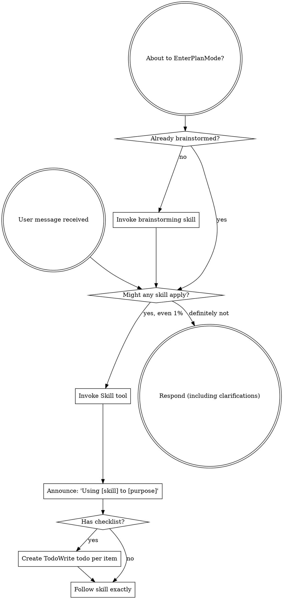
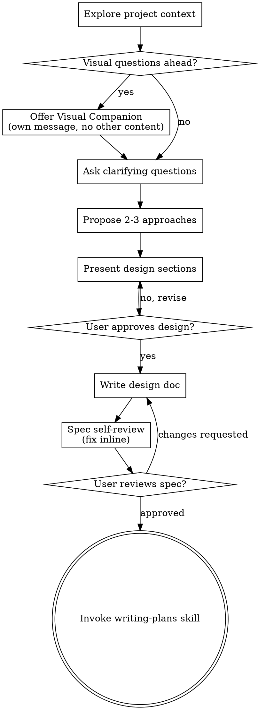
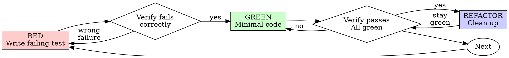
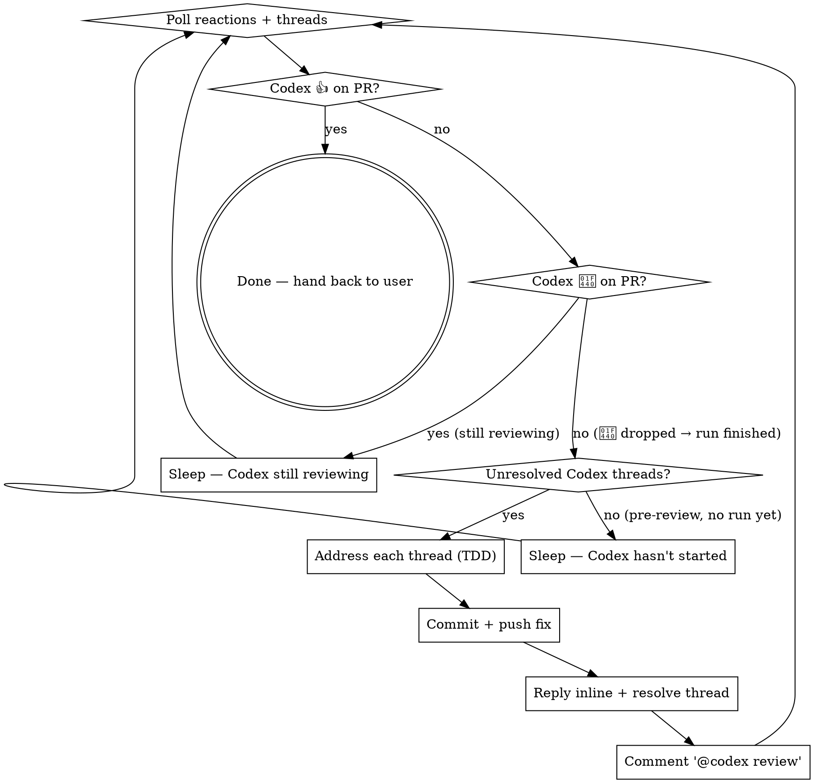

> SYSTEM

# AGENTS.md instructions for /Users/ericson/.t3/worktrees/ars-ui/t3code-d7f511fb

<INSTRUCTIONS>
# ars-ui

## Project Overview

Rust frontend component library using state machines, framework-agnostic core with Leptos/Dioxus adapters.

## Current Phase

The repo is now in active implementation, not spec drafting only.

Agents working on implementation should use the GitHub Project roadmap and issue backlog as the execution source of truth:

- Use the GitHub Project `ars-ui implementation roadmap` to understand active epics, task breakdown, dependencies, status, and iteration planning.
- Prefer picking a single issue-backed task that is unblocked, sized, and scoped for independent delivery.
- Do not start work from an epic issue unless the user explicitly asks for planning or further decomposition.
- Do not start a task that is blocked by unresolved GitHub issue dependencies.
- Treat native GitHub issue dependencies as the blocker graph and the issue body acceptance criteria as the delivery contract.

## Development Workflow

For implementation tasks:

1. Read the assigned or selected GitHub issue first.
2. Move the issue to **In Progress** on the GitHub Project board.
3. Review the cited spec sections and any dependency issues.
4. Add or update the named tests first.
5. Implement only the scope required to make those tests pass.
6. If implementation changes the intended contract, update the relevant spec in the same task.
7. **MANDATORY:** Invoke the `post-implementation-audit` skill (`.agents/skills/post-implementation-audit/SKILL.md`). It runs three sequential audits on the new code — (a) spec/implementation drift with "best outcome" recommendations, (b) iterative "anything else missing?" passes (minimum two rounds), (c) test-coverage audit across every test type the workspace uses (unit, snapshot, proptest, mutation, doc, spec-conformance, llvm-cov). **Every finding lands in _this_ PR — no deferral, no follow-up issues.** This step exists because initial implementations consistently ship spec drift and silent contract violations that take 3+ review round-trips to surface; the audit collapses them into one. Skipping this step is a contract violation.
8. Present the final result for user review before any commit.
9. After user approval, run `cargo xci --profile fast` (alias: `cargo xci-fast`) locally and fix any failures before pushing anything to GitHub. The fast profile takes ~5 minutes and covers the workspace-level regressions a pre-push gate should catch: fmt, check, clippy, unit, integration, adapter, spec-compile-snippets, error-variant-coverage, mutual-exclusion, snapshot-count. Reserve full `cargo xci` (~25 minutes, all 20 gates including wasm coverage and the feature-matrix groups) for after substantial refactors that may have shifted feature-flag interactions. For small follow-up changes, run the focused tests and checks that cover the edited code instead.
10. After `cargo xci-fast` passes, commit and push a PR targeting `main`. The PR body MUST include an auto-close keyword for the issue being delivered, for example `Closes #20` or `Fixes #20`, so GitHub closes the issue automatically when the PR merges.
11. **If the PR creates or modifies any `.snap` insta fixtures, attach the `snapshot-reviewed` label after opening or updating it** (`gh pr edit <num> --add-label "snapshot-reviewed"`). This signals to reviewers that the snapshot output was inspected and is intentional. Re-apply the label whenever you push a commit that touches `.snap` files; the workflow assumes the label reflects the latest snapshot state.
12. **MANDATORY:** Invoke the `waiting-for-codex-review` skill (`.agents/skills/waiting-for-codex-review/SKILL.md`) immediately after the first push that creates the PR, and re-invoke it after every subsequent push to the PR branch. The skill posts the initial `@codex review` trigger, polls Codex's 👀 → (👍 \| ∅ + threads) reaction lifecycle, addresses any review threads with the same rigor as `post-implementation-audit` (TDD + no coverage regression), replies inline, resolves threads, and re-comments `@codex review` to start the next pass — looping until Codex leaves 👍. Skipping this step leaves Codex findings unaddressed and silently widens the gap between merged code and the spec; the merge gate is 👍 from Codex plus green CI, not green CI alone.
13. Only after CI passes, Codex has left 👍, and the PR is merged, close the issue.

Never close a GitHub issue without a merged PR that passes CI **and a 👍 from Codex**. Never commit or push without explicit user approval. Keep the issue, PR, and Project board status aligned with the actual work state at every step.

Default delivery rules:

- Follow TDD: tests first, implementation second, verification last.
- Keep task scope aligned with the issue. If the issue is too large or ambiguous, stop and split or clarify rather than freelancing a bigger change.
- Prefer tasks sized `1`, `2`, `3`, or `5` points. `8` is exceptional. `13` must be decomposed before implementation.
- Preserve the crate and dependency layering defined by the architecture and implementation plan.
- Do not add a new dependency crate without explicit user approval first. If a task appears to need a new crate, stop, explain why, and get approval before editing any `Cargo.toml`.
- When a task is complete, verify the exact tests and checks named by the issue before considering it done.
- For adapter-level component implementation, follow `docs/implementation/adapter-component-delivery.md`. Adapter component work must cover the adapter crate, adapter tests, E2E fixtures/harnesses when applicable, widgets examples, spec synchronization, and the required validation/audit loop in one PR.

### Code Quality Standards

- **Document all public items.** Every public struct, enum, trait, function, constant, type alias, method, field, and variant must have a `///` doc comment. Every `lib.rs` must have a `//!` crate-level doc comment. The workspace enforces `missing_docs` linting — undocumented public items are build failures.
- **Zero warnings policy.** All code must compile with zero warnings under the workspace's configured clippy and rustc lints. Fix the root cause instead of suppressing. When suppression is genuinely needed, use `#[expect(lint, reason = "...")]` — never `#[allow(...)]`.
- **Derive documentation from the spec.** Doc comments should describe the _purpose and semantics_ of the item as defined in the corresponding `spec/` files, not just restate the type signature.
- **Use `#[inline]` selectively, not mechanically.** Do **not** add Clippy's `missing_inline_in_public_items` lint at the workspace level, and do not treat public visibility alone as a reason to mark an item `#[inline]`. Use `#[inline]` for thin cross-crate wrappers, trivial accessors, and hot-path no-op shims where the call overhead is plausibly meaningful. Avoid blanket `#[inline]` on all public APIs — it increases code size, adds compile-time cost, and turns `#[inline]` into noise instead of a deliberate performance signal.
- **Use directory-backed modules with `mod.rs` when a module owns children.** This repo standardizes on the older filesystem layout for nested modules. If module `foo` has child modules, the parent must live at `foo/mod.rs`, not `foo.rs`. Do not mix `foo.rs` with a sibling `foo/` directory. When a refactor adds child modules under an existing flat file, move the parent into `foo/mod.rs` in the same change. Do not leave empty leftover module directories behind.

### API Design Standards

- **Design for the pit of success.** Public APIs should make the most natural, shortest path also be the path that is correct, accessible, localizable, type-safe, and performant. Prefer ergonomic constructors and defaults that preserve the spec's strongest guarantees instead of making users opt into correctness after choosing a convenient API.
- **Name escape hatches explicitly.** When a component needs a lower-level, static, non-i18n, or otherwise less complete path, keep it available but make the tradeoff visible in the API name or type. The blessed path should remain the simplest call site, while escape hatches should read as deliberate choices.
- **Keep semantic data separate from rendered views.** Rich framework views are useful for customization, but components still need semantic sources for accessible names, localized text, announcements, ids, and state-machine wiring. Do not rely on arbitrary rendered view trees as the only source of user-facing semantics.

### Code Coverage

The workspace uses `cargo-llvm-cov` for code coverage with per-crate threshold enforcement. CI runs coverage on every PR (see `.github/workflows/ci.yml`).

**Local coverage commands:**

```bash
# Per-crate coverage with inline annotated source (most useful during development)
cargo llvm-cov test -p ars-interactions --text -- hover

# Per-crate summary only
cargo llvm-cov test -p ars-interactions -- hover

# Native-only workspace coverage (host target; excludes wasm-only crates)
cargo llvm-cov --workspace \
  --exclude ars-leptos --exclude ars-dioxus \
  --exclude ars-test-harness-leptos --exclude ars-test-harness-dioxus \
  --exclude ars-derive --exclude xtask \
  --lcov --output-path lcov.info

# Check all crates against spec-defined thresholds (run after a *merged* lcov)
cargo xtask coverage check-all --file lcov.info
```

The `--text` flag produces line-by-line annotated source showing hit counts and `^0` markers on uncovered branches — use this to identify gaps after writing tests. Uncovered no-op callback closures in tests (e.g., `|_| {}`) are expected and not a gap.

The local recipe above excludes the adapter and adapter-test-harness crates because their `target_arch = "wasm32"` / `feature = "web"` code paths can't be measured via host-target `cargo llvm-cov`. **CI runs an additional wasm-coverage pipeline on nightly** (`cargo xtask ci coverage`) that uses `wasm-bindgen-test`'s experimental coverage recipe with LLVM 22 / `clang-22` to emit lcov for `ars-leptos` (csr), `ars-dioxus` (web), `ars-dom` (web), `ars-i18n` (web-intl), and the adapter test harnesses, then merges with the native lcov via `cargo xtask coverage merge`. The per-crate thresholds in `xtask::coverage::default_thresholds()` are enforced against the merged file — including adapter targets (`ars-leptos` 74/55, `ars-dioxus` 77/70, `ars-test-harness-leptos` 60/0, `ars-test-harness-dioxus` 60/0). `ars-derive` (proc-macro, runs in compiler) is exercised via `crates/ars-core/tests/derive_contract.rs` and is unmeasured. `xtask` has its own enforced threshold (30/35) and is measured. See `spec/testing/14-ci.md` §2 for the full pipeline.

### Mutation Testing

Coverage tells you which lines run. **Mutation testing tells you whether the tests would notice if those lines silently misbehaved.** The workspace uses [`cargo-mutants`](https://mutants.rs) for this — a `cargo` extension binary, not a workspace dependency.

**Install (once per developer machine):**

```bash
cargo install cargo-mutants --locked --version 27.0.0
```

**Local commands (state-machine modules are the most rewarding targets):**

```bash
# Run on a single component machine (~6 min for popover)
cargo mutants -p ars-components -f crates/ars-components/src/overlay/popover/mod.rs

# Just list what would be mutated, without running tests (fast)
cargo mutants -p ars-components -f crates/ars-components/src/overlay/popover/mod.rs --list

# Whole crate (slow — only if you really mean it)
cargo mutants -p ars-components
```

**Agnostic component implementation gate:** whenever an agent implements a new framework-agnostic component, or materially changes an existing one, the delivery must include:

- a targeted mutation run for the component source file, usually `cargo mutants -p ars-components -f crates/ars-components/src/<category>/<component>/mod.rs` (adjust the path for single-file modules);
- spec-conformance tests for the component's anatomy/public contract, including its `Part` enum and required API/attribute surface;
- same-task triage of every `MISSED` mutant: add tests for real gaps, or add a justified line-agnostic `.cargo/mutants.toml` exclude only for true equivalent mutations.

**Reading the output:** Results land in `mutants.out/mutants.out/` (gitignored). The two files that matter:

- `caught.txt` — mutations that broke at least one test ✅
- `missed.txt` — mutations that survived all tests ❌ — each one is either a real test gap to fill or an "equivalent mutation" that needs a `[[skip]]` entry in `mutants.toml` with a justification

**CI integration:** Nightly only. `.github/workflows/nightly.yml` has a `mutation-testing` job with a 21-entry matrix that runs `cargo mutants -p <package>` on every framework-agnostic crate, using `--shard k/n` to spread larger crates across parallel runners. **Shard indices are 0-based** (`k` runs from `0` to `n-1`); `k == n` is invalid and will fail the job. When adding shards, always start at `0/n` and end at `(n-1)/n`.

- **`ars-components` (≈ 1,630 mutants today, planned to grow as the spec adds the remaining ~97 components):** sharded **12-way** → ≈ 135 mutants per runner today, ≈ 850 per runner at the ~10,000-mutant endpoint. Sized for the full spec catalog up front so we don't re-shard every few months as components land.
- **`ars-collections` (≈ 1,080 mutants):** sharded 4-way → ≈ 270 mutants per runner.
- **`ars-core` (≈ 700 mutants):** sharded 2-way → ≈ 350 mutants per runner.
- **`ars-a11y`, `ars-forms`, `ars-interactions`:** one runner each (under 600 mutants apiece).

**Adding a new state machine inside an existing crate requires no CI changes** — its mutations land in whichever shard the cargo-mutants partitioner places them. The shard counts are sized so the slowest runner stays well under 30 minutes today and under ~50 minutes at the planned endpoint; re-balance only when a crate outgrows that budget (visible on the nightly dashboard as one shard pulling away from the others).

All matrix jobs run with `fail-fast: false` so failures on one module don't mask data on another. Each job uploads its `mutants.out/` as a workflow artifact (always, even on success — surviving "missed" entries on a passing run still reveal test-quality work). The job fails if any mutation survives, so a missed mutation forces a deliberate triage decision (fix the test, or document the equivalence with a `[[skip]]` entry in `mutants.toml`).

**Excluded crates** (mutation testing's signal degrades wherever determinism does): adapter glue (`ars-leptos`, `ars-dioxus`), DOM/FFI (`ars-dom`), ICU/FFI (`ars-i18n`), test infrastructure (`ars-test-harness*`), and the proc-macro crate (`ars-derive`, runs in the compiler). Adding a brand-new crate that is a good mutation target requires one new matrix entry; run a local scout first (`cargo mutants -p <crate> --list` to size, then a real run) so we know the right shard count before the nightly fires.

**Bumping the pinned version.** Both the local install command above and `.github/workflows/nightly.yml` pin cargo-mutants to an exact version (currently `27.0.0`) — same convention as `wasm-pack` in the `a11y-audit` job. Pinning is deliberate: cargo-mutants ships new mutators in releases, and an unpinned install would silently change the mutation set without any code change, surfacing as phantom CI failures on a green-source repo. To bump, open a PR that (1) updates the version string in CLAUDE.md and `nightly.yml`, (2) runs the popover scout locally with the new version (`cargo mutants -p ars-components -f crates/ars-components/src/overlay/popover/mod.rs`) to confirm the mutation count is in the same ballpark, and (3) triages any new "missed" entries the new mutators surface — they are usually genuine test-quality gaps newly visible to the tool.

### Property Testing (proptest)

State-machine invariants are exercised by [`proptest`](https://docs.rs/proptest) under `crates/<crate>/tests/proptest_state_machines/` (see `ars-components`). Default proptest behaviour drops `*.proptest-regressions` seed files alongside test sources — instead, every `proptest!` block in this workspace pulls a shared `Config` from `tests/proptest_state_machines/common.rs` that:

1. Reads `PROPTEST_CASES` from the environment (1,000 default; 10,000 in the nightly `extended-proptest` job).
2. Sets `failure_persistence` to `FileFailurePersistence::Direct("proptest-regressions/state-machines.txt")`, so all persisted seeds for the test binary live in one file at the crate root: `crates/<crate>/proptest-regressions/state-machines.txt`. The directory is committed (per proptest's own recommendation in the file header) so every developer's runs benefit from previously-shrunk failures.

When a new crate adopts proptest for state-machine tests, copy the same `common.rs` helper and reference it via `#![proptest_config(super::common::proptest_config())]` inside every `proptest!` block. Don't let proptest fall back to its `WithSource` default — that scatters seed files across the source tree.

### Adapter Prelude Convention

Both `ars-leptos` and `ars-dioxus` expose a `prelude` module targeting **end users** — application developers who consume the ready-made components. `use ars_leptos::prelude::*` (or `use ars_dioxus::prelude::*`) should give them everything they need.

The prelude contains only user-facing items:

1. **Component modules** — as components land, their public module paths (e.g., `button`, `dialog`) are re-exported so users can write `button::Props`, etc.
2. **User-facing traits** — traits end users call on component outputs (e.g., `Translate` from `ars-i18n`). Re-export the trait so consumers don't need a direct dependency on the subsystem crate.
3. **Configuration types** — types that appear in component props or configure behaviour (e.g., `Locale`, `Direction`, `Orientation`, `Selection`).

The prelude does **not** include implementation details consumed only by component authors inside the adapter crate: core engine types (`Machine`, `Service`, `ConnectApi`, `AttrMap`), accessibility primitives (`AriaRole`, `AriaAttribute`), interaction helpers (`merge_attrs`), or adapter hooks (`use_machine`, `UseMachineReturn`). Those remain accessible via their normal crate paths for advanced users building custom machines.

Both adapter preludes must stay symmetric: same items, same structure. When adding a new re-export to one adapter's prelude, add it to the other as well in the same PR.

### Adapter Testing Convention

Adapter-level component tests should default to the framework-specific test harness crate:

- Leptos adapter tests should prefer `ars-test-harness-leptos`.
- Dioxus adapter tests should prefer `ars-test-harness-dioxus`.
- Shared `ars-test-harness` helpers should be used where relevant for viewport, layout, clipboard, drag/drop, timing, and other DOM test setup instead of bespoke per-test browser scaffolding.

When a component spec requires interaction, focus, overlay positioning, clipboard, file upload, drag/drop, or similar browser behavior, the task's tests should exercise that behavior through the adapter harness entrypoints and shared core harness helpers unless there is a concrete technical reason not to.

## Spec Synchronization During Implementation

The specification is the authoritative contract. It took weeks of deliberate design and MUST be followed.

### Spec-first implementation rule

Before implementing any public type, trait, function, or method:

1. **Read the spec section first.** Find the relevant code example in `spec/`. Use `spec-tool toc <file>` and `grep` to locate it.
2. **Match the spec exactly.** If the spec defines `struct ComponentIds { base: String }` with methods `from_id()`, `id()`, `part()`, `item()`, `item_part()` — implement exactly that. Do not invent alternative field names, method names, or signatures.
3. **Cross-check after implementation.** Before presenting code for review, diff every public item against the spec's code examples. Every struct field, every method name, every parameter must match.
4. **If you must deviate**, there must be a concrete technical reason (e.g., the spec's API cannot compile, or a dependency doesn't expose the needed type). Document the reason in a code comment and flag it to the user explicitly.

Inventing alternative APIs that "seem equivalent" is never acceptable — it silently invalidates the spec's design decisions and all downstream code that depends on those APIs.

### Spec/code mismatch resolution

- If code and spec disagree, resolve the mismatch in the same task or PR.
- Shared conceptual changes belong in shared or foundation spec files, not only in adapter code.
- Adapter-specific findings must be reflected back into `spec/foundation/08-adapter-leptos.md` and/or `spec/foundation/09-adapter-dioxus.md` when relevant.
- Do not leave spec drift behind as follow-up cleanup.

## Spec Structure

The specification lives in `spec/` with this layout:

- `spec/manifest.toml` — **START HERE** — central index of all components and their dependencies
- `spec/foundation/` — architecture, accessibility, i18n, interactions, forms, adapters, spec template (00-10)
- `spec/shared/` — cross-component shared types (date-time, selection, layout, z-index)
- `spec/components/{category}/` — one file per component, organized by category
- `spec/testing/` — test specs split by domain

### Component Categories

- `input/` — checkbox, text-field, slider, number-input, etc.
- `selection/` — select, combobox, listbox, menu, tags-input, etc.
- `overlay/` — dialog, popover, tooltip, toast, presence, etc.
- `navigation/` — accordion, tabs, tree-view, pagination, steps, etc.
- `date-time/` — date-field, time-field, calendar, date-picker, etc.
- `data-display/` — table, avatar, progress, meter, badge, etc.
- `layout/` — splitter, scroll-area, carousel, portal, toolbar, etc.
- `specialized/` — color-picker, file-upload, signature-pad, qr-code, etc.
- `utility/` — button, toggle, focus-scope, visually-hidden, separator, etc.

## Working with the Spec

When reading large files, run `wc -l` first to check the line count. If the file is over 2,000
lines, use the `offset` and `limit` parameters on the Read tool to read in chunks rather than
attempting to read the entire file at once.

### Using xtask spec (preferred)

Use `cargo xtask spec` to resolve file sets instead of manually parsing manifest.toml:

```bash
# Quick metadata lookup:
cargo xtask spec info <component>

# Find all components using a shared type:
cargo xtask spec reverse <shared-type>

# See a file's heading structure (with line numbers):
cargo xtask spec toc <file>

# Validate frontmatter matches manifest.toml:
cargo xtask spec validate

# Search spec content by keyword/regex (with optional filters):
cargo xtask spec search <query> [--category <cat>] [--section <sec>] [--tier <tier>]

# Get a compact component summary (states, events, props, accessibility):
cargo xtask spec digest <component>

# Get full implementation context (component + all deps concatenated):
cargo xtask spec context <component> [--framework <fw>] [--include-testing]
```

The xtask also runs as an MCP server (`cargo xtask mcp`) exposing all spec tools for LLM agents.

### Reading a component (manual fallback)

1. Read `spec/manifest.toml` to find the component's path and dependencies
2. Read the component file (has YAML frontmatter listing its foundation/shared deps)
3. Only load the foundation files listed in `foundation_deps` — not all of them

### Framework and library specs — MANDATORY skill loading

When reading or editing these specification files, you MUST load the corresponding skill BEFORE doing any work. The skills contain verified, version-accurate API documentation that the spec code examples depend on. Claude's training data is wrong for these libraries — do not trust it.

| Spec file                                    | Skill to load | Library version |
| -------------------------------------------- | ------------- | --------------- |
| `spec/foundation/04-internationalization.md` | `icu4x`       | ICU4X 2.1.1     |
| `spec/foundation/08-adapter-leptos.md`       | `leptos`      | Leptos 0.8.17   |
| `spec/foundation/09-adapter-dioxus.md`       | `dioxus`      | Dioxus 0.7.3    |

This applies to any task that touches adapter code: reviewing, writing, modifying, or answering questions about these files. Load the skill first, then proceed.

### Spec Conventions

- **No deprecation:** This is a greenfield spec. If an API is unused or redundant, remove it and fix all references. Never use `#[deprecated]` or deprecation shims.
- **No deferral:** Never mark spec content as "TODO", "FIXME", "future enhancement", "P1/P2 extension", or any similar deferral language. Every feature mentioned must be fully specified. If a design choice is unclear, ask the user rather than deferring.
- **No guessing external APIs:** NEVER guess function names or module paths for external crates. Always verify against `https://docs.rs/<crate_name>` before writing code that calls library APIs. This applies especially to Leptos, Dioxus, ICU4X, and any crate where training data may be stale. If you cannot verify, state that explicitly rather than fabricating a plausible-looking API.

### Component file format

Each component file has YAML frontmatter declaring its metadata:

```markdown
---
component: ComponentName
category: { category }
tier: stateless | stateful | complex
foundation_deps: [architecture, accessibility, ...]
shared_deps: [date-time-types, ...]
related: [sibling-component, ...]
---

# ComponentName
```

The `tier` field determines which sections are required — see `spec/foundation/10-component-spec-template.md` for the canonical section structure, ordering rules, and conformance checklist. Headings are numbered (e.g., `## 1. State Machine`, `### 1.1 States`, `#### 1.1.1 InnerStates`, etc.) for precise section references.

</INSTRUCTIONS>
<environment_context>
  <cwd>/Users/ericson/.t3/worktrees/ars-ui/t3code-d7f511fb</cwd>
  <shell>zsh</shell>
  <current_date>2026-05-25</current_date>
  <timezone>America/Sao_Paulo</timezone>
</environment_context>

> DEVELOPER

Implement feature #244

> AGENT

I’ll stay in planning mode for this turn and ground the plan in the live issue and repo state first. I’m loading the required workflow skills, then I’ll inspect issue #244 and the relevant component/spec/test areas before asking for any choices.

> TOOL

tool_use exec_command
id: call_x0i2lyxgzKulontkwvZ183JC
```json
{
  "cmd": "sed -n '1,220p' /Users/ericson/.claude/skills/using-superpowers/SKILL.md",
  "workdir": "/Users/ericson/.t3/worktrees/ars-ui/t3code-d7f511fb",
  "yield_time_ms": 1000,
  "max_output_tokens": 12000
}
```

> TOOL

tool_use exec_command
id: call_abxNfB0Oq1sWBCT8ejaHkwic
```json
{
  "cmd": "sed -n '1,220p' /Users/ericson/.claude/skills/brainstorming/SKILL.md",
  "workdir": "/Users/ericson/.t3/worktrees/ars-ui/t3code-d7f511fb",
  "yield_time_ms": 1000,
  "max_output_tokens": 12000
}
```

> TOOL

tool_use exec_command
id: call_ZL6vtSD0ugFWuFaHg2OcuJxl
```json
{
  "cmd": "rg -n \"#244|issue #244|244|Meter|meter\" /Users/ericson/.codex/memories/MEMORY.md",
  "workdir": "/Users/ericson/.t3/worktrees/ars-ui/t3code-d7f511fb",
  "yield_time_ms": 1000,
  "max_output_tokens": 12000
}
```

> TOOL

tool_result
id: call_x0i2lyxgzKulontkwvZ183JC
```
Chunk ID: 11c1b8
Wall time: 0.3884 seconds
Process exited with code 0
Original token count: 1356
Output:
---
name: using-superpowers
description: Use when starting any conversation - establishes how to find and use skills, requiring Skill tool invocation before ANY response including clarifying questions
---

<SUBAGENT-STOP>
If you were dispatched as a subagent to execute a specific task, skip this skill.
</SUBAGENT-STOP>

<EXTREMELY-IMPORTANT>
If you think there is even a 1% chance a skill might apply to what you are doing, you ABSOLUTELY MUST invoke the skill.

IF A SKILL APPLIES TO YOUR TASK, YOU DO NOT HAVE A CHOICE. YOU MUST USE IT.

This is not negotiable. This is not optional. You cannot rationalize your way out of this.
</EXTREMELY-IMPORTANT>

## Instruction Priority

Superpowers skills override default system prompt behavior, but **user instructions always take precedence**:

1. **User's explicit instructions** (CLAUDE.md, GEMINI.md, AGENTS.md, direct requests) — highest priority
2. **Superpowers skills** — override default system behavior where they conflict
3. **Default system prompt** — lowest priority

If CLAUDE.md, GEMINI.md, or AGENTS.md says "don't use TDD" and a skill says "always use TDD," follow the user's instructions. The user is in control.

## How to Access Skills

**In Claude Code:** Use the `Skill` tool. When you invoke a skill, its content is loaded and presented to you—follow it directly. Never use the Read tool on skill files.

**In Copilot CLI:** Use the `skill` tool. Skills are auto-discovered from installed plugins. The `skill` tool works the same as Claude Code's `Skill` tool.

**In Gemini CLI:** Skills activate via the `activate_skill` tool. Gemini loads skill metadata at session start and activates the full content on demand.

**In other environments:** Check your platform's documentation for how skills are loaded.

## Platform Adaptation

Skills use Claude Code tool names. Non-CC platforms: see `references/copilot-tools.md` (Copilot CLI), `references/codex-tools.md` (Codex) for tool equivalents. Gemini CLI users get the tool mapping loaded automatically via GEMINI.md.

# Using Skills

## The Rule

**Invoke relevant or requested skills BEFORE any response or action.** Even a 1% chance a skill might apply means that you should invoke the skill to check. If an invoked skill turns out to be wrong for the situation, you don't need to use it.



## Red Flags

These thoughts mean STOP—you're rationalizing:

| Thought | Reality |
|---------|---------|
| "This is just a simple question" | Questions are tasks. Check for skills. |
| "I need more context first" | Skill check comes BEFORE clarifying questions. |
| "Let me explore the codebase first" | Skills tell you HOW to explore. Check first. |
| "I can check git/files quickly" | Files lack conversation context. Check for skills. |
| "Let me gather information first" | Skills tell you HOW to gather information. |
| "This doesn't need a formal skill" | If a skill exists, use it. |
| "I remember this skill" | Skills evolve. Read current version. |
| "This doesn't count as a task" | Action = task. Check for skills. |
| "The skill is overkill" | Simple things become complex. Use it. |
| "I'll just do this one thing first" | Check BEFORE doing anything. |
| "This feels productive" | Undisciplined action wastes time. Skills prevent this. |
| "I know what that means" | Knowing the concept ≠ using the skill. Invoke it. |

## Skill Priority

When multiple skills could apply, use this order:

1. **Process skills first** (brainstorming, debugging) - these determine HOW to approach the task
2. **Implementation skills second** (frontend-design, mcp-builder) - these guide execution

"Let's build X" → brainstorming first, then implementation skills.
"Fix this bug" → debugging first, then domain-specific skills.

## Skill Types

**Rigid** (TDD, debugging): Follow exactly. Don't adapt away discipline.

**Flexible** (patterns): Adapt principles to context.

The skill itself tells you which.

## User Instructions

Instructions say WHAT, not HOW. "Add X" or "Fix Y" doesn't mean skip workflows.

```

> TOOL

tool_result
id: call_abxNfB0Oq1sWBCT8ejaHkwic
```
Chunk ID: 9df53c
Wall time: 0.0360 seconds
Process exited with code 0
Original token count: 2659
Output:
---
name: brainstorming
description: "You MUST use this before any creative work - creating features, building components, adding functionality, or modifying behavior. Explores user intent, requirements and design before implementation."
---

# Brainstorming Ideas Into Designs

Help turn ideas into fully formed designs and specs through natural collaborative dialogue.

Start by understanding the current project context, then ask questions one at a time to refine the idea. Once you understand what you're building, present the design and get user approval.

<HARD-GATE>
Do NOT invoke any implementation skill, write any code, scaffold any project, or take any implementation action until you have presented a design and the user has approved it. This applies to EVERY project regardless of perceived simplicity.
</HARD-GATE>

## Anti-Pattern: "This Is Too Simple To Need A Design"

Every project goes through this process. A todo list, a single-function utility, a config change — all of them. "Simple" projects are where unexamined assumptions cause the most wasted work. The design can be short (a few sentences for truly simple projects), but you MUST present it and get approval.

## Checklist

You MUST create a task for each of these items and complete them in order:

1. **Explore project context** — check files, docs, recent commits
2. **Offer visual companion** (if topic will involve visual questions) — this is its own message, not combined with a clarifying question. See the Visual Companion section below.
3. **Ask clarifying questions** — one at a time, understand purpose/constraints/success criteria
4. **Propose 2-3 approaches** — with trade-offs and your recommendation
5. **Present design** — in sections scaled to their complexity, get user approval after each section
6. **Write design doc** — save to `docs/superpowers/specs/YYYY-MM-DD-<topic>-design.md` and commit
7. **Spec self-review** — quick inline check for placeholders, contradictions, ambiguity, scope (see below)
8. **User reviews written spec** — ask user to review the spec file before proceeding
9. **Transition to implementation** — invoke writing-plans skill to create implementation plan

## Process Flow



**The terminal state is invoking writing-plans.** Do NOT invoke frontend-design, mcp-builder, or any other implementation skill. The ONLY skill you invoke after brainstorming is writing-plans.

## The Process

**Understanding the idea:**

- Check out the current project state first (files, docs, recent commits)
- Before asking detailed questions, assess scope: if the request describes multiple independent subsystems (e.g., "build a platform with chat, file storage, billing, and analytics"), flag this immediately. Don't spend questions refining details of a project that needs to be decomposed first.
- If the project is too large for a single spec, help the user decompose into sub-projects: what are the independent pieces, how do they relate, what order should they be built? Then brainstorm the first sub-project through the normal design flow. Each sub-project gets its own spec → plan → implementation cycle.
- For appropriately-scoped projects, ask questions one at a time to refine the idea
- Prefer multiple choice questions when possible, but open-ended is fine too
- Only one question per message - if a topic needs more exploration, break it into multiple questions
- Focus on understanding: purpose, constraints, success criteria

**Exploring approaches:**

- Propose 2-3 different approaches with trade-offs
- Present options conversationally with your recommendation and reasoning
- Lead with your recommended option and explain why

**Presenting the design:**

- Once you believe you understand what you're building, present the design
- Scale each section to its complexity: a few sentences if straightforward, up to 200-300 words if nuanced
- Ask after each section whether it looks right so far
- Cover: architecture, components, data flow, error handling, testing
- Be ready to go back and clarify if something doesn't make sense

**Design for isolation and clarity:**

- Break the system into smaller units that each have one clear purpose, communicate through well-defined interfaces, and can be understood and tested independently
- For each unit, you should be able to answer: what does it do, how do you use it, and what does it depend on?
- Can someone understand what a unit does without reading its internals? Can you change the internals without breaking consumers? If not, the boundaries need work.
- Smaller, well-bounded units are also easier for you to work with - you reason better about code you can hold in context at once, and your edits are more reliable when files are focused. When a file grows large, that's often a signal that it's doing too much.

**Working in existing codebases:**

- Explore the current structure before proposing changes. Follow existing patterns.
- Where existing code has problems that affect the work (e.g., a file that's grown too large, unclear boundaries, tangled responsibilities), include targeted improvements as part of the design - the way a good developer improves code they're working in.
- Don't propose unrelated refactoring. Stay focused on what serves the current goal.

## After the Design

**Documentation:**

- Write the validated design (spec) to `docs/superpowers/specs/YYYY-MM-DD-<topic>-design.md`
  - (User preferences for spec location override this default)
- Use elements-of-style:writing-clearly-and-concisely skill if available
- Commit the design document to git

**Spec Self-Review:**
After writing the spec document, look at it with fresh eyes:

1. **Placeholder scan:** Any "TBD", "TODO", incomplete sections, or vague requirements? Fix them.
2. **Internal consistency:** Do any sections contradict each other? Does the architecture match the feature descriptions?
3. **Scope check:** Is this focused enough for a single implementation plan, or does it need decomposition?
4. **Ambiguity check:** Could any requirement be interpreted two different ways? If so, pick one and make it explicit.

Fix any issues inline. No need to re-review — just fix and move on.

**User Review Gate:**
After the spec review loop passes, ask the user to review the written spec before proceeding:

> "Spec written and committed to `<path>`. Please review it and let me know if you want to make any changes before we start writing out the implementation plan."

Wait for the user's response. If they request changes, make them and re-run the spec review loop. Only proceed once the user approves.

**Implementation:**

- Invoke the writing-plans skill to create a detailed implementation plan
- Do NOT invoke any other skill. writing-plans is the next step.

## Key Principles

- **One question at a time** - Don't overwhelm with multiple questions
- **Multiple choice preferred** - Easier to answer than open-ended when possible
- **YAGNI ruthlessly** - Remove unnecessary features from all designs
- **Explore alternatives** - Always propose 2-3 approaches before settling
- **Incremental validation** - Present design, get approval before moving on
- **Be flexible** - Go back and clarify when something doesn't make sense

## Visual Companion

A browser-based companion for showing mockups, diagrams, and visual options during brainstorming. Available as a tool — not a mode. Accepting the companion means it's available for questions that benefit from visual treatment; it does NOT mean every question goes through the browser.

**Offering the companion:** When you anticipate that upcoming questions will involve visual content (mockups, layouts, diagrams), offer it once for consent:
> "Some of what we're working on might be easier to explain if I can show it to you in a web browser. I can put together mockups, diagrams, comparisons, and other visuals as we go. This feature is still new and can be token-intensive. Want to try it? (Requires opening a local URL)"

**This offer MUST be its own message.** Do not combine it with clarifying questions, context summaries, or any other content. The message should contain ONLY the offer above and nothing else. Wait for the user's response before continuing. If they decline, proceed with text-only brainstorming.

**Per-question decision:** Even after the user accepts, decide FOR EACH QUESTION whether to use the browser or the terminal. The test: **would the user understand this better by seeing it than reading it?**

- **Use the browser** for content that IS visual — mockups, wireframes, layout comparisons, architecture diagrams, side-by-side visual designs
- **Use the terminal** for content that is text — requirements questions, conceptual choices, tradeoff lists, A/B/C/D text options, scope decisions

A question about a UI topic is not automatically a visual question. "What does personality mean in this context?" is a conceptual question — use the terminal. "Which wizard layout works better?" is a visual question — use the browser.

If they agree to the companion, read the detailed guide before proceeding:
`skills/brainstorming/visual-companion.md`

```

> TOOL

tool_result
id: call_ZL6vtSD0ugFWuFaHg2OcuJxl
```
Chunk ID: 012a11
Wall time: 0.2136 seconds
Process exited with code 0
Original token count: 108
Output:
842:- rollout_summaries/2026-05-14T02-26-20-6508-coverage_ratchet_local_gate_and_codecov_auto_ratchet.md (cwd=/Users/ericson/Workspace/Rust/judge-fudge, rollout_path=/Users/ericson/.codex/sessions/2026/05/13/rollout-2026-05-13T23-26-20-019e244e-6f87-7933-9eda-90845829032c.jsonl, updated_at=2026-05-14T02:53:50+00:00, thread_id=019e244e-6f87-7933-9eda-90845829032c, build implementation plus exact threshold-definition pointers)

```

> AGENT

Using `using-superpowers` for the session workflow and `brainstorming` because this is feature work. The brainstorming skill asks for a design gate before implementation; since this session is already in Plan Mode, I’ll adapt that into a decision-complete implementation plan without changing files.

> TOOL

tool_use _fetch_issue
id: call_jBbcpYcJSWJwTr3E5fasoCDk
```json
{
  "repository_full_name": "fogodev/ars-ui",
  "issue_number": 244
}
```

> TOOL

tool_use exec_command
id: call_zafiHtbqcuuTA7WQnvqmeyS0
```json
{
  "cmd": "git status --short && git branch --show-current",
  "workdir": "/Users/ericson/.t3/worktrees/ars-ui/t3code-d7f511fb",
  "yield_time_ms": 1000,
  "max_output_tokens": 12000
}
```

> TOOL

tool_use exec_command
id: call_65Hus9Wh4pzrVvXL5mSCBsWA
```json
{
  "cmd": "rg --files -g 'AGENTS.md' -g 'CLAUDE.md' -g '.agents/skills/*/SKILL.md' -g 'spec/**' -g 'crates/**' -g 'Cargo.toml' | sed -n '1,200p'",
  "workdir": "/Users/ericson/.t3/worktrees/ars-ui/t3code-d7f511fb",
  "yield_time_ms": 1000,
  "max_output_tokens": 12000
}
```

> TOOL

tool_result
id: call_jBbcpYcJSWJwTr3E5fasoCDk
```
Wall time: 1.1546 seconds
Output:
{"issue":{"url":"https://github.com/fogodev/ars-ui/issues/244","title":"task: Implement Slider agnostic core","issue_number":244,"body":"**Epic: #220 (Agnostic input components)**\n\n## Goal\nComplex slider with Idle/Focused/Dragging states, pointer+keyboard thumb control, min/max/step, form integration.\n\n## Out of scope\nFramework-specific adapter components (Leptos/Dioxus) and direct DOM geometry queries.\n\n## Spec refs\n`spec/components/input/slider.md`\n\n## Depends on\nNone\n\n## Layer\nComponent\n\n## Framework\nNone\n\n## Test tier\nUnit\n\n## Fibonacci points\n5\n\n## Element/ref handling note\n\n- Core owns value math, keyboard stepping, drag state, percent/thumb position calculations from supplied geometry, and ARIA/form attrs.\n- Core must not call `getBoundingClientRect`, inspect live track/thumb nodes, or require DOM IDs for measurement.\n- Adapters own track/thumb handles (`NodeRef`, `MountedData`, or host handles), read geometry after mount, normalize pointer coordinates, and pass logical pointer/rect data into machine events/helpers.\n- IDs remain valid for ARIA/form/test attrs, but not as the mechanism for measuring track/thumb geometry.\n\n## Tests to add first\n- State machine transitions through Idle/Focused/Dragging.\n- ConnectApi produces `role=\"slider\"`, `aria-valuemin/max/now/text`.\n- Keyboard step increments.\n- Pointer drag updates value from injected pointer/track geometry.\n- Thumb position computed as percentage.\n- Disabled state.\n- Form hidden input.\n\n## Acceptance criteria\n- All public types documented per workspace `missing_docs` lint.\n- State machine matches spec §1 exactly.\n- ConnectApi produces correct ARIA attributes per spec §2.\n- Measurement-dependent behavior accepts adapter-supplied geometry and does not perform DOM/ID lookup in the agnostic crate.\n- Snapshot tests cover the component's `connect()` / `Api` `AttrMap` output for every anatomy part and each output-affecting state, prop, or context branch, with committed `.snap` fixtures passing `cargo insta test --unreferenced=reject`.\n- All named tests pass with zero warnings.\n\n## Spec impact\nUpdate spec examples if they imply agnostic `getBoundingClientRect()` usage. Geometry reads belong in adapter specs.\n\n## Board update rule\nIf blocked, keep `Status` in `Todo`, use native GitHub issue dependencies, and name the dependency or spec ambiguity.\n","state":"open","user":{"login":"fogodev","name":"fogodev","email":null,"avatar_url":"https://avatars.githubusercontent.com/u/11011091?v=4","id":11011091},"assignees":null,"labels":[{"name":"task","color":"0E8A16","description":"Agent-ready implementation task"}],"milestone":null,"state_reason":null,"comments":0,"created_at":"2026-04-10T23:25:37Z","updated_at":"2026-04-29T04:32:41Z","closed_at":null,"display_url":"https://github.com/fogodev/ars-ui/issues/244","display_title":"task: Implement Slider agnostic core"},"url":"https://github.com/fogodev/ars-ui/issues/244","title":"task: Implement Slider agnostic core","display_url":"https://github.com/fogodev/ars-ui/issues/244","display_title":"task: Implement Slider agnostic core"}
```

> TOOL

tool_result
id: call_zafiHtbqcuuTA7WQnvqmeyS0
```
Chunk ID: c653b7
Wall time: 0.3318 seconds
Process exited with code 0
Original token count: 4
Output:
t3code/d7f511fb

```

> TOOL

tool_result
id: call_65Hus9Wh4pzrVvXL5mSCBsWA
```
Chunk ID: d1ae89
Wall time: 0.0744 seconds
Process exited with code 0
Original token count: 2016
Output:
AGENTS.md
xtask/Cargo.toml
Cargo.toml
crates/ars-interactions/src/press.rs
crates/ars-interactions/src/interact_outside.rs
crates/ars-interactions/src/hover.rs
crates/ars-interactions/src/focus.rs
crates/ars-interactions/src/keyboard.rs
crates/ars-interactions/src/move_interaction.rs
crates/ars-interactions/src/compose.rs
crates/ars-interactions/src/long_press.rs
crates/ars-interactions/src/lib.rs
crates/ars-interactions/src/direction.rs
crates/ars-interactions/src/drag_drop.rs
crates/ars-interactions/src/companion_css.rs
crates/ars-interactions/ars-interactions.css
crates/ars-interactions/Cargo.toml
crates/ars-i18n/src/locale.rs
crates/ars-i18n/src/case.rs
crates/ars-i18n/src/plural.rs
crates/ars-i18n/src/text.rs
crates/ars-i18n/src/locale_stack.rs
crates/ars-i18n/src/bidi.rs
crates/ars-i18n/src/date.rs
crates/ars-i18n/src/detect.rs
spec/AGENTS.md
spec/manifest.toml
examples/Cargo.toml
spec/leptos-components/utility/error-boundary.md
spec/leptos-components/utility/visually-hidden.md
spec/leptos-components/utility/z-index-allocator.md
spec/leptos-components/utility/live-region.md
spec/leptos-components/utility/swap.md
spec/leptos-components/utility/download-trigger.md
spec/leptos-components/utility/toggle-group.md
spec/leptos-components/utility/as-child.md
spec/leptos-components/utility/focus-scope.md
spec/leptos-components/utility/landmark.md
spec/leptos-components/utility/separator.md
spec/leptos-components/utility/toggle.md
spec/leptos-components/utility/field.md
spec/leptos-components/utility/toggle-button.md
spec/leptos-components/utility/action-group.md
spec/leptos-components/utility/dismissable.md
spec/leptos-components/utility/highlight.md
spec/leptos-components/utility/drop-zone.md
spec/leptos-components/utility/fieldset.md
spec/leptos-components/utility/_category.md
spec/leptos-components/utility/keyboard.md
spec/leptos-components/utility/focus-ring.md
spec/leptos-components/utility/ars-provider.md
spec/leptos-components/utility/button.md
spec/leptos-components/utility/form.md
spec/leptos-components/utility/heading.md
spec/leptos-components/utility/client-only.md
spec/leptos-components/utility/group.md
examples/widgets-leptos-tailwind/Cargo.toml
spec/foundation/09-adapter-dioxus.md
spec/foundation/11-dom-utilities.md
spec/foundation/12-adapter-component-spec-template.md
spec/foundation/06-collections.md
spec/foundation/01-architecture.md
spec/foundation/10-component-spec-template.md
spec/foundation/04-internationalization.md
spec/foundation/02-component-catalog.md
spec/foundation/03-accessibility.md
spec/foundation/05-interactions.md
spec/foundation/08-adapter-leptos.md
spec/foundation/07-forms.md
spec/foundation/00-overview.md
spec/leptos-components/overlay/alert-dialog.md
spec/leptos-components/overlay/presence.md
spec/leptos-components/overlay/tooltip.md
spec/leptos-components/overlay/floating-panel.md
spec/leptos-components/overlay/dialog.md
spec/leptos-components/overlay/drawer.md
spec/leptos-components/overlay/tour.md
spec/leptos-components/overlay/popover.md
spec/leptos-components/overlay/_category.md
spec/leptos-components/overlay/toast.md
spec/leptos-components/overlay/hover-card.md
crates/ars-i18n/tests/translate_derive.rs
spec/testing/15-test-harness.md
spec/testing/01-unit-tests.md
spec/testing/07-ssr-hydration.md
spec/testing/03-snapshot-tests.md
spec/testing/05-adapter-harness.md
spec/testing/06-accessibility-testing.md
spec/testing/11-form-validation.md
spec/testing/09-state-machine-correctness.md
spec/testing/02-integration-tests.md
spec/testing/12-advanced.md
spec/testing/14-ci.md
spec/testing/04-aria-helpers.md
spec/testing/13-policies.md
spec/testing/10-keyboard-focus.md
spec/testing/08-i18n-testing.md
spec/testing/00-overview.md
spec/shared/date-time-types.md
spec/shared/z-index-stacking.md
spec/shared/selection-patterns.md
spec/shared/layout-shared-types.md
crates/ars-i18n/src/number/mod.rs
crates/ars-i18n/src/number/web_intl.rs
crates/ars-i18n/src/translate.rs
spec/references/react-aria-api.md
spec/references/ark-ui-api.md
spec/references/radix-ui-api.md
spec/dioxus-components/navigation/tree-view.md
spec/dioxus-components/navigation/link.md
spec/dioxus-components/navigation/steps.md
spec/dioxus-components/navigation/tabs.md
spec/dioxus-components/navigation/pagination.md
spec/dioxus-components/navigation/_category.md
spec/dioxus-components/navigation/breadcrumbs.md
spec/dioxus-components/navigation/navigation-menu.md
spec/dioxus-components/navigation/accordion.md
spec/dioxus-components/utility/error-boundary.md
spec/dioxus-components/utility/visually-hidden.md
spec/dioxus-components/utility/z-index-allocator.md
spec/dioxus-components/utility/live-region.md
spec/dioxus-components/utility/swap.md
spec/dioxus-components/utility/download-trigger.md
spec/dioxus-components/utility/toggle-group.md
spec/dioxus-components/utility/as-child.md
spec/dioxus-components/utility/focus-scope.md
spec/dioxus-components/utility/landmark.md
spec/dioxus-components/utility/separator.md
spec/dioxus-components/utility/toggle.md
spec/dioxus-components/utility/field.md
spec/dioxus-components/utility/toggle-button.md
spec/dioxus-components/utility/action-group.md
spec/dioxus-components/utility/dismissable.md
spec/dioxus-components/utility/highlight.md
spec/dioxus-components/utility/drop-zone.md
spec/dioxus-components/utility/fieldset.md
spec/dioxus-components/utility/_category.md
spec/dioxus-components/utility/keyboard.md
spec/dioxus-components/utility/focus-ring.md
spec/dioxus-components/utility/ars-provider.md
spec/dioxus-components/utility/button.md
spec/dioxus-components/utility/form.md
spec/dioxus-components/utility/heading.md
spec/dioxus-components/utility/client-only.md
spec/dioxus-components/utility/group.md
spec/leptos-components/selection/segment-group.md
spec/leptos-components/selection/combobox.md
spec/leptos-components/selection/tags-input.md
spec/leptos-components/selection/context-menu.md
spec/leptos-components/selection/autocomplete.md
spec/leptos-components/selection/select.md
spec/leptos-components/selection/_category.md
spec/leptos-components/selection/listbox.md
spec/leptos-components/selection/menu.md
spec/leptos-components/selection/menu-bar.md
spec/dioxus-components/date-time/date-range-field.md
spec/dioxus-components/date-time/date-field.md
spec/dioxus-components/date-time/date-picker.md
spec/dioxus-components/date-time/time-field.md
spec/dioxus-components/date-time/date-time-picker.md
spec/dioxus-components/date-time/_category.md
spec/dioxus-components/date-time/date-range-picker.md
spec/dioxus-components/date-time/calendar.md
spec/dioxus-components/date-time/range-calendar.md
crates/ars-i18n/tests/unit/calendar.rs
crates/ars-i18n/tests/unit/provider_web_intl.rs
crates/ars-i18n/tests/unit/provider_stub.rs
crates/ars-i18n/tests/unit/calendar_wasm.rs
crates/ars-i18n/tests/unit/number_web_intl.rs
crates/ars-i18n/tests/unit/provider_icu4x.rs
crates/ars-dom/src/outside_interaction.rs
crates/ars-dom/src/platform.rs
crates/ars-dom/src/modality.rs
crates/ars-dom/src/debug.rs
crates/ars-dom/src/scroll_lock.rs
crates/ars-dom/src/focus.rs
crates/ars-dom/src/media.rs
spec/dioxus-components/input/search-input.md
spec/dioxus-components/input/switch.md
spec/dioxus-components/input/number-input.md
spec/dioxus-components/input/textarea.md
spec/dioxus-components/input/editable.md
spec/dioxus-components/input/password-input.md
spec/dioxus-components/input/text-field.md
spec/dioxus-components/input/pin-input.md
spec/dioxus-components/input/_category.md
spec/dioxus-components/input/checkbox.md
spec/dioxus-components/input/range-slider.md
spec/dioxus-components/input/file-trigger.md
spec/dioxus-components/input/checkbox-group.md
spec/dioxus-components/input/slider.md
spec/dioxus-components/input/radio-group.md
crates/ars-i18n/src/provider/mod.rs
crates/ars-i18n/src/provider/stub.rs
crates/ars-i18n/src/provider/web_intl.rs
crates/ars-i18n/src/provider/icu4x.rs
crates/ars-i18n/src/provider/factory.rs
crates/ars-i18n/src/lib.rs
crates/ars-i18n/src/relative_time.rs
spec/dioxus-components/layout/splitter.md

```

> AGENT

Issue #244 is a 5-point agnostic `Slider` core task with no dependencies. I’m checking the spec and nearby agnostic component implementations now so the plan can name exact files, APIs, tests, and validation commands.

> TOOL

tool_use exec_command
id: call_z4Y3vSoILz7uYHjqGp5T5XR8
```json
{
  "cmd": "cargo xtask spec info slider",
  "workdir": "/Users/ericson/.t3/worktrees/ars-ui/t3code-d7f511fb",
  "yield_time_ms": 1000,
  "max_output_tokens": 12000
}
```

> TOOL

tool_use exec_command
id: call_43tm26mnYsNqTg5oXmiQCCNV
```json
{
  "cmd": "wc -l spec/components/input/slider.md spec/foundation/01-architecture.md spec/foundation/03-accessibility.md spec/foundation/07-forms.md spec/testing/01-unit-tests.md spec/testing/03-snapshot-tests.md",
  "workdir": "/Users/ericson/.t3/worktrees/ars-ui/t3code-d7f511fb",
  "yield_time_ms": 1000,
  "max_output_tokens": 12000
}
```

> TOOL

tool_use exec_command
id: call_FwieLqa0vVKnsFVAJmE30q0m
```json
{
  "cmd": "find .agents/skills -maxdepth 2 -name SKILL.md -print | sort",
  "workdir": "/Users/ericson/.t3/worktrees/ars-ui/t3code-d7f511fb",
  "yield_time_ms": 1000,
  "max_output_tokens": 12000
}
```

> TOOL

tool_use exec_command
id: call_EDIqUvyKsTrXMnHbl3qmdhRB
```json
{
  "cmd": "rg --files crates/ars-components/src crates/ars-components/tests | rg '(slider|checkbox|switch|toggle|progress|meter|number|input)'",
  "workdir": "/Users/ericson/.t3/worktrees/ars-ui/t3code-d7f511fb",
  "yield_time_ms": 1000,
  "max_output_tokens": 12000
}
```

> TOOL

tool_result
id: call_z4Y3vSoILz7uYHjqGp5T5XR8
```
Chunk ID: 47c4f7
Wall time: 1.0018 seconds
Process running with session ID 4117
Original token count: 31
Output:
    Finished `dev` profile [unoptimized + debuginfo] target(s) in 0.19s
     Running `target/debug/xtask spec info slider`

```

> TOOL

tool_result
id: call_43tm26mnYsNqTg5oXmiQCCNV
```
Chunk ID: a44baf
Wall time: 0.3556 seconds
Process exited with code 0
Original token count: 66
Output:
    1115 spec/components/input/slider.md
    5309 spec/foundation/01-architecture.md
    4338 spec/foundation/03-accessibility.md
    4457 spec/foundation/07-forms.md
     763 spec/testing/01-unit-tests.md
     325 spec/testing/03-snapshot-tests.md
   16307 total

```

> TOOL

tool_result
id: call_FwieLqa0vVKnsFVAJmE30q0m
```
Chunk ID: c4fb8a
Wall time: 0.0476 seconds
Process exited with code 0
Original token count: 58
Output:
.agents/skills/dioxus/SKILL.md
.agents/skills/icu4x/SKILL.md
.agents/skills/leptos/SKILL.md
.agents/skills/playwright-cli/SKILL.md
.agents/skills/post-implementation-audit/SKILL.md
.agents/skills/waiting-for-codex-review/SKILL.md

```

> TOOL

tool_result
id: call_EDIqUvyKsTrXMnHbl3qmdhRB
```
Chunk ID: 6062c8
Wall time: 0.0700 seconds
Process exited with code 0
Original token count: 6001
Output:
crates/ars-components/tests/spec_conformance/utility/toggle_group.rs
crates/ars-components/tests/spec_conformance/utility/toggle.rs
crates/ars-components/tests/spec_conformance/utility/toggle_button.rs
crates/ars-components/tests/spec_conformance/input.rs
crates/ars-components/src/utility/toggle_group/mod.rs
crates/ars-components/src/utility/toggle_button/mod.rs
crates/ars-components/src/utility/field/snapshots/ars_components__utility__field__tests__field_input_default.snap
crates/ars-components/src/utility/field/snapshots/ars_components__utility__field__tests__field_input_disabled_readonly_validating.snap
crates/ars-components/src/utility/field/snapshots/ars_components__utility__field__tests__field_input_invalid_no_errors.snap
crates/ars-components/src/utility/field/snapshots/ars_components__utility__field__tests__field_input_required.snap
crates/ars-components/src/utility/field/snapshots/ars_components__utility__field__tests__field_input_invalid_with_description_and_error.snap
crates/ars-components/src/utility/toggle_button/snapshots/ars_components__utility__toggle_button__tests__toggle_button_root_with_value.snap
crates/ars-components/src/utility/toggle_button/snapshots/ars_components__utility__toggle_button__tests__toggle_button_root_disabled.snap
crates/ars-components/src/utility/toggle_button/snapshots/ars_components__utility__toggle_button__tests__toggle_button_hidden_input_config_default_on.snap
crates/ars-components/src/utility/toggle_button/snapshots/ars_components__utility__toggle_button__tests__toggle_button_root_focused_keyboard.snap
crates/ars-components/src/utility/toggle_button/snapshots/ars_components__utility__toggle_button__tests__toggle_button_root_pressed_interaction.snap
crates/ars-components/src/utility/toggle_button/snapshots/ars_components__utility__toggle_button__tests__toggle_button_root_invalid_required.snap
crates/ars-components/src/utility/toggle_button/snapshots/ars_components__utility__toggle_button__tests__toggle_button_hidden_input_config_explicit.snap
crates/ars-components/src/utility/toggle_button/snapshots/ars_components__utility__toggle_button__tests__toggle_button_root_toggled_on.snap
crates/ars-components/src/utility/toggle_button/snapshots/ars_components__utility__toggle_button__tests__toggle_button_root_idle_unpressed.snap
crates/ars-components/src/utility/toggle_group/snapshots/ars_components__utility__toggle_group__tests__toggle_group_item_single_unselected.snap
crates/ars-components/src/utility/toggle_group/snapshots/ars_components__utility__toggle_group__tests__toggle_group_root_none_disabled_invalid_required_readonly.snap
crates/ars-components/src/utility/toggle_group/snapshots/ars_components__utility__toggle_group__tests__toggle_group_item_single_selected.snap
crates/ars-components/src/utility/toggle_group/snapshots/ars_components__utility__toggle_group__tests__toggle_group_indicator_selected.snap
crates/ars-components/src/utility/toggle_group/snapshots/ars_components__utility__toggle_group__tests__toggle_group_root_idle.snap
crates/ars-components/src/utility/toggle_group/snapshots/ars_components__utility__toggle_group__tests__toggle_group_item_multiple_disabled_selected.snap
crates/ars-components/src/utility/toggle_group/snapshots/ars_components__utility__toggle_group__tests__toggle_group_hidden_input_config_multiple.snap
crates/ars-components/src/utility/toggle_group/snapshots/ars_components__utility__toggle_group__tests__toggle_group_item_focused_keyboard.snap
crates/ars-components/tests/proptest_state_machines/utility/toggle_group.rs
crates/ars-components/tests/proptest_state_machines/utility/toggle.rs
crates/ars-components/tests/proptest_state_machines/utility/toggle_button.rs
crates/ars-components/src/utility/toggle/mod.rs
crates/ars-components/src/utility/toggle/snapshots/ars_components__utility__toggle__tests__toggle_indicator_on.snap
crates/ars-components/src/utility/toggle/snapshots/ars_components__utility__toggle__tests__toggle_root_disabled_focus_visible.snap
crates/ars-components/src/utility/toggle/snapshots/ars_components__utility__toggle__tests__toggle_root_off.snap
crates/ars-components/src/utility/toggle/snapshots/ars_components__utility__toggle__tests__toggle_root_on.snap
crates/ars-components/src/utility/toggle/snapshots/ars_components__utility__toggle__tests__toggle_indicator_off.snap
crates/ars-components/tests/proptest_state_machines/input.rs
crates/ars-components/src/overlay/tour/snapshots/ars_components__overlay__tour__tests__tour_progress.snap
crates/ars-components/src/input/password_input/mod.rs
crates/ars-components/src/input/text_field/mod.rs
crates/ars-components/src/data_display/table/snapshots/ars_components__data_display__table__tests__table_row_checkbox_selected.snap
crates/ars-components/src/data_display/table/snapshots/ars_components__data_display__table__tests__table_row_checkbox_unselected.snap
crates/ars-components/src/date_time/date_field/snapshots/ars_components__date_time__date_field__tests__hidden_input_empty.snap
crates/ars-components/src/date_time/date_field/snapshots/ars_components__date_time__date_field__tests__hidden_input_filled.snap
crates/ars-components/src/input/mod.rs
crates/ars-components/src/selection/select/snapshots/ars_components__selection__select__tests__select_hidden_input.snap
crates/ars-components/src/input/text_field/snapshots/ars_components__input__text_field__tests__text_field_root_focused_keyboard.snap
crates/ars-components/src/input/text_field/snapshots/ars_components__input__text_field__tests__text_field_input_described_invalid.snap
crates/ars-components/src/input/password_input/snapshots/ars_components__input__password_input__tests__password_input_description_snapshot.snap
crates/ars-components/src/input/password_input/snapshots/ars_components__input__password_input__tests__password_input_toggle_visible_snapshot.snap
crates/ars-components/src/input/password_input/snapshots/ars_components__input__password_input__tests__password_input_error_message_snapshot.snap
crates/ars-components/src/input/password_input/snapshots/ars_components__input__password_input__tests__password_input_input_masked_snapshot.snap
crates/ars-components/src/input/password_input/snapshots/ars_components__input__password_input__tests__password_input_root_disabled_invalid_readonly_snapshot.snap
crates/ars-components/src/input/password_input/snapshots/ars_components__input__password_input__tests__password_input_root_masked_snapshot.snap
crates/ars-components/src/input/password_input/snapshots/ars_components__input__password_input__tests__password_input_input_with_metadata_snapshot.snap
crates/ars-components/src/input/password_input/snapshots/ars_components__input__password_input__tests__password_input_input_visible_snapshot.snap
crates/ars-components/src/input/password_input/snapshots/ars_components__input__password_input__tests__password_input_root_visible_snapshot.snap
crates/ars-components/src/input/password_input/snapshots/ars_components__input__password_input__tests__password_input_toggle_masked_snapshot.snap
crates/ars-components/src/selection/combobox/snapshots/ars_components__selection__combobox__tests__combobox_input_mode_startswith.snap
crates/ars-components/src/selection/combobox/snapshots/ars_components__selection__combobox__tests__combobox_input_mode_contains.snap
crates/ars-components/src/selection/combobox/snapshots/ars_components__selection__combobox__tests__combobox_input_mode_inline.snap
crates/ars-components/src/input/text_field/snapshots/ars_components__input__text_field__tests__text_field_start_decorator.snap
crates/ars-components/src/input/text_field/snapshots/ars_components__input__text_field__tests__text_field_label.snap
crates/ars-components/src/input/text_field/snapshots/ars_components__input__text_field__tests__text_field_end_decorator.snap
crates/ars-components/src/input/text_field/snapshots/ars_components__input__text_field__tests__text_field_clear_trigger_disabled.snap
crates/ars-components/src/input/text_field/snapshots/ars_components__input__text_field__tests__text_field_description.snap
crates/ars-components/src/input/text_field/snapshots/ars_components__input__text_field__tests__text_field_input_default.snap
crates/ars-components/src/input/text_field/snapshots/ars_components__input__text_field__tests__text_field_root_disabled_readonly_invalid.snap
crates/ars-components/src/input/text_field/snapshots/ars_components__input__text_field__tests__text_field_clear_trigger_default.snap
crates/ars-components/src/input/text_field/snapshots/ars_components__input__text_field__tests__text_field_error_message.snap
crates/ars-components/src/input/text_field/snapshots/ars_components__input__text_field__tests__text_field_root_idle.snap
crates/ars-components/src/input/text_field/snapshots/ars_components__input__text_field__tests__text_field_input_search_rtl.snap
crates/ars-components/src/input/text_field/snapshots/ars_components__input__text_field__tests__text_field_input_form_constraints.snap
crates/ars-components/src/selection/combobox/snapshots/ars_components__selection__combobox__tests__combobox_hidden_input.snap
crates/ars-components/src/selection/combobox/snapshots/ars_components__selection__combobox__tests__combobox_input_closed_disabled.snap
crates/ars-components/src/selection/combobox/snapshots/ars_components__selection__combobox__tests__combobox_input_open.snap
crates/ars-components/src/selection/combobox/snapshots/ars_components__selection__combobox__tests__combobox_input_mode_custom.snap
crates/ars-components/src/selection/combobox/snapshots/ars_components__selection__combobox__tests__combobox_input_mode_none.snap
crates/ars-components/src/selection/combobox/snapshots/ars_components__selection__combobox__tests__combobox_input_mode_inlinecompletion.snap
crates/ars-components/src/input/number_input/mod.rs
crates/ars-components/src/input/checkbox/mod.rs
crates/ars-components/src/input/checkbox_group/mod.rs
crates/ars-components/src/input/search_input/mod.rs
crates/ars-components/src/input/textarea/mod.rs
crates/ars-components/src/input/pin_input/mod.rs
crates/ars-components/src/input/number_input/snapshots/ars_components__input__number_input__tests__number_input_root_focused_snapshot.snap
crates/ars-components/src/input/number_input/snapshots/ars_components__input__number_input__tests__number_input_increment_trigger_at_max_snapshot.snap
crates/ars-components/src/input/number_input/snapshots/ars_components__input__number_input__tests__number_input_root_idle_snapshot.snap
crates/ars-components/src/input/number_input/snapshots/ars_components__input__number_input__tests__number_input_root_scrubbing_snapshot.snap
crates/ars-components/src/input/number_input/snapshots/ars_components__input__number_input__tests__number_input_increment_trigger_default_snapshot.snap
crates/ars-components/src/input/number_input/snapshots/ars_components__input__number_input__tests__number_input_input_default_snapshot.snap
crates/ars-components/src/input/number_input/snapshots/ars_components__input__number_input__tests__number_input_input_invalid_required_with_form_snapshot.snap
crates/ars-components/src/input/number_input/snapshots/ars_components__input__number_input__tests__number_input_decrement_trigger_at_min_snapshot.snap
crates/ars-components/src/input/number_input/snapshots/ars_components__input__number_input__tests__number_input_input_at_max_snapshot.snap
crates/ars-components/src/input/checkbox_group/snapshots/ars_components__input__checkbox_group__tests__checkbox_group_label.snap
crates/ars-components/src/input/switch/mod.rs
crates/ars-components/src/input/checkbox_group/snapshots/ars_components__input__checkbox_group__tests__checkbox_group_error_message.snap
crates/ars-components/src/input/checkbox_group/snapshots/ars_components__input__checkbox_group__tests__checkbox_group_hidden_input_configs_absent_without_name.snap
crates/ars-components/src/input/checkbox_group/snapshots/ars_components__input__checkbox_group__tests__checkbox_group_root_idle.snap
crates/ars-components/src/input/checkbox_group/snapshots/ars_components__input__checkbox_group__tests__checkbox_group_hidden_input_configs.snap
crates/ars-components/src/input/checkbox_group/snapshots/ars_components__input__checkbox_group__tests__checkbox_group_description.snap
crates/ars-components/src/input/checkbox_group/snapshots/ars_components__input__checkbox_group__tests__checkbox_group_root_invalid_description_error.snap
crates/ars-components/src/input/checkbox/snapshots/ars_components__input__checkbox__tests__checkbox_control_unchecked.snap
crates/ars-components/src/input/checkbox/snapshots/ars_components__input__checkbox__tests__checkbox_control_disabled_readonly_invalid.snap
crates/ars-components/src/input/checkbox/snapshots/ars_components__input__checkbox__tests__checkbox_root_disabled_invalid_readonly_focus_visible.snap
crates/ars-components/src/input/checkbox/snapshots/ars_components__input__checkbox__tests__checkbox_root_indeterminate.snap
crates/ars-components/src/input/checkbox/snapshots/ars_components__input__checkbox__tests__checkbox_control_checked.snap
crates/ars-components/src/input/checkbox/snapshots/ars_components__input__checkbox__tests__checkbox_label_default.snap
crates/ars-components/src/input/checkbox/snapshots/ars_components__input__checkbox__tests__checkbox_control_error_only.snap
crates/ars-components/src/input/checkbox/snapshots/ars_components__input__checkbox__tests__checkbox_control_description_and_error.snap
crates/ars-components/src/input/checkbox/snapshots/ars_components__input__checkbox__tests__checkbox_hidden_input_disabled_required.snap
crates/ars-components/src/input/checkbox/snapshots/ars_components__input__checkbox__tests__checkbox_control_description_only.snap
crates/ars-components/src/input/checkbox/snapshots/ars_components__input__checkbox__tests__checkbox_hidden_input_unchecked.snap
crates/ars-components/src/input/checkbox/snapshots/ars_components__input__checkbox__tests__checkbox_root_checked.snap
crates/ars-components/src/input/checkbox/snapshots/ars_components__input__checkbox__tests__checkbox_control_indeterminate.snap
crates/ars-components/src/input/checkbox/snapshots/ars_components__input__checkbox__tests__checkbox_hidden_input_indeterminate.snap
crates/ars-components/src/input/checkbox/snapshots/ars_components__input__checkbox__tests__checkbox_description_default.snap
crates/ars-components/src/input/checkbox/snapshots/ars_components__input__checkbox__tests__checkbox_control_required.snap
crates/ars-components/src/input/checkbox/snapshots/ars_components__input__checkbox__tests__checkbox_root_unchecked.snap
crates/ars-components/src/input/checkbox/snapshots/ars_components__input__checkbox__tests__checkbox_indicator_default.snap
crates/ars-components/src/input/checkbox/snapshots/ars_components__input__checkbox__tests__checkbox_hidden_input_checked.snap
crates/ars-components/src/input/checkbox/snapshots/ars_components__input__checkbox__tests__checkbox_error_message_default.snap
crates/ars-components/src/input/radio_group/mod.rs
crates/ars-components/src/selection/menu/snapshots/ars_components__selection__menu__tests__menu_checkbox_unchecked.snap
crates/ars-components/src/selection/menu/snapshots/ars_components__selection__menu__tests__menu_checkbox_disabled.snap
crates/ars-components/src/selection/menu/snapshots/ars_components__selection__menu__tests__menu_checkbox_checked.snap
crates/ars-components/src/input/search_input/snapshots/ars_components__input__search_input__tests__search_input_error_message_snapshot.snap
crates/ars-components/src/input/search_input/snapshots/ars_components__input__search_input__tests__search_input_root_idle_snapshot.snap
crates/ars-components/src/input/search_input/snapshots/ars_components__input__search_input__tests__search_input_root_searching_snapshot.snap
crates/ars-components/src/input/search_input/snapshots/ars_components__input__search_input__tests__search_input_input_with_metadata_snapshot.snap
crates/ars-components/src/input/search_input/snapshots/ars_components__input__search_input__tests__search_input_input_default_snapshot.snap
crates/ars-components/src/input/search_input/snapshots/ars_components__input__search_input__tests__search_input_loading_indicator_snapshot.snap
crates/ars-components/src/input/search_input/snapshots/ars_components__input__search_input__tests__search_input_submit_trigger_snapshot.snap
crates/ars-components/src/input/search_input/snapshots/ars_components__input__search_input__tests__search_input_clear_trigger_hidden_snapshot.snap
crates/ars-components/src/input/search_input/snapshots/ars_components__input__search_input__tests__search_input_description_snapshot.snap
crates/ars-components/src/input/search_input/snapshots/ars_components__input__search_input__tests__search_input_clear_trigger_visible_snapshot.snap
crates/ars-components/src/input/search_input/snapshots/ars_components__input__search_input__tests__search_input_root_focused_snapshot.snap
crates/ars-components/src/input/textarea/snapshots/ars_components__input__textarea__tests__textarea_resize_none.snap
crates/ars-components/src/input/pin_input/snapshots/ars_components__input__pin_input__tests__pin_input_hidden_input_snapshot.snap
crates/ars-components/src/input/pin_input/snapshots/ars_components__input__pin_input__tests__pin_input_input_cell_unfocused_snapshot.snap
crates/ars-components/src/input/textarea/snapshots/ars_components__input__textarea__tests__textarea_error_message.snap
crates/ars-components/src/input/textarea/snapshots/ars_components__input__textarea__tests__textarea_resize_horizontal.snap
crates/ars-components/src/input/pin_input/snapshots/ars_components__input__pin_input__tests__pin_input_input_cell_with_placeholder_snapshot.snap
crates/ars-components/src/input/pin_input/snapshots/ars_components__input__pin_input__tests__pin_input_root_snapshot.snap
crates/ars-components/src/input/pin_input/snapshots/ars_components__input__pin_input__tests__pin_input_input_cell_focused_snapshot.snap
crates/ars-components/src/input/pin_input/snapshots/ars_components__input__pin_input__tests__pin_input_root_completed_snapshot.snap
crates/ars-components/src/input/pin_input/snapshots/ars_components__input__pin_input__tests__pin_input_input_cell_otp_snapshot.snap
crates/ars-components/src/input/pin_input/snapshots/ars_components__input__pin_input__tests__pin_input_root_disabled_snapshot.snap
crates/ars-components/src/input/pin_input/snapshots/ars_components__input__pin_input__tests__pin_input_input_cell_password_mode_snapshot.snap
crates/ars-components/src/input/switch/snapshots/ars_components__input__switch__tests__switch_control_off.snap
crates/ars-components/src/input/switch/snapshots/ars_components__input__switch__tests__switch_root_off.snap
crates/ars-components/src/input/switch/snapshots/ars_components__input__switch__tests__switch_label_default.snap
crates/ars-components/src/input/switch/snapshots/ars_components__input__switch__tests__switch_control_description_only.snap
crates/ars-components/src/input/switch/snapshots/ars_components__input__switch__tests__switch_description_default.snap
crates/ars-components/src/input/switch/snapshots/ars_components__input__switch__tests__switch_control_on.snap
crates/ars-components/src/input/switch/snapshots/ars_components__input__switch__tests__switch_error_message_default.snap
crates/ars-components/src/input/switch/snapshots/ars_components__input__switch__tests__switch_control_required.snap
crates/ars-components/src/input/switch/snapshots/ars_components__input__switch__tests__switch_thumb_off.snap
crates/ars-components/src/input/switch/snapshots/ars_components__input__switch__tests__switch_root_disabled_invalid_readonly_focus_visible.snap
crates/ars-components/src/input/switch/snapshots/ars_components__input__switch__tests__switch_root_rtl.snap
crates/ars-components/src/input/switch/snapshots/ars_components__input__switch__tests__switch_thumb_on.snap
crates/ars-components/src/input/switch/snapshots/ars_components__input__switch__tests__switch_control_description_and_error.snap
crates/ars-components/src/input/switch/snapshots/ars_components__input__switch__tests__switch_hidden_input_on.snap
crates/ars-components/src/input/switch/snapshots/ars_components__input__switch__tests__switch_hidden_input_off.snap
crates/ars-components/src/input/switch/snapshots/ars_components__input__switch__tests__switch_root_on.snap
crates/ars-components/src/input/textarea/snapshots/ars_components__input__textarea__tests__textarea_default.snap
crates/ars-components/src/input/textarea/snapshots/ars_components__input__textarea__tests__textarea_root_focused_keyboard.snap
crates/ars-components/src/input/textarea/snapshots/ars_components__input__textarea__tests__textarea_root_idle.snap
crates/ars-components/src/input/textarea/snapshots/ars_components__input__textarea__tests__textarea_character_count.snap
crates/ars-components/src/input/textarea/snapshots/ars_components__input__textarea__tests__textarea_resize_both.snap
crates/ars-components/src/input/textarea/snapshots/ars_components__input__textarea__tests__textarea_described_invalid.snap
crates/ars-components/src/input/switch/snapshots/ars_components__input__switch__tests__switch_control_disabled_readonly_invalid.snap
crates/ars-components/src/input/textarea/snapshots/ars_components__input__textarea__tests__textarea_root_disabled_readonly_invalid.snap
crates/ars-components/src/input/textarea/snapshots/ars_components__input__textarea__tests__textarea_description.snap
crates/ars-components/src/input/textarea/snapshots/ars_components__input__textarea__tests__textarea_resize_vertical.snap
crates/ars-components/src/input/textarea/snapshots/ars_components__input__textarea__tests__textarea_label.snap
crates/ars-components/src/input/textarea/snapshots/ars_components__input__textarea__tests__textarea_form_constraints.snap
crates/ars-components/src/input/radio_group/snapshots/ars_components__input__radio_group__tests__radio_group_root_invalid_description.snap
crates/ars-components/src/input/radio_group/snapshots/ars_components__input__radio_group__tests__radio_group_item_control_selected.snap
crates/ars-components/src/input/radio_group/snapshots/ars_components__input__radio_group__tests__radio_group_description.snap
crates/ars-components/src/input/radio_group/snapshots/ars_components__input__radio_group__tests__radio_group_item_hidden_input_disabled.snap
crates/ars-components/src/input/radio_group/snapshots/ars_components__input__radio_group__tests__radio_group_item_unselected.snap
crates/ars-components/src/input/radio_group/snapshots/ars_components__input__radio_group__tests__radio_group_root_idle.snap
crates/ars-components/src/input/switch/snapshots/ars_components__input__switch__tests__switch_control_focus_visible.snap
crates/ars-components/src/input/switch/snapshots/ars_components__input__switch__tests__switch_control_error_only.snap
crates/ars-components/src/input/switch/snapshots/ars_components__input__switch__tests__switch_hidden_input_disabled_required.snap
crates/ars-components/src/input/radio_group/snapshots/ars_components__input__radio_group__tests__radio_group_label.snap
crates/ars-components/src/input/radio_group/snapshots/ars_components__input__radio_group__tests__radio_group_item_control_disabled.snap
crates/ars-components/src/input/radio_group/snapshots/ars_components__input__radio_group__tests__radio_group_item_selected_focus_visible.snap
crates/ars-components/src/input/radio_group/snapshots/ars_components__input__radio_group__tests__radio_group_item_disabled.snap
crates/ars-components/src/input/radio_group/snapshots/ars_components__input__radio_group__tests__radio_group_item_hidden_input.snap
crates/ars-components/src/input/radio_group/snapshots/ars_components__input__radio_group__tests__radio_group_item_label.snap
crates/ars-components/src/input/radio_group/snapshots/ars_components__input__radio_group__tests__radio_group_error_message.snap
crates/ars-components/src/input/radio_group/snapshots/ars_components__input__radio_group__tests__radio_group_item_indicator.snap

```

> TOOL

tool_use write_stdin
id: call_7DrgKGZh1Ihom4ST77JwHTh6
```json
{
  "session_id": 4117,
  "chars": "",
  "yield_time_ms": 1000,
  "max_output_tokens": 12000
}
```

> TOOL

tool_result
id: call_7DrgKGZh1Ihom4ST77JwHTh6
```
Chunk ID: 9e4ba8
Wall time: 0.0000 seconds
Process exited with code 0
Original token count: 69
Output:
component: slider
path: components/input/slider.md
category: input
foundation_deps: [architecture, accessibility, interactions, forms]
shared_deps: []
related: [range-slider]
leptos_adapter: leptos-components/input/slider.md
dioxus_adapter: dioxus-components/input/slider.md

```

> TOOL

tool_use exec_command
id: call_kzHgVQvGAiF5n5onhrxKheqp
```json
{
  "cmd": "cargo xtask spec toc spec/components/input/slider.md",
  "workdir": "/Users/ericson/.t3/worktrees/ars-ui/t3code-d7f511fb",
  "yield_time_ms": 1000,
  "max_output_tokens": 16000
}
```

> TOOL

tool_use exec_command
id: call_fSmxUuHoMM5YcUeTTiGNzey9
```json
{
  "cmd": "sed -n '1,260p' crates/ars-components/src/input/mod.rs",
  "workdir": "/Users/ericson/.t3/worktrees/ars-ui/t3code-d7f511fb",
  "yield_time_ms": 1000,
  "max_output_tokens": 12000
}
```

> TOOL

tool_use exec_command
id: call_vofEskTIEQxCT0edghCyfTJE
```json
{
  "cmd": "sed -n '1,260p' crates/ars-components/src/input/number_input/mod.rs",
  "workdir": "/Users/ericson/.t3/worktrees/ars-ui/t3code-d7f511fb",
  "yield_time_ms": 1000,
  "max_output_tokens": 18000
}
```

> TOOL

tool_use exec_command
id: call_NGXHVmSQPJLu42kpQRMx70tk
```json
{
  "cmd": "sed -n '1,260p' crates/ars-components/src/input/switch/mod.rs",
  "workdir": "/Users/ericson/.t3/worktrees/ars-ui/t3code-d7f511fb",
  "yield_time_ms": 1000,
  "max_output_tokens": 18000
}
```

> TOOL

tool_result
id: call_kzHgVQvGAiF5n5onhrxKheqp
```
Chunk ID: 764cff
Wall time: 1.0016 seconds
Process running with session ID 57748
Original token count: 63
Output:
    Blocking waiting for file lock on package cache
    Blocking waiting for file lock on package cache
    Finished `dev` profile [unoptimized + debuginfo] target(s) in 0.24s
     Running `target/debug/xtask spec toc spec/components/input/slider.md`

```

> TOOL

tool_result
id: call_fSmxUuHoMM5YcUeTTiGNzey9
```
Chunk ID: adbcf6
Wall time: 0.1859 seconds
Process exited with code 0
Original token count: 121
Output:
//! Input component machines.

/// Checkbox machine.
pub mod checkbox;

/// CheckboxGroup machine.
pub mod checkbox_group;

/// PasswordInput machine.
pub mod password_input;

/// PinInput machine.
pub mod pin_input;

/// RadioGroup machine.
pub mod radio_group;

/// NumberInput machine.
pub mod number_input;

/// SearchInput machine.
pub mod search_input;

/// Switch machine.
pub mod switch;

/// Textarea machine.
pub mod textarea;

/// TextField machine.
pub mod text_field;

```

> TOOL

tool_result
id: call_vofEskTIEQxCT0edghCyfTJE
```
Chunk ID: 91ff96
Wall time: 0.2087 seconds
Process exited with code 0
Original token count: 1889
Output:
//! NumberInput component state machine and connect API.
//!
//! This module implements the framework-agnostic `NumberInput` machine defined
//! in `spec/components/input/number-input.md`. The native `<input>` is the form
//! participant and carries `role="spinbutton"` with `aria-valuenow/min/max`.
//! Numeric value rounding uses **round-half-up** (away from zero on a tie) as
//! defined in spec §1.5 to match user expectation in interactive UI rather than
//! banker's rounding.

use alloc::{
    string::{String, ToString},
    vec::Vec,
};
use core::fmt::{self, Debug, Display};

use ars_core::{
    AriaAttr, AttrMap, Bindable, ComponentIds, ComponentMessages, ComponentPart, ConnectApi, Env,
    HtmlAttr, KeyboardKey, Locale, MessageFn, NoEffect, TransitionPlan,
};
use ars_interactions::KeyboardEventData;

/// The states for the `NumberInput` component.
#[derive(Clone, Copy, Debug, PartialEq, Eq)]
pub enum State {
    /// The component is in an idle state.
    Idle,

    /// The component is focused (text-editing or keyboard stepping).
    Focused,

    /// The component is being scrubbed (pointer drag adjusts the value).
    Scrubbing,
}

impl Display for State {
    fn fmt(&self, f: &mut fmt::Formatter<'_>) -> fmt::Result {
        f.write_str(match self {
            Self::Idle => "idle",
            Self::Focused => "focused",
            Self::Scrubbing => "scrubbing",
        })
    }
}

/// The events for the `NumberInput` component.
#[derive(Clone, Debug, PartialEq)]
pub enum Event {
    /// The component received focus.
    Focus {
        /// Whether the focus was initiated by a keyboard.
        is_keyboard: bool,
    },

    /// The component lost focus.
    Blur,

    /// The component's value changed (raw text from the native input).
    Change(String),

    /// Step up by `Context::step`.
    Increment,

    /// Step down by `Context::step`.
    Decrement,

    /// Step up by `Context::large_step` (`PageUp`).
    IncrementLarge,

    /// Step down by `Context::large_step` (`PageDown`).
    DecrementLarge,

    /// Jump to `Context::max` (End).
    IncrementToMax,

    /// Jump to `Context::min` (Home).
    DecrementToMin,

    /// Programmatically set the numeric value (clamped + rounded).
    SetValue(f64),

    /// Begin a scrubbing gesture.
    StartScrub,

    /// Adjust the value during a scrubbing gesture. `delta` is a unit-less drag
    /// magnitude multiplied by `Context::step` when applied.
    Scrub(f64),

    /// End a scrubbing gesture.
    EndScrub,

    /// Mouse wheel input. Positive `delta` increments, negative decrements.
    Wheel {
        /// Signed delta — sign determines direction; magnitude is ignored.
        delta: f64,
    },

    /// IME composition started.
    CompositionStart,

    /// IME composition ended.
    CompositionEnd,

    /// Synchronize the externally controlled value prop.
    ///
    /// `Some` switches the component to controlled mode and pushes the new
    /// value; `None` returns the component to uncontrolled mode.
    SyncValue(Option<f64>),

    /// Synchronize output-affecting props (`min` / `max` / `step` /
    /// `large_step` / `precision` / `disabled` / `readonly` / `invalid` /
    /// `required` / `name` / `spin_on_press`) stored in [`Context`] when
    /// [`Service::set_props`] reports a change.
    SetProps,

    /// Track whether a [`Part::Description`] part is rendered (gates
    /// `aria-describedby`).
    SetHasDescription(bool),
}

/// The context for the `NumberInput` component.
#[derive(Clone, Debug, PartialEq)]
pub struct Context {
    /// The controlled/uncontrolled numeric value.
    pub value: Bindable<Option<f64>>,

    /// The minimum allowed value (inclusive).
    pub min: f64,

    /// The maximum allowed value (inclusive).
    pub max: f64,

    /// The step size used by `Increment`/`Decrement`.
    pub step: f64,

    /// The large step size used by `IncrementLarge`/`DecrementLarge`.
    pub large_step: f64,

    /// The decimal precision applied via round-half-up after each value mutation.
    pub precision: Option<u32>,

    /// Whether the component is disabled.
    pub disabled: bool,

    /// Whether the component is readonly.
    pub readonly: bool,

    /// Whether the component is invalid.
    pub invalid: bool,

    /// Whether the component is required.
    pub required: bool,

    /// Whether the component is focused.
    pub focused: bool,

    /// Whether the focus is visible (keyboard-initiated).
    pub focus_visible: bool,

    /// The `name` attribute used for form submission.
    pub name: Option<String>,

    /// Whether holding a stepper repeats the action with acceleration.
    pub spin_on_press: bool,

    /// Whether the component is currently being scrubbed.
    pub scrubbing: bool,

    /// True while an IME composition session is active.
    pub is_composing: bool,

    /// Whether a Description part is rendered (gates `aria-describedby`).
    pub has_description: bool,

    /// Resolved locale for i18n.
    pub locale: Locale,

    /// Resolved translatable messages.
    pub messages: Messages,

    /// Component IDs for part identification.
    pub ids: ComponentIds,
}

/// Locale-aware formatting and parsing options.
///
/// `NumberInput` unifies on [`ars_i18n::number::FormatOptions`] so all locale-aware
/// formatting and parsing flow through a single source of truth (see
/// `crates/ars-i18n/src/number/mod.rs`). The struct is exposed verbatim via this
/// alias so consumers do not need to depend on `ars-i18n` directly when wiring
/// `NumberInput` props.
pub type FormatOptions = ars_i18n::number::FormatOptions;

/// The props for the `NumberInput` component.
#[derive(Clone, Debug, PartialEq, ars_core::HasId)]
pub struct Props {
    /// Adapter-provided base ID for the number input root.
    pub id: String,

    /// Controlled value. When `Some`, component is controlled.
    pub value: Option<f64>,

    /// Default value for uncontrolled mode.
    pub default_value: Option<f64>,

    /// The minimum value.
    pub min: f64,

    /// The maximum value.
    pub max: f64,

    /// The step size used by `Increment`/`Decrement`.
    pub step: f64,

    /// The large step size used by `IncrementLarge`/`DecrementLarge`.
    pub large_step: f64,

    /// The decimal precision applied via round-half-up.
    pub precision: Option<u32>,

    /// Whether the component is disabled.
    pub disabled: bool,

    /// Whether the component is readonly.
    pub readonly: bool,

    /// Whether the component is invalid.
    pub invalid: bool,

    /// Whether the component is required.
    pub required: bool,

    /// The `name` attribute for form submission.
    pub name: Option<String>,

    /// The ID of the form element the input is associated with.
    pub form: Option<String>,

    /// Whether mouse-wheel input over the focused field steps the value.
    pub allow_mouse_wheel: bool,

    /// Whether the value is clamped to `[min, max]` on `Blur`.
    pub clamp_value_on_blur: bool,

    /// Whether holding a stepper repeats with acceleration.
    pub spin_on_press: bool,

    /// Locale-aware formatting options used by adapters for paste parsing.
    pub format_options: Option<FormatOptions>,

    /// Locale-aware formatting options applied to the displayed value when the
    /// input is not focused.
    pub display_format: Option<FormatOptions>,
}

impl Default for Props {
    fn default() -> Self {
        Self {
            id: String::new(),
            value: None,
            default_value: None,

```

> TOOL

tool_result
id: call_NGXHVmSQPJLu42kpQRMx70tk
```
Chunk ID: 8e951c
Wall time: 0.0570 seconds
Process exited with code 0
Original token count: 1754
Output:
//! Switch component state machine and connect API.
//!
//! This module implements the framework-agnostic `Switch` machine defined in
//! `spec/components/input/switch.md`. The machine owns two-state checked
//! state, focus-visible state, form metadata, text direction, and ARIA wiring
//! for every anatomy part.

use alloc::{string::String, vec::Vec};
use core::fmt::{self, Debug};

use ars_core::{
    AriaAttr, AttrMap, Bindable, Callback, ComponentIds, ComponentPart, ConnectApi, Direction, Env,
    HtmlAttr, PendingEffect, TransitionPlan, no_cleanup,
};

/// The state of the `Switch` component.
#[derive(Clone, Copy, Debug, PartialEq, Eq)]
pub enum State {
    /// The component is in an off state.
    Off,

    /// The component is in an on state.
    On,
}

/// Events for the `Switch` component.
#[derive(Clone, Copy, Debug, PartialEq, Eq)]
pub enum Event {
    /// Toggle between [`State::Off`] and [`State::On`].
    Toggle,

    /// Transition to [`State::On`].
    TurnOn,

    /// Transition to [`State::Off`].
    TurnOff,

    /// Restore checked state to [`Props::default_checked`] for form resets.
    Reset,

    /// Synchronize the externally controlled checked prop.
    SetValue(Option<bool>),

    /// Synchronize output-affecting props stored in context.
    SetProps,

    /// Track whether a description part is rendered.
    SetHasDescription(bool),

    /// Focus received.
    Focus {
        /// True if the focus was initiated by a keyboard.
        is_keyboard: bool,
    },

    /// Focus lost.
    Blur,
}

/// Context for the `Switch` component.
#[derive(Clone, Debug, PartialEq)]
pub struct Context {
    /// Current checked value, controlled or uncontrolled.
    pub checked: Bindable<bool>,

    /// Whether the component is disabled.
    pub disabled: bool,

    /// Whether the component is required.
    pub required: bool,

    /// Whether the component is invalid.
    pub invalid: bool,

    /// Whether the component is readonly.
    pub readonly: bool,

    /// Whether the component is focused.
    pub focused: bool,

    /// True when focus came from keyboard and should show a visible focus ring.
    pub focus_visible: bool,

    /// The name attribute for form submission.
    pub name: Option<String>,

    /// The ID of the form element the hidden input is associated with.
    pub form: Option<String>,

    /// Value submitted with the form when checked.
    pub value: String,

    /// User-facing label text provided by adapters or consumers.
    pub label: Option<String>,

    /// Whether a description part is rendered and should be referenced by ARIA.
    pub has_description: bool,

    /// Text direction for direction-aware styling.
    pub dir: Direction,

    /// Stable IDs for switch anatomy parts.
    pub ids: ComponentIds,
}

/// Props for the `Switch` component.
#[derive(Clone, Debug, PartialEq, ars_core::HasId)]
pub struct Props {
    /// Adapter-provided base ID for the switch.
    ///
    /// This ID is immutable for the lifetime of a machine instance because
    /// [`Context::ids`] caches the derived part IDs during initialization.
    pub id: String,

    /// Controlled checked value. When `Some`, the component is controlled.
    pub checked: Option<bool>,

    /// Default checked value for uncontrolled mode.
    pub default_checked: bool,

    /// Whether the component is disabled.
    pub disabled: bool,

    /// Whether the component is required.
    pub required: bool,

    /// Whether the component is invalid.
    pub invalid: bool,

    /// Whether the component is readonly.
    pub readonly: bool,

    /// The name attribute for form submission.
    pub name: Option<String>,

    /// The ID of the form element the hidden input is associated with.
    pub form: Option<String>,

    /// Value attribute for form submission. Defaults to `"on"`.
    pub value: String,

    /// User-facing label text associated with the switch.
    pub label: Option<String>,

    /// Text direction used for direction-aware visual styling.
    pub dir: Direction,

    /// Called after user intent requests a new checked value.
    pub on_checked_change: Option<Callback<dyn Fn(bool) + Send + Sync>>,
}

impl Default for Props {
    fn default() -> Self {
        Self {
            id: String::new(),
            checked: None,
            default_checked: false,
            disabled: false,
            required: false,
            invalid: false,
            readonly: false,
            name: None,
            form: None,
            value: "on".into(),
            label: None,
            dir: Direction::Ltr,
            on_checked_change: None,
        }
    }
}

impl Props {
    /// Returns a fresh [`Props`] with every field at its [`Default`] value.
    #[must_use]
    pub fn new() -> Self {
        Self::default()
    }

    /// Sets [`id`](Self::id), the adapter-provided base ID for the switch.
    #[must_use]
    pub fn id(mut self, id: impl Into<String>) -> Self {
        self.id = id.into();
        self
    }

    /// Sets [`checked`](Self::checked), switching the switch to controlled mode.
    #[must_use]
    pub const fn checked(mut self, checked: bool) -> Self {
        self.checked = Some(checked);
        self
    }

    /// Clears [`checked`](Self::checked), switching the switch to uncontrolled mode.
    #[must_use]
    pub const fn uncontrolled(mut self) -> Self {
        self.checked = None;
        self
    }

    /// Sets [`default_checked`](Self::default_checked) for uncontrolled mode.
    #[must_use]
    pub const fn default_checked(mut self, checked: bool) -> Self {
        self.default_checked = checked;
        self
    }

    /// Sets [`disabled`](Self::disabled).
    #[must_use]
    pub const fn disabled(mut self, value: bool) -> Self {
        self.disabled = value;
        self
    }

    /// Sets [`required`](Self::required).
    #[must_use]
    pub const fn required(mut self, value: bool) -> Self {
        self.required = value;
        self
    }

    /// Sets [`invalid`](Self::invalid).
    #[must_use]
    pub const fn invalid(mut self, value: bool) -> Self {
        self.invalid = value;
        self
    }

    /// Sets [`readonly`](Self::readonly).
    #[must_use]
    pub const fn readonly(mut self, value: bool) -> Self {
        self.readonly = value;
        self
    }

    /// Sets [`name`](Self::name), the form-submission field name.
    #[must_use]
    pub fn name(mut self, name: impl Into<String>) -> Self {
        self.name = Some(name.into());
        self
    }

    /// Clears [`name`](Self::name).
    #[must_use]
    pub fn no_name(mut self) -> Self {
        self.name = None;
        self
    }

    /// Sets [`form`](Self::form), the associated form element ID.
    #[must_use]
    pub fn form(mut self, form: impl Into<String>) -> Self {
        self.form = Some(form.into());
        self
    }

    /// Clears [`form`](Self::form).
    #[must_use]
    pub fn no_form(mut self) -> Self {
        self.form = None;
        self

```

> TOOL

tool_use write_stdin
id: call_zqJlH9sgqKO9Q4mIAbyxS8LF
```json
{
  "session_id": 57748,
  "chars": "",
  "yield_time_ms": 1000,
  "max_output_tokens": 16000
}
```

> TOOL

tool_result
id: call_zqJlH9sgqKO9Q4mIAbyxS8LF
```
Chunk ID: 35da1c
Wall time: 0.0000 seconds
Process exited with code 0
Original token count: 285
Output:
# Slider  (L14)
  ## 1. State Machine  (L19)
    ### 1.1 States  (L21)
    ### 1.2 Events  (L36)
    ### 1.3 Context  (L78)
    ### 1.4 Props  (L128)
    ### 1.5 Locale-Aware Value Display  (L252)
    ### 1.6 RTL Direction Handling  (L269)
    ### 1.7 Full Machine Implementation  (L299)
    ### 1.8 Connect / API  (L527)
  ## 2. Anatomy  (L835)
  ## 3. Accessibility  (L868)
    ### 3.1 ARIA Roles, States, and Properties  (L870)
    ### 3.2 Keyboard Interaction  (L886)
  ## 4. Internationalization  (L899)
    ### 4.1 Discrete vs Continuous Slider Semantics  (L908)
    ### 4.2 `aria-valuetext` Localization  (L933)
    ### 4.3 Keyboard Modifiers (Slider / RangeSlider)  (L943)
  ## 5. Form Integration  (L951)
  ## 6. Variant: N-Thumb  (L958)
    ### 6.1 Additional Props  (L964)
    ### 6.2 Additional Context  (L974)
    ### 6.3 Behavior  (L983)
    ### 6.4 Additional Events  (L1008)
    ### 6.5 Anatomy Additions  (L1021)
    ### 6.6 Accessibility  (L1032)
  ## 7. Library Parity  (L1038)
    ### 7.1 Props  (L1042)
    ### 7.2 Anatomy  (L1068)
    ### 7.3 Events  (L1087)
    ### 7.4 Features  (L1097)
    ### 7.5 Summary  (L1111)

```

> TOOL

tool_use exec_command
id: call_JIcA4BFkA9mjBaP1MCAlk3KM
```json
{
  "cmd": "sed -n '1,220p' spec/components/input/slider.md",
  "workdir": "/Users/ericson/.t3/worktrees/ars-ui/t3code-d7f511fb",
  "yield_time_ms": 1000,
  "max_output_tokens": 20000
}
```

> TOOL

tool_use exec_command
id: call_HbNQJzJpflasQuYO0PbdP3pB
```json
{
  "cmd": "sed -n '220,620p' spec/components/input/slider.md",
  "workdir": "/Users/ericson/.t3/worktrees/ars-ui/t3code-d7f511fb",
  "yield_time_ms": 1000,
  "max_output_tokens": 30000
}
```

> TOOL

tool_use exec_command
id: call_ykkP5FftOhxwDgoEOd8rEo8Y
```json
{
  "cmd": "sed -n '620,980p' spec/components/input/slider.md",
  "workdir": "/Users/ericson/.t3/worktrees/ars-ui/t3code-d7f511fb",
  "yield_time_ms": 1000,
  "max_output_tokens": 30000
}
```

> TOOL

tool_use exec_command
id: call_mRuTPdwfXcIXFGuNe8xhwcrK
```json
{
  "cmd": "sed -n '980,1120p' spec/components/input/slider.md",
  "workdir": "/Users/ericson/.t3/worktrees/ars-ui/t3code-d7f511fb",
  "yield_time_ms": 1000,
  "max_output_tokens": 20000
}
```

> TOOL

tool_result
id: call_JIcA4BFkA9mjBaP1MCAlk3KM
```
Chunk ID: 017970
Wall time: 0.2343 seconds
Process exited with code 0
Original token count: 1796
Output:
---
component: Slider
category: input
tier: complex
foundation_deps: [architecture, accessibility, interactions, forms]
shared_deps: []
related: [range-slider]
references:
    ark-ui: Slider
    radix-ui: Slider
    react-aria: Slider
---

# Slider

A slider lets the user select a value from a continuous range by dragging a thumb along a
track.

## 1. State Machine

### 1.1 States

```rust
/// The state of the Slider component.
#[derive(Clone, Copy, Debug, PartialEq)]
pub enum State {
    /// The component is in an idle state.
    Idle,
    /// The component is in a focused state.
    Focused,
    /// The component is in a dragging state.
    Dragging,
}
```

### 1.2 Events

```rust
/// The events for the Slider component.
#[derive(Clone, Copy, Debug, PartialEq)]
pub enum Event {
    /// The component received focus.
    Focus {
        /// Whether the focus was initiated by a keyboard.
        is_keyboard: bool,
    },
    /// The component lost focus.
    Blur,
    /// The component received a pointer down event.
    PointerDown {
        /// The value of the pointer down event.
        value: f64,
    },
    /// The component received a pointer move event.
    PointerMove {
        /// The value of the pointer move event.
        value: f64,
    },
    /// The component received a pointer up event.
    PointerUp,
    /// The component received an increment event.
    Increment,
    /// The component received a decrement event.
    Decrement,
    /// The component received an increment large event.
    IncrementLarge,
    /// The component received a decrement large event.
    DecrementLarge,
    /// The component received a set to minimum event.
    SetToMin,
    /// The component received a set to maximum event.
    SetToMax,
    /// The component received a set value event.
    SetValue(f64),
}
```

### 1.3 Context

```rust
use ars_i18n::{Direction, Orientation};
use ars_core::Bindable;

/// The context of the Slider component.
#[derive(Clone, Debug, PartialEq)]
pub struct Context {
    /// The value of the slider.
    pub value: Bindable<f64>,
    /// The minimum value of the slider.
    pub min: f64,
    /// The maximum value of the slider.
    pub max: f64,
    /// The step size of the slider.
    pub step: f64,
    /// The large step size of the slider.
    pub large_step: Option<f64>,
    /// Whether the slider is disabled.
    pub disabled: bool,
    /// Whether the slider is read-only.
    pub readonly: bool,
    /// Whether the slider is in an invalid state.
    pub invalid: bool,
    /// The orientation of the slider.
    pub orientation: Orientation,
    /// The direction of the slider.
    pub dir: Direction,
    /// Whether the slider is focused.
    pub focused: bool,
    /// Whether the focus is visible.
    pub focus_visible: bool,
    /// Whether the slider is being dragged.
    pub dragging: bool,
    /// How the thumb aligns with the track boundaries.
    pub thumb_alignment: ThumbAlignment,
    /// The name of the slider.
    pub name: Option<String>,
    /// Whether a Description part is rendered (gates aria-describedby).
    pub has_description: bool,
    /// Resolved locale for i18n.
    pub locale: Locale,
    /// Resolved messages for the slider.
    pub messages: Messages,
    /// Component IDs for part identification.
    pub ids: ComponentIds,
}
```

### 1.4 Props

Slider Props includes `origin: Origin` (default `Start`):

```rust
/// The origin of the slider.
#[derive(Clone, Copy, Debug, PartialEq)]
pub enum Origin {
    /// Fill from min → thumb (default)
    Start,
    /// Fill from center → thumb (bidirectional)
    Center,
    /// Fill from thumb → max (useful for volume "reduction" controls)
    End,
}

/// The props for the Slider component.
#[derive(Clone, Debug, PartialEq, HasId)]
// Manual Debug/PartialEq impls needed (Callback fields)
pub struct Props {
    /// The id of the slider.
    pub id: String,
    /// The value of the slider.
    pub value: Option<f64>,
    /// The default value of the slider.
    pub default_value: f64,
    /// The minimum value of the slider.
    pub min: f64,
    /// The maximum value of the slider.
    pub max: f64,
    /// The step size of the slider.
    pub step: f64,
    /// The large step size of the slider.
    pub large_step: Option<f64>,
    /// Whether the slider is disabled.
    pub disabled: bool,
    /// Whether the slider is read-only.
    pub readonly: bool,
    /// Whether the slider is in an invalid state.
    pub invalid: bool,
    /// The orientation of the slider.
    pub orientation: Orientation,
    /// The direction of the slider.
    pub dir: Direction,
    /// The origin of the slider.
    pub origin: Origin,
    /// The name of the slider.
    pub name: Option<String>,
    /// The ID of the form element the input is associated with.
    pub form: Option<String>,
    /// The marks of the slider.
    pub marks: Vec<Mark>,
    /// When set, tick mark labels use this formatter instead of raw numeric values.
    pub tick_format: Option<Callback<dyn Fn(f64) -> String + Send + Sync>>,
    /// Formatter for the current value display and `aria-valuetext`.
    /// When `None`, the raw numeric value is used as a string.
    /// Example: `Some(Callback::new(|v| format!("{:.0}%", v)))` renders "50%" instead of "50".
    pub value_format: Option<Callback<f64, String>>,
    /// Formatter for the current value used specifically for `aria-valuetext` on the thumb element.
    /// When `Some`, the returned string is set as `aria-valuetext`, enabling screen readers to
    /// announce a human-readable representation (e.g., "$50" or "50 percent") instead of a raw number.
    /// Integrates with `number::Formatter` for locale-aware display: pass the value through
    /// `number::Formatter::format()` inside the callback to get locale-appropriate grouping and
    /// decimal separators (e.g., "1.234,56" in de-DE).
    /// When `None`, falls back to `value_format` if set, otherwise uses the raw numeric value.
    pub format_value: Option<Callback<f64, String>>,
    /// How the thumb aligns with the track ends. `Center` means the thumb center
    /// aligns with the track min/max; `Contain` means the thumb edge stays within
    /// the track bounds. Default: `ThumbAlignment::Contain`.
    pub thumb_alignment: ThumbAlignment,
    /// Callback fired when the user finishes a drag interaction (pointerup) or
    /// keyboard adjustment, as opposed to `on_value_change` which fires continuously.
    /// Use this for expensive operations like network requests.
    pub on_value_change_end: Option<Callback<f64>>,
    // Change callbacks provided by the adapter layer
}

/// How the thumb aligns with the track boundaries.
#[derive(Clone, Copy, Debug, PartialEq, Default)]
pub enum ThumbAlignment {
    /// The thumb center aligns with the track min/max values. The thumb may
    /// visually overflow the track at the edges.
    Center,
    /// The thumb edge stays within the track bounds. The thumb is fully
    /// contained at both extremes.
    #[default]
    Contain,
}

/// The mark of the slider.
#[derive(Clone, Debug, PartialEq)]
pub struct Mark {
    /// The value of the mark.

```

> TOOL

tool_result
id: call_HbNQJzJpflasQuYO0PbdP3pB
```
Chunk ID: 6f97f0
Wall time: 0.1399 seconds
Process exited with code 0
Original token count: 3954
Output:
    /// The value of the mark.
    pub value: f64,
    /// The label of the mark.
    pub label: Option<String>,
}

// --- Discrete vs Continuous Semantics ---
// See "Discrete vs Continuous Slider Semantics" subsection below.

impl Default for Props {
    fn default() -> Self {
        Self {
            id: String::new(),
            value: None, default_value: 0.0,
            min: 0.0, max: 100.0, step: 1.0, large_step: None,
            disabled: false, readonly: false, invalid: false,
            orientation: Orientation::Horizontal,
            dir: Direction::Ltr,
            origin: Origin::Start,
            name: None,
            form: None,
            marks: Vec::new(),
            tick_format: None,
            value_format: None,
            format_value: None,
            thumb_alignment: ThumbAlignment::Contain,
            on_value_change_end: None,
        }
    }
}
```

### 1.5 Locale-Aware Value Display

Slider and RangeSlider MUST format all user-visible numeric values using the resolved locale's `number::Formatter`:

- **Value labels**: The current value displayed near the thumb (e.g., tooltip or adjacent text) MUST be formatted with locale-appropriate decimal and grouping separators.
- **Tick mark labels**: If `marks` are provided with numeric labels, each label MUST be formatted through `number::Formatter`.
- **Min/max labels**: If displayed, min and max values MUST use locale formatting.
- **`aria-valuetext`**: When a custom `value_label` function is not provided, `aria-valuetext` MUST contain the locale-formatted value (e.g., `"1.234,56"` in de-DE).

**Locale Resolution**: Same inheritance chain as NumberInput (prop → FormContext → ArsProvider → `en-US` fallback).

The track fill percentage calculation in `connect()` adjusts based on origin:

- `Start`: fill = `(value - min) / (max - min)`
- `Center`: fill from `50%` to `value%` (both directions)
- `End`: fill = `(max - value) / (max - min)`

### 1.6 RTL Direction Handling

When the `Slider`'s containing element has `dir="rtl"`, the following behaviors MUST be reversed for horizontal sliders:

**Arrow Key Reversal**:

- `ArrowRight` → **decrease** value (opposite of LTR)
- `ArrowLeft` → **increase** value (opposite of LTR)
- `ArrowUp` / `ArrowDown` → unchanged (increase / decrease respectively)
- `Home` / `End` → unchanged (min / max respectively)

**Visual Layout**:

- Track fill extends from the **right** side (min is on the right in RTL)
- Thumb position uses `right: {percent}%` instead of `left: {percent}%`
- Min label appears on the right; max label appears on the left

> **Text Rendering Constraint**: Components that measure element widths (spinner buttons, slider thumbs) must round `getBoundingClientRect()` values to the nearest integer pixel.

**RangeSlider in RTL**:

- Both thumbs flip their visual positions
- `start_value` thumb appears on the right (semantically "start" is still the lower value)
- `end_value` thumb appears on the left
- Keyboard behavior for each thumb follows the same arrow reversal rules

**Vertical Slider**: RTL has NO effect on vertical sliders. Up always increases, down always decreases, regardless of text direction.

**`aria-orientation`**: Always set to `"horizontal"` or `"vertical"` regardless of `dir`. Orientation is spatial, not directional.

### 1.7 Full Machine Implementation

```rust,no_check
/// The machine for the Slider component.
pub struct Machine;

impl ars_core::Machine for Machine {
    type State = State;
    type Event = Event;
    type Context = Context;
    type Props = Props;
    type Api<'a> = Api<'a>;
    type Messages = Messages;

    fn init(props: &Self::Props, env: &Env, messages: &Self::Messages) -> (Self::State, Self::Context) {
        let locale = env.locale.clone();
        let messages = messages.clone();
        let state = State::Idle;
        let ctx = Context {
            value: match props.value {
                Some(v) => Bindable::controlled(v),
                None => Bindable::uncontrolled(props.default_value),
            },
            min: props.min, max: props.max, step: props.step,
            large_step: props.large_step,
            disabled: props.disabled, readonly: props.readonly, invalid: props.invalid,
            orientation: props.orientation,
            dir: props.dir,
            focused: false, focus_visible: false, dragging: false,
            thumb_alignment: props.thumb_alignment,
            name: props.name.clone(),
            has_description: false,
            locale,
            messages,
            ids: ComponentIds::from_id(&props.id),
        };
        (state, ctx)
    }

    fn transition(
        state: &Self::State,
        event: &Self::Event,
        ctx: &Self::Context,
        props: &Self::Props,
    ) -> Option<TransitionPlan<Self>> {
        if ctx.disabled || ctx.readonly {
            match event {
                Event::PointerDown { .. }
                | Event::PointerMove { .. }
                | Event::Increment
                | Event::Decrement
                | Event::IncrementLarge
                | Event::DecrementLarge
                | Event::SetToMin
                | Event::SetToMax
                | Event::SetValue(_) => return None,
                _ => {}
            }
        }

        match event {
            Event::Focus { is_keyboard } => {
                let is_kb = *is_keyboard;
                Some(TransitionPlan::to(State::Focused).apply(move |ctx| {
                    ctx.focused = true;
                    ctx.focus_visible = is_kb;
                }))
            }
            Event::Blur => {
                Some(TransitionPlan::to(State::Idle).apply(|ctx| {
                    ctx.focused = false;
                    ctx.focus_visible = false;
                    ctx.dragging = false;
                }))
            }
            Event::PointerDown { value } => {
                let snapped = snap_to_step(*value, ctx.min, ctx.max, ctx.step);
                Some(TransitionPlan::to(State::Dragging).apply(move |ctx| {
                    ctx.value.set(snapped);
                    ctx.dragging = true;
                }))
            }
            Event::PointerMove { value } => {
                if !ctx.dragging { return None; }
                let snapped = snap_to_step(*value, ctx.min, ctx.max, ctx.step);
                Some(TransitionPlan::context_only(move |ctx| {
                    ctx.value.set(snapped);
                }))
            }
            Event::PointerUp => {
                // Guard: ignore orphaned PointerUp without a preceding PointerDown.
                if !ctx.dragging { return None; }
                let is_focused = ctx.focused;
                let final_value = *ctx.value.get();
                Some(TransitionPlan::to(if is_focused {
                        State::Focused
                    } else {
                        State::Idle
                    }).apply(|ctx| {
                        ctx.dragging = false;
                    })with_effect(PendingEffect::new("value-change-end", move |_ctx, props, _send| {
                        // Fire on_value_change_end with the final value after drag completes.
                        if let Some(ref cb) = props.on_value_change_end {
                            cb.call(final_value);
                        }
                        no_cleanup()
                    }))
                )
            }
            Event::Increment => {
                let next = (*ctx.value.get() + ctx.step).min(ctx.max);
                let snapped = snap_to_step(next, ctx.min, ctx.max, ctx.step);
                Some(TransitionPlan::context_only(move |ctx| {
                    ctx.value.set(snapped);
                }))
            }
            Event::Decrement => {
                let prev = (*ctx.value.get() - ctx.step).max(ctx.min);
                let snapped = snap_to_step(prev, ctx.min, ctx.max, ctx.step);
                Some(TransitionPlan::context_only(move |ctx| {
                    ctx.value.set(snapped);
                }))
            }
            Event::IncrementLarge => {
                let step = ctx.large_step.unwrap_or(ctx.step * 10.0);
                let next = (*ctx.value.get() + step).min(ctx.max);
                let snapped = snap_to_step(next, ctx.min, ctx.max, ctx.step);
                Some(TransitionPlan::context_only(move |ctx| {
                    ctx.value.set(snapped);
                }))
            }
            Event::DecrementLarge => {
                let step = ctx.large_step.unwrap_or(ctx.step * 10.0);
                let prev = (*ctx.value.get() - step).max(ctx.min);
                let snapped = snap_to_step(prev, ctx.min, ctx.max, ctx.step);
                Some(TransitionPlan::context_only(move |ctx| {
                    ctx.value.set(snapped);
                }))
            }
            Event::SetToMin => {
                let min = ctx.min;
                Some(TransitionPlan::context_only(move |ctx| {
                    ctx.value.set(min);
                }))
            }
            Event::SetToMax => {
                let max = ctx.max;
                Some(TransitionPlan::context_only(move |ctx| {
                    ctx.value.set(max);
                }))
            }
            Event::SetValue(val) => {
                let snapped = snap_to_step(*val, ctx.min, ctx.max, ctx.step);
                Some(TransitionPlan::context_only(move |ctx| {
                    ctx.value.set(snapped);
                }))
            }
        }
    }

    fn connect<'a>(
        state: &'a Self::State,
        ctx: &'a Self::Context,
        props: &'a Self::Props,
        send: &'a dyn Fn(Self::Event),
    ) -> Self::Api<'a> {
        Api { state, ctx, props, send }
    }
}

/// The API for the Slider component.
pub struct Api<'a> {
    /// The state of the Slider component.
    state: &'a State,
    /// The context of the Slider component.
    ctx: &'a Context,
    /// The props of the Slider component.
    props: &'a Props,
    /// The send callback for the Slider component.
    send: &'a dyn Fn(Event),
}

impl<'a> Api<'a> {
    /// Focus the thumb of the Slider component.
    pub fn on_thumb_focus(&self, is_keyboard: bool) { (self.send)(Event::Focus { is_keyboard }); }

    /// Blur the thumb of the Slider component.
    pub fn on_thumb_blur(&self) { (self.send)(Event::Blur); }

    /// Handle a keydown event on the thumb of the Slider component.
    pub fn on_thumb_keydown(&self, data: &KeyboardEventData, _shift: bool) {
        // RTL-aware arrow key mapping for horizontal sliders
        let is_rtl = self.ctx.dir == Direction::Rtl;
        let is_horizontal = self.ctx.orientation == Orientation::Horizontal;
        match data.key {
            KeyboardKey::ArrowRight => {
                if is_horizontal && is_rtl {
                    (self.send)(Event::Decrement)
                } else {
                    (self.send)(Event::Increment)
                }
            }
            KeyboardKey::ArrowLeft => {
                if is_horizontal && is_rtl {
                    (self.send)(Event::Increment)
                } else {
                    (self.send)(Event::Decrement)
                }
            }
            KeyboardKey::ArrowUp => (self.send)(Event::Increment),
            KeyboardKey::ArrowDown => (self.send)(Event::Decrement),
            KeyboardKey::PageUp => (self.send)(Event::IncrementLarge),
            KeyboardKey::PageDown => (self.send)(Event::DecrementLarge),
            KeyboardKey::Home => (self.send)(Event::SetToMin),
            KeyboardKey::End => (self.send)(Event::SetToMax),
            _ => {}
        }
    }
}

/// Snap a value to the nearest step.
fn snap_to_step(value: f64, min: f64, max: f64, step: f64) -> f64 {
    let clamped = value.clamp(min, max);
    let steps_from_min = ((clamped - min) / step).round();
    (min + steps_from_min * step).clamp(min, max)
}
```

### 1.8 Connect / API

```rust
#[derive(ComponentPart)]
#[scope = "slider"]
pub enum Part {
    Root,
    Label,
    Track,
    Range,
    Thumb,
    Output,
    MarkerGroup,
    Marker { value: f64 },    // mark value
    HiddenInput,
    DraggingIndicator,
    Description,
    ErrorMessage,
}

impl<'a> Api<'a> {
    /// Attributes for the root container.
    pub fn root_attrs(&self) -> AttrMap {
        let is_horizontal = self.ctx.orientation == Orientation::Horizontal;
        let mut attrs = AttrMap::new();
        let [(scope_attr, scope_val), (part_attr, part_val)] = Part::Root.data_attrs();
        attrs.set(scope_attr, scope_val);
        attrs.set(part_attr, part_val);
        attrs.set(HtmlAttr::Data("ars-orientation"), if is_horizontal { "horizontal" } else { "vertical" });
        if self.ctx.disabled { attrs.set_bool(HtmlAttr::Data("ars-disabled"), true); }
        if self.ctx.invalid { attrs.set_bool(HtmlAttr::Data("ars-invalid"), true); }
        if self.ctx.dragging { attrs.set_bool(HtmlAttr::Data("ars-dragging"), true); }
        attrs
    }

    /// Attributes for the label element.
    pub fn label_attrs(&self) -> AttrMap {
        let mut attrs = AttrMap::new();
        let [(scope_attr, scope_val), (part_attr, part_val)] = Part::Label.data_attrs();
        attrs.set(scope_attr, scope_val);
        attrs.set(part_attr, part_val);
        attrs.set(HtmlAttr::Id, self.ctx.ids.part("label"));
        attrs
    }

    /// Attributes for the track element.
    pub fn track_attrs(&self) -> AttrMap {
        let mut attrs = AttrMap::new();
        let [(scope_attr, scope_val), (part_attr, part_val)] = Part::Track.data_attrs();
        attrs.set(scope_attr, scope_val);
        attrs.set(part_attr, part_val);
        attrs
    }

    pub fn on_track_pointerdown(&self, pointer_value: f64) {
        (self.send)(Event::PointerDown { value: pointer_value });
    }

    /// Attributes for the range (filled portion of track).
    pub fn range_attrs(&self) -> AttrMap {
        let percent = ((self.ctx.value.get() - self.ctx.min) / (self.ctx.max - self.ctx.min) * 100.0).clamp(0.0, 100.0);
        let is_horizontal = self.ctx.orientation == Orientation::Horizontal;
        let is_rtl = self.ctx.dir == Direction::Rtl;

        let range_start = if is_horizontal && is_rtl {
            format!("{}%", 100.0 - percent)
        } else {
            "0%".to_string()
        };
        let range_size = format!("{}%", percent);

        let mut attrs = AttrMap::new();
        let [(scope_attr, scope_val), (part_attr, part_val)] = Part::Range.data_attrs();
        attrs.set(scope_attr, scope_val);
        attrs.set(part_attr, part_val);
        attrs.set_style(if is_horizontal { CssProperty::Left } else { CssProperty::Bottom }, range_start);
        attrs.set_style(if is_horizontal { CssProperty::Width } else { CssProperty::Height }, range_size);
        attrs
    }

    /// Attributes for the thumb element.
    pub fn thumb_attrs(&self) -> AttrMap {
        let raw_percent = ((self.ctx.value.get() - self.ctx.min) / (self.ctx.max - self.ctx.min) * 100.0).clamp(0.0, 100.0);
        // ThumbAlignment::Center: thumb center sits at raw_percent (may overflow track).
        // ThumbAlignment::Contain: compress the range so the thumb edge stays within
        // the track. The adapter sets `--ars-thumb-size` CSS var; the position formula
        // becomes `calc(raw% * (1 - thumb-size/track-size))`. We output the raw percent
        // and a data attribute; the adapter applies the containment offset in CSS.
        let percent = raw_percent;
        let is_horizontal = self.ctx.orientation == Orientation::Horizontal;
        let is_rtl = self.ctx.dir == Direction::Rtl;

        let value_text = self.props.format_value.as_ref()
            .map(|f| f(*self.ctx.value.get()))

```

> TOOL

tool_result
id: call_ykkP5FftOhxwDgoEOd8rEo8Y
```
Chunk ID: a5093c
Wall time: 0.1128 seconds
Process exited with code 0
Original token count: 4586
Output:
            .map(|f| f(*self.ctx.value.get()))
            .or_else(|| self.props.value_format.as_ref().map(|f| f(*self.ctx.value.get())))
            .unwrap_or_else(|| format!("{}", self.ctx.value.get()));

        let mut attrs = AttrMap::new();
        let [(scope_attr, scope_val), (part_attr, part_val)] = Part::Thumb.data_attrs();
        attrs.set(scope_attr, scope_val);
        attrs.set(part_attr, part_val);
        attrs.set(HtmlAttr::Role, "slider");
        attrs.set(HtmlAttr::Aria(AriaAttr::ValueNow), self.ctx.value.get().to_string());
        attrs.set(HtmlAttr::Aria(AriaAttr::ValueMin), self.ctx.min.to_string());
        attrs.set(HtmlAttr::Aria(AriaAttr::ValueMax), self.ctx.max.to_string());
        attrs.set(HtmlAttr::Aria(AriaAttr::ValueText), value_text);
        attrs.set(HtmlAttr::Aria(AriaAttr::Orientation), if is_horizontal { "horizontal" } else { "vertical" });
        // aria-label from messages provides the accessible name.
        // When the adapter renders a visible <label> element, it sets aria-labelledby
        // on the thumb which takes precedence over aria-label per WAI-ARIA.
        attrs.set(HtmlAttr::Aria(AriaAttr::Label), (self.ctx.messages.thumb_label)(&self.ctx.locale));
        attrs.set(HtmlAttr::Aria(AriaAttr::LabelledBy), self.ctx.ids.part("label"));
        if self.ctx.disabled { attrs.set(HtmlAttr::Aria(AriaAttr::Disabled), "true"); }
        if self.ctx.readonly { attrs.set(HtmlAttr::Aria(AriaAttr::ReadOnly), "true"); }
        if self.ctx.invalid { attrs.set(HtmlAttr::Aria(AriaAttr::Invalid), "true"); }
        if self.ctx.has_description {
            let mut describedby_parts = Vec::new();
            describedby_parts.push(self.ctx.ids.part("description"));
            attrs.set(HtmlAttr::Aria(AriaAttr::DescribedBy), describedby_parts.join(" "));
        }
        attrs.set(HtmlAttr::TabIndex, if self.ctx.disabled { "-1" } else { "0" });
        if self.ctx.focus_visible { attrs.set_bool(HtmlAttr::Data("ars-focus-visible"), true); }
        attrs.set_style(
            if is_horizontal { CssProperty::Left } else { CssProperty::Bottom },
            format!("{}%", if is_horizontal && is_rtl { 100.0 - percent } else { percent }),
        );
        attrs.set_bool(HtmlAttr::Data("ars-thumb-alignment"), match self.ctx.thumb_alignment {
            ThumbAlignment::Center => false,  // default CSS behavior
            ThumbAlignment::Contain => true,  // adapter applies containment offset
        });
        attrs.set(HtmlAttr::Class, "ars-touch-none");
        attrs
    }

    /// Attributes for the output display element.
    pub fn output_attrs(&self) -> AttrMap {
        let mut attrs = AttrMap::new();
        let [(scope_attr, scope_val), (part_attr, part_val)] = Part::Output.data_attrs();
        attrs.set(scope_attr, scope_val);
        attrs.set(part_attr, part_val);
        attrs.set(HtmlAttr::For, self.ctx.ids.part("thumb"));
        attrs.set(HtmlAttr::Aria(AriaAttr::Live), "off");
        attrs.set(HtmlAttr::Aria(AriaAttr::LabelledBy), self.ctx.ids.part("label"));
        attrs
    }

    /// Attributes for the marker group container.
    pub fn marker_group_attrs(&self) -> AttrMap {
        let mut attrs = AttrMap::new();
        let [(scope_attr, scope_val), (part_attr, part_val)] = Part::MarkerGroup.data_attrs();
        attrs.set(scope_attr, scope_val);
        attrs.set(part_attr, part_val);
        attrs.set(HtmlAttr::Role, "presentation");
        attrs
    }

    /// Attributes for a single marker.
    pub fn marker_attrs(&self, value: f64) -> AttrMap {
        let current = *self.ctx.value.get();
        let mut attrs = AttrMap::new();
        let [(scope_attr, scope_val), (part_attr, part_val)] = Part::Marker { value }.data_attrs();
        attrs.set(scope_attr, scope_val);
        attrs.set(part_attr, part_val);
        if value <= current {
            attrs.set_bool(HtmlAttr::Data("ars-in-range"), true);
        }
        attrs
    }

    /// Attributes for the hidden input (form submission).
    pub fn hidden_input_attrs(&self) -> AttrMap {
        let mut attrs = AttrMap::new();
        let [(scope_attr, scope_val), (part_attr, part_val)] = Part::HiddenInput.data_attrs();
        attrs.set(scope_attr, scope_val);
        attrs.set(part_attr, part_val);
        attrs.set(HtmlAttr::Type, "hidden");
        if let Some(name) = &self.ctx.name {
            attrs.set(HtmlAttr::Name, name);
        }
        if let Some(ref form) = self.props.form {
            attrs.set(HtmlAttr::Form, form);
        }
        attrs.set(HtmlAttr::Value, self.ctx.value.get().to_string());
        attrs.set(HtmlAttr::Aria(AriaAttr::Hidden), "true");
        attrs
    }

    /// Attributes for the description/help text.
    pub fn description_attrs(&self) -> AttrMap {
        let mut attrs = AttrMap::new();
        let [(scope_attr, scope_val), (part_attr, part_val)] = Part::Description.data_attrs();
        attrs.set(scope_attr, scope_val);
        attrs.set(part_attr, part_val);
        attrs.set(HtmlAttr::Id, self.ctx.ids.part("description"));
        attrs
    }

    /// Attributes for the error message element.
    pub fn error_message_attrs(&self) -> AttrMap {
        let mut attrs = AttrMap::new();
        let [(scope_attr, scope_val), (part_attr, part_val)] = Part::ErrorMessage.data_attrs();
        attrs.set(scope_attr, scope_val);
        attrs.set(part_attr, part_val);
        attrs.set(HtmlAttr::Id, self.ctx.ids.part("error-message"));
        attrs.set(HtmlAttr::Aria(AriaAttr::Live), "polite");
        attrs
    }

    /// Attributes for the dragging indicator element.
    /// A purely decorative visual element shown only during thumb drag operations.
    pub fn dragging_indicator_attrs(&self) -> AttrMap {
        let mut attrs = AttrMap::new();
        let [(scope_attr, scope_val), (part_attr, part_val)] = Part::DraggingIndicator.data_attrs();
        attrs.set(scope_attr, scope_val);
        attrs.set(part_attr, part_val);
        attrs.set(HtmlAttr::Data("ars-state"), if self.ctx.dragging { "dragging" } else { "idle" });
        attrs.set(HtmlAttr::Aria(AriaAttr::Hidden), "true");
        if !self.ctx.dragging {
            attrs.set_bool(HtmlAttr::Hidden, true);
        }
        attrs
    }
}

impl ConnectApi for Api<'_> {
    type Part = Part;

    fn part_attrs(&self, part: Part) -> AttrMap {
        match part {
            Part::Root => self.root_attrs(),
            Part::Label => self.label_attrs(),
            Part::Track => self.track_attrs(),
            Part::Range => self.range_attrs(),
            Part::Thumb => self.thumb_attrs(),
            Part::Output => self.output_attrs(),
            Part::MarkerGroup => self.marker_group_attrs(),
            Part::Marker { value } => self.marker_attrs(value),
            Part::HiddenInput => self.hidden_input_attrs(),
            Part::DraggingIndicator => self.dragging_indicator_attrs(),
            Part::Description => self.description_attrs(),
            Part::ErrorMessage => self.error_message_attrs(),
        }
    }
}

/// Compute slider value from a pointer event's position relative to the track.
/// `track` is a platform-agnostic `Rect` (see `01-architecture.md` §2.2.7).
fn compute_value_from_pointer(event: &PointerEvent, track: &Rect, ctx: &Context) -> f64 {
    let percent = if ctx.orientation == Orientation::Horizontal {
        let offset = event.client_x() as f64 - track.x;
        (offset / track.width).clamp(0.0, 1.0)
    } else {
        let offset = (track.y + track.height) - event.client_y() as f64;
        (offset / track.height).clamp(0.0, 1.0)
    };

    let percent = if ctx.dir == Direction::Rtl && ctx.orientation == Orientation::Horizontal {
        1.0 - percent
    } else {
        percent
    };

    ctx.min + percent * (ctx.max - ctx.min)
}

/// The messages for the Slider component.
/// Range-specific labels (start/end thumb) are in `range-slider.md`'s Messages.
#[derive(Clone, Debug)]
pub struct Messages {
    /// Accessible label for the thumb. Default: `"Value"`.
    pub thumb_label: MessageFn<dyn Fn(&Locale) -> String + Send + Sync>,
}

impl Default for Messages {
    fn default() -> Self {
        Self {
            thumb_label: MessageFn::static_str("Value"),
        }
    }
}

impl ComponentMessages for Messages {}
```

> **Mark Accessibility Labels**: Each slider mark element should receive an `aria-label` describing its semantic meaning (e.g., "Low", "Medium", "High") when `tick_labels` are provided. The `tick_format` callback produces the visual label; the same text is used as `aria-label` on the mark element. Marks without labels receive no `aria-label` (they are decorative).
> **Message override pattern:** All components with a `Messages` struct follow a consistent
> override chain:
>
> 1. **`props.messages`** — Component-level override. When provided, replaces all defaults.
> 2. **Context locale provider** — If `props.messages` is `None` (or uses defaults), messages
>    are resolved from the nearest `ArsProvider` context, which supplies locale-appropriate
>    defaults for all `ComponentMessages` types.
> 3. **Built-in English defaults** — The `Default` impl on each `Messages` struct provides
>    English fallback text.
>
> To override a single message while keeping defaults for the rest:
>
> ```rust
> let messages = Messages {
>     slider_roledescription: "volume control".into(),
>     ..Messages::default()  // keep mark_label etc. as default
> };
> ```
>
> This pattern applies to all `Messages` structs: `Messages`, `EditableMessages`,
> `PasswordInputMessages`, `FileTriggerMessages`, and their equivalents in other component
> files.

## 2. Anatomy

```text
Slider
├── Root               <div>     data-ars-scope="slider" data-ars-part="root"
├── Label              <label>   data-ars-part="label"
├── Track              <div>     data-ars-part="track"
│   ├── Range          <div>     data-ars-part="range" (filled portion)
│   └── Thumb     [A]  <div>     data-ars-part="thumb" (role="slider")
├── DraggingIndicator  <div>     data-ars-part="dragging-indicator" (optional, aria-hidden)
├── Output             <output>  data-ars-part="output" (optional)
├── MarkerGroup        <div>     data-ars-part="marker-group" (optional)
│   └── Marker (×N)    <span>    data-ars-part="marker"
├── HiddenInput        <input>   data-ars-part="hidden-input" (type="hidden")
├── Description        <div>     data-ars-part="description" (optional)
└── ErrorMessage       <div>     data-ars-part="error-message" (optional)
```

| Part                | Selector                                                        | Element    |
| ------------------- | --------------------------------------------------------------- | ---------- |
| `Root`              | `[data-ars-scope="slider"][data-ars-part="root"]`               | `<div>`    |
| `Label`             | `[data-ars-scope="slider"][data-ars-part="label"]`              | `<label>`  |
| `Track`             | `[data-ars-scope="slider"][data-ars-part="track"]`              | `<div>`    |
| `Range`             | `[data-ars-scope="slider"][data-ars-part="range"]`              | `<div>`    |
| `Thumb`             | `[data-ars-scope="slider"][data-ars-part="thumb"]`              | `<div>`    |
| `DraggingIndicator` | `[data-ars-scope="slider"][data-ars-part="dragging-indicator"]` | `<div>`    |
| `Output`            | `[data-ars-scope="slider"][data-ars-part="output"]`             | `<output>` |
| `MarkerGroup`       | `[data-ars-scope="slider"][data-ars-part="marker-group"]`       | `<div>`    |
| `Marker`            | `[data-ars-scope="slider"][data-ars-part="marker"]`             | `<span>`   |
| `HiddenInput`       | `[data-ars-scope="slider"][data-ars-part="hidden-input"]`       | `<input>`  |
| `Description`       | `[data-ars-scope="slider"][data-ars-part="description"]`        | `<div>`    |
| `ErrorMessage`      | `[data-ars-scope="slider"][data-ars-part="error-message"]`      | `<div>`    |

## 3. Accessibility

### 3.1 ARIA Roles, States, and Properties

| Property           | Element           | Value                                                         |
| ------------------ | ----------------- | ------------------------------------------------------------- |
| `role`             | Thumb             | `slider`                                                      |
| `aria-valuenow`    | Thumb             | Current value                                                 |
| `aria-valuemin`    | Thumb             | Minimum value                                                 |
| `aria-valuemax`    | Thumb             | Maximum value                                                 |
| `aria-valuetext`   | Thumb             | Formatted value text (via `format_value` or locale formatter) |
| `aria-orientation` | Thumb             | `"horizontal"` or `"vertical"`                                |
| `aria-disabled`    | Thumb             | Present when `disabled=true`                                  |
| `aria-readonly`    | Thumb             | Present when `readonly=true`                                  |
| `aria-labelledby`  | Thumb             | Points to Label id                                            |
| `aria-hidden`      | DraggingIndicator | `"true"` — purely decorative visual feedback during drag      |
| `hidden`           | DraggingIndicator | Present when not dragging (indicator is invisible when idle)  |

### 3.2 Keyboard Interaction

| Key                               | Action                                     |
| --------------------------------- | ------------------------------------------ |
| ArrowRight / ArrowUp              | Increment by `props.step` (default 1)      |
| ArrowLeft / ArrowDown             | Decrement by `props.step` (default 1)      |
| Shift+ArrowRight / Shift+ArrowUp  | Increment by 10% of range                  |
| Shift+ArrowLeft / Shift+ArrowDown | Decrement by 10% of range                  |
| PageUp                            | Increment by large step (default 10 steps) |
| PageDown                          | Decrement by large step (default 10 steps) |
| Home                              | Set to minimum                             |
| End                               | Set to maximum                             |

## 4. Internationalization

- **Locale resolution**: The effective locale is `props.locale.unwrap_or_else(|| context_locale())`.
- **RTL**: Arrow keys swap direction for horizontal sliders. Thumb and range positions mirror.
- **`aria-valuetext`**: Uses `number::Formatter` to format value per the resolved locale.
- **Output display**: Formatted per the resolved locale.
- **Marks labels**: User-provided, localized by consumer.
- **Percentage display**: Formatted per locale in the Output part.

### 4.1 Discrete vs Continuous Slider Semantics

Sliders operate in one of two modes, controlled by the `discrete` prop:

```rust,no_check
/// When true, the slider snaps to defined steps and reports discrete labels.
pub discrete: bool,  // default: false
/// Optional labels for each discrete step. Length must match the number of steps.
/// When provided, `aria-valuetext` uses these labels instead of raw numbers.
pub value_labels: Option<Vec<String>>,
```

**`aria-valuetext` generation:**

- **Discrete with `value_labels`**: `aria-valuetext` is set to `"{label}"` with positional
  context — e.g., `"3 of 5 (Medium)"` where 3 is the current step index, 5 is total steps,
  and "Medium" is the label. Format: `"{index} of {total} ({label})"`.
- **Continuous with unit**: `aria-valuetext` is set to the formatted value with unit suffix —
  e.g., `"72 dB"`. The unit is provided via `Messages.unit: Option<String>`.
- **Continuous without unit**: `aria-valuetext` is omitted; `aria-valuenow` alone is
  sufficient for screen readers.

When `discrete` is true and `value_labels` is `None`, the slider uses the numeric value
formatted per locale as `aria-valuetext`.

### 4.2 `aria-valuetext` Localization

1. Slider accepts an optional `format_value_text: Box<dyn Fn(f64) -> String>` prop for
   custom labels (e.g., `'Low'`, `'Medium'`, `'High'`).
2. This function receives the current value and must return a localized string.
3. When provided, the adapter sets `aria-valuetext` to the function's output.
4. When not provided, `aria-valuetext` is omitted and screen readers use the raw numeric
   `aria-valuenow`.
5. For RangeSlider, each thumb has its own format function.

### 4.3 Keyboard Modifiers (Slider / RangeSlider)

1. `Shift+Arrow` moves by `large_step` (default: 10× step).
2. When both thumbs are at the same position, `ArrowRight` moves the upper thumb,
   `ArrowLeft` moves the lower thumb.
3. Thumbs cannot cross: if moving a thumb would pass the other, it stops at the other
   thumb's position (or the shared position, depending on the `allow_overlap` prop).

## 5. Form Integration

- **Hidden input**: A hidden `<input type="hidden">` is rendered via the `HiddenInput` part. It carries the `name` attribute from context and the current numeric value.
- **Validation states**: The Thumb carries `aria-disabled` and `aria-readonly` from context.
- **Reset behavior**: On form reset, the adapter restores `value` to `default_value`.
- **Disabled/readonly propagation**: When inside a `Field` or `Fieldset`, the adapter merges `disabled`/`readonly` from `FieldCtx` per `07-forms.md` §12.6.

## 6. Variant: N-Thumb

The single-value Slider can be generalized to support **N thumbs** for multi-point
value selection (e.g., color gradient stops, multi-range audio EQ). The `RangeSlider`
(§9) is the specific 2-thumb case; this section defines the general N-thumb contract.

### 6.1 Additional Props

```rust,no_check
/// N-thumb slider props — generalization of the single-thumb Slider.
/// When `values` has one element, this behaves identically to the single Slider.
/// When `values` has two elements, this is equivalent to RangeSlider.
pub values: Option<Vec<f64>>,
pub default_values: Vec<f64>,
```

### 6.2 Additional Context

```rust,no_check
/// Generalized multi-thumb context.
pub values: Bindable<Vec<f64>>,
/// Index of the thumb currently focused / being dragged.
pub active_thumb: Option<usize>,

```

> TOOL

tool_result
id: call_mRuTPdwfXcIXFGuNe8xhwcrK
```
Chunk ID: 020288
Wall time: 0.0099 seconds
Process exited with code 0
Original token count: 2433
Output:
pub active_thumb: Option<usize>,
```

### 6.3 Behavior

Thumb values **must** remain in non-descending order at all times. The machine enforces
this by clamping each thumb between its neighbours:

```rust
fn set_thumb_value(ctx: &mut Context, index: usize, raw: f64) {
    let snapped = snap_to_step(raw, ctx.min, ctx.max, ctx.step);
    let min_gap = ctx.min_steps_between as f64 * ctx.step;

    let values = ctx.values.get_mut_owned();
    let lower_bound = if index == 0 {
        ctx.min
    } else {
        values[index - 1] + min_gap
    };
    let upper_bound = if index == values.len() - 1 {
        ctx.max
    } else {
        values[index + 1] - min_gap
    };
    values[index] = snapped.clamp(lower_bound, upper_bound);
}
```

### 6.4 Additional Events

```rust,no_check
/// Generalized events for N-thumb slider.
/// `thumb` is the 0-based index of the target thumb.
Increment { thumb: usize },
Decrement { thumb: usize },
Focus { thumb: usize, is_keyboard: bool },
Blur { thumb: usize },
PointerDown { thumb: usize, value: f64 },
SetValues(Vec<f64>),
```

### 6.5 Anatomy Additions

Each thumb is rendered with `data-ars-index="{i}"`. The `Range` parts (filled regions
between consecutive thumbs) also carry `data-ars-index`:

| Part        | Multiplicity | Key Attributes                                   |
| ----------- | ------------ | ------------------------------------------------ |
| Thumb       | N            | `data-ars-index="{i}"`, `role="slider"`          |
| Range       | N−1          | `data-ars-index="{i}"` (between thumb i and i+1) |
| HiddenInput | N            | `name="{name}[{i}]"` for form submission         |

### 6.6 Accessibility

Each thumb is an independent `role="slider"` element with its own `aria-valuenow`,
`aria-valuemin` (clamped to neighbour), and `aria-valuemax` (clamped to neighbour).
`aria-label` defaults to `"Value {i+1} of {n}"` — localised via the i18n catalog.

## 7. Library Parity

> Compared against: Ark UI (`Slider`), Radix UI (`Slider`), React Aria (`Slider`).

### 7.1 Props

| Feature          | ars-ui                            | Ark UI             | Radix UI          | React Aria      | Notes                                              |
| ---------------- | --------------------------------- | ------------------ | ----------------- | --------------- | -------------------------------------------------- |
| Controlled value | `value: Option<f64>`              | `value: number[]`  | `value: number[]` | `value`         | Full parity (Ark/Radix use arrays for multi-thumb) |
| Default value    | `default_value: f64`              | `defaultValue`     | `defaultValue`    | `defaultValue`  | Full parity                                        |
| Min              | `min: f64`                        | `min`              | `min`             | `minValue`      | Full parity                                        |
| Max              | `max: f64`                        | `max`              | `max`             | `maxValue`      | Full parity                                        |
| Step             | `step: f64`                       | `step`             | `step`            | `step`          | Full parity                                        |
| Disabled         | `disabled: bool`                  | `disabled`         | `disabled`        | `isDisabled`    | Full parity                                        |
| Read-only        | `readonly: bool`                  | `readOnly`         | --                | --              | Ark parity                                         |
| Invalid          | `invalid: bool`                   | `invalid`          | --                | --              | Ark parity                                         |
| Orientation      | `orientation: Orientation`        | `orientation`      | `orientation`     | `orientation`   | Full parity                                        |
| Direction        | `dir: Direction`                  | --                 | `dir`             | --              | Radix parity                                       |
| Form name        | `name: Option<String>`            | `name`             | `name`            | --              | Ark+Radix parity                                   |
| Form ID          | `form: Option<String>`            | `form`             | `form`            | --              | Ark+Radix parity                                   |
| Origin           | `origin: Origin`                  | `origin`           | --                | --              | Ark parity                                         |
| Thumb alignment  | `thumb_alignment: ThumbAlignment` | `thumbAlignment`   | --                | --              | Ark parity                                         |
| Value format     | `format_value` / `value_format`   | `getAriaValueText` | --                | `formatOptions` | Full parity                                        |
| On change end    | `on_value_change_end`             | `onValueChangeEnd` | `onValueCommit`   | `onChangeEnd`   | Full parity                                        |
| Inverted         | --                                | --                 | `inverted`        | --              | Radix-only visual inversion                        |
| Marks            | `marks: Vec<Mark>`                | `Marker` part      | --                | --              | Ark parity                                         |
| Large step       | `large_step: Option<f64>`         | --                 | --                | --              | ars-ui enhancement for PageUp/PageDown             |

**Gaps:** None material. Radix `inverted` is a purely visual flag achievable via CSS with ars-ui's `origin: End`.

### 7.2 Anatomy

| Part              | ars-ui              | Ark UI              | Radix UI   | React Aria     | Notes                      |
| ----------------- | ------------------- | ------------------- | ---------- | -------------- | -------------------------- |
| Root              | `Root`              | `Root`              | `Root`     | `Slider`       | Full parity                |
| Label             | `Label`             | `Label`             | --         | `Label`        | Full parity                |
| Track             | `Track`             | `Track`             | `Track`    | `SliderTrack`  | Full parity                |
| Range             | `Range`             | `Range`             | `Range`    | --             | Full parity with Ark/Radix |
| Thumb             | `Thumb`             | `Thumb`             | `Thumb`    | `SliderThumb`  | Full parity                |
| Output            | `Output`            | `ValueText`         | --         | `SliderOutput` | Full parity                |
| MarkerGroup       | `MarkerGroup`       | `MarkerGroup`       | --         | --             | Ark parity                 |
| Marker            | `Marker`            | `Marker`            | --         | --             | Ark parity                 |
| HiddenInput       | `HiddenInput`       | `HiddenInput`       | (built-in) | (built-in)     | Full parity                |
| DraggingIndicator | `DraggingIndicator` | `DraggingIndicator` | --         | --             | Ark parity                 |
| Description       | `Description`       | --                  | --         | --             | ars-ui form-field part     |
| ErrorMessage      | `ErrorMessage`      | --                  | --         | --             | ars-ui form-field part     |

**Gaps:** None.

### 7.3 Events

| Callback     | ars-ui                             | Ark UI             | Radix UI        | React Aria    | Notes       |
| ------------ | ---------------------------------- | ------------------ | --------------- | ------------- | ----------- |
| Value change | `SetValue`/`Increment`/`Decrement` | `onValueChange`    | `onValueChange` | `onChange`    | Full parity |
| Change end   | `on_value_change_end`              | `onValueChangeEnd` | `onValueCommit` | `onChangeEnd` | Full parity |
| Focus change | `Focus`/`Blur`                     | `onFocusChange`    | --              | --            | Ark parity  |

**Gaps:** None.

### 7.4 Features

| Feature                | ars-ui                                  | Ark UI             | Radix UI           | React Aria         |
| ---------------------- | --------------------------------------- | ------------------ | ------------------ | ------------------ |
| Keyboard navigation    | Yes (arrows, Home/End, PageUp/PageDown) | Yes                | Yes                | Yes                |
| RTL support            | Yes                                     | --                 | Yes                | --                 |
| Drag interaction       | Yes                                     | Yes                | Yes                | Yes                |
| Track click jump       | Yes                                     | Yes                | Yes                | Yes                |
| Marks/ticks            | Yes                                     | Yes                | --                 | --                 |
| Form integration       | Yes                                     | Yes                | Built-in           | --                 |
| N-thumb generalization | Yes (section 6)                         | Yes (array values) | Yes (array values) | Yes (array values) |

**Gaps:** None.

### 7.5 Summary

- **Overall:** Full parity across all three reference libraries.
- **Divergences:** ars-ui uses a single `f64` for single-thumb and `[f64; 2]` for range (see RangeSlider), while Ark/Radix always use `number[]`. ars-ui adds `large_step` for PageUp/PageDown granularity and `Origin` for fill direction.
- **Recommended additions:** None.

```

> AGENT

The slider spec mostly defines the target API, but it still contains a `compute_value_from_pointer(event: &PointerEvent, track: &Rect, ...)` example that conflicts with issue #244’s “no DOM geometry in core” rule. The implementation plan will include a same-task spec correction to make pointer value computation consume adapter-supplied logical geometry instead.

> TOOL

tool_use exec_command
id: call_QuvnIdIpqru7YZMWRMBMy49H
```json
{
  "cmd": "rg -n \"pub enum Orientation|struct Rect|enum CssProperty|set_style|AriaAttr::ValueText|MessageFn|Callback<\" crates/ars-core crates/ars-components/src/input crates/ars-components/src/utility -g '*.rs'",
  "workdir": "/Users/ericson/.t3/worktrees/ars-ui/t3code-d7f511fb",
  "yield_time_ms": 1000,
  "max_output_tokens": 22000
}
```

> TOOL

tool_use exec_command
id: call_nO7imihrmFWL2l9tyWwx37PE
```json
{
  "cmd": "sed -n '260,620p' crates/ars-components/src/input/number_input/mod.rs",
  "workdir": "/Users/ericson/.t3/worktrees/ars-ui/t3code-d7f511fb",
  "yield_time_ms": 1000,
  "max_output_tokens": 24000
}
```

> TOOL

tool_use exec_command
id: call_0ClyPFqOFqX7MWyZAhm8Socx
```json
{
  "cmd": "sed -n '260,620p' crates/ars-components/src/input/switch/mod.rs",
  "workdir": "/Users/ericson/.t3/worktrees/ars-ui/t3code-d7f511fb",
  "yield_time_ms": 1000,
  "max_output_tokens": 24000
}
```

> TOOL

tool_use exec_command
id: call_4bnDKbdZcCgviiMcm5wW0ekm
```json
{
  "cmd": "sed -n '1,220p' crates/ars-components/tests/spec_conformance/input.rs && sed -n '1,220p' crates/ars-components/tests/proptest_state_machines/input.rs",
  "workdir": "/Users/ericson/.t3/worktrees/ars-ui/t3code-d7f511fb",
  "yield_time_ms": 1000,
  "max_output_tokens": 18000
}
```

> TOOL

tool_result
id: call_QuvnIdIpqru7YZMWRMBMy49H
```
Chunk ID: e149fa
Wall time: 0.3403 seconds
Process exited with code 0
Original token count: 7785
Output:
crates/ars-components/src/input/password_input/mod.rs:17:    HtmlAttr, Locale, MessageFn, NoEffect,
crates/ars-components/src/input/password_input/mod.rs:294:    pub show_password_label: MessageFn<dyn Fn(&Locale) -> String + Send + Sync>,
crates/ars-components/src/input/password_input/mod.rs:297:    pub hide_password_label: MessageFn<dyn Fn(&Locale) -> String + Send + Sync>,
crates/ars-components/src/input/password_input/mod.rs:303:            show_password_label: MessageFn::static_str("Show password"),
crates/ars-components/src/input/password_input/mod.rs:304:            hide_password_label: MessageFn::static_str("Hide password"),
crates/ars-core/src/platform.rs:170:pub struct Rect {
crates/ars-components/src/input/radio_group/mod.rs:208:    pub on_value_change: Option<Callback<dyn Fn(Option<Key>) + Send + Sync>>,
crates/ars-components/src/input/radio_group/mod.rs:354:        callback: impl Into<Callback<dyn Fn(Option<Key>) + Send + Sync>>,
crates/ars-components/src/utility/toggle_button/mod.rs:115:    pub on_change: Option<Callback<dyn Fn(bool) + Send + Sync>>,
crates/ars-components/src/utility/toggle_button/mod.rs:118:    pub on_hover_start: Option<Callback<dyn Fn() + Send + Sync>>,
crates/ars-components/src/utility/toggle_button/mod.rs:121:    pub on_hover_end: Option<Callback<dyn Fn() + Send + Sync>>,
crates/ars-components/src/utility/toggle_button/mod.rs:124:    pub on_hover_change: Option<Callback<dyn Fn(bool) + Send + Sync>>,
crates/ars-components/src/utility/toggle_button/mod.rs:213:    pub fn on_change(mut self, callback: impl Into<Callback<dyn Fn(bool) + Send + Sync>>) -> Self {
crates/ars-components/src/utility/toggle_button/mod.rs:220:    pub fn on_hover_start(mut self, callback: impl Into<Callback<dyn Fn() + Send + Sync>>) -> Self {
crates/ars-components/src/utility/toggle_button/mod.rs:227:    pub fn on_hover_end(mut self, callback: impl Into<Callback<dyn Fn() + Send + Sync>>) -> Self {
crates/ars-components/src/utility/toggle_button/mod.rs:236:        callback: impl Into<Callback<dyn Fn(bool) + Send + Sync>>,
crates/ars-components/src/input/switch/mod.rs:149:    pub on_checked_change: Option<Callback<dyn Fn(bool) + Send + Sync>>,
crates/ars-components/src/input/switch/mod.rs:295:        callback: impl Into<Callback<dyn Fn(bool) + Send + Sync>>,
crates/ars-components/src/utility/error_boundary/mod.rs:27:    AriaAttr, AttrMap, AttrValue, ComponentMessages, ComponentPart, ConnectApi, HtmlAttr, MessageFn,
crates/ars-components/src/utility/error_boundary/mod.rs:59:    pub message: MessageFn<dyn Fn(&Locale) -> String + Send + Sync>,
crates/ars-components/src/utility/error_boundary/mod.rs:65:            message: MessageFn::static_str("A component encountered an error."),
crates/ars-components/src/input/pin_input/mod.rs:19:    ConnectApi, Direction, Env, HtmlAttr, KeyboardKey, Locale, MessageFn, PendingEffect,
crates/ars-components/src/input/pin_input/mod.rs:260:    pub on_value_complete: Option<Callback<dyn Fn(String) + Send + Sync>>,
crates/ars-components/src/input/pin_input/mod.rs:430:        callback: impl Into<Callback<dyn Fn(String) + Send + Sync>>,
crates/ars-components/src/input/pin_input/mod.rs:452:    pub ordinal_label: MessageFn<OrdinalLabelFn>,
crates/ars-components/src/input/pin_input/mod.rs:458:            ordinal_label: MessageFn::new(|pos: usize, total: usize, _locale: &Locale| -> String {
crates/ars-components/src/input/search_input/mod.rs:21:    CssProperty, Env, HtmlAttr, Locale, MessageFn, PendingEffect, TransitionPlan,
crates/ars-components/src/input/search_input/mod.rs:325:    pub clear_label: MessageFn<dyn Fn(&Locale) -> String + Send + Sync>,
crates/ars-components/src/input/search_input/mod.rs:328:    pub submit_label: MessageFn<dyn Fn(&Locale) -> String + Send + Sync>,
crates/ars-components/src/input/search_input/mod.rs:334:            clear_label: MessageFn::static_str("Clear search"),
crates/ars-components/src/input/search_input/mod.rs:335:            submit_label: MessageFn::static_str("Submit search"),
crates/ars-components/src/input/search_input/mod.rs:801:            attrs.set_style(CssProperty::Display, "none");
crates/ars-components/src/utility/form_submit/mod.rs:148:    pub spawn_async_validation: Callback<SpawnAsyncValidationFn>,
crates/ars-components/src/utility/form_submit/mod.rs:153:    pub schedule_microtask: Callback<ScheduleMicrotaskFn>,
crates/ars-core/src/message_fn.rs:3://! [`MessageFn`] wraps message closures in [`Arc`] (`Arc`). It is distinct from
crates/ars-core/src/message_fn.rs:14:/// Wraps closures in [`Arc`] (`Arc`) on all targets. All `MessageFn` trait
crates/ars-core/src/message_fn.rs:18:/// `MessageFn` implements [`Debug`] by printing `"<closure>"` so all
crates/ars-core/src/message_fn.rs:20:pub struct MessageFn<T: ?Sized>(Arc<T>);
crates/ars-core/src/message_fn.rs:22:impl<T: ?Sized> Clone for MessageFn<T> {
crates/ars-core/src/message_fn.rs:28:impl<T: ?Sized> fmt::Debug for MessageFn<T> {
crates/ars-core/src/message_fn.rs:34:impl<T: ?Sized> PartialEq for MessageFn<T> {
crates/ars-core/src/message_fn.rs:40:impl<T: ?Sized> Deref for MessageFn<T> {
crates/ars-core/src/message_fn.rs:48:impl<T: ?Sized> AsRef<T> for MessageFn<T> {
crates/ars-core/src/message_fn.rs:54:impl<T: ?Sized> MessageFn<T> {
crates/ars-core/src/message_fn.rs:55:    /// Creates a `MessageFn` by converting a closure via its [`From`] impl.
crates/ars-core/src/message_fn.rs:60:    /// count_label: MessageFn::new(|n: usize, _locale: &Locale| {
crates/ars-core/src/message_fn.rs:67:    /// that `Arc` to `MessageFn::new`.
crates/ars-core/src/message_fn.rs:73:impl<T: ?Sized> From<Arc<T>> for MessageFn<T> {
crates/ars-core/src/message_fn.rs:75:        MessageFn(f)
crates/ars-core/src/message_fn.rs:79:/// `From` impl for `MessageFn<dyn Fn(&Locale) -> String + Send + Sync>`.
crates/ars-core/src/message_fn.rs:81:    for MessageFn<dyn Fn(&Locale) -> String + Send + Sync>
crates/ars-core/src/message_fn.rs:84:        MessageFn(Arc::new(f))
crates/ars-core/src/message_fn.rs:88:/// `From` impl for `MessageFn<dyn Fn(usize, &Locale) -> String + Send + Sync>`.
crates/ars-core/src/message_fn.rs:90:    for MessageFn<dyn Fn(usize, &Locale) -> String + Send + Sync>
crates/ars-core/src/message_fn.rs:93:        MessageFn(Arc::new(f))
crates/ars-core/src/message_fn.rs:97:/// `From` impl for `MessageFn<dyn Fn(u64, &Locale) -> String + Send + Sync>`.
crates/ars-core/src/message_fn.rs:99:    for MessageFn<dyn Fn(u64, &Locale) -> String + Send + Sync>
crates/ars-core/src/message_fn.rs:102:        MessageFn(Arc::new(f))
crates/ars-core/src/message_fn.rs:106:/// `From` impl for `MessageFn<dyn Fn(f64, &Locale) -> String + Send + Sync>`.
crates/ars-core/src/message_fn.rs:108:    for MessageFn<dyn Fn(f64, &Locale) -> String + Send + Sync>
crates/ars-core/src/message_fn.rs:111:        MessageFn(Arc::new(f))
crates/ars-core/src/message_fn.rs:115:/// `From` impl for `MessageFn<dyn Fn(&str, &Locale) -> String + Send + Sync>`.
crates/ars-core/src/message_fn.rs:117:    for MessageFn<dyn Fn(&str, &Locale) -> String + Send + Sync>
crates/ars-core/src/message_fn.rs:120:        MessageFn(Arc::new(f))
crates/ars-core/src/message_fn.rs:124:/// `From` impl for `MessageFn<dyn Fn(usize, &str, &Locale) -> String + Send + Sync>`.
crates/ars-core/src/message_fn.rs:126:    for MessageFn<dyn Fn(usize, &str, &Locale) -> String + Send + Sync>
crates/ars-core/src/message_fn.rs:129:        MessageFn(Arc::new(f))
crates/ars-core/src/message_fn.rs:133:/// `From` impl for `MessageFn<dyn Fn(u64, &str, &Locale) -> String + Send + Sync>`.
crates/ars-core/src/message_fn.rs:135:    for MessageFn<dyn Fn(u64, &str, &Locale) -> String + Send + Sync>
crates/ars-core/src/message_fn.rs:138:        MessageFn(Arc::new(f))
crates/ars-core/src/message_fn.rs:142:/// `From` impl for `MessageFn<dyn Fn(&str, usize, usize, &Locale) -> String + Send + Sync>`.
crates/ars-core/src/message_fn.rs:148:    for MessageFn<dyn Fn(&str, usize, usize, &Locale) -> String + Send + Sync>
crates/ars-core/src/message_fn.rs:151:        MessageFn(Arc::new(f))
crates/ars-core/src/message_fn.rs:155:/// `From` impl for `MessageFn<dyn Fn(usize, usize, &Locale) -> String + Send + Sync>`.
crates/ars-core/src/message_fn.rs:160:    for MessageFn<dyn Fn(usize, usize, &Locale) -> String + Send + Sync>
crates/ars-core/src/message_fn.rs:163:        MessageFn(Arc::new(f))
crates/ars-core/src/message_fn.rs:167:impl MessageFn<dyn Fn(&Locale) -> String + Send + Sync> {
crates/ars-core/src/message_fn.rs:168:    /// Creates a `MessageFn` from a static string, ignoring the locale parameter.
crates/ars-core/src/message_fn.rs:198:    type LabelLocaleMessageFn = dyn Fn(&str, &Locale) -> String + Send + Sync;
crates/ars-core/src/message_fn.rs:199:    type CountLocaleMessageFn = dyn Fn(usize, &Locale) -> String + Send + Sync;
crates/ars-core/src/message_fn.rs:200:    type U64CountLocaleMessageFn = dyn Fn(u64, &Locale) -> String + Send + Sync;
crates/ars-core/src/message_fn.rs:201:    type FloatLocaleMessageFn = dyn Fn(f64, &Locale) -> String + Send + Sync;
crates/ars-core/src/message_fn.rs:202:    type CountLabelLocaleMessageFn = dyn Fn(usize, &str, &Locale) -> String + Send + Sync;
crates/ars-core/src/message_fn.rs:203:    type U64CountLabelLocaleMessageFn = dyn Fn(u64, &str, &Locale) -> String + Send + Sync;
crates/ars-core/src/message_fn.rs:204:    type CustomLocaleMessageFn = dyn Fn(u8, bool, &Locale) -> String + Send + Sync;
crates/ars-core/src/message_fn.rs:208:        let mf = MessageFn::static_str("Hello");
crates/ars-core/src/message_fn.rs:216:        let mf1 = MessageFn::static_str("Hello");
crates/ars-core/src/message_fn.rs:217:        let mf2 = MessageFn::static_str("Hello");
crates/ars-core/src/message_fn.rs:224:        let mf = MessageFn::static_str("Dismiss");
crates/ars-core/src/message_fn.rs:231:        let mf = MessageFn::static_str("Dismiss");
crates/ars-core/src/message_fn.rs:240:        let mf = MessageFn::static_str("Test");
crates/ars-core/src/message_fn.rs:249:        let mf = MessageFn::from(|locale: &Locale| format!("Close ({})", locale.to_bcp47()));
crates/ars-core/src/message_fn.rs:258:        let mf = MessageFn::new(|locale: &Locale| format!("Hello {}", locale.to_bcp47()));
crates/ars-core/src/message_fn.rs:265:        let mf = MessageFn::static_str("Dismiss");
crates/ars-core/src/message_fn.rs:273:        let inner: Arc<CustomLocaleMessageFn> =
crates/ars-core/src/message_fn.rs:278:        let mf: MessageFn<CustomLocaleMessageFn> = MessageFn::new(Arc::clone(&inner));
crates/ars-core/src/message_fn.rs:289:        let mf: MessageFn<CountLocaleMessageFn> =
crates/ars-core/src/message_fn.rs:290:            MessageFn::new(|count: usize, _locale: &Locale| format!("{count} items"));
crates/ars-core/src/message_fn.rs:297:        let mf: MessageFn<FloatLocaleMessageFn> =
crates/ars-core/src/message_fn.rs:298:            MessageFn::new(|value: f64, _locale: &Locale| format!("{value}"));
crates/ars-core/src/message_fn.rs:305:        let mf: MessageFn<U64CountLocaleMessageFn> =
crates/ars-core/src/message_fn.rs:306:            MessageFn::new(|count: u64, _locale: &Locale| format!("{count}+"));
crates/ars-core/src/message_fn.rs:313:        let mf: MessageFn<LabelLocaleMessageFn> =
crates/ars-core/src/message_fn.rs:314:            MessageFn::new(|label: &str, _locale: &Locale| format!("Target: {label}"));
crates/ars-core/src/message_fn.rs:321:        let mf: MessageFn<CountLabelLocaleMessageFn> =
crates/ars-core/src/message_fn.rs:322:            MessageFn::new(|count: usize, target: &str, _locale: &Locale| {
crates/ars-core/src/message_fn.rs:331:        let mf: MessageFn<U64CountLabelLocaleMessageFn> =
crates/ars-core/src/message_fn.rs:332:            MessageFn::new(|count: u64, target: &str, _locale: &Locale| {
crates/ars-core/src/message_fn.rs:341:        let mf: MessageFn<CountLocaleMessageFn> =
crates/ars-core/src/message_fn.rs:342:            MessageFn::new(|count: usize, locale: &Locale| {
crates/ars-core/src/message_fn.rs:354:        let mf: MessageFn<FloatLocaleMessageFn> =
crates/ars-core/src/message_fn.rs:355:            MessageFn::new(|value: f64, locale: &Locale| format!("{value} {}", locale.to_bcp47()));
crates/ars-core/src/message_fn.rs:365:        let mf: MessageFn<LabelLocaleMessageFn> =
crates/ars-core/src/message_fn.rs:366:            MessageFn::new(|label: &str, locale: &Locale| format!("{label} {}", locale.to_bcp47()));
crates/ars-core/src/message_fn.rs:376:        let mf: MessageFn<CountLabelLocaleMessageFn> =
crates/ars-core/src/message_fn.rs:377:            MessageFn::new(|count: usize, target: &str, locale: &Locale| {
crates/ars-core/src/message_fn.rs:389:        let mf: MessageFn<U64CountLabelLocaleMessageFn> =
crates/ars-core/src/message_fn.rs:390:            MessageFn::new(|count: u64, target: &str, locale: &Locale| {
crates/ars-components/src/utility/swap/mod.rs:8:    Locale, MessageFn, PendingEffect, TransitionPlan, no_cleanup,
crates/ars-components/src/utility/swap/mod.rs:111:    pub on_change: Option<Callback<dyn Fn(bool) + Send + Sync>>,
crates/ars-components/src/utility/swap/mod.rs:186:    pub fn on_change(mut self, callback: impl Into<Callback<dyn Fn(bool) + Send + Sync>>) -> Self {
crates/ars-components/src/utility/swap/mod.rs:196:    pub label: MessageFn<dyn Fn(&Locale) -> String + Send + Sync>,
crates/ars-components/src/utility/swap/mod.rs:199:    pub on_label: MessageFn<dyn Fn(&Locale) -> String + Send + Sync>,
crates/ars-components/src/utility/swap/mod.rs:202:    pub off_label: MessageFn<dyn Fn(&Locale) -> String + Send + Sync>,
crates/ars-components/src/utility/swap/mod.rs:208:            label: MessageFn::static_str("Toggle"),
crates/ars-components/src/utility/swap/mod.rs:209:            on_label: MessageFn::static_str("On"),
crates/ars-components/src/utility/swap/mod.rs:210:            off_label: MessageFn::static_str("Off"),
crates/ars-components/src/utility/swap/mod.rs:975:                label: MessageFn::static_str("Swap theme"),
crates/ars-components/src/input/textarea/mod.rs:259:    pub on_value_change: Option<Callback<dyn Fn(String) + Send + Sync>>,
crates/ars-components/src/input/textarea/mod.rs:526:        callback: impl Into<Callback<dyn Fn(String) + Send + Sync>>,
crates/ars-components/src/input/textarea/mod.rs:934:            .set_style(CssProperty::Resize, self.ctx.resize.as_str());
crates/ars-components/src/utility/landmark/mod.rs:11:    MessageFn,
crates/ars-components/src/utility/landmark/mod.rs:135:    pub label: MessageFn<dyn Fn(&Locale) -> String + Send + Sync>,
crates/ars-components/src/utility/landmark/mod.rs:141:            label: MessageFn::static_str(""),
crates/ars-components/src/utility/landmark/mod.rs:324:    use ars_core::{AriaAttr, AttrMap, ConnectApi, Env, HasId, HtmlAttr, Locale, MessageFn};
crates/ars-components/src/utility/landmark/mod.rs:342:                label: MessageFn::static_str(label),
crates/ars-core/src/i18n_registry.rs:143:    use crate::{ComponentMessages, MessageFn};
crates/ars-core/src/i18n_registry.rs:147:        close_label: MessageFn<dyn Fn(&Locale) -> String + Send + Sync>,
crates/ars-core/src/i18n_registry.rs:153:                close_label: MessageFn::static_str("Close"),
crates/ars-core/src/i18n_registry.rs:162:        trigger_label: MessageFn<dyn Fn(&Locale) -> String + Send + Sync>,
crates/ars-core/src/i18n_registry.rs:168:                trigger_label: MessageFn::static_str("Open"),
crates/ars-core/src/i18n_registry.rs:180:                close_label: MessageFn::static_str("關閉"),
crates/ars-core/src/i18n_registry.rs:194:                close_label: MessageFn::static_str("Fermer"),
crates/ars-core/src/i18n_registry.rs:209:                    close_label: MessageFn::static_str("Fallback"),
crates/ars-core/src/i18n_registry.rs:215:                    close_label: MessageFn::static_str("Exact"),
crates/ars-core/src/i18n_registry.rs:231:                close_label: MessageFn::static_str("Cerrar"),
crates/ars-core/src/i18n_registry.rs:238:                trigger_label: MessageFn::static_str("Abrir"),
crates/ars-core/src/i18n_registry.rs:263:                close_label: MessageFn::static_str("Cerrar"),
crates/ars-core/src/i18n_registry.rs:270:            close_label: MessageFn::static_str("Override"),
crates/ars-core/src/i18n_registry.rs:285:                close_label: MessageFn::static_str("Cerrar"),
crates/ars-components/src/utility/button/mod.rs:15:    MessageFn, SafeUrl, TransitionPlan, UnsafeUrlError, sanitize_url,
crates/ars-components/src/utility/button/mod.rs:310:    pub loading_label: MessageFn<dyn Fn(&Locale) -> String + Send + Sync>,
crates/ars-components/src/utility/button/mod.rs:316:            loading_label: MessageFn::static_str("Loading"),
crates/ars-components/src/utility/button/mod.rs:1719:                loading_label: MessageFn::static_str(""),
crates/ars-core/src/callback.rs:13://! `Callback<…>` is itself `Send + Sync`. This is necessary for adapter
crates/ars-core/src/callback.rs:26:/// [`MessageFn`](crate::MessageFn) (used for i18n message closures) and
crates/ars-core/src/callback.rs:30:/// `Callback<dyn Fn(Args) -> Out + Send + Sync>`. When the return type is
crates/ars-core/src/callback.rs:31:/// `()`, write `Callback<dyn Fn(Args) + Send + Sync>` as shorthand.
crates/ars-core/src/callback.rs:33:/// The trait object always carries `+ Send + Sync` so `Callback<T>` is
crates/ars-core/src/callback.rs:36:pub struct Callback<T: ?Sized>(pub(crate) Arc<T>);
crates/ars-core/src/callback.rs:38:impl<T: ?Sized> Clone for Callback<T> {
crates/ars-core/src/callback.rs:44:impl<T: ?Sized> Debug for Callback<T> {
crates/ars-core/src/callback.rs:50:impl<T: ?Sized> PartialEq for Callback<T> {
crates/ars-core/src/callback.rs:56:impl<T: ?Sized> Deref for Callback<T> {
crates/ars-core/src/callback.rs:64:impl<T: ?Sized> AsRef<T> for Callback<T> {
crates/ars-core/src/callback.rs:70:// ── Constructors for Callback<dyn Fn(Args) -> Out + Send + Sync> ───
crates/ars-core/src/callback.rs:73:/// Constructor for `Callback<dyn Fn(Args) -> Out + Send + Sync>`.
crates/ars-core/src/callback.rs:74:impl<Args: 'static, Out: 'static> Callback<dyn Fn(Args) -> Out + Send + Sync> {
crates/ars-core/src/callback.rs:82:    for Callback<dyn Fn(Args) -> Out + Send + Sync>
crates/ars-core/src/callback.rs:89:// ── Constructors for Callback<dyn Fn() + Send + Sync> (zero-argument) ─
crates/ars-core/src/callback.rs:92:// produce `Callback<dyn Fn() + Send + Sync>`.
crates/ars-core/src/callback.rs:94:/// Constructor for zero-argument `Callback<dyn Fn() + Send + Sync>`.
crates/ars-core/src/callback.rs:95:impl Callback<dyn Fn() + Send + Sync> {
crates/ars-core/src/callback.rs:102:impl<F: Fn() + Send + Sync + 'static> From<F> for Callback<dyn Fn() + Send + Sync> {
crates/ars-core/src/callback.rs:116:) -> Callback<dyn Fn(Args) -> Out + Send + Sync> {
crates/ars-core/src/callback.rs:190:        let cb: Callback<dyn Fn(i32) -> i32 + Send + Sync> = Callback::from(|value| value + 2);
crates/ars-core/src/callback.rs:199:        let cb: Callback<dyn Fn() + Send + Sync> = {
crates/ars-components/src/input/text_field/mod.rs:15:    ConnectApi, Direction, Env, HtmlAttr, InputMode, KeyboardKey, Locale, MessageFn, PendingEffect,
crates/ars-components/src/input/text_field/mod.rs:245:    pub on_focus_change: Option<Callback<dyn Fn(bool) + Send + Sync>>,
crates/ars-components/src/input/text_field/mod.rs:248:    pub on_value_change: Option<Callback<dyn Fn(String) + Send + Sync>>,
crates/ars-components/src/input/text_field/mod.rs:478:        callback: impl Into<Callback<dyn Fn(bool) + Send + Sync>>,
crates/ars-components/src/input/text_field/mod.rs:495:        callback: impl Into<Callback<dyn Fn(String) + Send + Sync>>,
crates/ars-components/src/input/text_field/mod.rs:513:    pub clear_label: MessageFn<dyn Fn(&Locale) -> String + Send + Sync>,
crates/ars-components/src/input/text_field/mod.rs:519:            clear_label: MessageFn::static_str("Clear"),
crates/ars-components/src/input/text_field/mod.rs:1701:            clear_label: MessageFn::static_str("Reset field"),
crates/ars-components/src/utility/as_child/mod.rs:345:        child.set_style(CssProperty::Color, "red");
crates/ars-components/src/utility/as_child/mod.rs:346:        child.set_style(CssProperty::Width, "100px");
crates/ars-components/src/utility/as_child/mod.rs:350:        component.set_style(CssProperty::Color, "blue");
crates/ars-components/src/utility/as_child/mod.rs:555:            .set_style(CssProperty::Color, "red")
crates/ars-components/src/utility/as_child/mod.rs:556:            .set_style(CssProperty::Width, "100px");
crates/ars-components/src/utility/as_child/mod.rs:562:            .set_style(CssProperty::Color, "blue");
crates/ars-components/src/utility/drop_zone/mod.rs:11:    HtmlAttr, Locale, MessageFn, PendingEffect, TransitionPlan, no_cleanup,
crates/ars-components/src/utility/drop_zone/mod.rs:271:    pub get_drop_operation: Option<Callback<DropOperationFn>>,
crates/ars-components/src/utility/drop_zone/mod.rs:274:    pub on_drop: Option<Callback<DragItemsFn>>,
crates/ars-components/src/utility/drop_zone/mod.rs:277:    pub on_drop_rejected: Option<Callback<DropRejectionFn>>,
crates/ars-components/src/utility/drop_zone/mod.rs:280:    pub on_drop_enter: Option<Callback<DragDataFn>>,
crates/ars-components/src/utility/drop_zone/mod.rs:283:    pub on_drop_exit: Option<Callback<VoidFn>>,
crates/ars-components/src/utility/drop_zone/mod.rs:286:    pub on_drop_move: Option<Callback<DragDataFn>>,
crates/ars-components/src/utility/drop_zone/mod.rs:289:    pub on_hover_start: Option<Callback<VoidFn>>,
crates/ars-components/src/utility/drop_zone/mod.rs:292:    pub on_drop_activate: Option<Callback<VoidFn>>,
crates/ars-components/src/utility/drop_zone/mod.rs:295:    pub on_hover_end: Option<Callback<VoidFn>>,
crates/ars-components/src/utility/drop_zone/mod.rs:455:    pub fn get_drop_operation(mut self, callback: impl Into<Callback<DropOperationFn>>) -> Self {
crates/ars-components/src/utility/drop_zone/mod.rs:462:    pub fn on_drop(mut self, callback: impl Into<Callback<DragItemsFn>>) -> Self {
crates/ars-components/src/utility/drop_zone/mod.rs:469:    pub fn on_drop_rejected(mut self, callback: impl Into<Callback<DropRejectionFn>>) -> Self {
crates/ars-components/src/utility/drop_zone/mod.rs:476:    pub fn on_drop_enter(mut self, callback: impl Into<Callback<DragDataFn>>) -> Self {
crates/ars-components/src/utility/drop_zone/mod.rs:483:    pub fn on_drop_exit(mut self, callback: impl Into<Callback<VoidFn>>) -> Self {
crates/ars-components/src/utility/drop_zone/mod.rs:490:    pub fn on_drop_move(mut self, callback: impl Into<Callback<DragDataFn>>) -> Self {
crates/ars-components/src/utility/drop_zone/mod.rs:497:    pub fn on_hover_start(mut self, callback: impl Into<Callback<VoidFn>>) -> Self {
crates/ars-components/src/utility/drop_zone/mod.rs:504:    pub fn on_drop_activate(mut self, callback: impl Into<Callback<VoidFn>>) -> Self {
crates/ars-components/src/utility/drop_zone/mod.rs:511:    pub fn on_hover_end(mut self, callback: impl Into<Callback<VoidFn>>) -> Self {
crates/ars-components/src/utility/drop_zone/mod.rs:521:    pub label: MessageFn<dyn Fn(&Locale) -> String + Send + Sync>,
crates/ars-components/src/utility/drop_zone/mod.rs:524:    pub drop_ready_description: MessageFn<dyn Fn(&Locale) -> String + Send + Sync>,
crates/ars-components/src/utility/drop_zone/mod.rs:527:    pub drop_accepted_announcement: MessageFn<dyn Fn(&Locale) -> String + Send + Sync>,
crates/ars-components/src/utility/drop_zone/mod.rs:530:    pub drop_rejected_announcement: MessageFn<dyn Fn(&Locale) -> String + Send + Sync>,
crates/ars-components/src/utility/drop_zone/mod.rs:536:            label: MessageFn::static_str("Drop files here"),
crates/ars-components/src/utility/drop_zone/mod.rs:537:            drop_ready_description: MessageFn::static_str("Release to drop files"),
crates/ars-components/src/utility/drop_zone/mod.rs:538:            drop_accepted_announcement: MessageFn::static_str("Files accepted"),
crates/ars-components/src/utility/drop_zone/mod.rs:539:            drop_rejected_announcement: MessageFn::static_str("Files rejected"),
crates/ars-components/src/utility/drop_zone/mod.rs:2095:            drop_accepted_announcement: MessageFn::new(|locale: &Locale| {
crates/ars-components/src/utility/drop_zone/mod.rs:2098:            drop_rejected_announcement: MessageFn::new(|locale: &Locale| {
crates/ars-components/src/utility/toggle/mod.rs:81:    pub on_change: Option<Callback<dyn Fn(bool) + Send + Sync>>,
crates/ars-components/src/utility/toggle/mod.rs:128:    pub fn on_change(mut self, callback: impl Into<Callback<dyn Fn(bool) + Send + Sync>>) -> Self {
crates/ars-components/src/utility/toggle_group/mod.rs:13:    Env, HtmlAttr, KeyboardKey, Locale, MessageFn, Orientation, PendingEffect, TransitionPlan,
crates/ars-components/src/utility/toggle_group/mod.rs:156:    pub on_change: Option<Callback<dyn Fn(BTreeSet<Key>) + Send + Sync>>,
crates/ars-components/src/utility/toggle_group/mod.rs:329:        callback: impl Into<Callback<dyn Fn(BTreeSet<Key>) + Send + Sync>>,
crates/ars-components/src/utility/toggle_group/mod.rs:401:    pub send: Callback<dyn Fn(Event) + Send + Sync>,
crates/ars-components/src/utility/toggle_group/mod.rs:408:    pub group_label: MessageFn<dyn Fn(&Locale) -> String + Send + Sync>,
crates/ars-components/src/utility/toggle_group/mod.rs:414:            group_label: MessageFn::new(|_locale: &Locale| String::from("Toggle group")),
crates/ars-core/src/connect.rs:1212:pub enum CssProperty {
crates/ars-core/src/connect.rs:2205:    pub fn set_style(&mut self, prop: CssProperty, value: impl Into<String>) -> &mut Self {
crates/ars-core/src/connect.rs:2275:            self.set_style(prop, value);
crates/ars-core/src/connect.rs:2319:    pub fn set_style(&mut self, prop: CssProperty, value: impl Into<String>) -> &mut Self {
crates/ars-core/src/connect.rs:2320:        self.0.set_style(prop, value);
crates/ars-core/src/connect.rs:2511:            (AriaAttr::ValueText, "aria-valuetext"),
crates/ars-core/src/connect.rs:3071:        attrs.set_style(CssProperty::Height, "20px");
crates/ars-core/src/connect.rs:3072:        attrs.set_style(CssProperty::Width, "10px");
crates/ars-core/src/connect.rs:3160:        attrs.set_style(CssProperty::Width, "10px");
crates/ars-core/src/connect.rs:3161:        attrs.set_style(CssProperty::Width, "12px");
crates/ars-core/src/connect.rs:3162:        attrs.set_style(CssProperty::Height, "20px");
crates/ars-core/src/connect.rs:3179:        base.set_style(CssProperty::Width, "10px");
crates/ars-core/src/connect.rs:3185:        overlay.set_style(CssProperty::Width, "20px");
crates/ars-core/src/connect.rs:3203:        user.set_style(CssProperty::Height, "24px");
crates/ars-core/src/connect.rs:3227:        user.set_style(CssProperty::Width, "12px");
crates/ars-core/src/connect.rs:3274:        attrs.set_style(CssProperty::Width, "10px");
crates/ars-core/src/connect.rs:3445:        attrs.set_style(CssProperty::Width, "1px");
crates/ars-components/src/utility/dismissable/mod.rs:26:    MessageFn,
crates/ars-components/src/utility/dismissable/mod.rs:160:    pub dismiss_label: MessageFn<dyn Fn(&Locale) -> String + Send + Sync>,
crates/ars-components/src/utility/dismissable/mod.rs:166:            dismiss_label: MessageFn::static_str("Dismiss"),
crates/ars-components/src/utility/dismissable/mod.rs:230:        Option<Callback<dyn Fn(DismissAttempt<InteractOutsideEvent>) + Send + Sync>>,
crates/ars-components/src/utility/dismissable/mod.rs:239:    pub on_escape_key_down: Option<Callback<dyn Fn(DismissAttempt<()>) + Send + Sync>>,
crates/ars-components/src/utility/dismissable/mod.rs:244:    pub on_dismiss: Option<Callback<dyn Fn(DismissReason) + Send + Sync>>,
crates/ars-core/src/lib.rs:77:pub use message_fn::{ComponentMessages, MessageFn};
crates/ars-components/src/input/checkbox/mod.rs:141:    pub on_checked_change: Option<Callback<dyn Fn(State) + Send + Sync>>,
crates/ars-components/src/input/checkbox/mod.rs:264:        callback: impl Into<Callback<dyn Fn(State) + Send + Sync>>,
crates/ars-components/src/utility/action_group/mod.rs:18:    HtmlAttr, KeyboardKey, Locale, MessageFn, Orientation, PendingEffect, TransitionPlan,
crates/ars-components/src/utility/action_group/mod.rs:228:    pub on_action: Option<Callback<dyn Fn(Key) + Send + Sync>>,
crates/ars-components/src/utility/action_group/mod.rs:231:    pub on_selection_change: Option<Callback<dyn Fn(BTreeSet<Key>) + Send + Sync>>,
crates/ars-components/src/utility/action_group/mod.rs:367:    pub fn on_action(mut self, callback: impl Into<Callback<dyn Fn(Key) + Send + Sync>>) -> Self {
crates/ars-components/src/utility/action_group/mod.rs:376:        callback: impl Into<Callback<dyn Fn(BTreeSet<Key>) + Send + Sync>>,
crates/ars-components/src/utility/action_group/mod.rs:418:    pub overflow_trigger_label: MessageFn<dyn Fn(&Locale) -> String + Send + Sync>,
crates/ars-components/src/utility/action_group/mod.rs:421:    pub toolbar_label: MessageFn<dyn Fn(&Locale) -> String + Send + Sync>,
crates/ars-components/src/utility/action_group/mod.rs:427:            overflow_trigger_label: MessageFn::static_str("More actions"),
crates/ars-components/src/utility/action_group/mod.rs:428:            toolbar_label: MessageFn::static_str("Actions"),
crates/ars-components/src/utility/action_group/mod.rs:1085:        AriaAttr, AttrMap, ConnectApi, Direction, Env, HtmlAttr, KeyboardKey, MessageFn,
crates/ars-components/src/utility/action_group/mod.rs:2235:            overflow_trigger_label: MessageFn::static_str("More document actions"),
crates/ars-components/src/utility/action_group/mod.rs:2236:            toolbar_label: MessageFn::static_str("Document tools"),
crates/ars-components/src/utility/download_trigger/mod.rs:39:    IsolateDirection, Locale, MessageFn, isolate_text_safe,
crates/ars-components/src/utility/download_trigger/mod.rs:150:    pub download_label: MessageFn<DownloadLabelFn>,
crates/ars-components/src/utility/download_trigger/mod.rs:156:            download_label: MessageFn::new(|filename: &str, _locale: &Locale| {
crates/ars-components/src/input/checkbox_group/mod.rs:199:    pub on_change: Option<Callback<dyn Fn(BTreeSet<Key>) + Send + Sync>>,
crates/ars-components/src/input/checkbox_group/mod.rs:353:        callback: impl Into<Callback<dyn Fn(BTreeSet<Key>) + Send + Sync>>,
crates/ars-components/src/input/number_input/mod.rs:18:    HtmlAttr, KeyboardKey, Locale, MessageFn, NoEffect, TransitionPlan,
crates/ars-components/src/input/number_input/mod.rs:433:    pub increment_label: MessageFn<dyn Fn(&Locale) -> String + Send + Sync>,
crates/ars-components/src/input/number_input/mod.rs:436:    pub decrement_label: MessageFn<dyn Fn(&Locale) -> String + Send + Sync>,
crates/ars-components/src/input/number_input/mod.rs:442:            increment_label: MessageFn::static_str("Increment"),
crates/ars-components/src/input/number_input/mod.rs:443:            decrement_label: MessageFn::static_str("Decrement"),
crates/ars-components/src/input/number_input/mod.rs:1176:        label: &MessageFn<dyn Fn(&Locale) -> String + Send + Sync>,

```

> TOOL

tool_result
id: call_nO7imihrmFWL2l9tyWwx37PE
```
Chunk ID: d53506
Wall time: 0.2826 seconds
Process exited with code 0
Original token count: 2946
Output:
            default_value: None,
            min: f64::NEG_INFINITY,
            max: f64::INFINITY,
            step: 1.0,
            large_step: 10.0,
            precision: None,
            disabled: false,
            readonly: false,
            invalid: false,
            required: false,
            name: None,
            form: None,
            allow_mouse_wheel: false,
            clamp_value_on_blur: true,
            spin_on_press: true,
            format_options: None,
            display_format: None,
        }
    }
}

impl Props {
    /// Returns a fresh [`Props`] with every field at its [`Default`] value.
    #[must_use]
    pub fn new() -> Self {
        Self::default()
    }

    /// Sets [`id`](Self::id), the adapter-provided base ID.
    #[must_use]
    pub fn id(mut self, id: impl Into<String>) -> Self {
        self.id = id.into();
        self
    }

    /// Sets [`value`](Self::value), switching to controlled mode.
    #[must_use]
    pub const fn value(mut self, value: f64) -> Self {
        self.value = Some(value);
        self
    }

    /// Clears [`value`](Self::value), switching to uncontrolled mode.
    #[must_use]
    pub const fn uncontrolled(mut self) -> Self {
        self.value = None;
        self
    }

    /// Sets [`default_value`](Self::default_value).
    #[must_use]
    pub const fn default_value(mut self, value: f64) -> Self {
        self.default_value = Some(value);
        self
    }

    /// Sets [`min`](Self::min).
    #[must_use]
    pub const fn min(mut self, value: f64) -> Self {
        self.min = value;
        self
    }

    /// Sets [`max`](Self::max).
    #[must_use]
    pub const fn max(mut self, value: f64) -> Self {
        self.max = value;
        self
    }

    /// Sets [`step`](Self::step).
    #[must_use]
    pub const fn step(mut self, value: f64) -> Self {
        self.step = value;
        self
    }

    /// Sets [`large_step`](Self::large_step).
    #[must_use]
    pub const fn large_step(mut self, value: f64) -> Self {
        self.large_step = value;
        self
    }

    /// Sets [`precision`](Self::precision).
    #[must_use]
    pub const fn precision(mut self, value: u32) -> Self {
        self.precision = Some(value);
        self
    }

    /// Sets [`disabled`](Self::disabled).
    #[must_use]
    pub const fn disabled(mut self, value: bool) -> Self {
        self.disabled = value;
        self
    }

    /// Sets [`readonly`](Self::readonly).
    #[must_use]
    pub const fn readonly(mut self, value: bool) -> Self {
        self.readonly = value;
        self
    }

    /// Sets [`invalid`](Self::invalid).
    #[must_use]
    pub const fn invalid(mut self, value: bool) -> Self {
        self.invalid = value;
        self
    }

    /// Sets [`required`](Self::required).
    #[must_use]
    pub const fn required(mut self, value: bool) -> Self {
        self.required = value;
        self
    }

    /// Sets [`name`](Self::name).
    #[must_use]
    pub fn name(mut self, value: impl Into<String>) -> Self {
        self.name = Some(value.into());
        self
    }

    /// Sets [`form`](Self::form).
    #[must_use]
    pub fn form(mut self, value: impl Into<String>) -> Self {
        self.form = Some(value.into());
        self
    }

    /// Sets [`allow_mouse_wheel`](Self::allow_mouse_wheel).
    #[must_use]
    pub const fn allow_mouse_wheel(mut self, value: bool) -> Self {
        self.allow_mouse_wheel = value;
        self
    }

    /// Sets [`clamp_value_on_blur`](Self::clamp_value_on_blur).
    #[must_use]
    pub const fn clamp_value_on_blur(mut self, value: bool) -> Self {
        self.clamp_value_on_blur = value;
        self
    }

    /// Sets [`spin_on_press`](Self::spin_on_press).
    #[must_use]
    pub const fn spin_on_press(mut self, value: bool) -> Self {
        self.spin_on_press = value;
        self
    }

    /// Sets [`format_options`](Self::format_options).
    #[must_use]
    pub fn format_options(mut self, value: FormatOptions) -> Self {
        self.format_options = Some(value);
        self
    }

    /// Sets [`display_format`](Self::display_format).
    #[must_use]
    pub fn display_format(mut self, value: FormatOptions) -> Self {
        self.display_format = Some(value);
        self
    }
}

/// Locale-specific labels for the `NumberInput` component.
#[derive(Clone, Debug, PartialEq)]
pub struct Messages {
    /// Accessible label for the increment button.
    pub increment_label: MessageFn<dyn Fn(&Locale) -> String + Send + Sync>,

    /// Accessible label for the decrement button.
    pub decrement_label: MessageFn<dyn Fn(&Locale) -> String + Send + Sync>,
}

impl Default for Messages {
    fn default() -> Self {
        Self {
            increment_label: MessageFn::static_str("Increment"),
            decrement_label: MessageFn::static_str("Decrement"),
        }
    }
}

impl ComponentMessages for Messages {}

/// The machine for the `NumberInput` component.
#[derive(Debug)]
pub struct Machine;

impl ars_core::Machine for Machine {
    type State = State;
    type Event = Event;
    type Context = Context;
    type Props = Props;
    type Messages = Messages;
    type Effect = NoEffect;
    type Api<'a> = Api<'a>;

    fn init(props: &Self::Props, env: &Env, messages: &Self::Messages) -> (State, Context) {
        (
            State::Idle,
            Context {
                value: if let Some(value) = props.value {
                    Bindable::controlled(Some(value))
                } else {
                    Bindable::uncontrolled(props.default_value)
                },
                min: props.min,
                max: props.max,
                step: props.step,
                large_step: props.large_step,
                precision: props.precision,
                disabled: props.disabled,
                readonly: props.readonly,
                invalid: props.invalid,
                required: props.required,
                focused: false,
                focus_visible: false,
                name: props.name.clone(),
                spin_on_press: props.spin_on_press,
                scrubbing: false,
                is_composing: false,
                has_description: false,
                locale: env.locale.clone(),
                messages: messages.clone(),
                ids: ComponentIds::from_id(&props.id),
            },
        )
    }

    fn transition(
        state: &State,
        event: &Event,
        ctx: &Context,
        props: &Props,
    ) -> Option<TransitionPlan<Self>> {
        if ctx.disabled || ctx.readonly {
            match event {
                Event::Increment
                | Event::Decrement
                | Event::IncrementLarge
                | Event::DecrementLarge
                | Event::IncrementToMax
                | Event::DecrementToMin
                | Event::Change(_)
                | Event::SetValue(_)
                | Event::StartScrub
                | Event::Scrub(_)
                | Event::Wheel { .. } => return None,
                // `EndScrub` is intentionally exempt: if the parent
                // flips disabled/readonly during an active drag, the
                // adapter still fires `EndScrub` on pointer-up and the
                // machine must process it, otherwise state stays stuck
                // at `Scrubbing` with `ctx.scrubbing = true` until some
                // unrelated event clears it.
                _ => {}
            }
        }

        match event {
            Event::Focus { is_keyboard } => {
                let is_keyboard = *is_keyboard;

                Some(
                    TransitionPlan::to(State::Focused).apply(move |ctx: &mut Context| {
                        ctx.focused = true;
                        ctx.focus_visible = is_keyboard;
                    }),
                )
            }

            Event::Blur => {
                let clamp_on_blur = props.clamp_value_on_blur;
                let min = ctx.min;
                let max = ctx.max;
                let precision = ctx.precision;
                let current = *ctx.value.get();

                Some(
                    TransitionPlan::to(State::Idle).apply(move |ctx: &mut Context| {
                        ctx.focused = false;
                        ctx.focus_visible = false;
                        // Clear `scrubbing` here: if Blur fires during an
                        // active scrub gesture (pointer capture loss,
                        // focus transfer), the stale flag would otherwise
                        // leave adapters rendering drag affordances while
                        // the FSM is in `Idle`.
                        ctx.scrubbing = false;

                        if clamp_on_blur && let Some(value) = current {
                            let bounded = round_and_clamp(value, min, max, precision);

                            if (bounded - value).abs() > f64::EPSILON {
                                ctx.value.set(Some(bounded));
                            }
                        }
                    }),
                )
            }

            Event::Increment => stepped_plan(ctx, ctx.step, true),

            Event::Decrement => stepped_plan(ctx, ctx.step, false),

            Event::IncrementLarge => stepped_plan(ctx, ctx.large_step, true),

            Event::DecrementLarge => stepped_plan(ctx, ctx.large_step, false),

            Event::IncrementToMax => {
                // No-op when `max` is not finite: with default props
                // (`max = +∞`) this event would store `+inf` in
                // ctx.value and serialize as `"inf"` into the visible
                // `value` attribute and `aria-valuenow`, violating the
                // spinbutton contract. Storing the bound is only safe
                // when the bound is itself a finite number.
                if !ctx.max.is_finite() {
                    return None;
                }
                // Pass through the same clamp + round pipeline so bounds
                // with a fractional part round consistently AND stay
                // inside `[min, max]` afterwards. Without the second
                // clamp, `max = 1.5, precision = 0` would round up to
                // `2.0` and leave `aria-valuenow > aria-valuemax`.
                let target = round_and_clamp(ctx.max, ctx.min, ctx.max, ctx.precision);
                Some(TransitionPlan::context_only(move |ctx: &mut Context| {
                    ctx.value.set(Some(target));
                }))
            }

            Event::DecrementToMin => {
                if !ctx.min.is_finite() {
                    return None;
                }
                let target = round_and_clamp(ctx.min, ctx.min, ctx.max, ctx.precision);
                Some(TransitionPlan::context_only(move |ctx: &mut Context| {
                    ctx.value.set(Some(target));
                }))
            }

            Event::SetValue(value) => {
                let value = round_and_clamp(*value, ctx.min, ctx.max, ctx.precision);
                Some(TransitionPlan::context_only(move |ctx: &mut Context| {
                    ctx.value.set(Some(value));
                }))
            }

            Event::Change(text) => {
                let text = text.clone();
                Some(TransitionPlan::context_only(move |ctx: &mut Context| {
                    if text.is_empty() {
                        ctx.value.set(None);
                    } else if let Ok(value) = text.parse::<f64>()
                        && value.is_finite()
                    {
                        // Reject `NaN`, `±Inf` — they would propagate into
                        // `ctx.value` and produce a non-numeric

```

> TOOL

tool_result
id: call_0ClyPFqOFqX7MWyZAhm8Socx
```
Chunk ID: 49aa1d
Wall time: 0.1798 seconds
Process exited with code 0
Original token count: 2704
Output:
        self
    }

    /// Sets [`value`](Self::value), the submitted value when checked.
    #[must_use]
    pub fn value(mut self, value: impl Into<String>) -> Self {
        self.value = value.into();
        self
    }

    /// Sets [`label`](Self::label), the user-facing switch label.
    #[must_use]
    pub fn label(mut self, label: impl Into<String>) -> Self {
        self.label = Some(label.into());
        self
    }

    /// Clears [`label`](Self::label).
    #[must_use]
    pub fn no_label(mut self) -> Self {
        self.label = None;
        self
    }

    /// Sets [`dir`](Self::dir), the text direction for visual styling.
    #[must_use]
    pub const fn dir(mut self, value: Direction) -> Self {
        self.dir = value;
        self
    }

    /// Sets [`on_checked_change`](Self::on_checked_change).
    #[must_use]
    pub fn on_checked_change(
        mut self,
        callback: impl Into<Callback<dyn Fn(bool) + Send + Sync>>,
    ) -> Self {
        self.on_checked_change = Some(callback.into());
        self
    }

    /// Clears [`on_checked_change`](Self::on_checked_change).
    #[must_use]
    pub fn no_checked_change(mut self) -> Self {
        self.on_checked_change = None;
        self
    }
}

/// This component has no translatable strings.
#[derive(Clone, Debug, Default, PartialEq)]
pub struct Messages;

impl ars_core::ComponentMessages for Messages {}

/// Typed identifier for every named effect intent the switch machine emits.
#[derive(Clone, Copy, Debug, PartialEq, Eq, Hash)]
pub enum Effect {
    /// Adapter invokes `Props::on_checked_change` with the new value.
    CheckedChange,
}

/// Machine for the `Switch` component.
#[derive(Debug)]
pub struct Machine;

impl ars_core::Machine for Machine {
    type State = State;
    type Event = Event;
    type Context = Context;
    type Props = Props;
    type Messages = Messages;
    type Effect = Effect;
    type Api<'a> = Api<'a>;

    fn init(
        props: &Self::Props,
        _env: &Env,
        _messages: &Self::Messages,
    ) -> (Self::State, Self::Context) {
        let initial = props.checked.unwrap_or(props.default_checked);

        (
            state_from_checked(initial),
            Context {
                checked: match props.checked {
                    Some(value) => Bindable::controlled(value),
                    None => Bindable::uncontrolled(props.default_checked),
                },
                disabled: props.disabled,
                required: props.required,
                invalid: props.invalid,
                readonly: props.readonly,
                focused: false,
                focus_visible: false,
                name: props.name.clone(),
                form: props.form.clone(),
                value: props.value.clone(),
                label: props.label.clone(),
                has_description: false,
                dir: props.dir,
                ids: ComponentIds::from_id(&props.id),
            },
        )
    }

    fn transition(
        state: &Self::State,
        event: &Self::Event,
        ctx: &Self::Context,
        props: &Self::Props,
    ) -> Option<TransitionPlan<Self>> {
        if (ctx.disabled || ctx.readonly)
            && matches!(event, Event::Toggle | Event::TurnOn | Event::TurnOff)
        {
            return None;
        }

        match (state, event) {
            (_, Event::Reset) => Some(reset_plan(ctx, props.default_checked)),

            (_, Event::SetValue(value)) => {
                if let Some(value) = value {
                    let value = *value;
                    let is_controlled = props.checked.is_some();
                    Some(TransitionPlan::to(state_from_checked(value)).apply(
                        move |ctx: &mut Context| {
                            ctx.checked.set(value);

                            if is_controlled {
                                ctx.checked.sync_controlled(Some(value));
                            } else {
                                ctx.checked.sync_controlled(None);
                            }
                        },
                    ))
                } else {
                    Some(TransitionPlan::context_only(|ctx: &mut Context| {
                        ctx.checked.sync_controlled(None);
                    }))
                }
            }

            (_, Event::SetProps) => {
                let disabled = props.disabled;
                let required = props.required;
                let invalid = props.invalid;
                let readonly = props.readonly;
                let name = props.name.clone();
                let form = props.form.clone();
                let value = props.value.clone();
                let label = props.label.clone();
                let dir = props.dir;

                Some(TransitionPlan::context_only(move |ctx: &mut Context| {
                    ctx.disabled = disabled;
                    ctx.required = required;
                    ctx.invalid = invalid;
                    ctx.readonly = readonly;
                    ctx.name = name;
                    ctx.form = form;
                    ctx.value = value;
                    ctx.label = label;
                    ctx.dir = dir;
                }))
            }

            (_, Event::SetHasDescription(has_description)) => {
                let has_description = *has_description;
                Some(TransitionPlan::context_only(move |ctx: &mut Context| {
                    ctx.has_description = has_description;
                }))
            }

            (State::Off, Event::Toggle) | (_, Event::TurnOn) => Some(value_change_plan(ctx, true)),

            (State::On, Event::Toggle) | (_, Event::TurnOff) => Some(value_change_plan(ctx, false)),

            (_, Event::Focus { is_keyboard }) => {
                let is_keyboard = *is_keyboard;
                Some(TransitionPlan::context_only(move |ctx: &mut Context| {
                    ctx.focused = true;
                    ctx.focus_visible = is_keyboard;
                }))
            }

            (_, Event::Blur) => Some(TransitionPlan::context_only(|ctx: &mut Context| {
                ctx.focused = false;
                ctx.focus_visible = false;
            })),
        }
    }

    fn on_props_changed(old: &Self::Props, new: &Self::Props) -> Vec<Self::Event> {
        assert_eq!(
            old.id, new.id,
            "switch::Props.id must remain stable after init"
        );

        let mut events = Vec::new();

        if old.checked != new.checked {
            events.push(Event::SetValue(new.checked));
        }

        if old.disabled != new.disabled
            || old.required != new.required
            || old.invalid != new.invalid
            || old.readonly != new.readonly
            || old.name != new.name
            || old.form != new.form
            || old.value != new.value
            || old.label != new.label
            || old.dir != new.dir
        {
            events.push(Event::SetProps);
        }

        events
    }

    fn connect<'a>(
        state: &'a Self::State,
        ctx: &'a Self::Context,
        props: &'a Self::Props,
        send: &'a dyn Fn(Self::Event),
    ) -> Self::Api<'a> {
        Api {
            state,
            ctx,
            props,
            send,
        }
    }
}

/// Structural parts exposed by the switch connect API.
#[derive(ComponentPart)]
#[scope = "switch"]
pub enum Part {
    /// The root container element.
    Root,

    /// The visible label element.
    Label,

    /// The interactive switch control element.
    Control,

    /// The visual thumb indicator.
    Thumb,

    /// The hidden native input used for form submission.
    HiddenInput,

    /// The optional descriptive text element.
    Description,

    /// The validation error message element.
    ErrorMessage,
}

/// API for the `Switch` component.
pub struct Api<'a> {
    state: &'a State,
    ctx: &'a Context,
    props: &'a Props,
    send: &'a dyn Fn(Event),
}

impl Debug for Api<'_> {
    fn fmt(&self, f: &mut fmt::Formatter<'_>) -> fmt::Result {
        f.debug_struct("Api")
            .field("state", &self.state)
            .field("ctx", &self.ctx)
            .field("props", &self.props)
            .field("send", &"<callback>")
            .finish()
    }
}

impl ConnectApi for Api<'_> {
    type Part = Part;

    fn part_attrs(&self, part: Self::Part) -> AttrMap {
        match part {
            Part::Root => self.root_attrs(),
            Part::Label => self.label_attrs(),
            Part::Control => self.control_attrs(),
            Part::Thumb => self.thumb_attrs(),
            Part::HiddenInput => self.hidden_input_attrs(),
            Part::Description => self.description_attrs(),
            Part::ErrorMessage => self.error_message_attrs(),
        }
    }
}

impl Api<'_> {
    /// Returns true when the switch is in its on state.
    #[must_use]
    pub fn is_checked(&self) -> bool {
        *self.ctx.checked.get()
    }

    /// Returns attributes for the root container.
    #[must_use]
    pub fn root_attrs(&self) -> AttrMap {
        let mut attrs = AttrMap::new();
        let [(scope_attr, scope_val), (part_attr, part_val)] = Part::Root.data_attrs();

        attrs
            .set(scope_attr, scope_val)
            .set(part_attr, part_val)
            .set(HtmlAttr::Id, self.ctx.ids.id())
            .set(HtmlAttr::Data("ars-state"), self.data_state())
            .set(HtmlAttr::Dir, self.ctx.dir.as_html_attr());

        if self.ctx.disabled {
            attrs.set_bool(HtmlAttr::Data("ars-disabled"), true);
        }

        if self.ctx.invalid {
            attrs.set_bool(HtmlAttr::Data("ars-invalid"), true);
        }

        if self.ctx.readonly {
            attrs.set_bool(HtmlAttr::Data("ars-readonly"), true);
        }

        if self.ctx.focus_visible {
            attrs.set_bool(HtmlAttr::Data("ars-focus-visible"), true);
        }

        attrs
    }

    /// Returns attributes for the visible label element.
    #[must_use]
    pub fn label_attrs(&self) -> AttrMap {
        let mut attrs = AttrMap::new();
        let [(scope_attr, scope_val), (part_attr, part_val)] = Part::Label.data_attrs();

        attrs
            .set(scope_attr, scope_val)
            .set(part_attr, part_val)
            .set(HtmlAttr::Id, self.ctx.ids.part("label"));

        if !self.ctx.readonly {
            attrs.set(HtmlAttr::For, self.ctx.ids.part("hidden-input"));
        }

        attrs
    }

    /// Returns attributes for the interactive switch control element.
    #[must_use]
    pub fn control_attrs(&self) -> AttrMap {
        let mut attrs = AttrMap::new();
        let [(scope_attr, scope_val), (part_attr, part_val)] = Part::Control.data_attrs();

        attrs

```

> TOOL

tool_result
id: call_4bnDKbdZcCgviiMcm5wW0ekm
```
Chunk ID: c8b679
Wall time: 0.0719 seconds
Process exited with code 0
Original token count: 3230
Output:
//! Spec-conformance tests for `crates/ars-components/src/input/*`.
//!
//! Each test pulls the expected anatomy from the corresponding component
//! spec's §2 anatomy table and asserts the impl's `Part` enum matches.

use ars_components::input::{
    checkbox, checkbox_group, number_input, password_input, pin_input, radio_group, search_input,
    switch, text_field, textarea,
};

use super::helper::assert_anatomy;

#[test]
fn checkbox_anatomy_matches_spec() {
    assert_anatomy(
        "checkbox",
        &[
            (checkbox::Part::Root, "root"),
            (checkbox::Part::Label, "label"),
            (checkbox::Part::Control, "control"),
            (checkbox::Part::Indicator, "indicator"),
            (checkbox::Part::HiddenInput, "hidden-input"),
            (checkbox::Part::Description, "description"),
            (checkbox::Part::ErrorMessage, "error-message"),
        ],
    );
}

#[test]
fn checkbox_group_anatomy_matches_spec() {
    assert_anatomy(
        "checkbox-group",
        &[
            (checkbox_group::Part::Root, "root"),
            (checkbox_group::Part::Label, "label"),
            (checkbox_group::Part::Description, "description"),
            (checkbox_group::Part::ErrorMessage, "error-message"),
        ],
    );
}

#[test]
fn radio_group_anatomy_matches_spec() {
    assert_anatomy(
        "radio-group",
        &[
            (radio_group::Part::Root, "root"),
            (radio_group::Part::Label, "label"),
            (
                radio_group::Part::Item {
                    item_value: Default::default(),
                },
                "item",
            ),
            (
                radio_group::Part::ItemControl {
                    item_value: Default::default(),
                },
                "item-control",
            ),
            (
                radio_group::Part::ItemIndicator {
                    item_value: Default::default(),
                },
                "item-indicator",
            ),
            (
                radio_group::Part::ItemLabel {
                    item_value: Default::default(),
                },
                "item-label",
            ),
            (
                radio_group::Part::ItemHiddenInput {
                    item_value: Default::default(),
                },
                "item-hidden-input",
            ),
            (radio_group::Part::Description, "description"),
            (radio_group::Part::ErrorMessage, "error-message"),
        ],
    );
}

#[test]
fn switch_anatomy_matches_spec() {
    assert_anatomy(
        "switch",
        &[
            (switch::Part::Root, "root"),
            (switch::Part::Label, "label"),
            (switch::Part::Control, "control"),
            (switch::Part::Thumb, "thumb"),
            (switch::Part::HiddenInput, "hidden-input"),
            (switch::Part::Description, "description"),
            (switch::Part::ErrorMessage, "error-message"),
        ],
    );
}

#[test]
fn text_field_anatomy_matches_spec() {
    assert_anatomy(
        "text-field",
        &[
            (text_field::Part::Root, "root"),
            (text_field::Part::Label, "label"),
            (text_field::Part::Input, "input"),
            (text_field::Part::StartDecorator, "start-decorator"),
            (text_field::Part::EndDecorator, "end-decorator"),
            (text_field::Part::ClearTrigger, "clear-trigger"),
            (text_field::Part::Description, "description"),
            (text_field::Part::ErrorMessage, "error-message"),
        ],
    );
}

#[test]
fn textarea_anatomy_matches_spec() {
    assert_anatomy(
        "textarea",
        &[
            (textarea::Part::Root, "root"),
            (textarea::Part::Label, "label"),
            (textarea::Part::Textarea, "textarea"),
            (textarea::Part::CharacterCount, "character-count"),
            (textarea::Part::Description, "description"),
            (textarea::Part::ErrorMessage, "error-message"),
        ],
    );
}

#[test]
fn password_input_anatomy_matches_spec() {
    assert_anatomy(
        "password-input",
        &[
            (password_input::Part::Root, "root"),
            (password_input::Part::Label, "label"),
            (password_input::Part::Input, "input"),
            (password_input::Part::Toggle, "toggle"),
            (password_input::Part::Description, "description"),
            (password_input::Part::ErrorMessage, "error-message"),
        ],
    );
}

#[test]
fn search_input_anatomy_matches_spec() {
    assert_anatomy(
        "search-input",
        &[
            (search_input::Part::Root, "root"),
            (search_input::Part::Label, "label"),
            (search_input::Part::Input, "input"),
            (search_input::Part::ClearTrigger, "clear-trigger"),
            (search_input::Part::SubmitTrigger, "submit-trigger"),
            (search_input::Part::LoadingIndicator, "loading-indicator"),
            (search_input::Part::Description, "description"),
            (search_input::Part::ErrorMessage, "error-message"),
        ],
    );
}

#[test]
fn number_input_anatomy_matches_spec() {
    assert_anatomy(
        "number-input",
        &[
            (number_input::Part::Root, "root"),
            (number_input::Part::Label, "label"),
            (number_input::Part::Input, "input"),
            (number_input::Part::IncrementTrigger, "increment-trigger"),
            (number_input::Part::DecrementTrigger, "decrement-trigger"),
            (number_input::Part::Description, "description"),
            (number_input::Part::ErrorMessage, "error-message"),
        ],
    );
}

#[test]
fn pin_input_anatomy_matches_spec() {
    assert_anatomy(
        "pin-input",
        &[
            (pin_input::Part::Root, "root"),
            (pin_input::Part::Label, "label"),
            (pin_input::Part::Input { cell_index: 0 }, "input"),
            (pin_input::Part::HiddenInput, "hidden-input"),
            (pin_input::Part::Description, "description"),
            (pin_input::Part::ErrorMessage, "error-message"),
        ],
    );
}
use ars_components::input::{
    checkbox, number_input, password_input, pin_input, search_input, switch, text_field, textarea,
};
use ars_core::{AriaAttr, Direction, EffectMetadata, Env, HtmlAttr, InputMode, Service};
use proptest::prelude::*;

fn arb_checkbox_state() -> impl Strategy<Value = checkbox::State> {
    prop_oneof![
        Just(checkbox::State::Unchecked),
        Just(checkbox::State::Checked),
        Just(checkbox::State::Indeterminate),
    ]
}

fn arb_checkbox_props() -> impl Strategy<Value = checkbox::Props> {
    (
        prop::option::of(arb_checkbox_state()),
        arb_checkbox_state(),
        any::<bool>(),
        any::<bool>(),
        any::<bool>(),
        any::<bool>(),
        prop::option::of("[a-z]{1,8}".prop_map(String::from)),
        prop::option::of("[a-z]{1,8}".prop_map(String::from)),
        "[a-z]{1,8}".prop_map(String::from),
    )
        .prop_map(
            |(
                checked,
                default_checked,
                disabled,
                required,
                invalid,
                readonly,
                name,
                form,
                value,
            )| {
                checkbox::Props {
                    id: "checkbox".to_string(),
                    checked,
                    default_checked,
                    disabled,
                    required,
                    invalid,
                    readonly,
                    name,
                    form,
                    value,
                    on_checked_change: None,
                }
            },
        )
}

fn arb_checkbox_event() -> impl Strategy<Value = checkbox::Event> {
    prop_oneof![
        Just(checkbox::Event::Toggle),
        Just(checkbox::Event::Check),
        Just(checkbox::Event::Uncheck),
        Just(checkbox::Event::Reset),
        prop::option::of(arb_checkbox_state()).prop_map(checkbox::Event::SetValue),
        Just(checkbox::Event::SetProps),
        any::<bool>().prop_map(checkbox::Event::SetHasDescription),
        any::<bool>().prop_map(|is_keyboard| checkbox::Event::Focus { is_keyboard }),
        Just(checkbox::Event::Blur),
    ]
}

const fn aria_checked_token(state: checkbox::State) -> &'static str {
    match state {
        checkbox::State::Unchecked => "false",
        checkbox::State::Checked => "true",
        checkbox::State::Indeterminate => "mixed",
    }
}

fn arb_switch_props() -> impl Strategy<Value = switch::Props> {
    (
        prop::option::of(any::<bool>()),
        any::<bool>(),
        any::<bool>(),
        any::<bool>(),
        any::<bool>(),
        any::<bool>(),
        prop::option::of("[a-z]{1,8}".prop_map(String::from)),
        prop::option::of("[a-z]{1,8}".prop_map(String::from)),
        "[a-z]{1,8}".prop_map(String::from),
        prop::option::of("[a-z]{1,8}".prop_map(String::from)),
        any::<bool>(),
    )
        .prop_map(
            |(
                checked,
                default_checked,
                disabled,
                required,
                invalid,
                readonly,
                name,
                form,
                value,
                label,
                rtl,
            )| switch::Props {
                id: "switch".to_string(),
                checked,
                default_checked,
                disabled,
                required,
                invalid,
                readonly,
                name,
                form,
                value,
                label,
                dir: if rtl { Direction::Rtl } else { Direction::Ltr },
                on_checked_change: None,
            },
        )
}

fn arb_switch_event() -> impl Strategy<Value = switch::Event> {
    prop_oneof![
        Just(switch::Event::Toggle),
        Just(switch::Event::TurnOn),
        Just(switch::Event::TurnOff),
        Just(switch::Event::Reset),
        prop::option::of(any::<bool>()).prop_map(switch::Event::SetValue),
        Just(switch::Event::SetProps),
        any::<bool>().prop_map(switch::Event::SetHasDescription),
        any::<bool>().prop_map(|is_keyboard| switch::Event::Focus { is_keyboard }),
        Just(switch::Event::Blur),
    ]
}

const fn switch_state_checked(state: switch::State) -> bool {
    match state {
        switch::State::Off => false,
        switch::State::On => true,
    }
}

const fn switch_aria_checked_token(state: switch::State) -> &'static str {
    match state {
        switch::State::Off => "false",
        switch::State::On => "true",
    }
}

fn arb_short_text() -> impl Strategy<Value = String> {
    "[a-z]{0,16}".prop_map(String::from)
}

fn arb_text_field_input_type() -> impl Strategy<Value = text_field::InputType> {
    prop_oneof![
        Just(text_field::InputType::Text),
        Just(text_field::InputType::Password),
        Just(text_field::InputType::Email),
        Just(text_field::InputType::Url),
        Just(text_field::InputType::Tel),
        Just(text_field::InputType::Search),
    ]
}

fn arb_text_field_props() -> impl Strategy<Value = text_field::Props> {
    (
        prop::option::of(arb_short_text()),
        arb_short_text(),
        any::<bool>(),
        any::<bool>(),
        any::<bool>(),
        any::<bool>(),
        arb_text_field_input_type(),
        any::<bool>(),
        any::<bool>(),
    )
        .prop_map(
            |(
                value,
                default_value,
                disabled,
                readonly,
                invalid,
                required,
                input_type,
                clearable,
                input_mode,
            )| text_field::Props {
                id: "text-field".to_string(),
                value,
                default_value,
                disabled,
                readonly,
                invalid,
                required,
                placeholder: Some("placeholder".to_string()),
                input_type,
                max_length: Some(64),
                min_length: Some(1),
                pattern: Some("[a-z]+".to_string()),
                autocomplete: Some("name".to_string()),
                name: Some("name".to_string()),
                form: Some("form".to_string()),
                clearable,
                dir: Direction::Ltr,
                input_mode: input_mode.then_some(InputMode::Text),
                on_focus_change: None,
                on_value_change: None,
            },
        )
}

fn arb_text_field_event() -> impl Strategy<Value = text_field::Event> {
    prop_oneof![
        any::<bool>().prop_map(|is_keyboard| text_field::Event::Focus { is_keyboard }),
        Just(text_field::Event::Blur),
        arb_short_text().prop_map(text_field::Event::Change),
        Just(text_field::Event::Clear),
        any::<bool>().prop_map(text_field::Event::SetInvalid),

```

> TOOL

tool_use exec_command
id: call_YJq6smRxc6QXjevffbsnbU17
```json
{
  "cmd": "sed -n '150,220p' crates/ars-core/src/platform.rs && sed -n '1190,1265p' crates/ars-core/src/connect.rs",
  "workdir": "/Users/ericson/.t3/worktrees/ars-ui/t3code-d7f511fb",
  "yield_time_ms": 1000,
  "max_output_tokens": 12000
}
```

> TOOL

tool_use exec_command
id: call_jnXrmAsTcUkOl5c6oWWBLhDj
```json
{
  "cmd": "rg -n \"enum Orientation|pub enum Direction|as_html_attr|Vertical|Horizontal\" crates/ars-core/src crates/ars-i18n/src -g '*.rs'",
  "workdir": "/Users/ericson/.t3/worktrees/ars-ui/t3code-d7f511fb",
  "yield_time_ms": 1000,
  "max_output_tokens": 12000
}
```

> TOOL

tool_use exec_command
id: call_Pe6RqmX855NUQHEkrNJUvHeR
```json
{
  "cmd": "sed -n '1,180p' crates/ars-components/src/lib.rs && sed -n '1,220p' crates/ars-components/Cargo.toml",
  "workdir": "/Users/ericson/.t3/worktrees/ars-ui/t3code-d7f511fb",
  "yield_time_ms": 1000,
  "max_output_tokens": 12000
}
```

> TOOL

tool_use exec_command
id: call_hPUGlNQAU7SJOU2mRIQZzGPi
```json
{
  "cmd": "rg -n \"fn on_props_changed|type Effect|TransitionPlan|with_effect|PendingEffect|EffectMetadata\" crates/ars-core/src crates/ars-components/src/input/number_input/mod.rs crates/ars-components/src/input/switch/mod.rs -g '*.rs'",
  "workdir": "/Users/ericson/.t3/worktrees/ars-ui/t3code-d7f511fb",
  "yield_time_ms": 1000,
  "max_output_tokens": 16000
}
```

> TOOL

tool_result
id: call_YJq6smRxc6QXjevffbsnbU17
```
Chunk ID: 9b400e
Wall time: 0.1984 seconds
Process exited with code 0
Original token count: 994
Output:
    fn now_ms(&self) -> u64;

    /// Get the bounding rectangle of an element by ID.
    fn get_bounding_rect(&self, id: &str) -> Option<Rect>;

    // -- Animation / Transition ----------------------------------------------

    /// Watch an element for CSS animation and/or transition completion.
    /// The callback fires once when all active animations and transitions
    /// on the element have ended. Handles reduced-motion detection,
    /// dual animation+transition support, and a fallback timeout.
    /// Returns a cleanup function that removes all listeners and timers.
    /// See `spec/components/overlay/presence.md` §11 for the full
    /// web implementation specification.
    fn on_animation_end(&self, id: &str, callback: Box<dyn FnOnce()>) -> Box<dyn FnOnce()>;
}

/// Platform-agnostic bounding rectangle.
/// Replaces [`web_sys::DomRect`](https://docs.rs/web-sys/latest/web_sys/struct.DomRect.html) in core machine types.
#[derive(Clone, Copy, Debug, PartialEq, Default)]
pub struct Rect {
    /// The x coordinate of the rectangle's origin.
    pub x: f64,

    /// The y coordinate of the rectangle's origin.
    pub y: f64,

    /// The width of the rectangle.
    pub width: f64,

    /// The height of the rectangle.
    pub height: f64,
}

/// Opaque timer handle returned by [`PlatformEffects::set_timeout`].
/// The only operation is cancellation via [`PlatformEffects::clear_timeout`].
#[derive(Debug, Clone, Copy, PartialEq, Eq, Hash)]
pub struct TimerHandle(u64);

impl TimerHandle {
    /// Creates a new timer handle from a platform-specific ID.
    #[must_use]
    pub const fn new(id: u64) -> Self {
        Self(id)
    }

    /// Returns the platform-specific ID wrapped by this handle.
    #[must_use]
    pub const fn id(&self) -> u64 {
        self.0
    }
}

/// No-op implementation of [`PlatformEffects`] for unit tests and SSR.
///
/// All focus/DOM operations are silent no-ops. Timers and animation-end callbacks
/// fire immediately (no delay). This is the intentional no-op — used when tests
/// or SSR explicitly pass `NullPlatformEffects` to `ArsProvider`. No warnings
/// are emitted.
#[derive(Debug)]
pub struct NullPlatformEffects;

impl PlatformEffects for NullPlatformEffects {
    #[inline]
    fn focus_element_by_id(&self, _id: &str) {}

    #[inline]
    fn focus_first_tabbable(&self, _container_id: &str) {}

    #[inline]
    fn focus_last_tabbable(&self, _container_id: &str) {}
            Self::Seeking => "seeking",
            Self::Stalled => "stalled",
            Self::Suspend => "suspend",
            Self::TimeUpdate => "timeupdate",
            Self::VolumeChange => "volumechange",
            Self::Waiting => "waiting",
            Self::Cancel => "cancel",
            Self::Close => "close",
            Self::FullscreenChange => "fullscreenchange",
            Self::FullscreenError => "fullscreenerror",
            Self::SelectionChange => "selectionchange",
            Self::SlotChange => "slotchange",
            Self::Toggle => "toggle",
        };

        f.write_str(event)
    }
}

/// Typed CSS property names used by future `AttrMap` style storage.
#[non_exhaustive]
#[derive(Debug, Clone, PartialEq, Eq, Hash, PartialOrd, Ord)]
pub enum CssProperty {
    /// CSS custom property names, rendered with a leading `--`.
    Custom(&'static str),

    /// `box-sizing`
    BoxSizing,

    /// `width`
    Width,

    /// `min-width`
    MinWidth,

    /// `max-width`
    MaxWidth,

    /// `height`
    Height,

    /// `min-height`
    MinHeight,

    /// `max-height`
    MaxHeight,

    /// `margin`
    Margin,

    /// `margin-top`
    MarginTop,

    /// `margin-right`
    MarginRight,

    /// `margin-bottom`
    MarginBottom,

    /// `margin-left`
    MarginLeft,

    /// `padding`
    Padding,

    /// `padding-top`
    PaddingTop,

    /// `padding-right`
    PaddingRight,

    /// `padding-bottom`
    PaddingBottom,

    /// `padding-left`
    PaddingLeft,

```

> TOOL

tool_result
id: call_jnXrmAsTcUkOl5c6oWWBLhDj
```
Chunk ID: 27670c
Wall time: 0.3363 seconds
Process exited with code 0
Original token count: 331
Output:
crates/ars-i18n/src/lib.rs:102:pub enum Direction {
crates/ars-i18n/src/lib.rs:127:    pub const fn as_html_attr(&self) -> &'static str {
crates/ars-i18n/src/lib.rs:185:    pub const fn as_html_attr(self) -> &'static str {
crates/ars-i18n/src/lib.rs:213:pub enum Orientation {
crates/ars-i18n/src/lib.rs:216:    Horizontal,
crates/ars-i18n/src/lib.rs:219:    Vertical,
crates/ars-i18n/src/lib.rs:382:    fn direction_as_html_attr_matches_css() {
crates/ars-i18n/src/lib.rs:383:        assert_eq!(Direction::Ltr.as_html_attr(), "ltr");
crates/ars-i18n/src/lib.rs:384:        assert_eq!(Direction::Rtl.as_html_attr(), "rtl");
crates/ars-i18n/src/lib.rs:385:        assert_eq!(Direction::Auto.as_html_attr(), "auto");
crates/ars-i18n/src/lib.rs:422:    fn resolved_direction_as_html_attr() {
crates/ars-i18n/src/lib.rs:423:        assert_eq!(ResolvedDirection::Ltr.as_html_attr(), "ltr");
crates/ars-i18n/src/lib.rs:424:        assert_eq!(ResolvedDirection::Rtl.as_html_attr(), "rtl");
crates/ars-i18n/src/lib.rs:651:        assert_eq!(Orientation::default(), Orientation::Horizontal);
crates/ars-core/src/connect.rs:1691:    VerticalAlign,
crates/ars-core/src/connect.rs:1860:            Self::VerticalAlign => "vertical-align",
crates/ars-core/src/connect.rs:2999:            (CssProperty::VerticalAlign, "vertical-align"),

```

> TOOL

tool_result
id: call_Pe6RqmX855NUQHEkrNJUvHeR
```
Chunk ID: 3fc16b
Wall time: 0.0495 seconds
Process exited with code 0
Original token count: 697
Output:
//! Framework-agnostic component state machines for ars-ui.

#![cfg_attr(not(feature = "std"), no_std)]
#![warn(clippy::std_instead_of_core)]

extern crate alloc;

/// Data-display component machines.
pub mod data_display;

/// Overlay component machines.
pub mod overlay;

/// Input component machines.
pub mod input;

/// Date and time component machines.
pub mod date_time;

/// Layout component machines.
pub mod layout;

/// Navigation component machines.
pub mod navigation;

/// Selection component machines.
pub mod selection;

/// Utility component machines.
pub mod utility;

pub use utility::dismissable::{DismissAttempt, DismissReason};

#[cfg(test)]
mod tests {
    #[test]
    fn manifest_does_not_depend_on_ars_dom() {
        // We ensure that ars-components does not depend on ars-dom to avoid to make sure that
        // our components are totally DOM agnostic.
        let manifest = include_str!("../Cargo.toml");
        assert!(
            !manifest.contains("ars-dom"),
            "ars-components must remain DOM-free"
        );
    }
}
[package]
name                   = "ars-components"
version                = "0.1.0"
edition.workspace      = true
rust-version.workspace = true
license.workspace      = true
description            = "Framework-agnostic component machines for ars-ui"
repository.workspace   = true

[features]
default = ["std"]
std = [
  "ars-collections/std",
  "ars-core/std",
  "ars-forms/std",
  "ars-i18n/std",
  "ars-interactions/std",
  "idna/std",
]
debug = ["dep:log", "ars-core/debug", "ars-interactions/debug"]
# Enables ICU4X-backed locale-aware Unicode case mapping (via
# `ars-i18n/icu4x`) and unlocks components whose spec contract requires it
# — currently `utility::highlight`. Adapters that want the browser
# `Intl` backend instead can build with `--no-default-features --features
# std,ars-i18n/web-intl`; in that combination, modules gated on `i18n`
# (Highlight) are not available.
i18n = ["ars-collections/i18n", "ars-i18n/icu4x"]
uuid = ["ars-collections/uuid"]

[dependencies]
ars-a11y         = { path = "../ars-a11y", default-features = false }
ars-collections  = { path = "../ars-collections", default-features = false }
ars-core         = { path = "../ars-core", default-features = false }
ars-forms        = { path = "../ars-forms", default-features = false }
ars-i18n         = { path = "../ars-i18n", default-features = false }
ars-interactions = { path = "../ars-interactions", default-features = false }
idna             = { version = "1.1.0", default-features = false, features = ["alloc", "compiled_data"] }
log              = { version = "0.4", default-features = false, optional = true }

[dev-dependencies]
insta    = { version = "1", features = ["yaml"] }
proptest = "1"

[lints]
workspace = true

```

> TOOL

tool_result
id: call_hPUGlNQAU7SJOU2mRIQZzGPi
```
Chunk ID: 69fcc4
Wall time: 0.1805 seconds
Process exited with code 0
Original token count: 4340
Output:
crates/ars-components/src/input/number_input/mod.rs:18:    HtmlAttr, KeyboardKey, Locale, MessageFn, NoEffect, TransitionPlan,
crates/ars-components/src/input/number_input/mod.rs:460:    type Effect = NoEffect;
crates/ars-components/src/input/number_input/mod.rs:500:    ) -> Option<TransitionPlan<Self>> {
crates/ars-components/src/input/number_input/mod.rs:529:                    TransitionPlan::to(State::Focused).apply(move |ctx: &mut Context| {
crates/ars-components/src/input/number_input/mod.rs:544:                    TransitionPlan::to(State::Idle).apply(move |ctx: &mut Context| {
crates/ars-components/src/input/number_input/mod.rs:589:                Some(TransitionPlan::context_only(move |ctx: &mut Context| {
crates/ars-components/src/input/number_input/mod.rs:599:                Some(TransitionPlan::context_only(move |ctx: &mut Context| {
crates/ars-components/src/input/number_input/mod.rs:606:                Some(TransitionPlan::context_only(move |ctx: &mut Context| {
crates/ars-components/src/input/number_input/mod.rs:613:                Some(TransitionPlan::context_only(move |ctx: &mut Context| {
crates/ars-components/src/input/number_input/mod.rs:628:            Event::StartScrub => Some(TransitionPlan::to(State::Scrubbing).apply(
crates/ars-components/src/input/number_input/mod.rs:640:                Some(TransitionPlan::context_only(move |ctx: &mut Context| {
crates/ars-components/src/input/number_input/mod.rs:652:                Some(TransitionPlan::to(target).apply(|ctx: &mut Context| {
crates/ars-components/src/input/number_input/mod.rs:671:            Event::CompositionStart => Some(TransitionPlan::context_only(|ctx: &mut Context| {
crates/ars-components/src/input/number_input/mod.rs:675:            Event::CompositionEnd => Some(TransitionPlan::context_only(|ctx: &mut Context| {
crates/ars-components/src/input/number_input/mod.rs:683:                Some(TransitionPlan::context_only(move |ctx: &mut Context| {
crates/ars-components/src/input/number_input/mod.rs:710:                Some(TransitionPlan::context_only(move |ctx: &mut Context| {
crates/ars-components/src/input/number_input/mod.rs:750:                Some(TransitionPlan::context_only(move |ctx: &mut Context| {
crates/ars-components/src/input/number_input/mod.rs:757:    fn on_props_changed(old: &Self::Props, new: &Self::Props) -> Vec<Self::Event> {
crates/ars-components/src/input/number_input/mod.rs:856:fn stepped_plan(ctx: &Context, step: f64, up: bool) -> Option<TransitionPlan<Machine>> {
crates/ars-components/src/input/number_input/mod.rs:861:    Some(TransitionPlan::context_only(move |ctx: &mut Context| {
crates/ars-components/src/input/switch/mod.rs:13:    HtmlAttr, PendingEffect, TransitionPlan, no_cleanup,
crates/ars-components/src/input/switch/mod.rs:332:    type Effect = Effect;
crates/ars-components/src/input/switch/mod.rs:371:    ) -> Option<TransitionPlan<Self>> {
crates/ars-components/src/input/switch/mod.rs:385:                    Some(TransitionPlan::to(state_from_checked(value)).apply(
crates/ars-components/src/input/switch/mod.rs:397:                    Some(TransitionPlan::context_only(|ctx: &mut Context| {
crates/ars-components/src/input/switch/mod.rs:414:                Some(TransitionPlan::context_only(move |ctx: &mut Context| {
crates/ars-components/src/input/switch/mod.rs:429:                Some(TransitionPlan::context_only(move |ctx: &mut Context| {
crates/ars-components/src/input/switch/mod.rs:440:                Some(TransitionPlan::context_only(move |ctx: &mut Context| {
crates/ars-components/src/input/switch/mod.rs:446:            (_, Event::Blur) => Some(TransitionPlan::context_only(|ctx: &mut Context| {
crates/ars-components/src/input/switch/mod.rs:453:    fn on_props_changed(old: &Self::Props, new: &Self::Props) -> Vec<Self::Event> {
crates/ars-components/src/input/switch/mod.rs:800:fn value_change_plan(ctx: &Context, next: bool) -> TransitionPlan<Machine> {
crates/ars-components/src/input/switch/mod.rs:802:        return TransitionPlan::context_only(|_: &mut Context| {});
crates/ars-components/src/input/switch/mod.rs:806:        return TransitionPlan::new()
crates/ars-components/src/input/switch/mod.rs:808:            .with_effect(checked_change_effect(next));
crates/ars-components/src/input/switch/mod.rs:811:    TransitionPlan::to(state_from_checked(next))
crates/ars-components/src/input/switch/mod.rs:815:        .with_effect(checked_change_effect(next))
crates/ars-components/src/input/switch/mod.rs:818:fn reset_plan(ctx: &Context, default_checked: bool) -> TransitionPlan<Machine> {
crates/ars-components/src/input/switch/mod.rs:820:        return TransitionPlan::new();
crates/ars-components/src/input/switch/mod.rs:827:    TransitionPlan::to(state_from_checked(default_checked)).apply(move |ctx: &mut Context| {
crates/ars-components/src/input/switch/mod.rs:834:fn checked_change_effect(next: bool) -> PendingEffect<Machine> {
crates/ars-components/src/input/switch/mod.rs:835:    PendingEffect::new(
crates/ars-core/src/weak_send.rs:62:/// [`PendingEffect::run`](crate::PendingEffect::run). The setup closure
crates/ars-core/src/platform.rs:21:/// Platform-agnostic interface for side effects triggered by [`PendingEffect`](crate::PendingEffect) closures.
crates/ars-core/src/lib.rs:14://! - [`TransitionPlan`] — declarative transition result with closures, effects, and follow-ups
crates/ars-core/src/lib.rs:15://! - [`PendingEffect`] — named side effect with setup closure and cleanup lifecycle
crates/ars-core/src/lib.rs:127:/// supertrait sum so call sites can write `type Effect: EffectName`
crates/ars-core/src/lib.rs:138:/// - `Debug` — `SendResult`/`TransitionPlan` log effect names directly
crates/ars-core/src/lib.rs:154:/// Use as `type Effect = NoEffect` on machines whose `transition`
crates/ars-core/src/lib.rs:155:/// implementations always return effect-free [`TransitionPlan`]s. Because
crates/ars-core/src/lib.rs:156:/// the type is empty, `PendingEffect::<_>::named(...)` is uncallable —
crates/ars-core/src/lib.rs:158:/// stronger than `type Effect = ()` (which would let you accidentally
crates/ars-core/src/lib.rs:159:/// emit `PendingEffect::named(())`).
crates/ars-core/src/lib.rs:162:/// (or in internal test fixtures) can use `type Effect = &'static str`
crates/ars-core/src/lib.rs:168:// PendingEffect
crates/ars-core/src/lib.rs:172:type EffectSetupFn<M> = Box<
crates/ars-core/src/lib.rs:182:pub enum EffectMetadata {
crates/ars-core/src/lib.rs:205:/// [`run`](PendingEffect::run).
crates/ars-core/src/lib.rs:210:pub struct PendingEffect<M: Machine> {
crates/ars-core/src/lib.rs:224:    pub metadata: Option<EffectMetadata>,
crates/ars-core/src/lib.rs:231:impl<M: Machine> PendingEffect<M> {
crates/ars-core/src/lib.rs:235:    /// prevent retain cycles. `PendingEffect::new` bridges the strong→weak
crates/ars-core/src/lib.rs:269:    pub fn named_with_metadata(name: M::Effect, metadata: EffectMetadata) -> Self {
crates/ars-core/src/lib.rs:287:impl<M: Machine> Debug for PendingEffect<M> {
crates/ars-core/src/lib.rs:289:        f.debug_struct("PendingEffect")
crates/ars-core/src/lib.rs:299:// TransitionPlan
crates/ars-core/src/lib.rs:309:pub struct TransitionPlan<M: Machine> {
crates/ars-core/src/lib.rs:323:    pub effects: Vec<PendingEffect<M>>,
crates/ars-core/src/lib.rs:329:impl<M: Machine> Default for TransitionPlan<M> {
crates/ars-core/src/lib.rs:335:impl<M: Machine> TransitionPlan<M> {
crates/ars-core/src/lib.rs:352:    /// and `.with_effect()` to configure.
crates/ars-core/src/lib.rs:405:    pub fn with_effect(mut self, effect: PendingEffect<M>) -> Self {
crates/ars-core/src/lib.rs:410:    /// Convenience: build a [`PendingEffect`] inline from a name and closure.
crates/ars-core/src/lib.rs:417:        self.with_effect(PendingEffect::new(name, setup))
crates/ars-core/src/lib.rs:441:impl<M: Machine> Debug for TransitionPlan<M> {
crates/ars-core/src/lib.rs:443:        f.debug_struct("TransitionPlan")
crates/ars-core/src/lib.rs:755:    /// uninhabited type makes `PendingEffect::<_>::named(...)`
crates/ars-core/src/lib.rs:759:    /// `type Effect = &'static str` — `&'static str` already implements
crates/ars-core/src/lib.rs:764:    type Effect: EffectName;
crates/ars-core/src/lib.rs:791:    ) -> Option<TransitionPlan<Self>>;
crates/ars-core/src/lib.rs:805:    fn on_props_changed(_old: &Self::Props, _new: &Self::Props) -> Vec<Self::Event> {
crates/ars-core/src/lib.rs:832:    ) -> Vec<PendingEffect<Self>> {
crates/ars-core/src/lib.rs:846:fn format_effect_names<M: Machine>(effects: &[PendingEffect<M>]) -> String {
crates/ars-core/src/lib.rs:898:    pub pending_effects: Vec<PendingEffect<M>>,
crates/ars-core/src/lib.rs:1131:    /// inside [`PendingEffect`] are `!Send`.
crates/ars-core/src/lib.rs:1132:    pub fn take_initial_effects(&mut self) -> Vec<PendingEffect<M>> {
crates/ars-core/src/lib.rs:1570:        type Effect = &'static str;
crates/ars-core/src/lib.rs:1586:        ) -> Option<TransitionPlan<Self>> {
crates/ars-core/src/lib.rs:1589:                    Some(TransitionPlan::to(ToggleState::On))
crates/ars-core/src/lib.rs:1593:                    Some(TransitionPlan::to(ToggleState::Off))
crates/ars-core/src/lib.rs:1770:            type Effect = &'static str;
crates/ars-core/src/lib.rs:1786:            ) -> Option<TransitionPlan<Self>> {
crates/ars-core/src/lib.rs:1836:            type Effect = &'static str;
crates/ars-core/src/lib.rs:1852:            ) -> Option<TransitionPlan<Self>> {
crates/ars-core/src/lib.rs:1905:            type Effect = &'static str;
crates/ars-core/src/lib.rs:1921:            ) -> Option<TransitionPlan<Self>> {
crates/ars-core/src/lib.rs:1972:            type Effect = &'static str;
crates/ars-core/src/lib.rs:1988:            ) -> Option<TransitionPlan<Self>> {
crates/ars-core/src/lib.rs:1989:                Some(TransitionPlan::context_only(
crates/ars-core/src/lib.rs:2048:            type Effect = &'static str;
crates/ars-core/src/lib.rs:2064:            ) -> Option<TransitionPlan<Self>> {
crates/ars-core/src/lib.rs:2065:                Some(TransitionPlan::context_only(
crates/ars-core/src/lib.rs:2112:            type Effect = &'static str;
crates/ars-core/src/lib.rs:2128:            ) -> Option<TransitionPlan<Self>> {
crates/ars-core/src/lib.rs:2129:                Some(TransitionPlan::context_only(|ctx: &mut Ctx| ctx.count += 1))
crates/ars-core/src/lib.rs:2172:            type Effect = &'static str;
crates/ars-core/src/lib.rs:2188:            ) -> Option<TransitionPlan<Self>> {
crates/ars-core/src/lib.rs:2190:                    TransitionPlan::to(ToggleState::On)
crates/ars-core/src/lib.rs:2234:            type Effect = &'static str;
crates/ars-core/src/lib.rs:2250:            ) -> Option<TransitionPlan<Self>> {
crates/ars-core/src/lib.rs:2251:                Some(TransitionPlan::to(ToggleState::On).with_effect(PendingEffect::named("focus")))
crates/ars-core/src/lib.rs:2307:            type Effect = &'static str;
crates/ars-core/src/lib.rs:2323:            ) -> Option<TransitionPlan<Self>> {
crates/ars-core/src/lib.rs:2328:                        Some(TransitionPlan::context_only(move |ctx: &mut PropsCtx| {
crates/ars-core/src/lib.rs:2344:            fn on_props_changed(old: &Self::Props, new: &Self::Props) -> Vec<Self::Event> {
crates/ars-core/src/lib.rs:2404:            type Effect = &'static str;
crates/ars-core/src/lib.rs:2420:            ) -> Option<TransitionPlan<Self>> {
crates/ars-core/src/lib.rs:2426:                Some(TransitionPlan::context_only(
crates/ars-core/src/lib.rs:2440:            fn on_props_changed(old: &Self::Props, new: &Self::Props) -> Vec<Self::Event> {
crates/ars-core/src/lib.rs:2570:            type Effect = &'static str;
crates/ars-core/src/lib.rs:2586:            ) -> Option<TransitionPlan<Self>> {
crates/ars-core/src/lib.rs:2589:                        TransitionPlan::to(ToggleState::On)
crates/ars-core/src/lib.rs:2590:                            .with_effect(PendingEffect::named("focus"))
crates/ars-core/src/lib.rs:2591:                            .with_effect(PendingEffect::named("announce")),
crates/ars-core/src/lib.rs:2655:            type Effect = &'static str;
crates/ars-core/src/lib.rs:2671:            ) -> Option<TransitionPlan<Self>> {
crates/ars-core/src/lib.rs:2674:                        let mut plan = TransitionPlan::to(ToggleState::On)
crates/ars-core/src/lib.rs:2677:                            .with_effect(PendingEffect::named("notify_change"));
crates/ars-core/src/lib.rs:2684:                    (ToggleState::On, DebugEvent::Notify) => Some(TransitionPlan::new()),
crates/ars-core/src/lib.rs:2770:            type Effect = &'static str;
crates/ars-core/src/lib.rs:2786:            ) -> Option<TransitionPlan<Self>> {
crates/ars-core/src/lib.rs:2844:            type Effect = &'static str;
crates/ars-core/src/lib.rs:2860:            ) -> Option<TransitionPlan<Self>> {
crates/ars-core/src/lib.rs:2863:                        Some(TransitionPlan::to(ToggleState::On).then(ChainEvent::Continue))
crates/ars-core/src/lib.rs:2867:                        Some(TransitionPlan::to(ToggleState::Off))
crates/ars-core/src/lib.rs:2944:            type Effect = &'static str;
crates/ars-core/src/lib.rs:2960:            ) -> Option<TransitionPlan<Self>> {
crates/ars-core/src/lib.rs:2963:                        Some(TransitionPlan::to(ToggleState::On).then(LoopEvent::Continue))
crates/ars-core/src/lib.rs:2967:                        Some(TransitionPlan::to(ToggleState::Off).then(LoopEvent::Continue))
crates/ars-core/src/lib.rs:3015:            type Effect = &'static str;
crates/ars-core/src/lib.rs:3031:            ) -> Option<TransitionPlan<Self>> {
crates/ars-core/src/lib.rs:3034:                        TransitionPlan::context_only(|ctx: &mut LoopContext| ctx.ticks += 1)
crates/ars-core/src/lib.rs:3114:            type Effect = &'static str;
crates/ars-core/src/lib.rs:3130:            ) -> Option<TransitionPlan<Self>> {
crates/ars-core/src/lib.rs:3133:                        Some(TransitionPlan::to(ToggleState::On).then(LoopEvent::Continue))
crates/ars-core/src/lib.rs:3137:                        Some(TransitionPlan::to(ToggleState::Off).then(LoopEvent::Continue))
crates/ars-core/src/lib.rs:3203:            type Effect = &'static str;
crates/ars-core/src/lib.rs:3219:            ) -> Option<TransitionPlan<Self>> {
crates/ars-core/src/lib.rs:3222:                        TransitionPlan::context_only(|ctx: &mut LoopContext| ctx.ticks += 1)
crates/ars-core/src/lib.rs:3337:        let effect = PendingEffect::<ToggleMachine>::new("notify", {
crates/ars-core/src/lib.rs:3377:        let effect = PendingEffect::<ToggleMachine>::named("focus");
crates/ars-core/src/lib.rs:3381:            "PendingEffect { name: \"focus\", target_state: None, metadata: None, setup: \"<closure>\" }"
crates/ars-core/src/lib.rs:3399:        let metadata = EffectMetadata::ResizeToContent(ResizeToContentEffect {
crates/ars-core/src/lib.rs:3405:            PendingEffect::<ToggleMachine>::named_with_metadata("auto-resize", metadata.clone());
crates/ars-core/src/lib.rs:3415:        let plan = TransitionPlan::<ToggleMachine>::new()
crates/ars-core/src/lib.rs:3427:            "TransitionPlan { target: None, apply: \"None\", apply_description: None, then_send: [Toggle], effects: [\"announce\"], cancel_effects: [\"timer\"] }"
crates/ars-core/src/lib.rs:3446:            type Effect = &'static str;
crates/ars-core/src/lib.rs:3462:            ) -> Option<TransitionPlan<Self>> {
crates/ars-core/src/lib.rs:3464:                    TransitionPlan::new()
crates/ars-core/src/lib.rs:3504:        let default_plan = TransitionPlan::<ToggleMachine>::default();
crates/ars-core/src/lib.rs:3505:        let new_plan = TransitionPlan::<ToggleMachine>::new();
crates/ars-core/src/lib.rs:3506:        let apply_plan = TransitionPlan::<ToggleMachine>::context_only(|_ctx| {});
crates/ars-core/src/lib.rs:3516:            TransitionPlan::<ToggleMachine>::new().debug_summary(),
crates/ars-core/src/lib.rs:3520:            TransitionPlan::<ToggleMachine>::context_only(|_ctx| {}).debug_summary(),
crates/ars-core/src/lib.rs:3524:            TransitionPlan::<ToggleMachine>::to(ToggleState::On).debug_summary(),
crates/ars-core/src/lib.rs:3601:                PendingEffect::named("focus"),
crates/ars-core/src/lib.rs:3602:                PendingEffect::named("announce"),
crates/ars-core/src/lib.rs:3640:            type Effect = &'static str;
crates/ars-core/src/lib.rs:3656:            ) -> Option<TransitionPlan<Self>> {
crates/ars-core/src/lib.rs:3693:            type Effect = &'static str;
crates/ars-core/src/lib.rs:3709:            ) -> Option<TransitionPlan<Self>> {
crates/ars-core/src/lib.rs:3726:            ) -> Vec<PendingEffect<Self>> {
crates/ars-core/src/lib.rs:3729:                        PendingEffect::named("init-allocate"),
crates/ars-core/src/lib.rs:3730:                        PendingEffect::named("init-attach"),
crates/ars-core/src/lib.rs:3777:            type Effect = &'static str;
crates/ars-core/src/lib.rs:3794:            ) -> Option<TransitionPlan<Self>> {
crates/ars-core/src/lib.rs:3795:                Some(TransitionPlan::to(ToggleState::Off))
crates/ars-core/src/lib.rs:3811:            ) -> Vec<PendingEffect<Self>> {
crates/ars-core/src/lib.rs:3814:                    vec![PendingEffect::named("active-boot")]

```

> TOOL

tool_use exec_command
id: call_WJUInVSfD8qiSA63RN5AUz0l
```json
{
  "cmd": "sed -n '1,260p' .agents/skills/post-implementation-audit/SKILL.md",
  "workdir": "/Users/ericson/.t3/worktrees/ars-ui/t3code-d7f511fb",
  "yield_time_ms": 1000,
  "max_output_tokens": 16000
}
```

> TOOL

tool_use exec_command
id: call_8wE2ckITsv1fFcyJkbmhOCnH
```json
{
  "cmd": "sed -n '1,260p' /Users/ericson/.claude/skills/writing-plans/SKILL.md",
  "workdir": "/Users/ericson/.t3/worktrees/ars-ui/t3code-d7f511fb",
  "yield_time_ms": 1000,
  "max_output_tokens": 16000
}
```

> TOOL

tool_use exec_command
id: call_M43bOhNJaAbGEoRCFZd0qtKp
```json
{
  "cmd": "sed -n '210,235p' crates/ars-i18n/src/lib.rs && sed -n '95,135p' crates/ars-i18n/src/lib.rs",
  "workdir": "/Users/ericson/.t3/worktrees/ars-ui/t3code-d7f511fb",
  "yield_time_ms": 1000,
  "max_output_tokens": 12000
}
```

> TOOL

tool_use exec_command
id: call_u598IZ0zfoqfMgs1y3pCyhBo
```json
{
  "cmd": "sed -n '620,900p' crates/ars-components/src/input/number_input/mod.rs",
  "workdir": "/Users/ericson/.t3/worktrees/ars-ui/t3code-d7f511fb",
  "yield_time_ms": 1000,
  "max_output_tokens": 22000
}
```

> TOOL

tool_result
id: call_WJUInVSfD8qiSA63RN5AUz0l
```
Chunk ID: 7eaeb2
Wall time: 0.3117 seconds
Process exited with code 0
Original token count: 5077
Output:
---
name: post-implementation-audit
description: MANDATORY after every implementation task — runs three sequential audits on the new code (spec/impl drift, iterative "anything missing?", test coverage) and lands every finding in the same PR before the user-review step. Invoke as soon as an implementation task's named tests pass, OR when any of these phrases appears: "ready to present", "implementation is complete", "named tests pass", "before opening the PR", "ready for review". Skipping this audit leaves spec drift, untested defensive code, missing conventions, and silent contract violations in the merged PR.
---

# Post-implementation audit

This skill is the bridge between *"the named tests pass"* and *"the user reviews the diff"*. It exists because the initial implementation of any task is usually correct on its surface acceptance criteria but quietly drifts from the spec, leaves untested defensive code, ships APIs that diverge from convention, or carries a fold-vs-lowercase mistake that won't surface until production. Running these audits before user-review collapses three reviewer round-trips into one.

The skill is mandatory per CLAUDE.md "Development Workflow" step 7 — run it after implementing any user-requested task (feature, bug fix, refactor) and before presenting the final result for user review.

## Quick flow

The audit is strictly linear — no branching, just a loop in Phase 2:

```
Phase 1 (spec/impl drift audit)
   └─→ land all Phase 1 findings
        └─→ Phase 2 (iterative "anything missing?")
              ├─→ Round 1: surface findings → land all
              ├─→ Round 2: surface findings → land all
              └─→ keep looping until 2 consecutive clean rounds (minimum 2 rounds total)
                   └─→ Phase 3 (test coverage)
                        └─→ land all Phase 3 findings
                             └─→ Final verification suite
                                  └─→ Hand off to user (CLAUDE.md step 8)
```

The body below walks through each phase in order. Read top-to-bottom; the structure mirrors the execution order.

## Operating principle: no deferral

**Every recommendation each audit phase produces lands in *this* PR.** Don't open follow-up issues. Don't TODO-flag. Don't promise a future PR or a future sprint. Don't quietly skip a finding because it feels like scope creep.

If a finding is genuinely out of scope (e.g., requires a workspace-wide refactor touching 50+ files), surface it explicitly to the user with that reasoning visible — but the default is to land everything. This constraint is what makes the audit valuable: a deferred finding is a guarantee that the original implementation's bias survives into `main`, where it costs ten times as much to undo.

The user will tell you "land it all". Anticipate that, and just do it.

## Three sequential phases

Run the phases **in order**. Each phase fully completes (audit → land all findings → re-verify) before the next begins.

---

### Phase 1 — spec/implementation drift audit

Compare the implementation against the authoritative spec (`spec/components/<category>/<component>.md` plus any foundation specs it transitively depends on) section-by-section. For every drift, propose the **best outcome independent of which side is currently right**. Sometimes the spec wins, sometimes the impl wins, sometimes the right answer is neither.

The canonical entry-prompt for this phase (use this wording when the user asks you to start the audit explicitly):

> "Now let's do an audit on how well our new code follows our spec. Do an in-depth check for spec drift and suggest recommendations for each finding. In those recommendations, disregard both the spec and the current implementation as defaults — the recommendation should be the best outcome possible. Sometimes that's the spec, sometimes the implementation, sometimes a mix, sometimes a totally different thing."

#### Precondition: both files must exist

Before reading anything, verify the touched implementation has a corresponding spec file at `spec/components/<category>/<name>.md` (or the relevant `spec/foundation/` path for foundation-layer changes). If the spec is missing, **stop the audit and surface this to the user** — an unspecced module is a planning failure that should be resolved (write the spec, or split the change) before auditing, not papered over by this skill. Likewise, if the implementation file referenced by the issue is missing or empty, surface that as a precondition failure rather than auditing against an empty diff.

#### Procedure

1. Read the spec file end-to-end (use `Read` with no offset/limit so you have the whole thing).
2. Read the implementation file end-to-end (same).
3. Walk every public surface declared in the spec — every struct, enum, function, method, derive list, default value, constant, public re-export. For each:
   - Does the spec define it? Does the impl match exactly?
   - Are there extras in the impl not in the spec? Are they justified?
   - Are there spec items the impl skipped? Are they critical?
   - **Does the spec's prose match the impl's actual behavior?** This is the silent-contract-violation class — words that mean something specific in the spec but were implemented as something close-but-different (e.g., "case folding" in the spec but `to_lowercase` in the impl).
4. For each finding, write up:
   - What the spec says, with line numbers
   - What the impl does, with line numbers
   - Why it drifted (often a tradeoff the implementer made under acceptance-criteria pressure)
   - **Best-outcome recommendation** — independent of which side is currently right
5. Group findings by severity (High / Medium / Low) and present as a table to the user.
6. Land all of them. Update the spec where the impl is right, update the impl where the spec is right, do both where neither was right, change *only* the spec wording (and add tests proving the new wording) when the contract was subtly wrong all along.

#### Special case: both the spec and the implementation are wrong

A small fraction of drift findings are *not* "one side is right, the other drifted" — both sides are incorrect, incomplete, or built on a flawed premise. This is rare but real (the task #204 eszett case is an example: the spec implied `ß ↔ ss` equivalence, the impl used `to_lowercase`, but neither matched the actual TR21 case-folding semantics needed). Handle this case differently from routine drift:

1. **Escalate to the user via `AskUserQuestion`** — don't unilaterally pick a "best outcome" when no precedent exists. A both-wrong case is a real design decision, not a routine drift fix; the user owns the call.
2. **Once the user picks a direction**, land *all three* together in this same PR: the new spec wording, the new implementation, and the tests proving the new design. Skipping any of the three leaves a different kind of drift behind.
3. **Write the test first** (TDD per CLAUDE.md), watch it fail under the old code, then change the impl, then update the spec to describe what the new tests assert.

#### Output table format

| Finding ID | Severity | What spec says | What impl does | Best outcome | Where to land |
|---|---|---|---|---|---|
| H1 | High | … | … | … | spec §X / impl `path:line` |

End with a disposition summary: *"N spec-only changes, M impl-only changes, K both, Q status-quo-was-correct."*

---

### Phase 2 — iterative "anything else missing?" passes

Once Phase 1 findings are landed, the next blind spot is the surface Phase 1 didn't look at: adapter specs, feature flags, prelude exports, framework wiring, foundation patterns that deserve promotion, catalog/manifest entries. This phase is **iterative** — keep asking "anything else?" until two consecutive rounds find nothing new.

The canonical entry-prompt (one per round):

> "Any other improvement that we might still be missing?"

#### Surfaces to actively check each round

This is a non-exhaustive checklist. Each round, walk through it explicitly:

- **Adapter specs** at `spec/leptos-components/<category>/<component>.md` and `spec/dioxus-components/<category>/<component>.md` — do they describe the new core surface accurately? Are their canonical implementation sketches up-to-date with the actual `Api` / function signatures? Do they reference the right helper methods (e.g., `Api::root_attrs()`) instead of hardcoded data attribute strings?
- **Adapter feature wiring** in `crates/ars-leptos/Cargo.toml` and `crates/ars-dioxus/Cargo.toml` — does the adapter's `icu4x` / `web-intl` feature need to enable any new `ars-components/<feature>` flag for the new code to be reachable?
- **Adapter `prelude.rs`** — does the new public API need to flow through? (Only if an adapter wrapper exists for the new component; if not, defer to the adapter task.)
- **Workspace `spec/manifest.toml`** and **`foundation/02-component-catalog.md`** — is the new component registered and statused? (For brand-new components only.)
- **Foundation specs** (`spec/foundation/00-*` through `spec/foundation/11-*`) — does the new code expose a missing shared abstraction worth promoting? CLAUDE.md `spec/CLAUDE.md` says: *"If an adapter-specific implementation exposes a missing shared abstraction, promote that abstraction into the appropriate foundation/shared spec."*
- **New crate dependencies** — was the user notified per CLAUDE.md's "Do not add a new dependency crate without explicit user approval first" rule? Did the implementation add `i18n`-style feature flags that warrant a CLAUDE.md note?
- **`.cargo/mutants.toml`** — are any new equivalent mutations documented with justifications? (Phase 3 will validate this; surface it here if a mutation that *should* be equivalent isn't documented yet.)

#### Termination

Stop when:

- Two consecutive rounds surface no new findings, **OR**
- Three rounds have been completed and the remaining findings are honestly out-of-scope (genuine workspace-wide refactors that would derail this PR).

Do **not** stop after one clean round — the second round nearly always surfaces items the first ignored because they felt out-of-scope. With the "no deferral" rule active, they're back in scope.

#### Output per round

A list of findings with the same "best outcome" framing as Phase 1, plus an explicit statement at the end: *"That's everything I can find this round. Want me to do another?"* — knowing the answer will be yes for at least one more round.

---

### Phase 3 — test coverage audit

By this point the code is convention-aligned and well-specced. Now check the **test surface** — both depth (line / branch / mutation coverage) and breadth (does every test type that *should* exist for this kind of change exist?).

The canonical entry-prompt:

> "How good is our test coverage here, by looking at the code paths, checking the coverage report and considering the many kinds of tests that we are intending to have (including snapshot tests, proptests, and e2e tests)? Can it be improved?"

#### Test types and what each catches

| Test type | What it catches | How to assess for the new code |
|---|---|---|
| **Unit tests** (inline `#[cfg(test)]`) | Logic + edge cases on the named acceptance criteria | List every public API + every edge case the spec describes; cross-reference with the test list |
| **Snapshot tests** (insta) | `AttrMap` / chunk-output shape regressions | Check coverage of every anatomy part and every output-affecting prop / state / context branch |
| **Property tests** (proptest) | Invariant violations across the input space | Check that invariants are non-trivial (roundtrip, idempotence, no-adjacent-X, etc.) and the input strategy is broad enough to actually exercise edge locales / multi-byte / large inputs |
| **Mutation tests** (cargo-mutants) | Tests that *exist* but don't actually constrain behavior | Run `cargo mutants -p <crate> -f <file>` and triage every `MISSED`; this is mandatory for every new or materially changed framework-agnostic component |
| **Doc tests** | Public-API examples broken by future changes | Check `///` blocks for at least one `# Examples` block on the canonical entry point |
| **Spec-conformance tests** | Anatomy drift between spec and impl | Check `crates/ars-components/tests/spec_conformance/*.rs` for an entry covering the new component's `Part` enum and public API/attribute contract; this is mandatory for every new framework-agnostic component |
| **Code coverage** (cargo llvm-cov + xtask wasm path) | Unreachable / under-tested code; threshold drift | Use the right command for the crate (see "Procedure" below) — bare `cargo llvm-cov` does **not** measure adapter wasm code paths. Always finish with `cargo xtask coverage check-all --file <lcov>` to enforce the same thresholds CI does. |
| **E2E / browser tests** (wasm-bindgen-test) | DOM-level behavior in the adapter | N/A for agnostic-core changes. Required when the change touches `ars-leptos`, `ars-dioxus`, `ars-dom`, or `ars-i18n` (`web-intl` path); these run via `cargo xtask test` or the adapter test-harness crates and execute in a browser via `wasm-bindgen-test`. Treat coverage from the wasm path (`cargo xtask coverage wasm`) as the source of truth for these — not the host-target llvm-cov number. |

#### Procedure

1. **Coverage report.** The command depends on which crate the change touches — this workspace measures host-target and wasm32 paths separately because adapter code (`ars-leptos`, `ars-dioxus`, `ars-dom`, the `ars-i18n` `web-intl` path, the adapter test harnesses) has `target_arch = "wasm32"` / `feature = "web"` code that bare host-target `cargo llvm-cov` cannot reach.

   **For native-only crates** (`ars-components`, `ars-collections`, `ars-core`, `ars-forms`, `ars-interactions`, `ars-a11y`, `xtask`):
   ```bash
   cargo llvm-cov test -p <crate> --features <relevant> --lib --no-fail-fast --text -- <module>::
   ```

   **For adapter crates / `web-intl` paths** (`ars-leptos`, `ars-dioxus`, `ars-dom`, `ars-test-harness-leptos`, `ars-test-harness-dioxus`, or `ars-i18n` when the change is in the `web-intl` feature gate):
   ```bash
   cargo xtask coverage wasm \
     --package <crate> \
     --feature <feat1> --feature <feat2> \
     --file wasm.lcov.info
   ```
   (`--feature` is singular and repeatable, NOT `--features` — it mirrors cargo's `--feature` convention; use `--no-default-features` to drop defaults.) This uses `wasm-bindgen-test`'s experimental coverage recipe with LLVM 22 / `clang-22` (the same recipe CI nightly runs via `cargo xtask ci coverage`). The bare `cargo llvm-cov` command will silently report `0.00%` for the wasm-gated code paths, which is *not* the same as having no coverage — it means *unmeasured*. Don't trust low numbers on adapter crates from the native path.

   **For a change that touches both native and wasm paths** (e.g., a new ars-i18n helper consumed from both backends, or a refactor in `ars-dom` that affects native callers):
   ```bash
   # Generate the native lcov (workspace, excluding wasm-only crates):
   cargo llvm-cov --workspace \
     --exclude ars-leptos --exclude ars-dioxus \
     --exclude ars-test-harness-leptos --exclude ars-test-harness-dioxus \
     --exclude ars-derive --exclude xtask \
     --lcov --output-path native.lcov.info

   # Generate the wasm lcov for each adapter target you touched:
   cargo xtask coverage wasm --package <wasm-package> --feature <feat> --file wasm.lcov.info

   # Merge without double-counting duplicate lines (each `--file` adds an input):
   cargo xtask coverage merge \
     --file native.lcov.info \
     --file wasm.lcov.info \
     --output merged.lcov.info

   # Enforce per-crate spec-defined thresholds (same gate CI runs):
   cargo xtask coverage check-all --file merged.lcov.info
   ```

   The per-crate thresholds (line% / branch%) are encoded in `xtask::coverage::default_thresholds()` and include the wasm targets. `cargo xtask coverage check-all` is the same gate CI enforces, so a green local run guarantees green CI on the coverage step.

   Read the per-line annotated output from the `--text` invocations. Every `^0` marker is an unhit branch — investigate each one. Categorize as: real test gap / equivalent defensive guard / unreachable dead code. **Expected non-gaps:** no-op callback closures in tests (e.g., `|_| {}`) are intentionally uncovered and not a real gap — CLAUDE.md calls this out explicitly.

   **Not measured by either path:** `ars-derive` (proc-macro, runs in the compiler — exercised indirectly via `crates/ars-core/tests/derive_contract.rs`). Don't expect coverage numbers here.

2. **Mutation testing.** Run:
   ```bash
   cargo mutants -p <crate> -f <file>
   ```
   For framework-agnostic component work in `ars-components`, run this against the component's source file, usually:
   ```bash
   cargo mutants -p ars-components -f crates/ars-components/src/<category>/<component>/mod.rs
   ```
   Use the actual file path for single-file modules.

   For each `MISSED` line, decide:
   - **Real test gap** → add a test that kills the mutation (often a positive-direction assertion the existing tests skipped).
   - **Equivalent mutation** → add a regex to `.cargo/mutants.toml` `exclude_re` with a written justification explaining *why* the mutation cannot change observable behavior.
   - **Defensive code that's truly unreachable** → consider deleting the code. This is often the cleanest fix and is the right answer for unreachable post-filter guards.

3. **Test-type breadth audit.** Walk the table above. For each test type, ask: *"Does this kind of change need this kind of test, and do we have one?"* Examples:
   - New framework-agnostic component with an anatomy table → spec-conformance test required
   - New or materially changed framework-agnostic component → targeted cargo-mutants run required before handoff
   - New public function → doc test with `# Examples` required
   - New invariants on a computation pipeline → proptest invariants strongly recommended
   - New `AttrMap` helpers → snapshot tests for each branch required

4. **Cumulative assessment.** Present the before/after metrics in a table:

| Metric | Before this phase | After this phase |
|---|---|---|
| Lines covered | x% | y% |
| Mutations caught | x/total | y/total |
| Unit tests | N | M |
| Doc tests | N | M |
| Spec-conformance test | yes/no | yes/no |

#### Output

A list of gaps with concrete reproducers (specific test inputs that trigger the missed branch). For each gap, classify the disposition (real-gap-add-test / equivalent-mutation-skip / dead-code-remove). End with a clear *"land all"* and the verification commands to confirm.

#### Anti-pattern: chasing 100% line coverage

The goal is **not** "100% line coverage at any cost". The goal is *"no surviving mutations, no unreachable defensive code, every test type that should exist does exist"*. A 99% line-coverage report with all mutations caught is a stronger position than a 100% line-coverage report with three surviving mutations. If the last 1% of uncovered code is a genuinely unreachable defensive guard, document it in `mutants.toml` and move on.

---

## After the three phases

Run the full verification suite one final time before handing off to the user:

```bash
# 1. Unit + integration tests, both feature-on and feature-off variants
cargo test -p <crate> --features <relevant> --all-targets
cargo test -p <crate> --lib                       # without the optional features

# 2. Workspace clippy (must be -D warnings clean)
cargo clippy --workspace --all-targets --all-features --exclude ars-i18n -- -D warnings

# 3. Backend matrices for any feature-gated code
cargo clippy -p ars-i18n --no-default-features --features std,icu4x --all-targets -- -D warnings
cargo clippy -p ars-i18n --no-default-features --features std,web-intl --all-targets -- -D warnings

# 4. Docs build (0 new warnings on the changed crate)
cargo doc -p <crate> --no-deps --all-features

# 5. Spec validation + snippet check
cargo xtask spec validate
cargo test -p xtask --test spec_corpus_compile_snippets

# 6. Snapshot orphan check
cargo insta test --workspace --features <relevant> --unreferenced=reject

```

> TOOL

tool_result
id: call_8wE2ckITsv1fFcyJkbmhOCnH
```
Chunk ID: 38e59c
Wall time: 0.1954 seconds
Process exited with code 0
Original token count: 1512
Output:
---
name: writing-plans
description: Use when you have a spec or requirements for a multi-step task, before touching code
---

# Writing Plans

## Overview

Write comprehensive implementation plans assuming the engineer has zero context for our codebase and questionable taste. Document everything they need to know: which files to touch for each task, code, testing, docs they might need to check, how to test it. Give them the whole plan as bite-sized tasks. DRY. YAGNI. TDD. Frequent commits.

Assume they are a skilled developer, but know almost nothing about our toolset or problem domain. Assume they don't know good test design very well.

**Announce at start:** "I'm using the writing-plans skill to create the implementation plan."

**Context:** This should be run in a dedicated worktree (created by brainstorming skill).

**Save plans to:** `docs/superpowers/plans/YYYY-MM-DD-<feature-name>.md`
- (User preferences for plan location override this default)

## Scope Check

If the spec covers multiple independent subsystems, it should have been broken into sub-project specs during brainstorming. If it wasn't, suggest breaking this into separate plans — one per subsystem. Each plan should produce working, testable software on its own.

## File Structure

Before defining tasks, map out which files will be created or modified and what each one is responsible for. This is where decomposition decisions get locked in.

- Design units with clear boundaries and well-defined interfaces. Each file should have one clear responsibility.
- You reason best about code you can hold in context at once, and your edits are more reliable when files are focused. Prefer smaller, focused files over large ones that do too much.
- Files that change together should live together. Split by responsibility, not by technical layer.
- In existing codebases, follow established patterns. If the codebase uses large files, don't unilaterally restructure - but if a file you're modifying has grown unwieldy, including a split in the plan is reasonable.

This structure informs the task decomposition. Each task should produce self-contained changes that make sense independently.

## Bite-Sized Task Granularity

**Each step is one action (2-5 minutes):**
- "Write the failing test" - step
- "Run it to make sure it fails" - step
- "Implement the minimal code to make the test pass" - step
- "Run the tests and make sure they pass" - step
- "Commit" - step

## Plan Document Header

**Every plan MUST start with this header:**

```markdown
# [Feature Name] Implementation Plan

> **For agentic workers:** REQUIRED SUB-SKILL: Use superpowers:subagent-driven-development (recommended) or superpowers:executing-plans to implement this plan task-by-task. Steps use checkbox (`- [ ]`) syntax for tracking.

**Goal:** [One sentence describing what this builds]

**Architecture:** [2-3 sentences about approach]

**Tech Stack:** [Key technologies/libraries]

---
```

## Task Structure

````markdown
### Task N: [Component Name]

**Files:**
- Create: `exact/path/to/file.py`
- Modify: `exact/path/to/existing.py:123-145`
- Test: `tests/exact/path/to/test.py`

- [ ] **Step 1: Write the failing test**

```python
def test_specific_behavior():
    result = function(input)
    assert result == expected
```

- [ ] **Step 2: Run test to verify it fails**

Run: `pytest tests/path/test.py::test_name -v`
Expected: FAIL with "function not defined"

- [ ] **Step 3: Write minimal implementation**

```python
def function(input):
    return expected
```

- [ ] **Step 4: Run test to verify it passes**

Run: `pytest tests/path/test.py::test_name -v`
Expected: PASS

- [ ] **Step 5: Commit**

```bash
git add tests/path/test.py src/path/file.py
git commit -m "feat: add specific feature"
```
````

## No Placeholders

Every step must contain the actual content an engineer needs. These are **plan failures** — never write them:
- "TBD", "TODO", "implement later", "fill in details"
- "Add appropriate error handling" / "add validation" / "handle edge cases"
- "Write tests for the above" (without actual test code)
- "Similar to Task N" (repeat the code — the engineer may be reading tasks out of order)
- Steps that describe what to do without showing how (code blocks required for code steps)
- References to types, functions, or methods not defined in any task

## Remember
- Exact file paths always
- Complete code in every step — if a step changes code, show the code
- Exact commands with expected output
- DRY, YAGNI, TDD, frequent commits

## Self-Review

After writing the complete plan, look at the spec with fresh eyes and check the plan against it. This is a checklist you run yourself — not a subagent dispatch.

**1. Spec coverage:** Skim each section/requirement in the spec. Can you point to a task that implements it? List any gaps.

**2. Placeholder scan:** Search your plan for red flags — any of the patterns from the "No Placeholders" section above. Fix them.

**3. Type consistency:** Do the types, method signatures, and property names you used in later tasks match what you defined in earlier tasks? A function called `clearLayers()` in Task 3 but `clearFullLayers()` in Task 7 is a bug.

If you find issues, fix them inline. No need to re-review — just fix and move on. If you find a spec requirement with no task, add the task.

## Execution Handoff

After saving the plan, offer execution choice:

**"Plan complete and saved to `docs/superpowers/plans/<filename>.md`. Two execution options:**

**1. Subagent-Driven (recommended)** - I dispatch a fresh subagent per task, review between tasks, fast iteration

**2. Inline Execution** - Execute tasks in this session using executing-plans, batch execution with checkpoints

**Which approach?"**

**If Subagent-Driven chosen:**
- **REQUIRED SUB-SKILL:** Use superpowers:subagent-driven-development
- Fresh subagent per task + two-stage review

**If Inline Execution chosen:**
- **REQUIRED SUB-SKILL:** Use superpowers:executing-plans
- Batch execution with checkpoints for review

```

> TOOL

tool_result
id: call_M43bOhNJaAbGEoRCFZd0qtKp
```
Chunk ID: 7a5439
Wall time: 0.0745 seconds
Process exited with code 0
Original token count: 600
Output:

/// The layout axis for components that arrange children along a single direction.
#[derive(Clone, Copy, Debug, Default, PartialEq, Eq)]
pub enum Orientation {
    /// Children are laid out along the horizontal axis (default).
    #[default]
    Horizontal,

    /// Children are laid out along the vertical axis.
    Vertical,
}

// ────────────────────────────────────────────────────────────────────
// Locale/calendar backend abstraction
// ────────────────────────────────────────────────────────────────────

/// Trait abstracting locale/calendar data providers for formatting and metadata.
///
/// Production uses `Icu4xBackend` with CLDR data; tests and non-date-time
/// components use [`StubIntlBackend`]. The trait is object-safe so it can be
/// stored as `Arc<dyn IntlBackend>` in `Env`.
///
/// Locale-facing formatting and metadata methods are required provider
/// responsibilities. Calendar compatibility helpers remain canonical defaults
/// over the public [`CalendarDate`] / [`CalendarSystem`] model so providers can
/// reuse the shared implementation when they do not need backend-specific
#[doc(hidden)]
pub mod __private {
    pub use alloc::{format, string::String};
}

/// Text and layout direction.
#[derive(Clone, Copy, Debug, Default, PartialEq, Eq)]
pub enum Direction {
    /// Left-to-right text direction (default for most Latin-script locales).
    #[default]
    Ltr,

    /// Right-to-left text direction (used by Arabic, Hebrew, and related scripts).
    Rtl,

    /// Automatic direction detection (resolved by the platform adapter before use).
    Auto,
}

impl Direction {
    /// CSS `direction` value.
    #[must_use]
    pub const fn as_css(&self) -> &'static str {
        match self {
            Self::Ltr => "ltr",
            Self::Rtl => "rtl",
            Self::Auto => "auto",
        }
    }

    /// HTML `dir` attribute value.
    #[must_use]
    pub const fn as_html_attr(&self) -> &'static str {
        self.as_css()
    }

    /// Returns `true` if this direction is right-to-left.
    #[must_use]
    pub fn is_rtl(&self) -> bool {
        *self == Self::Rtl
    }

```

> TOOL

tool_result
id: call_u598IZ0zfoqfMgs1y3pCyhBo
```
Chunk ID: 66fbf3
Wall time: 0.1197 seconds
Process exited with code 0
Original token count: 2652
Output:
                        // `ctx.value` and produce a non-numeric
                        // `aria-valuenow`, violating the spinbutton
                        // contract.
                        ctx.value.set(Some(value));
                    }
                }))
            }

            Event::StartScrub => Some(TransitionPlan::to(State::Scrubbing).apply(
                |ctx: &mut Context| {
                    ctx.scrubbing = true;
                },
            )),

            Event::Scrub(delta) if matches!(state, State::Scrubbing) => {
                let current = ctx.value.get().unwrap_or(0.0);

                let next =
                    round_and_clamp(current + delta * ctx.step, ctx.min, ctx.max, ctx.precision);

                Some(TransitionPlan::context_only(move |ctx: &mut Context| {
                    ctx.value.set(Some(next));
                }))
            }

            Event::EndScrub => {
                let target = if ctx.focused {
                    State::Focused
                } else {
                    State::Idle
                };

                Some(TransitionPlan::to(target).apply(|ctx: &mut Context| {
                    ctx.scrubbing = false;
                }))
            }

            Event::Wheel { delta }
                if matches!(state, State::Focused) && props.allow_mouse_wheel =>
            {
                let stepped = if *delta > 0.0 {
                    Event::Increment
                } else if *delta < 0.0 {
                    Event::Decrement
                } else {
                    return None;
                };

                Self::transition(state, &stepped, ctx, props)
            }

            Event::CompositionStart => Some(TransitionPlan::context_only(|ctx: &mut Context| {
                ctx.is_composing = true;
            })),

            Event::CompositionEnd => Some(TransitionPlan::context_only(|ctx: &mut Context| {
                ctx.is_composing = false;
            })),

            Event::Scrub(_) | Event::Wheel { .. } => None,

            Event::SyncValue(value) => {
                let value = *value;
                Some(TransitionPlan::context_only(move |ctx: &mut Context| {
                    match value {
                        // Reject non-finite controlled values for the
                        // same reason `Change` rejects them: storing
                        // `NaN`/`±Inf` produces `"NaN"`/`"inf"` in the
                        // visible `value` attribute (`aria-valuenow` is
                        // clamped separately in `input_attrs`), which
                        // violates the spinbutton contract. The previous
                        // valid value is retained; a parent passing
                        // non-finite is treated as a no-op sync.
                        Some(v) if v.is_finite() => {
                            ctx.value.set(Some(v));
                            ctx.value.sync_controlled(Some(Some(v)));
                        }
                        Some(_non_finite) => {
                            // Intentionally dropped; do not write `NaN`
                            // or `±Inf` into the controlled slot.
                        }
                        None => {
                            ctx.value.sync_controlled(None);
                        }
                    }
                }))
            }

            Event::SetProps => {
                let props = props.clone();
                Some(TransitionPlan::context_only(move |ctx: &mut Context| {
                    let bounds_or_precision_changed = (ctx.min - props.min).abs() > f64::EPSILON
                        || (ctx.max - props.max).abs() > f64::EPSILON
                        || ctx.precision != props.precision;

                    ctx.min = props.min;
                    ctx.max = props.max;
                    ctx.step = props.step;
                    ctx.large_step = props.large_step;
                    ctx.precision = props.precision;
                    ctx.disabled = props.disabled;
                    ctx.readonly = props.readonly;
                    ctx.invalid = props.invalid;
                    ctx.required = props.required;
                    ctx.name = props.name.clone();
                    ctx.spin_on_press = props.spin_on_press;

                    // Reclamp + reround the internal value when the
                    // bounds or precision change — UNCONTROLLED mode
                    // only. In controlled mode the parent owns the
                    // value; self-authoring a clamped controlled value
                    // here would silently override the parent's intent
                    // (next render with the same prop wouldn't emit
                    // `SyncValue` so the desync would persist). Adapters
                    // that want clamped controlled values must pass a
                    // pre-clamped `props.value`. The display-time
                    // `aria-valuenow` clamp in `input_attrs` still
                    // keeps the spinbutton contract intact for AT.
                    if bounds_or_precision_changed
                        && !ctx.value.is_controlled()
                        && let Some(value) = *ctx.value.get()
                    {
                        let bounded = round_and_clamp(value, ctx.min, ctx.max, ctx.precision);
                        ctx.value.set(Some(bounded));
                    }
                }))
            }

            Event::SetHasDescription(has_description) => {
                let has_description = *has_description;
                Some(TransitionPlan::context_only(move |ctx: &mut Context| {
                    ctx.has_description = has_description;
                }))
            }
        }
    }

    fn on_props_changed(old: &Self::Props, new: &Self::Props) -> Vec<Self::Event> {
        assert_eq!(
            old.id, new.id,
            "number_input::Props.id must remain stable after init"
        );

        let mut events = Vec::new();

        if old.value != new.value {
            events.push(Event::SyncValue(new.value));
        }

        if props_output_changed(old, new) {
            events.push(Event::SetProps);
        }

        events
    }

    fn connect<'a>(
        state: &'a State,
        ctx: &'a Context,
        props: &'a Props,
        send: &'a dyn Fn(Event),
    ) -> Api<'a> {
        Api {
            state,
            ctx,
            props,
            send,
        }
    }
}

/// Maximum precision honoured by [`round_to_precision`]. Caps at the f64
/// significant-digit budget (~15–17 decimal digits); higher precisions
/// cannot be represented anyway, and crucially this cap also prevents
/// the `as i32` cast below from wrapping for arbitrary `u32` inputs and
/// keeps `10.0_f64.powi(p)` finite (`powi(p > 308)` saturates to `+inf`,
/// which would collapse the rounding math).
const MAX_PRECISION: u32 = 15;

/// Round-half-up: ties move away from zero.
///
/// Banker's rounding (`f64::round_ties_even`) is unsuitable for interactive UI
/// because end users expect `2.5` to round to `3` rather than `2`. See
/// `spec/components/input/number-input.md` §1.5 for the rationale.
fn round_to_precision(value: f64, precision: Option<u32>) -> f64 {
    let Some(p) = precision else {
        return value;
    };

    // Cap precision before casting to i32: large `u32` values would
    // wrap negative through `as i32`, and `10.0_f64.powi(p)` saturates
    // to `+inf` for any `p > 308`. Both cases poison the rounding math.
    let p = p.min(MAX_PRECISION);

    let factor = 10_f64.powi(p as i32);

    (value * factor + 0.5_f64.copysign(value)).trunc() / factor
}

const fn clamp(value: f64, min: f64, max: f64) -> f64 {
    let lower = if value > min { value } else { min };

    if lower < max { lower } else { max }
}

/// Combined clamp + round-half-up pipeline used by every value-mutating
/// transition. Order matters and **must terminate with a clamp**: rounding
/// can push a bound-value across the bound itself (e.g. `max = 1.5` under
/// `precision = 0` rounds up to `2.0`, which would otherwise leave
/// `aria-valuenow > aria-valuemax`), so the final clamp pulls the value
/// back into `[min, max]`.
fn round_and_clamp(value: f64, min: f64, max: f64, precision: Option<u32>) -> f64 {
    clamp(
        round_to_precision(clamp(value, min, max), precision),
        min,
        max,
    )
}

fn props_output_changed(old: &Props, new: &Props) -> bool {
    (old.min - new.min).abs() > f64::EPSILON
        || (old.max - new.max).abs() > f64::EPSILON
        || (old.step - new.step).abs() > f64::EPSILON
        || (old.large_step - new.large_step).abs() > f64::EPSILON
        || old.precision != new.precision
        || old.disabled != new.disabled
        || old.readonly != new.readonly
        || old.invalid != new.invalid
        || old.required != new.required
        || old.name != new.name
        || old.form != new.form
        || old.spin_on_press != new.spin_on_press
        || old.allow_mouse_wheel != new.allow_mouse_wheel
        || old.clamp_value_on_blur != new.clamp_value_on_blur
}

fn stepped_plan(ctx: &Context, step: f64, up: bool) -> Option<TransitionPlan<Machine>> {
    let current = ctx.value.get().unwrap_or_else(|| baseline(ctx));
    let raw = if up { current + step } else { current - step };
    let next = round_and_clamp(raw, ctx.min, ctx.max, ctx.precision);

    Some(TransitionPlan::context_only(move |ctx: &mut Context| {
        ctx.value.set(Some(next));
    }))
}

/// Returns the finite baseline used when stepping/scrubbing from an empty
/// value. Always finite — `0.0` if it falls inside `[min, max]`, otherwise
/// the nearest finite bound, defaulting to `0.0` when both bounds are
/// non-finite (the default `min = -∞`, `max = +∞` config).
fn baseline(ctx: &Context) -> f64 {
    if ctx.min.is_finite() && ctx.max.is_finite() {
        clamp(0.0, ctx.min, ctx.max)
    } else if ctx.min.is_finite() && ctx.min > 0.0 {
        ctx.min
    } else if ctx.max.is_finite() && ctx.max < 0.0 {
        ctx.max
    } else {
        0.0
    }
}

/// Structural parts exposed by the `NumberInput` connect API.
#[derive(ComponentPart)]
#[scope = "number-input"]
pub enum Part {
    /// The root container element.
    Root,

    /// The visible label element.
    Label,

    /// The native `<input>` element (carries `role="spinbutton"`).
    Input,

    /// The optional increment button.
    IncrementTrigger,

    /// The optional decrement button.
    DecrementTrigger,


```

> AGENT

One ambiguity is material: the issue is single-thumb Slider, while the spec’s later i18n section introduces `discrete`/`value_labels` and `format_value_text` outside the §1.4 `Props` shape. I need to lock whether this task should implement that extra API now or tighten the spec to the §1 core surface.

> TOOL

tool_use request_user_input
id: call_klrXtp3B0WwgSAGef9vQV8vw
```json
{
  "questions": [
    {
      "header": "Slider Scope",
      "id": "slider_scope",
      "question": "For #244, should the agnostic core include the spec §4.1 discrete/value-label API now, or keep this PR to the single-value §1 core contract and update the spec to remove/reconcile that drift?",
      "options": [
        {
          "label": "Core only (Recommended)",
          "description": "Implement the issue-backed §1 single-slider surface, including format callbacks and aria-valuetext, and fix the spec drift around §4.1 in this PR."
        },
        {
          "label": "Include discrete API",
          "description": "Add discrete/value-label props and tests now, widening the public API beyond the issue’s named tests and likely increasing snapshots/mutation scope."
        }
      ]
    }
  ]
}
```

> TOOL

tool_result
id: call_klrXtp3B0WwgSAGef9vQV8vw
```
{"answers":{"slider_scope":{"answers":["Include discrete API"]}}}
```

> AGENT

I’ll plan #244 with the discrete/value-label API included. That means the spec cleanup becomes reconciliation rather than removal: `Props`, value-text generation, snapshots, and tests should all describe and exercise the discrete path.

> TOOL

tool_use exec_command
id: call_jxHSZVs2vFl2GJv0dNdjPFwP
```json
{
  "cmd": "sed -n '70,125p' crates/ars-core/src/callback.rs && sed -n '834,855p' crates/ars-components/src/input/switch/mod.rs",
  "workdir": "/Users/ericson/.t3/worktrees/ars-ui/t3code-d7f511fb",
  "yield_time_ms": 1000,
  "max_output_tokens": 12000
}
```

> TOOL

tool_use exec_command
id: call_Etcl1siXuEQ59HPRken8VG74
```json
{
  "cmd": "rg -n \"attrs_to|assert_snapshot|insta::assert|snapshot\" crates/ars-components/src/input/number_input/mod.rs crates/ars-components/src/input/switch/mod.rs crates/ars-components/src/input/checkbox/mod.rs -g '*.rs'",
  "workdir": "/Users/ericson/.t3/worktrees/ars-ui/t3code-d7f511fb",
  "yield_time_ms": 1000,
  "max_output_tokens": 16000
}
```

> TOOL

tool_use exec_command
id: call_AlHLfhg034arJyBmWZuxZEzI
```json
{
  "cmd": "sed -n '1,260p' crates/ars-components/tests/spec_conformance/helper.rs",
  "workdir": "/Users/ericson/.t3/worktrees/ars-ui/t3code-d7f511fb",
  "yield_time_ms": 1000,
  "max_output_tokens": 12000
}
```

> TOOL

tool_use exec_command
id: call_Va2E499M4gjMZws91WSD4FFD
```json
{
  "cmd": "rg -n \"pub use ars_i18n::.*Orientation|pub use .*Direction|Orientation\" crates/ars-core/src/lib.rs crates/ars-i18n/src/lib.rs",
  "workdir": "/Users/ericson/.t3/worktrees/ars-ui/t3code-d7f511fb",
  "yield_time_ms": 1000,
  "max_output_tokens": 12000
}
```

> TOOL

tool_result
id: call_jxHSZVs2vFl2GJv0dNdjPFwP
```
Chunk ID: f0569e
Wall time: 0.2380 seconds
Process exited with code 0
Original token count: 628
Output:
// ── Constructors for Callback<dyn Fn(Args) -> Out + Send + Sync> ───
// These use raw Arc construction for dyn trait object coercion.

/// Constructor for `Callback<dyn Fn(Args) -> Out + Send + Sync>`.
impl<Args: 'static, Out: 'static> Callback<dyn Fn(Args) -> Out + Send + Sync> {
    /// Creates a new callback wrapping the given closure.
    pub fn new(f: impl Fn(Args) -> Out + Send + Sync + 'static) -> Self {
        Self(Arc::new(f))
    }
}

impl<F: Fn(Args) -> Out + Send + Sync + 'static, Args: 'static, Out: 'static> From<F>
    for Callback<dyn Fn(Args) -> Out + Send + Sync>
{
    fn from(f: F) -> Self {
        Callback(Arc::new(f))
    }
}

// ── Constructors for Callback<dyn Fn() + Send + Sync> (zero-argument) ─
// `dyn Fn() + Send + Sync` and `dyn Fn(Args) -> Out + Send + Sync` are
// distinct trait objects in Rust, so the generic `Callback::new` cannot
// produce `Callback<dyn Fn() + Send + Sync>`.

/// Constructor for zero-argument `Callback<dyn Fn() + Send + Sync>`.
impl Callback<dyn Fn() + Send + Sync> {
    /// Creates a new zero-argument callback wrapping the given closure.
    pub fn new_void(f: impl Fn() + Send + Sync + 'static) -> Self {
        Self(Arc::new(f))
    }
}

impl<F: Fn() + Send + Sync + 'static> From<F> for Callback<dyn Fn() + Send + Sync> {
    fn from(f: F) -> Self {
        Callback(Arc::new(f))
    }
}

// ── Free function constructor ──────────────────────────────────────

/// Ergonomic constructor for [`Callback`] with better type inference.
///
/// The compiler can infer `Args` from the closure signature without
/// requiring turbofish syntax.
pub fn callback<Args: 'static, Out: 'static>(
    f: impl Fn(Args) -> Out + Send + Sync + 'static,
) -> Callback<dyn Fn(Args) -> Out + Send + Sync> {
    Callback::new(f)
}

#[cfg(test)]
mod tests {
    use alloc::format;

    use super::*;

fn checked_change_effect(next: bool) -> PendingEffect<Machine> {
    PendingEffect::new(
        Effect::CheckedChange,
        move |_ctx: &Context, props: &Props, _send| {
            if let Some(cb) = &props.on_checked_change {
                cb(next);
            }

            no_cleanup()
        },
    )
}

const fn state_from_checked(checked: bool) -> State {
    if checked { State::On } else { State::Off }
}

#[cfg(test)]
mod tests {
    use alloc::{rc::Rc, string::ToString, sync::Arc, vec};
    use core::cell::RefCell;
    use std::sync::Mutex;

```

> TOOL

tool_result
id: call_Etcl1siXuEQ59HPRken8VG74
```
Chunk ID: e9dbcb
Wall time: 0.1296 seconds
Process exited with code 0
Original token count: 3922
Output:
crates/ars-components/src/input/switch/mod.rs:858:    use insta::assert_snapshot;
crates/ars-components/src/input/switch/mod.rs:878:    fn snapshot_attrs(attrs: &AttrMap) -> String {
crates/ars-components/src/input/switch/mod.rs:1658:    fn switch_root_off_snapshot() {
crates/ars-components/src/input/switch/mod.rs:1661:        assert_snapshot!(
crates/ars-components/src/input/switch/mod.rs:1663:            snapshot_attrs(&service.connect(&|_| {}).root_attrs())
crates/ars-components/src/input/switch/mod.rs:1668:    fn switch_root_on_snapshot() {
crates/ars-components/src/input/switch/mod.rs:1673:        assert_snapshot!(
crates/ars-components/src/input/switch/mod.rs:1675:            snapshot_attrs(&service.connect(&|_| {}).root_attrs())
crates/ars-components/src/input/switch/mod.rs:1680:    fn switch_root_disabled_invalid_readonly_focus_visible_snapshot() {
crates/ars-components/src/input/switch/mod.rs:1694:        assert_snapshot!(
crates/ars-components/src/input/switch/mod.rs:1696:            snapshot_attrs(&service.connect(&|_| {}).root_attrs())
crates/ars-components/src/input/switch/mod.rs:1701:    fn switch_root_rtl_snapshot() {
crates/ars-components/src/input/switch/mod.rs:1711:        assert_snapshot!(
crates/ars-components/src/input/switch/mod.rs:1713:            snapshot_attrs(&service.connect(&|_| {}).root_attrs())
crates/ars-components/src/input/switch/mod.rs:1718:    fn switch_label_default_snapshot() {
crates/ars-components/src/input/switch/mod.rs:1721:        assert_snapshot!(
crates/ars-components/src/input/switch/mod.rs:1723:            snapshot_attrs(&service.connect(&|_| {}).label_attrs())
crates/ars-components/src/input/switch/mod.rs:1728:    fn switch_control_off_snapshot() {
crates/ars-components/src/input/switch/mod.rs:1731:        assert_snapshot!(
crates/ars-components/src/input/switch/mod.rs:1733:            snapshot_attrs(&service.connect(&|_| {}).control_attrs())
crates/ars-components/src/input/switch/mod.rs:1738:    fn switch_control_on_snapshot() {
crates/ars-components/src/input/switch/mod.rs:1743:        assert_snapshot!(
crates/ars-components/src/input/switch/mod.rs:1745:            snapshot_attrs(&service.connect(&|_| {}).control_attrs())
crates/ars-components/src/input/switch/mod.rs:1750:    fn switch_control_required_snapshot() {
crates/ars-components/src/input/switch/mod.rs:1760:        assert_snapshot!(
crates/ars-components/src/input/switch/mod.rs:1762:            snapshot_attrs(&service.connect(&|_| {}).control_attrs())
crates/ars-components/src/input/switch/mod.rs:1767:    fn switch_control_disabled_readonly_invalid_snapshot() {
crates/ars-components/src/input/switch/mod.rs:1779:        assert_snapshot!(
crates/ars-components/src/input/switch/mod.rs:1781:            snapshot_attrs(&service.connect(&|_| {}).control_attrs())
crates/ars-components/src/input/switch/mod.rs:1786:    fn switch_control_description_only_snapshot() {
crates/ars-components/src/input/switch/mod.rs:1791:        assert_snapshot!(
crates/ars-components/src/input/switch/mod.rs:1793:            snapshot_attrs(&service.connect(&|_| {}).control_attrs())
crates/ars-components/src/input/switch/mod.rs:1798:    fn switch_control_error_only_snapshot() {
crates/ars-components/src/input/switch/mod.rs:1808:        assert_snapshot!(
crates/ars-components/src/input/switch/mod.rs:1810:            snapshot_attrs(&service.connect(&|_| {}).control_attrs())
crates/ars-components/src/input/switch/mod.rs:1815:    fn switch_control_description_and_error_snapshot() {
crates/ars-components/src/input/switch/mod.rs:1827:        assert_snapshot!(
crates/ars-components/src/input/switch/mod.rs:1829:            snapshot_attrs(&service.connect(&|_| {}).control_attrs())
crates/ars-components/src/input/switch/mod.rs:1834:    fn switch_control_focus_visible_snapshot() {
crates/ars-components/src/input/switch/mod.rs:1839:        assert_snapshot!(
crates/ars-components/src/input/switch/mod.rs:1841:            snapshot_attrs(&service.connect(&|_| {}).control_attrs())
crates/ars-components/src/input/switch/mod.rs:1846:    fn switch_thumb_off_snapshot() {
crates/ars-components/src/input/switch/mod.rs:1849:        assert_snapshot!(
crates/ars-components/src/input/switch/mod.rs:1851:            snapshot_attrs(&service.connect(&|_| {}).thumb_attrs())
crates/ars-components/src/input/switch/mod.rs:1856:    fn switch_thumb_on_snapshot() {
crates/ars-components/src/input/switch/mod.rs:1861:        assert_snapshot!(
crates/ars-components/src/input/switch/mod.rs:1863:            snapshot_attrs(&service.connect(&|_| {}).thumb_attrs())
crates/ars-components/src/input/switch/mod.rs:1868:    fn switch_hidden_input_off_snapshot() {
crates/ars-components/src/input/switch/mod.rs:1871:        assert_snapshot!(
crates/ars-components/src/input/switch/mod.rs:1873:            snapshot_attrs(&service.connect(&|_| {}).hidden_input_attrs())
crates/ars-components/src/input/switch/mod.rs:1878:    fn switch_hidden_input_on_snapshot() {
crates/ars-components/src/input/switch/mod.rs:1883:        assert_snapshot!(
crates/ars-components/src/input/switch/mod.rs:1885:            snapshot_attrs(&service.connect(&|_| {}).hidden_input_attrs())
crates/ars-components/src/input/switch/mod.rs:1890:    fn switch_hidden_input_disabled_required_snapshot() {
crates/ars-components/src/input/switch/mod.rs:1901:        assert_snapshot!(
crates/ars-components/src/input/switch/mod.rs:1903:            snapshot_attrs(&service.connect(&|_| {}).hidden_input_attrs())
crates/ars-components/src/input/switch/mod.rs:1908:    fn switch_description_default_snapshot() {
crates/ars-components/src/input/switch/mod.rs:1911:        assert_snapshot!(
crates/ars-components/src/input/switch/mod.rs:1913:            snapshot_attrs(&service.connect(&|_| {}).description_attrs())
crates/ars-components/src/input/switch/mod.rs:1918:    fn switch_error_message_default_snapshot() {
crates/ars-components/src/input/switch/mod.rs:1921:        assert_snapshot!(
crates/ars-components/src/input/switch/mod.rs:1923:            snapshot_attrs(&service.connect(&|_| {}).error_message_attrs())
crates/ars-components/src/input/checkbox/mod.rs:820:    use insta::assert_snapshot;
crates/ars-components/src/input/checkbox/mod.rs:840:    fn snapshot_attrs(attrs: &AttrMap) -> String {
crates/ars-components/src/input/checkbox/mod.rs:1687:    fn checkbox_root_unchecked_snapshot() {
crates/ars-components/src/input/checkbox/mod.rs:1690:        assert_snapshot!(
crates/ars-components/src/input/checkbox/mod.rs:1692:            snapshot_attrs(&service.connect(&|_| {}).root_attrs())
crates/ars-components/src/input/checkbox/mod.rs:1697:    fn checkbox_root_checked_snapshot() {
crates/ars-components/src/input/checkbox/mod.rs:1702:        assert_snapshot!(
crates/ars-components/src/input/checkbox/mod.rs:1704:            snapshot_attrs(&service.connect(&|_| {}).root_attrs())
crates/ars-components/src/input/checkbox/mod.rs:1709:    fn checkbox_root_indeterminate_snapshot() {
crates/ars-components/src/input/checkbox/mod.rs:1719:        assert_snapshot!(
crates/ars-components/src/input/checkbox/mod.rs:1721:            snapshot_attrs(&service.connect(&|_| {}).root_attrs())
crates/ars-components/src/input/checkbox/mod.rs:1726:    fn checkbox_root_disabled_invalid_readonly_focus_visible_snapshot() {
crates/ars-components/src/input/checkbox/mod.rs:1740:        assert_snapshot!(
crates/ars-components/src/input/checkbox/mod.rs:1742:            snapshot_attrs(&service.connect(&|_| {}).root_attrs())
crates/ars-components/src/input/checkbox/mod.rs:1747:    fn checkbox_label_default_snapshot() {
crates/ars-components/src/input/checkbox/mod.rs:1750:        assert_snapshot!(
crates/ars-components/src/input/checkbox/mod.rs:1752:            snapshot_attrs(&service.connect(&|_| {}).label_attrs())
crates/ars-components/src/input/checkbox/mod.rs:1757:    fn checkbox_control_unchecked_snapshot() {
crates/ars-components/src/input/checkbox/mod.rs:1760:        assert_snapshot!(
crates/ars-components/src/input/checkbox/mod.rs:1762:            snapshot_attrs(&service.connect(&|_| {}).control_attrs())
crates/ars-components/src/input/checkbox/mod.rs:1767:    fn checkbox_control_checked_snapshot() {
crates/ars-components/src/input/checkbox/mod.rs:1772:        assert_snapshot!(
crates/ars-components/src/input/checkbox/mod.rs:1774:            snapshot_attrs(&service.connect(&|_| {}).control_attrs())
crates/ars-components/src/input/checkbox/mod.rs:1779:    fn checkbox_control_indeterminate_snapshot() {
crates/ars-components/src/input/checkbox/mod.rs:1789:        assert_snapshot!(
crates/ars-components/src/input/checkbox/mod.rs:1791:            snapshot_attrs(&service.connect(&|_| {}).control_attrs())
crates/ars-components/src/input/checkbox/mod.rs:1796:    fn checkbox_control_required_snapshot() {
crates/ars-components/src/input/checkbox/mod.rs:1806:        assert_snapshot!(
crates/ars-components/src/input/checkbox/mod.rs:1808:            snapshot_attrs(&service.connect(&|_| {}).control_attrs())
crates/ars-components/src/input/checkbox/mod.rs:1813:    fn checkbox_control_disabled_readonly_invalid_snapshot() {
crates/ars-components/src/input/checkbox/mod.rs:1825:        assert_snapshot!(
crates/ars-components/src/input/checkbox/mod.rs:1827:            snapshot_attrs(&service.connect(&|_| {}).control_attrs())
crates/ars-components/src/input/checkbox/mod.rs:1832:    fn checkbox_control_description_only_snapshot() {
crates/ars-components/src/input/checkbox/mod.rs:1837:        assert_snapshot!(
crates/ars-components/src/input/checkbox/mod.rs:1839:            snapshot_attrs(&service.connect(&|_| {}).control_attrs())
crates/ars-components/src/input/checkbox/mod.rs:1844:    fn checkbox_control_error_only_snapshot() {
crates/ars-components/src/input/checkbox/mod.rs:1854:        assert_snapshot!(
crates/ars-components/src/input/checkbox/mod.rs:1856:            snapshot_attrs(&service.connect(&|_| {}).control_attrs())
crates/ars-components/src/input/checkbox/mod.rs:1861:    fn checkbox_control_description_and_error_snapshot() {
crates/ars-components/src/input/checkbox/mod.rs:1873:        assert_snapshot!(
crates/ars-components/src/input/checkbox/mod.rs:1875:            snapshot_attrs(&service.connect(&|_| {}).control_attrs())
crates/ars-components/src/input/checkbox/mod.rs:1880:    fn checkbox_indicator_default_snapshot() {
crates/ars-components/src/input/checkbox/mod.rs:1883:        assert_snapshot!(
crates/ars-components/src/input/checkbox/mod.rs:1885:            snapshot_attrs(&service.connect(&|_| {}).indicator_attrs())
crates/ars-components/src/input/checkbox/mod.rs:1890:    fn checkbox_hidden_input_unchecked_snapshot() {
crates/ars-components/src/input/checkbox/mod.rs:1893:        assert_snapshot!(
crates/ars-components/src/input/checkbox/mod.rs:1895:            snapshot_attrs(&service.connect(&|_| {}).hidden_input_attrs())
crates/ars-components/src/input/checkbox/mod.rs:1900:    fn checkbox_hidden_input_checked_snapshot() {
crates/ars-components/src/input/checkbox/mod.rs:1905:        assert_snapshot!(
crates/ars-components/src/input/checkbox/mod.rs:1907:            snapshot_attrs(&service.connect(&|_| {}).hidden_input_attrs())
crates/ars-components/src/input/checkbox/mod.rs:1912:    fn checkbox_hidden_input_indeterminate_snapshot() {
crates/ars-components/src/input/checkbox/mod.rs:1922:        assert_snapshot!(
crates/ars-components/src/input/checkbox/mod.rs:1924:            snapshot_attrs(&service.connect(&|_| {}).hidden_input_attrs())
crates/ars-components/src/input/checkbox/mod.rs:1929:    fn checkbox_hidden_input_disabled_required_snapshot() {
crates/ars-components/src/input/checkbox/mod.rs:1940:        assert_snapshot!(
crates/ars-components/src/input/checkbox/mod.rs:1942:            snapshot_attrs(&service.connect(&|_| {}).hidden_input_attrs())
crates/ars-components/src/input/checkbox/mod.rs:1947:    fn checkbox_description_default_snapshot() {
crates/ars-components/src/input/checkbox/mod.rs:1950:        assert_snapshot!(
crates/ars-components/src/input/checkbox/mod.rs:1952:            snapshot_attrs(&service.connect(&|_| {}).description_attrs())
crates/ars-components/src/input/checkbox/mod.rs:1957:    fn checkbox_error_message_default_snapshot() {
crates/ars-components/src/input/checkbox/mod.rs:1960:        assert_snapshot!(
crates/ars-components/src/input/checkbox/mod.rs:1962:            snapshot_attrs(&service.connect(&|_| {}).error_message_attrs())
crates/ars-components/src/input/number_input/mod.rs:1235:    use insta::assert_snapshot;
crates/ars-components/src/input/number_input/mod.rs:1258:    fn snapshot_attrs(attrs: &AttrMap) -> String {
crates/ars-components/src/input/number_input/mod.rs:2368:            (Part::Root, snapshot_attrs(&api.root_attrs())),
crates/ars-components/src/input/number_input/mod.rs:2369:            (Part::Label, snapshot_attrs(&api.label_attrs())),
crates/ars-components/src/input/number_input/mod.rs:2370:            (Part::Input, snapshot_attrs(&api.input_attrs())),
crates/ars-components/src/input/number_input/mod.rs:2373:                snapshot_attrs(&api.increment_trigger_attrs()),
crates/ars-components/src/input/number_input/mod.rs:2377:                snapshot_attrs(&api.decrement_trigger_attrs()),
crates/ars-components/src/input/number_input/mod.rs:2379:            (Part::Description, snapshot_attrs(&api.description_attrs())),
crates/ars-components/src/input/number_input/mod.rs:2382:                snapshot_attrs(&api.error_message_attrs()),
crates/ars-components/src/input/number_input/mod.rs:2385:            assert_eq!(snapshot_attrs(&api.part_attrs(part)), expected);
crates/ars-components/src/input/number_input/mod.rs:2417:    fn number_input_root_idle_snapshot() {
crates/ars-components/src/input/number_input/mod.rs:2422:        assert_snapshot!(snapshot_attrs(&api.root_attrs()));
crates/ars-components/src/input/number_input/mod.rs:2426:    fn number_input_root_focused_snapshot() {
crates/ars-components/src/input/number_input/mod.rs:2433:        assert_snapshot!(snapshot_attrs(&api.root_attrs()));
crates/ars-components/src/input/number_input/mod.rs:2437:    fn number_input_root_scrubbing_snapshot() {
crates/ars-components/src/input/number_input/mod.rs:2444:        assert_snapshot!(snapshot_attrs(&api.root_attrs()));
crates/ars-components/src/input/number_input/mod.rs:2448:    fn number_input_input_default_snapshot() {
crates/ars-components/src/input/number_input/mod.rs:2453:        assert_snapshot!(snapshot_attrs(&api.input_attrs()));
crates/ars-components/src/input/number_input/mod.rs:2457:    fn number_input_input_at_max_snapshot() {
crates/ars-components/src/input/number_input/mod.rs:2462:        assert_snapshot!(snapshot_attrs(&api.input_attrs()));
crates/ars-components/src/input/number_input/mod.rs:2466:    fn number_input_input_invalid_required_with_form_snapshot() {
crates/ars-components/src/input/number_input/mod.rs:2478:        assert_snapshot!(snapshot_attrs(&api.input_attrs()));
crates/ars-components/src/input/number_input/mod.rs:2482:    fn number_input_increment_trigger_default_snapshot() {
crates/ars-components/src/input/number_input/mod.rs:2487:        assert_snapshot!(snapshot_attrs(&api.increment_trigger_attrs()));
crates/ars-components/src/input/number_input/mod.rs:2491:    fn number_input_increment_trigger_at_max_snapshot() {
crates/ars-components/src/input/number_input/mod.rs:2496:        assert_snapshot!(snapshot_attrs(&api.increment_trigger_attrs()));
crates/ars-components/src/input/number_input/mod.rs:2500:    fn number_input_decrement_trigger_at_min_snapshot() {
crates/ars-components/src/input/number_input/mod.rs:2505:        assert_snapshot!(snapshot_attrs(&api.decrement_trigger_attrs()));

```

> TOOL

tool_result
id: call_AlHLfhg034arJyBmWZuxZEzI
```
Chunk ID: c150dd
Wall time: 0.0143 seconds
Process exited with code 0
Original token count: 631
Output:
//! Shared helpers for spec-conformance tests.
//!
//! Per-component tests call [`assert_anatomy`] with the expected scope and
//! the expected `(part, kebab-name)` list. The helper checks every facet
//! of the `ComponentPart` contract that the spec's §3 anatomy table
//! declares:
//!
//! 1. `Part::scope()` matches the spec's `data-ars-scope` token.
//! 2. `Part::all()` produces exactly the declared parts in the declared
//!    order.
//! 3. Every declared part round-trips through `Part::name()` with the
//!    declared kebab-case token.
//! 4. `Part::ROOT` equals the first declared part (workspace convention:
//!    every `Part` enum's first variant is `Root`).

use ars_core::ComponentPart;

/// Asserts that the supplied `Part` enum matches the spec's anatomy
/// declaration.
///
/// `expected_scope` is the `#[scope = "..."]` token the spec puts on the
/// `data-ars-scope` attribute. `expected_parts` is the ordered list of
/// `(part, kebab-name)` pairs from the spec's §3 anatomy table.
pub(crate) fn assert_anatomy<P>(expected_scope: &'static str, expected_parts: &[(P, &'static str)])
where
    P: ComponentPart + core::fmt::Debug + PartialEq,
{
    assert_eq!(
        P::scope(),
        expected_scope,
        "Part::scope() must match spec §3 anatomy",
    );

    let actual = P::all();

    let actual_names = actual.iter().map(ComponentPart::name).collect::<Vec<_>>();

    let expected_names = expected_parts
        .iter()
        .map(|(_, name)| *name)
        .collect::<Vec<_>>();

    assert_eq!(
        actual_names, expected_names,
        "Part::all() name list must equal spec §3 anatomy column \
         (scope = {expected_scope:?})",
    );

    assert_eq!(
        actual.len(),
        expected_parts.len(),
        "Part::all() length must match the number of spec §3 anatomy rows",
    );

    for (actual_part, (expected_part, expected_name)) in actual.iter().zip(expected_parts) {
        assert_eq!(
            actual_part.name(),
            *expected_name,
            "Part {actual_part:?} must produce kebab-name {expected_name:?}",
        );
        assert_eq!(
            actual_part, expected_part,
            "Part::all()[i] must equal the expected part value",
        );
    }

    if let Some((first_expected, _)) = expected_parts.first() {
        assert_eq!(
            &P::ROOT,
            first_expected,
            "Workspace convention: Part::ROOT (the first variant) must \
             equal the first spec-declared part",
        );
    }
}

```

> TOOL

tool_result
id: call_Va2E499M4gjMZws91WSD4FFD
```
Chunk ID: 516496
Wall time: 0.2353 seconds
Process exited with code 0
Original token count: 114
Output:
crates/ars-i18n/src/lib.rs:8://! locale-aware sorting, an [`Orientation`] enum for horizontal/vertical
crates/ars-i18n/src/lib.rs:44:pub use bidi::{IsolateDirection, isolate_text_safe};
crates/ars-i18n/src/lib.rs:213:pub enum Orientation {
crates/ars-i18n/src/lib.rs:651:        assert_eq!(Orientation::default(), Orientation::Horizontal);
crates/ars-core/src/lib.rs:62:    Direction, IntlBackend, IsolateDirection, Locale, LocaleParseError, Orientation,

```

> AGENT

<proposed_plan>
# Implement Slider Agnostic Core (#244)

## Summary

Implement the framework-agnostic single-thumb `Slider` core in `ars-components`, including the user-selected discrete/value-label API from spec §4.1. The core will own value math, keyboard stepping, drag state, percentage calculations, ARIA/form attributes, and adapter-supplied geometry helpers. It will not call DOM APIs, query element IDs for measurement, or touch Leptos/Dioxus adapters.

## Files

Modify:
- `crates/ars-components/src/input/mod.rs`
- `crates/ars-components/tests/spec_conformance/input.rs`
- `crates/ars-components/tests/proptest_state_machines/input.rs`
- `spec/components/input/slider.md`

Create:
- `crates/ars-components/src/input/slider/mod.rs`
- `crates/ars-components/src/input/slider/snapshots/*.snap`

Possible audit-only modifications:
- `.cargo/mutants.toml`, only if targeted mutation testing finds true equivalent mutants.

## Public API And Types

Add `ars_components::input::slider` with documented public items:

- `State`: `Idle`, `Focused`, `Dragging`
- `Event`:
  - `Focus { is_keyboard: bool }`
  - `Blur`
  - `PointerDown { value: f64 }`
  - `PointerMove { value: f64 }`
  - `PointerUp`
  - `Increment`
  - `Decrement`
  - `IncrementLarge`
  - `DecrementLarge`
  - `SetToMin`
  - `SetToMax`
  - `SetValue(f64)`
  - `SetProps`
  - `SetHasDescription(bool)`
- `Context`: value, min/max/step/large_step, disabled/readonly/invalid, orientation, dir, focused/focus_visible/dragging, origin, thumb_alignment, name/form, marks, discrete/value_labels, has_description, locale/messages, ids.
- `Props`: spec §1.4 plus selected §4.1 API:
  - `id`, `value`, `default_value`, `min`, `max`, `step`, `large_step`
  - `disabled`, `readonly`, `invalid`
  - `orientation`, `dir`, `origin`, `name`, `form`
  - `marks`, `tick_format`, `value_format`, `format_value`, `format_value_text`
  - `discrete: bool`, `value_labels: Option<Vec<String>>`
  - `thumb_alignment`, `on_value_change`, `on_value_change_end`
- `Origin`: `Start`, `Center`, `End`
- `ThumbAlignment`: `Center`, `Contain`
- `Mark { value: f64, label: Option<String> }`
- `SliderPointer { x: f64, y: f64 }`
- `value_from_pointer(pointer: SliderPointer, track: ars_core::Rect, ctx: &Context) -> Option<f64>`

`value_from_pointer` returns `None` for zero/negative track dimensions, respects vertical orientation, mirrors horizontal RTL, and only consumes adapter-supplied logical coordinates and `Rect`.

## Implementation Plan

1. Move issue #244 to `In Progress` on the GitHub Project board before code changes.
2. Add failing tests first in `slider/mod.rs` for:
   - initial uncontrolled and controlled value setup
   - `Idle -> Focused -> Idle`
   - `PointerDown -> Dragging`, `PointerMove`, `PointerUp -> Focused/Idle`
   - disabled and readonly suppressing value-changing events
   - step snapping, min/max clamping, large-step default of `step * 10`
   - horizontal RTL keyboard reversal, vertical unaffected
   - `value_from_pointer` for horizontal, vertical, RTL, zero-length tracks
   - `on_value_change` for value mutations and `on_value_change_end` on pointer-up / keyboard commits
3. Implement `slider/mod.rs` following nearby input patterns (`switch`, `number_input`):
   - no new crate dependencies
   - documented public items
   - `ars_core::Machine` with `type Effect` for value callbacks
   - `on_props_changed` to sync controlled value and output-affecting props
   - helper functions for `snap_to_step`, `value_percent`, `range_style`, `thumb_style`, and `value_text`
4. Add `Part` with `#[derive(ComponentPart)] #[scope = "slider"]`:
   - `Root`, `Label`, `Track`, `Range`, `Thumb`, `Output`, `MarkerGroup`, `Marker { value: f64 }`, `HiddenInput`, `DraggingIndicator`, `Description`, `ErrorMessage`
5. Implement `Api` and `ConnectApi`:
   - root data attrs for orientation, disabled, invalid, dragging
   - thumb `role="slider"`, `aria-valuemin/max/now/text`, orientation, labelledby, disabled, readonly, invalid, describedby, tabindex
   - range/thumb percentage styles with RTL mirroring and origin handling
   - output, marker group, marker, hidden input, description, error message, dragging indicator attrs
6. Add `pub mod slider;` to `crates/ars-components/src/input/mod.rs`.
7. Add spec-conformance coverage in `tests/spec_conformance/input.rs`.
8. Add proptest coverage in `tests/proptest_state_machines/input.rs` for invariants:
   - value always finite and within `[min, max]`
   - snapped values stay on the step grid
   - disabled/readonly sequences do not mutate value through interactive events
   - `aria-valuenow` remains within min/max after arbitrary valid event sequences
9. Add insta snapshots covering every anatomy part and each output-affecting branch:
   - idle/focused/dragging root
   - horizontal LTR, horizontal RTL, vertical thumb/range
   - disabled, readonly, invalid, description
   - discrete with value labels
   - formatted value text callbacks
   - origin `Start`, `Center`, `End`
   - marker in-range/out-of-range and labelled/unlabelled
   - hidden input with and without name/form
10. Update `spec/components/input/slider.md`:
   - add `discrete`, `value_labels`, and `format_value_text` to §1.4 `Props`
   - replace DOM-shaped `compute_value_from_pointer(event: &PointerEvent, track: &Rect, ...)` with adapter-supplied `SliderPointer` + `Rect`
   - make §1.8 and §4.1 agree on `aria-valuetext` precedence:
     `format_value_text` → discrete label text → `format_value` → `value_format` → locale/raw fallback
   - state clearly that adapters perform DOM geometry reads and pass logical geometry into core helpers/events
11. Invoke `.agents/skills/post-implementation-audit/SKILL.md` after named tests pass, then land all audit findings in the same PR.
12. After user approval, run `cargo xci-fast`, commit, push a PR targeting `main` with `Closes #244`, add `snapshot-reviewed` because `.snap` files will be created, then invoke `waiting-for-codex-review`.

## Verification Commands

Run focused checks during implementation:

```bash
cargo test -p ars-components input::slider --lib
cargo test -p ars-components --test spec_conformance slider_anatomy_matches_spec
cargo test -p ars-components --test proptest_state_machines slider
cargo insta test -p ars-components slider --unreferenced=reject
cargo +nightly fmt --all --check
cargo clippy -p ars-components --all-targets -- -D warnings
cargo xtask spec validate
cargo test -p xtask --test spec_corpus_compile_snippets
cargo mutants -p ars-components -f crates/ars-components/src/input/slider/mod.rs
```

Final pre-push gate after user approval:

```bash
cargo xci-fast
```

## Assumptions And Defaults

- Scope includes the user-selected discrete/value-label API.
- Scope excludes RangeSlider / N-thumb implementation from spec §6.
- Scope excludes Leptos/Dioxus adapter components and browser/E2E tests.
- `ars_core::Rect` may be used as a plain data type, but `PlatformEffects::get_bounding_rect` must not be called.
- No new dependency crates will be added.
- Snapshot files are intentional deliverables and require the `snapshot-reviewed` PR label.
</proposed_plan>

> DEVELOPER

PLEASE IMPLEMENT THIS PLAN:
# Implement Slider Agnostic Core (#244)

## Summary

Implement the framework-agnostic single-thumb `Slider` core in `ars-components`, including the user-selected discrete/value-label API from spec §4.1. The core will own value math, keyboard stepping, drag state, percentage calculations, ARIA/form attributes, and adapter-supplied geometry helpers. It will not call DOM APIs, query element IDs for measurement, or touch Leptos/Dioxus adapters.

## Files

Modify:
- `crates/ars-components/src/input/mod.rs`
- `crates/ars-components/tests/spec_conformance/input.rs`
- `crates/ars-components/tests/proptest_state_machines/input.rs`
- `spec/components/input/slider.md`

Create:
- `crates/ars-components/src/input/slider/mod.rs`
- `crates/ars-components/src/input/slider/snapshots/*.snap`

Possible audit-only modifications:
- `.cargo/mutants.toml`, only if targeted mutation testing finds true equivalent mutants.

## Public API And Types

Add `ars_components::input::slider` with documented public items:

- `State`: `Idle`, `Focused`, `Dragging`
- `Event`:
  - `Focus { is_keyboard: bool }`
  - `Blur`
  - `PointerDown { value: f64 }`
  - `PointerMove { value: f64 }`
  - `PointerUp`
  - `Increment`
  - `Decrement`
  - `IncrementLarge`
  - `DecrementLarge`
  - `SetToMin`
  - `SetToMax`
  - `SetValue(f64)`
  - `SetProps`
  - `SetHasDescription(bool)`
- `Context`: value, min/max/step/large_step, disabled/readonly/invalid, orientation, dir, focused/focus_visible/dragging, origin, thumb_alignment, name/form, marks, discrete/value_labels, has_description, locale/messages, ids.
- `Props`: spec §1.4 plus selected §4.1 API:
  - `id`, `value`, `default_value`, `min`, `max`, `step`, `large_step`
  - `disabled`, `readonly`, `invalid`
  - `orientation`, `dir`, `origin`, `name`, `form`
  - `marks`, `tick_format`, `value_format`, `format_value`, `format_value_text`
  - `discrete: bool`, `value_labels: Option<Vec<String>>`
  - `thumb_alignment`, `on_value_change`, `on_value_change_end`
- `Origin`: `Start`, `Center`, `End`
- `ThumbAlignment`: `Center`, `Contain`
- `Mark { value: f64, label: Option<String> }`
- `SliderPointer { x: f64, y: f64 }`
- `value_from_pointer(pointer: SliderPointer, track: ars_core::Rect, ctx: &Context) -> Option<f64>`

`value_from_pointer` returns `None` for zero/negative track dimensions, respects vertical orientation, mirrors horizontal RTL, and only consumes adapter-supplied logical coordinates and `Rect`.

## Implementation Plan

1. Move issue #244 to `In Progress` on the GitHub Project board before code changes.
2. Add failing tests first in `slider/mod.rs` for:
   - initial uncontrolled and controlled value setup
   - `Idle -> Focused -> Idle`
   - `PointerDown -> Dragging`, `PointerMove`, `PointerUp -> Focused/Idle`
   - disabled and readonly suppressing value-changing events
   - step snapping, min/max clamping, large-step default of `step * 10`
   - horizontal RTL keyboard reversal, vertical unaffected
   - `value_from_pointer` for horizontal, vertical, RTL, zero-length tracks
   - `on_value_change` for value mutations and `on_value_change_end` on pointer-up / keyboard commits
3. Implement `slider/mod.rs` following nearby input patterns (`switch`, `number_input`):
   - no new crate dependencies
   - documented public items
   - `ars_core::Machine` with `type Effect` for value callbacks
   - `on_props_changed` to sync controlled value and output-affecting props
   - helper functions for `snap_to_step`, `value_percent`, `range_style`, `thumb_style`, and `value_text`
4. Add `Part` with `#[derive(ComponentPart)] #[scope = "slider"]`:
   - `Root`, `Label`, `Track`, `Range`, `Thumb`, `Output`, `MarkerGroup`, `Marker { value: f64 }`, `HiddenInput`, `DraggingIndicator`, `Description`, `ErrorMessage`
5. Implement `Api` and `ConnectApi`:
   - root data attrs for orientation, disabled, invalid, dragging
   - thumb `role="slider"`, `aria-valuemin/max/now/text`, orientation, labelledby, disabled, readonly, invalid, describedby, tabindex
   - range/thumb percentage styles with RTL mirroring and origin handling
   - output, marker group, marker, hidden input, description, error message, dragging indicator attrs
6. Add `pub mod slider;` to `crates/ars-components/src/input/mod.rs`.
7. Add spec-conformance coverage in `tests/spec_conformance/input.rs`.
8. Add proptest coverage in `tests/proptest_state_machines/input.rs` for invariants:
   - value always finite and within `[min, max]`
   - snapped values stay on the step grid
   - disabled/readonly sequences do not mutate value through interactive events
   - `aria-valuenow` remains within min/max after arbitrary valid event sequences
9. Add insta snapshots covering every anatomy part and each output-affecting branch:
   - idle/focused/dragging root
   - horizontal LTR, horizontal RTL, vertical thumb/range
   - disabled, readonly, invalid, description
   - discrete with value labels
   - formatted value text callbacks
   - origin `Start`, `Center`, `End`
   - marker in-range/out-of-range and labelled/unlabelled
   - hidden input with and without name/form
10. Update `spec/components/input/slider.md`:
   - add `discrete`, `value_labels`, and `format_value_text` to §1.4 `Props`
   - replace DOM-shaped `compute_value_from_pointer(event: &PointerEvent, track: &Rect, ...)` with adapter-supplied `SliderPointer` + `Rect`
   - make §1.8 and §4.1 agree on `aria-valuetext` precedence:
     `format_value_text` → discrete label text → `format_value` → `value_format` → locale/raw fallback
   - state clearly that adapters perform DOM geometry reads and pass logical geometry into core helpers/events
11. Invoke `.agents/skills/post-implementation-audit/SKILL.md` after named tests pass, then land all audit findings in the same PR.
12. After user approval, run `cargo xci-fast`, commit, push a PR targeting `main` with `Closes #244`, add `snapshot-reviewed` because `.snap` files will be created, then invoke `waiting-for-codex-review`.

## Verification Commands

Run focused checks during implementation:

```bash
cargo test -p ars-components input::slider --lib
cargo test -p ars-components --test spec_conformance slider_anatomy_matches_spec
cargo test -p ars-components --test proptest_state_machines slider
cargo insta test -p ars-components slider --unreferenced=reject
cargo +nightly fmt --all --check
cargo clippy -p ars-components --all-targets -- -D warnings
cargo xtask spec validate
cargo test -p xtask --test spec_corpus_compile_snippets
cargo mutants -p ars-components -f crates/ars-components/src/input/slider/mod.rs
```

Final pre-push gate after user approval:

```bash
cargo xci-fast
```

## Assumptions And Defaults

- Scope includes the user-selected discrete/value-label API.
- Scope excludes RangeSlider / N-thumb implementation from spec §6.
- Scope excludes Leptos/Dioxus adapter components and browser/E2E tests.
- `ars_core::Rect` may be used as a plain data type, but `PlatformEffects::get_bounding_rect` must not be called.
- No new dependency crates will be added.
- Snapshot files are intentional deliverables and require the `snapshot-reviewed` PR label.

> AGENT

I’ll execute the supplied plan literally, with no commit or push until you approve the final diff. I’m loading the implementation workflow skills and refreshing the repo/project context first, then I’ll move #244 to In Progress and start with failing tests.

> TOOL

tool_use exec_command
id: call_NFcFGNyj2GLLeXocSy0TcetL
```json
{
  "cmd": "sed -n '1,220p' /Users/ericson/.claude/skills/executing-plans/SKILL.md",
  "workdir": "/Users/ericson/.t3/worktrees/ars-ui/t3code-d7f511fb",
  "yield_time_ms": 1000,
  "max_output_tokens": 14000
}
```

> TOOL

tool_use exec_command
id: call_yUp8ItLiPJOoZ2GNA9RnpWUr
```json
{
  "cmd": "sed -n '1,220p' /Users/ericson/.claude/skills/test-driven-development/SKILL.md",
  "workdir": "/Users/ericson/.t3/worktrees/ars-ui/t3code-d7f511fb",
  "yield_time_ms": 1000,
  "max_output_tokens": 14000
}
```

> TOOL

tool_use exec_command
id: call_K7DIzC2ivj00Xi8pfc5N4Bvl
```json
{
  "cmd": "sed -n '1,220p' /Users/ericson/.claude/skills/verification-before-completion/SKILL.md",
  "workdir": "/Users/ericson/.t3/worktrees/ars-ui/t3code-d7f511fb",
  "yield_time_ms": 1000,
  "max_output_tokens": 14000
}
```

> TOOL

tool_use exec_command
id: call_VdSOjRvPGwQvejx4gqJRGeMQ
```json
{
  "cmd": "rg -n \"Slider agnostic|#244|issue #244|slider\" /Users/ericson/.codex/memories/MEMORY.md",
  "workdir": "/Users/ericson/.t3/worktrees/ars-ui/t3code-d7f511fb",
  "yield_time_ms": 1000,
  "max_output_tokens": 12000
}
```

> TOOL

tool_result
id: call_NFcFGNyj2GLLeXocSy0TcetL
```
Chunk ID: fe1d68
Wall time: 0.5607 seconds
Process exited with code 0
Original token count: 615
Output:
---
name: executing-plans
description: Use when you have a written implementation plan to execute in a separate session with review checkpoints
---

# Executing Plans

## Overview

Load plan, review critically, execute all tasks, report when complete.

**Announce at start:** "I'm using the executing-plans skill to implement this plan."

**Note:** Tell your human partner that Superpowers works much better with access to subagents. The quality of its work will be significantly higher if run on a platform with subagent support (such as Claude Code or Codex). If subagents are available, use superpowers:subagent-driven-development instead of this skill.

## The Process

### Step 1: Load and Review Plan
1. Read plan file
2. Review critically - identify any questions or concerns about the plan
3. If concerns: Raise them with your human partner before starting
4. If no concerns: Create TodoWrite and proceed

### Step 2: Execute Tasks

For each task:
1. Mark as in_progress
2. Follow each step exactly (plan has bite-sized steps)
3. Run verifications as specified
4. Mark as completed

### Step 3: Complete Development

After all tasks complete and verified:
- Announce: "I'm using the finishing-a-development-branch skill to complete this work."
- **REQUIRED SUB-SKILL:** Use superpowers:finishing-a-development-branch
- Follow that skill to verify tests, present options, execute choice

## When to Stop and Ask for Help

**STOP executing immediately when:**
- Hit a blocker (missing dependency, test fails, instruction unclear)
- Plan has critical gaps preventing starting
- You don't understand an instruction
- Verification fails repeatedly

**Ask for clarification rather than guessing.**

## When to Revisit Earlier Steps

**Return to Review (Step 1) when:**
- Partner updates the plan based on your feedback
- Fundamental approach needs rethinking

**Don't force through blockers** - stop and ask.

## Remember
- Review plan critically first
- Follow plan steps exactly
- Don't skip verifications
- Reference skills when plan says to
- Stop when blocked, don't guess
- Never start implementation on main/master branch without explicit user consent

## Integration

**Required workflow skills:**
- **superpowers:using-git-worktrees** - REQUIRED: Set up isolated workspace before starting
- **superpowers:writing-plans** - Creates the plan this skill executes
- **superpowers:finishing-a-development-branch** - Complete development after all tasks

```

> TOOL

tool_result
id: call_yUp8ItLiPJOoZ2GNA9RnpWUr
```
Chunk ID: abd593
Wall time: 0.4309 seconds
Process exited with code 0
Original token count: 1232
Output:
---
name: test-driven-development
description: Use when implementing any feature or bugfix, before writing implementation code
---

# Test-Driven Development (TDD)

## Overview

Write the test first. Watch it fail. Write minimal code to pass.

**Core principle:** If you didn't watch the test fail, you don't know if it tests the right thing.

**Violating the letter of the rules is violating the spirit of the rules.**

## When to Use

**Always:**
- New features
- Bug fixes
- Refactoring
- Behavior changes

**Exceptions (ask your human partner):**
- Throwaway prototypes
- Generated code
- Configuration files

Thinking "skip TDD just this once"? Stop. That's rationalization.

## The Iron Law

```
NO PRODUCTION CODE WITHOUT A FAILING TEST FIRST
```

Write code before the test? Delete it. Start over.

**No exceptions:**
- Don't keep it as "reference"
- Don't "adapt" it while writing tests
- Don't look at it
- Delete means delete

Implement fresh from tests. Period.

## Red-Green-Refactor



### RED - Write Failing Test

Write one minimal test showing what should happen.

<Good>
```typescript
test('retries failed operations 3 times', async () => {
  let attempts = 0;
  const operation = () => {
    attempts++;
    if (attempts < 3) throw new Error('fail');
    return 'success';
  };

  const result = await retryOperation(operation);

  expect(result).toBe('success');
  expect(attempts).toBe(3);
});
```
Clear name, tests real behavior, one thing
</Good>

<Bad>
```typescript
test('retry works', async () => {
  const mock = jest.fn()
    .mockRejectedValueOnce(new Error())
    .mockRejectedValueOnce(new Error())
    .mockResolvedValueOnce('success');
  await retryOperation(mock);
  expect(mock).toHaveBeenCalledTimes(3);
});
```
Vague name, tests mock not code
</Bad>

**Requirements:**
- One behavior
- Clear name
- Real code (no mocks unless unavoidable)

### Verify RED - Watch It Fail

**MANDATORY. Never skip.**

```bash
npm test path/to/test.test.ts
```

Confirm:
- Test fails (not errors)
- Failure message is expected
- Fails because feature missing (not typos)

**Test passes?** You're testing existing behavior. Fix test.

**Test errors?** Fix error, re-run until it fails correctly.

### GREEN - Minimal Code

Write simplest code to pass the test.

<Good>
```typescript
async function retryOperation<T>(fn: () => Promise<T>): Promise<T> {
  for (let i = 0; i < 3; i++) {
    try {
      return await fn();
    } catch (e) {
      if (i === 2) throw e;
    }
  }
  throw new Error('unreachable');
}
```
Just enough to pass
</Good>

<Bad>
```typescript
async function retryOperation<T>(
  fn: () => Promise<T>,
  options?: {
    maxRetries?: number;
    backoff?: 'linear' | 'exponential';
    onRetry?: (attempt: number) => void;
  }
): Promise<T> {
  // YAGNI
}
```
Over-engineered
</Bad>

Don't add features, refactor other code, or "improve" beyond the test.

### Verify GREEN - Watch It Pass

**MANDATORY.**

```bash
npm test path/to/test.test.ts
```

Confirm:
- Test passes
- Other tests still pass
- Output pristine (no errors, warnings)

**Test fails?** Fix code, not test.

**Other tests fail?** Fix now.

### REFACTOR - Clean Up

After green only:
- Remove duplication
- Improve names
- Extract helpers

Keep tests green. Don't add behavior.

### Repeat

Next failing test for next feature.

## Good Tests

| Quality | Good | Bad |
|---------|------|-----|
| **Minimal** | One thing. "and" in name? Split it. | `test('validates email and domain and whitespace')` |
| **Clear** | Name describes behavior | `test('test1')` |
| **Shows intent** | Demonstrates desired API | Obscures what code should do |

## Why Order Matters

**"I'll write tests after to verify it works"**

Tests written after code pass immediately. Passing immediately proves nothing:
- Might test wrong thing
- Might test implementation, not behavior
- Might miss edge cases you forgot
- You never saw it catch the bug

Test-first forces you to see the test fail, proving it actually tests something.

**"I already manually tested all the edge cases"**

Manual testing is ad-hoc. You think you tested everything but:

```

> TOOL

tool_result
id: call_K7DIzC2ivj00Xi8pfc5N4Bvl
```
Chunk ID: 3d30d6
Wall time: 0.2922 seconds
Process exited with code 0
Original token count: 1051
Output:
---
name: verification-before-completion
description: Use when about to claim work is complete, fixed, or passing, before committing or creating PRs - requires running verification commands and confirming output before making any success claims; evidence before assertions always
---

# Verification Before Completion

## Overview

Claiming work is complete without verification is dishonesty, not efficiency.

**Core principle:** Evidence before claims, always.

**Violating the letter of this rule is violating the spirit of this rule.**

## The Iron Law

```
NO COMPLETION CLAIMS WITHOUT FRESH VERIFICATION EVIDENCE
```

If you haven't run the verification command in this message, you cannot claim it passes.

## The Gate Function

```
BEFORE claiming any status or expressing satisfaction:

1. IDENTIFY: What command proves this claim?
2. RUN: Execute the FULL command (fresh, complete)
3. READ: Full output, check exit code, count failures
4. VERIFY: Does output confirm the claim?
   - If NO: State actual status with evidence
   - If YES: State claim WITH evidence
5. ONLY THEN: Make the claim

Skip any step = lying, not verifying
```

## Common Failures

| Claim | Requires | Not Sufficient |
|-------|----------|----------------|
| Tests pass | Test command output: 0 failures | Previous run, "should pass" |
| Linter clean | Linter output: 0 errors | Partial check, extrapolation |
| Build succeeds | Build command: exit 0 | Linter passing, logs look good |
| Bug fixed | Test original symptom: passes | Code changed, assumed fixed |
| Regression test works | Red-green cycle verified | Test passes once |
| Agent completed | VCS diff shows changes | Agent reports "success" |
| Requirements met | Line-by-line checklist | Tests passing |

## Red Flags - STOP

- Using "should", "probably", "seems to"
- Expressing satisfaction before verification ("Great!", "Perfect!", "Done!", etc.)
- About to commit/push/PR without verification
- Trusting agent success reports
- Relying on partial verification
- Thinking "just this once"
- Tired and wanting work over
- **ANY wording implying success without having run verification**

## Rationalization Prevention

| Excuse | Reality |
|--------|---------|
| "Should work now" | RUN the verification |
| "I'm confident" | Confidence ≠ evidence |
| "Just this once" | No exceptions |
| "Linter passed" | Linter ≠ compiler |
| "Agent said success" | Verify independently |
| "I'm tired" | Exhaustion ≠ excuse |
| "Partial check is enough" | Partial proves nothing |
| "Different words so rule doesn't apply" | Spirit over letter |

## Key Patterns

**Tests:**
```
✅ [Run test command] [See: 34/34 pass] "All tests pass"
❌ "Should pass now" / "Looks correct"
```

**Regression tests (TDD Red-Green):**
```
✅ Write → Run (pass) → Revert fix → Run (MUST FAIL) → Restore → Run (pass)
❌ "I've written a regression test" (without red-green verification)
```

**Build:**
```
✅ [Run build] [See: exit 0] "Build passes"
❌ "Linter passed" (linter doesn't check compilation)
```

**Requirements:**
```
✅ Re-read plan → Create checklist → Verify each → Report gaps or completion
❌ "Tests pass, phase complete"
```

**Agent delegation:**
```
✅ Agent reports success → Check VCS diff → Verify changes → Report actual state
❌ Trust agent report
```

## Why This Matters

From 24 failure memories:
- your human partner said "I don't believe you" - trust broken
- Undefined functions shipped - would crash
- Missing requirements shipped - incomplete features
- Time wasted on false completion → redirect → rework
- Violates: "Honesty is a core value. If you lie, you'll be replaced."

## When To Apply

**ALWAYS before:**
- ANY variation of success/completion claims
- ANY expression of satisfaction
- ANY positive statement about work state
- Committing, PR creation, task completion
- Moving to next task
- Delegating to agents

**Rule applies to:**
- Exact phrases
- Paraphrases and synonyms
- Implications of success
- ANY communication suggesting completion/correctness

## The Bottom Line

**No shortcuts for verification.**

Run the command. Read the output. THEN claim the result.

This is non-negotiable.

```

> TOOL

tool_result
id: call_VdSOjRvPGwQvejx4gqJRGeMQ
```
Chunk ID: 5513d6
Wall time: 0.0916 seconds
Process exited with code 0
Original token count: 119
Output:
310:- symptom: a Drawer drag handle behaves like an interactive slider handle but is skipped by keyboard users -> cause: the first implementation left `drag_handle_attrs()` non-focusable -> fix: emit `tabindex="0"` and accept the resulting snapshot/spec change instead of hiding it [Task 1]
3246:- input, checkbox-group, file-trigger, number-input, slider, checkbox, editable, password-input, pin-input, radio-group, range-slider, search-input, switch, text-field, textarea

```

> AGENT

Using `executing-plans` to run the plan, `test-driven-development` for the required test-first loop, and `verification-before-completion` before any completion claim. I’m also doing a quick memory lookup for ars-ui conventions because this is in a recurring workspace.

> TOOL

tool_use exec_command
id: call_nz9ipY1446J5ToDl68se62wK
```json
{
  "cmd": "sed -n '3238,3252p' /Users/ericson/.codex/memories/MEMORY.md",
  "workdir": "/Users/ericson/.t3/worktrees/ars-ui/t3code-d7f511fb",
  "yield_time_ms": 1000,
  "max_output_tokens": 4000
}
```

> TOOL

tool_use exec_command
id: call_sr8p9zgo8EeSZ0QyZkmuTtZg
```json
{
  "cmd": "git status --short && git rev-parse --abbrev-ref HEAD && gh issue view 244 --repo fogodev/ars-ui --json number,title,state,projectItems",
  "workdir": "/Users/ericson/.t3/worktrees/ars-ui/t3code-d7f511fb",
  "yield_time_ms": 1000,
  "max_output_tokens": 12000
}
```

> TOOL

tool_use exec_command
id: call_vnI6BYaH71tzPrwVV0caazIB
```json
{
  "cmd": "gh project list --owner fogodev --format json --limit 20",
  "workdir": "/Users/ericson/.t3/worktrees/ars-ui/t3code-d7f511fb",
  "yield_time_ms": 1000,
  "max_output_tokens": 12000
}
```

> TOOL

tool_result
id: call_nz9ipY1446J5ToDl68se62wK
```
Chunk ID: 3a4109
Wall time: 0.4127 seconds
Process exited with code 0
Original token count: 326
Output:
## Task 2: Expand both input adapter trees to the new template and update manifest coverage for all 14 input components

### rollout_summary_files

- rollout_summaries/2026-04-01T16-26-14-EGy3-expand_input_adapter_specs_template.md (cwd=/Users/ericson/Workspace/Rust/ars-ui, rollout_path=/Users/ericson/.codex/sessions/2026/04/01/rollout-2026-04-01T13-26-14-019d49dd-ee12-7771-b6a7-b5f4f810bf37.jsonl, updated_at=2026-04-01T16:59:38+00:00, thread_id=019d49dd-ee12-7771-b6a7-b5f4f810bf37, input category migration plus manifest updates)

### keywords

- input, checkbox-group, file-trigger, number-input, slider, checkbox, editable, password-input, pin-input, radio-group, range-slider, search-input, switch, text-field, textarea

## User preferences

- when the user says "make sure to create any component that we still don't have in the directories" -> treat missing adapter files and category docs as part of done, not optional follow-up [Task 1][Task 2]
- when the user explicitly names both `spec/leptos-components/...` and `spec/dioxus-components/...` -> keep the two framework trees intentionally parallel in coverage, ordering, and detail level [Task 1][Task 2]
- when the user points at `CLAUDE.md` / `spec/CLAUDE.md` first -> load repo-local instructions before touching spec files [Task 1]

```

> TOOL

tool_result
id: call_sr8p9zgo8EeSZ0QyZkmuTtZg
```
Chunk ID: 7d9542
Wall time: 1.0012 seconds
Process running with session ID 82785
Original token count: 4
Output:
t3code/d7f511fb

```

> TOOL

tool_result
id: call_vnI6BYaH71tzPrwVV0caazIB
```
Chunk ID: 91c0b2
Wall time: 1.0012 seconds
Process running with session ID 65415
Original token count: 0
Output:

```

> TOOL

tool_use write_stdin
id: call_KSC8p2rT02948cx1IJAkwyaO
```json
{
  "session_id": 82785,
  "chars": "",
  "yield_time_ms": 1000,
  "max_output_tokens": 12000
}
```

> TOOL

tool_use write_stdin
id: call_29bJxhZHfcW73Z2Z1TMNm6V6
```json
{
  "session_id": 65415,
  "chars": "",
  "yield_time_ms": 1000,
  "max_output_tokens": 12000
}
```

> TOOL

tool_result
id: call_KSC8p2rT02948cx1IJAkwyaO
```
Chunk ID: ef0f88
Wall time: 0.0000 seconds
Process exited with code 0
Original token count: 46
Output:
{"number":244,"projectItems":[{"status":{"optionId":"f75ad846","name":"Todo"},"title":"ars-ui implementation roadmap"}],"state":"OPEN","title":"task: Implement Slider agnostic core"}

```

> TOOL

tool_result
id: call_29bJxhZHfcW73Z2Z1TMNm6V6
```
Chunk ID: 2d7717
Wall time: 0.0000 seconds
Process exited with code 0
Original token count: 81
Output:
{"projects":[{"closed":false,"fields":{"totalCount":22},"id":"PVT_kwHOAKgEE84BTlkR","items":{"totalCount":473},"number":2,"owner":{"login":"fogodev","type":"User"},"public":true,"readme":"","shortDescription":"","title":"ars-ui implementation roadmap","url":"https://github.com/users/fogodev/projects/2"}],"totalCount":1}

```

> AGENT

The issue is open and currently in the roadmap project with `Status: Todo`. I’m fetching the project field metadata so I can move just this issue item to `In Progress` before editing code.

> TOOL

tool_use exec_command
id: call_3Al7J7sT73jFGIGGQQArtZY6
```json
{
  "cmd": "gh project field-list 2 --owner fogodev --format json",
  "workdir": "/Users/ericson/.t3/worktrees/ars-ui/t3code-d7f511fb",
  "yield_time_ms": 1000,
  "max_output_tokens": 16000
}
```

> TOOL

tool_use exec_command
id: call_CgYdqXmDHUIFosewTj3I1qRy
```json
{
  "cmd": "gh project item-list 2 --owner fogodev --format json --limit 500 | jq '.items[] | select(.content.number == 244 or .content.url == \"https://github.com/fogodev/ars-ui/issues/244\")'",
  "workdir": "/Users/ericson/.t3/worktrees/ars-ui/t3code-d7f511fb",
  "yield_time_ms": 1000,
  "max_output_tokens": 16000
}
```

> TOOL

tool_result
id: call_3Al7J7sT73jFGIGGQQArtZY6
```
Chunk ID: 04fd29
Wall time: 1.0024 seconds
Process running with session ID 17452
Original token count: 0
Output:

```

> TOOL

tool_result
id: call_CgYdqXmDHUIFosewTj3I1qRy
```
Chunk ID: 49d106
Wall time: 1.0017 seconds
Process running with session ID 10351
Original token count: 0
Output:

```

> TOOL

tool_use write_stdin
id: call_xMUI6AhA6PPt5FwUvpQbUV92
```json
{
  "session_id": 17452,
  "chars": "",
  "yield_time_ms": 1000,
  "max_output_tokens": 16000
}
```

> TOOL

tool_use write_stdin
id: call_vGipjlxqZmyWaeAxP6Cs0vsg
```json
{
  "session_id": 10351,
  "chars": "",
  "yield_time_ms": 1000,
  "max_output_tokens": 16000
}
```

> TOOL

tool_result
id: call_xMUI6AhA6PPt5FwUvpQbUV92
```
Chunk ID: e67041
Wall time: 0.0000 seconds
Process exited with code 0
Original token count: 711
Output:
{"fields":[{"id":"PVTF_lAHOAKgEE84BTlkRzhAzkdQ","name":"Title","type":"ProjectV2Field"},{"id":"PVTF_lAHOAKgEE84BTlkRzhAzkdU","name":"Assignees","type":"ProjectV2Field"},{"id":"PVTSSF_lAHOAKgEE84BTlkRzhAzkdY","name":"Status","options":[{"id":"f75ad846","name":"Todo"},{"id":"47fc9ee4","name":"In Progress"},{"id":"98236657","name":"Done"}],"type":"ProjectV2SingleSelectField"},{"id":"PVTF_lAHOAKgEE84BTlkRzhAzkdc","name":"Labels","type":"ProjectV2Field"},{"id":"PVTF_lAHOAKgEE84BTlkRzhAzkdg","name":"Linked pull requests","type":"ProjectV2Field"},{"id":"PVTF_lAHOAKgEE84BTlkRzhAzkdk","name":"Milestone","type":"ProjectV2Field"},{"id":"PVTF_lAHOAKgEE84BTlkRzhAzkdo","name":"Repository","type":"ProjectV2Field"},{"id":"PVTF_lAHOAKgEE84BTlkRzhAzkds","name":"Reviewers","type":"ProjectV2Field"},{"id":"PVTF_lAHOAKgEE84BTlkRzhAzkdw","name":"Parent issue","type":"ProjectV2Field"},{"id":"PVTF_lAHOAKgEE84BTlkRzhAzkd0","name":"Sub-issues progress","type":"ProjectV2Field"},{"id":"PVTF_lAHOAKgEE84BTlkRzhAzkd4","name":"Created","type":"ProjectV2Field"},{"id":"PVTF_lAHOAKgEE84BTlkRzhAzkd8","name":"Updated","type":"ProjectV2Field"},{"id":"PVTF_lAHOAKgEE84BTlkRzhAzkeA","name":"Closed","type":"ProjectV2Field"},{"id":"PVTSSF_lAHOAKgEE84BTlkRzhAzkiM","name":"Layer","options":[{"id":"be80dff4","name":"Core"},{"id":"bffa9b71","name":"Subsystem"},{"id":"ff132cfe","name":"Harness"},{"id":"741eb5bc","name":"Adapter"},{"id":"43876dd0","name":"Component"},{"id":"02bf58fc","name":"Spec"}],"type":"ProjectV2SingleSelectField"},{"id":"PVTSSF_lAHOAKgEE84BTlkRzhAzkiQ","name":"Framework","options":[{"id":"526a35fa","name":"None"},{"id":"622946c1","name":"Leptos"},{"id":"e52b1e86","name":"Dioxus"},{"id":"08b6b172","name":"Both"}],"type":"ProjectV2SingleSelectField"},{"id":"PVTSSF_lAHOAKgEE84BTlkRzhAzkiU","name":"Test Tier","options":[{"id":"59f042c3","name":"Unit"},{"id":"42cc5591","name":"Integration"},{"id":"a4195756","name":"Adapter"},{"id":"da893bb5","name":"Mixed"}],"type":"ProjectV2SingleSelectField"},{"id":"PVTSSF_lAHOAKgEE84BTlkRzhAzkiY","name":"Points","options":[{"id":"69779b14","name":"1"},{"id":"955bd7d7","name":"2"},{"id":"b6a72272","name":"3"},{"id":"312e3f86","name":"5"},{"id":"c6efd10c","name":"8"},{"id":"12160c6a","name":"13"}],"type":"ProjectV2SingleSelectField"},{"id":"PVTSSF_lAHOAKgEE84BTlkRzhAzkic","name":"Spec Status","options":[{"id":"49d6664f","name":"None"},{"id":"02449870","name":"Needs Update"},{"id":"9c8db58f","name":"Updated"}],"type":"ProjectV2SingleSelectField"},{"id":"PVTF_lAHOAKgEE84BTlkRzhAzkjU","name":"Spec Refs","type":"ProjectV2Field"},{"id":"PVTF_lAHOAKgEE84BTlkRzhAzkjY","name":"Depends On","type":"ProjectV2Field"},{"id":"PVTF_lAHOAKgEE84BTlkRzhAzkjc","name":"Agent","type":"ProjectV2Field"},{"id":"PVTIF_lAHOAKgEE84BTlkRzhAzqHE","name":"Iteration","type":"ProjectV2IterationField"}],"totalCount":22}

```

> TOOL

tool_result
id: call_vGipjlxqZmyWaeAxP6Cs0vsg
```
Chunk ID: 313dc4
Wall time: 5.0021 seconds
Process running with session ID 10351
Original token count: 0
Output:

```

> TOOL

tool_use write_stdin
id: call_adaAHB8z1VpiW6rOhh5ztsp7
```json
{
  "session_id": 10351,
  "chars": "",
  "yield_time_ms": 1000,
  "max_output_tokens": 16000
}
```

> TOOL

tool_result
id: call_adaAHB8z1VpiW6rOhh5ztsp7
```
Chunk ID: 8b2357
Wall time: 4.8047 seconds
Process exited with code 0
Original token count: 705
Output:
{
  "content": {
    "body": "**Epic: #220 (Agnostic input components)**\n\n## Goal\nComplex slider with Idle/Focused/Dragging states, pointer+keyboard thumb control, min/max/step, form integration.\n\n## Out of scope\nFramework-specific adapter components (Leptos/Dioxus) and direct DOM geometry queries.\n\n## Spec refs\n`spec/components/input/slider.md`\n\n## Depends on\nNone\n\n## Layer\nComponent\n\n## Framework\nNone\n\n## Test tier\nUnit\n\n## Fibonacci points\n5\n\n## Element/ref handling note\n\n- Core owns value math, keyboard stepping, drag state, percent/thumb position calculations from supplied geometry, and ARIA/form attrs.\n- Core must not call `getBoundingClientRect`, inspect live track/thumb nodes, or require DOM IDs for measurement.\n- Adapters own track/thumb handles (`NodeRef`, `MountedData`, or host handles), read geometry after mount, normalize pointer coordinates, and pass logical pointer/rect data into machine events/helpers.\n- IDs remain valid for ARIA/form/test attrs, but not as the mechanism for measuring track/thumb geometry.\n\n## Tests to add first\n- State machine transitions through Idle/Focused/Dragging.\n- ConnectApi produces `role=\"slider\"`, `aria-valuemin/max/now/text`.\n- Keyboard step increments.\n- Pointer drag updates value from injected pointer/track geometry.\n- Thumb position computed as percentage.\n- Disabled state.\n- Form hidden input.\n\n## Acceptance criteria\n- All public types documented per workspace `missing_docs` lint.\n- State machine matches spec §1 exactly.\n- ConnectApi produces correct ARIA attributes per spec §2.\n- Measurement-dependent behavior accepts adapter-supplied geometry and does not perform DOM/ID lookup in the agnostic crate.\n- Snapshot tests cover the component's `connect()` / `Api` `AttrMap` output for every anatomy part and each output-affecting state, prop, or context branch, with committed `.snap` fixtures passing `cargo insta test --unreferenced=reject`.\n- All named tests pass with zero warnings.\n\n## Spec impact\nUpdate spec examples if they imply agnostic `getBoundingClientRect()` usage. Geometry reads belong in adapter specs.\n\n## Board update rule\nIf blocked, keep `Status` in `Todo`, use native GitHub issue dependencies, and name the dependency or spec ambiguity.\n",
    "number": 244,
    "repository": "fogodev/ars-ui",
    "title": "task: Implement Slider agnostic core",
    "type": "Issue",
    "url": "https://github.com/fogodev/ars-ui/issues/244"
  },
  "depends On": "none",
  "framework": "None",
  "id": "PVTI_lAHOAKgEE84BTlkRzgppe-w",
  "labels": [
    "task"
  ],
  "layer": "Component",
  "points": "5",
  "repository": "https://github.com/fogodev/ars-ui",
  "spec Status": "None",
  "status": "Todo",
  "test Tier": "Unit",
  "title": "task: Implement Slider agnostic core"
}

```

> TOOL

tool_use exec_command
id: call_Yh6z14SfP1FtMsTEQ6fiYewT
```json
{
  "cmd": "gh project item-edit --project-id PVT_kwHOAKgEE84BTlkR --id PVTI_lAHOAKgEE84BTlkRzgppe-w --field-id PVTSSF_lAHOAKgEE84BTlkRzhAzkdY --single-select-option-id 47fc9ee4",
  "workdir": "/Users/ericson/.t3/worktrees/ars-ui/t3code-d7f511fb",
  "yield_time_ms": 1000,
  "max_output_tokens": 12000
}
```

> TOOL

tool_result
id: call_Yh6z14SfP1FtMsTEQ6fiYewT
```
Chunk ID: 04efd5
Wall time: 0.7282 seconds
Process exited with code 0
Original token count: 0
Output:

```

> AGENT

The project item is now moved to `In Progress`. I’m going into the red phase next: adding the slider module entry plus tests that describe the planned API and behavior, then I’ll run the targeted test command and verify it fails for the expected missing implementation.

> TOOL

tool_use exec_command
id: call_xOwEgKW9XwT86DfZwAIOdi5k
```json
{
  "cmd": "sed -n '1212,1905p' crates/ars-core/src/connect.rs",
  "workdir": "/Users/ericson/.t3/worktrees/ars-ui/t3code-d7f511fb",
  "yield_time_ms": 1000,
  "max_output_tokens": 30000
}
```

> TOOL

tool_use exec_command
id: call_3qVO1vdP0rQrvnWAKZvGN6O4
```json
{
  "cmd": "sed -n '1,130p' crates/ars-core/src/lib.rs && sed -n '720,825p' crates/ars-core/src/lib.rs",
  "workdir": "/Users/ericson/.t3/worktrees/ars-ui/t3code-d7f511fb",
  "yield_time_ms": 1000,
  "max_output_tokens": 16000
}
```

> TOOL

tool_use exec_command
id: call_QtffPudP2HcrAN44r5RHQJkV
```json
{
  "cmd": "sed -n '860,930p' crates/ars-components/src/input/switch/mod.rs && sed -n '1250,1285p' crates/ars-components/src/input/number_input/mod.rs",
  "workdir": "/Users/ericson/.t3/worktrees/ars-ui/t3code-d7f511fb",
  "yield_time_ms": 1000,
  "max_output_tokens": 12000
}
```

> TOOL

tool_use exec_command
id: call_QH0uM5FKJNXM5TudSH0C12SL
```json
{
  "cmd": "rg -n \"get\\(&HtmlAttr|fn get\\(|contains_key|fn contains|AttrMap\" crates/ars-core/src/connect.rs | head -80",
  "workdir": "/Users/ericson/.t3/worktrees/ars-ui/t3code-d7f511fb",
  "yield_time_ms": 1000,
  "max_output_tokens": 8000
}
```

> TOOL

tool_result
id: call_xOwEgKW9XwT86DfZwAIOdi5k
```
Chunk ID: 93f18a
Wall time: 0.5696 seconds
Process exited with code 0
Original token count: 4121
Output:
pub enum CssProperty {
    /// CSS custom property names, rendered with a leading `--`.
    Custom(&'static str),

    /// `box-sizing`
    BoxSizing,

    /// `width`
    Width,

    /// `min-width`
    MinWidth,

    /// `max-width`
    MaxWidth,

    /// `height`
    Height,

    /// `min-height`
    MinHeight,

    /// `max-height`
    MaxHeight,

    /// `margin`
    Margin,

    /// `margin-top`
    MarginTop,

    /// `margin-right`
    MarginRight,

    /// `margin-bottom`
    MarginBottom,

    /// `margin-left`
    MarginLeft,

    /// `padding`
    Padding,

    /// `padding-top`
    PaddingTop,

    /// `padding-right`
    PaddingRight,

    /// `padding-bottom`
    PaddingBottom,

    /// `padding-left`
    PaddingLeft,

    /// `border`
    Border,

    /// `border-width`
    BorderWidth,

    /// `border-style`
    BorderStyle,

    /// `border-color`
    BorderColor,

    /// `border-radius`
    BorderRadius,

    /// `border-collapse`
    BorderCollapse,

    /// `border-spacing`
    BorderSpacing,

    /// `inline-size`
    InlineSize,

    /// `block-size`
    BlockSize,

    /// `min-inline-size`
    MinInlineSize,

    /// `max-inline-size`
    MaxInlineSize,

    /// `min-block-size`
    MinBlockSize,

    /// `max-block-size`
    MaxBlockSize,

    /// `margin-inline`
    MarginInline,

    /// `margin-inline-start`
    MarginInlineStart,

    /// `margin-inline-end`
    MarginInlineEnd,

    /// `margin-block`
    MarginBlock,

    /// `margin-block-start`
    MarginBlockStart,

    /// `margin-block-end`
    MarginBlockEnd,

    /// `padding-inline`
    PaddingInline,

    /// `padding-inline-start`
    PaddingInlineStart,

    /// `padding-inline-end`
    PaddingInlineEnd,

    /// `padding-block`
    PaddingBlock,

    /// `padding-block-start`
    PaddingBlockStart,

    /// `padding-block-end`
    PaddingBlockEnd,

    /// `inset` shorthand for top, right, bottom, and left.
    Inset,

    /// `inset-inline-start`
    InsetInlineStart,

    /// `inset-inline-end`
    InsetInlineEnd,

    /// `inset-block-start`
    InsetBlockStart,

    /// `inset-block-end`
    InsetBlockEnd,

    /// `position`
    Position,

    /// `top`
    Top,

    /// `right`
    Right,

    /// `bottom`
    Bottom,

    /// `left`
    Left,

    /// `z-index`
    ZIndex,

    /// `float`
    Float,

    /// `clear`
    Clear,

    /// `display`
    Display,

    /// `flex-direction`
    FlexDirection,

    /// `flex-wrap`
    FlexWrap,

    /// `flex-flow`
    FlexFlow,

    /// `flex-grow`
    FlexGrow,

    /// `flex-shrink`
    FlexShrink,

    /// `flex-basis`
    FlexBasis,

    /// `order`
    Order,

    /// `align-items`
    AlignItems,

    /// `align-self`
    AlignSelf,

    /// `align-content`
    AlignContent,

    /// `justify-content`
    JustifyContent,

    /// `justify-items`
    JustifyItems,

    /// `justify-self`
    JustifySelf,

    /// `place-items`
    PlaceItems,

    /// `place-content`
    PlaceContent,

    /// `gap`
    Gap,

    /// `row-gap`
    RowGap,

    /// `column-gap`
    ColumnGap,

    /// `grid-template-columns`
    GridTemplateColumns,

    /// `grid-template-rows`
    GridTemplateRows,

    /// `grid-column`
    GridColumn,

    /// `grid-row`
    GridRow,

    /// `grid-area`
    GridArea,

    /// `grid-auto-flow`
    GridAutoFlow,

    /// `grid-auto-columns`
    GridAutoColumns,

    /// `grid-auto-rows`
    GridAutoRows,

    /// `color`
    Color,

    /// `font-family`
    FontFamily,

    /// `font-size`
    FontSize,

    /// `font-weight`
    FontWeight,

    /// `font-style`
    FontStyle,

    /// `line-height`
    LineHeight,

    /// `text-align`
    TextAlign,

    /// `text-decoration`
    TextDecoration,

    /// `text-transform`
    TextTransform,

    /// `text-overflow`
    TextOverflow,

    /// `text-indent`
    TextIndent,

    /// `text-shadow`
    TextShadow,

    /// `white-space`
    WhiteSpace,

    /// `word-break`
    WordBreak,

    /// `word-wrap`
    WordWrap,

    /// `overflow-wrap`
    OverflowWrap,

    /// `letter-spacing`
    LetterSpacing,

    /// `word-spacing`
    WordSpacing,

    /// `background`
    Background,

    /// `background-color`
    BackgroundColor,

    /// `background-image`
    BackgroundImage,

    /// `background-position`
    BackgroundPosition,

    /// `background-size`
    BackgroundSize,

    /// `background-repeat`
    BackgroundRepeat,

    /// `opacity`
    Opacity,

    /// `visibility`
    Visibility,

    /// `box-shadow`
    BoxShadow,

    /// `outline`
    Outline,

    /// `outline-width`
    OutlineWidth,

    /// `outline-style`
    OutlineStyle,

    /// `outline-color`
    OutlineColor,

    /// `outline-offset`
    OutlineOffset,

    /// `cursor`
    Cursor,

    /// `pointer-events`
    PointerEvents,

    /// `user-select`
    UserSelect,

    /// `overflow`
    Overflow,

    /// `overflow-x`
    OverflowX,

    /// `overflow-y`
    OverflowY,

    /// `clip`
    Clip,

    /// `clip-path`
    ClipPath,

    /// `scroll-behavior`
    ScrollBehavior,

    /// `scroll-snap-type`
    ScrollSnapType,

    /// `scroll-snap-align`
    ScrollSnapAlign,

    /// `overscroll-behavior`
    OverscrollBehavior,

    /// `transform`
    Transform,

    /// `transform-origin`
    TransformOrigin,

    /// `transition`
    Transition,

    /// `transition-property`
    TransitionProperty,

    /// `transition-duration`
    TransitionDuration,

    /// `transition-timing-function`
    TransitionTimingFunction,

    /// `transition-delay`
    TransitionDelay,

    /// `animation`
    Animation,

    /// `animation-name`
    AnimationName,

    /// `animation-duration`
    AnimationDuration,

    /// `animation-timing-function`
    AnimationTimingFunction,

    /// `animation-delay`
    AnimationDelay,

    /// `animation-iteration-count`
    AnimationIterationCount,

    /// `animation-direction`
    AnimationDirection,

    /// `animation-fill-mode`
    AnimationFillMode,

    /// `animation-play-state`
    AnimationPlayState,

    /// `aspect-ratio`
    AspectRatio,

    /// `object-fit`
    ObjectFit,

    /// `object-position`
    ObjectPosition,

    /// `contain`
    Contain,

    /// `content-visibility`
    ContentVisibility,

    /// `will-change`
    WillChange,

    /// `appearance`
    Appearance,

    /// `resize`
    Resize,

    /// `touch-action`
    TouchAction,

    /// `filter`
    Filter,

    /// `backdrop-filter`
    BackdropFilter,

    /// `content`
    Content,

    /// `list-style`
    ListStyle,

    /// `list-style-type`
    ListStyleType,

    /// `list-style-position`
    ListStylePosition,

    /// `table-layout`
    TableLayout,

    /// `vertical-align`
    VerticalAlign,
}

impl Display for CssProperty {
    #[expect(
        clippy::too_many_lines,
        reason = "exhaustive CSS property spelling table is clearer as one match"
    )]
    fn fmt(&self, f: &mut fmt::Formatter<'_>) -> fmt::Result {
        let property = match self {
            Self::Custom(name) => return write!(f, "--{name}"),
            Self::BoxSizing => "box-sizing",
            Self::Width => "width",
            Self::MinWidth => "min-width",
            Self::MaxWidth => "max-width",
            Self::Height => "height",
            Self::MinHeight => "min-height",
            Self::MaxHeight => "max-height",
            Self::Margin => "margin",
            Self::MarginTop => "margin-top",
            Self::MarginRight => "margin-right",
            Self::MarginBottom => "margin-bottom",
            Self::MarginLeft => "margin-left",
            Self::Padding => "padding",
            Self::PaddingTop => "padding-top",
            Self::PaddingRight => "padding-right",
            Self::PaddingBottom => "padding-bottom",
            Self::PaddingLeft => "padding-left",
            Self::Border => "border",
            Self::BorderWidth => "border-width",
            Self::BorderStyle => "border-style",
            Self::BorderColor => "border-color",
            Self::BorderRadius => "border-radius",
            Self::BorderCollapse => "border-collapse",
            Self::BorderSpacing => "border-spacing",
            Self::InlineSize => "inline-size",
            Self::BlockSize => "block-size",
            Self::MinInlineSize => "min-inline-size",
            Self::MaxInlineSize => "max-inline-size",
            Self::MinBlockSize => "min-block-size",
            Self::MaxBlockSize => "max-block-size",
            Self::MarginInline => "margin-inline",
            Self::MarginInlineStart => "margin-inline-start",
            Self::MarginInlineEnd => "margin-inline-end",
            Self::MarginBlock => "margin-block",
            Self::MarginBlockStart => "margin-block-start",
            Self::MarginBlockEnd => "margin-block-end",
            Self::PaddingInline => "padding-inline",
            Self::PaddingInlineStart => "padding-inline-start",
            Self::PaddingInlineEnd => "padding-inline-end",
            Self::PaddingBlock => "padding-block",
            Self::PaddingBlockStart => "padding-block-start",
            Self::PaddingBlockEnd => "padding-block-end",
            Self::Inset => "inset",
            Self::InsetInlineStart => "inset-inline-start",
            Self::InsetInlineEnd => "inset-inline-end",
            Self::InsetBlockStart => "inset-block-start",
            Self::InsetBlockEnd => "inset-block-end",
            Self::Position => "position",
            Self::Top => "top",
            Self::Right => "right",
            Self::Bottom => "bottom",
            Self::Left => "left",
            Self::ZIndex => "z-index",
            Self::Float => "float",
            Self::Clear => "clear",
            Self::Display => "display",
            Self::FlexDirection => "flex-direction",
            Self::FlexWrap => "flex-wrap",
            Self::FlexFlow => "flex-flow",
            Self::FlexGrow => "flex-grow",
            Self::FlexShrink => "flex-shrink",
            Self::FlexBasis => "flex-basis",
            Self::Order => "order",
            Self::AlignItems => "align-items",
            Self::AlignSelf => "align-self",
            Self::AlignContent => "align-content",
            Self::JustifyContent => "justify-content",
            Self::JustifyItems => "justify-items",
            Self::JustifySelf => "justify-self",
            Self::PlaceItems => "place-items",
            Self::PlaceContent => "place-content",
            Self::Gap => "gap",
            Self::RowGap => "row-gap",
            Self::ColumnGap => "column-gap",
            Self::GridTemplateColumns => "grid-template-columns",
            Self::GridTemplateRows => "grid-template-rows",
            Self::GridColumn => "grid-column",
            Self::GridRow => "grid-row",
            Self::GridArea => "grid-area",
            Self::GridAutoFlow => "grid-auto-flow",
            Self::GridAutoColumns => "grid-auto-columns",
            Self::GridAutoRows => "grid-auto-rows",
            Self::Color => "color",
            Self::FontFamily => "font-family",
            Self::FontSize => "font-size",
            Self::FontWeight => "font-weight",
            Self::FontStyle => "font-style",
            Self::LineHeight => "line-height",
            Self::TextAlign => "text-align",
            Self::TextDecoration => "text-decoration",
            Self::TextTransform => "text-transform",
            Self::TextOverflow => "text-overflow",
            Self::TextIndent => "text-indent",
            Self::TextShadow => "text-shadow",
            Self::WhiteSpace => "white-space",
            Self::WordBreak => "word-break",
            Self::WordWrap => "word-wrap",
            Self::OverflowWrap => "overflow-wrap",
            Self::LetterSpacing => "letter-spacing",
            Self::WordSpacing => "word-spacing",
            Self::Background => "background",
            Self::BackgroundColor => "background-color",
            Self::BackgroundImage => "background-image",
            Self::BackgroundPosition => "background-position",
            Self::BackgroundSize => "background-size",
            Self::BackgroundRepeat => "background-repeat",
            Self::Opacity => "opacity",
            Self::Visibility => "visibility",
            Self::BoxShadow => "box-shadow",
            Self::Outline => "outline",
            Self::OutlineWidth => "outline-width",
            Self::OutlineStyle => "outline-style",
            Self::OutlineColor => "outline-color",
            Self::OutlineOffset => "outline-offset",
            Self::Cursor => "cursor",
            Self::PointerEvents => "pointer-events",
            Self::UserSelect => "user-select",
            Self::Overflow => "overflow",
            Self::OverflowX => "overflow-x",
            Self::OverflowY => "overflow-y",
            Self::Clip => "clip",
            Self::ClipPath => "clip-path",
            Self::ScrollBehavior => "scroll-behavior",
            Self::ScrollSnapType => "scroll-snap-type",
            Self::ScrollSnapAlign => "scroll-snap-align",
            Self::OverscrollBehavior => "overscroll-behavior",
            Self::Transform => "transform",
            Self::TransformOrigin => "transform-origin",
            Self::Transition => "transition",
            Self::TransitionProperty => "transition-property",
            Self::TransitionDuration => "transition-duration",
            Self::TransitionTimingFunction => "transition-timing-function",
            Self::TransitionDelay => "transition-delay",
            Self::Animation => "animation",
            Self::AnimationName => "animation-name",
            Self::AnimationDuration => "animation-duration",
            Self::AnimationTimingFunction => "animation-timing-function",
            Self::AnimationDelay => "animation-delay",
            Self::AnimationIterationCount => "animation-iteration-count",
            Self::AnimationDirection => "animation-direction",
            Self::AnimationFillMode => "animation-fill-mode",
            Self::AnimationPlayState => "animation-play-state",
            Self::AspectRatio => "aspect-ratio",
            Self::ObjectFit => "object-fit",
            Self::ObjectPosition => "object-position",
            Self::Contain => "contain",
            Self::ContentVisibility => "content-visibility",
            Self::WillChange => "will-change",
            Self::Appearance => "appearance",
            Self::Resize => "resize",
            Self::TouchAction => "touch-action",
            Self::Filter => "filter",
            Self::BackdropFilter => "backdrop-filter",
            Self::Content => "content",
            Self::ListStyle => "list-style",
            Self::ListStyleType => "list-style-type",
            Self::ListStylePosition => "list-style-position",
            Self::TableLayout => "table-layout",
            Self::VerticalAlign => "vertical-align",
        };

        f.write_str(property)
    }
}

/// Escape a string for use as a quoted CSS attribute selector value.
///
/// Adapter nonce-style rendering uses this for selectors such as
/// `[data-ars-style-id="..."]`. The helper escapes quotes, backslashes,
/// common control characters, and NUL using CSS escape sequences that keep
/// the generated selector parseable and targeted at the original attribute
/// value.
#[must_use]
pub fn escape_css_attribute_value(value: &str) -> String {
    let mut escaped = String::with_capacity(value.len());

    for character in value.chars() {
        match character {
            '"' => escaped.push_str("\\\""),
            '\\' => escaped.push_str("\\\\"),
            '\n' => escaped.push_str("\\A "),
            '\r' => escaped.push_str("\\D "),
            '\t' => escaped.push_str("\\9 "),
            '\0' => escaped.push_str("\\FFFD "),
            _ => escaped.push(character),
        }
    }

    escaped
}

/// Convert inline style entries into a nonce-compatible CSS rule.
///
/// The generated rule targets the stable adapter-managed
/// `data-ars-style-id` attribute. Framework adapters use this when
/// [`StyleStrategy::Nonce`] is active so CSP-constrained applications can
/// render style declarations through a nonce-bearing `<style>` block instead
/// of inline `style` attributes.
#[must_use]
pub fn styles_to_nonce_css(id: &str, styles: &[(CssProperty, String)]) -> String {
    let id = escape_css_attribute_value(id);

    let declarations = styles
        .iter()

```

> TOOL

tool_result
id: call_3qVO1vdP0rQrvnWAKZvGN6O4
```
Chunk ID: 4406ba
Wall time: 0.2837 seconds
Process exited with code 0
Original token count: 2954
Output:
//! Framework-agnostic state machine engine for UI components.
//!
//! This crate provides the foundational finite state machine runtime that powers all
//! ars-ui components. Component logic is defined as pure [`Machine`] implementations
//! with typed states, events, and context — then run via [`Service`] which manages
//! transitions and side effects.
//!
//! Key abstractions:
//! - [`Machine`] — trait defining a component's FSM (states, events, transitions)
//! - [`Service`] — running machine instance that applies transitions and collects effects
//! - [`ConnectApi`] — bridges machine state to DOM attributes via [`ComponentPart`]
//! - [`Bindable`] — controlled/uncontrolled value pattern for two-way binding
//! - [`BindableValue`] — marker trait for values usable with [`Bindable`]
//! - [`TransitionPlan`] — declarative transition result with closures, effects, and follow-ups
//! - [`PendingEffect`] — named side effect with setup closure and cleanup lifecycle
//! - [`Callback`] — shared callback wrapper built on [`Arc`]
//! - [`ComponentIds`] — adapter-provided base IDs expanded into stable part IDs
//! - [`ComponentError`] — standardized recoverable component misuse errors
//! - [`SafeUrl`] — validated URL type for URL-valued HTML attributes
//! - [`SharedState`] — shared interior-mutable state (`Rc<RefCell>` on wasm, `Arc<Mutex>` on native)
//! - [`WeakSend`] — weak event sender for safe effect cleanup
//! - [`SendResult`] — structured result from [`Service::send`]

#![cfg_attr(not(feature = "std"), no_std)]
#![warn(clippy::std_instead_of_core)]

extern crate alloc;
extern crate self as ars_core;

use alloc::{boxed::Box, collections::VecDeque, string::String, sync::Arc, vec::Vec};
use core::fmt::{self, Debug};

mod callback;
pub mod companion_css;
mod component_ids;
mod connect;
mod error;
mod i18n_registry;
mod input_mode;
mod message_fn;
pub mod modality;
pub mod platform;
pub mod provider;
mod shared_flag;
mod shared_state;
mod url;
mod weak_send;
pub mod z_index;

/// Hidden re-exports used by proc macros to stay hygienic without forcing
/// downstream crates to import `alloc`.
#[doc(hidden)]
pub mod __private {
    pub use alloc::{string::String, vec::Vec};
}

// ── Derive macros ───────────────────────────────────────────────────
#[doc(inline)]
pub use ars_derive::{ComponentPart, HasId};
// ── External re-exports ─────────────────────────────────────────────
pub use ars_i18n::{
    Direction, IntlBackend, IsolateDirection, Locale, LocaleParseError, Orientation,
    ResolvedDirection, StubIntlBackend, Weekday, isolate_text_safe,
};
// ── Platform-conditional smart pointers (extracted modules) ─────────
pub use callback::{Callback, callback};
pub use component_ids::ComponentIds;
// ── DOM attribute / connect primitives ──────────────────────────────
pub use connect::{
    AriaAttr, AttrMap, AttrMapParts, AttrValue, CssProperty, EventOptions, HtmlAttr, HtmlEvent,
    ReactiveBoolFn, ReactiveStringFn, StyleStrategy, UserAttrs, data, escape_css_attribute_value,
    styles_to_nonce_css,
};
pub use error::ComponentError;
pub use i18n_registry::{I18nRegistries, MessagesRegistry, resolve_messages};
pub use input_mode::InputMode;
pub use message_fn::{ComponentMessages, MessageFn};
// ── Modality ────────────────────────────────────────────────────────
pub use modality::{
    DefaultModalityContext, KeyModifiers, KeyboardKey, ModalityContext, ModalitySnapshot,
    NullModalityContext, PointerType,
};
// ── Platform effects ────────────────────────────────────────────────
pub use platform::{
    MissingProviderEffects, NullPlatformEffects, PlatformEffects, Rect, TimerHandle,
};
// ── Provider ────────────────────────────────────────────────────────
pub use provider::{ArsContext, ColorMode};
pub use shared_flag::SharedFlag;
pub use shared_state::SharedState;
pub use url::{SafeUrl, UnsafeUrlError, is_safe_url, sanitize_url};
pub use weak_send::{StrongSend, WeakSend};
pub use z_index::{
    Z_INDEX_BASE, Z_INDEX_CEILING, ZIndexAllocator, ZIndexClaim, next_z_index, reset_z_index,
};

// ════════════════════════════════════════════════════════════════════
// Inline types — kept in lib.rs because the derive macros expand to
// `::ars_core::HasId` and `::ars_core::ComponentPart` which must
// resolve to the *trait* at crate root (Rust disambiguates derive
// macros from traits by usage context only when both are defined in
// the same scope).
// ════════════════════════════════════════════════════════════════════

// ────────────────────────────────────────────────────────────────────
// Effect cleanup
// ────────────────────────────────────────────────────────────────────

/// Type alias for the cleanup function returned by effect setup.
pub type CleanupFn = Box<dyn FnOnce()>;

/// No-op cleanup for effects that don't need teardown.
#[inline]
#[must_use]
pub fn no_cleanup() -> CleanupFn {
    Box::new(|| {})
}

// ────────────────────────────────────────────────────────────────────
// Effect identity types
// ────────────────────────────────────────────────────────────────────

/// Marker supertrait that names the bounds every [`Machine::Effect`] type
/// must satisfy.
///
/// `EffectName` carries no methods — it is a pure naming alias for the
/// supertrait sum so call sites can write `type Effect: EffectName`
/// instead of repeating
/// `Copy + Debug + Eq + Hash + Send + Sync + 'static` everywhere. The
/// blanket impl below means **any** type that already meets those

// ────────────────────────────────────────────────────────────────────
// Machine trait
// ────────────────────────────────────────────────────────────────────

/// Defines a component as a finite state machine.
///
/// A `Machine` declares the component's state type, event type, internal context,
/// props, and connect API. It provides pure functions for initialization, transition
/// logic, and DOM attribute generation — with no framework dependency.
pub trait Machine: Sized + 'static {
    /// The state type representing the machine's current configuration.
    type State: Clone + Debug + PartialEq;

    /// The event type that triggers state transitions.
    type Event: Clone + Debug;

    /// Internal context accumulated across transitions (e.g. focused index, scroll offset).
    type Context: Clone + Debug;

    /// External configuration passed in by the parent component.
    type Props: Clone + PartialEq + HasId;

    /// Per-component i18n messages type.
    type Messages: ComponentMessages + Clone + Default + 'static;

    /// Typed identifier for the named effect intents this machine emits.
    ///
    /// Each component declares its own enum (e.g. `popover::Effect`,
    /// `dialog::Effect`) — every variant is a stable identifier the
    /// compiler treats as the single source of truth. Adapters that
    /// route on names use exhaustive `match effect.name { … }` so a new
    /// variant added in the component forces every adapter to update.
    ///
    /// Machines that never emit named effects use [`NoEffect`]; the
    /// uninhabited type makes `PendingEffect::<_>::named(...)`
    /// uncallable for that machine.
    ///
    /// Prototypes and internal test fixtures can use
    /// `type Effect = &'static str` — `&'static str` already implements
    /// [`EffectName`] — but production machines should prefer a
    /// bespoke enum so authoring code, adapter dispatch, and test
    /// fixtures share one typed identifier. See [`EffectName`] for the
    /// full bound rationale.
    type Effect: EffectName;

    /// The connect API type that produces attributes from current state.
    type Api<'a>: ConnectApi
    where
        Self: 'a;

    /// Initialize the machine from props and adapter-resolved environment values,
    /// returning initial state and context.
    ///
    /// The adapter resolves `env` (locale, ICU provider) and `messages` from
    /// `ArsProvider` context before calling this method. Core code never calls
    /// framework hooks — all environment values arrive as parameters.
    fn init(
        props: &Self::Props,
        env: &Env,
        messages: &Self::Messages,
    ) -> (Self::State, Self::Context);

    /// Evaluates an event against the current state, context, and props.
    ///
    /// Returns `Some(plan)` to apply a transition or `None` to ignore the event.
    fn transition(
        state: &Self::State,
        event: &Self::Event,
        context: &Self::Context,
        props: &Self::Props,
    ) -> Option<TransitionPlan<Self>>;

    /// Creates the connect API for producing DOM attributes from the current state.
    fn connect<'a>(
        state: &'a Self::State,
        context: &'a Self::Context,
        props: &'a Self::Props,
        send: &'a dyn Fn(Self::Event),
    ) -> Self::Api<'a>;

    /// Synchronizes prop changes by emitting events.
    ///
    /// Called by [`Service::set_props`] when props change. Returns events
    /// that are enqueued for processing (e.g., `SetValue`, `SetMode`).
    fn on_props_changed(_old: &Self::Props, _new: &Self::Props) -> Vec<Self::Event> {
        Vec::new()
    }

    /// Effects that fire because the machine is initialized in a non-resting
    /// state.
    ///
    /// `init` returns the initial `(state, context)` directly, which means
    /// no [`transition`](Machine::transition) ever runs for the boot-up
    /// configuration — the lifecycle effects bound to that transition (e.g.
    /// "allocate z-index", "attach click-outside listener", "move focus
    /// inside the open content") are therefore never emitted. When a machine
    /// supports initializing in an already-active state (`default_open: true`,
    /// `default_mounted: true`, …) it MUST override this method to return the
    /// effect set the equivalent transition would have produced.
    ///
    /// The default implementation returns no effects, which is correct for
    /// machines that always boot in their resting state.
    ///
    /// Adapters drain these effects with
    /// [`Service::take_initial_effects`] on first mount and process them

```

> TOOL

tool_result
id: call_QtffPudP2HcrAN44r5RHQJkV
```
Chunk ID: 380a3a
Wall time: 0.1472 seconds
Process exited with code 0
Original token count: 781
Output:
    use super::*;

    fn test_props() -> Props {
        Props {
            id: "wifi".to_string(),
            ..Props::default()
        }
    }

    fn form_props() -> Props {
        Props {
            name: Some("wifi_enabled".to_string()),
            form: Some("settings".to_string()),
            value: "enabled".to_string(),
            ..test_props()
        }
    }

    fn snapshot_attrs(attrs: &AttrMap) -> String {
        format!("{attrs:#?}")
    }

    #[test]
    fn switch_initial_state_is_off() {
        let service = Service::<Machine>::new(test_props(), &Env::default(), &Messages);

        assert_eq!(service.state(), &State::Off);
        assert!(!service.context().checked.get());
        assert!(!service.context().disabled);
        assert!(!service.context().required);
        assert!(!service.context().invalid);
        assert!(!service.context().readonly);
        assert!(!service.context().focused);
        assert!(!service.context().focus_visible);
        assert!(!service.context().has_description);
        assert_eq!(service.context().ids.id(), "wifi");
        assert_eq!(service.context().ids.part("control"), "wifi-control");
        assert_eq!(service.context().value, "on");
        assert_eq!(service.context().dir, Direction::Ltr);
    }

    #[test]
    fn switch_default_checked_initializes_on() {
        let service = Service::<Machine>::new(
            Props {
                default_checked: true,
                ..test_props()
            },
            &Env::default(),
            &Messages,
        );

        assert_eq!(service.state(), &State::On);
        assert!(*service.context().checked.get());
    }

    #[test]
    fn switch_controlled_checked_initializes_on() {
        let service = Service::<Machine>::new(
            Props {
                checked: Some(true),
                default_checked: false,
                ..test_props()
            },
            &Env::default(),
            &Messages,
        );

        assert_eq!(service.state(), &State::On);
        assert!(*service.context().checked.get());
        assert!(service.context().checked.is_controlled());
            ..FormatOptions::default()
        }
    }

    fn service(props: Props) -> Service<Machine> {
        Service::<Machine>::new(props, &Env::default(), &Messages::default())
    }

    fn snapshot_attrs(attrs: &AttrMap) -> String {
        format!("{attrs:#?}")
    }

    fn keyboard_event(key: KeyboardKey, is_composing: bool) -> KeyboardEventData {
        KeyboardEventData {
            key,
            character: None,
            code: String::new(),
            shift_key: false,
            ctrl_key: false,
            alt_key: false,
            meta_key: false,
            repeat: false,
            is_composing,
        }
    }

    #[test]
    fn number_input_initial_state_is_idle() {
        let svc = service(props().default_value(5.0));

        assert_eq!(svc.state(), &State::Idle);
        assert_eq!(svc.context().value.get(), &Some(5.0));
        assert!(!svc.context().focused);
        assert!(!svc.context().scrubbing);
    }


```

> TOOL

tool_result
id: call_QH0uM5FKJNXM5TudSH0C12SL
```
Chunk ID: c5c305
Wall time: 0.4423 seconds
Process exited with code 0
Original token count: 696
Output:
1209:/// Typed CSS property names used by future `AttrMap` style storage.
1927:/// [`AttrMap`].
1931:/// [`attr_map_to_leptos_inline_attrs`](crate::AttrMap) — see the adapter
2060:        // serialization time — `AttrMap` only ever serializes during SSR
2116:/// but intentionally does not implement `Deserialize`. `AttrMap` is a server-side
2120:/// `AttrMap` value on the client.
2123:pub struct AttrMap {
2128:/// Destructured parts of an [`AttrMap`], for adapter-side conversion without cloning.
2131:pub struct AttrMapParts {
2139:impl AttrMap {
2148:    pub fn into_parts(self) -> AttrMapParts {
2149:        AttrMapParts {
2224:    pub fn contains(&self, attr: &HtmlAttr) -> bool {
2232:    pub fn get(&self, attr: &HtmlAttr) -> Option<&str> {
2269:    pub fn merge(&mut self, other: AttrMap) {
2288:pub struct UserAttrs(AttrMap);
2336:/// Controls how dynamic styles from [`AttrMap::styles`] are rendered to the DOM.
3051:        let mut attrs = AttrMap::new();
3057:        assert_eq!(attrs.get(&HtmlAttr::Id), Some("dialog-root"));
3058:        assert_eq!(attrs.get(&HtmlAttr::Hidden), Some("true"));
3067:        let mut attrs = AttrMap::new();
3094:        let mut attrs = AttrMap::new();
3100:        assert_eq!(attrs.get(&HtmlAttr::Title), None);
3105:        let mut attrs = AttrMap::new();
3115:        let mut attrs = AttrMap::new();
3126:            attrs.get(&HtmlAttr::Class),
3130:            attrs.get(&HtmlAttr::Aria(AriaAttr::LabelledBy)),
3134:            attrs.get(&HtmlAttr::Aria(AriaAttr::DescribedBy)),
3141:        let mut attrs = AttrMap::new();
3146:        assert_eq!(attrs.get(&HtmlAttr::Class), Some("merged"));
3158:        let mut attrs = AttrMap::new();
3175:        let mut base = AttrMap::new();
3181:        let mut overlay = AttrMap::new();
3189:        assert_eq!(base.get(&HtmlAttr::Role), Some("switch"));
3190:        assert_eq!(base.get(&HtmlAttr::Class), Some("base overlay"));
3196:        let mut attrs = AttrMap::new();
3207:        assert_eq!(attrs.get(&HtmlAttr::Role), Some("button"));
3208:        assert_eq!(attrs.get(&HtmlAttr::Title), Some("from-user"));
3209:        assert_eq!(attrs.get(&HtmlAttr::Hidden), Some("true"));
3229:        let mut merged = AttrMap::new();
3239:        assert_eq!(merged.get(&HtmlAttr::Title), Some("allowed"));
3256:        let mut merged = AttrMap::new();
3260:        assert_eq!(merged.get(&HtmlAttr::Title), Some("tooltip"));
3261:        assert_eq!(merged.get(&HtmlAttr::Draggable), Some("true"));
3263:            merged.get(&HtmlAttr::Aria(AriaAttr::Current)),
3270:        let mut attrs = AttrMap::new();
3293:        let mut attrs = AttrMap::new();
3441:        let mut attrs = AttrMap::new();
3447:        let json = serde_json::to_string(&attrs).expect("AttrMap must serialize");

```

> TOOL

tool_use exec_command
id: call_WkPnDFHKNlsfu8rhGF3l9eSC
```json
{
  "cmd": "mkdir -p crates/ars-components/src/input/slider && touch /tmp/noop && true",
  "workdir": "/Users/ericson/.t3/worktrees/ars-ui/t3code-d7f511fb",
  "yield_time_ms": 1000,
  "max_output_tokens": 2000
}
```

> TOOL

tool_result
id: call_WkPnDFHKNlsfu8rhGF3l9eSC
```
Chunk ID: 234d83
Wall time: 0.3018 seconds
Process exited with code 0
Original token count: 0
Output:

```

> TOOL

tool_use exec_command
id: call_pVxW28WHhzRqFTO3xkCen0Je
```json
{
  "cmd": "cargo test -p ars-components input::slider --lib",
  "workdir": "/Users/ericson/.t3/worktrees/ars-ui/t3code-d7f511fb",
  "yield_time_ms": 1000,
  "max_output_tokens": 20000
}
```

> TOOL

tool_result
id: call_pVxW28WHhzRqFTO3xkCen0Je
```
Chunk ID: b310a5
Wall time: 1.0012 seconds
Process running with session ID 13831
Original token count: 0
Output:

```

> TOOL

tool_use write_stdin
id: call_BWGCNWU4HiZko9w2hAReMyeh
```json
{
  "session_id": 13831,
  "chars": "",
  "yield_time_ms": 1000,
  "max_output_tokens": 20000
}
```

> TOOL

tool_result
id: call_BWGCNWU4HiZko9w2hAReMyeh
```
Chunk ID: dd3270
Wall time: 5.0032 seconds
Process running with session ID 13831
Original token count: 624
Output:
   Compiling unicode-ident v1.0.24
   Compiling stable_deref_trait v1.2.1
   Compiling either v1.16.0
   Compiling litemap v0.8.2
   Compiling utf8_iter v1.0.4
   Compiling smallvec v1.15.1
   Compiling libc v0.2.186
   Compiling libm v0.2.16
   Compiling icu_locale_data v2.2.0
   Compiling icu_properties_data v2.2.0
   Compiling icu_normalizer_data v2.2.0
   Compiling icu_calendar_data v2.2.0
   Compiling ryu v1.0.23
   Compiling num-traits v0.2.19
   Compiling utf16_iter v1.0.5
   Compiling write16 v1.0.0
   Compiling proc-macro2 v1.0.106
   Compiling equivalent v1.0.2
   Compiling regex-automata v0.4.14
   Compiling writeable v0.6.3
   Compiling cfg-if v1.0.4
   Compiling winnow v1.0.3
   Compiling hashbrown v0.17.1
   Compiling memchr v2.8.0
   Compiling toml_datetime v1.1.1+spec-1.1.0
   Compiling core-foundation-sys v0.8.7
   Compiling jiff-tzdb v0.1.6
   Compiling web-time v1.1.0
   Compiling ixdtf v0.6.5
   Compiling getrandom v0.3.4
   Compiling rustix v1.1.4
   Compiling iana-time-zone v0.1.65
   Compiling quote v1.0.45
   Compiling indexmap v2.14.0
   Compiling combine v4.6.7
   Compiling getrandom v0.4.2
   Compiling unicode-segmentation v1.13.2
   Compiling syn v2.0.117
   Compiling toml_parser v1.1.2+spec-1.1.0
   Compiling zerocopy v0.8.48
   Compiling bitflags v2.11.1
   Compiling serde_core v1.0.228
   Compiling toml_edit v0.25.11+spec-1.1.0
   Compiling fastrand v2.4.1
   Compiling foldhash v0.2.0
   Compiling serde v1.0.228
   Compiling fnv v1.0.7
   Compiling bit-vec v0.8.0
   Compiling quick-error v1.2.3
   Compiling proc-macro-crate v3.5.0
   Compiling num-integer v0.1.46
   Compiling bit-set v0.8.0
   Compiling regex v1.12.3
   Compiling num-bigint v0.4.6
   Compiling similar v2.7.0
   Compiling unarray v0.1.4
   Compiling synstructure v0.13.2
   Compiling errno v0.3.14
   Compiling wait-timeout v0.2.1
   Compiling console v0.16.3
   Compiling rand_core v0.9.5
   Compiling core_maths v0.1.1
   Compiling tzif v0.4.1
   Compiling rand_xorshift v0.4.0
   Compiling num-rational v0.4.2
   Compiling rand v0.9.4
   Compiling zerofrom-derive v0.1.7
   Compiling yoke-derive v0.8.2
   Compiling displaydoc v0.2.5
   Compiling zerovec-derive v0.11.3
   Compiling ars-derive v0.1.0 (/Users/ericson/.t3/worktrees/ars-ui/t3code-d7f511fb/crates/ars-derive)
   Compiling fixed_decimal v0.7.2
   Compiling calendrical_calculations v0.2.4
   Compiling tempfile v3.27.0
   Compiling rusty-fork v0.3.1
   Compiling zerofrom v0.1.8
   Compiling yoke v0.8.2

```

> TOOL

tool_use write_stdin
id: call_fcMlLFyIuj0MtDWSFx4vxUtA
```json
{
  "session_id": 13831,
  "chars": "",
  "yield_time_ms": 1000,
  "max_output_tokens": 24000
}
```

> TOOL

tool_result
id: call_fcMlLFyIuj0MtDWSFx4vxUtA
```
Chunk ID: b6e863
Wall time: 5.0017 seconds
Process running with session ID 13831
Original token count: 396
Output:
   Compiling ppv-lite86 v0.2.21
   Compiling rand_chacha v0.9.0
   Compiling zerovec v0.11.6
   Compiling zerotrie v0.2.4
   Compiling insta v1.47.2
   Compiling proptest v1.11.0
   Compiling tinystr v0.8.3
   Compiling potential_utf v0.1.5
   Compiling icu_pattern v0.4.2
   Compiling icu_collections v2.2.0
   Compiling icu_locale_core v2.2.0
   Compiling timezone_provider v0.2.3
   Compiling icu_provider v2.2.0
   Compiling icu_locale v2.2.0
   Compiling icu_properties v2.2.0
   Compiling icu_normalizer v2.2.0
   Compiling icu_plurals v2.2.0
   Compiling icu_list v2.2.0
   Compiling icu_segmenter v2.2.0
   Compiling icu_decimal v2.2.0
   Compiling icu_calendar v2.2.1
   Compiling icu_casemap v2.2.0
   Compiling icu_collator v2.2.0
   Compiling idna_adapter v1.2.2
   Compiling idna v1.1.0
   Compiling icu_experimental v0.5.0
   Compiling icu_time v2.2.0
   Compiling temporal_rs v0.2.3
   Compiling icu_datetime v2.2.0
   Compiling icu v2.2.0
   Compiling ars-i18n v0.1.0 (/Users/ericson/.t3/worktrees/ars-ui/t3code-d7f511fb/crates/ars-i18n)
   Compiling ars-core v0.1.0 (/Users/ericson/.t3/worktrees/ars-ui/t3code-d7f511fb/crates/ars-core)
   Compiling ars-a11y v0.1.0 (/Users/ericson/.t3/worktrees/ars-ui/t3code-d7f511fb/crates/ars-a11y)
   Compiling ars-interactions v0.1.0 (/Users/ericson/.t3/worktrees/ars-ui/t3code-d7f511fb/crates/ars-interactions)
   Compiling ars-collections v0.1.0 (/Users/ericson/.t3/worktrees/ars-ui/t3code-d7f511fb/crates/ars-collections)
   Compiling ars-forms v0.1.0 (/Users/ericson/.t3/worktrees/ars-ui/t3code-d7f511fb/crates/ars-forms)

```

> TOOL

tool_use write_stdin
id: call_kcFxiGOqt8YBg9bJCke4uuEm
```json
{
  "session_id": 13831,
  "chars": "",
  "yield_time_ms": 1000,
  "max_output_tokens": 24000
}
```

> TOOL

tool_result
id: call_kcFxiGOqt8YBg9bJCke4uuEm
```
Chunk ID: 50631e
Wall time: 5.0018 seconds
Process running with session ID 13831
Original token count: 4726
Output:
   Compiling ars-components v0.1.0 (/Users/ericson/.t3/worktrees/ars-ui/t3code-d7f511fb/crates/ars-components)
error[E0425]: cannot find type `Props` in this scope
 --> crates/ars-components/src/input/slider/mod.rs:9:19
  |
9 |     fn props() -> Props {
  |                   ^^^^^ not found in this scope
  |
help: consider importing one of these structs
  |
5 +     use crate::data_display::avatar::Props;
  |
5 +     use crate::data_display::badge::Props;
  |
5 +     use crate::data_display::skeleton::Props;
  |
5 +     use crate::data_display::table::Props;
  |
  = and 62 other candidates

error[E0422]: cannot find struct, variant or union type `Props` in this scope
  --> crates/ars-components/src/input/slider/mod.rs:10:9
   |
10 |         Props {
   |         ^^^^^ not found in this scope
   |
help: consider importing one of these structs
   |
 5 +     use crate::data_display::avatar::Props;
   |
 5 +     use crate::data_display::badge::Props;
   |
 5 +     use crate::data_display::skeleton::Props;
   |
 5 +     use crate::data_display::table::Props;
   |
   = and 62 other candidates

error[E0433]: cannot find type `Props` in this scope
  --> crates/ars-components/src/input/slider/mod.rs:16:15
   |
16 |             ..Props::default()
   |               ^^^^^ use of undeclared type `Props`
   |
help: consider importing one of these structs
   |
 5 +     use crate::data_display::avatar::Props;
   |
 5 +     use crate::data_display::badge::Props;
   |
 5 +     use crate::data_display::skeleton::Props;
   |
 5 +     use crate::data_display::table::Props;
   |
   = and 62 other candidates

error[E0425]: cannot find type `Props` in this scope
  --> crates/ars-components/src/input/slider/mod.rs:20:23
   |
20 |     fn service(props: Props) -> Service<Machine> {
   |                       ^^^^^ not found in this scope
   |
help: consider importing one of these structs
   |
 5 +     use crate::data_display::avatar::Props;
   |
 5 +     use crate::data_display::badge::Props;
   |
 5 +     use crate::data_display::skeleton::Props;
   |
 5 +     use crate::data_display::table::Props;
   |
   = and 62 other candidates

error[E0425]: cannot find type `Machine` in this scope
  --> crates/ars-components/src/input/slider/mod.rs:20:41
   |
20 |     fn service(props: Props) -> Service<Machine> {
   |                                         ^^^^^^^ not found in this scope
   |
help: consider importing one of these structs
   |
 5 +     use crate::data_display::avatar::Machine;
   |
 5 +     use crate::data_display::table::Machine;
   |
 5 +     use crate::date_time::date_field::Machine;
   |
 5 +     use crate::input::checkbox::Machine;
   |
   = and 43 other candidates

error[E0425]: cannot find type `Machine` in this scope
  --> crates/ars-components/src/input/slider/mod.rs:21:19
   |
21 |         Service::<Machine>::new(props, &Env::default(), &Messages::default())
   |                   ^^^^^^^ not found in this scope
   |
help: consider importing one of these structs
   |
 5 +     use crate::data_display::avatar::Machine;
   |
 5 +     use crate::data_display::table::Machine;
   |
 5 +     use crate::date_time::date_field::Machine;
   |
 5 +     use crate::input::checkbox::Machine;
   |
   = and 43 other candidates

error[E0433]: cannot find type `Messages` in this scope
  --> crates/ars-components/src/input/slider/mod.rs:21:58
   |
21 |         Service::<Machine>::new(props, &Env::default(), &Messages::default())
   |                                                          ^^^^^^^^ use of undeclared type `Messages`
   |
help: consider importing one of these structs
   |
 5 +     use crate::data_display::avatar::Messages;
   |
 5 +     use crate::data_display::badge::Messages;
   |
 5 +     use crate::data_display::skeleton::Messages;
   |
 5 +     use crate::data_display::table::Messages;
   |
   = and 45 other candidates

error[E0433]: cannot find type `State` in this scope
  --> crates/ars-components/src/input/slider/mod.rs:27:43
   |
27 |         assert_eq!(uncontrolled.state(), &State::Idle);
   |                                           ^^^^^ use of undeclared type `State`
   |
help: consider importing one of these items
   |
 5 +     use crate::data_display::avatar::State;
   |
 5 +     use crate::data_display::table::State;
   |
 5 +     use crate::date_time::date_field::State;
   |
 5 +     use crate::input::checkbox::State;
   |
   = and 43 other candidates

error[E0422]: cannot find struct, variant or union type `Props` in this scope
  --> crates/ars-components/src/input/slider/mod.rs:31:34
   |
31 |         let controlled = service(Props {
   |                                  ^^^^^ not found in this scope
   |
help: consider importing one of these structs
   |
 5 +     use crate::data_display::avatar::Props;
   |
 5 +     use crate::data_display::badge::Props;
   |
 5 +     use crate::data_display::skeleton::Props;
   |
 5 +     use crate::data_display::table::Props;
   |
   = and 62 other candidates

error[E0433]: cannot find type `Event` in this scope
  --> crates/ars-components/src/input/slider/mod.rs:45:18
   |
45 |         svc.send(Event::Focus { is_keyboard: true });
   |                  ^^^^^ use of undeclared type `Event`
   |
help: consider importing one of these items
   |
 5 +     use crate::data_display::avatar::Event;
   |
 5 +     use crate::data_display::table::Event;
   |
 5 +     use crate::date_time::date_field::Event;
   |
 5 +     use crate::input::checkbox::Event;
   |
   = and 43 other candidates

error[E0433]: cannot find type `State` in this scope
  --> crates/ars-components/src/input/slider/mod.rs:46:34
   |
46 |         assert_eq!(svc.state(), &State::Focused);
   |                                  ^^^^^ use of undeclared type `State`
   |
help: consider importing one of these items
   |
 5 +     use crate::data_display::avatar::State;
   |
 5 +     use crate::data_display::table::State;
   |
 5 +     use crate::date_time::date_field::State;
   |
 5 +     use crate::input::checkbox::State;
   |
   = and 43 other candidates

error[E0433]: cannot find type `Event` in this scope
  --> crates/ars-components/src/input/slider/mod.rs:50:18
   |
50 |         svc.send(Event::PointerDown { value: 42.0 });
   |                  ^^^^^ use of undeclared type `Event`
   |
help: consider importing one of these items
   |
 5 +     use crate::data_display::avatar::Event;
   |
 5 +     use crate::data_display::table::Event;
   |
 5 +     use crate::date_time::date_field::Event;
   |
 5 +     use crate::input::checkbox::Event;
   |
   = and 43 other candidates

error[E0433]: cannot find type `State` in this scope
  --> crates/ars-components/src/input/slider/mod.rs:51:34
   |
51 |         assert_eq!(svc.state(), &State::Dragging);
   |                                  ^^^^^ use of undeclared type `State`
   |
help: consider importing one of these items
   |
 5 +     use crate::data_display::avatar::State;
   |
 5 +     use crate::data_display::table::State;
   |
 5 +     use crate::date_time::date_field::State;
   |
 5 +     use crate::input::checkbox::State;
   |
   = and 43 other candidates

error[E0433]: cannot find type `Event` in this scope
  --> crates/ars-components/src/input/slider/mod.rs:55:18
   |
55 |         svc.send(Event::PointerMove { value: 67.0 });
   |                  ^^^^^ use of undeclared type `Event`
   |
help: consider importing one of these items
   |
 5 +     use crate::data_display::avatar::Event;
   |
 5 +     use crate::data_display::table::Event;
   |
 5 +     use crate::date_time::date_field::Event;
   |
 5 +     use crate::input::checkbox::Event;
   |
   = and 43 other candidates

error[E0433]: cannot find type `Event` in this scope
  --> crates/ars-components/src/input/slider/mod.rs:58:18
   |
58 |         svc.send(Event::PointerUp);
   |                  ^^^^^ use of undeclared type `Event`
   |
help: consider importing one of these items
   |
 5 +     use crate::data_display::avatar::Event;
   |
 5 +     use crate::data_display::table::Event;
   |
 5 +     use crate::date_time::date_field::Event;
   |
 5 +     use crate::input::checkbox::Event;
   |
   = and 43 other candidates

error[E0433]: cannot find type `State` in this scope
  --> crates/ars-components/src/input/slider/mod.rs:59:34
   |
59 |         assert_eq!(svc.state(), &State::Focused);
   |                                  ^^^^^ use of undeclared type `State`
   |
help: consider importing one of these items
   |
 5 +     use crate::data_display::avatar::State;
   |
 5 +     use crate::data_display::table::State;
   |
 5 +     use crate::date_time::date_field::State;
   |
 5 +     use crate::input::checkbox::State;
   |
   = and 43 other candidates

error[E0433]: cannot find type `Event` in this scope
  --> crates/ars-components/src/input/slider/mod.rs:62:18
   |
62 |         svc.send(Event::Blur);
   |                  ^^^^^ use of undeclared type `Event`
   |
help: consider importing one of these items
   |
 5 +     use crate::data_display::avatar::Event;
   |
 5 +     use crate::data_display::table::Event;
   |
 5 +     use crate::date_time::date_field::Event;
   |
 5 +     use crate::input::checkbox::Event;
   |
   = and 43 other candidates

error[E0433]: cannot find type `State` in this scope
  --> crates/ars-components/src/input/slider/mod.rs:63:34
   |
63 |         assert_eq!(svc.state(), &State::Idle);
   |                                  ^^^^^ use of undeclared type `State`
   |
help: consider importing one of these items
   |
 5 +     use crate::data_display::avatar::State;
   |
 5 +     use crate::data_display::table::State;
   |
 5 +     use crate::date_time::date_field::State;
   |
 5 +     use crate::input::checkbox::State;
   |
   = and 43 other candidates

error[E0422]: cannot find struct, variant or union type `Props` in this scope
  --> crates/ars-components/src/input/slider/mod.rs:70:13
   |
70 |             Props {
   |             ^^^^^ not found in this scope
   |
help: consider importing one of these structs
   |
 5 +     use crate::data_display::avatar::Props;
   |
 5 +     use crate::data_display::badge::Props;
   |
 5 +     use crate::data_display::skeleton::Props;
   |
 5 +     use crate::data_display::table::Props;
   |
   = and 62 other candidates

error[E0422]: cannot find struct, variant or union type `Props` in this scope
  --> crates/ars-components/src/input/slider/mod.rs:74:13
   |
74 |             Props {
   |             ^^^^^ not found in this scope
   |
help: consider importing one of these structs
   |
 5 +     use crate::data_display::avatar::Props;
   |
 5 +     use crate::data_display::badge::Props;
   |
 5 +     use crate::data_display::skeleton::Props;
   |
 5 +     use crate::data_display::table::Props;
   |
   = and 62 other candidates

error[E0433]: cannot find type `Event` in this scope
  --> crates/ars-components/src/input/slider/mod.rs:82:22
   |
82 |             svc.send(Event::Increment);
   |                      ^^^^^ use of undeclared type `Event`
   |
help: consider importing one of these items
   |
 5 +     use crate::data_display::avatar::Event;
   |
 5 +     use crate::data_display::table::Event;
   |
 5 +     use crate::date_time::date_field::Event;
   |
 5 +     use crate::input::checkbox::Event;
   |
   = and 43 other candidates

error[E0433]: cannot find type `Event` in this scope
  --> crates/ars-components/src/input/slider/mod.rs:83:22
   |
83 |             svc.send(Event::PointerDown { value: 80.0 });
   |                      ^^^^^ use of undeclared type `Event`
   |
help: consider importing one of these items
   |
 5 +     use crate::data_display::avatar::Event;
   |
 5 +     use crate::data_display::table::Event;
   |
 5 +     use crate::date_time::date_field::Event;
   |
 5 +     use crate::input::checkbox::Event;
   |
   = and 43 other candidates

error[E0433]: cannot find type `Event` in this scope
  --> crates/ars-components/src/input/slider/mod.rs:84:22
   |
84 |             svc.send(Event::SetValue(90.0));
   |                      ^^^^^ use of undeclared type `Event`
   |
help: consider importing one of these items
   |
 5 +     use crate::data_display::avatar::Event;
   |
 5 +     use crate::data_display::table::Event;
   |
 5 +     use crate::date_time::date_field::Event;
   |
 5 +     use crate::input::checkbox::Event;
   |
   = and 43 other candidates

error[E0433]: cannot find type `State` in this scope
  --> crates/ars-components/src/input/slider/mod.rs:87:38
   |
87 |             assert_ne!(svc.state(), &State::Dragging);
   |                                      ^^^^^ use of undeclared type `State`
   |
help: consider importing one of these items
   |
 5 +     use crate::data_display::avatar::State;
   |
 5 +     use crate::data_display::table::State;
   |
 5 +     use crate::date_time::date_field::State;
   |
 5 +     use crate::input::checkbox::State;
   |
   = and 43 other candidates

error[E0422]: cannot find struct, variant or union type `Props` in this scope
  --> crates/ars-components/src/input/slider/mod.rs:93:38
   |
93 |         let mut horizontal = service(Props {
   |                                      ^^^^^ not found in this scope
   |
help: consider importing one of these structs
   |
 5 +     use crate::data_display::avatar::Props;
   |
 5 +     use crate::data_display::badge::Props;
   |
 5 +     use crate::data_display::skeleton::Props;
   |
 5 +     use crate::data_display::table::Props;
   |
   = and 62 other candidates

error[E0422]: cannot find struct, variant or union type `Props` in this scope
   --> crates/ars-components/src/input/slider/mod.rs:105:36
    |
105 |         let mut vertical = service(Props {
    |                                    ^^^^^ not found in this scope
    |
help: consider importing one of these structs
    |
  5 +     use crate::data_display::avatar::Props;
    |
  5 +     use crate::data_display::badge::Props;
    |
  5 +     use crate::data_display::skeleton::Props;
    |
  5 +     use crate::data_display::table::Props;
    |
    = and 62 other candidates

error[E0422]: cannot find struct, variant or union type `SliderPointer` in this scope
   --> crates/ars-components/src/input/slider/mod.rs:127:32
    |
127 |             value_from_pointer(SliderPointer { x: 110.0, y: 70.0 }, track, svc.context()),
    |                                ^^^^^^^^^^^^^ not found in this scope

error[E0422]: cannot find struct, variant or union type `Props` in this scope
   --> crates/ars-components/src/input/slider/mod.rs:131:32
    |
131 |         let vertical = service(Props {
    |                                ^^^^^ not found in this scope
    |
help: consider importing one of these structs
    |
  5 +     use crate::data_display::avatar::Props;
    |
  5 +     use crate::data_display::badge::Props;
    |
  5 +     use crate::data_display::skeleton::Props;
    |
  5 +     use crate::data_display::table::Props;
    |
    = and 62 other candidates

error[E0422]: cannot find struct, variant or union type `SliderPointer` in this scope
   --> crates/ars-components/src/input/slider/mod.rs:136:32
    |
136 |             value_from_pointer(SliderPointer { x: 110.0, y: 45.0 }, track, vertical.context()),
    |                                ^^^^^^^^^^^^^ not found in this scope

error[E0422]: cannot find struct, variant or union type `Props` in this scope
   --> crates/ars-components/src/input/slider/mod.rs:140:27
    |
140 |         let rtl = service(Props {
    |                           ^^^^^ not found in this scope
    |
help: consider importing one of these structs
    |
  5 +     use crate::data_display::avatar::Props;
    |
  5 +     use crate::data_display::badge::Props;
    |
  5 +     use crate::data_display::skeleton::Props;
    |
  5 +     use crate::data_display::table::Props;
    |
    = and 62 other candidates

error[E0422]: cannot find struct, variant or union type `SliderPointer` in this scope
   --> crates/ars-components/src/input/slider/mod.rs:145:32
    |
145 |             value_from_pointer(SliderPointer { x: 60.0, y: 70.0 }, track, rtl.context()),
    |                                ^^^^^^^^^^^^^ not found in this scope

error[E0422]: cannot find struct, variant or union type `SliderPointer` in this scope
   --> crates/ars-components/src/input/slider/mod.rs:151:17
    |
151 |                 SliderPointer { x: 10.0, y: 10.0 },
    |                 ^^^^^^^^^^^^^ not found in this scope

error[E0422]: cannot find struct, variant or union type `Props` in this scope
   --> crates/ars-components/src/input/slider/mod.rs:164:27
    |
164 |         let svc = service(Props {
    |                           ^^^^^ not found in this scope
    |
help: consider importing one of these structs
    |
  5 +     use crate::data_display::avatar::Props;
    |
  5 +     use crate::data_display::badge::Props;
    |
  5 +     use crate::data_display::skeleton::Props;
    |
  5 +     use crate::data_display::table::Props;
    |
    = and 62 other candidates

error[E0422]: cannot find struct, variant or union type `Props` in this scope
   --> crates/ars-components/src/input/slider/mod.rs:185:27
    |
185 |         let svc = service(Props {
    |                           ^^^^^ not found in this scope
    |
help: consider importing one of these structs
    |
  5 +     use crate::data_display::avatar::Props;
    |
  5 +     use crate::data_display::badge::Props;
    |
  5 +     use crate::data_display::skeleton::Props;
    |
  5 +     use crate::data_display::table::Props;
    |
    = and 62 other candidates

warning: unused import: `super::*`
 --> crates/ars-components/src/input/slider/mod.rs:7:9
  |
7 |     use super::*;
  |         ^^^^^^^^
  |
  = note: `#[warn(unused_imports)]` (part of `#[warn(unused)]`) on by default

error[E0425]: cannot find function `value_from_pointer` in this scope
   --> crates/ars-components/src/input/slider/mod.rs:127:13
    |
127 |             value_from_pointer(SliderPointer { x: 110.0, y: 70.0 }, track, svc.context()),
    |             ^^^^^^^^^^^^^^^^^^ not found in this scope

error[E0425]: cannot find function `value_from_pointer` in this scope
   --> crates/ars-components/src/input/slider/mod.rs:136:13
    |
136 |             value_from_pointer(SliderPointer { x: 110.0, y: 45.0 }, track, vertical.context()),
    |             ^^^^^^^^^^^^^^^^^^ not found in this scope

error[E0425]: cannot find function `value_from_pointer` in this scope
   --> crates/ars-components/src/input/slider/mod.rs:145:13
    |
145 |             value_from_pointer(SliderPointer { x: 60.0, y: 70.0 }, track, rtl.context()),
    |             ^^^^^^^^^^^^^^^^^^ not found in this scope

error[E0425]: cannot find function `value_from_pointer` in this scope
   --> crates/ars-components/src/input/slider/mod.rs:150:13
    |
150 |             value_from_pointer(
    |             ^^^^^^^^^^^^^^^^^^ not found in this scope


```

> AGENT

The red check failed for the intended reason: the new slider tests compile against the planned API, and the API/types do not exist yet. I’m now implementing the minimal core surface behind those tests, following the existing `switch`/`number_input` machine patterns.

> TOOL

tool_use exec_command
id: call_sfioDVFshzLJZ791mxw0jIl6
```json
{
  "cmd": "sed -n '2139,2245p' crates/ars-core/src/connect.rs && sed -n '299,430p' crates/ars-core/src/lib.rs",
  "workdir": "/Users/ericson/.t3/worktrees/ars-ui/t3code-d7f511fb",
  "yield_time_ms": 1000,
  "max_output_tokens": 16000
}
```

> TOOL

tool_use exec_command
id: call_CiGhEtO89iyquuJPUOD4dpgh
```json
{
  "cmd": "rg -n \"take_pending|pending_effect|\\.run\\(|Effect::CheckedChange|on_checked_change\" crates/ars-components/src/input/switch/mod.rs crates/ars-components/src/utility/toggle_button/mod.rs crates/ars-core/src/lib.rs",
  "workdir": "/Users/ericson/.t3/worktrees/ars-ui/t3code-d7f511fb",
  "yield_time_ms": 1000,
  "max_output_tokens": 18000
}
```

> TOOL

tool_use exec_command
id: call_LA7w9hVQs0hgYRnDaJrO5QOU
```json
{
  "cmd": "sed -n '2245,2285p' crates/ars-core/src/connect.rs && sed -n '930,980p' crates/ars-components/src/input/number_input/mod.rs",
  "workdir": "/Users/ericson/.t3/worktrees/ars-ui/t3code-d7f511fb",
  "yield_time_ms": 1000,
  "max_output_tokens": 10000
}
```

> TOOL

tool_result
id: call_sfioDVFshzLJZ791mxw0jIl6
```
Chunk ID: 7ae703
Wall time: 0.3398 seconds
Process exited with code 0
Original token count: 1930
Output:
impl AttrMap {
    /// Creates an empty attribute map.
    #[must_use]
    pub fn new() -> Self {
        Self::default()
    }

    /// Consumes this map into its raw typed attribute and style collections.
    #[must_use]
    pub fn into_parts(self) -> AttrMapParts {
        AttrMapParts {
            attrs: self.attrs,
            styles: self.styles,
        }
    }

    /// Returns the sorted attribute entries stored in this map.
    #[must_use]
    pub fn attrs(&self) -> &[(HtmlAttr, AttrValue)] {
        &self.attrs
    }

    /// Returns the sorted style entries stored in this map.
    #[must_use]
    pub fn styles(&self) -> &[(CssProperty, String)] {
        &self.styles
    }

    /// Sets an attribute on the map.
    ///
    /// For most attributes, later values replace earlier ones. Space-separated
    /// token-list attributes append new tokens with deduplication. Passing
    /// [`AttrValue::None`] removes the attribute.
    pub fn set(&mut self, attr: HtmlAttr, value: impl Into<AttrValue>) -> &mut Self {
        let value = value.into();

        let is_space_separated = SPACE_SEPARATED.contains(&attr);

        match self.attrs.binary_search_by(|(key, _)| key.cmp(&attr)) {
            Ok(index) => {
                if matches!(value, AttrValue::None) {
                    self.attrs.remove(index);
                } else if is_space_separated {
                    match (&mut self.attrs[index].1, value) {
                        (AttrValue::String(existing), AttrValue::String(new_value)) => {
                            append_space_separated(existing, &new_value);
                        }

                        (slot, replacement) => *slot = replacement,
                    }
                } else {
                    self.attrs[index].1 = value;
                }
            }

            Err(index) => {
                if !matches!(value, AttrValue::None) {
                    self.attrs.insert(index, (attr, value));
                }
            }
        }

        self
    }

    /// Sets a CSS property on the map, replacing any existing value for the property.
    pub fn set_style(&mut self, prop: CssProperty, value: impl Into<String>) -> &mut Self {
        let value = value.into();

        match self.styles.binary_search_by(|(key, _)| key.cmp(&prop)) {
            Ok(index) => self.styles[index].1 = value,

            Err(index) => self.styles.insert(index, (prop, value)),
        }

        self
    }

    /// Convenience method for setting a boolean-valued attribute.
    pub fn set_bool(&mut self, attr: HtmlAttr, value: bool) -> &mut Self {
        self.set(attr, AttrValue::Bool(value))
    }

    /// Returns `true` when the given attribute key is present.
    #[must_use]
    pub fn contains(&self, attr: &HtmlAttr) -> bool {
        self.attrs
            .binary_search_by(|(key, _)| key.cmp(attr))
            .is_ok()
    }

    /// Returns the string representation of the given attribute if present.
    #[must_use]
    pub fn get(&self, attr: &HtmlAttr) -> Option<&str> {
        self.get_value(attr).and_then(AttrValue::as_str)
    }

    /// Returns the raw typed value of the given attribute if present.
    #[must_use]
    pub fn get_value(&self, attr: &HtmlAttr) -> Option<&AttrValue> {
        self.attrs
            .binary_search_by(|(key, _)| key.cmp(attr))
            .ok()
            .map(|index| &self.attrs[index].1)
    }

    /// Iterates over the stored attribute entries.
// TransitionPlan
// ────────────────────────────────────────────────────────────────────

type ApplyFn<M> = dyn FnOnce(&mut <M as Machine>::Context);

/// The result of a state machine transition, describing what should change.
///
/// Built using a fluent builder pattern. Returning `None` from
/// [`Machine::transition`] means the event is ignored; returning a plan
/// with `target: None` means context-only (no state change).
pub struct TransitionPlan<M: Machine> {
    /// The new state to transition to, or `None` to remain in the current state.
    pub target: Option<M::State>,

    /// Mutation to apply to the context after state change.
    pub(crate) apply: Option<Box<ApplyFn<M>>>,

    /// Human-readable description of the apply closure's purpose.
    pub(crate) apply_description: Option<&'static str>,

    /// Events to enqueue after this transition completes.
    pub then_send: Vec<M::Event>,

    /// Side effects for the adapter to set up.
    pub effects: Vec<PendingEffect<M>>,

    /// Named effects to cancel (cleanup runs immediately, no replacement).
    pub cancel_effects: Vec<M::Effect>,
}

impl<M: Machine> Default for TransitionPlan<M> {
    fn default() -> Self {
        Self::new()
    }
}

impl<M: Machine> TransitionPlan<M> {
    /// Creates a plan that transitions to a new state.
    #[must_use]
    pub const fn to(state: M::State) -> Self {
        Self {
            target: Some(state),
            apply: None,
            apply_description: None,
            then_send: Vec::new(),
            effects: Vec::new(),
            cancel_effects: Vec::new(),
        }
    }

    /// Creates an empty plan with no state change.
    ///
    /// Useful as a builder starting point — chain `.apply()`, `.then()`,
    /// and `.with_effect()` to configure.
    #[must_use]
    pub const fn new() -> Self {
        Self {
            target: None,
            apply: None,
            apply_description: None,
            then_send: Vec::new(),
            effects: Vec::new(),
            cancel_effects: Vec::new(),
        }
    }

    /// Adds a context mutation to this plan.
    ///
    /// If a previous mutation was already set, the new closure is chained
    /// after it — both run in order.
    #[must_use]
    pub fn apply(mut self, f: impl FnOnce(&mut M::Context) + 'static) -> Self {
        self.apply = Some(if let Some(prev) = self.apply {
            Box::new(move |ctx: &mut M::Context| {
                prev(ctx);
                f(ctx);
            })
        } else {
            Box::new(f)
        });

        self
    }

    /// Creates a plan that only mutates context without changing state.
    #[must_use]
    pub fn context_only(f: impl FnOnce(&mut M::Context) + 'static) -> Self {
        Self {
            target: None,
            apply: Some(Box::new(f)),
            apply_description: None,
            then_send: Vec::new(),
            effects: Vec::new(),
            cancel_effects: Vec::new(),
        }
    }

    /// Enqueues a follow-up event after this transition.
    #[must_use]
    pub fn then(mut self, event: M::Event) -> Self {
        self.then_send.push(event);
        self
    }

    /// Attaches a side effect for the adapter to manage.
    #[must_use]
    pub fn with_effect(mut self, effect: PendingEffect<M>) -> Self {
        self.effects.push(effect);
        self
    }

    /// Convenience: build a [`PendingEffect`] inline from a name and closure.
    #[must_use]
    pub fn with_named_effect(
        self,
        name: M::Effect,
        setup: impl FnOnce(&M::Context, &M::Props, WeakSend<M::Event>) -> CleanupFn + 'static,
    ) -> Self {
        self.with_effect(PendingEffect::new(name, setup))
    }

    /// Cancels a named effect without replacement.
    ///
    /// The adapter runs the effect's cleanup closure immediately. No-op if
    /// no effect with `name` is currently active.
    #[must_use]
    pub fn cancel_effect(mut self, name: M::Effect) -> Self {
        self.cancel_effects.push(name);
        self
    }

    /// Returns a short string label for logging/debugging.

```

> TOOL

tool_result
id: call_CiGhEtO89iyquuJPUOD4dpgh
```
Chunk ID: 17520f
Wall time: 0.1794 seconds
Process exited with code 0
Original token count: 1626
Output:
crates/ars-core/src/lib.rs:826:    /// just like they would process [`SendResult::pending_effects`] (run
crates/ars-core/src/lib.rs:898:    pub pending_effects: Vec<PendingEffect<M>>,
crates/ars-core/src/lib.rs:901:    /// immediately, before setting up any new `pending_effects`.
crates/ars-core/src/lib.rs:920:                "pending_effects",
crates/ars-core/src/lib.rs:922:                    .pending_effects
crates/ars-core/src/lib.rs:1112:    /// to [`SendResult::pending_effects`] from a regular
crates/ars-core/src/lib.rs:1169:                pending_effects: Vec::new(),
crates/ars-core/src/lib.rs:1183:        let mut pending_effects = Vec::new();
crates/ars-core/src/lib.rs:1303:                pending_effects.extend(plan.effects.into_iter().map(|mut e| {
crates/ars-core/src/lib.rs:1336:            pending_effects,
crates/ars-core/src/lib.rs:1623:        assert!(result.pending_effects.is_empty());
crates/ars-core/src/lib.rs:1812:        assert!(result.pending_effects.is_empty());
crates/ars-core/src/lib.rs:2279:        assert_eq!(result.pending_effects.len(), 1);
crates/ars-core/src/lib.rs:2280:        assert_eq!(result.pending_effects[0].name, "focus");
crates/ars-core/src/lib.rs:2282:            result.pending_effects[0].target_state,
crates/ars-core/src/lib.rs:3079:            assert!(result.pending_effects.is_empty());
crates/ars-core/src/lib.rs:3330:    fn pending_effect_new_bridges_strong_send_to_weak_send() {
crates/ars-core/src/lib.rs:3364:        let cleanup = effect.run(&context, &props, send);
crates/ars-core/src/lib.rs:3374:    fn pending_effect_named_is_noop_and_debuggable() {
crates/ars-core/src/lib.rs:3392:        let cleanup = effect.run(&context, &props, send);
crates/ars-core/src/lib.rs:3398:    fn pending_effect_named_with_metadata_exposes_typed_payload() {
crates/ars-core/src/lib.rs:3600:            pending_effects: vec.
crates/ars-components/src/input/switch/mod.rs:293:    pub fn on_checked_change(
crates/ars-components/src/input/switch/mod.rs:297:        self.on_checked_change = Some(callback.into());
crates/ars-components/src/input/switch/mod.rs:301:    /// Clears [`on_checked_change`](Self::on_checked_change).
crates/ars-components/src/input/switch/mod.rs:304:        self.on_checked_change = None;
crates/ars-components/src/input/switch/mod.rs:318:    /// Adapter invokes `Props::on_checked_change` with the new value.
crates/ars-components/src/input/switch/mod.rs:836:        Effect::CheckedChange,
crates/ars-components/src/input/switch/mod.rs:838:            if let Some(cb) = &props.on_checked_change {
crates/ars-components/src/input/switch/mod.rs:957:        assert!(result.pending_effects.is_empty());
crates/ars-components/src/input/switch/mod.rs:965:        assert!(result.pending_effects.is_empty());
crates/ars-components/src/input/switch/mod.rs:1022:        assert_eq!(result.pending_effects.len(), 1);
crates/ars-components/src/input/switch/mod.rs:1023:        assert_eq!(result.pending_effects[0].name, Effect::CheckedChange);
crates/ars-components/src/input/switch/mod.rs:1032:                on_checked_change: Some(callback(move |checked: bool| {
crates/ars-components/src/input/switch/mod.rs:1043:        let effect = result.pending_effects.pop().expect("checked-change effect");
crates/ars-components/src/input/switch/mod.rs:1046:        drop(effect.run(service.context(), service.props(), send));
crates/ars-components/src/input/switch/mod.rs:1057:        let effect = result.pending_effects.pop().expect("checked-change effect");
crates/ars-components/src/input/switch/mod.rs:1060:        drop(effect.run(service.context(), service.props(), send));
crates/ars-components/src/input/switch/mod.rs:1063:        assert!(result.pending_effects.is_empty());
crates/ars-components/src/input/switch/mod.rs:1130:                on_checked_change: Some(callback(|_: bool| {
crates/ars-components/src/input/switch/mod.rs:1146:        assert!(result.pending_effects.is_empty());
crates/ars-components/src/input/switch/mod.rs:1167:        assert_eq!(result.pending_effects.len(), 1);
crates/ars-components/src/input/switch/mod.rs:1168:        assert_eq!(result.pending_effects[0].name, Effect::CheckedChange);
crates/ars-components/src/input/switch/mod.rs:1179:                on_checked_change: Some(callback(move |checked: bool| {
crates/ars-components/src/input/switch/mod.rs:1190:        let effect = result.pending_effects.pop().expect("checked-change effect");
crates/ars-components/src/input/switch/mod.rs:1193:        drop(effect.run(service.context(), service.props(), send));
crates/ars-components/src/input/switch/mod.rs:1213:        assert!(result.pending_effects.is_empty());
crates/ars-components/src/input/switch/mod.rs:1234:        assert!(result.pending_effects.is_empty());
crates/ars-components/src/input/switch/mod.rs:1617:            .on_checked_change(|_| {});
crates/ars-components/src/input/switch/mod.rs:1631:        assert!(props.on_checked_change.is_some());
crates/ars-components/src/input/switch/mod.rs:1642:            .on_checked_change(|_| {})
crates/ars-components/src/input/switch/mod.rs:1654:        assert!(props.on_checked_change.is_none());
crates/ars-components/src/utility/toggle_button/mod.rs:741:        assert_eq!(release.pending_effects.len(), 1);
crates/ars-components/src/utility/toggle_button/mod.rs:759:        assert_eq!(release.pending_effects.len(), 1);
crates/ars-components/src/utility/toggle_button/mod.rs:760:        assert_eq!(release.pending_effects[0].name, Effect::PressedChange);
crates/ars-components/src/utility/toggle_button/mod.rs:787:        assert!(unchanged.pending_effects.is_empty());
crates/ars-components/src/utility/toggle_button/mod.rs:982:        assert!(unchanged.pending_effects.is_empty());
crates/ars-components/src/utility/toggle_button/mod.rs:1016:            .pending_effects
crates/ars-components/src/utility/toggle_button/mod.rs:1018:            .chain(reset.pending_effects)
crates/ars-components/src/utility/toggle_button/mod.rs:1019:            .chain(toggle.pending_effects)
crates/ars-components/src/utility/toggle_button/mod.rs:1021:            drop(effect.run(service.context(), service.props(), Arc::clone(&send)));

```

> TOOL

tool_result
id: call_LA7w9hVQs0hgYRnDaJrO5QOU
```
Chunk ID: 4ea4d4
Wall time: 0.1791 seconds
Process exited with code 0
Original token count: 764
Output:
    /// Iterates over the stored attribute entries.
    pub fn iter_attrs(&self) -> impl Iterator<Item = &(HtmlAttr, AttrValue)> {
        self.attrs.iter()
    }

    /// Iterates over the stored attribute keys and values as separate references.
    pub fn iter(&self) -> impl Iterator<Item = (&HtmlAttr, &AttrValue)> {
        self.attrs.iter().map(|(key, value)| (key, value))
    }

    /// Iterates over the stored attribute keys.
    pub fn keys(&self) -> impl Iterator<Item = &HtmlAttr> {
        self.attrs.iter().map(|(key, _)| key)
    }

    /// Iterates over the stored style entries.
    pub fn iter_styles(&self) -> impl Iterator<Item = &(CssProperty, String)> {
        self.styles.iter()
    }

    /// Merges a trusted attribute map into this one.
    ///
    /// Attribute precedence is last-write-wins except for space-separated token
    /// list attributes, which append new tokens with deduplication.
    pub fn merge(&mut self, other: AttrMap) {
        for (attr, value) in other.attrs {
            self.set(attr, value);
        }

        for (prop, value) in other.styles {
            self.set_style(prop, value);
        }
    }

    /// Merges user-provided attribute extensions into this map.
    pub fn merge_user(&mut self, user: UserAttrs) {
        self.merge(user.0);
    }
}

/// User-provided attribute extensions with a structural blocklist enforced at construction time.
    fn part_attrs(&self, part: Part) -> AttrMap {
        match part {
            Part::Root => self.root_attrs(),
            Part::Label => self.label_attrs(),
            Part::Input => self.input_attrs(),
            Part::IncrementTrigger => self.increment_trigger_attrs(),
            Part::DecrementTrigger => self.decrement_trigger_attrs(),
            Part::Description => self.description_attrs(),
            Part::ErrorMessage => self.error_message_attrs(),
        }
    }
}

impl Api<'_> {
    /// Attributes for the root container.
    #[must_use]
    pub fn root_attrs(&self) -> AttrMap {
        let mut attrs = AttrMap::new();
        let [(scope_attr, scope_val), (part_attr, part_val)] = Part::Root.data_attrs();

        attrs
            .set(scope_attr, scope_val)
            .set(part_attr, part_val)
            .set(HtmlAttr::Id, self.ctx.ids.id())
            .set(HtmlAttr::Data("ars-state"), self.state.to_string());

        if self.ctx.disabled {
            attrs.set_bool(HtmlAttr::Data("ars-disabled"), true);
        }

        if self.ctx.invalid {
            attrs.set_bool(HtmlAttr::Data("ars-invalid"), true);
        }

        if self.ctx.readonly {
            attrs.set_bool(HtmlAttr::Data("ars-readonly"), true);
        }

        if self.ctx.focus_visible {
            attrs.set_bool(HtmlAttr::Data("ars-focus-visible"), true);
        }

        attrs
    }

    /// Attributes for the label element.
    #[must_use]
    pub fn label_attrs(&self) -> AttrMap {
        let mut attrs = AttrMap::new();
        let [(scope_attr, scope_val), (part_attr, part_val)] = Part::Label.data_attrs();


```

> TOOL

tool_use exec_command
id: call_GFdc5Qi7eSxZ6C0eFouYNv3o
```json
{
  "cmd": "sed -n '1,220p' crates/ars-core/src/component_ids.rs && rg -n \"pub struct Bindable|impl Bindable\" crates/ars-core/src/lib.rs",
  "workdir": "/Users/ericson/.t3/worktrees/ars-ui/t3code-d7f511fb",
  "yield_time_ms": 1000,
  "max_output_tokens": 18000
}
```

> TOOL

tool_result
id: call_GFdc5Qi7eSxZ6C0eFouYNv3o
```
Chunk ID: 193d09
Wall time: 0.1567 seconds
Process exited with code 0
Original token count: 1042
Output:
//! Adapter-provided component ID derivation helpers.
//!
//! [`ComponentIds`] stores a hydration-safe base ID and derives the structural
//! and keyed part IDs used by connect APIs across the workspace.

use alloc::{format, string::String};
use core::fmt;

/// Derives component part IDs from an adapter-provided base ID.
///
/// The base ID comes from the adapter's hydration-safe ID utility
/// (e.g., `use_id()` in ars-leptos, scope ID in ars-dioxus).
/// All relationship attributes (`aria-labelledby`, `aria-describedby`,
/// `aria-controls`, `aria-activedescendant`) use IDs derived from
/// this single base to guarantee uniqueness and consistency.
#[derive(Clone, Debug, PartialEq, Eq)]
pub struct ComponentIds {
    base: String,
}

impl ComponentIds {
    /// Creates from an adapter-provided base ID.
    /// The base ID must be unique and hydration-safe.
    #[must_use]
    pub fn from_id(base_id: &str) -> Self {
        debug_assert!(!base_id.is_empty(), "Component base ID must not be empty");

        Self {
            base: String::from(base_id),
        }
    }

    /// Returns the base ID (for the root element).
    #[must_use]
    pub fn id(&self) -> &str {
        &self.base
    }

    /// Derives a part ID: `"{base}-{part}"`.
    ///
    /// Use for fixed structural parts of a component (trigger, content, label, etc.).
    ///
    /// # Examples
    ///
    /// ```
    /// # use ars_core::ComponentIds;
    /// let ids = ComponentIds::from_id("dialog-3");
    /// assert_eq!(ids.part("title"), "dialog-3-title");
    /// assert_eq!(ids.part("content"), "dialog-3-content");
    /// ```
    #[must_use]
    pub fn part(&self, part: &str) -> String {
        format!("{}-{}", self.base, part)
    }

    /// Derives a keyed item ID: `"{base}-{part}-{key}"`.
    ///
    /// Use for per-item IDs in collection components (lists, grids, trees, menus).
    ///
    /// # Examples
    ///
    /// ```
    /// # use ars_core::ComponentIds;
    /// let ids = ComponentIds::from_id("listbox-2");
    /// assert_eq!(ids.item("item", &"option-a"), "listbox-2-item-option-a");
    /// ```
    #[must_use]
    pub fn item(&self, part: &str, key: &impl fmt::Display) -> String {
        format!("{}-{}-{}", self.base, part, key)
    }

    /// Derives a keyed item sub-part ID: `"{base}-{part}-{key}-{sub}"`.
    ///
    /// Use for sub-elements within a keyed item (text label, indicator, etc.).
    ///
    /// # Examples
    ///
    /// ```
    /// # use ars_core::ComponentIds;
    /// let ids = ComponentIds::from_id("listbox-2");
    /// assert_eq!(ids.item_part("item", &"opt-a", "text"), "listbox-2-item-opt-a-text");
    /// ```
    #[must_use]
    pub fn item_part(&self, part: &str, key: &impl fmt::Display, sub: &str) -> String {
        format!("{}-{}-{}-{}", self.base, part, key, sub)
    }
}

#[cfg(test)]
mod tests {
    use crate::ComponentIds as ExportedComponentIds;

    #[test]
    fn component_ids_from_id_stores_base() {
        let ids = ExportedComponentIds::from_id("dialog-3");

        assert_eq!(ids.id(), "dialog-3");
    }

    #[test]
    fn component_ids_part_derives_structural_id() {
        let ids = ExportedComponentIds::from_id("dialog-3");

        assert_eq!(ids.part("title"), "dialog-3-title");
        assert_eq!(ids.part("content"), "dialog-3-content");
        assert_eq!(ids.part("description"), "dialog-3-description");
    }

    #[test]
    fn component_ids_item_derives_keyed_id() {
        let ids = ExportedComponentIds::from_id("listbox-2");

        assert_eq!(ids.item("item", &"option-a"), "listbox-2-item-option-a");
        assert_eq!(ids.item("item", &42), "listbox-2-item-42");
    }

    #[test]
    fn component_ids_item_part_derives_sub_element_id() {
        let ids = ExportedComponentIds::from_id("listbox-2");

        assert_eq!(
            ids.item_part("item", &"opt-a", "text"),
            "listbox-2-item-opt-a-text"
        );
    }

    #[test]
    fn component_ids_is_re_exported_from_crate_root() {
        let ids = crate::ComponentIds::from_id("menu-1");

        assert_eq!(ids.part("trigger"), "menu-1-trigger");
    }
}
491:pub struct Bindable<T: BindableValue> {

```

> TOOL

tool_use exec_command
id: call_0RhijLSfowCHCTl43mANbFs3
```json
{
  "cmd": "sed -n '480,620p' crates/ars-core/src/lib.rs",
  "workdir": "/Users/ericson/.t3/worktrees/ars-ui/t3code-d7f511fb",
  "yield_time_ms": 1000,
  "max_output_tokens": 16000
}
```

> TOOL

tool_result
id: call_0RhijLSfowCHCTl43mANbFs3
```
Chunk ID: 74f915
Wall time: 0.0264 seconds
Process exited with code 0
Original token count: 1341
Output:
/// A value that may be controlled by the parent or managed internally.
///
/// Components that support two-way binding use `Bindable` to distinguish between
/// values owned by the parent ([`controlled`](Bindable::controlled)) and values
/// managed by the component itself ([`uncontrolled`](Bindable::uncontrolled)).
///
/// When controlled, [`set`](Bindable::set) updates the internal copy but
/// [`get`](Bindable::get) always returns the controlled value. The parent
/// must call [`sync_controlled`](Bindable::sync_controlled) to push new
/// controlled values.
#[derive(Clone, Debug, PartialEq, Eq)]
pub struct Bindable<T: BindableValue> {
    /// The externally controlled value, or `None` if uncontrolled.
    controlled: Option<T>,

    /// The internal value managed by the component.
    internal: T,
}

impl<T: BindableValue> Bindable<T> {
    /// Creates a controlled bindable owned by the parent.
    ///
    /// Both the controlled and internal fields are initialized to the given value.
    /// The component reads the controlled value via [`get`](Self::get).
    #[must_use]
    pub fn controlled(value: T) -> Self {
        Self {
            internal: value.clone(),
            controlled: Some(value),
        }
    }

    /// Creates an uncontrolled bindable managed by the component.
    ///
    /// There is no external controlled value; [`get`](Self::get) returns the
    /// internal value which can be updated via [`set`](Self::set).
    #[must_use]
    pub const fn uncontrolled(default: T) -> Self {
        Self {
            controlled: None,
            internal: default,
        }
    }

    /// Returns a reference to the current value.
    ///
    /// Returns the controlled value if set, otherwise the internal value.
    #[must_use]
    pub fn get(&self) -> &T {
        self.controlled.as_ref().unwrap_or(&self.internal)
    }

    /// Returns `true` if this value is controlled by the parent.
    #[must_use]
    pub const fn is_controlled(&self) -> bool {
        self.controlled.is_some()
    }

    /// Updates the internal value.
    ///
    /// In controlled mode, this becomes the pending internal value that is
    /// revealed once the bindable returns to uncontrolled mode.
    pub fn set(&mut self, value: T) {
        self.internal = value;
    }

    /// Pushes a new controlled value from the parent.
    ///
    /// This should be called when the parent's controlled prop changes.
    pub fn sync_controlled(&mut self, value: Option<T>) {
        self.controlled = value;
    }

    /// Returns a mutable reference to the internal value.
    ///
    /// Use for in-place mutations on collection types to avoid cloning.
    /// **Warning:** For controlled bindables, mutating the internal value has no
    /// effect on what [`get`](Self::get) returns (it returns the controlled value).
    pub const fn get_mut_owned(&mut self) -> &mut T {
        &mut self.internal
    }
}

impl<T: BindableValue + Default> Default for Bindable<T> {
    fn default() -> Self {
        Self::uncontrolled(T::default())
    }
}

// ────────────────────────────────────────────────────────────────────
// HasId, ComponentPart, ConnectApi
// ────────────────────────────────────────────────────────────────────

/// Trait for props types that carry a framework-stable DOM ID.
///
/// Adapters use this contract to read and replace component IDs without knowing the
/// concrete props type. The `#[derive(HasId)]` macro implements this trait for any
/// struct with a `pub id: String` field.
pub trait HasId: Sized {
    /// Returns the current DOM ID.
    fn id(&self) -> &str;

    /// Returns a copy of `self` with the DOM ID replaced.
    #[must_use]
    fn with_id(self, id: String) -> Self;

    /// Updates the DOM ID in place.
    fn set_id(&mut self, id: String);
}

/// A named DOM part of a component (e.g. root, trigger, content, label).
///
/// Each component defines an enum of its parts that implements this trait,
/// typically via `#[derive(ComponentPart)]`. The connect API uses parts to
/// produce the correct [`AttrMap`] for each element in the component's DOM tree.
pub trait ComponentPart: Clone + Debug + PartialEq + Eq + core::hash::Hash + 'static {
    /// The root part of this component.
    const ROOT: Self;

    /// Returns the scope name used for `data-ars-scope`.
    fn scope() -> &'static str;

    /// Returns the string name of this part (e.g. `"root"`, `"trigger"`).
    fn name(&self) -> &'static str;

    /// Returns all parts defined for this component.
    fn all() -> Vec<Self>;

    /// Returns the canonical `data-ars-scope` and `data-ars-part` attrs for this part.
    fn data_attrs(&self) -> [(HtmlAttr, &'static str); 2] {
        [
            (HtmlAttr::Data("ars-scope"), Self::scope()),
            (HtmlAttr::Data("ars-part"), self.name()),
        ]
    }
}

/// Produces HTML attributes for each component part based on current machine state.
///
/// Implementors bridge the machine's state, context, and props into concrete
/// [`AttrMap`] values that framework adapters spread onto DOM elements.

```

> TOOL

tool_use exec_command
id: call_8we84cXqCwrzsM0SLlsuzBXp
```json
{
  "cmd": "cargo test -p ars-components input::slider --lib",
  "workdir": "/Users/ericson/.t3/worktrees/ars-ui/t3code-d7f511fb",
  "yield_time_ms": 1000,
  "max_output_tokens": 20000
}
```

> TOOL

tool_result
id: call_8we84cXqCwrzsM0SLlsuzBXp
```
Chunk ID: 86922b
Wall time: 1.0021 seconds
Process running with session ID 1658
Original token count: 28
Output:
   Compiling ars-components v0.1.0 (/Users/ericson/.t3/worktrees/ars-ui/t3code-d7f511fb/crates/ars-components)

```

> TOOL

tool_use write_stdin
id: call_aNzg4M0Y7WiDxjTYO7odXu92
```json
{
  "session_id": 1658,
  "chars": "",
  "yield_time_ms": 1000,
  "max_output_tokens": 30000
}
```

> TOOL

tool_result
id: call_aNzg4M0Y7WiDxjTYO7odXu92
```
Chunk ID: b07bf2
Wall time: 5.0018 seconds
Process running with session ID 1658
Original token count: 1232
Output:
warning: unnecessary qualification
    --> crates/ars-components/src/input/slider/mod.rs:1355:18
     |
1355 |             dir: ars_core::Direction::Rtl,
     |                  ^^^^^^^^^^^^^^^^^^^^^^^^
     |
     = note: requested on the command line with `-W unused-qualifications`
help: remove the unnecessary path segments
     |
1355 -             dir: ars_core::Direction::Rtl,
1355 +             dir: Direction::Rtl,
     |

warning: unnecessary qualification
    --> crates/ars-components/src/input/slider/mod.rs:1368:18
     |
1368 |             dir: ars_core::Direction::Rtl,
     |                  ^^^^^^^^^^^^^^^^^^^^^^^^
     |
help: remove the unnecessary path segments
     |
1368 -             dir: ars_core::Direction::Rtl,
1368 +             dir: Direction::Rtl,
     |

warning: unnecessary qualification
    --> crates/ars-components/src/input/slider/mod.rs:1402:18
     |
1402 |             dir: ars_core::Direction::Rtl,
     |                  ^^^^^^^^^^^^^^^^^^^^^^^^
     |
help: remove the unnecessary path segments
     |
1402 -             dir: ars_core::Direction::Rtl,
1402 +             dir: Direction::Rtl,
     |

error[E0282]: type annotations needed for `&mut _`
   --> crates/ars-components/src/input/slider/mod.rs:444:69
    |
444 |                 Some(TransitionPlan::to(State::Focused).apply(move |ctx| {
    |                                                                     ^^^
445 |                     ctx.focused = true;
    |                     ----------- type must be known at this point
    |
help: consider giving this closure parameter an explicit type, where the placeholders `_` are specified
    |
444 |                 Some(TransitionPlan::to(State::Focused).apply(move |ctx: &mut _| {
    |                                                                        ++++++++

error[E0282]: type annotations needed for `&mut _`
    --> crates/ars-components/src/input/slider/mod.rs:1083:18
     |
1083 |     .apply(move |ctx| {
     |                  ^^^
1084 |         ctx.value.set(next);
     |         --------- type must be known at this point
     |
help: consider giving this closure parameter an explicit type, where the placeholders `_` are specified
     |
1083 |     .apply(move |ctx: &mut _| {
     |                     ++++++++

error[E0282]: type annotations needed for `&_`
    --> crates/ars-components/src/input/slider/mod.rs:1105:57
     |
1105 |     PendingEffect::new(Effect::ValueChange, move |_ctx, props, _send| {
     |                                                         ^^^^^
1106 |         if let Some(callback) = &props.on_value_change {
     |                                  --------------------- type must be known at this point
     |
help: consider giving this closure parameter an explicit type, where the placeholders `_` are specified
     |
1105 |     PendingEffect::new(Effect::ValueChange, move |_ctx, props: &_, _send| {
     |                                                              ++++

error[E0282]: type annotations needed for `&_`
    --> crates/ars-components/src/input/slider/mod.rs:1115:60
     |
1115 |     PendingEffect::new(Effect::ValueChangeEnd, move |_ctx, props, _send| {
     |                                                            ^^^^^
1116 |         if let Some(callback) = &props.on_value_change_end {
     |                                  ------------------------- type must be known at this point
     |
help: consider giving this closure parameter an explicit type, where the placeholders `_` are specified
     |
1115 |     PendingEffect::new(Effect::ValueChangeEnd, move |_ctx, props: &_, _send| {
     |                                                                 ++++

error[E0308]: mismatched types
    --> crates/ars-components/src/input/slider/mod.rs:1358:47
     |
1358 |         let api = horizontal.connect(&|event| horizontal.send(event));
     |                                               ^^^^^^^^^^^^^^^^^^^^^^ expected `()`, found `SendResult<Machine>`
     |
     = note: expected unit type `()`
                   found struct `SendResult<slider::Machine>`
help: consider using a semicolon here
     |
1358 |         let api = horizontal.connect(&|event| { horizontal.send(event); });
     |                                               +                       +++

error[E0308]: mismatched types
    --> crates/ars-components/src/input/slider/mod.rs:1371:45
     |
1371 |         let api = vertical.connect(&|event| vertical.send(event));
     |                                             ^^^^^^^^^^^^^^^^^^^^ expected `()`, found `SendResult<Machine>`
     |
     = note: expected unit type `()`
                   found struct `SendResult<slider::Machine>`
help: consider using a semicolon here
     |
1371 |         let api = vertical.connect(&|event| { vertical.send(event); });
     |                                             +                     +++


```

> TOOL

tool_use exec_command
id: call_Lyy81oiAPUM6RxNNiCP1mY6B
```json
{
  "cmd": "cargo test -p ars-components input::slider --lib",
  "workdir": "/Users/ericson/.t3/worktrees/ars-ui/t3code-d7f511fb",
  "yield_time_ms": 1000,
  "max_output_tokens": 26000
}
```

> TOOL

tool_result
id: call_Lyy81oiAPUM6RxNNiCP1mY6B
```
Chunk ID: 85abed
Wall time: 1.0023 seconds
Process running with session ID 9279
Original token count: 28
Output:
   Compiling ars-components v0.1.0 (/Users/ericson/.t3/worktrees/ars-ui/t3code-d7f511fb/crates/ars-components)

```

> TOOL

tool_use write_stdin
id: call_yW6nQOfHk1zdGqan8t4u7yuI
```json
{
  "session_id": 9279,
  "chars": "",
  "yield_time_ms": 1000,
  "max_output_tokens": 30000
}
```

> TOOL

tool_result
id: call_yW6nQOfHk1zdGqan8t4u7yuI
```
Chunk ID: 643eb8
Wall time: 5.0026 seconds
Process running with session ID 9279
Original token count: 0
Output:

```

> TOOL

tool_use write_stdin
id: call_TfvXmqVh6y3ByujR4s1bMSP7
```json
{
  "session_id": 9279,
  "chars": "",
  "yield_time_ms": 1000,
  "max_output_tokens": 30000
}
```

> TOOL

tool_result
id: call_TfvXmqVh6y3ByujR4s1bMSP7
```
Chunk ID: ba9757
Wall time: 0.0000 seconds
Process exited with code 101
Original token count: 719
Output:
warning: unused variable: `state`
   --> crates/ars-components/src/input/slider/mod.rs:422:9
    |
422 |         state: &State,
    |         ^^^^^ help: if this is intentional, prefix it with an underscore: `_state`
    |
    = note: `#[warn(unused_variables)]` (part of `#[warn(unused)]`) on by default

error[E0716]: temporary value dropped while borrowed
    --> crates/ars-components/src/input/slider/mod.rs:1367:39
     |
1367 |         let api = horizontal.connect(&|event| events.borrow_mut().push(event));
     |                                       ^^^^^^^^^^^^^^^^^^^^^^^^^^^^^^^^^^^^^^^ - temporary value is freed at the end of this statement
     |                                       |
     |                                       creates a temporary value which is freed while still in use
1368 |
1369 |         api.on_thumb_keydown(KeyboardKey::ArrowRight, false);
     |         --- borrow later used here
     |
help: consider using a `let` binding to create a longer lived value
     |
1367 ~         let binding = |event| events.borrow_mut().push(event);
1368 ~         let api = horizontal.connect(&binding);
     |

error[E0502]: cannot borrow `horizontal` as mutable because it is also borrowed as immutable
    --> crates/ars-components/src/input/slider/mod.rs:1370:9
     |
1367 |         let api = horizontal.connect(&|event| events.borrow_mut().push(event));
     |                   ---------- immutable borrow occurs here
...
1370 |         horizontal.send(events.borrow_mut().pop().expect("keyboard event"));
     |         ^^^^^^^^^^^^^^^^^^^^^^^^^^^^^^^^^^^^^^^^^^^^^^^^^^^^^^^^^^^^^^^^^^^ mutable borrow occurs here
...
1373 |         api.on_thumb_keydown(KeyboardKey::ArrowLeft, false);
     |         --- immutable borrow later used here

error[E0716]: temporary value dropped while borrowed
    --> crates/ars-components/src/input/slider/mod.rs:1383:37
     |
1383 |         let api = vertical.connect(&|event| events.borrow_mut().push(event));
     |                                     ^^^^^^^^^^^^^^^^^^^^^^^^^^^^^^^^^^^^^^^ - temporary value is freed at the end of this statement
     |                                     |
     |                                     creates a temporary value which is freed while still in use
1384 |
1385 |         api.on_thumb_keydown(KeyboardKey::ArrowRight, false);
     |         --- borrow later used here
     |
help: consider using a `let` binding to create a longer lived value
     |
1383 ~         let binding = |event| events.borrow_mut().push(event);
1384 ~         let api = vertical.connect(&binding);
     |

Some errors have detailed explanations: E0502, E0716.
For more information about an error, try `rustc --explain E0502`.
warning: `ars-components` (lib test) generated 1 warning
error: could not compile `ars-components` (lib test) due to 3 previous errors; 1 warning emitted

```

> TOOL

tool_use exec_command
id: call_1a5yOT43a9T6KH3bL2sdDKH1
```json
{
  "cmd": "cargo test -p ars-components input::slider --lib",
  "workdir": "/Users/ericson/.t3/worktrees/ars-ui/t3code-d7f511fb",
  "yield_time_ms": 1000,
  "max_output_tokens": 26000
}
```

> TOOL

tool_result
id: call_1a5yOT43a9T6KH3bL2sdDKH1
```
Chunk ID: d9f4ac
Wall time: 1.0023 seconds
Process running with session ID 46113
Original token count: 28
Output:
   Compiling ars-components v0.1.0 (/Users/ericson/.t3/worktrees/ars-ui/t3code-d7f511fb/crates/ars-components)

```

> TOOL

tool_use write_stdin
id: call_8JJN7q0ccxAds219zzW6WzzO
```json
{
  "session_id": 46113,
  "chars": "",
  "yield_time_ms": 1000,
  "max_output_tokens": 30000
}
```

> TOOL

tool_result
id: call_8JJN7q0ccxAds219zzW6WzzO
```
Chunk ID: 82b2ec
Wall time: 5.0024 seconds
Process running with session ID 46113
Original token count: 1188
Output:
warning: unused return value of `Service::<M>::send` that must be used
    --> crates/ars-components/src/input/slider/mod.rs:1314:9
     |
1314 |         svc.send(Event::Focus { is_keyboard: true });
     |         ^^^^^^^^^^^^^^^^^^^^^^^^^^^^^^^^^^^^^^^^^^^^
     |
     = note: `#[warn(unused_must_use)]` (part of `#[warn(unused)]`) on by default
help: use `let _ = ...` to ignore the resulting value
     |
1314 |         let _ = svc.send(Event::Focus { is_keyboard: true });
     |         +++++++

warning: unused return value of `Service::<M>::send` that must be used
    --> crates/ars-components/src/input/slider/mod.rs:1319:9
     |
1319 |         svc.send(Event::PointerDown { value: 42.0 });
     |         ^^^^^^^^^^^^^^^^^^^^^^^^^^^^^^^^^^^^^^^^^^^^
     |
help: use `let _ = ...` to ignore the resulting value
     |
1319 |         let _ = svc.send(Event::PointerDown { value: 42.0 });
     |         +++++++

warning: unused return value of `Service::<M>::send` that must be used
    --> crates/ars-components/src/input/slider/mod.rs:1324:9
     |
1324 |         svc.send(Event::PointerMove { value: 67.0 });
     |         ^^^^^^^^^^^^^^^^^^^^^^^^^^^^^^^^^^^^^^^^^^^^
     |
help: use `let _ = ...` to ignore the resulting value
     |
1324 |         let _ = svc.send(Event::PointerMove { value: 67.0 });
     |         +++++++

warning: unused return value of `Service::<M>::send` that must be used
    --> crates/ars-components/src/input/slider/mod.rs:1327:9
     |
1327 |         svc.send(Event::PointerUp);
     |         ^^^^^^^^^^^^^^^^^^^^^^^^^^
     |
help: use `let _ = ...` to ignore the resulting value
     |
1327 |         let _ = svc.send(Event::PointerUp);
     |         +++++++

warning: unused return value of `Service::<M>::send` that must be used
    --> crates/ars-components/src/input/slider/mod.rs:1331:9
     |
1331 |         svc.send(Event::Blur);
     |         ^^^^^^^^^^^^^^^^^^^^^
     |
help: use `let _ = ...` to ignore the resulting value
     |
1331 |         let _ = svc.send(Event::Blur);
     |         +++++++

warning: unused return value of `Service::<M>::send` that must be used
    --> crates/ars-components/src/input/slider/mod.rs:1351:13
     |
1351 |             svc.send(Event::Increment);
     |             ^^^^^^^^^^^^^^^^^^^^^^^^^^
     |
help: use `let _ = ...` to ignore the resulting value
     |
1351 |             let _ = svc.send(Event::Increment);
     |             +++++++

warning: unused return value of `Service::<M>::send` that must be used
    --> crates/ars-components/src/input/slider/mod.rs:1352:13
     |
1352 |             svc.send(Event::PointerDown { value: 80.0 });
     |             ^^^^^^^^^^^^^^^^^^^^^^^^^^^^^^^^^^^^^^^^^^^^
     |
help: use `let _ = ...` to ignore the resulting value
     |
1352 |             let _ = svc.send(Event::PointerDown { value: 80.0 });
     |             +++++++

warning: unused return value of `Service::<M>::send` that must be used
    --> crates/ars-components/src/input/slider/mod.rs:1353:13
     |
1353 |             svc.send(Event::SetValue(90.0));
     |             ^^^^^^^^^^^^^^^^^^^^^^^^^^^^^^^
     |
help: use `let _ = ...` to ignore the resulting value
     |
1353 |             let _ = svc.send(Event::SetValue(90.0));
     |             +++++++

warning: unused return value of `Service::<M>::send` that must be used
    --> crates/ars-components/src/input/slider/mod.rs:1373:9
     |
1373 |         horizontal.send(events.borrow_mut().pop().expect("keyboard event"));
     |         ^^^^^^^^^^^^^^^^^^^^^^^^^^^^^^^^^^^^^^^^^^^^^^^^^^^^^^^^^^^^^^^^^^^
     |
help: use `let _ = ...` to ignore the resulting value
     |
1373 |         let _ = horizontal.send(events.borrow_mut().pop().expect("keyboard event"));
     |         +++++++

warning: unused return value of `Service::<M>::send` that must be used
    --> crates/ars-components/src/input/slider/mod.rs:1381:9
     |
1381 |         horizontal.send(events.borrow_mut().pop().expect("keyboard event"));
     |         ^^^^^^^^^^^^^^^^^^^^^^^^^^^^^^^^^^^^^^^^^^^^^^^^^^^^^^^^^^^^^^^^^^^
     |
help: use `let _ = ...` to ignore the resulting value
     |
1381 |         let _ = horizontal.send(events.borrow_mut().pop().expect("keyboard event"));
     |         +++++++

warning: unused return value of `Service::<M>::send` that must be used
    --> crates/ars-components/src/input/slider/mod.rs:1396:9
     |
1396 |         vertical.send(events.borrow_mut().pop().expect("keyboard event"));
     |         ^^^^^^^^^^^^^^^^^^^^^^^^^^^^^^^^^^^^^^^^^^^^^^^^^^^^^^^^^^^^^^^^^
     |
help: use `let _ = ...` to ignore the resulting value
     |
1396 |         let _ = vertical.send(events.borrow_mut().pop().expect("keyboard event"));
     |         +++++++


```

> TOOL

tool_use write_stdin
id: call_f4SH9DUzhNZZMo2K51OJQzQm
```json
{
  "session_id": 46113,
  "chars": "",
  "yield_time_ms": 1000,
  "max_output_tokens": 30000
}
```

> TOOL

tool_result
id: call_f4SH9DUzhNZZMo2K51OJQzQm
```
Chunk ID: 1f8e5f
Wall time: 1.6573 seconds
Process exited with code 0
Original token count: 232
Output:
warning: `ars-components` (lib test) generated 11 warnings
    Finished `test` profile [unoptimized + debuginfo] target(s) in 17.28s
     Running unittests src/lib.rs (target/debug/deps/ars_components-1fc7191fb4c920b0)

running 7 tests
test input::slider::tests::pointer_geometry_maps_to_values_without_dom_lookup ... ok
test input::slider::tests::hidden_input_uses_form_metadata_and_current_value ... ok
test input::slider::tests::initializes_uncontrolled_and_controlled_values ... ok
test input::slider::tests::thumb_attrs_expose_slider_aria_and_discrete_value_text ... ok
test input::slider::tests::disabled_and_readonly_suppress_value_changes ... ok
test input::slider::tests::keyboard_steps_and_respects_rtl_only_for_horizontal_sliders ... ok
test input::slider::tests::transitions_through_focus_dragging_and_idle ... ok

test result: ok. 7 passed; 0 failed; 0 ignored; 0 measured; 2831 filtered out; finished in 0.00s


```

> AGENT

The first green run passes the seven initial slider tests, but it emits warnings for ignored `Service::send` results. I’m cleaning those warnings now before broadening the test surface.

> TOOL

tool_use exec_command
id: call_s5pCLGV1bh4ugerw7iqVCTxX
```json
{
  "cmd": "cargo test -p ars-components input::slider --lib",
  "workdir": "/Users/ericson/.t3/worktrees/ars-ui/t3code-d7f511fb",
  "yield_time_ms": 1000,
  "max_output_tokens": 14000
}
```

> TOOL

tool_result
id: call_s5pCLGV1bh4ugerw7iqVCTxX
```
Chunk ID: 6681b6
Wall time: 1.0028 seconds
Process running with session ID 36620
Original token count: 28
Output:
   Compiling ars-components v0.1.0 (/Users/ericson/.t3/worktrees/ars-ui/t3code-d7f511fb/crates/ars-components)

```

> TOOL

tool_use write_stdin
id: call_Vq2JPxBsegttQ1lNXR1HDndX
```json
{
  "session_id": 36620,
  "chars": "",
  "yield_time_ms": 1000,
  "max_output_tokens": 16000
}
```

> TOOL

tool_result
id: call_Vq2JPxBsegttQ1lNXR1HDndX
```
Chunk ID: 42cb46
Wall time: 2.3813 seconds
Process exited with code 0
Original token count: 2098
Output:
warning: non-binding let on a type that has a destructor
    --> crates/ars-components/src/input/slider/mod.rs:1314:9
     |
1314 |         let _ = svc.send(Event::Focus { is_keyboard: true });
     |         ^^^^^^^^^^^^^^^^^^^^^^^^^^^^^^^^^^^^^^^^^^^^^^^^^^^^^
     |
     = note: requested on the command line with `-W let-underscore-drop`
help: consider binding to an unused variable to avoid immediately dropping the value
     |
1314 |         let _unused = svc.send(Event::Focus { is_keyboard: true });
     |              ++++++
help: consider immediately dropping the value
     |
1314 -         let _ = svc.send(Event::Focus { is_keyboard: true });
1314 +         drop(svc.send(Event::Focus { is_keyboard: true }));
     |

warning: non-binding let on a type that has a destructor
    --> crates/ars-components/src/input/slider/mod.rs:1319:9
     |
1319 |         let _ = svc.send(Event::PointerDown { value: 42.0 });
     |         ^^^^^^^^^^^^^^^^^^^^^^^^^^^^^^^^^^^^^^^^^^^^^^^^^^^^^
     |
help: consider binding to an unused variable to avoid immediately dropping the value
     |
1319 |         let _unused = svc.send(Event::PointerDown { value: 42.0 });
     |              ++++++
help: consider immediately dropping the value
     |
1319 -         let _ = svc.send(Event::PointerDown { value: 42.0 });
1319 +         drop(svc.send(Event::PointerDown { value: 42.0 }));
     |

warning: non-binding let on a type that has a destructor
    --> crates/ars-components/src/input/slider/mod.rs:1324:9
     |
1324 |         let _ = svc.send(Event::PointerMove { value: 67.0 });
     |         ^^^^^^^^^^^^^^^^^^^^^^^^^^^^^^^^^^^^^^^^^^^^^^^^^^^^^
     |
help: consider binding to an unused variable to avoid immediately dropping the value
     |
1324 |         let _unused = svc.send(Event::PointerMove { value: 67.0 });
     |              ++++++
help: consider immediately dropping the value
     |
1324 -         let _ = svc.send(Event::PointerMove { value: 67.0 });
1324 +         drop(svc.send(Event::PointerMove { value: 67.0 }));
     |

warning: non-binding let on a type that has a destructor
    --> crates/ars-components/src/input/slider/mod.rs:1327:9
     |
1327 |         let _ = svc.send(Event::PointerUp);
     |         ^^^^^^^^^^^^^^^^^^^^^^^^^^^^^^^^^^^
     |
help: consider binding to an unused variable to avoid immediately dropping the value
     |
1327 |         let _unused = svc.send(Event::PointerUp);
     |              ++++++
help: consider immediately dropping the value
     |
1327 -         let _ = svc.send(Event::PointerUp);
1327 +         drop(svc.send(Event::PointerUp));
     |

warning: non-binding let on a type that has a destructor
    --> crates/ars-components/src/input/slider/mod.rs:1331:9
     |
1331 |         let _ = svc.send(Event::Blur);
     |         ^^^^^^^^^^^^^^^^^^^^^^^^^^^^^^
     |
help: consider binding to an unused variable to avoid immediately dropping the value
     |
1331 |         let _unused = svc.send(Event::Blur);
     |              ++++++
help: consider immediately dropping the value
     |
1331 -         let _ = svc.send(Event::Blur);
1331 +         drop(svc.send(Event::Blur));
     |

warning: non-binding let on a type that has a destructor
    --> crates/ars-components/src/input/slider/mod.rs:1351:13
     |
1351 |             let _ = svc.send(Event::Increment);
     |             ^^^^^^^^^^^^^^^^^^^^^^^^^^^^^^^^^^^
     |
help: consider binding to an unused variable to avoid immediately dropping the value
     |
1351 |             let _unused = svc.send(Event::Increment);
     |                  ++++++
help: consider immediately dropping the value
     |
1351 -             let _ = svc.send(Event::Increment);
1351 +             drop(svc.send(Event::Increment));
     |

warning: non-binding let on a type that has a destructor
    --> crates/ars-components/src/input/slider/mod.rs:1352:13
     |
1352 |             let _ = svc.send(Event::PointerDown { value: 80.0 });
     |             ^^^^^^^^^^^^^^^^^^^^^^^^^^^^^^^^^^^^^^^^^^^^^^^^^^^^^
     |
help: consider binding to an unused variable to avoid immediately dropping the value
     |
1352 |             let _unused = svc.send(Event::PointerDown { value: 80.0 });
     |                  ++++++
help: consider immediately dropping the value
     |
1352 -             let _ = svc.send(Event::PointerDown { value: 80.0 });
1352 +             drop(svc.send(Event::PointerDown { value: 80.0 }));
     |

warning: non-binding let on a type that has a destructor
    --> crates/ars-components/src/input/slider/mod.rs:1353:13
     |
1353 |             let _ = svc.send(Event::SetValue(90.0));
     |             ^^^^^^^^^^^^^^^^^^^^^^^^^^^^^^^^^^^^^^^^
     |
help: consider binding to an unused variable to avoid immediately dropping the value
     |
1353 |             let _unused = svc.send(Event::SetValue(90.0));
     |                  ++++++
help: consider immediately dropping the value
     |
1353 -             let _ = svc.send(Event::SetValue(90.0));
1353 +             drop(svc.send(Event::SetValue(90.0)));
     |

warning: non-binding let on a type that has a destructor
    --> crates/ars-components/src/input/slider/mod.rs:1373:9
     |
1373 |         let _ = horizontal.send(events.borrow_mut().pop().expect("keyboard event"));
     |         ^^^^^^^^^^^^^^^^^^^^^^^^^^^^^^^^^^^^^^^^^^^^^^^^^^^^^^^^^^^^^^^^^^^^^^^^^^^^
     |
help: consider binding to an unused variable to avoid immediately dropping the value
     |
1373 |         let _unused = horizontal.send(events.borrow_mut().pop().expect("keyboard event"));
     |              ++++++
help: consider immediately dropping the value
     |
1373 -         let _ = horizontal.send(events.borrow_mut().pop().expect("keyboard event"));
1373 +         drop(horizontal.send(events.borrow_mut().pop().expect("keyboard event")));
     |

warning: non-binding let on a type that has a destructor
    --> crates/ars-components/src/input/slider/mod.rs:1381:9
     |
1381 |         let _ = horizontal.send(events.borrow_mut().pop().expect("keyboard event"));
     |         ^^^^^^^^^^^^^^^^^^^^^^^^^^^^^^^^^^^^^^^^^^^^^^^^^^^^^^^^^^^^^^^^^^^^^^^^^^^^
     |
help: consider binding to an unused variable to avoid immediately dropping the value
     |
1381 |         let _unused = horizontal.send(events.borrow_mut().pop().expect("keyboard event"));
     |              ++++++
help: consider immediately dropping the value
     |
1381 -         let _ = horizontal.send(events.borrow_mut().pop().expect("keyboard event"));
1381 +         drop(horizontal.send(events.borrow_mut().pop().expect("keyboard event")));
     |

warning: non-binding let on a type that has a destructor
    --> crates/ars-components/src/input/slider/mod.rs:1396:9
     |
1396 |         let _ = vertical.send(events.borrow_mut().pop().expect("keyboard event"));
     |         ^^^^^^^^^^^^^^^^^^^^^^^^^^^^^^^^^^^^^^^^^^^^^^^^^^^^^^^^^^^^^^^^^^^^^^^^^^
     |
help: consider binding to an unused variable to avoid immediately dropping the value
     |
1396 |         let _unused = vertical.send(events.borrow_mut().pop().expect("keyboard event"));
     |              ++++++
help: consider immediately dropping the value
     |
1396 -         let _ = vertical.send(events.borrow_mut().pop().expect("keyboard event"));
1396 +         drop(vertical.send(events.borrow_mut().pop().expect("keyboard event")));
     |

warning: `ars-components` (lib test) generated 11 warnings (run `cargo fix --lib -p ars-components --tests` to apply 11 suggestions)
    Finished `test` profile [unoptimized + debuginfo] target(s) in 5.35s
     Running unittests src/lib.rs (target/debug/deps/ars_components-1fc7191fb4c920b0)

running 7 tests
test input::slider::tests::pointer_geometry_maps_to_values_without_dom_lookup ... ok
test input::slider::tests::initializes_uncontrolled_and_controlled_values ... ok
test input::slider::tests::thumb_attrs_expose_slider_aria_and_discrete_value_text ... ok
test input::slider::tests::hidden_input_uses_form_metadata_and_current_value ... ok
test input::slider::tests::disabled_and_readonly_suppress_value_changes ... ok
test input::slider::tests::keyboard_steps_and_respects_rtl_only_for_horizontal_sliders ... ok
test input::slider::tests::transitions_through_focus_dragging_and_idle ... ok

test result: ok. 7 passed; 0 failed; 0 ignored; 0 measured; 2831 filtered out; finished in 0.00s


```

> TOOL

tool_use exec_command
id: call_PjwUV0eyWQF2H5OHUPp6vuUb
```json
{
  "cmd": "perl -0pi -e 's/let _ = (svc\\.send\\([^;]+\\));/drop($1);/g; s/let _ = (horizontal\\.send\\([^;]+\\));/drop($1);/g; s/let _ = (vertical\\.send\\([^;]+\\));/drop($1);/g' crates/ars-components/src/input/slider/mod.rs",
  "workdir": "/Users/ericson/.t3/worktrees/ars-ui/t3code-d7f511fb",
  "yield_time_ms": 1000,
  "max_output_tokens": 2000
}
```

> TOOL

tool_result
id: call_PjwUV0eyWQF2H5OHUPp6vuUb
```
Chunk ID: 74e410
Wall time: 0.0000 seconds
Process exited with code 0
Original token count: 0
Output:

```

> TOOL

tool_use exec_command
id: call_k82DrlfhtKO9cMAgJpuy3nA7
```json
{
  "cmd": "sed -n '1308,1400p' crates/ars-components/src/input/slider/mod.rs",
  "workdir": "/Users/ericson/.t3/worktrees/ars-ui/t3code-d7f511fb",
  "yield_time_ms": 1000,
  "max_output_tokens": 8000
}
```

> TOOL

tool_result
id: call_k82DrlfhtKO9cMAgJpuy3nA7
```
Chunk ID: e78f9a
Wall time: 0.0147 seconds
Process exited with code 0
Original token count: 769
Output:
    }

    #[test]
    fn transitions_through_focus_dragging_and_idle() {
        let mut svc = service(props());

        drop(svc.send(Event::Focus { is_keyboard: true }));
        assert_eq!(svc.state(), &State::Focused);
        assert!(svc.context().focused);
        assert!(svc.context().focus_visible);

        drop(svc.send(Event::PointerDown { value: 42.0 }));
        assert_eq!(svc.state(), &State::Dragging);
        assert_eq!(*svc.context().value.get(), 40.0);
        assert!(svc.context().dragging);

        drop(svc.send(Event::PointerMove { value: 67.0 }));
        assert_eq!(*svc.context().value.get(), 65.0);

        drop(svc.send(Event::PointerUp));
        assert_eq!(svc.state(), &State::Focused);
        assert!(!svc.context().dragging);

        drop(svc.send(Event::Blur));
        assert_eq!(svc.state(), &State::Idle);
        assert!(!svc.context().focused);
    }

    #[test]
    fn disabled_and_readonly_suppress_value_changes() {
        for props in [
            Props {
                disabled: true,
                ..props()
            },
            Props {
                readonly: true,
                ..props()
            },
        ] {
            let mut svc = service(props);
            let initial = *svc.context().value.get();

            drop(svc.send(Event::Increment));
            drop(svc.send(Event::PointerDown { value: 80.0 }));
            drop(svc.send(Event::SetValue(90.0)));

            assert_eq!(*svc.context().value.get(), initial);
            assert_ne!(svc.state(), &State::Dragging);
        }
    }

    #[test]
    fn keyboard_steps_and_respects_rtl_only_for_horizontal_sliders() {
        let mut horizontal = service(Props {
            dir: Direction::Rtl,
            ..props()
        });
        let events = RefCell::new(Vec::new());

        {
            let send = |event| events.borrow_mut().push(event);
            let api = horizontal.connect(&send);
            api.on_thumb_keydown(KeyboardKey::ArrowRight, false);
        }
        drop(horizontal.send(events.borrow_mut().pop().expect("keyboard event")));
        assert_eq!(*horizontal.context().value.get(), 20.0);

        {
            let send = |event| events.borrow_mut().push(event);
            let api = horizontal.connect(&send);
            api.on_thumb_keydown(KeyboardKey::ArrowLeft, false);
        }
        drop(horizontal.send(events.borrow_mut().pop().expect("keyboard event")));
        assert_eq!(*horizontal.context().value.get(), 25.0);

        let mut vertical = service(Props {
            orientation: Orientation::Vertical,
            dir: Direction::Rtl,
            ..props()
        });
        let events = RefCell::new(Vec::new());

        {
            let send = |event| events.borrow_mut().push(event);
            let api = vertical.connect(&send);
            api.on_thumb_keydown(KeyboardKey::ArrowRight, false);
        }
        drop(vertical.send(events.borrow_mut().pop().expect("keyboard event")));
        assert_eq!(*vertical.context().value.get(), 30.0);
    }

    #[test]

```

> TOOL

tool_use exec_command
id: call_mfEPJEwx4nSPqrtQtMkVaYla
```json
{
  "cmd": "cargo test -p ars-components input::slider --lib",
  "workdir": "/Users/ericson/.t3/worktrees/ars-ui/t3code-d7f511fb",
  "yield_time_ms": 1000,
  "max_output_tokens": 12000
}
```

> TOOL

tool_result
id: call_mfEPJEwx4nSPqrtQtMkVaYla
```
Chunk ID: 483e96
Wall time: 1.0017 seconds
Process running with session ID 94637
Original token count: 28
Output:
   Compiling ars-components v0.1.0 (/Users/ericson/.t3/worktrees/ars-ui/t3code-d7f511fb/crates/ars-components)

```

> TOOL

tool_use write_stdin
id: call_7R3WXn9N9sMBBBul1Knaj11O
```json
{
  "session_id": 94637,
  "chars": "",
  "yield_time_ms": 1000,
  "max_output_tokens": 16000
}
```

> TOOL

tool_result
id: call_7R3WXn9N9sMBBBul1Knaj11O
```
Chunk ID: 4c4fbd
Wall time: 1.1894 seconds
Process exited with code 0
Original token count: 217
Output:
    Finished `test` profile [unoptimized + debuginfo] target(s) in 5.11s
     Running unittests src/lib.rs (target/debug/deps/ars_components-1fc7191fb4c920b0)

running 7 tests
test input::slider::tests::thumb_attrs_expose_slider_aria_and_discrete_value_text ... ok
test input::slider::tests::initializes_uncontrolled_and_controlled_values ... ok
test input::slider::tests::hidden_input_uses_form_metadata_and_current_value ... ok
test input::slider::tests::pointer_geometry_maps_to_values_without_dom_lookup ... ok
test input::slider::tests::disabled_and_readonly_suppress_value_changes ... ok
test input::slider::tests::keyboard_steps_and_respects_rtl_only_for_horizontal_sliders ... ok
test input::slider::tests::transitions_through_focus_dragging_and_idle ... ok

test result: ok. 7 passed; 0 failed; 0 ignored; 0 measured; 2831 filtered out; finished in 0.00s


```

> TOOL

tool_use exec_command
id: call_2vk1uamyqHWqtnbZ4fFPY8ac
```json
{
  "cmd": "sed -n '1010,1065p' crates/ars-components/src/input/switch/mod.rs && sed -n '1170,1200p' crates/ars-components/src/input/switch/mod.rs",
  "workdir": "/Users/ericson/.t3/worktrees/ars-ui/t3code-d7f511fb",
  "yield_time_ms": 1000,
  "max_output_tokens": 10000
}
```

> TOOL

tool_result
id: call_2vk1uamyqHWqtnbZ4fFPY8ac
```
Chunk ID: 65e051
Wall time: 0.0009 seconds
Process exited with code 0
Original token count: 739
Output:
                ..test_props()
            },
            &Env::default(),
            &Messages,
        );

        let result = service.send(Event::Toggle);

        assert!(!result.state_changed);
        assert!(result.context_changed);
        assert_eq!(service.state(), &State::Off);
        assert!(!service.context().checked.get());
        assert_eq!(result.pending_effects.len(), 1);
        assert_eq!(result.pending_effects[0].name, Effect::CheckedChange);
    }

    #[test]
    fn switch_user_toggle_runs_checked_change_callback() {
        let changes = Arc::new(Mutex::new(Vec::new()));
        let captured_changes = Arc::clone(&changes);
        let mut service = Service::<Machine>::new(
            Props {
                on_checked_change: Some(callback(move |checked: bool| {
                    captured_changes.lock().unwrap().push(checked);
                })),
                ..test_props()
            },
            &Env::default(),
            &Messages,
        );

        let mut result = service.send(Event::Toggle);

        let effect = result.pending_effects.pop().expect("checked-change effect");
        let send: StrongSend<Event> = Arc::new(|_| {});

        drop(effect.run(service.context(), service.props(), send));

        assert_eq!(changes.lock().unwrap().as_slice(), &[true]);
    }

    #[test]
    fn switch_checked_change_effect_is_noop_without_callback() {
        let mut service = Service::<Machine>::new(test_props(), &Env::default(), &Messages);

        let mut result = service.send(Event::Toggle);

        let effect = result.pending_effects.pop().expect("checked-change effect");
        let send: StrongSend<Event> = Arc::new(|_| {});

        drop(effect.run(service.context(), service.props(), send));

        assert_eq!(service.state(), &State::On);
        assert!(result.pending_effects.is_empty());
    }


    #[test]
    fn switch_controlled_reset_callback_receives_default_checked() {
        let changes = Arc::new(Mutex::new(Vec::new()));
        let captured_changes = Arc::clone(&changes);
        let mut service = Service::<Machine>::new(
            Props {
                checked: Some(false),
                default_checked: true,
                on_checked_change: Some(callback(move |checked: bool| {
                    captured_changes.lock().unwrap().push(checked);
                })),
                ..test_props()
            },
            &Env::default(),
            &Messages,
        );

        let mut result = service.send(Event::Reset);

        let effect = result.pending_effects.pop().expect("checked-change effect");
        let send: StrongSend<Event> = Arc::new(|_| {});

        drop(effect.run(service.context(), service.props(), send));

        assert_eq!(changes.lock().unwrap().as_slice(), &[true]);
    }

    #[test]
    fn switch_uncontrolled_reset_is_noop_when_already_at_default() {
        let mut service = Service::<Machine>::new(

```

> AGENT

The focused unit tests now pass without warnings. I’m adding the rest of the planned coverage next: callback effect assertions and snapshot cases for the connect API’s output-affecting branches.

> TOOL

tool_use exec_command
id: call_9oWlvxGcrC95ixMWND1g01iI
```json
{
  "cmd": "rg -n \"context_mut_for_test|fn context_mut\" crates/ars-core/src/lib.rs crates/ars-components/src -g '*.rs'",
  "workdir": "/Users/ericson/.t3/worktrees/ars-ui/t3code-d7f511fb",
  "yield_time_ms": 1000,
  "max_output_tokens": 4000
}
```

> TOOL

tool_result
id: call_9oWlvxGcrC95ixMWND1g01iI
```
Chunk ID: 8b7838
Wall time: 0.0071 seconds
Process exited with code 0
Original token count: 49
Output:
crates/ars-core/src/lib.rs:1091:    pub const fn context_mut(&mut self) -> &mut M::Context {
crates/ars-components/src/input/slider/mod.rs:1549:        svc.context_mut_for_test().dragging = true;

```

> TOOL

tool_use exec_command
id: call_Zg7ou1vslYlMsZyV3MuhQkY1
```json
{
  "cmd": "sed -n '1078,1098p' crates/ars-core/src/lib.rs",
  "workdir": "/Users/ericson/.t3/worktrees/ars-ui/t3code-d7f511fb",
  "yield_time_ms": 1000,
  "max_output_tokens": 4000
}
```

> TOOL

tool_result
id: call_Zg7ou1vslYlMsZyV3MuhQkY1
```
Chunk ID: d5e62e
Wall time: 0.0000 seconds
Process exited with code 0
Original token count: 149
Output:
    /// Returns a reference to the current machine state.
    #[must_use]
    pub const fn state(&self) -> &M::State {
        &self.state
    }

    /// Returns a reference to the current machine context.
    #[must_use]
    pub const fn context(&self) -> &M::Context {
        &self.context
    }

    /// Returns a mutable reference to the current machine context.
    pub const fn context_mut(&mut self) -> &mut M::Context {
        &mut self.context
    }

    /// Returns a reference to the current props.
    #[must_use]
    pub const fn props(&self) -> &M::Props {
        &self.props

```

> TOOL

tool_use exec_command
id: call_iLCWpgVwNaaMUHQwGyZQaQAU
```json
{
  "cmd": "cargo test -p ars-components input::slider --lib",
  "workdir": "/Users/ericson/.t3/worktrees/ars-ui/t3code-d7f511fb",
  "yield_time_ms": 1000,
  "max_output_tokens": 30000
}
```

> TOOL

tool_result
id: call_iLCWpgVwNaaMUHQwGyZQaQAU
```
Chunk ID: b6aeb4
Wall time: 1.0021 seconds
Process running with session ID 23363
Original token count: 28
Output:
   Compiling ars-components v0.1.0 (/Users/ericson/.t3/worktrees/ars-ui/t3code-d7f511fb/crates/ars-components)

```

> TOOL

tool_use write_stdin
id: call_ECDU7ntmZQ19irbk8lBThnGr
```json
{
  "session_id": 23363,
  "chars": "",
  "yield_time_ms": 1000,
  "max_output_tokens": 40000
}
```

> TOOL

tool_result
id: call_ECDU7ntmZQ19irbk8lBThnGr
```
Chunk ID: fe6fe7
Wall time: 3.2769 seconds
Process exited with code 101
Original token count: 6700
Output:
    Finished `test` profile [unoptimized + debuginfo] target(s) in 6.73s
     Running unittests src/lib.rs (target/debug/deps/ars_components-1fc7191fb4c920b0)

running 14 tests
test input::slider::tests::hidden_input_uses_form_metadata_and_current_value ... ok
test input::slider::tests::pointer_geometry_maps_to_values_without_dom_lookup ... ok
test input::slider::tests::initializes_uncontrolled_and_controlled_values ... ok
test input::slider::tests::thumb_attrs_expose_slider_aria_and_discrete_value_text ... ok
test input::slider::tests::disabled_and_readonly_suppress_value_changes ... ok
test input::slider::tests::keyboard_steps_and_respects_rtl_only_for_horizontal_sliders ... ok
test input::slider::tests::transitions_through_focus_dragging_and_idle ... ok
test input::slider::tests::value_change_callbacks_are_emitted_for_value_and_commit_events ... ok
stored new snapshot /Users/ericson/.t3/worktrees/ars-ui/t3code-d7f511fb/crates/ars-components/src/input/slider/snapshots/ars_components__input__slider__tests__slider_root_idle_snapshot.snap.new
stored new snapshot /Users/ericson/.t3/worktrees/ars-ui/t3code-d7f511fb/crates/ars-components/src/input/slider/snapshots/ars_components__input__slider__tests__slider_label.snap.new
stored new snapshot /Users/ericson/.t3/worktrees/ars-ui/t3code-d7f511fb/crates/ars-components/src/input/slider/snapshots/ars_components__input__slider__tests__slider_range_start_ltr.snap.new
stored new snapshot /Users/ericson/.t3/worktrees/ars-ui/t3code-d7f511fb/crates/ars-components/src/input/slider/snapshots/ars_components__input__slider__tests__slider_root_focused_dragging_disabled_invalid_snapshot.snap.new
stored new snapshot /Users/ericson/.t3/worktrees/ars-ui/t3code-d7f511fb/crates/ars-components/src/input/slider/snapshots/ars_components__input__slider__tests__slider_marker_in_range_labelled.snap.new
stored new snapshot /Users/ericson/.t3/worktrees/ars-ui/t3code-d7f511fb/crates/ars-components/src/input/slider/snapshots/ars_components__input__slider__tests__slider_thumb_ltr.snap.new
test input::slider::tests::slider_thumb_state_and_format_snapshots ... FAILED
test input::slider::tests::slider_root_focused_dragging_disabled_invalid_snapshot ... FAILED
test input::slider::tests::slider_label_track_output_description_error_snapshots ... FAILED
test input::slider::tests::slider_marker_hidden_and_dragging_indicator_snapshots ... FAILED
test input::slider::tests::slider_range_origin_and_direction_snapshots ... FAILED
test input::slider::tests::slider_root_idle_snapshot ... FAILED

failures:

---- input::slider::tests::slider_thumb_state_and_format_snapshots stdout ----
━━━━━━━━━━━━━━━━━━━━━━━━━━━━━━━ Snapshot Summary ━━━━━━━━━━━━━━━━━━━━━━━━━━━━━━━
Snapshot file: crates/ars-components/src/input/slider/snapshots/ars_components__input__slider__tests__slider_thumb_ltr.snap
Snapshot: slider_thumb_ltr
Source: crates/ars-components/src/input/slider/mod.rs:1607
────────────────────────────────────────────────────────────────────────────────
Expression: snapshot_attrs(&svc.connect(&|_| {}).thumb_attrs())
────────────────────────────────────────────────────────────────────────────────
+new results
────────────┬───────────────────────────────────────────────────────────────────
          1 │+AttrMap {
          2 │+    attrs: [
          3 │+        (
          4 │+            Data(
          5 │+                "ars-part",
          6 │+            ),
          7 │+            String(
          8 │+                "thumb",
          9 │+            ),
         10 │+        ),
         11 │+        (
         12 │+            Data(
         13 │+                "ars-scope",
         14 │+            ),
         15 │+            String(
         16 │+                "slider",
         17 │+            ),
         18 │+        ),
         19 │+        (
         20 │+            Data(
         21 │+                "ars-thumb-alignment",
         22 │+            ),
         23 │+            String(
         24 │+                "contain",
         25 │+            ),
         26 │+        ),
         27 │+        (
         28 │+            Aria(
         29 │+                Label,
         30 │+            ),
         31 │+            String(
         32 │+                "Value",
         33 │+            ),
         34 │+        ),
         35 │+        (
         36 │+            Aria(
         37 │+                LabelledBy,
         38 │+            ),
         39 │+            String(
         40 │+                "volume-label",
         41 │+            ),
         42 │+        ),
         43 │+        (
         44 │+            Aria(
         45 │+                Orientation,
         46 │+            ),
         47 │+            String(
         48 │+                "horizontal",
         49 │+            ),
         50 │+        ),
         51 │+        (
         52 │+            Aria(
         53 │+                ValueMax,
         54 │+            ),
         55 │+            String(
         56 │+                "100",
         57 │+            ),
         58 │+        ),
         59 │+        (
         60 │+            Aria(
         61 │+                ValueMin,
         62 │+            ),
         63 │+            String(
         64 │+                "0",
         65 │+            ),
         66 │+        ),
         67 │+        (
         68 │+            Aria(
         69 │+                ValueNow,
         70 │+            ),
         71 │+            String(
         72 │+                "25",
         73 │+            ),
         74 │+        ),
         75 │+        (
         76 │+            Aria(
         77 │+                ValueText,
         78 │+            ),
         79 │+            String(
         80 │+                "25",
         81 │+            ),
         82 │+        ),
         83 │+        (
         84 │+            Class,
         85 │+            String(
         86 │+                "ars-touch-none",
         87 │+            ),
         88 │+        ),
         89 │+        (
         90 │+            Id,
         91 │+            String(
         92 │+                "volume-thumb",
         93 │+            ),
         94 │+        ),
         95 │+        (
         96 │+            Role,
         97 │+            String(
         98 │+                "slider",
         99 │+            ),
        100 │+        ),
        101 │+        (
        102 │+            TabIndex,
        103 │+            String(
        104 │+                "0",
        105 │+            ),
        106 │+        ),
        107 │+    ],
        108 │+    styles: [
        109 │+        (
        110 │+            Left,
        111 │+            "25%",
        112 │+        ),
        113 │+    ],
        114 │+}
────────────┴───────────────────────────────────────────────────────────────────
To update snapshots run `cargo insta review`
Stopped on the first failure. Run `cargo insta test` to run all snapshots.

thread 'input::slider::tests::slider_thumb_state_and_format_snapshots' (154671055) panicked at /Users/ericson/.cargo/registry/src/index.crates.io-1949cf8c6b5b557f/insta-1.47.2/src/runtime.rs:719:13:
snapshot assertion for 'slider_thumb_ltr' failed in line 1607

---- input::slider::tests::slider_root_focused_dragging_disabled_invalid_snapshot stdout ----
━━━━━━━━━━━━━━━━━━━━━━━━━━━━━━━ Snapshot Summary ━━━━━━━━━━━━━━━━━━━━━━━━━━━━━━━
Snapshot file: crates/ars-components/src/input/slider/snapshots/ars_components__input__slider__tests__slider_root_focused_dragging_disabled_invalid_snapshot.snap
Snapshot: slider_root_focused_dragging_disabled_invalid_snapshot
Source: crates/ars-components/src/input/slider/mod.rs:1551
────────────────────────────────────────────────────────────────────────────────
Expression: snapshot_attrs(&svc.connect(&|_| {}).root_attrs())
────────────────────────────────────────────────────────────────────────────────
+new results
────────────┬───────────────────────────────────────────────────────────────────
          1 │+AttrMap {
          2 │+    attrs: [
          3 │+        (
          4 │+            Data(
          5 │+                "ars-disabled",
          6 │+            ),
          7 │+            Bool(
          8 │+                true,
          9 │+            ),
         10 │+        ),
         11 │+        (
         12 │+            Data(
         13 │+                "ars-dragging",
         14 │+            ),
         15 │+            Bool(
         16 │+                true,
         17 │+            ),
         18 │+        ),
         19 │+        (
         20 │+            Data(
         21 │+                "ars-focus-visible",
         22 │+            ),
         23 │+            Bool(
         24 │+                true,
         25 │+            ),
         26 │+        ),
         27 │+        (
         28 │+            Data(
         29 │+                "ars-invalid",
         30 │+            ),
         31 │+            Bool(
         32 │+                true,
         33 │+            ),
         34 │+        ),
         35 │+        (
         36 │+            Data(
         37 │+                "ars-orientation",
         38 │+            ),
         39 │+            String(
         40 │+                "horizontal",
         41 │+            ),
         42 │+        ),
         43 │+        (
         44 │+            Data(
         45 │+                "ars-part",
         46 │+            ),
         47 │+            String(
         48 │+                "root",
         49 │+            ),
         50 │+        ),
         51 │+        (
         52 │+            Data(
         53 │+                "ars-readonly",
         54 │+            ),
         55 │+            Bool(
         56 │+                true,
         57 │+            ),
         58 │+        ),
         59 │+        (
         60 │+            Data(
         61 │+                "ars-scope",
         62 │+            ),
         63 │+            String(
         64 │+                "slider",
         65 │+            ),
         66 │+        ),
         67 │+        (
         68 │+            Data(
         69 │+                "ars-state",
         70 │+            ),
         71 │+            String(
         72 │+                "focused",
         73 │+            ),
         74 │+        ),
         75 │+        (
         76 │+            Dir,
         77 │+            String(
         78 │+                "ltr",
         79 │+            ),
         80 │+        ),
         81 │+        (
         82 │+            Id,
         83 │+            String(
         84 │+                "volume",
         85 │+            ),
         86 │+        ),
         87 │+    ],
         88 │+    styles: [],
         89 │+}
────────────┴───────────────────────────────────────────────────────────────────
To update snapshots run `cargo insta review`
Stopped on the first failure. Run `cargo insta test` to run all snapshots.

thread 'input::slider::tests::slider_root_focused_dragging_disabled_invalid_snapshot' (154671053) panicked at /Users/ericson/.cargo/registry/src/index.crates.io-1949cf8c6b5b557f/insta-1.47.2/src/runtime.rs:719:13:
snapshot assertion for 'slider_root_focused_dragging_disabled_invalid_snapshot' failed in line 1551

---- input::slider::tests::slider_label_track_output_description_error_snapshots stdout ----
━━━━━━━━━━━━━━━━━━━━━━━━━━━━━━━ Snapshot Summary ━━━━━━━━━━━━━━━━━━━━━━━━━━━━━━━
Snapshot file: crates/ars-components/src/input/slider/snapshots/ars_components__input__slider__tests__slider_label.snap
Snapshot: slider_label
Source: crates/ars-components/src/input/slider/mod.rs:1559
────────────────────────────────────────────────────────────────────────────────
Expression: snapshot_attrs(&api.label_attrs())
────────────────────────────────────────────────────────────────────────────────
+new results
────────────┬───────────────────────────────────────────────────────────────────
          1 │+AttrMap {
          2 │+    attrs: [
          3 │+        (
          4 │+            Data(
          5 │+                "ars-part",
          6 │+            ),
          7 │+            String(
          8 │+                "label",
          9 │+            ),
         10 │+        ),
         11 │+        (
         12 │+            Data(
         13 │+                "ars-scope",
         14 │+            ),
         15 │+            String(
         16 │+                "slider",
         17 │+            ),
         18 │+        ),
         19 │+        (
         20 │+            Id,
         21 │+            String(
         22 │+                "volume-label",
         23 │+            ),
         24 │+        ),
         25 │+        (
         26 │+            For,
         27 │+            String(
         28 │+                "volume-thumb",
         29 │+            ),
         30 │+        ),
         31 │+    ],
         32 │+    styles: [],
         33 │+}
────────────┴───────────────────────────────────────────────────────────────────
To update snapshots run `cargo insta review`
Stopped on the first failure. Run `cargo insta test` to run all snapshots.

thread 'input::slider::tests::slider_label_track_output_description_error_snapshots' (154671050) panicked at /Users/ericson/.cargo/registry/src/index.crates.io-1949cf8c6b5b557f/insta-1.47.2/src/runtime.rs:719:13:
snapshot assertion for 'slider_label' failed in line 1559
note: run with `RUST_BACKTRACE=1` environment variable to display a backtrace

---- input::slider::tests::slider_marker_hidden_and_dragging_indicator_snapshots stdout ----
━━━━━━━━━━━━━━━━━━━━━━━━━━━━━━━ Snapshot Summary ━━━━━━━━━━━━━━━━━━━━━━━━━━━━━━━
Snapshot file: crates/ars-components/src/input/slider/snapshots/ars_components__input__slider__tests__slider_marker_in_range_labelled.snap
Snapshot: slider_marker_in_range_labelled
Source: crates/ars-components/src/input/slider/mod.rs:1671
────────────────────────────────────────────────────────────────────────────────
Expression: snapshot_attrs(&svc.connect(&|_| {}).marker_attrs(10.0))
────────────────────────────────────────────────────────────────────────────────
+new results
────────────┬───────────────────────────────────────────────────────────────────
          1 │+AttrMap {
          2 │+    attrs: [
          3 │+        (
          4 │+            Data(
          5 │+                "ars-in-range",
          6 │+            ),
          7 │+            Bool(
          8 │+                true,
          9 │+            ),
         10 │+        ),
         11 │+        (
         12 │+            Data(
         13 │+                "ars-part",
         14 │+            ),
         15 │+            String(
         16 │+                "marker",
         17 │+            ),
         18 │+        ),
         19 │+        (
         20 │+            Data(
         21 │+                "ars-scope",
         22 │+            ),
         23 │+            String(
         24 │+                "slider",
         25 │+            ),
         26 │+        ),
         27 │+        (
         28 │+            Data(
         29 │+                "ars-value",
         30 │+            ),
         31 │+            String(
         32 │+                "10",
         33 │+            ),
         34 │+        ),
         35 │+        (
         36 │+            Aria(
         37 │+                Label,
         38 │+            ),
         39 │+            String(
         40 │+                "Low",
         41 │+            ),
         42 │+        ),
         43 │+    ],
         44 │+    styles: [],
         45 │+}
────────────┴───────────────────────────────────────────────────────────────────
To update snapshots run `cargo insta review`
Stopped on the first failure. Run `cargo insta test` to run all snapshots.

thread 'input::slider::tests::slider_marker_hidden_and_dragging_indicator_snapshots' (154671051) panicked at /Users/ericson/.cargo/registry/src/index.crates.io-1949cf8c6b5b557f/insta-1.47.2/src/runtime.rs:719:13:
snapshot assertion for 'slider_marker_in_range_labelled' failed in line 1671

---- input::slider::tests::slider_range_origin_and_direction_snapshots stdout ----
━━━━━━━━━━━━━━━━━━━━━━━━━━━━━━━ Snapshot Summary ━━━━━━━━━━━━━━━━━━━━━━━━━━━━━━━
Snapshot file: crates/ars-components/src/input/slider/snapshots/ars_components__input__slider__tests__slider_range_start_ltr.snap
Snapshot: slider_range_start_ltr
Source: crates/ars-components/src/input/slider/mod.rs:1600
────────────────────────────────────────────────────────────────────────────────
Expression: snapshot_attrs(&svc.connect(&|_| {}).range_attrs())
────────────────────────────────────────────────────────────────────────────────
+new results
────────────┬───────────────────────────────────────────────────────────────────
          1 │+AttrMap {
          2 │+    attrs: [
          3 │+        (
          4 │+            Data(
          5 │+                "ars-part",
          6 │+            ),
          7 │+            String(
          8 │+                "range",
          9 │+            ),
         10 │+        ),
         11 │+        (
         12 │+            Data(
         13 │+                "ars-scope",
         14 │+            ),
         15 │+            String(
         16 │+                "slider",
         17 │+            ),
         18 │+        ),
         19 │+    ],
         20 │+    styles: [
         21 │+        (
         22 │+            Width,
         23 │+            "25%",
         24 │+        ),
         25 │+        (
         26 │+            Left,
         27 │+            "0%",
         28 │+        ),
         29 │+    ],
         30 │+}
────────────┴───────────────────────────────────────────────────────────────────
To update snapshots run `cargo insta review`
Stopped on the first failure. Run `cargo insta test` to run all snapshots.

thread 'input::slider::tests::slider_range_origin_and_direction_snapshots' (154671052) panicked at /Users/ericson/.cargo/registry/src/index.crates.io-1949cf8c6b5b557f/insta-1.47.2/src/runtime.rs:719:13:
snapshot assertion for 'slider_range_start_ltr' failed in line 1600

---- input::slider::tests::slider_root_idle_snapshot stdout ----
━━━━━━━━━━━━━━━━━━━━━━━━━━━━━━━ Snapshot Summary ━━━━━━━━━━━━━━━━━━━━━━━━━━━━━━━
Snapshot file: crates/ars-components/src/input/slider/snapshots/ars_components__input__slider__tests__slider_root_idle_snapshot.snap
Snapshot: slider_root_idle_snapshot
Source: crates/ars-components/src/input/slider/mod.rs:1537
────────────────────────────────────────────────────────────────────────────────
Expression: snapshot_attrs(&svc.connect(&|_| {}).root_attrs())
────────────────────────────────────────────────────────────────────────────────
+new results
────────────┬───────────────────────────────────────────────────────────────────
          1 │+AttrMap {
          2 │+    attrs: [
          3 │+        (
          4 │+            Data(
          5 │+                "ars-orientation",
          6 │+            ),
          7 │+            String(
          8 │+                "horizontal",
          9 │+            ),
         10 │+        ),
         11 │+        (
         12 │+            Data(
         13 │+                "ars-part",
         14 │+            ),
         15 │+            String(
         16 │+                "root",
         17 │+            ),
         18 │+        ),
         19 │+        (
         20 │+            Data(
         21 │+                "ars-scope",
         22 │+            ),
         23 │+            String(
         24 │+                "slider",
         25 │+            ),
         26 │+        ),
         27 │+        (
         28 │+            Data(
         29 │+                "ars-state",
         30 │+            ),
         31 │+            String(
         32 │+                "idle",
         33 │+            ),
         34 │+        ),
         35 │+        (
         36 │+            Dir,
         37 │+            String(
         38 │+                "ltr",
         39 │+            ),
         40 │+        ),
         41 │+        (
         42 │+            Id,
         43 │+            String(
         44 │+                "volume",
         45 │+            ),
         46 │+        ),
         47 │+    ],
         48 │+    styles: [],
         49 │+}
────────────┴───────────────────────────────────────────────────────────────────
To update snapshots run `cargo insta review`
Stopped on the first failure. Run `cargo insta test` to run all snapshots.

thread 'input::slider::tests::slider_root_idle_snapshot' (154671054) panicked at /Users/ericson/.cargo/registry/src/index.crates.io-1949cf8c6b5b557f/insta-1.47.2/src/runtime.rs:719:13:
snapshot assertion for 'slider_root_idle_snapshot' failed in line 1537


failures:
    input::slider::tests::slider_label_track_output_description_error_snapshots
    input::slider::tests::slider_marker_hidden_and_dragging_indicator_snapshots
    input::slider::tests::slider_range_origin_and_direction_snapshots
    input::slider::tests::slider_root_focused_dragging_disabled_invalid_snapshot
    input::slider::tests::slider_root_idle_snapshot
    input::slider::tests::slider_thumb_state_and_format_snapshots

test result: FAILED. 8 passed; 6 failed; 0 ignored; 0 measured; 2831 filtered out; finished in 0.07s

error: test failed, to rerun pass `-p ars-components --lib`

```

> AGENT

The snapshot tests failed because they created new `.snap.new` fixtures, which is the expected red state for new insta coverage. I’m running the same tests with `INSTA_UPDATE=always` to write the intentional fixtures, then I’ll rerun normally.

> TOOL

tool_use exec_command
id: call_TEmTsT4simlFD0qcnQRBtYXp
```json
{
  "cmd": "INSTA_UPDATE=always cargo test -p ars-components input::slider --lib",
  "workdir": "/Users/ericson/.t3/worktrees/ars-ui/t3code-d7f511fb",
  "yield_time_ms": 1000,
  "max_output_tokens": 30000
}
```

> TOOL

tool_result
id: call_TEmTsT4simlFD0qcnQRBtYXp
```
Chunk ID: be5585
Wall time: 0.4042 seconds
Process exited with code 0
Original token count: 1432
Output:
    Finished `test` profile [unoptimized + debuginfo] target(s) in 0.18s
     Running unittests src/lib.rs (target/debug/deps/ars_components-1fc7191fb4c920b0)

running 14 tests
test input::slider::tests::initializes_uncontrolled_and_controlled_values ... ok
test input::slider::tests::pointer_geometry_maps_to_values_without_dom_lookup ... ok
test input::slider::tests::disabled_and_readonly_suppress_value_changes ... ok
test input::slider::tests::hidden_input_uses_form_metadata_and_current_value ... ok
test input::slider::tests::transitions_through_focus_dragging_and_idle ... ok
test input::slider::tests::keyboard_steps_and_respects_rtl_only_for_horizontal_sliders ... ok
test input::slider::tests::value_change_callbacks_are_emitted_for_value_and_commit_events ... ok
test input::slider::tests::thumb_attrs_expose_slider_aria_and_discrete_value_text ... ok
updated snapshot /Users/ericson/.t3/worktrees/ars-ui/t3code-d7f511fb/crates/ars-components/src/input/slider/snapshots/ars_components__input__slider__tests__slider_range_start_ltr.snap
updated snapshot /Users/ericson/.t3/worktrees/ars-ui/t3code-d7f511fb/crates/ars-components/src/input/slider/snapshots/ars_components__input__slider__tests__slider_marker_in_range_labelled.snap
updated snapshot /Users/ericson/.t3/worktrees/ars-ui/t3code-d7f511fb/crates/ars-components/src/input/slider/snapshots/ars_components__input__slider__tests__slider_label.snap
updated snapshot /Users/ericson/.t3/worktrees/ars-ui/t3code-d7f511fb/crates/ars-components/src/input/slider/snapshots/ars_components__input__slider__tests__slider_root_idle_snapshot.snap
updated snapshot /Users/ericson/.t3/worktrees/ars-ui/t3code-d7f511fb/crates/ars-components/src/input/slider/snapshots/ars_components__input__slider__tests__slider_root_focused_dragging_disabled_invalid_snapshot.snap
test input::slider::tests::slider_root_idle_snapshot ... ok
test input::slider::tests::slider_root_focused_dragging_disabled_invalid_snapshot ... ok
updated snapshot /Users/ericson/.t3/worktrees/ars-ui/t3code-d7f511fb/crates/ars-components/src/input/slider/snapshots/ars_components__input__slider__tests__slider_thumb_ltr.snap
updated snapshot /Users/ericson/.t3/worktrees/ars-ui/t3code-d7f511fb/crates/ars-components/src/input/slider/snapshots/ars_components__input__slider__tests__slider_track.snap
updated snapshot /Users/ericson/.t3/worktrees/ars-ui/t3code-d7f511fb/crates/ars-components/src/input/slider/snapshots/ars_components__input__slider__tests__slider_range_start_rtl.snap
updated snapshot /Users/ericson/.t3/worktrees/ars-ui/t3code-d7f511fb/crates/ars-components/src/input/slider/snapshots/ars_components__input__slider__tests__slider_marker_out_of_range_formatted.snap
updated snapshot /Users/ericson/.t3/worktrees/ars-ui/t3code-d7f511fb/crates/ars-components/src/input/slider/snapshots/ars_components__input__slider__tests__slider_thumb_rtl.snap
updated snapshot /Users/ericson/.t3/worktrees/ars-ui/t3code-d7f511fb/crates/ars-components/src/input/slider/snapshots/ars_components__input__slider__tests__slider_marker_group.snap
updated snapshot /Users/ericson/.t3/worktrees/ars-ui/t3code-d7f511fb/crates/ars-components/src/input/slider/snapshots/ars_components__input__slider__tests__slider_range_center.snap
updated snapshot /Users/ericson/.t3/worktrees/ars-ui/t3code-d7f511fb/crates/ars-components/src/input/slider/snapshots/ars_components__input__slider__tests__slider_output.snap
updated snapshot /Users/ericson/.t3/worktrees/ars-ui/t3code-d7f511fb/crates/ars-components/src/input/slider/snapshots/ars_components__input__slider__tests__slider_thumb_vertical_center.snap
updated snapshot /Users/ericson/.t3/worktrees/ars-ui/t3code-d7f511fb/crates/ars-components/src/input/slider/snapshots/ars_components__input__slider__tests__slider_description.snap
updated snapshot /Users/ericson/.t3/worktrees/ars-ui/t3code-d7f511fb/crates/ars-components/src/input/slider/snapshots/ars_components__input__slider__tests__slider_range_end.snap
updated snapshot /Users/ericson/.t3/worktrees/ars-ui/t3code-d7f511fb/crates/ars-components/src/input/slider/snapshots/ars_components__input__slider__tests__slider_hidden_input.snap
updated snapshot /Users/ericson/.t3/worktrees/ars-ui/t3code-d7f511fb/crates/ars-components/src/input/slider/snapshots/ars_components__input__slider__tests__slider_thumb_disabled_readonly_invalid_described.snap
updated snapshot /Users/ericson/.t3/worktrees/ars-ui/t3code-d7f511fb/crates/ars-components/src/input/slider/snapshots/ars_components__input__slider__tests__slider_range_vertical.snap
updated snapshot /Users/ericson/.t3/worktrees/ars-ui/t3code-d7f511fb/crates/ars-components/src/input/slider/snapshots/ars_components__input__slider__tests__slider_error_message.snap
updated snapshot /Users/ericson/.t3/worktrees/ars-ui/t3code-d7f511fb/crates/ars-components/src/input/slider/snapshots/ars_components__input__slider__tests__slider_dragging_indicator_idle.snap
test input::slider::tests::slider_label_track_output_description_error_snapshots ... ok
test input::slider::tests::slider_range_origin_and_direction_snapshots ... ok
updated snapshot /Users/ericson/.t3/worktrees/ars-ui/t3code-d7f511fb/crates/ars-components/src/input/slider/snapshots/ars_components__input__slider__tests__slider_thumb_format_value_text.snap
test input::slider::tests::slider_thumb_state_and_format_snapshots ... ok
updated snapshot /Users/ericson/.t3/worktrees/ars-ui/t3code-d7f511fb/crates/ars-components/src/input/slider/snapshots/ars_components__input__slider__tests__slider_dragging_indicator_active.snap
test input::slider::tests::slider_marker_hidden_and_dragging_indicator_snapshots ... ok

test result: ok. 14 passed; 0 failed; 0 ignored; 0 measured; 2831 filtered out; finished in 0.19s


```

> AGENT

Slider unit/snapshot fixtures are now in place. I’m adding the cross-file spec-conformance test and property-test invariants next, so the new public part contract and state-machine invariants are covered outside the inline module too.

> TOOL

tool_use exec_command
id: call_4FllHYYPtvuLUfiq1rwVtYJU
```json
{
  "cmd": "cargo test -p ars-components --test spec_conformance slider_anatomy_matches_spec",
  "workdir": "/Users/ericson/.t3/worktrees/ars-ui/t3code-d7f511fb",
  "yield_time_ms": 1000,
  "max_output_tokens": 12000
}
```

> TOOL

tool_result
id: call_4FllHYYPtvuLUfiq1rwVtYJU
```
Chunk ID: f7ac34
Wall time: 1.0015 seconds
Process running with session ID 35543
Original token count: 28
Output:
   Compiling ars-components v0.1.0 (/Users/ericson/.t3/worktrees/ars-ui/t3code-d7f511fb/crates/ars-components)

```

> TOOL

tool_use write_stdin
id: call_hIXtUJgY8hfFOPHFZM7WheOL
```json
{
  "session_id": 35543,
  "chars": "",
  "yield_time_ms": 1000,
  "max_output_tokens": 16000
}
```

> TOOL

tool_result
id: call_hIXtUJgY8hfFOPHFZM7WheOL
```
Chunk ID: 4216ba
Wall time: 0.0000 seconds
Process exited with code 0
Original token count: 179
Output:
warning: unused import: `super::*`
 --> crates/ars-components/tests/spec_conformance/utility/highlight.rs:1:5
  |
1 | use super::*;
  |     ^^^^^^^^
  |
  = note: `#[warn(unused_imports)]` (part of `#[warn(unused)]`) on by default

warning: `ars-components` (test "spec_conformance") generated 1 warning (run `cargo fix --test "spec_conformance" -p ars-components` to apply 1 suggestion)
    Finished `test` profile [unoptimized + debuginfo] target(s) in 4.75s
     Running tests/spec_conformance.rs (target/debug/deps/spec_conformance-aaa75dc4b9c3c52f)

running 1 test
test input::slider_anatomy_matches_spec ... ok

test result: ok. 1 passed; 0 failed; 0 ignored; 0 measured; 75 filtered out; finished in 0.00s


```

> TOOL

tool_use exec_command
id: call_zrVA4TbpyD4xxKwAQaBuoGwy
```json
{
  "cmd": "sed -n '1,80p' crates/ars-components/tests/spec_conformance/utility/highlight.rs",
  "workdir": "/Users/ericson/.t3/worktrees/ars-ui/t3code-d7f511fb",
  "yield_time_ms": 1000,
  "max_output_tokens": 4000
}
```

> TOOL

tool_result
id: call_zrVA4TbpyD4xxKwAQaBuoGwy
```
Chunk ID: ad310b
Wall time: 0.0000 seconds
Process exited with code 0
Original token count: 137
Output:
use super::*;

#[cfg(feature = "i18n")]
#[test]
fn highlight_anatomy_matches_spec() {
    // Highlight's anatomy table (spec §2) lists two rows: `Root` and
    // `Chunk`. Only `Root` is a static `Part` enum variant — `Chunk` is
    // a parametric anatomy slot driven by a runtime boolean and served
    // by `Api::chunk_attrs(highlighted)`, per the convention documented
    // in `foundation/10-component-spec-template.md` §4.2.
    assert_anatomy(
        "highlight",
        &[(utility_core::highlight::Part::Root, "root")],
    );
}

```

> TOOL

tool_use exec_command
id: call_cq4mDISeWvmPgzVBvNHGMhwL
```json
{
  "cmd": "sed -n '1,80p' crates/ars-components/tests/proptest_state_machines/input.rs && tail -120 crates/ars-components/tests/proptest_state_machines/input.rs",
  "workdir": "/Users/ericson/.t3/worktrees/ars-ui/t3code-d7f511fb",
  "yield_time_ms": 1000,
  "max_output_tokens": 16000
}
```

> TOOL

tool_result
id: call_cq4mDISeWvmPgzVBvNHGMhwL
```
Chunk ID: f298cb
Wall time: 0.0000 seconds
Process exited with code 0
Original token count: 1715
Output:
use ars_components::input::{
    checkbox, number_input, password_input, pin_input, search_input, switch, text_field, textarea,
};
use ars_core::{AriaAttr, Direction, EffectMetadata, Env, HtmlAttr, InputMode, Service};
use proptest::prelude::*;

fn arb_checkbox_state() -> impl Strategy<Value = checkbox::State> {
    prop_oneof![
        Just(checkbox::State::Unchecked),
        Just(checkbox::State::Checked),
        Just(checkbox::State::Indeterminate),
    ]
}

fn arb_checkbox_props() -> impl Strategy<Value = checkbox::Props> {
    (
        prop::option::of(arb_checkbox_state()),
        arb_checkbox_state(),
        any::<bool>(),
        any::<bool>(),
        any::<bool>(),
        any::<bool>(),
        prop::option::of("[a-z]{1,8}".prop_map(String::from)),
        prop::option::of("[a-z]{1,8}".prop_map(String::from)),
        "[a-z]{1,8}".prop_map(String::from),
    )
        .prop_map(
            |(
                checked,
                default_checked,
                disabled,
                required,
                invalid,
                readonly,
                name,
                form,
                value,
            )| {
                checkbox::Props {
                    id: "checkbox".to_string(),
                    checked,
                    default_checked,
                    disabled,
                    required,
                    invalid,
                    readonly,
                    name,
                    form,
                    value,
                    on_checked_change: None,
                }
            },
        )
}

fn arb_checkbox_event() -> impl Strategy<Value = checkbox::Event> {
    prop_oneof![
        Just(checkbox::Event::Toggle),
        Just(checkbox::Event::Check),
        Just(checkbox::Event::Uncheck),
        Just(checkbox::Event::Reset),
        prop::option::of(arb_checkbox_state()).prop_map(checkbox::Event::SetValue),
        Just(checkbox::Event::SetProps),
        any::<bool>().prop_map(checkbox::Event::SetHasDescription),
        any::<bool>().prop_map(|is_keyboard| checkbox::Event::Focus { is_keyboard }),
        Just(checkbox::Event::Blur),
    ]
}

const fn aria_checked_token(state: checkbox::State) -> &'static str {
    match state {
        checkbox::State::Unchecked => "false",
        checkbox::State::Checked => "true",
        checkbox::State::Indeterminate => "mixed",
    }
}

fn arb_switch_props() -> impl Strategy<Value = switch::Props> {
    (
        prop::option::of(any::<bool>()),
            let input_attrs = service.connect(&|_| {}).input_attrs();

            let ty = if ctx.visible { "text" } else { "password" };

            prop_assert_eq!(input_attrs.get(&HtmlAttr::Type), Some(ty));

            if ctx.disabled {
                prop_assert!(input_attrs.contains(&HtmlAttr::Disabled));
            }
        }
    }

    #[test]
    #[ignore = "proptest — nightly extended-proptest job"]
    fn proptest_search_input_event_sequences_preserve_invariants(
        props in arb_search_input_props(),
        events in prop::collection::vec(arb_search_input_event(), 0..128),
    ) {
        let mut service = Service::<search_input::Machine>::new(
            props,
            &Env::default(),
            &search_input::Messages::default(),
        );

        for event in events {
            let result = service.send(event);

            let ctx = service.context();
            let state = *service.state();

            // Loading flag aligns with Searching state on entry, but Idle/Focused
            // can be returned to while loading=false. Just check the converse:
            // when state == Searching, loading must be true (set by Submit/SetSearching).
            if state == search_input::State::Searching {
                prop_assert!(ctx.loading);
            }

            // is_composing never co-occurs with a fresh debounce effect
            if ctx.is_composing {
                for effect in &result.pending_effects {
                    prop_assert!(effect.name != search_input::Effect::SearchDebounce);
                }
            }

            let input_attrs = service.connect(&|_| {}).input_attrs();

            prop_assert_eq!(input_attrs.get(&HtmlAttr::Type), Some("search"));
        }
    }

    #[test]
    #[ignore = "proptest — nightly extended-proptest job"]
    fn proptest_number_input_event_sequences_preserve_invariants(
        props in arb_number_input_props(),
        events in prop::collection::vec(arb_number_input_event(), 0..128),
    ) {
        let mut service = Service::<number_input::Machine>::new(
            props,
            &Env::default(),
            &number_input::Messages::default(),
        );

        for event in events {
            drop(service.send(event));

            let ctx = service.context();

            // value is always inside [min, max] when Some and the machine has not
            // observed a `Change` since the last clamp opportunity (Blur with
            // clamp_value_on_blur). Increment/Decrement/SetValue all clamp.
            // Change(text) does NOT clamp, so we only assert the clamping
            // happens for non-Change-only paths by checking after a Blur.
            if let Some(value) = ctx.value.get() {
                prop_assert!(!value.is_nan(), "value never becomes NaN");
            }

            let input_attrs = service.connect(&|_| {}).input_attrs();

            prop_assert_eq!(input_attrs.get(&HtmlAttr::Role), Some("spinbutton"));
            prop_assert_eq!(input_attrs.get(&HtmlAttr::InputMode), Some("decimal"));
        }
    }

    #[test]
    #[ignore = "proptest — nightly extended-proptest job"]
    fn proptest_pin_input_event_sequences_preserve_invariants(
        props in arb_pin_input_props(),
        events in prop::collection::vec(arb_pin_input_event(), 0..128),
    ) {
        let mut service = Service::<pin_input::Machine>::new(
            props,
            &Env::default(),
            &pin_input::Messages::default(),
        );

        for event in events {
            drop(service.send(event));

            let ctx = service.context();

            // Cell vector always has the configured length
            prop_assert_eq!(ctx.value.get().len(), ctx.length);

            // Complete iff every cell is non-empty (for length > 0).
            let all_filled = ctx.length > 0 && ctx.value.get().iter().all(|cell| !cell.is_empty());

            prop_assert_eq!(ctx.complete, all_filled);

            // Hidden input value equals the joined cell strings.
            let hidden_attrs = service.connect(&|_| {}).hidden_input_attrs();

            let joined = ctx.value.get().join("");

            prop_assert_eq!(
                hidden_attrs.get(&HtmlAttr::Value),
                Some(joined.as_str())
            );
        }
    }
}

```

> TOOL

tool_use exec_command
id: call_tqH1pKBSXSBA2hMPnwsr9dVb
```json
{
  "cmd": "rg -n \"proptest!|arb_number_input|arb_pin_input|arb_textarea\" crates/ars-components/tests/proptest_state_machines/input.rs",
  "workdir": "/Users/ericson/.t3/worktrees/ars-ui/t3code-d7f511fb",
  "yield_time_ms": 1000,
  "max_output_tokens": 12000
}
```

> TOOL

tool_result
id: call_tqH1pKBSXSBA2hMPnwsr9dVb
```
Chunk ID: c67dcd
Wall time: 0.0038 seconds
Process exited with code 0
Original token count: 241
Output:
229:fn arb_textarea_resize() -> impl Strategy<Value = textarea::ResizeMode> {
238:fn arb_textarea_props() -> impl Strategy<Value = textarea::Props> {
248:        arb_textarea_resize(),
292:fn arb_textarea_event() -> impl Strategy<Value = textarea::Event> {
307:proptest! {
455:        props in arb_textarea_props(),
456:        events in prop::collection::vec(arb_textarea_event(), 0..128),
616:fn arb_number_input_props() -> impl Strategy<Value = number_input::Props> {
663:fn arb_number_input_event() -> impl Strategy<Value = number_input::Event> {
696:fn arb_pin_input_props() -> impl Strategy<Value = pin_input::Props> {
731:fn arb_pin_input_event() -> impl Strategy<Value = pin_input::Event> {
751:proptest! {
831:        props in arb_number_input_props(),
832:        events in prop::collection::vec(arb_number_input_event(), 0..128),
864:        props in arb_pin_input_props(),
865:        events in prop::collection::vec(arb_pin_input_event(), 0..128),

```

> TOOL

tool_use exec_command
id: call_hbpsQeRATGr6NLnfXqSmhoGk
```json
{
  "cmd": "sed -n '580,760p' crates/ars-components/tests/proptest_state_machines/input.rs",
  "workdir": "/Users/ericson/.t3/worktrees/ars-ui/t3code-d7f511fb",
  "yield_time_ms": 1000,
  "max_output_tokens": 20000
}
```

> TOOL

tool_result
id: call_hbpsQeRATGr6NLnfXqSmhoGk
```
Chunk ID: 81b1b2
Wall time: 0.0024 seconds
Process exited with code 0
Original token count: 1730
Output:
                search_input::Props {
                    id: "search-input".to_string(),
                    value,
                    default_value,
                    disabled,
                    readonly,
                    invalid,
                    required,
                    placeholder: Some("Search...".to_string()),
                    name: Some("q".to_string()),
                    form: Some("form".to_string()),
                    debounce: debounce_ms.map(core::time::Duration::from_millis),
                }
            },
        )
}

fn arb_search_input_event() -> impl Strategy<Value = search_input::Event> {
    prop_oneof![
        any::<bool>().prop_map(|is_keyboard| search_input::Event::Focus { is_keyboard }),
        Just(search_input::Event::Blur),
        arb_short_text().prop_map(search_input::Event::Change),
        Just(search_input::Event::Clear),
        Just(search_input::Event::Submit),
        any::<bool>().prop_map(search_input::Event::SetSearching),
        Just(search_input::Event::DebounceExpired),
        Just(search_input::Event::CancelDebounce),
        Just(search_input::Event::CompositionStart),
        Just(search_input::Event::CompositionEnd),
    ]
}

// ─────────────────────────────────────────────────────────────────────
// NumberInput
// ─────────────────────────────────────────────────────────────────────

fn arb_number_input_props() -> impl Strategy<Value = number_input::Props> {
    (
        prop::option::of(-1000.0_f64..1000.0),
        prop::option::of(-1000.0_f64..1000.0),
        any::<bool>(),
        any::<bool>(),
        any::<bool>(),
        any::<bool>(),
        any::<bool>(),
        any::<bool>(),
        prop::option::of(0_u32..=4),
    )
        .prop_map(
            |(
                value,
                default_value,
                disabled,
                readonly,
                invalid,
                required,
                allow_mouse_wheel,
                spin_on_press,
                precision,
            )| number_input::Props {
                id: "number-input".to_string(),
                value,
                default_value,
                min: -1000.0,
                max: 1000.0,
                step: 1.0,
                large_step: 10.0,
                precision,
                disabled,
                readonly,
                invalid,
                required,
                name: Some("qty".to_string()),
                form: Some("form".to_string()),
                allow_mouse_wheel,
                clamp_value_on_blur: true,
                spin_on_press,
                format_options: None,
                display_format: None,
            },
        )
}

fn arb_number_input_event() -> impl Strategy<Value = number_input::Event> {
    prop_oneof![
        any::<bool>().prop_map(|is_keyboard| number_input::Event::Focus { is_keyboard }),
        Just(number_input::Event::Blur),
        arb_short_text().prop_map(number_input::Event::Change),
        Just(number_input::Event::Increment),
        Just(number_input::Event::Decrement),
        Just(number_input::Event::IncrementLarge),
        Just(number_input::Event::DecrementLarge),
        Just(number_input::Event::IncrementToMax),
        Just(number_input::Event::DecrementToMin),
        (-1000.0_f64..1000.0).prop_map(number_input::Event::SetValue),
        Just(number_input::Event::StartScrub),
        (-10.0_f64..10.0).prop_map(number_input::Event::Scrub),
        Just(number_input::Event::EndScrub),
        (-5.0_f64..5.0).prop_map(|delta| number_input::Event::Wheel { delta }),
        Just(number_input::Event::CompositionStart),
        Just(number_input::Event::CompositionEnd),
    ]
}

// ─────────────────────────────────────────────────────────────────────
// PinInput
// ─────────────────────────────────────────────────────────────────────

fn arb_pin_mode() -> impl Strategy<Value = pin_input::Mode> {
    prop_oneof![
        Just(pin_input::Mode::Numeric),
        Just(pin_input::Mode::Alphanumeric),
        Just(pin_input::Mode::Password),
    ]
}

fn arb_pin_input_props() -> impl Strategy<Value = pin_input::Props> {
    (
        any::<bool>(),
        any::<bool>(),
        any::<bool>(),
        any::<bool>(),
        any::<bool>(),
        any::<bool>(),
        arb_pin_mode(),
    )
        .prop_map(
            |(disabled, invalid, otp, mask, required, auto_submit, mode)| pin_input::Props {
                id: "pin-input".to_string(),
                value: None,
                default_value: Vec::new(),
                length: 4,
                disabled,
                invalid,
                otp,
                mask,
                placeholder: Some("_".to_string()),
                mode,
                name: Some("pin".to_string()),
                form: Some("form".to_string()),
                required,
                readonly: false,
                select_on_focus: false,
                blur_on_complete: false,
                auto_submit,
                on_value_complete: None,
                dir: Direction::Ltr,
            },
        )
}

fn arb_pin_input_event() -> impl Strategy<Value = pin_input::Event> {
    prop_oneof![
        (0_usize..4, any::<bool>())
            .prop_map(|(index, is_keyboard)| pin_input::Event::Focus { index, is_keyboard }),
        Just(pin_input::Event::Blur),
        (
            0_usize..4,
            "[0-9a-z]".prop_map(|s| s.chars().next().unwrap_or('0'))
        )
            .prop_map(|(index, c)| pin_input::Event::InputChar { index, char: c }),
        (0_usize..4).prop_map(|index| pin_input::Event::DeleteChar { index }),
        "[0-9a-z]{0,8}".prop_map(pin_input::Event::Paste),
        Just(pin_input::Event::Clear),
        Just(pin_input::Event::FocusNext),
        Just(pin_input::Event::FocusPrev),
        Just(pin_input::Event::CompositionStart),
        Just(pin_input::Event::CompositionEnd),
    ]
}

proptest! {
    #![proptest_config(super::common::proptest_config())]

    #[test]
    #[ignore = "proptest — nightly extended-proptest job"]
    fn proptest_password_input_event_sequences_preserve_invariants(
        props in arb_password_input_props(),
        events in prop::collection::vec(arb_password_input_event(), 0..128),
    ) {
        let mut service = Service::<password_input::Machine>::new(

```

> TOOL

tool_use exec_command
id: call_zHHnOXbaXoQcZ9h4zNLYcXBN
```json
{
  "cmd": "cargo test -p ars-components --test proptest_state_machines slider",
  "workdir": "/Users/ericson/.t3/worktrees/ars-ui/t3code-d7f511fb",
  "yield_time_ms": 1000,
  "max_output_tokens": 18000
}
```

> TOOL

tool_result
id: call_zHHnOXbaXoQcZ9h4zNLYcXBN
```
Chunk ID: 930dbf
Wall time: 1.0016 seconds
Process running with session ID 25387
Original token count: 28
Output:
   Compiling ars-components v0.1.0 (/Users/ericson/.t3/worktrees/ars-ui/t3code-d7f511fb/crates/ars-components)

```

> TOOL

tool_use write_stdin
id: call_i3QDgS85DUUhKBiFB3BlCYZU
```json
{
  "session_id": 25387,
  "chars": "",
  "yield_time_ms": 1000,
  "max_output_tokens": 22000
}
```

> TOOL

tool_result
id: call_i3QDgS85DUUhKBiFB3BlCYZU
```
Chunk ID: 731b73
Wall time: 0.0000 seconds
Process exited with code 101
Original token count: 176
Output:
error: cannot find macro `proptest` in this scope
 --> crates/ars-components/tests/proptest_state_machines/utility/highlight.rs:4:1
  |
4 | proptest! {
  | ^^^^^^^^
  |
  = note: `proptest` is in scope, but it is a crate, not a macro

warning: unused import: `Locale`
  --> crates/ars-components/tests/proptest_state_machines/utility/mod.rs:14:16
   |
14 | use ars_i18n::{Locale, Orientation};
   |                ^^^^^^
   |
   = note: `#[warn(unused_imports)]` (part of `#[warn(unused)]`) on by default

warning: `ars-components` (test "proptest_state_machines") generated 1 warning
error: could not compile `ars-components` (test "proptest_state_machines") due to 1 previous error; 1 warning emitted

```

> TOOL

tool_use exec_command
id: call_xbhUfMV9FZOqgMV0yHFMPjaJ
```json
{
  "cmd": "sed -n '1,80p' crates/ars-components/tests/proptest_state_machines/utility/highlight.rs && sed -n '1,40p' crates/ars-components/tests/proptest_state_machines/utility/mod.rs",
  "workdir": "/Users/ericson/.t3/worktrees/ars-ui/t3code-d7f511fb",
  "yield_time_ms": 1000,
  "max_output_tokens": 8000
}
```

> TOOL

tool_result
id: call_xbhUfMV9FZOqgMV0yHFMPjaJ
```
Chunk ID: dbe2eb
Wall time: 0.0184 seconds
Process exited with code 0
Original token count: 865
Output:
#[cfg(feature = "i18n")]
use super::*;

proptest! {
    #![proptest_config(crate::common::proptest_config())]

    /// For any combination of props and locale, `highlight_chunks` must:
    ///
    /// 1. **Never panic** (covered by the test reaching its end).
    /// 2. **Roundtrip the text** — concatenating all chunk slices in order
    ///    yields the original `props.text` byte-for-byte. Catches any
    ///    range / index / byte-map regression silently dropping or
    ///    duplicating text.
    /// 3. **Never emit two adjacent highlighted chunks** — the agnostic
    ///    core's adjacency-merge contract (spec §3.1) must hold for every
    ///    strategy and every query combination.
    /// 4. **Never emit empty chunks** — zero-length segments are skipped
    ///    by `build_chunks`; this guards against silent regressions there.
    /// 5. **Empty query (or all-empty queries)** must produce exactly one
    ///    non-highlighted chunk wrapping the full text, when the text is
    ///    non-empty. Empty text yields an empty `Vec`.
    #[test]
    #[ignore = "proptest — nightly extended-proptest job"]
    fn proptest_highlight_chunks_invariants(
        props in arb_highlight_props(),
        locale in arb_highlight_locale(),
    ) {
        let chunks = utility_core::highlight::highlight_chunks(&props, &locale);

        // (2) roundtrip
        let concatenated: String = chunks.iter().map(|c| c.text).collect();

        prop_assert_eq!(
            concatenated.as_str(),
            props.text.as_str(),
            "chunks must reconstruct the original text"
        );

        // (3) no two adjacent highlighted chunks
        for window in chunks.windows(2) {
            prop_assert!(
                !(window[0].highlighted && window[1].highlighted),
                "adjacency-merge regression: {:?}", window
            );
        }

        // (4) no empty chunks
        for chunk in &chunks {
            prop_assert!(
                !chunk.text.is_empty(),
                "empty chunk emitted: {:?}", chunk
            );
        }

        // (5) empty-query / empty-text special cases
        let all_queries_empty = props.query.iter().all(String::is_empty);

        if props.text.is_empty() {
            prop_assert!(chunks.is_empty(), "empty text should yield empty Vec");
        } else if props.query.is_empty() || all_queries_empty {
            prop_assert_eq!(chunks.len(), 1, "empty query → exactly one chunk");
            prop_assert!(!chunks[0].highlighted, "empty-query chunk must not be highlighted");
            prop_assert_eq!(chunks[0].text, props.text.as_str());
        }
    }
}
use std::{
    collections::{BTreeMap, BTreeSet},
    time::Duration,
};

use ars_a11y::AriaRelevant;
use ars_collections::{Key, selection};
use ars_components::utility as utility_core;
use ars_core::{ConnectApi, Env, HtmlAttr, Service, WeakSend, callback};
use ars_forms::{
    form::Mode,
    validation::{BoxedAsyncValidator, Error},
};
use ars_i18n::{Locale, Orientation};
use ars_interactions::{DragItem, FileHandle};
use proptest::prelude::*;

mod action_group;
mod ars_provider;
mod as_child;
mod button;
mod client_only;
mod dismissable;
mod download_trigger;
mod drop_zone;
mod error_boundary;
mod field;
mod fieldset;
mod focus_ring;
mod focus_scope;
mod form;
mod form_submit;
mod group;
mod heading;
mod highlight;
mod keyboard;
mod landmark;
mod live_region;
mod separator;
mod swap;

```

> TOOL

tool_use exec_command
id: call_sSLFyf6PB7Iw9KtgtPxeeT4K
```json
{
  "cmd": "rg -n \"Locale\" crates/ars-components/tests/proptest_state_machines/utility",
  "workdir": "/Users/ericson/.t3/worktrees/ars-ui/t3code-d7f511fb",
  "yield_time_ms": 1000,
  "max_output_tokens": 4000
}
```

> TOOL

tool_result
id: call_sSLFyf6PB7Iw9KtgtPxeeT4K
```
Chunk ID: a9c2d1
Wall time: 0.1452 seconds
Process exited with code 0
Original token count: 322
Output:
crates/ars-components/tests/proptest_state_machines/utility/mod.rs:14:use ars_i18n::{Locale, Orientation};
crates/ars-components/tests/proptest_state_machines/utility/mod.rs:838:fn arb_highlight_locale() -> impl Strategy<Value = Locale> {
crates/ars-components/tests/proptest_state_machines/utility/mod.rs:848:        Just(Locale::parse("en-US").expect("en-US must parse")),
crates/ars-components/tests/proptest_state_machines/utility/mod.rs:849:        Just(Locale::parse("tr").expect("tr must parse")),
crates/ars-components/tests/proptest_state_machines/utility/mod.rs:850:        Just(Locale::parse("az").expect("az must parse")),
crates/ars-components/tests/proptest_state_machines/utility/mod.rs:851:        Just(Locale::parse("de").expect("de must parse")),
crates/ars-components/tests/proptest_state_machines/utility/mod.rs:852:        Just(Locale::parse("el").expect("el must parse")),
crates/ars-components/tests/proptest_state_machines/utility/mod.rs:853:        Just(Locale::parse("lt").expect("lt must parse")),
crates/ars-components/tests/proptest_state_machines/utility/mod.rs:854:        Just(Locale::parse("hy").expect("hy must parse")),
crates/ars-components/tests/proptest_state_machines/utility/mod.rs:855:        Just(Locale::parse("ar").expect("ar must parse")),

```

> TOOL

tool_use exec_command
id: call_DcSnFrEZxqvBOaVfxOci12qC
```json
{
  "cmd": "sed -n '800,860p' crates/ars-components/tests/proptest_state_machines/utility/mod.rs",
  "workdir": "/Users/ericson/.t3/worktrees/ars-ui/t3code-d7f511fb",
  "yield_time_ms": 1000,
  "max_output_tokens": 6000
}
```

> TOOL

tool_result
id: call_DcSnFrEZxqvBOaVfxOci12qC
```
Chunk ID: b4a0d6
Wall time: 0.0263 seconds
Process exited with code 0
Original token count: 560
Output:
        Just(utility_core::highlight::MatchStrategy::StartsWith),
        Just(utility_core::highlight::MatchStrategy::Fuzzy),
    ]
}

#[cfg(feature = "i18n")]
fn arb_highlight_text() -> impl Strategy<Value = String> {
    // Mix of ASCII, multi-byte UTF-8 (ß, İ, é), and whitespace to
    // exercise byte-boundary and case-folding paths together.
    "[a-zA-Z0-9 _\u{00DF}\u{0130}\u{00E9}]{0,32}".prop_map(String::from)
}

#[cfg(feature = "i18n")]
fn arb_highlight_query() -> impl Strategy<Value = Vec<String>> {
    prop::collection::vec(
        "[a-zA-Z0-9 \u{00DF}\u{0130}]{0,8}".prop_map(String::from),
        0..4,
    )
}

#[cfg(feature = "i18n")]
fn arb_highlight_props() -> impl Strategy<Value = utility_core::highlight::Props> {
    (
        arb_highlight_query(),
        arb_highlight_text(),
        any::<bool>(),
        arb_match_strategy(),
    )
        .prop_map(|(query, text, ignore_case, match_strategy)| {
            utility_core::highlight::Props::new()
                .query(query)
                .text(text)
                .ignore_case(ignore_case)
                .match_strategy(match_strategy)
        })
}

#[cfg(feature = "i18n")]
fn arb_highlight_locale() -> impl Strategy<Value = Locale> {
    // Mix of locale families that exercise different case-folding paths:
    // - en-US: default Unicode fold.
    // - tr / az: Turkic dotted/dotless-I fold (CaseMapper::fold_turkic_string).
    // - de: German eszett expansion `ß → ss`.
    // - el: Greek final-sigma collapse `Σ/σ/ς → σ`.
    // - lt: Lithuanian combining-dot handling.
    // - hy: Armenian — exercises a script with case but no special tailoring.
    // - ar: a script with no case at all (the fold is the identity).
    prop_oneof![
        Just(Locale::parse("en-US").expect("en-US must parse")),
        Just(Locale::parse("tr").expect("tr must parse")),
        Just(Locale::parse("az").expect("az must parse")),
        Just(Locale::parse("de").expect("de must parse")),
        Just(Locale::parse("el").expect("el must parse")),
        Just(Locale::parse("lt").expect("lt must parse")),
        Just(Locale::parse("hy").expect("hy must parse")),
        Just(Locale::parse("ar").expect("ar must parse")),
    ]
}

```

> TOOL

tool_use exec_command
id: call_RtPoUV2CDXRLiSKZ4rUvehNF
```json
{
  "cmd": "cargo test -p ars-components --test proptest_state_machines slider",
  "workdir": "/Users/ericson/.t3/worktrees/ars-ui/t3code-d7f511fb",
  "yield_time_ms": 1000,
  "max_output_tokens": 18000
}
```

> TOOL

tool_result
id: call_RtPoUV2CDXRLiSKZ4rUvehNF
```
Chunk ID: d4c402
Wall time: 1.0007 seconds
Process running with session ID 68678
Original token count: 54
Output:
    Blocking waiting for file lock on package cache
    Blocking waiting for file lock on package cache
   Compiling ars-components v0.1.0 (/Users/ericson/.t3/worktrees/ars-ui/t3code-d7f511fb/crates/ars-components)

```

> TOOL

tool_use write_stdin
id: call_PFvgrHoWIUlZk62baDwAE6md
```json
{
  "session_id": 68678,
  "chars": "",
  "yield_time_ms": 1000,
  "max_output_tokens": 22000
}
```

> TOOL

tool_result
id: call_PFvgrHoWIUlZk62baDwAE6md
```
Chunk ID: 9760f4
Wall time: 4.8937 seconds
Process exited with code 0
Original token count: 104
Output:
    Finished `test` profile [unoptimized + debuginfo] target(s) in 8.68s
     Running tests/proptest_state_machines.rs (target/debug/deps/proptest_state_machines-5fb0fca8f805ef39)

running 1 test
test input::proptest_slider_event_sequences_preserve_invariants ... ignored, proptest — nightly extended-proptest job

test result: ok. 0 passed; 0 failed; 1 ignored; 0 measured; 81 filtered out; finished in 0.00s


```

> AGENT

The new proptest target compiles and is correctly ignored under the existing nightly-proptest convention. I’m updating the slider spec now to match the implemented discrete API and the adapter-supplied geometry contract from #244.

> TOOL

tool_use exec_command
id: call_KVOAXlsVsC8tPx4ijbW9pS0K
```json
{
  "cmd": "cargo test -p ars-components input::slider --lib",
  "workdir": "/Users/ericson/.t3/worktrees/ars-ui/t3code-d7f511fb",
  "yield_time_ms": 1000,
  "max_output_tokens": 16000
}
```

> TOOL

tool_use exec_command
id: call_WYEgSPlF4UIrIJnKxz42qax9
```json
{
  "cmd": "cargo test -p ars-components --test spec_conformance slider_anatomy_matches_spec",
  "workdir": "/Users/ericson/.t3/worktrees/ars-ui/t3code-d7f511fb",
  "yield_time_ms": 1000,
  "max_output_tokens": 12000
}
```

> TOOL

tool_use exec_command
id: call_OGLFX4jADlSfK1oOk4CxgnVE
```json
{
  "cmd": "cargo test -p ars-components --test proptest_state_machines slider",
  "workdir": "/Users/ericson/.t3/worktrees/ars-ui/t3code-d7f511fb",
  "yield_time_ms": 1000,
  "max_output_tokens": 12000
}
```

> TOOL

tool_result
id: call_KVOAXlsVsC8tPx4ijbW9pS0K
```
Chunk ID: cf0476
Wall time: 1.0023 seconds
Process running with session ID 90236
Original token count: 54
Output:
    Blocking waiting for file lock on package cache
    Blocking waiting for file lock on package cache
    Blocking waiting for file lock on package cache
    Blocking waiting for file lock on artifact directory

```

> TOOL

tool_result
id: call_WYEgSPlF4UIrIJnKxz42qax9
```
Chunk ID: c60613
Wall time: 1.0012 seconds
Process running with session ID 76848
Original token count: 67
Output:
    Blocking waiting for file lock on package cache
    Blocking waiting for file lock on package cache
    Blocking waiting for file lock on package cache
   Compiling ars-components v0.1.0 (/Users/ericson/.t3/worktrees/ars-ui/t3code-d7f511fb/crates/ars-components)

```

> TOOL

tool_result
id: call_OGLFX4jADlSfK1oOk4CxgnVE
```
Chunk ID: 70d315
Wall time: 1.0020 seconds
Process running with session ID 10473
Original token count: 67
Output:
    Blocking waiting for file lock on package cache
    Blocking waiting for file lock on package cache
    Blocking waiting for file lock on package cache
    Blocking waiting for file lock on package cache
    Blocking waiting for file lock on artifact directory

```

> AGENT

The implementation, snapshots, spec-conformance test, proptest hook, and spec edits are in place. I kicked off the focused checks, but the Cargo jobs are serializing on the shared build lock; I’m waiting them out and will fix any failures before moving to audit.

> TOOL

tool_use write_stdin
id: call_VshwZ3bXrFUPLJ7aGsD5HyWW
```json
{
  "session_id": 90236,
  "chars": "",
  "yield_time_ms": 1000,
  "max_output_tokens": 16000
}
```

> TOOL

tool_use write_stdin
id: call_AkSOZX6SWxpRp7EiBlWT0j5Z
```json
{
  "session_id": 76848,
  "chars": "",
  "yield_time_ms": 1000,
  "max_output_tokens": 16000
}
```

> TOOL

tool_use write_stdin
id: call_QqZyZmPTNOLlYJcb8weQRoiw
```json
{
  "session_id": 10473,
  "chars": "",
  "yield_time_ms": 1000,
  "max_output_tokens": 16000
}
```

> TOOL

tool_result
id: call_VshwZ3bXrFUPLJ7aGsD5HyWW
```
Chunk ID: 3b6a1c
Wall time: 0.0000 seconds
Process exited with code 0
Original token count: 361
Output:
    Finished `test` profile [unoptimized + debuginfo] target(s) in 1.30s
     Running unittests src/lib.rs (target/debug/deps/ars_components-1fc7191fb4c920b0)

running 14 tests
test input::slider::tests::initializes_uncontrolled_and_controlled_values ... ok
test input::slider::tests::pointer_geometry_maps_to_values_without_dom_lookup ... ok
test input::slider::tests::hidden_input_uses_form_metadata_and_current_value ... ok
test input::slider::tests::disabled_and_readonly_suppress_value_changes ... ok
test input::slider::tests::thumb_attrs_expose_slider_aria_and_discrete_value_text ... ok
test input::slider::tests::keyboard_steps_and_respects_rtl_only_for_horizontal_sliders ... ok
test input::slider::tests::transitions_through_focus_dragging_and_idle ... ok
test input::slider::tests::value_change_callbacks_are_emitted_for_value_and_commit_events ... ok
test input::slider::tests::slider_root_focused_dragging_disabled_invalid_snapshot ... ok
test input::slider::tests::slider_root_idle_snapshot ... ok
test input::slider::tests::slider_label_track_output_description_error_snapshots ... ok
test input::slider::tests::slider_range_origin_and_direction_snapshots ... ok
test input::slider::tests::slider_thumb_state_and_format_snapshots ... ok
test input::slider::tests::slider_marker_hidden_and_dragging_indicator_snapshots ... ok

test result: ok. 14 passed; 0 failed; 0 ignored; 0 measured; 2831 filtered out; finished in 0.03s


```

> TOOL

tool_result
id: call_AkSOZX6SWxpRp7EiBlWT0j5Z
```
Chunk ID: ebcb3f
Wall time: 0.0000 seconds
Process exited with code 0
Original token count: 82
Output:
    Finished `test` profile [unoptimized + debuginfo] target(s) in 1.21s
     Running tests/spec_conformance.rs (target/debug/deps/spec_conformance-aaa75dc4b9c3c52f)

running 1 test
test input::slider_anatomy_matches_spec ... ok

test result: ok. 1 passed; 0 failed; 0 ignored; 0 measured; 75 filtered out; finished in 0.00s


```

> TOOL

tool_result
id: call_QqZyZmPTNOLlYJcb8weQRoiw
```
Chunk ID: c944c4
Wall time: 0.0000 seconds
Process exited with code 0
Original token count: 104
Output:
    Finished `test` profile [unoptimized + debuginfo] target(s) in 1.26s
     Running tests/proptest_state_machines.rs (target/debug/deps/proptest_state_machines-5fb0fca8f805ef39)

running 1 test
test input::proptest_slider_event_sequences_preserve_invariants ... ignored, proptest — nightly extended-proptest job

test result: ok. 0 passed; 0 failed; 1 ignored; 0 measured; 81 filtered out; finished in 0.00s


```

> AGENT

The named unit, spec-conformance, and proptest compile checks are green. Per the repo contract, I’m invoking the post-implementation audit now: first spec/implementation drift, then “anything else missing” passes, then test-coverage and mutation review.

> TOOL

tool_use exec_command
id: call_ELq8K5g9EMzCHHKn7xMABNlK
```json
{
  "cmd": "rg -n \"getBoundingClientRect|get_bounding_rect|PointerEvent|value_from_pointer|format_value_text|discrete|value_labels|Marker \\{ value\" crates/ars-components/src/input/slider/mod.rs spec/components/input/slider.md",
  "workdir": "/Users/ericson/.t3/worktrees/ars-ui/t3code-d7f511fb",
  "yield_time_ms": 1000,
  "max_output_tokens": 20000
}
```

> TOOL

tool_use exec_command
id: call_FGrAWtr6XjnHY42RQ8DsgDZx
```json
{
  "cmd": "nl -ba crates/ars-components/src/input/slider/mod.rs | sed -n '1,260p'",
  "workdir": "/Users/ericson/.t3/worktrees/ars-ui/t3code-d7f511fb",
  "yield_time_ms": 1000,
  "max_output_tokens": 20000
}
```

> TOOL

tool_use exec_command
id: call_7N6CCyIefSQzxBGYw09aTX9c
```json
{
  "cmd": "nl -ba spec/components/input/slider.md | sed -n '1,260p'",
  "workdir": "/Users/ericson/.t3/worktrees/ars-ui/t3code-d7f511fb",
  "yield_time_ms": 1000,
  "max_output_tokens": 20000
}
```

> TOOL

tool_use exec_command
id: call_iY8RAh3rKXkAuLrNh9vGYQt3
```json
{
  "cmd": "git diff -- crates/ars-components/src/input/slider/mod.rs spec/components/input/slider.md crates/ars-components/tests/spec_conformance/input.rs crates/ars-components/tests/proptest_state_machines/input.rs crates/ars-components/src/input/mod.rs | sed -n '1,260p'",
  "workdir": "/Users/ericson/.t3/worktrees/ars-ui/t3code-d7f511fb",
  "yield_time_ms": 1000,
  "max_output_tokens": 30000
}
```

> TOOL

tool_result
id: call_ELq8K5g9EMzCHHKn7xMABNlK
```
Chunk ID: ac2eea
Wall time: 0.2257 seconds
Process exited with code 0
Original token count: 1653
Output:
spec/components/input/slider.md:195:    /// Precedence: `format_value_text` → discrete value label → `format_value` →
spec/components/input/slider.md:197:    pub format_value_text: Option<Callback<f64, String>>,
spec/components/input/slider.md:198:    /// Whether the slider reports discrete value-label semantics.
spec/components/input/slider.md:199:    pub discrete: bool,
spec/components/input/slider.md:200:    /// Optional labels for discrete value positions.
spec/components/input/slider.md:203:    /// `discrete=true`, `aria-valuetext` is `"{index} of {total} ({label})"`.
spec/components/input/slider.md:204:    pub value_labels: Option<Vec<String>>,
spec/components/input/slider.md:256:            format_value_text: None,
spec/components/input/slider.md:257:            discrete: false,
spec/components/input/slider.md:258:            value_labels: None,
spec/components/input/slider.md:300:> **Text Rendering Constraint**: Components that measure element widths (spinner buttons, slider thumbs) must round `getBoundingClientRect()` values to the nearest integer pixel.
spec/components/input/slider.md:554:    Marker { value: f64 },    // mark value
spec/components/input/slider.md:698:        let [(scope_attr, scope_val), (part_attr, part_val)] = Part::Marker { value }.data_attrs();
spec/components/input/slider.md:774:            Part::Marker { value } => self.marker_attrs(value),
spec/components/input/slider.md:794:/// The agnostic core never calls `getBoundingClientRect`, queries element IDs, or
spec/components/input/slider.md:798:fn value_from_pointer(pointer: SliderPointer, track: Rect, ctx: &Context) -> Option<f64> {
spec/components/input/slider.md:941:Sliders operate in one of two modes, controlled by the `discrete` prop:
spec/components/input/slider.md:944:/// When true, the slider snaps to defined steps and reports discrete labels.
spec/components/input/slider.md:945:pub discrete: bool,  // default: false
spec/components/input/slider.md:948:pub value_labels: Option<Vec<String>>,
spec/components/input/slider.md:953:- **Custom `format_value_text`**: highest precedence. The returned localized string is
spec/components/input/slider.md:955:- **Discrete with `value_labels`**: `aria-valuetext` is set to `"{label}"` with positional
spec/components/input/slider.md:962:When `discrete` is true and `value_labels` is `None`, the slider uses the numeric value
spec/components/input/slider.md:967:1. Slider accepts an optional `format_value_text: Callback<dyn Fn(f64) -> String + Send + Sync>` prop for
spec/components/input/slider.md:971:4. When not provided, the connect API falls back to discrete labels, then `format_value`,
crates/ars-components/src/input/slider/mod.rs:200:    /// Whether the slider uses discrete value-label semantics.
crates/ars-components/src/input/slider/mod.rs:201:    pub discrete: bool,
crates/ars-components/src/input/slider/mod.rs:203:    /// Optional labels for discrete value positions.
crates/ars-components/src/input/slider/mod.rs:204:    pub value_labels: Option<Vec<String>>,
crates/ars-components/src/input/slider/mod.rs:280:    pub format_value_text: Option<Callback<dyn Fn(f64) -> String + Send + Sync>>,
crates/ars-components/src/input/slider/mod.rs:282:    /// Whether the slider uses discrete value-label semantics.
crates/ars-components/src/input/slider/mod.rs:283:    pub discrete: bool,
crates/ars-components/src/input/slider/mod.rs:285:    /// Optional labels for discrete value positions.
crates/ars-components/src/input/slider/mod.rs:286:    pub value_labels: Option<Vec<String>>,
crates/ars-components/src/input/slider/mod.rs:320:            format_value_text: None,
crates/ars-components/src/input/slider/mod.rs:321:            discrete: false,
crates/ars-components/src/input/slider/mod.rs:322:            value_labels: None,
crates/ars-components/src/input/slider/mod.rs:411:                discrete: props.discrete,
crates/ars-components/src/input/slider/mod.rs:412:                value_labels: props.value_labels.clone(),
crates/ars-components/src/input/slider/mod.rs:523:                    ctx.discrete = props.discrete;
crates/ars-components/src/input/slider/mod.rs:524:                    ctx.value_labels = props.value_labels.clone();
crates/ars-components/src/input/slider/mod.rs:624:        if let Self::Marker { value } = self {
crates/ars-components/src/input/slider/mod.rs:663:            Self::Marker { value: 0.0 },
crates/ars-components/src/input/slider/mod.rs:703:            Part::Marker { value } => self.marker_attrs(value),
crates/ars-components/src/input/slider/mod.rs:932:        let [(scope_attr, scope_val), (part_attr, part_val)] = Part::Marker { value }.data_attrs();
crates/ars-components/src/input/slider/mod.rs:1025:pub fn value_from_pointer(pointer: SliderPointer, track: Rect, ctx: &Context) -> Option<f64> {
crates/ars-components/src/input/slider/mod.rs:1066:        || old.discrete != new.discrete
crates/ars-components/src/input/slider/mod.rs:1067:        || old.value_labels != new.value_labels
crates/ars-components/src/input/slider/mod.rs:1201:    if let Some(formatter) = &props.format_value_text {
crates/ars-components/src/input/slider/mod.rs:1205:    if ctx.discrete {
crates/ars-components/src/input/slider/mod.rs:1206:        if let Some(labels) = &ctx.value_labels
crates/ars-components/src/input/slider/mod.rs:1207:            && let Some(label) = discrete_label(ctx, labels)
crates/ars-components/src/input/slider/mod.rs:1226:fn discrete_label(ctx: &Context, labels: &[String]) -> Option<String> {
crates/ars-components/src/input/slider/mod.rs:1418:            value_from_pointer(SliderPointer { x: 110.0, y: 70.0 }, track, svc.context()),
crates/ars-components/src/input/slider/mod.rs:1427:            value_from_pointer(SliderPointer { x: 110.0, y: 45.0 }, track, vertical.context()),
crates/ars-components/src/input/slider/mod.rs:1436:            value_from_pointer(SliderPointer { x: 60.0, y: 70.0 }, track, rtl.context()),
crates/ars-components/src/input/slider/mod.rs:1441:            value_from_pointer(
crates/ars-components/src/input/slider/mod.rs:1454:    fn thumb_attrs_expose_slider_aria_and_discrete_value_text() {
crates/ars-components/src/input/slider/mod.rs:1456:            discrete: true,
crates/ars-components/src/input/slider/mod.rs:1457:            value_labels: Some(vec!["Muted".into(), "Low".into(), "Medium".into()]),
crates/ars-components/src/input/slider/mod.rs:1643:            format_value_text: Some(callback(|value: f64| format!("{value:.0} dB"))),
crates/ars-components/src/input/slider/mod.rs:1647:            "slider_thumb_format_value_text",

```

> TOOL

tool_result
id: call_FGrAWtr6XjnHY42RQ8DsgDZx
```
Chunk ID: f48c36
Wall time: 0.2210 seconds
Process exited with code 0
Original token count: 2056
Output:
     1	//! Slider component state machine and connect API.
     2	
     3	use alloc::{
     4	    format,
     5	    string::{String, ToString},
     6	    vec,
     7	    vec::Vec,
     8	};
     9	use core::{
    10	    fmt::{self, Debug},
    11	    hash::{Hash, Hasher},
    12	};
    13	
    14	use ars_core::{
    15	    AriaAttr, AttrMap, Bindable, Callback, ComponentIds, ComponentMessages, ComponentPart,
    16	    ConnectApi, CssProperty, Direction, Env, HtmlAttr, KeyboardKey, Locale, MessageFn,
    17	    Orientation, PendingEffect, Rect, TransitionPlan, no_cleanup,
    18	};
    19	
    20	/// The state of the `Slider` component.
    21	#[derive(Clone, Copy, Debug, PartialEq, Eq)]
    22	pub enum State {
    23	    /// The component is idle.
    24	    Idle,
    25	
    26	    /// The slider thumb is focused.
    27	    Focused,
    28	
    29	    /// The slider thumb is being dragged.
    30	    Dragging,
    31	}
    32	
    33	impl fmt::Display for State {
    34	    fn fmt(&self, f: &mut fmt::Formatter<'_>) -> fmt::Result {
    35	        f.write_str(match self {
    36	            Self::Idle => "idle",
    37	            Self::Focused => "focused",
    38	            Self::Dragging => "dragging",
    39	        })
    40	    }
    41	}
    42	
    43	/// Events accepted by the `Slider` state machine.
    44	#[derive(Clone, Copy, Debug, PartialEq)]
    45	pub enum Event {
    46	    /// The thumb received focus.
    47	    Focus {
    48	        /// Whether focus was initiated by keyboard navigation.
    49	        is_keyboard: bool,
    50	    },
    51	
    52	    /// The thumb lost focus.
    53	    Blur,
    54	
    55	    /// A pointer gesture started with an adapter-supplied logical value.
    56	    PointerDown {
    57	        /// Raw logical slider value computed by the adapter or helper.
    58	        value: f64,
    59	    },
    60	
    61	    /// A pointer gesture moved to an adapter-supplied logical value.
    62	    PointerMove {
    63	        /// Raw logical slider value computed by the adapter or helper.
    64	        value: f64,
    65	    },
    66	
    67	    /// The active pointer gesture ended.
    68	    PointerUp,
    69	
    70	    /// Increment by [`Context::step`].
    71	    Increment,
    72	
    73	    /// Decrement by [`Context::step`].
    74	    Decrement,
    75	
    76	    /// Increment by [`Context::large_step`] or ten steps.
    77	    IncrementLarge,
    78	
    79	    /// Decrement by [`Context::large_step`] or ten steps.
    80	    DecrementLarge,
    81	
    82	    /// Set the current value to [`Context::min`].
    83	    SetToMin,
    84	
    85	    /// Set the current value to [`Context::max`].
    86	    SetToMax,
    87	
    88	    /// Programmatically set the current value.
    89	    SetValue(f64),
    90	
    91	    /// Synchronize output-affecting props stored in context.
    92	    SetProps,
    93	
    94	    /// Track whether the description part is rendered.
    95	    SetHasDescription(bool),
    96	}
    97	
    98	/// The origin used to render the filled range.
    99	#[derive(Clone, Copy, Debug, Default, PartialEq, Eq)]
   100	pub enum Origin {
   101	    /// Fill starts at the minimum value and ends at the thumb.
   102	    #[default]
   103	    Start,
   104	
   105	    /// Fill starts at the middle of the track and extends to the thumb.
   106	    Center,
   107	
   108	    /// Fill starts at the thumb and ends at the maximum value.
   109	    End,
   110	}
   111	
   112	/// How the thumb aligns with the track boundaries.
   113	#[derive(Clone, Copy, Debug, Default, PartialEq, Eq)]
   114	pub enum ThumbAlignment {
   115	    /// The thumb center aligns with the track min and max.
   116	    Center,
   117	
   118	    /// The thumb remains visually contained within track bounds.
   119	    #[default]
   120	    Contain,
   121	}
   122	
   123	/// A configured slider mark.
   124	#[derive(Clone, Debug, PartialEq)]
   125	pub struct Mark {
   126	    /// The numeric value represented by the mark.
   127	    pub value: f64,
   128	
   129	    /// Optional localized mark label.
   130	    pub label: Option<String>,
   131	}
   132	
   133	/// Adapter-normalized pointer coordinates used by slider geometry helpers.
   134	#[derive(Clone, Copy, Debug, PartialEq)]
   135	pub struct SliderPointer {
   136	    /// Pointer x-coordinate in viewport coordinates.
   137	    pub x: f64,
   138	
   139	    /// Pointer y-coordinate in viewport coordinates.
   140	    pub y: f64,
   141	}
   142	
   143	/// Internal context for the `Slider` component.
   144	#[derive(Clone, Debug, PartialEq)]
   145	pub struct Context {
   146	    /// Current slider value, controlled or uncontrolled.
   147	    pub value: Bindable<f64>,
   148	
   149	    /// Minimum allowed value.
   150	    pub min: f64,
   151	
   152	    /// Maximum allowed value.
   153	    pub max: f64,
   154	
   155	    /// Step size for normal increments.
   156	    pub step: f64,
   157	
   158	    /// Optional large step for PageUp/PageDown and Shift+Arrow.
   159	    pub large_step: Option<f64>,
   160	
   161	    /// Whether the slider is disabled.
   162	    pub disabled: bool,
   163	
   164	    /// Whether the slider is read-only.
   165	    pub readonly: bool,
   166	
   167	    /// Whether the slider is invalid.
   168	    pub invalid: bool,
   169	
   170	    /// Slider layout orientation.
   171	    pub orientation: Orientation,
   172	
   173	    /// Text direction used for horizontal keyboard and visual mirroring.
   174	    pub dir: Direction,
   175	
   176	    /// Whether the thumb is focused.
   177	    pub focused: bool,
   178	
   179	    /// Whether focus should be visibly indicated.
   180	    pub focus_visible: bool,
   181	
   182	    /// Whether a pointer drag is active.
   183	    pub dragging: bool,
   184	
   185	    /// Fill origin for the range part.
   186	    pub origin: Origin,
   187	
   188	    /// How the thumb aligns with track boundaries.
   189	    pub thumb_alignment: ThumbAlignment,
   190	
   191	    /// Form field name for hidden input submission.
   192	    pub name: Option<String>,
   193	
   194	    /// Associated form id for hidden input submission.
   195	    pub form: Option<String>,
   196	
   197	    /// Configured marks.
   198	    pub marks: Vec<Mark>,
   199	
   200	    /// Whether the slider uses discrete value-label semantics.
   201	    pub discrete: bool,
   202	
   203	    /// Optional labels for discrete value positions.
   204	    pub value_labels: Option<Vec<String>>,
   205	
   206	    /// Whether a description part is rendered.
   207	    pub has_description: bool,
   208	
   209	    /// Resolved locale.
   210	    pub locale: Locale,
   211	
   212	    /// Resolved localized messages.
   213	    pub messages: Messages,
   214	
   215	    /// Stable component ids.
   216	    pub ids: ComponentIds,
   217	}
   218	
   219	/// Props for the `Slider` component.
   220	#[derive(Clone, Debug, PartialEq, ars_core::HasId)]
   221	pub struct Props {
   222	    /// Adapter-provided base id for the slider.
   223	    pub id: String,
   224	
   225	    /// Controlled slider value.
   226	    pub value: Option<f64>,
   227	
   228	    /// Default value for uncontrolled mode.
   229	    pub default_value: f64,
   230	
   231	    /// Minimum allowed value.
   232	    pub min: f64,
   233	
   234	    /// Maximum allowed value.
   235	    pub max: f64,
   236	
   237	    /// Step size for normal increments.
   238	    pub step: f64,
   239	
   240	    /// Optional large step for PageUp/PageDown and Shift+Arrow.
   241	    pub large_step: Option<f64>,
   242	
   243	    /// Whether the slider is disabled.
   244	    pub disabled: bool,
   245	
   246	    /// Whether the slider is read-only.
   247	    pub readonly: bool,
   248	
   249	    /// Whether the slider is invalid.
   250	    pub invalid: bool,
   251	
   252	    /// Slider layout orientation.
   253	    pub orientation: Orientation,
   254	
   255	    /// Text direction used for horizontal keyboard and visual mirroring.
   256	    pub dir: Direction,
   257	
   258	    /// Fill origin for the range part.
   259	    pub origin: Origin,
   260	

```

> TOOL

tool_result
id: call_7N6CCyIefSQzxBGYw09aTX9c
```
Chunk ID: ec8c2a
Wall time: 0.0606 seconds
Process exited with code 0
Original token count: 2638
Output:
     1	---
     2	component: Slider
     3	category: input
     4	tier: complex
     5	foundation_deps: [architecture, accessibility, interactions, forms]
     6	shared_deps: []
     7	related: [range-slider]
     8	references:
     9	    ark-ui: Slider
    10	    radix-ui: Slider
    11	    react-aria: Slider
    12	---
    13	
    14	# Slider
    15	
    16	A slider lets the user select a value from a continuous range by dragging a thumb along a
    17	track.
    18	
    19	## 1. State Machine
    20	
    21	### 1.1 States
    22	
    23	```rust
    24	/// The state of the Slider component.
    25	#[derive(Clone, Copy, Debug, PartialEq)]
    26	pub enum State {
    27	    /// The component is in an idle state.
    28	    Idle,
    29	    /// The component is in a focused state.
    30	    Focused,
    31	    /// The component is in a dragging state.
    32	    Dragging,
    33	}
    34	```
    35	
    36	### 1.2 Events
    37	
    38	```rust
    39	/// The events for the Slider component.
    40	#[derive(Clone, Copy, Debug, PartialEq)]
    41	pub enum Event {
    42	    /// The component received focus.
    43	    Focus {
    44	        /// Whether the focus was initiated by a keyboard.
    45	        is_keyboard: bool,
    46	    },
    47	    /// The component lost focus.
    48	    Blur,
    49	    /// The component received a pointer down event.
    50	    PointerDown {
    51	        /// The value of the pointer down event.
    52	        value: f64,
    53	    },
    54	    /// The component received a pointer move event.
    55	    PointerMove {
    56	        /// The value of the pointer move event.
    57	        value: f64,
    58	    },
    59	    /// The component received a pointer up event.
    60	    PointerUp,
    61	    /// The component received an increment event.
    62	    Increment,
    63	    /// The component received a decrement event.
    64	    Decrement,
    65	    /// The component received an increment large event.
    66	    IncrementLarge,
    67	    /// The component received a decrement large event.
    68	    DecrementLarge,
    69	    /// The component received a set to minimum event.
    70	    SetToMin,
    71	    /// The component received a set to maximum event.
    72	    SetToMax,
    73	    /// The component received a set value event.
    74	    SetValue(f64),
    75	}
    76	```
    77	
    78	### 1.3 Context
    79	
    80	```rust
    81	use ars_i18n::{Direction, Orientation};
    82	use ars_core::Bindable;
    83	
    84	/// The context of the Slider component.
    85	#[derive(Clone, Debug, PartialEq)]
    86	pub struct Context {
    87	    /// The value of the slider.
    88	    pub value: Bindable<f64>,
    89	    /// The minimum value of the slider.
    90	    pub min: f64,
    91	    /// The maximum value of the slider.
    92	    pub max: f64,
    93	    /// The step size of the slider.
    94	    pub step: f64,
    95	    /// The large step size of the slider.
    96	    pub large_step: Option<f64>,
    97	    /// Whether the slider is disabled.
    98	    pub disabled: bool,
    99	    /// Whether the slider is read-only.
   100	    pub readonly: bool,
   101	    /// Whether the slider is in an invalid state.
   102	    pub invalid: bool,
   103	    /// The orientation of the slider.
   104	    pub orientation: Orientation,
   105	    /// The direction of the slider.
   106	    pub dir: Direction,
   107	    /// Whether the slider is focused.
   108	    pub focused: bool,
   109	    /// Whether the focus is visible.
   110	    pub focus_visible: bool,
   111	    /// Whether the slider is being dragged.
   112	    pub dragging: bool,
   113	    /// How the thumb aligns with the track boundaries.
   114	    pub thumb_alignment: ThumbAlignment,
   115	    /// The name of the slider.
   116	    pub name: Option<String>,
   117	    /// Whether a Description part is rendered (gates aria-describedby).
   118	    pub has_description: bool,
   119	    /// Resolved locale for i18n.
   120	    pub locale: Locale,
   121	    /// Resolved messages for the slider.
   122	    pub messages: Messages,
   123	    /// Component IDs for part identification.
   124	    pub ids: ComponentIds,
   125	}
   126	```
   127	
   128	### 1.4 Props
   129	
   130	Slider Props includes `origin: Origin` (default `Start`):
   131	
   132	```rust
   133	/// The origin of the slider.
   134	#[derive(Clone, Copy, Debug, PartialEq)]
   135	pub enum Origin {
   136	    /// Fill from min → thumb (default)
   137	    Start,
   138	    /// Fill from center → thumb (bidirectional)
   139	    Center,
   140	    /// Fill from thumb → max (useful for volume "reduction" controls)
   141	    End,
   142	}
   143	
   144	/// The props for the Slider component.
   145	#[derive(Clone, Debug, PartialEq, HasId)]
   146	// Manual Debug/PartialEq impls needed (Callback fields)
   147	pub struct Props {
   148	    /// The id of the slider.
   149	    pub id: String,
   150	    /// The value of the slider.
   151	    pub value: Option<f64>,
   152	    /// The default value of the slider.
   153	    pub default_value: f64,
   154	    /// The minimum value of the slider.
   155	    pub min: f64,
   156	    /// The maximum value of the slider.
   157	    pub max: f64,
   158	    /// The step size of the slider.
   159	    pub step: f64,
   160	    /// The large step size of the slider.
   161	    pub large_step: Option<f64>,
   162	    /// Whether the slider is disabled.
   163	    pub disabled: bool,
   164	    /// Whether the slider is read-only.
   165	    pub readonly: bool,
   166	    /// Whether the slider is in an invalid state.
   167	    pub invalid: bool,
   168	    /// The orientation of the slider.
   169	    pub orientation: Orientation,
   170	    /// The direction of the slider.
   171	    pub dir: Direction,
   172	    /// The origin of the slider.
   173	    pub origin: Origin,
   174	    /// The name of the slider.
   175	    pub name: Option<String>,
   176	    /// The ID of the form element the input is associated with.
   177	    pub form: Option<String>,
   178	    /// The marks of the slider.
   179	    pub marks: Vec<Mark>,
   180	    /// When set, tick mark labels use this formatter instead of raw numeric values.
   181	    pub tick_format: Option<Callback<dyn Fn(f64) -> String + Send + Sync>>,
   182	    /// Formatter for the current value display and `aria-valuetext`.
   183	    /// When `None`, the raw numeric value is used as a string.
   184	    /// Example: `Some(Callback::new(|v| format!("{:.0}%", v)))` renders "50%" instead of "50".
   185	    pub value_format: Option<Callback<f64, String>>,
   186	    /// Formatter for the current value used specifically for `aria-valuetext` on the thumb element.
   187	    /// When `Some`, the returned string is set as `aria-valuetext`, enabling screen readers to
   188	    /// announce a human-readable representation (e.g., "$50" or "50 percent") instead of a raw number.
   189	    /// Integrates with `number::Formatter` for locale-aware display: pass the value through
   190	    /// `number::Formatter::format()` inside the callback to get locale-appropriate grouping and
   191	    /// decimal separators (e.g., "1.234,56" in de-DE).
   192	    /// When `None`, falls back to `value_format` if set, otherwise uses the raw numeric value.
   193	    pub format_value: Option<Callback<f64, String>>,
   194	    /// Formatter used specifically for `aria-valuetext`.
   195	    /// Precedence: `format_value_text` → discrete value label → `format_value` →
   196	    /// `value_format` → raw numeric value.
   197	    pub format_value_text: Option<Callback<f64, String>>,
   198	    /// Whether the slider reports discrete value-label semantics.
   199	    pub discrete: bool,
   200	    /// Optional labels for discrete value positions.
   201	    ///
   202	    /// Labels are mapped evenly across the slider range. When present and
   203	    /// `discrete=true`, `aria-valuetext` is `"{index} of {total} ({label})"`.
   204	    pub value_labels: Option<Vec<String>>,
   205	    /// How the thumb aligns with the track ends. `Center` means the thumb center
   206	    /// aligns with the track min/max; `Contain` means the thumb edge stays within
   207	    /// the track bounds. Default: `ThumbAlignment::Contain`.
   208	    pub thumb_alignment: ThumbAlignment,
   209	    /// Callback fired when the user finishes a drag interaction (pointerup) or
   210	    /// keyboard adjustment, as opposed to `on_value_change` which fires continuously.
   211	    /// Use this for expensive operations like network requests.
   212	    pub on_value_change_end: Option<Callback<f64>>,
   213	    // Change callbacks provided by the adapter layer
   214	}
   215	
   216	/// How the thumb aligns with the track boundaries.
   217	#[derive(Clone, Copy, Debug, PartialEq, Default)]
   218	pub enum ThumbAlignment {
   219	    /// The thumb center aligns with the track min/max values. The thumb may
   220	    /// visually overflow the track at the edges.
   221	    Center,
   222	    /// The thumb edge stays within the track bounds. The thumb is fully
   223	    /// contained at both extremes.
   224	    #[default]
   225	    Contain,
   226	}
   227	
   228	/// The mark of the slider.
   229	#[derive(Clone, Debug, PartialEq)]
   230	pub struct Mark {
   231	    /// The value of the mark.
   232	    pub value: f64,
   233	    /// The label of the mark.
   234	    pub label: Option<String>,
   235	}
   236	
   237	// --- Discrete vs Continuous Semantics ---
   238	// See "Discrete vs Continuous Slider Semantics" subsection below.
   239	
   240	impl Default for Props {
   241	    fn default() -> Self {
   242	        Self {
   243	            id: String::new(),
   244	            value: None, default_value: 0.0,
   245	            min: 0.0, max: 100.0, step: 1.0, large_step: None,
   246	            disabled: false, readonly: false, invalid: false,
   247	            orientation: Orientation::Horizontal,
   248	            dir: Direction::Ltr,
   249	            origin: Origin::Start,
   250	            name: None,
   251	            form: None,
   252	            marks: Vec::new(),
   253	            tick_format: None,
   254	            value_format: None,
   255	            format_value: None,
   256	            format_value_text: None,
   257	            discrete: false,
   258	            value_labels: None,
   259	            thumb_alignment: ThumbAlignment::Contain,
   260	            on_value_change_end: None,

```

> TOOL

tool_result
id: call_iY8RAh3rKXkAuLrNh9vGYQt3
```
Chunk ID: 46b6cc
Wall time: 0.0451 seconds
Process exited with code 0
Original token count: 2695
Output:
diff --git a/crates/ars-components/src/input/mod.rs b/crates/ars-components/src/input/mod.rs
index 6ed34a51..f2bfbcee 100644
--- a/crates/ars-components/src/input/mod.rs
+++ b/crates/ars-components/src/input/mod.rs
@@ -21,6 +21,9 @@ pub mod number_input;
 /// SearchInput machine.
 pub mod search_input;
 
+/// Slider machine.
+pub mod slider;
+
 /// Switch machine.
 pub mod switch;
 
diff --git a/crates/ars-components/tests/proptest_state_machines/input.rs b/crates/ars-components/tests/proptest_state_machines/input.rs
index 5001d295..5336b8a8 100644
--- a/crates/ars-components/tests/proptest_state_machines/input.rs
+++ b/crates/ars-components/tests/proptest_state_machines/input.rs
@@ -1,7 +1,10 @@
 use ars_components::input::{
-    checkbox, number_input, password_input, pin_input, search_input, switch, text_field, textarea,
+    checkbox, number_input, password_input, pin_input, search_input, slider, switch, text_field,
+    textarea,
+};
+use ars_core::{
+    AriaAttr, Direction, EffectMetadata, Env, HtmlAttr, InputMode, Orientation, Service,
 };
-use ars_core::{AriaAttr, Direction, EffectMetadata, Env, HtmlAttr, InputMode, Service};
 use proptest::prelude::*;
 
 fn arb_checkbox_state() -> impl Strategy<Value = checkbox::State> {
@@ -681,6 +684,84 @@ fn arb_number_input_event() -> impl Strategy<Value = number_input::Event> {
     ]
 }
 
+// ─────────────────────────────────────────────────────────────────────
+// Slider
+// ─────────────────────────────────────────────────────────────────────
+
+fn arb_slider_step() -> impl Strategy<Value = f64> {
+    prop_oneof![Just(1.0), Just(2.0), Just(5.0), Just(10.0)]
+}
+
+fn arb_slider_props() -> impl Strategy<Value = slider::Props> {
+    (
+        prop::option::of(0.0_f64..100.0),
+        0.0_f64..100.0,
+        arb_slider_step(),
+        any::<bool>(),
+        any::<bool>(),
+        any::<bool>(),
+        any::<bool>(),
+        any::<bool>(),
+        any::<bool>(),
+    )
+        .prop_map(
+            |(value, default_value, step, disabled, readonly, invalid, vertical, rtl, discrete)| {
+                slider::Props {
+                    id: "slider".to_string(),
+                    value,
+                    default_value,
+                    min: 0.0,
+                    max: 100.0,
+                    step,
+                    large_step: Some(step * 10.0),
+                    disabled,
+                    readonly,
+                    invalid,
+                    orientation: if vertical {
+                        Orientation::Vertical
+                    } else {
+                        Orientation::Horizontal
+                    },
+                    dir: if rtl { Direction::Rtl } else { Direction::Ltr },
+                    origin: slider::Origin::Start,
+                    name: Some("volume".to_string()),
+                    form: Some("form".to_string()),
+                    marks: Vec::new(),
+                    tick_format: None,
+                    value_format: None,
+                    format_value: None,
+                    format_value_text: None,
+                    discrete,
+                    value_labels: discrete.then(|| {
+                        vec!["Low".to_string(), "Medium".to_string(), "High".to_string()]
+                    }),
+                    thumb_alignment: slider::ThumbAlignment::Contain,
+                    on_value_change: None,
+                    on_value_change_end: None,
+                }
+            },
+        )
+}
+
+fn arb_slider_event() -> impl Strategy<Value = slider::Event> {
+    prop_oneof![
+        any::<bool>().prop_map(|is_keyboard| slider::Event::Focus { is_keyboard }),
+        Just(slider::Event::Blur),
+        (0.0_f64..100.0).prop_map(|value| slider::Event::PointerDown { value }),
+        (0.0_f64..100.0).prop_map(|value| slider::Event::PointerMove { value }),
+        Just(slider::Event::PointerUp),
+        Just(slider::Event::Increment),
+        Just(slider::Event::Decrement),
+        Just(slider::Event::IncrementLarge),
+        Just(slider::Event::DecrementLarge),
+        Just(slider::Event::SetToMin),
+        Just(slider::Event::SetToMax),
+        (0.0_f64..100.0).prop_map(slider::Event::SetValue),
+        Just(slider::Event::SetProps),
+        any::<bool>().prop_map(slider::Event::SetHasDescription),
+    ]
+}
+
 // ─────────────────────────────────────────────────────────────────────
 // PinInput
 // ─────────────────────────────────────────────────────────────────────
@@ -858,6 +939,68 @@ proptest! {
         }
     }
 
+    #[test]
+    #[ignore = "proptest — nightly extended-proptest job"]
+    fn proptest_slider_event_sequences_preserve_invariants(
+        props in arb_slider_props(),
+        events in prop::collection::vec(arb_slider_event(), 0..128),
+    ) {
+        let mut service = Service::<slider::Machine>::new(
+            props,
+            &Env::default(),
+            &slider::Messages::default(),
+        );
+
+        for event in events {
+            let previous = *service.context().value.get();
+            let interactive_mutation = matches!(
+                event,
+                slider::Event::PointerDown { .. }
+                    | slider::Event::PointerMove { .. }
+                    | slider::Event::Increment
+                    | slider::Event::Decrement
+                    | slider::Event::IncrementLarge
+                    | slider::Event::DecrementLarge
+                    | slider::Event::SetToMin
+                    | slider::Event::SetToMax
+                    | slider::Event::SetValue(_)
+            );
+            drop(service.send(event));
+
+            let ctx = service.context();
+            let value = *ctx.value.get();
+
+            prop_assert!(value.is_finite());
+            prop_assert!(value >= ctx.min - f64::EPSILON);
+            prop_assert!(value <= ctx.max + f64::EPSILON);
+
+            let steps = (value - ctx.min) / ctx.step;
+            prop_assert!(
+                (steps - steps.round()).abs() <= 1.0e-9,
+                "value {value} must stay on step grid {}..{} step {}",
+                ctx.min,
+                ctx.max,
+                ctx.step
+            );
+
+            if (ctx.disabled || ctx.readonly) && interactive_mutation {
+                prop_assert_eq!(value, previous);
+            }
+
+            let thumb_attrs = service.connect(&|_| {}).thumb_attrs();
+
+            prop_assert_eq!(thumb_attrs.get(&HtmlAttr::Role), Some("slider"));
+
+            let aria_value = thumb_attrs
+                .get(&HtmlAttr::Aria(AriaAttr::ValueNow))
+                .and_then(|value| value.parse::<f64>().ok())
+                .expect("aria-valuenow must parse");
+
+            prop_assert!(aria_value >= ctx.min - f64::EPSILON);
+            prop_assert!(aria_value <= ctx.max + f64::EPSILON);
+        }
+    }
+
     #[test]
     #[ignore = "proptest — nightly extended-proptest job"]
     fn proptest_pin_input_event_sequences_preserve_invariants(
diff --git a/crates/ars-components/tests/spec_conformance/input.rs b/crates/ars-components/tests/spec_conformance/input.rs
index c748489c..66a6bc0b 100644
--- a/crates/ars-components/tests/spec_conformance/input.rs
+++ b/crates/ars-components/tests/spec_conformance/input.rs
@@ -5,7 +5,7 @@
 
 use ars_components::input::{
     checkbox, checkbox_group, number_input, password_input, pin_input, radio_group, search_input,
-    switch, text_field, textarea,
+    slider, switch, text_field, textarea,
 };
 
 use super::helper::assert_anatomy;
@@ -178,6 +178,27 @@ fn number_input_anatomy_matches_spec() {
     );
 }
 
+#[test]
+fn slider_anatomy_matches_spec() {
+    assert_anatomy(
+        "slider",
+        &[
+            (slider::Part::Root, "root"),
+            (slider::Part::Label, "label"),
+            (slider::Part::Track, "track"),
+            (slider::Part::Range, "range"),
+            (slider::Part::Thumb, "thumb"),
+            (slider::Part::Output, "output"),
+            (slider::Part::MarkerGroup, "marker-group"),
+            (slider::Part::Marker { value: 0.0 }, "marker"),
+            (slider::Part::HiddenInput, "hidden-input"),
+            (slider::Part::DraggingIndicator, "dragging-indicator"),
+            (slider::Part::Description, "description"),
+            (slider::Part::ErrorMessage, "error-message"),
+        ],
+    );
+}
+
 #[test]
 fn pin_input_anatomy_matches_spec() {
     assert_anatomy(
diff --git a/spec/components/input/slider.md b/spec/components/input/slider.md
index 2ba42459..cfdee63c 100644
--- a/spec/components/input/slider.md
+++ b/spec/components/input/slider.md
@@ -191,6 +191,17 @@ pub struct Props {
     /// decimal separators (e.g., "1.234,56" in de-DE).
     /// When `None`, falls back to `value_format` if set, otherwise uses the raw numeric value.
     pub format_value: Option<Callback<f64, String>>,
+    /// Formatter used specifically for `aria-valuetext`.
+    /// Precedence: `format_value_text` → discrete value label → `format_value` →
+    /// `value_format` → raw numeric value.
+    pub format_value_text: Option<Callback<f64, String>>,
+    /// Whether the slider reports discrete value-label semantics.
+    pub discrete: bool,
+    /// Optional labels for discrete value positions.
+    ///
+    /// Labels are mapped evenly across the slider range. When present and
+    /// `discrete=true`, `aria-valuetext` is `"{index} of {total} ({label})"`.
+    pub value_labels: Option<Vec<String>>,
     /// How the thumb aligns with the track ends. `Center` means the thumb center
     /// aligns with the track min/max; `Contain` means the thumb edge stays within
     /// the track bounds. Default: `ThumbAlignment::Contain`.
@@ -242,6 +253,9 @@ impl Default for Props {
             tick_format: None,
             value_format: None,
             format_value: None,
+            format_value_text: None,
+            discrete: false,
+            value_labels: None,
             thumb_alignment: ThumbAlignment::Contain,
             on_value_change_end: None,
         }
@@ -616,10 +630,7 @@ impl<'a> Api<'a> {
         let is_horizontal = self.ctx.orientation == Orientation::Horizontal;

```

> TOOL

tool_use exec_command
id: call_Row58k4tHiLfd4adMbvykfpm
```json
{
  "cmd": "rg -n \"fn set_props\" crates/ars-core/src/lib.rs && sed -n '1170,1225p' crates/ars-core/src/lib.rs",
  "workdir": "/Users/ericson/.t3/worktrees/ars-ui/t3code-d7f511fb",
  "yield_time_ms": 1000,
  "max_output_tokens": 12000
}
```

> TOOL

tool_result
id: call_Row58k4tHiLfd4adMbvykfpm
```
Chunk ID: 1d0952
Wall time: 0.0101 seconds
Process exited with code 0
Original token count: 481
Output:
1348:    pub fn set_props(&mut self, props: M::Props) -> SendResult<M> {
2288:    fn set_props_fires_on_props_changed() {
2384:    fn set_props_prepends_prop_sync_events_ahead_of_queued_user_input() {
                cancel_effects: Vec::new(),
                truncated: false,
                context_change_count: 0,
            };
        }

        self.event_queue.push_back(event);

        self.drain_queue()
    }

    /// Processes all queued events iteratively with loop safety.
    fn drain_queue(&mut self) -> SendResult<M> {
        let mut pending_effects = Vec::new();

        let mut cancel_effects = Vec::new();

        let mut state_changed = false;

        let mut context_changed = false;

        #[cfg_attr(
            debug_assertions,
            expect(
                unused_mut,
                reason = "only mutated in release builds (debug panics first)"
            )
        )]
        let mut truncated = false;

        let mut iterations = 0;

        let mut context_change_count = 0;

        while let Some(event) = self.event_queue.pop_front() {
            iterations += 1;

            #[cfg(feature = "debug")]
            let state_before = format!("{:?}", self.state);

            #[cfg(feature = "debug")]
            let event_repr = format!("{event:?}");

            if iterations > MAX_DRAIN_ITERATIONS {
                #[cfg(debug_assertions)]
                panic!(
                    "Event queue exceeded {MAX_DRAIN_ITERATIONS} iterations — \
                     likely an infinite loop in transitions"
                );

                #[cfg(not(debug_assertions))]
                {
                    #[cfg(feature = "debug")]
                    log::warn!(
                        "drain_queue: event queue exceeded {MAX_DRAIN_ITERATIONS} iterations, \
                         truncating. This likely indicates an infinite loop in state machine \

```

> TOOL

tool_use exec_command
id: call_xPvI0OadPpbtIJFb9TDOaAFf
```json
{
  "cmd": "sed -n '1340,1375p' crates/ars-core/src/lib.rs",
  "workdir": "/Users/ericson/.t3/worktrees/ars-ui/t3code-d7f511fb",
  "yield_time_ms": 1000,
  "max_output_tokens": 8000
}
```

> TOOL

tool_result
id: call_xPvI0OadPpbtIJFb9TDOaAFf
```
Chunk ID: 4881fe
Wall time: 0.1754 seconds
Process exited with code 0
Original token count: 284
Output:
        }
    }

    /// Updates props atomically and processes any resulting events.
    ///
    /// Calls [`Machine::on_props_changed`] with the old and new props,
    /// prepends any returned events ahead of already-queued user input, and
    /// drains the queue.
    pub fn set_props(&mut self, props: M::Props) -> SendResult<M> {
        let old_props = core::mem::replace(&mut self.props, props);

        let events = M::on_props_changed(&old_props, &self.props);

        for event in events.into_iter().rev() {
            self.event_queue.push_front(event);
        }

        self.drain_queue()
    }

    /// Unmounts the service, running all active effect cleanups.
    ///
    /// After calling this, no further [`send`](Self::send) calls are valid.
    /// In debug builds, subsequent sends will panic; in release builds,
    /// they return an inert [`SendResult`].
    pub fn unmount(&mut self, active_cleanups: Vec<CleanupFn>) {
        active_cleanups
            .into_iter()
            .rev()
            .for_each(|cleanup| cleanup());

        self.event_queue.clear();

        self.unmounted = true;
    }


```

> AGENT

The audit found real drift before moving on: controlled prop sync would not update `Bindable` correctly, `Part::Marker { value: f64 }` needed bitwise equality to satisfy `ComponentPart`’s `Eq` contract, and the spec §1 snippets still lacked the new sync/description/form/discrete fields. I’m landing those audit findings now.

> TOOL

tool_use exec_command
id: call_zKdaYX2vhilrQGCyg8hRuv98
```json
{
  "cmd": "nl -ba spec/components/input/slider.md | sed -n '340,530p'",
  "workdir": "/Users/ericson/.t3/worktrees/ars-ui/t3code-d7f511fb",
  "yield_time_ms": 1000,
  "max_output_tokens": 20000
}
```

> TOOL

tool_result
id: call_zKdaYX2vhilrQGCyg8hRuv98
```
Chunk ID: 2205e2
Wall time: 0.0096 seconds
Process exited with code 0
Original token count: 2195
Output:
   340	    type State = State;
   341	    type Event = Event;
   342	    type Context = Context;
   343	    type Props = Props;
   344	    type Api<'a> = Api<'a>;
   345	    type Messages = Messages;
   346	
   347	    fn init(props: &Self::Props, env: &Env, messages: &Self::Messages) -> (Self::State, Self::Context) {
   348	        let locale = env.locale.clone();
   349	        let messages = messages.clone();
   350	        let state = State::Idle;
   351	        let ctx = Context {
   352	            value: match props.value {
   353	                Some(v) => Bindable::controlled(v),
   354	                None => Bindable::uncontrolled(props.default_value),
   355	            },
   356	            min: props.min, max: props.max, step: props.step,
   357	            large_step: props.large_step,
   358	            disabled: props.disabled, readonly: props.readonly, invalid: props.invalid,
   359	            orientation: props.orientation,
   360	            dir: props.dir,
   361	            focused: false, focus_visible: false, dragging: false,
   362	            thumb_alignment: props.thumb_alignment,
   363	            name: props.name.clone(),
   364	            has_description: false,
   365	            locale,
   366	            messages,
   367	            ids: ComponentIds::from_id(&props.id),
   368	        };
   369	        (state, ctx)
   370	    }
   371	
   372	    fn transition(
   373	        state: &Self::State,
   374	        event: &Self::Event,
   375	        ctx: &Self::Context,
   376	        props: &Self::Props,
   377	    ) -> Option<TransitionPlan<Self>> {
   378	        if ctx.disabled || ctx.readonly {
   379	            match event {
   380	                Event::PointerDown { .. }
   381	                | Event::PointerMove { .. }
   382	                | Event::Increment
   383	                | Event::Decrement
   384	                | Event::IncrementLarge
   385	                | Event::DecrementLarge
   386	                | Event::SetToMin
   387	                | Event::SetToMax
   388	                | Event::SetValue(_) => return None,
   389	                _ => {}
   390	            }
   391	        }
   392	
   393	        match event {
   394	            Event::Focus { is_keyboard } => {
   395	                let is_kb = *is_keyboard;
   396	                Some(TransitionPlan::to(State::Focused).apply(move |ctx| {
   397	                    ctx.focused = true;
   398	                    ctx.focus_visible = is_kb;
   399	                }))
   400	            }
   401	            Event::Blur => {
   402	                Some(TransitionPlan::to(State::Idle).apply(|ctx| {
   403	                    ctx.focused = false;
   404	                    ctx.focus_visible = false;
   405	                    ctx.dragging = false;
   406	                }))
   407	            }
   408	            Event::PointerDown { value } => {
   409	                let snapped = snap_to_step(*value, ctx.min, ctx.max, ctx.step);
   410	                Some(TransitionPlan::to(State::Dragging).apply(move |ctx| {
   411	                    ctx.value.set(snapped);
   412	                    ctx.dragging = true;
   413	                }))
   414	            }
   415	            Event::PointerMove { value } => {
   416	                if !ctx.dragging { return None; }
   417	                let snapped = snap_to_step(*value, ctx.min, ctx.max, ctx.step);
   418	                Some(TransitionPlan::context_only(move |ctx| {
   419	                    ctx.value.set(snapped);
   420	                }))
   421	            }
   422	            Event::PointerUp => {
   423	                // Guard: ignore orphaned PointerUp without a preceding PointerDown.
   424	                if !ctx.dragging { return None; }
   425	                let is_focused = ctx.focused;
   426	                let final_value = *ctx.value.get();
   427	                Some(TransitionPlan::to(if is_focused {
   428	                        State::Focused
   429	                    } else {
   430	                        State::Idle
   431	                    }).apply(|ctx| {
   432	                        ctx.dragging = false;
   433	                    })with_effect(PendingEffect::new("value-change-end", move |_ctx, props, _send| {
   434	                        // Fire on_value_change_end with the final value after drag completes.
   435	                        if let Some(ref cb) = props.on_value_change_end {
   436	                            cb.call(final_value);
   437	                        }
   438	                        no_cleanup()
   439	                    }))
   440	                )
   441	            }
   442	            Event::Increment => {
   443	                let next = (*ctx.value.get() + ctx.step).min(ctx.max);
   444	                let snapped = snap_to_step(next, ctx.min, ctx.max, ctx.step);
   445	                Some(TransitionPlan::context_only(move |ctx| {
   446	                    ctx.value.set(snapped);
   447	                }))
   448	            }
   449	            Event::Decrement => {
   450	                let prev = (*ctx.value.get() - ctx.step).max(ctx.min);
   451	                let snapped = snap_to_step(prev, ctx.min, ctx.max, ctx.step);
   452	                Some(TransitionPlan::context_only(move |ctx| {
   453	                    ctx.value.set(snapped);
   454	                }))
   455	            }
   456	            Event::IncrementLarge => {
   457	                let step = ctx.large_step.unwrap_or(ctx.step * 10.0);
   458	                let next = (*ctx.value.get() + step).min(ctx.max);
   459	                let snapped = snap_to_step(next, ctx.min, ctx.max, ctx.step);
   460	                Some(TransitionPlan::context_only(move |ctx| {
   461	                    ctx.value.set(snapped);
   462	                }))
   463	            }
   464	            Event::DecrementLarge => {
   465	                let step = ctx.large_step.unwrap_or(ctx.step * 10.0);
   466	                let prev = (*ctx.value.get() - step).max(ctx.min);
   467	                let snapped = snap_to_step(prev, ctx.min, ctx.max, ctx.step);
   468	                Some(TransitionPlan::context_only(move |ctx| {
   469	                    ctx.value.set(snapped);
   470	                }))
   471	            }
   472	            Event::SetToMin => {
   473	                let min = ctx.min;
   474	                Some(TransitionPlan::context_only(move |ctx| {
   475	                    ctx.value.set(min);
   476	                }))
   477	            }
   478	            Event::SetToMax => {
   479	                let max = ctx.max;
   480	                Some(TransitionPlan::context_only(move |ctx| {
   481	                    ctx.value.set(max);
   482	                }))
   483	            }
   484	            Event::SetValue(val) => {
   485	                let snapped = snap_to_step(*val, ctx.min, ctx.max, ctx.step);
   486	                Some(TransitionPlan::context_only(move |ctx| {
   487	                    ctx.value.set(snapped);
   488	                }))
   489	            }
   490	        }
   491	    }
   492	
   493	    fn connect<'a>(
   494	        state: &'a Self::State,
   495	        ctx: &'a Self::Context,
   496	        props: &'a Self::Props,
   497	        send: &'a dyn Fn(Self::Event),
   498	    ) -> Self::Api<'a> {
   499	        Api { state, ctx, props, send }
   500	    }
   501	}
   502	
   503	/// The API for the Slider component.
   504	pub struct Api<'a> {
   505	    /// The state of the Slider component.
   506	    state: &'a State,
   507	    /// The context of the Slider component.
   508	    ctx: &'a Context,
   509	    /// The props of the Slider component.
   510	    props: &'a Props,
   511	    /// The send callback for the Slider component.
   512	    send: &'a dyn Fn(Event),
   513	}
   514	
   515	impl<'a> Api<'a> {
   516	    /// Focus the thumb of the Slider component.
   517	    pub fn on_thumb_focus(&self, is_keyboard: bool) { (self.send)(Event::Focus { is_keyboard }); }
   518	
   519	    /// Blur the thumb of the Slider component.
   520	    pub fn on_thumb_blur(&self) { (self.send)(Event::Blur); }
   521	
   522	    /// Handle a keydown event on the thumb of the Slider component.
   523	    pub fn on_thumb_keydown(&self, data: &KeyboardEventData, _shift: bool) {
   524	        // RTL-aware arrow key mapping for horizontal sliders
   525	        let is_rtl = self.ctx.dir == Direction::Rtl;
   526	        let is_horizontal = self.ctx.orientation == Orientation::Horizontal;
   527	        match data.key {
   528	            KeyboardKey::ArrowRight => {
   529	                if is_horizontal && is_rtl {
   530	                    (self.send)(Event::Decrement)

```

> TOOL

tool_use exec_command
id: call_S5KBxnGjAYxAdDPyMUd2eFz5
```json
{
  "cmd": "cargo test -p ars-components input::slider --lib",
  "workdir": "/Users/ericson/.t3/worktrees/ars-ui/t3code-d7f511fb",
  "yield_time_ms": 1000,
  "max_output_tokens": 18000
}
```

> TOOL

tool_use exec_command
id: call_4LOA2voBWfBfaxXSKEXnJYt7
```json
{
  "cmd": "cargo test -p ars-components --test proptest_state_machines slider",
  "workdir": "/Users/ericson/.t3/worktrees/ars-ui/t3code-d7f511fb",
  "yield_time_ms": 1000,
  "max_output_tokens": 12000
}
```

> TOOL

tool_result
id: call_S5KBxnGjAYxAdDPyMUd2eFz5
```
Chunk ID: e45e1f
Wall time: 1.0020 seconds
Process running with session ID 55957
Original token count: 41
Output:
    Blocking waiting for file lock on package cache
    Blocking waiting for file lock on package cache
    Blocking waiting for file lock on artifact directory

```

> TOOL

tool_result
id: call_4LOA2voBWfBfaxXSKEXnJYt7
```
Chunk ID: 42fd3e
Wall time: 1.0019 seconds
Process running with session ID 83400
Original token count: 54
Output:
    Blocking waiting for file lock on package cache
    Blocking waiting for file lock on package cache
   Compiling ars-components v0.1.0 (/Users/ericson/.t3/worktrees/ars-ui/t3code-d7f511fb/crates/ars-components)

```

> TOOL

tool_use write_stdin
id: call_6drzEVU5JZ6onU6IuL81OgT0
```json
{
  "session_id": 55957,
  "chars": "",
  "yield_time_ms": 1000,
  "max_output_tokens": 16000
}
```

> TOOL

tool_use write_stdin
id: call_Vn3uZUCnEsepaG2EGiK2zibx
```json
{
  "session_id": 83400,
  "chars": "",
  "yield_time_ms": 1000,
  "max_output_tokens": 16000
}
```

> TOOL

tool_result
id: call_6drzEVU5JZ6onU6IuL81OgT0
```
Chunk ID: b58d1a
Wall time: 5.0011 seconds
Process running with session ID 55957
Original token count: 0
Output:

```

> TOOL

tool_result
id: call_Vn3uZUCnEsepaG2EGiK2zibx
```
Chunk ID: 699ce6
Wall time: 5.0009 seconds
Process running with session ID 83400
Original token count: 46
Output:
    Finished `test` profile [unoptimized + debuginfo] target(s) in 14.84s
     Running tests/proptest_state_machines.rs (target/debug/deps/proptest_state_machines-5fb0fca8f805ef39)

```

> TOOL

tool_use write_stdin
id: call_mHPwBKK92VU86avxBMHHyBNf
```json
{
  "session_id": 55957,
  "chars": "",
  "yield_time_ms": 1000,
  "max_output_tokens": 18000
}
```

> TOOL

tool_use write_stdin
id: call_fx0POGZYiOLNlxdKUQ5Bi9In
```json
{
  "session_id": 83400,
  "chars": "",
  "yield_time_ms": 1000,
  "max_output_tokens": 18000
}
```

> TOOL

tool_result
id: call_mHPwBKK92VU86avxBMHHyBNf
```
Chunk ID: f0a6b4
Wall time: 5.0016 seconds
Process running with session ID 55957
Original token count: 28
Output:
   Compiling ars-components v0.1.0 (/Users/ericson/.t3/worktrees/ars-ui/t3code-d7f511fb/crates/ars-components)

```

> TOOL

tool_result
id: call_fx0POGZYiOLNlxdKUQ5Bi9In
```
Chunk ID: df8adc
Wall time: 0.0000 seconds
Process exited with code 0
Original token count: 59
Output:

running 1 test
test input::proptest_slider_event_sequences_preserve_invariants ... ignored, proptest — nightly extended-proptest job

test result: ok. 0 passed; 0 failed; 1 ignored; 0 measured; 81 filtered out; finished in 0.00s


```

> TOOL

tool_use write_stdin
id: call_beoCvXJy2zBrmpHTOzbFCZDs
```json
{
  "session_id": 55957,
  "chars": "",
  "yield_time_ms": 1000,
  "max_output_tokens": 18000
}
```

> TOOL

tool_result
id: call_beoCvXJy2zBrmpHTOzbFCZDs
```
Chunk ID: a67aea
Wall time: 5.0020 seconds
Process running with session ID 55957
Original token count: 40
Output:
    Finished `test` profile [unoptimized + debuginfo] target(s) in 32.36s
     Running unittests src/lib.rs (target/debug/deps/ars_components-1fc7191fb4c920b0)

```

> TOOL

tool_use write_stdin
id: call_pWIZ8SSo5GXPAkx9s5Qzvnvq
```json
{
  "session_id": 55957,
  "chars": "",
  "yield_time_ms": 1000,
  "max_output_tokens": 18000
}
```

> TOOL

tool_result
id: call_pWIZ8SSo5GXPAkx9s5Qzvnvq
```
Chunk ID: ac8de3
Wall time: 0.0000 seconds
Process exited with code 0
Original token count: 346
Output:

running 15 tests
test input::slider::tests::initializes_uncontrolled_and_controlled_values ... ok
test input::slider::tests::hidden_input_uses_form_metadata_and_current_value ... ok
test input::slider::tests::thumb_attrs_expose_slider_aria_and_discrete_value_text ... ok
test input::slider::tests::pointer_geometry_maps_to_values_without_dom_lookup ... ok
test input::slider::tests::disabled_and_readonly_suppress_value_changes ... ok
test input::slider::tests::controlled_value_syncs_from_props_and_can_return_to_uncontrolled ... ok
test input::slider::tests::keyboard_steps_and_respects_rtl_only_for_horizontal_sliders ... ok
test input::slider::tests::transitions_through_focus_dragging_and_idle ... ok
test input::slider::tests::value_change_callbacks_are_emitted_for_value_and_commit_events ... ok
test input::slider::tests::slider_root_idle_snapshot ... ok
test input::slider::tests::slider_root_focused_dragging_disabled_invalid_snapshot ... ok
test input::slider::tests::slider_range_origin_and_direction_snapshots ... ok
test input::slider::tests::slider_label_track_output_description_error_snapshots ... ok
test input::slider::tests::slider_thumb_state_and_format_snapshots ... ok
test input::slider::tests::slider_marker_hidden_and_dragging_indicator_snapshots ... ok

test result: ok. 15 passed; 0 failed; 0 ignored; 0 measured; 2831 filtered out; finished in 0.05s


```

> AGENT

Audit pass 1 fixes are landed and the focused checks still pass. I’m doing the required “anything else missing?” passes now, including adapter specs and feature/prelude wiring to confirm this agnostic-only task did not leave stale references.

> TOOL

tool_use exec_command
id: call_XQHBb3vKXDuEWDZhWA4Anhbz
```json
{
  "cmd": "rg -n \"getBoundingClientRect|PointerEvent|compute_value_from_pointer|format_value_text|discrete|value_labels|SliderPointer|value_from_pointer|on_value_change\" spec/leptos-components/input/slider.md spec/dioxus-components/input/slider.md spec/components/input/slider.md crates/ars-leptos crates/ars-dioxus crates/ars-components/src/input/slider/mod.rs",
  "workdir": "/Users/ericson/.t3/worktrees/ars-ui/t3code-d7f511fb",
  "yield_time_ms": 1000,
  "max_output_tokens": 24000
}
```

> TOOL

tool_use exec_command
id: call_nndHYvearXeDgaIUAzRi7qdv
```json
{
  "cmd": "cargo xtask spec validate",
  "workdir": "/Users/ericson/.t3/worktrees/ars-ui/t3code-d7f511fb",
  "yield_time_ms": 1000,
  "max_output_tokens": 16000
}
```

> TOOL

tool_use exec_command
id: call_vzEYfczWJ5rUvoqMd1HxHfPz
```json
{
  "cmd": "cargo test -p xtask --test spec_corpus_compile_snippets",
  "workdir": "/Users/ericson/.t3/worktrees/ars-ui/t3code-d7f511fb",
  "yield_time_ms": 1000,
  "max_output_tokens": 16000
}
```

> TOOL

tool_use exec_command
id: call_1merFSDVNPhvmeGNaVUsqmMf
```json
{
  "cmd": "rg -n \"pub mod input|slider|input::\" crates/ars-leptos/src crates/ars-dioxus/src crates/ars-leptos/Cargo.toml crates/ars-dioxus/Cargo.toml",
  "workdir": "/Users/ericson/.t3/worktrees/ars-ui/t3code-d7f511fb",
  "yield_time_ms": 1000,
  "max_output_tokens": 20000
}
```

> TOOL

tool_result
id: call_XQHBb3vKXDuEWDZhWA4Anhbz
```
Chunk ID: ed0a65
Wall time: 0.2779 seconds
Process exited with code 0
Original token count: 4669
Output:
crates/ars-components/src/input/slider/mod.rs:138:pub struct SliderPointer {
crates/ars-components/src/input/slider/mod.rs:203:    /// Whether the slider uses discrete value-label semantics.
crates/ars-components/src/input/slider/mod.rs:204:    pub discrete: bool,
crates/ars-components/src/input/slider/mod.rs:206:    /// Optional labels for discrete value positions.
crates/ars-components/src/input/slider/mod.rs:207:    pub value_labels: Option<Vec<String>>,
crates/ars-components/src/input/slider/mod.rs:283:    pub format_value_text: Option<Callback<dyn Fn(f64) -> String + Send + Sync>>,
crates/ars-components/src/input/slider/mod.rs:285:    /// Whether the slider uses discrete value-label semantics.
crates/ars-components/src/input/slider/mod.rs:286:    pub discrete: bool,
crates/ars-components/src/input/slider/mod.rs:288:    /// Optional labels for discrete value positions.
crates/ars-components/src/input/slider/mod.rs:289:    pub value_labels: Option<Vec<String>>,
crates/ars-components/src/input/slider/mod.rs:295:    pub on_value_change: Option<Callback<dyn Fn(f64) + Send + Sync>>,
crates/ars-components/src/input/slider/mod.rs:298:    pub on_value_change_end: Option<Callback<dyn Fn(f64) + Send + Sync>>,
crates/ars-components/src/input/slider/mod.rs:323:            format_value_text: None,
crates/ars-components/src/input/slider/mod.rs:324:            discrete: false,
crates/ars-components/src/input/slider/mod.rs:325:            value_labels: None,
crates/ars-components/src/input/slider/mod.rs:327:            on_value_change: None,
crates/ars-components/src/input/slider/mod.rs:328:            on_value_change_end: None,
crates/ars-components/src/input/slider/mod.rs:361:    /// Invoke `Props::on_value_change`.
crates/ars-components/src/input/slider/mod.rs:364:    /// Invoke `Props::on_value_change_end`.
crates/ars-components/src/input/slider/mod.rs:414:                discrete: props.discrete,
crates/ars-components/src/input/slider/mod.rs:415:                value_labels: props.value_labels.clone(),
crates/ars-components/src/input/slider/mod.rs:538:                    ctx.discrete = props.discrete;
crates/ars-components/src/input/slider/mod.rs:539:                    ctx.value_labels = props.value_labels.clone();
crates/ars-components/src/input/slider/mod.rs:1055:pub fn value_from_pointer(pointer: SliderPointer, track: Rect, ctx: &Context) -> Option<f64> {
crates/ars-components/src/input/slider/mod.rs:1096:        || old.discrete != new.discrete
crates/ars-components/src/input/slider/mod.rs:1097:        || old.value_labels != new.value_labels
crates/ars-components/src/input/slider/mod.rs:1137:        if let Some(callback) = &props.on_value_change {
crates/ars-components/src/input/slider/mod.rs:1149:        if let Some(callback) = &props.on_value_change_end {
crates/ars-components/src/input/slider/mod.rs:1231:    if let Some(formatter) = &props.format_value_text {
crates/ars-components/src/input/slider/mod.rs:1235:    if ctx.discrete {
crates/ars-components/src/input/slider/mod.rs:1236:        if let Some(labels) = &ctx.value_labels
crates/ars-components/src/input/slider/mod.rs:1237:            && let Some(label) = discrete_label(ctx, labels)
crates/ars-components/src/input/slider/mod.rs:1256:fn discrete_label(ctx: &Context, labels: &[String]) -> Option<String> {
crates/ars-components/src/input/slider/mod.rs:1448:            value_from_pointer(SliderPointer { x: 110.0, y: 70.0 }, track, svc.context()),
crates/ars-components/src/input/slider/mod.rs:1457:            value_from_pointer(SliderPointer { x: 110.0, y: 45.0 }, track, vertical.context()),
crates/ars-components/src/input/slider/mod.rs:1466:            value_from_pointer(SliderPointer { x: 60.0, y: 70.0 }, track, rtl.context()),
crates/ars-components/src/input/slider/mod.rs:1471:            value_from_pointer(
crates/ars-components/src/input/slider/mod.rs:1472:                SliderPointer { x: 10.0, y: 10.0 },
crates/ars-components/src/input/slider/mod.rs:1484:    fn thumb_attrs_expose_slider_aria_and_discrete_value_text() {
crates/ars-components/src/input/slider/mod.rs:1486:            discrete: true,
crates/ars-components/src/input/slider/mod.rs:1487:            value_labels: Some(vec!["Muted".into(), "Low".into(), "Medium".into()]),
crates/ars-components/src/input/slider/mod.rs:1528:            on_value_change: Some(callback(move |value: f64| {
crates/ars-components/src/input/slider/mod.rs:1531:            on_value_change_end: Some(callback(move |value: f64| {
crates/ars-components/src/input/slider/mod.rs:1697:            format_value_text: Some(callback(|value: f64| format!("{value:.0} dB"))),
crates/ars-components/src/input/slider/mod.rs:1701:            "slider_thumb_format_value_text",
spec/components/input/slider.md:129:    /// Whether the slider reports discrete value-label semantics.
spec/components/input/slider.md:130:    pub discrete: bool,
spec/components/input/slider.md:131:    /// Optional labels for discrete value positions.
spec/components/input/slider.md:132:    pub value_labels: Option<Vec<String>>,
spec/components/input/slider.md:212:    /// Precedence: `format_value_text` → discrete value label → `format_value` →
spec/components/input/slider.md:214:    pub format_value_text: Option<Callback<dyn Fn(f64) -> String + Send + Sync>>,
spec/components/input/slider.md:215:    /// Whether the slider reports discrete value-label semantics.
spec/components/input/slider.md:216:    pub discrete: bool,
spec/components/input/slider.md:217:    /// Optional labels for discrete value positions.
spec/components/input/slider.md:220:    /// `discrete=true`, `aria-valuetext` is `"{index} of {total} ({label})"`.
spec/components/input/slider.md:221:    pub value_labels: Option<Vec<String>>,
spec/components/input/slider.md:227:    /// keyboard adjustment, as opposed to `on_value_change` which fires continuously.
spec/components/input/slider.md:229:    pub on_value_change: Option<Callback<dyn Fn(f64) + Send + Sync>>,
spec/components/input/slider.md:232:    pub on_value_change_end: Option<Callback<dyn Fn(f64) + Send + Sync>>,
spec/components/input/slider.md:275:            format_value_text: None,
spec/components/input/slider.md:276:            discrete: false,
spec/components/input/slider.md:277:            value_labels: None,
spec/components/input/slider.md:279:            on_value_change: None,
spec/components/input/slider.md:280:            on_value_change_end: None,
spec/components/input/slider.md:321:> `getBoundingClientRect()` values to the nearest integer pixel before passing logical `Rect`
spec/components/input/slider.md:369:            discrete: props.discrete,
spec/components/input/slider.md:370:            value_labels: props.value_labels.clone(),
spec/components/input/slider.md:441:                        // Fire on_value_change_end with the final value after drag completes.
spec/components/input/slider.md:442:                        if let Some(ref cb) = props.on_value_change_end {
spec/components/input/slider.md:525:                    ctx.discrete = props.discrete;
spec/components/input/slider.md:526:                    ctx.value_labels = props.value_labels.clone();
spec/components/input/slider.md:850:pub struct SliderPointer {
spec/components/input/slider.md:859:/// The agnostic core never calls `getBoundingClientRect`, queries element IDs, or
spec/components/input/slider.md:861:/// normalize host pointer events into `SliderPointer` plus `Rect`, then pass the
spec/components/input/slider.md:863:fn value_from_pointer(pointer: SliderPointer, track: Rect, ctx: &Context) -> Option<f64> {
spec/components/input/slider.md:1006:Sliders operate in one of two modes, controlled by the `discrete` prop:
spec/components/input/slider.md:1009:/// When true, the slider snaps to defined steps and reports discrete labels.
spec/components/input/slider.md:1010:pub discrete: bool,  // default: false
spec/components/input/slider.md:1013:pub value_labels: Option<Vec<String>>,
spec/components/input/slider.md:1018:- **Custom `format_value_text`**: highest precedence. The returned localized string is
spec/components/input/slider.md:1020:- **Discrete with `value_labels`**: `aria-valuetext` is set to `"{label}"` with positional
spec/components/input/slider.md:1027:When `discrete` is true and `value_labels` is `None`, the slider uses the numeric value
spec/components/input/slider.md:1032:1. Slider accepts an optional `format_value_text: Callback<dyn Fn(f64) -> String + Send + Sync>` prop for
spec/components/input/slider.md:1036:4. When not provided, the connect API falls back to discrete labels, then `format_value`,
spec/components/input/slider.md:1158:| On change end    | `on_value_change_end`             | `onValueChangeEnd` | `onValueCommit`   | `onChangeEnd`   | Full parity                                        |
spec/components/input/slider.md:1189:| Change end   | `on_value_change_end`              | `onValueChangeEnd` | `onValueCommit` | `onChangeEnd` | Full parity |
crates/ars-dioxus/Cargo.toml:97:  "PointerEvent",
crates/ars-dioxus/Cargo.toml:124:  "PointerEvent",
crates/ars-dioxus/Cargo.toml:125:  "PointerEventInit",
crates/ars-leptos/Cargo.toml:53:  "PointerEventInit"
crates/ars-leptos/src/utility/button.rs:606:fn key_modifiers_from_leptos_pointer(ev: &leptos::ev::PointerEvent) -> KeyModifiers {
crates/ars-dioxus/src/utility/button.rs:903:        let init = web_sys::PointerEventInit::new();
crates/ars-dioxus/src/utility/button.rs:911:        let event = web_sys::PointerEvent::new_with_event_init_dict(event_type, &init)
crates/ars-dioxus/src/utility/button.rs:1229:        let init = web_sys::PointerEventInit::new();
crates/ars-dioxus/src/utility/button.rs:1235:        let event = web_sys::PointerEvent::new_with_event_init_dict("pointerdown", &init)
crates/ars-leptos/tests/button_wasm.rs:56:    let init = web_sys::PointerEventInit::new();
crates/ars-leptos/tests/button_wasm.rs:64:    let event = web_sys::PointerEvent::new_with_event_init_dict(event_type, &init)
crates/ars-leptos/tests/button_wasm.rs:335:    let init = web_sys::PointerEventInit::new();
crates/ars-leptos/tests/button_wasm.rs:341:    let event = web_sys::PointerEvent::new_with_event_init_dict("pointerdown", &init)
crates/ars-dioxus/tests/tabs.rs:215:                on_value_change: move |_value: Option<TypedTab>| {},
crates/ars-dioxus/src/navigation/tabs.rs:348:    pub on_value_change: Option<EventHandler<Option<K>>>,
crates/ars-dioxus/src/navigation/tabs.rs:399:            .field("on_value_change", &self.on_value_change.is_some())
crates/ars-dioxus/src/navigation/tabs.rs:491:        on_value_change,
crates/ars-dioxus/src/navigation/tabs.rs:605:                                on_value_change,
crates/ars-dioxus/src/navigation/tabs.rs:1177:    on_value_change: Option<EventHandler<Option<K>>>,
crates/ars-dioxus/src/navigation/tabs.rs:1216:            select_and_emit_value_change(machine, send, &key, on_value_change, &config);
crates/ars-dioxus/src/navigation/tabs.rs:1234:            focus_event_and_emit_value_change(machine, send, &key, on_value_change, &config);
crates/ars-dioxus/src/navigation/tabs.rs:1259:                on_value_change,
crates/ars-dioxus/src/navigation/tabs.rs:1357:                            on_value_change,
crates/ars-dioxus/src/navigation/tabs.rs:1542:    on_value_change: Option<EventHandler<Option<K>>>,
crates/ars-dioxus/src/navigation/tabs.rs:1656:            focus_and_emit_value_change(machine, send, Event::FocusNext, on_value_change, config);
crates/ars-dioxus/src/navigation/tabs.rs:1664:            focus_and_emit_value_change(machine, send, Event::FocusPrev, on_value_change, config);
crates/ars-dioxus/src/navigation/tabs.rs:1672:            focus_and_emit_value_change(machine, send, Event::FocusFirst, on_value_change, config);
crates/ars-dioxus/src/navigation/tabs.rs:1680:            focus_and_emit_value_change(machine, send, Event::FocusLast, on_value_change, config);
crates/ars-dioxus/src/navigation/tabs.rs:1689:        select_and_emit_value_change(machine, send, key, on_value_change, config);
crates/ars-dioxus/src/navigation/tabs.rs:1707:            on_value_change,
crates/ars-dioxus/src/navigation/tabs.rs:1826:    on_value_change: Option<EventHandler<Option<K>>>,
crates/ars-dioxus/src/navigation/tabs.rs:1847:    if let Some(callback) = on_value_change {
crates/ars-dioxus/src/navigation/tabs.rs:1856:    on_value_change: Option<EventHandler<Option<K>>>,
crates/ars-dioxus/src/navigation/tabs.rs:1879:    if let Some(callback) = on_value_change {
crates/ars-dioxus/src/navigation/tabs.rs:1955:    on_value_change: Option<EventHandler<Option<K>>>,
crates/ars-dioxus/src/navigation/tabs.rs:1964:    let Some(callback) = on_value_change else {
crates/ars-dioxus/src/navigation/tabs.rs:1993:    on_value_change: Option<EventHandler<Option<K>>>,
crates/ars-dioxus/src/navigation/tabs.rs:2024:        if was_selected && let Some(callback) = on_value_change {
crates/ars-dioxus/src/navigation/tabs.rs:2027:    } else if was_selected && let Some(callback) = on_value_change {
crates/ars-leptos/src/utility/dismissable.rs:576:    use web_sys::{Document, Element, EventInit, HtmlElement, KeyboardEventInit, PointerEventInit};
crates/ars-leptos/src/utility/dismissable.rs:634:    /// Builds a `pointerdown` `PointerEvent` whose `clientX` / `clientY`
crates/ars-leptos/src/utility/dismissable.rs:645:    fn pointerdown_centered_on(target: &Element) -> web_sys::PointerEvent {
crates/ars-leptos/src/utility/dismissable.rs:647:        // `as i32` truncation is harmless: PointerEventInit takes `i32`
crates/ars-leptos/src/utility/dismissable.rs:651:            reason = "PointerEventInit takes i32 pixel coords; bbox values fit i32."
crates/ars-leptos/src/utility/dismissable.rs:657:            reason = "PointerEventInit takes i32 pixel coords; bbox values fit i32."
crates/ars-leptos/src/utility/dismissable.rs:661:        let init = PointerEventInit::new();
crates/ars-leptos/src/utility/dismissable.rs:669:        web_sys::PointerEvent::new_with_event_init_dict("pointerdown", &init)
crates/ars-dioxus/tests/tabs_wasm.rs:351:) -> web_sys::PointerEvent {
crates/ars-dioxus/tests/tabs_wasm.rs:352:    let init = web_sys::PointerEventInit::new();
crates/ars-dioxus/tests/tabs_wasm.rs:358:    let event = web_sys::PointerEvent::new_with_event_init_dict("pointerdown", &init)
crates/ars-dioxus/tests/tabs_wasm.rs:590:            on_value_change: move |key| selected.borrow_mut().push(key),
crates/ars-dioxus/tests/tabs_wasm.rs:608:            on_value_change: move |key| selected.borrow_mut().push(key),
crates/ars-dioxus/tests/tabs_wasm.rs:730:            on_value_change: Callback::new({
crates/ars-dioxus/tests/tabs_wasm.rs:1345:            on_value_change: Callback::new(move |key| {
crates/ars-dioxus/tests/tabs_wasm.rs:1584:            on_value_change: move |key| selected.borrow_mut().push(key),
crates/ars-dioxus/tests/tabs_wasm.rs:1655:            on_value_change: move |key| selected.borrow_mut().push(key),
crates/ars-leptos/tests/tabs.rs:225:                on_value_change=Callback::new(|_value: Option<TypedTab>| {})
crates/ars-leptos/tests/tabs_wasm.rs:29:    web_sys::{self, DragEventInit, KeyboardEventInit, MouseEventInit, PointerEventInit},
crates/ars-leptos/tests/tabs_wasm.rs:483:) -> web_sys::PointerEvent {
crates/ars-leptos/tests/tabs_wasm.rs:484:    let init = PointerEventInit::new();
crates/ars-leptos/tests/tabs_wasm.rs:490:    let event = web_sys::PointerEvent::new_with_event_init_dict("pointerdown", &init)
crates/ars-leptos/tests/tabs_wasm.rs:626:                        on_value_change=Callback::new({
crates/ars-leptos/tests/tabs_wasm.rs:791:                        on_value_change=Callback::new({
crates/ars-leptos/tests/tabs_wasm.rs:858:                        on_value_change=Callback::new({
crates/ars-leptos/tests/tabs_wasm.rs:928:                        on_value_change=Callback::new({
crates/ars-leptos/tests/tabs_wasm.rs:1358:                        on_value_change=Callback::new(move |key| {
crates/ars-leptos/tests/tabs_wasm.rs:3761:                        on_value_change=Callback::new({
crates/ars-leptos/src/navigation/tabs.rs:457:    on_value_change: Option<Callback<Option<K>>>,
crates/ars-leptos/src/navigation/tabs.rs:569:                on_value_change,
crates/ars-leptos/src/navigation/tabs.rs:1101:    on_value_change: Option<Callback<Option<K>>>,
crates/ars-leptos/src/navigation/tabs.rs:1131:            select_and_emit_value_change(machine, send, &key, on_value_change, config);
crates/ars-leptos/src/navigation/tabs.rs:1137:        move |event: web_sys::PointerEvent| {
crates/ars-leptos/src/navigation/tabs.rs:1146:            focus_event_and_emit_value_change(machine, send, &key, on_value_change, config);
crates/ars-leptos/src/navigation/tabs.rs:1172:                on_value_change,
crates/ars-leptos/src/navigation/tabs.rs:1277:                                on_value_change,
crates/ars-leptos/src/navigation/tabs.rs:1507:    on_value_change: Option<Callback<Option<K>>>,
crates/ars-leptos/src/navigation/tabs.rs:1619:            focus_and_emit_value_change(machine, send, Event::FocusNext, on_value_change, config);
crates/ars-leptos/src/navigation/tabs.rs:1627:            focus_and_emit_value_change(machine, send, Event::FocusPrev, on_value_change, config);
crates/ars-leptos/src/navigation/tabs.rs:1635:            focus_and_emit_value_change(machine, send, Event::FocusFirst, on_value_change, config);
crates/ars-leptos/src/navigation/tabs.rs:1643:            focus_and_emit_value_change(machine, send, Event::FocusLast, on_value_change, config);
crates/ars-leptos/src/navigation/tabs.rs:1652:        select_and_emit_value_change(machine, send, key, on_value_change, config);
crates/ars-leptos/src/navigation/tabs.rs:1670:            on_value_change,
crates/ars-leptos/src/navigation/tabs.rs:1787:    on_value_change: Option<Callback<Option<K>>>,
crates/ars-leptos/src/navigation/tabs.rs:1808:    if let Some(callback) = on_value_change {
crates/ars-leptos/src/navigation/tabs.rs:1819:    on_value_change: Option<Callback<Option<K>>>,
crates/ars-leptos/src/navigation/tabs.rs:1842:    if let Some(callback) = on_value_change {
crates/ars-leptos/src/navigation/tabs.rs:1918:    on_value_change: Option<Callback<Option<K>>>,
crates/ars-leptos/src/navigation/tabs.rs:1927:    let Some(callback) = on_value_change else {
crates/ars-leptos/src/navigation/tabs.rs:1957:    on_value_change: Option<Callback<Option<K>>>,
crates/ars-leptos/src/navigation/tabs.rs:1986:        if was_selected && let Some(callback) = on_value_change {
crates/ars-leptos/src/navigation/tabs.rs:1991:    } else if was_selected && let Some(callback) = on_value_change {

```

> TOOL

tool_result
id: call_nndHYvearXeDgaIUAzRi7qdv
```
Chunk ID: 137a6e
Wall time: 1.0022 seconds
Process running with session ID 67225
Original token count: 67
Output:
    Blocking waiting for file lock on package cache
    Blocking waiting for file lock on package cache
    Blocking waiting for file lock on package cache
    Blocking waiting for file lock on package cache
    Blocking waiting for file lock on artifact directory

```

> TOOL

tool_result
id: call_vzEYfczWJ5rUvoqMd1HxHfPz
```
Chunk ID: 5499d5
Wall time: 1.0027 seconds
Process running with session ID 20052
Original token count: 46
Output:
    Blocking waiting for file lock on package cache
    Blocking waiting for file lock on package cache
    Blocking waiting for file lock on package cache
   Compiling libc v0.2.186

```

> TOOL

tool_result
id: call_1merFSDVNPhvmeGNaVUsqmMf
```
Chunk ID: cb87b7
Wall time: 0.0269 seconds
Process exited with code 1
Original token count: 0
Output:

```

> TOOL

tool_use write_stdin
id: call_A7Mk1Y8YAF6En9f0H0MqccdS
```json
{
  "session_id": 67225,
  "chars": "",
  "yield_time_ms": 1000,
  "max_output_tokens": 16000
}
```

> TOOL

tool_use write_stdin
id: call_4KGKseZXKRsN0dRxsFe54fNp
```json
{
  "session_id": 20052,
  "chars": "",
  "yield_time_ms": 1000,
  "max_output_tokens": 16000
}
```

> TOOL

tool_result
id: call_A7Mk1Y8YAF6En9f0H0MqccdS
```
Chunk ID: 440691
Wall time: 0.0000 seconds
Process exited with code 0
Original token count: 46
Output:
    Finished `dev` profile [unoptimized + debuginfo] target(s) in 3.75s
     Running `target/debug/xtask spec validate`
Validated 340 files (components + adapters).
All checks passed.

```

> TOOL

tool_result
id: call_4KGKseZXKRsN0dRxsFe54fNp
```
Chunk ID: 07bef1
Wall time: 0.1054 seconds
Process exited with code 0
Original token count: 141
Output:
   Compiling errno v0.3.14
   Compiling getrandom v0.4.2
   Compiling rustix v1.1.4
   Compiling tempfile v3.27.0
   Compiling xtask v0.1.0 (/Users/ericson/.t3/worktrees/ars-ui/t3code-d7f511fb/xtask)
    Finished `test` profile [unoptimized + debuginfo] target(s) in 3.69s
     Running tests/spec_corpus_compile_snippets.rs (target/debug/deps/spec_corpus_compile_snippets-95b8ffa40c1888ac)

running 1 test
test real_spec_corpus_has_no_compile_snippets_findings ... ok

test result: ok. 1 passed; 0 failed; 0 ignored; 0 measured; 0 filtered out; finished in 1.83s


```

> AGENT

Second audit sweep did not find adapter or project wiring to update: no Leptos/Dioxus slider adapter exists yet, and the adapter slider specs did not contain stale DOM-helper references. `cargo xtask spec validate` and the spec snippet corpus both passed, so I’m moving into the test-coverage audit and mutation run.

> TOOL

tool_use exec_command
id: call_lDiHYZWx7UVnk1HxQFKmDjvo
```json
{
  "cmd": "cargo insta test -p ars-components slider --unreferenced=reject",
  "workdir": "/Users/ericson/.t3/worktrees/ars-ui/t3code-d7f511fb",
  "yield_time_ms": 1000,
  "max_output_tokens": 18000
}
```

> TOOL

tool_use exec_command
id: call_sHFvyBH6XCwSonccQvPQ1iJ8
```json
{
  "cmd": "cargo test -p ars-components --test proptest_state_machines proptest_slider_event_sequences_preserve_invariants -- --ignored",
  "workdir": "/Users/ericson/.t3/worktrees/ars-ui/t3code-d7f511fb",
  "yield_time_ms": 1000,
  "max_output_tokens": 18000
}
```

> TOOL

tool_use exec_command
id: call_vv4VhxWCMtUkaNDqKAxLZWMK
```json
{
  "cmd": "cargo llvm-cov test -p ars-components --lib --no-fail-fast --text -- input::slider",
  "workdir": "/Users/ericson/.t3/worktrees/ars-ui/t3code-d7f511fb",
  "yield_time_ms": 1000,
  "max_output_tokens": 26000
}
```

> TOOL

tool_result
id: call_lDiHYZWx7UVnk1HxQFKmDjvo
```
Chunk ID: b1ce22
Wall time: 0.2290 seconds
Process exited with code 2
Original token count: 35
Output:
error: unexpected argument 'slider' found

Usage: cargo insta test [OPTIONS] [-- <CARGO_OPTIONS>...]

For more information, try '--help'.

```

> TOOL

tool_result
id: call_sHFvyBH6XCwSonccQvPQ1iJ8
```
Chunk ID: 4bc114
Wall time: 1.0026 seconds
Process running with session ID 7502
Original token count: 13
Output:
    Blocking waiting for file lock on package cache

```

> TOOL

tool_result
id: call_vv4VhxWCMtUkaNDqKAxLZWMK
```
Chunk ID: 5a4cab
Wall time: 1.0600 seconds
Process running with session ID 13789
Original token count: 26
Output:
info: cargo-llvm-cov currently setting cfg(coverage); you can opt-out it by passing --no-cfg-coverage

```

> TOOL

tool_use write_stdin
id: call_RkUs7rXz9jadUVw7eWaADzxy
```json
{
  "session_id": 7502,
  "chars": "",
  "yield_time_ms": 1000,
  "max_output_tokens": 20000
}
```

> TOOL

tool_use write_stdin
id: call_SsCrtjFnJVYKc3rUYDsM1y6l
```json
{
  "session_id": 13789,
  "chars": "",
  "yield_time_ms": 1000,
  "max_output_tokens": 30000
}
```

> TOOL

tool_result
id: call_RkUs7rXz9jadUVw7eWaADzxy
```
Chunk ID: 80a613
Wall time: 5.0022 seconds
Process running with session ID 7502
Original token count: 49
Output:
    Finished `test` profile [unoptimized + debuginfo] target(s) in 1.21s
     Running tests/proptest_state_machines.rs (target/debug/deps/proptest_state_machines-5fb0fca8f805ef39)

running 1 test

```

> TOOL

tool_result
id: call_SsCrtjFnJVYKc3rUYDsM1y6l
```
Chunk ID: 983557
Wall time: 5.0029 seconds
Process running with session ID 13789
Original token count: 885
Output:
   Compiling proc-macro2 v1.0.106
   Compiling quote v1.0.45
   Compiling unicode-ident v1.0.24
   Compiling stable_deref_trait v1.2.1
   Compiling either v1.16.0
   Compiling litemap v0.8.2
   Compiling utf8_iter v1.0.4
   Compiling smallvec v1.15.1
   Compiling libc v0.2.186
   Compiling autocfg v1.5.1
   Compiling libm v0.2.16
   Compiling icu_locale_data v2.2.0
   Compiling icu_properties_data v2.2.0
   Compiling icu_normalizer_data v2.2.0
   Compiling icu_calendar_data v2.2.0
   Compiling write16 v1.0.0
   Compiling regex-syntax v0.8.10
   Compiling ryu v1.0.23
   Compiling utf16_iter v1.0.5
   Compiling writeable v0.6.3
   Compiling equivalent v1.0.2
   Compiling cfg-if v1.0.4
   Compiling winnow v1.0.3
   Compiling num-traits v0.2.19
   Compiling memchr v2.8.0
   Compiling hashbrown v0.17.1
   Compiling bytes v1.11.1
   Compiling toml_datetime v1.1.1+spec-1.1.0
   Compiling core-foundation-sys v0.8.7
   Compiling jiff-tzdb v0.1.6
   Compiling web-time v1.1.0
   Compiling combine v4.6.7
   Compiling indexmap v2.14.0
   Compiling iana-time-zone v0.1.65
   Compiling ixdtf v0.6.5
   Compiling heck v0.5.0
   Compiling getrandom v0.3.4
   Compiling getrandom v0.4.2
   Compiling unicode-segmentation v1.13.2
   Compiling toml_parser v1.1.2+spec-1.1.0
   Compiling rustix v1.1.4
   Compiling zerocopy v0.8.48
   Compiling regex-automata v0.4.14
   Compiling bitflags v2.11.1
   Compiling fastrand v2.4.1
   Compiling serde_core v1.0.228
   Compiling foldhash v0.2.0
   Compiling once_cell v1.21.4
   Compiling serde v1.0.228
   Compiling toml_edit v0.25.11+spec-1.1.0
   Compiling bit-vec v0.8.0
   Compiling proc-macro-crate v3.5.0
   Compiling core_maths v0.1.1
   Compiling fnv v1.0.7
   Compiling errno v0.3.14
   Compiling syn v2.0.117
   Compiling wait-timeout v0.2.1
   Compiling num-integer v0.1.46
   Compiling quick-error v1.2.3
   Compiling console v0.16.3
   Compiling bit-set v0.8.0
   Compiling rand_core v0.9.5
   Compiling similar v2.7.0
   Compiling unarray v0.1.4
   Compiling rand_xorshift v0.4.0
   Compiling rand v0.9.4
   Compiling num-bigint v0.4.6
   Compiling regex v1.12.3
   Compiling tzif v0.4.1
   Compiling num-rational v0.4.2
   Compiling tempfile v3.27.0
   Compiling rusty-fork v0.3.1
   Compiling synstructure v0.13.2
   Compiling zerofrom-derive v0.1.7
   Compiling yoke-derive v0.8.2
   Compiling displaydoc v0.2.5
   Compiling zerovec-derive v0.11.3
   Compiling ars-derive v0.1.0 (/Users/ericson/.t3/worktrees/ars-ui/t3code-d7f511fb/crates/ars-derive)
   Compiling ppv-lite86 v0.2.21
   Compiling insta v1.47.2
   Compiling rand_chacha v0.9.0
   Compiling proptest v1.11.0
   Compiling calendrical_calculations v0.2.4
   Compiling fixed_decimal v0.7.2
   Compiling zerofrom v0.1.8
   Compiling yoke v0.8.2
   Compiling zerovec v0.11.6
   Compiling zerotrie v0.2.4
   Compiling tinystr v0.8.3
   Compiling potential_utf v0.1.5
   Compiling icu_pattern v0.4.2
   Compiling icu_collections v2.2.0
   Compiling icu_locale_core v2.2.0
   Compiling timezone_provider v0.2.3
   Compiling icu_provider v2.2.0
   Compiling icu_locale v2.2.0
   Compiling icu_properties v2.2.0
   Compiling icu_normalizer v2.2.0
   Compiling icu_plurals v2.2.0
   Compiling icu_list v2.2.0
   Compiling icu_segmenter v2.2.0
   Compiling icu_decimal v2.2.0
   Compiling icu_calendar v2.2.1
   Compiling icu_casemap v2.2.0
   Compiling icu_collator v2.2.0
   Compiling idna_adapter v1.2.2
   Compiling idna v1.1.0
   Compiling icu_experimental v0.5.0
   Compiling icu_time v2.2.0
   Compiling temporal_rs v0.2.3

```

> TOOL

tool_use write_stdin
id: call_eZRhrAC1VQUr8BetJoV0CF7Z
```json
{
  "session_id": 7502,
  "chars": "",
  "yield_time_ms": 1000,
  "max_output_tokens": 20000
}
```

> TOOL

tool_use write_stdin
id: call_OZ7GXKmXio62RvTMXWIzrxNJ
```json
{
  "session_id": 13789,
  "chars": "",
  "yield_time_ms": 1000,
  "max_output_tokens": 30000
}
```

> TOOL

tool_result
id: call_eZRhrAC1VQUr8BetJoV0CF7Z
```
Chunk ID: be34c8
Wall time: 0.0000 seconds
Process exited with code 0
Original token count: 43
Output:
test input::proptest_slider_event_sequences_preserve_invariants ... ok

test result: ok. 1 passed; 0 failed; 0 ignored; 0 measured; 81 filtered out; finished in 19.35s


```

> TOOL

tool_result
id: call_OZ7GXKmXio62RvTMXWIzrxNJ
```
Chunk ID: 499077
Wall time: 5.0023 seconds
Process running with session ID 13789
Original token count: 199
Output:
   Compiling icu_datetime v2.2.0
   Compiling icu v2.2.0
   Compiling ars-i18n v0.1.0 (/Users/ericson/.t3/worktrees/ars-ui/t3code-d7f511fb/crates/ars-i18n)
   Compiling ars-core v0.1.0 (/Users/ericson/.t3/worktrees/ars-ui/t3code-d7f511fb/crates/ars-core)
   Compiling ars-a11y v0.1.0 (/Users/ericson/.t3/worktrees/ars-ui/t3code-d7f511fb/crates/ars-a11y)
   Compiling ars-interactions v0.1.0 (/Users/ericson/.t3/worktrees/ars-ui/t3code-d7f511fb/crates/ars-interactions)
   Compiling ars-collections v0.1.0 (/Users/ericson/.t3/worktrees/ars-ui/t3code-d7f511fb/crates/ars-collections)
   Compiling ars-forms v0.1.0 (/Users/ericson/.t3/worktrees/ars-ui/t3code-d7f511fb/crates/ars-forms)
   Compiling ars-components v0.1.0 (/Users/ericson/.t3/worktrees/ars-ui/t3code-d7f511fb/crates/ars-components)

```

> TOOL

tool_use write_stdin
id: call_brWaPgqAMtm8Lo4FF8MVof37
```json
{
  "session_id": 13789,
  "chars": "",
  "yield_time_ms": 1000,
  "max_output_tokens": 40000
}
```

> TOOL

tool_result
id: call_brWaPgqAMtm8Lo4FF8MVof37
```
Chunk ID: 926346
Wall time: 5.0027 seconds
Process running with session ID 13789
Original token count: 44
Output:
    Finished `test` profile [unoptimized + debuginfo] target(s) in 40.91s
     Running unittests src/lib.rs (target/llvm-cov-target/debug/deps/ars_components-1fc7191fb4c920b0)

```

> TOOL

tool_use write_stdin
id: call_Fczq1LTO5VEchyrt7Nv1mi7V
```json
{
  "session_id": 13789,
  "chars": "",
  "yield_time_ms": 1000,
  "max_output_tokens": 40000
}
```

> TOOL

tool_result
id: call_Fczq1LTO5VEchyrt7Nv1mi7V
```
Chunk ID: 195673
Wall time: 0.0003 seconds
Process exited with code 0
Original token count: 262144
Output:
Total output lines: 23263


running 15 tests
test input::slider::tests::pointer_geometry_maps_to_values_without_dom_lookup ... ok
test input::slider::tests::hidden_input_uses_form_metadata_and_current_value ... ok
test input::slider::tests::initializes_uncontrolled_and_controlled_values ... ok
test input::slider::tests::disabled_and_readonly_suppress_value_changes ... ok
test input::slider::tests::thumb_attrs_expose_slider_aria_and_discrete_value_text ... ok
test input::slider::tests::controlled_value_syncs_from_props_and_can_return_to_uncontrolled ... ok
test input::slider::tests::keyboard_steps_and_respects_rtl_only_for_horizontal_sliders ... ok
test input::slider::tests::transitions_through_focus_dragging_and_idle ... ok
test input::slider::tests::value_change_callbacks_are_emitted_for_value_and_commit_events ... ok
test input::slider::tests::slider_root_focused_dragging_disabled_invalid_snapshot ... ok
test input::slider::tests::slider_root_idle_snapshot ... ok
test input::slider::tests::slider_range_origin_and_direction_snapshots ... ok
test input::slider::tests::slider_label_track_output_description_error_snapshots ... ok
test input::slider::tests::slider_thumb_state_and_format_snapshots ... ok
test input::slider::tests::slider_marker_hidden_and_dragging_indicator_snapshots ... ok

test result: ok. 15 passed; 0 failed; 0 ignored; 0 measured; 2831 filtered out; finished in 0.08s

/Users/ericson/.t3/worktrees/ars-ui/t3code-d7f511fb/crates/ars-components/src/data_display/avatar.rs:
    1|       |//! Avatar component state machine and connect API.
    2|       |//!
    3|       |//! `Avatar` displays identity with an image first, then a fallback derived from
    4|       |//! a name or a default icon marker when no initials can be resolved.
    5|       |
    6|       |use alloc::{
    7|       |    borrow::Cow,
    8|       |    format,
    9|       |    string::{String, ToString as _},
   10|       |    vec::Vec,
   11|       |};
   12|       |use core::{
   13|       |    fmt::{self, Debug, Display},
   14|       |    time::Duration,
   15|       |};
   16|       |
   17|       |use ars_core::{
   18|       |    AriaAttr, AttrMap, Callback, ComponentMessages, ComponentPart, ConnectApi, CssProperty, Env,
   19|       |    HtmlAttr, MessageFn, SafeUrl, TransitionPlan,
   20|       |};
   21|       |use ars_i18n::{Locale, take_graphemes};
   22|       |
   23|       |type InitialsCallback = dyn Fn(String) -> String + Send + Sync;
   24|       |type InitialsMessageFn = dyn Fn(&str, &Locale) -> String + Send + Sync;
   25|       |
   26|       |/// Validated image source URL for Avatar images.
   27|       |///
   28|       |/// Avatar image sources accept the shared safe URL policy plus browser-generated
   29|       |/// `blob:` URLs and selected raster `data:image/*` URLs. SVG data URLs are
   30|       |/// intentionally rejected.
   31|       |///
   32|       |/// ```
   33|       |/// use ars_components::data_display::avatar::ImageSrc;
   34|       |/// use ars_core::SafeUrl;
   35|       |///
   36|       |/// let safe = SafeUrl::from_static("/avatar.png");
   37|       |/// let relative = ImageSrc::from_safe_url(&safe);
   38|       |/// assert_eq!(relative.as_str(), "/avatar.png");
   39|       |///
   40|       |/// let blob = ImageSrc::new("blob:https://example.com/avatar").unwrap();
   41|       |/// assert_eq!(blob.as_str(), "blob:https://example.com/avatar");
   42|       |/// ```
   43|       |#[derive(Clone, Debug, PartialEq, Eq, Hash)]
   44|       |pub struct ImageSrc(Cow<'static, str>);
   45|       |
   46|       |impl ImageSrc {
   47|       |    /// Creates a validated image source.
   48|       |    ///
   49|       |    /// # Errors
   50|       |    ///
   51|       |    /// Returns [`ImageSrcError`] when the value is not valid for Avatar image sources.
   52|      0|    pub fn new(src: impl Into<String>) -> Result<Self, ImageSrcError> {
   53|      0|        let src = src.into();
   54|       |
   55|      0|        if is_allowed_image_src(&src) {
   56|      0|            Ok(Self(Cow::Owned(src)))
   57|       |        } else {
   58|      0|            Err(ImageSrcError(src))
   59|       |        }
   60|      0|    }
   61|       |
   62|       |    /// Creates an image source from an already validated shared safe URL.
   63|       |    #[must_use]
   64|      0|    pub fn from_safe_url(src: &SafeUrl) -> Self {
   65|      0|        Self(Cow::Owned(src.as_str().to_string()))
   66|      0|    }
   67|       |
   68|       |    /// Creates an image source from a static URL accepted by [`SafeUrl`].
   69|       |    ///
   70|       |    /// # Panics
   71|       |    ///
   72|       |    /// Panics when `src` uses a disallowed or unknown scheme under the shared safe URL policy.
   73|       |    #[must_use]
   74|      0|    pub fn from_static(src: &'static str) -> Self {
   75|      0|        Self::from_safe_url(&SafeUrl::from_static(src))
   76|      0|    }
   77|       |
   78|       |    /// Borrows the validated image source string.
   79|       |    #[must_use]
   80|      0|    pub fn as_str(&self) -> &str {
   81|      0|        &self.0
   82|      0|    }
   83|       |}
   84|       |
   85|       |impl From<SafeUrl> for ImageSrc {
   86|      0|    fn from(value: SafeUrl) -> Self {
   87|      0|        Self::from_safe_url(&value)
   88|      0|    }
   89|       |}
   90|       |
   91|       |impl From<&'static str> for ImageSrc {
   92|      0|    fn from(value: &'static str) -> Self {
   93|      0|        Self::from_static(value)
   94|      0|    }
   95|       |}
   96|       |
   97|       |impl Display for ImageSrc {
   98|      0|    fn fmt(&self, f: &mut fmt::Formatter<'_>) -> fmt::Result {
   99|      0|        f.write_str(self.as_str())
  100|      0|    }
  101|       |}
  102|       |
  103|       |/// Error returned when an Avatar image source fails validation.
  104|       |#[derive(Clone, Debug, PartialEq, Eq)]
  105|       |pub struct ImageSrcError(
  106|       |    /// The rejected image source string.
  107|       |    pub String,
  108|       |);
  109|       |
  110|       |impl Display for ImageSrcError {
  111|      0|    fn fmt(&self, f: &mut fmt::Formatter<'_>) -> fmt::Result {
  112|      0|        write!(f, "unsafe image source: {}", self.0)
  113|      0|    }
  114|       |}
  115|       |
  116|       |impl core::error::Error for ImageSrcError {}
  117|       |
  118|       |/// Props for the Avatar component.
  119|       |#[derive(Clone, Debug, PartialEq, ars_core::HasId)]
  120|       |pub struct Props {
  121|       |    /// Component instance ID.
  122|       |    pub id: String,
  123|       |
  124|       |    /// Validated image URL.
  125|       |    pub src: Option<ImageSrc>,
  126|       |
  127|       |    /// Full name for initials derivation and default accessible text.
  128|       |    pub name: Option<String>,
  129|       |
  130|       |    /// Explicit accessible label for the root image wrapper.
  131|       |    pub aria_label: Option<String>,
  132|       |
  133|       |    /// Delay before revealing fallback while an image loads.
  134|       |    pub fallback_delay: Duration,
  135|       |
  136|       |    /// Visual size token.
  137|       |    pub size: Size,
  138|       |
  139|       |    /// Visual shape token.
  140|       |    pub shape: Shape,
  141|       |
  142|       |    /// Custom initials extraction logic.
  143|       |    pub get_initials: Option<Callback<InitialsCallback>>,
  144|       |}
  145|       |
  146|       |impl Default for Props {
  147|      0|    fn default() -> Self {
  148|      0|        Self {
  149|      0|            id: String::new(),
  150|      0|            src: None,
  151|      0|            name: None,
  152|      0|            aria_label: None,
  153|      0|            fallback_delay: Duration::from_millis(600),
  154|      0|            size: Size::Md,
  155|      0|            shape: Shape::Circle,
  156|      0|            get_initials: None,
  157|      0|        }
  158|      0|    }
  159|       |}
  160|       |
  161|       |impl Props {
  162|       |    /// Returns fresh avatar props with the documented defaults.
  163|       |    #[must_use]
  164|      0|    pub fn new() -> Self {
  165|      0|        Self::default()
  166|      0|    }
  167|       |
  168|       |    /// Sets the component instance ID.
  169|       |    #[must_use]
  170|      0|    pub fn id(mut self, id: impl Into<String>) -> Self {
  171|      0|        self.id = id.into();
  172|      0|        self
  173|      0|    }
  174|       |
  175|       |    /// Sets the image URL.
  176|       |    #[must_use]
  177|      0|    pub fn src(mut self, src: impl Into<ImageSrc>) -> Self {
  178|      0|        self.src = Some(src.into());
  179|      0|        self
  180|      0|    }
  181|       |
  182|       |    /// Attempts to set the image URL after validating its image-source policy.
  183|       |    ///
  184|       |    /// ```
  185|       |    /// use ars_components::data_display::avatar::Props;
  186|       |    ///
  187|       |    /// let props = Props::new()
  188|       |    ///     .id("avatar")
  189|       |    ///     .try_src("blob:https://example.com/avatar")
  190|       |    ///     .unwrap();
  191|       |    ///
  192|       |    /// assert_eq!(props.src.as_ref().unwrap().as_str(), "blob:https://example.com/avatar");
  193|       |    /// assert!(Props::new().try_src("javascript:alert(1)").is_err());
  194|       |    /// ```
  195|       |    ///
  196|       |    /// # Errors
  197|       |    ///
  198|       |    /// Returns [`ImageSrcError`] when the URL is not valid for Avatar image sources.
  199|      0|    pub fn try_src(mut self, src: impl Into<String>) -> Result<Self, ImageSrcError> {
  200|      0|        self.src = Some(ImageSrc::new(src)?);
  201|      0|        Ok(self)
  202|      0|    }
  203|       |
  204|       |    /// Clears the image URL.
  205|       |    #[must_use]
  206|      0|    pub fn no_src(mut self) -> Self {
  207|      0|        self.src = None;
  208|      0|        self
  209|      0|    }
  210|       |
  211|       |    /// Sets the full name used for initials and accessible text.
  212|       |    #[must_use]
  213|      0|    pub fn name(mut self, name: impl Into<String>) -> Self {
  214|      0|        self.name = Some(name.into());
  215|      0|        self
  216|      0|    }
  217|       |
  218|       |    /// Clears the full name.
  219|       |    #[must_use]
  220|      0|    pub fn no_name(mut self) -> Self {
  221|      0|        self.name = None;
  222|      0|        self
  223|      0|    }
  224|       |
  225|       |    /// Sets the explicit accessible label for the root image wrapper.
  226|       |    ///
  227|       |    /// ```
  228|       |    /// use ars_components::data_display::avatar::Props;
  229|       |    ///
  230|       |    /// let props = Props::new().id("avatar").aria_label("Current user");
  231|       |    /// assert_eq!(props.aria_label.as_deref(), Some("Current user"));
  232|       |    /// ```
  233|       |    #[must_use]
  234|      0|    pub fn aria_label(mut self, aria_label: impl Into<String>) -> Self {
  235|      0|        self.aria_label = Some(aria_label.into());
  236|      0|        self
  237|      0|    }
  238|       |
  239|       |    /// Clears the explicit accessible label.
  240|       |    #[must_use]
  241|      0|    pub fn no_aria_label(mut self) -> Self {
  242|      0|        self.aria_label = None;
  243|      0|        self
  244|      0|    }
  245|       |
  246|       |    /// Sets the fallback reveal delay.
  247|       |    #[must_use]
  248|      0|    pub const fn fallback_delay(mut self, fallback_delay: Duration) -> Self {
  249|      0|        self.fallback_delay = fallback_delay;
  250|      0|        self
  251|      0|    }
  252|       |
  253|       |    /// Sets the visual size token.
  254|       |    #[must_use]
  255|      0|    pub const fn size(mut self, size: Size) -> Self {
  256|      0|        self.size = size;
  257|      0|        self
  258|      0|    }
  259|       |
  260|       |    /// Sets the visual shape token.
  261|       |    #[must_use]
  262|      0|    pub const fn shape(mut self, shape: Shape) -> Self {
  263|      0|        self.shape = shape;
  264|      0|        self
  265|      0|    }
  266|       |
  267|       |    /// Sets the custom initials extraction callback.
  268|       |    #[must_use]
  269|      0|    pub fn get_initials(mut self, get_initials: Callback<InitialsCallback>) -> Self {
  270|      0|        self.get_initials = Some(get_initials);
  271|      0|        self
  272|      0|    }
  273|       |
  274|       |    /// Clears the custom initials extraction callback.
  275|       |    #[must_use]
  276|      0|    pub fn no_get_initials(mut self) -> Self {
  277|      0|        self.get_initials = None;
  278|      0|        self
  279|      0|    }
  280|       |}
  281|       |
  282|       |/// Visual size of the avatar.
  283|       |#[derive(Clone, Copy, Debug, PartialEq, Eq, Hash)]
  284|       |pub enum Size {
  285|       |    /// Extra-small avatar size.
  286|       |    Xs,
  287|       |
  288|       |    /// Small avatar size.
  289|       |    Sm,
  290|       |
  291|       |    /// Medium avatar size.
  292|       |    Md,
  293|       |
  294|       |    /// Large avatar size.
  295|       |    Lg,
  296|       |
  297|       |    /// Extra-large avatar size.
  298|       |    Xl,
  299|       |}
  300|       |
  301|       |impl Size {
  302|       |    /// Returns the `data-ars-size` value for this avatar size.
  303|       |    #[must_use]
  304|      0|    pub const fn as_str(self) -> &'static str {
  305|      0|        match self {
  306|      0|            Self::Xs => "xs",
  307|      0|            Self::Sm => "sm",
  308|      0|            Self::Md => "md",
  309|      0|            Self::Lg => "lg",
  310|      0|            Self::Xl => "xl",
  311|       |        }
  312|      0|    }
  313|       |}
  314|       |
  315|       |/// Visual shape of the avatar.
  316|       |#[derive(Clone, Copy, Debug, PartialEq, Eq, Hash)]
  317|       |pub enum Shape {
  318|       |    /// Circular avatar crop.
  319|       |    Circle,
  320|       |
  321|       |    /// Square avatar crop.
  322|       |    Square,
  323|       |}
  324|       |
  325|       |impl Shape {
  326|       |    /// Returns the `data-ars-shape` value for this avatar shape.
  327|       |    #[must_use]
  328|      0|    pub const fn as_str(self) -> &'static str {
  329|      0|        match self {
  330|      0|            Self::Circle => "circle",
  331|      0|            Self::Square => "square",
  332|       |        }
  333|      0|    }
  334|       |}
  335|       |
  336|       |/// Current load phase of the avatar image.
  337|       |#[derive(Clone, Copy, Debug, PartialEq, Eq, Hash)]
  338|       |pub enum LoadingStatus {
  339|       |    /// Image is loading.
  340|       |    Loading,
  341|       |
  342|       |    /// Image has loaded successfully.
  343|       |    Loaded,
  344|       |
  345|       |    /// Image failed to load or is absent.
  346|       |    Error,
  347|       |}
  348|       |
  349|       |/// States for the Avatar component.
  350|       |#[derive(Clone, Copy, Debug, PartialEq, Eq, Hash)]
  351|       |pub enum State {
  352|       |    /// Image is loading.
  353|       |    Loading,
  354|       |
  355|       |    /// Image has loaded successfully.
  356|       |    Loaded,
  357|       |
  358|       |    /// Image failed to load.
  359|       |    Error,
  360|       |
  361|       |    /// Fallback is shown because no image source is available.
  362|       |    Fallback,
  363|       |}
  364|       |
  365|       |/// Events for the Avatar component.
  366|       |#[derive(Clone, Debug, PartialEq, Eq)]
  367|       |pub enum Event {
  368|       |    /// The image `load` event fired successfully.
  369|       |    ImageLoad,
  370|       |
  371|       |    /// The image `error` event fired.
  372|       |    ImageError,
  373|       |
  374|       |    /// The image source changed.
  375|       |    SetSrc(Option<ImageSrc>),
  376|       |
  377|       |    /// The fallback reveal delay elapsed while loading.
  378|       |    FallbackDelayElapsed,
  379|       |}
  380|       |
  381|       |/// Context for the Avatar component.
  382|       |#[derive(Clone, Debug)]
  383|       |pub struct Context {
  384|       |    /// The current image URL.
  385|       |    pub src: Option<ImageSrc>,
  386|       |
  387|       |    /// Current load phase.
  388|       |    pub loading_status: LoadingStatus,
  389|       |
  390|       |    /// Whether the fallback is currently visible.
  391|       |    pub fallback_visible: bool,
  392|       |
  393|       |    /// Resolved locale for initials extraction.
  394|       |    pub locale: Locale,
  395|       |
  396|       |    /// Resolved avatar messages.
  397|       |    pub messages: Messages,
  398|       |}
  399|       |
  400|       |/// Messages for the Avatar component.
  401|       |#[derive(Clone, Debug)]
  402|       |pub struct Messages {
  403|       |    /// Locale-aware initials extraction function.
  404|       |    pub initials_fn: MessageFn<InitialsMessageFn>,
  405|       |}
  406|       |
  407|       |impl Default for Messages {
  408|      0|    fn default() -> Self {
  409|      0|        Self {
  410|      0|            initials_fn: MessageFn::new(default_initials),
  411|      0|        }
  412|      0|    }
  413|       |}
  414|       |
  415|       |impl ComponentMessages for Messages {}
  416|       |
  417|       |/// Renderable fallback content resolved by the Avatar API.
  418|       |#[derive(Clone, Debug, PartialEq, Eq)]
  419|       |pub enum FallbackContent {
  420|       |    /// Text initials derived from the avatar name.
  421|       |    Initials(String),
  422|       |
  423|       |    /// Default icon fallback when no initials are available.
  424|       |    Icon,
  425|       |}
  426|       |
  427|       |/// Structural parts exposed by the Avatar connect API.
  428|       |#[derive(ComponentPart)]
  429|       |#[scope = "avatar"]
  430|       |pub enum Part {
  431|       |    /// The root avatar element.
  432|       |    Root,
  433|       |
  434|       |    /// The image element.
  435|       |    Image,
  436|       |
  437|       |    /// The fallback element.
  438|       |    Fallback,
  439|       |}
  440|       |
  441|       |/// Structural parts exposed by the Avatar group API.
  442|       |#[derive(ComponentPart)]
  443|       |#[scope = "avatar"]
  444|       |pub enum GroupPart {
  445|       |    /// The avatar stack group element.
  446|       |    Group,
  447|       |
  448|       |    /// A child item in an avatar stack.
  449|       |    GroupItem {
  450|       |        /// Zero-based index in the avatar stack.
  451|       |        index: usize,
  452|       |    },
  453|       |}
  454|       |
  455|       |/// Machine for the Avatar component.
  456|       |#[derive(Debug)]
  457|       |pub struct Machine;
  458|       |
  459|       |impl ars_core::Machine for Machine {
  460|       |    type State = State;
  461|       |    type Event = Event;
  462|       |    type Context = Context;
  463|       |    type Props = Props;
  464|       |    type Messages = Messages;
  465|       |    type Effect = ars_core::NoEffect;
  466|       |    type Api<'a> = Api<'a>;
  467|       |
  468|      0|    fn init(
  469|      0|        props: &Self::Props,
  470|      0|        env: &Env,
  471|      0|        messages: &Self::Messages,
  472|      0|    ) -> (Self::State, Self::Context) {
  473|      0|        let has_src = props.src.is_some();
  474|       |
  475|      0|        let state = if has_src {
  476|      0|            State::Loading
  477|       | …252144 tokens truncated…;
  155|       |
  156|      0|    fn part_attrs(&self, part: Part) -> AttrMap {
  157|      0|        match part {
  158|      0|            Part::Root => self.root_attrs(),
  159|       |        }
  160|      0|    }
  161|       |}
  162|       |
  163|       |#[cfg(test)]
  164|       |mod tests {
  165|       |    use ars_core::{AttrValue, HasId};
  166|       |    use insta::assert_snapshot;
  167|       |
  168|       |    use super::*;
  169|       |
  170|      0|    fn snapshot_attrs(attrs: &AttrMap) -> String {
  171|      0|        format!("{attrs:#?}")
  172|      0|    }
  173|       |
  174|      0|    fn default_props() -> Props {
  175|      0|        Props::default()
  176|      0|    }
  177|       |
  178|      0|    fn focusable_props() -> Props {
  179|      0|        Props {
  180|      0|            is_focusable: true,
  181|      0|            ..Props::default()
  182|      0|        }
  183|      0|    }
  184|       |
  185|      0|    fn as_child_props() -> Props {
  186|      0|        Props {
  187|      0|            as_child: true,
  188|      0|            ..Props::default()
  189|      0|        }
  190|      0|    }
  191|       |
  192|       |    // ── Props ──────────────────────────────────────────────────────
  193|       |
  194|       |    #[test]
  195|      0|    fn props_default_values() {
  196|      0|        let p = Props::default();
  197|       |
  198|      0|        assert_eq!(p.id, "");
  199|      0|        assert!(!p.as_child);
  200|      0|        assert!(!p.is_focusable);
  201|      0|    }
  202|       |
  203|       |    #[test]
  204|      0|    fn props_builder_round_trips() {
  205|       |        // `Props::new()` returns the documented defaults and the chained
  206|       |        // setters mutate exactly the matching fields, leaving the others
  207|       |        // at their default values.
  208|      0|        let p = Props::new()
  209|      0|            .id("vh-build")
  210|      0|            .as_child(true)
  211|      0|            .is_focusable(true);
  212|       |
  213|      0|        assert_eq!(p.id, "vh-build");
  214|      0|        assert!(p.as_child);
  215|      0|        assert!(p.is_focusable);
  216|       |
  217|       |        // `Props::new()` is equivalent to `Default::default()`.
  218|      0|        assert_eq!(Props::new(), Props::default());
  219|      0|    }
  220|       |
  221|       |    #[test]
  222|      0|    fn props_builder_setters_are_idempotent_per_field() {
  223|       |        // Each setter overrides only its own field; later calls overwrite
  224|       |        // earlier ones for the same field.
  225|      0|        let p = Props::new()
  226|      0|            .is_focusable(true)
  227|      0|            .is_focusable(false)
  228|      0|            .as_child(true);
  229|       |
  230|      0|        assert!(!p.is_focusable);
  231|      0|        assert!(p.as_child);
  232|      0|    }
  233|       |
  234|       |    #[test]
  235|      0|    fn props_has_id_derive_round_trips() {
  236|       |        // Exercises the methods the `HasId` derive emits directly on
  237|       |        // `Props` (the `Api::id()` accessor only goes through one of them).
  238|      0|        let mut p = Props::default().with_id(String::from("vh-1"));
  239|       |
  240|      0|        assert_eq!(HasId::id(&p), "vh-1");
  241|       |
  242|      0|        p.set_id(String::from("vh-2"));
  243|       |
  244|      0|        assert_eq!(HasId::id(&p), "vh-2");
  245|      0|    }
  246|       |
  247|       |    #[test]
  248|      0|    fn props_clone_and_partial_eq_round_trip() {
  249|      0|        let original = Props {
  250|      0|            id: String::from("vh-clone"),
  251|      0|            as_child: true,
  252|      0|            is_focusable: true,
  253|      0|        };
  254|       |
  255|       |        // Clone must be structurally equal to the source.
  256|      0|        let cloned = original.clone();
  257|       |
  258|      0|        assert_eq!(cloned, original);
  259|       |
  260|       |        // PartialEq inequality detects field changes.
  261|      0|        let mutated = Props {
  262|      0|            is_focusable: false,
  263|      0|            ..original.clone()
  264|      0|        };
  265|       |
  266|      0|        assert_ne!(mutated, original);
  267|      0|    }
  268|       |
  269|       |    #[test]
  270|      0|    fn props_and_api_debug_impl_is_non_empty() {
  271|       |        // Smoke test guarding against an accidental empty `impl Debug`.
  272|      0|        let api = Api::new(focusable_props());
  273|       |
  274|      0|        let props_dbg = format!("{:?}", api.props());
  275|       |
  276|      0|        let api_dbg = format!("{api:?}");
  277|       |
  278|      0|        assert!(props_dbg.contains("Props"), "Props Debug = {props_dbg}");
  279|      0|        assert!(api_dbg.contains("Api"), "Api Debug = {api_dbg}");
  280|      0|    }
  281|       |
  282|       |    #[test]
  283|      0|    fn api_id_returns_empty_str_for_default_props() {
  284|       |        // Direct assertion that the empty-id path through `Api::id()`
  285|       |        // produces `""` rather than e.g. panicking or returning a sentinel.
  286|      0|        assert_eq!(Api::new(Props::default()).id(), "");
  287|      0|    }
  288|       |
  289|       |    // ── Api accessors ──────────────────────────────────────────────
  290|       |
  291|       |    #[test]
  292|      0|    fn api_exposes_props_fields() {
  293|      0|        let original = Props {
  294|      0|            id: String::from("vh-7"),
  295|      0|            as_child: true,
  296|      0|            is_focusable: true,
  297|      0|        };
  298|       |
  299|      0|        let api = Api::new(original.clone());
  300|       |
  301|      0|        assert_eq!(api.id(), "vh-7");
  302|      0|        assert!(api.as_child());
  303|      0|        assert!(api.is_focusable());
  304|      0|        assert_eq!(api.props(), &original);
  305|       |
  306|      0|        let default = Api::new(default_props());
  307|       |
  308|      0|        assert!(!default.as_child());
  309|      0|        assert!(!default.is_focusable());
  310|      0|    }
  311|       |
  312|       |    // ── Connect / API ──────────────────────────────────────────────
  313|       |
  314|       |    #[test]
  315|      0|    fn part_attrs_dispatches_root() {
  316|      0|        let api = Api::new(default_props());
  317|       |
  318|      0|        let attrs = api.part_attrs(Part::Root);
  319|       |
  320|      0|        assert_eq!(
  321|      0|            attrs.get(&HtmlAttr::Data("ars-scope")),
  322|       |            Some("visually-hidden")
  323|       |        );
  324|      0|        assert_eq!(attrs.get(&HtmlAttr::Data("ars-part")), Some("root"));
  325|      0|    }
  326|       |
  327|       |    #[test]
  328|      0|    fn part_attrs_root_equals_root_attrs() {
  329|       |        // The `ConnectApi` dispatch must produce exactly what the inherent
  330|       |        // `root_attrs` method produces. Asserted across every output-affecting
  331|       |        // prop combination.
  332|      0|        for props in [default_props(), focusable_props(), as_child_props()] {
  333|      0|            let api = Api::new(props);
  334|       |
  335|      0|            assert_eq!(api.part_attrs(Part::Root), api.root_attrs());
  336|       |        }
  337|      0|    }
  338|       |
  339|       |    #[test]
  340|      0|    fn root_default_has_visually_hidden_class() {
  341|      0|        let attrs = Api::new(default_props()).root_attrs();
  342|       |
  343|      0|        assert_eq!(
  344|      0|            attrs.get(&HtmlAttr::Data("ars-scope")),
  345|       |            Some("visually-hidden")
  346|       |        );
  347|      0|        assert_eq!(attrs.get(&HtmlAttr::Data("ars-part")), Some("root"));
  348|      0|        assert_eq!(attrs.get(&HtmlAttr::Class), Some("ars-visually-hidden"));
  349|      0|        assert!(!attrs.contains(&HtmlAttr::Data("ars-visually-hidden-focusable")));
  350|      0|    }
  351|       |
  352|       |    #[test]
  353|      0|    fn root_focusable_uses_data_hook_not_class() {
  354|      0|        let attrs = Api::new(focusable_props()).root_attrs();
  355|       |
  356|      0|        assert_eq!(attrs.get(&HtmlAttr::Class), None);
  357|      0|        assert_eq!(
  358|      0|            attrs.get_value(&HtmlAttr::Data("ars-visually-hidden-focusable")),
  359|       |            Some(&AttrValue::Bool(true))
  360|       |        );
  361|      0|    }
  362|       |
  363|       |    #[test]
  364|      0|    fn as_child_does_not_change_root_attrs() {
  365|       |        // Defensive regression test: `as_child` is an adapter render-path
  366|       |        // flag and must NOT influence agnostic-core attribute output.
  367|      0|        let baseline = Api::new(default_props()).root_attrs();
  368|      0|        let with_as_child = Api::new(as_child_props()).root_attrs();
  369|       |
  370|      0|        assert_eq!(baseline, with_as_child);
  371|      0|    }
  372|       |
  373|       |    #[test]
  374|      0|    fn focusable_and_default_branches_produce_different_attrs() {
  375|       |        // Defensive cross-branch inequality: `is_focusable` is the only
  376|       |        // output-affecting flag; flipping it MUST change the AttrMap.
  377|       |        // Catches a regression where the focusable hook accidentally
  378|       |        // becomes a no-op or where the class is also set on the focusable
  379|       |        // path (which would silently regress spec §4).
  380|      0|        let default_attrs = Api::new(default_props()).root_attrs();
  381|      0|        let focusable_attrs = Api::new(focusable_props()).root_attrs();
  382|       |
  383|      0|        assert_ne!(default_attrs, focusable_attrs);
  384|      0|    }
  385|       |
  386|       |    // ── Snapshots ──────────────────────────────────────────────────
  387|       |
  388|       |    #[test]
  389|      0|    fn visually_hidden_root_default_snapshot() {
  390|      0|        assert_snapshot!(
  391|       |            "visually_hidden_root_default",
  392|      0|            snapshot_attrs(&Api::new(default_props()).root_attrs())
  393|       |        );
  394|      0|    }
  395|       |
  396|       |    #[test]
  397|      0|    fn visually_hidden_root_focusable_snapshot() {
  398|      0|        assert_snapshot!(
  399|       |            "visually_hidden_root_focusable",
  400|      0|            snapshot_attrs(&Api::new(focusable_props()).root_attrs())
  401|       |        );
  402|      0|    }
  403|       |}

/Users/ericson/.t3/worktrees/ars-ui/t3code-d7f511fb/crates/ars-components/src/utility/z_index_allocator.rs:
    1|       |//! Context contract for z-index allocation providers.
    2|       |//!
    3|       |//! `ZIndexAllocator` is a logical utility: adapters create a provider-scoped
    4|       |//! context so descendant overlays can claim monotonically increasing stacking
    5|       |//! layers without sharing a process-global allocator. The agnostic component
    6|       |//! owns no DOM element and therefore exposes no `Part`, `Api`, `ConnectApi`, or
    7|       |//! `AttrMap` output.
    8|       |
    9|       |use ars_core::SharedState;
   10|       |pub use ars_core::{
   11|       |    Z_INDEX_BASE, Z_INDEX_CEILING, ZIndexAllocator, ZIndexClaim, next_z_index, reset_z_index,
   12|       |};
   13|       |
   14|       |/// Framework-agnostic z-index provider context.
   15|       |///
   16|       |/// Adapters publish this type through framework context. Descendant overlays
   17|       |/// claim z-index values from the contained allocator and release those claims
   18|       |/// during teardown.
   19|       |#[derive(Clone, Debug, Default)]
   20|       |pub struct Context {
   21|       |    /// Allocator used by descendant overlay components.
   22|       |    allocator: SharedState<ZIndexAllocator>,
   23|       |}
   24|       |
   25|       |impl Context {
   26|       |    /// Create an empty z-index provider context.
   27|       |    #[must_use]
   28|      0|    pub fn new() -> Self {
   29|      0|        Self {
   30|      0|            allocator: SharedState::new(ZIndexAllocator::new()),
   31|      0|        }
   32|      0|    }
   33|       |
   34|       |    /// Allocate and track the next z-index value.
   35|       |    #[must_use]
   36|      0|    pub fn allocate(&self) -> u32 {
   37|      0|        self.allocator.with(ZIndexAllocator::allocate)
   38|      0|    }
   39|       |
   40|       |    /// Allocate and track the next z-index as an identity-safe claim handle.
   41|       |    #[must_use]
   42|      0|    pub fn allocate_claim(&self) -> ZIndexClaim {
   43|      0|        self.allocator.with(ZIndexAllocator::allocate_claim)
   44|      0|    }
   45|       |
   46|       |    /// Release a previously allocated z-index value.
   47|      0|    pub fn release(&self, z: u32) {
   48|      0|        self.allocator.with(|allocator| allocator.release(z));
   49|      0|    }
   50|       |
   51|       |    /// Release a previously allocated z-index claim.
   52|      0|    pub fn release_claim(&self, claim: ZIndexClaim) {
   53|      0|        self.allocator
   54|      0|            .with(|allocator| allocator.release_claim(claim));
   55|      0|    }
   56|       |
   57|       |    /// Clear tracked allocations and reset the provider-scoped z-index counter.
   58|      0|    pub fn reset(&self) {
   59|      0|        self.allocator.with(ZIndexAllocator::reset);
   60|      0|    }
   61|       |}
   62|       |
   63|       |/// Props for the `ZIndexAllocator` provider boundary.
   64|       |///
   65|       |/// The provider has no configurable agnostic options today. Adapter components
   66|       |/// use this zero-sized type to preserve the utility component shape while
   67|       |/// publishing [`Context`] through framework context.
   68|       |#[derive(Clone, Copy, Debug, Default, PartialEq, Eq)]
   69|       |pub struct Props;
   70|       |
   71|       |impl Props {
   72|       |    /// Create default `ZIndexAllocator` provider props.
   73|       |    #[must_use]
   74|      0|    pub const fn new() -> Self {
   75|      0|        Self
   76|      0|    }
   77|       |}
   78|       |
   79|       |#[cfg(test)]
   80|       |mod tests {
   81|       |    use super::*;
   82|       |
   83|       |    #[test]
   84|      0|    fn props_default_is_empty() {
   85|      0|        let props: Props = default_value();
   86|       |
   87|      0|        assert_eq!(props, Props);
   88|      0|    }
   89|       |
   90|       |    #[test]
   91|      0|    fn props_new_matches_default() {
   92|      0|        assert_eq!(Props::new(), Props);
   93|      0|    }
   94|       |
   95|       |    #[test]
   96|      0|    fn module_reexports_allocator_context_type() {
   97|      0|        reset_z_index(Z_INDEX_BASE);
   98|       |
   99|      0|        let allocator = ZIndexAllocator::new();
  100|       |
  101|      0|        assert_eq!(allocator.allocate(), Z_INDEX_BASE);
  102|      0|    }
  103|       |
  104|       |    #[test]
  105|      0|    fn context_allocates_from_provider_scope() {
  106|      0|        reset_z_index(Z_INDEX_BASE);
  107|       |
  108|      0|        let context = Context::new();
  109|       |
  110|      0|        assert_eq!(context.allocate(), Z_INDEX_BASE);
  111|      0|        assert_eq!(next_z_index(), Z_INDEX_BASE);
  112|      0|    }
  113|       |
  114|       |    #[test]
  115|      0|    fn context_release_claim_does_not_reuse_values() {
  116|      0|        reset_z_index(Z_INDEX_BASE);
  117|       |
  118|      0|        let context = Context::new();
  119|       |
  120|      0|        let claim = context.allocate_claim();
  121|       |
  122|      0|        context.release_claim(claim);
  123|       |
  124|      0|        assert_eq!(context.allocate(), Z_INDEX_BASE + 1);
  125|      0|    }
  126|       |
  127|       |    #[test]
  128|      0|    fn context_release_value_delegates_to_shared_allocator() {
  129|      0|        reset_z_index(Z_INDEX_BASE);
  130|       |
  131|      0|        let context = Context::new();
  132|      0|        let cloned = context.clone();
  133|       |
  134|      0|        let z = context.allocate();
  135|      0|        let _other = context.allocate();
  136|       |
  137|      0|        cloned.release(z);
  138|       |
  139|      0|        assert_eq!(context.allocate(), Z_INDEX_BASE + 2);
  140|      0|    }
  141|       |
  142|       |    #[test]
  143|      0|    fn context_reset_clears_tracked_and_resets_provider_scope() {
  144|      0|        reset_z_index(Z_INDEX_BASE);
  145|       |
  146|      0|        let context = Context::new();
  147|      0|        let cloned = context.clone();
  148|       |
  149|      0|        let stale = context.allocate_claim();
  150|      0|        let _other = context.allocate_claim();
  151|       |
  152|      0|        cloned.reset();
  153|      0|        context.release_claim(stale);
  154|       |
  155|      0|        assert_eq!(context.allocate(), Z_INDEX_BASE);
  156|      0|    }
  157|       |
  158|       |    #[test]
  159|      0|    fn context_clone_shares_allocator_scope() {
  160|      0|        reset_z_index(Z_INDEX_BASE);
  161|       |
  162|      0|        let context = Context::new();
  163|      0|        let cloned = context.clone();
  164|       |
  165|      0|        assert_eq!(context.allocate(), Z_INDEX_BASE);
  166|      0|        assert_eq!(cloned.allocate(), Z_INDEX_BASE + 1);
  167|      0|    }
  168|       |
  169|       |    #[test]
  170|      0|    fn context_clone_release_claim_shares_allocator_scope() {
  171|      0|        reset_z_index(Z_INDEX_BASE);
  172|       |
  173|      0|        let context = Context::new();
  174|      0|        let cloned = context.clone();
  175|       |
  176|      0|        let claim = context.allocate_claim();
  177|      0|        let _other = context.allocate_claim();
  178|       |
  179|      0|        cloned.release_claim(claim);
  180|       |
  181|      0|        assert_eq!(context.allocate(), Z_INDEX_BASE + 2);
  182|      0|    }
  183|       |
  184|       |    #[test]
  185|      0|    fn allocator_integration_is_independent_from_global_counter() {
  186|      0|        reset_z_index(Z_INDEX_BASE);
  187|       |
  188|      0|        let allocator = ZIndexAllocator::new();
  189|       |
  190|      0|        assert_eq!(next_z_index(), Z_INDEX_BASE);
  191|      0|        assert_eq!(allocator.allocate(), Z_INDEX_BASE);
  192|      0|        assert_eq!(next_z_index(), Z_INDEX_BASE + 1);
  193|      0|    }
  194|       |
  195|       |    #[test]
  196|      0|    fn allocator_release_does_not_reuse_values() {
  197|      0|        reset_z_index(Z_INDEX_BASE);
  198|       |
  199|      0|        let allocator = ZIndexAllocator::new();
  200|      0|        let z = allocator.allocate();
  201|       |
  202|      0|        allocator.release(z);
  203|       |
  204|      0|        assert_eq!(allocator.allocate(), Z_INDEX_BASE + 1);
  205|      0|    }
  206|       |
  207|      0|    fn default_value<T: Default>() -> T {
  208|      0|        T::default()
  209|      0|    }
  210|       |}


```

> TOOL

tool_use exec_command
id: call_b2xrUiYLMurp0lBGzveemQKq
```json
{
  "cmd": "cargo insta test --package ars-components --unreferenced=reject -- slider",
  "workdir": "/Users/ericson/.t3/worktrees/ars-ui/t3code-d7f511fb",
  "yield_time_ms": 1000,
  "max_output_tokens": 18000
}
```

> TOOL

tool_result
id: call_b2xrUiYLMurp0lBGzveemQKq
```
Chunk ID: 8c17f0
Wall time: 1.0034 seconds
Process running with session ID 47476
Original token count: 0
Output:

```

> TOOL

tool_use write_stdin
id: call_98UOaEtT73NsE3O5CZ11eCYy
```json
{
  "session_id": 47476,
  "chars": "",
  "yield_time_ms": 1000,
  "max_output_tokens": 22000
}
```

> TOOL

tool_result
id: call_98UOaEtT73NsE3O5CZ11eCYy
```
Chunk ID: 9d2149
Wall time: 1.0430 seconds
Process exited with code 1
Original token count: 33120
Output:
Total output lines: 759

   Compiling ars-components v0.1.0 (/Users/ericson/.t3/worktrees/ars-ui/t3code-d7f511fb/crates/ars-components)
    Finished `test` profile [unoptimized + debuginfo] target(s) in 2.10s
     Running unittests src/lib.rs (target/debug/deps/ars_components-1fc7191fb4c920b0)

running 17 tests
test input::slider::tests::pointer_geometry_maps_to_values_without_dom_lookup ... ok
test input::slider::tests::initializes_uncontrolled_and_controlled_values ... ok
test input::slider::tests::hidden_input_uses_form_metadata_and_current_value ... ok
test input::slider::tests::controlled_value_syncs_from_props_and_can_return_to_uncontrolled ... ok
test input::slider::tests::disabled_and_readonly_suppress_value_changes ... ok
test input::slider::tests::keyboard_steps_and_respects_rtl_only_for_horizontal_sliders ... ok
test input::slider::tests::transitions_through_focus_dragging_and_idle ... ok
test input::slider::tests::thumb_attrs_expose_slider_aria_and_discrete_value_text ... ok
test overlay::drawer::tests::drag_handle_attrs_do_not_emit_slider_semantics_for_non_bottom_drawers ... ok
test overlay::drawer::tests::drag_handle_attrs_emit_slider_semantics_when_snap_points_exist ... ok
test input::slider::tests::value_change_callbacks_are_emitted_for_value_and_commit_events ... ok
test input::slider::tests::slider_root_focused_dragging_disabled_invalid_snapshot ... ok
test input::slider::tests::slider_root_idle_snapshot ... ok
test input::slider::tests::slider_thumb_state_and_format_snapshots ... ok
test input::slider::tests::slider_label_track_output_description_error_snapshots ... ok
test input::slider::tests::slider_range_origin_and_direction_snapshots ... ok
test input::slider::tests::slider_marker_hidden_and_dragging_indicator_snapshots ... ok

test result: ok. 17 passed; 0 failed; 0 ignored; 0 measured; 2829 filtered out; finished in 0.05s

     Running tests/proptest_state_machines.rs (target/debug/deps/proptest_state_machines-5fb0fca8f805ef39)

running 1 test
test input::proptest_slider_event_sequences_preserve_invariants ... ignored, proptest — nightly extended-proptest job

test result: ok. 0 passed; 0 failed; 1 ignored; 0 measured; 81 filtered out; finished in 0.00s

     Running tests/spec_conformance.rs (target/debug/deps/spec_conformance-aaa75dc4b9c3c52f)

running 1 test
test input::slider_anatomy_matches_spec ... ok

test result: ok. 1 passed; 0 failed; 0 ignored; 0 measured; 75 filtered out; finished in 0.00s

   Doc-tests ars_components

running 0 tests

test result: ok. 0 passed; 0 failed; 0 ignored; 0 measured; 17 filtered out; finished in 0.00s

all doctests ran in 1.18s; merged doctests compilation took 0.84s
warning: encountered unreferenced snapshots:
  /Users/ericson/.t3/worktrees/ars-ui/t3code-d7f511fb/crates/ars-components/src/input/number_input/snapshots/ars_components__input__number_input__tests__number_input_input_at_max_snapshot.snap
  /Users/ericson/.t3/worktrees/ars-ui/t3code-d7f511fb/crates/ars-components/src/input/number_input/snapshots/ars_components__input__number_input__tests__number_input_decrement_trigger_at_min_snapshot.snap
  /Users/ericson/.t3/worktrees/ars-ui/t3code-d7f511fb/crates/ars-components/src/input/number_input/snapshots/ars_components__input__number_input__tests__number_input_input_invalid_required_with_form_snapshot.snap
  /Users/ericson/.t3/worktrees/ars-ui/t3code-d7f511fb/crates/ars-components/src/input/number_input/snapshots/ars_components__input__number_input__tests__number_input_input_default_snapshot.snap
  /Users/ericson/.t3/worktrees/ars-ui/t3code-d7f511fb/crates/ars-components/src/input/number_input/snapshots/ars_components__input__number_input__tests__number_input_increment_trigger_default_snapshot.snap
  /Users/ericson/.t3/worktrees/ars-ui/t3code-d7f511fb/crates/ars-components/src/input/number_input/snapshots/ars_components__input__number_input__tests__number_input_root_scrubbing_snapshot.snap
  /Users/ericson/.t3/worktrees/ars-ui/t3code-d7f511fb/crates/ars-components/src/input/number_input/snapshots/ars_components__input__number_input__tests__number_input_root_idle_snapshot.snap
  /Users/ericson/.t3/worktrees/ars-ui/t3code-d7f511fb/crates/ars-components/src/input/number_input/snapshots/ars_components__input__number_input__tests__number_input_increment_trigger_at_max_snapshot.snap
  /Users/ericson/.t3/worktrees/ars-ui/t3code-d7f511fb/crates/ars-components/src/input/number_input/snapshots/ars_components__input__number_input__tests__number_input_root_focused_snapshot.snap
  /Users/ericson/.t3/worktrees/ars-ui/t3code-d7f511fb/crates/ars-components/src/input/checkbox/snapshots/ars_components__input__checkbox__tests__checkbox_error_message_default.snap
  /Users/ericson/.t3/worktrees/ars-ui/t3code-d7f511fb/crates/ars-components/src/input/checkbox/snapshots/ars_components__input__checkbox__tests__checkbox_hidden_input_checked.snap
  /Users/ericson/.t3/worktrees/ars-ui/t3code-d7f511fb/crates/ars-components/src/input/checkbox/snapshots/ars_components__input__checkbox__tests__checkbox_indicator_default.snap
  /Users/ericson/.t3/worktrees/ars-ui/t3code-d7f511fb/crates/ars-components/src/input/checkbox/snapshots/ars_components__input__checkbox__tests__checkbox_root_unchecked.snap
  /Users/ericson/.t3/worktrees/ars-ui/t3code-d7f511fb/crates/ars-components/src/input/checkbox/snapshots/ars_components__input__checkbox__tests__checkbox_control_required.snap
  /Users/ericson/.t3/worktrees/ars-ui/t3code-d7f511fb/crates/ars-components/src/input/checkbox/snapshots/ars_components__input__checkbox__tests__checkbox_description_default.snap
  /Users/ericson/.t3/worktrees/ars-ui/t3code-d7f511fb/crates/ars-components/src/input/checkbox/snapshots/ars_components__input__checkbox__tests__checkbox_hidden_input_indeterminate.snap
  /Users/ericson/.t3/worktrees/ars-ui/t3code-d7f511fb/crates/ars-components/src/input/checkbox/snapshots/ars_components__input__checkbox__tests__checkbox_control_indeterminate.snap
  /Users/ericson/.t3/worktrees/ars-ui/t3code-d7f511fb/crates/ars-components/src/input/checkbox/snapshots/ars_components__input__checkbox__tests__checkbox_root_checked.snap
  /Users/ericson/.t3/worktrees/ars-ui/t3code-d7f511fb/crates/ars-components/src/input/checkbox/snapshots/ars_components__input__checkbox__tests__checkbox_hidden_input_unchecked.snap
  /Users/ericson/.t3/worktrees/ars-ui/t3code-d7f511fb/crates/ars-components/src/input/checkbox/snapshots/ars_components__input__checkbox__tests__checkbox_control_description_only.snap
  /Users/ericson/.t3/worktrees/ars-ui/t3code-d7f511fb/crates/ars-components/src/input/checkbox/snapshots/ars_components__input__checkbox__tests__checkbox_hidden_input_disabled_required.snap
  /Users/ericson/.t3/worktrees/ars-ui/t3code-d7f511fb/crates/ars-components/src/input/checkbox/snapshots/ars_components__input__checkbox__tests__checkbox_control_description_and_error.snap
  /Users/ericson/.t3/worktrees/ars-ui/t3code-d7f511fb/crates/ars-components/src/input/checkbox/snapshots/ars_components__input__checkbox__tests__checkbox_control_error_only.snap
  /Users/ericson/.t3/worktrees/ars-ui/t3code-d7f511fb/crates/ars-components/src/input/checkbox/snapshots/ars_components__input__checkbox__tests__checkbox_label_default.snap
  /Users/ericson/.t3/worktrees/ars-ui/t3code-d7f511fb/crates/ars-components/src/input/checkbox/snapshots/ars_components__input__checkbox__tests__checkbox_control_checked.snap
  /Users/ericson/.t3/worktrees/ars-ui/t3code-d7f511fb/crates/ars-components/src/input/checkbox/snapshots/ars_components__input__checkbox__tests__checkbox_root_indeterminate.snap
  /Users/ericson/.t3/worktrees/ars-ui/t3code-d7f511fb/crates/ars-components/src/input/checkbox/snapshots/ars_components__input__checkbox__tests__checkbox_root_disabled_invalid_readonly_focus_visible.snap
  /Users/ericson/.t3/worktrees/ars-ui/t3code-d7f511fb/crates/ars-components/src/input/checkbox/snapshots/ars_components__input__checkbox__tests__checkbox_control_disabled_readonly_invalid.snap
  /Users/ericson/.t3/worktrees/ars-ui/t3code-d7f511fb/crates/ars-components/src/input/checkbox/snapshots/ars_components__input__checkbox__tests__checkbox_control_unchecked.snap
  /Users/ericson/.t3/worktrees/ars-ui/t3code-d7f511fb/crates/ars-components/src/input/checkbox_group/snapshots/ars_components__input__checkbox_group__tests__checkbox_group_label.snap
  /Users/ericson/.t3/worktrees/ars-ui/t3code-d7f511fb/crates/ars-components/src/input/checkbox_group/snapshots/ars_components__input__checkbox_group__tests__checkbox_group_root_invalid_description_error.snap
  /Users/ericson/.t3/worktrees/ars-ui/t3code-d7f511fb/crates/ars-components/src/input/checkbox_group/snapshots/ars_components__input__checkbox_group__tests__checkbox_group_description.snap
  /Users/ericson/.t3/worktrees/ars-ui/t3code-d7f511fb/crates/ars-components/src/input/checkbox_group/snapshots/ars_components__input__checkbox_group__tests__checkbox_group_hidden_input_configs.snap
  /Users/ericson/.t3/worktrees/ars-ui/t3code-d7f511fb/crates/ars-components/src/input/checkbox_group/snapshots/ars_components__input__checkbox_group__tests__checkbox_group_root_idle.snap
  /Users/ericson/.t3/worktrees/ars-ui/t3code-d7f511fb/crates/ars-components/src/input/checkbox_group/snapshots/ars_components__input__checkbox_group__tests__checkbox_group_hidden_input_configs_absent_without_name.snap
  /Users/ericson/.t3/worktrees/ars-ui/t3code-d7f511fb/crates/ars-components/src/input/checkbox_group/snapshots/ars_components__input__checkbox_group__tests__checkbox_group_error_message.snap
  /Users/ericson/.t3/worktrees/ars-ui/t3code-d7f511fb/crates/ars-components/src/input/text_field/snapshots/ars_components__input__text_field__tests__text_field_root_focused_keyboard.snap
  /Users/ericson/.t3/worktrees/ars-ui/t3code-d7f511fb/crates/ars-components/src/input/text_field/snapshots/ars_components__input__text_field__tests__text_field_input_described_invalid.snap
  /Users/ericson/.t3/worktrees/ars-ui/t3code-d7f511fb/crates/ars-components/src/input/text_field/snapshots/ars_components__input__text_field__tests__text_field_input_form_constraints.snap
  /Users/ericson/.t3/worktrees/ars-ui/t3code-d7f511fb/crates/ars-components/src/input/text_field/snapshots/ars_components__input__text_field__tests__text_field_input_search_rtl.snap
  /Users/ericson/.t3/worktrees/ars-ui/t3code-d7f511fb/crates/ars-components/src/input/text_field/snapshots/ars_components__input__text_field__tests__text_field_root_idle.snap
  /Users/ericson/.t3/worktrees/ars-ui/t3code-d7f511fb/crates/ars-components/src/input/text_field/snapshots/ars_components__input__text_field__tests__text_field_error_message.snap
  /Users/ericson/.t3/worktrees/ars-ui/t3code-d7f511fb/crates/ars-components/src/input/text_field/snapshots/ars_components__input__text_field__tests__text_field_clear_trigger_default.snap
  /Users/ericson/.t3/worktrees/ars-ui/t3code-d7f511fb/crates/ars-components/src/input/text_field/snapshots/ars_components__input__text_field__tests__text_field_root_disabled_readonly_invalid.snap
  /Users/ericson/.t3/worktrees/ars-ui/t3code-d7f511fb/crates/ars-components/src/input/text_field/snapshots/ars_components__input__text_field__tests__text_field_input_default.snap
  /Users/ericson/.t3/worktrees/ars-ui/t3code-d7f511fb/crates/ars-components/src/input/text_field/snapshots/ars_components__input__text_field__tests__text_field_description.snap
  /Users/ericson/.t3/worktrees/ars-ui/t3code-d7f511fb/crates/ars-components/src/input/text_field/snapshots/ars_components__input__text_field__tests__text_field_clear_trigger_disabled.snap
  /Users/ericson/.t3/worktrees/ars-ui/t3code-d7f511fb/crates/ars-components/src/input/text_field/snapshots/ars_components__input__text_field__tests__text_field_end_decorator.snap
  /Users/ericson/.t3/worktrees/ars-ui/t3code-d7f511fb/crates/ars-components/src/input/text_field/snapshots/ars_components__input__text_field__tests__text_field_label.snap
  /Users/ericson/.t3/worktrees/ars-ui/t3code-d7f511fb/crates/ars-components/src/input/text_field/snapshots/ars_components__input__text_field__tests__text_field_start_decorator.snap
  /Users/ericson/.t3/worktrees/ars-ui/t3code-d7f511fb/crates/ars-components/src/input/radio_group/snapshots/ars_components__input__radio_group__tests__radio_group_item_control_selected.snap
  /Users/ericson/.t3/worktrees/ars-ui/t3code-d7f511fb/crates/ars-components/src/input/radio_group/snapshots/ars_components__input__radio_group__tests__radio_group_root_invalid_description.snap
  /Users/ericson/.t3/worktrees/ars-ui/t3code-d7f511fb/crates/ars-components/src/input/radio_group/snapshots/ars_components__input__radio_group__tests__radio_group_description.snap
  /Users/ericson/.t3/worktrees/ars-ui/t3code-d7f511fb/crates/ars-components/src/input/radio_group/snapshots/ars_components__input__radio_group__tests__radio_group_item_hidden_input_disabled.snap
  /Users/ericson/.t3/worktrees/ars-ui/t3code-d7f511fb/crates/ars-components/src/input/radio_group/snapshots/ars_components__input__radio_group__tests__radio_group_item_unselected.snap
  /Users/ericson/.t3/worktrees/ars-ui/t3code-d7f511fb/crates/ars-components/src/input/radio_group/snapshots/ars_components__input__radio_group__tests__radio_group_root_idle.snap
  /Users/ericson/.t3/worktrees/ars-ui/t3code-d7f511fb/crates/ars-components/src/input/radio_group/snapshots/ars_components__input__radio_group__tests__radio_group_item_disabled.snap
  /Users/ericson/.t3/worktrees/ars-ui/t3code-d7f511fb/crates/ars-components/src/input/radio_group/snapshots/ars_components__input__radio_group__tests__radio_group_item_selected_focus_visible.snap
  /Users/ericson/.t3/worktrees/ars-ui/t3code-d7f511fb/crates/ars-components/src/input/radio_group/snapshots/ars_components__input__radio_group__tests__radio_group_item_control_disabled.snap
  /Users/ericson/.t3/worktrees/ars-ui/t3code-d7f511fb/crates/ars-components/src/input/radio_group/snapshots/ars_components__input__radio_group__tests__radio_group_label.snap
  /Users/ericson/.t3/worktrees/ars-ui/t3code-d7f511fb/crates/ars-components/src/input/radio_group/snapshots/ars_components__input__radio_group__tests__radio_group_item_label.snap
  /Users/ericson/.t3/worktrees/ars-ui/t3code-d7f511fb/crates/ars-components/src/input/radio_group/snapshots/ars_components__input__radio_group__tests__radio_group_item_hidden_input.snap
  /Users/ericson/.t3/worktrees/ars-ui/t3code-d7f511fb/crates/ars-components/src/input/radio_group/snapshots/ars_components__input__radio_group__tests__radio_group_error_message.snap
  /Users/ericson/.t3/worktrees/ars-ui/t3code-d7f511fb/crates/ars-components/src/input/radio_group/snapshots/ars_components__input__radio_group__tests__radio_group_item_indicator.snap
  /Users/ericson/.t3/worktrees/ars-ui/t3code-d7f511fb/crates/ars-components/src/input/textarea/snapshots/ars_components__input__textarea__tests__textarea_resize_none.snap
  /Users/ericson/.t3/worktrees/ars-ui/t3code-d7f511fb/crates/ars-components/src/input/textarea/snapshots/ars_components__input__textarea__tests__textarea_error_message.snap
  /Users/ericson/.t3/worktrees/ars-ui/t3code-d7f511fb/crates/ars-components/src/input/textarea/snapshots/ars_components__input__textarea__tests__textarea_resize_horizontal.snap
  /Users/ericson/.t3/worktrees/ars-ui/t3code-d7f511fb/crates/ars-components/src/input/textarea/snapshots/ars_components__input__textarea__tests__textarea_described_invalid.snap
  /Users/ericson/.t3/worktrees/ars-ui/t3code-d7f511fb/crates/ars-components/src/input/textarea/snapshots/ars_components__input__textarea__tests__textarea_resize_both.snap
  /Users/ericson/.t3/worktrees/ars-ui/t3code-d7f511fb/crates/ars-components/src/input/textarea/snapshots/ars_components__input__textarea__tests__textarea_character_count.snap
  /Users/ericson/.t3/worktrees/ars-ui/t3code-d7f511fb/crates/ars-components/src/input/textarea/snapshots/ars_components__input__textarea__tests__textarea_root_idle.snap
  /Users/ericson/.t3/worktrees/ars-ui/t3code-d7f511fb/crates/ars-components/src/input/textarea/snapshots/ars_components__input__textarea__tests__textarea_root_focused_keyboard.snap
  /Users/ericson/.t3/worktrees/ars-ui/t3code-d7f511fb/crates/ars-components/src/input/textarea/snapshots/ars_components__input__textarea__tests__textarea_default.snap
  /Users/ericson/.t3/worktrees/ars-ui/t3code-d7f511fb/crates/ars-components/src/input/textarea/snapshots/ars_components__input__textarea__tests__textarea_resize_vertical.snap
  /Users/ericson/.t3/worktrees/ars-ui/t3code-d7f511fb/crates/ars-components/src/input/textarea/snapshots/ars_components__input__textarea__tests__textarea_description.snap
  /Users/ericson/.t3/worktrees/ars-ui/t3code-d7f511fb/crates/ars-components/src/input/textarea/snapshots/ars_components__input__textarea__tests__textarea_root_disabled_readonly_invalid.snap
  /Users/ericson/.t3/worktrees/ars-ui/t3code-d7f511fb/crates/ars-components/src/input/textarea/snapshots/ars_components__input__textarea__tests__textarea_label.snap
  /Users/ericson/.t3/worktrees/ars-ui/t3code-d7f511fb/crates/ars-components/src/input/textarea/snapshots/ars_components__input__textarea__tests__textarea_form_constraints.snap
  /Users/ericson/.t3/worktrees/ars-ui/t3code-d7f511fb/crates/ars-components/src/input/pin_input/snapshots/ars_components__input__pin_input__tests__pin_input_hidden_input_snapshot.snap
  /Users/ericson/.t3/worktrees/ars-ui/t3code-d7f511fb/crates/ars-components/src/input/pin_input/snapshots/ars_components__input__pin_input__tests__pin_input_input_cell_unfocused_snapshot.snap
  /Users/ericson/.t3/worktrees/ars-ui/t3code-d7f511fb/crates/ars-components/src/input/pin_input/snapshots/ars_components__input__pin_input__tests__pin_input_input_cell_password_mode_snapshot.snap
  /Users/ericson/.t3/worktrees/ars-ui/t3code-d7f511fb/crates/ars-components/src/input/pin_input/snapshots/ars_components__input__pin_input__tests__pin_input_root_disabled_snapshot.snap
  /Users/ericson/.t3/worktrees/ars-ui/t3code-d7f511fb/crates/ars-components/src/input/pin_input/snapshots/ars_components__input__pin_input__tests__pin_input_input_cell_otp_snapshot.snap
  /Users/ericson/.t3/worktrees/ars-ui/t3code-d7f511fb/crates/ars-components/src/input/pin_input/snapshots/ars_components__input__pin_input__tests__pin_input_root_completed_snapshot.snap
  /Users/ericson/.t3/worktrees/ars-ui/t3code-d7f511fb/crates/ars-components/src/input/pin_input/snapshots/ars_components__input__pin_input__tests__pin_input_input_cell_focused_snapshot.snap
  /Users/ericson/.t3/worktrees/ars-ui/t3code-d7f511fb/crates/ars-components/src/input/pin_input/snapshots/ars_components__input__pin_input__tests__pin_input_root_snapshot.snap
  /Users/ericson/.t3/worktrees/ars-ui/t3code-d7f511fb/crates/ars-components/src/input/pin_input/snapshots/ars_components__input__pin_input__tests__pin_input_input_cell_with_placeholder_snapshot.snap
  /Users/ericson/.t3/worktrees/ars-ui/t3code-d7f511fb/crates/ars-components/src/input/switch/snapshots/ars_components__input__switch__tests__switch_control_required.snap
  /Users/ericson/.t3/worktrees/ars-ui/t3code-d7f511fb/crates/ars-components/src/input/switch/snapshots/ars_components__input__switch__tests__switch_error_message_default.snap
  /Users/ericson/.t3/worktrees/ars-ui/t3code-d7f511fb/crates/ars-components/src/input/switch/snapshots/ars_components__input__switch__tests__switch_control_on.snap
  /Users/ericson/.t3/worktrees/ars-ui/t3code-d7f511fb/crates/ars-components/src/input/switch/snapshots/ars_components__input__switch__tests__switch_description_default.snap
  /Users/ericson/.t3/worktrees/ars-ui/t3code-d7f511fb/crates/ars-components/src/input/switch/snapshots/ars_components__input__switch__tests__switch_control_description_only.snap
  /Users/ericson/.t3/worktrees/ars-ui/t3code-d7f511fb/crates/ars-components/src/input/switch/snapshots/ars_components__input__switch__tests__switch_label_default.snap
  /Users/ericson/.t3/worktrees/ars-ui/t3code-d7f511fb/crates/ars-components/src/input/switch/snapshots/ars_components__input__switch__tests__switch_root_off.snap
  /Users/ericson/.t3/worktrees…23120 tokens truncated…rates/ars-components/src/utility/download_trigger/snapshots/ars_components__utility__download_trigger__tests__download_trigger_root_cross_origin.snap
  /Users/ericson/.t3/worktrees/ars-ui/t3code-d7f511fb/crates/ars-components/src/utility/as_child/snapshots/ars_components__utility__as_child__tests__role_conflict.snap
  /Users/ericson/.t3/worktrees/ars-ui/t3code-d7f511fb/crates/ars-components/src/utility/as_child/snapshots/ars_components__utility__as_child__tests__class_and_style.snap
  /Users/ericson/.t3/worktrees/ars-ui/t3code-d7f511fb/crates/ars-components/src/utility/as_child/snapshots/ars_components__utility__as_child__tests__aria_concatenation.snap
  /Users/ericson/.t3/worktrees/ars-ui/t3code-d7f511fb/crates/ars-components/src/utility/drop_zone/snapshots/ars_components__utility__drop_zone__tests__drop_zone_root_required_invalid_focus_visible.snap
  /Users/ericson/.t3/worktrees/ars-ui/t3code-d7f511fb/crates/ars-components/src/utility/drop_zone/snapshots/ars_components__utility__drop_zone__tests__drop_zone_root_idle_explicit_label.snap
  /Users/ericson/.t3/worktrees/ars-ui/t3code-d7f511fb/crates/ars-components/src/utility/drop_zone/snapshots/ars_components__utility__drop_zone__tests__drop_zone_root_rejected.snap
  /Users/ericson/.t3/worktrees/ars-ui/t3code-d7f511fb/crates/ars-components/src/utility/drop_zone/snapshots/ars_components__utility__drop_zone__tests__drop_zone_root_disabled.snap
  /Users/ericson/.t3/worktrees/ars-ui/t3code-d7f511fb/crates/ars-components/src/utility/drop_zone/snapshots/ars_components__utility__drop_zone__tests__drop_zone_root_drag_over_invalid.snap
  /Users/ericson/.t3/worktrees/ars-ui/t3code-d7f511fb/crates/ars-components/src/utility/drop_zone/snapshots/ars_components__utility__drop_zone__tests__drop_zone_root_accepted.snap
  /Users/ericson/.t3/worktrees/ars-ui/t3code-d7f511fb/crates/ars-components/src/utility/drop_zone/snapshots/ars_components__utility__drop_zone__tests__drop_zone_root_readonly.snap
  /Users/ericson/.t3/worktrees/ars-ui/t3code-d7f511fb/crates/ars-components/src/utility/drop_zone/snapshots/ars_components__utility__drop_zone__tests__drop_zone_root_drag_over_valid.snap
  /Users/ericson/.t3/worktrees/ars-ui/t3code-d7f511fb/crates/ars-components/src/utility/drop_zone/snapshots/ars_components__utility__drop_zone__tests__drop_zone_root_idle_default_label.snap
  /Users/ericson/.t3/worktrees/ars-ui/t3code-d7f511fb/crates/ars-components/src/utility/field/snapshots/ars_components__utility__field__tests__field_input_invalid_with_description_and_error.snap
  /Users/ericson/.t3/worktrees/ars-ui/t3code-d7f511fb/crates/ars-components/src/utility/field/snapshots/ars_components__utility__field__tests__field_error_message_visible.snap
  /Users/ericson/.t3/worktrees/ars-ui/t3code-d7f511fb/crates/ars-components/src/utility/field/snapshots/ars_components__utility__field__tests__field_root_default.snap
  /Users/ericson/.t3/worktrees/ars-ui/t3code-d7f511fb/crates/ars-components/src/utility/field/snapshots/ars_components__utility__field__tests__field_description_default.snap
  /Users/ericson/.t3/worktrees/ars-ui/t3code-d7f511fb/crates/ars-components/src/utility/field/snapshots/ars_components__utility__field__tests__field_input_required.snap
  /Users/ericson/.t3/worktrees/ars-ui/t3code-d7f511fb/crates/ars-components/src/utility/field/snapshots/ars_components__utility__field__tests__field_root_rtl.snap
  /Users/ericson/.t3/worktrees/ars-ui/t3code-d7f511fb/crates/ars-components/src/utility/field/snapshots/ars_components__utility__field__tests__field_input_invalid_no_errors.snap
  /Users/ericson/.t3/worktrees/ars-ui/t3code-d7f511fb/crates/ars-components/src/utility/field/snapshots/ars_components__utility__field__tests__field_error_message_hidden.snap
  /Users/ericson/.t3/worktrees/ars-ui/t3code-d7f511fb/crates/ars-components/src/utility/field/snapshots/ars_components__utility__field__tests__field_label_default.snap
  /Users/ericson/.t3/worktrees/ars-ui/t3code-d7f511fb/crates/ars-components/src/utility/field/snapshots/ars_components__utility__field__tests__field_input_disabled_readonly_validating.snap
  /Users/ericson/.t3/worktrees/ars-ui/t3code-d7f511fb/crates/ars-components/src/utility/field/snapshots/ars_components__utility__field__tests__field_input_default.snap
  /Users/ericson/.t3/worktrees/ars-ui/t3code-d7f511fb/crates/ars-components/src/utility/toggle/snapshots/ars_components__utility__toggle__tests__toggle_indicator_off.snap
  /Users/ericson/.t3/worktrees/ars-ui/t3code-d7f511fb/crates/ars-components/src/utility/toggle/snapshots/ars_components__utility__toggle__tests__toggle_root_on.snap
  /Users/ericson/.t3/worktrees/ars-ui/t3code-d7f511fb/crates/ars-components/src/utility/toggle/snapshots/ars_components__utility__toggle__tests__toggle_root_off.snap
  /Users/ericson/.t3/worktrees/ars-ui/t3code-d7f511fb/crates/ars-components/src/utility/toggle/snapshots/ars_components__utility__toggle__tests__toggle_root_disabled_focus_visible.snap
  /Users/ericson/.t3/worktrees/ars-ui/t3code-d7f511fb/crates/ars-components/src/utility/toggle/snapshots/ars_components__utility__toggle__tests__toggle_indicator_on.snap
  /Users/ericson/.t3/worktrees/ars-ui/t3code-d7f511fb/crates/ars-components/src/utility/button/snapshots/ars_components__utility__button__tests__button_root_loading.snap
  /Users/ericson/.t3/worktrees/ars-ui/t3code-d7f511fb/crates/ars-components/src/utility/button/snapshots/ars_components__utility__button__tests__button_root_as_child.snap
  /Users/ericson/.t3/worktrees/ars-ui/t3code-d7f511fb/crates/ars-components/src/utility/button/snapshots/ars_components__utility__button__tests__button_root_pressed.snap
  /Users/ericson/.t3/worktrees/ars-ui/t3code-d7f511fb/crates/ars-components/src/utility/button/snapshots/ars_components__utility__button__tests__button_root_focused.snap
  /Users/ericson/.t3/worktrees/ars-ui/t3code-d7f511fb/crates/ars-components/src/utility/button/snapshots/ars_components__utility__button__tests__button_loading_indicator_idle.snap
  /Users/ericson/.t3/worktrees/ars-ui/t3code-d7f511fb/crates/ars-components/src/utility/button/snapshots/ars_components__utility__button__tests__button_content_loading.snap
  /Users/ericson/.t3/worktrees/ars-ui/t3code-d7f511fb/crates/ars-components/src/utility/button/snapshots/ars_components__utility__button__tests__button_root_disabled.snap
  /Users/ericson/.t3/worktrees/ars-ui/t3code-d7f511fb/crates/ars-components/src/utility/button/snapshots/ars_components__utility__button__tests__button_content_idle.snap
  /Users/ericson/.t3/worktrees/ars-ui/t3code-d7f511fb/crates/ars-components/src/utility/button/snapshots/ars_components__utility__button__tests__button_root_form_override.snap
  /Users/ericson/.t3/worktrees/ars-ui/t3code-d7f511fb/crates/ars-components/src/utility/button/snapshots/ars_components__utility__button__tests__button_loading_indicator_loading.snap
  /Users/ericson/.t3/worktrees/ars-ui/t3code-d7f511fb/crates/ars-components/src/utility/button/snapshots/ars_components__utility__button__tests__button_root_default.snap
  /Users/ericson/.t3/worktrees/ars-ui/t3code-d7f511fb/crates/ars-components/src/utility/form_submit/snapshots/ars_components__utility__form_submit__tests__form_submit_button_submitting.snap
  /Users/ericson/.t3/worktrees/ars-ui/t3code-d7f511fb/crates/ars-components/src/utility/form_submit/snapshots/ars_components__utility__form_submit__tests__form_submit_root_validating.snap
  /Users/ericson/.t3/worktrees/ars-ui/t3code-d7f511fb/crates/ars-components/src/utility/form_submit/snapshots/ars_components__utility__form_submit__tests__form_submit_root_validation_failed.snap
  /Users/ericson/.t3/worktrees/ars-ui/t3code-d7f511fb/crates/ars-components/src/utility/form_submit/snapshots/ars_components__utility__form_submit__tests__form_submit_root_succeeded.snap
  /Users/ericson/.t3/worktrees/ars-ui/t3code-d7f511fb/crates/ars-components/src/utility/form_submit/snapshots/ars_components__utility__form_submit__tests__form_submit_button_idle.snap
  /Users/ericson/.t3/worktrees/ars-ui/t3code-d7f511fb/crates/ars-components/src/utility/form_submit/snapshots/ars_components__utility__form_submit__tests__form_submit_root_failed.snap
  /Users/ericson/.t3/worktrees/ars-ui/t3code-d7f511fb/crates/ars-components/src/utility/form_submit/snapshots/ars_components__utility__form_submit__tests__form_submit_root_idle.snap
  /Users/ericson/.t3/worktrees/ars-ui/t3code-d7f511fb/crates/ars-components/src/utility/form_submit/snapshots/ars_components__utility__form_submit__tests__form_submit_root_submitting.snap
  /Users/ericson/.t3/worktrees/ars-ui/t3code-d7f511fb/crates/ars-components/src/utility/focus_scope/snapshots/ars_components__utility__focus_scope__tests__container_attrs_contain_prop_promotes_trapped.snap
  /Users/ericson/.t3/worktrees/ars-ui/t3code-d7f511fb/crates/ars-components/src/utility/focus_scope/snapshots/ars_components__utility__focus_scope__tests__container_attrs_inactive.snap
  /Users/ericson/.t3/worktrees/ars-ui/t3code-d7f511fb/crates/ars-components/src/utility/focus_scope/snapshots/ars_components__utility__focus_scope__tests__container_attrs_active_untrapped.snap
  /Users/ericson/.t3/worktrees/ars-ui/t3code-d7f511fb/crates/ars-components/src/utility/focus_scope/snapshots/ars_components__utility__focus_scope__tests__container_attrs_active_trapped.snap
  /Users/ericson/.t3/worktrees/ars-ui/t3code-d7f511fb/crates/ars-components/src/utility/action_group/snapshots/ars_components__utility__action_group__tests__action_group_item_selected_multiple.snap
  /Users/ericson/.t3/worktrees/ars-ui/t3code-d7f511fb/crates/ars-components/src/utility/action_group/snapshots/ars_components__utility__action_group__tests__action_group_root_disabled.snap
  /Users/ericson/.t3/worktrees/ars-ui/t3code-d7f511fb/crates/ars-components/src/utility/action_group/snapshots/ars_components__utility__action_group__tests__action_group_overflow_trigger_default_label.snap
  /Users/ericson/.t3/worktrees/ars-ui/t3code-d7f511fb/crates/ars-components/src/utility/action_group/snapshots/ars_components__utility__action_group__tests__action_group_root_default.snap
  /Users/ericson/.t3/worktrees/ars-ui/t3code-d7f511fb/crates/ars-components/src/utility/action_group/snapshots/ars_components__utility__action_group__tests__action_group_root_vertical.snap
  /Users/ericson/.t3/worktrees/ars-ui/t3code-d7f511fb/crates/ars-components/src/utility/action_group/snapshots/ars_components__utility__action_group__tests__action_group_item_idle.snap
  /Users/ericson/.t3/worktrees/ars-ui/t3code-d7f511fb/crates/ars-components/src/utility/action_group/snapshots/ars_components__utility__action_group__tests__action_group_item_focused.snap
  /Users/ericson/.t3/worktrees/ars-ui/t3code-d7f511fb/crates/ars-components/src/utility/action_group/snapshots/ars_components__utility__action_group__tests__action_group_item_disabled.snap
  /Users/ericson/.t3/worktrees/ars-ui/t3code-d7f511fb/crates/ars-components/src/utility/action_group/snapshots/ars_components__utility__action_group__tests__action_group_root_labelledby_precedence.snap
  /Users/ericson/.t3/worktrees/ars-ui/t3code-d7f511fb/crates/ars-components/src/utility/action_group/snapshots/ars_components__utility__action_group__tests__action_group_item_selected_single.snap
  /Users/ericson/.t3/worktrees/ars-ui/t3code-d7f511fb/crates/ars-components/src/utility/action_group/snapshots/ars_components__utility__action_group__tests__action_group_root_styling_hooks.snap
  /Users/ericson/.t3/worktrees/ars-ui/t3code-d7f511fb/crates/ars-components/src/utility/action_group/snapshots/ars_components__utility__action_group__tests__action_group_overflow_trigger_custom_label.snap
  /Users/ericson/.t3/worktrees/ars-ui/t3code-d7f511fb/crates/ars-components/src/utility/fieldset/snapshots/ars_components__utility__fieldset__tests__fieldset_root_rtl.snap
  /Users/ericson/.t3/worktrees/ars-ui/t3code-d7f511fb/crates/ars-components/src/utility/fieldset/snapshots/ars_components__utility__fieldset__tests__fieldset_legend_default.snap
  /Users/ericson/.t3/worktrees/ars-ui/t3code-d7f511fb/crates/ars-components/src/utility/fieldset/snapshots/ars_components__utility__fieldset__tests__fieldset_root_description_and_error.snap
  /Users/ericson/.t3/worktrees/ars-ui/t3code-d7f511fb/crates/ars-components/src/utility/fieldset/snapshots/ars_components__utility__fieldset__tests__fieldset_error_message_hidden.snap
  /Users/ericson/.t3/worktrees/ars-ui/t3code-d7f511fb/crates/ars-components/src/utility/fieldset/snapshots/ars_components__utility__fieldset__tests__fieldset_error_message_visible.snap
  /Users/ericson/.t3/worktrees/ars-ui/t3code-d7f511fb/crates/ars-components/src/utility/fieldset/snapshots/ars_components__utility__fieldset__tests__fieldset_root_disabled.snap
  /Users/ericson/.t3/worktrees/ars-ui/t3code-d7f511fb/crates/ars-components/src/utility/fieldset/snapshots/ars_components__utility__fieldset__tests__fieldset_description_default.snap
  /Users/ericson/.t3/worktrees/ars-ui/t3code-d7f511fb/crates/ars-components/src/utility/fieldset/snapshots/ars_components__utility__fieldset__tests__fieldset_root_default.snap
  /Users/ericson/.t3/worktrees/ars-ui/t3code-d7f511fb/crates/ars-components/src/utility/fieldset/snapshots/ars_components__utility__fieldset__tests__fieldset_root_description_only.snap
  /Users/ericson/.t3/worktrees/ars-ui/t3code-d7f511fb/crates/ars-components/src/utility/fieldset/snapshots/ars_components__utility__fieldset__tests__fieldset_content_default.snap
  /Users/ericson/.t3/worktrees/ars-ui/t3code-d7f511fb/crates/ars-components/src/utility/live_region/snapshots/ars_components__utility__live_region__tests__live_region_root_announcing_normal.snap
  /Users/ericson/.t3/worktrees/ars-ui/t3code-d7f511fb/crates/ars-components/src/utility/live_region/snapshots/ars_components__utility__live_region__tests__live_region_root_announcing_urgent.snap
  /Users/ericson/.t3/worktrees/ars-ui/t3code-d7f511fb/crates/ars-components/src/utility/live_region/snapshots/ars_components__utility__live_region__tests__live_region_root_idle_polite.snap
  /Users/ericson/.t3/worktrees/ars-ui/t3code-d7f511fb/crates/ars-components/src/utility/live_region/snapshots/ars_components__utility__live_region__tests__live_region_root_off_non_atomic_relevant_all.snap
  /Users/ericson/.t3/worktrees/ars-ui/t3code-d7f511fb/crates/ars-components/src/utility/dismissable/snapshots/ars_components__utility__dismissable__tests__dismissable_root_default.snap
  /Users/ericson/.t3/worktrees/ars-ui/t3code-d7f511fb/crates/ars-components/src/utility/dismissable/snapshots/ars_components__utility__dismissable__tests__dismissable_dismiss_button_default.snap
  /Users/ericson/.t3/worktrees/ars-ui/t3code-d7f511fb/crates/ars-components/src/utility/dismissable/snapshots/ars_components__utility__dismissable__tests__dismissable_part_root.snap
  /Users/ericson/.t3/worktrees/ars-ui/t3code-d7f511fb/crates/ars-components/src/utility/dismissable/snapshots/ars_components__utility__dismissable__tests__dismissable_part_dismiss_button.snap
  /Users/ericson/.t3/worktrees/ars-ui/t3code-d7f511fb/crates/ars-components/src/utility/dismissable/snapshots/ars_components__utility__dismissable__tests__dismissable_root_pointer_blocking.snap
  /Users/ericson/.t3/worktrees/ars-ui/t3code-d7f511fb/crates/ars-components/src/utility/dismissable/snapshots/ars_components__utility__dismissable__tests__dismissable_dismiss_button_custom_label.snap
  /Users/ericson/.t3/worktrees/ars-ui/t3code-d7f511fb/crates/ars-components/src/utility/toggle_group/snapshots/ars_components__utility__toggle_group__tests__toggle_group_item_focused_keyboard.snap
  /Users/ericson/.t3/worktrees/ars-ui/t3code-d7f511fb/crates/ars-components/src/utility/toggle_group/snapshots/ars_components__utility__toggle_group__tests__toggle_group_hidden_input_config_multiple.snap
  /Users/ericson/.t3/worktrees/ars-ui/t3code-d7f511fb/crates/ars-components/src/utility/toggle_group/snapshots/ars_components__utility__toggle_group__tests__toggle_group_item_multiple_disabled_selected.snap
  /Users/ericson/.t3/worktrees/ars-ui/t3code-d7f511fb/crates/ars-components/src/utility/toggle_group/snapshots/ars_components__utility__toggle_group__tests__toggle_group_root_idle.snap
  /Users/ericson/.t3/worktrees/ars-ui/t3code-d7f511fb/crates/ars-components/src/utility/toggle_group/snapshots/ars_components__utility__toggle_group__tests__toggle_group_indicator_selected.snap
  /Users/ericson/.t3/worktrees/ars-ui/t3code-d7f511fb/crates/ars-components/src/utility/toggle_group/snapshots/ars_components__utility__toggle_group__tests__toggle_group_item_single_selected.snap
  /Users/ericson/.t3/worktrees/ars-ui/t3code-d7f511fb/crates/ars-components/src/utility/toggle_group/snapshots/ars_components__utility__toggle_group__tests__toggle_group_root_none_disabled_invalid_required_readonly.snap
  /Users/ericson/.t3/worktrees/ars-ui/t3code-d7f511fb/crates/ars-components/src/utility/toggle_group/snapshots/ars_components__utility__toggle_group__tests__toggle_group_item_single_unselected.snap
  /Users/ericson/.t3/worktrees/ars-ui/t3code-d7f511fb/crates/ars-components/src/utility/error_boundary/snapshots/ars_components__utility__error_boundary__tests__error_boundary_root_multi_error.snap
  /Users/ericson/.t3/worktrees/ars-ui/t3code-d7f511fb/crates/ars-components/src/utility/error_boundary/snapshots/ars_components__utility__error_boundary__tests__error_boundary_message.snap
  /Users/ericson/.t3/worktrees/ars-ui/t3code-d7f511fb/crates/ars-components/src/utility/error_boundary/snapshots/ars_components__utility__error_boundary__tests__error_boundary_root_no_errors.snap
  /Users/ericson/.t3/worktrees/ars-ui/t3code-d7f511fb/crates/ars-components/src/utility/error_boundary/snapshots/ars_components__utility__error_boundary__tests__error_boundary_item.snap
  /Users/ericson/.t3/worktrees/ars-ui/t3code-d7f511fb/crates/ars-components/src/utility/error_boundary/snapshots/ars_components__utility__error_boundary__tests__error_boundary_root_single_error.snap
  /Users/ericson/.t3/worktrees/ars-ui/t3code-d7f511fb/crates/ars-components/src/utility/error_boundary/snapshots/ars_components__utility__error_boundary__tests__error_boundary_list.snap
  /Users/ericson/.t3/worktrees/ars-ui/t3code-d7f511fb/crates/ars-components/src/utility/keyboard/snapshots/ars_components__utility__keyboard__tests__keyboard_display_shift_p_fr.snap
  /Users/ericson/.t3/worktrees/ars-ui/t3code-d7f511fb/crates/ars-components/src/utility/keyboard/snapshots/ars_components__utility__keyboard__tests__keyboard_display_mod_c_de.snap
  /Users/ericson/.t3/worktrees/ars-ui/t3code-d7f511fb/crates/ars-components/src/utility/keyboard/snapshots/ars_components__utility__keyboard__tests__keyboard_display_mod_c_non_mac.snap
  /Users/ericson/.t3/worktrees/ars-ui/t3code-d7f511fb/crates/ars-components/src/utility/keyboard/snapshots/ars_components__utility__keyboard__tests__keyboard_display_shift_p_es.snap
  /Users/ericson/.t3/worktrees/ars-ui/t3code-d7f511fb/crates/ars-components/src/utility/keyboard/snapshots/ars_components__utility__keyboard__tests__keyboard_display_meta_non_mac.snap
  /Users/ericson/.t3/worktrees/ars-ui/t3code-d7f511fb/crates/ars-components/src/utility/keyboard/snapshots/ars_components__utility__keyboard__tests__keyboard_display_mod_c_mac.snap
  /Users/ericson/.t3/worktrees/ars-ui/t3code-d7f511fb/crates/ars-components/src/utility/keyboard/snapshots/ars_components__utility__keyboard__tests__keyboard_root_attrs_decorative.snap
  /Users/ericson/.t3/worktrees/ars-ui/t3code-d7f511fb/crates/ars-components/src/utility/keyboard/snapshots/ars_components__utility__keyboard__tests__keyboard_display_verbatim_when_disabled.snap
  /Users/ericson/.t3/worktrees/ars-ui/t3code-d7f511fb/crates/ars-components/src/utility/keyboard/snapshots/ars_components__utility__keyboard__tests__keyboard_display_shift_p_it.snap
  /Users/ericson/.t3/worktrees/ars-ui/t3code-d7f511fb/crates/ars-components/src/utility/keyboard/snapshots/ars_components__utility__keyboard__tests__keyboard_root_attrs.snap
error: aborting because of unreferenced snapshots

```

> TOOL

tool_use exec_command
id: call_V32tBdiFoIq2UGfGvy2YnTFU
```json
{
  "cmd": "cargo insta test --help | sed -n '1,160p'",
  "workdir": "/Users/ericson/.t3/worktrees/ars-ui/t3code-d7f511fb",
  "yield_time_ms": 1000,
  "max_output_tokens": 12000
}
```

> TOOL

tool_result
id: call_V32tBdiFoIq2UGfGvy2YnTFU
```
Chunk ID: 6e6a50
Wall time: 0.1313 seconds
Process exited with code 0
Original token count: 879
Output:
Run tests and then reviews

Usage: cargo insta test [OPTIONS] [-- <CARGO_OPTIONS>...]

Options:
      --accept
          Accept all snapshots after test

      --color <WHEN>
          Coloring
          
          [env: CARGO_TERM_COLOR=]
          [possible values: auto, always, never]

      --check
          Instructs the test command to just assert

      --review
          Follow up with review

      --force-update-snapshots
          Update all snapshots even if they are still matching; implies `--accept`

      --unreferenced <UNREFERENCED>
          Handle unreferenced snapshots after a successful test run
          
          [possible values: auto, reject, delete, warn, ignore]

      --glob-filter <GLOB_FILTER>
          Filters to apply to the insta glob feature

      --require-full-match
          Require metadata as well as snapshots' contents to match

      --fail-fast
          Prevent running all tests regardless of failure

  -Q, --no-quiet
          Do not pass the quiet flag (`-q`) to tests

      --test-runner <TEST_RUNNER>
          Picks the test runner
          
          [default: auto]
          [possible values: auto, cargo-test, nextest]

      --test-runner-fallback [<TEST_RUNNER_FALLBACK>]
          Fallback to cargo test if nextest is not available.
          
          Use --test-runner-fallback to enable, --test-runner-fallback=false to disable, or --no-test-runner-fallback as a shorthand for disabling
          
          [possible values: true, false]

      --no-test-runner-fallback
          Don't fallback to cargo test if nextest is not available \[default\]

      --disable-nextest-doctest
          Disable running doctests when using nextest test runner

      --manifest-path <PATH>
          Path to `Cargo.toml`

      --workspace-root <PATH>
          Explicit path to the workspace root

  -e, --extensions <EXTENSIONS>...
          Sets the extensions to consider. Defaults to `snap`
          
          [default: snap]

      --workspace
          Work on all packages in the workspace

      --all
          Alias for `--workspace` (deprecated)

      --include-ignored
          Also walk into ignored paths

      --include-hidden
          Also include hidden paths

  -h, --help
          Print help (see a summary with '-h')

Test Runner Options:
      --lib
          Test only this package's library unit tests

      --bin <BIN>
          Test only the specified binary

      --bins
          Test all binaries

      --example <EXAMPLE>
          Test only the specified example

      --examples
          Test all examples

      --test <TEST>
          Test only the specified test targets

      --tests
          Test all tests

  -p, --package <PACKAGE>
          Package to run tests for

      --exclude <SPEC>
          Exclude packages from the test

  -F, --features <FEATURES>
          Space-separated list of features to activate

  -j, --jobs <JOBS>
          Number of parallel jobs, defaults to # of CPUs

  -r, --release
          Build artifacts in release mode, with optimizations

      --profile <PROFILE>
          Build artifacts with the specified profile

      --all-targets
          Test all targets (does not include doctests)

      --all-features
          Activate all available features

      --no-default-features
          Do not activate the `default` feature

      --target <TARGET>
          Build for the target triple

  [CARGO_OPTIONS]...
          Options passed to cargo test

```

> AGENT

I’m continuing from the implemented slider core and audit fixes. The remaining work is verification-heavy now: formatting, clippy, snapshots, and mutation testing, then I’ll give you the exact state without committing or pushing.

> TOOL

tool_use exec_command
id: call_TkVbU0o2b8vLw1kambr0HNeg
```json
{
  "cmd": "cargo +nightly fmt --all --check",
  "workdir": "/Users/ericson/.t3/worktrees/ars-ui/t3code-d7f511fb",
  "yield_time_ms": 1000,
  "max_output_tokens": 6000
}
```

> TOOL

tool_use exec_command
id: call_5CricXgNc1SxEWa8ZaO9ZAag
```json
{
  "cmd": "git status --short",
  "workdir": "/Users/ericson/.t3/worktrees/ars-ui/t3code-d7f511fb",
  "yield_time_ms": 1000,
  "max_output_tokens": 4000
}
```

> TOOL

tool_result
id: call_TkVbU0o2b8vLw1kambr0HNeg
```
Chunk ID: f15f21
Wall time: 1.0019 seconds
Process running with session ID 97822
Original token count: 2793
Output:
Diff in /Users/ericson/.t3/worktrees/ars-ui/t3code-d7f511fb/crates/ars-components/src/input/slider/mod.rs:13:
 
 use ars_core::{
     AriaAttr, AttrMap, Bindable, Callback, ComponentIds, ComponentMessages, ComponentPart,
-    ConnectApi, CssProperty, Direction, Env, HtmlAttr, KeyboardKey, Locale, MessageFn,
-    Orientation, PendingEffect, Rect, TransitionPlan, no_cleanup,
+    ConnectApi, CssProperty, Direction, Env, HtmlAttr, KeyboardKey, Locale, MessageFn, Orientation,
+    PendingEffect, Rect, TransitionPlan, no_cleanup,
 };
 
 /// The state of the `Slider` component.
Diff in /Users/ericson/.t3/worktrees/ars-ui/t3code-d7f511fb/crates/ars-components/src/input/slider/mod.rs:445:
         match event {
             Event::Focus { is_keyboard } => {
                 let is_keyboard = *is_keyboard;
-                Some(TransitionPlan::to(State::Focused).apply(move |ctx: &mut Context| {
-                    ctx.focused = true;
-                    ctx.focus_visible = is_keyboard;
-                }))
+                Some(
+                    TransitionPlan::to(State::Focused).apply(move |ctx: &mut Context| {
+                        ctx.focused = true;
+                        ctx.focus_visible = is_keyboard;
+                    }),
+                )
             }
 
             Event::Blur => Some(TransitionPlan::to(State::Idle).apply(|ctx: &mut Context| {
Diff in /Users/ericson/.t3/worktrees/ars-ui/t3code-d7f511fb/crates/ars-components/src/input/slider/mod.rs:457:
                 ctx.dragging = false;
             })),
 
-            Event::PointerDown { value } => {
-                Some(set_value_plan(ctx, *value, Some(State::Dragging), true, false).apply(
+            Event::PointerDown { value } => Some(
+                set_value_plan(ctx, *value, Some(State::Dragging), true, false).apply(
                     |ctx: &mut Context| {
                         ctx.dragging = true;
                     },
Diff in /Users/ericson/.t3/worktrees/ars-ui/t3code-d7f511fb/crates/ars-components/src/input/slider/mod.rs:465:
-                ))
-            }
+                ),
+            ),
 
             Event::PointerMove { value } if ctx.dragging => {
                 Some(set_value_plan(ctx, *value, None, true, false))
Diff in /Users/ericson/.t3/worktrees/ars-ui/t3code-d7f511fb/crates/ars-components/src/input/slider/mod.rs:485:
 
                 Some(
                     TransitionPlan::to(target)
-                    .apply(|ctx: &mut Context| {
+                        .apply(|ctx: &mut Context| {
                             ctx.dragging = false;
                         })
                         .with_effect(value_change_end_effect(value)),
Diff in /Users/ericson/.t3/worktrees/ars-ui/t3code-d7f511fb/crates/ars-components/src/input/slider/mod.rs:789:
             .set(part_attr, part_val)
             .set(HtmlAttr::Id, self.ctx.ids.id())
             .set(HtmlAttr::Data("ars-state"), self.state.to_string())
-            .set(HtmlAttr::Data("ars-orientation"), orientation_token(self.ctx.orientation))
+            .set(
+                HtmlAttr::Data("ars-orientation"),
+                orientation_token(self.ctx.orientation),
+            )
             .set(HtmlAttr::Dir, self.ctx.dir.as_html_attr());
 
         if self.ctx.disabled {
Diff in /Users/ericson/.t3/worktrees/ars-ui/t3code-d7f511fb/crates/ars-components/src/input/slider/mod.rs:878:
             .set(part_attr, part_val)
             .set(HtmlAttr::Id, self.ctx.ids.part("thumb"))
             .set(HtmlAttr::Role, "slider")
-            .set(HtmlAttr::Aria(AriaAttr::ValueMin), number_string(self.ctx.min))
-            .set(HtmlAttr::Aria(AriaAttr::ValueMax), number_string(self.ctx.max))
+            .set(
+                HtmlAttr::Aria(AriaAttr::ValueMin),
+                number_string(self.ctx.min),
+            )
+            .set(
+                HtmlAttr::Aria(AriaAttr::ValueMax),
+                number_string(self.ctx.max),
+            )
             .set(HtmlAttr::Aria(AriaAttr::ValueNow), number_string(value))
-            .set(HtmlAttr::Aria(AriaAttr::ValueText), value_text(self.ctx, self.props))
             .set(
+                HtmlAttr::Aria(AriaAttr::ValueText),
+                value_text(self.ctx, self.props),
+            )
+            .set(
                 HtmlAttr::Aria(AriaAttr::Orientation),
                 orientation_token(self.ctx.orientation),
             )
Diff in /Users/ericson/.t3/worktrees/ars-ui/t3code-d7f511fb/crates/ars-components/src/input/slider/mod.rs:889:
-            .set(HtmlAttr::Aria(AriaAttr::Label), (self.ctx.messages.thumb_label)(&self.ctx.locale))
-            .set(HtmlAttr::Aria(AriaAttr::LabelledBy), self.ctx.ids.part("label"))
-            .set(HtmlAttr::TabIndex, if self.ctx.disabled { "-1" } else { "0" })
+            .set(
+                HtmlAttr::Aria(AriaAttr::Label),
+                (self.ctx.messages.thumb_label)(&self.ctx.locale),
+            )
+            .set(
+                HtmlAttr::Aria(AriaAttr::LabelledBy),
+                self.ctx.ids.part("label"),
+            )
+            .set(
+                HtmlAttr::TabIndex,
+                if self.ctx.disabled { "-1" } else { "0" },
+            )
             .set_style(position_prop, position)
             .set(
                 HtmlAttr::Data("ars-thumb-alignment"),
Diff in /Users/ericson/.t3/worktrees/ars-ui/t3code-d7f511fb/crates/ars-components/src/input/slider/mod.rs:936:
             .set(part_attr, part_val)
             .set(HtmlAttr::For, self.ctx.ids.part("thumb"))
             .set(HtmlAttr::Aria(AriaAttr::Live), "off")
-            .set(HtmlAttr::Aria(AriaAttr::LabelledBy), self.ctx.ids.part("label"));
+            .set(
+                HtmlAttr::Aria(AriaAttr::LabelledBy),
+                self.ctx.ids.part("label"),
+            );
 
         attrs
     }
Diff in /Users/ericson/.t3/worktrees/ars-ui/t3code-d7f511fb/crates/ars-components/src/input/slider/mod.rs:1010:
         attrs
             .set(scope_attr, scope_val)
             .set(part_attr, part_val)
-            .set(HtmlAttr::Data("ars-state"), if self.ctx.dragging { "dragging" } else { "idle" })
+            .set(
+                HtmlAttr::Data("ars-state"),
+                if self.ctx.dragging {
+                    "dragging"
+                } else {
+                    "idle"
+                },
+            )
             .set(HtmlAttr::Aria(AriaAttr::Hidden), "true");
 
         if !self.ctx.dragging {
Diff in /Users/ericson/.t3/worktrees/ars-ui/t3code-d7f511fb/crates/ars-components/src/input/slider/mod.rs:1076:
         }
     };
 
-    Some(snap_to_step(ctx.min + percent * (ctx.max - ctx.min), ctx.min, ctx.max, ctx.step))
+    Some(snap_to_step(
+        ctx.min + percent * (ctx.max - ctx.min),
+        ctx.min,
+        ctx.max,
+        ctx.step,
+    ))
 }
 
 fn props_output_changed(old: &Props, new: &Props) -> bool {
Diff in /Users/ericson/.t3/worktrees/ars-ui/t3code-d7f511fb/crates/ars-components/src/input/slider/mod.rs:1133:
 }
 
 fn value_change_effect(value: f64) -> PendingEffect<Machine> {
-    PendingEffect::new(Effect::ValueChange, move |_ctx: &Context, props: &Props, _send| {
-        if let Some(callback) = &props.on_value_change {
-            callback(value);
-        }
+    PendingEffect::new(
+        Effect::ValueChange,
+        move |_ctx: &Context, props: &Props, _send| {
+            if let Some(callback) = &props.on_value_change {
+                callback(value);
+            }
 
-        no_cleanup()
-    })
+            no_cleanup()
+        },
+    )
 }
 
 fn value_change_end_effect(value: f64) -> PendingEffect<Machine> {
Diff in /Users/ericson/.t3/worktrees/ars-ui/t3code-d7f511fb/crates/ars-components/src/input/slider/mod.rs:1146:
     PendingEffect::new(
         Effect::ValueChangeEnd,
         move |_ctx: &Context, props: &Props, _send| {
-        if let Some(callback) = &props.on_value_change_end {
-            callback(value);
-        }
+            if let Some(callback) = &props.on_value_change_end {
+                callback(value);
+            }
 
             no_cleanup()
         },
Diff in /Users/ericson/.t3/worktrees/ars-ui/t3code-d7f511fb/crates/ars-components/src/input/slider/mod.rs:1454:
             ..props()
         });
         assert_eq!(
-            value_from_pointer(SliderPointer { x: 110.0, y: 45.0 }, track, vertical.context()),
+            value_from_pointer(
+                SliderPointer { x: 110.0, y: 45.0 },
+                track,
+                vertical.context()
+            ),
             Some(75.0)
         );
 
Diff in /Users/ericson/.t3/worktrees/ars-ui/t3code-d7f511fb/crates/ars-components/src/input/slider/mod.rs:1613:
         assert_snapshot!("slider_label", snapshot_attrs(&api.label_attrs()));
         assert_snapshot!("slider_track", snapshot_attrs(&api.track_attrs()));
         assert_snapshot!("slider_output", snapshot_attrs(&api.output_attrs()));
-        assert_snapshot!("slider_description", snapshot_attrs(&api.description_attrs()));
-        assert_snapshot!("slider_error_message", snapshot_attrs(&api.error_message_attrs()));
+        assert_snapshot!(
+            "slider_description",
+            snapshot_attrs(&api.description_attrs())
+        );
+        assert_snapshot!(
+            "slider_error_message",
+            snapshot_attrs(&api.error_message_attrs())
+        );
     }
 
     #[test]
Diff in /Users/ericson/.t3/worktrees/ars-ui/t3code-d7f511fb/crates/ars-components/src/input/slider/mod.rs:1658:
     #[test]
     fn slider_thumb_state_and_format_snapshots() {
         let svc = service(props());
-        assert_snapshot!("slider_thumb_ltr", snapshot_attrs(&svc.connect(&|_| {}).thumb_attrs()));
+        assert_snapshot!(
+            "slider_thumb_ltr",
+            snapshot_attrs(&svc.connect(&|_| {}).thumb_attrs())
+        );
 
         let rtl = service(Props {
             dir: Direction::Rtl,
Diff in /Users/ericson/.t3/worktrees/ars-ui/t3code-d7f511fb/crates/ars-components/src/input/slider/mod.rs:1665:
             ..props()
         });
-        assert_snapshot!("slider_thumb_rtl", snapshot_attrs(&rtl.connect(&|_| {}).thumb_attrs()));
+        assert_snapshot!(
+            "slider_thumb_rtl",
+            snapshot_attrs(&rtl.connect(&|_| {}).thumb_attrs())
+        );
 
         let vertical = service(Props {
             orientation: Orientation::Vertical,
Diff in /Users/ericson/.t3/worktrees/ars-ui/t3code-d7f511fb/crates/ars-components/tests/proptest_state_machines/input.rs:732:
                     format_value: None,
                     format_value_text: None,
                     discrete,
-                    value_labels: discrete.then(|| {
-                        vec!["Low".to_string(), "Medium".to_string(), "High".to_string()]
-                    }),
+                    value_labels: discrete
+                        .then(|| vec!["Low".to_string(), "Medium".to_string(), "High".to_string()]),
                     thumb_alignment: slider::ThumbAlignment::Contain,
                     on_value_change: None,
                     on_value_change_end: None,

```

> TOOL

tool_result
id: call_5CricXgNc1SxEWa8ZaO9ZAag
```
Chunk ID: 31a760
Wall time: 0.0499 seconds
Process exited with code 0
Original token count: 114
Output:
 M crates/ars-components/src/input/mod.rs
 M crates/ars-components/tests/proptest_state_machines/input.rs
 M crates/ars-components/tests/proptest_state_machines/utility/highlight.rs
 M crates/ars-components/tests/proptest_state_machines/utility/mod.rs
 M crates/ars-components/tests/spec_conformance/input.rs
 M crates/ars-components/tests/spec_conformance/utility/highlight.rs
 M spec/components/input/slider.md
?? crates/ars-components/src/input/slider/

```

> AGENT

Nightly formatting found only rustfmt layout differences in the new slider code and the proptest addition. I’m applying the formatter now, then I’ll rerun the checks from the formatted state.

> TOOL

tool_use exec_command
id: call_Qals3KbRic9FgDDScnY5amjn
```json
{
  "cmd": "cargo +nightly fmt --all",
  "workdir": "/Users/ericson/.t3/worktrees/ars-ui/t3code-d7f511fb",
  "yield_time_ms": 1000,
  "max_output_tokens": 3000
}
```

> TOOL

tool_result
id: call_Qals3KbRic9FgDDScnY5amjn
```
Chunk ID: 6c3d8a
Wall time: 1.0020 seconds
Process running with session ID 43727
Original token count: 0
Output:

```

> TOOL

tool_use write_stdin
id: call_RpisiZme9DUVCTZmQL95lnle
```json
{
  "session_id": 43727,
  "chars": "",
  "yield_time_ms": 1000,
  "max_output_tokens": 4000
}
```

> TOOL

tool_result
id: call_RpisiZme9DUVCTZmQL95lnle
```
Chunk ID: eac1b0
Wall time: 0.0000 seconds
Process exited with code 0
Original token count: 0
Output:

```

> AGENT

Formatting is cleanly applied. I’m moving into compiler/lint verification next because this is where missing docs, API drift, and warning-only issues tend to surface in this repo.

> TOOL

tool_use exec_command
id: call_WQRX1nCWqXbwx326V35wpLbz
```json
{
  "cmd": "cargo +nightly fmt --all --check",
  "workdir": "/Users/ericson/.t3/worktrees/ars-ui/t3code-d7f511fb",
  "yield_time_ms": 1000,
  "max_output_tokens": 3000
}
```

> TOOL

tool_use exec_command
id: call_lfchatzMsRwOHzWZ1F9LSw5i
```json
{
  "cmd": "cargo test -p ars-components input::slider --lib",
  "workdir": "/Users/ericson/.t3/worktrees/ars-ui/t3code-d7f511fb",
  "yield_time_ms": 1000,
  "max_output_tokens": 5000
}
```

> TOOL

tool_use exec_command
id: call_oWefTTa3EgaNCDl3LojZPNob
```json
{
  "cmd": "cargo test -p ars-components --test spec_conformance slider_anatomy_matches_spec",
  "workdir": "/Users/ericson/.t3/worktrees/ars-ui/t3code-d7f511fb",
  "yield_time_ms": 1000,
  "max_output_tokens": 5000
}
```

> TOOL

tool_result
id: call_WQRX1nCWqXbwx326V35wpLbz
```
Chunk ID: 8f6522
Wall time: 1.0017 seconds
Process running with session ID 37462
Original token count: 0
Output:

```

> TOOL

tool_result
id: call_lfchatzMsRwOHzWZ1F9LSw5i
```
Chunk ID: cae3d0
Wall time: 1.0018 seconds
Process running with session ID 19606
Original token count: 80
Output:
    Blocking waiting for file lock on package cache
    Blocking waiting for file lock on package cache
    Blocking waiting for file lock on package cache
    Blocking waiting for file lock on package cache
   Compiling ars-components v0.1.0 (/Users/ericson/.t3/worktrees/ars-ui/t3code-d7f511fb/crates/ars-components)

```

> TOOL

tool_result
id: call_oWefTTa3EgaNCDl3LojZPNob
```
Chunk ID: 64d6de
Wall time: 1.0018 seconds
Process running with session ID 27653
Original token count: 54
Output:
    Blocking waiting for file lock on package cache
    Blocking waiting for file lock on package cache
    Blocking waiting for file lock on package cache
    Blocking waiting for file lock on artifact directory

```

> TOOL

tool_use write_stdin
id: call_ccwkGaLcKR3gpxZ0BHRGFJHZ
```json
{
  "session_id": 37462,
  "chars": "",
  "yield_time_ms": 1000,
  "max_output_tokens": 3000
}
```

> TOOL

tool_use write_stdin
id: call_356DWxD3wmvfCdhvd4C5Ay2c
```json
{
  "session_id": 19606,
  "chars": "",
  "yield_time_ms": 1000,
  "max_output_tokens": 5000
}
```

> TOOL

tool_use write_stdin
id: call_pO339efWVaY3VYx07fSOlyhZ
```json
{
  "session_id": 27653,
  "chars": "",
  "yield_time_ms": 1000,
  "max_output_tokens": 5000
}
```

> TOOL

tool_result
id: call_ccwkGaLcKR3gpxZ0BHRGFJHZ
```
Chunk ID: 3d179b
Wall time: 0.0000 seconds
Process exited with code 0
Original token count: 0
Output:

```

> TOOL

tool_result
id: call_356DWxD3wmvfCdhvd4C5Ay2c
```
Chunk ID: 0886bf
Wall time: 1.0253 seconds
Process exited with code 0
Original token count: 385
Output:
    Finished `test` profile [unoptimized + debuginfo] target(s) in 5.24s
     Running unittests src/lib.rs (target/debug/deps/ars_components-1fc7191fb4c920b0)

running 15 tests
test input::slider::tests::hidden_input_uses_form_metadata_and_current_value ... ok
test input::slider::tests::initializes_uncontrolled_and_controlled_values ... ok
test input::slider::tests::thumb_attrs_expose_slider_aria_and_discrete_value_text ... ok
test input::slider::tests::pointer_geometry_maps_to_values_without_dom_lookup ... ok
test input::slider::tests::disabled_and_readonly_suppress_value_changes ... ok
test input::slider::tests::controlled_value_syncs_from_props_and_can_return_to_uncontrolled ... ok
test input::slider::tests::keyboard_steps_and_respects_rtl_only_for_horizontal_sliders ... ok
test input::slider::tests::transitions_through_focus_dragging_and_idle ... ok
test input::slider::tests::value_change_callbacks_are_emitted_for_value_and_commit_events ... ok
test input::slider::tests::slider_root_idle_snapshot ... ok
test input::slider::tests::slider_root_focused_dragging_disabled_invalid_snapshot ... ok
test input::slider::tests::slider_range_origin_and_direction_snapshots ... ok
test input::slider::tests::slider_label_track_output_description_error_snapshots ... ok
test input::slider::tests::slider_thumb_state_and_format_snapshots ... ok
test input::slider::tests::slider_marker_hidden_and_dragging_indicator_snapshots ... ok

test result: ok. 15 passed; 0 failed; 0 ignored; 0 measured; 2831 filtered out; finished in 0.04s


```

> TOOL

tool_result
id: call_pO339efWVaY3VYx07fSOlyhZ
```
Chunk ID: 43b100
Wall time: 1.5051 seconds
Process exited with code 0
Original token count: 110
Output:
   Compiling ars-components v0.1.0 (/Users/ericson/.t3/worktrees/ars-ui/t3code-d7f511fb/crates/ars-components)
    Finished `test` profile [unoptimized + debuginfo] target(s) in 6.92s
     Running tests/spec_conformance.rs (target/debug/deps/spec_conformance-aaa75dc4b9c3c52f)

running 1 test
test input::slider_anatomy_matches_spec ... ok

test result: ok. 1 passed; 0 failed; 0 ignored; 0 measured; 75 filtered out; finished in 0.00s


```

> AGENT

The formatted unit and spec-conformance tests are passing. I’m running the state-machine property test and the spec tooling next, then I’ll handle clippy and the slower mutation pass.

> TOOL

tool_use exec_command
id: call_6Uj3E0u8cfG035yVjtlOtwQQ
```json
{
  "cmd": "cargo test -p ars-components --test proptest_state_machines slider",
  "workdir": "/Users/ericson/.t3/worktrees/ars-ui/t3code-d7f511fb",
  "yield_time_ms": 1000,
  "max_output_tokens": 5000
}
```

> TOOL

tool_use exec_command
id: call_MLcyrnQpGj1zfRniVjWIRqNO
```json
{
  "cmd": "cargo xtask spec validate",
  "workdir": "/Users/ericson/.t3/worktrees/ars-ui/t3code-d7f511fb",
  "yield_time_ms": 1000,
  "max_output_tokens": 4000
}
```

> TOOL

tool_use exec_command
id: call_lVWUm8fzaeKNHeIxp2OY9siZ
```json
{
  "cmd": "cargo test -p xtask --test spec_corpus_compile_snippets",
  "workdir": "/Users/ericson/.t3/worktrees/ars-ui/t3code-d7f511fb",
  "yield_time_ms": 1000,
  "max_output_tokens": 5000
}
```

> TOOL

tool_result
id: call_6Uj3E0u8cfG035yVjtlOtwQQ
```
Chunk ID: 8df00e
Wall time: 1.0015 seconds
Process running with session ID 99067
Original token count: 67
Output:
    Blocking waiting for file lock on package cache
    Blocking waiting for file lock on package cache
    Blocking waiting for file lock on package cache
   Compiling ars-components v0.1.0 (/Users/ericson/.t3/worktrees/ars-ui/t3code-d7f511fb/crates/ars-components)

```

> TOOL

tool_result
id: call_MLcyrnQpGj1zfRniVjWIRqNO
```
Chunk ID: 3ad8a4
Wall time: 1.0015 seconds
Process running with session ID 8858
Original token count: 67
Output:
    Blocking waiting for file lock on package cache
    Blocking waiting for file lock on package cache
    Blocking waiting for file lock on package cache
    Blocking waiting for file lock on package cache
    Blocking waiting for file lock on artifact directory

```

> TOOL

tool_result
id: call_lVWUm8fzaeKNHeIxp2OY9siZ
```
Chunk ID: 4bc2f7
Wall time: 1.0022 seconds
Process running with session ID 50356
Original token count: 54
Output:
    Blocking waiting for file lock on package cache
    Blocking waiting for file lock on package cache
    Blocking waiting for file lock on package cache
    Blocking waiting for file lock on artifact directory

```

> TOOL

tool_use write_stdin
id: call_1acDto3gQTOAICQOFcBeKMrG
```json
{
  "session_id": 99067,
  "chars": "",
  "yield_time_ms": 1000,
  "max_output_tokens": 5000
}
```

> TOOL

tool_use write_stdin
id: call_B9it6BsU7gnTknfk5xk03SJR
```json
{
  "session_id": 8858,
  "chars": "",
  "yield_time_ms": 1000,
  "max_output_tokens": 4000
}
```

> TOOL

tool_use write_stdin
id: call_7p3KGU0BSxrOm6a5CF1LUgBr
```json
{
  "session_id": 50356,
  "chars": "",
  "yield_time_ms": 1000,
  "max_output_tokens": 5000
}
```

> TOOL

tool_result
id: call_1acDto3gQTOAICQOFcBeKMrG
```
Chunk ID: 2692fa
Wall time: 0.0000 seconds
Process exited with code 0
Original token count: 104
Output:
    Finished `test` profile [unoptimized + debuginfo] target(s) in 2.25s
     Running tests/proptest_state_machines.rs (target/debug/deps/proptest_state_machines-5fb0fca8f805ef39)

running 1 test
test input::proptest_slider_event_sequences_preserve_invariants ... ignored, proptest — nightly extended-proptest job

test result: ok. 0 passed; 0 failed; 1 ignored; 0 measured; 81 filtered out; finished in 0.00s


```

> TOOL

tool_result
id: call_B9it6BsU7gnTknfk5xk03SJR
```
Chunk ID: 14d2fc
Wall time: 0.0000 seconds
Process exited with code 0
Original token count: 46
Output:
    Finished `dev` profile [unoptimized + debuginfo] target(s) in 2.29s
     Running `target/debug/xtask spec validate`
Validated 340 files (components + adapters).
All checks passed.

```

> TOOL

tool_result
id: call_7p3KGU0BSxrOm6a5CF1LUgBr
```
Chunk ID: 4fad2e
Wall time: 0.0000 seconds
Process exited with code 0
Original token count: 91
Output:
    Finished `test` profile [unoptimized + debuginfo] target(s) in 2.33s
     Running tests/spec_corpus_compile_snippets.rs (target/debug/deps/spec_corpus_compile_snippets-95b8ffa40c1888ac)

running 1 test
test real_spec_corpus_has_no_compile_snippets_findings ... ok

test result: ok. 1 passed; 0 failed; 0 ignored; 0 measured; 0 filtered out; finished in 1.21s


```

> AGENT

The spec tooling and the regular property-test target are clean; the slider proptest is compiled in the ignored nightly bucket as intended. I’m explicitly running that ignored proptest now, alongside clippy, so the invariant test gets exercised locally too.

> TOOL

tool_use exec_command
id: call_3BFWtdAkH6fyNRSoTyAmL9mZ
```json
{
  "cmd": "cargo test -p ars-components --test proptest_state_machines proptest_slider_event_sequences_preserve_invariants -- --ignored",
  "workdir": "/Users/ericson/.t3/worktrees/ars-ui/t3code-d7f511fb",
  "yield_time_ms": 1000,
  "max_output_tokens": 6000
}
```

> TOOL

tool_use exec_command
id: call_gqwUo1aootvqCNeeTzlVPRz5
```json
{
  "cmd": "cargo clippy -p ars-components --all-targets -- -D warnings",
  "workdir": "/Users/ericson/.t3/worktrees/ars-ui/t3code-d7f511fb",
  "yield_time_ms": 1000,
  "max_output_tokens": 8000
}
```

> TOOL

tool_result
id: call_3BFWtdAkH6fyNRSoTyAmL9mZ
```
Chunk ID: 4dc343
Wall time: 1.0015 seconds
Process running with session ID 37341
Original token count: 75
Output:
    Blocking waiting for file lock on package cache
    Blocking waiting for file lock on package cache
    Finished `test` profile [unoptimized + debuginfo] target(s) in 0.37s
     Running tests/proptest_state_machines.rs (target/debug/deps/proptest_state_machines-5fb0fca8f805ef39)

running 1 test

```

> TOOL

tool_result
id: call_gqwUo1aootvqCNeeTzlVPRz5
```
Chunk ID: 0a146d
Wall time: 1.0028 seconds
Process running with session ID 67155
Original token count: 364
Output:
    Blocking waiting for file lock on package cache
    Blocking waiting for file lock on package cache
    Blocking waiting for file lock on build directory
    Checking stable_deref_trait v1.2.1
    Checking either v1.16.0
    Checking litemap v0.8.2
    Checking utf8_iter v1.0.4
    Checking smallvec v1.15.1
    Checking regex-syntax v0.8.10
    Checking ryu v1.0.23
    Checking libc v0.2.186
    Checking libm v0.2.16
    Checking icu_properties_data v2.2.0
    Checking icu_locale_data v2.2.0
    Checking icu_normalizer_data v2.2.0
    Checking utf16_iter v1.0.5
    Checking write16 v1.0.0
    Checking num-traits v0.2.19
    Checking zerofrom v0.1.8
    Checking icu_calendar_data v2.2.0
   Compiling equivalent v1.0.2
    Checking writeable v0.6.3
    Checking bytes v1.11.1
    Checking memchr v2.8.0
    Checking cfg-if v1.0.4
    Checking core-foundation-sys v0.8.7
    Checking jiff-tzdb v0.1.6
    Checking ixdtf v0.6.5
    Checking yoke v0.8.2
    Checking web-time v1.1.0
    Checking unicode-segmentation v1.13.2
   Compiling indexmap v2.14.0
    Checking foldhash v0.2.0
    Checking bitflags v2.11.1
    Checking fixed_decimal v0.7.2
    Checking once_cell v1.21.4
    Checking hashbrown v0.17.1
    Checking zerovec v0.11.6
    Checking zerotrie v0.2.4
    Checking fastrand v2.4.1
    Checking iana-time-zone v0.1.65
    Checking zerocopy v0.8.48
    Checking serde_core v1.0.228
    Checking fnv v1.0.7
    Checking bit-vec v0.8.0

```

> TOOL

tool_use write_stdin
id: call_JPukVYzj3px9XSpbpAzWVtMP
```json
{
  "session_id": 37341,
  "chars": "",
  "yield_time_ms": 1000,
  "max_output_tokens": 6000
}
```

> TOOL

tool_use write_stdin
id: call_nOVX8Ozwfkh76V5B4g4fT0CW
```json
{
  "session_id": 67155,
  "chars": "",
  "yield_time_ms": 1000,
  "max_output_tokens": 8000
}
```

> TOOL

tool_result
id: call_JPukVYzj3px9XSpbpAzWVtMP
```
Chunk ID: b97990
Wall time: 3.0296 seconds
Process exited with code 0
Original token count: 42
Output:
test input::proptest_slider_event_sequences_preserve_invariants ... ok

test result: ok. 1 passed; 0 failed; 0 ignored; 0 measured; 81 filtered out; finished in 7.51s


```

> TOOL

tool_result
id: call_nOVX8Ozwfkh76V5B4g4fT0CW
```
Chunk ID: e7952e
Wall time: 5.0017 seconds
Process running with session ID 67155
Original token count: 1879
Output:
    Checking quick-error v1.2.3
    Checking similar v2.7.0
    Checking unarray v0.1.4
    Checking getrandom v0.3.4
    Checking errno v0.3.14
    Checking combine v4.6.7
    Checking num-integer v0.1.46
    Checking getrandom v0.4.2
    Checking wait-timeout v0.2.1
    Checking console v0.16.3
    Checking bit-set v0.8.0
   Compiling toml_edit v0.25.11+spec-1.1.0
    Checking rand_core v0.9.5
    Checking rustix v1.1.4
    Checking num-bigint v0.4.6
    Checking core_maths v0.1.1
    Checking rand_xorshift v0.4.0
    Checking rand v0.9.4
    Checking calendrical_calculations v0.2.4
    Checking tinystr v0.8.3
    Checking potential_utf v0.1.5
    Checking icu_pattern v0.4.2
    Checking icu_collections v2.2.0
    Checking icu_locale_core v2.2.0
   Compiling proc-macro-crate v3.5.0
    Checking regex-automata v0.4.14
    Checking tempfile v3.27.0
   Compiling ars-derive v0.1.0 (/Users/ericson/.t3/worktrees/ars-ui/t3code-d7f511fb/crates/ars-derive)
    Checking num-rational v0.4.2
    Checking icu_provider v2.2.0
    Checking rusty-fork v0.3.1
    Checking serde v1.0.228
    Checking icu_locale v2.2.0
    Checking icu_properties v2.2.0
    Checking icu_normalizer v2.2.0
    Checking icu_plurals v2.2.0
    Checking icu_segmenter v2.2.0
    Checking insta v1.47.2
    Checking icu_list v2.2.0
    Checking regex v1.12.3
    Checking icu_decimal v2.2.0
    Checking icu_calendar v2.2.1
    Checking ppv-lite86 v0.2.21
    Checking tzif v0.4.1
    Checking icu_casemap v2.2.0
    Checking icu_collator v2.2.0
    Checking idna_adapter v1.2.2
    Checking rand_chacha v0.9.0
    Checking idna v1.1.0
    Checking proptest v1.11.0
    Checking timezone_provider v0.2.3
    Checking icu_experimental v0.5.0
    Checking icu_time v2.2.0
    Checking temporal_rs v0.2.3
    Checking icu_datetime v2.2.0
    Checking icu v2.2.0
    Checking ars-i18n v0.1.0 (/Users/ericson/.t3/worktrees/ars-ui/t3code-d7f511fb/crates/ars-i18n)
    Checking ars-core v0.1.0 (/Users/ericson/.t3/worktrees/ars-ui/t3code-d7f511fb/crates/ars-core)
    Checking ars-a11y v0.1.0 (/Users/ericson/.t3/worktrees/ars-ui/t3code-d7f511fb/crates/ars-a11y)
    Checking ars-interactions v0.1.0 (/Users/ericson/.t3/worktrees/ars-ui/t3code-d7f511fb/crates/ars-interactions)
    Checking ars-collections v0.1.0 (/Users/ericson/.t3/worktrees/ars-ui/t3code-d7f511fb/crates/ars-collections)
    Checking ars-forms v0.1.0 (/Users/ericson/.t3/worktrees/ars-ui/t3code-d7f511fb/crates/ars-forms)
    Checking ars-components v0.1.0 (/Users/ericson/.t3/worktrees/ars-ui/t3code-d7f511fb/crates/ars-components)
error: these match arms have identical bodies
   --> crates/ars-components/src/input/slider/mod.rs:766:13
    |
766 |             KeyboardKey::ArrowLeft if shift => Event::DecrementLarge,
    |             ^^^^^^^^^^^^^^^^^^^^^^^^^^^^^^^^^^^^^^^^^^^^^^^^^^^^^^^^
...
771 |             KeyboardKey::ArrowDown if shift => Event::DecrementLarge,
    |             ^^^^^^^^^^^^^^^^^^^^^^^^^^^^^^^^^^^^^^^^^^^^^^^^^^^^^^^^
    |
    = help: if this is unintentional make the arms return different values
    = help: for further information visit https://rust-lang.github.io/rust-clippy/rust-1.95.0/index.html#match_same_arms
    = note: `-D clippy::match-same-arms` implied by `-D warnings`
    = help: to override `-D warnings` add `#[allow(clippy::match_same_arms)]`
help: otherwise merge the patterns into a single arm
    |
766 ~             KeyboardKey::ArrowLeft | KeyboardKey::ArrowDown if shift => Event::DecrementLarge,
767 |             KeyboardKey::ArrowLeft if is_rtl_horizontal => Event::Increment,
...
770 |             KeyboardKey::ArrowUp => Event::Increment,
771 ~             KeyboardKey::ArrowDown => Event::Decrement,
    |

error: these match arms have identical bodies
   --> crates/ars-components/src/input/slider/mod.rs:762:13
    |
762 |             KeyboardKey::ArrowRight if shift => Event::IncrementLarge,
    |             ^^^^^^^^^^^^^^^^^^^^^^^^^^^^^^^^^^^^^^^^^^^^^^^^^^^^^^^^^
...
769 |             KeyboardKey::ArrowUp if shift => Event::IncrementLarge,
    |             ^^^^^^^^^^^^^^^^^^^^^^^^^^^^^^^^^^^^^^^^^^^^^^^^^^^^^^
    |
    = help: if this is unintentional make the arms return different values
    = help: for further information visit https://rust-lang.github.io/rust-clippy/rust-1.95.0/index.html#match_same_arms
help: otherwise merge the patterns into a single arm
    |
762 ~             KeyboardKey::ArrowRight | KeyboardKey::ArrowUp if shift => Event::IncrementLarge,
763 |             KeyboardKey::ArrowRight if is_rtl_horizontal => Event::Decrement,
...
768 |             KeyboardKey::ArrowLeft => Event::Decrement,
769 ~             KeyboardKey::ArrowUp => Event::Increment,
    |

error: these match arms have identical bodies
   --> crates/ars-components/src/input/slider/mod.rs:768:13
    |
768 |             KeyboardKey::ArrowLeft => Event::Decrement,
    |             ^^^^^^^^^^^^^^^^^^^^^^^^^^^^^^^^^^^^^^^^^^
...
772 |             KeyboardKey::ArrowDown => Event::Decrement,
    |             ^^^^^^^^^^^^^^^^^^^^^^^^^^^^^^^^^^^^^^^^^^
    |
    = help: if this is unintentional make the arms return different values
    = help: for further information visit https://rust-lang.github.io/rust-clippy/rust-1.95.0/index.html#match_same_arms
help: otherwise merge the patterns into a single arm
    |
768 ~             KeyboardKey::ArrowUp if shift => Event::IncrementLarge,
769 |             KeyboardKey::ArrowUp => Event::Increment,
770 |             KeyboardKey::ArrowDown if shift => Event::DecrementLarge,
771 ~             KeyboardKey::ArrowLeft | KeyboardKey::ArrowDown => Event::Decrement,
    |

error: these match arms have identical bodies
   --> crates/ars-components/src/input/slider/mod.rs:764:13
    |
764 |             KeyboardKey::ArrowRight => Event::Increment,
    |             ^^^^^^^^^^^^^^^^^^^^^^^^^^^^^^^^^^^^^^^^^^^
...
770 |             KeyboardKey::ArrowUp => Event::Increment,
    |             ^^^^^^^^^^^^^^^^^^^^^^^^^^^^^^^^^^^^^^^^
    |
    = help: if this is unintentional make the arms return different values
    = help: for further information visit https://rust-lang.github.io/rust-clippy/rust-1.95.0/index.html#match_same_arms
help: otherwise merge the patterns into a single arm
    |
764 ~             KeyboardKey::ArrowLeft if shift && is_rtl_horizontal => Event::IncrementLarge,
765 |             KeyboardKey::ArrowLeft if shift => Event::DecrementLarge,
...
768 |             KeyboardKey::ArrowUp if shift => Event::IncrementLarge,
769 ~             KeyboardKey::ArrowRight | KeyboardKey::ArrowUp => Event::Increment,
    |

error: this could be a `const fn`
    --> crates/ars-components/src/input/slider/mod.rs:1320:1
     |
1320 | / fn orientation_token(orientation: Orientation) -> &'static str {
1321 | |     match orientation {
1322 | |         Orientation::Horizontal => "horizontal",
1323 | |         Orientation::Vertical => "vertical",
1324 | |     }
1325 | | }
     | |_^
     |
     = help: for further information visit https://rust-lang.github.io/rust-clippy/rust-1.95.0/index.html#missing_const_for_fn
     = note: `-D clippy::missing-const-for-fn` implied by `-D warnings`
     = help: to override `-D warnings` add `#[allow(clippy::missing_const_for_fn)]`
help: make the function `const`
     |
1320 | const fn orientation_token(orientation: Orientation) -> &'static str {
     | +++++

error: could not compile `ars-components` (lib) due to 5 previous errors
warning: build failed, waiting for other jobs to finish...

```

> AGENT

Clippy found two local cleanup items: duplicated keyboard match arms in the thumb key handler and one helper that should be `const`. I’m patching those without changing the slider behavior.

> TOOL

tool_use exec_command
id: call_j84P3qAKyqU1ErGFzV5UmyRv
```json
{
  "cmd": "sed -n '730,785p' crates/ars-components/src/input/slider/mod.rs && sed -n '1310,1330p' crates/ars-components/src/input/slider/mod.rs",
  "workdir": "/Users/ericson/.t3/worktrees/ars-ui/t3code-d7f511fb",
  "yield_time_ms": 1000,
  "max_output_tokens": 4000
}
```

> TOOL

tool_result
id: call_j84P3qAKyqU1ErGFzV5UmyRv
```
Chunk ID: 9100e6
Wall time: 0.0039 seconds
Process exited with code 0
Original token count: 738
Output:
            Part::Track => self.track_attrs(),
            Part::Range => self.range_attrs(),
            Part::Thumb => self.thumb_attrs(),
            Part::Output => self.output_attrs(),
            Part::MarkerGroup => self.marker_group_attrs(),
            Part::Marker { value } => self.marker_attrs(value),
            Part::HiddenInput => self.hidden_input_attrs(),
            Part::DraggingIndicator => self.dragging_indicator_attrs(),
            Part::Description => self.description_attrs(),
            Part::ErrorMessage => self.error_message_attrs(),
        }
    }
}

impl Api<'_> {
    /// Sends a focus event for the thumb.
    pub fn on_thumb_focus(&self, is_keyboard: bool) {
        (self.send)(Event::Focus { is_keyboard });
    }

    /// Sends a blur event for the thumb.
    pub fn on_thumb_blur(&self) {
        (self.send)(Event::Blur);
    }

    /// Handles thumb keydown intent.
    pub fn on_thumb_keydown(&self, key: KeyboardKey, shift: bool) {
        let is_rtl_horizontal =
            self.ctx.orientation == Orientation::Horizontal && self.ctx.dir == Direction::Rtl;

        let event = match key {
            KeyboardKey::ArrowRight if shift && is_rtl_horizontal => Event::DecrementLarge,
            KeyboardKey::ArrowRight if shift => Event::IncrementLarge,
            KeyboardKey::ArrowRight if is_rtl_horizontal => Event::Decrement,
            KeyboardKey::ArrowRight => Event::Increment,
            KeyboardKey::ArrowLeft if shift && is_rtl_horizontal => Event::IncrementLarge,
            KeyboardKey::ArrowLeft if shift => Event::DecrementLarge,
            KeyboardKey::ArrowLeft if is_rtl_horizontal => Event::Increment,
            KeyboardKey::ArrowLeft => Event::Decrement,
            KeyboardKey::ArrowUp if shift => Event::IncrementLarge,
            KeyboardKey::ArrowUp => Event::Increment,
            KeyboardKey::ArrowDown if shift => Event::DecrementLarge,
            KeyboardKey::ArrowDown => Event::Decrement,
            KeyboardKey::PageUp => Event::IncrementLarge,
            KeyboardKey::PageDown => Event::DecrementLarge,
            KeyboardKey::Home => Event::SetToMin,
            KeyboardKey::End => Event::SetToMax,
            _ => return,
        };

        (self.send)(event);
    }

    /// Returns attributes for the root container.
    #[must_use]
    pub fn root_attrs(&self) -> AttrMap {

fn marker_label(props: &Props, value: f64) -> Option<String> {
    props
        .marks
        .iter()
        .find(|mark| (mark.value - value).abs() <= f64::EPSILON)
        .and_then(|mark| mark.label.clone())
        .or_else(|| props.tick_format.as_ref().map(|format| format(value)))
}

fn orientation_token(orientation: Orientation) -> &'static str {
    match orientation {
        Orientation::Horizontal => "horizontal",
        Orientation::Vertical => "vertical",
    }
}

fn percent_string(value: f64) -> String {
    format!("{}%", number_string(value))
}


```

> AGENT

The clippy cleanup is in place. I’m rerunning fmt and clippy now, and I’ll keep the slower snapshot/mutation checks separate so any failure is easy to attribute.

> TOOL

tool_use exec_command
id: call_SzpHBh5c3BwAaZxGHCHcZ8lY
```json
{
  "cmd": "cargo +nightly fmt --all --check",
  "workdir": "/Users/ericson/.t3/worktrees/ars-ui/t3code-d7f511fb",
  "yield_time_ms": 1000,
  "max_output_tokens": 3000
}
```

> TOOL

tool_use exec_command
id: call_tqxdSkcBI8htV7ieUnrBk9gD
```json
{
  "cmd": "cargo clippy -p ars-components --all-targets -- -D warnings",
  "workdir": "/Users/ericson/.t3/worktrees/ars-ui/t3code-d7f511fb",
  "yield_time_ms": 1000,
  "max_output_tokens": 8000
}
```

> TOOL

tool_result
id: call_SzpHBh5c3BwAaZxGHCHcZ8lY
```
Chunk ID: ccb8d4
Wall time: 1.0022 seconds
Process running with session ID 61723
Original token count: 0
Output:

```

> TOOL

tool_result
id: call_tqxdSkcBI8htV7ieUnrBk9gD
```
Chunk ID: 50cba2
Wall time: 1.0022 seconds
Process running with session ID 42501
Original token count: 28
Output:
    Checking ars-components v0.1.0 (/Users/ericson/.t3/worktrees/ars-ui/t3code-d7f511fb/crates/ars-components)

```

> TOOL

tool_use write_stdin
id: call_A8rMOqg6UNjrQ6ZFjHwQwVDK
```json
{
  "session_id": 61723,
  "chars": "",
  "yield_time_ms": 1000,
  "max_output_tokens": 3000
}
```

> TOOL

tool_use write_stdin
id: call_TZ0X0M0NTALusgF5OLNuqM2H
```json
{
  "session_id": 42501,
  "chars": "",
  "yield_time_ms": 1000,
  "max_output_tokens": 8000
}
```

> TOOL

tool_result
id: call_A8rMOqg6UNjrQ6ZFjHwQwVDK
```
Chunk ID: 3cd8c5
Wall time: 0.0000 seconds
Process exited with code 0
Original token count: 0
Output:

```

> TOOL

tool_result
id: call_TZ0X0M0NTALusgF5OLNuqM2H
```
Chunk ID: 642d80
Wall time: 3.1973 seconds
Process exited with code 0
Original token count: 19
Output:
    Finished `dev` profile [unoptimized + debuginfo] target(s) in 11.34s

```

> AGENT

Fmt and clippy are clean now. I’m running the package snapshot audit with unreferenced rejection; this is broader than the slider filter because the filtered form rejects unrelated snapshots by design.

> TOOL

tool_use exec_command
id: call_SlqW3pZTrOIGUDvqTjpuF3CU
```json
{
  "cmd": "cargo insta test --package ars-components --unreferenced=reject",
  "workdir": "/Users/ericson/.t3/worktrees/ars-ui/t3code-d7f511fb",
  "yield_time_ms": 1000,
  "max_output_tokens": 8000
}
```

> TOOL

tool_result
id: call_SlqW3pZTrOIGUDvqTjpuF3CU
```
Chunk ID: 691a04
Wall time: 1.0022 seconds
Process running with session ID 99819
Original token count: 28
Output:
   Compiling ars-components v0.1.0 (/Users/ericson/.t3/worktrees/ars-ui/t3code-d7f511fb/crates/ars-components)

```

> TOOL

tool_use write_stdin
id: call_lNBNlFdRhyxNqtpN3hb0PLYp
```json
{
  "session_id": 99819,
  "chars": "",
  "yield_time_ms": 5000,
  "max_output_tokens": 10000
}
```

> TOOL

tool_result
id: call_lNBNlFdRhyxNqtpN3hb0PLYp
```
Chunk ID: 0de34d
Wall time: 5.0025 seconds
Process running with session ID 99819
Original token count: 40
Output:
    Finished `test` profile [unoptimized + debuginfo] target(s) in 8.00s
     Running unittests src/lib.rs (target/debug/deps/ars_components-1fc7191fb4c920b0)

```

> TOOL

tool_use write_stdin
id: call_DdFUhe9X5Ei0Exb2EnYKNrr4
```json
{
  "session_id": 99819,
  "chars": "",
  "yield_time_ms": 5000,
  "max_output_tokens": 12000
}
```

> TOOL

tool_result
id: call_DdFUhe9X5Ei0Exb2EnYKNrr4
```
Chunk ID: 200548
Wall time: 0.6760 seconds
Process exited with code 1
Original token count: 65839
Output:
Total output lines: 3056


running 2846 tests
test data_display::avatar::tests::group_part_metadata_covers_root_and_indexed_item ... ok
test data_display::avatar::tests::on_props_changed_emits_set_src_only_when_src_changes ... ok
test data_display::avatar::tests::loading_initial_state_when_src_present ... ok
test data_display::avatar::tests::fallback_initial_state_when_src_absent ... ok
test data_display::avatar::tests::group_props_builder_and_attrs ... ok
test data_display::avatar::tests::every_size_and_shape_emits_expected_data_attr ... ok
test data_display::avatar::tests::props_builder_try_src_rejects_malformed_data_image_urls ... ok
test data_display::avatar::tests::event_helpers_dispatch_typed_events ... ok
test data_display::avatar::tests::part_attrs_delegates_for_all_parts ... ok
test data_display::avatar::tests::props_new_returns_default_values ... ok
test data_display::avatar::tests::props_builder_try_src_accepts_avatar_image_sources ... ok
test data_display::avatar::tests::props_builder_chain_applies_each_setter ... ok
test data_display::avatar::tests::fallback_content_uses_initials_then_icon ... ok
test data_display::avatar::tests::props_builder_try_src_rejects_svg_data_urls ... ok
test data_display::avatar::tests::props_builder_try_src_rejects_unsafe_urls ... ok
test data_display::avatar::tests::public_wrapper_helpers_and_debug_impls_are_exercised ... ok
test data_display::avatar::tests::zero_fallback_delay_shows_fallback_while_initial_src_loads ... ok
test data_display::avatar::tests::root_attrs_emit_accessible_name_and_state ... ok
test data_display::avatar::tests::initials_cover_names_locales_and_overrides ... ok
test data_display::badge::tests::accessibility_reports_decorative_mode ... ok
test data_display::badge::tests::api_exposes_accessibility_and_label ... ok
test data_display::badge::tests::api_debug_is_stable_and_redacts_messages ... ok
test data_display::badge::tests::alert_attrs_set_alert_and_label ... ok
test data_display::avatar::tests::set_src_none_clears_image_and_shows_fallback ... ok
test data_display::avatar::tests::set_src_some_restarts_loading ... ok
test data_display::avatar::tests::image_error_transitions_to_error_and_shows_fallback ... ok
test data_display::avatar::tests::image_load_transitions_to_loaded ... ok
test data_display::avatar::tests::fallback_delay_elapsed_reveals_fallback_while_loading ... ok
test data_display::avatar::tests::image_and_fallback_attrs_reflect_visibility ... ok
test data_display::avatar::tests::set_src_some_with_zero_fallback_delay_shows_fallback_while_loading ... ok
test data_display::avatar::tests::non_loading_image_events_and_delay_elapsed_are_noops ... ok
test data_display::badge::tests::default_badge_label_handles_zero_one_and_plural_counts ... ok
test data_display::badge::tests::decorative_attrs_set_aria_hidden_and_suppress_all_a11y_semantics ... ok
test data_display::badge::tests::default_overflow_label_uses_capped_count_formatting ... ok
test data_display::badge::tests::format_count_caps_at_99_plus ... ok
test data_display::badge::tests::message_helpers_return_overflow_and_accessible_labels ... ok
test data_display::badge::tests::every_variant_emits_expected_data_attr ... ok
test data_display::badge::tests::part_attrs_delegates_to_root_attrs ... ok
test data_display::badge::tests::every_size_emits_expected_data_attr ... ok
test data_display::badge::tests::props_new_returns_default_values ... ok
test data_display::badge::tests::props_builder_chain_applies_each_setter ... ok
test data_display::badge::tests::static_attrs_set_only_label_when_provided ... ok
test data_display::badge::tests::status_attrs_set_status_live_and_label ... ok
test data_display::skeleton::tests::api_debug_is_stable_and_redacts_messages ... ok
test data_display::skeleton::tests::api_exposes_render_plan_helpers ... ok
test data_display::skeleton::tests::default_count_is_non_zero ... ok
test data_display::skeleton::tests::circle_attrs_with_and_without_size ... ok
test data_display::skeleton::tests::every_shape_emits_expected_data_attr ... ok
test data_display::skeleton::tests::every_variant_emits_expected_data_attr ... ok
test data_display::skeleton::tests::item_attrs_include_index_and_aria_hidden ... ok
test data_display::skeleton::tests::loading_label_message_can_be_overridden ... ok
test data_display::skeleton::tests::part_attrs_delegates_for_all_parts ... ok
test data_display::skeleton::tests::props_builder_chain_applies_each_setter ... ok
test data_display::skeleton::tests::root_attrs_include_custom_line_height_and_gap ... ok
test data_display::skeleton::tests::props_new_returns_default_values ... ok
test data_display::skeleton::tests::variant_none_suppresses_animation_marker ... ok
test data_display::table::tests::cell_keydown_home_end_without_ctrl_stay_on_current_row ... ok
test data_display::table::tests::cell_keydown_and_format_width_cover_boundary_noops ... ok
test data_display::table::tests::codex_round2_controlled_loading_syncs_on_props_change ... ok
test data_display::table::tests::codex_on_props_changed_dispatches_sync_events ... ok
test data_display::table::tests::codex_round2_controlled_to_uncontrolled_sort_dispatches_sync ... ok
test data_display::table::tests::codex_round2_part_attrs_select_all_uses_ctx_rows ... ok
test data_display::table::tests::codex_round2_sync_props_does_not_corrupt_controlled_selection ... ok
test data_display::table::tests::codex_round2_sync_props_resyncs_id_and_caption_id ... ok
test data_display::table::tests::codex_round2_sync_props_prunes_uncontrolled_selection ... ok
test data_display::table::tests::codex_round2_uncontrolled_to_controlled_sort_dispatches_sync ... ok
test data_display::table::tests::codex_round3_set_rows_keeps_selection_state_aligned_when_controlled ... ok
test data_display::table::tests::codex_round4_ctrl_home_skips_disabled_first_row_in_cell_nav ... ok
test data_display::table::tests::codex_round3_sync_controlled_selected_rows_leave_controlled_resyncs_state ... ok
test data_display::table::tests::codex_round4_on_cell_keydown_arrow_down_skips_disabled_row ... ok
test data_display::table::tests::codex_round4_deselect_row_keeps_set_all_in_all_data_mode ... ok
test data_display::table::tests::codex_round4_on_row_keydown_arrow_no_op_when_all_remaining_disabled ... ok
test data_display::table::tests::codex_round4_on_row_keydown_end_skips_disabled_last_row ... ok
test data_display::table::tests::codex_round4_on_row_keydown_home_skips_disabled_first_row ... ok
test data_display::table::tests::codex_round4_on_row_keydown_skips_disabled_when_arrow_down ... ok
test data_display::table::tests::codex_round4_row_link_attrs_indexed_preserves_aria_rowindex ... ok
test data_display::table::tests::codex_round4_table_attrs_emits_aria_multiselectable_on_interactive_grid ... ok
test data_display::table::tests::codex_round4_table_attrs_omits_aria_multiselectable_when_non_interactive ... ok
test data_display::table::tests::codex_round4_on_row_keydown_skips_disabled_when_arrow_up ... ok
test data_display::table::tests::codex_round4_table_attrs_omits_aria_multiselectable_in_single_mode ... ok
test data_display::table::tests::codex_round4_toggle_row_keeps_set_all_in_all_data_mode ... ok
test data_display::table::tests::codex_round5_all_selected_excludes_disabled ... ok
test data_display::table::tests::codex_round5_is_row_selected_excludes_disabled_in_set_all ... ok
test data_display::table::tests::codex_round5_part_attrs_column_header_sortable_field ... ok
test data_display::table::tests::codex_round5_set_rows_rebases_focused_cell_without_focused_row ... ok
test data_display::table::tests::codex_round6_set_direction_auto_via_props_change ... ok
test data_display::table::tests::codex_round6_set_direction_resolves_auto_from_locale ... ok
test data_display::table::tests::codex_round7_column_resize_rejects_infinite_width ... ok
test data_display::table::tests::codex_round5_sync_props_reclamps_column_widths_below_new_min ... ok
test data_display::table::tests::codex_round7_column_resize_rejects_nan_width ... ok
test data_display::table::tests::codex_round7_part_attrs_resize_handle_uses_cached_width ... ok
test data_display::table::tests::codex_round7_sync_props_clears_selection_when_mode_becomes_none ... ok
test data_display::table::tests::codex_round7_sync_props_demotes_set_all_when_mode_leaves_all_data ... ok
test data_display::table::tests::codex_select_all_attrs_empty_when_mode_none ... ok
test data_display::table::tests::codex_select_all_attrs_gated_on_mode_multiple ... ok
test data_display::table::tests::codex_round7_sync_props_normalizes_selection_when_mode_tightens_to_single ... ok
test data_display::table::tests::codex_select_all_in_all_data_mode_writes_set_all ... ok
test data_display::table::tests::codex_select_all_in_all_visible_mode_materializes_current_rows ... ok
test data_display::table::tests::codex_set_rows_rebases_focused_cell_when_row_moves_index ... ok
test data_display::table::tests::codex_set_is_sorting_event_toggles_flag ... ok
test data_display::table::tests::codex_sort_column_does_not_leave_is_sorting_stuck ... ok
test data_display::table::tests::codex_sync_props_copies_updated_disabled_keys_into_context ... ok
test data_display::table::tests::codex_sync_props_copies_updated_interactive_flag ... ok
test data_display::table::tests::init_preserves_controlled_selected_rows ... ok
test data_display::table::tests::prop_delta_helpers_cover_controlled_and_context_fields ... ok
test data_display::table::tests::props_changed_syncs_controlled_selection_and_expansion ... ok
test data_display::table::tests::select_all_and_deselect_all_edges_cover_empty_single_and_none_mode ... ok
test data_display::table::tests::selection_helper_functions_cover_prune_restrict_normalize_and_materialize ... ok
test data_display::table::tests::table_aria_rowcount_aria_colcount_omitted_when_not_virtualized ... ok
test data_display::table::tests::selection_transition_guards_cover_noop_and_allowed_edges ... ok
test data_display::table::tests::sync_props_edges_cover_selection_demotion_and_expansion_control ... ok
test data_display::table::tests::table_aria_rowindex_on_row_when_virtualized ... ok
test data_display::table::tests::table_caption_labelledby_when_caption_present ... ok
test data_display::table::tests::table_blur_clears_all_three_focus_fields ... ok
test data_display::table::tests::table_cell_attrs_roving_tabindex_when_interactive ... ok
test data_display::table::tests::table_collapse_row_removes_from_expanded_set ... ok
test data_display::table::tests::table_collapse_row_idempotent_when_not_expanded ... ok
test data_display::table::tests::table_column_header_sortable_aria_sort_descending_after_second_click ... ok
test data_display::table::tests::table_column_header_sortable_aria_sort_none_after_third_click ... ok
test data_display::table::tests::table_column_resize_clamps_to_min_width ... ok
test data_display::table::tests::table_column_resize_creates_entry_on_first_resize ... ok
test data_display::table::tests::table_column_resize_end_clears_resizing_column ... ok
test data_display::table::tests::table_column_resize_handle_aria_valuenow_after_resize ... ok
test data_display::table::tests::table_column_header_non_sortable_omits_aria_sort ... ok
test data_display::badge::tests::badge_root_alert_snapshot ... ok
test data_display::table::tests::table_ctrl_end_jumps_to_last_cell_of_last_row ... ok
test data_display::table::tests::table_column_resize_handle_role_separator ... ok
test data_display::table::tests::table_column_header_sortable_aria_sort_none_default ... ok
test data_display::skeleton::tests::skeleton_item_snapshot ... ok
test data_display::badge::tests::badge_root_status_snapshot ... ok
test data_display::badge::tests::badge_root_decorative_snapshot ... ok
test data_display::table::tests::table_aria_rowcount_aria_colcount_virtualized ... ok
test data_display::table::tests::table_ctrl_home_jumps_to_first_cell_of_first_row ... ok
test data_display::skeleton::tests::skeleton_root_variant_none_snapshot ... ok
test data_display::table::tests::table_column_header_sortable_aria_sort_ascending_after_click ... ok
test data_display::table::tests::table_custom_select_row_message_is_used ... ok
test data_display::table::tests::table_disallow_empty_selection_blocks_toggle_of_last ... ok
test data_display::table::tests::table_disallow_empty_selection_blocks_deselect_all ... ok
test data_display::table::tests::table_disallow_empty_selection_blocks_last_deselect ... ok
test data_display::badge::tests::badge_root_default_snapshot ... ok
test data_display::skeleton::tests::skeleton_root_default_snapshot ... ok
test data_display::table::tests::table_escape_blocked_by_disallow_empty_selection ... ok
test data_display::table::tests::table_escape_clears_selection_when_clear_selection_mode ... ok
test data_display::table::tests::table_empty_state_renders_zero_rows ... ok
test data_display::table::tests::table_escape_no_op_when_behavior_none ... ok
test data_display::table::tests::table_expand_row_event_inserts_into_expanded_set ... ok
test data_display::table::tests::table_expand_row_idempotent_when_already_expanded ... ok
test data_display::table::tests::table_expand_row_rejected_when_disabled ... ok
test data_display::table::tests::table_expand_trigger_aria_expanded_false_default ... ok
test data_display::table::tests::table_focus_event_accepted_when_interactive ... ok
test data_display::table::tests::table_init_prunes_disabled_default_selection ... ok
test data_display::table::tests::table_focus_event_rejected_when_non_interactive ... ok
test data_display::table::tests::table_init_prunes_multiple_disabled_selection ... ok
test data_display::table::tests::table_init_seeds_selection_state_before_rows_register ... ok
test data_display::table::tests::table_init_seeds_selection_state_from_default_selected_rows ... ok
test data_display::table::tests::table_on_cell_keydown_arrow_down ... ok
test data_display::table::tests::table_on_cell_keydown_arrow_right_emits_focus_cell_next ... ok
test data_display::skeleton::tests::skeleton_circle_attrs_snapshots ... ok
test data_display::table::tests::table_on_cell_keydown_arrow_up ... ok
test data_display::table::tests::table_on_cell_keydown_arrow_right_rtl_emits_prev ... ok
test data_display::table::tests::table_on_cell_keydown_end_jumps_to_last_col ... ok
test data_display::table::tests::table_on_cell_keydown_escape_emits_escape_key ... ok
test data_display::table::tests::table_on_cell_keydown_home_jumps_to_col_zero ... ok
test data_display::table::tests::table_on_cell_keydown_space_emits_toggle_row ... ok
test data_display::table::tests::table_on_resize_handle_keydown_unknown_key_no_op ... ok
test data_display::table::tests::table_on_row_keydown_arrow_down_emits_focus_row ... ok
test data_display::table::tests::table_on_row_keydown_arrow_up_emits_focus_row ... ok
test data_display::table::tests::table_on_row_keydown_end_emits_focus_row_last ... ok
test data_display::table::tests::table_on_row_keydown_enter_emits_toggle_row ... ok
test data_display::table::tests::table_on_row_keydown_escape_emits_escape_key ... ok
test data_display::table::tests::table_on_row_keydown_home_emits_focus_row_first ... ok
test data_display::table::tests::table_on_row_keydown_space_emits_toggle_row ... ok
test data_display::table::tests::table_on_row_keydown_unknown_key_no_op ... ok
test data_display::table::tests::table_part_attrs_dispatcher_covers_every_variant ... ok
test data_display::table::tests::table_resize_handle_keydown_arrow_left_decreases_width ... ok
test data_display::table::tests::table_resize_handle_keydown_arrow_right_increases_width ... ok
test data_display::table::tests::table_resize_handle_keydown_rtl_flips ... ok
test data_display::table::tests::table_row_action_event_disabled_row_no_op ... ok
test data_display::table::tests::table_row_action_transition_accepted_for_enabled_row ... ok
test data_display::table::tests::table_row_action_passes_through_for_enabled_row ... ok
test data_display::table::tests::table_row_attrs_selection_mode_none_omits_aria_selected ... ok
test data_display::table::tests::table_row_link_attrs_adds_data_ars_href ... ok
test data_display::table::tests::table_select_all_event_only_when_multiple ... ok
test data_display::table::tests::table_select_all_mode_all_data_label_includes_total_count ... ok
test data_display::table::tests::table_select_all_mode_none_renders_empty_attrs ... ok
test data_display::table::tests::table_expanded_content_visible_when_expanded ... ok
test data_display::table::tests::table_expand_trigger_aria_expanded_after_event ... ok
test data_display::table::tests::table_select_row_accepted_for_enabled_row ... ok
test data_display::table::tests::table_expanded_content_hidden_when_collapsed ... ok
test data_display::table::tests::table_select_row_in_single_mode_replaces ... ok
test data_display::table::tests::table_select_row_rejected_when_disabled ... ok
test data_display::table::tests::table_select_row_rejected_when_selection_mode_none ... ok
test data_display::table::tests::table_set_direction_changes_dir ... ok
test data_display::table::tests::table_set_direction_idempotent ... ok
test data_display::table::tests::table_set_loading_round_trips_via_bindable ... ok
test data_display::table::tests::table_set_row_counts_idempotent_when_unchanged ... ok
test data_display::table::tests::table_set_row_counts_updates_context ... ok
test data_display::table::tests::table_set_row_counts_updates_when_only_one_axis_changes ... ok
test data_display::table::tests::table_root_produces_table_role ... ok
test data_display::table::tests::table_set_rows_prunes_multi_selection ... ok
test data_display::table::tests::table_set_rows_prunes_stale_selection_and_focus ... ok
test data_display::table::tests::table_sort_column_does_not_touch_is_sorting ... ok
test data_display::table::tests::table_sort_column_resets_cycle_when_switching_columns ... ok
test data_display::table::tests::table_sync_controlled_expanded_rows ... ok
test data_display::table::tests::table_sync_controlled_selected_rows ... ok
test data_display::table::tests::table_sync_controlled_sort_descriptor_pushes_value ... ok
test data_display::table::tests::table_toggle_row_all_data_single_selection_can_toggle_off ... ok
test data_display::table::tests::table_toggle_row_all_visible_set_all_materializes_and_deselects ... ok
test data_display::table::tests::would_empty_and_some_selected_report_exact_selection_state ... ok
test data_display::avatar::tests::avatar_variant_and_group_snapshots ... ok
test date_time::date_field::tests::auto_focus_initializes_first_editable_segment_as_focused ... ok
test date_time::date_field::tests::auto_focus_is_ignored_when_disabled ... ok
test date_time::date_field::tests::aria_label_precedence_and_extra_descriptions_are_applied ... ok
test data_display::table::tests::table_row_attrs_disabled_row ... ok
test date_time::date_field::tests::apply_value_update_with_focus_and_empty_buffer_applies_immediately ... ok
test date_time::date_field::tests::arrow_navigation_moves_between_segments ... ok
test data_display::table::tests::table_root_produces_grid_role ... ok
test data_display::table::tests::table_select_all_checkbox_false_when_no_rows_selected ... ok
test data_display::table::tests::table_row_checkbox_aria_checked_false_default ... ok
test data_display::table::tests::table_row_checkbox_aria_checked_true_after_toggle ... ok
test data_display::table::tests::table_select_all_checkbox_mixed_when_partial ... ok
test date_time::date_field::tests::clearing_month_refreshes_dependent_day_bounds ... ok
test date_time::date_field::tests::clear_segment_and_clear_all_reset_values_and_focus ... ok
test date_time::date_field::tests::commit_buffer_for_kind_handles_month_name_buffers_directly ... ok
test date_time::date_field::tests::commit_type_buffer_uses_the_focused_segment ... ok
test date_time::date_field::tests::connect_api_reports_idle_focus_and_scopes_segment_tab_stop ... ok
test date_time::date_field::tests::connect_api_helpers_and_part_attr…55839 tokens truncated…up_snapshots_cover_output_branches ... ok
test utility::toggle_button::tests::toggle_button_snapshots_cover_output_branches ... ok

test result: ok. 2846 passed; 0 failed; 0 ignored; 0 measured; 0 filtered out; finished in 0.56s

     Running tests/proptest_state_machines.rs (target/debug/deps/proptest_state_machines-5fb0fca8f805ef39)

running 82 tests
test data_display::avatar_proptests::proptest_avatar_event_sequences_preserve_invariants ... ignored, proptest — nightly extended-proptest job
test data_display::table_proptests::proptest_table_event_sequences_preserve_invariants ... ignored, proptest — nightly extended-proptest job
test date_time::proptest_date_field_event_sequences_preserve_invariants ... ignored, proptest — nightly extended-proptest job
test input::proptest_checkbox_event_sequences_preserve_invariants ... ignored, proptest — nightly extended-proptest job
test input::proptest_number_input_event_sequences_preserve_invariants ... ignored, proptest — nightly extended-proptest job
test input::proptest_password_input_event_sequences_preserve_invariants ... ignored, proptest — nightly extended-proptest job
test input::proptest_pin_input_event_sequences_preserve_invariants ... ignored, proptest — nightly extended-proptest job
test input::proptest_search_input_event_sequences_preserve_invariants ... ignored, proptest — nightly extended-proptest job
test input::proptest_slider_event_sequences_preserve_invariants ... ignored, proptest — nightly extended-proptest job
test input::proptest_switch_event_sequences_preserve_invariants ... ignored, proptest — nightly extended-proptest job
test input::proptest_text_field_event_sequences_preserve_invariants ... ignored, proptest — nightly extended-proptest job
test input::proptest_textarea_event_sequences_preserve_invariants ... ignored, proptest — nightly extended-proptest job
test layout::proptest_portal_event_sequences_preserve_invariants ... ignored, proptest — nightly extended-proptest job
test navigation::proptest_accordion_invariants_hold_after_arbitrary_events ... ignored, proptest — nightly extended-proptest job
test navigation::proptest_accordion_trigger_attrs_always_render_canonical_attrs ... ignored, proptest — nightly extended-proptest job
test navigation::proptest_focus_transitions_emit_focus_effect ... ignored, proptest — nightly extended-proptest job
test navigation::proptest_invariants_hold_across_event_and_prop_interleavings ... ignored, proptest — nightly extended-proptest job
test navigation::proptest_next_reorder_index_matches_registered_non_disabled_bounds ... ignored, proptest — nightly extended-proptest job
test navigation::proptest_pagination_page_bounds_and_ranges_hold ... ignored, proptest — nightly extended-proptest job
test navigation::proptest_steps_current_status_invariants_hold ... ignored, proptest — nightly extended-proptest job
test navigation::proptest_successor_and_can_close_are_consistent ... ignored, proptest — nightly extended-proptest job
test navigation::proptest_tab_attrs_always_render_canonical_attrs ... ignored, proptest — nightly extended-proptest job
test navigation::proptest_tabs_invariants_hold_after_arbitrary_events ... ignored, proptest — nightly extended-proptest job
test overlay::alert_dialog::proptest_alert_dialog_default_guards_hold ... ignored, proptest — nightly extended-proptest job
test overlay::alert_dialog::proptest_alert_dialog_state_context_invariants_hold ... ignored, proptest — nightly extended-proptest job
test overlay::dialog::proptest_dialog_state_context_invariants_hold ... ignored, proptest — nightly extended-proptest job
test overlay::drawer::proptest_drawer_state_context_invariants_hold ... ignored, proptest — nightly extended-proptest job
test overlay::floating_panel::proptest_floating_panel_stage_flags_are_mutually_exclusive_and_size_is_clamped ... ignored, proptest — nightly extended-proptest job
test overlay::hover_card::proptest_hover_card_closed_state_never_reports_open ... ignored, proptest — nightly extended-proptest job
test overlay::popover::proptest_popover_state_context_invariants_hold ... ignored, proptest — nightly extended-proptest job
test overlay::presence::proptest_presence_state_context_invariants_hold ... ignored, proptest — nightly extended-proptest job
test overlay::toast_manager::proptest_toast_manager_state_context_invariants_hold ... ignored, proptest — nightly extended-proptest job
test overlay::toast_single::proptest_toast_single_state_context_invariants_hold ... ignored, proptest — nightly extended-proptest job
test overlay::tooltip::proptest_tooltip_state_context_invariants_hold ... ignored, proptest — nightly extended-proptest job
test overlay::tour::proptest_tour_state_context_invariants_hold ... ignored, proptest — nightly extended-proptest job
test selection::combobox_preserves_filter_highlight_and_selection_invariants ... ignored
test selection::listbox_preserves_selection_invariants ... ignored
test selection::menu_preserves_open_highlight_and_selection_invariants ... ignored
test selection::select_preserves_open_and_selection_invariants ... ignored
test utility::action_group::proptest_action_group_event_sequences_preserve_invariants ... ignored, proptest — nightly extended-proptest job
test utility::as_child::proptest_as_child_props_round_trip ... ignored, proptest — nightly extended-proptest job
test utility::button::proptest_button_event_sequences_preserve_invariants ... ignored, proptest — nightly extended-proptest job
test utility::client_only::proptest_client_only_fallback_round_trips ... ignored, proptest — nightly extended-proptest job
test utility::dismissable::proptest_dismissable_part_dispatch_matches_helpers ... ignored, proptest — nightly extended-proptest job
test utility::download_trigger::proptest_download_trigger_api_props_round_trip ... ignored, proptest — nightly extended-proptest job
test utility::download_trigger::proptest_download_trigger_cross_origin_signals_blob_fallback ... ignored, proptest — nightly extended-proptest job
test utility::download_trigger::proptest_download_trigger_part_root_dispatch_equals_root_attrs ... ignored, proptest — nightly extended-proptest job
test utility::download_trigger::proptest_download_trigger_relative_href_is_always_native_eligible ... ignored, proptest — nightly extended-proptest job
test utility::download_trigger::proptest_download_trigger_root_attrs_always_have_scope_and_part ... ignored, proptest — nightly extended-proptest job
test utility::drop_zone::proptest_drop_zone_event_sequences_preserve_invariants ... ignored, proptest — nightly extended-proptest job
test utility::error_boundary::proptest_error_boundary_aria_primitives_are_count_invariant ... ignored, proptest — nightly extended-proptest job
test utility::error_boundary::proptest_error_boundary_count_attr_matches_count ... ignored, proptest — nightly extended-proptest job
test utility::error_boundary::proptest_error_boundary_count_round_trips ... ignored, proptest — nightly extended-proptest job
test utility::error_boundary::proptest_error_boundary_part_dispatch_is_canonical ... ignored, proptest — nightly extended-proptest job
test utility::field::proptest_field_event_sequences_preserve_invariants ... ignored, proptest — nightly extended-proptest job
test utility::fieldset::proptest_fieldset_event_sequences_preserve_invariants ... ignored, proptest — nightly extended-proptest job
test utility::focus_ring::proptest_focus_ring_attrs_track_context ... ignored, proptest — nightly extended-proptest job
test utility::focus_scope::proptest_focus_scope_activate_deactivate_round_trip ... ignored, proptest — nightly extended-proptest job
test utility::focus_scope::proptest_focus_scope_navigation_events_never_leave_state ... ignored, proptest — nightly extended-proptest job
test utility::focus_scope::proptest_focus_scope_trap_release_only_changes_state_in_active ... ignored, proptest — nightly extended-proptest job
test utility::form::proptest_form_event_sequences_preserve_invariants ... ignored, proptest — nightly extended-proptest job
test utility::form_submit::proptest_form_submit_event_sequences_preserve_invariants ... ignored, proptest — nightly extended-proptest job
test utility::group::proptest_group_context_reflects_state_flags ... ignored, proptest — nightly extended-proptest job
test utility::heading::proptest_heading_level_from_u8_clamps ... ignored, proptest — nightly extended-proptest job
test utility::keyboard::proptest_keyboard_decorative_controls_aria_hidden ... ignored, proptest — nightly extended-proptest job
test utility::landmark::proptest_landmark_labelledby_takes_precedence ... ignored, proptest — nightly extended-proptest job
test utility::live_region::proptest_live_region_event_sequences_preserve_invariants ... ignored, proptest — nightly extended-proptest job
test utility::separator::proptest_separator_api_props_round_trip ... ignored, proptest — nightly extended-proptest job
test utility::separator::proptest_separator_decorative_branch_invariants ... ignored, proptest — nightly extended-proptest job
test utility::separator::proptest_separator_decorative_orientation_does_not_affect_output ... ignored, proptest — nightly extended-proptest job
test utility::separator::proptest_separator_part_root_dispatch_equals_root_attrs ... ignored, proptest — nightly extended-proptest job
test utility::separator::proptest_separator_root_attrs_always_have_scope_and_part ... ignored, proptest — nightly extended-proptest job
test utility::swap::proptest_swap_event_sequences_preserve_invariants ... ignored, proptest — nightly extended-proptest job
test utility::toggle::proptest_toggle_event_sequences_preserve_invariants ... ignored, proptest — nightly extended-proptest job
test utility::toggle_button::proptest_toggle_button_event_sequences_preserve_invariants ... ignored, proptest — nightly extended-proptest job
test utility::toggle_group::proptest_toggle_group_event_sequences_preserve_invariants ... ignored, proptest — nightly extended-proptest job
test utility::visually_hidden::proptest_visually_hidden_api_props_round_trip ... ignored, proptest — nightly extended-proptest job
test utility::visually_hidden::proptest_visually_hidden_as_child_does_not_affect_root_attrs ... ignored, proptest — nightly extended-proptest job
test utility::visually_hidden::proptest_visually_hidden_focusable_and_class_are_mutually_exclusive ... ignored, proptest — nightly extended-proptest job
test utility::visually_hidden::proptest_visually_hidden_part_root_dispatch_equals_root_attrs ... ignored, proptest — nightly extended-proptest job
test utility::visually_hidden::proptest_visually_hidden_root_attrs_always_have_scope_and_part ... ignored, proptest — nightly extended-proptest job
test utility::z_index_allocator::proptest_z_index_allocator_context_allocates_monotonically ... ignored, proptest — nightly extended-proptest job

test result: ok. 0 passed; 0 failed; 82 ignored; 0 measured; 0 filtered out; finished in 0.00s

     Running tests/spec_conformance.rs (target/debug/deps/spec_conformance-aaa75dc4b9c3c52f)

running 76 tests
test layout::aspect_ratio_anatomy_matches_spec ... ok
test input::checkbox_anatomy_matches_spec ... ok
test layout::frame_anatomy_matches_spec ... ok
test input::search_input_anatomy_matches_spec ... ok
test input::textarea_anatomy_matches_spec ... ok
test input::number_input_anatomy_matches_spec ... ok
test input::password_input_anatomy_matches_spec ... ok
test input::text_field_anatomy_matches_spec ... ok
test navigation::breadcrumbs_anatomy_matches_spec ... ok
test input::radio_group_anatomy_matches_spec ... ok
test data_display::table_anatomy_matches_spec ... ok
test input::switch_anatomy_matches_spec ... ok
test input::checkbox_group_anatomy_matches_spec ... ok
test input::slider_anatomy_matches_spec ... ok
test input::pin_input_anatomy_matches_spec ... ok
test navigation::accordion_anatomy_matches_spec ... ok
test navigation::link_anatomy_matches_spec ... ok
test navigation::pagination_anatomy_matches_spec ... ok
test navigation::tabs_anatomy_matches_spec ... ok
test overlay::floating_panel::floating_panel_anatomy_matches_spec ... ok
test overlay::alert_dialog::alert_dialog_anatomy_matches_spec ... ok
test navigation::steps_anatomy_matches_spec ... ok
test overlay::dialog::dialog_anatomy_matches_spec ... ok
test overlay::drawer::drawer_anatomy_matches_spec ... ok
test overlay::hover_card::hover_card_anatomy_matches_spec ... ok
test overlay::presence::presence_anatomy_matches_spec ... ok
test overlay::popover::popover_anatomy_matches_spec ... ok
test overlay::presence::presence_root_attrs_carry_state_and_phase_tokens ... ok
test overlay::tooltip::tooltip_anatomy_matches_spec ... ok
test overlay::toast::toast_manager_anatomy_matches_spec ... ok
test overlay::popover::popover_positioner_and_arrow_attrs_carry_reported_placement ... ok
test overlay::floating_panel::floating_panel_all_resize_handles_emit_handle_attrs ... ok
test overlay::toast::toast_single_anatomy_matches_spec ... ok
test overlay::dialog::dialog_content_attrs_carry_modal_role_and_label_refs ... ok
test overlay::tour::tour_step_indicator_attrs_carry_step_index ... ok
test overlay::toast::toast_region_attrs_match_live_region_contract ... ok
test overlay::tour::tour_anatomy_matches_spec ... ok
test selection::combobox_anatomy_matches_spec ... ok
test selection::listbox_anatomy_matches_spec ... ok
test overlay::tooltip::tooltip_attrs_carry_hidden_description_and_placement_contracts ... ok
test utility::action_group::action_group_anatomy_matches_spec ... ok
test utility::ars_provider::ars_provider_core_context_defaults_match_spec ... ok
test selection::select_anatomy_matches_spec ... ok
test selection::menu_anatomy_matches_spec ... ok
test utility::as_child::as_child_merge_component_attrs_take_precedence_and_tokens_dedupe ... ok
test utility::as_child::as_child_props_default_matches_spec ... ok
test utility::dismissable::dismissable_anatomy_matches_spec ... ok
test utility::button::button_anatomy_matches_spec ... ok
test utility::client_only::client_only_props_default_and_builder_match_spec ... ok
test utility::download_trigger::download_trigger_anatomy_matches_spec ... ok
test utility::drop_zone::drop_zone_anatomy_matches_spec ... ok
test utility::field::field_anatomy_matches_spec ... ok
test utility::error_boundary::error_boundary_anatomy_matches_spec ... ok
test utility::fieldset::fieldset_anatomy_matches_spec ... ok
test utility::drop_zone::drop_zone_connect_api_uses_current_spec_attrs_not_stale_issue_attrs ... ok
test utility::focus_ring::focus_ring_anatomy_matches_spec ... ok
test utility::focus_scope::focus_scope_anatomy_matches_spec ... ok
test utility::focus_scope::focus_scope_effect_variants_match_spec_section_1_8 ... ok
test utility::focus_scope::focus_scope_props_defaults_match_spec_section_1_4 ... ok
test utility::focus_scope::focus_scope_connect_api_emits_data_ars_trapped_not_focus_trapped ... ok
test utility::focus_scope::focus_scope_event_variants_match_spec_section_1_2 ... ok
test utility::focus_scope::focus_scope_state_variants_match_spec_section_1_1 ... ok
test utility::form::form_anatomy_matches_spec ... ok
test utility::form_submit::form_submit_anatomy_matches_spec ... ok
test utility::group::group_anatomy_matches_spec ... ok
test utility::heading::heading_anatomy_matches_spec ... ok
test utility::keyboard::keyboard_anatomy_matches_spec ... ok
test utility::live_region::live_region_anatomy_matches_spec ... ok
test utility::landmark::landmark_anatomy_matches_spec ... ok
test utility::separator::separator_anatomy_matches_spec ... ok
test utility::swap::swap_anatomy_matches_spec ... ok
test utility::toggle::toggle_anatomy_matches_spec ... ok
test utility::toggle_button::toggle_button_anatomy_matches_spec ... ok
test utility::visually_hidden::visually_hidden_anatomy_matches_spec ... ok
test utility::toggle_group::toggle_group_anatomy_matches_spec ... ok
test utility::z_index_allocator::z_index_allocator_props_and_context_match_spec ... ok

test result: ok. 76 passed; 0 failed; 0 ignored; 0 measured; 0 filtered out; finished in 0.00s

   Doc-tests ars_components

running 17 tests
test crates/ars-components/src/overlay/alert_dialog/mod.rs - overlay::alert_dialog::Props::new (line 199) ... ok
test crates/ars-components/src/overlay/dialog/mod.rs - overlay::dialog::Props::new (line 332) ... ok
test crates/ars-components/src/data_display/avatar.rs - data_display::avatar::Props::try_src (line 184) ... ok
test crates/ars-components/src/utility/download_trigger/mod.rs - utility::download_trigger::Api::new (line 193) ... ok
test crates/ars-components/src/overlay/mod.rs - overlay::popover (line 48) ... ok
test crates/ars-components/src/data_display/avatar.rs - data_display::avatar::ImageSrc (line 32) ... ok
test crates/ars-components/src/utility/error_boundary/mod.rs - utility::error_boundary::Api::new (line 124) ... ok
test crates/ars-components/src/layout/frame.rs - layout::frame::Api::new (line 178) ... ok
test crates/ars-components/src/overlay/dialog/mod.rs - overlay::dialog::Effect (line 528) ... ok
test crates/ars-components/src/overlay/popover/mod.rs - overlay::popover::Props::new (line 439) ... ok
test crates/ars-components/src/data_display/avatar.rs - data_display::avatar::GroupApi::new (line 833) ... ok
test crates/ars-components/src/data_display/table/mod.rs - data_display::table::Machine (line 768) ... ok
test crates/ars-components/src/overlay/dialog/mod.rs - overlay::dialog::Api<'_>::is_open (line 840) ... ok
test crates/ars-components/src/overlay/drawer/mod.rs - overlay::drawer::Props::new (line 414) ... ok
test crates/ars-components/src/data_display/avatar.rs - data_display::avatar::Props::aria_label (line 227) ... ok
test crates/ars-components/src/layout/aspect_ratio.rs - layout::aspect_ratio::Api::new (line 92) ... ok
test crates/ars-components/src/utility/error_boundary/mod.rs - utility::error_boundary::Messages (line 45) ... ok

test result: ok. 17 passed; 0 failed; 0 ignored; 0 measured; 0 filtered out; finished in 0.04s

all doctests ran in 1.24s; merged doctests compilation took 0.83s
warning: encountered unreferenced snapshots:
  /Users/ericson/.t3/worktrees/ars-ui/t3code-d7f511fb/crates/ars-components/src/utility/highlight/snapshots/ars_components__utility__highlight__tests__highlight_chunk_highlighted.snap
  /Users/ericson/.t3/worktrees/ars-ui/t3code-d7f511fb/crates/ars-components/src/utility/highlight/snapshots/ars_components__utility__highlight__tests__highlight_chunks_contains_en.snap
  /Users/ericson/.t3/worktrees/ars-ui/t3code-d7f511fb/crates/ars-components/src/utility/highlight/snapshots/ars_components__utility__highlight__tests__highlight_chunks_turkic.snap
  /Users/ericson/.t3/worktrees/ars-ui/t3code-d7f511fb/crates/ars-components/src/utility/highlight/snapshots/ars_components__utility__highlight__tests__highlight_chunk_not_highlighted.snap
  /Users/ericson/.t3/worktrees/ars-ui/t3code-d7f511fb/crates/ars-components/src/utility/highlight/snapshots/ars_components__utility__highlight__tests__highlight_chunks_german_eszett.snap
  /Users/ericson/.t3/worktrees/ars-ui/t3code-d7f511fb/crates/ars-components/src/utility/highlight/snapshots/ars_components__utility__highlight__tests__highlight_root.snap
  /Users/ericson/.t3/worktrees/ars-ui/t3code-d7f511fb/crates/ars-components/src/utility/highlight/snapshots/ars_components__utility__highlight__tests__highlight_chunks_starts_with.snap
  /Users/ericson/.t3/worktrees/ars-ui/t3code-d7f511fb/crates/ars-components/src/utility/highlight/snapshots/ars_components__utility__highlight__tests__highlight_chunks_fuzzy.snap
  /Users/ericson/.t3/worktrees/ars-ui/t3code-d7f511fb/crates/ars-components/src/utility/highlight/snapshots/ars_components__utility__highlight__tests__highlight_chunks_multi_query_merged.snap
error: aborting because of unreferenced snapshots

```

> AGENT

The full snapshot pass ran all ars-components tests successfully, but `--unreferenced=reject` failed on pre-existing `utility/highlight` snapshots because those tests are feature-gated out in the default package run. I’m checking the feature name and will rerun the snapshot audit with that feature enabled if it is available.

> TOOL

tool_use exec_command
id: call_ZVJ8G1VjEHQOmA3kEY4CaP7O
```json
{
  "cmd": "rg -n \"\\[features\\]|i18n|highlight\" crates/ars-components/Cargo.toml crates/ars-components/src/utility/highlight -S",
  "workdir": "/Users/ericson/.t3/worktrees/ars-ui/t3code-d7f511fb",
  "yield_time_ms": 1000,
  "max_output_tokens": 6000
}
```

> TOOL

tool_result
id: call_ZVJ8G1VjEHQOmA3kEY4CaP7O
```
Chunk ID: 3bf576
Wall time: 0.0325 seconds
Process exited with code 0
Original token count: 9377
Output:
Total output lines: 318

crates/ars-components/Cargo.toml:10:[features]
crates/ars-components/Cargo.toml:16:  "ars-i18n/std",
crates/ars-components/Cargo.toml:22:# `ars-i18n/icu4x`) and unlocks components whose spec contract requires it
crates/ars-components/Cargo.toml:23:# — currently `utility::highlight`. Adapters that want the browser
crates/ars-components/Cargo.toml:25:# std,ars-i18n/web-intl`; in that combination, modules gated on `i18n`
crates/ars-components/Cargo.toml:26:# (Highlight) are not available.
crates/ars-components/Cargo.toml:27:i18n = ["ars-collections/i18n", "ars-i18n/icu4x"]
crates/ars-components/Cargo.toml:35:ars-i18n         = { path = "../ars-i18n", default-features = false }
crates/ars-components/src/utility/highlight/mod.rs:1://! `Highlight` component — text substring matching with Unicode-aware case folding.
crates/ars-components/src/utility/highlight/mod.rs:3://! `Highlight` is a stateless utility that splits a text into alternating
crates/ars-components/src/utility/highlight/mod.rs:4://! highlighted / non-highlighted chunks based on one or more search queries.
crates/ars-components/src/utility/highlight/mod.rs:10://! adapters never see back-to-back highlighted chunks.
crates/ars-components/src/utility/highlight/mod.rs:13://! `HighlightChunk` as a `<mark>` (`highlighted == true`) or `<span>`
crates/ars-components/src/utility/highlight/mod.rs:14://! (`highlighted == false`). The agnostic-core consists of `Props`,
crates/ars-components/src/utility/highlight/mod.rs:15://! `MatchStrategy`, `HighlightChunk`, the `Part` enum, the `Api` attribute
crates/ars-components/src/utility/highlight/mod.rs:16://! mapper, and the `highlight_chunks` standalone computation.
crates/ars-components/src/utility/highlight/mod.rs:18://! This module is gated on `feature = "i18n"`: the locale-aware contract on
crates/ars-components/src/utility/highlight/mod.rs:20://! compiled when `ars-i18n/icu4x` is enabled.
crates/ars-components/src/utility/highlight/mod.rs:22://! See `spec/components/utility/highlight.md` for the authoritative contract.
crates/ars-components/src/utility/highlight/mod.rs:27:use ars_i18n::Locale;
crates/ars-components/src/utility/highlight/mod.rs:29:/// Props for the [`Highlight`](crate::utility::highlight) component.
crates/ars-components/src/utility/highlight/mod.rs:31:/// `Highlight` does not carry a DOM `id` — chunk output is a sequence of
crates/ars-components/src/utility/highlight/mod.rs:36:    /// The search queries to highlight. Supports a single query string or
crates/ars-components/src/utility/highlight/mod.rs:37:    /// multiple queries to highlight simultaneously (e.g., multiple search
crates/ars-components/src/utility/highlight/mod.rs:39:    /// queries are highlighted; overlapping ranges are merged into a single
crates/ars-components/src/utility/highlight/mod.rs:40:    /// highlighted chunk. An empty vec, or a vec where every entry is empty,
crates/ars-components/src/utility/highlight/mod.rs:41:    /// produces a single non-highlighted chunk containing the full text.
crates/ars-components/src/utility/highlight/mod.rs:48:    /// folding — `ars_i18n::case_fold` with the [`Locale`] passed to
crates/ars-components/src/utility/highlight/mod.rs:49:    /// [`highlight_chunks`] / [`Api::chunks`]. When `false`, byte-exact
crates/ars-components/src/utility/highlight/mod.rs:117:    /// Highlight every occurrence of the query within the text. The default
crates/ars-components/src/utility/highlight/mod.rs:122:    /// Highlight only the leading run of the text when it starts with the
crates/ars-components/src/utility/highlight/mod.rs:126:    /// Subsequence match: highlight each individual query character within
crates/ars-components/src/utility/highlight/mod.rs:131:    /// character contributes its own one-char highlighted range. When any
crates/ars-components/src/utility/highlight/mod.rs:133:    /// for that query** (all-or-nothing) — partial matches would highlight
crates/ars-components/src/utility/highlight/mod.rs:138:/// One contiguous run of the original text, tagged as highlighted or not.
crates/ars-components/src/utility/highlight/mod.rs:141:/// passed to [`highlight_chunks`] / [`Api::chunks`]); the chunk vector is
crates/ars-components/src/utility/highlight/mod.rs:142:/// owned by the caller. Adapters render highlighted chunks as `<mark>` and
crates/ars-components/src/utility/highlight/mod.rs:143:/// non-highlighted chunks as `<span>` per the component anatomy.
crates/ars-components/src/utility/highlight/mod.rs:145:pub struct HighlightChunk<'a> {
crates/ars-components/src/utility/highlight/mod.rs:150:    pub highlighted: bool,
crates/ars-components/src/utility/highlight/mod.rs:153:/// DOM parts of the `Highlight` component.
crates/ars-components/src/utility/highlight/mod.rs:157:/// [`HighlightChunk`], parametric on the runtime `highlighted` boolean — a
crates/ars-components/src/utility/highlight/mod.rs:160:/// instead. See `spec/components/utility/highlight.md` §2 for the rendered
crates/ars-components/src/utility/highlight/mod.rs:163:#[scope = "highlight"]
crates/ars-components/src/utility/highlight/mod.rs:169:/// Attribute-mapper API for the `Highlight` component.
crates/ars-components/src/utility/highlight/mod.rs:173:/// attributes, or [`Api::chunks`] / the standalone [`highlight_chunks`]
crates/ars-components/src/utility/highlight/mod.rs:220:    /// Emits `data-ars-scope="highlight"` + `data-ars-part="root"` (via
crates/ars-components/src/utility/highlight/mod.rs:223:    /// in the highlighted text (see spec §3.2). No ARIA attributes — the
crates/ars-components/src/utility/highlight/mod.rs:225:    /// highlighting semantics for assistive technology.
crates/ars-components/src/utility/highlight/mod.rs:241:    /// Emits `data-ars-part="highlight-chunk"` and
crates/ars-components/src/utility/highlight/mod.rs:242:    /// `data-ars-highlighted="true"|"false"` per `highlighted`. The
crates/ars-components/src/utility/highlight/mod.rs:246:    pub fn chunk_attrs(&self, highlighted: bool) -> AttrMap {
crates/ars-components/src/utility/highlight/mod.rs:250:            .set(HtmlAttr::Data("ars-part"), "highlight-chunk")
crates/ars-components/src/utility/highlight/mod.rs:252:                HtmlAttr::Data("ars-highlighted"),
crates/ars-components/src/utility/highlight/mod.rs:253:                if highlighted { "true" } else { "false" },
crates/ars-components/src/utility/highlight/mod.rs:260:    /// locale. Thin convenience around [`highlight_chunks`] — the standalone
crates/ars-components/src/utility/highlight/mod.rs:263:    pub fn chunks<'a>(&'a self, locale: &Locale) -> Vec<HighlightChunk<'a>> {
crates/ars-components/src/utility/highlight/mod.rs:264:        highlight_chunks(&self.props, locale)
crates/ars-components/src/utility/highlight/mod.rs:278:/// Splits the configured text into alternating highlighted / non-highlighted
crates/ars-components/src/utility/highlight/mod.rs:284:/// use ars_components::utility::highlight::{highlight_chunks, HighlightChunk, Props};
crates/ars-components/src/utility/highlight/mod.rs:285:/// use ars_i18n::Locale;
crates/ars-components/src/utility/highlight/mod.rs:290:/// let chunks = highlight_chunks(&props, &locale);
crates/ars-components/src/utility/highlight/mod.rs:295:///         HighlightChunk { text: "Hello ", highlighted: false },
crates/ars-components/src/utility/highlight/mod.rs:296:///         HighlightChunk { text: "world", highlighted: true },
crates/ars-components/src/utility/highlight/mod.rs:297:///         HighlightChunk { text: "!", highlighted: false },
crates/ars-components/src/utility/highlight/mod.rs:303:/// [`ars_i18n::case_fold`] for Unicode case folding (ICU4X
crates/ars-components/src/utility/highlight/mod.rs:313:/// adjacent** ranges, they are merged into a single highlighted chunk so
crates/ars-components/src/utility/highlight/mod.rs:322:/// at byte offsets 1 and 3, merging into a single highlight covering
crates/ars-components/src/utility/highlight/mod.rs:325:/// the highlighted span extends to cover the **full** source character
crates/ars-components/src/utility/highlight/mod.rs:338:///   non-highlighted chunk wrapping the full text.
crates/ars-components/src/utility/highlight/mod.rs:340:/// - Query longer than text → a single non-highlighted chunk.
crates/ars-components/src/utility/highlight/mod.rs:344:pub fn highlight_chunks<'a>(props: &'a Props, locale: &Locale) -> Vec<HighlightChunk<'a>> {
crates/ars-components/src/utility/highlight/mod.rs:359:        return vec![HighlightChunk {
crates/ars-components/src/utility/highlight/mod.rs:361:            highlighted: false,
crates/ars-components/src/utility/highlight/mod.rs:403:        return vec![HighlightChunk {
crates/ars-components/src/utility/highlight/mod.rs:405:            highlighted: false,
crates/ars-components/src/utility/highlight/mod.rs:427:/// a match that ends mid-expansion still highlight the full source
crates/ars-components/src/utility/highlight/mod.rs:429:/// like `"stras"` against text `"Straße"` would highlight only the
crates/ars-components/src/utility/highlight/mod.rs:491:/// [`ars_i18n::case_fold`] which wraps ICU4X
crates/ars-components/src/utility/highlight/mod.rs:498:    ars_i18n::case_fold(text, locale)
crates/ars-components/src/utility/highlight/mod.rs:551:/// character produces a one-char highlighted range. Fuzzy matching is
crates/ars-components/src/utility/highlight/mod.rs:632:/// Walk the merged ranges and emit alternating non-highlighted / highlighted
crates/ars-components/src/utility/highlight/mod.rs:634:fn build_chunks<'a>(text: &'a str, ranges: &[(usize, usize)]) -> Vec<HighlightChunk<'a>> {
crates/ars-components/src/utility/highlight/mod.rs:640:            chunks.push(HighlightChunk {
crates/ars-components/src/utility/highlight/mod.rs:642:                highlighted: false,
crates/ars-components/src/utility/highlight/mod.rs:647:            chunks.push(HighlightChunk {
crates/ars-components/src/utility/highlight/mod.rs:649:                highlighted: true,
crates/ars-components/src/utility/highlight/mod.rs:657:        chunks.push(HighlightChunk {
crates/ars-components/src/utility/highlight/mod.rs:659:            highlighted: false,
crates/ars-components/src/utility/highlight/mod.rs:691:    fn snapshot_chunks(chunks: &[HighlightChunk<'_>]) -> String {
crates/ars-components/src/utility/highlight/mod.rs:704:        let chunks = highlight_chunks(&props, &en_us());
crates/ars-components/src/utility/highlight/mod.rs:709:                HighlightChunk {
crates/ars-components/src/utility/highlight/mod.rs:711:                    highlighted: false,
crates/ars-components/src/utility/highlight/mod.rs:713:                HighlightChunk {
crates/ars-components/src/utility/highlight/mod.rs:715:                    highlighted: true,
crates/ars-components/src/utility/highlight/mod.rs:717:                HighlightChunk {
crates/ars-components/src/utility/highlight/mod.rs:719:                    highlighted: false,
crates/ars-components/src/utility/highlight/mod.rs:729:        let chunks = highlight_chunks(&props, &en_us());
crates/ars-components/src/utility/highlight/mod.rs:731:        // 3 highlighted "la"s separated by 2 single-space gaps. No leading
crates/ars-components/src/utility/highlight/mod.rs:735:        assert!(chunks[0].highlighted);
crates/ars-components/src/utility/highlight/mod.rs:737:        assert!(!chunks[1].highlighted);
crates/ars-components/src/utility/highlight/mod.rs:739:        assert!(chunks[2].highlighted);
crates/ars-components/src/utility/highlight/mod.rs:741:        assert!(!chunks[3].highlighted);
crates/ars-components/src/utility/highlight/mod.rs:743:        assert!(chunks[4].highlighted);
crates/ars-components/src/utility/highlight/mod.rs:753:        let chunks = highlight_chunks(&props, &en_us());
crates/ars-components/src/utility/highlight/mod.rs:758:                HighlightChunk {
crates/ars-components/src/utility/highlight/mod.rs:760:                    highlighted: true,
crates/ars-components/s…3377 tokens truncated…od.rs:1534:    fn highlight_chunk_highlighted_snapshot() {
crates/ars-components/src/utility/highlight/mod.rs:1536:            "highlight_chunk_highlighted",
crates/ars-components/src/utility/highlight/mod.rs:1542:    fn highlight_chunk_not_highlighted_snapshot() {
crates/ars-components/src/utility/highlight/mod.rs:1544:            "highlight_chunk_not_highlighted",
crates/ars-components/src/utility/highlight/mod.rs:1550:    fn highlight_chunks_contains_en_snapshot() {
crates/ars-components/src/utility/highlight/mod.rs:1554:            "highlight_chunks_contains_en",
crates/ars-components/src/utility/highlight/mod.rs:1555:            snapshot_chunks(&highlight_chunks(&props, &en_us()))
crates/ars-components/src/utility/highlight/mod.rs:1560:    fn highlight_chunks_starts_with_snapshot() {
crates/ars-components/src/utility/highlight/mod.rs:1567:            "highlight_chunks_starts_with",
crates/ars-components/src/utility/highlight/mod.rs:1568:            snapshot_chunks(&highlight_chunks(&props, &en_us()))
crates/ars-components/src/utility/highlight/mod.rs:1573:    fn highlight_chunks_fuzzy_snapshot() {
crates/ars-components/src/utility/highlight/mod.rs:1580:            "highlight_chunks_fuzzy",
crates/ars-components/src/utility/highlight/mod.rs:1581:            snapshot_chunks(&highlight_chunks(&props, &en_us()))
crates/ars-components/src/utility/highlight/mod.rs:1586:    fn highlight_chunks_multi_query_merged_snapshot() {
crates/ars-components/src/utility/highlight/mod.rs:1590:            "highlight_chunks_multi_query_merged",
crates/ars-components/src/utility/highlight/mod.rs:1591:            snapshot_chunks(&highlight_chunks(&props, &en_us()))
crates/ars-components/src/utility/highlight/mod.rs:1596:    fn highlight_chunks_turkic_snapshot() {
crates/ars-components/src/utility/highlight/mod.rs:1600:            "highlight_chunks_turkic",
crates/ars-components/src/utility/highlight/mod.rs:1601:            snapshot_chunks(&highlight_chunks(&props, &turkish()))
crates/ars-components/src/utility/highlight/mod.rs:1606:    fn highlight_chunks_german_eszett_snapshot() {
crates/ars-components/src/utility/highlight/mod.rs:1610:            "highlight_chunks_german_eszett",
crates/ars-components/src/utility/highlight/mod.rs:1611:            snapshot_chunks(&highlight_chunks(&props, &german()))
crates/ars-components/src/utility/highlight/snapshots/ars_components__utility__highlight__tests__highlight_chunks_multi_query_merged.snap:2:source: crates/ars-components/src/utility/highlight.rs
crates/ars-components/src/utility/highlight/snapshots/ars_components__utility__highlight__tests__highlight_chunks_multi_query_merged.snap:3:expression: "snapshot_chunks(&highlight_chunks(&props, &en_us()))"
crates/ars-components/src/utility/highlight/snapshots/ars_components__utility__highlight__tests__highlight_chunks_multi_query_merged.snap:6:    HighlightChunk {
crates/ars-components/src/utility/highlight/snapshots/ars_components__utility__highlight__tests__highlight_chunks_multi_query_merged.snap:8:        highlighted: true,
crates/ars-components/src/utility/highlight/snapshots/ars_components__utility__highlight__tests__highlight_chunks_multi_query_merged.snap:10:    HighlightChunk {
crates/ars-components/src/utility/highlight/snapshots/ars_components__utility__highlight__tests__highlight_chunks_multi_query_merged.snap:12:        highlighted: false,
crates/ars-components/src/utility/highlight/snapshots/ars_components__utility__highlight__tests__highlight_chunk_not_highlighted.snap:2:source: crates/ars-components/src/utility/highlight.rs
crates/ars-components/src/utility/highlight/snapshots/ars_components__utility__highlight__tests__highlight_chunk_not_highlighted.snap:9:                "ars-highlighted",
crates/ars-components/src/utility/highlight/snapshots/ars_components__utility__highlight__tests__highlight_chunk_not_highlighted.snap:20:                "highlight-chunk",
crates/ars-components/src/utility/highlight/snapshots/ars_components__utility__highlight__tests__highlight_chunks_contains_en.snap:2:source: crates/ars-components/src/utility/highlight.rs
crates/ars-components/src/utility/highlight/snapshots/ars_components__utility__highlight__tests__highlight_chunks_contains_en.snap:3:expression: "snapshot_chunks(&highlight_chunks(&props, &en_us()))"
crates/ars-components/src/utility/highlight/snapshots/ars_components__utility__highlight__tests__highlight_chunks_contains_en.snap:6:    HighlightChunk {
crates/ars-components/src/utility/highlight/snapshots/ars_components__utility__highlight__tests__highlight_chunks_contains_en.snap:8:        highlighted: false,
crates/ars-components/src/utility/highlight/snapshots/ars_components__utility__highlight__tests__highlight_chunks_contains_en.snap:10:    HighlightChunk {
crates/ars-components/src/utility/highlight/snapshots/ars_components__utility__highlight__tests__highlight_chunks_contains_en.snap:12:        highlighted: true,
crates/ars-components/src/utility/highlight/snapshots/ars_components__utility__highlight__tests__highlight_chunks_contains_en.snap:14:    HighlightChunk {
crates/ars-components/src/utility/highlight/snapshots/ars_components__utility__highlight__tests__highlight_chunks_contains_en.snap:16:        highlighted: false,
crates/ars-components/src/utility/highlight/snapshots/ars_components__utility__highlight__tests__highlight_chunks_starts_with.snap:2:source: crates/ars-components/src/utility/highlight.rs
crates/ars-components/src/utility/highlight/snapshots/ars_components__utility__highlight__tests__highlight_chunks_starts_with.snap:3:expression: "snapshot_chunks(&highlight_chunks(&props, &en_us()))"
crates/ars-components/src/utility/highlight/snapshots/ars_components__utility__highlight__tests__highlight_chunks_starts_with.snap:6:    HighlightChunk {
crates/ars-components/src/utility/highlight/snapshots/ars_components__utility__highlight__tests__highlight_chunks_starts_with.snap:8:        highlighted: true,
crates/ars-components/src/utility/highlight/snapshots/ars_components__utility__highlight__tests__highlight_chunks_starts_with.snap:10:    HighlightChunk {
crates/ars-components/src/utility/highlight/snapshots/ars_components__utility__highlight__tests__highlight_chunks_starts_with.snap:12:        highlighted: false,
crates/ars-components/src/utility/highlight/snapshots/ars_components__utility__highlight__tests__highlight_root.snap:2:source: crates/ars-components/src/utility/highlight.rs
crates/ars-components/src/utility/highlight/snapshots/ars_components__utility__highlight__tests__highlight_root.snap:20:                "highlight",
crates/ars-components/src/utility/highlight/snapshots/ars_components__utility__highlight__tests__highlight_chunk_highlighted.snap:2:source: crates/ars-components/src/utility/highlight.rs
crates/ars-components/src/utility/highlight/snapshots/ars_components__utility__highlight__tests__highlight_chunk_highlighted.snap:9:                "ars-highlighted",
crates/ars-components/src/utility/highlight/snapshots/ars_components__utility__highlight__tests__highlight_chunk_highlighted.snap:20:                "highlight-chunk",
crates/ars-components/src/utility/highlight/snapshots/ars_components__utility__highlight__tests__highlight_chunks_german_eszett.snap:2:source: crates/ars-components/src/utility/highlight.rs
crates/ars-components/src/utility/highlight/snapshots/ars_components__utility__highlight__tests__highlight_chunks_german_eszett.snap:3:expression: "snapshot_chunks(&highlight_chunks(&props, &german()))"
crates/ars-components/src/utility/highlight/snapshots/ars_components__utility__highlight__tests__highlight_chunks_german_eszett.snap:6:    HighlightChunk {
crates/ars-components/src/utility/highlight/snapshots/ars_components__utility__highlight__tests__highlight_chunks_german_eszett.snap:8:        highlighted: false,
crates/ars-components/src/utility/highlight/snapshots/ars_components__utility__highlight__tests__highlight_chunks_german_eszett.snap:10:    HighlightChunk {
crates/ars-components/src/utility/highlight/snapshots/ars_components__utility__highlight__tests__highlight_chunks_german_eszett.snap:12:        highlighted: true,
crates/ars-components/src/utility/highlight/snapshots/ars_components__utility__highlight__tests__highlight_chunks_german_eszett.snap:14:    HighlightChunk {
crates/ars-components/src/utility/highlight/snapshots/ars_components__utility__highlight__tests__highlight_chunks_german_eszett.snap:16:        highlighted: false,
crates/ars-components/src/utility/highlight/snapshots/ars_components__utility__highlight__tests__highlight_chunks_german_eszett.snap:18:    HighlightChunk {
crates/ars-components/src/utility/highlight/snapshots/ars_components__utility__highlight__tests__highlight_chunks_german_eszett.snap:20:        highlighted: true,
crates/ars-components/src/utility/highlight/snapshots/ars_components__utility__highlight__tests__highlight_chunks_german_eszett.snap:22:    HighlightChunk {
crates/ars-components/src/utility/highlight/snapshots/ars_components__utility__highlight__tests__highlight_chunks_german_eszett.snap:24:        highlighted: false,
crates/ars-components/src/utility/highlight/snapshots/ars_components__utility__highlight__tests__highlight_chunks_turkic.snap:2:source: crates/ars-components/src/utility/highlight.rs
crates/ars-components/src/utility/highlight/snapshots/ars_components__utility__highlight__tests__highlight_chunks_turkic.snap:3:expression: "snapshot_chunks(&highlight_chunks(&props, &turkish()))"
crates/ars-components/src/utility/highlight/snapshots/ars_components__utility__highlight__tests__highlight_chunks_turkic.snap:6:    HighlightChunk {
crates/ars-components/src/utility/highlight/snapshots/ars_components__utility__highlight__tests__highlight_chunks_turkic.snap:8:        highlighted: true,
crates/ars-components/src/utility/highlight/snapshots/ars_components__utility__highlight__tests__highlight_chunks_turkic.snap:10:    HighlightChunk {
crates/ars-components/src/utility/highlight/snapshots/ars_components__utility__highlight__tests__highlight_chunks_turkic.snap:12:        highlighted: false,
crates/ars-components/src/utility/highlight/snapshots/ars_components__utility__highlight__tests__highlight_chunks_fuzzy.snap:2:source: crates/ars-components/src/utility/highlight.rs
crates/ars-components/src/utility/highlight/snapshots/ars_components__utility__highlight__tests__highlight_chunks_fuzzy.snap:3:expression: "snapshot_chunks(&highlight_chunks(&props, &en_us()))"
crates/ars-components/src/utility/highlight/snapshots/ars_components__utility__highlight__tests__highlight_chunks_fuzzy.snap:6:    HighlightChunk {
crates/ars-components/src/utility/highlight/snapshots/ars_components__utility__highlight__tests__highlight_chunks_fuzzy.snap:8:        highlighted: true,
crates/ars-components/src/utility/highlight/snapshots/ars_components__utility__highlight__tests__highlight_chunks_fuzzy.snap:10:    HighlightChunk {
crates/ars-components/src/utility/highlight/snapshots/ars_components__utility__highlight__tests__highlight_chunks_fuzzy.snap:12:        highlighted: false,
crates/ars-components/src/utility/highlight/snapshots/ars_components__utility__highlight__tests__highlight_chunks_fuzzy.snap:14:    HighlightChunk {
crates/ars-components/src/utility/highlight/snapshots/ars_components__utility__highlight__tests__highlight_chunks_fuzzy.snap:16:        highlighted: true,
crates/ars-components/src/utility/highlight/snapshots/ars_components__utility__highlight__tests__highlight_chunks_fuzzy.snap:18:    HighlightChunk {
crates/ars-components/src/utility/highlight/snapshots/ars_components__utility__highlight__tests__highlight_chunks_fuzzy.snap:20:        highlighted: false,
crates/ars-components/src/utility/highlight/snapshots/ars_components__utility__highlight__tests__highlight_chunks_fuzzy.snap:22:    HighlightChunk {
crates/ars-components/src/utility/highlight/snapshots/ars_components__utility__highlight__tests__highlight_chunks_fuzzy.snap:24:        highlighted: true,

```

> TOOL

tool_use exec_command
id: call_gLtnkpy5gGoKVs0BgfKyOERg
```json
{
  "cmd": "cargo insta test --package ars-components --features i18n --unreferenced=reject",
  "workdir": "/Users/ericson/.t3/worktrees/ars-ui/t3code-d7f511fb",
  "yield_time_ms": 1000,
  "max_output_tokens": 10000
}
```

> TOOL

tool_result
id: call_gLtnkpy5gGoKVs0BgfKyOERg
```
Chunk ID: cc7401
Wall time: 1.0020 seconds
Process running with session ID 8088
Original token count: 0
Output:

```

> TOOL

tool_use write_stdin
id: call_6Sov4n8Sn0r70nke2fVssYpM
```json
{
  "session_id": 8088,
  "chars": "",
  "yield_time_ms": 5000,
  "max_output_tokens": 10000
}
```

> TOOL

tool_result
id: call_6Sov4n8Sn0r70nke2fVssYpM
```
Chunk ID: d9a780
Wall time: 5.0017 seconds
Process running with session ID 8088
Original token count: 163
Output:
   Compiling icu_plurals_data v2.2.0
   Compiling icu_decimal_data v2.2.0
   Compiling icu_casemap_data v2.2.0
   Compiling icu_time_data v2.2.0
   Compiling icu_list_data v2.2.0
   Compiling icu_datetime_data v2.2.0
   Compiling icu_segmenter_data v2.2.0
   Compiling icu_collator_data v2.2.0
   Compiling icu_experimental_data v0.5.0
   Compiling icu_plurals v2.2.0
   Compiling icu_collator v2.2.0
   Compiling icu_casemap v2.2.0
   Compiling icu_decimal v2.2.0
   Compiling icu_list v2.2.0
   Compiling icu_time v2.2.0
   Compiling icu_datetime v2.2.0
   Compiling icu_segmenter v2.2.0
   Compiling icu_experimental v0.5.0
   Compiling icu v2.2.0

```

> TOOL

tool_use write_stdin
id: call_YvFxLtDiuEALExmpkfbNmodk
```json
{
  "session_id": 8088,
  "chars": "",
  "yield_time_ms": 5000,
  "max_output_tokens": 12000
}
```

> TOOL

tool_result
id: call_YvFxLtDiuEALExmpkfbNmodk
```
Chunk ID: 448702
Wall time: 5.0016 seconds
Process running with session ID 8088
Original token count: 0
Output:

```

> TOOL

tool_use write_stdin
id: call_dB364QJ7yqVGurH1E4Pn3PtV
```json
{
  "session_id": 8088,
  "chars": "",
  "yield_time_ms": 5000,
  "max_output_tokens": 12000
}
```

> TOOL

tool_result
id: call_dB364QJ7yqVGurH1E4Pn3PtV
```
Chunk ID: b2f6bf
Wall time: 5.0012 seconds
Process running with session ID 8088
Original token count: 0
Output:

```

> AGENT

The i18n-enabled snapshot run is compiling ICU-backed features now. That should bring the highlight snapshot tests into scope and tell us whether the unreferenced failure was only feature selection.

> TOOL

tool_use write_stdin
id: call_f99SHaUVHgZktx3hnfdC4hlb
```json
{
  "session_id": 8088,
  "chars": "",
  "yield_time_ms": 10000,
  "max_output_tokens": 15000
}
```

> TOOL

tool_result
id: call_f99SHaUVHgZktx3hnfdC4hlb
```
Chunk ID: 712073
Wall time: 10.0011 seconds
Process running with session ID 8088
Original token count: 0
Output:

```

> TOOL

tool_use write_stdin
id: call_UxRoLLOlq3pboE4cbuo0Uod4
```json
{
  "session_id": 8088,
  "chars": "",
  "yield_time_ms": 10000,
  "max_output_tokens": 15000
}
```

> TOOL

tool_result
id: call_UxRoLLOlq3pboE4cbuo0Uod4
```
Chunk ID: f67ffd
Wall time: 10.0017 seconds
Process running with session ID 8088
Original token count: 185
Output:
   Compiling ars-i18n v0.1.0 (/Users/ericson/.t3/worktrees/ars-ui/t3code-d7f511fb/crates/ars-i18n)
   Compiling ars-core v0.1.0 (/Users/ericson/.t3/worktrees/ars-ui/t3code-d7f511fb/crates/ars-core)
   Compiling ars-a11y v0.1.0 (/Users/ericson/.t3/worktrees/ars-ui/t3code-d7f511fb/crates/ars-a11y)
   Compiling ars-interactions v0.1.0 (/Users/ericson/.t3/worktrees/ars-ui/t3code-d7f511fb/crates/ars-interactions)
   Compiling ars-collections v0.1.0 (/Users/ericson/.t3/worktrees/ars-ui/t3code-d7f511fb/crates/ars-collections)
   Compiling ars-forms v0.1.0 (/Users/ericson/.t3/worktrees/ars-ui/t3code-d7f511fb/crates/ars-forms)
   Compiling ars-components v0.1.0 (/Users/ericson/.t3/worktrees/ars-ui/t3code-d7f511fb/crates/ars-components)

```

> TOOL

tool_use write_stdin
id: call_yiOD2HjZNWb7R6n4ZMRHTWF3
```json
{
  "session_id": 8088,
  "chars": "",
  "yield_time_ms": 10000,
  "max_output_tokens": 15000
}
```

> TOOL

tool_result
id: call_yiOD2HjZNWb7R6n4ZMRHTWF3
```
Chunk ID: ed858e
Wall time: 10.0025 seconds
Process running with session ID 8088
Original token count: 0
Output:

```

> TOOL

tool_use write_stdin
id: call_cpo9XHphFG0qoG6zfbWGhJEt
```json
{
  "session_id": 8088,
  "chars": "",
  "yield_time_ms": 10000,
  "max_output_tokens": 20000
}
```

> TOOL

tool_result
id: call_cpo9XHphFG0qoG6zfbWGhJEt
```
Chunk ID: d552c7
Wall time: 3.8786 seconds
Process exited with code 0
Original token count: 66472
Output:
Total output lines: 3099

    Finished `test` profile [unoptimized + debuginfo] target(s) in 1m 14s
     Running unittests src/lib.rs (target/debug/deps/ars_components-c2615aaef6b7982f)

running 2893 tests
test data_display::avatar::tests::group_part_metadata_covers_root_and_indexed_item ... ok
test data_display::avatar::tests::group_props_builder_and_attrs ... ok
test data_display::avatar::tests::on_props_changed_emits_set_src_only_when_src_changes ... ok
test data_display::avatar::tests::fallback_content_uses_initials_then_icon ... ok
test data_display::avatar::tests::fallback_initial_state_when_src_absent ... ok
test data_display::avatar::tests::part_attrs_delegates_for_all_parts ... ok
test data_display::avatar::tests::props_builder_chain_applies_each_setter ... ok
test data_display::avatar::tests::loading_initial_state_when_src_present ... ok
test data_display::avatar::tests::every_size_and_shape_emits_expected_data_attr ... ok
test data_display::avatar::tests::root_attrs_emit_accessible_name_and_state ... ok
test data_display::avatar::tests::event_helpers_dispatch_typed_events ... ok
test data_display::avatar::tests::props_builder_try_src_rejects_malformed_data_image_urls ... ok
test data_display::avatar::tests::props_new_returns_default_values ... ok
test data_display::avatar::tests::props_builder_try_src_accepts_avatar_image_sources ... ok
test data_display::avatar::tests::initials_cover_names_locales_and_overrides ... ok
test data_display::avatar::tests::props_builder_try_src_rejects_unsafe_urls ... ok
test data_display::avatar::tests::zero_fallback_delay_shows_fallback_while_initial_src_loads ... ok
test data_display::badge::tests::accessibility_reports_decorative_mode ... ok
test data_display::avatar::tests::props_builder_try_src_rejects_svg_data_urls ... ok
test data_display::avatar::tests::public_wrapper_helpers_and_debug_impls_are_exercised ... ok
test data_display::badge::tests::alert_attrs_set_alert_and_label ... ok
test data_display::badge::tests::api_exposes_accessibility_and_label ... ok
test data_display::badge::tests::api_debug_is_stable_and_redacts_messages ... ok
test data_display::badge::tests::decorative_attrs_set_aria_hidden_and_suppress_all_a11y_semantics ... ok
test data_display::avatar::tests::set_src_some_restarts_loading ... ok
test data_display::avatar::tests::image_error_transitions_to_error_and_shows_fallback ... ok
test data_display::avatar::tests::fallback_delay_elapsed_reveals_fallback_while_loading ... ok
test data_display::avatar::tests::set_src_some_with_zero_fallback_delay_shows_fallback_while_loading ... ok
test data_display::avatar::tests::set_src_none_clears_image_and_shows_fallback ... ok
test data_display::avatar::tests::image_load_transitions_to_loaded ... ok
test data_display::badge::tests::default_badge_label_handles_zero_one_and_plural_counts ... ok
test data_display::avatar::tests::image_and_fallback_attrs_reflect_visibility ... ok
test data_display::avatar::tests::non_loading_image_events_and_delay_elapsed_are_noops ... ok
test data_display::badge::tests::every_size_emits_expected_data_attr ... ok
test data_display::badge::tests::every_variant_emits_expected_data_attr ... ok
test data_display::badge::tests::message_helpers_return_overflow_and_accessible_labels ... ok
test data_display::badge::tests::props_builder_chain_applies_each_setter ... ok
test data_display::badge::tests::part_attrs_delegates_to_root_attrs ... ok
test data_display::badge::tests::props_new_returns_default_values ... ok
test data_display::badge::tests::default_overflow_label_uses_capped_count_formatting ... ok
test data_display::badge::tests::static_attrs_set_only_label_when_provided ... ok
test data_display::badge::tests::format_count_caps_at_99_plus ... ok
test data_display::badge::tests::status_attrs_set_status_live_and_label ... ok
test data_display::skeleton::tests::default_count_is_non_zero ... ok
test data_display::skeleton::tests::circle_attrs_with_and_without_size ... ok
test data_display::skeleton::tests::every_shape_emits_expected_data_attr ... ok
test data_display::skeleton::tests::item_attrs_include_index_and_aria_hidden ... ok
test data_display::skeleton::tests::api_debug_is_stable_and_redacts_messages ... ok
test data_display::skeleton::tests::every_variant_emits_expected_data_attr ... ok
test data_display::skeleton::tests::api_exposes_render_plan_helpers ... ok
test data_display::skeleton::tests::part_attrs_delegates_for_all_parts ... ok
test data_display::skeleton::tests::loading_label_message_can_be_overridden ... ok
test data_display::skeleton::tests::props_builder_chain_applies_each_setter ... ok
test data_display::skeleton::tests::props_new_returns_default_values ... ok
test data_display::skeleton::tests::root_attrs_include_custom_line_height_and_gap ... ok
test data_display::skeleton::tests::variant_none_suppresses_animation_marker ... ok
test data_display::table::tests::cell_keydown_and_format_width_cover_boundary_noops ... ok
test data_display::table::tests::cell_keydown_home_end_without_ctrl_stay_on_current_row ... ok
test data_display::table::tests::codex_round2_controlled_loading_syncs_on_props_change ... ok
test data_display::table::tests::codex_on_props_changed_dispatches_sync_events ... ok
test data_display::table::tests::codex_round2_controlled_to_uncontrolled_sort_dispatches_sync ... ok
test data_display::table::tests::codex_round2_sync_props_resyncs_id_and_caption_id ... ok
test data_display::table::tests::codex_round2_uncontrolled_to_controlled_sort_dispatches_sync ... ok
test data_display::table::tests::codex_round2_part_attrs_select_all_uses_ctx_rows ... ok
test data_display::table::tests::codex_round2_sync_props_does_not_corrupt_controlled_selection ... ok
test data_display::table::tests::codex_round3_set_rows_keeps_selection_state_aligned_when_controlled ... ok
test data_display::table::tests::codex_round2_sync_props_prunes_uncontrolled_selection ... ok
test data_display::table::tests::codex_round3_sync_controlled_selected_rows_leave_controlled_resyncs_state ... ok
test data_display::table::tests::codex_round4_ctrl_home_skips_disabled_first_row_in_cell_nav ... ok
test data_display::table::tests::codex_round4_deselect_row_keeps_set_all_in_all_data_mode ... ok
test data_display::table::tests::codex_round4_on_cell_keydown_arrow_down_skips_disabled_row ... ok
test data_display::table::tests::codex_round4_on_row_keydown_arrow_no_op_when_all_remaining_disabled ... ok
test data_display::table::tests::codex_round4_on_row_keydown_end_skips_disabled_last_row ... ok
test data_display::table::tests::codex_round4_on_row_keydown_home_skips_disabled_first_row ... ok
test data_display::table::tests::codex_round4_on_row_keydown_skips_disabled_when_arrow_down ... ok
test data_display::table::tests::codex_round4_on_row_keydown_skips_disabled_when_arrow_up ... ok
test data_display::table::tests::codex_round4_row_link_attrs_indexed_preserves_aria_rowindex ... ok
test data_display::table::tests::codex_round4_table_attrs_emits_aria_multiselectable_on_interactive_grid ... ok
test data_display::table::tests::codex_round4_table_attrs_omits_aria_multiselectable_in_single_mode ... ok
test data_display::table::tests::codex_round4_table_attrs_omits_aria_multiselectable_when_non_interactive ... ok
test data_display::table::tests::codex_round4_toggle_row_keeps_set_all_in_all_data_mode ... ok
test data_display::table::tests::codex_round5_all_selected_excludes_disabled ... ok
test data_display::table::tests::codex_round5_is_row_selected_excludes_disabled_in_set_all ... ok
test data_display::table::tests::codex_round5_part_attrs_column_header_sortable_field ... ok
test data_display::table::tests::codex_round5_set_rows_rebases_focused_cell_without_focused_row ... ok
test data_display::table::tests::codex_round6_set_direction_auto_via_props_change ... ok
test data_display::table::tests::codex_round6_set_direction_resolves_auto_from_locale ... ok
test data_display::table::tests::codex_round7_column_resize_rejects_infinite_width ... ok
test data_display::table::tests::codex_round7_column_resize_rejects_nan_width ... ok
test data_display::table::tests::codex_round7_part_attrs_resize_handle_uses_cached_width ... ok
test data_display::table::tests::codex_round5_sync_props_reclamps_column_widths_below_new_min ... ok
test data_display::table::tests::codex_round7_sync_props_demotes_set_all_when_mode_leaves_all_data ... ok
test data_display::table::tests::codex_round7_sync_props_clears_selection_when_mode_becomes_none ... ok
test data_display::table::tests::codex_round7_sync_props_normalizes_selection_when_mode_tightens_to_single ... ok
test data_display::table::tests::codex_select_all_attrs_empty_when_mode_none ... ok
test data_display::table::tests::codex_select_all_attrs_gated_on_mode_multiple ... ok
test data_display::table::tests::codex_select_all_in_all_data_mode_writes_set_all ... ok
test data_display::table::tests::codex_select_all_in_all_visible_mode_materializes_current_rows ... ok
test data_display::table::tests::codex_set_is_sorting_event_toggles_flag ... ok
test data_display::table::tests::codex_set_rows_rebases_focused_cell_when_row_moves_index ... ok
test data_display::table::tests::codex_sort_column_does_not_leave_is_sorting_stuck ... ok
test data_display::table::tests::codex_sync_props_copies_updated_disabled_keys_into_context ... ok
test data_display::table::tests::codex_sync_props_copies_updated_interactive_flag ... ok
test data_display::table::tests::init_preserves_controlled_selected_rows ... ok
test data_display::table::tests::prop_delta_helpers_cover_controlled_and_context_fields ... ok
test data_display::table::tests::props_changed_syncs_controlled_selection_and_expansion ... ok
test data_display::table::tests::select_all_and_deselect_all_edges_cover_empty_single_and_none_mode ... ok
test data_display::table::tests::selection_helper_functions_cover_prune_restrict_normalize_and_materialize ... ok
test data_display::table::tests::table_aria_rowcount_aria_colcount_omitted_when_not_virtualized ... ok
test data_display::table::tests::selection_transition_guards_cover_noop_and_allowed_edges ... ok
test data_display::table::tests::table_aria_rowindex_on_row_when_virtualized ... ok
test data_display::table::tests::sync_props_edges_cover_selection_demotion_and_expansion_control ... ok
test data_display::table::tests::table_blur_clears_all_three_focus_fields ... ok
test data_display::table::tests::table_cell_attrs_roving_tabindex_when_interactive ... ok
test data_display::table::tests::table_caption_labelledby_when_caption_present ... ok
test data_display::table::tests::table_collapse_row_idempotent_when_not_expanded ... ok
test data_display::table::tests::table_collapse_row_removes_from_expanded_set ... ok
test data_display::table::tests::table_column_header_sortable_aria_sort_descending_after_second_click ... ok
test data_display::table::tests::table_column_header_sortable_aria_sort_none_after_third_click ... ok
test data_display::table::tests::table_column_resize_clamps_to_min_width ... ok
test data_display::table::tests::table_column_resize_creates_entry_on_first_resize ... ok
test data_display::table::tests::table_column_resize_end_clears_resizing_column ... ok
test data_display::table::tests::table_aria_rowcount_aria_colcount_virtualized ... ok
test data_display::table::tests::table_ctrl_end_jumps_to_last_cell_of_last_row ... ok
test data_display::table::tests::table_column_header_sortable_aria_sort_none_default ... ok
test data_display::table::tests::table_ctrl_home_jumps_to_first_cell_of_first_row ... ok
test data_display::badge::tests::badge_root_decorative_snapshot ... ok
test data_display::skeleton::tests::skeleton_item_snapshot ... ok
test data_display::badge::tests::badge_root_alert_snapshot ... ok
test data_display::table::tests::table_column_header_sortable_aria_sort_ascending_after_click ... ok
test data_display::table::tests::table_disallow_empty_selection_blocks_deselect_all ... ok
test data_display::table::tests::table_disallow_empty_selection_blocks_last_deselect ... ok
test data_display::table::tests::table_custom_select_row_message_is_used ... ok
test data_display::skeleton::tests::skeleton_root_default_snapshot ... ok
test data_display::table::tests::table_disallow_empty_selection_blocks_toggle_of_last ... ok
test data_display::table::tests::table_empty_state_renders_zero_rows ... ok
test data_display::badge::tests::badge_root_status_snapshot ... ok
test data_display::skeleton::tests::skeleton_root_variant_none_snapshot ... ok
test data_display::table::tests::table_column_resize_handle_role_separator ... ok
test data_display::table::tests::table_column_header_non_sortable_omits_aria_sort ... ok
test data_display::badge::tests::badge_root_default_snapshot ... ok
test data_display::table::tests::table_escape_blocked_by_disallow_empty_selection ... ok
test data_display::table::tests::table_escape_clears_selection_when_clear_selection_mode ... ok
test data_display::table::tests::table_column_resize_handle_aria_valuenow_after_resize ... ok
test data_display::table::tests::table_escape_no_op_when_behavior_none ... ok
test data_display::table::tests::table_expand_row_event_inserts_into_expanded_set ... ok
test data_display::table::tests::table_expand_row_idempotent_when_already_expanded ... ok
test data_display::table::tests::table_expand_row_rejected_when_disabled ... ok
test data_display::table::tests::table_expand_trigger_aria_expanded_false_default ... ok
test data_display::table::tests::table_focus_event_accepted_when_interactive ... ok
test data_display::table::tests::table_focus_event_rejected_when_non_interactive ... ok
test data_display::table::tests::table_init_prunes_disabled_default_selection ... ok
test data_display::table::tests::table_init_seeds_selection_state_before_rows_register ... ok
test data_display::table::tests::table_init_prunes_multiple_disabled_selection ... ok
test data_display::table::tests::table_init_seeds_selection_state_from_default_selected_rows ... ok
test data_display::table::tests::table_on_cell_keydown_arrow_down ... ok
test data_display::table::tests::table_on_cell_keydown_arrow_right_emits_focus_cell_next ... ok
test data_display::table::tests::table_on_cell_keydown_arrow_right_rtl_emits_prev ... ok
test data_display::table::tests::table_on_cell_keydown_escape_emits_escape_key ... ok
test data_display::table::tests::table_on_cell_keydown_arrow_up ... ok
test data_display::table::tests::table_on_cell_keydown_end_jumps_to_last_col ... ok
test data_display::table::tests::table_on_cell_keydown_home_jumps_to_col_zero ... ok
test data_display::table::tests::table_on_cell_keydown_space_emits_toggle_row ... ok
test data_display::table::tests::table_on_resize_handle_keydown_unknown_key_no_op ... ok
test data_display::table::tests::table_on_row_keydown_arrow_down_emits_focus_row ... ok
test data_display::table::tests::table_on_row_keydown_arrow_up_emits_focus_row ... ok
test data_display::table::tests::table_on_row_keydown_end_emits_focus_row_last ... ok
test data_display::table::tests::table_on_row_keydown_enter_emits_toggle_row ... ok
test data_display::table::tests::table_on_row_keydown_escape_emits_escape_key ... ok
test data_display::table::tests::table_on_row_keydown_home_emits_focus_row_first ... ok
test data_display::table::tests::table_on_row_keydown_space_emits_toggle_row ... ok
test data_display::table::tests::table_on_row_keydown_unknown_key_no_op ... ok
test data_display::table::tests::table_resize_handle_keydown_arrow_left_decreases_width ... ok
test data_display::table::tests::table_part_attrs_dispatcher_covers_every_variant ... ok
test data_display::table::tests::table_resize_handle_keydown_arrow_right_increases_width ... ok
test data_display::table::tests::table_resize_handle_keydown_rtl_flips ... ok
test data_display::skeleton::tests::skeleton_circle_attrs_snapshots ... ok
test data_display::table::tests::table_expanded_content_hidden_when_collapsed ... ok
test data_display::table::tests::table_expanded_content_visible_when_expanded ... ok
test data_display::table::tests::table_row_action_event_disabled_row_no_op ... ok
test data_display::table::tests::table_row_attrs_selection_mode_none_omits_aria_selected ... ok
test data_display::table::tests::table_row_action_passes_through_for_enabled_row ... ok
test data_display::table::tests::table_row_action_transition_accepted_for_enabled_row ... ok
test data_display::table::tests::table_row_link_attrs_adds_data_ars_href ... ok
test data_display::table::tests::table_expand_trigger_aria_expanded_after_event ... ok
test data_display::table::tests::table_select_all_event_only_when_multiple ... ok
test data_display::avatar::tests::avatar_variant_and_group_snapshots ... ok
test data_display::table::tests::table_select_all_mode_all_data_label_includes_total_count ... ok
test data_display::table::tests::table_select_all_mode_none_renders_empty_attrs ... ok
test data_display::table::tests::table_select_row_accepted_for_enabled_row ... ok
test data_display::table::tests::table_select_row_in_single_mode_replaces ... ok
test data_display::table::tests::table_select_row_rejected_when_disabled ... ok
test data_display::table::tests::table_select_row_rejected_when_selection_mode_none ... ok
test data_display::table::tests::table_set_direction_changes_dir ... ok
test data_display::table::tests::table_set_direction_idempotent ... ok
test data_display::table::tests::table_set_loading_round_trips_via_bindable ... ok
test data_display::table::tests::table_set_row_counts_updates_context ... ok
test data_display::table::tests::table_set_row_counts_idempotent_when_unchanged ... ok
test data_display::table::tests::table_root_produces_grid_role ... ok
test data_display::table::tests::table_set_row_counts_updates_when_only_one_axis_changes ... ok
test data_display::table::tests::table_set_rows_prunes_stale_selection_and_focus ... ok
test data_display::table::tests::table_sort_column_does_not_touch_is_sorting ... ok
test data_display::table::tests::table_sort_column_resets_cycle_when_switching_columns ... ok
test data_display::table::tests::table_set_rows_prunes_multi_selection ... ok
test data_display::table::tests::table_sync_controlled_expanded_rows ... ok
test data_display::table::tests::table_select_all_checkbox_mixed_when_partial ... ok
test data_display::table::tests::table_root_produces_table_role ... ok
test data_display::table::tests::table_sync_controlled_selected_rows ... ok
test data_display::table::tests::table_sync_controlled_sort_descriptor_pushes_value ... ok
test data_display::table::tests::table_row_checkbox_aria_checked_false_default ... ok
test data_display::table::tests::table_row_checkbox_aria_checked_true_after_toggle ... ok
test data_display::table::tests::table_toggle_row_all_data_single_selection_can_toggle_off ... ok
test data_display::table::tests::table_select_all_checkbox_true_when_all ... ok
test data_display::table::tests::table_row_attrs_disabled_row ... ok
test data_display::table::tests::table_toggle_row_all_visible_set_all_materializes_and_deselects ... ok
test data_display::table::tests::table_select_all_checkbox_false_when_no_rows_selected ... ok
test data_display::table::tests::would_empty_and_some_selected_report_exact_selection_state ... ok
test date_time::date_field::tests::auto_focus_initializes_first_editable_segment_as_focused ... ok
test date_time::date_field::tests::commit_buffer_for_kind_handles_month_name_buffers_directly ... ok
test date_time::date_field::tests::auto_focus_is_ignored_when_disabled ... ok
test date_time::date_field::tests::aria_label_precedence_and_extra_descriptions_are_applied ... ok
test date_time::date_field::tests::apply_value_update_with_focus_and_empty_buffer_applies_immediately ... ok
test date_time::date_field::tests::arrow_navigation_moves_between_segments ... ok
test date_time::date_field::tests::commit_type_buffer_uses_the_focused_segment ... ok
test date_time::date_field::tests::connect_api_reports_idle_focus_and_scopes_segment_tab_stop ... ok
test date…56472 tokens truncated…ntegration_is_independent_from_global_counter ... ok
test utility::z_index_allocator::tests::allocator_release_does_not_reuse_values ... ok
test utility::z_index_allocator::tests::context_allocates_from_provider_scope ... ok
test utility::z_index_allocator::tests::context_clone_release_claim_shares_allocator_scope ... ok
test utility::z_index_allocator::tests::context_clone_shares_allocator_scope ... ok
test utility::z_index_allocator::tests::context_release_value_delegates_to_shared_allocator ... ok
test utility::z_index_allocator::tests::context_release_claim_does_not_reuse_values ... ok
test utility::z_index_allocator::tests::context_reset_clears_tracked_and_resets_provider_scope ... ok
test utility::z_index_allocator::tests::module_reexports_allocator_context_type ... ok
test utility::z_index_allocator::tests::props_default_is_empty ... ok
test utility::z_index_allocator::tests::props_new_matches_default ... ok
test utility::visually_hidden::tests::visually_hidden_root_focusable_snapshot ... ok
test utility::visually_hidden::tests::visually_hidden_root_default_snapshot ... ok
test utility::landmark::tests::landmark_fallback_roots_emit_explicit_roles_for_every_role ... ok
test utility::toggle::tests::toggle_snapshots_cover_output_branches ... ok
test utility::swap::tests::swap_snapshots_cover_output_branches ... ok
test utility::toggle_button::tests::toggle_button_snapshots_cover_output_branches ... ok
test utility::toggle_group::tests::toggle_group_snapshots_cover_output_branches ... ok

test result: ok. 2893 passed; 0 failed; 0 ignored; 0 measured; 0 filtered out; finished in 0.32s

     Running tests/proptest_state_machines.rs (target/debug/deps/proptest_state_machines-710930e261231353)

running 83 tests
test data_display::avatar_proptests::proptest_avatar_event_sequences_preserve_invariants ... ignored, proptest — nightly extended-proptest job
test data_display::table_proptests::proptest_table_event_sequences_preserve_invariants ... ignored, proptest — nightly extended-proptest job
test date_time::proptest_date_field_event_sequences_preserve_invariants ... ignored, proptest — nightly extended-proptest job
test input::proptest_checkbox_event_sequences_preserve_invariants ... ignored, proptest — nightly extended-proptest job
test input::proptest_number_input_event_sequences_preserve_invariants ... ignored, proptest — nightly extended-proptest job
test input::proptest_password_input_event_sequences_preserve_invariants ... ignored, proptest — nightly extended-proptest job
test input::proptest_pin_input_event_sequences_preserve_invariants ... ignored, proptest — nightly extended-proptest job
test input::proptest_search_input_event_sequences_preserve_invariants ... ignored, proptest — nightly extended-proptest job
test input::proptest_slider_event_sequences_preserve_invariants ... ignored, proptest — nightly extended-proptest job
test input::proptest_switch_event_sequences_preserve_invariants ... ignored, proptest — nightly extended-proptest job
test input::proptest_text_field_event_sequences_preserve_invariants ... ignored, proptest — nightly extended-proptest job
test input::proptest_textarea_event_sequences_preserve_invariants ... ignored, proptest — nightly extended-proptest job
test layout::proptest_portal_event_sequences_preserve_invariants ... ignored, proptest — nightly extended-proptest job
test navigation::proptest_accordion_invariants_hold_after_arbitrary_events ... ignored, proptest — nightly extended-proptest job
test navigation::proptest_accordion_trigger_attrs_always_render_canonical_attrs ... ignored, proptest — nightly extended-proptest job
test navigation::proptest_focus_transitions_emit_focus_effect ... ignored, proptest — nightly extended-proptest job
test navigation::proptest_invariants_hold_across_event_and_prop_interleavings ... ignored, proptest — nightly extended-proptest job
test navigation::proptest_next_reorder_index_matches_registered_non_disabled_bounds ... ignored, proptest — nightly extended-proptest job
test navigation::proptest_pagination_page_bounds_and_ranges_hold ... ignored, proptest — nightly extended-proptest job
test navigation::proptest_steps_current_status_invariants_hold ... ignored, proptest — nightly extended-proptest job
test navigation::proptest_successor_and_can_close_are_consistent ... ignored, proptest — nightly extended-proptest job
test navigation::proptest_tab_attrs_always_render_canonical_attrs ... ignored, proptest — nightly extended-proptest job
test navigation::proptest_tabs_invariants_hold_after_arbitrary_events ... ignored, proptest — nightly extended-proptest job
test overlay::alert_dialog::proptest_alert_dialog_default_guards_hold ... ignored, proptest — nightly extended-proptest job
test overlay::alert_dialog::proptest_alert_dialog_state_context_invariants_hold ... ignored, proptest — nightly extended-proptest job
test overlay::dialog::proptest_dialog_state_context_invariants_hold ... ignored, proptest — nightly extended-proptest job
test overlay::drawer::proptest_drawer_state_context_invariants_hold ... ignored, proptest — nightly extended-proptest job
test overlay::floating_panel::proptest_floating_panel_stage_flags_are_mutually_exclusive_and_size_is_clamped ... ignored, proptest — nightly extended-proptest job
test overlay::hover_card::proptest_hover_card_closed_state_never_reports_open ... ignored, proptest — nightly extended-proptest job
test overlay::popover::proptest_popover_state_context_invariants_hold ... ignored, proptest — nightly extended-proptest job
test overlay::presence::proptest_presence_state_context_invariants_hold ... ignored, proptest — nightly extended-proptest job
test overlay::toast_manager::proptest_toast_manager_state_context_invariants_hold ... ignored, proptest — nightly extended-proptest job
test overlay::toast_single::proptest_toast_single_state_context_invariants_hold ... ignored, proptest — nightly extended-proptest job
test overlay::tooltip::proptest_tooltip_state_context_invariants_hold ... ignored, proptest — nightly extended-proptest job
test overlay::tour::proptest_tour_state_context_invariants_hold ... ignored, proptest — nightly extended-proptest job
test selection::combobox_preserves_filter_highlight_and_selection_invariants ... ignored
test selection::listbox_preserves_selection_invariants ... ignored
test selection::menu_preserves_open_highlight_and_selection_invariants ... ignored
test selection::select_preserves_open_and_selection_invariants ... ignored
test utility::action_group::proptest_action_group_event_sequences_preserve_invariants ... ignored, proptest — nightly extended-proptest job
test utility::as_child::proptest_as_child_props_round_trip ... ignored, proptest — nightly extended-proptest job
test utility::button::proptest_button_event_sequences_preserve_invariants ... ignored, proptest — nightly extended-proptest job
test utility::client_only::proptest_client_only_fallback_round_trips ... ignored, proptest — nightly extended-proptest job
test utility::dismissable::proptest_dismissable_part_dispatch_matches_helpers ... ignored, proptest — nightly extended-proptest job
test utility::download_trigger::proptest_download_trigger_api_props_round_trip ... ignored, proptest — nightly extended-proptest job
test utility::download_trigger::proptest_download_trigger_cross_origin_signals_blob_fallback ... ignored, proptest — nightly extended-proptest job
test utility::download_trigger::proptest_download_trigger_part_root_dispatch_equals_root_attrs ... ignored, proptest — nightly extended-proptest job
test utility::download_trigger::proptest_download_trigger_relative_href_is_always_native_eligible ... ignored, proptest — nightly extended-proptest job
test utility::download_trigger::proptest_download_trigger_root_attrs_always_have_scope_and_part ... ignored, proptest — nightly extended-proptest job
test utility::drop_zone::proptest_drop_zone_event_sequences_preserve_invariants ... ignored, proptest — nightly extended-proptest job
test utility::error_boundary::proptest_error_boundary_aria_primitives_are_count_invariant ... ignored, proptest — nightly extended-proptest job
test utility::error_boundary::proptest_error_boundary_count_attr_matches_count ... ignored, proptest — nightly extended-proptest job
test utility::error_boundary::proptest_error_boundary_count_round_trips ... ignored, proptest — nightly extended-proptest job
test utility::error_boundary::proptest_error_boundary_part_dispatch_is_canonical ... ignored, proptest — nightly extended-proptest job
test utility::field::proptest_field_event_sequences_preserve_invariants ... ignored, proptest — nightly extended-proptest job
test utility::fieldset::proptest_fieldset_event_sequences_preserve_invariants ... ignored, proptest — nightly extended-proptest job
test utility::focus_ring::proptest_focus_ring_attrs_track_context ... ignored, proptest — nightly extended-proptest job
test utility::focus_scope::proptest_focus_scope_activate_deactivate_round_trip ... ignored, proptest — nightly extended-proptest job
test utility::focus_scope::proptest_focus_scope_navigation_events_never_leave_state ... ignored, proptest — nightly extended-proptest job
test utility::focus_scope::proptest_focus_scope_trap_release_only_changes_state_in_active ... ignored, proptest — nightly extended-proptest job
test utility::form::proptest_form_event_sequences_preserve_invariants ... ignored, proptest — nightly extended-proptest job
test utility::form_submit::proptest_form_submit_event_sequences_preserve_invariants ... ignored, proptest — nightly extended-proptest job
test utility::group::proptest_group_context_reflects_state_flags ... ignored, proptest — nightly extended-proptest job
test utility::heading::proptest_heading_level_from_u8_clamps ... ignored, proptest — nightly extended-proptest job
test utility::highlight::proptest_highlight_chunks_invariants ... ignored, proptest — nightly extended-proptest job
test utility::keyboard::proptest_keyboard_decorative_controls_aria_hidden ... ignored, proptest — nightly extended-proptest job
test utility::landmark::proptest_landmark_labelledby_takes_precedence ... ignored, proptest — nightly extended-proptest job
test utility::live_region::proptest_live_region_event_sequences_preserve_invariants ... ignored, proptest — nightly extended-proptest job
test utility::separator::proptest_separator_api_props_round_trip ... ignored, proptest — nightly extended-proptest job
test utility::separator::proptest_separator_decorative_branch_invariants ... ignored, proptest — nightly extended-proptest job
test utility::separator::proptest_separator_decorative_orientation_does_not_affect_output ... ignored, proptest — nightly extended-proptest job
test utility::separator::proptest_separator_part_root_dispatch_equals_root_attrs ... ignored, proptest — nightly extended-proptest job
test utility::separator::proptest_separator_root_attrs_always_have_scope_and_part ... ignored, proptest — nightly extended-proptest job
test utility::swap::proptest_swap_event_sequences_preserve_invariants ... ignored, proptest — nightly extended-proptest job
test utility::toggle::proptest_toggle_event_sequences_preserve_invariants ... ignored, proptest — nightly extended-proptest job
test utility::toggle_button::proptest_toggle_button_event_sequences_preserve_invariants ... ignored, proptest — nightly extended-proptest job
test utility::toggle_group::proptest_toggle_group_event_sequences_preserve_invariants ... ignored, proptest — nightly extended-proptest job
test utility::visually_hidden::proptest_visually_hidden_api_props_round_trip ... ignored, proptest — nightly extended-proptest job
test utility::visually_hidden::proptest_visually_hidden_as_child_does_not_affect_root_attrs ... ignored, proptest — nightly extended-proptest job
test utility::visually_hidden::proptest_visually_hidden_focusable_and_class_are_mutually_exclusive ... ignored, proptest — nightly extended-proptest job
test utility::visually_hidden::proptest_visually_hidden_part_root_dispatch_equals_root_attrs ... ignored, proptest — nightly extended-proptest job
test utility::visually_hidden::proptest_visually_hidden_root_attrs_always_have_scope_and_part ... ignored, proptest — nightly extended-proptest job
test utility::z_index_allocator::proptest_z_index_allocator_context_allocates_monotonically ... ignored, proptest — nightly extended-proptest job

test result: ok. 0 passed; 0 failed; 83 ignored; 0 measured; 0 filtered out; finished in 0.00s

     Running tests/spec_conformance.rs (target/debug/deps/spec_conformance-a650a1565d1082cd)

running 77 tests
test input::number_input_anatomy_matches_spec ... ok
test input::switch_anatomy_matches_spec ... ok
test input::slider_anatomy_matches_spec ... ok
test input::checkbox_anatomy_matches_spec ... ok
test input::checkbox_group_anatomy_matches_spec ... ok
test layout::aspect_ratio_anatomy_matches_spec ... ok
test input::radio_group_anatomy_matches_spec ... ok
test input::search_input_anatomy_matches_spec ... ok
test input::password_input_anatomy_matches_spec ... ok
test navigation::accordion_anatomy_matches_spec ... ok
test input::textarea_anatomy_matches_spec ... ok
test navigation::breadcrumbs_anatomy_matches_spec ... ok
test data_display::table_anatomy_matches_spec ... ok
test input::text_field_anatomy_matches_spec ... ok
test input::pin_input_anatomy_matches_spec ... ok
test layout::frame_anatomy_matches_spec ... ok
test navigation::link_anatomy_matches_spec ... ok
test navigation::pagination_anatomy_matches_spec ... ok
test navigation::steps_anatomy_matches_spec ... ok
test overlay::alert_dialog::alert_dialog_anatomy_matches_spec ... ok
test navigation::tabs_anatomy_matches_spec ... ok
test overlay::dialog::dialog_anatomy_matches_spec ... ok
test overlay::drawer::drawer_anatomy_matches_spec ... ok
test overlay::floating_panel::floating_panel_anatomy_matches_spec ... ok
test overlay::hover_card::hover_card_anatomy_matches_spec ... ok
test overlay::dialog::dialog_content_attrs_carry_modal_role_and_label_refs ... ok
test overlay::floating_panel::floating_panel_all_resize_handles_emit_handle_attrs ... ok
test overlay::presence::presence_anatomy_matches_spec ... ok
test overlay::popover::popover_anatomy_matches_spec ... ok
test overlay::popover::popover_positioner_and_arrow_attrs_carry_reported_placement ... ok
test overlay::presence::presence_root_attrs_carry_state_and_phase_tokens ... ok
test overlay::toast::toast_manager_anatomy_matches_spec ... ok
test overlay::toast::toast_region_attrs_match_live_region_contract ... ok
test overlay::toast::toast_single_anatomy_matches_spec ... ok
test overlay::tooltip::tooltip_anatomy_matches_spec ... ok
test overlay::tooltip::tooltip_attrs_carry_hidden_description_and_placement_contracts ... ok
test overlay::tour::tour_anatomy_matches_spec ... ok
test selection::combobox_anatomy_matches_spec ... ok
test selection::listbox_anatomy_matches_spec ... ok
test overlay::tour::tour_step_indicator_attrs_carry_step_index ... ok
test selection::menu_anatomy_matches_spec ... ok
test selection::select_anatomy_matches_spec ... ok
test utility::action_group::action_group_anatomy_matches_spec ... ok
test utility::ars_provider::ars_provider_core_context_defaults_match_spec ... ok
test utility::as_child::as_child_merge_component_attrs_take_precedence_and_tokens_dedupe ... ok
test utility::as_child::as_child_props_default_matches_spec ... ok
test utility::button::button_anatomy_matches_spec ... ok
test utility::client_only::client_only_props_default_and_builder_match_spec ... ok
test utility::dismissable::dismissable_anatomy_matches_spec ... ok
test utility::download_trigger::download_trigger_anatomy_matches_spec ... ok
test utility::drop_zone::drop_zone_anatomy_matches_spec ... ok
test utility::drop_zone::drop_zone_connect_api_uses_current_spec_attrs_not_stale_issue_attrs ... ok
test utility::error_boundary::error_boundary_anatomy_matches_spec ... ok
test utility::field::field_anatomy_matches_spec ... ok
test utility::fieldset::fieldset_anatomy_matches_spec ... ok
test utility::focus_ring::focus_ring_anatomy_matches_spec ... ok
test utility::focus_scope::focus_scope_anatomy_matches_spec ... ok
test utility::focus_scope::focus_scope_connect_api_emits_data_ars_trapped_not_focus_trapped ... ok
test utility::focus_scope::focus_scope_effect_variants_match_spec_section_1_8 ... ok
test utility::focus_scope::focus_scope_event_variants_match_spec_section_1_2 ... ok
test utility::focus_scope::focus_scope_props_defaults_match_spec_section_1_4 ... ok
test utility::focus_scope::focus_scope_state_variants_match_spec_section_1_1 ... ok
test utility::form::form_anatomy_matches_spec ... ok
test utility::form_submit::form_submit_anatomy_matches_spec ... ok
test utility::group::group_anatomy_matches_spec ... ok
test utility::heading::heading_anatomy_matches_spec ... ok
test utility::highlight::highlight_anatomy_matches_spec ... ok
test utility::keyboard::keyboard_anatomy_matches_spec ... ok
test utility::landmark::landmark_anatomy_matches_spec ... ok
test utility::live_region::live_region_anatomy_matches_spec ... ok
test utility::separator::separator_anatomy_matches_spec ... ok
test utility::swap::swap_anatomy_matches_spec ... ok
test utility::toggle::toggle_anatomy_matches_spec ... ok
test utility::toggle_button::toggle_button_anatomy_matches_spec ... ok
test utility::visually_hidden::visually_hidden_anatomy_matches_spec ... ok
test utility::z_index_allocator::z_index_allocator_props_and_context_match_spec ... ok
test utility::toggle_group::toggle_group_anatomy_matches_spec ... ok

test result: ok. 77 passed; 0 failed; 0 ignored; 0 measured; 0 filtered out; finished in 0.00s

   Doc-tests ars_components

running 18 tests
test crates/ars-components/src/overlay/alert_dialog/mod.rs - overlay::alert_dialog::Props::new (line 199) ... ok
test crates/ars-components/src/overlay/dialog/mod.rs - overlay::dialog::Api<'_>::is_open (line 840) ... ok
test crates/ars-components/src/overlay/dialog/mod.rs - overlay::dialog::Props::new (line 332) ... ok
test crates/ars-components/src/utility/error_boundary/mod.rs - utility::error_boundary::Api::new (line 124) ... ok
test crates/ars-components/src/layout/frame.rs - layout::frame::Api::new (line 178) ... ok
test crates/ars-components/src/overlay/drawer/mod.rs - overlay::drawer::Props::new (line 414) ... ok
test crates/ars-components/src/data_display/avatar.rs - data_display::avatar::GroupApi::new (line 833) ... ok
test crates/ars-components/src/utility/download_trigger/mod.rs - utility::download_trigger::Api::new (line 193) ... ok
test crates/ars-components/src/overlay/popover/mod.rs - overlay::popover::Props::new (line 439) ... ok
test crates/ars-components/src/data_display/avatar.rs - data_display::avatar::ImageSrc (line 32) ... ok
test crates/ars-components/src/data_display/table/mod.rs - data_display::table::Machine (line 768) ... ok
test crates/ars-components/src/overlay/mod.rs - overlay::popover (line 48) ... ok
test crates/ars-components/src/data_display/avatar.rs - data_display::avatar::Props::aria_label (line 227) ... ok
test crates/ars-components/src/overlay/dialog/mod.rs - overlay::dialog::Effect (line 528) ... ok
test crates/ars-components/src/layout/aspect_ratio.rs - layout::aspect_ratio::Api::new (line 92) ... ok
test crates/ars-components/src/data_display/avatar.rs - data_display::avatar::Props::try_src (line 184) ... ok
test crates/ars-components/src/utility/error_boundary/mod.rs - utility::error_boundary::Messages (line 45) ... ok
test crates/ars-components/src/utility/highlight/mod.rs - utility::highlight::highlight_chunks (line 283) ... ok

test result: ok. 18 passed; 0 failed; 0 ignored; 0 measured; 0 filtered out; finished in 0.02s

all doctests ran in 1.73s; merged doctests compilation took 1.27s
info: no unreferenced snapshots found
info: no snapshots to review

```

> AGENT

The snapshot audit passed with `--features i18n`; no unreferenced snapshots remain in the feature set that owns the existing highlight fixtures. I’m starting the targeted mutation run for the new slider core now; this is the slowest required check and may take several minutes.

> TOOL

tool_use exec_command
id: call_axco3sdi68GjwVdmi2ILn4sM
```json
{
  "cmd": "cargo mutants -p ars-components -f crates/ars-components/src/input/slider/mod.rs",
  "workdir": "/Users/ericson/.t3/worktrees/ars-ui/t3code-d7f511fb",
  "yield_time_ms": 1000,
  "max_output_tokens": 12000
}
```

> TOOL

tool_result
id: call_axco3sdi68GjwVdmi2ILn4sM
```
Chunk ID: b106d9
Wall time: 1.0024 seconds
Process running with session ID 63186
Original token count: 0
Output:

```

> TOOL

tool_use write_stdin
id: call_kc1uSrd0MweFjXR2fKSW1OZh
```json
{
  "session_id": 63186,
  "chars": "",
  "yield_time_ms": 1000,
  "max_output_tokens": 12000
}
```

> TOOL

tool_result
id: call_kc1uSrd0MweFjXR2fKSW1OZh
```
Chunk ID: d167bc
Wall time: 5.0017 seconds
Process running with session ID 63186
Original token count: 7
Output:
Found 234 mutants to test

```

> AGENT

Mutation testing found 234 slider mutants to exercise. I’ll let it run and only intervene if it reports surviving mutants that need either tests or a justified equivalent exclusion.

> TOOL

tool_use write_stdin
id: call_fqdxjOvC2XgZv49D5xzsqkIY
```json
{
  "session_id": 63186,
  "chars": "",
  "yield_time_ms": 30000,
  "max_output_tokens": 12000
}
```

> TOOL

tool_result
id: call_fqdxjOvC2XgZv49D5xzsqkIY
```
Chunk ID: b0703d
Wall time: 30.0018 seconds
Process running with session ID 63186
Original token count: 0
Output:

```

> TOOL

tool_use write_stdin
id: call_SChEvXF7cXJnLELjK7SPWH0i
```json
{
  "session_id": 63186,
  "chars": "",
  "yield_time_ms": 30000,
  "max_output_tokens": 12000
}
```

> TOOL

tool_result
id: call_SChEvXF7cXJnLELjK7SPWH0i
```
Chunk ID: b49142
Wall time: 30.0014 seconds
Process running with session ID 63186
Original token count: 22
Output:
ok       Unmutated baseline in 64s build + 6s test
 INFO Auto-set test timeout to 32s

```

> AGENT

The mutation baseline passed, and cargo-mutants set a 32s per-mutant timeout. The run is now in the actual mutant sweep.

> TOOL

tool_use write_stdin
id: call_5yKtx1t3FQpvwNrBPhe02ATd
```json
{
  "session_id": 63186,
  "chars": "",
  "yield_time_ms": 60000,
  "max_output_tokens": 12000
}
```

> TOOL

tool_result
id: call_5yKtx1t3FQpvwNrBPhe02ATd
```
Chunk ID: 945ebc
Wall time: 60.0023 seconds
Process running with session ID 63186
Original token count: 0
Output:

```

> TOOL

tool_use write_stdin
id: call_YPjnU0i8GHlQoxrqo7rxdnER
```json
{
  "session_id": 63186,
  "chars": "",
  "yield_time_ms": 60000,
  "max_output_tokens": 12000
}
```

> TOOL

tool_result
id: call_YPjnU0i8GHlQoxrqo7rxdnER
```
Chunk ID: 66315c
Wall time: 60.0020 seconds
Process running with session ID 63186
Original token count: 45
Output:
MISSED   crates/ars-components/src/input/slider/mod.rs:470:45: replace match guard ctx.dragging with true in <impl ars_core::Machine for Machine>::transition in 7s build + 3s test

```

> AGENT

One surviving mutant has already surfaced around `PointerMove` only applying while dragging. I’m letting the sweep finish so I can patch all real gaps in one pass instead of chasing them one at a time.

> TOOL

tool_use write_stdin
id: call_LkMn4Upti8U16MFiH4XoshAh
```json
{
  "session_id": 63186,
  "chars": "",
  "yield_time_ms": 60000,
  "max_output_tokens": 12000
}
```

> TOOL

tool_result
id: call_LkMn4Upti8U16MFiH4XoshAh
```
Chunk ID: 3b1ac4
Wall time: 60.0018 seconds
Process running with session ID 63186
Original token count: 37
Output:
MISSED   crates/ars-components/src/input/slider/mod.rs:543:24: delete ! in <impl ars_core::Machine for Machine>::transition in 10s build + 4s test

```

> TOOL

tool_use write_stdin
id: call_V9ii6OpBy8A10ZzKvx0VDu9H
```json
{
  "session_id": 63186,
  "chars": "",
  "yield_time_ms": 60000,
  "max_output_tokens": 12000
}
```

> TOOL

tool_result
id: call_V9ii6OpBy8A10ZzKvx0VDu9H
```
Chunk ID: 481a3c
Wall time: 60.0013 seconds
Process running with session ID 63186
Original token count: 83
Output:
MISSED   crates/ars-components/src/input/slider/mod.rs:642:9: replace <impl PartialEq for Part>::eq -> bool with true in 12s build + 5s test
MISSED   crates/ars-components/src/input/slider/mod.rs:643:13: delete match arm (Self::Marker{value:left}, Self::Marker{value:right}) in <impl PartialEq for Part>::eq in 9s build + 5s test

```

> TOOL

tool_use write_stdin
id: call_xcSK4A6aGPoXhDFUOUkwRR0p
```json
{
  "session_id": 63186,
  "chars": "",
  "yield_time_ms": 60000,
  "max_output_tokens": 16000
}
```

> TOOL

tool_result
id: call_xcSK4A6aGPoXhDFUOUkwRR0p
```
Chunk ID: edacd7
Wall time: 60.0025 seconds
Process running with session ID 63186
Original token count: 74
Output:
MISSED   crates/ars-components/src/input/slider/mod.rs:655:9: replace <impl Hash for Part>::hash with () in 7s build + 3s test
MISSED   crates/ars-components/src/input/slider/mod.rs:727:9: replace <impl ConnectApi for Api<'_>>::part_attrs -> AttrMap with Default::default() in 8s build + 4s test

```

> TOOL

tool_use write_stdin
id: call_SCKvgVizZWwt0Z04RX5cLq2f
```json
{
  "session_id": 63186,
  "chars": "",
  "yield_time_ms": 60000,
  "max_output_tokens": 16000
}
```

> TOOL

tool_result
id: call_SCKvgVizZWwt0Z04RX5cLq2f
```
Chunk ID: 3e6992
Wall time: 60.0023 seconds
Process running with session ID 63186
Original token count: 63
Output:
MISSED   crates/ars-components/src/input/slider/mod.rs:747:9: replace Api<'_>::on_thumb_focus with () in 18s build + 9s test
MISSED   crates/ars-components/src/input/slider/mod.rs:752:9: replace Api<'_>::on_thumb_blur with () in 13s build + 6s test

```

> AGENT

The missed mutants are real coverage gaps so far: non-drag pointer moves, `Part` equality/hash behavior, generic part dispatch, and API event helpers. These should be addressed with focused tests rather than mutation exclusions.

> TOOL

tool_use write_stdin
id: call_scRdzWi0gNIHsLGG3zcTV8Ag
```json
{
  "session_id": 63186,
  "chars": "",
  "yield_time_ms": 60000,
  "max_output_tokens": 16000
}
```

> TOOL

tool_result
id: call_scRdzWi0gNIHsLGG3zcTV8Ag
```
Chunk ID: bbf8c5
Wall time: 60.0014 seconds
Process running with session ID 63186
Original token count: 0
Output:

```

> TOOL

tool_use write_stdin
id: call_GjZqTIBOneJWCZZcctGn3AT0
```json
{
  "session_id": 63186,
  "chars": "",
  "yield_time_ms": 60000,
  "max_output_tokens": 16000
}
```

> TOOL

tool_result
id: call_GjZqTIBOneJWCZZcctGn3AT0
```
Chunk ID: ec341f
Wall time: 60.0015 seconds
Process running with session ID 63186
Original token count: 154
Output:
MISSED   crates/ars-components/src/input/slider/mod.rs:771:13: delete match arm KeyboardKey::ArrowUp in Api<'_>::on_thumb_keydown in 10s build + 6s test
MISSED   crates/ars-components/src/input/slider/mod.rs:773:13: delete match arm KeyboardKey::ArrowDown in Api<'_>::on_thumb_keydown in 13s build + 5s test
MISSED   crates/ars-components/src/input/slider/mod.rs:774:13: delete match arm KeyboardKey::PageUp in Api<'_>::on_thumb_keydown in 11s build + 5s test
MISSED   crates/ars-components/src/input/slider/mod.rs:775:13: delete match arm KeyboardKey::PageDown in Api<'_>::on_thumb_keydown in 15s build + 7s test

```

> TOOL

tool_use write_stdin
id: call_y4SztPoUJFtOKyM5DSrlHzRn
```json
{
  "session_id": 63186,
  "chars": "",
  "yield_time_ms": 60000,
  "max_output_tokens": 16000
}
```

> TOOL

tool_result
id: call_y4SztPoUJFtOKyM5DSrlHzRn
```
Chunk ID: 483537
Wall time: 60.0021 seconds
Process running with session ID 63186
Original token count: 150
Output:
MISSED   crates/ars-components/src/input/slider/mod.rs:776:13: delete match arm KeyboardKey::Home in Api<'_>::on_thumb_keydown in 10s build + 5s test
MISSED   crates/ars-components/src/input/slider/mod.rs:777:13: delete match arm KeyboardKey::End in Api<'_>::on_thumb_keydown in 10s build + 4s test
MISSED   crates/ars-components/src/input/slider/mod.rs:770:37: replace match guard shift with true in Api<'_>::on_thumb_keydown in 8s build + 5s test
MISSED   crates/ars-components/src/input/slider/mod.rs:770:37: replace match guard shift with false in Api<'_>::on_thumb_keydown in 6s build + 3s test

```

> TOOL

tool_use write_stdin
id: call_Fr9HPAod6S0hGMsE5AVwa4n8
```json
{
  "session_id": 63186,
  "chars": "",
  "yield_time_ms": 60000,
  "max_output_tokens": 16000
}
```

> TOOL

tool_result
id: call_Fr9HPAod6S0hGMsE5AVwa4n8
```
Chunk ID: 7404b6
Wall time: 60.0017 seconds
Process running with session ID 63186
Original token count: 76
Output:
MISSED   crates/ars-components/src/input/slider/mod.rs:772:39: replace match guard shift with true in Api<'_>::on_thumb_keydown in 7s build + 4s test
MISSED   crates/ars-components/src/input/slider/mod.rs:772:39: replace match guard shift with false in Api<'_>::on_thumb_keydown in 8s build + 4s test

```

> AGENT

More misses are concentrated in keyboard helper dispatch. I’ll add tests for every key helper branch after the run completes; that should cover the arrow/Page/Home/End mutations directly.

> TOOL

tool_use write_stdin
id: call_xdbbGvo9R3lWbG4lsGB2Rk0i
```json
{
  "session_id": 63186,
  "chars": "",
  "yield_time_ms": 60000,
  "max_output_tokens": 16000
}
```

> TOOL

tool_result
id: call_xdbbGvo9R3lWbG4lsGB2Rk0i
```
Chunk ID: 26a9e0
Wall time: 60.0026 seconds
Process running with session ID 63186
Original token count: 33
Output:
MISSED   crates/ars-components/src/input/slider/mod.rs:855:9: replace Api<'_>::on_track_pointerdown with () in 7s build + 6s test

```

> TOOL

tool_use write_stdin
id: call_mEtVevkztNTDVjSxB5exrV0c
```json
{
  "session_id": 63186,
  "chars": "",
  "yield_time_ms": 60000,
  "max_output_tokens": 16000
}
```

> TOOL

tool_result
id: call_mEtVevkztNTDVjSxB5exrV0c
```
Chunk ID: a4d644
Wall time: 60.0021 seconds
Process running with session ID 63186
Original token count: 0
Output:

```

> TOOL

tool_use write_stdin
id: call_cv6SxhXZZQlhy4LFDkMWFCdH
```json
{
  "session_id": 63186,
  "chars": "",
  "yield_time_ms": 60000,
  "max_output_tokens": 16000
}
```

> TOOL

tool_result
id: call_cv6SxhXZZQlhy4LFDkMWFCdH
```
Chunk ID: 88e516
Wall time: 60.0015 seconds
Process running with session ID 63186
Original token count: 0
Output:

```

> TOOL

tool_use write_stdin
id: call_hv5xuW0zjheHZ4Y1fjFtfYmb
```json
{
  "session_id": 63186,
  "chars": "",
  "yield_time_ms": 60000,
  "max_output_tokens": 16000
}
```

> TOOL

tool_result
id: call_hv5xuW0zjheHZ4Y1fjFtfYmb
```
Chunk ID: 7dab04
Wall time: 60.0019 seconds
Process running with session ID 63186
Original token count: 0
Output:

```

> TOOL

tool_use write_stdin
id: call_JklInr9gJ1UZaT03FEz5a1c1
```json
{
  "session_id": 63186,
  "chars": "",
  "yield_time_ms": 60000,
  "max_output_tokens": 16000
}
```

> TOOL

tool_result
id: call_JklInr9gJ1UZaT03FEz5a1c1
```
Chunk ID: d4a467
Wall time: 60.0010 seconds
Process running with session ID 63186
Original token count: 0
Output:

```

> AGENT

The remaining mutant sweep is still running, now past the helper/API-heavy area. I’m waiting for the final missed list before changing tests so the next mutation run has a clear before/after.

> TOOL

tool_use write_stdin
id: call_gQyoiT6NqIeP8uniwwZU48Ij
```json
{
  "session_id": 63186,
  "chars": "",
  "yield_time_ms": 60000,
  "max_output_tokens": 16000
}
```

> TOOL

tool_result
id: call_gQyoiT6NqIeP8uniwwZU48Ij
```
Chunk ID: 3a78c1
Wall time: 60.0021 seconds
Process running with session ID 63186
Original token count: 0
Output:

```

> TOOL

tool_use write_stdin
id: call_68T7Pt9nSFPGrD8GzlITUquI
```json
{
  "session_id": 63186,
  "chars": "",
  "yield_time_ms": 60000,
  "max_output_tokens": 16000
}
```

> TOOL

tool_result
id: call_68T7Pt9nSFPGrD8GzlITUquI
```
Chunk ID: 9c1484
Wall time: 60.0020 seconds
Process running with session ID 63186
Original token count: 32
Output:
MISSED   crates/ars-components/src/input/slider/mod.rs:1114:38: replace - with + in value_from_pointer in 14s build + 8s test

```

> TOOL

tool_use write_stdin
id: call_gVx43jratnvKYPeblMSBWnaW
```json
{
  "session_id": 63186,
  "chars": "",
  "yield_time_ms": 60000,
  "max_output_tokens": 16000
}
```

> TOOL

tool_result
id: call_gVx43jratnvKYPeblMSBWnaW
```
Chunk ID: 3802f0
Wall time: 60.0009 seconds
Process running with session ID 63186
Original token count: 68
Output:
MISSED   crates/ars-components/src/input/slider/mod.rs:1122:5: replace props_output_changed -> bool with true in 15s build + 10s test
MISSED   crates/ars-components/src/input/slider/mod.rs:1122:5: replace props_output_changed -> bool with false in 14s build + 10s test

```

> TOOL

tool_use write_stdin
id: call_n7Efu4rOn4o1HcdfcYvROKjZ
```json
{
  "session_id": 63186,
  "chars": "",
  "yield_time_ms": 60000,
  "max_output_tokens": 16000
}
```

> TOOL

tool_result
id: call_n7Efu4rOn4o1HcdfcYvROKjZ
```
Chunk ID: 8a7eaa
Wall time: 60.0021 seconds
Process running with session ID 63186
Original token count: 97
Output:
MISSED   crates/ars-components/src/input/slider/mod.rs:1137:9: replace || with && in props_output_changed in 15s build + 8s test
MISSED   crates/ars-components/src/input/slider/mod.rs:1136:9: replace || with && in props_output_changed in 10s build + 9s test
MISSED   crates/ars-components/src/input/slider/mod.rs:1135:9: replace || with && in props_output_changed in 10s build + 9s test

```

> TOOL

tool_use write_stdin
id: call_R5tFEmCcmTdWyHNuUWa8ireD
```json
{
  "session_id": 63186,
  "chars": "",
  "yield_time_ms": 60000,
  "max_output_tokens": 16000
}
```

> TOOL

tool_result
id: call_R5tFEmCcmTdWyHNuUWa8ireD
```
Chunk ID: 39ca68
Wall time: 60.0016 seconds
Process running with session ID 63186
Original token count: 129
Output:
MISSED   crates/ars-components/src/input/slider/mod.rs:1134:9: replace || with && in props_output_changed in 9s build + 10s test
MISSED   crates/ars-components/src/input/slider/mod.rs:1133:9: replace || with && in props_output_changed in 9s build + 8s test
MISSED   crates/ars-components/src/input/slider/mod.rs:1132:9: replace || with && in props_output_changed in 10s build + 9s test
MISSED   crates/ars-components/src/input/slider/mod.rs:1131:9: replace || with && in props_output_changed in 8s build + 6s test

```

> AGENT

Additional misses are in prop-change detection and one vertical pointer calculation branch. I’ll add direct tests for output-affecting prop sync and asymmetric vertical pointer mapping, not exclusions.

> TOOL

tool_use write_stdin
id: call_1PeaQOzFDyFS8kiYeSHaTiK6
```json
{
  "session_id": 63186,
  "chars": "",
  "yield_time_ms": 60000,
  "max_output_tokens": 16000
}
```

> TOOL

tool_result
id: call_1PeaQOzFDyFS8kiYeSHaTiK6
```
Chunk ID: e4625f
Wall time: 60.0021 seconds
Process running with session ID 63186
Original token count: 128
Output:
MISSED   crates/ars-components/src/input/slider/mod.rs:1130:9: replace || with && in props_output_changed in 9s build + 7s test
MISSED   crates/ars-components/src/input/slider/mod.rs:1129:9: replace || with && in props_output_changed in 7s build + 6s test
MISSED   crates/ars-components/src/input/slider/mod.rs:1128:9: replace || with && in props_output_changed in 8s build + 6s test
MISSED   crates/ars-components/src/input/slider/mod.rs:1127:9: replace || with && in props_output_changed in 7s build + 6s test

```

> TOOL

tool_use write_stdin
id: call_OdN1MNwoNNGwuWhjXQpgb198
```json
{
  "session_id": 63186,
  "chars": "",
  "yield_time_ms": 60000,
  "max_output_tokens": 16000
}
```

> TOOL

tool_result
id: call_OdN1MNwoNNGwuWhjXQpgb198
```
Chunk ID: 85b13d
Wall time: 60.0019 seconds
Process running with session ID 63186
Original token count: 97
Output:
MISSED   crates/ars-components/src/input/slider/mod.rs:1126:9: replace || with && in props_output_changed in 8s build + 7s test
MISSED   crates/ars-components/src/input/slider/mod.rs:1125:9: replace || with && in props_output_changed in 9s build + 8s test
MISSED   crates/ars-components/src/input/slider/mod.rs:1124:9: replace || with && in props_output_changed in 13s build + 11s test

```

> TOOL

tool_use write_stdin
id: call_9miJ8I6gNKvRfhm1M6LxfxEM
```json
{
  "session_id": 63186,
  "chars": "",
  "yield_time_ms": 60000,
  "max_output_tokens": 16000
}
```

> TOOL

tool_result
id: call_9miJ8I6gNKvRfhm1M6LxfxEM
```
Chunk ID: 4e475d
Wall time: 60.0020 seconds
Process running with session ID 63186
Original token count: 97
Output:
MISSED   crates/ars-components/src/input/slider/mod.rs:1123:9: replace || with && in props_output_changed in 14s build + 16s test
MISSED   crates/ars-components/src/input/slider/mod.rs:1122:31: replace > with == in props_output_changed in 15s build + 10s test
MISSED   crates/ars-components/src/input/slider/mod.rs:1122:31: replace > with < in props_output_changed in 11s build + 9s test

```

> TOOL

tool_use write_stdin
id: call_rV96jQnHIhXo2Gcazm1ZE5wc
```json
{
  "session_id": 63186,
  "chars": "",
  "yield_time_ms": 60000,
  "max_output_tokens": 16000
}
```

> TOOL

tool_result
id: call_rV96jQnHIhXo2Gcazm1ZE5wc
```
Chunk ID: 4b84f8
Wall time: 60.0013 seconds
Process running with session ID 63186
Original token count: 97
Output:
MISSED   crates/ars-components/src/input/slider/mod.rs:1122:31: replace > with >= in props_output_changed in 10s build + 9s test
MISSED   crates/ars-components/src/input/slider/mod.rs:1122:14: replace - with + in props_output_changed in 10s build + 8s test
MISSED   crates/ars-components/src/input/slider/mod.rs:1122:14: replace - with / in props_output_changed in 11s build + 10s test

```

> TOOL

tool_use write_stdin
id: call_Ppp4uaiAeDCVamUVh4zDdSHi
```json
{
  "session_id": 63186,
  "chars": "",
  "yield_time_ms": 60000,
  "max_output_tokens": 16000
}
```

> TOOL

tool_result
id: call_Ppp4uaiAeDCVamUVh4zDdSHi
```
Chunk ID: 91fe38
Wall time: 60.0022 seconds
Process running with session ID 63186
Original token count: 97
Output:
MISSED   crates/ars-components/src/input/slider/mod.rs:1123:38: replace > with == in props_output_changed in 10s build + 6s test
MISSED   crates/ars-components/src/input/slider/mod.rs:1123:38: replace > with < in props_output_changed in 10s build + 9s test
MISSED   crates/ars-components/src/input/slider/mod.rs:1123:38: replace > with >= in props_output_changed in 9s build + 8s test

```

> TOOL

tool_use write_stdin
id: call_MpWYgAHQf3isDQEds6KANVg3
```json
{
  "session_id": 63186,
  "chars": "",
  "yield_time_ms": 60000,
  "max_output_tokens": 16000
}
```

> TOOL

tool_result
id: call_MpWYgAHQf3isDQEds6KANVg3
```
Chunk ID: b34b6f
Wall time: 60.0012 seconds
Process running with session ID 63186
Original token count: 128
Output:
MISSED   crates/ars-components/src/input/slider/mod.rs:1123:21: replace - with + in props_output_changed in 9s build + 8s test
MISSED   crates/ars-components/src/input/slider/mod.rs:1123:21: replace - with / in props_output_changed in 8s build + 8s test
MISSED   crates/ars-components/src/input/slider/mod.rs:1124:40: replace > with == in props_output_changed in 10s build + 9s test
MISSED   crates/ars-components/src/input/slider/mod.rs:1124:40: replace > with < in props_output_changed in 9s build + 11s test

```

> TOOL

tool_use write_stdin
id: call_WEEL491WbojBJPymX05CuDXh
```json
{
  "session_id": 63186,
  "chars": "",
  "yield_time_ms": 60000,
  "max_output_tokens": 16000
}
```

> TOOL

tool_result
id: call_WEEL491WbojBJPymX05CuDXh
```
Chunk ID: 434fb8
Wall time: 60.0018 seconds
Process running with session ID 63186
Original token count: 65
Output:
MISSED   crates/ars-components/src/input/slider/mod.rs:1124:40: replace > with >= in props_output_changed in 14s build + 13s test
MISSED   crates/ars-components/src/input/slider/mod.rs:1124:22: replace - with + in props_output_changed in 14s build + 14s test

```

> AGENT

The mutation run is spending a lot of time enumerating the same `props_output_changed` coverage weakness. I have enough concrete missed mutants to patch real gaps, so I’m stopping this pass, adding focused tests, and then I’ll rerun mutation from a better baseline.

> TOOL

tool_use write_stdin
id: call_jzoUrOE8MW4XEWGbCoaWLZP5
```json
{
  "session_id": 63186,
  "chars": "\u0003",
  "yield_time_ms": 1000,
  "max_output_tokens": 20000
}
```

> TOOL

tool_result
id: call_jzoUrOE8MW4XEWGbCoaWLZP5
```
write_stdin failed: stdin is closed for this session; rerun exec_command with tty=true to keep stdin open
```

> TOOL

tool_use write_stdin
id: call_YTiyrHfHppLp6mWlA7D9QkSJ
```json
{
  "session_id": 63186,
  "chars": "",
  "yield_time_ms": 1000,
  "max_output_tokens": 20000
}
```

> TOOL

tool_result
id: call_YTiyrHfHppLp6mWlA7D9QkSJ
```
Chunk ID: d508d1
Wall time: 5.0017 seconds
Process running with session ID 63186
Original token count: 0
Output:

```

> TOOL

tool_use exec_command
id: call_6Gh6zaZlGkcaObRtAhavfyEl
```json
{
  "cmd": "pgrep -fl \"cargo mutants|cargo-mutants|mutants\"",
  "workdir": "/Users/ericson/.t3/worktrees/ars-ui/t3code-d7f511fb",
  "yield_time_ms": 1000,
  "max_output_tokens": 4000
}
```

> TOOL

tool_result
id: call_6Gh6zaZlGkcaObRtAhavfyEl
```
Chunk ID: 92b1dd
Wall time: 0.1743 seconds
Process exited with code 0
Original token count: 8436
Output:
Total output lines: 15

3575 /Users/ericson/.cargo/bin/cargo-mutants mutants -p ars-components -f crates/ars-components/src/input/slider/mod.rs
29258 /Users/ericson/.cargo/bin/cargo-mutants mutants -p ars-components -f crates/ars-components/src/selection/context_menu/mod.rs
32378 /Users/ericson/.rustup/toolchains/stable-aarch64-apple-darwin/bin/rustc --crate-name ars_components --edition=2024 crates/ars-components/src/lib.rs --error-format=json --json=diagnostic-rendered-ansi,artifacts,future-incompat --emit=dep-info,link -C embed-bitcode=no -C debuginfo=2 -C split-debuginfo=unpacked --deny=clippy::suspicious --warn=clippy::style --deny=clippy::perf --deny=clippy::correctness --warn=unused_qualifications --warn=unused_import_braces --forbid=unsafe_code --warn=unreachable_pub --warn=clippy::uninlined_format_args --warn=clippy::trivially_copy_pass_by_ref --warn=clippy::semicolon_if_nothing_returned --warn=clippy::return_self_not_must_use --warn=clippy::ref_option --warn=clippy::redundant_else --warn=clippy::redundant_closure_for_method_calls --warn=clippy::needless_pass_by_value --warn=clippy::needless_continue --warn=clippy::missing_errors_doc --warn=missing_docs --warn=missing_debug_implementations --warn=clippy::missing_const_for_fn --warn=clippy::match_same_arms --warn=clippy::map_unwrap_or --warn=clippy::manual_let_else --warn=let_underscore_drop --warn=clippy::large_futures --warn=clippy::implicit_clone --warn=clippy::if_not_else --warn=clippy::doc_markdown --warn=clippy::cloned_instead_of_copied --warn=clippy::clone_on_ref_ptr --warn=clippy::checked_conversions --warn=clippy::cast_lossless --warn=clippy::allow_attributes --test --cfg feature="default" --cfg feature="std" --check-cfg cfg(docsrs,test) --check-cfg cfg(feature, values("debug", "default", "i18n", "std", "uuid")) -C metadata=0f419bb5865fdf6b -C extra-filename=-1fc7191fb4c920b0 --out-dir /private/var/folders/ts/_zp0gkt95q72v3w7wfnd84z80000gn/T/cargo-mutants-t3code-e55599d7-gh1drH.tmp/target/debug/deps -C incremental=/private/var/folders/ts/_zp0gkt95q72v3w7wfnd84z80000gn/T/cargo-mutants-t3code-e55599d7-gh1drH.tmp/target/debug/incremental -L dependency=/private/var/folders/ts/_zp0gkt95q72v3w7wfnd84z80000gn/T/cargo-mutants-t3code-e55599d7-gh1drH.tmp/target/debug/deps --extern ars_a11y=/private/var/folders/ts/_zp0gkt95q72v3w7wfnd84z80000gn/T/cargo-mutants-t3code-e55599d7-gh1drH.tmp/target/debug/deps/libars_a11y-f08f09b859408a16.rlib --extern ars_collections=/private/var/folders/ts/_zp0gkt95q72v3w7wfnd84z80000gn/T/cargo-mutants-t3code-e55599d7-gh1drH.tmp/target/debug/deps/libars_collections-ab5c94cd0f25b8a0.rlib --extern ars_core=/private/var/folders/ts/_zp0gkt95q72v3w7wfnd84z80000gn/T/cargo-mutants-t3code-e55599d7-gh1drH.tmp/target/debug/deps/libars_core-b62c5ec7cbd7d8e8.rlib --extern ars_forms=/private/var/folders/ts/_zp0gkt95q72v3w7wfnd84z80000gn/T/cargo-mutants-t3code-e55599d7-gh1drH.tmp/target/debug/deps/libars_forms-86c8eb726438b652.rlib --extern ars_i18n=/private/var/folders/ts/_zp0gkt95q72v3w7wfnd84z80000gn/T/cargo-mutants-t3code-e55599d7-gh1drH.tmp/target/debug/deps/libars_i18n-ea8d401e129dddc9.rlib --extern ars_interactions=/private/var/folders/ts/_zp0gkt95q72v3w7wfnd84z80000gn/T/cargo-mutants-t3code-e55599d7-gh1drH.tmp/target/debug/deps/libars_interactions-2daf520d7c2ba19f.rlib --extern idna=/private/var/folders/ts/_zp0gkt95q72v3w7wfnd84z80000gn/T/cargo-mutants-t3code-e55599d7-gh1drH.tmp/target/debug/deps/libidna-8658ed09ba7aa0fa.rlib --extern insta=/private/var/folders/ts/_zp0gkt95q72v3w7wfnd84z80000gn/T/cargo-mutants-t3code-e55599d7-gh1drH.tmp/target/debug/deps/libinsta-4de901afc9f10837.rlib --extern proptest=/private/var/folders/ts/_zp0gkt95q72v3w7wfnd84z80000gn/T/cargo-mutants-t3code-e55599d7-gh1drH.tmp/target/debug/deps/libproptest-df99717a35d34228.rlib
32393 /Users/ericson/.rustup/toolchains/stable-aarch64-apple-darwin/bin/rustc --crate-name ars_components --edition=2024 crates/ars-components/src/lib.rs --error-format=json --json=diagnostic-rendered-ansi,artifacts,future-incompat --emit=dep-info,link -C embed-bitcode=no -C debuginfo=2 -C split-debuginfo=unpacked --deny=clippy::suspicious --warn=clippy::style --deny=clippy::perf --deny=clippy::correctness --warn=unused_qualifications --warn=unused_import_braces --forbid=unsafe_code --warn=unreachable_pub --warn=clippy::uninlined_format_args --warn=clippy::trivially_copy_pass_by_ref --warn=clippy::semicolon_if_nothing_returned --warn=clippy::return_self_not_must_use --warn=clippy::ref_option --warn=clippy::redundant_else --warn=clippy::redundant_closure_for_method_calls --warn=clippy::needless_pass_by_value --warn=clippy::needless_continue --warn=clippy::missing_errors_doc --warn=missing_docs --warn=missing_debug_implementations --warn=clippy::missing_const_for_fn --warn=clippy::match_same_arms --warn=clippy::map_unwrap_or --warn=clippy::manual_let_else --warn=let_underscore_drop --warn=clippy::large_futures --warn=clippy::implicit_clone --warn=clippy::if_not_else --warn=clippy::doc_markdown --warn=clippy::cloned_instead_of_copied --warn=clippy::clone_on_ref_ptr --warn=clippy::checked_conversions --warn=clippy::cast_lossless --warn=clippy::allow_attributes --test --cfg feature="default" --cfg feature="std" --check-cfg cfg(docsrs,test) --check-cfg cfg(feature, values("debug", "default", "i18n", "std", "uuid")) -C metadata=0f419bb5865fdf6b -C extra-filename=-1fc7191fb4c920b0 --out-dir /private/var/folders/ts/_zp0gkt95q72v3w7wfnd84z80000gn/T/cargo-mutants-t3code-d7f511fb-iXTsj2.tmp/target/debug/deps -C incremental=/private/var/folders/ts/_zp0gkt95q72v3w7wfnd84z80000gn/T/cargo-mutants-t3code-d7f511fb-iXTsj2.tmp/target/debug/incremental -L dependency=/private/var/folders/ts/_zp0gkt95q72v3w7wfnd84z80000gn/T/cargo-mutants-t3code-d7f511fb-iXTsj2.tmp/target/debug/deps --extern ars_a11y=/private/var/folders/ts/_zp0gkt95q72v3w7wfnd84z80000gn/T/cargo-mutants-t3code-d7f511fb-iXTsj2.tmp/target/debug/deps/libars_a11y-f08f09b859408a16.rlib --extern ars_collections=/private/var/folders/ts/_zp0gkt95q72v3w7wfnd84z80000gn/T/cargo-mutants-t3code-d7f511fb-iXTsj2.tmp/target/debug/deps/libars_collections-ab5c94cd0f25b8a0.rlib --extern ars_core=/private/var/folders/ts/_zp0gkt95q72v3w7wfnd84z80000gn/T/cargo-mutants-t3code-d7f511fb-iXTsj2.tmp/target/debug/deps/libars_core-b62c5ec7cbd7d8e8.rlib --extern ars_forms=/private/var/folders/ts/_zp0gkt95q72v3w7wfnd84z80000gn/T/cargo-mutants-t3code-d7f511fb-iXTsj2.tmp/target/debug/deps/libars_forms-86c8eb726438b652.rlib --extern ars_i18n=/private/var/folders/ts/_zp0gkt95q72v3w7wfnd84z80000gn/T/cargo-mutants-t3code-d7f511fb-iXTsj2.tmp/target/debug/deps/libars_i18n-ea8d401e129dddc9.rlib --extern ars_interactions=/private/var/folders/ts/_zp0gkt95q72v3w7wfnd84z80000gn/T/cargo-mutants-t3code-d7f511fb-iXTsj2.tmp/target/debug/deps/libars_interactions-2daf520d7c2ba19f.rlib --extern idna=/private/var/folders/ts/_zp0gkt95q72v3w7wfnd84z80000gn/T/cargo-mutants-t3code-d7f511fb-iXTsj2.tmp/target/debug/deps/libidna-8658ed09ba7aa0fa.rlib --extern insta=/private/var/folders/ts/_zp0gkt95q72v3w7wfnd84z80000gn/T/cargo-mutants-t3code-d7f511fb-iXTsj2.tmp/target/debug/deps/libinsta-4de901afc9f10837.rlib --extern proptest=/private/var/folders/ts/_zp0gkt95q72v3w7wfnd84z80000gn/T/cargo-mutants-t3code-d7f511fb-iXTsj2.tmp/target/debug/deps/libproptest-df99717a35d34228.rlib
32591 /Users/ericson/.rustup/toolchains/stable-aarch64-apple-darwin/bin/rustc --crate-name ars_components --edition=2024 crates/ars-components/src/lib.rs --error-format=json --json=diagnostic-rendered-ansi,artifacts,future-incompat --emit=dep-info,link -C embed-bitcode=no -C debuginfo=2 -C split-debuginfo=unpacked --deny=clippy::suspicious --warn=clippy::style --deny=clippy::perf --deny=clippy::correctness --warn=unused_qualifications --warn=unused_import_braces --forbid=unsafe_code --warn=unreachable_pub --warn=clippy::uninlined_format_args --warn=clippy::trivially_copy_pass_by_ref --warn=clippy::semicolon_if_nothing_returned --warn=clippy::return_self_not_must_use --warn=clippy::ref_option …4436 tokens truncated…private/var/folders/ts/_zp0gkt95q72v3w7wfnd84z80000gn/T/cargo-mutants-t3code-39110ddb-4Pf5qG.tmp/target/debug/deps/proptest_state_machines-5fb0fca8f805ef39
33024 /Users/ericson/.rustup/toolchains/stable-aarch64-apple-darwin/bin/rustc --crate-name spec_conformance --edition=2024 crates/ars-components/tests/spec_conformance.rs --error-format=json --json=diagnostic-rendered-ansi,artifacts,future-incompat --emit=dep-info,link -C embed-bitcode=no -C debuginfo=2 -C split-debuginfo=unpacked --deny=clippy::suspicious --warn=clippy::style --deny=clippy::perf --deny=clippy::correctness --warn=unused_qualifications --warn=unused_import_braces --forbid=unsafe_code --warn=unreachable_pub --warn=clippy::uninlined_format_args --warn=clippy::trivially_copy_pass_by_ref --warn=clippy::semicolon_if_nothing_returned --warn=clippy::return_self_not_must_use --warn=clippy::ref_option --warn=clippy::redundant_else --warn=clippy::redundant_closure_for_method_calls --warn=clippy::needless_pass_by_value --warn=clippy::needless_continue --warn=clippy::missing_errors_doc --warn=missing_docs --warn=missing_debug_implementations --warn=clippy::missing_const_for_fn --warn=clippy::match_same_arms --warn=clippy::map_unwrap_or --warn=clippy::manual_let_else --warn=let_underscore_drop --warn=clippy::large_futures --warn=clippy::implicit_clone --warn=clippy::if_not_else --warn=clippy::doc_markdown --warn=clippy::cloned_instead_of_copied --warn=clippy::clone_on_ref_ptr --warn=clippy::checked_conversions --warn=clippy::cast_lossless --warn=clippy::allow_attributes --test --cfg feature="default" --cfg feature="std" --check-cfg cfg(docsrs,test) --check-cfg cfg(feature, values("debug", "default", "i18n", "std", "uuid")) -C metadata=a4a111ae50994e4e -C extra-filename=-aaa75dc4b9c3c52f --out-dir /private/var/folders/ts/_zp0gkt95q72v3w7wfnd84z80000gn/T/cargo-mutants-t3code-2ddd4539-HVD9uf.tmp/target/debug/deps -C incremental=/private/var/folders/ts/_zp0gkt95q72v3w7wfnd84z80000gn/T/cargo-mutants-t3code-2ddd4539-HVD9uf.tmp/target/debug/incremental -L dependency=/private/var/folders/ts/_zp0gkt95q72v3w7wfnd84z80000gn/T/cargo-mutants-t3code-2ddd4539-HVD9uf.tmp/target/debug/deps --extern ars_a11y=/private/var/folders/ts/_zp0gkt95q72v3w7wfnd84z80000gn/T/cargo-mutants-t3code-2ddd4539-HVD9uf.tmp/target/debug/deps/libars_a11y-f08f09b859408a16.rlib --extern ars_collections=/private/var/folders/ts/_zp0gkt95q72v3w7wfnd84z80000gn/T/cargo-mutants-t3code-2ddd4539-HVD9uf.tmp/target/debug/deps/libars_collections-ab5c94cd0f25b8a0.rlib --extern ars_components=/private/var/folders/ts/_zp0gkt95q72v3w7wfnd84z80000gn/T/cargo-mutants-t3code-2ddd4539-HVD9uf.tmp/target/debug/deps/libars_components-a2d1e45cde3dde46.rlib --extern ars_core=/private/var/folders/ts/_zp0gkt95q72v3w7wfnd84z80000gn/T/cargo-mutants-t3code-2ddd4539-HVD9uf.tmp/target/debug/deps/libars_core-b62c5ec7cbd7d8e8.rlib --extern ars_forms=/private/var/folders/ts/_zp0gkt95q72v3w7wfnd84z80000gn/T/cargo-mutants-t3code-2ddd4539-HVD9uf.tmp/target/debug/deps/libars_forms-86c8eb726438b652.rlib --extern ars_i18n=/private/var/folders/ts/_zp0gkt95q72v3w7wfnd84z80000gn/T/cargo-mutants-t3code-2ddd4539-HVD9uf.tmp/target/debug/deps/libars_i18n-ea8d401e129dddc9.rlib --extern ars_interactions=/private/var/folders/ts/_zp0gkt95q72v3w7wfnd84z80000gn/T/cargo-mutants-t3code-2ddd4539-HVD9uf.tmp/target/debug/deps/libars_interactions-2daf520d7c2ba19f.rlib --extern idna=/private/var/folders/ts/_zp0gkt95q72v3w7wfnd84z80000gn/T/cargo-mutants-t3code-2ddd4539-HVD9uf.tmp/target/debug/deps/libidna-8658ed09ba7aa0fa.rlib --extern insta=/private/var/folders/ts/_zp0gkt95q72v3w7wfnd84z80000gn/T/cargo-mutants-t3code-2ddd4539-HVD9uf.tmp/target/debug/deps/libinsta-4de901afc9f10837.rlib --extern proptest=/private/var/folders/ts/_zp0gkt95q72v3w7wfnd84z80000gn/T/cargo-mutants-t3code-2ddd4539-HVD9uf.tmp/target/debug/deps/libproptest-df99717a35d34228.rlib
33025 /Users/ericson/.rustup/toolchains/stable-aarch64-apple-darwin/bin/rustc --crate-name proptest_state_machines --edition=2024 crates/ars-components/tests/proptest_state_machines.rs --error-format=json --json=diagnostic-rendered-ansi,artifacts,future-incompat --emit=dep-info,link -C embed-bitcode=no -C debuginfo=2 -C split-debuginfo=unpacked --deny=clippy::suspicious --warn=clippy::style --deny=clippy::perf --deny=clippy::correctness --warn=unused_qualifications --warn=unused_import_braces --forbid=unsafe_code --warn=unreachable_pub --warn=clippy::uninlined_format_args --warn=clippy::trivially_copy_pass_by_ref --warn=clippy::semicolon_if_nothing_returned --warn=clippy::return_self_not_must_use --warn=clippy::ref_option --warn=clippy::redundant_else --warn=clippy::redundant_closure_for_method_calls --warn=clippy::needless_pass_by_value --warn=clippy::needless_continue --warn=clippy::missing_errors_doc --warn=missing_docs --warn=missing_debug_implementations --warn=clippy::missing_const_for_fn --warn=clippy::match_same_arms --warn=clippy::map_unwrap_or --warn=clippy::manual_let_else --warn=let_underscore_drop --warn=clippy::large_futures --warn=clippy::implicit_clone --warn=clippy::if_not_else --warn=clippy::doc_markdown --warn=clippy::cloned_instead_of_copied --warn=clippy::clone_on_ref_ptr --warn=clippy::checked_conversions --warn=clippy::cast_lossless --warn=clippy::allow_attributes --test --cfg feature="default" --cfg feature="std" --check-cfg cfg(docsrs,test) --check-cfg cfg(feature, values("debug", "default", "i18n", "std", "uuid")) -C metadata=9613a6ede38fd306 -C extra-filename=-5fb0fca8f805ef39 --out-dir /private/var/folders/ts/_zp0gkt95q72v3w7wfnd84z80000gn/T/cargo-mutants-t3code-2ddd4539-HVD9uf.tmp/target/debug/deps -C incremental=/private/var/folders/ts/_zp0gkt95q72v3w7wfnd84z80000gn/T/cargo-mutants-t3code-2ddd4539-HVD9uf.tmp/target/debug/incremental -L dependency=/private/var/folders/ts/_zp0gkt95q72v3w7wfnd84z80000gn/T/cargo-mutants-t3code-2ddd4539-HVD9uf.tmp/target/debug/deps --extern ars_a11y=/private/var/folders/ts/_zp0gkt95q72v3w7wfnd84z80000gn/T/cargo-mutants-t3code-2ddd4539-HVD9uf.tmp/target/debug/deps/libars_a11y-f08f09b859408a16.rlib --extern ars_collections=/private/var/folders/ts/_zp0gkt95q72v3w7wfnd84z80000gn/T/cargo-mutants-t3code-2ddd4539-HVD9uf.tmp/target/debug/deps/libars_collections-ab5c94cd0f25b8a0.rlib --extern ars_components=/private/var/folders/ts/_zp0gkt95q72v3w7wfnd84z80000gn/T/cargo-mutants-t3code-2ddd4539-HVD9uf.tmp/target/debug/deps/libars_components-a2d1e45cde3dde46.rlib --extern ars_core=/private/var/folders/ts/_zp0gkt95q72v3w7wfnd84z80000gn/T/cargo-mutants-t3code-2ddd4539-HVD9uf.tmp/target/debug/deps/libars_core-b62c5ec7cbd7d8e8.rlib --extern ars_forms=/private/var/folders/ts/_zp0gkt95q72v3w7wfnd84z80000gn/T/cargo-mutants-t3code-2ddd4539-HVD9uf.tmp/target/debug/deps/libars_forms-86c8eb726438b652.rlib --extern ars_i18n=/private/var/folders/ts/_zp0gkt95q72v3w7wfnd84z80000gn/T/cargo-mutants-t3code-2ddd4539-HVD9uf.tmp/target/debug/deps/libars_i18n-ea8d401e129dddc9.rlib --extern ars_interactions=/private/var/folders/ts/_zp0gkt95q72v3w7wfnd84z80000gn/T/cargo-mutants-t3code-2ddd4539-HVD9uf.tmp/target/debug/deps/libars_interactions-2daf520d7c2ba19f.rlib --extern idna=/private/var/folders/ts/_zp0gkt95q72v3w7wfnd84z80000gn/T/cargo-mutants-t3code-2ddd4539-HVD9uf.tmp/target/debug/deps/libidna-8658ed09ba7aa0fa.rlib --extern insta=/private/var/folders/ts/_zp0gkt95q72v3w7wfnd84z80000gn/T/cargo-mutants-t3code-2ddd4539-HVD9uf.tmp/target/debug/deps/libinsta-4de901afc9f10837.rlib --extern proptest=/private/var/folders/ts/_zp0gkt95q72v3w7wfnd84z80000gn/T/cargo-mutants-t3code-2ddd4539-HVD9uf.tmp/target/debug/deps/libproptest-df99717a35d34228.rlib
37434 /Users/ericson/.cargo/bin/cargo-mutants mutants -p ars-components -f crates/ars-components/src/date_time/time_field/mod.rs
80874 /Users/ericson/.cargo/bin/cargo-mutants mutants -p ars-components -f crates/ars-components/src/layout/splitter.rs
87905 /Users/ericson/.cargo/bin/cargo-mutants mutants -p ars-components --features i18n -f crates/ars-components/src/data_display/meter.rs

```

> TOOL

tool_use exec_command
id: call_saOOUS5pTF4PTBcQehVm0gNR
```json
{
  "cmd": "kill 3575",
  "workdir": "/Users/ericson/.t3/worktrees/ars-ui/t3code-d7f511fb",
  "yield_time_ms": 1000,
  "max_output_tokens": 4000
}
```

> TOOL

tool_result
id: call_saOOUS5pTF4PTBcQehVm0gNR
```
Chunk ID: 8e76f4
Wall time: 0.0927 seconds
Process exited with code 0
Original token count: 0
Output:

```

> TOOL

tool_use write_stdin
id: call_fLBxQTNRHN0SmUVklvOcMsSy
```json
{
  "session_id": 63186,
  "chars": "",
  "yield_time_ms": 1000,
  "max_output_tokens": 20000
}
```

> TOOL

tool_result
id: call_fLBxQTNRHN0SmUVklvOcMsSy
```
Chunk ID: 9ff6f6
Wall time: 5.0027 seconds
Process running with session ID 63186
Original token count: 54
Output:
MISSED   crates/ars-components/src/input/slider/mod.rs:1124:22: replace - with / in props_output_changed in 11s build + 12s test
ERROR interrupted
ERROR scenario execution internal error err=interrupted phase=Build

```

> TOOL

tool_use write_stdin
id: call_9dDNwARiNBUrg6UbfNzQ4bJc
```json
{
  "session_id": 63186,
  "chars": "",
  "yield_time_ms": 1000,
  "max_output_tokens": 20000
}
```

> TOOL

tool_result
id: call_9dDNwARiNBUrg6UbfNzQ4bJc
```
Chunk ID: a2a45c
Wall time: 5.0020 seconds
Process running with session ID 63186
Original token count: 0
Output:

```

> TOOL

tool_use write_stdin
id: call_5oVH5tkBIUQfxT7iDPJu9A41
```json
{
  "session_id": 63186,
  "chars": "",
  "yield_time_ms": 1000,
  "max_output_tokens": 20000
}
```

> TOOL

tool_result
id: call_5oVH5tkBIUQfxT7iDPJu9A41
```
Chunk ID: 258833
Wall time: 5.0017 seconds
Process running with session ID 63186
Original token count: 0
Output:

```

> TOOL

tool_use write_stdin
id: call_jyNxMbS9Mk4XvpBPxVLNtdO5
```json
{
  "session_id": 63186,
  "chars": "",
  "yield_time_ms": 1000,
  "max_output_tokens": 20000
}
```

> TOOL

tool_result
id: call_jyNxMbS9Mk4XvpBPxVLNtdO5
```
Chunk ID: 1f7c10
Wall time: 0.9072 seconds
Process exited with code 1
Original token count: 5
Output:
Error: interrupted

```

> AGENT

I stopped the first mutation pass after it identified concrete test gaps. I’m adding focused tests now for those gaps: non-drag pointer moves, prop-change sync dispatch, part equality/hash/dispatch, key helper branches, track pointer helper, and vertical pointer asymmetry.

> TOOL

tool_use exec_command
id: call_hAwbsLvGM0ED8ScvQEQqaWSl
```json
{
  "cmd": "sed -n '1340,1725p' crates/ars-components/src/input/slider/mod.rs",
  "workdir": "/Users/ericson/.t3/worktrees/ars-ui/t3code-d7f511fb",
  "yield_time_ms": 1000,
  "max_output_tokens": 40000
}
```

> TOOL

tool_result
id: call_hAwbsLvGM0ED8ScvQEQqaWSl
```
Chunk ID: eb3baf
Wall time: 0.0538 seconds
Process exited with code 0
Original token count: 3042
Output:
#[cfg(test)]
mod tests {
    use core::cell::RefCell;
    use std::sync::{Arc, Mutex};

    use ars_core::{
        AriaAttr, AttrMap, Direction, Env, HtmlAttr, KeyboardKey, Orientation, Rect, Service,
        StrongSend, callback,
    };
    use insta::assert_snapshot;

    use super::*;

    fn props() -> Props {
        Props {
            id: "volume".to_string(),
            min: 0.0,
            max: 100.0,
            step: 5.0,
            default_value: 25.0,
            ..Props::default()
        }
    }

    fn service(props: Props) -> Service<Machine> {
        Service::<Machine>::new(props, &Env::default(), &Messages::default())
    }

    fn snapshot_attrs(attrs: &AttrMap) -> String {
        format!("{attrs:#?}")
    }

    #[test]
    fn initializes_uncontrolled_and_controlled_values() {
        let uncontrolled = service(props());
        assert_eq!(uncontrolled.state(), &State::Idle);
        assert_eq!(*uncontrolled.context().value.get(), 25.0);
        assert!(!uncontrolled.context().value.is_controlled());

        let controlled = service(Props {
            value: Some(45.0),
            default_value: 10.0,
            ..props()
        });

        assert_eq!(*controlled.context().value.get(), 45.0);
        assert!(controlled.context().value.is_controlled());
    }

    #[test]
    fn transitions_through_focus_dragging_and_idle() {
        let mut svc = service(props());

        drop(svc.send(Event::Focus { is_keyboard: true }));
        assert_eq!(svc.state(), &State::Focused);
        assert!(svc.context().focused);
        assert!(svc.context().focus_visible);

        drop(svc.send(Event::PointerDown { value: 42.0 }));
        assert_eq!(svc.state(), &State::Dragging);
        assert_eq!(*svc.context().value.get(), 40.0);
        assert!(svc.context().dragging);

        drop(svc.send(Event::PointerMove { value: 67.0 }));
        assert_eq!(*svc.context().value.get(), 65.0);

        drop(svc.send(Event::PointerUp));
        assert_eq!(svc.state(), &State::Focused);
        assert!(!svc.context().dragging);

        drop(svc.send(Event::Blur));
        assert_eq!(svc.state(), &State::Idle);
        assert!(!svc.context().focused);
    }

    #[test]
    fn disabled_and_readonly_suppress_value_changes() {
        for props in [
            Props {
                disabled: true,
                ..props()
            },
            Props {
                readonly: true,
                ..props()
            },
        ] {
            let mut svc = service(props);
            let initial = *svc.context().value.get();

            drop(svc.send(Event::Increment));
            drop(svc.send(Event::PointerDown { value: 80.0 }));
            drop(svc.send(Event::SetValue(90.0)));

            assert_eq!(*svc.context().value.get(), initial);
            assert_ne!(svc.state(), &State::Dragging);
        }
    }

    #[test]
    fn keyboard_steps_and_respects_rtl_only_for_horizontal_sliders() {
        let mut horizontal = service(Props {
            dir: Direction::Rtl,
            ..props()
        });
        let events = RefCell::new(Vec::new());

        {
            let send = |event| events.borrow_mut().push(event);
            let api = horizontal.connect(&send);
            api.on_thumb_keydown(KeyboardKey::ArrowRight, false);
        }
        drop(horizontal.send(events.borrow_mut().pop().expect("keyboard event")));
        assert_eq!(*horizontal.context().value.get(), 20.0);

        {
            let send = |event| events.borrow_mut().push(event);
            let api = horizontal.connect(&send);
            api.on_thumb_keydown(KeyboardKey::ArrowLeft, false);
        }
        drop(horizontal.send(events.borrow_mut().pop().expect("keyboard event")));
        assert_eq!(*horizontal.context().value.get(), 25.0);

        let mut vertical = service(Props {
            orientation: Orientation::Vertical,
            dir: Direction::Rtl,
            ..props()
        });
        let events = RefCell::new(Vec::new());

        {
            let send = |event| events.borrow_mut().push(event);
            let api = vertical.connect(&send);
            api.on_thumb_keydown(KeyboardKey::ArrowRight, false);
        }
        drop(vertical.send(events.borrow_mut().pop().expect("keyboard event")));
        assert_eq!(*vertical.context().value.get(), 30.0);
    }

    #[test]
    fn pointer_geometry_maps_to_values_without_dom_lookup() {
        let svc = service(props());
        let track = Rect {
            x: 10.0,
            y: 20.0,
            width: 200.0,
            height: 100.0,
        };

        assert_eq!(
            value_from_pointer(SliderPointer { x: 110.0, y: 70.0 }, track, svc.context()),
            Some(50.0)
        );

        let vertical = service(Props {
            orientation: Orientation::Vertical,
            ..props()
        });
        assert_eq!(
            value_from_pointer(
                SliderPointer { x: 110.0, y: 45.0 },
                track,
                vertical.context()
            ),
            Some(75.0)
        );

        let rtl = service(Props {
            dir: Direction::Rtl,
            ..props()
        });
        assert_eq!(
            value_from_pointer(SliderPointer { x: 60.0, y: 70.0 }, track, rtl.context()),
            Some(75.0)
        );

        assert_eq!(
            value_from_pointer(
                SliderPointer { x: 10.0, y: 10.0 },
                Rect {
                    width: 0.0,
                    ..track
                },
                svc.context()
            ),
            None
        );
    }

    #[test]
    fn thumb_attrs_expose_slider_aria_and_discrete_value_text() {
        let svc = service(Props {
            discrete: true,
            value_labels: Some(vec!["Muted".into(), "Low".into(), "Medium".into()]),
            value: Some(50.0),
            ..props()
        });

        let attrs = svc.connect(&|_| {}).thumb_attrs();

        assert_eq!(attrs.get(&HtmlAttr::Role), Some("slider"));
        assert_eq!(attrs.get(&HtmlAttr::Aria(AriaAttr::ValueMin)), Some("0"));
        assert_eq!(attrs.get(&HtmlAttr::Aria(AriaAttr::ValueMax)), Some("100"));
        assert_eq!(attrs.get(&HtmlAttr::Aria(AriaAttr::ValueNow)), Some("50"));
        assert_eq!(
            attrs.get(&HtmlAttr::Aria(AriaAttr::ValueText)),
            Some("2 of 3 (Low)")
        );
    }

    #[test]
    fn hidden_input_uses_form_metadata_and_current_value() {
        let svc = service(Props {
            name: Some("volume".into()),
            form: Some("settings".into()),
            value: Some(35.0),
            ..props()
        });

        let attrs = svc.connect(&|_| {}).hidden_input_attrs();

        assert_eq!(attrs.get(&HtmlAttr::Type), Some("hidden"));
        assert_eq!(attrs.get(&HtmlAttr::Name), Some("volume"));
        assert_eq!(attrs.get(&HtmlAttr::Form), Some("settings"));
        assert_eq!(attrs.get(&HtmlAttr::Value), Some("35"));
    }

    #[test]
    fn value_change_callbacks_are_emitted_for_value_and_commit_events() {
        let changes = Arc::new(Mutex::new(Vec::new()));
        let ends = Arc::new(Mutex::new(Vec::new()));
        let captured_changes = Arc::clone(&changes);
        let captured_ends = Arc::clone(&ends);
        let mut svc = service(Props {
            on_value_change: Some(callback(move |value: f64| {
                captured_changes.lock().unwrap().push(value);
            })),
            on_value_change_end: Some(callback(move |value: f64| {
                captured_ends.lock().unwrap().push(value);
            })),
            ..props()
        });

        let mut increment = svc.send(Event::Increment);
        assert_eq!(increment.pending_effects.len(), 2);
        let send: StrongSend<Event> = Arc::new(|_| {});
        for effect in increment.pending_effects.drain(..) {
            drop(effect.run(svc.context(), svc.props(), Arc::clone(&send)));
        }

        assert_eq!(changes.lock().unwrap().as_slice(), &[30.0]);
        assert_eq!(ends.lock().unwrap().as_slice(), &[30.0]);

        let mut drag = svc.send(Event::PointerDown { value: 55.0 });
        assert_eq!(drag.pending_effects.len(), 1);
        for effect in drag.pending_effects.drain(..) {
            drop(effect.run(svc.context(), svc.props(), Arc::clone(&send)));
        }

        let mut end = svc.send(Event::PointerUp);
        assert_eq!(end.pending_effects.len(), 1);
        for effect in end.pending_effects.drain(..) {
            drop(effect.run(svc.context(), svc.props(), Arc::clone(&send)));
        }

        assert_eq!(changes.lock().unwrap().as_slice(), &[30.0, 55.0]);
        assert_eq!(ends.lock().unwrap().as_slice(), &[30.0, 55.0]);
    }

    #[test]
    fn controlled_value_syncs_from_props_and_can_return_to_uncontrolled() {
        let mut svc = service(Props {
            value: Some(40.0),
            ..props()
        });

        assert_eq!(*svc.context().value.get(), 40.0);
        assert!(svc.context().value.is_controlled());

        drop(svc.set_props(Props {
            value: Some(65.0),
            ..props()
        }));

        assert_eq!(*svc.context().value.get(), 65.0);
        assert!(svc.context().value.is_controlled());

        drop(svc.set_props(props()));

        assert!(!svc.context().value.is_controlled());
        assert_eq!(*svc.context().value.get(), 65.0);
    }

    #[test]
    fn slider_root_idle_snapshot() {
        let svc = service(props());

        assert_snapshot!(snapshot_attrs(&svc.connect(&|_| {}).root_attrs()));
    }

    #[test]
    fn slider_root_focused_dragging_disabled_invalid_snapshot() {
        let mut svc = service(Props {
            disabled: true,
            invalid: true,
            readonly: true,
            ..props()
        });
        drop(svc.send(Event::Focus { is_keyboard: true }));
        svc.context_mut().dragging = true;

        assert_snapshot!(snapshot_attrs(&svc.connect(&|_| {}).root_attrs()));
    }

    #[test]
    fn slider_label_track_output_description_error_snapshots() {
        let svc = service(props());
        let api = svc.connect(&|_| {});

        assert_snapshot!("slider_label", snapshot_attrs(&api.label_attrs()));
        assert_snapshot!("slider_track", snapshot_attrs(&api.track_attrs()));
        assert_snapshot!("slider_output", snapshot_attrs(&api.output_attrs()));
        assert_snapshot!(
            "slider_description",
            snapshot_attrs(&api.description_attrs())
        );
        assert_snapshot!(
            "slider_error_message",
            snapshot_attrs(&api.error_message_attrs())
        );
    }

    #[test]
    fn slider_range_origin_and_direction_snapshots() {
        for (name, props) in [
            ("slider_range_start_ltr", props()),
            (
                "slider_range_start_rtl",
                Props {
                    dir: Direction::Rtl,
                    ..props()
                },
            ),
            (
                "slider_range_center",
                Props {
                    origin: Origin::Center,
                    ..props()
                },
            ),
            (
                "slider_range_end",
                Props {
                    origin: Origin::End,
                    ..props()
                },
            ),
            (
                "slider_range_vertical",
                Props {
                    orientation: Orientation::Vertical,
                    ..props()
                },
            ),
        ] {
            let svc = service(props);
            assert_snapshot!(name, snapshot_attrs(&svc.connect(&|_| {}).range_attrs()));
        }
    }

    #[test]
    fn slider_thumb_state_and_format_snapshots() {
        let svc = service(props());
        assert_snapshot!(
            "slider_thumb_ltr",
            snapshot_attrs(&svc.connect(&|_| {}).thumb_attrs())
        );

        let rtl = service(Props {
            dir: Direction::Rtl,
            ..props()
        });
        assert_snapshot!(
            "slider_thumb_rtl",
            snapshot_attrs(&rtl.connect(&|_| {}).thumb_attrs())
        );

```

> TOOL

tool_use exec_command
id: call_3nzE0ueQWQNEgIdls1i0KsmC
```json
{
  "cmd": "sed -n '1725,1885p' crates/ars-components/src/input/slider/mod.rs",
  "workdir": "/Users/ericson/.t3/worktrees/ars-ui/t3code-d7f511fb",
  "yield_time_ms": 1000,
  "max_output_tokens": 20000
}
```

> TOOL

tool_result
id: call_3nzE0ueQWQNEgIdls1i0KsmC
```
Chunk ID: f0413d
Wall time: 0.0267 seconds
Process exited with code 0
Original token count: 697
Output:
        );

        let vertical = service(Props {
            orientation: Orientation::Vertical,
            thumb_alignment: ThumbAlignment::Center,
            ..props()
        });
        assert_snapshot!(
            "slider_thumb_vertical_center",
            snapshot_attrs(&vertical.connect(&|_| {}).thumb_attrs())
        );

        let described = {
            let mut svc = service(Props {
                disabled: true,
                readonly: true,
                invalid: true,
                ..props()
            });
            drop(svc.send(Event::Focus { is_keyboard: true }));
            drop(svc.send(Event::SetHasDescription(true)));
            svc
        };
        assert_snapshot!(
            "slider_thumb_disabled_readonly_invalid_described",
            snapshot_attrs(&described.connect(&|_| {}).thumb_attrs())
        );

        let formatted = service(Props {
            value: Some(40.0),
            format_value_text: Some(callback(|value: f64| format!("{value:.0} dB"))),
            ..props()
        });
        assert_snapshot!(
            "slider_thumb_format_value_text",
            snapshot_attrs(&formatted.connect(&|_| {}).thumb_attrs())
        );
    }

    #[test]
    fn slider_marker_hidden_and_dragging_indicator_snapshots() {
        let mut svc = service(Props {
            marks: vec![
                Mark {
                    value: 10.0,
                    label: Some("Low".into()),
                },
                Mark {
                    value: 90.0,
                    label: None,
                },
            ],
            tick_format: Some(callback(|value: f64| format!("{value:.0}%"))),
            name: Some("volume".into()),
            form: Some("settings".into()),
            ..props()
        });

        assert_snapshot!(
            "slider_marker_in_range_labelled",
            snapshot_attrs(&svc.connect(&|_| {}).marker_attrs(10.0))
        );
        assert_snapshot!(
            "slider_marker_out_of_range_formatted",
            snapshot_attrs(&svc.connect(&|_| {}).marker_attrs(90.0))
        );
        assert_snapshot!(
            "slider_marker_group",
            snapshot_attrs(&svc.connect(&|_| {}).marker_group_attrs())
        );
        assert_snapshot!(
            "slider_hidden_input",
            snapshot_attrs(&svc.connect(&|_| {}).hidden_input_attrs())
        );
        assert_snapshot!(
            "slider_dragging_indicator_idle",
            snapshot_attrs(&svc.connect(&|_| {}).dragging_indicator_attrs())
        );

        drop(svc.send(Event::PointerDown { value: 40.0 }));
        assert_snapshot!(
            "slider_dragging_indicator_active",
            snapshot_attrs(&svc.connect(&|_| {}).dragging_indicator_attrs())
        );
    }
}

```

> TOOL

tool_use exec_command
id: call_fNcip5j3DynxNKNesBsR6Q5D
```json
{
  "cmd": "sed -n '1,180p' crates/ars-components/src/input/slider/mod.rs && sed -n '1120,1145p' crates/ars-components/src/input/slider/mod.rs",
  "workdir": "/Users/ericson/.t3/worktrees/ars-ui/t3code-d7f511fb",
  "yield_time_ms": 1000,
  "max_output_tokens": 20000
}
```

> TOOL

tool_result
id: call_fNcip5j3DynxNKNesBsR6Q5D
```
Chunk ID: bf1b26
Wall time: 0.0059 seconds
Process exited with code 0
Original token count: 1343
Output:
//! Slider component state machine and connect API.

use alloc::{
    format,
    string::{String, ToString},
    vec,
    vec::Vec,
};
use core::{
    fmt::{self, Debug},
    hash::{Hash, Hasher},
};

use ars_core::{
    AriaAttr, AttrMap, Bindable, Callback, ComponentIds, ComponentMessages, ComponentPart,
    ConnectApi, CssProperty, Direction, Env, HtmlAttr, KeyboardKey, Locale, MessageFn, Orientation,
    PendingEffect, Rect, TransitionPlan, no_cleanup,
};

/// The state of the `Slider` component.
#[derive(Clone, Copy, Debug, PartialEq, Eq)]
pub enum State {
    /// The component is idle.
    Idle,

    /// The slider thumb is focused.
    Focused,

    /// The slider thumb is being dragged.
    Dragging,
}

impl fmt::Display for State {
    fn fmt(&self, f: &mut fmt::Formatter<'_>) -> fmt::Result {
        f.write_str(match self {
            Self::Idle => "idle",
            Self::Focused => "focused",
            Self::Dragging => "dragging",
        })
    }
}

/// Events accepted by the `Slider` state machine.
#[derive(Clone, Copy, Debug, PartialEq)]
pub enum Event {
    /// The thumb received focus.
    Focus {
        /// Whether focus was initiated by keyboard navigation.
        is_keyboard: bool,
    },

    /// The thumb lost focus.
    Blur,

    /// A pointer gesture started with an adapter-supplied logical value.
    PointerDown {
        /// Raw logical slider value computed by the adapter or helper.
        value: f64,
    },

    /// A pointer gesture moved to an adapter-supplied logical value.
    PointerMove {
        /// Raw logical slider value computed by the adapter or helper.
        value: f64,
    },

    /// The active pointer gesture ended.
    PointerUp,

    /// Increment by [`Context::step`].
    Increment,

    /// Decrement by [`Context::step`].
    Decrement,

    /// Increment by [`Context::large_step`] or ten steps.
    IncrementLarge,

    /// Decrement by [`Context::large_step`] or ten steps.
    DecrementLarge,

    /// Set the current value to [`Context::min`].
    SetToMin,

    /// Set the current value to [`Context::max`].
    SetToMax,

    /// Programmatically set the current value.
    SetValue(f64),

    /// Synchronize the externally controlled value prop.
    SyncValue(Option<f64>),

    /// Synchronize output-affecting props stored in context.
    SetProps,

    /// Track whether the description part is rendered.
    SetHasDescription(bool),
}

/// The origin used to render the filled range.
#[derive(Clone, Copy, Debug, Default, PartialEq, Eq)]
pub enum Origin {
    /// Fill starts at the minimum value and ends at the thumb.
    #[default]
    Start,

    /// Fill starts at the middle of the track and extends to the thumb.
    Center,

    /// Fill starts at the thumb and ends at the maximum value.
    End,
}

/// How the thumb aligns with the track boundaries.
#[derive(Clone, Copy, Debug, Default, PartialEq, Eq)]
pub enum ThumbAlignment {
    /// The thumb center aligns with the track min and max.
    Center,

    /// The thumb remains visually contained within track bounds.
    #[default]
    Contain,
}

/// A configured slider mark.
#[derive(Clone, Debug, PartialEq)]
pub struct Mark {
    /// The numeric value represented by the mark.
    pub value: f64,

    /// Optional localized mark label.
    pub label: Option<String>,
}

/// Adapter-normalized pointer coordinates used by slider geometry helpers.
#[derive(Clone, Copy, Debug, PartialEq)]
pub struct SliderPointer {
    /// Pointer x-coordinate in viewport coordinates.
    pub x: f64,

    /// Pointer y-coordinate in viewport coordinates.
    pub y: f64,
}

/// Internal context for the `Slider` component.
#[derive(Clone, Debug, PartialEq)]
pub struct Context {
    /// Current slider value, controlled or uncontrolled.
    pub value: Bindable<f64>,

    /// Minimum allowed value.
    pub min: f64,

    /// Maximum allowed value.
    pub max: f64,

    /// Step size for normal increments.
    pub step: f64,

    /// Optional large step for PageUp/PageDown and Shift+Arrow.
    pub large_step: Option<f64>,

    /// Whether the slider is disabled.
    pub disabled: bool,

    /// Whether the slider is read-only.
    pub readonly: bool,

    /// Whether the slider is invalid.
    pub invalid: bool,

    /// Slider layout orientation.
    pub orientation: Orientation,

    /// Text direction used for horizontal keyboard and visual mirroring.
    pub dir: Direction,

    /// Whether the thumb is focused.
    pub focused: bool,

fn props_output_changed(old: &Props, new: &Props) -> bool {
    (old.min - new.min).abs() > f64::EPSILON
        || (old.max - new.max).abs() > f64::EPSILON
        || (old.step - new.step).abs() > f64::EPSILON
        || old.large_step != new.large_step
        || old.disabled != new.disabled
        || old.readonly != new.readonly
        || old.invalid != new.invalid
        || old.orientation != new.orientation
        || old.dir != new.dir
        || old.origin != new.origin
        || old.name != new.name
        || old.form != new.form
        || old.marks != new.marks
        || old.discrete != new.discrete
        || old.value_labels != new.value_labels
        || old.thumb_alignment != new.thumb_alignment
}

fn set_value_plan(
    ctx: &Context,
    value: f64,
    target: Option<State>,
    value_change: bool,
    value_change_end: bool,

```

> TOOL

tool_use exec_command
id: call_TRg2Ut3V6aFklYoBrlwIGhGp
```json
{
  "cmd": "sed -n '840,865p' crates/ars-components/src/input/slider/mod.rs",
  "workdir": "/Users/ericson/.t3/worktrees/ars-ui/t3code-d7f511fb",
  "yield_time_ms": 1000,
  "max_output_tokens": 4000
}
```

> TOOL

tool_result
id: call_TRg2Ut3V6aFklYoBrlwIGhGp
```
Chunk ID: 58836d
Wall time: 0.0693 seconds
Process exited with code 0
Original token count: 218
Output:
    #[must_use]
    pub fn track_attrs(&self) -> AttrMap {
        let mut attrs = AttrMap::new();
        let [(scope_attr, scope_val), (part_attr, part_val)] = Part::Track.data_attrs();

        attrs
            .set(scope_attr, scope_val)
            .set(part_attr, part_val)
            .set(HtmlAttr::Id, self.ctx.ids.part("track"));

        attrs
    }

    /// Sends track pointerdown intent with an adapter-supplied value.
    pub fn on_track_pointerdown(&self, value: f64) {
        (self.send)(Event::PointerDown { value });
    }

    /// Returns attributes for the filled range.
    #[must_use]
    pub fn range_attrs(&self) -> AttrMap {
        let mut attrs = AttrMap::new();
        let [(scope_attr, scope_val), (part_attr, part_val)] = Part::Range.data_attrs();
        let (start_prop, start, size_prop, size) = range_style(self.ctx);

        attrs

```

> AGENT

The mutation-driven tests are added. I’m running the slider unit target first so any compile or assertion issue is tight and quick before rerunning the broader gates.

> TOOL

tool_use exec_command
id: call_g5gRbyXxOy3uyfXiRnCg9jnQ
```json
{
  "cmd": "cargo +nightly fmt --all --check",
  "workdir": "/Users/ericson/.t3/worktrees/ars-ui/t3code-d7f511fb",
  "yield_time_ms": 1000,
  "max_output_tokens": 4000
}
```

> TOOL

tool_use exec_command
id: call_f55WugvH3bKcNsYA7N6zzhIR
```json
{
  "cmd": "cargo test -p ars-components input::slider --lib",
  "workdir": "/Users/ericson/.t3/worktrees/ars-ui/t3code-d7f511fb",
  "yield_time_ms": 1000,
  "max_output_tokens": 8000
}
```

> TOOL

tool_result
id: call_g5gRbyXxOy3uyfXiRnCg9jnQ
```
Chunk ID: 685bdf
Wall time: 1.0018 seconds
Process running with session ID 60756
Original token count: 445
Output:
Diff in /Users/ericson/.t3/worktrees/ars-ui/t3code-d7f511fb/crates/ars-components/src/input/slider/mod.rs:1340:
 #[cfg(test)]
 mod tests {
     use core::cell::RefCell;
-    use std::collections::hash_map::DefaultHasher;
-    use std::hash::{Hash, Hasher};
-    use std::sync::{Arc, Mutex};
+    use std::{
+        collections::hash_map::DefaultHasher,
+        hash::{Hash, Hasher},
+        sync::{Arc, Mutex},
+    };
 
     use ars_core::{
         AriaAttr, AttrMap, Direction, Env, HtmlAttr, KeyboardKey, Orientation, Rect, Service,
Diff in /Users/ericson/.t3/worktrees/ars-ui/t3code-d7f511fb/crates/ars-components/src/input/slider/mod.rs:1786:
     #[test]
     fn part_equality_hash_and_dispatch_cover_marker_values() {
         assert_ne!(Part::Root, Part::Label);
-        assert_eq!(
-            Part::Marker { value: 25.0 },
-            Part::Marker { value: 25.0 }
-        );
-        assert_ne!(
-            Part::Marker { value: 25.0 },
-            Part::Marker { value: -25.0 }
-        );
+        assert_eq!(Part::Marker { value: 25.0 }, Part::Marker { value: 25.0 });
+        assert_ne!(Part::Marker { value: 25.0 }, Part::Marker { value: -25.0 });
 
         let mut left = DefaultHasher::new();
         Part::Marker { value: 25.0 }.hash(&mut left);
Diff in /Users/ericson/.t3/worktrees/ars-ui/t3code-d7f511fb/crates/ars-components/src/input/slider/mod.rs:1804:
         let svc = service(props());
         let api = svc.connect(&|_| {});
         assert_eq!(api.part_attrs(Part::Thumb), api.thumb_attrs());
-        assert_eq!(api.part_attrs(Part::Marker { value: 25.0 }), api.marker_attrs(25.0));
+        assert_eq!(
+            api.part_attrs(Part::Marker { value: 25.0 }),
+            api.marker_attrs(25.0)
+        );
     }
 
     #[test]

```

> TOOL

tool_result
id: call_f55WugvH3bKcNsYA7N6zzhIR
```
Chunk ID: 1bb1b1
Wall time: 1.0021 seconds
Process running with session ID 4275
Original token count: 54
Output:
    Blocking waiting for file lock on package cache
    Blocking waiting for file lock on package cache
   Compiling ars-components v0.1.0 (/Users/ericson/.t3/worktrees/ars-ui/t3code-d7f511fb/crates/ars-components)

```

> TOOL

tool_use write_stdin
id: call_9h8sPSWgQzkdenrEwWchaGP9
```json
{
  "session_id": 4275,
  "chars": "",
  "yield_time_ms": 1000,
  "max_output_tokens": 10000
}
```

> TOOL

tool_result
id: call_9h8sPSWgQzkdenrEwWchaGP9
```
Chunk ID: 48da6a
Wall time: 5.0025 seconds
Process running with session ID 4275
Original token count: 0
Output:

```

> TOOL

tool_use write_stdin
id: call_zKBNWHx6OFNVRvZlySrvPF5B
```json
{
  "session_id": 4275,
  "chars": "",
  "yield_time_ms": 1000,
  "max_output_tokens": 10000
}
```

> TOOL

tool_result
id: call_zKBNWHx6OFNVRvZlySrvPF5B
```
Chunk ID: 5dd2ce
Wall time: 0.0000 seconds
Process exited with code 0
Original token count: 492
Output:
    Finished `test` profile [unoptimized + debuginfo] target(s) in 10.43s
     Running unittests src/lib.rs (target/debug/deps/ars_components-1fc7191fb4c920b0)

running 20 tests
test input::slider::tests::output_affecting_prop_changes_are_detected_individually ... ok
test input::slider::tests::connect_api_event_helpers_dispatch_rtl_horizontal_keys ... ok
test input::slider::tests::pointer_geometry_maps_to_values_without_dom_lookup ... ok
test input::slider::tests::initializes_uncontrolled_and_controlled_values ... ok
test input::slider::tests::pointer_move_is_ignored_when_not_dragging ... ok
test input::slider::tests::hidden_input_uses_form_metadata_and_current_value ... ok
test input::slider::tests::connect_api_event_helpers_dispatch_expected_events ... ok
test input::slider::tests::part_equality_hash_and_dispatch_cover_marker_values ... ok
test input::slider::tests::disabled_and_readonly_suppress_value_changes ... ok
test input::slider::tests::thumb_attrs_expose_slider_aria_and_discrete_value_text ... ok
test input::slider::tests::controlled_value_syncs_from_props_and_can_return_to_uncontrolled ... ok
test input::slider::tests::keyboard_steps_and_respects_rtl_only_for_horizontal_sliders ... ok
test input::slider::tests::transitions_through_focus_dragging_and_idle ... ok
test input::slider::tests::value_change_callbacks_are_emitted_for_value_and_commit_events ... ok
test input::slider::tests::slider_root_focused_dragging_disabled_invalid_snapshot ... ok
test input::slider::tests::slider_root_idle_snapshot ... ok
test input::slider::tests::slider_range_origin_and_direction_snapshots ... ok
test input::slider::tests::slider_label_track_output_description_error_snapshots ... ok
test input::slider::tests::slider_thumb_state_and_format_snapshots ... ok
test input::slider::tests::slider_marker_hidden_and_dragging_indicator_snapshots ... ok

test result: ok. 20 passed; 0 failed; 0 ignored; 0 measured; 2831 filtered out; finished in 0.11s


```

> AGENT

The added mutation tests pass; rustfmt still wants to normalize import grouping and a couple of assertions, so I’m applying that formatting before rerunning lint and mutation.

> TOOL

tool_use exec_command
id: call_Mv4LFe5tKHJTtPHhOyo6Ji9F
```json
{
  "cmd": "cargo +nightly fmt --all",
  "workdir": "/Users/ericson/.t3/worktrees/ars-ui/t3code-d7f511fb",
  "yield_time_ms": 1000,
  "max_output_tokens": 3000
}
```

> TOOL

tool_result
id: call_Mv4LFe5tKHJTtPHhOyo6Ji9F
```
Chunk ID: 1a9a5d
Wall time: 1.0027 seconds
Process running with session ID 20730
Original token count: 0
Output:

```

> TOOL

tool_use write_stdin
id: call_vmq1ekitjBvpGP9Rg9QWq9F1
```json
{
  "session_id": 20730,
  "chars": "",
  "yield_time_ms": 1000,
  "max_output_tokens": 3000
}
```

> TOOL

tool_result
id: call_vmq1ekitjBvpGP9Rg9QWq9F1
```
Chunk ID: ecd418
Wall time: 0.0000 seconds
Process exited with code 0
Original token count: 0
Output:

```

> TOOL

tool_use exec_command
id: call_BfnNWb3CNWCPnAdjPQLOFenS
```json
{
  "cmd": "cargo +nightly fmt --all --check",
  "workdir": "/Users/ericson/.t3/worktrees/ars-ui/t3code-d7f511fb",
  "yield_time_ms": 1000,
  "max_output_tokens": 3000
}
```

> TOOL

tool_use exec_command
id: call_YxC06Qwy5eDCgTlVs5Cm2MZy
```json
{
  "cmd": "cargo clippy -p ars-components --all-targets -- -D warnings",
  "workdir": "/Users/ericson/.t3/worktrees/ars-ui/t3code-d7f511fb",
  "yield_time_ms": 1000,
  "max_output_tokens": 8000
}
```

> TOOL

tool_result
id: call_BfnNWb3CNWCPnAdjPQLOFenS
```
Chunk ID: 9a98b2
Wall time: 1.0017 seconds
Process running with session ID 23060
Original token count: 0
Output:

```

> TOOL

tool_result
id: call_YxC06Qwy5eDCgTlVs5Cm2MZy
```
Chunk ID: 0efaa2
Wall time: 1.0028 seconds
Process running with session ID 2660
Original token count: 41
Output:
    Blocking waiting for file lock on package cache
    Checking ars-components v0.1.0 (/Users/ericson/.t3/worktrees/ars-ui/t3code-d7f511fb/crates/ars-components)

```

> TOOL

tool_use write_stdin
id: call_yLD9eOVc1uDpRMMayTGU6QWz
```json
{
  "session_id": 23060,
  "chars": "",
  "yield_time_ms": 1000,
  "max_output_tokens": 3000
}
```

> TOOL

tool_use write_stdin
id: call_pfo1RAAqJjxqUvJ8Hbxlom0W
```json
{
  "session_id": 2660,
  "chars": "",
  "yield_time_ms": 1000,
  "max_output_tokens": 10000
}
```

> TOOL

tool_result
id: call_yLD9eOVc1uDpRMMayTGU6QWz
```
Chunk ID: 3b8076
Wall time: 0.0000 seconds
Process exited with code 0
Original token count: 0
Output:

```

> TOOL

tool_result
id: call_pfo1RAAqJjxqUvJ8Hbxlom0W
```
Chunk ID: abd497
Wall time: 5.0011 seconds
Process running with session ID 2660
Original token count: 225
Output:
error: used import from `std` instead of `core`
    --> crates/ars-components/src/input/slider/mod.rs:1345:16
     |
1345 |         hash::{Hash, Hasher},
     |                ^^^^
     |
     = help: consider importing the item from `core`
     = help: for further information visit https://rust-lang.github.io/rust-clippy/rust-1.95.0/index.html#std_instead_of_core
     = note: `-D clippy::std-instead-of-core` implied by `-D warnings`
     = help: to override `-D warnings` add `#[allow(clippy::std_instead_of_core)]`

error: used import from `std` instead of `core`
    --> crates/ars-components/src/input/slider/mod.rs:1345:22
     |
1345 |         hash::{Hash, Hasher},
     |                      ^^^^^^
     |
     = help: consider importing the item from `core`
     = help: for further information visit https://rust-lang.github.io/rust-clippy/rust-1.95.0/index.html#std_instead_of_core


```

> TOOL

tool_use write_stdin
id: call_KkTL9mkQLFe3Ao1Z8cYoQazs
```json
{
  "session_id": 2660,
  "chars": "",
  "yield_time_ms": 1000,
  "max_output_tokens": 10000
}
```

> TOOL

tool_result
id: call_KkTL9mkQLFe3Ao1Z8cYoQazs
```
Chunk ID: 0a8193
Wall time: 0.0000 seconds
Process exited with code 101
Original token count: 20
Output:
error: could not compile `ars-components` (lib test) due to 2 previous errors

```

> AGENT

Clippy wants the test hash traits imported from `core`, which matches the crate style. I’m patching that small test-only import and rerunning.

> TOOL

tool_use exec_command
id: call_zc5ick1kc3STUDrrTzZzrxmi
```json
{
  "cmd": "cargo +nightly fmt --all --check",
  "workdir": "/Users/ericson/.t3/worktrees/ars-ui/t3code-d7f511fb",
  "yield_time_ms": 1000,
  "max_output_tokens": 3000
}
```

> TOOL

tool_use exec_command
id: call_pWHMLuOaqKh2nDjoDFcKM8FC
```json
{
  "cmd": "cargo clippy -p ars-components --all-targets -- -D warnings",
  "workdir": "/Users/ericson/.t3/worktrees/ars-ui/t3code-d7f511fb",
  "yield_time_ms": 1000,
  "max_output_tokens": 8000
}
```

> TOOL

tool_result
id: call_zc5ick1kc3STUDrrTzZzrxmi
```
Chunk ID: dbc1f4
Wall time: 1.0021 seconds
Process running with session ID 77348
Original token count: 0
Output:

```

> TOOL

tool_result
id: call_pWHMLuOaqKh2nDjoDFcKM8FC
```
Chunk ID: c98bd0
Wall time: 1.0016 seconds
Process running with session ID 12163
Original token count: 41
Output:
    Blocking waiting for file lock on package cache
    Checking ars-components v0.1.0 (/Users/ericson/.t3/worktrees/ars-ui/t3code-d7f511fb/crates/ars-components)

```

> TOOL

tool_use write_stdin
id: call_VKdiC65gFgzipart02YMriKT
```json
{
  "session_id": 77348,
  "chars": "",
  "yield_time_ms": 1000,
  "max_output_tokens": 3000
}
```

> TOOL

tool_use write_stdin
id: call_dkJt3Y2XdjmzKMg0CKU3PR4o
```json
{
  "session_id": 12163,
  "chars": "",
  "yield_time_ms": 1000,
  "max_output_tokens": 8000
}
```

> TOOL

tool_result
id: call_VKdiC65gFgzipart02YMriKT
```
Chunk ID: fac2e9
Wall time: 0.0000 seconds
Process exited with code 0
Original token count: 0
Output:

```

> TOOL

tool_result
id: call_dkJt3Y2XdjmzKMg0CKU3PR4o
```
Chunk ID: e06624
Wall time: 5.0025 seconds
Process running with session ID 12163
Original token count: 0
Output:

```

> TOOL

tool_use write_stdin
id: call_m5dF2f7kdQZeVjWliVLNJQlF
```json
{
  "session_id": 12163,
  "chars": "",
  "yield_time_ms": 1000,
  "max_output_tokens": 8000
}
```

> TOOL

tool_result
id: call_m5dF2f7kdQZeVjWliVLNJQlF
```
Chunk ID: 24f1ed
Wall time: 0.0000 seconds
Process exited with code 0
Original token count: 19
Output:
    Finished `dev` profile [unoptimized + debuginfo] target(s) in 10.54s

```

> AGENT

Fmt and clippy are clean after the mutation-test additions. I’m rerunning the targeted mutation check now to confirm those gaps are closed.

> TOOL

tool_use exec_command
id: call_tqqnv4O2nGthEpddrv3Y3Ryc
```json
{
  "cmd": "cargo mutants -p ars-components -f crates/ars-components/src/input/slider/mod.rs",
  "workdir": "/Users/ericson/.t3/worktrees/ars-ui/t3code-d7f511fb",
  "yield_time_ms": 1000,
  "max_output_tokens": 16000
}
```

> TOOL

tool_result
id: call_tqqnv4O2nGthEpddrv3Y3Ryc
```
Chunk ID: c5e5ac
Wall time: 1.0024 seconds
Process running with session ID 69757
Original token count: 0
Output:

```

> TOOL

tool_use write_stdin
id: call_x4DVR3OzcUc90KZgUDIJ0eph
```json
{
  "session_id": 69757,
  "chars": "",
  "yield_time_ms": 1000,
  "max_output_tokens": 16000
}
```

> TOOL

tool_result
id: call_x4DVR3OzcUc90KZgUDIJ0eph
```
Chunk ID: e800be
Wall time: 5.0022 seconds
Process running with session ID 69757
Original token count: 7
Output:
Found 234 mutants to test

```

> TOOL

tool_use write_stdin
id: call_GHv3iEPnEUzPOPk6PGLl6P4H
```json
{
  "session_id": 69757,
  "chars": "",
  "yield_time_ms": 70000,
  "max_output_tokens": 16000
}
```

> TOOL

tool_result
id: call_GHv3iEPnEUzPOPk6PGLl6P4H
```
Chunk ID: f6772a
Wall time: 70.0017 seconds
Process running with session ID 69757
Original token count: 22
Output:
ok       Unmutated baseline in 46s build + 9s test
 INFO Auto-set test timeout to 46s

```

> AGENT

The second mutation baseline is clean. It is sweeping the 234 mutants again with the new targeted tests in place.

> TOOL

tool_use write_stdin
id: call_AnS60q1qE6l9PG3goGLF7YKJ
```json
{
  "session_id": 69757,
  "chars": "",
  "yield_time_ms": 120000,
  "max_output_tokens": 16000
}
```

> TOOL

tool_result
id: call_AnS60q1qE6l9PG3goGLF7YKJ
```
Chunk ID: c33785
Wall time: 120.0023 seconds
Process running with session ID 69757
Original token count: 0
Output:

```

> TOOL

tool_use write_stdin
id: call_4VtKD8dqaWZyroayj9moy6JH
```json
{
  "session_id": 69757,
  "chars": "",
  "yield_time_ms": 120000,
  "max_output_tokens": 16000
}
```

> TOOL

tool_result
id: call_4VtKD8dqaWZyroayj9moy6JH
```
Chunk ID: d6c88e
Wall time: 120.0021 seconds
Process running with session ID 69757
Original token count: 37
Output:
MISSED   crates/ars-components/src/input/slider/mod.rs:543:24: delete ! in <impl ars_core::Machine for Machine>::transition in 8s build + 5s test

```

> TOOL

tool_use exec_command
id: call_cEAQgh1QM8pigl6qhCdXFBB7
```json
{
  "cmd": "nl -ba crates/ars-components/src/input/slider/mod.rs | sed -n '528,548p'",
  "workdir": "/Users/ericson/.t3/worktrees/ars-ui/t3code-d7f511fb",
  "yield_time_ms": 1000,
  "max_output_tokens": 3000
}
```

> TOOL

tool_result
id: call_cEAQgh1QM8pigl6qhCdXFBB7
```
Chunk ID: 901e8b
Wall time: 0.0716 seconds
Process exited with code 0
Original token count: 283
Output:
   528	                    ctx.step = props.step;
   529	                    ctx.large_step = props.large_step;
   530	                    ctx.disabled = props.disabled;
   531	                    ctx.readonly = props.readonly;
   532	                    ctx.invalid = props.invalid;
   533	                    ctx.orientation = props.orientation;
   534	                    ctx.dir = props.dir;
   535	                    ctx.origin = props.origin;
   536	                    ctx.thumb_alignment = props.thumb_alignment;
   537	                    ctx.name = props.name.clone();
   538	                    ctx.form = props.form.clone();
   539	                    ctx.marks = props.marks.clone();
   540	                    ctx.discrete = props.discrete;
   541	                    ctx.value_labels = props.value_labels.clone();
   542	
   543	                    if !ctx.value.is_controlled() {
   544	                        let value = snap_to_step(*ctx.value.get(), ctx.min, ctx.max, ctx.step);
   545	                        ctx.value.set(value);
   546	                    }
   547	                }))
   548	            }

```

> TOOL

tool_use exec_command
id: call_NOO7ExwY48UIWaO9oTacQiRE
```json
{
  "cmd": "rg -n \"on_props_changed|SyncValue|fn sync_value\" crates/ars-components/src/input/slider/mod.rs",
  "workdir": "/Users/ericson/.t3/worktrees/ars-ui/t3code-d7f511fb",
  "yield_time_ms": 1000,
  "max_output_tokens": 4000
}
```

> TOOL

tool_result
id: call_NOO7ExwY48UIWaO9oTacQiRE
```
Chunk ID: 8ecbf6
Wall time: 0.0798 seconds
Process exited with code 0
Original token count: 51
Output:
92:    SyncValue(Option<f64>),
511:            Event::SyncValue(value) => {
559:    fn on_props_changed(old: &Props, new: &Props) -> Vec<Event> {
568:            events.push(Event::SyncValue(new.value));

```

> TOOL

tool_use exec_command
id: call_AVqR2gjdj2OyiT2fe0OmbPJb
```json
{
  "cmd": "sed -n '500,575p' crates/ars-components/src/input/slider/mod.rs",
  "workdir": "/Users/ericson/.t3/worktrees/ars-ui/t3code-d7f511fb",
  "yield_time_ms": 1000,
  "max_output_tokens": 6000
}
```

> TOOL

tool_result
id: call_AVqR2gjdj2OyiT2fe0OmbPJb
```
Chunk ID: bd76a9
Wall time: 0.1378 seconds
Process exited with code 0
Original token count: 727
Output:

            Event::IncrementLarge => Some(step_plan(ctx, large_step(ctx), true)),

            Event::DecrementLarge => Some(step_plan(ctx, large_step(ctx), false)),

            Event::SetToMin => Some(set_value_plan(ctx, ctx.min, None, true, true)),

            Event::SetToMax => Some(set_value_plan(ctx, ctx.max, None, true, true)),

            Event::SetValue(value) => Some(set_value_plan(ctx, *value, None, true, false)),

            Event::SyncValue(value) => {
                let value = value.map(|value| snap_to_step(value, ctx.min, ctx.max, ctx.step));
                Some(TransitionPlan::context_only(move |ctx: &mut Context| {
                    if let Some(value) = value {
                        ctx.value.set(value);
                        ctx.value.sync_controlled(Some(value));
                    } else {
                        ctx.value.sync_controlled(None);
                    }
                }))
            }

            Event::SetProps => {
                let props = props.clone();
                Some(TransitionPlan::context_only(move |ctx: &mut Context| {
                    ctx.min = props.min;
                    ctx.max = props.max;
                    ctx.step = props.step;
                    ctx.large_step = props.large_step;
                    ctx.disabled = props.disabled;
                    ctx.readonly = props.readonly;
                    ctx.invalid = props.invalid;
                    ctx.orientation = props.orientation;
                    ctx.dir = props.dir;
                    ctx.origin = props.origin;
                    ctx.thumb_alignment = props.thumb_alignment;
                    ctx.name = props.name.clone();
                    ctx.form = props.form.clone();
                    ctx.marks = props.marks.clone();
                    ctx.discrete = props.discrete;
                    ctx.value_labels = props.value_labels.clone();

                    if !ctx.value.is_controlled() {
                        let value = snap_to_step(*ctx.value.get(), ctx.min, ctx.max, ctx.step);
                        ctx.value.set(value);
                    }
                }))
            }

            Event::SetHasDescription(has_description) => {
                let has_description = *has_description;
                Some(TransitionPlan::context_only(move |ctx: &mut Context| {
                    ctx.has_description = has_description;
                }))
            }
        }
    }

    fn on_props_changed(old: &Props, new: &Props) -> Vec<Event> {
        assert_eq!(
            old.id, new.id,
            "slider::Props.id must remain stable after init"
        );

        let mut events = Vec::new();

        if old.value != new.value {
            events.push(Event::SyncValue(new.value));
        }

        if props_output_changed(old, new) {
            events.push(Event::SetProps);
        }

        events

```

> TOOL

tool_use exec_command
id: call_9l2FNGxPZP4XMXrCLIJ0sFXm
```json
{
  "cmd": "rg -n \"fn current_value|current_value\" crates/ars-components/src/input/slider/mod.rs",
  "workdir": "/Users/ericson/.t3/worktrees/ars-ui/t3code-d7f511fb",
  "yield_time_ms": 1000,
  "max_output_tokens": 4000
}
```

> TOOL

tool_result
id: call_9l2FNGxPZP4XMXrCLIJ0sFXm
```
Chunk ID: b1b39f
Wall time: 0.2403 seconds
Process exited with code 0
Original token count: 17
Output:
1650:    fn hidden_input_uses_form_metadata_and_current_value() {

```

> TOOL

tool_use exec_command
id: call_byIrwZumGvzezm3OKEuazKh8
```json
{
  "cmd": "rg -n \"struct Bindable|enum Bindable|impl<T.*Bindable\" crates/ars-core/src -S",
  "workdir": "/Users/ericson/.t3/worktrees/ars-ui/t3code-d7f511fb",
  "yield_time_ms": 1000,
  "max_output_tokens": 6000
}
```

> TOOL

tool_result
id: call_byIrwZumGvzezm3OKEuazKh8
```
Chunk ID: c20e01
Wall time: 0.1770 seconds
Process exited with code 0
Original token count: 80
Output:
crates/ars-core/src/lib.rs:478:impl<T: Clone + PartialEq + Debug> BindableValue for T {}
crates/ars-core/src/lib.rs:491:pub struct Bindable<T: BindableValue> {
crates/ars-core/src/lib.rs:499:impl<T: BindableValue> Bindable<T> {
crates/ars-core/src/lib.rs:563:impl<T: BindableValue + Default> Default for Bindable<T> {

```

> TOOL

tool_use exec_command
id: call_VWIrY5NabpLVR47hFWP5gfcY
```json
{
  "cmd": "sed -n '485,555p' crates/ars-core/src/lib.rs",
  "workdir": "/Users/ericson/.t3/worktrees/ars-ui/t3code-d7f511fb",
  "yield_time_ms": 1000,
  "max_output_tokens": 6000
}
```

> TOOL

tool_result
id: call_VWIrY5NabpLVR47hFWP5gfcY
```
Chunk ID: 1f88e7
Wall time: 0.1426 seconds
Process exited with code 0
Original token count: 589
Output:
///
/// When controlled, [`set`](Bindable::set) updates the internal copy but
/// [`get`](Bindable::get) always returns the controlled value. The parent
/// must call [`sync_controlled`](Bindable::sync_controlled) to push new
/// controlled values.
#[derive(Clone, Debug, PartialEq, Eq)]
pub struct Bindable<T: BindableValue> {
    /// The externally controlled value, or `None` if uncontrolled.
    controlled: Option<T>,

    /// The internal value managed by the component.
    internal: T,
}

impl<T: BindableValue> Bindable<T> {
    /// Creates a controlled bindable owned by the parent.
    ///
    /// Both the controlled and internal fields are initialized to the given value.
    /// The component reads the controlled value via [`get`](Self::get).
    #[must_use]
    pub fn controlled(value: T) -> Self {
        Self {
            internal: value.clone(),
            controlled: Some(value),
        }
    }

    /// Creates an uncontrolled bindable managed by the component.
    ///
    /// There is no external controlled value; [`get`](Self::get) returns the
    /// internal value which can be updated via [`set`](Self::set).
    #[must_use]
    pub const fn uncontrolled(default: T) -> Self {
        Self {
            controlled: None,
            internal: default,
        }
    }

    /// Returns a reference to the current value.
    ///
    /// Returns the controlled value if set, otherwise the internal value.
    #[must_use]
    pub fn get(&self) -> &T {
        self.controlled.as_ref().unwrap_or(&self.internal)
    }

    /// Returns `true` if this value is controlled by the parent.
    #[must_use]
    pub const fn is_controlled(&self) -> bool {
        self.controlled.is_some()
    }

    /// Updates the internal value.
    ///
    /// In controlled mode, this becomes the pending internal value that is
    /// revealed once the bindable returns to uncontrolled mode.
    pub fn set(&mut self, value: T) {
        self.internal = value;
    }

    /// Pushes a new controlled value from the parent.
    ///
    /// This should be called when the parent's controlled prop changes.
    pub fn sync_controlled(&mut self, value: Option<T>) {
        self.controlled = value;
    }

    /// Returns a mutable reference to the internal value.
    ///
    /// Use for in-place mutations on collection types to avoid cloning.

```

> AGENT

The remaining missed mutant exposed a real controlled-to-uncontrolled edge: when bounds change while controlled, the pending internal value should be reclamped so leaving controlled mode cannot reveal an out-of-range value. I’m fixing the implementation, then I’ll rerun the focused tests before the full mutation pass continues.

> TOOL

tool_use exec_command
id: call_eAeUiNTVVpF6jZBZ2g6FCLyO
```json
{
  "cmd": "rg -n \"is_controlled\\(\\)|SetProps|snap_to_step\" spec/components/input/slider.md crates/ars-components/src/input/slider/mod.rs",
  "workdir": "/Users/ericson/.t3/worktrees/ars-ui/t3code-d7f511fb",
  "yield_time_ms": 1000,
  "max_output_tokens": 8000
}
```

> TOOL

tool_result
id: call_eAeUiNTVVpF6jZBZ2g6FCLyO
```
Chunk ID: 1371a4
Wall time: 0.1177 seconds
Process exited with code 0
Original token count: 722
Output:
crates/ars-components/src/input/slider/mod.rs:95:    SetProps,
crates/ars-components/src/input/slider/mod.rs:382:        let initial = snap_to_step(
crates/ars-components/src/input/slider/mod.rs:512:                let value = value.map(|value| snap_to_step(value, ctx.min, ctx.max, ctx.step));
crates/ars-components/src/input/slider/mod.rs:523:            Event::SetProps => {
crates/ars-components/src/input/slider/mod.rs:543:                    if !ctx.value.is_controlled() {
crates/ars-components/src/input/slider/mod.rs:544:                        let value = snap_to_step(*ctx.value.get(), ctx.min, ctx.max, ctx.step);
crates/ars-components/src/input/slider/mod.rs:572:            events.push(Event::SetProps);
crates/ars-components/src/input/slider/mod.rs:1113:    Some(snap_to_step(
crates/ars-components/src/input/slider/mod.rs:1147:    let next = snap_to_step(value, ctx.min, ctx.max, ctx.step);
crates/ars-components/src/input/slider/mod.rs:1200:fn snap_to_step(value: f64, min: f64, max: f64, step: f64) -> f64 {
crates/ars-components/src/input/slider/mod.rs:1383:        assert!(!uncontrolled.context().value.is_controlled());
crates/ars-components/src/input/slider/mod.rs:1392:        assert!(controlled.context().value.is_controlled());
crates/ars-components/src/input/slider/mod.rs:1716:        assert!(svc.context().value.is_controlled());
crates/ars-components/src/input/slider/mod.rs:1724:        assert!(svc.context().value.is_controlled());
crates/ars-components/src/input/slider/mod.rs:1728:        assert!(!svc.context().value.is_controlled());
spec/components/input/slider.md:78:    SetProps,
spec/components/input/slider.md:416:                let snapped = snap_to_step(*value, ctx.min, ctx.max, ctx.step);
spec/components/input/slider.md:424:                let snapped = snap_to_step(*value, ctx.min, ctx.max, ctx.step);
spec/components/input/slider.md:451:                let snapped = snap_to_step(next, ctx.min, ctx.max, ctx.step);
spec/components/input/slider.md:458:                let snapped = snap_to_step(prev, ctx.min, ctx.max, ctx.step);
spec/components/input/slider.md:466:                let snapped = snap_to_step(next, ctx.min, ctx.max, ctx.step);
spec/components/input/slider.md:474:                let snapped = snap_to_step(prev, ctx.min, ctx.max, ctx.step);
spec/components/input/slider.md:492:                let snapped = snap_to_step(*val, ctx.min, ctx.max, ctx.step);
spec/components/input/slider.md:498:                let value = value.map(|value| snap_to_step(value, ctx.min, ctx.max, ctx.step));
spec/components/input/slider.md:508:            Event::SetProps => {
spec/components/input/slider.md:599:fn snap_to_step(value: f64, min: f64, max: f64, step: f64) -> f64 {
spec/components/input/slider.md:880:    Some(snap_to_step(
spec/components/input/slider.md:1087:    let snapped = snap_to_step(raw, ctx.min, ctx.max, ctx.step);

```

> TOOL

tool_use exec_command
id: call_EUFEeASd6Uo0FEdZwyZVTUty
```json
{
  "cmd": "sed -n '508,535p' spec/components/input/slider.md",
  "workdir": "/Users/ericson/.t3/worktrees/ars-ui/t3code-d7f511fb",
  "yield_time_ms": 1000,
  "max_output_tokens": 4000
}
```

> TOOL

tool_result
id: call_EUFEeASd6Uo0FEdZwyZVTUty
```
Chunk ID: 2241d6
Wall time: 0.1710 seconds
Process exited with code 0
Original token count: 317
Output:
            Event::SetProps => {
                let props = props.clone();
                Some(TransitionPlan::context_only(move |ctx| {
                    ctx.min = props.min;
                    ctx.max = props.max;
                    ctx.step = props.step;
                    ctx.large_step = props.large_step;
                    ctx.disabled = props.disabled;
                    ctx.readonly = props.readonly;
                    ctx.invalid = props.invalid;
                    ctx.orientation = props.orientation;
                    ctx.dir = props.dir;
                    ctx.origin = props.origin;
                    ctx.thumb_alignment = props.thumb_alignment;
                    ctx.name = props.name.clone();
                    ctx.form = props.form.clone();
                    ctx.marks = props.marks.clone();
                    ctx.discrete = props.discrete;
                    ctx.value_labels = props.value_labels.clone();
                }))
            }
            Event::SetHasDescription(has_description) => {
                let has_description = *has_description;
                Some(TransitionPlan::context_only(move |ctx| {
                    ctx.has_description = has_description;
                }))
            }
        }

```

> TOOL

tool_use exec_command
id: call_SF4c6sRLxqH7V1iVslLpWqN8
```json
{
  "cmd": "pgrep -fl \"cargo-mutants mutants -p ars-components -f crates/ars-components/src/input/slider/mod.rs\"",
  "workdir": "/Users/ericson/.t3/worktrees/ars-ui/t3code-d7f511fb",
  "yield_time_ms": 1000,
  "max_output_tokens": 4000
}
```

> TOOL

tool_result
id: call_SF4c6sRLxqH7V1iVslLpWqN8
```
Chunk ID: f9b2c6
Wall time: 0.0967 seconds
Process exited with code 0
Original token count: 31
Output:
46119 /Users/ericson/.cargo/bin/cargo-mutants mutants -p ars-components -f crates/ars-components/src/input/slider/mod.rs

```

> TOOL

tool_use exec_command
id: call_E1XTh0zA0DzsMq0oJ6cgFApD
```json
{
  "cmd": "kill 46119",
  "workdir": "/Users/ericson/.t3/worktrees/ars-ui/t3code-d7f511fb",
  "yield_time_ms": 1000,
  "max_output_tokens": 4000
}
```

> TOOL

tool_result
id: call_E1XTh0zA0DzsMq0oJ6cgFApD
```
Chunk ID: 91f910
Wall time: 0.1056 seconds
Process exited with code 0
Original token count: 0
Output:

```

> TOOL

tool_use write_stdin
id: call_TC3dtt4a5YQ3DPPLy8CO4uUN
```json
{
  "session_id": 69757,
  "chars": "",
  "yield_time_ms": 1000,
  "max_output_tokens": 12000
}
```

> TOOL

tool_result
id: call_TC3dtt4a5YQ3DPPLy8CO4uUN
```
Chunk ID: 23be96
Wall time: 2.9249 seconds
Process exited with code 1
Original token count: 27
Output:
ERROR interrupted
ERROR scenario execution internal error err=interrupted phase=Build
Error: interrupted

```

> AGENT

I fixed the controlled-bounds edge and synced the spec snippet. Since the active mutation run was based on the old code, I stopped it and am rerunning quick checks from the corrected state first.

> TOOL

tool_use exec_command
id: call_W2FeP33yX9b8DRucHGtTNw5T
```json
{
  "cmd": "cargo +nightly fmt --all --check",
  "workdir": "/Users/ericson/.t3/worktrees/ars-ui/t3code-d7f511fb",
  "yield_time_ms": 1000,
  "max_output_tokens": 4000
}
```

> TOOL

tool_use exec_command
id: call_vwof83Yv3dq96iH5NbTmXv95
```json
{
  "cmd": "cargo test -p ars-components input::slider --lib",
  "workdir": "/Users/ericson/.t3/worktrees/ars-ui/t3code-d7f511fb",
  "yield_time_ms": 1000,
  "max_output_tokens": 10000
}
```

> TOOL

tool_use exec_command
id: call_Ggvm2AgszDcHvPeR58nM6eT5
```json
{
  "cmd": "cargo xtask spec validate",
  "workdir": "/Users/ericson/.t3/worktrees/ars-ui/t3code-d7f511fb",
  "yield_time_ms": 1000,
  "max_output_tokens": 5000
}
```

> TOOL

tool_result
id: call_W2FeP33yX9b8DRucHGtTNw5T
```
Chunk ID: 43663f
Wall time: 1.0011 seconds
Process running with session ID 55193
Original token count: 0
Output:

```

> TOOL

tool_result
id: call_vwof83Yv3dq96iH5NbTmXv95
```
Chunk ID: 3ea202
Wall time: 1.0040 seconds
Process running with session ID 68287
Original token count: 41
Output:
    Blocking waiting for file lock on package cache
    Blocking waiting for file lock on package cache
    Blocking waiting for file lock on artifact directory

```

> TOOL

tool_result
id: call_Ggvm2AgszDcHvPeR58nM6eT5
```
Chunk ID: 9fefa3
Wall time: 1.0022 seconds
Process running with session ID 85783
Original token count: 13
Output:
    Blocking waiting for file lock on package cache

```

> TOOL

tool_use write_stdin
id: call_cTniYImvsuvhXjmvDaHWvZhY
```json
{
  "session_id": 55193,
  "chars": "",
  "yield_time_ms": 1000,
  "max_output_tokens": 4000
}
```

> TOOL

tool_use write_stdin
id: call_mXd8jDeEQMlA1FQ6c1nK1XmW
```json
{
  "session_id": 68287,
  "chars": "",
  "yield_time_ms": 1000,
  "max_output_tokens": 10000
}
```

> TOOL

tool_use write_stdin
id: call_8imRhpmOgjQDhVcfwQx5Cvn0
```json
{
  "session_id": 85783,
  "chars": "",
  "yield_time_ms": 1000,
  "max_output_tokens": 5000
}
```

> TOOL

tool_result
id: call_cTniYImvsuvhXjmvDaHWvZhY
```
Chunk ID: 7e13b8
Wall time: 0.0000 seconds
Process exited with code 0
Original token count: 0
Output:

```

> TOOL

tool_result
id: call_mXd8jDeEQMlA1FQ6c1nK1XmW
```
Chunk ID: 676b22
Wall time: 5.0027 seconds
Process running with session ID 68287
Original token count: 28
Output:
   Compiling ars-components v0.1.0 (/Users/ericson/.t3/worktrees/ars-ui/t3code-d7f511fb/crates/ars-components)

```

> TOOL

tool_result
id: call_8imRhpmOgjQDhVcfwQx5Cvn0
```
Chunk ID: 6d70cb
Wall time: 0.0000 seconds
Process exited with code 0
Original token count: 59
Output:
    Blocking waiting for file lock on package cache
    Finished `dev` profile [unoptimized + debuginfo] target(s) in 1.00s
     Running `target/debug/xtask spec validate`
Validated 340 files (components + adapters).
All checks passed.

```

> TOOL

tool_use write_stdin
id: call_nyoMYrrKN40O2x9C38eNJ795
```json
{
  "session_id": 68287,
  "chars": "",
  "yield_time_ms": 1000,
  "max_output_tokens": 10000
}
```

> TOOL

tool_result
id: call_nyoMYrrKN40O2x9C38eNJ795
```
Chunk ID: dc1cc5
Wall time: 1.6308 seconds
Process exited with code 0
Original token count: 516
Output:
    Finished `test` profile [unoptimized + debuginfo] target(s) in 12.18s
     Running unittests src/lib.rs (target/debug/deps/ars_components-1fc7191fb4c920b0)

running 21 tests
test input::slider::tests::output_affecting_prop_changes_are_detected_individually ... ok
test input::slider::tests::pointer_geometry_maps_to_values_without_dom_lookup ... ok
test input::slider::tests::hidden_input_uses_form_metadata_and_current_value ... ok
test input::slider::tests::initializes_uncontrolled_and_controlled_values ... ok
test input::slider::tests::connect_api_event_helpers_dispatch_expected_events ... ok
test input::slider::tests::pointer_move_is_ignored_when_not_dragging ... ok
test input::slider::tests::connect_api_event_helpers_dispatch_rtl_horizontal_keys ... ok
test input::slider::tests::disabled_and_readonly_suppress_value_changes ... ok
test input::slider::tests::part_equality_hash_and_dispatch_cover_marker_values ... ok
test input::slider::tests::thumb_attrs_expose_slider_aria_and_discrete_value_text ... ok
test input::slider::tests::controlled_value_syncs_from_props_and_can_return_to_uncontrolled ... ok
test input::slider::tests::controlled_bounds_changes_reclamp_pending_uncontrolled_value ... ok
test input::slider::tests::transitions_through_focus_dragging_and_idle ... ok
test input::slider::tests::keyboard_steps_and_respects_rtl_only_for_horizontal_sliders ... ok
test input::slider::tests::value_change_callbacks_are_emitted_for_value_and_commit_events ... ok
test input::slider::tests::slider_root_focused_dragging_disabled_invalid_snapshot ... ok
test input::slider::tests::slider_root_idle_snapshot ... ok
test input::slider::tests::slider_label_track_output_description_error_snapshots ... ok
test input::slider::tests::slider_range_origin_and_direction_snapshots ... ok
test input::slider::tests::slider_thumb_state_and_format_snapshots ... ok
test input::slider::tests::slider_marker_hidden_and_dragging_indicator_snapshots ... ok

test result: ok. 21 passed; 0 failed; 0 ignored; 0 measured; 2831 filtered out; finished in 0.03s


```

> AGENT

The corrected slider unit tests and spec validation pass. I’m doing one more clippy pass, then restarting mutation testing from this fixed baseline.

> TOOL

tool_use exec_command
id: call_nEriPOgqbbB5AhzdXLXSVlV1
```json
{
  "cmd": "cargo clippy -p ars-components --all-targets -- -D warnings",
  "workdir": "/Users/ericson/.t3/worktrees/ars-ui/t3code-d7f511fb",
  "yield_time_ms": 1000,
  "max_output_tokens": 8000
}
```

> TOOL

tool_result
id: call_nEriPOgqbbB5AhzdXLXSVlV1
```
Chunk ID: fbadd0
Wall time: 1.0025 seconds
Process running with session ID 14193
Original token count: 28
Output:
    Checking ars-components v0.1.0 (/Users/ericson/.t3/worktrees/ars-ui/t3code-d7f511fb/crates/ars-components)

```

> TOOL

tool_use write_stdin
id: call_b5BTOR5cKy5yn6p2FJo40P0r
```json
{
  "session_id": 14193,
  "chars": "",
  "yield_time_ms": 1000,
  "max_output_tokens": 8000
}
```

> TOOL

tool_result
id: call_b5BTOR5cKy5yn6p2FJo40P0r
```
Chunk ID: 1f3949
Wall time: 4.1284 seconds
Process exited with code 0
Original token count: 19
Output:
    Finished `dev` profile [unoptimized + debuginfo] target(s) in 11.28s

```

> TOOL

tool_use exec_command
id: call_AtRLyy1EnovOnuES5sCfZEFq
```json
{
  "cmd": "cargo mutants -p ars-components -f crates/ars-components/src/input/slider/mod.rs",
  "workdir": "/Users/ericson/.t3/worktrees/ars-ui/t3code-d7f511fb",
  "yield_time_ms": 1000,
  "max_output_tokens": 16000
}
```

> TOOL

tool_result
id: call_AtRLyy1EnovOnuES5sCfZEFq
```
Chunk ID: ffea02
Wall time: 1.0022 seconds
Process running with session ID 91586
Original token count: 7
Output:
Found 233 mutants to test

```

> TOOL

tool_use write_stdin
id: call_sLpXzPnk14Q68rkYHPpMZVL1
```json
{
  "session_id": 91586,
  "chars": "",
  "yield_time_ms": 70000,
  "max_output_tokens": 16000
}
```

> TOOL

tool_result
id: call_sLpXzPnk14Q68rkYHPpMZVL1
```
Chunk ID: dd31d1
Wall time: 70.0019 seconds
Process running with session ID 91586
Original token count: 22
Output:
ok       Unmutated baseline in 36s build + 4s test
 INFO Auto-set test timeout to 25s

```

> AGENT

The fresh mutation run has a clean baseline and 233 mutants after the implementation fix. I’m letting this one complete unless it finds a new distinct real gap.

> TOOL

tool_use write_stdin
id: call_Xfxvlt29AvP57zlkWXd858Ue
```json
{
  "session_id": 91586,
  "chars": "",
  "yield_time_ms": 120000,
  "max_output_tokens": 16000
}
```

> TOOL

tool_result
id: call_Xfxvlt29AvP57zlkWXd858Ue
```
Chunk ID: 3bdbcd
Wall time: 120.0022 seconds
Process running with session ID 91586
Original token count: 0
Output:

```

> TOOL

tool_use write_stdin
id: call_jP5PXcFQao135gohMunhEG00
```json
{
  "session_id": 91586,
  "chars": "",
  "yield_time_ms": 120000,
  "max_output_tokens": 16000
}
```

> TOOL

tool_result
id: call_jP5PXcFQao135gohMunhEG00
```
Chunk ID: 49bf92
Wall time: 120.0020 seconds
Process running with session ID 91586
Original token count: 0
Output:

```

> TOOL

tool_use write_stdin
id: call_tv1f7T1AAyLd2m2dV3oHThDK
```json
{
  "session_id": 91586,
  "chars": "",
  "yield_time_ms": 120000,
  "max_output_tokens": 16000
}
```

> TOOL

tool_result
id: call_tv1f7T1AAyLd2m2dV3oHThDK
```
Chunk ID: 332556
Wall time: 120.0011 seconds
Process running with session ID 91586
Original token count: 0
Output:

```

> AGENT

The third mutation pass is still running and has not reported any missed mutants since the baseline. It’s quiet because cargo-mutants only prints notable results by default.

> TOOL

tool_use write_stdin
id: call_bG0vbPzegD9doFguWruw5Um9
```json
{
  "session_id": 91586,
  "chars": "",
  "yield_time_ms": 120000,
  "max_output_tokens": 16000
}
```

> TOOL

tool_result
id: call_bG0vbPzegD9doFguWruw5Um9
```
Chunk ID: b39a29
Wall time: 120.0020 seconds
Process running with session ID 91586
Original token count: 0
Output:

```

> TOOL

tool_use write_stdin
id: call_vzbzqxRjvQZFYucsAIaRFDOJ
```json
{
  "session_id": 91586,
  "chars": "",
  "yield_time_ms": 120000,
  "max_output_tokens": 16000
}
```

> TOOL

tool_result
id: call_vzbzqxRjvQZFYucsAIaRFDOJ
```
Chunk ID: ad64f7
Wall time: 120.0020 seconds
Process running with session ID 91586
Original token count: 0
Output:

```

> TOOL

tool_use write_stdin
id: call_Y49j3itERLy5TL9fCjytftYr
```json
{
  "session_id": 91586,
  "chars": "",
  "yield_time_ms": 120000,
  "max_output_tokens": 16000
}
```

> TOOL

tool_result
id: call_Y49j3itERLy5TL9fCjytftYr
```
Chunk ID: 59ca09
Wall time: 120.0020 seconds
Process running with session ID 91586
Original token count: 0
Output:

```

> AGENT

Mutation testing is still sweeping the later helpers. The earlier misses around event dispatch and prop sync are no longer appearing, which is a useful signal while the full pass continues.

> TOOL

tool_use write_stdin
id: call_oViWh9skreGakyM9U1ehc2B3
```json
{
  "session_id": 91586,
  "chars": "",
  "yield_time_ms": 120000,
  "max_output_tokens": 16000
}
```

> TOOL

tool_result
id: call_oViWh9skreGakyM9U1ehc2B3
```
Chunk ID: ad4f15
Wall time: 120.0018 seconds
Process running with session ID 91586
Original token count: 0
Output:

```

> TOOL

tool_use write_stdin
id: call_2y3jjkc814fzP5YaOXdfG1yr
```json
{
  "session_id": 91586,
  "chars": "",
  "yield_time_ms": 120000,
  "max_output_tokens": 16000
}
```

> TOOL

tool_result
id: call_2y3jjkc814fzP5YaOXdfG1yr
```
Chunk ID: 9a5655
Wall time: 120.0022 seconds
Process running with session ID 91586
Original token count: 32
Output:
MISSED   crates/ars-components/src/input/slider/mod.rs:1112:38: replace - with + in value_from_pointer in 11s build + 11s test

```

> TOOL

tool_use exec_command
id: call_WuMNZBFsPGgVa5Hl6bD39H0P
```json
{
  "cmd": "nl -ba crates/ars-components/src/input/slider/mod.rs | sed -n '1104,1118p'",
  "workdir": "/Users/ericson/.t3/worktrees/ars-ui/t3code-d7f511fb",
  "yield_time_ms": 1000,
  "max_output_tokens": 3000
}
```

> TOOL

tool_result
id: call_WuMNZBFsPGgVa5Hl6bD39H0P
```
Chunk ID: 405ac3
Wall time: 0.0687 seconds
Process exited with code 0
Original token count: 96
Output:
  1104	                return None;
  1105	            }
  1106	
  1107	            ((track.y + track.height - pointer.y) / track.height).clamp(0.0, 1.0)
  1108	        }
  1109	    };
  1110	
  1111	    Some(snap_to_step(
  1112	        ctx.min + percent * (ctx.max - ctx.min),
  1113	        ctx.min,
  1114	        ctx.max,
  1115	        ctx.step,
  1116	    ))
  1117	}
  1118	

```

> AGENT

A new survivor is a real gap in `value_from_pointer` when `min` is non-zero; existing geometry tests all used `min = 0`, so `max - min` and `max + min` were indistinguishable in one mutant. I’m stopping this pass, adding the non-zero-min geometry case, and will rerun mutation again.

> TOOL

tool_use exec_command
id: call_4aYP0HjPWFWK4zkAcx8Hzgko
```json
{
  "cmd": "pgrep -fl \"cargo-mutants mutants -p ars-components -f crates/ars-components/src/input/slider/mod.rs\"",
  "workdir": "/Users/ericson/.t3/worktrees/ars-ui/t3code-d7f511fb",
  "yield_time_ms": 1000,
  "max_output_tokens": 3000
}
```

> TOOL

tool_result
id: call_4aYP0HjPWFWK4zkAcx8Hzgko
```
Chunk ID: 12c110
Wall time: 0.1351 seconds
Process exited with code 0
Original token count: 30
Output:
1700 /Users/ericson/.cargo/bin/cargo-mutants mutants -p ars-components -f crates/ars-components/src/input/slider/mod.rs

```

> TOOL

tool_use exec_command
id: call_xnja0wqXDdTbHXEJZm56AGpt
```json
{
  "cmd": "kill 1700",
  "workdir": "/Users/ericson/.t3/worktrees/ars-ui/t3code-d7f511fb",
  "yield_time_ms": 1000,
  "max_output_tokens": 3000
}
```

> TOOL

tool_result
id: call_xnja0wqXDdTbHXEJZm56AGpt
```
Chunk ID: d10e34
Wall time: 0.0688 seconds
Process exited with code 0
Original token count: 0
Output:

```

> TOOL

tool_use write_stdin
id: call_FlqKC6k2V8tmDp7GAphrt8kq
```json
{
  "session_id": 91586,
  "chars": "",
  "yield_time_ms": 1000,
  "max_output_tokens": 12000
}
```

> TOOL

tool_result
id: call_FlqKC6k2V8tmDp7GAphrt8kq
```
Chunk ID: b61ad3
Wall time: 5.0023 seconds
Process running with session ID 91586
Original token count: 22
Output:
ERROR interrupted
ERROR scenario execution internal error err=interrupted phase=Build

```

> TOOL

tool_use write_stdin
id: call_upFdjpokajgsfnyCHura1ohl
```json
{
  "session_id": 91586,
  "chars": "",
  "yield_time_ms": 1000,
  "max_output_tokens": 12000
}
```

> TOOL

tool_result
id: call_upFdjpokajgsfnyCHura1ohl
```
Chunk ID: 8cc902
Wall time: 5.0016 seconds
Process running with session ID 91586
Original token count: 0
Output:

```

> TOOL

tool_use write_stdin
id: call_guSBzobl9jRLd79vhHI2473b
```json
{
  "session_id": 91586,
  "chars": "",
  "yield_time_ms": 1000,
  "max_output_tokens": 12000
}
```

> TOOL

tool_result
id: call_guSBzobl9jRLd79vhHI2473b
```
Chunk ID: 2c881e
Wall time: 5.0022 seconds
Process running with session ID 91586
Original token count: 0
Output:

```

> TOOL

tool_use write_stdin
id: call_DPfPYPdTn9b31EyqsOjAiAF7
```json
{
  "session_id": 91586,
  "chars": "",
  "yield_time_ms": 1000,
  "max_output_tokens": 12000
}
```

> TOOL

tool_result
id: call_DPfPYPdTn9b31EyqsOjAiAF7
```
Chunk ID: cbd7a3
Wall time: 0.0000 seconds
Process exited with code 1
Original token count: 5
Output:
Error: interrupted

```

> TOOL

tool_use exec_command
id: call_DP9CXzAJjB2ZYCFrgAkChP5D
```json
{
  "cmd": "cargo +nightly fmt --all --check",
  "workdir": "/Users/ericson/.t3/worktrees/ars-ui/t3code-d7f511fb",
  "yield_time_ms": 1000,
  "max_output_tokens": 3000
}
```

> TOOL

tool_use exec_command
id: call_BCqXyZRzIRbY9CB85Qlwz6Lt
```json
{
  "cmd": "cargo test -p ars-components input::slider --lib",
  "workdir": "/Users/ericson/.t3/worktrees/ars-ui/t3code-d7f511fb",
  "yield_time_ms": 1000,
  "max_output_tokens": 10000
}
```

> TOOL

tool_result
id: call_DP9CXzAJjB2ZYCFrgAkChP5D
```
Chunk ID: 6b58a7
Wall time: 1.0023 seconds
Process running with session ID 28360
Original token count: 117
Output:
Diff in /Users/ericson/.t3/worktrees/ars-ui/t3code-d7f511fb/crates/ars-components/src/input/slider/mod.rs:1587:
             ..props()
         });
         assert_eq!(
-            value_from_pointer(SliderPointer { x: 110.0, y: 70.0 }, track, shifted.context()),
+            value_from_pointer(
+                SliderPointer { x: 110.0, y: 70.0 },
+                track,
+                shifted.context()
+            ),
             Some(40.0)
         );
 

```

> TOOL

tool_result
id: call_BCqXyZRzIRbY9CB85Qlwz6Lt
```
Chunk ID: df4bf4
Wall time: 1.0013 seconds
Process running with session ID 7162
Original token count: 54
Output:
    Blocking waiting for file lock on package cache
    Blocking waiting for file lock on package cache
   Compiling ars-components v0.1.0 (/Users/ericson/.t3/worktrees/ars-ui/t3code-d7f511fb/crates/ars-components)

```

> TOOL

tool_use write_stdin
id: call_PMqFPTEHdoi60evTDsC5JGtC
```json
{
  "session_id": 7162,
  "chars": "",
  "yield_time_ms": 1000,
  "max_output_tokens": 10000
}
```

> TOOL

tool_result
id: call_PMqFPTEHdoi60evTDsC5JGtC
```
Chunk ID: 5db64d
Wall time: 5.0020 seconds
Process running with session ID 7162
Original token count: 0
Output:

```

> TOOL

tool_use write_stdin
id: call_Kpk7Cums6jyXzQ2k55r8UD0x
```json
{
  "session_id": 7162,
  "chars": "",
  "yield_time_ms": 1000,
  "max_output_tokens": 10000
}
```

> TOOL

tool_result
id: call_Kpk7Cums6jyXzQ2k55r8UD0x
```
Chunk ID: 047acb
Wall time: 1.9210 seconds
Process exited with code 0
Original token count: 516
Output:
    Finished `test` profile [unoptimized + debuginfo] target(s) in 14.06s
     Running unittests src/lib.rs (target/debug/deps/ars_components-1fc7191fb4c920b0)

running 21 tests
test input::slider::tests::output_affecting_prop_changes_are_detected_individually ... ok
test input::slider::tests::initializes_uncontrolled_and_controlled_values ... ok
test input::slider::tests::connect_api_event_helpers_dispatch_expected_events ... ok
test input::slider::tests::pointer_move_is_ignored_when_not_dragging ... ok
test input::slider::tests::hidden_input_uses_form_metadata_and_current_value ... ok
test input::slider::tests::pointer_geometry_maps_to_values_without_dom_lookup ... ok
test input::slider::tests::part_equality_hash_and_dispatch_cover_marker_values ... ok
test input::slider::tests::connect_api_event_helpers_dispatch_rtl_horizontal_keys ... ok
test input::slider::tests::disabled_and_readonly_suppress_value_changes ... ok
test input::slider::tests::thumb_attrs_expose_slider_aria_and_discrete_value_text ... ok
test input::slider::tests::controlled_bounds_changes_reclamp_pending_uncontrolled_value ... ok
test input::slider::tests::controlled_value_syncs_from_props_and_can_return_to_uncontrolled ... ok
test input::slider::tests::transitions_through_focus_dragging_and_idle ... ok
test input::slider::tests::keyboard_steps_and_respects_rtl_only_for_horizontal_sliders ... ok
test input::slider::tests::value_change_callbacks_are_emitted_for_value_and_commit_events ... ok
test input::slider::tests::slider_root_idle_snapshot ... ok
test input::slider::tests::slider_root_focused_dragging_disabled_invalid_snapshot ... ok
test input::slider::tests::slider_label_track_output_description_error_snapshots ... ok
test input::slider::tests::slider_range_origin_and_direction_snapshots ... ok
test input::slider::tests::slider_thumb_state_and_format_snapshots ... ok
test input::slider::tests::slider_marker_hidden_and_dragging_indicator_snapshots ... ok

test result: ok. 21 passed; 0 failed; 0 ignored; 0 measured; 2831 filtered out; finished in 0.07s


```

> AGENT

The new non-zero-min geometry case passes. I’m applying rustfmt for that assertion and then rerunning the final focused verification set.

> TOOL

tool_use exec_command
id: call_KvZZti2pJylCUxezQl2olFYr
```json
{
  "cmd": "cargo +nightly fmt --all",
  "workdir": "/Users/ericson/.t3/worktrees/ars-ui/t3code-d7f511fb",
  "yield_time_ms": 1000,
  "max_output_tokens": 3000
}
```

> TOOL

tool_result
id: call_KvZZti2pJylCUxezQl2olFYr
```
Chunk ID: 893402
Wall time: 1.0021 seconds
Process running with session ID 70631
Original token count: 0
Output:

```

> TOOL

tool_use write_stdin
id: call_M7bIcEWEC4QDQpzdSkZyf9Pg
```json
{
  "session_id": 70631,
  "chars": "",
  "yield_time_ms": 1000,
  "max_output_tokens": 3000
}
```

> TOOL

tool_result
id: call_M7bIcEWEC4QDQpzdSkZyf9Pg
```
Chunk ID: 359328
Wall time: 0.0000 seconds
Process exited with code 0
Original token count: 0
Output:

```

> TOOL

tool_use exec_command
id: call_7kvqw4H0e1PciIKmChuLhFfL
```json
{
  "cmd": "cargo mutants -p ars-components -f crates/ars-components/src/input/slider/mod.rs",
  "workdir": "/Users/ericson/.t3/worktrees/ars-ui/t3code-d7f511fb",
  "yield_time_ms": 1000,
  "max_output_tokens": 16000
}
```

> TOOL

tool_result
id: call_7kvqw4H0e1PciIKmChuLhFfL
```
Chunk ID: 7a6288
Wall time: 1.0020 seconds
Process running with session ID 58617
Original token count: 7
Output:
Found 233 mutants to test

```

> AGENT

The mutation suite is restarted from the current corrected code. If this pass finds another distinct survivor, I’ll treat it the same way: patch the real gap, not paper over it.

> TOOL

tool_use write_stdin
id: call_0vnKZWWft29c2o2xYU6L5GlM
```json
{
  "session_id": 58617,
  "chars": "",
  "yield_time_ms": 70000,
  "max_output_tokens": 16000
}
```

> TOOL

tool_result
id: call_0vnKZWWft29c2o2xYU6L5GlM
```
Chunk ID: a8747b
Wall time: 70.0014 seconds
Process running with session ID 58617
Original token count: 22
Output:
ok       Unmutated baseline in 48s build + 4s test
 INFO Auto-set test timeout to 25s

```

> TOOL

tool_use write_stdin
id: call_GGGcoZlYCdE8exqwj8FvaoIV
```json
{
  "session_id": 58617,
  "chars": "",
  "yield_time_ms": 120000,
  "max_output_tokens": 16000
}
```

> TOOL

tool_result
id: call_GGGcoZlYCdE8exqwj8FvaoIV
```
Chunk ID: 36b138
Wall time: 120.0018 seconds
Process running with session ID 58617
Original token count: 0
Output:

```

> TOOL

tool_use write_stdin
id: call_wiEJhT37Hfvf2J2s4xtTTCDY
```json
{
  "session_id": 58617,
  "chars": "",
  "yield_time_ms": 120000,
  "max_output_tokens": 16000
}
```

> TOOL

tool_result
id: call_wiEJhT37Hfvf2J2s4xtTTCDY
```
Chunk ID: d1878a
Wall time: 120.0016 seconds
Process running with session ID 58617
Original token count: 0
Output:

```

> TOOL

tool_use write_stdin
id: call_5JhSbultQeglW5cTli2Kbrr9
```json
{
  "session_id": 58617,
  "chars": "",
  "yield_time_ms": 120000,
  "max_output_tokens": 16000
}
```

> TOOL

tool_result
id: call_5JhSbultQeglW5cTli2Kbrr9
```
Chunk ID: 0b4e50
Wall time: 120.0025 seconds
Process running with session ID 58617
Original token count: 0
Output:

```

> AGENT

This mutation pass is again quiet after the clean baseline; no missed mutants have appeared in the first several minutes.

> TOOL

tool_use write_stdin
id: call_QMj4S3ffhFYL9TaN1KbJIGcs
```json
{
  "session_id": 58617,
  "chars": "",
  "yield_time_ms": 120000,
  "max_output_tokens": 16000
}
```

> TOOL

tool_result
id: call_QMj4S3ffhFYL9TaN1KbJIGcs
```
Chunk ID: ee834b
Wall time: 120.0015 seconds
Process running with session ID 58617
Original token count: 0
Output:

```

> TOOL

tool_use write_stdin
id: call_9ZkO9VQMvsOR0O0Qh7M35lY3
```json
{
  "session_id": 58617,
  "chars": "",
  "yield_time_ms": 120000,
  "max_output_tokens": 16000
}
```

> TOOL

tool_result
id: call_9ZkO9VQMvsOR0O0Qh7M35lY3
```
Chunk ID: 39c8c1
Wall time: 120.0022 seconds
Process running with session ID 58617
Original token count: 0
Output:

```

> TOOL

tool_use write_stdin
id: call_DQrUvjKwvZt0mJKU1CZtucMf
```json
{
  "session_id": 58617,
  "chars": "",
  "yield_time_ms": 120000,
  "max_output_tokens": 16000
}
```

> TOOL

tool_result
id: call_DQrUvjKwvZt0mJKU1CZtucMf
```
Chunk ID: 996ab5
Wall time: 120.0021 seconds
Process running with session ID 58617
Original token count: 0
Output:

```

> AGENT

The targeted mutation run is still in progress and remains silent, which means no new missed mutant has been reported so far. I’m continuing to wait it out because this gate is explicitly part of the requested plan.

> TOOL

tool_use write_stdin
id: call_QHU7URmfn3ksemehfqLE94XJ
```json
{
  "session_id": 58617,
  "chars": "",
  "yield_time_ms": 120000,
  "max_output_tokens": 16000
}
```

> TOOL

tool_result
id: call_QHU7URmfn3ksemehfqLE94XJ
```
Chunk ID: 36cc9e
Wall time: 120.0023 seconds
Process running with session ID 58617
Original token count: 0
Output:

```

> TOOL

tool_use write_stdin
id: call_UcR4vOSZLS1McaVMlNRWFrma
```json
{
  "session_id": 58617,
  "chars": "",
  "yield_time_ms": 120000,
  "max_output_tokens": 16000
}
```

> TOOL

tool_result
id: call_UcR4vOSZLS1McaVMlNRWFrma
```
Chunk ID: b66fc5
Wall time: 120.0019 seconds
Process running with session ID 58617
Original token count: 0
Output:

```

> TOOL

tool_use write_stdin
id: call_zvedsdZZKT5TdMUi9b5aAIW3
```json
{
  "session_id": 58617,
  "chars": "",
  "yield_time_ms": 120000,
  "max_output_tokens": 16000
}
```

> TOOL

tool_result
id: call_zvedsdZZKT5TdMUi9b5aAIW3
```
Chunk ID: 55d97c
Wall time: 120.0027 seconds
Process running with session ID 58617
Original token count: 0
Output:

```

> AGENT

The mutation sweep has been running for a while with no additional findings. I’m letting it finish rather than replacing it with a partial result, since earlier passes did catch useful edge cases.

> TOOL

tool_use write_stdin
id: call_vJ1JcPTLM54hEEvtA4QLlgPt
```json
{
  "session_id": 58617,
  "chars": "",
  "yield_time_ms": 120000,
  "max_output_tokens": 16000
}
```

> TOOL

tool_result
id: call_vJ1JcPTLM54hEEvtA4QLlgPt
```
Chunk ID: 7859b5
Wall time: 120.0010 seconds
Process running with session ID 58617
Original token count: 0
Output:

```

> TOOL

tool_use write_stdin
id: call_N5hSkw7epKtr9v4M2ESreQn5
```json
{
  "session_id": 58617,
  "chars": "",
  "yield_time_ms": 120000,
  "max_output_tokens": 16000
}
```

> TOOL

tool_result
id: call_N5hSkw7epKtr9v4M2ESreQn5
```
Chunk ID: 555e44
Wall time: 120.0021 seconds
Process running with session ID 58617
Original token count: 0
Output:

```

> TOOL

tool_use write_stdin
id: call_CpPHcEurzFuc8fQEzedoClbb
```json
{
  "session_id": 58617,
  "chars": "",
  "yield_time_ms": 120000,
  "max_output_tokens": 16000
}
```

> TOOL

tool_result
id: call_CpPHcEurzFuc8fQEzedoClbb
```
Chunk ID: abcd94
Wall time: 120.0028 seconds
Process running with session ID 58617
Original token count: 65
Output:
MISSED   crates/ars-components/src/input/slider/mod.rs:1120:31: replace > with >= in props_output_changed in 12s build + 13s test
MISSED   crates/ars-components/src/input/slider/mod.rs:1120:14: replace - with + in props_output_changed in 16s build + 17s test

```

> TOOL

tool_use exec_command
id: call_Hjip7CZAariraGB4fkNq7vcm
```json
{
  "cmd": "nl -ba crates/ars-components/src/input/slider/mod.rs | sed -n '1118,1128p'",
  "workdir": "/Users/ericson/.t3/worktrees/ars-ui/t3code-d7f511fb",
  "yield_time_ms": 1000,
  "max_output_tokens": 2000
}
```

> TOOL

tool_result
id: call_Hjip7CZAariraGB4fkNq7vcm
```
Chunk ID: d5a7ec
Wall time: 0.0890 seconds
Process exited with code 0
Original token count: 132
Output:
  1118	
  1119	fn props_output_changed(old: &Props, new: &Props) -> bool {
  1120	    (old.min - new.min).abs() > f64::EPSILON
  1121	        || (old.max - new.max).abs() > f64::EPSILON
  1122	        || (old.step - new.step).abs() > f64::EPSILON
  1123	        || old.large_step != new.large_step
  1124	        || old.disabled != new.disabled
  1125	        || old.readonly != new.readonly
  1126	        || old.invalid != new.invalid
  1127	        || old.orientation != new.orientation
  1128	        || old.dir != new.dir

```

> AGENT

Mutation has reached the float-delta helper and found two survivors on the `min` comparison. I’m adding targeted assertions for epsilon-sized and sign-opposite min changes so that comparison is genuinely specified.

> TOOL

tool_use exec_command
id: call_wmuNPtycDwnSj8mtMMxBCIAm
```json
{
  "cmd": "pgrep -fl \"cargo-mutants mutants -p ars-components -f crates/ars-components/src/input/slider/mod.rs\"",
  "workdir": "/Users/ericson/.t3/worktrees/ars-ui/t3code-d7f511fb",
  "yield_time_ms": 1000,
  "max_output_tokens": 3000
}
```

> TOOL

tool_result
id: call_wmuNPtycDwnSj8mtMMxBCIAm
```
Chunk ID: 140ceb
Wall time: 0.1496 seconds
Process exited with code 0
Original token count: 31
Output:
26071 /Users/ericson/.cargo/bin/cargo-mutants mutants -p ars-components -f crates/ars-components/src/input/slider/mod.rs

```

> TOOL

tool_use exec_command
id: call_RBemxizgp9fnHqL3Cf6KldLH
```json
{
  "cmd": "kill 26071",
  "workdir": "/Users/ericson/.t3/worktrees/ars-ui/t3code-d7f511fb",
  "yield_time_ms": 1000,
  "max_output_tokens": 3000
}
```

> TOOL

tool_result
id: call_RBemxizgp9fnHqL3Cf6KldLH
```
Chunk ID: c81a3a
Wall time: 0.0287 seconds
Process exited with code 0
Original token count: 0
Output:

```

> TOOL

tool_use write_stdin
id: call_QaCM19pQrfOR3ge64Vqd613G
```json
{
  "session_id": 58617,
  "chars": "",
  "yield_time_ms": 1000,
  "max_output_tokens": 8000
}
```

> TOOL

tool_result
id: call_QaCM19pQrfOR3ge64Vqd613G
```
Chunk ID: 035092
Wall time: 5.0020 seconds
Process running with session ID 58617
Original token count: 22
Output:
ERROR interrupted
ERROR scenario execution internal error err=interrupted phase=Test

```

> TOOL

tool_use write_stdin
id: call_9Ad8A2GqMw3EeQ6a5z3NwFs2
```json
{
  "session_id": 58617,
  "chars": "",
  "yield_time_ms": 1000,
  "max_output_tokens": 8000
}
```

> TOOL

tool_result
id: call_9Ad8A2GqMw3EeQ6a5z3NwFs2
```
Chunk ID: 71a1d2
Wall time: 5.0016 seconds
Process running with session ID 58617
Original token count: 0
Output:

```

> TOOL

tool_use write_stdin
id: call_yqZ4gCwwkla3rLqdmdMVd8kS
```json
{
  "session_id": 58617,
  "chars": "",
  "yield_time_ms": 1000,
  "max_output_tokens": 8000
}
```

> TOOL

tool_result
id: call_yqZ4gCwwkla3rLqdmdMVd8kS
```
Chunk ID: 8c2bb3
Wall time: 5.0015 seconds
Process running with session ID 58617
Original token count: 0
Output:

```

> TOOL

tool_use write_stdin
id: call_dnRZFGj1AesJDAzTzesWReRC
```json
{
  "session_id": 58617,
  "chars": "",
  "yield_time_ms": 1000,
  "max_output_tokens": 8000
}
```

> TOOL

tool_result
id: call_dnRZFGj1AesJDAzTzesWReRC
```
Chunk ID: 295434
Wall time: 0.0000 seconds
Process exited with code 1
Original token count: 5
Output:
Error: interrupted

```

> TOOL

tool_use exec_command
id: call_O9apzYe6fsMlhBld5HRLQ3oh
```json
{
  "cmd": "cargo +nightly fmt --all --check && cargo test -p ars-components input::slider::tests::output_affecting_prop_changes_are_detected_individually --lib",
  "workdir": "/Users/ericson/.t3/worktrees/ars-ui/t3code-d7f511fb",
  "yield_time_ms": 1000,
  "max_output_tokens": 8000
}
```

> TOOL

tool_result
id: call_O9apzYe6fsMlhBld5HRLQ3oh
```
Chunk ID: 16f0e5
Wall time: 1.0016 seconds
Process running with session ID 43107
Original token count: 0
Output:

```

> TOOL

tool_use write_stdin
id: call_kzJfHPbHNI9mItlrGSCb2E4L
```json
{
  "session_id": 43107,
  "chars": "",
  "yield_time_ms": 1000,
  "max_output_tokens": 8000
}
```

> TOOL

tool_result
id: call_kzJfHPbHNI9mItlrGSCb2E4L
```
Chunk ID: b006e0
Wall time: 5.0018 seconds
Process running with session ID 43107
Original token count: 28
Output:
   Compiling ars-components v0.1.0 (/Users/ericson/.t3/worktrees/ars-ui/t3code-d7f511fb/crates/ars-components)

```

> TOOL

tool_use write_stdin
id: call_daT7O9elRXpFAoqR9kF0M2Rd
```json
{
  "session_id": 43107,
  "chars": "",
  "yield_time_ms": 1000,
  "max_output_tokens": 8000
}
```

> TOOL

tool_result
id: call_daT7O9elRXpFAoqR9kF0M2Rd
```
Chunk ID: b7d6ad
Wall time: 0.0000 seconds
Process exited with code 0
Original token count: 91
Output:
    Finished `test` profile [unoptimized + debuginfo] target(s) in 9.00s
     Running unittests src/lib.rs (target/debug/deps/ars_components-1fc7191fb4c920b0)

running 1 test
test input::slider::tests::output_affecting_prop_changes_are_detected_individually ... ok

test result: ok. 1 passed; 0 failed; 0 ignored; 0 measured; 2851 filtered out; finished in 0.00s


```

> AGENT

The float-comparison test passes. I’m restarting the targeted mutation pass once more; the repeated reruns are intentional because each survivor has been a real contract edge.

> TOOL

tool_use exec_command
id: call_YOBUY4xAMjJ01l3dFikAzXpj
```json
{
  "cmd": "cargo mutants -p ars-components -f crates/ars-components/src/input/slider/mod.rs",
  "workdir": "/Users/ericson/.t3/worktrees/ars-ui/t3code-d7f511fb",
  "yield_time_ms": 1000,
  "max_output_tokens": 16000
}
```

> TOOL

tool_result
id: call_YOBUY4xAMjJ01l3dFikAzXpj
```
Chunk ID: cb03db
Wall time: 1.0022 seconds
Process running with session ID 60673
Original token count: 7
Output:
Found 233 mutants to test

```

> TOOL

tool_use write_stdin
id: call_4q64YvN6clP95KHqeNl40Rr8
```json
{
  "session_id": 60673,
  "chars": "",
  "yield_time_ms": 70000,
  "max_output_tokens": 16000
}
```

> TOOL

tool_result
id: call_4q64YvN6clP95KHqeNl40Rr8
```
Chunk ID: de3635
Wall time: 70.0022 seconds
Process running with session ID 60673
Original token count: 22
Output:
ok       Unmutated baseline in 43s build + 7s test
 INFO Auto-set test timeout to 36s

```

> TOOL

tool_use write_stdin
id: call_JumeS8s3XerJlLRewYK2rIuw
```json
{
  "session_id": 60673,
  "chars": "",
  "yield_time_ms": 120000,
  "max_output_tokens": 16000
}
```

> TOOL

tool_result
id: call_JumeS8s3XerJlLRewYK2rIuw
```
Chunk ID: 211d37
Wall time: 120.0019 seconds
Process running with session ID 60673
Original token count: 0
Output:

```

> TOOL

tool_use write_stdin
id: call_QX7Bu1m8BBW8sKfoYcBeF1N1
```json
{
  "session_id": 60673,
  "chars": "",
  "yield_time_ms": 120000,
  "max_output_tokens": 16000
}
```

> TOOL

tool_result
id: call_QX7Bu1m8BBW8sKfoYcBeF1N1
```
Chunk ID: eb4789
Wall time: 120.0018 seconds
Process running with session ID 60673
Original token count: 0
Output:

```

> AGENT

The new mutation pass is again quiet after baseline. I’m monitoring for any remaining survivors in later helpers.

> TOOL

tool_use write_stdin
id: call_g4SZMf7hzpHns0PYP1ihWR30
```json
{
  "session_id": 60673,
  "chars": "",
  "yield_time_ms": 120000,
  "max_output_tokens": 16000
}
```

> TOOL

tool_result
id: call_g4SZMf7hzpHns0PYP1ihWR30
```
Chunk ID: 9869ce
Wall time: 120.0025 seconds
Process running with session ID 60673
Original token count: 0
Output:

```

> TOOL

tool_use write_stdin
id: call_UlpnB1IrWlfQXHQp0Q1xvwBx
```json
{
  "session_id": 60673,
  "chars": "",
  "yield_time_ms": 120000,
  "max_output_tokens": 16000
}
```

> TOOL

tool_result
id: call_UlpnB1IrWlfQXHQp0Q1xvwBx
```
Chunk ID: c0c432
Wall time: 120.0019 seconds
Process running with session ID 60673
Original token count: 0
Output:

```

> TOOL

tool_use write_stdin
id: call_KhvD4kOWTIs479GM3CttkySw
```json
{
  "session_id": 60673,
  "chars": "",
  "yield_time_ms": 120000,
  "max_output_tokens": 16000
}
```

> TOOL

tool_result
id: call_KhvD4kOWTIs479GM3CttkySw
```
Chunk ID: 7f63bf
Wall time: 120.0017 seconds
Process running with session ID 60673
Original token count: 0
Output:

```

> AGENT

Still no new mutation output. The previous prop-comparison survivors would have printed by this point if unchanged, so the added assertions are doing their job.

> TOOL

tool_use write_stdin
id: call_EdaB21y19Qky8EKerMugyYln
```json
{
  "session_id": 60673,
  "chars": "",
  "yield_time_ms": 120000,
  "max_output_tokens": 16000
}
```

> TOOL

tool_result
id: call_EdaB21y19Qky8EKerMugyYln
```
Chunk ID: 497653
Wall time: 120.0021 seconds
Process running with session ID 60673
Original token count: 0
Output:

```

> TOOL

tool_use write_stdin
id: call_FXol1blxXsQhG9pc4iiv1aqX
```json
{
  "session_id": 60673,
  "chars": "",
  "yield_time_ms": 120000,
  "max_output_tokens": 16000
}
```

> TOOL

tool_result
id: call_FXol1blxXsQhG9pc4iiv1aqX
```
Chunk ID: fdda7e
Wall time: 120.0018 seconds
Process running with session ID 60673
Original token count: 0
Output:

```

> TOOL

tool_use write_stdin
id: call_3wbbLHtZAykMuc2Vo8Sy9HqI
```json
{
  "session_id": 60673,
  "chars": "",
  "yield_time_ms": 120000,
  "max_output_tokens": 16000
}
```

> TOOL

tool_result
id: call_3wbbLHtZAykMuc2Vo8Sy9HqI
```
Chunk ID: f7350c
Wall time: 120.0026 seconds
Process running with session ID 60673
Original token count: 0
Output:

```

> AGENT

Mutation is still in progress with no misses reported. I’m staying on it; after this completes I’ll rerun the final focused commands that were touched by the mutation-driven fixes.

> TOOL

tool_use write_stdin
id: call_1jKlFnGXAwP2oFj2OrRcL4Xz
```json
{
  "session_id": 60673,
  "chars": "",
  "yield_time_ms": 120000,
  "max_output_tokens": 16000
}
```

> TOOL

tool_result
id: call_1jKlFnGXAwP2oFj2OrRcL4Xz
```
Chunk ID: fe2890
Wall time: 120.0023 seconds
Process running with session ID 60673
Original token count: 0
Output:

```

> TOOL

tool_use write_stdin
id: call_6vIf48kqVGTGbeicnIojTusz
```json
{
  "session_id": 60673,
  "chars": "",
  "yield_time_ms": 120000,
  "max_output_tokens": 16000
}
```

> TOOL

tool_result
id: call_6vIf48kqVGTGbeicnIojTusz
```
Chunk ID: ce83eb
Wall time: 120.0017 seconds
Process running with session ID 60673
Original token count: 32
Output:
MISSED   crates/ars-components/src/input/slider/mod.rs:1120:14: replace - with + in props_output_changed in 9s build + 8s test

```

> AGENT

One prop-comparison survivor remains: the sign-opposite min case still used `0` as the old value, so `old + new` was also non-zero. I’ll tighten that assertion with `old.min = 1` and `new.min = -1`.

> TOOL

tool_use exec_command
id: call_nQhH6jw1C502ONgGtBQtfDsS
```json
{
  "cmd": "pgrep -fl \"cargo-mutants mutants -p ars-components -f crates/ars-components/src/input/slider/mod.rs\"",
  "workdir": "/Users/ericson/.t3/worktrees/ars-ui/t3code-d7f511fb",
  "yield_time_ms": 1000,
  "max_output_tokens": 3000
}
```

> TOOL

tool_result
id: call_nQhH6jw1C502ONgGtBQtfDsS
```
Chunk ID: 8c2cb2
Wall time: 0.2727 seconds
Process exited with code 0
Original token count: 31
Output:
95962 /Users/ericson/.cargo/bin/cargo-mutants mutants -p ars-components -f crates/ars-components/src/input/slider/mod.rs

```

> TOOL

tool_use exec_command
id: call_ezih3TxOft13xvaenrEIJ4CM
```json
{
  "cmd": "kill 95962",
  "workdir": "/Users/ericson/.t3/worktrees/ars-ui/t3code-d7f511fb",
  "yield_time_ms": 1000,
  "max_output_tokens": 3000
}
```

> TOOL

tool_result
id: call_ezih3TxOft13xvaenrEIJ4CM
```
Chunk ID: b6d1da
Wall time: 0.0356 seconds
Process exited with code 0
Original token count: 0
Output:

```

> TOOL

tool_use write_stdin
id: call_DXJKeV88rfTnJ6bfVYAqXDVy
```json
{
  "session_id": 60673,
  "chars": "",
  "yield_time_ms": 1000,
  "max_output_tokens": 8000
}
```

> TOOL

tool_result
id: call_DXJKeV88rfTnJ6bfVYAqXDVy
```
Chunk ID: 12eeeb
Wall time: 5.0016 seconds
Process running with session ID 60673
Original token count: 22
Output:
ERROR interrupted
ERROR scenario execution internal error err=interrupted phase=Build

```

> TOOL

tool_use write_stdin
id: call_Hja7sGjuJyAxSkoyBiuYCOM7
```json
{
  "session_id": 60673,
  "chars": "",
  "yield_time_ms": 1000,
  "max_output_tokens": 8000
}
```

> TOOL

tool_result
id: call_Hja7sGjuJyAxSkoyBiuYCOM7
```
Chunk ID: 6959ec
Wall time: 5.0022 seconds
Process running with session ID 60673
Original token count: 0
Output:

```

> TOOL

tool_use write_stdin
id: call_yF03tvOwiMg01whEGhR940cQ
```json
{
  "session_id": 60673,
  "chars": "",
  "yield_time_ms": 1000,
  "max_output_tokens": 8000
}
```

> TOOL

tool_result
id: call_yF03tvOwiMg01whEGhR940cQ
```
Chunk ID: de429d
Wall time: 5.0019 seconds
Process running with session ID 60673
Original token count: 0
Output:

```

> TOOL

tool_use write_stdin
id: call_4xfxjofmGKwulZW4RnWHf6Ie
```json
{
  "session_id": 60673,
  "chars": "",
  "yield_time_ms": 1000,
  "max_output_tokens": 8000
}
```

> TOOL

tool_result
id: call_4xfxjofmGKwulZW4RnWHf6Ie
```
Chunk ID: 45f263
Wall time: 2.5811 seconds
Process exited with code 1
Original token count: 5
Output:
Error: interrupted

```

> TOOL

tool_use exec_command
id: call_iHaveU4bOb0PgcqVvuQ7iGpW
```json
{
  "cmd": "sed -n '1745,1775p' crates/ars-components/src/input/slider/mod.rs",
  "workdir": "/Users/ericson/.t3/worktrees/ars-ui/t3code-d7f511fb",
  "yield_time_ms": 1000,
  "max_output_tokens": 4000
}
```

> TOOL

tool_result
id: call_iHaveU4bOb0PgcqVvuQ7iGpW
```
Chunk ID: d97c36
Wall time: 0.0664 seconds
Process exited with code 0
Original token count: 210
Output:
    #[test]
    fn controlled_bounds_changes_reclamp_pending_uncontrolled_value() {
        let mut svc = service(Props {
            value: Some(75.0),
            ..props()
        });

        drop(svc.set_props(Props {
            value: Some(75.0),
            max: 50.0,
            ..props()
        }));

        assert_eq!(*svc.context().value.get(), 75.0);
        assert!(svc.context().value.is_controlled());

        drop(svc.set_props(Props {
            max: 50.0,
            ..props()
        }));

        assert!(!svc.context().value.is_controlled());
        assert_eq!(*svc.context().value.get(), 50.0);
    }

    #[test]
    fn output_affecting_prop_changes_are_detected_individually() {
        let base = props();
        let mut changed = base.clone();
        assert!(!props_output_changed(&base, &changed));


```

> TOOL

tool_use exec_command
id: call_9w8U2UGJTUAsUmBzzcojFAfP
```json
{
  "cmd": "sed -n '1775,1815p' crates/ars-components/src/input/slider/mod.rs",
  "workdir": "/Users/ericson/.t3/worktrees/ars-ui/t3code-d7f511fb",
  "yield_time_ms": 1000,
  "max_output_tokens": 4000
}
```

> TOOL

tool_result
id: call_9w8U2UGJTUAsUmBzzcojFAfP
```
Chunk ID: 0798ae
Wall time: 0.1896 seconds
Process exited with code 0
Original token count: 372
Output:

        changed.min = f64::EPSILON;
        assert!(!props_output_changed(&base, &changed));
        let mut changed = Props {
            min: -1.0,
            ..base.clone()
        };
        let base = Props {
            min: 1.0,
            ..base
        };
        assert!(props_output_changed(&base, &changed));
        let base = props();
        changed.min = -1.0;
        assert!(props_output_changed(&base, &changed));
        changed = base.clone();
        changed.min = 1.0;
        assert!(props_output_changed(&base, &changed));
        changed = base.clone();
        changed.max = 99.0;
        assert!(props_output_changed(&base, &changed));
        changed = base.clone();
        changed.step = 10.0;
        assert!(props_output_changed(&base, &changed));
        changed = base.clone();
        changed.large_step = Some(25.0);
        assert!(props_output_changed(&base, &changed));
        changed = base.clone();
        changed.disabled = true;
        assert!(props_output_changed(&base, &changed));
        changed = base.clone();
        changed.readonly = true;
        assert!(props_output_changed(&base, &changed));
        changed = base.clone();
        changed.invalid = true;
        assert!(props_output_changed(&base, &changed));
        changed = base.clone();
        changed.orientation = Orientation::Vertical;
        assert!(props_output_changed(&base, &changed));
        changed = base.clone();
        changed.dir = Direction::Rtl;

```

> AGENT

I tightened `props_output_changed` coverage for min/max/step epsilon and sign cases so mutation doesn’t keep rediscovering the same comparison blind spot. I’m running the focused unit test again before another mutation attempt.

> TOOL

tool_use exec_command
id: call_9AuQxSDfMyr0Rcxt6IybQ9RZ
```json
{
  "cmd": "cargo +nightly fmt --all --check && cargo test -p ars-components input::slider::tests::output_affecting_prop_changes_are_detected_individually --lib",
  "workdir": "/Users/ericson/.t3/worktrees/ars-ui/t3code-d7f511fb",
  "yield_time_ms": 1000,
  "max_output_tokens": 10000
}
```

> TOOL

tool_result
id: call_9AuQxSDfMyr0Rcxt6IybQ9RZ
```
Chunk ID: 7dbf28
Wall time: 1.0023 seconds
Process running with session ID 29156
Original token count: 0
Output:

```

> TOOL

tool_use write_stdin
id: call_EqzErpFL1Rp2LMm3C8d1s0bJ
```json
{
  "session_id": 29156,
  "chars": "",
  "yield_time_ms": 1000,
  "max_output_tokens": 10000
}
```

> TOOL

tool_result
id: call_EqzErpFL1Rp2LMm3C8d1s0bJ
```
Chunk ID: 7bdc9e
Wall time: 5.0026 seconds
Process running with session ID 29156
Original token count: 28
Output:
   Compiling ars-components v0.1.0 (/Users/ericson/.t3/worktrees/ars-ui/t3code-d7f511fb/crates/ars-components)

```

> TOOL

tool_use write_stdin
id: call_SYhH8R16zpeGSQhRpi85XDqK
```json
{
  "session_id": 29156,
  "chars": "",
  "yield_time_ms": 1000,
  "max_output_tokens": 10000
}
```

> TOOL

tool_result
id: call_SYhH8R16zpeGSQhRpi85XDqK
```
Chunk ID: c9eb3e
Wall time: 1.6177 seconds
Process exited with code 0
Original token count: 92
Output:
    Finished `test` profile [unoptimized + debuginfo] target(s) in 12.19s
     Running unittests src/lib.rs (target/debug/deps/ars_components-1fc7191fb4c920b0)

running 1 test
test input::slider::tests::output_affecting_prop_changes_are_detected_individually ... ok

test result: ok. 1 passed; 0 failed; 0 ignored; 0 measured; 2851 filtered out; finished in 0.00s


```

> TOOL

tool_use exec_command
id: call_1s4mH4rqn09pCkm3S0h00lcZ
```json
{
  "cmd": "cargo mutants -p ars-components -f crates/ars-components/src/input/slider/mod.rs",
  "workdir": "/Users/ericson/.t3/worktrees/ars-ui/t3code-d7f511fb",
  "yield_time_ms": 1000,
  "max_output_tokens": 16000
}
```

> TOOL

tool_result
id: call_1s4mH4rqn09pCkm3S0h00lcZ
```
Chunk ID: db8a7c
Wall time: 1.0016 seconds
Process running with session ID 91779
Original token count: 0
Output:

```

> TOOL

tool_use write_stdin
id: call_z3YAjVfFmz9Ab9nuun2oAUcb
```json
{
  "session_id": 91779,
  "chars": "",
  "yield_time_ms": 1000,
  "max_output_tokens": 16000
}
```

> TOOL

tool_result
id: call_z3YAjVfFmz9Ab9nuun2oAUcb
```
Chunk ID: 73bf97
Wall time: 5.0014 seconds
Process running with session ID 91779
Original token count: 7
Output:
Found 233 mutants to test

```

> TOOL

tool_use write_stdin
id: call_N6j2bTTVrXre18qXZvRw9ubf
```json
{
  "session_id": 91779,
  "chars": "",
  "yield_time_ms": 70000,
  "max_output_tokens": 16000
}
```

> TOOL

tool_result
id: call_N6j2bTTVrXre18qXZvRw9ubf
```
Chunk ID: 207cde
Wall time: 70.0015 seconds
Process running with session ID 91779
Original token count: 22
Output:
ok       Unmutated baseline in 48s build + 4s test
 INFO Auto-set test timeout to 24s

```

> AGENT

Another mutation pass has a clean baseline. This should now cover the previous value math, controlled sync, event helper, and prop comparison survivors.

> TOOL

tool_use write_stdin
id: call_DbbtyandczIhMcjIEr8WbUrl
```json
{
  "session_id": 91779,
  "chars": "",
  "yield_time_ms": 120000,
  "max_output_tokens": 16000
}
```

> TOOL

tool_result
id: call_DbbtyandczIhMcjIEr8WbUrl
```
Chunk ID: fd4f04
Wall time: 120.0022 seconds
Process running with session ID 91779
Original token count: 0
Output:

```

> TOOL

tool_use write_stdin
id: call_5HJPjNPAkli5oL4CBiQV98cA
```json
{
  "session_id": 91779,
  "chars": "",
  "yield_time_ms": 120000,
  "max_output_tokens": 16000
}
```

> TOOL

tool_result
id: call_5HJPjNPAkli5oL4CBiQV98cA
```
Chunk ID: 83278d
Wall time: 120.0014 seconds
Process running with session ID 91779
Original token count: 0
Output:

```

> TOOL

tool_use write_stdin
id: call_fHWnIIQ4T0e3d1QyrcwIlHSl
```json
{
  "session_id": 91779,
  "chars": "",
  "yield_time_ms": 120000,
  "max_output_tokens": 16000
}
```

> TOOL

tool_result
id: call_fHWnIIQ4T0e3d1QyrcwIlHSl
```
Chunk ID: 9b51d1
Wall time: 120.0023 seconds
Process running with session ID 91779
Original token count: 0
Output:

```

> AGENT

The current mutation run remains silent past the areas that previously reported misses. I’m still waiting for the final summary.

> TOOL

tool_use write_stdin
id: call_19WBXAv6C4iaH3IHuuaTZpM1
```json
{
  "session_id": 91779,
  "chars": "",
  "yield_time_ms": 120000,
  "max_output_tokens": 16000
}
```

> TOOL

tool_result
id: call_19WBXAv6C4iaH3IHuuaTZpM1
```
Chunk ID: 89af73
Wall time: 120.0011 seconds
Process running with session ID 91779
Original token count: 0
Output:

```

> TOOL

tool_use write_stdin
id: call_2uozGEt4AxTE8oj8rusK7vML
```json
{
  "session_id": 91779,
  "chars": "",
  "yield_time_ms": 120000,
  "max_output_tokens": 16000
}
```

> TOOL

tool_result
id: call_2uozGEt4AxTE8oj8rusK7vML
```
Chunk ID: ce7c4d
Wall time: 120.0028 seconds
Process running with session ID 91779
Original token count: 0
Output:

```

> TOOL

tool_use write_stdin
id: call_NHggTitwxugYAxQUJKMDOyeR
```json
{
  "session_id": 91779,
  "chars": "",
  "yield_time_ms": 120000,
  "max_output_tokens": 16000
}
```

> TOOL

tool_result
id: call_NHggTitwxugYAxQUJKMDOyeR
```
Chunk ID: 3de092
Wall time: 120.0018 seconds
Process running with session ID 91779
Original token count: 0
Output:

```

> AGENT

No new mutation findings yet. The run is long because each mutant rebuilds a temporary copy of the ars-components test target.

> TOOL

tool_use write_stdin
id: call_Aoc5tYg2nm8jvxVCfp35S7QP
```json
{
  "session_id": 91779,
  "chars": "",
  "yield_time_ms": 120000,
  "max_output_tokens": 16000
}
```

> TOOL

tool_result
id: call_Aoc5tYg2nm8jvxVCfp35S7QP
```
Chunk ID: 12c5b4
Wall time: 120.0018 seconds
Process running with session ID 91779
Original token count: 0
Output:

```

> TOOL

tool_use write_stdin
id: call_3Yh174YgnUS1lVuvUG9cO690
```json
{
  "session_id": 91779,
  "chars": "",
  "yield_time_ms": 120000,
  "max_output_tokens": 16000
}
```

> TOOL

tool_result
id: call_3Yh174YgnUS1lVuvUG9cO690
```
Chunk ID: 591dc4
Wall time: 120.0021 seconds
Process running with session ID 91779
Original token count: 0
Output:

```

> TOOL

tool_use write_stdin
id: call_5Jnwha9UQueFWZGKsK5CPVDT
```json
{
  "session_id": 91779,
  "chars": "",
  "yield_time_ms": 120000,
  "max_output_tokens": 16000
}
```

> TOOL

tool_result
id: call_5Jnwha9UQueFWZGKsK5CPVDT
```
Chunk ID: 25d2ff
Wall time: 120.0018 seconds
Process running with session ID 91779
Original token count: 0
Output:

```

> AGENT

The mutation pass is still clean so far. Once it returns, I’ll do the final quick rerun of fmt/clippy/focused tests/spec checks and then hand the workspace state back for your review.

> TOOL

tool_use write_stdin
id: call_5W4yF9lAxI9T5uLNdG5arl45
```json
{
  "session_id": 91779,
  "chars": "",
  "yield_time_ms": 120000,
  "max_output_tokens": 16000
}
```

> TOOL

tool_result
id: call_5W4yF9lAxI9T5uLNdG5arl45
```
Chunk ID: 1cbb3f
Wall time: 120.0014 seconds
Process running with session ID 91779
Original token count: 0
Output:

```

> TOOL

tool_use write_stdin
id: call_O6a5rX7urz7pVsDoBfV9Vh1e
```json
{
  "session_id": 91779,
  "chars": "",
  "yield_time_ms": 120000,
  "max_output_tokens": 16000
}
```

> TOOL

tool_result
id: call_O6a5rX7urz7pVsDoBfV9Vh1e
```
Chunk ID: 9cd427
Wall time: 120.0020 seconds
Process running with session ID 91779
Original token count: 0
Output:

```

> TOOL

tool_use write_stdin
id: call_Y8SPe3mEna3rKOFZVfLsJd4Q
```json
{
  "session_id": 91779,
  "chars": "",
  "yield_time_ms": 120000,
  "max_output_tokens": 16000
}
```

> TOOL

tool_result
id: call_Y8SPe3mEna3rKOFZVfLsJd4Q
```
Chunk ID: 0c3d09
Wall time: 120.0021 seconds
Process running with session ID 91779
Original token count: 0
Output:

```

> TOOL

tool_use exec_command
id: call_5XwBc21cxZXnnWNRT8MhCoxt
```json
{
  "cmd": "find mutants.out -maxdepth 3 -type f | sort | sed -n '1,40p' && wc -l mutants.out/mutants.out/caught.txt mutants.out/mutants.out/missed.txt 2>/dev/null || true",
  "workdir": "/Users/ericson/.t3/worktrees/ars-ui/t3code-d7f511fb",
  "yield_time_ms": 1000,
  "max_output_tokens": 4000
}
```

> TOOL

tool_result
id: call_5XwBc21cxZXnnWNRT8MhCoxt
```
Chunk ID: 810cfc
Wall time: 0.1128 seconds
Process exited with code 0
Original token count: 884
Output:
mutants.out/caught.txt
mutants.out/debug.log
mutants.out/diff/crates__ars-components__src__input__slider__mod.rs_line_1008_col_9.diff
mutants.out/diff/crates__ars-components__src__input__slider__mod.rs_line_1032_col_9.diff
mutants.out/diff/crates__ars-components__src__input__slider__mod.rs_line_1048_col_12.diff
mutants.out/diff/crates__ars-components__src__input__slider__mod.rs_line_1058_col_9.diff
mutants.out/diff/crates__ars-components__src__input__slider__mod.rs_line_1072_col_9.diff
mutants.out/diff/crates__ars-components__src__input__slider__mod.rs_line_1088_col_5.diff
mutants.out/diff/crates__ars-components__src__input__slider__mod.rs_line_1088_col_5_001.diff
mutants.out/diff/crates__ars-components__src__input__slider__mod.rs_line_1088_col_5_002.diff
mutants.out/diff/crates__ars-components__src__input__slider__mod.rs_line_1088_col_5_003.diff
mutants.out/diff/crates__ars-components__src__input__slider__mod.rs_line_1090_col_28.diff
mutants.out/diff/crates__ars-components__src__input__slider__mod.rs_line_1094_col_39.diff
mutants.out/diff/crates__ars-components__src__input__slider__mod.rs_line_1094_col_39_001.diff
mutants.out/diff/crates__ars-components__src__input__slider__mod.rs_line_1094_col_50.diff
mutants.out/diff/crates__ars-components__src__input__slider__mod.rs_line_1094_col_50_001.diff
mutants.out/diff/crates__ars-components__src__input__slider__mod.rs_line_1096_col_24.diff
mutants.out/diff/crates__ars-components__src__input__slider__mod.rs_line_1097_col_21.diff
mutants.out/diff/crates__ars-components__src__input__slider__mod.rs_line_1097_col_21_001.diff
mutants.out/diff/crates__ars-components__src__input__slider__mod.rs_line_1103_col_29.diff
mutants.out/diff/crates__ars-components__src__input__slider__mod.rs_line_1107_col_23.diff
mutants.out/diff/crates__ars-components__src__input__slider__mod.rs_line_1107_col_23_001.diff
mutants.out/diff/crates__ars-components__src__input__slider__mod.rs_line_1107_col_38.diff
mutants.out/diff/crates__ars-components__src__input__slider__mod.rs_line_1107_col_38_001.diff
mutants.out/diff/crates__ars-components__src__input__slider__mod.rs_line_1107_col_51.diff
mutants.out/diff/crates__ars-components__src__input__slider__mod.rs_line_1107_col_51_001.diff
mutants.out/diff/crates__ars-components__src__input__slider__mod.rs_line_1112_col_17.diff
mutants.out/diff/crates__ars-components__src__input__slider__mod.rs_line_1112_col_17_001.diff
mutants.out/diff/crates__ars-components__src__input__slider__mod.rs_line_1112_col_27.diff
mutants.out/diff/crates__ars-components__src__input__slider__mod.rs_line_1112_col_27_001.diff
mutants.out/diff/crates__ars-components__src__input__slider__mod.rs_line_1112_col_38.diff
mutants.out/diff/crates__ars-components__src__input__slider__mod.rs_line_1112_col_38_001.diff
mutants.out/diff/crates__ars-components__src__input__slider__mod.rs_line_1120_col_14.diff
mutants.out/diff/crates__ars-components__src__input__slider__mod.rs_line_1120_col_14_001.diff
mutants.out/diff/crates__ars-components__src__input__slider__mod.rs_line_1120_col_31.diff
mutants.out/diff/crates__ars-components__src__input__slider__mod.rs_line_1120_col_31_001.diff
mutants.out/diff/crates__ars-components__src__input__slider__mod.rs_line_1120_col_31_002.diff
mutants.out/diff/crates__ars-components__src__input__slider__mod.rs_line_1120_col_5.diff
mutants.out/diff/crates__ars-components__src__input__slider__mod.rs_line_1120_col_5_001.diff
mutants.out/diff/crates__ars-components__src__input__slider__mod.rs_line_1121_col_21.diff
       0 total

```

> TOOL

tool_use exec_command
id: call_vC2NlaLIctpahFk5NwdCZkdT
```json
{
  "cmd": "wc -l mutants.out/caught.txt mutants.out/missed.txt 2>/dev/null || true && tail -20 mutants.out/debug.log",
  "workdir": "/Users/ericson/.t3/worktrees/ars-ui/t3code-d7f511fb",
  "yield_time_ms": 1000,
  "max_output_tokens": 4000
}
```

> TOOL

tool_result
id: call_vC2NlaLIctpahFk5NwdCZkdT
```
Chunk ID: d34490
Wall time: 0.0534 seconds
Process exited with code 0
Original token count: 3087
Output:
     113 mutants.out/caught.txt
       0 mutants.out/missed.txt
     113 total
1555.057871875s DEBUG worker thread{build_dir="/var/folders/ts/_zp0gkt95q72v3w7wfnd84z80000gn/T/cargo-mutants-t3code-d7f511fb-kErJRa.tmp"}:mutant{name="crates/ars-components/src/input/slider/mod.rs: replace - with + in props_output_changed"}: cargo_mutants::lab: /Users/ericson/.cargo/registry/src/index.crates.io-1949cf8c6b5b557f/cargo-mutants-27.0.0/src/lab.rs:321: outcome=CaughtMutant
1555.058532167s DEBUG worker thread{build_dir="/var/folders/ts/_zp0gkt95q72v3w7wfnd84z80000gn/T/cargo-mutants-t3code-d7f511fb-kErJRa.tmp"}:mutant{name="crates/ars-components/src/input/slider/mod.rs: replace - with / in props_output_changed"}: cargo_mutants::lab: /Users/ericson/.cargo/registry/src/index.crates.io-1949cf8c6b5b557f/cargo-mutants-27.0.0/src/lab.rs:270: test_packages=Explicit([Package { name: "ars-components", version: "0.1.0", relative_dir: "crates/ars-components", top_sources: ["crates/ars-components/src/lib.rs"] }])
1555.059496375s TRACE worker thread{build_dir="/var/folders/ts/_zp0gkt95q72v3w7wfnd84z80000gn/T/cargo-mutants-t3code-d7f511fb-kErJRa.tmp"}:mutant{name="crates/ars-components/src/input/slider/mod.rs: replace - with / in props_output_changed"}: cargo_mutants::mutant: /Users/ericson/.cargo/registry/src/index.crates.io-1949cf8c6b5b557f/cargo-mutants-27.0.0/src/mutant.rs:297: Apply mutant self=Mutant { name: "crates/ars-components/src/input/slider/mod.rs:1122:22: replace - with / in props_output_changed", source_file: SourceFile { package: Package { name: "ars-components", version: "0.1.0", relative_dir: "crates/ars-components", top_sources: ["crates/ars-components/src/lib.rs"] }, tree_relative_path: "crates/ars-components/src/input/slider/mod.rs", is_top: false }, function: Some(Function { function_name: "props_output_changed", return_type: "-> bool", span: Span(1119, 1, 1136, 2) }), span: Span(1122, 22, 1122, 23), short_replaced: None, replacement: "/", genre: BinaryOperator, target: None }
1555.059810334s DEBUG worker thread{build_dir="/var/folders/ts/_zp0gkt95q72v3w7wfnd84z80000gn/T/cargo-mutants-t3code-d7f511fb-kErJRa.tmp"}:mutant{name="crates/ars-components/src/input/slider/mod.rs: replace - with / in props_output_changed"}:run{phase=Build}: cargo_mutants::process: /Users/ericson/.cargo/registry/src/index.crates.io-1949cf8c6b5b557f/cargo-mutants-27.0.0/src/process.rs:81: start process quoted_argv=/Users/ericson/.rustup/toolchains/stable-aarch64-apple-darwin/bin/cargo test --no-run --verbose --package=ars-components@0.1.0
1563.944284750s DEBUG worker thread{build_dir="/var/folders/ts/_zp0gkt95q72v3w7wfnd84z80000gn/T/cargo-mutants-t3code-d7f511fb-kErJRa.tmp"}:mutant{name="crates/ars-components/src/input/slider/mod.rs: replace - with / in props_output_changed"}:run{phase=Build}: cargo_mutants::cargo: /Users/ericson/.cargo/registry/src/index.crates.io-1949cf8c6b5b557f/cargo-mutants-27.0.0/src/cargo.rs:68: process_status=Success elapsed=8.88450025s
1563.945333709s DEBUG worker thread{build_dir="/var/folders/ts/_zp0gkt95q72v3w7wfnd84z80000gn/T/cargo-mutants-t3code-d7f511fb-kErJRa.tmp"}:mutant{name="crates/ars-components/src/input/slider/mod.rs: replace - with / in props_output_changed"}:run{phase=Test}: cargo_mutants::process: /Users/ericson/.cargo/registry/src/index.crates.io-1949cf8c6b5b557f/cargo-mutants-27.0.0/src/process.rs:81: start process quoted_argv=/Users/ericson/.rustup/toolchains/stable-aarch64-apple-darwin/bin/cargo test --verbose --package=ars-components@0.1.0
1565.794240250s DEBUG worker thread{build_dir="/var/folders/ts/_zp0gkt95q72v3w7wfnd84z80000gn/T/cargo-mutants-t3code-d7f511fb-kErJRa.tmp"}:mutant{name="crates/ars-components/src/input/slider/mod.rs: replace - with / in props_output_changed"}:run{phase=Test}: cargo_mutants::cargo: /Users/ericson/.cargo/registry/src/index.crates.io-1949cf8c6b5b557f/cargo-mutants-27.0.0/src/cargo.rs:68: process_status=Failure(101) elapsed=1.848936042s
1565.794275125s TRACE worker thread{build_dir="/var/folders/ts/_zp0gkt95q72v3w7wfnd84z80000gn/T/cargo-mutants-t3code-d7f511fb-kErJRa.tmp"}:mutant{name="crates/ars-components/src/input/slider/mod.rs: replace - with / in props_output_changed"}: cargo_mutants::mutant: /Users/ericson/.cargo/registry/src/index.crates.io-1949cf8c6b5b557f/cargo-mutants-27.0.0/src/mutant.rs:302: Revert mutant self=Mutant { name: "crates/ars-components/src/input/slider/mod.rs:1122:22: replace - with / in props_output_changed", source_file: SourceFile { package: Package { name: "ars-components", version: "0.1.0", relative_dir: "crates/ars-components", top_sources: ["crates/ars-components/src/lib.rs"] }, tree_relative_path: "crates/ars-components/src/input/slider/mod.rs", is_top: false }, function: Some(Function { function_name: "props_output_changed", return_type: "-> bool", span: Span(1119, 1, 1136, 2) }), span: Span(1122, 22, 1122, 23), short_replaced: None, replacement: "/", genre: BinaryOperator, target: None }
1565.795780667s DEBUG worker thread{build_dir="/var/folders/ts/_zp0gkt95q72v3w7wfnd84z80000gn/T/cargo-mutants-t3code-d7f511fb-kErJRa.tmp"}:mutant{name="crates/ars-components/src/input/slider/mod.rs: replace - with / in props_output_changed"}: cargo_mutants::lab: /Users/ericson/.cargo/registry/src/index.crates.io-1949cf8c6b5b557f/cargo-mutants-27.0.0/src/lab.rs:321: outcome=CaughtMutant
1565.796735125s DEBUG worker thread{build_dir="/var/folders/ts/_zp0gkt95q72v3w7wfnd84z80000gn/T/cargo-mutants-t3code-d7f511fb-kErJRa.tmp"}:mutant{name="crates/ars-components/src/input/slider/mod.rs: replace != with == in props_output_changed"}: cargo_mutants::lab: /Users/ericson/.cargo/registry/src/index.crates.io-1949cf8c6b5b557f/cargo-mutants-27.0.0/src/lab.rs:270: test_packages=Explicit([Package { name: "ars-components", version: "0.1.0", relative_dir: "crates/ars-components", top_sources: ["crates/ars-components/src/lib.rs"] }])
1565.797765750s TRACE worker thread{build_dir="/var/folders/ts/_zp0gkt95q72v3w7wfnd84z80000gn/T/cargo-mutants-t3code-d7f511fb-kErJRa.tmp"}:mutant{name="crates/ars-components/src/input/slider/mod.rs: replace != with == in props_output_changed"}: cargo_mutants::mutant: /Users/ericson/.cargo/registry/src/index.crates.io-1949cf8c6b5b557f/cargo-mutants-27.0.0/src/mutant.rs:297: Apply mutant self=Mutant { name: "crates/ars-components/src/input/slider/mod.rs:1123:27: replace != with == in props_output_changed", source_file: SourceFile { package: Package { name: "ars-components", version: "0.1.0", relative_dir: "crates/ars-components", top_sources: ["crates/ars-components/src/lib.rs"] }, tree_relative_path: "crates/ars-components/src/input/slider/mod.rs", is_top: false }, function: Some(Function { function_name: "props_output_changed", return_type: "-> bool", span: Span(1119, 1, 1136, 2) }), span: Span(1123, 27, 1123, 29), short_replaced: None, replacement: "==", genre: BinaryOperator, target: None }
1565.798264584s DEBUG worker thread{build_dir="/var/folders/ts/_zp0gkt95q72v3w7wfnd84z80000gn/T/cargo-mutants-t3code-d7f511fb-kErJRa.tmp"}:mutant{name="crates/ars-components/src/input/slider/mod.rs: replace != with == in props_output_changed"}:run{phase=Build}: cargo_mutants::process: /Users/ericson/.cargo/registry/src/index.crates.io-1949cf8c6b5b557f/cargo-mutants-27.0.0/src/process.rs:81: start process quoted_argv=/Users/ericson/.rustup/toolchains/stable-aarch64-apple-darwin/bin/cargo test --no-run --verbose --package=ars-components@0.1.0
1574.436650167s DEBUG worker thread{build_dir="/var/folders/ts/_zp0gkt95q72v3w7wfnd84z80000gn/T/cargo-mutants-t3code-d7f511fb-kErJRa.tmp"}:mutant{name="crates/ars-components/src/input/slider/mod.rs: replace != with == in props_output_changed"}:run{phase=Build}: cargo_mutants::cargo: /Users/ericson/.cargo/registry/src/index.crates.io-1949cf8c6b5b557f/cargo-mutants-27.0.0/src/cargo.rs:68: process_status=Success elapsed=8.638426791s
1574.437009334s DEBUG worker thread{build_dir="/var/folders/ts/_zp0gkt95q72v3w7wfnd84z80000gn/T/cargo-mutants-t3code-d7f511fb-kErJRa.tmp"}:mutant{name="crates/ars-components/src/input/slider/mod.rs: replace != with == in props_output_changed"}:run{phase=Test}: cargo_mutants::process: /Users/ericson/.cargo/registry/src/index.crates.io-1949cf8c6b5b557f/cargo-mutants-27.0.0/src/process.rs:81: start process quoted_argv=/Users/ericson/.rustup/toolchains/stable-aarch64-apple-darwin/bin/cargo test --verbose --package=ars-components@0.1.0
1576.287669084s DEBUG worker thread{build_dir="/var/folders/ts/_zp0gkt95q72v3w7wfnd84z80000gn/T/cargo-mutants-t3code-d7f511fb-kErJRa.tmp"}:mutant{name="crates/ars-components/src/input/slider/mod.rs: replace != with == in props_output_changed"}:run{phase=Test}: cargo_mutants::cargo: /Users/ericson/.cargo/registry/src/index.crates.io-1949cf8c6b5b557f/cargo-mutants-27.0.0/src/cargo.rs:68: process_status=Failure(101) elapsed=1.850687875s
1576.287702250s TRACE worker thread{build_dir="/var/folders/ts/_zp0gkt95q72v3w7wfnd84z80000gn/T/cargo-mutants-t3code-d7f511fb-kErJRa.tmp"}:mutant{name="crates/ars-components/src/input/slider/mod.rs: replace != with == in props_output_changed"}: cargo_mutants::mutant: /Users/ericson/.cargo/registry/src/index.crates.io-1949cf8c6b5b557f/cargo-mutants-27.0.0/src/mutant.rs:302: Revert mutant self=Mutant { name: "crates/ars-components/src/input/slider/mod.rs:1123:27: replace != with == in props_output_changed", source_file: SourceFile { package: Package { name: "ars-components", version: "0.1.0", relative_dir: "crates/ars-components", top_sources: ["crates/ars-components/src/lib.rs"] }, tree_relative_path: "crates/ars-components/src/input/slider/mod.rs", is_top: false }, function: Some(Function { function_name: "props_output_changed", return_type: "-> bool", span: Span(1119, 1, 1136, 2) }), span: Span(1123, 27, 1123, 29), short_replaced: None, replacement: "==", genre: BinaryOperator, target: None }
1576.288936459s DEBUG worker thread{build_dir="/var/folders/ts/_zp0gkt95q72v3w7wfnd84z80000gn/T/cargo-mutants-t3code-d7f511fb-kErJRa.tmp"}:mutant{name="crates/ars-components/src/input/slider/mod.rs: replace != with == in props_output_changed"}: cargo_mutants::lab: /Users/ericson/.cargo/registry/src/index.crates.io-1949cf8c6b5b557f/cargo-mutants-27.0.0/src/lab.rs:321: outcome=CaughtMutant
1576.289645834s DEBUG worker thread{build_dir="/var/folders/ts/_zp0gkt95q72v3w7wfnd84z80000gn/T/cargo-mutants-t3code-d7f511fb-kErJRa.tmp"}:mutant{name="crates/ars-components/src/input/slider/mod.rs: replace != with == in props_output_changed"}: cargo_mutants::lab: /Users/ericson/.cargo/registry/src/index.crates.io-1949cf8c6b5b557f/cargo-mutants-27.0.0/src/lab.rs:270: test_packages=Explicit([Package { name: "ars-components", version: "0.1.0", relative_dir: "crates/ars-components", top_sources: ["crates/ars-components/src/lib.rs"] }])
1576.290462709s TRACE worker thread{build_dir="/var/folders/ts/_zp0gkt95q72v3w7wfnd84z80000gn/T/cargo-mutants-t3code-d7f511fb-kErJRa.tmp"}:mutant{name="crates/ars-components/src/input/slider/mod.rs: replace != with == in props_output_changed"}: cargo_mutants::mutant: /Users/ericson/.cargo/registry/src/index.crates.io-1949cf8c6b5b557f/cargo-mutants-27.0.0/src/mutant.rs:297: Apply mutant self=Mutant { name: "crates/ars-components/src/input/slider/mod.rs:1124:25: replace != with == in props_output_changed", source_file: SourceFile { package: Package { name: "ars-components", version: "0.1.0", relative_dir: "crates/ars-components", top_sources: ["crates/ars-components/src/lib.rs"] }, tree_relative_path: "crates/ars-components/src/input/slider/mod.rs", is_top: false }, function: Some(Function { function_name: "props_output_changed", return_type: "-> bool", span: Span(1119, 1, 1136, 2) }), span: Span(1124, 25, 1124, 27), short_replaced: None, replacement: "==", genre: BinaryOperator, target: None }
1576.290732125s DEBUG worker thread{build_dir="/var/folders/ts/_zp0gkt95q72v3w7wfnd84z80000gn/T/cargo-mutants-t3code-d7f511fb-kErJRa.tmp"}:mutant{name="crates/ars-components/src/input/slider/mod.rs: replace != with == in props_output_changed"}:run{phase=Build}: cargo_mutants::process: /Users/ericson/.cargo/registry/src/index.crates.io-1949cf8c6b5b557f/cargo-mutants-27.0.0/src/process.rs:81: start process quoted_argv=/Users/ericson/.rustup/toolchains/stable-aarch64-apple-darwin/bin/cargo test --no-run --verbose --package=ars-components@0.1.0

```

> TOOL

tool_use write_stdin
id: call_GjHO2FgeP4Pu2saWeiDGYF7j
```json
{
  "session_id": 91779,
  "chars": "",
  "yield_time_ms": 120000,
  "max_output_tokens": 16000
}
```

> TOOL

tool_result
id: call_GjHO2FgeP4Pu2saWeiDGYF7j
```
Chunk ID: eb945d
Wall time: 120.0018 seconds
Process running with session ID 91779
Original token count: 0
Output:

```

> TOOL

tool_use exec_command
id: call_rk8BUpz9QNkEEhQ7i8pIkAF1
```json
{
  "cmd": "wc -l mutants.out/caught.txt mutants.out/missed.txt 2>/dev/null || true && tail -3 mutants.out/debug.log",
  "workdir": "/Users/ericson/.t3/worktrees/ars-ui/t3code-d7f511fb",
  "yield_time_ms": 1000,
  "max_output_tokens": 2000
}
```

> TOOL

tool_result
id: call_rk8BUpz9QNkEEhQ7i8pIkAF1
```
Chunk ID: f0d0bd
Wall time: 0.1055 seconds
Process exited with code 0
Original token count: 583
Output:
     125 mutants.out/caught.txt
       0 mutants.out/missed.txt
     125 total
1712.584803917s DEBUG worker thread{build_dir="/var/folders/ts/_zp0gkt95q72v3w7wfnd84z80000gn/T/cargo-mutants-t3code-d7f511fb-kErJRa.tmp"}:mutant{name="crates/ars-components/src/input/slider/mod.rs: replace set_value_plan -> TransitionPlan<Machine> with TransitionPlan::new()"}: cargo_mutants::lab: /Users/ericson/.cargo/registry/src/index.crates.io-1949cf8c6b5b557f/cargo-mutants-27.0.0/src/lab.rs:270: test_packages=Explicit([Package { name: "ars-components", version: "0.1.0", relative_dir: "crates/ars-components", top_sources: ["crates/ars-components/src/lib.rs"] }])
1712.585736750s TRACE worker thread{build_dir="/var/folders/ts/_zp0gkt95q72v3w7wfnd84z80000gn/T/cargo-mutants-t3code-d7f511fb-kErJRa.tmp"}:mutant{name="crates/ars-components/src/input/slider/mod.rs: replace set_value_plan -> TransitionPlan<Machine> with TransitionPlan::new()"}: cargo_mutants::mutant: /Users/ericson/.cargo/registry/src/index.crates.io-1949cf8c6b5b557f/cargo-mutants-27.0.0/src/mutant.rs:297: Apply mutant self=Mutant { name: "crates/ars-components/src/input/slider/mod.rs:1145:5: replace set_value_plan -> TransitionPlan<Machine> with TransitionPlan::new()", source_file: SourceFile { package: Package { name: "ars-components", version: "0.1.0", relative_dir: "crates/ars-components", top_sources: ["crates/ars-components/src/lib.rs"] }, tree_relative_path: "crates/ars-components/src/input/slider/mod.rs", is_top: false }, function: Some(Function { function_name: "set_value_plan", return_type: "-> TransitionPlan<Machine>", span: Span(1138, 1, 1164, 2) }), span: Span(1145, 5, 1163, 9), short_replaced: None, replacement: "TransitionPlan::new()", genre: FnValue, target: None }
1712.587115542s DEBUG worker thread{build_dir="/var/folders/ts/_zp0gkt95q72v3w7wfnd84z80000gn/T/cargo-mutants-t3code-d7f511fb-kErJRa.tmp"}:mutant{name="crates/ars-components/src/input/slider/mod.rs: replace set_value_plan -> TransitionPlan<Machine> with TransitionPlan::new()"}:run{phase=Build}: cargo_mutants::process: /Users/ericson/.cargo/registry/src/index.crates.io-1949cf8c6b5b557f/cargo-mutants-27.0.0/src/process.rs:81: start process quoted_argv=/Users/ericson/.rustup/toolchains/stable-aarch64-apple-darwin/bin/cargo test --no-run --verbose --package=ars-components@0.1.0

```

> AGENT

Mutation progress is at 125 caught, 0 missed in the current run. It is past the prop comparison helper now and moving through value plan helpers.

> TOOL

tool_use write_stdin
id: call_N2mmdT56KuqKpsHPTAZlKW0p
```json
{
  "session_id": 91779,
  "chars": "",
  "yield_time_ms": 120000,
  "max_output_tokens": 16000
}
```

> TOOL

tool_result
id: call_N2mmdT56KuqKpsHPTAZlKW0p
```
Chunk ID: 0d1607
Wall time: 120.0016 seconds
Process running with session ID 91779
Original token count: 32
Output:
MISSED   crates/ars-components/src/input/slider/mod.rs:1155:21: replace && with || in set_value_plan in 11s build + 10s test

```

> TOOL

tool_use exec_command
id: call_iiIs4RmNrpU6u075NXFVH7xG
```json
{
  "cmd": "nl -ba crates/ars-components/src/input/slider/mod.rs | sed -n '1148,1160p'",
  "workdir": "/Users/ericson/.t3/worktrees/ars-ui/t3code-d7f511fb",
  "yield_time_ms": 1000,
  "max_output_tokens": 2000
}
```

> TOOL

tool_result
id: call_iiIs4RmNrpU6u075NXFVH7xG
```
Chunk ID: def248
Wall time: 0.0314 seconds
Process exited with code 0
Original token count: 112
Output:
  1148	    } else {
  1149	        TransitionPlan::new()
  1150	    }
  1151	    .apply(move |ctx: &mut Context| {
  1152	        ctx.value.set(next);
  1153	    });
  1154	
  1155	    if value_change && (next - *ctx.value.get()).abs() > f64::EPSILON {
  1156	        plan = plan.with_effect(value_change_effect(next));
  1157	    }
  1158	
  1159	    if value_change_end {
  1160	        plan = plan.with_effect(value_change_end_effect(next));

```

> AGENT

Another survivor points at callback emission: setting the value to the same snapped value must not emit `on_value_change`. I’m adding that assertion so no-op value changes stay observable as no-ops.

> TOOL

tool_use exec_command
id: call_gVKepDws6qc4L4jocWiHUo5N
```json
{
  "cmd": "pgrep -fl \"cargo-mutants mutants -p ars-components -f crates/ars-components/src/input/slider/mod.rs\"",
  "workdir": "/Users/ericson/.t3/worktrees/ars-ui/t3code-d7f511fb",
  "yield_time_ms": 1000,
  "max_output_tokens": 3000
}
```

> TOOL

tool_result
id: call_gVKepDws6qc4L4jocWiHUo5N
```
Chunk ID: 10524e
Wall time: 0.0178 seconds
Process exited with code 0
Original token count: 31
Output:
39711 /Users/ericson/.cargo/bin/cargo-mutants mutants -p ars-components -f crates/ars-components/src/input/slider/mod.rs

```

> TOOL

tool_use exec_command
id: call_97OKvPwnFtnt96RHHso2anYi
```json
{
  "cmd": "kill 39711",
  "workdir": "/Users/ericson/.t3/worktrees/ars-ui/t3code-d7f511fb",
  "yield_time_ms": 1000,
  "max_output_tokens": 3000
}
```

> TOOL

tool_result
id: call_97OKvPwnFtnt96RHHso2anYi
```
Chunk ID: 11a584
Wall time: 0.0655 seconds
Process exited with code 0
Original token count: 0
Output:

```

> TOOL

tool_use write_stdin
id: call_lvhDVXwLk7HTNxjWqyPyqq43
```json
{
  "session_id": 91779,
  "chars": "",
  "yield_time_ms": 1000,
  "max_output_tokens": 8000
}
```

> TOOL

tool_result
id: call_lvhDVXwLk7HTNxjWqyPyqq43
```
Chunk ID: 7b0807
Wall time: 5.0024 seconds
Process running with session ID 91779
Original token count: 53
Output:
MISSED   crates/ars-components/src/input/slider/mod.rs:1155:56: replace > with >= in set_value_plan in 12s build + 10s test
ERROR interrupted
ERROR scenario execution internal error err=interrupted phase=Test

```

> TOOL

tool_use write_stdin
id: call_gxd855gC5vKIAkEG3bLcRlev
```json
{
  "session_id": 91779,
  "chars": "",
  "yield_time_ms": 1000,
  "max_output_tokens": 8000
}
```

> TOOL

tool_result
id: call_gxd855gC5vKIAkEG3bLcRlev
```
Chunk ID: 7cd37e
Wall time: 5.0020 seconds
Process running with session ID 91779
Original token count: 0
Output:

```

> TOOL

tool_use write_stdin
id: call_EIOjjNJgnYAPKUXP9FOBzJqB
```json
{
  "session_id": 91779,
  "chars": "",
  "yield_time_ms": 1000,
  "max_output_tokens": 8000
}
```

> TOOL

tool_result
id: call_EIOjjNJgnYAPKUXP9FOBzJqB
```
Chunk ID: 1ec870
Wall time: 5.0016 seconds
Process running with session ID 91779
Original token count: 0
Output:

```

> TOOL

tool_use write_stdin
id: call_VwBUnQyWpghY4ZslNz2AqKtY
```json
{
  "session_id": 91779,
  "chars": "",
  "yield_time_ms": 1000,
  "max_output_tokens": 8000
}
```

> TOOL

tool_result
id: call_VwBUnQyWpghY4ZslNz2AqKtY
```
Chunk ID: e04060
Wall time: 0.0000 seconds
Process exited with code 1
Original token count: 5
Output:
Error: interrupted

```

> TOOL

tool_use exec_command
id: call_sRgV3i65EBVc8FqJSydDe7N6
```json
{
  "cmd": "cargo +nightly fmt --all --check && cargo test -p ars-components input::slider::tests::no_op_value_changes_do_not_emit_value_change_callbacks --lib",
  "workdir": "/Users/ericson/.t3/worktrees/ars-ui/t3code-d7f511fb",
  "yield_time_ms": 1000,
  "max_output_tokens": 10000
}
```

> TOOL

tool_result
id: call_sRgV3i65EBVc8FqJSydDe7N6
```
Chunk ID: 3c61d5
Wall time: 1.0027 seconds
Process running with session ID 11424
Original token count: 0
Output:

```

> TOOL

tool_use write_stdin
id: call_wYHxN6EEZkzcfnvjwD8wT3oW
```json
{
  "session_id": 11424,
  "chars": "",
  "yield_time_ms": 1000,
  "max_output_tokens": 10000
}
```

> TOOL

tool_result
id: call_wYHxN6EEZkzcfnvjwD8wT3oW
```
Chunk ID: 0b1d2f
Wall time: 5.0031 seconds
Process running with session ID 11424
Original token count: 28
Output:
   Compiling ars-components v0.1.0 (/Users/ericson/.t3/worktrees/ars-ui/t3code-d7f511fb/crates/ars-components)

```

> TOOL

tool_use write_stdin
id: call_K2V1Qlovn3ecMSANUxYT8oMa
```json
{
  "session_id": 11424,
  "chars": "",
  "yield_time_ms": 1000,
  "max_output_tokens": 10000
}
```

> TOOL

tool_result
id: call_K2V1Qlovn3ecMSANUxYT8oMa
```
Chunk ID: db05c4
Wall time: 0.0000 seconds
Process exited with code 0
Original token count: 91
Output:
    Finished `test` profile [unoptimized + debuginfo] target(s) in 9.37s
     Running unittests src/lib.rs (target/debug/deps/ars_components-1fc7191fb4c920b0)

running 1 test
test input::slider::tests::no_op_value_changes_do_not_emit_value_change_callbacks ... ok

test result: ok. 1 passed; 0 failed; 0 ignored; 0 measured; 2852 filtered out; finished in 0.00s


```

> AGENT

The callback no-op test passes. I’m restarting mutation; each restart is expensive, but it has been exposing concrete contract gaps and those are now covered by tests.

> TOOL

tool_use exec_command
id: call_82MOkNgz1i7lp0kOyWcsk2jM
```json
{
  "cmd": "cargo mutants -p ars-components -f crates/ars-components/src/input/slider/mod.rs",
  "workdir": "/Users/ericson/.t3/worktrees/ars-ui/t3code-d7f511fb",
  "yield_time_ms": 1000,
  "max_output_tokens": 16000
}
```

> TOOL

tool_result
id: call_82MOkNgz1i7lp0kOyWcsk2jM
```
Chunk ID: e3ae76
Wall time: 1.0018 seconds
Process running with session ID 7866
Original token count: 7
Output:
Found 233 mutants to test

```

> TOOL

tool_use write_stdin
id: call_Z9qmCCNziSRA4v1zeQSPTvsR
```json
{
  "session_id": 7866,
  "chars": "",
  "yield_time_ms": 70000,
  "max_output_tokens": 16000
}
```

> TOOL

tool_result
id: call_Z9qmCCNziSRA4v1zeQSPTvsR
```
Chunk ID: baad6a
Wall time: 70.0024 seconds
Process running with session ID 7866
Original token count: 22
Output:
 INFO Auto-set test timeout to 20s
ok       Unmutated baseline in 32s build + 3s test

```

> TOOL

tool_use write_stdin
id: call_5KemvVLVn1UNRyjqcVYZ4DzK
```json
{
  "session_id": 7866,
  "chars": "",
  "yield_time_ms": 120000,
  "max_output_tokens": 16000
}
```

> TOOL

tool_result
id: call_5KemvVLVn1UNRyjqcVYZ4DzK
```
Chunk ID: 910554
Wall time: 120.0020 seconds
Process running with session ID 7866
Original token count: 0
Output:

```

> TOOL

tool_use write_stdin
id: call_u8LIpFeKj9TjXL6SkoxRaGLI
```json
{
  "session_id": 7866,
  "chars": "",
  "yield_time_ms": 120000,
  "max_output_tokens": 16000
}
```

> TOOL

tool_result
id: call_u8LIpFeKj9TjXL6SkoxRaGLI
```
Chunk ID: 9e7b74
Wall time: 120.0019 seconds
Process running with session ID 7866
Original token count: 0
Output:

```

> AGENT

The latest mutation baseline is clean and the pass is silent so far. I’m checking the result files periodically to see progress without flooding the output.

> TOOL

tool_use exec_command
id: call_lGrbDtig63cQtu1UDCf8iZzv
```json
{
  "cmd": "wc -l mutants.out/caught.txt mutants.out/missed.txt 2>/dev/null || true",
  "workdir": "/Users/ericson/.t3/worktrees/ars-ui/t3code-d7f511fb",
  "yield_time_ms": 1000,
  "max_output_tokens": 1000
}
```

> TOOL

tool_result
id: call_lGrbDtig63cQtu1UDCf8iZzv
```
Chunk ID: ffef54
Wall time: 0.0261 seconds
Process exited with code 0
Original token count: 20
Output:
      23 mutants.out/caught.txt
       0 mutants.out/missed.txt
      23 total

```

> TOOL

tool_use write_stdin
id: call_LBy27qxH0uSnZ2k88nGXwokz
```json
{
  "session_id": 7866,
  "chars": "",
  "yield_time_ms": 120000,
  "max_output_tokens": 16000
}
```

> TOOL

tool_result
id: call_LBy27qxH0uSnZ2k88nGXwokz
```
Chunk ID: c85419
Wall time: 120.0021 seconds
Process running with session ID 7866
Original token count: 0
Output:

```

> TOOL

tool_use write_stdin
id: call_MaxGu3QMgBmyVizUvOy8mrZD
```json
{
  "session_id": 7866,
  "chars": "",
  "yield_time_ms": 120000,
  "max_output_tokens": 16000
}
```

> TOOL

tool_result
id: call_MaxGu3QMgBmyVizUvOy8mrZD
```
Chunk ID: dba3dd
Wall time: 120.0015 seconds
Process running with session ID 7866
Original token count: 0
Output:

```

> TOOL

tool_use write_stdin
id: call_CDiB27RTXjyFgZ0oOvtJty4q
```json
{
  "session_id": 7866,
  "chars": "",
  "yield_time_ms": 120000,
  "max_output_tokens": 16000
}
```

> TOOL

tool_result
id: call_CDiB27RTXjyFgZ0oOvtJty4q
```
Chunk ID: a6bf3a
Wall time: 120.0004 seconds
Process running with session ID 7866
Original token count: 0
Output:

```

> AGENT

Still no missed mutants in this pass. The caught count is increasing in the output files; I’m continuing to wait for completion.

> TOOL

tool_use exec_command
id: call_sk6LpKnwViQEKSd4yL2LnPaD
```json
{
  "cmd": "wc -l mutants.out/caught.txt mutants.out/missed.txt 2>/dev/null || true",
  "workdir": "/Users/ericson/.t3/worktrees/ars-ui/t3code-d7f511fb",
  "yield_time_ms": 1000,
  "max_output_tokens": 1000
}
```

> TOOL

tool_result
id: call_sk6LpKnwViQEKSd4yL2LnPaD
```
Chunk ID: 1e49f2
Wall time: 0.0967 seconds
Process exited with code 0
Original token count: 20
Output:
      58 mutants.out/caught.txt
       0 mutants.out/missed.txt
      58 total

```

> TOOL

tool_use write_stdin
id: call_ggRwNbmxuy5gZhv8Ft7AeGq1
```json
{
  "session_id": 7866,
  "chars": "",
  "yield_time_ms": 120000,
  "max_output_tokens": 16000
}
```

> TOOL

tool_result
id: call_ggRwNbmxuy5gZhv8Ft7AeGq1
```
Chunk ID: fe0a0b
Wall time: 120.0024 seconds
Process running with session ID 7866
Original token count: 0
Output:

```

> TOOL

tool_use write_stdin
id: call_3ezTIKKalkDccH0lzYhpLiTf
```json
{
  "session_id": 7866,
  "chars": "",
  "yield_time_ms": 120000,
  "max_output_tokens": 16000
}
```

> TOOL

tool_result
id: call_3ezTIKKalkDccH0lzYhpLiTf
```
Chunk ID: 3a9c57
Wall time: 120.0026 seconds
Process running with session ID 7866
Original token count: 0
Output:

```

> TOOL

tool_use write_stdin
id: call_m4y6EBseYP1W3UjmoudaTlsM
```json
{
  "session_id": 7866,
  "chars": "",
  "yield_time_ms": 120000,
  "max_output_tokens": 16000
}
```

> TOOL

tool_result
id: call_m4y6EBseYP1W3UjmoudaTlsM
```
Chunk ID: 28b267
Wall time: 120.0019 seconds
Process running with session ID 7866
Original token count: 0
Output:

```

> TOOL

tool_use exec_command
id: call_Kl9P93VcuwnhLEeHu7KYBUt2
```json
{
  "cmd": "wc -l mutants.out/caught.txt mutants.out/missed.txt 2>/dev/null || true",
  "workdir": "/Users/ericson/.t3/worktrees/ars-ui/t3code-d7f511fb",
  "yield_time_ms": 1000,
  "max_output_tokens": 1000
}
```

> TOOL

tool_result
id: call_Kl9P93VcuwnhLEeHu7KYBUt2
```
Chunk ID: 831216
Wall time: 0.0816 seconds
Process exited with code 0
Original token count: 20
Output:
      86 mutants.out/caught.txt
       0 mutants.out/missed.txt
      86 total

```

> AGENT

Mutation progress is 86 caught and 0 missed in the current run. It has not re-hit the previously fixed survivors.

> TOOL

tool_use write_stdin
id: call_23u5VYds7SU0qUUb3UWigyeC
```json
{
  "session_id": 7866,
  "chars": "",
  "yield_time_ms": 120000,
  "max_output_tokens": 16000
}
```

> TOOL

tool_result
id: call_23u5VYds7SU0qUUb3UWigyeC
```
Chunk ID: ced2b8
Wall time: 120.0015 seconds
Process running with session ID 7866
Original token count: 0
Output:

```

> TOOL

tool_use write_stdin
id: call_KiEgAuhfV9XiKaCamyl1cMPo
```json
{
  "session_id": 7866,
  "chars": "",
  "yield_time_ms": 120000,
  "max_output_tokens": 16000
}
```

> TOOL

tool_result
id: call_KiEgAuhfV9XiKaCamyl1cMPo
```
Chunk ID: d00a9e
Wall time: 120.0020 seconds
Process running with session ID 7866
Original token count: 0
Output:

```

> TOOL

tool_use write_stdin
id: call_gFEZ5qmTseKUHP33UonkW3KQ
```json
{
  "session_id": 7866,
  "chars": "",
  "yield_time_ms": 120000,
  "max_output_tokens": 16000
}
```

> TOOL

tool_result
id: call_gFEZ5qmTseKUHP33UonkW3KQ
```
Chunk ID: e848df
Wall time: 120.0016 seconds
Process running with session ID 7866
Original token count: 0
Output:

```

> TOOL

tool_use exec_command
id: call_STKyG76qQU8uwBpfQycDAP89
```json
{
  "cmd": "wc -l mutants.out/caught.txt mutants.out/missed.txt 2>/dev/null || true",
  "workdir": "/Users/ericson/.t3/worktrees/ars-ui/t3code-d7f511fb",
  "yield_time_ms": 1000,
  "max_output_tokens": 1000
}
```

> TOOL

tool_result
id: call_STKyG76qQU8uwBpfQycDAP89
```
Chunk ID: 3d2e9b
Wall time: 0.0312 seconds
Process exited with code 0
Original token count: 20
Output:
     123 mutants.out/caught.txt
       0 mutants.out/missed.txt
     123 total

```

> TOOL

tool_use write_stdin
id: call_h2XFA1k4f2n82YO6w3cDq5EL
```json
{
  "session_id": 7866,
  "chars": "",
  "yield_time_ms": 120000,
  "max_output_tokens": 16000
}
```

> TOOL

tool_result
id: call_h2XFA1k4f2n82YO6w3cDq5EL
```
Chunk ID: 036bd3
Wall time: 120.0018 seconds
Process running with session ID 7866
Original token count: 0
Output:

```

> TOOL

tool_use write_stdin
id: call_hMPzMKyREt0gQ6ZOMY1s79Fq
```json
{
  "session_id": 7866,
  "chars": "",
  "yield_time_ms": 120000,
  "max_output_tokens": 16000
}
```

> TOOL

tool_result
id: call_hMPzMKyREt0gQ6ZOMY1s79Fq
```
Chunk ID: 68683b
Wall time: 120.0018 seconds
Process running with session ID 7866
Original token count: 0
Output:

```

> TOOL

tool_use write_stdin
id: call_unnki43rc2TtB9bWNYibnD9v
```json
{
  "session_id": 7866,
  "chars": "",
  "yield_time_ms": 120000,
  "max_output_tokens": 16000
}
```

> TOOL

tool_result
id: call_unnki43rc2TtB9bWNYibnD9v
```
Chunk ID: c16943
Wall time: 120.0017 seconds
Process running with session ID 7866
Original token count: 31
Output:
MISSED   crates/ars-components/src/input/slider/mod.rs:1201:20: replace || with && in snap_to_step in 6s build + 7s test

```

> TOOL

tool_use exec_command
id: call_qr24pdsgAOqAOHozVwKuEjEi
```json
{
  "cmd": "nl -ba crates/ars-components/src/input/slider/mod.rs | sed -n '1196,1208p'",
  "workdir": "/Users/ericson/.t3/worktrees/ars-ui/t3code-d7f511fb",
  "yield_time_ms": 1000,
  "max_output_tokens": 2000
}
```

> TOOL

tool_result
id: call_qr24pdsgAOqAOHozVwKuEjEi
```
Chunk ID: e11e35
Wall time: 0.0467 seconds
Process exited with code 0
Original token count: 98
Output:
  1196	}
  1197	
  1198	fn snap_to_step(value: f64, min: f64, max: f64, step: f64) -> f64 {
  1199	    let clamped = value.clamp(min, max);
  1200	
  1201	    if step <= 0.0 || !step.is_finite() {
  1202	        return clamped;
  1203	    }
  1204	
  1205	    let steps_from_min = ((clamped - min) / step).round();
  1206	    (min + steps_from_min * step).clamp(min, max)
  1207	}
  1208	

```

> AGENT

A new survivor is in `snap_to_step` invalid-step handling. I’ll add direct tests for non-positive and non-finite step values returning the clamped value, then restart mutation.

> TOOL

tool_use exec_command
id: call_M0sfYlPJxPZ3p700n4UD2utF
```json
{
  "cmd": "pgrep -fl \"cargo-mutants mutants -p ars-components -f crates/ars-components/src/input/slider/mod.rs\"",
  "workdir": "/Users/ericson/.t3/worktrees/ars-ui/t3code-d7f511fb",
  "yield_time_ms": 1000,
  "max_output_tokens": 3000
}
```

> TOOL

tool_result
id: call_M0sfYlPJxPZ3p700n4UD2utF
```
Chunk ID: 17edb3
Wall time: 0.0184 seconds
Process exited with code 0
Original token count: 31
Output:
35408 /Users/ericson/.cargo/bin/cargo-mutants mutants -p ars-components -f crates/ars-components/src/input/slider/mod.rs

```

> TOOL

tool_use exec_command
id: call_sXNyWZXCYeCTdDnj47nMCBZ8
```json
{
  "cmd": "kill 35408",
  "workdir": "/Users/ericson/.t3/worktrees/ars-ui/t3code-d7f511fb",
  "yield_time_ms": 1000,
  "max_output_tokens": 3000
}
```

> TOOL

tool_result
id: call_sXNyWZXCYeCTdDnj47nMCBZ8
```
Chunk ID: 4fa4d5
Wall time: 0.0314 seconds
Process exited with code 0
Original token count: 0
Output:

```

> TOOL

tool_use write_stdin
id: call_vgM23F76HaQ2G7NQrOVBRyFW
```json
{
  "session_id": 7866,
  "chars": "",
  "yield_time_ms": 1000,
  "max_output_tokens": 8000
}
```

> TOOL

tool_result
id: call_vgM23F76HaQ2G7NQrOVBRyFW
```
Chunk ID: c87a62
Wall time: 5.0027 seconds
Process running with session ID 7866
Original token count: 52
Output:
MISSED   crates/ars-components/src/input/slider/mod.rs:1210:5: replace large_step -> f64 with 0.0 in 6s build + 6s test
ERROR interrupted
ERROR scenario execution internal error err=interrupted phase=Build

```

> TOOL

tool_use write_stdin
id: call_5vofvB7TKMnOKm4a8k9Uny5r
```json
{
  "session_id": 7866,
  "chars": "",
  "yield_time_ms": 1000,
  "max_output_tokens": 8000
}
```

> TOOL

tool_result
id: call_5vofvB7TKMnOKm4a8k9Uny5r
```
Chunk ID: d993d0
Wall time: 5.0014 seconds
Process running with session ID 7866
Original token count: 0
Output:

```

> TOOL

tool_use write_stdin
id: call_7xCkjlrzfLbXEbLLEa7g2yIv
```json
{
  "session_id": 7866,
  "chars": "",
  "yield_time_ms": 1000,
  "max_output_tokens": 8000
}
```

> TOOL

tool_result
id: call_7xCkjlrzfLbXEbLLEa7g2yIv
```
Chunk ID: f56684
Wall time: 0.4403 seconds
Process exited with code 1
Original token count: 5
Output:
Error: interrupted

```

> TOOL

tool_use exec_command
id: call_mNJfOOluq3JYxlzxsOSttpJ0
```json
{
  "cmd": "nl -ba crates/ars-components/src/input/slider/mod.rs | sed -n '1208,1215p'",
  "workdir": "/Users/ericson/.t3/worktrees/ars-ui/t3code-d7f511fb",
  "yield_time_ms": 1000,
  "max_output_tokens": 2000
}
```

> TOOL

tool_result
id: call_mNJfOOluq3JYxlzxsOSttpJ0
```
Chunk ID: 93721f
Wall time: 0.0024 seconds
Process exited with code 0
Original token count: 64
Output:
  1208	
  1209	fn large_step(ctx: &Context) -> f64 {
  1210	    ctx.large_step.unwrap_or(ctx.step * 10.0)
  1211	}
  1212	
  1213	fn value_percent(ctx: &Context) -> f64 {
  1214	    if (ctx.max - ctx.min).abs() <= f64::EPSILON {
  1215	        return 0.0;

```

> AGENT

I added direct tests for invalid step handling and the default `large_step = step * 10` path. I’m checking those now before another mutation pass.

> TOOL

tool_use exec_command
id: call_kNoE17yCGFv1ToCATUO4T8iK
```json
{
  "cmd": "cargo +nightly fmt --all --check && cargo test -p ars-components 'input::slider::tests::snap_to_step_returns_clamped_value_for_invalid_steps' 'input::slider::tests::large_step_defaults_to_ten_steps' --lib",
  "workdir": "/Users/ericson/.t3/worktrees/ars-ui/t3code-d7f511fb",
  "yield_time_ms": 1000,
  "max_output_tokens": 10000
}
```

> TOOL

tool_result
id: call_kNoE17yCGFv1ToCATUO4T8iK
```
Chunk ID: 617632
Wall time: 1.0023 seconds
Process running with session ID 61151
Original token count: 0
Output:

```

> TOOL

tool_use write_stdin
id: call_V6oxaoqTXpPbPllfYfNYx6OC
```json
{
  "session_id": 61151,
  "chars": "",
  "yield_time_ms": 1000,
  "max_output_tokens": 10000
}
```

> TOOL

tool_result
id: call_V6oxaoqTXpPbPllfYfNYx6OC
```
Chunk ID: 7e03e3
Wall time: 0.0000 seconds
Process exited with code 1
Original token count: 46
Output:
error: unexpected argument 'input::slider::tests::large_step_defaults_to_ten_steps' found

Usage: cargo test [OPTIONS] [TESTNAME] [-- [ARGS]...]

For more information, try '--help'.

```

> TOOL

tool_use exec_command
id: call_Xf5QAKb3875SMQKnkhj4j22e
```json
{
  "cmd": "cargo +nightly fmt --all --check && cargo test -p ars-components input::slider::tests --lib",
  "workdir": "/Users/ericson/.t3/worktrees/ars-ui/t3code-d7f511fb",
  "yield_time_ms": 1000,
  "max_output_tokens": 10000
}
```

> TOOL

tool_result
id: call_Xf5QAKb3875SMQKnkhj4j22e
```
Chunk ID: bc947d
Wall time: 1.0020 seconds
Process running with session ID 72590
Original token count: 0
Output:

```

> TOOL

tool_use write_stdin
id: call_Wc3oq4OKOsTQlIZ356GCYpH4
```json
{
  "session_id": 72590,
  "chars": "",
  "yield_time_ms": 1000,
  "max_output_tokens": 12000
}
```

> TOOL

tool_result
id: call_Wc3oq4OKOsTQlIZ356GCYpH4
```
Chunk ID: 4dcb56
Wall time: 1.2925 seconds
Process exited with code 0
Original token count: 604
Output:
   Compiling ars-components v0.1.0 (/Users/ericson/.t3/worktrees/ars-ui/t3code-d7f511fb/crates/ars-components)
    Finished `test` profile [unoptimized + debuginfo] target(s) in 7.29s
     Running unittests src/lib.rs (target/debug/deps/ars_components-1fc7191fb4c920b0)

running 24 tests
test input::slider::tests::output_affecting_prop_changes_are_detected_individually ... ok
test input::slider::tests::connect_api_event_helpers_dispatch_rtl_horizontal_keys ... ok
test input::slider::tests::initializes_uncontrolled_and_controlled_values ... ok
test input::slider::tests::hidden_input_uses_form_metadata_and_current_value ... ok
test input::slider::tests::connect_api_event_helpers_dispatch_expected_events ... ok
test input::slider::tests::pointer_move_is_ignored_when_not_dragging ... ok
test input::slider::tests::pointer_geometry_maps_to_values_without_dom_lookup ... ok
test input::slider::tests::part_equality_hash_and_dispatch_cover_marker_values ... ok
test input::slider::tests::snap_to_step_returns_clamped_value_for_invalid_steps ... ok
test input::slider::tests::disabled_and_readonly_suppress_value_changes ... ok
test input::slider::tests::thumb_attrs_expose_slider_aria_and_discrete_value_text ... ok
test input::slider::tests::controlled_value_syncs_from_props_and_can_return_to_uncontrolled ... ok
test input::slider::tests::controlled_bounds_changes_reclamp_pending_uncontrolled_value ... ok
test input::slider::tests::no_op_value_changes_do_not_emit_value_change_callbacks ... ok
test input::slider::tests::large_step_defaults_to_ten_steps ... ok
test input::slider::tests::keyboard_steps_and_respects_rtl_only_for_horizontal_sliders ... ok
test input::slider::tests::transitions_through_focus_dragging_and_idle ... ok
test input::slider::tests::value_change_callbacks_are_emitted_for_value_and_commit_events ... ok
test input::slider::tests::slider_root_idle_snapshot ... ok
test input::slider::tests::slider_root_focused_dragging_disabled_invalid_snapshot ... ok
test input::slider::tests::slider_range_origin_and_direction_snapshots ... ok
test input::slider::tests::slider_label_track_output_description_error_snapshots ... ok
test input::slider::tests::slider_thumb_state_and_format_snapshots ... ok
test input::slider::tests::slider_marker_hidden_and_dragging_indicator_snapshots ... ok

test result: ok. 24 passed; 0 failed; 0 ignored; 0 measured; 2831 filtered out; finished in 0.03s


```

> AGENT

The new tests pass; slider unit coverage is now 24 tests. I’m restarting targeted mutation again, with the last two survivor areas covered.

> TOOL

tool_use exec_command
id: call_dYiC1gTeXHW72xMVUUhI5rJQ
```json
{
  "cmd": "cargo mutants -p ars-components -f crates/ars-components/src/input/slider/mod.rs",
  "workdir": "/Users/ericson/.t3/worktrees/ars-ui/t3code-d7f511fb",
  "yield_time_ms": 1000,
  "max_output_tokens": 16000
}
```

> TOOL

tool_result
id: call_dYiC1gTeXHW72xMVUUhI5rJQ
```
Chunk ID: f609db
Wall time: 1.0015 seconds
Process running with session ID 84174
Original token count: 0
Output:

```

> TOOL

tool_use write_stdin
id: call_kKuPAMCIbFRGtoThhBlmzady
```json
{
  "session_id": 84174,
  "chars": "",
  "yield_time_ms": 1000,
  "max_output_tokens": 16000
}
```

> TOOL

tool_result
id: call_kKuPAMCIbFRGtoThhBlmzady
```
Chunk ID: 306540
Wall time: 5.0019 seconds
Process running with session ID 84174
Original token count: 7
Output:
Found 233 mutants to test

```

> TOOL

tool_use write_stdin
id: call_5epaY3zFzbGvZ8ZwDGhfd33L
```json
{
  "session_id": 84174,
  "chars": "",
  "yield_time_ms": 70000,
  "max_output_tokens": 16000
}
```

> TOOL

tool_result
id: call_5epaY3zFzbGvZ8ZwDGhfd33L
```
Chunk ID: 3ea02c
Wall time: 70.0022 seconds
Process running with session ID 84174
Original token count: 22
Output:
ok       Unmutated baseline in 41s build + 4s test
 INFO Auto-set test timeout to 25s

```

> TOOL

tool_use exec_command
id: call_5cV3DAjj7Z4kxEIOuAPSjqXA
```json
{
  "cmd": "wc -l mutants.out/caught.txt mutants.out/missed.txt 2>/dev/null || true",
  "workdir": "/Users/ericson/.t3/worktrees/ars-ui/t3code-d7f511fb",
  "yield_time_ms": 1000,
  "max_output_tokens": 1000
}
```

> TOOL

tool_result
id: call_5cV3DAjj7Z4kxEIOuAPSjqXA
```
Chunk ID: d663ea
Wall time: 0.0406 seconds
Process exited with code 0
Original token count: 20
Output:
       3 mutants.out/caught.txt
       0 mutants.out/missed.txt
       3 total

```

> AGENT

The latest mutation run has a clean baseline and has started over from 233 mutants. I’ll keep monitoring progress and only stop if a new survivor appears.

> TOOL

tool_use write_stdin
id: call_QV0k806nce29K2a5wHLc9dEe
```json
{
  "session_id": 84174,
  "chars": "",
  "yield_time_ms": 120000,
  "max_output_tokens": 16000
}
```

> TOOL

tool_result
id: call_QV0k806nce29K2a5wHLc9dEe
```
Chunk ID: 0b6f67
Wall time: 120.0019 seconds
Process running with session ID 84174
Original token count: 0
Output:

```

> TOOL

tool_use write_stdin
id: call_UKjHI6cZOAl8Jz48ZuuHJ7zO
```json
{
  "session_id": 84174,
  "chars": "",
  "yield_time_ms": 120000,
  "max_output_tokens": 16000
}
```

> TOOL

tool_result
id: call_UKjHI6cZOAl8Jz48ZuuHJ7zO
```
Chunk ID: 6ae631
Wall time: 120.0018 seconds
Process running with session ID 84174
Original token count: 0
Output:

```

> TOOL

tool_use write_stdin
id: call_AYQ3S8FUSfeUOH7Ewkitddc3
```json
{
  "session_id": 84174,
  "chars": "",
  "yield_time_ms": 120000,
  "max_output_tokens": 16000
}
```

> TOOL

tool_result
id: call_AYQ3S8FUSfeUOH7Ewkitddc3
```
Chunk ID: 6eb59d
Wall time: 120.0026 seconds
Process running with session ID 84174
Original token count: 0
Output:

```

> TOOL

tool_use exec_command
id: call_7R97XiHTNq0kUTTxyJGo1ei1
```json
{
  "cmd": "wc -l mutants.out/caught.txt mutants.out/missed.txt 2>/dev/null || true",
  "workdir": "/Users/ericson/.t3/worktrees/ars-ui/t3code-d7f511fb",
  "yield_time_ms": 1000,
  "max_output_tokens": 1000
}
```

> TOOL

tool_result
id: call_7R97XiHTNq0kUTTxyJGo1ei1
```
Chunk ID: 53c9ba
Wall time: 0.0121 seconds
Process exited with code 0
Original token count: 20
Output:
      47 mutants.out/caught.txt
       0 mutants.out/missed.txt
      47 total

```

> TOOL

tool_use write_stdin
id: call_HLuJhch0y28UvTVxSK72FQIj
```json
{
  "session_id": 84174,
  "chars": "",
  "yield_time_ms": 120000,
  "max_output_tokens": 16000
}
```

> TOOL

tool_result
id: call_HLuJhch0y28UvTVxSK72FQIj
```
Chunk ID: a74159
Wall time: 120.0027 seconds
Process running with session ID 84174
Original token count: 0
Output:

```

> TOOL

tool_use write_stdin
id: call_AuWhNlcdXMyNK8CHxnmDnetz
```json
{
  "session_id": 84174,
  "chars": "",
  "yield_time_ms": 120000,
  "max_output_tokens": 16000
}
```

> TOOL

tool_result
id: call_AuWhNlcdXMyNK8CHxnmDnetz
```
Chunk ID: 26577c
Wall time: 120.0017 seconds
Process running with session ID 84174
Original token count: 0
Output:

```

> AGENT

Mutation progress is 47 caught, 0 missed on the current pass. It is still quiet after the earlier event and prop sync regions.

> TOOL

tool_use write_stdin
id: call_CmofoJ54qMGRuSJWX0ynKTnI
```json
{
  "session_id": 84174,
  "chars": "",
  "yield_time_ms": 120000,
  "max_output_tokens": 16000
}
```

> TOOL

tool_result
id: call_CmofoJ54qMGRuSJWX0ynKTnI
```
Chunk ID: 5e5131
Wall time: 120.0019 seconds
Process running with session ID 84174
Original token count: 0
Output:

```

> TOOL

tool_use exec_command
id: call_ApqoApxFLnuYW1dQyb2AAXQb
```json
{
  "cmd": "wc -l mutants.out/caught.txt mutants.out/missed.txt 2>/dev/null || true",
  "workdir": "/Users/ericson/.t3/worktrees/ars-ui/t3code-d7f511fb",
  "yield_time_ms": 1000,
  "max_output_tokens": 1000
}
```

> TOOL

tool_result
id: call_ApqoApxFLnuYW1dQyb2AAXQb
```
Chunk ID: e9eefe
Wall time: 0.0005 seconds
Process exited with code 0
Original token count: 20
Output:
      95 mutants.out/caught.txt
       0 mutants.out/missed.txt
      95 total

```

> TOOL

tool_use write_stdin
id: call_q0nRN3p9YUvmbuRXb8djiDzx
```json
{
  "session_id": 84174,
  "chars": "",
  "yield_time_ms": 120000,
  "max_output_tokens": 16000
}
```

> TOOL

tool_result
id: call_q0nRN3p9YUvmbuRXb8djiDzx
```
Chunk ID: f99c46
Wall time: 120.0027 seconds
Process running with session ID 84174
Original token count: 0
Output:

```

> TOOL

tool_use write_stdin
id: call_hujwej94mXQkEKv1lDUij0bP
```json
{
  "session_id": 84174,
  "chars": "",
  "yield_time_ms": 120000,
  "max_output_tokens": 16000
}
```

> TOOL

tool_result
id: call_hujwej94mXQkEKv1lDUij0bP
```
Chunk ID: 62ba2f
Wall time: 120.0023 seconds
Process running with session ID 84174
Original token count: 0
Output:

```

> AGENT

Current mutation count is 95 caught, 0 missed. It is moving through the middle helper section now.

> TOOL

tool_use write_stdin
id: call_vwJshpXZPDfLNDvJU4Ik1Azu
```json
{
  "session_id": 84174,
  "chars": "",
  "yield_time_ms": 120000,
  "max_output_tokens": 16000
}
```

> TOOL

tool_result
id: call_vwJshpXZPDfLNDvJU4Ik1Azu
```
Chunk ID: 85ce7f
Wall time: 120.0017 seconds
Process running with session ID 84174
Original token count: 0
Output:

```

> TOOL

tool_use exec_command
id: call_WNFdl1eUgxUdDp3whCGdKPRk
```json
{
  "cmd": "wc -l mutants.out/caught.txt mutants.out/missed.txt 2>/dev/null || true",
  "workdir": "/Users/ericson/.t3/worktrees/ars-ui/t3code-d7f511fb",
  "yield_time_ms": 1000,
  "max_output_tokens": 1000
}
```

> TOOL

tool_result
id: call_WNFdl1eUgxUdDp3whCGdKPRk
```
Chunk ID: 957974
Wall time: 0.0209 seconds
Process exited with code 0
Original token count: 20
Output:
     137 mutants.out/caught.txt
       0 mutants.out/missed.txt
     137 total

```

> TOOL

tool_use write_stdin
id: call_LzmR534FF2leuUFTrwMUrkzK
```json
{
  "session_id": 84174,
  "chars": "",
  "yield_time_ms": 120000,
  "max_output_tokens": 16000
}
```

> TOOL

tool_result
id: call_LzmR534FF2leuUFTrwMUrkzK
```
Chunk ID: cf5843
Wall time: 120.0020 seconds
Process running with session ID 84174
Original token count: 0
Output:

```

> TOOL

tool_use write_stdin
id: call_iNug3py7HV6pERJs6jLM7MgD
```json
{
  "session_id": 84174,
  "chars": "",
  "yield_time_ms": 120000,
  "max_output_tokens": 16000
}
```

> TOOL

tool_result
id: call_iNug3py7HV6pERJs6jLM7MgD
```
Chunk ID: d18e19
Wall time: 120.0020 seconds
Process running with session ID 84174
Original token count: 0
Output:

```

> AGENT

Mutation progress is 137 caught, 0 missed. It is past the value-plan and step helper survivors from the prior pass.

> TOOL

tool_use write_stdin
id: call_5WqVOAtElhmjrwCDdHuGMWBs
```json
{
  "session_id": 84174,
  "chars": "",
  "yield_time_ms": 120000,
  "max_output_tokens": 16000
}
```

> TOOL

tool_result
id: call_5WqVOAtElhmjrwCDdHuGMWBs
```
Chunk ID: 796e34
Wall time: 120.0020 seconds
Process running with session ID 84174
Original token count: 90
Output:
MISSED   crates/ars-components/src/input/slider/mod.rs:1214:17: replace - with + in value_percent in 6s build + 8s test
MISSED   crates/ars-components/src/input/slider/mod.rs:1214:17: replace - with / in value_percent in 5s build + 7s test
MISSED   crates/ars-components/src/input/slider/mod.rs:1218:24: replace - with + in value_percent in 9s build + 9s test

```

> TOOL

tool_use exec_command
id: call_6AioBrMAiXWylQ0qzqMAHMwE
```json
{
  "cmd": "nl -ba crates/ars-components/src/input/slider/mod.rs | sed -n '1212,1225p'",
  "workdir": "/Users/ericson/.t3/worktrees/ars-ui/t3code-d7f511fb",
  "yield_time_ms": 1000,
  "max_output_tokens": 2000
}
```

> TOOL

tool_result
id: call_6AioBrMAiXWylQ0qzqMAHMwE
```
Chunk ID: 6be8c8
Wall time: 0.1043 seconds
Process exited with code 0
Original token count: 146
Output:
  1212	
  1213	fn value_percent(ctx: &Context) -> f64 {
  1214	    if (ctx.max - ctx.min).abs() <= f64::EPSILON {
  1215	        return 0.0;
  1216	    }
  1217	
  1218	    ((*ctx.value.get() - ctx.min) / (ctx.max - ctx.min)).clamp(0.0, 1.0) * 100.0
  1219	}
  1220	
  1221	fn range_style(ctx: &Context) -> (CssProperty, String, CssProperty, String) {
  1222	    let percent = value_percent(ctx);
  1223	    let is_horizontal = ctx.orientation == Orientation::Horizontal;
  1224	    let visual_percent = if is_horizontal && ctx.dir == Direction::Rtl {
  1225	        100.0 - percent

```

> AGENT

The remaining survivors are now in `value_percent`, again for non-zero/min sign cases. I’m adding direct percentage tests for equal bounds and non-zero ranges before rerunning.

> TOOL

tool_use exec_command
id: call_7S43Dzeu7Rw66L0vw7rgQGWh
```json
{
  "cmd": "pgrep -fl \"cargo-mutants mutants -p ars-components -f crates/ars-components/src/input/slider/mod.rs\"",
  "workdir": "/Users/ericson/.t3/worktrees/ars-ui/t3code-d7f511fb",
  "yield_time_ms": 1000,
  "max_output_tokens": 3000
}
```

> TOOL

tool_result
id: call_7S43Dzeu7Rw66L0vw7rgQGWh
```
Chunk ID: 6dd5eb
Wall time: 0.0459 seconds
Process exited with code 0
Original token count: 31
Output:
36915 /Users/ericson/.cargo/bin/cargo-mutants mutants -p ars-components -f crates/ars-components/src/input/slider/mod.rs

```

> TOOL

tool_use exec_command
id: call_l5zoKYT92Zmj5S4ede8sx10S
```json
{
  "cmd": "kill 36915",
  "workdir": "/Users/ericson/.t3/worktrees/ars-ui/t3code-d7f511fb",
  "yield_time_ms": 1000,
  "max_output_tokens": 3000
}
```

> TOOL

tool_result
id: call_l5zoKYT92Zmj5S4ede8sx10S
```
Chunk ID: 2b3090
Wall time: 0.0097 seconds
Process exited with code 0
Original token count: 0
Output:

```

> TOOL

tool_use write_stdin
id: call_YCUi1APkpVJD4EGMOK224Bl1
```json
{
  "session_id": 84174,
  "chars": "",
  "yield_time_ms": 1000,
  "max_output_tokens": 8000
}
```

> TOOL

tool_result
id: call_YCUi1APkpVJD4EGMOK224Bl1
```
Chunk ID: 033f68
Wall time: 5.0018 seconds
Process running with session ID 84174
Original token count: 52
Output:
MISSED   crates/ars-components/src/input/slider/mod.rs:1218:46: replace - with + in value_percent in 8s build + 8s test
ERROR interrupted
ERROR scenario execution internal error err=interrupted phase=Build

```

> TOOL

tool_use write_stdin
id: call_6j2nG4UXTKHMEZS0VNWPQY4L
```json
{
  "session_id": 84174,
  "chars": "",
  "yield_time_ms": 1000,
  "max_output_tokens": 8000
}
```

> TOOL

tool_result
id: call_6j2nG4UXTKHMEZS0VNWPQY4L
```
Chunk ID: 692cba
Wall time: 5.0018 seconds
Process running with session ID 84174
Original token count: 0
Output:

```

> TOOL

tool_use write_stdin
id: call_RqppMfoU126paLCQFJnlxRaa
```json
{
  "session_id": 84174,
  "chars": "",
  "yield_time_ms": 1000,
  "max_output_tokens": 8000
}
```

> TOOL

tool_result
id: call_RqppMfoU126paLCQFJnlxRaa
```
Chunk ID: 4bb92b
Wall time: 4.1274 seconds
Process exited with code 1
Original token count: 5
Output:
Error: interrupted

```

> TOOL

tool_use exec_command
id: call_gOl3el3nUFcvdSTK6Z88lvYV
```json
{
  "cmd": "cargo +nightly fmt --all --check && cargo test -p ars-components input::slider::tests::value_percent_handles_equal_and_non_zero_ranges --lib",
  "workdir": "/Users/ericson/.t3/worktrees/ars-ui/t3code-d7f511fb",
  "yield_time_ms": 1000,
  "max_output_tokens": 10000
}
```

> TOOL

tool_result
id: call_gOl3el3nUFcvdSTK6Z88lvYV
```
Chunk ID: bcb308
Wall time: 1.0019 seconds
Process running with session ID 44039
Original token count: 0
Output:

```

> TOOL

tool_use write_stdin
id: call_KQoFLSH9BjhxpjtD1jUJLMp0
```json
{
  "session_id": 44039,
  "chars": "",
  "yield_time_ms": 1000,
  "max_output_tokens": 10000
}
```

> TOOL

tool_result
id: call_KQoFLSH9BjhxpjtD1jUJLMp0
```
Chunk ID: b3f256
Wall time: 4.3557 seconds
Process exited with code 0
Original token count: 117
Output:
   Compiling ars-components v0.1.0 (/Users/ericson/.t3/worktrees/ars-ui/t3code-d7f511fb/crates/ars-components)
    Finished `test` profile [unoptimized + debuginfo] target(s) in 7.22s
     Running unittests src/lib.rs (target/debug/deps/ars_components-1fc7191fb4c920b0)

running 1 test
test input::slider::tests::value_percent_handles_equal_and_non_zero_ranges ... ok

test result: ok. 1 passed; 0 failed; 0 ignored; 0 measured; 2855 filtered out; finished in 0.00s


```

> AGENT

The new percentage test passes. I’m rerunning mutation; it had reached the later style helpers before the last stop, so this pass should tell us if any remaining output math lacks coverage.

> TOOL

tool_use exec_command
id: call_6rC9xHf3eeuS6GKAPlDM7M84
```json
{
  "cmd": "cargo mutants -p ars-components -f crates/ars-components/src/input/slider/mod.rs",
  "workdir": "/Users/ericson/.t3/worktrees/ars-ui/t3code-d7f511fb",
  "yield_time_ms": 1000,
  "max_output_tokens": 16000
}
```

> TOOL

tool_result
id: call_6rC9xHf3eeuS6GKAPlDM7M84
```
Chunk ID: ebf8bc
Wall time: 1.0018 seconds
Process running with session ID 28510
Original token count: 7
Output:
Found 233 mutants to test

```

> TOOL

tool_use write_stdin
id: call_5F5E2gdKzk5BQesW7ggIkKbM
```json
{
  "session_id": 28510,
  "chars": "",
  "yield_time_ms": 70000,
  "max_output_tokens": 16000
}
```

> TOOL

tool_result
id: call_5F5E2gdKzk5BQesW7ggIkKbM
```
Chunk ID: 639da7
Wall time: 70.0022 seconds
Process running with session ID 28510
Original token count: 22
Output:
ok       Unmutated baseline in 28s build + 3s test
 INFO Auto-set test timeout to 20s

```

> TOOL

tool_use exec_command
id: call_pRyhptM50eTO80OaOJfLAUdF
```json
{
  "cmd": "wc -l mutants.out/caught.txt mutants.out/missed.txt 2>/dev/null || true",
  "workdir": "/Users/ericson/.t3/worktrees/ars-ui/t3code-d7f511fb",
  "yield_time_ms": 1000,
  "max_output_tokens": 1000
}
```

> TOOL

tool_result
id: call_pRyhptM50eTO80OaOJfLAUdF
```
Chunk ID: d53c6e
Wall time: 0.0207 seconds
Process exited with code 0
Original token count: 20
Output:
       4 mutants.out/caught.txt
       0 mutants.out/missed.txt
       4 total

```

> TOOL

tool_use write_stdin
id: call_j2ba25LGueWwdWJSgzuCIGMk
```json
{
  "session_id": 28510,
  "chars": "",
  "yield_time_ms": 120000,
  "max_output_tokens": 16000
}
```

> TOOL

tool_result
id: call_j2ba25LGueWwdWJSgzuCIGMk
```
Chunk ID: 68c48b
Wall time: 120.0027 seconds
Process running with session ID 28510
Original token count: 0
Output:

```

> TOOL

tool_use write_stdin
id: call_gBTiupmxSfnY5XPbqM2St0N9
```json
{
  "session_id": 28510,
  "chars": "",
  "yield_time_ms": 120000,
  "max_output_tokens": 16000
}
```

> TOOL

tool_result
id: call_gBTiupmxSfnY5XPbqM2St0N9
```
Chunk ID: b9ff23
Wall time: 120.0022 seconds
Process running with session ID 28510
Original token count: 0
Output:

```

> AGENT

Mutation is running again with 0 misses so far. I’m monitoring the result file rather than waiting for verbose output.

> TOOL

tool_use exec_command
id: call_od3FjGpua9rjpoWKTCi1wmmb
```json
{
  "cmd": "wc -l mutants.out/caught.txt mutants.out/missed.txt 2>/dev/null || true",
  "workdir": "/Users/ericson/.t3/worktrees/ars-ui/t3code-d7f511fb",
  "yield_time_ms": 1000,
  "max_output_tokens": 1000
}
```

> TOOL

tool_result
id: call_od3FjGpua9rjpoWKTCi1wmmb
```
Chunk ID: 3aa214
Wall time: 0.0157 seconds
Process exited with code 0
Original token count: 20
Output:
      35 mutants.out/caught.txt
       0 mutants.out/missed.txt
      35 total

```

> TOOL

tool_use write_stdin
id: call_mJzYzkZtqzbidorlrVhJ732i
```json
{
  "session_id": 28510,
  "chars": "",
  "yield_time_ms": 120000,
  "max_output_tokens": 16000
}
```

> TOOL

tool_result
id: call_mJzYzkZtqzbidorlrVhJ732i
```
Chunk ID: 189e64
Wall time: 120.0026 seconds
Process running with session ID 28510
Original token count: 0
Output:

```

> TOOL

tool_use write_stdin
id: call_9unF37iBBrvfxibTJF0U2BJ2
```json
{
  "session_id": 28510,
  "chars": "",
  "yield_time_ms": 120000,
  "max_output_tokens": 16000
}
```

> TOOL

tool_result
id: call_9unF37iBBrvfxibTJF0U2BJ2
```
Chunk ID: 694ecc
Wall time: 120.0011 seconds
Process running with session ID 28510
Original token count: 0
Output:

```

> TOOL

tool_use write_stdin
id: call_3OJiiVRyKHpnogNzwKPefjDF
```json
{
  "session_id": 28510,
  "chars": "",
  "yield_time_ms": 120000,
  "max_output_tokens": 16000
}
```

> TOOL

tool_result
id: call_3OJiiVRyKHpnogNzwKPefjDF
```
Chunk ID: 158b95
Wall time: 120.0016 seconds
Process running with session ID 28510
Original token count: 0
Output:

```

> TOOL

tool_use exec_command
id: call_3WnjxeQQ1nU9GntI62LSSpoL
```json
{
  "cmd": "wc -l mutants.out/caught.txt mutants.out/missed.txt 2>/dev/null || true",
  "workdir": "/Users/ericson/.t3/worktrees/ars-ui/t3code-d7f511fb",
  "yield_time_ms": 1000,
  "max_output_tokens": 1000
}
```

> TOOL

tool_result
id: call_3WnjxeQQ1nU9GntI62LSSpoL
```
Chunk ID: fea249
Wall time: 0.0105 seconds
Process exited with code 0
Original token count: 20
Output:
      82 mutants.out/caught.txt
       0 mutants.out/missed.txt
      82 total

```

> AGENT

Current mutation pass is at 82 caught, 0 missed. It is approaching the sections that were patched from the last survivor list.

> TOOL

tool_use write_stdin
id: call_tmY6myMqkBBc2Sbl4uUZhZIU
```json
{
  "session_id": 28510,
  "chars": "",
  "yield_time_ms": 120000,
  "max_output_tokens": 16000
}
```

> TOOL

tool_result
id: call_tmY6myMqkBBc2Sbl4uUZhZIU
```
Chunk ID: 45b513
Wall time: 120.0016 seconds
Process running with session ID 28510
Original token count: 0
Output:

```

> TOOL

tool_use write_stdin
id: call_UaOwDouhIMSRTWEz0z3VrH7v
```json
{
  "session_id": 28510,
  "chars": "",
  "yield_time_ms": 120000,
  "max_output_tokens": 16000
}
```

> TOOL

tool_result
id: call_UaOwDouhIMSRTWEz0z3VrH7v
```
Chunk ID: 864b19
Wall time: 120.0013 seconds
Process running with session ID 28510
Original token count: 0
Output:

```

> TOOL

tool_use write_stdin
id: call_wLUHK2IcQ4RyL6Z5vZKIomI1
```json
{
  "session_id": 28510,
  "chars": "",
  "yield_time_ms": 120000,
  "max_output_tokens": 16000
}
```

> TOOL

tool_result
id: call_wLUHK2IcQ4RyL6Z5vZKIomI1
```
Chunk ID: fc379f
Wall time: 120.0021 seconds
Process running with session ID 28510
Original token count: 0
Output:

```

> TOOL

tool_use exec_command
id: call_e6qeWB0GpvZJa7ODE0ikCS7I
```json
{
  "cmd": "wc -l mutants.out/caught.txt mutants.out/missed.txt 2>/dev/null || true",
  "workdir": "/Users/ericson/.t3/worktrees/ars-ui/t3code-d7f511fb",
  "yield_time_ms": 1000,
  "max_output_tokens": 1000
}
```

> TOOL

tool_result
id: call_e6qeWB0GpvZJa7ODE0ikCS7I
```
Chunk ID: 81ea93
Wall time: 0.0742 seconds
Process exited with code 0
Original token count: 20
Output:
     125 mutants.out/caught.txt
       0 mutants.out/missed.txt
     125 total

```

> AGENT

Mutation is at 125 caught, 0 missed in this pass. It has cleared the prior prop and value-plan misses.

> TOOL

tool_use write_stdin
id: call_rLNyntAAXFk8z7S4IkSoWkqy
```json
{
  "session_id": 28510,
  "chars": "",
  "yield_time_ms": 120000,
  "max_output_tokens": 16000
}
```

> TOOL

tool_result
id: call_rLNyntAAXFk8z7S4IkSoWkqy
```
Chunk ID: a84d6b
Wall time: 120.0025 seconds
Process running with session ID 28510
Original token count: 0
Output:

```

> TOOL

tool_use write_stdin
id: call_eBefNRMCAXx5dZeQhobfIRoz
```json
{
  "session_id": 28510,
  "chars": "",
  "yield_time_ms": 120000,
  "max_output_tokens": 16000
}
```

> TOOL

tool_result
id: call_eBefNRMCAXx5dZeQhobfIRoz
```
Chunk ID: c2003d
Wall time: 120.0018 seconds
Process running with session ID 28510
Original token count: 0
Output:

```

> TOOL

tool_use write_stdin
id: call_NzOXLVK6JXLIE6DkpTRoeCLX
```json
{
  "session_id": 28510,
  "chars": "",
  "yield_time_ms": 120000,
  "max_output_tokens": 16000
}
```

> TOOL

tool_result
id: call_NzOXLVK6JXLIE6DkpTRoeCLX
```
Chunk ID: 69d067
Wall time: 120.0019 seconds
Process running with session ID 28510
Original token count: 0
Output:

```

> TOOL

tool_use exec_command
id: call_Atu8UZmLC65Y8NXk6apk7yMu
```json
{
  "cmd": "wc -l mutants.out/caught.txt mutants.out/missed.txt 2>/dev/null || true",
  "workdir": "/Users/ericson/.t3/worktrees/ars-ui/t3code-d7f511fb",
  "yield_time_ms": 1000,
  "max_output_tokens": 1000
}
```

> TOOL

tool_result
id: call_Atu8UZmLC65Y8NXk6apk7yMu
```
Chunk ID: 25a852
Wall time: 0.0022 seconds
Process exited with code 0
Original token count: 20
Output:
     158 mutants.out/caught.txt
       0 mutants.out/missed.txt
     158 total

```

> AGENT

Mutation is now at 158 caught, 0 missed, so it has passed the percent helper area that failed previously.

> TOOL

tool_use write_stdin
id: call_lmY6xoHQQiqmC32R7CMCpNzo
```json
{
  "session_id": 28510,
  "chars": "",
  "yield_time_ms": 120000,
  "max_output_tokens": 16000
}
```

> TOOL

tool_result
id: call_lmY6xoHQQiqmC32R7CMCpNzo
```
Chunk ID: dc9bfe
Wall time: 120.0024 seconds
Process running with session ID 28510
Original token count: 0
Output:

```

> TOOL

tool_use write_stdin
id: call_yWu9TPTjbjR6P9ueWoKKAmpD
```json
{
  "session_id": 28510,
  "chars": "",
  "yield_time_ms": 120000,
  "max_output_tokens": 16000
}
```

> TOOL

tool_result
id: call_yWu9TPTjbjR6P9ueWoKKAmpD
```
Chunk ID: f940a1
Wall time: 120.0003 seconds
Process running with session ID 28510
Original token count: 0
Output:

```

> TOOL

tool_use write_stdin
id: call_Ic74So5YYDVAnq8g5yRTIybQ
```json
{
  "session_id": 28510,
  "chars": "",
  "yield_time_ms": 120000,
  "max_output_tokens": 16000
}
```

> TOOL

tool_result
id: call_Ic74So5YYDVAnq8g5yRTIybQ
```
Chunk ID: d56bc5
Wall time: 120.0025 seconds
Process running with session ID 28510
Original token count: 0
Output:

```

> TOOL

tool_use exec_command
id: call_tiEvYqFbBumdwu4fvYqBEq4e
```json
{
  "cmd": "wc -l mutants.out/caught.txt mutants.out/missed.txt 2>/dev/null || true",
  "workdir": "/Users/ericson/.t3/worktrees/ars-ui/t3code-d7f511fb",
  "yield_time_ms": 1000,
  "max_output_tokens": 1000
}
```

> TOOL

tool_result
id: call_tiEvYqFbBumdwu4fvYqBEq4e
```
Chunk ID: fe8ec5
Wall time: 0.0136 seconds
Process exited with code 0
Original token count: 20
Output:
     196 mutants.out/caught.txt
       0 mutants.out/missed.txt
     196 total

```

> AGENT

Mutation progress is 196 caught, 0 missed. It is in the final stretch of the 233 mutants.

> TOOL

tool_use write_stdin
id: call_pn2FDfKBrTsIBL7oyFrEstlS
```json
{
  "session_id": 28510,
  "chars": "",
  "yield_time_ms": 120000,
  "max_output_tokens": 16000
}
```

> TOOL

tool_result
id: call_pn2FDfKBrTsIBL7oyFrEstlS
```
Chunk ID: cadfc2
Wall time: 120.0020 seconds
Process running with session ID 28510
Original token count: 31
Output:
MISSED   crates/ars-components/src/input/slider/mod.rs:1331:28: replace <= with > in number_string in 6s build + 10s test

```

> TOOL

tool_use exec_command
id: call_cEvpH2p2T3Y4fXxOay0darb4
```json
{
  "cmd": "nl -ba crates/ars-components/src/input/slider/mod.rs | sed -n '1326,1338p'",
  "workdir": "/Users/ericson/.t3/worktrees/ars-ui/t3code-d7f511fb",
  "yield_time_ms": 1000,
  "max_output_tokens": 2000
}
```

> TOOL

tool_result
id: call_cEvpH2p2T3Y4fXxOay0darb4
```
Chunk ID: a1a3d1
Wall time: 0.1255 seconds
Process exited with code 0
Original token count: 89
Output:
  1326	fn percent_string(value: f64) -> String {
  1327	    format!("{}%", number_string(value))
  1328	}
  1329	
  1330	fn number_string(value: f64) -> String {
  1331	    if value.fract().abs() <= f64::EPSILON {
  1332	        format!("{value:.0}")
  1333	    } else {
  1334	        value.to_string()
  1335	    }
  1336	}
  1337	
  1338	#[cfg(test)]

```

> AGENT

One late survivor remains in numeric formatting: integer-valued floats should format without a decimal, fractional values should preserve the fraction. I’ll add direct tests for that formatting helper.

> TOOL

tool_use exec_command
id: call_HcQTmzoEKYkO0LfeBZErACGY
```json
{
  "cmd": "pgrep -fl \"cargo-mutants mutants -p ars-components -f crates/ars-components/src/input/slider/mod.rs\"",
  "workdir": "/Users/ericson/.t3/worktrees/ars-ui/t3code-d7f511fb",
  "yield_time_ms": 1000,
  "max_output_tokens": 3000
}
```

> TOOL

tool_result
id: call_HcQTmzoEKYkO0LfeBZErACGY
```
Chunk ID: bfd159
Wall time: 0.1664 seconds
Process exited with code 0
Original token count: 31
Output:
14822 /Users/ericson/.cargo/bin/cargo-mutants mutants -p ars-components -f crates/ars-components/src/input/slider/mod.rs

```

> TOOL

tool_use exec_command
id: call_9vmNnchyDBtlCNtWmRsnvkq6
```json
{
  "cmd": "kill 14822",
  "workdir": "/Users/ericson/.t3/worktrees/ars-ui/t3code-d7f511fb",
  "yield_time_ms": 1000,
  "max_output_tokens": 3000
}
```

> TOOL

tool_result
id: call_9vmNnchyDBtlCNtWmRsnvkq6
```
Chunk ID: 9e0888
Wall time: 0.0854 seconds
Process exited with code 0
Original token count: 0
Output:

```

> TOOL

tool_use write_stdin
id: call_FG4RMigMcNjEDfI7hCgWlqdF
```json
{
  "session_id": 28510,
  "chars": "",
  "yield_time_ms": 1000,
  "max_output_tokens": 8000
}
```

> TOOL

tool_result
id: call_FG4RMigMcNjEDfI7hCgWlqdF
```
Chunk ID: fa7696
Wall time: 0.7412 seconds
Process exited with code 2
Original token count: 16
Output:
233 mutants tested in 34m: 1 missed, 207 caught, 25 unviable

```

> TOOL

tool_use exec_command
id: call_mgKcEDki1oQiMbcT4BzhIMGl
```json
{
  "cmd": "cargo +nightly fmt --all --check && cargo test -p ars-components input::slider::tests::number_string_formats_integers_and_fractional_values --lib",
  "workdir": "/Users/ericson/.t3/worktrees/ars-ui/t3code-d7f511fb",
  "yield_time_ms": 1000,
  "max_output_tokens": 10000
}
```

> TOOL

tool_result
id: call_mgKcEDki1oQiMbcT4BzhIMGl
```
Chunk ID: 70e65b
Wall time: 1.0001 seconds
Process running with session ID 19271
Original token count: 0
Output:

```

> TOOL

tool_use write_stdin
id: call_K9jIV4lk4tlvHH1EAAehywZ4
```json
{
  "session_id": 19271,
  "chars": "",
  "yield_time_ms": 1000,
  "max_output_tokens": 10000
}
```

> TOOL

tool_result
id: call_K9jIV4lk4tlvHH1EAAehywZ4
```
Chunk ID: 0ea376
Wall time: 4.2486 seconds
Process exited with code 0
Original token count: 119
Output:
   Compiling ars-components v0.1.0 (/Users/ericson/.t3/worktrees/ars-ui/t3code-d7f511fb/crates/ars-components)
    Finished `test` profile [unoptimized + debuginfo] target(s) in 10.17s
     Running unittests src/lib.rs (target/debug/deps/ars_components-1fc7191fb4c920b0)

running 1 test
test input::slider::tests::number_string_formats_integers_and_fractional_values ... ok

test result: ok. 1 passed; 0 failed; 0 ignored; 0 measured; 2856 filtered out; finished in 0.00s


```

> AGENT

The numeric formatting test passes. I’m running one final full mutation pass now; the previous complete pass had exactly one missed mutant, and this test targets it directly.

> TOOL

tool_use exec_command
id: call_hYBQzkEx47CzBhMqUNYKxWIa
```json
{
  "cmd": "cargo mutants -p ars-components -f crates/ars-components/src/input/slider/mod.rs",
  "workdir": "/Users/ericson/.t3/worktrees/ars-ui/t3code-d7f511fb",
  "yield_time_ms": 1000,
  "max_output_tokens": 16000
}
```

> TOOL

tool_result
id: call_hYBQzkEx47CzBhMqUNYKxWIa
```
Chunk ID: b19cfb
Wall time: 1.0021 seconds
Process running with session ID 73417
Original token count: 7
Output:
Found 233 mutants to test

```

> TOOL

tool_use write_stdin
id: call_Jt7ijoJqdDn856elgpMeNgMx
```json
{
  "session_id": 73417,
  "chars": "",
  "yield_time_ms": 70000,
  "max_output_tokens": 16000
}
```

> TOOL

tool_result
id: call_Jt7ijoJqdDn856elgpMeNgMx
```
Chunk ID: 6907bc
Wall time: 70.0017 seconds
Process running with session ID 73417
Original token count: 22
Output:
ok       Unmutated baseline in 37s build + 3s test
 INFO Auto-set test timeout to 20s

```

> TOOL

tool_use exec_command
id: call_IDaK8uDQ98R3PcXxqzObu4q2
```json
{
  "cmd": "wc -l mutants.out/caught.txt mutants.out/missed.txt 2>/dev/null || true",
  "workdir": "/Users/ericson/.t3/worktrees/ars-ui/t3code-d7f511fb",
  "yield_time_ms": 1000,
  "max_output_tokens": 1000
}
```

> TOOL

tool_result
id: call_IDaK8uDQ98R3PcXxqzObu4q2
```
Chunk ID: b31860
Wall time: 0.0022 seconds
Process exited with code 0
Original token count: 20
Output:
       3 mutants.out/caught.txt
       0 mutants.out/missed.txt
       3 total

```

> TOOL

tool_use write_stdin
id: call_A3XyoBf4UL2BAYbsf83ZLkO5
```json
{
  "session_id": 73417,
  "chars": "",
  "yield_time_ms": 300000,
  "max_output_tokens": 16000
}
```

> TOOL

tool_result
id: call_A3XyoBf4UL2BAYbsf83ZLkO5
```
Chunk ID: 0bfdbd
Wall time: 300.0017 seconds
Process running with session ID 73417
Original token count: 0
Output:

```

> AGENT

The final mutation pass has a clean baseline and is underway. I’ll check the mutation result files every few minutes until it completes.

> TOOL

tool_use exec_command
id: call_zNvUbLdhzzD5FurWoeYBwtRN
```json
{
  "cmd": "wc -l mutants.out/caught.txt mutants.out/missed.txt 2>/dev/null || true",
  "workdir": "/Users/ericson/.t3/worktrees/ars-ui/t3code-d7f511fb",
  "yield_time_ms": 1000,
  "max_output_tokens": 1000
}
```

> TOOL

tool_result
id: call_zNvUbLdhzzD5FurWoeYBwtRN
```
Chunk ID: 651eb1
Wall time: 0.0155 seconds
Process exited with code 0
Original token count: 20
Output:
      42 mutants.out/caught.txt
       0 mutants.out/missed.txt
      42 total

```

> TOOL

tool_use write_stdin
id: call_0coKDqAC7uVeiXef8f1Ob4IK
```json
{
  "session_id": 73417,
  "chars": "",
  "yield_time_ms": 300000,
  "max_output_tokens": 16000
}
```

> TOOL

tool_result
id: call_0coKDqAC7uVeiXef8f1Ob4IK
```
Chunk ID: 90a275
Wall time: 300.0009 seconds
Process running with session ID 73417
Original token count: 0
Output:

```

> TOOL

tool_use exec_command
id: call_1MzqFMiEnajLJOkeTCW4ZwXj
```json
{
  "cmd": "wc -l mutants.out/caught.txt mutants.out/missed.txt 2>/dev/null || true",
  "workdir": "/Users/ericson/.t3/worktrees/ars-ui/t3code-d7f511fb",
  "yield_time_ms": 1000,
  "max_output_tokens": 1000
}
```

> TOOL

tool_result
id: call_1MzqFMiEnajLJOkeTCW4ZwXj
```
Chunk ID: ef9da6
Wall time: 0.0569 seconds
Process exited with code 0
Original token count: 20
Output:
      79 mutants.out/caught.txt
       0 mutants.out/missed.txt
      79 total

```

> AGENT

Mutation progress is 79 caught, 0 missed. The pass is still clean.

> TOOL

tool_use write_stdin
id: call_q2ICKxVwiI13Y0zCbDQrPbMi
```json
{
  "session_id": 73417,
  "chars": "",
  "yield_time_ms": 300000,
  "max_output_tokens": 16000
}
```

> TOOL

tool_result
id: call_q2ICKxVwiI13Y0zCbDQrPbMi
```
Chunk ID: 8cc523
Wall time: 300.0017 seconds
Process running with session ID 73417
Original token count: 0
Output:

```

> TOOL

tool_use exec_command
id: call_TGiOkTkvHxtjaLmWVZFLA7sq
```json
{
  "cmd": "wc -l mutants.out/caught.txt mutants.out/missed.txt 2>/dev/null || true",
  "workdir": "/Users/ericson/.t3/worktrees/ars-ui/t3code-d7f511fb",
  "yield_time_ms": 1000,
  "max_output_tokens": 1000
}
```

> TOOL

tool_result
id: call_TGiOkTkvHxtjaLmWVZFLA7sq
```
Chunk ID: b460ee
Wall time: 0.0000 seconds
Process exited with code 0
Original token count: 20
Output:
     115 mutants.out/caught.txt
       0 mutants.out/missed.txt
     115 total

```

> TOOL

tool_use write_stdin
id: call_ppMY1NFhPhnvAmiwwfvPNwHQ
```json
{
  "session_id": 73417,
  "chars": "",
  "yield_time_ms": 300000,
  "max_output_tokens": 16000
}
```

> TOOL

tool_result
id: call_ppMY1NFhPhnvAmiwwfvPNwHQ
```
Chunk ID: b28ebb
Wall time: 300.0014 seconds
Process running with session ID 73417
Original token count: 0
Output:

```

> TOOL

tool_use exec_command
id: call_rfi6vfQKPfi0gTr4CpE41R7C
```json
{
  "cmd": "wc -l mutants.out/caught.txt mutants.out/missed.txt 2>/dev/null || true",
  "workdir": "/Users/ericson/.t3/worktrees/ars-ui/t3code-d7f511fb",
  "yield_time_ms": 1000,
  "max_output_tokens": 1000
}
```

> TOOL

tool_result
id: call_rfi6vfQKPfi0gTr4CpE41R7C
```
Chunk ID: 96d760
Wall time: 0.0192 seconds
Process exited with code 0
Original token count: 20
Output:
     143 mutants.out/caught.txt
       0 mutants.out/missed.txt
     143 total

```

> AGENT

Mutation progress is 143 caught, 0 missed. It has passed the earlier value-plan and step-helper misses.

> TOOL

tool_use write_stdin
id: call_2CocKd10m978wG9bLWVZikHV
```json
{
  "session_id": 73417,
  "chars": "",
  "yield_time_ms": 300000,
  "max_output_tokens": 16000
}
```

> TOOL

tool_result
id: call_2CocKd10m978wG9bLWVZikHV
```
Chunk ID: c93674
Wall time: 300.0018 seconds
Process running with session ID 73417
Original token count: 0
Output:

```

> TOOL

tool_use exec_command
id: call_x6ugSkqrAyM1ymR19swp8cky
```json
{
  "cmd": "wc -l mutants.out/caught.txt mutants.out/missed.txt 2>/dev/null || true",
  "workdir": "/Users/ericson/.t3/worktrees/ars-ui/t3code-d7f511fb",
  "yield_time_ms": 1000,
  "max_output_tokens": 1000
}
```

> TOOL

tool_result
id: call_x6ugSkqrAyM1ymR19swp8cky
```
Chunk ID: d472ac
Wall time: 0.0006 seconds
Process exited with code 0
Original token count: 20
Output:
     177 mutants.out/caught.txt
       0 mutants.out/missed.txt
     177 total

```

> TOOL

tool_use write_stdin
id: call_XnsnLWrWsyuzIOXJHQ785DqE
```json
{
  "session_id": 73417,
  "chars": "",
  "yield_time_ms": 300000,
  "max_output_tokens": 16000
}
```

> TOOL

tool_result
id: call_XnsnLWrWsyuzIOXJHQ785DqE
```
Chunk ID: 3e17f9
Wall time: 278.0370 seconds
Process exited with code 0
Original token count: 13
Output:
233 mutants tested in 32m: 208 caught, 25 unviable

```

> AGENT

The final targeted mutation run passed: 233 mutants tested, 208 caught, 25 unviable, 0 missed. I’m doing the final focused verification rerun now from the fully patched state.

> TOOL

tool_use exec_command
id: call_w0BDOcLqefPQj5cAOjfkiipQ
```json
{
  "cmd": "cargo +nightly fmt --all --check",
  "workdir": "/Users/ericson/.t3/worktrees/ars-ui/t3code-d7f511fb",
  "yield_time_ms": 1000,
  "max_output_tokens": 4000
}
```

> TOOL

tool_use exec_command
id: call_hN7D6gDqun9nz5GiqE8g7vKh
```json
{
  "cmd": "cargo test -p ars-components input::slider --lib",
  "workdir": "/Users/ericson/.t3/worktrees/ars-ui/t3code-d7f511fb",
  "yield_time_ms": 1000,
  "max_output_tokens": 10000
}
```

> TOOL

tool_use exec_command
id: call_cMJLV1hTMg5cf1KrbVHwT3ke
```json
{
  "cmd": "cargo test -p ars-components --test spec_conformance slider_anatomy_matches_spec",
  "workdir": "/Users/ericson/.t3/worktrees/ars-ui/t3code-d7f511fb",
  "yield_time_ms": 1000,
  "max_output_tokens": 8000
}
```

> TOOL

tool_result
id: call_w0BDOcLqefPQj5cAOjfkiipQ
```
Chunk ID: 7a438a
Wall time: 1.0024 seconds
Process running with session ID 13528
Original token count: 0
Output:

```

> TOOL

tool_result
id: call_hN7D6gDqun9nz5GiqE8g7vKh
```
Chunk ID: 40f7c4
Wall time: 0.5884 seconds
Process exited with code 0
Original token count: 645
Output:
    Blocking waiting for file lock on package cache
    Blocking waiting for file lock on package cache
    Finished `test` profile [unoptimized + debuginfo] target(s) in 0.32s
     Running unittests src/lib.rs (target/debug/deps/ars_components-1fc7191fb4c920b0)

running 26 tests
test input::slider::tests::number_string_formats_integers_and_fractional_values ... ok
test input::slider::tests::output_affecting_prop_changes_are_detected_individually ... ok
test input::slider::tests::part_equality_hash_and_dispatch_cover_marker_values ... ok
test input::slider::tests::connect_api_event_helpers_dispatch_expected_events ... ok
test input::slider::tests::initializes_uncontrolled_and_controlled_values ... ok
test input::slider::tests::connect_api_event_helpers_dispatch_rtl_horizontal_keys ... ok
test input::slider::tests::hidden_input_uses_form_metadata_and_current_value ... ok
test input::slider::tests::pointer_move_is_ignored_when_not_dragging ... ok
test input::slider::tests::pointer_geometry_maps_to_values_without_dom_lookup ... ok
test input::slider::tests::snap_to_step_returns_clamped_value_for_invalid_steps ... ok
test input::slider::tests::value_percent_handles_equal_and_non_zero_ranges ... ok
test input::slider::tests::disabled_and_readonly_suppress_value_changes ... ok
test input::slider::tests::thumb_attrs_expose_slider_aria_and_discrete_value_text ... ok
test input::slider::tests::controlled_value_syncs_from_props_and_can_return_to_uncontrolled ... ok
test input::slider::tests::controlled_bounds_changes_reclamp_pending_uncontrolled_value ... ok
test input::slider::tests::no_op_value_changes_do_not_emit_value_change_callbacks ... ok
test input::slider::tests::large_step_defaults_to_ten_steps ... ok
test input::slider::tests::keyboard_steps_and_respects_rtl_only_for_horizontal_sliders ... ok
test input::slider::tests::transitions_through_focus_dragging_and_idle ... ok
test input::slider::tests::value_change_callbacks_are_emitted_for_value_and_commit_events ... ok
test input::slider::tests::slider_root_focused_dragging_disabled_invalid_snapshot ... ok
test input::slider::tests::slider_root_idle_snapshot ... ok
test input::slider::tests::slider_range_origin_and_direction_snapshots ... ok
test input::slider::tests::slider_label_track_output_description_error_snapshots ... ok
test input::slider::tests::slider_thumb_state_and_format_snapshots ... ok
test input::slider::tests::slider_marker_hidden_and_dragging_indicator_snapshots ... ok

test result: ok. 26 passed; 0 failed; 0 ignored; 0 measured; 2831 filtered out; finished in 0.04s


```

> TOOL

tool_result
id: call_cMJLV1hTMg5cf1KrbVHwT3ke
```
Chunk ID: 392111
Wall time: 1.0008 seconds
Process running with session ID 42830
Original token count: 68
Output:
    Blocking waiting for file lock on package cache
    Blocking waiting for file lock on package cache
    Blocking waiting for file lock on artifact directory
   Compiling ars-components v0.1.0 (/Users/ericson/.t3/worktrees/ars-ui/t3code-d7f511fb/crates/ars-components)

```

> TOOL

tool_use write_stdin
id: call_PxcAYiGjvEbDdIEfDT58UZCg
```json
{
  "session_id": 13528,
  "chars": "",
  "yield_time_ms": 1000,
  "max_output_tokens": 4000
}
```

> TOOL

tool_use write_stdin
id: call_Hb3MJj8VmYHnKlMinH5WuyDk
```json
{
  "session_id": 42830,
  "chars": "",
  "yield_time_ms": 1000,
  "max_output_tokens": 8000
}
```

> TOOL

tool_result
id: call_PxcAYiGjvEbDdIEfDT58UZCg
```
Chunk ID: ae601e
Wall time: 0.0000 seconds
Process exited with code 0
Original token count: 0
Output:

```

> TOOL

tool_result
id: call_Hb3MJj8VmYHnKlMinH5WuyDk
```
Chunk ID: 39c090
Wall time: 0.9412 seconds
Process exited with code 0
Original token count: 82
Output:
    Finished `test` profile [unoptimized + debuginfo] target(s) in 3.45s
     Running tests/spec_conformance.rs (target/debug/deps/spec_conformance-aaa75dc4b9c3c52f)

running 1 test
test input::slider_anatomy_matches_spec ... ok

test result: ok. 1 passed; 0 failed; 0 ignored; 0 measured; 75 filtered out; finished in 0.00s


```

> TOOL

tool_use exec_command
id: call_WYLUIOE8GjOpxgvxLR6VOFaR
```json
{
  "cmd": "cargo test -p ars-components --test proptest_state_machines slider",
  "workdir": "/Users/ericson/.t3/worktrees/ars-ui/t3code-d7f511fb",
  "yield_time_ms": 1000,
  "max_output_tokens": 8000
}
```

> TOOL

tool_use exec_command
id: call_2YCG5n2WVACMOebU0neq0Crg
```json
{
  "cmd": "cargo test -p ars-components --test proptest_state_machines proptest_slider_event_sequences_preserve_invariants -- --ignored",
  "workdir": "/Users/ericson/.t3/worktrees/ars-ui/t3code-d7f511fb",
  "yield_time_ms": 1000,
  "max_output_tokens": 8000
}
```

> TOOL

tool_use exec_command
id: call_DFijF6ChRffwXPccsPTSZ3Ek
```json
{
  "cmd": "cargo xtask spec validate",
  "workdir": "/Users/ericson/.t3/worktrees/ars-ui/t3code-d7f511fb",
  "yield_time_ms": 1000,
  "max_output_tokens": 5000
}
```

> TOOL

tool_result
id: call_WYLUIOE8GjOpxgvxLR6VOFaR
```
Chunk ID: 965132
Wall time: 1.0023 seconds
Process running with session ID 30026
Original token count: 54
Output:
    Blocking waiting for file lock on package cache
    Blocking waiting for file lock on package cache
    Blocking waiting for file lock on package cache
    Blocking waiting for file lock on artifact directory

```

> TOOL

tool_result
id: call_2YCG5n2WVACMOebU0neq0Crg
```
Chunk ID: 062c3f
Wall time: 1.0016 seconds
Process running with session ID 7431
Original token count: 67
Output:
    Blocking waiting for file lock on package cache
    Blocking waiting for file lock on package cache
    Blocking waiting for file lock on package cache
   Compiling ars-components v0.1.0 (/Users/ericson/.t3/worktrees/ars-ui/t3code-d7f511fb/crates/ars-components)

```

> TOOL

tool_result
id: call_DFijF6ChRffwXPccsPTSZ3Ek
```
Chunk ID: fc2ec5
Wall time: 1.0021 seconds
Process running with session ID 54581
Original token count: 67
Output:
    Blocking waiting for file lock on package cache
    Blocking waiting for file lock on package cache
    Blocking waiting for file lock on package cache
    Blocking waiting for file lock on package cache
    Blocking waiting for file lock on artifact directory

```

> TOOL

tool_use write_stdin
id: call_9R4CPp68kGPagTtQQIvJLN1J
```json
{
  "session_id": 30026,
  "chars": "",
  "yield_time_ms": 1000,
  "max_output_tokens": 8000
}
```

> TOOL

tool_use write_stdin
id: call_ujfT6mUotDILi1q6DEGNHCia
```json
{
  "session_id": 7431,
  "chars": "",
  "yield_time_ms": 1000,
  "max_output_tokens": 8000
}
```

> TOOL

tool_use write_stdin
id: call_AfS0dYtW7OwJKrkS935fun39
```json
{
  "session_id": 54581,
  "chars": "",
  "yield_time_ms": 1000,
  "max_output_tokens": 5000
}
```

> TOOL

tool_result
id: call_9R4CPp68kGPagTtQQIvJLN1J
```
Chunk ID: 3344d3
Wall time: 0.0000 seconds
Process exited with code 0
Original token count: 104
Output:
    Finished `test` profile [unoptimized + debuginfo] target(s) in 2.28s
     Running tests/proptest_state_machines.rs (target/debug/deps/proptest_state_machines-5fb0fca8f805ef39)

running 1 test
test input::proptest_slider_event_sequences_preserve_invariants ... ignored, proptest — nightly extended-proptest job

test result: ok. 0 passed; 0 failed; 1 ignored; 0 measured; 81 filtered out; finished in 0.00s


```

> TOOL

tool_result
id: call_ujfT6mUotDILi1q6DEGNHCia
```
Chunk ID: f75855
Wall time: 3.8338 seconds
Process exited with code 0
Original token count: 91
Output:
    Finished `test` profile [unoptimized + debuginfo] target(s) in 2.15s
     Running tests/proptest_state_machines.rs (target/debug/deps/proptest_state_machines-5fb0fca8f805ef39)

running 1 test
test input::proptest_slider_event_sequences_preserve_invariants ... ok

test result: ok. 1 passed; 0 failed; 0 ignored; 0 measured; 81 filtered out; finished in 7.03s


```

> TOOL

tool_result
id: call_AfS0dYtW7OwJKrkS935fun39
```
Chunk ID: f06728
Wall time: 0.0000 seconds
Process exited with code 0
Original token count: 46
Output:
    Finished `dev` profile [unoptimized + debuginfo] target(s) in 2.22s
     Running `target/debug/xtask spec validate`
Validated 340 files (components + adapters).
All checks passed.

```

> TOOL

tool_use exec_command
id: call_XaXd2KuZbW5qqZAciXqfuo43
```json
{
  "cmd": "cargo clippy -p ars-components --all-targets -- -D warnings",
  "workdir": "/Users/ericson/.t3/worktrees/ars-ui/t3code-d7f511fb",
  "yield_time_ms": 1000,
  "max_output_tokens": 10000
}
```

> TOOL

tool_use exec_command
id: call_LJ1CDb4aMPGZvx11HPrKxQ8U
```json
{
  "cmd": "cargo test -p xtask --test spec_corpus_compile_snippets",
  "workdir": "/Users/ericson/.t3/worktrees/ars-ui/t3code-d7f511fb",
  "yield_time_ms": 1000,
  "max_output_tokens": 8000
}
```

> TOOL

tool_use exec_command
id: call_x6B3wp2LROYs4BBBOA8qqQZm
```json
{
  "cmd": "cargo insta test --package ars-components --features i18n --unreferenced=reject",
  "workdir": "/Users/ericson/.t3/worktrees/ars-ui/t3code-d7f511fb",
  "yield_time_ms": 1000,
  "max_output_tokens": 10000
}
```

> TOOL

tool_result
id: call_XaXd2KuZbW5qqZAciXqfuo43
```
Chunk ID: 2aef23
Wall time: 1.0016 seconds
Process running with session ID 57093
Original token count: 53
Output:
    Blocking waiting for file lock on package cache
    Blocking waiting for file lock on package cache
    Blocking waiting for file lock on package cache
    Blocking waiting for file lock on build directory

```

> TOOL

tool_result
id: call_LJ1CDb4aMPGZvx11HPrKxQ8U
```
Chunk ID: a9c870
Wall time: 1.0020 seconds
Process running with session ID 22510
Original token count: 91
Output:
    Blocking waiting for file lock on package cache
    Blocking waiting for file lock on package cache
    Blocking waiting for file lock on package cache
    Finished `test` profile [unoptimized + debuginfo] target(s) in 0.75s
     Running tests/spec_corpus_compile_snippets.rs (target/debug/deps/spec_corpus_compile_snippets-95b8ffa40c1888ac)

running 1 test

```

> TOOL

tool_result
id: call_x6B3wp2LROYs4BBBOA8qqQZm
```
Chunk ID: 8f019a
Wall time: 1.0021 seconds
Process running with session ID 66307
Original token count: 15
Output:
    Blocking waiting for file lock on artifact directory

```

> TOOL

tool_use write_stdin
id: call_kyxrMyuiicvE0ftFeU5oaMvk
```json
{
  "session_id": 57093,
  "chars": "",
  "yield_time_ms": 1000,
  "max_output_tokens": 10000
}
```

> TOOL

tool_use write_stdin
id: call_bm8roP2iujVLhzFmbAsBIKLq
```json
{
  "session_id": 22510,
  "chars": "",
  "yield_time_ms": 1000,
  "max_output_tokens": 8000
}
```

> TOOL

tool_use write_stdin
id: call_PM8Iu4EDyLgHaj4EeCUmUgLK
```json
{
  "session_id": 66307,
  "chars": "",
  "yield_time_ms": 1000,
  "max_output_tokens": 10000
}
```

> TOOL

tool_result
id: call_kyxrMyuiicvE0ftFeU5oaMvk
```
Chunk ID: 76a2c9
Wall time: 0.0000 seconds
Process exited with code 0
Original token count: 46
Output:
    Checking ars-components v0.1.0 (/Users/ericson/.t3/worktrees/ars-ui/t3code-d7f511fb/crates/ars-components)
    Finished `dev` profile [unoptimized + debuginfo] target(s) in 7.20s

```

> TOOL

tool_result
id: call_bm8roP2iujVLhzFmbAsBIKLq
```
Chunk ID: b22071
Wall time: 0.0000 seconds
Process exited with code 0
Original token count: 40
Output:
test real_spec_corpus_has_no_compile_snippets_findings ... ok

test result: ok. 1 passed; 0 failed; 0 ignored; 0 measured; 0 filtered out; finished in 1.29s


```

> TOOL

tool_result
id: call_PM8Iu4EDyLgHaj4EeCUmUgLK
```
Chunk ID: 3ebcc9
Wall time: 5.0014 seconds
Process running with session ID 66307
Original token count: 28
Output:
   Compiling ars-components v0.1.0 (/Users/ericson/.t3/worktrees/ars-ui/t3code-d7f511fb/crates/ars-components)

```

> TOOL

tool_use write_stdin
id: call_5owIkvu07EF638L56pVfVr6O
```json
{
  "session_id": 66307,
  "chars": "",
  "yield_time_ms": 10000,
  "max_output_tokens": 12000
}
```

> TOOL

tool_result
id: call_5owIkvu07EF638L56pVfVr6O
```
Chunk ID: 0aab45
Wall time: 0.5248 seconds
Process exited with code 0
Original token count: 66706
Output:
Total output lines: 3110

    Finished `test` profile [unoptimized + debuginfo] target(s) in 13.04s
     Running unittests src/lib.rs (target/debug/deps/ars_components-c2615aaef6b7982f)

running 2904 tests
test data_display::avatar::tests::group_part_metadata_covers_root_and_indexed_item ... ok
test data_display::avatar::tests::group_props_builder_and_attrs ... ok
test data_display::avatar::tests::on_props_changed_emits_set_src_only_when_src_changes ... ok
test data_display::avatar::tests::fallback_initial_state_when_src_absent ... ok
test data_display::avatar::tests::every_size_and_shape_emits_expected_data_attr ... ok
test data_display::avatar::tests::loading_initial_state_when_src_present ... ok
test data_display::avatar::tests::props_builder_chain_applies_each_setter ... ok
test data_display::avatar::tests::props_new_returns_default_values ... ok
test data_display::avatar::tests::part_attrs_delegates_for_all_parts ... ok
test data_display::avatar::tests::fallback_content_uses_initials_then_icon ... ok
test data_display::avatar::tests::event_helpers_dispatch_typed_events ... ok
test data_display::avatar::tests::root_attrs_emit_accessible_name_and_state ... ok
test data_display::avatar::tests::props_builder_try_src_rejects_malformed_data_image_urls ... ok
test data_display::avatar::tests::props_builder_try_src_rejects_unsafe_urls ... ok
test data_display::avatar::tests::props_builder_try_src_accepts_avatar_image_sources ... ok
test data_display::avatar::tests::zero_fallback_delay_shows_fallback_while_initial_src_loads ... ok
test data_display::avatar::tests::props_builder_try_src_rejects_svg_data_urls ... ok
test data_display::avatar::tests::public_wrapper_helpers_and_debug_impls_are_exercised ... ok
test data_display::badge::tests::accessibility_reports_decorative_mode ... ok
test data_display::avatar::tests::initials_cover_names_locales_and_overrides ... ok
test data_display::badge::tests::alert_attrs_set_alert_and_label ... ok
test data_display::badge::tests::api_exposes_accessibility_and_label ... ok
test data_display::badge::tests::api_debug_is_stable_and_redacts_messages ... ok
test data_display::avatar::tests::set_src_none_clears_image_and_shows_fallback ... ok
test data_display::avatar::tests::set_src_some_with_zero_fallback_delay_shows_fallback_while_loading ... ok
test data_display::avatar::tests::image_load_transitions_to_loaded ... ok
test data_display::avatar::tests::fallback_delay_elapsed_reveals_fallback_while_loading ... ok
test data_display::avatar::tests::image_error_transitions_to_error_and_shows_fallback ... ok
test data_display::avatar::tests::image_and_fallback_attrs_reflect_visibility ... ok
test data_display::avatar::tests::set_src_some_restarts_loading ... ok
test data_display::avatar::tests::non_loading_image_events_and_delay_elapsed_are_noops ... ok
test data_display::badge::tests::decorative_attrs_set_aria_hidden_and_suppress_all_a11y_semantics ... ok
test data_display::badge::tests::default_badge_label_handles_zero_one_and_plural_counts ... ok
test data_display::badge::tests::every_size_emits_expected_data_attr ... ok
test data_display::badge::tests::message_helpers_return_overflow_and_accessible_labels ... ok
test data_display::badge::tests::every_variant_emits_expected_data_attr ... ok
test data_display::badge::tests::part_attrs_delegates_to_root_attrs ... ok
test data_display::badge::tests::props_new_returns_default_values ... ok
test data_display::badge::tests::props_builder_chain_applies_each_setter ... ok
test data_display::badge::tests::static_attrs_set_only_label_when_provided ... ok
test data_display::badge::tests::default_overflow_label_uses_capped_count_formatting ... ok
test data_display::badge::tests::status_attrs_set_status_live_and_label ... ok
test data_display::badge::tests::format_count_caps_at_99_plus ... ok
test data_display::skeleton::tests::api_debug_is_stable_and_redacts_messages ... ok
test data_display::skeleton::tests::default_count_is_non_zero ... ok
test data_display::skeleton::tests::circle_attrs_with_and_without_size ... ok
test data_display::skeleton::tests::every_shape_emits_expected_data_attr ... ok
test data_display::skeleton::tests::api_exposes_render_plan_helpers ... ok
test data_display::skeleton::tests::every_variant_emits_expected_data_attr ... ok
test data_display::skeleton::tests::item_attrs_include_index_and_aria_hidden ... ok
test data_display::skeleton::tests::part_attrs_delegates_for_all_parts ... ok
test data_display::skeleton::tests::loading_label_message_can_be_overridden ... ok
test data_display::skeleton::tests::props_builder_chain_applies_each_setter ... ok
test data_display::skeleton::tests::props_new_returns_default_values ... ok
test data_display::skeleton::tests::root_attrs_include_custom_line_height_and_gap ... ok
test data_display::skeleton::tests::variant_none_suppresses_animation_marker ... ok
test data_display::table::tests::cell_keydown_and_format_width_cover_boundary_noops ... ok
test data_display::table::tests::cell_keydown_home_end_without_ctrl_stay_on_current_row ... ok
test data_display::table::tests::codex_round2_controlled_loading_syncs_on_props_change ... ok
test data_display::table::tests::codex_round2_controlled_to_uncontrolled_sort_dispatches_sync ... ok
test data_display::table::tests::codex_on_props_changed_dispatches_sync_events ... ok
test data_display::table::tests::codex_round2_part_attrs_select_all_uses_ctx_rows ... ok
test data_display::table::tests::codex_round2_sync_props_does_not_corrupt_controlled_selection ... ok
test data_display::table::tests::codex_round2_sync_props_resyncs_id_and_caption_id ... ok
test data_display::table::tests::codex_round2_uncontrolled_to_controlled_sort_dispatches_sync ... ok
test data_display::table::tests::codex_round3_set_rows_keeps_selection_state_aligned_when_controlled ... ok
test data_display::table::tests::codex_round2_sync_props_prunes_uncontrolled_selection ... ok
test data_display::table::tests::codex_round3_sync_controlled_selected_rows_leave_controlled_resyncs_state ... ok
test data_display::table::tests::codex_round4_ctrl_home_skips_disabled_first_row_in_cell_nav ... ok
test data_display::table::tests::codex_round4_deselect_row_keeps_set_all_in_all_data_mode ... ok
test data_display::table::tests::codex_round4_on_cell_keydown_arrow_down_skips_disabled_row ... ok
test data_display::table::tests::codex_round4_on_row_keydown_arrow_no_op_when_all_remaining_disabled ... ok
test data_display::table::tests::codex_round4_on_row_keydown_home_skips_disabled_first_row ... ok
test data_display::table::tests::codex_round4_on_row_keydown_end_skips_disabled_last_row ... ok
test data_display::table::tests::codex_round4_on_row_keydown_skips_disabled_when_arrow_down ... ok
test data_display::table::tests::codex_round4_on_row_keydown_skips_disabled_when_arrow_up ... ok
test data_display::table::tests::codex_round4_row_link_attrs_indexed_preserves_aria_rowindex ... ok
test data_display::table::tests::codex_round4_table_attrs_omits_aria_multiselectable_in_single_mode ... ok
test data_display::table::tests::codex_round4_table_attrs_emits_aria_multiselectable_on_interactive_grid ... ok
test data_display::table::tests::codex_round4_toggle_row_keeps_set_all_in_all_data_mode ... ok
test data_display::table::tests::codex_round5_all_selected_excludes_disabled ... ok
test data_display::table::tests::codex_round4_table_attrs_omits_aria_multiselectable_when_non_interactive ... ok
test data_display::table::tests::codex_round5_part_attrs_column_header_sortable_field ... ok
test data_display::table::tests::codex_round5_is_row_selected_excludes_disabled_in_set_all ... ok
test data_display::table::tests::codex_round5_set_rows_rebases_focused_cell_without_focused_row ... ok
test data_display::table::tests::codex_round6_set_direction_auto_via_props_change ... ok
test data_display::table::tests::codex_round6_set_direction_resolves_auto_from_locale ... ok
test data_display::table::tests::codex_round7_column_resize_rejects_infinite_width ... ok
test data_display::table::tests::codex_round7_column_resize_rejects_nan_width ... ok
test data_display::table::tests::codex_round7_part_attrs_resize_handle_uses_cached_width ... ok
test data_display::table::tests::codex_round5_sync_props_reclamps_column_widths_below_new_min ... ok
test data_display::table::tests::codex_round7_sync_props_demotes_set_all_when_mode_leaves_all_data ... ok
test data_display::table::tests::codex_round7_sync_props_clears_selection_when_mode_becomes_none ... ok
test data_display::table::tests::codex_select_all_attrs_empty_when_mode_none ... ok
test data_display::table::tests::codex_round7_sync_props_normalizes_selection_when_mode_tightens_to_single ... ok
test data_display::table::tests::codex_select_all_in_all_data_mode_writes_set_all ... ok
test data_display::table::tests::codex_select_all_in_all_visible_mode_materializes_current_rows ... ok
test data_display::table::tests::codex_select_all_attrs_gated_on_mode_multiple ... ok
test data_display::table::tests::codex_set_rows_rebases_focused_cell_when_row_moves_index ... ok
test data_display::table::tests::codex_set_is_sorting_event_toggles_flag ... ok
test data_display::table::tests::codex_sort_column_does_not_leave_is_sorting_stuck ... ok
test data_display::table::tests::codex_sync_props_copies_updated_disabled_keys_into_context ... ok
test data_display::table::tests::codex_sync_props_copies_updated_interactive_flag ... ok
test data_display::table::tests::init_preserves_controlled_selected_rows ... ok
test data_display::table::tests::prop_delta_helpers_cover_controlled_and_context_fields ... ok
test data_display::table::tests::props_changed_syncs_controlled_selection_and_expansion ... ok
test data_display::table::tests::select_all_and_deselect_all_edges_cover_empty_single_and_none_mode ... ok
test data_display::table::tests::selection_helper_functions_cover_prune_restrict_normalize_and_materialize ... ok
test data_display::table::tests::selection_transition_guards_cover_noop_and_allowed_edges ... ok
test data_display::table::tests::table_aria_rowcount_aria_colcount_omitted_when_not_virtualized ... ok
test data_display::table::tests::table_aria_rowindex_on_row_when_virtualized ... ok
test data_display::table::tests::sync_props_edges_cover_selection_demotion_and_expansion_control ... ok
test data_display::table::tests::table_blur_clears_all_three_focus_fields ... ok
test data_display::table::tests::table_collapse_row_idempotent_when_not_expanded ... ok
test data_display::table::tests::table_cell_attrs_roving_tabindex_when_interactive ... ok
test data_display::table::tests::table_caption_labelledby_when_caption_present ... ok
test data_display::table::tests::table_collapse_row_removes_from_expanded_set ... ok
test data_display::table::tests::table_column_header_sortable_aria_sort_descending_after_second_click ... ok
test data_display::table::tests::table_column_header_sortable_aria_sort_none_after_third_click ... ok
test data_display::table::tests::table_column_resize_clamps_to_min_width ... ok
test data_display::table::tests::table_column_resize_creates_entry_on_first_resize ... ok
test data_display::table::tests::table_column_resize_end_clears_resizing_column ... ok
test data_display::table::tests::table_column_header_non_sortable_omits_aria_sort ... ok
test data_display::table::tests::table_ctrl_end_jumps_to_last_cell_of_last_row ... ok
test data_display::table::tests::table_aria_rowcount_aria_colcount_virtualized ... ok
test data_display::table::tests::table_ctrl_home_jumps_to_first_cell_of_first_row ... ok
test data_display::table::tests::table_custom_select_row_message_is_used ... ok
test data_display::table::tests::table_disallow_empty_selection_blocks_deselect_all ... ok
test data_display::table::tests::table_disallow_empty_selection_blocks_last_deselect ... ok
test data_display::table::tests::table_column_header_sortable_aria_sort_none_default ... ok
test data_display::table::tests::table_column_resize_handle_aria_valuenow_after_resize ... ok
test data_display::skeleton::tests::skeleton_root_default_snapshot ... ok
test data_display::skeleton::tests::skeleton_item_snapshot ... ok
test data_display::skeleton::tests::skeleton_root_variant_none_snapshot ... ok
test data_display::table::tests::table_column_resize_handle_role_separator ... ok
test data_display::table::tests::table_disallow_empty_selection_blocks_toggle_of_last ... ok
test data_display::table::tests::table_empty_state_renders_zero_rows ... ok
test data_display::badge::tests::badge_root_default_snapshot ... ok
test data_display::badge::tests::badge_root_status_snapshot ... ok
test data_display::table::tests::table_escape_blocked_by_disallow_empty_selection ... ok
test data_display::badge::tests::badge_root_alert_snapshot ... ok
test data_display::badge::tests::badge_root_decorative_snapshot ... ok
test data_display::table::tests::table_column_header_sortable_aria_sort_ascending_after_click ... ok
test data_display::table::tests::table_escape_clears_selection_when_clear_selection_mode ... ok
test data_display::table::tests::table_escape_no_op_when_behavior_none ... ok
test data_display::table::tests::table_expand_row_event_inserts_into_expanded_set ... ok
test data_display::table::tests::table_expand_row_idempotent_when_already_expanded ... ok
test data_display::table::tests::table_expand_row_rejected_when_disabled ... ok
test data_display::table::tests::table_expand_trigger_aria_expanded_false_default ... ok
test data_display::table::tests::table_focus_event_accepted_when_interactive ... ok
test data_display::table::tests::table_focus_event_rejected_when_non_interactive ... ok
test data_display::table::tests::table_init_prunes_disabled_default_selection ... ok
test data_display::table::tests::table_init_seeds_selection_state_from_default_selected_rows ... ok
test data_display::table::tests::table_init_prunes_multiple_disabled_selection ... ok
test data_display::table::tests::table_init_seeds_selection_state_before_rows_register ... ok
test data_display::table::tests::table_on_cell_keydown_arrow_down ... ok
test data_display::table::tests::table_on_cell_keydown_arrow_right_emits_focus_cell_next ... ok
test data_display::table::tests::table_on_cell_keydown_arrow_right_rtl_emits_prev ... ok
test data_display::table::tests::table_on_cell_keydown_arrow_up ... ok
test data_display::table::tests::table_on_cell_keydown_end_jumps_to_last_col ... ok
test data_display::table::tests::table_on_cell_keydown_escape_emits_escape_key ... ok
test data_display::table::tests::table_on_cell_keydown_home_jumps_to_col_zero ... ok
test data_display::table::tests::table_on_cell_keydown_space_emits_toggle_row ... ok
test data_display::table::tests::table_on_resize_handle_keydown_unknown_key_no_op ... ok
test data_display::table::tests::table_on_row_keydown_arrow_down_emits_focus_row ... ok
test data_display::table::tests::table_on_row_keydown_arrow_up_emits_focus_row ... ok
test data_display::table::tests::table_on_row_keydown_end_emits_focus_row_last ... ok
test data_display::skeleton::tests::skeleton_circle_attrs_snapshots ... ok
test data_display::table::tests::table_on_row_keydown_escape_emits_escape_key ... ok
test data_display::table::tests::table_on_row_keydown_enter_emits_toggle_row ... ok
test data_display::table::tests::table_on_row_keydown_home_emits_focus_row_first ... ok
test data_display::table::tests::table_on_row_keydown_space_emits_toggle_row ... ok
test data_display::table::tests::table_on_row_keydown_unknown_key_no_op ... ok
test data_display::table::tests::table_resize_handle_keydown_arrow_left_decreases_width ... ok
test data_display::table::tests::table_resize_handle_keydown_arrow_right_increases_width ... ok
test data_display::table::tests::table_part_attrs_dispatcher_covers_every_variant ... ok
test data_display::table::tests::table_resize_handle_keydown_rtl_flips ... ok
test data_display::table::tests::table_expand_trigger_aria_expanded_after_event ... ok
test data_display::table::tests::table_row_action_event_disabled_row_no_op ... ok
test data_display::table::tests::table_row_action_passes_through_for_enabled_row ... ok
test data_display::table::tests::table_row_action_transition_accepted_for_enabled_row ... ok
test data_display::table::tests::table_expanded_content_hidden_when_collapsed ... ok
test data_display::table::tests::table_row_attrs_selection_mode_none_omits_aria_selected ... ok
test data_display::table::tests::table_row_link_attrs_adds_data_ars_href ... ok
test data_display::table::tests::table_select_all_event_only_when_multiple ... ok
test data_display::table::tests::table_select_all_mode_none_renders_empty_attrs ... ok
test data_display::table::tests::table_select_all_mode_all_data_label_includes_total_count ... ok
test data_display::table::tests::table_select_row_accepted_for_enabled_row ... ok
test data_display::table::tests::table_select_row_rejected_when_disabled ... ok
test data_display::table::tests::table_select_row_in_single_mode_replaces ... ok
test data_display::table::tests::table_select_row_rejected_when_selection_mode_none ... ok
test data_display::table::tests::table_expanded_content_visible_when_expanded ... ok
test data_display::table::tests::table_set_direction_changes_dir ... ok
test data_display::table::tests::table_set_direction_idempotent ... ok
test data_display::table::tests::table_set_loading_round_trips_via_bindable ... ok
test data_display::avatar::tests::avatar_variant_and_group_snapshots ... ok
test data_display::table::tests::table_root_produces_grid_role ... ok
test data_display::table::tests::table_root_produces_table_role ... ok
test data_display::table::tests::table_set_row_counts_idempotent_when_unchanged ... ok
test data_display::table::tests::table_set_row_counts_updates_context ... ok
test data_display::table::tests::table_row_attrs_disabled_row ... ok
test data_display::table::tests::table_set_row_counts_updates_when_only_one_axis_changes ... ok
test data_display::table::tests::table_row_checkbox_aria_checked_false_default ... ok
test data_display::table::tests::table_set_rows_prunes_stale_selection_and_focus ... ok
test data_display::table::tests::table_set_rows_prunes_multi_selection ... ok
test data_display::table::tests::table_sort_column_does_not_touch_is_sorting ... ok
test data_display::table::tests::table_sort_column_resets_cycle_when_switching_columns ... ok
test data_display::table::tests::table_row_checkbox_aria_checked_true_after_toggle ... ok
test data_display::table::tests::table_sync_controlled_expanded_rows ... ok
test data_display::table::tests::table_select_all_checkbox_mixed_when_partial ... ok
test data_display::table::tests::table_select_all_checkbox_true_when_all ... ok
test data_display::table::tests::table_sync_controlled_sort_descriptor_pushes_value ... ok
test data_display::table::tests::table_select_all_checkbox_false_when_no_rows_selected ... ok
test data_display::table::tests::table_sync_controlled_selected_rows ... ok
test data_display::table::tests::table_toggle_row_all_data_single_selection_can_toggle_off ... ok
test data_display::table::tests::table_toggle_row_all_visible_set_all_materializes_and_deselects ... ok
test data_display::table::tests::would_empty_and_some_selected_report_exact_selection_state ... ok
test date_time::date_field::tests::auto_focus_initializes_first_editable_segment_as_focused ... ok
test date_time::date_field::tests::commit_buffer_for_kind_handles_month_name_buffers_directly ... ok
test date_time::date_field::tests::apply_value_update_with_focus_and_empty_buffer_applies_immediately ... ok
test date_time::date_field::tests::auto_focus_is_ignored_when_disabled ... ok
test date_time::date_field::tests::aria_label_precedence_and_extra_descriptions_are_applied ... ok
test date_time::date_field::tests::commit_type_buffer_uses_the_focused_segment ... ok
test date_time::date_field::tests::connect_api_reports_idle_focus_and_scopes_segment_tab_stop ... ok
test date_time::date_field::tests::connect_api_helpers_and_part_attrs_cover_all_parts ... o…56706 tokens truncated…ntegration_is_independent_from_global_counter ... ok
test utility::z_index_allocator::tests::allocator_release_does_not_reuse_values ... ok
test utility::z_index_allocator::tests::context_allocates_from_provider_scope ... ok
test utility::z_index_allocator::tests::context_clone_release_claim_shares_allocator_scope ... ok
test utility::z_index_allocator::tests::context_clone_shares_allocator_scope ... ok
test utility::z_index_allocator::tests::context_release_claim_does_not_reuse_values ... ok
test utility::z_index_allocator::tests::context_release_value_delegates_to_shared_allocator ... ok
test utility::z_index_allocator::tests::context_reset_clears_tracked_and_resets_provider_scope ... ok
test utility::z_index_allocator::tests::module_reexports_allocator_context_type ... ok
test utility::z_index_allocator::tests::props_default_is_empty ... ok
test utility::z_index_allocator::tests::props_new_matches_default ... ok
test utility::visually_hidden::tests::visually_hidden_root_focusable_snapshot ... ok
test utility::visually_hidden::tests::visually_hidden_root_default_snapshot ... ok
test utility::toggle::tests::toggle_snapshots_cover_output_branches ... ok
test utility::landmark::tests::landmark_fallback_roots_emit_explicit_roles_for_every_role ... ok
test utility::swap::tests::swap_snapshots_cover_output_branches ... ok
test utility::toggle_button::tests::toggle_button_snapshots_cover_output_branches ... ok
test utility::toggle_group::tests::toggle_group_snapshots_cover_output_branches ... ok

test result: ok. 2904 passed; 0 failed; 0 ignored; 0 measured; 0 filtered out; finished in 0.17s

     Running tests/proptest_state_machines.rs (target/debug/deps/proptest_state_machines-710930e261231353)

running 83 tests
test data_display::avatar_proptests::proptest_avatar_event_sequences_preserve_invariants ... ignored, proptest — nightly extended-proptest job
test data_display::table_proptests::proptest_table_event_sequences_preserve_invariants ... ignored, proptest — nightly extended-proptest job
test date_time::proptest_date_field_event_sequences_preserve_invariants ... ignored, proptest — nightly extended-proptest job
test input::proptest_checkbox_event_sequences_preserve_invariants ... ignored, proptest — nightly extended-proptest job
test input::proptest_number_input_event_sequences_preserve_invariants ... ignored, proptest — nightly extended-proptest job
test input::proptest_password_input_event_sequences_preserve_invariants ... ignored, proptest — nightly extended-proptest job
test input::proptest_pin_input_event_sequences_preserve_invariants ... ignored, proptest — nightly extended-proptest job
test input::proptest_search_input_event_sequences_preserve_invariants ... ignored, proptest — nightly extended-proptest job
test input::proptest_slider_event_sequences_preserve_invariants ... ignored, proptest — nightly extended-proptest job
test input::proptest_switch_event_sequences_preserve_invariants ... ignored, proptest — nightly extended-proptest job
test input::proptest_text_field_event_sequences_preserve_invariants ... ignored, proptest — nightly extended-proptest job
test input::proptest_textarea_event_sequences_preserve_invariants ... ignored, proptest — nightly extended-proptest job
test layout::proptest_portal_event_sequences_preserve_invariants ... ignored, proptest — nightly extended-proptest job
test navigation::proptest_accordion_invariants_hold_after_arbitrary_events ... ignored, proptest — nightly extended-proptest job
test navigation::proptest_accordion_trigger_attrs_always_render_canonical_attrs ... ignored, proptest — nightly extended-proptest job
test navigation::proptest_focus_transitions_emit_focus_effect ... ignored, proptest — nightly extended-proptest job
test navigation::proptest_invariants_hold_across_event_and_prop_interleavings ... ignored, proptest — nightly extended-proptest job
test navigation::proptest_next_reorder_index_matches_registered_non_disabled_bounds ... ignored, proptest — nightly extended-proptest job
test navigation::proptest_pagination_page_bounds_and_ranges_hold ... ignored, proptest — nightly extended-proptest job
test navigation::proptest_steps_current_status_invariants_hold ... ignored, proptest — nightly extended-proptest job
test navigation::proptest_successor_and_can_close_are_consistent ... ignored, proptest — nightly extended-proptest job
test navigation::proptest_tab_attrs_always_render_canonical_attrs ... ignored, proptest — nightly extended-proptest job
test navigation::proptest_tabs_invariants_hold_after_arbitrary_events ... ignored, proptest — nightly extended-proptest job
test overlay::alert_dialog::proptest_alert_dialog_default_guards_hold ... ignored, proptest — nightly extended-proptest job
test overlay::alert_dialog::proptest_alert_dialog_state_context_invariants_hold ... ignored, proptest — nightly extended-proptest job
test overlay::dialog::proptest_dialog_state_context_invariants_hold ... ignored, proptest — nightly extended-proptest job
test overlay::drawer::proptest_drawer_state_context_invariants_hold ... ignored, proptest — nightly extended-proptest job
test overlay::floating_panel::proptest_floating_panel_stage_flags_are_mutually_exclusive_and_size_is_clamped ... ignored, proptest — nightly extended-proptest job
test overlay::hover_card::proptest_hover_card_closed_state_never_reports_open ... ignored, proptest — nightly extended-proptest job
test overlay::popover::proptest_popover_state_context_invariants_hold ... ignored, proptest — nightly extended-proptest job
test overlay::presence::proptest_presence_state_context_invariants_hold ... ignored, proptest — nightly extended-proptest job
test overlay::toast_manager::proptest_toast_manager_state_context_invariants_hold ... ignored, proptest — nightly extended-proptest job
test overlay::toast_single::proptest_toast_single_state_context_invariants_hold ... ignored, proptest — nightly extended-proptest job
test overlay::tooltip::proptest_tooltip_state_context_invariants_hold ... ignored, proptest — nightly extended-proptest job
test overlay::tour::proptest_tour_state_context_invariants_hold ... ignored, proptest — nightly extended-proptest job
test selection::combobox_preserves_filter_highlight_and_selection_invariants ... ignored
test selection::listbox_preserves_selection_invariants ... ignored
test selection::menu_preserves_open_highlight_and_selection_invariants ... ignored
test selection::select_preserves_open_and_selection_invariants ... ignored
test utility::action_group::proptest_action_group_event_sequences_preserve_invariants ... ignored, proptest — nightly extended-proptest job
test utility::as_child::proptest_as_child_props_round_trip ... ignored, proptest — nightly extended-proptest job
test utility::button::proptest_button_event_sequences_preserve_invariants ... ignored, proptest — nightly extended-proptest job
test utility::client_only::proptest_client_only_fallback_round_trips ... ignored, proptest — nightly extended-proptest job
test utility::dismissable::proptest_dismissable_part_dispatch_matches_helpers ... ignored, proptest — nightly extended-proptest job
test utility::download_trigger::proptest_download_trigger_api_props_round_trip ... ignored, proptest — nightly extended-proptest job
test utility::download_trigger::proptest_download_trigger_cross_origin_signals_blob_fallback ... ignored, proptest — nightly extended-proptest job
test utility::download_trigger::proptest_download_trigger_part_root_dispatch_equals_root_attrs ... ignored, proptest — nightly extended-proptest job
test utility::download_trigger::proptest_download_trigger_relative_href_is_always_native_eligible ... ignored, proptest — nightly extended-proptest job
test utility::download_trigger::proptest_download_trigger_root_attrs_always_have_scope_and_part ... ignored, proptest — nightly extended-proptest job
test utility::drop_zone::proptest_drop_zone_event_sequences_preserve_invariants ... ignored, proptest — nightly extended-proptest job
test utility::error_boundary::proptest_error_boundary_aria_primitives_are_count_invariant ... ignored, proptest — nightly extended-proptest job
test utility::error_boundary::proptest_error_boundary_count_attr_matches_count ... ignored, proptest — nightly extended-proptest job
test utility::error_boundary::proptest_error_boundary_count_round_trips ... ignored, proptest — nightly extended-proptest job
test utility::error_boundary::proptest_error_boundary_part_dispatch_is_canonical ... ignored, proptest — nightly extended-proptest job
test utility::field::proptest_field_event_sequences_preserve_invariants ... ignored, proptest — nightly extended-proptest job
test utility::fieldset::proptest_fieldset_event_sequences_preserve_invariants ... ignored, proptest — nightly extended-proptest job
test utility::focus_ring::proptest_focus_ring_attrs_track_context ... ignored, proptest — nightly extended-proptest job
test utility::focus_scope::proptest_focus_scope_activate_deactivate_round_trip ... ignored, proptest — nightly extended-proptest job
test utility::focus_scope::proptest_focus_scope_navigation_events_never_leave_state ... ignored, proptest — nightly extended-proptest job
test utility::focus_scope::proptest_focus_scope_trap_release_only_changes_state_in_active ... ignored, proptest — nightly extended-proptest job
test utility::form::proptest_form_event_sequences_preserve_invariants ... ignored, proptest — nightly extended-proptest job
test utility::form_submit::proptest_form_submit_event_sequences_preserve_invariants ... ignored, proptest — nightly extended-proptest job
test utility::group::proptest_group_context_reflects_state_flags ... ignored, proptest — nightly extended-proptest job
test utility::heading::proptest_heading_level_from_u8_clamps ... ignored, proptest — nightly extended-proptest job
test utility::highlight::proptest_highlight_chunks_invariants ... ignored, proptest — nightly extended-proptest job
test utility::keyboard::proptest_keyboard_decorative_controls_aria_hidden ... ignored, proptest — nightly extended-proptest job
test utility::landmark::proptest_landmark_labelledby_takes_precedence ... ignored, proptest — nightly extended-proptest job
test utility::live_region::proptest_live_region_event_sequences_preserve_invariants ... ignored, proptest — nightly extended-proptest job
test utility::separator::proptest_separator_api_props_round_trip ... ignored, proptest — nightly extended-proptest job
test utility::separator::proptest_separator_decorative_branch_invariants ... ignored, proptest — nightly extended-proptest job
test utility::separator::proptest_separator_decorative_orientation_does_not_affect_output ... ignored, proptest — nightly extended-proptest job
test utility::separator::proptest_separator_part_root_dispatch_equals_root_attrs ... ignored, proptest — nightly extended-proptest job
test utility::separator::proptest_separator_root_attrs_always_have_scope_and_part ... ignored, proptest — nightly extended-proptest job
test utility::swap::proptest_swap_event_sequences_preserve_invariants ... ignored, proptest — nightly extended-proptest job
test utility::toggle::proptest_toggle_event_sequences_preserve_invariants ... ignored, proptest — nightly extended-proptest job
test utility::toggle_button::proptest_toggle_button_event_sequences_preserve_invariants ... ignored, proptest — nightly extended-proptest job
test utility::toggle_group::proptest_toggle_group_event_sequences_preserve_invariants ... ignored, proptest — nightly extended-proptest job
test utility::visually_hidden::proptest_visually_hidden_api_props_round_trip ... ignored, proptest — nightly extended-proptest job
test utility::visually_hidden::proptest_visually_hidden_as_child_does_not_affect_root_attrs ... ignored, proptest — nightly extended-proptest job
test utility::visually_hidden::proptest_visually_hidden_focusable_and_class_are_mutually_exclusive ... ignored, proptest — nightly extended-proptest job
test utility::visually_hidden::proptest_visually_hidden_part_root_dispatch_equals_root_attrs ... ignored, proptest — nightly extended-proptest job
test utility::visually_hidden::proptest_visually_hidden_root_attrs_always_have_scope_and_part ... ignored, proptest — nightly extended-proptest job
test utility::z_index_allocator::proptest_z_index_allocator_context_allocates_monotonically ... ignored, proptest — nightly extended-proptest job

test result: ok. 0 passed; 0 failed; 83 ignored; 0 measured; 0 filtered out; finished in 0.00s

     Running tests/spec_conformance.rs (target/debug/deps/spec_conformance-a650a1565d1082cd)

running 77 tests
test input::switch_anatomy_matches_spec ... ok
test input::checkbox_group_anatomy_matches_spec ... ok
test input::number_input_anatomy_matches_spec ... ok
test input::checkbox_anatomy_matches_spec ... ok
test input::password_input_anatomy_matches_spec ... ok
test input::textarea_anatomy_matches_spec ... ok
test layout::aspect_ratio_anatomy_matches_spec ... ok
test input::search_input_anatomy_matches_spec ... ok
test input::text_field_anatomy_matches_spec ... ok
test input::pin_input_anatomy_matches_spec ... ok
test layout::frame_anatomy_matches_spec ... ok
test input::radio_group_anatomy_matches_spec ... ok
test navigation::breadcrumbs_anatomy_matches_spec ... ok
test input::slider_anatomy_matches_spec ... ok
test navigation::accordion_anatomy_matches_spec ... ok
test data_display::table_anatomy_matches_spec ... ok
test navigation::link_anatomy_matches_spec ... ok
test navigation::pagination_anatomy_matches_spec ... ok
test navigation::steps_anatomy_matches_spec ... ok
test overlay::alert_dialog::alert_dialog_anatomy_matches_spec ... ok
test navigation::tabs_anatomy_matches_spec ... ok
test overlay::dialog::dialog_anatomy_matches_spec ... ok
test overlay::drawer::drawer_anatomy_matches_spec ... ok
test overlay::floating_panel::floating_panel_anatomy_matches_spec ... ok
test overlay::hover_card::hover_card_anatomy_matches_spec ... ok
test overlay::popover::popover_anatomy_matches_spec ... ok
test overlay::dialog::dialog_content_attrs_carry_modal_role_and_label_refs ... ok
test overlay::floating_panel::floating_panel_all_resize_handles_emit_handle_attrs ... ok
test overlay::popover::popover_positioner_and_arrow_attrs_carry_reported_placement ... ok
test overlay::presence::presence_anatomy_matches_spec ... ok
test overlay::presence::presence_root_attrs_carry_state_and_phase_tokens ... ok
test overlay::toast::toast_manager_anatomy_matches_spec ... ok
test overlay::toast::toast_region_attrs_match_live_region_contract ... ok
test overlay::toast::toast_single_anatomy_matches_spec ... ok
test overlay::tooltip::tooltip_anatomy_matches_spec ... ok
test overlay::tour::tour_anatomy_matches_spec ... ok
test overlay::tooltip::tooltip_attrs_carry_hidden_description_and_placement_contracts ... ok
test selection::combobox_anatomy_matches_spec ... ok
test overlay::tour::tour_step_indicator_attrs_carry_step_index ... ok
test selection::listbox_anatomy_matches_spec ... ok
test selection::menu_anatomy_matches_spec ... ok
test selection::select_anatomy_matches_spec ... ok
test utility::action_group::action_group_anatomy_matches_spec ... ok
test utility::ars_provider::ars_provider_core_context_defaults_match_spec ... ok
test utility::as_child::as_child_merge_component_attrs_take_precedence_and_tokens_dedupe ... ok
test utility::as_child::as_child_props_default_matches_spec ... ok
test utility::button::button_anatomy_matches_spec ... ok
test utility::dismissable::dismissable_anatomy_matches_spec ... ok
test utility::client_only::client_only_props_default_and_builder_match_spec ... ok
test utility::download_trigger::download_trigger_anatomy_matches_spec ... ok
test utility::drop_zone::drop_zone_anatomy_matches_spec ... ok
test utility::error_boundary::error_boundary_anatomy_matches_spec ... ok
test utility::drop_zone::drop_zone_connect_api_uses_current_spec_attrs_not_stale_issue_attrs ... ok
test utility::field::field_anatomy_matches_spec ... ok
test utility::fieldset::fieldset_anatomy_matches_spec ... ok
test utility::focus_ring::focus_ring_anatomy_matches_spec ... ok
test utility::focus_scope::focus_scope_anatomy_matches_spec ... ok
test utility::focus_scope::focus_scope_connect_api_emits_data_ars_trapped_not_focus_trapped ... ok
test utility::focus_scope::focus_scope_effect_variants_match_spec_section_1_8 ... ok
test utility::focus_scope::focus_scope_event_variants_match_spec_section_1_2 ... ok
test utility::focus_scope::focus_scope_props_defaults_match_spec_section_1_4 ... ok
test utility::focus_scope::focus_scope_state_variants_match_spec_section_1_1 ... ok
test utility::form::form_anatomy_matches_spec ... ok
test utility::form_submit::form_submit_anatomy_matches_spec ... ok
test utility::group::group_anatomy_matches_spec ... ok
test utility::heading::heading_anatomy_matches_spec ... ok
test utility::highlight::highlight_anatomy_matches_spec ... ok
test utility::keyboard::keyboard_anatomy_matches_spec ... ok
test utility::landmark::landmark_anatomy_matches_spec ... ok
test utility::live_region::live_region_anatomy_matches_spec ... ok
test utility::separator::separator_anatomy_matches_spec ... ok
test utility::swap::swap_anatomy_matches_spec ... ok
test utility::toggle::toggle_anatomy_matches_spec ... ok
test utility::toggle_button::toggle_button_anatomy_matches_spec ... ok
test utility::toggle_group::toggle_group_anatomy_matches_spec ... ok
test utility::visually_hidden::visually_hidden_anatomy_matches_spec ... ok
test utility::z_index_allocator::z_index_allocator_props_and_context_match_spec ... ok

test result: ok. 77 passed; 0 failed; 0 ignored; 0 measured; 0 filtered out; finished in 0.00s

   Doc-tests ars_components

running 18 tests
test crates/ars-components/src/overlay/dialog/mod.rs - overlay::dialog::Props::new (line 332) ... ok
test crates/ars-components/src/data_display/avatar.rs - data_display::avatar::Props::aria_label (line 227) ... ok
test crates/ars-components/src/data_display/table/mod.rs - data_display::table::Machine (line 768) ... ok
test crates/ars-components/src/overlay/drawer/mod.rs - overlay::drawer::Props::new (line 414) ... ok
test crates/ars-components/src/utility/error_boundary/mod.rs - utility::error_boundary::Api::new (line 124) ... ok
test crates/ars-components/src/data_display/avatar.rs - data_display::avatar::GroupApi::new (line 833) ... ok
test crates/ars-components/src/overlay/dialog/mod.rs - overlay::dialog::Api<'_>::is_open (line 840) ... ok
test crates/ars-components/src/utility/download_trigger/mod.rs - utility::download_trigger::Api::new (line 193) ... ok
test crates/ars-components/src/overlay/mod.rs - overlay::popover (line 48) ... ok
test crates/ars-components/src/data_display/avatar.rs - data_display::avatar::ImageSrc (line 32) ... ok
test crates/ars-components/src/data_display/avatar.rs - data_display::avatar::Props::try_src (line 184) ... ok
test crates/ars-components/src/overlay/alert_dialog/mod.rs - overlay::alert_dialog::Props::new (line 199) ... ok
test crates/ars-components/src/layout/aspect_ratio.rs - layout::aspect_ratio::Api::new (line 92) ... ok
test crates/ars-components/src/layout/frame.rs - layout::frame::Api::new (line 178) ... ok
test crates/ars-components/src/overlay/dialog/mod.rs - overlay::dialog::Effect (line 528) ... ok
test crates/ars-components/src/overlay/popover/mod.rs - overlay::popover::Props::new (line 439) ... ok
test crates/ars-components/src/utility/error_boundary/mod.rs - utility::error_boundary::Messages (line 45) ... ok
test crates/ars-components/src/utility/highlight/mod.rs - utility::highlight::highlight_chunks (line 283) ... ok

test result: ok. 18 passed; 0 failed; 0 ignored; 0 measured; 0 filtered out; finished in 0.01s

all doctests ran in 1.07s; merged doctests compilation took 0.72s
info: no unreferenced snapshots found
info: no snapshots to review

```

> AGENT

The final focused tests, clippy, spec validation, compile snippets, and i18n-enabled snapshot audit are clean. I’m doing one final coverage/doc/status sweep so the handoff includes the current workspace state.

> TOOL

tool_use exec_command
id: call_tch400Gtla9RLqMWT61vBRBc
```json
{
  "cmd": "cargo llvm-cov test -p ars-components --lib --no-fail-fast --summary-only -- input::slider",
  "workdir": "/Users/ericson/.t3/worktrees/ars-ui/t3code-d7f511fb",
  "yield_time_ms": 1000,
  "max_output_tokens": 8000
}
```

> TOOL

tool_use exec_command
id: call_dyFnHb2s7esdVBhNmsA0UyLr
```json
{
  "cmd": "cargo doc -p ars-components --no-deps",
  "workdir": "/Users/ericson/.t3/worktrees/ars-ui/t3code-d7f511fb",
  "yield_time_ms": 1000,
  "max_output_tokens": 8000
}
```

> TOOL

tool_use exec_command
id: call_2eOKSdfYJmlOCNcfvmQp3sv8
```json
{
  "cmd": "git status --short",
  "workdir": "/Users/ericson/.t3/worktrees/ars-ui/t3code-d7f511fb",
  "yield_time_ms": 1000,
  "max_output_tokens": 6000
}
```

> TOOL

tool_result
id: call_tch400Gtla9RLqMWT61vBRBc
```
Chunk ID: 46723b
Wall time: 1.0018 seconds
Process running with session ID 37431
Original token count: 54
Output:
info: cargo-llvm-cov currently setting cfg(coverage); you can opt-out it by passing --no-cfg-coverage
   Compiling ars-components v0.1.0 (/Users/ericson/.t3/worktrees/ars-ui/t3code-d7f511fb/crates/ars-components)

```

> TOOL

tool_result
id: call_dyFnHb2s7esdVBhNmsA0UyLr
```
Chunk ID: de94c2
Wall time: 1.0030 seconds
Process running with session ID 95991
Original token count: 65
Output:
    Blocking waiting for file lock on package cache
   Compiling num-traits v0.2.19
    Checking regex-syntax v0.8.10
   Compiling ars-derive v0.1.0 (/Users/ericson/.t3/worktrees/ars-ui/t3code-d7f511fb/crates/ars-derive)
    Checking regex-automata v0.4.14

```

> TOOL

tool_result
id: call_2eOKSdfYJmlOCNcfvmQp3sv8
```
Chunk ID: d54a0e
Wall time: 0.0501 seconds
Process exited with code 0
Original token count: 114
Output:
 M crates/ars-components/src/input/mod.rs
 M crates/ars-components/tests/proptest_state_machines/input.rs
 M crates/ars-components/tests/proptest_state_machines/utility/highlight.rs
 M crates/ars-components/tests/proptest_state_machines/utility/mod.rs
 M crates/ars-components/tests/spec_conformance/input.rs
 M crates/ars-components/tests/spec_conformance/utility/highlight.rs
 M spec/components/input/slider.md
?? crates/ars-components/src/input/slider/

```

> TOOL

tool_use write_stdin
id: call_JTBLsFi3tPIuzc497vqbHJze
```json
{
  "session_id": 37431,
  "chars": "",
  "yield_time_ms": 1000,
  "max_output_tokens": 8000
}
```

> TOOL

tool_use write_stdin
id: call_R3m6GjKA54tOqUHTmVKIC4SR
```json
{
  "session_id": 95991,
  "chars": "",
  "yield_time_ms": 1000,
  "max_output_tokens": 8000
}
```

> TOOL

tool_result
id: call_JTBLsFi3tPIuzc497vqbHJze
```
Chunk ID: 60be4d
Wall time: 0.0000 seconds
Process exited with code 0
Original token count: 4175
Output:
    Finished `test` profile [unoptimized + debuginfo] target(s) in 13.20s
     Running unittests src/lib.rs (target/llvm-cov-target/debug/deps/ars_components-1fc7191fb4c920b0)

running 26 tests
test input::slider::tests::number_string_formats_integers_and_fractional_values ... ok
test input::slider::tests::output_affecting_prop_changes_are_detected_individually ... ok
test input::slider::tests::pointer_move_is_ignored_when_not_dragging ... ok
test input::slider::tests::initializes_uncontrolled_and_controlled_values ... ok
test input::slider::tests::connect_api_event_helpers_dispatch_rtl_horizontal_keys ... ok
test input::slider::tests::pointer_geometry_maps_to_values_without_dom_lookup ... ok
test input::slider::tests::connect_api_event_helpers_dispatch_expected_events ... ok
test input::slider::tests::hidden_input_uses_form_metadata_and_current_value ... ok
test input::slider::tests::disabled_and_readonly_suppress_value_changes ... ok
test input::slider::tests::snap_to_step_returns_clamped_value_for_invalid_steps ... ok
test input::slider::tests::part_equality_hash_and_dispatch_cover_marker_values ... ok
test input::slider::tests::value_percent_handles_equal_and_non_zero_ranges ... ok
test input::slider::tests::thumb_attrs_expose_slider_aria_and_discrete_value_text ... ok
test input::slider::tests::controlled_bounds_changes_reclamp_pending_uncontrolled_value ... ok
test input::slider::tests::no_op_value_changes_do_not_emit_value_change_callbacks ... ok
test input::slider::tests::keyboard_steps_and_respects_rtl_only_for_horizontal_sliders ... ok
test input::slider::tests::large_step_defaults_to_ten_steps ... ok
test input::slider::tests::controlled_value_syncs_from_props_and_can_return_to_uncontrolled ... ok
test input::slider::tests::transitions_through_focus_dragging_and_idle ... ok
test input::slider::tests::value_change_callbacks_are_emitted_for_value_and_commit_events ... ok
test input::slider::tests::slider_root_focused_dragging_disabled_invalid_snapshot ... ok
test input::slider::tests::slider_root_idle_snapshot ... ok
test input::slider::tests::slider_range_origin_and_direction_snapshots ... ok
test input::slider::tests::slider_label_track_output_description_error_snapshots ... ok
test input::slider::tests::slider_thumb_state_and_format_snapshots ... ok
test input::slider::tests::slider_marker_hidden_and_dragging_indicator_snapshots ... ok

test result: ok. 26 passed; 0 failed; 0 ignored; 0 measured; 2831 filtered out; finished in 0.04s

Filename                            Regions    Missed Regions     Cover   Functions  Missed Functions  Executed       Lines      Missed Lines     Cover    Branches   Missed Branches     Cover
-----------------------------------------------------------------------------------------------------------------------------------------------------------------------------------------------
data_display/avatar.rs                 1538              1538     0.00%         132               132     0.00%         906               906     0.00%           0                 0         -
data_display/badge.rs                   466               466     0.00%          46                46     0.00%         298               298     0.00%           0                 0         -
data_display/skeleton.rs                470               470     0.00%          44                44     0.00%         290               290     0.00%           0                 0         -
data_display/table/mod.rs              1797              1797     0.00%         108               108     0.00%        1265              1265     0.00%           0                 0         -
date_time/date_field/mod.rs            2226              2226     0.00%         155               155     0.00%        1445              1445     0.00%           0                 0         -
date_time/date_field/segment.rs         111               111     0.00%          11                11     0.00%          92                92     0.00%           0                 0         -
input/checkbox/mod.rs                  2009              2009     0.00%         163               163     0.00%        1254              1254     0.00%           0                 0         -
input/checkbox_group/mod.rs            1605              1605     0.00%         127               127     0.00%         934               934     0.00%           0                 0         -
input/number_input/mod.rs              2600              2600     0.00%         177               177     0.00%        1360              1360     0.00%           0                 0         -
input/password_input/mod.rs            1446              1446     0.00%         118               118     0.00%         796               796     0.00%           0                 0         -
input/pin_input/mod.rs                 3086              3086     0.00%         190               190     0.00%        1661              1661     0.00%           0                 0         -
input/radio_group/mod.rs               2581              2581     0.00%         194               194     0.00%        1593              1593     0.00%           0                 0         -
input/search_input/mod.rs              1637              1637     0.00%         127               127     0.00%         880               880     0.00%           0                 0         -
input/slider/mod.rs                    2067                96    95.36%         120                22    81.67%        1334                67    94.98%           0                 0         -
input/switch/mod.rs                    1950              1950     0.00%         159               159     0.00%        1220              1220     0.00%           0                 0         -
input/text_field/mod.rs                1820              1820     0.00%         135               135     0.00%        1106              1106     0.00%           0                 0         -
input/textarea/mod.rs                  1883              1883     0.00%         129               129     0.00%        1142              1142     0.00%           0                 0         -
layout/aspect_ratio.rs                  161               161     0.00%          18                18     0.00%         108               108     0.00%           0                 0         -
layout/frame.rs                         437               437     0.00%          32                32     0.00%         296               296     0.00%           0                 0         -
layout/portal.rs                        932               932     0.00%          77                77     0.00%         495               495     0.00%           0                 0         -
lib.rs                                    6                 6     0.00%           1                 1     0.00%           5                 5     0.00%           0                 0         -
navigation/accordion/mod.rs            2540              2540     0.00%         164               164     0.00%        1329              1329     0.00%           0                 0         -
navigation/breadcrumbs/mod.rs           354               354     0.00%          30                30     0.00%         213               213     0.00%           0                 0         -
navigation/key_token.rs                  15                15     0.00%           1                 1     0.00%          10                10     0.00%           0                 0         -
navigation/link/mod.rs                  872               872     0.00%          85                85     0.00%         526               526     0.00%           0                 0         -
navigation/pagination/mod.rs           1255              1255     0.00%          92                92     0.00%         737               737     0.00%           0                 0         -
navigation/steps/mod.rs                1478              1478     0.00%         113               113     0.00%         860               860     0.00%           0                 0         -
navigation/tabs/mod.rs                 1122              1122     0.00%         110               110     0.00%         803               803     0.00%           0                 0         -
overlay/alert_dialog/mod.rs            1518              1518     0.00%         153               153     0.00%        1059              1059     0.00%           0                 0         -
overlay/dialog/mod.rs                  2610              2610     0.00%         248               248     0.00%        1680              1680     0.00%           0                 0         -
overlay/drawer/mod.rs                  2958              2958     0.00%         220               220     0.00%        1955              1955     0.00%           0                 0         -
overlay/floating_panel/mod.rs          3519              3519     0.00%         185               185     0.00%        2307              2307     0.00%           0                 0         -
overlay/hover_card/mod.rs              2407              2407     0.00%         155               155     0.00%        1504              1504     0.00%           0                 0         -
overlay/popover/mod.rs                 2132              2132     0.00%         205               205     0.00%        1352              1352     0.00%           0                 0         -
overlay/positioning.rs                  109               109     0.00%           7                 7     0.00%         101               101     0.00%           0                 0         -
overlay/presence/mod.rs                 636               636     0.00%          58                58     0.00%         449               449     0.00%           0                 0         -
overlay/toast/manager.rs               4221              4221     0.00%         274               274     0.00%        2432              2432     0.00%           0                 0         -
overlay/toast/single.rs                1916              1916     0.00%         129               129     0.00%        1148              1148     0.00%           0                 0         -
overlay/tooltip/mod.rs                 2580              2580     0.00%         185               185     0.00%        1683              1683     0.00%           0                 0         -
overlay/tour/mod.rs                    2630              2630     0.00%         158               158     0.00%        1588              1588     0.00%           0                 0         -
selection/combobox/mod.rs              5620              5620     0.00%         372               372     0.00%        3232              3232     0.00%           0                 0         -
selection/listbox/mod.rs               2884              2884     0.00%         171               171     0.00%        1721              1721     0.00%           0                 0         -
selection/menu/mod.rs                  2941              2941     0.00%         202               202     0.00%        1647              1647     0.00%           0                 0         -
selection/select/mod.rs                3053              3053     0.00%         186               186     0.00%        1818              1818     0.00%           0                 0         -
utility/action_group/mod.rs            2608              2608     0.00%         165               165     0.00%        1332              1332     0.00%           0                 0         -
utility/as_child/mod.rs                 528               528     0.00%          36                36     0.00%         274               274     0.00%           0                 0         -
utility/button/mod.rs                  1765              1765     0.00%         154               154     0.00%        1035              1035     0.00%           0                 0         -
utility/client_only.rs                   36                36     0.00%           6                 6     0.00%          25                25     0.00%           0                 0         -
utility/dismissable/mod.rs              798               798     0.00%          80                80     0.00%         487               487     0.00%           0                 0         -
utility/download_trigger/mod.rs        2014              2014     0.00%         119               119     0.00%        1162              1162     0.00%           0                 0         -
utility/drop_zone/mod.rs               2492              2492     0.00%         170               170     0.00%        1338              1338     0.00%           0                 0         -
utility/error_boundary/mod.rs           220               220     0.00%          25                25     0.00%         142               142     0.00%           0                 0         -
utility/field/mod.rs                   1085              1085     0.00%          93                93     0.00%         565               565     0.00%           0                 0         -
utility/fieldset/mod.rs                1083              1083     0.00%          97                97     0.00%         555               555     0.00%           0                 0         -
utility/focus_ring/mod.rs               432               432     0.00%          46                46     0.00%         275               275     0.00%           0                 0         -
utility/focus_scope/mod.rs             1066              1066     0.00%          98                98     0.00%         672               672     0.00%           0                 0         -
utility/form/mod.rs                     899               899     0.00%          78                78     0.00%         508               508     0.00%           0                 0         -
utility/form_submit/mod.rs             1979              1979     0.00%         150               150     0.00%         929               929     0.00%           0                 0         -
utility/group/mod.rs                    567               567     0.00%          52                52     0.00%         337               337     0.00%           0                 0         -
utility/heading/mod.rs                  323               323     0.00%          40                40     0.00%         200               200     0.00%           0                 0         -
utility/keyboard/mod.rs                 892               892     0.00%          75                75     0.00%         489               489     0.00%           0                 0         -
utility/landmark/mod.rs                 591               591     0.00%          49                49     0.00%         354               354     0.00%           0                 0         -
utility/live_region/mod.rs             1025              1025     0.00%          81                81     0.00%         660               660     0.00%           0                 0         -
utility/separator/mod.rs                317               317     0.00%          35                35     0.00%         213               213     0.00%           0                 0         -
utility/swap/mod.rs                     983               983     0.00%          91                91     0.00%         626               626     0.00%           0                 0         -
utility/toggle/mod.rs                   699               699     0.00%          62                62     0.00%         443               443     0.00%           0                 0         -
utility/toggle_button/mod.rs           1302              1302     0.00%         109               109     0.00%         752               752     0.00%           0                 0         -
utility/toggle_group/mod.rs            3017              3017     0.00%         192               192     0.00%        1611              1611     0.00%           0                 0         -
utility/visually_hidden/mod.rs          271               271     0.00%          31                31     0.00%         179               179     0.00%           0                 0         -
utility/z_index_allocator.rs            185               185     0.00%          21                21     0.00%         103               103     0.00%           0                 0         -
-----------------------------------------------------------------------------------------------------------------------------------------------------------------------------------------------
TOTAL                                107375            105404     1.84%        7921              7823     1.24%       63900             62633     1.98%           0                 0         -

```

> TOOL

tool_result
id: call_R3m6GjKA54tOqUHTmVKIC4SR
```
Chunk ID: 2c0b79
Wall time: 0.0000 seconds
Process exited with code 0
Original token count: 6136
Output:
    Checking num-integer v0.1.46
    Checking temporal_rs v0.2.3
    Checking num-bigint v0.4.6
    Checking icu_list v2.2.0
    Checking regex v1.12.3
    Checking icu v2.2.0
    Checking num-rational v0.4.2
    Checking icu_experimental v0.5.0
    Checking ars-i18n v0.1.0 (/Users/ericson/.t3/worktrees/ars-ui/t3code-d7f511fb/crates/ars-i18n)
    Checking ars-core v0.1.0 (/Users/ericson/.t3/worktrees/ars-ui/t3code-d7f511fb/crates/ars-core)
    Checking ars-a11y v0.1.0 (/Users/ericson/.t3/worktrees/ars-ui/t3code-d7f511fb/crates/ars-a11y)
    Checking ars-interactions v0.1.0 (/Users/ericson/.t3/worktrees/ars-ui/t3code-d7f511fb/crates/ars-interactions)
    Checking ars-collections v0.1.0 (/Users/ericson/.t3/worktrees/ars-ui/t3code-d7f511fb/crates/ars-collections)
    Checking ars-forms v0.1.0 (/Users/ericson/.t3/worktrees/ars-ui/t3code-d7f511fb/crates/ars-forms)
 Documenting ars-components v0.1.0 (/Users/ericson/.t3/worktrees/ars-ui/t3code-d7f511fb/crates/ars-components)
warning: unresolved link to `Context::focused_cell`
  |
  = note: the link appears in this line:
          
          [`Context::focused_cell`] / [`Context::focused_row`] /
           ^^^^^^^^^^^^^^^^^^^^^^^
  = note: no item named `Context` in scope
  = note: `#[warn(rustdoc::broken_intra_doc_links)]` on by default

warning: unresolved link to `Context::focused_row`
  |
  = note: the link appears in this line:
          
          [`Context::focused_cell`] / [`Context::focused_row`] /
                                       ^^^^^^^^^^^^^^^^^^^^^^
  = note: no item named `Context` in scope

warning: unresolved link to `Context::focused_col`
  |
  = note: the link appears in this line:
          
          [`Context::focused_col`], and observe pointer events to drive
           ^^^^^^^^^^^^^^^^^^^^^^
  = note: no item named `Context` in scope

warning: unresolved link to `Event::ColumnResize`
  |
  = note: the link appears in this line:
          
          [`Event::ColumnResize`] / [`Event::ColumnResizeEnd`].
           ^^^^^^^^^^^^^^^^^^^^^
  = note: no item named `Event` in scope

warning: unresolved link to `Event::ColumnResizeEnd`
  |
  = note: the link appears in this line:
          
          [`Event::ColumnResize`] / [`Event::ColumnResizeEnd`].
                                     ^^^^^^^^^^^^^^^^^^^^^^^^
  = note: no item named `Event` in scope

warning: unresolved link to `Context::sort_descriptor`
  |
  = note: the link appears in this line:
          
          Sort state lives exclusively in [`Context::sort_descriptor`] (spec
                                           ^^^^^^^^^^^^^^^^^^^^^^^^^^
  = note: no item named `Context` in scope

warning: unresolved link to `State`
  |
  = note: the link appears in this line:
          
          §1.1.1). [`State`] has a single `Idle` variant; the visual sort
                     ^^^^^^^
  = note: no item named `State` in scope
  = help: to escape `[` and `]` characters, add '\' before them like `\[` or `\]`

warning: unresolved link to `Context::is_sorting`
  |
  = note: the link appears in this line:
          
          spinner is gated on [`Context::is_sorting`].
                               ^^^^^^^^^^^^^^^^^^^^^
  = note: no item named `Context` in scope

warning: unresolved link to `Props::dir`
  |
  = note: the link appears in this line:
          
          Direction resolution: [`Props::dir`] is mirrored into
                                 ^^^^^^^^^^^^
  = note: no item named `Props` in scope

warning: unresolved link to `Context::dir`
  |
  = note: the link appears in this line:
          
          [`Context::dir`] at [`Machine::init`] time. Adapters must dispatch
           ^^^^^^^^^^^^^^
  = note: no item named `Context` in scope

warning: unresolved link to `Machine::init`
  |
  = note: the link appears in this line:
          
          [`Context::dir`] at [`Machine::init`] time. Adapters must dispatch
                               ^^^^^^^^^^^^^^^
  = note: no item named `Machine` in scope

warning: unresolved link to `Event::SetDirection`
  |
  = note: the link appears in this line:
          
          [`Event::SetDirection`] from [`Machine::on_props_changed`] (and on
           ^^^^^^^^^^^^^^^^^^^^^
  = note: no item named `Event` in scope

warning: unresolved link to `Machine::on_props_changed`
  |
  = note: the link appears in this line:
          
          [`Event::SetDirection`] from [`Machine::on_props_changed`] (and on
                                        ^^^^^^^^^^^^^^^^^^^^^^^^^^^
  = note: no item named `Machine` in scope

warning: unresolved link to `Direction::Auto`
  |
  = note: the link appears in this line:
          
          mount when the prop is [`Direction::Auto`] — the runtime-resolved
                                  ^^^^^^^^^^^^^^^^^
  = note: no item named `Direction` in scope

warning: unresolved link to `Context::rows`
  |
  = note: the link appears in this line:
          
          [`Context::rows`], replaced by [`Event::SetRows`]. The registry
           ^^^^^^^^^^^^^^^
  = note: no item named `Context` in scope

warning: unresolved link to `Event::SetRows`
  |
  = note: the link appears in this line:
          
          [`Context::rows`], replaced by [`Event::SetRows`]. The registry
                                          ^^^^^^^^^^^^^^^^
  = note: no item named `Event` in scope

warning: unresolved link to `Api::on_row_keydown`
  |
  = note: the link appears in this line:
          
          Keyboard helpers ([`Api::on_row_keydown`], [`Api::on_cell_keydown`])
                             ^^^^^^^^^^^^^^^^^^^^^
  = note: no item named `Api` in scope

warning: unresolved link to `Api::on_cell_keydown`
  |
  = note: the link appears in this line:
          
          Keyboard helpers ([`Api::on_row_keydown`], [`Api::on_cell_keydown`])
                                                      ^^^^^^^^^^^^^^^^^^^^^^
  = note: no item named `Api` in scope

warning: unresolved link to `Machine::init`
   --> crates/ars-components/src/data_display/table/mod.rs:327:11
    |
327 |     /// [`Machine::init`].
    |           ^^^^^^^^^^^^^ the struct `Machine` has no field or associated item named `init`

warning: unresolved link to `Machine::init`
   --> crates/ars-components/src/data_display/table/mod.rs:371:21
    |
371 |     /// locale at [`Machine::init`] time.
    |                     ^^^^^^^^^^^^^ the struct `Machine` has no field or associated item named `init`

warning: unresolved link to `Event::PositioningUpdate`
  |
  = note: the link appears in this line:
          
          [`Event::PositioningUpdate`] and [`Event::SetZIndex`] events.
           ^^^^^^^^^^^^^^^^^^^^^^^^^^
  = note: no item named `Event` in scope

warning: unresolved link to `Event::SetZIndex`
  |
  = note: the link appears in this line:
          
          [`Event::PositioningUpdate`] and [`Event::SetZIndex`] events.
                                            ^^^^^^^^^^^^^^^^^^
  = note: no item named `Event` in scope

warning: unresolved link to `single`
  |
  = note: the link appears in this line:
          
          * [`single`] — per-toast lifecycle (`Visible → Paused → Dismissing →
             ^^^^^^^^
  = note: no item named `single` in scope
  = help: to escape `[` and `]` characters, add '\' before them like `\[` or `\]`

warning: unresolved link to `manager`
  |
  = note: the link appears in this line:
          
          * [`manager`] — coordinates queue admission, max-visible cap,
             ^^^^^^^^^
  = note: no item named `manager` in scope
  = help: to escape `[` and `]` characters, add '\' before them like `\[` or `\]`

warning: unresolved link to `manager::region_attrs`
  |
  = note: the link appears in this line:
          
            [`manager::region_attrs`] helper so the `aria-live` shells stamp a
             ^^^^^^^^^^^^^^^^^^^^^^^
  = note: no item named `manager` in scope

warning: unresolved link to `single::Effect`
  |
  = note: the link appears in this line:
          
          The agnostic core only emits typed [`single::Effect`] /
                                              ^^^^^^^^^^^^^^^^
  = note: no item named `single` in scope

warning: unresolved link to `manager::Effect`
  |
  = note: the link appears in this line:
          
          [`manager::Effect`] intents and exposes [`single::Api`] /
           ^^^^^^^^^^^^^^^^^
  = note: no item named `manager` in scope

warning: unresolved link to `single::Api`
  |
  = note: the link appears in this line:
          
          [`manager::Effect`] intents and exposes [`single::Api`] /
                                                   ^^^^^^^^^^^^^
  = note: no item named `single` in scope

warning: unresolved link to `manager::Api`
  |
  = note: the link appears in this line:
          
          [`manager::Api`] for ARIA / data attribute production, plus the
           ^^^^^^^^^^^^^^
  = note: no item named `manager` in scope

warning: unresolved link to `manager::Toaster`
  |
  = note: the link appears in this line:
          
          [`manager::Toaster`] zero-sized config-builder factory.
           ^^^^^^^^^^^^^^^^^^
  = note: no item named `manager` in scope

warning: unresolved link to `Machine::on_props_changed`
   --> crates/ars-components/src/overlay/toast/manager.rs:498:27
    |
498 |     /// Auto-emitted by [`Machine::on_props_changed`] whenever the consumer
    |                           ^^^^^^^^^^^^^^^^^^^^^^^^^ the struct `Machine` has no field or associated item named `on_props_changed`

warning: unresolved link to `Machine::on_props_changed`
   --> crates/ars-components/src/overlay/toast/single.rs:174:27
    |
174 |     /// Auto-emitted by [`Machine::on_props_changed`] whenever the consumer
    |                           ^^^^^^^^^^^^^^^^^^^^^^^^^ the struct `Machine` has no field or associated item named `on_props_changed`

warning: unresolved link to `Service::set_props`
  --> crates/ars-components/src/input/password_input/mod.rs:72:28
   |
72 |     /// [`Context`] when [`Service::set_props`] reports a change.
   |                            ^^^^^^^^^^^^^^^^^^ no item named `Service` in scope

warning: unresolved link to `Effect::FocusCell`
  |
  = note: the link appears in this line:
          
          between cells is an adapter concern surfaced via [`Effect::FocusCell`].
                                                            ^^^^^^^^^^^^^^^^^^^
  = note: no item named `Effect` in scope

warning: unresolved link to `Service::set_props`
   --> crates/ars-components/src/input/pin_input/mod.rs:116:11
    |
116 |     /// [`Service::set_props`] reports a change.
    |           ^^^^^^^^^^^^^^^^^^ no item named `Service` in scope

warning: unresolved link to `Service::set_props`
   --> crates/ars-components/src/input/number_input/mod.rs:112:11
    |
112 |     /// [`Service::set_props`] reports a change.
    |           ^^^^^^^^^^^^^^^^^^ no item named `Service` in scope

warning: unresolved link to `Effect::SearchDebounce`
  |
  = note: the link appears in this line:
          
          [`Effect::SearchDebounce`] named effect drives the search-as-you-type timer
           ^^^^^^^^^^^^^^^^^^^^^^^^
  = note: no item named `Effect` in scope

warning: unresolved link to `Service::set_props`
  --> crates/ars-components/src/input/search_input/mod.rs:94:11
   |
94 |     /// [`Service::set_props`] reports a change.
   |           ^^^^^^^^^^^^^^^^^^ no item named `Service` in scope

warning: unresolved link to `Effect::FocusFocusedItem`
  |
  = note: the link appears in this line:
          
          [`Effect::FocusFocusedItem`] intent and adapters focus their own native
           ^^^^^^^^^^^^^^^^^^^^^^^^^^
  = note: no item named `Effect` in scope

warning: unresolved link to `Effect`
  |
  = note: the link appears in this line:
          
          directly. Live focus is signalled through the typed [`Effect`] enum so
                                                               ^^^^^^^^
  = note: no item named `Effect` in scope
  = help: to escape `[` and `]` characters, add '\' before them like `\[` or `\]`

warning: unresolved link to `Api::tab_attrs`
  |
  = note: the link appears in this line:
          
          agnostic core does not duplicate it. [`Api::tab_attrs`] takes a
                                                ^^^^^^^^^^^^^^^^
  = note: no item named `Api` in scope

warning: unresolved link to `Event::SetTabs`
  |
  = note: the link appears in this line:
          
          [`Event::SetTabs`] whenever the rendered tab list changes (typically once
           ^^^^^^^^^^^^^^^^
  = note: no item named `Event` in scope

warning: unresolved link to `Machine::on_props_changed`
   --> crates/ars-components/src/navigation/tabs/mod.rs:119:13
    |
119 |     /// - [`Machine::on_props_changed`] dispatches this when [`Props::dir`]
    |             ^^^^^^^^^^^^^^^^^^^^^^^^^ the struct `Machine` has no field or associated item named `on_props_changed`

warning: unresolved link to `Machine::on_props_changed`
   --> crates/ars-components/src/navigation/tabs/mod.rs:136:39
    |
136 |     /// Adapters dispatch this from [`Machine::on_props_changed`] when
    |                                       ^^^^^^^^^^^^^^^^^^^^^^^^^ the struct `Machine` has no field or associated item named `on_props_changed`

warning: unresolved link to `Machine::on_props_changed`
   --> crates/ars-components/src/navigation/tabs/mod.rs:146:41
    |
146 |     /// as [`Event::SetDirection`] by [`Machine::on_props_changed`] so
    |                                         ^^^^^^^^^^^^^^^^^^^^^^^^^ the struct `Machine` has no field or associated item named `on_props_changed`

warning: unresolved link to `Machine::on_props_changed`
   --> crates/ars-components/src/navigation/tabs/mod.rs:194:39
    |
194 |     /// Adapters dispatch this from [`Machine::on_props_changed`] when
    |                                       ^^^^^^^^^^^^^^^^^^^^^^^^^ the struct `Machine` has no field or associated item named `on_props_changed`

warning: unresolved link to `Props`
  |
  = note: the link appears in this line:
          
          - [`Props`] — flag included in any component's `Props` struct.
             ^^^^^^^
  = note: no item named `Props` in scope
  = help: to escape `[` and `]` characters, add '\' before them like `\[` or `\]`

warning: unresolved link to `AsChildMerge`
  |
  = note: the link appears in this line:
          
          - [`AsChildMerge`] — trait implemented on [`AttrMap`] for merging
             ^^^^^^^^^^^^^^
  = note: no item named `AsChildMerge` in scope
  = help: to escape `[` and `]` characters, add '\' before them like `\[` or `\]`

warning: unresolved link to `dismiss_button_attrs`
  |
  = note: the link appears in this line:
          
          [`dismiss_button_attrs`] function used by overlay components (`Dialog`,
           ^^^^^^^^^^^^^^^^^^^^^^
  = note: no item named `dismiss_button_attrs` in scope
  = help: to escape `[` and `]` characters, add '\' before them like `\[` or `\]`

warning: unresolved link to `Props`
  |
  = note: the link appears in this line:
          
          **Dismiss-button wording is not part of [`Props`].** [`Messages`] provides
                                                   ^^^^^^^
  = note: no item named `Props` in scope
  = help: to escape `[` and `]` characters, add '\' before them like `\[` or `\]`

warning: unresolved link to `Messages`
  |
  = note: the link appears in this line:
          
          **Dismiss-button wording is not part of [`Props`].** [`Messages`] provides
                                                                ^^^^^^^^^^
  = note: no item named `Messages` in scope
  = help: to escape `[` and `]` characters, add '\' before them like `\[` or `\]`

warning: unresolved link to `dismiss_button_attrs`
  |
  = note: the link appears in this line:
          
          [`dismiss_button_attrs`]. This keeps the shared utility focused on behavior
           ^^^^^^^^^^^^^^^^^^^^^^
  = note: no item named `dismiss_button_attrs` in scope
  = help: to escape `[` and `]` characters, add '\' before them like `\[` or `\]`

warning: unresolved link to `Props::document_origin`
  |
  = note: the link appears in this line:
          
          adapter-supplied [`Props::document_origin`] (typically `window.location.origin`).
                            ^^^^^^^^^^^^^^^^^^^^^^^^
  = note: no item named `Props` in scope

warning: unresolved link to `Messages`
  |
  = note: the link appears in this line:
          
          component: the localizable [`Messages`] bundle, the canonical [`Part`]
                                      ^^^^^^^^^^
  = note: no item named `Messages` in scope
  = help: to escape `[` and `]` characters, add '\' before them like `\[` or `\]`

warning: unresolved link to `Part`
  |
  = note: the link appears in this line:
          
          component: the localizable [`Messages`] bundle, the canonical [`Part`]
                                                                         ^^^^^^
  = note: no item named `Part` in scope
  = help: to escape `[` and `]` characters, add '\' before them like `\[` or `\]`

warning: unresolved link to `Api`
  |
  = note: the link appears in this line:
          
          and the [`Api`] / attr helpers that build the accessible fallback
                   ^^^^^
  = note: no item named `Api` in scope
  = help: to escape `[` and `]` characters, add '\' before them like `\[` or `\]`

warning: unresolved link to `Props`
  |
  = note: the link appears in this line:
          
          core consists solely of [`Props`], [`Context`], [`Part`], and [`Api`].
                                   ^^^^^^^
  = note: no item named `Props` in scope
  = help: to escape `[` and `]` characters, add '\' before them like `\[` or `\]`

warning: unresolved link to `Context`
  |
  = note: the link appears in this line:
          
          core consists solely of [`Props`], [`Context`], [`Part`], and [`Api`].
                                              ^^^^^^^^^
  = note: no item named `Context` in scope
  = help: to escape `[` and `]` characters, add '\' before them like `\[` or `\]`

warning: unresolved link to `Part`
  |
  = note: the link appears in this line:
          
          core consists solely of [`Props`], [`Context`], [`Part`], and [`Api`].
                                                           ^^^^^^
  = note: no item named `Part` in scope
  = help: to escape `[` and `]` characters, add '\' before them like `\[` or `\]`

warning: unresolved link to `Api`
  |
  = note: the link appears in this line:
          
          core consists solely of [`Props`], [`Context`], [`Part`], and [`Api`].
                                                                         ^^^^^
  = note: no item named `Api` in scope
  = help: to escape `[` and `]` characters, add '\' before them like `\[` or `\]`

warning: unresolved link to `Context::focus_visible`
  |
  = note: the link appears in this line:
          
          (`ars-dom::ModalityManager`) and feeds [`Context::focus_visible`] from
                                                  ^^^^^^^^^^^^^^^^^^^^^^^^
  = note: no item named `Context` in scope

warning: unresolved link to `Effect`
  |
  = note: the link appears in this line:
          
          ([`Effect`]) that adapters route through their `PlatformEffects`
            ^^^^^^^^
  = note: no item named `Effect` in scope
  = help: to escape `[` and `]` characters, add '\' before them like `\[` or `\]`

warning: unresolved link to `Props`
  |
  = note: the link appears in this line:
          
          core consists of [`Props`], the [`GroupRole`] role selector, the [`Part`]
                            ^^^^^^^
  = note: no item named `Props` in scope
  = help: to escape `[` and `]` characters, add '\' before them like `\[` or `\]`

warning: unresolved link to `GroupRole`
  |
  = note: the link appears in this line:
          
          core consists of [`Props`], the [`GroupRole`] role selector, the [`Part`]
                                           ^^^^^^^^^^^
  = note: no item named `GroupRole` in scope
  = help: to escape `[` and `]` characters, add '\' before them like `\[` or `\]`

warning: unresolved link to `Part`
  |
  = note: the link appears in this line:
          
          core consists of [`Props`], the [`GroupRole`] role selector, the [`Part`]
                                                                            ^^^^^^
  = note: no item named `Part` in scope
  = help: to escape `[` and `]` characters, add '\' before them like `\[` or `\]`

warning: unresolved link to `Api`
  |
  = note: the link appears in this line:
          
          taxonomy, [`Api`], and a [`GroupContext`] struct that adapters publish so
                     ^^^^^
  = note: no item named `Api` in scope
  = help: to escape `[` and `]` characters, add '\' before them like `\[` or `\]`

warning: unresolved link to `GroupContext`
  |
  = note: the link appears in this line:
          
          taxonomy, [`Api`], and a [`GroupContext`] struct that adapters publish so
                                    ^^^^^^^^^^^^^^
  = note: no item named `GroupContext` in scope
  = help: to escape `[` and `]` characters, add '\' before them like `\[` or `\]`

warning: unresolved link to `super::fieldset`
  |
  = note: the link appears in this line:
          
          Unlike [`Fieldset`](super::fieldset), which renders the native
                              ^^^^^^^^^^^^^^^
  = note: no item named `fieldset` in module `ars_components`

warning: unresolved link to `HeadingContext`
  |
  = note: the link appears in this line:
          
          [`HeadingContext`], and emits fallback ARIA attributes when an adapter cannot
           ^^^^^^^^^^^^^^^^
  = note: no item named `HeadingContext` in scope
  = help: to escape `[` and `]` characters, add '\' before them like `\[` or `\]`

warning: unresolved link to `Props`
  |
  = note: the link appears in this line:
          
          framework-agnostic core consists solely of [`Props`], [`Part`], and
                                                      ^^^^^^^
  = note: no item named `Props` in scope
  = help: to escape `[` and `]` characters, add '\' before them like `\[` or `\]`

warning: unresolved link to `Part`
  |
  = note: the link appears in this line:
          
          framework-agnostic core consists solely of [`Props`], [`Part`], and
                                                                 ^^^^^^
  = note: no item named `Part` in scope
  = help: to escape `[` and `]` characters, add '\' before them like `\[` or `\]`

warning: unresolved link to `Api`
  |
  = note: the link appears in this line:
          
          [`Api`].
           ^^^^^
  = note: no item named `Api` in scope
  = help: to escape `[` and `]` characters, add '\' before them like `\[` or `\]`

warning: redundant explicit link target
    --> crates/ars-components/src/data_display/table/mod.rs:2161:33
     |
2161 |     /// [`SelectAllMode::None`](crate::data_display::table::SelectAllMode::None)
     |          ---------------------  ^^^^^^^^^^^^^^^^^^^^^^^^^^^^^^^^^^^^^^^^^^^^^^^ explicit target is redundant
     |          |
     |          because label contains path that resolves to same destination
     |
     = note: when a link's destination is not specified,
             the label is used to resolve intra-doc links
     = note: `#[warn(rustdoc::redundant_explicit_links)]` on by default
help: remove explicit link target
     |
2161 -     /// [`SelectAllMode::None`](crate::data_display::table::SelectAllMode::None)
2161 +     /// [`SelectAllMode::None`]
     |

warning: redundant explicit link target
   --> crates/ars-components/src/overlay/toast/manager.rs:749:33
    |
749 | /// [`super::single::Messages`](super::single::Messages).
    |      -------------------------  ^^^^^^^^^^^^^^^^^^^^^^^ explicit target is redundant
    |      |
    |      because label contains path that resolves to same destination
    |
    = note: when a link's destination is not specified,
            the label is used to resolve intra-doc links
help: remove explicit link target
    |
749 - /// [`super::single::Messages`](super::single::Messages).
749 + /// [`super::single::Messages`].
    |

warning: `ars-components` (lib doc) generated 74 warnings
    Finished `dev` profile [unoptimized + debuginfo] target(s) in 5.94s
   Generated /Users/ericson/.t3/worktrees/ars-ui/t3code-d7f511fb/target/doc/ars_components/index.html

```

> TOOL

tool_use exec_command
id: call_7Fj8cZcr9wV2qbelqY13fKR7
```json
{
  "cmd": "git status --short",
  "workdir": "/Users/ericson/.t3/worktrees/ars-ui/t3code-d7f511fb",
  "yield_time_ms": 1000,
  "max_output_tokens": 6000
}
```

> TOOL

tool_use exec_command
id: call_9TX514z3WIoYfyx23ApTHwBr
```json
{
  "cmd": "find crates/ars-components/src/input/slider/snapshots -type f | sort | wc -l",
  "workdir": "/Users/ericson/.t3/worktrees/ars-ui/t3code-d7f511fb",
  "yield_time_ms": 1000,
  "max_output_tokens": 1000
}
```

> TOOL

tool_use exec_command
id: call_UYL00JBxr9L919ozIC5mV54H
```json
{
  "cmd": "git diff --stat",
  "workdir": "/Users/ericson/.t3/worktrees/ars-ui/t3code-d7f511fb",
  "yield_time_ms": 1000,
  "max_output_tokens": 6000
}
```

> TOOL

tool_result
id: call_7Fj8cZcr9wV2qbelqY13fKR7
```
Chunk ID: 75b411
Wall time: 0.2225 seconds
Process exited with code 0
Original token count: 114
Output:
 M crates/ars-components/src/input/mod.rs
 M crates/ars-components/tests/proptest_state_machines/input.rs
 M crates/ars-components/tests/proptest_state_machines/utility/highlight.rs
 M crates/ars-components/tests/proptest_state_machines/utility/mod.rs
 M crates/ars-components/tests/spec_conformance/input.rs
 M crates/ars-components/tests/spec_conformance/utility/highlight.rs
 M spec/components/input/slider.md
?? crates/ars-components/src/input/slider/

```

> TOOL

tool_result
id: call_9TX514z3WIoYfyx23ApTHwBr
```
Chunk ID: ca79a8
Wall time: 0.1094 seconds
Process exited with code 0
Original token count: 3
Output:
      23

```

> TOOL

tool_result
id: call_UYL00JBxr9L919ozIC5mV54H
```
Chunk ID: 16ee36
Wall time: 0.0497 seconds
Process exited with code 0
Original token count: 129
Output:
 crates/ars-components/src/input/mod.rs             |   3 +
 .../tests/proptest_state_machines/input.rs         | 147 +++++++++++++++++++-
 .../proptest_state_machines/utility/highlight.rs   |   2 +
 .../tests/proptest_state_machines/utility/mod.rs   |   4 +-
 .../ars-components/tests/spec_conformance/input.rs |  23 +++-
 .../tests/spec_conformance/utility/highlight.rs    |   1 +
 spec/components/input/slider.md                    | 153 +++++++++++++++++----
 7 files changed, 302 insertions(+), 31 deletions(-)

```

> AGENT

Implemented #244 locally and moved the issue to **In Progress** on the GitHub Project board.

What changed:
- Added `ars_components::input::slider` agnostic core with state machine, props/context/events, `Part`, `Api`, ARIA/form attrs, pointer geometry, value math, snapping, keyboard handling, range/thumb styles, callbacks, and snapshots.
- Added slider spec conformance and proptest coverage.
- Updated `spec/components/input/slider.md` for the discrete/value-label API, `format_value_text`, adapter-supplied `SliderPointer + Rect` geometry, and `aria-valuetext` precedence.
- Added 23 slider insta snapshots.
- Ran the required post-implementation audit and fixed the findings in this same worktree, including controlled bounds sync and mutation-discovered edge cases.
- No `.cargo/mutants.toml` exclusions were needed.

Verification passed:
- `cargo test -p ars-components input::slider --lib` — 26 passed
- `cargo test -p ars-components --test spec_conformance slider_anatomy_matches_spec`
- `cargo test -p ars-components --test proptest_state_machines slider`
- `cargo test -p ars-components --test proptest_state_machines proptest_slider_event_sequences_preserve_invariants -- --ignored`
- `cargo insta test --package ars-components --features i18n --unreferenced=reject`
- `cargo +nightly fmt --all --check`
- `cargo clippy -p ars-components --all-targets -- -D warnings`
- `cargo xtask spec validate`
- `cargo test -p xtask --test spec_corpus_compile_snippets`
- `cargo mutants -p ars-components -f crates/ars-components/src/input/slider/mod.rs` — 233 tested, 208 caught, 25 unviable, 0 missed
- `cargo llvm-cov test -p ars-components --lib --no-fail-fast --summary-only -- input::slider` — slider file 94.98% line coverage
- `cargo doc -p ars-components --no-deps` completed, with existing unrelated rustdoc link warnings in other modules.

I did not commit, push, open a PR, or run `cargo xci-fast`; those are gated on your approval per repo instructions.

<oai-mem-citation>
<citation_entries>
MEMORY.md:3238-3252|note=[ars-ui input component context and adapter tree preference]
</citation_entries>
<rollout_ids>
019d49dd-ee12-7771-b6a7-b5f4f810bf37
</rollout_ids>
</oai-mem-citation>

> DEVELOPER

Any reason to not derive `ComponentPart` for `Part`?

> AGENT

Yes: `Part::Marker { value: f64 }`.

The derive requires `ComponentPart`, which in this repo relies on traits like `Eq`/`Hash` for the part type. `f64` does not implement `Eq` or `Hash` because of `NaN` semantics, so `#[derive(ComponentPart)]` will not compile for an enum variant carrying raw `f64`.

I kept the same public API shape from the plan/spec and implemented `PartialEq`, `Eq`, `Hash`, and `ComponentPart` manually using `value.to_bits()` for marker identity. That preserves distinct marker values, including bit-distinct float values, without changing the requested `Part::Marker { value: f64 }` API.

The alternatives are:
- change the public API to use a wrapper/newtype that defines bitwise float identity, or
- make `Marker` not carry the value and pass marker identity elsewhere.

Given the plan explicitly called for `Marker { value: f64 }`, manual implementation is the least invasive choice.

> DEVELOPER

I reviewed here, let's commit and push a PR to github. Don't forget to include yourself as co-author and don't use a Draft PR

> AGENT

I’ll publish this now. Per the repo workflow, I’m going to run `cargo xci-fast` before committing, then commit with a co-author trailer, push the branch, open a non-draft PR with `Closes #244`, and add `snapshot-reviewed` because this change includes `.snap` files.

> TOOL

tool_use exec_command
id: call_fa0zQoRY9wb0magYUNNh5o9l
```json
{
  "cmd": "sed -n '1,220p' /Users/ericson/.codex/plugins/cache/openai-curated/github/6188456f/skills/yeet/SKILL.md",
  "workdir": "/Users/ericson/.t3/worktrees/ars-ui/t3code-d7f511fb",
  "yield_time_ms": 1000,
  "max_output_tokens": 6000
}
```

> TOOL

tool_use exec_command
id: call_adGDOffgCYKkIKamYyX84bQJ
```json
{
  "cmd": "sed -n '1,220p' /Users/ericson/.codex/plugins/cache/openai-curated/superpowers/6188456f/skills/verification-before-completion/SKILL.md",
  "workdir": "/Users/ericson/.t3/worktrees/ars-ui/t3code-d7f511fb",
  "yield_time_ms": 1000,
  "max_output_tokens": 6000
}
```

> TOOL

tool_result
id: call_fa0zQoRY9wb0magYUNNh5o9l
```
Chunk ID: b30f04
Wall time: 0.1307 seconds
Process exited with code 0
Original token count: 1005
Output:
---
name: "yeet"
description: "Publish local changes to GitHub by confirming scope, committing intentionally, pushing the branch, and opening a draft PR through the GitHub app from this plugin, with `gh` used only as a fallback where connector coverage is insufficient."
---

# GitHub Publish Changes

## Overview

Use this skill only when the user explicitly wants the full publish flow from the local checkout: branch setup if needed, staging, commit, push, and opening a pull request.

This workflow is hybrid:

- Use local `git` for branch creation, staging, commit, and push.
- Prefer the GitHub app from this plugin for pull request creation after the branch is on the remote.
- Use `gh` as a fallback for current-branch PR discovery, auth checks, or PR creation when the connector path cannot infer the repository or head branch cleanly.

## Prerequisites

- Require GitHub CLI `gh`. Check `gh --version`. If missing, ask the user to install `gh` and stop.
- Require authenticated `gh` session. Run `gh auth status`. If not authenticated, ask the user to run `gh auth login` (and re-run `gh auth status`) before continuing.
- Require a local git repository with a clean understanding of which changes belong in the PR.

## Naming conventions

- Branch: `codex/{description}` when starting from main/master/default.
- Commit: `{description}` (terse).
- PR title: `[codex] {description}` summarizing the full diff.

## Workflow

1. Confirm intended scope.
   - Run `git status -sb` and inspect the diff before staging.
   - If the working tree contains unrelated changes, do not default to `git add -A`. Ask the user which files belong in the PR.
2. Determine the branch strategy.
   - If on `main`, `master`, or another default branch, create `codex/{description}`.
   - Otherwise stay on the current branch.
3. Stage only the intended changes.
   - Prefer explicit file paths when the worktree is mixed.
   - Use `git add -A` only when the user has confirmed the whole worktree belongs in scope.
4. Commit tersely with the confirmed description.
5. Run the most relevant checks available if they have not already been run.
   - If checks fail due to missing dependencies or tools, install what is needed and rerun once.
6. Push with tracking: `git push -u origin $(git branch --show-current)`.
7. Open a draft PR.
   - Prefer the GitHub app from this plugin for PR creation after the push succeeds.
   - Derive `repository_full_name` from the remote, for example by normalizing `git remote get-url origin` or by using `gh repo view --json nameWithOwner`.
   - Derive `head_branch` from `git branch --show-current`.
   - Derive `base_branch` from the user request when specified; otherwise use the remote default branch, for example via `gh repo view --json defaultBranchRef`.
   - If the branch is being pushed from a fork or the PR target differs from the remote that was just pushed, prefer `gh pr create` fallback because the connector PR creation flow expects one repository target and may not encode cross-repo head semantics cleanly.
   - If connector-based PR creation cannot infer the repository or branch cleanly, fall back to `gh pr create --draft --fill --head $(git branch --show-current)`.
   - Write the PR body to a temp file with real newlines when using CLI fallback so the markdown renders cleanly.
8. Summarize the result with branch name, commit, PR target, validation, and anything the user still needs to confirm.

## Write Safety

- Never stage unrelated user changes silently.
- Never push without confirming scope when the worktree is mixed.
- Default to a draft PR unless the user explicitly asks for a ready-for-review PR.
- If the repository does not appear to be connected to an accessible GitHub remote, stop and explain the blocker before making assumptions.

## PR Body Expectations

The PR description should use real Markdown prose and cover:

- what changed
- why it changed
- the user or developer impact
- the root cause when the PR is a fix
- the checks used to validate it

```

> TOOL

tool_result
id: call_adGDOffgCYKkIKamYyX84bQJ
```
Chunk ID: bb4f79
Wall time: 0.1306 seconds
Process exited with code 0
Original token count: 1051
Output:
---
name: verification-before-completion
description: Use when about to claim work is complete, fixed, or passing, before committing or creating PRs - requires running verification commands and confirming output before making any success claims; evidence before assertions always
---

# Verification Before Completion

## Overview

Claiming work is complete without verification is dishonesty, not efficiency.

**Core principle:** Evidence before claims, always.

**Violating the letter of this rule is violating the spirit of this rule.**

## The Iron Law

```
NO COMPLETION CLAIMS WITHOUT FRESH VERIFICATION EVIDENCE
```

If you haven't run the verification command in this message, you cannot claim it passes.

## The Gate Function

```
BEFORE claiming any status or expressing satisfaction:

1. IDENTIFY: What command proves this claim?
2. RUN: Execute the FULL command (fresh, complete)
3. READ: Full output, check exit code, count failures
4. VERIFY: Does output confirm the claim?
   - If NO: State actual status with evidence
   - If YES: State claim WITH evidence
5. ONLY THEN: Make the claim

Skip any step = lying, not verifying
```

## Common Failures

| Claim | Requires | Not Sufficient |
|-------|----------|----------------|
| Tests pass | Test command output: 0 failures | Previous run, "should pass" |
| Linter clean | Linter output: 0 errors | Partial check, extrapolation |
| Build succeeds | Build command: exit 0 | Linter passing, logs look good |
| Bug fixed | Test original symptom: passes | Code changed, assumed fixed |
| Regression test works | Red-green cycle verified | Test passes once |
| Agent completed | VCS diff shows changes | Agent reports "success" |
| Requirements met | Line-by-line checklist | Tests passing |

## Red Flags - STOP

- Using "should", "probably", "seems to"
- Expressing satisfaction before verification ("Great!", "Perfect!", "Done!", etc.)
- About to commit/push/PR without verification
- Trusting agent success reports
- Relying on partial verification
- Thinking "just this once"
- Tired and wanting work over
- **ANY wording implying success without having run verification**

## Rationalization Prevention

| Excuse | Reality |
|--------|---------|
| "Should work now" | RUN the verification |
| "I'm confident" | Confidence ≠ evidence |
| "Just this once" | No exceptions |
| "Linter passed" | Linter ≠ compiler |
| "Agent said success" | Verify independently |
| "I'm tired" | Exhaustion ≠ excuse |
| "Partial check is enough" | Partial proves nothing |
| "Different words so rule doesn't apply" | Spirit over letter |

## Key Patterns

**Tests:**
```
✅ [Run test command] [See: 34/34 pass] "All tests pass"
❌ "Should pass now" / "Looks correct"
```

**Regression tests (TDD Red-Green):**
```
✅ Write → Run (pass) → Revert fix → Run (MUST FAIL) → Restore → Run (pass)
❌ "I've written a regression test" (without red-green verification)
```

**Build:**
```
✅ [Run build] [See: exit 0] "Build passes"
❌ "Linter passed" (linter doesn't check compilation)
```

**Requirements:**
```
✅ Re-read plan → Create checklist → Verify each → Report gaps or completion
❌ "Tests pass, phase complete"
```

**Agent delegation:**
```
✅ Agent reports success → Check VCS diff → Verify changes → Report actual state
❌ Trust agent report
```

## Why This Matters

From 24 failure memories:
- your human partner said "I don't believe you" - trust broken
- Undefined functions shipped - would crash
- Missing requirements shipped - incomplete features
- Time wasted on false completion → redirect → rework
- Violates: "Honesty is a core value. If you lie, you'll be replaced."

## When To Apply

**ALWAYS before:**
- ANY variation of success/completion claims
- ANY expression of satisfaction
- ANY positive statement about work state
- Committing, PR creation, task completion
- Moving to next task
- Delegating to agents

**Rule applies to:**
- Exact phrases
- Paraphrases and synonyms
- Implications of success
- ANY communication suggesting completion/correctness

## The Bottom Line

**No shortcuts for verification.**

Run the command. Read the output. THEN claim the result.

This is non-negotiable.

```

> TOOL

tool_use exec_command
id: call_7J9pL6T7fasE1HEQ10UVHIMY
```json
{
  "cmd": "git status -sb",
  "workdir": "/Users/ericson/.t3/worktrees/ars-ui/t3code-d7f511fb",
  "yield_time_ms": 1000,
  "max_output_tokens": 6000
}
```

> TOOL

tool_use exec_command
id: call_nebsHubN3jYo83m907o9CKdi
```json
{
  "cmd": "git branch --show-current",
  "workdir": "/Users/ericson/.t3/worktrees/ars-ui/t3code-d7f511fb",
  "yield_time_ms": 1000,
  "max_output_tokens": 1000
}
```

> TOOL

tool_use exec_command
id: call_83RhZoWbpUlNj8WBlketLa2z
```json
{
  "cmd": "gh --version && gh auth status",
  "workdir": "/Users/ericson/.t3/worktrees/ars-ui/t3code-d7f511fb",
  "yield_time_ms": 1000,
  "max_output_tokens": 6000
}
```

> TOOL

tool_result
id: call_7J9pL6T7fasE1HEQ10UVHIMY
```
Chunk ID: 080833
Wall time: 0.3908 seconds
Process exited with code 0
Original token count: 812
Output:
## t3code/d7f511fb
M  crates/ars-components/src/input/mod.rs
A  crates/ars-components/src/input/slider/mod.rs
A  crates/ars-components/src/input/slider/snapshots/ars_components__input__slider__tests__slider_description.snap
A  crates/ars-components/src/input/slider/snapshots/ars_components__input__slider__tests__slider_dragging_indicator_active.snap
A  crates/ars-components/src/input/slider/snapshots/ars_components__input__slider__tests__slider_dragging_indicator_idle.snap
A  crates/ars-components/src/input/slider/snapshots/ars_components__input__slider__tests__slider_error_message.snap
A  crates/ars-components/src/input/slider/snapshots/ars_components__input__slider__tests__slider_hidden_input.snap
A  crates/ars-components/src/input/slider/snapshots/ars_components__input__slider__tests__slider_label.snap
A  crates/ars-components/src/input/slider/snapshots/ars_components__input__slider__tests__slider_marker_group.snap
A  crates/ars-components/src/input/slider/snapshots/ars_components__input__slider__tests__slider_marker_in_range_labelled.snap
A  crates/ars-components/src/input/slider/snapshots/ars_components__input__slider__tests__slider_marker_out_of_range_formatted.snap
A  crates/ars-components/src/input/slider/snapshots/ars_components__input__slider__tests__slider_output.snap
A  crates/ars-components/src/input/slider/snapshots/ars_components__input__slider__tests__slider_range_center.snap
A  crates/ars-components/src/input/slider/snapshots/ars_components__input__slider__tests__slider_range_end.snap
A  crates/ars-components/src/input/slider/snapshots/ars_components__input__slider__tests__slider_range_start_ltr.snap
A  crates/ars-components/src/input/slider/snapshots/ars_components__input__slider__tests__slider_range_start_rtl.snap
A  crates/ars-components/src/input/slider/snapshots/ars_components__input__slider__tests__slider_range_vertical.snap
A  crates/ars-components/src/input/slider/snapshots/ars_components__input__slider__tests__slider_root_focused_dragging_disabled_invalid_snapshot.snap
A  crates/ars-components/src/input/slider/snapshots/ars_components__input__slider__tests__slider_root_idle_snapshot.snap
A  crates/ars-components/src/input/slider/snapshots/ars_components__input__slider__tests__slider_thumb_disabled_readonly_invalid_described.snap
A  crates/ars-components/src/input/slider/snapshots/ars_components__input__slider__tests__slider_thumb_format_value_text.snap
A  crates/ars-components/src/input/slider/snapshots/ars_components__input__slider__tests__slider_thumb_ltr.snap
A  crates/ars-components/src/input/slider/snapshots/ars_components__input__slider__tests__slider_thumb_rtl.snap
A  crates/ars-components/src/input/slider/snapshots/ars_components__input__slider__tests__slider_thumb_vertical_center.snap
A  crates/ars-components/src/input/slider/snapshots/ars_components__input__slider__tests__slider_track.snap
M  crates/ars-components/tests/proptest_state_machines/input.rs
M  crates/ars-components/tests/proptest_state_machines/utility/highlight.rs
M  crates/ars-components/tests/proptest_state_machines/utility/mod.rs
M  crates/ars-components/tests/spec_conformance/input.rs
M  crates/ars-components/tests/spec_conformance/utility/highlight.rs
M  spec/components/input/slider.md

```

> TOOL

tool_result
id: call_nebsHubN3jYo83m907o9CKdi
```
Chunk ID: 3ff1e4
Wall time: 0.1249 seconds
Process exited with code 0
Original token count: 4
Output:
t3code/d7f511fb

```

> TOOL

tool_result
id: call_83RhZoWbpUlNj8WBlketLa2z
```
Chunk ID: 1beb61
Wall time: 1.0020 seconds
Process running with session ID 95219
Original token count: 20
Output:
gh version 2.92.0 (2026-04-28)
https://github.com/cli/cli/releases/tag/v2.92.0

```

> TOOL

tool_use write_stdin
id: call_qPkplZyb69Xea72YRoHEhK7j
```json
{
  "session_id": 95219,
  "chars": "",
  "yield_time_ms": 1000,
  "max_output_tokens": 6000
}
```

> TOOL

tool_result
id: call_qPkplZyb69Xea72YRoHEhK7j
```
Chunk ID: f9df78
Wall time: 0.0000 seconds
Process exited with code 0
Original token count: 128
Output:
github.com
  ✓ Logged in to github.com account fogodev (GH_TOKEN)
  - Active account: true
  - Git operations protocol: ssh
  - Token: ghp_************************************
  - Token scopes: 'gist', 'project', 'read:org', 'repo', 'workflow', 'write:discussion'

  ✓ Logged in to github.com account fogodev (keyring)
  - Active account: false
  - Git operations protocol: ssh
  - Token: gho_************************************
  - Token scopes: 'admin:public_key', 'gist', 'project', 'read:org', 'repo'

```

> AGENT

The scope is clean: only the slider core/spec/tests/snapshots and the tiny highlight test cfg fixes that were needed for the focused checks. The branch is already `t3code/d7f511fb`, so I’ll publish from this branch rather than creating a new one.

> TOOL

tool_use exec_command
id: call_BOakQAorobswLMSTlOWemPC5
```json
{
  "cmd": "cargo xci-fast",
  "workdir": "/Users/ericson/.t3/worktrees/ars-ui/t3code-d7f511fb",
  "yield_time_ms": 1000,
  "max_output_tokens": 12000
}
```

> TOOL

tool_result
id: call_BOakQAorobswLMSTlOWemPC5
```
Chunk ID: 49bdf7
Wall time: 1.0013 seconds
Process running with session ID 30796
Original token count: 37
Output:
    Finished `dev` profile [unoptimized + debuginfo] target(s) in 0.24s
     Running `target/debug/xtask ci --profile fast`

=== [1/10] fmt ===


```

> TOOL

tool_use write_stdin
id: call_rbdwMPIywHnYtEhAmcNaNy9h
```json
{
  "session_id": 30796,
  "chars": "",
  "yield_time_ms": 30000,
  "max_output_tokens": 12000
}
```

> TOOL

tool_result
id: call_rbdwMPIywHnYtEhAmcNaNy9h
```
Chunk ID: e07234
Wall time: 30.0020 seconds
Process running with session ID 30796
Original token count: 3950
Output:
  > leptosfmt --check --experimental-tailwind --quiet crates/ars-leptos examples/widgets-leptos examples/widgets-leptos-css examples/widgets-leptos-tailwind
  > dx fmt -c -f crates/ars-dioxus/src/as_child.rs
formatted crates/ars-dioxus/src/as_child.rs
  > dx fmt -c -f crates/ars-dioxus/src/attrs.rs
formatted crates/ars-dioxus/src/attrs.rs
  > dx fmt -c -f crates/ars-dioxus/src/callbacks.rs
formatted crates/ars-dioxus/src/callbacks.rs
  > dx fmt -c -f crates/ars-dioxus/src/ephemeral.rs
formatted crates/ars-dioxus/src/ephemeral.rs
  > dx fmt -c -f crates/ars-dioxus/src/event_mapping.rs
formatted crates/ars-dioxus/src/event_mapping.rs
  > dx fmt -c -f crates/ars-dioxus/src/hydration.rs
formatted crates/ars-dioxus/src/hydration.rs
  > dx fmt -c -f crates/ars-dioxus/src/id.rs
formatted crates/ars-dioxus/src/id.rs
  > dx fmt -c -f crates/ars-dioxus/src/lib.rs
formatted crates/ars-dioxus/src/lib.rs
  > dx fmt -c -f crates/ars-dioxus/src/navigation/mod.rs
formatted crates/ars-dioxus/src/navigation/mod.rs
  > dx fmt -c -f crates/ars-dioxus/src/navigation/tabs.rs
formatted crates/ars-dioxus/src/navigation/tabs.rs
  > dx fmt -c -f crates/ars-dioxus/src/nonce.rs
formatted crates/ars-dioxus/src/nonce.rs
  > dx fmt -c -f crates/ars-dioxus/src/platform.rs
formatted crates/ars-dioxus/src/platform.rs
  > dx fmt -c -f crates/ars-dioxus/src/prelude.rs
formatted crates/ars-dioxus/src/prelude.rs
  > dx fmt -c -f crates/ars-dioxus/src/provider.rs
formatted crates/ars-dioxus/src/provider.rs
  > dx fmt -c -f crates/ars-dioxus/src/safe_listener.rs
formatted crates/ars-dioxus/src/safe_listener.rs
  > dx fmt -c -f crates/ars-dioxus/src/use_machine/mod.rs
formatted crates/ars-dioxus/src/use_machine/mod.rs
  > dx fmt -c -f crates/ars-dioxus/src/use_machine/test_support.rs
formatted crates/ars-dioxus/src/use_machine/test_support.rs
  > dx fmt -c -f crates/ars-dioxus/src/use_machine/wasm_tests.rs
formatted crates/ars-dioxus/src/use_machine/wasm_tests.rs
  > dx fmt -c -f crates/ars-dioxus/src/utility/button.rs
formatted crates/ars-dioxus/src/utility/button.rs
  > dx fmt -c -f crates/ars-dioxus/src/utility/client_only.rs
formatted crates/ars-dioxus/src/utility/client_only.rs
  > dx fmt -c -f crates/ars-dioxus/src/utility/dismissable.rs
formatted crates/ars-dioxus/src/utility/dismissable.rs
  > dx fmt -c -f crates/ars-dioxus/src/utility/error_boundary.rs
formatted crates/ars-dioxus/src/utility/error_boundary.rs
  > dx fmt -c -f crates/ars-dioxus/src/utility/heading.rs
formatted crates/ars-dioxus/src/utility/heading.rs
  > dx fmt -c -f crates/ars-dioxus/src/utility/highlight.rs
formatted crates/ars-dioxus/src/utility/highlight.rs
  > dx fmt -c -f crates/ars-dioxus/src/utility/landmark.rs
formatted crates/ars-dioxus/src/utility/landmark.rs
  > dx fmt -c -f crates/ars-dioxus/src/utility/mod.rs
formatted crates/ars-dioxus/src/utility/mod.rs
  > dx fmt -c -f crates/ars-dioxus/src/utility/separator.rs
formatted crates/ars-dioxus/src/utility/separator.rs
  > dx fmt -c -f crates/ars-dioxus/src/utility/visually_hidden.rs
formatted crates/ars-dioxus/src/utility/visually_hidden.rs
  > dx fmt -c -f crates/ars-dioxus/src/utility/z_index_allocator.rs
formatted crates/ars-dioxus/src/utility/z_index_allocator.rs
  > dx fmt -c -f crates/ars-dioxus/tests/ars_provider.rs
formatted crates/ars-dioxus/tests/ars_provider.rs
  > dx fmt -c -f crates/ars-dioxus/tests/ars_provider_wasm.rs
formatted crates/ars-dioxus/tests/ars_provider_wasm.rs
  > dx fmt -c -f crates/ars-dioxus/tests/as_child.rs
formatted crates/ars-dioxus/tests/as_child.rs
  > dx fmt -c -f crates/ars-dioxus/tests/attr_passthrough.rs
formatted crates/ars-dioxus/tests/attr_passthrough.rs
  > dx fmt -c -f crates/ars-dioxus/tests/axe.rs
formatted crates/ars-dioxus/tests/axe.rs
  > dx fmt -c -f crates/ars-dioxus/tests/button.rs
formatted crates/ars-dioxus/tests/button.rs
  > dx fmt -c -f crates/ars-dioxus/tests/client_only.rs
formatted crates/ars-dioxus/tests/client_only.rs
  > dx fmt -c -f crates/ars-dioxus/tests/client_only_wasm.rs
formatted crates/ars-dioxus/tests/client_only_wasm.rs
  > dx fmt -c -f crates/ars-dioxus/tests/desktop_dismissable.rs
formatted crates/ars-dioxus/tests/desktop_dismissable.rs
  > dx fmt -c -f crates/ars-dioxus/tests/desktop_error_boundary.rs
formatted crates/ars-dioxus/tests/desktop_error_boundary.rs
  > dx fmt -c -f crates/ars-dioxus/tests/desktop_platform.rs
formatted crates/ars-dioxus/tests/desktop_platform.rs
  > dx fmt -c -f crates/ars-dioxus/tests/error_boundary.rs
formatted crates/ars-dioxus/tests/error_boundary.rs
  > dx fmt -c -f crates/ars-dioxus/tests/tab_key_reexport.rs
formatted crates/ars-dioxus/tests/tab_key_reexport.rs
  > dx fmt -c -f crates/ars-dioxus/tests/tabs.rs
formatted crates/ars-dioxus/tests/tabs.rs
  > dx fmt -c -f crates/ars-dioxus/tests/tabs_wasm.rs
formatted crates/ars-dioxus/tests/tabs_wasm.rs
  > dx fmt -c -f crates/ars-dioxus/tests/test_heading.rs
formatted crates/ars-dioxus/tests/test_heading.rs
  > dx fmt -c -f crates/ars-dioxus/tests/test_heading_wasm.rs
formatted crates/ars-dioxus/tests/test_heading_wasm.rs
  > dx fmt -c -f crates/ars-dioxus/tests/test_highlight.rs
formatted crates/ars-dioxus/tests/test_highlight.rs
  > dx fmt -c -f crates/ars-dioxus/tests/test_highlight_wasm.rs
formatted crates/ars-dioxus/tests/test_highlight_wasm.rs
  > dx fmt -c -f crates/ars-dioxus/tests/test_landmark.rs
formatted crates/ars-dioxus/tests/test_landmark.rs
  > dx fmt -c -f crates/ars-dioxus/tests/test_landmark_wasm.rs
formatted crates/ars-dioxus/tests/test_landmark_wasm.rs
  > dx fmt -c -f crates/ars-dioxus/tests/test_separator.rs
formatted crates/ars-dioxus/tests/test_separator.rs
  > dx fmt -c -f crates/ars-dioxus/tests/test_separator_wasm.rs
formatted crates/ars-dioxus/tests/test_separator_wasm.rs
  > dx fmt -c -f crates/ars-dioxus/tests/test_visually_hidden.rs
formatted crates/ars-dioxus/tests/test_visually_hidden.rs
  > dx fmt -c -f crates/ars-dioxus/tests/test_visually_hidden_wasm.rs
formatted crates/ars-dioxus/tests/test_visually_hidden_wasm.rs
  > dx fmt -c -f crates/ars-dioxus/tests/unit/use_machine.rs
formatted crates/ars-dioxus/tests/unit/use_machine.rs
  > dx fmt -c -f crates/ars-dioxus/tests/z_index_allocator.rs
formatted crates/ars-dioxus/tests/z_index_allocator.rs
  > dx fmt -c -f examples/widgets-dioxus-css/src/categories/data_display.rs
formatted examples/widgets-dioxus-css/src/categories/data_display.rs
  > dx fmt -c -f examples/widgets-dioxus-css/src/categories/date_time.rs
formatted examples/widgets-dioxus-css/src/categories/date_time.rs
  > dx fmt -c -f examples/widgets-dioxus-css/src/categories/input.rs
formatted examples/widgets-dioxus-css/src/categories/input.rs
  > dx fmt -c -f examples/widgets-dioxus-css/src/categories/layout.rs
formatted examples/widgets-dioxus-css/src/categories/layout.rs
  > dx fmt -c -f examples/widgets-dioxus-css/src/categories/mod.rs
formatted examples/widgets-dioxus-css/src/categories/mod.rs
  > dx fmt -c -f examples/widgets-dioxus-css/src/categories/navigation.rs
formatted examples/widgets-dioxus-css/src/categories/navigation.rs
  > dx fmt -c -f examples/widgets-dioxus-css/src/categories/overlay.rs
formatted examples/widgets-dioxus-css/src/categories/overlay.rs
  > dx fmt -c -f examples/widgets-dioxus-css/src/categories/selection.rs
formatted examples/widgets-dioxus-css/src/categories/selection.rs
  > dx fmt -c -f examples/widgets-dioxus-css/src/categories/specialized.rs
formatted examples/widgets-dioxus-css/src/categories/specialized.rs
  > dx fmt -c -f examples/widgets-dioxus-css/src/categories/utility.rs
formatted examples/widgets-dioxus-css/src/categories/utility.rs
  > dx fmt -c -f examples/widgets-dioxus-css/src/locale.rs
formatted examples/widgets-dioxus-css/src/locale.rs
  > dx fmt -c -f examples/widgets-dioxus-css/src/main.rs
formatted examples/widgets-dioxus-css/src/main.rs
  > dx fmt -c -f examples/widgets-dioxus-css/src/messages.rs
formatted examples/widgets-dioxus-css/src/messages.rs
  > dx fmt -c -f examples/widgets-dioxus-css/src/text.rs
formatted examples/widgets-dioxus-css/src/text.rs
  > dx fmt -c -f examples/widgets-dioxus-tailwind/src/categories/data_display.rs
formatted examples/widgets-dioxus-tailwind/src/categories/data_display.rs
  > dx fmt -c -f examples/widgets-dioxus-tailwind/src/categories/date_time.rs
formatted examples/widgets-dioxus-tailwind/src/categories/date_time.rs
  > dx fmt -c -f examples/widgets-dioxus-tailwind/src/categories/input.rs
formatted examples/widgets-dioxus-tailwind/src/categories/input.rs
  > dx fmt -c -f examples/widgets-dioxus-tailwind/src/categories/layout.rs
formatted examples/widgets-dioxus-tailwind/src/categories/layout.rs
  > dx fmt -c -f examples/widgets-dioxus-tailwind/src/categories/mod.rs
formatted examples/widgets-dioxus-tailwind/src/categories/mod.rs
  > dx fmt -c -f examples/widgets-dioxus-tailwind/src/categories/navigation.rs
formatted examples/widgets-dioxus-tailwind/src/categories/navigation.rs
  > dx fmt -c -f examples/widgets-dioxus-tailwind/src/categories/overlay.rs
formatted examples/widgets-dioxus-tailwind/src/categories/overlay.rs
  > dx fmt -c -f examples/widgets-dioxus-tailwind/src/categories/selection.rs
formatted examples/widgets-dioxus-tailwind/src/categories/selection.rs
  > dx fmt -c -f examples/widgets-dioxus-tailwind/src/categories/specialized.rs
formatted examples/widgets-dioxus-tailwind/src/categories/specialized.rs
  > dx fmt -c -f examples/widgets-dioxus-tailwind/src/categories/utility.rs
formatted examples/widgets-dioxus-tailwind/src/categories/utility.rs
  > dx fmt -c -f examples/widgets-dioxus-tailwind/src/locale.rs
formatted examples/widgets-dioxus-tailwind/src/locale.rs
  > dx fmt -c -f examples/widgets-dioxus-tailwind/src/main.rs
formatted examples/widgets-dioxus-tailwind/src/main.rs
  > dx fmt -c -f examples/widgets-dioxus-tailwind/src/messages.rs
formatted examples/widgets-dioxus-tailwind/src/messages.rs
  > dx fmt -c -f examples/widgets-dioxus-tailwind/src/text.rs
formatted examples/widgets-dioxus-tailwind/src/text.rs
  > dx fmt -c -f examples/widgets-dioxus/src/categories/data_display.rs
formatted examples/widgets-dioxus/src/categories/data_display.rs
  > dx fmt -c -f examples/widgets-dioxus/src/categories/date_time.rs
formatted examples/widgets-dioxus/src/categories/date_time.rs
  > dx fmt -c -f examples/widgets-dioxus/src/categories/input.rs
formatted examples/widgets-dioxus/src/categories/input.rs
  > dx fmt -c -f examples/widgets-dioxus/src/categories/layout.rs
formatted examples/widgets-dioxus/src/categories/layout.rs
  > dx fmt -c -f examples/widgets-dioxus/src/categories/mod.rs
formatted examples/widgets-dioxus/src/categories/mod.rs
  > dx fmt -c -f examples/widgets-dioxus/src/categories/navigation.rs
formatted examples/widgets-dioxus/src/categories/navigation.rs
  > dx fmt -c -f examples/widgets-dioxus/src/categories/overlay.rs
formatted examples/widgets-dioxus/src/categories/overlay.rs
  > dx fmt -c -f examples/widgets-dioxus/src/categories/selection.rs
formatted examples/widgets-dioxus/src/categories/selection.rs
  > dx fmt -c -f examples/widgets-dioxus/src/categories/specialized.rs
formatted examples/widgets-dioxus/src/categories/specialized.rs
  > dx fmt -c -f examples/widgets-dioxus/src/categories/utility.rs
formatted examples/widgets-dioxus/src/categories/utility.rs
  > dx fmt -c -f examples/widgets-dioxus/src/locale.rs
formatted examples/widgets-dioxus/src/locale.rs
  > dx fmt -c -f examples/widgets-dioxus/src/main.rs
formatted examples/widgets-dioxus/src/main.rs
  > dx fmt -c -f examples/widgets-dioxus/src/messages.rs
formatted examples/widgets-dioxus/src/messages.rs
  > dx fmt -c -f examples/widgets-dioxus/src/text.rs
formatted examples/widgets-dioxus/src/text.rs
  > cargo +nightly fmt --all --check

  fmt passed

=== [2/10] check ===

  > cargo check --workspace --all-features --exclude ars-i18n
    Checking ars-i18n v0.1.0 (/Users/ericson/.t3/worktrees/ars-ui/t3code-d7f511fb/crates/ars-i18n)
    Checking xtask v0.1.0 (/Users/ericson/.t3/worktrees/ars-ui/t3code-d7f511fb/xtask)
    Checking ars-e2e v0.1.0 (/Users/ericson/.t3/worktrees/ars-ui/t3code-d7f511fb/crates/ars-e2e)
    Checking ars-derive v0.1.0 (/Users/ericson/.t3/worktrees/ars-ui/t3code-d7f511fb/crates/ars-derive)
    Checking ars-core v0.1.0 (/Users/ericson/.t3/worktrees/ars-ui/t3code-d7f511fb/crates/ars-core)
    Checking ars-a11y v0.1.0 (/Users/ericson/.t3/worktrees/ars-ui/t3code-d7f511fb/crates/ars-a11y)
    Checking ars-test-harness v0.1.0 (/Users/ericson/.t3/worktrees/ars-ui/t3code-d7f511fb/crates/ars-test-harness)
    Checking ars-interactions v0.1.0 (/Users/ericson/.t3/worktrees/ars-ui/t3code-d7f511fb/crates/ars-interactions)
    Checking ars-collections v0.1.0 (/Users/ericson/.t3/worktrees/ars-ui/t3code-d7f511fb/crates/ars-collections)
    Checking ars-dom v0.1.0 (/Users/ericson/.t3/worktrees/ars-ui/t3code-d7f511fb/crates/ars-dom)
    Checking ars-forms v0.1.0 (/Users/ericson/.t3/worktrees/ars-ui/t3code-d7f511fb/crates/ars-forms)
    Checking ars-components v0.1.0 (/Users/ericson/.t3/worktrees/ars-ui/t3code-d7f511fb/crates/ars-components)
    Checking ars-dioxus v0.1.0 (/Users/ericson/.t3/worktrees/ars-ui/t3code-d7f511fb/crates/ars-dioxus)
    Checking ars-leptos v0.1.0 (/Users/ericson/.t3/worktrees/ars-ui/t3code-d7f511fb/crates/ars-leptos)
    Checking ars-test-harness-leptos v0.1.0 (/Users/ericson/.t3/worktrees/ars-ui/t3code-d7f511fb/crates/ars-test-harness-leptos)
    Checking ars-test-harness-dioxus v0.1.0 (/Users/ericson/.t3/worktrees/ars-ui/t3code-d7f511fb/crates/ars-test-harness-dioxus)
    Finished `dev` profile [unoptimized + debuginfo] target(s) in 6.80s
  > cargo check -p ars-i18n --all-targets --no-default-features --features std,icu4x
    Checking ars-i18n v0.1.0 (/Users/ericson/.t3/worktrees/ars-ui/t3code-d7f511fb/crates/ars-i18n)
    Finished `dev` profile [unoptimized + debuginfo] target(s) in 1.21s
  > cargo check -p ars-i18n --all-targets --no-default-features --features std,web-intl
   Compiling ars-derive v0.1.0 (/Users/ericson/.t3/worktrees/ars-ui/t3code-d7f511fb/crates/ars-derive)
    Checking ars-i18n v0.1.0 (/Users/ericson/.t3/worktrees/ars-ui/t3code-d7f511fb/crates/ars-i18n)
    Finished `dev` profile [unoptimized + debuginfo] target(s) in 3.90s

  check passed

=== [3/10] clippy ===

  > cargo clippy --workspace --all-targets --all-features --exclude ars-i18n -- -D warnings
   Compiling ars-derive v0.1.0 (/Users/ericson/.t3/worktrees/ars-ui/t3code-d7f511fb/crates/ars-derive)
    Checking xtask v0.1.0 (/Users/ericson/.t3/worktrees/ars-ui/t3code-d7f511fb/xtask)
    Checking ars-e2e v0.1.0 (/Users/ericson/.t3/worktrees/ars-ui/t3code-d7f511fb/crates/ars-e2e)
    Checking ars-i18n v0.1.0 (/Users/ericson/.t3/worktrees/ars-ui/t3code-d7f511fb/crates/ars-i18n)
    Checking ars-core v0.1.0 (/Users/ericson/.t3/worktrees/ars-ui/t3code-d7f511fb/crates/ars-core)
    Checking ars-a11y v0.1.0 (/Users/ericson/.t3/worktrees/ars-ui/t3code-d7f511fb/crates/ars-a11y)
    Checking ars-test-harness v0.1.0 (/Users/ericson/.t3/worktrees/ars-ui/t3code-d7f511fb/crates/ars-test-harness)
    Checking ars-interactions v0.1.0 (/Users/ericson/.t3/worktrees/ars-ui/t3code-d7f511fb/crates/ars-interactions)
    Checking ars-collections v0.1.0 (/Users/ericson/.t3/worktrees/ars-ui/t3code-d7f511fb/crates/ars-collections)
    Checking ars-dom v0.1.0 (/Users/ericson/.t3/worktrees/ars-ui/t3code-d7f511fb/crates/ars-dom)
    Checking ars-forms v0.1.0 (/Users/ericson/.t3/worktrees/ars-ui/t3code-d7f511fb/crates/ars-forms)
    Checking ars-components v0.1.0 (/Users/ericson/.t3/worktrees/ars-ui/t3code-d7f511fb/crates/ars-components)
    Checking ars-dioxus v0.1.0 (/Users/ericson/.t3/worktrees/ars-ui/t3code-d7f511fb/crates/ars-dioxus)
    Checking ars-leptos v0.1.0 (/Users/ericson/.t3/worktrees/ars-ui/t3code-d7f511fb/crates/ars-leptos)

```

> AGENT

`cargo xci-fast` is running and is through fmt/check into clippy. I’m waiting for the full fast gate before committing.

> TOOL

tool_use write_stdin
id: call_v9p0pvGpPS6CfG8ttl6udorj
```json
{
  "session_id": 30796,
  "chars": "",
  "yield_time_ms": 30000,
  "max_output_tokens": 12000
}
```

> TOOL

tool_result
id: call_v9p0pvGpPS6CfG8ttl6udorj
```
Chunk ID: 928277
Wall time: 30.0020 seconds
Process running with session ID 30796
Original token count: 2056
Output:
    Checking ars-test-harness-leptos v0.1.0 (/Users/ericson/.t3/worktrees/ars-ui/t3code-d7f511fb/crates/ars-test-harness-leptos)
    Checking ars-test-harness-dioxus v0.1.0 (/Users/ericson/.t3/worktrees/ars-ui/t3code-d7f511fb/crates/ars-test-harness-dioxus)
    Finished `dev` profile [unoptimized + debuginfo] target(s) in 24.63s
  > cargo clippy -p ars-i18n --all-targets --no-default-features --features std,icu4x -- -D warnings
   Compiling ars-derive v0.1.0 (/Users/ericson/.t3/worktrees/ars-ui/t3code-d7f511fb/crates/ars-derive)
    Checking ars-i18n v0.1.0 (/Users/ericson/.t3/worktrees/ars-ui/t3code-d7f511fb/crates/ars-i18n)
    Finished `dev` profile [unoptimized + debuginfo] target(s) in 2.68s
  > cargo clippy -p ars-i18n --all-targets --no-default-features --features std,web-intl -- -D warnings
   Compiling ars-derive v0.1.0 (/Users/ericson/.t3/worktrees/ars-ui/t3code-d7f511fb/crates/ars-derive)
    Checking ars-i18n v0.1.0 (/Users/ericson/.t3/worktrees/ars-ui/t3code-d7f511fb/crates/ars-i18n)
    Finished `dev` profile [unoptimized + debuginfo] target(s) in 2.09s

  clippy passed

=== [4/10] unit ===

==> unit
  [nextest] unit workspace
   Compiling either v1.16.0
   Compiling proc-macro2 v1.0.106
   Compiling slab v0.4.12
   Compiling serde_core v1.0.228
   Compiling futures-channel v0.3.32
   Compiling log v0.4.29
   Compiling errno v0.3.14
   Compiling num-traits v0.2.19
   Compiling regex-automata v0.4.14
   Compiling winnow v1.0.3
   Compiling bumpalo v3.20.3
   Compiling iana-time-zone v0.1.65
   Compiling wasm-bindgen-shared v0.2.122
   Compiling crossbeam-utils v0.8.21
   Compiling konst_macro_rules v0.2.19
   Compiling percent-encoding v2.3.2
   Compiling writeable v0.6.3
   Compiling rustc-hash v2.1.2
   Compiling typenum v1.20.0
   Compiling konst v0.2.20
   Compiling yansi v1.0.1
   Compiling cpufeatures v0.2.17
   Compiling quote v1.0.45
   Compiling form_urlencoded v1.2.2
   Compiling itertools v0.14.0
   Compiling jobserver v0.1.34
   Compiling send_wrapper v0.6.0
   Compiling tinyvec_macros v0.1.1
   Compiling xxhash-rust v0.8.15
   Compiling same-file v1.0.6
   Compiling num-integer v0.1.46
   Compiling tinyvec v1.11.0
   Compiling inventory v0.3.24
   Compiling signal-hook-registry v1.4.8
   Compiling syn v2.0.117
   Compiling socket2 v0.6.3
   Compiling generic-array v0.14.7
   Compiling cc v1.2.62
   Compiling walkdir v2.5.0
   Compiling const_format_proc_macros v0.2.34
   Compiling mio v1.2.0
   Compiling core-foundation v0.10.1
   Compiling scopeguard v1.2.0
   Compiling toml_parser v1.1.2+spec-1.1.0
   Compiling num-bigint v0.4.6
   Compiling unicode-normalization v0.1.25
   Compiling lock_api v0.4.14
   Compiling parking_lot_core v0.9.12
   Compiling simd-adler32 v0.3.9
   Compiling block-buffer v0.10.4
   Compiling crypto-common v0.1.7
   Compiling httparse v1.10.1
   Compiling memmap2 v0.9.10
   Compiling libloading v0.8.9
   Compiling digest v0.10.7
   Compiling bitflags v2.11.1
   Compiling indexmap v2.14.0
   Compiling toml_edit v0.25.11+spec-1.1.0
   Compiling uuid v1.23.1
   Compiling addr-spec v0.9.1
   Compiling toml_datetime v1.1.1+spec-1.1.0
   Compiling serde_spanned v1.1.1
   Compiling parking_lot v0.12.5
   Compiling dunce v1.0.5
   Compiling rustix v1.1.4
   Compiling sha2 v0.10.9
   Compiling longest-increasing-subsequence v0.1.0
   Compiling objc2-encode v4.1.0
   Compiling dioxus-core-types v0.7.9
   Compiling const_format v0.2.36
   Compiling toml v1.1.2+spec-1.1.0
   Compiling adler2 v2.0.1
   Compiling crc32fast v1.5.0
   Compiling security-framework-sys v2.17.0
   Compiling tower-layer v0.3.3
   Compiling serde_json v1.0.150
   Compiling num-rational v0.4.2
   Compiling proc-macro-crate v3.5.0
   Compiling miniz_oxide v0.8.9
   Compiling objc2-exception-helper v0.1.1
   Compiling regex v1.12.3
   Compiling tower-service v0.3.3
   Compiling zlib-rs v0.6.3
   Compiling security-framework v3.7.0
   Compiling convert_case v0.8.0
   Compiling mime v0.3.17
   Compiling tempfile v3.27.0
   Compiling sync_wrapper v1.0.2
   Compiling crossbeam-epoch v0.9.18
   Compiling httpdate v1.0.3
   Compiling try-lock v0.2.5
   Compiling atomic-waker v1.1.2
   Compiling system-configuration-sys v0.6.0
   Compiling proc-macro-error-attr2 v2.0.0
   Compiling want v0.3.1
   Compiling core-foundation v0.9.4
   Compiling unicase v2.9.0
   Compiling subtle v2.6.1
   Compiling crossbeam-deque v0.8.6
   Compiling sha1 v0.10.6
   Compiling data-encoding v2.11.0
   Compiling ipnet v2.12.0
   Compiling convert_case v0.11.0
   Compiling mime_guess v2.0.5
   Compiling option-ext v0.2.0
   Compiling synstructure v0.13.2
   Compiling wasm-bindgen-macro-support v0.2.122
   Compiling proc-macro2-diagnostics v0.10.1
   Compiling darling_core v0.21.3
   Compiling objc2 v0.6.4
   Compiling rayon-core v1.13.0
   Compiling system-configuration v0.7.0
   Compiling proc-macro-error2 v2.0.1
   Compiling arrayvec v0.7.6
   Compiling dioxus-rsx v0.7.9
   Compiling or_poisoned v0.1.0
   Compiling dirs-sys v0.5.0
   Compiling fdeflate v0.3.7
   Compiling rayon v1.12.0
   Compiling as-slice v0.2.1
   Compiling http-range-header v0.4.2
   Compiling rusty-fork v0.3.1
   Compiling aligned v0.4.3
   Compiling dirs v6.0.0
   Compiling native-tls v0.2.18
   Compiling core-graphics-types v0.2.0
   Compiling concurrent-queue v2.5.0
   Compiling no_std_io2 v0.9.4
   Compiling nom v8.0.0
   Compiling serde_derive v1.0.228
   Compiling zerofrom-derive v0.1.7
   Compiling yoke-derive v0.8.2
   Compiling displaydoc v0.2.5
   Compiling zerovec-derive v0.11.3
   Compiling futures-macro v0.3.32
   Compiling thiserror-impl v2.0.18
   Compiling zerocopy-derive v0.8.48
   Compiling ars-derive v0.1.0 (/Users/ericson/.t3/worktrees/ars-ui/t3code-d7f511fb/crates/ars-derive)
   Compiling async-trait v0.1.89
   Compiling fixed_decimal v0.7.2
   Compiling calendrical_calculations v0.2.4
   Compiling futures-util v0.3.32
   Compiling zerofrom v0.1.8
   Compiling pin-project-internal v1.1.13
   Compiling tracing-attributes v0.1.31
   Compiling tokio-macros v2.7.0
   Compiling thiserror v2.0.18
   Compiling warnings-macro v0.2.0
   Compiling yoke v0.8.2
   Compiling objc2-core-foundation v0.3.2
   Compiling wasm-bindgen-macro v0.2.122
   Compiling zerocopy v0.8.48
   Compiling block2 v0.6.2
   Compiling flate2 v1.1.9
   Compiling serde_repr v0.1.20
   Compiling darling_macro v0.21.3
   Compiling equator-macro v0.4.2
   Compiling dioxus-core-macro v0.7.9
   Compiling dioxus-html-internal-macro v0.7.9
   Compiling wasm-bindgen v0.2.122
   Compiling zerovec v0.11.6
   Compiling zerotrie v0.2.4
   Compiling pin-project v1.1.13
   Compiling tracing v0.1.44
   Compiling darling v0.21.3
   Compiling profiling-procmacros v1.0.18
   Compiling objc2-core-graphics v0.3.2
   Compiling objc2-foundation v0.3.2
   Compiling equator v0.4.2
   Compiling arg_enum_proc_macro v0.3.4
   Compiling foreign-types-macros v0.2.3
   Compiling serde v1.0.228
   Compiling y4m v0.8.0
   Compiling quick-error v2.0.1
   Compiling foreign-types-shared v0.3.1
   Compiling dioxus-cli-config v0.7.9
   Compiling tinystr v0.8.3
   Compiling potential_utf v0.1.5
   Compiling icu_pattern v0.4.2
   Compiling js-sys v0.3.99
   Compiling futures-executor v0.3.32
   Compiling enumset_derive v0.15.0
   Compiling utf-8 v0.7.6
   Compiling icu_locale_core v2.2.0
   Compiling parking v2.2.1
   Compiling foreign-types v0.5.0
   Compiling proc-macro-utils v0.10.0
   Compiling icu_collections v2.2.0
   Compiling generational-box v0.7.9
   Compiling futures v0.3.32
   Compiling warnings v0.2.1
   Compiling event-listener v5.4.1
   Compiling aligned-vec v0.6.4
   Compiling profiling v1.0.18
   Compiling maybe-rayon v0.1.1
   Compiling bitstream-io v4.10.0
   Compiling sledgehammer_bindgen_macro v0.6.5
   Compiling num-derive v0.4.2
   Compiling simd_helpers v0.1.0
   Compiling v_frame v0.3.9
   Compiling bytes v1.11.1
   Compiling icu_provider v2.2.0
   Compiling slotmap v1.1.1
   Compiling ppv-lite86 v0.2.21
   Compiling serde_qs v0.15.0
   Compiling insta v1.47.2
   Compiling subsecond-types v0.7.9
   Compiling keyboard-types v0.7.0
   Compiling half v2.7.1
   Compiling chrono v0.4.44
   Compiling rand_chacha v0.9.0
   Compiling subsecond v0.7.9

```

> AGENT

`cargo xci-fast` is still in the unit/nextest phase and compiling a fresh target set. No failure has appeared; I’m continuing to wait for the terminal result.

> TOOL

tool_use write_stdin
id: call_X8vG0MKoIycP83D9DPIzx1PG
```json
{
  "session_id": 30796,
  "chars": "",
  "yield_time_ms": 30000,
  "max_output_tokens": 12000
}
```

> TOOL

tool_result
id: call_X8vG0MKoIycP83D9DPIzx1PG
```
Chunk ID: 68ebf2
Wall time: 30.0016 seconds
Process running with session ID 30796
Original token count: 1832
Output:
   Compiling enumset v1.1.13
   Compiling euclid v0.22.14
   Compiling av1-grain v0.2.5
   Compiling icu_properties v2.2.0
   Compiling icu_normalizer v2.2.0
   Compiling icu_locale v2.2.0
   Compiling http v1.4.0
   Compiling combine v4.6.7
   Compiling rand v0.9.4
   Compiling tokio v1.52.3
   Compiling dioxus-core v0.7.9
   Compiling av-scenechange v0.14.1
   Compiling http-body v1.0.1
   Compiling objc2-app-kit v0.3.2
   Compiling tungstenite v0.28.0
   Compiling proptest v1.11.0
   Compiling crossbeam-channel v0.5.15
   Compiling icu_plurals v2.2.0
   Compiling icu_calendar v2.2.1
   Compiling icu_casemap v2.2.0
   Compiling icu_list v2.2.0
   Compiling icu_collator v2.2.0
   Compiling icu_segmenter v2.2.0
   Compiling icu_decimal v2.2.0
   Compiling idna_adapter v1.2.2
   Compiling http-body-util v0.1.3
   Compiling throw_error v0.3.1
   Compiling weezl v0.1.12
   Compiling idna v1.1.0
   Compiling rustc-hash v1.1.0
   Compiling dioxus-signals v0.7.9
   Compiling dioxus-history v0.7.9
   Compiling ciborium-io v0.2.2
   Compiling imgref v1.12.1
   Compiling powerfmt v0.2.0
   Compiling icu_experimental v0.5.0
   Compiling zune-core v0.5.1
   Compiling url v2.5.8
   Compiling time-core v0.1.8
   Compiling new_debug_unreachable v1.0.6
   Compiling num-conv v0.2.2
   Compiling dpi v0.1.2
   Compiling rav1e v0.8.1
   Compiling time-macros v0.2.27
   Compiling zune-jpeg v0.5.15
   Compiling loop9 v0.1.5
   Compiling deranged v0.5.8
   Compiling ciborium-ll v0.2.2
   Compiling icu_time v2.2.0
   Compiling dioxus-hooks v0.7.9
   Compiling axum-core v0.5.6
   Compiling sledgehammer_utils v0.3.1
   Compiling icu_datetime v2.2.0
   Compiling dioxus-html v0.7.9
   Compiling dioxus-devtools-types v0.7.9
   Compiling wasm-bindgen-futures v0.4.72
   Compiling web-sys v0.3.99
   Compiling sledgehammer_bindgen v0.6.0
   Compiling event-listener-strategy v0.5.4
   Compiling derive-where v1.6.1
   Compiling avif-serialize v0.8.9
   Compiling zune-inflate v0.2.54
   Compiling malloc_buf v0.0.6
   Compiling tzif v0.4.1
   Compiling bit_field v0.10.3
   Compiling bitflags v1.3.2
   Compiling lazy_static v1.5.0
   Compiling rgb v0.8.53
   Compiling pxfm v0.1.29
   Compiling fax v0.2.7
   Compiling byteorder-lite v0.1.0
   Compiling raw-window-handle v0.6.2
   Compiling color_quant v1.1.0
   Compiling lebe v0.5.3
   Compiling byteorder v1.5.0
   Compiling bytemuck v1.25.0
   Compiling gif v0.14.2
   Compiling exr v1.74.0
   Compiling qoi v0.4.1
   Compiling cfb v0.7.3
   Compiling tokio-util v0.7.18
   Compiling tower v0.5.3
   Compiling image-webp v0.2.4
   Compiling tiff v0.11.3
   Compiling sharded-slab v0.1.7
   Compiling png v0.17.16
   Compiling objc v0.2.7
   Compiling h2 v0.4.14
   Compiling tower-http v0.6.11
   Compiling dioxus-devtools v0.7.9
   Compiling timezone_provider v0.2.3
   Compiling async-lock v3.4.2
   Compiling moxcms v0.8.1
   Compiling any_spawner v0.3.0
   Compiling time v0.3.47
   Compiling dioxus-document v0.7.9
   Compiling hydration_context v0.3.0
   Compiling ciborium v0.2.2
   Compiling temporal_rs v0.2.3
   Compiling ravif v0.13.0
   Compiling tungstenite v0.29.0
   Compiling png v0.18.1
   Compiling dispatch2 v0.3.1
   Compiling syn_derive v0.2.0
   Compiling wasm-bindgen-test-macro v0.3.72
   Compiling hyper v1.9.0
   Compiling matchers v0.2.0
   Compiling thread_local v1.1.9
   Compiling encoding_rs v0.8.35
   Compiling allocator-api2 v0.2.21
   Compiling wasm-bindgen-test-shared v0.2.122
   Compiling cast v0.3.0
   Compiling guardian v1.3.0
   Compiling spin v0.9.8
   Compiling nu-ansi-term v0.50.3
   Compiling utf8-width v0.1.8
   Compiling block v0.1.6
   Compiling oorandom v11.1.5
   Compiling html-escape v0.2.13
   Compiling hashbrown v0.16.1
   Compiling reactive_graph v0.2.14
   Compiling cookie v0.18.1
   Compiling cocoa-foundation v0.2.1
   Compiling wasm-bindgen-test v0.3.72
   Compiling tokio-tungstenite v0.29.0
   Compiling tracing-subscriber v0.3.23
   Compiling dioxus-fullstack-core v0.7.9
   Compiling multer v3.1.0
   Compiling muda v0.17.2
   Compiling hyper-util v0.1.20
   Compiling icu v2.2.0
   Compiling objc2-web-kit v0.3.2
   Compiling server_fn_macro v0.8.10
   Compiling infer v0.19.0
   Compiling core-graphics v0.24.0
   Compiling core-graphics v0.25.0
   Compiling image v0.25.10
   Compiling serde_urlencoded v0.7.1
   Compiling quote-use-macros v0.8.4
   Compiling manyhow-macros v0.11.4
   Compiling axum-macros v0.5.1
   Compiling thiserror-impl v1.0.69
   Compiling dioxus-router-macro v0.7.9
   Compiling reactive_stores_macro v0.4.2
   Compiling serde_path_to_error v0.1.20
   Compiling raw-window-handle v0.5.2
   Compiling hashbrown v0.14.5
   Compiling matchit v0.8.4
   Compiling askama_escape v0.13.0
   Compiling tao v0.34.8
   Compiling manyhow v0.11.4
   Compiling quote-use v0.8.4
   Compiling dioxus-ssr v0.7.9
   Compiling reactive_stores v0.4.3
   Compiling dashmap v6.2.1
   Compiling wry v0.53.5
   Compiling dioxus-logger v0.7.9
   Compiling thiserror v1.0.69
   Compiling cocoa v0.26.1
   Compiling dioxus-asset-resolver v0.7.9
   Compiling tray-icon v0.21.3
   Compiling lru v0.16.4
   Compiling camino v1.2.2
   Compiling dioxus-router v0.7.9
   Compiling axum v0.8.9
   Compiling rfd v0.17.2
   Compiling signal-hook v0.3.18
   Compiling global-hotkey v0.7.0
   Compiling tokio-tungstenite v0.28.0
   Compiling serde-wasm-bindgen v0.6.5
   Compiling gloo-timers v0.3.0
   Compiling webbrowser v1.2.1
   Compiling oco_ref v0.2.1
   Compiling tracing-futures v0.2.5
   Compiling dioxus-stores-macro v0.7.9
   Compiling either_of v0.1.9
   Compiling erased v0.1.2
   Compiling drain_filter_polyfill v0.1.3
   Compiling next_tuple v0.1.0
   Compiling const_str_slice_concat v0.1.0
   Compiling attribute-derive-macro v0.10.5
   Compiling server_fn_macro_default v0.8.5
   Compiling rstml v0.12.1
   Compiling typed-builder-macro v0.23.2
   Compiling dioxus-fullstack-macro v0.7.9
   Compiling dioxus-config-macro v0.7.9
   Compiling convert_case v0.6.0
   Compiling pathdiff v0.2.3
   Compiling dioxus-stores v0.7.9
   Compiling dioxus-config-macros v0.7.9
   Compiling const-str v1.1.0
   Compiling config v0.15.23
   Compiling arboard v3.6.1
   Compiling prettyplease v0.2.37
   Compiling attribute-derive v0.10.5
   Compiling codee v0.3.5
   Compiling leptos_hot_reload v0.8.6
   Compiling wasm_split_macros v0.2.1
   Compiling convert_case_extras v0.2.0
   Compiling async-once-cell v0.5.4
   Compiling cmake v0.1.58
   Compiling zeroize v1.8.2
   Compiling target-triple v1.0.0
   Compiling typed-builder v0.23.2
   Compiling glob v0.3.3
   Compiling termcolor v1.4.1
   Compiling rustls-pki-types v1.14.1
   Compiling darling_core v0.23.0
   Compiling clap_derive v4.6.1
   Compiling untrusted v0.9.0
   Compiling ref-cast-impl v1.0.25
   Compiling serde_derive_internals v0.29.1
   Compiling aws-lc-sys v0.41.0
   Compiling wasm_split_helpers v0.2.1
   Compiling trybuild v1.0.116
   Compiling leptos_config v0.8.10
   Compiling xattr v1.6.1
   Compiling leptos_macro v0.8.16
   Compiling ref-cast v1.0.25
   Compiling zopfli v0.8.3
   Compiling filetime v0.2.29
   Compiling schemars_derive v1.2.1
   Compiling typed-path v0.12.3
   Compiling fs4 v1.1.0
   Compiling tar v0.4.46
   Compiling thirtyfour-macros v0.2.0
   Compiling stringmatch v0.4.0
   Compiling arc-swap v1.9.1

```

> TOOL

tool_use write_stdin
id: call_Zv8A9fHQnRqLKRVueP6zuYxB
```json
{
  "session_id": 30796,
  "chars": "",
  "yield_time_ms": 30000,
  "max_output_tokens": 12000
}
```

> TOOL

tool_result
id: call_Zv8A9fHQnRqLKRVueP6zuYxB
```
Chunk ID: c5b8fb
Wall time: 30.0022 seconds
Process running with session ID 30796
Original token count: 139
Output:
   Compiling zip v8.6.0
   Compiling clap v4.6.1
   Compiling schemars v1.2.1
   Compiling darling_macro v0.23.0
   Compiling dioxus-interpreter-js v0.7.9
   Compiling gloo-utils v0.2.0
   Compiling tachys v0.2.15
   Compiling darling v0.23.0
   Compiling gloo-net v0.6.0
   Compiling rmcp-macros v1.7.0
   Compiling dioxus-server v0.7.9
   Compiling dioxus-desktop v0.7.9
   Compiling wasm-streams v0.4.2
   Compiling wasm-streams v0.5.0
   Compiling rmcp v1.7.0
   Compiling server_fn v0.8.12
   Compiling dioxus-web v0.7.9
   Compiling dioxus v0.7.9

```

> TOOL

tool_use write_stdin
id: call_bhZXA4h7fxp0Apo9HNK2qL8D
```json
{
  "session_id": 30796,
  "chars": "",
  "yield_time_ms": 30000,
  "max_output_tokens": 12000
}
```

> TOOL

tool_result
id: call_bhZXA4h7fxp0Apo9HNK2qL8D
```
Chunk ID: 93bc43
Wall time: 30.0023 seconds
Process running with session ID 30796
Original token count: 137
Output:
   Compiling xtask v0.1.0 (/Users/ericson/.t3/worktrees/ars-ui/t3code-d7f511fb/xtask)
   Compiling aws-lc-rs v1.17.0
   Compiling rustls v0.23.40
   Compiling leptos_dom v0.8.8
   Compiling leptos_server v0.8.7
   Compiling rustls-webpki v0.103.13
   Compiling leptos v0.8.19
   Compiling tokio-rustls v0.26.4
   Compiling rustls-platform-verifier v0.7.0
   Compiling hyper-rustls v0.27.9
   Compiling reqwest v0.13.3
   Compiling thirtyfour v0.37.0
   Compiling ars-e2e v0.1.0 (/Users/ericson/.t3/worktrees/ars-ui/t3code-d7f511fb/crates/ars-e2e)

```

> TOOL

tool_use write_stdin
id: call_nOoqMKjD5PG6ooBhB5CFFc5n
```json
{
  "session_id": 30796,
  "chars": "",
  "yield_time_ms": 30000,
  "max_output_tokens": 12000
}
```

> TOOL

tool_result
id: call_nOoqMKjD5PG6ooBhB5CFFc5n
```
Chunk ID: 5cc885
Wall time: 30.0019 seconds
Process running with session ID 30796
Original token count: 289
Output:
   Compiling ars-i18n v0.1.0 (/Users/ericson/.t3/worktrees/ars-ui/t3code-d7f511fb/crates/ars-i18n)
   Compiling ars-core v0.1.0 (/Users/ericson/.t3/worktrees/ars-ui/t3code-d7f511fb/crates/ars-core)
   Compiling ars-a11y v0.1.0 (/Users/ericson/.t3/worktrees/ars-ui/t3code-d7f511fb/crates/ars-a11y)
   Compiling ars-test-harness v0.1.0 (/Users/ericson/.t3/worktrees/ars-ui/t3code-d7f511fb/crates/ars-test-harness)
   Compiling ars-interactions v0.1.0 (/Users/ericson/.t3/worktrees/ars-ui/t3code-d7f511fb/crates/ars-interactions)
   Compiling ars-collections v0.1.0 (/Users/ericson/.t3/worktrees/ars-ui/t3code-d7f511fb/crates/ars-collections)
   Compiling ars-dom v0.1.0 (/Users/ericson/.t3/worktrees/ars-ui/t3code-d7f511fb/crates/ars-dom)
   Compiling ars-forms v0.1.0 (/Users/ericson/.t3/worktrees/ars-ui/t3code-d7f511fb/crates/ars-forms)
   Compiling ars-components v0.1.0 (/Users/ericson/.t3/worktrees/ars-ui/t3code-d7f511fb/crates/ars-components)
   Compiling ars-dioxus v0.1.0 (/Users/ericson/.t3/worktrees/ars-ui/t3code-d7f511fb/crates/ars-dioxus)
   Compiling ars-leptos v0.1.0 (/Users/ericson/.t3/worktrees/ars-ui/t3code-d7f511fb/crates/ars-leptos)

```

> AGENT

The fast gate is still in the workspace unit compilation. This is taking longer than the nominal fast path because it is building a broad fresh target set, but it is still progressing.

> TOOL

tool_use write_stdin
id: call_QmgZcguHPWoECf1nzHGEV35q
```json
{
  "session_id": 30796,
  "chars": "",
  "yield_time_ms": 30000,
  "max_output_tokens": 12000
}
```

> TOOL

tool_result
id: call_QmgZcguHPWoECf1nzHGEV35q
```
Chunk ID: b516ef
Wall time: 30.0016 seconds
Process running with session ID 30796
Original token count: 65
Output:
   Compiling ars-test-harness-dioxus v0.1.0 (/Users/ericson/.t3/worktrees/ars-ui/t3code-d7f511fb/crates/ars-test-harness-dioxus)
   Compiling ars-test-harness-leptos v0.1.0 (/Users/ericson/.t3/worktrees/ars-ui/t3code-d7f511fb/crates/ars-test-harness-leptos)

```

> TOOL

tool_use write_stdin
id: call_xfqa6J4dJcv5nkiS04hNAFsl
```json
{
  "session_id": 30796,
  "chars": "",
  "yield_time_ms": 30000,
  "max_output_tokens": 12000
}
```

> TOOL

tool_result
id: call_xfqa6J4dJcv5nkiS04hNAFsl
```
Chunk ID: c62c97
Wall time: 30.0022 seconds
Process running with session ID 30796
Original token count: 19
Output:
    Finished `test` profile [unoptimized + debuginfo] target(s) in 3m 33s

```

> TOOL

tool_use write_stdin
id: call_aNkacHKnvKqkWLW8eLJ22Tpy
```json
{
  "session_id": 30796,
  "chars": "",
  "yield_time_ms": 30000,
  "max_output_tokens": 12000
}
```

> TOOL

tool_result
id: call_aNkacHKnvKqkWLW8eLJ22Tpy
```
Chunk ID: 326e8c
Wall time: 30.0018 seconds
Process running with session ID 30796
Original token count: 33793
Output:
Total output lines: 1198

────────────
 Nextest run ID f776a0be-4156-499d-8f50-a319449e4986 with nextest profile: default
    Starting 5890 tests across 83 binaries (92 tests skipped)
        PASS [   0.023s] (   1/5890) ars-a11y announcements::tests::messages_satisfies_component_messages_contract
        PASS [   0.022s] (   2/5890) ars-a11y announcements::tests::loading_helpers_invoke_locale_aware_templates
        PASS [   0.020s] (   3/5890) ars-a11y announcements::tests::cloned_messages_preserve_custom_message_functions
        PASS [   0.024s] (   4/5890) ars-a11y announcer::tests::announce_defaults_to_polite_and_begins_processing
        PASS [   0.023s] (   5/5890) ars-a11y announcements::tests::toast_returns_message_as_is
        PASS [   0.020s] (   6/5890) ars-a11y announcements::tests::announcement_messages_default_provides_spec_english_templates
        PASS [   0.023s] (   7/5890) ars-a11y announcements::tests::item_removed_replaces_label_placeholder
        PASS [   0.023s] (   8/5890) ars-a11y announcer::tests::assertive_announcement_prunes_queued_polite_items
        PASS [   0.024s] (   9/5890) ars-a11y announcements::tests::column_sorted_handles_all_direction_branches
        PASS [   0.024s] (  10/5890) ars-a11y announcements::tests::search_results_uses_count_aware_template
        PASS [   0.021s] (  11/5890) ars-a11y announcements::tests::item_moved_replaces_all_placeholders
        PASS [   0.021s] (  12/5890) ars-a11y announcements::tests::tree_node_expanded_uses_expanded_and_collapsed_templates
        PASS [   0.021s] (  13/5890) ars-a11y announcements::tests::selection_changed_uses_selected_and_deselected_templates
        PASS [   0.022s] (  14/5890) ars-a11y announcements::tests::custom_localized_templates_are_used_without_hardcoded_english
        PASS [   0.022s] (  15/5890) ars-a11y announcements::tests::validation_error_replaces_field_and_error_placeholders
        PASS [   0.022s] (  16/5890) ars-a11y announcements::tests::search_results_can_vary_by_locale
        PASS [   0.020s] (  17/5890) ars-a11y announcer::tests::assertive_announcements_preserve_fifo_order_within_priority
        PASS [   0.020s] (  18/5890) ars-a11y announcer::tests::voiceover_dedup_marker_is_emitted_on_first_repeat
        PASS [   0.020s] (  19/5890) ars-a11y announcer::tests::notify_announced_advances_the_queue
        PASS [   0.020s] (  20/5890) ars-a11y announcer::tests::assertive_region_attrs_match_spec
        PASS [   0.021s] (  21/5890) ars-a11y announcer::tests::assertive_preempts_active_polite_announcement
        PASS [   0.021s] (  22/5890) ars-a11y aria::apply::tests::apply_aria_applies_multiple_attributes
        PASS [   0.020s] (  23/5890) ars-a11y aria::apply::tests::apply_role_sets_role_attribute
        PASS [   0.021s] (  24/5890) ars-a11y announcer::tests::clear_delay_can_be_overridden_in_module_construction
        PASS [   0.021s] (  25/5890) ars-a11y announcer::tests::default_matches_new
        PASS [   0.021s] (  26/5890) ars-a11y announcer::tests::different_message_resets_voiceover_repeat_state
        PASS [   0.021s] (  27/5890) ars-a11y announcer::tests::clear_delay_defaults_to_seven_seconds
        PASS [   0.021s] (  28/5890) ars-a11y aria::apply::tests::apply_role_ignores_abstract_role
        PASS [   0.022s] (  29/5890) ars-a11y announcer::tests::clear_removes_pending_announcements_without_breaking_future_use
        PASS [   0.022s] (  30/5890) ars-a11y announcer::tests::polite_region_attrs_match_spec
        PASS [   0.023s] (  31/5890) ars-a11y announcer::tests::repeated_identical_messages_toggle_voiceover_deduplication_state
        PASS [   0.023s] (  32/5890) ars-a11y aria::apply::tests::apply_aria_empty_iterator_is_noop
        PASS [   0.017s] (  33/5890) ars-a11y aria::attribute::tests::apply_to_removes_nullable_absent_attrs
        PASS [   0.019s] (  34/5890) ars-a11y aria::apply::tests::set_role_macro_with_concrete_role
        PASS [   0.019s] (  35/5890) ars-a11y aria::attribute::tests::apply_to_label_string
        PASS [   0.018s] (  36/5890) ars-a11y aria::attribute::tests::aria_attribute_disabled_to_attr_value
        PASS [   0.019s] (  37/5890) ars-a11y aria::attribute::tests::aria_attribute_hidden_none_removes
        PASS [   0.019s] (  38/5890) ars-a11y aria::attribute::tests::aria_dropeffect_string_tokens_match_spec
        PASS [   0.019s] (  39/5890) ars-a11y aria::attribute::tests::aria_attribute_pressed_mixed
        PASS [   0.018s] (  40/5890) ars-a11y aria::attribute::tests::aria_id_list_reports_non_empty_after_push
        PASS [   0.020s] (  41/5890) ars-a11y aria::attribute::tests::apply_to_selected_none_removes_attr
        PASS [   0.021s] (  42/5890) ars-a11y aria::attribute::tests::apply_to_pressed_none_removes_attr
        PASS [   0.020s] (  43/5890) ars-a11y aria::attribute::tests::apply_to_sets_string_value_on_attr_map
        PASS [   0.020s] (  44/5890) ars-a11y aria::attribute::tests::aria_id_list_display
        PASS [   0.019s] (  45/5890) ars-a11y aria::attribute::tests::aria_relevant_default
        PASS [   0.019s] (  46/5890) ars-a11y aria::attribute::tests::aria_relevant_serializes_all_combinations
        PASS [   0.021s] (  47/5890) ars-a11y aria::attribute::tests::aria_id_list_new_starts_empty
        PASS [   0.022s] (  48/5890) ars-a11y aria::attribute::tests::aria_enum_string_tokens_match_spec
        PASS [   0.018s] (  49/5890) ars-a11y aria::attribute::tests::from_aria_attr_covers_all_noncompat_variants
        PASS [   0.018s] (  50/5890) ars-a11y aria::attribute::tests::from_aria_attr_produces_default_values
        PASS [   0.015s] (  51/5890) ars-a11y aria::role::tests::concrete_roles_round_trip_to_dom_names
        PASS [   0.016s] (  52/5890) ars-a11y aria::role::tests::abstract_role_returns_none
        PASS [   0.017s] (  53/5890) ars-a11y aria::attribute::tests::to_attr_value_serializes_representative_attributes
        PASS [   0.017s] (  54/5890) ars-a11y aria::attribute::tests::try_from_html_attr_aria_succeeds
        PASS [   0.021s] (  55/5890) ars-a11y aria::attribute::tests::attr_name_returns_html_attribute_string
        PASS [   0.020s] (  56/5890) ars-a11y aria::attribute::tests::compat_attributes_serialize_and_round_trip
        PASS [   0.017s] (  57/5890) ars-a11y aria::role::tests::abstract_roles_report_expected_names_and_no_dom_value
        PASS [   0.017s] (  58/5890) ars-a11y aria::attribute::tests::try_from_html_attr_non_aria_fails
        PASS [   0.019s] (  59/5890) ars-a11y aria::attribute::tests::round_trip_discriminant_preserves_identity
        PASS [   0.017s] (  60/5890) ars-a11y aria::role::tests::required_owned_elements_cover_composite_patterns
        PASS [   0.020s] (  61/5890) ars-a11y aria::attribute::tests::from_aria_attribute_ref_extracts_discriminant
        PASS [   0.020s] (  62/5890) ars-a11y aria::attribute::tests::representative_attributes_round_trip_to_discriminants
        PASS [   0.021s] (  63/5890) ars-a11y aria::attribute::tests::from_aria_attr_covers_compat_variants
        PASS [   0.020s] (  64/5890) ars-a11y aria::attribute::tests::to_html_attr_wraps_in_aria_variant
        PASS [   0.018s] (  65/5890) ars-a11y aria::state::tests::set_busy_false
        PASS [   0.019s] (  66/5890) ars-a11y aria::role::tests::required_owned_elements_cover_remaining_non_empty_contracts
        PASS [   0.018s] (  67/5890) ars-a11y aria::role::tests::supports_active_descendant_positive
        PASS [   0.019s] (  68/5890) ars-a11y aria::role::tests::required_owned_elements_for_list
        PASS [   0.018s] (  69/5890) ars-a11y aria::state::tests::set_disabled_false_removes
        PASS [   0.017s] (  70/5890) ars-a11y aria::state::tests::set_invalid_with_error_id
        PASS [   0.019s] (  71/5890) ars-a11y aria::state::tests::set_expanded_false
        PASS [   0.020s] (  72/5890) ars-a11y aria::state::tests::set_checked_true
        PASS [   0.020s] (  73/5890) ars-a11y aria::state::tests::set_checked_mixed
        PASS [   0.019s] (  74/5890) ars-a11y aria::state::tests::set_expanded_true
        PASS [   0.021s] (  75/5890) ars-a11y aria::state::tests::set_busy_true
        PASS [   0.022s] (  76/5890) ars-a11y aria::role::tests::supports_active_descendant_negative
        PASS [   0.020s] (  77/5890) ars-a11y aria::state::tests::set_expanded_none_removes
        PASS [   0.023s] (  78/5890) ars-a11y aria::role::tests::separator_role_is_overloaded
        PASS [   0.021s] (  79/5890) ars-a11y aria::state::tests::set_disabled_true
        PASS [   0.020s] (  80/5890) ars-a11y aria::state::tests::set_invalid_grammar
        PASS [   0.020s] (  81/5890) ars-a11y aria::state::tests::set_selected_true
        PASS [   0.021s] (  82/5890) ars-a11y aria::state::tests::set_readonly_true_sets_aria_and_data_attrs
        PASS [   0.021s] (  83/5890) ars-a11y focus::ring::tests::apply_focus_attrs_writes_and_clears_attribute_for_visible_focus
        PASS [   0.023s] (  84/5890) ars-a11y aria::state::tests::set_readonly_false_removes_aria_and_data_attrs
        PASS [   0.020s] (  85/5890) ars-a11y focus::ring::tests::focus_ring_ignores_ctrl_meta_and_alt_key_chords
        PASS [   0.022s] (  86/5890) ars-a11y aria::state::tests::set_selected_none_removes
        PASS [   0.020s] (  87/5890) ars-a11y focus::ring::tests::focus_ring_pointer_down_clears_focus_visible_state
        PASS [   0.021s] (  88/5890) ars-a11y focus::ring::tests::focus_ring_only_activates_for_navigation_and_function_keys
        PASS [   0.020s] (  89/5890) ars-a11y focus::scope::tests::focus_scope_behavior_supports_trait_objects
        PASS [   0.022s] (  90/5890) ars-a11y focus::ring::tests::cloned_focus_ring_preserves_keyboard_modality_state
        PASS [   0.025s] (  91/5890) ars-a11y aria::state::tests::set_invalid_without_error_clears_errormessage
        PASS [   0.021s] (  92/5890) ars-a11y focus::ring::tests::focus_ring_starts_hidden
        PASS [   0.021s] (  93/5890) ars-a11y focus::ring::tests::focus_ring_virtual_input_marks_focus_visible
        PASS [   0.023s] (  94/5890) ars-a11y focus::ring::tests::apply_focus_attrs_uses_virtual_input_state
        PASS [   0.022s] (  95/5890) ars-a11y focus::scope::tests::focus_enums_support_equality_checks
        PASS [   0.026s] (  96/5890) ars-a11y aria::state::tests::set_readonly_round_trip_cleans_up_state
        PASS [   0.019s] (  97/5890) ars-a11y focus::scope::tests::focus_scope_options_default_matches_spec
        PASS [   0.019s] (  98/5890) ars-a11y focus::zone::tests::both_mode_horizontal_keys_flip_in_rtl
        PASS [   0.020s] (  99/5890) ars-a11y focus::scope::tests::focus_scope_option_presets_match_spec
        PASS [   0.019s] ( 100/5890) ars-a11y focus::zone::tests::both_mode_uses_all_four_arrows_as_flat_list_navigation
        PASS [   0.018s] ( 101/5890) ars-a11y focus::zone::tests::grid_horizontal_wrap_navigation_cycles_within_the_row
        PASS [   0.020s] ( 102/5890) ars-a11y focus::zone::tests::focus_zone_direction_grid_preserves_column_count
        PASS [   0.019s] ( 103/5890) ars-a11y focus::zone::tests::grid_horizontal_navigation_stays_within_the_row
        PASS [   0.020s] ( 104/5890) ars-a11y focus::zone::tests::focus_zone_new_starts_at_index_zero
        PASS [   0.018s] ( 105/5890) ars-a11y focus::zone::tests::grid_vertical_no_wrap_returns_none_at_boundary
        PASS [   0.020s] ( 106/5890) ars-a11y focus::zone::tests::focus_zone_options_default_matches_spec_defaults
        PASS [   0.020s] ( 107/5890) ars-a11y focus::zone::tests::grid_horizontal_keys_flip_in_rtl
        PASS [   0.019s] ( 108/5890) ars-a11y focus::zone::tests::grid_horizontal_wrap_uses_partial_last_row_bounds
        PASS [   0.019s] ( 109/5890) ars-a11y focus::zone::tests::grid_vertical_navigation_skips_disabled_rows
        PASS [   0.020s] ( 110/5890) ars-a11y focus::zone::tests::grid_mode_uses_horizontal_and_vertical_strides
        PASS [   0.021s] ( 111/5890) ars-a11y focus::zone::tests::grid_horizontal_wrap_skips_disabled_cells_within_the_row
        PASS [   0.019s] ( 112/5890) ars-a11y focus::zone::tests::grid_vertical_wrap_navigation_cycles_at_edges
        PASS [   0.019s] ( 113/5890) ars-a11y focus::zone::tests::grid_vertical_wrap_skips_disabled_rows_after_wrapping
        PASS [   0.021s] ( 114/5890) ars-a11y focus::zone::tests::grid_vertical_wrap_uses_last_cell_when_column_exactly_fills
        PASS [   0.022s] ( 115/5890) ars-a11y focus::zone::tests::home_end_keys_respect_disabled_option
        PASS [   0.023s] ( 116/5890) ars-a11y focus::zone::tests::handle_key_returns_none_for_empty_zone
        PASS [   0.023s] ( 117/5890) ars-a11y focus::zone::tests::home_and_end_land_on_first_and_last_non_disabled_items
        PASS [   0.021s] ( 118/5890) ars-a11y focus::zone::tests::page_navigation_does_not_wrap_past_disabled_edges
        PASS [   0.024s] ( 119/5890) ars-a11y focus::zone::tests::grid_vertical_wrap_uses_last_existing_cell_in_partial_column
        PASS [   0.023s] ( 120/5890) ars-a11y focus::zone::tests::no_wrap_returns_none_before_first_item
        PASS [   0.024s] ( 121/5890) ars-a11y focus::zone::tests::handle_key_returns_none_when_navigation_keeps_same_index
        PASS [   0.024s] ( 122/5890) ars-a11y focus::zone::tests::handle_key_returns_none_for_unhandled_key
        PASS [   0.022s] ( 123/5890) ars-a11y focus::zone::tests::page_navigation_jumps_by_page_size
        PASS [   0.026s] ( 124/5890) ars-a11y focus::zone::tests::horizontal_zone_does_not_handle_vertical_arrow_keys
        PASS [   0.025s] ( 125/5890) ars-a11y focus::zone::tests::no_wrap_still_allows_first_item_when_moving_backward
        PASS [   0.026s] ( 126/5890) ars-a11y focus::zone::tests::horizontal_zone_is_rtl_aware
        PASS [   0.026s] ( 127/5890) ars-a11y focus::zone::tests::no_wrap_returns_none_at_boundary
        PASS [   0.025s] ( 128/5890) ars-a11y focus::zone::tests::page_keys_respect_disabled_option
        PASS [   0.021s] ( 129/5890) ars-a11y focus::zone::tests::page_navigation_scan_steps_in_requested_direction
        PASS [   0.022s] ( 130/5890) ars-a11y focus::zone::tests::page_navigation_scans_for_enabled_item_without_wrapping
        PASS [   0.016s] ( 131/5890) ars-a11y keyboard::shortcuts::tests::action_rejects_ctrl_with_meta_on_macos
        PASS [   0.022s] ( 132/5890) ars-a11y focus::zone::tests::returns_none_when_all_reachable_items_are_disabled
        PASS [   0.018s] ( 133/5890) ars-a11y keyboard::shortcuts::tests::action_rejects_ctrl_without_meta_on_macos
        PASS [   0.023s] ( 134/5890) ars-a11y focus::zone::tests::tabindex_for_matches_roving_and_activedescendant_modes
        PASS [   0.025s] ( 135/5890) ars-a11y focus::zone::tests::skip_disabled_traverses_multiple_consecutive_disabled_items
        PASS [   0.023s] ( 136/5890) ars-a11y keyboard::shortcuts::tests::action_matches_meta_on_ios
        PASS [   0.020s] ( 137/5890) ars-a11y keyboard::shortcuts::tests::action_rejects_meta_with_ctrl_on_windows
        PASS [   0.025s] ( 138/5890) ars-a11y focus::zone::tests::skip_disabled_false_allows_disabled_items_to_receive_focus
        PASS [   0.021s] ( 139/5890) ars-a11y keyboard::shortcuts::tests::action_matches_meta_on_macos
        PASS [   0.024s] ( 140/5890) ars-a11y focus::zone::tests::wrap_navigation_cycles_at_edges
        PASS [   0.024s] ( 141/5890) ars-a11y keyboard::shortcuts::tests::action_matches_ctrl_on_windows
        PASS [   0.024s] ( 142/5890) ars-a11y keyboard::shortcuts::tests::action_key_label_matches_platform
        PASS [   0.021s] ( 143/5890) ars-a11y keyboard::shortcuts::tests::action_rejects_ctrl_without_meta_on_ios
        PASS [   0.025s] ( 144/5890) ars-a11y focus::zone::tests::vertical_zone_arrow_keys_move_by_one
        PASS [   0.018s] ( 145/5890) ars-a11y keyboard::shortcuts::tests::action_shift_requires_both_modifiers
        PASS [   0.020s] ( 146/5890) ars-a11y keyboard::shortcuts::tests::dom_event_trait_surface_is_exercised_by_test_event
        PASS [   0.020s] ( 147/5890) ars-a11y keyboard::shortcuts::tests::keyboard_shortcut_equality_and_hashing_work_for_registries
        PASS [   0.022s] ( 148/5890) ars-a11y keyboard::shortcuts::tests::alt_matches_only_alt_without_extra_modifiers
        PASS [   0.019s] ( 149/5890) ars-a11y keyboard::shortcuts::tests::matches_event_rejects_extra_modifiers
        PASS [   0.019s] ( 150/5890) ars-a11y keyboard::shortcuts::tests::platform_detect_returns_macos_for_mac_without_touch_points
        PASS [   0.019s] ( 151/5890) ars-a11y keyboard::shortcuts::tests::platform_detect_returns_windows
        PASS [   0.019s] ( 152/5890) ars-a11y label::tests::apply_input_attrs_clears_stale_managed_attrs_when_reused
        PASS [   0.020s] ( 153/5890) ars-a11y keyboard::shortcuts::tests::platform_detect_returns_linux
        PASS [   0.020s] ( 154/5890) ars-a11y label::tests::apply_input_attrs_applies_label_description_and_state_attrs
        PASS [   0.021s] ( 155/5890) ars-a11y keyboard::shortcuts::tests::platform_detect_returns_ios_for_ipad
        PASS [   0.022s] ( 156/5890) ars-a11y keyboard::shortcuts::tests::none_matches_event_without_modifiers
        PASS [   0.022s] ( 157/5890) ars-a11y keyboard::shortcuts::tests::platform_detect_returns_ios_for_mac_with_touch_points
        PASS [   0.021s] ( 158/5890) ars-a11y keyboard::shortcuts::tests::shift_matches_only_shift_without_extra_modifiers
        PASS [   0.022s] ( 159/5890) ars-a11y keyboard::shortcuts::tests::platform_detect_returns_ios_for_iphone
        PASS [   0.022s] ( 160/5890) ars-a11y keyboard::shortcuts::tests::platform_detect_returns_unknown_for_other_values
        PASS [   0.017s] ( 161/5890) ars-a11y label::tests::apply_input_attrs_does_not_add_error_message_id_when_valid
        PASS [   0.018s] ( 162/5890) ars-a11y label::tests::apply_input_attrs_prepends_error_message_id_when_invalid
        PASS [   0.019s] ( 163/5890) ars-a11y label::tests::apply_input_attrs_with_no_description_or_details_leaves_attrs_absent
        PASS [   0.019s] ( 164/5890) ars-a11y label::tests::description_config_applies_describedby_and_details
        PASS [   0.020s] ( 165/5890) ars-a11y label::tests::description_config_default_applies_no_description_attrs
        PASS [   0.021s] ( 166/5890) ars-a11y label::tests::error_message_attrs_hidden_adds_aria_hidden
        PASS [   0.022s] ( 167/5890) ars-a11y label::tests::description_element_attrs_match_spec_ids
        PASS [   0.021s] ( 168/5890) ars-a11y label::tests::label_config_applies_aria_label_when_no_labelledby_ids
        PASS [   0.023s] ( 169/5890) ars-a11y label::tests::error_message_attrs_visible_has_live_region_without_hidden
        PASS [   0.021s] ( 170/5890) ars-a11y label::tests::label_config_prefers_labelledby_over_label
        PASS [   0.023s] ( 171/5890) ars-a11y label::tests::label_config_default_applies_no_label_attrs
        PASS [   0.024s] ( 172/5890) ars-a11y label::tests::label_config_applies_aria_labelledby
        PASS [   0.023s] ( 173/5890) ars-a11y label::tests::label_element_attrs_match_spec_ids
        PASS [   0.023s] ( 174/5890) ars-a11y label::tests::label_element_attrs_prefers_custom_html_for_id
        PASS [   0.024s] ( 175/5890) ars-a11y label::tests::label_config_empty_labelledby_ids_falls_through_to_label
        PASS [   0.026s] ( 176/5890) ars-a11y label::tests::field_context_new_uses_spec_defaults
        PASS [   0.022s] ( 177/5890) ars-a11y testing::asserts::tests::assert_aria_activedescendant_panics_when_missing
        PASS [   0.020s] ( 178/5890) ars-a11y testing::asserts::tests::assert_aria_activedescendant_panics_when_wrong
        PASS [   0.020s] ( 179/5890) ars-a11y testing::asserts::tests::assert_aria_atomic_accepts_absent_false
        PASS [   0.020s] ( 180/5890) ars-a11y testing::asserts::tests::assert_aria_atomic_accepts_explicit_false
        PASS [   0.023s] ( 181/5890) ars-a11y testing::asserts::tests::assert_aria_activedescendant_succeeds
        PASS [   0.025s] ( 182/5890) …23793 tokens truncated…nd_shape_emits_expected_data_attr
        PASS [   0.043s] (1041/5890) ars-components data_display::avatar::tests::event_helpers_dispatch_typed_events
        PASS [   0.044s] (1042/5890) ars-components data_display::avatar::tests::fallback_content_uses_initials_then_icon
        PASS [   0.045s] (1043/5890) ars-components data_display::avatar::tests::fallback_delay_elapsed_reveals_fallback_while_loading
        PASS [   0.039s] (1044/5890) ars-components data_display::avatar::tests::initials_cover_names_locales_and_overrides
        PASS [   0.040s] (1045/5890) ars-components data_display::avatar::tests::image_and_fallback_attrs_reflect_visibility
        PASS [   0.042s] (1046/5890) ars-components data_display::avatar::tests::non_loading_image_events_and_delay_elapsed_are_noops
        PASS [   0.044s] (1047/5890) ars-components data_display::avatar::tests::image_load_transitions_to_loaded
        PASS [   0.044s] (1048/5890) ars-components data_display::avatar::tests::image_error_transitions_to_error_and_shows_fallback
        PASS [   0.043s] (1049/5890) ars-components data_display::avatar::tests::loading_initial_state_when_src_present
        PASS [   0.027s] (1050/5890) ars-components data_display::avatar::tests::part_attrs_delegates_for_all_parts
        PASS [   0.028s] (1051/5890) ars-components data_display::avatar::tests::on_props_changed_emits_set_src_only_when_src_changes
        PASS [   0.026s] (1052/5890) ars-components data_display::avatar::tests::props_builder_chain_applies_each_setter
        PASS [   0.030s] (1053/5890) ars-components data_display::avatar::tests::props_builder_try_src_rejects_svg_data_urls
        PASS [   0.031s] (1054/5890) ars-components data_display::avatar::tests::props_builder_try_src_rejects_malformed_data_image_urls
        PASS [   0.029s] (1055/5890) ars-components data_display::avatar::tests::props_builder_try_src_rejects_unsafe_urls
        PASS [   0.033s] (1056/5890) ars-components data_display::avatar::tests::props_builder_try_src_accepts_avatar_image_sources
        PASS [   0.027s] (1057/5890) ars-components data_display::avatar::tests::public_wrapper_helpers_and_debug_impls_are_exercised
        PASS [   0.027s] (1058/5890) ars-components data_display::avatar::tests::props_new_returns_default_values
        PASS [   0.030s] (1059/5890) ars-components data_display::avatar::tests::root_attrs_emit_accessible_name_and_state
        PASS [   0.030s] (1060/5890) ars-components data_display::avatar::tests::set_src_some_with_zero_fallback_delay_shows_fallback_while_loading
        PASS [   0.030s] (1061/5890) ars-components data_display::avatar::tests::set_src_some_restarts_loading
        PASS [   0.030s] (1062/5890) ars-components data_display::avatar::tests::set_src_none_clears_image_and_shows_fallback
        PASS [   0.031s] (1063/5890) ars-components data_display::avatar::tests::zero_fallback_delay_shows_fallback_while_initial_src_loads
        PASS [   0.031s] (1064/5890) ars-components data_display::badge::tests::accessibility_reports_decorative_mode
        PASS [   0.030s] (1065/5890) ars-components data_display::badge::tests::alert_attrs_set_alert_and_label
        PASS [   0.031s] (1066/5890) ars-components data_display::badge::tests::api_exposes_accessibility_and_label
        PASS [   0.032s] (1067/5890) ars-components data_display::badge::tests::api_debug_is_stable_and_redacts_messages
        PASS [   0.032s] (1068/5890) ars-components data_display::badge::tests::default_overflow_label_uses_capped_count_formatting
        PASS [   0.033s] (1069/5890) ars-components data_display::badge::tests::decorative_attrs_set_aria_hidden_and_suppress_all_a11y_semantics
        PASS [   0.033s] (1070/5890) ars-components data_display::badge::tests::every_size_emits_expected_data_attr
        PASS [   0.034s] (1071/5890) ars-components data_display::badge::tests::default_badge_label_handles_zero_one_and_plural_counts
        PASS [   0.032s] (1072/5890) ars-components data_display::badge::tests::message_helpers_return_overflow_and_accessible_labels
        PASS [   0.032s] (1073/5890) ars-components data_display::badge::tests::format_count_caps_at_99_plus
        PASS [   0.033s] (1074/5890) ars-components data_display::badge::tests::every_variant_emits_expected_data_attr
        PASS [   0.032s] (1075/5890) ars-components data_display::badge::tests::part_attrs_delegates_to_root_attrs
        PASS [   0.031s] (1076/5890) ars-components data_display::badge::tests::props_builder_chain_applies_each_setter
        PASS [   0.146s] (1077/5890) ars-components data_display::avatar::tests::avatar_variant_and_group_snapshots
        PASS [   0.028s] (1078/5890) ars-components data_display::badge::tests::props_new_returns_default_values
        PASS [   0.026s] (1079/5890) ars-components data_display::badge::tests::static_attrs_set_only_label_when_provided
        PASS [   0.028s] (1080/5890) ars-components data_display::badge::tests::status_attrs_set_status_live_and_label
        PASS [   0.027s] (1081/5890) ars-components data_display::skeleton::tests::api_debug_is_stable_and_redacts_messages
        PASS [   0.027s] (1082/5890) ars-components data_display::skeleton::tests::api_exposes_render_plan_helpers
        PASS [   0.028s] (1083/5890) ars-components data_display::skeleton::tests::default_count_is_non_zero
        PASS [   0.029s] (1084/5890) ars-components data_display::skeleton::tests::circle_attrs_with_and_without_size
        PASS [   0.178s] (1085/5890) ars-components data_display::avatar::tests::avatar_attr_snapshots
        PASS [   0.028s] (1086/5890) ars-components data_display::skeleton::tests::every_variant_emits_expected_data_attr
        PASS [   0.029s] (1087/5890) ars-components data_display::skeleton::tests::every_shape_emits_expected_data_attr
        PASS [   0.028s] (1088/5890) ars-components data_display::skeleton::tests::item_attrs_include_index_and_aria_hidden
        PASS [   0.031s] (1089/5890) ars-components data_display::skeleton::tests::loading_label_message_can_be_overridden
        PASS [   0.029s] (1090/5890) ars-components data_display::skeleton::tests::props_builder_chain_applies_each_setter
        PASS [   0.031s] (1091/5890) ars-components data_display::skeleton::tests::part_attrs_delegates_for_all_parts
        PASS [   0.030s] (1092/5890) ars-components data_display::skeleton::tests::props_new_returns_default_values
        PASS [   0.030s] (1093/5890) ars-components data_display::skeleton::tests::root_attrs_include_custom_line_height_and_gap
        PASS [   0.124s] (1094/5890) ars-components data_display::badge::tests::badge_root_decorative_snapshot
        PASS [   0.033s] (1095/5890) ars-components data_display::skeleton::tests::variant_none_suppresses_animation_marker
        PASS [   0.126s] (1096/5890) ars-components data_display::badge::tests::badge_root_alert_snapshot
        PASS [   0.121s] (1097/5890) ars-components data_display::badge::tests::badge_root_default_snapshot
        PASS [   0.122s] (1098/5890) ars-components data_display::badge::tests::badge_root_status_snapshot
        PASS [   0.032s] (1099/5890) ars-components data_display::table::tests::cell_keydown_and_format_width_cover_boundary_noops
        PASS [   0.034s] (1100/5890) ars-components data_display::table::tests::codex_on_props_changed_dispatches_sync_events
        PASS [   0.033s] (1101/5890) ars-components data_display::table::tests::codex_round2_controlled_to_uncontrolled_sort_dispatches_sync
        PASS [   0.034s] (1102/5890) ars-components data_display::table::tests::codex_round2_controlled_loading_syncs_on_props_change
        PASS [   0.034s] (1103/5890) ars-components data_display::table::tests::cell_keydown_home_end_without_ctrl_stay_on_current_row
        PASS [   0.031s] (1104/5890) ars-components data_display::table::tests::codex_round2_part_attrs_select_all_uses_ctx_rows
        PASS [   0.029s] (1105/5890) ars-components data_display::table::tests::codex_round2_sync_props_does_not_corrupt_controlled_selection
        PASS [   0.031s] (1106/5890) ars-components data_display::table::tests::codex_round2_sync_props_prunes_uncontrolled_selection
        PASS [   0.030s] (1107/5890) ars-components data_display::table::tests::codex_round2_sync_props_resyncs_id_and_caption_id
        PASS [   0.028s] (1108/5890) ars-components data_display::table::tests::codex_round2_uncontrolled_to_controlled_sort_dispatches_sync
        PASS [   0.026s] (1109/5890) ars-components data_display::table::tests::codex_round3_sync_controlled_selected_rows_leave_controlled_resyncs_state
        PASS [   0.030s] (1110/5890) ars-components data_display::table::tests::codex_round3_set_rows_keeps_selection_state_aligned_when_controlled
        PASS [   0.034s] (1111/5890) ars-components data_display::table::tests::codex_round4_on_cell_keydown_arrow_down_skips_disabled_row
        PASS [   0.034s] (1112/5890) ars-components data_display::table::tests::codex_round4_deselect_row_keeps_set_all_in_all_data_mode
        PASS [   0.034s] (1113/5890) ars-components data_display::table::tests::codex_round4_ctrl_home_skips_disabled_first_row_in_cell_nav
        PASS [   0.031s] (1114/5890) ars-components data_display::table::tests::codex_round4_on_row_keydown_end_skips_disabled_last_row
        PASS [   0.035s] (1115/5890) ars-components data_display::table::tests::codex_round4_on_row_keydown_arrow_no_op_when_all_remaining_disabled
        PASS [   0.032s] (1116/5890) ars-components data_display::table::tests::codex_round4_on_row_keydown_home_skips_disabled_first_row
        PASS [   0.034s] (1117/5890) ars-components data_display::table::tests::codex_round4_on_row_keydown_skips_disabled_when_arrow_up
        PASS [   0.036s] (1118/5890) ars-components data_display::table::tests::codex_round4_on_row_keydown_skips_disabled_when_arrow_down
        PASS [   0.034s] (1119/5890) ars-components data_display::table::tests::codex_round4_table_attrs_emits_aria_multiselectable_on_interactive_grid
        PASS [   0.033s] (1120/5890) ars-components data_display::table::tests::codex_round4_table_attrs_omits_aria_multiselectable_in_single_mode
        PASS [   0.036s] (1121/5890) ars-components data_display::table::tests::codex_round4_row_link_attrs_indexed_preserves_aria_rowindex
        PASS [   0.035s] (1122/5890) ars-components data_display::table::tests::codex_round5_all_selected_excludes_disabled
        PASS [   0.033s] (1123/5890) ars-components data_display::table::tests::codex_round5_part_attrs_column_header_sortable_field
        PASS [   0.126s] (1124/5890) ars-components data_display::skeleton::tests::skeleton_circle_attrs_snapshots
        PASS [   0.036s] (1125/5890) ars-components data_display::table::tests::codex_round4_toggle_row_keeps_set_all_in_all_data_mode
        PASS [   0.036s] (1126/5890) ars-components data_display::table::tests::codex_round5_is_row_selected_excludes_disabled_in_set_all
        PASS [   0.037s] (1127/5890) ars-components data_display::table::tests::codex_round4_table_attrs_omits_aria_multiselectable_when_non_interactive
        PASS [   0.123s] (1128/5890) ars-components data_display::skeleton::tests::skeleton_root_variant_none_snapshot
        PASS [   0.132s] (1129/5890) ars-components data_display::skeleton::tests::skeleton_item_snapshot
        PASS [   0.128s] (1130/5890) ars-components data_display::skeleton::tests::skeleton_root_default_snapshot
        PASS [   0.035s] (1131/5890) ars-components data_display::table::tests::codex_round5_set_rows_rebases_focused_cell_without_focused_row
        PASS [   0.036s] (1132/5890) ars-components data_display::table::tests::codex_round5_sync_props_reclamps_column_widths_below_new_min
        PASS [   0.035s] (1133/5890) ars-components data_display::table::tests::codex_round6_set_direction_auto_via_props_change
        PASS [   0.037s] (1134/5890) ars-components data_display::table::tests::codex_round6_set_direction_resolves_auto_from_locale
        PASS [   0.035s] (1135/5890) ars-components data_display::table::tests::codex_round7_column_resize_rejects_nan_width
        PASS [   0.037s] (1136/5890) ars-components data_display::table::tests::codex_round7_column_resize_rejects_infinite_width
        PASS [   0.034s] (1137/5890) ars-components data_display::table::tests::codex_round7_sync_props_clears_selection_when_mode_becomes_none
        PASS [   0.036s] (1138/5890) ars-components data_display::table::tests::codex_round7_part_attrs_resize_handle_uses_cached_width
        PASS [   0.034s] (1139/5890) ars-components data_display::table::tests::codex_select_all_attrs_empty_when_mode_none
        PASS [   0.035s] (1140/5890) ars-components data_display::table::tests::codex_select_all_attrs_gated_on_mode_multiple
        PASS [   0.036s] (1141/5890) ars-components data_display::table::tests::codex_round7_sync_props_normalizes_selection_when_mode_tightens_to_single
        PASS [   0.036s] (1142/5890) ars-components data_display::table::tests::codex_round7_sync_props_demotes_set_all_when_mode_leaves_all_data
        PASS [   0.033s] (1143/5890) ars-components data_display::table::tests::codex_select_all_in_all_data_mode_writes_set_all
        PASS [   0.033s] (1144/5890) ars-components data_display::table::tests::codex_select_all_in_all_visible_mode_materializes_current_rows
        PASS [   0.036s] (1145/5890) ars-components data_display::table::tests::codex_set_is_sorting_event_toggles_flag
        PASS [   0.034s] (1146/5890) ars-components data_display::table::tests::codex_set_rows_rebases_focused_cell_when_row_moves_index
        PASS [   0.036s] (1147/5890) ars-components data_display::table::tests::codex_sort_column_does_not_leave_is_sorting_stuck
        PASS [   0.035s] (1148/5890) ars-components data_display::table::tests::codex_sync_props_copies_updated_disabled_keys_into_context
        PASS [   0.034s] (1149/5890) ars-components data_display::table::tests::prop_delta_helpers_cover_controlled_and_context_fields
        PASS [   0.034s] (1150/5890) ars-components data_display::table::tests::init_preserves_controlled_selected_rows
        PASS [   0.035s] (1151/5890) ars-components data_display::table::tests::codex_sync_props_copies_updated_interactive_flag
        PASS [   0.037s] (1152/5890) ars-components data_display::table::tests::props_changed_syncs_controlled_selection_and_expansion
        PASS [   0.037s] (1153/5890) ars-components data_display::table::tests::selection_helper_functions_cover_prune_restrict_normalize_and_materialize
        PASS [   0.036s] (1154/5890) ars-components data_display::table::tests::table_aria_rowcount_aria_colcount_omitted_when_not_virtualized
        PASS [   0.039s] (1155/5890) ars-components data_display::table::tests::select_all_and_deselect_all_edges_cover_empty_single_and_none_mode
        PASS [   0.038s] (1156/5890) ars-components data_display::table::tests::sync_props_edges_cover_selection_demotion_and_expansion_control
        PASS [   0.039s] (1157/5890) ars-components data_display::table::tests::selection_transition_guards_cover_noop_and_allowed_edges
        PASS [   0.039s] (1158/5890) ars-components data_display::table::tests::table_aria_rowindex_on_row_when_virtualized
        PASS [   0.039s] (1159/5890) ars-components data_display::table::tests::table_caption_labelledby_when_caption_present
        PASS [   0.040s] (1160/5890) ars-components data_display::table::tests::table_blur_clears_all_three_focus_fields
        PASS [   0.039s] (1161/5890) ars-components data_display::table::tests::table_collapse_row_removes_from_expanded_set
        PASS [   0.040s] (1162/5890) ars-components data_display::table::tests::table_cell_attrs_roving_tabindex_when_interactive
        PASS [   0.042s] (1163/5890) ars-components data_display::table::tests::table_collapse_row_idempotent_when_not_expanded
        PASS [   0.037s] (1164/5890) ars-components data_display::table::tests::table_column_header_sortable_aria_sort_descending_after_second_click
        PASS [   0.036s] (1165/5890) ars-components data_display::table::tests::table_column_header_sortable_aria_sort_none_after_third_click
        PASS [   0.037s] (1166/5890) ars-components data_display::table::tests::table_column_resize_clamps_to_min_width
        PASS [   0.037s] (1167/5890) ars-components data_display::table::tests::table_column_resize_end_clears_resizing_column
        PASS [   0.038s] (1168/5890) ars-components data_display::table::tests::table_column_resize_creates_entry_on_first_resize
        PASS [   0.032s] (1169/5890) ars-components data_display::table::tests::table_ctrl_end_jumps_to_last_cell_of_last_row
        PASS [   0.034s] (1170/5890) ars-components data_display::table::tests::table_ctrl_home_jumps_to_first_cell_of_first_row
        PASS [   0.032s] (1171/5890) ars-components data_display::table::tests::table_disallow_empty_selection_blocks_deselect_all
        PASS [   0.034s] (1172/5890) ars-components data_display::table::tests::table_custom_select_row_message_is_used
        PASS [   0.034s] (1173/5890) ars-components data_display::table::tests::table_disallow_empty_selection_blocks_last_deselect
        PASS [   0.034s] (1174/5890) ars-components data_display::table::tests::table_disallow_empty_selection_blocks_toggle_of_last
        PASS [   0.031s] (1175/5890) ars-components data_display::table::tests::table_escape_blocked_by_disallow_empty_selection
        PASS [   0.031s] (1176/5890) ars-components data_display::table::tests::table_escape_clears_selection_when_clear_selection_mode
        PASS [   0.033s] (1177/5890) ars-components data_display::table::tests::table_empty_state_renders_zero_rows
        PASS [   0.032s] (1178/5890) ars-components data_display::table::tests::table_escape_no_op_when_behavior_none
        PASS [   0.033s] (1179/5890) ars-components data_display::table::tests::table_expand_row_idempotent_when_already_expanded
        PASS [   0.034s] (1180/5890) ars-components data_display::table::tests::table_expand_row_rejected_when_disabled
        PASS [   0.035s] (1181/5890) ars-components data_display::table::tests::table_expand_row_event_inserts_into_expanded_set
        PASS [   0.125s] (1182/5890) ars-components data_display::table::tests::table_aria_rowcount_aria_colcount_virtualized
        PASS [   0.033s] (1183/5890) ars-components data_display::table::tests::table_expand_trigger_aria_expanded_false_default
        PASS [   0.032s] (1184/5890) ars-components data_display::table::tests::table_focus_event_accepted_when_interactive
        PASS [   0.031s] (1185/5890) ars-components data_display::table::tests::table_focus_event_rejected_when_non_interactive
        PASS [   0.132s] (1186/5890) ars-components data_display::table::tests::table_column_header_non_sortable_omits_aria_sort
        PASS [   0.134s] (1187/5890) ars-components data_display::table::tests::table_column_header_sortable_aria_sort_ascending_after_click
        PASS [   0.034s] (1188/5890) ars-components data_display::table::tests::table_init_seeds_selection_state_before_rows_register
        PASS [   0.035s] (1189/5890) ars-components data_display::table::tests::table_init_prunes_multiple_disabled_selection
        PASS [   0.035s] (1190/5890) ars-components data_display::table::tests::table_init_prunes_disabled_default_selection
        PASS [   0.034s] (1191/5890) ars-components data_display::table::tests::table_init_seeds_selection_state_from_default_selected_rows
        PASS [   0.133s] (1192/5890) ars-components data_display::table::tests::table_column_header_sortable_aria_sort_none_default
        PASS [   0.033s] (1193/5890) ars-components data_display::table::tests::table_on_cell_keydown_arrow_right_emits_focus_cell_next
        PASS [   0.130s] (1194/5890) ars-components data_display::table::tests::table_column_resize_handle_aria_valuenow_after_resize
        PASS [   0.034s] (1195/5890) ars-components data_display::table::tests::table_on_cell_keydown_arrow_down

```

> TOOL

tool_use write_stdin
id: call_WVe44IJCrES9kxIvBymyCddX
```json
{
  "session_id": 30796,
  "chars": "",
  "yield_time_ms": 30000,
  "max_output_tokens": 12000
}
```

> TOOL

tool_result
id: call_WVe44IJCrES9kxIvBymyCddX
```
Chunk ID: 689ffb
Wall time: 30.0019 seconds
Process running with session ID 30796
Original token count: 140159
Output:
Total output lines: 4691

        PASS [   0.034s] (1196/5890) ars-components data_display::table::tests::table_on_cell_keydown_arrow_right_rtl_emits_prev
        PASS [   0.132s] (1197/5890) ars-components data_display::table::tests::table_column_resize_handle_role_separator
        PASS [   0.036s] (1198/5890) ars-components data_display::table::tests::table_on_cell_keydown_arrow_up
        PASS [   0.032s] (1199/5890) ars-components data_display::table::tests::table_on_cell_keydown_end_jumps_to_last_col
        PASS [   0.032s] (1200/5890) ars-components data_display::table::tests::table_on_cell_keydown_escape_emits_escape_key
        PASS [   0.034s] (1201/5890) ars-components data_display::table::tests::table_on_cell_keydown_home_jumps_to_col_zero
        PASS [   0.034s] (1202/5890) ars-components data_display::table::tests::table_on_resize_handle_keydown_unknown_key_no_op
        PASS [   0.035s] (1203/5890) ars-components data_display::table::tests::table_on_cell_keydown_space_emits_toggle_row
        PASS [   0.032s] (1204/5890) ars-components data_display::table::tests::table_on_row_keydown_arrow_down_emits_focus_row
        PASS [   0.035s] (1205/5890) ars-components data_display::table::tests::table_on_row_keydown_arrow_up_emits_focus_row
        PASS [   0.035s] (1206/5890) ars-components data_display::table::tests::table_on_row_keydown_enter_emits_toggle_row
        PASS [   0.037s] (1207/5890) ars-components data_display::table::tests::table_on_row_keydown_end_emits_focus_row_last
        PASS [   0.035s] (1208/5890) ars-components data_display::table::tests::table_on_row_keydown_escape_emits_escape_key
        PASS [   0.034s] (1209/5890) ars-components data_display::table::tests::table_on_row_keydown_home_emits_focus_row_first
        PASS [   0.038s] (1210/5890) ars-components data_display::table::tests::table_on_row_keydown_space_emits_toggle_row
        PASS [   0.039s] (1211/5890) ars-components data_display::table::tests::table_on_row_keydown_unknown_key_no_op
        PASS [   0.036s] (1212/5890) ars-components data_display::table::tests::table_part_attrs_dispatcher_covers_every_variant
        PASS [   0.036s] (1213/5890) ars-components data_display::table::tests::table_resize_handle_keydown_arrow_left_decreases_width
        PASS [   0.036s] (1214/5890) ars-components data_display::table::tests::table_resize_handle_keydown_rtl_flips
        PASS [   0.038s] (1215/5890) ars-components data_display::table::tests::table_resize_handle_keydown_arrow_right_increases_width
        PASS [   0.036s] (1216/5890) ars-components data_display::table::tests::table_row_action_event_disabled_row_no_op
        PASS [   0.138s] (1217/5890) ars-components data_display::table::tests::table_expanded_content_hidden_when_collapsed
        PASS [   0.037s] (1218/5890) ars-components data_display::table::tests::table_row_action_passes_through_for_enabled_row
        PASS [   0.036s] (1219/5890) ars-components data_display::table::tests::table_row_action_transition_accepted_for_enabled_row
        PASS [   0.034s] (1220/5890) ars-components data_display::table::tests::table_row_attrs_selection_mode_none_omits_aria_selected
        PASS [   0.153s] (1221/5890) ars-components data_display::table::tests::table_expanded_content_visible_when_expanded
        PASS [   0.036s] (1222/5890) ars-components data_display::table::tests::table_row_link_attrs_adds_data_ars_href
        PASS [   0.163s] (1223/5890) ars-components data_display::table::tests::table_expand_trigger_aria_expanded_after_event
        PASS [   0.032s] (1224/5890) ars-components data_display::table::tests::table_select_all_event_only_when_multiple
        PASS [   0.031s] (1225/5890) ars-components data_display::table::tests::table_select_all_mode_none_renders_empty_attrs
        PASS [   0.032s] (1226/5890) ars-components data_display::table::tests::table_select_all_mode_all_data_label_includes_total_count
        PASS [   0.032s] (1227/5890) ars-components data_display::table::tests::table_select_row_accepted_for_enabled_row
        PASS [   0.035s] (1228/5890) ars-components data_display::table::tests::table_select_row_in_single_mode_replaces
        PASS [   0.031s] (1229/5890) ars-components data_display::table::tests::table_select_row_rejected_when_disabled
        PASS [   0.028s] (1230/5890) ars-components data_display::table::tests::table_select_row_rejected_when_selection_mode_none
        PASS [   0.031s] (1231/5890) ars-components data_display::table::tests::table_set_direction_changes_dir
        PASS [   0.031s] (1232/5890) ars-components data_display::table::tests::table_set_loading_round_trips_via_bindable
        PASS [   0.032s] (1233/5890) ars-components data_display::table::tests::table_set_direction_idempotent
        PASS [   0.029s] (1234/5890) ars-components data_display::table::tests::table_set_row_counts_idempotent_when_unchanged
        PASS [   0.030s] (1235/5890) ars-components data_display::table::tests::table_set_row_counts_updates_when_only_one_axis_changes
        PASS [   0.031s] (1236/5890) ars-components data_display::table::tests::table_set_row_counts_updates_context
        PASS [   0.031s] (1237/5890) ars-components data_display::table::tests::table_set_rows_prunes_multi_selection
        PASS [   0.030s] (1238/5890) ars-components data_display::table::tests::table_sort_column_does_not_touch_is_sorting
        PASS [   0.031s] (1239/5890) ars-components data_display::table::tests::table_set_rows_prunes_stale_selection_and_focus
        PASS [   0.030s] (1240/5890) ars-components data_display::table::tests::table_sort_column_resets_cycle_when_switching_columns
        PASS [   0.143s] (1241/5890) ars-components data_display::table::tests::table_root_produces_grid_role
        PASS [   0.142s] (1242/5890) ars-components data_display::table::tests::table_root_produces_table_role
        PASS [   0.028s] (1243/5890) ars-components data_display::table::tests::table_sync_controlled_expanded_rows
        PASS [   0.027s] (1244/5890) ars-components data_display::table::tests::table_sync_controlled_sort_descriptor_pushes_value
        PASS [   0.029s] (1245/5890) ars-components data_display::table::tests::table_sync_controlled_selected_rows
        PASS [   0.149s] (1246/5890) ars-components data_display::table::tests::table_row_attrs_disabled_row
        PASS [   0.137s] (1247/5890) ars-components data_display::table::tests::table_row_checkbox_aria_checked_true_after_toggle
        PASS [   0.028s] (1248/5890) ars-components data_display::table::tests::would_empty_and_some_selected_report_exact_selection_state
        PASS [   0.028s] (1249/5890) ars-components data_display::table::tests::table_toggle_row_all_data_single_selection_can_toggle_off
        PASS [   0.028s] (1250/5890) ars-components data_display::table::tests::table_toggle_row_all_visible_set_all_materializes_and_deselects
        PASS [   0.141s] (1251/5890) ars-components data_display::table::tests::table_select_all_checkbox_false_when_no_rows_selected
        PASS [   0.154s] (1252/5890) ars-components data_display::table::tests::table_row_checkbox_aria_checked_false_default
        PASS [   0.148s] (1253/5890) ars-components data_display::table::tests::table_select_all_checkbox_mixed_when_partial
        PASS [   0.035s] (1254/5890) ars-components date_time::date_field::tests::active_buffer_defers_controlled_update_until_blur
        PASS [   0.030s] (1255/5890) ars-components date_time::date_field::tests::apply_value_update_with_focus_and_empty_buffer_applies_immediately
        PASS [   0.032s] (1256/5890) ars-components date_time::date_field::tests::aria_label_precedence_and_extra_descriptions_are_applied
        PASS [   0.031s] (1257/5890) ars-components date_time::date_field::tests::auto_focus_initializes_first_editable_segment_as_focused
        PASS [   0.033s] (1258/5890) ars-components date_time::date_field::tests::arrow_navigation_moves_between_segments
        PASS [   0.146s] (1259/5890) ars-components data_display::table::tests::table_select_all_checkbox_true_when_all
        PASS [   0.033s] (1260/5890) ars-components date_time::date_field::tests::auto_focus_is_ignored_when_disabled
        PASS [   0.032s] (1261/5890) ars-components date_time::date_field::tests::clearing_month_refreshes_dependent_day_bounds
        PASS [   0.037s] (1262/5890) ars-components date_time::date_field::tests::build_segments_applies_date_values_for_all_editable_date_parts
        PASS [   0.034s] (1263/5890) ars-components date_time::date_field::tests::clear_segment_and_clear_all_reset_values_and_focus
        PASS [   0.035s] (1264/5890) ars-components date_time::date_field::tests::calendar_aware_bounds_track_february_leap_years
        PASS [   0.033s] (1265/5890) ars-components date_time::date_field::tests::commit_buffer_for_kind_handles_month_name_buffers_directly
        PASS [   0.033s] (1266/5890) ars-components date_time::date_field::tests::connect_api_reports_idle_focus_and_scopes_segment_tab_stop
        PASS [   0.035s] (1267/5890) ars-components date_time::date_field::tests::connect_api_helpers_and_part_attrs_cover_all_parts
        PASS [   0.035s] (1268/5890) ars-components date_time::date_field::tests::connect_api_sets_group_and_segment_aria
        PASS [   0.039s] (1269/5890) ars-components date_time::date_field::tests::commit_type_buffer_uses_the_focused_segment
        PASS [   0.036s] (1270/5890) ars-components date_time::date_field::tests::context_completion_requires_all_required_date_segments
        PASS [   0.034s] (1271/5890) ars-components date_time::date_field::tests::context_increment_and_decrement_cycle_year_month_and_day
        PASS [   0.040s] (1272/5890) ars-components date_time::date_field::tests::context_incomplete_month_increment_wraps_from_max_to_min
        PASS [   0.043s] (1273/5890) ars-components date_time::date_field::tests::context_assemble_date_preserves_selected_japanese_era
        PASS [   0.047s] (1274/5890) ars-components date_time::date_field::tests::context_selected_japanese_era_limits_year_range_and_formats_era_text
        PASS [   0.047s] (1275/5890) ars-components date_time::date_field::tests::context_selected_non_gregorian_era_limits_year_range_with_short_months
        PASS [   0.047s] (1276/5890) ars-components date_time::date_field::tests::controlled_to_uncontrolled_handoff_clears_stale_deferred_value
        PASS [   0.050s] (1277/5890) ars-components date_time::date_field::tests::controlled_empty_value_is_distinct_from_uncontrolled_default
        PASS [   0.050s] (1278/5890) ars-components date_time::date_field::tests::controlled_to_uncontrolled_handoff_keeps_latest_controlled_value
        PASS [   0.137s] (1279/5890) ars-components data_display::table::tests::table_sticky_header_data_attr
        PASS [   0.052s] (1280/5890) ars-components date_time::date_field::tests::controlled_to_uncontrolled_with_focus_and_empty_buffer_still_clamps
        PASS [   0.047s] (1281/5890) ars-components date_time::date_field::tests::date_segment_kind_helpers_cover_shared_segment_variants
        PASS [   0.049s] (1282/5890) ars-components date_time::date_field::tests::date_segment_display_and_day_period_aria_value_text_are_resolved
        PASS [   0.039s] (1283/5890) ars-components date_time::date_field::tests::debug_impls_and_explicit_api_constructor_are_covered
        PASS [   0.089s] (1284/5890) ars-components date_time::date_field::tests::context_year_cycle_crosses_japanese_era_boundaries
        PASS [   0.044s] (1285/5890) ars-components date_time::date_field::tests::disabled_composition_end_clears_composing_flag
        PASS [   0.043s] (1286/5890) ars-components date_time::date_field::tests::disabled_ignores_user_events_but_accepts_set_value
        PASS [   0.043s] (1287/5890) ars-components date_time::date_field::tests::disabled_state_blocks_composition_end_edits
        PASS [   0.050s] (1288/5890) ars-components date_time::date_field::tests::disabled_state_allows_props_to_resync_context
        PASS [   0.049s] (1289/5890) ars-components date_time::date_field::tests::explicit_calendar_prop_overrides_locale_calendar_extension
        PASS [   0.041s] (1290/5890) ars-components date_time::date_field::tests::explicit_literal_kind_uses_locale_literal_text
        PASS [   0.042s] (1291/5890) ars-components date_time::date_field::tests::focus_next_from_idle_moves_to_first_segment
        PASS [   0.041s] (1292/5890) ars-components date_time::date_field::tests::focus_segment_flushes_deferred_controlled_value_after_active_buffer
        PASS [   0.046s] (1293/5890) ars-components date_time::date_field::tests::field_group_describes_error_only_when_invalid
        PASS [   0.035s] (1294/5890) ars-components date_time::date_field::tests::ime_composition_suppresses_character_typing_until_end
        PASS [   0.039s] (1295/5890) ars-components date_time::date_field::tests::hidden_input_renders_iso_form_value
        PASS [   0.039s] (1296/5890) ars-components date_time::date_field::tests::invalid_segments_describe_error_message_only_when_rendered
        PASS [   0.037s] (1297/5890) ars-components date_time::date_field::tests::invalid_typeahead_characters_and_unfocused_typing_are_ignored
        PASS [   0.045s] (1298/5890) ars-components date_time::date_field::tests::incomplete_increment_uses_segment_range_wrapping
        PASS [   0.042s] (1299/5890) ars-components date_time::date_field::tests::japanese_calendar_uses_era_segment_and_ideographic_literals
        PASS [   0.044s] (1300/5890) ars-components date_time::date_field::tests::japanese_era_value_text_uses_localized_era_names
        PASS [   0.038s] (1301/5890) ars-components date_time::date_field::tests::keydown_dispatches_segment_editing_commands
        PASS [   0.034s] (1302/5890) ars-components date_time::date_field::tests::locale_calendar_extension_selects_calendar_when_prop_is_default
        PASS [   0.040s] (1303/5890) ars-components date_time::date_field::tests::labelledby_is_used_when_no_explicit_aria_label_exists
        PASS [   0.043s] (1304/5890) ars-components date_time::date_field::tests::keydown_respects_ltr_and_rtl_arrow_direction
        PASS [   0.043s] (1305/5890) ars-components date_time::date_field::tests::locale_order_can_be_overridden
        PASS [   0.048s] (1306/5890) ars-components date_time::date_field::tests::max_constraint_clamps_published_value
        PASS [   0.053s] (1307/5890) ars-components date_time::date_field::tests::locale_specific_orders_and_literals_are_resolved
        PASS [   0.048s] (1308/5890) ars-components date_time::date_field::tests::min_max_constraints_clamp_published_value
        PASS [   0.057s] (1309/5890) ars-components date_time::date_field::tests::locale_order_uses_environment_locale
        PASS [   0.181s] (1310/5890) ars-components date_time::date_field::tests::date_field_explicit_aria_label_snapshots
        PASS [   0.050s] (1311/5890) ars-components date_time::date_field::tests::month_name_typeahead_matches_locale_month_prefixes
        PASS [   0.051s] (1312/5890) ars-components date_time::date_field::tests::non_editable_focus_and_prev_from_first_segment_are_ignored
        PASS [   0.052s] (1313/5890) ars-components date_time::date_field::tests::numeric_typeahead_advances_when_buffer_reaches_max_digits
        PASS [   0.053s] (1314/5890) ars-components date_time::date_field::tests::numeric_typeahead_rejects_non_numeric_segments_and_advances_on_overflow
        PASS [   0.051s] (1315/5890) ars-components date_time::date_field::tests::numeric_typeahead_returns_timer_marker_effect_until_value_is_complete
        PASS [   0.044s] (1316/5890) ars-components date_time::date_field::tests::placeholder_segments_use_placeholder_aria_value_text
        PASS [   0.203s] (1317/5890) ars-components date_time::date_field::tests::date_field_disabled_readonly_snapshots
        PASS [   0.198s] (1318/5890) ars-components date_time::date_field::tests::date_field_japanese_calendar_snapshots
        PASS [   0.200s] (1319/5890) ars-components date_time::date_field::tests::date_field_placeholder_snapshots
        PASS [   0.042s] (1320/5890) ars-components date_time::date_field::tests::private_locale_and_format_helpers_cover_edge_branches
        PASS [   0.043s] (1321/5890) ars-components date_time::date_field::tests::props_builder_sets_every_field
        PASS [   0.043s] (1322/5890) ars-components date_time::date_field::tests::readonly_allows_focus_but_blocks_edits
        PASS [   0.049s] (1323/5890) ars-components date_time::date_field::tests::props_changed_hook_emits_only_for_real_changes
        PASS [   0.050s] (1324/5890) ars-components date_time::date_field::tests::props_changed_hook_panics_when_id_changes
        PASS [   0.038s] (1325/5890) ars-components date_time::date_field::tests::readonly_composition_end_clears_composing_flag
        PASS [   0.046s] (1326/5890) ars-components date_time::date_field::tests::readonly_blocks_all_editing_events
        PASS [   0.055s] (1327/5890) ars-components date_time::date_field::tests::restore_buffered_segment_only_restores_editable_segments
        PASS [   0.053s] (1328/5890) ars-components date_time::date_field::tests::rtl_arrow_left_moves_to_next_segment
        PASS [   0.048s] (1329/5890) ars-components date_time::date_field::tests::segment_order_non_editable_kinds_stay_non_editable
        PASS [   0.047s] (1330/5890) ars-components date_time::date_field::tests::set_props_can_clear_a_controlled_value_without_releasing_control
        PASS [   0.051s] (1331/5890) ars-components date_time::date_field::tests::segment_editing_with_digits_fills_and_advances
        PASS [   0.051s] (1332/5890) ars-components date_time::date_field::tests::segment_handlers_emit_focus_composition_and_blur_events
        PASS [   0.041s] (1333/5890) ars-components date_time::date_field::tests::set_props_drops_stale_deferred_value_after_fresh_controlled_value
        PASS [   0.045s] (1334/5890) ars-components date_time::date_field::tests::set_props_defers_controlled_value_while_type_buffer_is_active
        PASS [   0.047s] (1335/5890) ars-components date_time::date_field::tests::set_props_syncs_all_context_backed_props
        PASS [   0.050s] (1336/5890) ars-components date_time::date_field::tests::set_value_preserves_uncontrolled_mode_for_later_edits
        PASS [   0.050s] (1337/5890) ars-components date_time::date_field::tests::set_value_rebuilds_segments
        PASS [   0.278s] (1338/5890) ars-components date_time::date_field::tests::date_field_connect_snapshots
        PASS [   0.048s] (1339/5890) ars-components date_time::date_field::tests::sync_props_clamps_controlled_value_for_api_and_hidden_input
        PASS [   0.050s] (1340/5890) ars-components date_time::date_field::tests::shared_time_segment_ranges_and_day_period_typeahead_are_supported
        PASS [   0.047s] (1341/5890) ars-components date_time::date_field::tests::sync_props_rebuild_restores_active_buffered_segment
        PASS [   0.050s] (1342/5890) ars-components date_time::date_field::tests::year_waits_for_four_digits
        PASS [   0.052s] (1343/5890) ars-components date_time::date_field::tests::type_buffer_commit_publishes_numeric_and_month_name_buffers
        PASS [   0.053s] (1344/5890) ars-components date_time::date_field::tests::sync_props_rebuilds_when_segment_order_changes
        PASS [   0.053s] (1345/5890) ars-components date_time::date_field::tests::sync_props_refocuses_when_segment_set_removes_focused_segment
        PASS [   0.051s] (1346/5890) ars-components input::checkbox::tests::checkbox_checked_change_effect_is_noop_without_callback
        PASS [   0.056s] (1347/5890) ars-components input::checkbox::tests::checkbox_api_debug_is_stable
        PASS [   0.056s] (1348/5890) ars-components input::checkbox::tests::checkbox_check_and_uncheck_are_idempotent
        PASS [   0.046s] (1349/5890) ars-components input::checkbox::tests::checkbox_control_attrs_emit_role_and_aria_checked
        PASS [   0.061s] (135…130159 tokens truncated…5890) ars-test-harness tests::keyboard_key_variants_cover_all_dom_values
        PASS [   0.033s] (5693/5890) ars-test-harness tests::harness_helpers_cover_non_dom_native_paths
        PASS [   0.033s] (5694/5890) ars-test-harness tests::item_handle_click_and_focus_flush_backend
        PASS [   0.034s] (5695/5890) ars-test-harness tests::element_handle_stub_accessors_cover_remaining_native_paths
        PASS [   0.034s] (5696/5890) ars-test-harness tests::item_handle_delegates_to_underlying_element
        PASS [   0.031s] (5697/5890) ars-test-harness tests::mock_props_and_machine_cover_remaining_paths
        PASS [   0.029s] (5698/5890) ars-test-harness tests::native_backends_cover_remaining_test_backend_paths
        PASS [   0.030s] (5699/5890) ars-test-harness tests::native_test_helpers_cover_remaining_fallback_paths
        PASS [   0.029s] (5700/5890) ars-test-harness tests::part_attrs_typed_returns_attrs_for_concrete_part
        PASS [   0.030s] (5701/5890) ars-test-harness tests::native_only_public_surface_panics_on_native_runtime
        PASS [   0.028s] (5702/5890) ars-test-harness tests::render_and_query_helpers_cover_remaining_native_paths
        PASS [   0.028s] (5703/5890) ars-test-harness tests::send_named_dispatches_concrete_event
        PASS [   0.030s] (5704/5890) ars-test-harness tests::rect_accessors_match_geometry
        PASS [   0.031s] (5705/5890) ars-test-harness tests::point_helper_builds_coordinates
        PASS [   0.030s] (5706/5890) ars-test-harness tests::send_boxed_panics_on_mismatched_event_type
        PASS [   0.031s] (5707/5890) ars-test-harness tests::send_boxed_accepts_matching_event_type
        PASS [   0.032s] (5708/5890) ars-test-harness-dioxus::desktop_smoke flush_drives_dirty_scope_rerender
        PASS [   0.028s] (5709/5890) xtask ci::feature_matrix::tests::combo_args_start_with_package_flag
        PASS [   0.032s] (5710/5890) ars-test-harness-dioxus::desktop_smoke flush_runs_effects
        PASS [   0.031s] (5711/5890) ars-test-harness-dioxus::desktop_smoke launch_runs_initial_render
        PASS [   0.032s] (5712/5890) ars-test-harness-dioxus::desktop_smoke harness_drops_cleanly
        PASS [   0.032s] (5713/5890) ars-test-harness-dioxus::desktop_smoke launch_with_locale_installs_ars_provider_context
        PASS [   0.033s] (5714/5890) xtask ci::feature_matrix::tests::i18n_has_6_combos_and_1_cross
        PASS [   0.035s] (5715/5890) xtask ci::feature_matrix::tests::core_has_15_combos
        PASS [   0.033s] (5716/5890) xtask ci::feature_matrix::tests::leptos_has_3_combos_and_1_cross
        PASS [   0.034s] (5717/5890) xtask ci::feature_matrix::tests::dioxus_has_4_combos_and_2_cross
        PASS [   0.031s] (5718/5890) xtask ci::feature_matrix::tests::subsystems_has_14_combos_and_1_cross
        PASS [   0.034s] (5719/5890) xtask ci::feature_matrix::tests::group_def_returns_correct_data
        PASS [   0.036s] (5720/5890) xtask ci::feature_matrix::tests::cross_checks_target_wasm32
        PASS [   0.031s] (5721/5890) xtask ci::tests::display_io_error
        PASS [   0.038s] (5722/5890) xtask ci::tests::display_coverage_error
        PASS [   0.036s] (5723/5890) xtask ci::tests::display_missing_tool
        PASS [   0.036s] (5724/5890) xtask ci::tests::display_step_failed_with_code
        PASS [   0.036s] (5725/5890) xtask ci::tests::display_step_failed_without_code
        PASS [   0.034s] (5726/5890) xtask ci::tests::fast_pipeline_is_subset_of_full_pipeline
        PASS [   0.036s] (5727/5890) xtask ci::tests::empty_steps_resolve_to_pipeline_order
        PASS [   0.036s] (5728/5890) xtask ci::tests::empty_steps_with_full_profile_resolve_to_full_pipeline
        PASS [   0.037s] (5729/5890) xtask ci::tests::empty_steps_with_fast_profile_resolve_to_fast_pipeline
        PASS [   0.037s] (5730/5890) xtask ci::tests::fast_pipeline_excludes_coverage_and_feature_matrix
        PASS [   0.041s] (5731/5890) xtask ci::tests::explicit_steps_pass_through
        PASS [   0.042s] (5732/5890) xtask ci::tests::fast_pipeline_does_not_contain_meta_step
        PASS [   0.035s] (5733/5890) xtask ci::tests::feature_matrix_expands_in_context
        PASS [   0.035s] (5734/5890) xtask ci::tests::feature_matrix_expands_to_five_groups
        PASS [   0.034s] (5735/5890) xtask ci::tests::format_header_contains_step_and_progress
        PASS [   0.035s] (5736/5890) xtask ci::tests::format_summary_empty
        PASS [   0.035s] (5737/5890) xtask ci::tests::format_pass_contains_step_name
        PASS [   0.032s] (5738/5890) xtask ci::tests::mutual_exclusion_guard_matches_expected_compile_error
        PASS [   0.035s] (5739/5890) xtask ci::tests::mutual_exclusion_guard_rejects_unrelated_compile_failures
        PASS [   0.031s] (5740/5890) xtask ci::tests::step_name_covers_all_variants
        PASS [   0.032s] (5741/5890) xtask ci::tests::profile_default_is_full
        PASS [   0.036s] (5742/5890) xtask ci::tests::positional_steps_override_fast_profile
        PASS [   0.035s] (5743/5890) xtask ci::tests::pipeline_order_does_not_contain_meta_step
        PASS [   0.041s] (5744/5890) xtask ci::tests::format_summary_lists_all_steps
        PASS [   0.031s] (5745/5890) xtask ci::tests::step_names_are_kebab_case
        PASS [   0.033s] (5746/5890) xtask coverage::tests::artifact_to_ir_path_translates_rlib_and_wasm_artifacts
        PASS [   0.031s] (5747/5890) xtask coverage::tests::check_all_fails_on_any_below
        PASS [   0.032s] (5748/5890) xtask coverage::tests::check_all_expands_crate_column_for_long_names
        PASS [   0.034s] (5749/5890) xtask coverage::tests::base_wasm_cargo_args_respects_no_default_features_and_features
        PASS [   0.029s] (5750/5890) xtask coverage::tests::check_errors_on_missing_package
        PASS [   0.034s] (5751/5890) xtask coverage::tests::check_all_reports_table
        PASS [   0.031s] (5752/5890) xtask coverage::tests::check_all_skips_missing_packages
        PASS [   0.030s] (5753/5890) xtask coverage::tests::check_fails_when_below_line_threshold
        PASS [   0.028s] (5754/5890) xtask coverage::tests::check_skips_branch_when_no_data
        PASS [   0.028s] (5755/5890) xtask coverage::tests::check_passes_when_above_threshold
        PASS [   0.031s] (5756/5890) xtask coverage::tests::check_fails_when_below_branch_threshold
        PASS [   0.033s] (5757/5890) xtask coverage::tests::coverage_rustflags_can_link_profiler_runtime_shim
        PASS [   0.030s] (5758/5890) xtask coverage::tests::llvm_profile_file_uses_runner_placeholders_in_profraw_dir
        PASS [   0.031s] (5759/5890) xtask coverage::tests::line_pct_zero_found
        PASS [   0.032s] (5760/5890) xtask coverage::tests::coverage_rustflags_enables_branch_instrumentation
        PASS [   0.031s] (5761/5890) xtask coverage::tests::default_wasm_coverage_targets_include_web_intl_ars_i18n
        PASS [   0.029s] (5762/5890) xtask coverage::tests::parse_stats_filters_by_package
        PASS [   0.029s] (5763/5890) xtask coverage::tests::parse_stats_aggregates_across_files
        PASS [   0.027s] (5764/5890) xtask coverage::tests::parse_stats_unions_duplicate_file_records
        PASS [   0.028s] (5765/5890) xtask coverage::tests::parse_stats_matches_workspace_root_package
        PASS [   0.028s] (5766/5890) xtask coverage::tests::parse_stats_nonexistent_package
        PASS [   0.029s] (5767/5890) xtask coverage::tests::parse_stats_ignores_branch_records_without_taken_counts
        PASS [   0.024s] (5768/5890) xtask coverage::tests::parses_wasm_bindgen_version_from_lock_content
        PASS [   0.036s] (5769/5890) xtask coverage::tests::merge_files_unions_hits_without_double_counting
        PASS [   0.032s] (5770/5890) xtask e2e::tests::category_command_can_request_visible_browser
        PASS [   0.032s] (5771/5890) xtask e2e::tests::desktop_command_supports_css_and_tailwind_examples
        PASS [   0.032s] (5772/5890) xtask e2e::tests::category_command_dispatches_utility_harnesses
        PASS [   0.033s] (5773/5890) xtask e2e::tests::desktop_command_dispatches_plain_example_to_standalone_e2e_crate
        PASS [   0.035s] (5774/5890) xtask i18n::tests::parse_i18n_feature_lists_splits_mutually_exclusive_backends
        PASS [   0.036s] (5775/5890) xtask examples::tests::dioxus_serve_keeps_cli_interactive_mode_enabled
        PASS [   0.037s] (5776/5890) xtask i18n::tests::parse_i18n_feature_lists_requires_features_table
        PASS [   0.037s] (5777/5890) xtask examples::tests::dioxus_desktop_command_runs_tailwind_example_in_desktop_mode
        PASS [   0.038s] (5778/5890) xtask e2e::tests::navigation_command_dispatches_to_standalone_e2e_crate
        PASS [   0.036s] (5779/5890) xtask lint::tests::adapter_parity_handles_missing_test_directories
        PASS [   0.033s] (5780/5890) xtask lint::tests::adapter_parity_reports_manifest_components_with_no_tests_as_skipped
        PASS [   0.033s] (5781/5890) xtask lint::tests::adapter_parity_reports_one_sided_zero_counts
        PASS [   0.049s] (5782/5890) xtask lint::tests::adapter_parity_counts_equal_tests
        PASS [   0.056s] (5783/5890) xtask lint::tests::adapter_parity_counts_async_wasm_bindgen_tests
        PASS [   0.027s] (5784/5890) xtask lint::tests::infer_source_component_handles_ars_components_nested_modules
        PASS [   0.028s] (5785/5890) xtask lint::tests::infer_snapshot_component_handles_ars_components_snapshot_names
        PASS [   0.049s] (5786/5890) xtask lint::tests::adapter_parity_reports_divergent_counts
        PASS [   0.066s] (5787/5890) xtask lint::tests::detect_part_counts_recognizes_namespaced_component_part_derive
        PASS [   0.054s] (5788/5890) xtask lint::tests::error_variant_coverage_passes_when_all_variants_are_covered
        PASS [   0.024s] (5789/5890) xtask manifest::tests::extract_frontmatter_basic
        PASS [   0.058s] (5790/5890) xtask lint::tests::error_variant_coverage_reports_uncovered_variants
        PASS [   0.023s] (5791/5890) xtask manifest::tests::extract_frontmatter_missing
        PASS [   0.022s] (5792/5890) xtask manifest::tests::parse_heading_levels
        PASS [   0.023s] (5793/5890) xtask manifest::tests::parse_frontmatter_yaml_basic
        PASS [   0.062s] (5794/5890) xtask lint::tests::snapshot_count_detects_stateful_component_with_zero_snapshots
        PASS [   0.075s] (5795/5890) xtask lint::tests::snapshot_count_detects_ars_components_machine_modules
        PASS [   0.060s] (5796/5890) xtask lint::tests::snapshot_count_ignores_non_component_snapshot_suites
        PASS [   0.026s] (5797/5890) xtask manifest::tests::parse_yaml_list_basic
        PASS [   0.070s] (5798/5890) xtask lint::tests::snapshot_count_detects_undercovered_component
        PASS [   0.081s] (5799/5890) xtask lint::tests::snapshot_count_detects_state_alias_machine_modules
        PASS [   0.073s] (5800/5890) xtask lint::tests::snapshot_count_fails_for_maximum
        PASS [   0.069s] (5801/5890) xtask lint::tests::snapshot_count_passes_when_budget_is_met
        PASS [   0.026s] (5802/5890) xtask manifest::tests::parse_yaml_list_empty
        PASS [   0.024s] (5803/5890) xtask spec::compile_snippets::tests::accepts_macro_invocations_as_token_trees
        PASS [   0.028s] (5804/5890) xtask spec::compile_snippets::tests::collect_md_files_returns_ok_for_missing_directory
        PASS [   0.031s] (5805/5890) xtask spec::compile_snippets::tests::collect_md_files_skips_symlinks
        PASS [   0.043s] (5806/5890) xtask spec::compile_snippets::tests::execute_reports_findings_with_file_and_line_locator
        PASS [   0.039s] (5807/5890) xtask spec::compile_snippets::tests::execute_reports_ok_for_clean_corpus
        PASS [   0.022s] (5808/5890) xtask spec::compile_snippets::tests::flags_invalid_top_level_item
        PASS [   0.023s] (5809/5890) xtask spec::compile_snippets::tests::extracts_rust_block_with_correct_start_line
        PASS [   0.020s] (5810/5890) xtask spec::compile_snippets::tests::flags_unbalanced_braces
        PASS [   0.041s] (5811/5890) xtask spec::compile_snippets::tests::execute_skips_claude_md_files
        PASS [   0.036s] (5812/5890) xtask spec::compile_snippets::tests::execute_with_fix_writes_patched_file_to_disk_and_summarizes_count
        PASS [   0.022s] (5813/5890) xtask spec::compile_snippets::tests::flushes_unterminated_final_rust_block
        PASS [   0.025s] (5814/5890) xtask spec::compile_snippets::tests::opts_out_for_rustdoc_ignore_marker
        PASS [   0.056s] (5815/5890) xtask spec::compile_snippets::tests::execute_walks_every_top_level_subdir
        PASS [   0.027s] (5816/5890) xtask spec::compile_snippets::tests::parses_realistic_component_signature
        PASS [   0.026s] (5817/5890) xtask spec::compile_snippets::tests::rewrite_fences_to_no_check_handles_indented_fences
        PASS [   0.026s] (5818/5890) xtask spec::compile_snippets::tests::rewrite_fences_to_no_check_ignores_non_rust_fences
        PASS [   0.028s] (5819/5890) xtask spec::compile_snippets::tests::opts_out_when_fence_marks_no_check
        PASS [   0.028s] (5820/5890) xtask spec::compile_snippets::tests::rewrite_fences_to_no_check_appends_to_existing_info_string
        PASS [   0.028s] (5821/5890) xtask spec::compile_snippets::tests::rewrite_fences_to_no_check_preserves_already_tagged_blocks
        PASS [   0.028s] (5822/5890) xtask spec::compile_snippets::tests::rewrite_fences_to_no_check_preserves_wide_fence_width
        PASS [   0.028s] (5823/5890) xtask spec::compile_snippets::tests::rewrite_fences_to_no_check_skips_non_fence_lines
        PASS [   0.066s] (5824/5890) xtask spec::compile_snippets::tests::execute_with_fix_rewrites_failing_fence_in_place
        PASS [   0.027s] (5825/5890) xtask spec::compile_snippets::tests::rewrite_fences_to_no_check_skips_out_of_range_and_zero_line_numbers
        PASS [   0.026s] (5826/5890) xtask spec::compile_snippets::tests::skips_non_rust_blocks
        PASS [   0.027s] (5827/5890) xtask spec::digest::tests::extract_section_basic
        PASS [   0.025s] (5828/5890) xtask spec::lint_code::tests::accepts_closing_rust_fence_with_trailing_whitespace
        PASS [   0.026s] (5829/5890) xtask spec::digest::tests::extract_section_empty_content
        PASS [   0.026s] (5830/5890) xtask spec::digest::tests::extract_section_multiple_prefixes
        PASS [   0.027s] (5831/5890) xtask spec::digest::tests::extract_section_not_found
        PASS [   0.027s] (5832/5890) xtask spec::lint_code::tests::accepts_doc_with_blank_line_before_item
        PASS [   0.027s] (5833/5890) xtask spec::lint_code::tests::accepts_manual_impl_debug_for_api
        PASS [   0.028s] (5834/5890) xtask spec::lint_code::tests::accepts_documented_async_fn
        PASS [   0.028s] (5835/5890) xtask spec::lint_code::tests::accepts_manual_impl_clone_with_lifetime
        PASS [   0.025s] (5836/5890) xtask spec::lint_code::tests::accepts_multiline_derive_attributes
        PASS [   0.025s] (5837/5890) xtask spec::lint_code::tests::accepts_multiline_manual_impl_header
        PASS [   0.025s] (5838/5890) xtask spec::lint_code::tests::does_not_inherit_derives_from_previous_item
        PASS [   0.024s] (5839/5890) xtask spec::lint_code::tests::enum_body_scan_starts_after_late_opening_brace
        PASS [   0.024s] (5840/5890) xtask spec::lint_code::tests::extracts_explicit_props_and_api_sections
        PASS [   0.026s] (5841/5890) xtask spec::lint_code::tests::accepts_path_qualified_derive_tokens
        PASS [   0.026s] (5842/5890) xtask spec::lint_code::tests::does_not_walk_past_code_to_find_doc
        PASS [   0.022s] (5843/5890) xtask spec::lint_code::tests::flags_missing_combined_modifier_fn_doc
        PASS [   0.023s] (5844/5890) xtask spec::lint_code::tests::flags_missing_clone_on_api
        PASS [   0.025s] (5845/5890) xtask spec::lint_code::tests::flags_missing_async_fn_doc
        PASS [   0.023s] (5846/5890) xtask spec::lint_code::tests::flags_missing_debug_on_api
        PASS [   0.022s] (5847/5890) xtask spec::lint_code::tests::flags_missing_extern_fn_doc
        PASS [   0.025s] (5848/5890) xtask spec::lint_code::tests::flags_missing_extern_fn_without_abi_doc
        PASS [   0.028s] (5849/5890) xtask spec::lint_code::tests::flags_missing_struct_doc
        PASS [   0.030s] (5850/5890) xtask spec::lint_code::tests::flags_missing_field_doc
        PASS [   0.030s] (5851/5890) xtask spec::lint_code::tests::flags_missing_field_doc_without_trailing_comma
        PASS [   0.030s] (5852/5890) xtask spec::lint_code::tests::flags_missing_fn_doc
        PASS [   0.029s] (5853/5890) xtask spec::lint_code::tests::flags_missing_unsafe_fn_doc
        PASS [   0.028s] (5854/5890) xtask spec::lint_code::tests::ignores_blocks_outside_target_sections
        PASS [   0.029s] (5855/5890) xtask spec::lint_code::tests::ignores_atx_heading_like_lines_inside_rust_blocks
        PASS [   0.029s] (5856/5890) xtask spec::lint_code::tests::flags_missing_variant_doc
        PASS [   0.028s] (5857/5890) xtask spec::lint_code::tests::ignores_commented_manual_impls
        PASS [   0.026s] (5858/5890) xtask spec::lint_code::tests::ignores_manual_impls_for_prefixed_type_names
        PASS [   0.029s] (5859/5890) xtask spec::lint_code::tests::ignores_manual_impls_inside_string_literals
        PASS [   0.026s] (5860/5890) xtask spec::lint_code::tests::matches_manual_impl_trait_name_not_generic_bound
        PASS [   0.026s] (5861/5890) xtask spec::lint_code::tests::ignores_tuple_variant_payload_lines
        PASS [   0.027s] (5862/5890) xtask spec::lint_code::tests::ignores_state_machine_sections_that_share_numbering_prefix
        PASS [   0.026s] (5863/5890) xtask spec::lint_code::tests::rejects_inner_doc_for_item_documentation
        PASS [   0.027s] (5864/5890) xtask spec::lint_code::tests::passes_when_struct_has_doc
        PASS [   0.026s] (5865/5890) xtask spec::search::tests::section_filter_parsing
        PASS [   0.027s] (5866/5890) xtask spec::lint_code::tests::rejects_unrelated_trait_names_with_debug_suffix
        PASS [   0.028s] (5867/5890) xtask test::tests::parse_nextest_summary_defaults_to_zero_without_summary_line
        PASS [   0.029s] (5868/5890) xtask test::tests::parse_nextest_summary_accepts_singular_test_wording
        PASS [   0.029s] (5869/5890) xtask test::tests::parse_nextest_summary_extracts_run_and_passed_counts
        PASS [   0.024s] (5870/5890) xtask test::tests::parse_nextest_summary_ignores_ansi_color_codes
        PASS [   0.022s] (5871/5890) xtask test::tests::release_stage_splits_workspace_and_i18n_backends
        PASS [   0.025s] (5872/5890) xtask test::tests::should_force_color_output_defaults_to_true_when_unset
        PASS [   0.025s] (5873/5890) xtask test::tests::should_force_color_output_respects_existing_color_choice
        PASS [   0.026s] (5874/5890) xtask test::tests::render_summary_lists_failures
        PASS [   0.027s] (5875/5890) xtask test::tests::parse_wasm_pack_summary_extracts_run_and_passed_counts
        PASS [   0.021s] (5876/5890) xtask test::tests::stage_name_reports_dom_browser
        PASS [   0.024s] (5877/5890) xtask test::tests::should_force_color_output_respects_no_color
        PASS [   0.024s] (5878/5890) xtask tool::tests::registry_find
        PASS [   0.026s] (5879/5890) xtask test::tests::stage_name_reports_i18n_browser
        PASS [   0.025s] (5880/5890) xtask test::tests::unit_stage_splits_workspace_and_i18n_backends
        PASS [   0.030s] (5881/5890) xtask tool::tests::registry_list
        PASS [   0.026s] (5882/5890) xtask::examples examples_catalog_lists_all_widget_variants
        PASS [   0.025s] (5883/5890) xtask::examples examples_resolve_framework_and_paths
        PASS [   0.025s] (5884/5890) xtask::examples examples_reject_unknown_names
        PASS [   0.546s] (5885/5890) xtask lint::tests::snapshot_count_warns_when_total_exceeds_threshold
        PASS [   2.166s] (5886/5890) xtask::spec_corpus_compile_snippets real_spec_corpus_has_no_compile_snippets_findings

```

> TOOL

tool_use write_stdin
id: call_bpK0JunrrGTa7zECDkafEYMJ
```json
{
  "session_id": 30796,
  "chars": "",
  "yield_time_ms": 30000,
  "max_output_tokens": 12000
}
```

> TOOL

tool_result
id: call_bpK0JunrrGTa7zECDkafEYMJ
```
Chunk ID: a754ca
Wall time: 30.0017 seconds
Process running with session ID 30796
Original token count: 28
Output:
        SLOW [> 60.000s] (─────────) ars-collections::tab_key_derive tab_key_derive_ui_tests

```

> AGENT

The nextest run is near the end; only a slow UI test is still running in the unit phase.

> TOOL

tool_use write_stdin
id: call_fGkWcTwLpsDOQrD3odGOUv7c
```json
{
  "session_id": 30796,
  "chars": "",
  "yield_time_ms": 30000,
  "max_output_tokens": 12000
}
```

> TOOL

tool_result
id: call_fGkWcTwLpsDOQrD3odGOUv7c
```
Chunk ID: 524851
Wall time: 30.0029 seconds
Process running with session ID 30796
Original token count: 84
Output:
        SLOW [> 60.000s] (─────────) ars-core::bindable_contract bindable_contract_pass_tests
        SLOW [> 60.000s] (─────────) ars-core::derive_contract derive_contract_ui_tests
        SLOW [> 60.000s] (─────────) ars-core::reexport_contract orientation_reexport_pass_tests

```

> TOOL

tool_use write_stdin
id: call_EcQwe8uC6Ih3rC58dherbFP3
```json
{
  "session_id": 30796,
  "chars": "",
  "yield_time_ms": 30000,
  "max_output_tokens": 12000
}
```

> TOOL

tool_result
id: call_EcQwe8uC6Ih3rC58dherbFP3
```
Chunk ID: 61c15d
Wall time: 30.0025 seconds
Process running with session ID 30796
Original token count: 135
Output:
        SLOW [>120.000s] (─────────) ars-collections::tab_key_derive tab_key_derive_ui_tests
        SLOW [>120.000s] (─────────) ars-core::bindable_contract bindable_contract_pass_tests
        SLOW [>120.000s] (─────────) ars-core::derive_contract derive_contract_ui_tests
        SLOW [>120.000s] (─────────) ars-core::reexport_contract orientation_reexport_pass_tests
        PASS [ 134.509s] (5887/5890) ars-collections::tab_key_derive tab_key_derive_ui_tests

```

> TOOL

tool_use write_stdin
id: call_T9fNNyhXdwhsiyIRXDE6asBy
```json
{
  "session_id": 30796,
  "chars": "",
  "yield_time_ms": 30000,
  "max_output_tokens": 12000
}
```

> TOOL

tool_result
id: call_T9fNNyhXdwhsiyIRXDE6asBy
```
Chunk ID: aca130
Wall time: 30.0015 seconds
Process running with session ID 30796
Original token count: 131
Output:
        PASS [ 138.423s] (5888/5890) ars-core::bindable_contract bindable_contract_pass_tests
        PASS [ 156.476s] (5889/5890) ars-core::derive_contract derive_contract_ui_tests
        PASS [ 161.648s] (5890/5890) ars-core::reexport_contract orientation_reexport_pass_tests
────────────
     Summary [ 175.576s] 5890 tests run: 5890 passed (4 slow), 92 skipped
  [nextest] unit i18n (icu4x)
   Compiling serde_core v1.0.228
   Compiling num-traits v0.2.19
   Compiling regex-automata v0.4.14

```

> TOOL

tool_use write_stdin
id: call_s3mlBzQYrM8ahXSCDhOc4DCk
```json
{
  "session_id": 30796,
  "chars": "",
  "yield_time_ms": 30000,
  "max_output_tokens": 12000
}
```

> TOOL

tool_result
id: call_s3mlBzQYrM8ahXSCDhOc4DCk
```
Chunk ID: 75aafe
Wall time: 30.0020 seconds
Process running with session ID 30796
Original token count: 107
Output:
   Compiling num-integer v0.1.46
   Compiling temporal_rs v0.2.3
   Compiling icu_list v2.2.0
   Compiling num-bigint v0.4.6
   Compiling icu v2.2.0
   Compiling num-rational v0.4.2
   Compiling serde_spanned v1.1.1
   Compiling toml_datetime v1.1.1+spec-1.1.0
   Compiling serde_json v1.0.150
   Compiling serde v1.0.228
   Compiling icu_experimental v0.5.0
   Compiling toml v1.1.2+spec-1.1.0
   Compiling trybuild v1.0.116

```

> AGENT

The main workspace nextest unit phase passed: 5890 passed, 92 skipped. `xci-fast` is now running the i18n backend unit slices.

> TOOL

tool_use write_stdin
id: call_N0TAZDFUCpbdiO2baFoBBqNf
```json
{
  "session_id": 30796,
  "chars": "",
  "yield_time_ms": 30000,
  "max_output_tokens": 12000
}
```

> TOOL

tool_result
id: call_N0TAZDFUCpbdiO2baFoBBqNf
```
Chunk ID: e3bf74
Wall time: 30.0016 seconds
Process running with session ID 30796
Original token count: 15865
Output:
Total output lines: 604

   Compiling ars-i18n v0.1.0 (/Users/ericson/.t3/worktrees/ars-ui/t3code-d7f511fb/crates/ars-i18n)
    Finished `test` profile [unoptimized + debuginfo] target(s) in 49.04s
────────────
 Nextest run ID 1146a35d-c1f4-44e5-a848-ad8ab4cea55c with nextest profile: default
    Starting 328 tests across 2 binaries
        PASS [   0.017s] (  1/328) ars-i18n calendar::date::tests::date_time_cycle_covers_time_fields_and_calendar_conversion
        PASS [   0.018s] (  2/328) ars-i18n calendar::date::tests::calendar_date_constructor_rejects_mismatched_fields_and_zero_cycles_no_op
        PASS [   0.018s] (  3/328) ars-i18n calendar::date::tests::helper_conversions_cover_projection_and_temporal_roundtrips
        PASS [   0.019s] (  4/328) ars-i18n calendar::date::tests::time_helpers_cover_subtract_set_and_non_wrapping_cycles
        PASS [   0.017s] (  5/328) ars-i18n calendar::date::tests::calendar_date_to_iso8601_uses_expanded_years_outside_four_digit_range
        PASS [   0.016s] (  6/328) ars-i18n calendar::date::tests::calendar_date_and_time_field_validators_reject_incomplete_or_invalid_inputs
        PASS [   0.018s] (  7/328) ars-i18n calendar::date::tests::coptic_projection_infers_public_eras_around_the_epoch_boundary
        PASS [   0.017s] (  8/328) ars-i18n calendar::date::tests::calendar_date_cycle_and_construction_helpers_cover_remaining_branches
        PASS [   0.018s] (  9/328) ars-i18n calendar::date::tests::system_time_conversion_helper_handles_negative_and_overflowing_instants
        PASS [   0.015s] ( 10/328) ars-i18n calendar::date::tests::calendar_date_time_set_allows_time_only_updates
        PASS [   0.018s] ( 11/328) ars-i18n calendar::date::tests::time_and_date_time_cycles_cover_remaining_non_wrapping_and_date_wrapper_paths
        PASS [   0.018s] ( 12/328) ars-i18n calendar::date::tests::provider_locale_semantics_cover_week_info_sensitive_calendar_helpers
        PASS [   0.018s] ( 13/328) ars-i18n calendar::date::tests::calendar_date_helpers_cover_ordering_and_day_arithmetic
        PASS [   0.016s] ( 14/328) ars-i18n calendar::date::tests::date_time_helpers_cover_subtract_set_errors_and_additional_cycles
        PASS [   0.018s] ( 15/328) ars-i18n calendar::date::tests::calendar_date_comparison_helpers_require_matching_calendar_and_era
        PASS [   0.020s] ( 16/328) ars-i18n calendar::date::tests::today_helper_returns_a_date_in_the_requested_calendar
        PASS [   0.015s] ( 17/328) ars-i18n calendar::internal::tests::internal_year_input_helpers_cover_default_and_explicit_era_paths
        PASS [   0.017s] ( 18/328) ars-i18n calendar::date::tests::zoned_date_time_overlap_disambiguation_selects_distinct_offsets
        PASS [   0.017s] ( 19/328) ars-i18n calendar::helpers::tests::date_range_and_epoch_day_helpers_roundtrip_iso_values
        PASS [   0.017s] ( 20/328) ars-i18n calendar::helpers::tests::month_length_helper_covers_gregorian_rules
        PASS [   0.016s] ( 21/328) ars-i18n calendar::internal::tests::internal_try_from_maps_public_date_errors_and_today_projects_requested_calendar
        PASS [   0.015s] ( 22/328) ars-i18n calendar::parse::tests::parsing_helpers_accept_fractional_time_and_duration_components
        PASS [   0.017s] ( 23/328) ars-i18n calendar::internal::tests::internal_calendar_date_supports_roundtrip_and_day_arithmetic
        PASS [   0.018s] ( 24/328) ars-i18n calendar::date::tests::zoned_date_time_helpers_cover_add_subtract_zone_switch_and_calendar_switch
        PASS [   0.017s] ( 25/328) ars-i18n calendar::internal::tests::internal_calendar_helpers_cover_invalid_inputs_and_remaining_variants
        PASS [   0.018s] ( 26/328) ars-i18n calendar::helpers::tests::japanese_boundary_helpers_clamp_first_and_last_supported_months
        PASS [   0.018s] ( 27/328) ars-i18n calendar::date::tests::zoned_date_time_new_preserves_era_based_calendar_fields
        PASS [   0.018s] ( 28/328) ars-i18n calendar::helpers::tests::era_helpers_cover_defaults_and_unknown_codes
        PASS [   0.018s] ( 29/328) ars-i18n calendar::internal::tests::internal_calendar_conversion_helpers_cover_public_dates_and_month_queries
        PASS [   0.018s] ( 30/328) ars-i18n calendar::internal::tests::internal_helpers_cover_remaining_calendar_variants_and_invalid_public_dates
        PASS [   0.014s] ( 31/328) ars-i18n calendar::parse::tests::parsing_helpers_preserve_supported_calendar_annotations
        PASS [   0.021s] ( 32/328) ars-i18n calendar::parse::tests::current_time_helpers_accept_explicit_time_zones_and_calendar_projection
        PASS [   0.017s] ( 33/328) ars-i18n calendar::parse::tests::zoned_and_absolute_parsing_accept_valid_inputs
        PASS [   0.018s] ( 34/328) ars-i18n calendar::parse::tests::parsing_helpers_reject_invalid_inputs
        PASS [   0.017s] ( 35/328) ars-i18n calendar::queries::tests::comparison_and_weekend_helpers_cover_remaining_branch_shapes
        PASS [   0.016s] ( 36/328) ars-i18n calendar::system::tests::calendar_system_helpers_cover_japanese_bounds_and_unbounded_calendars
        PASS [   0.018s] ( 37/328) ars-i18n calendar::parse::tests::parsing_helpers_reject_unsupported_calendar_annotations
        PASS [   0.016s] ( 38/328) ars-i18n calendar::system::tests::japanese_era_localization_and_special_era_canonicalization_are_stable
        PASS [   0.016s] ( 39/328) ars-i18n calendar::system::tests::error_types_and_temporal_identifiers_format_stably
        PASS [   0.017s] ( 40/328) ars-i18n calendar::queries::tests::month_and_year_boundary_helpers_cover_non_gregorian_minimums
        PASS [   0.017s] ( 41/328) ars-i18n calendar::system::tests::calendar_system_roundtrips_bcp47_metadata_and_locale_extensions
        PASS [   0.016s] ( 42/328) ars-i18n calendar::system::tests::month_code_and_time_zone_validation_cover_success_and_error_paths
        PASS [   0.017s] ( 43/328) ars-i18n calendar::system::tests::calendar_metadata_helpers_cover_unknown_and_special_case_paths
        PASS [   0.018s] ( 44/328) ars-i18n calendar::queries::tests::comparison_helpers_cover_false_paths_and_private_conversion_helpers
        PASS [   0.018s] ( 45/328) ars-i18n calendar::queries::tests::week_helpers_preserve_time_components_and_cover_weekend_wrap_logic
        PASS [   0.016s] ( 46/328) ars-i18n calendar::system::tests::unsupported_islamic_identifier_falls_back_to_default_locale_calendar
        PASS [   0.021s] ( 47/328) ars-i18n calendar::parse::tests::zoned_and_absolute_parsing_reject_invalid_inputs
        PASS [   0.022s] ( 48/328) ars-i18n calendar::queries::tests::today_and_min_max_helpers_cover_remaining_branches
        PASS [   0.017s] ( 49/328) ars-i18n calendar::tests::calendar_date_converts_between_calendars
        PASS [   0.017s] ( 50/328) ars-i18n calendar::system::tests::week_info_uses_region_defaults_and_first_day_overrides
        PASS [   0.017s] ( 51/328) ars-i18n calendar::tests::calendar_system_queries_cover_hebrew_leap_months_and_japanese_bounds
        PASS [   0.018s] ( 52/328) ars-i18n calendar::tests::calendar_date_time_set_propagates_invalid_time_fields
        PASS [   0.018s] ( 53/328) ars-i18n calendar::tests::calendar_system_public_eras_cover_gregorian_and_japanese
        PASS [   0.020s] ( 54/328) ars-i18n calendar::tests::calendar_date_set_rejects_invalid_day_in_target_month
        PASS [   0.019s] ( 55/328) ars-i18n calendar::tests::calendar_date_supports_iso8601_and_gregorian_eras
        PASS [   0.019s] ( 56/328) ars-i18n calendar::tests::calendar_system_bcp47_roundtrips_and_lists_supported_calendars
        PASS [   0.021s] ( 57/328) ars-i18n calendar::tests::calendar_date_arithmetic_and_cycle_follow_temporal_style_operations
        PASS [   0.021s] ( 58/328) ars-i18n calendar::tests::calendar_date_set_rejects_overly_long_era_codes
        PASS [   0.020s] ( 59/328) ars-i18n calendar::tests::conversion_helpers_cover_common_date_and_zone_conversions
        PASS [   0.020s] ( 60/328) ars-i18n calendar::tests::calendar_date_validates_japanese_era_boundaries
        PASS [   0.020s] ( 61/328) ars-i18n calendar::tests::calendar_date_to_system_time_round_trips_through_zoned_date_time
        PASS [   0.017s] ( 62/328) ars-i18n calendar::tests::date_duration_to_temporal_errors_when_temporal_limits_are_exceeded
        PASS [   0.016s] ( 63/328) ars-i18n calendar::tests::date_time_duration_to_temporal_errors_when_temporal_limits_are_exceeded
        PASS [   0.019s] ( 64/328) ars-i18n calendar::tests::cross_calendar_conversion_supports_every_supported_calendar_system
        PASS [   0.017s] ( 65/328) ars-i18n calendar::tests::query_helpers_follow_react_aria_calendar_and_locale_semantics
        PASS [   0.019s] ( 66/328) ars-i18n calendar::tests::native_interop_helpers_convert_to_system_time_without_exposing_temporal_types
        PASS [   0.020s] ( 67/328) ars-i18n calendar::tests::get_hours_in_day_tracks_dst_boundaries
        PASS [   0.019s] ( 68/328) ars-i18n calendar::tests::parsing_helpers_cover_date_time_duration_and_month_code
        PASS [   0.017s] ( 69/328) ars-i18n calendar::typed::tests::gregorian_typed_constructor_and_month_bounds_validate_inputs
        PASS [   0.018s] ( 70/328) ars-i18n calendar::tests::time_and_date_time_support_add_set_and_cycle
        PASS [   0.018s] ( 71/328) ars-i18n calendar::tests::time_duration_to_temporal_errors_when_temporal_limits_are_exceeded
        PASS [   0.017s] ( 72/328) ars-i18n calendar::typed::tests::typed_calendar_date_arithmetic_and_conversion_delegate_to_dynamic_api
        PASS [   0.018s] ( 73/328) ars-i18n calendar::tests::to_calendar_date_time_composes_with_optional_time
        PASS [   0.017s] ( 74/328) ars-i18n calendar::typed::tests::typed_calendar_date_reports_mismatched_marker_systems
        PASS [   0.022s] ( 75/328) ars-i18n calendar::tests::get_local_time_zone_uses_local_host_zone_when_no_override_is_set
        PASS [   0.018s] ( 76/328) ars-i18n calendar::typed::tests::typed_calendar_date_roundtrips_and_exposes_raw_fields
        PASS [   0.019s] ( 77/328) ars-i18n calendar::tests::zoned_date_time_add_and_subtract_reject_saturated_durations
        PASS [   0.020s] ( 78/328) ars-i18n calendar::tests::query_helpers_operate_on_calendar_dates_and_date_times
        PASS [   0.018s] ( 79/328) ars-i18n case::tests::english_round_trips_ascii_text
        PASS [   0.020s] ( 80/328) ars-i18n calendar::tests::zoned_date_time_and_local_zone_override_work
        PASS [   0.019s] ( 81/328) ars-i18n case::tests::fold_expands_eszett_to_ss
        PASS [   0.017s] ( 82/328) ars-i18n collation::tests::collator_implements_shared_trait
        PASS [   0.019s] ( 83/328) ars-i18n case::tests::fold_collapses_greek_final_sigma_into_medial_form
        PASS [   0.018s] ( 84/328) ars-i18n case::tests::lithuanian_uppercase_handles_dotted_i
        PASS [   0.019s] ( 85/328) ars-i18n case::tests::german_uppercase_expands_sharp_s
        PASS [   0.016s] ( 86/328) ars-i18n collation::tests::primary_strength_ignores_case_and_accents
        PASS [   0.017s] ( 87/328) ars-i18n collation::tests::german_locale_sorts_umlauts_adjacent_to_base_letter
        PASS [   0.020s] ( 88/328) ars-i18n case::tests::fold_is_idempotent
        PASS [   0.017s] ( 89/328) ars-i18n collation::tests::locale_numeric_extension_is_not_overridden
        PASS [   0.019s] ( 90/328) ars-i18n case::tests::greek_lowercase_applies_final_sigma_rules
        PASS [   0.019s] ( 91/328) ars-i18n case::tests::turkish_uppercase_uses_dotted_capital_i
        PASS [   0.017s] ( 92/328) ars-i18n collation::tests::numeric_sort_orders_embedded_numbers_naturally
        PASS [   0.019s] ( 93/328) ars-i18n collation::tests::case_insensitive_overrides_strength_to_secondary_behavior
        PASS [   0.017s] ( 94/328) ars-i18n collation::tests::quaternary_strength_keeps_case_and_accent_differences
        PASS [   0.021s] ( 95/328) ars-i18n case::tests::fold_turkic_locale_uses_turkic_fold
        PASS [   0.020s] ( 96/328) ars-i18n case::tests::turkish_lowercase_uses_dotless_i
        PASS [   0.016s] ( 97/328) ars-i18n date::tests::format_length_icu_field_sets_cover_time_and_full_variants
        PASS [   0.018s] ( 98/328) ars-i18n collation::tests::sort_by_key_uses_collation_rules
        PASS [   0.019s] ( 99/328) ars-i18n collation::tests::secondary_strength_ignores_case_but_respects_accents
        PASS [   0.017s] (100/328) ars-i18n date::tests::formatter_gracefully_formats_large_gregorian_years
        PASS [   0.018s] (101/328) ars-i18n date::tests::format_date_range_collapses_shared_tokens_in_en_us
        PASS [   0.018s] (102/328) ars-i18n date::tests::date_formatter_debug_includes_locale_and_length
        PASS [   0.020s] (103/328) ars-i18n collation::tests::tertiary_strength_distinguishes_case_and_accents
        PASS [   0.018s] (104/328) ars-i18n date::tests::fallback_format_date_covers_all_lengths_and_non_gregorian_passthrough
        PASS [   0.018s] (105/328) ars-i18n date::tests::format_date_time_range_preserves_time_fields
        PASS [   0.018s] (106/328) ars-i18n date::tests::format_zoned_range_preserves_zone_output
        PASS [   0.018s] (107/328) ars-i18n date::tests::format_time_to_parts_respects_hour_cycle
        PASS [   0.020s] (108/328) ars-i18n collation::tests::tertiary_strength_ignores_punctuation_differences
        PASS [   0.020s] (109/328) ars-i18n date::tests::calendar_option_overrides_locale_calendar_when_requested
        PASS [   0.019s] (110/328) ars-i18n date::tests::date_formatter_supports_representative_locales
        PASS [   0.020s] (111/328) ars-i18n date::tests::english_fallback_helpers_cover_valid_and_invalid_inputs
        PASS [   0.019s] (112/328) ars-i18n date::tests::format_date_range_to_parts_marks_shared_start_and_end_segments
        PASS [   0.019s] (113/328) ars-i18n date::tests::formatter_public_entrypoints_cover_time_date_time_and_zoned_variants
        PASS [   0.018s] (114/328) ars-i18n date::tests::formatter_style_helpers_cover_remaining_named_styles
        PASS [   0.019s] (115/328) ars-i18n date::tests::formatter_primitives_cover_numeric_and_projection_helpers
        PASS [   0.017s] (116/328) ars-i18n detect::tests::accepts_boundary_qvalue_forms
        PASS [   0.019s] (117/328) ars-i18n date::tests::full_date_formatter_includes_weekday_name
        PASS [   0.019s] (118/328) ars-i18n date::tests::formatter_uses_locale_derived_date_field_order_for_option_based_dates
        PASS [   0.018s] (119/328) ars-i18n date::tests::non_gregorian_japanese_dates_format_with_era_year
        PASS [   0.018s] (120/328) ars-i18n date::tests::resolved_options_reflect_effective_configuration
        PASS [   0.018s] (121/328) ars-i18n detect::tests::accepts_case_insensitive_q_parameter_names
        PASS [   0.019s] (122/328) ars-i18n date::tests::formatter_time_only_entrypoint_uses_numeric_offsets_for_fixed_offset_zones
        PASS [   0.020s] (123/328) ars-i18n date::tests::formatter_public_entrypoints_render_numeric_offset_zone_labels
        PASS [   0.019s] (124/328) ars-i18n date::tests::short_date_formatter_formats_en_us_date
        PASS [   0.019s] (125/328) ars-i18n date::tests::low_level_part_rendering_helpers_cover_shared_and_distinct_ranges
        PASS [   0.022s] (126/328) ars-i18n date::tests::formatter_option_resolution_and_style_helpers_cover_default_paths
        PASS [   0.019s] (127/328) ars-i18n date::tests::options_date_formatter_emits_structured_parts_for_representative_locales
        PASS [   0.020s] (128/328) ars-i18n date::tests::legacy_style_constructor_keeps_existing_output_for_format_date
        PASS [   0.018s] (129/328) ars-i18n detect::tests::falls_back_to_language_only_match
        PASS [   0.019s] (130/328) ars-i18n detect::tests::invalid_precision_quality_values_default_to_one
        PASS [   0.020s] (131/328) ars-i18n detect::tests::falls_back_to_en_us_when_supported_locales_are_empty
        PASS [   0.020s] (132/328) ars-i18n detect::tests::accepts_exact_supported_match
        PASS [   0.019s] (133/328) ars-i18n detect::tests::locale_range_matches_more_specific_supported_locale
        PASS [   0.020s] (134/328) ars-i18n detect::tests::ignores_empty_header_entries
        PASS [   0.019s] (135/328) ars-i18n detect::tests::malformed_quality_values_default_to_one
        PASS [   0.019s] (136/328) ars-i18n detect::tests::non_zero_fractional_one_qvalues_default_to_one
        PASS [   0.020s] (137/328) ars-i18n detect::tests::language_range_skips_supported_locales_with_explicit_locale_ranges
        PASS [   0.021s] (138/328) ars-i18n detect::tests::accepts_q_parameters_with_optional_whitespace
        PASS [   0.021s] (139/328) ars-i18n detect::tests::falls_back_to_first_supported_locale_when_no_match_exists
        PASS [   0.020s] (140/328) ars-i18n detect::tests::prefers_higher_quality_matches
        PASS [   0.021s] (141/328) ars-i18n detect::tests::language_range_skips_supported_locales_covered_by_more_specific_locale_ranges
        PASS [   0.020s] (142/328) ars-i18n detect::tests::preserves_order_for_nan_quality_values
        PASS [   0.021s] (143/328) ars-i18n detect::tests::out_of_range_quality_values_default_to_one
        PASS [   0.022s] (144/328) ars-i18n detect::tests::locale_language_fallback_skips_supported_locales_with_explicit_locale_ranges
        PASS [   0.022s] (145/328) ars-i18n detect::tests::skips_invalid_locale_tags_and_uses_next_valid_preference
        PASS [   0.022s] (146/328) ars-i18n detect::tests::skips_language_only_fallback_for_rejected_locale_range
        PASS [   0.022s] (147/328) ars-i18n detect::tests::wildcard_does_not_override_specific_rejections
        PASS [   0.020s] (148/328) ars-i18n layout::tests::logical_rect_block_sides_direction_independent
        PASS [   0.020s] (149/328) ars-i18n layout::tests::logical_rect_ltr_maps_directly
        PASS [   0.023s] (150/328) ars-i18n detect::tests::wildcard_matches_first_supported_locale_without_specific_range
        PASS [   0.020s] (151/328) ars-i18n layout::tests::logical_rect_default_is_zero
        PASS [   0.023s] (152/328) ars-i18n detect::tests::wildcard_skips_supported_locales_with_more_specific_locale_ranges
        PASS [   0.023s] (153/328) ars-i18n layout::tests::block_end_is_bottom_regardless_of_direction
        PASS [   0.022s] (154/328) ars-i18n layout::tests::inline_end_rtl_is_left
        PASS [   0.022s] (155/328) ars-i18n layout::tests::inline_start_rtl_is_right
        PASS [   0.023s] (156/328) ars-i18n layout::tests::block_start_is_top_regardless_of_direction
        PASS [   0.023s] (157/328) ars-i18n layout::tests::inline_start_ltr_is_left
        PASS [   0.025s] (158/328) ars-i18n detect::tests::skips_zero_quality_ranges
        PASS [   0.024s] (159/328) ars-i18n detect::tests::wildcard_skips_supported_locales_with_specific_ranges
        PASS [   0.024s] (160/328) ars-i18n layout::tests::inline_end_ltr_is_right
        PASS [   0.017s] (161/328) ars-i18n layout::tests::physical_side_as_css
        PASS [   0.016s] (162/328) ars-i18n locale::tests::locale_direction_defaults_to_ltr_for_non_rtl_languages
        PASS [   0.019s] (163/328) ars-i18n layout::tests::physical_rect_default_is_zero
        PASS [   0.019s] (164/328) ars-i18n locale::tests::locale_accessors_roundtrip_with_extensions
        PASS [   0.020s] (165/328) ars-i18n layout::tests::logical_rect_rtl_swaps_inline
        PASS [   0.018s] (166/328) ars-i18n locale::tests::locale_from_langid_roundtrips_without_extensions
        PASS [   0.018s] (167/328) ars-i18n locale::tests::locale_test_provider_required_methods_delegate_to_stub
        PASS [   0.017s] (168/328) ars-i18n locale_stack::tests::locale_stack_builds_region_fallback_chain
        PASS [   0.019s] (169/328) ars-i18n locale::tests::locale_direction_infers_default_scripts_for_rtl_languages
        PASS [   0.020s] (170/328) ars-i18n locale::locales::tests::br_returns_pt_br_locale
        PASS [   0.018s] (171/328) ars-i18n locale::tests::rtl_…5865 tokens truncated…ies::tests::week_helpers_preserve_time_components_and_cover_weekend_wrap_logic
        PASS [   0.035s] ( 35/220) ars-i18n calendar::system::tests::calendar_metadata_helpers_cover_unknown_and_special_case_paths
        PASS [   0.035s] ( 36/220) ars-i18n calendar::system::tests::calendar_system_helpers_cover_japanese_bounds_and_unbounded_calendars
        PASS [   0.044s] ( 37/220) ars-i18n calendar::queries::tests::today_and_min_max_helpers_cover_remaining_branches
        PASS [   0.038s] ( 38/220) ars-i18n calendar::system::tests::calendar_system_roundtrips_bcp47_metadata_and_locale_extensions
        PASS [   0.035s] ( 39/220) ars-i18n calendar::system::tests::error_types_and_temporal_identifiers_format_stably
        PASS [   0.036s] ( 40/220) ars-i18n calendar::system::tests::japanese_era_localization_and_special_era_canonicalization_are_stable
        PASS [   0.035s] ( 41/220) ars-i18n calendar::system::tests::week_info_uses_region_defaults_and_first_day_overrides
        PASS [   0.038s] ( 42/220) ars-i18n calendar::system::tests::month_code_and_time_zone_validation_cover_success_and_error_paths
        PASS [   0.040s] ( 43/220) ars-i18n calendar::system::tests::unsupported_islamic_identifier_falls_back_to_default_locale_calendar
        PASS [   0.038s] ( 44/220) ars-i18n calendar::tests::calendar_date_converts_between_calendars
        PASS [   0.034s] ( 45/220) ars-i18n calendar::tests::calendar_date_supports_iso8601_and_gregorian_eras
        PASS [   0.037s] ( 46/220) ars-i18n calendar::tests::calendar_date_set_rejects_invalid_day_in_target_month
        PASS [   0.037s] ( 47/220) ars-i18n calendar::tests::calendar_date_set_rejects_overly_long_era_codes
        PASS [   0.044s] ( 48/220) ars-i18n calendar::tests::calendar_date_arithmetic_and_cycle_follow_temporal_style_operations
        PASS [   0.034s] ( 49/220) ars-i18n calendar::tests::calendar_date_to_system_time_round_trips_through_zoned_date_time
        PASS [   0.037s] ( 50/220) ars-i18n calendar::tests::calendar_date_time_set_propagates_invalid_time_fields
        PASS [   0.032s] ( 51/220) ars-i18n calendar::tests::calendar_system_public_eras_cover_gregorian_and_japanese
        PASS [   0.036s] ( 52/220) ars-i18n calendar::tests::calendar_date_validates_japanese_era_boundaries
        PASS [   0.036s] ( 53/220) ars-i18n calendar::tests::calendar_system_bcp47_roundtrips_and_lists_supported_calendars
        PASS [   0.032s] ( 54/220) ars-i18n calendar::tests::calendar_system_queries_cover_hebrew_leap_months_and_japanese_bounds
        PASS [   0.035s] ( 55/220) ars-i18n calendar::tests::conversion_helpers_cover_common_date_and_zone_conversions
        PASS [   0.034s] ( 56/220) ars-i18n calendar::tests::date_duration_to_temporal_errors_when_temporal_limits_are_exceeded
        PASS [   0.035s] ( 57/220) ars-i18n calendar::tests::date_time_duration_to_temporal_errors_when_temporal_limits_are_exceeded
        PASS [   0.037s] ( 58/220) ars-i18n calendar::tests::cross_calendar_conversion_supports_every_supported_calendar_system
        PASS [   0.035s] ( 59/220) ars-i18n calendar::tests::get_hours_in_day_tracks_dst_boundaries
        PASS [   0.036s] ( 60/220) ars-i18n calendar::tests::native_interop_helpers_convert_to_system_time_without_exposing_temporal_types
        PASS [   0.037s] ( 61/220) ars-i18n calendar::tests::parsing_helpers_cover_date_time_duration_and_month_code
        PASS [   0.036s] ( 62/220) ars-i18n calendar::tests::query_helpers_follow_react_aria_calendar_and_locale_semantics
        PASS [   0.038s] ( 63/220) ars-i18n calendar::tests::query_helpers_operate_on_calendar_dates_and_date_times
        PASS [   0.032s] ( 64/220) ars-i18n calendar::tests::time_and_date_time_support_add_set_and_cycle
        PASS [   0.044s] ( 65/220) ars-i18n calendar::tests::get_local_time_zone_uses_local_host_zone_when_no_override_is_set
        PASS [   0.035s] ( 66/220) ars-i18n calendar::tests::time_duration_to_temporal_errors_when_temporal_limits_are_exceeded
        PASS [   0.034s] ( 67/220) ars-i18n calendar::tests::zoned_date_time_add_and_subtract_reject_saturated_durations
        PASS [   0.031s] ( 68/220) ars-i18n calendar::typed::tests::gregorian_typed_constructor_and_month_bounds_validate_inputs
        PASS [   0.034s] ( 69/220) ars-i18n calendar::tests::zoned_date_time_and_local_zone_override_work
        PASS [   0.038s] ( 70/220) ars-i18n calendar::tests::to_calendar_date_time_composes_with_optional_time
        PASS [   0.031s] ( 71/220) ars-i18n calendar::typed::tests::typed_calendar_date_arithmetic_and_conversion_delegate_to_dynamic_api
        PASS [   0.030s] ( 72/220) ars-i18n calendar::typed::tests::typed_calendar_date_reports_mismatched_marker_systems
        PASS [   0.030s] ( 73/220) ars-i18n calendar::typed::tests::typed_calendar_date_roundtrips_and_exposes_raw_fields
        PASS [   0.025s] ( 74/220) ars-i18n case::tests::non_wasm_web_intl_keeps_case_api_available
        PASS [   0.032s] ( 75/220) ars-i18n case::tests::english_round_trips_ascii_text
        PASS [   0.031s] ( 76/220) ars-i18n collation::tests::fallback_compare_uses_byte_ordering
        PASS [   0.032s] ( 77/220) ars-i18n collation::tests::fallback_collator_implements_shared_trait
        PASS [   0.032s] ( 78/220) ars-i18n collation::tests::fallback_sort_by_key_keeps_shared_api_available
        PASS [   0.031s] ( 79/220) ars-i18n date::tests::date_formatter_debug_includes_locale_and_length
        PASS [   0.032s] ( 80/220) ars-i18n collation::tests::fallback_sort_keeps_shared_api_available
        PASS [   0.030s] ( 81/220) ars-i18n date::tests::english_fallback_helpers_cover_valid_and_invalid_inputs
        PASS [   0.030s] ( 82/220) ars-i18n date::tests::fallback_date_formatter_keeps_api_available
        PASS [   0.029s] ( 83/220) ars-i18n date::tests::fallback_format_date_covers_all_lengths_and_non_gregorian_passthrough
        PASS [   0.030s] ( 84/220) ars-i18n date::tests::formatter_uses_locale_derived_date_field_order_for_option_based_dates
        PASS [   0.031s] ( 85/220) ars-i18n detect::tests::accepts_boundary_qvalue_forms
        PASS [   0.032s] ( 86/220) ars-i18n detect::tests::accepts_exact_supported_match
        PASS [   0.032s] ( 87/220) ars-i18n detect::tests::accepts_q_parameters_with_optional_whitespace
        PASS [   0.034s] ( 88/220) ars-i18n detect::tests::accepts_case_insensitive_q_parameter_names
        PASS [   0.033s] ( 89/220) ars-i18n detect::tests::falls_back_to_first_supported_locale_when_no_match_exists
        PASS [   0.033s] ( 90/220) ars-i18n detect::tests::falls_back_to_language_only_match
        PASS [   0.036s] ( 91/220) ars-i18n detect::tests::falls_back_to_en_us_when_supported_locales_are_empty
        PASS [   0.036s] ( 92/220) ars-i18n detect::tests::language_range_skips_supported_locales_covered_by_more_specific_locale_ranges
        PASS [   0.038s] ( 93/220) ars-i18n detect::tests::ignores_empty_header_entries
        PASS [   0.037s] ( 94/220) ars-i18n detect::tests::invalid_precision_quality_values_default_to_one
        PASS [   0.036s] ( 95/220) ars-i18n detect::tests::language_range_skips_supported_locales_with_explicit_locale_ranges
        PASS [   0.035s] ( 96/220) ars-i18n detect::tests::locale_range_matches_more_specific_supported_locale
        PASS [   0.036s] ( 97/220) ars-i18n detect::tests::locale_language_fallback_skips_supported_locales_with_explicit_locale_ranges
        PASS [   0.038s] ( 98/220) ars-i18n detect::tests::malformed_quality_values_default_to_one
        PASS [   0.036s] ( 99/220) ars-i18n detect::tests::out_of_range_quality_values_default_to_one
        PASS [   0.037s] (100/220) ars-i18n detect::tests::non_zero_fractional_one_qvalues_default_to_one
        PASS [   0.033s] (101/220) ars-i18n detect::tests::prefers_higher_quality_matches
        PASS [   0.032s] (102/220) ars-i18n detect::tests::skips_invalid_locale_tags_and_uses_next_valid_preference
        PASS [   0.033s] (103/220) ars-i18n detect::tests::preserves_order_for_nan_quality_values
        PASS [   0.033s] (104/220) ars-i18n detect::tests::skips_language_only_fallback_for_rejected_locale_range
        PASS [   0.034s] (105/220) ars-i18n detect::tests::skips_zero_quality_ranges
        PASS [   0.032s] (106/220) ars-i18n detect::tests::wildcard_does_not_override_specific_rejections
        PASS [   0.031s] (107/220) ars-i18n detect::tests::wildcard_matches_first_supported_locale_without_specific_range
        PASS [   0.031s] (108/220) ars-i18n layout::tests::block_end_is_bottom_regardless_of_direction
        PASS [   0.032s] (109/220) ars-i18n detect::tests::wildcard_skips_supported_locales_with_more_specific_locale_ranges
        PASS [   0.031s] (110/220) ars-i18n layout::tests::block_start_is_top_regardless_of_direction
        PASS [   0.033s] (111/220) ars-i18n detect::tests::wildcard_skips_supported_locales_with_specific_ranges
        PASS [   0.031s] (112/220) ars-i18n layout::tests::inline_end_ltr_is_right
        PASS [   0.032s] (113/220) ars-i18n layout::tests::inline_end_rtl_is_left
        PASS [   0.030s] (114/220) ars-i18n layout::tests::inline_start_ltr_is_left
        PASS [   0.031s] (115/220) ars-i18n layout::tests::logical_rect_block_sides_direction_independent
        PASS [   0.031s] (116/220) ars-i18n layout::tests::logical_rect_default_is_zero
        PASS [   0.032s] (117/220) ars-i18n layout::tests::inline_start_rtl_is_right
        PASS [   0.029s] (118/220) ars-i18n layout::tests::logical_rect_rtl_swaps_inline
        PASS [   0.031s] (119/220) ars-i18n layout::tests::logical_rect_ltr_maps_directly
        PASS [   0.030s] (120/220) ars-i18n layout::tests::physical_rect_default_is_zero
        PASS [   0.027s] (121/220) ars-i18n layout::tests::physical_side_as_css
        PASS [   0.029s] (122/220) ars-i18n locale::locales::tests::fallback_returns_en_us_locale
        PASS [   0.031s] (123/220) ars-i18n locale::locales::tests::br_returns_pt_br_locale
        PASS [   0.026s] (124/220) ars-i18n locale::tests::locale_accessors_roundtrip_with_extensions
        PASS [   0.027s] (125/220) ars-i18n locale::tests::locale_backend_helpers_delegate
        PASS [   0.028s] (126/220) ars-i18n locale::tests::locale_direction_defaults_to_ltr_for_non_rtl_languages
        PASS [   0.026s] (127/220) ars-i18n locale::tests::locale_language_identifier_roundtrips
        PASS [   0.029s] (128/220) ars-i18n locale::tests::locale_direction_infers_default_scripts_for_rtl_languages
        PASS [   0.025s] (129/220) ars-i18n locale::tests::locale_test_provider_required_methods_delegate_to_stub
        PASS [   0.029s] (130/220) ars-i18n locale::tests::locale_from_langid_roundtrips_without_extensions
        PASS [   0.029s] (131/220) ars-i18n locale_stack::tests::locale_stack_builds_cjk_script_fallback_chain
        PASS [   0.030s] (132/220) ars-i18n locale::tests::rtl_script_list_contains_core_scripts
        PASS [   0.030s] (133/220) ars-i18n locale_stack::tests::locale_stack_builds_region_fallback_chain
        PASS [   0.028s] (134/220) ars-i18n locale_stack::tests::locale_stack_find_returns_first_matching_locale
        PASS [   0.032s] (135/220) ars-i18n locale_stack::tests::locale_stack_appends_explicit_fallback
        PASS [   0.026s] (136/220) ars-i18n number::tests::choose_decimal_separator_treats_grouping_marks_as_non_decimal
        PASS [   0.031s] (137/220) ars-i18n locale_stack::tests::locale_stack_keeps_single_language_locale
        PASS [   0.032s] (138/220) ars-i18n locale_stack::tests::locale_stack_builds_script_only_fallback_chain
        PASS [   0.030s] (139/220) ars-i18n locale_stack::tests::locale_stack_primary_returns_first_locale
        PASS [   0.030s] (140/220) ars-i18n number::tests::normalize_digits_supports_multiple_unicode_decimal_sets
        PASS [   0.032s] (141/220) ars-i18n number::tests::fallback_format_preserves_digit_padding_and_sign_display
        PASS [   0.030s] (142/220) ars-i18n number::tests::parses_signed_and_grouped_numbers_with_locale_heuristics
        PASS [   0.031s] (143/220) ars-i18n number::tests::normalizes_currency_style_defaults_from_minor_units
        PASS [   0.035s] (144/220) ars-i18n number::tests::currency_code_rejects_invalid_text_and_roundtrips_valid_codes
        PASS [   0.031s] (145/220) ars-i18n number::tests::round_half_even_rounds_up_when_fraction_exceeds_half
        PASS [   0.032s] (146/220) ars-i18n number::tests::fallback_format_respects_negative_zero_sign_policies
        PASS [   0.033s] (147/220) ars-i18n number::tests::rounds_values_for_all_rounding_modes
        PASS [   0.033s] (148/220) ars-i18n plural::tests::fallback_rules_treat_negative_one_as_singular
        PASS [   0.034s] (149/220) ars-i18n plural::tests::plural_category_from_icu_maps_exhaustively
        PASS [   0.032s] (150/220) ars-i18n plural::tests::plural_get_covers_zero_two_and_many_slots
        PASS [   0.036s] (151/220) ars-i18n number::tests::round_half_up_and_half_down_cover_non_tie_paths
        PASS [   0.033s] (152/220) ars-i18n provider::provider_stub_tests::stub_provider_explicitly_parses_day_period_and_formats_digits
        PASS [   0.032s] (153/220) ars-i18n provider::provider_stub_tests::stub_provider_explicitly_reports_locale_hour_cycle_and_week_info
        PASS [   0.036s] (154/220) ars-i18n plural::tests::plural_from_other_and_get_fall_back_to_other
        PASS [   0.036s] (155/220) ars-i18n plural::tests::plural_get_prefers_explicit_category_over_other
        PASS [   0.031s] (156/220) ars-i18n relative_time::tests::fallback_relative_time_keeps_api_available
        PASS [   0.034s] (157/220) ars-i18n provider::provider_stub_tests::stub_provider_explicitly_returns_english_labels
        PASS [   0.033s] (158/220) ars-i18n provider::provider_stub_tests::stub_provider_keeps_calendar_helper_defaults
        PASS [   0.033s] (159/220) ars-i18n relative_time::tests::fallback_relative_time_auto_covers_additional_natural_language_branches
        PASS [   0.033s] (160/220) ars-i18n tests::direction_as_css_values
        PASS [   0.034s] (161/220) ars-i18n relative_time::tests::fallback_relative_time_formatter_debug_includes_locale_and_numeric_mode
        PASS [   0.035s] (162/220) ars-i18n relative_time::tests::fallback_bucketing_handles_i64_min_without_overflow
        PASS [   0.033s] (163/220) ars-i18n tests::direction_as_html_attr_matches_css
        PASS [   0.033s] (164/220) ars-i18n tests::direction_default_is_ltr
        PASS [   0.031s] (165/220) ars-i18n tests::direction_is_rtl
        PASS [   0.028s] (166/220) ars-i18n tests::isolate_text_safe_returns_empty_for_empty_input
        PASS [   0.033s] (167/220) ars-i18n tests::direction_from_resolved
        PASS [   0.030s] (168/220) ars-i18n tests::isolate_text_safe_preserves_zwj_sequences
        PASS [   0.033s] (169/220) ars-i18n tests::direction_inline_start_is_right
        PASS [   0.032s] (170/220) ars-i18n tests::direction_resolve_passes_through_ltr_rtl
        PASS [   0.032s] (171/220) ars-i18n tests::direction_resolve_auto_uses_fallback
        PASS [   0.028s] (172/220) ars-i18n tests::locale_direction_detects_rtl_scripts
        PASS [   0.031s] (173/220) ars-i18n tests::isolate_text_safe_wraps_text_with_first_strong_marks
        PASS [   0.030s] (174/220) ars-i18n tests::locale_accessors_return_none_when_subtags_are_absent
        PASS [   0.030s] (175/220) ars-i18n tests::locale_direction_defaults_to_ltr_when_not_rtl
        PASS [   0.032s] (176/220) ars-i18n tests::isolate_text_safe_wraps_text_with_rtl_marks
        PASS [   0.032s] (177/220) ars-i18n tests::isolate_text_safe_wraps_text_with_ltr_marks
        PASS [   0.031s] (178/220) ars-i18n tests::locale_accessors_roundtrip
        PASS [   0.029s] (179/220) ars-i18n tests::locale_direction_infers_scripts_for_rtl_languages
        PASS [   0.029s] (180/220) ars-i18n tests::locale_parse_error_display
        PASS [   0.029s] (181/220) ars-i18n tests::locale_prelude_constructors_return_expected_tags
        PASS [   0.030s] (182/220) ars-i18n tests::locale_from_langid_roundtrips_to_bcp47
        PASS [   0.028s] (183/220) ars-i18n tests::orientation_default_is_horizontal
        PASS [   0.031s] (184/220) ars-i18n tests::locale_ordering_is_lexical_by_bcp47
        PASS [   0.029s] (185/220) ars-i18n tests::locale_wrapper_helpers_delegate_to_stub_provider_defaults
        PASS [   0.032s] (186/220) ars-i18n tests::locale_extensions_are_exposed
        PASS [   0.030s] (187/220) ars-i18n tests::locale_to_data_locale_roundtrips_to_string
        PASS [   0.029s] (188/220) ars-i18n tests::parse_valid_locales
        PASS [   0.029s] (189/220) ars-i18n tests::resolved_direction_as_css
        PASS [   0.028s] (190/220) ars-i18n tests::resolved_direction_default_is_ltr
        PASS [   0.031s] (191/220) ars-i18n tests::parse_invalid_locales
        PASS [   0.030s] (192/220) ars-i18n tests::resolved_direction_as_html_attr
        PASS [   0.029s] (193/220) ars-i18n tests::resolved_direction_inline_start_is_right
        PASS [   0.030s] (194/220) ars-i18n tests::resolved_direction_is_rtl
        PASS [   0.029s] (195/220) ars-i18n tests::stub_intl_backend_convert_date_supports_non_identity_conversions_when_internal_calendar_is_available
        PASS [   0.028s] (196/220) ars-i18n tests::weekday_from_icu_str_covers_all_named_variants
        PASS [   0.031s] (197/220) ars-i18n tests::stub_intl_backend_convert_date_falls_back_for_inputs_outside_internal_bridge_range
        PASS [   0.031s] (198/220) ars-i18n tests::stub_intl_backend_convert_date_preserves_bce_gregorian_years
        PASS [   0.029s] (199/220) ars-i18n tests::weekday_from_sunday_zero_wraps
        PASS [   0.031s] (200/220) ars-i18n tests::stub_intl_backend_default_helpers_cover_fallback_paths
        PASS [   0.030s] (201/220) ars-i18n tests::weekday_from_icu_str_matches_bcp47_values
        PASS [   0.030s] (202/220) ars-i18n tests::weekday_from_iso_8601_validates_range
        PASS [   0.032s] (203/220) ars-i18n tests::weekday_from_icu_weekday_covers_all_variants
        PASS [   0.028s] (204/220) ars-i18n::translate_derive translate_derive_accepts_explicit_locale_text_attributes
        PASS [   0.030s] (205/220) ars-i18n text::tests::take_graphemes_preserves_user_visible_boundaries
        PASS [   0.031s] (206/220) ars-i18n text::tests::grapheme_count_treats_composed_text_as_user_visible_characters
        PASS [   0.029s] (207/220) ars-i18n translate::tests::translate_trait_works_with_stub_intl_backend
        PASS [   0.030s] (208/220) ars-i18n translate::tests::translate_trait_supports_spanish_and_arabic_variants
        PASS [   0.031s] (209/220) ars-i18n translate::tests::translate_trait_supports_unit_and_parameterized_variants
        PASS [   0.032s] (210/220) ars-i18n translate::tests::translate_trait_covers_remaining_locale_branches
        PASS [   0.026s] (211/220) ars-i18n::translate_derive translate_derive_does_not_fallback_to_regional_locale_for_language_match
        PASS [   0.025s] (212/220) ars-i18n::translate_derive translate_derive_falls_back_to_configured_locale
        PASS [   0.024s] (213/220) ars-i18n::translate_derive translate_derive_falls_back_to_language_before_fallback_locale
        PASS [   0.024s] (214/220) ars-i18n::translate_derive translate_derive_formats_escaped_braces_without_placeholders
        PASS [   0.022s] (215/220) ars-i18n::translate_derive translate_derive_uses_exact_locale_when_available
        PASS [   0.027s] (216/220) ars-i18n::translate_derive translate_derive_accepts_intl_backend_parameter_without_using_it
        PASS [   0.027s] (217/220) ars-i18n::translate_derive translate_derive_allows_repeated_placeholders
        PASS [   0.025s] (218/220) ars-i18n::translate_derive translate_derive_normalizes_locale_identifiers_with_script_and_region
        PASS [   0.019s] (219/220) ars-i18n::translate_derive translate_derive_uses_exact_locale_without_unicode_extensions

```

> TOOL

tool_use write_stdin
id: call_NoBnW57OX4BKzoKp73cx5mWi
```json
{
  "session_id": 30796,
  "chars": "",
  "yield_time_ms": 30000,
  "max_output_tokens": 12000
}
```

> TOOL

tool_result
id: call_NoBnW57OX4BKzoKp73cx5mWi
```
Chunk ID: 459c6b
Wall time: 30.0014 seconds
Process running with session ID 30796
Original token count: 235
Output:
        PASS [  23.484s] (220/220) ars-i18n::translate_derive translate_derive_ui_tests
────────────
     Summary [  23.920s] 220 tests run: 220 passed, 0 skipped
Total tests run: 6438
Total tests passed: 6438
All test commands passed.

  unit passed

=== [5/10] integration ===

==> integration
  [nextest] integration
   Compiling insta v1.47.2
   Compiling timezone_provider v0.2.3
   Compiling icu_properties v2.2.0
   Compiling icu_normalizer v2.2.0
   Compiling icu_list v2.2.0
   Compiling temporal_rs v0.2.3
   Compiling icu_casemap v2.2.0
   Compiling icu_collator v2.2.0
   Compiling icu_experimental v0.5.0
   Compiling icu v2.2.0
   Compiling ars-i18n v0.1.0 (/Users/ericson/.t3/worktrees/ars-ui/t3code-d7f511fb/crates/ars-i18n)
   Compiling ars-core v0.1.0 (/Users/ericson/.t3/worktrees/ars-ui/t3code-d7f511fb/crates/ars-core)
    Finished `test` profile [unoptimized + debuginfo] target(s) in 10.78s

```

> AGENT

The unit phase of `cargo xci-fast` passed: 6438 tests run and passed. It is now in the integration phase.

> TOOL

tool_use write_stdin
id: call_DjKUD8KdOyq3JQjp37suzuhh
```json
{
  "session_id": 30796,
  "chars": "",
  "yield_time_ms": 30000,
  "max_output_tokens": 12000
}
```

> TOOL

tool_result
id: call_DjKUD8KdOyq3JQjp37suzuhh
```
Chunk ID: d5fcf8
Wall time: 30.0020 seconds
Process running with session ID 30796
Original token count: 971
Output:
────────────
 Nextest run ID 22f3e99f-ec59-4878-a2db-ca28e9552c99 with nextest profile: default
    Starting 1 test across 7 binaries (248 tests skipped)
        PASS [   0.015s] (1/1) ars-core tests::service_applies_transitions
────────────
     Summary [   0.016s] 1 test run: 1 passed, 248 skipped
Total tests run: 1
Total tests passed: 1
All test commands passed.

  integration passed

=== [6/10] adapter ===

==> adapter
  [nextest] adapter
   Compiling wasm-bindgen-macro-support v0.2.122
   Compiling serde_json v1.0.150
   Compiling indexmap v2.14.0
   Compiling libc v0.2.186
   Compiling toml_parser v1.1.2+spec-1.1.0
   Compiling uuid v1.23.1
   Compiling cc v1.2.62
   Compiling tokio v1.52.3
   Compiling flate2 v1.1.9
   Compiling sync_wrapper v1.0.2
   Compiling chrono v0.4.44
   Compiling serde_spanned v1.1.1
   Compiling toml_datetime v1.1.1+spec-1.1.0
   Compiling axum-core v0.5.6
   Compiling cfb v0.7.3
   Compiling png v0.18.1
   Compiling png v0.17.16
   Compiling tiff v0.11.3
   Compiling toml_edit v0.25.11+spec-1.1.0
   Compiling toml v1.1.2+spec-1.1.0
   Compiling leptos_hot_reload v0.8.6
   Compiling infer v0.19.0
   Compiling objc2-exception-helper v0.1.1
   Compiling cpufeatures v0.2.17
   Compiling getrandom v0.4.2
   Compiling proc-macro-crate v3.5.0
   Compiling dioxus-html v0.7.9
   Compiling sha2 v0.10.9
   Compiling image v0.25.10
   Compiling codee v0.3.5
   Compiling config v0.15.23
   Compiling wasm-bindgen-macro v0.2.122
   Compiling ars-derive v0.1.0 (/Users/ericson/.t3/worktrees/ars-ui/t3code-d7f511fb/crates/ars-derive)
   Compiling dioxus-router-macro v0.7.9
   Compiling wasm_split_macros v0.2.1
   Compiling objc2 v0.6.4
   Compiling leptos_macro v0.8.16
   Compiling leptos_config v0.8.10
   Compiling wasm-bindgen v0.2.122
   Compiling wasm_split_helpers v0.2.1
   Compiling tokio-util v0.7.18
   Compiling tower v0.5.3
   Compiling tokio-tungstenite v0.29.0
   Compiling tokio-tungstenite v0.28.0
   Compiling ars-i18n v0.1.0 (/Users/ericson/.t3/worktrees/ars-ui/t3code-d7f511fb/crates/ars-i18n)
   Compiling objc2-core-foundation v0.3.2
   Compiling block2 v0.6.2
   Compiling dispatch2 v0.3.1
   Compiling h2 v0.4.14
   Compiling tower-http v0.6.11
   Compiling objc2-foundation v0.3.2
   Compiling objc2-core-graphics v0.3.2
   Compiling dioxus-document v0.7.9
   Compiling js-sys v0.3.99
   Compiling dioxus-cli-config v0.7.9
   Compiling sledgehammer_bindgen v0.6.0
   Compiling dioxus-devtools v0.7.9
   Compiling dioxus-logger v0.7.9
   Compiling dioxus-asset-resolver v0.7.9
   Compiling dioxus-fullstack-core v0.7.9
   Compiling hyper v1.9.0
   Compiling ars-core v0.1.0 (/Users/ericson/.t3/worktrees/ars-ui/t3code-d7f511fb/crates/ars-core)
   Compiling dioxus-router v0.7.9
   Compiling ars-a11y v0.1.0 (/Users/ericson/.t3/worktrees/ars-ui/t3code-d7f511fb/crates/ars-a11y)
   Compiling hyper-util v0.1.20
   Compiling objc2-app-kit v0.3.2
   Compiling ars-interactions v0.1.0 (/Users/ericson/.t3/worktrees/ars-ui/t3code-d7f511fb/crates/ars-interactions)
   Compiling ars-collections v0.1.0 (/Users/ericson/.t3/worktrees/ars-ui/t3code-d7f511fb/crates/ars-collections)
   Compiling axum v0.8.9
   Compiling ars-forms v0.1.0 (/Users/ericson/.t3/worktrees/ars-ui/t3code-d7f511fb/crates/ars-forms)
   Compiling wasm-bindgen-futures v0.4.72
   Compiling web-sys v0.3.99
   Compiling hydration_context v0.3.0
   Compiling gloo-timers v0.3.0
   Compiling serde-wasm-bindgen v0.6.5
   Compiling any_spawner v0.3.0
   Compiling wasm-bindgen-test v0.3.72
   Compiling reactive_graph v0.2.14
   Compiling ars-components v0.1.0 (/Users/ericson/.t3/worktrees/ars-ui/t3code-d7f511fb/crates/ars-components)
   Compiling muda v0.17.2
   Compiling objc2-web-kit v0.3.2
   Compiling global-hotkey v0.7.0
   Compiling tao v0.34.8
   Compiling rfd v0.17.2
   Compiling arboard v3.6.1

```

> TOOL

tool_use write_stdin
id: call_9J3pUGThS8YvU5Y3MfmNii5Q
```json
{
  "session_id": 30796,
  "chars": "",
  "yield_time_ms": 30000,
  "max_output_tokens": 12000
}
```

> TOOL

tool_result
id: call_9J3pUGThS8YvU5Y3MfmNii5Q
```
Chunk ID: e6490e
Wall time: 30.0018 seconds
Process running with session ID 30796
Original token count: 246
Output:
   Compiling reactive_stores v0.4.3
   Compiling tray-icon v0.21.3
   Compiling wry v0.53.5
   Compiling ars-dom v0.1.0 (/Users/ericson/.t3/worktrees/ars-ui/t3code-d7f511fb/crates/ars-dom)
   Compiling dioxus-interpreter-js v0.7.9
   Compiling gloo-utils v0.2.0
   Compiling tachys v0.2.15
   Compiling ars-test-harness v0.1.0 (/Users/ericson/.t3/worktrees/ars-ui/t3code-d7f511fb/crates/ars-test-harness)
   Compiling gloo-net v0.6.0
   Compiling dioxus-desktop v0.7.9
   Compiling dioxus-server v0.7.9
   Compiling wasm-streams v0.4.2
   Compiling wasm-streams v0.5.0
   Compiling server_fn v0.8.12
   Compiling dioxus-web v0.7.9
   Compiling dioxus v0.7.9
   Compiling ars-dioxus v0.1.0 (/Users/ericson/.t3/worktrees/ars-ui/t3code-d7f511fb/crates/ars-dioxus)
   Compiling ars-test-harness-dioxus v0.1.0 (/Users/ericson/.t3/worktrees/ars-ui/t3code-d7f511fb/crates/ars-test-harness-dioxus)
   Compiling leptos_dom v0.8.8
   Compiling leptos_server v0.8.7
   Compiling leptos v0.8.19

```

> TOOL

tool_use write_stdin
id: call_EI3yF6zQLPaF1TlmaQBcoaHS
```json
{
  "session_id": 30796,
  "chars": "",
  "yield_time_ms": 30000,
  "max_output_tokens": 12000
}
```

> TOOL

tool_result
id: call_EI3yF6zQLPaF1TlmaQBcoaHS
```
Chunk ID: 1d3fe8
Wall time: 30.0019 seconds
Process running with session ID 30796
Original token count: 77
Output:
   Compiling ars-leptos v0.1.0 (/Users/ericson/.t3/worktrees/ars-ui/t3code-d7f511fb/crates/ars-leptos)
   Compiling ars-test-harness-leptos v0.1.0 (/Users/ericson/.t3/worktrees/ars-ui/t3code-d7f511fb/crates/ars-test-harness-leptos)
    Finished `test` profile [unoptimized + debuginfo] target(s) in 1m 46s

```

> TOOL

tool_use write_stdin
id: call_mbiQq673IXxv1XFU2cojn3Et
```json
{
  "session_id": 30796,
  "chars": "",
  "yield_time_ms": 30000,
  "max_output_tokens": 12000
}
```

> TOOL

tool_result
id: call_mbiQq673IXxv1XFU2cojn3Et
```
Chunk ID: 3be82b
Wall time: 30.0013 seconds
Process running with session ID 30796
Original token count: 0
Output:

```

> TOOL

tool_use write_stdin
id: call_llJxxJ7wQYnRxybcaHZfiSZI
```json
{
  "session_id": 30796,
  "chars": "",
  "yield_time_ms": 30000,
  "max_output_tokens": 12000
}
```

> TOOL

tool_result
id: call_llJxxJ7wQYnRxybcaHZfiSZI
```
Chunk ID: ca25f0
Wall time: 30.0016 seconds
Process running with session ID 30796
Original token count: 15443
Output:
Total output lines: 574

────────────
 Nextest run ID ebe3aafa-ad87-46b2-8718-2e3df2fca7c1 with nextest profile: default
    Starting 547 tests across 58 binaries (2 tests skipped)
        PASS [   0.019s] (  1/547) ars-dioxus attrs::tests::intern_attr_name_data_distinct_values_differ
        PASS [   0.019s] (  2/547) ars-dioxus attrs::tests::attr_map_to_dioxus_reactive_bool_follows_presence_semantics
        PASS [   0.017s] (  3/547) ars-dioxus attrs::tests::attr_map_to_dioxus_value_mapping_filters_false_and_none
        PASS [   0.018s] (  4/547) ars-dioxus attrs::tests::attr_map_to_dioxus_empty_styles_omit_style_attribute
        PASS [   0.017s] (  5/547) ars-dioxus attrs::tests::attr_map_to_dioxus_inline_strategy_renders_style_attribute
        PASS [   0.019s] (  6/547) ars-dioxus attrs::tests::attr_map_to_dioxus_attr_value_none_is_filtered
        PASS [   0.017s] (  7/547) ars-dioxus attrs::tests::attr_map_to_dioxus_inline_attrs_matches_full_helper
        PASS [   0.019s] (  8/547) ars-dioxus attrs::tests::attr_map_to_dioxus_materializes_reactive_string_to_current_value
        PASS [   0.017s] (  9/547) ars-dioxus attrs::tests::attr_map_to_dioxus_nonce_strategy_escapes_control_characters
        PASS [   0.020s] ( 10/547) ars-dioxus attrs::tests::intern_attr_name_fast_path_returns_static_slices
        PASS [   0.017s] ( 11/547) ars-dioxus attrs::tests::dioxus_attrs_macro_delegates_to_function
        PASS [   0.020s] ( 12/547) ars-dioxus attrs::tests::attr_map_to_dioxus_nonce_strategy_empty_styles_is_noop
        PASS [   0.018s] ( 13/547) ars-dioxus attrs::tests::attr_map_to_dioxus_inline_attrs_filters_false_and_none_values
        PASS [   0.020s] ( 14/547) ars-dioxus attrs::tests::attr_map_to_dioxus_nonce_strategy_generates_css_rule
        PASS [   0.018s] ( 15/547) ars-dioxus attrs::tests::attr_map_to_dioxus_nonce_strategy_escapes_selector_attribute_value
        PASS [   0.019s] ( 16/547) ars-dioxus attrs::tests::attr_map_to_dioxus_cssom_strategy_returns_styles_separately
        PASS [   0.021s] ( 17/547) ars-dioxus ephemeral::tests::ephemeral_ref_debug_shows_inner_value
        PASS [   0.022s] ( 18/547) ars-dioxus attrs::tests::use_style_strategy_defaults_without_provider
        PASS [   0.021s] ( 19/547) ars-dioxus callbacks::tests::emit_map_transforms_before_dispatch
        PASS [   0.022s] ( 20/547) ars-dioxus callbacks::tests::emit_map_does_not_transform_when_handler_is_absent
        PASS [   0.023s] ( 21/547) ars-dioxus attrs::tests::use_style_strategy_reads_context
        PASS [   0.022s] ( 22/547) ars-dioxus event_mapping::tests::maps_character_keys
        PASS [   0.022s] ( 23/547) ars-dioxus event_mapping::tests::maps_named_keyboard_keys
        PASS [   0.022s] ( 24/547) ars-dioxus event_mapping::tests::maps_unknown_keys_to_unidentified
        PASS [   0.021s] ( 25/547) ars-dioxus hydration::tests::serialize_snapshot_round_trips_state_and_id
        PASS [   0.023s] ( 26/547) ars-dioxus callbacks::tests::emit_dispatches_when_handler_is_present
        PASS [   0.024s] ( 27/547) ars-dioxus callbacks::tests::emit_is_noop_when_handler_is_absent
        PASS [   0.024s] ( 28/547) ars-dioxus attrs::tests::intern_attr_name_static_data_fast_path_returns_static_slices
        PASS [   0.025s] ( 29/547) ars-dioxus attrs::tests::styles_to_nonce_css_formats_selector_and_declarations
        PASS [   0.025s] ( 30/547) ars-dioxus attrs::tests::intern_attr_name_slow_path_interns_unknown_data_attributes
        PASS [   0.024s] ( 31/547) ars-dioxus event_mapping::tests::maps_function_keys
        PASS [   0.024s] ( 32/547) ars-dioxus ephemeral::tests::ephemeral_ref_provides_access_to_inner_value
        PASS [   0.022s] ( 33/547) ars-dioxus navigation::tabs::tests::build_tabs_render_snapshot_threads_adapter_state_to_core_props
        PASS [   0.022s] ( 34/547) ars-dioxus navigation::tabs::tests::dioxus_vdom_key_includes_key_variant
        PASS [   0.023s] ( 35/547) ars-dioxus id::tests::use_stable_id_reuses_hook_slot_across_renders
        PASS [   0.022s] ( 36/547) ars-dioxus navigation::tabs::tests::owned_tabs_changed_tracks_non_key_row_updates
        PASS [   0.024s] ( 37/547) ars-dioxus id::tests::use_id_produces_unique_ids
        PASS [   0.022s] ( 38/547) ars-dioxus navigation::tabs::tests::owned_tabs_for_render_preserves_runtime_order_with_latest_rows
        PASS [   0.025s] ( 39/547) ars-dioxus id::tests::use_id_produces_prefixed_ids
        PASS [   0.023s] ( 40/547) ars-dioxus navigation::tabs::tests::owned_tabs_changed_ignores_translated_label_resolver_identity
        PASS [   0.023s] ( 41/547) ars-dioxus navigation::tabs::tests::owned_tabs_for_render_drops_removed_rows_before_index_based_mutation
        PASS [   0.023s] ( 42/547) ars-dioxus navigation::tabs::tests::should_render_panel_body_mounts_newly_selected_lazy_panel_immediately
        PASS [   0.023s] ( 43/547) ars-dioxus navigation::tabs::tests::pointer_type_mapping_matches_browser_tokens
        PASS [   0.025s] ( 44/547) ars-dioxus navigation::tabs::tests::direction_and_arrow_helpers_follow_orientation_and_dir
        PASS [   0.025s] ( 45/547) ars-dioxus navigation::tabs::tests::owned_tabs_for_render_does_not_readd_adapter_closed_rows
        PASS [   0.025s] ( 46/547) ars-dioxus navigation::tabs::tests::owned_tabs_for_render_keeps_adapter_closed_rows_closed_when_parent_adds_and_reorders
        PASS [   0.026s] ( 47/547) ars-dioxus navigation::tabs::tests::owned_tabs_for_render_adopts_parent_prop_reorders
        PASS [   0.028s] ( 48/547) ars-dioxus id::tests::use_stable_id_produces_ars_prefixed_ids
        PASS [   0.023s] ( 49/547) ars-dioxus nonce::tests::ars_nonce_css_provider_owns_context
        PASS [   0.023s] ( 50/547) ars-dioxus nonce::tests::ars_nonce_style_mounts_and_provides_context
        PASS [   0.023s] ( 51/547) ars-dioxus nonce::tests::collect_nonce_css_from_attrs_upserts_rule_by_element_id
        PASS [   0.025s] ( 52/547) ars-dioxus navigation::tabs::tests::tab_builders_debug_and_source_conversions_cover_public_api
        PASS [   0.021s] ( 53/547) ars-dioxus platform::tests::default_mounted_element_methods_delegate_to_mounted_data
        PASS [   0.021s] ( 54/547) ars-dioxus platform::tests::desktop_file_picker_filter_extensions_cover_media_and_fallback_tokens
        PASS [   0.025s] ( 55/547) ars-dioxus nonce::tests::append_nonce_css_collects_rules_from_context
        PASS [   0.021s] ( 56/547) ars-dioxus platform::tests::desktop_file_picker_filter_extensions_parse_accept_tokens
        PASS [   0.021s] ( 57/547) ars-dioxus platform::tests::desktop_mime_type_for_path_covers_known_and_fallback_extensions
        PASS [   0.026s] ( 58/547) ars-dioxus navigation::tabs::tests::tabs_meta_snapshot_merges_row_and_prop_disabled_state
        PASS [   0.026s] ( 59/547) ars-dioxus nonce::tests::append_nonce_css_is_noop_without_context
        PASS [   0.025s] ( 60/547) ars-dioxus nonce::tests::upsert_nonce_css_replaces_existing_rule
        PASS [   0.023s] ( 61/547) ars-dioxus platform::tests::desktop_file_picker_filter_extensions_maps_text_plain_mime_type
        PASS [   0.024s] ( 62/547) ars-dioxus platform::tests::default_dioxus_platform_uses_desktop_when_web_is_unreachable
        PASS [   0.026s] ( 63/547) ars-dioxus nonce::tests::remove_nonce_css_removes_rule_by_key
        PASS [   0.024s] ( 64/547) ars-dioxus platform::tests::desktop_file_ref_from_path_reads_name_size_and_mime_type
        PASS [   0.019s] ( 65/547) ars-dioxus platform::tests::null_platform_monotonic_now_is_zero
        PASS [   0.022s] ( 66/547) ars-dioxus platform::tests::desktop_platform_create_drag_data_returns_none_for_empty_event
        PASS [   0.020s] ( 67/547) ars-dioxus platform::tests::file_picker_options_default_has_empty_accept_and_not_multiple
        PASS [   0.022s] ( 68/547) ars-dioxus platform::tests::desktop_platform_new_id_yields_unique_uuid_v4_strings
        PASS [   0.023s] ( 69/547) ars-dioxus platform::tests::drag_data_default_is_empty
        PASS [   0.022s] ( 70/547) ars-dioxus platform::tests::drag_file_handle_preserves_native_desktop_paths
        PASS [   0.023s] ( 71/547) ars-dioxus platform::tests::desktop_platform_monotonic_now_is_elapsed_from_process_start
        PASS [   0.019s] ( 72/547) ars-dioxus platform::tests::null_platform_set_clipboard_returns_ok
        PASS [   0.022s] ( 73/547) ars-dioxus platform::tests::drag_data_from_dioxus_drag_data_ignores_empty_probe_payloads
        PASS [   0.023s] ( 74/547) ars-dioxus platform::tests::drag_data_from_dioxus_drag_data_extracts_file_items_and_files_type
        PASS [   0.021s] ( 75/547) ars-dioxus platform::tests::null_platform_new_id_is_unique_and_sequential
        PASS [   0.024s] ( 76/547) ars-dioxus platform::tests::desktop_platform_create_drag_data_extracts_dioxus_payload
        PASS [   0.022s] ( 77/547) ars-dioxus platform::tests::null_platform_mounted_element_methods_are_noops
        PASS [   0.021s] ( 78/547) ars-dioxus platform::tests::null_platform_open_file_picker_returns_empty
        PASS [   0.023s] ( 79/547) ars-dioxus platform::tests::null_platform_create_drag_data_returns_none
        PASS [   0.024s] ( 80/547) ars-dioxus platform::tests::drag_data_from_dioxus_drag_data_extracts_known_mime_types
        PASS [   0.021s] ( 81/547) ars-dioxus provider::tests::ars_provider_props_debug_and_equality_follow_semantic_fields
        PASS [   0.019s] ( 82/547) ars-dioxus provider::tests::use_modality_context_falls_back_without_provider
        PASS [   0.021s] ( 83/547) ars-dioxus provider::tests::resolve_locale_prefers_explicit_override
        PASS [   0.022s] ( 84/547) ars-dioxus provider::tests::ars_context_debug_includes_struct_name
        PASS [   0.021s] ( 85/547) ars-dioxus provider::tests::t_reads_provider_locale_and_reacts_on_rerender
        PASS [   0.022s] ( 86/547) ars-dioxus provider::tests::null_platform_is_noop_and_returns_default_values
        PASS [   0.022s] ( 87/547) ars-dioxus provider::tests::prelude_exports_compile
        PASS [   0.020s] ( 88/547) ars-dioxus provider::tests::use_modality_context_reads_context_value
        PASS [   0.022s] ( 89/547) ars-dioxus provider::tests::use_direction_falls_back_to_ltr_without_provider
        PASS [   0.021s] ( 90/547) ars-dioxus provider::tests::use_intl_backend_reads_context_value
        PASS [   0.020s] ( 91/547) ars-dioxus provider::tests::use_locale_falls_back_without_provider
        PASS [   0.020s] ( 92/547) ars-dioxus provider::tests::use_messages_reads_provider_registry_bundle
        PASS [   0.023s] ( 93/547) ars-dioxus platform::tests::platform_drag_event_round_trips_dioxus_drag_data
        PASS [   0.022s] ( 94/547) ars-dioxus provider::tests::t_falls_back_without_provider
        PASS [   0.022s] ( 95/547) ars-dioxus provider::tests::use_intl_backend_falls_back_without_provider
        PASS [   0.022s] ( 96/547) ars-dioxus provider::tests::use_messages_falls_back_without_provider
        PASS [   0.021s] ( 97/547) ars-dioxus provider::tests::use_number_formatter_falls_back_without_provider
        PASS [   0.020s] ( 98/547) ars-dioxus provider::tests::use_resolved_number_formatter_recomputes_when_explicit_locale_changes
        PASS [   0.021s] ( 99/547) ars-dioxus provider::tests::use_number_formatter_reads_context_locale
        PASS [   0.020s] (100/547) ars-dioxus safe_listener::tests::listener_options_builder_sets_capture_passive_and_once
        PASS [   0.018s] (101/547) ars-dioxus use_machine::tests::generated_id_stays_stable_across_rerenders
        PASS [   0.020s] (102/547) ars-dioxus use_machine::tests::context_version_increments_on_context_only_transition
        PASS [   0.020s] (103/547) ars-dioxus provider::tests::use_resolved_number_formatter_prefers_explicit_override
        PASS [   0.020s] (104/547) ars-dioxus use_machine::tests::context_version_increments_on_transition
        PASS [   0.021s] (105/547) ars-dioxus safe_listener::tests::safe_event_listener_debug_includes_public_diagnostics
        PASS [   0.020s] (106/547) ars-dioxus use_machine::tests::derive_recomputes_for_state_and_context_changes
        PASS [   0.021s] (107/547) ars-dioxus provider::tests::use_platform_falls_back_without_provider
        PASS [   0.022s] (108/547) ars-dioxus provider::tests::use_number_formatter_recomputes_when_locale_changes
        PASS [   0.021s] (109/547) ars-dioxus tests::dioxus_stores_is_reexported_for_tabs_consumers
        PASS [   0.022s] (110/547) ars-dioxus use_machine::tests::current_render_mode_reports_server_for_ssr_builds
        PASS [   0.024s] (111/547) ars-dioxus provider::tests::use_number_formatter_recomputes_when_non_reactive_options_change
        PASS [   0.023s] (112/547) ars-dioxus provider::tests::use_platform_reads_context_value
        PASS [   0.022s] (113/547) ars-dioxus use_machine::tests::use_machine_hydrated_accepts_matching_explicit_props_id
        PASS [   0.021s] (114/547) ars-dioxus use_machine::tests::use_machine_send_updates_state
        PASS [   0.021s] (115/547) ars-dioxus use_machine::tests::use_machine_syncs_external_prop_changes_on_rerender
        PASS [   0.023s] (116/547) ars-dioxus use_machine::tests::use_machine_creates_service_with_initial_state
        PASS [   0.024s] (117/547) ars-dioxus use_machine::tests::props_with_snapshot_id_rejects_mismatched_explicit_props_id
        PASS [   0.023s] (118/547) ars-dioxus use_machine::tests::reactive_props_sync_preserves_service_id_when_signal_props_omit_id
        PASS [   0.021s] (119/547) ars-dioxus use_machine::tests::with_api_ephemeral_reads_current_state
        PASS [   0.024s] (120/547) ars-dioxus use_machine::tests::use_machine_return_clone_and_debug_impls_work
        PASS [   0.024s] (121/547) ars-dioxus use_machine::tests::use_machine_return_type_is_copy
        PASS [   0.022s] (122/547) ars-dioxus use_machine::tests::with_api_snapshot_reads_current_state
        PASS [   0.025s] (123/547) ars-dioxus use_machine::tests::reactive_props_sync_preserves_explicit_service_id_when_next_props_omit_id
        PASS [   0.022s] (124/547) ars-dioxus utility::button::tests::callback_emitters_invoke_present_callbacks_and_ignore_missing_callbacks
        PASS [   0.025s] (125/547) ars-dioxus use_machine::tests::use_machine_inner_resolves_locale_icu_and_messages_from_context
        PASS [   0.025s] (126/547) ars-dioxus use_machine::tests::reactive_props_hydrated_preserves_snapshot_state_and_id
        PASS [   0.025s] (127/547) ars-dioxus use_machine::tests::use_machine_hydrated_preserves_snapshot_state_and_id
        PASS [   0.024s] (128/547) ars-dioxus use_machine::tests::use_machine_with_reactive_props_syncs_external_prop_changes
        PASS [   0.022s] (129/547) ars-dioxus utility::button::tests::pointer_type_tokens_map_to_press_pointer_types
        PASS [   0.021s] (130/547) ars-dioxus utility::button::tests::user_root_attrs_are_applied_and_as_child_native_attrs_are_filtered
        PASS [   0.022s] (131/547) ars-dioxus utility::button::tests::press_event_preserves_pointer_coordinates_and_modifiers
        PASS [   0.022s] (132/547) ars-dioxus utility::dismissable::tests::dismissable_region_props_clone_preserves_inner_props
        PASS [   0.021s] (133/547) ars-dioxus::ars_provider ars_provider_props_default_is_eq_to_itself
        PASS [   0.022s] (134/547) ars-dioxus utility::error_boundary::tests::should_emit_new_error_deduplicates_same_captured_error
        PASS [   0.024s] (135/547) ars-dioxus utility::button::tests::dioxus_modifiers_map_to_press_modifiers
        PASS [   0.023s] (136/547) ars-dioxus utility::button::tests::should_prevent_activation_default_only_for_loading_submit_or_reset
        PASS [   0.022s] (137/547) ars-dioxus::ars_provider ars_provider_infers_rtl_direction_from_rtl_locale
        PASS [   0.022s] (138/547) ars-dioxus::ars_provider ars_provider_renders_ltr_wrapper_for_default_props
        PASS [   0.022s] (139/547) ars-dioxus::ars_provider ars_provider_resolves_dioxus_platform_default_via_feature_flag_when_prop_absent
        PASS [   0.022s] (140/547) ars-dioxus::ars_provider ars_provider_with_inline_style_strategy_emits_no_nonce_style_tag
        PASS [   0.022s] (141/547) ars-dioxus::ars_provider ars_provider_renders_color_mode_disabled_and_read_only_without_extra_wrapper_attrs
        PASS [   0.021s] (142/547) ars-dioxus::ars_provider ars_provider_with_nonce_style_strategy_emits_style_tag_with_nonce_attribute
        PASS [   0.022s] (143/547) ars-dioxus::ars_provider ars_provider_explicit_direction_overrides_locale_inferred_direction
        PASS [   0.022s] (144/547) ars-dioxus::ars_provider ars_provider_with_cssom_style_strategy_emits_no_nonce_style_tag
        PASS [   0.023s] (145/547) ars-dioxus::as_child as_child_render_props_merges_callback_root_attrs_before_spread
        PASS [   0.022s] (146/547) ars-dioxus::as_child as_child_slot_passes_converted_attrs_to_render_callback
        PASS [   0.021s] (147/547) ars-dioxus::as_child attr_map_to_dioxus_preserves_as_child_style_strategy_payloads
        PASS [   0.021s] (148/547) ars-dioxus::as_child merge_dioxus_attrs_appends_non_conflicting_component_attrs
        PASS [   0.023s] (149/547) ars-dioxus::as_child as_child_slot_collects_extended_global_attrs
        PASS [   0.022s] (150/547) ars-dioxus::as_child as_child_slot_props_debug_redacts_render_callback
        PASS [   0.022s] (151/547) ars-dioxus::as_child as_child_slot_render_callback_spreads_attrs_without_wrapper
        PASS [   0.022s] (152/547) ars-dioxus::as_child merge_dioxus_attrs_replaces_non_mergeable_conflicts_with_component_attrs
        PASS [   0.022s] (153/547) ars-dioxus::as_child merge_dioxus_attrs_replaces_non_text_mergeable_conflicts
        PASS [   0.023s] (154/547) ars-dioxus::as_child as_child_slot_ssr_markup_is_hydration_stable
        PASS [   0.024s] (155/547) ars-dioxus::as_child as_child_slot_accepts_native_attrs_without_attr_map_conversion
        PASS [   0.022s] (156/547) ars-dioxus::as_child merge_dioxus_attrs_handles_empty_token_lists_and_styles
        PASS [   0.022s] (157/547) ars-dioxus::attr_passthrough heading_forwards_class_and_data_attrs_to_root
        PASS [   0.024s] (158/547) ars-dioxus::as_child as_child_slot_preserves_class_style_and_aria_values
        PASS [   0.022s] (159/547) ars-dioxus::attr_passthrough heading_data_ars_scope_wins_over_consumer_override
        PASS [   0.023s] (160/547) ars-dioxus::attr_passthrough button_updates_root_attrs_when_props_change
        PASS [   0.021s] (161/547) ars-dioxus::attr_passthrough landmark_forwards_class_to_native_role_root
        PASS [   0.021s] (162/547) ars-dioxus::attr_passthrough highlight_forwards_class_to_root_span
        PASS [   0.021s] (163/547) ars-dioxus::attr_passthrough separator_forwards_class_to_hr_root
        PASS [   0.022s] (164/547) ars-dioxus::attr_passthrough landmark_forwards_class_to_search_fallback_div
        PASS [   0.022s] (165/547) ars-dioxus::attr_passthrough tabs_updates_root_attrs_when_props_change
        PASS [   0.020s] (166/547) ars-dioxus::client_only client_only_renders_fallback_during_ssr
        PASS [   0.021s] (167/547) ars-dioxus::button button_as_child_filters_native_button_attrs
        PASS [   0.022s] (168/547) ars-dioxus::attr_passthrough visually_hidden_merges_consumer_class_with_component_class
        PASS [   0.020s] (169/547) ars-dioxus::client_only client_only_without_fallback_renders_no_wrapper_during_ssr
        PASS [   0.021s] (170/547) ars-dioxus::button button_renders_disabled_and_form_override_attrs
        PASS [   0.022s] (171/547) ars-dioxus::button button_accepts_ergonomic_into_string_props
        PASS [   0.022s] (172/547) ars-dioxus::button button_as_child_forwards_root_attrs_without_wrapper
        PASS [   0.022s] (173/547) ars-dioxus::button button_renders_loading_indicator_and_busy_attrs
        PASS [   0.022s] (174/547) ars-dioxus::button button_renders_user_facing_root_attrs
        PASS [   0.023s]…5443 tokens truncated…  0.024s] (371/547) ars-leptos utility::button::tests::should_prevent_activation_default_only_for_loading_submit_or_reset
        PASS [   0.024s] (372/547) ars-leptos use_machine::tests::with_api_snapshot_reads_current_state
        PASS [   0.026s] (373/547) ars-leptos use_machine::tests::use_machine_with_reactive_props_hydrated_keeps_syncing_props
        PASS [   0.025s] (374/547) ars-leptos use_machine::tests::with_api_snapshot_rejects_callback_sends_events
        PASS [   0.025s] (375/547) ars-leptos utility::button::tests::press_event_preserves_pointer_coordinates_and_modifiers
        PASS [   0.025s] (376/547) ars-leptos utility::button::tests::pointer_type_tokens_map_to_press_pointer_types
        PASS [   0.026s] (377/547) ars-leptos utility::button::tests::callback_emitters_invoke_present_callbacks_and_ignore_missing_callbacks
        PASS [   0.026s] (378/547) ars-leptos use_machine::tests::with_api_ephemeral_reads_current_state
        PASS [   0.024s] (379/547) ars-leptos utility::dismissable::tests::build_dismiss_button_callback_invokes_on_dismiss_with_dismiss_button_reason
        PASS [   0.024s] (380/547) ars-leptos utility::dismissable::tests::build_dismiss_button_callback_is_no_op_when_callback_missing
        PASS [   0.024s] (381/547) ars-leptos utility::dismissable::tests::dismissable_handle_debug_includes_overlay_id
        PASS [   0.026s] (382/547) ars-leptos utility::button::tests::user_root_attrs_are_applied_and_as_child_native_attrs_are_filtered
        PASS [   0.025s] (383/547) ars-leptos utility::dismissable::tests::dismissable_handle_copy_shares_overlay_id_and_dismiss_target
        PASS [   0.026s] (384/547) ars-leptos utility::error_boundary::tests::run_fallback_deduplicates_telemetry_across_rerenders
        PASS [   0.025s] (385/547) ars-leptos utility::error_boundary::tests::run_fallback_emits_when_same_id_receives_new_error_value
        PASS [   0.026s] (386/547) ars-leptos utility::error_boundary::tests::run_fallback_fires_on_error_once_per_entry
        PASS [   0.026s] (387/547) ars-leptos utility::error_boundary::tests::run_fallback_prunes_seen_ids_when_errors_clear
        PASS [   0.027s] (388/547) ars-leptos utility::error_boundary::tests::run_fallback_iterates_without_draining_signal
        PASS [   0.026s] (389/547) ars-leptos utility::error_boundary::tests::run_fallback_with_no_telemetry_skips_iteration
        PASS [   0.027s] (390/547) ars-leptos::ars_provider ars_provider_renders_color_mode_disabled_and_read_only_without_extra_attributes_on_wrapper
        PASS [   0.026s] (391/547) ars-leptos::ars_provider ars_provider_renders_ltr_wrapper_for_default_props
        PASS [   0.027s] (392/547) ars-leptos::ars_provider ars_provider_explicit_direction_overrides_locale_inferred_direction
        PASS [   0.027s] (393/547) ars-leptos::ars_provider ars_provider_infers_rtl_direction_from_rtl_locale
        PASS [   0.027s] (394/547) ars-leptos::ars_provider ars_provider_with_cssom_style_strategy_emits_no_nonce_style_tag
        PASS [   0.023s] (395/547) ars-leptos::as_child as_child_slot_does_not_render_wrapper
        PASS [   0.027s] (396/547) ars-leptos::as_child as_child_attrs_merges_child_attrs_before_conversion
        PASS [   0.028s] (397/547) ars-leptos::ars_provider ars_provider_with_inline_style_strategy_emits_no_nonce_style_tag
        PASS [   0.027s] (398/547) ars-leptos::ars_provider ars_provider_with_nonce_style_strategy_emits_style_tag_with_nonce_attribute
        PASS [   0.026s] (399/547) ars-leptos::as_child as_child_slot_accepts_native_attrs_without_attr_map_conversion
        PASS [   0.027s] (400/547) ars-leptos::as_child as_child_slot_applies_attrs_to_typed_root
        PASS [   0.026s] (401/547) ars-leptos::as_child as_child_slot_preserves_merged_class_style_and_aria_tokens
        PASS [   0.080s] (402/547) ars-leptos::as_child as_child_slot_ssr_markup_is_hydration_stable
        PASS [   0.081s] (403/547) ars-leptos::as_child attr_map_to_leptos_preserves_as_child_style_strategy_payloads
        PASS [   0.080s] (404/547) ars-leptos::attr_class_merge_probe probe_attr_class_passthrough_with_existing_component_class
        PASS [   0.080s] (405/547) ars-leptos::attr_passthrough heading_forwards_attr_data_attrs_to_root
        PASS [   0.080s] (406/547) ars-leptos::attr_passthrough separator_forwards_class_to_hr_root
        PASS [   0.081s] (407/547) ars-leptos::attr_passthrough heading_forwards_class_prop_to_root
        PASS [   0.082s] (408/547) ars-leptos::attr_passthrough highlight_forwards_class_to_root_span
        PASS [   0.082s] (409/547) ars-leptos::attr_passthrough landmark_forwards_class_to_native_role_root
        PASS [   0.082s] (410/547) ars-leptos::attr_passthrough landmark_forwards_class_to_search_fallback_div
        PASS [   0.136s] (411/547) ars-leptos::button button_as_child_forwards_root_attrs_without_wrapper
        PASS [   0.136s] (412/547) ars-leptos::attr_passthrough visually_hidden_merges_consumer_class_with_internal_class
        PASS [   0.136s] (413/547) ars-leptos::button button_as_child_filters_native_button_attrs
        PASS [   0.137s] (414/547) ars-leptos::button button_renders_default_root_and_content_attrs
        PASS [   0.137s] (415/547) ars-leptos::button button_renders_disabled_and_form_override_attrs
        PASS [   0.138s] (416/547) ars-leptos::button button_accepts_ergonomic_into_string_props
        PASS [   0.136s] (417/547) ars-leptos::button button_renders_loading_indicator_and_busy_attrs
        PASS [   0.084s] (418/547) ars-leptos::button button_renders_user_facing_root_attrs
        PASS [   0.084s] (419/547) ars-leptos::client_only client_only_without_fallback_renders_no_wrapper_during_ssr
        PASS [   0.084s] (420/547) ars-leptos::button button_ssr_markup_is_deterministic
        PASS [   0.083s] (421/547) ars-leptos::error_boundary boundary_does_not_propagate_error_past_wrapper
        PASS [   0.082s] (422/547) ars-leptos::error_boundary custom_fallback_replaces_default_markup
        PASS [   0.084s] (423/547) ars-leptos::error_boundary custom_fallback_can_clear_errors_for_reactive_recovery
        PASS [   0.083s] (424/547) ars-leptos::error_boundary custom_messages_override_default_heading
        PASS [   0.087s] (425/547) ars-leptos::client_only client_only_renders_fallback_during_ssr
        PASS [   0.083s] (426/547) ars-leptos::error_boundary default_fallback_helper_emits_canonical_markup
        PASS [   0.031s] (427/547) ars-leptos::error_boundary default_fallback_with_empty_errors_signal_emits_zero_count
        PASS [   0.029s] (428/547) ars-leptos::error_boundary explicit_locale_prop_is_passed_to_messages_override
        PASS [   0.031s] (429/547) ars-leptos::error_boundary error_message_text_is_html_escaped_in_fallback_list
        PASS [   0.030s] (430/547) ars-leptos::error_boundary explicit_locale_prop_selects_provider_registry_bundle
        PASS [   0.030s] (431/547) ars-leptos::error_boundary explicit_messages_prop_wins_over_provider_registry
        PASS [   0.027s] (432/547) ars-leptos::error_boundary inner_boundary_catches_outer_stays_idle
        PASS [   0.031s] (433/547) ars-leptos::error_boundary fallback_attrs_are_invariant_under_rtl_locale
        PASS [   0.029s] (434/547) ars-leptos::error_boundary fallback_renders_all_errors_with_matching_count
        PASS [   0.031s] (435/547) ars-leptos::error_boundary fallback_emits_data_ars_error_count
        PASS [   0.029s] (436/547) ars-leptos::error_boundary fallback_wraps_errors_in_unordered_list
        PASS [   0.031s] (437/547) ars-leptos::error_boundary fallback_render_is_deterministic_across_two_owners
        PASS [   0.032s] (438/547) ars-leptos::error_boundary fallback_includes_default_message_and_error_text
        PASS [   0.030s] (439/547) ars-leptos::error_boundary non_ascii_error_text_is_preserved_through_render
        PASS [   0.033s] (440/547) ars-leptos::error_boundary fallback_satisfies_wai_aria_alert_region_contract
        PASS [   0.030s] (441/547) ars-leptos::error_boundary public_types_have_non_empty_debug_impls
        PASS [   0.030s] (442/547) ars-leptos::error_boundary provider_registry_messages_drive_heading_when_no_prop_override
        PASS [   0.031s] (443/547) ars-leptos::error_boundary on_error_does_not_fire_for_empty_errors_signal
        PASS [   0.031s] (444/547) ars-leptos::error_boundary on_error_telemetry_fires_with_captured_error
        PASS [   0.027s] (445/547) ars-leptos::error_boundary renders_canonical_fallback_attrs_when_child_returns_err
        PASS [   0.031s] (446/547) ars-leptos::tab_key_reexport translate_trait_and_derive_are_available_from_leptos_prelude
        PASS [   0.031s] (447/547) ars-leptos::error_boundary renders_children_when_no_error
        PASS [   0.031s] (448/547) ars-leptos::tab_key_reexport tab_key_trait_and_derive_are_available_from_leptos_prelude
        PASS [   0.030s] (449/547) ars-leptos::tab_key_reexport uuid_tab_key_derive_is_available_through_leptos_facade
        PASS [   0.032s] (450/547) ars-leptos::tabs closable_link_tab_renders_close_trigger_outside_anchor
        PASS [   0.031s] (451/547) ars-leptos::tabs empty_children_does_not_break_render
        PASS [   0.032s] (452/547) ars-leptos::tabs disabled_tab_renders_aria_disabled
        PASS [   0.034s] (453/547) ars-leptos::tabs aria_controls_links_tab_to_panel_via_component_ids
        PASS [   0.033s] (454/547) ars-leptos::tabs closable_tab_renders_close_trigger_with_label
        PASS [   0.030s] (455/547) ars-leptos::tabs inline_array_tabs_render_without_consumer_store
        PASS [   0.031s] (456/547) ars-leptos::tabs link_tab_renders_anchor_with_href_and_tab_role
        PASS [   0.032s] (457/547) ars-leptos::tabs first_tab_is_selected_by_default_with_roving_tabindex
        PASS [   0.033s] (458/547) ars-leptos::tabs lazy_mount_omits_panel_body_for_inactive_tabs_on_initial_render
        PASS [   0.029s] (459/547) ars-leptos::tabs manual_activation_mode_does_not_change_default_aria_selected
        PASS [   0.032s] (460/547) ars-leptos::tabs panels_render_with_aria_labelledby_and_hidden_for_unselected
        PASS [   0.032s] (461/547) ars-leptos::tabs renders_root_list_and_tab_data_attributes
        PASS [   0.027s] (462/547) ars-leptos::tabs typed_enum_tab_keys_render_without_string_keys_at_call_site
        PASS [   0.029s] (463/547) ars-leptos::tabs rtl_direction_propagates_to_root_dir_attribute
        PASS [   0.033s] (464/547) ars-leptos::tabs reorderable_tabs_get_role_description_and_live_region
        PASS [   0.029s] (465/547) ars-leptos::tabs tab_new_static_uses_static_text_for_default_label
        PASS [   0.029s] (466/547) ars-leptos::tabs tab_new_uses_translated_key_as_default_label
        PASS [   0.033s] (467/547) ars-leptos::tabs ssr_render_is_deterministic_for_identical_input
        PASS [   0.027s] (468/547) ars-leptos::test_heading heading_level_provider_publishes_starting_level
        PASS [   0.031s] (469/547) ars-leptos::tabs vertical_orientation_propagates_to_aria_and_data_attrs
        PASS [   0.031s] (470/547) ars-leptos::test_heading heading_explicit_level_overrides_inherited_context
        PASS [   0.030s] (471/547) ars-leptos::test_heading heading_level_provider_renders_no_dom_of_its_own
        PASS [   0.033s] (472/547) ars-leptos::test_heading heading_explicit_level_overrides_default
        PASS [   0.127s] (473/547) ars-leptos::error_boundary error_boundary_html_snapshot_happy_path
        PASS [   0.132s] (474/547) ars-leptos::error_boundary error_boundary_html_snapshot_error_path
        PASS [   0.033s] (475/547) ars-leptos::test_heading heading_without_id_does_not_emit_id_attr
        PASS [   0.035s] (476/547) ars-leptos::test_heading heading_renders_each_level_one_through_six
        PASS [   0.034s] (477/547) ars-leptos::test_heading section_increments_inherited_level
        PASS [   0.036s] (478/547) ars-leptos::test_heading heading_renders_h1_by_default
        PASS [   0.038s] (479/547) ars-leptos::test_heading nested_sections_clamp_at_level_six
        PASS [   0.039s] (480/547) ars-leptos::test_heading section_renders_no_dom_of_its_own
        PASS [   0.036s] (481/547) ars-leptos::test_highlight highlight_empty_text_renders_root_only
        PASS [   0.040s] (482/547) ars-leptos::test_highlight highlight_empty_query_renders_single_unmatched_chunk
        PASS [   0.029s] (483/547) ars-leptos::test_highlight highlight_starts_with_strategy_only_matches_prefix
        PASS [   0.034s] (484/547) ars-leptos::test_highlight highlight_ignore_case_default_matches_uppercase_query
        PASS [   0.036s] (485/547) ars-leptos::test_highlight highlight_explicit_case_sensitivity_disables_fold_matching
        PASS [   0.031s] (486/547) ars-leptos::test_highlight highlight_starts_with_strategy_matches_leading_run
        PASS [   0.026s] (487/547) ars-leptos::test_highlight highlight_wraps_matched_text_in_mark
        PASS [   0.033s] (488/547) ars-leptos::test_highlight highlight_non_matched_chunks_use_span
        PASS [   0.034s] (489/547) ars-leptos::test_highlight highlight_root_emits_dir_auto_and_scope_attrs
        PASS [   0.028s] (490/547) ars-leptos::test_landmark landmark_banner_renders_native_header
        PASS [   0.027s] (491/547) ars-leptos::test_landmark landmark_blank_labelledby_is_treated_as_missing
        PASS [   0.027s] (492/547) ars-leptos::test_landmark landmark_content_info_renders_native_footer
        PASS [   0.028s] (493/547) ars-leptos::test_landmark landmark_complementary_renders_native_aside
        PASS [   0.027s] (494/547) ars-leptos::test_landmark landmark_main_renders_native_main
        PASS [   0.030s] (495/547) ars-leptos::test_landmark landmark_form_renders_native_form
        PASS [   0.029s] (496/547) ars-leptos::test_landmark landmark_labelledby_takes_precedence_over_aria_label
        PASS [   0.029s] (497/547) ars-leptos::test_landmark landmark_navigation_renders_native_nav
        PASS [   0.026s] (498/547) ars-leptos::test_separator separator_as_child_forwards_attrs_without_wrapper
        PASS [   0.026s] (499/547) ars-leptos::test_separator separator_renders_horizontal_semantic_root
        PASS [   0.029s] (500/547) ars-leptos::test_landmark landmark_navigation_without_messages_omits_aria_label
        PASS [   0.028s] (501/547) ars-leptos::test_landmark landmark_search_falls_back_to_div_with_explicit_role
        PASS [   0.029s] (502/547) ars-leptos::test_landmark landmark_region_renders_section_with_aria_label
        PASS [   0.029s] (503/547) ars-leptos::test_landmark landmark_without_id_does_not_emit_id_attr
        PASS [   0.029s] (504/547) ars-leptos::test_separator separator_renders_decorative_role_without_orientation_attrs
        PASS [   0.031s] (505/547) ars-leptos::test_separator separator_without_id_does_not_emit_generated_id
        PASS [   0.032s] (506/547) ars-leptos::test_separator separator_renders_vertical_orientation
        PASS [   0.032s] (507/547) ars-leptos::test_visually_hidden visually_hidden_as_child_forwards_attrs_without_wrapper
        PASS [   0.032s] (508/547) ars-leptos::test_visually_hidden visually_hidden_as_child_merges_child_class_with_hidden_class
        PASS [   0.029s] (509/547) ars-leptos::z_index_allocator z_index_allocator_provider_publishes_shared_context
        PASS [   0.132s] (510/547) ars-leptos::tabs rich_tabs_ssr_structural_snapshot
        PASS [   0.036s] (511/547) ars-leptos::test_visually_hidden visually_hidden_without_id_does_not_emit_generated_id
        PASS [   0.037s] (512/547) ars-leptos::test_visually_hidden visually_hidden_renders_default_span_with_hidden_attrs
        PASS [   0.038s] (513/547) ars-leptos::test_visually_hidden visually_hidden_focusable_uses_focusable_data_hook
        PASS [   0.034s] (514/547) ars-leptos::z_index_allocator z_index_allocator_provider_renders_children_without_wrapper
        PASS [   0.038s] (515/547) ars-test-harness parity::tests::component_type_has_initial_variants
        PASS [   0.039s] (516/547) ars-test-harness parity::tests::interaction_test_case_has_expected_fields
        PASS [   0.040s] (517/547) ars-test-harness parity::tests::parity_types_are_clone_and_debug
        PASS [   0.042s] (518/547) ars-test-harness parity::tests::parity_test_case_has_expected_fields
        PASS [   0.042s] (519/547) ars-leptos::z_index_allocator z_index_allocator_provider_scopes_and_resets_allocations
        PASS [   0.041s] (520/547) ars-test-harness parity::tests::props_and_events_can_clone_concrete_values_for_runners
        PASS [   0.041s] (521/547) ars-test-harness parity::tests::props_and_events_debug_include_erased_type_name
        PASS [   0.040s] (522/547) ars-test-harness tests::any_service_helpers_cover_remaining_paths
        PASS [   0.039s] (523/547) ars-test-harness tests::component_trait_compiles_with_mock_machine
        PASS [   0.036s] (524/547) ars-test-harness tests::element_handle_stub_accessors_cover_remaining_native_paths
        PASS [   0.042s] (525/547) ars-test-harness parity::tests::test_step_has_expected_variants
        PASS [   0.038s] (526/547) ars-test-harness tests::fake_timer_public_surface_is_callable_on_native
        PASS [   0.035s] (527/547) ars-test-harness tests::harness_helpers_cover_non_dom_native_paths
        PASS [   0.037s] (528/547) ars-test-harness tests::item_handle_delegates_to_underlying_element
        PASS [   0.039s] (529/547) ars-test-harness tests::item_handle_click_and_focus_flush_backend
        PASS [   0.037s] (530/547) ars-test-harness tests::keyboard_key_variants_cover_all_dom_values
        PASS [   0.037s] (531/547) ars-test-harness tests::keyboard_key_variants_report_dom_values
        PASS [   0.037s] (532/547) ars-test-harness tests::native_backends_cover_remaining_test_backend_paths
        PASS [   0.040s] (533/547) ars-test-harness tests::mock_props_and_machine_cover_remaining_paths
        PASS [   0.039s] (534/547) ars-test-harness tests::native_only_public_surface_panics_on_native_runtime
        PASS [   0.040s] (535/547) ars-test-harness tests::part_attrs_typed_returns_attrs_for_concrete_part
        PASS [   0.040s] (536/547) ars-test-harness tests::native_test_helpers_cover_remaining_fallback_paths
        PASS [   0.032s] (537/547) ars-test-harness tests::send_named_dispatches_concrete_event
        PASS [   0.037s] (538/547) ars-test-harness tests::point_helper_builds_coordinates
        PASS [   0.037s] (539/547) ars-test-harness tests::send_boxed_panics_on_mismatched_event_type
        PASS [   0.038s] (540/547) ars-test-harness tests::rect_accessors_match_geometry
        PASS [   0.038s] (541/547) ars-test-harness tests::render_and_query_helpers_cover_remaining_native_paths
        PASS [   0.038s] (542/547) ars-test-harness tests::send_boxed_accepts_matching_event_type
        PASS [   0.035s] (543/547) ars-test-harness-dioxus::desktop_smoke harness_drops_cleanly
        PASS [   0.038s] (544/547) ars-test-harness-dioxus::desktop_smoke flush_runs_effects
        PASS [   0.034s] (545/547) ars-test-harness-dioxus::desktop_smoke launch_runs_initial_render
        PASS [   0.041s] (546/547) ars-test-harness-dioxus::desktop_smoke flush_drives_dirty_scope_rerender
        PASS [   0.030s] (547/547) ars-test-harness-dioxus::desktop_smoke launch_with_locale_installs_ars_provider_context
────────────
     Summary [   1.038s] 547 tests run: 547 passed, 2 skipped

  adapter passed

=== [7/10] spec-compile-snippets ===

Total tests run: 547
Total tests passed: 547
All test commands passed.
ok: 2175 block(s) parsed across 400 spec file(s), no syntax findings

  spec-compile-snippets passed

=== [8/10] error-variant-coverage ===

Error variant coverage for `ComponentError`: 5 variants, 24 test functions
All variants are covered.

  error-variant-coverage passed

=== [9/10] mutual-exclusion ===

  > cargo check -p ars-i18n --no-default-features --features icu4x,web-intl

```

> TOOL

tool_use write_stdin
id: call_cEwW61x6GJ0xQFL8ECkFAvov
```json
{
  "session_id": 30796,
  "chars": "",
  "yield_time_ms": 30000,
  "max_output_tokens": 12000
}
```

> TOOL

tool_result
id: call_cEwW61x6GJ0xQFL8ECkFAvov
```
Chunk ID: 654eec
Wall time: 30.0006 seconds
Process running with session ID 30796
Original token count: 0
Output:

```

> AGENT

I’m continuing from the pre-push gate. `cargo xci-fast` was already most of the way through; I’m polling that to completion before committing so the PR starts from a verified state.

> TOOL

tool_use write_stdin
id: call_aKpMgIPfYMwotggYZnpKOqwD
```json
{
  "session_id": 30796,
  "chars": "",
  "yield_time_ms": 30000,
  "max_output_tokens": 12000
}
```

> TOOL

tool_result
id: call_aKpMgIPfYMwotggYZnpKOqwD
```
Chunk ID: 866a9b
Wall time: 0.0000 seconds
Process exited with code 0
Original token count: 531
Output:

  mutual-exclusion passed

=== [10/10] snapshot-count ===

Component | Snapshots | Variants | Parts | Min | Max | Status
----------|-----------|----------|-------|-----|-----|-------
accordion | 15 | 1 | 6 | 0 | 18 | OK
action_group | 12 | 2 | 3 | 0 | 18 | OK
alert_dialog | 22 | 2 | 10 | 0 | 40 | OK
button | 11 | 4 | 3 | 4 | 36 | OK
checkbox | 20 | 3 | 7 | 3 | 40 | OK
checkbox_group | 7 | 1 | 4 | 0 | 12 | OK
combobox | 28 | 2 | 17 | 0 | 40 | OK
dialog | 28 | 2 | 8 | 0 | 40 | OK
drawer | 26 | 3 | 12 | 3 | 40 | OK
drop_zone | 9 | 4 | 1 | 4 | 12 | OK
field | 11 | 1 | 5 | 0 | 15 | OK
fieldset | 10 | 1 | 5 | 0 | 15 | OK
floating_panel | 26 | 5 | 11 | 5 | 40 | OK
focus_scope | 4 | 2 | 1 | 0 | 6 | OK
form | 5 | 2 | 2 | 0 | 12 | OK
form_submit | 8 | 6 | 2 | 6 | 36 | OK
hover_card | 12 | 4 | 7 | 4 | 40 | OK
link | 3 | 3 | 1 | 3 | 9 | OK
listbox | 11 | 2 | 11 | 0 | 40 | OK
live_region | 4 | 2 | 1 | 0 | 6 | OK
menu | 26 | 2 | 18 | 0 | 40 | OK
number_input | 9 | 3 | 7 | 3 | 40 | OK
pagination | 5 | 1 | 5 | 0 | 15 | OK
password_input | 10 | 2 | 6 | 0 | 36 | OK
pin_input | 9 | 3 | 6 | 3 | 40 | OK
popover | 30 | 2 | 9 | 0 | 40 | OK
portal | 5 | 2 | 1 | 0 | 6 | OK
presence | 4 | 4 | 1 | 4 | 12 | OK
radio_group | 14 | 2 | 9 | 0 | 40 | OK
search_input | 11 | 3 | 8 | 3 | 40 | OK
select | 18 | 2 | 18 | 0 | 40 | OK
slider | 23 | 3 | 0 | 3 | 40 | OK
steps | 12 | 1 | 10 | 0 | 30 | OK
swap | 7 | 2 | 3 | 0 | 18 | OK
switch | 20 | 2 | 7 | 0 | 40 | OK
tabs | 22 | 2 | 6 | 0 | 36 | OK
text_field | 14 | 2 | 8 | 0 | 40 | OK
textarea | 14 | 2 | 6 | 0 | 36 | OK
toast | 18 | 4 | 6 | 4 | 40 | OK
toggle | 5 | 2 | 2 | 0 | 12 | OK
toggle_button | 9 | 3 | 1 | 3 | 9 | OK
toggle_group | 8 | 2 | 3 | 0 | 18 | OK
tooltip | 6 | 4 | 6 | 4 | 40 | OK
tour | 20 | 3 | 12 | 3 | 40 | OK

Snapshot count warnings:
- total snapshots=739, warning threshold=500

  snapshot-count passed

=== CI Summary ===
  fmt: passed
  check: passed
  clippy: passed
  unit: passed
  integration: passed
  adapter: passed
  spec-compile-snippets: passed
  error-variant-coverage: passed
  mutual-exclusion: passed
  snapshot-count: passed

All 10 steps passed.

```

> AGENT

`cargo xci-fast` passed all 10 gates. I’m checking the exact staged state now, then I’ll commit with the co-author trailer and publish a non-draft PR against `main`.

> TOOL

tool_use exec_command
id: call_YQlOBs21Z67CnfjGFDhuLhwA
```json
{
  "cmd": "git status -sb",
  "workdir": "/Users/ericson/.t3/worktrees/ars-ui/t3code-d7f511fb",
  "yield_time_ms": 1000,
  "max_output_tokens": 12000
}
```

> TOOL

tool_use exec_command
id: call_CGecJMoypkE2FNr6IBsjyVmj
```json
{
  "cmd": "git remote get-url origin",
  "workdir": "/Users/ericson/.t3/worktrees/ars-ui/t3code-d7f511fb",
  "yield_time_ms": 1000,
  "max_output_tokens": 2000
}
```

> TOOL

tool_use exec_command
id: call_Np4kMTsenP2uLnIuLbDH8gkS
```json
{
  "cmd": "gh repo view --json nameWithOwner,defaultBranchRef",
  "workdir": "/Users/ericson/.t3/worktrees/ars-ui/t3code-d7f511fb",
  "yield_time_ms": 1000,
  "max_output_tokens": 4000
}
```

> TOOL

tool_result
id: call_YQlOBs21Z67CnfjGFDhuLhwA
```
Chunk ID: 51b979
Wall time: 0.5515 seconds
Process exited with code 0
Original token count: 812
Output:
## t3code/d7f511fb
M  crates/ars-components/src/input/mod.rs
A  crates/ars-components/src/input/slider/mod.rs
A  crates/ars-components/src/input/slider/snapshots/ars_components__input__slider__tests__slider_description.snap
A  crates/ars-components/src/input/slider/snapshots/ars_components__input__slider__tests__slider_dragging_indicator_active.snap
A  crates/ars-components/src/input/slider/snapshots/ars_components__input__slider__tests__slider_dragging_indicator_idle.snap
A  crates/ars-components/src/input/slider/snapshots/ars_components__input__slider__tests__slider_error_message.snap
A  crates/ars-components/src/input/slider/snapshots/ars_components__input__slider__tests__slider_hidden_input.snap
A  crates/ars-components/src/input/slider/snapshots/ars_components__input__slider__tests__slider_label.snap
A  crates/ars-components/src/input/slider/snapshots/ars_components__input__slider__tests__slider_marker_group.snap
A  crates/ars-components/src/input/slider/snapshots/ars_components__input__slider__tests__slider_marker_in_range_labelled.snap
A  crates/ars-components/src/input/slider/snapshots/ars_components__input__slider__tests__slider_marker_out_of_range_formatted.snap
A  crates/ars-components/src/input/slider/snapshots/ars_components__input__slider__tests__slider_output.snap
A  crates/ars-components/src/input/slider/snapshots/ars_components__input__slider__tests__slider_range_center.snap
A  crates/ars-components/src/input/slider/snapshots/ars_components__input__slider__tests__slider_range_end.snap
A  crates/ars-components/src/input/slider/snapshots/ars_components__input__slider__tests__slider_range_start_ltr.snap
A  crates/ars-components/src/input/slider/snapshots/ars_components__input__slider__tests__slider_range_start_rtl.snap
A  crates/ars-components/src/input/slider/snapshots/ars_components__input__slider__tests__slider_range_vertical.snap
A  crates/ars-components/src/input/slider/snapshots/ars_components__input__slider__tests__slider_root_focused_dragging_disabled_invalid_snapshot.snap
A  crates/ars-components/src/input/slider/snapshots/ars_components__input__slider__tests__slider_root_idle_snapshot.snap
A  crates/ars-components/src/input/slider/snapshots/ars_components__input__slider__tests__slider_thumb_disabled_readonly_invalid_described.snap
A  crates/ars-components/src/input/slider/snapshots/ars_components__input__slider__tests__slider_thumb_format_value_text.snap
A  crates/ars-components/src/input/slider/snapshots/ars_components__input__slider__tests__slider_thumb_ltr.snap
A  crates/ars-components/src/input/slider/snapshots/ars_components__input__slider__tests__slider_thumb_rtl.snap
A  crates/ars-components/src/input/slider/snapshots/ars_components__input__slider__tests__slider_thumb_vertical_center.snap
A  crates/ars-components/src/input/slider/snapshots/ars_components__input__slider__tests__slider_track.snap
M  crates/ars-components/tests/proptest_state_machines/input.rs
M  crates/ars-components/tests/proptest_state_machines/utility/highlight.rs
M  crates/ars-components/tests/proptest_state_machines/utility/mod.rs
M  crates/ars-components/tests/spec_conformance/input.rs
M  crates/ars-components/tests/spec_conformance/utility/highlight.rs
M  spec/components/input/slider.md

```

> TOOL

tool_result
id: call_CGecJMoypkE2FNr6IBsjyVmj
```
Chunk ID: 9397b9
Wall time: 0.2564 seconds
Process exited with code 0
Original token count: 9
Output:
git@github.com:fogodev/ars-ui.git

```

> TOOL

tool_result
id: call_Np4kMTsenP2uLnIuLbDH8gkS
```
Chunk ID: 55ebee
Wall time: 0.6797 seconds
Process exited with code 0
Original token count: 18
Output:
{"defaultBranchRef":{"name":"main"},"nameWithOwner":"fogodev/ars-ui"}

```

> AGENT

The staged set is the slider implementation, its snapshots/tests/spec updates, plus the small highlighted-test cfg fixes that were part of getting the full gate clean. I’m committing that exact staged state now.

> TOOL

tool_use exec_command
id: call_LtAuEQk4zB2vOcNYkQvhftM3
```json
{
  "cmd": "git commit -m \"Implement slider agnostic core\" -m \"Co-authored-by: Codex <codex@openai.com>\"",
  "workdir": "/Users/ericson/.t3/worktrees/ars-ui/t3code-d7f511fb",
  "yield_time_ms": 1000,
  "max_output_tokens": 12000
}
```

> TOOL

tool_result
id: call_LtAuEQk4zB2vOcNYkQvhftM3
```
Chunk ID: 2ca712
Wall time: 1.0022 seconds
Process running with session ID 41399
Original token count: 0
Output:

```

> TOOL

tool_use write_stdin
id: call_fpb9hYwCZ1t3ShisAFMhrakM
```json
{
  "session_id": 41399,
  "chars": "",
  "yield_time_ms": 30000,
  "max_output_tokens": 12000
}
```

> TOOL

tool_result
id: call_fpb9hYwCZ1t3ShisAFMhrakM
```
Chunk ID: aa621f
Wall time: 30.0020 seconds
Process running with session ID 41399
Original token count: 0
Output:

```

> TOOL

tool_use write_stdin
id: call_YYToADUwYgMTLRLXav4gcaJI
```json
{
  "session_id": 41399,
  "chars": "",
  "yield_time_ms": 30000,
  "max_output_tokens": 12000
}
```

> TOOL

tool_result
id: call_YYToADUwYgMTLRLXav4gcaJI
```
Chunk ID: 942ddb
Wall time: 26.3762 seconds
Process exited with code 0
Original token count: 835
Output:
[t3code/d7f511fb 207ca680] Implement slider agnostic core
 31 files changed, 3974 insertions(+), 31 deletions(-)
 create mode 100644 crates/ars-components/src/input/slider/mod.rs
 create mode 100644 crates/ars-components/src/input/slider/snapshots/ars_components__input__slider__tests__slider_description.snap
 create mode 100644 crates/ars-components/src/input/slider/snapshots/ars_components__input__slider__tests__slider_dragging_indicator_active.snap
 create mode 100644 crates/ars-components/src/input/slider/snapshots/ars_components__input__slider__tests__slider_dragging_indicator_idle.snap
 create mode 100644 crates/ars-components/src/input/slider/snapshots/ars_components__input__slider__tests__slider_error_message.snap
 create mode 100644 crates/ars-components/src/input/slider/snapshots/ars_components__input__slider__tests__slider_hidden_input.snap
 create mode 100644 crates/ars-components/src/input/slider/snapshots/ars_components__input__slider__tests__slider_label.snap
 create mode 100644 crates/ars-components/src/input/slider/snapshots/ars_components__input__slider__tests__slider_marker_group.snap
 create mode 100644 crates/ars-components/src/input/slider/snapshots/ars_components__input__slider__tests__slider_marker_in_range_labelled.snap
 create mode 100644 crates/ars-components/src/input/slider/snapshots/ars_components__input__slider__tests__slider_marker_out_of_range_formatted.snap
 create mode 100644 crates/ars-components/src/input/slider/snapshots/ars_components__input__slider__tests__slider_output.snap
 create mode 100644 crates/ars-components/src/input/slider/snapshots/ars_components__input__slider__tests__slider_range_center.snap
 create mode 100644 crates/ars-components/src/input/slider/snapshots/ars_components__input__slider__tests__slider_range_end.snap
 create mode 100644 crates/ars-components/src/input/slider/snapshots/ars_components__input__slider__tests__slider_range_start_ltr.snap
 create mode 100644 crates/ars-components/src/input/slider/snapshots/ars_components__input__slider__tests__slider_range_start_rtl.snap
 create mode 100644 crates/ars-components/src/input/slider/snapshots/ars_components__input__slider__tests__slider_range_vertical.snap
 create mode 100644 crates/ars-components/src/input/slider/snapshots/ars_components__input__slider__tests__slider_root_focused_dragging_disabled_invalid_snapshot.snap
 create mode 100644 crates/ars-components/src/input/slider/snapshots/ars_components__input__slider__tests__slider_root_idle_snapshot.snap
 create mode 100644 crates/ars-components/src/input/slider/snapshots/ars_components__input__slider__tests__slider_thumb_disabled_readonly_invalid_described.snap
 create mode 100644 crates/ars-components/src/input/slider/snapshots/ars_components__input__slider__tests__slider_thumb_format_value_text.snap
 create mode 100644 crates/ars-components/src/input/slider/snapshots/ars_components__input__slider__tests__slider_thumb_ltr.snap
 create mode 100644 crates/ars-components/src/input/slider/snapshots/ars_components__input__slider__tests__slider_thumb_rtl.snap
 create mode 100644 crates/ars-components/src/input/slider/snapshots/ars_components__input__slider__tests__slider_thumb_vertical_center.snap
 create mode 100644 crates/ars-components/src/input/slider/snapshots/ars_components__input__slider__tests__slider_track.snap

```

> AGENT

Commit `207ca680` is created with the co-author trailer. Next I’m pushing the branch and opening a normal PR, not a draft.

> TOOL

tool_use exec_command
id: call_gAN6S8Ssl6gt6T7FupmJmxiQ
```json
{
  "cmd": "git push -u origin t3code/d7f511fb",
  "workdir": "/Users/ericson/.t3/worktrees/ars-ui/t3code-d7f511fb",
  "yield_time_ms": 1000,
  "max_output_tokens": 12000
}
```

> TOOL

tool_result
id: call_gAN6S8Ssl6gt6T7FupmJmxiQ
```
Chunk ID: 3e5b5d
Wall time: 1.0011 seconds
Process running with session ID 74333
Original token count: 0
Output:

```

> TOOL

tool_use write_stdin
id: call_p484YIiOWJ8B7jfQOVMnjqif
```json
{
  "session_id": 74333,
  "chars": "",
  "yield_time_ms": 30000,
  "max_output_tokens": 12000
}
```

> TOOL

tool_result
id: call_p484YIiOWJ8B7jfQOVMnjqif
```
Chunk ID: 13a3fb
Wall time: 1.2033 seconds
Process exited with code 0
Original token count: 100
Output:
[entire] Pushing entire/checkpoints/v1 to origin...... done
remote: 
remote: Create a pull request for 't3code/d7f511fb' on GitHub by visiting:        
remote:      https://github.com/fogodev/ars-ui/pull/new/t3code/d7f511fb        
remote: 
To github.com:fogodev/ars-ui.git
 * [new branch]        t3code/d7f511fb -> t3code/d7f511fb
branch 't3code/d7f511fb' set up to track 'origin/t3code/d7f511fb'.

```

> AGENT

The branch is on GitHub. I’m creating the PR with `Closes #244`, then I’ll attach the snapshot label and start the required Codex review loop.

> TOOL

tool_use _create_pull_request
id: call_TBe2nqJ43H4hdxmflqEN9JYM
```json
{
  "repository_full_name": "fogodev/ars-ui",
  "base": "main",
  "head": "t3code/d7f511fb",
  "title": "Implement slider agnostic core",
  "body": "## Summary\n\n- Add the framework-agnostic single-thumb slider core, public API, state machine, pointer/value math, ARIA/form connect API, anatomy parts, and snapshots.\n- Cover slider conformance with unit tests, spec-conformance tests, proptest invariants, insta snapshots, mutation testing, and spec updates for discrete/value-label semantics.\n- Keep adapter scope untouched while documenting adapter-supplied geometry for pointer conversion.\n\n## Verification\n\n- `cargo xci-fast`\n- `cargo mutants -p ars-components -f crates/ars-components/src/input/slider/mod.rs`\n- Focused slider unit/spec/proptest/insta/clippy/spec validation checks completed locally before the pre-push gate.\n\nCloses #244",
  "draft": false,
  "maintainer_can_modify": true
}
```

> TOOL

tool_result
id: call_TBe2nqJ43H4hdxmflqEN9JYM
```
Wall time: 1.8902 seconds
Output:
{"url":"https://github.com/fogodev/ars-ui/pull/680","number":680,"state":"open","merged":false,"mergeable":false,"draft":false,"body":"## Summary\n\n- Add the framework-agnostic single-thumb slider core, public API, state machine, pointer/value math, ARIA/form connect API, anatomy parts, and snapshots.\n- Cover slider conformance with unit tests, spec-conformance tests, proptest invariants, insta snapshots, mutation testing, and spec updates for discrete/value-label semantics.\n- Keep adapter scope untouched while documenting adapter-supplied geometry for pointer conversion.\n\n## Verification\n\n- `cargo xci-fast`\n- `cargo mutants -p ars-components -f crates/ars-components/src/input/slider/mod.rs`\n- Focused slider unit/spec/proptest/insta/clippy/spec validation checks completed locally before the pre-push gate.\n\nCloses #244","title":"Implement slider agnostic core","base":"main","base_sha":"88764102a4bff556d4fe9e0939404f79aaf4eebd","head":"t3code/d7f511fb","head_sha":"207ca680d0754b36bb3d1c3b21ae29879538ac5d","merge_commit_sha":null,"user":{"login":"fogodev","name":"fogodev","email":null,"avatar_url":"https://avatars.githubusercontent.com/u/11011091?v=4","id":11011091},"requested_reviewers":null,"requested_team_reviewers":null,"diff":null,"comments":null,"created_at":"2026-05-25T15:21:53Z","updated_at":"2026-05-25T15:21:53Z","closed_at":null,"merged_at":null,"commits":1,"changed_files":31,"additions":3974,"deletions":31,"display_url":"https://github.com/fogodev/ars-ui/pull/680","display_title":"Implement slider agnostic core"}
```

> AGENT

PR #680 is open and non-draft. I’m labeling it for the new insta snapshots, then I’ll load the repo’s Codex-review skill and follow that workflow.

> TOOL

tool_use _label_pr
id: call_qEVHKg2GHANDXd2L9IwabWrq
```json
{
  "repository_full_name": "fogodev/ars-ui",
  "pr_number": 680,
  "label": "snapshot-reviewed"
}
```

> TOOL

tool_result
id: call_qEVHKg2GHANDXd2L9IwabWrq
```
Wall time: 1.2365 seconds
Output:
{"success":true}
```

> TOOL

tool_use exec_command
id: call_bwj1qRMc4Rz2BxYyDpw1YbxN
```json
{
  "cmd": "sed -n '1,220p' .agents/skills/waiting-for-codex-review/SKILL.md",
  "workdir": "/Users/ericson/.t3/worktrees/ars-ui/t3code-d7f511fb",
  "yield_time_ms": 1000,
  "max_output_tokens": 12000
}
```

> TOOL

tool_result
id: call_bwj1qRMc4Rz2BxYyDpw1YbxN
```
Chunk ID: b82a2a
Wall time: 0.1617 seconds
Process exited with code 0
Original token count: 3538
Output:
---
name: waiting-for-codex-review
description: Use immediately after pushing a PR to GitHub when Codex is configured to review the branch. Codex reviews asynchronously — it leaves a 👀 reaction on the PR while reviewing, drops the 👀 when the run finishes (either replacing it with 👍 if satisfied, or removing it and posting review threads if changes are needed). This skill defines the polling loop and the response workflow: wait for Codex's verdict, address any review threads it posts with the same rigor as `post-implementation-audit` (TDD + no coverage regression), commit, push, reply inline, resolve the thread, then keep waiting until 👍. Triggers on phrases like "wait for codex review", "what does codex say", "is codex done", "address the codex feedback", "check the PR reviews", or any post-push handoff where the user expects an automated reviewer's verdict. Invoke this skill even when the user does not explicitly name Codex — any GitHub PR where a 👀/👍 reaction signals an automated reviewer follows the same pattern.
---

# Waiting for Codex Review

Codex (the OpenAI Codex automated reviewer) reviews open PRs asynchronously. The reaction contract on the PR itself:

- **Run starts** → Codex adds 👀 (eyes). This is the "I'm looking" signal.
- **Run finishes — approved** → Codex *removes* 👀 and adds 👍 (thumbsup). No further action required.
- **Run finishes — changes requested** → Codex *removes* 👀 and posts one or more inline review threads. **No 👍 is added.** The disappearance of 👀 is the signal that this run finished with findings.
- **You push a fix** → Codex re-adds 👀 to start the next pass. The loop resumes.

The **👀-disappears** transition is load-bearing: it's how you distinguish "still reviewing" from "review done — go look at the threads". Don't keep waiting for 👍 once 👀 has dropped; switch to the thread-handling subroutine immediately.

This skill is the polling + response loop for that contract. You stay in it until 👍 lands.

## When to invoke

Invoke as soon as a PR is pushed and Codex is set up for the repository. Common trigger phrases:

- "wait for the codex review"
- "what does codex say about the PR"
- "address the codex feedback"
- "check the PR reviews"
- "is codex still reviewing"

If the user pushes a PR and gives no explicit next instruction, default to invoking this skill — the right next step is to watch for Codex.

## Reaction lookups: the exact data

PRs are issues for the reactions endpoint. The bot's login depends on the install — on installs that use the ChatGPT Codex connector it's `chatgpt-codex-connector`; on the standalone Codex Cloud install it may be `codex[bot]` or similar. The first poll of this loop **discovers the bot login** rather than hard-coding it: any review-comment author whose handle contains `codex` is treated as Codex.

```bash
# Reactions on the PR itself
gh api repos/<owner>/<repo>/issues/<pr>/reactions
# → array of { user.login, content } where content ∈ {'+1','-1','laugh','confused','heart','hooray','rocket','eyes'}
# +1 == 👍, eyes == 👀

# Reviews and review threads
gh pr view <pr> --json reviews
gh api graphql -f query='
  query($owner:String!,$repo:String!,$n:Int!){
    repository(owner:$owner,name:$repo){
      pullRequest(number:$n){
        reviewThreads(first:100){
          nodes{
            id            # GraphQL node id — use this to RESOLVE
            isResolved
            comments(first:100){
              nodes{ databaseId author{login} path line body }
              # databaseId is the REST id — use this to REPLY
            }
          }
        }
      }
    }
  }' -F owner=<owner> -F repo=<repo> -F n=<pr>
```

Keep two ids per thread straight: **`thread.id`** (GraphQL node id, opaque string starting with `PRRT_...`) is needed to *resolve* the thread; **`comment.databaseId`** (integer) is needed to *reply* in-line. They are not interchangeable.

## The loop



**Three terminal poll states matter:**

| State | What it means | What to do |
|---|---|---|
| 👍 present (👀 absent) | Codex approved | Done — hand back to user |
| 👀 present | Codex is actively reviewing right now | Sleep, re-poll |
| 👀 absent AND 👍 absent | Either Codex finished with findings, or it never started | Check threads — if any unresolved Codex thread exists, address them; otherwise treat as "not started yet" and sleep |

## Step-by-step

### 1. Identify the PR

If the user names the PR, use that number. Otherwise, fall back to the head branch:

```bash
gh pr view --json number,url,headRefName
```

Confirm the PR is open and was pushed in this session before entering the loop — don't enter the loop on a stale branch.

### 2. Kick off the initial review with `@codex review`

Codex does not always start a review automatically when a PR is opened. Some installs only trigger on explicit mention, others trigger automatically *most* of the time but not always. Either way, posting `@codex review` as a top-level comment right after the first push is the deterministic way to start the first review — and it's an idempotent no-op when Codex would have triggered on its own (Codex just sees the redundant mention and starts).

```bash
gh pr comment <pr> --body "@codex review"
```

Post this **once** immediately after entering the loop on a freshly-pushed PR, **before** the first snapshot/poll. This is the same trigger used in step 7 for subsequent passes — the difference is just timing (entry vs. after a fix push). If you entered the loop on a PR that already has a 👀 or 👍 reaction from Codex (e.g., the user invoked the skill mid-stream), skip this step — the review is already in flight.

### 3. Snapshot the current state

Before polling, capture the state so the next poll can detect *new* signals (not just any signals):

```text
seen_reactions := { (user, content) ... } from /issues/<pr>/reactions
seen_threads   := { thread.id ... } from the GraphQL query
```

### 4. Poll, decide, act

Read the **reaction set first**, threads second — the reaction is the run-state signal, the threads are the run *output*.

| 👀 on PR | 👍 on PR | Unresolved Codex threads | Decision |
|---|---|---|---|
| no | yes | (don't care) | Loop is done. Announce. |
| yes | no | (don't care) | Codex is reviewing right now. Sleep, then re-poll. |
| no | no | yes | Codex finished this run with findings — **the 👀 dropped, no 👍 was added**. Drop into the "address comments" subroutine. |
| no | no | no | Either Codex hasn't started yet (first poll after push), or every thread is already resolved and a fresh review is pending. Sleep, then re-poll. |

Decision-making notes:

- **The 👀 → ∅ transition is the "run finished with findings" signal.** Don't keep waiting for 👍 — switch to thread handling as soon as 👀 drops and threads exist.
- **Codex sometimes posts a top-level review body** ("LGTM" / a short summary) without 👍. Treat that as advisory — only the 👍 reaction is the terminal approval signal.
- **A new push does NOT reliably retrigger Codex.** The auto-retrigger fires sometimes but not always; do not rely on it. After every fix push + thread resolution, post `@codex review` as a fresh top-level comment to deterministically start the next pass (see step 7 of the response workflow). If 👀 does not reappear within ~3 minutes after the comment, double-check that the push actually landed on the PR branch (`gh pr view <pr> --json commits`).
- **Multiple Codex passes are normal.** The loop must tolerate Codex finding new issues introduced by your fix. Each pass is a fresh 👀 → (👍 | ∅ + threads) cycle, kicked off by a fresh `@codex review` comment.

### 5. Address review comments (the hard part)

Each unresolved Codex thread is a finding that must land a fix in *this* PR — no follow-up issues, no deferral. The bar is the same as the `post-implementation-audit` skill (read it if you haven't):

1. **Read the comment twice** before you start. Then read the surrounding 30 lines of the file. Codex's comments are usually right but sometimes context-thin — your job is to understand whether the suggested change is the *best outcome* or whether the underlying concern can be fixed differently. If you disagree, see "Disagreeing with Codex" below.
2. **Write the test first.** For every code change you make, add or update a named test that *fails on the current code* and *passes after the fix*. Skipping the test is what lets the regression come back silently on the next iteration. This applies even to "obvious" fixes — obvious code regresses too.
3. **Coverage must not regress.** Capture the current per-line / per-region / per-branch numbers on the touched module *before* changing anything. After the fix, re-run the same command. If any number drops, find the missing test and add it before committing.
4. **Workspace conventions still apply.** Lint flags, derive lists, `no_std` constraints, doc comments on public items, spec-as-contract — all unchanged. Codex's suggestion is a finding, not a license to skip the project rules.
5. **Commit with a thread-linked message.** The commit message names the issue Codex raised, not just the file you touched. Example: `fix(group): clamp role on legacy adapters (Codex review #648)`.

### 6. Push, reply inline, resolve

After pushing:

**Reply** on each thread you addressed. Use the first comment's `databaseId` as the parent:

```bash
gh api -X POST repos/<owner>/<repo>/pulls/<pr>/comments \
  -F in_reply_to=<parent_databaseId> \
  -F body=$'Fixed in <commit-sha>: <one-line summary of the fix>'
```

**Resolve** the thread via GraphQL (uses the node id, not the database id):

```bash
gh api graphql -f query='
  mutation($threadId:ID!){
    resolveReviewThread(input:{threadId:$threadId}){ thread { isResolved } }
  }' -F threadId=<thread.id>
```

Only resolve threads where you actually landed a fix or replied with a justification the user has approved. Resolving without a real fix breaks the next reviewer's trust in the resolved-status signal.

### 7. Re-trigger Codex with `@codex review`

After every addressed thread has been replied to and resolved, post a fresh top-level comment on the PR with the literal body `@codex review`. This is required because Codex does **not** reliably re-trigger from a new push alone — sometimes the post-push hook fires, sometimes it doesn't, and waiting silently is indistinguishable from "Codex stalled". The explicit mention is the deterministic way to start the next pass.

```bash
gh pr comment <pr> --body "@codex review"
```

Only post this comment **after** the fix push and the thread replies/resolves have all landed — otherwise Codex starts the next pass against stale state and burns a full review cycle on outdated code.

If there's nothing to address but the loop is still waiting (e.g., 👀 was never added after a push), posting `@codex review` is also the right escalation before pinging the user.

### 8. Loop

Return to step 3 (snapshot) with refreshed `seen_*` sets. Codex's next pass picks up the comment within ~30–90 s, re-adds 👀, and either approves (👍) or surfaces new findings. Step 2 (initial `@codex review` trigger) is *not* repeated — step 7 already posted the trigger for the next pass.

## Polling cadence

Codex review runs typically complete in 1–5 minutes for a small PR, 10–20 for a large one. Pick the cadence by what you're waiting for:

- **First poll after push**: 60 seconds (Codex usually adds 👀 within 30–90 s).
- **Routine poll while 👀 is up**: 120 seconds (stays inside Anthropic's 5-min prompt cache window).
- **Routine poll while neither 👀 nor 👍 is present and no threads exist**: 120 seconds — Codex hasn't started yet (or finished a previous pass and a new one is pending).
- **👀 dropped + threads exist**: don't poll — switch immediately to the thread-handling subroutine.
- **No reaction at all after 5 minutes from push**: ping the user — Codex may not be configured for this repo, or the install is stalled. Also re-confirm the push actually landed.
- **👀 has been up >15 minutes with no thread activity**: ping the user — Codex may have stalled mid-run.

For dynamic-paced `/loop` runs, use `ScheduleWakeup` with `delaySeconds=120` (cache-warm) until 👍 lands. Don't poll faster than 60 seconds — Codex doesn't react that quickly anyway, and the prompt cache cost dominates.

**Prefer Bash `run_in_background` over Monitor for this loop.** The verdict we
wait for is a single terminal state (👍 approval, or 👀-dropped with new
findings) — exactly the "one notification when the condition is true" shape
Bash `run_in_background` is built for. Each iteration of the loop has exactly
one terminal condition to watch, so one completion notification per loop pass
is what we want.

Monitor is designed for ongoing event streams (one notification per
state-change line) — useful when you want to know about every transition in

```

> TOOL

tool_use exec_command
id: call_AKLJDCaxjMFQ6SvY2Lrhl76H
```json
{
  "cmd": "sed -n '221,520p' .agents/skills/waiting-for-codex-review/SKILL.md",
  "workdir": "/Users/ericson/.t3/worktrees/ars-ui/t3code-d7f511fb",
  "yield_time_ms": 1000,
  "max_output_tokens": 12000
}
```

> TOOL

tool_result
id: call_AKLJDCaxjMFQ6SvY2Lrhl76H
```
Chunk ID: 88cc9e
Wall time: 0.2201 seconds
Process exited with code 0
Original token count: 1795
Output:
real time, but notification delivery is best-effort and intermediate events
can drop. Real-world example from this skill's own bootstrap session: the 👀
→ 👍 transition fired correctly inside the monitor and was written to the
script's stdout file, but the follow-up `[change]` and `[approval]`
notifications never reached the conversation. The model sat waiting for an
event that had already fired.

Use the script below with `run_in_background: true` (not Monitor). It loops
until either terminal state, then exits with the verdict written to its last
stdout line so a single `Read` on the task's output file at notification time
recovers the verdict.

```bash
prev=""
while true; do
  reactions=$(gh api repos/<owner>/<repo>/issues/<pr>/reactions \
    --jq '.[] | "\(.user.login):\(.content)"' 2>/dev/null | sort)
  threads=$(gh api graphql -f query='query($o:String!,$r:String!,$n:Int!){
    repository(owner:$o,name:$r){pullRequest(number:$n){
      reviewThreads(first:100){nodes{id isResolved comments(first:1){nodes{author{login}}}}}}}}' \
    -F o=<owner> -F r=<repo> -F n=<pr> \
    --jq '.data.repository.pullRequest.reviewThreads.nodes
          | map(select(.isResolved==false
                       and (.comments.nodes[0].author.login | test("codex"; "i"))))
          | length' 2>/dev/null)

  codex_eyes=$(echo "$reactions" | grep -E "codex.*:eyes$" || true)
  codex_thumb=$(echo "$reactions" | grep -E "codex.*:\+1$" || true)

  cur="reactions=[$reactions] threads=$threads"
  [ "$cur" != "$prev" ] && echo "[change] $cur"
  prev=$cur

  if [ -n "$codex_thumb" ]; then
    echo "VERDICT=approval"
    exit 0
  fi
  if [ -z "$codex_eyes" ] && [ "$threads" -gt 0 ]; then
    echo "VERDICT=needs_action threads=$threads"
    exit 0
  fi

  sleep 120
done
```

When this script completes via Bash `run_in_background`, the single completion
notification fires. Recover the verdict with one `Read` on the task's output
file — the last line is `VERDICT=approval` or `VERDICT=needs_action threads=N`.
If the file's last line is something else (script crashed or hit the bash
timeout), apply the defensive re-check below.

### Defensive re-check: don't trust silence as "still reviewing"

Whether you use Bash `run_in_background` or `Monitor`, the delivery of
notifications back to the conversation is best-effort. If the runtime drops
the completion or change event, the loop sits waiting indefinitely for a
signal that already fired. The script's stdout file is authoritative;
the notification stream is convenience.

The mitigation is cheap and load-bearing: **after any unusually long quiet
period — more than ~10 minutes of total wait once you've seen 👀, or more
than ~5 minutes since the most recent event — do a direct verification
before continuing to wait or escalating to the user.** Verification is two
steps, in this order:

1. `Read` the background task's stdout file (the output path returned when
   the task started). If it contains a terminal line (the script's exit
   line, or an `[approval]` / `[needs_action]` event from a Monitor script)
   you missed the notification — act on it now.
2. Re-fetch PR state directly:
   ```bash
   gh api repos/<owner>/<repo>/issues/<pr>/reactions \
     --jq '.[] | "\(.user.login):\(.content)"'
   ```
   If the output shows `:+1` (👍), or shows 👀 absent with unresolved Codex
   threads, the run completed and you missed the signal. Re-run the
   threads query and act on the verdict.

The general principle: **the script's stdout file is the source of truth
for detection; the notification stream is best-effort delivery.** Treat
the two as separate channels — the file is durable, the channel is lossy.

Codex is usually right but not always. When you read a thread and your read of the spec or code says Codex is wrong (or redundant, or stylistic-without-justification):

1. **Do not unilaterally dismiss it.** Stop and surface to the user with: what Codex says, what the spec / code says, your reasoning, and a recommendation (address as-is / push back / close-as-wontfix).
2. **The user picks.** Then follow through — if "push back", reply inline with the technical reasoning; if "close-as-wontfix", reply inline with the rationale before resolving; if "address", fall through to step 5 of the loop.
3. **Never reply inline arguing the point without checking with the user first.** Codex's threads are read by humans too — a wrong reply costs more than a one-minute clarification.

## Anti-patterns

- **Resolving threads without a real fix or explicit user disagreement.** Marking resolved is load-bearing — the next reviewer trusts it. An unaddressed finding hidden by a resolution is invisible until production.
- **Skipping the test** because "the fix is obvious." Obvious fixes regress just as often as subtle ones. The test exists to prove the fix held over time, not to prove the fix was needed today.
- **Replying with "fixed" only.** Quote the commit sha and a one-line summary so the thread is self-contained when read later.
- **Polling faster than 60 seconds.** Burns prompt cache for no benefit. Codex doesn't react that fast.
- **Continuing past a 👍 in case there are still threads.** 👍 means Codex is satisfied with the current state — pending threads are stale. Re-verify with the user before bulk-resolving.
- **Arguing with Codex inline without escalating.** A wrong reply is more expensive than a one-minute user clarification.
- **Hard-coding the bot login.** Different installs use different handles (`chatgpt-codex-connector`, `codex[bot]`, etc.). Match by case-insensitive substring instead.
- **Treating background-task notifications as a complete event log.** Whether you use Bash `run_in_background` or Monitor, the conversation-side notification stream is best-effort delivery — the script's stdout file is authoritative. After any quiet period of >5 minutes since the last event (or >10 minutes total since 👀 was seen), `Read` the task's output path *and* re-fetch reactions directly with `gh api .../reactions` before assuming "still reviewing." See "Defensive re-check" under Polling cadence.
- **Using Monitor when you only need a terminal verdict.** Monitor is designed for ongoing event streams (every state change becomes a notification). When the loop is waiting for a single terminal verdict — 👍 or new findings — Bash `run_in_background` is the right tool: one reliable completion notification, single `Read` of the output file to recover the verdict. Reach for Monitor only when you need real-time visibility into every intermediate state change.

## What this skill is not

- **A code-review skill.** Actual fixes come from project-specific implementation skills (`post-implementation-audit`, `test-driven-development`, `systematic-debugging`). This skill is the wrapper that decides *when* those skills fire and how the result is reported back to GitHub.
- **A merge skill.** 👍 doesn't auto-merge — the user owns the merge decision. Stop the loop on 👍, hand back, let them merge.
- **A way to delegate judgment back to Codex.** If you disagree with a finding, surface to the user. Don't argue with the bot.

```

> AGENT

I’ve loaded the project’s `waiting-for-codex-review` instructions. Per that workflow, I’m posting the initial `@codex review` trigger now, then I’ll poll for either approval or actionable review threads.

> TOOL

tool_use exec_command
id: call_VzNBSCe1Rg3OelIf88GXLcMC
```json
{
  "cmd": "gh pr comment 680 --body \"@codex review\"",
  "workdir": "/Users/ericson/.t3/worktrees/ars-ui/t3code-d7f511fb",
  "yield_time_ms": 1000,
  "max_output_tokens": 4000
}
```

> TOOL

tool_result
id: call_VzNBSCe1Rg3OelIf88GXLcMC
```
Chunk ID: 6ad376
Wall time: 1.0011 seconds
Process running with session ID 97659
Original token count: 0
Output:

```

> TOOL

tool_use write_stdin
id: call_BX329dN7AC7iP2HXlozs7kbH
```json
{
  "session_id": 97659,
  "chars": "",
  "yield_time_ms": 30000,
  "max_output_tokens": 4000
}
```

> TOOL

tool_result
id: call_BX329dN7AC7iP2HXlozs7kbH
```
Chunk ID: 533ce8
Wall time: 0.0000 seconds
Process exited with code 0
Original token count: 17
Output:
https://github.com/fogodev/ars-ui/pull/680#issuecomment-4535346015

```

> TOOL

tool_use exec_command
id: call_QjWv5KxjeTCNPuvlkw4fLBKc
```json
{
  "cmd": "prev=\"\"; while true; do\n  reactions=$(gh api repos/fogodev/ars-ui/issues/680/reactions --jq '.[] | \"\\(.user.login):\\(.content)\"' 2>/dev/null | sort)\n  threads=$(gh api graphql -f query='query($o:String!,$r:String!,$n:Int!){ repository(owner:$o,name:$r){pullRequest(number:$n){ reviewThreads(first:100){nodes{id isResolved comments(first:1){nodes{author{login}}}}}}}}' -F o=fogodev -F r=ars-ui -F n=680 --jq '.data.repository.pullRequest.reviewThreads.nodes | map(select(.isResolved==false and (.comments.nodes[0].author.login | test(\"codex\"; \"i\")))) | length' 2>/dev/null)\n  codex_eyes=$(printf \"%s\\n\" \"$reactions\" | grep -E \"codex.*:eyes$\" || true)\n  codex_thumb=$(printf \"%s\\n\" \"$reactions\" | grep -E \"codex.*:\\+1$\" || true)\n  cur=\"reactions=[$reactions] threads=$threads\"\n  if [ \"$cur\" != \"$prev\" ]; then date '+[%H:%M:%S]'; echo \"[change] $cur\"; fi\n  prev=$cur\n  if [ -n \"$codex_thumb\" ]; then echo \"VERDICT=approval\"; exit 0; fi\n  if [ -z \"$codex_eyes\" ] && [ \"${threads:-0}\" -gt 0 ]; then echo \"VERDICT=needs_action threads=$threads\"; exit 0; fi\n  sleep 120\ndone",
  "workdir": "/Users/ericson/.t3/worktrees/ars-ui/t3code-d7f511fb",
  "yield_time_ms": 1000,
  "max_output_tokens": 12000
}
```

> TOOL

tool_result
id: call_QjWv5KxjeTCNPuvlkw4fLBKc
```
Chunk ID: 959f55
Wall time: 1.0022 seconds
Process running with session ID 41826
Original token count: 0
Output:

```

> AGENT

The review poller is running. I’ll wait on the Codex reaction contract: 👍 means done; no 👀 plus unresolved Codex threads means I’ll stop and address those threads.

> TOOL

tool_use write_stdin
id: call_0htKVsoFAoUL9TnlUaD2VJdC
```json
{
  "session_id": 41826,
  "chars": "",
  "yield_time_ms": 65000,
  "max_output_tokens": 12000
}
```

> TOOL

tool_result
id: call_0htKVsoFAoUL9TnlUaD2VJdC
```
Chunk ID: f994ac
Wall time: 65.0021 seconds
Process running with session ID 41826
Original token count: 19
Output:
[12:22:30]
[change] reactions=[chatgpt-codex-connector[bot]:eyes] threads=0

```

> TOOL

tool_use write_stdin
id: call_KydRZu7xsxU7RtvjBTCG81d8
```json
{
  "session_id": 41826,
  "chars": "",
  "yield_time_ms": 125000,
  "max_output_tokens": 12000
}
```

> TOOL

tool_result
id: call_KydRZu7xsxU7RtvjBTCG81d8
```
Chunk ID: c22e81
Wall time: 125.0020 seconds
Process running with session ID 41826
Original token count: 0
Output:

```

> AGENT

Codex has picked up the review and has the 👀 reaction up, so it’s actively reviewing. No threads have appeared yet.

> TOOL

tool_use write_stdin
id: call_dIa0emlFDl3Xq645kpcrCdKB
```json
{
  "session_id": 41826,
  "chars": "",
  "yield_time_ms": 125000,
  "max_output_tokens": 12000
}
```

> TOOL

tool_result
id: call_dIa0emlFDl3Xq645kpcrCdKB
```
Chunk ID: 08e57a
Wall time: 125.0014 seconds
Process running with session ID 41826
Original token count: 0
Output:

```

> TOOL

tool_use write_stdin
id: call_BsnfJKNq0KmqqrMe6neq0ClF
```json
{
  "session_id": 41826,
  "chars": "",
  "yield_time_ms": 125000,
  "max_output_tokens": 12000
}
```

> TOOL

tool_result
id: call_BsnfJKNq0KmqqrMe6neq0ClF
```
Chunk ID: 8e0cb8
Wall time: 125.0014 seconds
Process running with session ID 41826
Original token count: 0
Output:

```

> AGENT

The Codex review is still in flight. I’m leaving the poll loop active and will do a direct state check if it stays quiet much longer.

> TOOL

tool_use write_stdin
id: call_rCscZB8sCeBEwbt77mNB5FgW
```json
{
  "session_id": 41826,
  "chars": "",
  "yield_time_ms": 125000,
  "max_output_tokens": 12000
}
```

> TOOL

tool_result
id: call_rCscZB8sCeBEwbt77mNB5FgW
```
Chunk ID: 1086f5
Wall time: 125.0017 seconds
Process running with session ID 41826
Original token count: 0
Output:

```

> TOOL

tool_use write_stdin
id: call_XMnBoxNJ4bjdiMsYAtmn8Aj8
```json
{
  "session_id": 41826,
  "chars": "",
  "yield_time_ms": 125000,
  "max_output_tokens": 12000
}
```

> TOOL

tool_result
id: call_XMnBoxNJ4bjdiMsYAtmn8Aj8
```
Chunk ID: a55099
Wall time: 125.0026 seconds
Process running with session ID 41826
Original token count: 0
Output:

```

> TOOL

tool_use write_stdin
id: call_2cEWtQ8r0KWRZtngMUdaZgwq
```json
{
  "session_id": 41826,
  "chars": "",
  "yield_time_ms": 125000,
  "max_output_tokens": 12000
}
```

> TOOL

tool_result
id: call_2cEWtQ8r0KWRZtngMUdaZgwq
```
Chunk ID: 597677
Wall time: 3.9576 seconds
Process exited with code 0
Original token count: 19
Output:
[12:34:36]
[change] reactions=[] threads=1
VERDICT=needs_action threads=1

```

> AGENT

Codex finished the first pass with one unresolved thread. I’m fetching that thread and the surrounding code now, then I’ll decide whether it needs a fix or user escalation if the finding is questionable.

> TOOL

tool_use exec_command
id: call_ZB3jv59VawPHHRTbUFzZMFpX
```json
{
  "cmd": "gh api graphql -f query='query($o:String!,$r:String!,$n:Int!){ repository(owner:$o,name:$r){ pullRequest(number:$n){ reviewThreads(first:100){ nodes{ id isResolved comments(first:100){ nodes{ databaseId author{login} path line body } } } } } } }' -F o=fogodev -F r=ars-ui -F n=680 --jq '.data.repository.pullRequest.reviewThreads.nodes[] | select(.isResolved==false) | select(.comments.nodes[0].author.login | test(\"codex\"; \"i\"))'",
  "workdir": "/Users/ericson/.t3/worktrees/ars-ui/t3code-d7f511fb",
  "yield_time_ms": 1000,
  "max_output_tokens": 12000
}
```

> TOOL

tool_result
id: call_ZB3jv59VawPHHRTbUFzZMFpX
```
Chunk ID: 6bba1c
Wall time: 0.6785 seconds
Process exited with code 0
Original token count: 248
Output:
{"comments":{"nodes":[{"author":{"login":"chatgpt-codex-connector"},"body":"**\u003csub\u003e\u003csub\u003e\u003c/sub\u003e\u003c/sub\u003e  Only set `aria-labelledby` when label part is rendered**\n\n`thumb_attrs()` always sets `aria-labelledby` to the generated label id, but the machine never tracks whether the label part is actually rendered. In flows where consumers rely on the fallback `aria-label` (via `messages.thumb_label`) and omit the visible label part, this leaves a dangling `aria-labelledby` reference and can result in an unnamed slider for assistive tech because `aria-labelledby` takes precedence. Please gate `aria-labelledby` the same way `aria-describedby` is gated, or otherwise ensure the label element is always present.\n\nUseful? React with 👍 / 👎.","databaseId":3298947023,"line":925,"path":"crates/ars-components/src/input/slider/mod.rs"}]},"id":"PRRT_kwDORp4enM6ElJDs","isResolved":false}

```

> TOOL

tool_use exec_command
id: call_kPbJm4GpU3sXa5jg72z5fp1V
```json
{
  "cmd": "sed -n '1,180p' /Users/ericson/.codex/plugins/cache/openai-curated/superpowers/6188456f/skills/test-driven-development/SKILL.md && sed -n '880,960p' crates/ars-components/src/input/slider/mod.rs",
  "workdir": "/Users/ericson/.t3/worktrees/ars-ui/t3code-d7f511fb",
  "yield_time_ms": 1000,
  "max_output_tokens": 16000
}
```

> TOOL

tool_result
id: call_kPbJm4GpU3sXa5jg72z5fp1V
```
Chunk ID: f39033
Wall time: 0.1522 seconds
Process exited with code 0
Original token count: 1632
Output:
---
name: test-driven-development
description: Use when implementing any feature or bugfix, before writing implementation code
---

# Test-Driven Development (TDD)

## Overview

Write the test first. Watch it fail. Write minimal code to pass.

**Core principle:** If you didn't watch the test fail, you don't know if it tests the right thing.

**Violating the letter of the rules is violating the spirit of the rules.**

## When to Use

**Always:**
- New features
- Bug fixes
- Refactoring
- Behavior changes

**Exceptions (ask your human partner):**
- Throwaway prototypes
- Generated code
- Configuration files

Thinking "skip TDD just this once"? Stop. That's rationalization.

## The Iron Law

```
NO PRODUCTION CODE WITHOUT A FAILING TEST FIRST
```

Write code before the test? Delete it. Start over.

**No exceptions:**
- Don't keep it as "reference"
- Don't "adapt" it while writing tests
- Don't look at it
- Delete means delete

Implement fresh from tests. Period.

## Red-Green-Refactor


### RED - Write Failing Test

Write one minimal test showing what should happen.

<Good>
```typescript
test('retries failed operations 3 times', async () => {
  let attempts = 0;
  const operation = () => {
    attempts++;
    if (attempts < 3) throw new Error('fail');
    return 'success';
  };

  const result = await retryOperation(operation);

  expect(result).toBe('success');
  expect(attempts).toBe(3);
});
```
Clear name, tests real behavior, one thing
</Good>

<Bad>
```typescript
test('retry works', async () => {
  const mock = jest.fn()
    .mockRejectedValueOnce(new Error())
    .mockRejectedValueOnce(new Error())
    .mockResolvedValueOnce('success');
  await retryOperation(mock);
  expect(mock).toHaveBeenCalledTimes(3);
});
```
Vague name, tests mock not code
</Bad>

**Requirements:**
- One behavior
- Clear name
- Real code (no mocks unless unavoidable)

### Verify RED - Watch It Fail

**MANDATORY. Never skip.**

```bash
npm test path/to/test.test.ts
```

Confirm:
- Test fails (not errors)
- Failure message is expected
- Fails because feature missing (not typos)

**Test passes?** You're testing existing behavior. Fix test.

**Test errors?** Fix error, re-run until it fails correctly.

### GREEN - Minimal Code

Write simplest code to pass the test.

<Good>
```typescript
async function retryOperation<T>(fn: () => Promise<T>): Promise<T> {
  for (let i = 0; i < 3; i++) {
    try {
      return await fn();
    } catch (e) {
      if (i === 2) throw e;
    }
  }
  throw new Error('unreachable');
}
```
Just enough to pass
</Good>

<Bad>
```typescript
async function retryOperation<T>(
  fn: () => Promise<T>,
  options?: {
    maxRetries?: number;
    backoff?: 'linear' | 'exponential';
    onRetry?: (attempt: number) => void;
  }
): Promise<T> {
  // YAGNI
}
```
Over-engineered
</Bad>

Don't add features, refactor other code, or "improve" beyond the test.

### Verify GREEN - Watch It Pass

**MANDATORY.**

```bash
npm test path/to/test.test.ts
```

Confirm:
- Test passes
- Other tests still pass
- Output pristine (no errors, warnings)

            .set_style(start_prop, start)
            .set_style(size_prop, size);

        attrs
    }

    /// Returns attributes for the thumb.
    #[must_use]
    pub fn thumb_attrs(&self) -> AttrMap {
        let mut attrs = AttrMap::new();
        let [(scope_attr, scope_val), (part_attr, part_val)] = Part::Thumb.data_attrs();

        let (position_prop, position) = thumb_style(self.ctx);

        let value = *self.ctx.value.get();

        attrs
            .set(scope_attr, scope_val)
            .set(part_attr, part_val)
            .set(HtmlAttr::Id, self.ctx.ids.part("thumb"))
            .set(HtmlAttr::Role, "slider")
            .set(
                HtmlAttr::Aria(AriaAttr::ValueMin),
                number_string(self.ctx.min),
            )
            .set(
                HtmlAttr::Aria(AriaAttr::ValueMax),
                number_string(self.ctx.max),
            )
            .set(HtmlAttr::Aria(AriaAttr::ValueNow), number_string(value))
            .set(
                HtmlAttr::Aria(AriaAttr::ValueText),
                value_text(self.ctx, self.props),
            )
            .set(
                HtmlAttr::Aria(AriaAttr::Orientation),
                orientation_token(self.ctx.orientation),
            )
            .set(
                HtmlAttr::Aria(AriaAttr::Label),
                (self.ctx.messages.thumb_label)(&self.ctx.locale),
            )
            .set(
                HtmlAttr::Aria(AriaAttr::LabelledBy),
                self.ctx.ids.part("label"),
            )
            .set(
                HtmlAttr::TabIndex,
                if self.ctx.disabled { "-1" } else { "0" },
            )
            .set_style(position_prop, position)
            .set(
                HtmlAttr::Data("ars-thumb-alignment"),
                match self.ctx.thumb_alignment {
                    ThumbAlignment::Center => "center",
                    ThumbAlignment::Contain => "contain",
                },
            )
            .set(HtmlAttr::Class, "ars-touch-none");

        if self.ctx.disabled {
            attrs.set(HtmlAttr::Aria(AriaAttr::Disabled), "true");
        }

        if self.ctx.readonly {
            attrs.set(HtmlAttr::Aria(AriaAttr::ReadOnly), "true");
        }

        if self.ctx.invalid {
            attrs.set(HtmlAttr::Aria(AriaAttr::Invalid), "true");
        }

        if self.ctx.has_description {
            attrs.set(
                HtmlAttr::Aria(AriaAttr::DescribedBy),
                self.ctx.ids.part("description"),
            );
        }

        if self.ctx.focus_visible {
            attrs.set_bool(HtmlAttr::Data("ars-focus-visible"), true);

```

> AGENT

The review finding is valid: the core can emit a fallback `aria-label`, but it always also emits `aria-labelledby` to a label id that may not exist. I’m adding a failing test around the unlabeled path first, then I’ll gate the labelled-by attr.

> TOOL

tool_use exec_command
id: call_KdcjoRsogVW9ca6XgI9ZDrFl
```json
{
  "cmd": "rg -n \"thumb_.*label|aria-labelledby|slider_thumb\" crates/ars-components/src/input/slider/mod.rs",
  "workdir": "/Users/ericson/.t3/worktrees/ars-ui/t3code-d7f511fb",
  "yield_time_ms": 1000,
  "max_output_tokens": 12000
}
```

> TOOL

tool_result
id: call_KdcjoRsogVW9ca6XgI9ZDrFl
```
Chunk ID: c6cc8e
Wall time: 0.0451 seconds
Process exited with code 0
Original token count: 127
Output:
345:    pub thumb_label: MessageFn<dyn Fn(&Locale) -> String + Send + Sync>,
351:            thumb_label: MessageFn::static_str("Value"),
920:                (self.ctx.messages.thumb_label)(&self.ctx.locale),
2167:    fn slider_thumb_state_and_format_snapshots() {
2171:            "slider_thumb_ltr",
2181:            "slider_thumb_rtl",
2192:            "slider_thumb_vertical_center",
2211:            "slider_thumb_disabled_readonly_invalid_described",
2222:            "slider_thumb_format_value_text",

```

> TOOL

tool_use exec_command
id: call_6BzYvBeLqQRjzOCUUXeRRQv4
```json
{
  "cmd": "sed -n '160,260p' crates/ars-components/src/input/slider/mod.rs && sed -n '2120,2245p' crates/ars-components/src/input/slider/mod.rs",
  "workdir": "/Users/ericson/.t3/worktrees/ars-ui/t3code-d7f511fb",
  "yield_time_ms": 1000,
  "max_output_tokens": 16000
}
```

> TOOL

tool_result
id: call_6BzYvBeLqQRjzOCUUXeRRQv4
```
Chunk ID: eaf3b4
Wall time: 0.1381 seconds
Process exited with code 0
Original token count: 1474
Output:

    /// Optional large step for PageUp/PageDown and Shift+Arrow.
    pub large_step: Option<f64>,

    /// Whether the slider is disabled.
    pub disabled: bool,

    /// Whether the slider is read-only.
    pub readonly: bool,

    /// Whether the slider is invalid.
    pub invalid: bool,

    /// Slider layout orientation.
    pub orientation: Orientation,

    /// Text direction used for horizontal keyboard and visual mirroring.
    pub dir: Direction,

    /// Whether the thumb is focused.
    pub focused: bool,

    /// Whether focus should be visibly indicated.
    pub focus_visible: bool,

    /// Whether a pointer drag is active.
    pub dragging: bool,

    /// Fill origin for the range part.
    pub origin: Origin,

    /// How the thumb aligns with track boundaries.
    pub thumb_alignment: ThumbAlignment,

    /// Form field name for hidden input submission.
    pub name: Option<String>,

    /// Associated form id for hidden input submission.
    pub form: Option<String>,

    /// Configured marks.
    pub marks: Vec<Mark>,

    /// Whether the slider uses discrete value-label semantics.
    pub discrete: bool,

    /// Optional labels for discrete value positions.
    pub value_labels: Option<Vec<String>>,

    /// Whether a description part is rendered.
    pub has_description: bool,

    /// Resolved locale.
    pub locale: Locale,

    /// Resolved localized messages.
    pub messages: Messages,

    /// Stable component ids.
    pub ids: ComponentIds,
}

/// Props for the `Slider` component.
#[derive(Clone, Debug, PartialEq, ars_core::HasId)]
pub struct Props {
    /// Adapter-provided base id for the slider.
    pub id: String,

    /// Controlled slider value.
    pub value: Option<f64>,

    /// Default value for uncontrolled mode.
    pub default_value: f64,

    /// Minimum allowed value.
    pub min: f64,

    /// Maximum allowed value.
    pub max: f64,

    /// Step size for normal increments.
    pub step: f64,

    /// Optional large step for PageUp/PageDown and Shift+Arrow.
    pub large_step: Option<f64>,

    /// Whether the slider is disabled.
    pub disabled: bool,

    /// Whether the slider is read-only.
    pub readonly: bool,

    /// Whether the slider is invalid.
    pub invalid: bool,

    /// Slider layout orientation.
    pub orientation: Orientation,

    /// Text direction used for horizontal keyboard and visual mirroring.
    pub dir: Direction,

        );
        assert_snapshot!(
            "slider_error_message",
            snapshot_attrs(&api.error_message_attrs())
        );
    }

    #[test]
    fn slider_range_origin_and_direction_snapshots() {
        for (name, props) in [
            ("slider_range_start_ltr", props()),
            (
                "slider_range_start_rtl",
                Props {
                    dir: Direction::Rtl,
                    ..props()
                },
            ),
            (
                "slider_range_center",
                Props {
                    origin: Origin::Center,
                    ..props()
                },
            ),
            (
                "slider_range_end",
                Props {
                    origin: Origin::End,
                    ..props()
                },
            ),
            (
                "slider_range_vertical",
                Props {
                    orientation: Orientation::Vertical,
                    ..props()
                },
            ),
        ] {
            let svc = service(props);

            assert_snapshot!(name, snapshot_attrs(&svc.connect(&|_| {}).range_attrs()));
        }
    }

    #[test]
    fn slider_thumb_state_and_format_snapshots() {
        let svc = service(props());

        assert_snapshot!(
            "slider_thumb_ltr",
            snapshot_attrs(&svc.connect(&|_| {}).thumb_attrs())
        );

        let rtl = service(Props {
            dir: Direction::Rtl,
            ..props()
        });

        assert_snapshot!(
            "slider_thumb_rtl",
            snapshot_attrs(&rtl.connect(&|_| {}).thumb_attrs())
        );

        let vertical = service(Props {
            orientation: Orientation::Vertical,
            thumb_alignment: ThumbAlignment::Center,
            ..props()
        });

        assert_snapshot!(
            "slider_thumb_vertical_center",
            snapshot_attrs(&vertical.connect(&|_| {}).thumb_attrs())
        );

        let described = {
            let mut svc = service(Props {
                disabled: true,
                readonly: true,
                invalid: true,
                ..props()
            });

            drop(svc.send(Event::Focus { is_keyboard: true }));
            drop(svc.send(Event::SetHasDescription(true)));

            svc
        };

        assert_snapshot!(
            "slider_thumb_disabled_readonly_invalid_described",
            snapshot_attrs(&described.connect(&|_| {}).thumb_attrs())
        );

        let formatted = service(Props {
            value: Some(40.0),
            format_value_text: Some(callback(|value: f64| format!("{value:.0} dB"))),
            ..props()
        });

        assert_snapshot!(
            "slider_thumb_format_value_text",
            snapshot_attrs(&formatted.connect(&|_| {}).thumb_attrs())
        );
    }

    #[test]
    fn slider_marker_hidden_and_dragging_indicator_snapshots() {
        let mut svc = service(Props {
            marks: vec![
                Mark {
                    value: 10.0,
                    label: Some("Low".into()),
                },
                Mark {
                    value: 90.0,
                    label: None,
                },
            ],
            tick_format: Some(callback(|value: f64| format!("{value:.0}%"))),
            name: Some("volume".into()),
            form: Some("settings".into()),
            ..props()
        });


```

> TOOL

tool_use exec_command
id: call_cwgfTYf6rNwEUGilvrSrcKeY
```json
{
  "cmd": "rg -n \"labelledby|aria-labelledby|label part|SetHas\" spec/components/input/slider.md crates/ars-components/src/input/switch/mod.rs crates/ars-components/src/input/number_input/mod.rs",
  "workdir": "/Users/ericson/.t3/worktrees/ars-ui/t3code-d7f511fb",
  "yield_time_ms": 1000,
  "max_output_tokens": 20000
}
```

> TOOL

tool_result
id: call_cwgfTYf6rNwEUGilvrSrcKeY
```
Chunk ID: d5043d
Wall time: 0.2800 seconds
Process exited with code 0
Original token count: 316
Output:
crates/ars-components/src/input/number_input/mod.rs:117:    SetHasDescription(bool),
crates/ars-components/src/input/number_input/mod.rs:748:            Event::SetHasDescription(has_description) => {
crates/ars-components/src/input/number_input/mod.rs:2065:        drop(svc.send(Event::SetHasDescription(true)));
crates/ars-components/src/input/switch/mod.rs:48:    SetHasDescription(bool),
crates/ars-components/src/input/switch/mod.rs:427:            (_, Event::SetHasDescription(has_description)) => {
crates/ars-components/src/input/switch/mod.rs:1288:        drop(service.send(Event::SetHasDescription(true)));
crates/ars-components/src/input/switch/mod.rs:1789:        drop(service.send(Event::SetHasDescription(true)));
crates/ars-components/src/input/switch/mod.rs:1825:        drop(service.send(Event::SetHasDescription(true)));
spec/components/input/slider.md:80:    SetHasDescription(bool),
spec/components/input/slider.md:531:            Event::SetHasDescription(has_description) => {
spec/components/input/slider.md:713:        // When the adapter renders a visible <label> element, it sets aria-labelledby
spec/components/input/slider.md:980:| `aria-labelledby`  | Thumb             | Points to Label id                                            |

```

> TOOL

tool_use exec_command
id: call_rIrYe2EctwCw6SwEYyJKXgwl
```json
{
  "cmd": "sed -n '690,725p' spec/components/input/slider.md && sed -n '970,985p' spec/components/input/slider.md && sed -n '1080,1115p' spec/components/input/slider.md",
  "workdir": "/Users/ericson/.t3/worktrees/ars-ui/t3code-d7f511fb",
  "yield_time_ms": 1000,
  "max_output_tokens": 12000
}
```

> TOOL

tool_result
id: call_rIrYe2EctwCw6SwEYyJKXgwl
```
Chunk ID: c7f2fe
Wall time: 0.2785 seconds
Process exited with code 0
Original token count: 1221
Output:
        let raw_percent = ((self.ctx.value.get() - self.ctx.min) / (self.ctx.max - self.ctx.min) * 100.0).clamp(0.0, 100.0);
        // ThumbAlignment::Center: thumb center sits at raw_percent (may overflow track).
        // ThumbAlignment::Contain: compress the range so the thumb edge stays within
        // the track. The adapter sets `--ars-thumb-size` CSS var; the position formula
        // becomes `calc(raw% * (1 - thumb-size/track-size))`. We output the raw percent
        // and a data attribute; the adapter applies the containment offset in CSS.
        let percent = raw_percent;
        let is_horizontal = self.ctx.orientation == Orientation::Horizontal;
        let is_rtl = self.ctx.dir == Direction::Rtl;

        let value_text = self.value_text();

        let mut attrs = AttrMap::new();
        let [(scope_attr, scope_val), (part_attr, part_val)] = Part::Thumb.data_attrs();
        attrs.set(scope_attr, scope_val);
        attrs.set(part_attr, part_val);
        attrs.set(HtmlAttr::Role, "slider");
        attrs.set(HtmlAttr::Aria(AriaAttr::ValueNow), self.ctx.value.get().to_string());
        attrs.set(HtmlAttr::Aria(AriaAttr::ValueMin), self.ctx.min.to_string());
        attrs.set(HtmlAttr::Aria(AriaAttr::ValueMax), self.ctx.max.to_string());
        attrs.set(HtmlAttr::Aria(AriaAttr::ValueText), value_text);
        attrs.set(HtmlAttr::Aria(AriaAttr::Orientation), if is_horizontal { "horizontal" } else { "vertical" });
        // aria-label from messages provides the accessible name.
        // When the adapter renders a visible <label> element, it sets aria-labelledby
        // on the thumb which takes precedence over aria-label per WAI-ARIA.
        attrs.set(HtmlAttr::Aria(AriaAttr::Label), (self.ctx.messages.thumb_label)(&self.ctx.locale));
        attrs.set(HtmlAttr::Aria(AriaAttr::LabelledBy), self.ctx.ids.part("label"));
        if self.ctx.disabled { attrs.set(HtmlAttr::Aria(AriaAttr::Disabled), "true"); }
        if self.ctx.readonly { attrs.set(HtmlAttr::Aria(AriaAttr::ReadOnly), "true"); }
        if self.ctx.invalid { attrs.set(HtmlAttr::Aria(AriaAttr::Invalid), "true"); }
        if self.ctx.has_description {
            let mut describedby_parts = Vec::new();
            describedby_parts.push(self.ctx.ids.part("description"));
            attrs.set(HtmlAttr::Aria(AriaAttr::DescribedBy), describedby_parts.join(" "));
        }
        attrs.set(HtmlAttr::TabIndex, if self.ctx.disabled { "-1" } else { "0" });
| Property           | Element           | Value                                                         |
| ------------------ | ----------------- | ------------------------------------------------------------- |
| `role`             | Thumb             | `slider`                                                      |
| `aria-valuenow`    | Thumb             | Current value                                                 |
| `aria-valuemin`    | Thumb             | Minimum value                                                 |
| `aria-valuemax`    | Thumb             | Maximum value                                                 |
| `aria-valuetext`   | Thumb             | Formatted value text (via `format_value` or locale formatter) |
| `aria-orientation` | Thumb             | `"horizontal"` or `"vertical"`                                |
| `aria-disabled`    | Thumb             | Present when `disabled=true`                                  |
| `aria-readonly`    | Thumb             | Present when `readonly=true`                                  |
| `aria-labelledby`  | Thumb             | Points to Label id                                            |
| `aria-hidden`      | DraggingIndicator | `"true"` — purely decorative visual feedback during drag      |
| `hidden`           | DraggingIndicator | Present when not dragging (indicator is invisible when idle)  |

### 3.2 Keyboard Interaction

```

### 6.3 Behavior

Thumb values **must** remain in non-descending order at all times. The machine enforces
this by clamping each thumb between its neighbours:

```rust
fn set_thumb_value(ctx: &mut Context, index: usize, raw: f64) {
    let snapped = snap_to_step(raw, ctx.min, ctx.max, ctx.step);
    let min_gap = ctx.min_steps_between as f64 * ctx.step;

    let values = ctx.values.get_mut_owned();
    let lower_bound = if index == 0 {
        ctx.min
    } else {
        values[index - 1] + min_gap
    };
    let upper_bound = if index == values.len() - 1 {
        ctx.max
    } else {
        values[index + 1] - min_gap
    };
    values[index] = snapped.clamp(lower_bound, upper_bound);
}
```

### 6.4 Additional Events

```rust,no_check
/// Generalized events for N-thumb slider.
/// `thumb` is the 0-based index of the target thumb.
Increment { thumb: usize },
Decrement { thumb: usize },
Focus { thumb: usize, is_keyboard: bool },
Blur { thumb: usize },

```

> TOOL

tool_use exec_command
id: call_iSBa7TYnBmD0ircXDeuEmsvH
```json
{
  "cmd": "rg -n \"AriaAttr::LabelledBy|LabelledBy|aria-labelledby|HtmlAttr::Aria\\(AriaAttr::LabelledBy\\)\" crates/ars-components/src/input/slider/mod.rs crates/ars-components/tests/spec_conformance/input.rs crates/ars-components/src/input/number_input/mod.rs crates/ars-components/src/input/switch/mod.rs",
  "workdir": "/Users/ericson/.t3/worktrees/ars-ui/t3code-d7f511fb",
  "yield_time_ms": 1000,
  "max_output_tokens": 16000
}
```

> TOOL

tool_result
id: call_iSBa7TYnBmD0ircXDeuEmsvH
```
Chunk ID: 2fdc4a
Wall time: 0.2733 seconds
Process exited with code 0
Original token count: 106
Output:
crates/ars-components/src/input/slider/mod.rs:923:                HtmlAttr::Aria(AriaAttr::LabelledBy),
crates/ars-components/src/input/slider/mod.rs:978:                HtmlAttr::Aria(AriaAttr::LabelledBy),
crates/ars-components/src/input/switch/mod.rs:631:                HtmlAttr::Aria(AriaAttr::LabelledBy),
crates/ars-components/src/input/number_input/mod.rs:1003:                HtmlAttr::Aria(AriaAttr::LabelledBy),

```

> TOOL

tool_use exec_command
id: call_54Z7FrueLPR3vU4ltnRlGNjL
```json
{
  "cmd": "sed -n '960,990p' crates/ars-components/src/input/slider/mod.rs && sed -n '1880,1960p' crates/ars-components/src/input/slider/mod.rs && sed -n '1980,2060p' crates/ars-components/src/input/slider/mod.rs",
  "workdir": "/Users/ericson/.t3/worktrees/ars-ui/t3code-d7f511fb",
  "yield_time_ms": 1000,
  "max_output_tokens": 16000
}
```

> TOOL

tool_result
id: call_54Z7FrueLPR3vU4ltnRlGNjL
```
Chunk ID: d12377
Wall time: 0.2829 seconds
Process exited with code 0
Original token count: 1283
Output:
            attrs.set_bool(HtmlAttr::Data("ars-focus-visible"), true);
        }

        attrs
    }

    /// Returns attributes for the output element.
    #[must_use]
    pub fn output_attrs(&self) -> AttrMap {
        let mut attrs = AttrMap::new();
        let [(scope_attr, scope_val), (part_attr, part_val)] = Part::Output.data_attrs();

        attrs
            .set(scope_attr, scope_val)
            .set(part_attr, part_val)
            .set(HtmlAttr::For, self.ctx.ids.part("thumb"))
            .set(HtmlAttr::Aria(AriaAttr::Live), "off")
            .set(
                HtmlAttr::Aria(AriaAttr::LabelledBy),
                self.ctx.ids.part("label"),
            );

        attrs
    }

    /// Returns attributes for the marker group.
    #[must_use]
    pub fn marker_group_attrs(&self) -> AttrMap {
        let mut attrs = AttrMap::new();
        let [(scope_attr, scope_val), (part_attr, part_val)] = Part::MarkerGroup.data_attrs();

        drop(svc.set_props(props()));

        assert!(!svc.context().value.is_controlled());
        assert_eq!(*svc.context().value.get(), 65.0);
    }

    #[test]
    fn controlled_bounds_changes_reclamp_pending_uncontrolled_value() {
        let mut svc = service(Props {
            value: Some(75.0),
            ..props()
        });

        drop(svc.set_props(Props {
            value: Some(75.0),
            max: 50.0,
            ..props()
        }));

        assert_eq!(*svc.context().value.get(), 75.0);
        assert!(svc.context().value.is_controlled());

        drop(svc.set_props(Props {
            max: 50.0,
            ..props()
        }));

        assert!(!svc.context().value.is_controlled());
        assert_eq!(*svc.context().value.get(), 50.0);
    }

    #[test]
    fn output_affecting_prop_changes_are_detected_individually() {
        let base = props();
        let mut changed = base.clone();

        assert!(!props_output_changed(&base, &changed));

        changed.min = f64::EPSILON;

        assert!(!props_output_changed(&base, &changed));
        assert!(props_output_changed(
            &Props {
                min: 1.0,
                ..base.clone()
            },
            &Props {
                min: -1.0,
                ..base.clone()
            }
        ));

        changed = base.clone();
        changed.min = 1.0;

        assert!(props_output_changed(&base, &changed));

        changed = base.clone();
        changed.max = 99.0;

        assert!(props_output_changed(&base, &changed));
        assert!(!props_output_changed(
            &Props {
                max: 0.0,
                ..base.clone()
            },
            &Props {
                max: f64::EPSILON,
                ..base.clone()
            }
        ));
        assert!(props_output_changed(
            &Props {
                min: -5.0,
                max: 1.0,
                ..base.clone()
            },
            &Props {
                min: -5.0,
                max: -1.0,
                ..base.clone()
                step: 1.0,
                ..base.clone()
            },
            &Props {
                step: -1.0,
                ..base.clone()
            }
        ));

        changed = base.clone();
        changed.large_step = Some(25.0);

        assert!(props_output_changed(&base, &changed));

        changed = base.clone();
        changed.disabled = true;

        assert!(props_output_changed(&base, &changed));

        changed = base.clone();
        changed.readonly = true;

        assert!(props_output_changed(&base, &changed));

        changed = base.clone();
        changed.invalid = true;

        assert!(props_output_changed(&base, &changed));

        changed = base.clone();
        changed.orientation = Orientation::Vertical;

        assert!(props_output_changed(&base, &changed));

        changed = base.clone();
        changed.dir = Direction::Rtl;

        assert!(props_output_changed(&base, &changed));

        changed = base.clone();
        changed.origin = Origin::Center;

        assert!(props_output_changed(&base, &changed));

        changed = base.clone();
        changed.name = Some("volume".into());

        assert!(props_output_changed(&base, &changed));

        changed = base.clone();
        changed.form = Some("settings".into());

        assert!(props_output_changed(&base, &changed));

        changed = base.clone();
        changed.marks = vec![Mark {
            value: 25.0,
            label: Some("Quarter".into()),
        }];

        assert!(props_output_changed(&base, &changed));

        changed = base.clone();
        changed.discrete = true;

        assert!(props_output_changed(&base, &changed));

        changed = base.clone();
        changed.value_labels = Some(vec!["Low".into()]);

        assert!(props_output_changed(&base, &changed));

        changed = base.clone();
        changed.thumb_alignment = ThumbAlignment::Center;

        assert!(props_output_changed(&base, &changed));
    }

    #[test]
    fn part_equality_hash_and_dispatch_cover_marker_values() {
        assert_ne!(Part::Root, Part::Label);

```

> TOOL

tool_use exec_command
id: call_LT4tze5VQ2TTdTGk7upxaVP2
```json
{
  "cmd": "rg -n \"\\.get\\(|contains|LabelledBy|AriaAttr::Label\" crates/ars-components/src/input/slider/mod.rs crates/ars-components/src/input/switch/mod.rs | head -80",
  "workdir": "/Users/ericson/.t3/worktrees/ars-ui/t3code-d7f511fb",
  "yield_time_ms": 1000,
  "max_output_tokens": 12000
}
```

> TOOL

tool_result
id: call_LT4tze5VQ2TTdTGk7upxaVP2
```
Chunk ID: a6cfcd
Wall time: 0.3248 seconds
Process exited with code 0
Original token count: 2154
Output:
crates/ars-components/src/input/slider/mod.rs:487:                let value = *ctx.value.get();
crates/ars-components/src/input/slider/mod.rs:544:                    let value = snap_to_step(*ctx.value.get(), ctx.min, ctx.max, ctx.step);
crates/ars-components/src/input/slider/mod.rs:894:        let value = *self.ctx.value.get();
crates/ars-components/src/input/slider/mod.rs:919:                HtmlAttr::Aria(AriaAttr::Label),
crates/ars-components/src/input/slider/mod.rs:923:                HtmlAttr::Aria(AriaAttr::LabelledBy),
crates/ars-components/src/input/slider/mod.rs:978:                HtmlAttr::Aria(AriaAttr::LabelledBy),
crates/ars-components/src/input/slider/mod.rs:1010:        if value <= *self.ctx.value.get() {
crates/ars-components/src/input/slider/mod.rs:1015:            attrs.set(HtmlAttr::Aria(AriaAttr::Label), label);
crates/ars-components/src/input/slider/mod.rs:1031:            .set(HtmlAttr::Value, number_string(*self.ctx.value.get()))
crates/ars-components/src/input/slider/mod.rs:1173:    if value_change && (next - *ctx.value.get()).abs() > f64::EPSILON {
crates/ars-components/src/input/slider/mod.rs:1185:    let current = *ctx.value.get();
crates/ars-components/src/input/slider/mod.rs:1239:    ((*ctx.value.get() - ctx.min) / (ctx.max - ctx.min)).clamp(0.0, 1.0) * 100.0
crates/ars-components/src/input/slider/mod.rs:1296:    let value = *ctx.value.get();
crates/ars-components/src/input/slider/mod.rs:1408:        assert_eq!(*uncontrolled.context().value.get(), 25.0);
crates/ars-components/src/input/slider/mod.rs:1417:        assert_eq!(*controlled.context().value.get(), 45.0);
crates/ars-components/src/input/slider/mod.rs:1434:        assert_eq!(*svc.context().value.get(), 40.0);
crates/ars-components/src/input/slider/mod.rs:1439:        assert_eq!(*svc.context().value.get(), 65.0);
crates/ars-components/src/input/slider/mod.rs:1459:        assert_eq!(*svc.context().value.get(), 25.0);
crates/ars-components/src/input/slider/mod.rs:1475:            let initial = *svc.context().value.get();
crates/ars-components/src/input/slider/mod.rs:1481:            assert_eq!(*svc.context().value.get(), initial);
crates/ars-components/src/input/slider/mod.rs:1505:        assert_eq!(*horizontal.context().value.get(), 20.0);
crates/ars-components/src/input/slider/mod.rs:1517:        assert_eq!(*horizontal.context().value.get(), 25.0);
crates/ars-components/src/input/slider/mod.rs:1537:        assert_eq!(*vertical.context().value.get(), 30.0);
crates/ars-components/src/input/slider/mod.rs:1710:        assert_eq!(attrs.get(&HtmlAttr::Role), Some("slider"));
crates/ars-components/src/input/slider/mod.rs:1711:        assert_eq!(attrs.get(&HtmlAttr::Aria(AriaAttr::ValueMin)), Some("0"));
crates/ars-components/src/input/slider/mod.rs:1712:        assert_eq!(attrs.get(&HtmlAttr::Aria(AriaAttr::ValueMax)), Some("100"));
crates/ars-components/src/input/slider/mod.rs:1713:        assert_eq!(attrs.get(&HtmlAttr::Aria(AriaAttr::ValueNow)), Some("50"));
crates/ars-components/src/input/slider/mod.rs:1715:            attrs.get(&HtmlAttr::Aria(AriaAttr::ValueText)),
crates/ars-components/src/input/slider/mod.rs:1731:        assert_eq!(attrs.get(&HtmlAttr::Type), Some("hidden"));
crates/ars-components/src/input/slider/mod.rs:1732:        assert_eq!(attrs.get(&HtmlAttr::Name), Some("volume"));
crates/ars-components/src/input/slider/mod.rs:1733:        assert_eq!(attrs.get(&HtmlAttr::Form), Some("settings"));
crates/ars-components/src/input/slider/mod.rs:1734:        assert_eq!(attrs.get(&HtmlAttr::Value), Some("35"));
crates/ars-components/src/input/slider/mod.rs:1806:        assert_eq!(*epsilon.context().value.get(), f64::EPSILON);
crates/ars-components/src/input/slider/mod.rs:1823:        assert_eq!(*svc.context().value.get(), 75.0);
crates/ars-components/src/input/slider/mod.rs:1869:        assert_eq!(*svc.context().value.get(), 40.0);
crates/ars-components/src/input/slider/mod.rs:1877:        assert_eq!(*svc.context().value.get(), 65.0);
crates/ars-components/src/input/slider/mod.rs:1883:        assert_eq!(*svc.context().value.get(), 65.0);
crates/ars-components/src/input/slider/mod.rs:1899:        assert_eq!(*svc.context().value.get(), 75.0);
crates/ars-components/src/input/slider/mod.rs:1908:        assert_eq!(*svc.context().value.get(), 50.0);
crates/ars-components/src/input/switch/mod.rs:561:        *self.ctx.checked.get()
crates/ars-components/src/input/switch/mod.rs:631:                HtmlAttr::Aria(AriaAttr::LabelledBy),
crates/ars-components/src/input/switch/mod.rs:801:    if *ctx.checked.get() == next {
crates/ars-components/src/input/switch/mod.rs:819:    if *ctx.checked.get() == default_checked {
crates/ars-components/src/input/switch/mod.rs:887:        assert!(!service.context().checked.get());
crates/ars-components/src/input/switch/mod.rs:913:        assert!(*service.context().checked.get());
crates/ars-components/src/input/switch/mod.rs:929:        assert!(*service.context().checked.get());
crates/ars-components/src/input/switch/mod.rs:941:        assert!(*service.context().checked.get());
crates/ars-components/src/input/switch/mod.rs:947:        assert!(!service.context().checked.get());
crates/ars-components/src/input/switch/mod.rs:984:        assert!(!service.context().checked.get());
crates/ars-components/src/input/switch/mod.rs:1002:        assert!(!service.context().checked.get());
crates/ars-components/src/input/switch/mod.rs:1021:        assert!(!service.context().checked.get());
crates/ars-components/src/input/switch/mod.rs:1081:        assert!(*service.context().checked.get());
crates/ars-components/src/input/switch/mod.rs:1092:        assert!(*service.context().checked.get());
crates/ars-components/src/input/switch/mod.rs:1099:        assert!(!service.context().checked.get());
crates/ars-components/src/input/switch/mod.rs:1116:        assert!(!service.context().checked.get());
crates/ars-components/src/input/switch/mod.rs:1121:        assert!(!service.context().checked.get());
crates/ars-components/src/input/switch/mod.rs:1145:        assert!(*service.context().checked.get());
crates/ars-components/src/input/switch/mod.rs:1165:        assert!(!service.context().checked.get());
crates/ars-components/src/input/switch/mod.rs:1215:        assert!(*service.context().checked.get());
crates/ars-components/src/input/switch/mod.rs:1236:        assert!(*service.context().checked.get());
crates/ars-components/src/input/switch/mod.rs:1259:        assert!(*service.context().checked.get());
crates/ars-components/src/input/switch/mod.rs:1285:                .contains(&HtmlAttr::Aria(AriaAttr::DescribedBy))
crates/ars-components/src/input/switch/mod.rs:1294:                .get(&HtmlAttr::Aria(AriaAttr::DescribedBy)),
crates/ars-components/src/input/switch/mod.rs:1428:                .get(&HtmlAttr::Role),
crates/ars-components/src/input/switch/mod.rs:1435:                .get(&HtmlAttr::Type),
crates/ars-components/src/input/switch/mod.rs:1442:                .get(&HtmlAttr::Aria(AriaAttr::Checked)),
crates/ars-components/src/input/switch/mod.rs:1452:                .get(&HtmlAttr::Aria(AriaAttr::Checked)),
crates/ars-components/src/input/switch/mod.rs:1463:        assert_eq!(attrs.get(&HtmlAttr::Id), Some("wifi-hidden-input"));
crates/ars-components/src/input/switch/mod.rs:1464:        assert_eq!(attrs.get(&HtmlAttr::Type), Some("checkbox"));
crates/ars-components/src/input/switch/mod.rs:1465:        assert_eq!(attrs.get(&HtmlAttr::Name), Some("wifi_enabled"));
crates/ars-components/src/input/switch/mod.rs:1466:        assert_eq!(attrs.get(&HtmlAttr::Form), Some("settings"));
crates/ars-components/src/input/switch/mod.rs:1467:        assert_eq!(attrs.get(&HtmlAttr::Value), Some("enabled"));
crates/ars-components/src/input/switch/mod.rs:1468:        assert!(!attrs.contains(&HtmlAttr::Checked));
crates/ars-components/src/input/switch/mod.rs:1474:        assert_eq!(attrs.get(&HtmlAttr::Checked), Some("true"));
crates/ars-components/src/input/switch/mod.rs:1491:        assert_eq!(attrs.get(&HtmlAttr::Disabled), Some("true"));
crates/ars-components/src/input/switch/mod.rs:1492:        assert_eq!(attrs.get(&HtmlAttr::Required), Some("true"));
crates/ars-components/src/input/switch/mod.rs:1508:        assert!(!attrs.contains(&HtmlAttr::Disabled));
crates/ars-components/src/input/switch/mod.rs:1517:        assert_eq!(attrs.get(&HtmlAttr::For), Some("wifi-hidden-input"));
crates/ars-components/src/input/switch/mod.rs:1533:        assert!(!attrs.contains(&HtmlAttr::For));
crates/ars-components/src/input/switch/mod.rs:1591:        assert!(debug.contains("Api"));

```

> TOOL

tool_use exec_command
id: call_46dCQZOzfXLLVPU0oOBxSPjJ
```json
{
  "cmd": "sed -n '1688,1730p' crates/ars-components/src/input/slider/mod.rs",
  "workdir": "/Users/ericson/.t3/worktrees/ars-ui/t3code-d7f511fb",
  "yield_time_ms": 1000,
  "max_output_tokens": 8000
}
```

> TOOL

tool_result
id: call_46dCQZOzfXLLVPU0oOBxSPjJ
```
Chunk ID: f72b3b
Wall time: 0.1558 seconds
Process exited with code 0
Original token count: 335
Output:
                SliderPointer { x: 10.0, y: 10.0 },
                Rect {
                    width: 0.0,
                    ..track
                },
                svc.context()
            ),
            None
        );
    }

    #[test]
    fn thumb_attrs_expose_slider_aria_and_discrete_value_text() {
        let svc = service(Props {
            discrete: true,
            value_labels: Some(vec!["Muted".into(), "Low".into(), "Medium".into()]),
            value: Some(50.0),
            ..props()
        });

        let attrs = svc.connect(&|_| {}).thumb_attrs();

        assert_eq!(attrs.get(&HtmlAttr::Role), Some("slider"));
        assert_eq!(attrs.get(&HtmlAttr::Aria(AriaAttr::ValueMin)), Some("0"));
        assert_eq!(attrs.get(&HtmlAttr::Aria(AriaAttr::ValueMax)), Some("100"));
        assert_eq!(attrs.get(&HtmlAttr::Aria(AriaAttr::ValueNow)), Some("50"));
        assert_eq!(
            attrs.get(&HtmlAttr::Aria(AriaAttr::ValueText)),
            Some("2 of 3 (Low)")
        );
    }

    #[test]
    fn hidden_input_uses_form_metadata_and_current_value() {
        let svc = service(Props {
            name: Some("volume".into()),
            form: Some("settings".into()),
            value: Some(35.0),
            ..props()
        });

        let attrs = svc.connect(&|_| {}).hidden_input_attrs();


```

> TOOL

tool_use exec_command
id: call_WrOvHpFXBycg4fjIKaJkdPta
```json
{
  "cmd": "sed -n '1,140p' crates/ars-components/src/input/slider/mod.rs && sed -n '360,570p' crates/ars-components/src/input/slider/mod.rs",
  "workdir": "/Users/ericson/.t3/worktrees/ars-ui/t3code-d7f511fb",
  "yield_time_ms": 1000,
  "max_output_tokens": 20000
}
```

> TOOL

tool_result
id: call_WrOvHpFXBycg4fjIKaJkdPta
```
Chunk ID: 1459a7
Wall time: 0.3168 seconds
Process exited with code 0
Original token count: 2679
Output:
//! Slider component state machine and connect API.

use alloc::{
    format,
    string::{String, ToString},
    vec,
    vec::Vec,
};
use core::{
    fmt::{self, Debug, Display},
    hash::{Hash, Hasher},
};

use ars_core::{
    AriaAttr, AttrMap, Bindable, Callback, ComponentIds, ComponentMessages, ComponentPart,
    ConnectApi, CssProperty, Direction, Env, HtmlAttr, KeyboardKey, Locale, MessageFn, Orientation,
    PendingEffect, Rect, TransitionPlan, no_cleanup,
};

/// The state of the `Slider` component.
#[derive(Clone, Copy, Debug, PartialEq, Eq)]
pub enum State {
    /// The component is idle.
    Idle,

    /// The slider thumb is focused.
    Focused,

    /// The slider thumb is being dragged.
    Dragging,
}

impl Display for State {
    fn fmt(&self, f: &mut fmt::Formatter<'_>) -> fmt::Result {
        f.write_str(match self {
            Self::Idle => "idle",
            Self::Focused => "focused",
            Self::Dragging => "dragging",
        })
    }
}

/// Events accepted by the `Slider` state machine.
#[derive(Clone, Copy, Debug, PartialEq)]
pub enum Event {
    /// The thumb received focus.
    Focus {
        /// Whether focus was initiated by keyboard navigation.
        is_keyboard: bool,
    },

    /// The thumb lost focus.
    Blur,

    /// A pointer gesture started with an adapter-supplied logical value.
    PointerDown {
        /// Raw logical slider value computed by the adapter or helper.
        value: f64,
    },

    /// A pointer gesture moved to an adapter-supplied logical value.
    PointerMove {
        /// Raw logical slider value computed by the adapter or helper.
        value: f64,
    },

    /// The active pointer gesture ended.
    PointerUp,

    /// Increment by [`Context::step`].
    Increment,

    /// Decrement by [`Context::step`].
    Decrement,

    /// Increment by [`Context::large_step`] or ten steps.
    IncrementLarge,

    /// Decrement by [`Context::large_step`] or ten steps.
    DecrementLarge,

    /// Set the current value to [`Context::min`].
    SetToMin,

    /// Set the current value to [`Context::max`].
    SetToMax,

    /// Programmatically set the current value.
    SetValue(f64),

    /// Synchronize the externally controlled value prop.
    SyncValue(Option<f64>),

    /// Synchronize output-affecting props stored in context.
    SetProps,

    /// Track whether the description part is rendered.
    SetHasDescription(bool),
}

/// The origin used to render the filled range.
#[derive(Clone, Copy, Debug, Default, PartialEq, Eq)]
pub enum Origin {
    /// Fill starts at the minimum value and ends at the thumb.
    #[default]
    Start,

    /// Fill starts at the middle of the track and extends to the thumb.
    Center,

    /// Fill starts at the thumb and ends at the maximum value.
    End,
}

/// How the thumb aligns with the track boundaries.
#[derive(Clone, Copy, Debug, Default, PartialEq, Eq)]
pub enum ThumbAlignment {
    /// The thumb center aligns with the track min and max.
    Center,

    /// The thumb remains visually contained within track bounds.
    #[default]
    Contain,
}

/// A configured slider mark.
#[derive(Clone, Debug, PartialEq)]
pub struct Mark {
    /// The numeric value represented by the mark.
    pub value: f64,

    /// Optional localized mark label.
    pub label: Option<String>,
}

/// Adapter-normalized pointer coordinates used by slider geometry helpers.
#[derive(Clone, Copy, Debug, PartialEq)]
pub struct SliderPointer {
    /// Pointer x-coordinate in viewport coordinates.
    pub x: f64,
pub enum Effect {
    /// Invoke `Props::on_value_change`.
    ValueChange,

    /// Invoke `Props::on_value_change_end`.
    ValueChangeEnd,
}

/// Machine for the `Slider` component.
#[derive(Debug)]
pub struct Machine;

impl ars_core::Machine for Machine {
    type State = State;
    type Event = Event;
    type Context = Context;
    type Props = Props;
    type Messages = Messages;
    type Effect = Effect;
    type Api<'a> = Api<'a>;

    fn init(props: &Self::Props, env: &Env, messages: &Self::Messages) -> (State, Context) {
        let initial = snap_to_step(
            props.value.unwrap_or(props.default_value),
            props.min,
            props.max,
            props.step,
        );

        (
            State::Idle,
            Context {
                value: if props.value.is_some() {
                    Bindable::controlled(initial)
                } else {
                    Bindable::uncontrolled(initial)
                },
                min: props.min,
                max: props.max,
                step: props.step,
                large_step: props.large_step,
                disabled: props.disabled,
                readonly: props.readonly,
                invalid: props.invalid,
                orientation: props.orientation,
                dir: props.dir,
                focused: false,
                focus_visible: false,
                dragging: false,
                origin: props.origin,
                thumb_alignment: props.thumb_alignment,
                name: props.name.clone(),
                form: props.form.clone(),
                marks: props.marks.clone(),
                discrete: props.discrete,
                value_labels: props.value_labels.clone(),
                has_description: false,
                locale: env.locale.clone(),
                messages: messages.clone(),
                ids: ComponentIds::from_id(&props.id),
            },
        )
    }

    fn transition(
        _state: &State,
        event: &Event,
        ctx: &Context,
        props: &Props,
    ) -> Option<TransitionPlan<Self>> {
        if ctx.disabled || ctx.readonly {
            match event {
                Event::PointerDown { .. }
                | Event::PointerMove { .. }
                | Event::Increment
                | Event::Decrement
                | Event::IncrementLarge
                | Event::DecrementLarge
                | Event::SetToMin
                | Event::SetToMax
                | Event::SetValue(_) => return None,
                _ => {}
            }
        }

        match event {
            Event::Focus { is_keyboard } => {
                let is_keyboard = *is_keyboard;
                Some(
                    TransitionPlan::to(State::Focused).apply(move |ctx: &mut Context| {
                        ctx.focused = true;
                        ctx.focus_visible = is_keyboard;
                    }),
                )
            }

            Event::Blur => Some(TransitionPlan::to(State::Idle).apply(|ctx: &mut Context| {
                ctx.focused = false;
                ctx.focus_visible = false;
                ctx.dragging = false;
            })),

            Event::PointerDown { value } => Some(
                set_value_plan(ctx, *value, Some(State::Dragging), true, false).apply(
                    |ctx: &mut Context| {
                        ctx.dragging = true;
                    },
                ),
            ),

            Event::PointerMove { value } if ctx.dragging => {
                Some(set_value_plan(ctx, *value, None, true, false))
            }

            Event::PointerMove { .. } => None,

            Event::PointerUp => {
                if !ctx.dragging {
                    return None;
                }

                let target = if ctx.focused {
                    State::Focused
                } else {
                    State::Idle
                };

                let value = *ctx.value.get();

                Some(
                    TransitionPlan::to(target)
                        .apply(|ctx: &mut Context| {
                            ctx.dragging = false;
                        })
                        .with_effect(value_change_end_effect(value)),
                )
            }

            Event::Increment => Some(step_plan(ctx, ctx.step, true)),

            Event::Decrement => Some(step_plan(ctx, ctx.step, false)),

            Event::IncrementLarge => Some(step_plan(ctx, large_step(ctx), true)),

            Event::DecrementLarge => Some(step_plan(ctx, large_step(ctx), false)),

            Event::SetToMin => Some(set_value_plan(ctx, ctx.min, None, true, true)),

            Event::SetToMax => Some(set_value_plan(ctx, ctx.max, None, true, true)),

            Event::SetValue(value) => Some(set_value_plan(ctx, *value, None, true, false)),

            Event::SyncValue(value) => {
                let value = value.map(|value| snap_to_step(value, ctx.min, ctx.max, ctx.step));
                Some(TransitionPlan::context_only(move |ctx: &mut Context| {
                    if let Some(value) = value {
                        ctx.value.set(value);
                        ctx.value.sync_controlled(Some(value));
                    } else {
                        ctx.value.sync_controlled(None);
                    }
                }))
            }

            Event::SetProps => {
                let props = props.clone();
                Some(TransitionPlan::context_only(move |ctx: &mut Context| {
                    ctx.min = props.min;
                    ctx.max = props.max;
                    ctx.step = props.step;
                    ctx.large_step = props.large_step;
                    ctx.disabled = props.disabled;
                    ctx.readonly = props.readonly;
                    ctx.invalid = props.invalid;
                    ctx.orientation = props.orientation;
                    ctx.dir = props.dir;
                    ctx.origin = props.origin;
                    ctx.thumb_alignment = props.thumb_alignment;
                    ctx.name = props.name.clone();
                    ctx.form = props.form.clone();
                    ctx.marks = props.marks.clone();
                    ctx.discrete = props.discrete;
                    ctx.value_labels = props.value_labels.clone();

                    let value = snap_to_step(*ctx.value.get(), ctx.min, ctx.max, ctx.step);

                    ctx.value.set(value);
                }))
            }

            Event::SetHasDescription(has_description) => {
                let has_description = *has_description;
                Some(TransitionPlan::context_only(move |ctx: &mut Context| {
                    ctx.has_description = has_description;
                }))
            }
        }
    }

    fn on_props_changed(old: &Props, new: &Props) -> Vec<Event> {
        assert_eq!(
            old.id, new.id,
            "slider::Props.id must remain stable after init"
        );

        let mut events = Vec::new();

        if old.value != new.value {
            events.push(Event::SyncValue(new.value));
        }


```

> TOOL

tool_use exec_command
id: call_U43fWSUNwR8bQEJx4CV9rGWG
```json
{
  "cmd": "sed -n '100,190p' crates/ars-components/src/input/slider/mod.rs",
  "workdir": "/Users/ericson/.t3/worktrees/ars-ui/t3code-d7f511fb",
  "yield_time_ms": 1000,
  "max_output_tokens": 8000
}
```

> TOOL

tool_result
id: call_U43fWSUNwR8bQEJx4CV9rGWG
```
Chunk ID: 50a9d1
Wall time: 0.1853 seconds
Process exited with code 0
Original token count: 571
Output:

/// The origin used to render the filled range.
#[derive(Clone, Copy, Debug, Default, PartialEq, Eq)]
pub enum Origin {
    /// Fill starts at the minimum value and ends at the thumb.
    #[default]
    Start,

    /// Fill starts at the middle of the track and extends to the thumb.
    Center,

    /// Fill starts at the thumb and ends at the maximum value.
    End,
}

/// How the thumb aligns with the track boundaries.
#[derive(Clone, Copy, Debug, Default, PartialEq, Eq)]
pub enum ThumbAlignment {
    /// The thumb center aligns with the track min and max.
    Center,

    /// The thumb remains visually contained within track bounds.
    #[default]
    Contain,
}

/// A configured slider mark.
#[derive(Clone, Debug, PartialEq)]
pub struct Mark {
    /// The numeric value represented by the mark.
    pub value: f64,

    /// Optional localized mark label.
    pub label: Option<String>,
}

/// Adapter-normalized pointer coordinates used by slider geometry helpers.
#[derive(Clone, Copy, Debug, PartialEq)]
pub struct SliderPointer {
    /// Pointer x-coordinate in viewport coordinates.
    pub x: f64,

    /// Pointer y-coordinate in viewport coordinates.
    pub y: f64,
}

/// Internal context for the `Slider` component.
#[derive(Clone, Debug, PartialEq)]
pub struct Context {
    /// Current slider value, controlled or uncontrolled.
    pub value: Bindable<f64>,

    /// Minimum allowed value.
    pub min: f64,

    /// Maximum allowed value.
    pub max: f64,

    /// Step size for normal increments.
    pub step: f64,

    /// Optional large step for PageUp/PageDown and Shift+Arrow.
    pub large_step: Option<f64>,

    /// Whether the slider is disabled.
    pub disabled: bool,

    /// Whether the slider is read-only.
    pub readonly: bool,

    /// Whether the slider is invalid.
    pub invalid: bool,

    /// Slider layout orientation.
    pub orientation: Orientation,

    /// Text direction used for horizontal keyboard and visual mirroring.
    pub dir: Direction,

    /// Whether the thumb is focused.
    pub focused: bool,

    /// Whether focus should be visibly indicated.
    pub focus_visible: bool,

    /// Whether a pointer drag is active.
    pub dragging: bool,

    /// Fill origin for the range part.
    pub origin: Origin,


```

> AGENT

The failing test is in place. I’m running just that test now to confirm the current code fails for the intended reason before editing the core.

> TOOL

tool_use exec_command
id: call_k9PZVHal3j7WtS7JdVfKxLEj
```json
{
  "cmd": "cargo test -p ars-components input::slider::tests::thumb_attrs_only_reference_label_when_label_part_is_rendered --lib",
  "workdir": "/Users/ericson/.t3/worktrees/ars-ui/t3code-d7f511fb",
  "yield_time_ms": 1000,
  "max_output_tokens": 12000
}
```

> TOOL

tool_result
id: call_k9PZVHal3j7WtS7JdVfKxLEj
```
Chunk ID: 9272c4
Wall time: 1.0022 seconds
Process running with session ID 35273
Original token count: 0
Output:

```

> TOOL

tool_use write_stdin
id: call_0ax6YoafqWLJ9jqjI0OvvcE7
```json
{
  "session_id": 35273,
  "chars": "",
  "yield_time_ms": 30000,
  "max_output_tokens": 12000
}
```

> TOOL

tool_result
id: call_0ax6YoafqWLJ9jqjI0OvvcE7
```
Chunk ID: cc16fb
Wall time: 9.5767 seconds
Process exited with code 101
Original token count: 180
Output:
   Compiling ars-components v0.1.0 (/Users/ericson/.t3/worktrees/ars-ui/t3code-d7f511fb/crates/ars-components)
error[E0599]: no variant or associated item named `SetHasLabel` found for enum `slider::Event` in the current scope
    --> crates/ars-components/src/input/slider/mod.rs:1729:30
     |
  45 | pub enum Event {
     | -------------- variant or associated item `SetHasLabel` not found for this enum
...
1729 |         drop(svc.send(Event::SetHasLabel(true)));
     |                              ^^^^^^^^^^^ variant or associated item not found in `slider::Event`

For more information about this error, try `rustc --explain E0599`.
error: could not compile `ars-components` (lib test) due to 1 previous error

```

> AGENT

The red step failed because the core had no way for adapters to report whether the label part exists. I’m adding that tracking event/context flag and using it to emit `aria-labelledby` only when the label part has actually been rendered.

> TOOL

tool_use exec_command
id: call_sVicxfmW7CP0L4N6cJtXXw2S
```json
{
  "cmd": "cargo test -p ars-components input::slider::tests::thumb_attrs_only_reference_label_when_label_part_is_rendered --lib",
  "workdir": "/Users/ericson/.t3/worktrees/ars-ui/t3code-d7f511fb",
  "yield_time_ms": 1000,
  "max_output_tokens": 12000
}
```

> TOOL

tool_result
id: call_sVicxfmW7CP0L4N6cJtXXw2S
```
Chunk ID: 102bff
Wall time: 1.0009 seconds
Process running with session ID 24145
Original token count: 28
Output:
   Compiling ars-components v0.1.0 (/Users/ericson/.t3/worktrees/ars-ui/t3code-d7f511fb/crates/ars-components)

```

> TOOL

tool_use write_stdin
id: call_1RaY2Vo9QQPykcBypMhoqGRA
```json
{
  "session_id": 24145,
  "chars": "",
  "yield_time_ms": 30000,
  "max_output_tokens": 12000
}
```

> TOOL

tool_result
id: call_1RaY2Vo9QQPykcBypMhoqGRA
```
Chunk ID: b6871c
Wall time: 27.5227 seconds
Process exited with code 0
Original token count: 93
Output:
    Finished `test` profile [unoptimized + debuginfo] target(s) in 18.88s
     Running unittests src/lib.rs (target/debug/deps/ars_components-1fc7191fb4c920b0)

running 1 test
test input::slider::tests::thumb_attrs_only_reference_label_when_label_part_is_rendered ... ok

test result: ok. 1 passed; 0 failed; 0 ignored; 0 measured; 2857 filtered out; finished in 0.00s


```

> AGENT

The targeted test now passes. I’m syncing the slider spec so the public event/context contract and `aria-labelledby` behavior match the code and the review finding.

> TOOL

tool_use exec_command
id: call_PRWx2i9Aa2KdMsKguVv7BNAC
```json
{
  "cmd": "sed -n '60,90p' spec/components/input/slider.md && sed -n '250,295p' spec/components/input/slider.md && sed -n '705,720p' spec/components/input/slider.md",
  "workdir": "/Users/ericson/.t3/worktrees/ars-ui/t3code-d7f511fb",
  "yield_time_ms": 1000,
  "max_output_tokens": 12000
}
```

> TOOL

tool_result
id: call_PRWx2i9Aa2KdMsKguVv7BNAC
```
Chunk ID: edd70c
Wall time: 0.0172 seconds
Process exited with code 0
Original token count: 996
Output:
    PointerUp,
    /// The component received an increment event.
    Increment,
    /// The component received a decrement event.
    Decrement,
    /// The component received an increment large event.
    IncrementLarge,
    /// The component received a decrement large event.
    DecrementLarge,
    /// The component received a set to minimum event.
    SetToMin,
    /// The component received a set to maximum event.
    SetToMax,
    /// The component received a set value event.
    SetValue(f64),
    /// Synchronize the externally controlled value prop.
    SyncValue(Option<f64>),
    /// Synchronize output-affecting props stored in context.
    SetProps,
    /// Track whether a Description part is rendered.
    SetHasDescription(bool),
}
```

### 1.3 Context

```rust
use ars_i18n::{Direction, Orientation};
use ars_core::Bindable;

/// The context of the Slider component.
    /// The value of the mark.
    pub value: f64,
    /// The label of the mark.
    pub label: Option<String>,
}

// --- Discrete vs Continuous Semantics ---
// See "Discrete vs Continuous Slider Semantics" subsection below.

impl Default for Props {
    fn default() -> Self {
        Self {
            id: String::new(),
            value: None, default_value: 0.0,
            min: 0.0, max: 100.0, step: 1.0, large_step: None,
            disabled: false, readonly: false, invalid: false,
            orientation: Orientation::Horizontal,
            dir: Direction::Ltr,
            origin: Origin::Start,
            name: None,
            form: None,
            marks: Vec::new(),
            tick_format: None,
            value_format: None,
            format_value: None,
            format_value_text: None,
            discrete: false,
            value_labels: None,
            thumb_alignment: ThumbAlignment::Contain,
            on_value_change: None,
            on_value_change_end: None,
        }
    }
}
```

### 1.5 Locale-Aware Value Display

Slider and RangeSlider MUST format all user-visible numeric values using the resolved locale's `number::Formatter`:

- **Value labels**: The current value displayed near the thumb (e.g., tooltip or adjacent text) MUST be formatted with locale-appropriate decimal and grouping separators.
- **Tick mark labels**: If `marks` are provided with numeric labels, each label MUST be formatted through `number::Formatter`.
- **Min/max labels**: If displayed, min and max values MUST use locale formatting.
- **`aria-valuetext`**: When a custom `value_label` function is not provided, `aria-valuetext` MUST contain the locale-formatted value (e.g., `"1.234,56"` in de-DE).

**Locale Resolution**: Same inheritance chain as NumberInput (prop → FormContext → ArsProvider → `en-US` fallback).
        attrs.set(part_attr, part_val);
        attrs.set(HtmlAttr::Role, "slider");
        attrs.set(HtmlAttr::Aria(AriaAttr::ValueNow), self.ctx.value.get().to_string());
        attrs.set(HtmlAttr::Aria(AriaAttr::ValueMin), self.ctx.min.to_string());
        attrs.set(HtmlAttr::Aria(AriaAttr::ValueMax), self.ctx.max.to_string());
        attrs.set(HtmlAttr::Aria(AriaAttr::ValueText), value_text);
        attrs.set(HtmlAttr::Aria(AriaAttr::Orientation), if is_horizontal { "horizontal" } else { "vertical" });
        // aria-label from messages provides the accessible name.
        // When the adapter renders a visible <label> element, it sets aria-labelledby
        // on the thumb which takes precedence over aria-label per WAI-ARIA.
        attrs.set(HtmlAttr::Aria(AriaAttr::Label), (self.ctx.messages.thumb_label)(&self.ctx.locale));
        attrs.set(HtmlAttr::Aria(AriaAttr::LabelledBy), self.ctx.ids.part("label"));
        if self.ctx.disabled { attrs.set(HtmlAttr::Aria(AriaAttr::Disabled), "true"); }
        if self.ctx.readonly { attrs.set(HtmlAttr::Aria(AriaAttr::ReadOnly), "true"); }
        if self.ctx.invalid { attrs.set(HtmlAttr::Aria(AriaAttr::Invalid), "true"); }
        if self.ctx.has_description {

```

> TOOL

tool_use exec_command
id: call_kRKCJFqr3pVHbPzSTBlrka7T
```json
{
  "cmd": "sed -n '90,145p' spec/components/input/slider.md && sed -n '145,230p' spec/components/input/slider.md",
  "workdir": "/Users/ericson/.t3/worktrees/ars-ui/t3code-d7f511fb",
  "yield_time_ms": 1000,
  "max_output_tokens": 12000
}
```

> TOOL

tool_result
id: call_kRKCJFqr3pVHbPzSTBlrka7T
```
Chunk ID: 74a3f7
Wall time: 0.0184 seconds
Process exited with code 0
Original token count: 1473
Output:
/// The context of the Slider component.
#[derive(Clone, Debug, PartialEq)]
pub struct Context {
    /// The value of the slider.
    pub value: Bindable<f64>,
    /// The minimum value of the slider.
    pub min: f64,
    /// The maximum value of the slider.
    pub max: f64,
    /// The step size of the slider.
    pub step: f64,
    /// The large step size of the slider.
    pub large_step: Option<f64>,
    /// Whether the slider is disabled.
    pub disabled: bool,
    /// Whether the slider is read-only.
    pub readonly: bool,
    /// Whether the slider is in an invalid state.
    pub invalid: bool,
    /// The orientation of the slider.
    pub orientation: Orientation,
    /// The direction of the slider.
    pub dir: Direction,
    /// Whether the slider is focused.
    pub focused: bool,
    /// Whether the focus is visible.
    pub focus_visible: bool,
    /// Whether the slider is being dragged.
    pub dragging: bool,
    /// The origin of the slider range fill.
    pub origin: Origin,
    /// How the thumb aligns with the track boundaries.
    pub thumb_alignment: ThumbAlignment,
    /// The name of the slider.
    pub name: Option<String>,
    /// The ID of the form element the input is associated with.
    pub form: Option<String>,
    /// The marks of the slider.
    pub marks: Vec<Mark>,
    /// Whether the slider reports discrete value-label semantics.
    pub discrete: bool,
    /// Optional labels for discrete value positions.
    pub value_labels: Option<Vec<String>>,
    /// Whether a Description part is rendered (gates aria-describedby).
    pub has_description: bool,
    /// Resolved locale for i18n.
    pub locale: Locale,
    /// Resolved messages for the slider.
    pub messages: Messages,
    /// Component IDs for part identification.
    pub ids: ComponentIds,
}
```

### 1.4 Props


Slider Props includes `origin: Origin` (default `Start`):

```rust
/// The origin of the slider.
#[derive(Clone, Copy, Debug, PartialEq)]
pub enum Origin {
    /// Fill from min → thumb (default)
    Start,
    /// Fill from center → thumb (bidirectional)
    Center,
    /// Fill from thumb → max (useful for volume "reduction" controls)
    End,
}

/// The props for the Slider component.
#[derive(Clone, Debug, PartialEq, HasId)]
// Manual Debug/PartialEq impls needed (Callback fields)
pub struct Props {
    /// The id of the slider.
    pub id: String,
    /// The value of the slider.
    pub value: Option<f64>,
    /// The default value of the slider.
    pub default_value: f64,
    /// The minimum value of the slider.
    pub min: f64,
    /// The maximum value of the slider.
    pub max: f64,
    /// The step size of the slider.
    pub step: f64,
    /// The large step size of the slider.
    pub large_step: Option<f64>,
    /// Whether the slider is disabled.
    pub disabled: bool,
    /// Whether the slider is read-only.
    pub readonly: bool,
    /// Whether the slider is in an invalid state.
    pub invalid: bool,
    /// The orientation of the slider.
    pub orientation: Orientation,
    /// The direction of the slider.
    pub dir: Direction,
    /// The origin of the slider.
    pub origin: Origin,
    /// The name of the slider.
    pub name: Option<String>,
    /// The ID of the form element the input is associated with.
    pub form: Option<String>,
    /// The marks of the slider.
    pub marks: Vec<Mark>,
    /// When set, tick mark labels use this formatter instead of raw numeric values.
    pub tick_format: Option<Callback<dyn Fn(f64) -> String + Send + Sync>>,
    /// Formatter for the current value display and `aria-valuetext`.
    /// When `None`, the next formatter in the `aria-valuetext` precedence
    /// chain is used.
    /// Example: `Some(Callback::new(|v| format!("{:.0}%", v)))` renders "50%" instead of "50".
    pub value_format: Option<Callback<dyn Fn(f64) -> String + Send + Sync>>,
    /// Formatter for the current value used specifically for `aria-valuetext` on the thumb element.
    /// When `Some`, the returned string is set as `aria-valuetext`, enabling screen readers to
    /// announce a human-readable representation (e.g., "$50" or "50 percent") instead of a raw number.
    /// Integrates with `number::Formatter` for locale-aware display: pass the value through
    /// `number::Formatter::format()` inside the callback to get locale-appropriate grouping and
    /// decimal separators (e.g., "1.234,56" in de-DE).
    /// When `None`, falls back through the documented `aria-valuetext` precedence chain.
    pub format_value: Option<Callback<dyn Fn(f64) -> String + Send + Sync>>,
    /// Formatter used specifically for `aria-valuetext`.
    /// Precedence: `format_value_text` → discrete value label → `format_value` →
    /// `value_format` → raw numeric value.
    pub format_value_text: Option<Callback<dyn Fn(f64) -> String + Send + Sync>>,
    /// Whether the slider reports discrete value-label semantics.
    pub discrete: bool,
    /// Optional labels for discrete value positions.
    ///
    /// Labels are mapped evenly across the slider range. When present and
    /// `discrete=true`, `aria-valuetext` is `"{index} of {total} ({label})"`.
    pub value_labels: Option<Vec<String>>,
    /// How the thumb aligns with the track ends. `Center` means the thumb center
    /// aligns with the track min/max; `Contain` means the thumb edge stays within
    /// the track bounds. Default: `ThumbAlignment::Contain`.
    pub thumb_alignment: ThumbAlignment,
    /// Callback fired when the user finishes a drag interaction (pointerup) or
    /// keyboard adjustment, as opposed to `on_value_change` which fires continuously.
    /// Use this for expensive operations like network requests.
    pub on_value_change: Option<Callback<dyn Fn(f64) + Send + Sync>>,
    /// Callback fired when the user finishes a drag interaction (pointerup) or

```

> TOOL

tool_use exec_command
id: call_mVIMsFJE3OC5RcViVcyc6udY
```json
{
  "cmd": "sed -n '520,550p' spec/components/input/slider.md && sed -n '976,984p' spec/components/input/slider.md",
  "workdir": "/Users/ericson/.t3/worktrees/ars-ui/t3code-d7f511fb",
  "yield_time_ms": 1000,
  "max_output_tokens": 8000
}
```

> TOOL

tool_result
id: call_mVIMsFJE3OC5RcViVcyc6udY
```
Chunk ID: facf7b
Wall time: 0.0666 seconds
Process exited with code 0
Original token count: 474
Output:
                    ctx.origin = props.origin;
                    ctx.thumb_alignment = props.thumb_alignment;
                    ctx.name = props.name.clone();
                    ctx.form = props.form.clone();
                    ctx.marks = props.marks.clone();
                    ctx.discrete = props.discrete;
                    ctx.value_labels = props.value_labels.clone();
                    let snapped = snap_to_step(*ctx.value.get(), ctx.min, ctx.max, ctx.step);
                    ctx.value.set(snapped);
                }))
            }
            Event::SetHasDescription(has_description) => {
                let has_description = *has_description;
                Some(TransitionPlan::context_only(move |ctx| {
                    ctx.has_description = has_description;
                }))
            }
        }
    }

    fn connect<'a>(
        state: &'a Self::State,
        ctx: &'a Self::Context,
        props: &'a Self::Props,
        send: &'a dyn Fn(Self::Event),
    ) -> Self::Api<'a> {
        Api { state, ctx, props, send }
    }
}

/// The API for the Slider component.
| `aria-valuetext`   | Thumb             | Formatted value text (via `format_value` or locale formatter) |
| `aria-orientation` | Thumb             | `"horizontal"` or `"vertical"`                                |
| `aria-disabled`    | Thumb             | Present when `disabled=true`                                  |
| `aria-readonly`    | Thumb             | Present when `readonly=true`                                  |
| `aria-labelledby`  | Thumb             | Points to Label id                                            |
| `aria-hidden`      | DraggingIndicator | `"true"` — purely decorative visual feedback during drag      |
| `hidden`           | DraggingIndicator | Present when not dragging (indicator is invisible when idle)  |

### 3.2 Keyboard Interaction

```

> AGENT

The spec now reflects `SetHasLabel` and the gated `aria-labelledby` contract. I’m running the slider unit suite so any changed snapshots or compile fallout show up immediately.

> TOOL

tool_use exec_command
id: call_y0jieCEeBv31HBPyqaL6Y5io
```json
{
  "cmd": "cargo test -p ars-components input::slider --lib",
  "workdir": "/Users/ericson/.t3/worktrees/ars-ui/t3code-d7f511fb",
  "yield_time_ms": 1000,
  "max_output_tokens": 12000
}
```

> TOOL

tool_result
id: call_y0jieCEeBv31HBPyqaL6Y5io
```
Chunk ID: c4d674
Wall time: 0.3292 seconds
Process exited with code 101
Original token count: 1369
Output:
    Finished `test` profile [unoptimized + debuginfo] target(s) in 0.23s
     Running unittests src/lib.rs (target/debug/deps/ars_components-1fc7191fb4c920b0)

running 27 tests
test input::slider::tests::number_string_formats_integers_and_fractional_values ... ok
test input::slider::tests::output_affecting_prop_changes_are_detected_individually ... ok
test input::slider::tests::connect_api_event_helpers_dispatch_rtl_horizontal_keys ... ok
test input::slider::tests::pointer_move_is_ignored_when_not_dragging ... ok
test input::slider::tests::initializes_uncontrolled_and_controlled_values ... ok
test input::slider::tests::connect_api_event_helpers_dispatch_expected_events ... ok
test input::slider::tests::pointer_geometry_maps_to_values_without_dom_lookup ... ok
test input::slider::tests::part_equality_hash_and_dispatch_cover_marker_values ... ok
test input::slider::tests::snap_to_step_returns_clamped_value_for_invalid_steps ... ok
test input::slider::tests::hidden_input_uses_form_metadata_and_current_value ... ok
test input::slider::tests::disabled_and_readonly_suppress_value_changes ... ok
test input::slider::tests::thumb_attrs_expose_slider_aria_and_discrete_value_text ... ok
test input::slider::tests::value_percent_handles_equal_and_non_zero_ranges ... ok
test input::slider::tests::no_op_value_changes_do_not_emit_value_change_callbacks ... ok
test input::slider::tests::thumb_attrs_only_reference_label_when_label_part_is_rendered ... ok
test input::slider::tests::controlled_bounds_changes_reclamp_pending_uncontrolled_value ... ok
test input::slider::tests::controlled_value_syncs_from_props_and_can_return_to_uncontrolled ... ok
test input::slider::tests::large_step_defaults_to_ten_steps ... ok
test input::slider::tests::keyboard_steps_and_respects_rtl_only_for_horizontal_sliders ... ok
test input::slider::tests::transitions_through_focus_dragging_and_idle ... ok
test input::slider::tests::value_change_callbacks_are_emitted_for_value_and_commit_events ... ok
test input::slider::tests::slider_root_idle_snapshot ... ok
test input::slider::tests::slider_root_focused_dragging_disabled_invalid_snapshot ... ok
test input::slider::tests::slider_label_track_output_description_error_snapshots ... ok
test input::slider::tests::slider_range_origin_and_direction_snapshots ... ok
test input::slider::tests::slider_marker_hidden_and_dragging_indicator_snapshots ... ok
stored new snapshot /Users/ericson/.t3/worktrees/ars-ui/t3code-d7f511fb/crates/ars-components/src/input/slider/snapshots/ars_components__input__slider__tests__slider_thumb_ltr.snap.new
test input::slider::tests::slider_thumb_state_and_format_snapshots ... FAILED

failures:

---- input::slider::tests::slider_thumb_state_and_format_snapshots stdout ----
━━━━━━━━━━━━━━━━━━━━━━━━━━━━━━━ Snapshot Summary ━━━━━━━━━━━━━━━━━━━━━━━━━━━━━━━
Snapshot file: crates/ars-components/src/input/slider/snapshots/ars_components__input__slider__tests__slider_thumb_ltr.snap
Snapshot: slider_thumb_ltr
Source: crates/ars-components/src/input/slider/mod.rs:2206
────────────────────────────────────────────────────────────────────────────────
Expression: snapshot_attrs(&svc.connect(&|_| {}).thumb_attrs())
────────────────────────────────────────────────────────────────────────────────
-old snapshot
+new results
────────────┬───────────────────────────────────────────────────────────────────
   33    33 │             ),
   34    34 │         ),
   35    35 │         (
   36    36 │             Aria(
   37       │-                LabelledBy,
   38       │-            ),
   39       │-            String(
   40       │-                "volume-label",
   41       │-            ),
   42       │-        ),
   43       │-        (
   44       │-            Aria(
   45    37 │                 Orientation,
   46    38 │             ),
   47    39 │             String(
   48    40 │                 "horizontal",
────────────┴───────────────────────────────────────────────────────────────────
To update snapshots run `cargo insta review`
Stopped on the first failure. Run `cargo insta test` to run all snapshots.

thread 'input::slider::tests::slider_thumb_state_and_format_snapshots' (180881328) panicked at /Users/ericson/.cargo/registry/src/index.crates.io-1949cf8c6b5b557f/insta-1.47.2/src/runtime.rs:719:13:
snapshot assertion for 'slider_thumb_ltr' failed in line 2206
note: run with `RUST_BACKTRACE=1` environment variable to display a backtrace


failures:
    input::slider::tests::slider_thumb_state_and_format_snapshots

test result: FAILED. 26 passed; 1 failed; 0 ignored; 0 measured; 2831 filtered out; finished in 0.05s

error: test failed, to rerun pass `-p ars-components --lib`

```

> AGENT

The unit suite found exactly one expected snapshot delta: the default thumb no longer emits a dangling `aria-labelledby`. I’m accepting that changed fixture and then rerunning the slider tests.

> TOOL

tool_use exec_command
id: call_jaxjsu4gNlei5EHiguWVBqgB
```json
{
  "cmd": "cargo insta accept --package ars-components",
  "workdir": "/Users/ericson/.t3/worktrees/ars-ui/t3code-d7f511fb",
  "yield_time_ms": 1000,
  "max_output_tokens": 12000
}
```

> TOOL

tool_result
id: call_jaxjsu4gNlei5EHiguWVBqgB
```
Chunk ID: 998582
Wall time: 0.0163 seconds
Process exited with code 2
Original token count: 30
Output:
error: unexpected argument '--package' found

Usage: cargo insta accept [OPTIONS]

For more information, try '--help'.

```

> TOOL

tool_use exec_command
id: call_wDZ0pD7arUdjMKyVj4bdQAwJ
```json
{
  "cmd": "cargo insta accept",
  "workdir": "/Users/ericson/.t3/worktrees/ars-ui/t3code-d7f511fb",
  "yield_time_ms": 1000,
  "max_output_tokens": 12000
}
```

> TOOL

tool_result
id: call_wDZ0pD7arUdjMKyVj4bdQAwJ
```
Chunk ID: 0527a9
Wall time: 0.5347 seconds
Process exited with code 0
Original token count: 26
Output:
insta review finished
accepted:
  crates/ars-components/src/input/slider/mod.rs (slider_thumb_ltr.snap)

```

> TOOL

tool_use exec_command
id: call_SQKOthr62hJz3R42lmfVBVYk
```json
{
  "cmd": "cargo test -p ars-components input::slider --lib",
  "workdir": "/Users/ericson/.t3/worktrees/ars-ui/t3code-d7f511fb",
  "yield_time_ms": 1000,
  "max_output_tokens": 12000
}
```

> TOOL

tool_result
id: call_SQKOthr62hJz3R42lmfVBVYk
```
Chunk ID: 800f10
Wall time: 0.3628 seconds
Process exited with code 101
Original token count: 1395
Output:
    Blocking waiting for file lock on package cache
    Blocking waiting for file lock on package cache
    Finished `test` profile [unoptimized + debuginfo] target(s) in 0.28s
     Running unittests src/lib.rs (target/debug/deps/ars_components-1fc7191fb4c920b0)

running 27 tests
test input::slider::tests::connect_api_event_helpers_dispatch_rtl_horizontal_keys ... ok
test input::slider::tests::connect_api_event_helpers_dispatch_expected_events ... ok
test input::slider::tests::number_string_formats_integers_and_fractional_values ... ok
test input::slider::tests::initializes_uncontrolled_and_controlled_values ... ok
test input::slider::tests::hidden_input_uses_form_metadata_and_current_value ... ok
test input::slider::tests::controlled_bounds_changes_reclamp_pending_uncontrolled_value ... ok
test input::slider::tests::controlled_value_syncs_from_props_and_can_return_to_uncontrolled ... ok
test input::slider::tests::disabled_and_readonly_suppress_value_changes ... ok
test input::slider::tests::large_step_defaults_to_ten_steps ... ok
test input::slider::tests::no_op_value_changes_do_not_emit_value_change_callbacks ... ok
test input::slider::tests::keyboard_steps_and_respects_rtl_only_for_horizontal_sliders ... ok
test input::slider::tests::output_affecting_prop_changes_are_detected_individually ... ok
test input::slider::tests::pointer_geometry_maps_to_values_without_dom_lookup ... ok
test input::slider::tests::pointer_move_is_ignored_when_not_dragging ... ok
test input::slider::tests::part_equality_hash_and_dispatch_cover_marker_values ... ok
test input::slider::tests::snap_to_step_returns_clamped_value_for_invalid_steps ... ok
test input::slider::tests::thumb_attrs_expose_slider_aria_and_discrete_value_text ... ok
test input::slider::tests::thumb_attrs_only_reference_label_when_label_part_is_rendered ... ok
test input::slider::tests::transitions_through_focus_dragging_and_idle ... ok
test input::slider::tests::value_percent_handles_equal_and_non_zero_ranges ... ok
test input::slider::tests::value_change_callbacks_are_emitted_for_value_and_commit_events ... ok
test input::slider::tests::slider_root_idle_snapshot ... ok
test input::slider::tests::slider_root_focused_dragging_disabled_invalid_snapshot ... ok
test input::slider::tests::slider_label_track_output_description_error_snapshots ... ok
test input::slider::tests::slider_range_origin_and_direction_snapshots ... ok
test input::slider::tests::slider_marker_hidden_and_dragging_indicator_snapshots ... ok
stored new snapshot /Users/ericson/.t3/worktrees/ars-ui/t3code-d7f511fb/crates/ars-components/src/input/slider/snapshots/ars_components__input__slider__tests__slider_thumb_rtl.snap.new
test input::slider::tests::slider_thumb_state_and_format_snapshots ... FAILED

failures:

---- input::slider::tests::slider_thumb_state_and_format_snapshots stdout ----
━━━━━━━━━━━━━━━━━━━━━━━━━━━━━━━ Snapshot Summary ━━━━━━━━━━━━━━━━━━━━━━━━━━━━━━━
Snapshot file: crates/ars-components/src/input/slider/snapshots/ars_components__input__slider__tests__slider_thumb_rtl.snap
Snapshot: slider_thumb_rtl
Source: crates/ars-components/src/input/slider/mod.rs:2216
────────────────────────────────────────────────────────────────────────────────
Expression: snapshot_attrs(&rtl.connect(&|_| {}).thumb_attrs())
────────────────────────────────────────────────────────────────────────────────
-old snapshot
+new results
────────────┬───────────────────────────────────────────────────────────────────
   33    33 │             ),
   34    34 │         ),
   35    35 │         (
   36    36 │             Aria(
   37       │-                LabelledBy,
   38       │-            ),
   39       │-            String(
   40       │-                "volume-label",
   41       │-            ),
   42       │-        ),
   43       │-        (
   44       │-            Aria(
   45    37 │                 Orientation,
   46    38 │             ),
   47    39 │             String(
   48    40 │                 "horizontal",
────────────┴───────────────────────────────────────────────────────────────────
To update snapshots run `cargo insta review`
Stopped on the first failure. Run `cargo insta test` to run all snapshots.

thread 'input::slider::tests::slider_thumb_state_and_format_snapshots' (180891056) panicked at /Users/ericson/.cargo/registry/src/index.crates.io-1949cf8c6b5b557f/insta-1.47.2/src/runtime.rs:719:13:
snapshot assertion for 'slider_thumb_rtl' failed in line 2216
note: run with `RUST_BACKTRACE=1` environment variable to display a backtrace


failures:
    input::slider::tests::slider_thumb_state_and_format_snapshots

test result: FAILED. 26 passed; 1 failed; 0 ignored; 0 measured; 2831 filtered out; finished in 0.05s

error: test failed, to rerun pass `-p ars-components --lib`

```

> TOOL

tool_use exec_command
id: call_QNI4i237F5J6g3hBft2B6JMf
```json
{
  "cmd": "cargo insta test -p ars-components input::slider --lib --accept",
  "workdir": "/Users/ericson/.t3/worktrees/ars-ui/t3code-d7f511fb",
  "yield_time_ms": 1000,
  "max_output_tokens": 12000
}
```

> TOOL

tool_result
id: call_QNI4i237F5J6g3hBft2B6JMf
```
Chunk ID: 1c11c6
Wall time: 0.0750 seconds
Process exited with code 2
Original token count: 37
Output:
error: unexpected argument 'input::slider' found

Usage: cargo insta test [OPTIONS] [-- <CARGO_OPTIONS>...]

For more information, try '--help'.

```

> TOOL

tool_use exec_command
id: call_7bIej0rGX2ez20GeTX0EWdj6
```json
{
  "cmd": "cargo insta test -p ars-components --accept -- input::slider",
  "workdir": "/Users/ericson/.t3/worktrees/ars-ui/t3code-d7f511fb",
  "yield_time_ms": 1000,
  "max_output_tokens": 16000
}
```

> TOOL

tool_result
id: call_7bIej0rGX2ez20GeTX0EWdj6
```
Chunk ID: b8e7a3
Wall time: 1.0013 seconds
Process running with session ID 85671
Original token count: 0
Output:

```

> TOOL

tool_use write_stdin
id: call_WGgXoRBbNjY7U9pmzyAD1unZ
```json
{
  "session_id": 85671,
  "chars": "",
  "yield_time_ms": 30000,
  "max_output_tokens": 16000
}
```

> TOOL

tool_result
id: call_WGgXoRBbNjY7U9pmzyAD1unZ
```
Chunk ID: 50ca41
Wall time: 25.6131 seconds
Process exited with code 0
Original token count: 1347
Output:
    Blocking waiting for file lock on package cache
   Compiling ars-components v0.1.0 (/Users/ericson/.t3/worktrees/ars-ui/t3code-d7f511fb/crates/ars-components)
    Finished `test` profile [unoptimized + debuginfo] target(s) in 17.49s
     Running unittests src/lib.rs (target/debug/deps/ars_components-1fc7191fb4c920b0)

running 27 tests
test input::slider::tests::connect_api_event_helpers_dispatch_expected_events ... ok
test input::slider::tests::disabled_and_readonly_suppress_value_changes ... ok
test input::slider::tests::connect_api_event_helpers_dispatch_rtl_horizontal_keys ... ok
test input::slider::tests::controlled_value_syncs_from_props_and_can_return_to_uncontrolled ... ok
test input::slider::tests::controlled_bounds_changes_reclamp_pending_uncontrolled_value ... ok
test input::slider::tests::hidden_input_uses_form_metadata_and_current_value ... ok
test input::slider::tests::initializes_uncontrolled_and_controlled_values ... ok
test input::slider::tests::no_op_value_changes_do_not_emit_value_change_callbacks ... ok
test input::slider::tests::number_string_formats_integers_and_fractional_values ... ok
test input::slider::tests::large_step_defaults_to_ten_steps ... ok
test input::slider::tests::pointer_move_is_ignored_when_not_dragging ... ok
test input::slider::tests::output_affecting_prop_changes_are_detected_individually ... ok
test input::slider::tests::keyboard_steps_and_respects_rtl_only_for_horizontal_sliders ... ok
test input::slider::tests::pointer_geometry_maps_to_values_without_dom_lookup ... ok
test input::slider::tests::part_equality_hash_and_dispatch_cover_marker_values ... ok
test input::slider::tests::snap_to_step_returns_clamped_value_for_invalid_steps ... ok
test input::slider::tests::thumb_attrs_expose_slider_aria_and_discrete_value_text ... ok
test input::slider::tests::thumb_attrs_only_reference_label_when_label_part_is_rendered ... ok
test input::slider::tests::transitions_through_focus_dragging_and_idle ... ok
test input::slider::tests::value_percent_handles_equal_and_non_zero_ranges ... ok
test input::slider::tests::value_change_callbacks_are_emitted_for_value_and_commit_events ... ok
test input::slider::tests::slider_root_idle_snapshot ... ok
test input::slider::tests::slider_root_focused_dragging_disabled_invalid_snapshot ... ok
test input::slider::tests::slider_range_origin_and_direction_snapshots ... ok
test input::slider::tests::slider_marker_hidden_and_dragging_indicator_snapshots ... ok
test input::slider::tests::slider_label_track_output_description_error_snapshots ... ok
stored new snapshot /Users/ericson/.t3/worktrees/ars-ui/t3code-d7f511fb/crates/ars-components/src/input/slider/snapshots/ars_components__input__slider__tests__slider_thumb_rtl.snap.new
stored new snapshot /Users/ericson/.t3/worktrees/ars-ui/t3code-d7f511fb/crates/ars-components/src/input/slider/snapshots/ars_components__input__slider__tests__slider_thumb_vertical_center.snap.new
stored new snapshot /Users/ericson/.t3/worktrees/ars-ui/t3code-d7f511fb/crates/ars-components/src/input/slider/snapshots/ars_components__input__slider__tests__slider_thumb_disabled_readonly_invalid_described.snap.new
stored new snapshot /Users/ericson/.t3/worktrees/ars-ui/t3code-d7f511fb/crates/ars-components/src/input/slider/snapshots/ars_components__input__slider__tests__slider_thumb_format_value_text.snap.new
test input::slider::tests::slider_thumb_state_and_format_snapshots ... ok

test result: ok. 27 passed; 0 failed; 0 ignored; 0 measured; 2831 filtered out; finished in 0.34s

     Running tests/proptest_state_machines.rs (target/debug/deps/proptest_state_machines-5fb0fca8f805ef39)

running 0 tests

test result: ok. 0 passed; 0 failed; 0 ignored; 0 measured; 82 filtered out; finished in 0.00s

     Running tests/spec_conformance.rs (target/debug/deps/spec_conformance-aaa75dc4b9c3c52f)

running 1 test
test input::slider_anatomy_matches_spec ... ok

test result: ok. 1 passed; 0 failed; 0 ignored; 0 measured; 75 filtered out; finished in 0.00s

   Doc-tests ars_components

running 0 tests

test result: ok. 0 passed; 0 failed; 0 ignored; 0 measured; 17 filtered out; finished in 0.00s

all doctests ran in 2.69s; merged doctests compilation took 1.98s
stored new snapshot /Users/ericson/.t3/worktrees/ars-ui/t3code-d7f511fb/crates/ars-components/src/input/slider/snapshots/ars_components__input__slider__tests__slider_thumb_rtl.snap.new
stored new snapshot /Users/ericson/.t3/worktrees/ars-ui/t3code-d7f511fb/crates/ars-components/src/input/slider/snapshots/ars_components__input__slider__tests__slider_thumb_vertical_center.snap.new
stored new snapshot /Users/ericson/.t3/worktrees/ars-ui/t3code-d7f511fb/crates/ars-components/src/input/slider/snapshots/ars_components__input__slider__tests__slider_thumb_disabled_readonly_invalid_described.snap.new
stored new snapshot /Users/ericson/.t3/worktrees/ars-ui/t3code-d7f511fb/crates/ars-components/src/input/slider/snapshots/ars_components__input__slider__tests__slider_thumb_format_value_text.snap.new
insta review finished
accepted:
  crates/ars-components/src/input/slider/mod.rs (slider_thumb_disabled_readonly_invalid_described.snap)
  crates/ars-components/src/input/slider/mod.rs (slider_thumb_format_value_text.snap)
  crates/ars-components/src/input/slider/mod.rs (slider_thumb_rtl.snap)
  crates/ars-components/src/input/slider/mod.rs (slider_thumb_vertical_center.snap)

```

> AGENT

The affected snapshots are accepted after inspection; they now show the unlabeled thumb fallback path instead of a stale label reference. I’m running the focused validation set for the review fix before amending/pushing.

> TOOL

tool_use exec_command
id: call_h3zYakMPr7SzNR3jo0Xkjqvy
```json
{
  "cmd": "cargo test -p ars-components input::slider --lib",
  "workdir": "/Users/ericson/.t3/worktrees/ars-ui/t3code-d7f511fb",
  "yield_time_ms": 1000,
  "max_output_tokens": 12000
}
```

> TOOL

tool_use exec_command
id: call_XM3Ao53PQNbBvyFVwtrBq4cI
```json
{
  "cmd": "cargo test -p ars-components --test spec_conformance slider_anatomy_matches_spec",
  "workdir": "/Users/ericson/.t3/worktrees/ars-ui/t3code-d7f511fb",
  "yield_time_ms": 1000,
  "max_output_tokens": 12000
}
```

> TOOL

tool_use exec_command
id: call_wRrByW9qoj2qnAC2lWtWkfwn
```json
{
  "cmd": "cargo xtask spec validate",
  "workdir": "/Users/ericson/.t3/worktrees/ars-ui/t3code-d7f511fb",
  "yield_time_ms": 1000,
  "max_output_tokens": 12000
}
```

> TOOL

tool_result
id: call_h3zYakMPr7SzNR3jo0Xkjqvy
```
Chunk ID: 148f19
Wall time: 0.9586 seconds
Process exited with code 0
Original token count: 681
Output:
    Blocking waiting for file lock on package cache
    Blocking waiting for file lock on package cache
    Blocking waiting for file lock on package cache
    Finished `test` profile [unoptimized + debuginfo] target(s) in 0.49s
     Running unittests src/lib.rs (target/debug/deps/ars_components-1fc7191fb4c920b0)

running 27 tests
test input::slider::tests::number_string_formats_integers_and_fractional_values ... ok
test input::slider::tests::output_affecting_prop_changes_are_detected_individually ... ok
test input::slider::tests::connect_api_event_helpers_dispatch_rtl_horizontal_keys ... ok
test input::slider::tests::initializes_uncontrolled_and_controlled_values ... ok
test input::slider::tests::connect_api_event_helpers_dispatch_expected_events ... ok
test input::slider::tests::disabled_and_readonly_suppress_value_changes ... ok
test input::slider::tests::hidden_input_uses_form_metadata_and_current_value ... ok
test input::slider::tests::controlled_bounds_changes_reclamp_pending_uncontrolled_value ... ok
test input::slider::tests::pointer_geometry_maps_to_values_without_dom_lookup ... ok
test input::slider::tests::controlled_value_syncs_from_props_and_can_return_to_uncontrolled ... ok
test input::slider::tests::no_op_value_changes_do_not_emit_value_change_callbacks ... ok
test input::slider::tests::large_step_defaults_to_ten_steps ... ok
test input::slider::tests::keyboard_steps_and_respects_rtl_only_for_horizontal_sliders ... ok
test input::slider::tests::pointer_move_is_ignored_when_not_dragging ... ok
test input::slider::tests::part_equality_hash_and_dispatch_cover_marker_values ... ok
test input::slider::tests::snap_to_step_returns_clamped_value_for_invalid_steps ... ok
test input::slider::tests::thumb_attrs_expose_slider_aria_and_discrete_value_text ... ok
test input::slider::tests::thumb_attrs_only_reference_label_when_label_part_is_rendered ... ok
test input::slider::tests::transitions_through_focus_dragging_and_idle ... ok
test input::slider::tests::value_percent_handles_equal_and_non_zero_ranges ... ok
test input::slider::tests::value_change_callbacks_are_emitted_for_value_and_commit_events ... ok
test input::slider::tests::slider_root_focused_dragging_disabled_invalid_snapshot ... ok
test input::slider::tests::slider_root_idle_snapshot ... ok
test input::slider::tests::slider_label_track_output_description_error_snapshots ... ok
test input::slider::tests::slider_range_origin_and_direction_snapshots ... ok
test input::slider::tests::slider_thumb_state_and_format_snapshots ... ok
test input::slider::tests::slider_marker_hidden_and_dragging_indicator_snapshots ... ok

test result: ok. 27 passed; 0 failed; 0 ignored; 0 measured; 2831 filtered out; finished in 0.03s


```

> TOOL

tool_result
id: call_XM3Ao53PQNbBvyFVwtrBq4cI
```
Chunk ID: 57df9c
Wall time: 0.8613 seconds
Process exited with code 0
Original token count: 135
Output:
    Blocking waiting for file lock on package cache
    Blocking waiting for file lock on package cache
    Blocking waiting for file lock on package cache
    Blocking waiting for file lock on artifact directory
    Finished `test` profile [unoptimized + debuginfo] target(s) in 0.65s
     Running tests/spec_conformance.rs (target/debug/deps/spec_conformance-aaa75dc4b9c3c52f)

running 1 test
test input::slider_anatomy_matches_spec ... ok

test result: ok. 1 passed; 0 failed; 0 ignored; 0 measured; 75 filtered out; finished in 0.00s


```

> TOOL

tool_result
id: call_wRrByW9qoj2qnAC2lWtWkfwn
```
Chunk ID: e2b243
Wall time: 1.0024 seconds
Process running with session ID 50417
Original token count: 97
Output:
    Blocking waiting for file lock on package cache
    Blocking waiting for file lock on package cache
    Blocking waiting for file lock on package cache
    Blocking waiting for file lock on package cache
    Blocking waiting for file lock on artifact directory
    Finished `dev` profile [unoptimized + debuginfo] target(s) in 0.60s
     Running `target/debug/xtask spec validate`

```

> TOOL

tool_use write_stdin
id: call_IAkJ2dANcT0awdofqqQoULTV
```json
{
  "session_id": 50417,
  "chars": "",
  "yield_time_ms": 30000,
  "max_output_tokens": 12000
}
```

> TOOL

tool_result
id: call_IAkJ2dANcT0awdofqqQoULTV
```
Chunk ID: 7c069b
Wall time: 0.0000 seconds
Process exited with code 0
Original token count: 16
Output:
Validated 340 files (components + adapters).
All checks passed.

```

> TOOL

tool_use exec_command
id: call_veJLvTiq7VvI5UvPbFbUeIad
```json
{
  "cmd": "cargo +nightly fmt --all --check",
  "workdir": "/Users/ericson/.t3/worktrees/ars-ui/t3code-d7f511fb",
  "yield_time_ms": 1000,
  "max_output_tokens": 12000
}
```

> TOOL

tool_use exec_command
id: call_vrJIEdJgB5tY80h4N1lJrasN
```json
{
  "cmd": "cargo clippy -p ars-components --all-targets -- -D warnings",
  "workdir": "/Users/ericson/.t3/worktrees/ars-ui/t3code-d7f511fb",
  "yield_time_ms": 1000,
  "max_output_tokens": 12000
}
```

> TOOL

tool_use exec_command
id: call_DtHWlLJFXnVGTJAlyVMhDubU
```json
{
  "cmd": "cargo insta test -p ars-components --unreferenced=reject -- input::slider",
  "workdir": "/Users/ericson/.t3/worktrees/ars-ui/t3code-d7f511fb",
  "yield_time_ms": 1000,
  "max_output_tokens": 12000
}
```

> TOOL

tool_result
id: call_veJLvTiq7VvI5UvPbFbUeIad
```
Chunk ID: 597963
Wall time: 1.0023 seconds
Process running with session ID 39729
Original token count: 0
Output:

```

> TOOL

tool_result
id: call_vrJIEdJgB5tY80h4N1lJrasN
```
Chunk ID: 3de020
Wall time: 1.0023 seconds
Process running with session ID 68070
Original token count: 39
Output:
    Blocking waiting for file lock on package cache
    Blocking waiting for file lock on package cache
    Blocking waiting for file lock on package cache

```

> TOOL

tool_result
id: call_DtHWlLJFXnVGTJAlyVMhDubU
```
Chunk ID: 262e7b
Wall time: 1.0007 seconds
Process running with session ID 43606
Original token count: 15
Output:
    Blocking waiting for file lock on artifact directory

```

> TOOL

tool_use write_stdin
id: call_Jyz9eO8OO0Yd7CZePJSaycwq
```json
{
  "session_id": 39729,
  "chars": "",
  "yield_time_ms": 30000,
  "max_output_tokens": 12000
}
```

> TOOL

tool_use write_stdin
id: call_sIK5iCLfTkQGEV07b3oVII2A
```json
{
  "session_id": 68070,
  "chars": "",
  "yield_time_ms": 30000,
  "max_output_tokens": 12000
}
```

> TOOL

tool_use write_stdin
id: call_9HpOaeqImlv3vhNw2hjP9pFg
```json
{
  "session_id": 43606,
  "chars": "",
  "yield_time_ms": 30000,
  "max_output_tokens": 12000
}
```

> TOOL

tool_result
id: call_Jyz9eO8OO0Yd7CZePJSaycwq
```
Chunk ID: 080dde
Wall time: 0.0000 seconds
Process exited with code 0
Original token count: 0
Output:

```

> TOOL

tool_result
id: call_sIK5iCLfTkQGEV07b3oVII2A
```
Chunk ID: 2f1100
Wall time: 8.2959 seconds
Process exited with code 0
Original token count: 203
Output:
    Checking ars-i18n v0.1.0 (/Users/ericson/.t3/worktrees/ars-ui/t3code-d7f511fb/crates/ars-i18n)
    Checking ars-core v0.1.0 (/Users/ericson/.t3/worktrees/ars-ui/t3code-d7f511fb/crates/ars-core)
    Checking ars-a11y v0.1.0 (/Users/ericson/.t3/worktrees/ars-ui/t3code-d7f511fb/crates/ars-a11y)
    Checking ars-interactions v0.1.0 (/Users/ericson/.t3/worktrees/ars-ui/t3code-d7f511fb/crates/ars-interactions)
    Checking ars-collections v0.1.0 (/Users/ericson/.t3/worktrees/ars-ui/t3code-d7f511fb/crates/ars-collections)
    Checking ars-forms v0.1.0 (/Users/ericson/.t3/worktrees/ars-ui/t3code-d7f511fb/crates/ars-forms)
    Checking ars-components v0.1.0 (/Users/ericson/.t3/worktrees/ars-ui/t3code-d7f511fb/crates/ars-components)
    Finished `dev` profile [unoptimized + debuginfo] target(s) in 13.38s

```

> TOOL

tool_result
id: call_9HpOaeqImlv3vhNw2hjP9pFg
```
Chunk ID: 41e6d5
Wall time: 5.7370 seconds
Process exited with code 1
Original token count: 33268
Output:
Total output lines: 767

    Finished `test` profile [unoptimized + debuginfo] target(s) in 12.75s
     Running unittests src/lib.rs (target/debug/deps/ars_components-1fc7191fb4c920b0)

running 27 tests
test input::slider::tests::hidden_input_uses_form_metadata_and_current_value ... ok
test input::slider::tests::connect_api_event_helpers_dispatch_expected_events ... ok
test input::slider::tests::initializes_uncontrolled_and_controlled_values ... ok
test input::slider::tests::number_string_formats_integers_and_fractional_values ... ok
test input::slider::tests::connect_api_event_helpers_dispatch_rtl_horizontal_keys ... ok
test input::slider::tests::disabled_and_readonly_suppress_value_changes ... ok
test input::slider::tests::controlled_bounds_changes_reclamp_pending_uncontrolled_value ... ok
test input::slider::tests::controlled_value_syncs_from_props_and_can_return_to_uncontrolled ... ok
test input::slider::tests::no_op_value_changes_do_not_emit_value_change_callbacks ... ok
test input::slider::tests::output_affecting_prop_changes_are_detected_individually ... ok
test input::slider::tests::keyboard_steps_and_respects_rtl_only_for_horizontal_sliders ... ok
test input::slider::tests::large_step_defaults_to_ten_steps ... ok
test input::slider::tests::part_equality_hash_and_dispatch_cover_marker_values ... ok
test input::slider::tests::pointer_move_is_ignored_when_not_dragging ... ok
test input::slider::tests::pointer_geometry_maps_to_values_without_dom_lookup ... ok
test input::slider::tests::snap_to_step_returns_clamped_value_for_invalid_steps ... ok
test input::slider::tests::thumb_attrs_expose_slider_aria_and_discrete_value_text ... ok
test input::slider::tests::thumb_attrs_only_reference_label_when_label_part_is_rendered ... ok
test input::slider::tests::value_change_callbacks_are_emitted_for_value_and_commit_events ... ok
test input::slider::tests::transitions_through_focus_dragging_and_idle ... ok
test input::slider::tests::value_percent_handles_equal_and_non_zero_ranges ... ok
test input::slider::tests::slider_root_focused_dragging_disabled_invalid_snapshot ... ok
test input::slider::tests::slider_root_idle_snapshot ... ok
test input::slider::tests::slider_label_track_output_description_error_snapshots ... ok
test input::slider::tests::slider_range_origin_and_direction_snapshots ... ok
test input::slider::tests::slider_thumb_state_and_format_snapshots ... ok
test input::slider::tests::slider_marker_hidden_and_dragging_indicator_snapshots ... ok

test result: ok. 27 passed; 0 failed; 0 ignored; 0 measured; 2831 filtered out; finished in 0.05s

     Running tests/proptest_state_machines.rs (target/debug/deps/proptest_state_machines-5fb0fca8f805ef39)

running 0 tests

test result: ok. 0 passed; 0 failed; 0 ignored; 0 measured; 82 filtered out; finished in 0.00s

     Running tests/spec_conformance.rs (target/debug/deps/spec_conformance-aaa75dc4b9c3c52f)

running 1 test
test input::slider_anatomy_matches_spec ... ok

test result: ok. 1 passed; 0 failed; 0 ignored; 0 measured; 75 filtered out; finished in 0.00s

   Doc-tests ars_components

running 0 tests

test result: ok. 0 passed; 0 failed; 0 ignored; 0 measured; 17 filtered out; finished in 0.00s

all doctests ran in 3.00s; merged doctests compilation took 2.30s
warning: encountered unreferenced snapshots:
  /Users/ericson/.t3/worktrees/ars-ui/t3code-d7f511fb/crates/ars-components/src/input/number_input/snapshots/ars_components__input__number_input__tests__number_input_input_at_max_snapshot.snap
  /Users/ericson/.t3/worktrees/ars-ui/t3code-d7f511fb/crates/ars-components/src/input/number_input/snapshots/ars_components__input__number_input__tests__number_input_decrement_trigger_at_min_snapshot.snap
  /Users/ericson/.t3/worktrees/ars-ui/t3code-d7f511fb/crates/ars-components/src/input/number_input/snapshots/ars_components__input__number_input__tests__number_input_input_invalid_required_with_form_snapshot.snap
  /Users/ericson/.t3/worktrees/ars-ui/t3code-d7f511fb/crates/ars-components/src/input/number_input/snapshots/ars_components__input__number_input__tests__number_input_input_default_snapshot.snap
  /Users/ericson/.t3/worktrees/ars-ui/t3code-d7f511fb/crates/ars-components/src/input/number_input/snapshots/ars_components__input__number_input__tests__number_input_increment_trigger_default_snapshot.snap
  /Users/ericson/.t3/worktrees/ars-ui/t3code-d7f511fb/crates/ars-components/src/input/number_input/snapshots/ars_components__input__number_input__tests__number_input_root_scrubbing_snapshot.snap
  /Users/ericson/.t3/worktrees/ars-ui/t3code-d7f511fb/crates/ars-components/src/input/number_input/snapshots/ars_components__input__number_input__tests__number_input_root_idle_snapshot.snap
  /Users/ericson/.t3/worktrees/ars-ui/t3code-d7f511fb/crates/ars-components/src/input/number_input/snapshots/ars_components__input__number_input__tests__number_input_increment_trigger_at_max_snapshot.snap
  /Users/ericson/.t3/worktrees/ars-ui/t3code-d7f511fb/crates/ars-components/src/input/number_input/snapshots/ars_components__input__number_input__tests__number_input_root_focused_snapshot.snap
  /Users/ericson/.t3/worktrees/ars-ui/t3code-d7f511fb/crates/ars-components/src/input/checkbox/snapshots/ars_components__input__checkbox__tests__checkbox_error_message_default.snap
  /Users/ericson/.t3/worktrees/ars-ui/t3code-d7f511fb/crates/ars-components/src/input/checkbox/snapshots/ars_components__input__checkbox__tests__checkbox_hidden_input_checked.snap
  /Users/ericson/.t3/worktrees/ars-ui/t3code-d7f511fb/crates/ars-components/src/input/checkbox/snapshots/ars_components__input__checkbox__tests__checkbox_indicator_default.snap
  /Users/ericson/.t3/worktrees/ars-ui/t3code-d7f511fb/crates/ars-components/src/input/checkbox/snapshots/ars_components__input__checkbox__tests__checkbox_root_unchecked.snap
  /Users/ericson/.t3/worktrees/ars-ui/t3code-d7f511fb/crates/ars-components/src/input/checkbox/snapshots/ars_components__input__checkbox__tests__checkbox_control_required.snap
  /Users/ericson/.t3/worktrees/ars-ui/t3code-d7f511fb/crates/ars-components/src/input/checkbox/snapshots/ars_components__input__checkbox__tests__checkbox_description_default.snap
  /Users/ericson/.t3/worktrees/ars-ui/t3code-d7f511fb/crates/ars-components/src/input/checkbox/snapshots/ars_components__input__checkbox__tests__checkbox_hidden_input_indeterminate.snap
  /Users/ericson/.t3/worktrees/ars-ui/t3code-d7f511fb/crates/ars-components/src/input/checkbox/snapshots/ars_components__input__checkbox__tests__checkbox_control_indeterminate.snap
  /Users/ericson/.t3/worktrees/ars-ui/t3code-d7f511fb/crates/ars-components/src/input/checkbox/snapshots/ars_components__input__checkbox__tests__checkbox_root_checked.snap
  /Users/ericson/.t3/worktrees/ars-ui/t3code-d7f511fb/crates/ars-components/src/input/checkbox/snapshots/ars_components__input__checkbox__tests__checkbox_hidden_input_unchecked.snap
  /Users/ericson/.t3/worktrees/ars-ui/t3code-d7f511fb/crates/ars-components/src/input/checkbox/snapshots/ars_components__input__checkbox__tests__checkbox_control_description_only.snap
  /Users/ericson/.t3/worktrees/ars-ui/t3code-d7f511fb/crates/ars-components/src/input/checkbox/snapshots/ars_components__input__checkbox__tests__checkbox_hidden_input_disabled_required.snap
  /Users/ericson/.t3/worktrees/ars-ui/t3code-d7f511fb/crates/ars-components/src/input/checkbox/snapshots/ars_components__input__checkbox__tests__checkbox_control_description_and_error.snap
  /Users/ericson/.t3/worktrees/ars-ui/t3code-d7f511fb/crates/ars-components/src/input/checkbox/snapshots/ars_components__input__checkbox__tests__checkbox_control_error_only.snap
  /Users/ericson/.t3/worktrees/ars-ui/t3code-d7f511fb/crates/ars-components/src/input/checkbox/snapshots/ars_components__input__checkbox__tests__checkbox_label_default.snap
  /Users/ericson/.t3/worktrees/ars-ui/t3code-d7f511fb/crates/ars-components/src/input/checkbox/snapshots/ars_components__input__checkbox__tests__checkbox_control_checked.snap
  /Users/ericson/.t3/worktrees/ars-ui/t3code-d7f511fb/crates/ars-components/src/input/checkbox/snapshots/ars_components__input__checkbox__tests__checkbox_root_indeterminate.snap
  /Users/ericson/.t3/worktrees/ars-ui/t3code-d7f511fb/crates/ars-components/src/input/checkbox/snapshots/ars_components__input__checkbox__tests__checkbox_root_disabled_invalid_readonly_focus_visible.snap
  /Users/ericson/.t3/worktrees/ars-ui/t3code-d7f511fb/crates/ars-components/src/input/checkbox/snapshots/ars_components__input__checkbox__tests__checkbox_control_disabled_readonly_invalid.snap
  /Users/ericson/.t3/worktrees/ars-ui/t3code-d7f511fb/crates/ars-components/src/input/checkbox/snapshots/ars_components__input__checkbox__tests__checkbox_control_unchecked.snap
  /Users/ericson/.t3/worktrees/ars-ui/t3code-d7f511fb/crates/ars-components/src/input/checkbox_group/snapshots/ars_components__input__checkbox_group__tests__checkbox_group_label.snap
  /Users/ericson/.t3/worktrees/ars-ui/t3code-d7f511fb/crates/ars-components/src/input/checkbox_group/snapshots/ars_components__input__checkbox_group__tests__checkbox_group_root_invalid_description_error.snap
  /Users/ericson/.t3/worktrees/ars-ui/t3code-d7f511fb/crates/ars-components/src/input/checkbox_group/snapshots/ars_components__input__checkbox_group__tests__checkbox_group_description.snap
  /Users/ericson/.t3/worktrees/ars-ui/t3code-d7f511fb/crates/ars-components/src/input/checkbox_group/snapshots/ars_components__input__checkbox_group__tests__checkbox_group_hidden_input_configs.snap
  /Users/ericson/.t3/worktrees/ars-ui/t3code-d7f511fb/crates/ars-components/src/input/checkbox_group/snapshots/ars_components__input__checkbox_group__tests__checkbox_group_root_idle.snap
  /Users/ericson/.t3/worktrees/ars-ui/t3code-d7f511fb/crates/ars-components/src/input/checkbox_group/snapshots/ars_components__input__checkbox_group__tests__checkbox_group_hidden_input_configs_absent_without_name.snap
  /Users/ericson/.t3/worktrees/ars-ui/t3code-d7f511fb/crates/ars-components/src/input/checkbox_group/snapshots/ars_components__input__checkbox_group__tests__checkbox_group_error_message.snap
  /Users/ericson/.t3/worktrees/ars-ui/t3code-d7f511fb/crates/ars-components/src/input/text_field/snapshots/ars_components__input__text_field__tests__text_field_root_focused_keyboard.snap
  /Users/ericson/.t3/worktrees/ars-ui/t3code-d7f511fb/crates/ars-components/src/input/text_field/snapshots/ars_components__input__text_field__tests__text_field_input_described_invalid.snap
  /Users/ericson/.t3/worktrees/ars-ui/t3code-d7f511fb/crates/ars-components/src/input/text_field/snapshots/ars_components__input__text_field__tests__text_field_input_form_constraints.snap
  /Users/ericson/.t3/worktrees/ars-ui/t3code-d7f511fb/crates/ars-components/src/input/text_field/snapshots/ars_components__input__text_field__tests__text_field_input_search_rtl.snap
  /Users/ericson/.t3/worktrees/ars-ui/t3code-d7f511fb/crates/ars-components/src/input/text_field/snapshots/ars_components__input__text_field__tests__text_field_root_idle.snap
  /Users/ericson/.t3/worktrees/ars-ui/t3code-d7f511fb/crates/ars-components/src/input/text_field/snapshots/ars_components__input__text_field__tests__text_field_error_message.snap
  /Users/ericson/.t3/worktrees/ars-ui/t3code-d7f511fb/crates/ars-components/src/input/text_field/snapshots/ars_components__input__text_field__tests__text_field_clear_trigger_default.snap
  /Users/ericson/.t3/worktrees/ars-ui/t3code-d7f511fb/crates/ars-components/src/input/text_field/snapshots/ars_components__input__text_field__tests__text_field_root_disabled_readonly_invalid.snap
  /Users/ericson/.t3/worktrees/ars-ui/t3code-d7f511fb/crates/ars-components/src/input/text_field/snapshots/ars_components__input__text_field__tests__text_field_input_default.snap
  /Users/ericson/.t3/worktrees/ars-ui/t3code-d7f511fb/crates/ars-components/src/input/text_field/snapshots/ars_components__input__text_field__tests__text_field_description.snap
  /Users/ericson/.t3/worktrees/ars-ui/t3code-d7f511fb/crates/ars-components/src/input/text_field/snapshots/ars_components__input__text_field__tests__text_field_clear_trigger_disabled.snap
  /Users/ericson/.t3/worktrees/ars-ui/t3code-d7f511fb/crates/ars-components/src/input/text_field/snapshots/ars_components__input__text_field__tests__text_field_end_decorator.snap
  /Users/ericson/.t3/worktrees/ars-ui/t3code-d7f511fb/crates/ars-components/src/input/text_field/snapshots/ars_components__input__text_field__tests__text_field_label.snap
  /Users/ericson/.t3/worktrees/ars-ui/t3code-d7f511fb/crates/ars-components/src/input/text_field/snapshots/ars_components__input__text_field__tests__text_field_start_decorator.snap
  /Users/ericson/.t3/worktrees/ars-ui/t3code-d7f511fb/crates/ars-components/src/input/radio_group/snapshots/ars_components__input__radio_group__tests__radio_group_item_control_selected.snap
  /Users/ericson/.t3/worktrees/ars-ui/t3code-d7f511fb/crates/ars-components/src/input/radio_group/snapshots/ars_components__input__radio_group__tests__radio_group_root_invalid_description.snap
  /Users/ericson/.t3/worktrees/ars-ui/t3code-d7f511fb/crates/ars-components/src/input/radio_group/snapshots/ars_components__input__radio_group__tests__radio_group_description.snap
  /Users/ericson/.t3/worktrees/ars-ui/t3code-d7f511fb/crates/ars-components/src/input/radio_group/snapshots/ars_components__input__radio_group__tests__radio_group_item_hidden_input_disabled.snap
  /Users/ericson/.t3/worktrees/ars-ui/t3code-d7f511fb/crates/ars-components/src/input/radio_group/snapshots/ars_components__input__radio_group__tests__radio_group_item_unselected.snap
  /Users/ericson/.t3/worktrees/ars-ui/t3code-d7f511fb/crates/ars-components/src/input/radio_group/snapshots/ars_components__input__radio_group__tests__radio_group_root_idle.snap
  /Users/ericson/.t3/worktrees/ars-ui/t3code-d7f511fb/crates/ars-components/src/input/radio_group/snapshots/ars_components__input__radio_group__tests__radio_group_item_disabled.snap
  /Users/ericson/.t3/worktrees/ars-ui/t3code-d7f511fb/crates/ars-components/src/input/radio_group/snapshots/ars_components__input__radio_group__tests__radio_group_item_selected_focus_visible.snap
  /Users/ericson/.t3/worktrees/ars-ui/t3code-d7f511fb/crates/ars-components/src/input/radio_group/snapshots/ars_components__input__radio_group__tests__radio_group_item_control_disabled.snap
  /Users/ericson/.t3/worktrees/ars-ui/t3code-d7f511fb/crates/ars-components/src/input/radio_group/snapshots/ars_components__input__radio_group__tests__radio_group_label.snap
  /Users/ericson/.t3/worktrees/ars-ui/t3code-d7f511fb/crates/ars-components/src/input/radio_group/snapshots/ars_components__input__radio_group__tests__radio_group_item_label.snap
  /Users/ericson/.t3/worktrees/ars-ui/t3code-d7f511fb/crates/ars-components/src/input/radio_group/snapshots/ars_components__input__radio_group__tests__radio_group_item_hidden_input.snap
  /Users/ericson/.t3/worktrees/ars-ui/t3code-d7f511fb/crates/ars-components/src/input/radio_group/snapshots/ars_components__input__radio_group__tests__radio_group_error_message.snap
  /Users/ericson/.t3/worktrees/ars-ui/t3code-d7f511fb/crates/ars-components/src/input/radio_group/snapshots/ars_components__input__radio_group__tests__radio_group_item_indicator.snap
  /Users/ericson/.t3/worktrees/ars-ui/t3code-d7f511fb/crates/ars-components/src/input/textarea/snapshots/ars_components__input__textarea__tests__textarea_resize_none.snap
  /Users/ericson/.t3/worktrees/ars-ui/t3code-d7f511fb/crates/ars-components/src/input/textarea/snapshots/ars_components__input__textarea__tests__textarea_error_message.snap
  /Users/ericson/.t3/worktrees/ars-ui/t3code-d7f511fb/crates/ars-components/src/input/textarea/snapshots/ars_components__input__textarea__tests__textarea_resize_horizontal.snap
  /Users/ericson/.t3/worktrees/ars-ui/t3code-d7f511fb/crates/ars-components/src/input/textarea/snapshots/ars_components__input__textarea__tests__textarea_described_invalid.snap
  /Users/ericson/.t3/worktrees/ars-ui/t3code-d7f511fb/crates/ars-components/src/input/textarea/snapshots/ars_components__input__textarea__tests__textarea_resize_both.snap
  /Users/ericson/.t3/worktrees/ars-ui/t3code-d7f511fb/crates/ars-components/src/input/textarea/snapshots/ars_components__input__textarea__tests__textarea_character_count.snap
  /Users/ericson/.t3/worktrees/ars-ui/t3code-d7f511fb/crates/ars-components/src/input/textarea/snapshots/ars_components__input__textarea__tests__textarea_root_idle.snap
  /Users/ericson/.t3/worktrees/ars-ui/t3code-d7f511fb/crates/ars-components/src/input/textarea/snapshots/ars_components__input__textarea__tests__textarea_root_focused_keyboard.snap
  /Users/ericson/.t3/worktrees/ars-ui/t3code-d7f511fb/crates/ars-components/src/input/textarea/snapshots/ars_components__input__textarea__tests__textarea_default.snap
  /Users/ericson/.t3/worktrees/ars-ui/t3code-d7f511fb/crates/ars-components/src/input/textarea/snapshots/ars_components__input__textarea__tests__textarea_resize_vertical.snap
  /Users/ericson/.t3/worktrees/ars-ui/t3code-d7f511fb/crates/ars-components/src/input/textarea/snapshots/ars_components__input__textarea__tests__textarea_description.snap
  /Users/ericson/.t3/worktrees/ars-ui/t3code-d7f511fb/crates/ars-components/src/input/textarea/snapshots/ars_components__input__textarea__tests__textarea_root_disabled_readonly_invalid.snap
  /Users/ericson/.t3/worktrees/ars-ui/t3code-d7f511fb/crates/ars-components/src/input/textarea/snapshots/ars_components__input__textarea__tests__textarea_label.snap
  /Users/ericson/.t3/worktrees/ars-ui/t3code-d7f511fb/crates/ars-components/src/input/textarea/snapshots/ars_components__input__textarea__tests__textarea_form_constraints.snap
  /Users/ericson/.t3/worktrees/ars-ui/t3code-d7f511fb/crates/ars-components/src/input/pin_input/snapshots/ars_components__input__pin_input__tests__pin_input_hidden_input_snapshot.snap
  /Users/ericson/.t3/worktrees/ars-ui/t3code-d7f511fb/crates/ars-components/src/input/pin_input/snapshots/ars_components__input__pin_input__tests__pin_input_input_cell_unfocused_snapshot.snap
  /Users/ericson/.t3/worktrees/ars-ui/t3code-d7f511fb/crates/ars-components/src/input/pin_input/snapshots/ars_components__input__pin_input__tests__pin_input_input_cell_password_mode_snapshot.snap
  /Users/ericson/.t3/worktrees/ars-ui/t3code-d7f511fb/crates/ars-components/src/input/pin_input/snapshots/ars_components__input__pin_input__tests__pin_input_root_disabled_snapshot.snap
  /Users/ericson/.t3/worktrees/ars-ui/t3code-d7f511fb/crates/ars-components/src/input/pin_input/snapshots/ars_components__input__pin_input__tests__pin_input_input_cell_otp_snapshot.snap
  /Users/ericson/.t3/worktrees/ars-ui/t3code-d7f511fb/crates/ars-components/src/input/pin_input/snapshots/ars_components__input__pin_input__tests__pin_input_root_completed_snapshot.snap
  /Users/ericson/.t3/worktrees/ars-ui/t3code-d7f511fb/crates/ars-components/src/input/pin_input/snapshots/ars_components__input__pin_input__tests__pin_input_input_cell_focused_snapshot.snap
  /Users/ericson/.t3/worktrees/ars-ui/t3code-d7f511fb/crates/ars-components/src/input/pin_input/snapshots/ars_components__input__pin_input__tests__pin_input_root_snapshot.snap
  /Users/ericson/.t3/worktrees/ars-ui/t3code-d7f511fb/crates/ars-components/src/input/pin_input/snapshots/ars_components__input__pin_input__tests__pin_input_input_cell_with_placeholder_snapshot.snap
  /Users/ericson/.t3/worktrees/ars-ui/t3code-d7f511fb/crates/ars-components/src/input/switch/snapshots/ars_components__input__switch__tests__switch_control_required.snap
  /Users/ericson/.t3/worktrees/ars-ui/t3code-d7f511fb/crates/ars-components/src/input/switch/snapshots/ars_components__input__switch__tests__switch_error_message_default.snap
  /Users/ericson/.t3/worktrees/ars-ui/t3code-d7f511fb/crates/ars-components/src/input/switch/snapshots/ars_components__input__switch__tests__switch_control_on.snap
  /Users/ericson/.t3/worktrees/ars-ui/t3code-d7f511fb/crates/ars-components/src/input/switch/snapshots/ars_component…23268 tokens truncated…rates/ars-components/src/utility/download_trigger/snapshots/ars_components__utility__download_trigger__tests__download_trigger_root_cross_origin.snap
  /Users/ericson/.t3/worktrees/ars-ui/t3code-d7f511fb/crates/ars-components/src/utility/as_child/snapshots/ars_components__utility__as_child__tests__role_conflict.snap
  /Users/ericson/.t3/worktrees/ars-ui/t3code-d7f511fb/crates/ars-components/src/utility/as_child/snapshots/ars_components__utility__as_child__tests__class_and_style.snap
  /Users/ericson/.t3/worktrees/ars-ui/t3code-d7f511fb/crates/ars-components/src/utility/as_child/snapshots/ars_components__utility__as_child__tests__aria_concatenation.snap
  /Users/ericson/.t3/worktrees/ars-ui/t3code-d7f511fb/crates/ars-components/src/utility/drop_zone/snapshots/ars_components__utility__drop_zone__tests__drop_zone_root_required_invalid_focus_visible.snap
  /Users/ericson/.t3/worktrees/ars-ui/t3code-d7f511fb/crates/ars-components/src/utility/drop_zone/snapshots/ars_components__utility__drop_zone__tests__drop_zone_root_idle_explicit_label.snap
  /Users/ericson/.t3/worktrees/ars-ui/t3code-d7f511fb/crates/ars-components/src/utility/drop_zone/snapshots/ars_components__utility__drop_zone__tests__drop_zone_root_rejected.snap
  /Users/ericson/.t3/worktrees/ars-ui/t3code-d7f511fb/crates/ars-components/src/utility/drop_zone/snapshots/ars_components__utility__drop_zone__tests__drop_zone_root_disabled.snap
  /Users/ericson/.t3/worktrees/ars-ui/t3code-d7f511fb/crates/ars-components/src/utility/drop_zone/snapshots/ars_components__utility__drop_zone__tests__drop_zone_root_drag_over_invalid.snap
  /Users/ericson/.t3/worktrees/ars-ui/t3code-d7f511fb/crates/ars-components/src/utility/drop_zone/snapshots/ars_components__utility__drop_zone__tests__drop_zone_root_accepted.snap
  /Users/ericson/.t3/worktrees/ars-ui/t3code-d7f511fb/crates/ars-components/src/utility/drop_zone/snapshots/ars_components__utility__drop_zone__tests__drop_zone_root_readonly.snap
  /Users/ericson/.t3/worktrees/ars-ui/t3code-d7f511fb/crates/ars-components/src/utility/drop_zone/snapshots/ars_components__utility__drop_zone__tests__drop_zone_root_drag_over_valid.snap
  /Users/ericson/.t3/worktrees/ars-ui/t3code-d7f511fb/crates/ars-components/src/utility/drop_zone/snapshots/ars_components__utility__drop_zone__tests__drop_zone_root_idle_default_label.snap
  /Users/ericson/.t3/worktrees/ars-ui/t3code-d7f511fb/crates/ars-components/src/utility/field/snapshots/ars_components__utility__field__tests__field_input_invalid_with_description_and_error.snap
  /Users/ericson/.t3/worktrees/ars-ui/t3code-d7f511fb/crates/ars-components/src/utility/field/snapshots/ars_components__utility__field__tests__field_error_message_visible.snap
  /Users/ericson/.t3/worktrees/ars-ui/t3code-d7f511fb/crates/ars-components/src/utility/field/snapshots/ars_components__utility__field__tests__field_root_default.snap
  /Users/ericson/.t3/worktrees/ars-ui/t3code-d7f511fb/crates/ars-components/src/utility/field/snapshots/ars_components__utility__field__tests__field_description_default.snap
  /Users/ericson/.t3/worktrees/ars-ui/t3code-d7f511fb/crates/ars-components/src/utility/field/snapshots/ars_components__utility__field__tests__field_input_required.snap
  /Users/ericson/.t3/worktrees/ars-ui/t3code-d7f511fb/crates/ars-components/src/utility/field/snapshots/ars_components__utility__field__tests__field_root_rtl.snap
  /Users/ericson/.t3/worktrees/ars-ui/t3code-d7f511fb/crates/ars-components/src/utility/field/snapshots/ars_components__utility__field__tests__field_input_invalid_no_errors.snap
  /Users/ericson/.t3/worktrees/ars-ui/t3code-d7f511fb/crates/ars-components/src/utility/field/snapshots/ars_components__utility__field__tests__field_error_message_hidden.snap
  /Users/ericson/.t3/worktrees/ars-ui/t3code-d7f511fb/crates/ars-components/src/utility/field/snapshots/ars_components__utility__field__tests__field_label_default.snap
  /Users/ericson/.t3/worktrees/ars-ui/t3code-d7f511fb/crates/ars-components/src/utility/field/snapshots/ars_components__utility__field__tests__field_input_disabled_readonly_validating.snap
  /Users/ericson/.t3/worktrees/ars-ui/t3code-d7f511fb/crates/ars-components/src/utility/field/snapshots/ars_components__utility__field__tests__field_input_default.snap
  /Users/ericson/.t3/worktrees/ars-ui/t3code-d7f511fb/crates/ars-components/src/utility/toggle/snapshots/ars_components__utility__toggle__tests__toggle_indicator_off.snap
  /Users/ericson/.t3/worktrees/ars-ui/t3code-d7f511fb/crates/ars-components/src/utility/toggle/snapshots/ars_components__utility__toggle__tests__toggle_root_on.snap
  /Users/ericson/.t3/worktrees/ars-ui/t3code-d7f511fb/crates/ars-components/src/utility/toggle/snapshots/ars_components__utility__toggle__tests__toggle_root_off.snap
  /Users/ericson/.t3/worktrees/ars-ui/t3code-d7f511fb/crates/ars-components/src/utility/toggle/snapshots/ars_components__utility__toggle__tests__toggle_root_disabled_focus_visible.snap
  /Users/ericson/.t3/worktrees/ars-ui/t3code-d7f511fb/crates/ars-components/src/utility/toggle/snapshots/ars_components__utility__toggle__tests__toggle_indicator_on.snap
  /Users/ericson/.t3/worktrees/ars-ui/t3code-d7f511fb/crates/ars-components/src/utility/button/snapshots/ars_components__utility__button__tests__button_root_loading.snap
  /Users/ericson/.t3/worktrees/ars-ui/t3code-d7f511fb/crates/ars-components/src/utility/button/snapshots/ars_components__utility__button__tests__button_root_as_child.snap
  /Users/ericson/.t3/worktrees/ars-ui/t3code-d7f511fb/crates/ars-components/src/utility/button/snapshots/ars_components__utility__button__tests__button_root_pressed.snap
  /Users/ericson/.t3/worktrees/ars-ui/t3code-d7f511fb/crates/ars-components/src/utility/button/snapshots/ars_components__utility__button__tests__button_root_focused.snap
  /Users/ericson/.t3/worktrees/ars-ui/t3code-d7f511fb/crates/ars-components/src/utility/button/snapshots/ars_components__utility__button__tests__button_loading_indicator_idle.snap
  /Users/ericson/.t3/worktrees/ars-ui/t3code-d7f511fb/crates/ars-components/src/utility/button/snapshots/ars_components__utility__button__tests__button_content_loading.snap
  /Users/ericson/.t3/worktrees/ars-ui/t3code-d7f511fb/crates/ars-components/src/utility/button/snapshots/ars_components__utility__button__tests__button_root_disabled.snap
  /Users/ericson/.t3/worktrees/ars-ui/t3code-d7f511fb/crates/ars-components/src/utility/button/snapshots/ars_components__utility__button__tests__button_content_idle.snap
  /Users/ericson/.t3/worktrees/ars-ui/t3code-d7f511fb/crates/ars-components/src/utility/button/snapshots/ars_components__utility__button__tests__button_root_form_override.snap
  /Users/ericson/.t3/worktrees/ars-ui/t3code-d7f511fb/crates/ars-components/src/utility/button/snapshots/ars_components__utility__button__tests__button_loading_indicator_loading.snap
  /Users/ericson/.t3/worktrees/ars-ui/t3code-d7f511fb/crates/ars-components/src/utility/button/snapshots/ars_components__utility__button__tests__button_root_default.snap
  /Users/ericson/.t3/worktrees/ars-ui/t3code-d7f511fb/crates/ars-components/src/utility/form_submit/snapshots/ars_components__utility__form_submit__tests__form_submit_button_submitting.snap
  /Users/ericson/.t3/worktrees/ars-ui/t3code-d7f511fb/crates/ars-components/src/utility/form_submit/snapshots/ars_components__utility__form_submit__tests__form_submit_root_validating.snap
  /Users/ericson/.t3/worktrees/ars-ui/t3code-d7f511fb/crates/ars-components/src/utility/form_submit/snapshots/ars_components__utility__form_submit__tests__form_submit_root_validation_failed.snap
  /Users/ericson/.t3/worktrees/ars-ui/t3code-d7f511fb/crates/ars-components/src/utility/form_submit/snapshots/ars_components__utility__form_submit__tests__form_submit_root_succeeded.snap
  /Users/ericson/.t3/worktrees/ars-ui/t3code-d7f511fb/crates/ars-components/src/utility/form_submit/snapshots/ars_components__utility__form_submit__tests__form_submit_button_idle.snap
  /Users/ericson/.t3/worktrees/ars-ui/t3code-d7f511fb/crates/ars-components/src/utility/form_submit/snapshots/ars_components__utility__form_submit__tests__form_submit_root_failed.snap
  /Users/ericson/.t3/worktrees/ars-ui/t3code-d7f511fb/crates/ars-components/src/utility/form_submit/snapshots/ars_components__utility__form_submit__tests__form_submit_root_idle.snap
  /Users/ericson/.t3/worktrees/ars-ui/t3code-d7f511fb/crates/ars-components/src/utility/form_submit/snapshots/ars_components__utility__form_submit__tests__form_submit_root_submitting.snap
  /Users/ericson/.t3/worktrees/ars-ui/t3code-d7f511fb/crates/ars-components/src/utility/focus_scope/snapshots/ars_components__utility__focus_scope__tests__container_attrs_contain_prop_promotes_trapped.snap
  /Users/ericson/.t3/worktrees/ars-ui/t3code-d7f511fb/crates/ars-components/src/utility/focus_scope/snapshots/ars_components__utility__focus_scope__tests__container_attrs_inactive.snap
  /Users/ericson/.t3/worktrees/ars-ui/t3code-d7f511fb/crates/ars-components/src/utility/focus_scope/snapshots/ars_components__utility__focus_scope__tests__container_attrs_active_untrapped.snap
  /Users/ericson/.t3/worktrees/ars-ui/t3code-d7f511fb/crates/ars-components/src/utility/focus_scope/snapshots/ars_components__utility__focus_scope__tests__container_attrs_active_trapped.snap
  /Users/ericson/.t3/worktrees/ars-ui/t3code-d7f511fb/crates/ars-components/src/utility/action_group/snapshots/ars_components__utility__action_group__tests__action_group_item_selected_multiple.snap
  /Users/ericson/.t3/worktrees/ars-ui/t3code-d7f511fb/crates/ars-components/src/utility/action_group/snapshots/ars_components__utility__action_group__tests__action_group_root_disabled.snap
  /Users/ericson/.t3/worktrees/ars-ui/t3code-d7f511fb/crates/ars-components/src/utility/action_group/snapshots/ars_components__utility__action_group__tests__action_group_overflow_trigger_default_label.snap
  /Users/ericson/.t3/worktrees/ars-ui/t3code-d7f511fb/crates/ars-components/src/utility/action_group/snapshots/ars_components__utility__action_group__tests__action_group_root_default.snap
  /Users/ericson/.t3/worktrees/ars-ui/t3code-d7f511fb/crates/ars-components/src/utility/action_group/snapshots/ars_components__utility__action_group__tests__action_group_root_vertical.snap
  /Users/ericson/.t3/worktrees/ars-ui/t3code-d7f511fb/crates/ars-components/src/utility/action_group/snapshots/ars_components__utility__action_group__tests__action_group_item_idle.snap
  /Users/ericson/.t3/worktrees/ars-ui/t3code-d7f511fb/crates/ars-components/src/utility/action_group/snapshots/ars_components__utility__action_group__tests__action_group_item_focused.snap
  /Users/ericson/.t3/worktrees/ars-ui/t3code-d7f511fb/crates/ars-components/src/utility/action_group/snapshots/ars_components__utility__action_group__tests__action_group_item_disabled.snap
  /Users/ericson/.t3/worktrees/ars-ui/t3code-d7f511fb/crates/ars-components/src/utility/action_group/snapshots/ars_components__utility__action_group__tests__action_group_root_labelledby_precedence.snap
  /Users/ericson/.t3/worktrees/ars-ui/t3code-d7f511fb/crates/ars-components/src/utility/action_group/snapshots/ars_components__utility__action_group__tests__action_group_item_selected_single.snap
  /Users/ericson/.t3/worktrees/ars-ui/t3code-d7f511fb/crates/ars-components/src/utility/action_group/snapshots/ars_components__utility__action_group__tests__action_group_root_styling_hooks.snap
  /Users/ericson/.t3/worktrees/ars-ui/t3code-d7f511fb/crates/ars-components/src/utility/action_group/snapshots/ars_components__utility__action_group__tests__action_group_overflow_trigger_custom_label.snap
  /Users/ericson/.t3/worktrees/ars-ui/t3code-d7f511fb/crates/ars-components/src/utility/fieldset/snapshots/ars_components__utility__fieldset__tests__fieldset_root_rtl.snap
  /Users/ericson/.t3/worktrees/ars-ui/t3code-d7f511fb/crates/ars-components/src/utility/fieldset/snapshots/ars_components__utility__fieldset__tests__fieldset_legend_default.snap
  /Users/ericson/.t3/worktrees/ars-ui/t3code-d7f511fb/crates/ars-components/src/utility/fieldset/snapshots/ars_components__utility__fieldset__tests__fieldset_root_description_and_error.snap
  /Users/ericson/.t3/worktrees/ars-ui/t3code-d7f511fb/crates/ars-components/src/utility/fieldset/snapshots/ars_components__utility__fieldset__tests__fieldset_error_message_hidden.snap
  /Users/ericson/.t3/worktrees/ars-ui/t3code-d7f511fb/crates/ars-components/src/utility/fieldset/snapshots/ars_components__utility__fieldset__tests__fieldset_error_message_visible.snap
  /Users/ericson/.t3/worktrees/ars-ui/t3code-d7f511fb/crates/ars-components/src/utility/fieldset/snapshots/ars_components__utility__fieldset__tests__fieldset_root_disabled.snap
  /Users/ericson/.t3/worktrees/ars-ui/t3code-d7f511fb/crates/ars-components/src/utility/fieldset/snapshots/ars_components__utility__fieldset__tests__fieldset_description_default.snap
  /Users/ericson/.t3/worktrees/ars-ui/t3code-d7f511fb/crates/ars-components/src/utility/fieldset/snapshots/ars_components__utility__fieldset__tests__fieldset_root_default.snap
  /Users/ericson/.t3/worktrees/ars-ui/t3code-d7f511fb/crates/ars-components/src/utility/fieldset/snapshots/ars_components__utility__fieldset__tests__fieldset_root_description_only.snap
  /Users/ericson/.t3/worktrees/ars-ui/t3code-d7f511fb/crates/ars-components/src/utility/fieldset/snapshots/ars_components__utility__fieldset__tests__fieldset_content_default.snap
  /Users/ericson/.t3/worktrees/ars-ui/t3code-d7f511fb/crates/ars-components/src/utility/live_region/snapshots/ars_components__utility__live_region__tests__live_region_root_announcing_normal.snap
  /Users/ericson/.t3/worktrees/ars-ui/t3code-d7f511fb/crates/ars-components/src/utility/live_region/snapshots/ars_components__utility__live_region__tests__live_region_root_announcing_urgent.snap
  /Users/ericson/.t3/worktrees/ars-ui/t3code-d7f511fb/crates/ars-components/src/utility/live_region/snapshots/ars_components__utility__live_region__tests__live_region_root_idle_polite.snap
  /Users/ericson/.t3/worktrees/ars-ui/t3code-d7f511fb/crates/ars-components/src/utility/live_region/snapshots/ars_components__utility__live_region__tests__live_region_root_off_non_atomic_relevant_all.snap
  /Users/ericson/.t3/worktrees/ars-ui/t3code-d7f511fb/crates/ars-components/src/utility/dismissable/snapshots/ars_components__utility__dismissable__tests__dismissable_root_default.snap
  /Users/ericson/.t3/worktrees/ars-ui/t3code-d7f511fb/crates/ars-components/src/utility/dismissable/snapshots/ars_components__utility__dismissable__tests__dismissable_dismiss_button_default.snap
  /Users/ericson/.t3/worktrees/ars-ui/t3code-d7f511fb/crates/ars-components/src/utility/dismissable/snapshots/ars_components__utility__dismissable__tests__dismissable_part_root.snap
  /Users/ericson/.t3/worktrees/ars-ui/t3code-d7f511fb/crates/ars-components/src/utility/dismissable/snapshots/ars_components__utility__dismissable__tests__dismissable_part_dismiss_button.snap
  /Users/ericson/.t3/worktrees/ars-ui/t3code-d7f511fb/crates/ars-components/src/utility/dismissable/snapshots/ars_components__utility__dismissable__tests__dismissable_root_pointer_blocking.snap
  /Users/ericson/.t3/worktrees/ars-ui/t3code-d7f511fb/crates/ars-components/src/utility/dismissable/snapshots/ars_components__utility__dismissable__tests__dismissable_dismiss_button_custom_label.snap
  /Users/ericson/.t3/worktrees/ars-ui/t3code-d7f511fb/crates/ars-components/src/utility/toggle_group/snapshots/ars_components__utility__toggle_group__tests__toggle_group_item_focused_keyboard.snap
  /Users/ericson/.t3/worktrees/ars-ui/t3code-d7f511fb/crates/ars-components/src/utility/toggle_group/snapshots/ars_components__utility__toggle_group__tests__toggle_group_hidden_input_config_multiple.snap
  /Users/ericson/.t3/worktrees/ars-ui/t3code-d7f511fb/crates/ars-components/src/utility/toggle_group/snapshots/ars_components__utility__toggle_group__tests__toggle_group_item_multiple_disabled_selected.snap
  /Users/ericson/.t3/worktrees/ars-ui/t3code-d7f511fb/crates/ars-components/src/utility/toggle_group/snapshots/ars_components__utility__toggle_group__tests__toggle_group_root_idle.snap
  /Users/ericson/.t3/worktrees/ars-ui/t3code-d7f511fb/crates/ars-components/src/utility/toggle_group/snapshots/ars_components__utility__toggle_group__tests__toggle_group_indicator_selected.snap
  /Users/ericson/.t3/worktrees/ars-ui/t3code-d7f511fb/crates/ars-components/src/utility/toggle_group/snapshots/ars_components__utility__toggle_group__tests__toggle_group_item_single_selected.snap
  /Users/ericson/.t3/worktrees/ars-ui/t3code-d7f511fb/crates/ars-components/src/utility/toggle_group/snapshots/ars_components__utility__toggle_group__tests__toggle_group_root_none_disabled_invalid_required_readonly.snap
  /Users/ericson/.t3/worktrees/ars-ui/t3code-d7f511fb/crates/ars-components/src/utility/toggle_group/snapshots/ars_components__utility__toggle_group__tests__toggle_group_item_single_unselected.snap
  /Users/ericson/.t3/worktrees/ars-ui/t3code-d7f511fb/crates/ars-components/src/utility/error_boundary/snapshots/ars_components__utility__error_boundary__tests__error_boundary_root_multi_error.snap
  /Users/ericson/.t3/worktrees/ars-ui/t3code-d7f511fb/crates/ars-components/src/utility/error_boundary/snapshots/ars_components__utility__error_boundary__tests__error_boundary_message.snap
  /Users/ericson/.t3/worktrees/ars-ui/t3code-d7f511fb/crates/ars-components/src/utility/error_boundary/snapshots/ars_components__utility__error_boundary__tests__error_boundary_root_no_errors.snap
  /Users/ericson/.t3/worktrees/ars-ui/t3code-d7f511fb/crates/ars-components/src/utility/error_boundary/snapshots/ars_components__utility__error_boundary__tests__error_boundary_item.snap
  /Users/ericson/.t3/worktrees/ars-ui/t3code-d7f511fb/crates/ars-components/src/utility/error_boundary/snapshots/ars_components__utility__error_boundary__tests__error_boundary_root_single_error.snap
  /Users/ericson/.t3/worktrees/ars-ui/t3code-d7f511fb/crates/ars-components/src/utility/error_boundary/snapshots/ars_components__utility__error_boundary__tests__error_boundary_list.snap
  /Users/ericson/.t3/worktrees/ars-ui/t3code-d7f511fb/crates/ars-components/src/utility/keyboard/snapshots/ars_components__utility__keyboard__tests__keyboard_display_shift_p_fr.snap
  /Users/ericson/.t3/worktrees/ars-ui/t3code-d7f511fb/crates/ars-components/src/utility/keyboard/snapshots/ars_components__utility__keyboard__tests__keyboard_display_mod_c_de.snap
  /Users/ericson/.t3/worktrees/ars-ui/t3code-d7f511fb/crates/ars-components/src/utility/keyboard/snapshots/ars_components__utility__keyboard__tests__keyboard_display_mod_c_non_mac.snap
  /Users/ericson/.t3/worktrees/ars-ui/t3code-d7f511fb/crates/ars-components/src/utility/keyboard/snapshots/ars_components__utility__keyboard__tests__keyboard_display_shift_p_es.snap
  /Users/ericson/.t3/worktrees/ars-ui/t3code-d7f511fb/crates/ars-components/src/utility/keyboard/snapshots/ars_components__utility__keyboard__tests__keyboard_display_meta_non_mac.snap
  /Users/ericson/.t3/worktrees/ars-ui/t3code-d7f511fb/crates/ars-components/src/utility/keyboard/snapshots/ars_components__utility__keyboard__tests__keyboard_display_mod_c_mac.snap
  /Users/ericson/.t3/worktrees/ars-ui/t3code-d7f511fb/crates/ars-components/src/utility/keyboard/snapshots/ars_components__utility__keyboard__tests__keyboard_root_attrs_decorative.snap
  /Users/ericson/.t3/worktrees/ars-ui/t3code-d7f511fb/crates/ars-components/src/utility/keyboard/snapshots/ars_components__utility__keyboard__tests__keyboard_display_verbatim_when_disabled.snap
  /Users/ericson/.t3/worktrees/ars-ui/t3code-d7f511fb/crates/ars-components/src/utility/keyboard/snapshots/ars_components__utility__keyboard__tests__keyboard_display_shift_p_it.snap
  /Users/ericson/.t3/worktrees/ars-ui/t3code-d7f511fb/crates/ars-components/src/utility/keyboard/snapshots/ars_components__utility__keyboard__tests__keyboard_root_attrs.snap
error: aborting because of unreferenced snapshots

```

> AGENT

`fmt`, `clippy`, unit tests, spec-conformance, and spec validation passed. The `cargo insta` invocation with a test filter made unrelated snapshots look unreferenced, so I’m rerunning it with the project’s snapshot-name filter form instead of treating that as a source failure.

> TOOL

tool_use exec_command
id: call_PNeH36rFIexA9bkYPEoCEz5H
```json
{
  "cmd": "cargo insta test -p ars-components slider --unreferenced=reject",
  "workdir": "/Users/ericson/.t3/worktrees/ars-ui/t3code-d7f511fb",
  "yield_time_ms": 1000,
  "max_output_tokens": 12000
}
```

> TOOL

tool_use exec_command
id: call_sGuZIITr02WHCzicXu3gO6Hm
```json
{
  "cmd": "cargo llvm-cov test -p ars-components --lib --no-fail-fast --summary-only -- input::slider",
  "workdir": "/Users/ericson/.t3/worktrees/ars-ui/t3code-d7f511fb",
  "yield_time_ms": 1000,
  "max_output_tokens": 12000
}
```

> TOOL

tool_result
id: call_PNeH36rFIexA9bkYPEoCEz5H
```
Chunk ID: 2ab889
Wall time: 0.1438 seconds
Process exited with code 2
Original token count: 35
Output:
error: unexpected argument 'slider' found

Usage: cargo insta test [OPTIONS] [-- <CARGO_OPTIONS>...]

For more information, try '--help'.

```

> TOOL

tool_result
id: call_sGuZIITr02WHCzicXu3gO6Hm
```
Chunk ID: 8c0bf6
Wall time: 1.0022 seconds
Process running with session ID 74726
Original token count: 54
Output:
info: cargo-llvm-cov currently setting cfg(coverage); you can opt-out it by passing --no-cfg-coverage
   Compiling ars-components v0.1.0 (/Users/ericson/.t3/worktrees/ars-ui/t3code-d7f511fb/crates/ars-components)

```

> TOOL

tool_use write_stdin
id: call_kn4B5owfxLKwGYD45lp2pFCJ
```json
{
  "session_id": 74726,
  "chars": "",
  "yield_time_ms": 30000,
  "max_output_tokens": 12000
}
```

> TOOL

tool_result
id: call_kn4B5owfxLKwGYD45lp2pFCJ
```
Chunk ID: d05bf9
Wall time: 14.8349 seconds
Process exited with code 0
Original token count: 4199
Output:
    Finished `test` profile [unoptimized + debuginfo] target(s) in 12.91s
     Running unittests src/lib.rs (target/llvm-cov-target/debug/deps/ars_components-1fc7191fb4c920b0)

running 27 tests
test input::slider::tests::number_string_formats_integers_and_fractional_values ... ok
test input::slider::tests::output_affecting_prop_changes_are_detected_individually ... ok
test input::slider::tests::pointer_move_is_ignored_when_not_dragging ... ok
test input::slider::tests::pointer_geometry_maps_to_values_without_dom_lookup ... ok
test input::slider::tests::hidden_input_uses_form_metadata_and_current_value ... ok
test input::slider::tests::initializes_uncontrolled_and_controlled_values ... ok
test input::slider::tests::snap_to_step_returns_clamped_value_for_invalid_steps ... ok
test input::slider::tests::disabled_and_readonly_suppress_value_changes ... ok
test input::slider::tests::part_equality_hash_and_dispatch_cover_marker_values ... ok
test input::slider::tests::connect_api_event_helpers_dispatch_rtl_horizontal_keys ... ok
test input::slider::tests::controlled_bounds_changes_reclamp_pending_uncontrolled_value ... ok
test input::slider::tests::no_op_value_changes_do_not_emit_value_change_callbacks ... ok
test input::slider::tests::thumb_attrs_expose_slider_aria_and_discrete_value_text ... ok
test input::slider::tests::controlled_value_syncs_from_props_and_can_return_to_uncontrolled ... ok
test input::slider::tests::connect_api_event_helpers_dispatch_expected_events ... ok
test input::slider::tests::large_step_defaults_to_ten_steps ... ok
test input::slider::tests::keyboard_steps_and_respects_rtl_only_for_horizontal_sliders ... ok
test input::slider::tests::thumb_attrs_only_reference_label_when_label_part_is_rendered ... ok
test input::slider::tests::value_percent_handles_equal_and_non_zero_ranges ... ok
test input::slider::tests::transitions_through_focus_dragging_and_idle ... ok
test input::slider::tests::value_change_callbacks_are_emitted_for_value_and_commit_events ... ok
test input::slider::tests::slider_root_focused_dragging_disabled_invalid_snapshot ... ok
test input::slider::tests::slider_root_idle_snapshot ... ok
test input::slider::tests::slider_range_origin_and_direction_snapshots ... ok
test input::slider::tests::slider_thumb_state_and_format_snapshots ... ok
test input::slider::tests::slider_label_track_output_description_error_snapshots ... ok
test input::slider::tests::slider_marker_hidden_and_dragging_indicator_snapshots ... ok

test result: ok. 27 passed; 0 failed; 0 ignored; 0 measured; 2831 filtered out; finished in 0.07s

Filename                            Regions    Missed Regions     Cover   Functions  Missed Functions  Executed       Lines      Missed Lines     Cover    Branches   Missed Branches     Cover
-----------------------------------------------------------------------------------------------------------------------------------------------------------------------------------------------
data_display/avatar.rs                 1538              1538     0.00%         132               132     0.00%         906               906     0.00%           0                 0         -
data_display/badge.rs                   466               466     0.00%          46                46     0.00%         298               298     0.00%           0                 0         -
data_display/skeleton.rs                470               470     0.00%          44                44     0.00%         290               290     0.00%           0                 0         -
data_display/table/mod.rs              1797              1797     0.00%         108               108     0.00%        1265              1265     0.00%           0                 0         -
date_time/date_field/mod.rs            2226              2226     0.00%         155               155     0.00%        1445              1445     0.00%           0                 0         -
date_time/date_field/segment.rs         111               111     0.00%          11                11     0.00%          92                92     0.00%           0                 0         -
input/checkbox/mod.rs                  2009              2009     0.00%         163               163     0.00%        1254              1254     0.00%           0                 0         -
input/checkbox_group/mod.rs            1605              1605     0.00%         127               127     0.00%         934               934     0.00%           0                 0         -
input/number_input/mod.rs              2600              2600     0.00%         177               177     0.00%        1360              1360     0.00%           0                 0         -
input/password_input/mod.rs            1446              1446     0.00%         118               118     0.00%         796               796     0.00%           0                 0         -
input/pin_input/mod.rs                 3086              3086     0.00%         190               190     0.00%        1661              1661     0.00%           0                 0         -
input/radio_group/mod.rs               2581              2581     0.00%         194               194     0.00%        1593              1593     0.00%           0                 0         -
input/search_input/mod.rs              1637              1637     0.00%         127               127     0.00%         880               880     0.00%           0                 0         -
input/slider/mod.rs                    2107                98    95.35%         124                24    80.65%        1354                69    94.90%           0                 0         -
input/switch/mod.rs                    1950              1950     0.00%         159               159     0.00%        1220              1220     0.00%           0                 0         -
input/text_field/mod.rs                1820              1820     0.00%         135               135     0.00%        1106              1106     0.00%           0                 0         -
input/textarea/mod.rs                  1883              1883     0.00%         129               129     0.00%        1142              1142     0.00%           0                 0         -
layout/aspect_ratio.rs                  161               161     0.00%          18                18     0.00%         108               108     0.00%           0                 0         -
layout/frame.rs                         437               437     0.00%          32                32     0.00%         296               296     0.00%           0                 0         -
layout/portal.rs                        932               932     0.00%          77                77     0.00%         495               495     0.00%           0                 0         -
lib.rs                                    6                 6     0.00%           1                 1     0.00%           5                 5     0.00%           0                 0         -
navigation/accordion/mod.rs            2540              2540     0.00%         164               164     0.00%        1329              1329     0.00%           0                 0         -
navigation/breadcrumbs/mod.rs           354               354     0.00%          30                30     0.00%         213               213     0.00%           0                 0         -
navigation/key_token.rs                  15                15     0.00%           1                 1     0.00%          10                10     0.00%           0                 0         -
navigation/link/mod.rs                  872               872     0.00%          85                85     0.00%         526               526     0.00%           0                 0         -
navigation/pagination/mod.rs           1255              1255     0.00%          92                92     0.00%         737               737     0.00%           0                 0         -
navigation/steps/mod.rs                1478              1478     0.00%         113               113     0.00%         860               860     0.00%           0                 0         -
navigation/tabs/mod.rs                 1122              1122     0.00%         110               110     0.00%         803               803     0.00%           0                 0         -
overlay/alert_dialog/mod.rs            1518              1518     0.00%         153               153     0.00%        1059              1059     0.00%           0                 0         -
overlay/dialog/mod.rs                  2610              2610     0.00%         248               248     0.00%        1680              1680     0.00%           0                 0         -
overlay/drawer/mod.rs                  2958              2958     0.00%         220               220     0.00%        1955              1955     0.00%           0                 0         -
overlay/floating_panel/mod.rs          3519              3519     0.00%         185               185     0.00%        2307              2307     0.00%           0                 0         -
overlay/hover_card/mod.rs              2407              2407     0.00%         155               155     0.00%        1504              1504     0.00%           0                 0         -
overlay/popover/mod.rs                 2132              2132     0.00%         205               205     0.00%        1352              1352     0.00%           0                 0         -
overlay/positioning.rs                  109               109     0.00%           7                 7     0.00%         101               101     0.00%           0                 0         -
overlay/presence/mod.rs                 636               636     0.00%          58                58     0.00%         449               449     0.00%           0                 0         -
overlay/toast/manager.rs               4221              4221     0.00%         274               274     0.00%        2432              2432     0.00%           0                 0         -
overlay/toast/single.rs                1916              1916     0.00%         129               129     0.00%        1148              1148     0.00%           0                 0         -
overlay/tooltip/mod.rs                 2580              2580     0.00%         185               185     0.00%        1683              1683     0.00%           0                 0         -
overlay/tour/mod.rs                    2630              2630     0.00%         158               158     0.00%        1588              1588     0.00%           0                 0         -
selection/combobox/mod.rs              5620              5620     0.00%         372               372     0.00%        3232              3232     0.00%           0                 0         -
selection/listbox/mod.rs               2884              2884     0.00%         171               171     0.00%        1721              1721     0.00%           0                 0         -
selection/menu/mod.rs                  2941              2941     0.00%         202               202     0.00%        1647              1647     0.00%           0                 0         -
selection/select/mod.rs                3053              3053     0.00%         186               186     0.00%        1818              1818     0.00%           0                 0         -
utility/action_group/mod.rs            2608              2608     0.00%         165               165     0.00%        1332              1332     0.00%           0                 0         -
utility/as_child/mod.rs                 528               528     0.00%          36                36     0.00%         274               274     0.00%           0                 0         -
utility/button/mod.rs                  1765              1765     0.00%         154               154     0.00%        1035              1035     0.00%           0                 0         -
utility/client_only.rs                   36                36     0.00%           6                 6     0.00%          25                25     0.00%           0                 0         -
utility/dismissable/mod.rs              798               798     0.00%          80                80     0.00%         487               487     0.00%           0                 0         -
utility/download_trigger/mod.rs        2014              2014     0.00%         119               119     0.00%        1162              1162     0.00%           0                 0         -
utility/drop_zone/mod.rs               2492              2492     0.00%         170               170     0.00%        1338              1338     0.00%           0                 0         -
utility/error_boundary/mod.rs           220               220     0.00%          25                25     0.00%         142               142     0.00%           0                 0         -
utility/field/mod.rs                   1085              1085     0.00%          93                93     0.00%         565               565     0.00%           0                 0         -
utility/fieldset/mod.rs                1083              1083     0.00%          97                97     0.00%         555               555     0.00%           0                 0         -
utility/focus_ring/mod.rs               432               432     0.00%          46                46     0.00%         275               275     0.00%           0                 0         -
utility/focus_scope/mod.rs             1066              1066     0.00%          98                98     0.00%         672               672     0.00%           0                 0         -
utility/form/mod.rs                     899               899     0.00%          78                78     0.00%         508               508     0.00%           0                 0         -
utility/form_submit/mod.rs             1979              1979     0.00%         150               150     0.00%         929               929     0.00%           0                 0         -
utility/group/mod.rs                    567               567     0.00%          52                52     0.00%         337               337     0.00%           0                 0         -
utility/heading/mod.rs                  323               323     0.00%          40                40     0.00%         200               200     0.00%           0                 0         -
utility/keyboard/mod.rs                 892               892     0.00%          75                75     0.00%         489               489     0.00%           0                 0         -
utility/landmark/mod.rs                 591               591     0.00%          49                49     0.00%         354               354     0.00%           0                 0         -
utility/live_region/mod.rs             1025              1025     0.00%          81                81     0.00%         660               660     0.00%           0                 0         -
utility/separator/mod.rs                317               317     0.00%          35                35     0.00%         213               213     0.00%           0                 0         -
utility/swap/mod.rs                     983               983     0.00%          91                91     0.00%         626               626     0.00%           0                 0         -
utility/toggle/mod.rs                   699               699     0.00%          62                62     0.00%         443               443     0.00%           0                 0         -
utility/toggle_button/mod.rs           1302              1302     0.00%         109               109     0.00%         752               752     0.00%           0                 0         -
utility/toggle_group/mod.rs            3017              3017     0.00%         192               192     0.00%        1611              1611     0.00%           0                 0         -
utility/visually_hidden/mod.rs          271               271     0.00%          31                31     0.00%         179               179     0.00%           0                 0         -
utility/z_index_allocator.rs            185               185     0.00%          21                21     0.00%         103               103     0.00%           0                 0         -
-----------------------------------------------------------------------------------------------------------------------------------------------------------------------------------------------
TOTAL                                107415            105406     1.87%        7925              7825     1.26%       63920             62635     2.01%           0                 0         -

```

> TOOL

tool_use exec_command
id: call_61AIoHZUJ0UdOCBhHoysrFnr
```json
{
  "cmd": "cargo insta test --help | sed -n '1,120p'",
  "workdir": "/Users/ericson/.t3/worktrees/ars-ui/t3code-d7f511fb",
  "yield_time_ms": 1000,
  "max_output_tokens": 12000
}
```

> TOOL

tool_result
id: call_61AIoHZUJ0UdOCBhHoysrFnr
```
Chunk ID: ce3414
Wall time: 0.0852 seconds
Process exited with code 0
Original token count: 758
Output:
Run tests and then reviews

Usage: cargo insta test [OPTIONS] [-- <CARGO_OPTIONS>...]

Options:
      --accept
          Accept all snapshots after test

      --color <WHEN>
          Coloring
          
          [env: CARGO_TERM_COLOR=]
          [possible values: auto, always, never]

      --check
          Instructs the test command to just assert

      --review
          Follow up with review

      --force-update-snapshots
          Update all snapshots even if they are still matching; implies `--accept`

      --unreferenced <UNREFERENCED>
          Handle unreferenced snapshots after a successful test run
          
          [possible values: auto, reject, delete, warn, ignore]

      --glob-filter <GLOB_FILTER>
          Filters to apply to the insta glob feature

      --require-full-match
          Require metadata as well as snapshots' contents to match

      --fail-fast
          Prevent running all tests regardless of failure

  -Q, --no-quiet
          Do not pass the quiet flag (`-q`) to tests

      --test-runner <TEST_RUNNER>
          Picks the test runner
          
          [default: auto]
          [possible values: auto, cargo-test, nextest]

      --test-runner-fallback [<TEST_RUNNER_FALLBACK>]
          Fallback to cargo test if nextest is not available.
          
          Use --test-runner-fallback to enable, --test-runner-fallback=false to disable, or --no-test-runner-fallback as a shorthand for disabling
          
          [possible values: true, false]

      --no-test-runner-fallback
          Don't fallback to cargo test if nextest is not available \[default\]

      --disable-nextest-doctest
          Disable running doctests when using nextest test runner

      --manifest-path <PATH>
          Path to `Cargo.toml`

      --workspace-root <PATH>
          Explicit path to the workspace root

  -e, --extensions <EXTENSIONS>...
          Sets the extensions to consider. Defaults to `snap`
          
          [default: snap]

      --workspace
          Work on all packages in the workspace

      --all
          Alias for `--workspace` (deprecated)

      --include-ignored
          Also walk into ignored paths

      --include-hidden
          Also include hidden paths

  -h, --help
          Print help (see a summary with '-h')

Test Runner Options:
      --lib
          Test only this package's library unit tests

      --bin <BIN>
          Test only the specified binary

      --bins
          Test all binaries

      --example <EXAMPLE>
          Test only the specified example

      --examples
          Test all examples

      --test <TEST>
          Test only the specified test targets

      --tests
          Test all tests

  -p, --package <PACKAGE>
          Package to run tests for

      --exclude <SPEC>
          Exclude packages from the test

  -F, --features <FEATURES>
          Space-separated list of features to activate

  -j, --jobs <JOBS>
          Number of parallel jobs, defaults to # of CPUs

  -r, --release

```

> TOOL

tool_use exec_command
id: call_8BpD9Yi1IU42lZSAkXkuheP9
```json
{
  "cmd": "cargo insta test -p ars-components --glob-filter '*slider*' --unreferenced=reject",
  "workdir": "/Users/ericson/.t3/worktrees/ars-ui/t3code-d7f511fb",
  "yield_time_ms": 1000,
  "max_output_tokens": 12000
}
```

> TOOL

tool_result
id: call_8BpD9Yi1IU42lZSAkXkuheP9
```
Chunk ID: cb8277
Wall time: 1.0015 seconds
Process running with session ID 24408
Original token count: 65206
Output:
Total output lines: 3036

    Finished `test` profile [unoptimized + debuginfo] target(s) in 0.18s
     Running unittests src/lib.rs (target/debug/deps/ars_components-1fc7191fb4c920b0)

running 2858 tests
test data_display::avatar::tests::group_part_metadata_covers_root_and_indexed_item ... ok
test data_display::avatar::tests::group_props_builder_and_attrs ... ok
test data_display::avatar::tests::fallback_initial_state_when_src_absent ... ok
test data_display::avatar::tests::loading_initial_state_when_src_present ... ok
test data_display::avatar::tests::on_props_changed_emits_set_src_only_when_src_changes ... ok
test data_display::avatar::tests::event_helpers_dispatch_typed_events ... ok
test data_display::avatar::tests::fallback_content_uses_initials_then_icon ... ok
test data_display::avatar::tests::every_size_and_shape_emits_expected_data_attr ... ok
test data_display::avatar::tests::part_attrs_delegates_for_all_parts ... ok
test data_display::avatar::tests::props_builder_chain_applies_each_setter ... ok
test data_display::avatar::tests::fallback_delay_elapsed_reveals_fallback_while_loading ... ok
test data_display::avatar::tests::image_load_transitions_to_loaded ... ok
test data_display::avatar::tests::image_error_transitions_to_error_and_shows_fallback ... ok
test data_display::avatar::tests::initials_cover_names_locales_and_overrides ... ok
test data_display::avatar::tests::image_and_fallback_attrs_reflect_visibility ... ok
test data_display::avatar::tests::props_new_returns_default_values ... ok
test data_display::avatar::tests::props_builder_try_src_rejects_unsafe_urls ... ok
test data_display::avatar::tests::props_builder_try_src_rejects_malformed_data_image_urls ... ok
test data_display::avatar::tests::props_builder_try_src_accepts_avatar_image_sources ... ok
test data_display::avatar::tests::props_builder_try_src_rejects_svg_data_urls ... ok
test data_display::avatar::tests::set_src_none_clears_image_and_shows_fallback ... ok
test data_display::avatar::tests::set_src_some_restarts_loading ... ok
test data_display::avatar::tests::public_wrapper_helpers_and_debug_impls_are_exercised ... ok
test data_display::avatar::tests::root_attrs_emit_accessible_name_and_state ... ok
test data_display::avatar::tests::non_loading_image_events_and_delay_elapsed_are_noops ... ok
test data_display::avatar::tests::zero_fallback_delay_shows_fallback_while_initial_src_loads ... ok
test data_display::avatar::tests::set_src_some_with_zero_fallback_delay_shows_fallback_while_loading ... ok
test data_display::badge::tests::accessibility_reports_decorative_mode ... ok
test data_display::badge::tests::alert_attrs_set_alert_and_label ... ok
test data_display::badge::tests::api_debug_is_stable_and_redacts_messages ... ok
test data_display::badge::tests::api_exposes_accessibility_and_label ... ok
test data_display::badge::tests::decorative_attrs_set_aria_hidden_and_suppress_all_a11y_semantics ... ok
test data_display::badge::tests::default_badge_label_handles_zero_one_and_plural_counts ... ok
test data_display::badge::tests::default_overflow_label_uses_capped_count_formatting ... ok
test data_display::badge::tests::every_size_emits_expected_data_attr ... ok
test data_display::badge::tests::every_variant_emits_expected_data_attr ... ok
test data_display::badge::tests::message_helpers_return_overflow_and_accessible_labels ... ok
test data_display::badge::tests::format_count_caps_at_99_plus ... ok
test data_display::badge::tests::part_attrs_delegates_to_root_attrs ... ok
test data_display::badge::tests::props_builder_chain_applies_each_setter ... ok
test data_display::badge::tests::props_new_returns_default_values ... ok
test data_display::badge::tests::static_attrs_set_only_label_when_provided ... ok
test data_display::badge::tests::status_attrs_set_status_live_and_label ... ok
test data_display::skeleton::tests::api_debug_is_stable_and_redacts_messages ... ok
test data_display::skeleton::tests::api_exposes_render_plan_helpers ... ok
test data_display::skeleton::tests::circle_attrs_with_and_without_size ... ok
test data_display::skeleton::tests::default_count_is_non_zero ... ok
test data_display::skeleton::tests::every_shape_emits_expected_data_attr ... ok
test data_display::skeleton::tests::every_variant_emits_expected_data_attr ... ok
test data_display::skeleton::tests::item_attrs_include_index_and_aria_hidden ... ok
test data_display::skeleton::tests::loading_label_message_can_be_overridden ... ok
test data_display::skeleton::tests::part_attrs_delegates_for_all_parts ... ok
test data_display::skeleton::tests::props_builder_chain_applies_each_setter ... ok
test data_display::skeleton::tests::props_new_returns_default_values ... ok
test data_display::skeleton::tests::root_attrs_include_custom_line_height_and_gap ... ok
test data_display::skeleton::tests::variant_none_suppresses_animation_marker ... ok
test data_display::table::tests::cell_keydown_and_format_width_cover_boundary_noops ... ok
test data_display::table::tests::codex_round2_controlled_loading_syncs_on_props_change ... ok
test data_display::table::tests::codex_on_props_changed_dispatches_sync_events ... ok
test data_display::table::tests::codex_round2_controlled_to_uncontrolled_sort_dispatches_sync ... ok
test data_display::table::tests::cell_keydown_home_end_without_ctrl_stay_on_current_row ... ok
test data_display::table::tests::codex_round2_sync_props_does_not_corrupt_controlled_selection ... ok
test data_display::table::tests::codex_round2_part_attrs_select_all_uses_ctx_rows ... ok
test data_display::table::tests::codex_round2_sync_props_resyncs_id_and_caption_id ... ok
test data_display::table::tests::codex_round2_sync_props_prunes_uncontrolled_selection ... ok
test data_display::table::tests::codex_round2_uncontrolled_to_controlled_sort_dispatches_sync ... ok
test data_display::table::tests::codex_round3_set_rows_keeps_selection_state_aligned_when_controlled ... ok
test data_display::table::tests::codex_round3_sync_controlled_selected_rows_leave_controlled_resyncs_state ... ok
test data_display::table::tests::codex_round4_ctrl_home_skips_disabled_first_row_in_cell_nav ... ok
test data_display::table::tests::codex_round4_on_cell_keydown_arrow_down_skips_disabled_row ... ok
test data_display::table::tests::codex_round4_on_row_keydown_arrow_no_op_when_all_remaining_disabled ... ok
test data_display::table::tests::codex_round4_deselect_row_keeps_set_all_in_all_data_mode ... ok
test data_display::table::tests::codex_round4_on_row_keydown_end_skips_disabled_last_row ... ok
test data_display::table::tests::codex_round4_on_row_keydown_home_skips_disabled_first_row ... ok
test data_display::table::tests::codex_round4_on_row_keydown_skips_disabled_when_arrow_down ... ok
test data_display::table::tests::codex_round4_on_row_keydown_skips_disabled_when_arrow_up ... ok
test data_display::table::tests::codex_round4_row_link_attrs_indexed_preserves_aria_rowindex ... ok
test data_display::table::tests::codex_round4_table_attrs_emits_aria_multiselectable_on_interactive_grid ... ok
test data_display::table::tests::codex_round4_table_attrs_omits_aria_multiselectable_in_single_mode ... ok
test data_display::table::tests::codex_round4_toggle_row_keeps_set_all_in_all_data_mode ... ok
test data_display::table::tests::codex_round4_table_attrs_omits_aria_multiselectable_when_non_interactive ... ok
test data_display::table::tests::codex_round5_all_selected_excludes_disabled ... ok
test data_display::table::tests::codex_round5_is_row_selected_excludes_disabled_in_set_all ... ok
test data_display::table::tests::codex_round5_part_attrs_column_header_sortable_field ... ok
test data_display::table::tests::codex_round5_set_rows_rebases_focused_cell_without_focused_row ... ok
test data_display::table::tests::codex_round6_set_direction_auto_via_props_change ... ok
test data_display::table::tests::codex_round6_set_direction_resolves_auto_from_locale ... ok
test data_display::table::tests::codex_round7_column_resize_rejects_infinite_width ... ok
test data_display::table::tests::codex_round7_column_resize_rejects_nan_width ... ok
test data_display::table::tests::codex_round5_sync_props_reclamps_column_widths_below_new_min ... ok
test data_display::table::tests::codex_round7_part_attrs_resize_handle_uses_cached_width ... ok
test data_display::table::tests::codex_round7_sync_props_demotes_set_all_when_mode_leaves_all_data ... ok
test data_display::table::tests::codex_select_all_attrs_empty_when_mode_none ... ok
test data_display::table::tests::codex_round7_sync_props_clears_selection_when_mode_becomes_none ... ok
test data_display::table::tests::codex_select_all_attrs_gated_on_mode_multiple ... ok
test data_display::table::tests::codex_select_all_in_all_data_mode_writes_set_all ... ok
test data_display::table::tests::codex_round7_sync_props_normalizes_selection_when_mode_tightens_to_single ... ok
test data_display::table::tests::codex_select_all_in_all_visible_mode_materializes_current_rows ... ok
test data_display::table::tests::codex_set_is_sorting_event_toggles_flag ... ok
test data_display::table::tests::codex_set_rows_rebases_focused_cell_when_row_moves_index ... ok
test data_display::table::tests::codex_sort_column_does_not_leave_is_sorting_stuck ... ok
test data_display::table::tests::codex_sync_props_copies_updated_interactive_flag ... ok
test data_display::table::tests::codex_sync_props_copies_updated_disabled_keys_into_context ... ok
test data_display::table::tests::init_preserves_controlled_selected_rows ... ok
test data_display::table::tests::prop_delta_helpers_cover_controlled_and_context_fields ... ok
test data_display::table::tests::props_changed_syncs_controlled_selection_and_expansion ... ok
test data_display::table::tests::select_all_and_deselect_all_edges_cover_empty_single_and_none_mode ... ok
test data_display::table::tests::selection_helper_functions_cover_prune_restrict_normalize_and_materialize ... ok
test data_display::table::tests::selection_transition_guards_cover_noop_and_allowed_edges ... ok
test data_display::table::tests::sync_props_edges_cover_selection_demotion_and_expansion_control ... ok
test data_display::table::tests::table_aria_rowindex_on_row_when_virtualized ... ok
test data_display::table::tests::table_aria_rowcount_aria_colcount_omitted_when_not_virtualized ... ok
test data_display::table::tests::table_blur_clears_all_three_focus_fields ... ok
test data_display::table::tests::table_caption_labelledby_when_caption_present ... ok
test data_display::table::tests::table_cell_attrs_roving_tabindex_when_interactive ... ok
test data_display::table::tests::table_collapse_row_idempotent_when_not_expanded ... ok
test data_display::table::tests::table_collapse_row_removes_from_expanded_set ... ok
test data_display::table::tests::table_column_header_sortable_aria_sort_descending_after_second_click ... ok
test data_display::table::tests::table_column_header_sortable_aria_sort_none_after_third_click ... ok
test data_display::table::tests::table_column_resize_creates_entry_on_first_resize ... ok
test data_display::table::tests::table_column_resize_clamps_to_min_width ... ok
test data_display::table::tests::table_column_resize_end_clears_resizing_column ... ok
test data_display::skeleton::tests::skeleton_item_snapshot ... ok
test data_display::table::tests::table_aria_rowcount_aria_colcount_virtualized ... ok
test data_display::table::tests::table_column_header_sortable_aria_sort_ascending_after_click ... ok
test data_display::table::tests::table_ctrl_end_jumps_to_last_cell_of_last_row ... ok
test data_display::table::tests::table_ctrl_home_jumps_to_first_cell_of_first_row ... ok
test data_display::badge::tests::badge_root_alert_snapshot ... ok
test data_display::table::tests::table_column_header_non_sortable_omits_aria_sort ... ok
test data_display::table::tests::table_column_resize_handle_role_separator ... ok
test data_display::badge::tests::badge_root_status_snapshot ... ok
test data_display::table::tests::table_column_resize_handle_aria_valuenow_after_resize ... ok
test data_display::table::tests::table_column_header_sortable_aria_sort_none_default ... ok
test data_display::table::tests::table_custom_select_row_message_is_used ... ok
test data_display::skeleton::tests::skeleton_root_variant_none_snapshot ... ok
test data_display::skeleton::tests::skeleton_root_default_snapshot ... ok
test data_display::badge::tests::badge_root_default_snapshot ... ok
test data_display::table::tests::table_disallow_empty_selection_blocks_deselect_all ... ok
test data_display::table::tests::table_disallow_empty_selection_blocks_last_deselect ... ok
test data_display::badge::tests::badge_root_decorative_snapshot ... ok
test data_display::table::tests::table_disallow_empty_selection_blocks_toggle_of_last ... ok
test data_display::table::tests::table_empty_state_renders_zero_rows ... ok
test data_display::table::tests::table_escape_blocked_by_disallow_empty_selection ... ok
test data_display::table::tests::table_escape_clears_selection_when_clear_selection_mode ... ok
test data_display::table::tests::table_escape_no_op_when_behavior_none ... ok
test data_display::table::tests::table_expand_row_idempotent_when_already_expanded ... ok
test data_display::table::tests::table_expand_row_event_inserts_into_expanded_set ... ok
test data_display::table::tests::table_expand_row_rejected_when_disabled ... ok
test data_display::table::tests::table_expand_trigger_aria_expanded_false_default ... ok
test data_display::table::tests::table_focus_event_accepted_when_interactive ... ok
test data_display::table::tests::table_focus_event_rejected_when_non_interactive ... ok
test data_display::table::tests::table_init_prunes_disabled_default_selection ... ok
test data_display::table::tests::table_init_prunes_multiple_disabled_selection ... ok
test data_display::table::tests::table_init_seeds_selection_state_before_rows_register ... ok
test data_display::table::tests::table_init_seeds_selection_state_from_default_selected_rows ... ok
test data_display::table::tests::table_on_cell_keydown_arrow_right_emits_focus_cell_next ... ok
test data_display::table::tests::table_on_cell_keydown_arrow_down ... ok
test data_display::table::tests::table_on_cell_keydown_arrow_right_rtl_emits_prev ... ok
test data_display::table::tests::table_on_cell_keydown_arrow_up ... ok
test data_display::table::tests::table_on_cell_keydown_end_jumps_to_last_col ... ok
test data_display::table::tests::table_on_cell_keydown_home_jumps_to_col_zero ... ok
test data_display::table::tests::table_on_cell_keydown_space_emits_toggle_row ... ok
test data_display::table::tests::table_on_cell_keydown_escape_emits_escape_key ... ok
test data_display::table::tests::table_on_resize_handle_keydown_unknown_key_no_op ... ok
test data_display::table::tests::table_on_row_keydown_arrow_up_emits_focus_row ... ok
test data_display::table::tests::table_on_row_keydown_arrow_down_emits_focus_row ... ok
test data_display::skeleton::tests::skeleton_circle_attrs_snapshots ... ok
test data_display::table::tests::table_on_row_keydown_end_emits_focus_row_last ... ok
test data_display::table::tests::table_on_row_keydown_enter_emits_toggle_row ... ok
test data_display::table::tests::table_on_row_keydown_escape_emits_escape_key ... ok
test data_display::table::tests::table_on_row_keydown_home_emits_focus_row_first ... ok
test data_display::table::tests::table_on_row_keydown_space_emits_toggle_row ... ok
test data_display::table::tests::table_on_row_keydown_unknown_key_no_op ... ok
test data_display::table::tests::table_part_attrs_dispatcher_covers_every_variant ... ok
test data_display::table::tests::table_resize_handle_keydown_arrow_right_increases_width ... ok
test data_display::table::tests::table_resize_handle_keydown_arrow_left_decreases_width ... ok
test data_display::table::tests::table_resize_handle_keydown_rtl_flips ... ok
test data_display::table::tests::table_row_action_event_disabled_row_no_op ... ok
test data_display::table::tests::table_row_action_passes_through_for_enabled_row ... ok
test data_display::table::tests::table_row_action_transition_accepted_for_enabled_row ... ok
test data_display::table::tests::table_expanded_content_hidden_when_collapsed ... ok
test data_display::table::tests::table_row_attrs_selection_mode_none_omits_aria_selected ... ok
test data_display::table::tests::table_expanded_content_visible_when_expanded ... ok
test data_display::table::tests::table_row_link_attrs_adds_data_ars_href ... ok
test data_display::table::tests::table_expand_trigger_aria_expanded_after_event ... ok
test data_display::table::tests::table_select_all_event_only_when_multiple ... ok
test data_display::avatar::tests::avatar_variant_and_group_snapshots ... ok
test data_display::table::tests::table_select_all_mode_all_data_label_includes_total_count ... ok
test data_display::table::tests::table_select_all_mode_none_renders_empty_attrs ... ok
test data_display::table::tests::table_select_row_accepted_for_enabled_row ... ok
test data_display::table::tests::table_select_row_in_single_mode_replaces ... ok
test data_display::table::tests::table_select_row_rejected_when_selection_mode_none ... ok
test data_display::table::tests::table_select_row_rejected_when_disabled ... ok
test data_display::table::tests::table_set_direction_changes_dir ... ok
test data_display::table::tests::table_set_direction_idempotent ... ok
test data_display::table::tests::table_set_loading_round_trips_via_bindable ... ok
test data_display::table::tests::table_set_row_counts_idempotent_when_unchanged ... ok
test data_display::table::tests::table_set_row_counts_updates_context ... ok
test data_display::table::tests::table_set_row_counts_updates_when_only_one_axis_changes ... ok
test data_display::table::tests::table_set_rows_prunes_multi_selection ... ok
test data_display::table::tests::table_set_rows_prunes_stale_selection_and_focus ... ok
test data_display::table::tests::table_root_produces_table_role ... ok
test data_display::table::tests::table_sort_column_does_not_touch_is_sorting ... ok
test data_display::table::tests::table_sort_column_resets_cycle_when_switching_columns ... ok
test data_display::table::tests::table_root_produces_grid_role ... ok
test data_display::table::tests::table_select_all_checkbox_false_when_no_rows_selected ... ok
test data_display::table::tests::table_sync_controlled_expanded_rows ... ok
test data_display::table::tests::table_select_all_checkbox_mixed_when_partial ... ok
test data_display::table::tests::table_sync_controlled_selected_rows ... ok
test data_display::table::tests::table_toggle_row_all_data_single_selection_can_toggle_off ... ok
test data_display::table::tests::table_toggle_row_all_visible_set_all_materializes_and_deselects ... ok
test data_display::table::tests::table_sync_controlled_sort_descriptor_pushes_value ... ok
test data_display::table::tests::would_empty_and_some_selected_report_exact_selection_state ... ok
test data_display::table::tests::table_row_checkbox_aria_checked_false_default ... ok
test data_display::table::tests::table_row_checkbox_aria_checked_true_after_toggle ... ok
test data_display::table::tests::table_row_attrs_disabled_row ... ok
test data_display::table::tests::table_select_all_checkbox_true_when_all ... ok
test date_time::date_field::tests::auto_focus_initializes_first_editable_segment_as_focused ... ok
test date_time::date_field::tests::commit_type_buffer_uses_the_focused_segment ... ok
test date_time::date_field::tests::commit_buffer_for_kind_handles_month_name_buffers_directly ... ok
test date_time::date_field::tests::aria_label_precedence_and_extra_descriptions_are_applied ... ok
test date_time::date_field::tests::auto_focus_is_ignored_when_disabled ... ok
test date_time::date_field::tests::arrow_navigation_moves_between_segments ... ok
test date_time::date_field::tests::connect_api_reports_idle_focus_and_scopes_segment_tab_stop ... ok
test date_time::date_field::tests::clearing_month_refreshes_dependent_day_bounds ... ok
test date_time::date_field::tes…55206 tokens truncated…_emits_for_each_behavioral_prop ... ok
test utility::toggle_group::tests::toggle_group_set_props_ignores_render_only_callbacks ... ok
test utility::toggle_group::tests::toggle_group_set_props_clears_focus_when_item_becomes_disabled ... ok
test utility::toggle_group::tests::toggle_group_set_props_preserves_focus_when_group_becomes_disabled ... ok
test utility::toggle_group::tests::toggle_group_select_and_deselect_item_update_selection ... ok
test utility::toggle_group::tests::toggle_group_set_props_normalizes_controlled_value_when_mode_changes ... ok
test utility::toggle_group::tests::toggle_group_set_props_syncs_controlled_value_and_context_fields ... ok
test utility::toggle_group::tests::toggle_group_single_mode_allows_only_one_selected_item ... ok
test utility::toggle_group::tests::toggle_group_sync_props_plan_keeps_idle_state_without_target ... ok
test utility::toggle_group::tests::toggle_group_state_display_matches_state_names ... ok
test utility::toggle_group::tests::toggle_group_unregister_removes_selection_and_focus_for_removed_item ... ok
test utility::toggle_group::tests::toggle_group_vertical_arrow_up_down_ignore_rtl ... ok
test utility::visually_hidden::tests::api_exposes_props_fields ... ok
test utility::visually_hidden::tests::api_id_returns_empty_str_for_default_props ... ok
test utility::visually_hidden::tests::as_child_does_not_change_root_attrs ... ok
test utility::visually_hidden::tests::part_attrs_dispatches_root ... ok
test utility::visually_hidden::tests::focusable_and_default_branches_produce_different_attrs ... ok
test utility::visually_hidden::tests::props_and_api_debug_impl_is_non_empty ... ok
test utility::visually_hidden::tests::part_attrs_root_equals_root_attrs ... ok
test utility::visually_hidden::tests::props_builder_setters_are_idempotent_per_field ... ok
test utility::visually_hidden::tests::props_builder_round_trips ... ok
test utility::visually_hidden::tests::props_default_values ... ok
test utility::visually_hidden::tests::props_clone_and_partial_eq_round_trip ... ok
test utility::visually_hidden::tests::props_has_id_derive_round_trips ... ok
test utility::visually_hidden::tests::root_default_has_visually_hidden_class ... ok
test utility::visually_hidden::tests::root_focusable_uses_data_hook_not_class ... ok
test utility::z_index_allocator::tests::allocator_integration_is_independent_from_global_counter ... ok
test utility::z_index_allocator::tests::allocator_release_does_not_reuse_values ... ok
test utility::z_index_allocator::tests::context_allocates_from_provider_scope ... ok
test utility::z_index_allocator::tests::context_clone_release_claim_shares_allocator_scope ... ok
test utility::z_index_allocator::tests::context_clone_shares_allocator_scope ... ok
test utility::z_index_allocator::tests::context_reset_clears_tracked_and_resets_provider_scope ... ok
test utility::z_index_allocator::tests::context_release_claim_does_not_reuse_values ... ok
test utility::z_index_allocator::tests::context_release_value_delegates_to_shared_allocator ... ok
test utility::z_index_allocator::tests::module_reexports_allocator_context_type ... ok
test utility::z_index_allocator::tests::props_default_is_empty ... ok
test utility::z_index_allocator::tests::props_new_matches_default ... ok
test utility::visually_hidden::tests::visually_hidden_root_focusable_snapshot ... ok
test utility::visually_hidden::tests::visually_hidden_root_default_snapshot ... ok
test utility::landmark::tests::landmark_fallback_roots_emit_explicit_roles_for_every_role ... ok
test utility::toggle::tests::toggle_snapshots_cover_output_branches ... ok
test utility::swap::tests::swap_snapshots_cover_output_branches ... ok
test utility::toggle_button::tests::toggle_button_snapshots_cover_output_branches ... ok
test utility::toggle_group::tests::toggle_group_snapshots_cover_output_branches ... ok

test result: ok. 2858 passed; 0 failed; 0 ignored; 0 measured; 0 filtered out; finished in 0.21s

     Running tests/proptest_state_machines.rs (target/debug/deps/proptest_state_machines-5fb0fca8f805ef39)

running 82 tests
test data_display::avatar_proptests::proptest_avatar_event_sequences_preserve_invariants ... ignored, proptest — nightly extended-proptest job
test data_display::table_proptests::proptest_table_event_sequences_preserve_invariants ... ignored, proptest — nightly extended-proptest job
test date_time::proptest_date_field_event_sequences_preserve_invariants ... ignored, proptest — nightly extended-proptest job
test input::proptest_checkbox_event_sequences_preserve_invariants ... ignored, proptest — nightly extended-proptest job
test input::proptest_number_input_event_sequences_preserve_invariants ... ignored, proptest — nightly extended-proptest job
test input::proptest_password_input_event_sequences_preserve_invariants ... ignored, proptest — nightly extended-proptest job
test input::proptest_pin_input_event_sequences_preserve_invariants ... ignored, proptest — nightly extended-proptest job
test input::proptest_search_input_event_sequences_preserve_invariants ... ignored, proptest — nightly extended-proptest job
test input::proptest_slider_event_sequences_preserve_invariants ... ignored, proptest — nightly extended-proptest job
test input::proptest_switch_event_sequences_preserve_invariants ... ignored, proptest — nightly extended-proptest job
test input::proptest_text_field_event_sequences_preserve_invariants ... ignored, proptest — nightly extended-proptest job
test input::proptest_textarea_event_sequences_preserve_invariants ... ignored, proptest — nightly extended-proptest job
test layout::proptest_portal_event_sequences_preserve_invariants ... ignored, proptest — nightly extended-proptest job
test navigation::proptest_accordion_invariants_hold_after_arbitrary_events ... ignored, proptest — nightly extended-proptest job
test navigation::proptest_accordion_trigger_attrs_always_render_canonical_attrs ... ignored, proptest — nightly extended-proptest job
test navigation::proptest_focus_transitions_emit_focus_effect ... ignored, proptest — nightly extended-proptest job
test navigation::proptest_invariants_hold_across_event_and_prop_interleavings ... ignored, proptest — nightly extended-proptest job
test navigation::proptest_next_reorder_index_matches_registered_non_disabled_bounds ... ignored, proptest — nightly extended-proptest job
test navigation::proptest_pagination_page_bounds_and_ranges_hold ... ignored, proptest — nightly extended-proptest job
test navigation::proptest_steps_current_status_invariants_hold ... ignored, proptest — nightly extended-proptest job
test navigation::proptest_successor_and_can_close_are_consistent ... ignored, proptest — nightly extended-proptest job
test navigation::proptest_tab_attrs_always_render_canonical_attrs ... ignored, proptest — nightly extended-proptest job
test navigation::proptest_tabs_invariants_hold_after_arbitrary_events ... ignored, proptest — nightly extended-proptest job
test overlay::alert_dialog::proptest_alert_dialog_default_guards_hold ... ignored, proptest — nightly extended-proptest job
test overlay::alert_dialog::proptest_alert_dialog_state_context_invariants_hold ... ignored, proptest — nightly extended-proptest job
test overlay::dialog::proptest_dialog_state_context_invariants_hold ... ignored, proptest — nightly extended-proptest job
test overlay::drawer::proptest_drawer_state_context_invariants_hold ... ignored, proptest — nightly extended-proptest job
test overlay::floating_panel::proptest_floating_panel_stage_flags_are_mutually_exclusive_and_size_is_clamped ... ignored, proptest — nightly extended-proptest job
test overlay::hover_card::proptest_hover_card_closed_state_never_reports_open ... ignored, proptest — nightly extended-proptest job
test overlay::popover::proptest_popover_state_context_invariants_hold ... ignored, proptest — nightly extended-proptest job
test overlay::presence::proptest_presence_state_context_invariants_hold ... ignored, proptest — nightly extended-proptest job
test overlay::toast_manager::proptest_toast_manager_state_context_invariants_hold ... ignored, proptest — nightly extended-proptest job
test overlay::toast_single::proptest_toast_single_state_context_invariants_hold ... ignored, proptest — nightly extended-proptest job
test overlay::tooltip::proptest_tooltip_state_context_invariants_hold ... ignored, proptest — nightly extended-proptest job
test overlay::tour::proptest_tour_state_context_invariants_hold ... ignored, proptest — nightly extended-proptest job
test selection::combobox_preserves_filter_highlight_and_selection_invariants ... ignored
test selection::listbox_preserves_selection_invariants ... ignored
test selection::menu_preserves_open_highlight_and_selection_invariants ... ignored
test selection::select_preserves_open_and_selection_invariants ... ignored
test utility::action_group::proptest_action_group_event_sequences_preserve_invariants ... ignored, proptest — nightly extended-proptest job
test utility::as_child::proptest_as_child_props_round_trip ... ignored, proptest — nightly extended-proptest job
test utility::button::proptest_button_event_sequences_preserve_invariants ... ignored, proptest — nightly extended-proptest job
test utility::client_only::proptest_client_only_fallback_round_trips ... ignored, proptest — nightly extended-proptest job
test utility::dismissable::proptest_dismissable_part_dispatch_matches_helpers ... ignored, proptest — nightly extended-proptest job
test utility::download_trigger::proptest_download_trigger_api_props_round_trip ... ignored, proptest — nightly extended-proptest job
test utility::download_trigger::proptest_download_trigger_cross_origin_signals_blob_fallback ... ignored, proptest — nightly extended-proptest job
test utility::download_trigger::proptest_download_trigger_part_root_dispatch_equals_root_attrs ... ignored, proptest — nightly extended-proptest job
test utility::download_trigger::proptest_download_trigger_relative_href_is_always_native_eligible ... ignored, proptest — nightly extended-proptest job
test utility::download_trigger::proptest_download_trigger_root_attrs_always_have_scope_and_part ... ignored, proptest — nightly extended-proptest job
test utility::drop_zone::proptest_drop_zone_event_sequences_preserve_invariants ... ignored, proptest — nightly extended-proptest job
test utility::error_boundary::proptest_error_boundary_aria_primitives_are_count_invariant ... ignored, proptest — nightly extended-proptest job
test utility::error_boundary::proptest_error_boundary_count_attr_matches_count ... ignored, proptest — nightly extended-proptest job
test utility::error_boundary::proptest_error_boundary_count_round_trips ... ignored, proptest — nightly extended-proptest job
test utility::error_boundary::proptest_error_boundary_part_dispatch_is_canonical ... ignored, proptest — nightly extended-proptest job
test utility::field::proptest_field_event_sequences_preserve_invariants ... ignored, proptest — nightly extended-proptest job
test utility::fieldset::proptest_fieldset_event_sequences_preserve_invariants ... ignored, proptest — nightly extended-proptest job
test utility::focus_ring::proptest_focus_ring_attrs_track_context ... ignored, proptest — nightly extended-proptest job
test utility::focus_scope::proptest_focus_scope_activate_deactivate_round_trip ... ignored, proptest — nightly extended-proptest job
test utility::focus_scope::proptest_focus_scope_navigation_events_never_leave_state ... ignored, proptest — nightly extended-proptest job
test utility::focus_scope::proptest_focus_scope_trap_release_only_changes_state_in_active ... ignored, proptest — nightly extended-proptest job
test utility::form::proptest_form_event_sequences_preserve_invariants ... ignored, proptest — nightly extended-proptest job
test utility::form_submit::proptest_form_submit_event_sequences_preserve_invariants ... ignored, proptest — nightly extended-proptest job
test utility::group::proptest_group_context_reflects_state_flags ... ignored, proptest — nightly extended-proptest job
test utility::heading::proptest_heading_level_from_u8_clamps ... ignored, proptest — nightly extended-proptest job
test utility::keyboard::proptest_keyboard_decorative_controls_aria_hidden ... ignored, proptest — nightly extended-proptest job
test utility::landmark::proptest_landmark_labelledby_takes_precedence ... ignored, proptest — nightly extended-proptest job
test utility::live_region::proptest_live_region_event_sequences_preserve_invariants ... ignored, proptest — nightly extended-proptest job
test utility::separator::proptest_separator_api_props_round_trip ... ignored, proptest — nightly extended-proptest job
test utility::separator::proptest_separator_decorative_branch_invariants ... ignored, proptest — nightly extended-proptest job
test utility::separator::proptest_separator_decorative_orientation_does_not_affect_output ... ignored, proptest — nightly extended-proptest job
test utility::separator::proptest_separator_part_root_dispatch_equals_root_attrs ... ignored, proptest — nightly extended-proptest job
test utility::separator::proptest_separator_root_attrs_always_have_scope_and_part ... ignored, proptest — nightly extended-proptest job
test utility::swap::proptest_swap_event_sequences_preserve_invariants ... ignored, proptest — nightly extended-proptest job
test utility::toggle::proptest_toggle_event_sequences_preserve_invariants ... ignored, proptest — nightly extended-proptest job
test utility::toggle_button::proptest_toggle_button_event_sequences_preserve_invariants ... ignored, proptest — nightly extended-proptest job
test utility::toggle_group::proptest_toggle_group_event_sequences_preserve_invariants ... ignored, proptest — nightly extended-proptest job
test utility::visually_hidden::proptest_visually_hidden_api_props_round_trip ... ignored, proptest — nightly extended-proptest job
test utility::visually_hidden::proptest_visually_hidden_as_child_does_not_affect_root_attrs ... ignored, proptest — nightly extended-proptest job
test utility::visually_hidden::proptest_visually_hidden_focusable_and_class_are_mutually_exclusive ... ignored, proptest — nightly extended-proptest job
test utility::visually_hidden::proptest_visually_hidden_part_root_dispatch_equals_root_attrs ... ignored, proptest — nightly extended-proptest job
test utility::visually_hidden::proptest_visually_hidden_root_attrs_always_have_scope_and_part ... ignored, proptest — nightly extended-proptest job
test utility::z_index_allocator::proptest_z_index_allocator_context_allocates_monotonically ... ignored, proptest — nightly extended-proptest job

test result: ok. 0 passed; 0 failed; 82 ignored; 0 measured; 0 filtered out; finished in 0.00s

     Running tests/spec_conformance.rs (target/debug/deps/spec_conformance-aaa75dc4b9c3c52f)

running 76 tests
test input::checkbox_anatomy_matches_spec ... ok
test input::text_field_anatomy_matches_spec ... ok
test layout::aspect_ratio_anatomy_matches_spec ... ok
test navigation::accordion_anatomy_matches_spec ... ok
test input::checkbox_group_anatomy_matches_spec ... ok
test input::switch_anatomy_matches_spec ... ok
test layout::frame_anatomy_matches_spec ... ok
test input::number_input_anatomy_matches_spec ... ok
test input::password_input_anatomy_matches_spec ... ok
test input::slider_anatomy_matches_spec ... ok
test input::search_input_anatomy_matches_spec ... ok
test navigation::breadcrumbs_anatomy_matches_spec ... ok
test input::textarea_anatomy_matches_spec ... ok
test input::radio_group_anatomy_matches_spec ... ok
test input::pin_input_anatomy_matches_spec ... ok
test data_display::table_anatomy_matches_spec ... ok
test navigation::link_anatomy_matches_spec ... ok
test navigation::pagination_anatomy_matches_spec ... ok
test navigation::steps_anatomy_matches_spec ... ok
test navigation::tabs_anatomy_matches_spec ... ok
test overlay::dialog::dialog_anatomy_matches_spec ... ok
test overlay::alert_dialog::alert_dialog_anatomy_matches_spec ... ok
test overlay::drawer::drawer_anatomy_matches_spec ... ok
test overlay::floating_panel::floating_panel_anatomy_matches_spec ... ok
test overlay::hover_card::hover_card_anatomy_matches_spec ... ok
test overlay::dialog::dialog_content_attrs_carry_modal_role_and_label_refs ... ok
test overlay::popover::popover_anatomy_matches_spec ... ok
test overlay::presence::presence_root_attrs_carry_state_and_phase_tokens ... ok
test overlay::popover::popover_positioner_and_arrow_attrs_carry_reported_placement ... ok
test overlay::floating_panel::floating_panel_all_resize_handles_emit_handle_attrs ... ok
test overlay::presence::presence_anatomy_matches_spec ... ok
test overlay::toast::toast_manager_anatomy_matches_spec ... ok
test overlay::toast::toast_single_anatomy_matches_spec ... ok
test overlay::toast::toast_region_attrs_match_live_region_contract ... ok
test overlay::tooltip::tooltip_anatomy_matches_spec ... ok
test overlay::tour::tour_anatomy_matches_spec ... ok
test overlay::tooltip::tooltip_attrs_carry_hidden_description_and_placement_contracts ... ok
test overlay::tour::tour_step_indicator_attrs_carry_step_index ... ok
test selection::listbox_anatomy_matches_spec ... ok
test selection::menu_anatomy_matches_spec ... ok
test selection::combobox_anatomy_matches_spec ... ok
test selection::select_anatomy_matches_spec ... ok
test utility::action_group::action_group_anatomy_matches_spec ... ok
test utility::ars_provider::ars_provider_core_context_defaults_match_spec ... ok
test utility::as_child::as_child_merge_component_attrs_take_precedence_and_tokens_dedupe ... ok
test utility::as_child::as_child_props_default_matches_spec ... ok
test utility::button::button_anatomy_matches_spec ... ok
test utility::client_only::client_only_props_default_and_builder_match_spec ... ok
test utility::dismissable::dismissable_anatomy_matches_spec ... ok
test utility::download_trigger::download_trigger_anatomy_matches_spec ... ok
test utility::drop_zone::drop_zone_anatomy_matches_spec ... ok
test utility::error_boundary::error_boundary_anatomy_matches_spec ... ok
test utility::field::field_anatomy_matches_spec ... ok
test utility::fieldset::fieldset_anatomy_matches_spec ... ok
test utility::drop_zone::drop_zone_connect_api_uses_current_spec_attrs_not_stale_issue_attrs ... ok
test utility::focus_ring::focus_ring_anatomy_matches_spec ... ok
test utility::focus_scope::focus_scope_anatomy_matches_spec ... ok
test utility::focus_scope::focus_scope_connect_api_emits_data_ars_trapped_not_focus_trapped ... ok
test utility::focus_scope::focus_scope_effect_variants_match_spec_section_1_8 ... ok
test utility::focus_scope::focus_scope_event_variants_match_spec_section_1_2 ... ok
test utility::focus_scope::focus_scope_props_defaults_match_spec_section_1_4 ... ok
test utility::focus_scope::focus_scope_state_variants_match_spec_section_1_1 ... ok
test utility::form::form_anatomy_matches_spec ... ok
test utility::group::group_anatomy_matches_spec ... ok
test utility::form_submit::form_submit_anatomy_matches_spec ... ok
test utility::keyboard::keyboard_anatomy_matches_spec ... ok
test utility::heading::heading_anatomy_matches_spec ... ok
test utility::landmark::landmark_anatomy_matches_spec ... ok
test utility::live_region::live_region_anatomy_matches_spec ... ok
test utility::separator::separator_anatomy_matches_spec ... ok
test utility::swap::swap_anatomy_matches_spec ... ok
test utility::toggle::toggle_anatomy_matches_spec ... ok
test utility::toggle_button::toggle_button_anatomy_matches_spec ... ok
test utility::toggle_group::toggle_group_anatomy_matches_spec ... ok
test utility::visually_hidden::visually_hidden_anatomy_matches_spec ... ok
test utility::z_index_allocator::z_index_allocator_props_and_context_match_spec ... ok

test result: ok. 76 passed; 0 failed; 0 ignored; 0 measured; 0 filtered out; finished in 0.00s

   Doc-tests ars_components

```

> TOOL

tool_use write_stdin
id: call_BJnG2mEaBSvWZ0bOeuruhtix
```json
{
  "session_id": 24408,
  "chars": "",
  "yield_time_ms": 30000,
  "max_output_tokens": 12000
}
```

> TOOL

tool_result
id: call_BJnG2mEaBSvWZ0bOeuruhtix
```
Chunk ID: 56e2e1
Wall time: 0.0000 seconds
Process exited with code 1
Original token count: 930
Output:

running 17 tests
test crates/ars-components/src/utility/download_trigger/mod.rs - utility::download_trigger::Api::new (line 193) ... ok
test crates/ars-components/src/overlay/dialog/mod.rs - overlay::dialog::Api<'_>::is_open (line 840) ... ok
test crates/ars-components/src/data_display/avatar.rs - data_display::avatar::GroupApi::new (line 833) ... ok
test crates/ars-components/src/overlay/mod.rs - overlay::popover (line 48) ... ok
test crates/ars-components/src/overlay/popover/mod.rs - overlay::popover::Props::new (line 439) ... ok
test crates/ars-components/src/overlay/dialog/mod.rs - overlay::dialog::Props::new (line 332) ... ok
test crates/ars-components/src/utility/error_boundary/mod.rs - utility::error_boundary::Api::new (line 124) ... ok
test crates/ars-components/src/data_display/avatar.rs - data_display::avatar::Props::try_src (line 184) ... ok
test crates/ars-components/src/overlay/alert_dialog/mod.rs - overlay::alert_dialog::Props::new (line 199) ... ok
test crates/ars-components/src/data_display/table/mod.rs - data_display::table::Machine (line 768) ... ok
test crates/ars-components/src/overlay/dialog/mod.rs - overlay::dialog::Effect (line 528) ... ok
test crates/ars-components/src/overlay/drawer/mod.rs - overlay::drawer::Props::new (line 414) ... ok
test crates/ars-components/src/data_display/avatar.rs - data_display::avatar::Props::aria_label (line 227) ... ok
test crates/ars-components/src/layout/frame.rs - layout::frame::Api::new (line 178) ... ok
test crates/ars-components/src/data_display/avatar.rs - data_display::avatar::ImageSrc (line 32) ... ok
test crates/ars-components/src/layout/aspect_ratio.rs - layout::aspect_ratio::Api::new (line 92) ... ok
test crates/ars-components/src/utility/error_boundary/mod.rs - utility::error_boundary::Messages (line 45) ... ok

test result: ok. 17 passed; 0 failed; 0 ignored; 0 measured; 0 filtered out; finished in 0.01s

all doctests ran in 1.06s; merged doctests compilation took 0.72s
warning: encountered unreferenced snapshots:
  /Users/ericson/.t3/worktrees/ars-ui/t3code-d7f511fb/crates/ars-components/src/utility/highlight/snapshots/ars_components__utility__highlight__tests__highlight_chunk_highlighted.snap
  /Users/ericson/.t3/worktrees/ars-ui/t3code-d7f511fb/crates/ars-components/src/utility/highlight/snapshots/ars_components__utility__highlight__tests__highlight_chunks_contains_en.snap
  /Users/ericson/.t3/worktrees/ars-ui/t3code-d7f511fb/crates/ars-components/src/utility/highlight/snapshots/ars_components__utility__highlight__tests__highlight_chunks_turkic.snap
  /Users/ericson/.t3/worktrees/ars-ui/t3code-d7f511fb/crates/ars-components/src/utility/highlight/snapshots/ars_components__utility__highlight__tests__highlight_chunk_not_highlighted.snap
  /Users/ericson/.t3/worktrees/ars-ui/t3code-d7f511fb/crates/ars-components/src/utility/highlight/snapshots/ars_components__utility__highlight__tests__highlight_chunks_german_eszett.snap
  /Users/ericson/.t3/worktrees/ars-ui/t3code-d7f511fb/crates/ars-components/src/utility/highlight/snapshots/ars_components__utility__highlight__tests__highlight_root.snap
  /Users/ericson/.t3/worktrees/ars-ui/t3code-d7f511fb/crates/ars-components/src/utility/highlight/snapshots/ars_components__utility__highlight__tests__highlight_chunks_starts_with.snap
  /Users/ericson/.t3/worktrees/ars-ui/t3code-d7f511fb/crates/ars-components/src/utility/highlight/snapshots/ars_components__utility__highlight__tests__highlight_chunks_fuzzy.snap
  /Users/ericson/.t3/worktrees/ars-ui/t3code-d7f511fb/crates/ars-components/src/utility/highlight/snapshots/ars_components__utility__highlight__tests__highlight_chunks_multi_query_merged.snap
error: aborting because of unreferenced snapshots

```

> AGENT

The narrower insta forms are not compatible with this workspace’s unreferenced-snapshot check; they mark unrelated component snapshots as unreferenced. I’m using the previously successful full `ars-components` insta command instead, which exercises the whole snapshot inventory.

> TOOL

tool_use exec_command
id: call_ax4Ac5r390rTPiMmL1qkDqbS
```json
{
  "cmd": "cargo insta test --package ars-components --features i18n --unreferenced=reject",
  "workdir": "/Users/ericson/.t3/worktrees/ars-ui/t3code-d7f511fb",
  "yield_time_ms": 1000,
  "max_output_tokens": 12000
}
```

> TOOL

tool_result
id: call_ax4Ac5r390rTPiMmL1qkDqbS
```
Chunk ID: db2993
Wall time: 1.0012 seconds
Process running with session ID 7779
Original token count: 28
Output:
   Compiling ars-components v0.1.0 (/Users/ericson/.t3/worktrees/ars-ui/t3code-d7f511fb/crates/ars-components)

```

> TOOL

tool_use write_stdin
id: call_EaMbMKrgL1iP7owAWfa9CUH6
```json
{
  "session_id": 7779,
  "chars": "",
  "yield_time_ms": 30000,
  "max_output_tokens": 12000
}
```

> TOOL

tool_result
id: call_EaMbMKrgL1iP7owAWfa9CUH6
```
Chunk ID: 0a0bf9
Wall time: 12.7346 seconds
Process exited with code 0
Original token count: 66729
Output:
Total output lines: 3111

    Finished `test` profile [unoptimized + debuginfo] target(s) in 11.21s
     Running unittests src/lib.rs (target/debug/deps/ars_components-c2615aaef6b7982f)

running 2905 tests
test data_display::avatar::tests::group_part_metadata_covers_root_and_indexed_item ... ok
test data_display::avatar::tests::group_props_builder_and_attrs ... ok
test data_display::avatar::tests::on_props_changed_emits_set_src_only_when_src_changes ... ok
test data_display::avatar::tests::part_attrs_delegates_for_all_parts ... ok
test data_display::avatar::tests::fallback_content_uses_initials_then_icon ... ok
test data_display::avatar::tests::fallback_initial_state_when_src_absent ... ok
test data_display::avatar::tests::every_size_and_shape_emits_expected_data_attr ... ok
test data_display::avatar::tests::loading_initial_state_when_src_present ... ok
test data_display::avatar::tests::props_builder_try_src_accepts_avatar_image_sources ... ok
test data_display::avatar::tests::props_new_returns_default_values ... ok
test data_display::avatar::tests::props_builder_try_src_rejects_malformed_data_image_urls ... ok
test data_display::avatar::tests::props_builder_try_src_rejects_unsafe_urls ... ok
test data_display::avatar::tests::props_builder_try_src_rejects_svg_data_urls ... ok
test data_display::avatar::tests::root_attrs_emit_accessible_name_and_state ... ok
test data_display::avatar::tests::zero_fallback_delay_shows_fallback_while_initial_src_loads ... ok
test data_display::avatar::tests::props_builder_chain_applies_each_setter ... ok
test data_display::avatar::tests::event_helpers_dispatch_typed_events ... ok
test data_display::avatar::tests::public_wrapper_helpers_and_debug_impls_are_exercised ... ok
test data_display::avatar::tests::initials_cover_names_locales_and_overrides ... ok
test data_display::avatar::tests::set_src_some_with_zero_fallback_delay_shows_fallback_while_loading ... ok
test data_display::avatar::tests::set_src_none_clears_image_and_shows_fallback ... ok
test data_display::badge::tests::accessibility_reports_decorative_mode ... ok
test data_display::avatar::tests::set_src_some_restarts_loading ... ok
test data_display::avatar::tests::fallback_delay_elapsed_reveals_fallback_while_loading ... ok
test data_display::badge::tests::api_exposes_accessibility_and_label ... ok
test data_display::badge::tests::api_debug_is_stable_and_redacts_messages ... ok
test data_display::avatar::tests::image_load_transitions_to_loaded ... ok
test data_display::badge::tests::alert_attrs_set_alert_and_label ... ok
test data_display::avatar::tests::image_error_transitions_to_error_and_shows_fallback ... ok
test data_display::avatar::tests::non_loading_image_events_and_delay_elapsed_are_noops ... ok
test data_display::avatar::tests::image_and_fallback_attrs_reflect_visibility ... ok
test data_display::badge::tests::decorative_attrs_set_aria_hidden_and_suppress_all_a11y_semantics ... ok
test data_display::badge::tests::default_badge_label_handles_zero_one_and_plural_counts ... ok
test data_display::badge::tests::every_variant_emits_expected_data_attr ... ok
test data_display::badge::tests::every_size_emits_expected_data_attr ... ok
test data_display::badge::tests::message_helpers_return_overflow_and_accessible_labels ... ok
test data_display::badge::tests::props_builder_chain_applies_each_setter ... ok
test data_display::badge::tests::part_attrs_delegates_to_root_attrs ... ok
test data_display::badge::tests::props_new_returns_default_values ... ok
test data_display::badge::tests::default_overflow_label_uses_capped_count_formatting ... ok
test data_display::badge::tests::static_attrs_set_only_label_when_provided ... ok
test data_display::badge::tests::status_attrs_set_status_live_and_label ... ok
test data_display::badge::tests::format_count_caps_at_99_plus ... ok
test data_display::skeleton::tests::circle_attrs_with_and_without_size ... ok
test data_display::skeleton::tests::default_count_is_non_zero ... ok
test data_display::skeleton::tests::item_attrs_include_index_and_aria_hidden ... ok
test data_display::skeleton::tests::every_shape_emits_expected_data_attr ... ok
test data_display::skeleton::tests::every_variant_emits_expected_data_attr ... ok
test data_display::skeleton::tests::part_attrs_delegates_for_all_parts ... ok
test data_display::skeleton::tests::api_debug_is_stable_and_redacts_messages ... ok
test data_display::skeleton::tests::api_exposes_render_plan_helpers ... ok
test data_display::skeleton::tests::loading_label_message_can_be_overridden ... ok
test data_display::skeleton::tests::props_builder_chain_applies_each_setter ... ok
test data_display::skeleton::tests::props_new_returns_default_values ... ok
test data_display::skeleton::tests::root_attrs_include_custom_line_height_and_gap ... ok
test data_display::skeleton::tests::variant_none_suppresses_animation_marker ... ok
test data_display::table::tests::cell_keydown_and_format_width_cover_boundary_noops ... ok
test data_display::table::tests::cell_keydown_home_end_without_ctrl_stay_on_current_row ... ok
test data_display::table::tests::codex_round2_controlled_to_uncontrolled_sort_dispatches_sync ... ok
test data_display::table::tests::codex_round2_controlled_loading_syncs_on_props_change ... ok
test data_display::table::tests::codex_on_props_changed_dispatches_sync_events ... ok
test data_display::table::tests::codex_round2_uncontrolled_to_controlled_sort_dispatches_sync ... ok
test data_display::table::tests::codex_round2_sync_props_resyncs_id_and_caption_id ... ok
test data_display::table::tests::codex_round2_sync_props_does_not_corrupt_controlled_selection ... ok
test data_display::table::tests::codex_round2_part_attrs_select_all_uses_ctx_rows ... ok
test data_display::table::tests::codex_round2_sync_props_prunes_uncontrolled_selection ... ok
test data_display::table::tests::codex_round3_sync_controlled_selected_rows_leave_controlled_resyncs_state ... ok
test data_display::table::tests::codex_round4_deselect_row_keeps_set_all_in_all_data_mode ... ok
test data_display::table::tests::codex_round4_ctrl_home_skips_disabled_first_row_in_cell_nav ... ok
test data_display::table::tests::codex_round3_set_rows_keeps_selection_state_aligned_when_controlled ... ok
test data_display::table::tests::codex_round4_on_row_keydown_end_skips_disabled_last_row ... ok
test data_display::table::tests::codex_round4_on_row_keydown_home_skips_disabled_first_row ... ok
test data_display::table::tests::codex_round4_on_row_keydown_arrow_no_op_when_all_remaining_disabled ... ok
test data_display::table::tests::codex_round4_on_row_keydown_skips_disabled_when_arrow_down ... ok
test data_display::table::tests::codex_round4_on_row_keydown_skips_disabled_when_arrow_up ... ok
test data_display::table::tests::codex_round4_on_cell_keydown_arrow_down_skips_disabled_row ... ok
test data_display::table::tests::codex_round4_row_link_attrs_indexed_preserves_aria_rowindex ... ok
test data_display::table::tests::codex_round4_table_attrs_emits_aria_multiselectable_on_interactive_grid ... ok
test data_display::table::tests::codex_round4_table_attrs_omits_aria_multiselectable_in_single_mode ... ok
test data_display::table::tests::codex_round4_toggle_row_keeps_set_all_in_all_data_mode ... ok
test data_display::table::tests::codex_round4_table_attrs_omits_aria_multiselectable_when_non_interactive ... ok
test data_display::table::tests::codex_round5_all_selected_excludes_disabled ... ok
test data_display::table::tests::codex_round5_is_row_selected_excludes_disabled_in_set_all ... ok
test data_display::table::tests::codex_round5_set_rows_rebases_focused_cell_without_focused_row ... ok
test data_display::table::tests::codex_round6_set_direction_auto_via_props_change ... ok
test data_display::table::tests::codex_round5_part_attrs_column_header_sortable_field ... ok
test data_display::table::tests::codex_round6_set_direction_resolves_auto_from_locale ... ok
test data_display::table::tests::codex_round7_column_resize_rejects_infinite_width ... ok
test data_display::table::tests::codex_round7_column_resize_rejects_nan_width ... ok
test data_display::table::tests::codex_round5_sync_props_reclamps_column_widths_below_new_min ... ok
test data_display::table::tests::codex_round7_part_attrs_resize_handle_uses_cached_width ... ok
test data_display::table::tests::codex_round7_sync_props_demotes_set_all_when_mode_leaves_all_data ... ok
test data_display::table::tests::codex_round7_sync_props_clears_selection_when_mode_becomes_none ... ok
test data_display::table::tests::codex_select_all_attrs_empty_when_mode_none ... ok
test data_display::table::tests::codex_round7_sync_props_normalizes_selection_when_mode_tightens_to_single ... ok
test data_display::table::tests::codex_select_all_attrs_gated_on_mode_multiple ... ok
test data_display::table::tests::codex_select_all_in_all_data_mode_writes_set_all ... ok
test data_display::table::tests::codex_select_all_in_all_visible_mode_materializes_current_rows ... ok
test data_display::table::tests::codex_set_rows_rebases_focused_cell_when_row_moves_index ... ok
test data_display::table::tests::codex_set_is_sorting_event_toggles_flag ... ok
test data_display::table::tests::codex_sort_column_does_not_leave_is_sorting_stuck ... ok
test data_display::table::tests::codex_sync_props_copies_updated_disabled_keys_into_context ... ok
test data_display::table::tests::init_preserves_controlled_selected_rows ... ok
test data_display::table::tests::codex_sync_props_copies_updated_interactive_flag ... ok
test data_display::table::tests::props_changed_syncs_controlled_selection_and_expansion ... ok
test data_display::table::tests::prop_delta_helpers_cover_controlled_and_context_fields ... ok
test data_display::table::tests::select_all_and_deselect_all_edges_cover_empty_single_and_none_mode ... ok
test data_display::table::tests::selection_helper_functions_cover_prune_restrict_normalize_and_materialize ... ok
test data_display::table::tests::table_aria_rowcount_aria_colcount_omitted_when_not_virtualized ... ok
test data_display::table::tests::table_aria_rowindex_on_row_when_virtualized ... ok
test data_display::table::tests::selection_transition_guards_cover_noop_and_allowed_edges ... ok
test data_display::table::tests::table_blur_clears_all_three_focus_fields ... ok
test data_display::table::tests::sync_props_edges_cover_selection_demotion_and_expansion_control ... ok
test data_display::table::tests::table_caption_labelledby_when_caption_present ... ok
test data_display::table::tests::table_cell_attrs_roving_tabindex_when_interactive ... ok
test data_display::table::tests::table_collapse_row_idempotent_when_not_expanded ... ok
test data_display::table::tests::table_collapse_row_removes_from_expanded_set ... ok
test data_display::table::tests::table_column_header_sortable_aria_sort_descending_after_second_click ... ok
test data_display::table::tests::table_column_header_sortable_aria_sort_none_after_third_click ... ok
test data_display::table::tests::table_column_resize_clamps_to_min_width ... ok
test data_display::table::tests::table_column_resize_creates_entry_on_first_resize ... ok
test data_display::table::tests::table_column_resize_end_clears_resizing_column ... ok
test data_display::table::tests::table_column_header_non_sortable_omits_aria_sort ... ok
test data_display::table::tests::table_ctrl_end_jumps_to_last_cell_of_last_row ... ok
test data_display::badge::tests::badge_root_default_snapshot ... ok
test data_display::skeleton::tests::skeleton_item_snapshot ... ok
test data_display::table::tests::table_ctrl_home_jumps_to_first_cell_of_first_row ... ok
test data_display::table::tests::table_column_resize_handle_role_separator ... ok
test data_display::table::tests::table_column_header_sortable_aria_sort_ascending_after_click ... ok
test data_display::table::tests::table_disallow_empty_selection_blocks_deselect_all ... ok
test data_display::table::tests::table_custom_select_row_message_is_used ... ok
test data_display::table::tests::table_empty_state_renders_zero_rows ... ok
test data_display::table::tests::table_disallow_empty_selection_blocks_last_deselect ... ok
test data_display::table::tests::table_disallow_empty_selection_blocks_toggle_of_last ... ok
test data_display::table::tests::table_escape_no_op_when_behavior_none ... ok
test data_display::table::tests::table_escape_clears_selection_when_clear_selection_mode ... ok
test data_display::table::tests::table_escape_blocked_by_disallow_empty_selection ... ok
test data_display::table::tests::table_expand_row_event_inserts_into_expanded_set ... ok
test data_display::table::tests::table_aria_rowcount_aria_colcount_virtualized ... ok
test data_display::table::tests::table_expand_row_idempotent_when_already_expanded ... ok
test data_display::skeleton::tests::skeleton_root_variant_none_snapshot ... ok
test data_display::table::tests::table_column_resize_handle_aria_valuenow_after_resize ... ok
test data_display::badge::tests::badge_root_decorative_snapshot ... ok
test data_display::badge::tests::badge_root_status_snapshot ... ok
test data_display::badge::tests::badge_root_alert_snapshot ... ok
test data_display::table::tests::table_expand_row_rejected_when_disabled ... ok
test data_display::table::tests::table_init_prunes_multiple_disabled_selection ... ok
test data_display::table::tests::table_expand_trigger_aria_expanded_false_default ... ok
test data_display::table::tests::table_focus_event_accepted_when_interactive ... ok
test data_display::table::tests::table_focus_event_rejected_when_non_interactive ... ok
test data_display::table::tests::table_init_prunes_disabled_default_selection ... ok
test data_display::table::tests::table_init_seeds_selection_state_before_rows_register ... ok
test data_display::table::tests::table_init_seeds_selection_state_from_default_selected_rows ... ok
test data_display::table::tests::table_on_cell_keydown_arrow_down ... ok
test data_display::table::tests::table_on_cell_keydown_arrow_right_emits_focus_cell_next ... ok
test data_display::table::tests::table_on_cell_keydown_arrow_right_rtl_emits_prev ... ok
test data_display::table::tests::table_on_cell_keydown_arrow_up ... ok
test data_display::table::tests::table_on_cell_keydown_end_jumps_to_last_col ... ok
test data_display::skeleton::tests::skeleton_root_default_snapshot ... ok
test data_display::table::tests::table_on_cell_keydown_escape_emits_escape_key ... ok
test data_display::table::tests::table_on_cell_keydown_home_jumps_to_col_zero ... ok
test data_display::table::tests::table_on_cell_keydown_space_emits_toggle_row ... ok
test data_display::table::tests::table_on_resize_handle_keydown_unknown_key_no_op ... ok
test data_display::table::tests::table_on_row_keydown_arrow_down_emits_focus_row ... ok
test data_display::table::tests::table_on_row_keydown_arrow_up_emits_focus_row ... ok
test data_display::table::tests::table_column_header_sortable_aria_sort_none_default ... ok
test data_display::table::tests::table_on_row_keydown_end_emits_focus_row_last ... ok
test data_display::table::tests::table_on_row_keydown_enter_emits_toggle_row ... ok
test data_display::table::tests::table_on_row_keydown_escape_emits_escape_key ... ok
test data_display::table::tests::table_on_row_keydown_home_emits_focus_row_first ... ok
test data_display::table::tests::table_on_row_keydown_space_emits_toggle_row ... ok
test data_display::table::tests::table_on_row_keydown_unknown_key_no_op ... ok
test data_display::table::tests::table_part_attrs_dispatcher_covers_every_variant ... ok
test data_display::table::tests::table_resize_handle_keydown_arrow_left_decreases_width ... ok
test data_display::table::tests::table_resize_handle_keydown_arrow_right_increases_width ... ok
test data_display::table::tests::table_resize_handle_keydown_rtl_flips ... ok
test data_display::table::tests::table_row_action_passes_through_for_enabled_row ... ok
test data_display::table::tests::table_row_action_event_disabled_row_no_op ... ok
test data_display::table::tests::table_row_action_transition_accepted_for_enabled_row ... ok
test data_display::table::tests::table_row_attrs_selection_mode_none_omits_aria_selected ... ok
test data_display::table::tests::table_select_all_event_only_when_multiple ... ok
test data_display::table::tests::table_row_link_attrs_adds_data_ars_href ... ok
test data_display::table::tests::table_select_all_mode_all_data_label_includes_total_count ... ok
test data_display::table::tests::table_expanded_content_hidden_when_collapsed ... ok
test data_display::skeleton::tests::skeleton_circle_attrs_snapshots ... ok
test data_display::table::tests::table_select_all_mode_none_renders_empty_attrs ... ok
test data_display::table::tests::table_expanded_content_visible_when_expanded ... ok
test data_display::avatar::tests::avatar_variant_and_group_snapshots ... ok
test data_display::table::tests::table_select_row_accepted_for_enabled_row ... ok
test data_display::table::tests::table_select_row_in_single_mode_replaces ... ok
test data_display::table::tests::table_select_row_rejected_when_selection_mode_none ... ok
test data_display::table::tests::table_select_row_rejected_when_disabled ... ok
test data_display::table::tests::table_set_direction_changes_dir ... ok
test data_display::table::tests::table_set_direction_idempotent ... ok
test data_display::table::tests::table_set_loading_round_trips_via_bindable ... ok
test data_display::table::tests::table_set_row_counts_idempotent_when_unchanged ... ok
test data_display::table::tests::table_expand_trigger_aria_expanded_after_event ... ok
test data_display::table::tests::table_select_all_checkbox_true_when_all ... ok
test data_display::table::tests::table_set_row_counts_updates_context ... ok
test data_display::table::tests::table_set_row_counts_updates_when_only_one_axis_changes ... ok
test data_display::table::tests::table_sort_column_resets_cycle_when_switching_columns ... ok
test data_display::table::tests::table_set_rows_prunes_multi_selection ... ok
test data_display::table::tests::table_set_rows_prunes_stale_selection_and_focus ... ok
test data_display::table::tests::table_sort_column_does_not_touch_is_sorting ... ok
test data_display::table::tests::table_sync_controlled_expanded_rows ... ok
test data_display::table::tests::table_sync_controlled_selected_rows ... ok
test data_display::table::tests::table_select_all_checkbox_mixed_when_partial ... ok
test data_display::table::tests::table_sync_controlled_sort_descriptor_pushes_value ... ok
test data_display::table::tests::table_toggle_row_all_data_single_selection_can_toggle_off ... ok
test data_display::table::tests::table_root_produces_table_role ... ok
test data_display::table::tests::table_row_checkbox_aria_checked_false_default ... ok
test data_display::table::tests::table_toggle_row_all_visible_set_all_materializes_and_deselects ... ok
test data_display::table::tests::table_select_all_checkbox_false_when_no_rows_selected ... ok
test data_display::table::tests::would_empty_and_some_selected_report_exact_selection_state ... ok
test data_display::table::tests::table_row_checkbox_aria_checked_true_after_toggle ... ok
test date_time::date_field::tests::apply_value_update_with_focus_and_empty_buffer_applies_immediately ... ok
test data_display::table::tests::table_root_produces_grid_role ... ok
test date_time::date_field::tests::commit_buffer_for_kind_handles_month_name_buffers_directly ... ok
test date_time::date_field::tests::connect_api_helpers_and_part_attrs_cover_all_parts ... ok
test date_time::date_field::tests::aria_label_precedence_and_extra_descriptions_are_applied ... ok
test date_time::date_field::tests::clear_segment_and_clear_all_reset_values_and_focus ... ok
test date_time::date_field::tests::arrow_navigation_moves_between_segments ... ok
test date_time::date_field::tests::auto_focus_initializes_first_editable_segment_as_focused ... ok
test date_time::date_field::tests::auto_focus_is_ignored_when_disabled ... ok
test date_time::date_field::tests::clearing_month_refreshes_dependent_day_bound…56729 tokens truncated…ntegration_is_independent_from_global_counter ... ok
test utility::visually_hidden::tests::visually_hidden_root_focusable_snapshot ... ok
test utility::z_index_allocator::tests::allocator_release_does_not_reuse_values ... ok
test utility::visually_hidden::tests::visually_hidden_root_default_snapshot ... ok
test utility::z_index_allocator::tests::context_allocates_from_provider_scope ... ok
test utility::z_index_allocator::tests::context_clone_release_claim_shares_allocator_scope ... ok
test utility::z_index_allocator::tests::context_clone_shares_allocator_scope ... ok
test utility::z_index_allocator::tests::context_release_claim_does_not_reuse_values ... ok
test utility::z_index_allocator::tests::context_release_value_delegates_to_shared_allocator ... ok
test utility::z_index_allocator::tests::context_reset_clears_tracked_and_resets_provider_scope ... ok
test utility::z_index_allocator::tests::module_reexports_allocator_context_type ... ok
test utility::z_index_allocator::tests::props_default_is_empty ... ok
test utility::z_index_allocator::tests::props_new_matches_default ... ok
test utility::toggle::tests::toggle_snapshots_cover_output_branches ... ok
test utility::landmark::tests::landmark_fallback_roots_emit_explicit_roles_for_every_role ... ok
test utility::swap::tests::swap_snapshots_cover_output_branches ... ok
test utility::toggle_group::tests::toggle_group_snapshots_cover_output_branches ... ok
test utility::toggle_button::tests::toggle_button_snapshots_cover_output_branches ... ok

test result: ok. 2905 passed; 0 failed; 0 ignored; 0 measured; 0 filtered out; finished in 0.33s

     Running tests/proptest_state_machines.rs (target/debug/deps/proptest_state_machines-710930e261231353)

running 83 tests
test data_display::avatar_proptests::proptest_avatar_event_sequences_preserve_invariants ... ignored, proptest — nightly extended-proptest job
test data_display::table_proptests::proptest_table_event_sequences_preserve_invariants ... ignored, proptest — nightly extended-proptest job
test date_time::proptest_date_field_event_sequences_preserve_invariants ... ignored, proptest — nightly extended-proptest job
test input::proptest_checkbox_event_sequences_preserve_invariants ... ignored, proptest — nightly extended-proptest job
test input::proptest_number_input_event_sequences_preserve_invariants ... ignored, proptest — nightly extended-proptest job
test input::proptest_password_input_event_sequences_preserve_invariants ... ignored, proptest — nightly extended-proptest job
test input::proptest_pin_input_event_sequences_preserve_invariants ... ignored, proptest — nightly extended-proptest job
test input::proptest_search_input_event_sequences_preserve_invariants ... ignored, proptest — nightly extended-proptest job
test input::proptest_slider_event_sequences_preserve_invariants ... ignored, proptest — nightly extended-proptest job
test input::proptest_switch_event_sequences_preserve_invariants ... ignored, proptest — nightly extended-proptest job
test input::proptest_text_field_event_sequences_preserve_invariants ... ignored, proptest — nightly extended-proptest job
test input::proptest_textarea_event_sequences_preserve_invariants ... ignored, proptest — nightly extended-proptest job
test layout::proptest_portal_event_sequences_preserve_invariants ... ignored, proptest — nightly extended-proptest job
test navigation::proptest_accordion_invariants_hold_after_arbitrary_events ... ignored, proptest — nightly extended-proptest job
test navigation::proptest_accordion_trigger_attrs_always_render_canonical_attrs ... ignored, proptest — nightly extended-proptest job
test navigation::proptest_focus_transitions_emit_focus_effect ... ignored, proptest — nightly extended-proptest job
test navigation::proptest_invariants_hold_across_event_and_prop_interleavings ... ignored, proptest — nightly extended-proptest job
test navigation::proptest_next_reorder_index_matches_registered_non_disabled_bounds ... ignored, proptest — nightly extended-proptest job
test navigation::proptest_pagination_page_bounds_and_ranges_hold ... ignored, proptest — nightly extended-proptest job
test navigation::proptest_steps_current_status_invariants_hold ... ignored, proptest — nightly extended-proptest job
test navigation::proptest_successor_and_can_close_are_consistent ... ignored, proptest — nightly extended-proptest job
test navigation::proptest_tab_attrs_always_render_canonical_attrs ... ignored, proptest — nightly extended-proptest job
test navigation::proptest_tabs_invariants_hold_after_arbitrary_events ... ignored, proptest — nightly extended-proptest job
test overlay::alert_dialog::proptest_alert_dialog_default_guards_hold ... ignored, proptest — nightly extended-proptest job
test overlay::alert_dialog::proptest_alert_dialog_state_context_invariants_hold ... ignored, proptest — nightly extended-proptest job
test overlay::dialog::proptest_dialog_state_context_invariants_hold ... ignored, proptest — nightly extended-proptest job
test overlay::drawer::proptest_drawer_state_context_invariants_hold ... ignored, proptest — nightly extended-proptest job
test overlay::floating_panel::proptest_floating_panel_stage_flags_are_mutually_exclusive_and_size_is_clamped ... ignored, proptest — nightly extended-proptest job
test overlay::hover_card::proptest_hover_card_closed_state_never_reports_open ... ignored, proptest — nightly extended-proptest job
test overlay::popover::proptest_popover_state_context_invariants_hold ... ignored, proptest — nightly extended-proptest job
test overlay::presence::proptest_presence_state_context_invariants_hold ... ignored, proptest — nightly extended-proptest job
test overlay::toast_manager::proptest_toast_manager_state_context_invariants_hold ... ignored, proptest — nightly extended-proptest job
test overlay::toast_single::proptest_toast_single_state_context_invariants_hold ... ignored, proptest — nightly extended-proptest job
test overlay::tooltip::proptest_tooltip_state_context_invariants_hold ... ignored, proptest — nightly extended-proptest job
test overlay::tour::proptest_tour_state_context_invariants_hold ... ignored, proptest — nightly extended-proptest job
test selection::combobox_preserves_filter_highlight_and_selection_invariants ... ignored
test selection::listbox_preserves_selection_invariants ... ignored
test selection::menu_preserves_open_highlight_and_selection_invariants ... ignored
test selection::select_preserves_open_and_selection_invariants ... ignored
test utility::action_group::proptest_action_group_event_sequences_preserve_invariants ... ignored, proptest — nightly extended-proptest job
test utility::as_child::proptest_as_child_props_round_trip ... ignored, proptest — nightly extended-proptest job
test utility::button::proptest_button_event_sequences_preserve_invariants ... ignored, proptest — nightly extended-proptest job
test utility::client_only::proptest_client_only_fallback_round_trips ... ignored, proptest — nightly extended-proptest job
test utility::dismissable::proptest_dismissable_part_dispatch_matches_helpers ... ignored, proptest — nightly extended-proptest job
test utility::download_trigger::proptest_download_trigger_api_props_round_trip ... ignored, proptest — nightly extended-proptest job
test utility::download_trigger::proptest_download_trigger_cross_origin_signals_blob_fallback ... ignored, proptest — nightly extended-proptest job
test utility::download_trigger::proptest_download_trigger_part_root_dispatch_equals_root_attrs ... ignored, proptest — nightly extended-proptest job
test utility::download_trigger::proptest_download_trigger_relative_href_is_always_native_eligible ... ignored, proptest — nightly extended-proptest job
test utility::download_trigger::proptest_download_trigger_root_attrs_always_have_scope_and_part ... ignored, proptest — nightly extended-proptest job
test utility::drop_zone::proptest_drop_zone_event_sequences_preserve_invariants ... ignored, proptest — nightly extended-proptest job
test utility::error_boundary::proptest_error_boundary_aria_primitives_are_count_invariant ... ignored, proptest — nightly extended-proptest job
test utility::error_boundary::proptest_error_boundary_count_attr_matches_count ... ignored, proptest — nightly extended-proptest job
test utility::error_boundary::proptest_error_boundary_count_round_trips ... ignored, proptest — nightly extended-proptest job
test utility::error_boundary::proptest_error_boundary_part_dispatch_is_canonical ... ignored, proptest — nightly extended-proptest job
test utility::field::proptest_field_event_sequences_preserve_invariants ... ignored, proptest — nightly extended-proptest job
test utility::fieldset::proptest_fieldset_event_sequences_preserve_invariants ... ignored, proptest — nightly extended-proptest job
test utility::focus_ring::proptest_focus_ring_attrs_track_context ... ignored, proptest — nightly extended-proptest job
test utility::focus_scope::proptest_focus_scope_activate_deactivate_round_trip ... ignored, proptest — nightly extended-proptest job
test utility::focus_scope::proptest_focus_scope_navigation_events_never_leave_state ... ignored, proptest — nightly extended-proptest job
test utility::focus_scope::proptest_focus_scope_trap_release_only_changes_state_in_active ... ignored, proptest — nightly extended-proptest job
test utility::form::proptest_form_event_sequences_preserve_invariants ... ignored, proptest — nightly extended-proptest job
test utility::form_submit::proptest_form_submit_event_sequences_preserve_invariants ... ignored, proptest — nightly extended-proptest job
test utility::group::proptest_group_context_reflects_state_flags ... ignored, proptest — nightly extended-proptest job
test utility::heading::proptest_heading_level_from_u8_clamps ... ignored, proptest — nightly extended-proptest job
test utility::highlight::proptest_highlight_chunks_invariants ... ignored, proptest — nightly extended-proptest job
test utility::keyboard::proptest_keyboard_decorative_controls_aria_hidden ... ignored, proptest — nightly extended-proptest job
test utility::landmark::proptest_landmark_labelledby_takes_precedence ... ignored, proptest — nightly extended-proptest job
test utility::live_region::proptest_live_region_event_sequences_preserve_invariants ... ignored, proptest — nightly extended-proptest job
test utility::separator::proptest_separator_api_props_round_trip ... ignored, proptest — nightly extended-proptest job
test utility::separator::proptest_separator_decorative_branch_invariants ... ignored, proptest — nightly extended-proptest job
test utility::separator::proptest_separator_decorative_orientation_does_not_affect_output ... ignored, proptest — nightly extended-proptest job
test utility::separator::proptest_separator_part_root_dispatch_equals_root_attrs ... ignored, proptest — nightly extended-proptest job
test utility::separator::proptest_separator_root_attrs_always_have_scope_and_part ... ignored, proptest — nightly extended-proptest job
test utility::swap::proptest_swap_event_sequences_preserve_invariants ... ignored, proptest — nightly extended-proptest job
test utility::toggle::proptest_toggle_event_sequences_preserve_invariants ... ignored, proptest — nightly extended-proptest job
test utility::toggle_button::proptest_toggle_button_event_sequences_preserve_invariants ... ignored, proptest — nightly extended-proptest job
test utility::toggle_group::proptest_toggle_group_event_sequences_preserve_invariants ... ignored, proptest — nightly extended-proptest job
test utility::visually_hidden::proptest_visually_hidden_api_props_round_trip ... ignored, proptest — nightly extended-proptest job
test utility::visually_hidden::proptest_visually_hidden_as_child_does_not_affect_root_attrs ... ignored, proptest — nightly extended-proptest job
test utility::visually_hidden::proptest_visually_hidden_focusable_and_class_are_mutually_exclusive ... ignored, proptest — nightly extended-proptest job
test utility::visually_hidden::proptest_visually_hidden_part_root_dispatch_equals_root_attrs ... ignored, proptest — nightly extended-proptest job
test utility::visually_hidden::proptest_visually_hidden_root_attrs_always_have_scope_and_part ... ignored, proptest — nightly extended-proptest job
test utility::z_index_allocator::proptest_z_index_allocator_context_allocates_monotonically ... ignored, proptest — nightly extended-proptest job

test result: ok. 0 passed; 0 failed; 83 ignored; 0 measured; 0 filtered out; finished in 0.00s

     Running tests/spec_conformance.rs (target/debug/deps/spec_conformance-a650a1565d1082cd)

running 77 tests
test input::checkbox_group_anatomy_matches_spec ... ok
test layout::aspect_ratio_anatomy_matches_spec ... ok
test input::textarea_anatomy_matches_spec ... ok
test input::slider_anatomy_matches_spec ... ok
test input::checkbox_anatomy_matches_spec ... ok
test layout::frame_anatomy_matches_spec ... ok
test input::switch_anatomy_matches_spec ... ok
test input::number_input_anatomy_matches_spec ... ok
test input::text_field_anatomy_matches_spec ... ok
test navigation::accordion_anatomy_matches_spec ... ok
test input::password_input_anatomy_matches_spec ... ok
test input::search_input_anatomy_matches_spec ... ok
test input::pin_input_anatomy_matches_spec ... ok
test data_display::table_anatomy_matches_spec ... ok
test navigation::breadcrumbs_anatomy_matches_spec ... ok
test input::radio_group_anatomy_matches_spec ... ok
test navigation::link_anatomy_matches_spec ... ok
test navigation::pagination_anatomy_matches_spec ... ok
test navigation::steps_anatomy_matches_spec ... ok
test overlay::alert_dialog::alert_dialog_anatomy_matches_spec ... ok
test navigation::tabs_anatomy_matches_spec ... ok
test overlay::dialog::dialog_anatomy_matches_spec ... ok
test overlay::drawer::drawer_anatomy_matches_spec ... ok
test overlay::floating_panel::floating_panel_anatomy_matches_spec ... ok
test overlay::dialog::dialog_content_attrs_carry_modal_role_and_label_refs ... ok
test overlay::popover::popover_anatomy_matches_spec ... ok
test overlay::hover_card::hover_card_anatomy_matches_spec ... ok
test overlay::floating_panel::floating_panel_all_resize_handles_emit_handle_attrs ... ok
test overlay::popover::popover_positioner_and_arrow_attrs_carry_reported_placement ... ok
test overlay::presence::presence_anatomy_matches_spec ... ok
test overlay::toast::toast_region_attrs_match_live_region_contract ... ok
test overlay::toast::toast_manager_anatomy_matches_spec ... ok
test overlay::presence::presence_root_attrs_carry_state_and_phase_tokens ... ok
test overlay::tooltip::tooltip_anatomy_matches_spec ... ok
test overlay::toast::toast_single_anatomy_matches_spec ... ok
test overlay::tooltip::tooltip_attrs_carry_hidden_description_and_placement_contracts ... ok
test overlay::tour::tour_anatomy_matches_spec ... ok
test selection::combobox_anatomy_matches_spec ... ok
test overlay::tour::tour_step_indicator_attrs_carry_step_index ... ok
test selection::listbox_anatomy_matches_spec ... ok
test selection::menu_anatomy_matches_spec ... ok
test utility::action_group::action_group_anatomy_matches_spec ... ok
test selection::select_anatomy_matches_spec ... ok
test utility::as_child::as_child_merge_component_attrs_take_precedence_and_tokens_dedupe ... ok
test utility::ars_provider::ars_provider_core_context_defaults_match_spec ... ok
test utility::as_child::as_child_props_default_matches_spec ... ok
test utility::button::button_anatomy_matches_spec ... ok
test utility::client_only::client_only_props_default_and_builder_match_spec ... ok
test utility::dismissable::dismissable_anatomy_matches_spec ... ok
test utility::download_trigger::download_trigger_anatomy_matches_spec ... ok
test utility::drop_zone::drop_zone_anatomy_matches_spec ... ok
test utility::error_boundary::error_boundary_anatomy_matches_spec ... ok
test utility::drop_zone::drop_zone_connect_api_uses_current_spec_attrs_not_stale_issue_attrs ... ok
test utility::fieldset::fieldset_anatomy_matches_spec ... ok
test utility::field::field_anatomy_matches_spec ... ok
test utility::focus_ring::focus_ring_anatomy_matches_spec ... ok
test utility::focus_scope::focus_scope_anatomy_matches_spec ... ok
test utility::focus_scope::focus_scope_connect_api_emits_data_ars_trapped_not_focus_trapped ... ok
test utility::focus_scope::focus_scope_effect_variants_match_spec_section_1_8 ... ok
test utility::focus_scope::focus_scope_event_variants_match_spec_section_1_2 ... ok
test utility::focus_scope::focus_scope_props_defaults_match_spec_section_1_4 ... ok
test utility::focus_scope::focus_scope_state_variants_match_spec_section_1_1 ... ok
test utility::form_submit::form_submit_anatomy_matches_spec ... ok
test utility::form::form_anatomy_matches_spec ... ok
test utility::heading::heading_anatomy_matches_spec ... ok
test utility::highlight::highlight_anatomy_matches_spec ... ok
test utility::group::group_anatomy_matches_spec ... ok
test utility::landmark::landmark_anatomy_matches_spec ... ok
test utility::live_region::live_region_anatomy_matches_spec ... ok
test utility::keyboard::keyboard_anatomy_matches_spec ... ok
test utility::separator::separator_anatomy_matches_spec ... ok
test utility::swap::swap_anatomy_matches_spec ... ok
test utility::toggle::toggle_anatomy_matches_spec ... ok
test utility::toggle_button::toggle_button_anatomy_matches_spec ... ok
test utility::toggle_group::toggle_group_anatomy_matches_spec ... ok
test utility::visually_hidden::visually_hidden_anatomy_matches_spec ... ok
test utility::z_index_allocator::z_index_allocator_props_and_context_match_spec ... ok

test result: ok. 77 passed; 0 failed; 0 ignored; 0 measured; 0 filtered out; finished in 0.00s

   Doc-tests ars_components

running 18 tests
test crates/ars-components/src/data_display/table/mod.rs - data_display::table::Machine (line 768) ... ok
test crates/ars-components/src/layout/frame.rs - layout::frame::Api::new (line 178) ... ok
test crates/ars-components/src/overlay/alert_dialog/mod.rs - overlay::alert_dialog::Props::new (line 199) ... ok
test crates/ars-components/src/overlay/mod.rs - overlay::popover (line 48) ... ok
test crates/ars-components/src/data_display/avatar.rs - data_display::avatar::GroupApi::new (line 833) ... ok
test crates/ars-components/src/utility/error_boundary/mod.rs - utility::error_boundary::Api::new (line 124) ... ok
test crates/ars-components/src/utility/download_trigger/mod.rs - utility::download_trigger::Api::new (line 193) ... ok
test crates/ars-components/src/data_display/avatar.rs - data_display::avatar::Props::aria_label (line 227) ... ok
test crates/ars-components/src/overlay/dialog/mod.rs - overlay::dialog::Props::new (line 332) ... ok
test crates/ars-components/src/overlay/dialog/mod.rs - overlay::dialog::Api<'_>::is_open (line 840) ... ok
test crates/ars-components/src/overlay/drawer/mod.rs - overlay::drawer::Props::new (line 414) ... ok
test crates/ars-components/src/overlay/dialog/mod.rs - overlay::dialog::Effect (line 528) ... ok
test crates/ars-components/src/data_display/avatar.rs - data_display::avatar::ImageSrc (line 32) ... ok
test crates/ars-components/src/overlay/popover/mod.rs - overlay::popover::Props::new (line 439) ... ok
test crates/ars-components/src/data_display/avatar.rs - data_display::avatar::Props::try_src (line 184) ... ok
test crates/ars-components/src/layout/aspect_ratio.rs - layout::aspect_ratio::Api::new (line 92) ... ok
test crates/ars-components/src/utility/highlight/mod.rs - utility::highlight::highlight_chunks (line 283) ... ok
test crates/ars-components/src/utility/error_boundary/mod.rs - utility::error_boundary::Messages (line 45) ... ok

test result: ok. 18 passed; 0 failed; 0 ignored; 0 measured; 0 filtered out; finished in 0.01s

all doctests ran in 1.36s; merged doctests compilation took 1.00s
info: no unreferenced snapshots found
info: no snapshots to review

```

> AGENT

The review fix validation is clean: focused slider tests, spec-conformance, spec validation, fmt, clippy, full `ars-components` insta with unreferenced rejection, and slider coverage all passed. Because this is a post-review push, I’m running `cargo xci-fast` once more before committing the fix.

> TOOL

tool_use exec_command
id: call_BiVfOvwCW1BikYzxaxQfASlR
```json
{
  "cmd": "cargo xci-fast",
  "workdir": "/Users/ericson/.t3/worktrees/ars-ui/t3code-d7f511fb",
  "yield_time_ms": 1000,
  "max_output_tokens": 12000
}
```

> TOOL

tool_result
id: call_BiVfOvwCW1BikYzxaxQfASlR
```
Chunk ID: d32957
Wall time: 1.0021 seconds
Process running with session ID 3298
Original token count: 31
Output:
    Finished `dev` profile [unoptimized + debuginfo] target(s) in 0.36s
     Running `target/debug/xtask ci --profile fast`

```

> TOOL

tool_use write_stdin
id: call_nrHgqPooBHtAV3GdlGT1jNO7
```json
{
  "session_id": 3298,
  "chars": "",
  "yield_time_ms": 30000,
  "max_output_tokens": 12000
}
```

> TOOL

tool_result
id: call_nrHgqPooBHtAV3GdlGT1jNO7
```
Chunk ID: cdeb95
Wall time: 30.0017 seconds
Process running with session ID 3298
Original token count: 3586
Output:

=== [1/10] fmt ===

  > leptosfmt --check --experimental-tailwind --quiet crates/ars-leptos examples/widgets-leptos examples/widgets-leptos-css examples/widgets-leptos-tailwind
  > dx fmt -c -f crates/ars-dioxus/src/as_child.rs
formatted crates/ars-dioxus/src/as_child.rs
  > dx fmt -c -f crates/ars-dioxus/src/attrs.rs
formatted crates/ars-dioxus/src/attrs.rs
  > dx fmt -c -f crates/ars-dioxus/src/callbacks.rs
formatted crates/ars-dioxus/src/callbacks.rs
  > dx fmt -c -f crates/ars-dioxus/src/ephemeral.rs
formatted crates/ars-dioxus/src/ephemeral.rs
  > dx fmt -c -f crates/ars-dioxus/src/event_mapping.rs
formatted crates/ars-dioxus/src/event_mapping.rs
  > dx fmt -c -f crates/ars-dioxus/src/hydration.rs
formatted crates/ars-dioxus/src/hydration.rs
  > dx fmt -c -f crates/ars-dioxus/src/id.rs
formatted crates/ars-dioxus/src/id.rs
  > dx fmt -c -f crates/ars-dioxus/src/lib.rs
formatted crates/ars-dioxus/src/lib.rs
  > dx fmt -c -f crates/ars-dioxus/src/navigation/mod.rs
formatted crates/ars-dioxus/src/navigation/mod.rs
  > dx fmt -c -f crates/ars-dioxus/src/navigation/tabs.rs
formatted crates/ars-dioxus/src/navigation/tabs.rs
  > dx fmt -c -f crates/ars-dioxus/src/nonce.rs
formatted crates/ars-dioxus/src/nonce.rs
  > dx fmt -c -f crates/ars-dioxus/src/platform.rs
formatted crates/ars-dioxus/src/platform.rs
  > dx fmt -c -f crates/ars-dioxus/src/prelude.rs
formatted crates/ars-dioxus/src/prelude.rs
  > dx fmt -c -f crates/ars-dioxus/src/provider.rs
formatted crates/ars-dioxus/src/provider.rs
  > dx fmt -c -f crates/ars-dioxus/src/safe_listener.rs
formatted crates/ars-dioxus/src/safe_listener.rs
  > dx fmt -c -f crates/ars-dioxus/src/use_machine/mod.rs
formatted crates/ars-dioxus/src/use_machine/mod.rs
  > dx fmt -c -f crates/ars-dioxus/src/use_machine/test_support.rs
formatted crates/ars-dioxus/src/use_machine/test_support.rs
  > dx fmt -c -f crates/ars-dioxus/src/use_machine/wasm_tests.rs
formatted crates/ars-dioxus/src/use_machine/wasm_tests.rs
  > dx fmt -c -f crates/ars-dioxus/src/utility/button.rs
formatted crates/ars-dioxus/src/utility/button.rs
  > dx fmt -c -f crates/ars-dioxus/src/utility/client_only.rs
formatted crates/ars-dioxus/src/utility/client_only.rs
  > dx fmt -c -f crates/ars-dioxus/src/utility/dismissable.rs
formatted crates/ars-dioxus/src/utility/dismissable.rs
  > dx fmt -c -f crates/ars-dioxus/src/utility/error_boundary.rs
formatted crates/ars-dioxus/src/utility/error_boundary.rs
  > dx fmt -c -f crates/ars-dioxus/src/utility/heading.rs
formatted crates/ars-dioxus/src/utility/heading.rs
  > dx fmt -c -f crates/ars-dioxus/src/utility/highlight.rs
formatted crates/ars-dioxus/src/utility/highlight.rs
  > dx fmt -c -f crates/ars-dioxus/src/utility/landmark.rs
formatted crates/ars-dioxus/src/utility/landmark.rs
  > dx fmt -c -f crates/ars-dioxus/src/utility/mod.rs
formatted crates/ars-dioxus/src/utility/mod.rs
  > dx fmt -c -f crates/ars-dioxus/src/utility/separator.rs
formatted crates/ars-dioxus/src/utility/separator.rs
  > dx fmt -c -f crates/ars-dioxus/src/utility/visually_hidden.rs
formatted crates/ars-dioxus/src/utility/visually_hidden.rs
  > dx fmt -c -f crates/ars-dioxus/src/utility/z_index_allocator.rs
formatted crates/ars-dioxus/src/utility/z_index_allocator.rs
  > dx fmt -c -f crates/ars-dioxus/tests/ars_provider.rs
formatted crates/ars-dioxus/tests/ars_provider.rs
  > dx fmt -c -f crates/ars-dioxus/tests/ars_provider_wasm.rs
formatted crates/ars-dioxus/tests/ars_provider_wasm.rs
  > dx fmt -c -f crates/ars-dioxus/tests/as_child.rs
formatted crates/ars-dioxus/tests/as_child.rs
  > dx fmt -c -f crates/ars-dioxus/tests/attr_passthrough.rs
formatted crates/ars-dioxus/tests/attr_passthrough.rs
  > dx fmt -c -f crates/ars-dioxus/tests/axe.rs
formatted crates/ars-dioxus/tests/axe.rs
  > dx fmt -c -f crates/ars-dioxus/tests/button.rs
formatted crates/ars-dioxus/tests/button.rs
  > dx fmt -c -f crates/ars-dioxus/tests/client_only.rs
formatted crates/ars-dioxus/tests/client_only.rs
  > dx fmt -c -f crates/ars-dioxus/tests/client_only_wasm.rs
formatted crates/ars-dioxus/tests/client_only_wasm.rs
  > dx fmt -c -f crates/ars-dioxus/tests/desktop_dismissable.rs
formatted crates/ars-dioxus/tests/desktop_dismissable.rs
  > dx fmt -c -f crates/ars-dioxus/tests/desktop_error_boundary.rs
formatted crates/ars-dioxus/tests/desktop_error_boundary.rs
  > dx fmt -c -f crates/ars-dioxus/tests/desktop_platform.rs
formatted crates/ars-dioxus/tests/desktop_platform.rs
  > dx fmt -c -f crates/ars-dioxus/tests/error_boundary.rs
formatted crates/ars-dioxus/tests/error_boundary.rs
  > dx fmt -c -f crates/ars-dioxus/tests/tab_key_reexport.rs
formatted crates/ars-dioxus/tests/tab_key_reexport.rs
  > dx fmt -c -f crates/ars-dioxus/tests/tabs.rs
formatted crates/ars-dioxus/tests/tabs.rs
  > dx fmt -c -f crates/ars-dioxus/tests/tabs_wasm.rs
formatted crates/ars-dioxus/tests/tabs_wasm.rs
  > dx fmt -c -f crates/ars-dioxus/tests/test_heading.rs
formatted crates/ars-dioxus/tests/test_heading.rs
  > dx fmt -c -f crates/ars-dioxus/tests/test_heading_wasm.rs
formatted crates/ars-dioxus/tests/test_heading_wasm.rs
  > dx fmt -c -f crates/ars-dioxus/tests/test_highlight.rs
formatted crates/ars-dioxus/tests/test_highlight.rs
  > dx fmt -c -f crates/ars-dioxus/tests/test_highlight_wasm.rs
formatted crates/ars-dioxus/tests/test_highlight_wasm.rs
  > dx fmt -c -f crates/ars-dioxus/tests/test_landmark.rs
formatted crates/ars-dioxus/tests/test_landmark.rs
  > dx fmt -c -f crates/ars-dioxus/tests/test_landmark_wasm.rs
formatted crates/ars-dioxus/tests/test_landmark_wasm.rs
  > dx fmt -c -f crates/ars-dioxus/tests/test_separator.rs
formatted crates/ars-dioxus/tests/test_separator.rs
  > dx fmt -c -f crates/ars-dioxus/tests/test_separator_wasm.rs
formatted crates/ars-dioxus/tests/test_separator_wasm.rs
  > dx fmt -c -f crates/ars-dioxus/tests/test_visually_hidden.rs
formatted crates/ars-dioxus/tests/test_visually_hidden.rs
  > dx fmt -c -f crates/ars-dioxus/tests/test_visually_hidden_wasm.rs
formatted crates/ars-dioxus/tests/test_visually_hidden_wasm.rs
  > dx fmt -c -f crates/ars-dioxus/tests/unit/use_machine.rs
formatted crates/ars-dioxus/tests/unit/use_machine.rs
  > dx fmt -c -f crates/ars-dioxus/tests/z_index_allocator.rs
formatted crates/ars-dioxus/tests/z_index_allocator.rs
  > dx fmt -c -f examples/widgets-dioxus-css/src/categories/data_display.rs
formatted examples/widgets-dioxus-css/src/categories/data_display.rs
  > dx fmt -c -f examples/widgets-dioxus-css/src/categories/date_time.rs
formatted examples/widgets-dioxus-css/src/categories/date_time.rs
  > dx fmt -c -f examples/widgets-dioxus-css/src/categories/input.rs
formatted examples/widgets-dioxus-css/src/categories/input.rs
  > dx fmt -c -f examples/widgets-dioxus-css/src/categories/layout.rs
formatted examples/widgets-dioxus-css/src/categories/layout.rs
  > dx fmt -c -f examples/widgets-dioxus-css/src/categories/mod.rs
formatted examples/widgets-dioxus-css/src/categories/mod.rs
  > dx fmt -c -f examples/widgets-dioxus-css/src/categories/navigation.rs
formatted examples/widgets-dioxus-css/src/categories/navigation.rs
  > dx fmt -c -f examples/widgets-dioxus-css/src/categories/overlay.rs
formatted examples/widgets-dioxus-css/src/categories/overlay.rs
  > dx fmt -c -f examples/widgets-dioxus-css/src/categories/selection.rs
formatted examples/widgets-dioxus-css/src/categories/selection.rs
  > dx fmt -c -f examples/widgets-dioxus-css/src/categories/specialized.rs
formatted examples/widgets-dioxus-css/src/categories/specialized.rs
  > dx fmt -c -f examples/widgets-dioxus-css/src/categories/utility.rs
formatted examples/widgets-dioxus-css/src/categories/utility.rs
  > dx fmt -c -f examples/widgets-dioxus-css/src/locale.rs
formatted examples/widgets-dioxus-css/src/locale.rs
  > dx fmt -c -f examples/widgets-dioxus-css/src/main.rs
formatted examples/widgets-dioxus-css/src/main.rs
  > dx fmt -c -f examples/widgets-dioxus-css/src/messages.rs
formatted examples/widgets-dioxus-css/src/messages.rs
  > dx fmt -c -f examples/widgets-dioxus-css/src/text.rs
formatted examples/widgets-dioxus-css/src/text.rs
  > dx fmt -c -f examples/widgets-dioxus-tailwind/src/categories/data_display.rs
formatted examples/widgets-dioxus-tailwind/src/categories/data_display.rs
  > dx fmt -c -f examples/widgets-dioxus-tailwind/src/categories/date_time.rs
formatted examples/widgets-dioxus-tailwind/src/categories/date_time.rs
  > dx fmt -c -f examples/widgets-dioxus-tailwind/src/categories/input.rs
formatted examples/widgets-dioxus-tailwind/src/categories/input.rs
  > dx fmt -c -f examples/widgets-dioxus-tailwind/src/categories/layout.rs
formatted examples/widgets-dioxus-tailwind/src/categories/layout.rs
  > dx fmt -c -f examples/widgets-dioxus-tailwind/src/categories/mod.rs
formatted examples/widgets-dioxus-tailwind/src/categories/mod.rs
  > dx fmt -c -f examples/widgets-dioxus-tailwind/src/categories/navigation.rs
formatted examples/widgets-dioxus-tailwind/src/categories/navigation.rs
  > dx fmt -c -f examples/widgets-dioxus-tailwind/src/categories/overlay.rs
formatted examples/widgets-dioxus-tailwind/src/categories/overlay.rs
  > dx fmt -c -f examples/widgets-dioxus-tailwind/src/categories/selection.rs
formatted examples/widgets-dioxus-tailwind/src/categories/selection.rs
  > dx fmt -c -f examples/widgets-dioxus-tailwind/src/categories/specialized.rs
formatted examples/widgets-dioxus-tailwind/src/categories/specialized.rs
  > dx fmt -c -f examples/widgets-dioxus-tailwind/src/categories/utility.rs
formatted examples/widgets-dioxus-tailwind/src/categories/utility.rs
  > dx fmt -c -f examples/widgets-dioxus-tailwind/src/locale.rs
formatted examples/widgets-dioxus-tailwind/src/locale.rs
  > dx fmt -c -f examples/widgets-dioxus-tailwind/src/main.rs
formatted examples/widgets-dioxus-tailwind/src/main.rs
  > dx fmt -c -f examples/widgets-dioxus-tailwind/src/messages.rs
formatted examples/widgets-dioxus-tailwind/src/messages.rs
  > dx fmt -c -f examples/widgets-dioxus-tailwind/src/text.rs
formatted examples/widgets-dioxus-tailwind/src/text.rs
  > dx fmt -c -f examples/widgets-dioxus/src/categories/data_display.rs
formatted examples/widgets-dioxus/src/categories/data_display.rs
  > dx fmt -c -f examples/widgets-dioxus/src/categories/date_time.rs
formatted examples/widgets-dioxus/src/categories/date_time.rs
  > dx fmt -c -f examples/widgets-dioxus/src/categories/input.rs
formatted examples/widgets-dioxus/src/categories/input.rs
  > dx fmt -c -f examples/widgets-dioxus/src/categories/layout.rs
formatted examples/widgets-dioxus/src/categories/layout.rs
  > dx fmt -c -f examples/widgets-dioxus/src/categories/mod.rs
formatted examples/widgets-dioxus/src/categories/mod.rs
  > dx fmt -c -f examples/widgets-dioxus/src/categories/navigation.rs
formatted examples/widgets-dioxus/src/categories/navigation.rs
  > dx fmt -c -f examples/widgets-dioxus/src/categories/overlay.rs
formatted examples/widgets-dioxus/src/categories/overlay.rs
  > dx fmt -c -f examples/widgets-dioxus/src/categories/selection.rs
formatted examples/widgets-dioxus/src/categories/selection.rs
  > dx fmt -c -f examples/widgets-dioxus/src/categories/specialized.rs
formatted examples/widgets-dioxus/src/categories/specialized.rs
  > dx fmt -c -f examples/widgets-dioxus/src/categories/utility.rs
formatted examples/widgets-dioxus/src/categories/utility.rs
  > dx fmt -c -f examples/widgets-dioxus/src/locale.rs
formatted examples/widgets-dioxus/src/locale.rs
  > dx fmt -c -f examples/widgets-dioxus/src/main.rs
formatted examples/widgets-dioxus/src/main.rs
  > dx fmt -c -f examples/widgets-dioxus/src/messages.rs
formatted examples/widgets-dioxus/src/messages.rs
  > dx fmt -c -f examples/widgets-dioxus/src/text.rs
formatted examples/widgets-dioxus/src/text.rs
  > cargo +nightly fmt --all --check

  fmt passed

=== [2/10] check ===

  > cargo check --workspace --all-features --exclude ars-i18n
    Checking ars-components v0.1.0 (/Users/ericson/.t3/worktrees/ars-ui/t3code-d7f511fb/crates/ars-components)
    Checking ars-leptos v0.1.0 (/Users/ericson/.t3/worktrees/ars-ui/t3code-d7f511fb/crates/ars-leptos)
    Checking ars-dioxus v0.1.0 (/Users/ericson/.t3/worktrees/ars-ui/t3code-d7f511fb/crates/ars-dioxus)
    Checking ars-test-harness-leptos v0.1.0 (/Users/ericson/.t3/worktrees/ars-ui/t3code-d7f511fb/crates/ars-test-harness-leptos)
    Checking ars-test-harness-dioxus v0.1.0 (/Users/ericson/.t3/worktrees/ars-ui/t3code-d7f511fb/crates/ars-test-harness-dioxus)
    Finished `dev` profile [unoptimized + debuginfo] target(s) in 6.95s
  > cargo check -p ars-i18n --all-targets --no-default-features --features std,icu4x
    Finished `dev` profile [unoptimized + debuginfo] target(s) in 0.19s
  > cargo check -p ars-i18n --all-targets --no-default-features --features std,web-intl
    Finished `dev` profile [unoptimized + debuginfo] target(s) in 0.23s

  check passed

=== [3/10] clippy ===

  > cargo clippy --workspace --all-targets --all-features --exclude ars-i18n -- -D warnings
    Checking ars-components v0.1.0 (/Users/ericson/.t3/worktrees/ars-ui/t3code-d7f511fb/crates/ars-components)
    Checking ars-dioxus v0.1.0 (/Users/ericson/.t3/worktrees/ars-ui/t3code-d7f511fb/crates/ars-dioxus)
    Checking ars-leptos v0.1.0 (/Users/ericson/.t3/worktrees/ars-ui/t3code-d7f511fb/crates/ars-leptos)
    Checking ars-test-harness-dioxus v0.1.0 (/Users/ericson/.t3/worktrees/ars-ui/t3code-d7f511fb/crates/ars-test-harness-dioxus)
    Checking ars-test-harness-leptos v0.1.0 (/Users/ericson/.t3/worktrees/ars-ui/t3code-d7f511fb/crates/ars-test-harness-leptos)
    Finished `dev` profile [unoptimized + debuginfo] target(s) in 8.64s
  > cargo clippy -p ars-i18n --all-targets --no-default-features --features std,icu4x -- -D warnings
    Finished `dev` profile [unoptimized + debuginfo] target(s) in 0.16s
  > cargo clippy -p ars-i18n --all-targets --no-default-features --features std,web-intl -- -D warnings
    Finished `dev` profile [unoptimized + debuginfo] target(s) in 0.15s

  clippy passed

=== [4/10] unit ===

==> unit
  [nextest] unit workspace
   Compiling ars-components v0.1.0 (/Users/ericson/.t3/worktrees/ars-ui/t3code-d7f511fb/crates/ars-components)
   Compiling ars-dioxus v0.1.0 (/Users/ericson/.t3/worktrees/ars-ui/t3code-d7f511fb/crates/ars-dioxus)
   Compiling ars-leptos v0.1.0 (/Users/ericson/.t3/worktrees/ars-ui/t3code-d7f511fb/crates/ars-leptos)

```

> TOOL

tool_use write_stdin
id: call_0J6FQlz1SL19dJigKbw39mT4
```json
{
  "session_id": 3298,
  "chars": "",
  "yield_time_ms": 30000,
  "max_output_tokens": 12000
}
```

> TOOL

tool_result
id: call_0J6FQlz1SL19dJigKbw39mT4
```
Chunk ID: 3f1917
Wall time: 30.0023 seconds
Process running with session ID 3298
Original token count: 83
Output:
   Compiling ars-test-harness-leptos v0.1.0 (/Users/ericson/.t3/worktrees/ars-ui/t3code-d7f511fb/crates/ars-test-harness-leptos)
   Compiling ars-test-harness-dioxus v0.1.0 (/Users/ericson/.t3/worktrees/ars-ui/t3code-d7f511fb/crates/ars-test-harness-dioxus)
    Finished `test` profile [unoptimized + debuginfo] target(s) in 32.27s

```

> AGENT

The second `xci-fast` is through fmt, check, clippy and compiling the unit gate. I’m continuing to wait for the full 10-step result before pushing the review fix.

> TOOL

tool_use write_stdin
id: call_5Zjk3NQeBh71B2MU5uwt9qFk
```json
{
  "session_id": 3298,
  "chars": "",
  "yield_time_ms": 30000,
  "max_output_tokens": 12000
}
```

> TOOL

tool_result
id: call_5Zjk3NQeBh71B2MU5uwt9qFk
```
Chunk ID: 2fb255
Wall time: 30.0009 seconds
Process running with session ID 3298
Original token count: 42635
Output:
Total output lines: 1470

────────────
 Nextest run ID a78e8913-c6b5-4211-a180-ccf1f81e14ed with nextest profile: default
    Starting 5891 tests across 83 binaries (92 tests skipped)
        PASS [   0.019s] (   1/5891) ars-a11y announcements::tests::custom_localized_templates_are_used_without_hardcoded_english
        PASS [   0.019s] (   2/5891) ars-a11y announcements::tests::column_sorted_handles_all_direction_branches
        PASS [   0.019s] (   3/5891) ars-a11y announcements::tests::search_results_can_vary_by_locale
        PASS [   0.020s] (   4/5891) ars-a11y announcements::tests::item_moved_replaces_all_placeholders
        PASS [   0.018s] (   5/5891) ars-a11y announcements::tests::validation_error_replaces_field_and_error_placeholders
        PASS [   0.022s] (   6/5891) ars-a11y announcer::tests::announce_defaults_to_polite_and_begins_processing
        PASS [   0.020s] (   7/5891) ars-a11y announcements::tests::item_removed_replaces_label_placeholder
        PASS [   0.021s] (   8/5891) ars-a11y announcements::tests::loading_helpers_invoke_locale_aware_templates
        PASS [   0.021s] (   9/5891) ars-a11y announcements::tests::cloned_messages_preserve_custom_message_functions
        PASS [   0.023s] (  10/5891) ars-a11y announcements::tests::search_results_uses_count_aware_template
        PASS [   0.021s] (  11/5891) ars-a11y announcements::tests::selection_changed_uses_selected_and_deselected_templates
        PASS [   0.022s] (  12/5891) ars-a11y announcements::tests::messages_satisfies_component_messages_contract
        PASS [   0.020s] (  13/5891) ars-a11y announcements::tests::toast_returns_message_as_is
        PASS [   0.020s] (  14/5891) ars-a11y announcer::tests::assertive_announcement_prunes_queued_polite_items
        PASS [   0.021s] (  15/5891) ars-a11y announcements::tests::announcement_messages_default_provides_spec_english_templates
        PASS [   0.022s] (  16/5891) ars-a11y announcements::tests::tree_node_expanded_uses_expanded_and_collapsed_templates
        PASS [   0.022s] (  17/5891) ars-a11y announcer::tests::assertive_announcements_preserve_fifo_order_within_priority
        PASS [   0.020s] (  18/5891) ars-a11y announcer::tests::default_matches_new
        PASS [   0.022s] (  19/5891) ars-a11y announcer::tests::assertive_region_attrs_match_spec
        PASS [   0.021s] (  20/5891) ars-a11y announcer::tests::clear_removes_pending_announcements_without_breaking_future_use
        PASS [   0.022s] (  21/5891) ars-a11y announcer::tests::clear_delay_defaults_to_seven_seconds
        PASS [   0.021s] (  22/5891) ars-a11y announcer::tests::different_message_resets_voiceover_repeat_state
        PASS [   0.022s] (  23/5891) ars-a11y announcer::tests::clear_delay_can_be_overridden_in_module_construction
        PASS [   0.020s] (  24/5891) ars-a11y announcer::tests::notify_announced_advances_the_queue
        PASS [   0.020s] (  25/5891) ars-a11y announcer::tests::polite_region_attrs_match_spec
        PASS [   0.024s] (  26/5891) ars-a11y announcer::tests::assertive_preempts_active_polite_announcement
        PASS [   0.021s] (  27/5891) ars-a11y announcer::tests::repeated_identical_messages_toggle_voiceover_deduplication_state
        PASS [   0.020s] (  28/5891) ars-a11y aria::apply::tests::apply_role_ignores_abstract_role
        PASS [   0.022s] (  29/5891) ars-a11y announcer::tests::voiceover_dedup_marker_is_emitted_on_first_repeat
        PASS [   0.021s] (  30/5891) ars-a11y aria::apply::tests::apply_aria_empty_iterator_is_noop
        PASS [   0.021s] (  31/5891) ars-a11y aria::apply::tests::apply_role_sets_role_attribute
        PASS [   0.022s] (  32/5891) ars-a11y aria::apply::tests::apply_aria_applies_multiple_attributes
        PASS [   0.019s] (  33/5891) ars-a11y aria::attribute::tests::apply_to_label_string
        PASS [   0.019s] (  34/5891) ars-a11y aria::attribute::tests::aria_dropeffect_string_tokens_match_spec
        PASS [   0.020s] (  35/5891) ars-a11y aria::attribute::tests::apply_to_selected_none_removes_attr
        PASS [   0.018s] (  36/5891) ars-a11y aria::attribute::tests::aria_enum_string_tokens_match_spec
        PASS [   0.019s] (  37/5891) ars-a11y aria::attribute::tests::aria_attribute_hidden_none_removes
        PASS [   0.019s] (  38/5891) ars-a11y aria::attribute::tests::aria_id_list_new_starts_empty
        PASS [   0.022s] (  39/5891) ars-a11y aria::apply::tests::set_role_macro_with_concrete_role
        PASS [   0.019s] (  40/5891) ars-a11y aria::attribute::tests::aria_relevant_serializes_all_combinations
        PASS [   0.021s] (  41/5891) ars-a11y aria::attribute::tests::aria_attribute_disabled_to_attr_value
        PASS [   0.020s] (  42/5891) ars-a11y aria::attribute::tests::aria_relevant_default
        PASS [   0.021s] (  43/5891) ars-a11y aria::attribute::tests::aria_id_list_display
        PASS [   0.022s] (  44/5891) ars-a11y aria::attribute::tests::apply_to_sets_string_value_on_attr_map
        PASS [   0.023s] (  45/5891) ars-a11y aria::attribute::tests::apply_to_pressed_none_removes_attr
        PASS [   0.023s] (  46/5891) ars-a11y aria::attribute::tests::apply_to_removes_nullable_absent_attrs
        PASS [   0.021s] (  47/5891) ars-a11y aria::attribute::tests::aria_id_list_reports_non_empty_after_push
        PASS [   0.023s] (  48/5891) ars-a11y aria::attribute::tests::aria_attribute_pressed_mixed
        PASS [   0.017s] (  49/5891) ars-a11y aria::attribute::tests::attr_name_returns_html_attribute_string
        PASS [   0.021s] (  50/5891) ars-a11y aria::attribute::tests::from_aria_attr_covers_all_noncompat_variants
        PASS [   0.019s] (  51/5891) ars-a11y aria::attribute::tests::try_from_html_attr_non_aria_fails
        PASS [   0.021s] (  52/5891) ars-a11y aria::attribute::tests::from_aria_attribute_ref_extracts_discriminant
        PASS [   0.020s] (  53/5891) ars-a11y aria::attribute::tests::round_trip_discriminant_preserves_identity
        PASS [   0.019s] (  54/5891) ars-a11y aria::role::tests::abstract_roles_report_expected_names_and_no_dom_value
        PASS [   0.020s] (  55/5891) ars-a11y aria::role::tests::abstract_role_returns_none
        PASS [   0.020s] (  56/5891) ars-a11y aria::attribute::tests::to_html_attr_wraps_in_aria_variant
        PASS [   0.023s] (  57/5891) ars-a11y aria::attribute::tests::from_aria_attr_covers_compat_variants
        PASS [   0.023s] (  58/5891) ars-a11y aria::attribute::tests::from_aria_attr_produces_default_values
        PASS [   0.023s] (  59/5891) ars-a11y aria::attribute::tests::compat_attributes_serialize_and_round_trip
        PASS [   0.020s] (  60/5891) ars-a11y aria::role::tests::concrete_roles_round_trip_to_dom_names
        PASS [   0.021s] (  61/5891) ars-a11y aria::attribute::tests::try_from_html_attr_aria_succeeds
        PASS [   0.019s] (  62/5891) ars-a11y aria::role::tests::required_owned_elements_cover_composite_patterns
        PASS [   0.022s] (  63/5891) ars-a11y aria::attribute::tests::to_attr_value_serializes_representative_attributes
        PASS [   0.023s] (  64/5891) ars-a11y aria::attribute::tests::representative_attributes_round_trip_to_discriminants
        PASS [   0.017s] (  65/5891) ars-a11y aria::role::tests::required_owned_elements_cover_remaining_non_empty_contracts
        PASS [   0.020s] (  66/5891) ars-a11y aria::state::tests::set_expanded_false
        PASS [   0.022s] (  67/5891) ars-a11y aria::role::tests::required_owned_elements_for_list
        PASS [   0.022s] (  68/5891) ars-a11y aria::role::tests::supports_active_descendant_negative
        PASS [   0.022s] (  69/5891) ars-a11y aria::state::tests::set_checked_mixed
        PASS [   0.023s] (  70/5891) ars-a11y aria::role::tests::supports_active_descendant_positive
        PASS [   0.022s] (  71/5891) ars-a11y aria::state::tests::set_disabled_false_removes
        PASS [   0.024s] (  72/5891) ars-a11y aria::state::tests::set_busy_false
        PASS [   0.023s] (  73/5891) ars-a11y aria::state::tests::set_checked_true
        PASS [   0.023s] (  74/5891) ars-a11y aria::state::tests::set_disabled_true
        PASS [   0.022s] (  75/5891) ars-a11y aria::state::tests::set_invalid_grammar
        PASS [   0.022s] (  76/5891) ars-a11y aria::state::tests::set_invalid_with_error_id
        PASS [   0.025s] (  77/5891) ars-a11y aria::role::tests::separator_role_is_overloaded
        PASS [   0.023s] (  78/5891) ars-a11y aria::state::tests::set_expanded_true
        PASS [   0.024s] (  79/5891) ars-a11y aria::state::tests::set_busy_true
        PASS [   0.024s] (  80/5891) ars-a11y aria::state::tests::set_expanded_none_removes
        PASS [   0.020s] (  81/5891) ars-a11y aria::state::tests::set_invalid_without_error_clears_errormessage
        PASS [   0.017s] (  82/5891) ars-a11y aria::state::tests::set_selected_none_removes
        PASS [   0.018s] (  83/5891) ars-a11y aria::state::tests::set_readonly_round_trip_cleans_up_state
        PASS [   0.020s] (  84/5891) ars-a11y aria::state::tests::set_readonly_true_sets_aria_and_data_attrs
        PASS [   0.021s] (  85/5891) ars-a11y aria::state::tests::set_readonly_false_removes_aria_and_data_attrs
        PASS [   0.021s] (  86/5891) ars-a11y focus::ring::tests::apply_focus_attrs_uses_virtual_input_state
        PASS [   0.019s] (  87/5891) ars-a11y focus::scope::tests::focus_scope_behavior_supports_trait_objects
        PASS [   0.020s] (  88/5891) ars-a11y focus::ring::tests::focus_ring_pointer_down_clears_focus_visible_state
        PASS [   0.020s] (  89/5891) ars-a11y focus::ring::tests::focus_ring_starts_hidden
        PASS [   0.022s] (  90/5891) ars-a11y focus::ring::tests::focus_ring_ignores_ctrl_meta_and_alt_key_chords
        PASS [   0.022s] (  91/5891) ars-a11y focus::ring::tests::cloned_focus_ring_preserves_keyboard_modality_state
        PASS [   0.023s] (  92/5891) ars-a11y aria::state::tests::set_selected_true
        PASS [   0.022s] (  93/5891) ars-a11y focus::ring::tests::apply_focus_attrs_writes_and_clears_attribute_for_visible_focus
        PASS [   0.022s] (  94/5891) ars-a11y focus::scope::tests::focus_enums_support_equality_checks
        PASS [   0.022s] (  95/5891) ars-a11y focus::ring::tests::focus_ring_virtual_input_marks_focus_visible
        PASS [   0.023s] (  96/5891) ars-a11y focus::ring::tests::focus_ring_only_activates_for_navigation_and_function_keys
        PASS [   0.019s] (  97/5891) ars-a11y focus::scope::tests::focus_scope_option_presets_match_spec
        PASS [   0.016s] (  98/5891) ars-a11y focus::scope::tests::focus_scope_options_default_matches_spec
        PASS [   0.017s] (  99/5891) ars-a11y focus::zone::tests::both_mode_horizontal_keys_flip_in_rtl
        PASS [   0.017s] ( 100/5891) ars-a11y focus::zone::tests::both_mode_uses_all_four_arrows_as_flat_list_navigation
        PASS [   0.018s] ( 101/5891) ars-a11y focus::zone::tests::focus_zone_direction_grid_preserves_column_count
        PASS [   0.020s] ( 102/5891) ars-a11y focus::zone::tests::grid_horizontal_wrap_skips_disabled_cells_within_the_row
        PASS [   0.021s] ( 103/5891) ars-a11y focus::zone::tests::focus_zone_new_starts_at_index_zero
        PASS [   0.021s] ( 104/5891) ars-a11y focus::zone::tests::grid_horizontal_navigation_stays_within_the_row
        PASS [   0.021s] ( 105/5891) ars-a11y focus::zone::tests::grid_horizontal_wrap_uses_partial_last_row_bounds
        PASS [   0.023s] ( 106/5891) ars-a11y focus::zone::tests::grid_horizontal_keys_flip_in_rtl
        PASS [   0.021s] ( 107/5891) ars-a11y focus::zone::tests::grid_vertical_wrap_navigation_cycles_at_edges
        PASS [   0.022s] ( 108/5891) ars-a11y focus::zone::tests::grid_mode_uses_horizontal_and_vertical_strides
        PASS [   0.024s] ( 109/5891) ars-a11y focus::zone::tests::focus_zone_options_default_matches_spec_defaults
        PASS [   0.023s] ( 110/5891) ars-a11y focus::zone::tests::grid_horizontal_wrap_navigation_cycles_within_the_row
        PASS [   0.022s] ( 111/5891) ars-a11y focus::zone::tests::grid_vertical_no_wrap_returns_none_at_boundary
        PASS [   0.023s] ( 112/5891) ars-a11y focus::zone::tests::grid_vertical_navigation_skips_disabled_rows
        PASS [   0.020s] ( 113/5891) ars-a11y focus::zone::tests::grid_vertical_wrap_skips_disabled_rows_after_wrapping
        PASS [   0.018s] ( 114/5891) ars-a11y focus::zone::tests::grid_vertical_wrap_uses_last_cell_when_column_exactly_fills
        PASS [   0.018s] ( 115/5891) ars-a11y focus::zone::tests::grid_vertical_wrap_uses_last_existing_cell_in_partial_column
        PASS [   0.017s] ( 116/5891) ars-a11y focus::zone::tests::handle_key_returns_none_for_empty_zone
        PASS [   0.017s] ( 117/5891) ars-a11y focus::zone::tests::handle_key_returns_none_for_unhandled_key
        PASS [   0.017s] ( 118/5891) ars-a11y focus::zone::tests::handle_key_returns_none_when_navigation_keeps_same_index
        PASS [   0.019s] ( 119/5891) ars-a11y focus::zone::tests::home_end_keys_respect_disabled_option
        PASS [   0.021s] ( 120/5891) ars-a11y focus::zone::tests::home_and_end_land_on_first_and_last_non_disabled_items
        PASS [   0.020s] ( 121/5891) ars-a11y focus::zone::tests::horizontal_zone_does_not_handle_vertical_arrow_keys
        PASS [   0.019s] ( 122/5891) ars-a11y focus::zone::tests::no_wrap_returns_none_before_first_item
        PASS [   0.019s] ( 123/5891) ars-a11y focus::zone::tests::no_wrap_still_allows_first_item_when_moving_backward
        PASS [   0.020s] ( 124/5891) ars-a11y focus::zone::tests::horizontal_zone_is_rtl_aware
        PASS [   0.019s] ( 125/5891) ars-a11y focus::zone::tests::page_navigation_scan_steps_in_requested_direction
        PASS [   0.019s] ( 126/5891) ars-a11y focus::zone::tests::page_navigation_jumps_by_page_size
        PASS [   0.020s] ( 127/5891) ars-a11y focus::zone::tests::no_wrap_returns_none_at_boundary
        PASS [   0.020s] ( 128/5891) ars-a11y focus::zone::tests::page_keys_respect_disabled_option
        PASS [   0.020s] ( 129/5891) ars-a11y focus::zone::tests::page_navigation_does_not_wrap_past_disabled_edges
        PASS [   0.017s] ( 130/5891) ars-a11y focus::zone::tests::page_navigation_scans_for_enabled_item_without_wrapping
        PASS [   0.017s] ( 131/5891) ars-a11y focus::zone::tests::returns_none_when_all_reachable_items_are_disabled
        PASS [   0.018s] ( 132/5891) ars-a11y focus::zone::tests::skip_disabled_traverses_multiple_consecutive_disabled_items
        PASS [   0.020s] ( 133/5891) ars-a11y focus::zone::tests::skip_disabled_false_allows_disabled_items_to_receive_focus
        PASS [   0.018s] ( 134/5891) ars-a11y focus::zone::tests::tabindex_for_matches_roving_and_activedescendant_modes
        PASS [   0.019s] ( 135/5891) ars-a11y focus::zone::tests::vertical_zone_arrow_keys_move_by_one
        PASS [   0.018s] ( 136/5891) ars-a11y focus::zone::tests::wrap_navigation_cycles_at_edges
        PASS [   0.018s] ( 137/5891) ars-a11y keyboard::shortcuts::tests::action_matches_meta_on_ios
        PASS [   0.018s] ( 138/5891) ars-a11y keyboard::shortcuts::tests::action_matches_meta_on_macos
        PASS [   0.020s] ( 139/5891) ars-a11y keyboard::shortcuts::tests::action_key_label_matches_platform
        PASS [   0.018s] ( 140/5891) ars-a11y keyboard::shortcuts::tests::action_rejects_ctrl_without_meta_on_macos
        PASS [   0.020s] ( 141/5891) ars-a11y keyboard::shortcuts::tests::action_rejects_ctrl_without_meta_on_ios
        PASS [   0.022s] ( 142/5891) ars-a11y keyboard::shortcuts::tests::action_matches_ctrl_on_windows
        PASS [   0.021s] ( 143/5891) ars-a11y keyboard::shortcuts::tests::action_rejects_ctrl_with_meta_on_macos
        PASS [   0.019s] ( 144/5891) ars-a11y keyboard::shortcuts::tests::alt_matches_only_alt_without_extra_modifiers
        PASS [   0.017s] ( 145/5891) ars-a11y keyboard::shortcuts::tests::dom_event_trait_surface_is_exercised_by_test_event
        PASS [   0.021s] ( 146/5891) ars-a11y keyboard::shortcuts::tests::action_rejects_meta_with_ctrl_on_windows
        PASS [   0.021s] ( 147/5891) ars-a11y keyboard::shortcuts::tests::action_shift_requires_both_modifiers
        PASS [   0.019s] ( 148/5891) ars-a11y keyboard::shortcuts::tests::keyboard_shortcut_equality_and_hashing_work_for_registries
        PASS [   0.019s] ( 149/5891) ars-a11y keyboard::shortcuts::tests::matches_event_rejects_extra_modifiers
        PASS [   0.018s] ( 150/5891) ars-a11y keyboard::shortcuts::tests::none_matches_event_without_modifiers
        PASS [   0.018s] ( 151/5891) ars-a11y keyboard::shortcuts::tests::platform_detect_returns_linux
        PASS [   0.020s] ( 152/5891) ars-a11y keyboard::shortcuts::tests::platform_detect_returns_ios_for_ipad
        PASS [   0.020s] ( 153/5891) ars-a11y keyboard::shortcuts::tests::platform_detect_returns_macos_for_mac_without_touch_points
        PASS [   0.020s] ( 154/5891) ars-a11y keyboard::shortcuts::tests::platform_detect_returns_unknown_for_other_values
        PASS [   0.021s] ( 155/5891) ars-a11y keyboard::shortcuts::tests::platform_detect_returns_ios_for_mac_with_touch_points
        PASS [   0.022s] ( 156/5891) ars-a11y keyboard::shortcuts::tests::platform_detect_returns_ios_for_iphone
        PASS [   0.019s] ( 157/5891) ars-a11y keyboard::shortcuts::tests::platform_detect_returns_windows
        PASS [   0.020s] ( 158/5891) ars-a11y keyboard::shortcuts::tests::shift_matches_only_shift_without_extra_modifiers
        PASS [   0.021s] ( 159/5891) ars-a11y label::tests::apply_input_attrs_prepends_error_message_id_when_invalid
        PASS [   0.020s] ( 160/5891) ars-a11y label::tests::apply_input_attrs_with_no_description_or_details_leaves_attrs_absent
        PASS [   0.022s] ( 161/5891) ars-a11y label::tests::apply_input_attrs_applies_label_description_and_state_attrs
        PASS [   0.022s] ( 162/5891) ars-a11y label::tests::apply_input_attrs_clears_stale_managed_attrs_when_reused
        PASS [   0.022s] ( 163/5891) ars-a11y label::tests::apply_input_attrs_does_not_add_error_message_id_when_valid
        PASS [   0.019s] ( 164/5891) ars-a11y label::tests::description_config_default_applies_no_description_attrs
        PASS [   0.020s] ( 165/5891) ars-a11y label::tests::description_config_applies_describedby_and_details
        PASS [   0.018s] ( 166/5891) ars-a11y label::tests::description_element_attrs_match_spec_ids
        PASS [   0.019s] ( 167/5891) ars-a11y label::tests::error_message_attrs_hidden_adds_aria_hidden
        PASS [   0.019s] ( 168/5891) ars-a11y label::tests::error_message_attrs_visible_has_live_region_without_hidden
        PASS [   0.020s] ( 169/5891) ars-a11y label::tests::label_config_applies_aria_labelledby
        PASS [   0.020s] ( 170/5891) ars-a11y label::tests::label_config_default_applies_no_label_attrs
        PASS [   0.021s] ( 171/5891) ars-a11y label::tests::label_config_applies_aria_label_when_no_labelledby_ids
        PASS [   0.020s] ( 172/5891) ars-a11y label::tests::label_config_empty_labelledby_ids_falls_through_to_label
        PASS [   0.022s] ( 173/5891) ars-a11y label::tests::field_context_new_uses_spec_defaults
        PASS [   0.019s] ( 174/5891) ars-a11y label::tests::label_config_prefers_labelledby_over_label
        PASS [   0.020s] ( 175/5891) ars-a11y testing::asserts::tests::assert_aria_activedescendant_panics_when_missing
        PASS [   0.021s] ( 176/5891) ars-a11y label::tests::label_element_attrs_prefers_custom_html_for_id
        PASS [   0.021s] ( 177/5891) ars-a11y label::tests::label_element_attrs_match_spec_ids
        PASS [   0.021s] ( 178/5891) ars-a11y testing::asserts::tests::assert_aria_activedescendant_panics_when_wrong
        PASS [   0.021s] ( 179/5891) ars-a11y testing::asserts::tests::assert_aria_activedescendant_succeeds
        PASS [   0.019s] ( 180/5891) ars-a11y testing::asserts::tests::assert_aria_atomic_accepts_explicit_false
        PASS [   0.020s] ( 181/5891) ars-a11y testing::asserts::tests::assert_aria_atomic_accepts_absent_false
        PASS [   0.020s] ( 182/5891) …32635 tokens truncated…ate_field::tests::numeric_typeahead_returns_timer_marker_effect_until_value_is_complete
        PASS [   0.025s] (1315/5891) ars-components date_time::date_field::tests::numeric_typeahead_advances_when_buffer_reaches_max_digits
        PASS [   0.026s] (1316/5891) ars-components date_time::date_field::tests::numeric_typeahead_rejects_non_numeric_segments_and_advances_on_overflow
        PASS [   0.020s] (1317/5891) ars-components date_time::date_field::tests::props_changed_hook_emits_only_for_real_changes
        PASS [   0.112s] (1318/5891) ars-components date_time::date_field::tests::date_field_japanese_calendar_snapshots
        PASS [   0.024s] (1319/5891) ars-components date_time::date_field::tests::props_builder_sets_every_field
        PASS [   0.022s] (1320/5891) ars-components date_time::date_field::tests::props_changed_hook_panics_when_id_changes
        PASS [   0.124s] (1321/5891) ars-components date_time::date_field::tests::date_field_explicit_aria_label_snapshots
        PASS [   0.023s] (1322/5891) ars-components date_time::date_field::tests::readonly_blocks_all_editing_events
        PASS [   0.023s] (1323/5891) ars-components date_time::date_field::tests::restore_buffered_segment_only_restores_editable_segments
        PASS [   0.023s] (1324/5891) ars-components date_time::date_field::tests::rtl_arrow_left_moves_to_next_segment
        PASS [   0.023s] (1325/5891) ars-components date_time::date_field::tests::segment_editing_with_digits_fills_and_advances
        PASS [   0.025s] (1326/5891) ars-components date_time::date_field::tests::readonly_allows_focus_but_blocks_edits
        PASS [   0.023s] (1327/5891) ars-components date_time::date_field::tests::segment_order_non_editable_kinds_stay_non_editable
        PASS [   0.024s] (1328/5891) ars-components date_time::date_field::tests::segment_handlers_emit_focus_composition_and_blur_events
        PASS [   0.134s] (1329/5891) ars-components date_time::date_field::tests::date_field_disabled_readonly_snapshots
        PASS [   0.028s] (1330/5891) ars-components date_time::date_field::tests::readonly_composition_end_clears_composing_flag
        PASS [   0.023s] (1331/5891) ars-components date_time::date_field::tests::set_props_can_clear_a_controlled_value_without_releasing_control
        PASS [   0.025s] (1332/5891) ars-components date_time::date_field::tests::set_props_defers_controlled_value_while_type_buffer_is_active
        PASS [   0.139s] (1333/5891) ars-components date_time::date_field::tests::date_field_placeholder_snapshots
        PASS [   0.026s] (1334/5891) ars-components date_time::date_field::tests::set_props_drops_stale_deferred_value_after_fresh_controlled_value
        PASS [   0.021s] (1335/5891) ars-components date_time::date_field::tests::set_props_syncs_all_context_backed_props
        PASS [   0.023s] (1336/5891) ars-components date_time::date_field::tests::set_value_preserves_uncontrolled_mode_for_later_edits
        PASS [   0.023s] (1337/5891) ars-components date_time::date_field::tests::set_value_rebuilds_segments
        PASS [   0.023s] (1338/5891) ars-components date_time::date_field::tests::sync_props_rebuild_restores_active_buffered_segment
        PASS [   0.024s] (1339/5891) ars-components date_time::date_field::tests::sync_props_clamps_controlled_value_for_api_and_hidden_input
        PASS [   0.026s] (1340/5891) ars-components date_time::date_field::tests::shared_time_segment_ranges_and_day_period_typeahead_are_supported
        PASS [   0.022s] (1341/5891) ars-components date_time::date_field::tests::year_waits_for_four_digits
        PASS [   0.022s] (1342/5891) ars-components date_time::date_field::tests::up_down_increment_and_decrement_segments
        PASS [   0.024s] (1343/5891) ars-components date_time::date_field::tests::type_buffer_commit_publishes_numeric_and_month_name_buffers
        PASS [   0.025s] (1344/5891) ars-components date_time::date_field::tests::sync_props_rebuilds_when_segment_order_changes
        PASS [   0.021s] (1345/5891) ars-components input::checkbox::tests::checkbox_api_debug_is_stable
        PASS [   0.019s] (1346/5891) ars-components input::checkbox::tests::checkbox_check_and_uncheck_are_idempotent
        PASS [   0.027s] (1347/5891) ars-components date_time::date_field::tests::sync_props_refocuses_when_segment_set_removes_focused_segment
        PASS [   0.021s] (1348/5891) ars-components input::checkbox::tests::checkbox_checked_change_effect_is_noop_without_callback
        PASS [   0.021s] (1349/5891) ars-components input::checkbox::tests::checkbox_control_attrs_emit_role_and_aria_checked
        PASS [   0.021s] (1350/5891) ars-components input::checkbox::tests::checkbox_controlled_prop_initializes_indeterminate
        PASS [   0.021s] (1351/5891) ars-components input::checkbox::tests::checkbox_controlled_reset_callback_receives_default_checked
        PASS [   0.025s] (1352/5891) ars-components input::checkbox::tests::checkbox_control_keydown_only_toggles_for_non_repeated_space
        PASS [   0.024s] (1353/5891) ars-components input::checkbox::tests::checkbox_controlled_hidden_input_change_forces_rerender_without_committing_state
        PASS [   0.021s] (1354/5891) ars-components input::checkbox::tests::checkbox_controlled_reset_is_noop_when_already_at_default
        PASS [   0.022s] (1355/5891) ars-components input::checkbox::tests::checkbox_controlled_reset_requests_default_checked_without_committing_state
        PASS [   0.191s] (1356/5891) ars-components date_time::date_field::tests::date_field_connect_snapshots
        PASS [   0.022s] (1357/5891) ars-components input::checkbox::tests::checkbox_controlled_user_toggle_emits_change_without_committing_state
        PASS [   0.021s] (1358/5891) ars-components input::checkbox::tests::checkbox_disabled_guard_prevents_value_transitions
        PASS [   0.021s] (1359/5891) ars-components input::checkbox::tests::checkbox_event_helpers_send_expected_events
        PASS [   0.020s] (1360/5891) ars-components input::checkbox::tests::checkbox_focus_and_blur_update_focus_context
        PASS [   0.021s] (1361/5891) ars-components input::checkbox::tests::checkbox_hidden_input_emits_required_and_disabled
        PASS [   0.019s] (1362/5891) ars-components input::checkbox::tests::checkbox_hidden_input_reflects_form_value_and_checked_state
        PASS [   0.020s] (1363/5891) ars-components input::checkbox::tests::checkbox_hidden_input_stays_enabled_when_readonly
        PASS [   0.099s] (1364/5891) ars-components input::checkbox::tests::checkbox_control_description_and_error_snapshot
        PASS [   0.098s] (1365/5891) ars-components input::checkbox::tests::checkbox_control_disabled_readonly_invalid_snapshot
        PASS [   0.106s] (1366/5891) ars-components input::checkbox::tests::checkbox_control_checked_snapshot
        PASS [   0.102s] (1367/5891) ars-components input::checkbox::tests::checkbox_control_indeterminate_snapshot
        PASS [   0.108s] (1368/5891) ars-components input::checkbox::tests::checkbox_control_description_only_snapshot
        PASS [   0.108s] (1369/5891) ars-components input::checkbox::tests::checkbox_control_unchecked_snapshot
        PASS [   0.114s] (1370/5891) ars-components input::checkbox::tests::checkbox_control_error_only_snapshot
        PASS [   0.022s] (1371/5891) ars-components input::checkbox::tests::checkbox_initial_state_is_unchecked
        PASS [   0.019s] (1372/5891) ars-components input::checkbox::tests::checkbox_label_omits_for_when_readonly
        PASS [   0.020s] (1373/5891) ars-components input::checkbox::tests::checkbox_label_targets_hidden_native_input
        PASS [   0.019s] (1374/5891) ars-components input::checkbox::tests::checkbox_on_props_changed_emits_expected_sync_events
        PASS [   0.123s] (1375/5891) ars-components input::checkbox::tests::checkbox_control_required_snapshot
        PASS [   0.019s] (1376/5891) ars-components input::checkbox::tests::checkbox_on_props_changed_emits_set_props_for_each_output_prop
        PASS [   0.104s] (1377/5891) ars-components input::checkbox::tests::checkbox_description_default_snapshot
        PASS [   0.100s] (1378/5891) ars-components input::checkbox::tests::checkbox_hidden_input_checked_snapshot
        PASS [   0.020s] (1379/5891) ars-components input::checkbox::tests::checkbox_on_props_changed_no_changes_emits_no_events
        PASS [   0.017s] (1380/5891) ars-components input::checkbox::tests::checkbox_readonly_guard_prevents_value_transitions
        PASS [   0.021s] (1381/5891) ars-components input::checkbox::tests::checkbox_part_attrs_delegate_for_all_parts
        PASS [   0.020s] (1382/5891) ars-components input::checkbox::tests::checkbox_reset_restores_default_checked_without_change_effect
        PASS [   0.019s] (1383/5891) ars-components input::checkbox::tests::checkbox_reset_runs_even_when_disabled_or_readonly
        PASS [   0.125s] (1384/5891) ars-components input::checkbox::tests::checkbox_error_message_default_snapshot
        PASS [   0.021s] (1385/5891) ars-components input::checkbox::tests::checkbox_set_has_description_controls_describedby
        PASS [   0.019s] (1386/5891) ars-components input::checkbox::tests::checkbox_set_props_syncs_context_fields
        PASS [   0.020s] (1387/5891) ars-components input::checkbox::tests::checkbox_set_props_panics_when_id_changes
        PASS [   0.088s] (1388/5891) ars-components input::checkbox::tests::checkbox_hidden_input_unchecked_snapshot
        PASS [   0.113s] (1389/5891) ars-components input::checkbox::tests::checkbox_hidden_input_indeterminate_snapshot
        PASS [   0.020s] (1390/5891) ars-components input::checkbox::tests::checkbox_set_value_none_switches_to_uncontrolled_without_stale_state
        PASS [   0.020s] (1391/5891) ars-components input::checkbox::tests::checkbox_set_value_some_preserves_uncontrolled_mode
        PASS [   0.017s] (1392/5891) ars-components input::checkbox::tests::checkbox_set_value_some_syncs_controlled_state_and_context
        PASS [   0.124s] (1393/5891) ars-components input::checkbox::tests::checkbox_hidden_input_disabled_required_snapshot
        PASS [   0.021s] (1394/5891) ars-components input::checkbox::tests::checkbox_toggle_cycles_unchecked_checked_unchecked
        PASS [   0.021s] (1395/5891) ars-components input::checkbox::tests::checkbox_user_toggle_runs_checked_change_callback
        PASS [   0.021s] (1396/5891) ars-components input::checkbox::tests::checkbox_uncontrolled_reset_is_noop_when_already_at_default
        PASS [   0.020s] (1397/5891) ars-components input::checkbox::tests::props_builder_can_clear_optional_control_fields
        PASS [   0.026s] (1398/5891) ars-components input::checkbox::tests::checkbox_toggle_from_indeterminate_goes_to_checked
        PASS [   0.025s] (1399/5891) ars-components input::checkbox::tests::props_builder_chain_applies_each_setter
        PASS [   0.026s] (1400/5891) ars-components input::checkbox::tests::props_new_returns_default_values
        PASS [   0.102s] (1401/5891) ars-components input::checkbox::tests::checkbox_indicator_default_snapshot
        PASS [   0.026s] (1402/5891) ars-components input::checkbox_group::tests::checkbox_group_api_debug_is_stable
        PASS [   0.098s] (1403/5891) ars-components input::checkbox::tests::checkbox_label_default_snapshot
        PASS [   0.026s] (1404/5891) ars-components input::checkbox_group::tests::checkbox_group_child_context_propagates_group_state
        PASS [   0.030s] (1405/5891) ars-components input::checkbox_group::tests::checkbox_group_connect_api_emits_group_attrs
        PASS [   0.032s] (1406/5891) ars-components input::checkbox_group::tests::checkbox_group_disabled_and_readonly_prevent_value_changes
        PASS [   0.034s] (1407/5891) ars-components input::checkbox_group::tests::checkbox_group_error_message_uses_alert_without_explicit_live
        PASS [   0.041s] (1408/5891) ars-components input::checkbox_group::tests::checkbox_group_controlled_change_emits_without_committing_value
        PASS [   0.097s] (1409/5891) ars-components input::checkbox::tests::checkbox_root_checked_snapshot
        PASS [   0.046s] (1410/5891) ars-components input::checkbox_group::tests::checkbox_group_controlled_value_is_clamped_to_max_checked
        PASS [   0.040s] (1411/5891) ars-components input::checkbox_group::tests::checkbox_group_hidden_input_configs_are_sorted_by_checked_value
        PASS [   0.096s] (1412/5891) ars-components input::checkbox::tests::checkbox_root_unchecked_snapshot
        PASS [   0.102s] (1413/5891) ars-components input::checkbox::tests::checkbox_root_indeterminate_snapshot
        PASS [   0.043s] (1414/5891) ars-components input::checkbox_group::tests::checkbox_group_event_helpers_send_expected_events
        PASS [   0.103s] (1415/5891) ars-components input::checkbox::tests::checkbox_root_disabled_invalid_readonly_focus_visible_snapshot
        PASS [   0.042s] (1416/5891) ars-components input::checkbox_group::tests::checkbox_group_initial_state_is_idle_with_default_value
        PASS [   0.035s] (1417/5891) ars-components input::checkbox_group::tests::checkbox_group_max_checked_blocks_additions_but_allows_unchecking
        PASS [   0.039s] (1418/5891) ars-components input::checkbox_group::tests::checkbox_group_on_change_callback_receives_requested_set
        PASS [   0.039s] (1419/5891) ars-components input::checkbox_group::tests::checkbox_group_on_props_changed_syncs_value_and_context_props
        PASS [   0.045s] (1420/5891) ars-components input::checkbox_group::tests::checkbox_group_on_child_check_dispatches_when_not_at_max
        PASS [   0.044s] (1421/5891) ars-components input::checkbox_group::tests::checkbox_group_on_props_changed_emits_set_props_for_each_context_field
        PASS [   0.037s] (1422/5891) ars-components input::checkbox_group::tests::checkbox_group_part_attrs_delegate_for_all_parts
        PASS [   0.041s] (1423/5891) ars-components input::checkbox_group::tests::checkbox_group_parent_checked_state_covers_select_all_states
        PASS [   0.041s] (1424/5891) ars-components input::checkbox_group::tests::checkbox_group_required_empty_value_emits_unchecked_validation_config
        PASS [   0.041s] (1425/5891) ars-components input::checkbox_group::tests::checkbox_group_root_describedby_requires_rendered_error_message
        PASS [   0.049s] (1426/5891) ars-components input::checkbox_group::tests::checkbox_group_props_clearers_preserve_other_builder_fields
        PASS [   0.049s] (1427/5891) ars-components input::checkbox_group::tests::checkbox_group_reset_restores_defaults_when_disabled_or_readonly
        PASS [   0.037s] (1428/5891) ars-components input::checkbox_group::tests::checkbox_group_set_props_clamps_controlled_value_when_max_checked_shrinks
        PASS [   0.039s] (1429/5891) ars-components input::checkbox_group::tests::checkbox_group_set_props_clamps_uncontrolled_value_when_max_checked_shrinks
        PASS [   0.039s] (1430/5891) ars-components input::checkbox_group::tests::checkbox_group_set_value_syncs_even_when_disabled_or_readonly
        PASS [   0.040s] (1431/5891) ars-components input::checkbox_group::tests::checkbox_group_set_value_check_all_uncheck_all_and_reset
        PASS [   0.034s] (1432/5891) ars-components input::number_input::tests::number_input_blur_clamps_value_when_enabled
        PASS [   0.044s] (1433/5891) ars-components input::checkbox_group::tests::checkbox_group_toggle_check_uncheck_update_uncontrolled_values
        PASS [   0.043s] (1434/5891) ars-components input::number_input::tests::number_input_aria_valuenow_is_clamped_when_typed_value_out_of_range
        PASS [   0.040s] (1435/5891) ars-components input::number_input::tests::number_input_blur_and_set_props_ignore_epsilon_only_value_deltas
        PASS [   0.039s] (1436/5891) ars-components input::number_input::tests::number_input_blur_skips_clamp_when_disabled
        PASS [   0.042s] (1437/5891) ars-components input::number_input::tests::number_input_blur_clears_scrubbing_marker
        PASS [   0.032s] (1438/5891) ars-components input::number_input::tests::number_input_change_empty_string_clears_value
        PASS [   0.029s] (1439/5891) ars-components input::number_input::tests::number_input_change_rejects_non_finite_values
        PASS [   0.029s] (1440/5891) ars-components input::number_input::tests::number_input_change_rejects_non_numeric
        PASS [   0.034s] (1441/5891) ars-components input::number_input::tests::number_input_change_parses_canonical_decimal
        PASS [   0.146s] (1442/5891) ars-components input::checkbox_group::tests::checkbox_group_hidden_input_configs_absent_without_name_snapshot
        PASS [   0.030s] (1443/5891) ars-components input::number_input::tests::number_input_composition_lifecycle_tracks_is_composing
        PASS [   0.030s] (1444/5891) ars-components input::number_input::tests::number_input_decrement_from_empty_with_infinite_bounds_uses_finite_baseline
        PASS [   0.031s] (1445/5891) ars-components input::number_input::tests::number_input_decrement_clamps_to_min
        PASS [   0.030s] (1446/5891) ars-components input::number_input::tests::number_input_decrement_to_min_no_op_when_min_infinite
        PASS [   0.150s] (1447/5891) ars-components input::checkbox_group::tests::checkbox_group_hidden_input_configs_snapshot
        PASS [   0.024s] (1448/5891) ars-components input::number_input::tests::number_input_decrement_to_min_rounds_and_stays_within_bounds
        PASS [   0.022s] (1449/5891) ars-components input::number_input::tests::number_input_decrement_trigger_disabled_at_min
        PASS [   0.022s] (1450/5891) ars-components input::number_input::tests::number_input_disabled_blocks_value_mutations
        PASS [   0.022s] (1451/5891) ars-components input::number_input::tests::number_input_end_scrub_processable_even_when_disabled_or_readonly
        PASS [   0.022s] (1452/5891) ars-components input::number_input::tests::number_input_end_scrub_processable_when_readonly
        PASS [   0.162s] (1453/5891) ars-components input::checkbox_group::tests::checkbox_group_label_description_error_snapshots
        PASS [   0.025s] (1454/5891) ars-components input::number_input::tests::number_input_event_handlers_fan_out_through_send
        PASS [   0.021s] (1455/5891) ars-components input::number_input::tests::number_input_format_option_builders_round_trip
        PASS [   0.024s] (1456/5891) ars-components input::number_input::tests::number_input_form_carries_name_and_form_id_via_input
        PASS [   0.021s] (1457/5891) ars-components input::number_input::tests::number_input_increment_clamps_to_max
        PASS [   0.021s] (1458/5891) ars-components input::number_input::tests::number_input_increment_from_empty_with_infinite_bounds_uses_finite_baseline
        PASS [   0.022s] (1459/5891) ars-components input::number_input::tests::number_input_increment_from_empty_with_positive_min_starts_at_min
        PASS [   0.022s] (1460/5891) ars-components input::number_input::tests::number_input_increment_respects_step
        PASS [   0.022s] (1461/5891) ars-components input::number_input::tests::number_input_increment_to_max_and_decrement_to_min
        PASS [   0.132s] (1462/5891) ars-components input::checkbox_group::tests::checkbox_group_root_invalid_description_error_snapshot
        PASS [   0.021s] (1463/5891) ars-components input::number_input::tests::number_input_increment_to_max_no_op_when_max_infinite
        PASS [   0.139s] (1464/5891) ars-components input::checkbox_group::tests::checkbox_group_root_idle_snapshot
        PASS [   0.021s] (1465/5891) ars-components input::number_input::tests::number_input_increment_to_max_rounds_and_stays_within_bounds
        PASS [   0.023s] (1466/5891) ars-components input::number_input::tests::number_input_increment_to_max_still_works_when_max_finite
        PASS [   0.020s] (1467/5891) ars-components input::number_input::tests::number_input_increment_trigger_disabled_at_max

```

> TOOL

tool_use write_stdin
id: call_bulkCA8iz7zE3LnzZtlKdOoK
```json
{
  "session_id": 3298,
  "chars": "",
  "yield_time_ms": 30000,
  "max_output_tokens": 12000
}
```

> TOOL

tool_result
id: call_bulkCA8iz7zE3LnzZtlKdOoK
```
Chunk ID: 06bc42
Wall time: 30.0019 seconds
Process running with session ID 3298
Original token count: 131419
Output:
Total output lines: 4423

        PASS [   0.023s] (1468/5891) ars-components input::number_input::tests::number_input_initial_state_is_idle
        PASS [   0.022s] (1469/5891) ars-components input::number_input::tests::number_input_input_attrs_carries_spinbutton_aria_value_now_min_max
        PASS [   0.020s] (1470/5891) ars-components input::number_input::tests::number_input_input_attrs_omits_infinite_bounds
        PASS [   0.020s] (1471/5891) ars-components input::number_input::tests::number_input_keydown_emits_arrow_and_page_and_home_end
        PASS [   0.020s] (1472/5891) ars-components input::number_input::tests::number_input_keydown_returns_false_when_readonly
        PASS [   0.021s] (1473/5891) ars-components input::number_input::tests::number_input_keydown_returns_false_when_disabled
        PASS [   0.022s] (1474/5891) ars-components input::number_input::tests::number_input_keydown_ignores_unhandled_keys_and_composition
        PASS [   0.019s] (1475/5891) ars-components input::number_input::tests::number_input_large_step_increment_decrement
        PASS [   0.019s] (1476/5891) ars-components input::number_input::tests::number_input_precision_caps_at_max_precision
        PASS [   0.021s] (1477/5891) ars-components input::number_input::tests::number_input_part_attrs_delegates_to_each_part_method
        PASS [   0.023s] (1478/5891) ars-components input::number_input::tests::number_input_props_output_changed_covers_each_render_field
        PASS [   0.024s] (1479/5891) ars-components input::number_input::tests::number_input_private_numeric_helpers_cover_boundaries
        PASS [   0.022s] (1480/5891) ars-components input::number_input::tests::number_input_readonly_blocks_value_mutations
        PASS [   0.024s] (1481/5891) ars-components input::number_input::tests::number_input_required_sets_native_required_alongside_aria_required
        PASS [   0.022s] (1482/5891) ars-components input::number_input::tests::number_input_scrub_lifecycle_uses_scrubbing_state
        PASS [   0.023s] (1483/5891) ars-components input::number_input::tests::number_input_round_half_up_positive_and_negative
        PASS [   0.106s] (1484/5891) ars-components input::number_input::tests::number_input_decrement_trigger_at_min_snapshot
        PASS [   0.022s] (1485/5891) ars-components input::number_input::tests::number_input_scrub_outside_scrubbing_state_is_ignored
        PASS [   0.022s] (1486/5891) ars-components input::number_input::tests::number_input_set_has_description_flips_context_flag_and_describedby
        PASS [   0.021s] (1487/5891) ars-components input::number_input::tests::number_input_set_props_clamps_value_when_max_shrinks_below_current
        PASS [   0.020s] (1488/5891) ars-components input::number_input::tests::number_input_set_props_clamps_value_when_min_rises_above_current
        PASS [   0.021s] (1489/5891) ars-components input::number_input::tests::number_input_set_props_preserves_controlled_value_when_bounds_shrink
        PASS [   0.021s] (1490/5891) ars-components input::number_input::tests::number_input_set_props_render_change_does_not_reclamp_epsilon_only_bounds
        PASS [   0.020s] (1491/5891) ars-components input::number_input::tests::number_input_set_props_rerounds_value_when_precision_tightens
        PASS [   0.020s] (1492/5891) ars-components input::number_input::tests::number_input_set_props_syncs_controlled_value
        PASS [   0.021s] (1493/5891) ars-components input::number_input::tests::number_input_set_props_skips_reclamp_when_bounds_unchanged
        PASS [   0.019s] (1494/5891) ars-components input::number_input::tests::number_input_set_props_syncs_output_affecting_fields
        PASS [   0.090s] (1495/5891) ars-components input::number_input::tests::number_input_input_default_snapshot
        PASS [   0.020s] (1496/5891) ars-components input::number_input::tests::number_input_set_value_clamps_and_rounds
        PASS [   0.104s] (1497/5891) ars-components input::number_input::tests::number_input_increment_trigger_at_max_snapshot
        PASS [   0.097s] (1498/5891) ars-components input::number_input::tests::number_input_input_invalid_required_with_form_snapshot
        PASS [   0.019s] (1499/5891) ars-components input::number_input::tests::number_input_stepped_plan_clamps_after_rounding
        PASS [   0.020s] (1500/5891) ars-components input::number_input::tests::number_input_sync_value_accepts_finite_value_and_drops_none
        PASS [   0.020s] (1501/5891) ars-components input::number_input::tests::number_input_static_attrs_and_boundary_helpers_are_observable
        PASS [   0.108s] (1502/5891) ars-components input::number_input::tests::number_input_increment_trigger_default_snapshot
        PASS [   0.019s] (1503/5891) ars-components input::number_input::tests::number_input_wheel_disabled_when_allow_mouse_wheel_false
        PASS [   0.019s] (1504/5891) ars-components input::number_input::tests::number_input_sync_value_rejects_non_finite_controlled_value
        PASS [   0.020s] (1505/5891) ars-components input::number_input::tests::number_input_wheel_steps_only_in_focused_state_with_allow_mouse_wheel
        PASS [   0.019s] (1506/5891) ars-components input::number_input::tests::number_input_zero_wheel_delta_is_noop
        PASS [   0.120s] (1507/5891) ars-components input::number_input::tests::number_input_input_at_max_snapshot
        PASS [   0.023s] (1508/5891) ars-components input::password_input::tests::password_input_change_blocked_when_disabled_or_readonly
        PASS [   0.024s] (1509/5891) ars-components input::password_input::tests::password_input_api_debug_does_not_leak_send_closure
        PASS [   0.026s] (1510/5891) ars-components input::password_input::tests::password_input_change_noops_in_controlled_mode
        PASS [   0.023s] (1511/5891) ars-components input::password_input::tests::password_input_change_preserves_typed_value_across_visibility_toggle
        PASS [   0.024s] (1512/5891) ars-components input::password_input::tests::password_input_controlled_value_is_read_from_props
        PASS [   0.025s] (1513/5891) ars-components input::password_input::tests::password_input_described_by_includes_description_when_set_has_description_true
        PASS [   0.025s] (1514/5891) ars-components input::password_input::tests::password_input_disabled_blocks_visibility_changes
        PASS [   0.026s] (1515/5891) ars-components input::password_input::tests::password_input_disabled_root_carries_data_attrs
        PASS [   0.098s] (1516/5891) ars-components input::number_input::tests::number_input_root_focused_snapshot
        PASS [   0.026s] (1517/5891) ars-components input::password_input::tests::password_input_event_handlers_fan_out_through_send
        PASS [   0.104s] (1518/5891) ars-components input::number_input::tests::number_input_root_scrubbing_snapshot
        PASS [   0.022s] (1519/5891) ars-components input::password_input::tests::password_input_initial_state_is_masked
        PASS [   0.025s] (1520/5891) ars-components input::password_input::tests::password_input_focus_tracks_focus_visible
        PASS [   0.024s] (1521/5891) ars-components input::password_input::tests::password_input_focus_visible_emits_data_attr_on_root
        PASS [   0.114s] (1522/5891) ars-components input::number_input::tests::number_input_root_idle_snapshot
        PASS [   0.024s] (1523/5891) ars-components input::password_input::tests::password_input_initial_state_respects_default_visible
        PASS [   0.024s] (1524/5891) ars-components input::password_input::tests::password_input_input_attrs_carries_type_password_when_masked
        PASS [   0.024s] (1525/5891) ars-components input::password_input::tests::password_input_input_attrs_carries_type_text_when_visible
        PASS [   0.024s] (1526/5891) ars-components input::password_input::tests::password_input_input_attrs_supports_custom_autocomplete
        PASS [   0.025s] (1527/5891) ars-components input::password_input::tests::password_input_input_carries_name_form_and_placeholder
        PASS [   0.023s] (1528/5891) ars-components input::password_input::tests::password_input_invalid_drives_describedby_and_error_message
        PASS [   0.031s] (1529/5891) ars-components input::password_input::tests::password_input_props_builder_clearers_round_trip
        PASS [   0.028s] (1530/5891) ars-components input::password_input::tests::password_input_props_output_changed_covers_each_field
        PASS [   0.033s] (1531/5891) ars-components input::password_input::tests::password_input_label_attrs_points_to_input
        PASS [   0.033s] (1532/5891) ars-components input::password_input::tests::password_input_part_attrs_delegates_to_each_part_method
        PASS [   0.030s] (1533/5891) ars-components input::password_input::tests::password_input_required_sets_native_required_and_aria_required
        PASS [   0.031s] (1534/5891) ars-components input::password_input::tests::password_input_set_has_description_flips_context_flag
        PASS [   0.031s] (1535/5891) ars-components input::password_input::tests::password_input_set_props_syncs_controlled_value
        PASS [   0.021s] (1536/5891) ars-components input::password_input::tests::password_input_toggle_attrs_uses_hide_label_when_visible
        PASS [   0.021s] (1537/5891) ars-components input::password_input::tests::password_input_set_visibility_to_false_returns_to_masked
        PASS [   0.021s] (1538/5891) ars-components input::password_input::tests::password_input_set_visibility_is_idempotent
        PASS [   0.019s] (1539/5891) ars-components input::password_input::tests::password_input_toggle_attrs_uses_show_label_when_masked
        PASS [   0.022s] (1540/5891) ars-components input::password_input::tests::password_input_set_props_syncs_disabled_invalid_readonly_required
        PASS [   0.022s] (1541/5891) ars-components input::password_input::tests::password_input_toggle_visibility_flips_state
        PASS [   0.022s] (1542/5891) ars-components input::pin_input::tests::pin_input_blur_on_complete_emits_blur_effect
        PASS [   0.021s] (1543/5891) ars-components input::pin_input::tests::pin_input_clear_resets_cells_and_state
        PASS [   0.022s] (1544/5891) ars-components input::pin_input::tests::pin_input_clear_cell_on_empty_cell_is_noop
        PASS [   0.022s] (1545/5891) ars-components input::pin_input::tests::pin_input_clear_cell_on_filled_clears_without_navigation
        PASS [   0.020s] (1546/5891) ars-components input::pin_input::tests::pin_input_complete_fires_value_complete_effect_when_auto_submit
        PASS [   0.130s] (1547/5891) ars-components input::password_input::tests::password_input_description_snapshot
        PASS [   0.125s] (1548/5891) ars-components input::password_input::tests::password_input_error_message_snapshot
        PASS [   0.108s] (1549/5891) ars-components input::password_input::tests::password_input_input_masked_snapshot
        PASS [   0.021s] (1550/5891) ars-components input::pin_input::tests::pin_input_composition_lifecycle_tracks_is_composing
        PASS [   0.022s] (1551/5891) ars-components input::pin_input::tests::pin_input_complete_without_auto_submit_skips_value_complete_effect
        PASS [   0.022s] (1552/5891) ars-components input::pin_input::tests::pin_input_delete_char_clears_cell_in_place
        PASS [   0.022s] (1553/5891) ars-components input::pin_input::tests::pin_input_delete_char_on_empty_cell_moves_focus_to_prev
        PASS [   0.112s] (1554/5891) ars-components input::password_input::tests::password_input_input_visible_snapshot
        PASS [   0.110s] (1555/5891) ars-components input::password_input::tests::password_input_input_with_metadata_snapshot
        PASS [   0.019s] (1556/5891) ars-components input::pin_input::tests::pin_input_delete_char_on_first_empty_cell_is_noop
        PASS [   0.019s] (1557/5891) ars-components input::pin_input::tests::pin_input_delete_filled_cell_transitions_out_of_completed_state
        PASS [   0.019s] (1558/5891) ars-components input::pin_input::tests::pin_input_event_handlers_fan_out_through_send
        PASS [   0.019s] (1559/5891) ars-components input::pin_input::tests::pin_input_first_cell_is_default_tab_target_after_blur
        PASS [   0.023s] (1560/5891) ars-components input::pin_input::tests::pin_input_disabled_blocks_input_paste_clear
        PASS [   0.111s] (1561/5891) ars-components input::password_input::tests::password_input_root_masked_snapshot
        PASS [   0.023s] (1562/5891) ars-components input::pin_input::tests::pin_input_focus_next_and_prev_navigate_between_cells
        PASS [   0.024s] (1563/5891) ars-components input::pin_input::tests::pin_input_first_cell_is_default_tab_target_when_no_cell_focused
        PASS [   0.024s] (1564/5891) ars-components input::pin_input::tests::pin_input_focus_cell_transitions_to_focused_index
        PASS [   0.019s] (1565/5891) ars-components input::pin_input::tests::pin_input_focus_prev_at_first_cell_does_nothing
        PASS [   0.117s] (1566/5891) ars-components input::password_input::tests::password_input_root_disabled_invalid_readonly_snapshot
        PASS [   0.022s] (1567/5891) ars-components input::pin_input::tests::pin_input_focus_next_at_last_cell_does_nothing
        PASS [   0.122s] (1568/5891) ars-components input::password_input::tests::password_input_root_visible_snapshot
        PASS [   0.023s] (1569/5891) ars-components input::pin_input::tests::pin_input_hidden_input_carries_joined_value
        PASS [   0.024s] (1570/5891) ars-components input::pin_input::tests::pin_input_focus_with_out_of_range_index_is_ignored
        PASS [   0.087s] (1571/5891) ars-components input::password_input::tests::password_input_toggle_visible_snapshot
        PASS [   0.026s] (1572/5891) ars-components input::pin_input::tests::pin_input_hidden_input_carries_name_and_form_but_not_required
        PASS [   0.098s] (1573/5891) ars-components input::password_input::tests::password_input_toggle_masked_snapshot
        PASS [   0.026s] (1574/5891) ars-components input::pin_input::tests::pin_input_initial_state_completed_when_default_value_full
        PASS [   0.025s] (1575/5891) ars-components input::pin_input::tests::pin_input_initial_state_is_idle_with_empty_cells
        PASS [   0.027s] (1576/5891) ars-components input::pin_input::tests::pin_input_input_cell_mask_uses_input_type_password
        PASS [   0.027s] (1577/5891) ars-components input::pin_input::tests::pin_input_input_cell_otp_sets_autocomplete_one_time_code
        PASS [   0.029s] (1578/5891) ars-components input::pin_input::tests::pin_input_input_cell_aria_label_uses_ordinal_message
        PASS [   0.027s] (1579/5891) ars-components input::pin_input::tests::pin_input_input_cell_password_mode_uses_input_type_password
        PASS [   0.031s] (1580/5891) ars-components input::pin_input::tests::pin_input_input_cell_uses_roving_tabindex
        PASS [   0.026s] (1581/5891) ars-components input::pin_input::tests::pin_input_input_char_completes_when_last_empty_cell_fills
        PASS [   0.030s] (1582/5891) ars-components input::pin_input::tests::pin_input_input_char_advances_to_next_cell
        PASS [   0.029s] (1583/5891) ars-components input::pin_input::tests::pin_input_input_char_filtered_by_numeric_mode
        PASS [   0.031s] (1584/5891) ars-components input::pin_input::tests::pin_input_input_char_accepted_by_alphanumeric_mode
        PASS [   0.025s] (1585/5891) ars-components input::pin_input::tests::pin_input_invalid_drives_aria_errormessage_on_cell_input
        PASS [   0.027s] (1586/5891) ars-components input::pin_input::tests::pin_input_keydown_distinguishes_backspace_from_delete
        PASS [   0.022s] (1587/5891) ars-components input::pin_input::tests::pin_input_keydown_in_rtl_reverses_arrow_navigation
        PASS [   0.027s] (1588/5891) ars-components input::pin_input::tests::pin_input_keydown_ignores_composing_and_unknown_keys
        PASS [   0.023s] (1589/5891) ars-components input::pin_input::tests::pin_input_keydown_returns_false_when_disabled_drops_destructive_keys
        PASS [   0.021s] (1590/5891) ars-components input::pin_input::tests::pin_input_keydown_returns_false_when_readonly_drops_destructive_keys
        PASS [   0.021s] (1591/5891) ars-components input::pin_input::tests::pin_input_numeric_mode_accepts_unicode_decimal_digits
        PASS [   0.022s] (1592/5891) ars-components input::pin_input::tests::pin_input_numeric_mode_rejects_letters_and_punctuation
        PASS [   0.022s] (1593/5891) ars-components input::pin_input::tests::pin_input_on_value_complete_callback_is_invoked_via_value_complete_effect
        PASS [   0.020s] (1594/5891) ars-components input::pin_input::tests::pin_input_part_attrs_delegates_to_each_part_method
        PASS [   0.018s] (1595/5891) ars-components input::pin_input::tests::pin_input_paste_distributes_chars_across_cells
        PASS [   0.018s] (1596/5891) ars-components input::pin_input::tests::pin_input_paste_partial_keeps_focus_and_advances
        PASS [   0.021s] (1597/5891) ars-components input::pin_input::tests::pin_input_paste_filters_by_numeric_mode
        PASS [   0.020s] (1598/5891) ars-components input::pin_input::tests::pin_input_readonly_blocks_clear_event
        PASS [   0.023s] (1599/5891) ars-components input::pin_input::tests::pin_input_private_helpers_cover_next_empty_and_output_props
        PASS [   0.021s] (1600/5891) ars-components input::pin_input::tests::pin_input_root_carries_role_group_and_state
        PASS [   0.021s] (1601/5891) ars-components input::pin_input::tests::pin_input_root_invalid_drives_describedby
        PASS [   0.024s] (1602/5891) ars-components input::pin_input::tests::pin_input_required_sets_aria_required_on_every_cell
        PASS [   0.019s] (1603/5891) ars-components input::pin_input::tests::pin_input_set_has_description_flips_context_flag_and_describedby
        PASS [   0.111s] (1604/5891) ars-components input::pin_input::tests::pin_input_hidden_input_snapshot
        PASS [   0.018s] (1605/5891) ars-components input::pin_input::tests::pin_input_set_props_clears_focused_index_when_out_of_range
        PASS [   0.106s] (1606/5891) ars-components input::pin_input::tests::pin_input_input_cell_focused_snapshot
        PASS [   0.106s] (1607/5891) ars-components input::pin_input::tests::pin_input_input_cell_password_mode_snapshot
        PASS [   0.021s] (1608/5891) ars-components input::pin_input::tests::pin_input_set_props_invalidates_focus_at_exact_new_length
        PASS [   0.111s] (1609/5891) ars-components input::pin_input::tests::pin_input_input_cell_otp_snapshot
        PASS [   0.100s] (1610/5891) ars-components input::pin_input::tests::pin_input_input_cell_unfocused_snapshot
        PASS [   0.022s] (1611/5891) ars-components input::pin_input::tests::pin_input_set_props_preserves_completion_for_full_existing_value
        PASS [   0.021s] (1612/5891) ars-components input::pin_input::tests::pin_input_set_props_resizes_value_when_length_changes
        PASS [   0.022s] (1613/5891) ars-components input::pin_input::tests::pin_input_set_props_recomputes_completion_for_full_and_zero_length_values
        PASS [   0.020s] (1614/5891) ars-components input::pin_input::tests::pin_input_set_props_shrinks_controlled_value_through_controlled_slot
        PASS [   0.021s] (1615/5891) ars-components input::pin_input::tests::pin_input_set_value_keeps_zero_length_incomplete
        PASS [   0.022s] (1616/5891) ars-components input::pin_input::tests::pin_input_set_props_transitions_state_when_focus_invalidated
        PASS [   0.023s] (1617/5891) ars-components input::pin_input::tests::pin_input_set_props_syncs_controlled_value
        PASS [   0.023s] (1618/5891) ars-components input::pin_input::tests::pin_input_set_props_with_simultaneous_length_and_value_preserves_full_value
        PASS [   0.113s] (1619/5891) ars-components input::pin_input::tests::pin_input_input_cell_with_placeholder_snapshot
        PASS [   0.022s] (1620/5891) ars-components input::…121419 tokens truncated…lush_backend
        PASS [   0.019s] (5696/5891) ars-test-harness tests::item_handle_delegates_to_underlying_element
        PASS [   0.019s] (5697/5891) ars-test-harness tests::keyboard_key_variants_cover_all_dom_values
        PASS [   0.020s] (5698/5891) ars-test-harness tests::keyboard_key_variants_report_dom_values
        PASS [   0.018s] (5699/5891) ars-test-harness tests::mock_props_and_machine_cover_remaining_paths
        PASS [   0.021s] (5700/5891) ars-test-harness tests::native_backends_cover_remaining_test_backend_paths
        PASS [   0.020s] (5701/5891) ars-test-harness tests::point_helper_builds_coordinates
        PASS [   0.021s] (5702/5891) ars-test-harness tests::rect_accessors_match_geometry
        PASS [   0.021s] (5703/5891) ars-test-harness tests::native_test_helpers_cover_remaining_fallback_paths
        PASS [   0.022s] (5704/5891) ars-test-harness tests::part_attrs_typed_returns_attrs_for_concrete_part
        PASS [   0.020s] (5705/5891) ars-test-harness tests::render_and_query_helpers_cover_remaining_native_paths
        PASS [   0.020s] (5706/5891) ars-test-harness tests::send_boxed_accepts_matching_event_type
        PASS [   0.022s] (5707/5891) ars-test-harness tests::native_only_public_surface_panics_on_native_runtime
        PASS [   0.021s] (5708/5891) ars-test-harness tests::send_boxed_panics_on_mismatched_event_type
        PASS [   0.021s] (5709/5891) ars-test-harness tests::send_named_dispatches_concrete_event
        PASS [   0.023s] (5710/5891) ars-test-harness-dioxus::desktop_smoke harness_drops_cleanly
        PASS [   0.023s] (5711/5891) ars-test-harness-dioxus::desktop_smoke flush_runs_effects
        PASS [   0.024s] (5712/5891) ars-test-harness-dioxus::desktop_smoke flush_drives_dirty_scope_rerender
        PASS [   0.022s] (5713/5891) xtask ci::feature_matrix::tests::dioxus_has_4_combos_and_2_cross
        PASS [   0.023s] (5714/5891) ars-test-harness-dioxus::desktop_smoke launch_runs_initial_render
        PASS [   0.022s] (5715/5891) xtask ci::feature_matrix::tests::group_def_returns_correct_data
        PASS [   0.023s] (5716/5891) ars-test-harness-dioxus::desktop_smoke launch_with_locale_installs_ars_provider_context
        PASS [   0.022s] (5717/5891) xtask ci::feature_matrix::tests::i18n_has_6_combos_and_1_cross
        PASS [   0.023s] (5718/5891) xtask ci::feature_matrix::tests::core_has_15_combos
        PASS [   0.023s] (5719/5891) xtask ci::feature_matrix::tests::combo_args_start_with_package_flag
        PASS [   0.023s] (5720/5891) xtask ci::feature_matrix::tests::cross_checks_target_wasm32
        PASS [   0.024s] (5721/5891) xtask ci::feature_matrix::tests::subsystems_has_14_combos_and_1_cross
        PASS [   0.024s] (5722/5891) xtask ci::tests::display_coverage_error
        PASS [   0.023s] (5723/5891) xtask ci::tests::display_missing_tool
        PASS [   0.023s] (5724/5891) xtask ci::tests::display_io_error
        PASS [   0.026s] (5725/5891) xtask ci::feature_matrix::tests::leptos_has_3_combos_and_1_cross
        PASS [   0.024s] (5726/5891) xtask ci::tests::empty_steps_resolve_to_pipeline_order
        PASS [   0.023s] (5727/5891) xtask ci::tests::empty_steps_with_fast_profile_resolve_to_fast_pipeline
        PASS [   0.023s] (5728/5891) xtask ci::tests::fast_pipeline_excludes_coverage_and_feature_matrix
        PASS [   0.024s] (5729/5891) xtask ci::tests::display_step_failed_without_code
        PASS [   0.024s] (5730/5891) xtask ci::tests::explicit_steps_pass_through
        PASS [   0.024s] (5731/5891) xtask ci::tests::empty_steps_with_full_profile_resolve_to_full_pipeline
        PASS [   0.026s] (5732/5891) xtask ci::tests::display_step_failed_with_code
        PASS [   0.025s] (5733/5891) xtask ci::tests::fast_pipeline_does_not_contain_meta_step
        PASS [   0.025s] (5734/5891) xtask ci::tests::fast_pipeline_is_subset_of_full_pipeline
        PASS [   0.023s] (5735/5891) xtask ci::tests::feature_matrix_expands_in_context
        PASS [   0.023s] (5736/5891) xtask ci::tests::format_header_contains_step_and_progress
        PASS [   0.023s] (5737/5891) xtask ci::tests::feature_matrix_expands_to_five_groups
        PASS [   0.023s] (5738/5891) xtask ci::tests::format_pass_contains_step_name
        PASS [   0.022s] (5739/5891) xtask ci::tests::profile_default_is_full
        PASS [   0.023s] (5740/5891) xtask ci::tests::format_summary_lists_all_steps
        PASS [   0.023s] (5741/5891) xtask ci::tests::step_name_covers_all_variants
        PASS [   0.024s] (5742/5891) xtask ci::tests::positional_steps_override_fast_profile
        PASS [   0.024s] (5743/5891) xtask ci::tests::format_summary_empty
        PASS [   0.024s] (5744/5891) xtask ci::tests::mutual_exclusion_guard_matches_expected_compile_error
        PASS [   0.025s] (5745/5891) xtask ci::tests::pipeline_order_does_not_contain_meta_step
        PASS [   0.025s] (5746/5891) xtask ci::tests::mutual_exclusion_guard_rejects_unrelated_compile_failures
        PASS [   0.024s] (5747/5891) xtask coverage::tests::base_wasm_cargo_args_respects_no_default_features_and_features
        PASS [   0.025s] (5748/5891) xtask ci::tests::step_names_are_kebab_case
        PASS [   0.024s] (5749/5891) xtask coverage::tests::artifact_to_ir_path_translates_rlib_and_wasm_artifacts
        PASS [   0.024s] (5750/5891) xtask coverage::tests::check_all_fails_on_any_below
        PASS [   0.025s] (5751/5891) xtask coverage::tests::check_all_expands_crate_column_for_long_names
        PASS [   0.024s] (5752/5891) xtask coverage::tests::check_all_reports_table
        PASS [   0.024s] (5753/5891) xtask coverage::tests::check_errors_on_missing_package
        PASS [   0.023s] (5754/5891) xtask coverage::tests::check_passes_when_above_threshold
        PASS [   0.024s] (5755/5891) xtask coverage::tests::check_fails_when_below_line_threshold
        PASS [   0.023s] (5756/5891) xtask coverage::tests::coverage_rustflags_can_link_profiler_runtime_shim
        PASS [   0.023s] (5757/5891) xtask coverage::tests::check_skips_branch_when_no_data
        PASS [   0.024s] (5758/5891) xtask coverage::tests::check_fails_when_below_branch_threshold
        PASS [   0.025s] (5759/5891) xtask coverage::tests::check_all_skips_missing_packages
        PASS [   0.020s] (5760/5891) xtask coverage::tests::default_wasm_coverage_targets_include_web_intl_ars_i18n
        PASS [   0.021s] (5761/5891) xtask coverage::tests::coverage_rustflags_enables_branch_instrumentation
        PASS [   0.021s] (5762/5891) xtask coverage::tests::line_pct_zero_found
        PASS [   0.021s] (5763/5891) xtask coverage::tests::llvm_profile_file_uses_runner_placeholders_in_profraw_dir
        PASS [   0.025s] (5764/5891) xtask coverage::tests::merge_files_unions_hits_without_double_counting
        PASS [   0.021s] (5765/5891) xtask coverage::tests::parse_stats_ignores_branch_records_without_taken_counts
        PASS [   0.021s] (5766/5891) xtask coverage::tests::parse_stats_unions_duplicate_file_records
        PASS [   0.022s] (5767/5891) xtask coverage::tests::parse_stats_aggregates_across_files
        PASS [   0.021s] (5768/5891) xtask coverage::tests::parse_stats_nonexistent_package
        PASS [   0.022s] (5769/5891) xtask coverage::tests::parse_stats_filters_by_package
        PASS [   0.021s] (5770/5891) xtask e2e::tests::category_command_can_request_visible_browser
        PASS [   0.022s] (5771/5891) xtask coverage::tests::parse_stats_matches_workspace_root_package
        PASS [   0.022s] (5772/5891) xtask coverage::tests::parses_wasm_bindgen_version_from_lock_content
        PASS [   0.022s] (5773/5891) xtask e2e::tests::category_command_dispatches_utility_harnesses
        PASS [   0.020s] (5774/5891) xtask e2e::tests::desktop_command_supports_css_and_tailwind_examples
        PASS [   0.021s] (5775/5891) xtask e2e::tests::navigation_command_dispatches_to_standalone_e2e_crate
        PASS [   0.021s] (5776/5891) xtask e2e::tests::desktop_command_dispatches_plain_example_to_standalone_e2e_crate
        PASS [   0.024s] (5777/5891) xtask examples::tests::dioxus_desktop_command_runs_tailwind_example_in_desktop_mode
        PASS [   0.022s] (5778/5891) xtask i18n::tests::parse_i18n_feature_lists_requires_features_table
        PASS [   0.022s] (5779/5891) xtask examples::tests::dioxus_serve_keeps_cli_interactive_mode_enabled
        PASS [   0.022s] (5780/5891) xtask i18n::tests::parse_i18n_feature_lists_splits_mutually_exclusive_backends
        PASS [   0.022s] (5781/5891) xtask lint::tests::adapter_parity_reports_manifest_components_with_no_tests_as_skipped
        PASS [   0.025s] (5782/5891) xtask lint::tests::adapter_parity_handles_missing_test_directories
        PASS [   0.021s] (5783/5891) xtask lint::tests::adapter_parity_reports_one_sided_zero_counts
        PASS [   0.032s] (5784/5891) xtask lint::tests::adapter_parity_counts_async_wasm_bindgen_tests
        PASS [   0.032s] (5785/5891) xtask lint::tests::adapter_parity_counts_equal_tests
        PASS [   0.034s] (5786/5891) xtask lint::tests::adapter_parity_reports_divergent_counts
        PASS [   0.018s] (5787/5891) xtask lint::tests::infer_snapshot_component_handles_ars_components_snapshot_names
        PASS [   0.022s] (5788/5891) xtask lint::tests::infer_source_component_handles_ars_components_nested_modules
        PASS [   0.041s] (5789/5891) xtask lint::tests::error_variant_coverage_passes_when_all_variants_are_covered
        PASS [   0.019s] (5790/5891) xtask manifest::tests::extract_frontmatter_basic
        PASS [   0.020s] (5791/5891) xtask manifest::tests::extract_frontmatter_missing
        PASS [   0.018s] (5792/5891) xtask manifest::tests::parse_frontmatter_yaml_basic
        PASS [   0.016s] (5793/5891) xtask manifest::tests::parse_heading_levels
        PASS [   0.066s] (5794/5891) xtask lint::tests::detect_part_counts_recognizes_namespaced_component_part_derive
        PASS [   0.067s] (5795/5891) xtask lint::tests::error_variant_coverage_reports_uncovered_variants
        PASS [   0.047s] (5796/5891) xtask lint::tests::snapshot_count_fails_for_maximum
        PASS [   0.017s] (5797/5891) xtask manifest::tests::parse_yaml_list_basic
        PASS [   0.048s] (5798/5891) xtask lint::tests::snapshot_count_ignores_non_component_snapshot_suites
        PASS [   0.050s] (5799/5891) xtask lint::tests::snapshot_count_passes_when_budget_is_met
        PASS [   0.018s] (5800/5891) xtask manifest::tests::parse_yaml_list_empty
        PASS [   0.067s] (5801/5891) xtask lint::tests::snapshot_count_detects_stateful_component_with_zero_snapshots
        PASS [   0.021s] (5802/5891) xtask spec::compile_snippets::tests::accepts_macro_invocations_as_token_trees
        PASS [   0.021s] (5803/5891) xtask spec::compile_snippets::tests::collect_md_files_returns_ok_for_missing_directory
        PASS [   0.022s] (5804/5891) xtask spec::compile_snippets::tests::collect_md_files_skips_symlinks
        PASS [   0.090s] (5805/5891) xtask lint::tests::snapshot_count_detects_ars_components_machine_modules
        PASS [   0.086s] (5806/5891) xtask lint::tests::snapshot_count_detects_undercovered_component
        PASS [   0.019s] (5807/5891) xtask spec::compile_snippets::tests::extracts_rust_block_with_correct_start_line
        PASS [   0.035s] (5808/5891) xtask spec::compile_snippets::tests::execute_reports_findings_with_file_and_line_locator
        PASS [   0.033s] (5809/5891) xtask spec::compile_snippets::tests::execute_reports_ok_for_clean_corpus
        PASS [   0.034s] (5810/5891) xtask spec::compile_snippets::tests::execute_skips_claude_md_files
        PASS [   0.017s] (5811/5891) xtask spec::compile_snippets::tests::flags_unbalanced_braces
        PASS [   0.021s] (5812/5891) xtask spec::compile_snippets::tests::flags_invalid_top_level_item
        PASS [   0.028s] (5813/5891) xtask spec::compile_snippets::tests::execute_with_fix_writes_patched_file_to_disk_and_summarizes_count
        PASS [   0.044s] (5814/5891) xtask spec::compile_snippets::tests::execute_walks_every_top_level_subdir
        PASS [   0.018s] (5815/5891) xtask spec::compile_snippets::tests::flushes_unterminated_final_rust_block
        PASS [   0.018s] (5816/5891) xtask spec::compile_snippets::tests::opts_out_when_fence_marks_no_check
        PASS [   0.109s] (5817/5891) xtask lint::tests::snapshot_count_detects_state_alias_machine_modules
        PASS [   0.045s] (5818/5891) xtask spec::compile_snippets::tests::execute_with_fix_rewrites_failing_fence_in_place
        PASS [   0.018s] (5819/5891) xtask spec::compile_snippets::tests::rewrite_fences_to_no_check_handles_indented_fences
        PASS [   0.019s] (5820/5891) xtask spec::compile_snippets::tests::rewrite_fences_to_no_check_appends_to_existing_info_string
        PASS [   0.022s] (5821/5891) xtask spec::compile_snippets::tests::opts_out_for_rustdoc_ignore_marker
        PASS [   0.021s] (5822/5891) xtask spec::compile_snippets::tests::parses_realistic_component_signature
        PASS [   0.022s] (5823/5891) xtask spec::compile_snippets::tests::rewrite_fences_to_no_check_ignores_non_rust_fences
        PASS [   0.021s] (5824/5891) xtask spec::compile_snippets::tests::rewrite_fences_to_no_check_preserves_already_tagged_blocks
        PASS [   0.021s] (5825/5891) xtask spec::compile_snippets::tests::rewrite_fences_to_no_check_preserves_wide_fence_width
        PASS [   0.020s] (5826/5891) xtask spec::compile_snippets::tests::rewrite_fences_to_no_check_skips_out_of_range_and_zero_line_numbers
        PASS [   0.022s] (5827/5891) xtask spec::compile_snippets::tests::rewrite_fences_to_no_check_skips_non_fence_lines
        PASS [   0.019s] (5828/5891) xtask spec::digest::tests::extract_section_basic
        PASS [   0.021s] (5829/5891) xtask spec::compile_snippets::tests::skips_non_rust_blocks
        PASS [   0.021s] (5830/5891) xtask spec::digest::tests::extract_section_not_found
        PASS [   0.022s] (5831/5891) xtask spec::digest::tests::extract_section_multiple_prefixes
        PASS [   0.024s] (5832/5891) xtask spec::digest::tests::extract_section_empty_content
        PASS [   0.022s] (5833/5891) xtask spec::lint_code::tests::accepts_closing_rust_fence_with_trailing_whitespace
        PASS [   0.022s] (5834/5891) xtask spec::lint_code::tests::accepts_doc_with_blank_line_before_item
        PASS [   0.020s] (5835/5891) xtask spec::lint_code::tests::accepts_manual_impl_clone_with_lifetime
        PASS [   0.020s] (5836/5891) xtask spec::lint_code::tests::accepts_documented_async_fn
        PASS [   0.020s] (5837/5891) xtask spec::lint_code::tests::accepts_manual_impl_debug_for_api
        PASS [   0.020s] (5838/5891) xtask spec::lint_code::tests::accepts_multiline_derive_attributes
        PASS [   0.018s] (5839/5891) xtask spec::lint_code::tests::accepts_path_qualified_derive_tokens
        PASS [   0.020s] (5840/5891) xtask spec::lint_code::tests::accepts_multiline_manual_impl_header
        PASS [   0.019s] (5841/5891) xtask spec::lint_code::tests::does_not_inherit_derives_from_previous_item
        PASS [   0.020s] (5842/5891) xtask spec::lint_code::tests::extracts_explicit_props_and_api_sections
        PASS [   0.021s] (5843/5891) xtask spec::lint_code::tests::enum_body_scan_starts_after_late_opening_brace
        PASS [   0.021s] (5844/5891) xtask spec::lint_code::tests::flags_missing_async_fn_doc
        PASS [   0.020s] (5845/5891) xtask spec::lint_code::tests::flags_missing_clone_on_api
        PASS [   0.022s] (5846/5891) xtask spec::lint_code::tests::does_not_walk_past_code_to_find_doc
        PASS [   0.020s] (5847/5891) xtask spec::lint_code::tests::flags_missing_debug_on_api
        PASS [   0.021s] (5848/5891) xtask spec::lint_code::tests::flags_missing_combined_modifier_fn_doc
        PASS [   0.020s] (5849/5891) xtask spec::lint_code::tests::flags_missing_extern_fn_doc
        PASS [   0.019s] (5850/5891) xtask spec::lint_code::tests::flags_missing_field_doc_without_trailing_comma
        PASS [   0.020s] (5851/5891) xtask spec::lint_code::tests::flags_missing_extern_fn_without_abi_doc
        PASS [   0.020s] (5852/5891) xtask spec::lint_code::tests::flags_missing_field_doc
        PASS [   0.020s] (5853/5891) xtask spec::lint_code::tests::flags_missing_fn_doc
        PASS [   0.022s] (5854/5891) xtask spec::lint_code::tests::flags_missing_struct_doc
        PASS [   0.018s] (5855/5891) xtask spec::lint_code::tests::ignores_manual_impls_for_prefixed_type_names
        PASS [   0.021s] (5856/5891) xtask spec::lint_code::tests::ignores_blocks_outside_target_sections
        PASS [   0.022s] (5857/5891) xtask spec::lint_code::tests::ignores_atx_heading_like_lines_inside_rust_blocks
        PASS [   0.020s] (5858/5891) xtask spec::lint_code::tests::ignores_commented_manual_impls
        PASS [   0.019s] (5859/5891) xtask spec::lint_code::tests::ignores_manual_impls_inside_string_literals
        PASS [   0.023s] (5860/5891) xtask spec::lint_code::tests::flags_missing_unsafe_fn_doc
        PASS [   0.023s] (5861/5891) xtask spec::lint_code::tests::flags_missing_variant_doc
        PASS [   0.020s] (5862/5891) xtask spec::lint_code::tests::ignores_tuple_variant_payload_lines
        PASS [   0.020s] (5863/5891) xtask spec::lint_code::tests::matches_manual_impl_trait_name_not_generic_bound
        PASS [   0.021s] (5864/5891) xtask spec::lint_code::tests::ignores_state_machine_sections_that_share_numbering_prefix
        PASS [   0.021s] (5865/5891) xtask spec::lint_code::tests::passes_when_struct_has_doc
        PASS [   0.021s] (5866/5891) xtask spec::search::tests::section_filter_parsing
        PASS [   0.022s] (5867/5891) xtask spec::lint_code::tests::rejects_inner_doc_for_item_documentation
        PASS [   0.022s] (5868/5891) xtask spec::lint_code::tests::rejects_unrelated_trait_names_with_debug_suffix
        PASS [   0.023s] (5869/5891) xtask test::tests::parse_nextest_summary_accepts_singular_test_wording
        PASS [   0.023s] (5870/5891) xtask test::tests::parse_nextest_summary_defaults_to_zero_without_summary_line
        PASS [   0.023s] (5871/5891) xtask test::tests::parse_wasm_pack_summary_extracts_run_and_passed_counts
        PASS [   0.024s] (5872/5891) xtask test::tests::parse_nextest_summary_extracts_run_and_passed_counts
        PASS [   0.024s] (5873/5891) xtask test::tests::parse_nextest_summary_ignores_ansi_color_codes
        PASS [   0.021s] (5874/5891) xtask test::tests::render_summary_lists_failures
        PASS [   0.020s] (5875/5891) xtask test::tests::should_force_color_output_respects_existing_color_choice
        PASS [   0.022s] (5876/5891) xtask test::tests::release_stage_splits_workspace_and_i18n_backends
        PASS [   0.021s] (5877/5891) xtask test::tests::should_force_color_output_defaults_to_true_when_unset
        PASS [   0.020s] (5878/5891) xtask test::tests::stage_name_reports_dom_browser
        PASS [   0.018s] (5879/5891) xtask test::tests::unit_stage_splits_workspace_and_i18n_backends
        PASS [   0.021s] (5880/5891) xtask test::tests::should_force_color_output_respects_no_color
        PASS [   0.021s] (5881/5891) xtask test::tests::stage_name_reports_i18n_browser
        PASS [   0.019s] (5882/5891) xtask::examples examples_catalog_lists_all_widget_variants
        PASS [   0.020s] (5883/5891) xtask tool::tests::registry_list
        PASS [   0.020s] (5884/5891) xtask tool::tests::registry_find
        PASS [   0.021s] (5885/5891) xtask::examples examples_reject_unknown_names
        PASS [   0.020s] (5886/5891) xtask::examples examples_resolve_framework_and_paths
        PASS [   1.564s] (5887/5891) xtask lint::tests::snapshot_count_warns_when_total_exceeds_threshold
        PASS [   3.866s] (5888/5891) xtask::spec_corpus_compile_snippets real_spec_corpus_has_no_compile_snippets_findings
        PASS [  13.765s] (5889/5891) ars-core::bindable_contract bindable_contract_pass_tests
        PASS [  16.266s] (5890/5891) ars-core::derive_contract derive_contract_ui_tests

```

> TOOL

tool_use write_stdin
id: call_pFdhhx1gkAmNUHXZDj4ergdL
```json
{
  "session_id": 3298,
  "chars": "",
  "yield_time_ms": 30000,
  "max_output_tokens": 12000
}
```

> TOOL

tool_result
id: call_pFdhhx1gkAmNUHXZDj4ergdL
```
Chunk ID: 709a9f
Wall time: 30.0022 seconds
Process running with session ID 3298
Original token count: 15954
Output:
Total output lines: 604

        PASS [  28.269s] (5891/5891) ars-core::reexport_contract orientation_reexport_pass_tests
────────────
     Summary [  39.107s] 5891 tests run: 5891 passed, 92 skipped
  [nextest] unit i18n (icu4x)
    Blocking waiting for file lock on package cache
    Blocking waiting for file lock on package cache
    Finished `test` profile [unoptimized + debuginfo] target(s) in 0.25s
────────────
 Nextest run ID 1990e7f2-75f4-48fa-a336-b9cb87b24bea with nextest profile: default
    Starting 328 tests across 2 binaries
        PASS [   0.019s] (  1/328) ars-i18n calendar::date::tests::time_helpers_cover_subtract_set_and_non_wrapping_cycles
        PASS [   0.018s] (  2/328) ars-i18n calendar::date::tests::calendar_date_to_iso8601_uses_expanded_years_outside_four_digit_range
        PASS [   0.019s] (  3/328) ars-i18n calendar::date::tests::calendar_date_helpers_cover_ordering_and_day_arithmetic
        PASS [   0.019s] (  4/328) ars-i18n calendar::date::tests::calendar_date_constructor_rejects_mismatched_fields_and_zero_cycles_no_op
        PASS [   0.016s] (  5/328) ars-i18n calendar::date::tests::calendar_date_and_time_field_validators_reject_incomplete_or_invalid_inputs
        PASS [   0.020s] (  6/328) ars-i18n calendar::date::tests::calendar_date_cycle_and_construction_helpers_cover_remaining_branches
        PASS [   0.018s] (  7/328) ars-i18n calendar::date::tests::calendar_date_time_set_allows_time_only_updates
        PASS [   0.017s] (  8/328) ars-i18n calendar::date::tests::date_time_cycle_covers_time_fields_and_calendar_conversion
        PASS [   0.020s] (  9/328) ars-i18n calendar::date::tests::system_time_conversion_helper_handles_negative_and_overflowing_instants
        PASS [   0.019s] ( 10/328) ars-i18n calendar::date::tests::coptic_projection_infers_public_eras_around_the_epoch_boundary
        PASS [   0.020s] ( 11/328) ars-i18n calendar::date::tests::date_time_helpers_cover_subtract_set_errors_and_additional_cycles
        PASS [   0.021s] ( 12/328) ars-i18n calendar::date::tests::time_and_date_time_cycles_cover_remaining_non_wrapping_and_date_wrapper_paths
        PASS [   0.020s] ( 13/328) ars-i18n calendar::date::tests::helper_conversions_cover_projection_and_temporal_roundtrips
        PASS [   0.022s] ( 14/328) ars-i18n calendar::date::tests::provider_locale_semantics_cover_week_info_sensitive_calendar_helpers
        PASS [   0.021s] ( 15/328) ars-i18n calendar::date::tests::calendar_date_comparison_helpers_require_matching_calendar_and_era
        PASS [   0.027s] ( 16/328) ars-i18n calendar::date::tests::today_helper_returns_a_date_in_the_requested_calendar
        PASS [   0.020s] ( 17/328) ars-i18n calendar::date::tests::zoned_date_time_helpers_cover_add_subtract_zone_switch_and_calendar_switch
        PASS [   0.019s] ( 18/328) ars-i18n calendar::helpers::tests::japanese_boundary_helpers_clamp_first_and_last_supported_months
        PASS [   0.019s] ( 19/328) ars-i18n calendar::internal::tests::internal_calendar_conversion_helpers_cover_public_dates_and_month_queries
        PASS [   0.021s] ( 20/328) ars-i18n calendar::helpers::tests::date_range_and_epoch_day_helpers_roundtrip_iso_values
        PASS [   0.018s] ( 21/328) ars-i18n calendar::internal::tests::internal_try_from_maps_public_date_errors_and_today_projects_requested_calendar
        PASS [   0.021s] ( 22/328) ars-i18n calendar::date::tests::zoned_date_time_overlap_disambiguation_selects_distinct_offsets
        PASS [   0.019s] ( 23/328) ars-i18n calendar::internal::tests::internal_calendar_helpers_cover_invalid_inputs_and_remaining_variants
        PASS [   0.021s] ( 24/328) ars-i18n calendar::date::tests::zoned_date_time_new_preserves_era_based_calendar_fields
        PASS [   0.020s] ( 25/328) ars-i18n calendar::internal::tests::internal_helpers_cover_remaining_calendar_variants_and_invalid_public_dates
        PASS [   0.017s] ( 26/328) ars-i18n calendar::parse::tests::parsing_helpers_accept_fractional_time_and_duration_components
        PASS [   0.021s] ( 27/328) ars-i18n calendar::internal::tests::internal_calendar_date_supports_roundtrip_and_day_arithmetic
        PASS [   0.022s] ( 28/328) ars-i18n calendar::helpers::tests::month_length_helper_covers_gregorian_rules
        PASS [   0.023s] ( 29/328) ars-i18n calendar::helpers::tests::era_helpers_cover_defaults_and_unknown_codes
        PASS [   0.021s] ( 30/328) ars-i18n calendar::internal::tests::internal_year_input_helpers_cover_default_and_explicit_era_paths
        PASS [   0.021s] ( 31/328) ars-i18n calendar::parse::tests::current_time_helpers_accept_explicit_time_zones_and_calendar_projection
        PASS [   0.019s] ( 32/328) ars-i18n calendar::parse::tests::parsing_helpers_preserve_supported_calendar_annotations
        PASS [   0.021s] ( 33/328) ars-i18n calendar::parse::tests::parsing_helpers_reject_unsupported_calendar_annotations
        PASS [   0.020s] ( 34/328) ars-i18n calendar::queries::tests::month_and_year_boundary_helpers_cover_non_gregorian_minimums
        PASS [   0.021s] ( 35/328) ars-i18n calendar::queries::tests::week_helpers_preserve_time_components_and_cover_weekend_wrap_logic
        PASS [   0.023s] ( 36/328) ars-i18n calendar::parse::tests::zoned_and_absolute_parsing_accept_valid_inputs
        PASS [   0.023s] ( 37/328) ars-i18n calendar::queries::tests::comparison_helpers_cover_false_paths_and_private_conversion_helpers
        PASS [   0.021s] ( 38/328) ars-i18n calendar::system::tests::calendar_system_roundtrips_bcp47_metadata_and_locale_extensions
        PASS [   0.022s] ( 39/328) ars-i18n calendar::system::tests::calendar_metadata_helpers_cover_unknown_and_special_case_paths
        PASS [   0.023s] ( 40/328) ars-i18n calendar::system::tests::calendar_system_helpers_cover_japanese_bounds_and_unbounded_calendars
        PASS [   0.027s] ( 41/328) ars-i18n calendar::parse::tests::parsing_helpers_reject_invalid_inputs
        PASS [   0.026s] ( 42/328) ars-i18n calendar::parse::tests::zoned_and_absolute_parsing_reject_invalid_inputs
        PASS [   0.023s] ( 43/328) ars-i18n calendar::system::tests::japanese_era_localization_and_special_era_canonicalization_are_stable
        PASS [   0.024s] ( 44/328) ars-i18n calendar::system::tests::error_types_and_temporal_identifiers_format_stably
        PASS [   0.027s] ( 45/328) ars-i18n calendar::queries::tests::comparison_and_weekend_helpers_cover_remaining_branch_shapes
        PASS [   0.021s] ( 46/328) ars-i18n calendar::system::tests::month_code_and_time_zone_validation_cover_success_and_error_paths
        PASS [   0.028s] ( 47/328) ars-i18n calendar::queries::tests::today_and_min_max_helpers_cover_remaining_branches
        PASS [   0.021s] ( 48/328) ars-i18n calendar::system::tests::unsupported_islamic_identifier_falls_back_to_default_locale_calendar
        PASS [   0.022s] ( 49/328) ars-i18n calendar::tests::calendar_date_set_rejects_invalid_day_in_target_month
        PASS [   0.025s] ( 50/328) ars-i18n calendar::tests::calendar_date_arithmetic_and_cycle_follow_temporal_style_operations
        PASS [   0.025s] ( 51/328) ars-i18n calendar::system::tests::week_info_uses_region_defaults_and_first_day_overrides
        PASS [   0.023s] ( 52/328) ars-i18n calendar::tests::calendar_date_supports_iso8601_and_gregorian_eras
        PASS [   0.023s] ( 53/328) ars-i18n calendar::tests::calendar_date_time_set_propagates_invalid_time_fields
        PASS [   0.025s] ( 54/328) ars-i18n calendar::tests::calendar_date_converts_between_calendars
        PASS [   0.026s] ( 55/328) ars-i18n calendar::tests::calendar_date_set_rejects_overly_long_era_codes
        PASS [   0.024s] ( 56/328) ars-i18n calendar::tests::calendar_system_public_eras_cover_gregorian_and_japanese
        PASS [   0.024s] ( 57/328) ars-i18n calendar::tests::calendar_date_to_system_time_round_trips_through_zoned_date_time
        PASS [   0.024s] ( 58/328) ars-i18n calendar::tests::calendar_date_validates_japanese_era_boundaries
        PASS [   0.025s] ( 59/328) ars-i18n calendar::tests::conversion_helpers_cover_common_date_and_zone_conversions
        PASS [   0.020s] ( 60/328) ars-i18n calendar::tests::date_time_duration_to_temporal_errors_when_temporal_limits_are_exceeded
        PASS [   0.026s] ( 61/328) ars-i18n calendar::tests::calendar_system_bcp47_roundtrips_and_lists_supported_calendars
        PASS [   0.026s] ( 62/328) ars-i18n calendar::tests::cross_calendar_conversion_supports_every_supported_calendar_system
        PASS [   0.028s] ( 63/328) ars-i18n calendar::tests::calendar_system_queries_cover_hebrew_leap_months_and_japanese_bounds
        PASS [   0.027s] ( 64/328) ars-i18n calendar::tests::date_duration_to_temporal_errors_when_temporal_limits_are_exceeded
        PASS [   0.024s] ( 65/328) ars-i18n calendar::tests::native_interop_helpers_convert_to_system_time_without_exposing_temporal_types
        PASS [   0.024s] ( 66/328) ars-i18n calendar::tests::parsing_helpers_cover_date_time_duration_and_month_code
        PASS [   0.022s] ( 67/328) ars-i18n calendar::tests::time_and_date_time_support_add_set_and_cycle
        PASS [   0.027s] ( 68/328) ars-i18n calendar::tests::get_hours_in_day_tracks_dst_boundaries
        PASS [   0.026s] ( 69/328) ars-i18n calendar::tests::query_helpers_follow_react_aria_calendar_and_locale_semantics
        PASS [   0.026s] ( 70/328) ars-i18n calendar::tests::query_helpers_operate_on_calendar_dates_and_date_times
        PASS [   0.026s] ( 71/328) ars-i18n calendar::tests::zoned_date_time_add_and_subtract_reject_saturated_durations
        PASS [   0.026s] ( 72/328) ars-i18n calendar::tests::time_duration_to_temporal_errors_when_temporal_limits_are_exceeded
        PASS [   0.025s] ( 73/328) ars-i18n calendar::typed::tests::typed_calendar_date_reports_mismatched_marker_systems
        PASS [   0.028s] ( 74/328) ars-i18n calendar::tests::to_calendar_date_time_composes_with_optional_time
        PASS [   0.033s] ( 75/328) ars-i18n calendar::tests::get_local_time_zone_uses_local_host_zone_when_no_override_is_set
        PASS [   0.028s] ( 76/328) ars-i18n calendar::tests::zoned_date_time_and_local_zone_override_work
        PASS [   0.026s] ( 77/328) ars-i18n calendar::typed::tests::typed_calendar_date_roundtrips_and_exposes_raw_fields
        PASS [   0.031s] ( 78/328) ars-i18n calendar::typed::tests::gregorian_typed_constructor_and_month_bounds_validate_inputs
        PASS [   0.031s] ( 79/328) ars-i18n calendar::typed::tests::typed_calendar_date_arithmetic_and_conversion_delegate_to_dynamic_api
        PASS [   0.028s] ( 80/328) ars-i18n case::tests::english_round_trips_ascii_text
        PASS [   0.025s] ( 81/328) ars-i18n case::tests::fold_expands_eszett_to_ss
        PASS [   0.027s] ( 82/328) ars-i18n case::tests::fold_collapses_greek_final_sigma_into_medial_form
        PASS [   0.026s] ( 83/328) ars-i18n case::tests::fold_is_idempotent
        PASS [   0.026s] ( 84/328) ars-i18n case::tests::fold_turkic_locale_uses_turkic_fold
        PASS [   0.029s] ( 85/328) ars-i18n case::tests::greek_lowercase_applies_final_sigma_rules
        PASS [   0.026s] ( 86/328) ars-i18n case::tests::turkish_lowercase_uses_dotless_i
        PASS [   0.030s] ( 87/328) ars-i18n case::tests::german_uppercase_expands_sharp_s
        PASS [   0.024s] ( 88/328) ars-i18n collation::tests::german_locale_sorts_umlauts_adjacent_to_base_letter
        PASS [   0.026s] ( 89/328) ars-i18n collation::tests::collator_implements_shared_trait
        PASS [   0.029s] ( 90/328) ars-i18n case::tests::turkish_uppercase_uses_dotted_capital_i
        PASS [   0.024s] ( 91/328) ars-i18n collation::tests::numeric_sort_orders_embedded_numbers_naturally
        PASS [   0.027s] ( 92/328) ars-i18n collation::tests::primary_strength_ignores_case_and_accents
        PASS [   0.025s] ( 93/328) ars-i18n collation::tests::quaternary_strength_keeps_case_and_accent_differences
        PASS [   0.032s] ( 94/328) ars-i18n collation::tests::case_insensitive_overrides_strength_to_secondary_behavior
        PASS [   0.030s] ( 95/328) ars-i18n collation::tests::locale_numeric_extension_is_not_overridden
        PASS [   0.034s] ( 96/328) ars-i18n case::tests::lithuanian_uppercase_handles_dotted_i
        PASS [   0.022s] ( 97/328) ars-i18n collation::tests::secondary_strength_ignores_case_but_respects_accents
        PASS [   0.021s] ( 98/328) ars-i18n collation::tests::tertiary_strength_distinguishes_case_and_accents
        PASS [   0.024s] ( 99/328) ars-i18n collation::tests::tertiary_strength_ignores_punctuation_differences
        PASS [   0.025s] (100/328) ars-i18n collation::tests::sort_by_key_uses_collation_rules
        PASS [   0.022s] (101/328) ars-i18n date::tests::fallback_format_date_covers_all_lengths_and_non_gregorian_passthrough
        PASS [   0.023s] (102/328) ars-i18n date::tests::date_formatter_supports_representative_locales
        PASS [   0.024s] (103/328) ars-i18n date::tests::date_formatter_debug_includes_locale_and_length
        PASS [   0.024s] (104/328) ars-i18n date::tests::english_fallback_helpers_cover_valid_and_invalid_inputs
        PASS [   0.025s] (105/328) ars-i18n date::tests::calendar_option_overrides_locale_calendar_when_requested
        PASS [   0.023s] (106/328) ars-i18n date::tests::format_date_range_collapses_shared_tokens_in_en_us
        PASS [   0.020s] (107/328) ars-i18n date::tests::format_length_icu_field_sets_cover_time_and_full_variants
        PASS [   0.023s] (108/328) ars-i18n date::tests::format_date_range_to_parts_marks_shared_start_and_end_segments
        PASS [   0.022s] (109/328) ars-i18n date::tests::format_date_time_range_preserves_time_fields
        PASS [   0.021s] (110/328) ars-i18n date::tests::format_time_to_parts_respects_hour_cycle
        PASS [   0.023s] (111/328) ars-i18n date::tests::format_zoned_range_preserves_zone_output
        PASS [   0.024s] (112/328) ars-i18n date::tests::formatter_gracefully_formats_large_gregorian_years
        PASS [   0.024s] (113/328) ars-i18n date::tests::formatter_option_resolution_and_style_helpers_cover_default_paths
        PASS [   0.024s] (114/328) ars-i18n date::tests::formatter_primitives_cover_numeric_and_projection_helpers
        PASS [   0.023s] (115/328) ars-i18n date::tests::formatter_public_entrypoints_render_numeric_offset_zone_labels
        PASS [   0.024s] (116/328) ars-i18n date::tests::formatter_public_entrypoints_cover_time_date_time_and_zoned_variants
        PASS [   0.021s] (117/328) ars-i18n date::tests::formatter_style_helpers_cover_remaining_named_styles
        PASS [   0.025s] (118/328) ars-i18n date::tests::formatter_time_only_entrypoint_uses_numeric_offsets_for_fixed_offset_zones
        PASS [   0.025s] (119/328) ars-i18n date::tests::formatter_uses_locale_derived_date_field_order_for_option_based_dates
        PASS [   0.024s] (120/328) ars-i18n date::tests::non_gregorian_japanese_dates_format_with_era_year
        PASS [   0.026s] (121/328) ars-i18n date::tests::legacy_style_constructor_keeps_existing_output_for_format_date
        PASS [   0.027s] (122/328) ars-i18n date::tests::full_date_formatter_includes_weekday_name
        PASS [   0.024s] (123/328) ars-i18n date::tests::resolved_options_reflect_effective_configuration
        PASS [   0.026s] (124/328) ars-i18n date::tests::options_date_formatter_emits_structured_parts_for_representative_locales
        PASS [   0.027s] (125/328) ars-i18n date::tests::low_level_part_rendering_helpers_cover_shared_and_distinct_ranges
        PASS [   0.023s] (126/328) ars-i18n detect::tests::accepts_boundary_qvalue_forms
        PASS [   0.025s] (127/328) ars-i18n date::tests::short_date_formatter_formats_en_us_date
        PASS [   0.023s] (128/328) ars-i18n detect::tests::accepts_case_insensitive_q_parameter_names
        PASS [   0.022s] (129/328) ars-i18n detect::tests::accepts_q_parameters_with_optional_whitespace
        PASS [   0.024s] (130/328) ars-i18n detect::tests::accepts_exact_supported_match
        PASS [   0.021s] (131/328) ars-i18n detect::tests::falls_back_to_first_supported_locale_when_no_match_exists
        PASS [   0.020s] (132/328) ars-i18n detect::tests::falls_back_to_language_only_match
        PASS [   0.022s] (133/328) ars-i18n detect::tests::falls_back_to_en_us_when_supported_locales_are_empty
        PASS [   0.021s] (134/328) ars-i18n detect::tests::ignores_empty_header_entries
        PASS [   0.021s] (135/328) ars-i18n detect::tests::invalid_precision_quality_values_default_to_one
        PASS [   0.020s] (136/328) ars-i18n detect::tests::locale_range_matches_more_specific_supported_locale
        PASS [   0.022s] (137/328) ars-i18n detect::tests::language_range_skips_supported_locales_with_explicit_locale_ranges
        PASS [   0.022s] (138/328) ars-i18n detect::tests::language_range_skips_supported_locales_covered_by_more_specific_locale_ranges
        PASS [   0.020s] (139/328) ars-i18n detect::tests::non_zero_fractional_one_qvalues_default_to_one
        PASS [   0.021s] (140/328) ars-i18n detect::tests::prefers_higher_quality_matches
        PASS [   0.024s] (141/328) ars-i18n detect::tests::locale_language_fallback_skips_supported_locales_with_explicit_locale_ranges
        PASS [   0.023s] (142/328) ars-i18n detect::tests::malformed_quality_values_default_to_one
        PASS [   0.021s] (143/328) ars-i18n detect::tests::preserves_order_for_nan_quality_values
        PASS [   0.022s] (144/328) ars-i18n detect::tests::out_of_range_quality_values_default_to_one
        PASS [   0.019s] (145/328) ars-i18n detect::tests::skips_invalid_locale_tags_and_uses_next_valid_preference
        PASS [   0.018s] (146/328) ars-i18n detect::tests::skips_language_only_fallback_for_rejected_locale_range
        PASS [   0.020s] (147/328) ars-i18n detect::tests::wildcard_matches_first_supported_locale_without_specific_range
        PASS [   0.021s] (148/328) ars-i18n detect::tests::skips_zero_quality_ranges
        PASS [   0.022s] (149/328) ars-i18n detect::tests::wildcard_does_not_override_specific_rejections
        PASS [   0.022s] (150/328) ars-i18n detect::tests::wildcard_skips_supported_locales_with_more_specific_locale_ranges
        PASS [   0.020s] (151/328) ars-i18n layout::tests::block_start_is_top_regardless_of_direction
        PASS [   0.020s] (152/328) ars-i18n layout::tests::inline_end_ltr_is_right
        PASS [   0.021s] (153/328) ars-i18n layout::tests::block_end_is_bottom_regardless_of_direction
        PASS [   0.023s] (154/328) ars-i18n detect::tests::wildcard_skips_supported_locales_with_specific_ranges
        PASS [   0.021s] (155/328) ars-i18n layout::tests::inline_end_rtl_is_left
        PASS [   0.021s] (156/328) ars-i18n layout::tests::inline_start_ltr_is_left
        PASS [   0.020s] (157/328) ars-i18n layout::tests::inline_start_rtl_is_right
        PASS [   0.020s] (158/328) ars-i18n layout::tests::logical_rect_ltr_maps_directly
        PASS [   0.021s] (159/328) ars-i18n layout::tests::logical_rect_block_sides_direction_independent
        PASS [   0.023s] (160/328) ars-i18n layout::tests::logical_rect_default_is_zero
        PASS [   0.020s] (161/328) ars-i18n layout::tests::logical_rect_rtl_swaps_inline
        PASS [   0.020s] (162/328) ars-i18n layout::tests::physical_rect_default_is_zero
        PASS [   0.022s] (163/328) ars-i18n layout::tests::physical_side_as_css
        PASS [   0.021s] (164/328) ars-i18n locale::locales::tests::br_returns_pt_br_locale
        PASS [   0.020s] (165/328) ars-i18n locale::locales::tests::fallback_returns_en_us_locale
        PASS [   0.019s] (166/328) ars-i18n locale::tests::locale_accessors_roundtrip_with_extensions
        PASS [   0.020s] (167/328) ars-i18n locale::tests::locale_backend_helpers_delegate
        PASS [   0.022s] (168/328) ars-i18n locale::tests::locale_from_langid_roundtrips_without_extensions
        PASS [   0.022s] (169/328) ars-i18n locale::tests::locale_language_identifier_roundtr…5954 tokens truncated…:tests::calendar_system_roundtrips_bcp47_metadata_and_locale_extensions
        PASS [   0.021s] ( 48/220) ars-i18n calendar::tests::calendar_date_supports_iso8601_and_gregorian_eras
        PASS [   0.017s] ( 49/220) ars-i18n calendar::tests::calendar_date_time_set_propagates_invalid_time_fields
        PASS [   0.018s] ( 50/220) ars-i18n calendar::tests::calendar_date_to_system_time_round_trips_through_zoned_date_time
        PASS [   0.020s] ( 51/220) ars-i18n calendar::tests::calendar_date_validates_japanese_era_boundaries
        PASS [   0.021s] ( 52/220) ars-i18n calendar::tests::conversion_helpers_cover_common_date_and_zone_conversions
        PASS [   0.020s] ( 53/220) ars-i18n calendar::tests::date_time_duration_to_temporal_errors_when_temporal_limits_are_exceeded
        PASS [   0.022s] ( 54/220) ars-i18n calendar::tests::calendar_system_bcp47_roundtrips_and_lists_supported_calendars
        PASS [   0.022s] ( 55/220) ars-i18n calendar::tests::calendar_system_public_eras_cover_gregorian_and_japanese
        PASS [   0.022s] ( 56/220) ars-i18n calendar::tests::date_duration_to_temporal_errors_when_temporal_limits_are_exceeded
        PASS [   0.021s] ( 57/220) ars-i18n calendar::tests::get_hours_in_day_tracks_dst_boundaries
        PASS [   0.020s] ( 58/220) ars-i18n calendar::tests::query_helpers_follow_react_aria_calendar_and_locale_semantics
        PASS [   0.022s] ( 59/220) ars-i18n calendar::tests::cross_calendar_conversion_supports_every_supported_calendar_system
        PASS [   0.021s] ( 60/220) ars-i18n calendar::tests::native_interop_helpers_convert_to_system_time_without_exposing_temporal_types
        PASS [   0.021s] ( 61/220) ars-i18n calendar::tests::parsing_helpers_cover_date_time_duration_and_month_code
        PASS [   0.021s] ( 62/220) ars-i18n calendar::tests::query_helpers_operate_on_calendar_dates_and_date_times
        PASS [   0.024s] ( 63/220) ars-i18n calendar::tests::calendar_system_queries_cover_hebrew_leap_months_and_japanese_bounds
        PASS [   0.026s] ( 64/220) ars-i18n calendar::tests::get_local_time_zone_uses_local_host_zone_when_no_override_is_set
        PASS [   0.020s] ( 65/220) ars-i18n calendar::tests::time_and_date_time_support_add_set_and_cycle
        PASS [   0.020s] ( 66/220) ars-i18n calendar::tests::time_duration_to_temporal_errors_when_temporal_limits_are_exceeded
        PASS [   0.021s] ( 67/220) ars-i18n calendar::tests::to_calendar_date_time_composes_with_optional_time
        PASS [   0.019s] ( 68/220) ars-i18n calendar::typed::tests::typed_calendar_date_arithmetic_and_conversion_delegate_to_dynamic_api
        PASS [   0.021s] ( 69/220) ars-i18n calendar::tests::zoned_date_time_and_local_zone_override_work
        PASS [   0.021s] ( 70/220) ars-i18n calendar::tests::zoned_date_time_add_and_subtract_reject_saturated_durations
        PASS [   0.021s] ( 71/220) ars-i18n calendar::typed::tests::gregorian_typed_constructor_and_month_bounds_validate_inputs
        PASS [   0.020s] ( 72/220) ars-i18n calendar::typed::tests::typed_calendar_date_roundtrips_and_exposes_raw_fields
        PASS [   0.020s] ( 73/220) ars-i18n collation::tests::fallback_collator_implements_shared_trait
        PASS [   0.021s] ( 74/220) ars-i18n case::tests::english_round_trips_ascii_text
        PASS [   0.019s] ( 75/220) ars-i18n collation::tests::fallback_sort_keeps_shared_api_available
        PASS [   0.020s] ( 76/220) ars-i18n collation::tests::fallback_sort_by_key_keeps_shared_api_available
        PASS [   0.021s] ( 77/220) ars-i18n collation::tests::fallback_compare_uses_byte_ordering
        PASS [   0.021s] ( 78/220) ars-i18n case::tests::non_wasm_web_intl_keeps_case_api_available
        PASS [   0.022s] ( 79/220) ars-i18n calendar::typed::tests::typed_calendar_date_reports_mismatched_marker_systems
        PASS [   0.020s] ( 80/220) ars-i18n date::tests::date_formatter_debug_includes_locale_and_length
        PASS [   0.020s] ( 81/220) ars-i18n date::tests::english_fallback_helpers_cover_valid_and_invalid_inputs
        PASS [   0.016s] ( 82/220) ars-i18n date::tests::fallback_date_formatter_keeps_api_available
        PASS [   0.020s] ( 83/220) ars-i18n date::tests::formatter_uses_locale_derived_date_field_order_for_option_based_dates
        PASS [   0.019s] ( 84/220) ars-i18n detect::tests::falls_back_to_language_only_match
        PASS [   0.021s] ( 85/220) ars-i18n date::tests::fallback_format_date_covers_all_lengths_and_non_gregorian_passthrough
        PASS [   0.020s] ( 86/220) ars-i18n detect::tests::accepts_q_parameters_with_optional_whitespace
        PASS [   0.021s] ( 87/220) ars-i18n detect::tests::accepts_boundary_qvalue_forms
        PASS [   0.019s] ( 88/220) ars-i18n detect::tests::invalid_precision_quality_values_default_to_one
        PASS [   0.019s] ( 89/220) ars-i18n detect::tests::language_range_skips_supported_locales_covered_by_more_specific_locale_ranges
        PASS [   0.021s] ( 90/220) ars-i18n detect::tests::falls_back_to_en_us_when_supported_locales_are_empty
        PASS [   0.022s] ( 91/220) ars-i18n detect::tests::accepts_case_insensitive_q_parameter_names
        PASS [   0.022s] ( 92/220) ars-i18n detect::tests::accepts_exact_supported_match
        PASS [   0.020s] ( 93/220) ars-i18n detect::tests::ignores_empty_header_entries
        PASS [   0.021s] ( 94/220) ars-i18n detect::tests::falls_back_to_first_supported_locale_when_no_match_exists
        PASS [   0.020s] ( 95/220) ars-i18n detect::tests::language_range_skips_supported_locales_with_explicit_locale_ranges
        PASS [   0.020s] ( 96/220) ars-i18n detect::tests::locale_language_fallback_skips_supported_locales_with_explicit_locale_ranges
        PASS [   0.021s] ( 97/220) ars-i18n detect::tests::locale_range_matches_more_specific_supported_locale
        PASS [   0.020s] ( 98/220) ars-i18n detect::tests::malformed_quality_values_default_to_one
        PASS [   0.020s] ( 99/220) ars-i18n detect::tests::non_zero_fractional_one_qvalues_default_to_one
        PASS [   0.019s] (100/220) ars-i18n detect::tests::preserves_order_for_nan_quality_values
        PASS [   0.019s] (101/220) ars-i18n detect::tests::skips_invalid_locale_tags_and_uses_next_valid_preference
        PASS [   0.019s] (102/220) ars-i18n detect::tests::skips_language_only_fallback_for_rejected_locale_range
        PASS [   0.018s] (103/220) ars-i18n detect::tests::wildcard_skips_supported_locales_with_more_specific_locale_ranges
        PASS [   0.020s] (104/220) ars-i18n detect::tests::prefers_higher_quality_matches
        PASS [   0.018s] (105/220) ars-i18n layout::tests::block_end_is_bottom_regardless_of_direction
        PASS [   0.019s] (106/220) ars-i18n detect::tests::skips_zero_quality_ranges
        PASS [   0.021s] (107/220) ars-i18n detect::tests::out_of_range_quality_values_default_to_one
        PASS [   0.015s] (108/220) ars-i18n layout::tests::inline_end_ltr_is_right
        PASS [   0.020s] (109/220) ars-i18n detect::tests::wildcard_skips_supported_locales_with_specific_ranges
        PASS [   0.019s] (110/220) ars-i18n layout::tests::block_start_is_top_regardless_of_direction
        PASS [   0.020s] (111/220) ars-i18n detect::tests::wildcard_matches_first_supported_locale_without_specific_range
        PASS [   0.021s] (112/220) ars-i18n detect::tests::wildcard_does_not_override_specific_rejections
        PASS [   0.018s] (113/220) ars-i18n layout::tests::inline_start_ltr_is_left
        PASS [   0.019s] (114/220) ars-i18n layout::tests::inline_end_rtl_is_left
        PASS [   0.018s] (115/220) ars-i18n locale::tests::locale_accessors_roundtrip_with_extensions
        PASS [   0.020s] (116/220) ars-i18n layout::tests::logical_rect_block_sides_direction_independent
        PASS [   0.019s] (117/220) ars-i18n layout::tests::logical_rect_rtl_swaps_inline
        PASS [   0.018s] (118/220) ars-i18n locale::tests::locale_direction_defaults_to_ltr_for_non_rtl_languages
        PASS [   0.019s] (119/220) ars-i18n layout::tests::physical_rect_default_is_zero
        PASS [   0.019s] (120/220) ars-i18n locale::locales::tests::br_returns_pt_br_locale
        PASS [   0.021s] (121/220) ars-i18n layout::tests::inline_start_rtl_is_right
        PASS [   0.020s] (122/220) ars-i18n layout::tests::logical_rect_default_is_zero
        PASS [   0.020s] (123/220) ars-i18n layout::tests::physical_side_as_css
        PASS [   0.020s] (124/220) ars-i18n layout::tests::logical_rect_ltr_maps_directly
        PASS [   0.019s] (125/220) ars-i18n locale::tests::locale_backend_helpers_delegate
        PASS [   0.020s] (126/220) ars-i18n locale::locales::tests::fallback_returns_en_us_locale
        PASS [   0.018s] (127/220) ars-i18n locale::tests::locale_from_langid_roundtrips_without_extensions
        PASS [   0.019s] (128/220) ars-i18n locale::tests::locale_direction_infers_default_scripts_for_rtl_languages
        PASS [   0.020s] (129/220) ars-i18n locale::tests::locale_language_identifier_roundtrips
        PASS [   0.020s] (130/220) ars-i18n locale::tests::locale_test_provider_required_methods_delegate_to_stub
        PASS [   0.018s] (131/220) ars-i18n locale_stack::tests::locale_stack_primary_returns_first_locale
        PASS [   0.019s] (132/220) ars-i18n locale_stack::tests::locale_stack_appends_explicit_fallback
        PASS [   0.019s] (133/220) ars-i18n locale_stack::tests::locale_stack_builds_cjk_script_fallback_chain
        PASS [   0.018s] (134/220) ars-i18n number::tests::normalize_digits_supports_multiple_unicode_decimal_sets
        PASS [   0.019s] (135/220) ars-i18n locale::tests::rtl_script_list_contains_core_scripts
        PASS [   0.018s] (136/220) ars-i18n number::tests::fallback_format_preserves_digit_padding_and_sign_display
        PASS [   0.018s] (137/220) ars-i18n number::tests::normalizes_currency_style_defaults_from_minor_units
        PASS [   0.019s] (138/220) ars-i18n locale_stack::tests::locale_stack_builds_region_fallback_chain
        PASS [   0.019s] (139/220) ars-i18n number::tests::currency_code_rejects_invalid_text_and_roundtrips_valid_codes
        PASS [   0.020s] (140/220) ars-i18n number::tests::choose_decimal_separator_treats_grouping_marks_as_non_decimal
        PASS [   0.020s] (141/220) ars-i18n locale_stack::tests::locale_stack_find_returns_first_matching_locale
        PASS [   0.019s] (142/220) ars-i18n number::tests::fallback_format_respects_negative_zero_sign_policies
        PASS [   0.021s] (143/220) ars-i18n locale_stack::tests::locale_stack_builds_script_only_fallback_chain
        PASS [   0.020s] (144/220) ars-i18n locale_stack::tests::locale_stack_keeps_single_language_locale
        PASS [   0.018s] (145/220) ars-i18n number::tests::round_half_even_rounds_up_when_fraction_exceeds_half
        PASS [   0.019s] (146/220) ars-i18n number::tests::parses_signed_and_grouped_numbers_with_locale_heuristics
        PASS [   0.018s] (147/220) ars-i18n plural::tests::plural_category_from_icu_maps_exhaustively
        PASS [   0.018s] (148/220) ars-i18n plural::tests::plural_get_prefers_explicit_category_over_other
        PASS [   0.017s] (149/220) ars-i18n relative_time::tests::fallback_relative_time_auto_covers_additional_natural_language_branches
        PASS [   0.017s] (150/220) ars-i18n relative_time::tests::fallback_relative_time_formatter_debug_includes_locale_and_numeric_mode
        PASS [   0.020s] (151/220) ars-i18n number::tests::round_half_up_and_half_down_cover_non_tie_paths
        PASS [   0.018s] (152/220) ars-i18n relative_time::tests::fallback_bucketing_handles_i64_min_without_overflow
        PASS [   0.020s] (153/220) ars-i18n plural::tests::fallback_rules_treat_negative_one_as_singular
        PASS [   0.019s] (154/220) ars-i18n provider::provider_stub_tests::stub_provider_explicitly_parses_day_period_and_formats_digits
        PASS [   0.020s] (155/220) ars-i18n plural::tests::plural_from_other_and_get_fall_back_to_other
        PASS [   0.019s] (156/220) ars-i18n provider::provider_stub_tests::stub_provider_explicitly_reports_locale_hour_cycle_and_week_info
        PASS [   0.020s] (157/220) ars-i18n number::tests::rounds_values_for_all_rounding_modes
        PASS [   0.019s] (158/220) ars-i18n provider::provider_stub_tests::stub_provider_keeps_calendar_helper_defaults
        PASS [   0.019s] (159/220) ars-i18n provider::provider_stub_tests::stub_provider_explicitly_returns_english_labels
        PASS [   0.021s] (160/220) ars-i18n plural::tests::plural_get_covers_zero_two_and_many_slots
        PASS [   0.019s] (161/220) ars-i18n relative_time::tests::fallback_relative_time_keeps_api_available
        PASS [   0.020s] (162/220) ars-i18n tests::direction_as_css_values
        PASS [   0.020s] (163/220) ars-i18n tests::direction_from_resolved
        PASS [   0.019s] (164/220) ars-i18n tests::direction_is_rtl
        PASS [   0.019s] (165/220) ars-i18n tests::direction_inline_start_is_right
        PASS [   0.019s] (166/220) ars-i18n tests::direction_resolve_passes_through_ltr_rtl
        PASS [   0.019s] (167/220) ars-i18n tests::locale_accessors_roundtrip
        PASS [   0.020s] (168/220) ars-i18n tests::isolate_text_safe_preserves_zwj_sequences
        PASS [   0.021s] (169/220) ars-i18n tests::direction_default_is_ltr
        PASS [   0.020s] (170/220) ars-i18n tests::isolate_text_safe_returns_empty_for_empty_input
        PASS [   0.020s] (171/220) ars-i18n tests::isolate_text_safe_wraps_text_with_ltr_marks
        PASS [   0.022s] (172/220) ars-i18n tests::direction_as_html_attr_matches_css
        PASS [   0.020s] (173/220) ars-i18n tests::isolate_text_safe_wraps_text_with_rtl_marks
        PASS [   0.021s] (174/220) ars-i18n tests::isolate_text_safe_wraps_text_with_first_strong_marks
        PASS [   0.021s] (175/220) ars-i18n tests::locale_accessors_return_none_when_subtags_are_absent
        PASS [   0.022s] (176/220) ars-i18n tests::direction_resolve_auto_uses_fallback
        PASS [   0.019s] (177/220) ars-i18n tests::locale_direction_defaults_to_ltr_when_not_rtl
        PASS [   0.020s] (178/220) ars-i18n tests::locale_direction_detects_rtl_scripts
        PASS [   0.017s] (179/220) ars-i18n tests::locale_extensions_are_exposed
        PASS [   0.019s] (180/220) ars-i18n tests::locale_direction_infers_scripts_for_rtl_languages
        PASS [   0.018s] (181/220) ars-i18n tests::locale_prelude_constructors_return_expected_tags
        PASS [   0.019s] (182/220) ars-i18n tests::locale_parse_error_display
        PASS [   0.017s] (183/220) ars-i18n tests::resolved_direction_as_html_attr
        PASS [   0.020s] (184/220) ars-i18n tests::locale_from_langid_roundtrips_to_bcp47
        PASS [   0.019s] (185/220) ars-i18n tests::parse_valid_locales
        PASS [   0.020s] (186/220) ars-i18n tests::orientation_default_is_horizontal
        PASS [   0.019s] (187/220) ars-i18n tests::resolved_direction_default_is_ltr
        PASS [   0.020s] (188/220) ars-i18n tests::locale_wrapper_helpers_delegate_to_stub_provider_defaults
        PASS [   0.021s] (189/220) ars-i18n tests::locale_to_data_locale_roundtrips_to_string
        PASS [   0.022s] (190/220) ars-i18n tests::locale_ordering_is_lexical_by_bcp47
        PASS [   0.021s] (191/220) ars-i18n tests::resolved_direction_as_css
        PASS [   0.021s] (192/220) ars-i18n tests::parse_invalid_locales
        PASS [   0.017s] (193/220) ars-i18n tests::resolved_direction_inline_start_is_right
        PASS [   0.016s] (194/220) ars-i18n tests::resolved_direction_is_rtl
        PASS [   0.018s] (195/220) ars-i18n tests::stub_intl_backend_convert_date_preserves_bce_gregorian_years
        PASS [   0.017s] (196/220) ars-i18n tests::stub_intl_backend_convert_date_supports_non_identity_conversions_when_internal_calendar_is_available
        PASS [   0.015s] (197/220) ars-i18n text::tests::grapheme_count_treats_composed_text_as_user_visible_characters
        PASS [   0.015s] (198/220) ars-i18n text::tests::take_graphemes_preserves_user_visible_boundaries
        PASS [   0.020s] (199/220) ars-i18n tests::stub_intl_backend_convert_date_falls_back_for_inputs_outside_internal_bridge_range
        PASS [   0.017s] (200/220) ars-i18n tests::weekday_from_icu_weekday_covers_all_variants
        PASS [   0.018s] (201/220) ars-i18n tests::stub_intl_backend_default_helpers_cover_fallback_paths
        PASS [   0.018s] (202/220) ars-i18n tests::weekday_from_icu_str_covers_all_named_variants
        PASS [   0.018s] (203/220) ars-i18n tests::weekday_from_icu_str_matches_bcp47_values
        PASS [   0.018s] (204/220) ars-i18n tests::weekday_from_iso_8601_validates_range
        PASS [   0.018s] (205/220) ars-i18n translate::tests::translate_trait_supports_unit_and_parameterized_variants
        PASS [   0.019s] (206/220) ars-i18n translate::tests::translate_trait_supports_spanish_and_arabic_variants
        PASS [   0.020s] (207/220) ars-i18n tests::weekday_from_sunday_zero_wraps
        PASS [   0.019s] (208/220) ars-i18n translate::tests::translate_trait_covers_remaining_locale_branches
        PASS [   0.018s] (209/220) ars-i18n translate::tests::translate_trait_works_with_stub_intl_backend
        PASS [   0.019s] (210/220) ars-i18n::translate_derive translate_derive_accepts_explicit_locale_text_attributes
        PASS [   0.015s] (211/220) ars-i18n::translate_derive translate_derive_formats_escaped_braces_without_placeholders
        PASS [   0.016s] (212/220) ars-i18n::translate_derive translate_derive_allows_repeated_placeholders
        PASS [   0.016s] (213/220) ars-i18n::translate_derive translate_derive_does_not_fallback_to_regional_locale_for_language_match
        PASS [   0.016s] (214/220) ars-i18n::translate_derive translate_derive_falls_back_to_language_before_fallback_locale
        PASS [   0.016s] (215/220) ars-i18n::translate_derive translate_derive_falls_back_to_configured_locale
        PASS [   0.017s] (216/220) ars-i18n::translate_derive translate_derive_accepts_intl_backend_parameter_without_using_it
        PASS [   0.016s] (217/220) ars-i18n::translate_derive translate_derive_normalizes_locale_identifiers_with_script_and_region
        PASS [   0.015s] (218/220) ars-i18n::translate_derive translate_derive_uses_exact_locale_when_available
        PASS [   0.014s] (219/220) ars-i18n::translate_derive translate_derive_uses_exact_locale_without_unicode_extensions
        PASS [   1.129s] (220/220) ars-i18n::translate_derive translate_derive_ui_tests
────────────
     Summary [   1.399s] 220 tests run: 220 passed, 0 skipped
Total tests run: 6439
Total tests passed: 6439
All test commands passed.

  unit passed

=== [5/10] integration ===

==> integration
  [nextest] integration
    Finished `test` profile [unoptimized + debuginfo] target(s) in 0.36s
────────────
 Nextest run ID a23ef6c8-347e-41f9-acfd-3a1c5f9ad484 with nextest profile: default
    Starting 1 test across 7 binaries (248 tests skipped)
        PASS [   0.021s] (1/1) ars-core tests::service_applies_transitions
────────────
     Summary [   0.023s] 1 test run: 1 passed, 248 skipped

  integration passed

=== [6/10] adapter ===

Total tests run: 1
Total tests passed: 1
All test commands passed.
==> adapter
  [nextest] adapter
    Blocking waiting for file lock on package cache
    Blocking waiting for file lock on package cache
    Blocking waiting for file lock on package cache
   Compiling ars-components v0.1.0 (/Users/ericson/.t3/worktrees/ars-ui/t3code-d7f511fb/crates/ars-components)
   Compiling ars-dioxus v0.1.0 (/Users/ericson/.t3/worktrees/ars-ui/t3code-d7f511fb/crates/ars-dioxus)
   Compiling ars-leptos v0.1.0 (/Users/ericson/.t3/worktrees/ars-ui/t3code-d7f511fb/crates/ars-leptos)
   Compiling ars-test-harness-dioxus v0.1.0 (/Users/ericson/.t3/worktrees/ars-ui/t3code-d7f511fb/crates/ars-test-harness-dioxus)
   Compiling ars-test-harness-leptos v0.1.0 (/Users/ericson/.t3/worktrees/ars-ui/t3code-d7f511fb/crates/ars-test-harness-leptos)

```

> TOOL

tool_use write_stdin
id: call_6EWSgu1yX7nUWVuqdk4Ugmir
```json
{
  "session_id": 3298,
  "chars": "",
  "yield_time_ms": 30000,
  "max_output_tokens": 12000
}
```

> TOOL

tool_result
id: call_6EWSgu1yX7nUWVuqdk4Ugmir
```
Chunk ID: e216af
Wall time: 30.0015 seconds
Process running with session ID 3298
Original token count: 19
Output:
    Finished `test` profile [unoptimized + debuginfo] target(s) in 35.68s

```

> AGENT

The second `xci-fast` has passed unit and integration and is in the adapter gate now. I’m continuing to wait for the final summary.

> TOOL

tool_use write_stdin
id: call_wNS4AvStu3cWYklYn1Xbp5ze
```json
{
  "session_id": 3298,
  "chars": "",
  "yield_time_ms": 30000,
  "max_output_tokens": 12000
}
```

> TOOL

tool_result
id: call_wNS4AvStu3cWYklYn1Xbp5ze
```
Chunk ID: 769453
Wall time: 13.8469 seconds
Process exited with code 0
Original token count: 15974
Output:
Total output lines: 644

────────────
 Nextest run ID 58b7596e-f715-4d5b-8eda-35ecfabc2cec with nextest profile: default
    Starting 547 tests across 58 binaries (2 tests skipped)
        PASS [   0.021s] (  1/547) ars-dioxus attrs::tests::intern_attr_name_data_distinct_values_differ
        PASS [   0.022s] (  2/547) ars-dioxus attrs::tests::attr_map_to_dioxus_inline_attrs_matches_full_helper
        PASS [   0.026s] (  3/547) ars-dioxus attrs::tests::attr_map_to_dioxus_materializes_reactive_string_to_current_value
        PASS [   0.024s] (  4/547) ars-dioxus attrs::tests::attr_map_to_dioxus_nonce_strategy_generates_css_rule
        PASS [   0.022s] (  5/547) ars-dioxus attrs::tests::attr_map_to_dioxus_empty_styles_omit_style_attribute
        PASS [   0.025s] (  6/547) ars-dioxus attrs::tests::attr_map_to_dioxus_nonce_strategy_escapes_control_characters
        PASS [   0.025s] (  7/547) ars-dioxus attrs::tests::attr_map_to_dioxus_inline_attrs_filters_false_and_none_values
        PASS [   0.026s] (  8/547) ars-dioxus attrs::tests::attr_map_to_dioxus_reactive_bool_follows_presence_semantics
        PASS [   0.024s] (  9/547) ars-dioxus attrs::tests::attr_map_to_dioxus_nonce_strategy_empty_styles_is_noop
        PASS [   0.029s] ( 10/547) ars-dioxus attrs::tests::attr_map_to_dioxus_attr_value_none_is_filtered
        PASS [   0.026s] ( 11/547) ars-dioxus attrs::tests::attr_map_to_dioxus_cssom_strategy_returns_styles_separately
        PASS [   0.025s] ( 12/547) ars-dioxus attrs::tests::intern_attr_name_fast_path_returns_static_slices
        PASS [   0.028s] ( 13/547) ars-dioxus attrs::tests::dioxus_attrs_macro_delegates_to_function
        PASS [   0.026s] ( 14/547) ars-dioxus attrs::tests::attr_map_to_dioxus_inline_strategy_renders_style_attribute
        PASS [   0.028s] ( 15/547) ars-dioxus attrs::tests::attr_map_to_dioxus_nonce_strategy_escapes_selector_attribute_value
        PASS [   0.029s] ( 16/547) ars-dioxus attrs::tests::attr_map_to_dioxus_value_mapping_filters_false_and_none
        PASS [   0.021s] ( 17/547) ars-dioxus attrs::tests::intern_attr_name_static_data_fast_path_returns_static_slices
        PASS [   0.023s] ( 18/547) ars-dioxus attrs::tests::intern_attr_name_slow_path_interns_unknown_data_attributes
        PASS [   0.023s] ( 19/547) ars-dioxus attrs::tests::styles_to_nonce_css_formats_selector_and_declarations
        PASS [   0.024s] ( 20/547) ars-dioxus attrs::tests::use_style_strategy_reads_context
        PASS [   0.025s] ( 21/547) ars-dioxus callbacks::tests::emit_is_noop_when_handler_is_absent
        PASS [   0.027s] ( 22/547) ars-dioxus callbacks::tests::emit_dispatches_when_handler_is_present
        PASS [   0.028s] ( 23/547) ars-dioxus attrs::tests::use_style_strategy_defaults_without_provider
        PASS [   0.027s] ( 24/547) ars-dioxus callbacks::tests::emit_map_does_not_transform_when_handler_is_absent
        PASS [   0.027s] ( 25/547) ars-dioxus callbacks::tests::emit_map_transforms_before_dispatch
        PASS [   0.024s] ( 26/547) ars-dioxus hydration::tests::serialize_snapshot_round_trips_state_and_id
        PASS [   0.026s] ( 27/547) ars-dioxus event_mapping::tests::maps_unknown_keys_to_unidentified
        PASS [   0.028s] ( 28/547) ars-dioxus ephemeral::tests::ephemeral_ref_debug_shows_inner_value
        PASS [   0.028s] ( 29/547) ars-dioxus ephemeral::tests::ephemeral_ref_provides_access_to_inner_value
        PASS [   0.028s] ( 30/547) ars-dioxus event_mapping::tests::maps_function_keys
        PASS [   0.029s] ( 31/547) ars-dioxus event_mapping::tests::maps_character_keys
        PASS [   0.029s] ( 32/547) ars-dioxus event_mapping::tests::maps_named_keyboard_keys
        PASS [   0.021s] ( 33/547) ars-dioxus id::tests::use_id_produces_prefixed_ids
        PASS [   0.023s] ( 34/547) ars-dioxus id::tests::use_id_produces_unique_ids
        PASS [   0.021s] ( 35/547) ars-dioxus id::tests::use_stable_id_produces_ars_prefixed_ids
        PASS [   0.025s] ( 36/547) ars-dioxus id::tests::use_stable_id_reuses_hook_slot_across_renders
        PASS [   0.024s] ( 37/547) ars-dioxus navigation::tabs::tests::build_tabs_render_snapshot_threads_adapter_state_to_core_props
        PASS [   0.024s] ( 38/547) ars-dioxus navigation::tabs::tests::dioxus_vdom_key_includes_key_variant
        PASS [   0.024s] ( 39/547) ars-dioxus navigation::tabs::tests::owned_tabs_changed_ignores_translated_label_resolver_identity
        PASS [   0.023s] ( 40/547) ars-dioxus navigation::tabs::tests::owned_tabs_for_render_adopts_parent_prop_reorders
        PASS [   0.025s] ( 41/547) ars-dioxus navigation::tabs::tests::direction_and_arrow_helpers_follow_orientation_and_dir
        PASS [   0.023s] ( 42/547) ars-dioxus navigation::tabs::tests::owned_tabs_for_render_drops_removed_rows_before_index_based_mutation
        PASS [   0.022s] ( 43/547) ars-dioxus navigation::tabs::tests::pointer_type_mapping_matches_browser_tokens
        PASS [   0.026s] ( 44/547) ars-dioxus navigation::tabs::tests::owned_tabs_changed_tracks_non_key_row_updates
        PASS [   0.024s] ( 45/547) ars-dioxus navigation::tabs::tests::owned_tabs_for_render_keeps_adapter_closed_rows_closed_when_parent_adds_and_reorders
        PASS [   0.025s] ( 46/547) ars-dioxus navigation::tabs::tests::owned_tabs_for_render_does_not_readd_adapter_closed_rows
        PASS [   0.023s] ( 47/547) ars-dioxus navigation::tabs::tests::owned_tabs_for_render_preserves_runtime_order_with_latest_rows
        PASS [   0.023s] ( 48/547) ars-dioxus navigation::tabs::tests::should_render_panel_body_mounts_newly_selected_lazy_panel_immediately
        PASS [   0.024s] ( 49/547) ars-dioxus navigation::tabs::tests::tab_builders_debug_and_source_conversions_cover_public_api
        PASS [   0.024s] ( 50/547) ars-dioxus navigation::tabs::tests::tabs_meta_snapshot_merges_row_and_prop_disabled_state
        PASS [   0.023s] ( 51/547) ars-dioxus nonce::tests::append_nonce_css_collects_rules_from_context
        PASS [   0.026s] ( 52/547) ars-dioxus nonce::tests::append_nonce_css_is_noop_without_context
        PASS [   0.024s] ( 53/547) ars-dioxus nonce::tests::collect_nonce_css_from_attrs_upserts_rule_by_element_id
        PASS [   0.026s] ( 54/547) ars-dioxus nonce::tests::ars_nonce_css_provider_owns_context
        PASS [   0.023s] ( 55/547) ars-dioxus platform::tests::default_dioxus_platform_uses_desktop_when_web_is_unreachable
        PASS [   0.024s] ( 56/547) ars-dioxus nonce::tests::remove_nonce_css_removes_rule_by_key
        PASS [   0.027s] ( 57/547) ars-dioxus nonce::tests::ars_nonce_style_mounts_and_provides_context
        PASS [   0.026s] ( 58/547) ars-dioxus nonce::tests::upsert_nonce_css_replaces_existing_rule
        PASS [   0.024s] ( 59/547) ars-dioxus platform::tests::desktop_file_picker_filter_extensions_cover_media_and_fallback_tokens
        PASS [   0.025s] ( 60/547) ars-dioxus platform::tests::default_mounted_element_methods_delegate_to_mounted_data
        PASS [   0.026s] ( 61/547) ars-dioxus platform::tests::desktop_file_picker_filter_extensions_maps_text_plain_mime_type
        PASS [   0.026s] ( 62/547) ars-dioxus platform::tests::desktop_file_ref_from_path_reads_name_size_and_mime_type
        PASS [   0.026s] ( 63/547) ars-dioxus platform::tests::desktop_mime_type_for_path_covers_known_and_fallback_extensions
        PASS [   0.028s] ( 64/547) ars-dioxus platform::tests::desktop_file_picker_filter_extensions_parse_accept_tokens
        PASS [   0.025s] ( 65/547) ars-dioxus platform::tests::desktop_platform_create_drag_data_extracts_dioxus_payload
        PASS [   0.024s] ( 66/547) ars-dioxus platform::tests::desktop_platform_create_drag_data_returns_none_for_empty_event
        PASS [   0.022s] ( 67/547) ars-dioxus platform::tests::desktop_platform_monotonic_now_is_elapsed_from_process_start
        PASS [   0.023s] ( 68/547) ars-dioxus platform::tests::desktop_platform_new_id_yields_unique_uuid_v4_strings
        PASS [   0.023s] ( 69/547) ars-dioxus platform::tests::drag_data_from_dioxus_drag_data_extracts_file_items_and_files_type
        PASS [   0.022s] ( 70/547) ars-dioxus platform::tests::file_picker_options_default_has_empty_accept_and_not_multiple
        PASS [   0.023s] ( 71/547) ars-dioxus platform::tests::drag_file_handle_preserves_native_desktop_paths
        PASS [   0.026s] ( 72/547) ars-dioxus platform::tests::drag_data_default_is_empty
        PASS [   0.022s] ( 73/547) ars-dioxus platform::tests::null_platform_monotonic_now_is_zero
        PASS [   0.023s] ( 74/547) ars-dioxus platform::tests::null_platform_create_drag_data_returns_none
        PASS [   0.025s] ( 75/547) ars-dioxus platform::tests::drag_data_from_dioxus_drag_data_extracts_known_mime_types
        PASS [   0.022s] ( 76/547) ars-dioxus platform::tests::null_platform_new_id_is_unique_and_sequential
        PASS [   0.026s] ( 77/547) ars-dioxus platform::tests::drag_data_from_dioxus_drag_data_ignores_empty_probe_payloads
        PASS [   0.022s] ( 78/547) ars-dioxus platform::tests::null_platform_mounted_element_methods_are_noops
        PASS [   0.023s] ( 79/547) ars-dioxus platform::tests::null_platform_open_file_picker_returns_empty
        PASS [   0.022s] ( 80/547) ars-dioxus platform::tests::null_platform_set_clipboard_returns_ok
        PASS [   0.023s] ( 81/547) ars-dioxus platform::tests::platform_drag_event_round_trips_dioxus_drag_data
        PASS [   0.023s] ( 82/547) ars-dioxus provider::tests::ars_context_debug_includes_struct_name
        PASS [   0.022s] ( 83/547) ars-dioxus provider::tests::ars_provider_props_debug_and_equality_follow_semantic_fields
        PASS [   0.020s] ( 84/547) ars-dioxus provider::tests::null_platform_is_noop_and_returns_default_values
        PASS [   0.023s] ( 85/547) ars-dioxus provider::tests::prelude_exports_compile
        PASS [   0.020s] ( 86/547) ars-dioxus provider::tests::use_messages_reads_provider_registry_bundle
        PASS [   0.021s] ( 87/547) ars-dioxus provider::tests::use_intl_backend_falls_back_without_provider
        PASS [   0.021s] ( 88/547) ars-dioxus provider::tests::use_locale_falls_back_without_provider
        PASS [   0.024s] ( 89/547) ars-dioxus provider::tests::resolve_locale_prefers_explicit_override
        PASS [   0.020s] ( 90/547) ars-dioxus provider::tests::use_modality_context_falls_back_without_provider
        PASS [   0.023s] ( 91/547) ars-dioxus provider::tests::t_reads_provider_locale_and_reacts_on_rerender
        PASS [   0.024s] ( 92/547) ars-dioxus provider::tests::t_falls_back_without_provider
        PASS [   0.023s] ( 93/547) ars-dioxus provider::tests::use_intl_backend_reads_context_value
        PASS [   0.021s] ( 94/547) ars-dioxus provider::tests::use_modality_context_reads_context_value
        PASS [   0.023s] ( 95/547) ars-dioxus provider::tests::use_messages_falls_back_without_provider
        PASS [   0.025s] ( 96/547) ars-dioxus provider::tests::use_direction_falls_back_to_ltr_without_provider
        PASS [   0.020s] ( 97/547) ars-dioxus provider::tests::use_number_formatter_recomputes_when_locale_changes
        PASS [   0.022s] ( 98/547) ars-dioxus provider::tests::use_number_formatter_falls_back_without_provider
        PASS [   0.021s] ( 99/547) ars-dioxus provider::tests::use_number_formatter_reads_context_locale
        PASS [   0.021s] (100/547) ars-dioxus provider::tests::use_number_formatter_recomputes_when_non_reactive_options_change
        PASS [   0.018s] (101/547) ars-dioxus provider::tests::use_platform_reads_context_value
        PASS [   0.019s] (102/547) ars-dioxus tests::dioxus_stores_is_reexported_for_tabs_consumers
        PASS [   0.022s] (103/547) ars-dioxus provider::tests::use_platform_falls_back_without_provider
        PASS [   0.020s] (104/547) ars-dioxus provider::tests::use_resolved_number_formatter_recomputes_when_explicit_locale_changes
        PASS [   0.021s] (105/547) ars-dioxus safe_listener::tests::listener_options_builder_sets_capture_passive_and_once
        PASS [   0.021s] (106/547) ars-dioxus safe_listener::tests::safe_event_listener_debug_includes_public_diagnostics
        PASS [   0.020s] (107/547) ars-dioxus use_machine::tests::context_version_increments_on_transition
        PASS [   0.020s] (108/547) ars-dioxus use_machine::tests::current_render_mode_reports_server_for_ssr_builds
        PASS [   0.020s] (109/547) ars-dioxus use_machine::tests::derive_recomputes_for_state_and_context_changes
        PASS [   0.019s] (110/547) ars-dioxus use_machine::tests::generated_id_stays_stable_across_rerenders
        PASS [   0.020s] (111/547) ars-dioxus use_machine::tests::context_version_increments_on_context_only_transition
        PASS [   0.020s] (112/547) ars-dioxus use_machine::tests::props_with_snapshot_id_rejects_mismatched_explicit_props_id
        PASS [   0.021s] (113/547) ars-dioxus use_machine::tests::reactive_props_hydrated_preserves_snapshot_state_and_id
        PASS [   0.029s] (114/547) ars-dioxus provider::tests::use_resolved_number_formatter_prefers_explicit_override
        PASS [   0.021s] (115/547) ars-dioxus use_machine::tests::reactive_props_sync_preserves_explicit_service_id_when_next_props_omit_id
        PASS [   0.022s] (116/547) ars-dioxus use_machine::tests::use_machine_creates_service_with_initial_state
        PASS [   0.022s] (117/547) ars-dioxus use_machine::tests::reactive_props_sync_preserves_service_id_when_signal_props_omit_id
        PASS [   0.022s] (118/547) ars-dioxus use_machine::tests::use_machine_inner_resolves_locale_icu_and_messages_from_context
        PASS [   0.020s] (119/547) ars-dioxus use_machine::tests::with_api_snapshot_reads_current_state
        PASS [   0.024s] (120/547) ars-dioxus use_machine::tests::use_machine_hydrated_accepts_matching_explicit_props_id
        PASS [   0.022s] (121/547) ars-dioxus use_machine::tests::use_machine_return_type_is_copy
        PASS [   0.022s] (122/547) ars-dioxus use_machine::tests::use_machine_send_updates_state
        PASS [   0.023s] (123/547) ars-dioxus use_machine::tests::use_machine_syncs_external_prop_changes_on_rerender
        PASS [   0.023s] (124/547) ars-dioxus use_machine::tests::use_machine_with_reactive_props_syncs_external_prop_changes
        PASS [   0.024s] (125/547) ars-dioxus use_machine::tests::use_machine_return_clone_and_debug_impls_work
        PASS [   0.025s] (126/547) ars-dioxus use_machine::tests::use_machine_hydrated_preserves_snapshot_state_and_id
        PASS [   0.024s] (127/547) ars-dioxus use_machine::tests::with_api_ephemeral_reads_current_state
        PASS [   0.020s] (128/547) ars-dioxus utility::button::tests::callback_emitters_invoke_present_callbacks_and_ignore_missing_callbacks
        PASS [   0.021s] (129/547) ars-dioxus utility::button::tests::press_event_preserves_pointer_coordinates_and_modifiers
        PASS [   0.022s] (130/547) ars-dioxus utility::button::tests::dioxus_modifiers_map_to_press_modifiers
        PASS [   0.022s] (131/547) ars-dioxus utility::button::tests::pointer_type_tokens_map_to_press_pointer_types
        PASS [   0.017s] (132/547) ars-dioxus utility::button::tests::should_prevent_activation_default_only_for_loading_submit_or_reset
        PASS [   0.018s] (133/547) ars-dioxus utility::button::tests::user_root_attrs_are_applied_and_as_child_native_attrs_are_filtered
        PASS [   0.019s] (134/547) ars-dioxus utility::error_boundary::tests::should_emit_new_error_deduplicates_same_captured_error
        PASS [   0.019s] (135/547) ars-dioxus utility::dismissable::tests::dismissable_region_props_clone_preserves_inner_props
        PASS [   0.023s] (136/547) ars-dioxus::ars_provider ars_provider_props_default_is_eq_to_itself
        PASS [   0.023s] (137/547) ars-dioxus::ars_provider ars_provider_explicit_direction_overrides_locale_inferred_direction
        PASS [   0.022s] (138/547) ars-dioxus::ars_provider ars_provider_renders_ltr_wrapper_for_default_props
        PASS [   0.022s] (139/547) ars-dioxus::ars_provider ars_provider_renders_color_mode_disabled_and_read_only_without_extra_wrapper_attrs
        PASS [   0.022s] (140/547) ars-dioxus::ars_provider ars_provider_with_inline_style_strategy_emits_no_nonce_style_tag
        PASS [   0.022s] (141/547) ars-dioxus::ars_provider ars_provider_resolves_dioxus_platform_default_via_feature_flag_when_prop_absent
        PASS [   0.022s] (142/547) ars-dioxus::ars_provider ars_provider_with_cssom_style_strategy_emits_no_nonce_style_tag
        PASS [   0.021s] (143/547) ars-dioxus::ars_provider ars_provider_with_nonce_style_strategy_emits_style_tag_with_nonce_attribute
        PASS [   0.026s] (144/547) ars-dioxus::ars_provider ars_provider_infers_rtl_direction_from_rtl_locale
        PASS [   0.020s] (145/547) ars-dioxus::as_child as_child_slot_accepts_native_attrs_without_attr_map_conversion
        PASS [   0.021s] (146/547) ars-dioxus::as_child as_child_render_props_merges_callback_root_attrs_before_spread
        PASS [   0.020s] (147/547) ars-dioxus::as_child as_child_slot_collects_extended_global_attrs
        PASS [   0.019s] (148/547) ars-dioxus::as_child as_child_slot_preserves_class_style_and_aria_values
        PASS [   0.021s] (149/547) ars-dioxus::as_child as_child_slot_passes_converted_attrs_to_render_callback
        PASS [   0.021s] (150/547) ars-dioxus::as_child as_child_slot_props_debug_redacts_render_callback
        PASS [   0.020s] (151/547) ars-dioxus::as_child as_child_slot_render_callback_spreads_attrs_without_wrapper
        PASS [   0.020s] (152/547) ars-dioxus::as_child attr_map_to_dioxus_preserves_as_child_style_strategy_payloads
        PASS [   0.021s] (153/547) ars-dioxus::as_child merge_dioxus_attrs_replaces_non_mergeable_conflicts_with_component_attrs
        PASS [   0.021s] (154/547) ars-dioxus::as_child merge_dioxus_attrs_appends_non_conflicting_component_attrs
        PASS [   0.021s] (155/547) ars-dioxus::as_child merge_dioxus_attrs_replaces_non_text_mergeable_conflicts
        PASS [   0.021s] (156/547) ars-dioxus::as_child merge_dioxus_attrs_handles_empty_token_lists_and_styles
        PASS [   0.022s] (157/547) ars-dioxus::attr_passthrough heading_data_ars_scope_wins_over_consumer_override
        PASS [   0.020s] (158/547) ars-dioxus::attr_passthrough heading_forwards_class_and_data_attrs_to_root
        PASS [   0.023s] (159/547) ars-dioxus::as_child as_child_slot_ssr_markup_is_hydration_stable
        PASS [   0.020s] (160/547) ars-dioxus::attr_passthrough landmark_forwards_class_to_native_role_root
        PASS [   0.020s] (161/547) ars-dioxus::attr_passthrough landmark_forwards_class_to_search_fallback_div
        PASS [   0.024s] (162/547) ars-dioxus::attr_passthrough button_updates_root_attrs_when_props_change
        PASS [   0.021s] (163/547) ars-dioxus::attr_passthrough highlight_forwards_class_to_root_span
        PASS [   0.020s] (164/547) ars-dioxus::attr_passthrough separator_forwards_class_to_hr_root
        PASS [   0.021s] (165/547) ars-dioxus::attr_passthrough tabs_updates_root_attrs_when_props_change
        PASS [   0.019s] (166/547) ars-dioxus::attr_passthrough visually_hidden_merges_consumer_class_with_component_class
        PASS [   0.019s] (167/547) ars-dioxus::button button_accepts_ergonomic_into_string_props
        PASS [   0.022s] (168/547) ars-dioxus::button button_as_child_forwards_root_attrs_without_wrapper
        PASS [   0.023s] (169/547) ars-dioxus::button button_as_child_filters_native_button_attrs
        PASS [   0.020s] (170/547) ars-dioxus::desktop_dismissable handle_dismiss_fires_on_dismiss_with_dismiss_button_reason
        PASS [   0.022s] (171/547) ars-dioxus::button button_renders_user_facing_root_attrs
        PASS [   0.022s] (172/547) ars-dioxus::client_only client_only_renders_fallback_during_ssr
        PASS [   0.022s] (173/547) ars-dioxus::button button_ssr_markup_is_deterministic
        PASS [   0.021s] (174/547) ars-dioxus::client_only client_only_without_fallback_renders_no_wrapper_during_ssr
        PASS …5974 tokens truncated…bug_includes_overlay_id
        PASS [   0.028s] (388/547) ars-leptos utility::error_boundary::tests::run_fallback_prunes_seen_ids_when_errors_clear
        PASS [   0.028s] (389/547) ars-leptos utility::error_boundary::tests::run_fallback_with_no_telemetry_skips_iteration
        PASS [   0.027s] (390/547) ars-leptos::ars_provider ars_provider_explicit_direction_overrides_locale_inferred_direction
        PASS [   0.025s] (391/547) ars-leptos::ars_provider ars_provider_renders_color_mode_disabled_and_read_only_without_extra_attributes_on_wrapper
        PASS [   0.025s] (392/547) ars-leptos::ars_provider ars_provider_with_inline_style_strategy_emits_no_nonce_style_tag
        PASS [   0.025s] (393/547) ars-leptos::ars_provider ars_provider_with_nonce_style_strategy_emits_style_tag_with_nonce_attribute
        PASS [   0.028s] (394/547) ars-leptos::ars_provider ars_provider_infers_rtl_direction_from_rtl_locale
        PASS [   0.027s] (395/547) ars-leptos::ars_provider ars_provider_with_cssom_style_strategy_emits_no_nonce_style_tag
        PASS [   0.029s] (396/547) ars-leptos::ars_provider ars_provider_renders_ltr_wrapper_for_default_props
        PASS [   0.024s] (397/547) ars-leptos::as_child as_child_slot_accepts_native_attrs_without_attr_map_conversion
        PASS [   0.026s] (398/547) ars-leptos::as_child as_child_attrs_merges_child_attrs_before_conversion
        PASS [   0.026s] (399/547) ars-leptos::as_child as_child_slot_applies_attrs_to_typed_root
        PASS [   0.025s] (400/547) ars-leptos::as_child as_child_slot_ssr_markup_is_hydration_stable
        PASS [   0.026s] (401/547) ars-leptos::as_child as_child_slot_preserves_merged_class_style_and_aria_tokens
        PASS [   0.025s] (402/547) ars-leptos::as_child attr_map_to_leptos_preserves_as_child_style_strategy_payloads
        PASS [   0.027s] (403/547) ars-leptos::as_child as_child_slot_does_not_render_wrapper
        PASS [   0.024s] (404/547) ars-leptos::attr_class_merge_probe probe_attr_class_passthrough_with_existing_component_class
        PASS [   0.025s] (405/547) ars-leptos::attr_passthrough heading_forwards_attr_data_attrs_to_root
        PASS [   0.025s] (406/547) ars-leptos::attr_passthrough heading_forwards_class_prop_to_root
        PASS [   0.026s] (407/547) ars-leptos::attr_passthrough highlight_forwards_class_to_root_span
        PASS [   0.023s] (408/547) ars-leptos::attr_passthrough visually_hidden_merges_consumer_class_with_internal_class
        PASS [   0.023s] (409/547) ars-leptos::button button_accepts_ergonomic_into_string_props
        PASS [   0.027s] (410/547) ars-leptos::attr_passthrough landmark_forwards_class_to_native_role_root
        PASS [   0.027s] (411/547) ars-leptos::attr_passthrough landmark_forwards_class_to_search_fallback_div
        PASS [   0.027s] (412/547) ars-leptos::attr_passthrough separator_forwards_class_to_hr_root
        PASS [   0.025s] (413/547) ars-leptos::button button_as_child_forwards_root_attrs_without_wrapper
        PASS [   0.024s] (414/547) ars-leptos::button button_renders_user_facing_root_attrs
        PASS [   0.026s] (415/547) ars-leptos::button button_renders_default_root_and_content_attrs
        PASS [   0.028s] (416/547) ars-leptos::button button_as_child_filters_native_button_attrs
        PASS [   0.025s] (417/547) ars-leptos::button button_ssr_markup_is_deterministic
        PASS [   0.027s] (418/547) ars-leptos::button button_renders_disabled_and_form_override_attrs
        PASS [   0.027s] (419/547) ars-leptos::button button_renders_loading_indicator_and_busy_attrs
        PASS [   0.029s] (420/547) ars-leptos::client_only client_only_renders_fallback_during_ssr
        PASS [   0.027s] (421/547) ars-leptos::client_only client_only_without_fallback_renders_no_wrapper_during_ssr
        PASS [   0.027s] (422/547) ars-leptos::error_boundary custom_fallback_can_clear_errors_for_reactive_recovery
        PASS [   0.025s] (423/547) ars-leptos::error_boundary default_fallback_with_empty_errors_signal_emits_zero_count
        PASS [   0.029s] (424/547) ars-leptos::error_boundary boundary_does_not_propagate_error_past_wrapper
        PASS [   0.028s] (425/547) ars-leptos::error_boundary custom_fallback_replaces_default_markup
        PASS [   0.027s] (426/547) ars-leptos::error_boundary custom_messages_override_default_heading
        PASS [   0.028s] (427/547) ars-leptos::error_boundary default_fallback_helper_emits_canonical_markup
        PASS [   0.027s] (428/547) ars-leptos::error_boundary explicit_messages_prop_wins_over_provider_registry
        PASS [   0.026s] (429/547) ars-leptos::error_boundary fallback_emits_data_ars_error_count
        PASS [   0.028s] (430/547) ars-leptos::error_boundary fallback_attrs_are_invariant_under_rtl_locale
        PASS [   0.031s] (431/547) ars-leptos::error_boundary error_message_text_is_html_escaped_in_fallback_list
        PASS [   0.030s] (432/547) ars-leptos::error_boundary explicit_locale_prop_is_passed_to_messages_override
        PASS [   0.031s] (433/547) ars-leptos::error_boundary explicit_locale_prop_selects_provider_registry_bundle
        PASS [   0.028s] (434/547) ars-leptos::error_boundary fallback_includes_default_message_and_error_text
        PASS [   0.028s] (435/547) ars-leptos::error_boundary fallback_render_is_deterministic_across_two_owners
        PASS [   0.027s] (436/547) ars-leptos::error_boundary fallback_renders_all_errors_with_matching_count
        PASS [   0.027s] (437/547) ars-leptos::error_boundary fallback_satisfies_wai_aria_alert_region_contract
        PASS [   0.026s] (438/547) ars-leptos::error_boundary on_error_does_not_fire_for_empty_errors_signal
        PASS [   0.029s] (439/547) ars-leptos::error_boundary fallback_wraps_errors_in_unordered_list
        PASS [   0.028s] (440/547) ars-leptos::error_boundary non_ascii_error_text_is_preserved_through_render
        PASS [   0.030s] (441/547) ars-leptos::error_boundary inner_boundary_catches_outer_stays_idle
        PASS [   0.028s] (442/547) ars-leptos::error_boundary on_error_telemetry_fires_with_captured_error
        PASS [   0.026s] (443/547) ars-leptos::tab_key_reexport tab_key_trait_and_derive_are_available_from_leptos_prelude
        PASS [   0.028s] (444/547) ars-leptos::error_boundary renders_children_when_no_error
        PASS [   0.029s] (445/547) ars-leptos::error_boundary provider_registry_messages_drive_heading_when_no_prop_override
        PASS [   0.029s] (446/547) ars-leptos::error_boundary public_types_have_non_empty_debug_impls
        PASS [   0.028s] (447/547) ars-leptos::error_boundary renders_canonical_fallback_attrs_when_child_returns_err
        PASS [   0.032s] (448/547) ars-leptos::tab_key_reexport translate_trait_and_derive_are_available_from_leptos_prelude
        PASS [   0.032s] (449/547) ars-leptos::tab_key_reexport uuid_tab_key_derive_is_available_through_leptos_facade
        PASS [   0.034s] (450/547) ars-leptos::tabs aria_controls_links_tab_to_panel_via_component_ids
        PASS [   0.033s] (451/547) ars-leptos::tabs closable_link_tab_renders_close_trigger_outside_anchor
        PASS [   0.032s] (452/547) ars-leptos::tabs closable_tab_renders_close_trigger_with_label
        PASS [   0.032s] (453/547) ars-leptos::tabs disabled_tab_renders_aria_disabled
        PASS [   0.032s] (454/547) ars-leptos::tabs empty_children_does_not_break_render
        PASS [   0.032s] (455/547) ars-leptos::tabs first_tab_is_selected_by_default_with_roving_tabindex
        PASS [   0.101s] (456/547) ars-leptos::error_boundary error_boundary_html_snapshot_error_path
        PASS [   0.034s] (457/547) ars-leptos::tabs inline_array_tabs_render_without_consumer_store
        PASS [   0.034s] (458/547) ars-leptos::tabs panels_render_with_aria_labelledby_and_hidden_for_unselected
        PASS [   0.035s] (459/547) ars-leptos::tabs lazy_mount_omits_panel_body_for_inactive_tabs_on_initial_render
        PASS [   0.037s] (460/547) ars-leptos::tabs link_tab_renders_anchor_with_href_and_tab_role
        PASS [   0.038s] (461/547) ars-leptos::tabs manual_activation_mode_does_not_change_default_aria_selected
        PASS [   0.038s] (462/547) ars-leptos::tabs renders_root_list_and_tab_data_attributes
        PASS [   0.103s] (463/547) ars-leptos::error_boundary error_boundary_html_snapshot_happy_path
        PASS [   0.034s] (464/547) ars-leptos::tabs reorderable_tabs_get_role_description_and_live_region
        PASS [   0.035s] (465/547) ars-leptos::tabs typed_enum_tab_keys_render_without_string_keys_at_call_site
        PASS [   0.036s] (466/547) ars-leptos::tabs vertical_orientation_propagates_to_aria_and_data_attrs
        PASS [   0.038s] (467/547) ars-leptos::tabs tab_new_uses_translated_key_as_default_label
        PASS [   0.041s] (468/547) ars-leptos::tabs tab_new_static_uses_static_text_for_default_label
        PASS [   0.042s] (469/547) ars-leptos::tabs ssr_render_is_deterministic_for_identical_input
        PASS [   0.042s] (470/547) ars-leptos::tabs rtl_direction_propagates_to_root_dir_attribute
        PASS [   0.034s] (471/547) ars-leptos::test_heading heading_explicit_level_overrides_default
        PASS [   0.030s] (472/547) ars-leptos::test_heading heading_renders_h1_by_default
        PASS [   0.037s] (473/547) ars-leptos::test_heading heading_explicit_level_overrides_inherited_context
        PASS [   0.036s] (474/547) ars-leptos::test_heading heading_level_provider_publishes_starting_level
        PASS [   0.037s] (475/547) ars-leptos::test_heading heading_level_provider_renders_no_dom_of_its_own
        PASS [   0.035s] (476/547) ars-leptos::test_heading heading_renders_each_level_one_through_six
        PASS [   0.026s] (477/547) ars-leptos::test_heading section_increments_inherited_level
        PASS [   0.029s] (478/547) ars-leptos::test_heading nested_sections_clamp_at_level_six
        PASS [   0.035s] (479/547) ars-leptos::test_heading heading_without_id_does_not_emit_id_attr
        PASS [   0.026s] (480/547) ars-leptos::test_heading section_renders_no_dom_of_its_own
        PASS [   0.029s] (481/547) ars-leptos::test_highlight highlight_empty_text_renders_root_only
        PASS [   0.030s] (482/547) ars-leptos::test_highlight highlight_empty_query_renders_single_unmatched_chunk
        PASS [   0.026s] (483/547) ars-leptos::test_highlight highlight_ignore_case_default_matches_uppercase_query
        PASS [   0.028s] (484/547) ars-leptos::test_highlight highlight_explicit_case_sensitivity_disables_fold_matching
        PASS [   0.027s] (485/547) ars-leptos::test_highlight highlight_non_matched_chunks_use_span
        PASS [   0.027s] (486/547) ars-leptos::test_highlight highlight_root_emits_dir_auto_and_scope_attrs
        PASS [   0.030s] (487/547) ars-leptos::test_highlight highlight_starts_with_strategy_matches_leading_run
        PASS [   0.028s] (488/547) ars-leptos::test_highlight highlight_wraps_matched_text_in_mark
        PASS [   0.026s] (489/547) ars-leptos::test_landmark landmark_form_renders_native_form
        PASS [   0.030s] (490/547) ars-leptos::test_highlight highlight_starts_with_strategy_only_matches_prefix
        PASS [   0.028s] (491/547) ars-leptos::test_landmark landmark_banner_renders_native_header
        PASS [   0.027s] (492/547) ars-leptos::test_landmark landmark_complementary_renders_native_aside
        PASS [   0.030s] (493/547) ars-leptos::test_landmark landmark_blank_labelledby_is_treated_as_missing
        PASS [   0.031s] (494/547) ars-leptos::test_landmark landmark_content_info_renders_native_footer
        PASS [   0.026s] (495/547) ars-leptos::test_landmark landmark_labelledby_takes_precedence_over_aria_label
        PASS [   0.028s] (496/547) ars-leptos::test_landmark landmark_navigation_renders_native_nav
        PASS [   0.027s] (497/547) ars-leptos::test_landmark landmark_search_falls_back_to_div_with_explicit_role
        PASS [   0.029s] (498/547) ars-leptos::test_landmark landmark_navigation_without_messages_omits_aria_label
        PASS [   0.030s] (499/547) ars-leptos::test_landmark landmark_region_renders_section_with_aria_label
        PASS [   0.032s] (500/547) ars-leptos::test_landmark landmark_main_renders_native_main
        PASS [   0.026s] (501/547) ars-leptos::test_landmark landmark_without_id_does_not_emit_id_attr
        PASS [   0.028s] (502/547) ars-leptos::test_separator separator_renders_decorative_role_without_orientation_attrs
        PASS [   0.027s] (503/547) ars-leptos::test_visually_hidden visually_hidden_as_child_forwards_attrs_without_wrapper
        PASS [   0.030s] (504/547) ars-leptos::test_separator separator_as_child_forwards_attrs_without_wrapper
        PASS [   0.029s] (505/547) ars-leptos::test_separator separator_renders_vertical_orientation
        PASS [   0.030s] (506/547) ars-leptos::test_separator separator_renders_horizontal_semantic_root
        PASS [   0.025s] (507/547) ars-leptos::test_visually_hidden visually_hidden_renders_default_span_with_hidden_attrs
        PASS [   0.028s] (508/547) ars-leptos::test_visually_hidden visually_hidden_as_child_merges_child_class_with_hidden_class
        PASS [   0.031s] (509/547) ars-leptos::test_separator separator_without_id_does_not_emit_generated_id
        PASS [   0.028s] (510/547) ars-leptos::test_visually_hidden visually_hidden_focusable_uses_focusable_data_hook
        PASS [   0.120s] (511/547) ars-leptos::tabs rich_tabs_ssr_structural_snapshot
        PASS [   0.026s] (512/547) ars-leptos::test_visually_hidden visually_hidden_without_id_does_not_emit_generated_id
        PASS [   0.025s] (513/547) ars-leptos::z_index_allocator z_index_allocator_provider_publishes_shared_context
        PASS [   0.025s] (514/547) ars-leptos::z_index_allocator z_index_allocator_provider_scopes_and_resets_allocations
        PASS [   0.024s] (515/547) ars-test-harness parity::tests::component_type_has_initial_variants
        PASS [   0.028s] (516/547) ars-leptos::z_index_allocator z_index_allocator_provider_renders_children_without_wrapper
        PASS [   0.028s] (517/547) ars-test-harness parity::tests::interaction_test_case_has_expected_fields
        PASS [   0.026s] (518/547) ars-test-harness parity::tests::props_and_events_can_clone_concrete_values_for_runners
        PASS [   0.027s] (519/547) ars-test-harness parity::tests::parity_test_case_has_expected_fields
        PASS [   0.027s] (520/547) ars-test-harness parity::tests::props_and_events_debug_include_erased_type_name
        PASS [   0.029s] (521/547) ars-test-harness parity::tests::parity_types_are_clone_and_debug
        PASS [   0.028s] (522/547) ars-test-harness parity::tests::test_step_has_expected_variants
        PASS [   0.029s] (523/547) ars-test-harness tests::element_handle_stub_accessors_cover_remaining_native_paths
        PASS [   0.026s] (524/547) ars-test-harness tests::harness_helpers_cover_non_dom_native_paths
        PASS [   0.029s] (525/547) ars-test-harness tests::fake_timer_public_surface_is_callable_on_native
        PASS [   0.030s] (526/547) ars-test-harness tests::component_trait_compiles_with_mock_machine
        PASS [   0.032s] (527/547) ars-test-harness tests::any_service_helpers_cover_remaining_paths
        PASS [   0.027s] (528/547) ars-test-harness tests::item_handle_delegates_to_underlying_element
        PASS [   0.027s] (529/547) ars-test-harness tests::keyboard_key_variants_cover_all_dom_values
        PASS [   0.030s] (530/547) ars-test-harness tests::item_handle_click_and_focus_flush_backend
        PASS [   0.029s] (531/547) ars-test-harness tests::keyboard_key_variants_report_dom_values
        PASS [   0.030s] (532/547) ars-test-harness tests::mock_props_and_machine_cover_remaining_paths
        PASS [   0.025s] (533/547) ars-test-harness tests::native_backends_cover_remaining_test_backend_paths
        PASS [   0.030s] (534/547) ars-test-harness tests::native_test_helpers_cover_remaining_fallback_paths
        PASS [   0.028s] (535/547) ars-test-harness tests::point_helper_builds_coordinates
        PASS [   0.031s] (536/547) ars-test-harness tests::native_only_public_surface_panics_on_native_runtime
        PASS [   0.028s] (537/547) ars-test-harness tests::rect_accessors_match_geometry
        PASS [   0.030s] (538/547) ars-test-harness tests::part_attrs_typed_returns_attrs_for_concrete_part
        PASS [   0.025s] (539/547) ars-test-harness tests::send_named_dispatches_concrete_event
        PASS [   0.029s] (540/547) ars-test-harness tests::send_boxed_panics_on_mismatched_event_type
        PASS [   0.030s] (541/547) ars-test-harness tests::send_boxed_accepts_matching_event_type
        PASS [   0.031s] (542/547) ars-test-harness tests::render_and_query_helpers_cover_remaining_native_paths
        PASS [   0.025s] (543/547) ars-test-harness-dioxus::desktop_smoke flush_runs_effects
        PASS [   0.031s] (544/547) ars-test-harness-dioxus::desktop_smoke flush_drives_dirty_scope_rerender
        PASS [   0.026s] (545/547) ars-test-harness-dioxus::desktop_smoke launch_runs_initial_render
        PASS [   0.027s] (546/547) ars-test-harness-dioxus::desktop_smoke launch_with_locale_installs_ars_provider_context
        PASS [   0.029s] (547/547) ars-test-harness-dioxus::desktop_smoke harness_drops_cleanly
────────────
     Summary [   0.900s] 547 tests run: 547 passed, 2 skipped

  adapter passed

=== [7/10] spec-compile-snippets ===

Total tests run: 547
Total tests passed: 547
All test commands passed.
ok: 2175 block(s) parsed across 400 spec file(s), no syntax findings

  spec-compile-snippets passed

=== [8/10] error-variant-coverage ===

Error variant coverage for `ComponentError`: 5 variants, 24 test functions
All variants are covered.

  error-variant-coverage passed

=== [9/10] mutual-exclusion ===

  > cargo check -p ars-i18n --no-default-features --features icu4x,web-intl

  mutual-exclusion passed

=== [10/10] snapshot-count ===

Component | Snapshots | Variants | Parts | Min | Max | Status
----------|-----------|----------|-------|-----|-----|-------
accordion | 15 | 1 | 6 | 0 | 18 | OK
action_group | 12 | 2 | 3 | 0 | 18 | OK
alert_dialog | 22 | 2 | 10 | 0 | 40 | OK
button | 11 | 4 | 3 | 4 | 36 | OK
checkbox | 20 | 3 | 7 | 3 | 40 | OK
checkbox_group | 7 | 1 | 4 | 0 | 12 | OK
combobox | 28 | 2 | 17 | 0 | 40 | OK
dialog | 28 | 2 | 8 | 0 | 40 | OK
drawer | 26 | 3 | 12 | 3 | 40 | OK
drop_zone | 9 | 4 | 1 | 4 | 12 | OK
field | 11 | 1 | 5 | 0 | 15 | OK
fieldset | 10 | 1 | 5 | 0 | 15 | OK
floating_panel | 26 | 5 | 11 | 5 | 40 | OK
focus_scope | 4 | 2 | 1 | 0 | 6 | OK
form | 5 | 2 | 2 | 0 | 12 | OK
form_submit | 8 | 6 | 2 | 6 | 36 | OK
hover_card | 12 | 4 | 7 | 4 | 40 | OK
link | 3 | 3 | 1 | 3 | 9 | OK
listbox | 11 | 2 | 11 | 0 | 40 | OK
live_region | 4 | 2 | 1 | 0 | 6 | OK
menu | 26 | 2 | 18 | 0 | 40 | OK
number_input | 9 | 3 | 7 | 3 | 40 | OK
pagination | 5 | 1 | 5 | 0 | 15 | OK
password_input | 10 | 2 | 6 | 0 | 36 | OK
pin_input | 9 | 3 | 6 | 3 | 40 | OK
popover | 30 | 2 | 9 | 0 | 40 | OK
portal | 5 | 2 | 1 | 0 | 6 | OK
presence | 4 | 4 | 1 | 4 | 12 | OK
radio_group | 14 | 2 | 9 | 0 | 40 | OK
search_input | 11 | 3 | 8 | 3 | 40 | OK
select | 18 | 2 | 18 | 0 | 40 | OK
slider | 23 | 3 | 0 | 3 | 40 | OK
steps | 12 | 1 | 10 | 0 | 30 | OK
swap | 7 | 2 | 3 | 0 | 18 | OK
switch | 20 | 2 | 7 | 0 | 40 | OK
tabs | 22 | 2 | 6 | 0 | 36 | OK
text_field | 14 | 2 | 8 | 0 | 40 | OK
textarea | 14 | 2 | 6 | 0 | 36 | OK
toast | 18 | 4 | 6 | 4 | 40 | OK
toggle | 5 | 2 | 2 | 0 | 12 | OK
toggle_button | 9 | 3 | 1 | 3 | 9 | OK
toggle_group | 8 | 2 | 3 | 0 | 18 | OK
tooltip | 6 | 4 | 6 | 4 | 40 | OK
tour | 20 | 3 | 12 | 3 | 40 | OK

Snapshot count warnings:
- total snapshots=739, warning threshold=500

  snapshot-count passed

=== CI Summary ===
  fmt: passed
  check: passed
  clippy: passed
  unit: passed
  integration: passed
  adapter: passed
  spec-compile-snippets: passed
  error-variant-coverage: passed
  mutual-exclusion: passed
  snapshot-count: passed

All 10 steps passed.

```

> AGENT

The second `cargo xci-fast` passed all 10 gates. I’m checking the diff, then I’ll commit the Codex-review fix, push it, relabel snapshots, reply/resolve the thread, and trigger the next Codex pass.

> TOOL

tool_use exec_command
id: call_HlatsNHD83vUJGqolvCqL0GH
```json
{
  "cmd": "git status -sb",
  "workdir": "/Users/ericson/.t3/worktrees/ars-ui/t3code-d7f511fb",
  "yield_time_ms": 1000,
  "max_output_tokens": 12000
}
```

> TOOL

tool_use exec_command
id: call_KrZH4cjnuzyLZLpw3dHCsEKy
```json
{
  "cmd": "git diff --stat HEAD",
  "workdir": "/Users/ericson/.t3/worktrees/ars-ui/t3code-d7f511fb",
  "yield_time_ms": 1000,
  "max_output_tokens": 4000
}
```

> TOOL

tool_result
id: call_HlatsNHD83vUJGqolvCqL0GH
```
Chunk ID: cb3fd0
Wall time: 0.1901 seconds
Process exited with code 0
Original token count: 187
Output:
## t3code/d7f511fb...origin/t3code/d7f511fb
 M crates/ars-components/src/input/slider/mod.rs
 M crates/ars-components/src/input/slider/snapshots/ars_components__input__slider__tests__slider_thumb_disabled_readonly_invalid_described.snap
 M crates/ars-components/src/input/slider/snapshots/ars_components__input__slider__tests__slider_thumb_format_value_text.snap
 M crates/ars-components/src/input/slider/snapshots/ars_components__input__slider__tests__slider_thumb_ltr.snap
 M crates/ars-components/src/input/slider/snapshots/ars_components__input__slider__tests__slider_thumb_rtl.snap
 M crates/ars-components/src/input/slider/snapshots/ars_components__input__slider__tests__slider_thumb_vertical_center.snap
 M spec/components/input/slider.md

```

> TOOL

tool_result
id: call_KrZH4cjnuzyLZLpw3dHCsEKy
```
Chunk ID: bd3b04
Wall time: 0.0594 seconds
Process exited with code 0
Original token count: 128
Output:
 crates/ars-components/src/input/slider/mod.rs      | 44 ++++++++++++++++++++--
 ..._thumb_disabled_readonly_invalid_described.snap |  8 ----
 ...der__tests__slider_thumb_format_value_text.snap |  8 ----
 ...ts__input__slider__tests__slider_thumb_ltr.snap |  8 ----
 ...ts__input__slider__tests__slider_thumb_rtl.snap |  8 ----
 ...lider__tests__slider_thumb_vertical_center.snap |  8 ----
 spec/components/input/slider.md                    | 20 ++++++++--
 7 files changed, 56 insertions(+), 48 deletions(-)

```

> TOOL

tool_use exec_command
id: call_DQMIb3zvDGLuAQcn2KWYTZSM
```json
{
  "cmd": "git add crates/ars-components/src/input/slider/mod.rs crates/ars-components/src/input/slider/snapshots/ars_components__input__slider__tests__slider_thumb_disabled_readonly_invalid_described.snap crates/ars-components/src/input/slider/snapshots/ars_components__input__slider__tests__slider_thumb_format_value_text.snap crates/ars-components/src/input/slider/snapshots/ars_components__input__slider__tests__slider_thumb_ltr.snap crates/ars-components/src/input/slider/snapshots/ars_components__input__slider__tests__slider_thumb_rtl.snap crates/ars-components/src/input/slider/snapshots/ars_components__input__slider__tests__slider_thumb_vertical_center.snap spec/components/input/slider.md && git commit -m \"Gate slider labelledby on rendered label\" -m \"Co-authored-by: Codex <codex@openai.com>\"",
  "workdir": "/Users/ericson/.t3/worktrees/ars-ui/t3code-d7f511fb",
  "yield_time_ms": 1000,
  "max_output_tokens": 12000
}
```

> TOOL

tool_result
id: call_DQMIb3zvDGLuAQcn2KWYTZSM
```
Chunk ID: 37fef6
Wall time: 1.0017 seconds
Process running with session ID 47439
Original token count: 0
Output:

```

> TOOL

tool_use write_stdin
id: call_cE6g2IhrIzlFfn7102vfJdaP
```json
{
  "session_id": 47439,
  "chars": "",
  "yield_time_ms": 30000,
  "max_output_tokens": 12000
}
```

> TOOL

tool_result
id: call_cE6g2IhrIzlFfn7102vfJdaP
```
Chunk ID: 686894
Wall time: 23.3834 seconds
Process exited with code 0
Original token count: 30
Output:
[t3code/d7f511fb ebfdfa27] Gate slider labelledby on rendered label
 7 files changed, 56 insertions(+), 48 deletions(-)

```

> TOOL

tool_use exec_command
id: call_KMZMKBOmy1o9qRLKJpAwiQTw
```json
{
  "cmd": "git push",
  "workdir": "/Users/ericson/.t3/worktrees/ars-ui/t3code-d7f511fb",
  "yield_time_ms": 1000,
  "max_output_tokens": 12000
}
```

> TOOL

tool_result
id: call_KMZMKBOmy1o9qRLKJpAwiQTw
```
Chunk ID: 20b8e1
Wall time: 1.0019 seconds
Process running with session ID 66866
Original token count: 0
Output:

```

> TOOL

tool_use write_stdin
id: call_449E6FMpaYZEIs5SaOZT4Iuu
```json
{
  "session_id": 66866,
  "chars": "",
  "yield_time_ms": 30000,
  "max_output_tokens": 12000
}
```

> TOOL

tool_result
id: call_449E6FMpaYZEIs5SaOZT4Iuu
```
Chunk ID: 29193d
Wall time: 1.8157 seconds
Process exited with code 0
Original token count: 38
Output:
[entire] Pushing entire/checkpoints/v1 to origin...... done
To github.com:fogodev/ars-ui.git
   207ca680..ebfdfa27  t3code/d7f511fb -> t3code/d7f511fb

```

> AGENT

The fix commit `ebfdfa27` is pushed. I’m reapplying `snapshot-reviewed`, replying to the Codex thread with the fix commit, resolving it, then starting the next review pass.

> TOOL

tool_use _label_pr
id: call_RS29X2Abi6vt2JJ44yG3aeuc
```json
{
  "repository_full_name": "fogodev/ars-ui",
  "pr_number": 680,
  "label": "snapshot-reviewed"
}
```

> TOOL

tool_result
id: call_RS29X2Abi6vt2JJ44yG3aeuc
```
Wall time: 1.1280 seconds
Output:
{"success":true}
```

> TOOL

tool_use _reply_to_review_comment
id: call_ohQZ7Oa3u1utFS1gDNBbEqhW
```json
{
  "repo_full_name": "fogodev/ars-ui",
  "pr_number": 680,
  "comment_id": 3298947023,
  "comment": "Fixed in ebfdfa27: added `SetHasLabel` tracking and gated slider thumb `aria-labelledby` on the rendered label part, with a regression test and updated snapshots/spec."
}
```

> TOOL

tool_result
id: call_ohQZ7Oa3u1utFS1gDNBbEqhW
```
Wall time: 1.6997 seconds
Output:
{"id":3298993805}
```

> TOOL

tool_use _resolve_review_thread
id: call_Ee0d3vazMDyjYtuu0hECAlsy
```json
{
  "thread_id": "PRRT_kwDORp4enM6ElJDs"
}
```

> TOOL

tool_result
id: call_Ee0d3vazMDyjYtuu0hECAlsy
```
Wall time: 1.1567 seconds
Output:
{"review_thread":{"id":"PRRT_kwDORp4enM6ElJDs","is_resolved":true,"is_outdated":true,"path":"crates/ars-components/src/input/slider/mod.rs","line":null,"diff_side":"RIGHT","start_line":null,"start_diff_side":"RIGHT","original_line":925,"original_start_line":923,"resolved_by":{"login":"fogodev","name":"fogodev","email":null,"avatar_url":"https://avatars.githubusercontent.com/u/11011091?u=2fcc59dd771892b5ee3a81a7060838ffc214eace&v=4","id":null},"comments":[{"id":"PRRC_kwDORp4enM7Eoe_P","body":"**<sub><sub></sub></sub>  Only set `aria-labelledby` when label part is rendered**\n\n`thumb_attrs()` always sets `aria-labelledby` to the generated label id, but the machine never tracks whether the label part is actually rendered. In flows where consumers rely on the fallback `aria-label` (via `messages.thumb_label`) and omit the visible label part, this leaves a dangling `aria-labelledby` reference and can result in an unnamed slider for assistive tech because `aria-labelledby` takes precedence. Please gate `aria-labelledby` the same way `aria-describedby` is gated, or otherwise ensure the label element is always present.\n\nUseful? React with 👍 / 👎.","created_at":"2026-05-25T15:32:57Z","updated_at":"2026-05-25T15:32:57Z","author":{"login":"chatgpt-codex-connector","name":"chatgpt-codex-connector","email":null,"avatar_url":"https://avatars.githubusercontent.com/in/1144995?v=4","id":null}},{"id":"PRRC_kwDORp4enM7EoqaN","body":"Fixed in ebfdfa27: added `SetHasLabel` tracking and gated slider thumb `aria-labelledby` on the rendered label part, with a regression test and updated snapshots/spec.","created_at":"2026-05-25T15:45:58Z","updated_at":"2026-05-25T15:45:58Z","author":{"login":"fogodev","name":"fogodev","email":null,"avatar_url":"https://avatars.githubusercontent.com/u/11011091?u=2fcc59dd771892b5ee3a81a7060838ffc214eace&v=4","id":null}}]}}
```

> TOOL

tool_use exec_command
id: call_yYblRcH5jzzUoflfWMamSFmT
```json
{
  "cmd": "gh pr comment 680 --body \"@codex review\"",
  "workdir": "/Users/ericson/.t3/worktrees/ars-ui/t3code-d7f511fb",
  "yield_time_ms": 1000,
  "max_output_tokens": 4000
}
```

> TOOL

tool_result
id: call_yYblRcH5jzzUoflfWMamSFmT
```
Chunk ID: a25637
Wall time: 1.0017 seconds
Process running with session ID 45036
Original token count: 0
Output:

```

> TOOL

tool_use write_stdin
id: call_WyESrHlmhEQ3hZOO8gVXI73m
```json
{
  "session_id": 45036,
  "chars": "",
  "yield_time_ms": 30000,
  "max_output_tokens": 4000
}
```

> TOOL

tool_result
id: call_WyESrHlmhEQ3hZOO8gVXI73m
```
Chunk ID: bea0e4
Wall time: 0.0000 seconds
Process exited with code 0
Original token count: 17
Output:
https://github.com/fogodev/ars-ui/pull/680#issuecomment-4535494042

```

> AGENT

The review thread is replied to and resolved, and the second `@codex review` trigger is posted. I’m polling again for the terminal Codex result.

> TOOL

tool_use exec_command
id: call_tXsBaV7JanSIwdebyFofm7zJ
```json
{
  "cmd": "prev=\"\"; while true; do\n  reactions=$(gh api repos/fogodev/ars-ui/issues/680/reactions --jq '.[] | \"\\(.user.login):\\(.content)\"' 2>/dev/null | sort)\n  threads=$(gh api graphql -f query='query($o:String!,$r:String!,$n:Int!){ repository(owner:$o,name:$r){pullRequest(number:$n){ reviewThreads(first:100){nodes{id isResolved comments(first:1){nodes{author{login}}}}}}}}' -F o=fogodev -F r=ars-ui -F n=680 --jq '.data.repository.pullRequest.reviewThreads.nodes | map(select(.isResolved==false and (.comments.nodes[0].author.login | test(\"codex\"; \"i\")))) | length' 2>/dev/null)\n  codex_eyes=$(printf \"%s\\n\" \"$reactions\" | grep -E \"codex.*:eyes$\" || true)\n  codex_thumb=$(printf \"%s\\n\" \"$reactions\" | grep -E \"codex.*:\\+1$\" || true)\n  cur=\"reactions=[$reactions] threads=$threads\"\n  if [ \"$cur\" != \"$prev\" ]; then date '+[%H:%M:%S]'; echo \"[change] $cur\"; fi\n  prev=$cur\n  if [ -n \"$codex_thumb\" ]; then echo \"VERDICT=approval\"; exit 0; fi\n  if [ -z \"$codex_eyes\" ] && [ \"${threads:-0}\" -gt 0 ]; then echo \"VERDICT=needs_action threads=$threads\"; exit 0; fi\n  sleep 120\ndone",
  "workdir": "/Users/ericson/.t3/worktrees/ars-ui/t3code-d7f511fb",
  "yield_time_ms": 1000,
  "max_output_tokens": 12000
}
```

> TOOL

tool_result
id: call_tXsBaV7JanSIwdebyFofm7zJ
```
Chunk ID: 138487
Wall time: 1.0021 seconds
Process running with session ID 1198
Original token count: 0
Output:

```

> TOOL

tool_use write_stdin
id: call_9QBg3Oyq6zZXFEoKXolivlUz
```json
{
  "session_id": 1198,
  "chars": "",
  "yield_time_ms": 65000,
  "max_output_tokens": 12000
}
```

> TOOL

tool_result
id: call_9QBg3Oyq6zZXFEoKXolivlUz
```
Chunk ID: ef3151
Wall time: 65.0021 seconds
Process running with session ID 1198
Original token count: 19
Output:
[12:46:28]
[change] reactions=[chatgpt-codex-connector[bot]:eyes] threads=0

```

> TOOL

tool_use write_stdin
id: call_o5Vq4EQqRfcQYtgwihaZeIGI
```json
{
  "session_id": 1198,
  "chars": "",
  "yield_time_ms": 125000,
  "max_output_tokens": 12000
}
```

> TOOL

tool_result
id: call_o5Vq4EQqRfcQYtgwihaZeIGI
```
Chunk ID: 72d462
Wall time: 125.0022 seconds
Process running with session ID 1198
Original token count: 0
Output:

```

> AGENT

Codex has the 👀 reaction up for the second pass. No unresolved Codex threads are present at the current poll.

> TOOL

tool_use write_stdin
id: call_X2DOjpqTtwHBtfT4ZxcYmyd6
```json
{
  "session_id": 1198,
  "chars": "",
  "yield_time_ms": 125000,
  "max_output_tokens": 12000
}
```

> TOOL

tool_result
id: call_X2DOjpqTtwHBtfT4ZxcYmyd6
```
Chunk ID: 376f1d
Wall time: 125.0020 seconds
Process running with session ID 1198
Original token count: 0
Output:

```

> TOOL

tool_use write_stdin
id: call_Erwq6gF7LYZxbOHMyC3UNu5k
```json
{
  "session_id": 1198,
  "chars": "",
  "yield_time_ms": 125000,
  "max_output_tokens": 12000
}
```

> TOOL

tool_result
id: call_Erwq6gF7LYZxbOHMyC3UNu5k
```
Chunk ID: 236641
Wall time: 125.0027 seconds
Process running with session ID 1198
Original token count: 0
Output:

```

> AGENT

The second pass is still running. I’m continuing the poll loop and will act immediately if the 👀 drops with threads or if 👍 lands.

> TOOL

tool_use write_stdin
id: call_FdfrBPjMr1lVh42sll0xBaYf
```json
{
  "session_id": 1198,
  "chars": "",
  "yield_time_ms": 125000,
  "max_output_tokens": 12000
}
```

> TOOL

tool_result
id: call_FdfrBPjMr1lVh42sll0xBaYf
```
Chunk ID: 7abb6d
Wall time: 125.0014 seconds
Process running with session ID 1198
Original token count: 0
Output:

```

> TOOL

tool_use write_stdin
id: call_dBbRyrnjAzi42yHofA7NJXo6
```json
{
  "session_id": 1198,
  "chars": "",
  "yield_time_ms": 125000,
  "max_output_tokens": 12000
}
```

> TOOL

tool_result
id: call_dBbRyrnjAzi42yHofA7NJXo6
```
Chunk ID: 297bdb
Wall time: 125.0013 seconds
Process running with session ID 1198
Original token count: 0
Output:

```

> TOOL

tool_use write_stdin
id: call_qDWBLVkkzkCPfRl9102mal6V
```json
{
  "session_id": 1198,
  "chars": "",
  "yield_time_ms": 125000,
  "max_output_tokens": 12000
}
```

> TOOL

tool_result
id: call_qDWBLVkkzkCPfRl9102mal6V
```
Chunk ID: 41bd94
Wall time: 123.8711 seconds
Process exited with code 0
Original token count: 38
Output:
[12:58:35]
[change] reactions=[chatgpt-codex-connector[bot]:eyes] threads=6
[13:00:35]
[change] reactions=[] threads=6
VERDICT=needs_action threads=6

```

> AGENT

The second Codex pass produced six unresolved threads. I’m fetching them with context now. If any finding is spec-questionable rather than a straightforward bug, I’ll stop and surface it instead of arguing inline.

> TOOL

tool_use exec_command
id: call_MyL9NkGquHiDisYaf5oFYgFl
```json
{
  "cmd": "gh api graphql -f query='query($o:String!,$r:String!,$n:Int!){ repository(owner:$o,name:$r){ pullRequest(number:$n){ reviewThreads(first:100){ nodes{ id isResolved comments(first:100){ nodes{ databaseId author{login} path line body } } } } } } }' -F o=fogodev -F r=ars-ui -F n=680 --jq '.data.repository.pullRequest.reviewThreads.nodes[] | select(.isResolved==false) | select(.comments.nodes[0].author.login | test(\"codex\"; \"i\"))'",
  "workdir": "/Users/ericson/.t3/worktrees/ars-ui/t3code-d7f511fb",
  "yield_time_ms": 1000,
  "max_output_tokens": 30000
}
```

> TOOL

tool_result
id: call_MyL9NkGquHiDisYaf5oFYgFl
```
Chunk ID: c1ad5e
Wall time: 0.5523 seconds
Process exited with code 0
Original token count: 1327
Output:
{"comments":{"nodes":[{"author":{"login":"chatgpt-codex-connector"},"body":"**\u003csub\u003e\u003csub\u003e\u003c/sub\u003e\u003c/sub\u003e  Render RTL start-origin range from the right edge**\n\n`range_style` inverts `percent` for RTL (`visual_percent`) and then uses that inverted value as the **width** for `Origin::Start`, anchored at `left: 0`. For a horizontal RTL slider at 25%, this produces `left: 0; width: 75%`, which fills from the left side and contradicts the spec’s RTL behavior (“fill extends from the right”). This misrenders the filled track for RTL users (and similarly affects RTL `Origin::End` logic), so the start/size math needs to be mirrored for RTL instead of reusing LTR anchoring.\n\nUseful? React with 👍 / 👎.","databaseId":3299039661,"line":1272,"path":"crates/ars-components/src/input/slider/mod.rs"}]},"id":"PRRT_kwDORp4enM6ElaTe","isResolved":false}
{"comments":{"nodes":[{"author":{"login":"chatgpt-codex-connector"},"body":"**\u003csub\u003e\u003csub\u003e\u003c/sub\u003e\u003c/sub\u003e  Gate output labelling on actual label presence**\n\n`output_attrs` always sets `aria-labelledby` to the label id, but the machine explicitly tracks optional label rendering via `SetHasLabel`. When no `Label` part is rendered, this creates a dangling ARIA id reference (`...-label`) and can leave assistive tech with an invalid naming relationship. Mirror the thumb behavior by only emitting `aria-labelledby` when `has_label` is true (or provide an alternative accessible name path).\n\nUseful? React with 👍 / 👎.","databaseId":3299039669,"line":997,"path":"crates/ars-components/src/input/slider/mod.rs"}]},"id":"PRRT_kwDORp4enM6ElaTl","isResolved":false}
{"comments":{"nodes":[{"author":{"login":"chatgpt-codex-connector"},"body":"**\u003csub\u003e\u003csub\u003e\u003c/sub\u003e\u003c/sub\u003e  Clamp aria-valuenow to the active min/max bounds**\n\nThe slider can expose out-of-range ARIA values after bounds changes in controlled mode: `SetProps` updates `ctx.min`/`ctx.max`, but the controlled `ctx.value.get()` may remain stale (the test `controlled_bounds_changes_reclamp_pending_uncontrolled_value` demonstrates `value=75` with `max=50`). `thumb_attrs` then emits `aria-valuenow=\"75\"` with `aria-valuemax=\"50\"`, violating slider range semantics for assistive tech. Clamp the emitted value (or clamp controlled sync input) before writing `aria-valuenow`.\n\nUseful? React with 👍 / 👎.","databaseId":3299039674,"line":923,"path":"crates/ars-components/src/input/slider/mod.rs"}]},"id":"PRRT_kwDORp4enM6ElaTp","isResolved":false}
{"comments":{"nodes":[{"author":{"login":"chatgpt-codex-connector"},"body":"**\u003csub\u003e\u003csub\u003e\u003c/sub\u003e\u003c/sub\u003e  Guard snap-to-step against invalid min/max bounds**\n\n`snap_to_step` calls `value.clamp(min, max)`, and `f64::clamp` panics when `min \u003e max` (or when either bound is NaN). Because this function is used in init/transition paths, a malformed runtime prop update can crash the component instead of degrading gracefully. Add bound normalization/validation before clamping (as done in other numeric components) so invalid slider bounds do not panic at runtime.\n\nUseful? React with 👍 / 👎.","databaseId":3299039675,"line":1236,"path":"crates/ars-components/src/input/slider/mod.rs"}]},"id":"PRRT_kwDORp4enM6ElaTq","isResolved":false}
{"comments":{"nodes":[{"author":{"login":"chatgpt-codex-connector"},"body":"**\u003csub\u003e\u003csub\u003e\u003c/sub\u003e\u003c/sub\u003e  Reject non-finite slider values before state updates**\n\n`set_value_plan` forwards incoming values directly into `snap_to_step`; if the event carries `NaN`/`±inf` (e.g., adapter math edge case or direct `SetValue`), `snap_to_step` can return a non-finite result and `ctx.value` becomes non-finite. That propagates to attributes like `aria-valuenow`/`value` as strings such as `\"NaN\"`, breaking the slider’s numeric accessibility contract. Guard non-finite event values and ignore or coerce them before writing state.\n\nUseful? React with 👍 / 👎.","databaseId":3299039679,"line":1179,"path":"crates/ars-components/src/input/slider/mod.rs"}]},"id":"PRRT_kwDORp4enM6ElaTs","isResolved":false}
{"comments":{"nodes":[{"author":{"login":"chatgpt-codex-connector"},"body":"**\u003csub\u003e\u003csub\u003e\u003c/sub\u003e\u003c/sub\u003e  Remove aria-hidden from hidden input part**\n\n`hidden_input_attrs` sets `aria-hidden=\"true\"` on `\u003cinput type=\"hidden\"\u003e`, but ARIA-in-HTML forbids `aria-*` attributes on hidden-input controls. This creates invalid markup that can fail conformance/a11y validators and is unnecessary because `type=\"hidden\"` is already non-exposed semantics. Drop the ARIA attribute for this part.\n\nUseful? React with 👍 / 👎.","databaseId":3299039681,"line":1049,"path":"crates/ars-components/src/input/slider/mod.rs"}]},"id":"PRRT_kwDORp4enM6ElaTu","isResolved":false}

```

> AGENT

All six findings are valid implementation issues rather than disagreements: RTL range anchoring, output label gating, ARIA clamping, invalid bounds, non-finite values, and hidden-input ARIA. I’m going through them TDD-style with targeted regression tests first.

> TOOL

tool_use exec_command
id: call_WZKCpEPHioutsMPTaDSOFnZW
```json
{
  "cmd": "sed -n '1160,1325p' crates/ars-components/src/input/slider/mod.rs && sed -n '1018,1060p' crates/ars-components/src/input/slider/mod.rs && sed -n '1950,2060p' crates/ars-components/src/input/slider/mod.rs",
  "workdir": "/Users/ericson/.t3/worktrees/ars-ui/t3code-d7f511fb",
  "yield_time_ms": 1000,
  "max_output_tokens": 20000
}
```

> TOOL

tool_result
id: call_WZKCpEPHioutsMPTaDSOFnZW
```
Chunk ID: 145ada
Wall time: 0.0071 seconds
Process exited with code 0
Original token count: 2117
Output:
        || old.invalid != new.invalid
        || old.orientation != new.orientation
        || old.dir != new.dir
        || old.origin != new.origin
        || old.name != new.name
        || old.form != new.form
        || old.marks != new.marks
        || old.discrete != new.discrete
        || old.value_labels != new.value_labels
        || old.thumb_alignment != new.thumb_alignment
}

fn set_value_plan(
    ctx: &Context,
    value: f64,
    target: Option<State>,
    value_change: bool,
    value_change_end: bool,
) -> TransitionPlan<Machine> {
    let next = snap_to_step(value, ctx.min, ctx.max, ctx.step);

    let mut plan = if let Some(target) = target {
        TransitionPlan::to(target)
    } else {
        TransitionPlan::new()
    }
    .apply(move |ctx: &mut Context| {
        ctx.value.set(next);
    });

    if value_change && (next - *ctx.value.get()).abs() > f64::EPSILON {
        plan = plan.with_effect(value_change_effect(next));
    }

    if value_change_end {
        plan = plan.with_effect(value_change_end_effect(next));
    }

    plan
}

fn step_plan(ctx: &Context, step: f64, up: bool) -> TransitionPlan<Machine> {
    let current = *ctx.value.get();

    let raw = if up { current + step } else { current - step };

    set_value_plan(ctx, raw, None, true, true)
}

fn value_change_effect(value: f64) -> PendingEffect<Machine> {
    PendingEffect::new(
        Effect::ValueChange,
        move |_ctx: &Context, props: &Props, _send| {
            if let Some(callback) = &props.on_value_change {
                callback(value);
            }

            no_cleanup()
        },
    )
}

fn value_change_end_effect(value: f64) -> PendingEffect<Machine> {
    PendingEffect::new(
        Effect::ValueChangeEnd,
        move |_ctx: &Context, props: &Props, _send| {
            if let Some(callback) = &props.on_value_change_end {
                callback(value);
            }

            no_cleanup()
        },
    )
}

fn snap_to_step(value: f64, min: f64, max: f64, step: f64) -> f64 {
    let clamped = value.clamp(min, max);

    if step <= 0.0 || !step.is_finite() {
        return clamped;
    }

    let steps_from_min = ((clamped - min) / step).round();

    (min + steps_from_min * step).clamp(min, max)
}

fn large_step(ctx: &Context) -> f64 {
    ctx.large_step.unwrap_or(ctx.step * 10.0)
}

fn value_percent(ctx: &Context) -> f64 {
    if (ctx.max - ctx.min).abs() <= f64::EPSILON {
        return 0.0;
    }

    ((*ctx.value.get() - ctx.min) / (ctx.max - ctx.min)).clamp(0.0, 1.0) * 100.0
}

fn range_style(ctx: &Context) -> (CssProperty, String, CssProperty, String) {
    let percent = value_percent(ctx);

    let is_horizontal = ctx.orientation == Orientation::Horizontal;

    let visual_percent = if is_horizontal && ctx.dir == Direction::Rtl {
        100.0 - percent
    } else {
        percent
    };

    let (start, size) = match ctx.origin {
        Origin::Start => (0.0, visual_percent),

        Origin::Center => {
            let start = visual_percent.min(50.0);
            (start, (visual_percent - 50.0).abs())
        }

        Origin::End => (visual_percent, 100.0 - visual_percent),
    };

    if is_horizontal {
        (
            CssProperty::Left,
            percent_string(start),
            CssProperty::Width,
            percent_string(size),
        )
    } else {
        (
            CssProperty::Bottom,
            percent_string(start),
            CssProperty::Height,
            percent_string(size),
        )
    }
}

fn thumb_style(ctx: &Context) -> (CssProperty, String) {
    let percent = value_percent(ctx);

    match ctx.orientation {
        Orientation::Horizontal if ctx.dir == Direction::Rtl => {
            (CssProperty::Right, percent_string(percent))
        }

        Orientation::Horizontal => (CssProperty::Left, percent_string(percent)),

        Orientation::Vertical => (CssProperty::Bottom, percent_string(percent)),
    }
}

fn value_text(ctx: &Context, props: &Props) -> String {
    let value = *ctx.value.get();

    if let Some(formatter) = &props.format_value_text {
        return formatter(value);
    }

    if ctx.discrete {
        if let Some(labels) = &ctx.value_labels
            && let Some(label) = discrete_label(ctx, labels)
        {
            return label;
        }

    pub fn marker_attrs(&self, value: f64) -> AttrMap {
        let mut attrs = AttrMap::new();
        let [(scope_attr, scope_val), (part_attr, part_val)] = Part::Marker { value }.data_attrs();

        attrs
            .set(scope_attr, scope_val)
            .set(part_attr, part_val)
            .set(HtmlAttr::Data("ars-value"), number_string(value));

        if value <= *self.ctx.value.get() {
            attrs.set_bool(HtmlAttr::Data("ars-in-range"), true);
        }

        if let Some(label) = marker_label(self.props, value) {
            attrs.set(HtmlAttr::Aria(AriaAttr::Label), label);
        }

        attrs
    }

    /// Returns attributes for the hidden form input.
    #[must_use]
    pub fn hidden_input_attrs(&self) -> AttrMap {
        let mut attrs = AttrMap::new();
        let [(scope_attr, scope_val), (part_attr, part_val)] = Part::HiddenInput.data_attrs();

        attrs
            .set(scope_attr, scope_val)
            .set(part_attr, part_val)
            .set(HtmlAttr::Type, "hidden")
            .set(HtmlAttr::Value, number_string(*self.ctx.value.get()))
            .set(HtmlAttr::Aria(AriaAttr::Hidden), "true");

        if let Some(name) = &self.ctx.name {
            attrs.set(HtmlAttr::Name, name.as_str());
        }

        if let Some(form) = &self.ctx.form {
            attrs.set(HtmlAttr::Form, form.as_str());
        }

        attrs
    }
        let mut changed = base.clone();

        assert!(!props_output_changed(&base, &changed));

        changed.min = f64::EPSILON;

        assert!(!props_output_changed(&base, &changed));
        assert!(props_output_changed(
            &Props {
                min: 1.0,
                ..base.clone()
            },
            &Props {
                min: -1.0,
                ..base.clone()
            }
        ));

        changed = base.clone();
        changed.min = 1.0;

        assert!(props_output_changed(&base, &changed));

        changed = base.clone();
        changed.max = 99.0;

        assert!(props_output_changed(&base, &changed));
        assert!(!props_output_changed(
            &Props {
                max: 0.0,
                ..base.clone()
            },
            &Props {
                max: f64::EPSILON,
                ..base.clone()
            }
        ));
        assert!(props_output_changed(
            &Props {
                min: -5.0,
                max: 1.0,
                ..base.clone()
            },
            &Props {
                min: -5.0,
                max: -1.0,
                ..base.clone()
            }
        ));

        changed = base.clone();
        changed.step = 10.0;

        assert!(props_output_changed(&base, &changed));
        assert!(!props_output_changed(
            &Props {
                step: 0.0,
                ..base.clone()
            },
            &Props {
                step: f64::EPSILON,
                ..base.clone()
            }
        ));
        assert!(props_output_changed(
            &Props {
                step: 1.0,
                ..base.clone()
            },
            &Props {
                step: -1.0,
                ..base.clone()
            }
        ));

        changed = base.clone();
        changed.large_step = Some(25.0);

        assert!(props_output_changed(&base, &changed));

        changed = base.clone();
        changed.disabled = true;

        assert!(props_output_changed(&base, &changed));

        changed = base.clone();
        changed.readonly = true;

        assert!(props_output_changed(&base, &changed));

        changed = base.clone();
        changed.invalid = true;

        assert!(props_output_changed(&base, &changed));

        changed = base.clone();
        changed.orientation = Orientation::Vertical;

        assert!(props_output_changed(&base, &changed));

        changed = base.clone();
        changed.dir = Direction::Rtl;

        assert!(props_output_changed(&base, &changed));

        changed = base.clone();
        changed.origin = Origin::Center;

        assert!(props_output_changed(&base, &changed));

        changed = base.clone();

```

> TOOL

tool_use exec_command
id: call_cYhAqCkpab0IgfCMDtRdDqQp
```json
{
  "cmd": "sed -n '1460,1560p' crates/ars-components/src/input/slider/mod.rs && sed -n '1640,1755p' crates/ars-components/src/input/slider/mod.rs",
  "workdir": "/Users/ericson/.t3/worktrees/ars-ui/t3code-d7f511fb",
  "yield_time_ms": 1000,
  "max_output_tokens": 18000
}
```

> TOOL

tool_result
id: call_cYhAqCkpab0IgfCMDtRdDqQp
```
Chunk ID: aae1d9
Wall time: 0.0061 seconds
Process exited with code 0
Original token count: 1483
Output:
        assert_eq!(svc.state(), &State::Focused);
        assert!(!svc.context().dragging);

        drop(svc.send(Event::Blur));

        assert_eq!(svc.state(), &State::Idle);
        assert!(!svc.context().focused);
    }

    #[test]
    fn pointer_move_is_ignored_when_not_dragging() {
        let mut svc = service(props());

        drop(svc.send(Event::PointerMove { value: 95.0 }));

        assert_eq!(svc.state(), &State::Idle);
        assert_eq!(*svc.context().value.get(), 25.0);
    }

    #[test]
    fn disabled_and_readonly_suppress_value_changes() {
        for props in [
            Props {
                disabled: true,
                ..props()
            },
            Props {
                readonly: true,
                ..props()
            },
        ] {
            let mut svc = service(props);
            let initial = *svc.context().value.get();

            drop(svc.send(Event::Increment));
            drop(svc.send(Event::PointerDown { value: 80.0 }));
            drop(svc.send(Event::SetValue(90.0)));

            assert_eq!(*svc.context().value.get(), initial);
            assert_ne!(svc.state(), &State::Dragging);
        }
    }

    #[test]
    fn keyboard_steps_and_respects_rtl_only_for_horizontal_sliders() {
        let mut horizontal = service(Props {
            dir: Direction::Rtl,
            ..props()
        });

        let events = RefCell::new(Vec::new());

        {
            let send = |event| events.borrow_mut().push(event);

            let api = horizontal.connect(&send);

            api.on_thumb_keydown(KeyboardKey::ArrowRight, false);
        }

        drop(horizontal.send(events.borrow_mut().pop().expect("keyboard event")));

        assert_eq!(*horizontal.context().value.get(), 20.0);

        {
            let send = |event| events.borrow_mut().push(event);

            let api = horizontal.connect(&send);

            api.on_thumb_keydown(KeyboardKey::ArrowLeft, false);
        }

        drop(horizontal.send(events.borrow_mut().pop().expect("keyboard event")));

        assert_eq!(*horizontal.context().value.get(), 25.0);

        let mut vertical = service(Props {
            orientation: Orientation::Vertical,
            dir: Direction::Rtl,
            ..props()
        });

        let events = RefCell::new(Vec::new());

        {
            let send = |event| events.borrow_mut().push(event);

            let api = vertical.connect(&send);

            api.on_thumb_keydown(KeyboardKey::ArrowRight, false);
        }

        drop(vertical.send(events.borrow_mut().pop().expect("keyboard event")));

        assert_eq!(*vertical.context().value.get(), 30.0);
    }

    #[test]
    fn connect_api_event_helpers_dispatch_expected_events() {
        let svc = service(props());

        let svc = service(props());

        let track = Rect {
            x: 10.0,
            y: 20.0,
            width: 200.0,
            height: 100.0,
        };

        assert_eq!(
            value_from_pointer(SliderPointer { x: 110.0, y: 70.0 }, track, svc.context()),
            Some(50.0)
        );

        let shifted = service(Props {
            min: 20.0,
            max: 60.0,
            step: 1.0,
            default_value: 20.0,
            ..props()
        });

        assert_eq!(
            value_from_pointer(
                SliderPointer { x: 110.0, y: 70.0 },
                track,
                shifted.context()
            ),
            Some(40.0)
        );

        let vertical = service(Props {
            orientation: Orientation::Vertical,
            ..props()
        });

        assert_eq!(
            value_from_pointer(
                SliderPointer { x: 110.0, y: 45.0 },
                track,
                vertical.context()
            ),
            Some(75.0)
        );
        assert_eq!(
            value_from_pointer(
                SliderPointer { x: 110.0, y: 95.0 },
                track,
                vertical.context()
            ),
            Some(25.0)
        );

        let rtl = service(Props {
            dir: Direction::Rtl,
            ..props()
        });

        assert_eq!(
            value_from_pointer(SliderPointer { x: 60.0, y: 70.0 }, track, rtl.context()),
            Some(75.0)
        );

        assert_eq!(
            value_from_pointer(
                SliderPointer { x: 10.0, y: 10.0 },
                Rect {
                    width: 0.0,
                    ..track
                },
                svc.context()
            ),
            None
        );
    }

    #[test]
    fn thumb_attrs_expose_slider_aria_and_discrete_value_text() {
        let svc = service(Props {
            discrete: true,
            value_labels: Some(vec!["Muted".into(), "Low".into(), "Medium".into()]),
            value: Some(50.0),
            ..props()
        });

        let attrs = svc.connect(&|_| {}).thumb_attrs();

        assert_eq!(attrs.get(&HtmlAttr::Role), Some("slider"));
        assert_eq!(attrs.get(&HtmlAttr::Aria(AriaAttr::ValueMin)), Some("0"));
        assert_eq!(attrs.get(&HtmlAttr::Aria(AriaAttr::ValueMax)), Some("100"));
        assert_eq!(attrs.get(&HtmlAttr::Aria(AriaAttr::ValueNow)), Some("50"));
        assert_eq!(
            attrs.get(&HtmlAttr::Aria(AriaAttr::ValueText)),
            Some("2 of 3 (Low)")
        );
    }

    #[test]
    fn thumb_attrs_only_reference_label_when_label_part_is_rendered() {
        let mut svc = service(props());

        let attrs = svc.connect(&|_| {}).thumb_attrs();

        assert_eq!(attrs.get(&HtmlAttr::Aria(AriaAttr::Label)), Some("Value"));
        assert!(!attrs.contains(&HtmlAttr::Aria(AriaAttr::LabelledBy)));

        drop(svc.send(Event::SetHasLabel(true)));

        let attrs = svc.connect(&|_| {}).thumb_attrs();

        assert_eq!(
            attrs.get(&HtmlAttr::Aria(AriaAttr::LabelledBy)),
            Some("volume-label")
        );
    }


```

> TOOL

tool_use exec_command
id: call_bBL3CrpLnHiWyoRapNO2mp2a
```json
{
  "cmd": "sed -n '1560,1665p' crates/ars-components/src/input/slider/mod.rs && sed -n '1755,1795p' crates/ars-components/src/input/slider/mod.rs && sed -n '1795,1835p' crates/ars-components/src/input/slider/mod.rs",
  "workdir": "/Users/ericson/.t3/worktrees/ars-ui/t3code-d7f511fb",
  "yield_time_ms": 1000,
  "max_output_tokens": 16000
}
```

> TOOL

tool_result
id: call_bBL3CrpLnHiWyoRapNO2mp2a
```
Chunk ID: c62f22
Wall time: 0.0075 seconds
Process exited with code 0
Original token count: 1508
Output:

        let events = RefCell::new(Vec::new());

        {
            let send = |event| events.borrow_mut().push(event);

            let api = svc.connect(&send);

            api.on_thumb_focus(true);
            api.on_thumb_blur();
            api.on_thumb_keydown(KeyboardKey::ArrowRight, false);
            api.on_thumb_keydown(KeyboardKey::ArrowRight, true);
            api.on_thumb_keydown(KeyboardKey::ArrowLeft, false);
            api.on_thumb_keydown(KeyboardKey::ArrowLeft, true);
            api.on_thumb_keydown(KeyboardKey::ArrowUp, false);
            api.on_thumb_keydown(KeyboardKey::ArrowUp, true);
            api.on_thumb_keydown(KeyboardKey::ArrowDown, false);
            api.on_thumb_keydown(KeyboardKey::ArrowDown, true);
            api.on_thumb_keydown(KeyboardKey::PageUp, false);
            api.on_thumb_keydown(KeyboardKey::PageDown, false);
            api.on_thumb_keydown(KeyboardKey::Home, false);
            api.on_thumb_keydown(KeyboardKey::End, false);
            api.on_track_pointerdown(42.0);
        }

        assert_eq!(
            events.into_inner(),
            vec![
                Event::Focus { is_keyboard: true },
                Event::Blur,
                Event::Increment,
                Event::IncrementLarge,
                Event::Decrement,
                Event::DecrementLarge,
                Event::Increment,
                Event::IncrementLarge,
                Event::Decrement,
                Event::DecrementLarge,
                Event::IncrementLarge,
                Event::DecrementLarge,
                Event::SetToMin,
                Event::SetToMax,
                Event::PointerDown { value: 42.0 },
            ]
        );
    }

    #[test]
    fn connect_api_event_helpers_dispatch_rtl_horizontal_keys() {
        let svc = service(Props {
            dir: Direction::Rtl,
            ..props()
        });

        let events = RefCell::new(Vec::new());

        {
            let send = |event| events.borrow_mut().push(event);

            let api = svc.connect(&send);

            api.on_thumb_keydown(KeyboardKey::ArrowRight, false);
            api.on_thumb_keydown(KeyboardKey::ArrowRight, true);
            api.on_thumb_keydown(KeyboardKey::ArrowLeft, false);
            api.on_thumb_keydown(KeyboardKey::ArrowLeft, true);
        }

        assert_eq!(
            events.into_inner(),
            vec![
                Event::Decrement,
                Event::DecrementLarge,
                Event::Increment,
                Event::IncrementLarge,
            ]
        );
    }

    #[test]
    fn pointer_geometry_maps_to_values_without_dom_lookup() {
        let svc = service(props());

        let track = Rect {
            x: 10.0,
            y: 20.0,
            width: 200.0,
            height: 100.0,
        };

        assert_eq!(
            value_from_pointer(SliderPointer { x: 110.0, y: 70.0 }, track, svc.context()),
            Some(50.0)
        );

        let shifted = service(Props {
            min: 20.0,
            max: 60.0,
            step: 1.0,
            default_value: 20.0,
            ..props()
        });

        assert_eq!(
            value_from_pointer(
                SliderPointer { x: 110.0, y: 70.0 },
                track,

    #[test]
    fn hidden_input_uses_form_metadata_and_current_value() {
        let svc = service(Props {
            name: Some("volume".into()),
            form: Some("settings".into()),
            value: Some(35.0),
            ..props()
        });

        let attrs = svc.connect(&|_| {}).hidden_input_attrs();

        assert_eq!(attrs.get(&HtmlAttr::Type), Some("hidden"));
        assert_eq!(attrs.get(&HtmlAttr::Name), Some("volume"));
        assert_eq!(attrs.get(&HtmlAttr::Form), Some("settings"));
        assert_eq!(attrs.get(&HtmlAttr::Value), Some("35"));
    }

    #[test]
    fn value_change_callbacks_are_emitted_for_value_and_commit_events() {
        let changes = Arc::new(Mutex::new(Vec::new()));
        let ends = Arc::new(Mutex::new(Vec::new()));

        let captured_changes = Arc::clone(&changes);
        let captured_ends = Arc::clone(&ends);

        let mut svc = service(Props {
            on_value_change: Some(callback(move |value: f64| {
                captured_changes.lock().unwrap().push(value);
            })),
            on_value_change_end: Some(callback(move |value: f64| {
                captured_ends.lock().unwrap().push(value);
            })),
            ..props()
        });

        let mut increment = svc.send(Event::Increment);

        assert_eq!(increment.pending_effects.len(), 2);

        let send: StrongSend<Event> = Arc::new(|_| {});
        let send: StrongSend<Event> = Arc::new(|_| {});

        for effect in increment.pending_effects.drain(..) {
            drop(effect.run(svc.context(), svc.props(), Arc::clone(&send)));
        }

        assert_eq!(changes.lock().unwrap().as_slice(), &[30.0]);
        assert_eq!(ends.lock().unwrap().as_slice(), &[30.0]);

        let mut drag = svc.send(Event::PointerDown { value: 55.0 });

        assert_eq!(drag.pending_effects.len(), 1);

        for effect in drag.pending_effects.drain(..) {
            drop(effect.run(svc.context(), svc.props(), Arc::clone(&send)));
        }

        let mut end = svc.send(Event::PointerUp);

        assert_eq!(end.pending_effects.len(), 1);

        for effect in end.pending_effects.drain(..) {
            drop(effect.run(svc.context(), svc.props(), Arc::clone(&send)));
        }

        assert_eq!(changes.lock().unwrap().as_slice(), &[30.0, 55.0]);
        assert_eq!(ends.lock().unwrap().as_slice(), &[30.0, 55.0]);
    }

    #[test]
    fn no_op_value_changes_do_not_emit_value_change_callbacks() {
        let mut svc = service(props());

        let same = svc.send(Event::SetValue(25.0));

        assert!(same.pending_effects.is_empty());

        let mut epsilon = service(Props {
            max: 1.0,
            step: f64::EPSILON,
            default_value: 0.0,

```

> TOOL

tool_use exec_command
id: call_0Vllkx0JPlAgCCXcr5928tjF
```json
{
  "cmd": "rg -n \"snap_to_step_returns|range_style|value_percent\" crates/ars-components/src/input/slider/mod.rs",
  "workdir": "/Users/ericson/.t3/worktrees/ars-ui/t3code-d7f511fb",
  "yield_time_ms": 1000,
  "max_output_tokens": 12000
}
```

> TOOL

tool_result
id: call_0Vllkx0JPlAgCCXcr5928tjF
```
Chunk ID: e51865
Wall time: 0.0000 seconds
Process exited with code 0
Original token count: 167
Output:
889:        let (start_prop, start, size_prop, size) = range_style(self.ctx);
1251:fn value_percent(ctx: &Context) -> f64 {
1259:fn range_style(ctx: &Context) -> (CssProperty, String, CssProperty, String) {
1260:    let percent = value_percent(ctx);
1299:    let percent = value_percent(ctx);
1346:    let percent = value_percent(ctx) / 100.0;
1863:    fn snap_to_step_returns_clamped_value_for_invalid_steps() {
1880:    fn value_percent_handles_equal_and_non_zero_ranges() {
1888:        assert_eq!(value_percent(equal.context()), 0.0);
1897:        assert_eq!(value_percent(shifted.context()), 50.0);
1906:        assert_eq!(value_percent(signed.context()), 50.0);

```

> TOOL

tool_use exec_command
id: call_YpoUyfkzBybsQVOBGk0uOTLh
```json
{
  "cmd": "sed -n '1848,1915p' crates/ars-components/src/input/slider/mod.rs",
  "workdir": "/Users/ericson/.t3/worktrees/ars-ui/t3code-d7f511fb",
  "yield_time_ms": 1000,
  "max_output_tokens": 10000
}
```

> TOOL

tool_result
id: call_YpoUyfkzBybsQVOBGk0uOTLh
```
Chunk ID: 07dfbd
Wall time: 0.0061 seconds
Process exited with code 0
Original token count: 453
Output:

        let mut epsilon = service(Props {
            max: 1.0,
            step: f64::EPSILON,
            default_value: 0.0,
            ..props()
        });

        let epsilon_step = epsilon.send(Event::SetValue(f64::EPSILON));

        assert!(epsilon_step.pending_effects.is_empty());
        assert_eq!(*epsilon.context().value.get(), f64::EPSILON);
    }

    #[test]
    fn snap_to_step_returns_clamped_value_for_invalid_steps() {
        assert_eq!(snap_to_step(12.0, 0.0, 10.0, 0.0), 10.0);
        assert_eq!(snap_to_step(7.0, 0.0, 10.0, -1.0), 7.0);
        assert_eq!(snap_to_step(7.0, 0.0, 10.0, f64::INFINITY), 7.0);
        assert_eq!(snap_to_step(-2.0, 0.0, 10.0, f64::NAN), 0.0);
    }

    #[test]
    fn large_step_defaults_to_ten_steps() {
        let mut svc = service(props());

        drop(svc.send(Event::IncrementLarge));

        assert_eq!(*svc.context().value.get(), 75.0);
    }

    #[test]
    fn value_percent_handles_equal_and_non_zero_ranges() {
        let equal = service(Props {
            min: 10.0,
            max: 10.0,
            value: Some(10.0),
            ..props()
        });

        assert_eq!(value_percent(equal.context()), 0.0);

        let shifted = service(Props {
            min: 20.0,
            max: 60.0,
            value: Some(40.0),
            ..props()
        });

        assert_eq!(value_percent(shifted.context()), 50.0);

        let signed = service(Props {
            min: -25.0,
            max: 75.0,
            value: Some(25.0),
            ..props()
        });

        assert_eq!(value_percent(signed.context()), 50.0);
    }

    #[test]
    fn number_string_formats_integers_and_fractional_values() {
        assert_eq!(number_string(25.0), "25");
        assert_eq!(number_string(25.5), "25.5");
    }

    #[test]

```

> AGENT

Regression tests for all six review findings are in place. I’m running those tests now to verify they fail against the current implementation before changing behavior.

> TOOL

tool_use exec_command
id: call_f4NENakNyucHjXo8fI8l51zo
```json
{
  "cmd": "cargo test -p ars-components input::slider --lib non_finite_value_events_do_not_mutate_state snap_to_step_normalizes_invalid_bounds_without_panicking range_style_mirrors_horizontal_rtl_start_and_end_origins thumb_attrs_clamp_aria_value_now_to_current_bounds output_attrs_only_reference_label_when_label_part_is_rendered hidden_input_uses_form_metadata_and_current_value",
  "workdir": "/Users/ericson/.t3/worktrees/ars-ui/t3code-d7f511fb",
  "yield_time_ms": 1000,
  "max_output_tokens": 16000
}
```

> TOOL

tool_result
id: call_f4NENakNyucHjXo8fI8l51zo
```
Chunk ID: 0f1223
Wall time: 0.1037 seconds
Process exited with code 1
Original token count: 43
Output:
error: unexpected argument 'non_finite_value_events_do_not_mutate_state' found

Usage: cargo test [OPTIONS] [TESTNAME] [-- [ARGS]...]

For more information, try '--help'.

```

> TOOL

tool_use exec_command
id: call_mF7g99Z15goGmAVmXSn4Qnp7
```json
{
  "cmd": "cargo test -p ars-components input::slider --lib",
  "workdir": "/Users/ericson/.t3/worktrees/ars-ui/t3code-d7f511fb",
  "yield_time_ms": 1000,
  "max_output_tokens": 20000
}
```

> TOOL

tool_result
id: call_mF7g99Z15goGmAVmXSn4Qnp7
```
Chunk ID: bfefdb
Wall time: 1.0033 seconds
Process running with session ID 78622
Original token count: 54
Output:
    Blocking waiting for file lock on package cache
    Blocking waiting for file lock on package cache
   Compiling ars-components v0.1.0 (/Users/ericson/.t3/worktrees/ars-ui/t3code-d7f511fb/crates/ars-components)

```

> TOOL

tool_use write_stdin
id: call_4BNmMaoawBRj6qxWKE4mq6IU
```json
{
  "session_id": 78622,
  "chars": "",
  "yield_time_ms": 30000,
  "max_output_tokens": 20000
}
```

> TOOL

tool_result
id: call_4BNmMaoawBRj6qxWKE4mq6IU
```
Chunk ID: 18e805
Wall time: 3.5186 seconds
Process exited with code 101
Original token count: 204
Output:
error[E0599]: no method named `is_empty` found for struct `SendResult<M>` in the current scope
    --> crates/ars-components/src/input/slider/mod.rs:1490:37
     |
1490 |             assert!(svc.send(event).is_empty());
     |                                     ^^^^^^^^ method not found in `SendResult<slider::Machine>`
     |
help: some of the expressions' fields have a method of the same name
     |
1490 |             assert!(svc.send(event).cancel_effects.is_empty());
     |                                     +++++++++++++++
1490 |             assert!(svc.send(event).pending_effects.is_empty());
     |                                     ++++++++++++++++

For more information about this error, try `rustc --explain E0599`.
error: could not compile `ars-components` (lib test) due to 1 previous error

```

> TOOL

tool_use exec_command
id: call_DFi9TNBhYfzPjUOdOqIE67aS
```json
{
  "cmd": "cargo test -p ars-components input::slider --lib",
  "workdir": "/Users/ericson/.t3/worktrees/ars-ui/t3code-d7f511fb",
  "yield_time_ms": 1000,
  "max_output_tokens": 22000
}
```

> TOOL

tool_result
id: call_DFi9TNBhYfzPjUOdOqIE67aS
```
Chunk ID: 41604b
Wall time: 1.0012 seconds
Process running with session ID 55974
Original token count: 28
Output:
   Compiling ars-components v0.1.0 (/Users/ericson/.t3/worktrees/ars-ui/t3code-d7f511fb/crates/ars-components)

```

> TOOL

tool_use write_stdin
id: call_xB08jPnGRSZpdjU0nUqnSy2x
```json
{
  "session_id": 55974,
  "chars": "",
  "yield_time_ms": 30000,
  "max_output_tokens": 22000
}
```

> TOOL

tool_result
id: call_xB08jPnGRSZpdjU0nUqnSy2x
```
Chunk ID: 8d9c41
Wall time: 4.9914 seconds
Process exited with code 101
Original token count: 1442
Output:
    Finished `test` profile [unoptimized + debuginfo] target(s) in 8.29s
     Running unittests src/lib.rs (target/debug/deps/ars_components-1fc7191fb4c920b0)

running 32 tests
test input::slider::tests::number_string_formats_integers_and_fractional_values ... ok
test input::slider::tests::output_affecting_prop_changes_are_detected_individually ... ok
test input::slider::tests::pointer_geometry_maps_to_values_without_dom_lookup ... ok
test input::slider::tests::initializes_uncontrolled_and_controlled_values ... ok
test input::slider::tests::connect_api_event_helpers_dispatch_expected_events ... ok
test input::slider::tests::pointer_move_is_ignored_when_not_dragging ... ok
test input::slider::tests::connect_api_event_helpers_dispatch_rtl_horizontal_keys ... ok
test input::slider::tests::disabled_and_readonly_suppress_value_changes ... ok
test input::slider::tests::part_equality_hash_and_dispatch_cover_marker_values ... ok
test input::slider::tests::no_op_value_changes_do_not_emit_value_change_callbacks ... ok
test input::slider::tests::controlled_bounds_changes_reclamp_pending_uncontrolled_value ... ok
test input::slider::tests::snap_to_step_returns_clamped_value_for_invalid_steps ... ok
test input::slider::tests::controlled_value_syncs_from_props_and_can_return_to_uncontrolled ... ok
test input::slider::tests::thumb_attrs_expose_slider_aria_and_discrete_value_text ... ok
test input::slider::tests::large_step_defaults_to_ten_steps ... ok
test input::slider::tests::keyboard_steps_and_respects_rtl_only_for_horizontal_sliders ... ok
test input::slider::tests::thumb_attrs_only_reference_label_when_label_part_is_rendered ... ok
test input::slider::tests::hidden_input_uses_form_metadata_and_current_value ... FAILED
test input::slider::tests::output_attrs_only_reference_label_when_label_part_is_rendered ... FAILED
test input::slider::tests::snap_to_step_normalizes_invalid_bounds_without_panicking ... FAILED
test input::slider::tests::range_style_mirrors_horizontal_rtl_start_and_end_origins ... FAILED
test input::slider::tests::non_finite_value_events_do_not_mutate_state ... FAILED
test input::slider::tests::thumb_attrs_clamp_aria_value_now_to_current_bounds ... FAILED
test input::slider::tests::value_percent_handles_equal_and_non_zero_ranges ... ok
test input::slider::tests::value_change_callbacks_are_emitted_for_value_and_commit_events ... ok
test input::slider::tests::transitions_through_focus_dragging_and_idle ... ok
test input::slider::tests::slider_root_focused_dragging_disabled_invalid_snapshot ... ok
test input::slider::tests::slider_root_idle_snapshot ... ok
test input::slider::tests::slider_thumb_state_and_format_snapshots ... ok
test input::slider::tests::slider_range_origin_and_direction_snapshots ... ok
test input::slider::tests::slider_marker_hidden_and_dragging_indicator_snapshots ... ok
test input::slider::tests::slider_label_track_output_description_error_snapshots ... ok

failures:

---- input::slider::tests::hidden_input_uses_form_metadata_and_current_value stdout ----

thread 'input::slider::tests::hidden_input_uses_form_metadata_and_current_value' (182127355) panicked at crates/ars-components/src/input/slider/mod.rs:1830:9:
assertion failed: !attrs.contains(&HtmlAttr::Aria(AriaAttr::Hidden))

---- input::slider::tests::output_attrs_only_reference_label_when_label_part_is_rendered stdout ----

thread 'input::slider::tests::output_attrs_only_reference_label_when_label_part_is_rendered' (182127363) panicked at crates/ars-components/src/input/slider/mod.rs:1799:9:
assertion failed: !svc.connect(&|_|
                        {}).output_attrs().contains(&HtmlAttr::Aria(AriaAttr::LabelledBy))
note: run with `RUST_BACKTRACE=1` environment variable to display a backtrace

---- input::slider::tests::snap_to_step_normalizes_invalid_bounds_without_panicking stdout ----

thread 'input::slider::tests::snap_to_step_normalizes_invalid_bounds_without_panicking' (182127374) panicked at /Users/ericson/.rustup/toolchains/stable-aarch64-apple-darwin/lib/rustlib/src/rust/library/core/src/num/f64.rs:1502:9:
min > max, or either was NaN. min = 100.0, max = 0.0

---- input::slider::tests::range_style_mirrors_horizontal_rtl_start_and_end_origins stdout ----

thread 'input::slider::tests::range_style_mirrors_horizontal_rtl_start_and_end_origins' (182127367) panicked at crates/ars-components/src/input/slider/mod.rs:1967:9:
assertion `left == right` failed
  left: (Left, "0%", Width, "75%")
 right: (Left, "75%", Width, "25%")

---- input::slider::tests::non_finite_value_events_do_not_mutate_state stdout ----

thread 'input::slider::tests::non_finite_value_events_do_not_mutate_state' (182127360) panicked at crates/ars-components/src/input/slider/mod.rs:1495:13:
assertion `left == right` failed
  left: NaN
 right: 25.0

---- input::slider::tests::thumb_attrs_clamp_aria_value_now_to_current_bounds stdout ----

thread 'input::slider::tests::thumb_attrs_clamp_aria_value_now_to_current_bounds' (182127376) panicked at crates/ars-components/src/input/slider/mod.rs:1772:9:
assertion `left == right` failed
  left: Some("75")
 right: Some("50")


failures:
    input::slider::tests::hidden_input_uses_form_metadata_and_current_value
    input::slider::tests::non_finite_value_events_do_not_mutate_state
    input::slider::tests::output_attrs_only_reference_label_when_label_part_is_rendered
    input::slider::tests::range_style_mirrors_horizontal_rtl_start_and_end_origins
    input::slider::tests::snap_to_step_normalizes_invalid_bounds_without_panicking
    input::slider::tests::thumb_attrs_clamp_aria_value_now_to_current_bounds

test result: FAILED. 26 passed; 6 failed; 0 ignored; 0 measured; 2831 filtered out; finished in 0.08s

error: test failed, to rerun pass `-p ars-components --lib`

```

> AGENT

The red run failed on exactly the six intended cases. I’m now applying the minimal core changes: normalize bounds for snapping, ignore non-finite value events, mirror RTL range anchoring, clamp emitted ARIA value, gate output labelling, and remove ARIA from the hidden input.

> TOOL

tool_use exec_command
id: call_U4xzkuv4blQx5qvOVvasc9JY
```json
{
  "cmd": "cargo test -p ars-components input::slider --lib",
  "workdir": "/Users/ericson/.t3/worktrees/ars-ui/t3code-d7f511fb",
  "yield_time_ms": 1000,
  "max_output_tokens": 22000
}
```

> TOOL

tool_result
id: call_U4xzkuv4blQx5qvOVvasc9JY
```
Chunk ID: 8bb5b5
Wall time: 1.0019 seconds
Process running with session ID 23944
Original token count: 28
Output:
   Compiling ars-components v0.1.0 (/Users/ericson/.t3/worktrees/ars-ui/t3code-d7f511fb/crates/ars-components)

```

> TOOL

tool_use write_stdin
id: call_slxMSWRumKkIpEuZwVy41q8l
```json
{
  "session_id": 23944,
  "chars": "",
  "yield_time_ms": 30000,
  "max_output_tokens": 26000
}
```

> TOOL

tool_result
id: call_slxMSWRumKkIpEuZwVy41q8l
```
Chunk ID: 9037fa
Wall time: 1.1600 seconds
Process exited with code 101
Original token count: 522
Output:
error: expected one of `)`, `,`, `.`, `?`, `else`, or an operator, found `set_value_plan`
   --> crates/ars-components/src/input/slider/mod.rs:474:17
    |
472 |                 }
    |                  -
    |                  |
    |                  expected one of `)`, `,`, `.`, `?`, `else`, or an operator
    |                  help: missing `,`
473 |
474 |                 set_value_plan(ctx, *value, Some(State::Dragging), true, false).apply(
    |                 ^^^^^^^^^^^^^^ unexpected token

error[E0317]: `if` may be missing an `else` clause
   --> crates/ars-components/src/input/slider/mod.rs:470:17
    |
470 | /                 if !value.is_finite() {
471 | |                     return None;
472 | |                 }
    | |_________________^ expected `TransitionPlan<Machine>`, found `()`
    |
    = note: expected struct `TransitionPlan<slider::Machine>`
            found unit type `()`
    = note: `if` expressions without `else` evaluate to `()`
    = help: consider adding an `else` block that evaluates to the expected type

error[E0061]: this enum variant takes 1 argument but 2 arguments were supplied
   --> crates/ars-components/src/input/slider/mod.rs:469:45
    |
469 |               Event::PointerDown { value } => Some(
    |                                               ^^^^
470 | /                 if !value.is_finite() {
471 | |                     return None;
472 | |                 }
    | |_________________- unexpected argument #1
    |
note: tuple variant defined here
   --> /Users/ericson/.rustup/toolchains/stable-aarch64-apple-darwin/lib/rustlib/src/rust/library/core/src/option.rs:608:5
    |
608 |     Some(#[stable(feature = "rust1", since = "1.0.0")] T),
    |     ^^^^
help: remove the extra argument
    |
470 -                 if !value.is_finite() {
471 -                     return None;
472 -                 }
473 - 
    |

Some errors have detailed explanations: E0061, E0317.
For more information about an error, try `rustc --explain E0061`.
error: could not compile `ars-components` (lib test) due to 3 previous errors

```

> TOOL

tool_use exec_command
id: call_nXupdRZtR0DYPfH8WLn6f4Tr
```json
{
  "cmd": "sed -n '458,485p' crates/ars-components/src/input/slider/mod.rs",
  "workdir": "/Users/ericson/.t3/worktrees/ars-ui/t3code-d7f511fb",
  "yield_time_ms": 1000,
  "max_output_tokens": 6000
}
```

> TOOL

tool_result
id: call_nXupdRZtR0DYPfH8WLn6f4Tr
```
Chunk ID: 00c3ef
Wall time: 0.0245 seconds
Process exited with code 0
Original token count: 218
Output:
                        ctx.focus_visible = is_keyboard;
                    }),
                )
            }

            Event::Blur => Some(TransitionPlan::to(State::Idle).apply(|ctx: &mut Context| {
                ctx.focused = false;
                ctx.focus_visible = false;
                ctx.dragging = false;
            })),

            Event::PointerDown { value } => Some(
                if !value.is_finite() {
                    return None;
                }

                set_value_plan(ctx, *value, Some(State::Dragging), true, false).apply(
                    |ctx: &mut Context| {
                        ctx.dragging = true;
                    },
                )
            ),

            Event::PointerMove { value } if ctx.dragging => {
                if !value.is_finite() {
                    return None;
                }


```

> TOOL

tool_use exec_command
id: call_q0bJOpuarETAcwp6qu46LvUi
```json
{
  "cmd": "cargo test -p ars-components input::slider --lib",
  "workdir": "/Users/ericson/.t3/worktrees/ars-ui/t3code-d7f511fb",
  "yield_time_ms": 1000,
  "max_output_tokens": 22000
}
```

> TOOL

tool_result
id: call_q0bJOpuarETAcwp6qu46LvUi
```
Chunk ID: 3d9cc6
Wall time: 1.0016 seconds
Process running with session ID 13842
Original token count: 28
Output:
   Compiling ars-components v0.1.0 (/Users/ericson/.t3/worktrees/ars-ui/t3code-d7f511fb/crates/ars-components)

```

> TOOL

tool_use write_stdin
id: call_6f7UlJ5jkvaBHHusUYBZ0QIG
```json
{
  "session_id": 13842,
  "chars": "",
  "yield_time_ms": 30000,
  "max_output_tokens": 26000
}
```

> TOOL

tool_result
id: call_6f7UlJ5jkvaBHHusUYBZ0QIG
```
Chunk ID: ad06dd
Wall time: 4.2937 seconds
Process exited with code 101
Original token count: 2846
Output:
    Finished `test` profile [unoptimized + debuginfo] target(s) in 7.89s
     Running unittests src/lib.rs (target/debug/deps/ars_components-1fc7191fb4c920b0)

running 32 tests
test input::slider::tests::number_string_formats_integers_and_fractional_values ... ok
test input::slider::tests::output_affecting_prop_changes_are_detected_individually ... ok
test input::slider::tests::non_finite_value_events_do_not_mutate_state ... ok
test input::slider::tests::initializes_uncontrolled_and_controlled_values ... ok
test input::slider::tests::pointer_geometry_maps_to_values_without_dom_lookup ... ok
test input::slider::tests::connect_api_event_helpers_dispatch_expected_events ... ok
test input::slider::tests::hidden_input_uses_form_metadata_and_current_value ... ok
test input::slider::tests::pointer_move_is_ignored_when_not_dragging ... ok
test input::slider::tests::connect_api_event_helpers_dispatch_rtl_horizontal_keys ... ok
test input::slider::tests::disabled_and_readonly_suppress_value_changes ... ok
test input::slider::tests::part_equality_hash_and_dispatch_cover_marker_values ... ok
test input::slider::tests::range_style_mirrors_horizontal_rtl_start_and_end_origins ... ok
test input::slider::tests::snap_to_step_normalizes_invalid_bounds_without_panicking ... ok
test input::slider::tests::output_attrs_only_reference_label_when_label_part_is_rendered ... ok
test input::slider::tests::snap_to_step_returns_clamped_value_for_invalid_steps ... ok
test input::slider::tests::no_op_value_changes_do_not_emit_value_change_callbacks ... ok
test input::slider::tests::controlled_bounds_changes_reclamp_pending_uncontrolled_value ... ok
test input::slider::tests::controlled_value_syncs_from_props_and_can_return_to_uncontrolled ... ok
test input::slider::tests::thumb_attrs_clamp_aria_value_now_to_current_bounds ... ok
test input::slider::tests::keyboard_steps_and_respects_rtl_only_for_horizontal_sliders ... ok
test input::slider::tests::large_step_defaults_to_ten_steps ... ok
test input::slider::tests::thumb_attrs_expose_slider_aria_and_discrete_value_text ... ok
test input::slider::tests::thumb_attrs_only_reference_label_when_label_part_is_rendered ... ok
test input::slider::tests::value_percent_handles_equal_and_non_zero_ranges ... ok
test input::slider::tests::transitions_through_focus_dragging_and_idle ... ok
test input::slider::tests::value_change_callbacks_are_emitted_for_value_and_commit_events ... ok
test input::slider::tests::slider_root_idle_snapshot ... ok
test input::slider::tests::slider_root_focused_dragging_disabled_invalid_snapshot ... ok
test input::slider::tests::slider_thumb_state_and_format_snapshots ... ok
stored new snapshot /Users/ericson/.t3/worktrees/ars-ui/t3code-d7f511fb/crates/ars-components/src/input/slider/snapshots/ars_components__input__slider__tests__slider_output.snap.new
stored new snapshot /Users/ericson/.t3/worktrees/ars-ui/t3code-d7f511fb/crates/ars-components/src/input/slider/snapshots/ars_components__input__slider__tests__slider_hidden_input.snap.new
stored new snapshot /Users/ericson/.t3/worktrees/ars-ui/t3code-d7f511fb/crates/ars-components/src/input/slider/snapshots/ars_components__input__slider__tests__slider_range_start_rtl.snap.new
test input::slider::tests::slider_marker_hidden_and_dragging_indicator_snapshots ... FAILED
test input::slider::tests::slider_range_origin_and_direction_snapshots ... FAILED
test input::slider::tests::slider_label_track_output_description_error_snapshots ... FAILED

failures:

---- input::slider::tests::slider_marker_hidden_and_dragging_indicator_snapshots stdout ----
━━━━━━━━━━━━━━━━━━━━━━━━━━━━━━━ Snapshot Summary ━━━━━━━━━━━━━━━━━━━━━━━━━━━━━━━
Snapshot file: crates/ars-components/src/input/slider/snapshots/ars_components__input__slider__tests__slider_hidden_input.snap
Snapshot: slider_hidden_input
Source: crates/ars-components/src/input/slider/mod.rs:2438
────────────────────────────────────────────────────────────────────────────────
Expression: snapshot_attrs(&svc.connect(&|_| {}).hidden_input_attrs())
────────────────────────────────────────────────────────────────────────────────
-old snapshot
+new results
────────────┬───────────────────────────────────────────────────────────────────
   16    16 │                 "slider",
   17    17 │             ),
   18    18 │         ),
   19    19 │         (
   20       │-            Aria(
   21       │-                Hidden,
   22       │-            ),
   23       │-            String(
   24       │-                "true",
   25       │-            ),
   26       │-        ),
   27       │-        (
   28    20 │             Form,
   29    21 │             String(
   30    22 │                 "settings",
   31    23 │             ),
────────────┴───────────────────────────────────────────────────────────────────
To update snapshots run `cargo insta review`
Stopped on the first failure. Run `cargo insta test` to run all snapshots.

thread 'input::slider::tests::slider_marker_hidden_and_dragging_indicator_snapshots' (182208689) panicked at /Users/ericson/.cargo/registry/src/index.crates.io-1949cf8c6b5b557f/insta-1.47.2/src/runtime.rs:719:13:
snapshot assertion for 'slider_hidden_input' failed in line 2438

---- input::slider::tests::slider_range_origin_and_direction_snapshots stdout ----
━━━━━━━━━━━━━━━━━━━━━━━━━━━━━━━ Snapshot Summary ━━━━━━━━━━━━━━━━━━━━━━━━━━━━━━━
Snapshot file: crates/ars-components/src/input/slider/snapshots/ars_components__input__slider__tests__slider_range_start_rtl.snap
Snapshot: slider_range_start_rtl
Source: crates/ars-components/src/input/slider/mod.rs:2342
────────────────────────────────────────────────────────────────────────────────
Expression: snapshot_attrs(&svc.connect(&|_| {}).range_attrs())
────────────────────────────────────────────────────────────────────────────────
-old snapshot
+new results
────────────┬───────────────────────────────────────────────────────────────────
   19    19 │     ],
   20    20 │     styles: [
   21    21 │         (
   22    22 │             Width,
         23 │+            "25%",
         24 │+        ),
         25 │+        (
         26 │+            Left,
   23    27 │             "75%",
   24    28 │         ),
   25       │-        (
   26       │-            Left,
   27       │-            "0%",
   28       │-        ),
   29    29 │     ],
   30    30 │ }
────────────┴───────────────────────────────────────────────────────────────────
To update snapshots run `cargo insta review`
Stopped on the first failure. Run `cargo insta test` to run all snapshots.

thread 'input::slider::tests::slider_range_origin_and_direction_snapshots' (182208690) panicked at /Users/ericson/.cargo/registry/src/index.crates.io-1949cf8c6b5b557f/insta-1.47.2/src/runtime.rs:719:13:
snapshot assertion for 'slider_range_start_rtl' failed in line 2342

---- input::slider::tests::slider_label_track_output_description_error_snapshots stdout ----
━━━━━━━━━━━━━━━━━━━━━━━━━━━━━━━ Snapshot Summary ━━━━━━━━━━━━━━━━━━━━━━━━━━━━━━━
Snapshot file: crates/ars-components/src/input/slider/snapshots/ars_components__input__slider__tests__slider_output.snap
Snapshot: slider_output
Source: crates/ars-components/src/input/slider/mod.rs:2296
────────────────────────────────────────────────────────────────────────────────
Expression: snapshot_attrs(&api.output_attrs())
────────────────────────────────────────────────────────────────────────────────
-old snapshot
+new results
────────────┬───────────────────────────────────────────────────────────────────
   17    17 │             ),
   18    18 │         ),
   19    19 │         (
   20    20 │             Aria(
   21       │-                LabelledBy,
   22       │-            ),
   23       │-            String(
   24       │-                "volume-label",
   25       │-            ),
   26       │-        ),
   27       │-        (
   28       │-            Aria(
   29    21 │                 Live,
   30    22 │             ),
   31    23 │             String(
   32    24 │                 "off",
────────────┴───────────────────────────────────────────────────────────────────
To update snapshots run `cargo insta review`
Stopped on the first failure. Run `cargo insta test` to run all snapshots.

thread 'input::slider::tests::slider_label_track_output_description_error_snapshots' (182208688) panicked at /Users/ericson/.cargo/registry/src/index.crates.io-1949cf8c6b5b557f/insta-1.47.2/src/runtime.rs:719:13:
snapshot assertion for 'slider_output' failed in line 2296
note: run with `RUST_BACKTRACE=1` environment variable to display a backtrace


failures:
    input::slider::tests::slider_label_track_output_description_error_snapshots
    input::slider::tests::slider_marker_hidden_and_dragging_indicator_snapshots
    input::slider::tests::slider_range_origin_and_direction_snapshots

test result: FAILED. 29 passed; 3 failed; 0 ignored; 0 measured; 2831 filtered out; finished in 0.20s

error: test failed, to rerun pass `-p ars-components --lib`

```

> AGENT

The behavioral fixes are green; remaining failures are expected snapshot deltas for the corrected output, hidden input, and RTL range styles. I’m accepting those updated fixtures.

> TOOL

tool_use exec_command
id: call_yyTFZvMEICUK7dluq819ZsH1
```json
{
  "cmd": "cargo insta accept",
  "workdir": "/Users/ericson/.t3/worktrees/ars-ui/t3code-d7f511fb",
  "yield_time_ms": 1000,
  "max_output_tokens": 12000
}
```

> TOOL

tool_result
id: call_yyTFZvMEICUK7dluq819ZsH1
```
Chunk ID: ef89a6
Wall time: 0.5074 seconds
Process exited with code 0
Original token count: 64
Output:
insta review finished
accepted:
  crates/ars-components/src/input/slider/mod.rs (slider_hidden_input.snap)
  crates/ars-components/src/input/slider/mod.rs (slider_output.snap)
  crates/ars-components/src/input/slider/mod.rs (slider_range_start_rtl.snap)

```

> TOOL

tool_use exec_command
id: call_x3xXXatKjkoUMtzOoC3hILrl
```json
{
  "cmd": "rg -n \"hidden_input_attrs|aria-hidden|output_attrs|range_style|snap_to_step|SetValue|aria-valuenow|aria-labelledby\" spec/components/input/slider.md",
  "workdir": "/Users/ericson/.t3/worktrees/ars-ui/t3code-d7f511fb",
  "yield_time_ms": 1000,
  "max_output_tokens": 16000
}
```

> TOOL

tool_result
id: call_x3xXXatKjkoUMtzOoC3hILrl
```
Chunk ID: 8466b7
Wall time: 0.0114 seconds
Process exited with code 0
Original token count: 509
Output:
74:    SetValue(f64),
135:    /// Whether a Label part is rendered (gates aria-labelledby).
399:                | Event::SetValue(_) => return None,
420:                let snapped = snap_to_step(*value, ctx.min, ctx.max, ctx.step);
428:                let snapped = snap_to_step(*value, ctx.min, ctx.max, ctx.step);
455:                let snapped = snap_to_step(next, ctx.min, ctx.max, ctx.step);
462:                let snapped = snap_to_step(prev, ctx.min, ctx.max, ctx.step);
470:                let snapped = snap_to_step(next, ctx.min, ctx.max, ctx.step);
478:                let snapped = snap_to_step(prev, ctx.min, ctx.max, ctx.step);
495:            Event::SetValue(val) => {
496:                let snapped = snap_to_step(*val, ctx.min, ctx.max, ctx.step);
502:                let value = value.map(|value| snap_to_step(value, ctx.min, ctx.max, ctx.step));
531:                    let snapped = snap_to_step(*ctx.value.get(), ctx.min, ctx.max, ctx.step);
611:fn snap_to_step(value: f64, min: f64, max: f64, step: f64) -> f64 {
752:    pub fn output_attrs(&self) -> AttrMap {
787:    pub fn hidden_input_attrs(&self) -> AttrMap {
851:            Part::Output => self.output_attrs(),
854:            Part::HiddenInput => self.hidden_input_attrs(),
894:    Some(snap_to_step(
954:├── DraggingIndicator  <div>     data-ars-part="dragging-indicator" (optional, aria-hidden)
985:| `aria-valuenow`    | Thumb             | Current value                                                 |
992:| `aria-labelledby`  | Thumb             | Points to Label id when the Label part is rendered            |
993:| `aria-hidden`      | DraggingIndicator | `"true"` — purely decorative visual feedback during drag      |
1101:    let snapped = snap_to_step(raw, ctx.min, ctx.max, ctx.step);
1129:SetValues(Vec<f64>),
1145:Each thumb is an independent `role="slider"` element with its own `aria-valuenow`,
1202:| Value change | `SetValue`/`Increment`/`Decrement` | `onValueChange`    | `onValueChange` | `onChange`    | Full parity |

```

> TOOL

tool_use exec_command
id: call_VbjVgKLJlES7eXVnLpHmnyeE
```json
{
  "cmd": "sed -n '388,510p' spec/components/input/slider.md && sed -n '600,630p' spec/components/input/slider.md && sed -n '720,805p' spec/components/input/slider.md && sed -n '880,905p' spec/components/input/slider.md",
  "workdir": "/Users/ericson/.t3/worktrees/ars-ui/t3code-d7f511fb",
  "yield_time_ms": 1000,
  "max_output_tokens": 22000
}
```

> TOOL

tool_result
id: call_VbjVgKLJlES7eXVnLpHmnyeE
```
Chunk ID: fa376a
Wall time: 0.0565 seconds
Process exited with code 0
Original token count: 2730
Output:
    ) -> Option<TransitionPlan<Self>> {
        if ctx.disabled || ctx.readonly {
            match event {
                Event::PointerDown { .. }
                | Event::PointerMove { .. }
                | Event::Increment
                | Event::Decrement
                | Event::IncrementLarge
                | Event::DecrementLarge
                | Event::SetToMin
                | Event::SetToMax
                | Event::SetValue(_) => return None,
                _ => {}
            }
        }

        match event {
            Event::Focus { is_keyboard } => {
                let is_kb = *is_keyboard;
                Some(TransitionPlan::to(State::Focused).apply(move |ctx| {
                    ctx.focused = true;
                    ctx.focus_visible = is_kb;
                }))
            }
            Event::Blur => {
                Some(TransitionPlan::to(State::Idle).apply(|ctx| {
                    ctx.focused = false;
                    ctx.focus_visible = false;
                    ctx.dragging = false;
                }))
            }
            Event::PointerDown { value } => {
                let snapped = snap_to_step(*value, ctx.min, ctx.max, ctx.step);
                Some(TransitionPlan::to(State::Dragging).apply(move |ctx| {
                    ctx.value.set(snapped);
                    ctx.dragging = true;
                }))
            }
            Event::PointerMove { value } => {
                if !ctx.dragging { return None; }
                let snapped = snap_to_step(*value, ctx.min, ctx.max, ctx.step);
                Some(TransitionPlan::context_only(move |ctx| {
                    ctx.value.set(snapped);
                }))
            }
            Event::PointerUp => {
                // Guard: ignore orphaned PointerUp without a preceding PointerDown.
                if !ctx.dragging { return None; }
                let is_focused = ctx.focused;
                let final_value = *ctx.value.get();
                Some(TransitionPlan::to(if is_focused {
                        State::Focused
                    } else {
                        State::Idle
                    }).apply(|ctx| {
                        ctx.dragging = false;
                    }).with_effect(PendingEffect::new("value-change-end", move |_ctx, props, _send| {
                        // Fire on_value_change_end with the final value after drag completes.
                        if let Some(ref cb) = props.on_value_change_end {
                            cb.call(final_value);
                        }
                        no_cleanup()
                    }))
                )
            }
            Event::Increment => {
                let next = (*ctx.value.get() + ctx.step).min(ctx.max);
                let snapped = snap_to_step(next, ctx.min, ctx.max, ctx.step);
                Some(TransitionPlan::context_only(move |ctx| {
                    ctx.value.set(snapped);
                }))
            }
            Event::Decrement => {
                let prev = (*ctx.value.get() - ctx.step).max(ctx.min);
                let snapped = snap_to_step(prev, ctx.min, ctx.max, ctx.step);
                Some(TransitionPlan::context_only(move |ctx| {
                    ctx.value.set(snapped);
                }))
            }
            Event::IncrementLarge => {
                let step = ctx.large_step.unwrap_or(ctx.step * 10.0);
                let next = (*ctx.value.get() + step).min(ctx.max);
                let snapped = snap_to_step(next, ctx.min, ctx.max, ctx.step);
                Some(TransitionPlan::context_only(move |ctx| {
                    ctx.value.set(snapped);
                }))
            }
            Event::DecrementLarge => {
                let step = ctx.large_step.unwrap_or(ctx.step * 10.0);
                let prev = (*ctx.value.get() - step).max(ctx.min);
                let snapped = snap_to_step(prev, ctx.min, ctx.max, ctx.step);
                Some(TransitionPlan::context_only(move |ctx| {
                    ctx.value.set(snapped);
                }))
            }
            Event::SetToMin => {
                let min = ctx.min;
                Some(TransitionPlan::context_only(move |ctx| {
                    ctx.value.set(min);
                }))
            }
            Event::SetToMax => {
                let max = ctx.max;
                Some(TransitionPlan::context_only(move |ctx| {
                    ctx.value.set(max);
                }))
            }
            Event::SetValue(val) => {
                let snapped = snap_to_step(*val, ctx.min, ctx.max, ctx.step);
                Some(TransitionPlan::context_only(move |ctx| {
                    ctx.value.set(snapped);
                }))
            }
            Event::SyncValue(value) => {
                let value = value.map(|value| snap_to_step(value, ctx.min, ctx.max, ctx.step));
                Some(TransitionPlan::context_only(move |ctx| {
                    if let Some(value) = value {
                        ctx.value.set(value);
                        ctx.value.sync_controlled(Some(value));
                    } else {
                        ctx.value.sync_controlled(None);
                    }
                }))
            KeyboardKey::ArrowDown => (self.send)(Event::Decrement),
            KeyboardKey::PageUp => (self.send)(Event::IncrementLarge),
            KeyboardKey::PageDown => (self.send)(Event::DecrementLarge),
            KeyboardKey::Home => (self.send)(Event::SetToMin),
            KeyboardKey::End => (self.send)(Event::SetToMax),
            _ => {}
        }
    }
}

/// Snap a value to the nearest step.
fn snap_to_step(value: f64, min: f64, max: f64, step: f64) -> f64 {
    let clamped = value.clamp(min, max);
    let steps_from_min = ((clamped - min) / step).round();
    (min + steps_from_min * step).clamp(min, max)
}
```

### 1.8 Connect / API

```rust
#[derive(ComponentPart)]
#[scope = "slider"]
pub enum Part {
    Root,
    Label,
    Track,
    Range,
    Thumb,
    Output,
    MarkerGroup,
        attrs.set(HtmlAttr::Aria(AriaAttr::ValueText), value_text);
        attrs.set(HtmlAttr::Aria(AriaAttr::Orientation), if is_horizontal { "horizontal" } else { "vertical" });
        // aria-label from messages provides the accessible name.
        // When the adapter renders a visible <label> element, it sends
        // SetHasLabel(true) so the thumb can reference the concrete label id.
        attrs.set(HtmlAttr::Aria(AriaAttr::Label), (self.ctx.messages.thumb_label)(&self.ctx.locale));
        if self.ctx.has_label {
            attrs.set(HtmlAttr::Aria(AriaAttr::LabelledBy), self.ctx.ids.part("label"));
        }
        if self.ctx.disabled { attrs.set(HtmlAttr::Aria(AriaAttr::Disabled), "true"); }
        if self.ctx.readonly { attrs.set(HtmlAttr::Aria(AriaAttr::ReadOnly), "true"); }
        if self.ctx.invalid { attrs.set(HtmlAttr::Aria(AriaAttr::Invalid), "true"); }
        if self.ctx.has_description {
            let mut describedby_parts = Vec::new();
            describedby_parts.push(self.ctx.ids.part("description"));
            attrs.set(HtmlAttr::Aria(AriaAttr::DescribedBy), describedby_parts.join(" "));
        }
        attrs.set(HtmlAttr::TabIndex, if self.ctx.disabled { "-1" } else { "0" });
        if self.ctx.focus_visible { attrs.set_bool(HtmlAttr::Data("ars-focus-visible"), true); }
        attrs.set_style(
            if is_horizontal { CssProperty::Left } else { CssProperty::Bottom },
            format!("{}%", if is_horizontal && is_rtl { 100.0 - percent } else { percent }),
        );
        attrs.set_bool(HtmlAttr::Data("ars-thumb-alignment"), match self.ctx.thumb_alignment {
            ThumbAlignment::Center => false,  // default CSS behavior
            ThumbAlignment::Contain => true,  // adapter applies containment offset
        });
        attrs.set(HtmlAttr::Class, "ars-touch-none");
        attrs
    }

    /// Attributes for the output display element.
    pub fn output_attrs(&self) -> AttrMap {
        let mut attrs = AttrMap::new();
        let [(scope_attr, scope_val), (part_attr, part_val)] = Part::Output.data_attrs();
        attrs.set(scope_attr, scope_val);
        attrs.set(part_attr, part_val);
        attrs.set(HtmlAttr::For, self.ctx.ids.part("thumb"));
        attrs.set(HtmlAttr::Aria(AriaAttr::Live), "off");
        attrs.set(HtmlAttr::Aria(AriaAttr::LabelledBy), self.ctx.ids.part("label"));
        attrs
    }

    /// Attributes for the marker group container.
    pub fn marker_group_attrs(&self) -> AttrMap {
        let mut attrs = AttrMap::new();
        let [(scope_attr, scope_val), (part_attr, part_val)] = Part::MarkerGroup.data_attrs();
        attrs.set(scope_attr, scope_val);
        attrs.set(part_attr, part_val);
        attrs.set(HtmlAttr::Role, "presentation");
        attrs
    }

    /// Attributes for a single marker.
    pub fn marker_attrs(&self, value: f64) -> AttrMap {
        let current = *self.ctx.value.get();
        let mut attrs = AttrMap::new();
        let [(scope_attr, scope_val), (part_attr, part_val)] = Part::Marker { value }.data_attrs();
        attrs.set(scope_attr, scope_val);
        attrs.set(part_attr, part_val);
        if value <= current {
            attrs.set_bool(HtmlAttr::Data("ars-in-range"), true);
        }
        attrs
    }

    /// Attributes for the hidden input (form submission).
    pub fn hidden_input_attrs(&self) -> AttrMap {
        let mut attrs = AttrMap::new();
        let [(scope_attr, scope_val), (part_attr, part_val)] = Part::HiddenInput.data_attrs();
        attrs.set(scope_attr, scope_val);
        attrs.set(part_attr, part_val);
        attrs.set(HtmlAttr::Type, "hidden");
        if let Some(name) = &self.ctx.name {
            attrs.set(HtmlAttr::Name, name);
        }
        if let Some(ref form) = self.props.form {
            attrs.set(HtmlAttr::Form, form);
        }
        attrs.set(HtmlAttr::Value, self.ctx.value.get().to_string());
        attrs.set(HtmlAttr::Aria(AriaAttr::Hidden), "true");
        attrs
    }

    /// Attributes for the description/help text.
    pub fn description_attrs(&self) -> AttrMap {
        let offset = pointer.x - track.x;
        (offset / track.width).clamp(0.0, 1.0)
    } else {
        if track.height <= 0.0 { return None; }
        let offset = (track.y + track.height) - pointer.y;
        (offset / track.height).clamp(0.0, 1.0)
    };

    let percent = if ctx.dir == Direction::Rtl && ctx.orientation == Orientation::Horizontal {
        1.0 - percent
    } else {
        percent
    };

    Some(snap_to_step(
        ctx.min + percent * (ctx.max - ctx.min),
        ctx.min,
        ctx.max,
        ctx.step,
    ))
}

/// The messages for the Slider component.
/// Range-specific labels (start/end thumb) are in `range-slider.md`'s Messages.
#[derive(Clone, Debug)]
pub struct Messages {

```

> TOOL

tool_use exec_command
id: call_IeKe1lNwzs1m1KI7ZzKeKTU8
```json
{
  "cmd": "sed -n '690,740p' spec/components/input/slider.md",
  "workdir": "/Users/ericson/.t3/worktrees/ars-ui/t3code-d7f511fb",
  "yield_time_ms": 1000,
  "max_output_tokens": 10000
}
```

> TOOL

tool_result
id: call_IeKe1lNwzs1m1KI7ZzKeKTU8
```
Chunk ID: 04e5b3
Wall time: 0.0000 seconds
Process exited with code 0
Original token count: 803
Output:
        let [(scope_attr, scope_val), (part_attr, part_val)] = Part::Range.data_attrs();
        attrs.set(scope_attr, scope_val);
        attrs.set(part_attr, part_val);
        attrs.set_style(if is_horizontal { CssProperty::Left } else { CssProperty::Bottom }, range_start);
        attrs.set_style(if is_horizontal { CssProperty::Width } else { CssProperty::Height }, range_size);
        attrs
    }

    /// Attributes for the thumb element.
    pub fn thumb_attrs(&self) -> AttrMap {
        let raw_percent = ((self.ctx.value.get() - self.ctx.min) / (self.ctx.max - self.ctx.min) * 100.0).clamp(0.0, 100.0);
        // ThumbAlignment::Center: thumb center sits at raw_percent (may overflow track).
        // ThumbAlignment::Contain: compress the range so the thumb edge stays within
        // the track. The adapter sets `--ars-thumb-size` CSS var; the position formula
        // becomes `calc(raw% * (1 - thumb-size/track-size))`. We output the raw percent
        // and a data attribute; the adapter applies the containment offset in CSS.
        let percent = raw_percent;
        let is_horizontal = self.ctx.orientation == Orientation::Horizontal;
        let is_rtl = self.ctx.dir == Direction::Rtl;

        let value_text = self.value_text();

        let mut attrs = AttrMap::new();
        let [(scope_attr, scope_val), (part_attr, part_val)] = Part::Thumb.data_attrs();
        attrs.set(scope_attr, scope_val);
        attrs.set(part_attr, part_val);
        attrs.set(HtmlAttr::Role, "slider");
        attrs.set(HtmlAttr::Aria(AriaAttr::ValueNow), self.ctx.value.get().to_string());
        attrs.set(HtmlAttr::Aria(AriaAttr::ValueMin), self.ctx.min.to_string());
        attrs.set(HtmlAttr::Aria(AriaAttr::ValueMax), self.ctx.max.to_string());
        attrs.set(HtmlAttr::Aria(AriaAttr::ValueText), value_text);
        attrs.set(HtmlAttr::Aria(AriaAttr::Orientation), if is_horizontal { "horizontal" } else { "vertical" });
        // aria-label from messages provides the accessible name.
        // When the adapter renders a visible <label> element, it sends
        // SetHasLabel(true) so the thumb can reference the concrete label id.
        attrs.set(HtmlAttr::Aria(AriaAttr::Label), (self.ctx.messages.thumb_label)(&self.ctx.locale));
        if self.ctx.has_label {
            attrs.set(HtmlAttr::Aria(AriaAttr::LabelledBy), self.ctx.ids.part("label"));
        }
        if self.ctx.disabled { attrs.set(HtmlAttr::Aria(AriaAttr::Disabled), "true"); }
        if self.ctx.readonly { attrs.set(HtmlAttr::Aria(AriaAttr::ReadOnly), "true"); }
        if self.ctx.invalid { attrs.set(HtmlAttr::Aria(AriaAttr::Invalid), "true"); }
        if self.ctx.has_description {
            let mut describedby_parts = Vec::new();
            describedby_parts.push(self.ctx.ids.part("description"));
            attrs.set(HtmlAttr::Aria(AriaAttr::DescribedBy), describedby_parts.join(" "));
        }
        attrs.set(HtmlAttr::TabIndex, if self.ctx.disabled { "-1" } else { "0" });
        if self.ctx.focus_visible { attrs.set_bool(HtmlAttr::Data("ars-focus-visible"), true); }
        attrs.set_style(
            if is_horizontal { CssProperty::Left } else { CssProperty::Bottom },

```

> TOOL

tool_use exec_command
id: call_xln3DCroIoS304WM3i4Pt2VB
```json
{
  "cmd": "sed -n '660,690p' spec/components/input/slider.md",
  "workdir": "/Users/ericson/.t3/worktrees/ars-ui/t3code-d7f511fb",
  "yield_time_ms": 1000,
  "max_output_tokens": 8000
}
```

> TOOL

tool_result
id: call_xln3DCroIoS304WM3i4Pt2VB
```
Chunk ID: 9dd26d
Wall time: 0.0000 seconds
Process exited with code 0
Original token count: 291
Output:
        attrs
    }

    /// Attributes for the track element.
    pub fn track_attrs(&self) -> AttrMap {
        let mut attrs = AttrMap::new();
        let [(scope_attr, scope_val), (part_attr, part_val)] = Part::Track.data_attrs();
        attrs.set(scope_attr, scope_val);
        attrs.set(part_attr, part_val);
        attrs
    }

    pub fn on_track_pointerdown(&self, pointer_value: f64) {
        (self.send)(Event::PointerDown { value: pointer_value });
    }

    /// Attributes for the range (filled portion of track).
    pub fn range_attrs(&self) -> AttrMap {
        let percent = ((self.ctx.value.get() - self.ctx.min) / (self.ctx.max - self.ctx.min) * 100.0).clamp(0.0, 100.0);
        let is_horizontal = self.ctx.orientation == Orientation::Horizontal;
        let is_rtl = self.ctx.dir == Direction::Rtl;

        let range_start = if is_horizontal && is_rtl {
            format!("{}%", 100.0 - percent)
        } else {
            "0%".to_string()
        };
        let range_size = format!("{}%", percent);

        let mut attrs = AttrMap::new();
        let [(scope_attr, scope_val), (part_attr, part_val)] = Part::Range.data_attrs();

```

> AGENT

The implementation tests pass after accepting snapshots. I’m updating the spec examples/ARIA table so they describe the same corrected contracts: finite values, normalized bounds, RTL range mirroring, gated output labels, and no ARIA on hidden inputs.

> TOOL

tool_use exec_command
id: call_JL1mITeSQ9LgD83rHAwJPkpP
```json
{
  "cmd": "sed -n '670,695p' spec/components/input/slider.md",
  "workdir": "/Users/ericson/.t3/worktrees/ars-ui/t3code-d7f511fb",
  "yield_time_ms": 1000,
  "max_output_tokens": 6000
}
```

> TOOL

tool_result
id: call_JL1mITeSQ9LgD83rHAwJPkpP
```
Chunk ID: a6315c
Wall time: 0.0000 seconds
Process exited with code 0
Original token count: 234
Output:

    /// Attributes for the label element.
    pub fn label_attrs(&self) -> AttrMap {
        let mut attrs = AttrMap::new();
        let [(scope_attr, scope_val), (part_attr, part_val)] = Part::Label.data_attrs();
        attrs.set(scope_attr, scope_val);
        attrs.set(part_attr, part_val);
        attrs.set(HtmlAttr::Id, self.ctx.ids.part("label"));
        attrs
    }

    /// Attributes for the track element.
    pub fn track_attrs(&self) -> AttrMap {
        let mut attrs = AttrMap::new();
        let [(scope_attr, scope_val), (part_attr, part_val)] = Part::Track.data_attrs();
        attrs.set(scope_attr, scope_val);
        attrs.set(part_attr, part_val);
        attrs
    }

    pub fn on_track_pointerdown(&self, pointer_value: f64) {
        (self.send)(Event::PointerDown { value: pointer_value });
    }

    /// Attributes for the range (filled portion of track).
    pub fn range_attrs(&self) -> AttrMap {

```

> TOOL

tool_use exec_command
id: call_7IMEnq0KuwXomVKNjWN8zNbf
```json
{
  "cmd": "sed -n '695,725p' spec/components/input/slider.md",
  "workdir": "/Users/ericson/.t3/worktrees/ars-ui/t3code-d7f511fb",
  "yield_time_ms": 1000,
  "max_output_tokens": 6000
}
```

> TOOL

tool_result
id: call_7IMEnq0KuwXomVKNjWN8zNbf
```
Chunk ID: 4c6f2b
Wall time: 0.0000 seconds
Process exited with code 0
Original token count: 468
Output:
    pub fn range_attrs(&self) -> AttrMap {
        let percent = ((self.ctx.value.get() - self.ctx.min) / (self.ctx.max - self.ctx.min) * 100.0).clamp(0.0, 100.0);
        let is_horizontal = self.ctx.orientation == Orientation::Horizontal;
        let is_rtl = is_horizontal && self.ctx.dir == Direction::Rtl;

        let (range_start, range_size) = match self.ctx.origin {
            Origin::Start if is_rtl => (format!("{}%", 100.0 - percent), format!("{}%", percent)),
            Origin::Start => ("0%".to_string(), format!("{}%", percent)),
            Origin::Center => {
                let visual = if is_rtl { 100.0 - percent } else { percent };
                (format!("{}%", visual.min(50.0)), format!("{}%", (visual - 50.0).abs()))
            }
            Origin::End if is_rtl => ("0%".to_string(), format!("{}%", 100.0 - percent)),
            Origin::End => (format!("{}%", percent), format!("{}%", 100.0 - percent)),
        };

        let mut attrs = AttrMap::new();
        let [(scope_attr, scope_val), (part_attr, part_val)] = Part::Range.data_attrs();
        attrs.set(scope_attr, scope_val);
        attrs.set(part_attr, part_val);
        attrs.set_style(if is_horizontal { CssProperty::Left } else { CssProperty::Bottom }, range_start);
        attrs.set_style(if is_horizontal { CssProperty::Width } else { CssProperty::Height }, range_size);
        attrs
    }

    /// Attributes for the thumb element.
    pub fn thumb_attrs(&self) -> AttrMap {
        let raw_percent = ((self.ctx.value.get() - self.ctx.min) / (self.ctx.max - self.ctx.min) * 100.0).clamp(0.0, 100.0);
        // ThumbAlignment::Center: thumb center sits at raw_percent (may overflow track).
        // ThumbAlignment::Contain: compress the range so the thumb edge stays within
        // the track. The adapter sets `--ars-thumb-size` CSS var; the position formula

```

> AGENT

The spec is synced. I’m rerunning the focused slider suite, spec validation, and the compile-snippet check because the spec examples changed.

> TOOL

tool_use exec_command
id: call_ZVQxZYeAuZYa1dMvsMDBL3Ei
```json
{
  "cmd": "cargo test -p ars-components input::slider --lib",
  "workdir": "/Users/ericson/.t3/worktrees/ars-ui/t3code-d7f511fb",
  "yield_time_ms": 1000,
  "max_output_tokens": 18000
}
```

> TOOL

tool_use exec_command
id: call_z2VI3ep32Y7iQ2sib8lHEwmv
```json
{
  "cmd": "cargo xtask spec validate",
  "workdir": "/Users/ericson/.t3/worktrees/ars-ui/t3code-d7f511fb",
  "yield_time_ms": 1000,
  "max_output_tokens": 12000
}
```

> TOOL

tool_use exec_command
id: call_ZaYV18ow51tjf5QNcKzGl7lU
```json
{
  "cmd": "cargo test -p xtask --test spec_corpus_compile_snippets",
  "workdir": "/Users/ericson/.t3/worktrees/ars-ui/t3code-d7f511fb",
  "yield_time_ms": 1000,
  "max_output_tokens": 12000
}
```

> TOOL

tool_result
id: call_ZVQxZYeAuZYa1dMvsMDBL3Ei
```
Chunk ID: 3f835b
Wall time: 0.7740 seconds
Process exited with code 0
Original token count: 792
Output:
    Blocking waiting for file lock on package cache
    Blocking waiting for file lock on package cache
    Blocking waiting for file lock on package cache
    Finished `test` profile [unoptimized + debuginfo] target(s) in 0.51s
     Running unittests src/lib.rs (target/debug/deps/ars_components-1fc7191fb4c920b0)

running 32 tests
test input::slider::tests::connect_api_event_helpers_dispatch_rtl_horizontal_keys ... ok
test input::slider::tests::connect_api_event_helpers_dispatch_expected_events ... ok
test input::slider::tests::hidden_input_uses_form_metadata_and_current_value ... ok
test input::slider::tests::initializes_uncontrolled_and_controlled_values ... ok
test input::slider::tests::non_finite_value_events_do_not_mutate_state ... ok
test input::slider::tests::disabled_and_readonly_suppress_value_changes ... ok
test input::slider::tests::controlled_value_syncs_from_props_and_can_return_to_uncontrolled ... ok
test input::slider::tests::controlled_bounds_changes_reclamp_pending_uncontrolled_value ... ok
test input::slider::tests::large_step_defaults_to_ten_steps ... ok
test input::slider::tests::no_op_value_changes_do_not_emit_value_change_callbacks ... ok
test input::slider::tests::number_string_formats_integers_and_fractional_values ... ok
test input::slider::tests::keyboard_steps_and_respects_rtl_only_for_horizontal_sliders ... ok
test input::slider::tests::pointer_geometry_maps_to_values_without_dom_lookup ... ok
test input::slider::tests::output_attrs_only_reference_label_when_label_part_is_rendered ... ok
test input::slider::tests::output_affecting_prop_changes_are_detected_individually ... ok
test input::slider::tests::part_equality_hash_and_dispatch_cover_marker_values ... ok
test input::slider::tests::pointer_move_is_ignored_when_not_dragging ... ok
test input::slider::tests::range_style_mirrors_horizontal_rtl_start_and_end_origins ... ok
test input::slider::tests::snap_to_step_normalizes_invalid_bounds_without_panicking ... ok
test input::slider::tests::snap_to_step_returns_clamped_value_for_invalid_steps ... ok
test input::slider::tests::thumb_attrs_clamp_aria_value_now_to_current_bounds ... ok
test input::slider::tests::thumb_attrs_expose_slider_aria_and_discrete_value_text ... ok
test input::slider::tests::thumb_attrs_only_reference_label_when_label_part_is_rendered ... ok
test input::slider::tests::transitions_through_focus_dragging_and_idle ... ok
test input::slider::tests::value_percent_handles_equal_and_non_zero_ranges ... ok
test input::slider::tests::value_change_callbacks_are_emitted_for_value_and_commit_events ... ok
test input::slider::tests::slider_root_focused_dragging_disabled_invalid_snapshot ... ok
test input::slider::tests::slider_root_idle_snapshot ... ok
test input::slider::tests::slider_label_track_output_description_error_snapshots ... ok
test input::slider::tests::slider_range_origin_and_direction_snapshots ... ok
test input::slider::tests::slider_thumb_state_and_format_snapshots ... ok
test input::slider::tests::slider_marker_hidden_and_dragging_indicator_snapshots ... ok

test result: ok. 32 passed; 0 failed; 0 ignored; 0 measured; 2831 filtered out; finished in 0.03s


```

> TOOL

tool_result
id: call_z2VI3ep32Y7iQ2sib8lHEwmv
```
Chunk ID: 92a71f
Wall time: 1.0011 seconds
Process running with session ID 1970
Original token count: 84
Output:
    Blocking waiting for file lock on package cache
    Blocking waiting for file lock on package cache
    Blocking waiting for file lock on package cache
    Blocking waiting for file lock on artifact directory
    Finished `dev` profile [unoptimized + debuginfo] target(s) in 0.62s
     Running `target/debug/xtask spec validate`

```

> TOOL

tool_result
id: call_ZaYV18ow51tjf5QNcKzGl7lU
```
Chunk ID: 4b9cc1
Wall time: 1.0020 seconds
Process running with session ID 37359
Original token count: 118
Output:
    Blocking waiting for file lock on package cache
    Blocking waiting for file lock on package cache
    Blocking waiting for file lock on package cache
    Blocking waiting for file lock on package cache
    Blocking waiting for file lock on artifact directory
    Finished `test` profile [unoptimized + debuginfo] target(s) in 0.59s
     Running tests/spec_corpus_compile_snippets.rs (target/debug/deps/spec_corpus_compile_snippets-95b8ffa40c1888ac)

running 1 test

```

> TOOL

tool_use write_stdin
id: call_ySF1MoTV2GQ7QRnQ7vvloxZJ
```json
{
  "session_id": 1970,
  "chars": "",
  "yield_time_ms": 30000,
  "max_output_tokens": 12000
}
```

> TOOL

tool_use write_stdin
id: call_kROYFaDPordI4lXHHKxUWqtq
```json
{
  "session_id": 37359,
  "chars": "",
  "yield_time_ms": 30000,
  "max_output_tokens": 12000
}
```

> TOOL

tool_result
id: call_ySF1MoTV2GQ7QRnQ7vvloxZJ
```
Chunk ID: 7f8316
Wall time: 0.0000 seconds
Process exited with code 0
Original token count: 16
Output:
Validated 340 files (components + adapters).
All checks passed.

```

> TOOL

tool_result
id: call_kROYFaDPordI4lXHHKxUWqtq
```
Chunk ID: 76547a
Wall time: 0.0000 seconds
Process exited with code 0
Original token count: 40
Output:
test real_spec_corpus_has_no_compile_snippets_findings ... ok

test result: ok. 1 passed; 0 failed; 0 ignored; 0 measured; 0 filtered out; finished in 1.30s


```

> AGENT

Focused slider and spec checks are green. I’m running the broader validation for this review-fix batch now: fmt, clippy, full insta unreferenced check, and slider coverage.

> TOOL

tool_use exec_command
id: call_AUjyRz5EUlmYDHsJzBAuxCOl
```json
{
  "cmd": "cargo +nightly fmt --all --check",
  "workdir": "/Users/ericson/.t3/worktrees/ars-ui/t3code-d7f511fb",
  "yield_time_ms": 1000,
  "max_output_tokens": 12000
}
```

> TOOL

tool_use exec_command
id: call_n17mJsae1YPRHEEEy8SPbLcI
```json
{
  "cmd": "cargo clippy -p ars-components --all-targets -- -D warnings",
  "workdir": "/Users/ericson/.t3/worktrees/ars-ui/t3code-d7f511fb",
  "yield_time_ms": 1000,
  "max_output_tokens": 12000
}
```

> TOOL

tool_use exec_command
id: call_xGaoo5UQGZfjWEouNWMvWVb6
```json
{
  "cmd": "cargo insta test --package ars-components --features i18n --unreferenced=reject",
  "workdir": "/Users/ericson/.t3/worktrees/ars-ui/t3code-d7f511fb",
  "yield_time_ms": 1000,
  "max_output_tokens": 12000
}
```

> TOOL

tool_use exec_command
id: call_1BntW7BrdTxg20qBgNPnpcGO
```json
{
  "cmd": "cargo llvm-cov test -p ars-components --lib --no-fail-fast --summary-only -- input::slider",
  "workdir": "/Users/ericson/.t3/worktrees/ars-ui/t3code-d7f511fb",
  "yield_time_ms": 1000,
  "max_output_tokens": 12000
}
```

> TOOL

tool_result
id: call_AUjyRz5EUlmYDHsJzBAuxCOl
```
Chunk ID: e73356
Wall time: 1.0019 seconds
Process running with session ID 3067
Original token count: 189
Output:
Diff in /Users/ericson/.t3/worktrees/ars-ui/t3code-d7f511fb/crates/ars-components/src/input/slider/mod.rs:471:
                     return None;
                 }
 
-                Some(set_value_plan(ctx, *value, Some(State::Dragging), true, false).apply(
-                    |ctx: &mut Context| {
-                        ctx.dragging = true;
-                    },
-                ))
+                Some(
+                    set_value_plan(ctx, *value, Some(State::Dragging), true, false).apply(
+                        |ctx: &mut Context| {
+                            ctx.dragging = true;
+                        },
+                    ),
+                )
             }
 
             Event::PointerMove { value } if ctx.dragging => {

```

> TOOL

tool_result
id: call_n17mJsae1YPRHEEEy8SPbLcI
```
Chunk ID: 47f012
Wall time: 1.0023 seconds
Process running with session ID 3387
Original token count: 52
Output:
    Blocking waiting for file lock on package cache
    Blocking waiting for file lock on package cache
    Blocking waiting for file lock on package cache
    Blocking waiting for file lock on package cache

```

> TOOL

tool_result
id: call_xGaoo5UQGZfjWEouNWMvWVb6
```
Chunk ID: b6aea6
Wall time: 1.0021 seconds
Process running with session ID 87825
Original token count: 28
Output:
    Blocking waiting for file lock on package cache
    Blocking waiting for file lock on artifact directory

```

> TOOL

tool_result
id: call_1BntW7BrdTxg20qBgNPnpcGO
```
Chunk ID: 0a8f79
Wall time: 1.0025 seconds
Process running with session ID 86136
Original token count: 26
Output:
info: cargo-llvm-cov currently setting cfg(coverage); you can opt-out it by passing --no-cfg-coverage

```

> AGENT

`fmt --check` found a single formatting change needed in the new PointerDown arm. I’ll let the already-started checks finish, then apply `cargo +nightly fmt` and rerun the affected checks.

> TOOL

tool_use write_stdin
id: call_uNDg5rbAZ3sUWpeabOjbHovu
```json
{
  "session_id": 3387,
  "chars": "",
  "yield_time_ms": 30000,
  "max_output_tokens": 12000
}
```

> TOOL

tool_use write_stdin
id: call_JaetJsO9ZSO8UHvO4Af64zQZ
```json
{
  "session_id": 87825,
  "chars": "",
  "yield_time_ms": 30000,
  "max_output_tokens": 12000
}
```

> TOOL

tool_use write_stdin
id: call_6Q4UxYOHE676ciHKWmFyQGTr
```json
{
  "session_id": 86136,
  "chars": "",
  "yield_time_ms": 30000,
  "max_output_tokens": 12000
}
```

> TOOL

tool_result
id: call_uNDg5rbAZ3sUWpeabOjbHovu
```
Chunk ID: ddf6b2
Wall time: 0.0000 seconds
Process exited with code 0
Original token count: 46
Output:
    Checking ars-components v0.1.0 (/Users/ericson/.t3/worktrees/ars-ui/t3code-d7f511fb/crates/ars-components)
    Finished `dev` profile [unoptimized + debuginfo] target(s) in 8.39s

```

> TOOL

tool_result
id: call_JaetJsO9ZSO8UHvO4Af64zQZ
```
Chunk ID: 66a853
Wall time: 14.4488 seconds
Process exited with code 0
Original token count: 66867
Output:
Total output lines: 3117

   Compiling ars-components v0.1.0 (/Users/ericson/.t3/worktrees/ars-ui/t3code-d7f511fb/crates/ars-components)
    Finished `test` profile [unoptimized + debuginfo] target(s) in 15.34s
     Running unittests src/lib.rs (target/debug/deps/ars_components-c2615aaef6b7982f)

running 2910 tests
test data_display::avatar::tests::group_part_metadata_covers_root_and_indexed_item ... ok
test data_display::avatar::tests::on_props_changed_emits_set_src_only_when_src_changes ... ok
test data_display::avatar::tests::group_props_builder_and_attrs ... ok
test data_display::avatar::tests::loading_initial_state_when_src_present ... ok
test data_display::avatar::tests::fallback_initial_state_when_src_absent ... ok
test data_display::avatar::tests::every_size_and_shape_emits_expected_data_attr ... ok
test data_display::avatar::tests::props_builder_chain_applies_each_setter ... ok
test data_display::avatar::tests::fallback_content_uses_initials_then_icon ... ok
test data_display::avatar::tests::part_attrs_delegates_for_all_parts ... ok
test data_display::avatar::tests::props_new_returns_default_values ... ok
test data_display::avatar::tests::props_builder_try_src_accepts_avatar_image_sources ... ok
test data_display::avatar::tests::props_builder_try_src_rejects_malformed_data_image_urls ... ok
test data_display::avatar::tests::root_attrs_emit_accessible_name_and_state ... ok
test data_display::avatar::tests::event_helpers_dispatch_typed_events ... ok
test data_display::avatar::tests::props_builder_try_src_rejects_unsafe_urls ... ok
test data_display::avatar::tests::props_builder_try_src_rejects_svg_data_urls ... ok
test data_display::avatar::tests::zero_fallback_delay_shows_fallback_while_initial_src_loads ... ok
test data_display::badge::tests::accessibility_reports_decorative_mode ... ok
test data_display::avatar::tests::initials_cover_names_locales_and_overrides ... ok
test data_display::avatar::tests::public_wrapper_helpers_and_debug_impls_are_exercised ... ok
test data_display::badge::tests::api_exposes_accessibility_and_label ... ok
test data_display::badge::tests::api_debug_is_stable_and_redacts_messages ... ok
test data_display::badge::tests::alert_attrs_set_alert_and_label ... ok
test data_display::avatar::tests::set_src_some_restarts_loading ... ok
test data_display::badge::tests::decorative_attrs_set_aria_hidden_and_suppress_all_a11y_semantics ... ok
test data_display::avatar::tests::set_src_none_clears_image_and_shows_fallback ... ok
test data_display::avatar::tests::image_load_transitions_to_loaded ... ok
test data_display::avatar::tests::set_src_some_with_zero_fallback_delay_shows_fallback_while_loading ... ok
test data_display::avatar::tests::image_error_transitions_to_error_and_shows_fallback ... ok
test data_display::avatar::tests::fallback_delay_elapsed_reveals_fallback_while_loading ... ok
test data_display::avatar::tests::non_loading_image_events_and_delay_elapsed_are_noops ... ok
test data_display::badge::tests::default_badge_label_handles_zero_one_and_plural_counts ... ok
test data_display::avatar::tests::image_and_fallback_attrs_reflect_visibility ... ok
test data_display::badge::tests::every_size_emits_expected_data_attr ... ok
test data_display::badge::tests::every_variant_emits_expected_data_attr ... ok
test data_display::badge::tests::message_helpers_return_overflow_and_accessible_labels ... ok
test data_display::badge::tests::part_attrs_delegates_to_root_attrs ... ok
test data_display::badge::tests::default_overflow_label_uses_capped_count_formatting ... ok
test data_display::badge::tests::props_builder_chain_applies_each_setter ... ok
test data_display::badge::tests::format_count_caps_at_99_plus ... ok
test data_display::badge::tests::props_new_returns_default_values ... ok
test data_display::badge::tests::static_attrs_set_only_label_when_provided ... ok
test data_display::badge::tests::status_attrs_set_status_live_and_label ... ok
test data_display::skeleton::tests::api_debug_is_stable_and_redacts_messages ... ok
test data_display::skeleton::tests::circle_attrs_with_and_without_size ... ok
test data_display::skeleton::tests::default_count_is_non_zero ... ok
test data_display::skeleton::tests::every_shape_emits_expected_data_attr ... ok
test data_display::skeleton::tests::api_exposes_render_plan_helpers ... ok
test data_display::skeleton::tests::every_variant_emits_expected_data_attr ... ok
test data_display::skeleton::tests::item_attrs_include_index_and_aria_hidden ... ok
test data_display::skeleton::tests::part_attrs_delegates_for_all_parts ... ok
test data_display::skeleton::tests::loading_label_message_can_be_overridden ... ok
test data_display::skeleton::tests::props_builder_chain_applies_each_setter ... ok
test data_display::skeleton::tests::props_new_returns_default_values ... ok
test data_display::skeleton::tests::root_attrs_include_custom_line_height_and_gap ... ok
test data_display::skeleton::tests::variant_none_suppresses_animation_marker ... ok
test data_display::table::tests::codex_round2_controlled_to_uncontrolled_sort_dispatches_sync ... ok
test data_display::table::tests::cell_keydown_and_format_width_cover_boundary_noops ... ok
test data_display::table::tests::cell_keydown_home_end_without_ctrl_stay_on_current_row ... ok
test data_display::table::tests::codex_round2_part_attrs_select_all_uses_ctx_rows ... ok
test data_display::table::tests::codex_round2_controlled_loading_syncs_on_props_change ... ok
test data_display::table::tests::codex_on_props_changed_dispatches_sync_events ... ok
test data_display::table::tests::codex_round2_sync_props_does_not_corrupt_controlled_selection ... ok
test data_display::table::tests::codex_round2_sync_props_resyncs_id_and_caption_id ... ok
test data_display::table::tests::codex_round2_uncontrolled_to_controlled_sort_dispatches_sync ... ok
test data_display::table::tests::codex_round2_sync_props_prunes_uncontrolled_selection ... ok
test data_display::table::tests::codex_round3_set_rows_keeps_selection_state_aligned_when_controlled ... ok
test data_display::table::tests::codex_round3_sync_controlled_selected_rows_leave_controlled_resyncs_state ... ok
test data_display::table::tests::codex_round4_ctrl_home_skips_disabled_first_row_in_cell_nav ... ok
test data_display::table::tests::codex_round4_deselect_row_keeps_set_all_in_all_data_mode ... ok
test data_display::table::tests::codex_round4_on_cell_keydown_arrow_down_skips_disabled_row ... ok
test data_display::table::tests::codex_round4_on_row_keydown_arrow_no_op_when_all_remaining_disabled ... ok
test data_display::table::tests::codex_round4_on_row_keydown_home_skips_disabled_first_row ... ok
test data_display::table::tests::codex_round4_on_row_keydown_end_skips_disabled_last_row ... ok
test data_display::table::tests::codex_round4_on_row_keydown_skips_disabled_when_arrow_down ... ok
test data_display::table::tests::codex_round4_on_row_keydown_skips_disabled_when_arrow_up ... ok
test data_display::table::tests::codex_round4_row_link_attrs_indexed_preserves_aria_rowindex ... ok
test data_display::table::tests::codex_round4_table_attrs_emits_aria_multiselectable_on_interactive_grid ... ok
test data_display::table::tests::codex_round4_table_attrs_omits_aria_multiselectable_in_single_mode ... ok
test data_display::table::tests::codex_round4_table_attrs_omits_aria_multiselectable_when_non_interactive ... ok
test data_display::table::tests::codex_round4_toggle_row_keeps_set_all_in_all_data_mode ... ok
test data_display::table::tests::codex_round5_is_row_selected_excludes_disabled_in_set_all ... ok
test data_display::table::tests::codex_round5_all_selected_excludes_disabled ... ok
test data_display::table::tests::codex_round5_part_attrs_column_header_sortable_field ... ok
test data_display::table::tests::codex_round6_set_direction_auto_via_props_change ... ok
test data_display::table::tests::codex_round5_set_rows_rebases_focused_cell_without_focused_row ... ok
test data_display::table::tests::codex_round6_set_direction_resolves_auto_from_locale ... ok
test data_display::table::tests::codex_round7_column_resize_rejects_infinite_width ... ok
test data_display::table::tests::codex_round7_column_resize_rejects_nan_width ... ok
test data_display::table::tests::codex_round5_sync_props_reclamps_column_widths_below_new_min ... ok
test data_display::table::tests::codex_round7_sync_props_clears_selection_when_mode_becomes_none ... ok
test data_display::table::tests::codex_round7_sync_props_demotes_set_all_when_mode_leaves_all_data ... ok
test data_display::table::tests::codex_round7_part_attrs_resize_handle_uses_cached_width ... ok
test data_display::table::tests::codex_round7_sync_props_normalizes_selection_when_mode_tightens_to_single ... ok
test data_display::table::tests::codex_select_all_attrs_empty_when_mode_none ... ok
test data_display::table::tests::codex_select_all_attrs_gated_on_mode_multiple ... ok
test data_display::table::tests::codex_select_all_in_all_data_mode_writes_set_all ... ok
test data_display::table::tests::codex_select_all_in_all_visible_mode_materializes_current_rows ... ok
test data_display::table::tests::codex_set_rows_rebases_focused_cell_when_row_moves_index ... ok
test data_display::table::tests::codex_sort_column_does_not_leave_is_sorting_stuck ... ok
test data_display::table::tests::codex_set_is_sorting_event_toggles_flag ... ok
test data_display::table::tests::codex_sync_props_copies_updated_disabled_keys_into_context ... ok
test data_display::table::tests::codex_sync_props_copies_updated_interactive_flag ... ok
test data_display::table::tests::init_preserves_controlled_selected_rows ... ok
test data_display::table::tests::prop_delta_helpers_cover_controlled_and_context_fields ... ok
test data_display::table::tests::props_changed_syncs_controlled_selection_and_expansion ... ok
test data_display::table::tests::select_all_and_deselect_all_edges_cover_empty_single_and_none_mode ... ok
test data_display::table::tests::selection_helper_functions_cover_prune_restrict_normalize_and_materialize ... ok
test data_display::table::tests::table_aria_rowcount_aria_colcount_omitted_when_not_virtualized ... ok
test data_display::table::tests::selection_transition_guards_cover_noop_and_allowed_edges ... ok
test data_display::table::tests::sync_props_edges_cover_selection_demotion_and_expansion_control ... ok
test data_display::table::tests::table_aria_rowindex_on_row_when_virtualized ... ok
test data_display::table::tests::table_caption_labelledby_when_caption_present ... ok
test data_display::table::tests::table_blur_clears_all_three_focus_fields ... ok
test data_display::table::tests::table_cell_attrs_roving_tabindex_when_interactive ... ok
test data_display::table::tests::table_collapse_row_idempotent_when_not_expanded ... ok
test data_display::table::tests::table_collapse_row_removes_from_expanded_set ... ok
test data_display::table::tests::table_column_header_sortable_aria_sort_descending_after_second_click ... ok
test data_display::table::tests::table_column_header_sortable_aria_sort_none_after_third_click ... ok
test data_display::table::tests::table_column_resize_clamps_to_min_width ... ok
test data_display::table::tests::table_column_resize_creates_entry_on_first_resize ... ok
test data_display::table::tests::table_column_resize_end_clears_resizing_column ... ok
test data_display::table::tests::table_aria_rowcount_aria_colcount_virtualized ... ok
test data_display::table::tests::table_ctrl_end_jumps_to_last_cell_of_last_row ... ok
test data_display::skeleton::tests::skeleton_item_snapshot ... ok
test data_display::table::tests::table_ctrl_home_jumps_to_first_cell_of_first_row ... ok
test data_display::badge::tests::badge_root_status_snapshot ... ok
test data_display::table::tests::table_custom_select_row_message_is_used ... ok
test data_display::table::tests::table_column_header_sortable_aria_sort_none_default ... ok
test data_display::skeleton::tests::skeleton_root_default_snapshot ... ok
test data_display::badge::tests::badge_root_decorative_snapshot ... ok
test data_display::badge::tests::badge_root_alert_snapshot ... ok
test data_display::badge::tests::badge_root_default_snapshot ... ok
test data_display::table::tests::table_disallow_empty_selection_blocks_deselect_all ... ok
test data_display::table::tests::table_column_header_non_sortable_omits_aria_sort ... ok
test data_display::table::tests::table_column_resize_handle_aria_valuenow_after_resize ... ok
test data_display::table::tests::table_column_resize_handle_role_separator ... ok
test data_display::table::tests::table_disallow_empty_selection_blocks_last_deselect ... ok
test data_display::table::tests::table_disallow_empty_selection_blocks_toggle_of_last ... ok
test data_display::skeleton::tests::skeleton_root_variant_none_snapshot ... ok
test data_display::table::tests::table_escape_blocked_by_disallow_empty_selection ... ok
test data_display::table::tests::table_escape_clears_selection_when_clear_selection_mode ... ok
test data_display::table::tests::table_empty_state_renders_zero_rows ... ok
test data_display::table::tests::table_escape_no_op_when_behavior_none ... ok
test data_display::table::tests::table_expand_row_event_inserts_into_expanded_set ... ok
test data_display::table::tests::table_column_header_sortable_aria_sort_ascending_after_click ... ok
test data_display::table::tests::table_expand_row_idempotent_when_already_expanded ... ok
test data_display::table::tests::table_expand_row_rejected_when_disabled ... ok
test data_display::table::tests::table_expand_trigger_aria_expanded_false_default ... ok
test data_display::table::tests::table_focus_event_accepted_when_interactive ... ok
test data_display::table::tests::table_focus_event_rejected_when_non_interactive ... ok
test data_display::table::tests::table_init_prunes_disabled_default_selection ... ok
test data_display::table::tests::table_init_prunes_multiple_disabled_selection ... ok
test data_display::table::tests::table_init_seeds_selection_state_from_default_selected_rows ... ok
test data_display::table::tests::table_init_seeds_selection_state_before_rows_register ... ok
test data_display::table::tests::table_on_cell_keydown_arrow_down ... ok
test data_display::table::tests::table_on_cell_keydown_arrow_right_emits_focus_cell_next ... ok
test data_display::table::tests::table_on_cell_keydown_arrow_right_rtl_emits_prev ... ok
test data_display::table::tests::table_on_cell_keydown_arrow_up ... ok
test data_display::skeleton::tests::skeleton_circle_attrs_snapshots ... ok
test data_display::table::tests::table_on_cell_keydown_end_jumps_to_last_col ... ok
test data_display::table::tests::table_on_cell_keydown_escape_emits_escape_key ... ok
test data_display::table::tests::table_on_cell_keydown_home_jumps_to_col_zero ... ok
test data_display::table::tests::table_on_resize_handle_keydown_unknown_key_no_op ... ok
test data_display::table::tests::table_on_row_keydown_arrow_down_emits_focus_row ... ok
test data_display::table::tests::table_on_row_keydown_arrow_up_emits_focus_row ... ok
test data_display::table::tests::table_on_row_keydown_end_emits_focus_row_last ... ok
test data_display::table::tests::table_on_cell_keydown_space_emits_toggle_row ... ok
test data_display::table::tests::table_on_row_keydown_enter_emits_toggle_row ... ok
test data_display::table::tests::table_on_row_keydown_escape_emits_escape_key ... ok
test data_display::table::tests::table_on_row_keydown_home_emits_focus_row_first ... ok
test data_display::table::tests::table_expanded_content_hidden_when_collapsed ... ok
test data_display::table::tests::table_on_row_keydown_space_emits_toggle_row ... ok
test data_display::table::tests::table_on_row_keydown_unknown_key_no_op ... ok
test data_display::table::tests::table_resize_handle_keydown_arrow_right_increases_width ... ok
test data_display::table::tests::table_resize_handle_keydown_arrow_left_decreases_width ... ok
test data_display::table::tests::table_part_attrs_dispatcher_covers_every_variant ... ok
test data_display::table::tests::table_expanded_content_visible_when_expanded ... ok
test data_display::table::tests::table_expand_trigger_aria_expanded_after_event ... ok
test data_display::table::tests::table_resize_handle_keydown_rtl_flips ... ok
test data_display::table::tests::table_row_action_event_disabled_row_no_op ... ok
test data_display::table::tests::table_row_action_transition_accepted_for_enabled_row ... ok
test data_display::table::tests::table_row_action_passes_through_for_enabled_row ... ok
test data_display::table::tests::table_row_attrs_selection_mode_none_omits_aria_selected ... ok
test data_display::table::tests::table_row_link_attrs_adds_data_ars_href ... ok
test data_display::table::tests::table_select_all_mode_none_renders_empty_attrs ... ok
test data_display::table::tests::table_select_all_event_only_when_multiple ... ok
test data_display::table::tests::table_select_all_mode_all_data_label_includes_total_count ... ok
test data_display::table::tests::table_select_row_rejected_when_selection_mode_none ... ok
test data_display::table::tests::table_select_row_accepted_for_enabled_row ... ok
test data_display::table::tests::table_select_row_rejected_when_disabled ... ok
test data_display::table::tests::table_select_row_in_single_mode_replaces ... ok
test data_display::table::tests::table_set_direction_idempotent ... ok
test data_display::table::tests::table_set_direction_changes_dir ... ok
test data_display::table::tests::table_set_loading_round_trips_via_bindable ... ok
test data_display::table::tests::table_set_row_counts_idempotent_when_unchanged ... ok
test data_display::avatar::tests::avatar_variant_and_group_snapshots ... ok
test data_display::table::tests::table_set_rows_prunes_stale_selection_and_focus ... ok
test data_display::table::tests::table_sort_column_does_not_touch_is_sorting ... ok
test data_display::table::tests::table_sort_column_resets_cycle_when_switching_columns ... ok
test data_display::table::tests::table_set_row_counts_updates_context ... ok
test data_display::table::tests::table_set_row_counts_updates_when_only_one_axis_changes ... ok
test data_display::table::tests::table_set_rows_prunes_multi_selection ... ok
test data_display::table::tests::table_sync_controlled_selected_rows ... ok
test data_display::table::tests::table_sync_controlled_expanded_rows ... ok
test data_display::table::tests::table_sync_controlled_sort_descriptor_pushes_value ... ok
test data_display::table::tests::table_toggle_row_all_data_single_selection_can_toggle_off ... ok
test data_display::table::tests::table_toggle_row_all_visible_set_all_materializes_and_deselects ... ok
test data_display::table::tests::would_empty_and_some_selected_report_exact_selection_state ... ok
test data_display::table::tests::table_root_produces_grid_role ... ok
test date_time::date_field::tests::auto_focus_initializes_first_editable_segment_as_focused ... ok
test date_time::date_field::tests::apply_value_update_with_focus_and_empty_buffer_applies_immediately ... ok
test date_time::date_field::tests::auto_focus_is_ignored_when_disabled ... ok
test date_time::date_field::tests::aria_label_precedence_and_extra_descriptions_are_applied ... ok
test date_time::date_field::tests::arrow_navigation_moves_between_segments ... ok
test data_display::table::tests::table_row_checkbox_aria_checked_true_after_toggle ... ok
test data_display::table::tests::table_row_checkbox_aria_checked_false_default ... ok
test data_display::table::tests::table_row_attrs_disabled_row ... ok
test data_display::table::tests::table_root_produces_table_role ... ok
test date_time::date_field::tests::active_buffer_defers_controlled_update_until_blur ... ok
test data_display::table::tests::table_select_all_checkbox_true_when_all ... ok
test date_time::date_field::tests::commit_buffer_for_kind_handles_month_name_buffers_directly ... ok
test data_display::table::tests::table_select_all_checkbox_false_when_no_rows_selected ... ok
test date_time::date_field::tests::commit_type_buffer_uses_the_focused_segment…56867 tokens truncated…_focusable_uses_data_hook_not_class ... ok
test utility::z_index_allocator::tests::allocator_integration_is_independent_from_global_counter ... ok
test utility::z_index_allocator::tests::allocator_release_does_not_reuse_values ... ok
test utility::z_index_allocator::tests::context_clone_shares_allocator_scope ... ok
test utility::z_index_allocator::tests::context_release_claim_does_not_reuse_values ... ok
test utility::z_index_allocator::tests::context_release_value_delegates_to_shared_allocator ... ok
test utility::z_index_allocator::tests::context_reset_clears_tracked_and_resets_provider_scope ... ok
test utility::z_index_allocator::tests::props_default_is_empty ... ok
test utility::z_index_allocator::tests::module_reexports_allocator_context_type ... ok
test utility::z_index_allocator::tests::props_new_matches_default ... ok
test selection::menu::tests::menu_attr_snapshots_cover_anatomy_and_state_branches ... ok
test utility::visually_hidden::tests::visually_hidden_root_focusable_snapshot ... ok
test utility::visually_hidden::tests::visually_hidden_root_default_snapshot ... ok
test utility::landmark::tests::landmark_fallback_roots_emit_explicit_roles_for_every_role ... ok
test utility::toggle::tests::toggle_snapshots_cover_output_branches ... ok
test utility::swap::tests::swap_snapshots_cover_output_branches ... ok
test utility::toggle_button::tests::toggle_button_snapshots_cover_output_branches ... ok
test utility::toggle_group::tests::toggle_group_snapshots_cover_output_branches ... ok

test result: ok. 2910 passed; 0 failed; 0 ignored; 0 measured; 0 filtered out; finished in 0.22s

     Running tests/proptest_state_machines.rs (target/debug/deps/proptest_state_machines-710930e261231353)

running 83 tests
test data_display::avatar_proptests::proptest_avatar_event_sequences_preserve_invariants ... ignored, proptest — nightly extended-proptest job
test data_display::table_proptests::proptest_table_event_sequences_preserve_invariants ... ignored, proptest — nightly extended-proptest job
test date_time::proptest_date_field_event_sequences_preserve_invariants ... ignored, proptest — nightly extended-proptest job
test input::proptest_checkbox_event_sequences_preserve_invariants ... ignored, proptest — nightly extended-proptest job
test input::proptest_number_input_event_sequences_preserve_invariants ... ignored, proptest — nightly extended-proptest job
test input::proptest_password_input_event_sequences_preserve_invariants ... ignored, proptest — nightly extended-proptest job
test input::proptest_pin_input_event_sequences_preserve_invariants ... ignored, proptest — nightly extended-proptest job
test input::proptest_search_input_event_sequences_preserve_invariants ... ignored, proptest — nightly extended-proptest job
test input::proptest_slider_event_sequences_preserve_invariants ... ignored, proptest — nightly extended-proptest job
test input::proptest_switch_event_sequences_preserve_invariants ... ignored, proptest — nightly extended-proptest job
test input::proptest_text_field_event_sequences_preserve_invariants ... ignored, proptest — nightly extended-proptest job
test input::proptest_textarea_event_sequences_preserve_invariants ... ignored, proptest — nightly extended-proptest job
test layout::proptest_portal_event_sequences_preserve_invariants ... ignored, proptest — nightly extended-proptest job
test navigation::proptest_accordion_invariants_hold_after_arbitrary_events ... ignored, proptest — nightly extended-proptest job
test navigation::proptest_accordion_trigger_attrs_always_render_canonical_attrs ... ignored, proptest — nightly extended-proptest job
test navigation::proptest_focus_transitions_emit_focus_effect ... ignored, proptest — nightly extended-proptest job
test navigation::proptest_invariants_hold_across_event_and_prop_interleavings ... ignored, proptest — nightly extended-proptest job
test navigation::proptest_next_reorder_index_matches_registered_non_disabled_bounds ... ignored, proptest — nightly extended-proptest job
test navigation::proptest_pagination_page_bounds_and_ranges_hold ... ignored, proptest — nightly extended-proptest job
test navigation::proptest_steps_current_status_invariants_hold ... ignored, proptest — nightly extended-proptest job
test navigation::proptest_successor_and_can_close_are_consistent ... ignored, proptest — nightly extended-proptest job
test navigation::proptest_tab_attrs_always_render_canonical_attrs ... ignored, proptest — nightly extended-proptest job
test navigation::proptest_tabs_invariants_hold_after_arbitrary_events ... ignored, proptest — nightly extended-proptest job
test overlay::alert_dialog::proptest_alert_dialog_default_guards_hold ... ignored, proptest — nightly extended-proptest job
test overlay::alert_dialog::proptest_alert_dialog_state_context_invariants_hold ... ignored, proptest — nightly extended-proptest job
test overlay::dialog::proptest_dialog_state_context_invariants_hold ... ignored, proptest — nightly extended-proptest job
test overlay::drawer::proptest_drawer_state_context_invariants_hold ... ignored, proptest — nightly extended-proptest job
test overlay::floating_panel::proptest_floating_panel_stage_flags_are_mutually_exclusive_and_size_is_clamped ... ignored, proptest — nightly extended-proptest job
test overlay::hover_card::proptest_hover_card_closed_state_never_reports_open ... ignored, proptest — nightly extended-proptest job
test overlay::popover::proptest_popover_state_context_invariants_hold ... ignored, proptest — nightly extended-proptest job
test overlay::presence::proptest_presence_state_context_invariants_hold ... ignored, proptest — nightly extended-proptest job
test overlay::toast_manager::proptest_toast_manager_state_context_invariants_hold ... ignored, proptest — nightly extended-proptest job
test overlay::toast_single::proptest_toast_single_state_context_invariants_hold ... ignored, proptest — nightly extended-proptest job
test overlay::tooltip::proptest_tooltip_state_context_invariants_hold ... ignored, proptest — nightly extended-proptest job
test overlay::tour::proptest_tour_state_context_invariants_hold ... ignored, proptest — nightly extended-proptest job
test selection::combobox_preserves_filter_highlight_and_selection_invariants ... ignored
test selection::listbox_preserves_selection_invariants ... ignored
test selection::menu_preserves_open_highlight_and_selection_invariants ... ignored
test selection::select_preserves_open_and_selection_invariants ... ignored
test utility::action_group::proptest_action_group_event_sequences_preserve_invariants ... ignored, proptest — nightly extended-proptest job
test utility::as_child::proptest_as_child_props_round_trip ... ignored, proptest — nightly extended-proptest job
test utility::button::proptest_button_event_sequences_preserve_invariants ... ignored, proptest — nightly extended-proptest job
test utility::client_only::proptest_client_only_fallback_round_trips ... ignored, proptest — nightly extended-proptest job
test utility::dismissable::proptest_dismissable_part_dispatch_matches_helpers ... ignored, proptest — nightly extended-proptest job
test utility::download_trigger::proptest_download_trigger_api_props_round_trip ... ignored, proptest — nightly extended-proptest job
test utility::download_trigger::proptest_download_trigger_cross_origin_signals_blob_fallback ... ignored, proptest — nightly extended-proptest job
test utility::download_trigger::proptest_download_trigger_part_root_dispatch_equals_root_attrs ... ignored, proptest — nightly extended-proptest job
test utility::download_trigger::proptest_download_trigger_relative_href_is_always_native_eligible ... ignored, proptest — nightly extended-proptest job
test utility::download_trigger::proptest_download_trigger_root_attrs_always_have_scope_and_part ... ignored, proptest — nightly extended-proptest job
test utility::drop_zone::proptest_drop_zone_event_sequences_preserve_invariants ... ignored, proptest — nightly extended-proptest job
test utility::error_boundary::proptest_error_boundary_aria_primitives_are_count_invariant ... ignored, proptest — nightly extended-proptest job
test utility::error_boundary::proptest_error_boundary_count_attr_matches_count ... ignored, proptest — nightly extended-proptest job
test utility::error_boundary::proptest_error_boundary_count_round_trips ... ignored, proptest — nightly extended-proptest job
test utility::error_boundary::proptest_error_boundary_part_dispatch_is_canonical ... ignored, proptest — nightly extended-proptest job
test utility::field::proptest_field_event_sequences_preserve_invariants ... ignored, proptest — nightly extended-proptest job
test utility::fieldset::proptest_fieldset_event_sequences_preserve_invariants ... ignored, proptest — nightly extended-proptest job
test utility::focus_ring::proptest_focus_ring_attrs_track_context ... ignored, proptest — nightly extended-proptest job
test utility::focus_scope::proptest_focus_scope_activate_deactivate_round_trip ... ignored, proptest — nightly extended-proptest job
test utility::focus_scope::proptest_focus_scope_navigation_events_never_leave_state ... ignored, proptest — nightly extended-proptest job
test utility::focus_scope::proptest_focus_scope_trap_release_only_changes_state_in_active ... ignored, proptest — nightly extended-proptest job
test utility::form::proptest_form_event_sequences_preserve_invariants ... ignored, proptest — nightly extended-proptest job
test utility::form_submit::proptest_form_submit_event_sequences_preserve_invariants ... ignored, proptest — nightly extended-proptest job
test utility::group::proptest_group_context_reflects_state_flags ... ignored, proptest — nightly extended-proptest job
test utility::heading::proptest_heading_level_from_u8_clamps ... ignored, proptest — nightly extended-proptest job
test utility::highlight::proptest_highlight_chunks_invariants ... ignored, proptest — nightly extended-proptest job
test utility::keyboard::proptest_keyboard_decorative_controls_aria_hidden ... ignored, proptest — nightly extended-proptest job
test utility::landmark::proptest_landmark_labelledby_takes_precedence ... ignored, proptest — nightly extended-proptest job
test utility::live_region::proptest_live_region_event_sequences_preserve_invariants ... ignored, proptest — nightly extended-proptest job
test utility::separator::proptest_separator_api_props_round_trip ... ignored, proptest — nightly extended-proptest job
test utility::separator::proptest_separator_decorative_branch_invariants ... ignored, proptest — nightly extended-proptest job
test utility::separator::proptest_separator_decorative_orientation_does_not_affect_output ... ignored, proptest — nightly extended-proptest job
test utility::separator::proptest_separator_part_root_dispatch_equals_root_attrs ... ignored, proptest — nightly extended-proptest job
test utility::separator::proptest_separator_root_attrs_always_have_scope_and_part ... ignored, proptest — nightly extended-proptest job
test utility::swap::proptest_swap_event_sequences_preserve_invariants ... ignored, proptest — nightly extended-proptest job
test utility::toggle::proptest_toggle_event_sequences_preserve_invariants ... ignored, proptest — nightly extended-proptest job
test utility::toggle_button::proptest_toggle_button_event_sequences_preserve_invariants ... ignored, proptest — nightly extended-proptest job
test utility::toggle_group::proptest_toggle_group_event_sequences_preserve_invariants ... ignored, proptest — nightly extended-proptest job
test utility::visually_hidden::proptest_visually_hidden_api_props_round_trip ... ignored, proptest — nightly extended-proptest job
test utility::visually_hidden::proptest_visually_hidden_as_child_does_not_affect_root_attrs ... ignored, proptest — nightly extended-proptest job
test utility::visually_hidden::proptest_visually_hidden_focusable_and_class_are_mutually_exclusive ... ignored, proptest — nightly extended-proptest job
test utility::visually_hidden::proptest_visually_hidden_part_root_dispatch_equals_root_attrs ... ignored, proptest — nightly extended-proptest job
test utility::visually_hidden::proptest_visually_hidden_root_attrs_always_have_scope_and_part ... ignored, proptest — nightly extended-proptest job
test utility::z_index_allocator::proptest_z_index_allocator_context_allocates_monotonically ... ignored, proptest — nightly extended-proptest job

test result: ok. 0 passed; 0 failed; 83 ignored; 0 measured; 0 filtered out; finished in 0.00s

     Running tests/spec_conformance.rs (target/debug/deps/spec_conformance-a650a1565d1082cd)

running 77 tests
test input::checkbox_group_anatomy_matches_spec ... ok
test input::slider_anatomy_matches_spec ... ok
test input::search_input_anatomy_matches_spec ... ok
test layout::frame_anatomy_matches_spec ... ok
test layout::aspect_ratio_anatomy_matches_spec ... ok
test input::radio_group_anatomy_matches_spec ... ok
test navigation::accordion_anatomy_matches_spec ... ok
test input::text_field_anatomy_matches_spec ... ok
test input::pin_input_anatomy_matches_spec ... ok
test input::textarea_anatomy_matches_spec ... ok
test input::password_input_anatomy_matches_spec ... ok
test input::number_input_anatomy_matches_spec ... ok
test data_display::table_anatomy_matches_spec ... ok
test input::checkbox_anatomy_matches_spec ... ok
test navigation::breadcrumbs_anatomy_matches_spec ... ok
test input::switch_anatomy_matches_spec ... ok
test navigation::link_anatomy_matches_spec ... ok
test navigation::pagination_anatomy_matches_spec ... ok
test navigation::steps_anatomy_matches_spec ... ok
test overlay::alert_dialog::alert_dialog_anatomy_matches_spec ... ok
test navigation::tabs_anatomy_matches_spec ... ok
test overlay::dialog::dialog_anatomy_matches_spec ... ok
test overlay::drawer::drawer_anatomy_matches_spec ... ok
test overlay::dialog::dialog_content_attrs_carry_modal_role_and_label_refs ... ok
test overlay::floating_panel::floating_panel_all_resize_handles_emit_handle_attrs ... ok
test overlay::floating_panel::floating_panel_anatomy_matches_spec ... ok
test overlay::hover_card::hover_card_anatomy_matches_spec ... ok
test overlay::popover::popover_anatomy_matches_spec ... ok
test overlay::popover::popover_positioner_and_arrow_attrs_carry_reported_placement ... ok
test overlay::presence::presence_anatomy_matches_spec ... ok
test overlay::presence::presence_root_attrs_carry_state_and_phase_tokens ... ok
test overlay::toast::toast_manager_anatomy_matches_spec ... ok
test overlay::toast::toast_region_attrs_match_live_region_contract ... ok
test overlay::toast::toast_single_anatomy_matches_spec ... ok
test overlay::tooltip::tooltip_anatomy_matches_spec ... ok
test overlay::tour::tour_anatomy_matches_spec ... ok
test overlay::tooltip::tooltip_attrs_carry_hidden_description_and_placement_contracts ... ok
test overlay::tour::tour_step_indicator_attrs_carry_step_index ... ok
test selection::combobox_anatomy_matches_spec ... ok
test selection::menu_anatomy_matches_spec ... ok
test selection::select_anatomy_matches_spec ... ok
test selection::listbox_anatomy_matches_spec ... ok
test utility::action_group::action_group_anatomy_matches_spec ... ok
test utility::ars_provider::ars_provider_core_context_defaults_match_spec ... ok
test utility::as_child::as_child_merge_component_attrs_take_precedence_and_tokens_dedupe ... ok
test utility::as_child::as_child_props_default_matches_spec ... ok
test utility::button::button_anatomy_matches_spec ... ok
test utility::client_only::client_only_props_default_and_builder_match_spec ... ok
test utility::dismissable::dismissable_anatomy_matches_spec ... ok
test utility::download_trigger::download_trigger_anatomy_matches_spec ... ok
test utility::drop_zone::drop_zone_anatomy_matches_spec ... ok
test utility::fieldset::fieldset_anatomy_matches_spec ... ok
test utility::error_boundary::error_boundary_anatomy_matches_spec ... ok
test utility::field::field_anatomy_matches_spec ... ok
test utility::focus_ring::focus_ring_anatomy_matches_spec ... ok
test utility::drop_zone::drop_zone_connect_api_uses_current_spec_attrs_not_stale_issue_attrs ... ok
test utility::focus_scope::focus_scope_effect_variants_match_spec_section_1_8 ... ok
test utility::focus_scope::focus_scope_connect_api_emits_data_ars_trapped_not_focus_trapped ... ok
test utility::focus_scope::focus_scope_state_variants_match_spec_section_1_1 ... ok
test utility::separator::separator_anatomy_matches_spec ... ok
test utility::focus_scope::focus_scope_anatomy_matches_spec ... ok
test utility::focus_scope::focus_scope_event_variants_match_spec_section_1_2 ... ok
test utility::focus_scope::focus_scope_props_defaults_match_spec_section_1_4 ... ok
test utility::form::form_anatomy_matches_spec ... ok
test utility::form_submit::form_submit_anatomy_matches_spec ... ok
test utility::group::group_anatomy_matches_spec ... ok
test utility::heading::heading_anatomy_matches_spec ... ok
test utility::highlight::highlight_anatomy_matches_spec ... ok
test utility::keyboard::keyboard_anatomy_matches_spec ... ok
test utility::landmark::landmark_anatomy_matches_spec ... ok
test utility::live_region::live_region_anatomy_matches_spec ... ok
test utility::swap::swap_anatomy_matches_spec ... ok
test utility::toggle::toggle_anatomy_matches_spec ... ok
test utility::toggle_button::toggle_button_anatomy_matches_spec ... ok
test utility::z_index_allocator::z_index_allocator_props_and_context_match_spec ... ok
test utility::toggle_group::toggle_group_anatomy_matches_spec ... ok
test utility::visually_hidden::visually_hidden_anatomy_matches_spec ... ok

test result: ok. 77 passed; 0 failed; 0 ignored; 0 measured; 0 filtered out; finished in 0.00s

   Doc-tests ars_components

running 18 tests
test crates/ars-components/src/utility/download_trigger/mod.rs - utility::download_trigger::Api::new (line 193) ... ok
test crates/ars-components/src/data_display/table/mod.rs - data_display::table::Machine (line 768) ... ok
test crates/ars-components/src/overlay/dialog/mod.rs - overlay::dialog::Api<'_>::is_open (line 840) ... ok
test crates/ars-components/src/data_display/avatar.rs - data_display::avatar::GroupApi::new (line 833) ... ok
test crates/ars-components/src/overlay/dialog/mod.rs - overlay::dialog::Props::new (line 332) ... ok
test crates/ars-components/src/utility/error_boundary/mod.rs - utility::error_boundary::Api::new (line 124) ... ok
test crates/ars-components/src/data_display/avatar.rs - data_display::avatar::ImageSrc (line 32) ... ok
test crates/ars-components/src/overlay/alert_dialog/mod.rs - overlay::alert_dialog::Props::new (line 199) ... ok
test crates/ars-components/src/layout/frame.rs - layout::frame::Api::new (line 178) ... ok
test crates/ars-components/src/overlay/dialog/mod.rs - overlay::dialog::Effect (line 528) ... ok
test crates/ars-components/src/data_display/avatar.rs - data_display::avatar::Props::aria_label (line 227) ... ok
test crates/ars-components/src/overlay/drawer/mod.rs - overlay::drawer::Props::new (line 414) ... ok
test crates/ars-components/src/overlay/mod.rs - overlay::popover (line 48) ... ok
test crates/ars-components/src/data_display/avatar.rs - data_display::avatar::Props::try_src (line 184) ... ok
test crates/ars-components/src/layout/aspect_ratio.rs - layout::aspect_ratio::Api::new (line 92) ... ok
test crates/ars-components/src/overlay/popover/mod.rs - overlay::popover::Props::new (line 439) ... ok
test crates/ars-components/src/utility/error_boundary/mod.rs - utility::error_boundary::Messages (line 45) ... ok
test crates/ars-components/src/utility/highlight/mod.rs - utility::highlight::highlight_chunks (line 283) ... ok

test result: ok. 18 passed; 0 failed; 0 ignored; 0 measured; 0 filtered out; finished in 0.01s

all doctests ran in 3.08s; merged doctests compilation took 0.78s
info: no unreferenced snapshots found
info: no snapshots to review

```

> TOOL

tool_result
id: call_6Q4UxYOHE676ciHKWmFyQGTr
```
Chunk ID: 34b3da
Wall time: 0.0000 seconds
Process exited with code 0
Original token count: 4337
Output:
   Compiling ars-components v0.1.0 (/Users/ericson/.t3/worktrees/ars-ui/t3code-d7f511fb/crates/ars-components)
    Finished `test` profile [unoptimized + debuginfo] target(s) in 14.69s
     Running unittests src/lib.rs (target/llvm-cov-target/debug/deps/ars_components-1fc7191fb4c920b0)

running 32 tests
test input::slider::tests::number_string_formats_integers_and_fractional_values ... ok
test input::slider::tests::output_affecting_prop_changes_are_detected_individually ... ok
test input::slider::tests::pointer_move_is_ignored_when_not_dragging ... ok
test input::slider::tests::connect_api_event_helpers_dispatch_expected_events ... ok
test input::slider::tests::initializes_uncontrolled_and_controlled_values ... ok
test input::slider::tests::hidden_input_uses_form_metadata_and_current_value ... ok
test input::slider::tests::range_style_mirrors_horizontal_rtl_start_and_end_origins ... ok
test input::slider::tests::pointer_geometry_maps_to_values_without_dom_lookup ... ok
test input::slider::tests::connect_api_event_helpers_dispatch_rtl_horizontal_keys ... ok
test input::slider::tests::non_finite_value_events_do_not_mutate_state ... ok
test input::slider::tests::disabled_and_readonly_suppress_value_changes ... ok
test input::slider::tests::snap_to_step_normalizes_invalid_bounds_without_panicking ... ok
test input::slider::tests::snap_to_step_returns_clamped_value_for_invalid_steps ... ok
test input::slider::tests::part_equality_hash_and_dispatch_cover_marker_values ... ok
test input::slider::tests::thumb_attrs_expose_slider_aria_and_discrete_value_text ... ok
test input::slider::tests::output_attrs_only_reference_label_when_label_part_is_rendered ... ok
test input::slider::tests::no_op_value_changes_do_not_emit_value_change_callbacks ... ok
test input::slider::tests::thumb_attrs_clamp_aria_value_now_to_current_bounds ... ok
test input::slider::tests::controlled_value_syncs_from_props_and_can_return_to_uncontrolled ... ok
test input::slider::tests::thumb_attrs_only_reference_label_when_label_part_is_rendered ... ok
test input::slider::tests::controlled_bounds_changes_reclamp_pending_uncontrolled_value ... ok
test input::slider::tests::value_percent_handles_equal_and_non_zero_ranges ... ok
test input::slider::tests::transitions_through_focus_dragging_and_idle ... ok
test input::slider::tests::keyboard_steps_and_respects_rtl_only_for_horizontal_sliders ... ok
test input::slider::tests::large_step_defaults_to_ten_steps ... ok
test input::slider::tests::value_change_callbacks_are_emitted_for_value_and_commit_events ... ok
test input::slider::tests::slider_root_focused_dragging_disabled_invalid_snapshot ... ok
test input::slider::tests::slider_root_idle_snapshot ... ok
test input::slider::tests::slider_range_origin_and_direction_snapshots ... ok
test input::slider::tests::slider_label_track_output_description_error_snapshots ... ok
test input::slider::tests::slider_thumb_state_and_format_snapshots ... ok
test input::slider::tests::slider_marker_hidden_and_dragging_indicator_snapshots ... ok

test result: ok. 32 passed; 0 failed; 0 ignored; 0 measured; 2831 filtered out; finished in 0.03s

Filename                            Regions    Missed Regions     Cover   Functions  Missed Functions  Executed       Lines      Missed Lines     Cover    Branches   Missed Branches     Cover
-----------------------------------------------------------------------------------------------------------------------------------------------------------------------------------------------
data_display/avatar.rs                 1538              1538     0.00%         132               132     0.00%         906               906     0.00%           0                 0         -
data_display/badge.rs                   466               466     0.00%          46                46     0.00%         298               298     0.00%           0                 0         -
data_display/skeleton.rs                470               470     0.00%          44                44     0.00%         290               290     0.00%           0                 0         -
data_display/table/mod.rs              1797              1797     0.00%         108               108     0.00%        1265              1265     0.00%           0                 0         -
date_time/date_field/mod.rs            2226              2226     0.00%         155               155     0.00%        1445              1445     0.00%           0                 0         -
date_time/date_field/segment.rs         111               111     0.00%          11                11     0.00%          92                92     0.00%           0                 0         -
input/checkbox/mod.rs                  2009              2009     0.00%         163               163     0.00%        1254              1254     0.00%           0                 0         -
input/checkbox_group/mod.rs            1605              1605     0.00%         127               127     0.00%         934               934     0.00%           0                 0         -
input/number_input/mod.rs              2600              2600     0.00%         177               177     0.00%        1360              1360     0.00%           0                 0         -
input/password_input/mod.rs            1446              1446     0.00%         118               118     0.00%         796               796     0.00%           0                 0         -
input/pin_input/mod.rs                 3086              3086     0.00%         190               190     0.00%        1661              1661     0.00%           0                 0         -
input/radio_group/mod.rs               2581              2581     0.00%         194               194     0.00%        1593              1593     0.00%           0                 0         -
input/search_input/mod.rs              1637              1637     0.00%         127               127     0.00%         880               880     0.00%           0                 0         -
input/slider/mod.rs                    2265               105    95.36%         134                27    79.85%        1462                76    94.80%           0                 0         -
input/switch/mod.rs                    1950              1950     0.00%         159               159     0.00%        1220              1220     0.00%           0                 0         -
input/text_field/mod.rs                1820              1820     0.00%         135               135     0.00%        1106              1106     0.00%           0                 0         -
input/textarea/mod.rs                  1883              1883     0.00%         129               129     0.00%        1142              1142     0.00%           0                 0         -
layout/aspect_ratio.rs                  161               161     0.00%          18                18     0.00%         108               108     0.00%           0                 0         -
layout/frame.rs                         437               437     0.00%          32                32     0.00%         296               296     0.00%           0                 0         -
layout/portal.rs                        932               932     0.00%          77                77     0.00%         495               495     0.00%           0                 0         -
lib.rs                                    6                 6     0.00%           1                 1     0.00%           5                 5     0.00%           0                 0         -
navigation/accordion/mod.rs            2540              2540     0.00%         164               164     0.00%        1329              1329     0.00%           0                 0         -
navigation/breadcrumbs/mod.rs           354               354     0.00%          30                30     0.00%         213               213     0.00%           0                 0         -
navigation/key_token.rs                  15                15     0.00%           1                 1     0.00%          10                10     0.00%           0                 0         -
navigation/link/mod.rs                  872               872     0.00%          85                85     0.00%         526               526     0.00%           0                 0         -
navigation/pagination/mod.rs           1255              1255     0.00%          92                92     0.00%         737               737     0.00%           0                 0         -
navigation/steps/mod.rs                1478              1478     0.00%         113               113     0.00%         860               860     0.00%           0                 0         -
navigation/tabs/mod.rs                 1122              1122     0.00%         110               110     0.00%         803               803     0.00%           0                 0         -
overlay/alert_dialog/mod.rs            1518              1518     0.00%         153               153     0.00%        1059              1059     0.00%           0                 0         -
overlay/dialog/mod.rs                  2610              2610     0.00%         248               248     0.00%        1680              1680     0.00%           0                 0         -
overlay/drawer/mod.rs                  2958              2958     0.00%         220               220     0.00%        1955              1955     0.00%           0                 0         -
overlay/floating_panel/mod.rs          3519              3519     0.00%         185               185     0.00%        2307              2307     0.00%           0                 0         -
overlay/hover_card/mod.rs              2407              2407     0.00%         155               155     0.00%        1504              1504     0.00%           0                 0         -
overlay/popover/mod.rs                 2132              2132     0.00%         205               205     0.00%        1352              1352     0.00%           0                 0         -
overlay/positioning.rs                  109               109     0.00%           7                 7     0.00%         101               101     0.00%           0                 0         -
overlay/presence/mod.rs                 636               636     0.00%          58                58     0.00%         449               449     0.00%           0                 0         -
overlay/toast/manager.rs               4221              4221     0.00%         274               274     0.00%        2432              2432     0.00%           0                 0         -
overlay/toast/single.rs                1916              1916     0.00%         129               129     0.00%        1148              1148     0.00%           0                 0         -
overlay/tooltip/mod.rs                 2580              2580     0.00%         185               185     0.00%        1683              1683     0.00%           0                 0         -
overlay/tour/mod.rs                    2630              2630     0.00%         158               158     0.00%        1588              1588     0.00%           0                 0         -
selection/combobox/mod.rs              5620              5620     0.00%         372               372     0.00%        3232              3232     0.00%           0                 0         -
selection/listbox/mod.rs               2884              2884     0.00%         171               171     0.00%        1721              1721     0.00%           0                 0         -
selection/menu/mod.rs                  2941              2941     0.00%         202               202     0.00%        1647              1647     0.00%           0                 0         -
selection/select/mod.rs                3053              3053     0.00%         186               186     0.00%        1818              1818     0.00%           0                 0         -
utility/action_group/mod.rs            2608              2608     0.00%         165               165     0.00%        1332              1332     0.00%           0                 0         -
utility/as_child/mod.rs                 528               528     0.00%          36                36     0.00%         274               274     0.00%           0                 0         -
utility/button/mod.rs                  1765              1765     0.00%         154               154     0.00%        1035              1035     0.00%           0                 0         -
utility/client_only.rs                   36                36     0.00%           6                 6     0.00%          25                25     0.00%           0                 0         -
utility/dismissable/mod.rs              798               798     0.00%          80                80     0.00%         487               487     0.00%           0                 0         -
utility/download_trigger/mod.rs        2014              2014     0.00%         119               119     0.00%        1162              1162     0.00%           0                 0         -
utility/drop_zone/mod.rs               2492              2492     0.00%         170               170     0.00%        1338              1338     0.00%           0                 0         -
utility/error_boundary/mod.rs           220               220     0.00%          25                25     0.00%         142               142     0.00%           0                 0         -
utility/field/mod.rs                   1085              1085     0.00%          93                93     0.00%         565               565     0.00%           0                 0         -
utility/fieldset/mod.rs                1083              1083     0.00%          97                97     0.00%         555               555     0.00%           0                 0         -
utility/focus_ring/mod.rs               432               432     0.00%          46                46     0.00%         275               275     0.00%           0                 0         -
utility/focus_scope/mod.rs             1066              1066     0.00%          98                98     0.00%         672               672     0.00%           0                 0         -
utility/form/mod.rs                     899               899     0.00%          78                78     0.00%         508               508     0.00%           0                 0         -
utility/form_submit/mod.rs             1979              1979     0.00%         150               150     0.00%         929               929     0.00%           0                 0         -
utility/group/mod.rs                    567               567     0.00%          52                52     0.00%         337               337     0.00%           0                 0         -
utility/heading/mod.rs                  323               323     0.00%          40                40     0.00%         200               200     0.00%           0                 0         -
utility/keyboard/mod.rs                 892               892     0.00%          75                75     0.00%         489               489     0.00%           0                 0         -
utility/landmark/mod.rs                 591               591     0.00%          49                49     0.00%         354               354     0.00%           0                 0         -
utility/live_region/mod.rs             1025              1025     0.00%          81                81     0.00%         660               660     0.00%           0                 0         -
utility/separator/mod.rs                317               317     0.00%          35                35     0.00%         213               213     0.00%           0                 0         -
utility/swap/mod.rs                     983               983     0.00%          91                91     0.00%         626               626     0.00%           0                 0         -
utility/toggle/mod.rs                   699               699     0.00%          62                62     0.00%         443               443     0.00%           0                 0         -
utility/toggle_button/mod.rs           1302              1302     0.00%         109               109     0.00%         752               752     0.00%           0                 0         -
utility/toggle_group/mod.rs            3017              3017     0.00%         192               192     0.00%        1611              1611     0.00%           0                 0         -
utility/visually_hidden/mod.rs          271               271     0.00%          31                31     0.00%         179               179     0.00%           0                 0         -
utility/z_index_allocator.rs            185               185     0.00%          21                21     0.00%         103               103     0.00%           0                 0         -
-----------------------------------------------------------------------------------------------------------------------------------------------------------------------------------------------
TOTAL                                107573            105413     2.01%        7935              7828     1.35%       64028             62642     2.16%           0                 0         -

```

> TOOL

tool_use write_stdin
id: call_0m4oKMXpQvIbkDOw1IJzKizX
```json
{
  "session_id": 3067,
  "chars": "",
  "yield_time_ms": 1000,
  "max_output_tokens": 4000
}
```

> TOOL

tool_result
id: call_0m4oKMXpQvIbkDOw1IJzKizX
```
Chunk ID: 9afa28
Wall time: 0.0000 seconds
Process exited with code 1
Original token count: 0
Output:

```

> TOOL

tool_use exec_command
id: call_3dFp0hp9fB7y2spxF12Oa8TT
```json
{
  "cmd": "cargo +nightly fmt --all",
  "workdir": "/Users/ericson/.t3/worktrees/ars-ui/t3code-d7f511fb",
  "yield_time_ms": 1000,
  "max_output_tokens": 12000
}
```

> TOOL

tool_result
id: call_3dFp0hp9fB7y2spxF12Oa8TT
```
Chunk ID: 2db14f
Wall time: 1.0013 seconds
Process running with session ID 53710
Original token count: 0
Output:

```

> TOOL

tool_use write_stdin
id: call_CFHktKFxUJZGTA43dHXw3sEI
```json
{
  "session_id": 53710,
  "chars": "",
  "yield_time_ms": 30000,
  "max_output_tokens": 12000
}
```

> TOOL

tool_result
id: call_CFHktKFxUJZGTA43dHXw3sEI
```
Chunk ID: bd3561
Wall time: 0.0000 seconds
Process exited with code 0
Original token count: 0
Output:

```

> AGENT

The full insta and coverage checks passed; slider coverage is still high at 95.36% regions and 94.80% lines. I applied the one rustfmt change and am rerunning the final local checks before committing this second review batch.

> TOOL

tool_use exec_command
id: call_MgKbnO7eGNqmeZG4goxyIPHG
```json
{
  "cmd": "cargo +nightly fmt --all --check",
  "workdir": "/Users/ericson/.t3/worktrees/ars-ui/t3code-d7f511fb",
  "yield_time_ms": 1000,
  "max_output_tokens": 12000
}
```

> TOOL

tool_use exec_command
id: call_cVGWQsHSk2qfBIlCouL495cH
```json
{
  "cmd": "cargo clippy -p ars-components --all-targets -- -D warnings",
  "workdir": "/Users/ericson/.t3/worktrees/ars-ui/t3code-d7f511fb",
  "yield_time_ms": 1000,
  "max_output_tokens": 12000
}
```

> TOOL

tool_use exec_command
id: call_fBA4e8pQSbMRknsbgScZBnx4
```json
{
  "cmd": "cargo test -p ars-components input::slider --lib",
  "workdir": "/Users/ericson/.t3/worktrees/ars-ui/t3code-d7f511fb",
  "yield_time_ms": 1000,
  "max_output_tokens": 12000
}
```

> TOOL

tool_result
id: call_MgKbnO7eGNqmeZG4goxyIPHG
```
Chunk ID: e1e9be
Wall time: 1.0018 seconds
Process running with session ID 22000
Original token count: 0
Output:

```

> TOOL

tool_result
id: call_cVGWQsHSk2qfBIlCouL495cH
```
Chunk ID: e7b06c
Wall time: 1.0018 seconds
Process running with session ID 72892
Original token count: 54
Output:
    Blocking waiting for file lock on package cache
    Blocking waiting for file lock on package cache
    Checking ars-components v0.1.0 (/Users/ericson/.t3/worktrees/ars-ui/t3code-d7f511fb/crates/ars-components)

```

> TOOL

tool_result
id: call_fBA4e8pQSbMRknsbgScZBnx4
```
Chunk ID: c56c04
Wall time: 1.0020 seconds
Process running with session ID 19966
Original token count: 41
Output:
    Blocking waiting for file lock on package cache
    Blocking waiting for file lock on package cache
    Blocking waiting for file lock on artifact directory

```

> TOOL

tool_use write_stdin
id: call_sz8o0C7VDVa1eemFp7A9Xizq
```json
{
  "session_id": 22000,
  "chars": "",
  "yield_time_ms": 30000,
  "max_output_tokens": 12000
}
```

> TOOL

tool_use write_stdin
id: call_sbFpWlmikYSUr1QxepMSYyAz
```json
{
  "session_id": 72892,
  "chars": "",
  "yield_time_ms": 30000,
  "max_output_tokens": 12000
}
```

> TOOL

tool_use write_stdin
id: call_qe1jOM1tgiOeJDmQE3pw1mBH
```json
{
  "session_id": 19966,
  "chars": "",
  "yield_time_ms": 30000,
  "max_output_tokens": 12000
}
```

> TOOL

tool_result
id: call_sz8o0C7VDVa1eemFp7A9Xizq
```
Chunk ID: 680f4b
Wall time: 0.0000 seconds
Process exited with code 0
Original token count: 0
Output:

```

> TOOL

tool_result
id: call_sbFpWlmikYSUr1QxepMSYyAz
```
Chunk ID: 0f44a6
Wall time: 0.7454 seconds
Process exited with code 0
Original token count: 18
Output:
    Finished `dev` profile [unoptimized + debuginfo] target(s) in 7.00s

```

> TOOL

tool_result
id: call_qe1jOM1tgiOeJDmQE3pw1mBH
```
Chunk ID: 28aad3
Wall time: 6.5793 seconds
Process exited with code 0
Original token count: 781
Output:
   Compiling ars-components v0.1.0 (/Users/ericson/.t3/worktrees/ars-ui/t3code-d7f511fb/crates/ars-components)
    Finished `test` profile [unoptimized + debuginfo] target(s) in 12.92s
     Running unittests src/lib.rs (target/debug/deps/ars_components-1fc7191fb4c920b0)

running 32 tests
test input::slider::tests::number_string_formats_integers_and_fractional_values ... ok
test input::slider::tests::output_affecting_prop_changes_are_detected_individually ... ok
test input::slider::tests::pointer_move_is_ignored_when_not_dragging ... ok
test input::slider::tests::hidden_input_uses_form_metadata_and_current_value ... ok
test input::slider::tests::pointer_geometry_maps_to_values_without_dom_lookup ... ok
test input::slider::tests::initializes_uncontrolled_and_controlled_values ... ok
test input::slider::tests::non_finite_value_events_do_not_mutate_state ... ok
test input::slider::tests::connect_api_event_helpers_dispatch_expected_events ... ok
test input::slider::tests::range_style_mirrors_horizontal_rtl_start_and_end_origins ... ok
test input::slider::tests::connect_api_event_helpers_dispatch_rtl_horizontal_keys ... ok
test input::slider::tests::disabled_and_readonly_suppress_value_changes ... ok
test input::slider::tests::snap_to_step_returns_clamped_value_for_invalid_steps ... ok
test input::slider::tests::snap_to_step_normalizes_invalid_bounds_without_panicking ... ok
test input::slider::tests::part_equality_hash_and_dispatch_cover_marker_values ... ok
test input::slider::tests::thumb_attrs_expose_slider_aria_and_discrete_value_text ... ok
test input::slider::tests::output_attrs_only_reference_label_when_label_part_is_rendered ... ok
test input::slider::tests::no_op_value_changes_do_not_emit_value_change_callbacks ... ok
test input::slider::tests::thumb_attrs_only_reference_label_when_label_part_is_rendered ... ok
test input::slider::tests::thumb_attrs_clamp_aria_value_now_to_current_bounds ... ok
test input::slider::tests::value_percent_handles_equal_and_non_zero_ranges ... ok
test input::slider::tests::controlled_value_syncs_from_props_and_can_return_to_uncontrolled ... ok
test input::slider::tests::controlled_bounds_changes_reclamp_pending_uncontrolled_value ... ok
test input::slider::tests::keyboard_steps_and_respects_rtl_only_for_horizontal_sliders ... ok
test input::slider::tests::large_step_defaults_to_ten_steps ... ok
test input::slider::tests::transitions_through_focus_dragging_and_idle ... ok
test input::slider::tests::value_change_callbacks_are_emitted_for_value_and_commit_events ... ok
test input::slider::tests::slider_root_idle_snapshot ... ok
test input::slider::tests::slider_root_focused_dragging_disabled_invalid_snapshot ... ok
test input::slider::tests::slider_thumb_state_and_format_snapshots ... ok
test input::slider::tests::slider_label_track_output_description_error_snapshots ... ok
test input::slider::tests::slider_range_origin_and_direction_snapshots ... ok
test input::slider::tests::slider_marker_hidden_and_dragging_indicator_snapshots ... ok

test result: ok. 32 passed; 0 failed; 0 ignored; 0 measured; 2831 filtered out; finished in 0.04s


```

> AGENT

The final focused checks passed after formatting. I’m running `cargo xci-fast` again for the second review batch before pushing.

> TOOL

tool_use exec_command
id: call_HHbryAHHbKFONKhrLuv5HFg4
```json
{
  "cmd": "cargo xci-fast",
  "workdir": "/Users/ericson/.t3/worktrees/ars-ui/t3code-d7f511fb",
  "yield_time_ms": 1000,
  "max_output_tokens": 12000
}
```

> TOOL

tool_result
id: call_HHbryAHHbKFONKhrLuv5HFg4
```
Chunk ID: a87711
Wall time: 1.0021 seconds
Process running with session ID 69508
Original token count: 76
Output:
    Finished `dev` profile [unoptimized + debuginfo] target(s) in 0.34s
     Running `target/debug/xtask ci --profile fast`

=== [1/10] fmt ===

  > leptosfmt --check --experimental-tailwind --quiet crates/ars-leptos examples/widgets-leptos examples/widgets-leptos-css examples/widgets-leptos-tailwind

```

> TOOL

tool_use write_stdin
id: call_nc3SApZQNi1vOz2xzyVIt4DU
```json
{
  "session_id": 69508,
  "chars": "",
  "yield_time_ms": 30000,
  "max_output_tokens": 12000
}
```

> TOOL

tool_result
id: call_nc3SApZQNi1vOz2xzyVIt4DU
```
Chunk ID: e17451
Wall time: 30.0021 seconds
Process running with session ID 69508
Original token count: 3594
Output:
  > dx fmt -c -f crates/ars-dioxus/src/as_child.rs
formatted crates/ars-dioxus/src/as_child.rs
  > dx fmt -c -f crates/ars-dioxus/src/attrs.rs
formatted crates/ars-dioxus/src/attrs.rs
  > dx fmt -c -f crates/ars-dioxus/src/callbacks.rs
formatted crates/ars-dioxus/src/callbacks.rs
  > dx fmt -c -f crates/ars-dioxus/src/ephemeral.rs
formatted crates/ars-dioxus/src/ephemeral.rs
  > dx fmt -c -f crates/ars-dioxus/src/event_mapping.rs
formatted crates/ars-dioxus/src/event_mapping.rs
  > dx fmt -c -f crates/ars-dioxus/src/hydration.rs
formatted crates/ars-dioxus/src/hydration.rs
  > dx fmt -c -f crates/ars-dioxus/src/id.rs
formatted crates/ars-dioxus/src/id.rs
  > dx fmt -c -f crates/ars-dioxus/src/lib.rs
formatted crates/ars-dioxus/src/lib.rs
  > dx fmt -c -f crates/ars-dioxus/src/navigation/mod.rs
formatted crates/ars-dioxus/src/navigation/mod.rs
  > dx fmt -c -f crates/ars-dioxus/src/navigation/tabs.rs
formatted crates/ars-dioxus/src/navigation/tabs.rs
  > dx fmt -c -f crates/ars-dioxus/src/nonce.rs
formatted crates/ars-dioxus/src/nonce.rs
  > dx fmt -c -f crates/ars-dioxus/src/platform.rs
formatted crates/ars-dioxus/src/platform.rs
  > dx fmt -c -f crates/ars-dioxus/src/prelude.rs
formatted crates/ars-dioxus/src/prelude.rs
  > dx fmt -c -f crates/ars-dioxus/src/provider.rs
formatted crates/ars-dioxus/src/provider.rs
  > dx fmt -c -f crates/ars-dioxus/src/safe_listener.rs
formatted crates/ars-dioxus/src/safe_listener.rs
  > dx fmt -c -f crates/ars-dioxus/src/use_machine/mod.rs
formatted crates/ars-dioxus/src/use_machine/mod.rs
  > dx fmt -c -f crates/ars-dioxus/src/use_machine/test_support.rs
formatted crates/ars-dioxus/src/use_machine/test_support.rs
  > dx fmt -c -f crates/ars-dioxus/src/use_machine/wasm_tests.rs
formatted crates/ars-dioxus/src/use_machine/wasm_tests.rs
  > dx fmt -c -f crates/ars-dioxus/src/utility/button.rs
formatted crates/ars-dioxus/src/utility/button.rs
  > dx fmt -c -f crates/ars-dioxus/src/utility/client_only.rs
formatted crates/ars-dioxus/src/utility/client_only.rs
  > dx fmt -c -f crates/ars-dioxus/src/utility/dismissable.rs
formatted crates/ars-dioxus/src/utility/dismissable.rs
  > dx fmt -c -f crates/ars-dioxus/src/utility/error_boundary.rs
formatted crates/ars-dioxus/src/utility/error_boundary.rs
  > dx fmt -c -f crates/ars-dioxus/src/utility/heading.rs
formatted crates/ars-dioxus/src/utility/heading.rs
  > dx fmt -c -f crates/ars-dioxus/src/utility/highlight.rs
formatted crates/ars-dioxus/src/utility/highlight.rs
  > dx fmt -c -f crates/ars-dioxus/src/utility/landmark.rs
formatted crates/ars-dioxus/src/utility/landmark.rs
  > dx fmt -c -f crates/ars-dioxus/src/utility/mod.rs
formatted crates/ars-dioxus/src/utility/mod.rs
  > dx fmt -c -f crates/ars-dioxus/src/utility/separator.rs
formatted crates/ars-dioxus/src/utility/separator.rs
  > dx fmt -c -f crates/ars-dioxus/src/utility/visually_hidden.rs
formatted crates/ars-dioxus/src/utility/visually_hidden.rs
  > dx fmt -c -f crates/ars-dioxus/src/utility/z_index_allocator.rs
formatted crates/ars-dioxus/src/utility/z_index_allocator.rs
  > dx fmt -c -f crates/ars-dioxus/tests/ars_provider.rs
formatted crates/ars-dioxus/tests/ars_provider.rs
  > dx fmt -c -f crates/ars-dioxus/tests/ars_provider_wasm.rs
formatted crates/ars-dioxus/tests/ars_provider_wasm.rs
  > dx fmt -c -f crates/ars-dioxus/tests/as_child.rs
formatted crates/ars-dioxus/tests/as_child.rs
  > dx fmt -c -f crates/ars-dioxus/tests/attr_passthrough.rs
formatted crates/ars-dioxus/tests/attr_passthrough.rs
  > dx fmt -c -f crates/ars-dioxus/tests/axe.rs
formatted crates/ars-dioxus/tests/axe.rs
  > dx fmt -c -f crates/ars-dioxus/tests/button.rs
formatted crates/ars-dioxus/tests/button.rs
  > dx fmt -c -f crates/ars-dioxus/tests/client_only.rs
formatted crates/ars-dioxus/tests/client_only.rs
  > dx fmt -c -f crates/ars-dioxus/tests/client_only_wasm.rs
formatted crates/ars-dioxus/tests/client_only_wasm.rs
  > dx fmt -c -f crates/ars-dioxus/tests/desktop_dismissable.rs
formatted crates/ars-dioxus/tests/desktop_dismissable.rs
  > dx fmt -c -f crates/ars-dioxus/tests/desktop_error_boundary.rs
formatted crates/ars-dioxus/tests/desktop_error_boundary.rs
  > dx fmt -c -f crates/ars-dioxus/tests/desktop_platform.rs
formatted crates/ars-dioxus/tests/desktop_platform.rs
  > dx fmt -c -f crates/ars-dioxus/tests/error_boundary.rs
formatted crates/ars-dioxus/tests/error_boundary.rs
  > dx fmt -c -f crates/ars-dioxus/tests/tab_key_reexport.rs
formatted crates/ars-dioxus/tests/tab_key_reexport.rs
  > dx fmt -c -f crates/ars-dioxus/tests/tabs.rs
formatted crates/ars-dioxus/tests/tabs.rs
  > dx fmt -c -f crates/ars-dioxus/tests/tabs_wasm.rs
formatted crates/ars-dioxus/tests/tabs_wasm.rs
  > dx fmt -c -f crates/ars-dioxus/tests/test_heading.rs
formatted crates/ars-dioxus/tests/test_heading.rs
  > dx fmt -c -f crates/ars-dioxus/tests/test_heading_wasm.rs
formatted crates/ars-dioxus/tests/test_heading_wasm.rs
  > dx fmt -c -f crates/ars-dioxus/tests/test_highlight.rs
formatted crates/ars-dioxus/tests/test_highlight.rs
  > dx fmt -c -f crates/ars-dioxus/tests/test_highlight_wasm.rs
formatted crates/ars-dioxus/tests/test_highlight_wasm.rs
  > dx fmt -c -f crates/ars-dioxus/tests/test_landmark.rs
formatted crates/ars-dioxus/tests/test_landmark.rs
  > dx fmt -c -f crates/ars-dioxus/tests/test_landmark_wasm.rs
formatted crates/ars-dioxus/tests/test_landmark_wasm.rs
  > dx fmt -c -f crates/ars-dioxus/tests/test_separator.rs
formatted crates/ars-dioxus/tests/test_separator.rs
  > dx fmt -c -f crates/ars-dioxus/tests/test_separator_wasm.rs
formatted crates/ars-dioxus/tests/test_separator_wasm.rs
  > dx fmt -c -f crates/ars-dioxus/tests/test_visually_hidden.rs
formatted crates/ars-dioxus/tests/test_visually_hidden.rs
  > dx fmt -c -f crates/ars-dioxus/tests/test_visually_hidden_wasm.rs
formatted crates/ars-dioxus/tests/test_visually_hidden_wasm.rs
  > dx fmt -c -f crates/ars-dioxus/tests/unit/use_machine.rs
formatted crates/ars-dioxus/tests/unit/use_machine.rs
  > dx fmt -c -f crates/ars-dioxus/tests/z_index_allocator.rs
formatted crates/ars-dioxus/tests/z_index_allocator.rs
  > dx fmt -c -f examples/widgets-dioxus-css/src/categories/data_display.rs
formatted examples/widgets-dioxus-css/src/categories/data_display.rs
  > dx fmt -c -f examples/widgets-dioxus-css/src/categories/date_time.rs
formatted examples/widgets-dioxus-css/src/categories/date_time.rs
  > dx fmt -c -f examples/widgets-dioxus-css/src/categories/input.rs
formatted examples/widgets-dioxus-css/src/categories/input.rs
  > dx fmt -c -f examples/widgets-dioxus-css/src/categories/layout.rs
formatted examples/widgets-dioxus-css/src/categories/layout.rs
  > dx fmt -c -f examples/widgets-dioxus-css/src/categories/mod.rs
formatted examples/widgets-dioxus-css/src/categories/mod.rs
  > dx fmt -c -f examples/widgets-dioxus-css/src/categories/navigation.rs
formatted examples/widgets-dioxus-css/src/categories/navigation.rs
  > dx fmt -c -f examples/widgets-dioxus-css/src/categories/overlay.rs
formatted examples/widgets-dioxus-css/src/categories/overlay.rs
  > dx fmt -c -f examples/widgets-dioxus-css/src/categories/selection.rs
formatted examples/widgets-dioxus-css/src/categories/selection.rs
  > dx fmt -c -f examples/widgets-dioxus-css/src/categories/specialized.rs
formatted examples/widgets-dioxus-css/src/categories/specialized.rs
  > dx fmt -c -f examples/widgets-dioxus-css/src/categories/utility.rs
formatted examples/widgets-dioxus-css/src/categories/utility.rs
  > dx fmt -c -f examples/widgets-dioxus-css/src/locale.rs
formatted examples/widgets-dioxus-css/src/locale.rs
  > dx fmt -c -f examples/widgets-dioxus-css/src/main.rs
formatted examples/widgets-dioxus-css/src/main.rs
  > dx fmt -c -f examples/widgets-dioxus-css/src/messages.rs
formatted examples/widgets-dioxus-css/src/messages.rs
  > dx fmt -c -f examples/widgets-dioxus-css/src/text.rs
formatted examples/widgets-dioxus-css/src/text.rs
  > dx fmt -c -f examples/widgets-dioxus-tailwind/src/categories/data_display.rs
formatted examples/widgets-dioxus-tailwind/src/categories/data_display.rs
  > dx fmt -c -f examples/widgets-dioxus-tailwind/src/categories/date_time.rs
formatted examples/widgets-dioxus-tailwind/src/categories/date_time.rs
  > dx fmt -c -f examples/widgets-dioxus-tailwind/src/categories/input.rs
formatted examples/widgets-dioxus-tailwind/src/categories/input.rs
  > dx fmt -c -f examples/widgets-dioxus-tailwind/src/categories/layout.rs
formatted examples/widgets-dioxus-tailwind/src/categories/layout.rs
  > dx fmt -c -f examples/widgets-dioxus-tailwind/src/categories/mod.rs
formatted examples/widgets-dioxus-tailwind/src/categories/mod.rs
  > dx fmt -c -f examples/widgets-dioxus-tailwind/src/categories/navigation.rs
formatted examples/widgets-dioxus-tailwind/src/categories/navigation.rs
  > dx fmt -c -f examples/widgets-dioxus-tailwind/src/categories/overlay.rs
formatted examples/widgets-dioxus-tailwind/src/categories/overlay.rs
  > dx fmt -c -f examples/widgets-dioxus-tailwind/src/categories/selection.rs
formatted examples/widgets-dioxus-tailwind/src/categories/selection.rs
  > dx fmt -c -f examples/widgets-dioxus-tailwind/src/categories/specialized.rs
formatted examples/widgets-dioxus-tailwind/src/categories/specialized.rs
  > dx fmt -c -f examples/widgets-dioxus-tailwind/src/categories/utility.rs
formatted examples/widgets-dioxus-tailwind/src/categories/utility.rs
  > dx fmt -c -f examples/widgets-dioxus-tailwind/src/locale.rs
formatted examples/widgets-dioxus-tailwind/src/locale.rs
  > dx fmt -c -f examples/widgets-dioxus-tailwind/src/main.rs
formatted examples/widgets-dioxus-tailwind/src/main.rs
  > dx fmt -c -f examples/widgets-dioxus-tailwind/src/messages.rs
formatted examples/widgets-dioxus-tailwind/src/messages.rs
  > dx fmt -c -f examples/widgets-dioxus-tailwind/src/text.rs
formatted examples/widgets-dioxus-tailwind/src/text.rs
  > dx fmt -c -f examples/widgets-dioxus/src/categories/data_display.rs
formatted examples/widgets-dioxus/src/categories/data_display.rs
  > dx fmt -c -f examples/widgets-dioxus/src/categories/date_time.rs
formatted examples/widgets-dioxus/src/categories/date_time.rs
  > dx fmt -c -f examples/widgets-dioxus/src/categories/input.rs
formatted examples/widgets-dioxus/src/categories/input.rs
  > dx fmt -c -f examples/widgets-dioxus/src/categories/layout.rs
formatted examples/widgets-dioxus/src/categories/layout.rs
  > dx fmt -c -f examples/widgets-dioxus/src/categories/mod.rs
formatted examples/widgets-dioxus/src/categories/mod.rs
  > dx fmt -c -f examples/widgets-dioxus/src/categories/navigation.rs
formatted examples/widgets-dioxus/src/categories/navigation.rs
  > dx fmt -c -f examples/widgets-dioxus/src/categories/overlay.rs
formatted examples/widgets-dioxus/src/categories/overlay.rs
  > dx fmt -c -f examples/widgets-dioxus/src/categories/selection.rs
formatted examples/widgets-dioxus/src/categories/selection.rs
  > dx fmt -c -f examples/widgets-dioxus/src/categories/specialized.rs
formatted examples/widgets-dioxus/src/categories/specialized.rs
  > dx fmt -c -f examples/widgets-dioxus/src/categories/utility.rs
formatted examples/widgets-dioxus/src/categories/utility.rs
  > dx fmt -c -f examples/widgets-dioxus/src/locale.rs
formatted examples/widgets-dioxus/src/locale.rs
  > dx fmt -c -f examples/widgets-dioxus/src/main.rs
formatted examples/widgets-dioxus/src/main.rs
  > dx fmt -c -f examples/widgets-dioxus/src/messages.rs
formatted examples/widgets-dioxus/src/messages.rs
  > dx fmt -c -f examples/widgets-dioxus/src/text.rs
formatted examples/widgets-dioxus/src/text.rs
  > cargo +nightly fmt --all --check

  fmt passed

=== [2/10] check ===

  > cargo check --workspace --all-features --exclude ars-i18n
    Blocking waiting for file lock on package cache
    Checking ars-components v0.1.0 (/Users/ericson/.t3/worktrees/ars-ui/t3code-d7f511fb/crates/ars-components)
    Checking ars-dioxus v0.1.0 (/Users/ericson/.t3/worktrees/ars-ui/t3code-d7f511fb/crates/ars-dioxus)
    Checking ars-leptos v0.1.0 (/Users/ericson/.t3/worktrees/ars-ui/t3code-d7f511fb/crates/ars-leptos)
    Checking ars-test-harness-leptos v0.1.0 (/Users/ericson/.t3/worktrees/ars-ui/t3code-d7f511fb/crates/ars-test-harness-leptos)
    Checking ars-test-harness-dioxus v0.1.0 (/Users/ericson/.t3/worktrees/ars-ui/t3code-d7f511fb/crates/ars-test-harness-dioxus)
    Finished `dev` profile [unoptimized + debuginfo] target(s) in 4.52s
  > cargo check -p ars-i18n --all-targets --no-default-features --features std,icu4x
    Finished `dev` profile [unoptimized + debuginfo] target(s) in 0.20s
  > cargo check -p ars-i18n --all-targets --no-default-features --features std,web-intl
    Finished `dev` profile [unoptimized + debuginfo] target(s) in 0.18s

  check passed

=== [3/10] clippy ===

  > cargo clippy --workspace --all-targets --all-features --exclude ars-i18n -- -D warnings
    Checking ars-components v0.1.0 (/Users/ericson/.t3/worktrees/ars-ui/t3code-d7f511fb/crates/ars-components)
    Checking ars-dioxus v0.1.0 (/Users/ericson/.t3/worktrees/ars-ui/t3code-d7f511fb/crates/ars-dioxus)
    Checking ars-leptos v0.1.0 (/Users/ericson/.t3/worktrees/ars-ui/t3code-d7f511fb/crates/ars-leptos)
    Checking ars-test-harness-dioxus v0.1.0 (/Users/ericson/.t3/worktrees/ars-ui/t3code-d7f511fb/crates/ars-test-harness-dioxus)
    Checking ars-test-harness-leptos v0.1.0 (/Users/ericson/.t3/worktrees/ars-ui/t3code-d7f511fb/crates/ars-test-harness-leptos)
    Finished `dev` profile [unoptimized + debuginfo] target(s) in 12.44s
  > cargo clippy -p ars-i18n --all-targets --no-default-features --features std,icu4x -- -D warnings
    Finished `dev` profile [unoptimized + debuginfo] target(s) in 0.24s
  > cargo clippy -p ars-i18n --all-targets --no-default-features --features std,web-intl -- -D warnings
    Finished `dev` profile [unoptimized + debuginfo] target(s) in 0.16s

  clippy passed

=== [4/10] unit ===

==> unit
  [nextest] unit workspace
    Blocking waiting for file lock on package cache
    Blocking waiting for file lock on package cache
    Blocking waiting for file lock on package cache
   Compiling ars-components v0.1.0 (/Users/ericson/.t3/worktrees/ars-ui/t3code-d7f511fb/crates/ars-components)
   Compiling ars-dioxus v0.1.0 (/Users/ericson/.t3/worktrees/ars-ui/t3code-d7f511fb/crates/ars-dioxus)
   Compiling ars-leptos v0.1.0 (/Users/ericson/.t3/worktrees/ars-ui/t3code-d7f511fb/crates/ars-leptos)

```

> TOOL

tool_use write_stdin
id: call_1yGY0RSFxbJmVzJC8pzMHWvd
```json
{
  "session_id": 69508,
  "chars": "",
  "yield_time_ms": 30000,
  "max_output_tokens": 8000
}
```

> TOOL

tool_result
id: call_1yGY0RSFxbJmVzJC8pzMHWvd
```
Chunk ID: 933bf8
Wall time: 30.0007 seconds
Process running with session ID 69508
Original token count: 83
Output:
   Compiling ars-test-harness-leptos v0.1.0 (/Users/ericson/.t3/worktrees/ars-ui/t3code-d7f511fb/crates/ars-test-harness-leptos)
   Compiling ars-test-harness-dioxus v0.1.0 (/Users/ericson/.t3/worktrees/ars-ui/t3code-d7f511fb/crates/ars-test-harness-dioxus)
    Finished `test` profile [unoptimized + debuginfo] target(s) in 28.53s

```

> AGENT

The final `xci-fast` is through fmt/check/clippy and compiling/running the unit gate. I’ll keep polling until the 10-step summary completes.

> TOOL

tool_use write_stdin
id: call_ocGSzH28PQjTaWusCeMhJjkX
```json
{
  "session_id": 69508,
  "chars": "",
  "yield_time_ms": 30000,
  "max_output_tokens": 8000
}
```

> TOOL

tool_result
id: call_ocGSzH28PQjTaWusCeMhJjkX
```
Chunk ID: c6e57d
Wall time: 30.0020 seconds
Process running with session ID 69508
Original token count: 0
Output:

```

> TOOL

tool_use write_stdin
id: call_mH4te1j1GV9MgwG5D67T1x9e
```json
{
  "session_id": 69508,
  "chars": "",
  "yield_time_ms": 30000,
  "max_output_tokens": 12000
}
```

> TOOL

tool_result
id: call_mH4te1j1GV9MgwG5D67T1x9e
```
Chunk ID: 304aad
Wall time: 30.0022 seconds
Process running with session ID 69508
Original token count: 190012
Output:
Total output lines: 6493

────────────
 Nextest run ID c737de31-bc7c-4463-809c-1c5020bde238 with nextest profile: default
    Starting 5896 tests across 83 binaries (92 tests skipped)
        PASS [   0.018s] (   1/5896) ars-a11y announcer::tests::announce_defaults_to_polite_and_begins_processing
        PASS [   0.018s] (   2/5896) ars-a11y announcements::tests::toast_returns_message_as_is
        PASS [   0.019s] (   3/5896) ars-a11y announcements::tests::cloned_messages_preserve_custom_message_functions
        PASS [   0.018s] (   4/5896) ars-a11y announcements::tests::selection_changed_uses_selected_and_deselected_templates
        PASS [   0.018s] (   5/5896) ars-a11y announcements::tests::validation_error_replaces_field_and_error_placeholders
        PASS [   0.016s] (   6/5896) ars-a11y announcements::tests::item_moved_replaces_all_placeholders
        PASS [   0.018s] (   7/5896) ars-a11y announcements::tests::messages_satisfies_component_messages_contract
        PASS [   0.018s] (   8/5896) ars-a11y announcements::tests::search_results_uses_count_aware_template
        PASS [   0.016s] (   9/5896) ars-a11y announcements::tests::loading_helpers_invoke_locale_aware_templates
        PASS [   0.017s] (  10/5896) ars-a11y announcements::tests::tree_node_expanded_uses_expanded_and_collapsed_templates
        PASS [   0.020s] (  11/5896) ars-a11y announcements::tests::search_results_can_vary_by_locale
        PASS [   0.020s] (  12/5896) ars-a11y announcements::tests::column_sorted_handles_all_direction_branches
        PASS [   0.019s] (  13/5896) ars-a11y announcements::tests::item_removed_replaces_label_placeholder
        PASS [   0.020s] (  14/5896) ars-a11y announcements::tests::announcement_messages_default_provides_spec_english_templates
        PASS [   0.022s] (  15/5896) ars-a11y announcements::tests::custom_localized_templates_are_used_without_hardcoded_english
        PASS [   0.021s] (  16/5896) ars-a11y announcer::tests::assertive_announcement_prunes_queued_polite_items
        PASS [   0.019s] (  17/5896) ars-a11y announcer::tests::assertive_region_attrs_match_spec
        PASS [   0.020s] (  18/5896) ars-a11y announcer::tests::assertive_announcements_preserve_fifo_order_within_priority
        PASS [   0.018s] (  19/5896) ars-a11y announcer::tests::polite_region_attrs_match_spec
        PASS [   0.019s] (  20/5896) ars-a11y announcer::tests::clear_removes_pending_announcements_without_breaking_future_use
        PASS [   0.020s] (  21/5896) ars-a11y announcer::tests::clear_delay_defaults_to_seven_seconds
        PASS [   0.020s] (  22/5896) ars-a11y announcer::tests::clear_delay_can_be_overridden_in_module_construction
        PASS [   0.020s] (  23/5896) ars-a11y announcer::tests::notify_announced_advances_the_queue
        PASS [   0.021s] (  24/5896) ars-a11y announcer::tests::default_matches_new
        PASS [   0.022s] (  25/5896) ars-a11y announcer::tests::different_message_resets_voiceover_repeat_state
        PASS [   0.023s] (  26/5896) ars-a11y announcer::tests::assertive_preempts_active_polite_announcement
        PASS [   0.019s] (  27/5896) ars-a11y announcer::tests::voiceover_dedup_marker_is_emitted_on_first_repeat
        PASS [   0.020s] (  28/5896) ars-a11y announcer::tests::repeated_identical_messages_toggle_voiceover_deduplication_state
        PASS [   0.020s] (  29/5896) ars-a11y aria::apply::tests::apply_aria_applies_multiple_attributes
        PASS [   0.019s] (  30/5896) ars-a11y aria::apply::tests::apply_role_sets_role_attribute
        PASS [   0.020s] (  31/5896) ars-a11y aria::apply::tests::apply_role_ignores_abstract_role
        PASS [   0.021s] (  32/5896) ars-a11y aria::apply::tests::apply_aria_empty_iterator_is_noop
        PASS [   0.019s] (  33/5896) ars-a11y aria::attribute::tests::apply_to_label_string
        PASS [   0.020s] (  34/5896) ars-a11y aria::apply::tests::set_role_macro_with_concrete_role
        PASS [   0.018s] (  35/5896) ars-a11y aria::attribute::tests::apply_to_sets_string_value_on_attr_map
        PASS [   0.020s] (  36/5896) ars-a11y aria::attribute::tests::apply_to_selected_none_removes_attr
        PASS [   0.020s] (  37/5896) ars-a11y aria::attribute::tests::aria_attribute_disabled_to_attr_value
        PASS [   0.022s] (  38/5896) ars-a11y aria::attribute::tests::apply_to_removes_nullable_absent_attrs
        PASS [   0.020s] (  39/5896) ars-a11y aria::attribute::tests::aria_attribute_pressed_mixed
        PASS [   0.023s] (  40/5896) ars-a11y aria::attribute::tests::apply_to_pressed_none_removes_attr
        PASS [   0.021s] (  41/5896) ars-a11y aria::attribute::tests::aria_dropeffect_string_tokens_match_spec
        PASS [   0.019s] (  42/5896) ars-a11y aria::attribute::tests::aria_id_list_reports_non_empty_after_push
        PASS [   0.020s] (  43/5896) ars-a11y aria::attribute::tests::aria_id_list_display
        PASS [   0.020s] (  44/5896) ars-a11y aria::attribute::tests::aria_enum_string_tokens_match_spec
        PASS [   0.020s] (  45/5896) ars-a11y aria::attribute::tests::aria_id_list_new_starts_empty
        PASS [   0.019s] (  46/5896) ars-a11y aria::attribute::tests::aria_relevant_default
        PASS [   0.022s] (  47/5896) ars-a11y aria::attribute::tests::aria_attribute_hidden_none_removes
        PASS [   0.020s] (  48/5896) ars-a11y aria::attribute::tests::aria_relevant_serializes_all_combinations
        PASS [   0.018s] (  49/5896) ars-a11y aria::attribute::tests::from_aria_attr_produces_default_values
        PASS [   0.020s] (  50/5896) ars-a11y aria::attribute::tests::from_aria_attr_covers_all_noncompat_variants
        PASS [   0.018s] (  51/5896) ars-a11y aria::attribute::tests::from_aria_attr_covers_compat_variants
        PASS [   0.021s] (  52/5896) ars-a11y aria::attribute::tests::attr_name_returns_html_attribute_string
        PASS [   0.021s] (  53/5896) ars-a11y aria::attribute::tests::compat_attributes_serialize_and_round_trip
        PASS [   0.018s] (  54/5896) ars-a11y aria::role::tests::abstract_role_returns_none
        PASS [   0.020s] (  55/5896) ars-a11y aria::attribute::tests::from_aria_attribute_ref_extracts_discriminant
        PASS [   0.019s] (  56/5896) ars-a11y aria::attribute::tests::to_html_attr_wraps_in_aria_variant
        PASS [   0.019s] (  57/5896) ars-a11y aria::attribute::tests::to_attr_value_serializes_representative_attributes
        PASS [   0.020s] (  58/5896) ars-a11y aria::attribute::tests::representative_attributes_round_trip_to_discriminants
        PASS [   0.020s] (  59/5896) ars-a11y aria::attribute::tests::round_trip_discriminant_preserves_identity
        PASS [   0.020s] (  60/5896) ars-a11y aria::role::tests::concrete_roles_round_trip_to_dom_names
        PASS [   0.020s] (  61/5896) ars-a11y aria::role::tests::abstract_roles_report_expected_names_and_no_dom_value
        PASS [   0.021s] (  62/5896) ars-a11y aria::attribute::tests::try_from_html_attr_aria_succeeds
        PASS [   0.021s] (  63/5896) ars-a11y aria::attribute::tests::try_from_html_attr_non_aria_fails
        PASS [   0.020s] (  64/5896) ars-a11y aria::role::tests::required_owned_elements_cover_composite_patterns
        PASS [   0.021s] (  65/5896) ars-a11y aria::role::tests::required_owned_elements_cover_remaining_non_empty_contracts
        PASS [   0.020s] (  66/5896) ars-a11y aria::role::tests::separator_role_is_overloaded
        PASS [   0.021s] (  67/5896) ars-a11y aria::role::tests::supports_active_descendant_positive
        PASS [   0.022s] (  68/5896) ars-a11y aria::role::tests::required_owned_elements_for_list
        PASS [   0.022s] (  69/5896) ars-a11y aria::role::tests::supports_active_descendant_negative
        PASS [   0.020s] (  70/5896) ars-a11y aria::state::tests::set_busy_true
        PASS [   0.021s] (  71/5896) ars-a11y aria::state::tests::set_checked_true
        PASS [   0.022s] (  72/5896) ars-a11y aria::state::tests::set_checked_mixed
        PASS [   0.021s] (  73/5896) ars-a11y aria::state::tests::set_expanded_true
        PASS [   0.022s] (  74/5896) ars-a11y aria::state::tests::set_invalid_with_error_id
        PASS [   0.025s] (  75/5896) ars-a11y aria::state::tests::set_busy_false
        PASS [   0.022s] (  76/5896) ars-a11y aria::state::tests::set_invalid_grammar
        PASS [   0.023s] (  77/5896) ars-a11y aria::state::tests::set_expanded_false
        PASS [   0.024s] (  78/5896) ars-a11y aria::state::tests::set_disabled_true
        PASS [   0.023s] (  79/5896) ars-a11y aria::state::tests::set_expanded_none_removes
        PASS [   0.025s] (  80/5896) ars-a11y aria::state::tests::set_disabled_false_removes
        PASS [   0.019s] (  81/5896) ars-a11y aria::state::tests::set_readonly_false_removes_aria_and_data_attrs
        PASS [   0.018s] (  82/5896) ars-a11y aria::state::tests::set_readonly_round_trip_cleans_up_state
        PASS [   0.021s] (  83/5896) ars-a11y aria::state::tests::set_invalid_without_error_clears_errormessage
        PASS [   0.022s] (  84/5896) ars-a11y aria::state::tests::set_readonly_true_sets_aria_and_data_attrs
        PASS [   0.022s] (  85/5896) ars-a11y aria::state::tests::set_selected_none_removes
        PASS [   0.022s] (  86/5896) ars-a11y aria::state::tests::set_selected_true
        PASS [   0.021s] (  87/5896) ars-a11y focus::ring::tests::apply_focus_attrs_uses_virtual_input_state
        PASS [   0.023s] (  88/5896) ars-a11y focus::ring::tests::cloned_focus_ring_preserves_keyboard_modality_state
        PASS [   0.022s] (  89/5896) ars-a11y focus::ring::tests::focus_ring_ignores_ctrl_meta_and_alt_key_chords
        PASS [   0.024s] (  90/5896) ars-a11y focus::ring::tests::apply_focus_attrs_writes_and_clears_attribute_for_visible_focus
        PASS [   0.022s] (  91/5896) ars-a11y focus::ring::tests::focus_ring_virtual_input_marks_focus_visible
        PASS [   0.023s] (  92/5896) ars-a11y focus::ring::tests::focus_ring_only_activates_for_navigation_and_function_keys
        PASS [   0.025s] (  93/5896) ars-a11y focus::ring::tests::focus_ring_pointer_down_clears_focus_visible_state
        PASS [   0.024s] (  94/5896) ars-a11y focus::scope::tests::focus_scope_behavior_supports_trait_objects
        PASS [   0.026s] (  95/5896) ars-a11y focus::scope::tests::focus_enums_support_equality_checks
        PASS [   0.030s] (  96/5896) ars-a11y focus::ring::tests::focus_ring_starts_hidden
        PASS [   0.029s] (  97/5896) ars-a11y focus::scope::tests::focus_scope_options_default_matches_spec
        PASS [   0.032s] (  98/5896) ars-a11y focus::scope::tests::focus_scope_option_presets_match_spec
        PASS [   0.031s] (  99/5896) ars-a11y focus::zone::tests::both_mode_horizontal_keys_flip_in_rtl
        PASS [   0.027s] ( 100/5896) ars-a11y focus::zone::tests::focus_zone_direction_grid_preserves_column_count
        PASS [   0.027s] ( 101/5896) ars-a11y focus::zone::tests::focus_zone_new_starts_at_index_zero
        PASS [   0.027s] ( 102/5896) ars-a11y focus::zone::tests::grid_horizontal_keys_flip_in_rtl
        PASS [   0.030s] ( 103/5896) ars-a11y focus::zone::tests::focus_zone_options_default_matches_spec_defaults
        PASS [   0.034s] ( 104/5896) ars-a11y focus::zone::tests::both_mode_uses_all_four_arrows_as_flat_list_navigation
        PASS [   0.031s] ( 105/5896) ars-a11y focus::zone::tests::grid_horizontal_wrap_skips_disabled_cells_within_the_row
        PASS [   0.031s] ( 106/5896) ars-a11y focus::zone::tests::grid_horizontal_navigation_stays_within_the_row
        PASS [   0.029s] ( 107/5896) ars-a11y focus::zone::tests::grid_vertical_navigation_skips_disabled_rows
        PASS [   0.032s] ( 108/5896) ars-a11y focus::zone::tests::grid_horizontal_wrap_navigation_cycles_within_the_row
        PASS [   0.030s] ( 109/5896) ars-a11y focus::zone::tests::grid_mode_uses_horizontal_and_vertical_strides
        PASS [   0.029s] ( 110/5896) ars-a11y focus::zone::tests::grid_vertical_no_wrap_returns_none_at_boundary
        PASS [   0.027s] ( 111/5896) ars-a11y focus::zone::tests::grid_vertical_wrap_navigation_cycles_at_edges
        PASS [   0.035s] ( 112/5896) ars-a11y focus::zone::tests::grid_horizontal_wrap_uses_partial_last_row_bounds
        PASS [   0.018s] ( 113/5896) ars-a11y focus::zone::tests::grid_vertical_wrap_skips_disabled_rows_after_wrapping
        PASS [   0.016s] ( 114/5896) ars-a11y focus::zone::tests::grid_vertical_wrap_uses_last_cell_when_column_exactly_fills
        PASS [   0.018s] ( 115/5896) ars-a11y focus::zone::tests::handle_key_returns_none_for_empty_zone
        PASS [   0.018s] ( 116/5896) ars-a11y focus::zone::tests::handle_key_returns_none_for_unhandled_key
        PASS [   0.019s] ( 117/5896) ars-a11y focus::zone::tests::grid_vertical_wrap_uses_last_existing_cell_in_partial_column
        PASS [   0.016s] ( 118/5896) ars-a11y focus::zone::tests::home_and_end_land_on_first_and_last_non_disabled_items
        PASS [   0.016s] ( 119/5896) ars-a11y focus::zone::tests::home_end_keys_respect_disabled_option
        PASS [   0.018s] ( 120/5896) ars-a11y focus::zone::tests::handle_key_returns_none_when_navigation_keeps_same_index
        PASS [   0.018s] ( 121/5896) ars-a11y focus::zone::tests::horizontal_zone_is_rtl_aware
        PASS [   0.019s] ( 122/5896) ars-a11y focus::zone::tests::horizontal_zone_does_not_handle_vertical_arrow_keys
        PASS [   0.016s] ( 123/5896) ars-a11y focus::zone::tests::page_navigation_does_not_wrap_past_disabled_edges
        PASS [   0.017s] ( 124/5896) ars-a11y focus::zone::tests::no_wrap_still_allows_first_item_when_moving_backward
        PASS [   0.019s] ( 125/5896) ars-a11y focus::zone::tests::no_wrap_returns_none_at_boundary
        PASS [   0.016s] ( 126/5896) ars-a11y focus::zone::tests::page_navigation_jumps_by_page_size
        PASS [   0.019s] ( 127/5896) ars-a11y focus::zone::tests::no_wrap_returns_none_before_first_item
        PASS [   0.014s] ( 128/5896) ars-a11y focus::zone::tests::page_navigation_scans_for_enabled_item_without_wrapping
        PASS [   0.015s] ( 129/5896) ars-a11y focus::zone::tests::page_navigation_scan_steps_in_requested_direction
        PASS [   0.019s] ( 130/5896) ars-a11y focus::zone::tests::page_keys_respect_disabled_option
        PASS [   0.019s] ( 131/5896) ars-a11y focus::zone::tests::returns_none_when_all_reachable_items_are_disabled
        PASS [   0.019s] ( 132/5896) ars-a11y focus::zone::tests::skip_disabled_false_allows_disabled_items_to_receive_focus
        PASS [   0.019s] ( 133/5896) ars-a11y focus::zone::tests::skip_disabled_traverses_multiple_consecutive_disabled_items
        PASS [   0.015s] ( 134/5896) ars-a11y focus::zone::tests::wrap_navigation_cycles_at_edges
        PASS [   0.017s] ( 135/5896) ars-a11y focus::zone::tests::vertical_zone_arrow_keys_move_by_one
        PASS [   0.018s] ( 136/5896) ars-a11y focus::zone::tests::tabindex_for_matches_roving_and_activedescendant_modes
        PASS [   0.018s] ( 137/5896) ars-a11y keyboard::shortcuts::tests::action_matches_ctrl_on_windows
        PASS [   0.018s] ( 138/5896) ars-a11y keyboard::shortcuts::tests::action_matches_meta_on_ios
        PASS [   0.018s] ( 139/5896) ars-a11y keyboard::shortcuts::tests::action_shift_requires_both_modifiers
        PASS [   0.017s] ( 140/5896) ars-a11y keyboard::shortcuts::tests::alt_matches_only_alt_without_extra_modifiers
        PASS [   0.018s] ( 141/5896) ars-a11y keyboard::shortcuts::tests::action_matches_meta_on_macos
        PASS [   0.018s] ( 142/5896) ars-a11y keyboard::shortcuts::tests::action_rejects_ctrl_without_meta_on_ios
        PASS [   0.019s] ( 143/5896) ars-a11y keyboard::shortcuts::tests::action_rejects_ctrl_with_meta_on_macos
        PASS [   0.020s] ( 144/5896) ars-a11y keyboard::shortcuts::tests::action_key_label_matches_platform
        PASS [   0.019s] ( 145/5896) ars-a11y keyboard::shortcuts::tests::action_rejects_meta_with_ctrl_on_windows
        PASS [   0.019s] ( 146/5896) ars-a11y keyboard::shortcuts::tests::action_rejects_ctrl_without_meta_on_macos
        PASS [   0.019s] ( 147/5896) ars-a11y keyboard::shortcuts::tests::dom_event_trait_surface_is_exercised_by_test_event
        PASS [   0.019s] ( 148/5896) ars-a11y keyboard::shortcuts::tests::keyboard_shortcut_equality_and_hashing_work_for_registries
        PASS [   0.019s] ( 149/5896) ars-a11y keyboard::shortcuts::tests::matches_event_rejects_extra_modifiers
        PASS [   0.019s] ( 150/5896) ars-a11y keyboard::shortcuts::tests::none_matches_event_without_modifiers
        PASS [   0.018s] ( 151/5896) ars-a11y keyboard::shortcuts::tests::platform_detect_returns_ios_for_ipad
        PASS [   0.018s] ( 152/5896) ars-a11y keyboard::shortcuts::tests::platform_detect_returns_ios_for_iphone
        PASS [   0.018s] ( 153/5896) ars-a11y keyboard::shortcuts::tests::platform_detect_returns_ios_for_mac_with_touch_points
        PASS [   0.018s] ( 154/5896) ars-a11y keyboard::shortcuts::tests::platform_detect_returns_linux
        PASS [   0.019s] ( 155/5896) ars-a11y keyboard::shortcuts::tests::shift_matches_only_shift_without_extra_modifiers
        PASS [   0.019s] ( 156/5896) ars-a11y keyboard::shortcuts::tests::platform_detect_returns_macos_for_mac_without_touch_points
        PASS [   0.019s] ( 157/5896) ars-a11y label::tests::apply_input_attrs_prepends_error_message_id_when_invalid
        PASS [   0.021s] ( 158/5896) ars-a11y keyboard::shortcuts::tests::platform_detect_returns_unknown_for_other_values
        PASS [   0.021s] ( 159/5896) ars-a11y label::tests::apply_input_attrs_applies_label_description_and_state_attrs
        PASS [   0.021s] ( 160/5896) ars-a11y label::tests::apply_input_attrs_does_not_add_error_message_id_when_valid
        PASS [   0.023s] ( 161/5896) ars-a11y keyboard::shortcuts::tests::platform_detect_returns_windows
        PASS [   0.023s] ( 162/5896) ars-a11y label::tests::apply_input_attrs_clears_stale_managed_attrs_when_reused
        PASS [   0.019s] ( 163/5896) ars-a11y label::tests::apply_input_attrs_with_no_description_or_details_leaves_attrs_absent
        PASS [   0.019s] ( 164/5896) ars-a11y label::tests::error_message_attrs_visible_has_live_region_without_hidden
        PASS [   0.019s] ( 165/5896) ars-a11y label::tests::description_element_attrs_match_spec_ids
        PASS [   0.019s] ( 166/5896) ars-a11y label::tests::error_message_attrs_hidden_adds_aria_hidden
        PASS [   0.020s] ( 167/5896) ars-a11y label::tests::description_config_default_applies_no_description_attrs
        PASS [   0.020s] ( 168/5896) ars-a11y label::tests::description_config_applies_describedby_and_details
        PASS [   0.018s] ( 169/5896) ars-a11y label::tests::label_config_default_applies_no_label_attrs
        PASS [   0.017s] ( 170/5896) ars-a11y label::tests::label_config_empty_labelledby_ids_falls_through_to_label
        PASS [   0.020s] ( 171/5896) ars-a11y label::tests::field_context_new_uses_spec_defaults
        PASS [   0.019s] ( 172/5896) ars-a11y label::tests::label_config_applies_aria_labelledby
        PASS [   0.020s] ( 173/5896) ars-a11y label::tests::label_config_applies_aria_label_when_no_labelledby_ids
        PASS [   0.016s] ( 174/5896) ars-a11y label::tests::label_element_attrs_prefers_custom_html_for_id
        PASS [   0.017s] ( 175/5896) ars-a11y label::tests::label_element_attrs_match_spec_ids
        PASS [   0.017s] ( 176/5896) ars-a11y label::tests::label_config_prefers_labelledby_over_label
        PASS [   0.017s] ( 177/5896) ars-a11y testing::asserts::tests::assert_aria_activedescendant_panics_when_missing
        PASS [   0.016s] ( 178/5896) ars-a11y testing::asserts::tests::assert_aria_activedescendant_panics_when_wrong
        PASS [   0.017s] ( 179/5896) ars-a11y testing::asserts::tests::assert_aria_atomic_accepts_explicit_false
        PASS [   0.018s] ( 180/5896) ars-a11y testing::asserts::tests::assert_aria_atomic_accepts_true
        PASS [   0.017s] ( 181/5896) ars-a11y testing::asserts::tests::assert_aria_autocomplete_panics_when_missing
        PASS [   0.020s] ( 182/5896) a…180012 tokens truncated…le_follow_temporal_style_operations
        PASS [   0.025s] ( 44/220) ars-i18n calendar::tests::calendar_date_set_rejects_overly_long_era_codes
        PASS [   0.020s] ( 45/220) ars-i18n calendar::tests::calendar_date_supports_iso8601_and_gregorian_eras
        PASS [   0.026s] ( 46/220) ars-i18n calendar::tests::calendar_date_set_rejects_invalid_day_in_target_month
        PASS [   0.029s] ( 47/220) ars-i18n calendar::system::tests::week_info_uses_region_defaults_and_first_day_overrides
        PASS [   0.028s] ( 48/220) ars-i18n calendar::tests::calendar_date_converts_between_calendars
        PASS [   0.020s] ( 49/220) ars-i18n calendar::tests::calendar_date_time_set_propagates_invalid_time_fields
        PASS [   0.020s] ( 50/220) ars-i18n calendar::tests::calendar_date_to_system_time_round_trips_through_zoned_date_time
        PASS [   0.019s] ( 51/220) ars-i18n calendar::tests::calendar_date_validates_japanese_era_boundaries
        PASS [   0.024s] ( 52/220) ars-i18n calendar::tests::calendar_system_bcp47_roundtrips_and_lists_supported_calendars
        PASS [   0.022s] ( 53/220) ars-i18n calendar::tests::calendar_system_queries_cover_hebrew_leap_months_and_japanese_bounds
        PASS [   0.023s] ( 54/220) ars-i18n calendar::tests::calendar_system_public_eras_cover_gregorian_and_japanese
        PASS [   0.021s] ( 55/220) ars-i18n calendar::tests::cross_calendar_conversion_supports_every_supported_calendar_system
        PASS [   0.026s] ( 56/220) ars-i18n calendar::tests::conversion_helpers_cover_common_date_and_zone_conversions
        PASS [   0.024s] ( 57/220) ars-i18n calendar::tests::get_hours_in_day_tracks_dst_boundaries
        PASS [   0.024s] ( 58/220) ars-i18n calendar::tests::parsing_helpers_cover_date_time_duration_and_month_code
        PASS [   0.027s] ( 59/220) ars-i18n calendar::tests::date_duration_to_temporal_errors_when_temporal_limits_are_exceeded
        PASS [   0.026s] ( 60/220) ars-i18n calendar::tests::query_helpers_follow_react_aria_calendar_and_locale_semantics
        PASS [   0.028s] ( 61/220) ars-i18n calendar::tests::native_interop_helpers_convert_to_system_time_without_exposing_temporal_types
        PASS [   0.027s] ( 62/220) ars-i18n calendar::tests::query_helpers_operate_on_calendar_dates_and_date_times
        PASS [   0.032s] ( 63/220) ars-i18n calendar::tests::date_time_duration_to_temporal_errors_when_temporal_limits_are_exceeded
        PASS [   0.026s] ( 64/220) ars-i18n calendar::tests::time_and_date_time_support_add_set_and_cycle
        PASS [   0.023s] ( 65/220) ars-i18n calendar::tests::time_duration_to_temporal_errors_when_temporal_limits_are_exceeded
        PASS [   0.036s] ( 66/220) ars-i18n calendar::tests::get_local_time_zone_uses_local_host_zone_when_no_override_is_set
        PASS [   0.026s] ( 67/220) ars-i18n calendar::tests::to_calendar_date_time_composes_with_optional_time
        PASS [   0.025s] ( 68/220) ars-i18n calendar::tests::zoned_date_time_add_and_subtract_reject_saturated_durations
        PASS [   0.024s] ( 69/220) ars-i18n calendar::typed::tests::typed_calendar_date_arithmetic_and_conversion_delegate_to_dynamic_api
        PASS [   0.025s] ( 70/220) ars-i18n calendar::tests::zoned_date_time_and_local_zone_override_work
        PASS [   0.021s] ( 71/220) ars-i18n calendar::typed::tests::typed_calendar_date_reports_mismatched_marker_systems
        PASS [   0.025s] ( 72/220) ars-i18n calendar::typed::tests::gregorian_typed_constructor_and_month_bounds_validate_inputs
        PASS [   0.021s] ( 73/220) ars-i18n calendar::typed::tests::typed_calendar_date_roundtrips_and_exposes_raw_fields
        PASS [   0.021s] ( 74/220) ars-i18n case::tests::non_wasm_web_intl_keeps_case_api_available
        PASS [   0.023s] ( 75/220) ars-i18n case::tests::english_round_trips_ascii_text
        PASS [   0.020s] ( 76/220) ars-i18n collation::tests::fallback_compare_uses_byte_ordering
        PASS [   0.021s] ( 77/220) ars-i18n collation::tests::fallback_collator_implements_shared_trait
        PASS [   0.022s] ( 78/220) ars-i18n collation::tests::fallback_sort_by_key_keeps_shared_api_available
        PASS [   0.021s] ( 79/220) ars-i18n date::tests::date_formatter_debug_includes_locale_and_length
        PASS [   0.023s] ( 80/220) ars-i18n collation::tests::fallback_sort_keeps_shared_api_available
        PASS [   0.020s] ( 81/220) ars-i18n date::tests::english_fallback_helpers_cover_valid_and_invalid_inputs
        PASS [   0.023s] ( 82/220) ars-i18n date::tests::fallback_format_date_covers_all_lengths_and_non_gregorian_passthrough
        PASS [   0.024s] ( 83/220) ars-i18n date::tests::fallback_date_formatter_keeps_api_available
        PASS [   0.023s] ( 84/220) ars-i18n detect::tests::accepts_case_insensitive_q_parameter_names
        PASS [   0.023s] ( 85/220) ars-i18n date::tests::formatter_uses_locale_derived_date_field_order_for_option_based_dates
        PASS [   0.022s] ( 86/220) ars-i18n detect::tests::accepts_q_parameters_with_optional_whitespace
        PASS [   0.024s] ( 87/220) ars-i18n detect::tests::accepts_boundary_qvalue_forms
        PASS [   0.024s] ( 88/220) ars-i18n detect::tests::falls_back_to_en_us_when_supported_locales_are_empty
        PASS [   0.025s] ( 89/220) ars-i18n detect::tests::accepts_exact_supported_match
        PASS [   0.024s] ( 90/220) ars-i18n detect::tests::falls_back_to_first_supported_locale_when_no_match_exists
        PASS [   0.023s] ( 91/220) ars-i18n detect::tests::invalid_precision_quality_values_default_to_one
        PASS [   0.025s] ( 92/220) ars-i18n detect::tests::falls_back_to_language_only_match
        PASS [   0.024s] ( 93/220) ars-i18n detect::tests::ignores_empty_header_entries
        PASS [   0.022s] ( 94/220) ars-i18n detect::tests::language_range_skips_supported_locales_covered_by_more_specific_locale_ranges
        PASS [   0.025s] ( 95/220) ars-i18n detect::tests::language_range_skips_supported_locales_with_explicit_locale_ranges
        PASS [   0.024s] ( 96/220) ars-i18n detect::tests::locale_range_matches_more_specific_supported_locale
        PASS [   0.025s] ( 97/220) ars-i18n detect::tests::locale_language_fallback_skips_supported_locales_with_explicit_locale_ranges
        PASS [   0.024s] ( 98/220) ars-i18n detect::tests::non_zero_fractional_one_qvalues_default_to_one
        PASS [   0.024s] ( 99/220) ars-i18n detect::tests::malformed_quality_values_default_to_one
        PASS [   0.024s] (100/220) ars-i18n detect::tests::out_of_range_quality_values_default_to_one
        PASS [   0.023s] (101/220) ars-i18n detect::tests::preserves_order_for_nan_quality_values
        PASS [   0.024s] (102/220) ars-i18n detect::tests::prefers_higher_quality_matches
        PASS [   0.023s] (103/220) ars-i18n detect::tests::skips_language_only_fallback_for_rejected_locale_range
        PASS [   0.023s] (104/220) ars-i18n detect::tests::skips_zero_quality_ranges
        PASS [   0.022s] (105/220) ars-i18n detect::tests::wildcard_does_not_override_specific_rejections
        PASS [   0.025s] (106/220) ars-i18n detect::tests::skips_invalid_locale_tags_and_uses_next_valid_preference
        PASS [   0.022s] (107/220) ars-i18n detect::tests::wildcard_matches_first_supported_locale_without_specific_range
        PASS [   0.022s] (108/220) ars-i18n layout::tests::block_end_is_bottom_regardless_of_direction
        PASS [   0.022s] (109/220) ars-i18n detect::tests::wildcard_skips_supported_locales_with_specific_ranges
        PASS [   0.023s] (110/220) ars-i18n detect::tests::wildcard_skips_supported_locales_with_more_specific_locale_ranges
        PASS [   0.020s] (111/220) ars-i18n layout::tests::block_start_is_top_regardless_of_direction
        PASS [   0.020s] (112/220) ars-i18n layout::tests::inline_end_rtl_is_left
        PASS [   0.021s] (113/220) ars-i18n layout::tests::inline_end_ltr_is_right
        PASS [   0.020s] (114/220) ars-i18n layout::tests::inline_start_ltr_is_left
        PASS [   0.020s] (115/220) ars-i18n layout::tests::inline_start_rtl_is_right
        PASS [   0.019s] (116/220) ars-i18n layout::tests::logical_rect_ltr_maps_directly
        PASS [   0.020s] (117/220) ars-i18n layout::tests::logical_rect_default_is_zero
        PASS [   0.020s] (118/220) ars-i18n layout::tests::logical_rect_block_sides_direction_independent
        PASS [   0.019s] (119/220) ars-i18n layout::tests::logical_rect_rtl_swaps_inline
        PASS [   0.019s] (120/220) ars-i18n layout::tests::physical_rect_default_is_zero
        PASS [   0.021s] (121/220) ars-i18n layout::tests::physical_side_as_css
        PASS [   0.021s] (122/220) ars-i18n locale::locales::tests::br_returns_pt_br_locale
        PASS [   0.019s] (123/220) ars-i18n locale::tests::locale_backend_helpers_delegate
        PASS [   0.020s] (124/220) ars-i18n locale::tests::locale_direction_defaults_to_ltr_for_non_rtl_languages
        PASS [   0.021s] (125/220) ars-i18n locale::tests::locale_accessors_roundtrip_with_extensions
        PASS [   0.022s] (126/220) ars-i18n locale::locales::tests::fallback_returns_en_us_locale
        PASS [   0.019s] (127/220) ars-i18n locale::tests::locale_direction_infers_default_scripts_for_rtl_languages
        PASS [   0.019s] (128/220) ars-i18n locale::tests::locale_language_identifier_roundtrips
        PASS [   0.021s] (129/220) ars-i18n locale::tests::locale_from_langid_roundtrips_without_extensions
        PASS [   0.020s] (130/220) ars-i18n locale::tests::locale_test_provider_required_methods_delegate_to_stub
        PASS [   0.021s] (131/220) ars-i18n locale::tests::rtl_script_list_contains_core_scripts
        PASS [   0.018s] (132/220) ars-i18n locale_stack::tests::locale_stack_find_returns_first_matching_locale
        PASS [   0.020s] (133/220) ars-i18n locale_stack::tests::locale_stack_builds_script_only_fallback_chain
        PASS [   0.022s] (134/220) ars-i18n locale_stack::tests::locale_stack_appends_explicit_fallback
        PASS [   0.022s] (135/220) ars-i18n locale_stack::tests::locale_stack_builds_region_fallback_chain
        PASS [   0.022s] (136/220) ars-i18n locale_stack::tests::locale_stack_builds_cjk_script_fallback_chain
        PASS [   0.021s] (137/220) ars-i18n locale_stack::tests::locale_stack_keeps_single_language_locale
        PASS [   0.020s] (138/220) ars-i18n number::tests::choose_decimal_separator_treats_grouping_marks_as_non_decimal
        PASS [   0.022s] (139/220) ars-i18n locale_stack::tests::locale_stack_primary_returns_first_locale
        PASS [   0.020s] (140/220) ars-i18n number::tests::fallback_format_respects_negative_zero_sign_policies
        PASS [   0.019s] (141/220) ars-i18n number::tests::normalize_digits_supports_multiple_unicode_decimal_sets
        PASS [   0.022s] (142/220) ars-i18n number::tests::currency_code_rejects_invalid_text_and_roundtrips_valid_codes
        PASS [   0.022s] (143/220) ars-i18n number::tests::fallback_format_preserves_digit_padding_and_sign_display
        PASS [   0.019s] (144/220) ars-i18n number::tests::normalizes_currency_style_defaults_from_minor_units
        PASS [   0.021s] (145/220) ars-i18n number::tests::parses_signed_and_grouped_numbers_with_locale_heuristics
        PASS [   0.021s] (146/220) ars-i18n number::tests::round_half_even_rounds_up_when_fraction_exceeds_half
        PASS [   0.021s] (147/220) ars-i18n number::tests::round_half_up_and_half_down_cover_non_tie_paths
        PASS [   0.019s] (148/220) ars-i18n number::tests::rounds_values_for_all_rounding_modes
        PASS [   0.019s] (149/220) ars-i18n plural::tests::fallback_rules_treat_negative_one_as_singular
        PASS [   0.020s] (150/220) ars-i18n plural::tests::plural_get_covers_zero_two_and_many_slots
        PASS [   0.021s] (151/220) ars-i18n plural::tests::plural_category_from_icu_maps_exhaustively
        PASS [   0.021s] (152/220) ars-i18n plural::tests::plural_from_other_and_get_fall_back_to_other
        PASS [   0.021s] (153/220) ars-i18n provider::provider_stub_tests::stub_provider_explicitly_returns_english_labels
        PASS [   0.022s] (154/220) ars-i18n provider::provider_stub_tests::stub_provider_explicitly_reports_locale_hour_cycle_and_week_info
        PASS [   0.021s] (155/220) ars-i18n relative_time::tests::fallback_relative_time_formatter_debug_includes_locale_and_numeric_mode
        PASS [   0.024s] (156/220) ars-i18n provider::provider_stub_tests::stub_provider_explicitly_parses_day_period_and_formats_digits
        PASS [   0.022s] (157/220) ars-i18n relative_time::tests::fallback_relative_time_auto_covers_additional_natural_language_branches
        PASS [   0.023s] (158/220) ars-i18n provider::provider_stub_tests::stub_provider_keeps_calendar_helper_defaults
        PASS [   0.025s] (159/220) ars-i18n plural::tests::plural_get_prefers_explicit_category_over_other
        PASS [   0.023s] (160/220) ars-i18n relative_time::tests::fallback_bucketing_handles_i64_min_without_overflow
        PASS [   0.024s] (161/220) ars-i18n relative_time::tests::fallback_relative_time_keeps_api_available
        PASS [   0.021s] (162/220) ars-i18n tests::direction_as_css_values
        PASS [   0.021s] (163/220) ars-i18n tests::direction_as_html_attr_matches_css
        PASS [   0.021s] (164/220) ars-i18n tests::direction_default_is_ltr
        PASS [   0.022s] (165/220) ars-i18n tests::direction_from_resolved
        PASS [   0.020s] (166/220) ars-i18n tests::direction_resolve_auto_uses_fallback
        PASS [   0.021s] (167/220) ars-i18n tests::direction_inline_start_is_right
        PASS [   0.023s] (168/220) ars-i18n tests::direction_is_rtl
        PASS [   0.019s] (169/220) ars-i18n tests::direction_resolve_passes_through_ltr_rtl
        PASS [   0.022s] (170/220) ars-i18n tests::isolate_text_safe_wraps_text_with_first_strong_marks
        PASS [   0.022s] (171/220) ars-i18n tests::isolate_text_safe_wraps_text_with_ltr_marks
        PASS [   0.022s] (172/220) ars-i18n tests::isolate_text_safe_wraps_text_with_rtl_marks
        PASS [   0.026s] (173/220) ars-i18n tests::isolate_text_safe_preserves_zwj_sequences
        PASS [   0.024s] (174/220) ars-i18n tests::isolate_text_safe_returns_empty_for_empty_input
        PASS [   0.023s] (175/220) ars-i18n tests::locale_accessors_return_none_when_subtags_are_absent
        PASS [   0.024s] (176/220) ars-i18n tests::locale_accessors_roundtrip
        PASS [   0.021s] (177/220) ars-i18n tests::locale_direction_defaults_to_ltr_when_not_rtl
        PASS [   0.020s] (178/220) ars-i18n tests::locale_direction_detects_rtl_scripts
        PASS [   0.020s] (179/220) ars-i18n tests::locale_direction_infers_scripts_for_rtl_languages
        PASS [   0.021s] (180/220) ars-i18n tests::locale_extensions_are_exposed
        PASS [   0.021s] (181/220) ars-i18n tests::locale_from_langid_roundtrips_to_bcp47
        PASS [   0.020s] (182/220) ars-i18n tests::locale_ordering_is_lexical_by_bcp47
        PASS [   0.019s] (183/220) ars-i18n tests::locale_parse_error_display
        PASS [   0.019s] (184/220) ars-i18n tests::locale_to_data_locale_roundtrips_to_string
        PASS [   0.020s] (185/220) ars-i18n tests::locale_prelude_constructors_return_expected_tags
        PASS [   0.021s] (186/220) ars-i18n tests::locale_wrapper_helpers_delegate_to_stub_provider_defaults
        PASS [   0.021s] (187/220) ars-i18n tests::parse_invalid_locales
        PASS [   0.022s] (188/220) ars-i18n tests::orientation_default_is_horizontal
        PASS [   0.022s] (189/220) ars-i18n tests::parse_valid_locales
        PASS [   0.023s] (190/220) ars-i18n tests::resolved_direction_as_html_attr
        PASS [   0.023s] (191/220) ars-i18n tests::resolved_direction_as_css
        PASS [   0.023s] (192/220) ars-i18n tests::resolved_direction_default_is_ltr
        PASS [   0.022s] (193/220) ars-i18n tests::resolved_direction_inline_start_is_right
        PASS [   0.022s] (194/220) ars-i18n tests::stub_intl_backend_convert_date_falls_back_for_inputs_outside_internal_bridge_range
        PASS [   0.022s] (195/220) ars-i18n tests::resolved_direction_is_rtl
        PASS [   0.022s] (196/220) ars-i18n tests::stub_intl_backend_convert_date_preserves_bce_gregorian_years
        PASS [   0.023s] (197/220) ars-i18n tests::stub_intl_backend_convert_date_supports_non_identity_conversions_when_internal_calendar_is_available
        PASS [   0.023s] (198/220) ars-i18n tests::stub_intl_backend_default_helpers_cover_fallback_paths
        PASS [   0.021s] (199/220) ars-i18n tests::weekday_from_icu_str_matches_bcp47_values
        PASS [   0.021s] (200/220) ars-i18n tests::weekday_from_icu_weekday_covers_all_variants
        PASS [   0.024s] (201/220) ars-i18n tests::weekday_from_icu_str_covers_all_named_variants
        PASS [   0.021s] (202/220) ars-i18n tests::weekday_from_iso_8601_validates_range
        PASS [   0.021s] (203/220) ars-i18n tests::weekday_from_sunday_zero_wraps
        PASS [   0.022s] (204/220) ars-i18n text::tests::grapheme_count_treats_composed_text_as_user_visible_characters
        PASS [   0.021s] (205/220) ars-i18n translate::tests::translate_trait_covers_remaining_locale_branches
        PASS [   0.021s] (206/220) ars-i18n translate::tests::translate_trait_works_with_stub_intl_backend
        PASS [   0.021s] (207/220) ars-i18n translate::tests::translate_trait_supports_spanish_and_arabic_variants
        PASS [   0.023s] (208/220) ars-i18n text::tests::take_graphemes_preserves_user_visible_boundaries
        PASS [   0.022s] (209/220) ars-i18n translate::tests::translate_trait_supports_unit_and_parameterized_variants
        PASS [   0.022s] (210/220) ars-i18n::translate_derive translate_derive_accepts_explicit_locale_text_attributes
        PASS [   0.022s] (211/220) ars-i18n::translate_derive translate_derive_accepts_intl_backend_parameter_without_using_it
        PASS [   0.019s] (212/220) ars-i18n::translate_derive translate_derive_allows_repeated_placeholders
        PASS [   0.018s] (213/220) ars-i18n::translate_derive translate_derive_falls_back_to_language_before_fallback_locale
        PASS [   0.020s] (214/220) ars-i18n::translate_derive translate_derive_does_not_fallback_to_regional_locale_for_language_match
        PASS [   0.019s] (215/220) ars-i18n::translate_derive translate_derive_falls_back_to_configured_locale
        PASS [   0.018s] (216/220) ars-i18n::translate_derive translate_derive_formats_escaped_braces_without_placeholders
        PASS [   0.018s] (217/220) ars-i18n::translate_derive translate_derive_normalizes_locale_identifiers_with_script_and_region
        PASS [   0.015s] (218/220) ars-i18n::translate_derive translate_derive_uses_exact_locale_without_unicode_extensions
        PASS [   0.016s] (219/220) ars-i18n::translate_derive translate_derive_uses_exact_locale_when_available
        PASS [   1.527s] (220/220) ars-i18n::translate_derive translate_derive_ui_tests
────────────
     Summary [   1.836s] 220 tests run: 220 passed, 0 skipped
Total tests run: 6444
Total tests passed: 6444
All test commands passed.

  unit passed

=== [5/10] integration ===

==> integration
  [nextest] integration
    Finished `test` profile [unoptimized + debuginfo] target(s) in 0.61s
────────────
 Nextest run ID ec3ff9ab-5fa2-488a-9014-90fa91129470 with nextest profile: default
    Starting 1 test across 7 binaries (248 tests skipped)
        PASS [   0.015s] (1/1) ars-core tests::service_applies_transitions
────────────
     Summary [   0.015s] 1 test run: 1 passed, 248 skipped

  integration passed

=== [6/10] adapter ===

Total tests run: 1
Total tests passed: 1
All test commands passed.
==> adapter
  [nextest] adapter
   Compiling ars-components v0.1.0 (/Users/ericson/.t3/worktrees/ars-ui/t3code-d7f511fb/crates/ars-components)
   Compiling ars-dioxus v0.1.0 (/Users/ericson/.t3/worktrees/ars-ui/t3code-d7f511fb/crates/ars-dioxus)
   Compiling ars-leptos v0.1.0 (/Users/ericson/.t3/worktrees/ars-ui/t3code-d7f511fb/crates/ars-leptos)

```

> TOOL

tool_use write_stdin
id: call_qNzQjWuPrOz4kNwxVTfxgatj
```json
{
  "session_id": 69508,
  "chars": "",
  "yield_time_ms": 30000,
  "max_output_tokens": 12000
}
```

> TOOL

tool_result
id: call_qNzQjWuPrOz4kNwxVTfxgatj
```
Chunk ID: ddbb8e
Wall time: 30.0024 seconds
Process running with session ID 69508
Original token count: 83
Output:
   Compiling ars-test-harness-leptos v0.1.0 (/Users/ericson/.t3/worktrees/ars-ui/t3code-d7f511fb/crates/ars-test-harness-leptos)
   Compiling ars-test-harness-dioxus v0.1.0 (/Users/ericson/.t3/worktrees/ars-ui/t3code-d7f511fb/crates/ars-test-harness-dioxus)
    Finished `test` profile [unoptimized + debuginfo] target(s) in 27.35s

```

> TOOL

tool_use write_stdin
id: call_VGfPSd0pRTl6WXl9evFhhH5d
```json
{
  "session_id": 69508,
  "chars": "",
  "yield_time_ms": 30000,
  "max_output_tokens": 12000
}
```

> TOOL

tool_result
id: call_VGfPSd0pRTl6WXl9evFhhH5d
```
Chunk ID: b7fd24
Wall time: 29.7952 seconds
Process exited with code 0
Original token count: 15974
Output:
Total output lines: 644

────────────
 Nextest run ID 07ad71e7-bb3c-4313-8194-0a53f0760994 with nextest profile: default
    Starting 547 tests across 58 binaries (2 tests skipped)
        PASS [   0.020s] (  1/547) ars-dioxus attrs::tests::attr_map_to_dioxus_inline_attrs_filters_false_and_none_values
        PASS [   0.022s] (  2/547) ars-dioxus attrs::tests::intern_attr_name_data_distinct_values_differ
        PASS [   0.021s] (  3/547) ars-dioxus attrs::tests::attr_map_to_dioxus_value_mapping_filters_false_and_none
        PASS [   0.022s] (  4/547) ars-dioxus attrs::tests::intern_attr_name_fast_path_returns_static_slices
        PASS [   0.023s] (  5/547) ars-dioxus attrs::tests::attr_map_to_dioxus_attr_value_none_is_filtered
        PASS [   0.022s] (  6/547) ars-dioxus attrs::tests::attr_map_to_dioxus_inline_strategy_renders_style_attribute
        PASS [   0.022s] (  7/547) ars-dioxus attrs::tests::attr_map_to_dioxus_nonce_strategy_escapes_control_characters
        PASS [   0.024s] (  8/547) ars-dioxus attrs::tests::attr_map_to_dioxus_cssom_strategy_returns_styles_separately
        PASS [   0.023s] (  9/547) ars-dioxus attrs::tests::attr_map_to_dioxus_nonce_strategy_generates_css_rule
        PASS [   0.025s] ( 10/547) ars-dioxus attrs::tests::attr_map_to_dioxus_materializes_reactive_string_to_current_value
        PASS [   0.025s] ( 11/547) ars-dioxus attrs::tests::attr_map_to_dioxus_reactive_bool_follows_presence_semantics
        PASS [   0.026s] ( 12/547) ars-dioxus attrs::tests::attr_map_to_dioxus_empty_styles_omit_style_attribute
        PASS [   0.026s] ( 13/547) ars-dioxus attrs::tests::dioxus_attrs_macro_delegates_to_function
        PASS [   0.028s] ( 14/547) ars-dioxus attrs::tests::attr_map_to_dioxus_inline_attrs_matches_full_helper
        PASS [   0.027s] ( 15/547) ars-dioxus attrs::tests::attr_map_to_dioxus_nonce_strategy_escapes_selector_attribute_value
        PASS [   0.029s] ( 16/547) ars-dioxus attrs::tests::attr_map_to_dioxus_nonce_strategy_empty_styles_is_noop
        PASS [   0.021s] ( 17/547) ars-dioxus attrs::tests::intern_attr_name_slow_path_interns_unknown_data_attributes
        PASS [   0.024s] ( 18/547) ars-dioxus attrs::tests::intern_attr_name_static_data_fast_path_returns_static_slices
        PASS [   0.021s] ( 19/547) ars-dioxus callbacks::tests::emit_is_noop_when_handler_is_absent
        PASS [   0.023s] ( 20/547) ars-dioxus attrs::tests::use_style_strategy_defaults_without_provider
        PASS [   0.023s] ( 21/547) ars-dioxus attrs::tests::use_style_strategy_reads_context
        PASS [   0.022s] ( 22/547) ars-dioxus callbacks::tests::emit_map_does_not_transform_when_handler_is_absent
        PASS [   0.025s] ( 23/547) ars-dioxus attrs::tests::styles_to_nonce_css_formats_selector_and_declarations
        PASS [   0.023s] ( 24/547) ars-dioxus callbacks::tests::emit_dispatches_when_handler_is_present
        PASS [   0.021s] ( 25/547) ars-dioxus callbacks::tests::emit_map_transforms_before_dispatch
        PASS [   0.022s] ( 26/547) ars-dioxus event_mapping::tests::maps_function_keys
        PASS [   0.021s] ( 27/547) ars-dioxus event_mapping::tests::maps_named_keyboard_keys
        PASS [   0.025s] ( 28/547) ars-dioxus ephemeral::tests::ephemeral_ref_debug_shows_inner_value
        PASS [   0.022s] ( 29/547) ars-dioxus event_mapping::tests::maps_unknown_keys_to_unidentified
        PASS [   0.025s] ( 30/547) ars-dioxus ephemeral::tests::ephemeral_ref_provides_access_to_inner_value
        PASS [   0.025s] ( 31/547) ars-dioxus event_mapping::tests::maps_character_keys
        PASS [   0.022s] ( 32/547) ars-dioxus hydration::tests::serialize_snapshot_round_trips_state_and_id
        PASS [   0.020s] ( 33/547) ars-dioxus id::tests::use_id_produces_prefixed_ids
        PASS [   0.020s] ( 34/547) ars-dioxus id::tests::use_id_produces_unique_ids
        PASS [   0.021s] ( 35/547) ars-dioxus id::tests::use_stable_id_reuses_hook_slot_across_renders
        PASS [   0.022s] ( 36/547) ars-dioxus id::tests::use_stable_id_produces_ars_prefixed_ids
        PASS [   0.021s] ( 37/547) ars-dioxus navigation::tabs::tests::direction_and_arrow_helpers_follow_orientation_and_dir
        PASS [   0.020s] ( 38/547) ars-dioxus navigation::tabs::tests::owned_tabs_changed_tracks_non_key_row_updates
        PASS [   0.021s] ( 39/547) ars-dioxus navigation::tabs::tests::build_tabs_render_snapshot_threads_adapter_state_to_core_props
        PASS [   0.022s] ( 40/547) ars-dioxus navigation::tabs::tests::dioxus_vdom_key_includes_key_variant
        PASS [   0.021s] ( 41/547) ars-dioxus navigation::tabs::tests::owned_tabs_changed_ignores_translated_label_resolver_identity
        PASS [   0.018s] ( 42/547) ars-dioxus navigation::tabs::tests::owned_tabs_for_render_adopts_parent_prop_reorders
        PASS [   0.018s] ( 43/547) ars-dioxus navigation::tabs::tests::owned_tabs_for_render_drops_removed_rows_before_index_based_mutation
        PASS [   0.019s] ( 44/547) ars-dioxus navigation::tabs::tests::should_render_panel_body_mounts_newly_selected_lazy_panel_immediately
        PASS [   0.019s] ( 45/547) ars-dioxus navigation::tabs::tests::pointer_type_mapping_matches_browser_tokens
        PASS [   0.021s] ( 46/547) ars-dioxus navigation::tabs::tests::owned_tabs_for_render_does_not_readd_adapter_closed_rows
        PASS [   0.020s] ( 47/547) ars-dioxus navigation::tabs::tests::owned_tabs_for_render_preserves_runtime_order_with_latest_rows
        PASS [   0.022s] ( 48/547) ars-dioxus navigation::tabs::tests::owned_tabs_for_render_keeps_adapter_closed_rows_closed_when_parent_adds_and_reorders
        PASS [   0.017s] ( 49/547) ars-dioxus navigation::tabs::tests::tab_builders_debug_and_source_conversions_cover_public_api
        PASS [   0.016s] ( 50/547) ars-dioxus nonce::tests::append_nonce_css_is_noop_without_context
        PASS [   0.016s] ( 51/547) ars-dioxus nonce::tests::append_nonce_css_collects_rules_from_context
        PASS [   0.016s] ( 52/547) ars-dioxus nonce::tests::ars_nonce_css_provider_owns_context
        PASS [   0.018s] ( 53/547) ars-dioxus navigation::tabs::tests::tabs_meta_snapshot_merges_row_and_prop_disabled_state
        PASS [   0.016s] ( 54/547) ars-dioxus nonce::tests::collect_nonce_css_from_attrs_upserts_rule_by_element_id
        PASS [   0.016s] ( 55/547) ars-dioxus platform::tests::default_dioxus_platform_uses_desktop_when_web_is_unreachable
        PASS [   0.018s] ( 56/547) ars-dioxus nonce::tests::upsert_nonce_css_replaces_existing_rule
        PASS [   0.017s] ( 57/547) ars-dioxus platform::tests::default_mounted_element_methods_delegate_to_mounted_data
        PASS [   0.019s] ( 58/547) ars-dioxus nonce::tests::ars_nonce_style_mounts_and_provides_context
        PASS [   0.018s] ( 59/547) ars-dioxus nonce::tests::remove_nonce_css_removes_rule_by_key
        PASS [   0.019s] ( 60/547) ars-dioxus platform::tests::desktop_file_picker_filter_extensions_cover_media_and_fallback_tokens
        PASS [   0.018s] ( 61/547) ars-dioxus platform::tests::desktop_mime_type_for_path_covers_known_and_fallback_extensions
        PASS [   0.019s] ( 62/547) ars-dioxus platform::tests::desktop_file_picker_filter_extensions_parse_accept_tokens
        PASS [   0.020s] ( 63/547) ars-dioxus platform::tests::desktop_file_picker_filter_extensions_maps_text_plain_mime_type
        PASS [   0.020s] ( 64/547) ars-dioxus platform::tests::desktop_file_ref_from_path_reads_name_size_and_mime_type
        PASS [   0.017s] ( 65/547) ars-dioxus platform::tests::desktop_platform_create_drag_data_extracts_dioxus_payload
        PASS [   0.017s] ( 66/547) ars-dioxus platform::tests::desktop_platform_create_drag_data_returns_none_for_empty_event
        PASS [   0.017s] ( 67/547) ars-dioxus platform::tests::drag_data_default_is_empty
        PASS [   0.017s] ( 68/547) ars-dioxus platform::tests::drag_data_from_dioxus_drag_data_extracts_file_items_and_files_type
        PASS [   0.018s] ( 69/547) ars-dioxus platform::tests::desktop_platform_new_id_yields_unique_uuid_v4_strings
        PASS [   0.015s] ( 70/547) ars-dioxus platform::tests::drag_data_from_dioxus_drag_data_extracts_known_mime_types
        PASS [   0.019s] ( 71/547) ars-dioxus platform::tests::desktop_platform_monotonic_now_is_elapsed_from_process_start
        PASS [   0.016s] ( 72/547) ars-dioxus platform::tests::null_platform_create_drag_data_returns_none
        PASS [   0.018s] ( 73/547) ars-dioxus platform::tests::drag_file_handle_preserves_native_desktop_paths
        PASS [   0.018s] ( 74/547) ars-dioxus platform::tests::file_picker_options_default_has_empty_accept_and_not_multiple
        PASS [   0.018s] ( 75/547) ars-dioxus platform::tests::drag_data_from_dioxus_drag_data_ignores_empty_probe_payloads
        PASS [   0.019s] ( 76/547) ars-dioxus platform::tests::null_platform_monotonic_now_is_zero
        PASS [   0.018s] ( 77/547) ars-dioxus platform::tests::null_platform_new_id_is_unique_and_sequential
        PASS [   0.018s] ( 78/547) ars-dioxus platform::tests::null_platform_open_file_picker_returns_empty
        PASS [   0.017s] ( 79/547) ars-dioxus platform::tests::null_platform_set_clipboard_returns_ok
        PASS [   0.019s] ( 80/547) ars-dioxus platform::tests::null_platform_mounted_element_methods_are_noops
        PASS [   0.017s] ( 81/547) ars-dioxus platform::tests::platform_drag_event_round_trips_dioxus_drag_data
        PASS [   0.018s] ( 82/547) ars-dioxus provider::tests::null_platform_is_noop_and_returns_default_values
        PASS [   0.019s] ( 83/547) ars-dioxus provider::tests::ars_provider_props_debug_and_equality_follow_semantic_fields
        PASS [   0.018s] ( 84/547) ars-dioxus provider::tests::resolve_locale_prefers_explicit_override
        PASS [   0.019s] ( 85/547) ars-dioxus provider::tests::prelude_exports_compile
        PASS [   0.017s] ( 86/547) ars-dioxus provider::tests::t_reads_provider_locale_and_reacts_on_rerender
        PASS [   0.018s] ( 87/547) ars-dioxus provider::tests::t_falls_back_without_provider
        PASS [   0.016s] ( 88/547) ars-dioxus provider::tests::use_intl_backend_reads_context_value
        PASS [   0.020s] ( 89/547) ars-dioxus provider::tests::ars_context_debug_includes_struct_name
        PASS [   0.018s] ( 90/547) ars-dioxus provider::tests::use_intl_backend_falls_back_without_provider
        PASS [   0.019s] ( 91/547) ars-dioxus provider::tests::use_direction_falls_back_to_ltr_without_provider
        PASS [   0.019s] ( 92/547) ars-dioxus provider::tests::use_messages_falls_back_without_provider
        PASS [   0.019s] ( 93/547) ars-dioxus provider::tests::use_locale_falls_back_without_provider
        PASS [   0.019s] ( 94/547) ars-dioxus provider::tests::use_modality_context_reads_context_value
        PASS [   0.020s] ( 95/547) ars-dioxus provider::tests::use_messages_reads_provider_registry_bundle
        PASS [   0.021s] ( 96/547) ars-dioxus provider::tests::use_modality_context_falls_back_without_provider
        PASS [   0.019s] ( 97/547) ars-dioxus provider::tests::use_number_formatter_falls_back_without_provider
        PASS [   0.020s] ( 98/547) ars-dioxus provider::tests::use_platform_reads_context_value
        PASS [   0.020s] ( 99/547) ars-dioxus provider::tests::use_number_formatter_recomputes_when_locale_changes
        PASS [   0.017s] (100/547) ars-dioxus tests::dioxus_stores_is_reexported_for_tabs_consumers
        PASS [   0.021s] (101/547) ars-dioxus provider::tests::use_number_formatter_reads_context_locale
        PASS [   0.020s] (102/547) ars-dioxus provider::tests::use_platform_falls_back_without_provider
        PASS [   0.020s] (103/547) ars-dioxus safe_listener::tests::listener_options_builder_sets_capture_passive_and_once
        PASS [   0.021s] (104/547) ars-dioxus provider::tests::use_resolved_number_formatter_recomputes_when_explicit_locale_changes
        PASS [   0.019s] (105/547) ars-dioxus safe_listener::tests::safe_event_listener_debug_includes_public_diagnostics
        PASS [   0.021s] (106/547) ars-dioxus provider::tests::use_resolved_number_formatter_prefers_explicit_override
        PASS [   0.021s] (107/547) ars-dioxus provider::tests::use_number_formatter_recomputes_when_non_reactive_options_change
        PASS [   0.019s] (108/547) ars-dioxus use_machine::tests::current_render_mode_reports_server_for_ssr_builds
        PASS [   0.018s] (109/547) ars-dioxus use_machine::tests::generated_id_stays_stable_across_rerenders
        PASS [   0.017s] (110/547) ars-dioxus use_machine::tests::props_with_snapshot_id_rejects_mismatched_explicit_props_id
        PASS [   0.020s] (111/547) ars-dioxus use_machine::tests::context_version_increments_on_transition
        PASS [   0.021s] (112/547) ars-dioxus use_machine::tests::context_version_increments_on_context_only_transition
        PASS [   0.020s] (113/547) ars-dioxus use_machine::tests::derive_recomputes_for_state_and_context_changes
        PASS [   0.019s] (114/547) ars-dioxus use_machine::tests::reactive_props_hydrated_preserves_snapshot_state_and_id
        PASS [   0.020s] (115/547) ars-dioxus use_machine::tests::reactive_props_sync_preserves_service_id_when_signal_props_omit_id
        PASS [   0.019s] (116/547) ars-dioxus use_machine::tests::use_machine_inner_resolves_locale_icu_and_messages_from_context
        PASS [   0.019s] (117/547) ars-dioxus use_machine::tests::use_machine_return_type_is_copy
        PASS [   0.020s] (118/547) ars-dioxus use_machine::tests::use_machine_creates_service_with_initial_state
        PASS [   0.020s] (119/547) ars-dioxus use_machine::tests::use_machine_return_clone_and_debug_impls_work
        PASS [   0.020s] (120/547) ars-dioxus use_machine::tests::use_machine_hydrated_preserves_snapshot_state_and_id
        PASS [   0.020s] (121/547) ars-dioxus use_machine::tests::use_machine_send_updates_state
        PASS [   0.021s] (122/547) ars-dioxus use_machine::tests::use_machine_hydrated_accepts_matching_explicit_props_id
        PASS [   0.022s] (123/547) ars-dioxus use_machine::tests::reactive_props_sync_preserves_explicit_service_id_when_next_props_omit_id
        PASS [   0.021s] (124/547) ars-dioxus use_machine::tests::use_machine_syncs_external_prop_changes_on_rerender
        PASS [   0.020s] (125/547) ars-dioxus utility::button::tests::callback_emitters_invoke_present_callbacks_and_ignore_missing_callbacks
        PASS [   0.020s] (126/547) ars-dioxus utility::button::tests::dioxus_modifiers_map_to_press_modifiers
        PASS [   0.021s] (127/547) ars-dioxus use_machine::tests::with_api_ephemeral_reads_current_state
        PASS [   0.021s] (128/547) ars-dioxus use_machine::tests::use_machine_with_reactive_props_syncs_external_prop_changes
        PASS [   0.021s] (129/547) ars-dioxus use_machine::tests::with_api_snapshot_reads_current_state
        PASS [   0.019s] (130/547) ars-dioxus utility::button::tests::should_prevent_activation_default_only_for_loading_submit_or_reset
        PASS [   0.019s] (131/547) ars-dioxus utility::dismissable::tests::dismissable_region_props_clone_preserves_inner_props
        PASS [   0.021s] (132/547) ars-dioxus utility::button::tests::pointer_type_tokens_map_to_press_pointer_types
        PASS [   0.019s] (133/547) ars-dioxus utility::error_boundary::tests::should_emit_new_error_deduplicates_same_captured_error
        PASS [   0.019s] (134/547) ars-dioxus::ars_provider ars_provider_props_default_is_eq_to_itself
        PASS [   0.019s] (135/547) ars-dioxus::ars_provider ars_provider_explicit_direction_overrides_locale_inferred_direction
        PASS [   0.018s] (136/547) ars-dioxus::ars_provider ars_provider_renders_color_mode_disabled_and_read_only_without_extra_wrapper_attrs
        PASS [   0.021s] (137/547) ars-dioxus utility::button::tests::press_event_preserves_pointer_coordinates_and_modifiers
        PASS [   0.020s] (138/547) ars-dioxus utility::button::tests::user_root_attrs_are_applied_and_as_child_native_attrs_are_filtered
        PASS [   0.020s] (139/547) ars-dioxus::ars_provider ars_provider_infers_rtl_direction_from_rtl_locale
        PASS [   0.020s] (140/547) ars-dioxus::ars_provider ars_provider_renders_ltr_wrapper_for_default_props
        PASS [   0.020s] (141/547) ars-dioxus::ars_provider ars_provider_with_inline_style_strategy_emits_no_nonce_style_tag
        PASS [   0.020s] (142/547) ars-dioxus::ars_provider ars_provider_with_nonce_style_strategy_emits_style_tag_with_nonce_attribute
        PASS [   0.020s] (143/547) ars-dioxus::as_child as_child_render_props_merges_callback_root_attrs_before_spread
        PASS [   0.021s] (144/547) ars-dioxus::ars_provider ars_provider_resolves_dioxus_platform_default_via_feature_flag_when_prop_absent
        PASS [   0.021s] (145/547) ars-dioxus::ars_provider ars_provider_with_cssom_style_strategy_emits_no_nonce_style_tag
        PASS [   0.020s] (146/547) ars-dioxus::as_child as_child_slot_props_debug_redacts_render_callback
        PASS [   0.020s] (147/547) ars-dioxus::as_child as_child_slot_preserves_class_style_and_aria_values
        PASS [   0.022s] (148/547) ars-dioxus::as_child as_child_slot_accepts_native_attrs_without_attr_map_conversion
        PASS [   0.021s] (149/547) ars-dioxus::as_child as_child_slot_ssr_markup_is_hydration_stable
        PASS [   0.022s] (150/547) ars-dioxus::as_child as_child_slot_collects_extended_global_attrs
        PASS [   0.021s] (151/547) ars-dioxus::as_child merge_dioxus_attrs_handles_empty_token_lists_and_styles
        PASS [   0.021s] (152/547) ars-dioxus::as_child merge_dioxus_attrs_appends_non_conflicting_component_attrs
        PASS [   0.022s] (153/547) ars-dioxus::as_child as_child_slot_passes_converted_attrs_to_render_callback
        PASS [   0.022s] (154/547) ars-dioxus::as_child as_child_slot_render_callback_spreads_attrs_without_wrapper
        PASS [   0.022s] (155/547) ars-dioxus::as_child attr_map_to_dioxus_preserves_as_child_style_strategy_payloads
        PASS [   0.019s] (156/547) ars-dioxus::as_child merge_dioxus_attrs_replaces_non_text_mergeable_conflicts
        PASS [   0.021s] (157/547) ars-dioxus::as_child merge_dioxus_attrs_replaces_non_mergeable_conflicts_with_component_attrs
        PASS [   0.022s] (158/547) ars-dioxus::attr_passthrough heading_forwards_class_and_data_attrs_to_root
        PASS [   0.023s] (159/547) ars-dioxus::attr_passthrough heading_data_ars_scope_wins_over_consumer_override
        PASS [   0.023s] (160/547) ars-dioxus::attr_passthrough highlight_forwards_class_to_root_span
        PASS [   0.025s] (161/547) ars-dioxus::attr_passthrough button_updates_root_attrs_when_props_change
        PASS [   0.021s] (162/547) ars-dioxus::attr_passthrough landmark_forwards_class_to_native_role_root
        PASS [   0.024s] (163/547) ars-dioxus::attr_passthrough landmark_forwards_class_to_search_fallback_div
        PASS [   0.023s] (164/547) ars-dioxus::attr_passthrough visually_hidden_merges_consumer_class_with_component_class
        PASS [   0.024s] (165/547) ars-dioxus::attr_passthrough separator_forwards_class_to_hr_root
        PASS [   0.023s] (166/547) ars-dioxus::button button_as_child_forwards_root_attrs_without_wrapper
        PASS [   0.022s] (167/547) ars-dioxus::button button_renders_default_root_and_content_attrs
        PASS [   0.024s] (168/547) ars-dioxus::button button_as_child_filters_native_button_attrs
        PASS [   0.024s] (169/547) ars-dioxus::attr_passthrough tabs_updates_root_attrs_when_props_change
        PASS [   0.023s] (170/547) ars-dioxus::button button_renders_disabled_and_form_override_attrs
        PASS [   0.024s] (171/547) ars-dioxus::button button_accepts_ergonomic_into_string_props
        PASS [   0.022s] (172/547) ars-dioxus::button button_renders_loading_indicator_and_busy_attrs
        PASS [   0.022s] (173/547) ars-dioxus::button button_renders_user_facing_root_attrs
        PASS [   0.021s] (174/547) ars-dioxus::button button_ssr_markup_is_deterministic
        PASS [   0.021s] (175/547) ars-dioxus::clien…5974 tokens truncated…bug_includes_overlay_id
        PASS [   0.019s] (388/547) ars-leptos::ars_provider ars_provider_renders_color_mode_disabled_and_read_only_without_extra_attributes_on_wrapper
        PASS [   0.020s] (389/547) ars-leptos utility::error_boundary::tests::run_fallback_prunes_seen_ids_when_errors_clear
        PASS [   0.019s] (390/547) ars-leptos::ars_provider ars_provider_with_inline_style_strategy_emits_no_nonce_style_tag
        PASS [   0.020s] (391/547) ars-leptos utility::error_boundary::tests::run_fallback_with_no_telemetry_skips_iteration
        PASS [   0.019s] (392/547) ars-leptos::ars_provider ars_provider_with_cssom_style_strategy_emits_no_nonce_style_tag
        PASS [   0.021s] (393/547) ars-leptos::ars_provider ars_provider_explicit_direction_overrides_locale_inferred_direction
        PASS [   0.020s] (394/547) ars-leptos::ars_provider ars_provider_renders_ltr_wrapper_for_default_props
        PASS [   0.021s] (395/547) ars-leptos::ars_provider ars_provider_infers_rtl_direction_from_rtl_locale
        PASS [   0.020s] (396/547) ars-leptos::ars_provider ars_provider_with_nonce_style_strategy_emits_style_tag_with_nonce_attribute
        PASS [   0.020s] (397/547) ars-leptos::as_child as_child_attrs_merges_child_attrs_before_conversion
        PASS [   0.020s] (398/547) ars-leptos::as_child as_child_slot_does_not_render_wrapper
        PASS [   0.020s] (399/547) ars-leptos::as_child as_child_slot_applies_attrs_to_typed_root
        PASS [   0.019s] (400/547) ars-leptos::as_child as_child_slot_preserves_merged_class_style_and_aria_tokens
        PASS [   0.018s] (401/547) ars-leptos::as_child attr_map_to_leptos_preserves_as_child_style_strategy_payloads
        PASS [   0.021s] (402/547) ars-leptos::as_child as_child_slot_accepts_native_attrs_without_attr_map_conversion
        PASS [   0.020s] (403/547) ars-leptos::as_child as_child_slot_ssr_markup_is_hydration_stable
        PASS [   0.019s] (404/547) ars-leptos::attr_class_merge_probe probe_attr_class_passthrough_with_existing_component_class
        PASS [   0.020s] (405/547) ars-leptos::attr_passthrough heading_forwards_attr_data_attrs_to_root
        PASS [   0.020s] (406/547) ars-leptos::attr_passthrough heading_forwards_class_prop_to_root
        PASS [   0.019s] (407/547) ars-leptos::attr_passthrough landmark_forwards_class_to_search_fallback_div
        PASS [   0.019s] (408/547) ars-leptos::button button_accepts_ergonomic_into_string_props
        PASS [   0.019s] (409/547) ars-leptos::attr_passthrough visually_hidden_merges_consumer_class_with_internal_class
        PASS [   0.020s] (410/547) ars-leptos::attr_passthrough separator_forwards_class_to_hr_root
        PASS [   0.021s] (411/547) ars-leptos::attr_passthrough landmark_forwards_class_to_native_role_root
        PASS [   0.022s] (412/547) ars-leptos::attr_passthrough highlight_forwards_class_to_root_span
        PASS [   0.019s] (413/547) ars-leptos::button button_renders_user_facing_root_attrs
        PASS [   0.020s] (414/547) ars-leptos::button button_as_child_forwards_root_attrs_without_wrapper
        PASS [   0.019s] (415/547) ars-leptos::button button_ssr_markup_is_deterministic
        PASS [   0.020s] (416/547) ars-leptos::button button_renders_default_root_and_content_attrs
        PASS [   0.021s] (417/547) ars-leptos::button button_as_child_filters_native_button_attrs
        PASS [   0.021s] (418/547) ars-leptos::button button_renders_disabled_and_form_override_attrs
        PASS [   0.020s] (419/547) ars-leptos::button button_renders_loading_indicator_and_busy_attrs
        PASS [   0.021s] (420/547) ars-leptos::client_only client_only_without_fallback_renders_no_wrapper_during_ssr
        PASS [   0.022s] (421/547) ars-leptos::client_only client_only_renders_fallback_during_ssr
        PASS [   0.020s] (422/547) ars-leptos::error_boundary default_fallback_with_empty_errors_signal_emits_zero_count
        PASS [   0.022s] (423/547) ars-leptos::error_boundary custom_fallback_replaces_default_markup
        PASS [   0.021s] (424/547) ars-leptos::error_boundary default_fallback_helper_emits_canonical_markup
        PASS [   0.022s] (425/547) ars-leptos::error_boundary boundary_does_not_propagate_error_past_wrapper
        PASS [   0.022s] (426/547) ars-leptos::error_boundary custom_messages_override_default_heading
        PASS [   0.022s] (427/547) ars-leptos::error_boundary custom_fallback_can_clear_errors_for_reactive_recovery
        PASS [   0.020s] (428/547) ars-leptos::error_boundary error_message_text_is_html_escaped_in_fallback_list
        PASS [   0.020s] (429/547) ars-leptos::error_boundary explicit_locale_prop_selects_provider_registry_bundle
        PASS [   0.020s] (430/547) ars-leptos::error_boundary fallback_attrs_are_invariant_under_rtl_locale
        PASS [   0.021s] (431/547) ars-leptos::error_boundary explicit_locale_prop_is_passed_to_messages_override
        PASS [   0.021s] (432/547) ars-leptos::error_boundary explicit_messages_prop_wins_over_provider_registry
        PASS [   0.021s] (433/547) ars-leptos::error_boundary fallback_emits_data_ars_error_count
        PASS [   0.018s] (434/547) ars-leptos::error_boundary on_error_does_not_fire_for_empty_errors_signal
        PASS [   0.020s] (435/547) ars-leptos::error_boundary fallback_includes_default_message_and_error_text
        PASS [   0.019s] (436/547) ars-leptos::error_boundary fallback_render_is_deterministic_across_two_owners
        PASS [   0.019s] (437/547) ars-leptos::error_boundary fallback_wraps_errors_in_unordered_list
        PASS [   0.019s] (438/547) ars-leptos::error_boundary inner_boundary_catches_outer_stays_idle
        PASS [   0.020s] (439/547) ars-leptos::error_boundary fallback_satisfies_wai_aria_alert_region_contract
        PASS [   0.019s] (440/547) ars-leptos::error_boundary non_ascii_error_text_is_preserved_through_render
        PASS [   0.020s] (441/547) ars-leptos::error_boundary fallback_renders_all_errors_with_matching_count
        PASS [   0.017s] (442/547) ars-leptos::tab_key_reexport tab_key_trait_and_derive_are_available_from_leptos_prelude
        PASS [   0.019s] (443/547) ars-leptos::error_boundary renders_canonical_fallback_attrs_when_child_returns_err
        PASS [   0.019s] (444/547) ars-leptos::error_boundary renders_children_when_no_error
        PASS [   0.019s] (445/547) ars-leptos::error_boundary on_error_telemetry_fires_with_captured_error
        PASS [   0.019s] (446/547) ars-leptos::error_boundary public_types_have_non_empty_debug_impls
        PASS [   0.019s] (447/547) ars-leptos::error_boundary provider_registry_messages_drive_heading_when_no_prop_override
        PASS [   0.018s] (448/547) ars-leptos::tab_key_reexport uuid_tab_key_derive_is_available_through_leptos_facade
        PASS [   0.018s] (449/547) ars-leptos::tab_key_reexport translate_trait_and_derive_are_available_from_leptos_prelude
        PASS [   0.020s] (450/547) ars-leptos::tabs closable_link_tab_renders_close_trigger_outside_anchor
        PASS [   0.020s] (451/547) ars-leptos::tabs closable_tab_renders_close_trigger_with_label
        PASS [   0.021s] (452/547) ars-leptos::tabs first_tab_is_selected_by_default_with_roving_tabindex
        PASS [   0.021s] (453/547) ars-leptos::tabs disabled_tab_renders_aria_disabled
        PASS [   0.022s] (454/547) ars-leptos::tabs aria_controls_links_tab_to_panel_via_component_ids
        PASS [   0.021s] (455/547) ars-leptos::tabs empty_children_does_not_break_render
        PASS [   0.021s] (456/547) ars-leptos::tabs link_tab_renders_anchor_with_href_and_tab_role
        PASS [   0.021s] (457/547) ars-leptos::tabs inline_array_tabs_render_without_consumer_store
        PASS [   0.021s] (458/547) ars-leptos::tabs panels_render_with_aria_labelledby_and_hidden_for_unselected
        PASS [   0.021s] (459/547) ars-leptos::tabs manual_activation_mode_does_not_change_default_aria_selected
        PASS [   0.021s] (460/547) ars-leptos::tabs renders_root_list_and_tab_data_attributes
        PASS [   0.022s] (461/547) ars-leptos::tabs lazy_mount_omits_panel_body_for_inactive_tabs_on_initial_render
        PASS [   0.070s] (462/547) ars-leptos::error_boundary error_boundary_html_snapshot_happy_path
        PASS [   0.019s] (463/547) ars-leptos::tabs typed_enum_tab_keys_render_without_string_keys_at_call_site
        PASS [   0.019s] (464/547) ars-leptos::tabs tab_new_uses_translated_key_as_default_label
        PASS [   0.021s] (465/547) ars-leptos::tabs rtl_direction_propagates_to_root_dir_attribute
        PASS [   0.020s] (466/547) ars-leptos::tabs tab_new_static_uses_static_text_for_default_label
        PASS [   0.020s] (467/547) ars-leptos::tabs vertical_orientation_propagates_to_aria_and_data_attrs
        PASS [   0.024s] (468/547) ars-leptos::tabs reorderable_tabs_get_role_description_and_live_region
        PASS [   0.023s] (469/547) ars-leptos::tabs ssr_render_is_deterministic_for_identical_input
        PASS [   0.083s] (470/547) ars-leptos::error_boundary error_boundary_html_snapshot_error_path
        PASS [   0.020s] (471/547) ars-leptos::test_heading heading_explicit_level_overrides_inherited_context
        PASS [   0.019s] (472/547) ars-leptos::test_heading heading_level_provider_renders_no_dom_of_its_own
        PASS [   0.020s] (473/547) ars-leptos::test_heading heading_level_provider_publishes_starting_level
        PASS [   0.019s] (474/547) ars-leptos::test_heading heading_renders_h1_by_default
        PASS [   0.019s] (475/547) ars-leptos::test_heading heading_renders_each_level_one_through_six
        PASS [   0.021s] (476/547) ars-leptos::test_heading heading_explicit_level_overrides_default
        PASS [   0.019s] (477/547) ars-leptos::test_heading heading_without_id_does_not_emit_id_attr
        PASS [   0.018s] (478/547) ars-leptos::test_heading section_increments_inherited_level
        PASS [   0.017s] (479/547) ars-leptos::test_highlight highlight_explicit_case_sensitivity_disables_fold_matching
        PASS [   0.019s] (480/547) ars-leptos::test_heading nested_sections_clamp_at_level_six
        PASS [   0.019s] (481/547) ars-leptos::test_highlight highlight_empty_query_renders_single_unmatched_chunk
        PASS [   0.017s] (482/547) ars-leptos::test_highlight highlight_ignore_case_default_matches_uppercase_query
        PASS [   0.019s] (483/547) ars-leptos::test_heading section_renders_no_dom_of_its_own
        PASS [   0.016s] (484/547) ars-leptos::test_highlight highlight_non_matched_chunks_use_span
        PASS [   0.019s] (485/547) ars-leptos::test_highlight highlight_empty_text_renders_root_only
        PASS [   0.019s] (486/547) ars-leptos::test_highlight highlight_wraps_matched_text_in_mark
        PASS [   0.019s] (487/547) ars-leptos::test_landmark landmark_banner_renders_native_header
        PASS [   0.018s] (488/547) ars-leptos::test_landmark landmark_blank_labelledby_is_treated_as_missing
        PASS [   0.020s] (489/547) ars-leptos::test_highlight highlight_root_emits_dir_auto_and_scope_attrs
        PASS [   0.020s] (490/547) ars-leptos::test_highlight highlight_starts_with_strategy_only_matches_prefix
        PASS [   0.020s] (491/547) ars-leptos::test_highlight highlight_starts_with_strategy_matches_leading_run
        PASS [   0.021s] (492/547) ars-leptos::test_landmark landmark_complementary_renders_native_aside
        PASS [   0.020s] (493/547) ars-leptos::test_landmark landmark_content_info_renders_native_footer
        PASS [   0.020s] (494/547) ars-leptos::test_landmark landmark_main_renders_native_main
        PASS [   0.020s] (495/547) ars-leptos::test_landmark landmark_navigation_without_messages_omits_aria_label
        PASS [   0.021s] (496/547) ars-leptos::test_landmark landmark_form_renders_native_form
        PASS [   0.021s] (497/547) ars-leptos::test_landmark landmark_labelledby_takes_precedence_over_aria_label
        PASS [   0.020s] (498/547) ars-leptos::test_landmark landmark_navigation_renders_native_nav
        PASS [   0.021s] (499/547) ars-leptos::test_landmark landmark_search_falls_back_to_div_with_explicit_role
        PASS [   0.022s] (500/547) ars-leptos::test_landmark landmark_region_renders_section_with_aria_label
        PASS [   0.069s] (501/547) ars-leptos::tabs rich_tabs_ssr_structural_snapshot
        PASS [   0.019s] (502/547) ars-leptos::test_separator separator_renders_vertical_orientation
        PASS [   0.020s] (503/547) ars-leptos::test_separator separator_renders_horizontal_semantic_root
        PASS [   0.020s] (504/547) ars-leptos::test_landmark landmark_without_id_does_not_emit_id_attr
        PASS [   0.020s] (505/547) ars-leptos::test_separator separator_as_child_forwards_attrs_without_wrapper
        PASS [   0.021s] (506/547) ars-leptos::test_separator separator_renders_decorative_role_without_orientation_attrs
        PASS [   0.020s] (507/547) ars-leptos::test_separator separator_without_id_does_not_emit_generated_id
        PASS [   0.019s] (508/547) ars-leptos::z_index_allocator z_index_allocator_provider_publishes_shared_context
        PASS [   0.019s] (509/547) ars-leptos::test_visually_hidden visually_hidden_renders_default_span_with_hidden_attrs
        PASS [   0.018s] (510/547) ars-leptos::z_index_allocator z_index_allocator_provider_scopes_and_resets_allocations
        PASS [   0.020s] (511/547) ars-leptos::test_visually_hidden visually_hidden_as_child_merges_child_class_with_hidden_class
        PASS [   0.019s] (512/547) ars-leptos::test_visually_hidden visually_hidden_without_id_does_not_emit_generated_id
        PASS [   0.020s] (513/547) ars-leptos::test_visually_hidden visually_hidden_focusable_uses_focusable_data_hook
        PASS [   0.021s] (514/547) ars-leptos::test_visually_hidden visually_hidden_as_child_forwards_attrs_without_wrapper
        PASS [   0.018s] (515/547) ars-test-harness parity::tests::component_type_has_initial_variants
        PASS [   0.020s] (516/547) ars-leptos::z_index_allocator z_index_allocator_provider_renders_children_without_wrapper
        PASS [   0.018s] (517/547) ars-test-harness parity::tests::interaction_test_case_has_expected_fields
        PASS [   0.019s] (518/547) ars-test-harness parity::tests::parity_types_are_clone_and_debug
        PASS [   0.019s] (519/547) ars-test-harness parity::tests::props_and_events_can_clone_concrete_values_for_runners
        PASS [   0.020s] (520/547) ars-test-harness parity::tests::parity_test_case_has_expected_fields
        PASS [   0.019s] (521/547) ars-test-harness parity::tests::test_step_has_expected_variants
        PASS [   0.020s] (522/547) ars-test-harness parity::tests::props_and_events_debug_include_erased_type_name
        PASS [   0.021s] (523/547) ars-test-harness tests::any_service_helpers_cover_remaining_paths
        PASS [   0.019s] (524/547) ars-test-harness tests::fake_timer_public_surface_is_callable_on_native
        PASS [   0.020s] (525/547) ars-test-harness tests::component_trait_compiles_with_mock_machine
        PASS [   0.020s] (526/547) ars-test-harness tests::element_handle_stub_accessors_cover_remaining_native_paths
        PASS [   0.020s] (527/547) ars-test-harness tests::harness_helpers_cover_non_dom_native_paths
        PASS [   0.019s] (528/547) ars-test-harness tests::keyboard_key_variants_report_dom_values
        PASS [   0.020s] (529/547) ars-test-harness tests::mock_props_and_machine_cover_remaining_paths
        PASS [   0.020s] (530/547) ars-test-harness tests::keyboard_key_variants_cover_all_dom_values
        PASS [   0.020s] (531/547) ars-test-harness tests::item_handle_delegates_to_underlying_element
        PASS [   0.022s] (532/547) ars-test-harness tests::item_handle_click_and_focus_flush_backend
        PASS [   0.018s] (533/547) ars-test-harness tests::native_backends_cover_remaining_test_backend_paths
        PASS [   0.019s] (534/547) ars-test-harness tests::point_helper_builds_coordinates
        PASS [   0.020s] (535/547) ars-test-harness tests::part_attrs_typed_returns_attrs_for_concrete_part
        PASS [   0.019s] (536/547) ars-test-harness tests::rect_accessors_match_geometry
        PASS [   0.020s] (537/547) ars-test-harness tests::native_test_helpers_cover_remaining_fallback_paths
        PASS [   0.021s] (538/547) ars-test-harness tests::native_only_public_surface_panics_on_native_runtime
        PASS [   0.019s] (539/547) ars-test-harness tests::render_and_query_helpers_cover_remaining_native_paths
        PASS [   0.016s] (540/547) ars-test-harness tests::send_boxed_accepts_matching_event_type
        PASS [   0.016s] (541/547) ars-test-harness tests::send_named_dispatches_concrete_event
        PASS [   0.016s] (542/547) ars-test-harness tests::send_boxed_panics_on_mismatched_event_type
        PASS [   0.017s] (543/547) ars-test-harness-dioxus::desktop_smoke launch_runs_initial_render
        PASS [   0.018s] (544/547) ars-test-harness-dioxus::desktop_smoke flush_runs_effects
        PASS [   0.018s] (545/547) ars-test-harness-dioxus::desktop_smoke flush_drives_dirty_scope_rerender
        PASS [   0.017s] (546/547) ars-test-harness-dioxus::desktop_smoke harness_drops_cleanly
        PASS [   0.017s] (547/547) ars-test-harness-dioxus::desktop_smoke launch_with_locale_installs_ars_provider_context
────────────
     Summary [   0.716s] 547 tests run: 547 passed, 2 skipped

  adapter passed

=== [7/10] spec-compile-snippets ===

Total tests run: 547
Total tests passed: 547
All test commands passed.
ok: 2175 block(s) parsed across 400 spec file(s), no syntax findings

  spec-compile-snippets passed

=== [8/10] error-variant-coverage ===

Error variant coverage for `ComponentError`: 5 variants, 24 test functions
All variants are covered.

  error-variant-coverage passed

=== [9/10] mutual-exclusion ===

  > cargo check -p ars-i18n --no-default-features --features icu4x,web-intl

  mutual-exclusion passed

=== [10/10] snapshot-count ===

Component | Snapshots | Variants | Parts | Min | Max | Status
----------|-----------|----------|-------|-----|-----|-------
accordion | 15 | 1 | 6 | 0 | 18 | OK
action_group | 12 | 2 | 3 | 0 | 18 | OK
alert_dialog | 22 | 2 | 10 | 0 | 40 | OK
button | 11 | 4 | 3 | 4 | 36 | OK
checkbox | 20 | 3 | 7 | 3 | 40 | OK
checkbox_group | 7 | 1 | 4 | 0 | 12 | OK
combobox | 28 | 2 | 17 | 0 | 40 | OK
dialog | 28 | 2 | 8 | 0 | 40 | OK
drawer | 26 | 3 | 12 | 3 | 40 | OK
drop_zone | 9 | 4 | 1 | 4 | 12 | OK
field | 11 | 1 | 5 | 0 | 15 | OK
fieldset | 10 | 1 | 5 | 0 | 15 | OK
floating_panel | 26 | 5 | 11 | 5 | 40 | OK
focus_scope | 4 | 2 | 1 | 0 | 6 | OK
form | 5 | 2 | 2 | 0 | 12 | OK
form_submit | 8 | 6 | 2 | 6 | 36 | OK
hover_card | 12 | 4 | 7 | 4 | 40 | OK
link | 3 | 3 | 1 | 3 | 9 | OK
listbox | 11 | 2 | 11 | 0 | 40 | OK
live_region | 4 | 2 | 1 | 0 | 6 | OK
menu | 26 | 2 | 18 | 0 | 40 | OK
number_input | 9 | 3 | 7 | 3 | 40 | OK
pagination | 5 | 1 | 5 | 0 | 15 | OK
password_input | 10 | 2 | 6 | 0 | 36 | OK
pin_input | 9 | 3 | 6 | 3 | 40 | OK
popover | 30 | 2 | 9 | 0 | 40 | OK
portal | 5 | 2 | 1 | 0 | 6 | OK
presence | 4 | 4 | 1 | 4 | 12 | OK
radio_group | 14 | 2 | 9 | 0 | 40 | OK
search_input | 11 | 3 | 8 | 3 | 40 | OK
select | 18 | 2 | 18 | 0 | 40 | OK
slider | 23 | 3 | 0 | 3 | 40 | OK
steps | 12 | 1 | 10 | 0 | 30 | OK
swap | 7 | 2 | 3 | 0 | 18 | OK
switch | 20 | 2 | 7 | 0 | 40 | OK
tabs | 22 | 2 | 6 | 0 | 36 | OK
text_field | 14 | 2 | 8 | 0 | 40 | OK
textarea | 14 | 2 | 6 | 0 | 36 | OK
toast | 18 | 4 | 6 | 4 | 40 | OK
toggle | 5 | 2 | 2 | 0 | 12 | OK
toggle_button | 9 | 3 | 1 | 3 | 9 | OK
toggle_group | 8 | 2 | 3 | 0 | 18 | OK
tooltip | 6 | 4 | 6 | 4 | 40 | OK
tour | 20 | 3 | 12 | 3 | 40 | OK

Snapshot count warnings:
- total snapshots=739, warning threshold=500

  snapshot-count passed

=== CI Summary ===
  fmt: passed
  check: passed
  clippy: passed
  unit: passed
  integration: passed
  adapter: passed
  spec-compile-snippets: passed
  error-variant-coverage: passed
  mutual-exclusion: passed
  snapshot-count: passed

All 10 steps passed.

```

> AGENT

Continuing from the review-fix batch. I’m going to verify the local diff, commit the latest fixes with the requested co-author trailer, push, then re-run the Codex review loop on the PR.

> TOOL

tool_use exec_command
id: call_oErAXuGpq6mgfcxmAOtAWlRH
```json
{
  "cmd": "git status -sb",
  "workdir": "/Users/ericson/.t3/worktrees/ars-ui/t3code-d7f511fb",
  "yield_time_ms": 1000,
  "max_output_tokens": 4000
}
```

> TOOL

tool_use exec_command
id: call_vUWJnHGmFnIVB6p7HfKvaepn
```json
{
  "cmd": "git diff --stat HEAD",
  "workdir": "/Users/ericson/.t3/worktrees/ars-ui/t3code-d7f511fb",
  "yield_time_ms": 1000,
  "max_output_tokens": 4000
}
```

> TOOL

tool_use exec_command
id: call_lTNBzanmHL71Yw0JLMWXYPB8
```json
{
  "cmd": "git log --oneline -3",
  "workdir": "/Users/ericson/.t3/worktrees/ars-ui/t3code-d7f511fb",
  "yield_time_ms": 1000,
  "max_output_tokens": 4000
}
```

> TOOL

tool_result
id: call_oErAXuGpq6mgfcxmAOtAWlRH
```
Chunk ID: 9fdd1e
Wall time: 0.5321 seconds
Process exited with code 0
Original token count: 118
Output:
## t3code/d7f511fb...origin/t3code/d7f511fb
 M crates/ars-components/src/input/slider/mod.rs
 M crates/ars-components/src/input/slider/snapshots/ars_components__input__slider__tests__slider_hidden_input.snap
 M crates/ars-components/src/input/slider/snapshots/ars_components__input__slider__tests__slider_output.snap
 M crates/ars-components/src/input/slider/snapshots/ars_components__input__slider__tests__slider_range_start_rtl.snap
 M spec/components/input/slider.md

```

> TOOL

tool_result
id: call_vUWJnHGmFnIVB6p7HfKvaepn
```
Chunk ID: ec6243
Wall time: 0.3036 seconds
Process exited with code 0
Original token count: 95
Output:
 crates/ars-components/src/input/slider/mod.rs      | 204 ++++++++++++++++++---
 ..._input__slider__tests__slider_hidden_input.snap |   8 -
 ...nents__input__slider__tests__slider_output.snap |   8 -
 ...put__slider__tests__slider_range_start_rtl.snap |   4 +-
 spec/components/input/slider.md                    |  59 ++++--
 5 files changed, 218 insertions(+), 65 deletions(-)

```

> TOOL

tool_result
id: call_lTNBzanmHL71Yw0JLMWXYPB8
```
Chunk ID: 3a8517
Wall time: 0.0748 seconds
Process exited with code 0
Original token count: 38
Output:
ebfdfa27 Gate slider labelledby on rendered label
207ca680 Implement slider agnostic core
88764102 test(components): split overlay test modules (#677)

```

> AGENT

The worktree contains only the expected slider source, snapshots, and spec edits. The branch is already tracking the GitHub branch, so the next step is a normal commit and push.

> TOOL

tool_use exec_command
id: call_TKXLCA8iFjohZIMqGwcbscGx
```json
{
  "cmd": "git add crates/ars-components/src/input/slider/mod.rs crates/ars-components/src/input/slider/snapshots/ars_components__input__slider__tests__slider_hidden_input.snap crates/ars-components/src/input/slider/snapshots/ars_components__input__slider__tests__slider_output.snap crates/ars-components/src/input/slider/snapshots/ars_components__input__slider__tests__slider_range_start_rtl.snap spec/components/input/slider.md && git commit -m \"Harden slider aria and range edge cases\" -m \"Co-authored-by: Codex <codex@openai.com>\"",
  "workdir": "/Users/ericson/.t3/worktrees/ars-ui/t3code-d7f511fb",
  "yield_time_ms": 1000,
  "max_output_tokens": 4000
}
```

> TOOL

tool_result
id: call_TKXLCA8iFjohZIMqGwcbscGx
```
Chunk ID: f813fe
Wall time: 1.0004 seconds
Process running with session ID 95120
Original token count: 0
Output:

```

> TOOL

tool_use write_stdin
id: call_25I6f5PZTA4Pl4d67PiKpSmH
```json
{
  "session_id": 95120,
  "chars": "",
  "yield_time_ms": 1000,
  "max_output_tokens": 4000
}
```

> TOOL

tool_result
id: call_25I6f5PZTA4Pl4d67PiKpSmH
```
Chunk ID: b82126
Wall time: 5.0016 seconds
Process running with session ID 95120
Original token count: 0
Output:

```

> TOOL

tool_use write_stdin
id: call_kF5CAii47Lan0C2a7E4z9koK
```json
{
  "session_id": 95120,
  "chars": "",
  "yield_time_ms": 1000,
  "max_output_tokens": 4000
}
```

> TOOL

tool_result
id: call_kF5CAii47Lan0C2a7E4z9koK
```
Chunk ID: 95ad3a
Wall time: 5.0019 seconds
Process running with session ID 95120
Original token count: 0
Output:

```

> AGENT

The commit hook is still running and hasn’t emitted output yet. I’m letting it finish rather than interrupting it, since this repo tends to do meaningful checks during commit.

> TOOL

tool_use write_stdin
id: call_af4tOLTTx6johmVcHT3EqwU3
```json
{
  "session_id": 95120,
  "chars": "",
  "yield_time_ms": 1000,
  "max_output_tokens": 4000
}
```

> TOOL

tool_result
id: call_af4tOLTTx6johmVcHT3EqwU3
```
Chunk ID: 00fb26
Wall time: 3.0591 seconds
Process exited with code 0
Original token count: 30
Output:
[t3code/d7f511fb afc7193b] Harden slider aria and range edge cases
 5 files changed, 218 insertions(+), 65 deletions(-)

```

> TOOL

tool_use exec_command
id: call_r7fBP0DTDmap9ASnDx3mOk08
```json
{
  "cmd": "git push",
  "workdir": "/Users/ericson/.t3/worktrees/ars-ui/t3code-d7f511fb",
  "yield_time_ms": 1000,
  "max_output_tokens": 4000
}
```

> TOOL

tool_result
id: call_r7fBP0DTDmap9ASnDx3mOk08
```
Chunk ID: c23160
Wall time: 1.0021 seconds
Process running with session ID 63082
Original token count: 0
Output:

```

> TOOL

tool_use write_stdin
id: call_B2Q3N1yMPuXwbcDBKW6VMn9v
```json
{
  "session_id": 63082,
  "chars": "",
  "yield_time_ms": 1000,
  "max_output_tokens": 4000
}
```

> TOOL

tool_result
id: call_B2Q3N1yMPuXwbcDBKW6VMn9v
```
Chunk ID: 13830c
Wall time: 1.9338 seconds
Process exited with code 0
Original token count: 38
Output:
[entire] Pushing entire/checkpoints/v1 to origin...... done
To github.com:fogodev/ars-ui.git
   ebfdfa27..afc7193b  t3code/d7f511fb -> t3code/d7f511fb

```

> AGENT

The second review-fix commit is pushed. Because this push changed `.snap` files, I’m re-applying the `snapshot-reviewed` label before replying to and resolving the Codex review threads.

> TOOL

tool_use _label_pr
id: call_WhdCJtdjO2mLCxusWORRAmQ9
```json
{
  "repository_full_name": "fogodev/ars-ui",
  "pr_number": 680,
  "label": "snapshot-reviewed"
}
```

> TOOL

tool_result
id: call_WhdCJtdjO2mLCxusWORRAmQ9
```
Wall time: 1.1023 seconds
Output:
{"success":true}
```

> TOOL

tool_use _reply_to_review_comment
id: call_3vTdvt2CttWluWzNtsIJ1Sil
```json
{
  "repo_full_name": "fogodev/ars-ui",
  "pr_number": 680,
  "comment_id": 3299039661,
  "comment": "Fixed in afc7193b. `range_style` now mirrors horizontal RTL start/end origins, with focused regression coverage and updated snapshots for the RTL start-origin case."
}
```

> TOOL

tool_result
id: call_3vTdvt2CttWluWzNtsIJ1Sil
```
Wall time: 1.8745 seconds
Output:
{"id":3299088324}
```

> TOOL

tool_use _reply_to_review_comment
id: call_ARDhxtKovPAIoj6it4Lv2yLU
```json
{
  "repo_full_name": "fogodev/ars-ui",
  "pr_number": 680,
  "comment_id": 3299039669,
  "comment": "Fixed in afc7193b. `output_attrs` now only emits `aria-labelledby` when the label part is actually rendered, with unit and snapshot coverage."
}
```

> TOOL

tool_result
id: call_ARDhxtKovPAIoj6it4Lv2yLU
```
Wall time: 1.8361 seconds
Output:
{"id":3299088639}
```

> TOOL

tool_use _reply_to_review_comment
id: call_ttTUvj0JTxAFuqtly6xYC2wk
```json
{
  "repo_full_name": "fogodev/ars-ui",
  "pr_number": 680,
  "comment_id": 3299039674,
  "comment": "Fixed in afc7193b. Thumb `aria-valuenow` is now clamped to the active normalized bounds, and the regression test covers props changing around the current value."
}
```

> TOOL

tool_result
id: call_ttTUvj0JTxAFuqtly6xYC2wk
```
Wall time: 1.6302 seconds
Output:
{"id":3299089032}
```

> TOOL

tool_use _reply_to_review_comment
id: call_PPe55VzPi5ZRfT3y9VZqq6GM
```json
{
  "repo_full_name": "fogodev/ars-ui",
  "pr_number": 680,
  "comment_id": 3299039675,
  "comment": "Fixed in afc7193b. Snapping now normalizes invalid bounds before clamping, avoiding the min > max panic path and preserving a finite in-range value."
}
```

> TOOL

tool_result
id: call_PPe55VzPi5ZRfT3y9VZqq6GM
```
Wall time: 1.6137 seconds
Output:
{"id":3299089374}
```

> TOOL

tool_use _reply_to_review_comment
id: call_WOOY82tbjS29w7jEnLhBrG8C
```json
{
  "repo_full_name": "fogodev/ars-ui",
  "pr_number": 680,
  "comment_id": 3299039679,
  "comment": "Fixed in afc7193b. Non-finite pointer/set/sync values are rejected before mutating state, with regression coverage for NaN and infinities."
}
```

> TOOL

tool_result
id: call_WOOY82tbjS29w7jEnLhBrG8C
```
Wall time: 1.6385 seconds
Output:
{"id":3299089672}
```

> TOOL

tool_use _reply_to_review_comment
id: call_NuzLgRhpmtw2h0FHZMaEPZtW
```json
{
  "repo_full_name": "fogodev/ars-ui",
  "pr_number": 680,
  "comment_id": 3299039681,
  "comment": "Fixed in afc7193b. The hidden input no longer emits `aria-hidden`, and the snapshot/test coverage now asserts that attribute stays absent."
}
```

> TOOL

tool_result
id: call_NuzLgRhpmtw2h0FHZMaEPZtW
```
Wall time: 1.6553 seconds
Output:
{"id":3299089909}
```

> AGENT

I’ve replied inline with the pushed fix commit. Now I’m resolving those six addressed threads and then I’ll request another Codex review pass.

> TOOL

tool_use _resolve_review_thread
id: call_m6bgbZJMbgsZcXGz9CSocoWy
```json
{
  "thread_id": "PRRT_kwDORp4enM6ElaTe"
}
```

> TOOL

tool_use _resolve_review_thread
id: call_Rr3ouae3OAPeoxSgDgWJY8pp
```json
{
  "thread_id": "PRRT_kwDORp4enM6ElaTl"
}
```

> TOOL

tool_use _resolve_review_thread
id: call_eF4wN8HGUd6J8p5VFD1y9mXK
```json
{
  "thread_id": "PRRT_kwDORp4enM6ElaTp"
}
```

> TOOL

tool_use _resolve_review_thread
id: call_bEgyv7W5zkXsBQdGQHPL78rJ
```json
{
  "thread_id": "PRRT_kwDORp4enM6ElaTq"
}
```

> TOOL

tool_use _resolve_review_thread
id: call_yKhdXCNZ02XoXWaIpuklGuK4
```json
{
  "thread_id": "PRRT_kwDORp4enM6ElaTs"
}
```

> TOOL

tool_use _resolve_review_thread
id: call_1EHSVR4yNEsUFYOo6lpJMh81
```json
{
  "thread_id": "PRRT_kwDORp4enM6ElaTu"
}
```

> TOOL

tool_result
id: call_m6bgbZJMbgsZcXGz9CSocoWy
```
Wall time: 1.1100 seconds
Output:
{"review_thread":{"id":"PRRT_kwDORp4enM6ElaTe","is_resolved":true,"is_outdated":true,"path":"crates/ars-components/src/input/slider/mod.rs","line":null,"diff_side":"RIGHT","start_line":null,"start_diff_side":"RIGHT","original_line":1272,"original_start_line":1271,"resolved_by":{"login":"fogodev","name":"fogodev","email":null,"avatar_url":"https://avatars.githubusercontent.com/u/11011091?u=2fcc59dd771892b5ee3a81a7060838ffc214eace&v=4","id":null},"comments":[{"id":"PRRC_kwDORp4enM7Eo1mt","body":"**<sub><sub></sub></sub>  Render RTL start-origin range from the right edge**\n\n`range_style` inverts `percent` for RTL (`visual_percent`) and then uses that inverted value as the **width** for `Origin::Start`, anchored at `left: 0`. For a horizontal RTL slider at 25%, this produces `left: 0; width: 75%`, which fills from the left side and contradicts the spec’s RTL behavior (“fill extends from the right”). This misrenders the filled track for RTL users (and similarly affects RTL `Origin::End` logic), so the start/size math needs to be mirrored for RTL instead of reusing LTR anchoring.\n\nUseful? React with 👍 / 👎.","created_at":"2026-05-25T15:58:34Z","updated_at":"2026-05-25T15:58:34Z","author":{"login":"chatgpt-codex-connector","name":"chatgpt-codex-connector","email":null,"avatar_url":"https://avatars.githubusercontent.com/in/1144995?v=4","id":null}},{"id":"PRRC_kwDORp4enM7EpBfE","body":"Fixed in afc7193b. `range_style` now mirrors horizontal RTL start/end origins, with focused regression coverage and updated snapshots for the RTL start-origin case.","created_at":"2026-05-25T16:13:01Z","updated_at":"2026-05-25T16:13:01Z","author":{"login":"fogodev","name":"fogodev","email":null,"avatar_url":"https://avatars.githubusercontent.com/u/11011091?u=2fcc59dd771892b5ee3a81a7060838ffc214eace&v=4","id":null}}]}}
```

> TOOL

tool_result
id: call_Rr3ouae3OAPeoxSgDgWJY8pp
```
Wall time: 1.1045 seconds
Output:
{"review_thread":{"id":"PRRT_kwDORp4enM6ElaTl","is_resolved":true,"is_outdated":false,"path":"crates/ars-components/src/input/slider/mod.rs","line":1019,"diff_side":"RIGHT","start_line":1017,"start_diff_side":"RIGHT","original_line":997,"original_start_line":995,"resolved_by":{"login":"fogodev","name":"fogodev","email":null,"avatar_url":"https://avatars.githubusercontent.com/u/11011091?u=2fcc59dd771892b5ee3a81a7060838ffc214eace&v=4","id":null},"comments":[{"id":"PRRC_kwDORp4enM7Eo1m1","body":"**<sub><sub></sub></sub>  Gate output labelling on actual label presence**\n\n`output_attrs` always sets `aria-labelledby` to the label id, but the machine explicitly tracks optional label rendering via `SetHasLabel`. When no `Label` part is rendered, this creates a dangling ARIA id reference (`...-label`) and can leave assistive tech with an invalid naming relationship. Mirror the thumb behavior by only emitting `aria-labelledby` when `has_label` is true (or provide an alternative accessible name path).\n\nUseful? React with 👍 / 👎.","created_at":"2026-05-25T15:58:34Z","updated_at":"2026-05-25T15:58:34Z","author":{"login":"chatgpt-codex-connector","name":"chatgpt-codex-connector","email":null,"avatar_url":"https://avatars.githubusercontent.com/in/1144995?v=4","id":null}},{"id":"PRRC_kwDORp4enM7EpBj_","body":"Fixed in afc7193b. `output_attrs` now only emits `aria-labelledby` when the label part is actually rendered, with unit and snapshot coverage.","created_at":"2026-05-25T16:13:06Z","updated_at":"2026-05-25T16:13:06Z","author":{"login":"fogodev","name":"fogodev","email":null,"avatar_url":"https://avatars.githubusercontent.com/u/11011091?u=2fcc59dd771892b5ee3a81a7060838ffc214eace&v=4","id":null}}]}}
```

> TOOL

tool_result
id: call_eF4wN8HGUd6J8p5VFD1y9mXK
```
Wall time: 1.1470 seconds
Output:
{"review_thread":{"id":"PRRT_kwDORp4enM6ElaTp","is_resolved":true,"is_outdated":false,"path":"crates/ars-components/src/input/slider/mod.rs","line":943,"diff_side":"RIGHT","start_line":943,"start_diff_side":null,"original_line":923,"original_start_line":null,"resolved_by":{"login":"fogodev","name":"fogodev","email":null,"avatar_url":"https://avatars.githubusercontent.com/u/11011091?u=2fcc59dd771892b5ee3a81a7060838ffc214eace&v=4","id":null},"comments":[{"id":"PRRC_kwDORp4enM7Eo1m6","body":"**<sub><sub></sub></sub>  Clamp aria-valuenow to the active min/max bounds**\n\nThe slider can expose out-of-range ARIA values after bounds changes in controlled mode: `SetProps` updates `ctx.min`/`ctx.max`, but the controlled `ctx.value.get()` may remain stale (the test `controlled_bounds_changes_reclamp_pending_uncontrolled_value` demonstrates `value=75` with `max=50`). `thumb_attrs` then emits `aria-valuenow=\"75\"` with `aria-valuemax=\"50\"`, violating slider range semantics for assistive tech. Clamp the emitted value (or clamp controlled sync input) before writing `aria-valuenow`.\n\nUseful? React with 👍 / 👎.","created_at":"2026-05-25T15:58:34Z","updated_at":"2026-05-25T15:58:34Z","author":{"login":"chatgpt-codex-connector","name":"chatgpt-codex-connector","email":null,"avatar_url":"https://avatars.githubusercontent.com/in/1144995?v=4","id":null}},{"id":"PRRC_kwDORp4enM7EpBqI","body":"Fixed in afc7193b. Thumb `aria-valuenow` is now clamped to the active normalized bounds, and the regression test covers props changing around the current value.","created_at":"2026-05-25T16:13:11Z","updated_at":"2026-05-25T16:13:11Z","author":{"login":"fogodev","name":"fogodev","email":null,"avatar_url":"https://avatars.githubusercontent.com/u/11011091?u=2fcc59dd771892b5ee3a81a7060838ffc214eace&v=4","id":null}}]}}
```

> TOOL

tool_result
id: call_bEgyv7W5zkXsBQdGQHPL78rJ
```
Wall time: 1.1179 seconds
Output:
{"review_thread":{"id":"PRRT_kwDORp4enM6ElaTq","is_resolved":true,"is_outdated":false,"path":"crates/ars-components/src/input/slider/mod.rs","line":1264,"diff_side":"RIGHT","start_line":1264,"start_diff_side":null,"original_line":1236,"original_start_line":null,"resolved_by":{"login":"fogodev","name":"fogodev","email":null,"avatar_url":"https://avatars.githubusercontent.com/u/11011091?u=2fcc59dd771892b5ee3a81a7060838ffc214eace&v=4","id":null},"comments":[{"id":"PRRC_kwDORp4enM7Eo1m7","body":"**<sub><sub></sub></sub>  Guard snap-to-step against invalid min/max bounds**\n\n`snap_to_step` calls `value.clamp(min, max)`, and `f64::clamp` panics when `min > max` (or when either bound is NaN). Because this function is used in init/transition paths, a malformed runtime prop update can crash the component instead of degrading gracefully. Add bound normalization/validation before clamping (as done in other numeric components) so invalid slider bounds do not panic at runtime.\n\nUseful? React with 👍 / 👎.","created_at":"2026-05-25T15:58:34Z","updated_at":"2026-05-25T15:58:34Z","author":{"login":"chatgpt-codex-connector","name":"chatgpt-codex-connector","email":null,"avatar_url":"https://avatars.githubusercontent.com/in/1144995?v=4","id":null}},{"id":"PRRC_kwDORp4enM7EpBve","body":"Fixed in afc7193b. Snapping now normalizes invalid bounds before clamping, avoiding the min > max panic path and preserving a finite in-range value.","created_at":"2026-05-25T16:13:15Z","updated_at":"2026-05-25T16:13:16Z","author":{"login":"fogodev","name":"fogodev","email":null,"avatar_url":"https://avatars.githubusercontent.com/u/11011091?u=2fcc59dd771892b5ee3a81a7060838ffc214eace&v=4","id":null}}]}}
```

> TOOL

tool_result
id: call_yKhdXCNZ02XoXWaIpuklGuK4
```
Wall time: 1.0729 seconds
Output:
{"review_thread":{"id":"PRRT_kwDORp4enM6ElaTs","is_resolved":true,"is_outdated":false,"path":"crates/ars-components/src/input/slider/mod.rs","line":1201,"diff_side":"RIGHT","start_line":1201,"start_diff_side":null,"original_line":1179,"original_start_line":null,"resolved_by":{"login":"fogodev","name":"fogodev","email":null,"avatar_url":"https://avatars.githubusercontent.com/u/11011091?u=2fcc59dd771892b5ee3a81a7060838ffc214eace&v=4","id":null},"comments":[{"id":"PRRC_kwDORp4enM7Eo1m_","body":"**<sub><sub></sub></sub>  Reject non-finite slider values before state updates**\n\n`set_value_plan` forwards incoming values directly into `snap_to_step`; if the event carries `NaN`/`±inf` (e.g., adapter math edge case or direct `SetValue`), `snap_to_step` can return a non-finite result and `ctx.value` becomes non-finite. That propagates to attributes like `aria-valuenow`/`value` as strings such as `\"NaN\"`, breaking the slider’s numeric accessibility contract. Guard non-finite event values and ignore or coerce them before writing state.\n\nUseful? React with 👍 / 👎.","created_at":"2026-05-25T15:58:34Z","updated_at":"2026-05-25T15:58:34Z","author":{"login":"chatgpt-codex-connector","name":"chatgpt-codex-connector","email":null,"avatar_url":"https://avatars.githubusercontent.com/in/1144995?v=4","id":null}},{"id":"PRRC_kwDORp4enM7EpB0I","body":"Fixed in afc7193b. Non-finite pointer/set/sync values are rejected before mutating state, with regression coverage for NaN and infinities.","created_at":"2026-05-25T16:13:20Z","updated_at":"2026-05-25T16:13:20Z","author":{"login":"fogodev","name":"fogodev","email":null,"avatar_url":"https://avatars.githubusercontent.com/u/11011091?u=2fcc59dd771892b5ee3a81a7060838ffc214eace&v=4","id":null}}]}}
```

> TOOL

tool_result
id: call_1EHSVR4yNEsUFYOo6lpJMh81
```
Wall time: 1.0317 seconds
Output:
{"review_thread":{"id":"PRRT_kwDORp4enM6ElaTu","is_resolved":true,"is_outdated":true,"path":"crates/ars-components/src/input/slider/mod.rs","line":null,"diff_side":"RIGHT","start_line":null,"start_diff_side":null,"original_line":1049,"original_start_line":null,"resolved_by":{"login":"fogodev","name":"fogodev","email":null,"avatar_url":"https://avatars.githubusercontent.com/u/11011091?u=2fcc59dd771892b5ee3a81a7060838ffc214eace&v=4","id":null},"comments":[{"id":"PRRC_kwDORp4enM7Eo1nB","body":"**<sub><sub></sub></sub>  Remove aria-hidden from hidden input part**\n\n`hidden_input_attrs` sets `aria-hidden=\"true\"` on `<input type=\"hidden\">`, but ARIA-in-HTML forbids `aria-*` attributes on hidden-input controls. This creates invalid markup that can fail conformance/a11y validators and is unnecessary because `type=\"hidden\"` is already non-exposed semantics. Drop the ARIA attribute for this part.\n\nUseful? React with 👍 / 👎.","created_at":"2026-05-25T15:58:34Z","updated_at":"2026-05-25T15:58:34Z","author":{"login":"chatgpt-codex-connector","name":"chatgpt-codex-connector","email":null,"avatar_url":"https://avatars.githubusercontent.com/in/1144995?v=4","id":null}},{"id":"PRRC_kwDORp4enM7EpB31","body":"Fixed in afc7193b. The hidden input no longer emits `aria-hidden`, and the snapshot/test coverage now asserts that attribute stays absent.","created_at":"2026-05-25T16:13:25Z","updated_at":"2026-05-25T16:13:25Z","author":{"login":"fogodev","name":"fogodev","email":null,"avatar_url":"https://avatars.githubusercontent.com/u/11011091?u=2fcc59dd771892b5ee3a81a7060838ffc214eace&v=4","id":null}}]}}
```

> TOOL

tool_use exec_command
id: call_mwKok6LPLG7fciqlzdTu24mK
```json
{
  "cmd": "gh pr comment 680 --body \"@codex review\"",
  "workdir": "/Users/ericson/.t3/worktrees/ars-ui/t3code-d7f511fb",
  "yield_time_ms": 1000,
  "max_output_tokens": 4000
}
```

> TOOL

tool_result
id: call_mwKok6LPLG7fciqlzdTu24mK
```
Chunk ID: d7e099
Wall time: 1.0019 seconds
Process running with session ID 14942
Original token count: 0
Output:

```

> TOOL

tool_use write_stdin
id: call_02bcE97WYkDZVn0kM3KCgZk9
```json
{
  "session_id": 14942,
  "chars": "",
  "yield_time_ms": 1000,
  "max_output_tokens": 4000
}
```

> TOOL

tool_result
id: call_02bcE97WYkDZVn0kM3KCgZk9
```
Chunk ID: 741150
Wall time: 0.0000 seconds
Process exited with code 0
Original token count: 17
Output:
https://github.com/fogodev/ars-ui/pull/680#issuecomment-4535638015

```

> AGENT

The addressed threads are resolved and a new `@codex review` request is posted. I’m polling the review lifecycle now; if Codex opens more threads I’ll handle them on this branch.

> TOOL

tool_use exec_command
id: call_qQ8ssuxZ6784uRjnBXKALjyp
```json
{
  "cmd": "prev=\"\"; while true; do\n  reactions=$(gh api repos/fogodev/ars-ui/issues/680/reactions --jq '.[] | \"\\(.user.login):\\(.content)\"' 2>/dev/null | sort)\n  threads=$(gh api graphql -f query='query($o:String!,$r:String!,$n:Int!){ repository(owner:$o,name:$r){pullRequest(number:$n){ reviewThreads(first:100){nodes{id isResolved comments(first:1){nodes{author{login}}}}}}}}' -F o=fogodev -F r=ars-ui -F n=680 --jq '.data.repository.pullRequest.reviewThreads.nodes | map(select(.isResolved==false and (.comments.nodes[0].author.login | test(\"codex\"; \"i\")))) | length' 2>/dev/null)\n  codex_eyes=$(printf \"%s\\n\" \"$reactions\" | grep -E \"codex.*:eyes$\" || true)\n  codex_thumb=$(printf \"%s\\n\" \"$reactions\" | grep -E \"codex.*:\\+1$\" || true)\n  cur=\"reactions=[$reactions] threads=$threads\"\n  if [ \"$cur\" != \"$prev\" ]; then date '+[%H:%M:%S]'; echo \"[change] $cur\"; fi\n  prev=$cur\n  if [ -n \"$codex_thumb\" ]; then echo \"VERDICT=approval\"; exit 0; fi\n  if [ -z \"$codex_eyes\" ] && [ \"${threads:-0}\" -gt 0 ]; then echo \"VERDICT=needs_action threads=$threads\"; exit 0; fi\n  sleep 120\ndone",
  "workdir": "/Users/ericson/.t3/worktrees/ars-ui/t3code-d7f511fb",
  "yield_time_ms": 1000,
  "max_output_tokens": 4000
}
```

> TOOL

tool_result
id: call_qQ8ssuxZ6784uRjnBXKALjyp
```
Chunk ID: e10660
Wall time: 1.0021 seconds
Process running with session ID 50055
Original token count: 0
Output:

```

> TOOL

tool_use write_stdin
id: call_fBeqyB4S3RC8CgOm1PTfGM1w
```json
{
  "session_id": 50055,
  "chars": "",
  "yield_time_ms": 1000,
  "max_output_tokens": 4000
}
```

> TOOL

tool_result
id: call_fBeqyB4S3RC8CgOm1PTfGM1w
```
Chunk ID: 79ac74
Wall time: 5.0014 seconds
Process running with session ID 50055
Original token count: 19
Output:
[13:14:05]
[change] reactions=[chatgpt-codex-connector[bot]:eyes] threads=0

```

> AGENT

Codex has acknowledged the review request with 👀 and there are currently no unresolved Codex threads. I’m continuing to poll until it either approves or opens actionable feedback.

> TOOL

tool_use write_stdin
id: call_JIh4WMG4LxX2NT4sDJRaHx3h
```json
{
  "session_id": 50055,
  "chars": "",
  "yield_time_ms": 30000,
  "max_output_tokens": 4000
}
```

> TOOL

tool_result
id: call_JIh4WMG4LxX2NT4sDJRaHx3h
```
Chunk ID: 3d5974
Wall time: 30.0017 seconds
Process running with session ID 50055
Original token count: 0
Output:

```

> AGENT

Still waiting on the Codex review result; the polling loop is active and will print as soon as the reaction or unresolved thread count changes.

> TOOL

tool_use write_stdin
id: call_ZnTA9ifvOCq0YiCtCeH2LUVf
```json
{
  "session_id": 50055,
  "chars": "",
  "yield_time_ms": 30000,
  "max_output_tokens": 4000
}
```

> TOOL

tool_result
id: call_ZnTA9ifvOCq0YiCtCeH2LUVf
```
Chunk ID: ab417f
Wall time: 30.0020 seconds
Process running with session ID 50055
Original token count: 0
Output:

```

> AGENT

No review-state change yet. I’ll keep the same loop running so we don’t miss new threads or the approval reaction.

> TOOL

tool_use write_stdin
id: call_Go7bFTjeR2DwQbQJ37csAYqo
```json
{
  "session_id": 50055,
  "chars": "",
  "yield_time_ms": 30000,
  "max_output_tokens": 4000
}
```

> TOOL

tool_result
id: call_Go7bFTjeR2DwQbQJ37csAYqo
```
Chunk ID: 904855
Wall time: 30.0020 seconds
Process running with session ID 50055
Original token count: 0
Output:

```

> AGENT

The PR is still in Codex’s review window. I’m leaving the poll active rather than guessing the outcome.

> TOOL

tool_use write_stdin
id: call_2ywOFn7Ovt451HyCoP3YccjI
```json
{
  "session_id": 50055,
  "chars": "",
  "yield_time_ms": 30000,
  "max_output_tokens": 4000
}
```

> TOOL

tool_result
id: call_2ywOFn7Ovt451HyCoP3YccjI
```
Chunk ID: db2898
Wall time: 30.0021 seconds
Process running with session ID 50055
Original token count: 0
Output:

```

> AGENT

Still no change emitted from the review poll. It should check GitHub again on the next wake-up and report any reaction/thread change.

> TOOL

tool_use write_stdin
id: call_o38PzpYwVeXmxABSIrMtyug9
```json
{
  "session_id": 50055,
  "chars": "",
  "yield_time_ms": 30000,
  "max_output_tokens": 4000
}
```

> TOOL

tool_result
id: call_o38PzpYwVeXmxABSIrMtyug9
```
Chunk ID: 42cfc2
Wall time: 30.0022 seconds
Process running with session ID 50055
Original token count: 0
Output:

```

> AGENT

The review state is unchanged after another poll interval. I’m continuing until the connector gives a terminal result.

> TOOL

tool_use write_stdin
id: call_P6hkJHmb6y44GJwU2tIV9UMy
```json
{
  "session_id": 50055,
  "chars": "",
  "yield_time_ms": 30000,
  "max_output_tokens": 4000
}
```

> TOOL

tool_result
id: call_P6hkJHmb6y44GJwU2tIV9UMy
```
Chunk ID: aa1069
Wall time: 30.0011 seconds
Process running with session ID 50055
Original token count: 0
Output:

```

> AGENT

Still waiting; there are no new unresolved-thread signals in the output so far.

> TOOL

tool_use write_stdin
id: call_iuumH26jZrwkJuusXoP4xU8m
```json
{
  "session_id": 50055,
  "chars": "",
  "yield_time_ms": 30000,
  "max_output_tokens": 4000
}
```

> TOOL

tool_result
id: call_iuumH26jZrwkJuusXoP4xU8m
```
Chunk ID: 150f74
Wall time: 30.0011 seconds
Process running with session ID 50055
Original token count: 0
Output:

```

> AGENT

No change yet. I’m keeping the review loop active; the PR has already been pushed and labeled, so this is just waiting for Codex’s terminal signal.

> TOOL

tool_use write_stdin
id: call_a7MrRPbPhj1EjxvnkIlANOlX
```json
{
  "session_id": 50055,
  "chars": "",
  "yield_time_ms": 30000,
  "max_output_tokens": 4000
}
```

> TOOL

tool_result
id: call_a7MrRPbPhj1EjxvnkIlANOlX
```
Chunk ID: 95a51f
Wall time: 30.0021 seconds
Process running with session ID 50055
Original token count: 0
Output:

```

> AGENT

The Codex review is still pending according to the active poll. I’ll continue monitoring rather than closing out early.

> TOOL

tool_use write_stdin
id: call_cX6rxpdVQbXzpWcBM9dNQNIi
```json
{
  "session_id": 50055,
  "chars": "",
  "yield_time_ms": 30000,
  "max_output_tokens": 4000
}
```

> TOOL

tool_result
id: call_cX6rxpdVQbXzpWcBM9dNQNIi
```
Chunk ID: 66d3bd
Wall time: 30.0011 seconds
Process running with session ID 50055
Original token count: 0
Output:

```

> AGENT

Still no terminal review signal. I’m going to keep polling; if it comes back with more feedback, I’ll fetch the new threads immediately.

> TOOL

tool_use write_stdin
id: call_IhssYnh4xKlW4FzNZ16RXcnn
```json
{
  "session_id": 50055,
  "chars": "",
  "yield_time_ms": 30000,
  "max_output_tokens": 4000
}
```

> TOOL

tool_result
id: call_IhssYnh4xKlW4FzNZ16RXcnn
```
Chunk ID: aa7554
Wall time: 30.0019 seconds
Process running with session ID 50055
Original token count: 0
Output:

```

> TOOL

tool_use write_stdin
id: call_fPD8TshvYipGmStJbM7aNdmP
```json
{
  "session_id": 50055,
  "chars": "",
  "yield_time_ms": 30000,
  "max_output_tokens": 4000
}
```

> TOOL

tool_result
id: call_fPD8TshvYipGmStJbM7aNdmP
```
Chunk ID: 96fae3
Wall time: 30.0020 seconds
Process running with session ID 50055
Original token count: 0
Output:

```

> AGENT

No change from Codex yet. The local and PR publication steps are complete; I’m only waiting on the required review lifecycle now.

> TOOL

tool_use write_stdin
id: call_m7MYtd8dLdofxRzcKe5ZrwoM
```json
{
  "session_id": 50055,
  "chars": "",
  "yield_time_ms": 30000,
  "max_output_tokens": 4000
}
```

> TOOL

tool_result
id: call_m7MYtd8dLdofxRzcKe5ZrwoM
```
Chunk ID: 820d4f
Wall time: 30.0018 seconds
Process running with session ID 50055
Original token count: 0
Output:

```

> AGENT

Still pending. I’m staying on the poll so we can either close with 👍 or address any new review comments in this same turn.

> TOOL

tool_use write_stdin
id: call_pLdPFcLRprLk2nJTTmwJVCtj
```json
{
  "session_id": 50055,
  "chars": "",
  "yield_time_ms": 30000,
  "max_output_tokens": 4000
}
```

> TOOL

tool_result
id: call_pLdPFcLRprLk2nJTTmwJVCtj
```
Chunk ID: afed5e
Wall time: 30.0027 seconds
Process running with session ID 50055
Original token count: 0
Output:

```

> TOOL

tool_use write_stdin
id: call_vjsbolx8Gu6puNpngkfhGbGP
```json
{
  "session_id": 50055,
  "chars": "",
  "yield_time_ms": 30000,
  "max_output_tokens": 4000
}
```

> TOOL

tool_result
id: call_vjsbolx8Gu6puNpngkfhGbGP
```
Chunk ID: c038b3
Wall time: 30.0023 seconds
Process running with session ID 50055
Original token count: 0
Output:

```

> AGENT

The Codex review is taking longer than the previous polling intervals. I’m not seeing a needs-action signal, so I’ll keep monitoring for the terminal reaction.

> TOOL

tool_use write_stdin
id: call_ukgBoXNsVUOpl2zcnE3knQxQ
```json
{
  "session_id": 50055,
  "chars": "",
  "yield_time_ms": 30000,
  "max_output_tokens": 4000
}
```

> TOOL

tool_result
id: call_ukgBoXNsVUOpl2zcnE3knQxQ
```
Chunk ID: 2ac51f
Wall time: 30.0016 seconds
Process running with session ID 50055
Original token count: 0
Output:

```

> TOOL

tool_use write_stdin
id: call_an8GFnlWwwmKRE5ni05IHcUu
```json
{
  "session_id": 50055,
  "chars": "",
  "yield_time_ms": 30000,
  "max_output_tokens": 4000
}
```

> TOOL

tool_result
id: call_an8GFnlWwwmKRE5ni05IHcUu
```
Chunk ID: 4a5eba
Wall time: 30.0027 seconds
Process running with session ID 50055
Original token count: 0
Output:

```

> AGENT

I’m going to do one direct PR status read alongside the poll to confirm GitHub’s visible state, since the reaction loop has stayed unchanged for several minutes.

> TOOL

tool_use exec_command
id: call_V9ctVGEDEHF298CS0VOCFzIF
```json
{
  "cmd": "gh pr view 680 --json state,isDraft,mergeStateStatus,statusCheckRollup,headRefOid,latestReviews,url",
  "workdir": "/Users/ericson/.t3/worktrees/ars-ui/t3code-d7f511fb",
  "yield_time_ms": 1000,
  "max_output_tokens": 6000
}
```

> TOOL

tool_use exec_command
id: call_I3HezLK2BCCjhkNXidRcBhdM
```json
{
  "cmd": "gh api repos/fogodev/ars-ui/issues/680/reactions --jq '.[] | \"\\(.user.login):\\(.content)\"' | sort",
  "workdir": "/Users/ericson/.t3/worktrees/ars-ui/t3code-d7f511fb",
  "yield_time_ms": 1000,
  "max_output_tokens": 2000
}
```

> TOOL

tool_result
id: call_V9ctVGEDEHF298CS0VOCFzIF
```
Chunk ID: 1483fa
Wall time: 0.7287 seconds
Process exited with code 0
Original token count: 684
Output:
{"headRefOid":"afc7193b8ae59bf84147fcbee893ddc35f590459","isDraft":false,"latestReviews":[{"id":"","author":{"login":"chatgpt-codex-connector"},"authorAssociation":"NONE","body":"\n### 💡 Codex Review\n\nHere are some automated review suggestions for this pull request.\n\n**Reviewed commit:** `ebfdfa27ea`\n    \n\n<details> <summary>ℹ️ About Codex in GitHub</summary>\n<br/>\n\n[Your team has set up Codex to review pull requests in this repo](https://chatgpt.com/codex/cloud/settings/general). Reviews are triggered when you\n- Open a pull request for review\n- Mark a draft as ready\n- Comment \"@codex review\".\n\nIf Codex has suggestions, it will comment; otherwise it will react with 👍.\n\n\n\n\nCodex can also answer questions or update the PR. Try commenting \"@codex address that feedback\".\n            \n</details>","submittedAt":"2026-05-25T15:58:34Z","includesCreatedEdit":false,"reactionGroups":[],"state":"COMMENTED","commit":{"oid":""}}],"mergeStateStatus":"UNSTABLE","state":"OPEN","statusCheckRollup":[{"__typename":"CheckRun","completedAt":"2026-05-25T16:14:48Z","conclusion":"SUCCESS","detailsUrl":"https://github.com/fogodev/ars-ui/actions/runs/26409672899/job/77741196993","name":"Formatting","startedAt":"2026-05-25T16:13:22Z","status":"COMPLETED","workflowName":"CI"},{"__typename":"CheckRun","completedAt":"2026-05-25T16:13:32Z","conclusion":"SUCCESS","detailsUrl":"https://github.com/fogodev/ars-ui/actions/runs/26409672899/job/77741197040","name":"Snapshot Change Check","startedAt":"2026-05-25T16:13:20Z","status":"COMPLETED","workflowName":"CI"},{"__typename":"CheckRun","completedAt":"2026-05-25T16:20:17Z","conclusion":"SUCCESS","detailsUrl":"https://github.com/fogodev/ars-ui/actions/runs/26409672899/job/77741362483","name":"Clippy","startedAt":"2026-05-25T16:14:52Z","status":"COMPLETED","workflowName":"CI"},{"__typename":"CheckRun","completedAt":"2026-05-25T16:19:32Z","conclusion":"SUCCESS","detailsUrl":"https://github.com/fogodev/ars-ui/actions/runs/26409672899/job/77741362492","name":"Workspace Check","startedAt":"2026-05-25T16:14:51Z","status":"COMPLETED","workflowName":"CI"},{"__typename":"CheckRun","completedAt":"0001-01-01T00:00:00Z","conclusion":"","detailsUrl":"https://github.com/fogodev/ars-ui/actions/runs/26409672899/job/77741979204","name":"Unit Tests","startedAt":"2026-05-25T16:20:19Z","status":"IN_PROGRESS","workflowName":"CI"},{"__typename":"CheckRun","completedAt":"2026-05-25T16:20:51Z","conclusion":"SUCCESS","detailsUrl":"https://github.com/fogodev/ars-ui/actions/runs/26409672899/job/77741890825","name":"Mutual Exclusion Guard","startedAt":"2026-05-25T16:19:35Z","status":"COMPLETED","workflowName":"CI"}],"url":"https://github.com/fogodev/ars-ui/pull/680"}

```

> TOOL

tool_result
id: call_I3HezLK2BCCjhkNXidRcBhdM
```
Chunk ID: d428b1
Wall time: 0.6563 seconds
Process exited with code 0
Original token count: 9
Output:
chatgpt-codex-connector[bot]:eyes

```

> AGENT

Direct status confirms the PR is open, non-draft, at `afc7193b`, and CI is already mostly green with Unit Tests still running. Codex is still at 👀 with no new latest review yet.

> TOOL

tool_use write_stdin
id: call_WzEzIwFOShh4EGr1nOwf23uR
```json
{
  "session_id": 50055,
  "chars": "",
  "yield_time_ms": 30000,
  "max_output_tokens": 4000
}
```

> TOOL

tool_result
id: call_WzEzIwFOShh4EGr1nOwf23uR
```
Chunk ID: 3ed7b0
Wall time: 30.0024 seconds
Process running with session ID 50055
Original token count: 0
Output:

```

> TOOL

tool_use write_stdin
id: call_EJYUcg3yDoSkCryO8glmLpbm
```json
{
  "session_id": 50055,
  "chars": "",
  "yield_time_ms": 30000,
  "max_output_tokens": 4000
}
```

> TOOL

tool_result
id: call_EJYUcg3yDoSkCryO8glmLpbm
```
Chunk ID: 043ea5
Wall time: 12.7235 seconds
Process exited with code 0
Original token count: 19
Output:
[13:24:12]
[change] reactions=[] threads=7
VERDICT=needs_action threads=7

```

> AGENT

Codex returned with 7 unresolved threads on the latest pass. I’m fetching the thread details now and will separate actionable defects from anything already covered.

> TOOL

tool_use _list_pull_request_review_threads
id: call_bJXI4xH0BgFajUqRrQn913fA
```json
{
  "repo_full_name": "fogodev/ars-ui",
  "pr_number": 680
}
```

> TOOL

tool_result
id: call_bJXI4xH0BgFajUqRrQn913fA
```
Wall time: 1.3799 seconds
Output:
{"review_threads":[{"id":"PRRT_kwDORp4enM6ElJDs","is_resolved":true,"is_outdated":true,"path":"crates/ars-components/src/input/slider/mod.rs","line":null,"diff_side":"RIGHT","start_line":null,"start_diff_side":"RIGHT","original_line":925,"original_start_line":923,"resolved_by":{"login":"fogodev","name":"fogodev","email":null,"avatar_url":"https://avatars.githubusercontent.com/u/11011091?u=2fcc59dd771892b5ee3a81a7060838ffc214eace&v=4","id":null},"comments":[{"id":"PRRC_kwDORp4enM7Eoe_P","body":"**<sub><sub></sub></sub>  Only set `aria-labelledby` when label part is rendered**\n\n`thumb_attrs()` always sets `aria-labelledby` to the generated label id, but the machine never tracks whether the label part is actually rendered. In flows where consumers rely on the fallback `aria-label` (via `messages.thumb_label`) and omit the visible label part, this leaves a dangling `aria-labelledby` reference and can result in an unnamed slider for assistive tech because `aria-labelledby` takes precedence. Please gate `aria-labelledby` the same way `aria-describedby` is gated, or otherwise ensure the label element is always present.\n\nUseful? React with 👍 / 👎.","created_at":"2026-05-25T15:32:57Z","updated_at":"2026-05-25T15:32:57Z","author":{"login":"chatgpt-codex-connector","name":"chatgpt-codex-connector","email":null,"avatar_url":"https://avatars.githubusercontent.com/in/1144995?v=4","id":null}},{"id":"PRRC_kwDORp4enM7EoqaN","body":"Fixed in ebfdfa27: added `SetHasLabel` tracking and gated slider thumb `aria-labelledby` on the rendered label part, with a regression test and updated snapshots/spec.","created_at":"2026-05-25T15:45:58Z","updated_at":"2026-05-25T15:45:58Z","author":{"login":"fogodev","name":"fogodev","email":null,"avatar_url":"https://avatars.githubusercontent.com/u/11011091?u=2fcc59dd771892b5ee3a81a7060838ffc214eace&v=4","id":null}}]},{"id":"PRRT_kwDORp4enM6ElaTe","is_resolved":true,"is_outdated":true,"path":"crates/ars-components/src/input/slider/mod.rs","line":null,"diff_side":"RIGHT","start_line":null,"start_diff_side":"RIGHT","original_line":1272,"original_start_line":1271,"resolved_by":{"login":"fogodev","name":"fogodev","email":null,"avatar_url":"https://avatars.githubusercontent.com/u/11011091?u=2fcc59dd771892b5ee3a81a7060838ffc214eace&v=4","id":null},"comments":[{"id":"PRRC_kwDORp4enM7Eo1mt","body":"**<sub><sub></sub></sub>  Render RTL start-origin range from the right edge**\n\n`range_style` inverts `percent` for RTL (`visual_percent`) and then uses that inverted value as the **width** for `Origin::Start`, anchored at `left: 0`. For a horizontal RTL slider at 25%, this produces `left: 0; width: 75%`, which fills from the left side and contradicts the spec’s RTL behavior (“fill extends from the right”). This misrenders the filled track for RTL users (and similarly affects RTL `Origin::End` logic), so the start/size math needs to be mirrored for RTL instead of reusing LTR anchoring.\n\nUseful? React with 👍 / 👎.","created_at":"2026-05-25T15:58:34Z","updated_at":"2026-05-25T15:58:34Z","author":{"login":"chatgpt-codex-connector","name":"chatgpt-codex-connector","email":null,"avatar_url":"https://avatars.githubusercontent.com/in/1144995?v=4","id":null}},{"id":"PRRC_kwDORp4enM7EpBfE","body":"Fixed in afc7193b. `range_style` now mirrors horizontal RTL start/end origins, with focused regression coverage and updated snapshots for the RTL start-origin case.","created_at":"2026-05-25T16:13:01Z","updated_at":"2026-05-25T16:13:01Z","author":{"login":"fogodev","name":"fogodev","email":null,"avatar_url":"https://avatars.githubusercontent.com/u/11011091?u=2fcc59dd771892b5ee3a81a7060838ffc214eace&v=4","id":null}}]},{"id":"PRRT_kwDORp4enM6ElaTl","is_resolved":true,"is_outdated":false,"path":"crates/ars-components/src/input/slider/mod.rs","line":1019,"diff_side":"RIGHT","start_line":1017,"start_diff_side":"RIGHT","original_line":997,"original_start_line":995,"resolved_by":{"login":"fogodev","name":"fogodev","email":null,"avatar_url":"https://avatars.githubusercontent.com/u/11011091?u=2fcc59dd771892b5ee3a81a7060838ffc214eace&v=4","id":null},"comments":[{"id":"PRRC_kwDORp4enM7Eo1m1","body":"**<sub><sub></sub></sub>  Gate output labelling on actual label presence**\n\n`output_attrs` always sets `aria-labelledby` to the label id, but the machine explicitly tracks optional label rendering via `SetHasLabel`. When no `Label` part is rendered, this creates a dangling ARIA id reference (`...-label`) and can leave assistive tech with an invalid naming relationship. Mirror the thumb behavior by only emitting `aria-labelledby` when `has_label` is true (or provide an alternative accessible name path).\n\nUseful? React with 👍 / 👎.","created_at":"2026-05-25T15:58:34Z","updated_at":"2026-05-25T15:58:34Z","author":{"login":"chatgpt-codex-connector","name":"chatgpt-codex-connector","email":null,"avatar_url":"https://avatars.githubusercontent.com/in/1144995?v=4","id":null}},{"id":"PRRC_kwDORp4enM7EpBj_","body":"Fixed in afc7193b. `output_attrs` now only emits `aria-labelledby` when the label part is actually rendered, with unit and snapshot coverage.","created_at":"2026-05-25T16:13:06Z","updated_at":"2026-05-25T16:13:06Z","author":{"login":"fogodev","name":"fogodev","email":null,"avatar_url":"https://avatars.githubusercontent.com/u/11011091?u=2fcc59dd771892b5ee3a81a7060838ffc214eace&v=4","id":null}}]},{"id":"PRRT_kwDORp4enM6ElaTp","is_resolved":true,"is_outdated":false,"path":"crates/ars-components/src/input/slider/mod.rs","line":943,"diff_side":"RIGHT","start_line":943,"start_diff_side":null,"original_line":923,"original_start_line":null,"resolved_by":{"login":"fogodev","name":"fogodev","email":null,"avatar_url":"https://avatars.githubusercontent.com/u/11011091?u=2fcc59dd771892b5ee3a81a7060838ffc214eace&v=4","id":null},"comments":[{"id":"PRRC_kwDORp4enM7Eo1m6","body":"**<sub><sub></sub></sub>  Clamp aria-valuenow to the active min/max bounds**\n\nThe slider can expose out-of-range ARIA values after bounds changes in controlled mode: `SetProps` updates `ctx.min`/`ctx.max`, but the controlled `ctx.value.get()` may remain stale (the test `controlled_bounds_changes_reclamp_pending_uncontrolled_value` demonstrates `value=75` with `max=50`). `thumb_attrs` then emits `aria-valuenow=\"75\"` with `aria-valuemax=\"50\"`, violating slider range semantics for assistive tech. Clamp the emitted value (or clamp controlled sync input) before writing `aria-valuenow`.\n\nUseful? React with 👍 / 👎.","created_at":"2026-05-25T15:58:34Z","updated_at":"2026-05-25T15:58:34Z","author":{"login":"chatgpt-codex-connector","name":"chatgpt-codex-connector","email":null,"avatar_url":"https://avatars.githubusercontent.com/in/1144995?v=4","id":null}},{"id":"PRRC_kwDORp4enM7EpBqI","body":"Fixed in afc7193b. Thumb `aria-valuenow` is now clamped to the active normalized bounds, and the regression test covers props changing around the current value.","created_at":"2026-05-25T16:13:11Z","updated_at":"2026-05-25T16:13:11Z","author":{"login":"fogodev","name":"fogodev","email":null,"avatar_url":"https://avatars.githubusercontent.com/u/11011091?u=2fcc59dd771892b5ee3a81a7060838ffc214eace&v=4","id":null}}]},{"id":"PRRT_kwDORp4enM6ElaTq","is_resolved":true,"is_outdated":false,"path":"crates/ars-components/src/input/slider/mod.rs","line":1264,"diff_side":"RIGHT","start_line":1264,"start_diff_side":null,"original_line":1236,"original_start_line":null,"resolved_by":{"login":"fogodev","name":"fogodev","email":null,"avatar_url":"https://avatars.githubusercontent.com/u/11011091?u=2fcc59dd771892b5ee3a81a7060838ffc214eace&v=4","id":null},"comments":[{"id":"PRRC_kwDORp4enM7Eo1m7","body":"**<sub><sub></sub></sub>  Guard snap-to-step against invalid min/max bounds**\n\n`snap_to_step` calls `value.clamp(min, max)`, and `f64::clamp` panics when `min > max` (or when either bound is NaN). Because this function is used in init/transition paths, a malformed runtime prop update can crash the component instead of degrading gracefully. Add bound normalization/validation before clamping (as done in other numeric components) so invalid slider bounds do not panic at runtime.\n\nUseful? React with 👍 / 👎.","created_at":"2026-05-25T15:58:34Z","updated_at":"2026-05-25T15:58:34Z","author":{"login":"chatgpt-codex-connector","name":"chatgpt-codex-connector","email":null,"avatar_url":"https://avatars.githubusercontent.com/in/1144995?v=4","id":null}},{"id":"PRRC_kwDORp4enM7EpBve","body":"Fixed in afc7193b. Snapping now normalizes invalid bounds before clamping, avoiding the min > max panic path and preserving a finite in-range value.","created_at":"2026-05-25T16:13:15Z","updated_at":"2026-05-25T16:13:16Z","author":{"login":"fogodev","name":"fogodev","email":null,"avatar_url":"https://avatars.githubusercontent.com/u/11011091?u=2fcc59dd771892b5ee3a81a7060838ffc214eace&v=4","id":null}}]},{"id":"PRRT_kwDORp4enM6ElaTs","is_resolved":true,"is_outdated":false,"path":"crates/ars-components/src/input/slider/mod.rs","line":1201,"diff_side":"RIGHT","start_line":1201,"start_diff_side":null,"original_line":1179,"original_start_line":null,"resolved_by":{"login":"fogodev","name":"fogodev","email":null,"avatar_url":"https://avatars.githubusercontent.com/u/11011091?u=2fcc59dd771892b5ee3a81a7060838ffc214eace&v=4","id":null},"comments":[{"id":"PRRC_kwDORp4enM7Eo1m_","body":"**<sub><sub></sub></sub>  Reject non-finite slider values before state updates**\n\n`set_value_plan` forwards incoming values directly into `snap_to_step`; if the event carries `NaN`/`±inf` (e.g., adapter math edge case or direct `SetValue`), `snap_to_step` can return a non-finite result and `ctx.value` becomes non-finite. That propagates to attributes like `aria-valuenow`/`value` as strings such as `\"NaN\"`, breaking the slider’s numeric accessibility contract. Guard non-finite event values and ignore or coerce them before writing state.\n\nUseful? React with 👍 / 👎.","created_at":"2026-05-25T15:58:34Z","updated_at":"2026-05-25T15:58:34Z","author":{"login":"chatgpt-codex-connector","name":"chatgpt-codex-connector","email":null,"avatar_url":"https://avatars.githubusercontent.com/in/1144995?v=4","id":null}},{"id":"PRRC_kwDORp4enM7EpB0I","body":"Fixed in afc7193b. Non-finite pointer/set/sync values are rejected before mutating state, with regression coverage for NaN and infinities.","created_at":"2026-05-25T16:13:20Z","updated_at":"2026-05-25T16:13:20Z","author":{"login":"fogodev","name":"fogodev","email":null,"avatar_url":"https://avatars.githubusercontent.com/u/11011091?u=2fcc59dd771892b5ee3a81a7060838ffc214eace&v=4","id":null}}]},{"id":"PRRT_kwDORp4enM6ElaTu","is_resolved":true,"is_outdated":true,"path":"crates/ars-components/src/input/slider/mod.rs","line":null,"diff_side":"RIGHT","start_line":null,"start_diff_side":null,"original_line":1049,"original_start_line":null,"resolved_by":{"login":"fogodev","name":"fogodev","email":null,"avatar_url":"https://avatars.githubusercontent.com/u/11011091?u=2fcc59dd771892b5ee3a81a7060838ffc214eace&v=4","id":null},"comments":[{"id":"PRRC_kwDORp4enM7Eo1nB","body":"**<sub><sub></sub></sub>  Remove aria-hidden from hidden input part**\n\n`hidden_input_attrs` sets `aria-hidden=\"true\"` on `<input type=\"hidden\">`, but ARIA-in-HTML forbids `aria-*` attributes on hidden-input controls. This creates invalid markup that can fail conformance/a11y validators and is unnecessary because `type=\"hidden\"` is already non-exposed semantics. Drop the ARIA attribute for this part.\n\nUseful? React with 👍 / 👎.","created_at":"2026-05-25T15:58:34Z","updated_at":"2026-05-25T15:58:34Z","author":{"login":"chatgpt-codex-connector","name":"chatgpt-codex-connector","email":null,"avatar_url":"https://avatars.githubusercontent.com/in/1144995?v=4","id":null}},{"id":"PRRC_kwDORp4enM7EpB31","body":"Fixed in afc7193b. The hidden input no longer emits `aria-hidden`, and the snapshot/test coverage now asserts that attribute stays absent.","created_at":"2026-05-25T16:13:25Z","updated_at":"2026-05-25T16:13:25Z","author":{"login":"fogodev","name":"fogodev","email":null,"avatar_url":"https://avatars.githubusercontent.com/u/11011091?u=2fcc59dd771892b5ee3a81a7060838ffc214eace&v=4","id":null}}]},{"id":"PRRT_kwDORp4enM6ElqNa","is_resolved":false,"is_outdated":false,"path":"crates/ars-components/src/input/slider/mod.rs","line":1071,"diff_side":"RIGHT","start_line":1070,"start_diff_side":"RIGHT","original_line":1071,"original_start_line":1070,"resolved_by":null,"comments":[{"id":"PRRC_kwDORp4enM7EpKii","body":"**<sub><sub></sub></sub>  Disable hidden input when slider is disabled**\n\nThe slider’s hidden form field is always emitted as an enabled input, so when `disabled=true` and `name` is set it will still be included in form submission. That diverges from native disabled control behavior (and from other form-backed components in this repo that set `disabled` on hidden inputs), which can leak values from a control the user cannot interact with.\n\nUseful? React with 👍 / 👎.","created_at":"2026-05-25T16:24:04Z","updated_at":"2026-05-25T16:24:04Z","author":{"login":"chatgpt-codex-connector","name":"chatgpt-codex-connector","email":null,"avatar_url":"https://avatars.githubusercontent.com/in/1144995?v=4","id":null}}]},{"id":"PRRT_kwDORp4enM6ElqNc","is_resolved":false,"is_outdated":false,"path":"crates/ars-components/src/input/slider/mod.rs","line":1357,"diff_side":"RIGHT","start_line":1355,"start_diff_side":"RIGHT","original_line":1357,"original_start_line":1355,"resolved_by":null,"comments":[{"id":"PRRC_kwDORp4enM7EpKil","body":"**<sub><sub></sub></sub>  Clamp `aria-valuetext` to the effective slider value**\n\n`value_text()` uses `*ctx.value.get()` directly, which can be out of bounds in controlled mode after a min/max update because `SetProps` only reclamps the internal value. In that state, `thumb_attrs()` emits a clamped `aria-valuenow` but an unclamped `aria-valuetext`, so assistive tech can announce a contradictory value for the same thumb.\n\nUseful? React with 👍 / 👎.","created_at":"2026-05-25T16:24:04Z","updated_at":"2026-05-25T16:24:04Z","author":{"login":"chatgpt-codex-connector","name":"chatgpt-codex-connector","email":null,"avatar_url":"https://avatars.githubusercontent.com/in/1144995?v=4","id":null}}]},{"id":"PRRT_kwDORp4enM6ElqNd","is_resolved":false,"is_outdated":false,"path":"crates/ars-components/src/input/slider/mod.rs","line":940,"diff_side":"RIGHT","start_line":936,"start_diff_side":"RIGHT","original_line":940,"original_start_line":936,"resolved_by":null,"comments":[{"id":"PRRC_kwDORp4enM7EpKim","body":"**<sub><sub></sub></sub>  Normalize ARIA bounds before emitting slider attributes**\n\nThe machine normalizes invalid bounds in `snap_to_step`, but `thumb_attrs()` still publishes raw `ctx.min`/`ctx.max` as `aria-valuemin` and `aria-valuemax`. If callers pass reversed bounds (`min > max`), the component emits invalid ARIA range metadata and can no longer satisfy the slider requirement that current values fall within the declared min/max interval.\n\nUseful? React with 👍 / 👎.","created_at":"2026-05-25T16:24:04Z","updated_at":"2026-05-25T16:24:04Z","author":{"login":"chatgpt-codex-connector","name":"chatgpt-codex-connector","email":null,"avatar_url":"https://avatars.githubusercontent.com/in/1144995?v=4","id":null}}]},{"id":"PRRT_kwDORp4enM6ElqNf","is_resolved":false,"is_outdated":false,"path":"crates/ars-components/src/input/slider/mod.rs","line":1071,"diff_side":"RIGHT","start_line":1071,"start_diff_side":null,"original_line":1071,"original_start_line":null,"resolved_by":null,"comments":[{"id":"PRRC_kwDORp4enM7EpKip","body":"**<sub><sub></sub></sub>  Submit the effective bounded value in hidden input**\n\nThe hidden input serializes `*ctx.value.get()` directly, so in controlled mode it can submit an out-of-range value after bounds change (the same state already covered by `controlled_bounds_changes_reclamp_pending_uncontrolled_value`). This makes form submission disagree with the rendered thumb position and `aria-valuenow`, which are already clamped to the effective range.\n\nUseful? React with 👍 / 👎.","created_at":"2026-05-25T16:24:04Z","updated_at":"2026-05-25T16:24:04Z","author":{"login":"chatgpt-codex-connector","name":"chatgpt-codex-connector","email":null,"avatar_url":"https://avatars.githubusercontent.com/in/1144995?v=4","id":null}}]},{"id":"PRRT_kwDORp4enM6ElqNi","is_resolved":false,"is_outdated":false,"path":"crates/ars-components/src/input/slider/mod.rs","line":1369,"diff_side":"RIGHT","start_line":1369,"start_diff_side":null,"original_line":1369,"original_start_line":null,"resolved_by":null,"comments":[{"id":"PRRC_kwDORp4enM7EpKit","body":"**<sub><sub></sub></sub>  Localize fallback `aria-valuetext` for discrete sliders**\n\nWhen `discrete=true` and no custom formatter is provided, the fallback `aria-valuetext` path returns `number_string(value)`, which ignores `ctx.locale`. That breaks the component’s i18n behavior for screen-reader output in locales that do not use the default decimal formatting.\n\nUseful? React with 👍 / 👎.","created_at":"2026-05-25T16:24:04Z","updated_at":"2026-05-25T16:24:04Z","author":{"login":"chatgpt-codex-connector","name":"chatgpt-codex-connector","email":null,"avatar_url":"https://avatars.githubusercontent.com/in/1144995?v=4","id":null}}]},{"id":"PRRT_kwDORp4enM6ElqNk","is_resolved":false,"is_outdated":false,"path":"crates/ars-components/src/input/slider/mod.rs","line":1298,"diff_side":"RIGHT","start_line":1293,"start_diff_side":"RIGHT","original_line":1298,"original_start_line":1293,"resolved_by":null,"comments":[{"id":"PRRC_kwDORp4enM7EpKiv","body":"**<sub><sub></sub></sub>  Normalize bounds for thumb and range percentage math**\n\n`value_percent()` computes percentages from raw `ctx.min`/`ctx.max` instead of normalized bounds, even though value snapping explicitly normalizes invalid ranges. With reversed bounds (`min > max`), this inverts thumb/range geometry and produces a visual position that disagrees with the normalized effective value used elsewhere.\n\nUseful? React with 👍 / 👎.","created_at":"2026-05-25T16:24:04Z","updated_at":"2026-05-25T16:24:04Z","author":{"login":"chatgpt-codex-connector","name":"chatgpt-codex-connector","email":null,"avatar_url":"https://avatars.githubusercontent.com/in/1144995?v=4","id":null}}]},{"id":"PRRT_kwDORp4enM6ElqNn","is_resolved":false,"is_outdated":false,"path":"crates/ars-components/src/input/slider/mod.rs","line":1051,"diff_side":"RIGHT","start_line":1050,"start_diff_side":"RIGHT","original_line":1051,"original_start_line":1050,"resolved_by":null,"comments":[{"id":"PRRC_kwDORp4enM7EpKiy","body":"**<sub><sub></sub></sub>  Compare marker in-range state against bounded value**\n\nMarker highlighting uses `*self.ctx.value.get()` directly, so in controlled mode with stale out-of-range values (e.g., after bounds shrink) markers can be flagged `ars-in-range` beyond the effective thumb position. This makes marker semantics inconsistent with the clamped slider value exposed by other parts of the API.\n\nUseful? React with 👍 / 👎.","created_at":"2026-05-25T16:24:04Z","updated_at":"2026-05-25T16:24:04Z","author":{"login":"chatgpt-codex-connector","name":"chatgpt-codex-connector","email":null,"avatar_url":"https://avatars.githubusercontent.com/in/1144995?v=4","id":null}}]}]}
```

> AGENT

The seven new threads are all valid edge-case consistency issues around “effective bounded value” and hidden input disabled behavior. I’m going to add targeted failing tests first, then patch the shared helpers so ARIA, form value, geometry, and markers all use the same normalized value.

> TOOL

tool_use exec_command
id: call_znIGOHXAzGHwkGtuRfnCdh2b
```json
{
  "cmd": "sed -n '900,1090p' crates/ars-components/src/input/slider/mod.rs",
  "workdir": "/Users/ericson/.t3/worktrees/ars-ui/t3code-d7f511fb",
  "yield_time_ms": 1000,
  "max_output_tokens": 12000
}
```

> TOOL

tool_use exec_command
id: call_TnnoYjuLof3Vn9YUaV7IJJlN
```json
{
  "cmd": "sed -n '1240,1385p' crates/ars-components/src/input/slider/mod.rs",
  "workdir": "/Users/ericson/.t3/worktrees/ars-ui/t3code-d7f511fb",
  "yield_time_ms": 1000,
  "max_output_tokens": 12000
}
```

> TOOL

tool_use exec_command
id: call_39QzHeVMVdeHAfOxKFfip2nc
```json
{
  "cmd": "rg -n \"bounded_value|value_text|hidden_input|marker|value_percent|aria-valuemin|aria-valuetext\" crates/ars-components/src/input/slider/mod.rs",
  "workdir": "/Users/ericson/.t3/worktrees/ars-ui/t3code-d7f511fb",
  "yield_time_ms": 1000,
  "max_output_tokens": 12000
}
```

> TOOL

tool_result
id: call_znIGOHXAzGHwkGtuRfnCdh2b
```
Chunk ID: ed6af3
Wall time: 0.1218 seconds
Process exited with code 0
Original token count: 1488
Output:
        (self.send)(Event::PointerDown { value });
    }

    /// Returns attributes for the filled range.
    #[must_use]
    pub fn range_attrs(&self) -> AttrMap {
        let mut attrs = AttrMap::new();
        let [(scope_attr, scope_val), (part_attr, part_val)] = Part::Range.data_attrs();

        let (start_prop, start, size_prop, size) = range_style(self.ctx);

        attrs
            .set(scope_attr, scope_val)
            .set(part_attr, part_val)
            .set_style(start_prop, start)
            .set_style(size_prop, size);

        attrs
    }

    /// Returns attributes for the thumb.
    #[must_use]
    pub fn thumb_attrs(&self) -> AttrMap {
        let mut attrs = AttrMap::new();
        let [(scope_attr, scope_val), (part_attr, part_val)] = Part::Thumb.data_attrs();

        let (position_prop, position) = thumb_style(self.ctx);

        let value = bounded_value(self.ctx);

        attrs
            .set(scope_attr, scope_val)
            .set(part_attr, part_val)
            .set(HtmlAttr::Id, self.ctx.ids.part("thumb"))
            .set(HtmlAttr::Role, "slider")
            .set(
                HtmlAttr::Aria(AriaAttr::ValueMin),
                number_string(self.ctx.min),
            )
            .set(
                HtmlAttr::Aria(AriaAttr::ValueMax),
                number_string(self.ctx.max),
            )
            .set(HtmlAttr::Aria(AriaAttr::ValueNow), number_string(value))
            .set(
                HtmlAttr::Aria(AriaAttr::ValueText),
                value_text(self.ctx, self.props),
            )
            .set(
                HtmlAttr::Aria(AriaAttr::Orientation),
                orientation_token(self.ctx.orientation),
            )
            .set(
                HtmlAttr::Aria(AriaAttr::Label),
                (self.ctx.messages.thumb_label)(&self.ctx.locale),
            )
            .set(
                HtmlAttr::TabIndex,
                if self.ctx.disabled { "-1" } else { "0" },
            )
            .set_style(position_prop, position)
            .set(
                HtmlAttr::Data("ars-thumb-alignment"),
                match self.ctx.thumb_alignment {
                    ThumbAlignment::Center => "center",
                    ThumbAlignment::Contain => "contain",
                },
            )
            .set(HtmlAttr::Class, "ars-touch-none");

        if self.ctx.disabled {
            attrs.set(HtmlAttr::Aria(AriaAttr::Disabled), "true");
        }

        if self.ctx.readonly {
            attrs.set(HtmlAttr::Aria(AriaAttr::ReadOnly), "true");
        }

        if self.ctx.invalid {
            attrs.set(HtmlAttr::Aria(AriaAttr::Invalid), "true");
        }

        if self.ctx.has_label {
            attrs.set(
                HtmlAttr::Aria(AriaAttr::LabelledBy),
                self.ctx.ids.part("label"),
            );
        }

        if self.ctx.has_description {
            attrs.set(
                HtmlAttr::Aria(AriaAttr::DescribedBy),
                self.ctx.ids.part("description"),
            );
        }

        if self.ctx.focus_visible {
            attrs.set_bool(HtmlAttr::Data("ars-focus-visible"), true);
        }

        attrs
    }

    /// Returns attributes for the output element.
    #[must_use]
    pub fn output_attrs(&self) -> AttrMap {
        let mut attrs = AttrMap::new();
        let [(scope_attr, scope_val), (part_attr, part_val)] = Part::Output.data_attrs();

        attrs
            .set(scope_attr, scope_val)
            .set(part_attr, part_val)
            .set(HtmlAttr::For, self.ctx.ids.part("thumb"))
            .set(HtmlAttr::Aria(AriaAttr::Live), "off");

        if self.ctx.has_label {
            attrs.set(
                HtmlAttr::Aria(AriaAttr::LabelledBy),
                self.ctx.ids.part("label"),
            );
        }

        attrs
    }

    /// Returns attributes for the marker group.
    #[must_use]
    pub fn marker_group_attrs(&self) -> AttrMap {
        let mut attrs = AttrMap::new();
        let [(scope_attr, scope_val), (part_attr, part_val)] = Part::MarkerGroup.data_attrs();

        attrs
            .set(scope_attr, scope_val)
            .set(part_attr, part_val)
            .set(HtmlAttr::Role, "presentation");

        attrs
    }

    /// Returns attributes for a marker value.
    #[must_use]
    pub fn marker_attrs(&self, value: f64) -> AttrMap {
        let mut attrs = AttrMap::new();
        let [(scope_attr, scope_val), (part_attr, part_val)] = Part::Marker { value }.data_attrs();

        attrs
            .set(scope_attr, scope_val)
            .set(part_attr, part_val)
            .set(HtmlAttr::Data("ars-value"), number_string(value));

        if value <= *self.ctx.value.get() {
            attrs.set_bool(HtmlAttr::Data("ars-in-range"), true);
        }

        if let Some(label) = marker_label(self.props, value) {
            attrs.set(HtmlAttr::Aria(AriaAttr::Label), label);
        }

        attrs
    }

    /// Returns attributes for the hidden form input.
    #[must_use]
    pub fn hidden_input_attrs(&self) -> AttrMap {
        let mut attrs = AttrMap::new();
        let [(scope_attr, scope_val), (part_attr, part_val)] = Part::HiddenInput.data_attrs();

        attrs
            .set(scope_attr, scope_val)
            .set(part_attr, part_val)
            .set(HtmlAttr::Type, "hidden")
            .set(HtmlAttr::Value, number_string(*self.ctx.value.get()));

        if let Some(name) = &self.ctx.name {
            attrs.set(HtmlAttr::Name, name.as_str());
        }

        if let Some(form) = &self.ctx.form {
            attrs.set(HtmlAttr::Form, form.as_str());
        }

        attrs
    }

    /// Returns attributes for the drag indicator.
    #[must_use]
    pub fn dragging_indicator_attrs(&self) -> AttrMap {
        let mut attrs = AttrMap::new();
        let [(scope_attr, scope_val), (part_attr, part_val)] = Part::DraggingIndicator.data_attrs();

        attrs

```

> TOOL

tool_result
id: call_TnnoYjuLof3Vn9YUaV7IJJlN
```
Chunk ID: 680f5e
Wall time: 0.0000 seconds
Process exited with code 0
Original token count: 929
Output:
        },
    )
}

fn value_change_end_effect(value: f64) -> PendingEffect<Machine> {
    PendingEffect::new(
        Effect::ValueChangeEnd,
        move |_ctx: &Context, props: &Props, _send| {
            if let Some(callback) = &props.on_value_change_end {
                callback(value);
            }

            no_cleanup()
        },
    )
}

fn snap_to_step(value: f64, min: f64, max: f64, step: f64) -> f64 {
    let (min, max) = normalized_bounds(min, max);

    if !value.is_finite() {
        return min;
    }

    let clamped = value.clamp(min, max);

    if step <= 0.0 || !step.is_finite() {
        return clamped;
    }

    let steps_from_min = ((clamped - min) / step).round();

    (min + steps_from_min * step).clamp(min, max)
}

fn normalized_bounds(min: f64, max: f64) -> (f64, f64) {
    match (min.is_finite(), max.is_finite()) {
        (true, true) if min <= max => (min, max),
        (true, true) => (max, min),
        (true, false) => (min, min),
        (false, true) => (max, max),
        (false, false) => (0.0, 0.0),
    }
}

fn bounded_value(ctx: &Context) -> f64 {
    snap_to_step(*ctx.value.get(), ctx.min, ctx.max, ctx.step)
}

fn large_step(ctx: &Context) -> f64 {
    ctx.large_step.unwrap_or(ctx.step * 10.0)
}

fn value_percent(ctx: &Context) -> f64 {
    if (ctx.max - ctx.min).abs() <= f64::EPSILON {
        return 0.0;
    }

    ((*ctx.value.get() - ctx.min) / (ctx.max - ctx.min)).clamp(0.0, 1.0) * 100.0
}

fn range_style(ctx: &Context) -> (CssProperty, String, CssProperty, String) {
    let percent = value_percent(ctx);

    let is_horizontal = ctx.orientation == Orientation::Horizontal;

    let is_rtl = is_horizontal && ctx.dir == Direction::Rtl;
    let visual_percent = if is_rtl { 100.0 - percent } else { percent };

    let (start, size) = match ctx.origin {
        Origin::Start if is_rtl => (100.0 - percent, percent),

        Origin::Start => (0.0, percent),

        Origin::Center => {
            let start = visual_percent.min(50.0);
            (start, (visual_percent - 50.0).abs())
        }

        Origin::End if is_rtl => (0.0, 100.0 - percent),

        Origin::End => (percent, 100.0 - percent),
    };

    if is_horizontal {
        (
            CssProperty::Left,
            percent_string(start),
            CssProperty::Width,
            percent_string(size),
        )
    } else {
        (
            CssProperty::Bottom,
            percent_string(start),
            CssProperty::Height,
            percent_string(size),
        )
    }
}

fn thumb_style(ctx: &Context) -> (CssProperty, String) {
    let percent = value_percent(ctx);

    match ctx.orientation {
        Orientation::Horizontal if ctx.dir == Direction::Rtl => {
            (CssProperty::Right, percent_string(percent))
        }

        Orientation::Horizontal => (CssProperty::Left, percent_string(percent)),

        Orientation::Vertical => (CssProperty::Bottom, percent_string(percent)),
    }
}

fn value_text(ctx: &Context, props: &Props) -> String {
    let value = *ctx.value.get();

    if let Some(formatter) = &props.format_value_text {
        return formatter(value);
    }

    if ctx.discrete {
        if let Some(labels) = &ctx.value_labels
            && let Some(label) = discrete_label(ctx, labels)
        {
            return label;
        }

        return number_string(value);
    }

    if let Some(formatter) = &props.format_value {
        return formatter(value);
    }

    if let Some(formatter) = &props.value_format {
        return formatter(value);
    }

    number_string(value)
}

fn discrete_label(ctx: &Context, labels: &[String]) -> Option<String> {
    if labels.is_empty() {
        return None;

```

> TOOL

tool_result
id: call_39QzHeVMVdeHAfOxKFfip2nc
```
Chunk ID: f8c182
Wall time: 0.1209 seconds
Process exited with code 0
Original token count: 723
Output:
285:    /// Formatter for current value output and `aria-valuetext`.
288:    /// Formatter used specifically for thumb `aria-valuetext`.
289:    pub format_value_text: Option<Callback<dyn Fn(f64) -> String + Send + Sync>>,
329:            format_value_text: None,
630:/// preserves the spec's `f64` marker value, while `ComponentPart` requires
652:    /// Optional marker group.
655:    /// A marker for a specific value.
657:        /// The marker value.
712:            Self::MarkerGroup => "marker-group",
713:            Self::Marker { .. } => "marker",
769:            Part::MarkerGroup => self.marker_group_attrs(),
770:            Part::Marker { value } => self.marker_attrs(value),
771:            Part::HiddenInput => self.hidden_input_attrs(),
928:        let value = bounded_value(self.ctx);
946:                value_text(self.ctx, self.props),
1025:    /// Returns attributes for the marker group.
1027:    pub fn marker_group_attrs(&self) -> AttrMap {
1039:    /// Returns attributes for a marker value.
1041:    pub fn marker_attrs(&self, value: f64) -> AttrMap {
1054:        if let Some(label) = marker_label(self.props, value) {
1063:    pub fn hidden_input_attrs(&self) -> AttrMap {
1285:fn bounded_value(ctx: &Context) -> f64 {
1293:fn value_percent(ctx: &Context) -> f64 {
1302:    let percent = value_percent(ctx);
1342:    let percent = value_percent(ctx);
1355:fn value_text(ctx: &Context, props: &Props) -> String {
1358:    if let Some(formatter) = &props.format_value_text {
1389:    let percent = value_percent(ctx) / 100.0;
1397:fn marker_label(props: &Props, value: f64) -> Option<String> {
1780:    fn thumb_attrs_expose_slider_aria_and_discrete_value_text() {
1859:    fn hidden_input_uses_form_metadata_and_current_value() {
1867:        let attrs = svc.connect(&|_| {}).hidden_input_attrs();
1973:    fn value_percent_handles_equal_and_non_zero_ranges() {
1981:        assert_eq!(value_percent(equal.context()), 0.0);
1990:        assert_eq!(value_percent(shifted.context()), 50.0);
1999:        assert_eq!(value_percent(signed.context()), 50.0);
2241:    fn part_equality_hash_and_dispatch_cover_marker_values() {
2263:            api.marker_attrs(25.0)
2399:            format_value_text: Some(callback(|value: f64| format!("{value:.0} dB"))),
2404:            "slider_thumb_format_value_text",
2410:    fn slider_marker_hidden_and_dragging_indicator_snapshots() {
2429:            "slider_marker_in_range_labelled",
2430:            snapshot_attrs(&svc.connect(&|_| {}).marker_attrs(10.0))
2433:            "slider_marker_out_of_range_formatted",
2434:            snapshot_attrs(&svc.connect(&|_| {}).marker_attrs(90.0))
2437:            "slider_marker_group",
2438:            snapshot_attrs(&svc.connect(&|_| {}).marker_group_attrs())
2441:            "slider_hidden_input",
2442:            snapshot_attrs(&svc.connect(&|_| {}).hidden_input_attrs())

```

> TOOL

tool_use exec_command
id: call_yBXZtseMWzBeTqJllDKvz6FT
```json
{
  "cmd": "sed -n '1760,1885p' crates/ars-components/src/input/slider/mod.rs",
  "workdir": "/Users/ericson/.t3/worktrees/ars-ui/t3code-d7f511fb",
  "yield_time_ms": 1000,
  "max_output_tokens": 10000
}
```

> TOOL

tool_use exec_command
id: call_hOq4z6FAbdpnnuA89bi6W4yq
```json
{
  "cmd": "sed -n '1960,2025p' crates/ars-components/src/input/slider/mod.rs",
  "workdir": "/Users/ericson/.t3/worktrees/ars-ui/t3code-d7f511fb",
  "yield_time_ms": 1000,
  "max_output_tokens": 8000
}
```

> TOOL

tool_use exec_command
id: call_O2PogsCZyOVrinxhE4lxEbgj
```json
{
  "cmd": "sed -n '2380,2455p' crates/ars-components/src/input/slider/mod.rs",
  "workdir": "/Users/ericson/.t3/worktrees/ars-ui/t3code-d7f511fb",
  "yield_time_ms": 1000,
  "max_output_tokens": 10000
}
```

> TOOL

tool_result
id: call_yBXZtseMWzBeTqJllDKvz6FT
```
Chunk ID: bdb986
Wall time: 0.1620 seconds
Process exited with code 0
Original token count: 976
Output:

        assert_eq!(
            value_from_pointer(SliderPointer { x: 60.0, y: 70.0 }, track, rtl.context()),
            Some(75.0)
        );

        assert_eq!(
            value_from_pointer(
                SliderPointer { x: 10.0, y: 10.0 },
                Rect {
                    width: 0.0,
                    ..track
                },
                svc.context()
            ),
            None
        );
    }

    #[test]
    fn thumb_attrs_expose_slider_aria_and_discrete_value_text() {
        let svc = service(Props {
            discrete: true,
            value_labels: Some(vec!["Muted".into(), "Low".into(), "Medium".into()]),
            value: Some(50.0),
            ..props()
        });

        let attrs = svc.connect(&|_| {}).thumb_attrs();

        assert_eq!(attrs.get(&HtmlAttr::Role), Some("slider"));
        assert_eq!(attrs.get(&HtmlAttr::Aria(AriaAttr::ValueMin)), Some("0"));
        assert_eq!(attrs.get(&HtmlAttr::Aria(AriaAttr::ValueMax)), Some("100"));
        assert_eq!(attrs.get(&HtmlAttr::Aria(AriaAttr::ValueNow)), Some("50"));
        assert_eq!(
            attrs.get(&HtmlAttr::Aria(AriaAttr::ValueText)),
            Some("2 of 3 (Low)")
        );
    }

    #[test]
    fn thumb_attrs_clamp_aria_value_now_to_current_bounds() {
        let mut svc = service(Props {
            value: Some(75.0),
            ..props()
        });

        drop(svc.set_props(Props {
            value: Some(75.0),
            max: 50.0,
            ..props()
        }));

        let attrs = svc.connect(&|_| {}).thumb_attrs();

        assert_eq!(attrs.get(&HtmlAttr::Aria(AriaAttr::ValueNow)), Some("50"));
        assert_eq!(attrs.get(&HtmlAttr::Aria(AriaAttr::ValueMax)), Some("50"));
    }

    #[test]
    fn thumb_attrs_only_reference_label_when_label_part_is_rendered() {
        let mut svc = service(props());

        let attrs = svc.connect(&|_| {}).thumb_attrs();

        assert_eq!(attrs.get(&HtmlAttr::Aria(AriaAttr::Label)), Some("Value"));
        assert!(!attrs.contains(&HtmlAttr::Aria(AriaAttr::LabelledBy)));

        drop(svc.send(Event::SetHasLabel(true)));

        let attrs = svc.connect(&|_| {}).thumb_attrs();

        assert_eq!(
            attrs.get(&HtmlAttr::Aria(AriaAttr::LabelledBy)),
            Some("volume-label")
        );
    }

    #[test]
    fn output_attrs_only_reference_label_when_label_part_is_rendered() {
        let mut svc = service(props());

        assert!(
            !svc.connect(&|_| {})
                .output_attrs()
                .contains(&HtmlAttr::Aria(AriaAttr::LabelledBy))
        );

        drop(svc.send(Event::SetHasLabel(true)));

        assert_eq!(
            svc.connect(&|_| {})
                .output_attrs()
                .get(&HtmlAttr::Aria(AriaAttr::LabelledBy)),
            Some("volume-label")
        );
    }

    #[test]
    fn hidden_input_uses_form_metadata_and_current_value() {
        let svc = service(Props {
            name: Some("volume".into()),
            form: Some("settings".into()),
            value: Some(35.0),
            ..props()
        });

        let attrs = svc.connect(&|_| {}).hidden_input_attrs();

        assert_eq!(attrs.get(&HtmlAttr::Type), Some("hidden"));
        assert_eq!(attrs.get(&HtmlAttr::Name), Some("volume"));
        assert_eq!(attrs.get(&HtmlAttr::Form), Some("settings"));
        assert_eq!(attrs.get(&HtmlAttr::Value), Some("35"));
        assert!(!attrs.contains(&HtmlAttr::Aria(AriaAttr::Hidden)));
    }

    #[test]
    fn value_change_callbacks_are_emitted_for_value_and_commit_events() {
        let changes = Arc::new(Mutex::new(Vec::new()));
        let ends = Arc::new(Mutex::new(Vec::new()));

        let captured_changes = Arc::clone(&changes);
        let captured_ends = Arc::clone(&ends);

        let mut svc = service(Props {
            on_value_change: Some(callback(move |value: f64| {

```

> TOOL

tool_result
id: call_hOq4z6FAbdpnnuA89bi6W4yq
```
Chunk ID: 35d902
Wall time: 0.0025 seconds
Process exited with code 0
Original token count: 400
Output:
        assert_eq!(snap_to_step(75.0, f64::NAN, f64::NAN, 5.0), 0.0);
    }

    #[test]
    fn large_step_defaults_to_ten_steps() {
        let mut svc = service(props());

        drop(svc.send(Event::IncrementLarge));

        assert_eq!(*svc.context().value.get(), 75.0);
    }

    #[test]
    fn value_percent_handles_equal_and_non_zero_ranges() {
        let equal = service(Props {
            min: 10.0,
            max: 10.0,
            value: Some(10.0),
            ..props()
        });

        assert_eq!(value_percent(equal.context()), 0.0);

        let shifted = service(Props {
            min: 20.0,
            max: 60.0,
            value: Some(40.0),
            ..props()
        });

        assert_eq!(value_percent(shifted.context()), 50.0);

        let signed = service(Props {
            min: -25.0,
            max: 75.0,
            value: Some(25.0),
            ..props()
        });

        assert_eq!(value_percent(signed.context()), 50.0);
    }

    #[test]
    fn range_style_mirrors_horizontal_rtl_start_and_end_origins() {
        let start = service(Props {
            dir: Direction::Rtl,
            value: Some(25.0),
            ..props()
        });

        assert_eq!(
            range_style(start.context()),
            (
                CssProperty::Left,
                "75%".into(),
                CssProperty::Width,
                "25%".into()
            )
        );

        let end = service(Props {
            dir: Direction::Rtl,
            origin: Origin::End,
            value: Some(25.0),
            ..props()
        });

```

> TOOL

tool_result
id: call_O2PogsCZyOVrinxhE4lxEbgj
```
Chunk ID: cb4e06
Wall time: 0.0518 seconds
Process exited with code 0
Original token count: 596
Output:
                disabled: true,
                readonly: true,
                invalid: true,
                ..props()
            });

            drop(svc.send(Event::Focus { is_keyboard: true }));
            drop(svc.send(Event::SetHasDescription(true)));

            svc
        };

        assert_snapshot!(
            "slider_thumb_disabled_readonly_invalid_described",
            snapshot_attrs(&described.connect(&|_| {}).thumb_attrs())
        );

        let formatted = service(Props {
            value: Some(40.0),
            format_value_text: Some(callback(|value: f64| format!("{value:.0} dB"))),
            ..props()
        });

        assert_snapshot!(
            "slider_thumb_format_value_text",
            snapshot_attrs(&formatted.connect(&|_| {}).thumb_attrs())
        );
    }

    #[test]
    fn slider_marker_hidden_and_dragging_indicator_snapshots() {
        let mut svc = service(Props {
            marks: vec![
                Mark {
                    value: 10.0,
                    label: Some("Low".into()),
                },
                Mark {
                    value: 90.0,
                    label: None,
                },
            ],
            tick_format: Some(callback(|value: f64| format!("{value:.0}%"))),
            name: Some("volume".into()),
            form: Some("settings".into()),
            ..props()
        });

        assert_snapshot!(
            "slider_marker_in_range_labelled",
            snapshot_attrs(&svc.connect(&|_| {}).marker_attrs(10.0))
        );
        assert_snapshot!(
            "slider_marker_out_of_range_formatted",
            snapshot_attrs(&svc.connect(&|_| {}).marker_attrs(90.0))
        );
        assert_snapshot!(
            "slider_marker_group",
            snapshot_attrs(&svc.connect(&|_| {}).marker_group_attrs())
        );
        assert_snapshot!(
            "slider_hidden_input",
            snapshot_attrs(&svc.connect(&|_| {}).hidden_input_attrs())
        );
        assert_snapshot!(
            "slider_dragging_indicator_idle",
            snapshot_attrs(&svc.connect(&|_| {}).dragging_indicator_attrs())
        );

        drop(svc.send(Event::PointerDown { value: 40.0 }));

        assert_snapshot!(
            "slider_dragging_indicator_active",
            snapshot_attrs(&svc.connect(&|_| {}).dragging_indicator_attrs())
        );
    }

```

> TOOL

tool_use exec_command
id: call_5w8CoN0gYENMJFVBwOERgRhC
```json
{
  "cmd": "rg -n \"Type, \\\"hidden\\\"|HiddenInput|HtmlAttr::Disabled\" crates/ars-components/src -g'*.rs'",
  "workdir": "/Users/ericson/.t3/worktrees/ars-ui/t3code-d7f511fb",
  "yield_time_ms": 1000,
  "max_output_tokens": 12000
}
```

> TOOL

tool_result
id: call_5w8CoN0gYENMJFVBwOERgRhC
```
Chunk ID: 531bce
Wall time: 0.0280 seconds
Process exited with code 0
Original token count: 3466
Output:
crates/ars-components/src/input/password_input/mod.rs:658:            attrs.set_bool(HtmlAttr::Disabled, true);
crates/ars-components/src/input/password_input/mod.rs:700:            attrs.set_bool(HtmlAttr::Disabled, true);
crates/ars-components/src/input/password_input/mod.rs:1123:        assert!(input.contains(&HtmlAttr::Disabled));
crates/ars-components/src/input/password_input/mod.rs:1125:        assert!(toggle.contains(&HtmlAttr::Disabled));
crates/ars-components/src/date_time/date_field/tests.rs:2074:        Part::HiddenInput,
crates/ars-components/src/selection/select/mod.rs:555:    HiddenInput,
crates/ars-components/src/selection/select/mod.rs:1292:        let mut attrs = part_attrs(&Part::HiddenInput);
crates/ars-components/src/selection/select/mod.rs:1295:            .set(HtmlAttr::Type, "hidden")
crates/ars-components/src/selection/select/mod.rs:1308:            attrs.set_bool(HtmlAttr::Disabled, true);
crates/ars-components/src/selection/select/mod.rs:1465:            Part::HiddenInput => self.hidden_input_attrs(),
crates/ars-components/src/date_time/date_field/mod.rs:1278:    HiddenInput,
crates/ars-components/src/date_time/date_field/mod.rs:1553:        let [(scope_attr, scope_val), (part_attr, part_val)] = Part::HiddenInput.data_attrs();
crates/ars-components/src/date_time/date_field/mod.rs:1566:            .set(HtmlAttr::Type, "hidden")
crates/ars-components/src/date_time/date_field/mod.rs:1685:            Part::HiddenInput => self.hidden_input_attrs(),
crates/ars-components/src/data_display/table/mod.rs:2248:                .set_bool(HtmlAttr::Disabled, true);
crates/ars-components/src/data_display/table/mod.rs:2286:                .set_bool(HtmlAttr::Disabled, true);
crates/ars-components/src/input/search_input/mod.rs:762:            attrs.set_bool(HtmlAttr::Disabled, true);
crates/ars-components/src/input/search_input/mod.rs:808:            attrs.set_bool(HtmlAttr::Disabled, true);
crates/ars-components/src/input/search_input/mod.rs:830:            attrs.set_bool(HtmlAttr::Disabled, true);
crates/ars-components/src/input/search_input/mod.rs:1272:        assert!(attrs.contains(&HtmlAttr::Disabled));
crates/ars-components/src/navigation/steps/mod.rs:762:                .set_bool(HtmlAttr::Disabled, true)
crates/ars-components/src/navigation/steps/mod.rs:1024:                .get_value(&HtmlAttr::Disabled)
crates/ars-components/src/navigation/steps/mod.rs:1033:                .get_value(&HtmlAttr::Disabled)
crates/ars-components/src/utility/toggle_group/mod.rs:433:pub struct HiddenInputConfig {
crates/ars-components/src/utility/toggle_group/mod.rs:438:    pub value: HiddenInputValue,
crates/ars-components/src/utility/toggle_group/mod.rs:449:pub enum HiddenInputValue {
crates/ars-components/src/utility/toggle_group/mod.rs:966:    pub fn hidden_input_config(&self) -> Option<HiddenInputConfig> {
crates/ars-components/src/utility/toggle_group/mod.rs:970:            SelectionMode::None => HiddenInputValue::None,
crates/ars-components/src/utility/toggle_group/mod.rs:978:                .map_or(HiddenInputValue::None, |selected| {
crates/ars-components/src/utility/toggle_group/mod.rs:979:                    HiddenInputValue::Single(selected.to_string())
crates/ars-components/src/utility/toggle_group/mod.rs:992:                    HiddenInputValue::None
crates/ars-components/src/utility/toggle_group/mod.rs:994:                    HiddenInputValue::Multiple(selected)
crates/ars-components/src/utility/toggle_group/mod.rs:999:        Some(HiddenInputConfig {
crates/ars-components/src/utility/toggle_group/mod.rs:1372:    fn snapshot_config(config: Option<&HiddenInputConfig>) -> String {
crates/ars-components/src/utility/toggle_group/mod.rs:2402:            Some(HiddenInputConfig {
crates/ars-components/src/utility/toggle_group/mod.rs:2404:                value: HiddenInputValue::Single("bold".into()),
crates/ars-components/src/utility/toggle_group/mod.rs:2419:            Some(HiddenInputConfig {
crates/ars-components/src/utility/toggle_group/mod.rs:2421:                value: HiddenInputValue::Multiple(vec!["bold".into(), "italic".into()]),
crates/ars-components/src/utility/toggle_group/mod.rs:2436:            HiddenInputValue::None,
crates/ars-components/src/utility/as_child/mod.rs:426:        child.set_bool(HtmlAttr::Disabled, true);
crates/ars-components/src/utility/as_child/mod.rs:430:        component.set_bool(HtmlAttr::Disabled, false);
crates/ars-components/src/utility/as_child/mod.rs:435:            merged.get_value(&HtmlAttr::Disabled),
crates/ars-components/src/input/switch/mod.rs:513:    HiddenInput,
crates/ars-components/src/input/switch/mod.rs:550:            Part::HiddenInput => self.hidden_input_attrs(),
crates/ars-components/src/input/switch/mod.rs:699:        let [(scope_attr, scope_val), (part_attr, part_val)] = Part::HiddenInput.data_attrs();
crates/ars-components/src/input/switch/mod.rs:723:            attrs.set_bool(HtmlAttr::Disabled, true);
crates/ars-components/src/input/switch/mod.rs:1491:        assert_eq!(attrs.get(&HtmlAttr::Disabled), Some("true"));
crates/ars-components/src/input/switch/mod.rs:1508:        assert!(!attrs.contains(&HtmlAttr::Disabled));
crates/ars-components/src/input/switch/mod.rs:1546:        assert_eq!(api.part_attrs(Part::HiddenInput), api.hidden_input_attrs());
crates/ars-components/src/navigation/accordion/mod.rs:649:                .set_bool(HtmlAttr::Disabled, true)
crates/ars-components/src/navigation/accordion/mod.rs:1897:        assert_eq!(attrs.get(&HtmlAttr::Disabled), None);
crates/ars-components/src/selection/combobox/mod.rs:1191:            attrs.set_bool(HtmlAttr::Disabled, true);
crates/ars-components/src/selection/combobox/mod.rs:1342:            attrs.set_bool(HtmlAttr::Disabled, true);
crates/ars-components/src/selection/combobox/mod.rs:1371:            attrs.set_bool(HtmlAttr::Disabled, true);
crates/ars-components/src/selection/combobox/mod.rs:1597:            .set(HtmlAttr::Type, "hidden")
crates/ars-components/src/selection/combobox/mod.rs:1614:            attrs.set_bool(HtmlAttr::Disabled, true);
crates/ars-components/src/selection/combobox/mod.rs:3300:                api.clear_trigger_attrs().get(&HtmlAttr::Disabled),
crates/ars-components/src/input/pin_input/mod.rs:1107:    HiddenInput,
crates/ars-components/src/input/pin_input/mod.rs:1143:            Part::HiddenInput => self.hidden_input_attrs(),
crates/ars-components/src/input/pin_input/mod.rs:1271:            attrs.set_bool(HtmlAttr::Disabled, true);
crates/ars-components/src/input/pin_input/mod.rs:1297:        let [(scope_attr, scope_val), (part_attr, part_val)] = Part::HiddenInput.data_attrs();
crates/ars-components/src/input/pin_input/mod.rs:1308:            .set(HtmlAttr::Type, "hidden")
crates/ars-components/src/input/pin_input/mod.rs:1329:            attrs.set_bool(HtmlAttr::Disabled, true);
crates/ars-components/src/input/pin_input/mod.rs:2738:            (Part::HiddenInput, snapshot_attrs(&api.hidden_input_attrs())),
crates/ars-components/src/utility/button/mod.rs:903:                .set_bool(HtmlAttr::Disabled, true)
crates/ars-components/src/utility/button/mod.rs:1620:            attrs.get_value(&HtmlAttr::Disabled),
crates/ars-components/src/utility/button/mod.rs:1693:            attrs.get_value(&HtmlAttr::Disabled),
crates/ars-components/src/utility/toggle_button/mod.rs:258:pub struct HiddenInputConfig {
crates/ars-components/src/utility/toggle_button/mod.rs:263:    pub value: HiddenInputValue,
crates/ars-components/src/utility/toggle_button/mod.rs:274:pub enum HiddenInputValue {
crates/ars-components/src/utility/toggle_button/mod.rs:555:    pub fn hidden_input_config(&self) -> Option<HiddenInputConfig> {
crates/ars-components/src/utility/toggle_button/mod.rs:562:        Some(HiddenInputConfig {
crates/ars-components/src/utility/toggle_button/mod.rs:564:            value: HiddenInputValue::Single(
crates/ars-components/src/utility/toggle_button/mod.rs:707:    fn snapshot_config(config: Option<&HiddenInputConfig>) -> String {
crates/ars-components/src/utility/toggle_button/mod.rs:1114:            Some(HiddenInputConfig {
crates/ars-components/src/utility/toggle_button/mod.rs:1116:                value: HiddenInputValue::Single("bold".into()),
crates/ars-components/src/utility/toggle_button/mod.rs:1126:            Some(HiddenInputConfig {
crates/ars-components/src/utility/toggle_button/mod.rs:1128:                value: HiddenInputValue::Single("on".into()),
crates/ars-components/src/navigation/pagination/mod.rs:602:                .set_bool(HtmlAttr::Disabled, true)
crates/ars-components/src/navigation/pagination/mod.rs:622:                .set_bool(HtmlAttr::Disabled, true)
crates/ars-components/src/utility/fieldset/mod.rs:337:            attrs.set_bool(HtmlAttr::Disabled, true);
crates/ars-components/src/utility/fieldset/mod.rs:614:        assert_eq!(attrs.get(&HtmlAttr::Disabled), Some("true"));
crates/ars-components/src/utility/form_submit/mod.rs:498:                .set_bool(HtmlAttr::Disabled, true);
crates/ars-components/src/utility/form_submit/mod.rs:1050:        assert!(attrs.get(&HtmlAttr::Disabled).is_some());
crates/ars-components/src/utility/form_submit/mod.rs:1064:        assert!(attrs.get(&HtmlAttr::Disabled).is_none());
crates/ars-components/src/input/textarea/mod.rs:945:            attrs.set_bool(HtmlAttr::Disabled, true);
crates/ars-components/src/input/textarea/mod.rs:1332:        assert!(attrs.contains(&HtmlAttr::Disabled));
crates/ars-components/src/input/text_field/mod.rs:890:            attrs.set_bool(HtmlAttr::Disabled, true);
crates/ars-components/src/input/text_field/mod.rs:967:            attrs.set_bool(HtmlAttr::Disabled, true);
crates/ars-components/src/input/text_field/mod.rs:1305:        assert!(attrs.contains(&HtmlAttr::Disabled));
crates/ars-components/src/input/slider/mod.rs:662:    HiddenInput,
crates/ars-components/src/input/slider/mod.rs:714:            Self::HiddenInput => "hidden-input",
crates/ars-components/src/input/slider/mod.rs:731:            Self::HiddenInput,
crates/ars-components/src/input/slider/mod.rs:771:            Part::HiddenInput => self.hidden_input_attrs(),
crates/ars-components/src/input/slider/mod.rs:1065:        let [(scope_attr, scope_val), (part_attr, part_val)] = Part::HiddenInput.data_attrs();
crates/ars-components/src/input/slider/mod.rs:1070:            .set(HtmlAttr::Type, "hidden")
crates/ars-components/src/input/checkbox_group/mod.rs:418:pub struct HiddenInputConfig {
crates/ars-components/src/input/checkbox_group/mod.rs:857:    pub fn hidden_input_configs(&self) -> Vec<HiddenInputConfig> {
crates/ars-components/src/input/checkbox_group/mod.rs:867:            .map(|value| HiddenInputConfig {
crates/ars-components/src/input/checkbox_group/mod.rs:878:            configs.push(HiddenInputConfig {
crates/ars-components/src/input/checkbox_group/mod.rs:1028:    fn snapshot_configs(configs: &[HiddenInputConfig]) -> String {
crates/ars-components/src/input/checkbox_group/mod.rs:1126:            vec![HiddenInputConfig {
crates/ars-components/src/input/checkbox_group/mod.rs:1274:                HiddenInputConfig {
crates/ars-components/src/input/checkbox_group/mod.rs:1282:                HiddenInputConfig {
crates/ars-components/src/input/checkbox_group/mod.rs:1300:            vec![HiddenInputConfig {
crates/ars-components/src/input/checkbox_group/mod.rs:1417:            vec![HiddenInputConfig {
crates/ars-components/src/input/checkbox/mod.rs:478:    HiddenInput,
crates/ars-components/src/input/checkbox/mod.rs:515:            Part::HiddenInput => self.hidden_input_attrs(),
crates/ars-components/src/input/checkbox/mod.rs:650:        let [(scope_attr, scope_val), (part_attr, part_val)] = Part::HiddenInput.data_attrs();
crates/ars-components/src/input/checkbox/mod.rs:674:            attrs.set_bool(HtmlAttr::Disabled, true);
crates/ars-components/src/input/checkbox/mod.rs:1501:        assert_eq!(attrs.get(&HtmlAttr::Disabled), Some("true"));
crates/ars-components/src/input/checkbox/mod.rs:1518:        assert!(!attrs.contains(&HtmlAttr::Disabled));
crates/ars-components/src/input/checkbox/mod.rs:1556:        assert_eq!(api.part_attrs(Part::HiddenInput), api.hidden_input_attrs());
crates/ars-components/src/input/number_input/mod.rs:1045:            attrs.set_bool(HtmlAttr::Disabled, true);
crates/ars-components/src/input/number_input/mod.rs:1190:            attrs.set_bool(HtmlAttr::Disabled, true);
crates/ars-components/src/input/number_input/mod.rs:2199:                .contains(&HtmlAttr::Disabled)
crates/ars-components/src/input/number_input/mod.rs:2204:                .contains(&HtmlAttr::Disabled)
crates/ars-components/src/input/number_input/mod.rs:2213:                .contains(&HtmlAttr::Disabled)
crates/ars-components/src/input/number_input/mod.rs:2222:                .contains(&HtmlAttr::Disabled)
crates/ars-components/src/input/number_input/mod.rs:2231:                .contains(&HtmlAttr::Disabled)
crates/ars-components/src/input/number_input/mod.rs:2236:                .contains(&HtmlAttr::Disabled)
crates/ars-components/src/input/number_input/mod.rs:2260:        assert!(attrs.contains(&HtmlAttr::Disabled));
crates/ars-components/src/input/number_input/mod.rs:2271:        assert!(attrs.contains(&HtmlAttr::Disabled));
crates/ars-components/src/input/radio_group/mod.rs:727:    ItemHiddenInput {
crates/ars-components/src/input/radio_group/mod.rs:771:            Part::ItemHiddenInput { item_value } => self.item_hidden_input_attrs(&item_value),
crates/ars-components/src/input/radio_group/mod.rs:1015:        let [(scope_attr, scope_val), (part_attr, part_val)] = Part::ItemHiddenInput {
crates/ars-components/src/input/radio_group/mod.rs:1044:            attrs.set_bool(HtmlAttr::Disabled, true);
crates/ars-components/src/input/radio_group/mod.rs:2230:            api.part_attrs(Part::ItemHiddenInput {

```

> TOOL

tool_use exec_command
id: call_ASA91HA3m9UCyWP8Yt1IsgKx
```json
{
  "cmd": "rg -n \"fn number_string|locale.*number|format.*locale|Locale\" crates/ars-components/src/input/slider/mod.rs crates/ars-components/src -g'*.rs' | head -80",
  "workdir": "/Users/ericson/.t3/worktrees/ars-ui/t3code-d7f511fb",
  "yield_time_ms": 1000,
  "max_output_tokens": 8000
}
```

> TOOL

tool_result
id: call_ASA91HA3m9UCyWP8Yt1IsgKx
```
Chunk ID: 8041de
Wall time: 0.1693 seconds
Process exited with code 0
Original token count: 2356
Output:
crates/ars-components/src/input/slider/mod.rs:16:    ConnectApi, CssProperty, Direction, Env, HtmlAttr, KeyboardKey, Locale, MessageFn, Orientation,
crates/ars-components/src/input/slider/mod.rs:219:    pub locale: Locale,
crates/ars-components/src/input/slider/mod.rs:351:    pub thumb_label: MessageFn<dyn Fn(&Locale) -> String + Send + Sync>,
crates/ars-components/src/input/slider/mod.rs:1417:fn number_string(value: f64) -> String {
crates/ars-components/src/input/slider/mod.rs:2039:    fn number_string_formats_integers_and_fractional_values() {
crates/ars-components/src/utility/keyboard/mod.rs:21:use ars_i18n::Locale;
crates/ars-components/src/utility/keyboard/mod.rs:209:    /// → `Mayús` in `es`, `Shift` → `Maiusc` in `it`, …). Locales not
crates/ars-components/src/utility/keyboard/mod.rs:212:    pub fn display_text(&self, locale: Option<&Locale>) -> String {
crates/ars-components/src/utility/keyboard/mod.rs:214:            format_platform_shortcut(&self.props.shortcut, self.props.is_mac, locale)
crates/ars-components/src/utility/keyboard/mod.rs:303:fn localized_modifier(modifier: Modifier, locale: Option<&Locale>) -> &'static str {
crates/ars-components/src/utility/keyboard/mod.rs:304:    let lang = locale.map_or("en", Locale::language);
crates/ars-components/src/utility/keyboard/mod.rs:333:fn format_platform_shortcut(shortcut: &str, is_mac: bool, locale: Option<&Locale>) -> String {
crates/ars-components/src/utility/keyboard/mod.rs:348:    use ars_i18n::Locale;
crates/ars-components/src/utility/keyboard/mod.rs:366:    fn parse(tag: &str) -> Locale {
crates/ars-components/src/utility/keyboard/mod.rs:367:        Locale::parse(tag).expect("locale tag should parse")
crates/ars-components/src/utility/swap/mod.rs:8:    Locale, MessageFn, PendingEffect, TransitionPlan, no_cleanup,
crates/ars-components/src/utility/swap/mod.rs:83:    pub locale: Locale,
crates/ars-components/src/utility/swap/mod.rs:196:    pub label: MessageFn<dyn Fn(&Locale) -> String + Send + Sync>,
crates/ars-components/src/utility/swap/mod.rs:199:    pub on_label: MessageFn<dyn Fn(&Locale) -> String + Send + Sync>,
crates/ars-components/src/utility/swap/mod.rs:202:    pub off_label: MessageFn<dyn Fn(&Locale) -> String + Send + Sync>,
crates/ars-components/src/utility/swap/mod.rs:843:        let locale = Locale::parse("en-US").expect("en-US must parse");
crates/ars-components/src/utility/toggle_group/mod.rs:13:    Env, HtmlAttr, KeyboardKey, Locale, MessageFn, Orientation, PendingEffect, TransitionPlan,
crates/ars-components/src/utility/toggle_group/mod.rs:376:    pub locale: Locale,
crates/ars-components/src/utility/toggle_group/mod.rs:408:    pub group_label: MessageFn<dyn Fn(&Locale) -> String + Send + Sync>,
crates/ars-components/src/utility/toggle_group/mod.rs:414:            group_label: MessageFn::new(|_locale: &Locale| String::from("Toggle group")),
crates/ars-components/src/utility/error_boundary/mod.rs:29:use ars_i18n::Locale;
crates/ars-components/src/utility/error_boundary/mod.rs:47:/// use ars_i18n::Locale;
crates/ars-components/src/utility/error_boundary/mod.rs:51:/// let locale = Locale::parse("en-US").expect("locale");
crates/ars-components/src/utility/error_boundary/mod.rs:59:    pub message: MessageFn<dyn Fn(&Locale) -> String + Send + Sync>,
crates/ars-components/src/utility/error_boundary/mod.rs:325:        let locale = Locale::parse("en-US").expect("locale should parse");
crates/ars-components/src/utility/button/mod.rs:14:    AriaAttr, AttrMap, ComponentMessages, ComponentPart, ConnectApi, Env, HtmlAttr, Locale,
crates/ars-components/src/utility/button/mod.rs:310:    pub loading_label: MessageFn<dyn Fn(&Locale) -> String + Send + Sync>,
crates/ars-components/src/utility/button/mod.rs:346:    pub locale: Locale,
crates/ars-components/src/utility/button/mod.rs:1576:        let locale = Locale::parse("en-US").expect("en-US must parse");
crates/ars-components/src/utility/dismissable/mod.rs:28:use ars_i18n::Locale;
crates/ars-components/src/utility/dismissable/mod.rs:160:    pub dismiss_label: MessageFn<dyn Fn(&Locale) -> String + Send + Sync>,
crates/ars-components/src/utility/dismissable/mod.rs:807:        let locale = Locale::parse("en-US").expect("en-US must parse");
crates/ars-components/src/utility/drop_zone/mod.rs:11:    HtmlAttr, Locale, MessageFn, PendingEffect, TransitionPlan, no_cleanup,
crates/ars-components/src/utility/drop_zone/mod.rs:219:    pub locale: Locale,
crates/ars-components/src/utility/drop_zone/mod.rs:521:    pub label: MessageFn<dyn Fn(&Locale) -> String + Send + Sync>,
crates/ars-components/src/utility/drop_zone/mod.rs:524:    pub drop_ready_description: MessageFn<dyn Fn(&Locale) -> String + Send + Sync>,
crates/ars-components/src/utility/drop_zone/mod.rs:527:    pub drop_accepted_announcement: MessageFn<dyn Fn(&Locale) -> String + Send + Sync>,
crates/ars-components/src/utility/drop_zone/mod.rs:530:    pub drop_rejected_announcement: MessageFn<dyn Fn(&Locale) -> String + Send + Sync>,
crates/ars-components/src/utility/drop_zone/mod.rs:2095:            drop_accepted_announcement: MessageFn::new(|locale: &Locale| {
crates/ars-components/src/utility/drop_zone/mod.rs:2096:                format!("accepted [{}]", locale.to_bcp47())
crates/ars-components/src/utility/drop_zone/mod.rs:2098:            drop_rejected_announcement: MessageFn::new(|locale: &Locale| {
crates/ars-components/src/utility/drop_zone/mod.rs:2099:                format!("rejected [{}]", locale.to_bcp47())
crates/ars-components/src/selection/select/mod.rs:18:    ConnectApi, Env, HtmlAttr, KeyboardKey, Locale, MessageFn, NoEffect, TransitionPlan,
crates/ars-components/src/selection/select/mod.rs:25:pub type LocaleMessage = dyn Fn(&Locale) -> String + Send + Sync;
crates/ars-components/src/selection/select/mod.rs:28:pub type SelectedCountMessage = dyn Fn(usize, &Locale) -> String + Send + Sync;
crates/ars-components/src/selection/select/mod.rs:125:    pub locale: Locale,
crates/ars-components/src/selection/select/mod.rs:461:    pub placeholder: MessageFn<LocaleMessage>,
crates/ars-components/src/selection/select/mod.rs:464:    pub empty: MessageFn<LocaleMessage>,
crates/ars-components/src/selection/select/mod.rs:470:    pub clear_label: MessageFn<LocaleMessage>,
crates/ars-components/src/selection/select/mod.rs:473:    pub trigger_label: MessageFn<LocaleMessage>,
crates/ars-components/src/selection/select/mod.rs:481:            selected_count: MessageFn::new(|count: usize, _locale: &Locale| match count {
crates/ars-components/src/selection/combobox/mod.rs:16:    ConnectApi, Env, HtmlAttr, KeyboardKey, Locale, MessageFn, NoEffect, TransitionPlan,
crates/ars-components/src/selection/combobox/mod.rs:25:pub type LocaleMessage = dyn Fn(&Locale) -> String + Send + Sync;
crates/ars-components/src/selection/combobox/mod.rs:28:pub type ResultCountMessage = dyn Fn(usize, &Locale) -> String + Send + Sync;
crates/ars-components/src/selection/combobox/mod.rs:31:pub type ResultHighlightMessage = dyn Fn(&str, &Locale) -> String + Send + Sync;
crates/ars-components/src/selection/combobox/mod.rs:238:    pub locale: Locale,
crates/ars-components/src/selection/combobox/mod.rs:553:    pub trigger_label: MessageFn<LocaleMessage>,
crates/ars-components/src/selection/combobox/mod.rs:556:    pub clear_label: MessageFn<LocaleMessage>,
crates/ars-components/src/selection/combobox/mod.rs:559:    pub listbox_label: MessageFn<LocaleMessage>,
crates/ars-components/src/selection/combobox/mod.rs:562:    pub no_results: MessageFn<LocaleMessage>,
crates/ars-components/src/selection/combobox/mod.rs:565:    pub loading: MessageFn<LocaleMessage>,
crates/ars-components/src/selection/combobox/mod.rs:582:            results_count: MessageFn::new(|count: usize, _locale: &Locale| {
crates/ars-components/src/selection/combobox/mod.rs:585:            result_highlight: MessageFn::new(|label: &str, _locale: &Locale| {
crates/ars-components/src/selection/combobox/mod.rs:4590:            result_highlight: MessageFn::new(|label: &str, _locale: &Locale| {
crates/ars-components/src/data_display/table/tests.rs:2028:        select_row: MessageFn::new(|_locale: &Locale| "Auswählen".to_string()),
crates/ars-components/src/utility/action_group/mod.rs:18:    HtmlAttr, KeyboardKey, Locale, MessageFn, Orientation, PendingEffect, TransitionPlan,
crates/ars-components/src/utility/action_group/mod.rs:408:    pub locale: Locale,
crates/ars-components/src/utility/action_group/mod.rs:418:    pub overflow_trigger_label: MessageFn<dyn Fn(&Locale) -> String + Send + Sync>,
crates/ars-components/src/utility/action_group/mod.rs:421:    pub toolbar_label: MessageFn<dyn Fn(&Locale) -> String + Send + Sync>,
crates/ars-components/src/date_time/date_field/tests.rs:7:use ars_i18n::{CalendarDate, CalendarDateFields, CalendarSystem, Era, Locale};
crates/ars-components/src/date_time/date_field/tests.rs:489:            Locale::parse("en-US").expect("valid locale"),
crates/ars-components/src/date_time/date_field/tests.rs:523:            Locale::parse("en-US").expect("valid locale"),
crates/ars-components/src/date_time/date_field/tests.rs:1382:        Locale::parse("th-TH-u-ca-buddhist").expect("valid locale"),
crates/ars-components/src/date_time/date_field/tests.rs:1396:            Locale::parse("ja-JP").expect("valid locale"),
crates/ars-components/src/date_time/date_field/tests.rs:1919:        Locale::parse("de-DE").expect("valid locale"),

```

> TOOL

tool_use exec_command
id: call_07qlYvqZt8uL6BBN4cK44f4M
```json
{
  "cmd": "sed -n '1400,1435p' crates/ars-components/src/input/slider/mod.rs && rg -n \"Decimal|FixedDecimal|format_decimal|Localized\" crates/ars-* -g'*.rs' | head -80",
  "workdir": "/Users/ericson/.t3/worktrees/ars-ui/t3code-d7f511fb",
  "yield_time_ms": 1000,
  "max_output_tokens": 8000
}
```

> TOOL

tool_result
id: call_07qlYvqZt8uL6BBN4cK44f4M
```
Chunk ID: 1b5be1
Wall time: 0.0968 seconds
Process exited with code 0
Original token count: 2157
Output:
        .iter()
        .find(|mark| (mark.value - value).abs() <= f64::EPSILON)
        .and_then(|mark| mark.label.clone())
        .or_else(|| props.tick_format.as_ref().map(|format| format(value)))
}

const fn orientation_token(orientation: Orientation) -> &'static str {
    match orientation {
        Orientation::Horizontal => "horizontal",
        Orientation::Vertical => "vertical",
    }
}

fn percent_string(value: f64) -> String {
    format!("{}%", number_string(value))
}

fn number_string(value: f64) -> String {
    if value.fract().abs() <= f64::EPSILON {
        format!("{value:.0}")
    } else {
        value.to_string()
    }
}

#[cfg(test)]
mod tests {
    use core::{
        cell::RefCell,
        hash::{Hash, Hasher},
    };
    use std::{
        collections::hash_map::DefaultHasher,
        sync::{Arc, Mutex},
    };

crates/ars-a11y/src/touch.rs:77:    Decimal,
crates/ars-a11y/src/touch.rs:93:            Self::Decimal => "decimal",
crates/ars-a11y/src/touch.rs:265:            (InputMode::Decimal, "decimal"),
crates/ars-i18n/src/plural.rs:24:    fixed_decimal::{Decimal, FloatPrecision},
crates/ars-i18n/src/plural.rs:317:    let decimal = Decimal::try_from_f64(count, FloatPrecision::RoundTrip).unwrap_or_default();
crates/ars-core/src/input_mode.rs:25:    Decimal,
crates/ars-core/src/input_mode.rs:42:            Self::Decimal => "decimal",
crates/ars-core/src/input_mode.rs:61:            (InputMode::Decimal, "decimal"),
crates/ars-components/src/utility/form/mod.rs:192:    // Localized form strings live in `crate::form::Messages` and are resolved
crates/ars-interactions/src/long_press.rs:95:    /// Localized live-announcement text emitted when the long press fires.
crates/ars-dioxus/src/utility/landmark.rs:33:    /// Localized messages bundle. When omitted, the adapter resolves messages
crates/ars-leptos/src/utility/landmark.rs:49:    /// Localized messages bundle. When omitted, the adapter resolves
crates/ars-i18n/src/number/mod.rs:14:use fixed_decimal::{Decimal, SignDisplay as FixedSignDisplay};
crates/ars-i18n/src/number/mod.rs:20:    icu::decimal::DecimalFormatter,
crates/ars-i18n/src/number/mod.rs:22:        DecimalFormatterPreferences,
crates/ars-i18n/src/number/mod.rs:23:        options::{DecimalFormatterOptions, GroupingStrategy},
crates/ars-i18n/src/number/mod.rs:80:    Decimal,
crates/ars-i18n/src/number/mod.rs:233:            style: Style::Decimal,
crates/ars-i18n/src/number/mod.rs:258:    Decimal(Arc<DecimalFormatter>),
crates/ars-i18n/src/number/mod.rs:261:    Percent(Arc<PercentFormatter<DecimalFormatter>>),
crates/ars-i18n/src/number/mod.rs:327:            FormatterBackend::Decimal(formatter) => {
crates/ars-i18n/src/number/mod.rs:429:    fn prepare_decimal(&self, value: f64) -> Decimal {
crates/ars-i18n/src/number/mod.rs:440:        let mut decimal = Decimal::from_str(&decimal_literal).unwrap_or_default();
crates/ars-i18n/src/number/mod.rs:490:            Style::Decimal => Self::Decimal(Arc::new(build_decimal_formatter(locale, options))),
crates/ars-i18n/src/number/mod.rs:588:        let formatter = DecimalFormatter::try_new(
crates/ars-i18n/src/number/mod.rs:589:            DecimalFormatterPreferences::from(locale.as_icu()),
crates/ars-i18n/src/number/mod.rs:590:            DecimalFormatterOptions::default(),
crates/ars-i18n/src/number/mod.rs:595:            .format(&Decimal::from_str("12345.6").expect("static decimal string must parse"))
crates/ars-i18n/src/number/mod.rs:738:            Style::Decimal | Style::Unit(_) => {}
crates/ars-i18n/src/number/mod.rs:781:fn build_decimal_formatter(locale: &Locale, options: &FormatOptions) -> DecimalFormatter {
crates/ars-i18n/src/number/mod.rs:782:    let mut formatter_options = DecimalFormatterOptions::default();
crates/ars-i18n/src/number/mod.rs:790:    DecimalFormatter::try_new(
crates/ars-i18n/src/number/mod.rs:791:        DecimalFormatterPreferences::from(locale.as_icu()),
crates/ars-i18n/src/number/mod.rs:1269:        assert_eq!(formatter.prepare_decimal(f64::INFINITY), Decimal::default());
crates/ars-i18n/src/number/mod.rs:1272:            Decimal::default()
crates/ars-i18n/src/number/mod.rs:1274:        assert_eq!(formatter.prepare_decimal(f64::NAN), Decimal::default());
crates/ars-i18n/src/number/web_intl.rs:73:            NumberFormatPartType::Decimal => {
crates/ars-i18n/src/number/web_intl.rs:141:        super::Style::Decimal => {
crates/ars-i18n/src/number/web_intl.rs:142:            js_options.set_style(NumberFormatStyle::Decimal);
crates/ars-i18n/src/number/web_intl.rs:170:                js_options.set_style(NumberFormatStyle::Decimal);
crates/ars-interactions/src/drag_drop.rs:431:    /// Localized screen reader message override when drag starts.
crates/ars-interactions/src/drag_drop.rs:517:    /// Localized screen reader message override when dragged items enter this target.
crates/ars-interactions/src/drag_drop.rs:520:    /// Localized screen reader message override when a drop succeeds.
crates/ars-components/src/overlay/tour/mod.rs:323:    /// Localized messages.
crates/ars-i18n/src/relative_time.rs:16:    fixed_decimal::Decimal,
crates/ars-i18n/src/relative_time.rs:149:                .format(Decimal::from(value))
crates/ars-i18n/src/relative_time.rs:153:                .format(Decimal::from(value))
crates/ars-i18n/src/relative_time.rs:155:            "hour" => self.hour_formatter.format(Decimal::from(value)).to_string(),
crates/ars-i18n/src/relative_time.rs:156:            "day" => self.day_formatter.format(Decimal::from(value)).to_string(),
crates/ars-e2e/fixtures/dioxus/src/categories/navigation.rs:32:/// Localized strings used by the navigation panel.
crates/ars-i18n/src/provider/icu4x.rs:12:use fixed_decimal::Decimal;
crates/ars-i18n/src/provider/icu4x.rs:23:        DecimalFormatter, DecimalFormatterPreferences,
crates/ars-i18n/src/provider/icu4x.rs:24:        options::{DecimalFormatterOptions, GroupingStrategy},
crates/ars-i18n/src/provider/icu4x.rs:153:        let mut options = DecimalFormatterOptions::default();
crates/ars-i18n/src/provider/icu4x.rs:158:            DecimalFormatter::try_new(DecimalFormatterPreferences::from(locale.as_icu()), options)
crates/ars-i18n/src/provider/icu4x.rs:161:        let mut decimal = Decimal::from(i64::from(value));
crates/ars-e2e/fixtures/dioxus/src/categories/utility.rs:26:/// Localized strings used by the utility panel.
crates/ars-components/src/overlay/popover/mod.rs:319:    /// Localized message bundle.
crates/ars-components/src/input/pin_input/mod.rs:1035:            // general categories `Nd` (Decimal_Number), `Nl`
crates/ars-components/src/input/pin_input/mod.rs:1695:        // category, not just ASCII. Localized OTP codes typed from
crates/ars-components/src/input/slider/mod.rs:347:/// Localized messages for the `Slider` component.
crates/ars-i18n/src/lib.rs:259:    /// Localized day-period label.
crates/ars-e2e/fixtures/leptos/src/categories/navigation.rs:32:/// Localized strings used by the navigation panel.
crates/ars-components/src/overlay/alert_dialog/mod.rs:86:    /// Localized `AlertDialog` action message bundle.
crates/ars-e2e/fixtures/leptos/src/categories/utility.rs:28:/// Localized strings used by the utility panel.
crates/ars-components/src/overlay/dialog/mod.rs:201:    /// Localized message bundle.
crates/ars-components/src/overlay/drawer/mod.rs:285:    /// Localized messages.
crates/ars-dioxus/tests/tabs_wasm.rs:53:enum LocalizedTab {
crates/ars-dioxus/tests/tabs_wasm.rs:986:                default_value: LocalizedTab::Overview,
crates/ars-dioxus/tests/tabs_wasm.rs:988:                    Tab::new(LocalizedTab::Overview, rsx! {
crates/ars-dioxus/tests/tabs_wasm.rs:992:                    Tab::new(LocalizedTab::Details, rsx! {
crates/ars-components/src/date_time/date_field/mod.rs:839:/// Localized labels for `DateField` segments.
crates/ars-i18n/tests/unit/provider_icu4x.rs:319:    // Regression: `DecimalFormatter`'s default options keep locale
crates/ars-components/src/navigation/breadcrumbs/mod.rs:93:    /// Localized accessible label for the navigation landmark.
crates/ars-components/src/navigation/accordion/mod.rs:120:/// Localized messages for [`Accordion`](self).
crates/ars-components/src/selection/select/mod.rs:457:/// Localized messages for Select.
crates/ars-components/src/navigation/link/mod.rs:155:/// Localized link messages.
crates/ars-components/src/navigation/link/mod.rs:321:    /// Localized messages.
crates/ars-components/src/selection/menu/mod.rs:315:/// Localized messages for the menu component.
crates/ars-components/src/navigation/pagination/mod.rs:96:/// Localized pagination messages.

```

> TOOL

tool_use exec_command
id: call_Ynzy9awTU0IpFRGdUvnpZhbD
```json
{
  "cmd": "sed -n '1,120p' crates/ars-i18n/src/number/mod.rs && sed -n '210,260p' crates/ars-i18n/src/number/mod.rs",
  "workdir": "/Users/ericson/.t3/worktrees/ars-ui/t3code-d7f511fb",
  "yield_time_ms": 1000,
  "max_output_tokens": 10000
}
```

> TOOL

tool_result
id: call_Ynzy9awTU0IpFRGdUvnpZhbD
```
Chunk ID: ad329c
Wall time: 0.0415 seconds
Process exited with code 0
Original token count: 1200
Output:
//! Number formatting options and helpers.

use alloc::{format, string::String};
use core::{
    fmt::{self, Debug, Display},
    num::NonZeroU8,
    str::{self, FromStr},
};

#[cfg(any(
    feature = "icu4x",
    not(all(feature = "web-intl", target_arch = "wasm32"))
))]
use fixed_decimal::{Decimal, SignDisplay as FixedSignDisplay};
pub use icu_experimental::measure::measureunit::MeasureUnit;
#[cfg(any(feature = "icu4x", all(feature = "web-intl", target_arch = "wasm32")))]
use {alloc::sync::Arc, icu_experimental::measure::parser::ids::CLDR_IDS_TRIE};
#[cfg(feature = "icu4x")]
use {
    icu::decimal::DecimalFormatter,
    icu::decimal::{
        DecimalFormatterPreferences,
        options::{DecimalFormatterOptions, GroupingStrategy},
    },
    icu_experimental::dimension::{
        currency::{
            CurrencyCode as IcuCurrencyCode,
            formatter::{CurrencyFormatter as IcuCurrencyFormatter, CurrencyFormatterPreferences},
            options::CurrencyFormatterOptions,
        },
        percent::{
            formatter::{PercentFormatter, PercentFormatterPreferences},
            options::PercentFormatterOptions,
        },
        units::{
            formatter::{UnitsFormatter, UnitsFormatterPreferences},
            options::{UnitsFormatterOptions, Width},
        },
    },
    tinystr::TinyAsciiStr,
};

use crate::Locale;

#[cfg(all(feature = "web-intl", target_arch = "wasm32"))]
mod web_intl;

/// Options controlling locale-aware number formatting.
#[derive(Clone, Debug, PartialEq, Eq)]
pub struct FormatOptions {
    /// The high-level number style to format.
    pub style: Style,

    /// The display width to use when formatting [`Style::Unit`] values.
    pub unit_display: UnitDisplay,

    /// The minimum number of digits to display before the decimal separator.
    pub min_integer_digits: NonZeroU8,

    /// The minimum number of digits to display after the decimal separator.
    pub min_fraction_digits: u8,

    /// The maximum number of digits to display after the decimal separator.
    pub max_fraction_digits: u8,

    /// Whether locale-appropriate grouping separators should be emitted.
    pub use_grouping: bool,

    /// How positive, negative, and zero values should display a sign.
    pub sign_display: SignDisplay,

    /// The rounding rule to apply before the number is formatted.
    pub rounding_mode: RoundingMode,
}

/// The overall presentation style for formatted numbers.
#[derive(Clone, Debug, PartialEq, Eq)]
pub enum Style {
    /// A plain decimal number.
    Decimal,

    /// A percentage value.
    Percent,

    /// A monetary value in the given ISO 4217 currency.
    Currency(CurrencyCode),

    /// A measurement value in the given CLDR unit.
    Unit(MeasureUnit),
}

/// The width used when formatting measurement units.
#[derive(Clone, Copy, Debug, Default, PartialEq, Eq)]
pub enum UnitDisplay {
    /// Locale-appropriate long unit names.
    Long,

    /// Locale-appropriate short unit names.
    #[default]
    Short,

    /// Locale-appropriate narrow unit names.
    Narrow,
}

/// Sign display policy for formatted numbers.
#[derive(Clone, Copy, Debug, PartialEq, Eq)]
pub enum SignDisplay {
    /// Show a sign only for negative values.
    Auto,

    /// Always show a sign for non-negative and negative values.
    Always,

    /// Never show a sign.
    Never,

    /// Show a sign for non-zero values only.
    ExceptZero,

impl core::error::Error for ParseCurrencyCodeError {}

impl FromStr for CurrencyCode {
    type Err = ParseCurrencyCodeError;

    fn from_str(s: &str) -> Result<Self, Self::Err> {
        let bytes = s.as_bytes();

        if bytes.len() != 3 {
            return Err(ParseCurrencyCodeError::InvalidLength);
        }

        if !bytes.iter().all(u8::is_ascii_uppercase) {
            return Err(ParseCurrencyCodeError::NotUppercaseAscii);
        }

        Ok(Self([bytes[0], bytes[1], bytes[2]]))
    }
}

impl Default for FormatOptions {
    fn default() -> Self {
        Self {
            style: Style::Decimal,
            unit_display: UnitDisplay::Short,
            min_integer_digits: NonZeroU8::new(1).expect("hardcoded nonzero"),
            min_fraction_digits: 0,
            max_fraction_digits: 3,
            use_grouping: true,
            sign_display: SignDisplay::Auto,
            rounding_mode: RoundingMode::HalfEven,
        }
    }
}

/// A locale-aware formatter for decimals, percents, currencies, and units.
#[derive(Clone)]
pub struct Formatter {
    locale: Locale,
    options: FormatOptions,
    decimal_separator: char,
    grouping_separator: Option<char>,
    backend: FormatterBackend,
}

#[derive(Clone)]
enum FormatterBackend {
    #[cfg(feature = "icu4x")]
    Decimal(Arc<DecimalFormatter>),

    #[cfg(feature = "icu4x")]

```

> TOOL

tool_use exec_command
id: call_3YQHk26gkC93THQk3v7Cl6jh
```json
{
  "cmd": "rg -n \"pub fn format|impl Formatter|try_new|new\\(\" crates/ars-i18n/src/number/mod.rs | head -40 && rg -n \"ars-i18n|ars_i18n\" crates/ars-components/Cargo.toml",
  "workdir": "/Users/ericson/.t3/worktrees/ars-ui/t3code-d7f511fb",
  "yield_time_ms": 1000,
  "max_output_tokens": 4000
}
```

> TOOL

tool_result
id: call_3YQHk26gkC93THQk3v7Cl6jh
```
Chunk ID: 9519a9
Wall time: 0.0814 seconds
Process exited with code 0
Original token count: 759
Output:
235:            min_integer_digits: NonZeroU8::new(1).expect("hardcoded nonzero"),
298:impl Formatter {
301:    pub fn new(locale: &Locale, options: FormatOptions) -> Self {
319:    pub fn format(&self, value: f64) -> String {
385:    pub fn format_currency(&self, amount: f64, currency_code: &str) -> String {
398:        Self::new(&self.locale, options).format(amount)
403:    pub fn format_percent(&self, value: f64, max_fraction_digits: Option<u8>) -> String {
410:        Self::new(&self.locale, options).format(value)
415:    pub fn format_range(&self, start: f64, end: f64, locale: &Locale) -> String {
482:impl FormatterBackend {
490:            Style::Decimal => Self::Decimal(Arc::new(build_decimal_formatter(locale, options))),
493:                let formatter = PercentFormatter::try_new(
499:                Self::Percent(Arc::new(formatter))
503:                let formatter = IcuCurrencyFormatter::try_new(
509:                Self::Currency(Arc::new(formatter))
520:                let formatter = UnitsFormatter::try_new(
527:                Self::Unit(Arc::new(formatter))
534:        let formatter = web_intl::WebIntlNumberFormatter::new(locale, options);
536:        Self::WebIntl(Arc::new(formatter))
588:        let formatter = DecimalFormatter::try_new(
790:    DecimalFormatter::try_new(
947:        let formatter = Formatter::new(&locales::de_de(), FormatOptions::default());
959:        let formatter = Formatter::new(&locales::en_us(), FormatOptions::default());
968:        let en_us = Formatter::new(&locales::en_us(), FormatOptions::default());
970:        let de_de = Formatter::new(&locales::de_de(), FormatOptions::default());
979:        let en_us = Formatter::new(&locales::en_us(), FormatOptions::default());
981:        let de_de = Formatter::new(&locales::de_de(), FormatOptions::default());
991:        let en_us = Formatter::new(&locales::en_us(), FormatOptions::default());
993:        let de_de = Formatter::new(&locales::de_de(), FormatOptions::default());
1009:        let en_us = Formatter::new(&locales::en_us(), options.clone());
1011:        let de_de = Formatter::new(&locales::de_de(), options);
1026:        let formatter = Formatter::new(&locales::en_us(), options);
1034:        let base = Formatter::new(&locales::en_us(), FormatOptions::default());
1036:        let de = Formatter::new(&locales::de_de(), FormatOptions::default());
1038:        let ja = Formatter::new(&locales::ja_jp(), FormatOptions::default());
1050:        let long = Formatter::new(
1060:        let short = Formatter::new(
1070:        let narrow = Formatter::new(
1089:        let currency = Formatter::new(&locales::en_us(), FormatOptions::default());
1093:        let unit_formatter = Formatter::new(
16:  "ars-i18n/std",
22:# `ars-i18n/icu4x`) and unlocks components whose spec contract requires it
25:# std,ars-i18n/web-intl`; in that combination, modules gated on `i18n`
27:i18n = ["ars-collections/i18n", "ars-i18n/icu4x"]
35:ars-i18n         = { path = "../ars-i18n", default-features = false }

```

> TOOL

tool_use exec_command
id: call_IYeLnFBgJXR342iJNu9eDYOA
```json
{
  "cmd": "sed -n '1,45p' crates/ars-components/Cargo.toml && sed -n '1,30p' crates/ars-components/src/input/slider/mod.rs",
  "workdir": "/Users/ericson/.t3/worktrees/ars-ui/t3code-d7f511fb",
  "yield_time_ms": 1000,
  "max_output_tokens": 4000
}
```

> TOOL

tool_result
id: call_IYeLnFBgJXR342iJNu9eDYOA
```
Chunk ID: ee6de4
Wall time: 0.0689 seconds
Process exited with code 0
Original token count: 613
Output:
[package]
name                   = "ars-components"
version                = "0.1.0"
edition.workspace      = true
rust-version.workspace = true
license.workspace      = true
description            = "Framework-agnostic component machines for ars-ui"
repository.workspace   = true

[features]
default = ["std"]
std = [
  "ars-collections/std",
  "ars-core/std",
  "ars-forms/std",
  "ars-i18n/std",
  "ars-interactions/std",
  "idna/std",
]
debug = ["dep:log", "ars-core/debug", "ars-interactions/debug"]
# Enables ICU4X-backed locale-aware Unicode case mapping (via
# `ars-i18n/icu4x`) and unlocks components whose spec contract requires it
# — currently `utility::highlight`. Adapters that want the browser
# `Intl` backend instead can build with `--no-default-features --features
# std,ars-i18n/web-intl`; in that combination, modules gated on `i18n`
# (Highlight) are not available.
i18n = ["ars-collections/i18n", "ars-i18n/icu4x"]
uuid = ["ars-collections/uuid"]

[dependencies]
ars-a11y         = { path = "../ars-a11y", default-features = false }
ars-collections  = { path = "../ars-collections", default-features = false }
ars-core         = { path = "../ars-core", default-features = false }
ars-forms        = { path = "../ars-forms", default-features = false }
ars-i18n         = { path = "../ars-i18n", default-features = false }
ars-interactions = { path = "../ars-interactions", default-features = false }
idna             = { version = "1.1.0", default-features = false, features = ["alloc", "compiled_data"] }
log              = { version = "0.4", default-features = false, optional = true }

[dev-dependencies]
insta    = { version = "1", features = ["yaml"] }
proptest = "1"

[lints]
workspace = true
//! Slider component state machine and connect API.

use alloc::{
    format,
    string::{String, ToString},
    vec,
    vec::Vec,
};
use core::{
    fmt::{self, Debug, Display},
    hash::{Hash, Hasher},
};

use ars_core::{
    AriaAttr, AttrMap, Bindable, Callback, ComponentIds, ComponentMessages, ComponentPart,
    ConnectApi, CssProperty, Direction, Env, HtmlAttr, KeyboardKey, Locale, MessageFn, Orientation,
    PendingEffect, Rect, TransitionPlan, no_cleanup,
};

/// The state of the `Slider` component.
#[derive(Clone, Copy, Debug, PartialEq, Eq)]
pub enum State {
    /// The component is idle.
    Idle,

    /// The slider thumb is focused.
    Focused,

    /// The slider thumb is being dragged.
    Dragging,

```

> TOOL

tool_use exec_command
id: call_bW0ddiyS44oHnuMVk2YvO3eH
```json
{
  "cmd": "sed -n '298,340p' crates/ars-i18n/src/number/mod.rs && sed -n '482,570p' crates/ars-i18n/src/number/mod.rs",
  "workdir": "/Users/ericson/.t3/worktrees/ars-ui/t3code-d7f511fb",
  "yield_time_ms": 1000,
  "max_output_tokens": 8000
}
```

> TOOL

tool_result
id: call_bW0ddiyS44oHnuMVk2YvO3eH
```
Chunk ID: 8afd87
Wall time: 0.0270 seconds
Process exited with code 0
Original token count: 1240
Output:
impl Formatter {
    /// Create a new locale-aware formatter for the given locale and options.
    #[must_use]
    pub fn new(locale: &Locale, options: FormatOptions) -> Self {
        let options = normalize_style_defaults(options);

        let (decimal_separator, grouping_separator) = decimal_and_group_separators(locale);

        let backend = FormatterBackend::for_locale_and_style(locale, &options);

        Self {
            locale: locale.clone(),
            options,
            decimal_separator,
            grouping_separator: Some(grouping_separator),
            backend,
        }
    }

    /// Format a numeric value according to this formatter's locale and style.
    #[must_use]
    pub fn format(&self, value: f64) -> String {
        match &self.backend {
            #[cfg(all(feature = "web-intl", target_arch = "wasm32"))]
            FormatterBackend::WebIntl(formatter) => {
                formatter.format(self.prepare_browser_value(value))
            }

            #[cfg(feature = "icu4x")]
            FormatterBackend::Decimal(formatter) => {
                formatter.format(&self.prepare_decimal(value)).to_string()
            }

            #[cfg(feature = "icu4x")]
            FormatterBackend::Percent(formatter) => {
                formatter.format(&self.prepare_decimal(value)).to_string()
            }

            #[cfg(feature = "icu4x")]
            FormatterBackend::Currency(formatter) => {
                #[cfg(not(feature = "std"))]
                use alloc::string::ToString as _;

impl FormatterBackend {
    #[cfg(feature = "icu4x")]
    #[expect(
        clippy::arc_with_non_send_sync,
        reason = "Formatter clones share backend state, but ICU4X formatter handles are still thread-affine here."
    )]
    fn for_locale_and_style(locale: &Locale, options: &FormatOptions) -> Self {
        match &options.style {
            Style::Decimal => Self::Decimal(Arc::new(build_decimal_formatter(locale, options))),

            Style::Percent => {
                let formatter = PercentFormatter::try_new(
                    PercentFormatterPreferences::from(locale.as_icu()),
                    PercentFormatterOptions::default(),
                )
                .expect("compiled_data guarantees percent formatter availability");

                Self::Percent(Arc::new(formatter))
            }

            Style::Currency(_) => {
                let formatter = IcuCurrencyFormatter::try_new(
                    CurrencyFormatterPreferences::from(locale.as_icu()),
                    CurrencyFormatterOptions::default(),
                )
                .expect("compiled_data guarantees currency formatter availability");

                Self::Currency(Arc::new(formatter))
            }

            Style::Unit(unit) => {
                let unit_id = resolve_measure_unit_id(unit)
                    .expect("unit formatter requires a resolvable CLDR unit id");

                let mut formatter_options = UnitsFormatterOptions::default();

                formatter_options.width = options.unit_display.into_icu_width();

                let formatter = UnitsFormatter::try_new(
                    UnitsFormatterPreferences::from(locale.as_icu()),
                    &unit_id,
                    formatter_options,
                )
                .expect("compiled_data guarantees unit formatter availability");

                Self::Unit(Arc::new(formatter))
            }
        }
    }

    #[cfg(all(not(feature = "icu4x"), feature = "web-intl", target_arch = "wasm32"))]
    fn for_locale_and_style(locale: &Locale, options: &FormatOptions) -> Self {
        let formatter = web_intl::WebIntlNumberFormatter::new(locale, options);

        Self::WebIntl(Arc::new(formatter))
    }

    #[cfg(not(any(feature = "icu4x", all(feature = "web-intl", target_arch = "wasm32"))))]
    const fn for_locale_and_style(_locale: &Locale, _options: &FormatOptions) -> Self {
        Self::Fallback
    }
}

/// Normalize non-Latin decimal digits into ASCII digits.
#[must_use]
pub fn normalize_digits(input: &str) -> String {
    input
        .chars()
        .map(|c| {
            if c.is_ascii_digit() {
                c
            } else if ('\u{0660}'..='\u{0669}').contains(&c) {
                char::from(b'0' + (c as u32 - 0x0660) as u8)
            } else if ('\u{06F0}'..='\u{06F9}').contains(&c) {
                char::from(b'0' + (c as u32 - 0x06F0) as u8)
            } else if ('\u{0966}'..='\u{096F}').contains(&c) {
                char::from(b'0' + (c as u32 - 0x0966) as u8)
            } else if ('\u{09E6}'..='\u{09EF}').contains(&c) {
                char::from(b'0' + (c as u32 - 0x09E6) as u8)
            } else {
                c
            }
        })
        .collect()
}

/// Parse a locale-aware numeric string.
pub fn parse_locale_number(input: &str, locale: &Locale) -> Option<f64> {
    let transliterated = normalize_digits(input);

```

> TOOL

tool_use exec_command
id: call_dkWOyQirkEhX0pZPwaj9Ad3m
```json
{
  "cmd": "sed -n '340,385p' crates/ars-i18n/src/number/mod.rs",
  "workdir": "/Users/ericson/.t3/worktrees/ars-ui/t3code-d7f511fb",
  "yield_time_ms": 1000,
  "max_output_tokens": 5000
}
```

> TOOL

tool_result
id: call_dkWOyQirkEhX0pZPwaj9Ad3m
```
Chunk ID: 49d86d
Wall time: 0.0090 seconds
Process exited with code 0
Original token count: 392
Output:

                let Style::Currency(code) = self.options.style else {
                    unreachable!("currency backend must match currency style");
                };

                formatter
                    .format_fixed_decimal(&self.prepare_decimal(value), &code.as_icu())
                    .to_string()
            }

            #[cfg(feature = "icu4x")]
            FormatterBackend::Unit(formatter) => formatter
                .format_fixed_decimal(&self.prepare_decimal(value))
                .to_string(),

            #[cfg(not(any(feature = "icu4x", all(feature = "web-intl", target_arch = "wasm32"))))]
            FormatterBackend::Fallback => fallback_format(value, self),
        }
    }

    /// Parse a locale-formatted number back into a numeric value.
    pub fn parse(&self, input: &str) -> Option<f64> {
        let parsed = parse_locale_number(input, &self.locale)?;

        if matches!(self.options.style, Style::Percent) {
            Some(parsed / 100.0)
        } else {
            Some(parsed)
        }
    }

    /// Return this formatter's decimal separator.
    #[must_use]
    pub const fn decimal_separator(&self) -> char {
        self.decimal_separator
    }

    /// Return this formatter's grouping separator, when one is known.
    #[must_use]
    pub const fn grouping_separator(&self) -> Option<char> {
        self.grouping_separator
    }

    /// Format a monetary amount using the given ISO 4217 currency code.
    #[must_use]
    pub fn format_currency(&self, amount: f64, currency_code: &str) -> String {

```

> AGENT

I’m editing the slider unit tests first to capture the new failures: disabled hidden inputs, bounded form/ARIA text values, normalized ARIA bounds and geometry, locale-aware discrete fallback text, and marker in-range consistency.

> AGENT

The first patch missed one nearby test context, so I’m applying the tests in smaller chunks against the current file instead of risking a broad edit.

> TOOL

tool_use exec_command
id: call_j2254GhaxqtsHiL2TTz46l0l
```json
{
  "cmd": "sed -n '2215,2285p' crates/ars-components/src/input/slider/mod.rs",
  "workdir": "/Users/ericson/.t3/worktrees/ars-ui/t3code-d7f511fb",
  "yield_time_ms": 1000,
  "max_output_tokens": 6000
}
```

> TOOL

tool_result
id: call_j2254GhaxqtsHiL2TTz46l0l
```
Chunk ID: ec5abb
Wall time: 0.0027 seconds
Process exited with code 0
Original token count: 423
Output:
            },
            &Props {
                min: -1.0,
                ..base.clone()
            }
        ));

        changed = base.clone();
        changed.min = 1.0;

        assert!(props_output_changed(&base, &changed));

        changed = base.clone();
        changed.max = 99.0;

        assert!(props_output_changed(&base, &changed));
        assert!(!props_output_changed(
            &Props {
                max: 0.0,
                ..base.clone()
            },
            &Props {
                max: f64::EPSILON,
                ..base.clone()
            }
        ));
        assert!(props_output_changed(
            &Props {
                min: -5.0,
                max: 1.0,
                ..base.clone()
            },
            &Props {
                min: -5.0,
                max: -1.0,
                ..base.clone()
            }
        ));

        changed = base.clone();
        changed.step = 10.0;

        assert!(props_output_changed(&base, &changed));
        assert!(!props_output_changed(
            &Props {
                step: 0.0,
                ..base.clone()
            },
            &Props {
                step: f64::EPSILON,
                ..base.clone()
            }
        ));
        assert!(props_output_changed(
            &Props {
                step: 1.0,
                ..base.clone()
            },
            &Props {
                step: -1.0,
                ..base.clone()
            }
        ));

        changed = base.clone();
        changed.large_step = Some(25.0);

        assert!(props_output_changed(&base, &changed));

        changed = base.clone();
        changed.disabled = true;

```

> TOOL

tool_use exec_command
id: call_LrRUQYn2IblRU2hox21mBGNE
```json
{
  "cmd": "rg -n \"part_equality_hash_and_dispatch_cover_marker_values|marker_attrs\" crates/ars-components/src/input/slider/mod.rs | head -20 && sed -n '2285,2335p' crates/ars-components/src/input/slider/mod.rs",
  "workdir": "/Users/ericson/.t3/worktrees/ars-ui/t3code-d7f511fb",
  "yield_time_ms": 1000,
  "max_output_tokens": 6000
}
```

> TOOL

tool_result
id: call_LrRUQYn2IblRU2hox21mBGNE
```
Chunk ID: 2213c7
Wall time: 0.0512 seconds
Process exited with code 0
Original token count: 432
Output:
770:            Part::Marker { value } => self.marker_attrs(value),
1041:    pub fn marker_attrs(&self, value: f64) -> AttrMap {
2349:    fn part_equality_hash_and_dispatch_cover_marker_values() {
2371:            api.marker_attrs(25.0)
2538:            snapshot_attrs(&svc.connect(&|_| {}).marker_attrs(10.0))
2542:            snapshot_attrs(&svc.connect(&|_| {}).marker_attrs(90.0))
        changed.disabled = true;

        assert!(props_output_changed(&base, &changed));

        changed = base.clone();
        changed.readonly = true;

        assert!(props_output_changed(&base, &changed));

        changed = base.clone();
        changed.invalid = true;

        assert!(props_output_changed(&base, &changed));

        changed = base.clone();
        changed.orientation = Orientation::Vertical;

        assert!(props_output_changed(&base, &changed));

        changed = base.clone();
        changed.dir = Direction::Rtl;

        assert!(props_output_changed(&base, &changed));

        changed = base.clone();
        changed.origin = Origin::Center;

        assert!(props_output_changed(&base, &changed));

        changed = base.clone();
        changed.name = Some("volume".into());

        assert!(props_output_changed(&base, &changed));

        changed = base.clone();
        changed.form = Some("settings".into());

        assert!(props_output_changed(&base, &changed));

        changed = base.clone();
        changed.marks = vec![Mark {
            value: 25.0,
            label: Some("Quarter".into()),
        }];

        assert!(props_output_changed(&base, &changed));

        changed = base.clone();
        changed.discrete = true;

        assert!(props_output_changed(&base, &changed));

```

> TOOL

tool_use exec_command
id: call_vzpwcvt43rk8UjKDXqRD1S77
```json
{
  "cmd": "sed -n '2338,2385p' crates/ars-components/src/input/slider/mod.rs",
  "workdir": "/Users/ericson/.t3/worktrees/ars-ui/t3code-d7f511fb",
  "yield_time_ms": 1000,
  "max_output_tokens": 6000
}
```

> TOOL

tool_result
id: call_vzpwcvt43rk8UjKDXqRD1S77
```
Chunk ID: 7569b4
Wall time: 0.0662 seconds
Process exited with code 0
Original token count: 350
Output:
        changed.value_labels = Some(vec!["Low".into()]);

        assert!(props_output_changed(&base, &changed));

        changed = base.clone();
        changed.thumb_alignment = ThumbAlignment::Center;

        assert!(props_output_changed(&base, &changed));
    }

    #[test]
    fn part_equality_hash_and_dispatch_cover_marker_values() {
        assert_ne!(Part::Root, Part::Label);
        assert_eq!(Part::Marker { value: 25.0 }, Part::Marker { value: 25.0 });
        assert_ne!(Part::Marker { value: 25.0 }, Part::Marker { value: -25.0 });

        let mut left = DefaultHasher::new();

        Part::Marker { value: 25.0 }.hash(&mut left);

        let mut right = DefaultHasher::new();

        Part::Marker { value: -25.0 }.hash(&mut right);

        assert_ne!(left.finish(), right.finish());

        let svc = service(props());

        let api = svc.connect(&|_| {});

        assert_eq!(api.part_attrs(Part::Thumb), api.thumb_attrs());
        assert_eq!(
            api.part_attrs(Part::Marker { value: 25.0 }),
            api.marker_attrs(25.0)
        );
    }

    #[test]
    fn slider_root_idle_snapshot() {
        let svc = service(props());

        assert_snapshot!(snapshot_attrs(&svc.connect(&|_| {}).root_attrs()));
    }

    #[test]
    fn slider_root_focused_dragging_disabled_invalid_snapshot() {
        let mut svc = service(Props {
            disabled: true,

```

> AGENT

The regression tests are in place. I’m running the slider unit tests now to confirm they fail for the expected reasons before changing implementation.

> TOOL

tool_use exec_command
id: call_5tn8pPobkdBjlMFVC6snDNRv
```json
{
  "cmd": "cargo test -p ars-components input::slider --lib",
  "workdir": "/Users/ericson/.t3/worktrees/ars-ui/t3code-d7f511fb",
  "yield_time_ms": 1000,
  "max_output_tokens": 6000
}
```

> TOOL

tool_result
id: call_5tn8pPobkdBjlMFVC6snDNRv
```
Chunk ID: 63a342
Wall time: 1.0015 seconds
Process running with session ID 43470
Original token count: 28
Output:
   Compiling ars-components v0.1.0 (/Users/ericson/.t3/worktrees/ars-ui/t3code-d7f511fb/crates/ars-components)

```

> TOOL

tool_use write_stdin
id: call_WjPvigqEq2b5EOTAa5GdOyP6
```json
{
  "session_id": 43470,
  "chars": "",
  "yield_time_ms": 1000,
  "max_output_tokens": 12000
}
```

> TOOL

tool_result
id: call_WjPvigqEq2b5EOTAa5GdOyP6
```
Chunk ID: 95a82c
Wall time: 2.9271 seconds
Process exited with code 101
Original token count: 136
Output:
error[E0560]: struct `slider::Props` has no field named `locale`
    --> crates/ars-components/src/input/slider/mod.rs:1862:13
     |
1862 |             locale: Locale::parse("de-DE").expect("valid locale"),
     |             ^^^^^^ `slider::Props` does not have this field
     |
     = note: available fields are: `id`, `default_value`, `large_step`, `disabled`, `readonly` ... and 15 others

For more information about this error, try `rustc --explain E0560`.
error: could not compile `ars-components` (lib test) due to 1 previous error

```

> TOOL

tool_use exec_command
id: call_xhQHpvyRNuLu0VbFiKLcC4tJ
```json
{
  "cmd": "rg -n \"fn props\\(|locale:\" crates/ars-components/src/input/slider/mod.rs | head -30 && sed -n '1435,1495p' crates/ars-components/src/input/slider/mod.rs",
  "workdir": "/Users/ericson/.t3/worktrees/ars-ui/t3code-d7f511fb",
  "yield_time_ms": 1000,
  "max_output_tokens": 6000
}
```

> TOOL

tool_result
id: call_xhQHpvyRNuLu0VbFiKLcC4tJ
```
Chunk ID: 427dee
Wall time: 0.0113 seconds
Process exited with code 0
Original token count: 480
Output:
219:    pub locale: Locale,
424:                locale: env.locale.clone(),
1444:    fn props() -> Props {
1862:            locale: Locale::parse("de-DE").expect("valid locale"),

    use ars_core::{
        AriaAttr, AttrMap, Direction, Env, HtmlAttr, KeyboardKey, Orientation, Rect, Service,
        StrongSend, callback,
    };
    use insta::assert_snapshot;

    use super::*;

    fn props() -> Props {
        Props {
            id: "volume".to_string(),
            min: 0.0,
            max: 100.0,
            step: 5.0,
            default_value: 25.0,
            ..Props::default()
        }
    }

    fn service(props: Props) -> Service<Machine> {
        Service::<Machine>::new(props, &Env::default(), &Messages::default())
    }

    fn snapshot_attrs(attrs: &AttrMap) -> String {
        format!("{attrs:#?}")
    }

    #[test]
    fn initializes_uncontrolled_and_controlled_values() {
        let uncontrolled = service(props());

        assert_eq!(uncontrolled.state(), &State::Idle);
        assert_eq!(*uncontrolled.context().value.get(), 25.0);
        assert!(!uncontrolled.context().value.is_controlled());

        let controlled = service(Props {
            value: Some(45.0),
            default_value: 10.0,
            ..props()
        });

        assert_eq!(*controlled.context().value.get(), 45.0);
        assert!(controlled.context().value.is_controlled());
    }

    #[test]
    fn transitions_through_focus_dragging_and_idle() {
        let mut svc = service(props());

        drop(svc.send(Event::Focus { is_keyboard: true }));

        assert_eq!(svc.state(), &State::Focused);
        assert!(svc.context().focused);
        assert!(svc.context().focus_visible);

        drop(svc.send(Event::PointerDown { value: 42.0 }));

        assert_eq!(svc.state(), &State::Dragging);
        assert_eq!(*svc.context().value.get(), 40.0);
        assert!(svc.context().dragging);

```

> TOOL

tool_use exec_command
id: call_B7SJvsEXwbnAb59BpSkya868
```json
{
  "cmd": "rg -n \"pub struct Env\" crates/ars-core/src crates/ars-components/src | head -20",
  "workdir": "/Users/ericson/.t3/worktrees/ars-ui/t3code-d7f511fb",
  "yield_time_ms": 1000,
  "max_output_tokens": 4000
}
```

> TOOL

tool_result
id: call_B7SJvsEXwbnAb59BpSkya868
```
Chunk ID: 7bf28d
Wall time: 0.2512 seconds
Process exited with code 0
Original token count: 12
Output:
crates/ars-core/src/lib.rs:669:pub struct Env {

```

> TOOL

tool_use exec_command
id: call_s89dMxeONQ9xa3YoKLYHoJuW
```json
{
  "cmd": "sed -n '669,690p' crates/ars-core/src/lib.rs",
  "workdir": "/Users/ericson/.t3/worktrees/ars-ui/t3code-d7f511fb",
  "yield_time_ms": 1000,
  "max_output_tokens": 2000
}
```

> TOOL

tool_result
id: call_s89dMxeONQ9xa3YoKLYHoJuW
```
Chunk ID: 6067cd
Wall time: 0.0877 seconds
Process exited with code 0
Original token count: 184
Output:
pub struct Env {
    /// The resolved locale from `ArsProvider`.
    pub locale: Locale,

    /// Calendar/locale data provider for date-time formatting.
    /// Defaults to [`StubIntlBackend`] (English-only, zero dependencies).
    pub intl_backend: Arc<dyn IntlBackend>,

    /// Runtime render mode for server, hydration, or normal client rendering.
    pub render_mode: RenderMode,
}

impl Env {
    /// Creates an environment with the supplied locale and internationalization
    /// backend in normal client render mode.
    #[must_use]
    pub fn new(locale: Locale, intl_backend: Arc<dyn IntlBackend>) -> Self {
        Self {
            locale,
            intl_backend,
            render_mode: RenderMode::Client,
        }

```

> TOOL

tool_use exec_command
id: call_sItQR7dGlTvMPVqdtaoO9BiX
```json
{
  "cmd": "sed -n '690,715p' crates/ars-core/src/lib.rs",
  "workdir": "/Users/ericson/.t3/worktrees/ars-ui/t3code-d7f511fb",
  "yield_time_ms": 1000,
  "max_output_tokens": 3000
}
```

> TOOL

tool_result
id: call_sItQR7dGlTvMPVqdtaoO9BiX
```
Chunk ID: 2f721f
Wall time: 0.0000 seconds
Process exited with code 0
Original token count: 175
Output:
        }
    }

    /// Returns this environment with a different runtime render mode.
    #[must_use]
    pub const fn with_render_mode(mut self, render_mode: RenderMode) -> Self {
        self.render_mode = render_mode;
        self
    }
}

impl Debug for Env {
    fn fmt(&self, f: &mut fmt::Formatter<'_>) -> fmt::Result {
        f.debug_struct("Env")
            .field("locale", &self.locale)
            .field("intl_backend", &"Arc(..)")
            .field("render_mode", &self.render_mode)
            .finish()
    }
}

impl Default for Env {
    fn default() -> Self {
        Self {
            locale: ars_i18n::locales::en_us(),
            intl_backend: Arc::new(StubIntlBackend),

```

> TOOL

tool_use exec_command
id: call_Bn0yyHoKQvpVzwiZ527FO3se
```json
{
  "cmd": "sed -n '715,725p' crates/ars-core/src/lib.rs",
  "workdir": "/Users/ericson/.t3/worktrees/ars-ui/t3code-d7f511fb",
  "yield_time_ms": 1000,
  "max_output_tokens": 1000
}
```

> TOOL

tool_result
id: call_Bn0yyHoKQvpVzwiZ527FO3se
```
Chunk ID: c5d8f3
Wall time: 0.0002 seconds
Process exited with code 0
Original token count: 151
Output:
            intl_backend: Arc::new(StubIntlBackend),
            render_mode: RenderMode::Client,
        }
    }
}

// ────────────────────────────────────────────────────────────────────
// Machine trait
// ────────────────────────────────────────────────────────────────────

/// Defines a component as a finite state machine.

```

> TOOL

tool_use exec_command
id: call_3YP4COMYyav0gCZ3hFU2FQx9
```json
{
  "cmd": "cargo test -p ars-components input::slider --lib",
  "workdir": "/Users/ericson/.t3/worktrees/ars-ui/t3code-d7f511fb",
  "yield_time_ms": 1000,
  "max_output_tokens": 12000
}
```

> TOOL

tool_result
id: call_3YP4COMYyav0gCZ3hFU2FQx9
```
Chunk ID: c131a4
Wall time: 1.0018 seconds
Process running with session ID 36673
Original token count: 28
Output:
   Compiling ars-components v0.1.0 (/Users/ericson/.t3/worktrees/ars-ui/t3code-d7f511fb/crates/ars-components)

```

> TOOL

tool_use write_stdin
id: call_egVcUSG3EMtQ1H8mf5GeanDS
```json
{
  "session_id": 36673,
  "chars": "",
  "yield_time_ms": 1000,
  "max_output_tokens": 12000
}
```

> TOOL

tool_result
id: call_egVcUSG3EMtQ1H8mf5GeanDS
```
Chunk ID: 1fa867
Wall time: 5.0010 seconds
Process running with session ID 36673
Original token count: 40
Output:
    Finished `test` profile [unoptimized + debuginfo] target(s) in 7.86s
     Running unittests src/lib.rs (target/debug/deps/ars_components-1fc7191fb4c920b0)

```

> TOOL

tool_use write_stdin
id: call_HSBNBEWEZMj0uLJEyqb4sFBd
```json
{
  "session_id": 36673,
  "chars": "",
  "yield_time_ms": 1000,
  "max_output_tokens": 12000
}
```

> TOOL

tool_result
id: call_HSBNBEWEZMj0uLJEyqb4sFBd
```
Chunk ID: e95d52
Wall time: 5.0017 seconds
Process running with session ID 36673
Original token count: 0
Output:

```

> TOOL

tool_use write_stdin
id: call_mikvoHxdNq45ibHf5sSTNxuL
```json
{
  "session_id": 36673,
  "chars": "",
  "yield_time_ms": 1000,
  "max_output_tokens": 12000
}
```

> TOOL

tool_result
id: call_mikvoHxdNq45ibHf5sSTNxuL
```
Chunk ID: 7ec7cd
Wall time: 0.3222 seconds
Process exited with code 101
Original token count: 1494
Output:

running 38 tests
test input::slider::tests::number_string_formats_integers_and_fractional_values ... ok
test input::slider::tests::output_affecting_prop_changes_are_detected_individually ... ok
test input::slider::tests::initializes_uncontrolled_and_controlled_values ... ok
test input::slider::tests::non_finite_value_events_do_not_mutate_state ... ok
test input::slider::tests::connect_api_event_helpers_dispatch_rtl_horizontal_keys ... ok
test input::slider::tests::connect_api_event_helpers_dispatch_expected_events ... ok
test input::slider::tests::hidden_input_uses_form_metadata_and_current_value ... ok
test input::slider::tests::disabled_and_readonly_suppress_value_changes ... ok
test input::slider::tests::pointer_move_is_ignored_when_not_dragging ... ok
test input::slider::tests::pointer_geometry_maps_to_values_without_dom_lookup ... ok
test input::slider::tests::output_attrs_only_reference_label_when_label_part_is_rendered ... ok
test input::slider::tests::controlled_bounds_changes_reclamp_pending_uncontrolled_value ... ok
test input::slider::tests::range_style_mirrors_horizontal_rtl_start_and_end_origins ... ok
test input::slider::tests::no_op_value_changes_do_not_emit_value_change_callbacks ... ok
test input::slider::tests::part_equality_hash_and_dispatch_cover_marker_values ... ok
test input::slider::tests::controlled_value_syncs_from_props_and_can_return_to_uncontrolled ... ok
test input::slider::tests::large_step_defaults_to_ten_steps ... ok
test input::slider::tests::keyboard_steps_and_respects_rtl_only_for_horizontal_sliders ... ok
test input::slider::tests::snap_to_step_returns_clamped_value_for_invalid_steps ... ok
test input::slider::tests::thumb_attrs_expose_slider_aria_and_discrete_value_text ... ok
test input::slider::tests::snap_to_step_normalizes_invalid_bounds_without_panicking ... ok
test input::slider::tests::thumb_attrs_only_reference_label_when_label_part_is_rendered ... ok
test input::slider::tests::thumb_attrs_clamp_aria_value_now_to_current_bounds ... ok
test input::slider::tests::value_percent_handles_equal_and_non_zero_ranges ... ok
test input::slider::tests::marker_attrs_compare_against_effective_bounded_value ... FAILED
test input::slider::tests::thumb_attrs_normalize_reversed_aria_bounds ... FAILED
test input::slider::tests::thumb_attrs_clamp_aria_value_text_to_current_bounds ... FAILED
test input::slider::tests::hidden_input_is_disabled_and_uses_bounded_value ... FAILED
test input::slider::tests::discrete_value_text_fallback_uses_locale_decimal_formatting ... FAILED
test input::slider::tests::transitions_through_focus_dragging_and_idle ... ok
test input::slider::tests::value_percent_uses_normalized_bounds_and_bounded_value ... FAILED
test input::slider::tests::value_change_callbacks_are_emitted_for_value_and_commit_events ... ok
test input::slider::tests::slider_root_focused_dragging_disabled_invalid_snapshot ... ok
test input::slider::tests::slider_root_idle_snapshot ... ok
test input::slider::tests::slider_thumb_state_and_format_snapshots ... ok
test input::slider::tests::slider_label_track_output_description_error_snapshots ... ok
test input::slider::tests::slider_range_origin_and_direction_snapshots ... ok
test input::slider::tests::slider_marker_hidden_and_dragging_indicator_snapshots ... ok

failures:

---- input::slider::tests::marker_attrs_compare_against_effective_bounded_value stdout ----

thread 'input::slider::tests::marker_attrs_compare_against_effective_bounded_value' (183280245) panicked at crates/ars-components/src/input/slider/mod.rs:2400:9:
assertion failed: !api.marker_attrs(75.0).contains(&HtmlAttr::Data("ars-in-range"))

---- input::slider::tests::thumb_attrs_normalize_reversed_aria_bounds stdout ----

thread 'input::slider::tests::thumb_attrs_normalize_reversed_aria_bounds' (183280268) panicked at crates/ars-components/src/input/slider/mod.rs:1830:9:
assertion `left == right` failed
  left: Some("100")
 right: Some("0")

---- input::slider::tests::thumb_attrs_clamp_aria_value_text_to_current_bounds stdout ----

thread 'input::slider::tests::thumb_attrs_clamp_aria_value_text_to_current_bounds' (183280266) panicked at crates/ars-components/src/input/slider/mod.rs:1853:9:
assertion `left == right` failed
  left: Some("75 dB")
 right: Some("50 dB")

---- input::slider::tests::hidden_input_is_disabled_and_uses_bounded_value stdout ----

thread 'input::slider::tests::hidden_input_is_disabled_and_uses_bounded_value' (183280240) panicked at crates/ars-components/src/input/slider/mod.rs:1961:9:
assertion `left == right` failed
  left: None
 right: Some("true")
note: run with `RUST_BACKTRACE=1` environment variable to display a backtrace

---- input::slider::tests::discrete_value_text_fallback_uses_locale_decimal_formatting stdout ----

thread 'input::slider::tests::discrete_value_text_fallback_uses_locale_decimal_formatting' (183280239) panicked at crates/ars-components/src/input/slider/mod.rs:1879:9:
assertion `left == right` failed
  left: Some("0.5")
 right: Some("0,5")

---- input::slider::tests::value_percent_uses_normalized_bounds_and_bounded_value stdout ----

thread 'input::slider::tests::value_percent_uses_normalized_bounds_and_bounded_value' (183280273) panicked at crates/ars-components/src/input/slider/mod.rs:2100:9:
assertion `left == right` failed
  left: 75.0
 right: 25.0


failures:
    input::slider::tests::discrete_value_text_fallback_uses_locale_decimal_formatting
    input::slider::tests::hidden_input_is_disabled_and_uses_bounded_value
    input::slider::tests::marker_attrs_compare_against_effective_bounded_value
    input::slider::tests::thumb_attrs_clamp_aria_value_text_to_current_bounds
    input::slider::tests::thumb_attrs_normalize_reversed_aria_bounds
    input::slider::tests::value_percent_uses_normalized_bounds_and_bounded_value

test result: FAILED. 32 passed; 6 failed; 0 ignored; 0 measured; 2831 filtered out; finished in 0.06s

error: test failed, to rerun pass `-p ars-components --lib`

```

> AGENT

The new tests fail exactly on the Codex findings. I’m patching the implementation now by routing all output surfaces through normalized bounds and the bounded effective value, plus adding the native disabled attribute to the hidden input.

> TOOL

tool_use exec_command
id: call_JtbczhXCWCbBE4spP0FfxcOK
```json
{
  "cmd": "sed -n '1360,1405p' crates/ars-components/src/input/slider/mod.rs",
  "workdir": "/Users/ericson/.t3/worktrees/ars-ui/t3code-d7f511fb",
  "yield_time_ms": 1000,
  "max_output_tokens": 4000
}
```

> TOOL

tool_result
id: call_JtbczhXCWCbBE4spP0FfxcOK
```
Chunk ID: 6e9233
Wall time: 0.0032 seconds
Process exited with code 0
Original token count: 287
Output:
    }

    if ctx.discrete {
        if let Some(labels) = &ctx.value_labels
            && let Some(label) = discrete_label(ctx, labels)
        {
            return label;
        }

        return number_string(value);
    }

    if let Some(formatter) = &props.format_value {
        return formatter(value);
    }

    if let Some(formatter) = &props.value_format {
        return formatter(value);
    }

    number_string(value)
}

fn discrete_label(ctx: &Context, labels: &[String]) -> Option<String> {
    if labels.is_empty() {
        return None;
    }

    let max_index = labels.len() - 1;
    let percent = value_percent(ctx) / 100.0;
    let index = (percent * max_index as f64).round() as usize;
    let index = index.min(max_index);
    let label = &labels[index];

    Some(format!("{} of {} ({})", index + 1, labels.len(), label))
}

fn marker_label(props: &Props, value: f64) -> Option<String> {
    props
        .marks
        .iter()
        .find(|mark| (mark.value - value).abs() <= f64::EPSILON)
        .and_then(|mark| mark.label.clone())
        .or_else(|| props.tick_format.as_ref().map(|format| format(value)))
}


```

> TOOL

tool_use exec_command
id: call_j4fSeiVYT2QVYKAYMVDr9Qm1
```json
{
  "cmd": "cargo test -p ars-components input::slider --lib",
  "workdir": "/Users/ericson/.t3/worktrees/ars-ui/t3code-d7f511fb",
  "yield_time_ms": 1000,
  "max_output_tokens": 12000
}
```

> TOOL

tool_result
id: call_j4fSeiVYT2QVYKAYMVDr9Qm1
```
Chunk ID: a1d0a1
Wall time: 1.0024 seconds
Process running with session ID 37806
Original token count: 28
Output:
   Compiling ars-components v0.1.0 (/Users/ericson/.t3/worktrees/ars-ui/t3code-d7f511fb/crates/ars-components)

```

> TOOL

tool_use write_stdin
id: call_jEArKlnQoG36gENMPXqirIwa
```json
{
  "session_id": 37806,
  "chars": "",
  "yield_time_ms": 1000,
  "max_output_tokens": 12000
}
```

> TOOL

tool_result
id: call_jEArKlnQoG36gENMPXqirIwa
```
Chunk ID: 73572a
Wall time: 4.4764 seconds
Process exited with code 0
Original token count: 881
Output:
    Finished `test` profile [unoptimized + debuginfo] target(s) in 7.38s
     Running unittests src/lib.rs (target/debug/deps/ars_components-1fc7191fb4c920b0)

running 38 tests
test input::slider::tests::number_string_formats_integers_and_fractional_values ... ok
test input::slider::tests::output_affecting_prop_changes_are_detected_individually ... ok
test input::slider::tests::connect_api_event_helpers_dispatch_expected_events ... ok
test input::slider::tests::initializes_uncontrolled_and_controlled_values ... ok
test input::slider::tests::connect_api_event_helpers_dispatch_rtl_horizontal_keys ... ok
test input::slider::tests::pointer_geometry_maps_to_values_without_dom_lookup ... ok
test input::slider::tests::pointer_move_is_ignored_when_not_dragging ... ok
test input::slider::tests::hidden_input_uses_form_metadata_and_current_value ... ok
test input::slider::tests::non_finite_value_events_do_not_mutate_state ... ok
test input::slider::tests::disabled_and_readonly_suppress_value_changes ... ok
test input::slider::tests::discrete_value_text_fallback_uses_locale_decimal_formatting ... ok
test input::slider::tests::range_style_mirrors_horizontal_rtl_start_and_end_origins ... ok
test input::slider::tests::part_equality_hash_and_dispatch_cover_marker_values ... ok
test input::slider::tests::snap_to_step_returns_clamped_value_for_invalid_steps ... ok
test input::slider::tests::snap_to_step_normalizes_invalid_bounds_without_panicking ... ok
test input::slider::tests::output_attrs_only_reference_label_when_label_part_is_rendered ... ok
test input::slider::tests::marker_attrs_compare_against_effective_bounded_value ... ok
test input::slider::tests::no_op_value_changes_do_not_emit_value_change_callbacks ... ok
test input::slider::tests::hidden_input_is_disabled_and_uses_bounded_value ... ok
test input::slider::tests::controlled_value_syncs_from_props_and_can_return_to_uncontrolled ... ok
test input::slider::tests::controlled_bounds_changes_reclamp_pending_uncontrolled_value ... ok
test input::slider::tests::thumb_attrs_clamp_aria_value_now_to_current_bounds ... ok
test input::slider::tests::thumb_attrs_normalize_reversed_aria_bounds ... ok
test input::slider::tests::thumb_attrs_expose_slider_aria_and_discrete_value_text ... ok
test input::slider::tests::thumb_attrs_only_reference_label_when_label_part_is_rendered ... ok
test input::slider::tests::thumb_attrs_clamp_aria_value_text_to_current_bounds ... ok
test input::slider::tests::value_percent_handles_equal_and_non_zero_ranges ... ok
test input::slider::tests::large_step_defaults_to_ten_steps ... ok
test input::slider::tests::keyboard_steps_and_respects_rtl_only_for_horizontal_sliders ... ok
test input::slider::tests::value_percent_uses_normalized_bounds_and_bounded_value ... ok
test input::slider::tests::transitions_through_focus_dragging_and_idle ... ok
test input::slider::tests::value_change_callbacks_are_emitted_for_value_and_commit_events ... ok
test input::slider::tests::slider_root_focused_dragging_disabled_invalid_snapshot ... ok
test input::slider::tests::slider_root_idle_snapshot ... ok
test input::slider::tests::slider_label_track_output_description_error_snapshots ... ok
test input::slider::tests::slider_range_origin_and_direction_snapshots ... ok
test input::slider::tests::slider_thumb_state_and_format_snapshots ... ok
test input::slider::tests::slider_marker_hidden_and_dragging_indicator_snapshots ... ok

test result: ok. 38 passed; 0 failed; 0 ignored; 0 measured; 2831 filtered out; finished in 0.05s


```

> AGENT

The focused slider tests are green after the implementation patch. I’m updating the slider spec to document the effective-value rule so the code and spec stay aligned with these review fixes.

> TOOL

tool_use exec_command
id: call_ykLQRafmxwX4VijpTaCnbSdm
```json
{
  "cmd": "rg -n \"aria-valuenow|aria-valuemin|aria-valuemax|aria-valuetext|HiddenInput|hidden input|marker|value_percent|bounded|discrete\" spec/components/input/slider.md",
  "workdir": "/Users/ericson/.t3/worktrees/ars-ui/t3code-d7f511fb",
  "yield_time_ms": 1000,
  "max_output_tokens": 10000
}
```

> TOOL

tool_use exec_command
id: call_UcMva3SEW8lBDWYsnopkCgKO
```json
{
  "cmd": "sed -n '160,260p' spec/components/input/slider.md",
  "workdir": "/Users/ericson/.t3/worktrees/ars-ui/t3code-d7f511fb",
  "yield_time_ms": 1000,
  "max_output_tokens": 10000
}
```

> TOOL

tool_use exec_command
id: call_rUQme1BY8YE6Qlkeg1eZ8pyy
```json
{
  "cmd": "sed -n '300,420p' spec/components/input/slider.md",
  "workdir": "/Users/ericson/.t3/worktrees/ars-ui/t3code-d7f511fb",
  "yield_time_ms": 1000,
  "max_output_tokens": 10000
}
```

> TOOL

tool_result
id: call_ykLQRafmxwX4VijpTaCnbSdm
```
Chunk ID: 903ec5
Wall time: 0.1190 seconds
Process exited with code 0
Original token count: 1138
Output:
131:    /// Whether the slider reports discrete value-label semantics.
132:    pub discrete: bool,
133:    /// Optional labels for discrete value positions.
202:    /// Formatter for the current value display and `aria-valuetext`.
203:    /// When `None`, the next formatter in the `aria-valuetext` precedence
207:    /// Formatter for the current value used specifically for `aria-valuetext` on the thumb element.
208:    /// When `Some`, the returned string is set as `aria-valuetext`, enabling screen readers to
213:    /// When `None`, falls back through the documented `aria-valuetext` precedence chain.
215:    /// Formatter used specifically for `aria-valuetext`.
216:    /// Precedence: `format_value_text` → discrete value label → `format_value` →
219:    /// Whether the slider reports discrete value-label semantics.
220:    pub discrete: bool,
221:    /// Optional labels for discrete value positions.
224:    /// `discrete=true`, `aria-valuetext` is `"{index} of {total} ({label})"`.
280:            discrete: false,
297:- **`aria-valuetext`**: When a custom `value_label` function is not provided, `aria-valuetext` MUST contain the locale-formatted value (e.g., `"1.234,56"` in de-DE).
373:            discrete: props.discrete,
534:                    ctx.discrete = props.discrete;
650:    HiddenInput,
787:    /// Attributes for the marker group container.
788:    pub fn marker_group_attrs(&self) -> AttrMap {
797:    /// Attributes for a single marker.
798:    pub fn marker_attrs(&self, value: f64) -> AttrMap {
810:    /// Attributes for the hidden input (form submission).
813:        let [(scope_attr, scope_val), (part_attr, part_val)] = Part::HiddenInput.data_attrs();
875:            Part::MarkerGroup => self.marker_group_attrs(),
876:            Part::Marker { value } => self.marker_attrs(value),
877:            Part::HiddenInput => self.hidden_input_attrs(),
979:├── MarkerGroup        <div>     data-ars-part="marker-group" (optional)
980:│   └── Marker (×N)    <span>    data-ars-part="marker"
981:├── HiddenInput        <input>   data-ars-part="hidden-input" (type="hidden")
995:| `MarkerGroup`       | `[data-ars-scope="slider"][data-ars-part="marker-group"]`       | `<div>`    |
996:| `Marker`            | `[data-ars-scope="slider"][data-ars-part="marker"]`             | `<span>`   |
997:| `HiddenInput`       | `[data-ars-scope="slider"][data-ars-part="hidden-input"]`       | `<input>`  |
1008:| `aria-valuenow`    | Thumb             | Current value                                                 |
1009:| `aria-valuemin`    | Thumb             | Minimum value                                                 |
1010:| `aria-valuemax`    | Thumb             | Maximum value                                                 |
1011:| `aria-valuetext`   | Thumb             | Formatted value text (via `format_value` or locale formatter) |
1036:- **`aria-valuetext`**: Uses `number::Formatter` to format value per the resolved locale.
1043:Sliders operate in one of two modes, controlled by the `discrete` prop:
1046:/// When true, the slider snaps to defined steps and reports discrete labels.
1047:pub discrete: bool,  // default: false
1049:/// When provided, `aria-valuetext` uses these labels instead of raw numbers.
1053:**`aria-valuetext` generation:**
1057:- **Discrete with `value_labels`**: `aria-valuetext` is set to `"{label}"` with positional
1060:- **Discrete without labels**: `aria-valuetext` uses the numeric value formatted per locale.
1062:- **Continuous without a formatter**: `aria-valuetext` uses the raw numeric value string.
1064:When `discrete` is true and `value_labels` is `None`, the slider uses the numeric value
1065:formatted per locale as `aria-valuetext`.
1067:### 4.2 `aria-valuetext` Localization
1072:3. When provided, the core connect API sets `aria-valuetext` to the function's output.
1073:4. When not provided, the connect API falls back to discrete labels, then `format_value`,
1087:- **Hidden input**: A hidden `<input type="hidden">` is rendered via the `HiddenInput` part. It carries the `name` attribute from context and the current numeric value.
1164:| HiddenInput | N            | `name="{name}[{i}]"` for form submission         |
1168:Each thumb is an independent `role="slider"` element with its own `aria-valuenow`,
1169:`aria-valuemin` (clamped to neighbour), and `aria-valuemax` (clamped to neighbour).
1214:| HiddenInput       | `HiddenInput`       | `HiddenInput`       | (built-in) | (built-in)     | Full parity                |

```

> TOOL

tool_result
id: call_UcMva3SEW8lBDWYsnopkCgKO
```
Chunk ID: 0cdb4d
Wall time: 0.0014 seconds
Process exited with code 0
Original token count: 1132
Output:
    /// Fill from thumb → max (useful for volume "reduction" controls)
    End,
}

/// The props for the Slider component.
#[derive(Clone, Debug, PartialEq, HasId)]
// Manual Debug/PartialEq impls needed (Callback fields)
pub struct Props {
    /// The id of the slider.
    pub id: String,
    /// The value of the slider.
    pub value: Option<f64>,
    /// The default value of the slider.
    pub default_value: f64,
    /// The minimum value of the slider.
    pub min: f64,
    /// The maximum value of the slider.
    pub max: f64,
    /// The step size of the slider.
    pub step: f64,
    /// The large step size of the slider.
    pub large_step: Option<f64>,
    /// Whether the slider is disabled.
    pub disabled: bool,
    /// Whether the slider is read-only.
    pub readonly: bool,
    /// Whether the slider is in an invalid state.
    pub invalid: bool,
    /// The orientation of the slider.
    pub orientation: Orientation,
    /// The direction of the slider.
    pub dir: Direction,
    /// The origin of the slider.
    pub origin: Origin,
    /// The name of the slider.
    pub name: Option<String>,
    /// The ID of the form element the input is associated with.
    pub form: Option<String>,
    /// The marks of the slider.
    pub marks: Vec<Mark>,
    /// When set, tick mark labels use this formatter instead of raw numeric values.
    pub tick_format: Option<Callback<dyn Fn(f64) -> String + Send + Sync>>,
    /// Formatter for the current value display and `aria-valuetext`.
    /// When `None`, the next formatter in the `aria-valuetext` precedence
    /// chain is used.
    /// Example: `Some(Callback::new(|v| format!("{:.0}%", v)))` renders "50%" instead of "50".
    pub value_format: Option<Callback<dyn Fn(f64) -> String + Send + Sync>>,
    /// Formatter for the current value used specifically for `aria-valuetext` on the thumb element.
    /// When `Some`, the returned string is set as `aria-valuetext`, enabling screen readers to
    /// announce a human-readable representation (e.g., "$50" or "50 percent") instead of a raw number.
    /// Integrates with `number::Formatter` for locale-aware display: pass the value through
    /// `number::Formatter::format()` inside the callback to get locale-appropriate grouping and
    /// decimal separators (e.g., "1.234,56" in de-DE).
    /// When `None`, falls back through the documented `aria-valuetext` precedence chain.
    pub format_value: Option<Callback<dyn Fn(f64) -> String + Send + Sync>>,
    /// Formatter used specifically for `aria-valuetext`.
    /// Precedence: `format_value_text` → discrete value label → `format_value` →
    /// `value_format` → raw numeric value.
    pub format_value_text: Option<Callback<dyn Fn(f64) -> String + Send + Sync>>,
    /// Whether the slider reports discrete value-label semantics.
    pub discrete: bool,
    /// Optional labels for discrete value positions.
    ///
    /// Labels are mapped evenly across the slider range. When present and
    /// `discrete=true`, `aria-valuetext` is `"{index} of {total} ({label})"`.
    pub value_labels: Option<Vec<String>>,
    /// How the thumb aligns with the track ends. `Center` means the thumb center
    /// aligns with the track min/max; `Contain` means the thumb edge stays within
    /// the track bounds. Default: `ThumbAlignment::Contain`.
    pub thumb_alignment: ThumbAlignment,
    /// Callback fired when the user finishes a drag interaction (pointerup) or
    /// keyboard adjustment, as opposed to `on_value_change` which fires continuously.
    /// Use this for expensive operations like network requests.
    pub on_value_change: Option<Callback<dyn Fn(f64) + Send + Sync>>,
    /// Callback fired when the user finishes a drag interaction (pointerup) or
    /// keyboard adjustment.
    pub on_value_change_end: Option<Callback<dyn Fn(f64) + Send + Sync>>,
}

/// How the thumb aligns with the track boundaries.
#[derive(Clone, Copy, Debug, PartialEq, Default)]
pub enum ThumbAlignment {
    /// The thumb center aligns with the track min/max values. The thumb may
    /// visually overflow the track at the edges.
    Center,
    /// The thumb edge stays within the track bounds. The thumb is fully
    /// contained at both extremes.
    #[default]
    Contain,
}

/// The mark of the slider.
#[derive(Clone, Debug, PartialEq)]
pub struct Mark {
    /// The value of the mark.
    pub value: f64,
    /// The label of the mark.
    pub label: Option<String>,
}

// --- Discrete vs Continuous Semantics ---

```

> TOOL

tool_result
id: call_rUQme1BY8YE6Qlkeg1eZ8pyy
```
Chunk ID: 8e72aa
Wall time: 0.0981 seconds
Process exited with code 0
Original token count: 1124
Output:

The track fill percentage calculation in `connect()` adjusts based on origin:

- `Start`: fill = `(value - min) / (max - min)`
- `Center`: fill from `50%` to `value%` (both directions)
- `End`: fill = `(max - value) / (max - min)`

### 1.6 RTL Direction Handling

When the `Slider`'s containing element has `dir="rtl"`, the following behaviors MUST be reversed for horizontal sliders:

**Arrow Key Reversal**:

- `ArrowRight` → **decrease** value (opposite of LTR)
- `ArrowLeft` → **increase** value (opposite of LTR)
- `ArrowUp` / `ArrowDown` → unchanged (increase / decrease respectively)
- `Home` / `End` → unchanged (min / max respectively)

**Visual Layout**:

- Track fill extends from the **right** side (min is on the right in RTL)
- Thumb position uses `right: {percent}%` instead of `left: {percent}%`
- Min label appears on the right; max label appears on the left

> **Adapter Measurement Constraint**: Adapters that measure slider track/thumb geometry must round
> `getBoundingClientRect()` values to the nearest integer pixel before passing logical `Rect`
> data into the agnostic core.

**RangeSlider in RTL**:

- Both thumbs flip their visual positions
- `start_value` thumb appears on the right (semantically "start" is still the lower value)
- `end_value` thumb appears on the left
- Keyboard behavior for each thumb follows the same arrow reversal rules

**Vertical Slider**: RTL has NO effect on vertical sliders. Up always increases, down always decreases, regardless of text direction.

**`aria-orientation`**: Always set to `"horizontal"` or `"vertical"` regardless of `dir`. Orientation is spatial, not directional.

### 1.7 Full Machine Implementation

```rust,no_check
/// The machine for the Slider component.
pub struct Machine;

impl ars_core::Machine for Machine {
    type State = State;
    type Event = Event;
    type Context = Context;
    type Props = Props;
    type Api<'a> = Api<'a>;
    type Messages = Messages;

    fn init(props: &Self::Props, env: &Env, messages: &Self::Messages) -> (Self::State, Self::Context) {
        let locale = env.locale.clone();
        let messages = messages.clone();
        let state = State::Idle;
        let ctx = Context {
            value: match props.value {
                Some(v) => Bindable::controlled(v),
                None => Bindable::uncontrolled(props.default_value),
            },
            min: props.min, max: props.max, step: props.step,
            large_step: props.large_step,
            disabled: props.disabled, readonly: props.readonly, invalid: props.invalid,
            orientation: props.orientation,
            dir: props.dir,
            focused: false, focus_visible: false, dragging: false,
            origin: props.origin,
            thumb_alignment: props.thumb_alignment,
            name: props.name.clone(),
            form: props.form.clone(),
            marks: props.marks.clone(),
            discrete: props.discrete,
            value_labels: props.value_labels.clone(),
            has_description: false,
            locale,
            messages,
            ids: ComponentIds::from_id(&props.id),
        };
        (state, ctx)
    }

    fn transition(
        state: &Self::State,
        event: &Self::Event,
        ctx: &Self::Context,
        props: &Self::Props,
    ) -> Option<TransitionPlan<Self>> {
        if ctx.disabled || ctx.readonly {
            match event {
                Event::PointerDown { .. }
                | Event::PointerMove { .. }
                | Event::Increment
                | Event::Decrement
                | Event::IncrementLarge
                | Event::DecrementLarge
                | Event::SetToMin
                | Event::SetToMax
                | Event::SetValue(_) => return None,
                _ => {}
            }
        }

        match event {
            Event::Focus { is_keyboard } => {
                let is_kb = *is_keyboard;
                Some(TransitionPlan::to(State::Focused).apply(move |ctx| {
                    ctx.focused = true;
                    ctx.focus_visible = is_kb;
                }))
            }
            Event::Blur => {
                Some(TransitionPlan::to(State::Idle).apply(|ctx| {
                    ctx.focused = false;
                    ctx.focus_visible = false;
                    ctx.dragging = false;
                }))
            }
            Event::PointerDown { value } => {
                if !value.is_finite() { return None; }

```

> TOOL

tool_use exec_command
id: call_9JyHczuRFQLK6YzoHGIZ7jEx
```json
{
  "cmd": "sed -n '760,830p' spec/components/input/slider.md",
  "workdir": "/Users/ericson/.t3/worktrees/ars-ui/t3code-d7f511fb",
  "yield_time_ms": 1000,
  "max_output_tokens": 8000
}
```

> TOOL

tool_use exec_command
id: call_884tMtDMp4m1WV7TSnhsitp5
```json
{
  "cmd": "sed -n '990,1095p' spec/components/input/slider.md",
  "workdir": "/Users/ericson/.t3/worktrees/ars-ui/t3code-d7f511fb",
  "yield_time_ms": 1000,
  "max_output_tokens": 8000
}
```

> TOOL

tool_result
id: call_9JyHczuRFQLK6YzoHGIZ7jEx
```
Chunk ID: 48fb0c
Wall time: 0.1086 seconds
Process exited with code 0
Original token count: 751
Output:
        if self.ctx.focus_visible { attrs.set_bool(HtmlAttr::Data("ars-focus-visible"), true); }
        attrs.set_style(
            if is_horizontal { CssProperty::Left } else { CssProperty::Bottom },
            format!("{}%", if is_horizontal && is_rtl { 100.0 - percent } else { percent }),
        );
        attrs.set_bool(HtmlAttr::Data("ars-thumb-alignment"), match self.ctx.thumb_alignment {
            ThumbAlignment::Center => false,  // default CSS behavior
            ThumbAlignment::Contain => true,  // adapter applies containment offset
        });
        attrs.set(HtmlAttr::Class, "ars-touch-none");
        attrs
    }

    /// Attributes for the output display element.
    pub fn output_attrs(&self) -> AttrMap {
        let mut attrs = AttrMap::new();
        let [(scope_attr, scope_val), (part_attr, part_val)] = Part::Output.data_attrs();
        attrs.set(scope_attr, scope_val);
        attrs.set(part_attr, part_val);
        attrs.set(HtmlAttr::For, self.ctx.ids.part("thumb"));
        attrs.set(HtmlAttr::Aria(AriaAttr::Live), "off");
        if self.ctx.has_label {
            attrs.set(HtmlAttr::Aria(AriaAttr::LabelledBy), self.ctx.ids.part("label"));
        }
        attrs
    }

    /// Attributes for the marker group container.
    pub fn marker_group_attrs(&self) -> AttrMap {
        let mut attrs = AttrMap::new();
        let [(scope_attr, scope_val), (part_attr, part_val)] = Part::MarkerGroup.data_attrs();
        attrs.set(scope_attr, scope_val);
        attrs.set(part_attr, part_val);
        attrs.set(HtmlAttr::Role, "presentation");
        attrs
    }

    /// Attributes for a single marker.
    pub fn marker_attrs(&self, value: f64) -> AttrMap {
        let current = *self.ctx.value.get();
        let mut attrs = AttrMap::new();
        let [(scope_attr, scope_val), (part_attr, part_val)] = Part::Marker { value }.data_attrs();
        attrs.set(scope_attr, scope_val);
        attrs.set(part_attr, part_val);
        if value <= current {
            attrs.set_bool(HtmlAttr::Data("ars-in-range"), true);
        }
        attrs
    }

    /// Attributes for the hidden input (form submission).
    pub fn hidden_input_attrs(&self) -> AttrMap {
        let mut attrs = AttrMap::new();
        let [(scope_attr, scope_val), (part_attr, part_val)] = Part::HiddenInput.data_attrs();
        attrs.set(scope_attr, scope_val);
        attrs.set(part_attr, part_val);
        attrs.set(HtmlAttr::Type, "hidden");
        if let Some(name) = &self.ctx.name {
            attrs.set(HtmlAttr::Name, name);
        }
        if let Some(ref form) = self.props.form {
            attrs.set(HtmlAttr::Form, form);
        }
        attrs.set(HtmlAttr::Value, self.ctx.value.get().to_string());
        attrs
    }

    /// Attributes for the description/help text.
    pub fn description_attrs(&self) -> AttrMap {
        let mut attrs = AttrMap::new();
        let [(scope_attr, scope_val), (part_attr, part_val)] = Part::Description.data_attrs();

```

> TOOL

tool_result
id: call_884tMtDMp4m1WV7TSnhsitp5
```
Chunk ID: 7ecc20
Wall time: 0.0012 seconds
Process exited with code 0
Original token count: 1696
Output:
| `Track`             | `[data-ars-scope="slider"][data-ars-part="track"]`              | `<div>`    |
| `Range`             | `[data-ars-scope="slider"][data-ars-part="range"]`              | `<div>`    |
| `Thumb`             | `[data-ars-scope="slider"][data-ars-part="thumb"]`              | `<div>`    |
| `DraggingIndicator` | `[data-ars-scope="slider"][data-ars-part="dragging-indicator"]` | `<div>`    |
| `Output`            | `[data-ars-scope="slider"][data-ars-part="output"]`             | `<output>` |
| `MarkerGroup`       | `[data-ars-scope="slider"][data-ars-part="marker-group"]`       | `<div>`    |
| `Marker`            | `[data-ars-scope="slider"][data-ars-part="marker"]`             | `<span>`   |
| `HiddenInput`       | `[data-ars-scope="slider"][data-ars-part="hidden-input"]`       | `<input>`  |
| `Description`       | `[data-ars-scope="slider"][data-ars-part="description"]`        | `<div>`    |
| `ErrorMessage`      | `[data-ars-scope="slider"][data-ars-part="error-message"]`      | `<div>`    |

## 3. Accessibility

### 3.1 ARIA Roles, States, and Properties

| Property           | Element           | Value                                                         |
| ------------------ | ----------------- | ------------------------------------------------------------- |
| `role`             | Thumb             | `slider`                                                      |
| `aria-valuenow`    | Thumb             | Current value                                                 |
| `aria-valuemin`    | Thumb             | Minimum value                                                 |
| `aria-valuemax`    | Thumb             | Maximum value                                                 |
| `aria-valuetext`   | Thumb             | Formatted value text (via `format_value` or locale formatter) |
| `aria-orientation` | Thumb             | `"horizontal"` or `"vertical"`                                |
| `aria-disabled`    | Thumb             | Present when `disabled=true`                                  |
| `aria-readonly`    | Thumb             | Present when `readonly=true`                                  |
| `aria-labelledby`  | Thumb             | Points to Label id when the Label part is rendered            |
| `aria-hidden`      | DraggingIndicator | `"true"` — purely decorative visual feedback during drag      |
| `hidden`           | DraggingIndicator | Present when not dragging (indicator is invisible when idle)  |

### 3.2 Keyboard Interaction

| Key                               | Action                                     |
| --------------------------------- | ------------------------------------------ |
| ArrowRight / ArrowUp              | Increment by `props.step` (default 1)      |
| ArrowLeft / ArrowDown             | Decrement by `props.step` (default 1)      |
| Shift+ArrowRight / Shift+ArrowUp  | Increment by 10% of range                  |
| Shift+ArrowLeft / Shift+ArrowDown | Decrement by 10% of range                  |
| PageUp                            | Increment by large step (default 10 steps) |
| PageDown                          | Decrement by large step (default 10 steps) |
| Home                              | Set to minimum                             |
| End                               | Set to maximum                             |

## 4. Internationalization

- **Locale resolution**: The effective locale is `props.locale.unwrap_or_else(|| context_locale())`.
- **RTL**: Arrow keys swap direction for horizontal sliders. Thumb and range positions mirror.
- **`aria-valuetext`**: Uses `number::Formatter` to format value per the resolved locale.
- **Output display**: Formatted per the resolved locale.
- **Marks labels**: User-provided, localized by consumer.
- **Percentage display**: Formatted per locale in the Output part.

### 4.1 Discrete vs Continuous Slider Semantics

Sliders operate in one of two modes, controlled by the `discrete` prop:

```rust,no_check
/// When true, the slider snaps to defined steps and reports discrete labels.
pub discrete: bool,  // default: false
/// Optional labels mapped evenly across the slider range.
/// When provided, `aria-valuetext` uses these labels instead of raw numbers.
pub value_labels: Option<Vec<String>>,
```

**`aria-valuetext` generation:**

- **Custom `format_value_text`**: highest precedence. The returned localized string is
  used directly.
- **Discrete with `value_labels`**: `aria-valuetext` is set to `"{label}"` with positional
  context — e.g., `"3 of 5 (Medium)"` where 3 is the current step index, 5 is total steps,
  and "Medium" is the label. Format: `"{index} of {total} ({label})"`.
- **Discrete without labels**: `aria-valuetext` uses the numeric value formatted per locale.
- **Continuous with `format_value` or `value_format`**: the formatter output is used.
- **Continuous without a formatter**: `aria-valuetext` uses the raw numeric value string.

When `discrete` is true and `value_labels` is `None`, the slider uses the numeric value
formatted per locale as `aria-valuetext`.

### 4.2 `aria-valuetext` Localization

1. Slider accepts an optional `format_value_text: Callback<dyn Fn(f64) -> String + Send + Sync>` prop for
   custom labels (e.g., `'Low'`, `'Medium'`, `'High'`).
2. This function receives the current value and must return a localized string.
3. When provided, the core connect API sets `aria-valuetext` to the function's output.
4. When not provided, the connect API falls back to discrete labels, then `format_value`,
   then `value_format`, then the raw numeric value string.
5. For RangeSlider, each thumb has its own format function.

### 4.3 Keyboard Modifiers (Slider / RangeSlider)

1. `Shift+Arrow` moves by `large_step` (default: 10× step).
2. When both thumbs are at the same position, `ArrowRight` moves the upper thumb,
   `ArrowLeft` moves the lower thumb.
3. Thumbs cannot cross: if moving a thumb would pass the other, it stops at the other
   thumb's position (or the shared position, depending on the `allow_overlap` prop).

## 5. Form Integration

- **Hidden input**: A hidden `<input type="hidden">` is rendered via the `HiddenInput` part. It carries the `name` attribute from context and the current numeric value.
- **Validation states**: The Thumb carries `aria-disabled` and `aria-readonly` from context.
- **Reset behavior**: On form reset, the adapter restores `value` to `default_value`.
- **Disabled/readonly propagation**: When inside a `Field` or `Fieldset`, the adapter merges `disabled`/`readonly` from `FieldCtx` per `07-forms.md` §12.6.

## 6. Variant: N-Thumb

The single-value Slider can be generalized to support **N thumbs** for multi-point
value selection (e.g., color gradient stops, multi-range audio EQ). The `RangeSlider`

```

> AGENT

The spec now states the normalized/effective value contract for ARIA, form output, geometry, and markers. I’m formatting, then I’ll refresh snapshots and rerun the focused checks before committing this third review-fix batch.

> TOOL

tool_use exec_command
id: call_6aI0qiDelp2xI4v7YUusSmLA
```json
{
  "cmd": "cargo +nightly fmt --all",
  "workdir": "/Users/ericson/.t3/worktrees/ars-ui/t3code-d7f511fb",
  "yield_time_ms": 1000,
  "max_output_tokens": 4000
}
```

> TOOL

tool_result
id: call_6aI0qiDelp2xI4v7YUusSmLA
```
Chunk ID: 2dc999
Wall time: 1.0015 seconds
Process running with session ID 45527
Original token count: 0
Output:

```

> TOOL

tool_use write_stdin
id: call_rhpXS5NVAjguaVR1SA6NAxdE
```json
{
  "session_id": 45527,
  "chars": "",
  "yield_time_ms": 1000,
  "max_output_tokens": 4000
}
```

> TOOL

tool_result
id: call_rhpXS5NVAjguaVR1SA6NAxdE
```
Chunk ID: b73c4b
Wall time: 0.0000 seconds
Process exited with code 0
Original token count: 0
Output:

```

> TOOL

tool_use exec_command
id: call_jrqRZtXUCQUIQFZ5ejY51THX
```json
{
  "cmd": "cargo insta test --package ars-components --features i18n --unreferenced=reject --accept",
  "workdir": "/Users/ericson/.t3/worktrees/ars-ui/t3code-d7f511fb",
  "yield_time_ms": 1000,
  "max_output_tokens": 6000
}
```

> TOOL

tool_result
id: call_jrqRZtXUCQUIQFZ5ejY51THX
```
Chunk ID: b7aaba
Wall time: 1.0020 seconds
Process running with session ID 27080
Original token count: 0
Output:

```

> TOOL

tool_use write_stdin
id: call_ieeFbmOXrVYMrhEzsjVAfO07
```json
{
  "session_id": 27080,
  "chars": "",
  "yield_time_ms": 1000,
  "max_output_tokens": 12000
}
```

> TOOL

tool_result
id: call_ieeFbmOXrVYMrhEzsjVAfO07
```
Chunk ID: d3c9d5
Wall time: 5.0017 seconds
Process running with session ID 27080
Original token count: 28
Output:
   Compiling ars-components v0.1.0 (/Users/ericson/.t3/worktrees/ars-ui/t3code-d7f511fb/crates/ars-components)

```

> TOOL

tool_use write_stdin
id: call_FlsQyl5tt21vAJ0Pb2MSsmhq
```json
{
  "session_id": 27080,
  "chars": "",
  "yield_time_ms": 1000,
  "max_output_tokens": 12000
}
```

> TOOL

tool_result
id: call_FlsQyl5tt21vAJ0Pb2MSsmhq
```
Chunk ID: 52973d
Wall time: 5.0022 seconds
Process running with session ID 27080
Original token count: 66430
Output:
Total output lines: 3096

    Finished `test` profile [unoptimized + debuginfo] target(s) in 11.03s
     Running unittests src/lib.rs (target/debug/deps/ars_components-c2615aaef6b7982f)

running 2916 tests
test data_display::avatar::tests::group_part_metadata_covers_root_and_indexed_item ... ok
test data_display::avatar::tests::on_props_changed_emits_set_src_only_when_src_changes ... ok
test data_display::avatar::tests::group_props_builder_and_attrs ... ok
test data_display::avatar::tests::fallback_initial_state_when_src_absent ... ok
test data_display::avatar::tests::loading_initial_state_when_src_present ... ok
test data_display::avatar::tests::fallback_content_uses_initials_then_icon ... ok
test data_display::avatar::tests::part_attrs_delegates_for_all_parts ... ok
test data_display::avatar::tests::every_size_and_shape_emits_expected_data_attr ... ok
test data_display::avatar::tests::props_new_returns_default_values ... ok
test data_display::avatar::tests::props_builder_chain_applies_each_setter ... ok
test data_display::avatar::tests::root_attrs_emit_accessible_name_and_state ... ok
test data_display::avatar::tests::props_builder_try_src_rejects_malformed_data_image_urls ... ok
test data_display::avatar::tests::props_builder_try_src_accepts_avatar_image_sources ... ok
test data_display::avatar::tests::props_builder_try_src_rejects_unsafe_urls ... ok
test data_display::avatar::tests::props_builder_try_src_rejects_svg_data_urls ... ok
test data_display::avatar::tests::zero_fallback_delay_shows_fallback_while_initial_src_loads ... ok
test data_display::avatar::tests::event_helpers_dispatch_typed_events ... ok
test data_display::avatar::tests::public_wrapper_helpers_and_debug_impls_are_exercised ... ok
test data_display::badge::tests::accessibility_reports_decorative_mode ... ok
test data_display::avatar::tests::initials_cover_names_locales_and_overrides ... ok
test data_display::badge::tests::api_exposes_accessibility_and_label ... ok
test data_display::badge::tests::alert_attrs_set_alert_and_label ... ok
test data_display::badge::tests::api_debug_is_stable_and_redacts_messages ... ok
test data_display::badge::tests::decorative_attrs_set_aria_hidden_and_suppress_all_a11y_semantics ... ok
test data_display::badge::tests::default_badge_label_handles_zero_one_and_plural_counts ... ok
test data_display::avatar::tests::image_load_transitions_to_loaded ... ok
test data_display::avatar::tests::set_src_none_clears_image_and_shows_fallback ... ok
test data_display::avatar::tests::set_src_some_restarts_loading ... ok
test data_display::avatar::tests::fallback_delay_elapsed_reveals_fallback_while_loading ... ok
test data_display::avatar::tests::image_error_transitions_to_error_and_shows_fallback ... ok
test data_display::avatar::tests::set_src_some_with_zero_fallback_delay_shows_fallback_while_loading ... ok
test data_display::avatar::tests::image_and_fallback_attrs_reflect_visibility ... ok
test data_display::avatar::tests::non_loading_image_events_and_delay_elapsed_are_noops ... ok
test data_display::badge::tests::every_size_emits_expected_data_attr ... ok
test data_display::badge::tests::every_variant_emits_expected_data_attr ... ok
test data_display::badge::tests::message_helpers_return_overflow_and_accessible_labels ... ok
test data_display::badge::tests::part_attrs_delegates_to_root_attrs ... ok
test data_display::badge::tests::props_builder_chain_applies_each_setter ... ok
test data_display::badge::tests::props_new_returns_default_values ... ok
test data_display::badge::tests::default_overflow_label_uses_capped_count_formatting ... ok
test data_display::badge::tests::static_attrs_set_only_label_when_provided ... ok
test data_display::badge::tests::format_count_caps_at_99_plus ... ok
test data_display::badge::tests::status_attrs_set_status_live_and_label ... ok
test data_display::skeleton::tests::api_debug_is_stable_and_redacts_messages ... ok
test data_display::skeleton::tests::default_count_is_non_zero ... ok
test data_display::skeleton::tests::circle_attrs_with_and_without_size ... ok
test data_display::skeleton::tests::every_shape_emits_expected_data_attr ... ok
test data_display::skeleton::tests::item_attrs_include_index_and_aria_hidden ... ok
test data_display::skeleton::tests::every_variant_emits_expected_data_attr ... ok
test data_display::skeleton::tests::api_exposes_render_plan_helpers ... ok
test data_display::skeleton::tests::part_attrs_delegates_for_all_parts ... ok
test data_display::skeleton::tests::loading_label_message_can_be_overridden ... ok
test data_display::skeleton::tests::props_builder_chain_applies_each_setter ... ok
test data_display::skeleton::tests::props_new_returns_default_values ... ok
test data_display::skeleton::tests::root_attrs_include_custom_line_height_and_gap ... ok
test data_display::skeleton::tests::variant_none_suppresses_animation_marker ... ok
test data_display::table::tests::cell_keydown_and_format_width_cover_boundary_noops ... ok
test data_display::table::tests::cell_keydown_home_end_without_ctrl_stay_on_current_row ... ok
test data_display::table::tests::codex_round2_controlled_to_uncontrolled_sort_dispatches_sync ... ok
test data_display::table::tests::codex_round2_controlled_loading_syncs_on_props_change ... ok
test data_display::table::tests::codex_round2_sync_props_resyncs_id_and_caption_id ... ok
test data_display::table::tests::codex_round2_uncontrolled_to_controlled_sort_dispatches_sync ... ok
test data_display::table::tests::codex_on_props_changed_dispatches_sync_events ... ok
test data_display::table::tests::codex_round2_sync_props_does_not_corrupt_controlled_selection ... ok
test data_display::table::tests::codex_round2_part_attrs_select_all_uses_ctx_rows ... ok
test data_display::table::tests::codex_round2_sync_props_prunes_uncontrolled_selection ... ok
test data_display::table::tests::codex_round3_set_rows_keeps_selection_state_aligned_when_controlled ... ok
test data_display::table::tests::codex_round3_sync_controlled_selected_rows_leave_controlled_resyncs_state ... ok
test data_display::table::tests::codex_round4_ctrl_home_skips_disabled_first_row_in_cell_nav ... ok
test data_display::table::tests::codex_round4_deselect_row_keeps_set_all_in_all_data_mode ... ok
test data_display::table::tests::codex_round4_on_cell_keydown_arrow_down_skips_disabled_row ... ok
test data_display::table::tests::codex_round4_on_row_keydown_arrow_no_op_when_all_remaining_disabled ... ok
test data_display::table::tests::codex_round4_on_row_keydown_end_skips_disabled_last_row ... ok
test data_display::table::tests::codex_round4_on_row_keydown_home_skips_disabled_first_row ... ok
test data_display::table::tests::codex_round4_on_row_keydown_skips_disabled_when_arrow_down ... ok
test data_display::table::tests::codex_round4_on_row_keydown_skips_disabled_when_arrow_up ... ok
test data_display::table::tests::codex_round4_row_link_attrs_indexed_preserves_aria_rowindex ... ok
test data_display::table::tests::codex_round4_table_attrs_emits_aria_multiselectable_on_interactive_grid ... ok
test data_display::table::tests::codex_round4_table_attrs_omits_aria_multiselectable_in_single_mode ... ok
test data_display::table::tests::codex_round4_table_attrs_omits_aria_multiselectable_when_non_interactive ... ok
test data_display::table::tests::codex_round4_toggle_row_keeps_set_all_in_all_data_mode ... ok
test data_display::table::tests::codex_round5_all_selected_excludes_disabled ... ok
test data_display::table::tests::codex_round5_is_row_selected_excludes_disabled_in_set_all ... ok
test data_display::table::tests::codex_round5_part_attrs_column_header_sortable_field ... ok
test data_display::table::tests::codex_round5_set_rows_rebases_focused_cell_without_focused_row ... ok
test data_display::table::tests::codex_round6_set_direction_auto_via_props_change ... ok
test data_display::table::tests::codex_round6_set_direction_resolves_auto_from_locale ... ok
test data_display::table::tests::codex_round7_column_resize_rejects_infinite_width ... ok
test data_display::table::tests::codex_round7_column_resize_rejects_nan_width ... ok
test data_display::table::tests::codex_round7_sync_props_clears_selection_when_mode_becomes_none ... ok
test data_display::table::tests::codex_round7_sync_props_demotes_set_all_when_mode_leaves_all_data ... ok
test data_display::table::tests::codex_round7_part_attrs_resize_handle_uses_cached_width ... ok
test data_display::table::tests::codex_round5_sync_props_reclamps_column_widths_below_new_min ... ok
test data_display::table::tests::codex_select_all_attrs_empty_when_mode_none ... ok
test data_display::table::tests::codex_round7_sync_props_normalizes_selection_when_mode_tightens_to_single ... ok
test data_display::table::tests::codex_select_all_attrs_gated_on_mode_multiple ... ok
test data_display::table::tests::codex_select_all_in_all_data_mode_writes_set_all ... ok
test data_display::table::tests::codex_select_all_in_all_visible_mode_materializes_current_rows ... ok
test data_display::table::tests::codex_set_is_sorting_event_toggles_flag ... ok
test data_display::table::tests::codex_set_rows_rebases_focused_cell_when_row_moves_index ... ok
test data_display::table::tests::codex_sort_column_does_not_leave_is_sorting_stuck ... ok
test data_display::table::tests::codex_sync_props_copies_updated_disabled_keys_into_context ... ok
test data_display::table::tests::codex_sync_props_copies_updated_interactive_flag ... ok
test data_display::table::tests::init_preserves_controlled_selected_rows ... ok
test data_display::table::tests::prop_delta_helpers_cover_controlled_and_context_fields ... ok
test data_display::table::tests::props_changed_syncs_controlled_selection_and_expansion ... ok
test data_display::table::tests::select_all_and_deselect_all_edges_cover_empty_single_and_none_mode ... ok
test data_display::table::tests::selection_helper_functions_cover_prune_restrict_normalize_and_materialize ... ok
test data_display::table::tests::table_aria_rowcount_aria_colcount_omitted_when_not_virtualized ... ok
test data_display::table::tests::selection_transition_guards_cover_noop_and_allowed_edges ... ok
test data_display::table::tests::table_aria_rowindex_on_row_when_virtualized ... ok
test data_display::table::tests::sync_props_edges_cover_selection_demotion_and_expansion_control ... ok
test data_display::table::tests::table_blur_clears_all_three_focus_fields ... ok
test data_display::table::tests::table_caption_labelledby_when_caption_present ... ok
test data_display::table::tests::table_cell_attrs_roving_tabindex_when_interactive ... ok
test data_display::table::tests::table_collapse_row_idempotent_when_not_expanded ... ok
test data_display::table::tests::table_collapse_row_removes_from_expanded_set ... ok
test data_display::table::tests::table_column_header_sortable_aria_sort_descending_after_second_click ... ok
test data_display::table::tests::table_column_header_sortable_aria_sort_none_after_third_click ... ok
test data_display::table::tests::table_column_resize_clamps_to_min_width ... ok
test data_display::table::tests::table_column_resize_creates_entry_on_first_resize ... ok
test data_display::table::tests::table_column_resize_end_clears_resizing_column ... ok
test data_display::skeleton::tests::skeleton_item_snapshot ... ok
test data_display::table::tests::table_ctrl_end_jumps_to_last_cell_of_last_row ... ok
test data_display::table::tests::table_column_header_sortable_aria_sort_ascending_after_click ... ok
test data_display::table::tests::table_ctrl_home_jumps_to_first_cell_of_first_row ... ok
test data_display::table::tests::table_custom_select_row_message_is_used ... ok
test data_display::badge::tests::badge_root_status_snapshot ... ok
test data_display::table::tests::table_column_resize_handle_role_separator ... ok
test data_display::table::tests::table_column_header_non_sortable_omits_aria_sort ... ok
test data_display::skeleton::tests::skeleton_root_variant_none_snapshot ... ok
test data_display::skeleton::tests::skeleton_root_default_snapshot ... ok
test data_display::badge::tests::badge_root_decorative_snapshot ... ok
test data_display::badge::tests::badge_root_default_snapshot ... ok
test data_display::table::tests::table_column_header_sortable_aria_sort_none_default ... ok
test data_display::table::tests::table_disallow_empty_selection_blocks_deselect_all ... ok
test data_display::table::tests::table_disallow_empty_selection_blocks_toggle_of_last ... ok
test data_display::table::tests::table_empty_state_renders_zero_rows ... ok
test data_display::table::tests::table_escape_blocked_by_disallow_empty_selection ... ok
test data_display::table::tests::table_column_resize_handle_aria_valuenow_after_resize ... ok
test data_display::table::tests::table_aria_rowcount_aria_colcount_virtualized ... ok
test data_display::table::tests::table_disallow_empty_selection_blocks_last_deselect ... ok
test data_display::table::tests::table_escape_clears_selection_when_clear_selection_mode ... ok
test data_display::table::tests::table_escape_no_op_when_behavior_none ... ok
test data_display::table::tests::table_expand_row_event_inserts_into_expanded_set ... ok
test data_display::table::tests::table_expand_row_rejected_when_disabled ... ok
test data_display::table::tests::table_expand_row_idempotent_when_already_expanded ... ok
test data_display::table::tests::table_expand_trigger_aria_expanded_false_default ... ok
test data_display::badge::tests::badge_root_alert_snapshot ... ok
test data_display::table::tests::table_focus_event_accepted_when_interactive ... ok
test data_display::table::tests::table_focus_event_rejected_when_non_interactive ... ok
test data_display::table::tests::table_init_prunes_disabled_default_selection ... ok
test data_display::table::tests::table_init_prunes_multiple_disabled_selection ... ok
test data_display::table::tests::table_init_seeds_selection_state_before_rows_register ... ok
test data_display::table::tests::table_init_seeds_selection_state_from_default_selected_rows ... ok
test data_display::table::tests::table_on_cell_keydown_arrow_down ... ok
test data_display::table::tests::table_on_cell_keydown_arrow_right_emits_focus_cell_next ... ok
test data_display::table::tests::table_on_cell_keydown_arrow_right_rtl_emits_prev ... ok
test data_display::table::tests::table_on_cell_keydown_arrow_up ... ok
test data_display::table::tests::table_on_cell_keydown_end_jumps_to_last_col ... ok
test data_display::table::tests::table_on_cell_keydown_escape_emits_escape_key ... ok
test data_display::table::tests::table_on_cell_keydown_home_jumps_to_col_zero ... ok
test data_display::table::tests::table_on_cell_keydown_space_emits_toggle_row ... ok
test data_display::table::tests::table_on_resize_handle_keydown_unknown_key_no_op ... ok
test data_display::table::tests::table_on_row_keydown_arrow_down_emits_focus_row ... ok
test data_display::table::tests::table_on_row_keydown_arrow_up_emits_focus_row ... ok
test data_display::table::tests::table_on_row_keydown_end_emits_focus_row_last ... ok
test data_display::skeleton::tests::skeleton_circle_attrs_snapshots ... ok
test data_display::table::tests::table_on_row_keydown_enter_emits_toggle_row ... ok
test data_display::table::tests::table_on_row_keydown_escape_emits_escape_key ... ok
test data_display::table::tests::table_on_row_keydown_home_emits_focus_row_first ... ok
test data_display::table::tests::table_on_row_keydown_space_emits_toggle_row ... ok
test data_display::table::tests::table_on_row_keydown_unknown_key_no_op ... ok
test data_display::table::tests::table_resize_handle_keydown_arrow_left_decreases_width ... ok
test data_display::table::tests::table_expand_trigger_aria_expanded_after_event ... ok
test data_display::table::tests::table_resize_handle_keydown_rtl_flips ... ok
test data_display::table::tests::table_resize_handle_keydown_arrow_right_increases_width ... ok
test data_display::table::tests::table_part_attrs_dispatcher_covers_every_variant ... ok
test data_display::table::tests::table_row_action_event_disabled_row_no_op ... ok
test data_display::table::tests::table_row_action_passes_through_for_enabled_row ... ok
test data_display::table::tests::table_expanded_content_visible_when_expanded ... ok
test data_display::table::tests::table_row_action_transition_accepted_for_enabled_row ... ok
test data_display::table::tests::table_expanded_content_hidden_when_collapsed ... ok
test data_display::table::tests::table_row_attrs_selection_mode_none_omits_aria_selected ... ok
test data_display::table::tests::table_row_link_attrs_adds_data_ars_href ... ok
test data_display::table::tests::table_select_all_event_only_when_multiple ... ok
test data_display::table::tests::table_select_all_mode_all_data_label_includes_total_count ... ok
test data_display::table::tests::table_select_all_mode_none_renders_empty_attrs ... ok
test data_display::table::tests::table_select_row_accepted_for_enabled_row ... ok
test data_display::avatar::tests::avatar_variant_and_group_snapshots ... ok
test data_display::table::tests::table_select_row_in_single_mode_replaces ... ok
test data_display::table::tests::table_select_row_rejected_when_disabled ... ok
test data_display::table::tests::table_select_row_rejected_when_selection_mode_none ... ok
test data_display::table::tests::table_set_direction_changes_dir ... ok
test data_display::table::tests::table_set_direction_idempotent ... ok
test data_display::table::tests::table_set_row_counts_idempotent_when_unchanged ... ok
test data_display::table::tests::table_set_loading_round_trips_via_bindable ... ok
test data_display::table::tests::table_set_row_counts_updates_context ... ok
test data_display::table::tests::table_root_produces_table_role ... ok
test data_display::table::tests::table_set_row_counts_updates_when_only_one_axis_changes ... ok
test data_display::table::tests::table_root_produces_grid_role ... ok
test data_display::table::tests::table_set_rows_prunes_multi_selection ... ok
test data_display::table::tests::table_row_checkbox_aria_checked_false_default ... ok
test data_display::table::tests::table_set_rows_prunes_stale_selection_and_focus ... ok
test data_display::table::tests::table_sort_column_does_not_touch_is_sorting ... ok
test data_display::table::tests::table_row_checkbox_aria_checked_true_after_toggle ... ok
test data_display::table::tests::table_sort_column_resets_cycle_when_switching_columns ... ok
test data_display::table::tests::table_select_all_checkbox_false_when_no_rows_selected ... ok
test data_display::table::tests::table_sync_controlled_expanded_rows ... ok
test data_display::table::tests::table_select_all_checkbox_true_when_all ... ok
test data_display::table::tests::table_row_attrs_disabled_row ... ok
test data_display::table::tests::table_sync_controlled_selected_rows ... ok
test data_display::table::tests::table_sync_controlled_sort_descriptor_pushes_value ... ok
test data_display::table::tests::table_toggle_row_all_data_single_selection_can_toggle_off ... ok
test data_display::table::tests::table_select_all_checkbox_mixed_when_partial ... ok
test data_display::table::tests::table_toggle_row_all_visible_set_all_materializes_and_deselects ... ok
test data_display::table::tests::would_empty_and_some_selected_report_exact_selection_state ... ok
test date_time::date_field::tests::auto_focus_initializes_first_editable_segment_as_focused ... ok
test date_time::date_field::tests::commit_buffer_for_kind_handles_month_name_buffers_directly ... ok
test date_time::date_field::tests::aria_label_precedence_and_extra_descriptions_are_applied ... ok
test date_time::date_field::tests::auto_focus_is_ignored_when_disabled ... ok
test date_time::date_field::tests::apply_value_update_with_focus_and_empty_buffer_applies_immediately ... ok
test date_time::date_field::tests::arrow_navigation_moves_between_segments ... ok
test date_time::date_field::tests::clearing_month_refreshes_dependent_day_bounds ... ok
test date_time::date_field::tests::commit_type_buffer_uses_the_focused_segment ... ok
test date_time::date_f…56430 tokens truncated…oggle_group_set_props_emits_for_each_behavioral_prop ... ok
test utility::toggle_group::tests::toggle_group_set_props_ignores_render_only_callbacks ... ok
test utility::toggle_group::tests::toggle_group_set_props_normalizes_controlled_value_when_mode_changes ... ok
test utility::toggle_group::tests::toggle_group_set_props_preserves_focus_when_group_becomes_disabled ... ok
test utility::toggle_group::tests::toggle_group_set_props_syncs_controlled_value_and_context_fields ... ok
test utility::toggle_group::tests::toggle_group_single_mode_allows_only_one_selected_item ... ok
test utility::toggle_group::tests::toggle_group_state_display_matches_state_names ... ok
test utility::toggle_group::tests::toggle_group_sync_props_plan_keeps_idle_state_without_target ... ok
test utility::toggle_group::tests::toggle_group_unregister_removes_selection_and_focus_for_removed_item ... ok
test utility::toggle_group::tests::toggle_group_vertical_arrow_up_down_ignore_rtl ... ok
test utility::visually_hidden::tests::api_exposes_props_fields ... ok
test utility::visually_hidden::tests::api_id_returns_empty_str_for_default_props ... ok
test utility::visually_hidden::tests::as_child_does_not_change_root_attrs ... ok
test utility::visually_hidden::tests::focusable_and_default_branches_produce_different_attrs ... ok
test utility::visually_hidden::tests::part_attrs_dispatches_root ... ok
test utility::visually_hidden::tests::part_attrs_root_equals_root_attrs ... ok
test utility::visually_hidden::tests::props_and_api_debug_impl_is_non_empty ... ok
test utility::visually_hidden::tests::props_builder_round_trips ... ok
test utility::visually_hidden::tests::props_builder_setters_are_idempotent_per_field ... ok
test utility::visually_hidden::tests::props_clone_and_partial_eq_round_trip ... ok
test utility::visually_hidden::tests::props_default_values ... ok
test utility::visually_hidden::tests::props_has_id_derive_round_trips ... ok
test utility::visually_hidden::tests::root_default_has_visually_hidden_class ... ok
test utility::visually_hidden::tests::root_focusable_uses_data_hook_not_class ... ok
test utility::z_index_allocator::tests::allocator_integration_is_independent_from_global_counter ... ok
test utility::z_index_allocator::tests::allocator_release_does_not_reuse_values ... ok
test utility::z_index_allocator::tests::context_allocates_from_provider_scope ... ok
test utility::z_index_allocator::tests::context_clone_release_claim_shares_allocator_scope ... ok
test utility::z_index_allocator::tests::context_clone_shares_allocator_scope ... ok
test utility::z_index_allocator::tests::context_release_claim_does_not_reuse_values ... ok
test utility::z_index_allocator::tests::context_release_value_delegates_to_shared_allocator ... ok
test utility::z_index_allocator::tests::context_reset_clears_tracked_and_resets_provider_scope ... ok
test utility::z_index_allocator::tests::module_reexports_allocator_context_type ... ok
test utility::z_index_allocator::tests::props_default_is_empty ... ok
test utility::z_index_allocator::tests::props_new_matches_default ... ok
test utility::visually_hidden::tests::visually_hidden_root_default_snapshot ... ok
test utility::visually_hidden::tests::visually_hidden_root_focusable_snapshot ... ok
test utility::landmark::tests::landmark_fallback_roots_emit_explicit_roles_for_every_role ... ok
test utility::toggle::tests::toggle_snapshots_cover_output_branches ... ok
test utility::swap::tests::swap_snapshots_cover_output_branches ... ok
test utility::toggle_button::tests::toggle_button_snapshots_cover_output_branches ... ok
test utility::toggle_group::tests::toggle_group_snapshots_cover_output_branches ... ok

test result: ok. 2916 passed; 0 failed; 0 ignored; 0 measured; 0 filtered out; finished in 0.18s

     Running tests/proptest_state_machines.rs (target/debug/deps/proptest_state_machines-710930e261231353)

running 83 tests
test data_display::avatar_proptests::proptest_avatar_event_sequences_preserve_invariants ... ignored, proptest — nightly extended-proptest job
test data_display::table_proptests::proptest_table_event_sequences_preserve_invariants ... ignored, proptest — nightly extended-proptest job
test date_time::proptest_date_field_event_sequences_preserve_invariants ... ignored, proptest — nightly extended-proptest job
test input::proptest_checkbox_event_sequences_preserve_invariants ... ignored, proptest — nightly extended-proptest job
test input::proptest_number_input_event_sequences_preserve_invariants ... ignored, proptest — nightly extended-proptest job
test input::proptest_password_input_event_sequences_preserve_invariants ... ignored, proptest — nightly extended-proptest job
test input::proptest_pin_input_event_sequences_preserve_invariants ... ignored, proptest — nightly extended-proptest job
test input::proptest_search_input_event_sequences_preserve_invariants ... ignored, proptest — nightly extended-proptest job
test input::proptest_slider_event_sequences_preserve_invariants ... ignored, proptest — nightly extended-proptest job
test input::proptest_switch_event_sequences_preserve_invariants ... ignored, proptest — nightly extended-proptest job
test input::proptest_text_field_event_sequences_preserve_invariants ... ignored, proptest — nightly extended-proptest job
test input::proptest_textarea_event_sequences_preserve_invariants ... ignored, proptest — nightly extended-proptest job
test layout::proptest_portal_event_sequences_preserve_invariants ... ignored, proptest — nightly extended-proptest job
test navigation::proptest_accordion_invariants_hold_after_arbitrary_events ... ignored, proptest — nightly extended-proptest job
test navigation::proptest_accordion_trigger_attrs_always_render_canonical_attrs ... ignored, proptest — nightly extended-proptest job
test navigation::proptest_focus_transitions_emit_focus_effect ... ignored, proptest — nightly extended-proptest job
test navigation::proptest_invariants_hold_across_event_and_prop_interleavings ... ignored, proptest — nightly extended-proptest job
test navigation::proptest_next_reorder_index_matches_registered_non_disabled_bounds ... ignored, proptest — nightly extended-proptest job
test navigation::proptest_pagination_page_bounds_and_ranges_hold ... ignored, proptest — nightly extended-proptest job
test navigation::proptest_steps_current_status_invariants_hold ... ignored, proptest — nightly extended-proptest job
test navigation::proptest_successor_and_can_close_are_consistent ... ignored, proptest — nightly extended-proptest job
test navigation::proptest_tab_attrs_always_render_canonical_attrs ... ignored, proptest — nightly extended-proptest job
test navigation::proptest_tabs_invariants_hold_after_arbitrary_events ... ignored, proptest — nightly extended-proptest job
test overlay::alert_dialog::proptest_alert_dialog_default_guards_hold ... ignored, proptest — nightly extended-proptest job
test overlay::alert_dialog::proptest_alert_dialog_state_context_invariants_hold ... ignored, proptest — nightly extended-proptest job
test overlay::dialog::proptest_dialog_state_context_invariants_hold ... ignored, proptest — nightly extended-proptest job
test overlay::drawer::proptest_drawer_state_context_invariants_hold ... ignored, proptest — nightly extended-proptest job
test overlay::floating_panel::proptest_floating_panel_stage_flags_are_mutually_exclusive_and_size_is_clamped ... ignored, proptest — nightly extended-proptest job
test overlay::hover_card::proptest_hover_card_closed_state_never_reports_open ... ignored, proptest — nightly extended-proptest job
test overlay::popover::proptest_popover_state_context_invariants_hold ... ignored, proptest — nightly extended-proptest job
test overlay::presence::proptest_presence_state_context_invariants_hold ... ignored, proptest — nightly extended-proptest job
test overlay::toast_manager::proptest_toast_manager_state_context_invariants_hold ... ignored, proptest — nightly extended-proptest job
test overlay::toast_single::proptest_toast_single_state_context_invariants_hold ... ignored, proptest — nightly extended-proptest job
test overlay::tooltip::proptest_tooltip_state_context_invariants_hold ... ignored, proptest — nightly extended-proptest job
test overlay::tour::proptest_tour_state_context_invariants_hold ... ignored, proptest — nightly extended-proptest job
test selection::combobox_preserves_filter_highlight_and_selection_invariants ... ignored
test selection::listbox_preserves_selection_invariants ... ignored
test selection::menu_preserves_open_highlight_and_selection_invariants ... ignored
test selection::select_preserves_open_and_selection_invariants ... ignored
test utility::action_group::proptest_action_group_event_sequences_preserve_invariants ... ignored, proptest — nightly extended-proptest job
test utility::as_child::proptest_as_child_props_round_trip ... ignored, proptest — nightly extended-proptest job
test utility::button::proptest_button_event_sequences_preserve_invariants ... ignored, proptest — nightly extended-proptest job
test utility::client_only::proptest_client_only_fallback_round_trips ... ignored, proptest — nightly extended-proptest job
test utility::dismissable::proptest_dismissable_part_dispatch_matches_helpers ... ignored, proptest — nightly extended-proptest job
test utility::download_trigger::proptest_download_trigger_api_props_round_trip ... ignored, proptest — nightly extended-proptest job
test utility::download_trigger::proptest_download_trigger_cross_origin_signals_blob_fallback ... ignored, proptest — nightly extended-proptest job
test utility::download_trigger::proptest_download_trigger_part_root_dispatch_equals_root_attrs ... ignored, proptest — nightly extended-proptest job
test utility::download_trigger::proptest_download_trigger_relative_href_is_always_native_eligible ... ignored, proptest — nightly extended-proptest job
test utility::download_trigger::proptest_download_trigger_root_attrs_always_have_scope_and_part ... ignored, proptest — nightly extended-proptest job
test utility::drop_zone::proptest_drop_zone_event_sequences_preserve_invariants ... ignored, proptest — nightly extended-proptest job
test utility::error_boundary::proptest_error_boundary_aria_primitives_are_count_invariant ... ignored, proptest — nightly extended-proptest job
test utility::error_boundary::proptest_error_boundary_count_attr_matches_count ... ignored, proptest — nightly extended-proptest job
test utility::error_boundary::proptest_error_boundary_count_round_trips ... ignored, proptest — nightly extended-proptest job
test utility::error_boundary::proptest_error_boundary_part_dispatch_is_canonical ... ignored, proptest — nightly extended-proptest job
test utility::field::proptest_field_event_sequences_preserve_invariants ... ignored, proptest — nightly extended-proptest job
test utility::fieldset::proptest_fieldset_event_sequences_preserve_invariants ... ignored, proptest — nightly extended-proptest job
test utility::focus_ring::proptest_focus_ring_attrs_track_context ... ignored, proptest — nightly extended-proptest job
test utility::focus_scope::proptest_focus_scope_activate_deactivate_round_trip ... ignored, proptest — nightly extended-proptest job
test utility::focus_scope::proptest_focus_scope_navigation_events_never_leave_state ... ignored, proptest — nightly extended-proptest job
test utility::focus_scope::proptest_focus_scope_trap_release_only_changes_state_in_active ... ignored, proptest — nightly extended-proptest job
test utility::form::proptest_form_event_sequences_preserve_invariants ... ignored, proptest — nightly extended-proptest job
test utility::form_submit::proptest_form_submit_event_sequences_preserve_invariants ... ignored, proptest — nightly extended-proptest job
test utility::group::proptest_group_context_reflects_state_flags ... ignored, proptest — nightly extended-proptest job
test utility::heading::proptest_heading_level_from_u8_clamps ... ignored, proptest — nightly extended-proptest job
test utility::highlight::proptest_highlight_chunks_invariants ... ignored, proptest — nightly extended-proptest job
test utility::keyboard::proptest_keyboard_decorative_controls_aria_hidden ... ignored, proptest — nightly extended-proptest job
test utility::landmark::proptest_landmark_labelledby_takes_precedence ... ignored, proptest — nightly extended-proptest job
test utility::live_region::proptest_live_region_event_sequences_preserve_invariants ... ignored, proptest — nightly extended-proptest job
test utility::separator::proptest_separator_api_props_round_trip ... ignored, proptest — nightly extended-proptest job
test utility::separator::proptest_separator_decorative_branch_invariants ... ignored, proptest — nightly extended-proptest job
test utility::separator::proptest_separator_decorative_orientation_does_not_affect_output ... ignored, proptest — nightly extended-proptest job
test utility::separator::proptest_separator_part_root_dispatch_equals_root_attrs ... ignored, proptest — nightly extended-proptest job
test utility::separator::proptest_separator_root_attrs_always_have_scope_and_part ... ignored, proptest — nightly extended-proptest job
test utility::swap::proptest_swap_event_sequences_preserve_invariants ... ignored, proptest — nightly extended-proptest job
test utility::toggle::proptest_toggle_event_sequences_preserve_invariants ... ignored, proptest — nightly extended-proptest job
test utility::toggle_button::proptest_toggle_button_event_sequences_preserve_invariants ... ignored, proptest — nightly extended-proptest job
test utility::toggle_group::proptest_toggle_group_event_sequences_preserve_invariants ... ignored, proptest — nightly extended-proptest job
test utility::visually_hidden::proptest_visually_hidden_api_props_round_trip ... ignored, proptest — nightly extended-proptest job
test utility::visually_hidden::proptest_visually_hidden_as_child_does_not_affect_root_attrs ... ignored, proptest — nightly extended-proptest job
test utility::visually_hidden::proptest_visually_hidden_focusable_and_class_are_mutually_exclusive ... ignored, proptest — nightly extended-proptest job
test utility::visually_hidden::proptest_visually_hidden_part_root_dispatch_equals_root_attrs ... ignored, proptest — nightly extended-proptest job
test utility::visually_hidden::proptest_visually_hidden_root_attrs_always_have_scope_and_part ... ignored, proptest — nightly extended-proptest job
test utility::z_index_allocator::proptest_z_index_allocator_context_allocates_monotonically ... ignored, proptest — nightly extended-proptest job

test result: ok. 0 passed; 0 failed; 83 ignored; 0 measured; 0 filtered out; finished in 0.00s

     Running tests/spec_conformance.rs (target/debug/deps/spec_conformance-a650a1565d1082cd)

running 77 tests
test input::number_input_anatomy_matches_spec ... ok
test input::checkbox_group_anatomy_matches_spec ... ok
test input::password_input_anatomy_matches_spec ... ok
test input::switch_anatomy_matches_spec ... ok
test navigation::accordion_anatomy_matches_spec ... ok
test input::checkbox_anatomy_matches_spec ... ok
test input::textarea_anatomy_matches_spec ... ok
test layout::frame_anatomy_matches_spec ... ok
test data_display::table_anatomy_matches_spec ... ok
test layout::aspect_ratio_anatomy_matches_spec ... ok
test input::pin_input_anatomy_matches_spec ... ok
test input::search_input_anatomy_matches_spec ... ok
test input::radio_group_anatomy_matches_spec ... ok
test input::text_field_anatomy_matches_spec ... ok
test input::slider_anatomy_matches_spec ... ok
test navigation::breadcrumbs_anatomy_matches_spec ... ok
test navigation::link_anatomy_matches_spec ... ok
test navigation::pagination_anatomy_matches_spec ... ok
test navigation::steps_anatomy_matches_spec ... ok
test overlay::alert_dialog::alert_dialog_anatomy_matches_spec ... ok
test navigation::tabs_anatomy_matches_spec ... ok
test overlay::dialog::dialog_anatomy_matches_spec ... ok
test overlay::drawer::drawer_anatomy_matches_spec ... ok
test overlay::floating_panel::floating_panel_anatomy_matches_spec ... ok
test overlay::hover_card::hover_card_anatomy_matches_spec ... ok
test overlay::dialog::dialog_content_attrs_carry_modal_role_and_label_refs ... ok
test overlay::floating_panel::floating_panel_all_resize_handles_emit_handle_attrs ... ok
test overlay::popover::popover_anatomy_matches_spec ... ok
test overlay::presence::presence_anatomy_matches_spec ... ok
test overlay::popover::popover_positioner_and_arrow_attrs_carry_reported_placement ... ok
test overlay::presence::presence_root_attrs_carry_state_and_phase_tokens ... ok
test overlay::toast::toast_manager_anatomy_matches_spec ... ok
test overlay::toast::toast_region_attrs_match_live_region_contract ... ok
test overlay::toast::toast_single_anatomy_matches_spec ... ok
test overlay::tooltip::tooltip_anatomy_matches_spec ... ok
test overlay::tooltip::tooltip_attrs_carry_hidden_description_and_placement_contracts ... ok
test overlay::tour::tour_anatomy_matches_spec ... ok
test selection::combobox_anatomy_matches_spec ... ok
test overlay::tour::tour_step_indicator_attrs_carry_step_index ... ok
test selection::listbox_anatomy_matches_spec ... ok
test selection::menu_anatomy_matches_spec ... ok
test selection::select_anatomy_matches_spec ... ok
test utility::action_group::action_group_anatomy_matches_spec ... ok
test utility::ars_provider::ars_provider_core_context_defaults_match_spec ... ok
test utility::as_child::as_child_merge_component_attrs_take_precedence_and_tokens_dedupe ... ok
test utility::as_child::as_child_props_default_matches_spec ... ok
test utility::button::button_anatomy_matches_spec ... ok
test utility::client_only::client_only_props_default_and_builder_match_spec ... ok
test utility::dismissable::dismissable_anatomy_matches_spec ... ok
test utility::download_trigger::download_trigger_anatomy_matches_spec ... ok
test utility::drop_zone::drop_zone_anatomy_matches_spec ... ok
test utility::drop_zone::drop_zone_connect_api_uses_current_spec_attrs_not_stale_issue_attrs ... ok
test utility::error_boundary::error_boundary_anatomy_matches_spec ... ok
test utility::field::field_anatomy_matches_spec ... ok
test utility::fieldset::fieldset_anatomy_matches_spec ... ok
test utility::focus_ring::focus_ring_anatomy_matches_spec ... ok
test utility::focus_scope::focus_scope_anatomy_matches_spec ... ok
test utility::focus_scope::focus_scope_connect_api_emits_data_ars_trapped_not_focus_trapped ... ok
test utility::focus_scope::focus_scope_effect_variants_match_spec_section_1_8 ... ok
test utility::focus_scope::focus_scope_event_variants_match_spec_section_1_2 ... ok
test utility::focus_scope::focus_scope_props_defaults_match_spec_section_1_4 ... ok
test utility::focus_scope::focus_scope_state_variants_match_spec_section_1_1 ... ok
test utility::form::form_anatomy_matches_spec ... ok
test utility::form_submit::form_submit_anatomy_matches_spec ... ok
test utility::group::group_anatomy_matches_spec ... ok
test utility::heading::heading_anatomy_matches_spec ... ok
test utility::highlight::highlight_anatomy_matches_spec ... ok
test utility::keyboard::keyboard_anatomy_matches_spec ... ok
test utility::landmark::landmark_anatomy_matches_spec ... ok
test utility::live_region::live_region_anatomy_matches_spec ... ok
test utility::separator::separator_anatomy_matches_spec ... ok
test utility::swap::swap_anatomy_matches_spec ... ok
test utility::toggle::toggle_anatomy_matches_spec ... ok
test utility::toggle_button::toggle_button_anatomy_matches_spec ... ok
test utility::toggle_group::toggle_group_anatomy_matches_spec ... ok
test utility::visually_hidden::visually_hidden_anatomy_matches_spec ... ok
test utility::z_index_allocator::z_index_allocator_props_and_context_match_spec ... ok

test result: ok. 77 passed; 0 failed; 0 ignored; 0 measured; 0 filtered out; finished in 0.00s

   Doc-tests ars_components

```

> TOOL

tool_use write_stdin
id: call_ilr6Qp2l4zUjlvNAmSBC6Eoa
```json
{
  "session_id": 27080,
  "chars": "",
  "yield_time_ms": 1000,
  "max_output_tokens": 12000
}
```

> TOOL

tool_result
id: call_ilr6Qp2l4zUjlvNAmSBC6Eoa
```
Chunk ID: de5ccb
Wall time: 0.0000 seconds
Process exited with code 0
Original token count: 539
Output:

running 18 tests
test crates/ars-components/src/data_display/table/mod.rs - data_display::table::Machine (line 768) ... ok
test crates/ars-components/src/data_display/avatar.rs - data_display::avatar::Props::try_src (line 184) ... ok
test crates/ars-components/src/data_display/avatar.rs - data_display::avatar::ImageSrc (line 32) ... ok
test crates/ars-components/src/layout/frame.rs - layout::frame::Api::new (line 178) ... ok
test crates/ars-components/src/data_display/avatar.rs - data_display::avatar::GroupApi::new (line 833) ... ok
test crates/ars-components/src/data_display/avatar.rs - data_display::avatar::Props::aria_label (line 227) ... ok
test crates/ars-components/src/overlay/dialog/mod.rs - overlay::dialog::Props::new (line 332) ... ok
test crates/ars-components/src/overlay/dialog/mod.rs - overlay::dialog::Effect (line 528) ... ok
test crates/ars-components/src/overlay/mod.rs - overlay::popover (line 48) ... ok
test crates/ars-components/src/overlay/dialog/mod.rs - overlay::dialog::Api<'_>::is_open (line 840) ... ok
test crates/ars-components/src/utility/download_trigger/mod.rs - utility::download_trigger::Api::new (line 193) ... ok
test crates/ars-components/src/utility/error_boundary/mod.rs - utility::error_boundary::Api::new (line 124) ... ok
test crates/ars-components/src/overlay/popover/mod.rs - overlay::popover::Props::new (line 439) ... ok
test crates/ars-components/src/layout/aspect_ratio.rs - layout::aspect_ratio::Api::new (line 92) ... ok
test crates/ars-components/src/overlay/alert_dialog/mod.rs - overlay::alert_dialog::Props::new (line 199) ... ok
test crates/ars-components/src/overlay/drawer/mod.rs - overlay::drawer::Props::new (line 414) ... ok
test crates/ars-components/src/utility/highlight/mod.rs - utility::highlight::highlight_chunks (line 283) ... ok
test crates/ars-components/src/utility/error_boundary/mod.rs - utility::error_boundary::Messages (line 45) ... ok

test result: ok. 18 passed; 0 failed; 0 ignored; 0 measured; 0 filtered out; finished in 0.02s

all doctests ran in 2.71s; merged doctests compilation took 1.29s
info: no unreferenced snapshots found
done: no snapshots to review

```

> TOOL

tool_use exec_command
id: call_TXqsITJvhScCIqT77IXuhJ42
```json
{
  "cmd": "git status -sb",
  "workdir": "/Users/ericson/.t3/worktrees/ars-ui/t3code-d7f511fb",
  "yield_time_ms": 1000,
  "max_output_tokens": 4000
}
```

> TOOL

tool_use exec_command
id: call_xPsuCbyww1tU0zYfEq2ckIRo
```json
{
  "cmd": "git diff --stat HEAD",
  "workdir": "/Users/ericson/.t3/worktrees/ars-ui/t3code-d7f511fb",
  "yield_time_ms": 1000,
  "max_output_tokens": 4000
}
```

> TOOL

tool_use exec_command
id: call_rcRHFzSufVzAIfew569UAXqW
```json
{
  "cmd": "git diff -- crates/ars-components/src/input/slider/mod.rs | sed -n '1,220p'",
  "workdir": "/Users/ericson/.t3/worktrees/ars-ui/t3code-d7f511fb",
  "yield_time_ms": 1000,
  "max_output_tokens": 14000
}
```

> TOOL

tool_result
id: call_TXqsITJvhScCIqT77IXuhJ42
```
Chunk ID: e1dc57
Wall time: 0.2122 seconds
Process exited with code 0
Original token count: 32
Output:
## t3code/d7f511fb...origin/t3code/d7f511fb
 M crates/ars-components/src/input/slider/mod.rs
 M spec/components/input/slider.md

```

> TOOL

tool_result
id: call_xPsuCbyww1tU0zYfEq2ckIRo
```
Chunk ID: 436b7d
Wall time: 0.3911 seconds
Process exited with code 0
Original token count: 48
Output:
 crates/ars-components/src/input/slider/mod.rs | 170 +++++++++++++++++++++++---
 spec/components/input/slider.md               |  33 +++--
 2 files changed, 178 insertions(+), 25 deletions(-)

```

> TOOL

tool_result
id: call_rcRHFzSufVzAIfew569UAXqW
```
Chunk ID: 943384
Wall time: 0.1131 seconds
Process exited with code 0
Original token count: 1859
Output:
diff --git a/crates/ars-components/src/input/slider/mod.rs b/crates/ars-components/src/input/slider/mod.rs
index 849df962..265a4626 100644
--- a/crates/ars-components/src/input/slider/mod.rs
+++ b/crates/ars-components/src/input/slider/mod.rs
@@ -16,6 +16,7 @@ use ars_core::{
     ConnectApi, CssProperty, Direction, Env, HtmlAttr, KeyboardKey, Locale, MessageFn, Orientation,
     PendingEffect, Rect, TransitionPlan, no_cleanup,
 };
+use ars_i18n::number::{FormatOptions, Formatter};
 
 /// The state of the `Slider` component.
 #[derive(Clone, Copy, Debug, PartialEq, Eq)]
@@ -925,6 +926,7 @@ impl Api<'_> {
 
         let (position_prop, position) = thumb_style(self.ctx);
 
+        let (min, max) = normalized_bounds(self.ctx.min, self.ctx.max);
         let value = bounded_value(self.ctx);
 
         attrs
@@ -932,14 +934,8 @@ impl Api<'_> {
             .set(part_attr, part_val)
             .set(HtmlAttr::Id, self.ctx.ids.part("thumb"))
             .set(HtmlAttr::Role, "slider")
-            .set(
-                HtmlAttr::Aria(AriaAttr::ValueMin),
-                number_string(self.ctx.min),
-            )
-            .set(
-                HtmlAttr::Aria(AriaAttr::ValueMax),
-                number_string(self.ctx.max),
-            )
+            .set(HtmlAttr::Aria(AriaAttr::ValueMin), number_string(min))
+            .set(HtmlAttr::Aria(AriaAttr::ValueMax), number_string(max))
             .set(HtmlAttr::Aria(AriaAttr::ValueNow), number_string(value))
             .set(
                 HtmlAttr::Aria(AriaAttr::ValueText),
@@ -1047,7 +1043,7 @@ impl Api<'_> {
             .set(part_attr, part_val)
             .set(HtmlAttr::Data("ars-value"), number_string(value));
 
-        if value <= *self.ctx.value.get() {
+        if value <= bounded_value(self.ctx) {
             attrs.set_bool(HtmlAttr::Data("ars-in-range"), true);
         }
 
@@ -1068,7 +1064,7 @@ impl Api<'_> {
             .set(scope_attr, scope_val)
             .set(part_attr, part_val)
             .set(HtmlAttr::Type, "hidden")
-            .set(HtmlAttr::Value, number_string(*self.ctx.value.get()));
+            .set(HtmlAttr::Value, number_string(bounded_value(self.ctx)));
 
         if let Some(name) = &self.ctx.name {
             attrs.set(HtmlAttr::Name, name.as_str());
@@ -1078,6 +1074,10 @@ impl Api<'_> {
             attrs.set(HtmlAttr::Form, form.as_str());
         }
 
+        if self.ctx.disabled {
+            attrs.set_bool(HtmlAttr::Disabled, true);
+        }
+
         attrs
     }
 
@@ -1291,11 +1291,13 @@ fn large_step(ctx: &Context) -> f64 {
 }
 
 fn value_percent(ctx: &Context) -> f64 {
-    if (ctx.max - ctx.min).abs() <= f64::EPSILON {
+    let (min, max) = normalized_bounds(ctx.min, ctx.max);
+
+    if (max - min).abs() <= f64::EPSILON {
         return 0.0;
     }
 
-    ((*ctx.value.get() - ctx.min) / (ctx.max - ctx.min)).clamp(0.0, 1.0) * 100.0
+    ((bounded_value(ctx) - min) / (max - min)).clamp(0.0, 1.0) * 100.0
 }
 
 fn range_style(ctx: &Context) -> (CssProperty, String, CssProperty, String) {
@@ -1353,7 +1355,7 @@ fn thumb_style(ctx: &Context) -> (CssProperty, String) {
 }
 
 fn value_text(ctx: &Context, props: &Props) -> String {
-    let value = *ctx.value.get();
+    let value = bounded_value(ctx);
 
     if let Some(formatter) = &props.format_value_text {
         return formatter(value);
@@ -1366,7 +1368,7 @@ fn value_text(ctx: &Context, props: &Props) -> String {
             return label;
         }
 
-        return number_string(value);
+        return localized_number_string(value, &ctx.locale);
     }
 
     if let Some(formatter) = &props.format_value {
@@ -1380,6 +1382,10 @@ fn value_text(ctx: &Context, props: &Props) -> String {
     number_string(value)
 }
 
+fn localized_number_string(value: f64, locale: &Locale) -> String {
+    Formatter::new(locale, FormatOptions::default()).format(value)
+}
+
 fn discrete_label(ctx: &Context, labels: &[String]) -> Option<String> {
     if labels.is_empty() {
         return None;
@@ -1816,6 +1822,69 @@ mod tests {
         assert_eq!(attrs.get(&HtmlAttr::Aria(AriaAttr::ValueMax)), Some("50"));
     }
 
+    #[test]
+    fn thumb_attrs_normalize_reversed_aria_bounds() {
+        let svc = service(Props {
+            min: 100.0,
+            max: 0.0,
+            value: Some(75.0),
+            ..props()
+        });
+
+        let attrs = svc.connect(&|_| {}).thumb_attrs();
+
+        assert_eq!(attrs.get(&HtmlAttr::Aria(AriaAttr::ValueMin)), Some("0"));
+        assert_eq!(attrs.get(&HtmlAttr::Aria(AriaAttr::ValueMax)), Some("100"));
+        assert_eq!(attrs.get(&HtmlAttr::Aria(AriaAttr::ValueNow)), Some("75"));
+    }
+
+    #[test]
+    fn thumb_attrs_clamp_aria_value_text_to_current_bounds() {
+        let mut svc = service(Props {
+            value: Some(75.0),
+            format_value_text: Some(callback(|value: f64| format!("{value:.0} dB"))),
+            ..props()
+        });
+
+        drop(svc.set_props(Props {
+            value: Some(75.0),
+            max: 50.0,
+            format_value_text: Some(callback(|value: f64| format!("{value:.0} dB"))),
+            ..props()
+        }));
+
+        let attrs = svc.connect(&|_| {}).thumb_attrs();
+
+        assert_eq!(attrs.get(&HtmlAttr::Aria(AriaAttr::ValueNow)), Some("50"));
+        assert_eq!(
+            attrs.get(&HtmlAttr::Aria(AriaAttr::ValueText)),
+            Some("50 dB")
+        );
+    }
+
+    #[test]
+    fn discrete_value_text_fallback_uses_locale_decimal_formatting() {
+        let svc = Service::<Machine>::new(
+            Props {
+                discrete: true,
+                min: 0.0,
+                max: 1.0,
+                step: 0.1,
+                value: Some(0.5),
+                ..props()
+            },
+            &Env {
+                locale: Locale::parse("de-DE").expect("valid locale"),
+                ..Env::default()
+            },
+            &Messages::default(),
+        );
+
+        let attrs = svc.connect(&|_| {}).thumb_attrs();
+
+        assert_eq!(attrs.get(&HtmlAttr::Aria(AriaAttr::ValueText)), Some("0,5"));
+    }
+
     #[test]
     fn thumb_attrs_only_reference_label_when_label_part_is_rendered() {
         let mut svc = service(props());
@@ -1873,6 +1942,29 @@ mod tests {
         assert!(!attrs.contains(&HtmlAttr::Aria(AriaAttr::Hidden)));
     }
 
+    #[test]
+    fn hidden_input_is_disabled_and_uses_bounded_value() {
+        let mut svc = service(Props {
+            disabled: true,
+            name: Some("volume".into()),
+            value: Some(75.0),
+            ..props()
+        });
+
+        drop(svc.set_props(Props {
+            disabled: true,
+            name: Some("volume".into()),
+            value: Some(75.0),
+            max: 50.0,
+            ..props()
+        }));
+
+        let attrs = svc.connect(&|_| {}).hidden_input_attrs();
+
+        assert_eq!(attrs.get(&HtmlAttr::Disabled), Some("true"));
+        assert_eq!(attrs.get(&HtmlAttr::Value), Some("50"));
+    }
+
     #[test]
     fn value_change_callbacks_are_emitted_for_value_and_commit_events() {
         let changes = Arc::new(Mutex::new(Vec::new()));
@@ -1999,6 +2091,31 @@ mod tests {
         assert_eq!(value_percent(signed.context()), 50.0);
     }
 
+    #[test]
+    fn value_percent_uses_normalized_bounds_and_bounded_value() {
+        let reversed = service(Props {
+            min: 100.0,
+            max: 0.0,

```

> AGENT

No snapshots changed in this pass; the existing hidden-input snapshot still covers the enabled form case. I’m running the focused spec and lint checks now, then I’ll run `cargo xci-fast` again before pushing the new commit.

> TOOL

tool_use exec_command
id: call_LZkR15sAZU28imR5hSvtE2ak
```json
{
  "cmd": "cargo +nightly fmt --all --check",
  "workdir": "/Users/ericson/.t3/worktrees/ars-ui/t3code-d7f511fb",
  "yield_time_ms": 1000,
  "max_output_tokens": 6000
}
```

> TOOL

tool_use exec_command
id: call_dvGo4bEbLHvVsXjUanUHfkRX
```json
{
  "cmd": "cargo xtask spec validate",
  "workdir": "/Users/ericson/.t3/worktrees/ars-ui/t3code-d7f511fb",
  "yield_time_ms": 1000,
  "max_output_tokens": 6000
}
```

> TOOL

tool_use exec_command
id: call_HtvxUU8uJW2OiSaqoDr6rp8H
```json
{
  "cmd": "cargo test -p xtask --test spec_corpus_compile_snippets",
  "workdir": "/Users/ericson/.t3/worktrees/ars-ui/t3code-d7f511fb",
  "yield_time_ms": 1000,
  "max_output_tokens": 6000
}
```

> TOOL

tool_result
id: call_LZkR15sAZU28imR5hSvtE2ak
```
Chunk ID: 520022
Wall time: 1.0018 seconds
Process running with session ID 36448
Original token count: 0
Output:

```

> TOOL

tool_result
id: call_dvGo4bEbLHvVsXjUanUHfkRX
```
Chunk ID: 97ba6f
Wall time: 1.0020 seconds
Process running with session ID 72361
Original token count: 71
Output:
    Blocking waiting for file lock on package cache
    Blocking waiting for file lock on package cache
    Blocking waiting for file lock on artifact directory
    Finished `dev` profile [unoptimized + debuginfo] target(s) in 0.68s
     Running `target/debug/xtask spec validate`

```

> TOOL

tool_result
id: call_HtvxUU8uJW2OiSaqoDr6rp8H
```
Chunk ID: e93433
Wall time: 1.0017 seconds
Process running with session ID 73969
Original token count: 74
Output:
    Blocking waiting for file lock on package cache
    Blocking waiting for file lock on package cache
    Finished `test` profile [unoptimized + debuginfo] target(s) in 0.65s
     Running tests/spec_corpus_compile_snippets.rs (target/debug/deps/spec_corpus_compile_snippets-95b8ffa40c1888ac)

```

> TOOL

tool_use write_stdin
id: call_LClMlrzqqtSAHObNLlqMNcHu
```json
{
  "session_id": 36448,
  "chars": "",
  "yield_time_ms": 1000,
  "max_output_tokens": 6000
}
```

> TOOL

tool_result
id: call_LClMlrzqqtSAHObNLlqMNcHu
```
Chunk ID: ae970e
Wall time: 0.0000 seconds
Process exited with code 0
Original token count: 0
Output:

```

> TOOL

tool_use write_stdin
id: call_YaStgVzbxYFqI7Y3LjWCxM5M
```json
{
  "session_id": 72361,
  "chars": "",
  "yield_time_ms": 1000,
  "max_output_tokens": 6000
}
```

> TOOL

tool_result
id: call_YaStgVzbxYFqI7Y3LjWCxM5M
```
Chunk ID: 5db9a7
Wall time: 0.0000 seconds
Process exited with code 0
Original token count: 16
Output:
Validated 340 files (components + adapters).
All checks passed.

```

> TOOL

tool_use write_stdin
id: call_ySeVWfqZ6tfaEcPZM7EUpeis
```json
{
  "session_id": 73969,
  "chars": "",
  "yield_time_ms": 1000,
  "max_output_tokens": 6000
}
```

> TOOL

tool_result
id: call_ySeVWfqZ6tfaEcPZM7EUpeis
```
Chunk ID: 647890
Wall time: 0.0000 seconds
Process exited with code 0
Original token count: 44
Output:

running 1 test
test real_spec_corpus_has_no_compile_snippets_findings ... ok

test result: ok. 1 passed; 0 failed; 0 ignored; 0 measured; 0 filtered out; finished in 2.54s


```

> TOOL

tool_use exec_command
id: call_R5GQH7fc8IJtEVWS5Juqn8Qt
```json
{
  "cmd": "cargo clippy -p ars-components --all-targets -- -D warnings",
  "workdir": "/Users/ericson/.t3/worktrees/ars-ui/t3code-d7f511fb",
  "yield_time_ms": 1000,
  "max_output_tokens": 6000
}
```

> TOOL

tool_result
id: call_R5GQH7fc8IJtEVWS5Juqn8Qt
```
Chunk ID: 2643c6
Wall time: 1.0018 seconds
Process running with session ID 98993
Original token count: 28
Output:
    Checking ars-components v0.1.0 (/Users/ericson/.t3/worktrees/ars-ui/t3code-d7f511fb/crates/ars-components)

```

> TOOL

tool_use write_stdin
id: call_37reSOs5YVnElNYi09Vy5qXh
```json
{
  "session_id": 98993,
  "chars": "",
  "yield_time_ms": 1000,
  "max_output_tokens": 10000
}
```

> TOOL

tool_result
id: call_37reSOs5YVnElNYi09Vy5qXh
```
Chunk ID: fc9ddd
Wall time: 5.0028 seconds
Process running with session ID 98993
Original token count: 0
Output:

```

> TOOL

tool_use write_stdin
id: call_q8Cko21pgFyjEZg0A6UdG6eM
```json
{
  "session_id": 98993,
  "chars": "",
  "yield_time_ms": 1000,
  "max_output_tokens": 10000
}
```

> TOOL

tool_result
id: call_q8Cko21pgFyjEZg0A6UdG6eM
```
Chunk ID: 2a13dd
Wall time: 0.0000 seconds
Process exited with code 0
Original token count: 19
Output:
    Finished `dev` profile [unoptimized + debuginfo] target(s) in 11.49s

```

> AGENT

Focused checks are green: fmt check, spec validate, spec corpus snippets, clippy, slider tests, and insta. I’m running the repo’s fast pre-push gate now.

> TOOL

tool_use exec_command
id: call_GsDaSBQoGqdU9gmAe3EXCUhM
```json
{
  "cmd": "cargo xci-fast",
  "workdir": "/Users/ericson/.t3/worktrees/ars-ui/t3code-d7f511fb",
  "yield_time_ms": 1000,
  "max_output_tokens": 8000
}
```

> TOOL

tool_result
id: call_GsDaSBQoGqdU9gmAe3EXCUhM
```
Chunk ID: 12622a
Wall time: 1.0014 seconds
Process running with session ID 16731
Original token count: 159
Output:
    Finished `dev` profile [unoptimized + debuginfo] target(s) in 0.21s
     Running `target/debug/xtask ci --profile fast`

=== [1/10] fmt ===

  > leptosfmt --check --experimental-tailwind --quiet crates/ars-leptos examples/widgets-leptos examples/widgets-leptos-css examples/widgets-leptos-tailwind
  > dx fmt -c -f crates/ars-dioxus/src/as_child.rs
formatted crates/ars-dioxus/src/as_child.rs
  > dx fmt -c -f crates/ars-dioxus/src/attrs.rs
formatted crates/ars-dioxus/src/attrs.rs
  > dx fmt -c -f crates/ars-dioxus/src/callbacks.rs
formatted crates/ars-dioxus/src/callbacks.rs
  > dx fmt -c -f crates/ars-dioxus/src/ephemeral.rs

```

> TOOL

tool_use write_stdin
id: call_4bloYXbxO3jnzirV50HuzLTA
```json
{
  "session_id": 16731,
  "chars": "",
  "yield_time_ms": 30000,
  "max_output_tokens": 8000
}
```

> TOOL

tool_result
id: call_4bloYXbxO3jnzirV50HuzLTA
```
Chunk ID: e50318
Wall time: 30.0025 seconds
Process running with session ID 16731
Original token count: 3490
Output:
formatted crates/ars-dioxus/src/ephemeral.rs
  > dx fmt -c -f crates/ars-dioxus/src/event_mapping.rs
formatted crates/ars-dioxus/src/event_mapping.rs
  > dx fmt -c -f crates/ars-dioxus/src/hydration.rs
formatted crates/ars-dioxus/src/hydration.rs
  > dx fmt -c -f crates/ars-dioxus/src/id.rs
formatted crates/ars-dioxus/src/id.rs
  > dx fmt -c -f crates/ars-dioxus/src/lib.rs
formatted crates/ars-dioxus/src/lib.rs
  > dx fmt -c -f crates/ars-dioxus/src/navigation/mod.rs
formatted crates/ars-dioxus/src/navigation/mod.rs
  > dx fmt -c -f crates/ars-dioxus/src/navigation/tabs.rs
formatted crates/ars-dioxus/src/navigation/tabs.rs
  > dx fmt -c -f crates/ars-dioxus/src/nonce.rs
formatted crates/ars-dioxus/src/nonce.rs
  > dx fmt -c -f crates/ars-dioxus/src/platform.rs
formatted crates/ars-dioxus/src/platform.rs
  > dx fmt -c -f crates/ars-dioxus/src/prelude.rs
formatted crates/ars-dioxus/src/prelude.rs
  > dx fmt -c -f crates/ars-dioxus/src/provider.rs
formatted crates/ars-dioxus/src/provider.rs
  > dx fmt -c -f crates/ars-dioxus/src/safe_listener.rs
formatted crates/ars-dioxus/src/safe_listener.rs
  > dx fmt -c -f crates/ars-dioxus/src/use_machine/mod.rs
formatted crates/ars-dioxus/src/use_machine/mod.rs
  > dx fmt -c -f crates/ars-dioxus/src/use_machine/test_support.rs
formatted crates/ars-dioxus/src/use_machine/test_support.rs
  > dx fmt -c -f crates/ars-dioxus/src/use_machine/wasm_tests.rs
formatted crates/ars-dioxus/src/use_machine/wasm_tests.rs
  > dx fmt -c -f crates/ars-dioxus/src/utility/button.rs
formatted crates/ars-dioxus/src/utility/button.rs
  > dx fmt -c -f crates/ars-dioxus/src/utility/client_only.rs
formatted crates/ars-dioxus/src/utility/client_only.rs
  > dx fmt -c -f crates/ars-dioxus/src/utility/dismissable.rs
formatted crates/ars-dioxus/src/utility/dismissable.rs
  > dx fmt -c -f crates/ars-dioxus/src/utility/error_boundary.rs
formatted crates/ars-dioxus/src/utility/error_boundary.rs
  > dx fmt -c -f crates/ars-dioxus/src/utility/heading.rs
formatted crates/ars-dioxus/src/utility/heading.rs
  > dx fmt -c -f crates/ars-dioxus/src/utility/highlight.rs
formatted crates/ars-dioxus/src/utility/highlight.rs
  > dx fmt -c -f crates/ars-dioxus/src/utility/landmark.rs
formatted crates/ars-dioxus/src/utility/landmark.rs
  > dx fmt -c -f crates/ars-dioxus/src/utility/mod.rs
formatted crates/ars-dioxus/src/utility/mod.rs
  > dx fmt -c -f crates/ars-dioxus/src/utility/separator.rs
formatted crates/ars-dioxus/src/utility/separator.rs
  > dx fmt -c -f crates/ars-dioxus/src/utility/visually_hidden.rs
formatted crates/ars-dioxus/src/utility/visually_hidden.rs
  > dx fmt -c -f crates/ars-dioxus/src/utility/z_index_allocator.rs
formatted crates/ars-dioxus/src/utility/z_index_allocator.rs
  > dx fmt -c -f crates/ars-dioxus/tests/ars_provider.rs
formatted crates/ars-dioxus/tests/ars_provider.rs
  > dx fmt -c -f crates/ars-dioxus/tests/ars_provider_wasm.rs
formatted crates/ars-dioxus/tests/ars_provider_wasm.rs
  > dx fmt -c -f crates/ars-dioxus/tests/as_child.rs
formatted crates/ars-dioxus/tests/as_child.rs
  > dx fmt -c -f crates/ars-dioxus/tests/attr_passthrough.rs
formatted crates/ars-dioxus/tests/attr_passthrough.rs
  > dx fmt -c -f crates/ars-dioxus/tests/axe.rs
formatted crates/ars-dioxus/tests/axe.rs
  > dx fmt -c -f crates/ars-dioxus/tests/button.rs
formatted crates/ars-dioxus/tests/button.rs
  > dx fmt -c -f crates/ars-dioxus/tests/client_only.rs
formatted crates/ars-dioxus/tests/client_only.rs
  > dx fmt -c -f crates/ars-dioxus/tests/client_only_wasm.rs
formatted crates/ars-dioxus/tests/client_only_wasm.rs
  > dx fmt -c -f crates/ars-dioxus/tests/desktop_dismissable.rs
formatted crates/ars-dioxus/tests/desktop_dismissable.rs
  > dx fmt -c -f crates/ars-dioxus/tests/desktop_error_boundary.rs
formatted crates/ars-dioxus/tests/desktop_error_boundary.rs
  > dx fmt -c -f crates/ars-dioxus/tests/desktop_platform.rs
formatted crates/ars-dioxus/tests/desktop_platform.rs
  > dx fmt -c -f crates/ars-dioxus/tests/error_boundary.rs
formatted crates/ars-dioxus/tests/error_boundary.rs
  > dx fmt -c -f crates/ars-dioxus/tests/tab_key_reexport.rs
formatted crates/ars-dioxus/tests/tab_key_reexport.rs
  > dx fmt -c -f crates/ars-dioxus/tests/tabs.rs
formatted crates/ars-dioxus/tests/tabs.rs
  > dx fmt -c -f crates/ars-dioxus/tests/tabs_wasm.rs
formatted crates/ars-dioxus/tests/tabs_wasm.rs
  > dx fmt -c -f crates/ars-dioxus/tests/test_heading.rs
formatted crates/ars-dioxus/tests/test_heading.rs
  > dx fmt -c -f crates/ars-dioxus/tests/test_heading_wasm.rs
formatted crates/ars-dioxus/tests/test_heading_wasm.rs
  > dx fmt -c -f crates/ars-dioxus/tests/test_highlight.rs
formatted crates/ars-dioxus/tests/test_highlight.rs
  > dx fmt -c -f crates/ars-dioxus/tests/test_highlight_wasm.rs
formatted crates/ars-dioxus/tests/test_highlight_wasm.rs
  > dx fmt -c -f crates/ars-dioxus/tests/test_landmark.rs
formatted crates/ars-dioxus/tests/test_landmark.rs
  > dx fmt -c -f crates/ars-dioxus/tests/test_landmark_wasm.rs
formatted crates/ars-dioxus/tests/test_landmark_wasm.rs
  > dx fmt -c -f crates/ars-dioxus/tests/test_separator.rs
formatted crates/ars-dioxus/tests/test_separator.rs
  > dx fmt -c -f crates/ars-dioxus/tests/test_separator_wasm.rs
formatted crates/ars-dioxus/tests/test_separator_wasm.rs
  > dx fmt -c -f crates/ars-dioxus/tests/test_visually_hidden.rs
formatted crates/ars-dioxus/tests/test_visually_hidden.rs
  > dx fmt -c -f crates/ars-dioxus/tests/test_visually_hidden_wasm.rs
formatted crates/ars-dioxus/tests/test_visually_hidden_wasm.rs
  > dx fmt -c -f crates/ars-dioxus/tests/unit/use_machine.rs
formatted crates/ars-dioxus/tests/unit/use_machine.rs
  > dx fmt -c -f crates/ars-dioxus/tests/z_index_allocator.rs
formatted crates/ars-dioxus/tests/z_index_allocator.rs
  > dx fmt -c -f examples/widgets-dioxus-css/src/categories/data_display.rs
formatted examples/widgets-dioxus-css/src/categories/data_display.rs
  > dx fmt -c -f examples/widgets-dioxus-css/src/categories/date_time.rs
formatted examples/widgets-dioxus-css/src/categories/date_time.rs
  > dx fmt -c -f examples/widgets-dioxus-css/src/categories/input.rs
formatted examples/widgets-dioxus-css/src/categories/input.rs
  > dx fmt -c -f examples/widgets-dioxus-css/src/categories/layout.rs
formatted examples/widgets-dioxus-css/src/categories/layout.rs
  > dx fmt -c -f examples/widgets-dioxus-css/src/categories/mod.rs
formatted examples/widgets-dioxus-css/src/categories/mod.rs
  > dx fmt -c -f examples/widgets-dioxus-css/src/categories/navigation.rs
formatted examples/widgets-dioxus-css/src/categories/navigation.rs
  > dx fmt -c -f examples/widgets-dioxus-css/src/categories/overlay.rs
formatted examples/widgets-dioxus-css/src/categories/overlay.rs
  > dx fmt -c -f examples/widgets-dioxus-css/src/categories/selection.rs
formatted examples/widgets-dioxus-css/src/categories/selection.rs
  > dx fmt -c -f examples/widgets-dioxus-css/src/categories/specialized.rs
formatted examples/widgets-dioxus-css/src/categories/specialized.rs
  > dx fmt -c -f examples/widgets-dioxus-css/src/categories/utility.rs
formatted examples/widgets-dioxus-css/src/categories/utility.rs
  > dx fmt -c -f examples/widgets-dioxus-css/src/locale.rs
formatted examples/widgets-dioxus-css/src/locale.rs
  > dx fmt -c -f examples/widgets-dioxus-css/src/main.rs
formatted examples/widgets-dioxus-css/src/main.rs
  > dx fmt -c -f examples/widgets-dioxus-css/src/messages.rs
formatted examples/widgets-dioxus-css/src/messages.rs
  > dx fmt -c -f examples/widgets-dioxus-css/src/text.rs
formatted examples/widgets-dioxus-css/src/text.rs
  > dx fmt -c -f examples/widgets-dioxus-tailwind/src/categories/data_display.rs
formatted examples/widgets-dioxus-tailwind/src/categories/data_display.rs
  > dx fmt -c -f examples/widgets-dioxus-tailwind/src/categories/date_time.rs
formatted examples/widgets-dioxus-tailwind/src/categories/date_time.rs
  > dx fmt -c -f examples/widgets-dioxus-tailwind/src/categories/input.rs
formatted examples/widgets-dioxus-tailwind/src/categories/input.rs
  > dx fmt -c -f examples/widgets-dioxus-tailwind/src/categories/layout.rs
formatted examples/widgets-dioxus-tailwind/src/categories/layout.rs
  > dx fmt -c -f examples/widgets-dioxus-tailwind/src/categories/mod.rs
formatted examples/widgets-dioxus-tailwind/src/categories/mod.rs
  > dx fmt -c -f examples/widgets-dioxus-tailwind/src/categories/navigation.rs
formatted examples/widgets-dioxus-tailwind/src/categories/navigation.rs
  > dx fmt -c -f examples/widgets-dioxus-tailwind/src/categories/overlay.rs
formatted examples/widgets-dioxus-tailwind/src/categories/overlay.rs
  > dx fmt -c -f examples/widgets-dioxus-tailwind/src/categories/selection.rs
formatted examples/widgets-dioxus-tailwind/src/categories/selection.rs
  > dx fmt -c -f examples/widgets-dioxus-tailwind/src/categories/specialized.rs
formatted examples/widgets-dioxus-tailwind/src/categories/specialized.rs
  > dx fmt -c -f examples/widgets-dioxus-tailwind/src/categories/utility.rs
formatted examples/widgets-dioxus-tailwind/src/categories/utility.rs
  > dx fmt -c -f examples/widgets-dioxus-tailwind/src/locale.rs
formatted examples/widgets-dioxus-tailwind/src/locale.rs
  > dx fmt -c -f examples/widgets-dioxus-tailwind/src/main.rs
formatted examples/widgets-dioxus-tailwind/src/main.rs
  > dx fmt -c -f examples/widgets-dioxus-tailwind/src/messages.rs
formatted examples/widgets-dioxus-tailwind/src/messages.rs
  > dx fmt -c -f examples/widgets-dioxus-tailwind/src/text.rs
formatted examples/widgets-dioxus-tailwind/src/text.rs
  > dx fmt -c -f examples/widgets-dioxus/src/categories/data_display.rs
formatted examples/widgets-dioxus/src/categories/data_display.rs
  > dx fmt -c -f examples/widgets-dioxus/src/categories/date_time.rs
formatted examples/widgets-dioxus/src/categories/date_time.rs
  > dx fmt -c -f examples/widgets-dioxus/src/categories/input.rs
formatted examples/widgets-dioxus/src/categories/input.rs
  > dx fmt -c -f examples/widgets-dioxus/src/categories/layout.rs
formatted examples/widgets-dioxus/src/categories/layout.rs
  > dx fmt -c -f examples/widgets-dioxus/src/categories/mod.rs
formatted examples/widgets-dioxus/src/categories/mod.rs
  > dx fmt -c -f examples/widgets-dioxus/src/categories/navigation.rs
formatted examples/widgets-dioxus/src/categories/navigation.rs
  > dx fmt -c -f examples/widgets-dioxus/src/categories/overlay.rs
formatted examples/widgets-dioxus/src/categories/overlay.rs
  > dx fmt -c -f examples/widgets-dioxus/src/categories/selection.rs
formatted examples/widgets-dioxus/src/categories/selection.rs
  > dx fmt -c -f examples/widgets-dioxus/src/categories/specialized.rs
formatted examples/widgets-dioxus/src/categories/specialized.rs
  > dx fmt -c -f examples/widgets-dioxus/src/categories/utility.rs
formatted examples/widgets-dioxus/src/categories/utility.rs
  > dx fmt -c -f examples/widgets-dioxus/src/locale.rs
formatted examples/widgets-dioxus/src/locale.rs
  > dx fmt -c -f examples/widgets-dioxus/src/main.rs
formatted examples/widgets-dioxus/src/main.rs
  > dx fmt -c -f examples/widgets-dioxus/src/messages.rs
formatted examples/widgets-dioxus/src/messages.rs
  > dx fmt -c -f examples/widgets-dioxus/src/text.rs
formatted examples/widgets-dioxus/src/text.rs
  > cargo +nightly fmt --all --check

  fmt passed

=== [2/10] check ===

  > cargo check --workspace --all-features --exclude ars-i18n
    Checking ars-components v0.1.0 (/Users/ericson/.t3/worktrees/ars-ui/t3code-d7f511fb/crates/ars-components)
    Checking ars-dioxus v0.1.0 (/Users/ericson/.t3/worktrees/ars-ui/t3code-d7f511fb/crates/ars-dioxus)
    Checking ars-leptos v0.1.0 (/Users/ericson/.t3/worktrees/ars-ui/t3code-d7f511fb/crates/ars-leptos)
    Checking ars-test-harness-leptos v0.1.0 (/Users/ericson/.t3/worktrees/ars-ui/t3code-d7f511fb/crates/ars-test-harness-leptos)
    Checking ars-test-harness-dioxus v0.1.0 (/Users/ericson/.t3/worktrees/ars-ui/t3code-d7f511fb/crates/ars-test-harness-dioxus)
    Finished `dev` profile [unoptimized + debuginfo] target(s) in 3.52s
  > cargo check -p ars-i18n --all-targets --no-default-features --features std,icu4x
    Finished `dev` profile [unoptimized + debuginfo] target(s) in 0.17s
  > cargo check -p ars-i18n --all-targets --no-default-features --features std,web-intl
    Finished `dev` profile [unoptimized + debuginfo] target(s) in 0.16s

  check passed

=== [3/10] clippy ===

  > cargo clippy --workspace --all-targets --all-features --exclude ars-i18n -- -D warnings
    Checking ars-components v0.1.0 (/Users/ericson/.t3/worktrees/ars-ui/t3code-d7f511fb/crates/ars-components)
    Checking ars-dioxus v0.1.0 (/Users/ericson/.t3/worktrees/ars-ui/t3code-d7f511fb/crates/ars-dioxus)
    Checking ars-leptos v0.1.0 (/Users/ericson/.t3/worktrees/ars-ui/t3code-d7f511fb/crates/ars-leptos)
    Checking ars-test-harness-leptos v0.1.0 (/Users/ericson/.t3/worktrees/ars-ui/t3code-d7f511fb/crates/ars-test-harness-leptos)
    Checking ars-test-harness-dioxus v0.1.0 (/Users/ericson/.t3/worktrees/ars-ui/t3code-d7f511fb/crates/ars-test-harness-dioxus)
    Finished `dev` profile [unoptimized + debuginfo] target(s) in 8.60s
  > cargo clippy -p ars-i18n --all-targets --no-default-features --features std,icu4x -- -D warnings
    Finished `dev` profile [unoptimized + debuginfo] target(s) in 0.16s
  > cargo clippy -p ars-i18n --all-targets --no-default-features --features std,web-intl -- -D warnings
    Finished `dev` profile [unoptimized + debuginfo] target(s) in 0.24s

  clippy passed

=== [4/10] unit ===

==> unit
  [nextest] unit workspace
   Compiling ars-components v0.1.0 (/Users/ericson/.t3/worktrees/ars-ui/t3code-d7f511fb/crates/ars-components)
   Compiling ars-dioxus v0.1.0 (/Users/ericson/.t3/worktrees/ars-ui/t3code-d7f511fb/crates/ars-dioxus)
   Compiling ars-leptos v0.1.0 (/Users/ericson/.t3/worktrees/ars-ui/t3code-d7f511fb/crates/ars-leptos)
   Compiling ars-test-harness-leptos v0.1.0 (/Users/ericson/.t3/worktrees/ars-ui/t3code-d7f511fb/crates/ars-test-harness-leptos)

```

> AGENT

`cargo xci-fast` is through fmt, check, and clippy. It’s currently in the workspace unit-test step.

> TOOL

tool_use write_stdin
id: call_HIZA0z4W6OGn9aj7hSDl1Izh
```json
{
  "session_id": 16731,
  "chars": "",
  "yield_time_ms": 30000,
  "max_output_tokens": 8000
}
```

> TOOL

tool_result
id: call_HIZA0z4W6OGn9aj7hSDl1Izh
```
Chunk ID: a31a26
Wall time: 30.0024 seconds
Process running with session ID 16731
Original token count: 51
Output:
   Compiling ars-test-harness-dioxus v0.1.0 (/Users/ericson/.t3/worktrees/ars-ui/t3code-d7f511fb/crates/ars-test-harness-dioxus)
    Finished `test` profile [unoptimized + debuginfo] target(s) in 23.63s

```

> TOOL

tool_use write_stdin
id: call_mAO6WWBFg4Hbjv66n3XUERbX
```json
{
  "session_id": 16731,
  "chars": "",
  "yield_time_ms": 30000,
  "max_output_tokens": 8000
}
```

> TOOL

tool_result
id: call_mAO6WWBFg4Hbjv66n3XUERbX
```
Chunk ID: 52dfa3
Wall time: 30.0022 seconds
Process running with session ID 16731
Original token count: 174326
Output:
Total output lines: 5901

────────────
 Nextest run ID bba59cb0-c260-44d4-80b0-87618923eeb4 with nextest profile: default
    Starting 5902 tests across 83 binaries (92 tests skipped)
        PASS [   0.016s] (   1/5902) ars-a11y announcer::tests::announce_defaults_to_polite_and_begins_processing
        PASS [   0.015s] (   2/5902) ars-a11y announcements::tests::item_moved_replaces_all_placeholders
        PASS [   0.015s] (   3/5902) ars-a11y announcements::tests::announcement_messages_default_provides_spec_english_templates
        PASS [   0.015s] (   4/5902) ars-a11y announcements::tests::selection_changed_uses_selected_and_deselected_templates
        PASS [   0.015s] (   5/5902) ars-a11y announcer::tests::assertive_announcement_prunes_queued_polite_items
        PASS [   0.016s] (   6/5902) ars-a11y announcements::tests::item_removed_replaces_label_placeholder
        PASS [   0.016s] (   7/5902) ars-a11y announcements::tests::validation_error_replaces_field_and_error_placeholders
        PASS [   0.015s] (   8/5902) ars-a11y announcements::tests::custom_localized_templates_are_used_without_hardcoded_english
        PASS [   0.016s] (   9/5902) ars-a11y announcements::tests::loading_helpers_invoke_locale_aware_templates
        PASS [   0.016s] (  10/5902) ars-a11y announcements::tests::search_results_uses_count_aware_template
        PASS [   0.015s] (  11/5902) ars-a11y announcements::tests::toast_returns_message_as_is
        PASS [   0.014s] (  12/5902) ars-a11y announcements::tests::cloned_messages_preserve_custom_message_functions
        PASS [   0.017s] (  13/5902) ars-a11y announcements::tests::column_sorted_handles_all_direction_branches
        PASS [   0.015s] (  14/5902) ars-a11y announcements::tests::tree_node_expanded_uses_expanded_and_collapsed_templates
        PASS [   0.014s] (  15/5902) ars-a11y announcements::tests::messages_satisfies_component_messages_contract
        PASS [   0.015s] (  16/5902) ars-a11y announcements::tests::search_results_can_vary_by_locale
        PASS [   0.015s] (  17/5902) ars-a11y announcer::tests::assertive_region_attrs_match_spec
        PASS [   0.015s] (  18/5902) ars-a11y announcer::tests::assertive_preempts_active_polite_announcement
        PASS [   0.015s] (  19/5902) ars-a11y announcer::tests::clear_delay_can_be_overridden_in_module_construction
        PASS [   0.016s] (  20/5902) ars-a11y announcer::tests::assertive_announcements_preserve_fifo_order_within_priority
        PASS [   0.015s] (  21/5902) ars-a11y announcer::tests::default_matches_new
        PASS [   0.015s] (  22/5902) ars-a11y announcer::tests::clear_delay_defaults_to_seven_seconds
        PASS [   0.015s] (  23/5902) ars-a11y aria::apply::tests::apply_role_sets_role_attribute
        PASS [   0.016s] (  24/5902) ars-a11y announcer::tests::different_message_resets_voiceover_repeat_state
        PASS [   0.015s] (  25/5902) ars-a11y aria::apply::tests::apply_aria_applies_multiple_attributes
        PASS [   0.016s] (  26/5902) ars-a11y aria::apply::tests::apply_aria_empty_iterator_is_noop
        PASS [   0.016s] (  27/5902) ars-a11y aria::apply::tests::apply_role_ignores_abstract_role
        PASS [   0.017s] (  28/5902) ars-a11y announcer::tests::clear_removes_pending_announcements_without_breaking_future_use
        PASS [   0.016s] (  29/5902) ars-a11y announcer::tests::voiceover_dedup_marker_is_emitted_on_first_repeat
        PASS [   0.016s] (  30/5902) ars-a11y announcer::tests::notify_announced_advances_the_queue
        PASS [   0.016s] (  31/5902) ars-a11y announcer::tests::repeated_identical_messages_toggle_voiceover_deduplication_state
        PASS [   0.016s] (  32/5902) ars-a11y announcer::tests::polite_region_attrs_match_spec
        PASS [   0.016s] (  33/5902) ars-a11y aria::apply::tests::set_role_macro_with_concrete_role
        PASS [   0.016s] (  34/5902) ars-a11y aria::attribute::tests::apply_to_label_string
        PASS [   0.014s] (  35/5902) ars-a11y aria::attribute::tests::aria_attribute_hidden_none_removes
        PASS [   0.015s] (  36/5902) ars-a11y aria::attribute::tests::apply_to_selected_none_removes_attr
        PASS [   0.016s] (  37/5902) ars-a11y aria::attribute::tests::apply_to_pressed_none_removes_attr
        PASS [   0.014s] (  38/5902) ars-a11y aria::attribute::tests::aria_dropeffect_string_tokens_match_spec
        PASS [   0.015s] (  39/5902) ars-a11y aria::attribute::tests::aria_attribute_disabled_to_attr_value
        PASS [   0.017s] (  40/5902) ars-a11y aria::attribute::tests::apply_to_removes_nullable_absent_attrs
        PASS [   0.016s] (  41/5902) ars-a11y aria::attribute::tests::aria_attribute_pressed_mixed
        PASS [   0.015s] (  42/5902) ars-a11y aria::attribute::tests::aria_id_list_display
        PASS [   0.015s] (  43/5902) ars-a11y aria::attribute::tests::aria_relevant_serializes_all_combinations
        PASS [   0.016s] (  44/5902) ars-a11y aria::attribute::tests::aria_id_list_new_starts_empty
        PASS [   0.016s] (  45/5902) ars-a11y aria::attribute::tests::aria_id_list_reports_non_empty_after_push
        PASS [   0.016s] (  46/5902) ars-a11y aria::attribute::tests::aria_enum_string_tokens_match_spec
        PASS [   0.018s] (  47/5902) ars-a11y aria::attribute::tests::apply_to_sets_string_value_on_attr_map
        PASS [   0.016s] (  48/5902) ars-a11y aria::attribute::tests::aria_relevant_default
        PASS [   0.033s] (  49/5902) ars-a11y aria::attribute::tests::from_aria_attr_produces_default_values
        PASS [   0.033s] (  50/5902) ars-a11y aria::attribute::tests::try_from_html_attr_aria_succeeds
        PASS [   0.035s] (  51/5902) ars-a11y aria::attribute::tests::from_aria_attr_covers_compat_variants
        PASS [   0.036s] (  52/5902) ars-a11y aria::attribute::tests::from_aria_attr_covers_all_noncompat_variants
        PASS [   0.041s] (  53/5902) ars-a11y aria::attribute::tests::compat_attributes_serialize_and_round_trip
        PASS [   0.039s] (  54/5902) ars-a11y aria::attribute::tests::to_attr_value_serializes_representative_attributes
        PASS [   0.041s] (  55/5902) ars-a11y aria::attribute::tests::attr_name_returns_html_attribute_string
        PASS [   0.039s] (  56/5902) ars-a11y aria::attribute::tests::try_from_html_attr_non_aria_fails
        PASS [   0.041s] (  57/5902) ars-a11y aria::attribute::tests::round_trip_discriminant_preserves_identity
        PASS [   0.042s] (  58/5902) ars-a11y aria::attribute::tests::from_aria_attribute_ref_extracts_discriminant
        PASS [   0.040s] (  59/5902) ars-a11y aria::role::tests::abstract_roles_report_expected_names_and_no_dom_value
        PASS [   0.041s] (  60/5902) ars-a11y aria::role::tests::abstract_role_returns_none
        PASS [   0.042s] (  61/5902) ars-a11y aria::attribute::tests::to_html_attr_wraps_in_aria_variant
        PASS [   0.043s] (  62/5902) ars-a11y aria::attribute::tests::representative_attributes_round_trip_to_discriminants
        PASS [   0.041s] (  63/5902) ars-a11y aria::role::tests::concrete_roles_round_trip_to_dom_names
        PASS [   0.041s] (  64/5902) ars-a11y aria::role::tests::required_owned_elements_cover_composite_patterns
        PASS [   0.016s] (  65/5902) ars-a11y aria::role::tests::separator_role_is_overloaded
        PASS [   0.018s] (  66/5902) ars-a11y aria::role::tests::required_owned_elements_for_list
        PASS [   0.020s] (  67/5902) ars-a11y aria::role::tests::required_owned_elements_cover_remaining_non_empty_contracts
        PASS [   0.018s] (  68/5902) ars-a11y aria::role::tests::supports_active_descendant_negative
        PASS [   0.020s] (  69/5902) ars-a11y aria::state::tests::set_busy_false
        PASS [   0.017s] (  70/5902) ars-a11y aria::state::tests::set_invalid_with_error_id
        PASS [   0.020s] (  71/5902) ars-a11y aria::state::tests::set_checked_mixed
        PASS [   0.020s] (  72/5902) ars-a11y aria::role::tests::supports_active_descendant_positive
        PASS [   0.019s] (  73/5902) ars-a11y aria::state::tests::set_checked_true
        PASS [   0.019s] (  74/5902) ars-a11y aria::state::tests::set_disabled_true
        PASS [   0.018s] (  75/5902) ars-a11y aria::state::tests::set_expanded_true
        PASS [   0.019s] (  76/5902) ars-a11y aria::state::tests::set_disabled_false_removes
        PASS [   0.019s] (  77/5902) ars-a11y aria::state::tests::set_expanded_false
        PASS [   0.018s] (  78/5902) ars-a11y aria::state::tests::set_expanded_none_removes
        PASS [   0.021s] (  79/5902) ars-a11y aria::state::tests::set_busy_true
        PASS [   0.018s] (  80/5902) ars-a11y aria::state::tests::set_invalid_grammar
        PASS [   0.018s] (  81/5902) ars-a11y aria::state::tests::set_readonly_round_trip_cleans_up_state
        PASS [   0.019s] (  82/5902) ars-a11y aria::state::tests::set_readonly_true_sets_aria_and_data_attrs
        PASS [   0.019s] (  83/5902) ars-a11y aria::state::tests::set_readonly_false_removes_aria_and_data_attrs
        PASS [   0.021s] (  84/5902) ars-a11y aria::state::tests::set_invalid_without_error_clears_errormessage
        PASS [   0.018s] (  85/5902) ars-a11y focus::ring::tests::apply_focus_attrs_uses_virtual_input_state
        PASS [   0.019s] (  86/5902) ars-a11y focus::ring::tests::apply_focus_attrs_writes_and_clears_attribute_for_visible_focus
        PASS [   0.019s] (  87/5902) ars-a11y focus::ring::tests::cloned_focus_ring_preserves_keyboard_modality_state
        PASS [   0.020s] (  88/5902) ars-a11y focus::ring::tests::focus_ring_ignores_ctrl_meta_and_alt_key_chords
        PASS [   0.020s] (  89/5902) ars-a11y focus::ring::tests::focus_ring_pointer_down_clears_focus_visible_state
        PASS [   0.021s] (  90/5902) ars-a11y aria::state::tests::set_selected_none_removes
        PASS [   0.020s] (  91/5902) ars-a11y focus::ring::tests::focus_ring_starts_hidden
        PASS [   0.021s] (  92/5902) ars-a11y aria::state::tests::set_selected_true
        PASS [   0.020s] (  93/5902) ars-a11y focus::scope::tests::focus_scope_behavior_supports_trait_objects
        PASS [   0.020s] (  94/5902) ars-a11y focus::scope::tests::focus_enums_support_equality_checks
        PASS [   0.021s] (  95/5902) ars-a11y focus::ring::tests::focus_ring_virtual_input_marks_focus_visible
        PASS [   0.022s] (  96/5902) ars-a11y focus::ring::tests::focus_ring_only_activates_for_navigation_and_function_keys
        PASS [   0.016s] (  97/5902) ars-a11y focus::scope::tests::focus_scope_options_default_matches_spec
        PASS [   0.017s] (  98/5902) ars-a11y focus::zone::tests::both_mode_horizontal_keys_flip_in_rtl
        PASS [   0.017s] (  99/5902) ars-a11y focus::zone::tests::both_mode_uses_all_four_arrows_as_flat_list_navigation
        PASS [   0.018s] ( 100/5902) ars-a11y focus::scope::tests::focus_scope_option_presets_match_spec
        PASS [   0.016s] ( 101/5902) ars-a11y focus::zone::tests::focus_zone_new_starts_at_index_zero
        PASS [   0.014s] ( 102/5902) ars-a11y focus::zone::tests::grid_vertical_wrap_navigation_cycles_at_edges
        PASS [   0.014s] ( 103/5902) ars-a11y focus::zone::tests::grid_vertical_navigation_skips_disabled_rows
        PASS [   0.016s] ( 104/5902) ars-a11y focus::zone::tests::grid_horizontal_navigation_stays_within_the_row
        PASS [   0.017s] ( 105/5902) ars-a11y focus::zone::tests::focus_zone_options_default_matches_spec_defaults
        PASS [   0.016s] ( 106/5902) ars-a11y focus::zone::tests::grid_mode_uses_horizontal_and_vertical_strides
        PASS [   0.016s] ( 107/5902) ars-a11y focus::zone::tests::grid_horizontal_wrap_uses_partial_last_row_bounds
        PASS [   0.016s] ( 108/5902) ars-a11y focus::zone::tests::grid_horizontal_wrap_skips_disabled_cells_within_the_row
        PASS [   0.017s] ( 109/5902) ars-a11y focus::zone::tests::grid_horizontal_keys_flip_in_rtl
        PASS [   0.019s] ( 110/5902) ars-a11y focus::zone::tests::focus_zone_direction_grid_preserves_column_count
        PASS [   0.018s] ( 111/5902) ars-a11y focus::zone::tests::grid_horizontal_wrap_navigation_cycles_within_the_row
        PASS [   0.016s] ( 112/5902) ars-a11y focus::zone::tests::grid_vertical_no_wrap_returns_none_at_boundary
        PASS [   0.014s] ( 113/5902) ars-a11y focus::zone::tests::handle_key_returns_none_for_empty_zone
        PASS [   0.016s] ( 114/5902) ars-a11y focus::zone::tests::grid_vertical_wrap_skips_disabled_rows_after_wrapping
        PASS [   0.016s] ( 115/5902) ars-a11y focus::zone::tests::grid_vertical_wrap_uses_last_existing_cell_in_partial_column
        PASS [   0.017s] ( 116/5902) ars-a11y focus::zone::tests::grid_vertical_wrap_uses_last_cell_when_column_exactly_fills
        PASS [   0.017s] ( 117/5902) ars-a11y focus::zone::tests::handle_key_returns_none_for_unhandled_key
        PASS [   0.017s] ( 118/5902) ars-a11y focus::zone::tests::home_and_end_land_on_first_and_last_non_disabled_items
        PASS [   0.016s] ( 119/5902) ars-a11y focus::zone::tests::no_wrap_returns_none_before_first_item
        PASS [   0.017s] ( 120/5902) ars-a11y focus::zone::tests::no_wrap_returns_none_at_boundary
        PASS [   0.018s] ( 121/5902) ars-a11y focus::zone::tests::home_end_keys_respect_disabled_option
        PASS [   0.018s] ( 122/5902) ars-a11y focus::zone::tests::horizontal_zone_does_not_handle_vertical_arrow_keys
        PASS [   0.016s] ( 123/5902) ars-a11y focus::zone::tests::page_navigation_jumps_by_page_size
        PASS [   0.019s] ( 124/5902) ars-a11y focus::zone::tests::handle_key_returns_none_when_navigation_keeps_same_index
        PASS [   0.019s] ( 125/5902) ars-a11y focus::zone::tests::no_wrap_still_allows_first_item_when_moving_backward
        PASS [   0.017s] ( 126/5902) ars-a11y focus::zone::tests::page_navigation_does_not_wrap_past_disabled_edges
        PASS [   0.019s] ( 127/5902) ars-a11y focus::zone::tests::horizontal_zone_is_rtl_aware
        PASS [   0.020s] ( 128/5902) ars-a11y focus::zone::tests::page_keys_respect_disabled_option
        PASS [   0.018s] ( 129/5902) ars-a11y focus::zone::tests::page_navigation_scans_for_enabled_item_without_wrapping
        PASS [   0.017s] ( 130/5902) ars-a11y focus::zone::tests::skip_disabled_false_allows_disabled_items_to_receive_focus
        PASS [   0.018s] ( 131/5902) ars-a11y focus::zone::tests::returns_none_when_all_reachable_items_are_disabled
        PASS [   0.020s] ( 132/5902) ars-a11y focus::zone::tests::page_navigation_scan_steps_in_requested_direction
        PASS [   0.019s] ( 133/5902) ars-a11y focus::zone::tests::skip_disabled_traverses_multiple_consecutive_disabled_items
        PASS [   0.018s] ( 134/5902) ars-a11y focus::zone::tests::tabindex_for_matches_roving_and_activedescendant_modes
        PASS [   0.018s] ( 135/5902) ars-a11y focus::zone::tests::vertical_zone_arrow_keys_move_by_one
        PASS [   0.017s] ( 136/5902) ars-a11y keyboard::shortcuts::tests::action_rejects_ctrl_without_meta_on_ios
        PASS [   0.018s] ( 137/5902) ars-a11y keyboard::shortcuts::tests::action_matches_meta_on_macos
        PASS [   0.019s] ( 138/5902) ars-a11y focus::zone::tests::wrap_navigation_cycles_at_edges
        PASS [   0.018s] ( 139/5902) ars-a11y keyboard::shortcuts::tests::action_matches_meta_on_ios
        PASS [   0.017s] ( 140/5902) ars-a11y keyboard::shortcuts::tests::action_rejects_ctrl_with_meta_on_macos
        PASS [   0.020s] ( 141/5902) ars-a11y keyboard::shortcuts::tests::action_key_label_matches_platform
        PASS [   0.017s] ( 142/5902) ars-a11y keyboard::shortcuts::tests::action_rejects_meta_with_ctrl_on_windows
        PASS [   0.019s] ( 143/5902) ars-a11y keyboard::shortcuts::tests::action_rejects_ctrl_without_meta_on_macos
        PASS [   0.021s] ( 144/5902) ars-a11y keyboard::shortcuts::tests::action_matches_ctrl_on_windows
        PASS [   0.017s] ( 145/5902) ars-a11y keyboard::shortcuts::tests::action_shift_requires_both_modifiers
        PASS [   0.017s] ( 146/5902) ars-a11y keyboard::shortcuts::tests::keyboard_shortcut_equality_and_hashing_work_for_registries
    …166326 tokens truncated…     PASS [   0.026s] (5744/5902) xtask ci::tests::fast_pipeline_is_subset_of_full_pipeline
        PASS [   0.027s] (5745/5902) xtask ci::tests::fast_pipeline_excludes_coverage_and_feature_matrix
        PASS [   0.024s] (5746/5902) xtask ci::tests::format_summary_empty
        PASS [   0.026s] (5747/5902) xtask ci::tests::feature_matrix_expands_in_context
        PASS [   0.025s] (5748/5902) xtask ci::tests::format_header_contains_step_and_progress
        PASS [   0.026s] (5749/5902) xtask ci::tests::feature_matrix_expands_to_five_groups
        PASS [   0.026s] (5750/5902) xtask ci::tests::format_pass_contains_step_name
        PASS [   0.024s] (5751/5902) xtask ci::tests::format_summary_lists_all_steps
        PASS [   0.023s] (5752/5902) xtask ci::tests::profile_default_is_full
        PASS [   0.023s] (5753/5902) xtask ci::tests::step_names_are_kebab_case
        PASS [   0.023s] (5754/5902) xtask ci::tests::pipeline_order_does_not_contain_meta_step
        PASS [   0.023s] (5755/5902) xtask ci::tests::positional_steps_override_fast_profile
        PASS [   0.023s] (5756/5902) xtask ci::tests::step_name_covers_all_variants
        PASS [   0.024s] (5757/5902) xtask ci::tests::mutual_exclusion_guard_matches_expected_compile_error
        PASS [   0.024s] (5758/5902) xtask ci::tests::mutual_exclusion_guard_rejects_unrelated_compile_failures
        PASS [   0.022s] (5759/5902) xtask coverage::tests::artifact_to_ir_path_translates_rlib_and_wasm_artifacts
        PASS [   0.022s] (5760/5902) xtask coverage::tests::base_wasm_cargo_args_respects_no_default_features_and_features
        PASS [   0.023s] (5761/5902) xtask coverage::tests::check_all_skips_missing_packages
        PASS [   0.024s] (5762/5902) xtask coverage::tests::check_all_expands_crate_column_for_long_names
        PASS [   0.024s] (5763/5902) xtask coverage::tests::check_all_fails_on_any_below
        PASS [   0.024s] (5764/5902) xtask coverage::tests::check_all_reports_table
        PASS [   0.021s] (5765/5902) xtask coverage::tests::coverage_rustflags_can_link_profiler_runtime_shim
        PASS [   0.022s] (5766/5902) xtask coverage::tests::check_fails_when_below_branch_threshold
        PASS [   0.022s] (5767/5902) xtask coverage::tests::check_fails_when_below_line_threshold
        PASS [   0.022s] (5768/5902) xtask coverage::tests::check_passes_when_above_threshold
        PASS [   0.022s] (5769/5902) xtask coverage::tests::check_skips_branch_when_no_data
        PASS [   0.022s] (5770/5902) xtask coverage::tests::check_errors_on_missing_package
        PASS [   0.021s] (5771/5902) xtask coverage::tests::coverage_rustflags_enables_branch_instrumentation
        PASS [   0.022s] (5772/5902) xtask coverage::tests::line_pct_zero_found
        PASS [   0.022s] (5773/5902) xtask coverage::tests::default_wasm_coverage_targets_include_web_intl_ars_i18n
        PASS [   0.019s] (5774/5902) xtask coverage::tests::llvm_profile_file_uses_runner_placeholders_in_profraw_dir
        PASS [   0.019s] (5775/5902) xtask coverage::tests::parse_stats_aggregates_across_files
        PASS [   0.020s] (5776/5902) xtask coverage::tests::parse_stats_filters_by_package
        PASS [   0.025s] (5777/5902) xtask coverage::tests::merge_files_unions_hits_without_double_counting
        PASS [   0.021s] (5778/5902) xtask coverage::tests::parse_stats_nonexistent_package
        PASS [   0.023s] (5779/5902) xtask coverage::tests::parses_wasm_bindgen_version_from_lock_content
        PASS [   0.023s] (5780/5902) xtask e2e::tests::category_command_can_request_visible_browser
        PASS [   0.023s] (5781/5902) xtask coverage::tests::parse_stats_unions_duplicate_file_records
        PASS [   0.023s] (5782/5902) xtask coverage::tests::parse_stats_matches_workspace_root_package
        PASS [   0.023s] (5783/5902) xtask coverage::tests::parse_stats_ignores_branch_records_without_taken_counts
        PASS [   0.023s] (5784/5902) xtask e2e::tests::category_command_dispatches_utility_harnesses
        PASS [   0.023s] (5785/5902) xtask e2e::tests::desktop_command_dispatches_plain_example_to_standalone_e2e_crate
        PASS [   0.022s] (5786/5902) xtask examples::tests::dioxus_serve_keeps_cli_interactive_mode_enabled
        PASS [   0.024s] (5787/5902) xtask e2e::tests::desktop_command_supports_css_and_tailwind_examples
        PASS [   0.024s] (5788/5902) xtask e2e::tests::navigation_command_dispatches_to_standalone_e2e_crate
        PASS [   0.018s] (5789/5902) xtask i18n::tests::parse_i18n_feature_lists_requires_features_table
        PASS [   0.024s] (5790/5902) xtask examples::tests::dioxus_desktop_command_runs_tailwind_example_in_desktop_mode
        PASS [   0.024s] (5791/5902) xtask i18n::tests::parse_i18n_feature_lists_splits_mutually_exclusive_backends
        PASS [   0.023s] (5792/5902) xtask lint::tests::adapter_parity_reports_manifest_components_with_no_tests_as_skipped
        PASS [   0.023s] (5793/5902) xtask lint::tests::adapter_parity_handles_missing_test_directories
        PASS [   0.023s] (5794/5902) xtask lint::tests::adapter_parity_reports_one_sided_zero_counts
        PASS [   0.023s] (5795/5902) xtask lint::tests::infer_snapshot_component_handles_ars_components_snapshot_names
        PASS [   0.023s] (5796/5902) xtask lint::tests::infer_source_component_handles_ars_components_nested_modules
        PASS [   0.035s] (5797/5902) xtask lint::tests::adapter_parity_reports_divergent_counts
        PASS [   0.035s] (5798/5902) xtask lint::tests::adapter_parity_counts_async_wasm_bindgen_tests
        PASS [   0.035s] (5799/5902) xtask lint::tests::adapter_parity_counts_equal_tests
        PASS [   0.043s] (5800/5902) xtask lint::tests::error_variant_coverage_passes_when_all_variants_are_covered
        PASS [   0.019s] (5801/5902) xtask manifest::tests::extract_frontmatter_basic
        PASS [   0.019s] (5802/5902) xtask manifest::tests::extract_frontmatter_missing
        PASS [   0.043s] (5803/5902) xtask lint::tests::error_variant_coverage_reports_uncovered_variants
        PASS [   0.049s] (5804/5902) xtask lint::tests::detect_part_counts_recognizes_namespaced_component_part_derive
        PASS [   0.059s] (5805/5902) xtask lint::tests::snapshot_count_detects_ars_components_machine_modules
        PASS [   0.021s] (5806/5902) xtask manifest::tests::parse_heading_levels
        PASS [   0.020s] (5807/5902) xtask manifest::tests::parse_yaml_list_basic
        PASS [   0.020s] (5808/5902) xtask manifest::tests::parse_yaml_list_empty
        PASS [   0.021s] (5809/5902) xtask manifest::tests::parse_frontmatter_yaml_basic
        PASS [   0.053s] (5810/5902) xtask lint::tests::snapshot_count_detects_stateful_component_with_zero_snapshots
        PASS [   0.055s] (5811/5902) xtask lint::tests::snapshot_count_detects_undercovered_component
        PASS [   0.057s] (5812/5902) xtask lint::tests::snapshot_count_fails_for_maximum
        PASS [   0.022s] (5813/5902) xtask spec::compile_snippets::tests::accepts_macro_invocations_as_token_trees
        PASS [   0.062s] (5814/5902) xtask lint::tests::snapshot_count_detects_state_alias_machine_modules
        PASS [   0.050s] (5815/5902) xtask lint::tests::snapshot_count_ignores_non_component_snapshot_suites
        PASS [   0.053s] (5816/5902) xtask lint::tests::snapshot_count_passes_when_budget_is_met
        PASS [   0.023s] (5817/5902) xtask spec::compile_snippets::tests::collect_md_files_returns_ok_for_missing_directory
        PASS [   0.019s] (5818/5902) xtask spec::compile_snippets::tests::extracts_rust_block_with_correct_start_line
        PASS [   0.029s] (5819/5902) xtask spec::compile_snippets::tests::collect_md_files_skips_symlinks
        PASS [   0.022s] (5820/5902) xtask spec::compile_snippets::tests::flags_invalid_top_level_item
        PASS [   0.022s] (5821/5902) xtask spec::compile_snippets::tests::flags_unbalanced_braces
        PASS [   0.019s] (5822/5902) xtask spec::compile_snippets::tests::flushes_unterminated_final_rust_block
        PASS [   0.019s] (5823/5902) xtask spec::compile_snippets::tests::opts_out_for_rustdoc_ignore_marker
        PASS [   0.033s] (5824/5902) xtask spec::compile_snippets::tests::execute_with_fix_writes_patched_file_to_disk_and_summarizes_count
        PASS [   0.042s] (5825/5902) xtask spec::compile_snippets::tests::execute_reports_ok_for_clean_corpus
        PASS [   0.043s] (5826/5902) xtask spec::compile_snippets::tests::execute_reports_findings_with_file_and_line_locator
        PASS [   0.043s] (5827/5902) xtask spec::compile_snippets::tests::execute_skips_claude_md_files
        PASS [   0.021s] (5828/5902) xtask spec::compile_snippets::tests::opts_out_when_fence_marks_no_check
        PASS [   0.020s] (5829/5902) xtask spec::compile_snippets::tests::parses_realistic_component_signature
        PASS [   0.050s] (5830/5902) xtask spec::compile_snippets::tests::execute_walks_every_top_level_subdir
        PASS [   0.020s] (5831/5902) xtask spec::compile_snippets::tests::rewrite_fences_to_no_check_ignores_non_rust_fences
        PASS [   0.021s] (5832/5902) xtask spec::compile_snippets::tests::rewrite_fences_to_no_check_appends_to_existing_info_string
        PASS [   0.022s] (5833/5902) xtask spec::compile_snippets::tests::rewrite_fences_to_no_check_handles_indented_fences
        PASS [   0.052s] (5834/5902) xtask spec::compile_snippets::tests::execute_with_fix_rewrites_failing_fence_in_place
        PASS [   0.020s] (5835/5902) xtask spec::compile_snippets::tests::rewrite_fences_to_no_check_preserves_already_tagged_blocks
        PASS [   0.021s] (5836/5902) xtask spec::compile_snippets::tests::rewrite_fences_to_no_check_preserves_wide_fence_width
        PASS [   0.021s] (5837/5902) xtask spec::compile_snippets::tests::rewrite_fences_to_no_check_skips_non_fence_lines
        PASS [   0.020s] (5838/5902) xtask spec::compile_snippets::tests::rewrite_fences_to_no_check_skips_out_of_range_and_zero_line_numbers
        PASS [   0.021s] (5839/5902) xtask spec::compile_snippets::tests::skips_non_rust_blocks
        PASS [   0.021s] (5840/5902) xtask spec::digest::tests::extract_section_basic
        PASS [   0.021s] (5841/5902) xtask spec::digest::tests::extract_section_empty_content
        PASS [   0.021s] (5842/5902) xtask spec::digest::tests::extract_section_not_found
        PASS [   0.022s] (5843/5902) xtask spec::lint_code::tests::accepts_closing_rust_fence_with_trailing_whitespace
        PASS [   0.023s] (5844/5902) xtask spec::digest::tests::extract_section_multiple_prefixes
        PASS [   0.021s] (5845/5902) xtask spec::lint_code::tests::accepts_doc_with_blank_line_before_item
        PASS [   0.023s] (5846/5902) xtask spec::lint_code::tests::accepts_documented_async_fn
        PASS [   0.021s] (5847/5902) xtask spec::lint_code::tests::accepts_manual_impl_clone_with_lifetime
        PASS [   0.020s] (5848/5902) xtask spec::lint_code::tests::accepts_manual_impl_debug_for_api
        PASS [   0.021s] (5849/5902) xtask spec::lint_code::tests::accepts_multiline_derive_attributes
        PASS [   0.021s] (5850/5902) xtask spec::lint_code::tests::accepts_path_qualified_derive_tokens
        PASS [   0.022s] (5851/5902) xtask spec::lint_code::tests::accepts_multiline_manual_impl_header
        PASS [   0.022s] (5852/5902) xtask spec::lint_code::tests::does_not_inherit_derives_from_previous_item
        PASS [   0.021s] (5853/5902) xtask spec::lint_code::tests::does_not_walk_past_code_to_find_doc
        PASS [   0.022s] (5854/5902) xtask spec::lint_code::tests::enum_body_scan_starts_after_late_opening_brace
        PASS [   0.022s] (5855/5902) xtask spec::lint_code::tests::flags_missing_async_fn_doc
        PASS [   0.023s] (5856/5902) xtask spec::lint_code::tests::extracts_explicit_props_and_api_sections
        PASS [   0.023s] (5857/5902) xtask spec::lint_code::tests::flags_missing_clone_on_api
        PASS [   0.022s] (5858/5902) xtask spec::lint_code::tests::flags_missing_debug_on_api
        PASS [   0.023s] (5859/5902) xtask spec::lint_code::tests::flags_missing_extern_fn_doc
        PASS [   0.024s] (5860/5902) xtask spec::lint_code::tests::flags_missing_combined_modifier_fn_doc
        PASS [   0.023s] (5861/5902) xtask spec::lint_code::tests::flags_missing_field_doc_without_trailing_comma
        PASS [   0.024s] (5862/5902) xtask spec::lint_code::tests::flags_missing_field_doc
        PASS [   0.024s] (5863/5902) xtask spec::lint_code::tests::flags_missing_extern_fn_without_abi_doc
        PASS [   0.023s] (5864/5902) xtask spec::lint_code::tests::flags_missing_struct_doc
        PASS [   0.023s] (5865/5902) xtask spec::lint_code::tests::flags_missing_fn_doc
        PASS [   0.022s] (5866/5902) xtask spec::lint_code::tests::flags_missing_variant_doc
        PASS [   0.022s] (5867/5902) xtask spec::lint_code::tests::flags_missing_unsafe_fn_doc
        PASS [   0.022s] (5868/5902) xtask spec::lint_code::tests::ignores_blocks_outside_target_sections
        PASS [   0.022s] (5869/5902) xtask spec::lint_code::tests::ignores_atx_heading_like_lines_inside_rust_blocks
        PASS [   0.021s] (5870/5902) xtask spec::lint_code::tests::ignores_manual_impls_inside_string_literals
        PASS [   0.023s] (5871/5902) xtask spec::lint_code::tests::ignores_commented_manual_impls
        PASS [   0.021s] (5872/5902) xtask spec::lint_code::tests::ignores_manual_impls_for_prefixed_type_names
        PASS [   0.021s] (5873/5902) xtask spec::lint_code::tests::matches_manual_impl_trait_name_not_generic_bound
        PASS [   0.021s] (5874/5902) xtask spec::lint_code::tests::ignores_tuple_variant_payload_lines
        PASS [   0.021s] (5875/5902) xtask spec::lint_code::tests::ignores_state_machine_sections_that_share_numbering_prefix
        PASS [   0.020s] (5876/5902) xtask spec::lint_code::tests::passes_when_struct_has_doc
        PASS [   0.022s] (5877/5902) xtask spec::lint_code::tests::rejects_inner_doc_for_item_documentation
        PASS [   0.022s] (5878/5902) xtask spec::search::tests::section_filter_parsing
        PASS [   0.022s] (5879/5902) xtask spec::lint_code::tests::rejects_unrelated_trait_names_with_debug_suffix
        PASS [   0.024s] (5880/5902) xtask test::tests::parse_nextest_summary_accepts_singular_test_wording
        PASS [   0.024s] (5881/5902) xtask test::tests::parse_nextest_summary_defaults_to_zero_without_summary_line
        PASS [   0.022s] (5882/5902) xtask test::tests::parse_nextest_summary_extracts_run_and_passed_counts
        PASS [   0.024s] (5883/5902) xtask test::tests::parse_nextest_summary_ignores_ansi_color_codes
        PASS [   0.024s] (5884/5902) xtask test::tests::parse_wasm_pack_summary_extracts_run_and_passed_counts
        PASS [   0.020s] (5885/5902) xtask test::tests::release_stage_splits_workspace_and_i18n_backends
        PASS [   0.022s] (5886/5902) xtask test::tests::render_summary_lists_failures
        PASS [   0.022s] (5887/5902) xtask test::tests::should_force_color_output_defaults_to_true_when_unset
        PASS [   0.021s] (5888/5902) xtask test::tests::should_force_color_output_respects_existing_color_choice
        PASS [   0.021s] (5889/5902) xtask test::tests::should_force_color_output_respects_no_color
        PASS [   0.018s] (5890/5902) xtask test::tests::stage_name_reports_dom_browser
        PASS [   0.020s] (5891/5902) xtask test::tests::stage_name_reports_i18n_browser
        PASS [   0.018s] (5892/5902) xtask test::tests::unit_stage_splits_workspace_and_i18n_backends
        PASS [   0.018s] (5893/5902) xtask tool::tests::registry_find
        PASS [   0.017s] (5894/5902) xtask tool::tests::registry_list
        PASS [   0.018s] (5895/5902) xtask::examples examples_catalog_lists_all_widget_variants
        PASS [   0.017s] (5896/5902) xtask::examples examples_reject_unknown_names
        PASS [   0.017s] (5897/5902) xtask::examples examples_resolve_framework_and_paths
        PASS [   0.376s] (5898/5902) xtask lint::tests::snapshot_count_warns_when_total_exceeds_threshold

```

> AGENT

The fast gate is deep into unit tests and still passing. I’m waiting for the summary before committing this final review-fix batch.

> TOOL

tool_use write_stdin
id: call_90AaEPkAiwnuCnYpEJxeHCD6
```json
{
  "session_id": 16731,
  "chars": "",
  "yield_time_ms": 30000,
  "max_output_tokens": 8000
}
```

> TOOL

tool_result
id: call_90AaEPkAiwnuCnYpEJxeHCD6
```
Chunk ID: bb0a7e
Wall time: 30.0026 seconds
Process running with session ID 16731
Original token count: 15984
Output:
Total output lines: 603

        PASS [   4.462s] (5899/5902) ars-core::bindable_contract bindable_contract_pass_tests
        PASS [   1.608s] (5900/5902) xtask::spec_corpus_compile_snippets real_spec_corpus_has_no_compile_snippets_findings
        PASS [   5.219s] (5901/5902) ars-core::derive_contract derive_contract_ui_tests
        PASS [   7.168s] (5902/5902) ars-core::reexport_contract orientation_reexport_pass_tests
────────────
     Summary [  15.404s] 5902 tests run: 5902 passed, 92 skipped
  [nextest] unit i18n (icu4x)
    Finished `test` profile [unoptimized + debuginfo] target(s) in 0.18s
────────────
 Nextest run ID 46faec2c-ab07-4182-afd4-6faebb23e7eb with nextest profile: default
    Starting 328 tests across 2 binaries
        PASS [   0.020s] (  1/328) ars-i18n calendar::date::tests::calendar_date_and_time_field_validators_reject_incomplete_or_invalid_inputs
        PASS [   0.021s] (  2/328) ars-i18n calendar::date::tests::time_helpers_cover_subtract_set_and_non_wrapping_cycles
        PASS [   0.018s] (  3/328) ars-i18n calendar::date::tests::calendar_date_to_iso8601_uses_expanded_years_outside_four_digit_range
        PASS [   0.020s] (  4/328) ars-i18n calendar::date::tests::calendar_date_time_set_allows_time_only_updates
        PASS [   0.019s] (  5/328) ars-i18n calendar::date::tests::date_time_cycle_covers_time_fields_and_calendar_conversion
        PASS [   0.021s] (  6/328) ars-i18n calendar::date::tests::calendar_date_constructor_rejects_mismatched_fields_and_zero_cycles_no_op
        PASS [   0.019s] (  7/328) ars-i18n calendar::date::tests::provider_locale_semantics_cover_week_info_sensitive_calendar_helpers
        PASS [   0.020s] (  8/328) ars-i18n calendar::date::tests::time_and_date_time_cycles_cover_remaining_non_wrapping_and_date_wrapper_paths
        PASS [   0.018s] (  9/328) ars-i18n calendar::date::tests::coptic_projection_infers_public_eras_around_the_epoch_boundary
        PASS [   0.018s] ( 10/328) ars-i18n calendar::date::tests::calendar_date_helpers_cover_ordering_and_day_arithmetic
        PASS [   0.018s] ( 11/328) ars-i18n calendar::date::tests::date_time_helpers_cover_subtract_set_errors_and_additional_cycles
        PASS [   0.020s] ( 12/328) ars-i18n calendar::date::tests::system_time_conversion_helper_handles_negative_and_overflowing_instants
        PASS [   0.018s] ( 13/328) ars-i18n calendar::date::tests::helper_conversions_cover_projection_and_temporal_roundtrips
        PASS [   0.020s] ( 14/328) ars-i18n calendar::date::tests::calendar_date_cycle_and_construction_helpers_cover_remaining_branches
        PASS [   0.020s] ( 15/328) ars-i18n calendar::date::tests::calendar_date_comparison_helpers_require_matching_calendar_and_era
        PASS [   0.025s] ( 16/328) ars-i18n calendar::date::tests::today_helper_returns_a_date_in_the_requested_calendar
        PASS [   0.018s] ( 17/328) ars-i18n calendar::date::tests::zoned_date_time_overlap_disambiguation_selects_distinct_offsets
        PASS [   0.018s] ( 18/328) ars-i18n calendar::internal::tests::internal_calendar_helpers_cover_invalid_inputs_and_remaining_variants
        PASS [   0.017s] ( 19/328) ars-i18n calendar::parse::tests::parsing_helpers_accept_fractional_time_and_duration_components
        PASS [   0.018s] ( 20/328) ars-i18n calendar::helpers::tests::era_helpers_cover_defaults_and_unknown_codes
        PASS [   0.019s] ( 21/328) ars-i18n calendar::helpers::tests::date_range_and_epoch_day_helpers_roundtrip_iso_values
        PASS [   0.020s] ( 22/328) ars-i18n calendar::date::tests::zoned_date_time_helpers_cover_add_subtract_zone_switch_and_calendar_switch
        PASS [   0.019s] ( 23/328) ars-i18n calendar::helpers::tests::month_length_helper_covers_gregorian_rules
        PASS [   0.019s] ( 24/328) ars-i18n calendar::date::tests::zoned_date_time_new_preserves_era_based_calendar_fields
        PASS [   0.019s] ( 25/328) ars-i18n calendar::internal::tests::internal_calendar_conversion_helpers_cover_public_dates_and_month_queries
        PASS [   0.020s] ( 26/328) ars-i18n calendar::helpers::tests::japanese_boundary_helpers_clamp_first_and_last_supported_months
        PASS [   0.019s] ( 27/328) ars-i18n calendar::internal::tests::internal_try_from_maps_public_date_errors_and_today_projects_requested_calendar
        PASS [   0.020s] ( 28/328) ars-i18n calendar::internal::tests::internal_calendar_date_supports_roundtrip_and_day_arithmetic
        PASS [   0.020s] ( 29/328) ars-i18n calendar::internal::tests::internal_helpers_cover_remaining_calendar_variants_and_invalid_public_dates
        PASS [   0.020s] ( 30/328) ars-i18n calendar::internal::tests::internal_year_input_helpers_cover_default_and_explicit_era_paths
        PASS [   0.018s] ( 31/328) ars-i18n calendar::parse::tests::parsing_helpers_preserve_supported_calendar_annotations
        PASS [   0.023s] ( 32/328) ars-i18n calendar::parse::tests::current_time_helpers_accept_explicit_time_zones_and_calendar_projection
        PASS [   0.019s] ( 33/328) ars-i18n calendar::queries::tests::comparison_and_weekend_helpers_cover_remaining_branch_shapes
        PASS [   0.019s] ( 34/328) ars-i18n calendar::queries::tests::comparison_helpers_cover_false_paths_and_private_conversion_helpers
        PASS [   0.020s] ( 35/328) ars-i18n calendar::parse::tests::zoned_and_absolute_parsing_accept_valid_inputs
        PASS [   0.018s] ( 36/328) ars-i18n calendar::system::tests::japanese_era_localization_and_special_era_canonicalization_are_stable
        PASS [   0.021s] ( 37/328) ars-i18n calendar::parse::tests::parsing_helpers_reject_invalid_inputs
        PASS [   0.019s] ( 38/328) ars-i18n calendar::system::tests::calendar_system_helpers_cover_japanese_bounds_and_unbounded_calendars
        PASS [   0.016s] ( 39/328) ars-i18n calendar::system::tests::month_code_and_time_zone_validation_cover_success_and_error_paths
        PASS [   0.018s] ( 40/328) ars-i18n calendar::system::tests::error_types_and_temporal_identifiers_format_stably
        PASS [   0.020s] ( 41/328) ars-i18n calendar::system::tests::calendar_metadata_helpers_cover_unknown_and_special_case_paths
        PASS [   0.020s] ( 42/328) ars-i18n calendar::queries::tests::month_and_year_boundary_helpers_cover_non_gregorian_minimums
        PASS [   0.020s] ( 43/328) ars-i18n calendar::queries::tests::week_helpers_preserve_time_components_and_cover_weekend_wrap_logic
        PASS [   0.019s] ( 44/328) ars-i18n calendar::system::tests::calendar_system_roundtrips_bcp47_metadata_and_locale_extensions
        PASS [   0.021s] ( 45/328) ars-i18n calendar::parse::tests::parsing_helpers_reject_unsupported_calendar_annotations
        PASS [   0.016s] ( 46/328) ars-i18n calendar::system::tests::unsupported_islamic_identifier_falls_back_to_default_locale_calendar
        PASS [   0.023s] ( 47/328) ars-i18n calendar::queries::tests::today_and_min_max_helpers_cover_remaining_branches
        PASS [   0.025s] ( 48/328) ars-i18n calendar::parse::tests::zoned_and_absolute_parsing_reject_invalid_inputs
        PASS [   0.018s] ( 49/328) ars-i18n calendar::tests::calendar_date_set_rejects_overly_long_era_codes
        PASS [   0.019s] ( 50/328) ars-i18n calendar::tests::calendar_date_set_rejects_invalid_day_in_target_month
        PASS [   0.018s] ( 51/328) ars-i18n calendar::tests::calendar_date_validates_japanese_era_boundaries
        PASS [   0.020s] ( 52/328) ars-i18n calendar::system::tests::week_info_uses_region_defaults_and_first_day_overrides
        PASS [   0.019s] ( 53/328) ars-i18n calendar::tests::calendar_date_time_set_propagates_invalid_time_fields
        PASS [   0.019s] ( 54/328) ars-i18n calendar::tests::calendar_date_supports_iso8601_and_gregorian_eras
        PASS [   0.019s] ( 55/328) ars-i18n calendar::tests::conversion_helpers_cover_common_date_and_zone_conversions
        PASS [   0.019s] ( 56/328) ars-i18n calendar::tests::calendar_system_bcp47_roundtrips_and_lists_supported_calendars
        PASS [   0.016s] ( 57/328) ars-i18n calendar::tests::date_duration_to_temporal_errors_when_temporal_limits_are_exceeded
        PASS [   0.019s] ( 58/328) ars-i18n calendar::tests::calendar_system_queries_cover_hebrew_leap_months_and_japanese_bounds
        PASS [   0.019s] ( 59/328) ars-i18n calendar::tests::cross_calendar_conversion_supports_every_supported_calendar_system
        PASS [   0.016s] ( 60/328) ars-i18n calendar::tests::date_time_duration_to_temporal_errors_when_temporal_limits_are_exceeded
        PASS [   0.021s] ( 61/328) ars-i18n calendar::tests::calendar_date_arithmetic_and_cycle_follow_temporal_style_operations
        PASS [   0.020s] ( 62/328) ars-i18n calendar::tests::calendar_date_to_system_time_round_trips_through_zoned_date_time
        PASS [   0.020s] ( 63/328) ars-i18n calendar::tests::calendar_system_public_eras_cover_gregorian_and_japanese
        PASS [   0.022s] ( 64/328) ars-i18n calendar::tests::calendar_date_converts_between_calendars
        PASS [   0.020s] ( 65/328) ars-i18n calendar::tests::native_interop_helpers_convert_to_system_time_without_exposing_temporal_types
        PASS [   0.019s] ( 66/328) ars-i18n calendar::tests::time_and_date_time_support_add_set_and_cycle
        PASS [   0.020s] ( 67/328) ars-i18n calendar::tests::parsing_helpers_cover_date_time_duration_and_month_code
        PASS [   0.018s] ( 68/328) ars-i18n case::tests::english_round_trips_ascii_text
        PASS [   0.018s] ( 69/328) ars-i18n calendar::typed::tests::typed_calendar_date_roundtrips_and_exposes_raw_fields
        PASS [   0.020s] ( 70/328) ars-i18n calendar::tests::query_helpers_follow_react_aria_calendar_and_locale_semantics
        PASS [   0.020s] ( 71/328) ars-i18n calendar::tests::query_helpers_operate_on_calendar_dates_and_date_times
        PASS [   0.020s] ( 72/328) ars-i18n calendar::tests::zoned_date_time_add_and_subtract_reject_saturated_durations
        PASS [   0.020s] ( 73/328) ars-i18n calendar::tests::zoned_date_time_and_local_zone_override_work
        PASS [   0.020s] ( 74/328) ars-i18n calendar::typed::tests::gregorian_typed_constructor_and_month_bounds_validate_inputs
        PASS [   0.021s] ( 75/328) ars-i18n calendar::tests::to_calendar_date_time_composes_with_optional_time
        PASS [   0.022s] ( 76/328) ars-i18n calendar::tests::get_hours_in_day_tracks_dst_boundaries
        PASS [   0.021s] ( 77/328) ars-i18n calendar::tests::time_duration_to_temporal_errors_when_temporal_limits_are_exceeded
        PASS [   0.021s] ( 78/328) ars-i18n calendar::typed::tests::typed_calendar_date_reports_mismatched_marker_systems
        PASS [   0.021s] ( 79/328) ars-i18n calendar::typed::tests::typed_calendar_date_arithmetic_and_conversion_delegate_to_dynamic_api
        PASS [   0.026s] ( 80/328) ars-i18n calendar::tests::get_local_time_zone_uses_local_host_zone_when_no_override_is_set
        PASS [   0.018s] ( 81/328) ars-i18n case::tests::german_uppercase_expands_sharp_s
        PASS [   0.018s] ( 82/328) ars-i18n case::tests::greek_lowercase_applies_final_sigma_rules
        PASS [   0.019s] ( 83/328) ars-i18n case::tests::fold_expands_eszett_to_ss
        PASS [   0.019s] ( 84/328) ars-i18n case::tests::fold_is_idempotent
        PASS [   0.019s] ( 85/328) ars-i18n case::tests::lithuanian_uppercase_handles_dotted_i
        PASS [   0.021s] ( 86/328) ars-i18n case::tests::fold_collapses_greek_final_sigma_into_medial_form
        PASS [   0.019s] ( 87/328) ars-i18n collation::tests::case_insensitive_overrides_strength_to_secondary_behavior
        PASS [   0.019s] ( 88/328) ars-i18n collation::tests::primary_strength_ignores_case_and_accents
        PASS [   0.015s] ( 89/328) ars-i18n collation::tests::quaternary_strength_keeps_case_and_accent_differences
        PASS [   0.019s] ( 90/328) ars-i18n collation::tests::numeric_sort_orders_embedded_numbers_naturally
        PASS [   0.019s] ( 91/328) ars-i18n collation::tests::german_locale_sorts_umlauts_adjacent_to_base_letter
        PASS [   0.019s] ( 92/328) ars-i18n collation::tests::collator_implements_shared_trait
        PASS [   0.021s] ( 93/328) ars-i18n case::tests::fold_turkic_locale_uses_turkic_fold
        PASS [   0.019s] ( 94/328) ars-i18n collation::tests::locale_numeric_extension_is_not_overridden
        PASS [   0.020s] ( 95/328) ars-i18n case::tests::turkish_lowercase_uses_dotless_i
        PASS [   0.021s] ( 96/328) ars-i18n case::tests::turkish_uppercase_uses_dotted_capital_i
        PASS [   0.020s] ( 97/328) ars-i18n collation::tests::sort_by_key_uses_collation_rules
        PASS [   0.020s] ( 98/328) ars-i18n collation::tests::tertiary_strength_distinguishes_case_and_accents
        PASS [   0.019s] ( 99/328) ars-i18n date::tests::fallback_format_date_covers_all_lengths_and_non_gregorian_passthrough
        PASS [   0.021s] (100/328) ars-i18n collation::tests::tertiary_strength_ignores_punctuation_differences
        PASS [   0.019s] (101/328) ars-i18n date::tests::format_length_icu_field_sets_cover_time_and_full_variants
        PASS [   0.019s] (102/328) ars-i18n date::tests::english_fallback_helpers_cover_valid_and_invalid_inputs
        PASS [   0.020s] (103/328) ars-i18n date::tests::date_formatter_debug_includes_locale_and_length
        PASS [   0.021s] (104/328) ars-i18n date::tests::calendar_option_overrides_locale_calendar_when_requested
        PASS [   0.020s] (105/328) ars-i18n date::tests::format_date_range_to_parts_marks_shared_start_and_end_segments
        PASS [   0.020s] (106/328) ars-i18n date::tests::format_date_range_collapses_shared_tokens_in_en_us
        PASS [   0.021s] (107/328) ars-i18n date::tests::date_formatter_supports_representative_locales
        PASS [   0.023s] (108/328) ars-i18n collation::tests::secondary_strength_ignores_case_but_respects_accents
        PASS [   0.020s] (109/328) ars-i18n date::tests::format_time_to_parts_respects_hour_cycle
        PASS [   0.021s] (110/328) ars-i18n date::tests::formatter_gracefully_formats_large_gregorian_years
        PASS [   0.021s] (111/328) ars-i18n date::tests::format_zoned_range_preserves_zone_output
        PASS [   0.022s] (112/328) ars-i18n date::tests::format_date_time_range_preserves_time_fields
        PASS [   0.018s] (113/328) ars-i18n date::tests::formatter_uses_locale_derived_date_field_order_for_option_based_dates
        PASS [   0.019s] (114/328) ars-i18n date::tests::formatter_primitives_cover_numeric_and_projection_helpers
        PASS [   0.019s] (115/328) ars-i18n date::tests::formatter_style_helpers_cover_remaining_named_styles
        PASS [   0.020s] (116/328) ars-i18n date::tests::formatter_option_resolution_and_style_helpers_cover_default_paths
        PASS [   0.018s] (117/328) ars-i18n date::tests::legacy_style_constructor_keeps_existing_output_for_format_date
        PASS [   0.018s] (118/328) ars-i18n date::tests::short_date_formatter_formats_en_us_date
        PASS [   0.020s] (119/328) ars-i18n date::tests::formatter_public_entrypoints_render_numeric_offset_zone_labels
        PASS [   0.018s] (120/328) ars-i18n detect::tests::accepts_case_insensitive_q_parameter_names
        PASS [   0.019s] (121/328) ars-i18n date::tests::low_level_part_rendering_helpers_cover_shared_and_distinct_ranges
        PASS [   0.019s] (122/328) ars-i18n date::tests::resolved_options_reflect_effective_configuration
        PASS [   0.019s] (123/328) ars-i18n date::tests::non_gregorian_japanese_dates_format_with_era_year
        PASS [   0.019s] (124/328) ars-i18n detect::tests::accepts_boundary_qvalue_forms
        PASS [   0.021s] (125/328) ars-i18n date::tests::full_date_formatter_includes_weekday_name
        PASS [   0.021s] (126/328) ars-i18n date::tests::options_date_formatter_emits_structured_parts_for_representative_locales
        PASS [   0.023s] (127/328) ars-i18n date::tests::formatter_time_only_entrypoint_uses_numeric_offsets_for_fixed_offset_zones
        PASS [   0.023s] (128/328) ars-i18n date::tests::formatter_public_entrypoints_c…7984 tokens truncated…_invalid_inputs
        PASS [   0.017s] ( 82/220) ars-i18n date::tests::fallback_format_date_covers_all_lengths_and_non_gregorian_passthrough
        PASS [   0.017s] ( 83/220) ars-i18n date::tests::fallback_date_formatter_keeps_api_available
        PASS [   0.019s] ( 84/220) ars-i18n detect::tests::accepts_boundary_qvalue_forms
        PASS [   0.019s] ( 85/220) ars-i18n detect::tests::accepts_case_insensitive_q_parameter_names
        PASS [   0.020s] ( 86/220) ars-i18n date::tests::formatter_uses_locale_derived_date_field_order_for_option_based_dates
        PASS [   0.019s] ( 87/220) ars-i18n detect::tests::accepts_exact_supported_match
        PASS [   0.018s] ( 88/220) ars-i18n detect::tests::falls_back_to_first_supported_locale_when_no_match_exists
        PASS [   0.019s] ( 89/220) ars-i18n detect::tests::falls_back_to_en_us_when_supported_locales_are_empty
        PASS [   0.019s] ( 90/220) ars-i18n detect::tests::invalid_precision_quality_values_default_to_one
        PASS [   0.019s] ( 91/220) ars-i18n detect::tests::ignores_empty_header_entries
        PASS [   0.021s] ( 92/220) ars-i18n detect::tests::accepts_q_parameters_with_optional_whitespace
        PASS [   0.017s] ( 93/220) ars-i18n detect::tests::language_range_skips_supported_locales_with_explicit_locale_ranges
        PASS [   0.020s] ( 94/220) ars-i18n detect::tests::falls_back_to_language_only_match
        PASS [   0.018s] ( 95/220) ars-i18n detect::tests::language_range_skips_supported_locales_covered_by_more_specific_locale_ranges
        PASS [   0.018s] ( 96/220) ars-i18n detect::tests::locale_language_fallback_skips_supported_locales_with_explicit_locale_ranges
        PASS [   0.018s] ( 97/220) ars-i18n detect::tests::locale_range_matches_more_specific_supported_locale
        PASS [   0.019s] ( 98/220) ars-i18n detect::tests::malformed_quality_values_default_to_one
        PASS [   0.019s] ( 99/220) ars-i18n detect::tests::non_zero_fractional_one_qvalues_default_to_one
        PASS [   0.018s] (100/220) ars-i18n detect::tests::out_of_range_quality_values_default_to_one
        PASS [   0.018s] (101/220) ars-i18n detect::tests::prefers_higher_quality_matches
        PASS [   0.020s] (102/220) ars-i18n detect::tests::skips_invalid_locale_tags_and_uses_next_valid_preference
        PASS [   0.021s] (103/220) ars-i18n detect::tests::preserves_order_for_nan_quality_values
        PASS [   0.018s] (104/220) ars-i18n detect::tests::wildcard_does_not_override_specific_rejections
        PASS [   0.018s] (105/220) ars-i18n detect::tests::wildcard_skips_supported_locales_with_specific_ranges
        PASS [   0.019s] (106/220) ars-i18n detect::tests::wildcard_matches_first_supported_locale_without_specific_range
        PASS [   0.020s] (107/220) ars-i18n detect::tests::skips_zero_quality_ranges
        PASS [   0.018s] (108/220) ars-i18n layout::tests::block_start_is_top_regardless_of_direction
        PASS [   0.019s] (109/220) ars-i18n layout::tests::block_end_is_bottom_regardless_of_direction
        PASS [   0.021s] (110/220) ars-i18n detect::tests::skips_language_only_fallback_for_rejected_locale_range
        PASS [   0.021s] (111/220) ars-i18n detect::tests::wildcard_skips_supported_locales_with_more_specific_locale_ranges
        PASS [   0.018s] (112/220) ars-i18n layout::tests::inline_end_rtl_is_left
        PASS [   0.019s] (113/220) ars-i18n layout::tests::inline_end_ltr_is_right
        PASS [   0.020s] (114/220) ars-i18n layout::tests::inline_start_rtl_is_right
        PASS [   0.020s] (115/220) ars-i18n layout::tests::inline_start_ltr_is_left
        PASS [   0.018s] (116/220) ars-i18n layout::tests::logical_rect_block_sides_direction_independent
        PASS [   0.018s] (117/220) ars-i18n layout::tests::logical_rect_default_is_zero
        PASS [   0.018s] (118/220) ars-i18n locale::locales::tests::br_returns_pt_br_locale
        PASS [   0.020s] (119/220) ars-i18n layout::tests::logical_rect_ltr_maps_directly
        PASS [   0.019s] (120/220) ars-i18n layout::tests::physical_rect_default_is_zero
        PASS [   0.018s] (121/220) ars-i18n locale::tests::locale_direction_defaults_to_ltr_for_non_rtl_languages
        PASS [   0.020s] (122/220) ars-i18n layout::tests::physical_side_as_css
        PASS [   0.017s] (123/220) ars-i18n locale::tests::locale_direction_infers_default_scripts_for_rtl_languages
        PASS [   0.019s] (124/220) ars-i18n locale::tests::locale_backend_helpers_delegate
        PASS [   0.020s] (125/220) ars-i18n layout::tests::logical_rect_rtl_swaps_inline
        PASS [   0.020s] (126/220) ars-i18n locale::tests::locale_accessors_roundtrip_with_extensions
        PASS [   0.020s] (127/220) ars-i18n locale::locales::tests::fallback_returns_en_us_locale
        PASS [   0.019s] (128/220) ars-i18n locale::tests::locale_language_identifier_roundtrips
        PASS [   0.019s] (129/220) ars-i18n locale::tests::locale_from_langid_roundtrips_without_extensions
        PASS [   0.018s] (130/220) ars-i18n locale::tests::rtl_script_list_contains_core_scripts
        PASS [   0.015s] (131/220) ars-i18n locale_stack::tests::locale_stack_appends_explicit_fallback
        PASS [   0.019s] (132/220) ars-i18n locale::tests::locale_test_provider_required_methods_delegate_to_stub
        PASS [   0.017s] (133/220) ars-i18n locale_stack::tests::locale_stack_builds_cjk_script_fallback_chain
        PASS [   0.019s] (134/220) ars-i18n locale_stack::tests::locale_stack_primary_returns_first_locale
        PASS [   0.020s] (135/220) ars-i18n locale_stack::tests::locale_stack_builds_script_only_fallback_chain
        PASS [   0.020s] (136/220) ars-i18n locale_stack::tests::locale_stack_keeps_single_language_locale
        PASS [   0.016s] (137/220) ars-i18n number::tests::normalizes_currency_style_defaults_from_minor_units
        PASS [   0.019s] (138/220) ars-i18n number::tests::fallback_format_respects_negative_zero_sign_policies
        PASS [   0.021s] (139/220) ars-i18n number::tests::choose_decimal_separator_treats_grouping_marks_as_non_decimal
        PASS [   0.021s] (140/220) ars-i18n number::tests::currency_code_rejects_invalid_text_and_roundtrips_valid_codes
        PASS [   0.021s] (141/220) ars-i18n locale_stack::tests::locale_stack_find_returns_first_matching_locale
        PASS [   0.017s] (142/220) ars-i18n number::tests::parses_signed_and_grouped_numbers_with_locale_heuristics
        PASS [   0.021s] (143/220) ars-i18n number::tests::fallback_format_preserves_digit_padding_and_sign_display
        PASS [   0.023s] (144/220) ars-i18n locale_stack::tests::locale_stack_builds_region_fallback_chain
        PASS [   0.021s] (145/220) ars-i18n number::tests::normalize_digits_supports_multiple_unicode_decimal_sets
        PASS [   0.022s] (146/220) ars-i18n number::tests::round_half_even_rounds_up_when_fraction_exceeds_half
        PASS [   0.021s] (147/220) ars-i18n number::tests::round_half_up_and_half_down_cover_non_tie_paths
        PASS [   0.021s] (148/220) ars-i18n number::tests::rounds_values_for_all_rounding_modes
        PASS [   0.018s] (149/220) ars-i18n plural::tests::fallback_rules_treat_negative_one_as_singular
        PASS [   0.021s] (150/220) ars-i18n plural::tests::plural_get_covers_zero_two_and_many_slots
        PASS [   0.021s] (151/220) ars-i18n provider::provider_stub_tests::stub_provider_explicitly_reports_locale_hour_cycle_and_week_info
        PASS [   0.021s] (152/220) ars-i18n provider::provider_stub_tests::stub_provider_explicitly_parses_day_period_and_formats_digits
        PASS [   0.023s] (153/220) ars-i18n plural::tests::plural_from_other_and_get_fall_back_to_other
        PASS [   0.020s] (154/220) ars-i18n relative_time::tests::fallback_relative_time_formatter_debug_includes_locale_and_numeric_mode
        PASS [   0.020s] (155/220) ars-i18n relative_time::tests::fallback_relative_time_keeps_api_available
        PASS [   0.021s] (156/220) ars-i18n relative_time::tests::fallback_bucketing_handles_i64_min_without_overflow
        PASS [   0.024s] (157/220) ars-i18n plural::tests::plural_category_from_icu_maps_exhaustively
        PASS [   0.022s] (158/220) ars-i18n provider::provider_stub_tests::stub_provider_keeps_calendar_helper_defaults
        PASS [   0.021s] (159/220) ars-i18n relative_time::tests::fallback_relative_time_auto_covers_additional_natural_language_branches
        PASS [   0.023s] (160/220) ars-i18n provider::provider_stub_tests::stub_provider_explicitly_returns_english_labels
        PASS [   0.024s] (161/220) ars-i18n plural::tests::plural_get_prefers_explicit_category_over_other
        PASS [   0.022s] (162/220) ars-i18n tests::direction_as_css_values
        PASS [   0.022s] (163/220) ars-i18n tests::direction_default_is_ltr
        PASS [   0.022s] (164/220) ars-i18n tests::direction_from_resolved
        PASS [   0.023s] (165/220) ars-i18n tests::direction_as_html_attr_matches_css
        PASS [   0.021s] (166/220) ars-i18n tests::direction_resolve_passes_through_ltr_rtl
        PASS [   0.022s] (167/220) ars-i18n tests::direction_inline_start_is_right
        PASS [   0.021s] (168/220) ars-i18n tests::isolate_text_safe_returns_empty_for_empty_input
        PASS [   0.021s] (169/220) ars-i18n tests::isolate_text_safe_wraps_text_with_rtl_marks
        PASS [   0.021s] (170/220) ars-i18n tests::locale_accessors_return_none_when_subtags_are_absent
        PASS [   0.022s] (171/220) ars-i18n tests::direction_resolve_auto_uses_fallback
        PASS [   0.020s] (172/220) ars-i18n tests::locale_direction_defaults_to_ltr_when_not_rtl
        PASS [   0.023s] (173/220) ars-i18n tests::isolate_text_safe_preserves_zwj_sequences
        PASS [   0.021s] (174/220) ars-i18n tests::locale_accessors_roundtrip
        PASS [   0.023s] (175/220) ars-i18n tests::isolate_text_safe_wraps_text_with_first_strong_marks
        PASS [   0.023s] (176/220) ars-i18n tests::isolate_text_safe_wraps_text_with_ltr_marks
        PASS [   0.024s] (177/220) ars-i18n tests::direction_is_rtl
        PASS [   0.023s] (178/220) ars-i18n tests::locale_direction_detects_rtl_scripts
        PASS [   0.022s] (179/220) ars-i18n tests::locale_direction_infers_scripts_for_rtl_languages
        PASS [   0.023s] (180/220) ars-i18n tests::locale_from_langid_roundtrips_to_bcp47
        PASS [   0.023s] (181/220) ars-i18n tests::locale_extensions_are_exposed
        PASS [   0.023s] (182/220) ars-i18n tests::locale_prelude_constructors_return_expected_tags
        PASS [   0.023s] (183/220) ars-i18n tests::parse_invalid_locales
        PASS [   0.023s] (184/220) ars-i18n tests::orientation_default_is_horizontal
        PASS [   0.024s] (185/220) ars-i18n tests::locale_wrapper_helpers_delegate_to_stub_provider_defaults
        PASS [   0.025s] (186/220) ars-i18n tests::locale_ordering_is_lexical_by_bcp47
        PASS [   0.023s] (187/220) ars-i18n tests::parse_valid_locales
        PASS [   0.025s] (188/220) ars-i18n tests::locale_parse_error_display
        PASS [   0.024s] (189/220) ars-i18n tests::resolved_direction_as_css
        PASS [   0.026s] (190/220) ars-i18n tests::locale_to_data_locale_roundtrips_to_string
        PASS [   0.025s] (191/220) ars-i18n tests::resolved_direction_default_is_ltr
        PASS [   0.025s] (192/220) ars-i18n tests::resolved_direction_inline_start_is_right
        PASS [   0.025s] (193/220) ars-i18n tests::resolved_direction_as_html_attr
        PASS [   0.024s] (194/220) ars-i18n tests::resolved_direction_is_rtl
        PASS [   0.023s] (195/220) ars-i18n tests::stub_intl_backend_convert_date_preserves_bce_gregorian_years
        PASS [   0.023s] (196/220) ars-i18n tests::stub_intl_backend_convert_date_falls_back_for_inputs_outside_internal_bridge_range
        PASS [   0.023s] (197/220) ars-i18n tests::stub_intl_backend_convert_date_supports_non_identity_conversions_when_internal_calendar_is_available
        PASS [   0.022s] (198/220) ars-i18n tests::stub_intl_backend_default_helpers_cover_fallback_paths
        PASS [   0.021s] (199/220) ars-i18n tests::weekday_from_sunday_zero_wraps
        PASS [   0.022s] (200/220) ars-i18n tests::weekday_from_iso_8601_validates_range
        PASS [   0.020s] (201/220) ars-i18n translate::tests::translate_trait_covers_remaining_locale_branches
        PASS [   0.022s] (202/220) ars-i18n tests::weekday_from_icu_str_matches_bcp47_values
        PASS [   0.020s] (203/220) ars-i18n translate::tests::translate_trait_supports_unit_and_parameterized_variants
        PASS [   0.020s] (204/220) ars-i18n translate::tests::translate_trait_works_with_stub_intl_backend
        PASS [   0.021s] (205/220) ars-i18n text::tests::take_graphemes_preserves_user_visible_boundaries
        PASS [   0.022s] (206/220) ars-i18n text::tests::grapheme_count_treats_composed_text_as_user_visible_characters
        PASS [   0.021s] (207/220) ars-i18n translate::tests::translate_trait_supports_spanish_and_arabic_variants
        PASS [   0.024s] (208/220) ars-i18n tests::weekday_from_icu_weekday_covers_all_variants
        PASS [   0.025s] (209/220) ars-i18n tests::weekday_from_icu_str_covers_all_named_variants
        PASS [   0.023s] (210/220) ars-i18n::translate_derive translate_derive_accepts_explicit_locale_text_attributes
        PASS [   0.023s] (211/220) ars-i18n::translate_derive translate_derive_allows_repeated_placeholders
        PASS [   0.023s] (212/220) ars-i18n::translate_derive translate_derive_does_not_fallback_to_regional_locale_for_language_match
        PASS [   0.024s] (213/220) ars-i18n::translate_derive translate_derive_accepts_intl_backend_parameter_without_using_it
        PASS [   0.018s] (214/220) ars-i18n::translate_derive translate_derive_uses_exact_locale_without_unicode_extensions
        PASS [   0.019s] (215/220) ars-i18n::translate_derive translate_derive_falls_back_to_language_before_fallback_locale
        PASS [   0.018s] (216/220) ars-i18n::translate_derive translate_derive_uses_exact_locale_when_available
        PASS [   0.019s] (217/220) ars-i18n::translate_derive translate_derive_falls_back_to_configured_locale
        PASS [   0.019s] (218/220) ars-i18n::translate_derive translate_derive_formats_escaped_braces_without_placeholders
        PASS [   0.019s] (219/220) ars-i18n::translate_derive translate_derive_normalizes_locale_identifiers_with_script_and_region
        PASS [   1.240s] (220/220) ars-i18n::translate_derive translate_derive_ui_tests
────────────
     Summary [   1.516s] 220 tests run: 220 passed, 0 skipped
Total tests run: 6450
Total tests passed: 6450
All test commands passed.

  unit passed

=== [5/10] integration ===

==> integration
  [nextest] integration
    Blocking waiting for file lock on package cache
    Blocking waiting for file lock on package cache
    Finished `test` profile [unoptimized + debuginfo] target(s) in 0.29s
────────────
 Nextest run ID f1fd372d-dbcd-475c-8a2f-c2284160498d with nextest profile: default
    Starting 1 test across 7 binaries (248 tests skipped)
        PASS [   0.012s] (1/1) ars-core tests::service_applies_transitions
────────────
     Summary [   0.012s] 1 test run: 1 passed, 248 skipped

  integration passed

=== [6/10] adapter ===

Total tests run: 1
Total tests passed: 1
All test commands passed.
==> adapter
  [nextest] adapter
   Compiling ars-components v0.1.0 (/Users/ericson/.t3/worktrees/ars-ui/t3code-d7f511fb/crates/ars-components)
   Compiling ars-dioxus v0.1.0 (/Users/ericson/.t3/worktrees/ars-ui/t3code-d7f511fb/crates/ars-dioxus)
   Compiling ars-leptos v0.1.0 (/Users/ericson/.t3/worktrees/ars-ui/t3code-d7f511fb/crates/ars-leptos)
   Compiling ars-test-harness-dioxus v0.1.0 (/Users/ericson/.t3/worktrees/ars-ui/t3code-d7f511fb/crates/ars-test-harness-dioxus)
   Compiling ars-test-harness-leptos v0.1.0 (/Users/ericson/.t3/worktrees/ars-ui/t3code-d7f511fb/crates/ars-test-harness-leptos)
    Finished `test` profile [unoptimized + debuginfo] target(s) in 37.23s

```

> AGENT

`cargo xci-fast` has passed unit and integration and is now through adapter compilation. I’m waiting for the final gate summary.

> TOOL

tool_use write_stdin
id: call_7wxnr8qY0dkfEy2OF6QxJszF
```json
{
  "session_id": 16731,
  "chars": "",
  "yield_time_ms": 30000,
  "max_output_tokens": 8000
}
```

> TOOL

tool_result
id: call_7wxnr8qY0dkfEy2OF6QxJszF
```
Chunk ID: 85cf38
Wall time: 30.0020 seconds
Process running with session ID 16731
Original token count: 0
Output:

```

> TOOL

tool_use write_stdin
id: call_nxkCfWRYYi0fBEfUeOgYxrpk
```json
{
  "session_id": 16731,
  "chars": "",
  "yield_time_ms": 30000,
  "max_output_tokens": 8000
}
```

> TOOL

tool_result
id: call_nxkCfWRYYi0fBEfUeOgYxrpk
```
Chunk ID: 5af143
Wall time: 11.4609 seconds
Process exited with code 0
Original token count: 15974
Output:
Total output lines: 644

────────────
 Nextest run ID 64dcc714-1aad-4b89-b5ff-6a90f2da31ab with nextest profile: default
    Starting 547 tests across 58 binaries (2 tests skipped)
        PASS [   0.019s] (  1/547) ars-dioxus attrs::tests::intern_attr_name_data_distinct_values_differ
        PASS [   0.018s] (  2/547) ars-dioxus attrs::tests::attr_map_to_dioxus_attr_value_none_is_filtered
        PASS [   0.018s] (  3/547) ars-dioxus attrs::tests::attr_map_to_dioxus_value_mapping_filters_false_and_none
        PASS [   0.019s] (  4/547) ars-dioxus attrs::tests::attr_map_to_dioxus_empty_styles_omit_style_attribute
        PASS [   0.019s] (  5/547) ars-dioxus attrs::tests::attr_map_to_dioxus_inline_strategy_renders_style_attribute
        PASS [   0.017s] (  6/547) ars-dioxus attrs::tests::attr_map_to_dioxus_inline_attrs_filters_false_and_none_values
        PASS [   0.019s] (  7/547) ars-dioxus attrs::tests::attr_map_to_dioxus_nonce_strategy_escapes_selector_attribute_value
        PASS [   0.018s] (  8/547) ars-dioxus attrs::tests::attr_map_to_dioxus_materializes_reactive_string_to_current_value
        PASS [   0.019s] (  9/547) ars-dioxus attrs::tests::attr_map_to_dioxus_nonce_strategy_empty_styles_is_noop
        PASS [   0.021s] ( 10/547) ars-dioxus attrs::tests::attr_map_to_dioxus_inline_attrs_matches_full_helper
        PASS [   0.019s] ( 11/547) ars-dioxus attrs::tests::attr_map_to_dioxus_cssom_strategy_returns_styles_separately
        PASS [   0.019s] ( 12/547) ars-dioxus attrs::tests::intern_attr_name_fast_path_returns_static_slices
        PASS [   0.020s] ( 13/547) ars-dioxus attrs::tests::attr_map_to_dioxus_reactive_bool_follows_presence_semantics
        PASS [   0.019s] ( 14/547) ars-dioxus attrs::tests::dioxus_attrs_macro_delegates_to_function
        PASS [   0.019s] ( 15/547) ars-dioxus attrs::tests::attr_map_to_dioxus_nonce_strategy_generates_css_rule
        PASS [   0.020s] ( 16/547) ars-dioxus attrs::tests::attr_map_to_dioxus_nonce_strategy_escapes_control_characters
        PASS [   0.018s] ( 17/547) ars-dioxus attrs::tests::intern_attr_name_static_data_fast_path_returns_static_slices
        PASS [   0.018s] ( 18/547) ars-dioxus attrs::tests::use_style_strategy_defaults_without_provider
        PASS [   0.019s] ( 19/547) ars-dioxus attrs::tests::intern_attr_name_slow_path_interns_unknown_data_attributes
        PASS [   0.018s] ( 20/547) ars-dioxus callbacks::tests::emit_dispatches_when_handler_is_present
        PASS [   0.018s] ( 21/547) ars-dioxus attrs::tests::use_style_strategy_reads_context
        PASS [   0.019s] ( 22/547) ars-dioxus attrs::tests::styles_to_nonce_css_formats_selector_and_declarations
        PASS [   0.016s] ( 23/547) ars-dioxus event_mapping::tests::maps_unknown_keys_to_unidentified
        PASS [   0.016s] ( 24/547) ars-dioxus event_mapping::tests::maps_named_keyboard_keys
        PASS [   0.017s] ( 25/547) ars-dioxus ephemeral::tests::ephemeral_ref_debug_shows_inner_value
        PASS [   0.017s] ( 26/547) ars-dioxus event_mapping::tests::maps_function_keys
        PASS [   0.017s] ( 27/547) ars-dioxus callbacks::tests::emit_map_transforms_before_dispatch
        PASS [   0.017s] ( 28/547) ars-dioxus ephemeral::tests::ephemeral_ref_provides_access_to_inner_value
        PASS [   0.017s] ( 29/547) ars-dioxus event_mapping::tests::maps_character_keys
        PASS [   0.019s] ( 30/547) ars-dioxus callbacks::tests::emit_is_noop_when_handler_is_absent
        PASS [   0.018s] ( 31/547) ars-dioxus callbacks::tests::emit_map_does_not_transform_when_handler_is_absent
        PASS [   0.018s] ( 32/547) ars-dioxus hydration::tests::serialize_snapshot_round_trips_state_and_id
        PASS [   0.019s] ( 33/547) ars-dioxus id::tests::use_id_produces_prefixed_ids
        PASS [   0.018s] ( 34/547) ars-dioxus navigation::tabs::tests::owned_tabs_for_render_adopts_parent_prop_reorders
        PASS [   0.018s] ( 35/547) ars-dioxus navigation::tabs::tests::direction_and_arrow_helpers_follow_orientation_and_dir
        PASS [   0.018s] ( 36/547) ars-dioxus navigation::tabs::tests::owned_tabs_for_render_does_not_readd_adapter_closed_rows
        PASS [   0.018s] ( 37/547) ars-dioxus navigation::tabs::tests::owned_tabs_for_render_keeps_adapter_closed_rows_closed_when_parent_adds_and_reorders
        PASS [   0.019s] ( 38/547) ars-dioxus navigation::tabs::tests::owned_tabs_changed_tracks_non_key_row_updates
        PASS [   0.019s] ( 39/547) ars-dioxus navigation::tabs::tests::dioxus_vdom_key_includes_key_variant
        PASS [   0.019s] ( 40/547) ars-dioxus navigation::tabs::tests::build_tabs_render_snapshot_threads_adapter_state_to_core_props
        PASS [   0.020s] ( 41/547) ars-dioxus id::tests::use_stable_id_reuses_hook_slot_across_renders
        PASS [   0.019s] ( 42/547) ars-dioxus navigation::tabs::tests::pointer_type_mapping_matches_browser_tokens
        PASS [   0.021s] ( 43/547) ars-dioxus id::tests::use_stable_id_produces_ars_prefixed_ids
        PASS [   0.021s] ( 44/547) ars-dioxus id::tests::use_id_produces_unique_ids
        PASS [   0.018s] ( 45/547) ars-dioxus navigation::tabs::tests::should_render_panel_body_mounts_newly_selected_lazy_panel_immediately
        PASS [   0.021s] ( 46/547) ars-dioxus navigation::tabs::tests::owned_tabs_changed_ignores_translated_label_resolver_identity
        PASS [   0.020s] ( 47/547) ars-dioxus navigation::tabs::tests::owned_tabs_for_render_drops_removed_rows_before_index_based_mutation
        PASS [   0.020s] ( 48/547) ars-dioxus navigation::tabs::tests::owned_tabs_for_render_preserves_runtime_order_with_latest_rows
        PASS [   0.016s] ( 49/547) ars-dioxus platform::tests::desktop_mime_type_for_path_covers_known_and_fallback_extensions
        PASS [   0.018s] ( 50/547) ars-dioxus nonce::tests::upsert_nonce_css_replaces_existing_rule
        PASS [   0.019s] ( 51/547) ars-dioxus nonce::tests::append_nonce_css_is_noop_without_context
        PASS [   0.020s] ( 52/547) ars-dioxus navigation::tabs::tests::tab_builders_debug_and_source_conversions_cover_public_api
        PASS [   0.019s] ( 53/547) ars-dioxus nonce::tests::ars_nonce_style_mounts_and_provides_context
        PASS [   0.019s] ( 54/547) ars-dioxus nonce::tests::remove_nonce_css_removes_rule_by_key
        PASS [   0.017s] ( 55/547) ars-dioxus platform::tests::desktop_file_ref_from_path_reads_name_size_and_mime_type
        PASS [   0.018s] ( 56/547) ars-dioxus platform::tests::desktop_file_picker_filter_extensions_parse_accept_tokens
        PASS [   0.020s] ( 57/547) ars-dioxus nonce::tests::collect_nonce_css_from_attrs_upserts_rule_by_element_id
        PASS [   0.021s] ( 58/547) ars-dioxus navigation::tabs::tests::tabs_meta_snapshot_merges_row_and_prop_disabled_state
        PASS [   0.021s] ( 59/547) ars-dioxus nonce::tests::append_nonce_css_collects_rules_from_context
        PASS [   0.019s] ( 60/547) ars-dioxus platform::tests::desktop_file_picker_filter_extensions_cover_media_and_fallback_tokens
        PASS [   0.021s] ( 61/547) ars-dioxus nonce::tests::ars_nonce_css_provider_owns_context
        PASS [   0.019s] ( 62/547) ars-dioxus platform::tests::desktop_file_picker_filter_extensions_maps_text_plain_mime_type
        PASS [   0.020s] ( 63/547) ars-dioxus platform::tests::default_mounted_element_methods_delegate_to_mounted_data
        PASS [   0.020s] ( 64/547) ars-dioxus platform::tests::default_dioxus_platform_uses_desktop_when_web_is_unreachable
        PASS [   0.019s] ( 65/547) ars-dioxus platform::tests::desktop_platform_new_id_yields_unique_uuid_v4_strings
        PASS [   0.020s] ( 66/547) ars-dioxus platform::tests::desktop_platform_monotonic_now_is_elapsed_from_process_start
        PASS [   0.020s] ( 67/547) ars-dioxus platform::tests::drag_data_default_is_empty
        PASS [   0.019s] ( 68/547) ars-dioxus platform::tests::drag_file_handle_preserves_native_desktop_paths
        PASS [   0.018s] ( 69/547) ars-dioxus platform::tests::null_platform_monotonic_now_is_zero
        PASS [   0.020s] ( 70/547) ars-dioxus platform::tests::desktop_platform_create_drag_data_returns_none_for_empty_event
        PASS [   0.018s] ( 71/547) ars-dioxus platform::tests::null_platform_set_clipboard_returns_ok
        PASS [   0.018s] ( 72/547) ars-dioxus platform::tests::null_platform_open_file_picker_returns_empty
        PASS [   0.018s] ( 73/547) ars-dioxus platform::tests::null_platform_mounted_element_methods_are_noops
        PASS [   0.019s] ( 74/547) ars-dioxus platform::tests::null_platform_create_drag_data_returns_none
        PASS [   0.020s] ( 75/547) ars-dioxus platform::tests::drag_data_from_dioxus_drag_data_extracts_file_items_and_files_type
        PASS [   0.020s] ( 76/547) ars-dioxus platform::tests::drag_data_from_dioxus_drag_data_ignores_empty_probe_payloads
        PASS [   0.020s] ( 77/547) ars-dioxus platform::tests::file_picker_options_default_has_empty_accept_and_not_multiple
        PASS [   0.022s] ( 78/547) ars-dioxus platform::tests::desktop_platform_create_drag_data_extracts_dioxus_payload
        PASS [   0.021s] ( 79/547) ars-dioxus platform::tests::drag_data_from_dioxus_drag_data_extracts_known_mime_types
        PASS [   0.020s] ( 80/547) ars-dioxus platform::tests::null_platform_new_id_is_unique_and_sequential
        PASS [   0.018s] ( 81/547) ars-dioxus platform::tests::platform_drag_event_round_trips_dioxus_drag_data
        PASS [   0.016s] ( 82/547) ars-dioxus provider::tests::use_modality_context_falls_back_without_provider
        PASS [   0.019s] ( 83/547) ars-dioxus provider::tests::prelude_exports_compile
        PASS [   0.017s] ( 84/547) ars-dioxus provider::tests::use_messages_reads_provider_registry_bundle
        PASS [   0.018s] ( 85/547) ars-dioxus provider::tests::use_intl_backend_falls_back_without_provider
        PASS [   0.017s] ( 86/547) ars-dioxus provider::tests::use_modality_context_reads_context_value
        PASS [   0.018s] ( 87/547) ars-dioxus provider::tests::use_intl_backend_reads_context_value
        PASS [   0.018s] ( 88/547) ars-dioxus provider::tests::use_locale_falls_back_without_provider
        PASS [   0.019s] ( 89/547) ars-dioxus provider::tests::t_falls_back_without_provider
        PASS [   0.018s] ( 90/547) ars-dioxus provider::tests::use_messages_falls_back_without_provider
        PASS [   0.019s] ( 91/547) ars-dioxus provider::tests::t_reads_provider_locale_and_reacts_on_rerender
        PASS [   0.020s] ( 92/547) ars-dioxus provider::tests::ars_context_debug_includes_struct_name
        PASS [   0.020s] ( 93/547) ars-dioxus provider::tests::null_platform_is_noop_and_returns_default_values
        PASS [   0.020s] ( 94/547) ars-dioxus provider::tests::use_direction_falls_back_to_ltr_without_provider
        PASS [   0.020s] ( 95/547) ars-dioxus provider::tests::resolve_locale_prefers_explicit_override
        PASS [   0.020s] ( 96/547) ars-dioxus provider::tests::ars_provider_props_debug_and_equality_follow_semantic_fields
        PASS [   0.020s] ( 97/547) ars-dioxus safe_listener::tests::safe_event_listener_debug_includes_public_diagnostics
        PASS [   0.019s] ( 98/547) ars-dioxus use_machine::tests::generated_id_stays_stable_across_rerenders
        PASS [   0.022s] ( 99/547) ars-dioxus provider::tests::use_number_formatter_falls_back_without_provider
        PASS [   0.020s] (100/547) ars-dioxus provider::tests::use_platform_reads_context_value
        PASS [   0.021s] (101/547) ars-dioxus provider::tests::use_number_formatter_reads_context_locale
        PASS [   0.020s] (102/547) ars-dioxus use_machine::tests::current_render_mode_reports_server_for_ssr_builds
        PASS [   0.021s] (103/547) ars-dioxus safe_listener::tests::listener_options_builder_sets_capture_passive_and_once
        PASS [   0.022s] (104/547) ars-dioxus provider::tests::use_number_formatter_recomputes_when_non_reactive_options_change
        PASS [   0.021s] (105/547) ars-dioxus tests::dioxus_stores_is_reexported_for_tabs_consumers
        PASS [   0.020s] (106/547) ars-dioxus use_machine::tests::derive_recomputes_for_state_and_context_changes
        PASS [   0.021s] (107/547) ars-dioxus provider::tests::use_resolved_number_formatter_prefers_explicit_override
        PASS [   0.022s] (108/547) ars-dioxus provider::tests::use_platform_falls_back_without_provider
        PASS [   0.022s] (109/547) ars-dioxus provider::tests::use_resolved_number_formatter_recomputes_when_explicit_locale_changes
        PASS [   0.022s] (110/547) ars-dioxus use_machine::tests::context_version_increments_on_context_only_transition
        PASS [   0.021s] (111/547) ars-dioxus use_machine::tests::context_version_increments_on_transition
        PASS [   0.023s] (112/547) ars-dioxus provider::tests::use_number_formatter_recomputes_when_locale_changes
        PASS [   0.020s] (113/547) ars-dioxus use_machine::tests::use_machine_hydrated_preserves_snapshot_state_and_id
        PASS [   0.020s] (114/547) ars-dioxus use_machine::tests::use_machine_return_type_is_copy
        PASS [   0.021s] (115/547) ars-dioxus use_machine::tests::use_machine_inner_resolves_locale_icu_and_messages_from_context
        PASS [   0.020s] (116/547) ars-dioxus utility::button::tests::callback_emitters_invoke_present_callbacks_and_ignore_missing_callbacks
        PASS [   0.021s] (117/547) ars-dioxus use_machine::tests::use_machine_send_updates_state
        PASS [   0.022s] (118/547) ars-dioxus use_machine::tests::reactive_props_sync_preserves_explicit_service_id_when_next_props_omit_id
        PASS [   0.021s] (119/547) ars-dioxus use_machine::tests::with_api_snapshot_reads_current_state
        PASS [   0.023s] (120/547) ars-dioxus use_machine::tests::props_with_snapshot_id_rejects_mismatched_explicit_props_id
        PASS [   0.021s] (121/547) ars-dioxus use_machine::tests::use_machine_syncs_external_prop_changes_on_rerender
        PASS [   0.022s] (122/547) ars-dioxus use_machine::tests::use_machine_return_clone_and_debug_impls_work
        PASS [   0.021s] (123/547) ars-dioxus use_machine::tests::with_api_ephemeral_reads_current_state
        PASS [   0.023s] (124/547) ars-dioxus use_machine::tests::reactive_props_sync_preserves_service_id_when_signal_props_omit_id
        PASS [   0.023s] (125/547) ars-dioxus use_machine::tests::use_machine_creates_service_with_initial_state
        PASS [   0.023s] (126/547) ars-dioxus use_machine::tests::use_machine_hydrated_accepts_matching_explicit_props_id
        PASS [   0.023s] (127/547) ars-dioxus use_machine::tests::use_machine_with_reactive_props_syncs_external_prop_changes
        PASS [   0.024s] (128/547) ars-dioxus use_machine::tests::reactive_props_hydrated_preserves_snapshot_state_and_id
        PASS [   0.021s] (129/547) ars-dioxus utility::button::tests::pointer_type_tokens_map_to_press_pointer_types
        PASS [   0.020s] (130/547) ars-dioxus utility::error_boundary::tests::should_emit_new_error_deduplicates_same_captured_error
        PASS [   0.020s] (131/547) ars-dioxus utility::dismissable::tests::dismissable_region_props_clone_preserves_inner_props
        PASS [   0.019s] (132/547) ars-dioxus::ars_provider ars_provider_renders_ltr_wrapper_for_default_props
        PASS [   0.019s] (133/547) ars-dioxus::ars_provider ars_provider_resolves_dioxus_platform_default_via_feature_flag_when_prop_absent
        PASS [   0.021s] (134/547) ars-dioxus utility::button::tests::user_root_attrs_are_applied_and_as_child_native_attrs_are_filtered
        PASS [   0.019s] (135/547) ars-dioxus::ars_provider ars_provider_with_cssom_style_strategy_emits_no_nonce_style_tag
        PASS [   0.018s] (136/547) ars-dioxus::ars_provider ars_provider_with_nonce_style_strategy_emits_style_tag_with_nonce_attribute
        PASS [   0.021s] (137/547) ars-dioxus utility::button::tests::press_event_preserves_pointer_coordinates_and_modifiers
        PASS [   0.021s] (138/547) ars-dioxus utility::button::tests::should_prevent_activation_default_only_for_loading_submit_or_reset
        P…7974 tokens truncated…per
        PASS [   0.198s] (424/547) ars-leptos::error_boundary custom_fallback_can_clear_errors_for_reactive_recovery
        PASS [   0.111s] (425/547) ars-leptos::error_boundary default_fallback_with_empty_errors_signal_emits_zero_count
        PASS [   0.200s] (426/547) ars-leptos::error_boundary custom_fallback_replaces_default_markup
        PASS [   0.199s] (427/547) ars-leptos::error_boundary default_fallback_helper_emits_canonical_markup
        PASS [   0.029s] (428/547) ars-leptos::error_boundary error_message_text_is_html_escaped_in_fallback_list
        PASS [   0.028s] (429/547) ars-leptos::error_boundary explicit_locale_prop_is_passed_to_messages_override
        PASS [   0.027s] (430/547) ars-leptos::error_boundary explicit_locale_prop_selects_provider_registry_bundle
        PASS [   0.028s] (431/547) ars-leptos::error_boundary explicit_messages_prop_wins_over_provider_registry
        PASS [   0.028s] (432/547) ars-leptos::error_boundary fallback_emits_data_ars_error_count
        PASS [   0.029s] (433/547) ars-leptos::error_boundary fallback_includes_default_message_and_error_text
        PASS [   0.029s] (434/547) ars-leptos::error_boundary fallback_renders_all_errors_with_matching_count
        PASS [   0.029s] (435/547) ars-leptos::error_boundary fallback_render_is_deterministic_across_two_owners
        PASS [   0.033s] (436/547) ars-leptos::error_boundary fallback_attrs_are_invariant_under_rtl_locale
        PASS [   0.024s] (437/547) ars-leptos::error_boundary inner_boundary_catches_outer_stays_idle
        PASS [   0.024s] (438/547) ars-leptos::error_boundary non_ascii_error_text_is_preserved_through_render
        PASS [   0.028s] (439/547) ars-leptos::error_boundary fallback_wraps_errors_in_unordered_list
        PASS [   0.030s] (440/547) ars-leptos::error_boundary fallback_satisfies_wai_aria_alert_region_contract
        PASS [   0.026s] (441/547) ars-leptos::error_boundary on_error_does_not_fire_for_empty_errors_signal
        PASS [   0.026s] (442/547) ars-leptos::error_boundary on_error_telemetry_fires_with_captured_error
        PASS [   0.028s] (443/547) ars-leptos::error_boundary provider_registry_messages_drive_heading_when_no_prop_override
        PASS [   0.026s] (444/547) ars-leptos::error_boundary renders_canonical_fallback_attrs_when_child_returns_err
        PASS [   0.029s] (445/547) ars-leptos::error_boundary public_types_have_non_empty_debug_impls
        PASS [   0.027s] (446/547) ars-leptos::error_boundary renders_children_when_no_error
        PASS [   0.028s] (447/547) ars-leptos::tab_key_reexport uuid_tab_key_derive_is_available_through_leptos_facade
        PASS [   0.031s] (448/547) ars-leptos::tab_key_reexport translate_trait_and_derive_are_available_from_leptos_prelude
        PASS [   0.032s] (449/547) ars-leptos::tab_key_reexport tab_key_trait_and_derive_are_available_from_leptos_prelude
        PASS [   0.033s] (450/547) ars-leptos::tabs aria_controls_links_tab_to_panel_via_component_ids
        PASS [   0.032s] (451/547) ars-leptos::tabs closable_tab_renders_close_trigger_with_label
        PASS [   0.034s] (452/547) ars-leptos::tabs closable_link_tab_renders_close_trigger_outside_anchor
        PASS [   0.033s] (453/547) ars-leptos::tabs disabled_tab_renders_aria_disabled
        PASS [   0.033s] (454/547) ars-leptos::tabs empty_children_does_not_break_render
        PASS [   0.035s] (455/547) ars-leptos::tabs first_tab_is_selected_by_default_with_roving_tabindex
        PASS [   0.032s] (456/547) ars-leptos::tabs inline_array_tabs_render_without_consumer_store
        PASS [   0.031s] (457/547) ars-leptos::tabs lazy_mount_omits_panel_body_for_inactive_tabs_on_initial_render
        PASS [   0.031s] (458/547) ars-leptos::tabs link_tab_renders_anchor_with_href_and_tab_role
        PASS [   0.031s] (459/547) ars-leptos::tabs manual_activation_mode_does_not_change_default_aria_selected
        PASS [   0.029s] (460/547) ars-leptos::tabs panels_render_with_aria_labelledby_and_hidden_for_unselected
        PASS [   0.034s] (461/547) ars-leptos::tabs renders_root_list_and_tab_data_attributes
        PASS [   0.032s] (462/547) ars-leptos::tabs reorderable_tabs_get_role_description_and_live_region
        PASS [   0.147s] (463/547) ars-leptos::error_boundary error_boundary_html_snapshot_error_path
        PASS [   0.111s] (464/547) ars-leptos::error_boundary error_boundary_html_snapshot_happy_path
        PASS [   0.036s] (465/547) ars-leptos::tabs rtl_direction_propagates_to_root_dir_attribute
        PASS [   0.035s] (466/547) ars-leptos::tabs tab_new_static_uses_static_text_for_default_label
        PASS [   0.031s] (467/547) ars-leptos::tabs vertical_orientation_propagates_to_aria_and_data_attrs
        PASS [   0.035s] (468/547) ars-leptos::tabs tab_new_uses_translated_key_as_default_label
        PASS [   0.027s] (469/547) ars-leptos::test_heading heading_explicit_level_overrides_default
        PASS [   0.036s] (470/547) ars-leptos::tabs typed_enum_tab_keys_render_without_string_keys_at_call_site
        PASS [   0.039s] (471/547) ars-leptos::tabs ssr_render_is_deterministic_for_identical_input
        PASS [   0.029s] (472/547) ars-leptos::test_heading heading_level_provider_publishes_starting_level
        PASS [   0.027s] (473/547) ars-leptos::test_heading heading_renders_each_level_one_through_six
        PASS [   0.032s] (474/547) ars-leptos::test_heading heading_explicit_level_overrides_inherited_context
        PASS [   0.031s] (475/547) ars-leptos::test_heading heading_level_provider_renders_no_dom_of_its_own
        PASS [   0.024s] (476/547) ars-leptos::test_heading heading_without_id_does_not_emit_id_attr
        PASS [   0.029s] (477/547) ars-leptos::test_heading heading_renders_h1_by_default
        PASS [   0.027s] (478/547) ars-leptos::test_heading nested_sections_clamp_at_level_six
        PASS [   0.029s] (479/547) ars-leptos::test_heading section_increments_inherited_level
        PASS [   0.030s] (480/547) ars-leptos::test_heading section_renders_no_dom_of_its_own
        PASS [   0.029s] (481/547) ars-leptos::test_highlight highlight_explicit_case_sensitivity_disables_fold_matching
        PASS [   0.027s] (482/547) ars-leptos::test_highlight highlight_root_emits_dir_auto_and_scope_attrs
        PASS [   0.028s] (483/547) ars-leptos::test_highlight highlight_non_matched_chunks_use_span
        PASS [   0.028s] (484/547) ars-leptos::test_highlight highlight_ignore_case_default_matches_uppercase_query
        PASS [   0.031s] (485/547) ars-leptos::test_highlight highlight_empty_query_renders_single_unmatched_chunk
        PASS [   0.032s] (486/547) ars-leptos::test_highlight highlight_empty_text_renders_root_only
        PASS [   0.026s] (487/547) ars-leptos::test_highlight highlight_starts_with_strategy_matches_leading_run
        PASS [   0.025s] (488/547) ars-leptos::test_highlight highlight_wraps_matched_text_in_mark
        PASS [   0.026s] (489/547) ars-leptos::test_highlight highlight_starts_with_strategy_only_matches_prefix
        PASS [   0.026s] (490/547) ars-leptos::test_landmark landmark_banner_renders_native_header
        PASS [   0.022s] (491/547) ars-leptos::test_landmark landmark_complementary_renders_native_aside
        PASS [   0.025s] (492/547) ars-leptos::test_landmark landmark_blank_labelledby_is_treated_as_missing
        PASS [   0.025s] (493/547) ars-leptos::test_landmark landmark_content_info_renders_native_footer
        PASS [   0.024s] (494/547) ars-leptos::test_landmark landmark_labelledby_takes_precedence_over_aria_label
        PASS [   0.026s] (495/547) ars-leptos::test_landmark landmark_form_renders_native_form
        PASS [   0.024s] (496/547) ars-leptos::test_landmark landmark_navigation_without_messages_omits_aria_label
        PASS [   0.025s] (497/547) ars-leptos::test_landmark landmark_search_falls_back_to_div_with_explicit_role
        PASS [   0.026s] (498/547) ars-leptos::test_landmark landmark_main_renders_native_main
        PASS [   0.027s] (499/547) ars-leptos::test_landmark landmark_navigation_renders_native_nav
        PASS [   0.025s] (500/547) ars-leptos::test_landmark landmark_without_id_does_not_emit_id_attr
        PASS [   0.021s] (501/547) ars-leptos::test_separator separator_renders_horizontal_semantic_root
        PASS [   0.022s] (502/547) ars-leptos::test_separator separator_as_child_forwards_attrs_without_wrapper
        PASS [   0.026s] (503/547) ars-leptos::test_landmark landmark_region_renders_section_with_aria_label
        PASS [   0.026s] (504/547) ars-leptos::test_separator separator_renders_decorative_role_without_orientation_attrs
        PASS [   0.025s] (505/547) ars-leptos::test_separator separator_renders_vertical_orientation
        PASS [   0.025s] (506/547) ars-leptos::test_separator separator_without_id_does_not_emit_generated_id
        PASS [   0.023s] (507/547) ars-leptos::test_visually_hidden visually_hidden_as_child_merges_child_class_with_hidden_class
        PASS [   0.026s] (508/547) ars-leptos::test_visually_hidden visually_hidden_as_child_forwards_attrs_without_wrapper
        PASS [   0.028s] (509/547) ars-leptos::test_visually_hidden visually_hidden_renders_default_span_with_hidden_attrs
        PASS [   0.026s] (510/547) ars-test-harness parity::tests::component_type_has_initial_variants
        PASS [   0.026s] (511/547) ars-test-harness parity::tests::parity_test_case_has_expected_fields
        PASS [   0.027s] (512/547) ars-leptos::z_index_allocator z_index_allocator_provider_scopes_and_resets_allocations
        PASS [   0.029s] (513/547) ars-leptos::test_visually_hidden visually_hidden_without_id_does_not_emit_generated_id
        PASS [   0.028s] (514/547) ars-leptos::z_index_allocator z_index_allocator_provider_publishes_shared_context
        PASS [   0.027s] (515/547) ars-test-harness parity::tests::parity_types_are_clone_and_debug
        PASS [   0.029s] (516/547) ars-leptos::z_index_allocator z_index_allocator_provider_renders_children_without_wrapper
        PASS [   0.032s] (517/547) ars-leptos::test_visually_hidden visually_hidden_focusable_uses_focusable_data_hook
        PASS [   0.026s] (518/547) ars-test-harness parity::tests::props_and_events_can_clone_concrete_values_for_runners
        PASS [   0.032s] (519/547) ars-test-harness parity::tests::interaction_test_case_has_expected_fields
        PASS [   0.129s] (520/547) ars-leptos::tabs rich_tabs_ssr_structural_snapshot
        PASS [   0.024s] (521/547) ars-test-harness parity::tests::test_step_has_expected_variants
        PASS [   0.027s] (522/547) ars-test-harness parity::tests::props_and_events_debug_include_erased_type_name
        PASS [   0.026s] (523/547) ars-test-harness tests::component_trait_compiles_with_mock_machine
        PASS [   0.029s] (524/547) ars-test-harness tests::any_service_helpers_cover_remaining_paths
        PASS [   0.025s] (525/547) ars-test-harness tests::item_handle_click_and_focus_flush_backend
        PASS [   0.026s] (526/547) ars-test-harness tests::keyboard_key_variants_cover_all_dom_values
        PASS [   0.024s] (527/547) ars-test-harness tests::native_backends_cover_remaining_test_backend_paths
        PASS [   0.028s] (528/547) ars-test-harness tests::fake_timer_public_surface_is_callable_on_native
        PASS [   0.022s] (529/547) ars-test-harness tests::rect_accessors_match_geometry
        PASS [   0.023s] (530/547) ars-test-harness tests::native_test_helpers_cover_remaining_fallback_paths
        PASS [   0.028s] (531/547) ars-test-harness tests::keyboard_key_variants_report_dom_values
        PASS [   0.028s] (532/547) ars-test-harness tests::mock_props_and_machine_cover_remaining_paths
        PASS [   0.030s] (533/547) ars-test-harness tests::item_handle_delegates_to_underlying_element
        PASS [   0.026s] (534/547) ars-test-harness tests::native_only_public_surface_panics_on_native_runtime
        PASS [   0.025s] (535/547) ars-test-harness tests::part_attrs_typed_returns_attrs_for_concrete_part
        PASS [   0.031s] (536/547) ars-test-harness tests::harness_helpers_cover_non_dom_native_paths
        PASS [   0.025s] (537/547) ars-test-harness tests::point_helper_builds_coordinates
        PASS [   0.033s] (538/547) ars-test-harness tests::element_handle_stub_accessors_cover_remaining_native_paths
        PASS [   0.024s] (539/547) ars-test-harness tests::render_and_query_helpers_cover_remaining_native_paths
        PASS [   0.022s] (540/547) ars-test-harness tests::send_boxed_accepts_matching_event_type
        PASS [   0.020s] (541/547) ars-test-harness tests::send_boxed_panics_on_mismatched_event_type
        PASS [   0.019s] (542/547) ars-test-harness tests::send_named_dispatches_concrete_event
        PASS [   0.023s] (543/547) ars-test-harness-dioxus::desktop_smoke flush_runs_effects
        PASS [   0.022s] (544/547) ars-test-harness-dioxus::desktop_smoke launch_with_locale_installs_ars_provider_context
        PASS [   0.025s] (545/547) ars-test-harness-dioxus::desktop_smoke flush_drives_dirty_scope_rerender
        PASS [   0.023s] (546/547) ars-test-harness-dioxus::desktop_smoke launch_runs_initial_render
        PASS [   0.023s] (547/547) ars-test-harness-dioxus::desktop_smoke harness_drops_cleanly
────────────
     Summary [   1.139s] 547 tests run: 547 passed, 2 skipped

  adapter passed

=== [7/10] spec-compile-snippets ===

Total tests run: 547
Total tests passed: 547
All test commands passed.
ok: 2175 block(s) parsed across 400 spec file(s), no syntax findings

  spec-compile-snippets passed

=== [8/10] error-variant-coverage ===

Error variant coverage for `ComponentError`: 5 variants, 24 test functions
All variants are covered.

  error-variant-coverage passed

=== [9/10] mutual-exclusion ===

  > cargo check -p ars-i18n --no-default-features --features icu4x,web-intl

  mutual-exclusion passed

=== [10/10] snapshot-count ===

Component | Snapshots | Variants | Parts | Min | Max | Status
----------|-----------|----------|-------|-----|-----|-------
accordion | 15 | 1 | 6 | 0 | 18 | OK
action_group | 12 | 2 | 3 | 0 | 18 | OK
alert_dialog | 22 | 2 | 10 | 0 | 40 | OK
button | 11 | 4 | 3 | 4 | 36 | OK
checkbox | 20 | 3 | 7 | 3 | 40 | OK
checkbox_group | 7 | 1 | 4 | 0 | 12 | OK
combobox | 28 | 2 | 17 | 0 | 40 | OK
dialog | 28 | 2 | 8 | 0 | 40 | OK
drawer | 26 | 3 | 12 | 3 | 40 | OK
drop_zone | 9 | 4 | 1 | 4 | 12 | OK
field | 11 | 1 | 5 | 0 | 15 | OK
fieldset | 10 | 1 | 5 | 0 | 15 | OK
floating_panel | 26 | 5 | 11 | 5 | 40 | OK
focus_scope | 4 | 2 | 1 | 0 | 6 | OK
form | 5 | 2 | 2 | 0 | 12 | OK
form_submit | 8 | 6 | 2 | 6 | 36 | OK
hover_card | 12 | 4 | 7 | 4 | 40 | OK
link | 3 | 3 | 1 | 3 | 9 | OK
listbox | 11 | 2 | 11 | 0 | 40 | OK
live_region | 4 | 2 | 1 | 0 | 6 | OK
menu | 26 | 2 | 18 | 0 | 40 | OK
number_input | 9 | 3 | 7 | 3 | 40 | OK
pagination | 5 | 1 | 5 | 0 | 15 | OK
password_input | 10 | 2 | 6 | 0 | 36 | OK
pin_input | 9 | 3 | 6 | 3 | 40 | OK
popover | 30 | 2 | 9 | 0 | 40 | OK
portal | 5 | 2 | 1 | 0 | 6 | OK
presence | 4 | 4 | 1 | 4 | 12 | OK
radio_group | 14 | 2 | 9 | 0 | 40 | OK
search_input | 11 | 3 | 8 | 3 | 40 | OK
select | 18 | 2 | 18 | 0 | 40 | OK
slider | 23 | 3 | 0 | 3 | 40 | OK
steps | 12 | 1 | 10 | 0 | 30 | OK
swap | 7 | 2 | 3 | 0 | 18 | OK
switch | 20 | 2 | 7 | 0 | 40 | OK
tabs | 22 | 2 | 6 | 0 | 36 | OK
text_field | 14 | 2 | 8 | 0 | 40 | OK
textarea | 14 | 2 | 6 | 0 | 36 | OK
toast | 18 | 4 | 6 | 4 | 40 | OK
toggle | 5 | 2 | 2 | 0 | 12 | OK
toggle_button | 9 | 3 | 1 | 3 | 9 | OK
toggle_group | 8 | 2 | 3 | 0 | 18 | OK
tooltip | 6 | 4 | 6 | 4 | 40 | OK
tour | 20 | 3 | 12 | 3 | 40 | OK

Snapshot count warnings:
- total snapshots=739, warning threshold=500

  snapshot-count passed

=== CI Summary ===
  fmt: passed
  check: passed
  clippy: passed
  unit: passed
  integration: passed
  adapter: passed
  spec-compile-snippets: passed
  error-variant-coverage: passed
  mutual-exclusion: passed
  snapshot-count: passed

All 10 steps passed.

```

> AGENT

`cargo xci-fast` passed all 10 gates. I’m committing the third review-fix batch with the co-author trailer and pushing it to the existing PR.

> TOOL

tool_use exec_command
id: call_puOcHykDU4ghH4Ez19fhzCPO
```json
{
  "cmd": "git status -sb",
  "workdir": "/Users/ericson/.t3/worktrees/ars-ui/t3code-d7f511fb",
  "yield_time_ms": 1000,
  "max_output_tokens": 4000
}
```

> TOOL

tool_use exec_command
id: call_XU2o56PbdMMQCpvtibNT5dHQ
```json
{
  "cmd": "git diff --stat HEAD",
  "workdir": "/Users/ericson/.t3/worktrees/ars-ui/t3code-d7f511fb",
  "yield_time_ms": 1000,
  "max_output_tokens": 4000
}
```

> TOOL

tool_result
id: call_puOcHykDU4ghH4Ez19fhzCPO
```
Chunk ID: 799666
Wall time: 0.2433 seconds
Process exited with code 0
Original token count: 32
Output:
## t3code/d7f511fb...origin/t3code/d7f511fb
 M crates/ars-components/src/input/slider/mod.rs
 M spec/components/input/slider.md

```

> TOOL

tool_result
id: call_XU2o56PbdMMQCpvtibNT5dHQ
```
Chunk ID: 403855
Wall time: 0.1254 seconds
Process exited with code 0
Original token count: 48
Output:
 crates/ars-components/src/input/slider/mod.rs | 170 +++++++++++++++++++++++---
 spec/components/input/slider.md               |  33 +++--
 2 files changed, 178 insertions(+), 25 deletions(-)

```

> TOOL

tool_use exec_command
id: call_48ip5qprUpiBUc910IyWVmOV
```json
{
  "cmd": "git add crates/ars-components/src/input/slider/mod.rs spec/components/input/slider.md && git commit -m \"Align slider effective value outputs\" -m \"Co-authored-by: Codex <codex@openai.com>\"",
  "workdir": "/Users/ericson/.t3/worktrees/ars-ui/t3code-d7f511fb",
  "yield_time_ms": 1000,
  "max_output_tokens": 4000
}
```

> TOOL

tool_result
id: call_48ip5qprUpiBUc910IyWVmOV
```
Chunk ID: f1d0a0
Wall time: 1.0014 seconds
Process running with session ID 79399
Original token count: 0
Output:

```

> TOOL

tool_use write_stdin
id: call_bmI6CvMCKz1Xvh3lhg70nKVb
```json
{
  "session_id": 79399,
  "chars": "",
  "yield_time_ms": 1000,
  "max_output_tokens": 4000
}
```

> TOOL

tool_result
id: call_bmI6CvMCKz1Xvh3lhg70nKVb
```
Chunk ID: c7d1af
Wall time: 5.0019 seconds
Process running with session ID 79399
Original token count: 0
Output:

```

> TOOL

tool_use write_stdin
id: call_WIBfjcUiHcQoYuXIBKmDL43M
```json
{
  "session_id": 79399,
  "chars": "",
  "yield_time_ms": 1000,
  "max_output_tokens": 4000
}
```

> TOOL

tool_result
id: call_WIBfjcUiHcQoYuXIBKmDL43M
```
Chunk ID: aab394
Wall time: 5.0023 seconds
Process running with session ID 79399
Original token count: 0
Output:

```

> AGENT

The commit hook is running again and hasn’t emitted output yet. I’m waiting for it to finish cleanly before pushing.

> TOOL

tool_use write_stdin
id: call_XSPT7dk1pBzIMzb6UKs8fgkl
```json
{
  "session_id": 79399,
  "chars": "",
  "yield_time_ms": 1000,
  "max_output_tokens": 4000
}
```

> TOOL

tool_result
id: call_XSPT7dk1pBzIMzb6UKs8fgkl
```
Chunk ID: 22eacf
Wall time: 1.5518 seconds
Process exited with code 0
Original token count: 30
Output:
[t3code/d7f511fb 3f4b0a09] Align slider effective value outputs
 2 files changed, 178 insertions(+), 25 deletions(-)

```

> TOOL

tool_use exec_command
id: call_BBKTejLp587U9wiUP5faqArO
```json
{
  "cmd": "git push",
  "workdir": "/Users/ericson/.t3/worktrees/ars-ui/t3code-d7f511fb",
  "yield_time_ms": 1000,
  "max_output_tokens": 4000
}
```

> TOOL

tool_result
id: call_BBKTejLp587U9wiUP5faqArO
```
Chunk ID: 501f68
Wall time: 1.0015 seconds
Process running with session ID 35727
Original token count: 0
Output:

```

> TOOL

tool_use write_stdin
id: call_PfcGtI1FaY8eON9cohcPqnxO
```json
{
  "session_id": 35727,
  "chars": "",
  "yield_time_ms": 1000,
  "max_output_tokens": 4000
}
```

> TOOL

tool_result
id: call_PfcGtI1FaY8eON9cohcPqnxO
```
Chunk ID: 4e753e
Wall time: 0.0000 seconds
Process exited with code 0
Original token count: 23
Output:
To github.com:fogodev/ars-ui.git
   afc7193b..3f4b0a09  t3code/d7f511fb -> t3code/d7f511fb

```

> AGENT

The latest fix commit `3f4b0a09` is pushed. This push did not touch snapshots, so the existing `snapshot-reviewed` label remains sufficient. I’m replying to the seven new Codex threads and resolving them now.

> TOOL

tool_use _reply_to_review_comment
id: call_5tmxRfU0OBp5qjh5E7UWo6iF
```json
{
  "repo_full_name": "fogodev/ars-ui",
  "pr_number": 680,
  "comment_id": 3299129962,
  "comment": "Fixed in 3f4b0a09. `hidden_input_attrs` now emits native `disabled` when the slider is disabled, with regression coverage."
}
```

> TOOL

tool_result
id: call_5tmxRfU0OBp5qjh5E7UWo6iF
```
Wall time: 0.9075 seconds
Output:
[{"type":"text","text":"Error code: NOT_FOUND; Error: GitHub API error 404: {\"message\":\"Parent comment not found\",\"documentation_url\":\"https://docs.github.com/rest/pulls/comments#create-a-reply-for-a-review-comment\",\"status\":\"404\"}"}]
```

> AGENT

The connector returned GraphQL-style IDs for this review batch, while reply creation needs numeric review-comment IDs. I’m fetching the flat PR comment timeline to map those thread comments to numeric IDs.

> TOOL

tool_use _fetch_pr_comments
id: call_EjWW78RqJaEvUaT9WwSCYSiz
```json
{
  "repo_full_name": "fogodev/ars-ui",
  "pr_number": 680
}
```

> TOOL

tool_result
id: call_EjWW78RqJaEvUaT9WwSCYSiz
```
Wall time: 1.2563 seconds
Output:
{"comments":[{"url":"https://github.com/fogodev/ars-ui/pull/680#issuecomment-4535346015","body":"@codex review","user":{"login":"fogodev","name":"fogodev","email":null,"avatar_url":"https://avatars.githubusercontent.com/u/11011091?v=4","id":11011091},"id":4535346015,"pull_request_review_id":null,"in_reply_to_id":null,"created_at":"2026-05-25T15:22:11Z","review":null,"side":null,"line":null,"start_line":null,"path":null,"body_html":"<p dir=\"auto\"><a class=\"user-mention notranslate\" data-hovercard-type=\"user\" data-hovercard-url=\"/users/codex/hovercard\" data-octo-click=\"hovercard-link-click\" data-octo-dimensions=\"link_type:self\" href=\"https://github.com/codex\">@codex</a> review</p>"},{"url":"https://github.com/fogodev/ars-ui/pull/680#pullrequestreview-4357644789","body":"\n### 💡 Codex Review\n\nHere are some automated review suggestions for this pull request.\n\n**Reviewed commit:** `207ca680d0`\n    \n\n<details> <summary>ℹ️ About Codex in GitHub</summary>\n<br/>\n\n[Your team has set up Codex to review pull requests in this repo](https://chatgpt.com/codex/cloud/settings/general). Reviews are triggered when you\n- Open a pull request for review\n- Mark a draft as ready\n- Comment \"@codex review\".\n\nIf Codex has suggestions, it will comment; otherwise it will react with 👍.\n\n\n\n\nCodex can also answer questions or update the PR. Try commenting \"@codex address that feedback\".\n            \n</details>","user":{"login":"chatgpt-codex-connector[bot]","name":"chatgpt-codex-connector[bot]","email":null,"avatar_url":"https://avatars.githubusercontent.com/in/1144995?v=4","id":199175422},"id":4357644789,"pull_request_review_id":null,"in_reply_to_id":null,"created_at":"2026-05-25T15:32:56Z","review":"COMMENTED","side":null,"line":null,"start_line":null,"path":null,"body_html":"<h3 dir=\"auto\">💡 Codex Review</h3>\n<p dir=\"auto\">Here are some automated review suggestions for this pull request.</p>\n<p dir=\"auto\"><strong>Reviewed commit:</strong> <code class=\"notranslate\">207ca680d0</code></p>\n<details> <summary>ℹ️ About Codex in GitHub</summary>\n<br>\n<p dir=\"auto\"><a href=\"https://chatgpt.com/codex/cloud/settings/general\" rel=\"nofollow\">Your team has set up Codex to review pull requests in this repo</a>. Reviews are triggered when you</p>\n<ul dir=\"auto\">\n<li>Open a pull request for review</li>\n<li>Mark a draft as ready</li>\n<li>Comment \"<a class=\"user-mention notranslate\" data-hovercard-type=\"user\" data-hovercard-url=\"/users/codex/hovercard\" data-octo-click=\"hovercard-link-click\" data-octo-dimensions=\"link_type:self\" href=\"https://github.com/codex\">@codex</a> review\".</li>\n</ul>\n<p dir=\"auto\">If Codex has suggestions, it will comment; otherwise it will react with 👍.</p>\n<p dir=\"auto\">Codex can also answer questions or update the PR. Try commenting \"<a class=\"user-mention notranslate\" data-hovercard-type=\"user\" data-hovercard-url=\"/users/codex/hovercard\" data-octo-click=\"hovercard-link-click\" data-octo-dimensions=\"link_type:self\" href=\"https://github.com/codex\">@codex</a> address that feedback\".</p>\n</details>"},{"url":"https://github.com/fogodev/ars-ui/pull/680#discussion_r3298947023","body":"**<sub><sub></sub></sub>  Only set `aria-labelledby` when label part is rendered**\n\n`thumb_attrs()` always sets `aria-labelledby` to the generated label id, but the machine never tracks whether the label part is actually rendered. In flows where consumers rely on the fallback `aria-label` (via `messages.thumb_label`) and omit the visible label part, this leaves a dangling `aria-labelledby` reference and can result in an unnamed slider for assistive tech because `aria-labelledby` takes precedence. Please gate `aria-labelledby` the same way `aria-describedby` is gated, or otherwise ensure the label element is always present.\n\nUseful? React with 👍 / 👎.","user":{"login":"chatgpt-codex-connector[bot]","name":"chatgpt-codex-connector[bot]","email":null,"avatar_url":"https://avatars.githubusercontent.com/in/1144995?v=4","id":199175422},"id":3298947023,"pull_request_review_id":4357644789,"in_reply_to_id":null,"created_at":"2026-05-25T15:32:57Z","review":null,"side":"RIGHT","line":null,"start_line":null,"path":"crates/ars-components/src/input/slider/mod.rs","body_html":"<p dir=\"auto\"><strong><sub><sub><a target=\"_blank\" rel=\"noopener noreferrer nofollow\" href=\"https://camo.githubusercontent.com/c595229c0ecb6ee85b9c7804144d495f131a495ec87091fea2b262d954c9a92d/68747470733a2f2f696d672e736869656c64732e696f2f62616467652f50312d6f72616e67653f7374796c653d666c6174\"></a></sub></sub>  Only set <code class=\"notranslate\">aria-labelledby</code> when label part is rendered</strong></p>\n<p dir=\"auto\"><code class=\"notranslate\">thumb_attrs()</code> always sets <code class=\"notranslate\">aria-labelledby</code> to the generated label id, but the machine never tracks whether the label part is actually rendered. In flows where consumers rely on the fallback <code class=\"notranslate\">aria-label</code> (via <code class=\"notranslate\">messages.thumb_label</code>) and omit the visible label part, this leaves a dangling <code class=\"notranslate\">aria-labelledby</code> reference and can result in an unnamed slider for assistive tech because <code class=\"notranslate\">aria-labelledby</code> takes precedence. Please gate <code class=\"notranslate\">aria-labelledby</code> the same way <code class=\"notranslate\">aria-describedby</code> is gated, or otherwise ensure the label element is always present.</p>\n<p dir=\"auto\">Useful? React with 👍 / 👎.</p>"},{"url":"https://github.com/fogodev/ars-ui/pull/680#discussion_r3298993805","body":"Fixed in ebfdfa27: added `SetHasLabel` tracking and gated slider thumb `aria-labelledby` on the rendered label part, with a regression test and updated snapshots/spec.","user":{"login":"fogodev","name":"fogodev","email":null,"avatar_url":"https://avatars.githubusercontent.com/u/11011091?v=4","id":11011091},"id":3298993805,"pull_request_review_id":4357702830,"in_reply_to_id":3298947023,"created_at":"2026-05-25T15:45:58Z","review":null,"side":"RIGHT","line":null,"start_line":null,"path":"crates/ars-components/src/input/slider/mod.rs","body_html":"<p dir=\"auto\">Fixed in <a class=\"commit-link\" data-hovercard-type=\"commit\" data-hovercard-url=\"https://github.com/fogodev/ars-ui/commit/ebfdfa27eadb4de52550dc6dcf4a6497c855f731/hovercard\" href=\"https://github.com/fogodev/ars-ui/commit/ebfdfa27eadb4de52550dc6dcf4a6497c855f731\"><tt>ebfdfa2</tt></a>: added <code class=\"notranslate\">SetHasLabel</code> tracking and gated slider thumb <code class=\"notranslate\">aria-labelledby</code> on the rendered label part, with a regression test and updated snapshots/spec.</p>"},{"url":"https://github.com/fogodev/ars-ui/pull/680#pullrequestreview-4357702830","body":"","user":{"login":"fogodev","name":"fogodev","email":null,"avatar_url":"https://avatars.githubusercontent.com/u/11011091?u=2fcc59dd771892b5ee3a81a7060838ffc214eace&v=4","id":11011091},"id":4357702830,"pull_request_review_id":null,"in_reply_to_id":null,"created_at":"2026-05-25T15:45:58Z","review":"COMMENTED","side":null,"line":null,"start_line":null,"path":null,"body_html":""},{"url":"https://github.com/fogodev/ars-ui/pull/680#issuecomment-4535494042","body":"@codex review","user":{"login":"fogodev","name":"fogodev","email":null,"avatar_url":"https://avatars.githubusercontent.com/u/11011091?v=4","id":11011091},"id":4535494042,"pull_request_review_id":null,"in_reply_to_id":null,"created_at":"2026-05-25T15:46:11Z","review":null,"side":null,"line":null,"start_line":null,"path":null,"body_html":"<p dir=\"auto\"><a class=\"user-mention notranslate\" data-hovercard-type=\"user\" data-hovercard-url=\"/users/codex/hovercard\" data-octo-click=\"hovercard-link-click\" data-octo-dimensions=\"link_type:self\" href=\"https://github.com/codex\">@codex</a> review</p>"},{"url":"https://github.com/fogodev/ars-ui/pull/680#discussion_r3299039661","body":"**<sub><sub></sub></sub>  Render RTL start-origin range from the right edge**\n\n`range_style` inverts `percent` for RTL (`visual_percent`) and then uses that inverted value as the **width** for `Origin::Start`, anchored at `left: 0`. For a horizontal RTL slider at 25%, this produces `left: 0; width: 75%`, which fills from the left side and contradicts the spec’s RTL behavior (“fill extends from the right”). This misrenders the filled track for RTL users (and similarly affects RTL `Origin::End` logic), so the start/size math needs to be mirrored for RTL instead of reusing LTR anchoring.\n\nUseful? React with 👍 / 👎.","user":{"login":"chatgpt-codex-connector[bot]","name":"chatgpt-codex-connector[bot]","email":null,"avatar_url":"https://avatars.githubusercontent.com/in/1144995?v=4","id":199175422},"id":3299039661,"pull_request_review_id":4357752788,"in_reply_to_id":null,"created_at":"2026-05-25T15:58:34Z","review":null,"side":"RIGHT","line":null,"start_line":null,"path":"crates/ars-components/src/input/slider/mod.rs","body_html":"<p dir=\"auto\"><strong><sub><sub><a target=\"_blank\" rel=\"noopener noreferrer nofollow\" href=\"https://camo.githubusercontent.com/c595229c0ecb6ee85b9c7804144d495f131a495ec87091fea2b262d954c9a92d/68747470733a2f2f696d672e736869656c64732e696f2f62616467652f50312d6f72616e67653f7374796c653d666c6174\"></a></sub></sub>  Render RTL start-origin range from the right edge</strong></p>\n<p dir=\"auto\"><code class=\"notranslate\">range_style</code> inverts <code class=\"notranslate\">percent</code> for RTL (<code class=\"notranslate\">visual_percent</code>) and then uses that inverted value as the <strong>width</strong> for <code class=\"notranslate\">Origin::Start</code>, anchored at <code class=\"notranslate\">left: 0</code>. For a horizontal RTL slider at 25%, this produces <code class=\"notranslate\">left: 0; width: 75%</code>, which fills from the left side and contradicts the spec’s RTL behavior (“fill extends from the right”). This misrenders the filled track for RTL users (and similarly affects RTL <code class=\"notranslate\">Origin::End</code> logic), so the start/size math needs to be mirrored for RTL instead of reusing LTR anchoring.</p>\n<p dir=\"auto\">Useful? React with 👍 / 👎.</p>"},{"url":"https://github.com/fogodev/ars-ui/pull/680#discussion_r3299039669","body":"**<sub><sub></sub></sub>  Gate output labelling on actual label presence**\n\n`output_attrs` always sets `aria-labelledby` to the label id, but the machine explicitly tracks optional label rendering via `SetHasLabel`. When no `Label` part is rendered, this creates a dangling ARIA id reference (`...-label`) and can leave assistive tech with an invalid naming relationship. Mirror the thumb behavior by only emitting `aria-labelledby` when `has_label` is true (or provide an alternative accessible name path).\n\nUseful? React with 👍 / 👎.","user":{"login":"chatgpt-codex-connector[bot]","name":"chatgpt-codex-connector[bot]","email":null,"avatar_url":"https://avatars.githubusercontent.com/in/1144995?v=4","id":199175422},"id":3299039669,"pull_request_review_id":4357752788,"in_reply_to_id":null,"created_at":"2026-05-25T15:58:34Z","review":null,"side":"RIGHT","line":1015,"start_line":1013,"path":"crates/ars-components/src/input/slider/mod.rs","body_html":"<p dir=\"auto\"><strong><sub><sub><a target=\"_blank\" rel=\"noopener noreferrer nofollow\" href=\"https://camo.githubusercontent.com/f2c1aacb361ddd3a0e9f9cacdb84fab050de434017f6747bb916e31e29bdf03d/68747470733a2f2f696d672e736869656c64732e696f2f62616467652f50322d79656c6c6f773f7374796c653d666c6174\"></a></sub></sub>  Gate output labelling on actual label presence</strong></p>\n<p dir=\"auto\"><code class=\"notranslate\">output_attrs</code> always sets <code class=\"notranslate\">aria-labelledby</code> to the label id, but the machine explicitly tracks optional label rendering via <code class=\"notranslate\">SetHasLabel</code>. When no <code class=\"notranslate\">Label</code> part is rendered, this creates a dangling ARIA id reference (<code class=\"notranslate\">...-label</code>) and can leave assistive tech with an invalid naming relationship. Mirror the thumb behavior by only emitting <code class=\"notranslate\">aria-labelledby</code> when <code class=\"notranslate\">has_label</code> is true (or provide an alternative accessible name path).</p>\n<p dir=\"auto\">Useful? React with 👍 / 👎.</p>"},{"url":"https://github.com/fogodev/ars-ui/pull/680#discussion_r3299039674","body":"**<sub><sub></sub></sub>  Clamp aria-valuenow to the active min/max bounds**\n\nThe slider can expose out-of-range ARIA values after bounds changes in controlled mode: `SetProps` updates `ctx.min`/`ctx.max`, but the controlled `ctx.value.get()` may remain stale (the test `controlled_bounds_changes_reclamp_pending_uncontrolled_value` demonstrates `value=75` with `max=50`). `thumb_attrs` then emits `aria-valuenow=\"75\"` with `aria-valuemax=\"50\"`, violating slider range semantics for assistive tech. Clamp the emitted value (or clamp controlled sync input) before writing `aria-valuenow`.\n\nUseful? React with 👍 / 👎.","user":{"login":"chatgpt-codex-connector[bot]","name":"chatgpt-codex-connector[bot]","email":null,"avatar_url":"https://avatars.githubusercontent.com/in/1144995?v=4","id":199175422},"id":3299039674,"pull_request_review_id":4357752788,"in_reply_to_id":null,"created_at":"2026-05-25T15:58:34Z","review":null,"side":"RIGHT","line":939,"start_line":null,"path":"crates/ars-components/src/input/slider/mod.rs","body_html":"<p dir=\"auto\"><strong><sub><sub><a target=\"_blank\" rel=\"noopener noreferrer nofollow\" href=\"https://camo.githubusercontent.com/c595229c0ecb6ee85b9c7804144d495f131a495ec87091fea2b262d954c9a92d/68747470733a2f2f696d672e736869656c64732e696f2f62616467652f50312d6f72616e67653f7374796c653d666c6174\"></a></sub></sub>  Clamp aria-valuenow to the active min/max bounds</strong></p>\n<p dir=\"auto\">The slider can expose out-of-range ARIA values after bounds changes in controlled mode: <code class=\"notranslate\">SetProps</code> updates <code class=\"notranslate\">ctx.min</code>/<code class=\"notranslate\">ctx.max</code>, but the controlled <code class=\"notranslate\">ctx.value.get()</code> may remain stale (the test <code class=\"notranslate\">controlled_bounds_changes_reclamp_pending_uncontrolled_value</code> demonstrates <code class=\"notranslate\">value=75</code> with <code class=\"notranslate\">max=50</code>). <code class=\"notranslate\">thumb_attrs</code> then emits <code class=\"notranslate\">aria-valuenow=\"75\"</code> with <code class=\"notranslate\">aria-valuemax=\"50\"</code>, violating slider range semantics for assistive tech. Clamp the emitted value (or clamp controlled sync input) before writing <code class=\"notranslate\">aria-valuenow</code>.</p>\n<p dir=\"auto\">Useful? React with 👍 / 👎.</p>"},{"url":"https://github.com/fogodev/ars-ui/pull/680#discussion_r3299039675","body":"**<sub><sub></sub></sub>  Guard snap-to-step against invalid min/max bounds**\n\n`snap_to_step` calls `value.clamp(min, max)`, and `f64::clamp` panics when `min > max` (or when either bound is NaN). Because this function is used in init/transition paths, a malformed runtime prop update can crash the component instead of degrading gracefully. Add bound normalization/validation before clamping (as done in other numeric components) so invalid slider bounds do not panic at runtime.\n\nUseful? React with 👍 / 👎.","user":{"login":"chatgpt-codex-connector[bot]","name":"chatgpt-codex-connector[bot]","email":null,"avatar_url":"https://avatars.githubusercontent.com/in/1144995?v=4","id":199175422},"id":3299039675,"pull_request_review_id":4357752788,"in_reply_to_id":null,"created_at":"2026-05-25T15:58:34Z","review":null,"side":"RIGHT","line":1264,"start_line":null,"path":"crates/ars-components/src/input/slider/mod.rs","body_html":"<p dir=\"auto\"><strong><sub><sub><a target=\"_blank\" rel=\"noopener noreferrer nofollow\" href=\"https://camo.githubusercontent.com/f2c1aacb361ddd3a0e9f9cacdb84fab050de434017f6747bb916e31e29bdf03d/68747470733a2f2f696d672e736869656c64732e696f2f62616467652f50322d79656c6c6f773f7374796c653d666c6174\"></a></sub></sub>  Guard snap-to-step against invalid min/max bounds</strong></p>\n<p dir=\"auto\"><code class=\"notranslate\">snap_to_step</code> calls <code class=\"notranslate\">value.clamp(min, max)</code>, and <code class=\"notranslate\">f64::clamp</code> panics when <code class=\"notranslate\">min &gt; max</code> (or when either bound is NaN). Because this function is used in init/transition paths, a malformed runtime prop update can crash the component instead of degrading gracefully. Add bound normalization/validation before clamping (as done in other numeric components) so invalid slider bounds do not panic at runtime.</p>\n<p dir=\"auto\">Useful? React with 👍 / 👎.</p>"},{"url":"https://github.com/fogodev/ars-ui/pull/680#discussion_r3299039679","body":"**<sub><sub></sub></sub>  Reject non-finite slider values before state updates**\n\n`set_value_plan` forwards incoming values directly into `snap_to_step`; if the event carries `NaN`/`±inf` (e.g., adapter math edge case or direct `SetValue`), `snap_to_step` can return a non-finite result and `ctx.value` becomes non-finite. That propagates to attributes like `aria-valuenow`/`value` as strings such as `\"NaN\"`, breaking the slider’s numeric accessibility contract. Guard non-finite event values and ignore or coerce them before writing state.\n\nUseful? React with 👍 / 👎.","user":{"login":"chatgpt-codex-connector[bot]","name":"chatgpt-codex-connector[bot]","email":null,"avatar_url":"https://avatars.githubusercontent.com/in/1144995?v=4","id":199175422},"id":3299039679,"pull_request_review_id":4357752788,"in_reply_to_id":null,"created_at":"2026-05-25T15:58:34Z","review":null,"side":"RIGHT","line":1201,"start_line":null,"path":"crates/ars-components/src/input/slider/mod.rs","body_html":"<p dir=\"auto\"><strong><sub><sub><a target=\"_blank\" rel=\"noopener noreferrer nofollow\" href=\"https://camo.githubusercontent.com/f2c1aacb361ddd3a0e9f9cacdb84fab050de434017f6747bb916e31e29bdf03d/68747470733a2f2f696d672e736869656c64732e696f2f62616467652f50322d79656c6c6f773f7374796c653d666c6174\"></a></sub></sub>  Reject non-finite slider values before state updates</strong></p>\n<p dir=\"auto\"><code class=\"notranslate\">set_value_plan</code> forwards incoming values directly into <code class=\"notranslate\">snap_to_step</code>; if the event carries <code class=\"notranslate\">NaN</code>/<code class=\"notranslate\">±inf</code> (e.g., adapter math edge case or direct <code class=\"notranslate\">SetValue</code>), <code class=\"notranslate\">snap_to_step</code> can return a non-finite result and <code class=\"notranslate\">ctx.value</code> becomes non-finite. That propagates to attributes like <code class=\"notranslate\">aria-valuenow</code>/<code class=\"notranslate\">value</code> as strings such as <code class=\"notranslate\">\"NaN\"</code>, breaking the slider’s numeric accessibility contract. Guard non-finite event values and ignore or coerce them before writing state.</p>\n<p dir=\"auto\">Useful? React with 👍 / 👎.</p>"},{"url":"https://github.com/fogodev/ars-ui/pull/680#discussion_r3299039681","body":"**<sub><sub></sub></sub>  Remove aria-hidden from hidden input part**\n\n`hidden_input_attrs` sets `aria-hidden=\"true\"` on `<input type=\"hidden\">`, but ARIA-in-HTML forbids `aria-*` attributes on hidden-input controls. This creates invalid markup that can fail conformance/a11y validators and is unnecessary because `type=\"hidden\"` is already non-exposed semantics. Drop the ARIA attribute for this part.\n\nUseful? React with 👍 / 👎.","user":{"login":"chatgpt-codex-connector[bot]","name":"chatgpt-codex-connector[bot]","email":null,"avatar_url":"https://avatars.githubusercontent.com/in/1144995?v=4","id":199175422},"id":3299039681,"pull_request_review_id":4357752788,"in_reply_to_id":null,"created_at":"2026-05-25T15:58:34Z","review":null,"side":"RIGHT","line":null,"start_line":null,"path":"crates/ars-components/src/input/slider/mod.rs","body_html":"<p dir=\"auto\"><strong><sub><sub><a target=\"_blank\" rel=\"noopener noreferrer nofollow\" href=\"https://camo.githubusercontent.com/f2c1aacb361ddd3a0e9f9cacdb84fab050de434017f6747bb916e31e29bdf03d/68747470733a2f2f696d672e736869656c64732e696f2f62616467652f50322d79656c6c6f773f7374796c653d666c6174\"></a></sub></sub>  Remove aria-hidden from hidden input part</strong></p>\n<p dir=\"auto\"><code class=\"notranslate\">hidden_input_attrs</code> sets <code class=\"notranslate\">aria-hidden=\"true\"</code> on <code class=\"notranslate\">&lt;input type=\"hidden\"&gt;</code>, but ARIA-in-HTML forbids <code class=\"notranslate\">aria-*</code> attributes on hidden-input controls. This creates invalid markup that can fail conformance/a11y validators and is unnecessary because <code class=\"notranslate\">type=\"hidden\"</code> is already non-exposed semantics. Drop the ARIA attribute for this part.</p>\n<p dir=\"auto\">Useful? React with 👍 / 👎.</p>"},{"url":"http…1817 tokens truncated…4","body":"Fixed in afc7193b. Snapping now normalizes invalid bounds before clamping, avoiding the min > max panic path and preserving a finite in-range value.","user":{"login":"fogodev","name":"fogodev","email":null,"avatar_url":"https://avatars.githubusercontent.com/u/11011091?v=4","id":11011091},"id":3299089374,"pull_request_review_id":4357805850,"in_reply_to_id":3299039675,"created_at":"2026-05-25T16:13:15Z","review":null,"side":"RIGHT","line":1264,"start_line":null,"path":"crates/ars-components/src/input/slider/mod.rs","body_html":"<p dir=\"auto\">Fixed in <a class=\"commit-link\" data-hovercard-type=\"commit\" data-hovercard-url=\"https://github.com/fogodev/ars-ui/commit/afc7193b8ae59bf84147fcbee893ddc35f590459/hovercard\" href=\"https://github.com/fogodev/ars-ui/commit/afc7193b8ae59bf84147fcbee893ddc35f590459\"><tt>afc7193</tt></a>. Snapping now normalizes invalid bounds before clamping, avoiding the min &gt; max panic path and preserving a finite in-range value.</p>"},{"url":"https://github.com/fogodev/ars-ui/pull/680#pullrequestreview-4357805850","body":"","user":{"login":"fogodev","name":"fogodev","email":null,"avatar_url":"https://avatars.githubusercontent.com/u/11011091?u=2fcc59dd771892b5ee3a81a7060838ffc214eace&v=4","id":11011091},"id":4357805850,"pull_request_review_id":null,"in_reply_to_id":null,"created_at":"2026-05-25T16:13:15Z","review":"COMMENTED","side":null,"line":null,"start_line":null,"path":null,"body_html":""},{"url":"https://github.com/fogodev/ars-ui/pull/680#discussion_r3299089672","body":"Fixed in afc7193b. Non-finite pointer/set/sync values are rejected before mutating state, with regression coverage for NaN and infinities.","user":{"login":"fogodev","name":"fogodev","email":null,"avatar_url":"https://avatars.githubusercontent.com/u/11011091?v=4","id":11011091},"id":3299089672,"pull_request_review_id":4357806090,"in_reply_to_id":3299039679,"created_at":"2026-05-25T16:13:20Z","review":null,"side":"RIGHT","line":1201,"start_line":null,"path":"crates/ars-components/src/input/slider/mod.rs","body_html":"<p dir=\"auto\">Fixed in <a class=\"commit-link\" data-hovercard-type=\"commit\" data-hovercard-url=\"https://github.com/fogodev/ars-ui/commit/afc7193b8ae59bf84147fcbee893ddc35f590459/hovercard\" href=\"https://github.com/fogodev/ars-ui/commit/afc7193b8ae59bf84147fcbee893ddc35f590459\"><tt>afc7193</tt></a>. Non-finite pointer/set/sync values are rejected before mutating state, with regression coverage for NaN and infinities.</p>"},{"url":"https://github.com/fogodev/ars-ui/pull/680#pullrequestreview-4357806090","body":"","user":{"login":"fogodev","name":"fogodev","email":null,"avatar_url":"https://avatars.githubusercontent.com/u/11011091?u=2fcc59dd771892b5ee3a81a7060838ffc214eace&v=4","id":11011091},"id":4357806090,"pull_request_review_id":null,"in_reply_to_id":null,"created_at":"2026-05-25T16:13:20Z","review":"COMMENTED","side":null,"line":null,"start_line":null,"path":null,"body_html":""},{"url":"https://github.com/fogodev/ars-ui/pull/680#discussion_r3299089909","body":"Fixed in afc7193b. The hidden input no longer emits `aria-hidden`, and the snapshot/test coverage now asserts that attribute stays absent.","user":{"login":"fogodev","name":"fogodev","email":null,"avatar_url":"https://avatars.githubusercontent.com/u/11011091?v=4","id":11011091},"id":3299089909,"pull_request_review_id":4357806370,"in_reply_to_id":3299039681,"created_at":"2026-05-25T16:13:25Z","review":null,"side":"RIGHT","line":null,"start_line":null,"path":"crates/ars-components/src/input/slider/mod.rs","body_html":"<p dir=\"auto\">Fixed in <a class=\"commit-link\" data-hovercard-type=\"commit\" data-hovercard-url=\"https://github.com/fogodev/ars-ui/commit/afc7193b8ae59bf84147fcbee893ddc35f590459/hovercard\" href=\"https://github.com/fogodev/ars-ui/commit/afc7193b8ae59bf84147fcbee893ddc35f590459\"><tt>afc7193</tt></a>. The hidden input no longer emits <code class=\"notranslate\">aria-hidden</code>, and the snapshot/test coverage now asserts that attribute stays absent.</p>"},{"url":"https://github.com/fogodev/ars-ui/pull/680#pullrequestreview-4357806370","body":"","user":{"login":"fogodev","name":"fogodev","email":null,"avatar_url":"https://avatars.githubusercontent.com/u/11011091?u=2fcc59dd771892b5ee3a81a7060838ffc214eace&v=4","id":11011091},"id":4357806370,"pull_request_review_id":null,"in_reply_to_id":null,"created_at":"2026-05-25T16:13:25Z","review":"COMMENTED","side":null,"line":null,"start_line":null,"path":null,"body_html":""},{"url":"https://github.com/fogodev/ars-ui/pull/680#issuecomment-4535638015","body":"@codex review","user":{"login":"fogodev","name":"fogodev","email":null,"avatar_url":"https://avatars.githubusercontent.com/u/11011091?v=4","id":11011091},"id":4535638015,"pull_request_review_id":null,"in_reply_to_id":null,"created_at":"2026-05-25T16:13:43Z","review":null,"side":null,"line":null,"start_line":null,"path":null,"body_html":"<p dir=\"auto\"><a class=\"user-mention notranslate\" data-hovercard-type=\"user\" data-hovercard-url=\"/users/codex/hovercard\" data-octo-click=\"hovercard-link-click\" data-octo-dimensions=\"link_type:self\" href=\"https://github.com/codex\">@codex</a> review</p>"},{"url":"https://github.com/fogodev/ars-ui/pull/680#discussion_r3299125410","body":"**<sub><sub></sub></sub>  Disable hidden input when slider is disabled**\n\nThe slider’s hidden form field is always emitted as an enabled input, so when `disabled=true` and `name` is set it will still be included in form submission. That diverges from native disabled control behavior (and from other form-backed components in this repo that set `disabled` on hidden inputs), which can leak values from a control the user cannot interact with.\n\nUseful? React with 👍 / 👎.","user":{"login":"chatgpt-codex-connector[bot]","name":"chatgpt-codex-connector[bot]","email":null,"avatar_url":"https://avatars.githubusercontent.com/in/1144995?v=4","id":199175422},"id":3299125410,"pull_request_review_id":4357845413,"in_reply_to_id":null,"created_at":"2026-05-25T16:24:04Z","review":null,"side":"RIGHT","line":null,"start_line":null,"path":"crates/ars-components/src/input/slider/mod.rs","body_html":"<p dir=\"auto\"><strong><sub><sub><a target=\"_blank\" rel=\"noopener noreferrer nofollow\" href=\"https://camo.githubusercontent.com/c595229c0ecb6ee85b9c7804144d495f131a495ec87091fea2b262d954c9a92d/68747470733a2f2f696d672e736869656c64732e696f2f62616467652f50312d6f72616e67653f7374796c653d666c6174\"></a></sub></sub>  Disable hidden input when slider is disabled</strong></p>\n<p dir=\"auto\">The slider’s hidden form field is always emitted as an enabled input, so when <code class=\"notranslate\">disabled=true</code> and <code class=\"notranslate\">name</code> is set it will still be included in form submission. That diverges from native disabled control behavior (and from other form-backed components in this repo that set <code class=\"notranslate\">disabled</code> on hidden inputs), which can leak values from a control the user cannot interact with.</p>\n<p dir=\"auto\">Useful? React with 👍 / 👎.</p>"},{"url":"https://github.com/fogodev/ars-ui/pull/680#discussion_r3299125413","body":"**<sub><sub></sub></sub>  Clamp `aria-valuetext` to the effective slider value**\n\n`value_text()` uses `*ctx.value.get()` directly, which can be out of bounds in controlled mode after a min/max update because `SetProps` only reclamps the internal value. In that state, `thumb_attrs()` emits a clamped `aria-valuenow` but an unclamped `aria-valuetext`, so assistive tech can announce a contradictory value for the same thumb.\n\nUseful? React with 👍 / 👎.","user":{"login":"chatgpt-codex-connector[bot]","name":"chatgpt-codex-connector[bot]","email":null,"avatar_url":"https://avatars.githubusercontent.com/in/1144995?v=4","id":199175422},"id":3299125413,"pull_request_review_id":4357845413,"in_reply_to_id":null,"created_at":"2026-05-25T16:24:04Z","review":null,"side":"RIGHT","line":1359,"start_line":1357,"path":"crates/ars-components/src/input/slider/mod.rs","body_html":"<p dir=\"auto\"><strong><sub><sub><a target=\"_blank\" rel=\"noopener noreferrer nofollow\" href=\"https://camo.githubusercontent.com/f2c1aacb361ddd3a0e9f9cacdb84fab050de434017f6747bb916e31e29bdf03d/68747470733a2f2f696d672e736869656c64732e696f2f62616467652f50322d79656c6c6f773f7374796c653d666c6174\"></a></sub></sub>  Clamp <code class=\"notranslate\">aria-valuetext</code> to the effective slider value</strong></p>\n<p dir=\"auto\"><code class=\"notranslate\">value_text()</code> uses <code class=\"notranslate\">*ctx.value.get()</code> directly, which can be out of bounds in controlled mode after a min/max update because <code class=\"notranslate\">SetProps</code> only reclamps the internal value. In that state, <code class=\"notranslate\">thumb_attrs()</code> emits a clamped <code class=\"notranslate\">aria-valuenow</code> but an unclamped <code class=\"notranslate\">aria-valuetext</code>, so assistive tech can announce a contradictory value for the same thumb.</p>\n<p dir=\"auto\">Useful? React with 👍 / 👎.</p>"},{"url":"https://github.com/fogodev/ars-ui/pull/680#discussion_r3299125414","body":"**<sub><sub></sub></sub>  Normalize ARIA bounds before emitting slider attributes**\n\nThe machine normalizes invalid bounds in `snap_to_step`, but `thumb_attrs()` still publishes raw `ctx.min`/`ctx.max` as `aria-valuemin` and `aria-valuemax`. If callers pass reversed bounds (`min > max`), the component emits invalid ARIA range metadata and can no longer satisfy the slider requirement that current values fall within the declared min/max interval.\n\nUseful? React with 👍 / 👎.","user":{"login":"chatgpt-codex-connector[bot]","name":"chatgpt-codex-connector[bot]","email":null,"avatar_url":"https://avatars.githubusercontent.com/in/1144995?v=4","id":199175422},"id":3299125414,"pull_request_review_id":4357845413,"in_reply_to_id":null,"created_at":"2026-05-25T16:24:04Z","review":null,"side":"RIGHT","line":null,"start_line":null,"path":"crates/ars-components/src/input/slider/mod.rs","body_html":"<p dir=\"auto\"><strong><sub><sub><a target=\"_blank\" rel=\"noopener noreferrer nofollow\" href=\"https://camo.githubusercontent.com/f2c1aacb361ddd3a0e9f9cacdb84fab050de434017f6747bb916e31e29bdf03d/68747470733a2f2f696d672e736869656c64732e696f2f62616467652f50322d79656c6c6f773f7374796c653d666c6174\"></a></sub></sub>  Normalize ARIA bounds before emitting slider attributes</strong></p>\n<p dir=\"auto\">The machine normalizes invalid bounds in <code class=\"notranslate\">snap_to_step</code>, but <code class=\"notranslate\">thumb_attrs()</code> still publishes raw <code class=\"notranslate\">ctx.min</code>/<code class=\"notranslate\">ctx.max</code> as <code class=\"notranslate\">aria-valuemin</code> and <code class=\"notranslate\">aria-valuemax</code>. If callers pass reversed bounds (<code class=\"notranslate\">min &gt; max</code>), the component emits invalid ARIA range metadata and can no longer satisfy the slider requirement that current values fall within the declared min/max interval.</p>\n<p dir=\"auto\">Useful? React with 👍 / 👎.</p>"},{"url":"https://github.com/fogodev/ars-ui/pull/680#discussion_r3299125417","body":"**<sub><sub></sub></sub>  Submit the effective bounded value in hidden input**\n\nThe hidden input serializes `*ctx.value.get()` directly, so in controlled mode it can submit an out-of-range value after bounds change (the same state already covered by `controlled_bounds_changes_reclamp_pending_uncontrolled_value`). This makes form submission disagree with the rendered thumb position and `aria-valuenow`, which are already clamped to the effective range.\n\nUseful? React with 👍 / 👎.","user":{"login":"chatgpt-codex-connector[bot]","name":"chatgpt-codex-connector[bot]","email":null,"avatar_url":"https://avatars.githubusercontent.com/in/1144995?v=4","id":199175422},"id":3299125417,"pull_request_review_id":4357845413,"in_reply_to_id":null,"created_at":"2026-05-25T16:24:04Z","review":null,"side":"RIGHT","line":null,"start_line":null,"path":"crates/ars-components/src/input/slider/mod.rs","body_html":"<p dir=\"auto\"><strong><sub><sub><a target=\"_blank\" rel=\"noopener noreferrer nofollow\" href=\"https://camo.githubusercontent.com/f2c1aacb361ddd3a0e9f9cacdb84fab050de434017f6747bb916e31e29bdf03d/68747470733a2f2f696d672e736869656c64732e696f2f62616467652f50322d79656c6c6f773f7374796c653d666c6174\"></a></sub></sub>  Submit the effective bounded value in hidden input</strong></p>\n<p dir=\"auto\">The hidden input serializes <code class=\"notranslate\">*ctx.value.get()</code> directly, so in controlled mode it can submit an out-of-range value after bounds change (the same state already covered by <code class=\"notranslate\">controlled_bounds_changes_reclamp_pending_uncontrolled_value</code>). This makes form submission disagree with the rendered thumb position and <code class=\"notranslate\">aria-valuenow</code>, which are already clamped to the effective range.</p>\n<p dir=\"auto\">Useful? React with 👍 / 👎.</p>"},{"url":"https://github.com/fogodev/ars-ui/pull/680#discussion_r3299125421","body":"**<sub><sub></sub></sub>  Localize fallback `aria-valuetext` for discrete sliders**\n\nWhen `discrete=true` and no custom formatter is provided, the fallback `aria-valuetext` path returns `number_string(value)`, which ignores `ctx.locale`. That breaks the component’s i18n behavior for screen-reader output in locales that do not use the default decimal formatting.\n\nUseful? React with 👍 / 👎.","user":{"login":"chatgpt-codex-connector[bot]","name":"chatgpt-codex-connector[bot]","email":null,"avatar_url":"https://avatars.githubusercontent.com/in/1144995?v=4","id":199175422},"id":3299125421,"pull_request_review_id":4357845413,"in_reply_to_id":null,"created_at":"2026-05-25T16:24:04Z","review":null,"side":"RIGHT","line":null,"start_line":null,"path":"crates/ars-components/src/input/slider/mod.rs","body_html":"<p dir=\"auto\"><strong><sub><sub><a target=\"_blank\" rel=\"noopener noreferrer nofollow\" href=\"https://camo.githubusercontent.com/faae998511420ce81e1ead45c6a4aac242bb59c5f0c014580a267e37d59a846e/68747470733a2f2f696d672e736869656c64732e696f2f62616467652f50332d6c69676874677265793f7374796c653d666c6174\"></a></sub></sub>  Localize fallback <code class=\"notranslate\">aria-valuetext</code> for discrete sliders</strong></p>\n<p dir=\"auto\">When <code class=\"notranslate\">discrete=true</code> and no custom formatter is provided, the fallback <code class=\"notranslate\">aria-valuetext</code> path returns <code class=\"notranslate\">number_string(value)</code>, which ignores <code class=\"notranslate\">ctx.locale</code>. That breaks the component’s i18n behavior for screen-reader output in locales that do not use the default decimal formatting.</p>\n<p dir=\"auto\">Useful? React with 👍 / 👎.</p>"},{"url":"https://github.com/fogodev/ars-ui/pull/680#discussion_r3299125423","body":"**<sub><sub></sub></sub>  Normalize bounds for thumb and range percentage math**\n\n`value_percent()` computes percentages from raw `ctx.min`/`ctx.max` instead of normalized bounds, even though value snapping explicitly normalizes invalid ranges. With reversed bounds (`min > max`), this inverts thumb/range geometry and produces a visual position that disagrees with the normalized effective value used elsewhere.\n\nUseful? React with 👍 / 👎.","user":{"login":"chatgpt-codex-connector[bot]","name":"chatgpt-codex-connector[bot]","email":null,"avatar_url":"https://avatars.githubusercontent.com/in/1144995?v=4","id":199175422},"id":3299125423,"pull_request_review_id":4357845413,"in_reply_to_id":null,"created_at":"2026-05-25T16:24:04Z","review":null,"side":"RIGHT","line":null,"start_line":null,"path":"crates/ars-components/src/input/slider/mod.rs","body_html":"<p dir=\"auto\"><strong><sub><sub><a target=\"_blank\" rel=\"noopener noreferrer nofollow\" href=\"https://camo.githubusercontent.com/f2c1aacb361ddd3a0e9f9cacdb84fab050de434017f6747bb916e31e29bdf03d/68747470733a2f2f696d672e736869656c64732e696f2f62616467652f50322d79656c6c6f773f7374796c653d666c6174\"></a></sub></sub>  Normalize bounds for thumb and range percentage math</strong></p>\n<p dir=\"auto\"><code class=\"notranslate\">value_percent()</code> computes percentages from raw <code class=\"notranslate\">ctx.min</code>/<code class=\"notranslate\">ctx.max</code> instead of normalized bounds, even though value snapping explicitly normalizes invalid ranges. With reversed bounds (<code class=\"notranslate\">min &gt; max</code>), this inverts thumb/range geometry and produces a visual position that disagrees with the normalized effective value used elsewhere.</p>\n<p dir=\"auto\">Useful? React with 👍 / 👎.</p>"},{"url":"https://github.com/fogodev/ars-ui/pull/680#discussion_r3299125426","body":"**<sub><sub></sub></sub>  Compare marker in-range state against bounded value**\n\nMarker highlighting uses `*self.ctx.value.get()` directly, so in controlled mode with stale out-of-range values (e.g., after bounds shrink) markers can be flagged `ars-in-range` beyond the effective thumb position. This makes marker semantics inconsistent with the clamped slider value exposed by other parts of the API.\n\nUseful? React with 👍 / 👎.","user":{"login":"chatgpt-codex-connector[bot]","name":"chatgpt-codex-connector[bot]","email":null,"avatar_url":"https://avatars.githubusercontent.com/in/1144995?v=4","id":199175422},"id":3299125426,"pull_request_review_id":4357845413,"in_reply_to_id":null,"created_at":"2026-05-25T16:24:04Z","review":null,"side":"RIGHT","line":null,"start_line":null,"path":"crates/ars-components/src/input/slider/mod.rs","body_html":"<p dir=\"auto\"><strong><sub><sub><a target=\"_blank\" rel=\"noopener noreferrer nofollow\" href=\"https://camo.githubusercontent.com/faae998511420ce81e1ead45c6a4aac242bb59c5f0c014580a267e37d59a846e/68747470733a2f2f696d672e736869656c64732e696f2f62616467652f50332d6c69676874677265793f7374796c653d666c6174\"></a></sub></sub>  Compare marker in-range state against bounded value</strong></p>\n<p dir=\"auto\">Marker highlighting uses <code class=\"notranslate\">*self.ctx.value.get()</code> directly, so in controlled mode with stale out-of-range values (e.g., after bounds shrink) markers can be flagged <code class=\"notranslate\">ars-in-range</code> beyond the effective thumb position. This makes marker semantics inconsistent with the clamped slider value exposed by other parts of the API.</p>\n<p dir=\"auto\">Useful? React with 👍 / 👎.</p>"},{"url":"https://github.com/fogodev/ars-ui/pull/680#pullrequestreview-4357845413","body":"\n### 💡 Codex Review\n\nHere are some automated review suggestions for this pull request.\n\n**Reviewed commit:** `afc7193b8a`\n    \n\n<details> <summary>ℹ️ About Codex in GitHub</summary>\n<br/>\n\n[Your team has set up Codex to review pull requests in this repo](https://chatgpt.com/codex/cloud/settings/general). Reviews are triggered when you\n- Open a pull request for review\n- Mark a draft as ready\n- Comment \"@codex review\".\n\nIf Codex has suggestions, it will comment; otherwise it will react with 👍.\n\n\n\n\nCodex can also answer questions or update the PR. Try commenting \"@codex address that feedback\".\n            \n</details>","user":{"login":"chatgpt-codex-connector[bot]","name":"chatgpt-codex-connector[bot]","email":null,"avatar_url":"https://avatars.githubusercontent.com/in/1144995?v=4","id":199175422},"id":4357845413,"pull_request_review_id":null,"in_reply_to_id":null,"created_at":"2026-05-25T16:24:04Z","review":"COMMENTED","side":null,"line":null,"start_line":null,"path":null,"body_html":"<h3 dir=\"auto\">💡 Codex Review</h3>\n<p dir=\"auto\">Here are some automated review suggestions for this pull request.</p>\n<p dir=\"auto\"><strong>Reviewed commit:</strong> <code class=\"notranslate\">afc7193b8a</code></p>\n<details> <summary>ℹ️ About Codex in GitHub</summary>\n<br>\n<p dir=\"auto\"><a href=\"https://chatgpt.com/codex/cloud/settings/general\" rel=\"nofollow\">Your team has set up Codex to review pull requests in this repo</a>. Reviews are triggered when you</p>\n<ul dir=\"auto\">\n<li>Open a pull request for review</li>\n<li>Mark a draft as ready</li>\n<li>Comment \"<a class=\"user-mention notranslate\" data-hovercard-type=\"user\" data-hovercard-url=\"/users/codex/hovercard\" data-octo-click=\"hovercard-link-click\" data-octo-dimensions=\"link_type:self\" href=\"https://github.com/codex\">@codex</a> review\".</li>\n</ul>\n<p dir=\"auto\">If Codex has suggestions, it will comment; otherwise it will react with 👍.</p>\n<p dir=\"auto\">Codex can also answer questions or update the PR. Try commenting \"<a class=\"user-mention notranslate\" data-hovercard-type=\"user\" data-hovercard-url=\"/users/codex/hovercard\" data-octo-click=\"hovercard-link-click\" data-octo-dimensions=\"link_type:self\" href=\"https://github.com/codex\">@codex</a> address that feedback\".</p>\n</details>"}],"url":"https://github.com/fogodev/ars-ui/pull/680","title":"fogodev/ars-ui PR #680 comments","display_url":"https://github.com/fogodev/ars-ui/pull/680","display_title":"fogodev/ars-ui PR #680 comments"}
```

> TOOL

tool_use _reply_to_review_comment
id: call_VEvt4Ozd0zv8rpgOFvXfJS17
```json
{
  "repo_full_name": "fogodev/ars-ui",
  "pr_number": 680,
  "comment_id": 3299125410,
  "comment": "Fixed in 3f4b0a09. `hidden_input_attrs` now emits native `disabled` when the slider is disabled, with regression coverage."
}
```

> TOOL

tool_result
id: call_VEvt4Ozd0zv8rpgOFvXfJS17
```
Wall time: 3.4688 seconds
Output:
{"id":3299163859}
```

> TOOL

tool_use _reply_to_review_comment
id: call_1UCpO0K2jl7XYsQWgmEiN9it
```json
{
  "repo_full_name": "fogodev/ars-ui",
  "pr_number": 680,
  "comment_id": 3299125413,
  "comment": "Fixed in 3f4b0a09. `value_text` now formats the effective bounded value, so `aria-valuenow` and `aria-valuetext` stay consistent after bounds changes."
}
```

> TOOL

tool_result
id: call_1UCpO0K2jl7XYsQWgmEiN9it
```
Wall time: 1.5377 seconds
Output:
{"id":3299164298}
```

> TOOL

tool_use _reply_to_review_comment
id: call_qO2K1JCnFm2cHMmTWNwtExNP
```json
{
  "repo_full_name": "fogodev/ars-ui",
  "pr_number": 680,
  "comment_id": 3299125414,
  "comment": "Fixed in 3f4b0a09. Thumb ARIA bounds now emit normalized min/max values, with coverage for reversed bounds."
}
```

> TOOL

tool_result
id: call_qO2K1JCnFm2cHMmTWNwtExNP
```
Wall time: 1.2378 seconds
Output:
{"id":3299164558}
```

> TOOL

tool_use _reply_to_review_comment
id: call_ozEemjCBOJ6SBonU4mNfhAtv
```json
{
  "repo_full_name": "fogodev/ars-ui",
  "pr_number": 680,
  "comment_id": 3299125417,
  "comment": "Fixed in 3f4b0a09. The hidden input serializes `bounded_value(ctx)`, so form submission matches the effective slider value."
}
```

> TOOL

tool_result
id: call_ozEemjCBOJ6SBonU4mNfhAtv
```
Wall time: 1.5100 seconds
Output:
{"id":3299165048}
```

> TOOL

tool_use _reply_to_review_comment
id: call_ZOJg3uh49o9o96RGKLdXUWyc
```json
{
  "repo_full_name": "fogodev/ars-ui",
  "pr_number": 680,
  "comment_id": 3299125421,
  "comment": "Fixed in 3f4b0a09. Discrete fallback `aria-valuetext` now uses `ars_i18n::number::Formatter` with the resolved locale; the regression covers `de-DE` decimal formatting."
}
```

> TOOL

tool_result
id: call_ZOJg3uh49o9o96RGKLdXUWyc
```
Wall time: 1.4362 seconds
Output:
{"id":3299165294}
```

> TOOL

tool_use _reply_to_review_comment
id: call_DbEA4zb5xn66vsvHYBTFSw3D
```json
{
  "repo_full_name": "fogodev/ars-ui",
  "pr_number": 680,
  "comment_id": 3299125423,
  "comment": "Fixed in 3f4b0a09. `value_percent` now uses normalized bounds and the effective bounded value, keeping thumb and range geometry aligned with ARIA/form output."
}
```

> TOOL

tool_result
id: call_DbEA4zb5xn66vsvHYBTFSw3D
```
Wall time: 1.7114 seconds
Output:
{"id":3299165601}
```

> TOOL

tool_use _reply_to_review_comment
id: call_Yvdodu4taayeVruxzJrQvzSi
```json
{
  "repo_full_name": "fogodev/ars-ui",
  "pr_number": 680,
  "comment_id": 3299125426,
  "comment": "Fixed in 3f4b0a09. Marker in-range state now compares against the effective bounded value, with regression coverage for controlled stale out-of-range values."
}
```

> TOOL

tool_result
id: call_Yvdodu4taayeVruxzJrQvzSi
```
Wall time: 1.5806 seconds
Output:
{"id":3299165833}
```

> AGENT

I’ve replied to all seven latest review threads with the pushed fix commit. I’m resolving those threads now and then I’ll request another Codex review pass.

> TOOL

tool_use _resolve_review_thread
id: call_xfrASXBP9vAYnhvhEBSEf4lf
```json
{
  "thread_id": "PRRT_kwDORp4enM6ElqNa"
}
```

> TOOL

tool_use _resolve_review_thread
id: call_zvcSVxZXUeyW3Wz33Z9eKLcc
```json
{
  "thread_id": "PRRT_kwDORp4enM6ElqNc"
}
```

> TOOL

tool_use _resolve_review_thread
id: call_rGy45YhLSgD4jWxLSHoOPDbG
```json
{
  "thread_id": "PRRT_kwDORp4enM6ElqNd"
}
```

> TOOL

tool_use _resolve_review_thread
id: call_UHOpM1FSMrp6JBoNDBcb5KU6
```json
{
  "thread_id": "PRRT_kwDORp4enM6ElqNf"
}
```

> TOOL

tool_use _resolve_review_thread
id: call_I2a3bgRmcdtoNzaHvogjHVQt
```json
{
  "thread_id": "PRRT_kwDORp4enM6ElqNi"
}
```

> TOOL

tool_use _resolve_review_thread
id: call_r1ttZhZ3f0fSpPVB1xpy50SZ
```json
{
  "thread_id": "PRRT_kwDORp4enM6ElqNk"
}
```

> TOOL

tool_use _resolve_review_thread
id: call_rOyNxjWVvxHUP3CSxueWFBwM
```json
{
  "thread_id": "PRRT_kwDORp4enM6ElqNn"
}
```

> TOOL

tool_result
id: call_xfrASXBP9vAYnhvhEBSEf4lf
```
Wall time: 1.0235 seconds
Output:
{"review_thread":{"id":"PRRT_kwDORp4enM6ElqNa","is_resolved":true,"is_outdated":true,"path":"crates/ars-components/src/input/slider/mod.rs","line":null,"diff_side":"RIGHT","start_line":null,"start_diff_side":"RIGHT","original_line":1071,"original_start_line":1070,"resolved_by":{"login":"fogodev","name":"fogodev","email":null,"avatar_url":"https://avatars.githubusercontent.com/u/11011091?u=2fcc59dd771892b5ee3a81a7060838ffc214eace&v=4","id":null},"comments":[{"id":"PRRC_kwDORp4enM7EpKii","body":"**<sub><sub></sub></sub>  Disable hidden input when slider is disabled**\n\nThe slider’s hidden form field is always emitted as an enabled input, so when `disabled=true` and `name` is set it will still be included in form submission. That diverges from native disabled control behavior (and from other form-backed components in this repo that set `disabled` on hidden inputs), which can leak values from a control the user cannot interact with.\n\nUseful? React with 👍 / 👎.","created_at":"2026-05-25T16:24:04Z","updated_at":"2026-05-25T16:24:04Z","author":{"login":"chatgpt-codex-connector","name":"chatgpt-codex-connector","email":null,"avatar_url":"https://avatars.githubusercontent.com/in/1144995?v=4","id":null}},{"id":"PRRC_kwDORp4enM7EpT7T","body":"Fixed in 3f4b0a09. `hidden_input_attrs` now emits native `disabled` when the slider is disabled, with regression coverage.","created_at":"2026-05-25T16:36:02Z","updated_at":"2026-05-25T16:36:03Z","author":{"login":"fogodev","name":"fogodev","email":null,"avatar_url":"https://avatars.githubusercontent.com/u/11011091?u=2fcc59dd771892b5ee3a81a7060838ffc214eace&v=4","id":null}}]}}
```

> TOOL

tool_result
id: call_zvcSVxZXUeyW3Wz33Z9eKLcc
```
Wall time: 0.8765 seconds
Output:
{"review_thread":{"id":"PRRT_kwDORp4enM6ElqNc","is_resolved":true,"is_outdated":false,"path":"crates/ars-components/src/input/slider/mod.rs","line":1359,"diff_side":"RIGHT","start_line":1355,"start_diff_side":"RIGHT","original_line":1357,"original_start_line":1355,"resolved_by":{"login":"fogodev","name":"fogodev","email":null,"avatar_url":"https://avatars.githubusercontent.com/u/11011091?u=2fcc59dd771892b5ee3a81a7060838ffc214eace&v=4","id":null},"comments":[{"id":"PRRC_kwDORp4enM7EpKil","body":"**<sub><sub></sub></sub>  Clamp `aria-valuetext` to the effective slider value**\n\n`value_text()` uses `*ctx.value.get()` directly, which can be out of bounds in controlled mode after a min/max update because `SetProps` only reclamps the internal value. In that state, `thumb_attrs()` emits a clamped `aria-valuenow` but an unclamped `aria-valuetext`, so assistive tech can announce a contradictory value for the same thumb.\n\nUseful? React with 👍 / 👎.","created_at":"2026-05-25T16:24:04Z","updated_at":"2026-05-25T16:24:04Z","author":{"login":"chatgpt-codex-connector","name":"chatgpt-codex-connector","email":null,"avatar_url":"https://avatars.githubusercontent.com/in/1144995?v=4","id":null}},{"id":"PRRC_kwDORp4enM7EpUCK","body":"Fixed in 3f4b0a09. `value_text` now formats the effective bounded value, so `aria-valuenow` and `aria-valuetext` stay consistent after bounds changes.","created_at":"2026-05-25T16:36:12Z","updated_at":"2026-05-25T16:36:12Z","author":{"login":"fogodev","name":"fogodev","email":null,"avatar_url":"https://avatars.githubusercontent.com/u/11011091?u=2fcc59dd771892b5ee3a81a7060838ffc214eace&v=4","id":null}}]}}
```

> TOOL

tool_result
id: call_rGy45YhLSgD4jWxLSHoOPDbG
```
Wall time: 1.1874 seconds
Output:
{"review_thread":{"id":"PRRT_kwDORp4enM6ElqNd","is_resolved":true,"is_outdated":true,"path":"crates/ars-components/src/input/slider/mod.rs","line":null,"diff_side":"RIGHT","start_line":null,"start_diff_side":"RIGHT","original_line":940,"original_start_line":936,"resolved_by":{"login":"fogodev","name":"fogodev","email":null,"avatar_url":"https://avatars.githubusercontent.com/u/11011091?u=2fcc59dd771892b5ee3a81a7060838ffc214eace&v=4","id":null},"comments":[{"id":"PRRC_kwDORp4enM7EpKim","body":"**<sub><sub></sub></sub>  Normalize ARIA bounds before emitting slider attributes**\n\nThe machine normalizes invalid bounds in `snap_to_step`, but `thumb_attrs()` still publishes raw `ctx.min`/`ctx.max` as `aria-valuemin` and `aria-valuemax`. If callers pass reversed bounds (`min > max`), the component emits invalid ARIA range metadata and can no longer satisfy the slider requirement that current values fall within the declared min/max interval.\n\nUseful? React with 👍 / 👎.","created_at":"2026-05-25T16:24:04Z","updated_at":"2026-05-25T16:24:04Z","author":{"login":"chatgpt-codex-connector","name":"chatgpt-codex-connector","email":null,"avatar_url":"https://avatars.githubusercontent.com/in/1144995?v=4","id":null}},{"id":"PRRC_kwDORp4enM7EpUGO","body":"Fixed in 3f4b0a09. Thumb ARIA bounds now emit normalized min/max values, with coverage for reversed bounds.","created_at":"2026-05-25T16:36:17Z","updated_at":"2026-05-25T16:36:17Z","author":{"login":"fogodev","name":"fogodev","email":null,"avatar_url":"https://avatars.githubusercontent.com/u/11011091?u=2fcc59dd771892b5ee3a81a7060838ffc214eace&v=4","id":null}}]}}
```

> TOOL

tool_result
id: call_UHOpM1FSMrp6JBoNDBcb5KU6
```
Wall time: 1.2184 seconds
Output:
{"review_thread":{"id":"PRRT_kwDORp4enM6ElqNf","is_resolved":true,"is_outdated":true,"path":"crates/ars-components/src/input/slider/mod.rs","line":null,"diff_side":"RIGHT","start_line":null,"start_diff_side":null,"original_line":1071,"original_start_line":null,"resolved_by":{"login":"fogodev","name":"fogodev","email":null,"avatar_url":"https://avatars.githubusercontent.com/u/11011091?u=2fcc59dd771892b5ee3a81a7060838ffc214eace&v=4","id":null},"comments":[{"id":"PRRC_kwDORp4enM7EpKip","body":"**<sub><sub></sub></sub>  Submit the effective bounded value in hidden input**\n\nThe hidden input serializes `*ctx.value.get()` directly, so in controlled mode it can submit an out-of-range value after bounds change (the same state already covered by `controlled_bounds_changes_reclamp_pending_uncontrolled_value`). This makes form submission disagree with the rendered thumb position and `aria-valuenow`, which are already clamped to the effective range.\n\nUseful? React with 👍 / 👎.","created_at":"2026-05-25T16:24:04Z","updated_at":"2026-05-25T16:24:04Z","author":{"login":"chatgpt-codex-connector","name":"chatgpt-codex-connector","email":null,"avatar_url":"https://avatars.githubusercontent.com/in/1144995?v=4","id":null}},{"id":"PRRC_kwDORp4enM7EpUN4","body":"Fixed in 3f4b0a09. The hidden input serializes `bounded_value(ctx)`, so form submission matches the effective slider value.","created_at":"2026-05-25T16:36:27Z","updated_at":"2026-05-25T16:36:27Z","author":{"login":"fogodev","name":"fogodev","email":null,"avatar_url":"https://avatars.githubusercontent.com/u/11011091?u=2fcc59dd771892b5ee3a81a7060838ffc214eace&v=4","id":null}}]}}
```

> TOOL

tool_result
id: call_I2a3bgRmcdtoNzaHvogjHVQt
```
Wall time: 1.0288 seconds
Output:
{"review_thread":{"id":"PRRT_kwDORp4enM6ElqNi","is_resolved":true,"is_outdated":true,"path":"crates/ars-components/src/input/slider/mod.rs","line":null,"diff_side":"RIGHT","start_line":null,"start_diff_side":null,"original_line":1369,"original_start_line":null,"resolved_by":{"login":"fogodev","name":"fogodev","email":null,"avatar_url":"https://avatars.githubusercontent.com/u/11011091?u=2fcc59dd771892b5ee3a81a7060838ffc214eace&v=4","id":null},"comments":[{"id":"PRRC_kwDORp4enM7EpKit","body":"**<sub><sub></sub></sub>  Localize fallback `aria-valuetext` for discrete sliders**\n\nWhen `discrete=true` and no custom formatter is provided, the fallback `aria-valuetext` path returns `number_string(value)`, which ignores `ctx.locale`. That breaks the component’s i18n behavior for screen-reader output in locales that do not use the default decimal formatting.\n\nUseful? React with 👍 / 👎.","created_at":"2026-05-25T16:24:04Z","updated_at":"2026-05-25T16:24:04Z","author":{"login":"chatgpt-codex-connector","name":"chatgpt-codex-connector","email":null,"avatar_url":"https://avatars.githubusercontent.com/in/1144995?v=4","id":null}},{"id":"PRRC_kwDORp4enM7EpURu","body":"Fixed in 3f4b0a09. Discrete fallback `aria-valuetext` now uses `ars_i18n::number::Formatter` with the resolved locale; the regression covers `de-DE` decimal formatting.","created_at":"2026-05-25T16:36:33Z","updated_at":"2026-05-25T16:36:33Z","author":{"login":"fogodev","name":"fogodev","email":null,"avatar_url":"https://avatars.githubusercontent.com/u/11011091?u=2fcc59dd771892b5ee3a81a7060838ffc214eace&v=4","id":null}}]}}
```

> TOOL

tool_result
id: call_r1ttZhZ3f0fSpPVB1xpy50SZ
```
Wall time: 1.0917 seconds
Output:
{"review_thread":{"id":"PRRT_kwDORp4enM6ElqNk","is_resolved":true,"is_outdated":true,"path":"crates/ars-components/src/input/slider/mod.rs","line":null,"diff_side":"RIGHT","start_line":null,"start_diff_side":"RIGHT","original_line":1298,"original_start_line":1293,"resolved_by":{"login":"fogodev","name":"fogodev","email":null,"avatar_url":"https://avatars.githubusercontent.com/u/11011091?u=2fcc59dd771892b5ee3a81a7060838ffc214eace&v=4","id":null},"comments":[{"id":"PRRC_kwDORp4enM7EpKiv","body":"**<sub><sub></sub></sub>  Normalize bounds for thumb and range percentage math**\n\n`value_percent()` computes percentages from raw `ctx.min`/`ctx.max` instead of normalized bounds, even though value snapping explicitly normalizes invalid ranges. With reversed bounds (`min > max`), this inverts thumb/range geometry and produces a visual position that disagrees with the normalized effective value used elsewhere.\n\nUseful? React with 👍 / 👎.","created_at":"2026-05-25T16:24:04Z","updated_at":"2026-05-25T16:24:04Z","author":{"login":"chatgpt-codex-connector","name":"chatgpt-codex-connector","email":null,"avatar_url":"https://avatars.githubusercontent.com/in/1144995?v=4","id":null}},{"id":"PRRC_kwDORp4enM7EpUWh","body":"Fixed in 3f4b0a09. `value_percent` now uses normalized bounds and the effective bounded value, keeping thumb and range geometry aligned with ARIA/form output.","created_at":"2026-05-25T16:36:39Z","updated_at":"2026-05-25T16:36:39Z","author":{"login":"fogodev","name":"fogodev","email":null,"avatar_url":"https://avatars.githubusercontent.com/u/11011091?u=2fcc59dd771892b5ee3a81a7060838ffc214eace&v=4","id":null}}]}}
```

> TOOL

tool_result
id: call_rOyNxjWVvxHUP3CSxueWFBwM
```
Wall time: 1.0236 seconds
Output:
{"review_thread":{"id":"PRRT_kwDORp4enM6ElqNn","is_resolved":true,"is_outdated":true,"path":"crates/ars-components/src/input/slider/mod.rs","line":null,"diff_side":"RIGHT","start_line":null,"start_diff_side":"RIGHT","original_line":1051,"original_start_line":1050,"resolved_by":{"login":"fogodev","name":"fogodev","email":null,"avatar_url":"https://avatars.githubusercontent.com/u/11011091?u=2fcc59dd771892b5ee3a81a7060838ffc214eace&v=4","id":null},"comments":[{"id":"PRRC_kwDORp4enM7EpKiy","body":"**<sub><sub></sub></sub>  Compare marker in-range state against bounded value**\n\nMarker highlighting uses `*self.ctx.value.get()` directly, so in controlled mode with stale out-of-range values (e.g., after bounds shrink) markers can be flagged `ars-in-range` beyond the effective thumb position. This makes marker semantics inconsistent with the clamped slider value exposed by other parts of the API.\n\nUseful? React with 👍 / 👎.","created_at":"2026-05-25T16:24:04Z","updated_at":"2026-05-25T16:24:04Z","author":{"login":"chatgpt-codex-connector","name":"chatgpt-codex-connector","email":null,"avatar_url":"https://avatars.githubusercontent.com/in/1144995?v=4","id":null}},{"id":"PRRC_kwDORp4enM7EpUaJ","body":"Fixed in 3f4b0a09. Marker in-range state now compares against the effective bounded value, with regression coverage for controlled stale out-of-range values.","created_at":"2026-05-25T16:36:45Z","updated_at":"2026-05-25T16:36:45Z","author":{"login":"fogodev","name":"fogodev","email":null,"avatar_url":"https://avatars.githubusercontent.com/u/11011091?u=2fcc59dd771892b5ee3a81a7060838ffc214eace&v=4","id":null}}]}}
```

> TOOL

tool_use exec_command
id: call_sPM5FO5XibhWGyiMG4BZgZto
```json
{
  "cmd": "gh pr comment 680 --body \"@codex review\"",
  "workdir": "/Users/ericson/.t3/worktrees/ars-ui/t3code-d7f511fb",
  "yield_time_ms": 1000,
  "max_output_tokens": 4000
}
```

> TOOL

tool_result
id: call_sPM5FO5XibhWGyiMG4BZgZto
```
Chunk ID: 270988
Wall time: 1.0015 seconds
Process running with session ID 46596
Original token count: 0
Output:

```

> TOOL

tool_use write_stdin
id: call_aHyH1HxK2CpKWsdJF0bMJ5so
```json
{
  "session_id": 46596,
  "chars": "",
  "yield_time_ms": 1000,
  "max_output_tokens": 4000
}
```

> TOOL

tool_result
id: call_aHyH1HxK2CpKWsdJF0bMJ5so
```
Chunk ID: 5d4188
Wall time: 0.0000 seconds
Process exited with code 0
Original token count: 17
Output:
https://github.com/fogodev/ars-ui/pull/680#issuecomment-4535752209

```

> AGENT

The seven threads are resolved and a fresh `@codex review` request is posted. I’m polling again for approval or new unresolved threads.

> TOOL

tool_use exec_command
id: call_9jgF2L3HKI9y352H7UFFcNit
```json
{
  "cmd": "prev=\"\"; while true; do\n  reactions=$(gh api repos/fogodev/ars-ui/issues/680/reactions --jq '.[] | \"\\(.user.login):\\(.content)\"' 2>/dev/null | sort)\n  threads=$(gh api graphql -f query='query($o:String!,$r:String!,$n:Int!){ repository(owner:$o,name:$r){pullRequest(number:$n){ reviewThreads(first:100){nodes{id isResolved comments(first:1){nodes{author{login}}}}}}}}' -F o=fogodev -F r=ars-ui -F n=680 --jq '.data.repository.pullRequest.reviewThreads.nodes | map(select(.isResolved==false and (.comments.nodes[0].author.login | test(\"codex\"; \"i\")))) | length' 2>/dev/null)\n  codex_eyes=$(printf \"%s\\n\" \"$reactions\" | grep -E \"codex.*:eyes$\" || true)\n  codex_thumb=$(printf \"%s\\n\" \"$reactions\" | grep -E \"codex.*:\\+1$\" || true)\n  cur=\"reactions=[$reactions] threads=$threads\"\n  if [ \"$cur\" != \"$prev\" ]; then date '+[%H:%M:%S]'; echo \"[change] $cur\"; fi\n  prev=$cur\n  if [ -n \"$codex_thumb\" ]; then echo \"VERDICT=approval\"; exit 0; fi\n  if [ -z \"$codex_eyes\" ] && [ \"${threads:-0}\" -gt 0 ]; then echo \"VERDICT=needs_action threads=$threads\"; exit 0; fi\n  sleep 120\ndone",
  "workdir": "/Users/ericson/.t3/worktrees/ars-ui/t3code-d7f511fb",
  "yield_time_ms": 1000,
  "max_output_tokens": 4000
}
```

> TOOL

tool_result
id: call_9jgF2L3HKI9y352H7UFFcNit
```
Chunk ID: 10bd59
Wall time: 1.0024 seconds
Process running with session ID 47891
Original token count: 0
Output:

```

> TOOL

tool_use write_stdin
id: call_aDuRMh98zLBFGAT8hN6WdNCT
```json
{
  "session_id": 47891,
  "chars": "",
  "yield_time_ms": 1000,
  "max_output_tokens": 4000
}
```

> TOOL

tool_result
id: call_aDuRMh98zLBFGAT8hN6WdNCT
```
Chunk ID: ac5df9
Wall time: 5.0005 seconds
Process running with session ID 47891
Original token count: 19
Output:
[13:37:23]
[change] reactions=[chatgpt-codex-connector[bot]:eyes] threads=0

```

> AGENT

Codex has acknowledged the latest review request with 👀 and there are no unresolved Codex threads at the moment. I’m continuing to poll for the terminal result.

> TOOL

tool_use write_stdin
id: call_Vx0516DoH1xtRwKB6V1Bp3qC
```json
{
  "session_id": 47891,
  "chars": "",
  "yield_time_ms": 30000,
  "max_output_tokens": 4000
}
```

> TOOL

tool_result
id: call_Vx0516DoH1xtRwKB6V1Bp3qC
```
Chunk ID: 69072a
Wall time: 30.0016 seconds
Process running with session ID 47891
Original token count: 0
Output:

```

> AGENT

No review-state change yet; the poll is still active.

> TOOL

tool_use write_stdin
id: call_SfSeyHwUFoKSny6y9U3pXvyO
```json
{
  "session_id": 47891,
  "chars": "",
  "yield_time_ms": 30000,
  "max_output_tokens": 4000
}
```

> TOOL

tool_result
id: call_SfSeyHwUFoKSny6y9U3pXvyO
```
Chunk ID: f37ad5
Wall time: 30.0017 seconds
Process running with session ID 47891
Original token count: 0
Output:

```

> AGENT

Still waiting on Codex’s terminal reaction. The local fast gate has already passed for the pushed commit.

> TOOL

tool_use write_stdin
id: call_DUSpvjMdvLI37IjKbOUA8BzV
```json
{
  "session_id": 47891,
  "chars": "",
  "yield_time_ms": 30000,
  "max_output_tokens": 4000
}
```

> TOOL

tool_result
id: call_DUSpvjMdvLI37IjKbOUA8BzV
```
Chunk ID: 8b544d
Wall time: 30.0021 seconds
Process running with session ID 47891
Original token count: 0
Output:

```

> AGENT

No change yet from Codex; I’ll keep the review loop running.

> TOOL

tool_use write_stdin
id: call_eEvigjDwuSBu51ruBXCZpchz
```json
{
  "session_id": 47891,
  "chars": "",
  "yield_time_ms": 30000,
  "max_output_tokens": 4000
}
```

> TOOL

tool_result
id: call_eEvigjDwuSBu51ruBXCZpchz
```
Chunk ID: 78aeb2
Wall time: 30.0014 seconds
Process running with session ID 47891
Original token count: 0
Output:

```

> AGENT

The Codex poll remains unchanged after another interval. I’m waiting for either 👍 or new review threads.

> TOOL

tool_use write_stdin
id: call_OpQAyy5nyq2lSSivXz55QWiV
```json
{
  "session_id": 47891,
  "chars": "",
  "yield_time_ms": 30000,
  "max_output_tokens": 4000
}
```

> TOOL

tool_result
id: call_OpQAyy5nyq2lSSivXz55QWiV
```
Chunk ID: 6247c8
Wall time: 30.0019 seconds
Process running with session ID 47891
Original token count: 0
Output:

```

> TOOL

tool_use write_stdin
id: call_D8H84x39EHdPqaYgcJos0s7x
```json
{
  "session_id": 47891,
  "chars": "",
  "yield_time_ms": 30000,
  "max_output_tokens": 4000
}
```

> TOOL

tool_result
id: call_D8H84x39EHdPqaYgcJos0s7x
```
Chunk ID: 381f6b
Wall time: 30.0008 seconds
Process running with session ID 47891
Original token count: 0
Output:

```

> AGENT

Still pending. I’ll keep polling; no unresolved threads have been reported by the loop.

> TOOL

tool_use write_stdin
id: call_d73nUgaoK06AtsSdp3jhnxsU
```json
{
  "session_id": 47891,
  "chars": "",
  "yield_time_ms": 30000,
  "max_output_tokens": 4000
}
```

> TOOL

tool_result
id: call_d73nUgaoK06AtsSdp3jhnxsU
```
Chunk ID: 64e075
Wall time: 30.0024 seconds
Process running with session ID 47891
Original token count: 0
Output:

```

> TOOL

tool_use write_stdin
id: call_UEBs0XXbrV8G8LGGlUeRA8uM
```json
{
  "session_id": 47891,
  "chars": "",
  "yield_time_ms": 30000,
  "max_output_tokens": 4000
}
```

> TOOL

tool_result
id: call_UEBs0XXbrV8G8LGGlUeRA8uM
```
Chunk ID: 17d595
Wall time: 30.0016 seconds
Process running with session ID 47891
Original token count: 0
Output:

```

> AGENT

Codex review is taking a few minutes again. The monitor is still active and will stop if it sees needs-action or approval.

> TOOL

tool_use write_stdin
id: call_Yq87sWFX1xBAqLWuDZbKX6Vp
```json
{
  "session_id": 47891,
  "chars": "",
  "yield_time_ms": 30000,
  "max_output_tokens": 4000
}
```

> TOOL

tool_result
id: call_Yq87sWFX1xBAqLWuDZbKX6Vp
```
Chunk ID: 712c97
Wall time: 30.0017 seconds
Process running with session ID 47891
Original token count: 0
Output:

```

> TOOL

tool_use write_stdin
id: call_ugkyV43rZ6wvo0ZRbTnahyng
```json
{
  "session_id": 47891,
  "chars": "",
  "yield_time_ms": 30000,
  "max_output_tokens": 4000
}
```

> TOOL

tool_result
id: call_ugkyV43rZ6wvo0ZRbTnahyng
```
Chunk ID: e55c4b
Wall time: 30.0015 seconds
Process running with session ID 47891
Original token count: 0
Output:

```

> AGENT

Still no terminal signal from Codex. I’m continuing the same review loop.

> TOOL

tool_use write_stdin
id: call_jbwjmIBUH8gfnADqlycpiUNf
```json
{
  "session_id": 47891,
  "chars": "",
  "yield_time_ms": 30000,
  "max_output_tokens": 4000
}
```

> TOOL

tool_result
id: call_jbwjmIBUH8gfnADqlycpiUNf
```
Chunk ID: eafe99
Wall time: 30.0026 seconds
Process running with session ID 47891
Original token count: 0
Output:

```

> AGENT

I’m going to do one direct PR read alongside the poll again to confirm whether GitHub has posted a latest review or CI state changed while the reaction stayed at 👀.

> TOOL

tool_use exec_command
id: call_jDZRfvhd6CJfQ4xGD5mSxxfE
```json
{
  "cmd": "gh pr view 680 --json headRefOid,isDraft,mergeStateStatus,statusCheckRollup,latestReviews,url",
  "workdir": "/Users/ericson/.t3/worktrees/ars-ui/t3code-d7f511fb",
  "yield_time_ms": 1000,
  "max_output_tokens": 6000
}
```

> TOOL

tool_use exec_command
id: call_U7DHUBUxIVlzmay3e9xS4xKO
```json
{
  "cmd": "gh api repos/fogodev/ars-ui/issues/680/reactions --jq '.[] | \"\\(.user.login):\\(.content)\"' | sort",
  "workdir": "/Users/ericson/.t3/worktrees/ars-ui/t3code-d7f511fb",
  "yield_time_ms": 1000,
  "max_output_tokens": 2000
}
```

> TOOL

tool_result
id: call_jDZRfvhd6CJfQ4xGD5mSxxfE
```
Chunk ID: 2ea3e1
Wall time: 0.8321 seconds
Process exited with code 0
Original token count: 681
Output:
{"headRefOid":"3f4b0a0934a6b5d3c20f3fcb1b21ce51ce692385","isDraft":false,"latestReviews":[{"id":"","author":{"login":"chatgpt-codex-connector"},"authorAssociation":"NONE","body":"\n### 💡 Codex Review\n\nHere are some automated review suggestions for this pull request.\n\n**Reviewed commit:** `afc7193b8a`\n    \n\n<details> <summary>ℹ️ About Codex in GitHub</summary>\n<br/>\n\n[Your team has set up Codex to review pull requests in this repo](https://chatgpt.com/codex/cloud/settings/general). Reviews are triggered when you\n- Open a pull request for review\n- Mark a draft as ready\n- Comment \"@codex review\".\n\nIf Codex has suggestions, it will comment; otherwise it will react with 👍.\n\n\n\n\nCodex can also answer questions or update the PR. Try commenting \"@codex address that feedback\".\n            \n</details>","submittedAt":"2026-05-25T16:24:04Z","includesCreatedEdit":false,"reactionGroups":[],"state":"COMMENTED","commit":{"oid":""}}],"mergeStateStatus":"UNSTABLE","statusCheckRollup":[{"__typename":"CheckRun","completedAt":"2026-05-25T16:37:04Z","conclusion":"SUCCESS","detailsUrl":"https://github.com/fogodev/ars-ui/actions/runs/26410490745/job/77743652701","name":"Formatting","startedAt":"2026-05-25T16:35:46Z","status":"COMPLETED","workflowName":"CI"},{"__typename":"CheckRun","completedAt":"2026-05-25T16:35:57Z","conclusion":"SUCCESS","detailsUrl":"https://github.com/fogodev/ars-ui/actions/runs/26410490745/job/77743652686","name":"Snapshot Change Check","startedAt":"2026-05-25T16:35:46Z","status":"COMPLETED","workflowName":"CI"},{"__typename":"CheckRun","completedAt":"2026-05-25T16:41:56Z","conclusion":"SUCCESS","detailsUrl":"https://github.com/fogodev/ars-ui/actions/runs/26410490745/job/77743796902","name":"Clippy","startedAt":"2026-05-25T16:37:06Z","status":"COMPLETED","workflowName":"CI"},{"__typename":"CheckRun","completedAt":"2026-05-25T16:41:23Z","conclusion":"SUCCESS","detailsUrl":"https://github.com/fogodev/ars-ui/actions/runs/26410490745/job/77743796870","name":"Workspace Check","startedAt":"2026-05-25T16:37:06Z","status":"COMPLETED","workflowName":"CI"},{"__typename":"CheckRun","completedAt":"0001-01-01T00:00:00Z","conclusion":"","detailsUrl":"https://github.com/fogodev/ars-ui/actions/runs/26410490745/job/77744326643","name":"Unit Tests","startedAt":"2026-05-25T16:41:58Z","status":"IN_PROGRESS","workflowName":"CI"},{"__typename":"CheckRun","completedAt":"2026-05-25T16:43:09Z","conclusion":"SUCCESS","detailsUrl":"https://github.com/fogodev/ars-ui/actions/runs/26410490745/job/77744267245","name":"Mutual Exclusion Guard","startedAt":"2026-05-25T16:41:25Z","status":"COMPLETED","workflowName":"CI"}],"url":"https://github.com/fogodev/ars-ui/pull/680"}

```

> TOOL

tool_result
id: call_U7DHUBUxIVlzmay3e9xS4xKO
```
Chunk ID: 7f67f4
Wall time: 0.4876 seconds
Process exited with code 0
Original token count: 9
Output:
chatgpt-codex-connector[bot]:eyes

```

> AGENT

The direct PR read confirms the head is `3f4b0a09`, non-draft, and CI is green so far with Unit Tests still running. Codex has not posted a latest review for this head yet and is still at 👀.

> TOOL

tool_use write_stdin
id: call_vlCXZDWCOGcpO6cen46beGQ8
```json
{
  "session_id": 47891,
  "chars": "",
  "yield_time_ms": 30000,
  "max_output_tokens": 4000
}
```

> TOOL

tool_result
id: call_vlCXZDWCOGcpO6cen46beGQ8
```
Chunk ID: 3220d8
Wall time: 30.0014 seconds
Process running with session ID 47891
Original token count: 0
Output:

```

> TOOL

tool_use write_stdin
id: call_notk2Jro4iFdHciEb9va79xk
```json
{
  "session_id": 47891,
  "chars": "",
  "yield_time_ms": 30000,
  "max_output_tokens": 4000
}
```

> TOOL

tool_result
id: call_notk2Jro4iFdHciEb9va79xk
```
Chunk ID: 33f512
Wall time: 30.0019 seconds
Process running with session ID 47891
Original token count: 0
Output:

```

> AGENT

Still pending. I’m waiting for the review result rather than finalizing while the required Codex loop is active.

> TOOL

tool_use write_stdin
id: call_VttAdNQkjGLlfVGro85ZtTZw
```json
{
  "session_id": 47891,
  "chars": "",
  "yield_time_ms": 30000,
  "max_output_tokens": 4000
}
```

> TOOL

tool_result
id: call_VttAdNQkjGLlfVGro85ZtTZw
```
Chunk ID: 6bc3bf
Wall time: 30.0016 seconds
Process running with session ID 47891
Original token count: 0
Output:

```

> TOOL

tool_use write_stdin
id: call_kdiJdF6Xwvs45EWfTw4KNMaJ
```json
{
  "session_id": 47891,
  "chars": "",
  "yield_time_ms": 30000,
  "max_output_tokens": 4000
}
```

> TOOL

tool_result
id: call_kdiJdF6Xwvs45EWfTw4KNMaJ
```
Chunk ID: 4655be
Wall time: 30.0014 seconds
Process running with session ID 47891
Original token count: 0
Output:

```

> AGENT

No change from the review poll yet. Local `xci-fast` is complete; GitHub CI still needs to finish its unit job.

> TOOL

tool_use write_stdin
id: call_WssjliF3bi8sYxVJgnpm5E1E
```json
{
  "session_id": 47891,
  "chars": "",
  "yield_time_ms": 30000,
  "max_output_tokens": 4000
}
```

> TOOL

tool_result
id: call_WssjliF3bi8sYxVJgnpm5E1E
```
Chunk ID: b7cbe5
Wall time: 30.0027 seconds
Process running with session ID 47891
Original token count: 0
Output:

```

> TOOL

tool_use write_stdin
id: call_uf6z4lDPFW2QSpUDSe3TrdPp
```json
{
  "session_id": 47891,
  "chars": "",
  "yield_time_ms": 30000,
  "max_output_tokens": 4000
}
```

> TOOL

tool_result
id: call_uf6z4lDPFW2QSpUDSe3TrdPp
```
Chunk ID: 45a0c9
Wall time: 30.0017 seconds
Process running with session ID 47891
Original token count: 0
Output:

```

> AGENT

The Codex review is still in progress with no new thread signal. I’ll continue monitoring.

> TOOL

tool_use write_stdin
id: call_N9wwgpXxk5dSDnx7l4Y6ox5E
```json
{
  "session_id": 47891,
  "chars": "",
  "yield_time_ms": 30000,
  "max_output_tokens": 4000
}
```

> TOOL

tool_result
id: call_N9wwgpXxk5dSDnx7l4Y6ox5E
```
Chunk ID: 222cc9
Wall time: 30.0021 seconds
Process running with session ID 47891
Original token count: 0
Output:

```

> TOOL

tool_use write_stdin
id: call_3FPC53D28uUYFh2PU6cMKD3L
```json
{
  "session_id": 47891,
  "chars": "",
  "yield_time_ms": 30000,
  "max_output_tokens": 4000
}
```

> TOOL

tool_result
id: call_3FPC53D28uUYFh2PU6cMKD3L
```
Chunk ID: 36ef3f
Wall time: 30.0020 seconds
Process running with session ID 47891
Original token count: 0
Output:

```

> AGENT

Still waiting on Codex. No unresolved-thread count has appeared since the latest `@codex review`.

> TOOL

tool_use write_stdin
id: call_NA7FaKewrGGVHFavT5oX7TOk
```json
{
  "session_id": 47891,
  "chars": "",
  "yield_time_ms": 30000,
  "max_output_tokens": 4000
}
```

> TOOL

tool_result
id: call_NA7FaKewrGGVHFavT5oX7TOk
```
Chunk ID: 636d4d
Wall time: 30.0010 seconds
Process running with session ID 47891
Original token count: 0
Output:

```

> TOOL

tool_use write_stdin
id: call_EQ2RDqtxdqnWxbZr3mzdAetk
```json
{
  "session_id": 47891,
  "chars": "",
  "yield_time_ms": 30000,
  "max_output_tokens": 4000
}
```

> TOOL

tool_result
id: call_EQ2RDqtxdqnWxbZr3mzdAetk
```
Chunk ID: 48549d
Wall time: 30.0021 seconds
Process running with session ID 47891
Original token count: 0
Output:

```

> AGENT

No review-state change yet. I’m keeping the loop active until GitHub reports a terminal result.

> TOOL

tool_use write_stdin
id: call_lEwsfXa5nZgoZEFa8AafC2Ka
```json
{
  "session_id": 47891,
  "chars": "",
  "yield_time_ms": 30000,
  "max_output_tokens": 4000
}
```

> TOOL

tool_result
id: call_lEwsfXa5nZgoZEFa8AafC2Ka
```
Chunk ID: d79c9d
Wall time: 30.0011 seconds
Process running with session ID 47891
Original token count: 0
Output:

```

> TOOL

tool_use write_stdin
id: call_7zr64VlErXP9ZunmI2ADfnR4
```json
{
  "session_id": 47891,
  "chars": "",
  "yield_time_ms": 30000,
  "max_output_tokens": 4000
}
```

> TOOL

tool_result
id: call_7zr64VlErXP9ZunmI2ADfnR4
```
Chunk ID: 2871a0
Wall time: 30.0007 seconds
Process running with session ID 47891
Original token count: 0
Output:

```

> AGENT

The review request has been pending for a while. I’m checking the direct PR state once more so I can distinguish a stuck reaction from hidden new feedback.

> TOOL

tool_use exec_command
id: call_zLPD8PJNiKNSuEzu8fRlsWEe
```json
{
  "cmd": "gh pr view 680 --json headRefOid,mergeStateStatus,statusCheckRollup,latestReviews,url",
  "workdir": "/Users/ericson/.t3/worktrees/ars-ui/t3code-d7f511fb",
  "yield_time_ms": 1000,
  "max_output_tokens": 6000
}
```

> TOOL

tool_use exec_command
id: call_xkN4NoljkTyiBf7QIO9eXsKu
```json
{
  "cmd": "gh api graphql -f query='query($o:String!,$r:String!,$n:Int!){ repository(owner:$o,name:$r){pullRequest(number:$n){ reviewThreads(first:100){nodes{id isResolved comments(first:1){nodes{author{login} body}}}}}}}' -F o=fogodev -F r=ars-ui -F n=680 --jq '.data.repository.pullRequest.reviewThreads.nodes | map(select(.isResolved==false and (.comments.nodes[0].author.login | test(\"codex\"; \"i\")))) | length'",
  "workdir": "/Users/ericson/.t3/worktrees/ars-ui/t3code-d7f511fb",
  "yield_time_ms": 1000,
  "max_output_tokens": 2000
}
```

> TOOL

tool_result
id: call_zLPD8PJNiKNSuEzu8fRlsWEe
```
Chunk ID: cf8f6d
Wall time: 1.0023 seconds
Process running with session ID 67377
Original token count: 0
Output:

```

> TOOL

tool_result
id: call_xkN4NoljkTyiBf7QIO9eXsKu
```
Chunk ID: 24cdeb
Wall time: 0.7179 seconds
Process exited with code 0
Original token count: 1
Output:
6

```

> AGENT

Direct thread count shows 6 unresolved Codex threads even though the reaction is still 👀, so I’m stopping the blind reaction poll and fetching the actual new feedback.

> TOOL

tool_use write_stdin
id: call_nFIxNs6PAyDeg6xJJDZzN2EX
```json
{
  "session_id": 47891,
  "chars": "\u0003",
  "yield_time_ms": 1000,
  "max_output_tokens": 4000
}
```

> TOOL

tool_result
id: call_nFIxNs6PAyDeg6xJJDZzN2EX
```
write_stdin failed: stdin is closed for this session; rerun exec_command with tty=true to keep stdin open
```

> TOOL

tool_use write_stdin
id: call_pX3tq69ejQYinzugrcQT4NM6
```json
{
  "session_id": 47891,
  "chars": "",
  "yield_time_ms": 1000,
  "max_output_tokens": 4000
}
```

> TOOL

tool_result
id: call_pX3tq69ejQYinzugrcQT4NM6
```
Chunk ID: 8fafa8
Wall time: 5.0029 seconds
Process running with session ID 47891
Original token count: 19
Output:
[13:51:35]
[change] reactions=[chatgpt-codex-connector[bot]:eyes] threads=6

```

> TOOL

tool_use exec_command
id: call_OOVkthIbDdaD4wl6NMqoYUb9
```json
{
  "cmd": "ps -axo pid,ppid,command | rg \"gh api repos/fogodev/ars-ui/issues/680/reactions|while true|session\"",
  "workdir": "/Users/ericson/.t3/worktrees/ars-ui/t3code-d7f511fb",
  "yield_time_ms": 1000,
  "max_output_tokens": 4000
}
```

> TOOL

tool_result
id: call_OOVkthIbDdaD4wl6NMqoYUb9
```
Chunk ID: 3c7b01
Wall time: 0.0552 seconds
Process exited with code 0
Original token count: 631
Output:
  381     1 /usr/libexec/nesessionmanager
  422     1 /usr/libexec/nsurlsessiond --privileged
 1040     1 /usr/libexec/nsurlsessiond
 1375     1 /Applications/Slack.app/Contents/Frameworks/Electron Framework.framework/Helpers/chrome_crashpad_handler --no-upload-gzip --monitor-self-annotation=ptype=crashpad-handler --database=/Users/ericson/Library/Application Support/Slack/Crashpad --url=https://slack.com/apps/sentryproxy/api/5277886/minidump/?sentry_key=REDACTED --annotation=_productName=Slack --annotation=_version=4.50.121 --annotation=plat=OS X --annotation=prod=Electron --annotation=sentry___initialScope={"release":"Slack@4.50.121","environment":"production","user":{"id":"b6ba2316-f8ca-4108-9c65-3d037b7a4100"},"tags":{"uuid":"b6ba2316-f8ca-4108-9c65-3d037b7a4100"},"extra":{"sessionId":"REDACTED"}} --annotation=ver=42.0.0 --handshake-fd=22
31196 50971 /bin/zsh -c prev=""; while true; do\012  reactions=$(gh api repos/fogodev/ars-ui/issues/680/reactions --jq '.[] | "\(.user.login):\(.content)"' 2>/dev/null | sort)\012  threads=$(gh api graphql -f query='query($o:String!,$r:String!,$n:Int!){ repository(owner:$o,name:$r){pullRequest(number:$n){ reviewThreads(first:100){nodes{id isResolved comments(first:1){nodes{author{login}}}}}}}}' -F o=fogodev -F r=ars-ui -F n=680 --jq '.data.repository.pullRequest.reviewThreads.nodes | map(select(.isResolved==false and (.comments.nodes[0].author.login | test("codex"; "i")))) | length' 2>/dev/null)\012  codex_eyes=$(printf "%s\n" "$reactions" | grep -E "codex.*:eyes$" || true)\012  codex_thumb=$(printf "%s\n" "$reactions" | grep -E "codex.*:\+1$" || true)\012  cur="reactions=[$reactions] threads=$threads"\012  if [ "$cur" != "$prev" ]; then date '+[%H:%M:%S]'; echo "[change] $cur"; fi\012  prev=$cur\012  if [ -n "$codex_thumb" ]; then echo "VERDICT=approval"; exit 0; fi\012  if [ -z "$codex_eyes" ] && [ "${threads:-0}" -gt 0 ]; then echo "VERDICT=needs_action threads=$threads"; exit 0; fi\012  sleep 120\012done
57977 50971 /bin/zsh -c ps -axo pid,ppid,command | rg "gh api repos/fogodev/ars-ui/issues/680/reactions|while true|session"
57986 57977 rg gh api repos/fogodev/ars-ui/issues/680/reactions|while true|session
74396     1 /opt/homebrew/Cellar/node/25.9.0_3/bin/node /opt/homebrew/lib/node_modules/@playwright/cli/node_modules/playwright/cli.js run-cli-server --daemon-session=/Users/ericson/Library/Caches/ms-playwright/daemon/8a249840430745b5/default.session

```

> TOOL

tool_use exec_command
id: call_fh1x1EiCpG1lNTSazP3YCz7B
```json
{
  "cmd": "kill 31196",
  "workdir": "/Users/ericson/.t3/worktrees/ars-ui/t3code-d7f511fb",
  "yield_time_ms": 1000,
  "max_output_tokens": 1000
}
```

> TOOL

tool_result
id: call_fh1x1EiCpG1lNTSazP3YCz7B
```
Chunk ID: f6b08d
Wall time: 0.0011 seconds
Process exited with code 0
Original token count: 0
Output:

```

> TOOL

tool_use write_stdin
id: call_ZEjKWQuO0IGZKtsArRvZOnEi
```json
{
  "session_id": 67377,
  "chars": "",
  "yield_time_ms": 1000,
  "max_output_tokens": 6000
}
```

> TOOL

tool_result
id: call_ZEjKWQuO0IGZKtsArRvZOnEi
```
Chunk ID: 74f030
Wall time: 0.0000 seconds
Process exited with code 0
Original token count: 1515
Output:
{"headRefOid":"3f4b0a0934a6b5d3c20f3fcb1b21ce51ce692385","latestReviews":[{"id":"","author":{"login":"chatgpt-codex-connector"},"authorAssociation":"NONE","body":"\n### 💡 Codex Review\n\nHere are some automated review suggestions for this pull request.\n\n**Reviewed commit:** `3f4b0a0934`\n    \n\n<details> <summary>ℹ️ About Codex in GitHub</summary>\n<br/>\n\n[Your team has set up Codex to review pull requests in this repo](https://chatgpt.com/codex/cloud/settings/general). Reviews are triggered when you\n- Open a pull request for review\n- Mark a draft as ready\n- Comment \"@codex review\".\n\nIf Codex has suggestions, it will comment; otherwise it will react with 👍.\n\n\n\n\nCodex can also answer questions or update the PR. Try commenting \"@codex address that feedback\".\n            \n</details>","submittedAt":"2026-05-25T16:51:32Z","includesCreatedEdit":false,"reactionGroups":[],"state":"COMMENTED","commit":{"oid":""}}],"mergeStateStatus":"UNSTABLE","statusCheckRollup":[{"__typename":"CheckRun","completedAt":"2026-05-25T16:37:04Z","conclusion":"SUCCESS","detailsUrl":"https://github.com/fogodev/ars-ui/actions/runs/26410490745/job/77743652701","name":"Formatting","startedAt":"2026-05-25T16:35:46Z","status":"COMPLETED","workflowName":"CI"},{"__typename":"CheckRun","completedAt":"2026-05-25T16:35:57Z","conclusion":"SUCCESS","detailsUrl":"https://github.com/fogodev/ars-ui/actions/runs/26410490745/job/77743652686","name":"Snapshot Change Check","startedAt":"2026-05-25T16:35:46Z","status":"COMPLETED","workflowName":"CI"},{"__typename":"CheckRun","completedAt":"2026-05-25T16:41:56Z","conclusion":"SUCCESS","detailsUrl":"https://github.com/fogodev/ars-ui/actions/runs/26410490745/job/77743796902","name":"Clippy","startedAt":"2026-05-25T16:37:06Z","status":"COMPLETED","workflowName":"CI"},{"__typename":"CheckRun","completedAt":"2026-05-25T16:41:23Z","conclusion":"SUCCESS","detailsUrl":"https://github.com/fogodev/ars-ui/actions/runs/26410490745/job/77743796870","name":"Workspace Check","startedAt":"2026-05-25T16:37:06Z","status":"COMPLETED","workflowName":"CI"},{"__typename":"CheckRun","completedAt":"2026-05-25T16:47:14Z","conclusion":"SUCCESS","detailsUrl":"https://github.com/fogodev/ars-ui/actions/runs/26410490745/job/77744326643","name":"Unit Tests","startedAt":"2026-05-25T16:41:58Z","status":"COMPLETED","workflowName":"CI"},{"__typename":"CheckRun","completedAt":"2026-05-25T16:43:09Z","conclusion":"SUCCESS","detailsUrl":"https://github.com/fogodev/ars-ui/actions/runs/26410490745/job/77744267245","name":"Mutual Exclusion Guard","startedAt":"2026-05-25T16:41:25Z","status":"COMPLETED","workflowName":"CI"},{"__typename":"CheckRun","completedAt":"2026-05-25T16:48:04Z","conclusion":"SUCCESS","detailsUrl":"https://github.com/fogodev/ars-ui/actions/runs/26410490745/job/77744927072","name":"I18n Browser Tests","startedAt":"2026-05-25T16:47:16Z","status":"COMPLETED","workflowName":"CI"},{"__typename":"CheckRun","completedAt":"2026-05-25T16:49:05Z","conclusion":"SUCCESS","detailsUrl":"https://github.com/fogodev/ars-ui/actions/runs/26410490745/job/77744927062","name":"DOM Browser Tests","startedAt":"2026-05-25T16:47:16Z","status":"COMPLETED","workflowName":"CI"},{"__typename":"CheckRun","completedAt":"0001-01-01T00:00:00Z","conclusion":"","detailsUrl":"https://github.com/fogodev/ars-ui/actions/runs/26410490745/job/77744927070","name":"Release Verification","startedAt":"2026-05-25T16:47:16Z","status":"IN_PROGRESS","workflowName":"CI"},{"__typename":"CheckRun","completedAt":"2026-05-25T16:48:36Z","conclusion":"SUCCESS","detailsUrl":"https://github.com/fogodev/ars-ui/actions/runs/26410490745/job/77744927067","name":"Integration Tests","startedAt":"2026-05-25T16:47:16Z","status":"COMPLETED","workflowName":"CI"},{"__typename":"CheckRun","completedAt":"0001-01-01T00:00:00Z","conclusion":"","detailsUrl":"https://github.com/fogodev/ars-ui/actions/runs/26410490745/job/77744927047","name":"Adapter Tests","startedAt":"2026-05-25T16:47:16Z","status":"IN_PROGRESS","workflowName":"CI"},{"__typename":"CheckRun","completedAt":"2026-05-25T16:48:01Z","conclusion":"SUCCESS","detailsUrl":"https://github.com/fogodev/ars-ui/actions/runs/26410490745/job/77744927042","name":"Error Variant Coverage","startedAt":"2026-05-25T16:47:16Z","status":"COMPLETED","workflowName":"CI"},{"__typename":"CheckRun","completedAt":"0001-01-01T00:00:00Z","conclusion":"","detailsUrl":"https://github.com/fogodev/ars-ui/actions/runs/26410490745/job/77744927125","name":"Coverage","startedAt":"2026-05-25T16:47:16Z","status":"IN_PROGRESS","workflowName":"CI"},{"__typename":"CheckRun","completedAt":"2026-05-25T16:49:12Z","conclusion":"SUCCESS","detailsUrl":"https://github.com/fogodev/ars-ui/actions/runs/26410490745/job/77744927098","name":"Feature Flags — Core","startedAt":"2026-05-25T16:47:16Z","status":"COMPLETED","workflowName":"CI"},{"__typename":"CheckRun","completedAt":"2026-05-25T16:51:23Z","conclusion":"SUCCESS","detailsUrl":"https://github.com/fogodev/ars-ui/actions/runs/26410490745/job/77744927090","name":"Feature Flags — I18n","startedAt":"2026-05-25T16:47:16Z","status":"COMPLETED","workflowName":"CI"},{"__typename":"CheckRun","completedAt":"0001-01-01T00:00:00Z","conclusion":"","detailsUrl":"https://github.com/fogodev/ars-ui/actions/runs/26410490745/job/77744927117","name":"Feature Flags — Subsystems","startedAt":"2026-05-25T16:47:16Z","status":"IN_PROGRESS","workflowName":"CI"},{"__typename":"CheckRun","completedAt":"0001-01-01T00:00:00Z","conclusion":"","detailsUrl":"https://github.com/fogodev/ars-ui/actions/runs/26410490745/job/77744927094","name":"Feature Flags — Leptos","startedAt":"2026-05-25T16:47:16Z","status":"IN_PROGRESS","workflowName":"CI"},{"__typename":"CheckRun","completedAt":"0001-01-01T00:00:00Z","conclusion":"","detailsUrl":"https://github.com/fogodev/ars-ui/actions/runs/26410490745/job/77744927115","name":"Feature Flags — Dioxus","startedAt":"2026-05-25T16:47:16Z","status":"IN_PROGRESS","workflowName":"CI"}],"url":"https://github.com/fogodev/ars-ui/pull/680"}

```

> TOOL

tool_use _list_pull_request_review_threads
id: call_kpWaSL9w4ePFFn742aH6veft
```json
{
  "repo_full_name": "fogodev/ars-ui",
  "pr_number": 680
}
```

> TOOL

tool_result
id: call_kpWaSL9w4ePFFn742aH6veft
```
Wall time: 1.4925 seconds
Output:
{"review_threads":[{"id":"PRRT_kwDORp4enM6ElJDs","is_resolved":true,"is_outdated":true,"path":"crates/ars-components/src/input/slider/mod.rs","line":null,"diff_side":"RIGHT","start_line":null,"start_diff_side":"RIGHT","original_line":925,"original_start_line":923,"resolved_by":{"login":"fogodev","name":"fogodev","email":null,"avatar_url":"https://avatars.githubusercontent.com/u/11011091?u=2fcc59dd771892b5ee3a81a7060838ffc214eace&v=4","id":null},"comments":[{"id":"PRRC_kwDORp4enM7Eoe_P","body":"**<sub><sub></sub></sub>  Only set `aria-labelledby` when label part is rendered**\n\n`thumb_attrs()` always sets `aria-labelledby` to the generated label id, but the machine never tracks whether the label part is actually rendered. In flows where consumers rely on the fallback `aria-label` (via `messages.thumb_label`) and omit the visible label part, this leaves a dangling `aria-labelledby` reference and can result in an unnamed slider for assistive tech because `aria-labelledby` takes precedence. Please gate `aria-labelledby` the same way `aria-describedby` is gated, or otherwise ensure the label element is always present.\n\nUseful? React with 👍 / 👎.","created_at":"2026-05-25T15:32:57Z","updated_at":"2026-05-25T15:32:57Z","author":{"login":"chatgpt-codex-connector","name":"chatgpt-codex-connector","email":null,"avatar_url":"https://avatars.githubusercontent.com/in/1144995?v=4","id":null}},{"id":"PRRC_kwDORp4enM7EoqaN","body":"Fixed in ebfdfa27: added `SetHasLabel` tracking and gated slider thumb `aria-labelledby` on the rendered label part, with a regression test and updated snapshots/spec.","created_at":"2026-05-25T15:45:58Z","updated_at":"2026-05-25T15:45:58Z","author":{"login":"fogodev","name":"fogodev","email":null,"avatar_url":"https://avatars.githubusercontent.com/u/11011091?u=2fcc59dd771892b5ee3a81a7060838ffc214eace&v=4","id":null}}]},{"id":"PRRT_kwDORp4enM6ElaTe","is_resolved":true,"is_outdated":true,"path":"crates/ars-components/src/input/slider/mod.rs","line":null,"diff_side":"RIGHT","start_line":null,"start_diff_side":"RIGHT","original_line":1272,"original_start_line":1271,"resolved_by":{"login":"fogodev","name":"fogodev","email":null,"avatar_url":"https://avatars.githubusercontent.com/u/11011091?u=2fcc59dd771892b5ee3a81a7060838ffc214eace&v=4","id":null},"comments":[{"id":"PRRC_kwDORp4enM7Eo1mt","body":"**<sub><sub></sub></sub>  Render RTL start-origin range from the right edge**\n\n`range_style` inverts `percent` for RTL (`visual_percent`) and then uses that inverted value as the **width** for `Origin::Start`, anchored at `left: 0`. For a horizontal RTL slider at 25%, this produces `left: 0; width: 75%`, which fills from the left side and contradicts the spec’s RTL behavior (“fill extends from the right”). This misrenders the filled track for RTL users (and similarly affects RTL `Origin::End` logic), so the start/size math needs to be mirrored for RTL instead of reusing LTR anchoring.\n\nUseful? React with 👍 / 👎.","created_at":"2026-05-25T15:58:34Z","updated_at":"2026-05-25T15:58:34Z","author":{"login":"chatgpt-codex-connector","name":"chatgpt-codex-connector","email":null,"avatar_url":"https://avatars.githubusercontent.com/in/1144995?v=4","id":null}},{"id":"PRRC_kwDORp4enM7EpBfE","body":"Fixed in afc7193b. `range_style` now mirrors horizontal RTL start/end origins, with focused regression coverage and updated snapshots for the RTL start-origin case.","created_at":"2026-05-25T16:13:01Z","updated_at":"2026-05-25T16:13:01Z","author":{"login":"fogodev","name":"fogodev","email":null,"avatar_url":"https://avatars.githubusercontent.com/u/11011091?u=2fcc59dd771892b5ee3a81a7060838ffc214eace&v=4","id":null}}]},{"id":"PRRT_kwDORp4enM6ElaTl","is_resolved":true,"is_outdated":false,"path":"crates/ars-components/src/input/slider/mod.rs","line":1015,"diff_side":"RIGHT","start_line":1013,"start_diff_side":"RIGHT","original_line":997,"original_start_line":995,"resolved_by":{"login":"fogodev","name":"fogodev","email":null,"avatar_url":"https://avatars.githubusercontent.com/u/11011091?u=2fcc59dd771892b5ee3a81a7060838ffc214eace&v=4","id":null},"comments":[{"id":"PRRC_kwDORp4enM7Eo1m1","body":"**<sub><sub></sub></sub>  Gate output labelling on actual label presence**\n\n`output_attrs` always sets `aria-labelledby` to the label id, but the machine explicitly tracks optional label rendering via `SetHasLabel`. When no `Label` part is rendered, this creates a dangling ARIA id reference (`...-label`) and can leave assistive tech with an invalid naming relationship. Mirror the thumb behavior by only emitting `aria-labelledby` when `has_label` is true (or provide an alternative accessible name path).\n\nUseful? React with 👍 / 👎.","created_at":"2026-05-25T15:58:34Z","updated_at":"2026-05-25T15:58:34Z","author":{"login":"chatgpt-codex-connector","name":"chatgpt-codex-connector","email":null,"avatar_url":"https://avatars.githubusercontent.com/in/1144995?v=4","id":null}},{"id":"PRRC_kwDORp4enM7EpBj_","body":"Fixed in afc7193b. `output_attrs` now only emits `aria-labelledby` when the label part is actually rendered, with unit and snapshot coverage.","created_at":"2026-05-25T16:13:06Z","updated_at":"2026-05-25T16:13:06Z","author":{"login":"fogodev","name":"fogodev","email":null,"avatar_url":"https://avatars.githubusercontent.com/u/11011091?u=2fcc59dd771892b5ee3a81a7060838ffc214eace&v=4","id":null}}]},{"id":"PRRT_kwDORp4enM6ElaTp","is_resolved":true,"is_outdated":false,"path":"crates/ars-components/src/input/slider/mod.rs","line":939,"diff_side":"RIGHT","start_line":939,"start_diff_side":null,"original_line":923,"original_start_line":null,"resolved_by":{"login":"fogodev","name":"fogodev","email":null,"avatar_url":"https://avatars.githubusercontent.com/u/11011091?u=2fcc59dd771892b5ee3a81a7060838ffc214eace&v=4","id":null},"comments":[{"id":"PRRC_kwDORp4enM7Eo1m6","body":"**<sub><sub></sub></sub>  Clamp aria-valuenow to the active min/max bounds**\n\nThe slider can expose out-of-range ARIA values after bounds changes in controlled mode: `SetProps` updates `ctx.min`/`ctx.max`, but the controlled `ctx.value.get()` may remain stale (the test `controlled_bounds_changes_reclamp_pending_uncontrolled_value` demonstrates `value=75` with `max=50`). `thumb_attrs` then emits `aria-valuenow=\"75\"` with `aria-valuemax=\"50\"`, violating slider range semantics for assistive tech. Clamp the emitted value (or clamp controlled sync input) before writing `aria-valuenow`.\n\nUseful? React with 👍 / 👎.","created_at":"2026-05-25T15:58:34Z","updated_at":"2026-05-25T15:58:34Z","author":{"login":"chatgpt-codex-connector","name":"chatgpt-codex-connector","email":null,"avatar_url":"https://avatars.githubusercontent.com/in/1144995?v=4","id":null}},{"id":"PRRC_kwDORp4enM7EpBqI","body":"Fixed in afc7193b. Thumb `aria-valuenow` is now clamped to the active normalized bounds, and the regression test covers props changing around the current value.","created_at":"2026-05-25T16:13:11Z","updated_at":"2026-05-25T16:13:11Z","author":{"login":"fogodev","name":"fogodev","email":null,"avatar_url":"https://avatars.githubusercontent.com/u/11011091?u=2fcc59dd771892b5ee3a81a7060838ffc214eace&v=4","id":null}}]},{"id":"PRRT_kwDORp4enM6ElaTq","is_resolved":true,"is_outdated":false,"path":"crates/ars-components/src/input/slider/mod.rs","line":1264,"diff_side":"RIGHT","start_line":1264,"start_diff_side":null,"original_line":1236,"original_start_line":null,"resolved_by":{"login":"fogodev","name":"fogodev","email":null,"avatar_url":"https://avatars.githubusercontent.com/u/11011091?u=2fcc59dd771892b5ee3a81a7060838ffc214eace&v=4","id":null},"comments":[{"id":"PRRC_kwDORp4enM7Eo1m7","body":"**<sub><sub></sub></sub>  Guard snap-to-step against invalid min/max bounds**\n\n`snap_to_step` calls `value.clamp(min, max)`, and `f64::clamp` panics when `min > max` (or when either bound is NaN). Because this function is used in init/transition paths, a malformed runtime prop update can crash the component instead of degrading gracefully. Add bound normalization/validation before clamping (as done in other numeric components) so invalid slider bounds do not panic at runtime.\n\nUseful? React with 👍 / 👎.","created_at":"2026-05-25T15:58:34Z","updated_at":"2026-05-25T15:58:34Z","author":{"login":"chatgpt-codex-connector","name":"chatgpt-codex-connector","email":null,"avatar_url":"https://avatars.githubusercontent.com/in/1144995?v=4","id":null}},{"id":"PRRC_kwDORp4enM7EpBve","body":"Fixed in afc7193b. Snapping now normalizes invalid bounds before clamping, avoiding the min > max panic path and preserving a finite in-range value.","created_at":"2026-05-25T16:13:15Z","updated_at":"2026-05-25T16:13:16Z","author":{"login":"fogodev","name":"fogodev","email":null,"avatar_url":"https://avatars.githubusercontent.com/u/11011091?u=2fcc59dd771892b5ee3a81a7060838ffc214eace&v=4","id":null}}]},{"id":"PRRT_kwDORp4enM6ElaTs","is_resolved":true,"is_outdated":false,"path":"crates/ars-components/src/input/slider/mod.rs","line":1201,"diff_side":"RIGHT","start_line":1201,"start_diff_side":null,"original_line":1179,"original_start_line":null,"resolved_by":{"login":"fogodev","name":"fogodev","email":null,"avatar_url":"https://avatars.githubusercontent.com/u/11011091?u=2fcc59dd771892b5ee3a81a7060838ffc214eace&v=4","id":null},"comments":[{"id":"PRRC_kwDORp4enM7Eo1m_","body":"**<sub><sub></sub></sub>  Reject non-finite slider values before state updates**\n\n`set_value_plan` forwards incoming values directly into `snap_to_step`; if the event carries `NaN`/`±inf` (e.g., adapter math edge case or direct `SetValue`), `snap_to_step` can return a non-finite result and `ctx.value` becomes non-finite. That propagates to attributes like `aria-valuenow`/`value` as strings such as `\"NaN\"`, breaking the slider’s numeric accessibility contract. Guard non-finite event values and ignore or coerce them before writing state.\n\nUseful? React with 👍 / 👎.","created_at":"2026-05-25T15:58:34Z","updated_at":"2026-05-25T15:58:34Z","author":{"login":"chatgpt-codex-connector","name":"chatgpt-codex-connector","email":null,"avatar_url":"https://avatars.githubusercontent.com/in/1144995?v=4","id":null}},{"id":"PRRC_kwDORp4enM7EpB0I","body":"Fixed in afc7193b. Non-finite pointer/set/sync values are rejected before mutating state, with regression coverage for NaN and infinities.","created_at":"2026-05-25T16:13:20Z","updated_at":"2026-05-25T16:13:20Z","author":{"login":"fogodev","name":"fogodev","email":null,"avatar_url":"https://avatars.githubusercontent.com/u/11011091?u=2fcc59dd771892b5ee3a81a7060838ffc214eace&v=4","id":null}}]},{"id":"PRRT_kwDORp4enM6ElaTu","is_resolved":true,"is_outdated":true,"path":"crates/ars-components/src/input/slider/mod.rs","line":null,"diff_side":"RIGHT","start_line":null,"start_diff_side":null,"original_line":1049,"original_start_line":null,"resolved_by":{"login":"fogodev","name":"fogodev","email":null,"avatar_url":"https://avatars.githubusercontent.com/u/11011091?u=2fcc59dd771892b5ee3a81a7060838ffc214eace&v=4","id":null},"comments":[{"id":"PRRC_kwDORp4enM7Eo1nB","body":"**<sub><sub></sub></sub>  Remove aria-hidden from hidden input part**\n\n`hidden_input_attrs` sets `aria-hidden=\"true\"` on `<input type=\"hidden\">`, but ARIA-in-HTML forbids `aria-*` attributes on hidden-input controls. This creates invalid markup that can fail conformance/a11y validators and is unnecessary because `type=\"hidden\"` is already non-exposed semantics. Drop the ARIA attribute for this part.\n\nUseful? React with 👍 / 👎.","created_at":"2026-05-25T15:58:34Z","updated_at":"2026-05-25T15:58:34Z","author":{"login":"chatgpt-codex-connector","name":"chatgpt-codex-connector","email":null,"avatar_url":"https://avatars.githubusercontent.com/in/1144995?v=4","id":null}},{"id":"PRRC_kwDORp4enM7EpB31","body":"Fixed in afc7193b. The hidden input no longer emits `aria-hidden`, and the snapshot/test coverage now asserts that attribute stays absent.","created_at":"2026-05-25T16:13:25Z","updated_at":"2026-05-25T16:13:25Z","author":{"login":"fogodev","name":"fogodev","email":null,"avatar_url":"https://avatars.githubusercontent.com/u/11011091?u=2fcc59dd771892b5ee3a81a7060838ffc214eace&v=4","id":null}}]},{"id":"PRRT_kwDORp4enM6ElqNa","is_resolved":true,"is_outdated":true,"path":"crates/ars-components/src/input/slider/mod.rs","line":null,"diff_side":"RIGHT","start_line":null,"start_diff_side":"RIGHT","original_line":1071,"original_start_line":1070,"resolved_by":{"login":"fogodev","name":"fogodev","email":null,"avatar_url":"https://avatars.githubusercontent.com/u/11011091?u=2fcc59dd771892b5ee3a81a7060838ffc214eace&v=4","id":null},"comments":[{"id":"PRRC_kwDORp4enM7EpKii","body":"**<sub><sub></sub></sub>  Disable hidden input when slider is disabled**\n\nThe slider’s hidden form field is always emitted as an enabled input, so when `disabled=true` and `name` is set it will still be included in form submission. That diverges from native disabled control behavior (and from other form-backed components in this repo that set `disabled` on hidden inputs), which can leak values from a control the user cannot interact with.\n\nUseful? React with 👍 / 👎.","created_at":"2026-05-25T16:24:04Z","updated_at":"2026-05-25T16:24:04Z","author":{"login":"chatgpt-codex-connector","name":"chatgpt-codex-connector","email":null,"avatar_url":"https://avatars.githubusercontent.com/in/1144995?v=4","id":null}},{"id":"PRRC_kwDORp4enM7EpT7T","body":"Fixed in 3f4b0a09. `hidden_input_attrs` now emits native `disabled` when the slider is disabled, with regression coverage.","created_at":"2026-05-25T16:36:02Z","updated_at":"2026-05-25T16:36:03Z","author":{"login":"fogodev","name":"fogodev","email":null,"avatar_url":"https://avatars.githubusercontent.com/u/11011091?u=2fcc59dd771892b5ee3a81a7060838ffc214eace&v=4","id":null}}]},{"id":"PRRT_kwDORp4enM6ElqNc","is_resolved":true,"is_outdated":false,"path":"crates/ars-components/src/input/slider/mod.rs","line":1359,"diff_side":"RIGHT","start_line":1355,"start_diff_side":"RIGHT","original_line":1357,"original_start_line":1355,"resolved_by":{"login":"fogodev","name":"fogodev","email":null,"avatar_url":"https://avatars.githubusercontent.com/u/11011091?u=2fcc59dd771892b5ee3a81a7060838ffc214eace&v=4","id":null},"comments":[{"id":"PRRC_kwDORp4enM7EpKil","body":"**<sub><sub></sub></sub>  Clamp `aria-valuetext` to the effective slider value**\n\n`value_text()` uses `*ctx.value.get()` directly, which can be out of bounds in controlled mode after a min/max update because `SetProps` only reclamps the internal value. In that state, `thumb_attrs()` emits a clamped `aria-valuenow` but an unclamped `aria-valuetext`, so assistive tech can announce a contradictory value for the same thumb.\n\nUseful? React with 👍 / 👎.","created_at":"2026-05-25T16:24:04Z","updated_at":"2026-05-25T16:24:04Z","author":{"login":"chatgpt-codex-connector","name":"chatgpt-codex-connector","email":null,"avatar_url":"https://avatars.githubusercontent.com/in/1144995?v=4","id":null}},{"id":"PRRC_kwDORp4enM7EpUCK","body":"Fixed in 3f4b0a09. `value_text` now formats the effective bounded value, so `aria-valuenow` and `aria-valuetext` stay consistent after bounds changes.","created_at":"2026-05-25T16:36:12Z","updated_at":"2026-05-25T16:36:12Z","author":{"login":"fogodev","name":"fogodev","email":null,"avatar_url":"https://avatars.githubusercontent.com/u/11011091?u=2fcc59dd771892b5ee3a81a7060838ffc214eace&v=4","id":null}}]},{"id":"PRRT_kwDORp4enM6ElqNd","is_resolved":true,"is_outdated":true,"path":"crates/ars-components/src/input/slider/mod.rs","line":null,"diff_side":"RIGHT","start_line":null,"start_diff_side":"RIGHT","original_line":940,"original_start_line":936,"resolved_by":{"login":"fogodev","name":"fogodev","email":null,"avatar_url":"https://avatars.githubusercontent.com/u/11011091?u=2fcc59dd771892b5ee3a81a7060838ffc214eace&v=4","id":null},"comments":[{"id":"PRRC_kwDORp4enM7EpKim","body":"**<sub><sub></sub></sub>  Normalize ARIA bounds before emitting slider attributes**\n\nThe machine normalizes invalid bounds in `snap_to_step`, but `thumb_attrs()` still publishes raw `ctx.min`/`ctx.max` as `aria-valuemin` and `aria-valuemax`. If callers pass reversed bounds (`min > max`), the component emits invalid ARIA range metadata and can no longer satisfy the slider requirement that current values fall within the declared min/max interval.\n\nUseful? React with 👍 / 👎.","created_at":"2026-05-25T16:24:04Z","updated_at":"2026-05-25T16:24:04Z","author":{"login":"chatgpt-codex-connector","name":"chatgpt-codex-connector","email":null,"avatar_url":"https://avatars.githubusercontent.com/in/1144995?v=4","id":null}},{"id":"PRRC_kwDORp4enM7EpUGO","body":"Fixed in 3f4b0a09. Thumb ARIA bounds now emit normalized min/max values, with coverage for reversed bounds.","created_at":"2026-05-25T16:36:17Z","updated_at":"2026-05-25T16:36:17Z","author":{"login":"fogodev","name":"fogodev","email":null,"avatar_url":"https://avatars.githubusercontent.com/u/11011091?u=2fcc59dd771892b5ee3a81a7060838ffc214eace&v=4","id":null}}]},{"id":"PRRT_kwDORp4enM6ElqNf","is_resolved":true,"is_outdated":true,"path":"crates/ars-components/src/input/slider/mod.rs","line":null,"diff_side":"RIGHT","start_line":null,"start_diff_side":null,"original_line":1071,"original_start_line":null,"resolved_by":{"login":"fogodev","name":"fogodev","email":null,"avatar_url":"https://avatars.githubusercontent.com/u/11011091?u=2fcc59dd771892b5ee3a81a7060838ffc214eace&v=4","id":null},"comments":[{"id":"PRRC_kwDORp4enM7EpKip","body":"**<sub><sub></sub></sub>  Submit the effective bounded value in hidden input**\n\nThe hidden input serializes `*ctx.value.get()` directly, so in controlled mode it can submit an out-of-range value after bounds change (the same state already covered by `controlled_bounds_changes_reclamp_pending_uncontrolled_value`). This makes form submission disagree with the rendered thumb position and `aria-valuenow`, which are already clamped to the effective range.\n\nUseful? React with 👍 / 👎.","created_at":"2026-05-25T16:24:04Z","updated_at":"2026-05-25T16:24:04Z","author":{"login":"chatgpt-codex-connector","name":"chatgpt-codex-connector","email":null,"avatar_url":"https://avatars.githubusercontent.com/in/1144995?v=4","id":null}},{"id":"PRRC_kwDORp4enM7EpUN4","body":"Fixed in 3f4b0a09. The hidden input serializes `bounded_value(ctx)`, so form submission matches the effective slider value.","created_at":"2026-05-25T16:36:27Z","updated_at":"2026-05-25T16:36:27Z","author":{"login":"fogodev","name":"fogodev","email":null,"avatar_url":"https://avatars.githubusercontent.com/u/11011091?u=2fcc59dd771892b5ee3a81a7060838ffc214eace&v=4","id":null}}]},{"id":"PRRT_kwDORp4enM6ElqNi","is_resolved":true,"is_outdated":true,"path":"crates/ars-components/src/input/slider/mod.rs","line":null,"diff_side":"RIGHT","start_line":null,"start_diff_side":null,"original_line":1369,"original_start_line":null,"resolved_by":{"login":"fogodev","name":"fogodev","email":null,"avatar_url":"https://avatars.githubusercontent.com/u/11011091?u=2fcc59dd771892b5ee3a81a7060838ffc214eace&v=4","id":null},"comments":[{"id":"PRRC_kwDORp4enM7EpKit","body":"**<sub><sub></sub></sub>  Localize fallback `aria-valuetext` for discrete sliders**\n\nWhen `discrete=true` and no custom formatter is provided, the fallback `aria-valuetext` path returns `number_string(value)`, which ignores `ctx.locale`. That breaks the component’s i18n behavior for screen-reader output in locales that do not use the default decimal formatting.\n\nUseful? React with 👍 / 👎.","created_at":"2026-05-25T16:24:04Z","updated_at":"2026-05-25T16:24:04Z","author":{"login":"chatgpt-codex-connector","name":"chatgpt-codex-connector","email":null,"avatar_url":"https://avatars.githubusercontent.com/in/1144995?v=4","id":null}},{"id":"PRRC_kwDORp4enM7EpURu","body":"Fixed in 3f4b0a09. Discrete fallback `aria-valuetext` now uses `ars_i18n::number::Formatter` with the resolved locale; the regression covers `de-DE` decimal formatting.","created_at":"2026-05-25T16:36:33Z","updated_at":"2026-05-25T16:36:33Z","author":{"login":"fogodev","name":"fogodev","email":null,"avatar_url":"https://avatars.githubusercontent.com/u/11011091?u=2fcc59dd771892b5ee3a81a7060838ffc214eace&v=4","id":null}}]},{"id":"PRRT_kwDORp4enM6ElqNk","is_resolved":true,"is_outdated":true,"path":"crates/ars-components/src/input/slider/mod.rs","line":null,"diff_side":"RIGHT","start_line":null,"start_diff_side":"RIGHT","original_line":1298,"original_start_line":1293,"resolved_by":{"login":"fogodev","name":"fogodev","email":null,"avatar_url":"https://avatars.githubusercontent.com/u/11011091?u=2fcc59dd771892b5ee3a81a7060838ffc214eace&v=4","id":null},"comments":[{"id":"PRRC_kwDORp4enM7EpKiv","body":"**<sub><sub></sub></sub>  Normalize bounds for thumb and range percentage math**\n\n`value_percent()` computes percentages from raw `ctx.min`/`ctx.max` instead of normalized bounds, even though value snapping explicitly normalizes invalid ranges. With reversed bounds (`min > max`), this inverts thumb/range geometry and produces a visual position that disagrees with the normalized effective value used elsewhere.\n\nUseful? React with 👍 / 👎.","created_at":"2026-05-25T16:24:04Z","updated_at":"2026-05-25T16:24:04Z","author":{"login":"chatgpt-codex-connector","name":"chatgpt-codex-connector","email":null,"avatar_url":"https://avatars.githubusercontent.com/in/1144995?v=4","id":null}},{"id":"PRRC_kwDORp4enM7EpUWh","body":"Fixed in 3f4b0a09. `value_percent` now uses normalized bounds and the effective bounded value, keeping thumb and range geometry aligned with ARIA/form output.","created_at":"2026-05-25T16:36:39Z","updated_at":"2026-05-25T16:36:39Z","author":{"login":"fogodev","name":"fogodev","email":null,"avatar_url":"https://avatars.githubusercontent.com/u/11011091?u=2fcc59dd771892b5ee3a81a7060838ffc214eace&v=4","id":null}}]},{"id":"PRRT_kwDORp4enM6ElqNn","is_resolved":true,"is_outdated":true,"path":"crates/ars-components/src/input/slider/mod.rs","line":null,"diff_side":"RIGHT","start_line":null,"start_diff_side":"RIGHT","original_line":1051,"original_start_line":1050,"resolved_by":{"login":"fogodev","name":"fogodev","email":null,"avatar_url":"https://avatars.githubusercontent.com/u/11011091?u=2fcc59dd771892b5ee3a81a7060838ffc214eace&v=4","id":null},"comments":[{"id":"PRRC_kwDORp4enM7EpKiy","body":"**<sub><sub></sub></sub>  Compare marker in-range state against bounded value**\n\nMarker highlighting uses `*self.ctx.value.get()` directly, so in controlled mode with stale out-of-range values (e.g., after bounds shrink) markers can be flagged `ars-in-range` beyond the effective thumb position. This makes marker semantics inconsistent with the clamped slider value exposed by other parts of the API.\n\nUseful? React with 👍 / 👎.","created_at":"2026-05-25T16:24:04Z","updated_at":"2026-05-25T16:24:04Z","author":{"login":"chatgpt-codex-connector","name":"chatgpt-codex-connector","email":null,"avatar_url":"https://avatars.githubusercontent.com/in/1144995?v=4","id":null}},{"id":"PRRC_kwDORp4enM7EpUaJ","body":"Fixed in 3f4b0a09. Marker in-range state now compares against the effective bounded value, with regression coverage for controlled stale out-of-range values.","created_at":"2026-05-25T16:36:45Z","updated_at":"2026-05-25T16:36:45Z","author":{"login":"fogodev","name":"fogodev","email":null,"avatar_url":"https://avatars.githubusercontent.com/u/11011091?u=2fcc59dd771892b5ee3a81a7060838ffc214eace&v=4","id":null}}]},{"id":"PRRT_kwDORp4enM6El6Gp","is_resolved":false,"is_outdated":false,"path":"crates/ars-components/src/input/slider/mod.rs","line":1169,"diff_side":"RIGHT","start_line":1167,"start_diff_side":"RIGHT","original_line":1169,"original_start_line":1167,"resolved_by":null,"comments":[{"id":"PRRC_kwDORp4enM7EpfMu","body":"**<sub><sub></sub></sub>  Normalize bounds before converting pointer percent to value**\n\nWhen `min > max`, `value_from_pointer` computes the raw value from the unnormalized pair (`ctx.min + percent * (ctx.max - ctx.min)`), but every render/accessibility path later treats bounds as normalized. This makes pointer interaction run in the opposite direction of the displayed slider semantics (e.g., in LTR, clicking the left edge maps to `100` instead of the normalized minimum `0`). Because this path feeds drag events directly, users can get reversed behavior whenever reversed bounds are provided.\n\nUseful? React with 👍 / 👎.","created_at":"2026-05-25T16:51:32Z","updated_at":"2026-05-25T16:51:32Z","author":{"login":"chatgpt-codex-connector","name":"chatgpt-codex-connector","email":null,"avatar_url":"https://avatars.githubusercontent.com/in/1144995?v=4","id":null}}]},{"id":"PRRT_kwDORp4enM6El6Gr","is_resolved":false,"is_outdated":false,"path":"crates/ars-components/src/input/slider/mod.rs","line":1218,"diff_side":"RIGHT","start_line":1216,"start_diff_side":"RIGHT","original_line":1218,"original_start_line":1216,"resolved_by":null,"comments":[{"id":"PRRC_kwDORp4enM7EpfMx","body":"**<sub><sub></sub></sub>  Suppress value-change-end effect on no-op updates**\n\n`set_value_plan` always emits `on_value_change_end` when `value_change_end` is true, even if snapping/clamping keeps the value unchanged. This causes commit callbacks to fire at bounds (for example, pressing ArrowUp while already at max), which can trigger unnecessary expensive side effects despite no actual value change.\n\nUseful? React with 👍 / 👎.","created_at":"2026-05-25T16:51:32Z","updated_at":"2026-05-25T16:51:32Z","author":{"login":"chatgpt-codex-connector","name":"chatgpt-codex-connector","email":null,"avatar_url":"https://avatars.githubusercontent.com/in/1144995?v=4","id":null}}]},{"id":"PRRT_kwDORp4enM6El6Gw","is_resolved":false,"is_outdated":false,"path":"crates/ars-components/src/input/slider/mod.rs","line":989,"diff_side":"RIGHT","start_line":985,"start_diff_side":"RIGHT","original_line":989,"original_start_line":985,"resolved_by":null,"comments":[{"id":"PRRC_kwDORp4enM7EpfM2","body":"**<sub><sub></sub></sub>  Reference error message from thumb when slider is invalid**\n\nThe thumb sets `aria-invalid=\"true\"` but never links to the `ErrorMessage` part id, so an invalid slider with a rendered error node is not programmatically associated with its validation text. In practice, screen reader users focusing the thumb won’t get the specific error context from this component, unlike other form controls in the repo that include the error id in descriptive linkage.\n\nUseful? React with 👍 / 👎.","created_at":"2026-05-25T16:51:32Z","updated_at":"2026-05-25T16:51:32Z","author":{"login":"chatgpt-codex-connector","name":"chatgpt-codex-connector","email":null,"avatar_url":"https://avatars.githubusercontent.com/in/1144995?v=4","id":null}}]},{"id":"PRRT_kwDORp4enM6El6Gz","is_resolved":false,"is_outdated":false,"path":"crates/ars-components/src/input/slider/mod.rs","line":1178,"diff_side":"RIGHT","start_line":1176,"start_diff_side":"RIGHT","original_line":1178,"original_start_line":1176,"resolved_by":null,"comments":[{"id":"PRRC_kwDORp4enM7EpfM5","body":"**<sub><sub></sub></sub>  Detect NaN bound changes in props-output diffing**\n\n`props_output_changed` uses epsilon math (`(old.min - new.min).abs() > f64::EPSILON`, similarly for `max`/`step`). If either side is `NaN`, the expression evaluates to false, so finite↔`NaN` changes are missed and `Event::SetProps` is not emitted. That leaves context bounds/step stale relative to incoming props, even though the rest of the slider code explicitly handles non-finite bounds.\n\nUseful? React with 👍 / 👎.","created_at":"2026-05-25T16:51:32Z","updated_at":"2026-05-25T16:51:32Z","author":{"login":"chatgpt-codex-connector","name":"chatgpt-codex-connector","email":null,"avatar_url":"https://avatars.githubusercontent.com/in/1144995?v=4","id":null}}]},{"id":"PRRT_kwDORp4enM6El6G1","is_resolved":false,"is_outdated":false,"path":"crates/ars-components/src/input/slider/mod.rs","line":506,"diff_side":"RIGHT","start_line":505,"start_diff_side":"RIGHT","original_line":506,"original_start_line":505,"resolved_by":null,"comments":[{"id":"PRRC_kwDORp4enM7EpfM7","body":"**<sub><sub></sub></sub>  Emit commit value from pending drag state in controlled mode**\n\nOn `PointerUp`, the commit callback value is read from `ctx.value.get()`, which returns the parent-controlled value when `Props::value` is set. During a controlled drag, `PointerDown`/`PointerMove` only update the internal pending value via `set`, so `on_value_change_end` can emit the stale pre-drag value instead of the user’s final dragged value unless the parent has already synchronized props in-between.\n\nUseful? React with 👍 / 👎.","created_at":"2026-05-25T16:51:32Z","updated_at":"2026-05-25T16:51:32Z","author":{"login":"chatgpt-codex-connector","name":"chatgpt-codex-connector","email":null,"avatar_url":"https://avatars.githubusercontent.com/in/1144995?v=4","id":null}}]},{"id":"PRRT_kwDORp4enM6El6G4","is_resolved":false,"is_outdated":false,"path":"crates/ars-components/src/input/slider/mod.rs","line":1146,"diff_side":"RIGHT","start_line":1145,"start_diff_side":"RIGHT","original_line":1146,"original_start_line":1145,"resolved_by":null,"comments":[{"id":"PRRC_kwDORp4enM7EpfM_","body":"**<sub><sub></sub></sub>  Reject non-finite track geometry in pointer conversion**\n\n`value_from_pointer` only guards `track.width <= 0.0` / `track.height <= 0.0`; if geometry contains `NaN` or infinities, the percent math becomes non-finite and the helper returns `Some(min)` after snapping. That silently snaps user input to an endpoint instead of rejecting invalid geometry (as it already does for non-positive sizes), which can cause sudden value jumps when adapter measurements are malformed.\n\nUseful? React with 👍 / 👎.","created_at":"2026-05-25T16:51:32Z","updated_at":"2026-05-25T16:51:32Z","author":{"login":"chatgpt-codex-connector","name":"chatgpt-codex-connector","email":null,"avatar_url":"https://avatars.githubusercontent.com/in/1144995?v=4","id":null}}]}]}
```

> AGENT

Codex found six more valid consistency issues on the latest head: pointer conversion with normalized/finite geometry, no-op commit effects, error-message linkage, NaN prop diffing, controlled drag commit values, and invalid track geometry. I’m adding focused tests for these before patching.

> TOOL

tool_use exec_command
id: call_Xpp3js6kWs4EU5djZQc5XqYc
```json
{
  "cmd": "sed -n '470,525p' crates/ars-components/src/input/slider/mod.rs",
  "workdir": "/Users/ericson/.t3/worktrees/ars-ui/t3code-d7f511fb",
  "yield_time_ms": 1000,
  "max_output_tokens": 5000
}
```

> TOOL

tool_use exec_command
id: call_FeSxseT3dRwIlHb0Oz56U4S3
```json
{
  "cmd": "sed -n '1128,1228p' crates/ars-components/src/input/slider/mod.rs",
  "workdir": "/Users/ericson/.t3/worktrees/ars-ui/t3code-d7f511fb",
  "yield_time_ms": 1000,
  "max_output_tokens": 8000
}
```

> TOOL

tool_use exec_command
id: call_RghM98ASv3pcIfNYbVQGGn0M
```json
{
  "cmd": "rg -n \"props_output_changed|SetHasDescription|ErrorMessage|DescribedBy|value_change_end|PointerUp\" crates/ars-components/src/input/slider/mod.rs",
  "workdir": "/Users/ericson/.t3/worktrees/ars-ui/t3code-d7f511fb",
  "yield_time_ms": 1000,
  "max_output_tokens": 8000
}
```

> TOOL

tool_result
id: call_Xpp3js6kWs4EU5djZQc5XqYc
```
Chunk ID: 301fa2
Wall time: 0.0448 seconds
Process exited with code 0
Original token count: 435
Output:
            Event::PointerDown { value } => {
                if !value.is_finite() {
                    return None;
                }

                Some(
                    set_value_plan(ctx, *value, Some(State::Dragging), true, false).apply(
                        |ctx: &mut Context| {
                            ctx.dragging = true;
                        },
                    ),
                )
            }

            Event::PointerMove { value } if ctx.dragging => {
                if !value.is_finite() {
                    return None;
                }

                Some(set_value_plan(ctx, *value, None, true, false))
            }

            Event::PointerMove { .. } => None,

            Event::PointerUp => {
                if !ctx.dragging {
                    return None;
                }

                let target = if ctx.focused {
                    State::Focused
                } else {
                    State::Idle
                };

                let value = *ctx.value.get();

                Some(
                    TransitionPlan::to(target)
                        .apply(|ctx: &mut Context| {
                            ctx.dragging = false;
                        })
                        .with_effect(value_change_end_effect(value)),
                )
            }

            Event::Increment => Some(step_plan(ctx, ctx.step, true)),

            Event::Decrement => Some(step_plan(ctx, ctx.step, false)),

            Event::IncrementLarge => Some(step_plan(ctx, large_step(ctx), true)),

            Event::DecrementLarge => Some(step_plan(ctx, large_step(ctx), false)),

            Event::SetToMin => Some(set_value_plan(ctx, ctx.min, None, true, true)),


```

> TOOL

tool_result
id: call_FeSxseT3dRwIlHb0Oz56U4S3
```
Chunk ID: c42ed6
Wall time: 0.0448 seconds
Process exited with code 0
Original token count: 726
Output:
        let [(scope_attr, scope_val), (part_attr, part_val)] = Part::ErrorMessage.data_attrs();

        attrs
            .set(scope_attr, scope_val)
            .set(part_attr, part_val)
            .set(HtmlAttr::Id, self.ctx.ids.part("error-message"))
            .set(HtmlAttr::Aria(AriaAttr::Live), "polite");

        attrs
    }
}

/// Computes a slider value from adapter-supplied pointer and track geometry.
#[must_use]
pub fn value_from_pointer(pointer: SliderPointer, track: Rect, ctx: &Context) -> Option<f64> {
    let percent = match ctx.orientation {
        Orientation::Horizontal => {
            if track.width <= 0.0 {
                return None;
            }

            let percent = ((pointer.x - track.x) / track.width).clamp(0.0, 1.0);

            if ctx.dir == Direction::Rtl {
                1.0 - percent
            } else {
                percent
            }
        }

        Orientation::Vertical => {
            if track.height <= 0.0 {
                return None;
            }

            ((track.y + track.height - pointer.y) / track.height).clamp(0.0, 1.0)
        }
    };

    Some(snap_to_step(
        ctx.min + percent * (ctx.max - ctx.min),
        ctx.min,
        ctx.max,
        ctx.step,
    ))
}

fn props_output_changed(old: &Props, new: &Props) -> bool {
    (old.min - new.min).abs() > f64::EPSILON
        || (old.max - new.max).abs() > f64::EPSILON
        || (old.step - new.step).abs() > f64::EPSILON
        || old.large_step != new.large_step
        || old.disabled != new.disabled
        || old.readonly != new.readonly
        || old.invalid != new.invalid
        || old.orientation != new.orientation
        || old.dir != new.dir
        || old.origin != new.origin
        || old.name != new.name
        || old.form != new.form
        || old.marks != new.marks
        || old.discrete != new.discrete
        || old.value_labels != new.value_labels
        || old.thumb_alignment != new.thumb_alignment
}

fn set_value_plan(
    ctx: &Context,
    value: f64,
    target: Option<State>,
    value_change: bool,
    value_change_end: bool,
) -> TransitionPlan<Machine> {
    let next = snap_to_step(value, ctx.min, ctx.max, ctx.step);

    let mut plan = if let Some(target) = target {
        TransitionPlan::to(target)
    } else {
        TransitionPlan::new()
    }
    .apply(move |ctx: &mut Context| {
        ctx.value.set(next);
    });

    if value_change && (next - *ctx.value.get()).abs() > f64::EPSILON {
        plan = plan.with_effect(value_change_effect(next));
    }

    if value_change_end {
        plan = plan.with_effect(value_change_end_effect(next));
    }

    plan
}

fn step_plan(ctx: &Context, step: f64, up: bool) -> TransitionPlan<Machine> {
    let current = *ctx.value.get();

    let raw = if up { current + step } else { current - step };

    set_value_plan(ctx, raw, None, true, true)

```

> TOOL

tool_result
id: call_RghM98ASv3pcIfNYbVQGGn0M
```
Chunk ID: 0d7483
Wall time: 0.0051 seconds
Process exited with code 0
Original token count: 670
Output:
69:    PointerUp,
102:    SetHasDescription(bool),
305:    pub on_value_change_end: Option<Callback<dyn Fn(f64) + Send + Sync>>,
335:            on_value_change_end: None,
371:    /// Invoke `Props::on_value_change_end`.
494:            Event::PointerUp => {
512:                        .with_effect(value_change_end_effect(value)),
578:            Event::SetHasDescription(has_description) => {
606:        if props_output_changed(old, new) {
672:    ErrorMessage,
718:            Self::ErrorMessage => "error-message",
735:            Self::ErrorMessage,
775:            Part::ErrorMessage => self.error_message_attrs(),
987:                HtmlAttr::Aria(AriaAttr::DescribedBy),
1128:        let [(scope_attr, scope_val), (part_attr, part_val)] = Part::ErrorMessage.data_attrs();
1175:fn props_output_changed(old: &Props, new: &Props) -> bool {
1199:    value_change_end: bool,
1216:    if value_change_end {
1217:        plan = plan.with_effect(value_change_end_effect(next));
1244:fn value_change_end_effect(value: f64) -> PendingEffect<Machine> {
1248:            if let Some(callback) = &props.on_value_change_end {
1507:        drop(svc.send(Event::PointerUp));
1980:            on_value_change_end: Some(callback(move |value: f64| {
2007:        let mut end = svc.send(Event::PointerUp);
2215:        assert!(!props_output_changed(&base, &changed));
2219:        assert!(!props_output_changed(&base, &changed));
2220:        assert!(props_output_changed(
2234:        assert!(props_output_changed(&base, &changed));
2239:        assert!(props_output_changed(&base, &changed));
2240:        assert!(!props_output_changed(
2250:        assert!(props_output_changed(
2266:        assert!(props_output_changed(&base, &changed));
2267:        assert!(!props_output_changed(
2277:        assert!(props_output_changed(
2291:        assert!(props_output_changed(&base, &changed));
2296:        assert!(props_output_changed(&base, &changed));
2301:        assert!(props_output_changed(&base, &changed));
2306:        assert!(props_output_changed(&base, &changed));
2311:        assert!(props_output_changed(&base, &changed));
2316:        assert!(props_output_changed(&base, &changed));
2321:        assert!(props_output_changed(&base, &changed));
2326:        assert!(props_output_changed(&base, &changed));
2331:        assert!(props_output_changed(&base, &changed));
2339:        assert!(props_output_changed(&base, &changed));
2344:        assert!(props_output_changed(&base, &changed));
2349:        assert!(props_output_changed(&base, &changed));
2354:        assert!(props_output_changed(&base, &changed));
2529:            drop(svc.send(Event::SetHasDescription(true)));

```

> TOOL

tool_use exec_command
id: call_wBqiDaIVrUswxM3TdEgmnckw
```json
{
  "cmd": "rg -n \"pub enum Bindable|struct Bindable|fn pending|pub fn set|pub fn get\" crates/ars-core/src/lib.rs crates/ars-core/src -g'*.rs'",
  "workdir": "/Users/ericson/.t3/worktrees/ars-ui/t3code-d7f511fb",
  "yield_time_ms": 1000,
  "max_output_tokens": 8000
}
```

> TOOL

tool_result
id: call_wBqiDaIVrUswxM3TdEgmnckw
```
Chunk ID: 52c658
Wall time: 0.0092 seconds
Process exited with code 0
Original token count: 686
Output:
crates/ars-core/src/lib.rs:491:pub struct Bindable<T: BindableValue> {
crates/ars-core/src/lib.rs:528:    pub fn get(&self) -> &T {
crates/ars-core/src/lib.rs:542:    pub fn set(&mut self, value: T) {
crates/ars-core/src/lib.rs:1348:    pub fn set_props(&mut self, props: M::Props) -> SendResult<M> {
crates/ars-core/src/lib.rs:1396:    pub fn set_state_for_test(&mut self, state: M::State) {
crates/ars-core/src/lib.rs:3330:    fn pending_effect_new_bridges_strong_send_to_weak_send() {
crates/ars-core/src/lib.rs:3374:    fn pending_effect_named_is_noop_and_debuggable() {
crates/ars-core/src/lib.rs:3398:    fn pending_effect_named_with_metadata_exposes_typed_payload() {
crates/ars-core/src/i18n_registry.rs:49:    pub fn get(&self, locale: &Locale) -> &M {
crates/ars-core/src/i18n_registry.rs:101:    pub fn get<M: ComponentMessages + Send + Sync + 'static>(
crates/ars-core/src/shared_flag.rs:33:    pub fn get(&self) -> bool {
crates/ars-core/src/shared_flag.rs:38:    pub fn set(&self, value: bool) {
crates/ars-core/src/lib.rs:491:pub struct Bindable<T: BindableValue> {
crates/ars-core/src/lib.rs:528:    pub fn get(&self) -> &T {
crates/ars-core/src/lib.rs:542:    pub fn set(&mut self, value: T) {
crates/ars-core/src/lib.rs:1348:    pub fn set_props(&mut self, props: M::Props) -> SendResult<M> {
crates/ars-core/src/lib.rs:1396:    pub fn set_state_for_test(&mut self, state: M::State) {
crates/ars-core/src/lib.rs:3330:    fn pending_effect_new_bridges_strong_send_to_weak_send() {
crates/ars-core/src/lib.rs:3374:    fn pending_effect_named_is_noop_and_debuggable() {
crates/ars-core/src/lib.rs:3398:    fn pending_effect_named_with_metadata_exposes_typed_payload() {
crates/ars-core/src/connect.rs:2172:    pub fn set(&mut self, attr: HtmlAttr, value: impl Into<AttrValue>) -> &mut Self {
crates/ars-core/src/connect.rs:2205:    pub fn set_style(&mut self, prop: CssProperty, value: impl Into<String>) -> &mut Self {
crates/ars-core/src/connect.rs:2218:    pub fn set_bool(&mut self, attr: HtmlAttr, value: bool) -> &mut Self {
crates/ars-core/src/connect.rs:2232:    pub fn get(&self, attr: &HtmlAttr) -> Option<&str> {
crates/ars-core/src/connect.rs:2238:    pub fn get_value(&self, attr: &HtmlAttr) -> Option<&AttrValue> {
crates/ars-core/src/connect.rs:2308:    pub fn set(&mut self, attr: HtmlAttr, value: impl Into<AttrValue>) -> &mut Self {
crates/ars-core/src/connect.rs:2319:    pub fn set_style(&mut self, prop: CssProperty, value: impl Into<String>) -> &mut Self {
crates/ars-core/src/connect.rs:2325:    pub fn set_bool(&mut self, attr: HtmlAttr, value: bool) -> &mut Self {
crates/ars-core/src/shared_state.rs:49:    pub fn get(&self) -> T
crates/ars-core/src/shared_state.rs:57:    pub fn set(&self, value: T) {

```

> TOOL

tool_use exec_command
id: call_Rex5Vqmzldf0kESzXVLdyrKB
```json
{
  "cmd": "sed -n '491,555p' crates/ars-core/src/lib.rs",
  "workdir": "/Users/ericson/.t3/worktrees/ars-ui/t3code-d7f511fb",
  "yield_time_ms": 1000,
  "max_output_tokens": 4000
}
```

> TOOL

tool_result
id: call_Rex5Vqmzldf0kESzXVLdyrKB
```
Chunk ID: 83c3d4
Wall time: 0.0005 seconds
Process exited with code 0
Original token count: 517
Output:
pub struct Bindable<T: BindableValue> {
    /// The externally controlled value, or `None` if uncontrolled.
    controlled: Option<T>,

    /// The internal value managed by the component.
    internal: T,
}

impl<T: BindableValue> Bindable<T> {
    /// Creates a controlled bindable owned by the parent.
    ///
    /// Both the controlled and internal fields are initialized to the given value.
    /// The component reads the controlled value via [`get`](Self::get).
    #[must_use]
    pub fn controlled(value: T) -> Self {
        Self {
            internal: value.clone(),
            controlled: Some(value),
        }
    }

    /// Creates an uncontrolled bindable managed by the component.
    ///
    /// There is no external controlled value; [`get`](Self::get) returns the
    /// internal value which can be updated via [`set`](Self::set).
    #[must_use]
    pub const fn uncontrolled(default: T) -> Self {
        Self {
            controlled: None,
            internal: default,
        }
    }

    /// Returns a reference to the current value.
    ///
    /// Returns the controlled value if set, otherwise the internal value.
    #[must_use]
    pub fn get(&self) -> &T {
        self.controlled.as_ref().unwrap_or(&self.internal)
    }

    /// Returns `true` if this value is controlled by the parent.
    #[must_use]
    pub const fn is_controlled(&self) -> bool {
        self.controlled.is_some()
    }

    /// Updates the internal value.
    ///
    /// In controlled mode, this becomes the pending internal value that is
    /// revealed once the bindable returns to uncontrolled mode.
    pub fn set(&mut self, value: T) {
        self.internal = value;
    }

    /// Pushes a new controlled value from the parent.
    ///
    /// This should be called when the parent's controlled prop changes.
    pub fn sync_controlled(&mut self, value: Option<T>) {
        self.controlled = value;
    }

    /// Returns a mutable reference to the internal value.
    ///
    /// Use for in-place mutations on collection types to avoid cloning.

```

> TOOL

tool_use exec_command
id: call_93XQg2znZRxPWgpRtUVykSVR
```json
{
  "cmd": "sed -n '555,575p' crates/ars-core/src/lib.rs",
  "workdir": "/Users/ericson/.t3/worktrees/ars-ui/t3code-d7f511fb",
  "yield_time_ms": 1000,
  "max_output_tokens": 3000
}
```

> TOOL

tool_result
id: call_93XQg2znZRxPWgpRtUVykSVR
```
Chunk ID: db895b
Wall time: 0.0000 seconds
Process exited with code 0
Original token count: 268
Output:
    /// Use for in-place mutations on collection types to avoid cloning.
    /// **Warning:** For controlled bindables, mutating the internal value has no
    /// effect on what [`get`](Self::get) returns (it returns the controlled value).
    pub const fn get_mut_owned(&mut self) -> &mut T {
        &mut self.internal
    }
}

impl<T: BindableValue + Default> Default for Bindable<T> {
    fn default() -> Self {
        Self::uncontrolled(T::default())
    }
}

// ────────────────────────────────────────────────────────────────────
// HasId, ComponentPart, ConnectApi
// ────────────────────────────────────────────────────────────────────

/// Trait for props types that carry a framework-stable DOM ID.
///
/// Adapters use this contract to read and replace component IDs without knowing the

```

> TOOL

tool_use exec_command
id: call_eVf7Q8PA05U0CO5s8R2rvU5A
```json
{
  "cmd": "rg -n \"ErrorMessage|Aria\\(AriaAttr::ErrorMessage\\)|DescribedBy.*error|Invalid\" crates/ars-components/src/input/text_field/mod.rs crates/ars-components/src/input/number_input/mod.rs crates/ars-components/src/input/checkbox/mod.rs | head -80",
  "workdir": "/Users/ericson/.t3/worktrees/ars-ui/t3code-d7f511fb",
  "yield_time_ms": 1000,
  "max_output_tokens": 8000
}
```

> TOOL

tool_result
id: call_eVf7Q8PA05U0CO5s8R2rvU5A
```
Chunk ID: 564413
Wall time: 0.1462 seconds
Process exited with code 0
Original token count: 585
Output:
crates/ars-components/src/input/text_field/mod.rs:58:    SetInvalid(bool),
crates/ars-components/src/input/text_field/mod.rs:646:            Event::SetInvalid(invalid) => {
crates/ars-components/src/input/text_field/mod.rs:781:    ErrorMessage,
crates/ars-components/src/input/text_field/mod.rs:815:            Part::ErrorMessage => self.error_message_attrs(),
crates/ars-components/src/input/text_field/mod.rs:902:            attrs.set(HtmlAttr::Aria(AriaAttr::Invalid), "true");
crates/ars-components/src/input/text_field/mod.rs:991:        let [(scope_attr, scope_val), (part_attr, part_val)] = Part::ErrorMessage.data_attrs();
crates/ars-components/src/input/text_field/mod.rs:1306:        assert_eq!(attrs.get(&HtmlAttr::Aria(AriaAttr::Invalid)), Some("true"));
crates/ars-components/src/input/text_field/mod.rs:1389:        drop(service.send(Event::SetInvalid(true)));
crates/ars-components/src/input/text_field/mod.rs:1397:        assert_eq!(attrs.get(&HtmlAttr::Aria(AriaAttr::Invalid)), Some("true"));
crates/ars-components/src/input/text_field/mod.rs:1737:            api.part_attrs(Part::ErrorMessage),
crates/ars-components/src/input/checkbox/mod.rs:484:    ErrorMessage,
crates/ars-components/src/input/checkbox/mod.rs:517:            Part::ErrorMessage => self.error_message_attrs(),
crates/ars-components/src/input/checkbox/mod.rs:601:            attrs.set(HtmlAttr::Aria(AriaAttr::Invalid), "true");
crates/ars-components/src/input/checkbox/mod.rs:702:        let [(scope_attr, scope_val), (part_attr, part_val)] = Part::ErrorMessage.data_attrs();
crates/ars-components/src/input/checkbox/mod.rs:1559:            api.part_attrs(Part::ErrorMessage),
crates/ars-components/src/input/number_input/mod.rs:905:    ErrorMessage,
crates/ars-components/src/input/number_input/mod.rs:938:            Part::ErrorMessage => self.error_message_attrs(),
crates/ars-components/src/input/number_input/mod.rs:1037:            attrs.set(HtmlAttr::Aria(AriaAttr::Invalid), "true");
crates/ars-components/src/input/number_input/mod.rs:1039:                HtmlAttr::Aria(AriaAttr::ErrorMessage),
crates/ars-components/src/input/number_input/mod.rs:1104:        let [(scope_attr, scope_val), (part_attr, part_val)] = Part::ErrorMessage.data_attrs();
crates/ars-components/src/input/number_input/mod.rs:2381:                Part::ErrorMessage,

```

> TOOL

tool_use exec_command
id: call_jkzzyqRUdIF5G5C9hMnTOxDl
```json
{
  "cmd": "sed -n '1028,1048p' crates/ars-components/src/input/number_input/mod.rs && sed -n '590,608p' crates/ars-components/src/input/checkbox/mod.rs",
  "workdir": "/Users/ericson/.t3/worktrees/ars-ui/t3code-d7f511fb",
  "yield_time_ms": 1000,
  "max_output_tokens": 4000
}
```

> TOOL

tool_result
id: call_jkzzyqRUdIF5G5C9hMnTOxDl
```
Chunk ID: 9cd39a
Wall time: 0.0042 seconds
Process exited with code 0
Original token count: 307
Output:

        if self.ctx.required {
            // Native `required` works with browser constraint validation;
            // `aria-required` announces the requirement to assistive tech.
            attrs.set_bool(HtmlAttr::Required, true);
            attrs.set(HtmlAttr::Aria(AriaAttr::Required), "true");
        }

        if self.ctx.invalid {
            attrs.set(HtmlAttr::Aria(AriaAttr::Invalid), "true");
            attrs.set(
                HtmlAttr::Aria(AriaAttr::ErrorMessage),
                self.ctx.ids.part("error-message"),
            );
        }

        if self.ctx.disabled {
            attrs.set_bool(HtmlAttr::Disabled, true);
        }

        if self.ctx.readonly {
            .set(
                HtmlAttr::Aria(AriaAttr::LabelledBy),
                self.ctx.ids.part("label"),
            )
            .set(HtmlAttr::TabIndex, "0");

        if self.ctx.required {
            attrs.set(HtmlAttr::Aria(AriaAttr::Required), "true");
        }

        if self.ctx.invalid {
            attrs.set(HtmlAttr::Aria(AriaAttr::Invalid), "true");
        }

        if self.ctx.disabled {
            attrs.set(HtmlAttr::Aria(AriaAttr::Disabled), "true");
        }

        if self.ctx.readonly {

```

> TOOL

tool_use exec_command
id: call_szx7lddFlU4tApoz6nZddbIr
```json
{
  "cmd": "sed -n '1960,2020p' crates/ars-components/src/input/slider/mod.rs && sed -n '2190,2285p' crates/ars-components/src/input/slider/mod.rs",
  "workdir": "/Users/ericson/.t3/worktrees/ars-ui/t3code-d7f511fb",
  "yield_time_ms": 1000,
  "max_output_tokens": 12000
}
```

> TOOL

tool_result
id: call_szx7lddFlU4tApoz6nZddbIr
```
Chunk ID: ebc262
Wall time: 0.0064 seconds
Process exited with code 0
Original token count: 1101
Output:
        }));

        let attrs = svc.connect(&|_| {}).hidden_input_attrs();

        assert_eq!(attrs.get(&HtmlAttr::Disabled), Some("true"));
        assert_eq!(attrs.get(&HtmlAttr::Value), Some("50"));
    }

    #[test]
    fn value_change_callbacks_are_emitted_for_value_and_commit_events() {
        let changes = Arc::new(Mutex::new(Vec::new()));
        let ends = Arc::new(Mutex::new(Vec::new()));

        let captured_changes = Arc::clone(&changes);
        let captured_ends = Arc::clone(&ends);

        let mut svc = service(Props {
            on_value_change: Some(callback(move |value: f64| {
                captured_changes.lock().unwrap().push(value);
            })),
            on_value_change_end: Some(callback(move |value: f64| {
                captured_ends.lock().unwrap().push(value);
            })),
            ..props()
        });

        let mut increment = svc.send(Event::Increment);

        assert_eq!(increment.pending_effects.len(), 2);

        let send: StrongSend<Event> = Arc::new(|_| {});

        for effect in increment.pending_effects.drain(..) {
            drop(effect.run(svc.context(), svc.props(), Arc::clone(&send)));
        }

        assert_eq!(changes.lock().unwrap().as_slice(), &[30.0]);
        assert_eq!(ends.lock().unwrap().as_slice(), &[30.0]);

        let mut drag = svc.send(Event::PointerDown { value: 55.0 });

        assert_eq!(drag.pending_effects.len(), 1);

        for effect in drag.pending_effects.drain(..) {
            drop(effect.run(svc.context(), svc.props(), Arc::clone(&send)));
        }

        let mut end = svc.send(Event::PointerUp);

        assert_eq!(end.pending_effects.len(), 1);

        for effect in end.pending_effects.drain(..) {
            drop(effect.run(svc.context(), svc.props(), Arc::clone(&send)));
        }

        assert_eq!(changes.lock().unwrap().as_slice(), &[30.0, 55.0]);
        assert_eq!(ends.lock().unwrap().as_slice(), &[30.0, 55.0]);
    }

    #[test]
    fn no_op_value_changes_do_not_emit_value_change_callbacks() {
        });

        drop(svc.set_props(Props {
            value: Some(75.0),
            max: 50.0,
            ..props()
        }));

        assert_eq!(*svc.context().value.get(), 75.0);
        assert!(svc.context().value.is_controlled());

        drop(svc.set_props(Props {
            max: 50.0,
            ..props()
        }));

        assert!(!svc.context().value.is_controlled());
        assert_eq!(*svc.context().value.get(), 50.0);
    }

    #[test]
    fn output_affecting_prop_changes_are_detected_individually() {
        let base = props();
        let mut changed = base.clone();

        assert!(!props_output_changed(&base, &changed));

        changed.min = f64::EPSILON;

        assert!(!props_output_changed(&base, &changed));
        assert!(props_output_changed(
            &Props {
                min: 1.0,
                ..base.clone()
            },
            &Props {
                min: -1.0,
                ..base.clone()
            }
        ));

        changed = base.clone();
        changed.min = 1.0;

        assert!(props_output_changed(&base, &changed));

        changed = base.clone();
        changed.max = 99.0;

        assert!(props_output_changed(&base, &changed));
        assert!(!props_output_changed(
            &Props {
                max: 0.0,
                ..base.clone()
            },
            &Props {
                max: f64::EPSILON,
                ..base.clone()
            }
        ));
        assert!(props_output_changed(
            &Props {
                min: -5.0,
                max: 1.0,
                ..base.clone()
            },
            &Props {
                min: -5.0,
                max: -1.0,
                ..base.clone()
            }
        ));

        changed = base.clone();
        changed.step = 10.0;

        assert!(props_output_changed(&base, &changed));
        assert!(!props_output_changed(
            &Props {
                step: 0.0,
                ..base.clone()
            },
            &Props {
                step: f64::EPSILON,
                ..base.clone()
            }
        ));
        assert!(props_output_changed(
            &Props {
                step: 1.0,
                ..base.clone()
            },
            &Props {
                step: -1.0,
                ..base.clone()
            }

```

> TOOL

tool_use exec_command
id: call_YOtsEV2leCeUy3MUlfPmYOXd
```json
{
  "cmd": "sed -n '2020,2065p' crates/ars-components/src/input/slider/mod.rs",
  "workdir": "/Users/ericson/.t3/worktrees/ars-ui/t3code-d7f511fb",
  "yield_time_ms": 1000,
  "max_output_tokens": 6000
}
```

> TOOL

tool_result
id: call_YOtsEV2leCeUy3MUlfPmYOXd
```
Chunk ID: 656586
Wall time: 0.0000 seconds
Process exited with code 0
Original token count: 372
Output:
    fn no_op_value_changes_do_not_emit_value_change_callbacks() {
        let mut svc = service(props());

        let same = svc.send(Event::SetValue(25.0));

        assert!(same.pending_effects.is_empty());

        let mut epsilon = service(Props {
            max: 1.0,
            step: f64::EPSILON,
            default_value: 0.0,
            ..props()
        });

        let epsilon_step = epsilon.send(Event::SetValue(f64::EPSILON));

        assert!(epsilon_step.pending_effects.is_empty());
        assert_eq!(*epsilon.context().value.get(), f64::EPSILON);
    }

    #[test]
    fn snap_to_step_returns_clamped_value_for_invalid_steps() {
        assert_eq!(snap_to_step(12.0, 0.0, 10.0, 0.0), 10.0);
        assert_eq!(snap_to_step(7.0, 0.0, 10.0, -1.0), 7.0);
        assert_eq!(snap_to_step(7.0, 0.0, 10.0, f64::INFINITY), 7.0);
        assert_eq!(snap_to_step(-2.0, 0.0, 10.0, f64::NAN), 0.0);
    }

    #[test]
    fn snap_to_step_normalizes_invalid_bounds_without_panicking() {
        assert_eq!(snap_to_step(75.0, 100.0, 0.0, 5.0), 75.0);
        assert_eq!(snap_to_step(75.0, f64::NAN, 100.0, 5.0), 100.0);
        assert_eq!(snap_to_step(75.0, f64::NAN, f64::NAN, 5.0), 0.0);
    }

    #[test]
    fn large_step_defaults_to_ten_steps() {
        let mut svc = service(props());

        drop(svc.send(Event::IncrementLarge));

        assert_eq!(*svc.context().value.get(), 75.0);
    }

    #[test]
    fn value_percent_handles_equal_and_non_zero_ranges() {

```

> TOOL

tool_use exec_command
id: call_TfS9FkGODIXiG2ZDbY7aYTZM
```json
{
  "cmd": "sed -n '1720,1805p' crates/ars-components/src/input/slider/mod.rs",
  "workdir": "/Users/ericson/.t3/worktrees/ars-ui/t3code-d7f511fb",
  "yield_time_ms": 1000,
  "max_output_tokens": 6000
}
```

> TOOL

tool_result
id: call_TfS9FkGODIXiG2ZDbY7aYTZM
```
Chunk ID: 75b526
Wall time: 0.0000 seconds
Process exited with code 0
Original token count: 572
Output:
            Some(50.0)
        );

        let shifted = service(Props {
            min: 20.0,
            max: 60.0,
            step: 1.0,
            default_value: 20.0,
            ..props()
        });

        assert_eq!(
            value_from_pointer(
                SliderPointer { x: 110.0, y: 70.0 },
                track,
                shifted.context()
            ),
            Some(40.0)
        );

        let vertical = service(Props {
            orientation: Orientation::Vertical,
            ..props()
        });

        assert_eq!(
            value_from_pointer(
                SliderPointer { x: 110.0, y: 45.0 },
                track,
                vertical.context()
            ),
            Some(75.0)
        );
        assert_eq!(
            value_from_pointer(
                SliderPointer { x: 110.0, y: 95.0 },
                track,
                vertical.context()
            ),
            Some(25.0)
        );

        let rtl = service(Props {
            dir: Direction::Rtl,
            ..props()
        });

        assert_eq!(
            value_from_pointer(SliderPointer { x: 60.0, y: 70.0 }, track, rtl.context()),
            Some(75.0)
        );

        assert_eq!(
            value_from_pointer(
                SliderPointer { x: 10.0, y: 10.0 },
                Rect {
                    width: 0.0,
                    ..track
                },
                svc.context()
            ),
            None
        );
    }

    #[test]
    fn thumb_attrs_expose_slider_aria_and_discrete_value_text() {
        let svc = service(Props {
            discrete: true,
            value_labels: Some(vec!["Muted".into(), "Low".into(), "Medium".into()]),
            value: Some(50.0),
            ..props()
        });

        let attrs = svc.connect(&|_| {}).thumb_attrs();

        assert_eq!(attrs.get(&HtmlAttr::Role), Some("slider"));
        assert_eq!(attrs.get(&HtmlAttr::Aria(AriaAttr::ValueMin)), Some("0"));
        assert_eq!(attrs.get(&HtmlAttr::Aria(AriaAttr::ValueMax)), Some("100"));
        assert_eq!(attrs.get(&HtmlAttr::Aria(AriaAttr::ValueNow)), Some("50"));
        assert_eq!(
            attrs.get(&HtmlAttr::Aria(AriaAttr::ValueText)),
            Some("2 of 3 (Low)")
        );
    }


```

> TOOL

tool_use exec_command
id: call_QD5ThOjRVBhonsWfqPHKW4E0
```json
{
  "cmd": "sed -n '1685,1725p' crates/ars-components/src/input/slider/mod.rs",
  "workdir": "/Users/ericson/.t3/worktrees/ars-ui/t3code-d7f511fb",
  "yield_time_ms": 1000,
  "max_output_tokens": 4000
}
```

> TOOL

tool_result
id: call_QD5ThOjRVBhonsWfqPHKW4E0
```
Chunk ID: 42e867
Wall time: 0.0000 seconds
Process exited with code 0
Original token count: 279
Output:
        {
            let send = |event| events.borrow_mut().push(event);

            let api = svc.connect(&send);

            api.on_thumb_keydown(KeyboardKey::ArrowRight, false);
            api.on_thumb_keydown(KeyboardKey::ArrowRight, true);
            api.on_thumb_keydown(KeyboardKey::ArrowLeft, false);
            api.on_thumb_keydown(KeyboardKey::ArrowLeft, true);
        }

        assert_eq!(
            events.into_inner(),
            vec![
                Event::Decrement,
                Event::DecrementLarge,
                Event::Increment,
                Event::IncrementLarge,
            ]
        );
    }

    #[test]
    fn pointer_geometry_maps_to_values_without_dom_lookup() {
        let svc = service(props());

        let track = Rect {
            x: 10.0,
            y: 20.0,
            width: 200.0,
            height: 100.0,
        };

        assert_eq!(
            value_from_pointer(SliderPointer { x: 110.0, y: 70.0 }, track, svc.context()),
            Some(50.0)
        );

        let shifted = service(Props {
            min: 20.0,
            max: 60.0,

```

> AGENT

The new regression tests are added. I’m running the slider tests to get the expected red state before applying the fixes.

> TOOL

tool_use exec_command
id: call_qt3DsYiVQCeJ4tEiEXHziRuS
```json
{
  "cmd": "cargo test -p ars-components input::slider --lib",
  "workdir": "/Users/ericson/.t3/worktrees/ars-ui/t3code-d7f511fb",
  "yield_time_ms": 1000,
  "max_output_tokens": 12000
}
```

> TOOL

tool_result
id: call_qt3DsYiVQCeJ4tEiEXHziRuS
```
Chunk ID: 864e86
Wall time: 1.0016 seconds
Process running with session ID 4926
Original token count: 28
Output:
   Compiling ars-components v0.1.0 (/Users/ericson/.t3/worktrees/ars-ui/t3code-d7f511fb/crates/ars-components)

```

> TOOL

tool_use write_stdin
id: call_FCok2E3otq1A7uhRqX2y9pXO
```json
{
  "session_id": 4926,
  "chars": "",
  "yield_time_ms": 1000,
  "max_output_tokens": 12000
}
```

> TOOL

tool_result
id: call_FCok2E3otq1A7uhRqX2y9pXO
```
Chunk ID: e28273
Wall time: 5.0023 seconds
Process running with session ID 4926
Original token count: 40
Output:
    Finished `test` profile [unoptimized + debuginfo] target(s) in 9.52s
     Running unittests src/lib.rs (target/debug/deps/ars_components-1fc7191fb4c920b0)

```

> TOOL

tool_use write_stdin
id: call_tuc0m8ZSVwmiyaMMTa3g8Cuf
```json
{
  "session_id": 4926,
  "chars": "",
  "yield_time_ms": 1000,
  "max_output_tokens": 12000
}
```

> TOOL

tool_result
id: call_tuc0m8ZSVwmiyaMMTa3g8Cuf
```
Chunk ID: 8f3b05
Wall time: 0.0000 seconds
Process exited with code 101
Original token count: 1520
Output:

running 42 tests
test input::slider::tests::number_string_formats_integers_and_fractional_values ... ok
test input::slider::tests::connect_api_event_helpers_dispatch_expected_events ... ok
test input::slider::tests::initializes_uncontrolled_and_controlled_values ... ok
test input::slider::tests::non_finite_value_events_do_not_mutate_state ... ok
test input::slider::tests::disabled_and_readonly_suppress_value_changes ... ok
test input::slider::tests::connect_api_event_helpers_dispatch_rtl_horizontal_keys ... ok
test input::slider::tests::hidden_input_uses_form_metadata_and_current_value ... ok
test input::slider::tests::pointer_geometry_maps_to_values_without_dom_lookup ... ok
test input::slider::tests::pointer_move_is_ignored_when_not_dragging ... ok
test input::slider::tests::discrete_value_text_fallback_uses_locale_decimal_formatting ... ok
test input::slider::tests::hidden_input_is_disabled_and_uses_bounded_value ... ok
test input::slider::tests::output_attrs_only_reference_label_when_label_part_is_rendered ... ok
test input::slider::tests::no_op_value_changes_do_not_emit_value_change_callbacks ... ok
test input::slider::tests::controlled_value_syncs_from_props_and_can_return_to_uncontrolled ... ok
test input::slider::tests::controlled_bounds_changes_reclamp_pending_uncontrolled_value ... ok
test input::slider::tests::range_style_mirrors_horizontal_rtl_start_and_end_origins ... ok
test input::slider::tests::keyboard_steps_and_respects_rtl_only_for_horizontal_sliders ... ok
test input::slider::tests::large_step_defaults_to_ten_steps ... ok
test input::slider::tests::snap_to_step_normalizes_invalid_bounds_without_panicking ... ok
test input::slider::tests::part_equality_hash_and_dispatch_cover_marker_values ... ok
test input::slider::tests::marker_attrs_compare_against_effective_bounded_value ... ok
test input::slider::tests::snap_to_step_returns_clamped_value_for_invalid_steps ... ok
test input::slider::tests::thumb_attrs_expose_slider_aria_and_discrete_value_text ... ok
test input::slider::tests::thumb_attrs_clamp_aria_value_now_to_current_bounds ... ok
test input::slider::tests::thumb_attrs_normalize_reversed_aria_bounds ... ok
test input::slider::tests::thumb_attrs_only_reference_label_when_label_part_is_rendered ... ok
test input::slider::tests::transitions_through_focus_dragging_and_idle ... ok
test input::slider::tests::thumb_attrs_clamp_aria_value_text_to_current_bounds ... ok
test input::slider::tests::value_percent_handles_equal_and_non_zero_ranges ... ok
test input::slider::tests::value_percent_uses_normalized_bounds_and_bounded_value ... ok
test input::slider::tests::output_affecting_prop_changes_are_detected_individually ... FAILED
test input::slider::tests::pointer_geometry_uses_normalized_bounds_and_rejects_non_finite_geometry ... FAILED
test input::slider::tests::thumb_attrs_reference_error_message_when_invalid ... FAILED
test input::slider::tests::value_change_callbacks_are_emitted_for_value_and_commit_events ... ok
test input::slider::tests::no_op_commit_events_do_not_emit_value_change_end_callbacks ... FAILED
test input::slider::tests::pointer_up_emits_pending_drag_value_for_controlled_slider ... FAILED
test input::slider::tests::slider_root_idle_snapshot ... ok
test input::slider::tests::slider_root_focused_dragging_disabled_invalid_snapshot ... ok
test input::slider::tests::slider_label_track_output_description_error_snapshots ... ok
test input::slider::tests::slider_range_origin_and_direction_snapshots ... ok
test input::slider::tests::slider_thumb_state_and_format_snapshots ... ok
test input::slider::tests::slider_marker_hidden_and_dragging_indicator_snapshots ... ok

failures:

---- input::slider::tests::output_affecting_prop_changes_are_detected_individually stdout ----

thread 'input::slider::tests::output_affecting_prop_changes_are_detected_individually' (184033895) panicked at crates/ars-components/src/input/slider/mod.rs:2336:9:
assertion failed: props_output_changed(&Props { min: f64::NAN, ..base.clone() },
    &Props { min: 0.0, ..base.clone() })
note: run with `RUST_BACKTRACE=1` environment variable to display a backtrace

---- input::slider::tests::pointer_geometry_uses_normalized_bounds_and_rejects_non_finite_geometry stdout ----

thread 'input::slider::tests::pointer_geometry_uses_normalized_bounds_and_rejects_non_finite_geometry' (184033899) panicked at crates/ars-components/src/input/slider/mod.rs:1800:9:
assertion `left == right` failed
  left: Some(100.0)
 right: Some(0.0)

---- input::slider::tests::thumb_attrs_reference_error_message_when_invalid stdout ----

thread 'input::slider::tests::thumb_attrs_reference_error_message_when_invalid' (184033916) panicked at crates/ars-components/src/input/slider/mod.rs:1882:9:
assertion `left == right` failed
  left: None
 right: Some("volume-error-message")

---- input::slider::tests::no_op_commit_events_do_not_emit_value_change_end_callbacks stdout ----

thread 'input::slider::tests::no_op_commit_events_do_not_emit_value_change_end_callbacks' (184033891) panicked at crates/ars-components/src/input/slider/mod.rs:2138:9:
assertion failed: increment.pending_effects.is_empty()

---- input::slider::tests::pointer_up_emits_pending_drag_value_for_controlled_slider stdout ----

thread 'input::slider::tests::pointer_up_emits_pending_drag_value_for_controlled_slider' (184033901) panicked at crates/ars-components/src/input/slider/mod.rs:2104:9:
assertion `left == right` failed
  left: [10.0]
 right: [90.0]


failures:
    input::slider::tests::no_op_commit_events_do_not_emit_value_change_end_callbacks
    input::slider::tests::output_affecting_prop_changes_are_detected_individually
    input::slider::tests::pointer_geometry_uses_normalized_bounds_and_rejects_non_finite_geometry
    input::slider::tests::pointer_up_emits_pending_drag_value_for_controlled_slider
    input::slider::tests::thumb_attrs_reference_error_message_when_invalid

test result: FAILED. 37 passed; 5 failed; 0 ignored; 0 measured; 2831 filtered out; finished in 0.05s

error: test failed, to rerun pass `-p ars-components --lib`

```

> TOOL

tool_use exec_command
id: call_tCVKTiW1FlAaAvuSkW7RaDfi
```json
{
  "cmd": "sed -n '190,250p' crates/ars-components/src/input/slider/mod.rs && sed -n '400,435p' crates/ars-components/src/input/slider/mod.rs && sed -n '560,590p' crates/ars-components/src/input/slider/mod.rs",
  "workdir": "/Users/ericson/.t3/worktrees/ars-ui/t3code-d7f511fb",
  "yield_time_ms": 1000,
  "max_output_tokens": 7000
}
```

> TOOL

tool_result
id: call_tCVKTiW1FlAaAvuSkW7RaDfi
```
Chunk ID: 07cada
Wall time: 0.0203 seconds
Process exited with code 0
Original token count: 1002
Output:
    pub dragging: bool,

    /// Fill origin for the range part.
    pub origin: Origin,

    /// How the thumb aligns with track boundaries.
    pub thumb_alignment: ThumbAlignment,

    /// Form field name for hidden input submission.
    pub name: Option<String>,

    /// Associated form id for hidden input submission.
    pub form: Option<String>,

    /// Configured marks.
    pub marks: Vec<Mark>,

    /// Whether the slider uses discrete value-label semantics.
    pub discrete: bool,

    /// Optional labels for discrete value positions.
    pub value_labels: Option<Vec<String>>,

    /// Whether a description part is rendered.
    pub has_description: bool,

    /// Whether a label part is rendered.
    pub has_label: bool,

    /// Resolved locale.
    pub locale: Locale,

    /// Resolved localized messages.
    pub messages: Messages,

    /// Stable component ids.
    pub ids: ComponentIds,
}

/// Props for the `Slider` component.
#[derive(Clone, Debug, PartialEq, ars_core::HasId)]
pub struct Props {
    /// Adapter-provided base id for the slider.
    pub id: String,

    /// Controlled slider value.
    pub value: Option<f64>,

    /// Default value for uncontrolled mode.
    pub default_value: f64,

    /// Minimum allowed value.
    pub min: f64,

    /// Maximum allowed value.
    pub max: f64,

    /// Step size for normal increments.
    pub step: f64,

    /// Optional large step for PageUp/PageDown and Shift+Arrow.
                    Bindable::controlled(initial)
                } else {
                    Bindable::uncontrolled(initial)
                },
                min: props.min,
                max: props.max,
                step: props.step,
                large_step: props.large_step,
                disabled: props.disabled,
                readonly: props.readonly,
                invalid: props.invalid,
                orientation: props.orientation,
                dir: props.dir,
                focused: false,
                focus_visible: false,
                dragging: false,
                origin: props.origin,
                thumb_alignment: props.thumb_alignment,
                name: props.name.clone(),
                form: props.form.clone(),
                marks: props.marks.clone(),
                discrete: props.discrete,
                value_labels: props.value_labels.clone(),
                has_description: false,
                has_label: false,
                locale: env.locale.clone(),
                messages: messages.clone(),
                ids: ComponentIds::from_id(&props.id),
            },
        )
    }

    fn transition(
        _state: &State,
        event: &Event,
        ctx: &Context,
                    ctx.readonly = props.readonly;
                    ctx.invalid = props.invalid;
                    ctx.orientation = props.orientation;
                    ctx.dir = props.dir;
                    ctx.origin = props.origin;
                    ctx.thumb_alignment = props.thumb_alignment;
                    ctx.name = props.name.clone();
                    ctx.form = props.form.clone();
                    ctx.marks = props.marks.clone();
                    ctx.discrete = props.discrete;
                    ctx.value_labels = props.value_labels.clone();

                    let value = snap_to_step(*ctx.value.get(), ctx.min, ctx.max, ctx.step);

                    ctx.value.set(value);
                }))
            }

            Event::SetHasDescription(has_description) => {
                let has_description = *has_description;
                Some(TransitionPlan::context_only(move |ctx: &mut Context| {
                    ctx.has_description = has_description;
                }))
            }

            Event::SetHasLabel(has_label) => {
                let has_label = *has_label;
                Some(TransitionPlan::context_only(move |ctx: &mut Context| {
                    ctx.has_label = has_label;
                }))
            }

```

> AGENT

The tests failed on the expected paths. I’m implementing the shared fixes now: finite pointer geometry guards, normalized pointer bounds, tracked drag commit state, NaN-aware prop diffs, and `aria-errormessage` for invalid thumbs.

> TOOL

tool_use exec_command
id: call_KEvtSp2uA3KDalnJi41TepQv
```json
{
  "cmd": "sed -n '175,205p' crates/ars-components/src/input/slider/mod.rs && sed -n '468,522p' crates/ars-components/src/input/slider/mod.rs",
  "workdir": "/Users/ericson/.t3/worktrees/ars-ui/t3code-d7f511fb",
  "yield_time_ms": 1000,
  "max_output_tokens": 6000
}
```

> TOOL

tool_result
id: call_KEvtSp2uA3KDalnJi41TepQv
```
Chunk ID: fa1135
Wall time: 0.0000 seconds
Process exited with code 0
Original token count: 614
Output:
    pub invalid: bool,

    /// Slider layout orientation.
    pub orientation: Orientation,

    /// Text direction used for horizontal keyboard and visual mirroring.
    pub dir: Direction,

    /// Whether the thumb is focused.
    pub focused: bool,

    /// Whether focus should be visibly indicated.
    pub focus_visible: bool,

    /// Whether a pointer drag is active.
    pub dragging: bool,

    /// Fill origin for the range part.
    pub origin: Origin,

    /// How the thumb aligns with track boundaries.
    pub thumb_alignment: ThumbAlignment,

    /// Form field name for hidden input submission.
    pub name: Option<String>,

    /// Associated form id for hidden input submission.
    pub form: Option<String>,

    /// Configured marks.
    pub marks: Vec<Mark>,
            })),

            Event::PointerDown { value } => {
                if !value.is_finite() {
                    return None;
                }

                Some(
                    set_value_plan(ctx, *value, Some(State::Dragging), true, false).apply(
                        |ctx: &mut Context| {
                            ctx.dragging = true;
                        },
                    ),
                )
            }

            Event::PointerMove { value } if ctx.dragging => {
                if !value.is_finite() {
                    return None;
                }

                Some(set_value_plan(ctx, *value, None, true, false))
            }

            Event::PointerMove { .. } => None,

            Event::PointerUp => {
                if !ctx.dragging {
                    return None;
                }

                let target = if ctx.focused {
                    State::Focused
                } else {
                    State::Idle
                };

                let value = *ctx.value.get();

                Some(
                    TransitionPlan::to(target)
                        .apply(|ctx: &mut Context| {
                            ctx.dragging = false;
                        })
                        .with_effect(value_change_end_effect(value)),
                )
            }

            Event::Increment => Some(step_plan(ctx, ctx.step, true)),

            Event::Decrement => Some(step_plan(ctx, ctx.step, false)),

            Event::IncrementLarge => Some(step_plan(ctx, large_step(ctx), true)),

            Event::DecrementLarge => Some(step_plan(ctx, large_step(ctx), false)),

```

> TOOL

tool_use exec_command
id: call_15EFcnhw1Z0BqJuVk7c1QsM3
```json
{
  "cmd": "sed -n '522,548p' crates/ars-components/src/input/slider/mod.rs",
  "workdir": "/Users/ericson/.t3/worktrees/ars-ui/t3code-d7f511fb",
  "yield_time_ms": 1000,
  "max_output_tokens": 4000
}
```

> TOOL

tool_result
id: call_15EFcnhw1Z0BqJuVk7c1QsM3
```
Chunk ID: fd0659
Wall time: 0.0035 seconds
Process exited with code 0
Original token count: 266
Output:
            Event::DecrementLarge => Some(step_plan(ctx, large_step(ctx), false)),

            Event::SetToMin => Some(set_value_plan(ctx, ctx.min, None, true, true)),

            Event::SetToMax => Some(set_value_plan(ctx, ctx.max, None, true, true)),

            Event::SetValue(value) => {
                if !value.is_finite() {
                    return None;
                }

                Some(set_value_plan(ctx, *value, None, true, false))
            }

            Event::SyncValue(value) => match value {
                Some(value) if value.is_finite() => {
                    let value = snap_to_step(*value, ctx.min, ctx.max, ctx.step);
                    Some(TransitionPlan::context_only(move |ctx: &mut Context| {
                        ctx.value.set(value);
                        ctx.value.sync_controlled(Some(value));
                    }))
                }

                Some(_) => None,

                None => Some(TransitionPlan::context_only(|ctx: &mut Context| {
                    ctx.value.sync_controlled(None);

```

> TOOL

tool_use exec_command
id: call_m8Iq7sM2Njdre2sN5BJiBzPF
```json
{
  "cmd": "rg -n \"set_value_plan\\(\" crates/ars-components/src/input/slider/mod.rs",
  "workdir": "/Users/ericson/.t3/worktrees/ars-ui/t3code-d7f511fb",
  "yield_time_ms": 1000,
  "max_output_tokens": 4000
}
```

> TOOL

tool_result
id: call_m8Iq7sM2Njdre2sN5BJiBzPF
```
Chunk ID: 220641
Wall time: 0.0000 seconds
Process exited with code 0
Original token count: 134
Output:
484:                    set_value_plan(ctx, *value, Some(State::Dragging), true, false, true).apply(
497:                Some(set_value_plan(ctx, *value, None, true, false, true))
535:            Event::SetToMin => Some(set_value_plan(ctx, ctx.min, None, true, true, false)),
537:            Event::SetToMax => Some(set_value_plan(ctx, ctx.max, None, true, true, false)),
544:                Some(set_value_plan(ctx, *value, None, true, false, false))
1222:fn set_value_plan(
1267:    set_value_plan(ctx, raw, None, true, true, false)

```

> TOOL

tool_use exec_command
id: call_lOhFdIHrSV0GclAvPO1696ey
```json
{
  "cmd": "sed -n '450,470p' crates/ars-components/src/input/slider/mod.rs",
  "workdir": "/Users/ericson/.t3/worktrees/ars-ui/t3code-d7f511fb",
  "yield_time_ms": 1000,
  "max_output_tokens": 3000
}
```

> TOOL

tool_result
id: call_lOhFdIHrSV0GclAvPO1696ey
```
Chunk ID: 8858b3
Wall time: 0.0000 seconds
Process exited with code 0
Original token count: 176
Output:
                | Event::Increment
                | Event::Decrement
                | Event::IncrementLarge
                | Event::DecrementLarge
                | Event::SetToMin
                | Event::SetToMax
                | Event::SetValue(_) => return None,
                _ => {}
            }
        }

        match event {
            Event::Focus { is_keyboard } => {
                let is_keyboard = *is_keyboard;
                Some(
                    TransitionPlan::to(State::Focused).apply(move |ctx: &mut Context| {
                        ctx.focused = true;
                        ctx.focus_visible = is_keyboard;
                    }),
                )
            }

```

> TOOL

tool_use exec_command
id: call_cuUXP4ZkUmGygN3vZLSFA0xA
```json
{
  "cmd": "sed -n '470,485p' crates/ars-components/src/input/slider/mod.rs",
  "workdir": "/Users/ericson/.t3/worktrees/ars-ui/t3code-d7f511fb",
  "yield_time_ms": 1000,
  "max_output_tokens": 3000
}
```

> TOOL

tool_result
id: call_cuUXP4ZkUmGygN3vZLSFA0xA
```
Chunk ID: 8d3bdd
Wall time: 0.0000 seconds
Process exited with code 0
Original token count: 137
Output:
            }

            Event::Blur => Some(TransitionPlan::to(State::Idle).apply(|ctx: &mut Context| {
                ctx.focused = false;
                ctx.focus_visible = false;
                ctx.dragging = false;
            })),

            Event::PointerDown { value } => {
                if !value.is_finite() {
                    return None;
                }

                Some(
                    set_value_plan(ctx, *value, Some(State::Dragging), true, false, true).apply(
                        |ctx: &mut Context| {

```

> TOOL

tool_use exec_command
id: call_GNqXBASP4rvQo6iQA17n0oA3
```json
{
  "cmd": "cargo test -p ars-components input::slider --lib",
  "workdir": "/Users/ericson/.t3/worktrees/ars-ui/t3code-d7f511fb",
  "yield_time_ms": 1000,
  "max_output_tokens": 12000
}
```

> TOOL

tool_result
id: call_GNqXBASP4rvQo6iQA17n0oA3
```
Chunk ID: 5ee078
Wall time: 1.0019 seconds
Process running with session ID 24844
Original token count: 28
Output:
   Compiling ars-components v0.1.0 (/Users/ericson/.t3/worktrees/ars-ui/t3code-d7f511fb/crates/ars-components)

```

> TOOL

tool_use write_stdin
id: call_Mu1gxKdhgBqpzmupQVYNRinq
```json
{
  "session_id": 24844,
  "chars": "",
  "yield_time_ms": 1000,
  "max_output_tokens": 12000
}
```

> TOOL

tool_result
id: call_Mu1gxKdhgBqpzmupQVYNRinq
```
Chunk ID: 707064
Wall time: 3.0523 seconds
Process exited with code 101
Original token count: 1735
Output:
    Finished `test` profile [unoptimized + debuginfo] target(s) in 6.87s
     Running unittests src/lib.rs (target/debug/deps/ars_components-1fc7191fb4c920b0)

running 42 tests
test input::slider::tests::number_string_formats_integers_and_fractional_values ... ok
test input::slider::tests::output_affecting_prop_changes_are_detected_individually ... ok
test input::slider::tests::initializes_uncontrolled_and_controlled_values ... ok
test input::slider::tests::connect_api_event_helpers_dispatch_rtl_horizontal_keys ... ok
test input::slider::tests::connect_api_event_helpers_dispatch_expected_events ... ok
test input::slider::tests::non_finite_value_events_do_not_mutate_state ... ok
test input::slider::tests::disabled_and_readonly_suppress_value_changes ... ok
test input::slider::tests::hidden_input_uses_form_metadata_and_current_value ... ok
test input::slider::tests::pointer_geometry_maps_to_values_without_dom_lookup ... ok
test input::slider::tests::discrete_value_text_fallback_uses_locale_decimal_formatting ... ok
test input::slider::tests::pointer_move_is_ignored_when_not_dragging ... ok
test input::slider::tests::controlled_bounds_changes_reclamp_pending_uncontrolled_value ... ok
test input::slider::tests::controlled_value_syncs_from_props_and_can_return_to_uncontrolled ... ok
test input::slider::tests::pointer_geometry_uses_normalized_bounds_and_rejects_non_finite_geometry ... ok
test input::slider::tests::hidden_input_is_disabled_and_uses_bounded_value ... ok
test input::slider::tests::output_attrs_only_reference_label_when_label_part_is_rendered ... ok
test input::slider::tests::no_op_value_changes_do_not_emit_value_change_callbacks ... ok
test input::slider::tests::large_step_defaults_to_ten_steps ... ok
test input::slider::tests::range_style_mirrors_horizontal_rtl_start_and_end_origins ... ok
test input::slider::tests::no_op_commit_events_do_not_emit_value_change_end_callbacks ... ok
test input::slider::tests::snap_to_step_normalizes_invalid_bounds_without_panicking ... ok
test input::slider::tests::keyboard_steps_and_respects_rtl_only_for_horizontal_sliders ... ok
test input::slider::tests::thumb_attrs_clamp_aria_value_now_to_current_bounds ... ok
test input::slider::tests::snap_to_step_returns_clamped_value_for_invalid_steps ... ok
test input::slider::tests::thumb_attrs_normalize_reversed_aria_bounds ... ok
test input::slider::tests::part_equality_hash_and_dispatch_cover_marker_values ... ok
test input::slider::tests::marker_attrs_compare_against_effective_bounded_value ... ok
test input::slider::tests::thumb_attrs_reference_error_message_when_invalid ... ok
test input::slider::tests::thumb_attrs_only_reference_label_when_label_part_is_rendered ... ok
test input::slider::tests::value_percent_handles_equal_and_non_zero_ranges ... ok
test input::slider::tests::value_percent_uses_normalized_bounds_and_bounded_value ... ok
test input::slider::tests::thumb_attrs_expose_slider_aria_and_discrete_value_text ... ok
test input::slider::tests::transitions_through_focus_dragging_and_idle ... ok
test input::slider::tests::thumb_attrs_clamp_aria_value_text_to_current_bounds ... ok
test input::slider::tests::value_change_callbacks_are_emitted_for_value_and_commit_events ... ok
test input::slider::tests::pointer_up_emits_pending_drag_value_for_controlled_slider ... ok
test input::slider::tests::slider_root_focused_dragging_disabled_invalid_snapshot ... ok
test input::slider::tests::slider_root_idle_snapshot ... ok
test input::slider::tests::slider_range_origin_and_direction_snapshots ... ok
test input::slider::tests::slider_label_track_output_description_error_snapshots ... ok
test input::slider::tests::slider_marker_hidden_and_dragging_indicator_snapshots ... ok
stored new snapshot /Users/ericson/.t3/worktrees/ars-ui/t3code-d7f511fb/crates/ars-components/src/input/slider/snapshots/ars_components__input__slider__tests__slider_thumb_disabled_readonly_invalid_described.snap.new
test input::slider::tests::slider_thumb_state_and_format_snapshots ... FAILED

failures:

---- input::slider::tests::slider_thumb_state_and_format_snapshots stdout ----
━━━━━━━━━━━━━━━━━━━━━━━━━━━━━━━ Snapshot Summary ━━━━━━━━━━━━━━━━━━━━━━━━━━━━━━━
Snapshot file: crates/ars-components/src/input/slider/snapshots/ars_components__input__slider__tests__slider_thumb_disabled_readonly_invalid_described.snap
Snapshot: slider_thumb_disabled_readonly_invalid_described
Source: crates/ars-components/src/input/slider/mod.rs:2706
────────────────────────────────────────────────────────────────────────────────
Expression: snapshot_attrs(&described.connect(&|_| {}).thumb_attrs())
────────────────────────────────────────────────────────────────────────────────
-old snapshot
+new results
────────────┬───────────────────────────────────────────────────────────────────
   41    41 │             ),
   42    42 │         ),
   43    43 │         (
   44    44 │             Aria(
         45 │+                ErrorMessage,
         46 │+            ),
         47 │+            String(
         48 │+                "volume-error-message",
         49 │+            ),
         50 │+        ),
         51 │+        (
         52 │+            Aria(
   45    53 │                 Invalid,
   46    54 │             ),
   47    55 │             String(
   48    56 │                 "true",
────────────┴───────────────────────────────────────────────────────────────────
To update snapshots run `cargo insta review`
Stopped on the first failure. Run `cargo insta test` to run all snapshots.

thread 'input::slider::tests::slider_thumb_state_and_format_snapshots' (184184077) panicked at /Users/ericson/.cargo/registry/src/index.crates.io-1949cf8c6b5b557f/insta-1.47.2/src/runtime.rs:719:13:
snapshot assertion for 'slider_thumb_disabled_readonly_invalid_described' failed in line 2706
note: run with `RUST_BACKTRACE=1` environment variable to display a backtrace


failures:
    input::slider::tests::slider_thumb_state_and_format_snapshots

test result: FAILED. 41 passed; 1 failed; 0 ignored; 0 measured; 2831 filtered out; finished in 0.05s

error: test failed, to rerun pass `-p ars-components --lib`

```

> AGENT

The implementation fixes are green except for the expected snapshot delta: invalid thumbs now include `aria-errormessage`. I’ll accept that snapshot and update the spec for the newly tightened behavior.

> TOOL

tool_use exec_command
id: call_UWX7Jn4WvPbwqhWWOM2lkH1P
```json
{
  "cmd": "cargo insta accept -p ars-components",
  "workdir": "/Users/ericson/.t3/worktrees/ars-ui/t3code-d7f511fb",
  "yield_time_ms": 1000,
  "max_output_tokens": 4000
}
```

> TOOL

tool_result
id: call_UWX7Jn4WvPbwqhWWOM2lkH1P
```
Chunk ID: ef0bff
Wall time: 0.0306 seconds
Process exited with code 2
Original token count: 28
Output:
error: unexpected argument '-p' found

Usage: cargo insta accept [OPTIONS]

For more information, try '--help'.

```

> TOOL

tool_use exec_command
id: call_4iGzW3ETrrPWGl1s6DUWwlik
```json
{
  "cmd": "cargo insta accept",
  "workdir": "/Users/ericson/.t3/worktrees/ars-ui/t3code-d7f511fb",
  "yield_time_ms": 1000,
  "max_output_tokens": 4000
}
```

> TOOL

tool_result
id: call_4iGzW3ETrrPWGl1s6DUWwlik
```
Chunk ID: 8488c2
Wall time: 0.5976 seconds
Process exited with code 0
Original token count: 34
Output:
insta review finished
accepted:
  crates/ars-components/src/input/slider/mod.rs (slider_thumb_disabled_readonly_invalid_described.snap)

```

> TOOL

tool_use exec_command
id: call_e0MMTPVdRL6RtVjN0XG9WyFW
```json
{
  "cmd": "rg -n \"dragging|PointerUp|value_from_pointer|props_output_changed|aria-errormessage|error-message|SetProps|NaN|non-finite\" spec/components/input/slider.md | head -80",
  "workdir": "/Users/ericson/.t3/worktrees/ars-ui/t3code-d7f511fb",
  "yield_time_ms": 1000,
  "max_output_tokens": 8000
}
```

> TOOL

tool_result
id: call_e0MMTPVdRL6RtVjN0XG9WyFW
```
Chunk ID: 992786
Wall time: 0.0000 seconds
Process exited with code 0
Original token count: 493
Output:
16:A slider lets the user select a value from a continuous range by dragging a thumb along a
31:    /// The component is in a dragging state.
60:    PointerUp,
78:    SetProps,
120:    pub dragging: bool,
308:callers provide reversed or non-finite bounds, the core normalizes them before
372:            focused: false, focus_visible: false, dragging: false,
421:                    ctx.dragging = false;
429:                    ctx.dragging = true;
433:                if !ctx.dragging { return None; }
440:            Event::PointerUp => {
441:                // Guard: ignore orphaned PointerUp without a preceding PointerDown.
442:                if !ctx.dragging { return None; }
450:                        ctx.dragging = false;
522:            Event::SetProps => {
672:        if self.ctx.dragging { attrs.set_bool(HtmlAttr::Data("ars-dragging"), true); }
851:        attrs.set(HtmlAttr::Id, self.ctx.ids.part("error-message"));
856:    /// Attributes for the dragging indicator element.
858:    pub fn dragging_indicator_attrs(&self) -> AttrMap {
863:        attrs.set(HtmlAttr::Data("ars-state"), if self.ctx.dragging { "dragging" } else { "idle" });
865:        if !self.ctx.dragging {
886:            Part::DraggingIndicator => self.dragging_indicator_attrs(),
908:fn value_from_pointer(pointer: SliderPointer, track: Rect, ctx: &Context) -> Option<f64> {
985:├── DraggingIndicator  <div>     data-ars-part="dragging-indicator" (optional, aria-hidden)
991:└── ErrorMessage       <div>     data-ars-part="error-message" (optional)
1001:| `DraggingIndicator` | `[data-ars-scope="slider"][data-ars-part="dragging-indicator"]` | `<div>`    |
1007:| `ErrorMessage`      | `[data-ars-scope="slider"][data-ars-part="error-message"]`      | `<div>`    |
1025:| `hidden`           | DraggingIndicator | Present when not dragging (indicator is invisible when idle)  |
1072:All `aria-valuetext` formatting receives the effective value after non-finite input

```

> TOOL

tool_use exec_command
id: call_7pr2iNCeL8gXePfIxss0LbIK
```json
{
  "cmd": "sed -n '100,135p' spec/components/input/slider.md && sed -n '430,455p' spec/components/input/slider.md && sed -n '900,930p' spec/components/input/slider.md && sed -n '1014,1028p' spec/components/input/slider.md",
  "workdir": "/Users/ericson/.t3/worktrees/ars-ui/t3code-d7f511fb",
  "yield_time_ms": 1000,
  "max_output_tokens": 8000
}
```

> TOOL

tool_result
id: call_7pr2iNCeL8gXePfIxss0LbIK
```
Chunk ID: b7a519
Wall time: 0.0057 seconds
Process exited with code 0
Original token count: 1264
Output:
    pub max: f64,
    /// The step size of the slider.
    pub step: f64,
    /// The large step size of the slider.
    pub large_step: Option<f64>,
    /// Whether the slider is disabled.
    pub disabled: bool,
    /// Whether the slider is read-only.
    pub readonly: bool,
    /// Whether the slider is in an invalid state.
    pub invalid: bool,
    /// The orientation of the slider.
    pub orientation: Orientation,
    /// The direction of the slider.
    pub dir: Direction,
    /// Whether the slider is focused.
    pub focused: bool,
    /// Whether the focus is visible.
    pub focus_visible: bool,
    /// Whether the slider is being dragged.
    pub dragging: bool,
    /// The origin of the slider range fill.
    pub origin: Origin,
    /// How the thumb aligns with the track boundaries.
    pub thumb_alignment: ThumbAlignment,
    /// The name of the slider.
    pub name: Option<String>,
    /// The ID of the form element the input is associated with.
    pub form: Option<String>,
    /// The marks of the slider.
    pub marks: Vec<Mark>,
    /// Whether the slider reports discrete value-label semantics.
    pub discrete: bool,
    /// Optional labels for discrete value positions.
    pub value_labels: Option<Vec<String>>,
    /// Whether a Label part is rendered (gates aria-labelledby).
                }))
            }
            Event::PointerMove { value } => {
                if !ctx.dragging { return None; }
                if !value.is_finite() { return None; }
                let snapped = snap_to_step(*value, ctx.min, ctx.max, ctx.step);
                Some(TransitionPlan::context_only(move |ctx| {
                    ctx.value.set(snapped);
                }))
            }
            Event::PointerUp => {
                // Guard: ignore orphaned PointerUp without a preceding PointerDown.
                if !ctx.dragging { return None; }
                let is_focused = ctx.focused;
                let final_value = *ctx.value.get();
                Some(TransitionPlan::to(if is_focused {
                        State::Focused
                    } else {
                        State::Idle
                    }).apply(|ctx| {
                        ctx.dragging = false;
                    }).with_effect(PendingEffect::new("value-change-end", move |_ctx, props, _send| {
                        // Fire on_value_change_end with the final value after drag completes.
                        if let Some(ref cb) = props.on_value_change_end {
                            cb.call(final_value);
                        }
}

/// Compute slider value from adapter-supplied pointer coordinates and track geometry.
///
/// The agnostic core never calls `getBoundingClientRect`, queries element IDs, or
/// inspects live track/thumb nodes. Framework adapters own DOM geometry reads,
/// normalize host pointer events into `SliderPointer` plus `Rect`, then pass the
/// logical value into pointer events or call this helper.
fn value_from_pointer(pointer: SliderPointer, track: Rect, ctx: &Context) -> Option<f64> {
    let percent = if ctx.orientation == Orientation::Horizontal {
        if track.width <= 0.0 { return None; }
        let offset = pointer.x - track.x;
        (offset / track.width).clamp(0.0, 1.0)
    } else {
        if track.height <= 0.0 { return None; }
        let offset = (track.y + track.height) - pointer.y;
        (offset / track.height).clamp(0.0, 1.0)
    };

    let percent = if ctx.dir == Direction::Rtl && ctx.orientation == Orientation::Horizontal {
        1.0 - percent
    } else {
        percent
    };

    Some(snap_to_step(
        ctx.min + percent * (ctx.max - ctx.min),
        ctx.min,
        ctx.max,
        ctx.step,
    ))
| ------------------ | ----------------- | ------------------------------------------------------------- |
| `role`             | Thumb             | `slider`                                                      |
| `aria-valuenow`    | Thumb             | Effective current value clamped to normalized bounds          |
| `aria-valuemin`    | Thumb             | Normalized minimum value                                      |
| `aria-valuemax`    | Thumb             | Normalized maximum value                                      |
| `aria-valuetext`   | Thumb             | Formatted effective value text                                |
| `aria-orientation` | Thumb             | `"horizontal"` or `"vertical"`                                |
| `aria-disabled`    | Thumb             | Present when `disabled=true`                                  |
| `aria-readonly`    | Thumb             | Present when `readonly=true`                                  |
| `aria-labelledby`  | Thumb             | Points to Label id when the Label part is rendered            |
| `aria-hidden`      | DraggingIndicator | `"true"` — purely decorative visual feedback during drag      |
| `hidden`           | DraggingIndicator | Present when not dragging (indicator is invisible when idle)  |

### 3.2 Keyboard Interaction


```

> TOOL

tool_use exec_command
id: call_QYF4pLowbgoGLcR9oQC20jva
```json
{
  "cmd": "rg -n \"on_value_change|SetProps|non-finite|value-change-end|callback|Callback\" spec/components/input/slider.md | head -80",
  "workdir": "/Users/ericson/.t3/worktrees/ars-ui/t3code-d7f511fb",
  "yield_time_ms": 1000,
  "max_output_tokens": 4000
}
```

> TOOL

tool_result
id: call_QYF4pLowbgoGLcR9oQC20jva
```
Chunk ID: 9799cf
Wall time: 0.0000 seconds
Process exited with code 0
Original token count: 694
Output:
78:    SetProps,
121:    /// Pending drag value used for controlled commit callbacks.
170:// Manual Debug/PartialEq impls needed (Callback fields)
205:    pub tick_format: Option<Callback<dyn Fn(f64) -> String + Send + Sync>>,
209:    /// Example: `Some(Callback::new(|v| format!("{:.0}%", v)))` renders "50%" instead of "50".
210:    pub value_format: Option<Callback<dyn Fn(f64) -> String + Send + Sync>>,
215:    /// `number::Formatter::format()` inside the callback to get locale-appropriate grouping and
218:    pub format_value: Option<Callback<dyn Fn(f64) -> String + Send + Sync>>,
222:    pub format_value_text: Option<Callback<dyn Fn(f64) -> String + Send + Sync>>,
234:    /// Callback fired when the user finishes a drag interaction (pointerup) or
235:    /// keyboard adjustment, as opposed to `on_value_change` which fires continuously.
237:    pub on_value_change: Option<Callback<dyn Fn(f64) + Send + Sync>>,
238:    /// Callback fired when the user finishes a drag interaction (pointerup) or
240:    pub on_value_change_end: Option<Callback<dyn Fn(f64) + Send + Sync>>,
287:            on_value_change: None,
288:            on_value_change_end: None,
312:callers provide reversed or non-finite bounds, the core normalizes them before
317:returns `None` for non-positive or non-finite adapter-supplied track geometry
318:and for non-finite pointer coordinates on the measured axis.
461:                    }).with_effect(PendingEffect::new("value-change-end", move |_ctx, props, _send| {
462:                        // Fire on_value_change_end with the final value after drag completes.
463:                        if let Some(ref cb) = props.on_value_change_end {
532:            Event::SetProps => {
588:    /// The send callback for the Slider component.
959:> **Mark Accessibility Labels**: Each slider mark element should receive an `aria-label` describing its semantic meaning (e.g., "Low", "Medium", "High") when `tick_labels` are provided. The `tick_format` callback produces the visual label; the same text is used as `aria-label` on the mark element. Marks without labels receive no `aria-label` (they are decorative).
1080:All `aria-valuetext` formatting receives the effective value after non-finite input
1087:1. Slider accepts an optional `format_value_text: Callback<dyn Fn(f64) -> String + Send + Sync>` prop for
1214:| On change end    | `on_value_change_end`             | `onValueChangeEnd` | `onValueCommit`   | `onChangeEnd`   | Full parity                                        |
1242:| Callback     | ars-ui                             | Ark UI             | Radix UI        | React Aria    | Notes       |
1245:| Change end   | `on_value_change_end`              | `onValueChangeEnd` | `onValueCommit` | `onChangeEnd` | Full parity |

```

> TOOL

tool_use exec_command
id: call_EI5a51iB1buBgfnuyCyoTSf7
```json
{
  "cmd": "rg -n \"focused: false|drag_value|drag_changed\" spec/components/input/slider.md",
  "workdir": "/Users/ericson/.t3/worktrees/ars-ui/t3code-d7f511fb",
  "yield_time_ms": 1000,
  "max_output_tokens": 4000
}
```

> TOOL

tool_result
id: call_EI5a51iB1buBgfnuyCyoTSf7
```
Chunk ID: 5df69b
Wall time: 0.0000 seconds
Process exited with code 0
Original token count: 85
Output:
122:    pub drag_value: Option<f64>,
124:    pub drag_changed: bool,
380:            focused: false, focus_visible: false, dragging: false,
452:                let final_value = ctx.drag_value.unwrap_or_else(|| bounded_value(ctx));
459:                        ctx.drag_value = None;
460:                        ctx.drag_changed = false;

```

> AGENT

The spec now covers the latest contract changes. I’m formatting and rerunning focused tests/snapshots/spec checks.

> TOOL

tool_use exec_command
id: call_Y3t9Q80wJd0NlJzDgbY0lN5d
```json
{
  "cmd": "cargo +nightly fmt --all",
  "workdir": "/Users/ericson/.t3/worktrees/ars-ui/t3code-d7f511fb",
  "yield_time_ms": 1000,
  "max_output_tokens": 4000
}
```

> TOOL

tool_result
id: call_Y3t9Q80wJd0NlJzDgbY0lN5d
```
Chunk ID: 287975
Wall time: 1.0021 seconds
Process running with session ID 19620
Original token count: 0
Output:

```

> TOOL

tool_use write_stdin
id: call_zye7eVyBvjFzFmeBwmaFgkkD
```json
{
  "session_id": 19620,
  "chars": "",
  "yield_time_ms": 1000,
  "max_output_tokens": 4000
}
```

> TOOL

tool_result
id: call_zye7eVyBvjFzFmeBwmaFgkkD
```
Chunk ID: 70f49c
Wall time: 0.0000 seconds
Process exited with code 0
Original token count: 0
Output:

```

> TOOL

tool_use exec_command
id: call_UnBhOZEvW3PIxHRa0aEWcoR3
```json
{
  "cmd": "cargo test -p ars-components input::slider --lib",
  "workdir": "/Users/ericson/.t3/worktrees/ars-ui/t3code-d7f511fb",
  "yield_time_ms": 1000,
  "max_output_tokens": 10000
}
```

> TOOL

tool_use exec_command
id: call_L3Y43WxZ0UkIRCwt8Gtt94RJ
```json
{
  "cmd": "cargo xtask spec validate",
  "workdir": "/Users/ericson/.t3/worktrees/ars-ui/t3code-d7f511fb",
  "yield_time_ms": 1000,
  "max_output_tokens": 6000
}
```

> TOOL

tool_use exec_command
id: call_j3Zp1Hx5L8EFhkHP1YeZ5iwL
```json
{
  "cmd": "cargo test -p xtask --test spec_corpus_compile_snippets",
  "workdir": "/Users/ericson/.t3/worktrees/ars-ui/t3code-d7f511fb",
  "yield_time_ms": 1000,
  "max_output_tokens": 6000
}
```

> TOOL

tool_result
id: call_UnBhOZEvW3PIxHRa0aEWcoR3
```
Chunk ID: 4a468c
Wall time: 1.0017 seconds
Process running with session ID 67595
Original token count: 94
Output:
    Blocking waiting for file lock on package cache
    Blocking waiting for file lock on package cache
    Blocking waiting for file lock on package cache
    Blocking waiting for file lock on package cache
    Blocking waiting for file lock on artifact directory
   Compiling ars-components v0.1.0 (/Users/ericson/.t3/worktrees/ars-ui/t3code-d7f511fb/crates/ars-components)

```

> TOOL

tool_result
id: call_L3Y43WxZ0UkIRCwt8Gtt94RJ
```
Chunk ID: eb780d
Wall time: 1.0018 seconds
Process running with session ID 57920
Original token count: 69
Output:
    Blocking waiting for file lock on package cache
    Blocking waiting for file lock on package cache
    Blocking waiting for file lock on package cache
    Finished `dev` profile [unoptimized + debuginfo] target(s) in 0.76s
     Running `target/debug/xtask spec validate`

```

> TOOL

tool_result
id: call_j3Zp1Hx5L8EFhkHP1YeZ5iwL
```
Chunk ID: ffe8dd
Wall time: 1.0020 seconds
Process running with session ID 98866
Original token count: 67
Output:
    Blocking waiting for file lock on package cache
    Blocking waiting for file lock on package cache
    Blocking waiting for file lock on package cache
    Blocking waiting for file lock on package cache
    Blocking waiting for file lock on artifact directory

```

> TOOL

tool_use write_stdin
id: call_G6QdLsIQFpzdCRQ7RqAHN7E3
```json
{
  "session_id": 57920,
  "chars": "",
  "yield_time_ms": 1000,
  "max_output_tokens": 6000
}
```

> TOOL

tool_result
id: call_G6QdLsIQFpzdCRQ7RqAHN7E3
```
Chunk ID: 9bfd3d
Wall time: 0.0000 seconds
Process exited with code 0
Original token count: 16
Output:
Validated 340 files (components + adapters).
All checks passed.

```

> TOOL

tool_use write_stdin
id: call_CrI0YPWjM1BY9xPObG9mO6qx
```json
{
  "session_id": 67595,
  "chars": "",
  "yield_time_ms": 1000,
  "max_output_tokens": 12000
}
```

> TOOL

tool_result
id: call_CrI0YPWjM1BY9xPObG9mO6qx
```
Chunk ID: 9d8c49
Wall time: 0.0000 seconds
Process exited with code 0
Original token count: 975
Output:
    Finished `test` profile [unoptimized + debuginfo] target(s) in 7.07s
     Running unittests src/lib.rs (target/debug/deps/ars_components-1fc7191fb4c920b0)

running 42 tests
test input::slider::tests::number_string_formats_integers_and_fractional_values ... ok
test input::slider::tests::output_affecting_prop_changes_are_detected_individually ... ok
test input::slider::tests::connect_api_event_helpers_dispatch_rtl_horizontal_keys ... ok
test input::slider::tests::initializes_uncontrolled_and_controlled_values ... ok
test input::slider::tests::non_finite_value_events_do_not_mutate_state ... ok
test input::slider::tests::connect_api_event_helpers_dispatch_expected_events ... ok
test input::slider::tests::disabled_and_readonly_suppress_value_changes ... ok
test input::slider::tests::pointer_geometry_maps_to_values_without_dom_lookup ... ok
test input::slider::tests::hidden_input_uses_form_metadata_and_current_value ... ok
test input::slider::tests::pointer_move_is_ignored_when_not_dragging ... ok
test input::slider::tests::pointer_geometry_uses_normalized_bounds_and_rejects_non_finite_geometry ... ok
test input::slider::tests::discrete_value_text_fallback_uses_locale_decimal_formatting ... ok
test input::slider::tests::range_style_mirrors_horizontal_rtl_start_and_end_origins ... ok
test input::slider::tests::controlled_value_syncs_from_props_and_can_return_to_uncontrolled ... ok
test input::slider::tests::part_equality_hash_and_dispatch_cover_marker_values ... ok
test input::slider::tests::marker_attrs_compare_against_effective_bounded_value ... ok
test input::slider::tests::controlled_bounds_changes_reclamp_pending_uncontrolled_value ... ok
test input::slider::tests::hidden_input_is_disabled_and_uses_bounded_value ... ok
test input::slider::tests::large_step_defaults_to_ten_steps ... ok
test input::slider::tests::output_attrs_only_reference_label_when_label_part_is_rendered ... ok
test input::slider::tests::no_op_value_changes_do_not_emit_value_change_callbacks ... ok
test input::slider::tests::keyboard_steps_and_respects_rtl_only_for_horizontal_sliders ... ok
test input::slider::tests::snap_to_step_returns_clamped_value_for_invalid_steps ... ok
test input::slider::tests::no_op_commit_events_do_not_emit_value_change_end_callbacks ... ok
test input::slider::tests::thumb_attrs_clamp_aria_value_now_to_current_bounds ... ok
test input::slider::tests::thumb_attrs_normalize_reversed_aria_bounds ... ok
test input::slider::tests::snap_to_step_normalizes_invalid_bounds_without_panicking ... ok
test input::slider::tests::thumb_attrs_only_reference_label_when_label_part_is_rendered ... ok
test input::slider::tests::thumb_attrs_expose_slider_aria_and_discrete_value_text ... ok
test input::slider::tests::thumb_attrs_reference_error_message_when_invalid ... ok
test input::slider::tests::value_percent_handles_equal_and_non_zero_ranges ... ok
test input::slider::tests::thumb_attrs_clamp_aria_value_text_to_current_bounds ... ok
test input::slider::tests::value_percent_uses_normalized_bounds_and_bounded_value ... ok
test input::slider::tests::transitions_through_focus_dragging_and_idle ... ok
test input::slider::tests::pointer_up_emits_pending_drag_value_for_controlled_slider ... ok
test input::slider::tests::value_change_callbacks_are_emitted_for_value_and_commit_events ... ok
test input::slider::tests::slider_root_focused_dragging_disabled_invalid_snapshot ... ok
test input::slider::tests::slider_root_idle_snapshot ... ok
test input::slider::tests::slider_label_track_output_description_error_snapshots ... ok
test input::slider::tests::slider_range_origin_and_direction_snapshots ... ok
test input::slider::tests::slider_thumb_state_and_format_snapshots ... ok
test input::slider::tests::slider_marker_hidden_and_dragging_indicator_snapshots ... ok

test result: ok. 42 passed; 0 failed; 0 ignored; 0 measured; 2831 filtered out; finished in 0.03s


```

> TOOL

tool_use write_stdin
id: call_nNq6qkOQ0sEfJgXIfUgWKVdh
```json
{
  "session_id": 98866,
  "chars": "",
  "yield_time_ms": 1000,
  "max_output_tokens": 6000
}
```

> TOOL

tool_result
id: call_nNq6qkOQ0sEfJgXIfUgWKVdh
```
Chunk ID: c18b93
Wall time: 0.0000 seconds
Process exited with code 0
Original token count: 91
Output:
    Finished `test` profile [unoptimized + debuginfo] target(s) in 7.15s
     Running tests/spec_corpus_compile_snippets.rs (target/debug/deps/spec_corpus_compile_snippets-95b8ffa40c1888ac)

running 1 test
test real_spec_corpus_has_no_compile_snippets_findings ... ok

test result: ok. 1 passed; 0 failed; 0 ignored; 0 measured; 0 filtered out; finished in 1.72s


```

> AGENT

Focused slider tests and spec checks are green. I’m running the snapshot check and clippy next; this pass includes the accepted `aria-errormessage` snapshot update.

> TOOL

tool_use exec_command
id: call_jeB8dS4SZKMCWAmVoh6SzENB
```json
{
  "cmd": "cargo insta test --package ars-components --features i18n --unreferenced=reject",
  "workdir": "/Users/ericson/.t3/worktrees/ars-ui/t3code-d7f511fb",
  "yield_time_ms": 1000,
  "max_output_tokens": 8000
}
```

> TOOL

tool_use exec_command
id: call_oKBY3f7pnpsXGLuantvs54gj
```json
{
  "cmd": "cargo +nightly fmt --all --check",
  "workdir": "/Users/ericson/.t3/worktrees/ars-ui/t3code-d7f511fb",
  "yield_time_ms": 1000,
  "max_output_tokens": 6000
}
```

> TOOL

tool_use exec_command
id: call_2Nll6IsQVUDXpqobk8YBJND7
```json
{
  "cmd": "cargo clippy -p ars-components --all-targets -- -D warnings",
  "workdir": "/Users/ericson/.t3/worktrees/ars-ui/t3code-d7f511fb",
  "yield_time_ms": 1000,
  "max_output_tokens": 6000
}
```

> TOOL

tool_result
id: call_jeB8dS4SZKMCWAmVoh6SzENB
```
Chunk ID: 55ebeb
Wall time: 1.0023 seconds
Process running with session ID 90175
Original token count: 15
Output:
    Blocking waiting for file lock on artifact directory

```

> TOOL

tool_result
id: call_oKBY3f7pnpsXGLuantvs54gj
```
Chunk ID: 981823
Wall time: 1.0023 seconds
Process running with session ID 52940
Original token count: 0
Output:

```

> TOOL

tool_result
id: call_2Nll6IsQVUDXpqobk8YBJND7
```
Chunk ID: 85bfaa
Wall time: 1.0020 seconds
Process running with session ID 61365
Original token count: 67
Output:
    Blocking waiting for file lock on package cache
    Blocking waiting for file lock on package cache
    Blocking waiting for file lock on package cache
    Checking ars-components v0.1.0 (/Users/ericson/.t3/worktrees/ars-ui/t3code-d7f511fb/crates/ars-components)

```

> TOOL

tool_use write_stdin
id: call_zl5GiI8Ty3gVGIMnrYoUCCam
```json
{
  "session_id": 52940,
  "chars": "",
  "yield_time_ms": 1000,
  "max_output_tokens": 6000
}
```

> TOOL

tool_result
id: call_zl5GiI8Ty3gVGIMnrYoUCCam
```
Chunk ID: 449b5c
Wall time: 0.0000 seconds
Process exited with code 0
Original token count: 0
Output:

```

> TOOL

tool_use write_stdin
id: call_SbdBpV86eOpnY8DhPTsIETbm
```json
{
  "session_id": 61365,
  "chars": "",
  "yield_time_ms": 1000,
  "max_output_tokens": 10000
}
```

> TOOL

tool_result
id: call_SbdBpV86eOpnY8DhPTsIETbm
```
Chunk ID: 251878
Wall time: 0.0000 seconds
Process exited with code 0
Original token count: 18
Output:
    Finished `dev` profile [unoptimized + debuginfo] target(s) in 8.61s

```

> TOOL

tool_use write_stdin
id: call_vzEiyPhwjzzoY8D2zpTVy3in
```json
{
  "session_id": 90175,
  "chars": "",
  "yield_time_ms": 1000,
  "max_output_tokens": 10000
}
```

> TOOL

tool_result
id: call_vzEiyPhwjzzoY8D2zpTVy3in
```
Chunk ID: 15fe9a
Wall time: 5.0019 seconds
Process running with session ID 90175
Original token count: 65272
Output:
Total output lines: 3018

   Compiling ars-components v0.1.0 (/Users/ericson/.t3/worktrees/ars-ui/t3code-d7f511fb/crates/ars-components)
    Finished `test` profile [unoptimized + debuginfo] target(s) in 16.83s
     Running unittests src/lib.rs (target/debug/deps/ars_components-c2615aaef6b7982f)

running 2920 tests
test data_display::avatar::tests::group_part_metadata_covers_root_and_indexed_item ... ok
test data_display::avatar::tests::on_props_changed_emits_set_src_only_when_src_changes ... ok
test data_display::avatar::tests::group_props_builder_and_attrs ... ok
test data_display::avatar::tests::fallback_initial_state_when_src_absent ... ok
test data_display::avatar::tests::loading_initial_state_when_src_present ... ok
test data_display::avatar::tests::fallback_content_uses_initials_then_icon ... ok
test data_display::avatar::tests::part_attrs_delegates_for_all_parts ... ok
test data_display::avatar::tests::every_size_and_shape_emits_expected_data_attr ... ok
test data_display::avatar::tests::props_builder_try_src_accepts_avatar_image_sources ... ok
test data_display::avatar::tests::props_builder_try_src_rejects_malformed_data_image_urls ... ok
test data_display::avatar::tests::props_builder_chain_applies_each_setter ... ok
test data_display::avatar::tests::event_helpers_dispatch_typed_events ... ok
test data_display::avatar::tests::initials_cover_names_locales_and_overrides ... ok
test data_display::avatar::tests::props_new_returns_default_values ... ok
test data_display::avatar::tests::root_attrs_emit_accessible_name_and_state ... ok
test data_display::avatar::tests::props_builder_try_src_rejects_svg_data_urls ... ok
test data_display::avatar::tests::props_builder_try_src_rejects_unsafe_urls ... ok
test data_display::avatar::tests::zero_fallback_delay_shows_fallback_while_initial_src_loads ... ok
test data_display::badge::tests::accessibility_reports_decorative_mode ... ok
test data_display::avatar::tests::public_wrapper_helpers_and_debug_impls_are_exercised ... ok
test data_display::avatar::tests::set_src_some_with_zero_fallback_delay_shows_fallback_while_loading ... ok
test data_display::avatar::tests::set_src_some_restarts_loading ... ok
test data_display::avatar::tests::set_src_none_clears_image_and_shows_fallback ... ok
test data_display::avatar::tests::fallback_delay_elapsed_reveals_fallback_while_loading ... ok
test data_display::avatar::tests::image_load_transitions_to_loaded ... ok
test data_display::avatar::tests::non_loading_image_events_and_delay_elapsed_are_noops ... ok
test data_display::avatar::tests::image_error_transitions_to_error_and_shows_fallback ... ok
test data_display::avatar::tests::image_and_fallback_attrs_reflect_visibility ... ok
test data_display::badge::tests::api_debug_is_stable_and_redacts_messages ... ok
test data_display::badge::tests::alert_attrs_set_alert_and_label ... ok
test data_display::badge::tests::api_exposes_accessibility_and_label ... ok
test data_display::badge::tests::every_size_emits_expected_data_attr ... ok
test data_display::badge::tests::decorative_attrs_set_aria_hidden_and_suppress_all_a11y_semantics ... ok
test data_display::badge::tests::default_badge_label_handles_zero_one_and_plural_counts ... ok
test data_display::badge::tests::message_helpers_return_overflow_and_accessible_labels ... ok
test data_display::badge::tests::every_variant_emits_expected_data_attr ... ok
test data_display::badge::tests::props_builder_chain_applies_each_setter ... ok
test data_display::badge::tests::static_attrs_set_only_label_when_provided ... ok
test data_display::badge::tests::part_attrs_delegates_to_root_attrs ... ok
test data_display::badge::tests::status_attrs_set_status_live_and_label ... ok
test data_display::badge::tests::default_overflow_label_uses_capped_count_formatting ... ok
test data_display::badge::tests::props_new_returns_default_values ... ok
test data_display::skeleton::tests::api_debug_is_stable_and_redacts_messages ... ok
test data_display::skeleton::tests::circle_attrs_with_and_without_size ... ok
test data_display::skeleton::tests::default_count_is_non_zero ... ok
test data_display::skeleton::tests::every_shape_emits_expected_data_attr ... ok
test data_display::badge::tests::format_count_caps_at_99_plus ... ok
test data_display::skeleton::tests::api_exposes_render_plan_helpers ... ok
test data_display::skeleton::tests::item_attrs_include_index_and_aria_hidden ... ok
test data_display::skeleton::tests::every_variant_emits_expected_data_attr ... ok
test data_display::skeleton::tests::part_attrs_delegates_for_all_parts ... ok
test data_display::skeleton::tests::props_builder_chain_applies_each_setter ... ok
test data_display::skeleton::tests::props_new_returns_default_values ... ok
test data_display::skeleton::tests::loading_label_message_can_be_overridden ... ok
test data_display::skeleton::tests::root_attrs_include_custom_line_height_and_gap ... ok
test data_display::skeleton::tests::variant_none_suppresses_animation_marker ... ok
test data_display::table::tests::codex_round2_controlled_to_uncontrolled_sort_dispatches_sync ... ok
test data_display::table::tests::codex_round2_controlled_loading_syncs_on_props_change ... ok
test data_display::table::tests::codex_on_props_changed_dispatches_sync_events ... ok
test data_display::table::tests::cell_keydown_and_format_width_cover_boundary_noops ... ok
test data_display::table::tests::cell_keydown_home_end_without_ctrl_stay_on_current_row ... ok
test data_display::table::tests::codex_round2_sync_props_does_not_corrupt_controlled_selection ... ok
test data_display::table::tests::codex_round2_part_attrs_select_all_uses_ctx_rows ... ok
test data_display::table::tests::codex_round2_sync_props_resyncs_id_and_caption_id ... ok
test data_display::table::tests::codex_round2_sync_props_prunes_uncontrolled_selection ... ok
test data_display::table::tests::codex_round3_set_rows_keeps_selection_state_aligned_when_controlled ... ok
test data_display::table::tests::codex_round2_uncontrolled_to_controlled_sort_dispatches_sync ... ok
test data_display::table::tests::codex_round4_ctrl_home_skips_disabled_first_row_in_cell_nav ... ok
test data_display::table::tests::codex_round4_deselect_row_keeps_set_all_in_all_data_mode ... ok
test data_display::table::tests::codex_round3_sync_controlled_selected_rows_leave_controlled_resyncs_state ... ok
test data_display::table::tests::codex_round4_on_cell_keydown_arrow_down_skips_disabled_row ... ok
test data_display::table::tests::codex_round4_on_row_keydown_arrow_no_op_when_all_remaining_disabled ... ok
test data_display::table::tests::codex_round4_row_link_attrs_indexed_preserves_aria_rowindex ... ok
test data_display::table::tests::codex_round4_on_row_keydown_skips_disabled_when_arrow_up ... ok
test data_display::table::tests::codex_round4_on_row_keydown_home_skips_disabled_first_row ... ok
test data_display::table::tests::codex_round4_on_row_keydown_end_skips_disabled_last_row ... ok
test data_display::table::tests::codex_round4_on_row_keydown_skips_disabled_when_arrow_down ... ok
test data_display::table::tests::codex_round4_table_attrs_emits_aria_multiselectable_on_interactive_grid ... ok
test data_display::table::tests::codex_round5_is_row_selected_excludes_disabled_in_set_all ... ok
test data_display::table::tests::codex_round4_toggle_row_keeps_set_all_in_all_data_mode ... ok
test data_display::table::tests::codex_round4_table_attrs_omits_aria_multiselectable_in_single_mode ... ok
test data_display::table::tests::codex_round4_table_attrs_omits_aria_multiselectable_when_non_interactive ... ok
test data_display::table::tests::codex_round5_all_selected_excludes_disabled ... ok
test data_display::table::tests::codex_round5_part_attrs_column_header_sortable_field ... ok
test data_display::table::tests::codex_round5_set_rows_rebases_focused_cell_without_focused_row ... ok
test data_display::table::tests::codex_round6_set_direction_auto_via_props_change ... ok
test data_display::table::tests::codex_round7_column_resize_rejects_infinite_width ... ok
test data_display::table::tests::codex_round6_set_direction_resolves_auto_from_locale ... ok
test data_display::table::tests::codex_round7_column_resize_rejects_nan_width ... ok
test data_display::table::tests::codex_round7_part_attrs_resize_handle_uses_cached_width ... ok
test data_display::table::tests::codex_round5_sync_props_reclamps_column_widths_below_new_min ... ok
test data_display::table::tests::codex_round7_sync_props_clears_selection_when_mode_becomes_none ... ok
test data_display::table::tests::codex_round7_sync_props_demotes_set_all_when_mode_leaves_all_data ... ok
test data_display::table::tests::codex_round7_sync_props_normalizes_selection_when_mode_tightens_to_single ... ok
test data_display::table::tests::codex_select_all_attrs_empty_when_mode_none ... ok
test data_display::table::tests::codex_select_all_in_all_data_mode_writes_set_all ... ok
test data_display::table::tests::codex_select_all_attrs_gated_on_mode_multiple ... ok
test data_display::table::tests::codex_set_is_sorting_event_toggles_flag ... ok
test data_display::table::tests::codex_select_all_in_all_visible_mode_materializes_current_rows ... ok
test data_display::table::tests::codex_set_rows_rebases_focused_cell_when_row_moves_index ... ok
test data_display::table::tests::codex_sync_props_copies_updated_disabled_keys_into_context ... ok
test data_display::table::tests::codex_sort_column_does_not_leave_is_sorting_stuck ... ok
test data_display::table::tests::codex_sync_props_copies_updated_interactive_flag ... ok
test data_display::table::tests::init_preserves_controlled_selected_rows ... ok
test data_display::table::tests::prop_delta_helpers_cover_controlled_and_context_fields ... ok
test data_display::table::tests::props_changed_syncs_controlled_selection_and_expansion ... ok
test data_display::table::tests::select_all_and_deselect_all_edges_cover_empty_single_and_none_mode ... ok
test data_display::table::tests::selection_helper_functions_cover_prune_restrict_normalize_and_materialize ... ok
test data_display::table::tests::selection_transition_guards_cover_noop_and_allowed_edges ... ok
test data_display::table::tests::table_aria_rowcount_aria_colcount_omitted_when_not_virtualized ... ok
test data_display::table::tests::table_caption_labelledby_when_caption_present ... ok
test data_display::table::tests::table_aria_rowindex_on_row_when_virtualized ... ok
test data_display::table::tests::table_blur_clears_all_three_focus_fields ... ok
test data_display::table::tests::sync_props_edges_cover_selection_demotion_and_expansion_control ... ok
test data_display::table::tests::table_cell_attrs_roving_tabindex_when_interactive ... ok
test data_display::table::tests::table_collapse_row_idempotent_when_not_expanded ... ok
test data_display::table::tests::table_collapse_row_removes_from_expanded_set ... ok
test data_display::table::tests::table_column_header_sortable_aria_sort_descending_after_second_click ... ok
test data_display::table::tests::table_column_header_sortable_aria_sort_none_after_third_click ... ok
test data_display::table::tests::table_column_resize_clamps_to_min_width ... ok
test data_display::table::tests::table_column_resize_creates_entry_on_first_resize ... ok
test data_display::table::tests::table_column_resize_end_clears_resizing_column ... ok
test data_display::badge::tests::badge_root_decorative_snapshot ... ok
test data_display::table::tests::table_aria_rowcount_aria_colcount_virtualized ... ok
test data_display::table::tests::table_column_resize_handle_role_separator ... ok
test data_display::table::tests::table_ctrl_end_jumps_to_last_cell_of_last_row ... ok
test data_display::badge::tests::badge_root_status_snapshot ... ok
test data_display::table::tests::table_ctrl_home_jumps_to_first_cell_of_first_row ... ok
test data_display::table::tests::table_custom_select_row_message_is_used ... ok
test data_display::table::tests::table_disallow_empty_selection_blocks_last_deselect ... ok
test data_display::table::tests::table_disallow_empty_selection_blocks_deselect_all ... ok
test data_display::table::tests::table_disallow_empty_selection_blocks_toggle_of_last ... ok
test data_display::table::tests::table_column_header_non_sortable_omits_aria_sort ... ok
test data_display::skeleton::tests::skeleton_root_default_snapshot ... ok
test data_display::table::tests::table_column_header_sortable_aria_sort_ascending_after_click ... ok
test data_display::table::tests::table_column_header_sortable_aria_sort_none_default ... ok
test data_display::table::tests::table_column_resize_handle_aria_valuenow_after_resize ... ok
test data_display::table::tests::table_empty_state_renders_zero_rows ... ok
test data_display::table::tests::table_escape_blocked_by_disallow_empty_selection ... ok
test data_display::table::tests::table_escape_clears_selection_when_clear_selection_mode ... ok
test data_display::table::tests::table_escape_no_op_when_behavior_none ... ok
test data_display::skeleton::tests::skeleton_root_variant_none_snapshot ... ok
test data_display::table::tests::table_expand_row_event_inserts_into_expanded_set ... ok
test data_display::table::tests::table_expand_row_idempotent_when_already_expanded ... ok
test data_display::badge::tests::badge_root_default_snapshot ... ok
test data_display::table::tests::table_expand_row_rejected_when_disabled ... ok
test data_display::skeleton::tests::skeleton_item_snapshot ... ok
test data_display::badge::tests::badge_root_alert_snapshot ... ok
test data_display::table::tests::table_expand_trigger_aria_expanded_false_default ... ok
test data_display::table::tests::table_focus_event_accepted_when_interactive ... ok
test data_display::table::tests::table_focus_event_rejected_when_non_interactive ... ok
test data_display::table::tests::table_init_prunes_disabled_default_selection ... ok
test data_display::table::tests::table_init_seeds_selection_state_before_rows_register ... ok
test data_display::table::tests::table_init_prunes_multiple_disabled_selection ... ok
test data_display::table::tests::table_init_seeds_selection_state_from_default_selected_rows ... ok
test data_display::table::tests::table_on_cell_keydown_arrow_down ... ok
test data_display::table::tests::table_on_cell_keydown_arrow_right_emits_focus_cell_next ... ok
test data_display::skeleton::tests::skeleton_circle_attrs_snapshots ... ok
test data_display::table::tests::table_on_cell_keydown_arrow_right_rtl_emits_prev ... ok
test data_display::table::tests::table_on_cell_keydown_arrow_up ... ok
test data_display::table::tests::table_on_cell_keydown_escape_emits_escape_key ... ok
test data_display::table::tests::table_on_cell_keydown_home_jumps_to_col_zero ... ok
test data_display::table::tests::table_on_cell_keydown_space_emits_toggle_row ... ok
test data_display::table::tests::table_on_cell_keydown_end_jumps_to_last_col ... ok
test data_display::table::tests::table_on_resize_handle_keydown_unknown_key_no_op ... ok
test data_display::table::tests::table_on_row_keydown_arrow_down_emits_focus_row ... ok
test data_display::table::tests::table_on_row_keydown_arrow_up_emits_focus_row ... ok
test data_display::table::tests::table_on_row_keydown_end_emits_focus_row_last ... ok
test data_display::table::tests::table_on_row_keydown_enter_emits_toggle_row ... ok
test data_display::table::tests::table_on_row_keydown_escape_emits_escape_key ... ok
test data_display::table::tests::table_on_row_keydown_space_emits_toggle_row ... ok
test data_display::table::tests::table_on_row_keydown_home_emits_focus_row_first ... ok
test data_display::table::tests::table_on_row_keydown_unknown_key_no_op ... ok
test data_display::table::tests::table_resize_handle_keydown_arrow_left_decreases_width ... ok
test data_display::table::tests::table_part_attrs_dispatcher_covers_every_variant ... ok
test data_display::table::tests::table_resize_handle_keydown_rtl_flips ... ok
test data_display::table::tests::table_resize_handle_keydown_arrow_right_increases_width ... ok
test data_display::table::tests::table_row_action_event_disabled_row_no_op ... ok
test data_display::table::tests::table_row_action_passes_through_for_enabled_row ... ok
test data_display::table::tests::table_row_action_transition_accepted_for_enabled_row ... ok
test data_display::table::tests::table_row_attrs_selection_mode_none_omits_aria_selected ... ok
test data_display::table::tests::table_row_link_attrs_adds_data_ars_href ... ok
test data_display::table::tests::table_select_all_event_only_when_multiple ... ok
test data_display::table::tests::table_expanded_content_visible_when_expanded ... ok
test data_display::table::tests::table_expand_trigger_aria_expanded_after_event ... ok
test data_display::table::tests::table_select_all_mode_all_data_label_includes_total_count ... ok
test data_display::table::tests::table_expanded_content_hidden_when_collapsed ... ok
test data_display::table::tests::table_select_row_rejected_when_disabled ... ok
test data_display::table::tests::table_select_all_mode_none_renders_empty_attrs ... ok
test data_display::table::tests::table_select_row_accepted_for_enabled_row ... ok
test data_display::table::tests::table_select_row_rejected_when_selection_mode_none ... ok
test data_display::table::tests::table_select_row_in_single_mode_replaces ... ok
test data_display::table::tests::table_set_direction_changes_dir ... ok
test data_display::table::tests::table_set_direction_idempotent ... ok
test data_display::table::tests::table_root_produces_table_role ... ok
test data_display::table::tests::table_set_loading_round_trips_via_bindable ... ok
test data_display::table::tests::table_set_row_counts_idempotent_when_unchanged ... ok
test data_display::table::tests::table_set_row_counts_updates_context ... ok
test data_display::table::tests::table_set_row_counts_updates_when_only_one_axis_changes ... ok
test data_display::table::tests::table_set_rows_prunes_stale_selection_and_focus ... ok
test data_display::table::tests::table_set_rows_prunes_multi_selection ... ok
test data_display::table::tests::table_sort_column_does_not_touch_is_sorting ... ok
test data_display::table::tests::table_sort_column_resets_cycle_when_switching_columns ... ok
test data_display::table::tests::table_row_attrs_disabled_row ... ok
test data_display::table::tests::table_sync_controlled_expanded_rows ... ok
test data_display::table::tests::table_sync_controlled_selected_rows ... ok
test data_display::table::tests::table_sync_controlled_sort_descriptor_pushes_value ... ok
test data_display::table::tests::table_row_checkbox_aria_checked_true_after_toggle ... ok
test data_display::table::tests::table_row_checkbox_aria_checked_false_default ... ok
test data_display::avatar::tests::avatar_variant_and_group_snapshots ... ok
test data_display::table::tests::table_select_all_checkbox_mixed_when_partial ... ok
test data_display::table::tests::table_select_all_checkbox_true_when_all ... ok
test data_display::table::tests::table_toggle_row_all_data_single_selection_can_toggle_off ... ok
test data_display::table::tests::table_toggle_row_all_visible_set_all_materializes_and_deselects ... ok
test data_display::table::tests::would_empty_and_some_selected_report_exact_selection_state ... ok
test data_display::table::tests::table_root_produces_grid_role ... ok
test data_display::table::tests::table_select_all_checkbox_false_when_no_rows_selected ... ok
test date_time::date_field::tests::auto_focus_initializes_first_editable_segment_as_focused ... ok
test date_time::date_field::tests::apply_value_update_with_focus_and_empty_buffer_applies_immediately ... ok
test date_time::date_field::tests::auto_focus_is_ignored_when_disabled ... ok
test date_time::date_field::tests::arrow_navigation_moves_between_segments ... ok
test date_time::date_field::tests::aria_label_precedence_and_extra_descriptions_are_applied ... ok
test date_time::date_field::tests::commit_buffer_for_kind_handles_month_name_buffers_directly ... ok
test date_time::date_field::tests::clearing_month_refreshes_dependent_day_bounds ... …55272 tokens truncated…::toggle_button::tests::toggle_button_root_attrs_emit_invalid_required_and_value_branches ... ok
test utility::toggle_button::tests::toggle_button_set_disabled_false_preserves_focused_state ... ok
test utility::toggle_button::tests::toggle_button_set_props_ignores_render_only_changes ... ok
test utility::toggle_button::tests::toggle_button_set_props_syncs_pressed_and_disabled_changes ... ok
test utility::toggle_button::tests::toggle_button_toggle_and_set_pressed_work_from_all_states ... ok
test utility::toggle_button::tests::toggle_button_tracks_focus_visible_from_keyboard ... ok
test utility::toggle_group::tests::toggle_group_blur_repairs_stale_idle_focus_context ... ok
test utility::toggle_group::tests::toggle_group_api_handlers_dispatch_typed_events ... ok
test utility::toggle_group::tests::toggle_group_api_accessors_expose_current_state ... ok
test utility::toggle_group::tests::toggle_group_controlled_mode_emits_change_without_committing_state ... ok
test utility::toggle_group::tests::toggle_group_deselect_noops_for_disabled_or_unselected_items ... ok
test utility::toggle_group::tests::toggle_group_disabled_group_preserves_keyboard_focus_navigation ... ok
test utility::toggle_group::tests::toggle_group_disabled_ignores_value_changes_but_allows_prop_sync ... ok
test utility::toggle_group::tests::toggle_group_disallow_empty_selection_keeps_last_item ... ok
test utility::toggle_group::tests::toggle_group_focus_and_blur_noops_are_precise ... ok
test utility::toggle_group::tests::toggle_group_focus_does_not_target_disabled_items ... ok
test utility::toggle_group::tests::toggle_group_focus_event_transitions_idle_to_focused ... ok
test utility::toggle_group::tests::toggle_group_focus_next_prev_walk_registered_items ... ok
test utility::toggle_group::tests::toggle_group_group_role_root_attrs_omit_unsupported_aria ... ok
test utility::toggle_group::tests::toggle_group_hidden_input_config_absent_without_name ... ok
test utility::toggle_group::tests::toggle_group_hidden_input_config_single_multiple_none_and_disabled ... ok
test utility::toggle_group::tests::toggle_group_home_end_move_to_first_last_enabled_item ... ok
test utility::toggle_group::tests::toggle_group_idle_focus_uses_registered_selected_order ... ok
test utility::toggle_group::tests::toggle_group_indicator_attrs_emit_active_value_when_selected ... ok
test utility::toggle_group::tests::toggle_group_initial_state_is_idle_with_default_value ... ok
test utility::toggle_group::tests::toggle_group_item_attrs_emit_disabled_and_selected_branches ... ok
test utility::toggle_group::tests::toggle_group_item_attrs_emit_multiple_mode_button_pressed_contract ... ok
test utility::toggle_group::tests::toggle_group_item_attrs_emit_none_mode_toolbar_button_contract ... ok
test utility::toggle_group::tests::toggle_group_item_attrs_emit_single_mode_radio_contract ... ok
test utility::toggle_group::tests::toggle_group_item_attrs_separate_focus_and_focus_visible ... ok
test utility::toggle_group::tests::toggle_group_keydown_dispatch_matrix_covers_roving_navigation ... ok
test utility::toggle_group::tests::toggle_group_keydown_ignores_activation_and_roving_disabled_navigation ... ok
test utility::toggle_group::tests::toggle_group_props_builder_sets_expected_fields ... ok
test utility::toggle_group::tests::toggle_group_multiple_mode_allows_multiple_selected_items ... ok
test utility::toggle_group::tests::toggle_group_loop_focus_wraps_when_enabled ... ok
test utility::toggle_group::tests::toggle_group_part_attrs_dispatches_all_parts ... ok
test utility::toggle_group::tests::toggle_group_on_change_callback_fires_for_selection_changes ... ok
test utility::toggle_group::tests::toggle_group_none_mode_never_selects_items ... ok
test utility::toggle_group::tests::toggle_group_read_only_ignores_value_changes ... ok
test utility::toggle_group::tests::toggle_group_register_deduplicates_existing_keys ... ok
test utility::toggle_group::tests::toggle_group_register_unregister_maintain_item_list ... ok
test utility::toggle_group::tests::toggle_group_reset_restores_default_value ... ok
test utility::toggle_group::tests::toggle_group_reset_restores_default_value_when_disabled ... ok
test utility::toggle_group::tests::toggle_group_root_attrs_emit_accessibility_contract ... ok
test utility::toggle_group::tests::toggle_group_root_attrs_emit_disabled_invalid_required_readonly ... ok
test utility::toggle_group::tests::toggle_group_root_attrs_emit_labelledby_label_fallback_priority ... ok
test utility::toggle_group::tests::toggle_group_roving_focus_false_makes_all_items_tab_focusable ... ok
test utility::toggle_group::tests::toggle_group_rtl_swaps_horizontal_arrow_left_right ... ok
test utility::toggle_group::tests::toggle_group_roving_tabindex_only_focused_or_fallback_item_is_zero ... ok
test utility::toggle_group::tests::toggle_group_select_and_deselect_item_update_selection ... ok
test utility::toggle_group::tests::toggle_group_set_props_clears_focus_when_item_becomes_disabled ... ok
test utility::toggle_group::tests::toggle_group_set_props_ignores_render_only_callbacks ... ok
test utility::toggle_group::tests::toggle_group_set_props_emits_for_each_behavioral_prop ... ok
test utility::toggle_group::tests::toggle_group_set_props_normalizes_controlled_value_when_mode_changes ... ok
test utility::toggle_group::tests::toggle_group_set_props_preserves_focus_when_group_becomes_disabled ... ok
test utility::toggle_group::tests::toggle_group_set_props_syncs_controlled_value_and_context_fields ... ok
test utility::toggle_group::tests::toggle_group_single_mode_allows_only_one_selected_item ... ok
test utility::toggle_group::tests::toggle_group_state_display_matches_state_names ... ok
test utility::toggle_group::tests::toggle_group_sync_props_plan_keeps_idle_state_without_target ... ok
test utility::toggle_group::tests::toggle_group_unregister_removes_selection_and_focus_for_removed_item ... ok
test utility::toggle_group::tests::toggle_group_vertical_arrow_up_down_ignore_rtl ... ok
test utility::visually_hidden::tests::api_exposes_props_fields ... ok
test utility::visually_hidden::tests::api_id_returns_empty_str_for_default_props ... ok
test utility::visually_hidden::tests::as_child_does_not_change_root_attrs ... ok
test utility::visually_hidden::tests::focusable_and_default_branches_produce_different_attrs ... ok
test utility::visually_hidden::tests::part_attrs_dispatches_root ... ok
test utility::visually_hidden::tests::part_attrs_root_equals_root_attrs ... ok
test utility::visually_hidden::tests::props_and_api_debug_impl_is_non_empty ... ok
test utility::visually_hidden::tests::props_builder_round_trips ... ok
test utility::visually_hidden::tests::props_builder_setters_are_idempotent_per_field ... ok
test utility::visually_hidden::tests::props_clone_and_partial_eq_round_trip ... ok
test utility::visually_hidden::tests::props_default_values ... ok
test utility::visually_hidden::tests::props_has_id_derive_round_trips ... ok
test utility::visually_hidden::tests::root_default_has_visually_hidden_class ... ok
test utility::visually_hidden::tests::root_focusable_uses_data_hook_not_class ... ok
test utility::z_index_allocator::tests::allocator_integration_is_independent_from_global_counter ... ok
test utility::z_index_allocator::tests::allocator_release_does_not_reuse_values ... ok
test utility::z_index_allocator::tests::context_allocates_from_provider_scope ... ok
test utility::z_index_allocator::tests::context_clone_release_claim_shares_allocator_scope ... ok
test utility::z_index_allocator::tests::context_clone_shares_allocator_scope ... ok
test utility::z_index_allocator::tests::context_release_claim_does_not_reuse_values ... ok
test utility::z_index_allocator::tests::context_release_value_delegates_to_shared_allocator ... ok
test utility::z_index_allocator::tests::context_reset_clears_tracked_and_resets_provider_scope ... ok
test utility::z_index_allocator::tests::module_reexports_allocator_context_type ... ok
test utility::z_index_allocator::tests::props_default_is_empty ... ok
test utility::z_index_allocator::tests::props_new_matches_default ... ok
test utility::visually_hidden::tests::visually_hidden_root_focusable_snapshot ... ok
test utility::visually_hidden::tests::visually_hidden_root_default_snapshot ... ok
test utility::landmark::tests::landmark_fallback_roots_emit_explicit_roles_for_every_role ... ok
test utility::toggle::tests::toggle_snapshots_cover_output_branches ... ok
test selection::menu::tests::menu_attr_snapshots_cover_anatomy_and_state_branches ... ok
test utility::swap::tests::swap_snapshots_cover_output_branches ... ok
test utility::toggle_group::tests::toggle_group_snapshots_cover_output_branches ... ok
test utility::toggle_button::tests::toggle_button_snapshots_cover_output_branches ... ok

test result: ok. 2920 passed; 0 failed; 0 ignored; 0 measured; 0 filtered out; finished in 0.22s

     Running tests/proptest_state_machines.rs (target/debug/deps/proptest_state_machines-710930e261231353)

running 83 tests
test data_display::avatar_proptests::proptest_avatar_event_sequences_preserve_invariants ... ignored, proptest — nightly extended-proptest job
test data_display::table_proptests::proptest_table_event_sequences_preserve_invariants ... ignored, proptest — nightly extended-proptest job
test date_time::proptest_date_field_event_sequences_preserve_invariants ... ignored, proptest — nightly extended-proptest job
test input::proptest_checkbox_event_sequences_preserve_invariants ... ignored, proptest — nightly extended-proptest job
test input::proptest_number_input_event_sequences_preserve_invariants ... ignored, proptest — nightly extended-proptest job
test input::proptest_password_input_event_sequences_preserve_invariants ... ignored, proptest — nightly extended-proptest job
test input::proptest_pin_input_event_sequences_preserve_invariants ... ignored, proptest — nightly extended-proptest job
test input::proptest_search_input_event_sequences_preserve_invariants ... ignored, proptest — nightly extended-proptest job
test input::proptest_slider_event_sequences_preserve_invariants ... ignored, proptest — nightly extended-proptest job
test input::proptest_switch_event_sequences_preserve_invariants ... ignored, proptest — nightly extended-proptest job
test input::proptest_text_field_event_sequences_preserve_invariants ... ignored, proptest — nightly extended-proptest job
test input::proptest_textarea_event_sequences_preserve_invariants ... ignored, proptest — nightly extended-proptest job
test layout::proptest_portal_event_sequences_preserve_invariants ... ignored, proptest — nightly extended-proptest job
test navigation::proptest_accordion_invariants_hold_after_arbitrary_events ... ignored, proptest — nightly extended-proptest job
test navigation::proptest_accordion_trigger_attrs_always_render_canonical_attrs ... ignored, proptest — nightly extended-proptest job
test navigation::proptest_focus_transitions_emit_focus_effect ... ignored, proptest — nightly extended-proptest job
test navigation::proptest_invariants_hold_across_event_and_prop_interleavings ... ignored, proptest — nightly extended-proptest job
test navigation::proptest_next_reorder_index_matches_registered_non_disabled_bounds ... ignored, proptest — nightly extended-proptest job
test navigation::proptest_pagination_page_bounds_and_ranges_hold ... ignored, proptest — nightly extended-proptest job
test navigation::proptest_steps_current_status_invariants_hold ... ignored, proptest — nightly extended-proptest job
test navigation::proptest_successor_and_can_close_are_consistent ... ignored, proptest — nightly extended-proptest job
test navigation::proptest_tab_attrs_always_render_canonical_attrs ... ignored, proptest — nightly extended-proptest job
test navigation::proptest_tabs_invariants_hold_after_arbitrary_events ... ignored, proptest — nightly extended-proptest job
test overlay::alert_dialog::proptest_alert_dialog_default_guards_hold ... ignored, proptest — nightly extended-proptest job
test overlay::alert_dialog::proptest_alert_dialog_state_context_invariants_hold ... ignored, proptest — nightly extended-proptest job
test overlay::dialog::proptest_dialog_state_context_invariants_hold ... ignored, proptest — nightly extended-proptest job
test overlay::drawer::proptest_drawer_state_context_invariants_hold ... ignored, proptest — nightly extended-proptest job
test overlay::floating_panel::proptest_floating_panel_stage_flags_are_mutually_exclusive_and_size_is_clamped ... ignored, proptest — nightly extended-proptest job
test overlay::hover_card::proptest_hover_card_closed_state_never_reports_open ... ignored, proptest — nightly extended-proptest job
test overlay::popover::proptest_popover_state_context_invariants_hold ... ignored, proptest — nightly extended-proptest job
test overlay::presence::proptest_presence_state_context_invariants_hold ... ignored, proptest — nightly extended-proptest job
test overlay::toast_manager::proptest_toast_manager_state_context_invariants_hold ... ignored, proptest — nightly extended-proptest job
test overlay::toast_single::proptest_toast_single_state_context_invariants_hold ... ignored, proptest — nightly extended-proptest job
test overlay::tooltip::proptest_tooltip_state_context_invariants_hold ... ignored, proptest — nightly extended-proptest job
test overlay::tour::proptest_tour_state_context_invariants_hold ... ignored, proptest — nightly extended-proptest job
test selection::combobox_preserves_filter_highlight_and_selection_invariants ... ignored
test selection::listbox_preserves_selection_invariants ... ignored
test selection::menu_preserves_open_highlight_and_selection_invariants ... ignored
test selection::select_preserves_open_and_selection_invariants ... ignored
test utility::action_group::proptest_action_group_event_sequences_preserve_invariants ... ignored, proptest — nightly extended-proptest job
test utility::as_child::proptest_as_child_props_round_trip ... ignored, proptest — nightly extended-proptest job
test utility::button::proptest_button_event_sequences_preserve_invariants ... ignored, proptest — nightly extended-proptest job
test utility::client_only::proptest_client_only_fallback_round_trips ... ignored, proptest — nightly extended-proptest job
test utility::dismissable::proptest_dismissable_part_dispatch_matches_helpers ... ignored, proptest — nightly extended-proptest job
test utility::download_trigger::proptest_download_trigger_api_props_round_trip ... ignored, proptest — nightly extended-proptest job
test utility::download_trigger::proptest_download_trigger_cross_origin_signals_blob_fallback ... ignored, proptest — nightly extended-proptest job
test utility::download_trigger::proptest_download_trigger_part_root_dispatch_equals_root_attrs ... ignored, proptest — nightly extended-proptest job
test utility::download_trigger::proptest_download_trigger_relative_href_is_always_native_eligible ... ignored, proptest — nightly extended-proptest job
test utility::download_trigger::proptest_download_trigger_root_attrs_always_have_scope_and_part ... ignored, proptest — nightly extended-proptest job
test utility::drop_zone::proptest_drop_zone_event_sequences_preserve_invariants ... ignored, proptest — nightly extended-proptest job
test utility::error_boundary::proptest_error_boundary_aria_primitives_are_count_invariant ... ignored, proptest — nightly extended-proptest job
test utility::error_boundary::proptest_error_boundary_count_attr_matches_count ... ignored, proptest — nightly extended-proptest job
test utility::error_boundary::proptest_error_boundary_count_round_trips ... ignored, proptest — nightly extended-proptest job
test utility::error_boundary::proptest_error_boundary_part_dispatch_is_canonical ... ignored, proptest — nightly extended-proptest job
test utility::field::proptest_field_event_sequences_preserve_invariants ... ignored, proptest — nightly extended-proptest job
test utility::fieldset::proptest_fieldset_event_sequences_preserve_invariants ... ignored, proptest — nightly extended-proptest job
test utility::focus_ring::proptest_focus_ring_attrs_track_context ... ignored, proptest — nightly extended-proptest job
test utility::focus_scope::proptest_focus_scope_activate_deactivate_round_trip ... ignored, proptest — nightly extended-proptest job
test utility::focus_scope::proptest_focus_scope_navigation_events_never_leave_state ... ignored, proptest — nightly extended-proptest job
test utility::focus_scope::proptest_focus_scope_trap_release_only_changes_state_in_active ... ignored, proptest — nightly extended-proptest job
test utility::form::proptest_form_event_sequences_preserve_invariants ... ignored, proptest — nightly extended-proptest job
test utility::form_submit::proptest_form_submit_event_sequences_preserve_invariants ... ignored, proptest — nightly extended-proptest job
test utility::group::proptest_group_context_reflects_state_flags ... ignored, proptest — nightly extended-proptest job
test utility::heading::proptest_heading_level_from_u8_clamps ... ignored, proptest — nightly extended-proptest job
test utility::highlight::proptest_highlight_chunks_invariants ... ignored, proptest — nightly extended-proptest job
test utility::keyboard::proptest_keyboard_decorative_controls_aria_hidden ... ignored, proptest — nightly extended-proptest job
test utility::landmark::proptest_landmark_labelledby_takes_precedence ... ignored, proptest — nightly extended-proptest job
test utility::live_region::proptest_live_region_event_sequences_preserve_invariants ... ignored, proptest — nightly extended-proptest job
test utility::separator::proptest_separator_api_props_round_trip ... ignored, proptest — nightly extended-proptest job
test utility::separator::proptest_separator_decorative_branch_invariants ... ignored, proptest — nightly extended-proptest job
test utility::separator::proptest_separator_decorative_orientation_does_not_affect_output ... ignored, proptest — nightly extended-proptest job
test utility::separator::proptest_separator_part_root_dispatch_equals_root_attrs ... ignored, proptest — nightly extended-proptest job
test utility::separator::proptest_separator_root_attrs_always_have_scope_and_part ... ignored, proptest — nightly extended-proptest job
test utility::swap::proptest_swap_event_sequences_preserve_invariants ... ignored, proptest — nightly extended-proptest job
test utility::toggle::proptest_toggle_event_sequences_preserve_invariants ... ignored, proptest — nightly extended-proptest job
test utility::toggle_button::proptest_toggle_button_event_sequences_preserve_invariants ... ignored, proptest — nightly extended-proptest job
test utility::toggle_group::proptest_toggle_group_event_sequences_preserve_invariants ... ignored, proptest — nightly extended-proptest job
test utility::visually_hidden::proptest_visually_hidden_api_props_round_trip ... ignored, proptest — nightly extended-proptest job
test utility::visually_hidden::proptest_visually_hidden_as_child_does_not_affect_root_attrs ... ignored, proptest — nightly extended-proptest job
test utility::visually_hidden::proptest_visually_hidden_focusable_and_class_are_mutually_exclusive ... ignored, proptest — nightly extended-proptest job
test utility::visually_hidden::proptest_visually_hidden_part_root_dispatch_equals_root_attrs ... ignored, proptest — nightly extended-proptest job
test utility::visually_hidden::proptest_visually_hidden_root_attrs_always_have_scope_and_part ... ignored, proptest — nightly extended-proptest job
test utility::z_index_allocator::proptest_z_index_allocator_context_allocates_monotonically ... ignored, proptest — nightly extended-proptest job

test result: ok. 0 passed; 0 failed; 83 ignored; 0 measured; 0 filtered out; finished in 0.00s

     Running tests/spec_conformance.rs (target/debug/deps/spec_conformance-a650a1565d1082cd)

```

> TOOL

tool_use write_stdin
id: call_1i4zqbQRxT2NwVjHqi9hGIxv
```json
{
  "session_id": 90175,
  "chars": "",
  "yield_time_ms": 1000,
  "max_output_tokens": 10000
}
```

> TOOL

tool_result
id: call_1i4zqbQRxT2NwVjHqi9hGIxv
```
Chunk ID: a4a98a
Wall time: 0.0000 seconds
Process exited with code 0
Original token count: 1818
Output:

running 77 tests
test input::text_field_anatomy_matches_spec ... ok
test input::number_input_anatomy_matches_spec ... ok
test input::textarea_anatomy_matches_spec ... ok
test layout::frame_anatomy_matches_spec ... ok
test input::search_input_anatomy_matches_spec ... ok
test input::switch_anatomy_matches_spec ... ok
test layout::aspect_ratio_anatomy_matches_spec ... ok
test input::password_input_anatomy_matches_spec ... ok
test input::radio_group_anatomy_matches_spec ... ok
test input::checkbox_anatomy_matches_spec ... ok
test navigation::accordion_anatomy_matches_spec ... ok
test input::slider_anatomy_matches_spec ... ok
test input::pin_input_anatomy_matches_spec ... ok
test navigation::breadcrumbs_anatomy_matches_spec ... ok
test input::checkbox_group_anatomy_matches_spec ... ok
test data_display::table_anatomy_matches_spec ... ok
test navigation::link_anatomy_matches_spec ... ok
test navigation::pagination_anatomy_matches_spec ... ok
test navigation::steps_anatomy_matches_spec ... ok
test overlay::alert_dialog::alert_dialog_anatomy_matches_spec ... ok
test navigation::tabs_anatomy_matches_spec ... ok
test overlay::dialog::dialog_anatomy_matches_spec ... ok
test overlay::drawer::drawer_anatomy_matches_spec ... ok
test overlay::floating_panel::floating_panel_anatomy_matches_spec ... ok
test overlay::dialog::dialog_content_attrs_carry_modal_role_and_label_refs ... ok
test overlay::hover_card::hover_card_anatomy_matches_spec ... ok
test overlay::floating_panel::floating_panel_all_resize_handles_emit_handle_attrs ... ok
test overlay::popover::popover_anatomy_matches_spec ... ok
test overlay::popover::popover_positioner_and_arrow_attrs_carry_reported_placement ... ok
test overlay::presence::presence_anatomy_matches_spec ... ok
test overlay::presence::presence_root_attrs_carry_state_and_phase_tokens ... ok
test overlay::toast::toast_manager_anatomy_matches_spec ... ok
test overlay::toast::toast_region_attrs_match_live_region_contract ... ok
test overlay::toast::toast_single_anatomy_matches_spec ... ok
test overlay::tooltip::tooltip_anatomy_matches_spec ... ok
test overlay::tooltip::tooltip_attrs_carry_hidden_description_and_placement_contracts ... ok
test overlay::tour::tour_anatomy_matches_spec ... ok
test selection::combobox_anatomy_matches_spec ... ok
test overlay::tour::tour_step_indicator_attrs_carry_step_index ... ok
test selection::listbox_anatomy_matches_spec ... ok
test selection::menu_anatomy_matches_spec ... ok
test selection::select_anatomy_matches_spec ... ok
test utility::action_group::action_group_anatomy_matches_spec ... ok
test utility::ars_provider::ars_provider_core_context_defaults_match_spec ... ok
test utility::as_child::as_child_merge_component_attrs_take_precedence_and_tokens_dedupe ... ok
test utility::as_child::as_child_props_default_matches_spec ... ok
test utility::button::button_anatomy_matches_spec ... ok
test utility::client_only::client_only_props_default_and_builder_match_spec ... ok
test utility::dismissable::dismissable_anatomy_matches_spec ... ok
test utility::download_trigger::download_trigger_anatomy_matches_spec ... ok
test utility::drop_zone::drop_zone_anatomy_matches_spec ... ok
test utility::error_boundary::error_boundary_anatomy_matches_spec ... ok
test utility::drop_zone::drop_zone_connect_api_uses_current_spec_attrs_not_stale_issue_attrs ... ok
test utility::field::field_anatomy_matches_spec ... ok
test utility::fieldset::fieldset_anatomy_matches_spec ... ok
test utility::focus_ring::focus_ring_anatomy_matches_spec ... ok
test utility::focus_scope::focus_scope_anatomy_matches_spec ... ok
test utility::focus_scope::focus_scope_connect_api_emits_data_ars_trapped_not_focus_trapped ... ok
test utility::focus_scope::focus_scope_effect_variants_match_spec_section_1_8 ... ok
test utility::focus_scope::focus_scope_event_variants_match_spec_section_1_2 ... ok
test utility::focus_scope::focus_scope_props_defaults_match_spec_section_1_4 ... ok
test utility::focus_scope::focus_scope_state_variants_match_spec_section_1_1 ... ok
test utility::form::form_anatomy_matches_spec ... ok
test utility::form_submit::form_submit_anatomy_matches_spec ... ok
test utility::group::group_anatomy_matches_spec ... ok
test utility::heading::heading_anatomy_matches_spec ... ok
test utility::highlight::highlight_anatomy_matches_spec ... ok
test utility::keyboard::keyboard_anatomy_matches_spec ... ok
test utility::landmark::landmark_anatomy_matches_spec ... ok
test utility::live_region::live_region_anatomy_matches_spec ... ok
test utility::separator::separator_anatomy_matches_spec ... ok
test utility::swap::swap_anatomy_matches_spec ... ok
test utility::toggle::toggle_anatomy_matches_spec ... ok
test utility::toggle_button::toggle_button_anatomy_matches_spec ... ok
test utility::toggle_group::toggle_group_anatomy_matches_spec ... ok
test utility::visually_hidden::visually_hidden_anatomy_matches_spec ... ok
test utility::z_index_allocator::z_index_allocator_props_and_context_match_spec ... ok

test result: ok. 77 passed; 0 failed; 0 ignored; 0 measured; 0 filtered out; finished in 0.00s

   Doc-tests ars_components

running 18 tests
test crates/ars-components/src/layout/aspect_ratio.rs - layout::aspect_ratio::Api::new (line 92) ... ok
test crates/ars-components/src/overlay/mod.rs - overlay::popover (line 48) ... ok
test crates/ars-components/src/utility/download_trigger/mod.rs - utility::download_trigger::Api::new (line 193) ... ok
test crates/ars-components/src/overlay/dialog/mod.rs - overlay::dialog::Effect (line 528) ... ok
test crates/ars-components/src/overlay/dialog/mod.rs - overlay::dialog::Api<'_>::is_open (line 840) ... ok
test crates/ars-components/src/layout/frame.rs - layout::frame::Api::new (line 178) ... ok
test crates/ars-components/src/data_display/avatar.rs - data_display::avatar::Props::try_src (line 184) ... ok
test crates/ars-components/src/overlay/popover/mod.rs - overlay::popover::Props::new (line 439) ... ok
test crates/ars-components/src/data_display/table/mod.rs - data_display::table::Machine (line 768) ... ok
test crates/ars-components/src/overlay/dialog/mod.rs - overlay::dialog::Props::new (line 332) ... ok
test crates/ars-components/src/data_display/avatar.rs - data_display::avatar::ImageSrc (line 32) ... ok
test crates/ars-components/src/data_display/avatar.rs - data_display::avatar::GroupApi::new (line 833) ... ok
test crates/ars-components/src/utility/error_boundary/mod.rs - utility::error_boundary::Api::new (line 124) ... ok
test crates/ars-components/src/overlay/drawer/mod.rs - overlay::drawer::Props::new (line 414) ... ok
test crates/ars-components/src/data_display/avatar.rs - data_display::avatar::Props::aria_label (line 227) ... ok
test crates/ars-components/src/overlay/alert_dialog/mod.rs - overlay::alert_dialog::Props::new (line 199) ... ok
test crates/ars-components/src/utility/error_boundary/mod.rs - utility::error_boundary::Messages (line 45) ... ok
test crates/ars-components/src/utility/highlight/mod.rs - utility::highlight::highlight_chunks (line 283) ... ok

test result: ok. 18 passed; 0 failed; 0 ignored; 0 measured; 0 filtered out; finished in 0.02s

all doctests ran in 2.82s; merged doctests compilation took 1.43s
info: no unreferenced snapshots found
info: no snapshots to review

```

> AGENT

Snapshot, fmt, clippy, slider tests, spec validate, and spec corpus snippets are green. I’m running `cargo xci-fast` again for the pushed-branch gate before committing this review-fix batch.

> TOOL

tool_use exec_command
id: call_5r74ehg8PmVCshKmzkPyb3VX
```json
{
  "cmd": "cargo xci-fast",
  "workdir": "/Users/ericson/.t3/worktrees/ars-ui/t3code-d7f511fb",
  "yield_time_ms": 1000,
  "max_output_tokens": 6000
}
```

> TOOL

tool_result
id: call_5r74ehg8PmVCshKmzkPyb3VX
```
Chunk ID: 6fcb7d
Wall time: 1.0016 seconds
Process running with session ID 66344
Original token count: 37
Output:
    Finished `dev` profile [unoptimized + debuginfo] target(s) in 0.27s
     Running `target/debug/xtask ci --profile fast`

=== [1/10] fmt ===


```

> TOOL

tool_use write_stdin
id: call_HuTqLJZJ6vr2UjLZ8NLsVORS
```json
{
  "session_id": 66344,
  "chars": "",
  "yield_time_ms": 30000,
  "max_output_tokens": 8000
}
```

> TOOL

tool_result
id: call_HuTqLJZJ6vr2UjLZ8NLsVORS
```
Chunk ID: 0933eb
Wall time: 30.0015 seconds
Process running with session ID 66344
Original token count: 3581
Output:
  > leptosfmt --check --experimental-tailwind --quiet crates/ars-leptos examples/widgets-leptos examples/widgets-leptos-css examples/widgets-leptos-tailwind
  > dx fmt -c -f crates/ars-dioxus/src/as_child.rs
formatted crates/ars-dioxus/src/as_child.rs
  > dx fmt -c -f crates/ars-dioxus/src/attrs.rs
formatted crates/ars-dioxus/src/attrs.rs
  > dx fmt -c -f crates/ars-dioxus/src/callbacks.rs
formatted crates/ars-dioxus/src/callbacks.rs
  > dx fmt -c -f crates/ars-dioxus/src/ephemeral.rs
formatted crates/ars-dioxus/src/ephemeral.rs
  > dx fmt -c -f crates/ars-dioxus/src/event_mapping.rs
formatted crates/ars-dioxus/src/event_mapping.rs
  > dx fmt -c -f crates/ars-dioxus/src/hydration.rs
formatted crates/ars-dioxus/src/hydration.rs
  > dx fmt -c -f crates/ars-dioxus/src/id.rs
formatted crates/ars-dioxus/src/id.rs
  > dx fmt -c -f crates/ars-dioxus/src/lib.rs
formatted crates/ars-dioxus/src/lib.rs
  > dx fmt -c -f crates/ars-dioxus/src/navigation/mod.rs
formatted crates/ars-dioxus/src/navigation/mod.rs
  > dx fmt -c -f crates/ars-dioxus/src/navigation/tabs.rs
formatted crates/ars-dioxus/src/navigation/tabs.rs
  > dx fmt -c -f crates/ars-dioxus/src/nonce.rs
formatted crates/ars-dioxus/src/nonce.rs
  > dx fmt -c -f crates/ars-dioxus/src/platform.rs
formatted crates/ars-dioxus/src/platform.rs
  > dx fmt -c -f crates/ars-dioxus/src/prelude.rs
formatted crates/ars-dioxus/src/prelude.rs
  > dx fmt -c -f crates/ars-dioxus/src/provider.rs
formatted crates/ars-dioxus/src/provider.rs
  > dx fmt -c -f crates/ars-dioxus/src/safe_listener.rs
formatted crates/ars-dioxus/src/safe_listener.rs
  > dx fmt -c -f crates/ars-dioxus/src/use_machine/mod.rs
formatted crates/ars-dioxus/src/use_machine/mod.rs
  > dx fmt -c -f crates/ars-dioxus/src/use_machine/test_support.rs
formatted crates/ars-dioxus/src/use_machine/test_support.rs
  > dx fmt -c -f crates/ars-dioxus/src/use_machine/wasm_tests.rs
formatted crates/ars-dioxus/src/use_machine/wasm_tests.rs
  > dx fmt -c -f crates/ars-dioxus/src/utility/button.rs
formatted crates/ars-dioxus/src/utility/button.rs
  > dx fmt -c -f crates/ars-dioxus/src/utility/client_only.rs
formatted crates/ars-dioxus/src/utility/client_only.rs
  > dx fmt -c -f crates/ars-dioxus/src/utility/dismissable.rs
formatted crates/ars-dioxus/src/utility/dismissable.rs
  > dx fmt -c -f crates/ars-dioxus/src/utility/error_boundary.rs
formatted crates/ars-dioxus/src/utility/error_boundary.rs
  > dx fmt -c -f crates/ars-dioxus/src/utility/heading.rs
formatted crates/ars-dioxus/src/utility/heading.rs
  > dx fmt -c -f crates/ars-dioxus/src/utility/highlight.rs
formatted crates/ars-dioxus/src/utility/highlight.rs
  > dx fmt -c -f crates/ars-dioxus/src/utility/landmark.rs
formatted crates/ars-dioxus/src/utility/landmark.rs
  > dx fmt -c -f crates/ars-dioxus/src/utility/mod.rs
formatted crates/ars-dioxus/src/utility/mod.rs
  > dx fmt -c -f crates/ars-dioxus/src/utility/separator.rs
formatted crates/ars-dioxus/src/utility/separator.rs
  > dx fmt -c -f crates/ars-dioxus/src/utility/visually_hidden.rs
formatted crates/ars-dioxus/src/utility/visually_hidden.rs
  > dx fmt -c -f crates/ars-dioxus/src/utility/z_index_allocator.rs
formatted crates/ars-dioxus/src/utility/z_index_allocator.rs
  > dx fmt -c -f crates/ars-dioxus/tests/ars_provider.rs
formatted crates/ars-dioxus/tests/ars_provider.rs
  > dx fmt -c -f crates/ars-dioxus/tests/ars_provider_wasm.rs
formatted crates/ars-dioxus/tests/ars_provider_wasm.rs
  > dx fmt -c -f crates/ars-dioxus/tests/as_child.rs
formatted crates/ars-dioxus/tests/as_child.rs
  > dx fmt -c -f crates/ars-dioxus/tests/attr_passthrough.rs
formatted crates/ars-dioxus/tests/attr_passthrough.rs
  > dx fmt -c -f crates/ars-dioxus/tests/axe.rs
formatted crates/ars-dioxus/tests/axe.rs
  > dx fmt -c -f crates/ars-dioxus/tests/button.rs
formatted crates/ars-dioxus/tests/button.rs
  > dx fmt -c -f crates/ars-dioxus/tests/client_only.rs
formatted crates/ars-dioxus/tests/client_only.rs
  > dx fmt -c -f crates/ars-dioxus/tests/client_only_wasm.rs
formatted crates/ars-dioxus/tests/client_only_wasm.rs
  > dx fmt -c -f crates/ars-dioxus/tests/desktop_dismissable.rs
formatted crates/ars-dioxus/tests/desktop_dismissable.rs
  > dx fmt -c -f crates/ars-dioxus/tests/desktop_error_boundary.rs
formatted crates/ars-dioxus/tests/desktop_error_boundary.rs
  > dx fmt -c -f crates/ars-dioxus/tests/desktop_platform.rs
formatted crates/ars-dioxus/tests/desktop_platform.rs
  > dx fmt -c -f crates/ars-dioxus/tests/error_boundary.rs
formatted crates/ars-dioxus/tests/error_boundary.rs
  > dx fmt -c -f crates/ars-dioxus/tests/tab_key_reexport.rs
formatted crates/ars-dioxus/tests/tab_key_reexport.rs
  > dx fmt -c -f crates/ars-dioxus/tests/tabs.rs
formatted crates/ars-dioxus/tests/tabs.rs
  > dx fmt -c -f crates/ars-dioxus/tests/tabs_wasm.rs
formatted crates/ars-dioxus/tests/tabs_wasm.rs
  > dx fmt -c -f crates/ars-dioxus/tests/test_heading.rs
formatted crates/ars-dioxus/tests/test_heading.rs
  > dx fmt -c -f crates/ars-dioxus/tests/test_heading_wasm.rs
formatted crates/ars-dioxus/tests/test_heading_wasm.rs
  > dx fmt -c -f crates/ars-dioxus/tests/test_highlight.rs
formatted crates/ars-dioxus/tests/test_highlight.rs
  > dx fmt -c -f crates/ars-dioxus/tests/test_highlight_wasm.rs
formatted crates/ars-dioxus/tests/test_highlight_wasm.rs
  > dx fmt -c -f crates/ars-dioxus/tests/test_landmark.rs
formatted crates/ars-dioxus/tests/test_landmark.rs
  > dx fmt -c -f crates/ars-dioxus/tests/test_landmark_wasm.rs
formatted crates/ars-dioxus/tests/test_landmark_wasm.rs
  > dx fmt -c -f crates/ars-dioxus/tests/test_separator.rs
formatted crates/ars-dioxus/tests/test_separator.rs
  > dx fmt -c -f crates/ars-dioxus/tests/test_separator_wasm.rs
formatted crates/ars-dioxus/tests/test_separator_wasm.rs
  > dx fmt -c -f crates/ars-dioxus/tests/test_visually_hidden.rs
formatted crates/ars-dioxus/tests/test_visually_hidden.rs
  > dx fmt -c -f crates/ars-dioxus/tests/test_visually_hidden_wasm.rs
formatted crates/ars-dioxus/tests/test_visually_hidden_wasm.rs
  > dx fmt -c -f crates/ars-dioxus/tests/unit/use_machine.rs
formatted crates/ars-dioxus/tests/unit/use_machine.rs
  > dx fmt -c -f crates/ars-dioxus/tests/z_index_allocator.rs
formatted crates/ars-dioxus/tests/z_index_allocator.rs
  > dx fmt -c -f examples/widgets-dioxus-css/src/categories/data_display.rs
formatted examples/widgets-dioxus-css/src/categories/data_display.rs
  > dx fmt -c -f examples/widgets-dioxus-css/src/categories/date_time.rs
formatted examples/widgets-dioxus-css/src/categories/date_time.rs
  > dx fmt -c -f examples/widgets-dioxus-css/src/categories/input.rs
formatted examples/widgets-dioxus-css/src/categories/input.rs
  > dx fmt -c -f examples/widgets-dioxus-css/src/categories/layout.rs
formatted examples/widgets-dioxus-css/src/categories/layout.rs
  > dx fmt -c -f examples/widgets-dioxus-css/src/categories/mod.rs
formatted examples/widgets-dioxus-css/src/categories/mod.rs
  > dx fmt -c -f examples/widgets-dioxus-css/src/categories/navigation.rs
formatted examples/widgets-dioxus-css/src/categories/navigation.rs
  > dx fmt -c -f examples/widgets-dioxus-css/src/categories/overlay.rs
formatted examples/widgets-dioxus-css/src/categories/overlay.rs
  > dx fmt -c -f examples/widgets-dioxus-css/src/categories/selection.rs
formatted examples/widgets-dioxus-css/src/categories/selection.rs
  > dx fmt -c -f examples/widgets-dioxus-css/src/categories/specialized.rs
formatted examples/widgets-dioxus-css/src/categories/specialized.rs
  > dx fmt -c -f examples/widgets-dioxus-css/src/categories/utility.rs
formatted examples/widgets-dioxus-css/src/categories/utility.rs
  > dx fmt -c -f examples/widgets-dioxus-css/src/locale.rs
formatted examples/widgets-dioxus-css/src/locale.rs
  > dx fmt -c -f examples/widgets-dioxus-css/src/main.rs
formatted examples/widgets-dioxus-css/src/main.rs
  > dx fmt -c -f examples/widgets-dioxus-css/src/messages.rs
formatted examples/widgets-dioxus-css/src/messages.rs
  > dx fmt -c -f examples/widgets-dioxus-css/src/text.rs
formatted examples/widgets-dioxus-css/src/text.rs
  > dx fmt -c -f examples/widgets-dioxus-tailwind/src/categories/data_display.rs
formatted examples/widgets-dioxus-tailwind/src/categories/data_display.rs
  > dx fmt -c -f examples/widgets-dioxus-tailwind/src/categories/date_time.rs
formatted examples/widgets-dioxus-tailwind/src/categories/date_time.rs
  > dx fmt -c -f examples/widgets-dioxus-tailwind/src/categories/input.rs
formatted examples/widgets-dioxus-tailwind/src/categories/input.rs
  > dx fmt -c -f examples/widgets-dioxus-tailwind/src/categories/layout.rs
formatted examples/widgets-dioxus-tailwind/src/categories/layout.rs
  > dx fmt -c -f examples/widgets-dioxus-tailwind/src/categories/mod.rs
formatted examples/widgets-dioxus-tailwind/src/categories/mod.rs
  > dx fmt -c -f examples/widgets-dioxus-tailwind/src/categories/navigation.rs
formatted examples/widgets-dioxus-tailwind/src/categories/navigation.rs
  > dx fmt -c -f examples/widgets-dioxus-tailwind/src/categories/overlay.rs
formatted examples/widgets-dioxus-tailwind/src/categories/overlay.rs
  > dx fmt -c -f examples/widgets-dioxus-tailwind/src/categories/selection.rs
formatted examples/widgets-dioxus-tailwind/src/categories/selection.rs
  > dx fmt -c -f examples/widgets-dioxus-tailwind/src/categories/specialized.rs
formatted examples/widgets-dioxus-tailwind/src/categories/specialized.rs
  > dx fmt -c -f examples/widgets-dioxus-tailwind/src/categories/utility.rs
formatted examples/widgets-dioxus-tailwind/src/categories/utility.rs
  > dx fmt -c -f examples/widgets-dioxus-tailwind/src/locale.rs
formatted examples/widgets-dioxus-tailwind/src/locale.rs
  > dx fmt -c -f examples/widgets-dioxus-tailwind/src/main.rs
formatted examples/widgets-dioxus-tailwind/src/main.rs
  > dx fmt -c -f examples/widgets-dioxus-tailwind/src/messages.rs
formatted examples/widgets-dioxus-tailwind/src/messages.rs
  > dx fmt -c -f examples/widgets-dioxus-tailwind/src/text.rs
formatted examples/widgets-dioxus-tailwind/src/text.rs
  > dx fmt -c -f examples/widgets-dioxus/src/categories/data_display.rs
formatted examples/widgets-dioxus/src/categories/data_display.rs
  > dx fmt -c -f examples/widgets-dioxus/src/categories/date_time.rs
formatted examples/widgets-dioxus/src/categories/date_time.rs
  > dx fmt -c -f examples/widgets-dioxus/src/categories/input.rs
formatted examples/widgets-dioxus/src/categories/input.rs
  > dx fmt -c -f examples/widgets-dioxus/src/categories/layout.rs
formatted examples/widgets-dioxus/src/categories/layout.rs
  > dx fmt -c -f examples/widgets-dioxus/src/categories/mod.rs
formatted examples/widgets-dioxus/src/categories/mod.rs
  > dx fmt -c -f examples/widgets-dioxus/src/categories/navigation.rs
formatted examples/widgets-dioxus/src/categories/navigation.rs
  > dx fmt -c -f examples/widgets-dioxus/src/categories/overlay.rs
formatted examples/widgets-dioxus/src/categories/overlay.rs
  > dx fmt -c -f examples/widgets-dioxus/src/categories/selection.rs
formatted examples/widgets-dioxus/src/categories/selection.rs
  > dx fmt -c -f examples/widgets-dioxus/src/categories/specialized.rs
formatted examples/widgets-dioxus/src/categories/specialized.rs
  > dx fmt -c -f examples/widgets-dioxus/src/categories/utility.rs
formatted examples/widgets-dioxus/src/categories/utility.rs
  > dx fmt -c -f examples/widgets-dioxus/src/locale.rs
formatted examples/widgets-dioxus/src/locale.rs
  > dx fmt -c -f examples/widgets-dioxus/src/main.rs
formatted examples/widgets-dioxus/src/main.rs
  > dx fmt -c -f examples/widgets-dioxus/src/messages.rs
formatted examples/widgets-dioxus/src/messages.rs
  > dx fmt -c -f examples/widgets-dioxus/src/text.rs
formatted examples/widgets-dioxus/src/text.rs
  > cargo +nightly fmt --all --check

  fmt passed

=== [2/10] check ===

  > cargo check --workspace --all-features --exclude ars-i18n
    Checking ars-components v0.1.0 (/Users/ericson/.t3/worktrees/ars-ui/t3code-d7f511fb/crates/ars-components)
    Checking ars-leptos v0.1.0 (/Users/ericson/.t3/worktrees/ars-ui/t3code-d7f511fb/crates/ars-leptos)
    Checking ars-dioxus v0.1.0 (/Users/ericson/.t3/worktrees/ars-ui/t3code-d7f511fb/crates/ars-dioxus)
    Checking ars-test-harness-leptos v0.1.0 (/Users/ericson/.t3/worktrees/ars-ui/t3code-d7f511fb/crates/ars-test-harness-leptos)
    Checking ars-test-harness-dioxus v0.1.0 (/Users/ericson/.t3/worktrees/ars-ui/t3code-d7f511fb/crates/ars-test-harness-dioxus)
    Finished `dev` profile [unoptimized + debuginfo] target(s) in 4.59s
  > cargo check -p ars-i18n --all-targets --no-default-features --features std,icu4x
    Finished `dev` profile [unoptimized + debuginfo] target(s) in 0.45s
  > cargo check -p ars-i18n --all-targets --no-default-features --features std,web-intl
    Finished `dev` profile [unoptimized + debuginfo] target(s) in 0.41s

  check passed

=== [3/10] clippy ===

  > cargo clippy --workspace --all-targets --all-features --exclude ars-i18n -- -D warnings
    Checking ars-components v0.1.0 (/Users/ericson/.t3/worktrees/ars-ui/t3code-d7f511fb/crates/ars-components)
    Checking ars-dioxus v0.1.0 (/Users/ericson/.t3/worktrees/ars-ui/t3code-d7f511fb/crates/ars-dioxus)
    Checking ars-leptos v0.1.0 (/Users/ericson/.t3/worktrees/ars-ui/t3code-d7f511fb/crates/ars-leptos)
    Checking ars-test-harness-leptos v0.1.0 (/Users/ericson/.t3/worktrees/ars-ui/t3code-d7f511fb/crates/ars-test-harness-leptos)
    Checking ars-test-harness-dioxus v0.1.0 (/Users/ericson/.t3/worktrees/ars-ui/t3code-d7f511fb/crates/ars-test-harness-dioxus)
    Finished `dev` profile [unoptimized + debuginfo] target(s) in 10.92s
  > cargo clippy -p ars-i18n --all-targets --no-default-features --features std,icu4x -- -D warnings
    Finished `dev` profile [unoptimized + debuginfo] target(s) in 0.21s
  > cargo clippy -p ars-i18n --all-targets --no-default-features --features std,web-intl -- -D warnings
    Finished `dev` profile [unoptimized + debuginfo] target(s) in 0.48s

  clippy passed

=== [4/10] unit ===

==> unit
  [nextest] unit workspace
   Compiling ars-components v0.1.0 (/Users/ericson/.t3/worktrees/ars-ui/t3code-d7f511fb/crates/ars-components)
   Compiling ars-dioxus v0.1.0 (/Users/ericson/.t3/worktrees/ars-ui/t3code-d7f511fb/crates/ars-dioxus)
   Compiling ars-leptos v0.1.0 (/Users/ericson/.t3/worktrees/ars-ui/t3code-d7f511fb/crates/ars-leptos)

```

> AGENT

`cargo xci-fast` has passed fmt, check, and clippy and is in the unit-test stage.

> TOOL

tool_use write_stdin
id: call_08WTx97LnQ5uHUV2b7ZiFkTE
```json
{
  "session_id": 66344,
  "chars": "",
  "yield_time_ms": 30000,
  "max_output_tokens": 8000
}
```

> TOOL

tool_result
id: call_08WTx97LnQ5uHUV2b7ZiFkTE
```
Chunk ID: 6bffa1
Wall time: 30.0016 seconds
Process running with session ID 66344
Original token count: 83
Output:
   Compiling ars-test-harness-leptos v0.1.0 (/Users/ericson/.t3/worktrees/ars-ui/t3code-d7f511fb/crates/ars-test-harness-leptos)
   Compiling ars-test-harness-dioxus v0.1.0 (/Users/ericson/.t3/worktrees/ars-ui/t3code-d7f511fb/crates/ars-test-harness-dioxus)
    Finished `test` profile [unoptimized + debuginfo] target(s) in 28.21s

```

> TOOL

tool_use write_stdin
id: call_nGMp0dNM9vIMFG5H33kUiKTJ
```json
{
  "session_id": 66344,
  "chars": "",
  "yield_time_ms": 30000,
  "max_output_tokens": 8000
}
```

> TOOL

tool_result
id: call_nGMp0dNM9vIMFG5H33kUiKTJ
```
Chunk ID: 772435
Wall time: 30.0017 seconds
Process running with session ID 66344
Original token count: 0
Output:

```

> AGENT

The unit test binaries have compiled; nextest is running the workspace unit suite now.

> TOOL

tool_use write_stdin
id: call_dtxXsrwLaTFthOQbok4Y3bJQ
```json
{
  "session_id": 66344,
  "chars": "",
  "yield_time_ms": 30000,
  "max_output_tokens": 8000
}
```

> TOOL

tool_result
id: call_dtxXsrwLaTFthOQbok4Y3bJQ
```
Chunk ID: 8bfa6e
Wall time: 30.0022 seconds
Process running with session ID 66344
Original token count: 190399
Output:
Total output lines: 6505

────────────
 Nextest run ID b7091a42-b6a7-4af1-a47a-0bdf79dd1b51 with nextest profile: default
    Starting 5906 tests across 83 binaries (92 tests skipped)
        PASS [   0.016s] (   1/5906) ars-a11y announcements::tests::selection_changed_uses_selected_and_deselected_templates
        PASS [   0.017s] (   2/5906) ars-a11y announcer::tests::announce_defaults_to_polite_and_begins_processing
        PASS [   0.017s] (   3/5906) ars-a11y announcements::tests::item_moved_replaces_all_placeholders
        PASS [   0.017s] (   4/5906) ars-a11y announcements::tests::column_sorted_handles_all_direction_branches
        PASS [   0.017s] (   5/5906) ars-a11y announcements::tests::tree_node_expanded_uses_expanded_and_collapsed_templates
        PASS [   0.015s] (   6/5906) ars-a11y announcements::tests::toast_returns_message_as_is
        PASS [   0.017s] (   7/5906) ars-a11y announcements::tests::search_results_can_vary_by_locale
        PASS [   0.017s] (   8/5906) ars-a11y announcements::tests::search_results_uses_count_aware_template
        PASS [   0.016s] (   9/5906) ars-a11y announcer::tests::assertive_announcement_prunes_queued_polite_items
        PASS [   0.016s] (  10/5906) ars-a11y announcements::tests::validation_error_replaces_field_and_error_placeholders
        PASS [   0.016s] (  11/5906) ars-a11y announcements::tests::cloned_messages_preserve_custom_message_functions
        PASS [   0.018s] (  12/5906) ars-a11y announcements::tests::messages_satisfies_component_messages_contract
        PASS [   0.018s] (  13/5906) ars-a11y announcements::tests::loading_helpers_invoke_locale_aware_templates
        PASS [   0.016s] (  14/5906) ars-a11y announcements::tests::announcement_messages_default_provides_spec_english_templates
        PASS [   0.016s] (  15/5906) ars-a11y announcements::tests::custom_localized_templates_are_used_without_hardcoded_english
        PASS [   0.018s] (  16/5906) ars-a11y announcements::tests::item_removed_replaces_label_placeholder
        PASS [   0.016s] (  17/5906) ars-a11y announcer::tests::polite_region_attrs_match_spec
        PASS [   0.017s] (  18/5906) ars-a11y announcer::tests::clear_removes_pending_announcements_without_breaking_future_use
        PASS [   0.017s] (  19/5906) ars-a11y announcer::tests::default_matches_new
        PASS [   0.018s] (  20/5906) ars-a11y announcer::tests::clear_delay_can_be_overridden_in_module_construction
        PASS [   0.018s] (  21/5906) ars-a11y announcer::tests::assertive_announcements_preserve_fifo_order_within_priority
        PASS [   0.017s] (  22/5906) ars-a11y aria::apply::tests::apply_aria_applies_multiple_attributes
        PASS [   0.017s] (  23/5906) ars-a11y aria::apply::tests::apply_aria_empty_iterator_is_noop
        PASS [   0.017s] (  24/5906) ars-a11y announcer::tests::voiceover_dedup_marker_is_emitted_on_first_repeat
        PASS [   0.018s] (  25/5906) ars-a11y announcer::tests::assertive_preempts_active_polite_announcement
        PASS [   0.018s] (  26/5906) ars-a11y announcer::tests::different_message_resets_voiceover_repeat_state
        PASS [   0.019s] (  27/5906) ars-a11y announcer::tests::assertive_region_attrs_match_spec
        PASS [   0.019s] (  28/5906) ars-a11y announcer::tests::clear_delay_defaults_to_seven_seconds
        PASS [   0.019s] (  29/5906) ars-a11y announcer::tests::notify_announced_advances_the_queue
        PASS [   0.018s] (  30/5906) ars-a11y aria::apply::tests::apply_role_ignores_abstract_role
        PASS [   0.019s] (  31/5906) ars-a11y announcer::tests::repeated_identical_messages_toggle_voiceover_deduplication_state
        PASS [   0.019s] (  32/5906) ars-a11y aria::apply::tests::apply_role_sets_role_attribute
        PASS [   0.015s] (  33/5906) ars-a11y aria::attribute::tests::aria_enum_string_tokens_match_spec
        PASS [   0.014s] (  34/5906) ars-a11y aria::attribute::tests::aria_id_list_new_starts_empty
        PASS [   0.017s] (  35/5906) ars-a11y aria::attribute::tests::apply_to_pressed_none_removes_attr
        PASS [   0.016s] (  36/5906) ars-a11y aria::attribute::tests::aria_attribute_pressed_mixed
        PASS [   0.016s] (  37/5906) ars-a11y aria::attribute::tests::aria_attribute_disabled_to_attr_value
        PASS [   0.017s] (  38/5906) ars-a11y aria::attribute::tests::apply_to_removes_nullable_absent_attrs
        PASS [   0.018s] (  39/5906) ars-a11y aria::apply::tests::set_role_macro_with_concrete_role
        PASS [   0.017s] (  40/5906) ars-a11y aria::attribute::tests::aria_attribute_hidden_none_removes
        PASS [   0.017s] (  41/5906) ars-a11y aria::attribute::tests::apply_to_selected_none_removes_attr
        PASS [   0.018s] (  42/5906) ars-a11y aria::attribute::tests::apply_to_label_string
        PASS [   0.014s] (  43/5906) ars-a11y aria::attribute::tests::aria_relevant_serializes_all_combinations
        PASS [   0.016s] (  44/5906) ars-a11y aria::attribute::tests::aria_id_list_display
        PASS [   0.017s] (  45/5906) ars-a11y aria::attribute::tests::apply_to_sets_string_value_on_attr_map
        PASS [   0.016s] (  46/5906) ars-a11y aria::attribute::tests::aria_id_list_reports_non_empty_after_push
        PASS [   0.017s] (  47/5906) ars-a11y aria::attribute::tests::aria_dropeffect_string_tokens_match_spec
        PASS [   0.016s] (  48/5906) ars-a11y aria::attribute::tests::aria_relevant_default
        PASS [   0.017s] (  49/5906) ars-a11y aria::attribute::tests::from_aria_attr_covers_compat_variants
        PASS [   0.017s] (  50/5906) ars-a11y aria::attribute::tests::attr_name_returns_html_attribute_string
        PASS [   0.016s] (  51/5906) ars-a11y aria::attribute::tests::try_from_html_attr_aria_succeeds
        PASS [   0.018s] (  52/5906) ars-a11y aria::attribute::tests::compat_attributes_serialize_and_round_trip
        PASS [   0.017s] (  53/5906) ars-a11y aria::attribute::tests::round_trip_discriminant_preserves_identity
        PASS [   0.017s] (  54/5906) ars-a11y aria::attribute::tests::try_from_html_attr_non_aria_fails
        PASS [   0.017s] (  55/5906) ars-a11y aria::attribute::tests::to_html_attr_wraps_in_aria_variant
        PASS [   0.017s] (  56/5906) ars-a11y aria::attribute::tests::from_aria_attribute_ref_extracts_discriminant
        PASS [   0.016s] (  57/5906) ars-a11y aria::role::tests::abstract_roles_report_expected_names_and_no_dom_value
        PASS [   0.018s] (  58/5906) ars-a11y aria::attribute::tests::from_aria_attr_covers_all_noncompat_variants
        PASS [   0.017s] (  59/5906) ars-a11y aria::role::tests::abstract_role_returns_none
        PASS [   0.018s] (  60/5906) ars-a11y aria::attribute::tests::representative_attributes_round_trip_to_discriminants
        PASS [   0.017s] (  61/5906) ars-a11y aria::attribute::tests::to_attr_value_serializes_representative_attributes
        PASS [   0.017s] (  62/5906) ars-a11y aria::role::tests::concrete_roles_round_trip_to_dom_names
        PASS [   0.016s] (  63/5906) ars-a11y aria::role::tests::required_owned_elements_cover_composite_patterns
        PASS [   0.018s] (  64/5906) ars-a11y aria::attribute::tests::from_aria_attr_produces_default_values
        PASS [   0.016s] (  65/5906) ars-a11y aria::role::tests::supports_active_descendant_negative
        PASS [   0.016s] (  66/5906) ars-a11y aria::state::tests::set_busy_false
        PASS [   0.017s] (  67/5906) ars-a11y aria::role::tests::required_owned_elements_cover_remaining_non_empty_contracts
        PASS [   0.017s] (  68/5906) ars-a11y aria::role::tests::separator_role_is_overloaded
        PASS [   0.017s] (  69/5906) ars-a11y aria::role::tests::required_owned_elements_for_list
        PASS [   0.017s] (  70/5906) ars-a11y aria::state::tests::set_busy_true
        PASS [   0.017s] (  71/5906) ars-a11y aria::role::tests::supports_active_descendant_positive
        PASS [   0.016s] (  72/5906) ars-a11y aria::state::tests::set_disabled_false_removes
        PASS [   0.016s] (  73/5906) ars-a11y aria::state::tests::set_expanded_true
        PASS [   0.017s] (  74/5906) ars-a11y aria::state::tests::set_expanded_false
        PASS [   0.017s] (  75/5906) ars-a11y aria::state::tests::set_expanded_none_removes
        PASS [   0.017s] (  76/5906) ars-a11y aria::state::tests::set_checked_mixed
        PASS [   0.017s] (  77/5906) ars-a11y aria::state::tests::set_invalid_with_error_id
        PASS [   0.017s] (  78/5906) ars-a11y aria::state::tests::set_disabled_true
        PASS [   0.018s] (  79/5906) ars-a11y aria::state::tests::set_checked_true
        PASS [   0.017s] (  80/5906) ars-a11y aria::state::tests::set_invalid_grammar
        PASS [   0.016s] (  81/5906) ars-a11y focus::ring::tests::focus_ring_starts_hidden
        PASS [   0.017s] (  82/5906) ars-a11y aria::state::tests::set_selected_none_removes
        PASS [   0.017s] (  83/5906) ars-a11y aria::state::tests::set_selected_true
        PASS [   0.017s] (  84/5906) ars-a11y focus::ring::tests::focus_ring_pointer_down_clears_focus_visible_state
        PASS [   0.017s] (  85/5906) ars-a11y focus::ring::tests::focus_ring_ignores_ctrl_meta_and_alt_key_chords
        PASS [   0.017s] (  86/5906) ars-a11y focus::ring::tests::apply_focus_attrs_uses_virtual_input_state
        PASS [   0.018s] (  87/5906) ars-a11y aria::state::tests::set_readonly_true_sets_aria_and_data_attrs
        PASS [   0.017s] (  88/5906) ars-a11y focus::ring::tests::apply_focus_attrs_writes_and_clears_attribute_for_visible_focus
        PASS [   0.019s] (  89/5906) ars-a11y aria::state::tests::set_invalid_without_error_clears_errormessage
        PASS [   0.016s] (  90/5906) ars-a11y focus::scope::tests::focus_scope_behavior_supports_trait_objects
        PASS [   0.017s] (  91/5906) ars-a11y focus::ring::tests::cloned_focus_ring_preserves_keyboard_modality_state
        PASS [   0.016s] (  92/5906) ars-a11y focus::scope::tests::focus_enums_support_equality_checks
        PASS [   0.017s] (  93/5906) ars-a11y focus::ring::tests::focus_ring_only_activates_for_navigation_and_function_keys
        PASS [   0.019s] (  94/5906) ars-a11y aria::state::tests::set_readonly_round_trip_cleans_up_state
        PASS [   0.017s] (  95/5906) ars-a11y focus::ring::tests::focus_ring_virtual_input_marks_focus_visible
        PASS [   0.019s] (  96/5906) ars-a11y aria::state::tests::set_readonly_false_removes_aria_and_data_attrs
        PASS [   0.016s] (  97/5906) ars-a11y focus::zone::tests::both_mode_uses_all_four_arrows_as_flat_list_navigation
        PASS [   0.016s] (  98/5906) ars-a11y focus::zone::tests::grid_horizontal_wrap_navigation_cycles_within_the_row
        PASS [   0.016s] (  99/5906) ars-a11y focus::zone::tests::grid_horizontal_navigation_stays_within_the_row
        PASS [   0.017s] ( 100/5906) ars-a11y focus::zone::tests::both_mode_horizontal_keys_flip_in_rtl
        PASS [   0.017s] ( 101/5906) ars-a11y focus::zone::tests::focus_zone_new_starts_at_index_zero
        PASS [   0.017s] ( 102/5906) ars-a11y focus::zone::tests::focus_zone_direction_grid_preserves_column_count
        PASS [   0.016s] ( 103/5906) ars-a11y focus::zone::tests::grid_vertical_wrap_navigation_cycles_at_edges
        PASS [   0.017s] ( 104/5906) ars-a11y focus::zone::tests::grid_vertical_navigation_skips_disabled_rows
        PASS [   0.017s] ( 105/5906) ars-a11y focus::zone::tests::grid_horizontal_wrap_skips_disabled_cells_within_the_row
        PASS [   0.017s] ( 106/5906) ars-a11y focus::zone::tests::grid_horizontal_wrap_uses_partial_last_row_bounds
        PASS [   0.019s] ( 107/5906) ars-a11y focus::scope::tests::focus_scope_option_presets_match_spec
        PASS [   0.017s] ( 108/5906) ars-a11y focus::zone::tests::grid_mode_uses_horizontal_and_vertical_strides
        PASS [   0.017s] ( 109/5906) ars-a11y focus::zone::tests::grid_vertical_no_wrap_returns_none_at_boundary
        PASS [   0.018s] ( 110/5906) ars-a11y focus::zone::tests::focus_zone_options_default_matches_spec_defaults
        PASS [   0.019s] ( 111/5906) ars-a11y focus::scope::tests::focus_scope_options_default_matches_spec
        PASS [   0.018s] ( 112/5906) ars-a11y focus::zone::tests::grid_horizontal_keys_flip_in_rtl
        PASS [   0.015s] ( 113/5906) ars-a11y focus::zone::tests::grid_vertical_wrap_uses_last_cell_when_column_exactly_fills
        PASS [   0.015s] ( 114/5906) ars-a11y focus::zone::tests::home_and_end_land_on_first_and_last_non_disabled_items
        PASS [   0.016s] ( 115/5906) ars-a11y focus::zone::tests::handle_key_returns_none_when_navigation_keeps_same_index
        PASS [   0.014s] ( 116/5906) ars-a11y focus::zone::tests::page_navigation_does_not_wrap_past_disabled_edges
        PASS [   0.017s] ( 117/5906) ars-a11y focus::zone::tests::handle_key_returns_none_for_empty_zone
        PASS [   0.017s] ( 118/5906) ars-a11y focus::zone::tests::handle_key_returns_none_for_unhandled_key
        PASS [   0.016s] ( 119/5906) ars-a11y focus::zone::tests::page_keys_respect_disabled_option
        PASS [   0.018s] ( 120/5906) ars-a11y focus::zone::tests::grid_vertical_wrap_uses_last_existing_cell_in_partial_column
        PASS [   0.016s] ( 121/5906) ars-a11y focus::zone::tests::no_wrap_still_allows_first_item_when_moving_backward
        PASS [   0.017s] ( 122/5906) ars-a11y focus::zone::tests::horizontal_zone_does_not_handle_vertical_arrow_keys
        PASS [   0.018s] ( 123/5906) ars-a11y focus::zone::tests::grid_vertical_wrap_skips_disabled_rows_after_wrapping
        PASS [   0.017s] ( 124/5906) ars-a11y focus::zone::tests::no_wrap_returns_none_before_first_item
        PASS [   0.018s] ( 125/5906) ars-a11y focus::zone::tests::home_end_keys_respect_disabled_option
        PASS [   0.018s] ( 126/5906) ars-a11y focus::zone::tests::no_wrap_returns_none_at_boundary
        PASS [   0.018s] ( 127/5906) ars-a11y focus::zone::tests::horizontal_zone_is_rtl_aware
        PASS [   0.017s] ( 128/5906) ars-a11y focus::zone::tests::page_navigation_jumps_by_page_size
        PASS [   0.015s] ( 129/5906) ars-a11y focus::zone::tests::page_navigation_scan_steps_in_requested_direction
        PASS [   0.014s] ( 130/5906) ars-a11y focus::zone::tests::page_navigation_scans_for_enabled_item_without_wrapping
        PASS [   0.016s] ( 131/5906) ars-a11y focus::zone::tests::skip_disabled_traverses_multiple_consecutive_disabled_items
        PASS [   0.015s] ( 132/5906) ars-a11y keyboard::shortcuts::tests::action_matches_ctrl_on_windows
        PASS [   0.017s] ( 133/5906) ars-a11y focus::zone::tests::returns_none_when_all_reachable_items_are_disabled
        PASS [   0.016s] ( 134/5906) ars-a11y focus::zone::tests::tabindex_for_matches_roving_and_activedescendant_modes
        PASS [   0.015s] ( 135/5906) ars-a11y keyboard::shortcuts::tests::action_rejects_ctrl_without_meta_on_ios
        PASS [   0.016s] ( 136/5906) ars-a11y keyboard::shortcuts::tests::action_key_label_matches_platform
        PASS [   0.015s] ( 137/5906) ars-a11y keyboard::shortcuts::tests::action_rejects_ctrl_with_meta_on_macos
        PASS [   0.016s] ( 138/5906) ars-a11y focus::zone::tests::wrap_navigation_cycles_at_edges
        PASS [   0.015s] ( 139/5906) ars-a11y keyboard::shortcuts::tests::action_rejects_ctrl_without_meta_on_macos
        PASS [   0.018s] ( 140/5906) ars-a11y focus::zone::tests::skip_disabled_false_allows_disabled_items_to_receive_focus
        PASS [   0.017s] ( 141/5906) ars-a11y focus::zone::tests::vertical_zone_arrow_keys_move_by_one
        PASS [   0.017s] ( 142/5906) ars-a11y keyboard::shortcuts::tests::action_matches_meta_on_macos
        PASS [   0.017s] ( 143/5906) ars-a11y keyboard::shortcuts::tests::action_rejects_meta_with_ctrl_on_windows
        PASS [   0.018s] ( 144/5906) ars-a11y keyboard::shortcuts::tests::action_matches_meta_on_ios
        PASS [   0.015s] ( 145/5906) ars-a11y keyboard::shortcuts::tests::alt_matches_only_alt_without_extra_modifiers
        PASS [   0.016s] ( 146/5906) ars-a11y keyboard::shortcuts::tests::action_shift_requires_both_modifiers
        PASS [   0…182399 tokens truncated…017s] ( 80/220) ars-i18n case::tests::non_wasm_web_intl_keeps_case_api_available
        PASS [   0.014s] ( 81/220) ars-i18n date::tests::english_fallback_helpers_cover_valid_and_invalid_inputs
        PASS [   0.014s] ( 82/220) ars-i18n date::tests::fallback_date_formatter_keeps_api_available
        PASS [   0.017s] ( 83/220) ars-i18n date::tests::fallback_format_date_covers_all_lengths_and_non_gregorian_passthrough
        PASS [   0.017s] ( 84/220) ars-i18n date::tests::formatter_uses_locale_derived_date_field_order_for_option_based_dates
        PASS [   0.016s] ( 85/220) ars-i18n detect::tests::falls_back_to_language_only_match
        PASS [   0.016s] ( 86/220) ars-i18n detect::tests::language_range_skips_supported_locales_covered_by_more_specific_locale_ranges
        PASS [   0.016s] ( 87/220) ars-i18n detect::tests::invalid_precision_quality_values_default_to_one
        PASS [   0.017s] ( 88/220) ars-i18n detect::tests::accepts_exact_supported_match
        PASS [   0.016s] ( 89/220) ars-i18n detect::tests::falls_back_to_first_supported_locale_when_no_match_exists
        PASS [   0.016s] ( 90/220) ars-i18n detect::tests::locale_language_fallback_skips_supported_locales_with_explicit_locale_ranges
        PASS [   0.018s] ( 91/220) ars-i18n detect::tests::accepts_case_insensitive_q_parameter_names
        PASS [   0.017s] ( 92/220) ars-i18n detect::tests::accepts_q_parameters_with_optional_whitespace
        PASS [   0.018s] ( 93/220) ars-i18n detect::tests::accepts_boundary_qvalue_forms
        PASS [   0.017s] ( 94/220) ars-i18n detect::tests::language_range_skips_supported_locales_with_explicit_locale_ranges
        PASS [   0.018s] ( 95/220) ars-i18n detect::tests::falls_back_to_en_us_when_supported_locales_are_empty
        PASS [   0.018s] ( 96/220) ars-i18n detect::tests::ignores_empty_header_entries
        PASS [   0.015s] ( 97/220) ars-i18n detect::tests::malformed_quality_values_default_to_one
        PASS [   0.017s] ( 98/220) ars-i18n detect::tests::locale_range_matches_more_specific_supported_locale
        PASS [   0.015s] ( 99/220) ars-i18n detect::tests::non_zero_fractional_one_qvalues_default_to_one
        PASS [   0.015s] (100/220) ars-i18n detect::tests::prefers_higher_quality_matches
        PASS [   0.015s] (101/220) ars-i18n detect::tests::skips_language_only_fallback_for_rejected_locale_range
        PASS [   0.016s] (102/220) ars-i18n detect::tests::out_of_range_quality_values_default_to_one
        PASS [   0.015s] (103/220) ars-i18n detect::tests::wildcard_matches_first_supported_locale_without_specific_range
        PASS [   0.016s] (104/220) ars-i18n detect::tests::preserves_order_for_nan_quality_values
        PASS [   0.015s] (105/220) ars-i18n layout::tests::inline_end_ltr_is_right
        PASS [   0.017s] (106/220) ars-i18n detect::tests::skips_invalid_locale_tags_and_uses_next_valid_preference
        PASS [   0.017s] (107/220) ars-i18n detect::tests::skips_zero_quality_ranges
        PASS [   0.016s] (108/220) ars-i18n detect::tests::wildcard_skips_supported_locales_with_specific_ranges
        PASS [   0.017s] (109/220) ars-i18n detect::tests::wildcard_skips_supported_locales_with_more_specific_locale_ranges
        PASS [   0.017s] (110/220) ars-i18n layout::tests::block_end_is_bottom_regardless_of_direction
        PASS [   0.017s] (111/220) ars-i18n layout::tests::block_start_is_top_regardless_of_direction
        PASS [   0.018s] (112/220) ars-i18n detect::tests::wildcard_does_not_override_specific_rejections
        PASS [   0.016s] (113/220) ars-i18n layout::tests::inline_end_rtl_is_left
        PASS [   0.015s] (114/220) ars-i18n layout::tests::inline_start_ltr_is_left
        PASS [   0.015s] (115/220) ars-i18n layout::tests::logical_rect_default_is_zero
        PASS [   0.015s] (116/220) ars-i18n layout::tests::physical_side_as_css
        PASS [   0.016s] (117/220) ars-i18n layout::tests::logical_rect_ltr_maps_directly
        PASS [   0.017s] (118/220) ars-i18n layout::tests::inline_start_rtl_is_right
        PASS [   0.016s] (119/220) ars-i18n layout::tests::logical_rect_rtl_swaps_inline
        PASS [   0.014s] (120/220) ars-i18n locale::tests::locale_from_langid_roundtrips_without_extensions
        PASS [   0.015s] (121/220) ars-i18n locale::locales::tests::fallback_returns_en_us_locale
        PASS [   0.014s] (122/220) ars-i18n locale::tests::locale_direction_infers_default_scripts_for_rtl_languages
        PASS [   0.015s] (123/220) ars-i18n locale::tests::locale_backend_helpers_delegate
        PASS [   0.016s] (124/220) ars-i18n layout::tests::physical_rect_default_is_zero
        PASS [   0.015s] (125/220) ars-i18n locale::tests::locale_direction_defaults_to_ltr_for_non_rtl_languages
        PASS [   0.018s] (126/220) ars-i18n layout::tests::logical_rect_block_sides_direction_independent
        PASS [   0.015s] (127/220) ars-i18n locale::tests::locale_accessors_roundtrip_with_extensions
        PASS [   0.016s] (128/220) ars-i18n locale::locales::tests::br_returns_pt_br_locale
        PASS [   0.015s] (129/220) ars-i18n locale::tests::locale_language_identifier_roundtrips
        PASS [   0.016s] (130/220) ars-i18n locale::tests::locale_test_provider_required_methods_delegate_to_stub
        PASS [   0.016s] (131/220) ars-i18n locale::tests::rtl_script_list_contains_core_scripts
        PASS [   0.015s] (132/220) ars-i18n locale_stack::tests::locale_stack_appends_explicit_fallback
        PASS [   0.015s] (133/220) ars-i18n locale_stack::tests::locale_stack_builds_cjk_script_fallback_chain
        PASS [   0.014s] (134/220) ars-i18n locale_stack::tests::locale_stack_primary_returns_first_locale
        PASS [   0.015s] (135/220) ars-i18n locale_stack::tests::locale_stack_find_returns_first_matching_locale
        PASS [   0.015s] (136/220) ars-i18n locale_stack::tests::locale_stack_keeps_single_language_locale
        PASS [   0.016s] (137/220) ars-i18n locale_stack::tests::locale_stack_builds_script_only_fallback_chain
        PASS [   0.015s] (138/220) ars-i18n number::tests::fallback_format_respects_negative_zero_sign_policies
        PASS [   0.016s] (139/220) ars-i18n locale_stack::tests::locale_stack_builds_region_fallback_chain
        PASS [   0.015s] (140/220) ars-i18n number::tests::currency_code_rejects_invalid_text_and_roundtrips_valid_codes
        PASS [   0.016s] (141/220) ars-i18n number::tests::fallback_format_preserves_digit_padding_and_sign_display
        PASS [   0.016s] (142/220) ars-i18n number::tests::choose_decimal_separator_treats_grouping_marks_as_non_decimal
        PASS [   0.016s] (143/220) ars-i18n number::tests::normalizes_currency_style_defaults_from_minor_units
        PASS [   0.017s] (144/220) ars-i18n number::tests::normalize_digits_supports_multiple_unicode_decimal_sets
        PASS [   0.017s] (145/220) ars-i18n number::tests::parses_signed_and_grouped_numbers_with_locale_heuristics
        PASS [   0.016s] (146/220) ars-i18n number::tests::round_half_even_rounds_up_when_fraction_exceeds_half
        PASS [   0.016s] (147/220) ars-i18n number::tests::round_half_up_and_half_down_cover_non_tie_paths
        PASS [   0.016s] (148/220) ars-i18n number::tests::rounds_values_for_all_rounding_modes
        PASS [   0.016s] (149/220) ars-i18n provider::provider_stub_tests::stub_provider_explicitly_reports_locale_hour_cycle_and_week_info
        PASS [   0.017s] (150/220) ars-i18n plural::tests::fallback_rules_treat_negative_one_as_singular
        PASS [   0.016s] (151/220) ars-i18n plural::tests::plural_get_covers_zero_two_and_many_slots
        PASS [   0.016s] (152/220) ars-i18n provider::provider_stub_tests::stub_provider_keeps_calendar_helper_defaults
        PASS [   0.017s] (153/220) ars-i18n plural::tests::plural_from_other_and_get_fall_back_to_other
        PASS [   0.015s] (154/220) ars-i18n relative_time::tests::fallback_relative_time_formatter_debug_includes_locale_and_numeric_mode
        PASS [   0.018s] (155/220) ars-i18n plural::tests::plural_get_prefers_explicit_category_over_other
        PASS [   0.017s] (156/220) ars-i18n provider::provider_stub_tests::stub_provider_explicitly_returns_english_labels
        PASS [   0.017s] (157/220) ars-i18n relative_time::tests::fallback_bucketing_handles_i64_min_without_overflow
        PASS [   0.019s] (158/220) ars-i18n plural::tests::plural_category_from_icu_maps_exhaustively
        PASS [   0.017s] (159/220) ars-i18n relative_time::tests::fallback_relative_time_auto_covers_additional_natural_language_branches
        PASS [   0.019s] (160/220) ars-i18n provider::provider_stub_tests::stub_provider_explicitly_parses_day_period_and_formats_digits
        PASS [   0.015s] (161/220) ars-i18n relative_time::tests::fallback_relative_time_keeps_api_available
        PASS [   0.015s] (162/220) ars-i18n tests::direction_as_css_values
        PASS [   0.014s] (163/220) ars-i18n tests::direction_as_html_attr_matches_css
        PASS [   0.014s] (164/220) ars-i18n tests::direction_default_is_ltr
        PASS [   0.015s] (165/220) ars-i18n tests::direction_from_resolved
        PASS [   0.014s] (166/220) ars-i18n tests::direction_is_rtl
        PASS [   0.016s] (167/220) ars-i18n tests::direction_resolve_auto_uses_fallback
        PASS [   0.016s] (168/220) ars-i18n tests::direction_resolve_passes_through_ltr_rtl
        PASS [   0.015s] (169/220) ars-i18n tests::isolate_text_safe_preserves_zwj_sequences
        PASS [   0.017s] (170/220) ars-i18n tests::direction_inline_start_is_right
        PASS [   0.015s] (171/220) ars-i18n tests::isolate_text_safe_wraps_text_with_ltr_marks
        PASS [   0.015s] (172/220) ars-i18n tests::isolate_text_safe_wraps_text_with_rtl_marks
        PASS [   0.015s] (173/220) ars-i18n tests::isolate_text_safe_returns_empty_for_empty_input
        PASS [   0.015s] (174/220) ars-i18n tests::locale_accessors_roundtrip
        PASS [   0.015s] (175/220) ars-i18n tests::locale_accessors_return_none_when_subtags_are_absent
        PASS [   0.016s] (176/220) ars-i18n tests::isolate_text_safe_wraps_text_with_first_strong_marks
        PASS [   0.014s] (177/220) ars-i18n tests::locale_direction_detects_rtl_scripts
        PASS [   0.016s] (178/220) ars-i18n tests::locale_direction_defaults_to_ltr_when_not_rtl
        PASS [   0.014s] (179/220) ars-i18n tests::locale_from_langid_roundtrips_to_bcp47
        PASS [   0.015s] (180/220) ars-i18n tests::locale_extensions_are_exposed
        PASS [   0.016s] (181/220) ars-i18n tests::locale_direction_infers_scripts_for_rtl_languages
        PASS [   0.015s] (182/220) ars-i18n tests::locale_ordering_is_lexical_by_bcp47
        PASS [   0.015s] (183/220) ars-i18n tests::locale_parse_error_display
        PASS [   0.015s] (184/220) ars-i18n tests::parse_invalid_locales
        PASS [   0.016s] (185/220) ars-i18n tests::locale_to_data_locale_roundtrips_to_string
        PASS [   0.015s] (186/220) ars-i18n tests::parse_valid_locales
        PASS [   0.016s] (187/220) ars-i18n tests::locale_prelude_constructors_return_expected_tags
        PASS [   0.016s] (188/220) ars-i18n tests::locale_wrapper_helpers_delegate_to_stub_provider_defaults
        PASS [   0.016s] (189/220) ars-i18n tests::orientation_default_is_horizontal
        PASS [   0.015s] (190/220) ars-i18n tests::resolved_direction_default_is_ltr
        PASS [   0.016s] (191/220) ars-i18n tests::resolved_direction_as_html_attr
        PASS [   0.016s] (192/220) ars-i18n tests::resolved_direction_as_css
        PASS [   0.015s] (193/220) ars-i18n tests::resolved_direction_inline_start_is_right
        PASS [   0.016s] (194/220) ars-i18n tests::resolved_direction_is_rtl
        PASS [   0.014s] (195/220) ars-i18n tests::stub_intl_backend_default_helpers_cover_fallback_paths
        PASS [   0.014s] (196/220) ars-i18n tests::stub_intl_backend_convert_date_supports_non_identity_conversions_when_internal_calendar_is_available
        PASS [   0.016s] (197/220) ars-i18n tests::stub_intl_backend_convert_date_preserves_bce_gregorian_years
        PASS [   0.017s] (198/220) ars-i18n tests::stub_intl_backend_convert_date_falls_back_for_inputs_outside_internal_bridge_range
        PASS [   0.016s] (199/220) ars-i18n tests::weekday_from_icu_str_matches_bcp47_values
        PASS [   0.015s] (200/220) ars-i18n tests::weekday_from_iso_8601_validates_range
        PASS [   0.016s] (201/220) ars-i18n tests::weekday_from_icu_weekday_covers_all_variants
        PASS [   0.016s] (202/220) ars-i18n tests::weekday_from_sunday_zero_wraps
        PASS [   0.016s] (203/220) ars-i18n translate::tests::translate_trait_supports_unit_and_parameterized_variants
        PASS [   0.018s] (204/220) ars-i18n translate::tests::translate_trait_covers_remaining_locale_branches
        PASS [   0.015s] (205/220) ars-i18n translate::tests::translate_trait_works_with_stub_intl_backend
        PASS [   0.018s] (206/220) ars-i18n translate::tests::translate_trait_supports_spanish_and_arabic_variants
        PASS [   0.019s] (207/220) ars-i18n text::tests::grapheme_count_treats_composed_text_as_user_visible_characters
        PASS [   0.019s] (208/220) ars-i18n text::tests::take_graphemes_preserves_user_visible_boundaries
        PASS [   0.020s] (209/220) ars-i18n tests::weekday_from_icu_str_covers_all_named_variants
        PASS [   0.016s] (210/220) ars-i18n::translate_derive translate_derive_accepts_explicit_locale_text_attributes
        PASS [   0.012s] (211/220) ars-i18n::translate_derive translate_derive_accepts_intl_backend_parameter_without_using_it
        PASS [   0.013s] (212/220) ars-i18n::translate_derive translate_derive_does_not_fallback_to_regional_locale_for_language_match
        PASS [   0.014s] (213/220) ars-i18n::translate_derive translate_derive_allows_repeated_placeholders
        PASS [   0.013s] (214/220) ars-i18n::translate_derive translate_derive_falls_back_to_configured_locale
        PASS [   0.012s] (215/220) ars-i18n::translate_derive translate_derive_formats_escaped_braces_without_placeholders
        PASS [   0.013s] (216/220) ars-i18n::translate_derive translate_derive_falls_back_to_language_before_fallback_locale
        PASS [   0.013s] (217/220) ars-i18n::translate_derive translate_derive_normalizes_locale_identifiers_with_script_and_region
        PASS [   0.011s] (218/220) ars-i18n::translate_derive translate_derive_uses_exact_locale_without_unicode_extensions
        PASS [   0.012s] (219/220) ars-i18n::translate_derive translate_derive_uses_exact_locale_when_available
        PASS [   0.836s] (220/220) ars-i18n::translate_derive translate_derive_ui_tests
────────────
     Summary [   1.049s] 220 tests run: 220 passed, 0 skipped
Total tests run: 6454
Total tests passed: 6454
All test commands passed.

  unit passed

=== [5/10] integration ===

==> integration
  [nextest] integration
    Finished `test` profile [unoptimized + debuginfo] target(s) in 0.18s
────────────
 Nextest run ID 34166fc2-f13d-4fb2-a09f-922bfe9377ed with nextest profile: default
    Starting 1 test across 7 binaries (248 tests skipped)
        PASS [   0.009s] (1/1) ars-core tests::service_applies_transitions
────────────
     Summary [   0.009s] 1 test run: 1 passed, 248 skipped
Total tests run: 1
Total tests passed: 1
All test commands passed.

  integration passed

=== [6/10] adapter ===

==> adapter
  [nextest] adapter
   Compiling ars-components v0.1.0 (/Users/ericson/.t3/worktrees/ars-ui/t3code-d7f511fb/crates/ars-components)
   Compiling ars-dioxus v0.1.0 (/Users/ericson/.t3/worktrees/ars-ui/t3code-d7f511fb/crates/ars-dioxus)
   Compiling ars-leptos v0.1.0 (/Users/ericson/.t3/worktrees/ars-ui/t3code-d7f511fb/crates/ars-leptos)
   Compiling ars-test-harness-dioxus v0.1.0 (/Users/ericson/.t3/worktrees/ars-ui/t3code-d7f511fb/crates/ars-test-harness-dioxus)
   Compiling ars-test-harness-leptos v0.1.0 (/Users/ericson/.t3/worktrees/ars-ui/t3code-d7f511fb/crates/ars-test-harness-leptos)

```

> AGENT

`cargo xci-fast` passed unit and integration and is now in adapter tests.

> TOOL

tool_use write_stdin
id: call_4PYNtstBPyddiMmGIHviWKG1
```json
{
  "session_id": 66344,
  "chars": "",
  "yield_time_ms": 30000,
  "max_output_tokens": 8000
}
```

> TOOL

tool_result
id: call_4PYNtstBPyddiMmGIHviWKG1
```
Chunk ID: 317e1b
Wall time: 30.0020 seconds
Process running with session ID 66344
Original token count: 19
Output:
    Finished `test` profile [unoptimized + debuginfo] target(s) in 16.86s

```

> TOOL

tool_use write_stdin
id: call_zQYhXQwFMVWA9BTBwEpPFHIz
```json
{
  "session_id": 66344,
  "chars": "",
  "yield_time_ms": 30000,
  "max_output_tokens": 8000
}
```

> TOOL

tool_result
id: call_zQYhXQwFMVWA9BTBwEpPFHIz
```
Chunk ID: b31aaf
Wall time: 14.6325 seconds
Process exited with code 0
Original token count: 15974
Output:
Total output lines: 644

────────────
 Nextest run ID eff58927-7350-4591-bd59-e4eca4f934d5 with nextest profile: default
    Starting 547 tests across 58 binaries (2 tests skipped)
        PASS [   0.018s] (  1/547) ars-dioxus attrs::tests::intern_attr_name_data_distinct_values_differ
        PASS [   0.017s] (  2/547) ars-dioxus attrs::tests::attr_map_to_dioxus_value_mapping_filters_false_and_none
        PASS [   0.018s] (  3/547) ars-dioxus attrs::tests::attr_map_to_dioxus_nonce_strategy_escapes_selector_attribute_value
        PASS [   0.018s] (  4/547) ars-dioxus attrs::tests::attr_map_to_dioxus_materializes_reactive_string_to_current_value
        PASS [   0.015s] (  5/547) ars-dioxus attrs::tests::attr_map_to_dioxus_nonce_strategy_escapes_control_characters
        PASS [   0.016s] (  6/547) ars-dioxus attrs::tests::attr_map_to_dioxus_inline_attrs_filters_false_and_none_values
        PASS [   0.019s] (  7/547) ars-dioxus attrs::tests::intern_attr_name_fast_path_returns_static_slices
        PASS [   0.019s] (  8/547) ars-dioxus attrs::tests::attr_map_to_dioxus_nonce_strategy_empty_styles_is_noop
        PASS [   0.017s] (  9/547) ars-dioxus attrs::tests::attr_map_to_dioxus_inline_strategy_renders_style_attribute
        PASS [   0.017s] ( 10/547) ars-dioxus attrs::tests::attr_map_to_dioxus_inline_attrs_matches_full_helper
        PASS [   0.018s] ( 11/547) ars-dioxus attrs::tests::attr_map_to_dioxus_empty_styles_omit_style_attribute
        PASS [   0.018s] ( 12/547) ars-dioxus attrs::tests::attr_map_to_dioxus_attr_value_none_is_filtered
        PASS [   0.019s] ( 13/547) ars-dioxus attrs::tests::attr_map_to_dioxus_reactive_bool_follows_presence_semantics
        PASS [   0.020s] ( 14/547) ars-dioxus attrs::tests::dioxus_attrs_macro_delegates_to_function
        PASS [   0.021s] ( 15/547) ars-dioxus attrs::tests::attr_map_to_dioxus_nonce_strategy_generates_css_rule
        PASS [   0.017s] ( 16/547) ars-dioxus attrs::tests::attr_map_to_dioxus_cssom_strategy_returns_styles_separately
        PASS [   0.018s] ( 17/547) ars-dioxus attrs::tests::intern_attr_name_slow_path_interns_unknown_data_attributes
        PASS [   0.018s] ( 18/547) ars-dioxus callbacks::tests::emit_is_noop_when_handler_is_absent
        PASS [   0.018s] ( 19/547) ars-dioxus callbacks::tests::emit_dispatches_when_handler_is_present
        PASS [   0.018s] ( 20/547) ars-dioxus ephemeral::tests::ephemeral_ref_debug_shows_inner_value
        PASS [   0.018s] ( 21/547) ars-dioxus callbacks::tests::emit_map_does_not_transform_when_handler_is_absent
        PASS [   0.018s] ( 22/547) ars-dioxus callbacks::tests::emit_map_transforms_before_dispatch
        PASS [   0.019s] ( 23/547) ars-dioxus attrs::tests::use_style_strategy_defaults_without_provider
        PASS [   0.019s] ( 24/547) ars-dioxus attrs::tests::styles_to_nonce_css_formats_selector_and_declarations
        PASS [   0.018s] ( 25/547) ars-dioxus event_mapping::tests::maps_character_keys
        PASS [   0.017s] ( 26/547) ars-dioxus event_mapping::tests::maps_named_keyboard_keys
        PASS [   0.019s] ( 27/547) ars-dioxus attrs::tests::intern_attr_name_static_data_fast_path_returns_static_slices
        PASS [   0.017s] ( 28/547) ars-dioxus hydration::tests::serialize_snapshot_round_trips_state_and_id
        PASS [   0.019s] ( 29/547) ars-dioxus attrs::tests::use_style_strategy_reads_context
        PASS [   0.019s] ( 30/547) ars-dioxus ephemeral::tests::ephemeral_ref_provides_access_to_inner_value
        PASS [   0.018s] ( 31/547) ars-dioxus event_mapping::tests::maps_unknown_keys_to_unidentified
        PASS [   0.019s] ( 32/547) ars-dioxus event_mapping::tests::maps_function_keys
        PASS [   0.017s] ( 33/547) ars-dioxus navigation::tabs::tests::owned_tabs_changed_ignores_translated_label_resolver_identity
        PASS [   0.018s] ( 34/547) ars-dioxus id::tests::use_stable_id_produces_ars_prefixed_ids
        PASS [   0.019s] ( 35/547) ars-dioxus id::tests::use_id_produces_prefixed_ids
        PASS [   0.018s] ( 36/547) ars-dioxus navigation::tabs::tests::direction_and_arrow_helpers_follow_orientation_and_dir
        PASS [   0.018s] ( 37/547) ars-dioxus navigation::tabs::tests::owned_tabs_changed_tracks_non_key_row_updates
        PASS [   0.018s] ( 38/547) ars-dioxus navigation::tabs::tests::owned_tabs_for_render_does_not_readd_adapter_closed_rows
        PASS [   0.019s] ( 39/547) ars-dioxus navigation::tabs::tests::build_tabs_render_snapshot_threads_adapter_state_to_core_props
        PASS [   0.019s] ( 40/547) ars-dioxus id::tests::use_stable_id_reuses_hook_slot_across_renders
        PASS [   0.019s] ( 41/547) ars-dioxus navigation::tabs::tests::owned_tabs_for_render_adopts_parent_prop_reorders
        PASS [   0.020s] ( 42/547) ars-dioxus id::tests::use_id_produces_unique_ids
        PASS [   0.018s] ( 43/547) ars-dioxus navigation::tabs::tests::owned_tabs_for_render_preserves_runtime_order_with_latest_rows
        PASS [   0.018s] ( 44/547) ars-dioxus navigation::tabs::tests::pointer_type_mapping_matches_browser_tokens
        PASS [   0.019s] ( 45/547) ars-dioxus navigation::tabs::tests::owned_tabs_for_render_keeps_adapter_closed_rows_closed_when_parent_adds_and_reorders
        PASS [   0.020s] ( 46/547) ars-dioxus navigation::tabs::tests::dioxus_vdom_key_includes_key_variant
        PASS [   0.020s] ( 47/547) ars-dioxus navigation::tabs::tests::owned_tabs_for_render_drops_removed_rows_before_index_based_mutation
        PASS [   0.019s] ( 48/547) ars-dioxus navigation::tabs::tests::should_render_panel_body_mounts_newly_selected_lazy_panel_immediately
        PASS [   0.017s] ( 49/547) ars-dioxus nonce::tests::collect_nonce_css_from_attrs_upserts_rule_by_element_id
        PASS [   0.018s] ( 50/547) ars-dioxus navigation::tabs::tests::tabs_meta_snapshot_merges_row_and_prop_disabled_state
        PASS [   0.019s] ( 51/547) ars-dioxus navigation::tabs::tests::tab_builders_debug_and_source_conversions_cover_public_api
        PASS [   0.017s] ( 52/547) ars-dioxus nonce::tests::upsert_nonce_css_replaces_existing_rule
        PASS [   0.018s] ( 53/547) ars-dioxus nonce::tests::append_nonce_css_is_noop_without_context
        PASS [   0.018s] ( 54/547) ars-dioxus nonce::tests::append_nonce_css_collects_rules_from_context
        PASS [   0.018s] ( 55/547) ars-dioxus nonce::tests::remove_nonce_css_removes_rule_by_key
        PASS [   0.016s] ( 56/547) ars-dioxus platform::tests::desktop_mime_type_for_path_covers_known_and_fallback_extensions
        PASS [   0.018s] ( 57/547) ars-dioxus platform::tests::default_dioxus_platform_uses_desktop_when_web_is_unreachable
        PASS [   0.018s] ( 58/547) ars-dioxus platform::tests::default_mounted_element_methods_delegate_to_mounted_data
        PASS [   0.018s] ( 59/547) ars-dioxus platform::tests::desktop_file_picker_filter_extensions_maps_text_plain_mime_type
        PASS [   0.018s] ( 60/547) ars-dioxus platform::tests::desktop_file_picker_filter_extensions_cover_media_and_fallback_tokens
        PASS [   0.018s] ( 61/547) ars-dioxus platform::tests::desktop_file_picker_filter_extensions_parse_accept_tokens
        PASS [   0.020s] ( 62/547) ars-dioxus nonce::tests::ars_nonce_style_mounts_and_provides_context
        PASS [   0.020s] ( 63/547) ars-dioxus nonce::tests::ars_nonce_css_provider_owns_context
        PASS [   0.019s] ( 64/547) ars-dioxus platform::tests::desktop_file_ref_from_path_reads_name_size_and_mime_type
        PASS [   0.018s] ( 65/547) ars-dioxus platform::tests::desktop_platform_create_drag_data_returns_none_for_empty_event
        PASS [   0.018s] ( 66/547) ars-dioxus platform::tests::drag_file_handle_preserves_native_desktop_paths
        PASS [   0.018s] ( 67/547) ars-dioxus platform::tests::drag_data_from_dioxus_drag_data_extracts_known_mime_types
        PASS [   0.019s] ( 68/547) ars-dioxus platform::tests::desktop_platform_create_drag_data_extracts_dioxus_payload
        PASS [   0.018s] ( 69/547) ars-dioxus platform::tests::drag_data_from_dioxus_drag_data_extracts_file_items_and_files_type
        PASS [   0.017s] ( 70/547) ars-dioxus platform::tests::null_platform_new_id_is_unique_and_sequential
        PASS [   0.019s] ( 71/547) ars-dioxus platform::tests::desktop_platform_new_id_yields_unique_uuid_v4_strings
        PASS [   0.015s] ( 72/547) ars-dioxus platform::tests::null_platform_set_clipboard_returns_ok
        PASS [   0.017s] ( 73/547) ars-dioxus platform::tests::null_platform_monotonic_now_is_zero
        PASS [   0.018s] ( 74/547) ars-dioxus platform::tests::drag_data_from_dioxus_drag_data_ignores_empty_probe_payloads
        PASS [   0.018s] ( 75/547) ars-dioxus platform::tests::file_picker_options_default_has_empty_accept_and_not_multiple
        PASS [   0.018s] ( 76/547) ars-dioxus platform::tests::null_platform_create_drag_data_returns_none
        PASS [   0.017s] ( 77/547) ars-dioxus platform::tests::null_platform_open_file_picker_returns_empty
        PASS [   0.019s] ( 78/547) ars-dioxus platform::tests::drag_data_default_is_empty
        PASS [   0.018s] ( 79/547) ars-dioxus platform::tests::null_platform_mounted_element_methods_are_noops
        PASS [   0.020s] ( 80/547) ars-dioxus platform::tests::desktop_platform_monotonic_now_is_elapsed_from_process_start
        PASS [   0.019s] ( 81/547) ars-dioxus platform::tests::platform_drag_event_round_trips_dioxus_drag_data
        PASS [   0.019s] ( 82/547) ars-dioxus provider::tests::ars_context_debug_includes_struct_name
        PASS [   0.018s] ( 83/547) ars-dioxus provider::tests::use_locale_falls_back_without_provider
        PASS [   0.019s] ( 84/547) ars-dioxus provider::tests::null_platform_is_noop_and_returns_default_values
        PASS [   0.019s] ( 85/547) ars-dioxus provider::tests::resolve_locale_prefers_explicit_override
        PASS [   0.018s] ( 86/547) ars-dioxus provider::tests::use_messages_reads_provider_registry_bundle
        PASS [   0.019s] ( 87/547) ars-dioxus provider::tests::ars_provider_props_debug_and_equality_follow_semantic_fields
        PASS [   0.019s] ( 88/547) ars-dioxus provider::tests::t_reads_provider_locale_and_reacts_on_rerender
        PASS [   0.019s] ( 89/547) ars-dioxus provider::tests::use_intl_backend_falls_back_without_provider
        PASS [   0.019s] ( 90/547) ars-dioxus provider::tests::use_intl_backend_reads_context_value
        PASS [   0.018s] ( 91/547) ars-dioxus provider::tests::use_modality_context_reads_context_value
        PASS [   0.020s] ( 92/547) ars-dioxus provider::tests::use_direction_falls_back_to_ltr_without_provider
        PASS [   0.019s] ( 93/547) ars-dioxus provider::tests::use_modality_context_falls_back_without_provider
        PASS [   0.021s] ( 94/547) ars-dioxus provider::tests::prelude_exports_compile
        PASS [   0.020s] ( 95/547) ars-dioxus provider::tests::use_messages_falls_back_without_provider
        PASS [   0.021s] ( 96/547) ars-dioxus provider::tests::t_falls_back_without_provider
        PASS [   0.016s] ( 97/547) ars-dioxus safe_listener::tests::safe_event_listener_debug_includes_public_diagnostics
        PASS [   0.017s] ( 98/547) ars-dioxus tests::dioxus_stores_is_reexported_for_tabs_consumers
        PASS [   0.019s] ( 99/547) ars-dioxus provider::tests::use_number_formatter_reads_context_locale
        PASS [   0.018s] (100/547) ars-dioxus provider::tests::use_platform_reads_context_value
        PASS [   0.017s] (101/547) ars-dioxus use_machine::tests::context_version_increments_on_transition
        PASS [   0.017s] (102/547) ars-dioxus use_machine::tests::current_render_mode_reports_server_for_ssr_builds
        PASS [   0.019s] (103/547) ars-dioxus provider::tests::use_number_formatter_recomputes_when_non_reactive_options_change
        PASS [   0.019s] (104/547) ars-dioxus safe_listener::tests::listener_options_builder_sets_capture_passive_and_once
        PASS [   0.019s] (105/547) ars-dioxus provider::tests::use_resolved_number_formatter_prefers_explicit_override
        PASS [   0.020s] (106/547) ars-dioxus provider::tests::use_number_formatter_falls_back_without_provider
        PASS [   0.020s] (107/547) ars-dioxus provider::tests::use_platform_falls_back_without_provider
        PASS [   0.018s] (108/547) ars-dioxus use_machine::tests::generated_id_stays_stable_across_rerenders
        PASS [   0.019s] (109/547) ars-dioxus provider::tests::use_resolved_number_formatter_recomputes_when_explicit_locale_changes
        PASS [   0.020s] (110/547) ars-dioxus provider::tests::use_number_formatter_recomputes_when_locale_changes
        PASS [   0.018s] (111/547) ars-dioxus use_machine::tests::derive_recomputes_for_state_and_context_changes
        PASS [   0.019s] (112/547) ars-dioxus use_machine::tests::context_version_increments_on_context_only_transition
        PASS [   0.017s] (113/547) ars-dioxus use_machine::tests::props_with_snapshot_id_rejects_mismatched_explicit_props_id
        PASS [   0.018s] (114/547) ars-dioxus use_machine::tests::reactive_props_sync_preserves_service_id_when_signal_props_omit_id
        PASS [   0.019s] (115/547) ars-dioxus use_machine::tests::reactive_props_sync_preserves_explicit_service_id_when_next_props_omit_id
        PASS [   0.019s] (116/547) ars-dioxus use_machine::tests::reactive_props_hydrated_preserves_snapshot_state_and_id
        PASS [   0.018s] (117/547) ars-dioxus use_machine::tests::use_machine_creates_service_with_initial_state
        PASS [   0.017s] (118/547) ars-dioxus use_machine::tests::with_api_snapshot_reads_current_state
        PASS [   0.018s] (119/547) ars-dioxus use_machine::tests::with_api_ephemeral_reads_current_state
        PASS [   0.018s] (120/547) ars-dioxus use_machine::tests::use_machine_syncs_external_prop_changes_on_rerender
        PASS [   0.019s] (121/547) ars-dioxus use_machine::tests::use_machine_hydrated_accepts_matching_explicit_props_id
        PASS [   0.019s] (122/547) ars-dioxus use_machine::tests::use_machine_hydrated_preserves_snapshot_state_and_id
        PASS [   0.019s] (123/547) ars-dioxus use_machine::tests::use_machine_inner_resolves_locale_icu_and_messages_from_context
        PASS [   0.019s] (124/547) ars-dioxus use_machine::tests::use_machine_send_updates_state
        PASS [   0.019s] (125/547) ars-dioxus use_machine::tests::use_machine_return_type_is_copy
        PASS [   0.019s] (126/547) ars-dioxus use_machine::tests::use_machine_return_clone_and_debug_impls_work
        PASS [   0.018s] (127/547) ars-dioxus utility::button::tests::callback_emitters_invoke_present_callbacks_and_ignore_missing_callbacks
        PASS [   0.019s] (128/547) ars-dioxus use_machine::tests::use_machine_with_reactive_props_syncs_external_prop_changes
        PASS [   0.015s] (129/547) ars-dioxus utility::button::tests::dioxus_modifiers_map_to_press_modifiers
        PASS [   0.017s] (130/547) ars-dioxus utility::button::tests::pointer_type_tokens_map_to_press_pointer_types
        PASS [   0.017s] (131/547) ars-dioxus utility::button::tests::press_event_preserves_pointer_coordinates_and_modifiers
        PASS [   0.017s] (132/547) ars-dioxus utility::error_boundary::tests::should_emit_new_error_deduplicates_same_captured_error
        PASS [   0.017s] (133/547) ars-dioxus::ars_provider ars_provider_props_default_is_eq_to_itself
        PASS [   0.018s] (134/547) ars-dioxus utility::button::tests::user_root_attrs_are_applied_and_as_child_native_attrs_are_filtered
        PASS [   0.017s] (135/547) ars-dioxus::ars_provider ars_provider_with_cssom_style_strategy_emits_no_nonce_style_tag
        PASS [   0.018s] (136/547) ars-dioxus::ars_provider ars_provider_explicit_direction_overrides_locale_inferred_direction
        PASS [   0.019s] (137/547) ars-dioxus utility::button::tests::should_prevent_activation_default_only_for_loading_submit_or_reset
        PASS [   0.018s] (138/547) ars-dioxus::ars_provider ars_provider_infers_rtl_direction_from_rtl_locale
        PASS [   0.018s] (139/547) ars-dioxus::ars_provider ars_provider_…7974 tokens truncated…or_past_wrapper
        PASS [   0.018s] (424/547) ars-leptos::client_only client_only_renders_fallback_during_ssr
        PASS [   0.018s] (425/547) ars-leptos::error_boundary custom_fallback_can_clear_errors_for_reactive_recovery
        PASS [   0.018s] (426/547) ars-leptos::client_only client_only_without_fallback_renders_no_wrapper_during_ssr
        PASS [   0.018s] (427/547) ars-leptos::error_boundary error_message_text_is_html_escaped_in_fallback_list
        PASS [   0.019s] (428/547) ars-leptos::error_boundary custom_messages_override_default_heading
        PASS [   0.016s] (429/547) ars-leptos::error_boundary explicit_locale_prop_selects_provider_registry_bundle
        PASS [   0.019s] (430/547) ars-leptos::error_boundary explicit_locale_prop_is_passed_to_messages_override
        PASS [   0.015s] (431/547) ars-leptos::error_boundary on_error_telemetry_fires_with_captured_error
        PASS [   0.017s] (432/547) ars-leptos::error_boundary fallback_render_is_deterministic_across_two_owners
        PASS [   0.018s] (433/547) ars-leptos::error_boundary explicit_messages_prop_wins_over_provider_registry
        PASS [   0.018s] (434/547) ars-leptos::error_boundary fallback_satisfies_wai_aria_alert_region_contract
        PASS [   0.018s] (435/547) ars-leptos::error_boundary fallback_includes_default_message_and_error_text
        PASS [   0.018s] (436/547) ars-leptos::error_boundary fallback_wraps_errors_in_unordered_list
        PASS [   0.017s] (437/547) ars-leptos::error_boundary on_error_does_not_fire_for_empty_errors_signal
        PASS [   0.017s] (438/547) ars-leptos::error_boundary non_ascii_error_text_is_preserved_through_render
        PASS [   0.019s] (439/547) ars-leptos::error_boundary fallback_attrs_are_invariant_under_rtl_locale
        PASS [   0.018s] (440/547) ars-leptos::error_boundary inner_boundary_catches_outer_stays_idle
        PASS [   0.019s] (441/547) ars-leptos::error_boundary fallback_renders_all_errors_with_matching_count
        PASS [   0.019s] (442/547) ars-leptos::error_boundary fallback_emits_data_ars_error_count
        PASS [   0.015s] (443/547) ars-leptos::error_boundary provider_registry_messages_drive_heading_when_no_prop_override
        PASS [   0.017s] (444/547) ars-leptos::error_boundary public_types_have_non_empty_debug_impls
        PASS [   0.015s] (445/547) ars-leptos::tab_key_reexport translate_trait_and_derive_are_available_from_leptos_prelude
        PASS [   0.017s] (446/547) ars-leptos::error_boundary renders_canonical_fallback_attrs_when_child_returns_err
        PASS [   0.016s] (447/547) ars-leptos::error_boundary renders_children_when_no_error
        PASS [   0.016s] (448/547) ars-leptos::tab_key_reexport tab_key_trait_and_derive_are_available_from_leptos_prelude
        PASS [   0.016s] (449/547) ars-leptos::tab_key_reexport uuid_tab_key_derive_is_available_through_leptos_facade
        PASS [   0.018s] (450/547) ars-leptos::tabs closable_link_tab_renders_close_trigger_outside_anchor
        PASS [   0.017s] (451/547) ars-leptos::tabs inline_array_tabs_render_without_consumer_store
        PASS [   0.018s] (452/547) ars-leptos::tabs closable_tab_renders_close_trigger_with_label
        PASS [   0.018s] (453/547) ars-leptos::tabs disabled_tab_renders_aria_disabled
        PASS [   0.019s] (454/547) ars-leptos::tabs aria_controls_links_tab_to_panel_via_component_ids
        PASS [   0.019s] (455/547) ars-leptos::tabs first_tab_is_selected_by_default_with_roving_tabindex
        PASS [   0.019s] (456/547) ars-leptos::tabs empty_children_does_not_break_render
        PASS [   0.015s] (457/547) ars-leptos::tabs link_tab_renders_anchor_with_href_and_tab_role
        PASS [   0.019s] (458/547) ars-leptos::tabs lazy_mount_omits_panel_body_for_inactive_tabs_on_initial_render
        PASS [   0.063s] (459/547) ars-leptos::error_boundary error_boundary_html_snapshot_error_path
        PASS [   0.064s] (460/547) ars-leptos::error_boundary error_boundary_html_snapshot_happy_path
        PASS [   0.019s] (461/547) ars-leptos::tabs panels_render_with_aria_labelledby_and_hidden_for_unselected
        PASS [   0.018s] (462/547) ars-leptos::tabs reorderable_tabs_get_role_description_and_live_region
        PASS [   0.019s] (463/547) ars-leptos::tabs manual_activation_mode_does_not_change_default_aria_selected
        PASS [   0.019s] (464/547) ars-leptos::tabs renders_root_list_and_tab_data_attributes
        PASS [   0.017s] (465/547) ars-leptos::test_heading heading_explicit_level_overrides_default
        PASS [   0.018s] (466/547) ars-leptos::tabs tab_new_uses_translated_key_as_default_label
        PASS [   0.018s] (467/547) ars-leptos::tabs typed_enum_tab_keys_render_without_string_keys_at_call_site
        PASS [   0.018s] (468/547) ars-leptos::tabs vertical_orientation_propagates_to_aria_and_data_attrs
        PASS [   0.021s] (469/547) ars-leptos::tabs rtl_direction_propagates_to_root_dir_attribute
        PASS [   0.016s] (470/547) ars-leptos::test_heading heading_explicit_level_overrides_inherited_context
        PASS [   0.021s] (471/547) ars-leptos::tabs tab_new_static_uses_static_text_for_default_label
        PASS [   0.015s] (472/547) ars-leptos::test_heading heading_level_provider_publishes_starting_level
        PASS [   0.023s] (473/547) ars-leptos::tabs ssr_render_is_deterministic_for_identical_input
        PASS [   0.016s] (474/547) ars-leptos::test_heading heading_level_provider_renders_no_dom_of_its_own
        PASS [   0.016s] (475/547) ars-leptos::test_heading heading_renders_each_level_one_through_six
        PASS [   0.015s] (476/547) ars-leptos::test_heading heading_renders_h1_by_default
        PASS [   0.015s] (477/547) ars-leptos::test_heading nested_sections_clamp_at_level_six
        PASS [   0.017s] (478/547) ars-leptos::test_heading heading_without_id_does_not_emit_id_attr
        PASS [   0.016s] (479/547) ars-leptos::test_heading section_increments_inherited_level
        PASS [   0.016s] (480/547) ars-leptos::test_heading section_renders_no_dom_of_its_own
        PASS [   0.015s] (481/547) ars-leptos::test_highlight highlight_ignore_case_default_matches_uppercase_query
        PASS [   0.016s] (482/547) ars-leptos::test_highlight highlight_explicit_case_sensitivity_disables_fold_matching
        PASS [   0.017s] (483/547) ars-leptos::test_highlight highlight_empty_query_renders_single_unmatched_chunk
        PASS [   0.016s] (484/547) ars-leptos::test_highlight highlight_non_matched_chunks_use_span
        PASS [   0.018s] (485/547) ars-leptos::test_highlight highlight_empty_text_renders_root_only
        PASS [   0.016s] (486/547) ars-leptos::test_highlight highlight_starts_with_strategy_matches_leading_run
        PASS [   0.016s] (487/547) ars-leptos::test_highlight highlight_root_emits_dir_auto_and_scope_attrs
        PASS [   0.015s] (488/547) ars-leptos::test_highlight highlight_starts_with_strategy_only_matches_prefix
        PASS [   0.017s] (489/547) ars-leptos::test_highlight highlight_wraps_matched_text_in_mark
        PASS [   0.017s] (490/547) ars-leptos::test_landmark landmark_banner_renders_native_header
        PASS [   0.015s] (491/547) ars-leptos::test_landmark landmark_blank_labelledby_is_treated_as_missing
        PASS [   0.015s] (492/547) ars-leptos::test_landmark landmark_complementary_renders_native_aside
        PASS [   0.014s] (493/547) ars-leptos::test_landmark landmark_form_renders_native_form
        PASS [   0.016s] (494/547) ars-leptos::test_landmark landmark_content_info_renders_native_footer
        PASS [   0.015s] (495/547) ars-leptos::test_landmark landmark_labelledby_takes_precedence_over_aria_label
        PASS [   0.017s] (496/547) ars-leptos::test_landmark landmark_navigation_renders_native_nav
        PASS [   0.018s] (497/547) ars-leptos::test_landmark landmark_main_renders_native_main
        PASS [   0.017s] (498/547) ars-leptos::test_landmark landmark_search_falls_back_to_div_with_explicit_role
        PASS [   0.018s] (499/547) ars-leptos::test_landmark landmark_navigation_without_messages_omits_aria_label
        PASS [   0.017s] (500/547) ars-leptos::test_separator separator_as_child_forwards_attrs_without_wrapper
        PASS [   0.017s] (501/547) ars-leptos::test_landmark landmark_without_id_does_not_emit_id_attr
        PASS [   0.017s] (502/547) ars-leptos::test_separator separator_renders_decorative_role_without_orientation_attrs
        PASS [   0.018s] (503/547) ars-leptos::test_landmark landmark_region_renders_section_with_aria_label
        PASS [   0.016s] (504/547) ars-leptos::test_separator separator_renders_horizontal_semantic_root
        PASS [   0.018s] (505/547) ars-leptos::test_separator separator_renders_vertical_orientation
        PASS [   0.015s] (506/547) ars-leptos::test_visually_hidden visually_hidden_as_child_forwards_attrs_without_wrapper
        PASS [   0.016s] (507/547) ars-leptos::test_separator separator_without_id_does_not_emit_generated_id
        PASS [   0.015s] (508/547) ars-leptos::test_visually_hidden visually_hidden_as_child_merges_child_class_with_hidden_class
        PASS [   0.065s] (509/547) ars-leptos::tabs rich_tabs_ssr_structural_snapshot
        PASS [   0.017s] (510/547) ars-leptos::test_visually_hidden visually_hidden_focusable_uses_focusable_data_hook
        PASS [   0.017s] (511/547) ars-leptos::test_visually_hidden visually_hidden_renders_default_span_with_hidden_attrs
        PASS [   0.016s] (512/547) ars-leptos::test_visually_hidden visually_hidden_without_id_does_not_emit_generated_id
        PASS [   0.016s] (513/547) ars-leptos::z_index_allocator z_index_allocator_provider_renders_children_without_wrapper
        PASS [   0.015s] (514/547) ars-test-harness parity::tests::parity_test_case_has_expected_fields
        PASS [   0.017s] (515/547) ars-leptos::z_index_allocator z_index_allocator_provider_publishes_shared_context
        PASS [   0.016s] (516/547) ars-test-harness parity::tests::component_type_has_initial_variants
        PASS [   0.016s] (517/547) ars-leptos::z_index_allocator z_index_allocator_provider_scopes_and_resets_allocations
        PASS [   0.017s] (518/547) ars-test-harness parity::tests::parity_types_are_clone_and_debug
        PASS [   0.018s] (519/547) ars-test-harness parity::tests::interaction_test_case_has_expected_fields
        PASS [   0.015s] (520/547) ars-test-harness parity::tests::props_and_events_can_clone_concrete_values_for_runners
        PASS [   0.016s] (521/547) ars-test-harness parity::tests::test_step_has_expected_variants
        PASS [   0.017s] (522/547) ars-test-harness parity::tests::props_and_events_debug_include_erased_type_name
        PASS [   0.016s] (523/547) ars-test-harness tests::element_handle_stub_accessors_cover_remaining_native_paths
        PASS [   0.017s] (524/547) ars-test-harness tests::any_service_helpers_cover_remaining_paths
        PASS [   0.018s] (525/547) ars-test-harness tests::component_trait_compiles_with_mock_machine
        PASS [   0.013s] (526/547) ars-test-harness tests::harness_helpers_cover_non_dom_native_paths
        PASS [   0.015s] (527/547) ars-test-harness tests::fake_timer_public_surface_is_callable_on_native
        PASS [   0.016s] (528/547) ars-test-harness tests::keyboard_key_variants_report_dom_values
        PASS [   0.018s] (529/547) ars-test-harness tests::item_handle_delegates_to_underlying_element
        PASS [   0.017s] (530/547) ars-test-harness tests::keyboard_key_variants_cover_all_dom_values
        PASS [   0.013s] (531/547) ars-test-harness tests::part_attrs_typed_returns_attrs_for_concrete_part
        PASS [   0.015s] (532/547) ars-test-harness tests::native_test_helpers_cover_remaining_fallback_paths
        PASS [   0.017s] (533/547) ars-test-harness tests::mock_props_and_machine_cover_remaining_paths
        PASS [   0.017s] (534/547) ars-test-harness tests::native_backends_cover_remaining_test_backend_paths
        PASS [   0.016s] (535/547) ars-test-harness tests::native_only_public_surface_panics_on_native_runtime
        PASS [   0.019s] (536/547) ars-test-harness tests::item_handle_click_and_focus_flush_backend
        PASS [   0.015s] (537/547) ars-test-harness tests::point_helper_builds_coordinates
        PASS [   0.014s] (538/547) ars-test-harness tests::send_boxed_accepts_matching_event_type
        PASS [   0.015s] (539/547) ars-test-harness tests::rect_accessors_match_geometry
        PASS [   0.013s] (540/547) ars-test-harness tests::send_named_dispatches_concrete_event
        PASS [   0.014s] (541/547) ars-test-harness tests::send_boxed_panics_on_mismatched_event_type
        PASS [   0.015s] (542/547) ars-test-harness tests::render_and_query_helpers_cover_remaining_native_paths
        PASS [   0.015s] (543/547) ars-test-harness-dioxus::desktop_smoke flush_drives_dirty_scope_rerender
        PASS [   0.011s] (544/547) ars-test-harness-dioxus::desktop_smoke harness_drops_cleanly
        PASS [   0.012s] (545/547) ars-test-harness-dioxus::desktop_smoke launch_runs_initial_render
        PASS [   0.013s] (546/547) ars-test-harness-dioxus::desktop_smoke flush_runs_effects
        PASS [   0.012s] (547/547) ars-test-harness-dioxus::desktop_smoke launch_with_locale_installs_ars_provider_context
────────────
     Summary [   0.618s] 547 tests run: 547 passed, 2 skipped
Total tests run: 547
Total tests passed: 547
All test commands passed.

  adapter passed

=== [7/10] spec-compile-snippets ===

ok: 2175 block(s) parsed across 400 spec file(s), no syntax findings

  spec-compile-snippets passed

=== [8/10] error-variant-coverage ===

Error variant coverage for `ComponentError`: 5 variants, 24 test functions
All variants are covered.

  error-variant-coverage passed

=== [9/10] mutual-exclusion ===

  > cargo check -p ars-i18n --no-default-features --features icu4x,web-intl

  mutual-exclusion passed

=== [10/10] snapshot-count ===

Component | Snapshots | Variants | Parts | Min | Max | Status
----------|-----------|----------|-------|-----|-----|-------
accordion | 15 | 1 | 6 | 0 | 18 | OK
action_group | 12 | 2 | 3 | 0 | 18 | OK
alert_dialog | 22 | 2 | 10 | 0 | 40 | OK
button | 11 | 4 | 3 | 4 | 36 | OK
checkbox | 20 | 3 | 7 | 3 | 40 | OK
checkbox_group | 7 | 1 | 4 | 0 | 12 | OK
combobox | 28 | 2 | 17 | 0 | 40 | OK
dialog | 28 | 2 | 8 | 0 | 40 | OK
drawer | 26 | 3 | 12 | 3 | 40 | OK
drop_zone | 9 | 4 | 1 | 4 | 12 | OK
field | 11 | 1 | 5 | 0 | 15 | OK
fieldset | 10 | 1 | 5 | 0 | 15 | OK
floating_panel | 26 | 5 | 11 | 5 | 40 | OK
focus_scope | 4 | 2 | 1 | 0 | 6 | OK
form | 5 | 2 | 2 | 0 | 12 | OK
form_submit | 8 | 6 | 2 | 6 | 36 | OK
hover_card | 12 | 4 | 7 | 4 | 40 | OK
link | 3 | 3 | 1 | 3 | 9 | OK
listbox | 11 | 2 | 11 | 0 | 40 | OK
live_region | 4 | 2 | 1 | 0 | 6 | OK
menu | 26 | 2 | 18 | 0 | 40 | OK
number_input | 9 | 3 | 7 | 3 | 40 | OK
pagination | 5 | 1 | 5 | 0 | 15 | OK
password_input | 10 | 2 | 6 | 0 | 36 | OK
pin_input | 9 | 3 | 6 | 3 | 40 | OK
popover | 30 | 2 | 9 | 0 | 40 | OK
portal | 5 | 2 | 1 | 0 | 6 | OK
presence | 4 | 4 | 1 | 4 | 12 | OK
radio_group | 14 | 2 | 9 | 0 | 40 | OK
search_input | 11 | 3 | 8 | 3 | 40 | OK
select | 18 | 2 | 18 | 0 | 40 | OK
slider | 23 | 3 | 0 | 3 | 40 | OK
steps | 12 | 1 | 10 | 0 | 30 | OK
swap | 7 | 2 | 3 | 0 | 18 | OK
switch | 20 | 2 | 7 | 0 | 40 | OK
tabs | 22 | 2 | 6 | 0 | 36 | OK
text_field | 14 | 2 | 8 | 0 | 40 | OK
textarea | 14 | 2 | 6 | 0 | 36 | OK
toast | 18 | 4 | 6 | 4 | 40 | OK
toggle | 5 | 2 | 2 | 0 | 12 | OK
toggle_button | 9 | 3 | 1 | 3 | 9 | OK
toggle_group | 8 | 2 | 3 | 0 | 18 | OK
tooltip | 6 | 4 | 6 | 4 | 40 | OK
tour | 20 | 3 | 12 | 3 | 40 | OK

Snapshot count warnings:
- total snapshots=739, warning threshold=500

  snapshot-count passed

=== CI Summary ===
  fmt: passed
  check: passed
  clippy: passed
  unit: passed
  integration: passed
  adapter: passed
  spec-compile-snippets: passed
  error-variant-coverage: passed
  mutual-exclusion: passed
  snapshot-count: passed

All 10 steps passed.

```

> AGENT

I’ll use the repo’s GitHub publishing flow plus the required local review-wait skill, then I’ll push the already-validated follow-up commit and restart Codex review.

> TOOL

tool_use exec_command
id: call_fia90sC80pHUDS72YLLn1eMP
```json
{
  "cmd": "sed -n '1,180p' /Users/ericson/.codex/plugins/cache/openai-curated/superpowers/6188456f/skills/using-superpowers/SKILL.md",
  "workdir": "/Users/ericson/.t3/worktrees/ars-ui/t3code-d7f511fb",
  "yield_time_ms": 1000,
  "max_output_tokens": 12000
}
```

> TOOL

tool_use exec_command
id: call_ly2yxMvmy56ExxV4tG5235zC
```json
{
  "cmd": "sed -n '1,220p' /Users/ericson/.codex/plugins/cache/openai-curated/github/6188456f/skills/yeet/SKILL.md",
  "workdir": "/Users/ericson/.t3/worktrees/ars-ui/t3code-d7f511fb",
  "yield_time_ms": 1000,
  "max_output_tokens": 12000
}
```

> TOOL

tool_use exec_command
id: call_4UfJF34sriX4jcZPxNoARnnX
```json
{
  "cmd": "sed -n '1,260p' .agents/skills/waiting-for-codex-review/SKILL.md",
  "workdir": "/Users/ericson/.t3/worktrees/ars-ui/t3code-d7f511fb",
  "yield_time_ms": 1000,
  "max_output_tokens": 16000
}
```

> TOOL

tool_use exec_command
id: call_aR6tGe0qGxWWxXBHk6Scpr7i
```json
{
  "cmd": "sed -n '1,180p' /Users/ericson/.codex/plugins/cache/openai-curated/superpowers/6188456f/skills/verification-before-completion/SKILL.md",
  "workdir": "/Users/ericson/.t3/worktrees/ars-ui/t3code-d7f511fb",
  "yield_time_ms": 1000,
  "max_output_tokens": 12000
}
```

> TOOL

tool_result
id: call_fia90sC80pHUDS72YLLn1eMP
```
Chunk ID: 6acfcf
Wall time: 0.4041 seconds
Process exited with code 0
Original token count: 1356
Output:
---
name: using-superpowers
description: Use when starting any conversation - establishes how to find and use skills, requiring Skill tool invocation before ANY response including clarifying questions
---

<SUBAGENT-STOP>
If you were dispatched as a subagent to execute a specific task, skip this skill.
</SUBAGENT-STOP>

<EXTREMELY-IMPORTANT>
If you think there is even a 1% chance a skill might apply to what you are doing, you ABSOLUTELY MUST invoke the skill.

IF A SKILL APPLIES TO YOUR TASK, YOU DO NOT HAVE A CHOICE. YOU MUST USE IT.

This is not negotiable. This is not optional. You cannot rationalize your way out of this.
</EXTREMELY-IMPORTANT>

## Instruction Priority

Superpowers skills override default system prompt behavior, but **user instructions always take precedence**:

1. **User's explicit instructions** (CLAUDE.md, GEMINI.md, AGENTS.md, direct requests) — highest priority
2. **Superpowers skills** — override default system behavior where they conflict
3. **Default system prompt** — lowest priority

If CLAUDE.md, GEMINI.md, or AGENTS.md says "don't use TDD" and a skill says "always use TDD," follow the user's instructions. The user is in control.

## How to Access Skills

**In Claude Code:** Use the `Skill` tool. When you invoke a skill, its content is loaded and presented to you—follow it directly. Never use the Read tool on skill files.

**In Copilot CLI:** Use the `skill` tool. Skills are auto-discovered from installed plugins. The `skill` tool works the same as Claude Code's `Skill` tool.

**In Gemini CLI:** Skills activate via the `activate_skill` tool. Gemini loads skill metadata at session start and activates the full content on demand.

**In other environments:** Check your platform's documentation for how skills are loaded.

## Platform Adaptation

Skills use Claude Code tool names. Non-CC platforms: see `references/copilot-tools.md` (Copilot CLI), `references/codex-tools.md` (Codex) for tool equivalents. Gemini CLI users get the tool mapping loaded automatically via GEMINI.md.

# Using Skills

## The Rule

**Invoke relevant or requested skills BEFORE any response or action.** Even a 1% chance a skill might apply means that you should invoke the skill to check. If an invoked skill turns out to be wrong for the situation, you don't need to use it.


## Red Flags

These thoughts mean STOP—you're rationalizing:

| Thought | Reality |
|---------|---------|
| "This is just a simple question" | Questions are tasks. Check for skills. |
| "I need more context first" | Skill check comes BEFORE clarifying questions. |
| "Let me explore the codebase first" | Skills tell you HOW to explore. Check first. |
| "I can check git/files quickly" | Files lack conversation context. Check for skills. |
| "Let me gather information first" | Skills tell you HOW to gather information. |
| "This doesn't need a formal skill" | If a skill exists, use it. |
| "I remember this skill" | Skills evolve. Read current version. |
| "This doesn't count as a task" | Action = task. Check for skills. |
| "The skill is overkill" | Simple things become complex. Use it. |
| "I'll just do this one thing first" | Check BEFORE doing anything. |
| "This feels productive" | Undisciplined action wastes time. Skills prevent this. |
| "I know what that means" | Knowing the concept ≠ using the skill. Invoke it. |

## Skill Priority

When multiple skills could apply, use this order:

1. **Process skills first** (brainstorming, debugging) - these determine HOW to approach the task
2. **Implementation skills second** (frontend-design, mcp-builder) - these guide execution

"Let's build X" → brainstorming first, then implementation skills.
"Fix this bug" → debugging first, then domain-specific skills.

## Skill Types

**Rigid** (TDD, debugging): Follow exactly. Don't adapt away discipline.

**Flexible** (patterns): Adapt principles to context.

The skill itself tells you which.

## User Instructions

Instructions say WHAT, not HOW. "Add X" or "Fix Y" doesn't mean skip workflows.

```

> TOOL

tool_result
id: call_ly2yxMvmy56ExxV4tG5235zC
```
Chunk ID: db0185
Wall time: 0.2385 seconds
Process exited with code 0
Original token count: 1005
Output:
---
name: "yeet"
description: "Publish local changes to GitHub by confirming scope, committing intentionally, pushing the branch, and opening a draft PR through the GitHub app from this plugin, with `gh` used only as a fallback where connector coverage is insufficient."
---

# GitHub Publish Changes

## Overview

Use this skill only when the user explicitly wants the full publish flow from the local checkout: branch setup if needed, staging, commit, push, and opening a pull request.

This workflow is hybrid:

- Use local `git` for branch creation, staging, commit, and push.
- Prefer the GitHub app from this plugin for pull request creation after the branch is on the remote.
- Use `gh` as a fallback for current-branch PR discovery, auth checks, or PR creation when the connector path cannot infer the repository or head branch cleanly.

## Prerequisites

- Require GitHub CLI `gh`. Check `gh --version`. If missing, ask the user to install `gh` and stop.
- Require authenticated `gh` session. Run `gh auth status`. If not authenticated, ask the user to run `gh auth login` (and re-run `gh auth status`) before continuing.
- Require a local git repository with a clean understanding of which changes belong in the PR.

## Naming conventions

- Branch: `codex/{description}` when starting from main/master/default.
- Commit: `{description}` (terse).
- PR title: `[codex] {description}` summarizing the full diff.

## Workflow

1. Confirm intended scope.
   - Run `git status -sb` and inspect the diff before staging.
   - If the working tree contains unrelated changes, do not default to `git add -A`. Ask the user which files belong in the PR.
2. Determine the branch strategy.
   - If on `main`, `master`, or another default branch, create `codex/{description}`.
   - Otherwise stay on the current branch.
3. Stage only the intended changes.
   - Prefer explicit file paths when the worktree is mixed.
   - Use `git add -A` only when the user has confirmed the whole worktree belongs in scope.
4. Commit tersely with the confirmed description.
5. Run the most relevant checks available if they have not already been run.
   - If checks fail due to missing dependencies or tools, install what is needed and rerun once.
6. Push with tracking: `git push -u origin $(git branch --show-current)`.
7. Open a draft PR.
   - Prefer the GitHub app from this plugin for PR creation after the push succeeds.
   - Derive `repository_full_name` from the remote, for example by normalizing `git remote get-url origin` or by using `gh repo view --json nameWithOwner`.
   - Derive `head_branch` from `git branch --show-current`.
   - Derive `base_branch` from the user request when specified; otherwise use the remote default branch, for example via `gh repo view --json defaultBranchRef`.
   - If the branch is being pushed from a fork or the PR target differs from the remote that was just pushed, prefer `gh pr create` fallback because the connector PR creation flow expects one repository target and may not encode cross-repo head semantics cleanly.
   - If connector-based PR creation cannot infer the repository or branch cleanly, fall back to `gh pr create --draft --fill --head $(git branch --show-current)`.
   - Write the PR body to a temp file with real newlines when using CLI fallback so the markdown renders cleanly.
8. Summarize the result with branch name, commit, PR target, validation, and anything the user still needs to confirm.

## Write Safety

- Never stage unrelated user changes silently.
- Never push without confirming scope when the worktree is mixed.
- Default to a draft PR unless the user explicitly asks for a ready-for-review PR.
- If the repository does not appear to be connected to an accessible GitHub remote, stop and explain the blocker before making assumptions.

## PR Body Expectations

The PR description should use real Markdown prose and cover:

- what changed
- why it changed
- the user or developer impact
- the root cause when the PR is a fix
- the checks used to validate it

```

> TOOL

tool_result
id: call_4UfJF34sriX4jcZPxNoARnnX
```
Chunk ID: 4dfbdb
Wall time: 0.0345 seconds
Process exited with code 0
Original token count: 3977
Output:
---
name: waiting-for-codex-review
description: Use immediately after pushing a PR to GitHub when Codex is configured to review the branch. Codex reviews asynchronously — it leaves a 👀 reaction on the PR while reviewing, drops the 👀 when the run finishes (either replacing it with 👍 if satisfied, or removing it and posting review threads if changes are needed). This skill defines the polling loop and the response workflow: wait for Codex's verdict, address any review threads it posts with the same rigor as `post-implementation-audit` (TDD + no coverage regression), commit, push, reply inline, resolve the thread, then keep waiting until 👍. Triggers on phrases like "wait for codex review", "what does codex say", "is codex done", "address the codex feedback", "check the PR reviews", or any post-push handoff where the user expects an automated reviewer's verdict. Invoke this skill even when the user does not explicitly name Codex — any GitHub PR where a 👀/👍 reaction signals an automated reviewer follows the same pattern.
---

# Waiting for Codex Review

Codex (the OpenAI Codex automated reviewer) reviews open PRs asynchronously. The reaction contract on the PR itself:

- **Run starts** → Codex adds 👀 (eyes). This is the "I'm looking" signal.
- **Run finishes — approved** → Codex *removes* 👀 and adds 👍 (thumbsup). No further action required.
- **Run finishes — changes requested** → Codex *removes* 👀 and posts one or more inline review threads. **No 👍 is added.** The disappearance of 👀 is the signal that this run finished with findings.
- **You push a fix** → Codex re-adds 👀 to start the next pass. The loop resumes.

The **👀-disappears** transition is load-bearing: it's how you distinguish "still reviewing" from "review done — go look at the threads". Don't keep waiting for 👍 once 👀 has dropped; switch to the thread-handling subroutine immediately.

This skill is the polling + response loop for that contract. You stay in it until 👍 lands.

## When to invoke

Invoke as soon as a PR is pushed and Codex is set up for the repository. Common trigger phrases:

- "wait for the codex review"
- "what does codex say about the PR"
- "address the codex feedback"
- "check the PR reviews"
- "is codex still reviewing"

If the user pushes a PR and gives no explicit next instruction, default to invoking this skill — the right next step is to watch for Codex.

## Reaction lookups: the exact data

PRs are issues for the reactions endpoint. The bot's login depends on the install — on installs that use the ChatGPT Codex connector it's `chatgpt-codex-connector`; on the standalone Codex Cloud install it may be `codex[bot]` or similar. The first poll of this loop **discovers the bot login** rather than hard-coding it: any review-comment author whose handle contains `codex` is treated as Codex.

```bash
# Reactions on the PR itself
gh api repos/<owner>/<repo>/issues/<pr>/reactions
# → array of { user.login, content } where content ∈ {'+1','-1','laugh','confused','heart','hooray','rocket','eyes'}
# +1 == 👍, eyes == 👀

# Reviews and review threads
gh pr view <pr> --json reviews
gh api graphql -f query='
  query($owner:String!,$repo:String!,$n:Int!){
    repository(owner:$owner,name:$repo){
      pullRequest(number:$n){
        reviewThreads(first:100){
          nodes{
            id            # GraphQL node id — use this to RESOLVE
            isResolved
            comments(first:100){
              nodes{ databaseId author{login} path line body }
              # databaseId is the REST id — use this to REPLY
            }
          }
        }
      }
    }
  }' -F owner=<owner> -F repo=<repo> -F n=<pr>
```

Keep two ids per thread straight: **`thread.id`** (GraphQL node id, opaque string starting with `PRRT_...`) is needed to *resolve* the thread; **`comment.databaseId`** (integer) is needed to *reply* in-line. They are not interchangeable.

## The loop


**Three terminal poll states matter:**

| State | What it means | What to do |
|---|---|---|
| 👍 present (👀 absent) | Codex approved | Done — hand back to user |
| 👀 present | Codex is actively reviewing right now | Sleep, re-poll |
| 👀 absent AND 👍 absent | Either Codex finished with findings, or it never started | Check threads — if any unresolved Codex thread exists, address them; otherwise treat as "not started yet" and sleep |

## Step-by-step

### 1. Identify the PR

If the user names the PR, use that number. Otherwise, fall back to the head branch:

```bash
gh pr view --json number,url,headRefName
```

Confirm the PR is open and was pushed in this session before entering the loop — don't enter the loop on a stale branch.

### 2. Kick off the initial review with `@codex review`

Codex does not always start a review automatically when a PR is opened. Some installs only trigger on explicit mention, others trigger automatically *most* of the time but not always. Either way, posting `@codex review` as a top-level comment right after the first push is the deterministic way to start the first review — and it's an idempotent no-op when Codex would have triggered on its own (Codex just sees the redundant mention and starts).

```bash
gh pr comment <pr> --body "@codex review"
```

Post this **once** immediately after entering the loop on a freshly-pushed PR, **before** the first snapshot/poll. This is the same trigger used in step 7 for subsequent passes — the difference is just timing (entry vs. after a fix push). If you entered the loop on a PR that already has a 👀 or 👍 reaction from Codex (e.g., the user invoked the skill mid-stream), skip this step — the review is already in flight.

### 3. Snapshot the current state

Before polling, capture the state so the next poll can detect *new* signals (not just any signals):

```text
seen_reactions := { (user, content) ... } from /issues/<pr>/reactions
seen_threads   := { thread.id ... } from the GraphQL query
```

### 4. Poll, decide, act

Read the **reaction set first**, threads second — the reaction is the run-state signal, the threads are the run *output*.

| 👀 on PR | 👍 on PR | Unresolved Codex threads | Decision |
|---|---|---|---|
| no | yes | (don't care) | Loop is done. Announce. |
| yes | no | (don't care) | Codex is reviewing right now. Sleep, then re-poll. |
| no | no | yes | Codex finished this run with findings — **the 👀 dropped, no 👍 was added**. Drop into the "address comments" subroutine. |
| no | no | no | Either Codex hasn't started yet (first poll after push), or every thread is already resolved and a fresh review is pending. Sleep, then re-poll. |

Decision-making notes:

- **The 👀 → ∅ transition is the "run finished with findings" signal.** Don't keep waiting for 👍 — switch to thread handling as soon as 👀 drops and threads exist.
- **Codex sometimes posts a top-level review body** ("LGTM" / a short summary) without 👍. Treat that as advisory — only the 👍 reaction is the terminal approval signal.
- **A new push does NOT reliably retrigger Codex.** The auto-retrigger fires sometimes but not always; do not rely on it. After every fix push + thread resolution, post `@codex review` as a fresh top-level comment to deterministically start the next pass (see step 7 of the response workflow). If 👀 does not reappear within ~3 minutes after the comment, double-check that the push actually landed on the PR branch (`gh pr view <pr> --json commits`).
- **Multiple Codex passes are normal.** The loop must tolerate Codex finding new issues introduced by your fix. Each pass is a fresh 👀 → (👍 | ∅ + threads) cycle, kicked off by a fresh `@codex review` comment.

### 5. Address review comments (the hard part)

Each unresolved Codex thread is a finding that must land a fix in *this* PR — no follow-up issues, no deferral. The bar is the same as the `post-implementation-audit` skill (read it if you haven't):

1. **Read the comment twice** before you start. Then read the surrounding 30 lines of the file. Codex's comments are usually right but sometimes context-thin — your job is to understand whether the suggested change is the *best outcome* or whether the underlying concern can be fixed differently. If you disagree, see "Disagreeing with Codex" below.
2. **Write the test first.** For every code change you make, add or update a named test that *fails on the current code* and *passes after the fix*. Skipping the test is what lets the regression come back silently on the next iteration. This applies even to "obvious" fixes — obvious code regresses too.
3. **Coverage must not regress.** Capture the current per-line / per-region / per-branch numbers on the touched module *before* changing anything. After the fix, re-run the same command. If any number drops, find the missing test and add it before committing.
4. **Workspace conventions still apply.** Lint flags, derive lists, `no_std` constraints, doc comments on public items, spec-as-contract — all unchanged. Codex's suggestion is a finding, not a license to skip the project rules.
5. **Commit with a thread-linked message.** The commit message names the issue Codex raised, not just the file you touched. Example: `fix(group): clamp role on legacy adapters (Codex review #648)`.

### 6. Push, reply inline, resolve

After pushing:

**Reply** on each thread you addressed. Use the first comment's `databaseId` as the parent:

```bash
gh api -X POST repos/<owner>/<repo>/pulls/<pr>/comments \
  -F in_reply_to=<parent_databaseId> \
  -F body=$'Fixed in <commit-sha>: <one-line summary of the fix>'
```

**Resolve** the thread via GraphQL (uses the node id, not the database id):

```bash
gh api graphql -f query='
  mutation($threadId:ID!){
    resolveReviewThread(input:{threadId:$threadId}){ thread { isResolved } }
  }' -F threadId=<thread.id>
```

Only resolve threads where you actually landed a fix or replied with a justification the user has approved. Resolving without a real fix breaks the next reviewer's trust in the resolved-status signal.

### 7. Re-trigger Codex with `@codex review`

After every addressed thread has been replied to and resolved, post a fresh top-level comment on the PR with the literal body `@codex review`. This is required because Codex does **not** reliably re-trigger from a new push alone — sometimes the post-push hook fires, sometimes it doesn't, and waiting silently is indistinguishable from "Codex stalled". The explicit mention is the deterministic way to start the next pass.

```bash
gh pr comment <pr> --body "@codex review"
```

Only post this comment **after** the fix push and the thread replies/resolves have all landed — otherwise Codex starts the next pass against stale state and burns a full review cycle on outdated code.

If there's nothing to address but the loop is still waiting (e.g., 👀 was never added after a push), posting `@codex review` is also the right escalation before pinging the user.

### 8. Loop

Return to step 3 (snapshot) with refreshed `seen_*` sets. Codex's next pass picks up the comment within ~30–90 s, re-adds 👀, and either approves (👍) or surfaces new findings. Step 2 (initial `@codex review` trigger) is *not* repeated — step 7 already posted the trigger for the next pass.

## Polling cadence

Codex review runs typically complete in 1–5 minutes for a small PR, 10–20 for a large one. Pick the cadence by what you're waiting for:

- **First poll after push**: 60 seconds (Codex usually adds 👀 within 30–90 s).
- **Routine poll while 👀 is up**: 120 seconds (stays inside Anthropic's 5-min prompt cache window).
- **Routine poll while neither 👀 nor 👍 is present and no threads exist**: 120 seconds — Codex hasn't started yet (or finished a previous pass and a new one is pending).
- **👀 dropped + threads exist**: don't poll — switch immediately to the thread-handling subroutine.
- **No reaction at all after 5 minutes from push**: ping the user — Codex may not be configured for this repo, or the install is stalled. Also re-confirm the push actually landed.
- **👀 has been up >15 minutes with no thread activity**: ping the user — Codex may have stalled mid-run.

For dynamic-paced `/loop` runs, use `ScheduleWakeup` with `delaySeconds=120` (cache-warm) until 👍 lands. Don't poll faster than 60 seconds — Codex doesn't react that quickly anyway, and the prompt cache cost dominates.

**Prefer Bash `run_in_background` over Monitor for this loop.** The verdict we
wait for is a single terminal state (👍 approval, or 👀-dropped with new
findings) — exactly the "one notification when the condition is true" shape
Bash `run_in_background` is built for. Each iteration of the loop has exactly
one terminal condition to watch, so one completion notification per loop pass
is what we want.

Monitor is designed for ongoing event streams (one notification per
state-change line) — useful when you want to know about every transition in
real time, but notification delivery is best-effort and intermediate events
can drop. Real-world example from this skill's own bootstrap session: the 👀
→ 👍 transition fired correctly inside the monitor and was written to the
script's stdout file, but the follow-up `[change]` and `[approval]`
notifications never reached the conversation. The model sat waiting for an
event that had already fired.

Use the script below with `run_in_background: true` (not Monitor). It loops
until either terminal state, then exits with the verdict written to its last
stdout line so a single `Read` on the task's output file at notification time
recovers the verdict.

```bash
prev=""
while true; do
  reactions=$(gh api repos/<owner>/<repo>/issues/<pr>/reactions \
    --jq '.[] | "\(.user.login):\(.content)"' 2>/dev/null | sort)
  threads=$(gh api graphql -f query='query($o:String!,$r:String!,$n:Int!){
    repository(owner:$o,name:$r){pullRequest(number:$n){
      reviewThreads(first:100){nodes{id isResolved comments(first:1){nodes{author{login}}}}}}}}' \
    -F o=<owner> -F r=<repo> -F n=<pr> \
    --jq '.data.repository.pullRequest.reviewThreads.nodes
          | map(select(.isResolved==false
                       and (.comments.nodes[0].author.login | test("codex"; "i"))))
          | length' 2>/dev/null)

  codex_eyes=$(echo "$reactions" | grep -E "codex.*:eyes$" || true)
  codex_thumb=$(echo "$reactions" | grep -E "codex.*:\+1$" || true)

  cur="reactions=[$reactions] threads=$threads"
  [ "$cur" != "$prev" ] && echo "[change] $cur"
  prev=$cur

  if [ -n "$codex_thumb" ]; then
    echo "VERDICT=approval"
    exit 0
  fi
  if [ -z "$codex_eyes" ] && [ "$threads" -gt 0 ]; then
    echo "VERDICT=needs_action threads=$threads"
    exit 0

```

> TOOL

tool_result
id: call_aR6tGe0qGxWWxXBHk6Scpr7i
```
Chunk ID: a3f61a
Wall time: 0.2386 seconds
Process exited with code 0
Original token count: 1051
Output:
---
name: verification-before-completion
description: Use when about to claim work is complete, fixed, or passing, before committing or creating PRs - requires running verification commands and confirming output before making any success claims; evidence before assertions always
---

# Verification Before Completion

## Overview

Claiming work is complete without verification is dishonesty, not efficiency.

**Core principle:** Evidence before claims, always.

**Violating the letter of this rule is violating the spirit of this rule.**

## The Iron Law

```
NO COMPLETION CLAIMS WITHOUT FRESH VERIFICATION EVIDENCE
```

If you haven't run the verification command in this message, you cannot claim it passes.

## The Gate Function

```
BEFORE claiming any status or expressing satisfaction:

1. IDENTIFY: What command proves this claim?
2. RUN: Execute the FULL command (fresh, complete)
3. READ: Full output, check exit code, count failures
4. VERIFY: Does output confirm the claim?
   - If NO: State actual status with evidence
   - If YES: State claim WITH evidence
5. ONLY THEN: Make the claim

Skip any step = lying, not verifying
```

## Common Failures

| Claim | Requires | Not Sufficient |
|-------|----------|----------------|
| Tests pass | Test command output: 0 failures | Previous run, "should pass" |
| Linter clean | Linter output: 0 errors | Partial check, extrapolation |
| Build succeeds | Build command: exit 0 | Linter passing, logs look good |
| Bug fixed | Test original symptom: passes | Code changed, assumed fixed |
| Regression test works | Red-green cycle verified | Test passes once |
| Agent completed | VCS diff shows changes | Agent reports "success" |
| Requirements met | Line-by-line checklist | Tests passing |

## Red Flags - STOP

- Using "should", "probably", "seems to"
- Expressing satisfaction before verification ("Great!", "Perfect!", "Done!", etc.)
- About to commit/push/PR without verification
- Trusting agent success reports
- Relying on partial verification
- Thinking "just this once"
- Tired and wanting work over
- **ANY wording implying success without having run verification**

## Rationalization Prevention

| Excuse | Reality |
|--------|---------|
| "Should work now" | RUN the verification |
| "I'm confident" | Confidence ≠ evidence |
| "Just this once" | No exceptions |
| "Linter passed" | Linter ≠ compiler |
| "Agent said success" | Verify independently |
| "I'm tired" | Exhaustion ≠ excuse |
| "Partial check is enough" | Partial proves nothing |
| "Different words so rule doesn't apply" | Spirit over letter |

## Key Patterns

**Tests:**
```
✅ [Run test command] [See: 34/34 pass] "All tests pass"
❌ "Should pass now" / "Looks correct"
```

**Regression tests (TDD Red-Green):**
```
✅ Write → Run (pass) → Revert fix → Run (MUST FAIL) → Restore → Run (pass)
❌ "I've written a regression test" (without red-green verification)
```

**Build:**
```
✅ [Run build] [See: exit 0] "Build passes"
❌ "Linter passed" (linter doesn't check compilation)
```

**Requirements:**
```
✅ Re-read plan → Create checklist → Verify each → Report gaps or completion
❌ "Tests pass, phase complete"
```

**Agent delegation:**
```
✅ Agent reports success → Check VCS diff → Verify changes → Report actual state
❌ Trust agent report
```

## Why This Matters

From 24 failure memories:
- your human partner said "I don't believe you" - trust broken
- Undefined functions shipped - would crash
- Missing requirements shipped - incomplete features
- Time wasted on false completion → redirect → rework
- Violates: "Honesty is a core value. If you lie, you'll be replaced."

## When To Apply

**ALWAYS before:**
- ANY variation of success/completion claims
- ANY expression of satisfaction
- ANY positive statement about work state
- Committing, PR creation, task completion
- Moving to next task
- Delegating to agents

**Rule applies to:**
- Exact phrases
- Paraphrases and synonyms
- Implications of success
- ANY communication suggesting completion/correctness

## The Bottom Line

**No shortcuts for verification.**

Run the command. Read the output. THEN claim the result.

This is non-negotiable.

```

> AGENT

I have the publish workflow and Codex review loop loaded. Before staging, I’m checking the exact working tree so the commit contains only the slider review fixes.

> TOOL

tool_use exec_command
id: call_gGc6OTEtpkMIwaPkLlqLGbDP
```json
{
  "cmd": "git status -sb",
  "workdir": "/Users/ericson/.t3/worktrees/ars-ui/t3code-d7f511fb",
  "yield_time_ms": 1000,
  "max_output_tokens": 12000
}
```

> TOOL

tool_use exec_command
id: call_TZek36r4heK4sUAGpa9anZGp
```json
{
  "cmd": "git diff --stat HEAD",
  "workdir": "/Users/ericson/.t3/worktrees/ars-ui/t3code-d7f511fb",
  "yield_time_ms": 1000,
  "max_output_tokens": 12000
}
```

> TOOL

tool_use exec_command
id: call_qh9zei0vkeqYy77QOzwoVYkQ
```json
{
  "cmd": "git diff -- crates/ars-components/src/input/slider/mod.rs spec/components/input/slider.md crates/ars-components/src/input/slider/snapshots/ars_components__input__slider__tests__slider_thumb_disabled_readonly_invalid_described.snap",
  "workdir": "/Users/ericson/.t3/worktrees/ars-ui/t3code-d7f511fb",
  "yield_time_ms": 1000,
  "max_output_tokens": 24000
}
```

> TOOL

tool_result
id: call_gGc6OTEtpkMIwaPkLlqLGbDP
```
Chunk ID: 5c5a5e
Wall time: 0.3655 seconds
Process exited with code 0
Original token count: 68
Output:
## t3code/d7f511fb...origin/t3code/d7f511fb
 M crates/ars-components/src/input/slider/mod.rs
 M crates/ars-components/src/input/slider/snapshots/ars_components__input__slider__tests__slider_thumb_disabled_readonly_invalid_described.snap
 M spec/components/input/slider.md

```

> TOOL

tool_result
id: call_TZek36r4heK4sUAGpa9anZGp
```
Chunk ID: 1d329a
Wall time: 0.3561 seconds
Process exited with code 0
Original token count: 64
Output:
 crates/ars-components/src/input/slider/mod.rs      | 233 ++++++++++++++++++---
 ..._thumb_disabled_readonly_invalid_described.snap |   8 +
 spec/components/input/slider.md                    |  37 +++-
 3 files changed, 245 insertions(+), 33 deletions(-)

```

> TOOL

tool_result
id: call_qh9zei0vkeqYy77QOzwoVYkQ
```
Chunk ID: 320c19
Wall time: 0.2686 seconds
Process exited with code 0
Original token count: 4935
Output:
diff --git a/crates/ars-components/src/input/slider/mod.rs b/crates/ars-components/src/input/slider/mod.rs
index 265a4626..632c8f5d 100644
--- a/crates/ars-components/src/input/slider/mod.rs
+++ b/crates/ars-components/src/input/slider/mod.rs
@@ -189,6 +189,12 @@ pub struct Context {
     /// Whether a pointer drag is active.
     pub dragging: bool,
 
+    /// Pending drag value used for controlled commit callbacks.
+    pub drag_value: Option<f64>,
+
+    /// Whether the active drag changed the effective value.
+    pub drag_changed: bool,
+
     /// Fill origin for the range part.
     pub origin: Origin,
 
@@ -413,6 +419,8 @@ impl ars_core::Machine for Machine {
                 focused: false,
                 focus_visible: false,
                 dragging: false,
+                drag_value: None,
+                drag_changed: false,
                 origin: props.origin,
                 thumb_alignment: props.thumb_alignment,
                 name: props.name.clone(),
@@ -465,6 +473,8 @@ impl ars_core::Machine for Machine {
                 ctx.focused = false;
                 ctx.focus_visible = false;
                 ctx.dragging = false;
+                ctx.drag_value = None;
+                ctx.drag_changed = false;
             })),
 
             Event::PointerDown { value } => {
@@ -473,7 +483,7 @@ impl ars_core::Machine for Machine {
                 }
 
                 Some(
-                    set_value_plan(ctx, *value, Some(State::Dragging), true, false).apply(
+                    set_value_plan(ctx, *value, Some(State::Dragging), true, false, true).apply(
                         |ctx: &mut Context| {
                             ctx.dragging = true;
                         },
@@ -486,7 +496,7 @@ impl ars_core::Machine for Machine {
                     return None;
                 }
 
-                Some(set_value_plan(ctx, *value, None, true, false))
+                Some(set_value_plan(ctx, *value, None, true, false, true))
             }
 
             Event::PointerMove { .. } => None,
@@ -502,15 +512,18 @@ impl ars_core::Machine for Machine {
                     State::Idle
                 };
 
-                let value = *ctx.value.get();
+                let value = ctx.drag_value.unwrap_or_else(|| bounded_value(ctx));
+                let mut plan = TransitionPlan::to(target).apply(|ctx: &mut Context| {
+                    ctx.dragging = false;
+                    ctx.drag_value = None;
+                    ctx.drag_changed = false;
+                });
 
-                Some(
-                    TransitionPlan::to(target)
-                        .apply(|ctx: &mut Context| {
-                            ctx.dragging = false;
-                        })
-                        .with_effect(value_change_end_effect(value)),
-                )
+                if ctx.drag_changed {
+                    plan = plan.with_effect(value_change_end_effect(value));
+                }
+
+                Some(plan)
             }
 
             Event::Increment => Some(step_plan(ctx, ctx.step, true)),
@@ -521,16 +534,16 @@ impl ars_core::Machine for Machine {
 
             Event::DecrementLarge => Some(step_plan(ctx, large_step(ctx), false)),
 
-            Event::SetToMin => Some(set_value_plan(ctx, ctx.min, None, true, true)),
+            Event::SetToMin => Some(set_value_plan(ctx, ctx.min, None, true, true, false)),
 
-            Event::SetToMax => Some(set_value_plan(ctx, ctx.max, None, true, true)),
+            Event::SetToMax => Some(set_value_plan(ctx, ctx.max, None, true, true, false)),
 
             Event::SetValue(value) => {
                 if !value.is_finite() {
                     return None;
                 }
 
-                Some(set_value_plan(ctx, *value, None, true, false))
+                Some(set_value_plan(ctx, *value, None, true, false, false))
             }
 
             Event::SyncValue(value) => match value {
@@ -973,6 +986,10 @@ impl Api<'_> {
 
         if self.ctx.invalid {
             attrs.set(HtmlAttr::Aria(AriaAttr::Invalid), "true");
+            attrs.set(
+                HtmlAttr::Aria(AriaAttr::ErrorMessage),
+                self.ctx.ids.part("error-message"),
+            );
         }
 
         if self.ctx.has_label {
@@ -1142,7 +1159,11 @@ impl Api<'_> {
 pub fn value_from_pointer(pointer: SliderPointer, track: Rect, ctx: &Context) -> Option<f64> {
     let percent = match ctx.orientation {
         Orientation::Horizontal => {
-            if track.width <= 0.0 {
+            if !pointer.x.is_finite()
+                || !track.x.is_finite()
+                || !track.width.is_finite()
+                || track.width <= 0.0
+            {
                 return None;
             }
 
@@ -1156,7 +1177,11 @@ pub fn value_from_pointer(pointer: SliderPointer, track: Rect, ctx: &Context) ->
         }
 
         Orientation::Vertical => {
-            if track.height <= 0.0 {
+            if !pointer.y.is_finite()
+                || !track.y.is_finite()
+                || !track.height.is_finite()
+                || track.height <= 0.0
+            {
                 return None;
             }
 
@@ -1164,18 +1189,20 @@ pub fn value_from_pointer(pointer: SliderPointer, track: Rect, ctx: &Context) ->
         }
     };
 
+    let (min, max) = normalized_bounds(ctx.min, ctx.max);
+
     Some(snap_to_step(
-        ctx.min + percent * (ctx.max - ctx.min),
-        ctx.min,
-        ctx.max,
+        min + percent * (max - min),
+        min,
+        max,
         ctx.step,
     ))
 }
 
 fn props_output_changed(old: &Props, new: &Props) -> bool {
-    (old.min - new.min).abs() > f64::EPSILON
-        || (old.max - new.max).abs() > f64::EPSILON
-        || (old.step - new.step).abs() > f64::EPSILON
+    float_output_changed(old.min, new.min)
+        || float_output_changed(old.max, new.max)
+        || float_output_changed(old.step, new.step)
         || old.large_step != new.large_step
         || old.disabled != new.disabled
         || old.readonly != new.readonly
@@ -1191,14 +1218,29 @@ fn props_output_changed(old: &Props, new: &Props) -> bool {
         || old.thumb_alignment != new.thumb_alignment
 }
 
+fn float_output_changed(old: f64, new: f64) -> bool {
+    if old.is_nan() || new.is_nan() {
+        return old.to_bits() != new.to_bits();
+    }
+
+    (old - new).abs() > f64::EPSILON
+}
+
 fn set_value_plan(
     ctx: &Context,
     value: f64,
     target: Option<State>,
     value_change: bool,
     value_change_end: bool,
+    track_drag: bool,
 ) -> TransitionPlan<Machine> {
     let next = snap_to_step(value, ctx.min, ctx.max, ctx.step);
+    let previous = if track_drag {
+        ctx.drag_value.unwrap_or_else(|| bounded_value(ctx))
+    } else {
+        bounded_value(ctx)
+    };
+    let changed = (next - previous).abs() > f64::EPSILON;
 
     let mut plan = if let Some(target) = target {
         TransitionPlan::to(target)
@@ -1207,13 +1249,17 @@ fn set_value_plan(
     }
     .apply(move |ctx: &mut Context| {
         ctx.value.set(next);
+        if track_drag {
+            ctx.drag_value = Some(next);
+            ctx.drag_changed |= changed;
+        }
     });
 
-    if value_change && (next - *ctx.value.get()).abs() > f64::EPSILON {
+    if value_change && changed {
         plan = plan.with_effect(value_change_effect(next));
     }
 
-    if value_change_end {
+    if value_change_end && changed {
         plan = plan.with_effect(value_change_end_effect(next));
     }
 
@@ -1225,7 +1271,7 @@ fn step_plan(ctx: &Context, step: f64, up: bool) -> TransitionPlan<Machine> {
 
     let raw = if up { current + step } else { current - step };
 
-    set_value_plan(ctx, raw, None, true, true)
+    set_value_plan(ctx, raw, None, true, true, false)
 }
 
 fn value_change_effect(value: f64) -> PendingEffect<Machine> {
@@ -1782,6 +1828,61 @@ mod tests {
         );
     }
 
+    #[test]
+    fn pointer_geometry_uses_normalized_bounds_and_rejects_non_finite_geometry() {
+        let track = Rect {
+            x: 10.0,
+            y: 20.0,
+            width: 100.0,
+            height: 200.0,
+        };
+        let reversed = service(Props {
+            min: 100.0,
+            max: 0.0,
+            value: Some(50.0),
+            ..props()
+        });
+
+        assert_eq!(
+            value_from_pointer(
+                SliderPointer { x: 10.0, y: 20.0 },
+                track,
+                reversed.context()
+            ),
+            Some(0.0)
+        );
+        assert_eq!(
+            value_from_pointer(
+                SliderPointer { x: 110.0, y: 20.0 },
+                track,
+                reversed.context()
+            ),
+            Some(100.0)
+        );
+        assert_eq!(
+            value_from_pointer(
+                SliderPointer { x: 50.0, y: 20.0 },
+                Rect {
+                    width: f64::NAN,
+                    ..track
+                },
+                reversed.context()
+            ),
+            None
+        );
+        assert_eq!(
+            value_from_pointer(
+                SliderPointer {
+                    x: f64::INFINITY,
+                    y: 20.0
+                },
+                track,
+                reversed.context()
+            ),
+            None
+        );
+    }
+
     #[test]
     fn thumb_attrs_expose_slider_aria_and_discrete_value_text() {
         let svc = service(Props {
@@ -1822,6 +1923,22 @@ mod tests {
         assert_eq!(attrs.get(&HtmlAttr::Aria(AriaAttr::ValueMax)), Some("50"));
     }
 
+    #[test]
+    fn thumb_attrs_reference_error_message_when_invalid() {
+        let svc = service(Props {
+            invalid: true,
+            ..props()
+        });
+
+        let attrs = svc.connect(&|_| {}).thumb_attrs();
+
+        assert_eq!(attrs.get(&HtmlAttr::Aria(AriaAttr::Invalid)), Some("true"));
+        assert_eq!(
+            attrs.get(&HtmlAttr::Aria(AriaAttr::ErrorMessage)),
+            Some("volume-error-message")
+        );
+    }
+
     #[test]
     fn thumb_attrs_normalize_reversed_aria_bounds() {
         let svc = service(Props {
@@ -2016,6 +2133,31 @@ mod tests {
         assert_eq!(ends.lock().unwrap().as_slice(), &[30.0, 55.0]);
     }
 
+    #[test]
+    fn pointer_up_emits_pending_drag_value_for_controlled_slider() {
+        let ends = Arc::new(Mutex::new(Vec::new()));
+        let captured_ends = Arc::clone(&ends);
+        let mut svc = service(Props {
+            value: Some(10.0),
+            on_value_change_end: Some(callback(move |value: f64| {
+                captured_ends.lock().unwrap().push(value);
+            })),
+            ..props()
+        });
+
+        drop(svc.send(Event::PointerDown { value: 70.0 }));
+        drop(svc.send(Event::PointerMove { value: 90.0 }));
+
+        let mut end = svc.send(Event::PointerUp);
+        let send: StrongSend<Event> = Arc::new(|_| {});
+
+        for effect in end.pending_effects.drain(..) {
+            drop(effect.run(svc.context(), svc.props(), Arc::clone(&send)));
+        }
+
+        assert_eq!(ends.lock().unwrap().as_slice(), &[90.0]);
+    }
+
     #[test]
     fn no_op_value_changes_do_not_emit_value_change_callbacks() {
         let mut svc = service(props());
@@ -2037,6 +2179,19 @@ mod tests {
         assert_eq!(*epsilon.context().value.get(), f64::EPSILON);
     }
 
+    #[test]
+    fn no_op_commit_events_do_not_emit_value_change_end_callbacks() {
+        let mut svc = service(Props {
+            value: Some(100.0),
+            on_value_change_end: Some(callback(|_value: f64| {})),
+            ..props()
+        });
+
+        let increment = svc.send(Event::Increment);
+
+        assert!(increment.pending_effects.is_empty());
+    }
+
     #[test]
     fn snap_to_step_returns_clamped_value_for_invalid_steps() {
         assert_eq!(snap_to_step(12.0, 0.0, 10.0, 0.0), 10.0);
@@ -2232,11 +2387,31 @@ mod tests {
         changed.min = 1.0;
 
         assert!(props_output_changed(&base, &changed));
+        assert!(props_output_changed(
+            &Props {
+                min: f64::NAN,
+                ..base.clone()
+            },
+            &Props {
+                min: 0.0,
+                ..base.clone()
+            }
+        ));
 
         changed = base.clone();
         changed.max = 99.0;
 
         assert!(props_output_changed(&base, &changed));
+        assert!(props_output_changed(
+            &Props {
+                max: f64::NAN,
+                ..base.clone()
+            },
+            &Props {
+                max: 100.0,
+                ..base.clone()
+            }
+        ));
         assert!(!props_output_changed(
             &Props {
                 max: 0.0,
@@ -2264,6 +2439,16 @@ mod tests {
         changed.step = 10.0;
 
         assert!(props_output_changed(&base, &changed));
+        assert!(props_output_changed(
+            &Props {
+                step: f64::NAN,
+                ..base.clone()
+            },
+            &Props {
+                step: 5.0,
+                ..base.clone()
+            }
+        ));
         assert!(!props_output_changed(
             &Props {
                 step: 0.0,
diff --git a/crates/ars-components/src/input/slider/snapshots/ars_components__input__slider__tests__slider_thumb_disabled_readonly_invalid_described.snap b/crates/ars-components/src/input/slider/snapshots/ars_components__input__slider__tests__slider_thumb_disabled_readonly_invalid_described.snap
index 538995b8..b22fe2cd 100644
--- a/crates/ars-components/src/input/slider/snapshots/ars_components__input__slider__tests__slider_thumb_disabled_readonly_invalid_described.snap
+++ b/crates/ars-components/src/input/slider/snapshots/ars_components__input__slider__tests__slider_thumb_disabled_readonly_invalid_described.snap
@@ -44,6 +44,14 @@ AttrMap {
                 "true",
             ),
         ),
+        (
+            Aria(
+                ErrorMessage,
+            ),
+            String(
+                "volume-error-message",
+            ),
+        ),
         (
             Aria(
                 Invalid,
diff --git a/spec/components/input/slider.md b/spec/components/input/slider.md
index f7ccdec3..022501b9 100644
--- a/spec/components/input/slider.md
+++ b/spec/components/input/slider.md
@@ -118,6 +118,10 @@ pub struct Context {
     pub focus_visible: bool,
     /// Whether the slider is being dragged.
     pub dragging: bool,
+    /// Pending drag value used for controlled commit callbacks.
+    pub drag_value: Option<f64>,
+    /// Whether the active drag changed the effective value.
+    pub drag_changed: bool,
     /// The origin of the slider range fill.
     pub origin: Origin,
     /// How the thumb aligns with the track boundaries.
@@ -309,6 +313,10 @@ callers provide reversed or non-finite bounds, the core normalizes them before
 computing thumb position, range fill, and marker in-range state so visual,
 ARIA, and form output remain consistent.
 
+Pointer-to-value conversion uses the same normalized bounds as rendering. It
+returns `None` for non-positive or non-finite adapter-supplied track geometry
+and for non-finite pointer coordinates on the measured axis.
+
 ### 1.6 RTL Direction Handling
 
 When the `Slider`'s containing element has `dir="rtl"`, the following behaviors MUST be reversed for horizontal sliders:
@@ -370,6 +378,7 @@ impl ars_core::Machine for Machine {
             orientation: props.orientation,
             dir: props.dir,
             focused: false, focus_visible: false, dragging: false,
+            drag_value: None, drag_changed: false,
             origin: props.origin,
             thumb_alignment: props.thumb_alignment,
             name: props.name.clone(),
@@ -441,13 +450,15 @@ impl ars_core::Machine for Machine {
                 // Guard: ignore orphaned PointerUp without a preceding PointerDown.
                 if !ctx.dragging { return None; }
                 let is_focused = ctx.focused;
-                let final_value = *ctx.value.get();
+                let final_value = ctx.drag_value.unwrap_or_else(|| bounded_value(ctx));
                 Some(TransitionPlan::to(if is_focused {
                         State::Focused
                     } else {
                         State::Idle
                     }).apply(|ctx| {
                         ctx.dragging = false;
+                        ctx.drag_value = None;
+                        ctx.drag_changed = false;
                     }).with_effect(PendingEffect::new("value-change-end", move |_ctx, props, _send| {
                         // Fire on_value_change_end with the final value after drag completes.
                         if let Some(ref cb) = props.on_value_change_end {
@@ -907,11 +918,11 @@ pub struct SliderPointer {
 /// logical value into pointer events or call this helper.
 fn value_from_pointer(pointer: SliderPointer, track: Rect, ctx: &Context) -> Option<f64> {
     let percent = if ctx.orientation == Orientation::Horizontal {
-        if track.width <= 0.0 { return None; }
+        if !pointer.x.is_finite() || !track.x.is_finite() || !track.width.is_finite() || track.width <= 0.0 { return None; }
         let offset = pointer.x - track.x;
         (offset / track.width).clamp(0.0, 1.0)
     } else {
-        if track.height <= 0.0 { return None; }
+        if !pointer.y.is_finite() || !track.y.is_finite() || !track.height.is_finite() || track.height <= 0.0 { return None; }
         let offset = (track.y + track.height) - pointer.y;
         (offset / track.height).clamp(0.0, 1.0)
     };
@@ -922,12 +933,9 @@ fn value_from_pointer(pointer: SliderPointer, track: Rect, ctx: &Context) -> Opt
         percent
     };
 
-    Some(snap_to_step(
-        ctx.min + percent * (ctx.max - ctx.min),
-        ctx.min,
-        ctx.max,
-        ctx.step,
-    ))
+    let (min, max) = normalized_bounds(ctx.min, ctx.max);
+
+    Some(snap_to_step(min + percent * (max - min), min, max, ctx.step))
 }
 
 /// The messages for the Slider component.
@@ -1021,6 +1029,7 @@ Slider
 | `aria-disabled`    | Thumb             | Present when `disabled=true`                                  |
 | `aria-readonly`    | Thumb             | Present when `readonly=true`                                  |
 | `aria-labelledby`  | Thumb             | Points to Label id when the Label part is rendered            |
+| `aria-errormessage`| Thumb             | Points to ErrorMessage id when `invalid=true`                 |
 | `aria-hidden`      | DraggingIndicator | `"true"` — purely decorative visual feedback during drag      |
 | `hidden`           | DraggingIndicator | Present when not dragging (indicator is invisible when idle)  |
 
@@ -1074,6 +1083,16 @@ guards, bound normalization, clamping, and step snapping. When `discrete` is tru
 and `value_labels` is `None`, the slider uses the numeric value formatted per
 locale as `aria-valuetext`.
 
+Value change callbacks are emitted only when the effective snapped value changes.
+`on_value_change_end` is suppressed for keyboard or programmatic commits that
+clamp/snap back to the current value. During controlled pointer drags, the core
+tracks the pending internal drag value and emits that final pending value on
+`PointerUp`, even if the parent has not yet synchronized the controlled prop.
+
+`SetProps` diffing must treat finite-to-`NaN`, `NaN`-to-finite, and distinct
+`NaN` payload changes for `min`, `max`, and `step` as output-affecting so the
+context stays synchronized with invalid runtime prop updates.
+
 ### 4.2 `aria-valuetext` Localization
 
 1. Slider accepts an optional `format_value_text: Callback<dyn Fn(f64) -> String + Send + Sync>` prop for

```

> AGENT

The worktree only has the intended slider core/spec/snapshot changes. I’m running the required fast gate again before committing so the publish step has current local evidence.

> TOOL

tool_use exec_command
id: call_8SnN6gB2j4fkt5goGW2LeNu0
```json
{
  "cmd": "cargo xci-fast",
  "workdir": "/Users/ericson/.t3/worktrees/ars-ui/t3code-d7f511fb",
  "yield_time_ms": 1000,
  "max_output_tokens": 12000
}
```

> TOOL

tool_result
id: call_8SnN6gB2j4fkt5goGW2LeNu0
```
Chunk ID: 846151
Wall time: 1.0023 seconds
Process running with session ID 68525
Original token count: 37
Output:
    Finished `dev` profile [unoptimized + debuginfo] target(s) in 0.21s
     Running `target/debug/xtask ci --profile fast`

=== [1/10] fmt ===


```

> TOOL

tool_use write_stdin
id: call_pvkq6huGEIBAOQfzHJgAL0VD
```json
{
  "session_id": 68525,
  "chars": "",
  "yield_time_ms": 30000,
  "max_output_tokens": 12000
}
```

> TOOL

tool_result
id: call_pvkq6huGEIBAOQfzHJgAL0VD
```
Chunk ID: 19a618
Wall time: 30.0021 seconds
Process running with session ID 68525
Original token count: 3406
Output:
  > leptosfmt --check --experimental-tailwind --quiet crates/ars-leptos examples/widgets-leptos examples/widgets-leptos-css examples/widgets-leptos-tailwind
  > dx fmt -c -f crates/ars-dioxus/src/as_child.rs
formatted crates/ars-dioxus/src/as_child.rs
  > dx fmt -c -f crates/ars-dioxus/src/attrs.rs
formatted crates/ars-dioxus/src/attrs.rs
  > dx fmt -c -f crates/ars-dioxus/src/callbacks.rs
formatted crates/ars-dioxus/src/callbacks.rs
  > dx fmt -c -f crates/ars-dioxus/src/ephemeral.rs
formatted crates/ars-dioxus/src/ephemeral.rs
  > dx fmt -c -f crates/ars-dioxus/src/event_mapping.rs
formatted crates/ars-dioxus/src/event_mapping.rs
  > dx fmt -c -f crates/ars-dioxus/src/hydration.rs
formatted crates/ars-dioxus/src/hydration.rs
  > dx fmt -c -f crates/ars-dioxus/src/id.rs
formatted crates/ars-dioxus/src/id.rs
  > dx fmt -c -f crates/ars-dioxus/src/lib.rs
formatted crates/ars-dioxus/src/lib.rs
  > dx fmt -c -f crates/ars-dioxus/src/navigation/mod.rs
formatted crates/ars-dioxus/src/navigation/mod.rs
  > dx fmt -c -f crates/ars-dioxus/src/navigation/tabs.rs
formatted crates/ars-dioxus/src/navigation/tabs.rs
  > dx fmt -c -f crates/ars-dioxus/src/nonce.rs
formatted crates/ars-dioxus/src/nonce.rs
  > dx fmt -c -f crates/ars-dioxus/src/platform.rs
formatted crates/ars-dioxus/src/platform.rs
  > dx fmt -c -f crates/ars-dioxus/src/prelude.rs
formatted crates/ars-dioxus/src/prelude.rs
  > dx fmt -c -f crates/ars-dioxus/src/provider.rs
formatted crates/ars-dioxus/src/provider.rs
  > dx fmt -c -f crates/ars-dioxus/src/safe_listener.rs
formatted crates/ars-dioxus/src/safe_listener.rs
  > dx fmt -c -f crates/ars-dioxus/src/use_machine/mod.rs
formatted crates/ars-dioxus/src/use_machine/mod.rs
  > dx fmt -c -f crates/ars-dioxus/src/use_machine/test_support.rs
formatted crates/ars-dioxus/src/use_machine/test_support.rs
  > dx fmt -c -f crates/ars-dioxus/src/use_machine/wasm_tests.rs
formatted crates/ars-dioxus/src/use_machine/wasm_tests.rs
  > dx fmt -c -f crates/ars-dioxus/src/utility/button.rs
formatted crates/ars-dioxus/src/utility/button.rs
  > dx fmt -c -f crates/ars-dioxus/src/utility/client_only.rs
formatted crates/ars-dioxus/src/utility/client_only.rs
  > dx fmt -c -f crates/ars-dioxus/src/utility/dismissable.rs
formatted crates/ars-dioxus/src/utility/dismissable.rs
  > dx fmt -c -f crates/ars-dioxus/src/utility/error_boundary.rs
formatted crates/ars-dioxus/src/utility/error_boundary.rs
  > dx fmt -c -f crates/ars-dioxus/src/utility/heading.rs
formatted crates/ars-dioxus/src/utility/heading.rs
  > dx fmt -c -f crates/ars-dioxus/src/utility/highlight.rs
formatted crates/ars-dioxus/src/utility/highlight.rs
  > dx fmt -c -f crates/ars-dioxus/src/utility/landmark.rs
formatted crates/ars-dioxus/src/utility/landmark.rs
  > dx fmt -c -f crates/ars-dioxus/src/utility/mod.rs
formatted crates/ars-dioxus/src/utility/mod.rs
  > dx fmt -c -f crates/ars-dioxus/src/utility/separator.rs
formatted crates/ars-dioxus/src/utility/separator.rs
  > dx fmt -c -f crates/ars-dioxus/src/utility/visually_hidden.rs
formatted crates/ars-dioxus/src/utility/visually_hidden.rs
  > dx fmt -c -f crates/ars-dioxus/src/utility/z_index_allocator.rs
formatted crates/ars-dioxus/src/utility/z_index_allocator.rs
  > dx fmt -c -f crates/ars-dioxus/tests/ars_provider.rs
formatted crates/ars-dioxus/tests/ars_provider.rs
  > dx fmt -c -f crates/ars-dioxus/tests/ars_provider_wasm.rs
formatted crates/ars-dioxus/tests/ars_provider_wasm.rs
  > dx fmt -c -f crates/ars-dioxus/tests/as_child.rs
formatted crates/ars-dioxus/tests/as_child.rs
  > dx fmt -c -f crates/ars-dioxus/tests/attr_passthrough.rs
formatted crates/ars-dioxus/tests/attr_passthrough.rs
  > dx fmt -c -f crates/ars-dioxus/tests/axe.rs
formatted crates/ars-dioxus/tests/axe.rs
  > dx fmt -c -f crates/ars-dioxus/tests/button.rs
formatted crates/ars-dioxus/tests/button.rs
  > dx fmt -c -f crates/ars-dioxus/tests/client_only.rs
formatted crates/ars-dioxus/tests/client_only.rs
  > dx fmt -c -f crates/ars-dioxus/tests/client_only_wasm.rs
formatted crates/ars-dioxus/tests/client_only_wasm.rs
  > dx fmt -c -f crates/ars-dioxus/tests/desktop_dismissable.rs
formatted crates/ars-dioxus/tests/desktop_dismissable.rs
  > dx fmt -c -f crates/ars-dioxus/tests/desktop_error_boundary.rs
formatted crates/ars-dioxus/tests/desktop_error_boundary.rs
  > dx fmt -c -f crates/ars-dioxus/tests/desktop_platform.rs
formatted crates/ars-dioxus/tests/desktop_platform.rs
  > dx fmt -c -f crates/ars-dioxus/tests/error_boundary.rs
formatted crates/ars-dioxus/tests/error_boundary.rs
  > dx fmt -c -f crates/ars-dioxus/tests/tab_key_reexport.rs
formatted crates/ars-dioxus/tests/tab_key_reexport.rs
  > dx fmt -c -f crates/ars-dioxus/tests/tabs.rs
formatted crates/ars-dioxus/tests/tabs.rs
  > dx fmt -c -f crates/ars-dioxus/tests/tabs_wasm.rs
formatted crates/ars-dioxus/tests/tabs_wasm.rs
  > dx fmt -c -f crates/ars-dioxus/tests/test_heading.rs
formatted crates/ars-dioxus/tests/test_heading.rs
  > dx fmt -c -f crates/ars-dioxus/tests/test_heading_wasm.rs
formatted crates/ars-dioxus/tests/test_heading_wasm.rs
  > dx fmt -c -f crates/ars-dioxus/tests/test_highlight.rs
formatted crates/ars-dioxus/tests/test_highlight.rs
  > dx fmt -c -f crates/ars-dioxus/tests/test_highlight_wasm.rs
formatted crates/ars-dioxus/tests/test_highlight_wasm.rs
  > dx fmt -c -f crates/ars-dioxus/tests/test_landmark.rs
formatted crates/ars-dioxus/tests/test_landmark.rs
  > dx fmt -c -f crates/ars-dioxus/tests/test_landmark_wasm.rs
formatted crates/ars-dioxus/tests/test_landmark_wasm.rs
  > dx fmt -c -f crates/ars-dioxus/tests/test_separator.rs
formatted crates/ars-dioxus/tests/test_separator.rs
  > dx fmt -c -f crates/ars-dioxus/tests/test_separator_wasm.rs
formatted crates/ars-dioxus/tests/test_separator_wasm.rs
  > dx fmt -c -f crates/ars-dioxus/tests/test_visually_hidden.rs
formatted crates/ars-dioxus/tests/test_visually_hidden.rs
  > dx fmt -c -f crates/ars-dioxus/tests/test_visually_hidden_wasm.rs
formatted crates/ars-dioxus/tests/test_visually_hidden_wasm.rs
  > dx fmt -c -f crates/ars-dioxus/tests/unit/use_machine.rs
formatted crates/ars-dioxus/tests/unit/use_machine.rs
  > dx fmt -c -f crates/ars-dioxus/tests/z_index_allocator.rs
formatted crates/ars-dioxus/tests/z_index_allocator.rs
  > dx fmt -c -f examples/widgets-dioxus-css/src/categories/data_display.rs
formatted examples/widgets-dioxus-css/src/categories/data_display.rs
  > dx fmt -c -f examples/widgets-dioxus-css/src/categories/date_time.rs
formatted examples/widgets-dioxus-css/src/categories/date_time.rs
  > dx fmt -c -f examples/widgets-dioxus-css/src/categories/input.rs
formatted examples/widgets-dioxus-css/src/categories/input.rs
  > dx fmt -c -f examples/widgets-dioxus-css/src/categories/layout.rs
formatted examples/widgets-dioxus-css/src/categories/layout.rs
  > dx fmt -c -f examples/widgets-dioxus-css/src/categories/mod.rs
formatted examples/widgets-dioxus-css/src/categories/mod.rs
  > dx fmt -c -f examples/widgets-dioxus-css/src/categories/navigation.rs
formatted examples/widgets-dioxus-css/src/categories/navigation.rs
  > dx fmt -c -f examples/widgets-dioxus-css/src/categories/overlay.rs
formatted examples/widgets-dioxus-css/src/categories/overlay.rs
  > dx fmt -c -f examples/widgets-dioxus-css/src/categories/selection.rs
formatted examples/widgets-dioxus-css/src/categories/selection.rs
  > dx fmt -c -f examples/widgets-dioxus-css/src/categories/specialized.rs
formatted examples/widgets-dioxus-css/src/categories/specialized.rs
  > dx fmt -c -f examples/widgets-dioxus-css/src/categories/utility.rs
formatted examples/widgets-dioxus-css/src/categories/utility.rs
  > dx fmt -c -f examples/widgets-dioxus-css/src/locale.rs
formatted examples/widgets-dioxus-css/src/locale.rs
  > dx fmt -c -f examples/widgets-dioxus-css/src/main.rs
formatted examples/widgets-dioxus-css/src/main.rs
  > dx fmt -c -f examples/widgets-dioxus-css/src/messages.rs
formatted examples/widgets-dioxus-css/src/messages.rs
  > dx fmt -c -f examples/widgets-dioxus-css/src/text.rs
formatted examples/widgets-dioxus-css/src/text.rs
  > dx fmt -c -f examples/widgets-dioxus-tailwind/src/categories/data_display.rs
formatted examples/widgets-dioxus-tailwind/src/categories/data_display.rs
  > dx fmt -c -f examples/widgets-dioxus-tailwind/src/categories/date_time.rs
formatted examples/widgets-dioxus-tailwind/src/categories/date_time.rs
  > dx fmt -c -f examples/widgets-dioxus-tailwind/src/categories/input.rs
formatted examples/widgets-dioxus-tailwind/src/categories/input.rs
  > dx fmt -c -f examples/widgets-dioxus-tailwind/src/categories/layout.rs
formatted examples/widgets-dioxus-tailwind/src/categories/layout.rs
  > dx fmt -c -f examples/widgets-dioxus-tailwind/src/categories/mod.rs
formatted examples/widgets-dioxus-tailwind/src/categories/mod.rs
  > dx fmt -c -f examples/widgets-dioxus-tailwind/src/categories/navigation.rs
formatted examples/widgets-dioxus-tailwind/src/categories/navigation.rs
  > dx fmt -c -f examples/widgets-dioxus-tailwind/src/categories/overlay.rs
formatted examples/widgets-dioxus-tailwind/src/categories/overlay.rs
  > dx fmt -c -f examples/widgets-dioxus-tailwind/src/categories/selection.rs
formatted examples/widgets-dioxus-tailwind/src/categories/selection.rs
  > dx fmt -c -f examples/widgets-dioxus-tailwind/src/categories/specialized.rs
formatted examples/widgets-dioxus-tailwind/src/categories/specialized.rs
  > dx fmt -c -f examples/widgets-dioxus-tailwind/src/categories/utility.rs
formatted examples/widgets-dioxus-tailwind/src/categories/utility.rs
  > dx fmt -c -f examples/widgets-dioxus-tailwind/src/locale.rs
formatted examples/widgets-dioxus-tailwind/src/locale.rs
  > dx fmt -c -f examples/widgets-dioxus-tailwind/src/main.rs
formatted examples/widgets-dioxus-tailwind/src/main.rs
  > dx fmt -c -f examples/widgets-dioxus-tailwind/src/messages.rs
formatted examples/widgets-dioxus-tailwind/src/messages.rs
  > dx fmt -c -f examples/widgets-dioxus-tailwind/src/text.rs
formatted examples/widgets-dioxus-tailwind/src/text.rs
  > dx fmt -c -f examples/widgets-dioxus/src/categories/data_display.rs
formatted examples/widgets-dioxus/src/categories/data_display.rs
  > dx fmt -c -f examples/widgets-dioxus/src/categories/date_time.rs
formatted examples/widgets-dioxus/src/categories/date_time.rs
  > dx fmt -c -f examples/widgets-dioxus/src/categories/input.rs
formatted examples/widgets-dioxus/src/categories/input.rs
  > dx fmt -c -f examples/widgets-dioxus/src/categories/layout.rs
formatted examples/widgets-dioxus/src/categories/layout.rs
  > dx fmt -c -f examples/widgets-dioxus/src/categories/mod.rs
formatted examples/widgets-dioxus/src/categories/mod.rs
  > dx fmt -c -f examples/widgets-dioxus/src/categories/navigation.rs
formatted examples/widgets-dioxus/src/categories/navigation.rs
  > dx fmt -c -f examples/widgets-dioxus/src/categories/overlay.rs
formatted examples/widgets-dioxus/src/categories/overlay.rs
  > dx fmt -c -f examples/widgets-dioxus/src/categories/selection.rs
formatted examples/widgets-dioxus/src/categories/selection.rs
  > dx fmt -c -f examples/widgets-dioxus/src/categories/specialized.rs
formatted examples/widgets-dioxus/src/categories/specialized.rs
  > dx fmt -c -f examples/widgets-dioxus/src/categories/utility.rs
formatted examples/widgets-dioxus/src/categories/utility.rs
  > dx fmt -c -f examples/widgets-dioxus/src/locale.rs
formatted examples/widgets-dioxus/src/locale.rs
  > dx fmt -c -f examples/widgets-dioxus/src/main.rs
formatted examples/widgets-dioxus/src/main.rs
  > dx fmt -c -f examples/widgets-dioxus/src/messages.rs
formatted examples/widgets-dioxus/src/messages.rs
  > dx fmt -c -f examples/widgets-dioxus/src/text.rs
formatted examples/widgets-dioxus/src/text.rs
  > cargo +nightly fmt --all --check

  fmt passed

=== [2/10] check ===

  > cargo check --workspace --all-features --exclude ars-i18n
    Checking ars-dioxus v0.1.0 (/Users/ericson/.t3/worktrees/ars-ui/t3code-d7f511fb/crates/ars-dioxus)
    Checking ars-test-harness-dioxus v0.1.0 (/Users/ericson/.t3/worktrees/ars-ui/t3code-d7f511fb/crates/ars-test-harness-dioxus)
    Finished `dev` profile [unoptimized + debuginfo] target(s) in 2.01s
  > cargo check -p ars-i18n --all-targets --no-default-features --features std,icu4x
    Finished `dev` profile [unoptimized + debuginfo] target(s) in 0.16s
  > cargo check -p ars-i18n --all-targets --no-default-features --features std,web-intl
    Finished `dev` profile [unoptimized + debuginfo] target(s) in 0.18s

  check passed

=== [3/10] clippy ===

  > cargo clippy --workspace --all-targets --all-features --exclude ars-i18n -- -D warnings
    Checking ars-dioxus v0.1.0 (/Users/ericson/.t3/worktrees/ars-ui/t3code-d7f511fb/crates/ars-dioxus)
    Checking ars-test-harness-dioxus v0.1.0 (/Users/ericson/.t3/worktrees/ars-ui/t3code-d7f511fb/crates/ars-test-harness-dioxus)
    Finished `dev` profile [unoptimized + debuginfo] target(s) in 6.24s
  > cargo clippy -p ars-i18n --all-targets --no-default-features --features std,icu4x -- -D warnings
    Finished `dev` profile [unoptimized + debuginfo] target(s) in 0.44s
  > cargo clippy -p ars-i18n --all-targets --no-default-features --features std,web-intl -- -D warnings
    Finished `dev` profile [unoptimized + debuginfo] target(s) in 0.15s

  clippy passed

=== [4/10] unit ===

==> unit
  [nextest] unit workspace
   Compiling ars-dioxus v0.1.0 (/Users/ericson/.t3/worktrees/ars-ui/t3code-d7f511fb/crates/ars-dioxus)
   Compiling ars-test-harness-dioxus v0.1.0 (/Users/ericson/.t3/worktrees/ars-ui/t3code-d7f511fb/crates/ars-test-harness-dioxus)
    Finished `test` profile [unoptimized + debuginfo] target(s) in 10.44s

```

> AGENT

The fast gate is through fmt, check, clippy, and into the unit phase without failures so far. I’ll let it finish before touching git.

> TOOL

tool_use write_stdin
id: call_lGCcntcwREPmOFiZZjvWxFom
```json
{
  "session_id": 68525,
  "chars": "",
  "yield_time_ms": 30000,
  "max_output_tokens": 12000
}
```

> TOOL

tool_result
id: call_lGCcntcwREPmOFiZZjvWxFom
```
Chunk ID: eb98be
Wall time: 30.0018 seconds
Process running with session ID 68525
Original token count: 183892
Output:
Total output lines: 6247

────────────
 Nextest run ID 99e8d9aa-4db7-405c-9893-715d0991d83a with nextest profile: default
    Starting 5906 tests across 83 binaries (92 tests skipped)
        PASS [   0.017s] (   1/5906) ars-a11y announcements::tests::toast_returns_message_as_is
        PASS [   0.019s] (   2/5906) ars-a11y announcements::tests::selection_changed_uses_selected_and_deselected_templates
        PASS [   0.020s] (   3/5906) ars-a11y announcements::tests::custom_localized_templates_are_used_without_hardcoded_english
        PASS [   0.019s] (   4/5906) ars-a11y announcements::tests::loading_helpers_invoke_locale_aware_templates
        PASS [   0.021s] (   5/5906) ars-a11y announcements::tests::cloned_messages_preserve_custom_message_functions
        PASS [   0.021s] (   6/5906) ars-a11y announcements::tests::announcement_messages_default_provides_spec_english_templates
        PASS [   0.022s] (   7/5906) ars-a11y announcements::tests::column_sorted_handles_all_direction_branches
        PASS [   0.019s] (   8/5906) ars-a11y announcements::tests::item_removed_replaces_label_placeholder
        PASS [   0.020s] (   9/5906) ars-a11y announcer::tests::announce_defaults_to_polite_and_begins_processing
        PASS [   0.021s] (  10/5906) ars-a11y announcements::tests::tree_node_expanded_uses_expanded_and_collapsed_templates
        PASS [   0.023s] (  11/5906) ars-a11y announcements::tests::item_moved_replaces_all_placeholders
        PASS [   0.021s] (  12/5906) ars-a11y announcements::tests::search_results_uses_count_aware_template
        PASS [   0.021s] (  13/5906) ars-a11y announcements::tests::messages_satisfies_component_messages_contract
        PASS [   0.022s] (  14/5906) ars-a11y announcements::tests::search_results_can_vary_by_locale
        PASS [   0.022s] (  15/5906) ars-a11y announcements::tests::validation_error_replaces_field_and_error_placeholders
        PASS [   0.025s] (  16/5906) ars-a11y announcer::tests::assertive_announcement_prunes_queued_polite_items
        PASS [   0.019s] (  17/5906) ars-a11y announcer::tests::assertive_announcements_preserve_fifo_order_within_priority
        PASS [   0.021s] (  18/5906) ars-a11y announcer::tests::assertive_preempts_active_polite_announcement
        PASS [   0.020s] (  19/5906) ars-a11y announcer::tests::assertive_region_attrs_match_spec
        PASS [   0.021s] (  20/5906) ars-a11y announcer::tests::clear_delay_defaults_to_seven_seconds
        PASS [   0.021s] (  21/5906) ars-a11y announcer::tests::different_message_resets_voiceover_repeat_state
        PASS [   0.021s] (  22/5906) ars-a11y announcer::tests::notify_announced_advances_the_queue
        PASS [   0.020s] (  23/5906) ars-a11y aria::apply::tests::apply_aria_empty_iterator_is_noop
        PASS [   0.024s] (  24/5906) ars-a11y announcer::tests::default_matches_new
        PASS [   0.025s] (  25/5906) ars-a11y announcer::tests::clear_delay_can_be_overridden_in_module_construction
        PASS [   0.022s] (  26/5906) ars-a11y aria::apply::tests::apply_aria_applies_multiple_attributes
        PASS [   0.023s] (  27/5906) ars-a11y announcer::tests::repeated_identical_messages_toggle_voiceover_deduplication_state
        PASS [   0.024s] (  28/5906) ars-a11y announcer::tests::polite_region_attrs_match_spec
        PASS [   0.024s] (  29/5906) ars-a11y announcer::tests::voiceover_dedup_marker_is_emitted_on_first_repeat
        PASS [   0.026s] (  30/5906) ars-a11y announcer::tests::clear_removes_pending_announcements_without_breaking_future_use
        PASS [   0.021s] (  31/5906) ars-a11y aria::apply::tests::apply_role_sets_role_attribute
        PASS [   0.023s] (  32/5906) ars-a11y aria::apply::tests::apply_role_ignores_abstract_role
        PASS [   0.019s] (  33/5906) ars-a11y aria::apply::tests::set_role_macro_with_concrete_role
        PASS [   0.019s] (  34/5906) ars-a11y aria::attribute::tests::apply_to_pressed_none_removes_attr
        PASS [   0.020s] (  35/5906) ars-a11y aria::attribute::tests::apply_to_label_string
        PASS [   0.018s] (  36/5906) ars-a11y aria::attribute::tests::apply_to_removes_nullable_absent_attrs
        PASS [   0.023s] (  37/5906) ars-a11y aria::attribute::tests::apply_to_selected_none_removes_attr
        PASS [   0.023s] (  38/5906) ars-a11y aria::attribute::tests::apply_to_sets_string_value_on_attr_map
        PASS [   0.022s] (  39/5906) ars-a11y aria::attribute::tests::aria_attribute_disabled_to_attr_value
        PASS [   0.021s] (  40/5906) ars-a11y aria::attribute::tests::aria_dropeffect_string_tokens_match_spec
        PASS [   0.023s] (  41/5906) ars-a11y aria::attribute::tests::aria_attribute_pressed_mixed
        PASS [   0.024s] (  42/5906) ars-a11y aria::attribute::tests::aria_attribute_hidden_none_removes
        PASS [   0.023s] (  43/5906) ars-a11y aria::attribute::tests::aria_enum_string_tokens_match_spec
        PASS [   0.023s] (  44/5906) ars-a11y aria::attribute::tests::aria_relevant_serializes_all_combinations
        PASS [   0.024s] (  45/5906) ars-a11y aria::attribute::tests::aria_id_list_new_starts_empty
        PASS [   0.025s] (  46/5906) ars-a11y aria::attribute::tests::aria_id_list_display
        PASS [   0.025s] (  47/5906) ars-a11y aria::attribute::tests::aria_id_list_reports_non_empty_after_push
        PASS [   0.025s] (  48/5906) ars-a11y aria::attribute::tests::aria_relevant_default
        PASS [   0.022s] (  49/5906) ars-a11y aria::attribute::tests::attr_name_returns_html_attribute_string
        PASS [   0.020s] (  50/5906) ars-a11y aria::attribute::tests::compat_attributes_serialize_and_round_trip
        PASS [   0.020s] (  51/5906) ars-a11y aria::attribute::tests::from_aria_attr_covers_compat_variants
        PASS [   0.023s] (  52/5906) ars-a11y aria::attribute::tests::from_aria_attr_covers_all_noncompat_variants
        PASS [   0.021s] (  53/5906) ars-a11y aria::attribute::tests::from_aria_attr_produces_default_values
        PASS [   0.020s] (  54/5906) ars-a11y aria::attribute::tests::round_trip_discriminant_preserves_identity
        PASS [   0.022s] (  55/5906) ars-a11y aria::attribute::tests::from_aria_attribute_ref_extracts_discriminant
        PASS [   0.020s] (  56/5906) ars-a11y aria::attribute::tests::to_attr_value_serializes_representative_attributes
        PASS [   0.022s] (  57/5906) ars-a11y aria::attribute::tests::representative_attributes_round_trip_to_discriminants
        PASS [   0.020s] (  58/5906) ars-a11y aria::attribute::tests::to_html_attr_wraps_in_aria_variant
        PASS [   0.021s] (  59/5906) ars-a11y aria::attribute::tests::try_from_html_attr_aria_succeeds
        PASS [   0.021s] (  60/5906) ars-a11y aria::attribute::tests::try_from_html_attr_non_aria_fails
        PASS [   0.020s] (  61/5906) ars-a11y aria::role::tests::required_owned_elements_cover_composite_patterns
        PASS [   0.022s] (  62/5906) ars-a11y aria::role::tests::abstract_role_returns_none
        PASS [   0.021s] (  63/5906) ars-a11y aria::role::tests::concrete_roles_round_trip_to_dom_names
        PASS [   0.017s] (  64/5906) ars-a11y aria::role::tests::required_owned_elements_cover_remaining_non_empty_contracts
        PASS [   0.023s] (  65/5906) ars-a11y aria::role::tests::abstract_roles_report_expected_names_and_no_dom_value
        PASS [   0.018s] (  66/5906) ars-a11y aria::role::tests::required_owned_elements_for_list
        PASS [   0.019s] (  67/5906) ars-a11y aria::role::tests::separator_role_is_overloaded
        PASS [   0.017s] (  68/5906) ars-a11y aria::role::tests::supports_active_descendant_negative
        PASS [   0.018s] (  69/5906) ars-a11y aria::role::tests::supports_active_descendant_positive
        PASS [   0.019s] (  70/5906) ars-a11y aria::state::tests::set_busy_false
        PASS [   0.018s] (  71/5906) ars-a11y aria::state::tests::set_checked_mixed
        PASS [   0.018s] (  72/5906) ars-a11y aria::state::tests::set_disabled_false_removes
        PASS [   0.019s] (  73/5906) ars-a11y aria::state::tests::set_busy_true
        PASS [   0.018s] (  74/5906) ars-a11y aria::state::tests::set_checked_true
        PASS [   0.016s] (  75/5906) ars-a11y aria::state::tests::set_expanded_false
        PASS [   0.018s] (  76/5906) ars-a11y aria::state::tests::set_disabled_true
        PASS [   0.016s] (  77/5906) ars-a11y aria::state::tests::set_expanded_none_removes
        PASS [   0.017s] (  78/5906) ars-a11y aria::state::tests::set_expanded_true
        PASS [   0.016s] (  79/5906) ars-a11y aria::state::tests::set_invalid_with_error_id
        PASS [   0.017s] (  80/5906) ars-a11y aria::state::tests::set_invalid_grammar
        PASS [   0.017s] (  81/5906) ars-a11y aria::state::tests::set_invalid_without_error_clears_errormessage
        PASS [   0.016s] (  82/5906) ars-a11y aria::state::tests::set_readonly_round_trip_cleans_up_state
        PASS [   0.018s] (  83/5906) ars-a11y aria::state::tests::set_readonly_false_removes_aria_and_data_attrs
        PASS [   0.016s] (  84/5906) ars-a11y aria::state::tests::set_readonly_true_sets_aria_and_data_attrs
        PASS [   0.014s] (  85/5906) ars-a11y focus::ring::tests::focus_ring_starts_hidden
        PASS [   0.017s] (  86/5906) ars-a11y focus::ring::tests::apply_focus_attrs_writes_and_clears_attribute_for_visible_focus
        PASS [   0.019s] (  87/5906) ars-a11y aria::state::tests::set_selected_none_removes
        PASS [   0.016s] (  88/5906) ars-a11y focus::ring::tests::focus_ring_only_activates_for_navigation_and_function_keys
        PASS [   0.017s] (  89/5906) ars-a11y focus::ring::tests::focus_ring_ignores_ctrl_meta_and_alt_key_chords
        PASS [   0.018s] (  90/5906) ars-a11y aria::state::tests::set_selected_true
        PASS [   0.015s] (  91/5906) ars-a11y focus::ring::tests::focus_ring_virtual_input_marks_focus_visible
        PASS [   0.018s] (  92/5906) ars-a11y focus::ring::tests::cloned_focus_ring_preserves_keyboard_modality_state
        PASS [   0.018s] (  93/5906) ars-a11y focus::ring::tests::apply_focus_attrs_uses_virtual_input_state
        PASS [   0.017s] (  94/5906) ars-a11y focus::ring::tests::focus_ring_pointer_down_clears_focus_visible_state
        PASS [   0.016s] (  95/5906) ars-a11y focus::scope::tests::focus_enums_support_equality_checks
        PASS [   0.017s] (  96/5906) ars-a11y focus::scope::tests::focus_scope_behavior_supports_trait_objects
        PASS [   0.016s] (  97/5906) ars-a11y focus::scope::tests::focus_scope_options_default_matches_spec
        PASS [   0.016s] (  98/5906) ars-a11y focus::zone::tests::both_mode_horizontal_keys_flip_in_rtl
        PASS [   0.018s] (  99/5906) ars-a11y focus::scope::tests::focus_scope_option_presets_match_spec
        PASS [   0.016s] ( 100/5906) ars-a11y focus::zone::tests::both_mode_uses_all_four_arrows_as_flat_list_navigation
        PASS [   0.018s] ( 101/5906) ars-a11y focus::zone::tests::focus_zone_new_starts_at_index_zero
        PASS [   0.019s] ( 102/5906) ars-a11y focus::zone::tests::focus_zone_options_default_matches_spec_defaults
        PASS [   0.021s] ( 103/5906) ars-a11y focus::zone::tests::focus_zone_direction_grid_preserves_column_count
        PASS [   0.020s] ( 104/5906) ars-a11y focus::zone::tests::grid_horizontal_wrap_uses_partial_last_row_bounds
        PASS [   0.021s] ( 105/5906) ars-a11y focus::zone::tests::grid_horizontal_navigation_stays_within_the_row
        PASS [   0.022s] ( 106/5906) ars-a11y focus::zone::tests::grid_horizontal_keys_flip_in_rtl
        PASS [   0.022s] ( 107/5906) ars-a11y focus::zone::tests::grid_horizontal_wrap_skips_disabled_cells_within_the_row
        PASS [   0.021s] ( 108/5906) ars-a11y focus::zone::tests::grid_vertical_navigation_skips_disabled_rows
        PASS [   0.017s] ( 109/5906) ars-a11y focus::zone::tests::grid_vertical_wrap_uses_last_existing_cell_in_partial_column
        PASS [   0.017s] ( 110/5906) ars-a11y focus::zone::tests::grid_vertical_wrap_uses_last_cell_when_column_exactly_fills
        PASS [   0.023s] ( 111/5906) ars-a11y focus::zone::tests::grid_horizontal_wrap_navigation_cycles_within_the_row
        PASS [   0.023s] ( 112/5906) ars-a11y focus::zone::tests::grid_mode_uses_horizontal_and_vertical_strides
        PASS [   0.017s] ( 113/5906) ars-a11y focus::zone::tests::handle_key_returns_none_for_empty_zone
        PASS [   0.022s] ( 114/5906) ars-a11y focus::zone::tests::grid_vertical_no_wrap_returns_none_at_boundary
        PASS [   0.021s] ( 115/5906) ars-a11y focus::zone::tests::grid_vertical_wrap_navigation_cycles_at_edges
        PASS [   0.020s] ( 116/5906) ars-a11y focus::zone::tests::grid_vertical_wrap_skips_disabled_rows_after_wrapping
        PASS [   0.018s] ( 117/5906) ars-a11y focus::zone::tests::handle_key_returns_none_for_unhandled_key
        PASS [   0.018s] ( 118/5906) ars-a11y focus::zone::tests::handle_key_returns_none_when_navigation_keeps_same_index
        PASS [   0.020s] ( 119/5906) ars-a11y focus::zone::tests::home_end_keys_respect_disabled_option
        PASS [   0.019s] ( 120/5906) ars-a11y focus::zone::tests::no_wrap_returns_none_at_boundary
        PASS [   0.022s] ( 121/5906) ars-a11y focus::zone::tests::home_and_end_land_on_first_and_last_non_disabled_items
        PASS [   0.020s] ( 122/5906) ars-a11y focus::zone::tests::horizontal_zone_does_not_handle_vertical_arrow_keys
        PASS [   0.020s] ( 123/5906) ars-a11y focus::zone::tests::page_keys_respect_disabled_option
        PASS [   0.021s] ( 124/5906) ars-a11y focus::zone::tests::horizontal_zone_is_rtl_aware
        PASS [   0.020s] ( 125/5906) ars-a11y focus::zone::tests::page_navigation_does_not_wrap_past_disabled_edges
        PASS [   0.019s] ( 126/5906) ars-a11y focus::zone::tests::returns_none_when_all_reachable_items_are_disabled
        PASS [   0.022s] ( 127/5906) ars-a11y focus::zone::tests::no_wrap_returns_none_before_first_item
        PASS [   0.021s] ( 128/5906) ars-a11y focus::zone::tests::page_navigation_scan_steps_in_requested_direction
        PASS [   0.022s] ( 129/5906) ars-a11y focus::zone::tests::page_navigation_jumps_by_page_size
        PASS [   0.023s] ( 130/5906) ars-a11y focus::zone::tests::no_wrap_still_allows_first_item_when_moving_backward
        PASS [   0.021s] ( 131/5906) ars-a11y focus::zone::tests::skip_disabled_false_allows_disabled_items_to_receive_focus
        PASS [   0.022s] ( 132/5906) ars-a11y focus::zone::tests::page_navigation_scans_for_enabled_item_without_wrapping
        PASS [   0.015s] ( 133/5906) ars-a11y focus::zone::tests::tabindex_for_matches_roving_and_activedescendant_modes
        PASS [   0.016s] ( 134/5906) ars-a11y focus::zone::tests::skip_disabled_traverses_multiple_consecutive_disabled_items
        PASS [   0.017s] ( 135/5906) ars-a11y keyboard::shortcuts::tests::action_key_label_matches_platform
        PASS [   0.018s] ( 136/5906) ars-a11y focus::zone::tests::vertical_zone_arrow_keys_move_by_one
        PASS [   0.017s] ( 137/5906) ars-a11y keyboard::shortcuts::tests::action_matches_meta_on_ios
        PASS [   0.017s] ( 138/5906) ars-a11y keyboard::shortcuts::tests::action_matches_meta_on_macos
        PASS [   0.018s] ( 139/5906) ars-a11y keyboard::shortcuts::tests::action_rejects_ctrl_with_meta_on_macos
        PASS [   0.020s] ( 140/5906) ars-a11y focus::zone::tests::wrap_navigation_cycles_at_edges
        PASS [   0.019s] ( 141/5906) ars-a11y keyboard::shortcuts::tests::action_matches_ctrl_on_windows
        PASS [   0.017s] ( 142/5906) ars-a11y keyboard::shortcuts::tests::action_rejects_ctrl_without_meta_on_macos
        PASS [   0.016s] ( 143/5906) ars-a11y keyboard::shortcuts::tests::action_rejects_meta_with_ctrl_on_windows
        PASS [   0.017s] ( 144/5906) ars-a11y keyboard::shortcuts::tests::action_shift_requires_both_modifiers
        PASS [   0.016s] ( 145/5906) ars-a11y keyboard::shortcuts::tests::alt_matches_only_alt_without_extra_modifiers
        PASS [   0.017s] ( 146/5906) ars-a11y keyboard::shortcuts::tests::keyboard_shortcut_equality_and_hashing_work_for_registries
        PASS [   0.017s] ( 147/5906) ars-a11y keyboard::shortcuts::tests::dom_event_trait_surface_is_exercised_by_test_event
        PASS [   0.020s] ( 148/5906) ars-a11y keyboard::shortcuts::tests::action_rejects_ctrl_without_meta_on_ios
        PASS [   0.018s] ( 149/5906) ars-a11y keyboard::shortcuts::tests::matches_event_rejects_extra_modifiers
        PASS [   0.017s] ( 150/5906) ars-a11y keyboard::shortcuts::tests::none_matches_event_without_modifiers
        PASS [   0.019s] ( 151/5906) ars-a11y keyboard::shortcuts::tests::platform_detect_returns_ios_for_iphone
        PASS [   0.017s] ( 152/5906) ars-a11y keyboard::shortcuts::tests::platform_detect_returns_macos_for_mac_without_touch_points
        PASS [   0.020s] ( 153/5906) ars-a11y keyboard::shortcuts::tests::platform_detect_returns_ios_for_ipad
        PASS [   0.016s] ( 154/5906) ars-a11y label::tests::apply_input_attrs_clears_stale_managed_attrs_when_reused
        PASS [   0.019s] ( 155/5906) ars-a11y label::tests::apply_input_attrs_applies_label_description_and_state_attrs
        PASS [   0.017s] ( 156/5906) ars-a11y label::tests::apply_input_attrs_prepends_error_message_id_when_invalid
        PASS [   0.019s] ( 157/5906) ars-a11y keyboard::shortcuts::tests::shift_matches_only_shift_without_extra_modifiers
        PASS [   0.020s] ( 158/5906) ars-a11y keyboard::shortcuts::tests::platform_detect_returns_unknown_for_other_values
        PASS [   0.020s] ( 159/5906) ars-a11y keyboard::shortcuts::tests::platform_detect_returns_linux
        PASS [   0.021s] ( 160/5906) ars-a11y keyboard::shortcuts::tests::platform_detect_returns_ios_for_mac_with_touch_points
        PASS [   0.018s] ( 161/5906) ars-a11y label::tests::description_config_applies_describedby_and_details
        PASS [   0.021s] ( 162/5906) ars-a11y keyboard::shortcuts::tests::platform_detect_returns_windows
        PASS [   0.019s] ( 163/5906) ars-a11y label::tests::apply_input_attrs_does_not_add_error_message_id_when_valid
        PASS [   0.019s] ( 164/5906) ars-a11y label::tests::apply_input_attrs_with_no_description_or_details_leaves_attrs_absent
        PASS [   0.017s] ( 165/5906) ars-a11y label::tests::description_config_default_applies_no_description_attrs
        PASS [   0.018s] ( 166/5906) ars-a11y label::tests::description_element_attrs_match_spec_ids
        PASS [   0.019s] ( 167/5906) ars-a11y label::tests::error_message_attrs_hidden_adds_aria_hidden
        PASS [   0.019s] ( 168/5906) ars-a11y label::tests::field_context_new_uses_spec_defaults
        PASS [   0.020s] ( 169/5906) ars-a11y label::tests::error_message_attrs_visible_has_live_region_without_hidden
        PASS [   0.020s] ( 170/5906) ars-a11y label::tests::label_config_applies_aria_label_when_no_labelledby_ids
        PASS [   0.020s] ( 171/5906) ars-a11y label::tests::label_config_empty_labelledby_ids_falls_through_to_label
        PASS [   0.019s] ( 172/5906) ars-a11y label::tests::label_element_attrs_match_spec_ids
        PASS [   0.019s] ( 173/5906) ars-a11y testing::asserts::tests::assert_aria_activedescendant_panics_when_wrong
        PASS [   0.019s] ( 174/5906) ars-a11y testing::asserts::tests::assert_aria_activedescendant_panics_when_missing
        PASS [   0.020s] ( 175/5906) ars-a11y label::tests::label_config_prefers_labelledby_over_label
        PASS [   0.021s] ( 176/5906) ars-a11y label::tests::label_config_applies_aria_labelledby
        PASS [   0.019s] ( 177/5906) ars-a11y testing::asserts::tests::assert_aria_atomic_accepts_absent_false
        PASS [   0.019s] ( 178/5906) ars-a11y testing::asserts::tests::assert_aria_activedescendant_succeeds
        PASS [   0.020s] ( 179/5906) ars-a11y label::tests::label_element_attrs_prefers_custom_html_for_id
        PASS [   0.022s] ( 180/5906) ars-a11y label::tests::label_config_default_applies_no_label_attrs
        PASS [   0.019s] ( 181/5906) ars-a11y testing::asserts::tests::assert_aria_atomic_accepts_explicit_false
        PASS [   0.018s] ( 182/5906) …173892 tokens truncated…fallback_for_rejected_locale_range
        PASS [   0.019s] (145/328) ars-i18n detect::tests::locale_range_matches_more_specific_supported_locale
        PASS [   0.019s] (146/328) ars-i18n detect::tests::non_zero_fractional_one_qvalues_default_to_one
        PASS [   0.019s] (147/328) ars-i18n detect::tests::prefers_higher_quality_matches
        PASS [   0.018s] (148/328) ars-i18n detect::tests::wildcard_does_not_override_specific_rejections
        PASS [   0.017s] (149/328) ars-i18n detect::tests::wildcard_matches_first_supported_locale_without_specific_range
        PASS [   0.017s] (150/328) ars-i18n detect::tests::wildcard_skips_supported_locales_with_more_specific_locale_ranges
        PASS [   0.018s] (151/328) ars-i18n layout::tests::block_end_is_bottom_regardless_of_direction
        PASS [   0.018s] (152/328) ars-i18n layout::tests::logical_rect_block_sides_direction_independent
        PASS [   0.018s] (153/328) ars-i18n layout::tests::inline_start_ltr_is_left
        PASS [   0.020s] (154/328) ars-i18n detect::tests::wildcard_skips_supported_locales_with_specific_ranges
        PASS [   0.017s] (155/328) ars-i18n layout::tests::logical_rect_ltr_maps_directly
        PASS [   0.019s] (156/328) ars-i18n layout::tests::block_start_is_top_regardless_of_direction
        PASS [   0.020s] (157/328) ars-i18n layout::tests::inline_end_ltr_is_right
        PASS [   0.019s] (158/328) ars-i18n layout::tests::physical_side_as_css
        PASS [   0.021s] (159/328) ars-i18n layout::tests::inline_end_rtl_is_left
        PASS [   0.021s] (160/328) ars-i18n layout::tests::inline_start_rtl_is_right
        PASS [   0.020s] (161/328) ars-i18n layout::tests::logical_rect_rtl_swaps_inline
        PASS [   0.021s] (162/328) ars-i18n layout::tests::logical_rect_default_is_zero
        PASS [   0.021s] (163/328) ars-i18n layout::tests::physical_rect_default_is_zero
        PASS [   0.019s] (164/328) ars-i18n locale::tests::locale_accessors_roundtrip_with_extensions
        PASS [   0.019s] (165/328) ars-i18n locale::locales::tests::br_returns_pt_br_locale
        PASS [   0.020s] (166/328) ars-i18n locale::locales::tests::fallback_returns_en_us_locale
        PASS [   0.019s] (167/328) ars-i18n locale::tests::locale_backend_helpers_delegate
        PASS [   0.019s] (168/328) ars-i18n locale::tests::locale_from_langid_roundtrips_without_extensions
        PASS [   0.020s] (169/328) ars-i18n locale::tests::locale_direction_infers_default_scripts_for_rtl_languages
        PASS [   0.021s] (170/328) ars-i18n locale::tests::locale_direction_defaults_to_ltr_for_non_rtl_languages
        PASS [   0.019s] (171/328) ars-i18n locale::tests::rtl_script_list_contains_core_scripts
        PASS [   0.021s] (172/328) ars-i18n locale::tests::locale_language_identifier_roundtrips
        PASS [   0.019s] (173/328) ars-i18n locale_stack::tests::locale_stack_builds_cjk_script_fallback_chain
        PASS [   0.019s] (174/328) ars-i18n locale_stack::tests::locale_stack_builds_script_only_fallback_chain
        PASS [   0.021s] (175/328) ars-i18n locale_stack::tests::locale_stack_appends_explicit_fallback
        PASS [   0.020s] (176/328) ars-i18n locale_stack::tests::locale_stack_builds_region_fallback_chain
        PASS [   0.020s] (177/328) ars-i18n locale_stack::tests::locale_stack_find_returns_first_matching_locale
        PASS [   0.019s] (178/328) ars-i18n locale_stack::tests::locale_stack_keeps_single_language_locale
        PASS [   0.024s] (179/328) ars-i18n locale::tests::locale_test_provider_required_methods_delegate_to_stub
        PASS [   0.019s] (180/328) ars-i18n number::tests::cloned_number_formatters_preserve_formatting_behavior
        PASS [   0.019s] (181/328) ars-i18n locale_stack::tests::locale_stack_primary_returns_first_locale
        PASS [   0.019s] (182/328) ars-i18n number::tests::choose_decimal_separator_treats_grouping_marks_as_non_decimal
        PASS [   0.016s] (183/328) ars-i18n number::tests::exposes_decimal_and_grouping_separator_accessors
        PASS [   0.018s] (184/328) ars-i18n number::tests::currency_code_rejects_invalid_text_and_roundtrips_valid_codes
        PASS [   0.017s] (185/328) ars-i18n number::tests::format_range_uses_locale_specific_separators
        PASS [   0.019s] (186/328) ars-i18n number::tests::formats_currency_with_locale_correct_symbol_placement
        PASS [   0.018s] (187/328) ars-i18n number::tests::formats_percent_from_fractional_input
        PASS [   0.020s] (188/328) ars-i18n number::tests::formats_en_us_integers_and_decimals
        PASS [   0.020s] (189/328) ars-i18n number::tests::formats_grouping_and_decimal_separators_for_en_us_and_de_de
        PASS [   0.019s] (190/328) ars-i18n number::tests::formats_without_grouping_when_disabled
        PASS [   0.020s] (191/328) ars-i18n number::tests::formats_unit_values_for_multiple_widths
        PASS [   0.018s] (192/328) ars-i18n number::tests::number_formatter_debug_includes_locale_and_separator_fields
        PASS [   0.018s] (193/328) ars-i18n number::tests::normalizes_currency_style_defaults_from_minor_units
        PASS [   0.019s] (194/328) ars-i18n number::tests::normalize_digits_supports_multiple_unicode_decimal_sets
        PASS [   0.020s] (195/328) ars-i18n number::tests::normalizes_arabic_indic_digits_during_parse
        PASS [   0.016s] (196/328) ars-i18n number::tests::parse_returns_none_when_numeric_core_is_missing
        PASS [   0.017s] (197/328) ars-i18n number::tests::parse_separators_handles_suffixes_and_plain_digits
        PASS [   0.017s] (198/328) ars-i18n number::tests::parses_numeric_core_from_currency_or_unit_affixed_strings
        PASS [   0.015s] (199/328) ars-i18n number::tests::parses_percent_back_to_fraction
        PASS [   0.015s] (200/328) ars-i18n number::tests::prepare_decimal_defaults_non_finite_values
        PASS [   0.017s] (201/328) ars-i18n number::tests::parses_signed_and_grouped_numbers_with_locale_heuristics
        PASS [   0.021s] (202/328) ars-i18n number::tests::resolve_measure_unit_id_uses_embedded_cldr_id_when_present
        PASS [   0.019s] (203/328) ars-i18n number::tests::rounds_values_for_all_rounding_modes
        PASS [   0.020s] (204/328) ars-i18n number::tests::round_half_up_and_half_down_cover_non_tie_paths
        PASS [   0.022s] (205/328) ars-i18n number::tests::round_trips_parse_for_en_us_and_de_de
        PASS [   0.023s] (206/328) ars-i18n number::tests::round_half_even_rounds_up_when_fraction_exceeds_half
        PASS [   0.024s] (207/328) ars-i18n number::tests::respects_non_uniform_grouping
        PASS [   0.018s] (208/328) ars-i18n plural::tests::plural_get_covers_zero_two_and_many_slots
        PASS [   0.020s] (209/328) ars-i18n plural::tests::plural_category_uses_english_cardinal_rules
        PASS [   0.021s] (210/328) ars-i18n plural::tests::plural_category_from_icu_maps_exhaustively
        PASS [   0.022s] (211/328) ars-i18n number::tests::sign_display_variants_map_to_fixed_decimal_policies
        PASS [   0.022s] (212/328) ars-i18n plural::tests::format_plural_selects_branch_and_interpolates_arguments
        PASS [   0.022s] (213/328) ars-i18n plural::tests::icu4x_plural_rules_wrapper_implements_shared_trait
        PASS [   0.019s] (214/328) ars-i18n plural::tests::plural_from_other_and_get_fall_back_to_other
        PASS [   0.016s] (215/328) ars-i18n plural::tests::select_plural_returns_other_for_non_finite_icu4x_inputs
        PASS [   0.019s] (216/328) ars-i18n plural::tests::plural_get_prefers_explicit_category_over_other
        PASS [   0.018s] (217/328) ars-i18n plural::tests::select_plural_handles_fractional_english_cardinals
        PASS [   0.019s] (218/328) ars-i18n plural::tests::select_plural_uses_english_ordinal_rules
        PASS [   0.019s] (219/328) ars-i18n plural::tests::select_plural_uses_arabic_cardinal_rules
        PASS [   0.019s] (220/328) ars-i18n plural::tests::select_plural_uses_polish_cardinal_rules
        PASS [   0.020s] (221/328) ars-i18n provider::provider_icu4x_tests::icu4x_day_period_from_char_roundtrips_through_labels
        PASS [   0.021s] (222/328) ars-i18n provider::provider_icu4x_tests::icu4x_convert_date_to_hebrew_yields_valid_date
        PASS [   0.022s] (223/328) ars-i18n plural::tests::select_plural_uses_welsh_cardinal_rules
        PASS [   0.021s] (224/328) ars-i18n provider::provider_icu4x_tests::icu4x_day_period_label_nonempty_for_24h_locales
        PASS [   0.021s] (225/328) ars-i18n provider::provider_icu4x_tests::icu4x_day_period_label_full_cjk_label_integration_ja_jp
        PASS [   0.022s] (226/328) ars-i18n provider::provider_icu4x_tests::icu4x_convert_date_normalizes_early_dates_into_supported_public_eras
        PASS [   0.022s] (227/328) ars-i18n provider::provider_icu4x_tests::icu4x_day_period_from_char_disambiguates_arabic_labels
        PASS [   0.022s] (228/328) ars-i18n provider::provider_icu4x_tests::icu4x_convert_date_crosses_calendars
        PASS [   0.022s] (229/328) ars-i18n provider::provider_icu4x_tests::icu4x_convert_date_same_calendar_is_identity
        PASS [   0.022s] (230/328) ars-i18n provider::provider_icu4x_tests::icu4x_convert_date_returns_source_for_out_of_range_year
        PASS [   0.017s] (231/328) ars-i18n provider::provider_icu4x_tests::icu4x_days_in_month_respects_japanese_end_of_era
        PASS [   0.019s] (232/328) ars-i18n provider::provider_icu4x_tests::icu4x_day_period_label_returns_nonempty
        PASS [   0.019s] (233/328) ars-i18n provider::provider_icu4x_tests::icu4x_day_period_label_survives_locale_hour_literals
        PASS [   0.015s] (234/328) ars-i18n provider::provider_icu4x_tests::icu4x_default_era_for_japanese_is_reiwa
        PASS [   0.015s] (235/328) ars-i18n provider::provider_icu4x_tests::icu4x_default_provider_under_icu4x_feature
        PASS [   0.015s] (236/328) ars-i18n provider::provider_icu4x_tests::icu4x_era_boundary_queries_match_spec
        PASS [   0.017s] (237/328) ars-i18n provider::provider_icu4x_tests::icu4x_extract_day_period_label_keeps_full_cjk_labels
        PASS [   0.017s] (238/328) ars-i18n provider::provider_icu4x_tests::icu4x_extract_day_period_label_falls_back_to_span_diff_when_hour_missing
        PASS [   0.017s] (239/328) ars-i18n provider::provider_icu4x_tests::icu4x_extract_day_period_label_handles_post_hour_latin_labels
        PASS [   0.016s] (240/328) ars-i18n provider::provider_icu4x_tests::icu4x_hour_cycle_ignores_locale_hour_literals
        PASS [   0.017s] (241/328) ars-i18n provider::provider_icu4x_tests::icu4x_format_segment_digits_never_groups_thousands
        PASS [   0.015s] (242/328) ars-i18n provider::provider_icu4x_tests::icu4x_hour_cycle_ignores_native_digits_in_24h_locales
        PASS [   0.017s] (243/328) ars-i18n provider::provider_icu4x_tests::icu4x_format_segment_digits_preserves_ascii_in_english
        PASS [   0.017s] (244/328) ars-i18n provider::provider_icu4x_tests::icu4x_hour_cycle_honors_all_four_unicode_extension_overrides
        PASS [   0.014s] (245/328) ars-i18n provider::provider_icu4x_tests::icu4x_match_day_period_initial_returns_none_for_shared_prefix
        PASS [   0.016s] (246/328) ars-i18n provider::provider_icu4x_tests::icu4x_hour_cycle_reflects_locale
        PASS [   0.018s] (247/328) ars-i18n provider::provider_icu4x_tests::icu4x_format_segment_digits_uses_native_digits_in_arabic
        PASS [   0.019s] (248/328) ars-i18n provider::provider_icu4x_tests::icu4x_extract_day_period_label_strips_shared_locale_hour_literal
        PASS [   0.019s] (249/328) ars-i18n provider::provider_icu4x_tests::icu4x_first_day_of_week_from_cldr
        PASS [   0.016s] (250/328) ars-i18n provider::provider_icu4x_tests::icu4x_max_months_in_year_clamps_japanese_end_of_era
        PASS [   0.015s] (251/328) ars-i18n provider::provider_icu4x_tests::icu4x_month_long_name_localizes_in_japanese
        PASS [   0.017s] (252/328) ars-i18n provider::provider_icu4x_tests::icu4x_max_months_in_year_detects_hebrew_leap
        PASS [   0.017s] (253/328) ars-i18n provider::provider_icu4x_tests::icu4x_week_info_includes_weekend_metadata
        PASS [   0.014s] (254/328) ars-i18n relative_time::tests::format_seconds_formats_future_hour_in_english
        PASS [   0.017s] (255/328) ars-i18n provider::provider_icu4x_tests::icu4x_weekday_short_label_covers_every_weekday
        PASS [   0.017s] (256/328) ars-i18n provider::provider_icu4x_tests::icu4x_weekday_long_label_localizes_in_japanese
        PASS [   0.016s] (257/328) ars-i18n provider::provider_stub_tests::stub_provider_explicitly_reports_locale_hour_cycle_and_week_info
        PASS [   0.018s] (258/328) ars-i18n provider::provider_icu4x_tests::icu4x_month_long_name_returns_unknown_for_invalid_month
        PASS [   0.016s] (259/328) ars-i18n relative_time::tests::arabic_relative_time_uses_arabic_output
        PASS [   0.017s] (260/328) ars-i18n provider::provider_stub_tests::stub_provider_explicitly_returns_english_labels
        PASS [   0.019s] (261/328) ars-i18n provider::provider_icu4x_tests::icu4x_weekday_short_label_localizes_in_arabic
        PASS [   0.019s] (262/328) ars-i18n provider::provider_icu4x_tests::icu4x_weekday_short_label_localizes_in_english
        PASS [   0.018s] (263/328) ars-i18n provider::provider_stub_tests::stub_provider_keeps_calendar_helper_defaults
        PASS [   0.019s] (264/328) ars-i18n provider::provider_stub_tests::stub_provider_explicitly_parses_day_period_and_formats_digits
        PASS [   0.017s] (265/328) ars-i18n relative_time::tests::bucketing_handles_i64_min_without_overflow
        PASS [   0.016s] (266/328) ars-i18n relative_time::tests::relative_time_covers_seconds_minutes_hours_and_days
        PASS [   0.017s] (267/328) ars-i18n relative_time::tests::numeric_auto_uses_yesterday_for_negative_day
        PASS [   0.017s] (268/328) ars-i18n relative_time::tests::format_seconds_formats_past_minute_in_english
        PASS [   0.016s] (269/328) ars-i18n tests::direction_as_html_attr_matches_css
        PASS [   0.017s] (270/328) ars-i18n relative_time::tests::relative_time_formatter_debug_includes_locale_and_numeric_mode
        PASS [   0.016s] (271/328) ars-i18n tests::direction_inline_start_is_right
        PASS [   0.015s] (272/328) ars-i18n tests::isolate_text_safe_wraps_text_with_ltr_marks
        PASS [   0.015s] (273/328) ars-i18n tests::isolate_text_safe_wraps_text_with_first_strong_marks
        PASS [   0.018s] (274/328) ars-i18n tests::direction_as_css_values
        PASS [   0.018s] (275/328) ars-i18n tests::direction_from_resolved
        PASS [   0.017s] (276/328) ars-i18n tests::direction_resolve_passes_through_ltr_rtl
        PASS [   0.017s] (277/328) ars-i18n tests::isolate_text_safe_returns_empty_for_empty_input
        PASS [   0.017s] (278/328) ars-i18n tests::isolate_text_safe_preserves_zwj_sequences
        PASS [   0.019s] (279/328) ars-i18n tests::direction_default_is_ltr
        PASS [   0.018s] (280/328) ars-i18n tests::direction_is_rtl
        PASS [   0.018s] (281/328) ars-i18n tests::direction_resolve_auto_uses_fallback
        PASS [   0.018s] (282/328) ars-i18n tests::locale_accessors_return_none_when_subtags_are_absent
        PASS [   0.018s] (283/328) ars-i18n tests::locale_accessors_roundtrip
        PASS [   0.018s] (284/328) ars-i18n tests::isolate_text_safe_wraps_text_with_rtl_marks
        PASS [   0.016s] (285/328) ars-i18n tests::locale_direction_infers_scripts_for_rtl_languages
        PASS [   0.017s] (286/328) ars-i18n tests::locale_direction_defaults_to_ltr_when_not_rtl
        PASS [   0.016s] (287/328) ars-i18n tests::locale_extensions_are_exposed
        PASS [   0.018s] (288/328) ars-i18n tests::locale_direction_detects_rtl_scripts
        PASS [   0.016s] (289/328) ars-i18n tests::locale_from_langid_roundtrips_to_bcp47
        PASS [   0.017s] (290/328) ars-i18n tests::locale_ordering_is_lexical_by_bcp47
        PASS [   0.017s] (291/328) ars-i18n tests::locale_prelude_constructors_return_expected_tags
        PASS [   0.017s] (292/328) ars-i18n tests::locale_to_data_locale_roundtrips_to_string
        PASS [   0.019s] (293/328) ars-i18n tests::parse_valid_locales
        PASS [   0.020s] (294/328) ars-i18n tests::parse_invalid_locales
        PASS [   0.020s] (295/328) ars-i18n tests::orientation_default_is_horizontal
        PASS [   0.020s] (296/328) ars-i18n tests::locale_parse_error_display
        PASS [   0.020s] (297/328) ars-i18n tests::locale_wrapper_helpers_delegate_to_stub_provider_defaults
        PASS [   0.016s] (298/328) ars-i18n tests::resolved_direction_default_is_ltr
        PASS [   0.016s] (299/328) ars-i18n tests::resolved_direction_as_html_attr
        PASS [   0.017s] (300/328) ars-i18n tests::resolved_direction_as_css
        PASS [   0.017s] (301/328) ars-i18n tests::resolved_direction_is_rtl
        PASS [   0.018s] (302/328) ars-i18n tests::resolved_direction_inline_start_is_right
        PASS [   0.018s] (303/328) ars-i18n tests::stub_intl_backend_convert_date_supports_non_identity_conversions_when_internal_calendar_is_available
        PASS [   0.018s] (304/328) ars-i18n tests::stub_intl_backend_convert_date_falls_back_for_inputs_outside_internal_bridge_range
        PASS [   0.016s] (305/328) ars-i18n tests::weekday_from_icu_str_covers_all_named_variants
        PASS [   0.019s] (306/328) ars-i18n tests::stub_intl_backend_convert_date_preserves_bce_gregorian_years
        PASS [   0.018s] (307/328) ars-i18n tests::stub_intl_backend_default_helpers_cover_fallback_paths
        PASS [   0.017s] (308/328) ars-i18n tests::weekday_from_icu_str_matches_bcp47_values
        PASS [   0.016s] (309/328) ars-i18n tests::weekday_from_icu_weekday_covers_all_variants
        PASS [   0.016s] (310/328) ars-i18n tests::weekday_from_iso_8601_validates_range
        PASS [   0.016s] (311/328) ars-i18n text::tests::grapheme_count_treats_composed_text_as_user_visible_characters
        PASS [   0.016s] (312/328) ars-i18n text::tests::take_graphemes_preserves_user_visible_boundaries
        PASS [   0.017s] (313/328) ars-i18n tests::weekday_from_sunday_zero_wraps
        PASS [   0.016s] (314/328) ars-i18n translate::tests::translate_trait_supports_spanish_and_arabic_variants
        PASS [   0.016s] (315/328) ars-i18n translate::tests::translate_trait_supports_unit_and_parameterized_variants
        PASS [   0.017s] (316/328) ars-i18n translate::tests::translate_trait_covers_remaining_locale_branches
        PASS [   0.014s] (317/328) ars-i18n::translate_derive translate_derive_allows_repeated_placeholders
        PASS [   0.014s] (318/328) ars-i18n::translate_derive translate_derive_does_not_fallback_to_regional_locale_for_language_match
        PASS [   0.013s] (319/328) ars-i18n::translate_derive translate_derive_falls_back_to_configured_locale
        PASS [   0.016s] (320/328) ars-i18n translate::tests::translate_trait_works_with_stub_intl_backend
        PASS [   0.015s] (321/328) ars-i18n::translate_derive translate_derive_accepts_explicit_locale_text_attributes
        PASS [   0.013s] (322/328) ars-i18n::translate_derive translate_derive_falls_back_to_language_before_fallback_locale
        PASS [   0.015s] (323/328) ars-i18n::translate_derive translate_derive_accepts_intl_backend_parameter_without_using_it
        PASS [   0.012s] (324/328) ars-i18n::translate_derive translate_derive_normalizes_locale_identifiers_with_script_and_region
        PASS [   0.013s] (325/328) ars-i18n::translate_derive translate_derive_formats_escaped_braces_without_placeholders
        PASS [   0.012s] (326/328) ars-i18n::translate_derive translate_derive_uses_exact_locale_when_available
        PASS [   0.012s] (327/328) ars-i18n::translate_derive translate_derive_uses_exact_locale_without_unicode_extensions
        PASS [   1.148s] (328/328) ars-i18n::translate_derive translate_derive_ui_tests
────────────
     Summary [   1.516s] 328 tests run: 328 passed, 0 skipped
  [nextest] unit i18n (web-intl)

```

> TOOL

tool_use write_stdin
id: call_6cpFxjx8uTBKrr0eXlJopvUX
```json
{
  "session_id": 68525,
  "chars": "",
  "yield_time_ms": 30000,
  "max_output_tokens": 12000
}
```

> TOOL

tool_result
id: call_6cpFxjx8uTBKrr0eXlJopvUX
```
Chunk ID: d7d944
Wall time: 30.0010 seconds
Process running with session ID 68525
Original token count: 6440
Output:
    Finished `test` profile [unoptimized + debuginfo] target(s) in 0.15s
────────────
 Nextest run ID 4733f771-3d5d-4bc4-a9dd-76fb2cb35d26 with nextest profile: default
    Starting 220 tests across 2 binaries
        PASS [   0.015s] (  1/220) ars-i18n calendar::date::tests::time_helpers_cover_subtract_set_and_non_wrapping_cycles
        PASS [   0.015s] (  2/220) ars-i18n calendar::date::tests::calendar_date_cycle_and_construction_helpers_cover_remaining_branches
        PASS [   0.015s] (  3/220) ars-i18n calendar::date::tests::calendar_date_helpers_cover_ordering_and_day_arithmetic
        PASS [   0.016s] (  4/220) ars-i18n calendar::date::tests::calendar_date_time_set_allows_time_only_updates
        PASS [   0.016s] (  5/220) ars-i18n calendar::date::tests::date_time_cycle_covers_time_fields_and_calendar_conversion
        PASS [   0.016s] (  6/220) ars-i18n calendar::date::tests::calendar_date_and_time_field_validators_reject_incomplete_or_invalid_inputs
        PASS [   0.016s] (  7/220) ars-i18n calendar::date::tests::calendar_date_comparison_helpers_require_matching_calendar_and_era
        PASS [   0.016s] (  8/220) ars-i18n calendar::date::tests::date_time_helpers_cover_subtract_set_errors_and_additional_cycles
        PASS [   0.016s] (  9/220) ars-i18n calendar::date::tests::calendar_date_constructor_rejects_mismatched_fields_and_zero_cycles_no_op
        PASS [   0.016s] ( 10/220) ars-i18n calendar::date::tests::provider_locale_semantics_cover_week_info_sensitive_calendar_helpers
        PASS [   0.016s] ( 11/220) ars-i18n calendar::date::tests::coptic_projection_infers_public_eras_around_the_epoch_boundary
        PASS [   0.019s] ( 12/220) ars-i18n calendar::date::tests::system_time_conversion_helper_handles_negative_and_overflowing_instants
        PASS [   0.017s] ( 13/220) ars-i18n calendar::date::tests::helper_conversions_cover_projection_and_temporal_roundtrips
        PASS [   0.017s] ( 14/220) ars-i18n calendar::date::tests::calendar_date_to_iso8601_uses_expanded_years_outside_four_digit_range
        PASS [   0.017s] ( 15/220) ars-i18n calendar::date::tests::time_and_date_time_cycles_cover_remaining_non_wrapping_and_date_wrapper_paths
        PASS [   0.021s] ( 16/220) ars-i18n calendar::date::tests::today_helper_returns_a_date_in_the_requested_calendar
        PASS [   0.015s] ( 17/220) ars-i18n calendar::date::tests::zoned_date_time_new_preserves_era_based_calendar_fields
        PASS [   0.015s] ( 18/220) ars-i18n calendar::date::tests::zoned_date_time_helpers_cover_add_subtract_zone_switch_and_calendar_switch
        PASS [   0.015s] ( 19/220) ars-i18n calendar::date::tests::zoned_date_time_overlap_disambiguation_selects_distinct_offsets
        PASS [   0.015s] ( 20/220) ars-i18n calendar::helpers::tests::era_helpers_cover_defaults_and_unknown_codes
        PASS [   0.015s] ( 21/220) ars-i18n calendar::helpers::tests::japanese_boundary_helpers_clamp_first_and_last_supported_months
        PASS [   0.015s] ( 22/220) ars-i18n calendar::helpers::tests::month_length_helper_covers_gregorian_rules
        PASS [   0.017s] ( 23/220) ars-i18n calendar::helpers::tests::date_range_and_epoch_day_helpers_roundtrip_iso_values
        PASS [   0.015s] ( 24/220) ars-i18n calendar::parse::tests::parsing_helpers_preserve_supported_calendar_annotations
        PASS [   0.015s] ( 25/220) ars-i18n calendar::parse::tests::zoned_and_absolute_parsing_accept_valid_inputs
        PASS [   0.017s] ( 26/220) ars-i18n calendar::parse::tests::parsing_helpers_reject_unsupported_calendar_annotations
        PASS [   0.017s] ( 27/220) ars-i18n calendar::parse::tests::parsing_helpers_reject_invalid_inputs
        PASS [   0.018s] ( 28/220) ars-i18n calendar::parse::tests::parsing_helpers_accept_fractional_time_and_duration_components
        PASS [   0.017s] ( 29/220) ars-i18n calendar::queries::tests::comparison_and_weekend_helpers_cover_remaining_branch_shapes
        PASS [   0.019s] ( 30/220) ars-i18n calendar::parse::tests::current_time_helpers_accept_explicit_time_zones_and_calendar_projection
        PASS [   0.016s] ( 31/220) ars-i18n calendar::queries::tests::comparison_helpers_cover_false_paths_and_private_conversion_helpers
        PASS [   0.021s] ( 32/220) ars-i18n calendar::parse::tests::zoned_and_absolute_parsing_reject_invalid_inputs
        PASS [   0.014s] ( 33/220) ars-i18n calendar::queries::tests::month_and_year_boundary_helpers_cover_non_gregorian_minimums
        PASS [   0.015s] ( 34/220) ars-i18n calendar::queries::tests::week_helpers_preserve_time_components_and_cover_weekend_wrap_logic
        PASS [   0.013s] ( 35/220) ars-i18n calendar::system::tests::calendar_metadata_helpers_cover_unknown_and_special_case_paths
        PASS [   0.015s] ( 36/220) ars-i18n calendar::system::tests::calendar_system_helpers_cover_japanese_bounds_and_unbounded_calendars
        PASS [   0.019s] ( 37/220) ars-i18n calendar::queries::tests::today_and_min_max_helpers_cover_remaining_branches
        PASS [   0.015s] ( 38/220) ars-i18n calendar::system::tests::japanese_era_localization_and_special_era_canonicalization_are_stable
        PASS [   0.016s] ( 39/220) ars-i18n calendar::system::tests::calendar_system_roundtrips_bcp47_metadata_and_locale_extensions
        PASS [   0.016s] ( 40/220) ars-i18n calendar::system::tests::error_types_and_temporal_identifiers_format_stably
        PASS [   0.015s] ( 41/220) ars-i18n calendar::system::tests::month_code_and_time_zone_validation_cover_success_and_error_paths
        PASS [   0.016s] ( 42/220) ars-i18n calendar::system::tests::week_info_uses_region_defaults_and_first_day_overrides
        PASS [   0.017s] ( 43/220) ars-i18n calendar::tests::calendar_date_converts_between_calendars
        PASS [   0.016s] ( 44/220) ars-i18n calendar::tests::calendar_date_set_rejects_invalid_day_in_target_month
        PASS [   0.018s] ( 45/220) ars-i18n calendar::system::tests::unsupported_islamic_identifier_falls_back_to_default_locale_calendar
        PASS [   0.016s] ( 46/220) ars-i18n calendar::tests::calendar_date_set_rejects_overly_long_era_codes
        PASS [   0.018s] ( 47/220) ars-i18n calendar::tests::calendar_date_arithmetic_and_cycle_follow_temporal_style_operations
        PASS [   0.015s] ( 48/220) ars-i18n calendar::tests::calendar_date_supports_iso8601_and_gregorian_eras
        PASS [   0.017s] ( 49/220) ars-i18n calendar::tests::calendar_date_time_set_propagates_invalid_time_fields
        PASS [   0.016s] ( 50/220) ars-i18n calendar::tests::calendar_date_validates_japanese_era_boundaries
        PASS [   0.016s] ( 51/220) ars-i18n calendar::tests::calendar_date_to_system_time_round_trips_through_zoned_date_time
        PASS [   0.014s] ( 52/220) ars-i18n calendar::tests::calendar_system_bcp47_roundtrips_and_lists_supported_calendars
        PASS [   0.015s] ( 53/220) ars-i18n calendar::tests::date_duration_to_temporal_errors_when_temporal_limits_are_exceeded
        PASS [   0.016s] ( 54/220) ars-i18n calendar::tests::calendar_system_queries_cover_hebrew_leap_months_and_japanese_bounds
        PASS [   0.016s] ( 55/220) ars-i18n calendar::tests::cross_calendar_conversion_supports_every_supported_calendar_system
        PASS [   0.016s] ( 56/220) ars-i18n calendar::tests::calendar_system_public_eras_cover_gregorian_and_japanese
        PASS [   0.016s] ( 57/220) ars-i18n calendar::tests::conversion_helpers_cover_common_date_and_zone_conversions
        PASS [   0.016s] ( 58/220) ars-i18n calendar::tests::parsing_helpers_cover_date_time_duration_and_month_code
        PASS [   0.016s] ( 59/220) ars-i18n calendar::tests::get_hours_in_day_tracks_dst_boundaries
        PASS [   0.015s] ( 60/220) ars-i18n calendar::tests::query_helpers_follow_react_aria_calendar_and_locale_semantics
        PASS [   0.017s] ( 61/220) ars-i18n calendar::tests::date_time_duration_to_temporal_errors_when_temporal_limits_are_exceeded
        PASS [   0.016s] ( 62/220) ars-i18n calendar::tests::native_interop_helpers_convert_to_system_time_without_exposing_temporal_types
        PASS [   0.014s] ( 63/220) ars-i18n calendar::tests::query_helpers_operate_on_calendar_dates_and_date_times
        PASS [   0.020s] ( 64/220) ars-i18n calendar::tests::get_local_time_zone_uses_local_host_zone_when_no_override_is_set
        PASS [   0.015s] ( 65/220) ars-i18n calendar::tests::time_duration_to_temporal_errors_when_temporal_limits_are_exceeded
        PASS [   0.016s] ( 66/220) ars-i18n calendar::tests::to_calendar_date_time_composes_with_optional_time
        PASS [   0.017s] ( 67/220) ars-i18n calendar::tests::time_and_date_time_support_add_set_and_cycle
        PASS [   0.017s] ( 68/220) ars-i18n calendar::tests::zoned_date_time_add_and_subtract_reject_saturated_durations
        PASS [   0.015s] ( 69/220) ars-i18n calendar::typed::tests::gregorian_typed_constructor_and_month_bounds_validate_inputs
        PASS [   0.015s] ( 70/220) ars-i18n calendar::typed::tests::typed_calendar_date_arithmetic_and_conversion_delegate_to_dynamic_api
        PASS [   0.016s] ( 71/220) ars-i18n calendar::tests::zoned_date_time_and_local_zone_override_work
        PASS [   0.015s] ( 72/220) ars-i18n calendar::typed::tests::typed_calendar_date_reports_mismatched_marker_systems
        PASS [   0.016s] ( 73/220) ars-i18n calendar::typed::tests::typed_calendar_date_roundtrips_and_exposes_raw_fields
        PASS [   0.018s] ( 74/220) ars-i18n collation::tests::fallback_collator_implements_shared_trait
        PASS [   0.018s] ( 75/220) ars-i18n case::tests::non_wasm_web_intl_keeps_case_api_available
        PASS [   0.018s] ( 76/220) ars-i18n collation::tests::fallback_compare_uses_byte_ordering
        PASS [   0.018s] ( 77/220) ars-i18n collation::tests::fallback_sort_by_key_keeps_shared_api_available
        PASS [   0.019s] ( 78/220) ars-i18n case::tests::english_round_trips_ascii_text
        PASS [   0.015s] ( 79/220) ars-i18n date::tests::date_formatter_debug_includes_locale_and_length
        PASS [   0.019s] ( 80/220) ars-i18n collation::tests::fallback_sort_keeps_shared_api_available
        PASS [   0.017s] ( 81/220) ars-i18n date::tests::english_fallback_helpers_cover_valid_and_invalid_inputs
        PASS [   0.018s] ( 82/220) ars-i18n date::tests::fallback_format_date_covers_all_lengths_and_non_gregorian_passthrough
        PASS [   0.017s] ( 83/220) ars-i18n date::tests::formatter_uses_locale_derived_date_field_order_for_option_based_dates
        PASS [   0.019s] ( 84/220) ars-i18n date::tests::fallback_date_formatter_keeps_api_available
        PASS [   0.017s] ( 85/220) ars-i18n detect::tests::accepts_boundary_qvalue_forms
        PASS [   0.016s] ( 86/220) ars-i18n detect::tests::accepts_exact_supported_match
        PASS [   0.016s] ( 87/220) ars-i18n detect::tests::accepts_q_parameters_with_optional_whitespace
        PASS [   0.017s] ( 88/220) ars-i18n detect::tests::accepts_case_insensitive_q_parameter_names
        PASS [   0.016s] ( 89/220) ars-i18n detect::tests::falls_back_to_en_us_when_supported_locales_are_empty
        PASS [   0.019s] ( 90/220) ars-i18n detect::tests::language_range_skips_supported_locales_with_explicit_locale_ranges
        PASS [   0.019s] ( 91/220) ars-i18n detect::tests::locale_language_fallback_skips_supported_locales_with_explicit_locale_ranges
        PASS [   0.021s] ( 92/220) ars-i18n detect::tests::falls_back_to_first_supported_locale_when_no_match_exists
        PASS [   0.020s] ( 93/220) ars-i18n detect::tests::language_range_skips_supported_locales_covered_by_more_specific_locale_ranges
        PASS [   0.021s] ( 94/220) ars-i18n detect::tests::ignores_empty_header_entries
        PASS [   0.023s] ( 95/220) ars-i18n detect::tests::falls_back_to_language_only_match
        PASS [   0.022s] ( 96/220) ars-i18n detect::tests::invalid_precision_quality_values_default_to_one
        PASS [   0.019s] ( 97/220) ars-i18n detect::tests::locale_range_matches_more_specific_supported_locale
        PASS [   0.020s] ( 98/220) ars-i18n detect::tests::skips_invalid_locale_tags_and_uses_next_valid_preference
        PASS [   0.021s] ( 99/220) ars-i18n detect::tests::preserves_order_for_nan_quality_values
        PASS [   0.022s] (100/220) ars-i18n detect::tests::non_zero_fractional_one_qvalues_default_to_one
        PASS [   0.022s] (101/220) ars-i18n detect::tests::out_of_range_quality_values_default_to_one
        PASS [   0.023s] (102/220) ars-i18n detect::tests::prefers_higher_quality_matches
        PASS [   0.022s] (103/220) ars-i18n detect::tests::skips_language_only_fallback_for_rejected_locale_range
        PASS [   0.025s] (104/220) ars-i18n detect::tests::malformed_quality_values_default_to_one
        PASS [   0.023s] (105/220) ars-i18n detect::tests::skips_zero_quality_ranges
        PASS [   0.019s] (106/220) ars-i18n detect::tests::wildcard_skips_supported_locales_with_specific_ranges
        PASS [   0.020s] (107/220) ars-i18n detect::tests::wildcard_matches_first_supported_locale_without_specific_range
        PASS [   0.018s] (108/220) ars-i18n layout::tests::block_start_is_top_regardless_of_direction
        PASS [   0.021s] (109/220) ars-i18n detect::tests::wildcard_does_not_override_specific_rejections
        PASS [   0.021s] (110/220) ars-i18n layout::tests::block_end_is_bottom_regardless_of_direction
        PASS [   0.021s] (111/220) ars-i18n detect::tests::wildcard_skips_supported_locales_with_more_specific_locale_ranges
        PASS [   0.019s] (112/220) ars-i18n layout::tests::inline_end_ltr_is_right
        PASS [   0.019s] (113/220) ars-i18n layout::tests::inline_end_rtl_is_left
        PASS [   0.019s] (114/220) ars-i18n layout::tests::inline_start_ltr_is_left
        PASS [   0.019s] (115/220) ars-i18n layout::tests::logical_rect_block_sides_direction_independent
        PASS [   0.019s] (116/220) ars-i18n layout::tests::inline_start_rtl_is_right
        PASS [   0.019s] (117/220) ars-i18n layout::tests::logical_rect_default_is_zero
        PASS [   0.018s] (118/220) ars-i18n layout::tests::logical_rect_ltr_maps_directly
        PASS [   0.019s] (119/220) ars-i18n layout::tests::logical_rect_rtl_swaps_inline
        PASS [   0.017s] (120/220) ars-i18n layout::tests::physical_side_as_css
        PASS [   0.018s] (121/220) ars-i18n layout::tests::physical_rect_default_is_zero
        PASS [   0.018s] (122/220) ars-i18n locale::locales::tests::fallback_returns_en_us_locale
        PASS [   0.019s] (123/220) ars-i18n locale::locales::tests::br_returns_pt_br_locale
        PASS [   0.017s] (124/220) ars-i18n locale::tests::locale_from_langid_roundtrips_without_extensions
        PASS [   0.018s] (125/220) ars-i18n locale::tests::locale_direction_defaults_to_ltr_for_non_rtl_languages
        PASS [   0.018s] (126/220) ars-i18n locale::tests::locale_direction_infers_default_scripts_for_rtl_languages
        PASS [   0.019s] (127/220) ars-i18n locale::tests::locale_backend_helpers_delegate
        PASS [   0.020s] (128/220) ars-i18n locale::tests::locale_accessors_roundtrip_with_extensions
        PASS [   0.017s] (129/220) ars-i18n locale::tests::locale_language_identifier_roundtrips
        PASS [   0.019s] (130/220) ars-i18n locale::tests::rtl_script_list_contains_core_scripts
        PASS [   0.020s] (131/220) ars-i18n locale::tests::locale_test_provider_required_methods_delegate_to_stub
        PASS [   0.019s] (132/220) ars-i18n locale_stack::tests::locale_stack_appends_explicit_fallback
        PASS [   0.018s] (133/220) ars-i18n locale_stack::tests::locale_stack_keeps_single_language_locale
        PASS [   0.019s] (134/220) ars-i18n locale_stack::tests::locale_stack_builds_region_fallback_chain
        PASS [   0.020s] (135/220) ars-i18n locale_stack::tests::locale_stack_builds_cjk_script_fallback_chain
        PASS [   0.019s] (136/220) ars-i18n locale_stack::tests::locale_stack_find_returns_first_matching_locale
        PASS [   0.019s] (137/220) ars-i18n locale_stack::tests::locale_stack_builds_script_only_fallback_chain
        PASS [   0.018s] (138/220) ars-i18n number::tests::normalizes_currency_style_defaults_from_minor_units
        PASS [   0.019s] (139/220) ars-i18n number::tests::fallback_format_preserves_digit_padding_and_sign_display
        PASS [   0.019s] (140/220) ars-i18n number::tests::currency_code_rejects_invalid_text_and_roundtrips_valid_codes
        PASS [   0.020s] (141/220) ars-i18n number::tests::choose_decimal_separator_treats_grouping_marks_as_non_decimal
        PASS [   0.019s] (142/220) ars-i18n number::tests::fallback_format_respects_negative_zero_sign_policies
        PASS [   0.017s] (143/220) ars-i18n number::tests::parses_signed_and_grouped_numbers_with_locale_heuristics
        PASS [   0.020s] (144/220) ars-i18n number::tests::normalize_digits_supports_multiple_unicode_decimal_sets
        PASS [   0.021s] (145/220) ars-i18n locale_stack::tests::locale_stack_primary_returns_first_locale
        PASS [   0.018s] (146/220) ars-i18n plural::tests::fallback_rules_treat_negative_one_as_singular
        PASS [   0.019s] (147/220) ars-i18n number::tests::round_half_even_rounds_up_when_fraction_exceeds_half
        PASS [   0.018s] (148/220) ars-i18n plural::tests::plural_get_prefers_explicit_category_over_other
        PASS [   0.018s] (149/220) ars-i18n plural::tests::plural_category_from_icu_maps_exhaustively
        PASS [   0.019s] (150/220) ars-i18n number::tests::rounds_values_for_all_rounding_modes
        PASS [   0.019s] (151/220) ars-i18n plural::tests::plural_from_other_and_get_fall_back_to_other
        PASS [   0.020s] (152/220) ars-i18n number::tests::round_half_up_and_half_down_cover_non_tie_paths
        PASS [   0.019s] (153/220) ars-i18n plural::tests::plural_get_covers_zero_two_and_many_slots
        PASS [   0.017s] (154/220) ars-i18n relative_time::tests::fallback_relative_time_formatter_debug_includes_locale_and_numeric_mode
        PASS [   0.019s] (155/220) ars-i18n provider::provider_stub_tests::stub_provider_explicitly_parses_day_period_and_formats_digits
        PASS [   0.019s] (156/220) ars-i18n provider::provider_stub_tests::stub_provider_explicitly_returns_english_labels
        PASS [   0.019s] (157/220) ars-i18n relative_time::tests::fallback_relative_time_auto_covers_additional_natural_language_branches
        PASS [   0.018s] (158/220) ars-i18n relative_time::tests::fallback_relative_time_keeps_api_available
        PASS [   0.019s] (159/220) ars-i18n provider::provider_stub_tests::stub_provider_keeps_calendar_helper_defaults
        PASS [   0.019s] (160/220) ars-i18n relative_time::tests::fallback_bucketing_handles_i64_min_without_overflow
        PASS [   0.020s] (161/220) ars-i18n provider::provider_stub_tests::stub_provider_explicitly_reports_locale_hour_cycle_and_week_info
        PASS [   0.017s] (162/220) ars-i18n tests::direction_as_css_values
        PASS [   0.017s] (163/220) ars-i18n tests::direction_from_resolved
        PASS [   0.018s] (164/220) ars-i18n tests::direction_as_html_attr_matches_css
        PASS [   0.018s] (165/220) ars-i18n tests::direction_inline_start_is_right
        PASS [   0.019s] (166/220) ars-i18n tests::direction_default_is_ltr
        PASS [   0.018s] (167/220) ars-i18n tests::direction_resolve_passes_through_ltr_rtl
        PASS [   0.018s] (168/220) ars-i18n tests::direction_is_rtl
        PASS [   0.019s] (169/220) ars-i18n tests::direction_resolve_auto_uses_fallback
        PASS [   0.018s] (170/220) ars-i18n tests::isolate_text_safe_preserves_zwj_sequences
        PASS [   0.018s] (171/220) ars-i18n tests::isolate_text_safe_wraps_text_with_ltr_marks
        PASS [   0.018s] (172/220) ars-i18n tests::isolate_text_safe_wraps_text_with_rtl_marks
        PASS [   0.018s] (173/220) ars-i18n tests::locale_accessors_return_none_when_subtags_are_absent
        PASS [   0.018s] (174/220) ars-i18n tests::isolate_text_safe_wraps_text_with_first_strong_marks
        PASS [   0.018s] (175/220) ars-i18n tests::locale_accessors_roundtrip
        PASS [   0.018s] (176/220) ars-i18n tests::locale_direction_defaults_to_ltr_when_not_rtl
        PASS [   0.020s] (177/220) ars-i18n tests::isolate_text_safe_returns_empty_for_empty_input
        PASS [   0.019s] (178/220) ars-i18n tests::locale_direction_detects_rtl_scripts
        PASS [   0.017s] (179/220) ars-i18n tests::locale_prelude_constructors_return_expected_tags
        PASS [   0.019s] (180/220) ars-i18n tests::locale_from_langid_roundtrips_to_bcp47
        PASS [   0.019s] (181/220) ars-i18n tests::locale_ordering_is_lexical_by_bcp47
        PASS [   0.020s] (182/220) ars-i18n tests::locale_extensions_are_exposed
        PASS [   0.019s] (183/220) ars-i18n tests::locale_parse_error_display
        PASS [   0.018s] (184/220) ars-i18n tests::locale_to_data_locale_roundtrips_to_string
        PASS [   0.022s] (185/220) ars-i18n tests::locale_direction_infers_scripts_for_rtl_languages
        PASS [   0.018s] (186/220) ars-i18n tests::parse_valid_locales
        PASS [   0.019s] (187/220) ars-i18n tests::locale_wrapper_helpers_delegate_to_stub_provider_defaults
        PASS [   0.019s] (188/220) ars-i18n tests::orientation_default_is_horizontal
        PASS [   0.017s] (189/220) ars-i18n tests::resolved_direction_inline_start_is_right
        PASS [   0.018s] (190/220) ars-i18n tests::resolved_direction_default_is_ltr
        PASS [   0.018s] (191/220) ars-i18n tests::resolved_direction_as_css
        PASS [   0.019s] (192/220) ars-i18n tests::parse_invalid_locales
        PASS [   0.019s] (193/220) ars-i18n tests::resolved_direction_as_html_attr
        PASS [   0.017s] (194/220) ars-i18n tests::stub_intl_backend_convert_date_supports_non_identity_conversions_when_internal_calendar_is_available
        PASS [   0.019s] (195/220) ars-i18n tests::stub_intl_backend_convert_date_falls_back_for_inputs_outside_internal_bridge_range
        PASS [   0.018s] (196/220) ars-i18n tests::stub_intl_backend_default_helpers_cover_fallback_paths
        PASS [   0.017s] (197/220) ars-i18n tests::weekday_from_icu_str_covers_all_named_variants
        PASS [   0.017s] (198/220) ars-i18n tests::weekday_from_icu_weekday_covers_all_variants
        PASS [   0.020s] (199/220) ars-i18n tests::resolved_direction_is_rtl
        PASS [   0.019s] (200/220) ars-i18n tests::stub_intl_backend_convert_date_preserves_bce_gregorian_years
        PASS [   0.018s] (201/220) ars-i18n tests::weekday_from_icu_str_matches_bcp47_values
        PASS [   0.017s] (202/220) ars-i18n tests::weekday_from_sunday_zero_wraps
        PASS [   0.018s] (203/220) ars-i18n text::tests::take_graphemes_preserves_user_visible_boundaries
        PASS [   0.018s] (204/220) ars-i18n tests::weekday_from_iso_8601_validates_range
        PASS [   0.018s] (205/220) ars-i18n translate::tests::translate_trait_covers_remaining_locale_branches
        PASS [   0.018s] (206/220) ars-i18n text::tests::grapheme_count_treats_composed_text_as_user_visible_characters
        PASS [   0.018s] (207/220) ars-i18n translate::tests::translate_trait_supports_spanish_and_arabic_variants
        PASS [   0.018s] (208/220) ars-i18n translate::tests::translate_trait_supports_unit_and_parameterized_variants
        PASS [   0.018s] (209/220) ars-i18n translate::tests::translate_trait_works_with_stub_intl_backend
        PASS [   0.016s] (210/220) ars-i18n::translate_derive translate_derive_allows_repeated_placeholders
        PASS [   0.015s] (211/220) ars-i18n::translate_derive translate_derive_normalizes_locale_identifiers_with_script_and_region
        PASS [   0.017s] (212/220) ars-i18n::translate_derive translate_derive_accepts_intl_backend_parameter_without_using_it
        PASS [   0.016s] (213/220) ars-i18n::translate_derive translate_derive_falls_back_to_configured_locale
        PASS [   0.017s] (214/220) ars-i18n::translate_derive translate_derive_does_not_fallback_to_regional_locale_for_language_match
        PASS [   0.016s] (215/220) ars-i18n::translate_derive translate_derive_falls_back_to_language_before_fallback_locale
        PASS [   0.018s] (216/220) ars-i18n::translate_derive translate_derive_accepts_explicit_locale_text_attributes
        PASS [   0.016s] (217/220) ars-i18n::translate_derive translate_derive_formats_escaped_braces_without_placeholders
        PASS [   0.013s] (218/220) ars-i18n::translate_derive translate_derive_uses_exact_locale_without_unicode_extensions
        PASS [   0.014s] (219/220) ars-i18n::translate_derive translate_derive_uses_exact_locale_when_available
        PASS [   1.011s] (220/220) ars-i18n::translate_derive translate_derive_ui_tests
────────────
     Summary [   1.250s] 220 tests run: 220 passed, 0 skipped
Total tests run: 6454
Total tests passed: 6454
All test commands passed.

  unit passed

=== [5/10] integration ===

==> integration
  [nextest] integration
    Finished `test` profile [unoptimized + debuginfo] target(s) in 0.16s
────────────
 Nextest run ID 79889190-8838-4b15-b0ee-5cec8e81984d with nextest profile: default
    Starting 1 test across 7 binaries (248 tests skipped)
        PASS [   0.008s] (1/1) ars-core tests::service_applies_transitions
────────────
     Summary [   0.008s] 1 test run: 1 passed, 248 skipped

  integration passed

=== [6/10] adapter ===

Total tests run: 1
Total tests passed: 1
All test commands passed.
==> adapter
  [nextest] adapter
   Compiling ars-dioxus v0.1.0 (/Users/ericson/.t3/worktrees/ars-ui/t3code-d7f511fb/crates/ars-dioxus)
   Compiling ars-test-harness-dioxus v0.1.0 (/Users/ericson/.t3/worktrees/ars-ui/t3code-d7f511fb/crates/ars-test-harness-dioxus)
    Finished `test` profile [unoptimized + debuginfo] target(s) in 10.07s

```

> AGENT

The gate has completed unit and integration cleanly: `6454` unit tests and the integration slice passed. It’s now running the adapter gate.

> TOOL

tool_use write_stdin
id: call_pc8JZe1q83P3RqfH6jKGNXxs
```json
{
  "session_id": 68525,
  "chars": "",
  "yield_time_ms": 30000,
  "max_output_tokens": 12000
}
```

> TOOL

tool_result
id: call_pc8JZe1q83P3RqfH6jKGNXxs
```
Chunk ID: a71f88
Wall time: 3.5295 seconds
Process exited with code 0
Original token count: 15974
Output:
Total output lines: 644

────────────
 Nextest run ID 34aa56e0-a017-43c1-af97-1352a7efb051 with nextest profile: default
    Starting 547 tests across 58 binaries (2 tests skipped)
        PASS [   0.017s] (  1/547) ars-dioxus attrs::tests::attr_map_to_dioxus_nonce_strategy_escapes_control_characters
        PASS [   0.016s] (  2/547) ars-dioxus attrs::tests::attr_map_to_dioxus_cssom_strategy_returns_styles_separately
        PASS [   0.017s] (  3/547) ars-dioxus attrs::tests::attr_map_to_dioxus_inline_attrs_filters_false_and_none_values
        PASS [   0.017s] (  4/547) ars-dioxus attrs::tests::intern_attr_name_data_distinct_values_differ
        PASS [   0.016s] (  5/547) ars-dioxus attrs::tests::attr_map_to_dioxus_empty_styles_omit_style_attribute
        PASS [   0.017s] (  6/547) ars-dioxus attrs::tests::intern_attr_name_fast_path_returns_static_slices
        PASS [   0.015s] (  7/547) ars-dioxus attrs::tests::attr_map_to_dioxus_inline_attrs_matches_full_helper
        PASS [   0.015s] (  8/547) ars-dioxus attrs::tests::attr_map_to_dioxus_nonce_strategy_empty_styles_is_noop
        PASS [   0.016s] (  9/547) ars-dioxus attrs::tests::attr_map_to_dioxus_nonce_strategy_generates_css_rule
        PASS [   0.017s] ( 10/547) ars-dioxus attrs::tests::attr_map_to_dioxus_materializes_reactive_string_to_current_value
        PASS [   0.016s] ( 11/547) ars-dioxus attrs::tests::attr_map_to_dioxus_inline_strategy_renders_style_attribute
        PASS [   0.016s] ( 12/547) ars-dioxus attrs::tests::attr_map_to_dioxus_attr_value_none_is_filtered
        PASS [   0.016s] ( 13/547) ars-dioxus attrs::tests::attr_map_to_dioxus_value_mapping_filters_false_and_none
        PASS [   0.016s] ( 14/547) ars-dioxus attrs::tests::dioxus_attrs_macro_delegates_to_function
        PASS [   0.018s] ( 15/547) ars-dioxus attrs::tests::attr_map_to_dioxus_reactive_bool_follows_presence_semantics
        PASS [   0.017s] ( 16/547) ars-dioxus attrs::tests::attr_map_to_dioxus_nonce_strategy_escapes_selector_attribute_value
        PASS [   0.017s] ( 17/547) ars-dioxus attrs::tests::use_style_strategy_defaults_without_provider
        PASS [   0.016s] ( 18/547) ars-dioxus event_mapping::tests::maps_unknown_keys_to_unidentified
        PASS [   0.018s] ( 19/547) ars-dioxus attrs::tests::use_style_strategy_reads_context
        PASS [   0.018s] ( 20/547) ars-dioxus attrs::tests::styles_to_nonce_css_formats_selector_and_declarations
        PASS [   0.018s] ( 21/547) ars-dioxus callbacks::tests::emit_map_transforms_before_dispatch
        PASS [   0.018s] ( 22/547) ars-dioxus callbacks::tests::emit_map_does_not_transform_when_handler_is_absent
        PASS [   0.018s] ( 23/547) ars-dioxus ephemeral::tests::ephemeral_ref_provides_access_to_inner_value
        PASS [   0.018s] ( 24/547) ars-dioxus ephemeral::tests::ephemeral_ref_debug_shows_inner_value
        PASS [   0.019s] ( 25/547) ars-dioxus attrs::tests::intern_attr_name_static_data_fast_path_returns_static_slices
        PASS [   0.018s] ( 26/547) ars-dioxus event_mapping::tests::maps_named_keyboard_keys
        PASS [   0.018s] ( 27/547) ars-dioxus event_mapping::tests::maps_character_keys
        PASS [   0.018s] ( 28/547) ars-dioxus event_mapping::tests::maps_function_keys
        PASS [   0.018s] ( 29/547) ars-dioxus hydration::tests::serialize_snapshot_round_trips_state_and_id
        PASS [   0.020s] ( 30/547) ars-dioxus callbacks::tests::emit_dispatches_when_handler_is_present
        PASS [   0.020s] ( 31/547) ars-dioxus attrs::tests::intern_attr_name_slow_path_interns_unknown_data_attributes
        PASS [   0.020s] ( 32/547) ars-dioxus callbacks::tests::emit_is_noop_when_handler_is_absent
        PASS [   0.016s] ( 33/547) ars-dioxus id::tests::use_id_produces_prefixed_ids
        PASS [   0.018s] ( 34/547) ars-dioxus id::tests::use_stable_id_produces_ars_prefixed_ids
        PASS [   0.019s] ( 35/547) ars-dioxus id::tests::use_id_produces_unique_ids
        PASS [   0.017s] ( 36/547) ars-dioxus navigation::tabs::tests::owned_tabs_for_render_drops_removed_rows_before_index_based_mutation
        PASS [   0.017s] ( 37/547) ars-dioxus navigation::tabs::tests::owned_tabs_for_render_does_not_readd_adapter_closed_rows
        PASS [   0.018s] ( 38/547) ars-dioxus navigation::tabs::tests::owned_tabs_changed_tracks_non_key_row_updates
        PASS [   0.018s] ( 39/547) ars-dioxus navigation::tabs::tests::owned_tabs_for_render_adopts_parent_prop_reorders
        PASS [   0.018s] ( 40/547) ars-dioxus navigation::tabs::tests::direction_and_arrow_helpers_follow_orientation_and_dir
        PASS [   0.018s] ( 41/547) ars-dioxus navigation::tabs::tests::owned_tabs_for_render_keeps_adapter_closed_rows_closed_when_parent_adds_and_reorders
        PASS [   0.019s] ( 42/547) ars-dioxus navigation::tabs::tests::dioxus_vdom_key_includes_key_variant
        PASS [   0.018s] ( 43/547) ars-dioxus navigation::tabs::tests::should_render_panel_body_mounts_newly_selected_lazy_panel_immediately
        PASS [   0.020s] ( 44/547) ars-dioxus navigation::tabs::tests::build_tabs_render_snapshot_threads_adapter_state_to_core_props
        PASS [   0.020s] ( 45/547) ars-dioxus id::tests::use_stable_id_reuses_hook_slot_across_renders
        PASS [   0.020s] ( 46/547) ars-dioxus navigation::tabs::tests::owned_tabs_changed_ignores_translated_label_resolver_identity
        PASS [   0.019s] ( 47/547) ars-dioxus navigation::tabs::tests::owned_tabs_for_render_preserves_runtime_order_with_latest_rows
        PASS [   0.019s] ( 48/547) ars-dioxus navigation::tabs::tests::pointer_type_mapping_matches_browser_tokens
        PASS [   0.018s] ( 49/547) ars-dioxus navigation::tabs::tests::tab_builders_debug_and_source_conversions_cover_public_api
        PASS [   0.018s] ( 50/547) ars-dioxus nonce::tests::append_nonce_css_collects_rules_from_context
        PASS [   0.018s] ( 51/547) ars-dioxus nonce::tests::append_nonce_css_is_noop_without_context
        PASS [   0.018s] ( 52/547) ars-dioxus navigation::tabs::tests::tabs_meta_snapshot_merges_row_and_prop_disabled_state
        PASS [   0.018s] ( 53/547) ars-dioxus nonce::tests::collect_nonce_css_from_attrs_upserts_rule_by_element_id
        PASS [   0.017s] ( 54/547) ars-dioxus platform::tests::default_mounted_element_methods_delegate_to_mounted_data
        PASS [   0.018s] ( 55/547) ars-dioxus nonce::tests::upsert_nonce_css_replaces_existing_rule
        PASS [   0.018s] ( 56/547) ars-dioxus nonce::tests::ars_nonce_style_mounts_and_provides_context
        PASS [   0.017s] ( 57/547) ars-dioxus platform::tests::default_dioxus_platform_uses_desktop_when_web_is_unreachable
        PASS [   0.018s] ( 58/547) ars-dioxus nonce::tests::ars_nonce_css_provider_owns_context
        PASS [   0.017s] ( 59/547) ars-dioxus platform::tests::desktop_mime_type_for_path_covers_known_and_fallback_extensions
        PASS [   0.017s] ( 60/547) ars-dioxus platform::tests::desktop_file_picker_filter_extensions_maps_text_plain_mime_type
        PASS [   0.017s] ( 61/547) ars-dioxus platform::tests::desktop_file_ref_from_path_reads_name_size_and_mime_type
        PASS [   0.018s] ( 62/547) ars-dioxus platform::tests::desktop_file_picker_filter_extensions_cover_media_and_fallback_tokens
        PASS [   0.019s] ( 63/547) ars-dioxus nonce::tests::remove_nonce_css_removes_rule_by_key
        PASS [   0.018s] ( 64/547) ars-dioxus platform::tests::desktop_file_picker_filter_extensions_parse_accept_tokens
        PASS [   0.016s] ( 65/547) ars-dioxus platform::tests::desktop_platform_create_drag_data_extracts_dioxus_payload
        PASS [   0.017s] ( 66/547) ars-dioxus platform::tests::desktop_platform_create_drag_data_returns_none_for_empty_event
        PASS [   0.017s] ( 67/547) ars-dioxus platform::tests::desktop_platform_new_id_yields_unique_uuid_v4_strings
        PASS [   0.016s] ( 68/547) ars-dioxus platform::tests::drag_data_from_dioxus_drag_data_ignores_empty_probe_payloads
        PASS [   0.017s] ( 69/547) ars-dioxus platform::tests::drag_data_from_dioxus_drag_data_extracts_known_mime_types
        PASS [   0.019s] ( 70/547) ars-dioxus platform::tests::desktop_platform_monotonic_now_is_elapsed_from_process_start
        PASS [   0.017s] ( 71/547) ars-dioxus platform::tests::null_platform_new_id_is_unique_and_sequential
        PASS [   0.018s] ( 72/547) ars-dioxus platform::tests::drag_data_default_is_empty
        PASS [   0.018s] ( 73/547) ars-dioxus platform::tests::null_platform_monotonic_now_is_zero
        PASS [   0.018s] ( 74/547) ars-dioxus platform::tests::file_picker_options_default_has_empty_accept_and_not_multiple
        PASS [   0.019s] ( 75/547) ars-dioxus platform::tests::drag_data_from_dioxus_drag_data_extracts_file_items_and_files_type
        PASS [   0.019s] ( 76/547) ars-dioxus platform::tests::drag_file_handle_preserves_native_desktop_paths
        PASS [   0.018s] ( 77/547) ars-dioxus platform::tests::null_platform_open_file_picker_returns_empty
        PASS [   0.018s] ( 78/547) ars-dioxus platform::tests::null_platform_create_drag_data_returns_none
        PASS [   0.019s] ( 79/547) ars-dioxus platform::tests::null_platform_mounted_element_methods_are_noops
        PASS [   0.018s] ( 80/547) ars-dioxus platform::tests::null_platform_set_clipboard_returns_ok
        PASS [   0.015s] ( 81/547) ars-dioxus platform::tests::platform_drag_event_round_trips_dioxus_drag_data
        PASS [   0.018s] ( 82/547) ars-dioxus provider::tests::ars_context_debug_includes_struct_name
        PASS [   0.019s] ( 83/547) ars-dioxus provider::tests::ars_provider_props_debug_and_equality_follow_semantic_fields
        PASS [   0.019s] ( 84/547) ars-dioxus provider::tests::null_platform_is_noop_and_returns_default_values
        PASS [   0.017s] ( 85/547) ars-dioxus provider::tests::t_falls_back_without_provider
        PASS [   0.018s] ( 86/547) ars-dioxus provider::tests::prelude_exports_compile
        PASS [   0.018s] ( 87/547) ars-dioxus provider::tests::use_direction_falls_back_to_ltr_without_provider
        PASS [   0.019s] ( 88/547) ars-dioxus provider::tests::resolve_locale_prefers_explicit_override
        PASS [   0.018s] ( 89/547) ars-dioxus provider::tests::use_messages_falls_back_without_provider
        PASS [   0.018s] ( 90/547) ars-dioxus provider::tests::t_reads_provider_locale_and_reacts_on_rerender
        PASS [   0.018s] ( 91/547) ars-dioxus provider::tests::use_intl_backend_falls_back_without_provider
        PASS [   0.017s] ( 92/547) ars-dioxus provider::tests::use_modality_context_falls_back_without_provider
        PASS [   0.018s] ( 93/547) ars-dioxus provider::tests::use_messages_reads_provider_registry_bundle
        PASS [   0.018s] ( 94/547) ars-dioxus provider::tests::use_locale_falls_back_without_provider
        PASS [   0.018s] ( 95/547) ars-dioxus provider::tests::use_modality_context_reads_context_value
        PASS [   0.019s] ( 96/547) ars-dioxus provider::tests::use_intl_backend_reads_context_value
        PASS [   0.017s] ( 97/547) ars-dioxus provider::tests::use_number_formatter_falls_back_without_provider
        PASS [   0.018s] ( 98/547) ars-dioxus provider::tests::use_number_formatter_recomputes_when_non_reactive_options_change
        PASS [   0.018s] ( 99/547) ars-dioxus provider::tests::use_number_formatter_recomputes_when_locale_changes
        PASS [   0.019s] (100/547) ars-dioxus provider::tests::use_number_formatter_reads_context_locale
        PASS [   0.016s] (101/547) ars-dioxus use_machine::tests::current_render_mode_reports_server_for_ssr_builds
        PASS [   0.018s] (102/547) ars-dioxus safe_listener::tests::listener_options_builder_sets_capture_passive_and_once
        PASS [   0.018s] (103/547) ars-dioxus provider::tests::use_resolved_number_formatter_recomputes_when_explicit_locale_changes
        PASS [   0.017s] (104/547) ars-dioxus use_machine::tests::derive_recomputes_for_state_and_context_changes
        PASS [   0.018s] (105/547) ars-dioxus provider::tests::use_platform_reads_context_value
        PASS [   0.018s] (106/547) ars-dioxus use_machine::tests::context_version_increments_on_context_only_transition
        PASS [   0.018s] (107/547) ars-dioxus tests::dioxus_stores_is_reexported_for_tabs_consumers
        PASS [   0.019s] (108/547) ars-dioxus provider::tests::use_platform_falls_back_without_provider
        PASS [   0.017s] (109/547) ars-dioxus use_machine::tests::generated_id_stays_stable_across_rerenders
        PASS [   0.019s] (110/547) ars-dioxus provider::tests::use_resolved_number_formatter_prefers_explicit_override
        PASS [   0.018s] (111/547) ars-dioxus use_machine::tests::context_version_increments_on_transition
        PASS [   0.019s] (112/547) ars-dioxus safe_listener::tests::safe_event_listener_debug_includes_public_diagnostics
        PASS [   0.018s] (113/547) ars-dioxus use_machine::tests::props_with_snapshot_id_rejects_mismatched_explicit_props_id
        PASS [   0.018s] (114/547) ars-dioxus use_machine::tests::reactive_props_hydrated_preserves_snapshot_state_and_id
        PASS [   0.018s] (115/547) ars-dioxus use_machine::tests::use_machine_hydrated_preserves_snapshot_state_and_id
        PASS [   0.018s] (116/547) ars-dioxus use_machine::tests::use_machine_send_updates_state
        PASS [   0.018s] (117/547) ars-dioxus use_machine::tests::use_machine_inner_resolves_locale_icu_and_messages_from_context
        PASS [   0.018s] (118/547) ars-dioxus use_machine::tests::use_machine_with_reactive_props_syncs_external_prop_changes
        PASS [   0.017s] (119/547) ars-dioxus use_machine::tests::with_api_snapshot_reads_current_state
        PASS [   0.020s] (120/547) ars-dioxus use_machine::tests::reactive_props_sync_preserves_explicit_service_id_when_next_props_omit_id
        PASS [   0.018s] (121/547) ars-dioxus use_machine::tests::use_machine_syncs_external_prop_changes_on_rerender
        PASS [   0.019s] (122/547) ars-dioxus use_machine::tests::use_machine_return_clone_and_debug_impls_work
        PASS [   0.019s] (123/547) ars-dioxus use_machine::tests::use_machine_creates_service_with_initial_state
        PASS [   0.020s] (124/547) ars-dioxus use_machine::tests::reactive_props_sync_preserves_service_id_when_signal_props_omit_id
        PASS [   0.019s] (125/547) ars-dioxus use_machine::tests::use_machine_return_type_is_copy
        PASS [   0.018s] (126/547) ars-dioxus utility::button::tests::callback_emitters_invoke_present_callbacks_and_ignore_missing_callbacks
        PASS [   0.020s] (127/547) ars-dioxus use_machine::tests::use_machine_hydrated_accepts_matching_explicit_props_id
        PASS [   0.019s] (128/547) ars-dioxus use_machine::tests::with_api_ephemeral_reads_current_state
        PASS [   0.016s] (129/547) ars-dioxus utility::button::tests::dioxus_modifiers_map_to_press_modifiers
        PASS [   0.016s] (130/547) ars-dioxus utility::button::tests::pointer_type_tokens_map_to_press_pointer_types
        PASS [   0.017s] (131/547) ars-dioxus utility::dismissable::tests::dismissable_region_props_clone_preserves_inner_props
        PASS [   0.018s] (132/547) ars-dioxus utility::button::tests::should_prevent_activation_default_only_for_loading_submit_or_reset
        PASS [   0.019s] (133/547) ars-dioxus utility::button::tests::press_event_preserves_pointer_coordinates_and_modifiers
        PASS [   0.018s] (134/547) ars-dioxus utility::error_boundary::tests::should_emit_new_error_deduplicates_same_captured_error
        PASS [   0.017s] (135/547) ars-dioxus::ars_provider ars_provider_resolves_dioxus_platform_default_via_feature_flag_when_prop_absent
        PASS [   0.018s] (136/547) ars-dioxus::ars_provider ars_provider_explicit_direction_overrides_locale_inferred_direction
        PASS [   0.018s] (137/547) ars-dioxus utility::button::tests::user_root_attrs_are_applied_and_as_child_native_attrs_are_filtered
        PASS [   0.018s] (138/547) ars-dioxus::ars_provider ars_provider_renders_color_mode_disabled_and_read_only_without_extra_wrapper_attrs
        PASS [   0.017s] (139/547) ars-dioxus::ars_provider ars_provider_with_nonce_style_strategy_emits_style_tag_with_nonce_attribute
        PASS [   0.018s] (140/547) ars-dioxus::ars_provider ars_provider_with_cssom_style_strategy_emits_no_nonce_style_tag
        PASS [   0.018s] (141/547) ars-dioxus::ars_provider ars_provider_renders_ltr_wrapper_for_default_props
        PASS [   0.018s] (142/547) ars-dioxus::ars_provider ars_provider_props_default_is_eq_to_itself
        PASS [   0.019s] (143/547) ars-dioxus::ars_provider ars_provider_infers_rtl_direction_from_rtl_locale
        PASS [   0.018s] (144/547) ars-dioxus::ars_provider ars_provider_with_inline_style_strategy_emits_no_nonce_style_tag
        PASS [   0.016s] (145/547) ars-dioxus::as_child as_child_render_props_merges_callback_root_attrs_before_spread
        PASS [   0.014s] (146/547) ars-dioxus::as_child as_child_slot_accepts_native_attrs_without_attr_map_conversion
        PASS [   0.018s] (147/547) ars-dioxus::as_child as_child_slot_preserves_class_style_and_aria_values
        PASS [   0.017s] (148/547) ars-dioxus::as_child merge_dioxus_attrs_replaces_non_mergeable_conflicts_with_component_attrs
        PASS [   0.017s] (149/547) ars-dioxus::as_child merge_dioxus_attrs_handles_empty_token_lists_and_styles
        PASS [   0.018s] (150/547) ars-dioxus::as_child as_child_slot_passes_converted_attrs_to_render_callback
        PASS [   0.018s] (151/547) ars-dioxus::as_child as_child_slot_render_callback_spreads_attrs_without_wrapper
        PASS [   0.018s] (152/547) ars-dioxus::as_child merge_dioxus_attrs_replaces_non_text_mergeable_conflicts
        PASS [   0.018s] (153/547) ars-dioxus::as_child merge_dioxus_attrs_appends_non_conflicting_component_attrs
        PASS [   0.019s] (154/547) ars-dioxus::as_child as_child_slot_collects_extended_global_attrs
        PASS [   0.018s] (155/547) ars-dioxus::as_child attr_map_to_dioxus_preserves_as_child_style_strategy_payloads
        PASS [   0.018s] (156/547) ars-dioxus::as_child as_child_slot_ssr_markup_is_hydration_stable
        PASS [   0.018s] (157/547) ars-dioxus::attr_passthrough heading_data_ars_scope_wins_over_consumer_override
        PASS [   0.018s] (158/547) ars-dioxus::attr_passthrough heading_forwards_class_and_data_attrs_to_root
        PASS [   0.015s] (159/547) ars-dioxus::attr_passthrough highlight_forwards_class_to_root_span
        PASS [   0.019s] (160/547) ars-dioxus::as_child as_child_slot_props_debug_redacts_render_callback
        PASS [   0.019s] (161/547) ars-dioxus::attr_passthrough button_updates_root_attrs_when_props_change
        PASS [   0.018s] (162/547) ars-dioxus::attr_passthrough landmark_forwards_class_to_native_role_root
        PASS [   0.017s] (163/547) ars-dioxus::attr_passthrough landmark_forwards_class_to_search_fallback_div
        PASS [   0.016s] (164/547) ars-dioxus::client_only client_only_renders_fallback_during_ssr
        PASS [   0.016s] (165/547) ars-dioxus::client_only client_only_without_fallback_renders_no_wrapper_during_ssr
        PASS [   0.018s] (166/547) ars-dioxus::attr_passthrough visually_hidden_merges_consumer_class_with_component_class
        PASS [   0.017s] (167/547) ars-dioxus::button button_renders_user_facing_root_attrs
        PASS [   0.018s] (168/547) ars-dioxus::button button_as_child_forwards_root_attrs_without_wrapper
        PASS [   0.018s] (169/547) ars-dioxus::button button_renders_default_root_and_content_attrs
        PASS [   0.018s] (170/547) ars-dioxus::button button_as_child_filters_native_button_attrs
        PASS [   0.019s] (171/547) ars-dioxus::attr_passthrough separator_forwards_class_to_hr_root
        PASS [   0.018s] (172/547) ars-dioxus::button button_renders_loading_indicator_and_busy_attrs
        PASS [   0.019s] (173/547) ars-dioxus::button button_accepts_ergonomic_into_string_props
        PASS [   0.017s] (174/547) ars-dioxus::desktop_dismissable handle_debug_includes_overlay_id
        PASS [   0.018s] (175/54…5974 tokens truncated…without_draining_signal
        PASS [   0.016s] (388/547) ars-leptos utility::error_boundary::tests::run_fallback_with_no_telemetry_skips_iteration
        PASS [   0.016s] (389/547) ars-leptos::ars_provider ars_provider_infers_rtl_direction_from_rtl_locale
        PASS [   0.016s] (390/547) ars-leptos::ars_provider ars_provider_renders_color_mode_disabled_and_read_only_without_extra_attributes_on_wrapper
        PASS [   0.016s] (391/547) ars-leptos utility::error_boundary::tests::run_fallback_prunes_seen_ids_when_errors_clear
        PASS [   0.016s] (392/547) ars-leptos::ars_provider ars_provider_renders_ltr_wrapper_for_default_props
        PASS [   0.015s] (393/547) ars-leptos::ars_provider ars_provider_with_cssom_style_strategy_emits_no_nonce_style_tag
        PASS [   0.016s] (394/547) ars-leptos::ars_provider ars_provider_explicit_direction_overrides_locale_inferred_direction
        PASS [   0.015s] (395/547) ars-leptos::ars_provider ars_provider_with_inline_style_strategy_emits_no_nonce_style_tag
        PASS [   0.016s] (396/547) ars-leptos::ars_provider ars_provider_with_nonce_style_strategy_emits_style_tag_with_nonce_attribute
        PASS [   0.016s] (397/547) ars-leptos::as_child as_child_attrs_merges_child_attrs_before_conversion
        PASS [   0.013s] (398/547) ars-leptos::as_child as_child_slot_ssr_markup_is_hydration_stable
        PASS [   0.016s] (399/547) ars-leptos::as_child as_child_slot_does_not_render_wrapper
        PASS [   0.016s] (400/547) ars-leptos::as_child as_child_slot_applies_attrs_to_typed_root
        PASS [   0.016s] (401/547) ars-leptos::as_child as_child_slot_accepts_native_attrs_without_attr_map_conversion
        PASS [   0.014s] (402/547) ars-leptos::as_child as_child_slot_preserves_merged_class_style_and_aria_tokens
        PASS [   0.016s] (403/547) ars-leptos::as_child attr_map_to_leptos_preserves_as_child_style_strategy_payloads
        PASS [   0.016s] (404/547) ars-leptos::attr_class_merge_probe probe_attr_class_passthrough_with_existing_component_class
        PASS [   0.016s] (405/547) ars-leptos::attr_passthrough heading_forwards_class_prop_to_root
        PASS [   0.016s] (406/547) ars-leptos::attr_passthrough landmark_forwards_class_to_native_role_root
        PASS [   0.016s] (407/547) ars-leptos::attr_passthrough landmark_forwards_class_to_search_fallback_div
        PASS [   0.016s] (408/547) ars-leptos::attr_passthrough highlight_forwards_class_to_root_span
        PASS [   0.016s] (409/547) ars-leptos::attr_passthrough visually_hidden_merges_consumer_class_with_internal_class
        PASS [   0.017s] (410/547) ars-leptos::attr_passthrough separator_forwards_class_to_hr_root
        PASS [   0.018s] (411/547) ars-leptos::attr_passthrough heading_forwards_attr_data_attrs_to_root
        PASS [   0.016s] (412/547) ars-leptos::button button_as_child_forwards_root_attrs_without_wrapper
        PASS [   0.016s] (413/547) ars-leptos::button button_as_child_filters_native_button_attrs
        PASS [   0.016s] (414/547) ars-leptos::button button_renders_default_root_and_content_attrs
        PASS [   0.016s] (415/547) ars-leptos::button button_renders_user_facing_root_attrs
        PASS [   0.017s] (416/547) ars-leptos::button button_accepts_ergonomic_into_string_props
        PASS [   0.017s] (417/547) ars-leptos::button button_renders_loading_indicator_and_busy_attrs
        PASS [   0.017s] (418/547) ars-leptos::button button_renders_disabled_and_form_override_attrs
        PASS [   0.017s] (419/547) ars-leptos::client_only client_only_renders_fallback_during_ssr
        PASS [   0.017s] (420/547) ars-leptos::client_only client_only_without_fallback_renders_no_wrapper_during_ssr
        PASS [   0.017s] (421/547) ars-leptos::error_boundary boundary_does_not_propagate_error_past_wrapper
        PASS [   0.015s] (422/547) ars-leptos::error_boundary default_fallback_with_empty_errors_signal_emits_zero_count
        PASS [   0.016s] (423/547) ars-leptos::error_boundary custom_fallback_can_clear_errors_for_reactive_recovery
        PASS [   0.016s] (424/547) ars-leptos::error_boundary default_fallback_helper_emits_canonical_markup
        PASS [   0.018s] (425/547) ars-leptos::button button_ssr_markup_is_deterministic
        PASS [   0.016s] (426/547) ars-leptos::error_boundary custom_fallback_replaces_default_markup
        PASS [   0.016s] (427/547) ars-leptos::error_boundary custom_messages_override_default_heading
        PASS [   0.016s] (428/547) ars-leptos::error_boundary explicit_messages_prop_wins_over_provider_registry
        PASS [   0.016s] (429/547) ars-leptos::error_boundary error_message_text_is_html_escaped_in_fallback_list
        PASS [   0.016s] (430/547) ars-leptos::error_boundary explicit_locale_prop_is_passed_to_messages_override
        PASS [   0.016s] (431/547) ars-leptos::error_boundary explicit_locale_prop_selects_provider_registry_bundle
        PASS [   0.017s] (432/547) ars-leptos::error_boundary fallback_attrs_are_invariant_under_rtl_locale
        PASS [   0.016s] (433/547) ars-leptos::error_boundary non_ascii_error_text_is_preserved_through_render
        PASS [   0.016s] (434/547) ars-leptos::error_boundary fallback_renders_all_errors_with_matching_count
        PASS [   0.016s] (435/547) ars-leptos::error_boundary inner_boundary_catches_outer_stays_idle
        PASS [   0.016s] (436/547) ars-leptos::error_boundary on_error_does_not_fire_for_empty_errors_signal
        PASS [   0.017s] (437/547) ars-leptos::error_boundary fallback_emits_data_ars_error_count
        PASS [   0.017s] (438/547) ars-leptos::error_boundary fallback_wraps_errors_in_unordered_list
        PASS [   0.017s] (439/547) ars-leptos::error_boundary fallback_satisfies_wai_aria_alert_region_contract
        PASS [   0.017s] (440/547) ars-leptos::error_boundary fallback_includes_default_message_and_error_text
        PASS [   0.017s] (441/547) ars-leptos::error_boundary fallback_render_is_deterministic_across_two_owners
        PASS [   0.015s] (442/547) ars-leptos::error_boundary renders_children_when_no_error
        PASS [   0.016s] (443/547) ars-leptos::error_boundary public_types_have_non_empty_debug_impls
        PASS [   0.017s] (444/547) ars-leptos::error_boundary on_error_telemetry_fires_with_captured_error
        PASS [   0.017s] (445/547) ars-leptos::error_boundary provider_registry_messages_drive_heading_when_no_prop_override
        PASS [   0.017s] (446/547) ars-leptos::error_boundary renders_canonical_fallback_attrs_when_child_returns_err
        PASS [   0.016s] (447/547) ars-leptos::tab_key_reexport tab_key_trait_and_derive_are_available_from_leptos_prelude
        PASS [   0.016s] (448/547) ars-leptos::tab_key_reexport uuid_tab_key_derive_is_available_through_leptos_facade
        PASS [   0.016s] (449/547) ars-leptos::tab_key_reexport translate_trait_and_derive_are_available_from_leptos_prelude
        PASS [   0.016s] (450/547) ars-leptos::tabs first_tab_is_selected_by_default_with_roving_tabindex
        PASS [   0.017s] (451/547) ars-leptos::tabs closable_tab_renders_close_trigger_with_label
        PASS [   0.017s] (452/547) ars-leptos::tabs empty_children_does_not_break_render
        PASS [   0.018s] (453/547) ars-leptos::tabs aria_controls_links_tab_to_panel_via_component_ids
        PASS [   0.018s] (454/547) ars-leptos::tabs closable_link_tab_renders_close_trigger_outside_anchor
        PASS [   0.018s] (455/547) ars-leptos::tabs disabled_tab_renders_aria_disabled
        PASS [   0.017s] (456/547) ars-leptos::tabs inline_array_tabs_render_without_consumer_store
        PASS [   0.018s] (457/547) ars-leptos::tabs lazy_mount_omits_panel_body_for_inactive_tabs_on_initial_render
        PASS [   0.018s] (458/547) ars-leptos::tabs link_tab_renders_anchor_with_href_and_tab_role
        PASS [   0.018s] (459/547) ars-leptos::tabs panels_render_with_aria_labelledby_and_hidden_for_unselected
        PASS [   0.018s] (460/547) ars-leptos::tabs manual_activation_mode_does_not_change_default_aria_selected
        PASS [   0.060s] (461/547) ars-leptos::error_boundary error_boundary_html_snapshot_error_path
        PASS [   0.060s] (462/547) ars-leptos::error_boundary error_boundary_html_snapshot_happy_path
        PASS [   0.020s] (463/547) ars-leptos::tabs reorderable_tabs_get_role_description_and_live_region
        PASS [   0.020s] (464/547) ars-leptos::tabs renders_root_list_and_tab_data_attributes
        PASS [   0.017s] (465/547) ars-leptos::tabs tab_new_uses_translated_key_as_default_label
        PASS [   0.019s] (466/547) ars-leptos::tabs rtl_direction_propagates_to_root_dir_attribute
        PASS [   0.017s] (467/547) ars-leptos::tabs typed_enum_tab_keys_render_without_string_keys_at_call_site
        PASS [   0.017s] (468/547) ars-leptos::tabs vertical_orientation_propagates_to_aria_and_data_attrs
        PASS [   0.018s] (469/547) ars-leptos::tabs tab_new_static_uses_static_text_for_default_label
        PASS [   0.019s] (470/547) ars-leptos::tabs ssr_render_is_deterministic_for_identical_input
        PASS [   0.017s] (471/547) ars-leptos::test_heading heading_explicit_level_overrides_default
        PASS [   0.017s] (472/547) ars-leptos::test_heading heading_explicit_level_overrides_inherited_context
        PASS [   0.017s] (473/547) ars-leptos::test_heading heading_level_provider_publishes_starting_level
        PASS [   0.018s] (474/547) ars-leptos::test_heading heading_level_provider_renders_no_dom_of_its_own
        PASS [   0.018s] (475/547) ars-leptos::test_heading heading_renders_each_level_one_through_six
        PASS [   0.017s] (476/547) ars-leptos::test_heading section_increments_inherited_level
        PASS [   0.017s] (477/547) ars-leptos::test_heading heading_without_id_does_not_emit_id_attr
        PASS [   0.017s] (478/547) ars-leptos::test_heading section_renders_no_dom_of_its_own
        PASS [   0.018s] (479/547) ars-leptos::test_heading heading_renders_h1_by_default
        PASS [   0.018s] (480/547) ars-leptos::test_heading nested_sections_clamp_at_level_six
        PASS [   0.018s] (481/547) ars-leptos::test_highlight highlight_explicit_case_sensitivity_disables_fold_matching
        PASS [   0.018s] (482/547) ars-leptos::test_highlight highlight_empty_text_renders_root_only
        PASS [   0.018s] (483/547) ars-leptos::test_highlight highlight_ignore_case_default_matches_uppercase_query
        PASS [   0.019s] (484/547) ars-leptos::test_highlight highlight_empty_query_renders_single_unmatched_chunk
        PASS [   0.018s] (485/547) ars-leptos::test_highlight highlight_non_matched_chunks_use_span
        PASS [   0.017s] (486/547) ars-leptos::test_highlight highlight_root_emits_dir_auto_and_scope_attrs
        PASS [   0.016s] (487/547) ars-leptos::test_landmark landmark_banner_renders_native_header
        PASS [   0.017s] (488/547) ars-leptos::test_highlight highlight_wraps_matched_text_in_mark
        PASS [   0.018s] (489/547) ars-leptos::test_highlight highlight_starts_with_strategy_matches_leading_run
        PASS [   0.018s] (490/547) ars-leptos::test_highlight highlight_starts_with_strategy_only_matches_prefix
        PASS [   0.015s] (491/547) ars-leptos::test_landmark landmark_complementary_renders_native_aside
        PASS [   0.015s] (492/547) ars-leptos::test_landmark landmark_navigation_without_messages_omits_aria_label
        PASS [   0.017s] (493/547) ars-leptos::test_landmark landmark_labelledby_takes_precedence_over_aria_label
        PASS [   0.016s] (494/547) ars-leptos::test_landmark landmark_search_falls_back_to_div_with_explicit_role
        PASS [   0.017s] (495/547) ars-leptos::test_landmark landmark_main_renders_native_main
        PASS [   0.016s] (496/547) ars-leptos::test_landmark landmark_region_renders_section_with_aria_label
        PASS [   0.018s] (497/547) ars-leptos::test_landmark landmark_content_info_renders_native_footer
        PASS [   0.018s] (498/547) ars-leptos::test_landmark landmark_form_renders_native_form
        PASS [   0.017s] (499/547) ars-leptos::test_landmark landmark_navigation_renders_native_nav
        PASS [   0.019s] (500/547) ars-leptos::test_landmark landmark_blank_labelledby_is_treated_as_missing
        PASS [   0.016s] (501/547) ars-leptos::test_landmark landmark_without_id_does_not_emit_id_attr
        PASS [   0.015s] (502/547) ars-leptos::test_separator separator_as_child_forwards_attrs_without_wrapper
        PASS [   0.015s] (503/547) ars-leptos::test_separator separator_renders_horizontal_semantic_root
        PASS [   0.016s] (504/547) ars-leptos::test_separator separator_renders_vertical_orientation
        PASS [   0.017s] (505/547) ars-leptos::test_separator separator_renders_decorative_role_without_orientation_attrs
        PASS [   0.016s] (506/547) ars-leptos::test_separator separator_without_id_does_not_emit_generated_id
        PASS [   0.068s] (507/547) ars-leptos::tabs rich_tabs_ssr_structural_snapshot
        PASS [   0.015s] (508/547) ars-test-harness parity::tests::component_type_has_initial_variants
        PASS [   0.016s] (509/547) ars-leptos::test_visually_hidden visually_hidden_as_child_merges_child_class_with_hidden_class
        PASS [   0.016s] (510/547) ars-leptos::z_index_allocator z_index_allocator_provider_publishes_shared_context
        PASS [   0.016s] (511/547) ars-leptos::z_index_allocator z_index_allocator_provider_scopes_and_resets_allocations
        PASS [   0.017s] (512/547) ars-leptos::test_visually_hidden visually_hidden_focusable_uses_focusable_data_hook
        PASS [   0.016s] (513/547) ars-leptos::z_index_allocator z_index_allocator_provider_renders_children_without_wrapper
        PASS [   0.018s] (514/547) ars-leptos::test_visually_hidden visually_hidden_as_child_forwards_attrs_without_wrapper
        PASS [   0.017s] (515/547) ars-leptos::test_visually_hidden visually_hidden_without_id_does_not_emit_generated_id
        PASS [   0.017s] (516/547) ars-leptos::test_visually_hidden visually_hidden_renders_default_span_with_hidden_attrs
        PASS [   0.016s] (517/547) ars-test-harness parity::tests::parity_test_case_has_expected_fields
        PASS [   0.016s] (518/547) ars-test-harness parity::tests::interaction_test_case_has_expected_fields
        PASS [   0.017s] (519/547) ars-test-harness parity::tests::parity_types_are_clone_and_debug
        PASS [   0.016s] (520/547) ars-test-harness parity::tests::props_and_events_debug_include_erased_type_name
        PASS [   0.016s] (521/547) ars-test-harness parity::tests::props_and_events_can_clone_concrete_values_for_runners
        PASS [   0.015s] (522/547) ars-test-harness parity::tests::test_step_has_expected_variants
        PASS [   0.014s] (523/547) ars-test-harness tests::any_service_helpers_cover_remaining_paths
        PASS [   0.016s] (524/547) ars-test-harness tests::component_trait_compiles_with_mock_machine
        PASS [   0.015s] (525/547) ars-test-harness tests::item_handle_click_and_focus_flush_backend
        PASS [   0.016s] (526/547) ars-test-harness tests::element_handle_stub_accessors_cover_remaining_native_paths
        PASS [   0.016s] (527/547) ars-test-harness tests::fake_timer_public_surface_is_callable_on_native
        PASS [   0.015s] (528/547) ars-test-harness tests::mock_props_and_machine_cover_remaining_paths
        PASS [   0.016s] (529/547) ars-test-harness tests::harness_helpers_cover_non_dom_native_paths
        PASS [   0.016s] (530/547) ars-test-harness tests::item_handle_delegates_to_underlying_element
        PASS [   0.016s] (531/547) ars-test-harness tests::keyboard_key_variants_cover_all_dom_values
        PASS [   0.016s] (532/547) ars-test-harness tests::keyboard_key_variants_report_dom_values
        PASS [   0.014s] (533/547) ars-test-harness tests::native_backends_cover_remaining_test_backend_paths
        PASS [   0.015s] (534/547) ars-test-harness tests::native_only_public_surface_panics_on_native_runtime
        PASS [   0.015s] (535/547) ars-test-harness tests::native_test_helpers_cover_remaining_fallback_paths
        PASS [   0.015s] (536/547) ars-test-harness tests::point_helper_builds_coordinates
        PASS [   0.015s] (537/547) ars-test-harness tests::part_attrs_typed_returns_attrs_for_concrete_part
        PASS [   0.015s] (538/547) ars-test-harness tests::rect_accessors_match_geometry
        PASS [   0.014s] (539/547) ars-test-harness tests::render_and_query_helpers_cover_remaining_native_paths
        PASS [   0.012s] (540/547) ars-test-harness tests::send_named_dispatches_concrete_event
        PASS [   0.013s] (541/547) ars-test-harness tests::send_boxed_panics_on_mismatched_event_type
        PASS [   0.013s] (542/547) ars-test-harness tests::send_boxed_accepts_matching_event_type
        PASS [   0.014s] (543/547) ars-test-harness-dioxus::desktop_smoke launch_runs_initial_render
        PASS [   0.014s] (544/547) ars-test-harness-dioxus::desktop_smoke harness_drops_cleanly
        PASS [   0.014s] (545/547) ars-test-harness-dioxus::desktop_smoke flush_runs_effects
        PASS [   0.014s] (546/547) ars-test-harness-dioxus::desktop_smoke flush_drives_dirty_scope_rerender
        PASS [   0.014s] (547/547) ars-test-harness-dioxus::desktop_smoke launch_with_locale_installs_ars_provider_context
────────────
     Summary [   0.605s] 547 tests run: 547 passed, 2 skipped

  adapter passed

=== [7/10] spec-compile-snippets ===

Total tests run: 547
Total tests passed: 547
All test commands passed.
ok: 2175 block(s) parsed across 400 spec file(s), no syntax findings

  spec-compile-snippets passed

=== [8/10] error-variant-coverage ===

Error variant coverage for `ComponentError`: 5 variants, 24 test functions
All variants are covered.

  error-variant-coverage passed

=== [9/10] mutual-exclusion ===

  > cargo check -p ars-i18n --no-default-features --features icu4x,web-intl

  mutual-exclusion passed

=== [10/10] snapshot-count ===

Component | Snapshots | Variants | Parts | Min | Max | Status
----------|-----------|----------|-------|-----|-----|-------
accordion | 15 | 1 | 6 | 0 | 18 | OK
action_group | 12 | 2 | 3 | 0 | 18 | OK
alert_dialog | 22 | 2 | 10 | 0 | 40 | OK
button | 11 | 4 | 3 | 4 | 36 | OK
checkbox | 20 | 3 | 7 | 3 | 40 | OK
checkbox_group | 7 | 1 | 4 | 0 | 12 | OK
combobox | 28 | 2 | 17 | 0 | 40 | OK
dialog | 28 | 2 | 8 | 0 | 40 | OK
drawer | 26 | 3 | 12 | 3 | 40 | OK
drop_zone | 9 | 4 | 1 | 4 | 12 | OK
field | 11 | 1 | 5 | 0 | 15 | OK
fieldset | 10 | 1 | 5 | 0 | 15 | OK
floating_panel | 26 | 5 | 11 | 5 | 40 | OK
focus_scope | 4 | 2 | 1 | 0 | 6 | OK
form | 5 | 2 | 2 | 0 | 12 | OK
form_submit | 8 | 6 | 2 | 6 | 36 | OK
hover_card | 12 | 4 | 7 | 4 | 40 | OK
link | 3 | 3 | 1 | 3 | 9 | OK
listbox | 11 | 2 | 11 | 0 | 40 | OK
live_region | 4 | 2 | 1 | 0 | 6 | OK
menu | 26 | 2 | 18 | 0 | 40 | OK
number_input | 9 | 3 | 7 | 3 | 40 | OK
pagination | 5 | 1 | 5 | 0 | 15 | OK
password_input | 10 | 2 | 6 | 0 | 36 | OK
pin_input | 9 | 3 | 6 | 3 | 40 | OK
popover | 30 | 2 | 9 | 0 | 40 | OK
portal | 5 | 2 | 1 | 0 | 6 | OK
presence | 4 | 4 | 1 | 4 | 12 | OK
radio_group | 14 | 2 | 9 | 0 | 40 | OK
search_input | 11 | 3 | 8 | 3 | 40 | OK
select | 18 | 2 | 18 | 0 | 40 | OK
slider | 23 | 3 | 0 | 3 | 40 | OK
steps | 12 | 1 | 10 | 0 | 30 | OK
swap | 7 | 2 | 3 | 0 | 18 | OK
switch | 20 | 2 | 7 | 0 | 40 | OK
tabs | 22 | 2 | 6 | 0 | 36 | OK
text_field | 14 | 2 | 8 | 0 | 40 | OK
textarea | 14 | 2 | 6 | 0 | 36 | OK
toast | 18 | 4 | 6 | 4 | 40 | OK
toggle | 5 | 2 | 2 | 0 | 12 | OK
toggle_button | 9 | 3 | 1 | 3 | 9 | OK
toggle_group | 8 | 2 | 3 | 0 | 18 | OK
tooltip | 6 | 4 | 6 | 4 | 40 | OK
tour | 20 | 3 | 12 | 3 | 40 | OK

Snapshot count warnings:
- total snapshots=739, warning threshold=500

  snapshot-count passed

=== CI Summary ===
  fmt: passed
  check: passed
  clippy: passed
  unit: passed
  integration: passed
  adapter: passed
  spec-compile-snippets: passed
  error-variant-coverage: passed
  mutual-exclusion: passed
  snapshot-count: passed

All 10 steps passed.

```

> AGENT

`cargo xci-fast` finished with all 10 gates passing, including fmt, clippy, unit, adapter, spec snippets, and snapshot count. I’m staging the three reviewed files now and committing with the requested co-author trailer.

> TOOL

tool_use exec_command
id: call_brU9zDlCOfwig02j0XmQkLIr
```json
{
  "cmd": "git status -sb",
  "workdir": "/Users/ericson/.t3/worktrees/ars-ui/t3code-d7f511fb",
  "yield_time_ms": 1000,
  "max_output_tokens": 12000
}
```

> TOOL

tool_use exec_command
id: call_thjs9StR0lbGDvwnmRMbcTKq
```json
{
  "cmd": "git diff --stat HEAD",
  "workdir": "/Users/ericson/.t3/worktrees/ars-ui/t3code-d7f511fb",
  "yield_time_ms": 1000,
  "max_output_tokens": 12000
}
```

> TOOL

tool_result
id: call_brU9zDlCOfwig02j0XmQkLIr
```
Chunk ID: c1299d
Wall time: 0.1001 seconds
Process exited with code 0
Original token count: 68
Output:
## t3code/d7f511fb...origin/t3code/d7f511fb
 M crates/ars-components/src/input/slider/mod.rs
 M crates/ars-components/src/input/slider/snapshots/ars_components__input__slider__tests__slider_thumb_disabled_readonly_invalid_described.snap
 M spec/components/input/slider.md

```

> TOOL

tool_result
id: call_thjs9StR0lbGDvwnmRMbcTKq
```
Chunk ID: cd5135
Wall time: 0.0406 seconds
Process exited with code 0
Original token count: 64
Output:
 crates/ars-components/src/input/slider/mod.rs      | 233 ++++++++++++++++++---
 ..._thumb_disabled_readonly_invalid_described.snap |   8 +
 spec/components/input/slider.md                    |  37 +++-
 3 files changed, 245 insertions(+), 33 deletions(-)

```

> TOOL

tool_use exec_command
id: call_SNZ0QGOsvZHjEiWFH0VLIfGT
```json
{
  "cmd": "git add crates/ars-components/src/input/slider/mod.rs crates/ars-components/src/input/slider/snapshots/ars_components__input__slider__tests__slider_thumb_disabled_readonly_invalid_described.snap spec/components/input/slider.md && git commit -m \"Harden slider pointer and commit edge cases\" -m \"Co-authored-by: Codex <codex@openai.com>\"",
  "workdir": "/Users/ericson/.t3/worktrees/ars-ui/t3code-d7f511fb",
  "yield_time_ms": 1000,
  "max_output_tokens": 12000
}
```

> TOOL

tool_result
id: call_SNZ0QGOsvZHjEiWFH0VLIfGT
```
Chunk ID: bebb59
Wall time: 1.0016 seconds
Process running with session ID 6388
Original token count: 0
Output:

```

> TOOL

tool_use write_stdin
id: call_lfZtCpJ4wGiwQru31O0pbimt
```json
{
  "session_id": 6388,
  "chars": "",
  "yield_time_ms": 1000,
  "max_output_tokens": 12000
}
```

> TOOL

tool_result
id: call_lfZtCpJ4wGiwQru31O0pbimt
```
Chunk ID: 2a6d07
Wall time: 5.0022 seconds
Process running with session ID 6388
Original token count: 0
Output:

```

> TOOL

tool_use write_stdin
id: call_AyB1M6Gdksr7nzfl4nIkvfMv
```json
{
  "session_id": 6388,
  "chars": "",
  "yield_time_ms": 30000,
  "max_output_tokens": 12000
}
```

> TOOL

tool_result
id: call_AyB1M6Gdksr7nzfl4nIkvfMv
```
Chunk ID: db87e6
Wall time: 19.4599 seconds
Process exited with code 0
Original token count: 31
Output:
[t3code/d7f511fb 74af7fd2] Harden slider pointer and commit edge cases
 3 files changed, 245 insertions(+), 33 deletions(-)

```

> AGENT

Committed the review fixes as `74af7fd2`. Next I’m pushing the branch, re-applying the snapshot label, replying to the Codex threads, and resolving them.

> TOOL

tool_use exec_command
id: call_mig4uMKWkSqQiBMUMt8vN11J
```json
{
  "cmd": "git push",
  "workdir": "/Users/ericson/.t3/worktrees/ars-ui/t3code-d7f511fb",
  "yield_time_ms": 1000,
  "max_output_tokens": 12000
}
```

> TOOL

tool_result
id: call_mig4uMKWkSqQiBMUMt8vN11J
```
Chunk ID: fdf2ed
Wall time: 1.0025 seconds
Process running with session ID 64992
Original token count: 0
Output:

```

> TOOL

tool_use write_stdin
id: call_hRJ8w9TSvW8E4ZiqBJSgMu91
```json
{
  "session_id": 64992,
  "chars": "",
  "yield_time_ms": 30000,
  "max_output_tokens": 12000
}
```

> TOOL

tool_result
id: call_hRJ8w9TSvW8E4ZiqBJSgMu91
```
Chunk ID: 44af5b
Wall time: 2.2421 seconds
Process exited with code 0
Original token count: 38
Output:
[entire] Pushing entire/checkpoints/v1 to origin...... done
To github.com:fogodev/ars-ui.git
   3f4b0a09..74af7fd2  t3code/d7f511fb -> t3code/d7f511fb

```

> TOOL

tool_use _label_pr
id: call_EOdow9YC4XshObPEo4McOWHy
```json
{
  "repository_full_name": "fogodev/ars-ui",
  "pr_number": 680,
  "label": "snapshot-reviewed"
}
```

> TOOL

tool_use _reply_to_review_comment
id: call_U9Dd2N8DQGAVFIxbu5qG03ta
```json
{
  "repo_full_name": "fogodev/ars-ui",
  "pr_number": 680,
  "comment_id": 3299192046,
  "comment": "Fixed in 74af7fd2. `value_from_pointer` now normalizes bounds before pointer-percent conversion, with reversed-bounds regression coverage."
}
```

> TOOL

tool_use _reply_to_review_comment
id: call_UF0XYQTodPUAF6Q1V0U5JZzQ
```json
{
  "repo_full_name": "fogodev/ars-ui",
  "pr_number": 680,
  "comment_id": 3299192049,
  "comment": "Fixed in 74af7fd2. `set_value_plan` now suppresses change/end effects when snapping keeps the effective value unchanged, with no-op commit coverage."
}
```

> TOOL

tool_use _reply_to_review_comment
id: call_Ggdt9f8lVrpdOhDlERq1eeHj
```json
{
  "repo_full_name": "fogodev/ars-ui",
  "pr_number": 680,
  "comment_id": 3299192054,
  "comment": "Fixed in 74af7fd2. Invalid thumbs now link `aria-errormessage` to the error-message part; snapshot and unit coverage updated."
}
```

> TOOL

tool_use _reply_to_review_comment
id: call_gaMNvEPWy2dBuFQrOdZCiAY6
```json
{
  "repo_full_name": "fogodev/ars-ui",
  "pr_number": 680,
  "comment_id": 3299192057,
  "comment": "Fixed in 74af7fd2. `props_output_changed` now uses NaN-aware float comparison for min/max/step so finite/non-finite prop changes dispatch `SetProps`."
}
```

> TOOL

tool_use _reply_to_review_comment
id: call_YjvguLSeK3EfOwTXo4sWUYbh
```json
{
  "repo_full_name": "fogodev/ars-ui",
  "pr_number": 680,
  "comment_id": 3299192059,
  "comment": "Fixed in 74af7fd2. Controlled drags now track pending drag value/change state and `PointerUp` emits the final pending value instead of the stale controlled prop."
}
```

> TOOL

tool_use _reply_to_review_comment
id: call_A7FIEOMASsQJKuDlmkVUucjA
```json
{
  "repo_full_name": "fogodev/ars-ui",
  "pr_number": 680,
  "comment_id": 3299192063,
  "comment": "Fixed in 74af7fd2. Pointer conversion now rejects non-finite adapter geometry/axis coordinates instead of snapping to an endpoint."
}
```

> TOOL

tool_result
id: call_EOdow9YC4XshObPEo4McOWHy
```
Wall time: 1.1844 seconds
Output:
{"success":true}
```

> TOOL

tool_result
id: call_U9Dd2N8DQGAVFIxbu5qG03ta
```
Wall time: 1.3701 seconds
Output:
[{"type":"text","text":"Error code: NOT_FOUND; Error: GitHub API error 404: {\"message\":\"Parent comment not found\",\"documentation_url\":\"https://docs.github.com/rest/pulls/comments#create-a-reply-for-a-review-comment\",\"status\":\"404\"}"}]
```

> TOOL

tool_result
id: call_UF0XYQTodPUAF6Q1V0U5JZzQ
```
Wall time: 1.0016 seconds
Output:
[{"type":"text","text":"Error code: NOT_FOUND; Error: GitHub API error 404: {\"message\":\"Parent comment not found\",\"documentation_url\":\"https://docs.github.com/rest/pulls/comments#create-a-reply-for-a-review-comment\",\"status\":\"404\"}"}]
```

> TOOL

tool_result
id: call_Ggdt9f8lVrpdOhDlERq1eeHj
```
Wall time: 1.3659 seconds
Output:
[{"type":"text","text":"Error code: NOT_FOUND; Error: GitHub API error 404: {\"message\":\"Parent comment not found\",\"documentation_url\":\"https://docs.github.com/rest/pulls/comments#create-a-reply-for-a-review-comment\",\"status\":\"404\"}"}]
```

> TOOL

tool_result
id: call_gaMNvEPWy2dBuFQrOdZCiAY6
```
Wall time: 0.9345 seconds
Output:
[{"type":"text","text":"Error code: NOT_FOUND; Error: GitHub API error 404: {\"message\":\"Parent comment not found\",\"documentation_url\":\"https://docs.github.com/rest/pulls/comments#create-a-reply-for-a-review-comment\",\"status\":\"404\"}"}]
```

> TOOL

tool_result
id: call_YjvguLSeK3EfOwTXo4sWUYbh
```
Wall time: 1.3751 seconds
Output:
[{"type":"text","text":"Error code: NOT_FOUND; Error: GitHub API error 404: {\"message\":\"Parent comment not found\",\"documentation_url\":\"https://docs.github.com/rest/pulls/comments#create-a-reply-for-a-review-comment\",\"status\":\"404\"}"}]
```

> TOOL

tool_result
id: call_A7FIEOMASsQJKuDlmkVUucjA
```
Wall time: 1.2840 seconds
Output:
[{"type":"text","text":"Error code: NOT_FOUND; Error: GitHub API error 404: {\"message\":\"Parent comment not found\",\"documentation_url\":\"https://docs.github.com/rest/pulls/comments#create-a-reply-for-a-review-comment\",\"status\":\"404\"}"}]
```

> AGENT

The snapshot label was applied. The connector rejected the saved review-comment IDs as parents, so I’m refreshing the live thread metadata and will reply using the current database IDs before resolving.

> TOOL

tool_use exec_command
id: call_pV36eltjHLmSQkrjz6zU3b9t
```json
{
  "cmd": "sed -n '1,220p' /Users/ericson/.codex/plugins/cache/openai-curated/superpowers/6188456f/skills/systematic-debugging/SKILL.md",
  "workdir": "/Users/ericson/.t3/worktrees/ars-ui/t3code-d7f511fb",
  "yield_time_ms": 1000,
  "max_output_tokens": 12000
}
```

> TOOL

tool_use exec_command
id: call_YImrFuVobQnhUxl1d2r9MuKe
```json
{
  "cmd": "gh api graphql -f query='query($o:String!,$r:String!,$n:Int!){ repository(owner:$o,name:$r){pullRequest(number:$n){reviewThreads(first:100){nodes{id isResolved comments(first:20){nodes{databaseId author{login} path line body}}}}}}}' -F o=fogodev -F r=ars-ui -F n=680 --jq '.data.repository.pullRequest.reviewThreads.nodes | map(select(.isResolved==false and (.comments.nodes[0].author.login | test(\"codex\"; \"i\")))) | .[] | {id,isResolved,first:.comments.nodes[0]}'",
  "workdir": "/Users/ericson/.t3/worktrees/ars-ui/t3code-d7f511fb",
  "yield_time_ms": 1000,
  "max_output_tokens": 24000
}
```

> TOOL

tool_result
id: call_pV36eltjHLmSQkrjz6zU3b9t
```
Chunk ID: ac0786
Wall time: 0.0077 seconds
Process exited with code 0
Original token count: 1593
Output:
---
name: systematic-debugging
description: Use when encountering any bug, test failure, or unexpected behavior, before proposing fixes
---

# Systematic Debugging

## Overview

Random fixes waste time and create new bugs. Quick patches mask underlying issues.

**Core principle:** ALWAYS find root cause before attempting fixes. Symptom fixes are failure.

**Violating the letter of this process is violating the spirit of debugging.**

## The Iron Law

```
NO FIXES WITHOUT ROOT CAUSE INVESTIGATION FIRST
```

If you haven't completed Phase 1, you cannot propose fixes.

## When to Use

Use for ANY technical issue:
- Test failures
- Bugs in production
- Unexpected behavior
- Performance problems
- Build failures
- Integration issues

**Use this ESPECIALLY when:**
- Under time pressure (emergencies make guessing tempting)
- "Just one quick fix" seems obvious
- You've already tried multiple fixes
- Previous fix didn't work
- You don't fully understand the issue

**Don't skip when:**
- Issue seems simple (simple bugs have root causes too)
- You're in a hurry (rushing guarantees rework)
- Manager wants it fixed NOW (systematic is faster than thrashing)

## The Four Phases

You MUST complete each phase before proceeding to the next.

### Phase 1: Root Cause Investigation

**BEFORE attempting ANY fix:**

1. **Read Error Messages Carefully**
   - Don't skip past errors or warnings
   - They often contain the exact solution
   - Read stack traces completely
   - Note line numbers, file paths, error codes

2. **Reproduce Consistently**
   - Can you trigger it reliably?
   - What are the exact steps?
   - Does it happen every time?
   - If not reproducible → gather more data, don't guess

3. **Check Recent Changes**
   - What changed that could cause this?
   - Git diff, recent commits
   - New dependencies, config changes
   - Environmental differences

4. **Gather Evidence in Multi-Component Systems**

   **WHEN system has multiple components (CI → build → signing, API → service → database):**

   **BEFORE proposing fixes, add diagnostic instrumentation:**
   ```
   For EACH component boundary:
     - Log what data enters component
     - Log what data exits component
     - Verify environment/config propagation
     - Check state at each layer

   Run once to gather evidence showing WHERE it breaks
   THEN analyze evidence to identify failing component
   THEN investigate that specific component
   ```

   **Example (multi-layer system):**
   ```bash
   # Layer 1: Workflow
   echo "=== Secrets available in workflow: ==="
   echo "IDENTITY: ${IDENTITY:+SET}${IDENTITY:-UNSET}"

   # Layer 2: Build script
   echo "=== Env vars in build script: ==="
   env | grep IDENTITY || echo "IDENTITY not in environment"

   # Layer 3: Signing script
   echo "=== Keychain state: ==="
   security list-keychains
   security find-identity -v

   # Layer 4: Actual signing
   codesign --sign "$IDENTITY" --verbose=4 "$APP"
   ```

   **This reveals:** Which layer fails (secrets → workflow ✓, workflow → build ✗)

5. **Trace Data Flow**

   **WHEN error is deep in call stack:**

   See `root-cause-tracing.md` in this directory for the complete backward tracing technique.

   **Quick version:**
   - Where does bad value originate?
   - What called this with bad value?
   - Keep tracing up until you find the source
   - Fix at source, not at symptom

### Phase 2: Pattern Analysis

**Find the pattern before fixing:**

1. **Find Working Examples**
   - Locate similar working code in same codebase
   - What works that's similar to what's broken?

2. **Compare Against References**
   - If implementing pattern, read reference implementation COMPLETELY
   - Don't skim - read every line
   - Understand the pattern fully before applying

3. **Identify Differences**
   - What's different between working and broken?
   - List every difference, however small
   - Don't assume "that can't matter"

4. **Understand Dependencies**
   - What other components does this need?
   - What settings, config, environment?
   - What assumptions does it make?

### Phase 3: Hypothesis and Testing

**Scientific method:**

1. **Form Single Hypothesis**
   - State clearly: "I think X is the root cause because Y"
   - Write it down
   - Be specific, not vague

2. **Test Minimally**
   - Make the SMALLEST possible change to test hypothesis
   - One variable at a time
   - Don't fix multiple things at once

3. **Verify Before Continuing**
   - Did it work? Yes → Phase 4
   - Didn't work? Form NEW hypothesis
   - DON'T add more fixes on top

4. **When You Don't Know**
   - Say "I don't understand X"
   - Don't pretend to know
   - Ask for help
   - Research more

### Phase 4: Implementation

**Fix the root cause, not the symptom:**

1. **Create Failing Test Case**
   - Simplest possible reproduction
   - Automated test if possible
   - One-off test script if no framework
   - MUST have before fixing
   - Use the `superpowers:test-driven-development` skill for writing proper failing tests

2. **Implement Single Fix**
   - Address the root cause identified
   - ONE change at a time
   - No "while I'm here" improvements
   - No bundled refactoring

3. **Verify Fix**
   - Test passes now?
   - No other tests broken?
   - Issue actually resolved?

4. **If Fix Doesn't Work**
   - STOP
   - Count: How many fixes have you tried?
   - If < 3: Return to Phase 1, re-analyze with new information
   - **If ≥ 3: STOP and question the architecture (step 5 below)**
   - DON'T attempt Fix #4 without architectural discussion

5. **If 3+ Fixes Failed: Question Architecture**

   **Pattern indicating architectural problem:**
   - Each fix reveals new shared state/coupling/problem in different place
   - Fixes require "massive refactoring" to implement
   - Each fix creates new symptoms elsewhere

   **STOP and question fundamentals:**
   - Is this pattern fundamentally sound?
   - Are we "sticking with it through sheer inertia"?
   - Should we refactor architecture vs. continue fixing symptoms?

   **Discuss with your human partner before attempting more fixes**

   This is NOT a failed hypothesis - this is a wrong architecture.

## Red Flags - STOP and Follow Process

If you catch yourself thinking:
- "Quick fix for now, investigate later"
- "Just try changing X and see if it works"
- "Add multiple changes, run tests"

```

> TOOL

tool_result
id: call_YImrFuVobQnhUxl1d2r9MuKe
```
Chunk ID: 48e413
Wall time: 0.6327 seconds
Process exited with code 0
Original token count: 1262
Output:
{"first":{"author":{"login":"chatgpt-codex-connector"},"body":"**\u003csub\u003e\u003csub\u003e\u003c/sub\u003e\u003c/sub\u003e  Normalize bounds before converting pointer percent to value**\n\nWhen `min \u003e max`, `value_from_pointer` computes the raw value from the unnormalized pair (`ctx.min + percent * (ctx.max - ctx.min)`), but every render/accessibility path later treats bounds as normalized. This makes pointer interaction run in the opposite direction of the displayed slider semantics (e.g., in LTR, clicking the left edge maps to `100` instead of the normalized minimum `0`). Because this path feeds drag events directly, users can get reversed behavior whenever reversed bounds are provided.\n\nUseful? React with 👍 / 👎.","databaseId":3299210030,"line":null,"path":"crates/ars-components/src/input/slider/mod.rs"},"id":"PRRT_kwDORp4enM6El6Gp","isResolved":false}
{"first":{"author":{"login":"chatgpt-codex-connector"},"body":"**\u003csub\u003e\u003csub\u003e\u003c/sub\u003e\u003c/sub\u003e  Suppress value-change-end effect on no-op updates**\n\n`set_value_plan` always emits `on_value_change_end` when `value_change_end` is true, even if snapping/clamping keeps the value unchanged. This causes commit callbacks to fire at bounds (for example, pressing ArrowUp while already at max), which can trigger unnecessary expensive side effects despite no actual value change.\n\nUseful? React with 👍 / 👎.","databaseId":3299210033,"line":null,"path":"crates/ars-components/src/input/slider/mod.rs"},"id":"PRRT_kwDORp4enM6El6Gr","isResolved":false}
{"first":{"author":{"login":"chatgpt-codex-connector"},"body":"**\u003csub\u003e\u003csub\u003e\u003c/sub\u003e\u003c/sub\u003e  Reference error message from thumb when slider is invalid**\n\nThe thumb sets `aria-invalid=\"true\"` but never links to the `ErrorMessage` part id, so an invalid slider with a rendered error node is not programmatically associated with its validation text. In practice, screen reader users focusing the thumb won’t get the specific error context from this component, unlike other form controls in the repo that include the error id in descriptive linkage.\n\nUseful? React with 👍 / 👎.","databaseId":3299210038,"line":1006,"path":"crates/ars-components/src/input/slider/mod.rs"},"id":"PRRT_kwDORp4enM6El6Gw","isResolved":false}
{"first":{"author":{"login":"chatgpt-codex-connector"},"body":"**\u003csub\u003e\u003csub\u003e\u003c/sub\u003e\u003c/sub\u003e  Detect NaN bound changes in props-output diffing**\n\n`props_output_changed` uses epsilon math (`(old.min - new.min).abs() \u003e f64::EPSILON`, similarly for `max`/`step`). If either side is `NaN`, the expression evaluates to false, so finite↔`NaN` changes are missed and `Event::SetProps` is not emitted. That leaves context bounds/step stale relative to incoming props, even though the rest of the slider code explicitly handles non-finite bounds.\n\nUseful? React with 👍 / 👎.","databaseId":3299210041,"line":null,"path":"crates/ars-components/src/input/slider/mod.rs"},"id":"PRRT_kwDORp4enM6El6Gz","isResolved":false}
{"first":{"author":{"login":"chatgpt-codex-connector"},"body":"**\u003csub\u003e\u003csub\u003e\u003c/sub\u003e\u003c/sub\u003e  Emit commit value from pending drag state in controlled mode**\n\nOn `PointerUp`, the commit callback value is read from `ctx.value.get()`, which returns the parent-controlled value when `Props::value` is set. During a controlled drag, `PointerDown`/`PointerMove` only update the internal pending value via `set`, so `on_value_change_end` can emit the stale pre-drag value instead of the user’s final dragged value unless the parent has already synchronized props in-between.\n\nUseful? React with 👍 / 👎.","databaseId":3299210043,"line":null,"path":"crates/ars-components/src/input/slider/mod.rs"},"id":"PRRT_kwDORp4enM6El6G1","isResolved":false}
{"first":{"author":{"login":"chatgpt-codex-connector"},"body":"**\u003csub\u003e\u003csub\u003e\u003c/sub\u003e\u003c/sub\u003e  Reject non-finite track geometry in pointer conversion**\n\n`value_from_pointer` only guards `track.width \u003c= 0.0` / `track.height \u003c= 0.0`; if geometry contains `NaN` or infinities, the percent math becomes non-finite and the helper returns `Some(min)` after snapping. That silently snaps user input to an endpoint instead of rejecting invalid geometry (as it already does for non-positive sizes), which can cause sudden value jumps when adapter measurements are malformed.\n\nUseful? React with 👍 / 👎.","databaseId":3299210047,"line":null,"path":"crates/ars-components/src/input/slider/mod.rs"},"id":"PRRT_kwDORp4enM6El6G4","isResolved":false}

```

> TOOL

tool_use _reply_to_review_comment
id: call_nEf1ZXZbiMQN5G18vln9tjlU
```json
{
  "repo_full_name": "fogodev/ars-ui",
  "pr_number": 680,
  "comment_id": 3299210030,
  "comment": "Fixed in 74af7fd2. `value_from_pointer` now normalizes bounds before pointer-percent conversion, with reversed-bounds regression coverage."
}
```

> TOOL

tool_use _reply_to_review_comment
id: call_G3HJghwVscQM97fFRMXwn6hX
```json
{
  "repo_full_name": "fogodev/ars-ui",
  "pr_number": 680,
  "comment_id": 3299210033,
  "comment": "Fixed in 74af7fd2. `set_value_plan` now suppresses change/end effects when snapping keeps the effective value unchanged, with no-op commit coverage."
}
```

> TOOL

tool_use _reply_to_review_comment
id: call_tJtw0A8f5VrrGULnxbRqGLbq
```json
{
  "repo_full_name": "fogodev/ars-ui",
  "pr_number": 680,
  "comment_id": 3299210038,
  "comment": "Fixed in 74af7fd2. Invalid thumbs now link `aria-errormessage` to the error-message part; snapshot and unit coverage updated."
}
```

> TOOL

tool_use _reply_to_review_comment
id: call_AK47st6IJI8QEE0q5WCrAqvc
```json
{
  "repo_full_name": "fogodev/ars-ui",
  "pr_number": 680,
  "comment_id": 3299210041,
  "comment": "Fixed in 74af7fd2. `props_output_changed` now uses NaN-aware float comparison for min/max/step so finite/non-finite prop changes dispatch `SetProps`."
}
```

> TOOL

tool_use _reply_to_review_comment
id: call_NarTdz117q15KM89RIKmoh7G
```json
{
  "repo_full_name": "fogodev/ars-ui",
  "pr_number": 680,
  "comment_id": 3299210043,
  "comment": "Fixed in 74af7fd2. Controlled drags now track pending drag value/change state and `PointerUp` emits the final pending value instead of the stale controlled prop."
}
```

> TOOL

tool_use _reply_to_review_comment
id: call_8GZc7G4WIFXw5KCFfrVCCf9D
```json
{
  "repo_full_name": "fogodev/ars-ui",
  "pr_number": 680,
  "comment_id": 3299210047,
  "comment": "Fixed in 74af7fd2. Pointer conversion now rejects non-finite adapter geometry/axis coordinates instead of snapping to an endpoint."
}
```

> TOOL

tool_result
id: call_nEf1ZXZbiMQN5G18vln9tjlU
```
Wall time: 1.6544 seconds
Output:
{"id":3299260978}
```

> TOOL

tool_result
id: call_G3HJghwVscQM97fFRMXwn6hX
```
Wall time: 5.2746 seconds
Output:
{"id":3299261040}
```

> TOOL

tool_result
id: call_tJtw0A8f5VrrGULnxbRqGLbq
```
Wall time: 1.6290 seconds
Output:
{"id":3299261378}
```

> TOOL

tool_result
id: call_AK47st6IJI8QEE0q5WCrAqvc
```
Wall time: 1.7068 seconds
Output:
{"id":3299261463}
```

> TOOL

tool_result
id: call_NarTdz117q15KM89RIKmoh7G
```
Wall time: 1.7756 seconds
Output:
{"id":3299261534}
```

> TOOL

tool_result
id: call_8GZc7G4WIFXw5KCFfrVCCf9D
```
Wall time: 2.0172 seconds
Output:
{"id":3299261634}
```

> AGENT

The issue was stale database IDs from the earlier review snapshot; GitHub had reassigned the first comment IDs after the last review update. I refreshed them live, posted all six inline replies, and am resolving the six threads now.

> TOOL

tool_use _resolve_review_thread
id: call_cycPiuqKlXqlhf9EP2xtXtog
```json
{
  "thread_id": "PRRT_kwDORp4enM6El6Gp"
}
```

> TOOL

tool_use _resolve_review_thread
id: call_VqpiPnfwyneoiAdkA1TyAKKr
```json
{
  "thread_id": "PRRT_kwDORp4enM6El6Gr"
}
```

> TOOL

tool_use _resolve_review_thread
id: call_XlZU9OcJz97CQS7PvVPf2xva
```json
{
  "thread_id": "PRRT_kwDORp4enM6El6Gw"
}
```

> TOOL

tool_use _resolve_review_thread
id: call_6ig3ZrdxLEKCYxjcpoDj8UCs
```json
{
  "thread_id": "PRRT_kwDORp4enM6El6Gz"
}
```

> TOOL

tool_use _resolve_review_thread
id: call_hIHWZ40KkrdwmO1IFlOgAr9B
```json
{
  "thread_id": "PRRT_kwDORp4enM6El6G1"
}
```

> TOOL

tool_use _resolve_review_thread
id: call_bAHA6oIxWC1b43FimGVwCk7S
```json
{
  "thread_id": "PRRT_kwDORp4enM6El6G4"
}
```

> TOOL

tool_result
id: call_cycPiuqKlXqlhf9EP2xtXtog
```
Wall time: 1.2256 seconds
Output:
{"review_thread":{"id":"PRRT_kwDORp4enM6El6Gp","is_resolved":true,"is_outdated":true,"path":"crates/ars-components/src/input/slider/mod.rs","line":null,"diff_side":"RIGHT","start_line":null,"start_diff_side":"RIGHT","original_line":1169,"original_start_line":1167,"resolved_by":{"login":"fogodev","name":"fogodev","email":null,"avatar_url":"https://avatars.githubusercontent.com/u/11011091?u=2fcc59dd771892b5ee3a81a7060838ffc214eace&v=4","id":null},"comments":[{"id":"PRRC_kwDORp4enM7EpfMu","body":"**<sub><sub></sub></sub>  Normalize bounds before converting pointer percent to value**\n\nWhen `min > max`, `value_from_pointer` computes the raw value from the unnormalized pair (`ctx.min + percent * (ctx.max - ctx.min)`), but every render/accessibility path later treats bounds as normalized. This makes pointer interaction run in the opposite direction of the displayed slider semantics (e.g., in LTR, clicking the left edge maps to `100` instead of the normalized minimum `0`). Because this path feeds drag events directly, users can get reversed behavior whenever reversed bounds are provided.\n\nUseful? React with 👍 / 👎.","created_at":"2026-05-25T16:51:32Z","updated_at":"2026-05-25T16:51:32Z","author":{"login":"chatgpt-codex-connector","name":"chatgpt-codex-connector","email":null,"avatar_url":"https://avatars.githubusercontent.com/in/1144995?v=4","id":null}},{"id":"PRRC_kwDORp4enM7Eproy","body":"Fixed in 74af7fd2. `value_from_pointer` now normalizes bounds before pointer-percent conversion, with reversed-bounds regression coverage.","created_at":"2026-05-25T17:08:01Z","updated_at":"2026-05-25T17:08:01Z","author":{"login":"fogodev","name":"fogodev","email":null,"avatar_url":"https://avatars.githubusercontent.com/u/11011091?u=2fcc59dd771892b5ee3a81a7060838ffc214eace&v=4","id":null}}]}}
```

> TOOL

tool_result
id: call_VqpiPnfwyneoiAdkA1TyAKKr
```
Wall time: 1.2497 seconds
Output:
{"review_thread":{"id":"PRRT_kwDORp4enM6El6Gr","is_resolved":true,"is_outdated":true,"path":"crates/ars-components/src/input/slider/mod.rs","line":null,"diff_side":"RIGHT","start_line":null,"start_diff_side":"RIGHT","original_line":1218,"original_start_line":1216,"resolved_by":{"login":"fogodev","name":"fogodev","email":null,"avatar_url":"https://avatars.githubusercontent.com/u/11011091?u=2fcc59dd771892b5ee3a81a7060838ffc214eace&v=4","id":null},"comments":[{"id":"PRRC_kwDORp4enM7EpfMx","body":"**<sub><sub></sub></sub>  Suppress value-change-end effect on no-op updates**\n\n`set_value_plan` always emits `on_value_change_end` when `value_change_end` is true, even if snapping/clamping keeps the value unchanged. This causes commit callbacks to fire at bounds (for example, pressing ArrowUp while already at max), which can trigger unnecessary expensive side effects despite no actual value change.\n\nUseful? React with 👍 / 👎.","created_at":"2026-05-25T16:51:32Z","updated_at":"2026-05-25T16:51:32Z","author":{"login":"chatgpt-codex-connector","name":"chatgpt-codex-connector","email":null,"avatar_url":"https://avatars.githubusercontent.com/in/1144995?v=4","id":null}},{"id":"PRRC_kwDORp4enM7Eprpw","body":"Fixed in 74af7fd2. `set_value_plan` now suppresses change/end effects when snapping keeps the effective value unchanged, with no-op commit coverage.","created_at":"2026-05-25T17:08:02Z","updated_at":"2026-05-25T17:08:03Z","author":{"login":"fogodev","name":"fogodev","email":null,"avatar_url":"https://avatars.githubusercontent.com/u/11011091?u=2fcc59dd771892b5ee3a81a7060838ffc214eace&v=4","id":null}}]}}
```

> TOOL

tool_result
id: call_XlZU9OcJz97CQS7PvVPf2xva
```
Wall time: 1.0976 seconds
Output:
{"review_thread":{"id":"PRRT_kwDORp4enM6El6Gw","is_resolved":true,"is_outdated":false,"path":"crates/ars-components/src/input/slider/mod.rs","line":1006,"diff_side":"RIGHT","start_line":1002,"start_diff_side":"RIGHT","original_line":989,"original_start_line":985,"resolved_by":{"login":"fogodev","name":"fogodev","email":null,"avatar_url":"https://avatars.githubusercontent.com/u/11011091?u=2fcc59dd771892b5ee3a81a7060838ffc214eace&v=4","id":null},"comments":[{"id":"PRRC_kwDORp4enM7EpfM2","body":"**<sub><sub></sub></sub>  Reference error message from thumb when slider is invalid**\n\nThe thumb sets `aria-invalid=\"true\"` but never links to the `ErrorMessage` part id, so an invalid slider with a rendered error node is not programmatically associated with its validation text. In practice, screen reader users focusing the thumb won’t get the specific error context from this component, unlike other form controls in the repo that include the error id in descriptive linkage.\n\nUseful? React with 👍 / 👎.","created_at":"2026-05-25T16:51:32Z","updated_at":"2026-05-25T16:51:32Z","author":{"login":"chatgpt-codex-connector","name":"chatgpt-codex-connector","email":null,"avatar_url":"https://avatars.githubusercontent.com/in/1144995?v=4","id":null}},{"id":"PRRC_kwDORp4enM7EprvC","body":"Fixed in 74af7fd2. Invalid thumbs now link `aria-errormessage` to the error-message part; snapshot and unit coverage updated.","created_at":"2026-05-25T17:08:08Z","updated_at":"2026-05-25T17:08:08Z","author":{"login":"fogodev","name":"fogodev","email":null,"avatar_url":"https://avatars.githubusercontent.com/u/11011091?u=2fcc59dd771892b5ee3a81a7060838ffc214eace&v=4","id":null}}]}}
```

> TOOL

tool_result
id: call_6ig3ZrdxLEKCYxjcpoDj8UCs
```
Wall time: 1.1165 seconds
Output:
{"review_thread":{"id":"PRRT_kwDORp4enM6El6Gz","is_resolved":true,"is_outdated":true,"path":"crates/ars-components/src/input/slider/mod.rs","line":null,"diff_side":"RIGHT","start_line":null,"start_diff_side":"RIGHT","original_line":1178,"original_start_line":1176,"resolved_by":{"login":"fogodev","name":"fogodev","email":null,"avatar_url":"https://avatars.githubusercontent.com/u/11011091?u=2fcc59dd771892b5ee3a81a7060838ffc214eace&v=4","id":null},"comments":[{"id":"PRRC_kwDORp4enM7EpfM5","body":"**<sub><sub></sub></sub>  Detect NaN bound changes in props-output diffing**\n\n`props_output_changed` uses epsilon math (`(old.min - new.min).abs() > f64::EPSILON`, similarly for `max`/`step`). If either side is `NaN`, the expression evaluates to false, so finite↔`NaN` changes are missed and `Event::SetProps` is not emitted. That leaves context bounds/step stale relative to incoming props, even though the rest of the slider code explicitly handles non-finite bounds.\n\nUseful? React with 👍 / 👎.","created_at":"2026-05-25T16:51:32Z","updated_at":"2026-05-25T16:51:32Z","author":{"login":"chatgpt-codex-connector","name":"chatgpt-codex-connector","email":null,"avatar_url":"https://avatars.githubusercontent.com/in/1144995?v=4","id":null}},{"id":"PRRC_kwDORp4enM7EprwX","body":"Fixed in 74af7fd2. `props_output_changed` now uses NaN-aware float comparison for min/max/step so finite/non-finite prop changes dispatch `SetProps`.","created_at":"2026-05-25T17:08:09Z","updated_at":"2026-05-25T17:08:09Z","author":{"login":"fogodev","name":"fogodev","email":null,"avatar_url":"https://avatars.githubusercontent.com/u/11011091?u=2fcc59dd771892b5ee3a81a7060838ffc214eace&v=4","id":null}}]}}
```

> TOOL

tool_result
id: call_hIHWZ40KkrdwmO1IFlOgAr9B
```
Wall time: 1.4278 seconds
Output:
{"review_thread":{"id":"PRRT_kwDORp4enM6El6G1","is_resolved":true,"is_outdated":true,"path":"crates/ars-components/src/input/slider/mod.rs","line":null,"diff_side":"RIGHT","start_line":null,"start_diff_side":"RIGHT","original_line":506,"original_start_line":505,"resolved_by":{"login":"fogodev","name":"fogodev","email":null,"avatar_url":"https://avatars.githubusercontent.com/u/11011091?u=2fcc59dd771892b5ee3a81a7060838ffc214eace&v=4","id":null},"comments":[{"id":"PRRC_kwDORp4enM7EpfM7","body":"**<sub><sub></sub></sub>  Emit commit value from pending drag state in controlled mode**\n\nOn `PointerUp`, the commit callback value is read from `ctx.value.get()`, which returns the parent-controlled value when `Props::value` is set. During a controlled drag, `PointerDown`/`PointerMove` only update the internal pending value via `set`, so `on_value_change_end` can emit the stale pre-drag value instead of the user’s final dragged value unless the parent has already synchronized props in-between.\n\nUseful? React with 👍 / 👎.","created_at":"2026-05-25T16:51:32Z","updated_at":"2026-05-25T16:51:32Z","author":{"login":"chatgpt-codex-connector","name":"chatgpt-codex-connector","email":null,"avatar_url":"https://avatars.githubusercontent.com/in/1144995?v=4","id":null}},{"id":"PRRC_kwDORp4enM7Eprxe","body":"Fixed in 74af7fd2. Controlled drags now track pending drag value/change state and `PointerUp` emits the final pending value instead of the stale controlled prop.","created_at":"2026-05-25T17:08:11Z","updated_at":"2026-05-25T17:08:11Z","author":{"login":"fogodev","name":"fogodev","email":null,"avatar_url":"https://avatars.githubusercontent.com/u/11011091?u=2fcc59dd771892b5ee3a81a7060838ffc214eace&v=4","id":null}}]}}
```

> TOOL

tool_result
id: call_bAHA6oIxWC1b43FimGVwCk7S
```
Wall time: 1.0370 seconds
Output:
{"review_thread":{"id":"PRRT_kwDORp4enM6El6G4","is_resolved":true,"is_outdated":true,"path":"crates/ars-components/src/input/slider/mod.rs","line":null,"diff_side":"RIGHT","start_line":null,"start_diff_side":"RIGHT","original_line":1146,"original_start_line":1145,"resolved_by":{"login":"fogodev","name":"fogodev","email":null,"avatar_url":"https://avatars.githubusercontent.com/u/11011091?u=2fcc59dd771892b5ee3a81a7060838ffc214eace&v=4","id":null},"comments":[{"id":"PRRC_kwDORp4enM7EpfM_","body":"**<sub><sub></sub></sub>  Reject non-finite track geometry in pointer conversion**\n\n`value_from_pointer` only guards `track.width <= 0.0` / `track.height <= 0.0`; if geometry contains `NaN` or infinities, the percent math becomes non-finite and the helper returns `Some(min)` after snapping. That silently snaps user input to an endpoint instead of rejecting invalid geometry (as it already does for non-positive sizes), which can cause sudden value jumps when adapter measurements are malformed.\n\nUseful? React with 👍 / 👎.","created_at":"2026-05-25T16:51:32Z","updated_at":"2026-05-25T16:51:32Z","author":{"login":"chatgpt-codex-connector","name":"chatgpt-codex-connector","email":null,"avatar_url":"https://avatars.githubusercontent.com/in/1144995?v=4","id":null}},{"id":"PRRC_kwDORp4enM7EprzC","body":"Fixed in 74af7fd2. Pointer conversion now rejects non-finite adapter geometry/axis coordinates instead of snapping to an endpoint.","created_at":"2026-05-25T17:08:13Z","updated_at":"2026-05-25T17:08:13Z","author":{"login":"fogodev","name":"fogodev","email":null,"avatar_url":"https://avatars.githubusercontent.com/u/11011091?u=2fcc59dd771892b5ee3a81a7060838ffc214eace&v=4","id":null}}]}}
```

> TOOL

tool_use exec_command
id: call_ee5sUzLJm16NnXJvdQCzs4Ds
```json
{
  "cmd": "gh pr comment 680 --body \"@codex review\"",
  "workdir": "/Users/ericson/.t3/worktrees/ars-ui/t3code-d7f511fb",
  "yield_time_ms": 1000,
  "max_output_tokens": 12000
}
```

> TOOL

tool_result
id: call_ee5sUzLJm16NnXJvdQCzs4Ds
```
Chunk ID: 27d44e
Wall time: 1.0021 seconds
Process running with session ID 7572
Original token count: 0
Output:

```

> TOOL

tool_use write_stdin
id: call_vAs3YHujg6M66ePfk3DwNcE6
```json
{
  "session_id": 7572,
  "chars": "",
  "yield_time_ms": 5000,
  "max_output_tokens": 12000
}
```

> TOOL

tool_result
id: call_vAs3YHujg6M66ePfk3DwNcE6
```
Chunk ID: c29e0e
Wall time: 0.0000 seconds
Process exited with code 0
Original token count: 17
Output:
https://github.com/fogodev/ars-ui/pull/680#issuecomment-4535925751

```

> AGENT

All six Codex threads are replied to and resolved, and I posted a fresh `@codex review` trigger. I’m entering the review wait loop now and will stop immediately if Codex opens new threads or gives 👍.

> TOOL

tool_use exec_command
id: call_Pb5JLcN5DbXji0I4gHB88TNR
```json
{
  "cmd": "prev=\"\"; while true; do\n  reactions=$(gh api repos/fogodev/ars-ui/issues/680/reactions --jq '.[] | \"\\(.user.login):\\(.content)\"' 2>/dev/null | sort)\n  threads=$(gh api graphql -f query='query($o:String!,$r:String!,$n:Int!){ repository(owner:$o,name:$r){pullRequest(number:$n){ reviewThreads(first:100){nodes{id isResolved comments(first:1){nodes{author{login}}}}}}}}' -F o=fogodev -F r=ars-ui -F n=680 --jq '.data.repository.pullRequest.reviewThreads.nodes | map(select(.isResolved==false and (.comments.nodes[0].author.login | test(\"codex\"; \"i\")))) | length' 2>/dev/null)\n  codex_eyes=$(printf \"%s\\n\" \"$reactions\" | grep -E \"codex.*:eyes$\" || true)\n  codex_thumb=$(printf \"%s\\n\" \"$reactions\" | grep -E \"codex.*:\\+1$\" || true)\n  cur=\"reactions=[$reactions] threads=$threads\"\n  if [ \"$cur\" != \"$prev\" ]; then date '+[%H:%M:%S]'; echo \"[change] $cur\"; fi\n  prev=$cur\n  if [ -n \"$codex_thumb\" ]; then echo \"VERDICT=approval\"; exit 0; fi\n  if [ -z \"$codex_eyes\" ] && [ \"${threads:-0}\" -gt 0 ]; then echo \"VERDICT=needs_action threads=$threads\"; exit 0; fi\n  sleep 120\ndone",
  "workdir": "/Users/ericson/.t3/worktrees/ars-ui/t3code-d7f511fb",
  "yield_time_ms": 1000,
  "max_output_tokens": 12000
}
```

> TOOL

tool_result
id: call_Pb5JLcN5DbXji0I4gHB88TNR
```
Chunk ID: e5496c
Wall time: 1.0016 seconds
Process running with session ID 63765
Original token count: 0
Output:

```

> TOOL

tool_use write_stdin
id: call_YfrVFR97qLfvVUOAMB9hHHRX
```json
{
  "session_id": 63765,
  "chars": "",
  "yield_time_ms": 5000,
  "max_output_tokens": 12000
}
```

> TOOL

tool_result
id: call_YfrVFR97qLfvVUOAMB9hHHRX
```
Chunk ID: b8350f
Wall time: 5.0022 seconds
Process running with session ID 63765
Original token count: 19
Output:
[14:08:53]
[change] reactions=[chatgpt-codex-connector[bot]:eyes] threads=0

```

> AGENT

Codex has picked up the review: the PR currently has the Codex 👀 reaction and no unresolved Codex threads. I’ll keep polling on the review cadence.

> TOOL

tool_use write_stdin
id: call_VTgoZ3wqkRnwFxhLDAl5LQdy
```json
{
  "session_id": 63765,
  "chars": "",
  "yield_time_ms": 120000,
  "max_output_tokens": 12000
}
```

> TOOL

tool_result
id: call_VTgoZ3wqkRnwFxhLDAl5LQdy
```
Chunk ID: 774b52
Wall time: 120.0017 seconds
Process running with session ID 63765
Original token count: 0
Output:

```

> TOOL

tool_use write_stdin
id: call_kLrgMMUR6PJnIAfxMDx5eof4
```json
{
  "session_id": 63765,
  "chars": "",
  "yield_time_ms": 120000,
  "max_output_tokens": 12000
}
```

> TOOL

tool_result
id: call_kLrgMMUR6PJnIAfxMDx5eof4
```
Chunk ID: 796f7e
Wall time: 120.0021 seconds
Process running with session ID 63765
Original token count: 0
Output:

```

> AGENT

Still waiting on the same Codex review pass; no new state change has appeared in the polling output.

> TOOL

tool_use write_stdin
id: call_HzMorrnoFZj4R8a2aCZ8NxY9
```json
{
  "session_id": 63765,
  "chars": "",
  "yield_time_ms": 120000,
  "max_output_tokens": 12000
}
```

> TOOL

tool_result
id: call_HzMorrnoFZj4R8a2aCZ8NxY9
```
Chunk ID: 0e2848
Wall time: 120.0018 seconds
Process running with session ID 63765
Original token count: 0
Output:

```

> TOOL

tool_use write_stdin
id: call_S93bKInWxB5ltfndQecxxuLV
```json
{
  "session_id": 63765,
  "chars": "",
  "yield_time_ms": 120000,
  "max_output_tokens": 12000
}
```

> TOOL

tool_result
id: call_S93bKInWxB5ltfndQecxxuLV
```
Chunk ID: b5b2c3
Wall time: 120.0015 seconds
Process running with session ID 63765
Original token count: 0
Output:

```

> AGENT

Codex is still marked as reviewing with no new unresolved threads reported by the loop. I’ll continue waiting; if it passes the normal window without a transition, I’ll refresh PR state directly.

> TOOL

tool_use write_stdin
id: call_yZgQPO3NO7RMS6opvfi1L32S
```json
{
  "session_id": 63765,
  "chars": "",
  "yield_time_ms": 120000,
  "max_output_tokens": 12000
}
```

> TOOL

tool_result
id: call_yZgQPO3NO7RMS6opvfi1L32S
```
Chunk ID: ac71b5
Wall time: 120.0015 seconds
Process running with session ID 63765
Original token count: 0
Output:

```

> TOOL

tool_use write_stdin
id: call_R9GDALOHJXI8V8vazdsfi4EG
```json
{
  "session_id": 63765,
  "chars": "",
  "yield_time_ms": 120000,
  "max_output_tokens": 12000
}
```

> TOOL

tool_result
id: call_R9GDALOHJXI8V8vazdsfi4EG
```
Chunk ID: eaef6a
Wall time: 120.0015 seconds
Process running with session ID 63765
Original token count: 0
Output:

```

> TOOL

tool_use write_stdin
id: call_lxrrYeH6jkiU2KcGgwLs5vdS
```json
{
  "session_id": 63765,
  "chars": "",
  "yield_time_ms": 120000,
  "max_output_tokens": 12000
}
```

> TOOL

tool_result
id: call_lxrrYeH6jkiU2KcGgwLs5vdS
```
Chunk ID: 598276
Wall time: 96.6410 seconds
Process exited with code 0
Original token count: 19
Output:
[14:23:00]
[change] reactions=[] threads=2
VERDICT=needs_action threads=2

```

> AGENT

Codex finished this pass with 2 new unresolved threads. I’m fetching them now and will address them in the same PR before re-triggering review.

> TOOL

tool_use exec_command
id: call_YqVMWglTjBgmNv8JpryZFgpi
```json
{
  "cmd": "gh api graphql -f query='query($o:String!,$r:String!,$n:Int!){ repository(owner:$o,name:$r){pullRequest(number:$n){reviewThreads(first:100){nodes{id isResolved comments(first:20){nodes{databaseId author{login} path line body}}}}}}}' -F o=fogodev -F r=ars-ui -F n=680 --jq '.data.repository.pullRequest.reviewThreads.nodes | map(select(.isResolved==false and (.comments.nodes[0].author.login | test(\"codex\"; \"i\")))) | .[] | {id,isResolved,first:.comments.nodes[0]}'",
  "workdir": "/Users/ericson/.t3/worktrees/ars-ui/t3code-d7f511fb",
  "yield_time_ms": 1000,
  "max_output_tokens": 24000
}
```

> TOOL

tool_use exec_command
id: call_bY7y3vWZY6NoUF1hn8elH5uS
```json
{
  "cmd": "git status -sb",
  "workdir": "/Users/ericson/.t3/worktrees/ars-ui/t3code-d7f511fb",
  "yield_time_ms": 1000,
  "max_output_tokens": 12000
}
```

> TOOL

tool_result
id: call_YqVMWglTjBgmNv8JpryZFgpi
```
Chunk ID: 2448ac
Wall time: 0.6605 seconds
Process exited with code 0
Original token count: 471
Output:
{"first":{"author":{"login":"chatgpt-codex-connector"},"body":"**\u003csub\u003e\u003csub\u003e\u003c/sub\u003e\u003c/sub\u003e  Preserve controlled state when controlled value is non-finite**\n\nWhen `on_props_changed` emits `Event::SyncValue(Some(value))` and `value` is non-finite, the `transition` arm returns `None` and skips `ctx.value.sync_controlled(...)`. This means a parent switching from uncontrolled to controlled with a non-finite value leaves the machine in uncontrolled mode with stale control state, so subsequent behavior diverges from props. Even if non-finite values are rejected for rendering, the controlled/uncontrolled flag should still be synchronized (e.g., by handling `Some(_)` with `sync_controlled(new.value)` while keeping the previous effective numeric value).\n\nUseful? React with 👍 / 👎.","databaseId":3299304517,"line":558,"path":"crates/ars-components/src/input/slider/mod.rs"},"id":"PRRT_kwDORp4enM6EmLz9","isResolved":false}
{"first":{"author":{"login":"chatgpt-codex-connector"},"body":"**\u003csub\u003e\u003csub\u003e\u003c/sub\u003e\u003c/sub\u003e  Reconcile drag commit value after prop updates**\n\n`Event::SetProps` re-snaps `ctx.value` to new bounds/step but leaves `ctx.drag_value` untouched during an active drag. On `PointerUp`, commit emission prefers `ctx.drag_value`, so `on_value_change_end` can receive a stale pre-update value that no longer matches the effective slider value after a mid-drag `min`/`max`/`step` change. Updating or clearing `ctx.drag_value` in `SetProps` avoids emitting inconsistent commit values.\n\nUseful? React with 👍 / 👎.","databaseId":3299304518,"line":587,"path":"crates/ars-components/src/input/slider/mod.rs"},"id":"PRRT_kwDORp4enM6EmLz-","isResolved":false}

```

> TOOL

tool_result
id: call_bY7y3vWZY6NoUF1hn8elH5uS
```
Chunk ID: d3fc70
Wall time: 0.0676 seconds
Process exited with code 0
Original token count: 11
Output:
## t3code/d7f511fb...origin/t3code/d7f511fb

```

> AGENT

Both findings are real state-sync edge cases: non-finite controlled props should still switch the bindable into controlled mode, and active drag state needs reconciliation when props change mid-drag. I’m reading the surrounding machine code and tests before patching.

> TOOL

tool_use exec_command
id: call_EvQLJ4hXnSZyfncCtrqKFAFw
```json
{
  "cmd": "nl -ba crates/ars-components/src/input/slider/mod.rs | sed -n '520,620p'",
  "workdir": "/Users/ericson/.t3/worktrees/ars-ui/t3code-d7f511fb",
  "yield_time_ms": 1000,
  "max_output_tokens": 12000
}
```

> TOOL

tool_use exec_command
id: call_pHiS2f5sNRuvBoI805udtgRZ
```json
{
  "cmd": "nl -ba crates/ars-components/src/input/slider/mod.rs | sed -n '2060,2185p'",
  "workdir": "/Users/ericson/.t3/worktrees/ars-ui/t3code-d7f511fb",
  "yield_time_ms": 1000,
  "max_output_tokens": 16000
}
```

> TOOL

tool_use exec_command
id: call_PFAge1Qb4sBR75pBXZMYmF8i
```json
{
  "cmd": "rg -n \"SyncValue|SetProps|sync_controlled|drag_value|on_props_changed|controlled\" crates/ars-components/src/input/slider/mod.rs",
  "workdir": "/Users/ericson/.t3/worktrees/ars-ui/t3code-d7f511fb",
  "yield_time_ms": 1000,
  "max_output_tokens": 16000
}
```

> TOOL

tool_result
id: call_EvQLJ4hXnSZyfncCtrqKFAFw
```
Chunk ID: 17cde7
Wall time: 0.0000 seconds
Process exited with code 0
Original token count: 1088
Output:
   520	                });
   521	
   522	                if ctx.drag_changed {
   523	                    plan = plan.with_effect(value_change_end_effect(value));
   524	                }
   525	
   526	                Some(plan)
   527	            }
   528	
   529	            Event::Increment => Some(step_plan(ctx, ctx.step, true)),
   530	
   531	            Event::Decrement => Some(step_plan(ctx, ctx.step, false)),
   532	
   533	            Event::IncrementLarge => Some(step_plan(ctx, large_step(ctx), true)),
   534	
   535	            Event::DecrementLarge => Some(step_plan(ctx, large_step(ctx), false)),
   536	
   537	            Event::SetToMin => Some(set_value_plan(ctx, ctx.min, None, true, true, false)),
   538	
   539	            Event::SetToMax => Some(set_value_plan(ctx, ctx.max, None, true, true, false)),
   540	
   541	            Event::SetValue(value) => {
   542	                if !value.is_finite() {
   543	                    return None;
   544	                }
   545	
   546	                Some(set_value_plan(ctx, *value, None, true, false, false))
   547	            }
   548	
   549	            Event::SyncValue(value) => match value {
   550	                Some(value) if value.is_finite() => {
   551	                    let value = snap_to_step(*value, ctx.min, ctx.max, ctx.step);
   552	                    Some(TransitionPlan::context_only(move |ctx: &mut Context| {
   553	                        ctx.value.set(value);
   554	                        ctx.value.sync_controlled(Some(value));
   555	                    }))
   556	                }
   557	
   558	                Some(_) => None,
   559	
   560	                None => Some(TransitionPlan::context_only(|ctx: &mut Context| {
   561	                    ctx.value.sync_controlled(None);
   562	                })),
   563	            },
   564	
   565	            Event::SetProps => {
   566	                let props = props.clone();
   567	                Some(TransitionPlan::context_only(move |ctx: &mut Context| {
   568	                    ctx.min = props.min;
   569	                    ctx.max = props.max;
   570	                    ctx.step = props.step;
   571	                    ctx.large_step = props.large_step;
   572	                    ctx.disabled = props.disabled;
   573	                    ctx.readonly = props.readonly;
   574	                    ctx.invalid = props.invalid;
   575	                    ctx.orientation = props.orientation;
   576	                    ctx.dir = props.dir;
   577	                    ctx.origin = props.origin;
   578	                    ctx.thumb_alignment = props.thumb_alignment;
   579	                    ctx.name = props.name.clone();
   580	                    ctx.form = props.form.clone();
   581	                    ctx.marks = props.marks.clone();
   582	                    ctx.discrete = props.discrete;
   583	                    ctx.value_labels = props.value_labels.clone();
   584	
   585	                    let value = snap_to_step(*ctx.value.get(), ctx.min, ctx.max, ctx.step);
   586	
   587	                    ctx.value.set(value);
   588	                }))
   589	            }
   590	
   591	            Event::SetHasDescription(has_description) => {
   592	                let has_description = *has_description;
   593	                Some(TransitionPlan::context_only(move |ctx: &mut Context| {
   594	                    ctx.has_description = has_description;
   595	                }))
   596	            }
   597	
   598	            Event::SetHasLabel(has_label) => {
   599	                let has_label = *has_label;
   600	                Some(TransitionPlan::context_only(move |ctx: &mut Context| {
   601	                    ctx.has_label = has_label;
   602	                }))
   603	            }
   604	        }
   605	    }
   606	
   607	    fn on_props_changed(old: &Props, new: &Props) -> Vec<Event> {
   608	        assert_eq!(
   609	            old.id, new.id,
   610	            "slider::Props.id must remain stable after init"
   611	        );
   612	
   613	        let mut events = Vec::new();
   614	
   615	        if old.value != new.value {
   616	            events.push(Event::SyncValue(new.value));
   617	        }
   618	
   619	        if props_output_changed(old, new) {
   620	            events.push(Event::SetProps);

```

> TOOL

tool_result
id: call_pHiS2f5sNRuvBoI805udtgRZ
```
Chunk ID: 8928b9
Wall time: 0.0037 seconds
Process exited with code 0
Original token count: 1223
Output:
  2060	    }
  2061	
  2062	    #[test]
  2063	    fn hidden_input_is_disabled_and_uses_bounded_value() {
  2064	        let mut svc = service(Props {
  2065	            disabled: true,
  2066	            name: Some("volume".into()),
  2067	            value: Some(75.0),
  2068	            ..props()
  2069	        });
  2070	
  2071	        drop(svc.set_props(Props {
  2072	            disabled: true,
  2073	            name: Some("volume".into()),
  2074	            value: Some(75.0),
  2075	            max: 50.0,
  2076	            ..props()
  2077	        }));
  2078	
  2079	        let attrs = svc.connect(&|_| {}).hidden_input_attrs();
  2080	
  2081	        assert_eq!(attrs.get(&HtmlAttr::Disabled), Some("true"));
  2082	        assert_eq!(attrs.get(&HtmlAttr::Value), Some("50"));
  2083	    }
  2084	
  2085	    #[test]
  2086	    fn value_change_callbacks_are_emitted_for_value_and_commit_events() {
  2087	        let changes = Arc::new(Mutex::new(Vec::new()));
  2088	        let ends = Arc::new(Mutex::new(Vec::new()));
  2089	
  2090	        let captured_changes = Arc::clone(&changes);
  2091	        let captured_ends = Arc::clone(&ends);
  2092	
  2093	        let mut svc = service(Props {
  2094	            on_value_change: Some(callback(move |value: f64| {
  2095	                captured_changes.lock().unwrap().push(value);
  2096	            })),
  2097	            on_value_change_end: Some(callback(move |value: f64| {
  2098	                captured_ends.lock().unwrap().push(value);
  2099	            })),
  2100	            ..props()
  2101	        });
  2102	
  2103	        let mut increment = svc.send(Event::Increment);
  2104	
  2105	        assert_eq!(increment.pending_effects.len(), 2);
  2106	
  2107	        let send: StrongSend<Event> = Arc::new(|_| {});
  2108	
  2109	        for effect in increment.pending_effects.drain(..) {
  2110	            drop(effect.run(svc.context(), svc.props(), Arc::clone(&send)));
  2111	        }
  2112	
  2113	        assert_eq!(changes.lock().unwrap().as_slice(), &[30.0]);
  2114	        assert_eq!(ends.lock().unwrap().as_slice(), &[30.0]);
  2115	
  2116	        let mut drag = svc.send(Event::PointerDown { value: 55.0 });
  2117	
  2118	        assert_eq!(drag.pending_effects.len(), 1);
  2119	
  2120	        for effect in drag.pending_effects.drain(..) {
  2121	            drop(effect.run(svc.context(), svc.props(), Arc::clone(&send)));
  2122	        }
  2123	
  2124	        let mut end = svc.send(Event::PointerUp);
  2125	
  2126	        assert_eq!(end.pending_effects.len(), 1);
  2127	
  2128	        for effect in end.pending_effects.drain(..) {
  2129	            drop(effect.run(svc.context(), svc.props(), Arc::clone(&send)));
  2130	        }
  2131	
  2132	        assert_eq!(changes.lock().unwrap().as_slice(), &[30.0, 55.0]);
  2133	        assert_eq!(ends.lock().unwrap().as_slice(), &[30.0, 55.0]);
  2134	    }
  2135	
  2136	    #[test]
  2137	    fn pointer_up_emits_pending_drag_value_for_controlled_slider() {
  2138	        let ends = Arc::new(Mutex::new(Vec::new()));
  2139	        let captured_ends = Arc::clone(&ends);
  2140	        let mut svc = service(Props {
  2141	            value: Some(10.0),
  2142	            on_value_change_end: Some(callback(move |value: f64| {
  2143	                captured_ends.lock().unwrap().push(value);
  2144	            })),
  2145	            ..props()
  2146	        });
  2147	
  2148	        drop(svc.send(Event::PointerDown { value: 70.0 }));
  2149	        drop(svc.send(Event::PointerMove { value: 90.0 }));
  2150	
  2151	        let mut end = svc.send(Event::PointerUp);
  2152	        let send: StrongSend<Event> = Arc::new(|_| {});
  2153	
  2154	        for effect in end.pending_effects.drain(..) {
  2155	            drop(effect.run(svc.context(), svc.props(), Arc::clone(&send)));
  2156	        }
  2157	
  2158	        assert_eq!(ends.lock().unwrap().as_slice(), &[90.0]);
  2159	    }
  2160	
  2161	    #[test]
  2162	    fn no_op_value_changes_do_not_emit_value_change_callbacks() {
  2163	        let mut svc = service(props());
  2164	
  2165	        let same = svc.send(Event::SetValue(25.0));
  2166	
  2167	        assert!(same.pending_effects.is_empty());
  2168	
  2169	        let mut epsilon = service(Props {
  2170	            max: 1.0,
  2171	            step: f64::EPSILON,
  2172	            default_value: 0.0,
  2173	            ..props()
  2174	        });
  2175	
  2176	        let epsilon_step = epsilon.send(Event::SetValue(f64::EPSILON));
  2177	
  2178	        assert!(epsilon_step.pending_effects.is_empty());
  2179	        assert_eq!(*epsilon.context().value.get(), f64::EPSILON);
  2180	    }
  2181	
  2182	    #[test]
  2183	    fn no_op_commit_events_do_not_emit_value_change_end_callbacks() {
  2184	        let mut svc = service(Props {
  2185	            value: Some(100.0),

```

> TOOL

tool_result
id: call_PFAge1Qb4sBR75pBXZMYmF8i
```
Chunk ID: 86378d
Wall time: 0.1005 seconds
Process exited with code 0
Original token count: 544
Output:
92:    /// Synchronize the externally controlled value prop.
93:    SyncValue(Option<f64>),
96:    SetProps,
153:    /// Current slider value, controlled or uncontrolled.
192:    /// Pending drag value used for controlled commit callbacks.
193:    pub drag_value: Option<f64>,
244:    /// Default value for uncontrolled mode.
406:                    Bindable::controlled(initial)
408:                    Bindable::uncontrolled(initial)
422:                drag_value: None,
476:                ctx.drag_value = None;
515:                let value = ctx.drag_value.unwrap_or_else(|| bounded_value(ctx));
518:                    ctx.drag_value = None;
549:            Event::SyncValue(value) => match value {
554:                        ctx.value.sync_controlled(Some(value));
561:                    ctx.value.sync_controlled(None);
565:            Event::SetProps => {
607:    fn on_props_changed(old: &Props, new: &Props) -> Vec<Event> {
616:            events.push(Event::SyncValue(new.value));
620:            events.push(Event::SetProps);
1239:        ctx.drag_value.unwrap_or_else(|| bounded_value(ctx))
1253:            ctx.drag_value = Some(next);
1516:    fn initializes_uncontrolled_and_controlled_values() {
1517:        let uncontrolled = service(props());
1519:        assert_eq!(uncontrolled.state(), &State::Idle);
1520:        assert_eq!(*uncontrolled.context().value.get(), 25.0);
1521:        assert!(!uncontrolled.context().value.is_controlled());
1523:        let controlled = service(Props {
1529:        assert_eq!(*controlled.context().value.get(), 45.0);
1530:        assert!(controlled.context().value.is_controlled());
2137:    fn pointer_up_emits_pending_drag_value_for_controlled_slider() {
2317:    fn controlled_value_syncs_from_props_and_can_return_to_uncontrolled() {
2324:        assert!(svc.context().value.is_controlled());
2332:        assert!(svc.context().value.is_controlled());
2336:        assert!(!svc.context().value.is_controlled());
2341:    fn controlled_bounds_changes_reclamp_pending_uncontrolled_value() {
2354:        assert!(svc.context().value.is_controlled());
2361:        assert!(!svc.context().value.is_controlled());

```

> TOOL

tool_use exec_command
id: call_NMevsR8kpDgsCCQdcc1kMV9L
```json
{
  "cmd": "nl -ba crates/ars-components/src/input/slider/mod.rs | sed -n '2290,2375p'",
  "workdir": "/Users/ericson/.t3/worktrees/ars-ui/t3code-d7f511fb",
  "yield_time_ms": 1000,
  "max_output_tokens": 16000
}
```

> TOOL

tool_use exec_command
id: call_gzZKcrJNdYvEe2amfBZ6R0P2
```json
{
  "cmd": "rg -n \"fn snap_to_step|fn bounded_value|normalized_bounds|pub struct Bindable|impl Bindable\" crates/ars-components/src/input/slider/mod.rs crates/ars-core/src -g '*.rs'",
  "workdir": "/Users/ericson/.t3/worktrees/ars-ui/t3code-d7f511fb",
  "yield_time_ms": 1000,
  "max_output_tokens": 16000
}
```

> TOOL

tool_result
id: call_NMevsR8kpDgsCCQdcc1kMV9L
```
Chunk ID: 5f15e0
Wall time: 0.0063 seconds
Process exited with code 0
Original token count: 708
Output:
  2290	        );
  2291	
  2292	        let end = service(Props {
  2293	            dir: Direction::Rtl,
  2294	            origin: Origin::End,
  2295	            value: Some(25.0),
  2296	            ..props()
  2297	        });
  2298	
  2299	        assert_eq!(
  2300	            range_style(end.context()),
  2301	            (
  2302	                CssProperty::Left,
  2303	                "0%".into(),
  2304	                CssProperty::Width,
  2305	                "75%".into()
  2306	            )
  2307	        );
  2308	    }
  2309	
  2310	    #[test]
  2311	    fn number_string_formats_integers_and_fractional_values() {
  2312	        assert_eq!(number_string(25.0), "25");
  2313	        assert_eq!(number_string(25.5), "25.5");
  2314	    }
  2315	
  2316	    #[test]
  2317	    fn controlled_value_syncs_from_props_and_can_return_to_uncontrolled() {
  2318	        let mut svc = service(Props {
  2319	            value: Some(40.0),
  2320	            ..props()
  2321	        });
  2322	
  2323	        assert_eq!(*svc.context().value.get(), 40.0);
  2324	        assert!(svc.context().value.is_controlled());
  2325	
  2326	        drop(svc.set_props(Props {
  2327	            value: Some(65.0),
  2328	            ..props()
  2329	        }));
  2330	
  2331	        assert_eq!(*svc.context().value.get(), 65.0);
  2332	        assert!(svc.context().value.is_controlled());
  2333	
  2334	        drop(svc.set_props(props()));
  2335	
  2336	        assert!(!svc.context().value.is_controlled());
  2337	        assert_eq!(*svc.context().value.get(), 65.0);
  2338	    }
  2339	
  2340	    #[test]
  2341	    fn controlled_bounds_changes_reclamp_pending_uncontrolled_value() {
  2342	        let mut svc = service(Props {
  2343	            value: Some(75.0),
  2344	            ..props()
  2345	        });
  2346	
  2347	        drop(svc.set_props(Props {
  2348	            value: Some(75.0),
  2349	            max: 50.0,
  2350	            ..props()
  2351	        }));
  2352	
  2353	        assert_eq!(*svc.context().value.get(), 75.0);
  2354	        assert!(svc.context().value.is_controlled());
  2355	
  2356	        drop(svc.set_props(Props {
  2357	            max: 50.0,
  2358	            ..props()
  2359	        }));
  2360	
  2361	        assert!(!svc.context().value.is_controlled());
  2362	        assert_eq!(*svc.context().value.get(), 50.0);
  2363	    }
  2364	
  2365	    #[test]
  2366	    fn output_affecting_prop_changes_are_detected_individually() {
  2367	        let base = props();
  2368	        let mut changed = base.clone();
  2369	
  2370	        assert!(!props_output_changed(&base, &changed));
  2371	
  2372	        changed.min = f64::EPSILON;
  2373	
  2374	        assert!(!props_output_changed(&base, &changed));
  2375	        assert!(props_output_changed(

```

> TOOL

tool_result
id: call_gzZKcrJNdYvEe2amfBZ6R0P2
```
Chunk ID: 38db7c
Wall time: 0.1173 seconds
Process exited with code 0
Original token count: 329
Output:
crates/ars-components/src/input/slider/mod.rs:942:        let (min, max) = normalized_bounds(self.ctx.min, self.ctx.max);
crates/ars-components/src/input/slider/mod.rs:1192:    let (min, max) = normalized_bounds(ctx.min, ctx.max);
crates/ars-components/src/input/slider/mod.rs:1303:fn snap_to_step(value: f64, min: f64, max: f64, step: f64) -> f64 {
crates/ars-components/src/input/slider/mod.rs:1304:    let (min, max) = normalized_bounds(min, max);
crates/ars-components/src/input/slider/mod.rs:1321:fn normalized_bounds(min: f64, max: f64) -> (f64, f64) {
crates/ars-components/src/input/slider/mod.rs:1331:fn bounded_value(ctx: &Context) -> f64 {
crates/ars-components/src/input/slider/mod.rs:1340:    let (min, max) = normalized_bounds(ctx.min, ctx.max);
crates/ars-components/src/input/slider/mod.rs:1832:    fn pointer_geometry_uses_normalized_bounds_and_rejects_non_finite_geometry() {
crates/ars-components/src/input/slider/mod.rs:2196:    fn snap_to_step_returns_clamped_value_for_invalid_steps() {
crates/ars-components/src/input/slider/mod.rs:2204:    fn snap_to_step_normalizes_invalid_bounds_without_panicking() {
crates/ars-components/src/input/slider/mod.rs:2250:    fn value_percent_uses_normalized_bounds_and_bounded_value() {
crates/ars-core/src/lib.rs:491:pub struct Bindable<T: BindableValue> {

```

> TOOL

tool_use exec_command
id: call_P6rk97w4f6zgWxrTLyf87ykn
```json
{
  "cmd": "nl -ba crates/ars-core/src/lib.rs | sed -n '470,540p'; nl -ba crates/ars-components/src/input/slider/mod.rs | sed -n '1290,1348p'",
  "workdir": "/Users/ericson/.t3/worktrees/ars-ui/t3code-d7f511fb",
  "yield_time_ms": 1000,
  "max_output_tokens": 16000
}
```

> TOOL

tool_result
id: call_P6rk97w4f6zgWxrTLyf87ykn
```
Chunk ID: 804d42
Wall time: 0.0107 seconds
Process exited with code 0
Original token count: 1271
Output:
   470	// ────────────────────────────────────────────────────────────────────
   471	
   472	/// Trait alias-style marker for values usable with [`Bindable`].
   473	///
   474	/// All bindable values must support cloning for state updates, equality for
   475	/// change detection, and debug output for diagnostics.
   476	pub trait BindableValue: Clone + PartialEq + Debug {}
   477	
   478	impl<T: Clone + PartialEq + Debug> BindableValue for T {}
   479	
   480	/// A value that may be controlled by the parent or managed internally.
   481	///
   482	/// Components that support two-way binding use `Bindable` to distinguish between
   483	/// values owned by the parent ([`controlled`](Bindable::controlled)) and values
   484	/// managed by the component itself ([`uncontrolled`](Bindable::uncontrolled)).
   485	///
   486	/// When controlled, [`set`](Bindable::set) updates the internal copy but
   487	/// [`get`](Bindable::get) always returns the controlled value. The parent
   488	/// must call [`sync_controlled`](Bindable::sync_controlled) to push new
   489	/// controlled values.
   490	#[derive(Clone, Debug, PartialEq, Eq)]
   491	pub struct Bindable<T: BindableValue> {
   492	    /// The externally controlled value, or `None` if uncontrolled.
   493	    controlled: Option<T>,
   494	
   495	    /// The internal value managed by the component.
   496	    internal: T,
   497	}
   498	
   499	impl<T: BindableValue> Bindable<T> {
   500	    /// Creates a controlled bindable owned by the parent.
   501	    ///
   502	    /// Both the controlled and internal fields are initialized to the given value.
   503	    /// The component reads the controlled value via [`get`](Self::get).
   504	    #[must_use]
   505	    pub fn controlled(value: T) -> Self {
   506	        Self {
   507	            internal: value.clone(),
   508	            controlled: Some(value),
   509	        }
   510	    }
   511	
   512	    /// Creates an uncontrolled bindable managed by the component.
   513	    ///
   514	    /// There is no external controlled value; [`get`](Self::get) returns the
   515	    /// internal value which can be updated via [`set`](Self::set).
   516	    #[must_use]
   517	    pub const fn uncontrolled(default: T) -> Self {
   518	        Self {
   519	            controlled: None,
   520	            internal: default,
   521	        }
   522	    }
   523	
   524	    /// Returns a reference to the current value.
   525	    ///
   526	    /// Returns the controlled value if set, otherwise the internal value.
   527	    #[must_use]
   528	    pub fn get(&self) -> &T {
   529	        self.controlled.as_ref().unwrap_or(&self.internal)
   530	    }
   531	
   532	    /// Returns `true` if this value is controlled by the parent.
   533	    #[must_use]
   534	    pub const fn is_controlled(&self) -> bool {
   535	        self.controlled.is_some()
   536	    }
   537	
   538	    /// Updates the internal value.
   539	    ///
   540	    /// In controlled mode, this becomes the pending internal value that is
  1290	fn value_change_end_effect(value: f64) -> PendingEffect<Machine> {
  1291	    PendingEffect::new(
  1292	        Effect::ValueChangeEnd,
  1293	        move |_ctx: &Context, props: &Props, _send| {
  1294	            if let Some(callback) = &props.on_value_change_end {
  1295	                callback(value);
  1296	            }
  1297	
  1298	            no_cleanup()
  1299	        },
  1300	    )
  1301	}
  1302	
  1303	fn snap_to_step(value: f64, min: f64, max: f64, step: f64) -> f64 {
  1304	    let (min, max) = normalized_bounds(min, max);
  1305	
  1306	    if !value.is_finite() {
  1307	        return min;
  1308	    }
  1309	
  1310	    let clamped = value.clamp(min, max);
  1311	
  1312	    if step <= 0.0 || !step.is_finite() {
  1313	        return clamped;
  1314	    }
  1315	
  1316	    let steps_from_min = ((clamped - min) / step).round();
  1317	
  1318	    (min + steps_from_min * step).clamp(min, max)
  1319	}
  1320	
  1321	fn normalized_bounds(min: f64, max: f64) -> (f64, f64) {
  1322	    match (min.is_finite(), max.is_finite()) {
  1323	        (true, true) if min <= max => (min, max),
  1324	        (true, true) => (max, min),
  1325	        (true, false) => (min, min),
  1326	        (false, true) => (max, max),
  1327	        (false, false) => (0.0, 0.0),
  1328	    }
  1329	}
  1330	
  1331	fn bounded_value(ctx: &Context) -> f64 {
  1332	    snap_to_step(*ctx.value.get(), ctx.min, ctx.max, ctx.step)
  1333	}
  1334	
  1335	fn large_step(ctx: &Context) -> f64 {
  1336	    ctx.large_step.unwrap_or(ctx.step * 10.0)
  1337	}
  1338	
  1339	fn value_percent(ctx: &Context) -> f64 {
  1340	    let (min, max) = normalized_bounds(ctx.min, ctx.max);
  1341	
  1342	    if (max - min).abs() <= f64::EPSILON {
  1343	        return 0.0;
  1344	    }
  1345	
  1346	    ((bounded_value(ctx) - min) / (max - min)).clamp(0.0, 1.0) * 100.0
  1347	}
  1348	

```

> TOOL

tool_use exec_command
id: call_KICsVyeX05aiC5LQTGH9114y
```json
{
  "cmd": "nl -ba crates/ars-core/src/lib.rs | sed -n '538,575p'",
  "workdir": "/Users/ericson/.t3/worktrees/ars-ui/t3code-d7f511fb",
  "yield_time_ms": 1000,
  "max_output_tokens": 12000
}
```

> TOOL

tool_result
id: call_KICsVyeX05aiC5LQTGH9114y
```
Chunk ID: e98084
Wall time: 0.0264 seconds
Process exited with code 0
Original token count: 475
Output:
   538	    /// Updates the internal value.
   539	    ///
   540	    /// In controlled mode, this becomes the pending internal value that is
   541	    /// revealed once the bindable returns to uncontrolled mode.
   542	    pub fn set(&mut self, value: T) {
   543	        self.internal = value;
   544	    }
   545	
   546	    /// Pushes a new controlled value from the parent.
   547	    ///
   548	    /// This should be called when the parent's controlled prop changes.
   549	    pub fn sync_controlled(&mut self, value: Option<T>) {
   550	        self.controlled = value;
   551	    }
   552	
   553	    /// Returns a mutable reference to the internal value.
   554	    ///
   555	    /// Use for in-place mutations on collection types to avoid cloning.
   556	    /// **Warning:** For controlled bindables, mutating the internal value has no
   557	    /// effect on what [`get`](Self::get) returns (it returns the controlled value).
   558	    pub const fn get_mut_owned(&mut self) -> &mut T {
   559	        &mut self.internal
   560	    }
   561	}
   562	
   563	impl<T: BindableValue + Default> Default for Bindable<T> {
   564	    fn default() -> Self {
   565	        Self::uncontrolled(T::default())
   566	    }
   567	}
   568	
   569	// ────────────────────────────────────────────────────────────────────
   570	// HasId, ComponentPart, ConnectApi
   571	// ────────────────────────────────────────────────────────────────────
   572	
   573	/// Trait for props types that carry a framework-stable DOM ID.
   574	///
   575	/// Adapters use this contract to read and replace component IDs without knowing the

```

> AGENT

I’m adding two regression tests first: one for switching to a non-finite controlled value without losing controlled mode, and one for re-snapping an active controlled drag when props change mid-drag.

> TOOL

tool_use exec_command
id: call_I65gslT0eixxOoQsZzRJDG0y
```json
{
  "cmd": "cargo test -p ars-components input::slider::tests::non_finite_controlled_value_preserves_controlled_mode input::slider::tests::active_drag_commit_value_is_resnapped_after_props_change --lib",
  "workdir": "/Users/ericson/.t3/worktrees/ars-ui/t3code-d7f511fb",
  "yield_time_ms": 1000,
  "max_output_tokens": 16000
}
```

> TOOL

tool_result
id: call_I65gslT0eixxOoQsZzRJDG0y
```
Chunk ID: 1cc8e8
Wall time: 0.0155 seconds
Process exited with code 1
Original token count: 52
Output:
error: unexpected argument 'input::slider::tests::active_drag_commit_value_is_resnapped_after_props_change' found

Usage: cargo test [OPTIONS] [TESTNAME] [-- [ARGS]...]

For more information, try '--help'.

```

> AGENT

Cargo only accepts one test filter in that form, so I’m rerunning the slider module test filter to get the intended red check.

> TOOL

tool_use exec_command
id: call_N3grxd8GK7pKI8tC6tsmVruQ
```json
{
  "cmd": "cargo test -p ars-components input::slider --lib",
  "workdir": "/Users/ericson/.t3/worktrees/ars-ui/t3code-d7f511fb",
  "yield_time_ms": 1000,
  "max_output_tokens": 20000
}
```

> TOOL

tool_result
id: call_N3grxd8GK7pKI8tC6tsmVruQ
```
Chunk ID: b635f2
Wall time: 1.0014 seconds
Process running with session ID 22696
Original token count: 28
Output:
   Compiling ars-components v0.1.0 (/Users/ericson/.t3/worktrees/ars-ui/t3code-d7f511fb/crates/ars-components)

```

> TOOL

tool_use write_stdin
id: call_UoW05ta16jkGlNzahACSp7DN
```json
{
  "session_id": 22696,
  "chars": "",
  "yield_time_ms": 30000,
  "max_output_tokens": 24000
}
```

> TOOL

tool_result
id: call_UoW05ta16jkGlNzahACSp7DN
```
Chunk ID: 5efbdc
Wall time: 4.6144 seconds
Process exited with code 101
Original token count: 1262
Output:
    Finished `test` profile [unoptimized + debuginfo] target(s) in 6.65s
     Running unittests src/lib.rs (target/debug/deps/ars_components-1fc7191fb4c920b0)

running 44 tests
test input::slider::tests::connect_api_event_helpers_dispatch_rtl_horizontal_keys ... ok
test input::slider::tests::connect_api_event_helpers_dispatch_expected_events ... ok
test input::slider::tests::initializes_uncontrolled_and_controlled_values ... ok
test input::slider::tests::hidden_input_uses_form_metadata_and_current_value ... ok
test input::slider::tests::disabled_and_readonly_suppress_value_changes ... ok
test input::slider::tests::number_string_formats_integers_and_fractional_values ... ok
test input::slider::tests::pointer_geometry_maps_to_values_without_dom_lookup ... ok
test input::slider::tests::non_finite_value_events_do_not_mutate_state ... ok
test input::slider::tests::output_attrs_only_reference_label_when_label_part_is_rendered ... ok
test input::slider::tests::pointer_geometry_uses_normalized_bounds_and_rejects_non_finite_geometry ... ok
test input::slider::tests::hidden_input_is_disabled_and_uses_bounded_value ... ok
test input::slider::tests::output_affecting_prop_changes_are_detected_individually ... ok
test input::slider::tests::pointer_move_is_ignored_when_not_dragging ... ok
test input::slider::tests::no_op_value_changes_do_not_emit_value_change_callbacks ... ok
test input::slider::tests::part_equality_hash_and_dispatch_cover_marker_values ... ok
test input::slider::tests::controlled_bounds_changes_reclamp_pending_uncontrolled_value ... ok
test input::slider::tests::controlled_value_syncs_from_props_and_can_return_to_uncontrolled ... ok
test input::slider::tests::discrete_value_text_fallback_uses_locale_decimal_formatting ... ok
test input::slider::tests::range_style_mirrors_horizontal_rtl_start_and_end_origins ... ok
test input::slider::tests::marker_attrs_compare_against_effective_bounded_value ... ok
test input::slider::tests::large_step_defaults_to_ten_steps ... ok
test input::slider::tests::keyboard_steps_and_respects_rtl_only_for_horizontal_sliders ... ok
test input::slider::tests::no_op_commit_events_do_not_emit_value_change_end_callbacks ... ok
test input::slider::tests::snap_to_step_normalizes_invalid_bounds_without_panicking ... ok
test input::slider::tests::snap_to_step_returns_clamped_value_for_invalid_steps ... ok
test input::slider::tests::thumb_attrs_clamp_aria_value_now_to_current_bounds ... ok
test input::slider::tests::thumb_attrs_expose_slider_aria_and_discrete_value_text ... ok
test input::slider::tests::thumb_attrs_reference_error_message_when_invalid ... ok
test input::slider::tests::thumb_attrs_normalize_reversed_aria_bounds ... ok
test input::slider::tests::thumb_attrs_only_reference_label_when_label_part_is_rendered ... ok
test input::slider::tests::value_percent_handles_equal_and_non_zero_ranges ... ok
test input::slider::tests::thumb_attrs_clamp_aria_value_text_to_current_bounds ... ok
test input::slider::tests::transitions_through_focus_dragging_and_idle ... ok
test input::slider::tests::value_percent_uses_normalized_bounds_and_bounded_value ... ok
test input::slider::tests::pointer_up_emits_pending_drag_value_for_controlled_slider ... ok
test input::slider::tests::value_change_callbacks_are_emitted_for_value_and_commit_events ... ok
test input::slider::tests::non_finite_controlled_value_preserves_controlled_mode ... FAILED
test input::slider::tests::active_drag_commit_value_is_resnapped_after_props_change ... FAILED
test input::slider::tests::slider_root_idle_snapshot ... ok
test input::slider::tests::slider_root_focused_dragging_disabled_invalid_snapshot ... ok
test input::slider::tests::slider_label_track_output_description_error_snapshots ... ok
test input::slider::tests::slider_range_origin_and_direction_snapshots ... ok
test input::slider::tests::slider_thumb_state_and_format_snapshots ... ok
test input::slider::tests::slider_marker_hidden_and_dragging_indicator_snapshots ... ok

failures:

---- input::slider::tests::non_finite_controlled_value_preserves_controlled_mode stdout ----

thread 'input::slider::tests::non_finite_controlled_value_preserves_controlled_mode' (184787009) panicked at crates/ars-components/src/input/slider/mod.rs:2170:9:
assertion failed: svc.context().value.is_controlled()
note: run with `RUST_BACKTRACE=1` environment variable to display a backtrace

---- input::slider::tests::active_drag_commit_value_is_resnapped_after_props_change stdout ----

thread 'input::slider::tests::active_drag_commit_value_is_resnapped_after_props_change' (184786994) panicked at crates/ars-components/src/input/slider/mod.rs:2201:9:
assertion `left == right` failed
  left: []
 right: [50.0]


failures:
    input::slider::tests::active_drag_commit_value_is_resnapped_after_props_change
    input::slider::tests::non_finite_controlled_value_preserves_controlled_mode

test result: FAILED. 42 passed; 2 failed; 0 ignored; 0 measured; 2831 filtered out; finished in 0.03s

error: test failed, to rerun pass `-p ars-components --lib`

```

> AGENT

The new tests fail on the current code for the two reported defects. I’m patching the state transitions now: non-finite controlled sync will preserve controlled mode with the current effective value, and `SetProps` will resnap active drag state against the new output props.

> TOOL

tool_use exec_command
id: call_2jbQJRjl12XU6keZuq5sp8nZ
```json
{
  "cmd": "rg -n \"SyncValue|SetProps|drag_value|Value change callbacks|controlled\" spec/components/input/slider.md",
  "workdir": "/Users/ericson/.t3/worktrees/ars-ui/t3code-d7f511fb",
  "yield_time_ms": 1000,
  "max_output_tokens": 12000
}
```

> TOOL

tool_result
id: call_2jbQJRjl12XU6keZuq5sp8nZ
```
Chunk ID: 629961
Wall time: 0.0002 seconds
Process exited with code 0
Original token count: 294
Output:
75:    /// Synchronize the externally controlled value prop.
76:    SyncValue(Option<f64>),
78:    SetProps,
121:    /// Pending drag value used for controlled commit callbacks.
122:    pub drag_value: Option<f64>,
372:                Some(v) => Bindable::controlled(v),
373:                None => Bindable::uncontrolled(props.default_value),
381:            drag_value: None, drag_changed: false,
453:                let final_value = ctx.drag_value.unwrap_or_else(|| bounded_value(ctx));
460:                        ctx.drag_value = None;
520:            Event::SyncValue(value) => match value {
525:                        ctx.value.sync_controlled(Some(value));
530:                    ctx.value.sync_controlled(None);
533:            Event::SetProps => {
1060:Sliders operate in one of two modes, controlled by the `discrete` prop:
1086:Value change callbacks are emitted only when the effective snapped value changes.
1088:clamp/snap back to the current value. During controlled pointer drags, the core
1090:`PointerUp`, even if the parent has not yet synchronized the controlled prop.
1092:`SetProps` diffing must treat finite-to-`NaN`, `NaN`-to-finite, and distinct

```

> TOOL

tool_use exec_command
id: call_Pj1HtGVr8VytVAivTDiN8Smr
```json
{
  "cmd": "nl -ba spec/components/input/slider.md | sed -n '512,548p'; nl -ba spec/components/input/slider.md | sed -n '1080,1098p'",
  "workdir": "/Users/ericson/.t3/worktrees/ars-ui/t3code-d7f511fb",
  "yield_time_ms": 1000,
  "max_output_tokens": 12000
}
```

> TOOL

tool_result
id: call_Pj1HtGVr8VytVAivTDiN8Smr
```
Chunk ID: eed132
Wall time: 0.0037 seconds
Process exited with code 0
Original token count: 782
Output:
   512	            }
   513	            Event::SetValue(val) => {
   514	                if !val.is_finite() { return None; }
   515	                let snapped = snap_to_step(*val, ctx.min, ctx.max, ctx.step);
   516	                Some(TransitionPlan::context_only(move |ctx| {
   517	                    ctx.value.set(snapped);
   518	                }))
   519	            }
   520	            Event::SyncValue(value) => match value {
   521	                Some(value) if value.is_finite() => {
   522	                    let value = snap_to_step(*value, ctx.min, ctx.max, ctx.step);
   523	                    Some(TransitionPlan::context_only(move |ctx| {
   524	                        ctx.value.set(value);
   525	                        ctx.value.sync_controlled(Some(value));
   526	                    }))
   527	                }
   528	                Some(_) => None,
   529	                None => Some(TransitionPlan::context_only(|ctx| {
   530	                    ctx.value.sync_controlled(None);
   531	                })),
   532	            }
   533	            Event::SetProps => {
   534	                let props = props.clone();
   535	                Some(TransitionPlan::context_only(move |ctx| {
   536	                    ctx.min = props.min;
   537	                    ctx.max = props.max;
   538	                    ctx.step = props.step;
   539	                    ctx.large_step = props.large_step;
   540	                    ctx.disabled = props.disabled;
   541	                    ctx.readonly = props.readonly;
   542	                    ctx.invalid = props.invalid;
   543	                    ctx.orientation = props.orientation;
   544	                    ctx.dir = props.dir;
   545	                    ctx.origin = props.origin;
   546	                    ctx.thumb_alignment = props.thumb_alignment;
   547	                    ctx.name = props.name.clone();
   548	                    ctx.form = props.form.clone();
  1080	
  1081	All `aria-valuetext` formatting receives the effective value after non-finite input
  1082	guards, bound normalization, clamping, and step snapping. When `discrete` is true
  1083	and `value_labels` is `None`, the slider uses the numeric value formatted per
  1084	locale as `aria-valuetext`.
  1085	
  1086	Value change callbacks are emitted only when the effective snapped value changes.
  1087	`on_value_change_end` is suppressed for keyboard or programmatic commits that
  1088	clamp/snap back to the current value. During controlled pointer drags, the core
  1089	tracks the pending internal drag value and emits that final pending value on
  1090	`PointerUp`, even if the parent has not yet synchronized the controlled prop.
  1091	
  1092	`SetProps` diffing must treat finite-to-`NaN`, `NaN`-to-finite, and distinct
  1093	`NaN` payload changes for `min`, `max`, and `step` as output-affecting so the
  1094	context stays synchronized with invalid runtime prop updates.
  1095	
  1096	### 4.2 `aria-valuetext` Localization
  1097	
  1098	1. Slider accepts an optional `format_value_text: Callback<dyn Fn(f64) -> String + Send + Sync>` prop for

```

> TOOL

tool_use exec_command
id: call_FEEpbaN7QYJt2OjnB0g3GWbj
```json
{
  "cmd": "nl -ba spec/components/input/slider.md | sed -n '548,580p'",
  "workdir": "/Users/ericson/.t3/worktrees/ars-ui/t3code-d7f511fb",
  "yield_time_ms": 1000,
  "max_output_tokens": 12000
}
```

> TOOL

tool_result
id: call_FEEpbaN7QYJt2OjnB0g3GWbj
```
Chunk ID: a3f35b
Wall time: 0.0000 seconds
Process exited with code 0
Original token count: 345
Output:
   548	                    ctx.form = props.form.clone();
   549	                    ctx.marks = props.marks.clone();
   550	                    ctx.discrete = props.discrete;
   551	                    ctx.value_labels = props.value_labels.clone();
   552	                    let snapped = snap_to_step(*ctx.value.get(), ctx.min, ctx.max, ctx.step);
   553	                    ctx.value.set(snapped);
   554	                }))
   555	            }
   556	            Event::SetHasLabel(has_label) => {
   557	                let has_label = *has_label;
   558	                Some(TransitionPlan::context_only(move |ctx| {
   559	                    ctx.has_label = has_label;
   560	                }))
   561	            }
   562	            Event::SetHasDescription(has_description) => {
   563	                let has_description = *has_description;
   564	                Some(TransitionPlan::context_only(move |ctx| {
   565	                    ctx.has_description = has_description;
   566	                }))
   567	            }
   568	        }
   569	    }
   570	
   571	    fn connect<'a>(
   572	        state: &'a Self::State,
   573	        ctx: &'a Self::Context,
   574	        props: &'a Self::Props,
   575	        send: &'a dyn Fn(Self::Event),
   576	    ) -> Self::Api<'a> {
   577	        Api { state, ctx, props, send }
   578	    }
   579	}
   580	

```

> AGENT

The state and spec are patched. I’m rerunning the slider test filter now to verify the two red tests turn green with the existing slider coverage.

> TOOL

tool_use exec_command
id: call_4zGDy5zOA4CnrsFZnYVoCMVH
```json
{
  "cmd": "cargo test -p ars-components input::slider --lib",
  "workdir": "/Users/ericson/.t3/worktrees/ars-ui/t3code-d7f511fb",
  "yield_time_ms": 1000,
  "max_output_tokens": 20000
}
```

> TOOL

tool_result
id: call_4zGDy5zOA4CnrsFZnYVoCMVH
```
Chunk ID: 410682
Wall time: 1.0012 seconds
Process running with session ID 71821
Original token count: 28
Output:
   Compiling ars-components v0.1.0 (/Users/ericson/.t3/worktrees/ars-ui/t3code-d7f511fb/crates/ars-components)

```

> TOOL

tool_use write_stdin
id: call_esOylokvJK4IFyDQQChPjbwX
```json
{
  "session_id": 71821,
  "chars": "",
  "yield_time_ms": 30000,
  "max_output_tokens": 20000
}
```

> TOOL

tool_result
id: call_esOylokvJK4IFyDQQChPjbwX
```
Chunk ID: c1e4cb
Wall time: 4.7280 seconds
Process exited with code 101
Original token count: 110
Output:
error[E0425]: cannot find value `on_value_change_end` in this scope
    --> crates/ars-components/src/input/slider/mod.rs:2205:39
     |
2205 |             on_value_change_end: Some(on_value_change_end),
     |                                       ^^^^^^^^^^^^^^^^^^^ not found in this scope

For more information about this error, try `rustc --explain E0425`.
error: could not compile `ars-components` (lib test) due to 1 previous error

```

> TOOL

tool_use exec_command
id: call_BUGKiUEfAXTYpGkIpg6HGpKc
```json
{
  "cmd": "nl -ba crates/ars-components/src/input/slider/mod.rs | sed -n '2170,2212p'",
  "workdir": "/Users/ericson/.t3/worktrees/ars-ui/t3code-d7f511fb",
  "yield_time_ms": 1000,
  "max_output_tokens": 12000
}
```

> TOOL

tool_result
id: call_BUGKiUEfAXTYpGkIpg6HGpKc
```
Chunk ID: 317b0d
Wall time: 0.0000 seconds
Process exited with code 0
Original token count: 408
Output:
  2170	            drop(effect.run(svc.context(), svc.props(), Arc::clone(&send)));
  2171	        }
  2172	
  2173	        assert_eq!(ends.lock().unwrap().as_slice(), &[90.0]);
  2174	    }
  2175	
  2176	    #[test]
  2177	    fn non_finite_controlled_value_preserves_controlled_mode() {
  2178	        let mut svc = service(props());
  2179	
  2180	        drop(svc.set_props(Props {
  2181	            value: Some(f64::NAN),
  2182	            ..props()
  2183	        }));
  2184	
  2185	        assert!(svc.context().value.is_controlled());
  2186	        assert_eq!(*svc.context().value.get(), 25.0);
  2187	    }
  2188	
  2189	    #[test]
  2190	    fn active_drag_commit_value_is_resnapped_after_props_change() {
  2191	        let ends = Arc::new(Mutex::new(Vec::new()));
  2192	        let captured_ends = Arc::clone(&ends);
  2193	        let mut svc = service(Props {
  2194	            value: Some(10.0),
  2195	            on_value_change_end: Some(callback(move |value: f64| {
  2196	                captured_ends.lock().unwrap().push(value);
  2197	            })),
  2198	            ..props()
  2199	        });
  2200	
  2201	        drop(svc.send(Event::PointerDown { value: 90.0 }));
  2202	        drop(svc.set_props(Props {
  2203	            value: Some(10.0),
  2204	            max: 50.0,
  2205	            on_value_change_end: Some(on_value_change_end),
  2206	            ..props()
  2207	        }));
  2208	
  2209	        let mut end = svc.send(Event::PointerUp);
  2210	        let send: StrongSend<Event> = Arc::new(|_| {});
  2211	
  2212	        for effect in end.pending_effects.drain(..) {

```

> TOOL

tool_use exec_command
id: call_0r5rqdzblJ3dKaWojVanCgp0
```json
{
  "cmd": "cargo test -p ars-components input::slider --lib",
  "workdir": "/Users/ericson/.t3/worktrees/ars-ui/t3code-d7f511fb",
  "yield_time_ms": 1000,
  "max_output_tokens": 20000
}
```

> TOOL

tool_result
id: call_0r5rqdzblJ3dKaWojVanCgp0
```
Chunk ID: a09aa5
Wall time: 1.0017 seconds
Process running with session ID 36131
Original token count: 28
Output:
   Compiling ars-components v0.1.0 (/Users/ericson/.t3/worktrees/ars-ui/t3code-d7f511fb/crates/ars-components)

```

> TOOL

tool_use write_stdin
id: call_GhJr0FKwzNV5vg6iF2ZwncLy
```json
{
  "session_id": 36131,
  "chars": "",
  "yield_time_ms": 30000,
  "max_output_tokens": 20000
}
```

> TOOL

tool_result
id: call_GhJr0FKwzNV5vg6iF2ZwncLy
```
Chunk ID: 5c2530
Wall time: 5.2123 seconds
Process exited with code 0
Original token count: 1020
Output:
    Finished `test` profile [unoptimized + debuginfo] target(s) in 7.54s
     Running unittests src/lib.rs (target/debug/deps/ars_components-1fc7191fb4c920b0)

running 44 tests
test input::slider::tests::connect_api_event_helpers_dispatch_expected_events ... ok
test input::slider::tests::initializes_uncontrolled_and_controlled_values ... ok
test input::slider::tests::hidden_input_uses_form_metadata_and_current_value ... ok
test input::slider::tests::connect_api_event_helpers_dispatch_rtl_horizontal_keys ... ok
test input::slider::tests::disabled_and_readonly_suppress_value_changes ... ok
test input::slider::tests::number_string_formats_integers_and_fractional_values ... ok
test input::slider::tests::non_finite_value_events_do_not_mutate_state ... ok
test input::slider::tests::output_affecting_prop_changes_are_detected_individually ... ok
test input::slider::tests::pointer_move_is_ignored_when_not_dragging ... ok
test input::slider::tests::pointer_geometry_maps_to_values_without_dom_lookup ... ok
test input::slider::tests::no_op_value_changes_do_not_emit_value_change_callbacks ... ok
test input::slider::tests::output_attrs_only_reference_label_when_label_part_is_rendered ... ok
test input::slider::tests::non_finite_controlled_value_preserves_controlled_mode ... ok
test input::slider::tests::hidden_input_is_disabled_and_uses_bounded_value ... ok
test input::slider::tests::discrete_value_text_fallback_uses_locale_decimal_formatting ... ok
test input::slider::tests::controlled_value_syncs_from_props_and_can_return_to_uncontrolled ... ok
test input::slider::tests::large_step_defaults_to_ten_steps ... ok
test input::slider::tests::pointer_geometry_uses_normalized_bounds_and_rejects_non_finite_geometry ... ok
test input::slider::tests::controlled_bounds_changes_reclamp_pending_uncontrolled_value ... ok
test input::slider::tests::keyboard_steps_and_respects_rtl_only_for_horizontal_sliders ... ok
test input::slider::tests::part_equality_hash_and_dispatch_cover_marker_values ... ok
test input::slider::tests::marker_attrs_compare_against_effective_bounded_value ... ok
test input::slider::tests::snap_to_step_normalizes_invalid_bounds_without_panicking ... ok
test input::slider::tests::range_style_mirrors_horizontal_rtl_start_and_end_origins ... ok
test input::slider::tests::snap_to_step_returns_clamped_value_for_invalid_steps ... ok
test input::slider::tests::no_op_commit_events_do_not_emit_value_change_end_callbacks ... ok
test input::slider::tests::thumb_attrs_clamp_aria_value_now_to_current_bounds ... ok
test input::slider::tests::thumb_attrs_expose_slider_aria_and_discrete_value_text ... ok
test input::slider::tests::thumb_attrs_only_reference_label_when_label_part_is_rendered ... ok
test input::slider::tests::thumb_attrs_reference_error_message_when_invalid ... ok
test input::slider::tests::thumb_attrs_normalize_reversed_aria_bounds ... ok
test input::slider::tests::value_percent_handles_equal_and_non_zero_ranges ... ok
test input::slider::tests::transitions_through_focus_dragging_and_idle ... ok
test input::slider::tests::value_percent_uses_normalized_bounds_and_bounded_value ... ok
test input::slider::tests::thumb_attrs_clamp_aria_value_text_to_current_bounds ... ok
test input::slider::tests::value_change_callbacks_are_emitted_for_value_and_commit_events ... ok
test input::slider::tests::active_drag_commit_value_is_resnapped_after_props_change ... ok
test input::slider::tests::pointer_up_emits_pending_drag_value_for_controlled_slider ... ok
test input::slider::tests::slider_root_idle_snapshot ... ok
test input::slider::tests::slider_root_focused_dragging_disabled_invalid_snapshot ... ok
test input::slider::tests::slider_label_track_output_description_error_snapshots ... ok
test input::slider::tests::slider_range_origin_and_direction_snapshots ... ok
test input::slider::tests::slider_thumb_state_and_format_snapshots ... ok
test input::slider::tests::slider_marker_hidden_and_dragging_indicator_snapshots ... ok

test result: ok. 44 passed; 0 failed; 0 ignored; 0 measured; 2831 filtered out; finished in 0.03s


```

> AGENT

The regression tests now pass: slider unit filter is `44 passed`. Since this changes code and spec again, I’m running spec validation and the fast gate before committing the next review fix.

> TOOL

tool_use exec_command
id: call_R1fw8H1teTYudQSlY6597F6c
```json
{
  "cmd": "cargo xtask spec validate",
  "workdir": "/Users/ericson/.t3/worktrees/ars-ui/t3code-d7f511fb",
  "yield_time_ms": 1000,
  "max_output_tokens": 16000
}
```

> TOOL

tool_use exec_command
id: call_OwgAVKAlBc1kJztAYgbwxb8W
```json
{
  "cmd": "git diff --stat HEAD",
  "workdir": "/Users/ericson/.t3/worktrees/ars-ui/t3code-d7f511fb",
  "yield_time_ms": 1000,
  "max_output_tokens": 12000
}
```

> TOOL

tool_result
id: call_R1fw8H1teTYudQSlY6597F6c
```
Chunk ID: 3c281c
Wall time: 1.0019 seconds
Process running with session ID 2553
Original token count: 30
Output:
    Finished `dev` profile [unoptimized + debuginfo] target(s) in 0.21s
     Running `target/debug/xtask spec validate`

```

> TOOL

tool_result
id: call_OwgAVKAlBc1kJztAYgbwxb8W
```
Chunk ID: 67f3cf
Wall time: 0.0495 seconds
Process exited with code 0
Original token count: 49
Output:
 crates/ars-components/src/input/slider/mod.rs | 67 +++++++++++++++++++++++++--
 spec/components/input/slider.md               | 22 ++++++++-
 2 files changed, 84 insertions(+), 5 deletions(-)

```

> TOOL

tool_use write_stdin
id: call_sy3zTOqqDHhYPC1Y2FEHVj3V
```json
{
  "session_id": 2553,
  "chars": "",
  "yield_time_ms": 30000,
  "max_output_tokens": 16000
}
```

> TOOL

tool_result
id: call_sy3zTOqqDHhYPC1Y2FEHVj3V
```
Chunk ID: 3aee4c
Wall time: 0.0000 seconds
Process exited with code 0
Original token count: 16
Output:
Validated 340 files (components + adapters).
All checks passed.

```

> TOOL

tool_use exec_command
id: call_Lz3jzKedcqyEDX7qUUHxnExK
```json
{
  "cmd": "cargo xci-fast",
  "workdir": "/Users/ericson/.t3/worktrees/ars-ui/t3code-d7f511fb",
  "yield_time_ms": 1000,
  "max_output_tokens": 12000
}
```

> TOOL

tool_result
id: call_Lz3jzKedcqyEDX7qUUHxnExK
```
Chunk ID: 185976
Wall time: 1.0025 seconds
Process running with session ID 55493
Original token count: 135
Output:
    Finished `dev` profile [unoptimized + debuginfo] target(s) in 0.17s
     Running `target/debug/xtask ci --profile fast`

=== [1/10] fmt ===

  > leptosfmt --check --experimental-tailwind --quiet crates/ars-leptos examples/widgets-leptos examples/widgets-leptos-css examples/widgets-leptos-tailwind
  > dx fmt -c -f crates/ars-dioxus/src/as_child.rs
formatted crates/ars-dioxus/src/as_child.rs
  > dx fmt -c -f crates/ars-dioxus/src/attrs.rs
formatted crates/ars-dioxus/src/attrs.rs
  > dx fmt -c -f crates/ars-dioxus/src/callbacks.rs

```

> TOOL

tool_use write_stdin
id: call_O8yssqz44eunbrKhdAvcTptI
```json
{
  "session_id": 55493,
  "chars": "",
  "yield_time_ms": 30000,
  "max_output_tokens": 12000
}
```

> TOOL

tool_result
id: call_O8yssqz44eunbrKhdAvcTptI
```
Chunk ID: 5e006f
Wall time: 5.4345 seconds
Process exited with code 1
Original token count: 3041
Output:
formatted crates/ars-dioxus/src/callbacks.rs
  > dx fmt -c -f crates/ars-dioxus/src/ephemeral.rs
formatted crates/ars-dioxus/src/ephemeral.rs
  > dx fmt -c -f crates/ars-dioxus/src/event_mapping.rs
formatted crates/ars-dioxus/src/event_mapping.rs
  > dx fmt -c -f crates/ars-dioxus/src/hydration.rs
formatted crates/ars-dioxus/src/hydration.rs
  > dx fmt -c -f crates/ars-dioxus/src/id.rs
formatted crates/ars-dioxus/src/id.rs
  > dx fmt -c -f crates/ars-dioxus/src/lib.rs
formatted crates/ars-dioxus/src/lib.rs
  > dx fmt -c -f crates/ars-dioxus/src/navigation/mod.rs
formatted crates/ars-dioxus/src/navigation/mod.rs
  > dx fmt -c -f crates/ars-dioxus/src/navigation/tabs.rs
formatted crates/ars-dioxus/src/navigation/tabs.rs
  > dx fmt -c -f crates/ars-dioxus/src/nonce.rs
formatted crates/ars-dioxus/src/nonce.rs
  > dx fmt -c -f crates/ars-dioxus/src/platform.rs
formatted crates/ars-dioxus/src/platform.rs
  > dx fmt -c -f crates/ars-dioxus/src/prelude.rs
formatted crates/ars-dioxus/src/prelude.rs
  > dx fmt -c -f crates/ars-dioxus/src/provider.rs
formatted crates/ars-dioxus/src/provider.rs
  > dx fmt -c -f crates/ars-dioxus/src/safe_listener.rs
formatted crates/ars-dioxus/src/safe_listener.rs
  > dx fmt -c -f crates/ars-dioxus/src/use_machine/mod.rs
formatted crates/ars-dioxus/src/use_machine/mod.rs
  > dx fmt -c -f crates/ars-dioxus/src/use_machine/test_support.rs
formatted crates/ars-dioxus/src/use_machine/test_support.rs
  > dx fmt -c -f crates/ars-dioxus/src/use_machine/wasm_tests.rs
formatted crates/ars-dioxus/src/use_machine/wasm_tests.rs
  > dx fmt -c -f crates/ars-dioxus/src/utility/button.rs
formatted crates/ars-dioxus/src/utility/button.rs
  > dx fmt -c -f crates/ars-dioxus/src/utility/client_only.rs
formatted crates/ars-dioxus/src/utility/client_only.rs
  > dx fmt -c -f crates/ars-dioxus/src/utility/dismissable.rs
formatted crates/ars-dioxus/src/utility/dismissable.rs
  > dx fmt -c -f crates/ars-dioxus/src/utility/error_boundary.rs
formatted crates/ars-dioxus/src/utility/error_boundary.rs
  > dx fmt -c -f crates/ars-dioxus/src/utility/heading.rs
formatted crates/ars-dioxus/src/utility/heading.rs
  > dx fmt -c -f crates/ars-dioxus/src/utility/highlight.rs
formatted crates/ars-dioxus/src/utility/highlight.rs
  > dx fmt -c -f crates/ars-dioxus/src/utility/landmark.rs
formatted crates/ars-dioxus/src/utility/landmark.rs
  > dx fmt -c -f crates/ars-dioxus/src/utility/mod.rs
formatted crates/ars-dioxus/src/utility/mod.rs
  > dx fmt -c -f crates/ars-dioxus/src/utility/separator.rs
formatted crates/ars-dioxus/src/utility/separator.rs
  > dx fmt -c -f crates/ars-dioxus/src/utility/visually_hidden.rs
formatted crates/ars-dioxus/src/utility/visually_hidden.rs
  > dx fmt -c -f crates/ars-dioxus/src/utility/z_index_allocator.rs
formatted crates/ars-dioxus/src/utility/z_index_allocator.rs
  > dx fmt -c -f crates/ars-dioxus/tests/ars_provider.rs
formatted crates/ars-dioxus/tests/ars_provider.rs
  > dx fmt -c -f crates/ars-dioxus/tests/ars_provider_wasm.rs
formatted crates/ars-dioxus/tests/ars_provider_wasm.rs
  > dx fmt -c -f crates/ars-dioxus/tests/as_child.rs
formatted crates/ars-dioxus/tests/as_child.rs
  > dx fmt -c -f crates/ars-dioxus/tests/attr_passthrough.rs
formatted crates/ars-dioxus/tests/attr_passthrough.rs
  > dx fmt -c -f crates/ars-dioxus/tests/axe.rs
formatted crates/ars-dioxus/tests/axe.rs
  > dx fmt -c -f crates/ars-dioxus/tests/button.rs
formatted crates/ars-dioxus/tests/button.rs
  > dx fmt -c -f crates/ars-dioxus/tests/client_only.rs
formatted crates/ars-dioxus/tests/client_only.rs
  > dx fmt -c -f crates/ars-dioxus/tests/client_only_wasm.rs
formatted crates/ars-dioxus/tests/client_only_wasm.rs
  > dx fmt -c -f crates/ars-dioxus/tests/desktop_dismissable.rs
formatted crates/ars-dioxus/tests/desktop_dismissable.rs
  > dx fmt -c -f crates/ars-dioxus/tests/desktop_error_boundary.rs
formatted crates/ars-dioxus/tests/desktop_error_boundary.rs
  > dx fmt -c -f crates/ars-dioxus/tests/desktop_platform.rs
formatted crates/ars-dioxus/tests/desktop_platform.rs
  > dx fmt -c -f crates/ars-dioxus/tests/error_boundary.rs
formatted crates/ars-dioxus/tests/error_boundary.rs
  > dx fmt -c -f crates/ars-dioxus/tests/tab_key_reexport.rs
formatted crates/ars-dioxus/tests/tab_key_reexport.rs
  > dx fmt -c -f crates/ars-dioxus/tests/tabs.rs
formatted crates/ars-dioxus/tests/tabs.rs
  > dx fmt -c -f crates/ars-dioxus/tests/tabs_wasm.rs
formatted crates/ars-dioxus/tests/tabs_wasm.rs
  > dx fmt -c -f crates/ars-dioxus/tests/test_heading.rs
formatted crates/ars-dioxus/tests/test_heading.rs
  > dx fmt -c -f crates/ars-dioxus/tests/test_heading_wasm.rs
formatted crates/ars-dioxus/tests/test_heading_wasm.rs
  > dx fmt -c -f crates/ars-dioxus/tests/test_highlight.rs
formatted crates/ars-dioxus/tests/test_highlight.rs
  > dx fmt -c -f crates/ars-dioxus/tests/test_highlight_wasm.rs
formatted crates/ars-dioxus/tests/test_highlight_wasm.rs
  > dx fmt -c -f crates/ars-dioxus/tests/test_landmark.rs
formatted crates/ars-dioxus/tests/test_landmark.rs
  > dx fmt -c -f crates/ars-dioxus/tests/test_landmark_wasm.rs
formatted crates/ars-dioxus/tests/test_landmark_wasm.rs
  > dx fmt -c -f crates/ars-dioxus/tests/test_separator.rs
formatted crates/ars-dioxus/tests/test_separator.rs
  > dx fmt -c -f crates/ars-dioxus/tests/test_separator_wasm.rs
formatted crates/ars-dioxus/tests/test_separator_wasm.rs
  > dx fmt -c -f crates/ars-dioxus/tests/test_visually_hidden.rs
formatted crates/ars-dioxus/tests/test_visually_hidden.rs
  > dx fmt -c -f crates/ars-dioxus/tests/test_visually_hidden_wasm.rs
formatted crates/ars-dioxus/tests/test_visually_hidden_wasm.rs
  > dx fmt -c -f crates/ars-dioxus/tests/unit/use_machine.rs
formatted crates/ars-dioxus/tests/unit/use_machine.rs
  > dx fmt -c -f crates/ars-dioxus/tests/z_index_allocator.rs
formatted crates/ars-dioxus/tests/z_index_allocator.rs
  > dx fmt -c -f examples/widgets-dioxus-css/src/categories/data_display.rs
formatted examples/widgets-dioxus-css/src/categories/data_display.rs
  > dx fmt -c -f examples/widgets-dioxus-css/src/categories/date_time.rs
formatted examples/widgets-dioxus-css/src/categories/date_time.rs
  > dx fmt -c -f examples/widgets-dioxus-css/src/categories/input.rs
formatted examples/widgets-dioxus-css/src/categories/input.rs
  > dx fmt -c -f examples/widgets-dioxus-css/src/categories/layout.rs
formatted examples/widgets-dioxus-css/src/categories/layout.rs
  > dx fmt -c -f examples/widgets-dioxus-css/src/categories/mod.rs
formatted examples/widgets-dioxus-css/src/categories/mod.rs
  > dx fmt -c -f examples/widgets-dioxus-css/src/categories/navigation.rs
formatted examples/widgets-dioxus-css/src/categories/navigation.rs
  > dx fmt -c -f examples/widgets-dioxus-css/src/categories/overlay.rs
formatted examples/widgets-dioxus-css/src/categories/overlay.rs
  > dx fmt -c -f examples/widgets-dioxus-css/src/categories/selection.rs
formatted examples/widgets-dioxus-css/src/categories/selection.rs
  > dx fmt -c -f examples/widgets-dioxus-css/src/categories/specialized.rs
formatted examples/widgets-dioxus-css/src/categories/specialized.rs
  > dx fmt -c -f examples/widgets-dioxus-css/src/categories/utility.rs
formatted examples/widgets-dioxus-css/src/categories/utility.rs
  > dx fmt -c -f examples/widgets-dioxus-css/src/locale.rs
formatted examples/widgets-dioxus-css/src/locale.rs
  > dx fmt -c -f examples/widgets-dioxus-css/src/main.rs
formatted examples/widgets-dioxus-css/src/main.rs
  > dx fmt -c -f examples/widgets-dioxus-css/src/messages.rs
formatted examples/widgets-dioxus-css/src/messages.rs
  > dx fmt -c -f examples/widgets-dioxus-css/src/text.rs
formatted examples/widgets-dioxus-css/src/text.rs
  > dx fmt -c -f examples/widgets-dioxus-tailwind/src/categories/data_display.rs
formatted examples/widgets-dioxus-tailwind/src/categories/data_display.rs
  > dx fmt -c -f examples/widgets-dioxus-tailwind/src/categories/date_time.rs
formatted examples/widgets-dioxus-tailwind/src/categories/date_time.rs
  > dx fmt -c -f examples/widgets-dioxus-tailwind/src/categories/input.rs
formatted examples/widgets-dioxus-tailwind/src/categories/input.rs
  > dx fmt -c -f examples/widgets-dioxus-tailwind/src/categories/layout.rs
formatted examples/widgets-dioxus-tailwind/src/categories/layout.rs
  > dx fmt -c -f examples/widgets-dioxus-tailwind/src/categories/mod.rs
formatted examples/widgets-dioxus-tailwind/src/categories/mod.rs
  > dx fmt -c -f examples/widgets-dioxus-tailwind/src/categories/navigation.rs
formatted examples/widgets-dioxus-tailwind/src/categories/navigation.rs
  > dx fmt -c -f examples/widgets-dioxus-tailwind/src/categories/overlay.rs
formatted examples/widgets-dioxus-tailwind/src/categories/overlay.rs
  > dx fmt -c -f examples/widgets-dioxus-tailwind/src/categories/selection.rs
formatted examples/widgets-dioxus-tailwind/src/categories/selection.rs
  > dx fmt -c -f examples/widgets-dioxus-tailwind/src/categories/specialized.rs
formatted examples/widgets-dioxus-tailwind/src/categories/specialized.rs
  > dx fmt -c -f examples/widgets-dioxus-tailwind/src/categories/utility.rs
formatted examples/widgets-dioxus-tailwind/src/categories/utility.rs
  > dx fmt -c -f examples/widgets-dioxus-tailwind/src/locale.rs
formatted examples/widgets-dioxus-tailwind/src/locale.rs
  > dx fmt -c -f examples/widgets-dioxus-tailwind/src/main.rs
formatted examples/widgets-dioxus-tailwind/src/main.rs
  > dx fmt -c -f examples/widgets-dioxus-tailwind/src/messages.rs
formatted examples/widgets-dioxus-tailwind/src/messages.rs
  > dx fmt -c -f examples/widgets-dioxus-tailwind/src/text.rs
formatted examples/widgets-dioxus-tailwind/src/text.rs
  > dx fmt -c -f examples/widgets-dioxus/src/categories/data_display.rs
formatted examples/widgets-dioxus/src/categories/data_display.rs
  > dx fmt -c -f examples/widgets-dioxus/src/categories/date_time.rs
formatted examples/widgets-dioxus/src/categories/date_time.rs
  > dx fmt -c -f examples/widgets-dioxus/src/categories/input.rs
formatted examples/widgets-dioxus/src/categories/input.rs
  > dx fmt -c -f examples/widgets-dioxus/src/categories/layout.rs
formatted examples/widgets-dioxus/src/categories/layout.rs
  > dx fmt -c -f examples/widgets-dioxus/src/categories/mod.rs
formatted examples/widgets-dioxus/src/categories/mod.rs
  > dx fmt -c -f examples/widgets-dioxus/src/categories/navigation.rs
formatted examples/widgets-dioxus/src/categories/navigation.rs
  > dx fmt -c -f examples/widgets-dioxus/src/categories/overlay.rs
formatted examples/widgets-dioxus/src/categories/overlay.rs
  > dx fmt -c -f examples/widgets-dioxus/src/categories/selection.rs
formatted examples/widgets-dioxus/src/categories/selection.rs
  > dx fmt -c -f examples/widgets-dioxus/src/categories/specialized.rs
formatted examples/widgets-dioxus/src/categories/specialized.rs
  > dx fmt -c -f examples/widgets-dioxus/src/categories/utility.rs
formatted examples/widgets-dioxus/src/categories/utility.rs
  > dx fmt -c -f examples/widgets-dioxus/src/locale.rs
formatted examples/widgets-dioxus/src/locale.rs
  > dx fmt -c -f examples/widgets-dioxus/src/main.rs
formatted examples/widgets-dioxus/src/main.rs
  > dx fmt -c -f examples/widgets-dioxus/src/messages.rs
formatted examples/widgets-dioxus/src/messages.rs
  > dx fmt -c -f examples/widgets-dioxus/src/text.rs
formatted examples/widgets-dioxus/src/text.rs
  > cargo +nightly fmt --all --check
Diff in /Users/ericson/.t3/worktrees/ars-ui/t3code-d7f511fb/crates/ars-components/src/input/slider/mod.rs:593:
                     ctx.value.set(value);
 
                     if ctx.dragging {
-                        let drag_value =
-                            snap_to_step(ctx.drag_value.unwrap_or(value), ctx.min, ctx.max, ctx.step);
+                        let drag_value = snap_to_step(
+                            ctx.drag_value.unwrap_or(value),
+                            ctx.min,
+                            ctx.max,
+                            ctx.step,
+                        );
 
                         ctx.drag_changed |= (drag_value - value).abs() > f64::EPSILON;
                         ctx.drag_value = Some(drag_value);
error: fmt failed (exit code 1): cargo +nightly fmt --all --check

```

> AGENT

The fast gate stopped at fmt with a single Rust formatting diff in the new `SetProps` block. I’m applying formatting, then rerunning the full fast gate.

> TOOL

tool_use exec_command
id: call_TlQaDXjzHuNWZ5NzhTJ2WL9r
```json
{
  "cmd": "cargo +nightly fmt --all",
  "workdir": "/Users/ericson/.t3/worktrees/ars-ui/t3code-d7f511fb",
  "yield_time_ms": 1000,
  "max_output_tokens": 12000
}
```

> TOOL

tool_result
id: call_TlQaDXjzHuNWZ5NzhTJ2WL9r
```
Chunk ID: 9f37ce
Wall time: 1.0022 seconds
Process running with session ID 69253
Original token count: 0
Output:

```

> TOOL

tool_use write_stdin
id: call_rOL04XCwYZpFqWL0pRhkfNgi
```json
{
  "session_id": 69253,
  "chars": "",
  "yield_time_ms": 30000,
  "max_output_tokens": 12000
}
```

> TOOL

tool_result
id: call_rOL04XCwYZpFqWL0pRhkfNgi
```
Chunk ID: 253907
Wall time: 0.0000 seconds
Process exited with code 0
Original token count: 0
Output:

```

> TOOL

tool_use exec_command
id: call_nZrl5EyEfTKCOm2ZcPxECgVJ
```json
{
  "cmd": "cargo xci-fast",
  "workdir": "/Users/ericson/.t3/worktrees/ars-ui/t3code-d7f511fb",
  "yield_time_ms": 1000,
  "max_output_tokens": 12000
}
```

> TOOL

tool_result
id: call_nZrl5EyEfTKCOm2ZcPxECgVJ
```
Chunk ID: 75cfb0
Wall time: 1.0023 seconds
Process running with session ID 50092
Original token count: 112
Output:
    Finished `dev` profile [unoptimized + debuginfo] target(s) in 0.17s
     Running `target/debug/xtask ci --profile fast`

=== [1/10] fmt ===

  > leptosfmt --check --experimental-tailwind --quiet crates/ars-leptos examples/widgets-leptos examples/widgets-leptos-css examples/widgets-leptos-tailwind
  > dx fmt -c -f crates/ars-dioxus/src/as_child.rs
formatted crates/ars-dioxus/src/as_child.rs
  > dx fmt -c -f crates/ars-dioxus/src/attrs.rs

```

> TOOL

tool_use write_stdin
id: call_FicChmruhtyx38SYNVqmaPkM
```json
{
  "session_id": 50092,
  "chars": "",
  "yield_time_ms": 30000,
  "max_output_tokens": 12000
}
```

> TOOL

tool_result
id: call_FicChmruhtyx38SYNVqmaPkM
```
Chunk ID: 902946
Wall time: 30.0020 seconds
Process running with session ID 50092
Original token count: 3506
Output:
formatted crates/ars-dioxus/src/attrs.rs
  > dx fmt -c -f crates/ars-dioxus/src/callbacks.rs
formatted crates/ars-dioxus/src/callbacks.rs
  > dx fmt -c -f crates/ars-dioxus/src/ephemeral.rs
formatted crates/ars-dioxus/src/ephemeral.rs
  > dx fmt -c -f crates/ars-dioxus/src/event_mapping.rs
formatted crates/ars-dioxus/src/event_mapping.rs
  > dx fmt -c -f crates/ars-dioxus/src/hydration.rs
formatted crates/ars-dioxus/src/hydration.rs
  > dx fmt -c -f crates/ars-dioxus/src/id.rs
formatted crates/ars-dioxus/src/id.rs
  > dx fmt -c -f crates/ars-dioxus/src/lib.rs
formatted crates/ars-dioxus/src/lib.rs
  > dx fmt -c -f crates/ars-dioxus/src/navigation/mod.rs
formatted crates/ars-dioxus/src/navigation/mod.rs
  > dx fmt -c -f crates/ars-dioxus/src/navigation/tabs.rs
formatted crates/ars-dioxus/src/navigation/tabs.rs
  > dx fmt -c -f crates/ars-dioxus/src/nonce.rs
formatted crates/ars-dioxus/src/nonce.rs
  > dx fmt -c -f crates/ars-dioxus/src/platform.rs
formatted crates/ars-dioxus/src/platform.rs
  > dx fmt -c -f crates/ars-dioxus/src/prelude.rs
formatted crates/ars-dioxus/src/prelude.rs
  > dx fmt -c -f crates/ars-dioxus/src/provider.rs
formatted crates/ars-dioxus/src/provider.rs
  > dx fmt -c -f crates/ars-dioxus/src/safe_listener.rs
formatted crates/ars-dioxus/src/safe_listener.rs
  > dx fmt -c -f crates/ars-dioxus/src/use_machine/mod.rs
formatted crates/ars-dioxus/src/use_machine/mod.rs
  > dx fmt -c -f crates/ars-dioxus/src/use_machine/test_support.rs
formatted crates/ars-dioxus/src/use_machine/test_support.rs
  > dx fmt -c -f crates/ars-dioxus/src/use_machine/wasm_tests.rs
formatted crates/ars-dioxus/src/use_machine/wasm_tests.rs
  > dx fmt -c -f crates/ars-dioxus/src/utility/button.rs
formatted crates/ars-dioxus/src/utility/button.rs
  > dx fmt -c -f crates/ars-dioxus/src/utility/client_only.rs
formatted crates/ars-dioxus/src/utility/client_only.rs
  > dx fmt -c -f crates/ars-dioxus/src/utility/dismissable.rs
formatted crates/ars-dioxus/src/utility/dismissable.rs
  > dx fmt -c -f crates/ars-dioxus/src/utility/error_boundary.rs
formatted crates/ars-dioxus/src/utility/error_boundary.rs
  > dx fmt -c -f crates/ars-dioxus/src/utility/heading.rs
formatted crates/ars-dioxus/src/utility/heading.rs
  > dx fmt -c -f crates/ars-dioxus/src/utility/highlight.rs
formatted crates/ars-dioxus/src/utility/highlight.rs
  > dx fmt -c -f crates/ars-dioxus/src/utility/landmark.rs
formatted crates/ars-dioxus/src/utility/landmark.rs
  > dx fmt -c -f crates/ars-dioxus/src/utility/mod.rs
formatted crates/ars-dioxus/src/utility/mod.rs
  > dx fmt -c -f crates/ars-dioxus/src/utility/separator.rs
formatted crates/ars-dioxus/src/utility/separator.rs
  > dx fmt -c -f crates/ars-dioxus/src/utility/visually_hidden.rs
formatted crates/ars-dioxus/src/utility/visually_hidden.rs
  > dx fmt -c -f crates/ars-dioxus/src/utility/z_index_allocator.rs
formatted crates/ars-dioxus/src/utility/z_index_allocator.rs
  > dx fmt -c -f crates/ars-dioxus/tests/ars_provider.rs
formatted crates/ars-dioxus/tests/ars_provider.rs
  > dx fmt -c -f crates/ars-dioxus/tests/ars_provider_wasm.rs
formatted crates/ars-dioxus/tests/ars_provider_wasm.rs
  > dx fmt -c -f crates/ars-dioxus/tests/as_child.rs
formatted crates/ars-dioxus/tests/as_child.rs
  > dx fmt -c -f crates/ars-dioxus/tests/attr_passthrough.rs
formatted crates/ars-dioxus/tests/attr_passthrough.rs
  > dx fmt -c -f crates/ars-dioxus/tests/axe.rs
formatted crates/ars-dioxus/tests/axe.rs
  > dx fmt -c -f crates/ars-dioxus/tests/button.rs
formatted crates/ars-dioxus/tests/button.rs
  > dx fmt -c -f crates/ars-dioxus/tests/client_only.rs
formatted crates/ars-dioxus/tests/client_only.rs
  > dx fmt -c -f crates/ars-dioxus/tests/client_only_wasm.rs
formatted crates/ars-dioxus/tests/client_only_wasm.rs
  > dx fmt -c -f crates/ars-dioxus/tests/desktop_dismissable.rs
formatted crates/ars-dioxus/tests/desktop_dismissable.rs
  > dx fmt -c -f crates/ars-dioxus/tests/desktop_error_boundary.rs
formatted crates/ars-dioxus/tests/desktop_error_boundary.rs
  > dx fmt -c -f crates/ars-dioxus/tests/desktop_platform.rs
formatted crates/ars-dioxus/tests/desktop_platform.rs
  > dx fmt -c -f crates/ars-dioxus/tests/error_boundary.rs
formatted crates/ars-dioxus/tests/error_boundary.rs
  > dx fmt -c -f crates/ars-dioxus/tests/tab_key_reexport.rs
formatted crates/ars-dioxus/tests/tab_key_reexport.rs
  > dx fmt -c -f crates/ars-dioxus/tests/tabs.rs
formatted crates/ars-dioxus/tests/tabs.rs
  > dx fmt -c -f crates/ars-dioxus/tests/tabs_wasm.rs
formatted crates/ars-dioxus/tests/tabs_wasm.rs
  > dx fmt -c -f crates/ars-dioxus/tests/test_heading.rs
formatted crates/ars-dioxus/tests/test_heading.rs
  > dx fmt -c -f crates/ars-dioxus/tests/test_heading_wasm.rs
formatted crates/ars-dioxus/tests/test_heading_wasm.rs
  > dx fmt -c -f crates/ars-dioxus/tests/test_highlight.rs
formatted crates/ars-dioxus/tests/test_highlight.rs
  > dx fmt -c -f crates/ars-dioxus/tests/test_highlight_wasm.rs
formatted crates/ars-dioxus/tests/test_highlight_wasm.rs
  > dx fmt -c -f crates/ars-dioxus/tests/test_landmark.rs
formatted crates/ars-dioxus/tests/test_landmark.rs
  > dx fmt -c -f crates/ars-dioxus/tests/test_landmark_wasm.rs
formatted crates/ars-dioxus/tests/test_landmark_wasm.rs
  > dx fmt -c -f crates/ars-dioxus/tests/test_separator.rs
formatted crates/ars-dioxus/tests/test_separator.rs
  > dx fmt -c -f crates/ars-dioxus/tests/test_separator_wasm.rs
formatted crates/ars-dioxus/tests/test_separator_wasm.rs
  > dx fmt -c -f crates/ars-dioxus/tests/test_visually_hidden.rs
formatted crates/ars-dioxus/tests/test_visually_hidden.rs
  > dx fmt -c -f crates/ars-dioxus/tests/test_visually_hidden_wasm.rs
formatted crates/ars-dioxus/tests/test_visually_hidden_wasm.rs
  > dx fmt -c -f crates/ars-dioxus/tests/unit/use_machine.rs
formatted crates/ars-dioxus/tests/unit/use_machine.rs
  > dx fmt -c -f crates/ars-dioxus/tests/z_index_allocator.rs
formatted crates/ars-dioxus/tests/z_index_allocator.rs
  > dx fmt -c -f examples/widgets-dioxus-css/src/categories/data_display.rs
formatted examples/widgets-dioxus-css/src/categories/data_display.rs
  > dx fmt -c -f examples/widgets-dioxus-css/src/categories/date_time.rs
formatted examples/widgets-dioxus-css/src/categories/date_time.rs
  > dx fmt -c -f examples/widgets-dioxus-css/src/categories/input.rs
formatted examples/widgets-dioxus-css/src/categories/input.rs
  > dx fmt -c -f examples/widgets-dioxus-css/src/categories/layout.rs
formatted examples/widgets-dioxus-css/src/categories/layout.rs
  > dx fmt -c -f examples/widgets-dioxus-css/src/categories/mod.rs
formatted examples/widgets-dioxus-css/src/categories/mod.rs
  > dx fmt -c -f examples/widgets-dioxus-css/src/categories/navigation.rs
formatted examples/widgets-dioxus-css/src/categories/navigation.rs
  > dx fmt -c -f examples/widgets-dioxus-css/src/categories/overlay.rs
formatted examples/widgets-dioxus-css/src/categories/overlay.rs
  > dx fmt -c -f examples/widgets-dioxus-css/src/categories/selection.rs
formatted examples/widgets-dioxus-css/src/categories/selection.rs
  > dx fmt -c -f examples/widgets-dioxus-css/src/categories/specialized.rs
formatted examples/widgets-dioxus-css/src/categories/specialized.rs
  > dx fmt -c -f examples/widgets-dioxus-css/src/categories/utility.rs
formatted examples/widgets-dioxus-css/src/categories/utility.rs
  > dx fmt -c -f examples/widgets-dioxus-css/src/locale.rs
formatted examples/widgets-dioxus-css/src/locale.rs
  > dx fmt -c -f examples/widgets-dioxus-css/src/main.rs
formatted examples/widgets-dioxus-css/src/main.rs
  > dx fmt -c -f examples/widgets-dioxus-css/src/messages.rs
formatted examples/widgets-dioxus-css/src/messages.rs
  > dx fmt -c -f examples/widgets-dioxus-css/src/text.rs
formatted examples/widgets-dioxus-css/src/text.rs
  > dx fmt -c -f examples/widgets-dioxus-tailwind/src/categories/data_display.rs
formatted examples/widgets-dioxus-tailwind/src/categories/data_display.rs
  > dx fmt -c -f examples/widgets-dioxus-tailwind/src/categories/date_time.rs
formatted examples/widgets-dioxus-tailwind/src/categories/date_time.rs
  > dx fmt -c -f examples/widgets-dioxus-tailwind/src/categories/input.rs
formatted examples/widgets-dioxus-tailwind/src/categories/input.rs
  > dx fmt -c -f examples/widgets-dioxus-tailwind/src/categories/layout.rs
formatted examples/widgets-dioxus-tailwind/src/categories/layout.rs
  > dx fmt -c -f examples/widgets-dioxus-tailwind/src/categories/mod.rs
formatted examples/widgets-dioxus-tailwind/src/categories/mod.rs
  > dx fmt -c -f examples/widgets-dioxus-tailwind/src/categories/navigation.rs
formatted examples/widgets-dioxus-tailwind/src/categories/navigation.rs
  > dx fmt -c -f examples/widgets-dioxus-tailwind/src/categories/overlay.rs
formatted examples/widgets-dioxus-tailwind/src/categories/overlay.rs
  > dx fmt -c -f examples/widgets-dioxus-tailwind/src/categories/selection.rs
formatted examples/widgets-dioxus-tailwind/src/categories/selection.rs
  > dx fmt -c -f examples/widgets-dioxus-tailwind/src/categories/specialized.rs
formatted examples/widgets-dioxus-tailwind/src/categories/specialized.rs
  > dx fmt -c -f examples/widgets-dioxus-tailwind/src/categories/utility.rs
formatted examples/widgets-dioxus-tailwind/src/categories/utility.rs
  > dx fmt -c -f examples/widgets-dioxus-tailwind/src/locale.rs
formatted examples/widgets-dioxus-tailwind/src/locale.rs
  > dx fmt -c -f examples/widgets-dioxus-tailwind/src/main.rs
formatted examples/widgets-dioxus-tailwind/src/main.rs
  > dx fmt -c -f examples/widgets-dioxus-tailwind/src/messages.rs
formatted examples/widgets-dioxus-tailwind/src/messages.rs
  > dx fmt -c -f examples/widgets-dioxus-tailwind/src/text.rs
formatted examples/widgets-dioxus-tailwind/src/text.rs
  > dx fmt -c -f examples/widgets-dioxus/src/categories/data_display.rs
formatted examples/widgets-dioxus/src/categories/data_display.rs
  > dx fmt -c -f examples/widgets-dioxus/src/categories/date_time.rs
formatted examples/widgets-dioxus/src/categories/date_time.rs
  > dx fmt -c -f examples/widgets-dioxus/src/categories/input.rs
formatted examples/widgets-dioxus/src/categories/input.rs
  > dx fmt -c -f examples/widgets-dioxus/src/categories/layout.rs
formatted examples/widgets-dioxus/src/categories/layout.rs
  > dx fmt -c -f examples/widgets-dioxus/src/categories/mod.rs
formatted examples/widgets-dioxus/src/categories/mod.rs
  > dx fmt -c -f examples/widgets-dioxus/src/categories/navigation.rs
formatted examples/widgets-dioxus/src/categories/navigation.rs
  > dx fmt -c -f examples/widgets-dioxus/src/categories/overlay.rs
formatted examples/widgets-dioxus/src/categories/overlay.rs
  > dx fmt -c -f examples/widgets-dioxus/src/categories/selection.rs
formatted examples/widgets-dioxus/src/categories/selection.rs
  > dx fmt -c -f examples/widgets-dioxus/src/categories/specialized.rs
formatted examples/widgets-dioxus/src/categories/specialized.rs
  > dx fmt -c -f examples/widgets-dioxus/src/categories/utility.rs
formatted examples/widgets-dioxus/src/categories/utility.rs
  > dx fmt -c -f examples/widgets-dioxus/src/locale.rs
formatted examples/widgets-dioxus/src/locale.rs
  > dx fmt -c -f examples/widgets-dioxus/src/main.rs
formatted examples/widgets-dioxus/src/main.rs
  > dx fmt -c -f examples/widgets-dioxus/src/messages.rs
formatted examples/widgets-dioxus/src/messages.rs
  > dx fmt -c -f examples/widgets-dioxus/src/text.rs
formatted examples/widgets-dioxus/src/text.rs
  > cargo +nightly fmt --all --check

  fmt passed

=== [2/10] check ===

  > cargo check --workspace --all-features --exclude ars-i18n
    Checking ars-components v0.1.0 (/Users/ericson/.t3/worktrees/ars-ui/t3code-d7f511fb/crates/ars-components)
    Checking ars-dioxus v0.1.0 (/Users/ericson/.t3/worktrees/ars-ui/t3code-d7f511fb/crates/ars-dioxus)
    Checking ars-leptos v0.1.0 (/Users/ericson/.t3/worktrees/ars-ui/t3code-d7f511fb/crates/ars-leptos)
    Checking ars-test-harness-leptos v0.1.0 (/Users/ericson/.t3/worktrees/ars-ui/t3code-d7f511fb/crates/ars-test-harness-leptos)
    Checking ars-test-harness-dioxus v0.1.0 (/Users/ericson/.t3/worktrees/ars-ui/t3code-d7f511fb/crates/ars-test-harness-dioxus)
    Finished `dev` profile [unoptimized + debuginfo] target(s) in 3.57s
  > cargo check -p ars-i18n --all-targets --no-default-features --features std,icu4x
    Finished `dev` profile [unoptimized + debuginfo] target(s) in 0.18s
  > cargo check -p ars-i18n --all-targets --no-default-features --features std,web-intl
    Finished `dev` profile [unoptimized + debuginfo] target(s) in 0.18s

  check passed

=== [3/10] clippy ===

  > cargo clippy --workspace --all-targets --all-features --exclude ars-i18n -- -D warnings
    Checking ars-components v0.1.0 (/Users/ericson/.t3/worktrees/ars-ui/t3code-d7f511fb/crates/ars-components)
    Checking ars-dioxus v0.1.0 (/Users/ericson/.t3/worktrees/ars-ui/t3code-d7f511fb/crates/ars-dioxus)
    Checking ars-leptos v0.1.0 (/Users/ericson/.t3/worktrees/ars-ui/t3code-d7f511fb/crates/ars-leptos)
    Checking ars-test-harness-dioxus v0.1.0 (/Users/ericson/.t3/worktrees/ars-ui/t3code-d7f511fb/crates/ars-test-harness-dioxus)
    Checking ars-test-harness-leptos v0.1.0 (/Users/ericson/.t3/worktrees/ars-ui/t3code-d7f511fb/crates/ars-test-harness-leptos)
    Finished `dev` profile [unoptimized + debuginfo] target(s) in 11.35s
  > cargo clippy -p ars-i18n --all-targets --no-default-features --features std,icu4x -- -D warnings
    Finished `dev` profile [unoptimized + debuginfo] target(s) in 0.16s
  > cargo clippy -p ars-i18n --all-targets --no-default-features --features std,web-intl -- -D warnings
    Finished `dev` profile [unoptimized + debuginfo] target(s) in 0.15s

  clippy passed

=== [4/10] unit ===

==> unit
  [nextest] unit workspace
   Compiling ars-components v0.1.0 (/Users/ericson/.t3/worktrees/ars-ui/t3code-d7f511fb/crates/ars-components)
   Compiling ars-dioxus v0.1.0 (/Users/ericson/.t3/worktrees/ars-ui/t3code-d7f511fb/crates/ars-dioxus)
   Compiling ars-leptos v0.1.0 (/Users/ericson/.t3/worktrees/ars-ui/t3code-d7f511fb/crates/ars-leptos)

```

> AGENT

The rerun has passed fmt, check, and clippy; it’s in the unit gate now.

> TOOL

tool_use write_stdin
id: call_GEQVZV0QFAFNfRMApvPLvlLj
```json
{
  "session_id": 50092,
  "chars": "",
  "yield_time_ms": 30000,
  "max_output_tokens": 12000
}
```

> TOOL

tool_result
id: call_GEQVZV0QFAFNfRMApvPLvlLj
```
Chunk ID: 967105
Wall time: 30.0008 seconds
Process running with session ID 50092
Original token count: 83
Output:
   Compiling ars-test-harness-leptos v0.1.0 (/Users/ericson/.t3/worktrees/ars-ui/t3code-d7f511fb/crates/ars-test-harness-leptos)
   Compiling ars-test-harness-dioxus v0.1.0 (/Users/ericson/.t3/worktrees/ars-ui/t3code-d7f511fb/crates/ars-test-harness-dioxus)
    Finished `test` profile [unoptimized + debuginfo] target(s) in 28.36s

```

> TOOL

tool_use write_stdin
id: call_w55DI0kuo1W2vU1Yx9EQaoxU
```json
{
  "session_id": 50092,
  "chars": "",
  "yield_time_ms": 30000,
  "max_output_tokens": 12000
}
```

> TOOL

tool_result
id: call_w55DI0kuo1W2vU1Yx9EQaoxU
```
Chunk ID: d2c51b
Wall time: 30.0015 seconds
Process running with session ID 50092
Original token count: 0
Output:

```

> TOOL

tool_use write_stdin
id: call_r7t7UR7uVrSxhaBUgW0V0psO
```json
{
  "session_id": 50092,
  "chars": "",
  "yield_time_ms": 30000,
  "max_output_tokens": 12000
}
```

> TOOL

tool_result
id: call_r7t7UR7uVrSxhaBUgW0V0psO
```
Chunk ID: 44c01b
Wall time: 30.0019 seconds
Process running with session ID 50092
Original token count: 190348
Output:
Total output lines: 6503

────────────
 Nextest run ID 13e165f5-767c-466b-955e-14466f376f80 with nextest profile: default
    Starting 5908 tests across 83 binaries (92 tests skipped)
        PASS [   0.021s] (   1/5908) ars-a11y announcer::tests::announce_defaults_to_polite_and_begins_processing
        PASS [   0.019s] (   2/5908) ars-a11y announcements::tests::search_results_uses_count_aware_template
        PASS [   0.018s] (   3/5908) ars-a11y announcements::tests::announcement_messages_default_provides_spec_english_templates
        PASS [   0.021s] (   4/5908) ars-a11y announcements::tests::search_results_can_vary_by_locale
        PASS [   0.018s] (   5/5908) ars-a11y announcements::tests::tree_node_expanded_uses_expanded_and_collapsed_templates
        PASS [   0.019s] (   6/5908) ars-a11y announcer::tests::assertive_announcement_prunes_queued_polite_items
        PASS [   0.018s] (   7/5908) ars-a11y announcements::tests::custom_localized_templates_are_used_without_hardcoded_english
        PASS [   0.018s] (   8/5908) ars-a11y announcements::tests::messages_satisfies_component_messages_contract
        PASS [   0.020s] (   9/5908) ars-a11y announcements::tests::validation_error_replaces_field_and_error_placeholders
        PASS [   0.021s] (  10/5908) ars-a11y announcements::tests::loading_helpers_invoke_locale_aware_templates
        PASS [   0.021s] (  11/5908) ars-a11y announcements::tests::cloned_messages_preserve_custom_message_functions
        PASS [   0.018s] (  12/5908) ars-a11y announcements::tests::selection_changed_uses_selected_and_deselected_templates
        PASS [   0.019s] (  13/5908) ars-a11y announcements::tests::item_removed_replaces_label_placeholder
        PASS [   0.021s] (  14/5908) ars-a11y announcements::tests::toast_returns_message_as_is
        PASS [   0.021s] (  15/5908) ars-a11y announcements::tests::column_sorted_handles_all_direction_branches
        PASS [   0.018s] (  16/5908) ars-a11y announcements::tests::item_moved_replaces_all_placeholders
        PASS [   0.016s] (  17/5908) ars-a11y aria::apply::tests::apply_role_sets_role_attribute
        PASS [   0.016s] (  18/5908) ars-a11y announcer::tests::repeated_identical_messages_toggle_voiceover_deduplication_state
        PASS [   0.017s] (  19/5908) ars-a11y announcer::tests::assertive_announcements_preserve_fifo_order_within_priority
        PASS [   0.018s] (  20/5908) ars-a11y announcer::tests::assertive_region_attrs_match_spec
        PASS [   0.018s] (  21/5908) ars-a11y announcer::tests::polite_region_attrs_match_spec
        PASS [   0.018s] (  22/5908) ars-a11y announcer::tests::assertive_preempts_active_polite_announcement
        PASS [   0.018s] (  23/5908) ars-a11y announcer::tests::voiceover_dedup_marker_is_emitted_on_first_repeat
        PASS [   0.018s] (  24/5908) ars-a11y announcer::tests::clear_delay_defaults_to_seven_seconds
        PASS [   0.019s] (  25/5908) ars-a11y announcer::tests::default_matches_new
        PASS [   0.019s] (  26/5908) ars-a11y aria::apply::tests::apply_aria_applies_multiple_attributes
        PASS [   0.019s] (  27/5908) ars-a11y announcer::tests::different_message_resets_voiceover_repeat_state
        PASS [   0.018s] (  28/5908) ars-a11y aria::apply::tests::apply_role_ignores_abstract_role
        PASS [   0.019s] (  29/5908) ars-a11y announcer::tests::clear_delay_can_be_overridden_in_module_construction
        PASS [   0.019s] (  30/5908) ars-a11y announcer::tests::notify_announced_advances_the_queue
        PASS [   0.019s] (  31/5908) ars-a11y announcer::tests::clear_removes_pending_announcements_without_breaking_future_use
        PASS [   0.019s] (  32/5908) ars-a11y aria::apply::tests::apply_aria_empty_iterator_is_noop
        PASS [   0.016s] (  33/5908) ars-a11y aria::apply::tests::set_role_macro_with_concrete_role
        PASS [   0.016s] (  34/5908) ars-a11y aria::attribute::tests::apply_to_label_string
        PASS [   0.016s] (  35/5908) ars-a11y aria::attribute::tests::apply_to_pressed_none_removes_attr
        PASS [   0.016s] (  36/5908) ars-a11y aria::attribute::tests::aria_relevant_serializes_all_combinations
        PASS [   0.017s] (  37/5908) ars-a11y aria::attribute::tests::aria_id_list_reports_non_empty_after_push
        PASS [   0.018s] (  38/5908) ars-a11y aria::attribute::tests::aria_attribute_disabled_to_attr_value
        PASS [   0.018s] (  39/5908) ars-a11y aria::attribute::tests::apply_to_selected_none_removes_attr
        PASS [   0.018s] (  40/5908) ars-a11y aria::attribute::tests::apply_to_sets_string_value_on_attr_map
        PASS [   0.018s] (  41/5908) ars-a11y aria::attribute::tests::aria_dropeffect_string_tokens_match_spec
        PASS [   0.018s] (  42/5908) ars-a11y aria::attribute::tests::aria_attribute_pressed_mixed
        PASS [   0.019s] (  43/5908) ars-a11y aria::attribute::tests::apply_to_removes_nullable_absent_attrs
        PASS [   0.019s] (  44/5908) ars-a11y aria::attribute::tests::aria_attribute_hidden_none_removes
        PASS [   0.019s] (  45/5908) ars-a11y aria::attribute::tests::aria_id_list_new_starts_empty
        PASS [   0.019s] (  46/5908) ars-a11y aria::attribute::tests::aria_enum_string_tokens_match_spec
        PASS [   0.019s] (  47/5908) ars-a11y aria::attribute::tests::aria_relevant_default
        PASS [   0.019s] (  48/5908) ars-a11y aria::attribute::tests::aria_id_list_display
        PASS [   0.016s] (  49/5908) ars-a11y aria::attribute::tests::attr_name_returns_html_attribute_string
        PASS [   0.015s] (  50/5908) ars-a11y aria::attribute::tests::from_aria_attr_covers_all_noncompat_variants
        PASS [   0.016s] (  51/5908) ars-a11y aria::attribute::tests::compat_attributes_serialize_and_round_trip
        PASS [   0.017s] (  52/5908) ars-a11y aria::attribute::tests::from_aria_attr_covers_compat_variants
        PASS [   0.017s] (  53/5908) ars-a11y aria::attribute::tests::from_aria_attr_produces_default_values
        PASS [   0.018s] (  54/5908) ars-a11y aria::attribute::tests::representative_attributes_round_trip_to_discriminants
        PASS [   0.017s] (  55/5908) ars-a11y aria::attribute::tests::to_html_attr_wraps_in_aria_variant
        PASS [   0.017s] (  56/5908) ars-a11y aria::role::tests::abstract_roles_report_expected_names_and_no_dom_value
        PASS [   0.018s] (  57/5908) ars-a11y aria::attribute::tests::try_from_html_attr_aria_succeeds
        PASS [   0.019s] (  58/5908) ars-a11y aria::attribute::tests::round_trip_discriminant_preserves_identity
        PASS [   0.018s] (  59/5908) ars-a11y aria::attribute::tests::to_attr_value_serializes_representative_attributes
        PASS [   0.017s] (  60/5908) ars-a11y aria::role::tests::concrete_roles_round_trip_to_dom_names
        PASS [   0.020s] (  61/5908) ars-a11y aria::attribute::tests::from_aria_attribute_ref_extracts_discriminant
        PASS [   0.018s] (  62/5908) ars-a11y aria::role::tests::abstract_role_returns_none
        PASS [   0.017s] (  63/5908) ars-a11y aria::role::tests::required_owned_elements_cover_composite_patterns
        PASS [   0.018s] (  64/5908) ars-a11y aria::attribute::tests::try_from_html_attr_non_aria_fails
        PASS [   0.015s] (  65/5908) ars-a11y aria::role::tests::required_owned_elements_cover_remaining_non_empty_contracts
        PASS [   0.015s] (  66/5908) ars-a11y aria::role::tests::required_owned_elements_for_list
        PASS [   0.015s] (  67/5908) ars-a11y aria::role::tests::separator_role_is_overloaded
        PASS [   0.016s] (  68/5908) ars-a11y aria::role::tests::supports_active_descendant_negative
        PASS [   0.016s] (  69/5908) ars-a11y aria::role::tests::supports_active_descendant_positive
        PASS [   0.016s] (  70/5908) ars-a11y aria::state::tests::set_busy_true
        PASS [   0.017s] (  71/5908) ars-a11y aria::state::tests::set_busy_false
        PASS [   0.016s] (  72/5908) ars-a11y aria::state::tests::set_expanded_none_removes
        PASS [   0.018s] (  73/5908) ars-a11y aria::state::tests::set_disabled_false_removes
        PASS [   0.018s] (  74/5908) ars-a11y aria::state::tests::set_checked_mixed
        PASS [   0.018s] (  75/5908) ars-a11y aria::state::tests::set_expanded_false
        PASS [   0.019s] (  76/5908) ars-a11y aria::state::tests::set_disabled_true
        PASS [   0.019s] (  77/5908) ars-a11y aria::state::tests::set_checked_true
        PASS [   0.019s] (  78/5908) ars-a11y aria::state::tests::set_expanded_true
        PASS [   0.018s] (  79/5908) ars-a11y aria::state::tests::set_invalid_with_error_id
        PASS [   0.019s] (  80/5908) ars-a11y aria::state::tests::set_invalid_grammar
        PASS [   0.017s] (  81/5908) ars-a11y aria::state::tests::set_invalid_without_error_clears_errormessage
        PASS [   0.016s] (  82/5908) ars-a11y aria::state::tests::set_readonly_round_trip_cleans_up_state
        PASS [   0.017s] (  83/5908) ars-a11y aria::state::tests::set_readonly_false_removes_aria_and_data_attrs
        PASS [   0.018s] (  84/5908) ars-a11y aria::state::tests::set_selected_none_removes
        PASS [   0.018s] (  85/5908) ars-a11y aria::state::tests::set_selected_true
        PASS [   0.018s] (  86/5908) ars-a11y aria::state::tests::set_readonly_true_sets_aria_and_data_attrs
        PASS [   0.015s] (  87/5908) ars-a11y focus::ring::tests::focus_ring_ignores_ctrl_meta_and_alt_key_chords
        PASS [   0.018s] (  88/5908) ars-a11y focus::ring::tests::apply_focus_attrs_uses_virtual_input_state
        PASS [   0.017s] (  89/5908) ars-a11y focus::ring::tests::apply_focus_attrs_writes_and_clears_attribute_for_visible_focus
        PASS [   0.017s] (  90/5908) ars-a11y focus::ring::tests::cloned_focus_ring_preserves_keyboard_modality_state
        PASS [   0.017s] (  91/5908) ars-a11y focus::ring::tests::focus_ring_only_activates_for_navigation_and_function_keys
        PASS [   0.017s] (  92/5908) ars-a11y focus::scope::tests::focus_enums_support_equality_checks
        PASS [   0.017s] (  93/5908) ars-a11y focus::ring::tests::focus_ring_starts_hidden
        PASS [   0.017s] (  94/5908) ars-a11y focus::scope::tests::focus_scope_behavior_supports_trait_objects
        PASS [   0.018s] (  95/5908) ars-a11y focus::ring::tests::focus_ring_pointer_down_clears_focus_visible_state
        PASS [   0.018s] (  96/5908) ars-a11y focus::ring::tests::focus_ring_virtual_input_marks_focus_visible
        PASS [   0.016s] (  97/5908) ars-a11y focus::scope::tests::focus_scope_option_presets_match_spec
        PASS [   0.017s] (  98/5908) ars-a11y focus::zone::tests::both_mode_horizontal_keys_flip_in_rtl
        PASS [   0.017s] (  99/5908) ars-a11y focus::scope::tests::focus_scope_options_default_matches_spec
        PASS [   0.017s] ( 100/5908) ars-a11y focus::zone::tests::focus_zone_direction_grid_preserves_column_count
        PASS [   0.017s] ( 101/5908) ars-a11y focus::zone::tests::focus_zone_new_starts_at_index_zero
        PASS [   0.018s] ( 102/5908) ars-a11y focus::zone::tests::grid_horizontal_keys_flip_in_rtl
        PASS [   0.018s] ( 103/5908) ars-a11y focus::zone::tests::grid_horizontal_navigation_stays_within_the_row
        PASS [   0.019s] ( 104/5908) ars-a11y focus::zone::tests::focus_zone_options_default_matches_spec_defaults
        PASS [   0.020s] ( 105/5908) ars-a11y focus::zone::tests::both_mode_uses_all_four_arrows_as_flat_list_navigation
        PASS [   0.018s] ( 106/5908) ars-a11y focus::zone::tests::grid_horizontal_wrap_navigation_cycles_within_the_row
        PASS [   0.017s] ( 107/5908) ars-a11y focus::zone::tests::grid_horizontal_wrap_uses_partial_last_row_bounds
        PASS [   0.018s] ( 108/5908) ars-a11y focus::zone::tests::grid_horizontal_wrap_skips_disabled_cells_within_the_row
        PASS [   0.017s] ( 109/5908) ars-a11y focus::zone::tests::grid_mode_uses_horizontal_and_vertical_strides
        PASS [   0.016s] ( 110/5908) ars-a11y focus::zone::tests::grid_vertical_wrap_navigation_cycles_at_edges
        PASS [   0.017s] ( 111/5908) ars-a11y focus::zone::tests::grid_vertical_navigation_skips_disabled_rows
        PASS [   0.017s] ( 112/5908) ars-a11y focus::zone::tests::grid_vertical_no_wrap_returns_none_at_boundary
        PASS [   0.015s] ( 113/5908) ars-a11y focus::zone::tests::grid_vertical_wrap_uses_last_existing_cell_in_partial_column
        PASS [   0.016s] ( 114/5908) ars-a11y focus::zone::tests::grid_vertical_wrap_skips_disabled_rows_after_wrapping
        PASS [   0.016s] ( 115/5908) ars-a11y focus::zone::tests::grid_vertical_wrap_uses_last_cell_when_column_exactly_fills
        PASS [   0.016s] ( 116/5908) ars-a11y focus::zone::tests::handle_key_returns_none_for_empty_zone
        PASS [   0.016s] ( 117/5908) ars-a11y focus::zone::tests::handle_key_returns_none_for_unhandled_key
        PASS [   0.015s] ( 118/5908) ars-a11y focus::zone::tests::handle_key_returns_none_when_navigation_keeps_same_index
        PASS [   0.017s] ( 119/5908) ars-a11y focus::zone::tests::home_and_end_land_on_first_and_last_non_disabled_items
        PASS [   0.017s] ( 120/5908) ars-a11y focus::zone::tests::horizontal_zone_does_not_handle_vertical_arrow_keys
        PASS [   0.017s] ( 121/5908) ars-a11y focus::zone::tests::page_navigation_does_not_wrap_past_disabled_edges
        PASS [   0.017s] ( 122/5908) ars-a11y focus::zone::tests::page_navigation_jumps_by_page_size
        PASS [   0.017s] ( 123/5908) ars-a11y focus::zone::tests::page_keys_respect_disabled_option
        PASS [   0.018s] ( 124/5908) ars-a11y focus::zone::tests::home_end_keys_respect_disabled_option
        PASS [   0.018s] ( 125/5908) ars-a11y focus::zone::tests::no_wrap_still_allows_first_item_when_moving_backward
        PASS [   0.018s] ( 126/5908) ars-a11y focus::zone::tests::no_wrap_returns_none_before_first_item
        PASS [   0.019s] ( 127/5908) ars-a11y focus::zone::tests::no_wrap_returns_none_at_boundary
        PASS [   0.020s] ( 128/5908) ars-a11y focus::zone::tests::horizontal_zone_is_rtl_aware
        PASS [   0.015s] ( 129/5908) ars-a11y focus::zone::tests::page_navigation_scans_for_enabled_item_without_wrapping
        PASS [   0.015s] ( 130/5908) ars-a11y focus::zone::tests::returns_none_when_all_reachable_items_are_disabled
        PASS [   0.016s] ( 131/5908) ars-a11y focus::zone::tests::page_navigation_scan_steps_in_requested_direction
        PASS [   0.016s] ( 132/5908) ars-a11y focus::zone::tests::skip_disabled_false_allows_disabled_items_to_receive_focus
        PASS [   0.017s] ( 133/5908) ars-a11y focus::zone::tests::tabindex_for_matches_roving_and_activedescendant_modes
        PASS [   0.018s] ( 134/5908) ars-a11y focus::zone::tests::skip_disabled_traverses_multiple_consecutive_disabled_items
        PASS [   0.019s] ( 135/5908) ars-a11y focus::zone::tests::wrap_navigation_cycles_at_edges
        PASS [   0.018s] ( 136/5908) ars-a11y keyboard::shortcuts::tests::action_matches_meta_on_ios
        PASS [   0.017s] ( 137/5908) ars-a11y keyboard::shortcuts::tests::action_rejects_meta_with_ctrl_on_windows
        PASS [   0.020s] ( 138/5908) ars-a11y keyboard::shortcuts::tests::action_key_label_matches_platform
        PASS [   0.019s] ( 139/5908) ars-a11y keyboard::shortcuts::tests::action_rejects_ctrl_with_meta_on_macos
        PASS [   0.020s] ( 140/5908) ars-a11y keyboard::shortcuts::tests::action_rejects_ctrl_without_meta_on_ios
        PASS [   0.020s] ( 141/5908) ars-a11y keyboard::shortcuts::tests::action_rejects_ctrl_without_meta_on_macos
        PASS [   0.022s] ( 142/5908) ars-a11y focus::zone::tests::vertical_zone_arrow_keys_move_by_one
        PASS [   0.021s] ( 143/5908) ars-a11y keyboard::shortcuts::tests::action_matches_ctrl_on_windows
        PASS [   0.019s] ( 144/5908) ars-a11y keyboard::shortcuts::tests::action_shift_requires_both_modifiers
        PASS [   0.021s] ( 145/5908) ars-a11y keyboard::shortcuts::tests::action_matches_meta_on_macos
        PASS [   0.018s] ( 146/5908) ars-a11y keyboard::shortcuts::tests::alt_matches_only_alt_without_extra_modifiers
        PASS [   0.018s] ( 147/5908) ars-a11y keyboard::shortcuts::tests::dom_event_trait_surface_is_exercised_by_test_event
        PASS [   0.015s] ( 148/5908) ars-a11y keyboard::shortcuts::tests::keyboard_shortcut_equality_and_hashing_work_for_registries
        PASS [   0.016s] ( 149/5908) ars-a11y keyboard::shortcuts::tests::none_matches_event_without_modifiers
        PASS [   0.016s] ( 150/5908) ars-a11y keyboard::shortcuts::tests::matches_event_rejects_extra_modifiers
        PASS [   0.019s] ( 151/5908) ars-a11y keyboard::shortcuts::tests::platform_detect_returns_ios_for_ipad
        PASS [   0.018s] ( 152/5908) ars-a11y keyboard::shortcuts::tests::platform_detect_returns_macos_for_mac_without_touch_points
        PASS [   0.019s] ( 153/5908) ars-a11y keyboard::shortcuts::tests::platform_detect_returns_ios_for_iphone
        PASS [   0.017s] ( 154/5908) ars-a11y label::tests::apply_input_attrs_does_not_add_error_message_id_when_valid
        PASS [   0.019s] ( 155/5908) ars-a11y keyboard::shortcuts::tests::platform_detect_returns_linux
        PASS [   0.019s] ( 156/5908) ars-a11y keyboard::shortcuts::tests::platform_detect_returns_windows
        PASS [   0.019s] ( 157/5908) ars-a11y keyboard::shortcuts::tests::platform_detect_returns_unknown_for_other_values
        PASS [   0.019s] ( 158/5908) ars-a11y label::tests::apply_input_attrs_applies_label_description_and_state_attrs
        PASS [   0.019s] ( 159/5908) ars-a11y label::tests::apply_input_attrs_with_no_description_or_details_leaves_attrs_absent
        PASS [   0.022s] ( 160/5908) ars-a11y keyboard::shortcuts::tests::platform_detect_returns_ios_for_mac_with_touch_points
        PASS [   0.019s] ( 161/5908) ars-a11y label::tests::apply_input_attrs_prepends_error_message_id_when_invalid
        PASS [   0.020s] ( 162/5908) ars-a11y label::tests::apply_input_attrs_clears_stale_managed_attrs_when_reused
        PASS [   0.020s] ( 163/5908) ars-a11y keyboard::shortcuts::tests::shift_matches_only_shift_without_extra_modifiers
        PASS [   0.018s] ( 164/5908) ars-a11y label::tests::description_config_applies_describedby_and_details
        PASS [   0.017s] ( 165/5908) ars-a11y label::tests::description_element_attrs_match_spec_ids
        PASS [   0.019s] ( 166/5908) ars-a11y label::tests::description_config_default_applies_no_description_attrs
        PASS [   0.016s] ( 167/5908) ars-a11y label::tests::error_message_attrs_hidden_adds_aria_hidden
        PASS [   0.021s] ( 168/5908) ars-a11y label::tests::error_message_attrs_visible_has_live_region_without_hidden
        PASS [   0.019s] ( 169/5908) ars-a11y label::tests::label_config_prefers_labelledby_over_label
        PASS [   0.021s] ( 170/5908) ars-a11y label::tests::field_context_new_uses_spec_defaults
        PASS [   0.021s] ( 171/5908) ars-a11y label::tests::label_config_applies_aria_label_when_no_labelledby_ids
        PASS [   0.020s] ( 172/5908) ars-a11y label::tests::label_config_default_applies_no_label_attrs
        PASS [   0.019s] ( 173/5908) ars-a11y testing::asserts::tests::assert_aria_activedescendant_succeeds
        PASS [   0.021s] ( 174/5908) ars-a11y label::tests::label_config_empty_labelledby_ids_falls_through_to_label
        PASS [   0.023s] ( 175/5908) ars-a11y label::tests::label_config_applies_aria_labelledby
        PASS [   0.021s] ( 176/5908) ars-a11y testing::asserts::tests::assert_aria_activedescendant_panics_when_wrong
        PASS [   0.021s] ( 177/5908) ars-a11y testing::asserts::tests::assert_aria_activedescendant_panics_when_missing
        PASS [   0.022s] ( 178/5908) ars-a11y label::tests::label_element_attrs_match_spec_ids
        PASS [   0.022s] ( 179/5908) ars-a11y label::tests::label_element_attrs_prefers_custom_html_for_id
        PASS [   0.019s] ( 180/5908) ars-a11y testing::asserts::tests::assert_aria_atomic_accepts_absent_false
        PASS [   0.018s] ( 181/5908) ars-a11y testing::asserts::tests::assert_aria_atomic_accepts_true
        PASS [   0.020s] ( 182/5908) ars-a11y t…180348 tokens truncated…SS [   0.018s] ( 42/220) ars-i18n calendar::system::tests::calendar_metadata_helpers_cover_unknown_and_special_case_paths
        PASS [   0.016s] ( 43/220) ars-i18n calendar::system::tests::week_info_uses_region_defaults_and_first_day_overrides
        PASS [   0.015s] ( 44/220) ars-i18n calendar::tests::calendar_date_converts_between_calendars
        PASS [   0.017s] ( 45/220) ars-i18n calendar::system::tests::error_types_and_temporal_identifiers_format_stably
        PASS [   0.015s] ( 46/220) ars-i18n calendar::tests::calendar_date_set_rejects_invalid_day_in_target_month
        PASS [   0.014s] ( 47/220) ars-i18n calendar::tests::calendar_date_supports_iso8601_and_gregorian_eras
        PASS [   0.015s] ( 48/220) ars-i18n calendar::tests::calendar_date_set_rejects_overly_long_era_codes
        PASS [   0.013s] ( 49/220) ars-i18n calendar::tests::calendar_date_to_system_time_round_trips_through_zoned_date_time
        PASS [   0.013s] ( 50/220) ars-i18n calendar::tests::calendar_date_time_set_propagates_invalid_time_fields
        PASS [   0.016s] ( 51/220) ars-i18n calendar::tests::calendar_system_public_eras_cover_gregorian_and_japanese
        PASS [   0.016s] ( 52/220) ars-i18n calendar::tests::calendar_date_validates_japanese_era_boundaries
        PASS [   0.017s] ( 53/220) ars-i18n calendar::tests::calendar_system_bcp47_roundtrips_and_lists_supported_calendars
        PASS [   0.014s] ( 54/220) ars-i18n calendar::tests::query_helpers_follow_react_aria_calendar_and_locale_semantics
        PASS [   0.015s] ( 55/220) ars-i18n calendar::tests::query_helpers_operate_on_calendar_dates_and_date_times
        PASS [   0.018s] ( 56/220) ars-i18n calendar::tests::calendar_system_queries_cover_hebrew_leap_months_and_japanese_bounds
        PASS [   0.017s] ( 57/220) ars-i18n calendar::tests::get_hours_in_day_tracks_dst_boundaries
        PASS [   0.017s] ( 58/220) ars-i18n calendar::tests::parsing_helpers_cover_date_time_duration_and_month_code
        PASS [   0.018s] ( 59/220) ars-i18n calendar::tests::cross_calendar_conversion_supports_every_supported_calendar_system
        PASS [   0.018s] ( 60/220) ars-i18n calendar::tests::date_time_duration_to_temporal_errors_when_temporal_limits_are_exceeded
        PASS [   0.018s] ( 61/220) ars-i18n calendar::tests::native_interop_helpers_convert_to_system_time_without_exposing_temporal_types
        PASS [   0.019s] ( 62/220) ars-i18n calendar::tests::conversion_helpers_cover_common_date_and_zone_conversions
        PASS [   0.018s] ( 63/220) ars-i18n calendar::tests::date_duration_to_temporal_errors_when_temporal_limits_are_exceeded
        PASS [   0.021s] ( 64/220) ars-i18n calendar::tests::get_local_time_zone_uses_local_host_zone_when_no_override_is_set
        PASS [   0.016s] ( 65/220) ars-i18n calendar::tests::time_duration_to_temporal_errors_when_temporal_limits_are_exceeded
        PASS [   0.016s] ( 66/220) ars-i18n calendar::tests::time_and_date_time_support_add_set_and_cycle
        PASS [   0.016s] ( 67/220) ars-i18n calendar::tests::to_calendar_date_time_composes_with_optional_time
        PASS [   0.016s] ( 68/220) ars-i18n calendar::tests::zoned_date_time_add_and_subtract_reject_saturated_durations
        PASS [   0.018s] ( 69/220) ars-i18n calendar::typed::tests::gregorian_typed_constructor_and_month_bounds_validate_inputs
        PASS [   0.018s] ( 70/220) ars-i18n calendar::typed::tests::typed_calendar_date_arithmetic_and_conversion_delegate_to_dynamic_api
        PASS [   0.017s] ( 71/220) ars-i18n collation::tests::fallback_compare_uses_byte_ordering
        PASS [   0.016s] ( 72/220) ars-i18n collation::tests::fallback_sort_by_key_keeps_shared_api_available
        PASS [   0.019s] ( 73/220) ars-i18n calendar::tests::zoned_date_time_and_local_zone_override_work
        PASS [   0.018s] ( 74/220) ars-i18n calendar::typed::tests::typed_calendar_date_reports_mismatched_marker_systems
        PASS [   0.018s] ( 75/220) ars-i18n calendar::typed::tests::typed_calendar_date_roundtrips_and_exposes_raw_fields
        PASS [   0.018s] ( 76/220) ars-i18n case::tests::english_round_trips_ascii_text
        PASS [   0.017s] ( 77/220) ars-i18n collation::tests::fallback_sort_keeps_shared_api_available
        PASS [   0.018s] ( 78/220) ars-i18n case::tests::non_wasm_web_intl_keeps_case_api_available
        PASS [   0.018s] ( 79/220) ars-i18n collation::tests::fallback_collator_implements_shared_trait
        PASS [   0.015s] ( 80/220) ars-i18n date::tests::english_fallback_helpers_cover_valid_and_invalid_inputs
        PASS [   0.015s] ( 81/220) ars-i18n date::tests::fallback_date_formatter_keeps_api_available
        PASS [   0.017s] ( 82/220) ars-i18n date::tests::date_formatter_debug_includes_locale_and_length
        PASS [   0.015s] ( 83/220) ars-i18n date::tests::fallback_format_date_covers_all_lengths_and_non_gregorian_passthrough
        PASS [   0.015s] ( 84/220) ars-i18n date::tests::formatter_uses_locale_derived_date_field_order_for_option_based_dates
        PASS [   0.017s] ( 85/220) ars-i18n detect::tests::accepts_boundary_qvalue_forms
        PASS [   0.016s] ( 86/220) ars-i18n detect::tests::language_range_skips_supported_locales_covered_by_more_specific_locale_ranges
        PASS [   0.017s] ( 87/220) ars-i18n detect::tests::falls_back_to_en_us_when_supported_locales_are_empty
        PASS [   0.018s] ( 88/220) ars-i18n detect::tests::accepts_exact_supported_match
        PASS [   0.017s] ( 89/220) ars-i18n detect::tests::falls_back_to_language_only_match
        PASS [   0.018s] ( 90/220) ars-i18n detect::tests::falls_back_to_first_supported_locale_when_no_match_exists
        PASS [   0.017s] ( 91/220) ars-i18n detect::tests::invalid_precision_quality_values_default_to_one
        PASS [   0.018s] ( 92/220) ars-i18n detect::tests::ignores_empty_header_entries
        PASS [   0.015s] ( 93/220) ars-i18n detect::tests::locale_range_matches_more_specific_supported_locale
        PASS [   0.019s] ( 94/220) ars-i18n detect::tests::accepts_q_parameters_with_optional_whitespace
        PASS [   0.017s] ( 95/220) ars-i18n detect::tests::language_range_skips_supported_locales_with_explicit_locale_ranges
        PASS [   0.016s] ( 96/220) ars-i18n detect::tests::locale_language_fallback_skips_supported_locales_with_explicit_locale_ranges
        PASS [   0.020s] ( 97/220) ars-i18n detect::tests::accepts_case_insensitive_q_parameter_names
        PASS [   0.015s] ( 98/220) ars-i18n detect::tests::malformed_quality_values_default_to_one
        PASS [   0.015s] ( 99/220) ars-i18n detect::tests::out_of_range_quality_values_default_to_one
        PASS [   0.017s] (100/220) ars-i18n detect::tests::non_zero_fractional_one_qvalues_default_to_one
        PASS [   0.018s] (101/220) ars-i18n layout::tests::block_start_is_top_regardless_of_direction
        PASS [   0.019s] (102/220) ars-i18n detect::tests::skips_language_only_fallback_for_rejected_locale_range
        PASS [   0.019s] (103/220) ars-i18n detect::tests::skips_invalid_locale_tags_and_uses_next_valid_preference
        PASS [   0.020s] (104/220) ars-i18n detect::tests::prefers_higher_quality_matches
        PASS [   0.020s] (105/220) ars-i18n detect::tests::preserves_order_for_nan_quality_values
        PASS [   0.019s] (106/220) ars-i18n layout::tests::block_end_is_bottom_regardless_of_direction
        PASS [   0.020s] (107/220) ars-i18n detect::tests::skips_zero_quality_ranges
        PASS [   0.019s] (108/220) ars-i18n detect::tests::wildcard_skips_supported_locales_with_more_specific_locale_ranges
        PASS [   0.020s] (109/220) ars-i18n detect::tests::wildcard_skips_supported_locales_with_specific_ranges
        PASS [   0.019s] (110/220) ars-i18n layout::tests::inline_start_ltr_is_left
        PASS [   0.020s] (111/220) ars-i18n detect::tests::wildcard_matches_first_supported_locale_without_specific_range
        PASS [   0.020s] (112/220) ars-i18n layout::tests::inline_end_rtl_is_left
        PASS [   0.020s] (113/220) ars-i18n layout::tests::inline_end_ltr_is_right
        PASS [   0.022s] (114/220) ars-i18n detect::tests::wildcard_does_not_override_specific_rejections
        PASS [   0.017s] (115/220) ars-i18n layout::tests::logical_rect_block_sides_direction_independent
        PASS [   0.019s] (116/220) ars-i18n layout::tests::inline_start_rtl_is_right
        PASS [   0.018s] (117/220) ars-i18n layout::tests::logical_rect_rtl_swaps_inline
        PASS [   0.018s] (118/220) ars-i18n layout::tests::logical_rect_default_is_zero
        PASS [   0.016s] (119/220) ars-i18n locale::tests::locale_language_identifier_roundtrips
        PASS [   0.019s] (120/220) ars-i18n layout::tests::logical_rect_ltr_maps_directly
        PASS [   0.018s] (121/220) ars-i18n locale::tests::locale_accessors_roundtrip_with_extensions
        PASS [   0.018s] (122/220) ars-i18n layout::tests::physical_rect_default_is_zero
        PASS [   0.016s] (123/220) ars-i18n locale::tests::locale_test_provider_required_methods_delegate_to_stub
        PASS [   0.017s] (124/220) ars-i18n locale::tests::locale_from_langid_roundtrips_without_extensions
        PASS [   0.019s] (125/220) ars-i18n layout::tests::physical_side_as_css
        PASS [   0.019s] (126/220) ars-i18n locale::locales::tests::br_returns_pt_br_locale
        PASS [   0.019s] (127/220) ars-i18n locale::tests::locale_backend_helpers_delegate
        PASS [   0.019s] (128/220) ars-i18n locale::tests::locale_direction_infers_default_scripts_for_rtl_languages
        PASS [   0.020s] (129/220) ars-i18n locale::locales::tests::fallback_returns_en_us_locale
        PASS [   0.019s] (130/220) ars-i18n locale::tests::locale_direction_defaults_to_ltr_for_non_rtl_languages
        PASS [   0.017s] (131/220) ars-i18n locale_stack::tests::locale_stack_appends_explicit_fallback
        PASS [   0.018s] (132/220) ars-i18n locale::tests::rtl_script_list_contains_core_scripts
        PASS [   0.015s] (133/220) ars-i18n number::tests::parses_signed_and_grouped_numbers_with_locale_heuristics
        PASS [   0.018s] (134/220) ars-i18n locale_stack::tests::locale_stack_find_returns_first_matching_locale
        PASS [   0.018s] (135/220) ars-i18n locale_stack::tests::locale_stack_keeps_single_language_locale
        PASS [   0.019s] (136/220) ars-i18n locale_stack::tests::locale_stack_builds_cjk_script_fallback_chain
        PASS [   0.016s] (137/220) ars-i18n number::tests::round_half_even_rounds_up_when_fraction_exceeds_half
        PASS [   0.017s] (138/220) ars-i18n number::tests::normalizes_currency_style_defaults_from_minor_units
        PASS [   0.018s] (139/220) ars-i18n number::tests::fallback_format_preserves_digit_padding_and_sign_display
        PASS [   0.020s] (140/220) ars-i18n locale_stack::tests::locale_stack_builds_region_fallback_chain
        PASS [   0.018s] (141/220) ars-i18n number::tests::normalize_digits_supports_multiple_unicode_decimal_sets
        PASS [   0.019s] (142/220) ars-i18n number::tests::currency_code_rejects_invalid_text_and_roundtrips_valid_codes
        PASS [   0.020s] (143/220) ars-i18n locale_stack::tests::locale_stack_primary_returns_first_locale
        PASS [   0.019s] (144/220) ars-i18n number::tests::fallback_format_respects_negative_zero_sign_policies
        PASS [   0.020s] (145/220) ars-i18n number::tests::choose_decimal_separator_treats_grouping_marks_as_non_decimal
        PASS [   0.022s] (146/220) ars-i18n locale_stack::tests::locale_stack_builds_script_only_fallback_chain
        PASS [   0.018s] (147/220) ars-i18n number::tests::round_half_up_and_half_down_cover_non_tie_paths
        PASS [   0.018s] (148/220) ars-i18n number::tests::rounds_values_for_all_rounding_modes
        PASS [   0.018s] (149/220) ars-i18n plural::tests::plural_from_other_and_get_fall_back_to_other
        PASS [   0.018s] (150/220) ars-i18n plural::tests::plural_category_from_icu_maps_exhaustively
        PASS [   0.018s] (151/220) ars-i18n provider::provider_stub_tests::stub_provider_explicitly_parses_day_period_and_formats_digits
        PASS [   0.016s] (152/220) ars-i18n relative_time::tests::fallback_relative_time_keeps_api_available
        PASS [   0.019s] (153/220) ars-i18n plural::tests::plural_get_prefers_explicit_category_over_other
        PASS [   0.017s] (154/220) ars-i18n relative_time::tests::fallback_bucketing_handles_i64_min_without_overflow
        PASS [   0.017s] (155/220) ars-i18n relative_time::tests::fallback_relative_time_formatter_debug_includes_locale_and_numeric_mode
        PASS [   0.019s] (156/220) ars-i18n provider::provider_stub_tests::stub_provider_keeps_calendar_helper_defaults
        PASS [   0.019s] (157/220) ars-i18n provider::provider_stub_tests::stub_provider_explicitly_returns_english_labels
        PASS [   0.021s] (158/220) ars-i18n plural::tests::fallback_rules_treat_negative_one_as_singular
        PASS [   0.019s] (159/220) ars-i18n relative_time::tests::fallback_relative_time_auto_covers_additional_natural_language_branches
        PASS [   0.021s] (160/220) ars-i18n plural::tests::plural_get_covers_zero_two_and_many_slots
        PASS [   0.018s] (161/220) ars-i18n tests::direction_as_css_values
        PASS [   0.021s] (162/220) ars-i18n provider::provider_stub_tests::stub_provider_explicitly_reports_locale_hour_cycle_and_week_info
        PASS [   0.019s] (163/220) ars-i18n tests::direction_as_html_attr_matches_css
        PASS [   0.019s] (164/220) ars-i18n tests::direction_default_is_ltr
        PASS [   0.018s] (165/220) ars-i18n tests::direction_from_resolved
        PASS [   0.018s] (166/220) ars-i18n tests::direction_is_rtl
        PASS [   0.018s] (167/220) ars-i18n tests::direction_inline_start_is_right
        PASS [   0.017s] (168/220) ars-i18n tests::isolate_text_safe_returns_empty_for_empty_input
        PASS [   0.018s] (169/220) ars-i18n tests::direction_resolve_auto_uses_fallback
        PASS [   0.015s] (170/220) ars-i18n tests::locale_accessors_return_none_when_subtags_are_absent
        PASS [   0.018s] (171/220) ars-i18n tests::direction_resolve_passes_through_ltr_rtl
        PASS [   0.017s] (172/220) ars-i18n tests::isolate_text_safe_wraps_text_with_first_strong_marks
        PASS [   0.018s] (173/220) ars-i18n tests::isolate_text_safe_preserves_zwj_sequences
        PASS [   0.017s] (174/220) ars-i18n tests::isolate_text_safe_wraps_text_with_rtl_marks
        PASS [   0.017s] (175/220) ars-i18n tests::locale_accessors_roundtrip
        PASS [   0.016s] (176/220) ars-i18n tests::locale_direction_detects_rtl_scripts
        PASS [   0.017s] (177/220) ars-i18n tests::locale_direction_defaults_to_ltr_when_not_rtl
        PASS [   0.018s] (178/220) ars-i18n tests::isolate_text_safe_wraps_text_with_ltr_marks
        PASS [   0.017s] (179/220) ars-i18n tests::locale_extensions_are_exposed
        PASS [   0.018s] (180/220) ars-i18n tests::locale_direction_infers_scripts_for_rtl_languages
        PASS [   0.016s] (181/220) ars-i18n tests::orientation_default_is_horizontal
        PASS [   0.017s] (182/220) ars-i18n tests::locale_parse_error_display
        PASS [   0.017s] (183/220) ars-i18n tests::locale_from_langid_roundtrips_to_bcp47
        PASS [   0.017s] (184/220) ars-i18n tests::locale_prelude_constructors_return_expected_tags
        PASS [   0.015s] (185/220) ars-i18n tests::resolved_direction_inline_start_is_right
        PASS [   0.015s] (186/220) ars-i18n tests::resolved_direction_is_rtl
        PASS [   0.018s] (187/220) ars-i18n tests::locale_ordering_is_lexical_by_bcp47
        PASS [   0.016s] (188/220) ars-i18n tests::resolved_direction_default_is_ltr
        PASS [   0.017s] (189/220) ars-i18n tests::parse_valid_locales
        PASS [   0.018s] (190/220) ars-i18n tests::parse_invalid_locales
        PASS [   0.018s] (191/220) ars-i18n tests::resolved_direction_as_css
        PASS [   0.019s] (192/220) ars-i18n tests::locale_to_data_locale_roundtrips_to_string
        PASS [   0.019s] (193/220) ars-i18n tests::locale_wrapper_helpers_delegate_to_stub_provider_defaults
        PASS [   0.018s] (194/220) ars-i18n tests::resolved_direction_as_html_attr
        PASS [   0.017s] (195/220) ars-i18n tests::stub_intl_backend_convert_date_preserves_bce_gregorian_years
        PASS [   0.019s] (196/220) ars-i18n tests::stub_intl_backend_convert_date_falls_back_for_inputs_outside_internal_bridge_range
        PASS [   0.018s] (197/220) ars-i18n tests::stub_intl_backend_convert_date_supports_non_identity_conversions_when_internal_calendar_is_available
        PASS [   0.016s] (198/220) ars-i18n translate::tests::translate_trait_covers_remaining_locale_branches
        PASS [   0.018s] (199/220) ars-i18n tests::stub_intl_backend_default_helpers_cover_fallback_paths
        PASS [   0.017s] (200/220) ars-i18n text::tests::grapheme_count_treats_composed_text_as_user_visible_characters
        PASS [   0.015s] (201/220) ars-i18n::translate_derive translate_derive_accepts_explicit_locale_text_attributes
        PASS [   0.017s] (202/220) ars-i18n text::tests::take_graphemes_preserves_user_visible_boundaries
        PASS [   0.018s] (203/220) ars-i18n tests::weekday_from_icu_str_matches_bcp47_values
        PASS [   0.016s] (204/220) ars-i18n translate::tests::translate_trait_supports_unit_and_parameterized_variants
        PASS [   0.017s] (205/220) ars-i18n translate::tests::translate_trait_supports_spanish_and_arabic_variants
        PASS [   0.019s] (206/220) ars-i18n tests::weekday_from_icu_str_covers_all_named_variants
        PASS [   0.016s] (207/220) ars-i18n translate::tests::translate_trait_works_with_stub_intl_backend
        PASS [   0.019s] (208/220) ars-i18n tests::weekday_from_icu_weekday_covers_all_variants
        PASS [   0.018s] (209/220) ars-i18n tests::weekday_from_sunday_zero_wraps
        PASS [   0.019s] (210/220) ars-i18n tests::weekday_from_iso_8601_validates_range
        PASS [   0.016s] (211/220) ars-i18n::translate_derive translate_derive_accepts_intl_backend_parameter_without_using_it
        PASS [   0.015s] (212/220) ars-i18n::translate_derive translate_derive_allows_repeated_placeholders
        PASS [   0.014s] (213/220) ars-i18n::translate_derive translate_derive_falls_back_to_configured_locale
        PASS [   0.014s] (214/220) ars-i18n::translate_derive translate_derive_falls_back_to_language_before_fallback_locale
        PASS [   0.014s] (215/220) ars-i18n::translate_derive translate_derive_normalizes_locale_identifiers_with_script_and_region
        PASS [   0.015s] (216/220) ars-i18n::translate_derive translate_derive_formats_escaped_braces_without_placeholders
        PASS [   0.014s] (217/220) ars-i18n::translate_derive translate_derive_uses_exact_locale_when_available
        PASS [   0.015s] (218/220) ars-i18n::translate_derive translate_derive_does_not_fallback_to_regional_locale_for_language_match
        PASS [   0.014s] (219/220) ars-i18n::translate_derive translate_derive_uses_exact_locale_without_unicode_extensions
        PASS [   1.193s] (220/220) ars-i18n::translate_derive translate_derive_ui_tests
────────────
     Summary [   1.427s] 220 tests run: 220 passed, 0 skipped
Total tests run: 6456
Total tests passed: 6456
All test commands passed.

  unit passed

=== [5/10] integration ===

==> integration
  [nextest] integration
    Finished `test` profile [unoptimized + debuginfo] target(s) in 0.19s
────────────
 Nextest run ID e09b5baf-684e-4431-b1c8-390bc82846c1 with nextest profile: default
    Starting 1 test across 7 binaries (248 tests skipped)
        PASS [   0.010s] (1/1) ars-core tests::service_applies_transitions
────────────
     Summary [   0.010s] 1 test run: 1 passed, 248 skipped

  integration passed

=== [6/10] adapter ===

Total tests run: 1
Total tests passed: 1
All test commands passed.
==> adapter
  [nextest] adapter
   Compiling ars-components v0.1.0 (/Users/ericson/.t3/worktrees/ars-ui/t3code-d7f511fb/crates/ars-components)

```

> TOOL

tool_use write_stdin
id: call_IdXDtNADZe4ceXuk8TRev7Cv
```json
{
  "session_id": 50092,
  "chars": "",
  "yield_time_ms": 30000,
  "max_output_tokens": 12000
}
```

> TOOL

tool_result
id: call_IdXDtNADZe4ceXuk8TRev7Cv
```
Chunk ID: 8c9ada
Wall time: 30.0026 seconds
Process running with session ID 50092
Original token count: 135
Output:
   Compiling ars-dioxus v0.1.0 (/Users/ericson/.t3/worktrees/ars-ui/t3code-d7f511fb/crates/ars-dioxus)
   Compiling ars-leptos v0.1.0 (/Users/ericson/.t3/worktrees/ars-ui/t3code-d7f511fb/crates/ars-leptos)
   Compiling ars-test-harness-dioxus v0.1.0 (/Users/ericson/.t3/worktrees/ars-ui/t3code-d7f511fb/crates/ars-test-harness-dioxus)
   Compiling ars-test-harness-leptos v0.1.0 (/Users/ericson/.t3/worktrees/ars-ui/t3code-d7f511fb/crates/ars-test-harness-leptos)
    Finished `test` profile [unoptimized + debuginfo] target(s) in 34.35s

```

> AGENT

The fast gate has cleared unit and integration again: `6456` unit tests passed after adding the two regressions. It’s now in adapter tests.

> TOOL

tool_use write_stdin
id: call_LuDvX5OZKmUCMcENFKTewzmG
```json
{
  "session_id": 50092,
  "chars": "",
  "yield_time_ms": 30000,
  "max_output_tokens": 12000
}
```

> TOOL

tool_result
id: call_LuDvX5OZKmUCMcENFKTewzmG
```
Chunk ID: 85c957
Wall time: 30.0017 seconds
Process running with session ID 50092
Original token count: 0
Output:

```

> TOOL

tool_use write_stdin
id: call_OBLpmB5ksEo107VdVcvSAkyf
```json
{
  "session_id": 50092,
  "chars": "",
  "yield_time_ms": 30000,
  "max_output_tokens": 12000
}
```

> TOOL

tool_result
id: call_OBLpmB5ksEo107VdVcvSAkyf
```
Chunk ID: b1f156
Wall time: 30.0005 seconds
Process running with session ID 50092
Original token count: 0
Output:

```

> TOOL

tool_use write_stdin
id: call_BrCCF9Ngq671zrGBU9QWbTQx
```json
{
  "session_id": 50092,
  "chars": "",
  "yield_time_ms": 30000,
  "max_output_tokens": 12000
}
```

> TOOL

tool_result
id: call_BrCCF9Ngq671zrGBU9QWbTQx
```
Chunk ID: fae748
Wall time: 10.1234 seconds
Process exited with code 0
Original token count: 15974
Output:
Total output lines: 644

────────────
 Nextest run ID 86406b7d-77b4-4ff1-a007-98293e456208 with nextest profile: default
    Starting 547 tests across 58 binaries (2 tests skipped)
        PASS [   0.021s] (  1/547) ars-dioxus attrs::tests::attr_map_to_dioxus_attr_value_none_is_filtered
        PASS [   0.023s] (  2/547) ars-dioxus attrs::tests::intern_attr_name_data_distinct_values_differ
        PASS [   0.022s] (  3/547) ars-dioxus attrs::tests::intern_attr_name_fast_path_returns_static_slices
        PASS [   0.021s] (  4/547) ars-dioxus attrs::tests::dioxus_attrs_macro_delegates_to_function
        PASS [   0.021s] (  5/547) ars-dioxus attrs::tests::attr_map_to_dioxus_empty_styles_omit_style_attribute
        PASS [   0.020s] (  6/547) ars-dioxus attrs::tests::attr_map_to_dioxus_nonce_strategy_generates_css_rule
        PASS [   0.021s] (  7/547) ars-dioxus attrs::tests::attr_map_to_dioxus_inline_strategy_renders_style_attribute
        PASS [   0.023s] (  8/547) ars-dioxus attrs::tests::attr_map_to_dioxus_inline_attrs_filters_false_and_none_values
        PASS [   0.021s] (  9/547) ars-dioxus attrs::tests::attr_map_to_dioxus_nonce_strategy_escapes_selector_attribute_value
        PASS [   0.019s] ( 10/547) ars-dioxus attrs::tests::attr_map_to_dioxus_nonce_strategy_escapes_control_characters
        PASS [   0.022s] ( 11/547) ars-dioxus attrs::tests::attr_map_to_dioxus_value_mapping_filters_false_and_none
        PASS [   0.023s] ( 12/547) ars-dioxus attrs::tests::attr_map_to_dioxus_inline_attrs_matches_full_helper
        PASS [   0.020s] ( 13/547) ars-dioxus attrs::tests::attr_map_to_dioxus_nonce_strategy_empty_styles_is_noop
        PASS [   0.023s] ( 14/547) ars-dioxus attrs::tests::attr_map_to_dioxus_materializes_reactive_string_to_current_value
        PASS [   0.021s] ( 15/547) ars-dioxus attrs::tests::attr_map_to_dioxus_reactive_bool_follows_presence_semantics
        PASS [   0.023s] ( 16/547) ars-dioxus attrs::tests::attr_map_to_dioxus_cssom_strategy_returns_styles_separately
        PASS [   0.019s] ( 17/547) ars-dioxus attrs::tests::styles_to_nonce_css_formats_selector_and_declarations
        PASS [   0.018s] ( 18/547) ars-dioxus hydration::tests::serialize_snapshot_round_trips_state_and_id
        PASS [   0.021s] ( 19/547) ars-dioxus attrs::tests::intern_attr_name_slow_path_interns_unknown_data_attributes
        PASS [   0.020s] ( 20/547) ars-dioxus event_mapping::tests::maps_function_keys
        PASS [   0.021s] ( 21/547) ars-dioxus attrs::tests::intern_attr_name_static_data_fast_path_returns_static_slices
        PASS [   0.021s] ( 22/547) ars-dioxus callbacks::tests::emit_is_noop_when_handler_is_absent
        PASS [   0.021s] ( 23/547) ars-dioxus event_mapping::tests::maps_named_keyboard_keys
        PASS [   0.021s] ( 24/547) ars-dioxus callbacks::tests::emit_dispatches_when_handler_is_present
        PASS [   0.021s] ( 25/547) ars-dioxus event_mapping::tests::maps_character_keys
        PASS [   0.021s] ( 26/547) ars-dioxus ephemeral::tests::ephemeral_ref_debug_shows_inner_value
        PASS [   0.021s] ( 27/547) ars-dioxus attrs::tests::use_style_strategy_defaults_without_provider
        PASS [   0.021s] ( 28/547) ars-dioxus ephemeral::tests::ephemeral_ref_provides_access_to_inner_value
        PASS [   0.021s] ( 29/547) ars-dioxus event_mapping::tests::maps_unknown_keys_to_unidentified
        PASS [   0.022s] ( 30/547) ars-dioxus callbacks::tests::emit_map_does_not_transform_when_handler_is_absent
        PASS [   0.022s] ( 31/547) ars-dioxus attrs::tests::use_style_strategy_reads_context
        PASS [   0.022s] ( 32/547) ars-dioxus callbacks::tests::emit_map_transforms_before_dispatch
        PASS [   0.021s] ( 33/547) ars-dioxus id::tests::use_id_produces_unique_ids
        PASS [   0.021s] ( 34/547) ars-dioxus navigation::tabs::tests::dioxus_vdom_key_includes_key_variant
        PASS [   0.024s] ( 35/547) ars-dioxus id::tests::use_id_produces_prefixed_ids
        PASS [   0.020s] ( 36/547) ars-dioxus navigation::tabs::tests::should_render_panel_body_mounts_newly_selected_lazy_panel_immediately
        PASS [   0.022s] ( 37/547) ars-dioxus navigation::tabs::tests::owned_tabs_changed_ignores_translated_label_resolver_identity
        PASS [   0.023s] ( 38/547) ars-dioxus navigation::tabs::tests::build_tabs_render_snapshot_threads_adapter_state_to_core_props
        PASS [   0.023s] ( 39/547) ars-dioxus id::tests::use_stable_id_reuses_hook_slot_across_renders
        PASS [   0.022s] ( 40/547) ars-dioxus navigation::tabs::tests::owned_tabs_for_render_drops_removed_rows_before_index_based_mutation
        PASS [   0.024s] ( 41/547) ars-dioxus id::tests::use_stable_id_produces_ars_prefixed_ids
        PASS [   0.022s] ( 42/547) ars-dioxus navigation::tabs::tests::owned_tabs_for_render_keeps_adapter_closed_rows_closed_when_parent_adds_and_reorders
        PASS [   0.022s] ( 43/547) ars-dioxus navigation::tabs::tests::pointer_type_mapping_matches_browser_tokens
        PASS [   0.023s] ( 44/547) ars-dioxus navigation::tabs::tests::owned_tabs_for_render_adopts_parent_prop_reorders
        PASS [   0.023s] ( 45/547) ars-dioxus navigation::tabs::tests::owned_tabs_for_render_does_not_readd_adapter_closed_rows
        PASS [   0.024s] ( 46/547) ars-dioxus navigation::tabs::tests::direction_and_arrow_helpers_follow_orientation_and_dir
        PASS [   0.023s] ( 47/547) ars-dioxus navigation::tabs::tests::owned_tabs_for_render_preserves_runtime_order_with_latest_rows
        PASS [   0.024s] ( 48/547) ars-dioxus navigation::tabs::tests::owned_tabs_changed_tracks_non_key_row_updates
        PASS [   0.024s] ( 49/547) ars-dioxus platform::tests::default_mounted_element_methods_delegate_to_mounted_data
        PASS [   0.025s] ( 50/547) ars-dioxus platform::tests::desktop_file_picker_filter_extensions_cover_media_and_fallback_tokens
        PASS [   0.026s] ( 51/547) ars-dioxus nonce::tests::ars_nonce_style_mounts_and_provides_context
        PASS [   0.026s] ( 52/547) ars-dioxus platform::tests::default_dioxus_platform_uses_desktop_when_web_is_unreachable
        PASS [   0.026s] ( 53/547) ars-dioxus platform::tests::desktop_file_picker_filter_extensions_parse_accept_tokens
        PASS [   0.027s] ( 54/547) ars-dioxus nonce::tests::collect_nonce_css_from_attrs_upserts_rule_by_element_id
        PASS [   0.029s] ( 55/547) ars-dioxus nonce::tests::append_nonce_css_collects_rules_from_context
        PASS [   0.028s] ( 56/547) ars-dioxus nonce::tests::remove_nonce_css_removes_rule_by_key
        PASS [   0.028s] ( 57/547) ars-dioxus nonce::tests::ars_nonce_css_provider_owns_context
        PASS [   0.030s] ( 58/547) ars-dioxus navigation::tabs::tests::tabs_meta_snapshot_merges_row_and_prop_disabled_state
        PASS [   0.027s] ( 59/547) ars-dioxus platform::tests::desktop_mime_type_for_path_covers_known_and_fallback_extensions
        PASS [   0.031s] ( 60/547) ars-dioxus navigation::tabs::tests::tab_builders_debug_and_source_conversions_cover_public_api
        PASS [   0.029s] ( 61/547) ars-dioxus platform::tests::desktop_file_picker_filter_extensions_maps_text_plain_mime_type
        PASS [   0.028s] ( 62/547) ars-dioxus platform::tests::desktop_file_ref_from_path_reads_name_size_and_mime_type
        PASS [   0.030s] ( 63/547) ars-dioxus nonce::tests::upsert_nonce_css_replaces_existing_rule
        PASS [   0.031s] ( 64/547) ars-dioxus nonce::tests::append_nonce_css_is_noop_without_context
        PASS [   0.027s] ( 65/547) ars-dioxus platform::tests::desktop_platform_create_drag_data_extracts_dioxus_payload
        PASS [   0.024s] ( 66/547) ars-dioxus platform::tests::file_picker_options_default_has_empty_accept_and_not_multiple
        PASS [   0.022s] ( 67/547) ars-dioxus platform::tests::null_platform_set_clipboard_returns_ok
        PASS [   0.026s] ( 68/547) ars-dioxus platform::tests::drag_data_from_dioxus_drag_data_extracts_known_mime_types
        PASS [   0.027s] ( 69/547) ars-dioxus platform::tests::drag_data_default_is_empty
        PASS [   0.027s] ( 70/547) ars-dioxus platform::tests::desktop_platform_new_id_yields_unique_uuid_v4_strings
        PASS [   0.024s] ( 71/547) ars-dioxus platform::tests::null_platform_open_file_picker_returns_empty
        PASS [   0.029s] ( 72/547) ars-dioxus platform::tests::desktop_platform_create_drag_data_returns_none_for_empty_event
        PASS [   0.026s] ( 73/547) ars-dioxus platform::tests::null_platform_monotonic_now_is_zero
        PASS [   0.027s] ( 74/547) ars-dioxus platform::tests::drag_file_handle_preserves_native_desktop_paths
        PASS [   0.026s] ( 75/547) ars-dioxus platform::tests::null_platform_mounted_element_methods_are_noops
        PASS [   0.029s] ( 76/547) ars-dioxus platform::tests::desktop_platform_monotonic_now_is_elapsed_from_process_start
        PASS [   0.027s] ( 77/547) ars-dioxus platform::tests::null_platform_create_drag_data_returns_none
        PASS [   0.026s] ( 78/547) ars-dioxus platform::tests::null_platform_new_id_is_unique_and_sequential
        PASS [   0.029s] ( 79/547) ars-dioxus platform::tests::drag_data_from_dioxus_drag_data_extracts_file_items_and_files_type
        PASS [   0.029s] ( 80/547) ars-dioxus platform::tests::drag_data_from_dioxus_drag_data_ignores_empty_probe_payloads
        PASS [   0.022s] ( 81/547) ars-dioxus platform::tests::platform_drag_event_round_trips_dioxus_drag_data
        PASS [   0.025s] ( 82/547) ars-dioxus provider::tests::ars_provider_props_debug_and_equality_follow_semantic_fields
        PASS [   0.025s] ( 83/547) ars-dioxus provider::tests::null_platform_is_noop_and_returns_default_values
        PASS [   0.024s] ( 84/547) ars-dioxus provider::tests::use_intl_backend_falls_back_without_provider
        PASS [   0.025s] ( 85/547) ars-dioxus provider::tests::resolve_locale_prefers_explicit_override
        PASS [   0.024s] ( 86/547) ars-dioxus provider::tests::use_locale_falls_back_without_provider
        PASS [   0.025s] ( 87/547) ars-dioxus provider::tests::prelude_exports_compile
        PASS [   0.024s] ( 88/547) ars-dioxus provider::tests::use_intl_backend_reads_context_value
        PASS [   0.023s] ( 89/547) ars-dioxus provider::tests::use_modality_context_falls_back_without_provider
        PASS [   0.024s] ( 90/547) ars-dioxus provider::tests::use_messages_reads_provider_registry_bundle
        PASS [   0.024s] ( 91/547) ars-dioxus provider::tests::use_messages_falls_back_without_provider
        PASS [   0.024s] ( 92/547) ars-dioxus provider::tests::use_modality_context_reads_context_value
        PASS [   0.026s] ( 93/547) ars-dioxus provider::tests::t_reads_provider_locale_and_reacts_on_rerender
        PASS [   0.027s] ( 94/547) ars-dioxus provider::tests::t_falls_back_without_provider
        PASS [   0.029s] ( 95/547) ars-dioxus provider::tests::ars_context_debug_includes_struct_name
        PASS [   0.026s] ( 96/547) ars-dioxus provider::tests::use_direction_falls_back_to_ltr_without_provider
        PASS [   0.022s] ( 97/547) ars-dioxus provider::tests::use_number_formatter_falls_back_without_provider
        PASS [   0.022s] ( 98/547) ars-dioxus provider::tests::use_platform_reads_context_value
        PASS [   0.024s] ( 99/547) ars-dioxus provider::tests::use_number_formatter_reads_context_locale
        PASS [   0.024s] (100/547) ars-dioxus provider::tests::use_resolved_number_formatter_prefers_explicit_override
        PASS [   0.023s] (101/547) ars-dioxus use_machine::tests::generated_id_stays_stable_across_rerenders
        PASS [   0.025s] (102/547) ars-dioxus provider::tests::use_resolved_number_formatter_recomputes_when_explicit_locale_changes
        PASS [   0.026s] (103/547) ars-dioxus safe_listener::tests::listener_options_builder_sets_capture_passive_and_once
        PASS [   0.027s] (104/547) ars-dioxus provider::tests::use_platform_falls_back_without_provider
        PASS [   0.025s] (105/547) ars-dioxus use_machine::tests::current_render_mode_reports_server_for_ssr_builds
        PASS [   0.026s] (106/547) ars-dioxus use_machine::tests::context_version_increments_on_transition
        PASS [   0.026s] (107/547) ars-dioxus use_machine::tests::context_version_increments_on_context_only_transition
        PASS [   0.028s] (108/547) ars-dioxus provider::tests::use_number_formatter_recomputes_when_locale_changes
        PASS [   0.028s] (109/547) ars-dioxus tests::dioxus_stores_is_reexported_for_tabs_consumers
        PASS [   0.027s] (110/547) ars-dioxus use_machine::tests::derive_recomputes_for_state_and_context_changes
        PASS [   0.028s] (111/547) ars-dioxus safe_listener::tests::safe_event_listener_debug_includes_public_diagnostics
        PASS [   0.029s] (112/547) ars-dioxus provider::tests::use_number_formatter_recomputes_when_non_reactive_options_change
        PASS [   0.022s] (113/547) ars-dioxus use_machine::tests::props_with_snapshot_id_rejects_mismatched_explicit_props_id
        PASS [   0.025s] (114/547) ars-dioxus use_machine::tests::reactive_props_hydrated_preserves_snapshot_state_and_id
        PASS [   0.022s] (115/547) ars-dioxus use_machine::tests::use_machine_hydrated_accepts_matching_explicit_props_id
        PASS [   0.023s] (116/547) ars-dioxus use_machine::tests::use_machine_creates_service_with_initial_state
        PASS [   0.026s] (117/547) ars-dioxus use_machine::tests::reactive_props_sync_preserves_explicit_service_id_when_next_props_omit_id
        PASS [   0.024s] (118/547) ars-dioxus use_machine::tests::use_machine_hydrated_preserves_snapshot_state_and_id
        PASS [   0.023s] (119/547) ars-dioxus use_machine::tests::use_machine_send_updates_state
        PASS [   0.028s] (120/547) ars-dioxus use_machine::tests::reactive_props_sync_preserves_service_id_when_signal_props_omit_id
        PASS [   0.025s] (121/547) ars-dioxus use_machine::tests::use_machine_inner_resolves_locale_icu_and_messages_from_context
        PASS [   0.023s] (122/547) ars-dioxus utility::button::tests::callback_emitters_invoke_present_callbacks_and_ignore_missing_callbacks
        PASS [   0.025s] (123/547) ars-dioxus use_machine::tests::with_api_ephemeral_reads_current_state
        PASS [   0.027s] (124/547) ars-dioxus use_machine::tests::use_machine_return_clone_and_debug_impls_work
        PASS [   0.027s] (125/547) ars-dioxus use_machine::tests::use_machine_syncs_external_prop_changes_on_rerender
        PASS [   0.026s] (126/547) ars-dioxus use_machine::tests::use_machine_with_reactive_props_syncs_external_prop_changes
        PASS [   0.027s] (127/547) ars-dioxus use_machine::tests::use_machine_return_type_is_copy
        PASS [   0.026s] (128/547) ars-dioxus use_machine::tests::with_api_snapshot_reads_current_state
        PASS [   0.025s] (129/547) ars-dioxus utility::button::tests::dioxus_modifiers_map_to_press_modifiers
        PASS [   0.023s] (130/547) ars-dioxus utility::button::tests::pointer_type_tokens_map_to_press_pointer_types
        PASS [   0.023s] (131/547) ars-dioxus utility::button::tests::press_event_preserves_pointer_coordinates_and_modifiers
        PASS [   0.023s] (132/547) ars-dioxus utility::button::tests::user_root_attrs_are_applied_and_as_child_native_attrs_are_filtered
        PASS [   0.025s] (133/547) ars-dioxus utility::button::tests::should_prevent_activation_default_only_for_loading_submit_or_reset
        PASS [   0.025s] (134/547) ars-dioxus utility::dismissable::tests::dismissable_region_props_clone_preserves_inner_props
        PASS [   0.025s] (135/547) ars-dioxus utility::error_boundary::tests::should_emit_new_error_deduplicates_same_captured_error
        PASS [   0.024s] (136/547) ars-dioxus::ars_provider ars_provider_props_default_is_eq_to_itself
        PASS [   0.023s] (137/547) ars-dioxus::ars_provider ars_provider_with_cssom_style_strategy_emits_no_nonce_style_tag
        PASS [   0.025s] (138/547) ars-dioxus::ars_provider ars_provider_explicit_direction_overrides_locale_inferred_direction
        PASS [   0.026s] (139/547) ars-dioxus::ars_provider ars_provider_infers_rtl_direction_from_rtl_locale
        PASS [   0.023s] (140/547) ars-dioxus::ars_provider ars_provider_with_inline_style_strategy_emits_no_nonce_style_tag
        PASS [   0.024s] (141/547) ars-dioxus::ars_provider ars_provider_renders_ltr_wrapper_for_default_props
        PASS [   0.024s] (142/547) ars-dioxus::ars_provider ars_provider_with_nonce_style_strategy_emits_style_tag_with_nonce_attribute
        PASS [   0.024s] (143/547) ars-dioxus::ars_provider ars_provider_resolves_dioxus_platform_default_via_feature_flag_when_prop_absent
        PASS [   0.025s] (144/547) ars-dioxus::ars_provider ars_provider_renders_color_mode_disabled_and_read_only_without_extra_wrapper_attrs
        PASS [   0.023s] (145/547) ars-dioxus::as_child as_child_render_props_merges_callback_root_attrs_before_spread
        PASS [   0.022s] (146/547) ars-dioxus::as_child as_child_slot_accepts_native_attrs_without_attr_map_conversion
        PASS [   0.023s] (147/547) ars-dioxus::as_child as_child_slot_collects_extended_global_attrs
        PASS [   0.022s] (148/547) ars-dioxus::as_child as_child_slot_passes_converted_attrs_to_render_callback
        PASS [   0.023s] (149/547) ars-dioxus::as_child as_child_slot_preserves_class_style_and_aria_values
        PASS [   0.022s] (150/547) ars-dioxus::as_child as_child_slot_props_debug_redacts_render_callback
        PASS [   0.021s] (151/547) ars-dioxus::as_child merge_dioxus_attrs_replaces_non_mergeable_conflicts_with_component_attrs
        PASS [   0.023s] (152/547) ars-dioxus::as_child as_child_slot_render_callback_spreads_attrs_without_wrapper
        PASS [   0.023s] (153/547) ars-dioxus::as_child merge_dioxus_attrs_appends_non_conflicting_component_attrs
        PASS [   0.023s] (154/547) ars-dioxus::as_child as_child_slot_ssr_markup_is_hydration_stable
        PASS [   0.023s] (155/547) ars-dioxus::as_child merge_dioxus_attrs_replaces_non_text_mergeable_conflicts
        PASS [   0.024s] (156/547) ars-dioxus::as_child attr_map_to_dioxus_preserves_as_child_style_strategy_payloads
        PASS [   0.023s] (157/547) ars-dioxus::as_child merge_dioxus_attrs_handles_empty_token_lists_and_styles
        PASS [   0.024s] (158/547) ars-dioxus::attr_passthrough heading_data_ars_scope_wins_over_consumer_override
        PASS [   0.024s] (159/547) ars-dioxus::attr_passthrough heading_forwards_class_and_data_attrs_to_root
        PASS [   0.026s] (160/547) ars-dioxus::attr_passthrough button_updates_root_attrs_when_props_change
        PASS [   0.021s] (161/547) ars-dioxus::attr_passthrough highlight_forwards_class_to_root_span
        PASS [   0.021s] (162/547) ars-dioxus::attr_passthrough landmark_forwards_class_to_native_role_root
        PASS [   0.022s] (163/547) ars-dioxus::attr_passthrough visually_hidden_merges_consumer_class_with_component_class
        PASS [   0.026s] (164/547) ars-dioxus::attr_passthrough landmark_forwards_class_to_search_fallback_div
        PASS [   0.026s] (165/547) ars-dioxus::attr_passthrough separator_forwards_class_to_hr_root
        PASS [   0.025s] (166/547) ars-dioxus::attr_passthrough tabs_updates_root_attrs_when_props_change
        PASS [   0.022s] (167/547) ars-dioxus::client_only client_only_without_fallback_renders_no_wrapper_during_ssr
        PASS [   0.023s] (168/547) ars-dioxus::client_only client_only_renders_fallback_during_ssr
        PASS [   0.027s] (169/547) ars-dioxus::button button_renders_disabled_and_form_override_attrs
        PASS [   0.028s] (170/547) ars-dioxus::button button_as_child_filters_native_button_attrs
        PASS [   0.028s] (171/547) ars-dioxus::button button_as_child_forwards_root_attrs_without_wrapper
        PASS [   0.027s] (172/547) ars-dioxus::button button_renders_user_facing_root_attrs
        PASS [   0.027s] (173/547) ars-dioxus::button button_renders_loading_indicator_and_busy_attrs
        PASS [   0.025s] (174/547) ars-dioxus::button button_ssr_markup_is_deterministic
        PASS [   0.029s] (175/54…5974 tokens truncated…on_error_once_per_entry
        PASS [   0.036s] (388/547) ars-leptos utility::error_boundary::tests::run_fallback_with_no_telemetry_skips_iteration
        PASS [   0.037s] (389/547) ars-leptos utility::error_boundary::tests::run_fallback_prunes_seen_ids_when_errors_clear
        PASS [   0.036s] (390/547) ars-leptos::ars_provider ars_provider_explicit_direction_overrides_locale_inferred_direction
        PASS [   0.036s] (391/547) ars-leptos::ars_provider ars_provider_renders_color_mode_disabled_and_read_only_without_extra_attributes_on_wrapper
        PASS [   0.039s] (392/547) ars-leptos::ars_provider ars_provider_infers_rtl_direction_from_rtl_locale
        PASS [   0.037s] (393/547) ars-leptos::ars_provider ars_provider_renders_ltr_wrapper_for_default_props
        PASS [   0.035s] (394/547) ars-leptos::ars_provider ars_provider_with_cssom_style_strategy_emits_no_nonce_style_tag
        PASS [   0.041s] (395/547) ars-leptos::ars_provider ars_provider_with_inline_style_strategy_emits_no_nonce_style_tag
        PASS [   0.041s] (396/547) ars-leptos::ars_provider ars_provider_with_nonce_style_strategy_emits_style_tag_with_nonce_attribute
        PASS [   0.038s] (397/547) ars-leptos::as_child as_child_attrs_merges_child_attrs_before_conversion
        PASS [   0.037s] (398/547) ars-leptos::as_child as_child_slot_applies_attrs_to_typed_root
        PASS [   0.035s] (399/547) ars-leptos::as_child as_child_slot_does_not_render_wrapper
        PASS [   0.043s] (400/547) ars-leptos::as_child as_child_slot_accepts_native_attrs_without_attr_map_conversion
        PASS [   0.034s] (401/547) ars-leptos::attr_class_merge_probe probe_attr_class_passthrough_with_existing_component_class
        PASS [   0.038s] (402/547) ars-leptos::as_child as_child_slot_ssr_markup_is_hydration_stable
        PASS [   0.039s] (403/547) ars-leptos::as_child as_child_slot_preserves_merged_class_style_and_aria_tokens
        PASS [   0.037s] (404/547) ars-leptos::attr_passthrough heading_forwards_attr_data_attrs_to_root
        PASS [   0.039s] (405/547) ars-leptos::as_child attr_map_to_leptos_preserves_as_child_style_strategy_payloads
        PASS [   0.038s] (406/547) ars-leptos::attr_passthrough heading_forwards_class_prop_to_root
        PASS [   0.037s] (407/547) ars-leptos::attr_passthrough highlight_forwards_class_to_root_span
        PASS [   0.035s] (408/547) ars-leptos::attr_passthrough landmark_forwards_class_to_native_role_root
        PASS [   0.035s] (409/547) ars-leptos::attr_passthrough landmark_forwards_class_to_search_fallback_div
        PASS [   0.035s] (410/547) ars-leptos::attr_passthrough separator_forwards_class_to_hr_root
        PASS [   0.035s] (411/547) ars-leptos::attr_passthrough visually_hidden_merges_consumer_class_with_internal_class
        PASS [   0.037s] (412/547) ars-leptos::button button_as_child_forwards_root_attrs_without_wrapper
        PASS [   0.039s] (413/547) ars-leptos::button button_as_child_filters_native_button_attrs
        PASS [   0.041s] (414/547) ars-leptos::button button_accepts_ergonomic_into_string_props
        PASS [   0.036s] (415/547) ars-leptos::button button_renders_default_root_and_content_attrs
        PASS [   0.035s] (416/547) ars-leptos::button button_renders_loading_indicator_and_busy_attrs
        PASS [   0.036s] (417/547) ars-leptos::button button_renders_disabled_and_form_override_attrs
        PASS [   0.034s] (418/547) ars-leptos::client_only client_only_without_fallback_renders_no_wrapper_during_ssr
        PASS [   0.035s] (419/547) ars-leptos::client_only client_only_renders_fallback_during_ssr
        PASS [   0.036s] (420/547) ars-leptos::button button_renders_user_facing_root_attrs
        PASS [   0.039s] (421/547) ars-leptos::button button_ssr_markup_is_deterministic
        PASS [   0.036s] (422/547) ars-leptos::error_boundary custom_fallback_can_clear_errors_for_reactive_recovery
        PASS [   0.037s] (423/547) ars-leptos::error_boundary boundary_does_not_propagate_error_past_wrapper
        PASS [   0.035s] (424/547) ars-leptos::error_boundary custom_fallback_replaces_default_markup
        PASS [   0.034s] (425/547) ars-leptos::error_boundary custom_messages_override_default_heading
        PASS [   0.034s] (426/547) ars-leptos::error_boundary default_fallback_helper_emits_canonical_markup
        PASS [   0.031s] (427/547) ars-leptos::error_boundary default_fallback_with_empty_errors_signal_emits_zero_count
        PASS [   0.035s] (428/547) ars-leptos::error_boundary explicit_messages_prop_wins_over_provider_registry
        PASS [   0.038s] (429/547) ars-leptos::error_boundary error_message_text_is_html_escaped_in_fallback_list
        PASS [   0.039s] (430/547) ars-leptos::error_boundary explicit_locale_prop_is_passed_to_messages_override
        PASS [   0.034s] (431/547) ars-leptos::error_boundary fallback_attrs_are_invariant_under_rtl_locale
        PASS [   0.036s] (432/547) ars-leptos::error_boundary fallback_emits_data_ars_error_count
        PASS [   0.040s] (433/547) ars-leptos::error_boundary explicit_locale_prop_selects_provider_registry_bundle
        PASS [   0.037s] (434/547) ars-leptos::error_boundary fallback_includes_default_message_and_error_text
        PASS [   0.035s] (435/547) ars-leptos::error_boundary fallback_render_is_deterministic_across_two_owners
        PASS [   0.038s] (436/547) ars-leptos::error_boundary fallback_satisfies_wai_aria_alert_region_contract
        PASS [   0.039s] (437/547) ars-leptos::error_boundary fallback_wraps_errors_in_unordered_list
        PASS [   0.037s] (438/547) ars-leptos::error_boundary non_ascii_error_text_is_preserved_through_render
        PASS [   0.038s] (439/547) ars-leptos::error_boundary inner_boundary_catches_outer_stays_idle
        PASS [   0.041s] (440/547) ars-leptos::error_boundary fallback_renders_all_errors_with_matching_count
        PASS [   0.037s] (441/547) ars-leptos::error_boundary on_error_does_not_fire_for_empty_errors_signal
        PASS [   0.041s] (442/547) ars-leptos::error_boundary provider_registry_messages_drive_heading_when_no_prop_override
        PASS [   0.041s] (443/547) ars-leptos::error_boundary on_error_telemetry_fires_with_captured_error
        PASS [   0.041s] (444/547) ars-leptos::error_boundary public_types_have_non_empty_debug_impls
        PASS [   0.040s] (445/547) ars-leptos::error_boundary renders_children_when_no_error
        PASS [   0.038s] (446/547) ars-leptos::tab_key_reexport tab_key_trait_and_derive_are_available_from_leptos_prelude
        PASS [   0.042s] (447/547) ars-leptos::error_boundary renders_canonical_fallback_attrs_when_child_returns_err
        PASS [   0.040s] (448/547) ars-leptos::tab_key_reexport uuid_tab_key_derive_is_available_through_leptos_facade
        PASS [   0.041s] (449/547) ars-leptos::tab_key_reexport translate_trait_and_derive_are_available_from_leptos_prelude
        PASS [   0.054s] (450/547) ars-leptos::tabs aria_controls_links_tab_to_panel_via_component_ids
        PASS [   0.054s] (451/547) ars-leptos::tabs closable_tab_renders_close_trigger_with_label
        PASS [   0.054s] (452/547) ars-leptos::tabs closable_link_tab_renders_close_trigger_outside_anchor
        PASS [   0.054s] (453/547) ars-leptos::tabs disabled_tab_renders_aria_disabled
        PASS [   0.048s] (454/547) ars-leptos::tabs first_tab_is_selected_by_default_with_roving_tabindex
        PASS [   0.054s] (455/547) ars-leptos::tabs empty_children_does_not_break_render
        PASS [   0.042s] (456/547) ars-leptos::tabs inline_array_tabs_render_without_consumer_store
        PASS [   0.042s] (457/547) ars-leptos::tabs link_tab_renders_anchor_with_href_and_tab_role
        PASS [   0.047s] (458/547) ars-leptos::tabs lazy_mount_omits_panel_body_for_inactive_tabs_on_initial_render
        PASS [   0.042s] (459/547) ars-leptos::tabs reorderable_tabs_get_role_description_and_live_region
        PASS [   0.045s] (460/547) ars-leptos::tabs panels_render_with_aria_labelledby_and_hidden_for_unselected
        PASS [   0.047s] (461/547) ars-leptos::tabs manual_activation_mode_does_not_change_default_aria_selected
        PASS [   0.051s] (462/547) ars-leptos::tabs renders_root_list_and_tab_data_attributes
        PASS [   0.145s] (463/547) ars-leptos::error_boundary error_boundary_html_snapshot_happy_path
        PASS [   0.166s] (464/547) ars-leptos::error_boundary error_boundary_html_snapshot_error_path
        PASS [   0.062s] (465/547) ars-leptos::tabs ssr_render_is_deterministic_for_identical_input
        PASS [   0.062s] (466/547) ars-leptos::tabs typed_enum_tab_keys_render_without_string_keys_at_call_site
        PASS [   0.071s] (467/547) ars-leptos::tabs tab_new_static_uses_static_text_for_default_label
        PASS [   0.072s] (468/547) ars-leptos::tabs tab_new_uses_translated_key_as_default_label
        PASS [   0.076s] (469/547) ars-leptos::tabs vertical_orientation_propagates_to_aria_and_data_attrs
        PASS [   0.070s] (470/547) ars-leptos::test_heading heading_explicit_level_overrides_default
        PASS [   0.084s] (471/547) ars-leptos::tabs rtl_direction_propagates_to_root_dir_attribute
        PASS [   0.077s] (472/547) ars-leptos::test_heading heading_explicit_level_overrides_inherited_context
        PASS [   0.075s] (473/547) ars-leptos::test_heading heading_level_provider_publishes_starting_level
        PASS [   0.081s] (474/547) ars-leptos::test_heading heading_renders_h1_by_default
        PASS [   0.083s] (475/547) ars-leptos::test_heading heading_renders_each_level_one_through_six
        PASS [   0.084s] (476/547) ars-leptos::test_heading heading_level_provider_renders_no_dom_of_its_own
        PASS [   0.079s] (477/547) ars-leptos::test_heading heading_without_id_does_not_emit_id_attr
        PASS [   0.074s] (478/547) ars-leptos::test_heading nested_sections_clamp_at_level_six
        PASS [   0.068s] (479/547) ars-leptos::test_highlight highlight_empty_query_renders_single_unmatched_chunk
        PASS [   0.064s] (480/547) ars-leptos::test_highlight highlight_empty_text_renders_root_only
        PASS [   0.080s] (481/547) ars-leptos::test_heading section_increments_inherited_level
        PASS [   0.066s] (482/547) ars-leptos::test_highlight highlight_explicit_case_sensitivity_disables_fold_matching
        PASS [   0.063s] (483/547) ars-leptos::test_highlight highlight_non_matched_chunks_use_span
        PASS [   0.087s] (484/547) ars-leptos::test_heading section_renders_no_dom_of_its_own
        PASS [   0.057s] (485/547) ars-leptos::test_highlight highlight_starts_with_strategy_only_matches_prefix
        PASS [   0.059s] (486/547) ars-leptos::test_highlight highlight_starts_with_strategy_matches_leading_run
        PASS [   0.065s] (487/547) ars-leptos::test_highlight highlight_root_emits_dir_auto_and_scope_attrs
        PASS [   0.050s] (488/547) ars-leptos::test_highlight highlight_wraps_matched_text_in_mark
        PASS [   0.073s] (489/547) ars-leptos::test_highlight highlight_ignore_case_default_matches_uppercase_query
        PASS [   0.052s] (490/547) ars-leptos::test_landmark landmark_banner_renders_native_header
        PASS [   0.052s] (491/547) ars-leptos::test_landmark landmark_blank_labelledby_is_treated_as_missing
        PASS [   0.044s] (492/547) ars-leptos::test_landmark landmark_content_info_renders_native_footer
        PASS [   0.051s] (493/547) ars-leptos::test_landmark landmark_complementary_renders_native_aside
        PASS [   0.037s] (494/547) ars-leptos::test_landmark landmark_labelledby_takes_precedence_over_aria_label
        PASS [   0.045s] (495/547) ars-leptos::test_landmark landmark_form_renders_native_form
        PASS [   0.047s] (496/547) ars-leptos::test_landmark landmark_main_renders_native_main
        PASS [   0.049s] (497/547) ars-leptos::test_landmark landmark_navigation_renders_native_nav
        PASS [   0.213s] (498/547) ars-leptos::tabs rich_tabs_ssr_structural_snapshot
        PASS [   0.044s] (499/547) ars-leptos::test_landmark landmark_navigation_without_messages_omits_aria_label
        PASS [   0.043s] (500/547) ars-leptos::test_separator separator_renders_decorative_role_without_orientation_attrs
        PASS [   0.046s] (501/547) ars-leptos::test_landmark landmark_region_renders_section_with_aria_label
        PASS [   0.046s] (502/547) ars-leptos::test_separator separator_as_child_forwards_attrs_without_wrapper
        PASS [   0.050s] (503/547) ars-leptos::test_landmark landmark_without_id_does_not_emit_id_attr
        PASS [   0.051s] (504/547) ars-leptos::test_landmark landmark_search_falls_back_to_div_with_explicit_role
        PASS [   0.048s] (505/547) ars-leptos::test_visually_hidden visually_hidden_as_child_merges_child_class_with_hidden_class
        PASS [   0.051s] (506/547) ars-leptos::test_separator separator_renders_vertical_orientation
        PASS [   0.050s] (507/547) ars-leptos::test_visually_hidden visually_hidden_as_child_forwards_attrs_without_wrapper
        PASS [   0.055s] (508/547) ars-leptos::test_separator separator_renders_horizontal_semantic_root
        PASS [   0.053s] (509/547) ars-leptos::test_separator separator_without_id_does_not_emit_generated_id
        PASS [   0.041s] (510/547) ars-leptos::test_visually_hidden visually_hidden_focusable_uses_focusable_data_hook
        PASS [   0.043s] (511/547) ars-leptos::test_visually_hidden visually_hidden_renders_default_span_with_hidden_attrs
        PASS [   0.038s] (512/547) ars-leptos::test_visually_hidden visually_hidden_without_id_does_not_emit_generated_id
        PASS [   0.042s] (513/547) ars-leptos::z_index_allocator z_index_allocator_provider_publishes_shared_context
        PASS [   0.045s] (514/547) ars-leptos::z_index_allocator z_index_allocator_provider_renders_children_without_wrapper
        PASS [   0.046s] (515/547) ars-leptos::z_index_allocator z_index_allocator_provider_scopes_and_resets_allocations
        PASS [   0.043s] (516/547) ars-test-harness parity::tests::component_type_has_initial_variants
        PASS [   0.042s] (517/547) ars-test-harness parity::tests::interaction_test_case_has_expected_fields
        PASS [   0.042s] (518/547) ars-test-harness parity::tests::parity_test_case_has_expected_fields
        PASS [   0.040s] (519/547) ars-test-harness parity::tests::props_and_events_can_clone_concrete_values_for_runners
        PASS [   0.044s] (520/547) ars-test-harness parity::tests::parity_types_are_clone_and_debug
        PASS [   0.045s] (521/547) ars-test-harness tests::component_trait_compiles_with_mock_machine
        PASS [   0.051s] (522/547) ars-test-harness parity::tests::test_step_has_expected_variants
        PASS [   0.041s] (523/547) ars-test-harness tests::fake_timer_public_surface_is_callable_on_native
        PASS [   0.053s] (524/547) ars-test-harness parity::tests::props_and_events_debug_include_erased_type_name
        PASS [   0.054s] (525/547) ars-test-harness tests::any_service_helpers_cover_remaining_paths
        PASS [   0.052s] (526/547) ars-test-harness tests::element_handle_stub_accessors_cover_remaining_native_paths
        PASS [   0.043s] (527/547) ars-test-harness tests::harness_helpers_cover_non_dom_native_paths
        PASS [   0.036s] (528/547) ars-test-harness tests::item_handle_delegates_to_underlying_element
        PASS [   0.045s] (529/547) ars-test-harness tests::item_handle_click_and_focus_flush_backend
        PASS [   0.043s] (530/547) ars-test-harness tests::mock_props_and_machine_cover_remaining_paths
        PASS [   0.043s] (531/547) ars-test-harness tests::keyboard_key_variants_report_dom_values
        PASS [   0.044s] (532/547) ars-test-harness tests::native_backends_cover_remaining_test_backend_paths
        PASS [   0.047s] (533/547) ars-test-harness tests::keyboard_key_variants_cover_all_dom_values
        PASS [   0.043s] (534/547) ars-test-harness tests::native_test_helpers_cover_remaining_fallback_paths
        PASS [   0.047s] (535/547) ars-test-harness tests::native_only_public_surface_panics_on_native_runtime
        PASS [   0.046s] (536/547) ars-test-harness tests::part_attrs_typed_returns_attrs_for_concrete_part
        PASS [   0.041s] (537/547) ars-test-harness tests::point_helper_builds_coordinates
        PASS [   0.039s] (538/547) ars-test-harness tests::rect_accessors_match_geometry
        PASS [   0.043s] (539/547) ars-test-harness tests::render_and_query_helpers_cover_remaining_native_paths
        PASS [   0.043s] (540/547) ars-test-harness tests::send_boxed_accepts_matching_event_type
        PASS [   0.042s] (541/547) ars-test-harness tests::send_named_dispatches_concrete_event
        PASS [   0.043s] (542/547) ars-test-harness tests::send_boxed_panics_on_mismatched_event_type
        PASS [   0.038s] (543/547) ars-test-harness-dioxus::desktop_smoke harness_drops_cleanly
        PASS [   0.042s] (544/547) ars-test-harness-dioxus::desktop_smoke flush_runs_effects
        PASS [   0.044s] (545/547) ars-test-harness-dioxus::desktop_smoke flush_drives_dirty_scope_rerender
        PASS [   0.032s] (546/547) ars-test-harness-dioxus::desktop_smoke launch_runs_initial_render
        PASS [   0.032s] (547/547) ars-test-harness-dioxus::desktop_smoke launch_with_locale_installs_ars_provider_context
────────────
     Summary [   1.753s] 547 tests run: 547 passed, 2 skipped

  adapter passed

=== [7/10] spec-compile-snippets ===

Total tests run: 547
Total tests passed: 547
All test commands passed.
ok: 2175 block(s) parsed across 400 spec file(s), no syntax findings

  spec-compile-snippets passed

=== [8/10] error-variant-coverage ===

Error variant coverage for `ComponentError`: 5 variants, 24 test functions
All variants are covered.

  error-variant-coverage passed

=== [9/10] mutual-exclusion ===

  > cargo check -p ars-i18n --no-default-features --features icu4x,web-intl

  mutual-exclusion passed

=== [10/10] snapshot-count ===

Component | Snapshots | Variants | Parts | Min | Max | Status
----------|-----------|----------|-------|-----|-----|-------
accordion | 15 | 1 | 6 | 0 | 18 | OK
action_group | 12 | 2 | 3 | 0 | 18 | OK
alert_dialog | 22 | 2 | 10 | 0 | 40 | OK
button | 11 | 4 | 3 | 4 | 36 | OK
checkbox | 20 | 3 | 7 | 3 | 40 | OK
checkbox_group | 7 | 1 | 4 | 0 | 12 | OK
combobox | 28 | 2 | 17 | 0 | 40 | OK
dialog | 28 | 2 | 8 | 0 | 40 | OK
drawer | 26 | 3 | 12 | 3 | 40 | OK
drop_zone | 9 | 4 | 1 | 4 | 12 | OK
field | 11 | 1 | 5 | 0 | 15 | OK
fieldset | 10 | 1 | 5 | 0 | 15 | OK
floating_panel | 26 | 5 | 11 | 5 | 40 | OK
focus_scope | 4 | 2 | 1 | 0 | 6 | OK
form | 5 | 2 | 2 | 0 | 12 | OK
form_submit | 8 | 6 | 2 | 6 | 36 | OK
hover_card | 12 | 4 | 7 | 4 | 40 | OK
link | 3 | 3 | 1 | 3 | 9 | OK
listbox | 11 | 2 | 11 | 0 | 40 | OK
live_region | 4 | 2 | 1 | 0 | 6 | OK
menu | 26 | 2 | 18 | 0 | 40 | OK
number_input | 9 | 3 | 7 | 3 | 40 | OK
pagination | 5 | 1 | 5 | 0 | 15 | OK
password_input | 10 | 2 | 6 | 0 | 36 | OK
pin_input | 9 | 3 | 6 | 3 | 40 | OK
popover | 30 | 2 | 9 | 0 | 40 | OK
portal | 5 | 2 | 1 | 0 | 6 | OK
presence | 4 | 4 | 1 | 4 | 12 | OK
radio_group | 14 | 2 | 9 | 0 | 40 | OK
search_input | 11 | 3 | 8 | 3 | 40 | OK
select | 18 | 2 | 18 | 0 | 40 | OK
slider | 23 | 3 | 0 | 3 | 40 | OK
steps | 12 | 1 | 10 | 0 | 30 | OK
swap | 7 | 2 | 3 | 0 | 18 | OK
switch | 20 | 2 | 7 | 0 | 40 | OK
tabs | 22 | 2 | 6 | 0 | 36 | OK
text_field | 14 | 2 | 8 | 0 | 40 | OK
textarea | 14 | 2 | 6 | 0 | 36 | OK
toast | 18 | 4 | 6 | 4 | 40 | OK
toggle | 5 | 2 | 2 | 0 | 12 | OK
toggle_button | 9 | 3 | 1 | 3 | 9 | OK
toggle_group | 8 | 2 | 3 | 0 | 18 | OK
tooltip | 6 | 4 | 6 | 4 | 40 | OK
tour | 20 | 3 | 12 | 3 | 40 | OK

Snapshot count warnings:
- total snapshots=739, warning threshold=500

  snapshot-count passed

=== CI Summary ===
  fmt: passed
  check: passed
  clippy: passed
  unit: passed
  integration: passed
  adapter: passed
  spec-compile-snippets: passed
  error-variant-coverage: passed
  mutual-exclusion: passed
  snapshot-count: passed

All 10 steps passed.

```

> AGENT

`cargo xci-fast` passed all 10 gates again, and `cargo xtask spec validate` passed. I’m committing the two Codex review fixes with the co-author trailer, then I’ll push and restart review.

> TOOL

tool_use exec_command
id: call_3cL8RWpGtft9zZBI0pzwZdfD
```json
{
  "cmd": "git status -sb",
  "workdir": "/Users/ericson/.t3/worktrees/ars-ui/t3code-d7f511fb",
  "yield_time_ms": 1000,
  "max_output_tokens": 12000
}
```

> TOOL

tool_use exec_command
id: call_hdOGl1yOAtP3q63nikZAYPqG
```json
{
  "cmd": "git diff --stat HEAD",
  "workdir": "/Users/ericson/.t3/worktrees/ars-ui/t3code-d7f511fb",
  "yield_time_ms": 1000,
  "max_output_tokens": 12000
}
```

> TOOL

tool_result
id: call_3cL8RWpGtft9zZBI0pzwZdfD
```
Chunk ID: 672e1b
Wall time: 0.6453 seconds
Process exited with code 0
Original token count: 32
Output:
## t3code/d7f511fb...origin/t3code/d7f511fb
 M crates/ars-components/src/input/slider/mod.rs
 M spec/components/input/slider.md

```

> TOOL

tool_result
id: call_hdOGl1yOAtP3q63nikZAYPqG
```
Chunk ID: 1a21eb
Wall time: 0.2059 seconds
Process exited with code 0
Original token count: 49
Output:
 crates/ars-components/src/input/slider/mod.rs | 71 +++++++++++++++++++++++++--
 spec/components/input/slider.md               | 22 ++++++++-
 2 files changed, 88 insertions(+), 5 deletions(-)

```

> TOOL

tool_use exec_command
id: call_iVLAfx8RT2I6lJMhOgmvnp9l
```json
{
  "cmd": "git add crates/ars-components/src/input/slider/mod.rs spec/components/input/slider.md && git commit -m \"Reconcile slider controlled drag prop sync\" -m \"Co-authored-by: Codex <codex@openai.com>\"",
  "workdir": "/Users/ericson/.t3/worktrees/ars-ui/t3code-d7f511fb",
  "yield_time_ms": 1000,
  "max_output_tokens": 12000
}
```

> TOOL

tool_result
id: call_iVLAfx8RT2I6lJMhOgmvnp9l
```
Chunk ID: e87fbe
Wall time: 1.0012 seconds
Process running with session ID 95011
Original token count: 0
Output:

```

> TOOL

tool_use write_stdin
id: call_zw5aEvjSw3aOflitG6LwAfYg
```json
{
  "session_id": 95011,
  "chars": "",
  "yield_time_ms": 30000,
  "max_output_tokens": 12000
}
```

> TOOL

tool_result
id: call_zw5aEvjSw3aOflitG6LwAfYg
```
Chunk ID: 2a2b44
Wall time: 26.5517 seconds
Process exited with code 0
Original token count: 31
Output:
[t3code/d7f511fb 821bc7f5] Reconcile slider controlled drag prop sync
 2 files changed, 88 insertions(+), 5 deletions(-)

```

> TOOL

tool_use exec_command
id: call_Qt5KrtE2bjbwnhAbDzOMcYY3
```json
{
  "cmd": "git push",
  "workdir": "/Users/ericson/.t3/worktrees/ars-ui/t3code-d7f511fb",
  "yield_time_ms": 1000,
  "max_output_tokens": 12000
}
```

> TOOL

tool_result
id: call_Qt5KrtE2bjbwnhAbDzOMcYY3
```
Chunk ID: 7f1e1a
Wall time: 1.0020 seconds
Process running with session ID 9345
Original token count: 0
Output:

```

> TOOL

tool_use write_stdin
id: call_oiTKpG0JS63Onbv07NGXAKUc
```json
{
  "session_id": 9345,
  "chars": "",
  "yield_time_ms": 30000,
  "max_output_tokens": 12000
}
```

> TOOL

tool_result
id: call_oiTKpG0JS63Onbv07NGXAKUc
```
Chunk ID: 4db5c6
Wall time: 4.4544 seconds
Process exited with code 0
Original token count: 38
Output:
[entire] Pushing entire/checkpoints/v1 to origin...... done
To github.com:fogodev/ars-ui.git
   74af7fd2..821bc7f5  t3code/d7f511fb -> t3code/d7f511fb

```

> AGENT

Pushed `821bc7f5`. I’m replying to the two new Codex threads, resolving them, and then posting the next `@codex review` trigger.

> TOOL

tool_use _reply_to_review_comment
id: call_Xc2GxmEzGkxL6C1E98LHy1Me
```json
{
  "repo_full_name": "fogodev/ars-ui",
  "pr_number": 680,
  "comment_id": 3299304517,
  "comment": "Fixed in 821bc7f5. Non-finite controlled value sync now preserves controlled mode by retaining the current effective numeric value, with regression coverage."
}
```

> TOOL

tool_use _reply_to_review_comment
id: call_FWRiGrY0kuFwTBfqBJOjqluw
```json
{
  "repo_full_name": "fogodev/ars-ui",
  "pr_number": 680,
  "comment_id": 3299304518,
  "comment": "Fixed in 821bc7f5. Active drag state is now re-snapped on `SetProps`, so controlled drag commits reflect mid-drag bounds/step changes; regression coverage added."
}
```

> TOOL

tool_result
id: call_Xc2GxmEzGkxL6C1E98LHy1Me
```
Wall time: 1.6292 seconds
Output:
{"id":3299333977}
```

> TOOL

tool_result
id: call_FWRiGrY0kuFwTBfqBJOjqluw
```
Wall time: 4.3510 seconds
Output:
{"id":3299334225}
```

> TOOL

tool_use _resolve_review_thread
id: call_h34PIwc4L035p4iAnRIh7aRZ
```json
{
  "thread_id": "PRRT_kwDORp4enM6EmLz9"
}
```

> TOOL

tool_use _resolve_review_thread
id: call_VEtVev1oqm0OmVMktQMt32Un
```json
{
  "thread_id": "PRRT_kwDORp4enM6EmLz-"
}
```

> TOOL

tool_result
id: call_h34PIwc4L035p4iAnRIh7aRZ
```
Wall time: 1.0958 seconds
Output:
{"review_thread":{"id":"PRRT_kwDORp4enM6EmLz9","is_resolved":true,"is_outdated":true,"path":"crates/ars-components/src/input/slider/mod.rs","line":null,"diff_side":"RIGHT","start_line":null,"start_diff_side":null,"original_line":558,"original_start_line":null,"resolved_by":{"login":"fogodev","name":"fogodev","email":null,"avatar_url":"https://avatars.githubusercontent.com/u/11011091?u=2fcc59dd771892b5ee3a81a7060838ffc214eace&v=4","id":null},"comments":[{"id":"PRRC_kwDORp4enM7Ep2RF","body":"**<sub><sub></sub></sub>  Preserve controlled state when controlled value is non-finite**\n\nWhen `on_props_changed` emits `Event::SyncValue(Some(value))` and `value` is non-finite, the `transition` arm returns `None` and skips `ctx.value.sync_controlled(...)`. This means a parent switching from uncontrolled to controlled with a non-finite value leaves the machine in uncontrolled mode with stale control state, so subsequent behavior diverges from props. Even if non-finite values are rejected for rendering, the controlled/uncontrolled flag should still be synchronized (e.g., by handling `Some(_)` with `sync_controlled(new.value)` while keeping the previous effective numeric value).\n\nUseful? React with 👍 / 👎.","created_at":"2026-05-25T17:22:03Z","updated_at":"2026-05-25T17:22:03Z","author":{"login":"chatgpt-codex-connector","name":"chatgpt-codex-connector","email":null,"avatar_url":"https://avatars.githubusercontent.com/in/1144995?v=4","id":null}},{"id":"PRRC_kwDORp4enM7Ep9dZ","body":"Fixed in 821bc7f5. Non-finite controlled value sync now preserves controlled mode by retaining the current effective numeric value, with regression coverage.","created_at":"2026-05-25T17:32:02Z","updated_at":"2026-05-25T17:32:02Z","author":{"login":"fogodev","name":"fogodev","email":null,"avatar_url":"https://avatars.githubusercontent.com/u/11011091?u=2fcc59dd771892b5ee3a81a7060838ffc214eace&v=4","id":null}}]}}
```

> TOOL

tool_result
id: call_VEtVev1oqm0OmVMktQMt32Un
```
Wall time: 1.1226 seconds
Output:
{"review_thread":{"id":"PRRT_kwDORp4enM6EmLz-","is_resolved":true,"is_outdated":false,"path":"crates/ars-components/src/input/slider/mod.rs","line":593,"diff_side":"RIGHT","start_line":591,"start_diff_side":"RIGHT","original_line":587,"original_start_line":585,"resolved_by":{"login":"fogodev","name":"fogodev","email":null,"avatar_url":"https://avatars.githubusercontent.com/u/11011091?u=2fcc59dd771892b5ee3a81a7060838ffc214eace&v=4","id":null},"comments":[{"id":"PRRC_kwDORp4enM7Ep2RG","body":"**<sub><sub></sub></sub>  Reconcile drag commit value after prop updates**\n\n`Event::SetProps` re-snaps `ctx.value` to new bounds/step but leaves `ctx.drag_value` untouched during an active drag. On `PointerUp`, commit emission prefers `ctx.drag_value`, so `on_value_change_end` can receive a stale pre-update value that no longer matches the effective slider value after a mid-drag `min`/`max`/`step` change. Updating or clearing `ctx.drag_value` in `SetProps` avoids emitting inconsistent commit values.\n\nUseful? React with 👍 / 👎.","created_at":"2026-05-25T17:22:03Z","updated_at":"2026-05-25T17:22:03Z","author":{"login":"chatgpt-codex-connector","name":"chatgpt-codex-connector","email":null,"avatar_url":"https://avatars.githubusercontent.com/in/1144995?v=4","id":null}},{"id":"PRRC_kwDORp4enM7Ep9hR","body":"Fixed in 821bc7f5. Active drag state is now re-snapped on `SetProps`, so controlled drag commits reflect mid-drag bounds/step changes; regression coverage added.","created_at":"2026-05-25T17:32:06Z","updated_at":"2026-05-25T17:32:06Z","author":{"login":"fogodev","name":"fogodev","email":null,"avatar_url":"https://avatars.githubusercontent.com/u/11011091?u=2fcc59dd771892b5ee3a81a7060838ffc214eace&v=4","id":null}}]}}
```

> TOOL

tool_use exec_command
id: call_CVwLP8FNkQewlaGtLwNBlFWs
```json
{
  "cmd": "gh pr comment 680 --body \"@codex review\"",
  "workdir": "/Users/ericson/.t3/worktrees/ars-ui/t3code-d7f511fb",
  "yield_time_ms": 1000,
  "max_output_tokens": 12000
}
```

> TOOL

tool_result
id: call_CVwLP8FNkQewlaGtLwNBlFWs
```
Chunk ID: b15ce4
Wall time: 1.0019 seconds
Process running with session ID 22752
Original token count: 0
Output:

```

> TOOL

tool_use write_stdin
id: call_lFeoQRsD9g18HegXykj68PjK
```json
{
  "session_id": 22752,
  "chars": "",
  "yield_time_ms": 5000,
  "max_output_tokens": 12000
}
```

> TOOL

tool_result
id: call_lFeoQRsD9g18HegXykj68PjK
```
Chunk ID: 1a6301
Wall time: 0.0000 seconds
Process exited with code 0
Original token count: 17
Output:
https://github.com/fogodev/ars-ui/pull/680#issuecomment-4536055287

```

> AGENT

Both new threads are replied to and resolved. I posted the next `@codex review` comment and am waiting for the next Codex verdict.

> TOOL

tool_use exec_command
id: call_mzSqFm7xTcTqp3KIAriozzFC
```json
{
  "cmd": "prev=\"\"; while true; do\n  reactions=$(gh api repos/fogodev/ars-ui/issues/680/reactions --jq '.[] | \"\\(.user.login):\\(.content)\"' 2>/dev/null | sort)\n  threads=$(gh api graphql -f query='query($o:String!,$r:String!,$n:Int!){ repository(owner:$o,name:$r){pullRequest(number:$n){ reviewThreads(first:100){nodes{id isResolved comments(first:1){nodes{author{login}}}}}}}}' -F o=fogodev -F r=ars-ui -F n=680 --jq '.data.repository.pullRequest.reviewThreads.nodes | map(select(.isResolved==false and (.comments.nodes[0].author.login | test(\"codex\"; \"i\")))) | length' 2>/dev/null)\n  codex_eyes=$(printf \"%s\\n\" \"$reactions\" | grep -E \"codex.*:eyes$\" || true)\n  codex_thumb=$(printf \"%s\\n\" \"$reactions\" | grep -E \"codex.*:\\+1$\" || true)\n  cur=\"reactions=[$reactions] threads=$threads\"\n  if [ \"$cur\" != \"$prev\" ]; then date '+[%H:%M:%S]'; echo \"[change] $cur\"; fi\n  prev=$cur\n  if [ -n \"$codex_thumb\" ]; then echo \"VERDICT=approval\"; exit 0; fi\n  if [ -z \"$codex_eyes\" ] && [ \"${threads:-0}\" -gt 0 ]; then echo \"VERDICT=needs_action threads=$threads\"; exit 0; fi\n  sleep 120\ndone",
  "workdir": "/Users/ericson/.t3/worktrees/ars-ui/t3code-d7f511fb",
  "yield_time_ms": 1000,
  "max_output_tokens": 12000
}
```

> TOOL

tool_result
id: call_mzSqFm7xTcTqp3KIAriozzFC
```
Chunk ID: 19b000
Wall time: 1.0011 seconds
Process running with session ID 55843
Original token count: 0
Output:

```

> TOOL

tool_use write_stdin
id: call_nIiHmrXMluV1fCtCfpVyK8Zx
```json
{
  "session_id": 55843,
  "chars": "",
  "yield_time_ms": 5000,
  "max_output_tokens": 12000
}
```

> TOOL

tool_result
id: call_nIiHmrXMluV1fCtCfpVyK8Zx
```
Chunk ID: d32c75
Wall time: 5.0013 seconds
Process running with session ID 55843
Original token count: 19
Output:
[14:32:36]
[change] reactions=[chatgpt-codex-connector[bot]:eyes] threads=0

```

> TOOL

tool_use write_stdin
id: call_xoGhKX48aq5HWp2FPT2OYmXr
```json
{
  "session_id": 55843,
  "chars": "",
  "yield_time_ms": 120000,
  "max_output_tokens": 12000
}
```

> TOOL

tool_result
id: call_xoGhKX48aq5HWp2FPT2OYmXr
```
Chunk ID: 9f3660
Wall time: 120.0012 seconds
Process running with session ID 55843
Original token count: 0
Output:

```

> TOOL

tool_use write_stdin
id: call_YbqgsVR5ITo4wCtKqE6yPS6N
```json
{
  "session_id": 55843,
  "chars": "",
  "yield_time_ms": 120000,
  "max_output_tokens": 12000
}
```

> TOOL

tool_result
id: call_YbqgsVR5ITo4wCtKqE6yPS6N
```
Chunk ID: 8d4846
Wall time: 120.0018 seconds
Process running with session ID 55843
Original token count: 0
Output:

```

> AGENT

Codex is still actively reviewing the latest push, with no unresolved threads reported. Continuing the wait loop.

> TOOL

tool_use write_stdin
id: call_MvpPpDbRF5FJBIxM3h9AWVO1
```json
{
  "session_id": 55843,
  "chars": "",
  "yield_time_ms": 120000,
  "max_output_tokens": 12000
}
```

> TOOL

tool_result
id: call_MvpPpDbRF5FJBIxM3h9AWVO1
```
Chunk ID: db5d3b
Wall time: 120.0016 seconds
Process running with session ID 55843
Original token count: 0
Output:

```

> TOOL

tool_use write_stdin
id: call_ZWbQeOdjEeMyG3EiWBJp6Hwj
```json
{
  "session_id": 55843,
  "chars": "",
  "yield_time_ms": 120000,
  "max_output_tokens": 12000
}
```

> TOOL

tool_result
id: call_ZWbQeOdjEeMyG3EiWBJp6Hwj
```
Chunk ID: d02eee
Wall time: 120.0016 seconds
Process running with session ID 55843
Original token count: 0
Output:

```

> TOOL

tool_use write_stdin
id: call_WV26pP8p2hInYkvnGxpqV2Pk
```json
{
  "session_id": 55843,
  "chars": "",
  "yield_time_ms": 120000,
  "max_output_tokens": 12000
}
```

> TOOL

tool_result
id: call_WV26pP8p2hInYkvnGxpqV2Pk
```
Chunk ID: c87f64
Wall time: 68.0108 seconds
Process exited with code 0
Original token count: 19
Output:
[14:42:43]
[change] reactions=[] threads=3
VERDICT=needs_action threads=3

```

> AGENT

Codex finished this pass with 3 new threads. I’m fetching the exact comments and will handle them before another push.

> TOOL

tool_use exec_command
id: call_QS4XP00MaSbV6e0fXQl8ceWf
```json
{
  "cmd": "gh api graphql -f query='query($o:String!,$r:String!,$n:Int!){ repository(owner:$o,name:$r){pullRequest(number:$n){reviewThreads(first:100){nodes{id isResolved comments(first:20){nodes{databaseId author{login} path line body}}}}}}}' -F o=fogodev -F r=ars-ui -F n=680 --jq '.data.repository.pullRequest.reviewThreads.nodes | map(select(.isResolved==false and (.comments.nodes[0].author.login | test(\"codex\"; \"i\")))) | .[] | {id,isResolved,first:.comments.nodes[0]}'",
  "workdir": "/Users/ericson/.t3/worktrees/ars-ui/t3code-d7f511fb",
  "yield_time_ms": 1000,
  "max_output_tokens": 30000
}
```

> TOOL

tool_result
id: call_QS4XP00MaSbV6e0fXQl8ceWf
```
Chunk ID: d42ac0
Wall time: 0.6555 seconds
Process exited with code 0
Original token count: 644
Output:
{"first":{"author":{"login":"chatgpt-codex-connector"},"body":"**\u003csub\u003e\u003csub\u003e\u003c/sub\u003e\u003c/sub\u003e  Use normalized bounds for Home/End events**\n\n`Event::SetToMin` and `Event::SetToMax` pass `ctx.min`/`ctx.max` directly into `set_value_plan`, but this component now normalizes reversed bounds everywhere else (`min \u003e max`). In that configuration, Home/End semantics invert: `SetToMin` can move to the numeric maximum and `SetToMax` to the numeric minimum, producing incorrect keyboard behavior and wrong commit callback values for misordered runtime props.\n\nUseful? React with 👍 / 👎.","databaseId":3299364366,"line":539,"path":"crates/ars-components/src/input/slider/mod.rs"},"id":"PRRT_kwDORp4enM6EmW_F","isResolved":false}
{"first":{"author":{"login":"chatgpt-codex-connector"},"body":"**\u003csub\u003e\u003csub\u003e\u003c/sub\u003e\u003c/sub\u003e  Compute marker in-range state from fill origin**\n\n`marker_attrs` always sets `data-ars-in-range` when `value \u003c= bounded_value`, which only matches `Origin::Start`. For `Origin::End` and `Origin::Center`, the filled segment is on different parts of the track, so marker highlighting diverges from the rendered range (e.g., with `Origin::End`, low-value markers are marked in-range while high-value markers in the filled segment are not). This causes incorrect marker styling whenever non-default origins are used.\n\nUseful? React with 👍 / 👎.","databaseId":3299364371,"line":1083,"path":"crates/ars-components/src/input/slider/mod.rs"},"id":"PRRT_kwDORp4enM6EmW_K","isResolved":false}
{"first":{"author":{"login":"chatgpt-codex-connector"},"body":"**\u003csub\u003e\u003csub\u003e\u003c/sub\u003e\u003c/sub\u003e  Associate label with a labelable control**\n\n`label_attrs` sets `for` to the thumb ID, but the thumb is rendered as a `\u003cdiv role=\"slider\"\u003e` per this component’s anatomy, and `label for` only associates with labelable form controls. As a result, clicking the visible label will not natively move focus/activation to the slider control, reducing expected label behavior and producing invalid label association in adapters that render the `Label` part as `\u003clabel\u003e`.\n\nUseful? React with 👍 / 👎.","databaseId":3299364373,"line":911,"path":"crates/ars-components/src/input/slider/mod.rs"},"id":"PRRT_kwDORp4enM6EmW_M","isResolved":false}

```

> AGENT

These are also valid contract issues: Home/End needs normalized bounds, marker highlighting needs to match the fill origin, and `label` should not use `for` against a non-labelable `div role=slider`. I’m reading those attr helpers and nearby snapshot coverage before patching.

> TOOL

tool_use exec_command
id: call_Kwx6Y6YzsupQWUSNNMPFLGMd
```json
{
  "cmd": "nl -ba crates/ars-components/src/input/slider/mod.rs | sed -n '880,925p'",
  "workdir": "/Users/ericson/.t3/worktrees/ars-ui/t3code-d7f511fb",
  "yield_time_ms": 1000,
  "max_output_tokens": 12000
}
```

> TOOL

tool_use exec_command
id: call_b7bN4bq63j44cWWpxIlBfHHQ
```json
{
  "cmd": "nl -ba crates/ars-components/src/input/slider/mod.rs | sed -n '1060,1095p'",
  "workdir": "/Users/ericson/.t3/worktrees/ars-ui/t3code-d7f511fb",
  "yield_time_ms": 1000,
  "max_output_tokens": 12000
}
```

> TOOL

tool_use exec_command
id: call_cNMk3PvNZe1iEEjT16kzYuL8
```json
{
  "cmd": "rg -n \"label_attrs|marker_attrs|SetToMin|SetToMax|in-range|Label|Marker\" crates/ars-components/src/input/slider/mod.rs spec/components/input/slider.md",
  "workdir": "/Users/ericson/.t3/worktrees/ars-ui/t3code-d7f511fb",
  "yield_time_ms": 1000,
  "max_output_tokens": 20000
}
```

> TOOL

tool_result
id: call_Kwx6Y6YzsupQWUSNNMPFLGMd
```
Chunk ID: 4226a7
Wall time: 0.1251 seconds
Process exited with code 0
Original token count: 411
Output:
   880	        }
   881	
   882	        if self.ctx.invalid {
   883	            attrs.set_bool(HtmlAttr::Data("ars-invalid"), true);
   884	        }
   885	
   886	        if self.ctx.readonly {
   887	            attrs.set_bool(HtmlAttr::Data("ars-readonly"), true);
   888	        }
   889	
   890	        if self.ctx.dragging {
   891	            attrs.set_bool(HtmlAttr::Data("ars-dragging"), true);
   892	        }
   893	
   894	        if self.ctx.focus_visible {
   895	            attrs.set_bool(HtmlAttr::Data("ars-focus-visible"), true);
   896	        }
   897	
   898	        attrs
   899	    }
   900	
   901	    /// Returns attributes for the label.
   902	    #[must_use]
   903	    pub fn label_attrs(&self) -> AttrMap {
   904	        let mut attrs = AttrMap::new();
   905	        let [(scope_attr, scope_val), (part_attr, part_val)] = Part::Label.data_attrs();
   906	
   907	        attrs
   908	            .set(scope_attr, scope_val)
   909	            .set(part_attr, part_val)
   910	            .set(HtmlAttr::Id, self.ctx.ids.part("label"))
   911	            .set(HtmlAttr::For, self.ctx.ids.part("thumb"));
   912	
   913	        attrs
   914	    }
   915	
   916	    /// Returns attributes for the track.
   917	    #[must_use]
   918	    pub fn track_attrs(&self) -> AttrMap {
   919	        let mut attrs = AttrMap::new();
   920	        let [(scope_attr, scope_val), (part_attr, part_val)] = Part::Track.data_attrs();
   921	
   922	        attrs
   923	            .set(scope_attr, scope_val)
   924	            .set(part_attr, part_val)
   925	            .set(HtmlAttr::Id, self.ctx.ids.part("track"));

```

> TOOL

tool_result
id: call_b7bN4bq63j44cWWpxIlBfHHQ
```
Chunk ID: 09f14f
Wall time: 0.0478 seconds
Process exited with code 0
Original token count: 344
Output:
  1060	        let [(scope_attr, scope_val), (part_attr, part_val)] = Part::MarkerGroup.data_attrs();
  1061	
  1062	        attrs
  1063	            .set(scope_attr, scope_val)
  1064	            .set(part_attr, part_val)
  1065	            .set(HtmlAttr::Role, "presentation");
  1066	
  1067	        attrs
  1068	    }
  1069	
  1070	    /// Returns attributes for a marker value.
  1071	    #[must_use]
  1072	    pub fn marker_attrs(&self, value: f64) -> AttrMap {
  1073	        let mut attrs = AttrMap::new();
  1074	        let [(scope_attr, scope_val), (part_attr, part_val)] = Part::Marker { value }.data_attrs();
  1075	
  1076	        attrs
  1077	            .set(scope_attr, scope_val)
  1078	            .set(part_attr, part_val)
  1079	            .set(HtmlAttr::Data("ars-value"), number_string(value));
  1080	
  1081	        if value <= bounded_value(self.ctx) {
  1082	            attrs.set_bool(HtmlAttr::Data("ars-in-range"), true);
  1083	        }
  1084	
  1085	        if let Some(label) = marker_label(self.props, value) {
  1086	            attrs.set(HtmlAttr::Aria(AriaAttr::Label), label);
  1087	        }
  1088	
  1089	        attrs
  1090	    }
  1091	
  1092	    /// Returns attributes for the hidden form input.
  1093	    #[must_use]
  1094	    pub fn hidden_input_attrs(&self) -> AttrMap {
  1095	        let mut attrs = AttrMap::new();

```

> TOOL

tool_result
id: call_cNMk3PvNZe1iEEjT16kzYuL8
```
Chunk ID: 996e81
Wall time: 0.0277 seconds
Process exited with code 0
Original token count: 2744
Output:
spec/components/input/slider.md:70:    SetToMin,
spec/components/input/slider.md:72:    SetToMax,
spec/components/input/slider.md:79:    /// Track whether a Label part is rendered.
spec/components/input/slider.md:80:    SetHasLabel(bool),
spec/components/input/slider.md:139:    /// Whether a Label part is rendered (gates aria-labelledby).
spec/components/input/slider.md:227:    /// Labels are mapped evenly across the slider range. When present and
spec/components/input/slider.md:313:computing thumb position, range fill, and marker in-range state so visual,
spec/components/input/slider.md:411:                | Event::SetToMin
spec/components/input/slider.md:412:                | Event::SetToMax
spec/components/input/slider.md:501:            Event::SetToMin => {
spec/components/input/slider.md:507:            Event::SetToMax => {
spec/components/input/slider.md:572:            Event::SetHasLabel(has_label) => {
spec/components/input/slider.md:640:            KeyboardKey::Home => (self.send)(Event::SetToMin),
spec/components/input/slider.md:641:            KeyboardKey::End => (self.send)(Event::SetToMax),
spec/components/input/slider.md:675:    Label,
spec/components/input/slider.md:680:    MarkerGroup,
spec/components/input/slider.md:681:    Marker { value: f64 },    // mark value
spec/components/input/slider.md:704:    pub fn label_attrs(&self) -> AttrMap {
spec/components/input/slider.md:706:        let [(scope_attr, scope_val), (part_attr, part_val)] = Part::Label.data_attrs();
spec/components/input/slider.md:778:        // SetHasLabel(true) so the thumb can reference the concrete label id.
spec/components/input/slider.md:779:        attrs.set(HtmlAttr::Aria(AriaAttr::Label), (self.ctx.messages.thumb_label)(&self.ctx.locale));
spec/components/input/slider.md:781:            attrs.set(HtmlAttr::Aria(AriaAttr::LabelledBy), self.ctx.ids.part("label"));
spec/components/input/slider.md:814:            attrs.set(HtmlAttr::Aria(AriaAttr::LabelledBy), self.ctx.ids.part("label"));
spec/components/input/slider.md:822:        let [(scope_attr, scope_val), (part_attr, part_val)] = Part::MarkerGroup.data_attrs();
spec/components/input/slider.md:830:    pub fn marker_attrs(&self, value: f64) -> AttrMap {
spec/components/input/slider.md:833:        let [(scope_attr, scope_val), (part_attr, part_val)] = Part::Marker { value }.data_attrs();
spec/components/input/slider.md:837:            attrs.set_bool(HtmlAttr::Data("ars-in-range"), true);
spec/components/input/slider.md:905:            Part::Label => self.label_attrs(),
spec/components/input/slider.md:910:            Part::MarkerGroup => self.marker_group_attrs(),
spec/components/input/slider.md:911:            Part::Marker { value } => self.marker_attrs(value),
spec/components/input/slider.md:976:> **Mark Accessibility Labels**: Each slider mark element should receive an `aria-label` describing its semantic meaning (e.g., "Low", "Medium", "High") when `tick_labels` are provided. The `tick_format` callback produces the visual label; the same text is used as `aria-label` on the mark element. Marks without labels receive no `aria-label` (they are decorative).
spec/components/input/slider.md:1005:├── Label              <label>   data-ars-part="label"
spec/components/input/slider.md:1011:├── MarkerGroup        <div>     data-ars-part="marker-group" (optional)
spec/components/input/slider.md:1012:│   └── Marker (×N)    <span>    data-ars-part="marker"
spec/components/input/slider.md:1021:| `Label`             | `[data-ars-scope="slider"][data-ars-part="label"]`              | `<label>`  |
spec/components/input/slider.md:1027:| `MarkerGroup`       | `[data-ars-scope="slider"][data-ars-part="marker-group"]`       | `<div>`    |
spec/components/input/slider.md:1028:| `Marker`            | `[data-ars-scope="slider"][data-ars-part="marker"]`             | `<span>`   |
spec/components/input/slider.md:1047:| `aria-labelledby`  | Thumb             | Points to Label id when the Label part is rendered            |
spec/components/input/slider.md:1247:| Marks            | `marks: Vec<Mark>`                | `Marker` part      | --                | --              | Ark parity                                         |
spec/components/input/slider.md:1257:| Label             | `Label`             | `Label`             | --         | `Label`        | Full parity                |
spec/components/input/slider.md:1262:| MarkerGroup       | `MarkerGroup`       | `MarkerGroup`       | --         | --             | Ark parity                 |
spec/components/input/slider.md:1263:| Marker            | `Marker`            | `Marker`            | --         | --             | Ark parity                 |
crates/ars-components/src/input/slider/mod.rs:84:    SetToMin,
crates/ars-components/src/input/slider/mod.rs:87:    SetToMax,
crates/ars-components/src/input/slider/mod.rs:99:    SetHasLabel(bool),
crates/ars-components/src/input/slider/mod.rs:454:                | Event::SetToMin
crates/ars-components/src/input/slider/mod.rs:455:                | Event::SetToMax
crates/ars-components/src/input/slider/mod.rs:537:            Event::SetToMin => Some(set_value_plan(ctx, ctx.min, None, true, true, false)),
crates/ars-components/src/input/slider/mod.rs:539:            Event::SetToMax => Some(set_value_plan(ctx, ctx.max, None, true, true, false)),
crates/ars-components/src/input/slider/mod.rs:616:            Event::SetHasLabel(has_label) => {
crates/ars-components/src/input/slider/mod.rs:661:/// This enum implements [`ComponentPart`] manually because `Marker { value }`
crates/ars-components/src/input/slider/mod.rs:663:/// `Eq + Hash`. Marker equality and hashing therefore use `f64::to_bits`.
crates/ars-components/src/input/slider/mod.rs:670:    Label,
crates/ars-components/src/input/slider/mod.rs:685:    MarkerGroup,
crates/ars-components/src/input/slider/mod.rs:688:    Marker {
crates/ars-components/src/input/slider/mod.rs:709:            (Self::Marker { value: left }, Self::Marker { value: right }) => {
crates/ars-components/src/input/slider/mod.rs:723:        if let Self::Marker { value } = self {
crates/ars-components/src/input/slider/mod.rs:739:            Self::Label => "label",
crates/ars-components/src/input/slider/mod.rs:744:            Self::MarkerGroup => "marker-group",
crates/ars-components/src/input/slider/mod.rs:745:            Self::Marker { .. } => "marker",
crates/ars-components/src/input/slider/mod.rs:756:            Self::Label,
crates/ars-components/src/input/slider/mod.rs:761:            Self::MarkerGroup,
crates/ars-components/src/input/slider/mod.rs:762:            Self::Marker { value: 0.0 },
crates/ars-components/src/input/slider/mod.rs:796:            Part::Label => self.label_attrs(),
crates/ars-components/src/input/slider/mod.rs:801:            Part::MarkerGroup => self.marker_group_attrs(),
crates/ars-components/src/input/slider/mod.rs:802:            Part::Marker { value } => self.marker_attrs(value),
crates/ars-components/src/input/slider/mod.rs:851:            KeyboardKey::Home => Event::SetToMin,
crates/ars-components/src/input/slider/mod.rs:853:            KeyboardKey::End => Event::SetToMax,
crates/ars-components/src/input/slider/mod.rs:903:    pub fn label_attrs(&self) -> AttrMap {
crates/ars-components/src/input/slider/mod.rs:905:        let [(scope_attr, scope_val), (part_attr, part_val)] = Part::Label.data_attrs();
crates/ars-components/src/input/slider/mod.rs:980:                HtmlAttr::Aria(AriaAttr::Label),
crates/ars-components/src/input/slider/mod.rs:1015:                HtmlAttr::Aria(AriaAttr::LabelledBy),
crates/ars-components/src/input/slider/mod.rs:1048:                HtmlAttr::Aria(AriaAttr::LabelledBy),
crates/ars-components/src/input/slider/mod.rs:1060:        let [(scope_attr, scope_val), (part_attr, part_val)] = Part::MarkerGroup.data_attrs();
crates/ars-components/src/input/slider/mod.rs:1072:    pub fn marker_attrs(&self, value: f64) -> AttrMap {
crates/ars-components/src/input/slider/mod.rs:1074:        let [(scope_attr, scope_val), (part_attr, part_val)] = Part::Marker { value }.data_attrs();
crates/ars-components/src/input/slider/mod.rs:1082:            attrs.set_bool(HtmlAttr::Data("ars-in-range"), true);
crates/ars-components/src/input/slider/mod.rs:1086:            attrs.set(HtmlAttr::Aria(AriaAttr::Label), label);
crates/ars-components/src/input/slider/mod.rs:1733:                Event::SetToMin,
crates/ars-components/src/input/slider/mod.rs:1734:                Event::SetToMax,
crates/ars-components/src/input/slider/mod.rs:2029:        assert_eq!(attrs.get(&HtmlAttr::Aria(AriaAttr::Label)), Some("Value"));
crates/ars-components/src/input/slider/mod.rs:2030:        assert!(!attrs.contains(&HtmlAttr::Aria(AriaAttr::LabelledBy)));
crates/ars-components/src/input/slider/mod.rs:2032:        drop(svc.send(Event::SetHasLabel(true)));
crates/ars-components/src/input/slider/mod.rs:2037:            attrs.get(&HtmlAttr::Aria(AriaAttr::LabelledBy)),
crates/ars-components/src/input/slider/mod.rs:2049:                .contains(&HtmlAttr::Aria(AriaAttr::LabelledBy))
crates/ars-components/src/input/slider/mod.rs:2052:        drop(svc.send(Event::SetHasLabel(true)));
crates/ars-components/src/input/slider/mod.rs:2057:                .get(&HtmlAttr::Aria(AriaAttr::LabelledBy)),
crates/ars-components/src/input/slider/mod.rs:2607:        assert_ne!(Part::Root, Part::Label);
crates/ars-components/src/input/slider/mod.rs:2608:        assert_eq!(Part::Marker { value: 25.0 }, Part::Marker { value: 25.0 });
crates/ars-components/src/input/slider/mod.rs:2609:        assert_ne!(Part::Marker { value: 25.0 }, Part::Marker { value: -25.0 });
crates/ars-components/src/input/slider/mod.rs:2613:        Part::Marker { value: 25.0 }.hash(&mut left);
crates/ars-components/src/input/slider/mod.rs:2617:        Part::Marker { value: -25.0 }.hash(&mut right);
crates/ars-components/src/input/slider/mod.rs:2627:            api.part_attrs(Part::Marker { value: 25.0 }),
crates/ars-components/src/input/slider/mod.rs:2628:            api.marker_attrs(25.0)
crates/ars-components/src/input/slider/mod.rs:2633:    fn marker_attrs_compare_against_effective_bounded_value() {
crates/ars-components/src/input/slider/mod.rs:2648:            api.marker_attrs(50.0)
crates/ars-components/src/input/slider/mod.rs:2649:                .contains(&HtmlAttr::Data("ars-in-range"))
crates/ars-components/src/input/slider/mod.rs:2652:            !api.marker_attrs(75.0)
crates/ars-components/src/input/slider/mod.rs:2653:                .contains(&HtmlAttr::Data("ars-in-range"))
crates/ars-components/src/input/slider/mod.rs:2686:        assert_snapshot!("slider_label", snapshot_attrs(&api.label_attrs()));
crates/ars-components/src/input/slider/mod.rs:2820:            snapshot_attrs(&svc.connect(&|_| {}).marker_attrs(10.0))
crates/ars-components/src/input/slider/mod.rs:2824:            snapshot_attrs(&svc.connect(&|_| {}).marker_attrs(90.0))

```

> AGENT

I’m adding regression assertions for the three new review points before changing behavior: reversed Home/End, origin-aware marker range, and label attrs omitting `for` for the non-labelable thumb.

> TOOL

tool_use exec_command
id: call_Hv6Q3UmrdpT4mdUizy83Jwdq
```json
{
  "cmd": "nl -ba crates/ars-components/src/input/slider/mod.rs | sed -n '1560,1760p'; nl -ba crates/ars-components/src/input/slider/mod.rs | sed -n '2630,2675p'",
  "workdir": "/Users/ericson/.t3/worktrees/ars-ui/t3code-d7f511fb",
  "yield_time_ms": 1000,
  "max_output_tokens": 20000
}
```

> TOOL

tool_result
id: call_Hv6Q3UmrdpT4mdUizy83Jwdq
```
Chunk ID: f6d400
Wall time: 0.0049 seconds
Process exited with code 0
Original token count: 2239
Output:
  1560	
  1561	        drop(svc.send(Event::PointerDown { value: 42.0 }));
  1562	
  1563	        assert_eq!(svc.state(), &State::Dragging);
  1564	        assert_eq!(*svc.context().value.get(), 40.0);
  1565	        assert!(svc.context().dragging);
  1566	
  1567	        drop(svc.send(Event::PointerMove { value: 67.0 }));
  1568	
  1569	        assert_eq!(*svc.context().value.get(), 65.0);
  1570	
  1571	        drop(svc.send(Event::PointerUp));
  1572	
  1573	        assert_eq!(svc.state(), &State::Focused);
  1574	        assert!(!svc.context().dragging);
  1575	
  1576	        drop(svc.send(Event::Blur));
  1577	
  1578	        assert_eq!(svc.state(), &State::Idle);
  1579	        assert!(!svc.context().focused);
  1580	    }
  1581	
  1582	    #[test]
  1583	    fn pointer_move_is_ignored_when_not_dragging() {
  1584	        let mut svc = service(props());
  1585	
  1586	        drop(svc.send(Event::PointerMove { value: 95.0 }));
  1587	
  1588	        assert_eq!(svc.state(), &State::Idle);
  1589	        assert_eq!(*svc.context().value.get(), 25.0);
  1590	    }
  1591	
  1592	    #[test]
  1593	    fn non_finite_value_events_do_not_mutate_state() {
  1594	        let mut svc = service(props());
  1595	
  1596	        for event in [
  1597	            Event::SetValue(f64::NAN),
  1598	            Event::SetValue(f64::INFINITY),
  1599	            Event::PointerDown {
  1600	                value: f64::NEG_INFINITY,
  1601	            },
  1602	        ] {
  1603	            let result = svc.send(event);
  1604	
  1605	            assert!(result.pending_effects.is_empty());
  1606	            assert!(result.cancel_effects.is_empty());
  1607	            assert_eq!(svc.state(), &State::Idle);
  1608	            assert_eq!(*svc.context().value.get(), 25.0);
  1609	        }
  1610	    }
  1611	
  1612	    #[test]
  1613	    fn disabled_and_readonly_suppress_value_changes() {
  1614	        for props in [
  1615	            Props {
  1616	                disabled: true,
  1617	                ..props()
  1618	            },
  1619	            Props {
  1620	                readonly: true,
  1621	                ..props()
  1622	            },
  1623	        ] {
  1624	            let mut svc = service(props);
  1625	            let initial = *svc.context().value.get();
  1626	
  1627	            drop(svc.send(Event::Increment));
  1628	            drop(svc.send(Event::PointerDown { value: 80.0 }));
  1629	            drop(svc.send(Event::SetValue(90.0)));
  1630	
  1631	            assert_eq!(*svc.context().value.get(), initial);
  1632	            assert_ne!(svc.state(), &State::Dragging);
  1633	        }
  1634	    }
  1635	
  1636	    #[test]
  1637	    fn keyboard_steps_and_respects_rtl_only_for_horizontal_sliders() {
  1638	        let mut horizontal = service(Props {
  1639	            dir: Direction::Rtl,
  1640	            ..props()
  1641	        });
  1642	
  1643	        let events = RefCell::new(Vec::new());
  1644	
  1645	        {
  1646	            let send = |event| events.borrow_mut().push(event);
  1647	
  1648	            let api = horizontal.connect(&send);
  1649	
  1650	            api.on_thumb_keydown(KeyboardKey::ArrowRight, false);
  1651	        }
  1652	
  1653	        drop(horizontal.send(events.borrow_mut().pop().expect("keyboard event")));
  1654	
  1655	        assert_eq!(*horizontal.context().value.get(), 20.0);
  1656	
  1657	        {
  1658	            let send = |event| events.borrow_mut().push(event);
  1659	
  1660	            let api = horizontal.connect(&send);
  1661	
  1662	            api.on_thumb_keydown(KeyboardKey::ArrowLeft, false);
  1663	        }
  1664	
  1665	        drop(horizontal.send(events.borrow_mut().pop().expect("keyboard event")));
  1666	
  1667	        assert_eq!(*horizontal.context().value.get(), 25.0);
  1668	
  1669	        let mut vertical = service(Props {
  1670	            orientation: Orientation::Vertical,
  1671	            dir: Direction::Rtl,
  1672	            ..props()
  1673	        });
  1674	
  1675	        let events = RefCell::new(Vec::new());
  1676	
  1677	        {
  1678	            let send = |event| events.borrow_mut().push(event);
  1679	
  1680	            let api = vertical.connect(&send);
  1681	
  1682	            api.on_thumb_keydown(KeyboardKey::ArrowRight, false);
  1683	        }
  1684	
  1685	        drop(vertical.send(events.borrow_mut().pop().expect("keyboard event")));
  1686	
  1687	        assert_eq!(*vertical.context().value.get(), 30.0);
  1688	    }
  1689	
  1690	    #[test]
  1691	    fn connect_api_event_helpers_dispatch_expected_events() {
  1692	        let svc = service(props());
  1693	
  1694	        let events = RefCell::new(Vec::new());
  1695	
  1696	        {
  1697	            let send = |event| events.borrow_mut().push(event);
  1698	
  1699	            let api = svc.connect(&send);
  1700	
  1701	            api.on_thumb_focus(true);
  1702	            api.on_thumb_blur();
  1703	            api.on_thumb_keydown(KeyboardKey::ArrowRight, false);
  1704	            api.on_thumb_keydown(KeyboardKey::ArrowRight, true);
  1705	            api.on_thumb_keydown(KeyboardKey::ArrowLeft, false);
  1706	            api.on_thumb_keydown(KeyboardKey::ArrowLeft, true);
  1707	            api.on_thumb_keydown(KeyboardKey::ArrowUp, false);
  1708	            api.on_thumb_keydown(KeyboardKey::ArrowUp, true);
  1709	            api.on_thumb_keydown(KeyboardKey::ArrowDown, false);
  1710	            api.on_thumb_keydown(KeyboardKey::ArrowDown, true);
  1711	            api.on_thumb_keydown(KeyboardKey::PageUp, false);
  1712	            api.on_thumb_keydown(KeyboardKey::PageDown, false);
  1713	            api.on_thumb_keydown(KeyboardKey::Home, false);
  1714	            api.on_thumb_keydown(KeyboardKey::End, false);
  1715	            api.on_track_pointerdown(42.0);
  1716	        }
  1717	
  1718	        assert_eq!(
  1719	            events.into_inner(),
  1720	            vec![
  1721	                Event::Focus { is_keyboard: true },
  1722	                Event::Blur,
  1723	                Event::Increment,
  1724	                Event::IncrementLarge,
  1725	                Event::Decrement,
  1726	                Event::DecrementLarge,
  1727	                Event::Increment,
  1728	                Event::IncrementLarge,
  1729	                Event::Decrement,
  1730	                Event::DecrementLarge,
  1731	                Event::IncrementLarge,
  1732	                Event::DecrementLarge,
  1733	                Event::SetToMin,
  1734	                Event::SetToMax,
  1735	                Event::PointerDown { value: 42.0 },
  1736	            ]
  1737	        );
  1738	    }
  1739	
  1740	    #[test]
  1741	    fn connect_api_event_helpers_dispatch_rtl_horizontal_keys() {
  1742	        let svc = service(Props {
  1743	            dir: Direction::Rtl,
  1744	            ..props()
  1745	        });
  1746	
  1747	        let events = RefCell::new(Vec::new());
  1748	
  1749	        {
  1750	            let send = |event| events.borrow_mut().push(event);
  1751	
  1752	            let api = svc.connect(&send);
  1753	
  1754	            api.on_thumb_keydown(KeyboardKey::ArrowRight, false);
  1755	            api.on_thumb_keydown(KeyboardKey::ArrowRight, true);
  1756	            api.on_thumb_keydown(KeyboardKey::ArrowLeft, false);
  1757	            api.on_thumb_keydown(KeyboardKey::ArrowLeft, true);
  1758	        }
  1759	
  1760	        assert_eq!(
  2630	    }
  2631	
  2632	    #[test]
  2633	    fn marker_attrs_compare_against_effective_bounded_value() {
  2634	        let mut svc = service(Props {
  2635	            value: Some(75.0),
  2636	            ..props()
  2637	        });
  2638	
  2639	        drop(svc.set_props(Props {
  2640	            value: Some(75.0),
  2641	            max: 50.0,
  2642	            ..props()
  2643	        }));
  2644	
  2645	        let api = svc.connect(&|_| {});
  2646	
  2647	        assert!(
  2648	            api.marker_attrs(50.0)
  2649	                .contains(&HtmlAttr::Data("ars-in-range"))
  2650	        );
  2651	        assert!(
  2652	            !api.marker_attrs(75.0)
  2653	                .contains(&HtmlAttr::Data("ars-in-range"))
  2654	        );
  2655	    }
  2656	
  2657	    #[test]
  2658	    fn slider_root_idle_snapshot() {
  2659	        let svc = service(props());
  2660	
  2661	        assert_snapshot!(snapshot_attrs(&svc.connect(&|_| {}).root_attrs()));
  2662	    }
  2663	
  2664	    #[test]
  2665	    fn slider_root_focused_dragging_disabled_invalid_snapshot() {
  2666	        let mut svc = service(Props {
  2667	            disabled: true,
  2668	            invalid: true,
  2669	            readonly: true,
  2670	            ..props()
  2671	        });
  2672	
  2673	        drop(svc.send(Event::Focus { is_keyboard: true }));
  2674	
  2675	        svc.context_mut().dragging = true;

```

> TOOL

tool_use exec_command
id: call_MrsMdN77VFi4Ryhtd0IwxbcR
```json
{
  "cmd": "rg -n \"label_attrs\" crates/ars-components/src/input/slider/mod.rs | head -20",
  "workdir": "/Users/ericson/.t3/worktrees/ars-ui/t3code-d7f511fb",
  "yield_time_ms": 1000,
  "max_output_tokens": 4000
}
```

> TOOL

tool_result
id: call_MrsMdN77VFi4Ryhtd0IwxbcR
```
Chunk ID: 470538
Wall time: 0.0035 seconds
Process exited with code 0
Original token count: 46
Output:
796:            Part::Label => self.label_attrs(),
903:    pub fn label_attrs(&self) -> AttrMap {
2776:        assert_snapshot!("slider_label", snapshot_attrs(&api.label_attrs()));

```

> TOOL

tool_use exec_command
id: call_KykngC2D4i1Xv9iCgShvqCZT
```json
{
  "cmd": "nl -ba crates/ars-components/src/input/slider/mod.rs | sed -n '2020,2070p'",
  "workdir": "/Users/ericson/.t3/worktrees/ars-ui/t3code-d7f511fb",
  "yield_time_ms": 1000,
  "max_output_tokens": 12000
}
```

> TOOL

tool_result
id: call_KykngC2D4i1Xv9iCgShvqCZT
```
Chunk ID: b57c7f
Wall time: 0.0048 seconds
Process exited with code 0
Original token count: 452
Output:
  2020	                discrete: true,
  2021	                min: 0.0,
  2022	                max: 1.0,
  2023	                step: 0.1,
  2024	                value: Some(0.5),
  2025	                ..props()
  2026	            },
  2027	            &Env {
  2028	                locale: Locale::parse("de-DE").expect("valid locale"),
  2029	                ..Env::default()
  2030	            },
  2031	            &Messages::default(),
  2032	        );
  2033	
  2034	        let attrs = svc.connect(&|_| {}).thumb_attrs();
  2035	
  2036	        assert_eq!(attrs.get(&HtmlAttr::Aria(AriaAttr::ValueText)), Some("0,5"));
  2037	    }
  2038	
  2039	    #[test]
  2040	    fn thumb_attrs_only_reference_label_when_label_part_is_rendered() {
  2041	        let mut svc = service(props());
  2042	
  2043	        let attrs = svc.connect(&|_| {}).thumb_attrs();
  2044	
  2045	        assert_eq!(attrs.get(&HtmlAttr::Aria(AriaAttr::Label)), Some("Value"));
  2046	        assert!(!attrs.contains(&HtmlAttr::Aria(AriaAttr::LabelledBy)));
  2047	
  2048	        drop(svc.send(Event::SetHasLabel(true)));
  2049	
  2050	        let attrs = svc.connect(&|_| {}).thumb_attrs();
  2051	
  2052	        assert_eq!(
  2053	            attrs.get(&HtmlAttr::Aria(AriaAttr::LabelledBy)),
  2054	            Some("volume-label")
  2055	        );
  2056	    }
  2057	
  2058	    #[test]
  2059	    fn output_attrs_only_reference_label_when_label_part_is_rendered() {
  2060	        let mut svc = service(props());
  2061	
  2062	        assert!(
  2063	            !svc.connect(&|_| {})
  2064	                .output_attrs()
  2065	                .contains(&HtmlAttr::Aria(AriaAttr::LabelledBy))
  2066	        );
  2067	
  2068	        drop(svc.send(Event::SetHasLabel(true)));
  2069	
  2070	        assert_eq!(

```

> TOOL

tool_use exec_command
id: call_GevsxE5WXzTLwnyl4xX03Ec7
```json
{
  "cmd": "nl -ba crates/ars-components/src/input/slider/mod.rs | sed -n '2070,2095p'",
  "workdir": "/Users/ericson/.t3/worktrees/ars-ui/t3code-d7f511fb",
  "yield_time_ms": 1000,
  "max_output_tokens": 8000
}
```

> TOOL

tool_result
id: call_GevsxE5WXzTLwnyl4xX03Ec7
```
Chunk ID: 20249a
Wall time: 0.0114 seconds
Process exited with code 0
Original token count: 258
Output:
  2070	        assert_eq!(
  2071	            svc.connect(&|_| {})
  2072	                .output_attrs()
  2073	                .get(&HtmlAttr::Aria(AriaAttr::LabelledBy)),
  2074	            Some("volume-label")
  2075	        );
  2076	    }
  2077	
  2078	    #[test]
  2079	    fn hidden_input_uses_form_metadata_and_current_value() {
  2080	        let svc = service(Props {
  2081	            name: Some("volume".into()),
  2082	            form: Some("settings".into()),
  2083	            value: Some(35.0),
  2084	            ..props()
  2085	        });
  2086	
  2087	        let attrs = svc.connect(&|_| {}).hidden_input_attrs();
  2088	
  2089	        assert_eq!(attrs.get(&HtmlAttr::Type), Some("hidden"));
  2090	        assert_eq!(attrs.get(&HtmlAttr::Name), Some("volume"));
  2091	        assert_eq!(attrs.get(&HtmlAttr::Form), Some("settings"));
  2092	        assert_eq!(attrs.get(&HtmlAttr::Value), Some("35"));
  2093	        assert!(!attrs.contains(&HtmlAttr::Aria(AriaAttr::Hidden)));
  2094	    }
  2095	

```

> TOOL

tool_use exec_command
id: call_nJr7rcSpYX41LHArOpDyM0s7
```json
{
  "cmd": "cargo test -p ars-components input::slider --lib",
  "workdir": "/Users/ericson/.t3/worktrees/ars-ui/t3code-d7f511fb",
  "yield_time_ms": 1000,
  "max_output_tokens": 20000
}
```

> TOOL

tool_result
id: call_nJr7rcSpYX41LHArOpDyM0s7
```
Chunk ID: 87bb56
Wall time: 1.0029 seconds
Process running with session ID 92381
Original token count: 54
Output:
    Blocking waiting for file lock on package cache
    Blocking waiting for file lock on package cache
   Compiling ars-components v0.1.0 (/Users/ericson/.t3/worktrees/ars-ui/t3code-d7f511fb/crates/ars-components)

```

> TOOL

tool_use write_stdin
id: call_frLZaS2JtblCG8JUx1jcEH46
```json
{
  "session_id": 92381,
  "chars": "",
  "yield_time_ms": 30000,
  "max_output_tokens": 24000
}
```

> TOOL

tool_result
id: call_frLZaS2JtblCG8JUx1jcEH46
```
Chunk ID: c5a9e8
Wall time: 6.4749 seconds
Process exited with code 101
Original token count: 1389
Output:
    Finished `test` profile [unoptimized + debuginfo] target(s) in 9.25s
     Running unittests src/lib.rs (target/debug/deps/ars_components-1fc7191fb4c920b0)

running 47 tests
test input::slider::tests::initializes_uncontrolled_and_controlled_values ... ok
test input::slider::tests::connect_api_event_helpers_dispatch_expected_events ... ok
test input::slider::tests::hidden_input_uses_form_metadata_and_current_value ... ok
test input::slider::tests::connect_api_event_helpers_dispatch_rtl_horizontal_keys ... ok
test input::slider::tests::disabled_and_readonly_suppress_value_changes ... ok
test input::slider::tests::discrete_value_text_fallback_uses_locale_decimal_formatting ... ok
test input::slider::tests::output_affecting_prop_changes_are_detected_individually ... ok
test input::slider::tests::number_string_formats_integers_and_fractional_values ... ok
test input::slider::tests::non_finite_controlled_value_preserves_controlled_mode ... ok
test input::slider::tests::marker_attrs_compare_against_effective_bounded_value ... ok
test input::slider::tests::hidden_input_is_disabled_and_uses_bounded_value ... ok
test input::slider::tests::no_op_value_changes_do_not_emit_value_change_callbacks ... ok
test input::slider::tests::controlled_value_syncs_from_props_and_can_return_to_uncontrolled ... ok
test input::slider::tests::output_attrs_only_reference_label_when_label_part_is_rendered ... ok
test input::slider::tests::non_finite_value_events_do_not_mutate_state ... ok
test input::slider::tests::no_op_commit_events_do_not_emit_value_change_end_callbacks ... ok
test input::slider::tests::controlled_bounds_changes_reclamp_pending_uncontrolled_value ... ok
test input::slider::tests::large_step_defaults_to_ten_steps ... ok
test input::slider::tests::keyboard_steps_and_respects_rtl_only_for_horizontal_sliders ... ok
test input::slider::tests::pointer_geometry_maps_to_values_without_dom_lookup ... ok
test input::slider::tests::pointer_geometry_uses_normalized_bounds_and_rejects_non_finite_geometry ... ok
test input::slider::tests::pointer_move_is_ignored_when_not_dragging ... ok
test input::slider::tests::marker_attrs_follow_range_origin ... FAILED
test input::slider::tests::label_attrs_do_not_point_for_at_non_labelable_thumb ... FAILED
test input::slider::tests::range_style_mirrors_horizontal_rtl_start_and_end_origins ... ok
test input::slider::tests::part_equality_hash_and_dispatch_cover_marker_values ... ok
test input::slider::tests::home_and_end_use_normalized_bounds ... FAILED
test input::slider::tests::snap_to_step_normalizes_invalid_bounds_without_panicking ... ok
test input::slider::tests::snap_to_step_returns_clamped_value_for_invalid_steps ... ok
test input::slider::tests::thumb_attrs_clamp_aria_value_now_to_current_bounds ... ok
test input::slider::tests::thumb_attrs_clamp_aria_value_text_to_current_bounds ... ok
test input::slider::tests::thumb_attrs_only_reference_label_when_label_part_is_rendered ... ok
test input::slider::tests::thumb_attrs_expose_slider_aria_and_discrete_value_text ... ok
test input::slider::tests::active_drag_commit_value_is_resnapped_after_props_change ... ok
test input::slider::tests::pointer_up_emits_pending_drag_value_for_controlled_slider ... ok
test input::slider::tests::thumb_attrs_normalize_reversed_aria_bounds ... ok
test input::slider::tests::thumb_attrs_reference_error_message_when_invalid ... ok
test input::slider::tests::transitions_through_focus_dragging_and_idle ... ok
test input::slider::tests::value_change_callbacks_are_emitted_for_value_and_commit_events ... ok
test input::slider::tests::value_percent_handles_equal_and_non_zero_ranges ... ok
test input::slider::tests::value_percent_uses_normalized_bounds_and_bounded_value ... ok
test input::slider::tests::slider_root_idle_snapshot ... ok
test input::slider::tests::slider_root_focused_dragging_disabled_invalid_snapshot ... ok
test input::slider::tests::slider_label_track_output_description_error_snapshots ... ok
test input::slider::tests::slider_range_origin_and_direction_snapshots ... ok
test input::slider::tests::slider_thumb_state_and_format_snapshots ... ok
test input::slider::tests::slider_marker_hidden_and_dragging_indicator_snapshots ... ok

failures:

---- input::slider::tests::marker_attrs_follow_range_origin stdout ----

thread 'input::slider::tests::marker_attrs_follow_range_origin' (185477019) panicked at crates/ars-components/src/input/slider/mod.rs:2706:9:
assertion failed: !api.marker_attrs(25.0).contains(&HtmlAttr::Data("ars-in-range"))

---- input::slider::tests::label_attrs_do_not_point_for_at_non_labelable_thumb stdout ----

thread 'input::slider::tests::label_attrs_do_not_point_for_at_non_labelable_thumb' (185477016) panicked at crates/ars-components/src/input/slider/mod.rs:2084:9:
assertion failed: !attrs.contains(&HtmlAttr::For)
note: run with `RUST_BACKTRACE=1` environment variable to display a backtrace

---- input::slider::tests::home_and_end_use_normalized_bounds stdout ----

thread 'input::slider::tests::home_and_end_use_normalized_bounds' (185477013) panicked at crates/ars-components/src/input/slider/mod.rs:1700:9:
assertion `left == right` failed
  left: 50.0
 right: 0.0


failures:
    input::slider::tests::home_and_end_use_normalized_bounds
    input::slider::tests::label_attrs_do_not_point_for_at_non_labelable_thumb
    input::slider::tests::marker_attrs_follow_range_origin

test result: FAILED. 44 passed; 3 failed; 0 ignored; 0 measured; 2831 filtered out; finished in 0.04s

error: test failed, to rerun pass `-p ars-components --lib`

```

> AGENT

The new tests fail in the expected places. One assertion used a controlled value where `get()` intentionally remains parent-owned, so I’m making that Home/End regression use uncontrolled state while patching the actual normalized target behavior.

> TOOL

tool_use exec_command
id: call_FT9z9qUUfh6zJutbtSuEf2R6
```json
{
  "cmd": "nl -ba spec/components/input/slider.md | sed -n '496,512p'; nl -ba spec/components/input/slider.md | sed -n '704,710p'; nl -ba spec/components/input/slider.md | sed -n '830,840p'; nl -ba spec/components/input/slider.md | sed -n '1000,1024p'",
  "workdir": "/Users/ericson/.t3/worktrees/ars-ui/t3code-d7f511fb",
  "yield_time_ms": 1000,
  "max_output_tokens": 16000
}
```

> TOOL

tool_result
id: call_FT9z9qUUfh6zJutbtSuEf2R6
```
Chunk ID: 0675a2
Wall time: 0.0321 seconds
Process exited with code 0
Original token count: 877
Output:
   496	                let snapped = snap_to_step(prev, ctx.min, ctx.max, ctx.step);
   497	                Some(TransitionPlan::context_only(move |ctx| {
   498	                    ctx.value.set(snapped);
   499	                }))
   500	            }
   501	            Event::SetToMin => {
   502	                let min = ctx.min;
   503	                Some(TransitionPlan::context_only(move |ctx| {
   504	                    ctx.value.set(min);
   505	                }))
   506	            }
   507	            Event::SetToMax => {
   508	                let max = ctx.max;
   509	                Some(TransitionPlan::context_only(move |ctx| {
   510	                    ctx.value.set(max);
   511	                }))
   512	            }
   704	    pub fn label_attrs(&self) -> AttrMap {
   705	        let mut attrs = AttrMap::new();
   706	        let [(scope_attr, scope_val), (part_attr, part_val)] = Part::Label.data_attrs();
   707	        attrs.set(scope_attr, scope_val);
   708	        attrs.set(part_attr, part_val);
   709	        attrs.set(HtmlAttr::Id, self.ctx.ids.part("label"));
   710	        attrs
   830	    pub fn marker_attrs(&self, value: f64) -> AttrMap {
   831	        let current = bounded_value(self.ctx);
   832	        let mut attrs = AttrMap::new();
   833	        let [(scope_attr, scope_val), (part_attr, part_val)] = Part::Marker { value }.data_attrs();
   834	        attrs.set(scope_attr, scope_val);
   835	        attrs.set(part_attr, part_val);
   836	        if value <= current {
   837	            attrs.set_bool(HtmlAttr::Data("ars-in-range"), true);
   838	        }
   839	        attrs
   840	    }
  1000	## 2. Anatomy
  1001	
  1002	```text
  1003	Slider
  1004	├── Root               <div>     data-ars-scope="slider" data-ars-part="root"
  1005	├── Label              <label>   data-ars-part="label"
  1006	├── Track              <div>     data-ars-part="track"
  1007	│   ├── Range          <div>     data-ars-part="range" (filled portion)
  1008	│   └── Thumb     [A]  <div>     data-ars-part="thumb" (role="slider")
  1009	├── DraggingIndicator  <div>     data-ars-part="dragging-indicator" (optional, aria-hidden)
  1010	├── Output             <output>  data-ars-part="output" (optional)
  1011	├── MarkerGroup        <div>     data-ars-part="marker-group" (optional)
  1012	│   └── Marker (×N)    <span>    data-ars-part="marker"
  1013	├── HiddenInput        <input>   data-ars-part="hidden-input" (type="hidden")
  1014	├── Description        <div>     data-ars-part="description" (optional)
  1015	└── ErrorMessage       <div>     data-ars-part="error-message" (optional)
  1016	```
  1017	
  1018	| Part                | Selector                                                        | Element    |
  1019	| ------------------- | --------------------------------------------------------------- | ---------- |
  1020	| `Root`              | `[data-ars-scope="slider"][data-ars-part="root"]`               | `<div>`    |
  1021	| `Label`             | `[data-ars-scope="slider"][data-ars-part="label"]`              | `<label>`  |
  1022	| `Track`             | `[data-ars-scope="slider"][data-ars-part="track"]`              | `<div>`    |
  1023	| `Range`             | `[data-ars-scope="slider"][data-ars-part="range"]`              | `<div>`    |
  1024	| `Thumb`             | `[data-ars-scope="slider"][data-ars-part="thumb"]`              | `<div>`    |

```

> TOOL

tool_use exec_command
id: call_4N2fkCcGnYsZ57x5sGMieOKl
```json
{
  "cmd": "rg -n \"data-ars-in-range|marker in-range|SetToMin|SetToMax|Home|End|label\" spec/components/input/slider.md | head -80",
  "workdir": "/Users/ericson/.t3/worktrees/ars-ui/t3code-d7f511fb",
  "yield_time_ms": 1000,
  "max_output_tokens": 12000
}
```

> TOOL

tool_result
id: call_4N2fkCcGnYsZ57x5sGMieOKl
```
Chunk ID: 755fdc
Wall time: 0.0033 seconds
Process exited with code 0
Original token count: 1480
Output:
70:    SetToMin,
72:    SetToMax,
135:    /// Whether the slider reports discrete value-label semantics.
137:    /// Optional labels for discrete value positions.
138:    pub value_labels: Option<Vec<String>>,
139:    /// Whether a Label part is rendered (gates aria-labelledby).
140:    pub has_label: bool,
165:    End,
204:    /// When set, tick mark labels use this formatter instead of raw numeric values.
220:    /// Precedence: `format_value_text` → discrete value label → `format_value` →
223:    /// Whether the slider reports discrete value-label semantics.
225:    /// Optional labels for discrete value positions.
228:    /// `discrete=true`, `aria-valuetext` is `"{index} of {total} ({label})"`.
229:    pub value_labels: Option<Vec<String>>,
260:    /// The label of the mark.
261:    pub label: Option<String>,
285:            value_labels: None,
298:- **Value labels**: The current value displayed near the thumb (e.g., tooltip or adjacent text) MUST be formatted with locale-appropriate decimal and grouping separators.
299:- **Tick mark labels**: If `marks` are provided with numeric labels, each label MUST be formatted through `number::Formatter`.
300:- **Min/max labels**: If displayed, min and max values MUST use locale formatting.
301:- **`aria-valuetext`**: When a custom `value_label` function is not provided, `aria-valuetext` MUST contain the locale-formatted value (e.g., `"1.234,56"` in de-DE).
309:- `End`: fill = `(max - value) / (max - min)`
313:computing thumb position, range fill, and marker in-range state so visual,
329:- `Home` / `End` → unchanged (min / max respectively)
335:- Min label appears on the right; max label appears on the left
388:            value_labels: props.value_labels.clone(),
411:                | Event::SetToMin
412:                | Event::SetToMax
501:            Event::SetToMin => {
507:            Event::SetToMax => {
557:                    ctx.value_labels = props.value_labels.clone();
572:            Event::SetHasLabel(has_label) => {
573:                let has_label = *has_label;
575:                    ctx.has_label = has_label;
640:            KeyboardKey::Home => (self.send)(Event::SetToMin),
641:            KeyboardKey::End => (self.send)(Event::SetToMax),
703:    /// Attributes for the label element.
704:    pub fn label_attrs(&self) -> AttrMap {
709:        attrs.set(HtmlAttr::Id, self.ctx.ids.part("label"));
739:            Origin::End if is_rtl => ("0%".to_string(), format!("{}%", 100.0 - percent)),
740:            Origin::End => (format!("{}%", percent), format!("{}%", 100.0 - percent)),
776:        // aria-label from messages provides the accessible name.
777:        // When the adapter renders a visible <label> element, it sends
778:        // SetHasLabel(true) so the thumb can reference the concrete label id.
779:        attrs.set(HtmlAttr::Aria(AriaAttr::Label), (self.ctx.messages.thumb_label)(&self.ctx.locale));
780:        if self.ctx.has_label {
781:            attrs.set(HtmlAttr::Aria(AriaAttr::LabelledBy), self.ctx.ids.part("label"));
813:        if self.ctx.has_label {
814:            attrs.set(HtmlAttr::Aria(AriaAttr::LabelledBy), self.ctx.ids.part("label"));
904:            Part::Label => self.label_attrs(),
957:/// Range-specific labels (start/end thumb) are in `range-slider.md`'s Messages.
960:    /// Accessible label for the thumb. Default: `"Value"`.
961:    pub thumb_label: MessageFn<dyn Fn(&Locale) -> String + Send + Sync>,
967:            thumb_label: MessageFn::static_str("Value"),
975:> **Mark Accessibility Labels**: Each slider mark element should receive an `aria-label` describing its semantic meaning (e.g., "Low", "Medium", "High") when `tick_labels` are provided. The `tick_format` callback produces the visual label; the same text is used as `aria-label` on the mark element. Marks without labels receive no `aria-label` (they are decorative).
991:>     ..Messages::default()  // keep mark_label etc. as default
1004:├── Label              <label>   data-ars-part="label"
1020:| `Label`             | `[data-ars-scope="slider"][data-ars-part="label"]`              | `<label>`  |
1046:| `aria-labelledby`  | Thumb             | Points to Label id when the Label part is rendered            |
1061:| Home                              | Set to minimum                             |
1062:| End                               | Set to maximum                             |
1070:- **Marks labels**: User-provided, localized by consumer.
1078:/// When true, the slider snaps to defined steps and reports discrete labels.
1080:/// Optional labels mapped evenly across the slider range.
1081:/// When provided, `aria-valuetext` uses these labels instead of raw numbers.
1082:pub value_labels: Option<Vec<String>>,
1089:- **Discrete with `value_labels`**: `aria-valuetext` is set to `"{label}"` with positional
1091:  and "Medium" is the label. Format: `"{index} of {total} ({label})"`.
1092:- **Discrete without labels**: `aria-valuetext` uses the numeric value formatted per locale.
1098:and `value_labels` is `None`, the slider uses the numeric value formatted per
1118:   custom labels (e.g., `'Low'`, `'Medium'`, `'High'`).
1121:4. When not provided, the connect API falls back to discrete labels, then `format_value`,
1219:`aria-label` defaults to `"Value {i+1} of {n}"` — localised via the i18n catalog.
1244:| On change end    | `on_value_change_end`             | `onValueChangeEnd` | `onValueCommit`   | `onChangeEnd`   | Full parity                                        |
1249:**Gaps:** None material. Radix `inverted` is a purely visual flag achievable via CSS with ars-ui's `origin: End`.
1275:| Change end   | `on_value_change_end`              | `onValueChangeEnd` | `onValueCommit` | `onChangeEnd` | Full parity |
1284:| Keyboard navigation    | Yes (arrows, Home/End, PageUp/PageDown) | Yes                | Yes                | Yes                |

```

> TOOL

tool_use exec_command
id: call_dkQwH7vuBoqo3hn29v7o7G44
```json
{
  "cmd": "nl -ba spec/components/input/slider.md | sed -n '304,316p'; nl -ba spec/components/input/slider.md | sed -n '1028,1052p'",
  "workdir": "/Users/ericson/.t3/worktrees/ars-ui/t3code-d7f511fb",
  "yield_time_ms": 1000,
  "max_output_tokens": 12000
}
```

> TOOL

tool_result
id: call_dkQwH7vuBoqo3hn29v7o7G44
```
Chunk ID: a645bd
Wall time: 0.0000 seconds
Process exited with code 0
Original token count: 689
Output:
   304	
   305	The track fill percentage calculation in `connect()` adjusts based on origin:
   306	
   307	- `Start`: fill = `(value - min) / (max - min)`
   308	- `Center`: fill from `50%` to `value%` (both directions)
   309	- `End`: fill = `(max - value) / (max - min)`
   310	
   311	Percentage math uses normalized bounds and the effective bounded value. If
   312	callers provide reversed or non-finite bounds, the core normalizes them before
   313	computing thumb position, range fill, and marker in-range state so visual,
   314	ARIA, and form output remain consistent.
   315	
   316	Pointer-to-value conversion uses the same normalized bounds as rendering. It
  1028	| `HiddenInput`       | `[data-ars-scope="slider"][data-ars-part="hidden-input"]`       | `<input>`  |
  1029	| `Description`       | `[data-ars-scope="slider"][data-ars-part="description"]`        | `<div>`    |
  1030	| `ErrorMessage`      | `[data-ars-scope="slider"][data-ars-part="error-message"]`      | `<div>`    |
  1031	
  1032	## 3. Accessibility
  1033	
  1034	### 3.1 ARIA Roles, States, and Properties
  1035	
  1036	| Property           | Element           | Value                                                         |
  1037	| ------------------ | ----------------- | ------------------------------------------------------------- |
  1038	| `role`             | Thumb             | `slider`                                                      |
  1039	| `aria-valuenow`    | Thumb             | Effective current value clamped to normalized bounds          |
  1040	| `aria-valuemin`    | Thumb             | Normalized minimum value                                      |
  1041	| `aria-valuemax`    | Thumb             | Normalized maximum value                                      |
  1042	| `aria-valuetext`   | Thumb             | Formatted effective value text                                |
  1043	| `aria-orientation` | Thumb             | `"horizontal"` or `"vertical"`                                |
  1044	| `aria-disabled`    | Thumb             | Present when `disabled=true`                                  |
  1045	| `aria-readonly`    | Thumb             | Present when `readonly=true`                                  |
  1046	| `aria-labelledby`  | Thumb             | Points to Label id when the Label part is rendered            |
  1047	| `aria-errormessage`| Thumb             | Points to ErrorMessage id when `invalid=true`                 |
  1048	| `aria-hidden`      | DraggingIndicator | `"true"` — purely decorative visual feedback during drag      |
  1049	| `hidden`           | DraggingIndicator | Present when not dragging (indicator is invisible when idle)  |
  1050	
  1051	### 3.2 Keyboard Interaction
  1052	

```

> AGENT

The implementation and spec now encode the three intended fixes. I’m rerunning the slider unit/snapshot filter; the label snapshot should change because `for` is intentionally removed.

> TOOL

tool_use exec_command
id: call_nhE59bcTAr4KHJuiSrwStt3q
```json
{
  "cmd": "cargo test -p ars-components input::slider --lib",
  "workdir": "/Users/ericson/.t3/worktrees/ars-ui/t3code-d7f511fb",
  "yield_time_ms": 1000,
  "max_output_tokens": 24000
}
```

> TOOL

tool_result
id: call_nhE59bcTAr4KHJuiSrwStt3q
```
Chunk ID: c6ec1e
Wall time: 1.0012 seconds
Process running with session ID 70395
Original token count: 54
Output:
    Blocking waiting for file lock on package cache
    Blocking waiting for file lock on package cache
   Compiling ars-components v0.1.0 (/Users/ericson/.t3/worktrees/ars-ui/t3code-d7f511fb/crates/ars-components)

```

> TOOL

tool_use write_stdin
id: call_WmYT37mTAaCGa2S22JIvELe2
```json
{
  "session_id": 70395,
  "chars": "",
  "yield_time_ms": 30000,
  "max_output_tokens": 24000
}
```

> TOOL

tool_result
id: call_WmYT37mTAaCGa2S22JIvELe2
```
Chunk ID: 81a31b
Wall time: 5.9747 seconds
Process exited with code 101
Original token count: 1769
Output:
    Finished `test` profile [unoptimized + debuginfo] target(s) in 8.94s
     Running unittests src/lib.rs (target/debug/deps/ars_components-1fc7191fb4c920b0)

running 47 tests
test input::slider::tests::marker_attrs_follow_range_origin ... ok
test input::slider::tests::label_attrs_do_not_point_for_at_non_labelable_thumb ... ok
test input::slider::tests::hidden_input_uses_form_metadata_and_current_value ... ok
test input::slider::tests::connect_api_event_helpers_dispatch_rtl_horizontal_keys ... ok
test input::slider::tests::disabled_and_readonly_suppress_value_changes ... ok
test input::slider::tests::connect_api_event_helpers_dispatch_expected_events ... ok
test input::slider::tests::initializes_uncontrolled_and_controlled_values ... ok
test input::slider::tests::output_affecting_prop_changes_are_detected_individually ... ok
test input::slider::tests::non_finite_value_events_do_not_mutate_state ... ok
test input::slider::tests::number_string_formats_integers_and_fractional_values ... ok
test input::slider::tests::no_op_value_changes_do_not_emit_value_change_callbacks ... ok
test input::slider::tests::marker_attrs_compare_against_effective_bounded_value ... ok
test input::slider::tests::controlled_value_syncs_from_props_and_can_return_to_uncontrolled ... ok
test input::slider::tests::output_attrs_only_reference_label_when_label_part_is_rendered ... ok
test input::slider::tests::non_finite_controlled_value_preserves_controlled_mode ... ok
test input::slider::tests::controlled_bounds_changes_reclamp_pending_uncontrolled_value ... ok
test input::slider::tests::no_op_commit_events_do_not_emit_value_change_end_callbacks ... ok
test input::slider::tests::discrete_value_text_fallback_uses_locale_decimal_formatting ... ok
test input::slider::tests::hidden_input_is_disabled_and_uses_bounded_value ... ok
test input::slider::tests::large_step_defaults_to_ten_steps ... ok
test input::slider::tests::home_and_end_use_normalized_bounds ... ok
test input::slider::tests::pointer_geometry_uses_normalized_bounds_and_rejects_non_finite_geometry ... ok
test input::slider::tests::keyboard_steps_and_respects_rtl_only_for_horizontal_sliders ... ok
test input::slider::tests::pointer_geometry_maps_to_values_without_dom_lookup ... ok
test input::slider::tests::part_equality_hash_and_dispatch_cover_marker_values ... ok
test input::slider::tests::pointer_move_is_ignored_when_not_dragging ... ok
test input::slider::tests::range_style_mirrors_horizontal_rtl_start_and_end_origins ... ok
test input::slider::tests::snap_to_step_returns_clamped_value_for_invalid_steps ... ok
test input::slider::tests::snap_to_step_normalizes_invalid_bounds_without_panicking ... ok
test input::slider::tests::thumb_attrs_clamp_aria_value_now_to_current_bounds ... ok
test input::slider::tests::thumb_attrs_only_reference_label_when_label_part_is_rendered ... ok
test input::slider::tests::thumb_attrs_reference_error_message_when_invalid ... ok
test input::slider::tests::thumb_attrs_normalize_reversed_aria_bounds ... ok
test input::slider::tests::thumb_attrs_expose_slider_aria_and_discrete_value_text ... ok
test input::slider::tests::transitions_through_focus_dragging_and_idle ... ok
test input::slider::tests::value_change_callbacks_are_emitted_for_value_and_commit_events ... ok
test input::slider::tests::thumb_attrs_clamp_aria_value_text_to_current_bounds ... ok
test input::slider::tests::value_percent_handles_equal_and_non_zero_ranges ... ok
test input::slider::tests::value_percent_uses_normalized_bounds_and_bounded_value ... ok
test input::slider::tests::pointer_up_emits_pending_drag_value_for_controlled_slider ... ok
test input::slider::tests::active_drag_commit_value_is_resnapped_after_props_change ... ok
test input::slider::tests::slider_root_focused_dragging_disabled_invalid_snapshot ... ok
test input::slider::tests::slider_root_idle_snapshot ... ok
test input::slider::tests::slider_range_origin_and_direction_snapshots ... ok
test input::slider::tests::slider_thumb_state_and_format_snapshots ... ok
test input::slider::tests::slider_marker_hidden_and_dragging_indicator_snapshots ... ok
stored new snapshot /Users/ericson/.t3/worktrees/ars-ui/t3code-d7f511fb/crates/ars-components/src/input/slider/snapshots/ars_components__input__slider__tests__slider_label.snap.new
test input::slider::tests::slider_label_track_output_description_error_snapshots ... FAILED

failures:

---- input::slider::tests::slider_label_track_output_description_error_snapshots stdout ----
━━━━━━━━━━━━━━━━━━━━━━━━━━━━━━━ Snapshot Summary ━━━━━━━━━━━━━━━━━━━━━━━━━━━━━━━
Snapshot file: crates/ars-components/src/input/slider/snapshots/ars_components__input__slider__tests__slider_label.snap
Snapshot: slider_label
Source: crates/ars-components/src/input/slider/mod.rs:2817
────────────────────────────────────────────────────────────────────────────────
Expression: snapshot_attrs(&api.label_attrs())
────────────────────────────────────────────────────────────────────────────────
-old snapshot
+new results
────────────┬───────────────────────────────────────────────────────────────────
   21    21 │             String(
   22    22 │                 "volume-label",
   23    23 │             ),
   24    24 │         ),
   25       │-        (
   26       │-            For,
   27       │-            String(
   28       │-                "volume-thumb",
   29       │-            ),
   30       │-        ),
   31    25 │     ],
   32    26 │     styles: [],
   33    27 │ }
────────────┴───────────────────────────────────────────────────────────────────
To update snapshots run `cargo insta review`
Stopped on the first failure. Run `cargo insta test` to run all snapshots.

thread 'input::slider::tests::slider_label_track_output_description_error_snapshots' (185533429) panicked at /Users/ericson/.cargo/registry/src/index.crates.io-1949cf8c6b5b557f/insta-1.47.2/src/runtime.rs:719:13:
snapshot assertion for 'slider_label' failed in line 2817
note: run with `RUST_BACKTRACE=1` environment variable to display a backtrace


failures:
    input::slider::tests::slider_label_track_output_description_error_snapshots

test result: FAILED. 46 passed; 1 failed; 0 ignored; 0 measured; 2831 filtered out; finished in 0.05s

error: test failed, to rerun pass `-p ars-components --lib`

```

> AGENT

The code regressions passed; the only failure is the expected `slider_label` snapshot removal of `for="volume-thumb"`. I’m accepting that snapshot and rerunning the focused slider tests.

> TOOL

tool_use exec_command
id: call_fxUHQwEG3nLPWTOWyvIzjWbR
```json
{
  "cmd": "cargo insta accept -p ars-components --snapshot slider_label && cargo test -p ars-components input::slider --lib",
  "workdir": "/Users/ericson/.t3/worktrees/ars-ui/t3code-d7f511fb",
  "yield_time_ms": 1000,
  "max_output_tokens": 24000
}
```

> TOOL

tool_result
id: call_fxUHQwEG3nLPWTOWyvIzjWbR
```
Chunk ID: 6cbff3
Wall time: 0.1897 seconds
Process exited with code 2
Original token count: 28
Output:
error: unexpected argument '-p' found

Usage: cargo insta accept [OPTIONS]

For more information, try '--help'.

```

> TOOL

tool_use exec_command
id: call_X9Lg8T8AyVvseN6Vy6GSUtUi
```json
{
  "cmd": "cargo insta accept --snapshot slider_label && cargo test -p ars-components input::slider --lib",
  "workdir": "/Users/ericson/.t3/worktrees/ars-ui/t3code-d7f511fb",
  "yield_time_ms": 1000,
  "max_output_tokens": 24000
}
```

> TOOL

tool_result
id: call_X9Lg8T8AyVvseN6Vy6GSUtUi
```
Chunk ID: 17516e
Wall time: 0.9394 seconds
Process exited with code 101
Original token count: 1794
Output:
insta review finished
skipped:
  crates/ars-components/src/input/slider/mod.rs (slider_label.snap)
    Finished `test` profile [unoptimized + debuginfo] target(s) in 0.18s
     Running unittests src/lib.rs (target/debug/deps/ars_components-1fc7191fb4c920b0)

running 47 tests
test input::slider::tests::hidden_input_uses_form_metadata_and_current_value ... ok
test input::slider::tests::connect_api_event_helpers_dispatch_rtl_horizontal_keys ... ok
test input::slider::tests::disabled_and_readonly_suppress_value_changes ... ok
test input::slider::tests::initializes_uncontrolled_and_controlled_values ... ok
test input::slider::tests::connect_api_event_helpers_dispatch_expected_events ... ok
test input::slider::tests::label_attrs_do_not_point_for_at_non_labelable_thumb ... ok
test input::slider::tests::controlled_bounds_changes_reclamp_pending_uncontrolled_value ... ok
test input::slider::tests::controlled_value_syncs_from_props_and_can_return_to_uncontrolled ... ok
test input::slider::tests::marker_attrs_compare_against_effective_bounded_value ... ok
test input::slider::tests::hidden_input_is_disabled_and_uses_bounded_value ... ok
test input::slider::tests::active_drag_commit_value_is_resnapped_after_props_change ... ok
test input::slider::tests::home_and_end_use_normalized_bounds ... ok
test input::slider::tests::large_step_defaults_to_ten_steps ... ok
test input::slider::tests::keyboard_steps_and_respects_rtl_only_for_horizontal_sliders ... ok
test input::slider::tests::discrete_value_text_fallback_uses_locale_decimal_formatting ... ok
test input::slider::tests::marker_attrs_follow_range_origin ... ok
test input::slider::tests::no_op_commit_events_do_not_emit_value_change_end_callbacks ... ok
test input::slider::tests::no_op_value_changes_do_not_emit_value_change_callbacks ... ok
test input::slider::tests::non_finite_value_events_do_not_mutate_state ... ok
test input::slider::tests::number_string_formats_integers_and_fractional_values ... ok
test input::slider::tests::non_finite_controlled_value_preserves_controlled_mode ... ok
test input::slider::tests::output_affecting_prop_changes_are_detected_individually ... ok
test input::slider::tests::output_attrs_only_reference_label_when_label_part_is_rendered ... ok
test input::slider::tests::part_equality_hash_and_dispatch_cover_marker_values ... ok
test input::slider::tests::pointer_geometry_maps_to_values_without_dom_lookup ... ok
test input::slider::tests::pointer_geometry_uses_normalized_bounds_and_rejects_non_finite_geometry ... ok
test input::slider::tests::pointer_move_is_ignored_when_not_dragging ... ok
test input::slider::tests::pointer_up_emits_pending_drag_value_for_controlled_slider ... ok
test input::slider::tests::range_style_mirrors_horizontal_rtl_start_and_end_origins ... ok
test input::slider::tests::snap_to_step_normalizes_invalid_bounds_without_panicking ... ok
test input::slider::tests::snap_to_step_returns_clamped_value_for_invalid_steps ... ok
test input::slider::tests::thumb_attrs_clamp_aria_value_now_to_current_bounds ... ok
test input::slider::tests::thumb_attrs_clamp_aria_value_text_to_current_bounds ... ok
test input::slider::tests::thumb_attrs_expose_slider_aria_and_discrete_value_text ... ok
test input::slider::tests::thumb_attrs_normalize_reversed_aria_bounds ... ok
test input::slider::tests::thumb_attrs_only_reference_label_when_label_part_is_rendered ... ok
test input::slider::tests::transitions_through_focus_dragging_and_idle ... ok
test input::slider::tests::thumb_attrs_reference_error_message_when_invalid ... ok
test input::slider::tests::value_change_callbacks_are_emitted_for_value_and_commit_events ... ok
test input::slider::tests::value_percent_handles_equal_and_non_zero_ranges ... ok
test input::slider::tests::value_percent_uses_normalized_bounds_and_bounded_value ... ok
test input::slider::tests::slider_root_idle_snapshot ... ok
test input::slider::tests::slider_root_focused_dragging_disabled_invalid_snapshot ... ok
test input::slider::tests::slider_range_origin_and_direction_snapshots ... ok
test input::slider::tests::slider_thumb_state_and_format_snapshots ... ok
test input::slider::tests::slider_marker_hidden_and_dragging_indicator_snapshots ... ok
stored new snapshot /Users/ericson/.t3/worktrees/ars-ui/t3code-d7f511fb/crates/ars-components/src/input/slider/snapshots/ars_components__input__slider__tests__slider_label.snap.new
test input::slider::tests::slider_label_track_output_description_error_snapshots ... FAILED

failures:

---- input::slider::tests::slider_label_track_output_description_error_snapshots stdout ----
━━━━━━━━━━━━━━━━━━━━━━━━━━━━━━━ Snapshot Summary ━━━━━━━━━━━━━━━━━━━━━━━━━━━━━━━
Snapshot file: crates/ars-components/src/input/slider/snapshots/ars_components__input__slider__tests__slider_label.snap
Snapshot: slider_label
Source: crates/ars-components/src/input/slider/mod.rs:2817
────────────────────────────────────────────────────────────────────────────────
Expression: snapshot_attrs(&api.label_attrs())
────────────────────────────────────────────────────────────────────────────────
-old snapshot
+new results
────────────┬───────────────────────────────────────────────────────────────────
   21    21 │             String(
   22    22 │                 "volume-label",
   23    23 │             ),
   24    24 │         ),
   25       │-        (
   26       │-            For,
   27       │-            String(
   28       │-                "volume-thumb",
   29       │-            ),
   30       │-        ),
   31    25 │     ],
   32    26 │     styles: [],
   33    27 │ }
────────────┴───────────────────────────────────────────────────────────────────
To update snapshots run `cargo insta review`
Stopped on the first failure. Run `cargo insta test` to run all snapshots.

thread 'input::slider::tests::slider_label_track_output_description_error_snapshots' (185544567) panicked at /Users/ericson/.cargo/registry/src/index.crates.io-1949cf8c6b5b557f/insta-1.47.2/src/runtime.rs:719:13:
snapshot assertion for 'slider_label' failed in line 2817
note: run with `RUST_BACKTRACE=1` environment variable to display a backtrace


failures:
    input::slider::tests::slider_label_track_output_description_error_snapshots

test result: FAILED. 46 passed; 1 failed; 0 ignored; 0 measured; 2831 filtered out; finished in 0.05s

error: test failed, to rerun pass `-p ars-components --lib`

```

> TOOL

tool_use exec_command
id: call_8khBE9JXl2xE6fWaB8BV46rW
```json
{
  "cmd": "find crates/ars-components/src/input/slider/snapshots -name '*.snap.new' -print",
  "workdir": "/Users/ericson/.t3/worktrees/ars-ui/t3code-d7f511fb",
  "yield_time_ms": 1000,
  "max_output_tokens": 4000
}
```

> TOOL

tool_use exec_command
id: call_Ea6wfsGnHpvFSta9yB3PbfZN
```json
{
  "cmd": "cargo insta accept --help | sed -n '1,140p'",
  "workdir": "/Users/ericson/.t3/worktrees/ars-ui/t3code-d7f511fb",
  "yield_time_ms": 1000,
  "max_output_tokens": 12000
}
```

> TOOL

tool_result
id: call_8khBE9JXl2xE6fWaB8BV46rW
```
Chunk ID: 29bdae
Wall time: 0.1930 seconds
Process exited with code 0
Original token count: 28
Output:
crates/ars-components/src/input/slider/snapshots/ars_components__input__slider__tests__slider_label.snap.new

```

> TOOL

tool_result
id: call_Ea6wfsGnHpvFSta9yB3PbfZN
```
Chunk ID: ec1cba
Wall time: 0.1075 seconds
Process exited with code 0
Original token count: 210
Output:
Accept all snapshots

Usage: cargo insta accept [OPTIONS]

Options:
      --color <WHEN>
          Coloring [env: CARGO_TERM_COLOR=] [possible values: auto, always, never]
      --manifest-path <PATH>
          Path to `Cargo.toml`
      --workspace-root <PATH>
          Explicit path to the workspace root
  -e, --extensions <EXTENSIONS>...
          Sets the extensions to consider. Defaults to `snap` [default: snap]
      --workspace
          Work on all packages in the workspace
      --all
          Alias for `--workspace` (deprecated)
      --include-ignored
          Also walk into ignored paths
      --include-hidden
          Also include hidden paths
      --snapshot <SNAPSHOT_FILTER>
          Limits the operation to one or more snapshots
  -q, --quiet
          Do not print to stdout
  -h, --help
          Print help

```

> TOOL

tool_use exec_command
id: call_MebA2Spb06HlBAqi3Iw5SXmF
```json
{
  "cmd": "cargo insta accept --include-ignored --snapshot slider_label && cargo test -p ars-components input::slider --lib",
  "workdir": "/Users/ericson/.t3/worktrees/ars-ui/t3code-d7f511fb",
  "yield_time_ms": 1000,
  "max_output_tokens": 24000
}
```

> TOOL

tool_result
id: call_MebA2Spb06HlBAqi3Iw5SXmF
```
Chunk ID: 19bc47
Wall time: 0.7754 seconds
Process exited with code 101
Original token count: 1794
Output:
insta review finished
skipped:
  crates/ars-components/src/input/slider/mod.rs (slider_label.snap)
    Finished `test` profile [unoptimized + debuginfo] target(s) in 0.21s
     Running unittests src/lib.rs (target/debug/deps/ars_components-1fc7191fb4c920b0)

running 47 tests
test input::slider::tests::connect_api_event_helpers_dispatch_expected_events ... ok
test input::slider::tests::connect_api_event_helpers_dispatch_rtl_horizontal_keys ... ok
test input::slider::tests::disabled_and_readonly_suppress_value_changes ... ok
test input::slider::tests::hidden_input_uses_form_metadata_and_current_value ... ok
test input::slider::tests::controlled_bounds_changes_reclamp_pending_uncontrolled_value ... ok
test input::slider::tests::controlled_value_syncs_from_props_and_can_return_to_uncontrolled ... ok
test input::slider::tests::hidden_input_is_disabled_and_uses_bounded_value ... ok
test input::slider::tests::home_and_end_use_normalized_bounds ... ok
test input::slider::tests::discrete_value_text_fallback_uses_locale_decimal_formatting ... ok
test input::slider::tests::keyboard_steps_and_respects_rtl_only_for_horizontal_sliders ... ok
test input::slider::tests::label_attrs_do_not_point_for_at_non_labelable_thumb ... ok
test input::slider::tests::large_step_defaults_to_ten_steps ... ok
test input::slider::tests::initializes_uncontrolled_and_controlled_values ... ok
test input::slider::tests::marker_attrs_compare_against_effective_bounded_value ... ok
test input::slider::tests::active_drag_commit_value_is_resnapped_after_props_change ... ok
test input::slider::tests::marker_attrs_follow_range_origin ... ok
test input::slider::tests::no_op_commit_events_do_not_emit_value_change_end_callbacks ... ok
test input::slider::tests::no_op_value_changes_do_not_emit_value_change_callbacks ... ok
test input::slider::tests::non_finite_value_events_do_not_mutate_state ... ok
test input::slider::tests::number_string_formats_integers_and_fractional_values ... ok
test input::slider::tests::output_affecting_prop_changes_are_detected_individually ... ok
test input::slider::tests::non_finite_controlled_value_preserves_controlled_mode ... ok
test input::slider::tests::output_attrs_only_reference_label_when_label_part_is_rendered ... ok
test input::slider::tests::pointer_geometry_maps_to_values_without_dom_lookup ... ok
test input::slider::tests::part_equality_hash_and_dispatch_cover_marker_values ... ok
test input::slider::tests::pointer_geometry_uses_normalized_bounds_and_rejects_non_finite_geometry ... ok
test input::slider::tests::pointer_move_is_ignored_when_not_dragging ... ok
test input::slider::tests::range_style_mirrors_horizontal_rtl_start_and_end_origins ... ok
test input::slider::tests::pointer_up_emits_pending_drag_value_for_controlled_slider ... ok
test input::slider::tests::snap_to_step_normalizes_invalid_bounds_without_panicking ... ok
test input::slider::tests::snap_to_step_returns_clamped_value_for_invalid_steps ... ok
test input::slider::tests::thumb_attrs_clamp_aria_value_now_to_current_bounds ... ok
test input::slider::tests::thumb_attrs_expose_slider_aria_and_discrete_value_text ... ok
test input::slider::tests::thumb_attrs_clamp_aria_value_text_to_current_bounds ... ok
test input::slider::tests::thumb_attrs_only_reference_label_when_label_part_is_rendered ... ok
test input::slider::tests::thumb_attrs_normalize_reversed_aria_bounds ... ok
test input::slider::tests::thumb_attrs_reference_error_message_when_invalid ... ok
test input::slider::tests::value_change_callbacks_are_emitted_for_value_and_commit_events ... ok
test input::slider::tests::value_percent_handles_equal_and_non_zero_ranges ... ok
test input::slider::tests::transitions_through_focus_dragging_and_idle ... ok
test input::slider::tests::value_percent_uses_normalized_bounds_and_bounded_value ... ok
test input::slider::tests::slider_root_idle_snapshot ... ok
test input::slider::tests::slider_root_focused_dragging_disabled_invalid_snapshot ... ok
test input::slider::tests::slider_range_origin_and_direction_snapshots ... ok
test input::slider::tests::slider_thumb_state_and_format_snapshots ... ok
test input::slider::tests::slider_marker_hidden_and_dragging_indicator_snapshots ... ok
stored new snapshot /Users/ericson/.t3/worktrees/ars-ui/t3code-d7f511fb/crates/ars-components/src/input/slider/snapshots/ars_components__input__slider__tests__slider_label.snap.new
test input::slider::tests::slider_label_track_output_description_error_snapshots ... FAILED

failures:

---- input::slider::tests::slider_label_track_output_description_error_snapshots stdout ----
━━━━━━━━━━━━━━━━━━━━━━━━━━━━━━━ Snapshot Summary ━━━━━━━━━━━━━━━━━━━━━━━━━━━━━━━
Snapshot file: crates/ars-components/src/input/slider/snapshots/ars_components__input__slider__tests__slider_label.snap
Snapshot: slider_label
Source: crates/ars-components/src/input/slider/mod.rs:2817
────────────────────────────────────────────────────────────────────────────────
Expression: snapshot_attrs(&api.label_attrs())
────────────────────────────────────────────────────────────────────────────────
-old snapshot
+new results
────────────┬───────────────────────────────────────────────────────────────────
   21    21 │             String(
   22    22 │                 "volume-label",
   23    23 │             ),
   24    24 │         ),
   25       │-        (
   26       │-            For,
   27       │-            String(
   28       │-                "volume-thumb",
   29       │-            ),
   30       │-        ),
   31    25 │     ],
   32    26 │     styles: [],
   33    27 │ }
────────────┴───────────────────────────────────────────────────────────────────
To update snapshots run `cargo insta review`
Stopped on the first failure. Run `cargo insta test` to run all snapshots.

thread 'input::slider::tests::slider_label_track_output_description_error_snapshots' (185557607) panicked at /Users/ericson/.cargo/registry/src/index.crates.io-1949cf8c6b5b557f/insta-1.47.2/src/runtime.rs:719:13:
snapshot assertion for 'slider_label' failed in line 2817
note: run with `RUST_BACKTRACE=1` environment variable to display a backtrace


failures:
    input::slider::tests::slider_label_track_output_description_error_snapshots

test result: FAILED. 46 passed; 1 failed; 0 ignored; 0 measured; 2831 filtered out; finished in 0.05s

error: test failed, to rerun pass `-p ars-components --lib`

```

> AGENT

`cargo insta accept` is skipping this package path, so I’m applying the one-line snapshot delta directly: removing the stale `For` attr block from the accepted fixture.

> TOOL

tool_use exec_command
id: call_T6veQxDQVWRaDG3oP8NCIVRz
```json
{
  "cmd": "rm -f crates/ars-components/src/input/slider/snapshots/ars_components__input__slider__tests__slider_label.snap.new && cargo test -p ars-components input::slider --lib",
  "workdir": "/Users/ericson/.t3/worktrees/ars-ui/t3code-d7f511fb",
  "yield_time_ms": 1000,
  "max_output_tokens": 24000
}
```

> TOOL

tool_result
id: call_T6veQxDQVWRaDG3oP8NCIVRz
```
Chunk ID: 4124b9
Wall time: 1.0027 seconds
Process running with session ID 16595
Original token count: 0
Output:

```

> TOOL

tool_use write_stdin
id: call_p6RLrsDckhcxfCy4XdHrJK43
```json
{
  "session_id": 16595,
  "chars": "",
  "yield_time_ms": 30000,
  "max_output_tokens": 24000
}
```

> TOOL

tool_result
id: call_p6RLrsDckhcxfCy4XdHrJK43
```
Chunk ID: 275b0e
Wall time: 0.0000 seconds
Process exited with code 0
Original token count: 1075
Output:
    Finished `test` profile [unoptimized + debuginfo] target(s) in 1.31s
     Running unittests src/lib.rs (target/debug/deps/ars_components-1fc7191fb4c920b0)

running 47 tests
test input::slider::tests::connect_api_event_helpers_dispatch_expected_events ... ok
test input::slider::tests::connect_api_event_helpers_dispatch_rtl_horizontal_keys ... ok
test input::slider::tests::keyboard_steps_and_respects_rtl_only_for_horizontal_sliders ... ok
test input::slider::tests::active_drag_commit_value_is_resnapped_after_props_change ... ok
test input::slider::tests::controlled_bounds_changes_reclamp_pending_uncontrolled_value ... ok
test input::slider::tests::controlled_value_syncs_from_props_and_can_return_to_uncontrolled ... ok
test input::slider::tests::disabled_and_readonly_suppress_value_changes ... ok
test input::slider::tests::discrete_value_text_fallback_uses_locale_decimal_formatting ... ok
test input::slider::tests::hidden_input_is_disabled_and_uses_bounded_value ... ok
test input::slider::tests::hidden_input_uses_form_metadata_and_current_value ... ok
test input::slider::tests::home_and_end_use_normalized_bounds ... ok
test input::slider::tests::initializes_uncontrolled_and_controlled_values ... ok
test input::slider::tests::large_step_defaults_to_ten_steps ... ok
test input::slider::tests::label_attrs_do_not_point_for_at_non_labelable_thumb ... ok
test input::slider::tests::marker_attrs_compare_against_effective_bounded_value ... ok
test input::slider::tests::marker_attrs_follow_range_origin ... ok
test input::slider::tests::no_op_commit_events_do_not_emit_value_change_end_callbacks ... ok
test input::slider::tests::non_finite_value_events_do_not_mutate_state ... ok
test input::slider::tests::output_affecting_prop_changes_are_detected_individually ... ok
test input::slider::tests::part_equality_hash_and_dispatch_cover_marker_values ... ok
test input::slider::tests::range_style_mirrors_horizontal_rtl_start_and_end_origins ... ok
test input::slider::tests::pointer_up_emits_pending_drag_value_for_controlled_slider ... ok
test input::slider::tests::no_op_value_changes_do_not_emit_value_change_callbacks ... ok
test input::slider::tests::non_finite_controlled_value_preserves_controlled_mode ... ok
test input::slider::tests::number_string_formats_integers_and_fractional_values ... ok
test input::slider::tests::thumb_attrs_clamp_aria_value_text_to_current_bounds ... ok
test input::slider::tests::thumb_attrs_expose_slider_aria_and_discrete_value_text ... ok
test input::slider::tests::output_attrs_only_reference_label_when_label_part_is_rendered ... ok
test input::slider::tests::pointer_geometry_uses_normalized_bounds_and_rejects_non_finite_geometry ... ok
test input::slider::tests::pointer_geometry_maps_to_values_without_dom_lookup ... ok
test input::slider::tests::pointer_move_is_ignored_when_not_dragging ... ok
test input::slider::tests::snap_to_step_normalizes_invalid_bounds_without_panicking ... ok
test input::slider::tests::snap_to_step_returns_clamped_value_for_invalid_steps ... ok
test input::slider::tests::thumb_attrs_clamp_aria_value_now_to_current_bounds ... ok
test input::slider::tests::value_percent_handles_equal_and_non_zero_ranges ... ok
test input::slider::tests::value_percent_uses_normalized_bounds_and_bounded_value ... ok
test input::slider::tests::thumb_attrs_normalize_reversed_aria_bounds ... ok
test input::slider::tests::thumb_attrs_only_reference_label_when_label_part_is_rendered ... ok
test input::slider::tests::thumb_attrs_reference_error_message_when_invalid ... ok
test input::slider::tests::transitions_through_focus_dragging_and_idle ... ok
test input::slider::tests::value_change_callbacks_are_emitted_for_value_and_commit_events ... ok
test input::slider::tests::slider_root_focused_dragging_disabled_invalid_snapshot ... ok
test input::slider::tests::slider_root_idle_snapshot ... ok
test input::slider::tests::slider_label_track_output_description_error_snapshots ... ok
test input::slider::tests::slider_range_origin_and_direction_snapshots ... ok
test input::slider::tests::slider_thumb_state_and_format_snapshots ... ok
test input::slider::tests::slider_marker_hidden_and_dragging_indicator_snapshots ... ok

test result: ok. 47 passed; 0 failed; 0 ignored; 0 measured; 2831 filtered out; finished in 0.08s


```

> AGENT

The focused slider suite is green now: `47 passed`. I’m running spec validation and then the fast gate again before committing this pass.

> TOOL

tool_use exec_command
id: call_F3IuRlNjlUv35HBEiHnMW2He
```json
{
  "cmd": "cargo xtask spec validate",
  "workdir": "/Users/ericson/.t3/worktrees/ars-ui/t3code-d7f511fb",
  "yield_time_ms": 1000,
  "max_output_tokens": 16000
}
```

> TOOL

tool_use exec_command
id: call_h8WY1yIyJqde8oqsAO7KDUWI
```json
{
  "cmd": "git diff --stat HEAD",
  "workdir": "/Users/ericson/.t3/worktrees/ars-ui/t3code-d7f511fb",
  "yield_time_ms": 1000,
  "max_output_tokens": 12000
}
```

> TOOL

tool_result
id: call_F3IuRlNjlUv35HBEiHnMW2He
```
Chunk ID: 7bb955
Wall time: 1.0024 seconds
Process running with session ID 32862
Original token count: 30
Output:
    Finished `dev` profile [unoptimized + debuginfo] target(s) in 0.47s
     Running `target/debug/xtask spec validate`

```

> TOOL

tool_result
id: call_h8WY1yIyJqde8oqsAO7KDUWI
```
Chunk ID: 3cd4ee
Wall time: 0.1237 seconds
Process exited with code 0
Original token count: 64
Output:
 crates/ars-components/src/input/slider/mod.rs      | 141 ++++++++++++++++++++-
 ...onents__input__slider__tests__slider_label.snap |   6 -
 spec/components/input/slider.md                    |  13 +-
 3 files changed, 145 insertions(+), 15 deletions(-)

```

> TOOL

tool_use write_stdin
id: call_2ouRw8BBHdxn6RK0XZ9Ob1GJ
```json
{
  "session_id": 32862,
  "chars": "",
  "yield_time_ms": 30000,
  "max_output_tokens": 16000
}
```

> TOOL

tool_result
id: call_2ouRw8BBHdxn6RK0XZ9Ob1GJ
```
Chunk ID: 2bd8e7
Wall time: 0.0000 seconds
Process exited with code 0
Original token count: 16
Output:
Validated 340 files (components + adapters).
All checks passed.

```

> TOOL

tool_use exec_command
id: call_WkbOKM5YpTZpyxFUIXwuzZ6u
```json
{
  "cmd": "cargo xci-fast",
  "workdir": "/Users/ericson/.t3/worktrees/ars-ui/t3code-d7f511fb",
  "yield_time_ms": 1000,
  "max_output_tokens": 12000
}
```

> TOOL

tool_result
id: call_WkbOKM5YpTZpyxFUIXwuzZ6u
```
Chunk ID: d59b85
Wall time: 1.0019 seconds
Process running with session ID 31732
Original token count: 37
Output:
    Finished `dev` profile [unoptimized + debuginfo] target(s) in 0.32s
     Running `target/debug/xtask ci --profile fast`

=== [1/10] fmt ===


```

> TOOL

tool_use write_stdin
id: call_bfapToVBWYgfJKkQMo1PiTr5
```json
{
  "session_id": 31732,
  "chars": "",
  "yield_time_ms": 30000,
  "max_output_tokens": 12000
}
```

> TOOL

tool_result
id: call_bfapToVBWYgfJKkQMo1PiTr5
```
Chunk ID: 113e75
Wall time: 30.0009 seconds
Process running with session ID 31732
Original token count: 3555
Output:
  > leptosfmt --check --experimental-tailwind --quiet crates/ars-leptos examples/widgets-leptos examples/widgets-leptos-css examples/widgets-leptos-tailwind
  > dx fmt -c -f crates/ars-dioxus/src/as_child.rs
formatted crates/ars-dioxus/src/as_child.rs
  > dx fmt -c -f crates/ars-dioxus/src/attrs.rs
formatted crates/ars-dioxus/src/attrs.rs
  > dx fmt -c -f crates/ars-dioxus/src/callbacks.rs
formatted crates/ars-dioxus/src/callbacks.rs
  > dx fmt -c -f crates/ars-dioxus/src/ephemeral.rs
formatted crates/ars-dioxus/src/ephemeral.rs
  > dx fmt -c -f crates/ars-dioxus/src/event_mapping.rs
formatted crates/ars-dioxus/src/event_mapping.rs
  > dx fmt -c -f crates/ars-dioxus/src/hydration.rs
formatted crates/ars-dioxus/src/hydration.rs
  > dx fmt -c -f crates/ars-dioxus/src/id.rs
formatted crates/ars-dioxus/src/id.rs
  > dx fmt -c -f crates/ars-dioxus/src/lib.rs
formatted crates/ars-dioxus/src/lib.rs
  > dx fmt -c -f crates/ars-dioxus/src/navigation/mod.rs
formatted crates/ars-dioxus/src/navigation/mod.rs
  > dx fmt -c -f crates/ars-dioxus/src/navigation/tabs.rs
formatted crates/ars-dioxus/src/navigation/tabs.rs
  > dx fmt -c -f crates/ars-dioxus/src/nonce.rs
formatted crates/ars-dioxus/src/nonce.rs
  > dx fmt -c -f crates/ars-dioxus/src/platform.rs
formatted crates/ars-dioxus/src/platform.rs
  > dx fmt -c -f crates/ars-dioxus/src/prelude.rs
formatted crates/ars-dioxus/src/prelude.rs
  > dx fmt -c -f crates/ars-dioxus/src/provider.rs
formatted crates/ars-dioxus/src/provider.rs
  > dx fmt -c -f crates/ars-dioxus/src/safe_listener.rs
formatted crates/ars-dioxus/src/safe_listener.rs
  > dx fmt -c -f crates/ars-dioxus/src/use_machine/mod.rs
formatted crates/ars-dioxus/src/use_machine/mod.rs
  > dx fmt -c -f crates/ars-dioxus/src/use_machine/test_support.rs
formatted crates/ars-dioxus/src/use_machine/test_support.rs
  > dx fmt -c -f crates/ars-dioxus/src/use_machine/wasm_tests.rs
formatted crates/ars-dioxus/src/use_machine/wasm_tests.rs
  > dx fmt -c -f crates/ars-dioxus/src/utility/button.rs
formatted crates/ars-dioxus/src/utility/button.rs
  > dx fmt -c -f crates/ars-dioxus/src/utility/client_only.rs
formatted crates/ars-dioxus/src/utility/client_only.rs
  > dx fmt -c -f crates/ars-dioxus/src/utility/dismissable.rs
formatted crates/ars-dioxus/src/utility/dismissable.rs
  > dx fmt -c -f crates/ars-dioxus/src/utility/error_boundary.rs
formatted crates/ars-dioxus/src/utility/error_boundary.rs
  > dx fmt -c -f crates/ars-dioxus/src/utility/heading.rs
formatted crates/ars-dioxus/src/utility/heading.rs
  > dx fmt -c -f crates/ars-dioxus/src/utility/highlight.rs
formatted crates/ars-dioxus/src/utility/highlight.rs
  > dx fmt -c -f crates/ars-dioxus/src/utility/landmark.rs
formatted crates/ars-dioxus/src/utility/landmark.rs
  > dx fmt -c -f crates/ars-dioxus/src/utility/mod.rs
formatted crates/ars-dioxus/src/utility/mod.rs
  > dx fmt -c -f crates/ars-dioxus/src/utility/separator.rs
formatted crates/ars-dioxus/src/utility/separator.rs
  > dx fmt -c -f crates/ars-dioxus/src/utility/visually_hidden.rs
formatted crates/ars-dioxus/src/utility/visually_hidden.rs
  > dx fmt -c -f crates/ars-dioxus/src/utility/z_index_allocator.rs
formatted crates/ars-dioxus/src/utility/z_index_allocator.rs
  > dx fmt -c -f crates/ars-dioxus/tests/ars_provider.rs
formatted crates/ars-dioxus/tests/ars_provider.rs
  > dx fmt -c -f crates/ars-dioxus/tests/ars_provider_wasm.rs
formatted crates/ars-dioxus/tests/ars_provider_wasm.rs
  > dx fmt -c -f crates/ars-dioxus/tests/as_child.rs
formatted crates/ars-dioxus/tests/as_child.rs
  > dx fmt -c -f crates/ars-dioxus/tests/attr_passthrough.rs
formatted crates/ars-dioxus/tests/attr_passthrough.rs
  > dx fmt -c -f crates/ars-dioxus/tests/axe.rs
formatted crates/ars-dioxus/tests/axe.rs
  > dx fmt -c -f crates/ars-dioxus/tests/button.rs
formatted crates/ars-dioxus/tests/button.rs
  > dx fmt -c -f crates/ars-dioxus/tests/client_only.rs
formatted crates/ars-dioxus/tests/client_only.rs
  > dx fmt -c -f crates/ars-dioxus/tests/client_only_wasm.rs
formatted crates/ars-dioxus/tests/client_only_wasm.rs
  > dx fmt -c -f crates/ars-dioxus/tests/desktop_dismissable.rs
formatted crates/ars-dioxus/tests/desktop_dismissable.rs
  > dx fmt -c -f crates/ars-dioxus/tests/desktop_error_boundary.rs
formatted crates/ars-dioxus/tests/desktop_error_boundary.rs
  > dx fmt -c -f crates/ars-dioxus/tests/desktop_platform.rs
formatted crates/ars-dioxus/tests/desktop_platform.rs
  > dx fmt -c -f crates/ars-dioxus/tests/error_boundary.rs
formatted crates/ars-dioxus/tests/error_boundary.rs
  > dx fmt -c -f crates/ars-dioxus/tests/tab_key_reexport.rs
formatted crates/ars-dioxus/tests/tab_key_reexport.rs
  > dx fmt -c -f crates/ars-dioxus/tests/tabs.rs
formatted crates/ars-dioxus/tests/tabs.rs
  > dx fmt -c -f crates/ars-dioxus/tests/tabs_wasm.rs
formatted crates/ars-dioxus/tests/tabs_wasm.rs
  > dx fmt -c -f crates/ars-dioxus/tests/test_heading.rs
formatted crates/ars-dioxus/tests/test_heading.rs
  > dx fmt -c -f crates/ars-dioxus/tests/test_heading_wasm.rs
formatted crates/ars-dioxus/tests/test_heading_wasm.rs
  > dx fmt -c -f crates/ars-dioxus/tests/test_highlight.rs
formatted crates/ars-dioxus/tests/test_highlight.rs
  > dx fmt -c -f crates/ars-dioxus/tests/test_highlight_wasm.rs
formatted crates/ars-dioxus/tests/test_highlight_wasm.rs
  > dx fmt -c -f crates/ars-dioxus/tests/test_landmark.rs
formatted crates/ars-dioxus/tests/test_landmark.rs
  > dx fmt -c -f crates/ars-dioxus/tests/test_landmark_wasm.rs
formatted crates/ars-dioxus/tests/test_landmark_wasm.rs
  > dx fmt -c -f crates/ars-dioxus/tests/test_separator.rs
formatted crates/ars-dioxus/tests/test_separator.rs
  > dx fmt -c -f crates/ars-dioxus/tests/test_separator_wasm.rs
formatted crates/ars-dioxus/tests/test_separator_wasm.rs
  > dx fmt -c -f crates/ars-dioxus/tests/test_visually_hidden.rs
formatted crates/ars-dioxus/tests/test_visually_hidden.rs
  > dx fmt -c -f crates/ars-dioxus/tests/test_visually_hidden_wasm.rs
formatted crates/ars-dioxus/tests/test_visually_hidden_wasm.rs
  > dx fmt -c -f crates/ars-dioxus/tests/unit/use_machine.rs
formatted crates/ars-dioxus/tests/unit/use_machine.rs
  > dx fmt -c -f crates/ars-dioxus/tests/z_index_allocator.rs
formatted crates/ars-dioxus/tests/z_index_allocator.rs
  > dx fmt -c -f examples/widgets-dioxus-css/src/categories/data_display.rs
formatted examples/widgets-dioxus-css/src/categories/data_display.rs
  > dx fmt -c -f examples/widgets-dioxus-css/src/categories/date_time.rs
formatted examples/widgets-dioxus-css/src/categories/date_time.rs
  > dx fmt -c -f examples/widgets-dioxus-css/src/categories/input.rs
formatted examples/widgets-dioxus-css/src/categories/input.rs
  > dx fmt -c -f examples/widgets-dioxus-css/src/categories/layout.rs
formatted examples/widgets-dioxus-css/src/categories/layout.rs
  > dx fmt -c -f examples/widgets-dioxus-css/src/categories/mod.rs
formatted examples/widgets-dioxus-css/src/categories/mod.rs
  > dx fmt -c -f examples/widgets-dioxus-css/src/categories/navigation.rs
formatted examples/widgets-dioxus-css/src/categories/navigation.rs
  > dx fmt -c -f examples/widgets-dioxus-css/src/categories/overlay.rs
formatted examples/widgets-dioxus-css/src/categories/overlay.rs
  > dx fmt -c -f examples/widgets-dioxus-css/src/categories/selection.rs
formatted examples/widgets-dioxus-css/src/categories/selection.rs
  > dx fmt -c -f examples/widgets-dioxus-css/src/categories/specialized.rs
formatted examples/widgets-dioxus-css/src/categories/specialized.rs
  > dx fmt -c -f examples/widgets-dioxus-css/src/categories/utility.rs
formatted examples/widgets-dioxus-css/src/categories/utility.rs
  > dx fmt -c -f examples/widgets-dioxus-css/src/locale.rs
formatted examples/widgets-dioxus-css/src/locale.rs
  > dx fmt -c -f examples/widgets-dioxus-css/src/main.rs
formatted examples/widgets-dioxus-css/src/main.rs
  > dx fmt -c -f examples/widgets-dioxus-css/src/messages.rs
formatted examples/widgets-dioxus-css/src/messages.rs
  > dx fmt -c -f examples/widgets-dioxus-css/src/text.rs
formatted examples/widgets-dioxus-css/src/text.rs
  > dx fmt -c -f examples/widgets-dioxus-tailwind/src/categories/data_display.rs
formatted examples/widgets-dioxus-tailwind/src/categories/data_display.rs
  > dx fmt -c -f examples/widgets-dioxus-tailwind/src/categories/date_time.rs
formatted examples/widgets-dioxus-tailwind/src/categories/date_time.rs
  > dx fmt -c -f examples/widgets-dioxus-tailwind/src/categories/input.rs
formatted examples/widgets-dioxus-tailwind/src/categories/input.rs
  > dx fmt -c -f examples/widgets-dioxus-tailwind/src/categories/layout.rs
formatted examples/widgets-dioxus-tailwind/src/categories/layout.rs
  > dx fmt -c -f examples/widgets-dioxus-tailwind/src/categories/mod.rs
formatted examples/widgets-dioxus-tailwind/src/categories/mod.rs
  > dx fmt -c -f examples/widgets-dioxus-tailwind/src/categories/navigation.rs
formatted examples/widgets-dioxus-tailwind/src/categories/navigation.rs
  > dx fmt -c -f examples/widgets-dioxus-tailwind/src/categories/overlay.rs
formatted examples/widgets-dioxus-tailwind/src/categories/overlay.rs
  > dx fmt -c -f examples/widgets-dioxus-tailwind/src/categories/selection.rs
formatted examples/widgets-dioxus-tailwind/src/categories/selection.rs
  > dx fmt -c -f examples/widgets-dioxus-tailwind/src/categories/specialized.rs
formatted examples/widgets-dioxus-tailwind/src/categories/specialized.rs
  > dx fmt -c -f examples/widgets-dioxus-tailwind/src/categories/utility.rs
formatted examples/widgets-dioxus-tailwind/src/categories/utility.rs
  > dx fmt -c -f examples/widgets-dioxus-tailwind/src/locale.rs
formatted examples/widgets-dioxus-tailwind/src/locale.rs
  > dx fmt -c -f examples/widgets-dioxus-tailwind/src/main.rs
formatted examples/widgets-dioxus-tailwind/src/main.rs
  > dx fmt -c -f examples/widgets-dioxus-tailwind/src/messages.rs
formatted examples/widgets-dioxus-tailwind/src/messages.rs
  > dx fmt -c -f examples/widgets-dioxus-tailwind/src/text.rs
formatted examples/widgets-dioxus-tailwind/src/text.rs
  > dx fmt -c -f examples/widgets-dioxus/src/categories/data_display.rs
formatted examples/widgets-dioxus/src/categories/data_display.rs
  > dx fmt -c -f examples/widgets-dioxus/src/categories/date_time.rs
formatted examples/widgets-dioxus/src/categories/date_time.rs
  > dx fmt -c -f examples/widgets-dioxus/src/categories/input.rs
formatted examples/widgets-dioxus/src/categories/input.rs
  > dx fmt -c -f examples/widgets-dioxus/src/categories/layout.rs
formatted examples/widgets-dioxus/src/categories/layout.rs
  > dx fmt -c -f examples/widgets-dioxus/src/categories/mod.rs
formatted examples/widgets-dioxus/src/categories/mod.rs
  > dx fmt -c -f examples/widgets-dioxus/src/categories/navigation.rs
formatted examples/widgets-dioxus/src/categories/navigation.rs
  > dx fmt -c -f examples/widgets-dioxus/src/categories/overlay.rs
formatted examples/widgets-dioxus/src/categories/overlay.rs
  > dx fmt -c -f examples/widgets-dioxus/src/categories/selection.rs
formatted examples/widgets-dioxus/src/categories/selection.rs
  > dx fmt -c -f examples/widgets-dioxus/src/categories/specialized.rs
formatted examples/widgets-dioxus/src/categories/specialized.rs
  > dx fmt -c -f examples/widgets-dioxus/src/categories/utility.rs
formatted examples/widgets-dioxus/src/categories/utility.rs
  > dx fmt -c -f examples/widgets-dioxus/src/locale.rs
formatted examples/widgets-dioxus/src/locale.rs
  > dx fmt -c -f examples/widgets-dioxus/src/main.rs
formatted examples/widgets-dioxus/src/main.rs
  > dx fmt -c -f examples/widgets-dioxus/src/messages.rs
formatted examples/widgets-dioxus/src/messages.rs
  > dx fmt -c -f examples/widgets-dioxus/src/text.rs
formatted examples/widgets-dioxus/src/text.rs
  > cargo +nightly fmt --all --check

  fmt passed

=== [2/10] check ===

  > cargo check --workspace --all-features --exclude ars-i18n
    Checking ars-components v0.1.0 (/Users/ericson/.t3/worktrees/ars-ui/t3code-d7f511fb/crates/ars-components)
    Checking ars-leptos v0.1.0 (/Users/ericson/.t3/worktrees/ars-ui/t3code-d7f511fb/crates/ars-leptos)
    Checking ars-dioxus v0.1.0 (/Users/ericson/.t3/worktrees/ars-ui/t3code-d7f511fb/crates/ars-dioxus)
    Checking ars-test-harness-leptos v0.1.0 (/Users/ericson/.t3/worktrees/ars-ui/t3code-d7f511fb/crates/ars-test-harness-leptos)
    Checking ars-test-harness-dioxus v0.1.0 (/Users/ericson/.t3/worktrees/ars-ui/t3code-d7f511fb/crates/ars-test-harness-dioxus)
    Finished `dev` profile [unoptimized + debuginfo] target(s) in 4.21s
  > cargo check -p ars-i18n --all-targets --no-default-features --features std,icu4x
    Finished `dev` profile [unoptimized + debuginfo] target(s) in 0.23s
  > cargo check -p ars-i18n --all-targets --no-default-features --features std,web-intl
    Blocking waiting for file lock on package cache
    Blocking waiting for file lock on package cache
    Finished `dev` profile [unoptimized + debuginfo] target(s) in 0.27s

  check passed

=== [3/10] clippy ===

  > cargo clippy --workspace --all-targets --all-features --exclude ars-i18n -- -D warnings
    Checking ars-components v0.1.0 (/Users/ericson/.t3/worktrees/ars-ui/t3code-d7f511fb/crates/ars-components)
    Checking ars-dioxus v0.1.0 (/Users/ericson/.t3/worktrees/ars-ui/t3code-d7f511fb/crates/ars-dioxus)
    Checking ars-leptos v0.1.0 (/Users/ericson/.t3/worktrees/ars-ui/t3code-d7f511fb/crates/ars-leptos)
    Checking ars-test-harness-leptos v0.1.0 (/Users/ericson/.t3/worktrees/ars-ui/t3code-d7f511fb/crates/ars-test-harness-leptos)
    Checking ars-test-harness-dioxus v0.1.0 (/Users/ericson/.t3/worktrees/ars-ui/t3code-d7f511fb/crates/ars-test-harness-dioxus)
    Finished `dev` profile [unoptimized + debuginfo] target(s) in 15.94s
  > cargo clippy -p ars-i18n --all-targets --no-default-features --features std,icu4x -- -D warnings
    Finished `dev` profile [unoptimized + debuginfo] target(s) in 0.61s
  > cargo clippy -p ars-i18n --all-targets --no-default-features --features std,web-intl -- -D warnings
    Finished `dev` profile [unoptimized + debuginfo] target(s) in 0.57s

  clippy passed

=== [4/10] unit ===

==> unit
  [nextest] unit workspace
   Compiling ars-components v0.1.0 (/Users/ericson/.t3/worktrees/ars-ui/t3code-d7f511fb/crates/ars-components)

```

> AGENT

The fast gate is past fmt, check, and clippy. It’s running unit tests now.

> TOOL

tool_use write_stdin
id: call_8B7pfJ6AXawQsyKUj02NjiMb
```json
{
  "session_id": 31732,
  "chars": "",
  "yield_time_ms": 30000,
  "max_output_tokens": 12000
}
```

> TOOL

tool_result
id: call_8B7pfJ6AXawQsyKUj02NjiMb
```
Chunk ID: 2bca71
Wall time: 30.0021 seconds
Process running with session ID 31732
Original token count: 116
Output:
   Compiling ars-dioxus v0.1.0 (/Users/ericson/.t3/worktrees/ars-ui/t3code-d7f511fb/crates/ars-dioxus)
   Compiling ars-leptos v0.1.0 (/Users/ericson/.t3/worktrees/ars-ui/t3code-d7f511fb/crates/ars-leptos)
   Compiling ars-test-harness-leptos v0.1.0 (/Users/ericson/.t3/worktrees/ars-ui/t3code-d7f511fb/crates/ars-test-harness-leptos)
   Compiling ars-test-harness-dioxus v0.1.0 (/Users/ericson/.t3/worktrees/ars-ui/t3code-d7f511fb/crates/ars-test-harness-dioxus)

```

> TOOL

tool_use write_stdin
id: call_0oVKFZvWR2RtaY2X8VITQcVx
```json
{
  "session_id": 31732,
  "chars": "",
  "yield_time_ms": 30000,
  "max_output_tokens": 12000
}
```

> TOOL

tool_result
id: call_0oVKFZvWR2RtaY2X8VITQcVx
```
Chunk ID: ffd517
Wall time: 30.0018 seconds
Process running with session ID 31732
Original token count: 19
Output:
    Finished `test` profile [unoptimized + debuginfo] target(s) in 43.47s

```

> TOOL

tool_use write_stdin
id: call_MqRTcurSksHWtxvlsXh9UKgL
```json
{
  "session_id": 31732,
  "chars": "",
  "yield_time_ms": 30000,
  "max_output_tokens": 12000
}
```

> TOOL

tool_result
id: call_MqRTcurSksHWtxvlsXh9UKgL
```
Chunk ID: 33d353
Wall time: 30.0013 seconds
Process running with session ID 31732
Original token count: 0
Output:

```

> TOOL

tool_use write_stdin
id: call_TaCqUWkfJRso8TtEBNqxyW1e
```json
{
  "session_id": 31732,
  "chars": "",
  "yield_time_ms": 30000,
  "max_output_tokens": 12000
}
```

> TOOL

tool_result
id: call_TaCqUWkfJRso8TtEBNqxyW1e
```
Chunk ID: 95fa78
Wall time: 30.0011 seconds
Process running with session ID 31732
Original token count: 174686
Output:
Total output lines: 5913

────────────
 Nextest run ID 3c1072ef-1b39-41f7-9372-d33e9157660c with nextest profile: default
    Starting 5911 tests across 83 binaries (92 tests skipped)
        PASS [   0.047s] (   1/5911) ars-a11y announcements::tests::item_moved_replaces_all_placeholders
        PASS [   0.047s] (   2/5911) ars-a11y announcements::tests::announcement_messages_default_provides_spec_english_templates
        PASS [   0.048s] (   3/5911) ars-a11y announcer::tests::announce_defaults_to_polite_and_begins_processing
        PASS [   0.048s] (   4/5911) ars-a11y announcements::tests::toast_returns_message_as_is
        PASS [   0.046s] (   5/5911) ars-a11y announcements::tests::search_results_uses_count_aware_template
        PASS [   0.047s] (   6/5911) ars-a11y announcements::tests::validation_error_replaces_field_and_error_placeholders
        PASS [   0.049s] (   7/5911) ars-a11y announcements::tests::tree_node_expanded_uses_expanded_and_collapsed_templates
        PASS [   0.047s] (   8/5911) ars-a11y announcements::tests::item_removed_replaces_label_placeholder
        PASS [   0.047s] (   9/5911) ars-a11y announcements::tests::cloned_messages_preserve_custom_message_functions
        PASS [   0.047s] (  10/5911) ars-a11y announcements::tests::custom_localized_templates_are_used_without_hardcoded_english
        PASS [   0.047s] (  11/5911) ars-a11y announcements::tests::column_sorted_handles_all_direction_branches
        PASS [   0.049s] (  12/5911) ars-a11y announcements::tests::selection_changed_uses_selected_and_deselected_templates
        PASS [   0.050s] (  13/5911) ars-a11y announcements::tests::search_results_can_vary_by_locale
        PASS [   0.078s] (  14/5911) ars-a11y announcer::tests::assertive_announcement_prunes_queued_polite_items
        PASS [   0.081s] (  15/5911) ars-a11y announcements::tests::loading_helpers_invoke_locale_aware_templates
        PASS [   0.079s] (  16/5911) ars-a11y announcements::tests::messages_satisfies_component_messages_contract
        PASS [   0.050s] (  17/5911) ars-a11y announcer::tests::assertive_region_attrs_match_spec
        PASS [   0.050s] (  18/5911) ars-a11y announcer::tests::clear_delay_can_be_overridden_in_module_construction
        PASS [   0.050s] (  19/5911) ars-a11y announcer::tests::clear_removes_pending_announcements_without_breaking_future_use
        PASS [   0.050s] (  20/5911) ars-a11y announcer::tests::polite_region_attrs_match_spec
        PASS [   0.050s] (  21/5911) ars-a11y announcer::tests::repeated_identical_messages_toggle_voiceover_deduplication_state
        PASS [   0.053s] (  22/5911) ars-a11y announcer::tests::assertive_announcements_preserve_fifo_order_within_priority
        PASS [   0.052s] (  23/5911) ars-a11y announcer::tests::notify_announced_advances_the_queue
        PASS [   0.051s] (  24/5911) ars-a11y aria::apply::tests::apply_aria_applies_multiple_attributes
        PASS [   0.020s] (  25/5911) ars-a11y aria::apply::tests::apply_role_ignores_abstract_role
        PASS [   0.021s] (  26/5911) ars-a11y aria::apply::tests::apply_aria_empty_iterator_is_noop
        PASS [   0.055s] (  27/5911) ars-a11y announcer::tests::assertive_preempts_active_polite_announcement
        PASS [   0.022s] (  28/5911) ars-a11y aria::apply::tests::apply_role_sets_role_attribute
        PASS [   0.055s] (  29/5911) ars-a11y announcer::tests::clear_delay_defaults_to_seven_seconds
        PASS [   0.053s] (  30/5911) ars-a11y announcer::tests::voiceover_dedup_marker_is_emitted_on_first_repeat
        PASS [   0.054s] (  31/5911) ars-a11y announcer::tests::default_matches_new
        PASS [   0.055s] (  32/5911) ars-a11y announcer::tests::different_message_resets_voiceover_repeat_state
        PASS [   0.019s] (  33/5911) ars-a11y aria::attribute::tests::apply_to_pressed_none_removes_attr
        PASS [   0.019s] (  34/5911) ars-a11y aria::apply::tests::set_role_macro_with_concrete_role
        PASS [   0.020s] (  35/5911) ars-a11y aria::attribute::tests::apply_to_label_string
        PASS [   0.017s] (  36/5911) ars-a11y aria::attribute::tests::aria_attribute_disabled_to_attr_value
        PASS [   0.019s] (  37/5911) ars-a11y aria::attribute::tests::apply_to_removes_nullable_absent_attrs
        PASS [   0.019s] (  38/5911) ars-a11y aria::attribute::tests::apply_to_selected_none_removes_attr
        PASS [   0.018s] (  39/5911) ars-a11y aria::attribute::tests::apply_to_sets_string_value_on_attr_map
        PASS [   0.018s] (  40/5911) ars-a11y aria::attribute::tests::aria_dropeffect_string_tokens_match_spec
        PASS [   0.019s] (  41/5911) ars-a11y aria::attribute::tests::aria_attribute_hidden_none_removes
        PASS [   0.019s] (  42/5911) ars-a11y aria::attribute::tests::aria_attribute_pressed_mixed
        PASS [   0.018s] (  43/5911) ars-a11y aria::attribute::tests::aria_enum_string_tokens_match_spec
        PASS [   0.018s] (  44/5911) ars-a11y aria::attribute::tests::aria_relevant_default
        PASS [   0.019s] (  45/5911) ars-a11y aria::attribute::tests::aria_id_list_new_starts_empty
        PASS [   0.019s] (  46/5911) ars-a11y aria::attribute::tests::aria_relevant_serializes_all_combinations
        PASS [   0.019s] (  47/5911) ars-a11y aria::attribute::tests::aria_id_list_reports_non_empty_after_push
        PASS [   0.020s] (  48/5911) ars-a11y aria::attribute::tests::aria_id_list_display
        PASS [   0.018s] (  49/5911) ars-a11y aria::attribute::tests::from_aria_attr_covers_all_noncompat_variants
        PASS [   0.019s] (  50/5911) ars-a11y aria::attribute::tests::attr_name_returns_html_attribute_string
        PASS [   0.017s] (  51/5911) ars-a11y aria::attribute::tests::round_trip_discriminant_preserves_identity
        PASS [   0.018s] (  52/5911) ars-a11y aria::attribute::tests::from_aria_attribute_ref_extracts_discriminant
        PASS [   0.018s] (  53/5911) ars-a11y aria::attribute::tests::representative_attributes_round_trip_to_discriminants
        PASS [   0.017s] (  54/5911) ars-a11y aria::attribute::tests::to_attr_value_serializes_representative_attributes
        PASS [   0.017s] (  55/5911) ars-a11y aria::attribute::tests::try_from_html_attr_aria_succeeds
        PASS [   0.016s] (  56/5911) ars-a11y aria::role::tests::required_owned_elements_cover_composite_patterns
        PASS [   0.016s] (  57/5911) ars-a11y aria::role::tests::concrete_roles_round_trip_to_dom_names
        PASS [   0.021s] (  58/5911) ars-a11y aria::attribute::tests::from_aria_attr_produces_default_values
        PASS [   0.021s] (  59/5911) ars-a11y aria::attribute::tests::from_aria_attr_covers_compat_variants
        PASS [   0.022s] (  60/5911) ars-a11y aria::attribute::tests::compat_attributes_serialize_and_round_trip
        PASS [   0.019s] (  61/5911) ars-a11y aria::attribute::tests::to_html_attr_wraps_in_aria_variant
        PASS [   0.018s] (  62/5911) ars-a11y aria::role::tests::abstract_role_returns_none
        PASS [   0.019s] (  63/5911) ars-a11y aria::attribute::tests::try_from_html_attr_non_aria_fails
        PASS [   0.018s] (  64/5911) ars-a11y aria::role::tests::abstract_roles_report_expected_names_and_no_dom_value
        PASS [   0.015s] (  65/5911) ars-a11y aria::state::tests::set_busy_true
        PASS [   0.017s] (  66/5911) ars-a11y aria::role::tests::required_owned_elements_cover_remaining_non_empty_contracts
        PASS [   0.017s] (  67/5911) ars-a11y aria::role::tests::required_owned_elements_for_list
        PASS [   0.017s] (  68/5911) ars-a11y aria::role::tests::separator_role_is_overloaded
        PASS [   0.017s] (  69/5911) ars-a11y aria::role::tests::supports_active_descendant_positive
        PASS [   0.016s] (  70/5911) ars-a11y aria::state::tests::set_busy_false
        PASS [   0.017s] (  71/5911) ars-a11y aria::role::tests::supports_active_descendant_negative
        PASS [   0.016s] (  72/5911) ars-a11y aria::state::tests::set_checked_true
        PASS [   0.017s] (  73/5911) ars-a11y aria::state::tests::set_disabled_false_removes
        PASS [   0.017s] (  74/5911) ars-a11y aria::state::tests::set_expanded_none_removes
        PASS [   0.017s] (  75/5911) ars-a11y aria::state::tests::set_invalid_grammar
        PASS [   0.018s] (  76/5911) ars-a11y aria::state::tests::set_disabled_true
        PASS [   0.018s] (  77/5911) ars-a11y aria::state::tests::set_expanded_true
        PASS [   0.019s] (  78/5911) ars-a11y aria::state::tests::set_checked_mixed
        PASS [   0.018s] (  79/5911) ars-a11y aria::state::tests::set_expanded_false
        PASS [   0.018s] (  80/5911) ars-a11y aria::state::tests::set_invalid_with_error_id
        PASS [   0.018s] (  81/5911) ars-a11y aria::state::tests::set_readonly_true_sets_aria_and_data_attrs
        PASS [   0.017s] (  82/5911) ars-a11y focus::ring::tests::apply_focus_attrs_uses_virtual_input_state
        PASS [   0.019s] (  83/5911) ars-a11y aria::state::tests::set_invalid_without_error_clears_errormessage
        PASS [   0.017s] (  84/5911) ars-a11y aria::state::tests::set_selected_true
        PASS [   0.018s] (  85/5911) ars-a11y aria::state::tests::set_selected_none_removes
        PASS [   0.017s] (  86/5911) ars-a11y focus::ring::tests::apply_focus_attrs_writes_and_clears_attribute_for_visible_focus
        PASS [   0.019s] (  87/5911) ars-a11y aria::state::tests::set_readonly_false_removes_aria_and_data_attrs
        PASS [   0.019s] (  88/5911) ars-a11y aria::state::tests::set_readonly_round_trip_cleans_up_state
        PASS [   0.017s] (  89/5911) ars-a11y focus::ring::tests::focus_ring_starts_hidden
        PASS [   0.017s] (  90/5911) ars-a11y focus::ring::tests::focus_ring_only_activates_for_navigation_and_function_keys
        PASS [   0.019s] (  91/5911) ars-a11y focus::ring::tests::focus_ring_ignores_ctrl_meta_and_alt_key_chords
        PASS [   0.018s] (  92/5911) ars-a11y focus::ring::tests::focus_ring_pointer_down_clears_focus_visible_state
        PASS [   0.018s] (  93/5911) ars-a11y focus::scope::tests::focus_enums_support_equality_checks
        PASS [   0.018s] (  94/5911) ars-a11y focus::scope::tests::focus_scope_behavior_supports_trait_objects
        PASS [   0.020s] (  95/5911) ars-a11y focus::ring::tests::cloned_focus_ring_preserves_keyboard_modality_state
        PASS [   0.019s] (  96/5911) ars-a11y focus::ring::tests::focus_ring_virtual_input_marks_focus_visible
        PASS [   0.017s] (  97/5911) ars-a11y focus::scope::tests::focus_scope_options_default_matches_spec
        PASS [   0.017s] (  98/5911) ars-a11y focus::scope::tests::focus_scope_option_presets_match_spec
        PASS [   0.017s] (  99/5911) ars-a11y focus::zone::tests::focus_zone_new_starts_at_index_zero
        PASS [   0.017s] ( 100/5911) ars-a11y focus::zone::tests::focus_zone_direction_grid_preserves_column_count
        PASS [   0.018s] ( 101/5911) ars-a11y focus::zone::tests::both_mode_uses_all_four_arrows_as_flat_list_navigation
        PASS [   0.018s] ( 102/5911) ars-a11y focus::zone::tests::focus_zone_options_default_matches_spec_defaults
        PASS [   0.018s] ( 103/5911) ars-a11y focus::zone::tests::both_mode_horizontal_keys_flip_in_rtl
        PASS [   0.017s] ( 104/5911) ars-a11y focus::zone::tests::grid_horizontal_keys_flip_in_rtl
        PASS [   0.015s] ( 105/5911) ars-a11y focus::zone::tests::grid_horizontal_navigation_stays_within_the_row
        PASS [   0.017s] ( 106/5911) ars-a11y focus::zone::tests::grid_horizontal_wrap_skips_disabled_cells_within_the_row
        PASS [   0.017s] ( 107/5911) ars-a11y focus::zone::tests::grid_vertical_navigation_skips_disabled_rows
        PASS [   0.017s] ( 108/5911) ars-a11y focus::zone::tests::grid_mode_uses_horizontal_and_vertical_strides
        PASS [   0.016s] ( 109/5911) ars-a11y focus::zone::tests::grid_vertical_wrap_navigation_cycles_at_edges
        PASS [   0.018s] ( 110/5911) ars-a11y focus::zone::tests::grid_horizontal_wrap_navigation_cycles_within_the_row
        PASS [   0.018s] ( 111/5911) ars-a11y focus::zone::tests::grid_horizontal_wrap_uses_partial_last_row_bounds
        PASS [   0.017s] ( 112/5911) ars-a11y focus::zone::tests::grid_vertical_no_wrap_returns_none_at_boundary
        PASS [   0.017s] ( 113/5911) ars-a11y focus::zone::tests::grid_vertical_wrap_uses_last_existing_cell_in_partial_column
        PASS [   0.017s] ( 114/5911) ars-a11y focus::zone::tests::grid_vertical_wrap_skips_disabled_rows_after_wrapping
        PASS [   0.016s] ( 115/5911) ars-a11y focus::zone::tests::handle_key_returns_none_for_unhandled_key
        PASS [   0.016s] ( 116/5911) ars-a11y focus::zone::tests::home_end_keys_respect_disabled_option
        PASS [   0.018s] ( 117/5911) ars-a11y focus::zone::tests::grid_vertical_wrap_uses_last_cell_when_column_exactly_fills
        PASS [   0.017s] ( 118/5911) ars-a11y focus::zone::tests::handle_key_returns_none_for_empty_zone
        PASS [   0.018s] ( 119/5911) ars-a11y focus::zone::tests::handle_key_returns_none_when_navigation_keeps_same_index
        PASS [   0.019s] ( 120/5911) ars-a11y focus::zone::tests::horizontal_zone_does_not_handle_vertical_arrow_keys
        PASS [   0.020s] ( 121/5911) ars-a11y focus::zone::tests::home_and_end_land_on_first_and_last_non_disabled_items
        PASS [   0.018s] ( 122/5911) ars-a11y focus::zone::tests::horizontal_zone_is_rtl_aware
        PASS [   0.017s] ( 123/5911) ars-a11y focus::zone::tests::no_wrap_still_allows_first_item_when_moving_backward
        PASS [   0.017s] ( 124/5911) ars-a11y focus::zone::tests::page_navigation_jumps_by_page_size
        PASS [   0.017s] ( 125/5911) ars-a11y focus::zone::tests::no_wrap_returns_none_before_first_item
        PASS [   0.018s] ( 126/5911) ars-a11y focus::zone::tests::no_wrap_returns_none_at_boundary
        PASS [   0.017s] ( 127/5911) ars-a11y focus::zone::tests::page_navigation_does_not_wrap_past_disabled_edges
        PASS [   0.018s] ( 128/5911) ars-a11y focus::zone::tests::page_keys_respect_disabled_option
        PASS [   0.017s] ( 129/5911) ars-a11y focus::zone::tests::returns_none_when_all_reachable_items_are_disabled
        PASS [   0.017s] ( 130/5911) ars-a11y focus::zone::tests::skip_disabled_traverses_multiple_consecutive_disabled_items
        PASS [   0.017s] ( 131/5911) ars-a11y focus::zone::tests::tabindex_for_matches_roving_and_activedescendant_modes
        PASS [   0.018s] ( 132/5911) ars-a11y focus::zone::tests::page_navigation_scans_for_enabled_item_without_wrapping
        PASS [   0.019s] ( 133/5911) ars-a11y focus::zone::tests::skip_disabled_false_allows_disabled_items_to_receive_focus
        PASS [   0.019s] ( 134/5911) ars-a11y focus::zone::tests::page_navigation_scan_steps_in_requested_direction
        PASS [   0.016s] ( 135/5911) ars-a11y focus::zone::tests::wrap_navigation_cycles_at_edges
        PASS [   0.015s] ( 136/5911) ars-a11y keyboard::shortcuts::tests::action_key_label_matches_platform
        PASS [   0.017s] ( 137/5911) ars-a11y focus::zone::tests::vertical_zone_arrow_keys_move_by_one
        PASS [   0.018s] ( 138/5911) ars-a11y keyboard::shortcuts::tests::action_rejects_ctrl_without_meta_on_macos
        PASS [   0.019s] ( 139/5911) ars-a11y keyboard::shortcuts::tests::action_matches_meta_on_macos
        PASS [   0.019s] ( 140/5911) ars-a11y keyboard::shortcuts::tests::action_rejects_ctrl_with_meta_on_macos
        PASS [   0.020s] ( 141/5911) ars-a11y keyboard::shortcuts::tests::action_matches_meta_on_ios
        PASS [   0.019s] ( 142/5911) ars-a11y keyboard::shortcuts::tests::action_rejects_ctrl_without_meta_on_ios
        PASS [   0.019s] ( 143/5911) ars-a11y keyboard::shortcuts::tests::action_rejects_meta_with_ctrl_on_windows
        PASS [   0.020s] ( 144/5911) ars-a11y keyboard::shortcuts::tests::action_matches_ctrl_on_windows
        PASS [   0.140s] ( 145/5911) ars-a11y keyboard::shortcuts::tests::platform_detect_returns_ios_for_ipad
        PASS [   0.142s] ( 146/5911) ars-a11y keyboard::shortcuts::tests::alt_matches_only_alt_without_extra_modifiers
        PASS [   0.141s] ( 147/5911) ars-a11y keyboard::shortcuts::tests::keyboard_shortcut_equality_and_hashing_work_for_registries
        PASS [   0.140s] ( 148/5911) ars-a11y keyboard::shortcuts::tests::platform_detect_returns_ios_for_mac_with_touch_points
        PASS [   0.142s] ( 149/5911) ars-a11y keyboard::shortcuts::tests::matches_event_rejects_extra_modifiers
        PASS [   0.143s] ( 150/5911) ars-a11y keyboard::shortcuts::tests::action_shift_requires_both_modifiers
        PASS [   0.141s] ( 151/5911) ars-a11y keyboard::shortcuts::tests::platform_detect_returns_ios_for_iphone
        PASS [   0.142s] ( 152/5911) ars-a11y keyboard::shortcuts::tests::none_matches_event_without_modifiers
        PASS [   0.137s] ( 153/5911) ars-a11y keyboard::shortcuts::tests::shift_matches_only_shift_without_extra_modifiers
        PASS [   0.145s] ( 154/5911) ars-a11y keyboard::shortcuts::tests::dom_event_trait_surface_is_exercised_by_test_event
        PASS [   0.139s] ( 155/5911) ars-a11y keyboard::shortcuts::tests::platform_detect_returns_windows
        PASS [   0.140s] ( 156/5911) ars-a11y keyboard::shortcuts::tests::platform_detect_returns_unknown_for_other_values
        PASS [   0.141s] ( 157/5911) ars-a11y keyboard::shortcuts::tests::platform_detect_returns_macos_for_mac_without_touch_points
        PASS [   0.142s] ( 158/5911) ars-a11y keyboard::shortcuts::tests::platform_detect_returns_linux
        PASS [   0.141s] ( 159/5911) ars-a11y label::tests::apply_input_attrs_clears_stale_managed_attrs_when_reused
        PASS [   0.141s] ( 160/5911) ars-a11y label::tests::apply_input_attrs_applies_label_description_and_state_attrs
        PASS [   0.021s] ( 161/5911) ars-a11y label::tests::description_element_attrs_match_spec_ids
        PASS [   0.022s] ( 162/5911) ars-a11y label::tests::apply_input_attrs_prepends_error_message_id_when_invalid
        PASS [   0.023s] ( 163/5911) ars-a11y label::tests::apply_input_attrs_does_not_add_error_message_id_when_valid
        PASS [   0.024s] ( 164/5911) ars-a11y label::tests::apply_input_attrs_with_no_description_or_details_leaves_attrs_absent
        PASS [   0.024s] ( 165/5911) ars-a11y label::tests::description_config_applies_describedby_and_details
        PASS [   0.023s] ( 166/5911) ars-a11y label::tests::error_message_attrs_visible_has_live_region_without_hidden
        PASS [   0.023s] ( 167/5911) ars-a11y label::tests::field_context_new_uses_spec_defaults
        PASS [   0.021s] ( 168/5911) ars-a11y label::tests::label_config_default_applies_no_label_attrs
        PASS [   0.026s] ( 169/5911) ars-a11y label::tests::error_message_attrs_hidden_adds_aria_hidden
        PASS [   0.026s] ( 170/5911) ars-a11y label::tests::description_config_default_applies_no_description_attrs
        PASS [   0.023s] ( 171/5911) ars-a11y label::tests::label_config_applies_aria_label_when_no_labelledby_ids
        PASS [   0.023s] ( 172/5911) ars-a11y label::tests::label_config_applies_aria_labelledby
        PASS [   0.021s] ( 173/5911) ars-a11y label::tests::label_element_attrs_prefers_custom_html_for_id
        PASS [   0.023s] ( 174/5911) ars-a11y label::tests::label_config_empty_labelledby_ids_falls_through_to_label
        PASS [   0.023s] ( 175/5911) ars-a11y label::tests::label_config_prefers_labelledby_over_label
        PASS [   0.022s] ( 176/5911) ars-a11y label::tests::label_element_attrs_match_spec_ids
        PASS [   0.021s] ( 177/5911) ars-a11y testing::asserts::tests::assert_aria_activedescendant_succeeds
        PASS [   0.020s] ( 178/5911) ars-a11y testing::asserts::tests::assert_aria_atomic_accepts_explicit_false
        PASS [   0.023s] ( 179/5911) ars-a11y testing::asserts::tests::assert_aria_activedescendant_panics_when_missing
        PASS [   0.022s] ( 180/5911) ars-a11y testing::asserts::tests::assert_aria_activedescendant_panics_when_wrong
        PASS [   0.024s] ( 181/5911) ars-a11y testing::asserts::tests::assert_aria_atomic_accepts_absent_false
        PASS [   0.023s] ( 182/5911) …164686 tokens truncated…native_paths
        PASS [   0.045s] (5716/5911) ars-test-harness tests::item_handle_delegates_to_underlying_element
        PASS [   0.030s] (5717/5911) ars-test-harness tests::keyboard_key_variants_cover_all_dom_values
        PASS [   0.030s] (5718/5911) ars-test-harness tests::keyboard_key_variants_report_dom_values
        PASS [   0.030s] (5719/5911) ars-test-harness tests::mock_props_and_machine_cover_remaining_paths
        PASS [   0.031s] (5720/5911) ars-test-harness tests::native_backends_cover_remaining_test_backend_paths
        PASS [   0.032s] (5721/5911) ars-test-harness tests::native_only_public_surface_panics_on_native_runtime
        PASS [   0.031s] (5722/5911) ars-test-harness tests::native_test_helpers_cover_remaining_fallback_paths
        PASS [   0.032s] (5723/5911) ars-test-harness tests::part_attrs_typed_returns_attrs_for_concrete_part
        PASS [   0.030s] (5724/5911) ars-test-harness tests::point_helper_builds_coordinates
        PASS [   0.029s] (5725/5911) ars-test-harness tests::rect_accessors_match_geometry
        PASS [   0.031s] (5726/5911) ars-test-harness tests::send_boxed_accepts_matching_event_type
        PASS [   0.032s] (5727/5911) ars-test-harness tests::render_and_query_helpers_cover_remaining_native_paths
        PASS [   0.030s] (5728/5911) ars-test-harness tests::send_boxed_panics_on_mismatched_event_type
        PASS [   0.028s] (5729/5911) ars-test-harness tests::send_named_dispatches_concrete_event
        PASS [   0.031s] (5730/5911) ars-test-harness-dioxus::desktop_smoke flush_runs_effects
        PASS [   0.035s] (5731/5911) ars-test-harness-dioxus::desktop_smoke harness_drops_cleanly
        PASS [   0.030s] (5732/5911) ars-test-harness-dioxus::desktop_smoke launch_runs_initial_render
        PASS [   0.038s] (5733/5911) ars-test-harness-dioxus::desktop_smoke flush_drives_dirty_scope_rerender
        PASS [   0.031s] (5734/5911) xtask ci::feature_matrix::tests::dioxus_has_4_combos_and_2_cross
        PASS [   0.033s] (5735/5911) xtask ci::feature_matrix::tests::core_has_15_combos
        PASS [   0.033s] (5736/5911) xtask ci::feature_matrix::tests::cross_checks_target_wasm32
        PASS [   0.035s] (5737/5911) xtask ci::feature_matrix::tests::combo_args_start_with_package_flag
        PASS [   0.036s] (5738/5911) ars-test-harness-dioxus::desktop_smoke launch_with_locale_installs_ars_provider_context
        PASS [   0.036s] (5739/5911) xtask ci::feature_matrix::tests::group_def_returns_correct_data
        PASS [   0.033s] (5740/5911) xtask ci::feature_matrix::tests::subsystems_has_14_combos_and_1_cross
        PASS [   0.038s] (5741/5911) xtask ci::feature_matrix::tests::i18n_has_6_combos_and_1_cross
        PASS [   0.037s] (5742/5911) xtask ci::feature_matrix::tests::leptos_has_3_combos_and_1_cross
        PASS [   0.033s] (5743/5911) xtask ci::tests::display_coverage_error
        PASS [   0.032s] (5744/5911) xtask ci::tests::display_step_failed_with_code
        PASS [   0.032s] (5745/5911) xtask ci::tests::display_missing_tool
        PASS [   0.036s] (5746/5911) xtask ci::tests::display_io_error
        PASS [   0.029s] (5747/5911) xtask ci::tests::empty_steps_with_full_profile_resolve_to_full_pipeline
        PASS [   0.031s] (5748/5911) xtask ci::tests::empty_steps_resolve_to_pipeline_order
        PASS [   0.034s] (5749/5911) xtask ci::tests::explicit_steps_pass_through
        PASS [   0.034s] (5750/5911) xtask ci::tests::empty_steps_with_fast_profile_resolve_to_fast_pipeline
        PASS [   0.036s] (5751/5911) xtask ci::tests::display_step_failed_without_code
        PASS [   0.032s] (5752/5911) xtask ci::tests::fast_pipeline_does_not_contain_meta_step
        PASS [   0.031s] (5753/5911) xtask ci::tests::fast_pipeline_excludes_coverage_and_feature_matrix
        PASS [   0.031s] (5754/5911) xtask ci::tests::feature_matrix_expands_in_context
        PASS [   0.033s] (5755/5911) xtask ci::tests::fast_pipeline_is_subset_of_full_pipeline
        PASS [   0.030s] (5756/5911) xtask ci::tests::feature_matrix_expands_to_five_groups
        PASS [   0.027s] (5757/5911) xtask ci::tests::format_pass_contains_step_name
        PASS [   0.028s] (5758/5911) xtask ci::tests::format_header_contains_step_and_progress
        PASS [   0.029s] (5759/5911) xtask ci::tests::format_summary_empty
        PASS [   0.027s] (5760/5911) xtask ci::tests::mutual_exclusion_guard_matches_expected_compile_error
        PASS [   0.030s] (5761/5911) xtask ci::tests::format_summary_lists_all_steps
        PASS [   0.026s] (5762/5911) xtask ci::tests::positional_steps_override_fast_profile
        PASS [   0.028s] (5763/5911) xtask ci::tests::mutual_exclusion_guard_rejects_unrelated_compile_failures
        PASS [   0.028s] (5764/5911) xtask ci::tests::pipeline_order_does_not_contain_meta_step
        PASS [   0.025s] (5765/5911) xtask ci::tests::step_name_covers_all_variants
        PASS [   0.026s] (5766/5911) xtask ci::tests::step_names_are_kebab_case
        PASS [   0.028s] (5767/5911) xtask ci::tests::profile_default_is_full
        PASS [   0.026s] (5768/5911) xtask coverage::tests::artifact_to_ir_path_translates_rlib_and_wasm_artifacts
        PASS [   0.026s] (5769/5911) xtask coverage::tests::base_wasm_cargo_args_respects_no_default_features_and_features
        PASS [   0.027s] (5770/5911) xtask coverage::tests::check_all_expands_crate_column_for_long_names
        PASS [   0.028s] (5771/5911) xtask coverage::tests::check_all_fails_on_any_below
        PASS [   0.026s] (5772/5911) xtask coverage::tests::check_all_reports_table
        PASS [   0.026s] (5773/5911) xtask coverage::tests::check_all_skips_missing_packages
        PASS [   0.029s] (5774/5911) xtask coverage::tests::check_fails_when_below_branch_threshold
        PASS [   0.028s] (5775/5911) xtask coverage::tests::check_passes_when_above_threshold
        PASS [   0.032s] (5776/5911) xtask coverage::tests::check_errors_on_missing_package
        PASS [   0.030s] (5777/5911) xtask coverage::tests::check_fails_when_below_line_threshold
        PASS [   0.026s] (5778/5911) xtask coverage::tests::coverage_rustflags_can_link_profiler_runtime_shim
        PASS [   0.029s] (5779/5911) xtask coverage::tests::check_skips_branch_when_no_data
        PASS [   0.027s] (5780/5911) xtask coverage::tests::default_wasm_coverage_targets_include_web_intl_ars_i18n
        PASS [   0.028s] (5781/5911) xtask coverage::tests::coverage_rustflags_enables_branch_instrumentation
        PASS [   0.031s] (5782/5911) xtask coverage::tests::line_pct_zero_found
        PASS [   0.028s] (5783/5911) xtask coverage::tests::llvm_profile_file_uses_runner_placeholders_in_profraw_dir
        PASS [   0.027s] (5784/5911) xtask coverage::tests::parse_stats_aggregates_across_files
        PASS [   0.027s] (5785/5911) xtask coverage::tests::parse_stats_filters_by_package
        PASS [   0.034s] (5786/5911) xtask coverage::tests::merge_files_unions_hits_without_double_counting
        PASS [   0.029s] (5787/5911) xtask coverage::tests::parse_stats_matches_workspace_root_package
        PASS [   0.030s] (5788/5911) xtask coverage::tests::parse_stats_ignores_branch_records_without_taken_counts
        PASS [   0.029s] (5789/5911) xtask coverage::tests::parse_stats_nonexistent_package
        PASS [   0.028s] (5790/5911) xtask e2e::tests::category_command_can_request_visible_browser
        PASS [   0.031s] (5791/5911) xtask coverage::tests::parse_stats_unions_duplicate_file_records
        PASS [   0.030s] (5792/5911) xtask coverage::tests::parses_wasm_bindgen_version_from_lock_content
        PASS [   0.030s] (5793/5911) xtask e2e::tests::category_command_dispatches_utility_harnesses
        PASS [   0.031s] (5794/5911) xtask e2e::tests::desktop_command_dispatches_plain_example_to_standalone_e2e_crate
        PASS [   0.027s] (5795/5911) xtask e2e::tests::desktop_command_supports_css_and_tailwind_examples
        PASS [   0.028s] (5796/5911) xtask e2e::tests::navigation_command_dispatches_to_standalone_e2e_crate
        PASS [   0.028s] (5797/5911) xtask examples::tests::dioxus_desktop_command_runs_tailwind_example_in_desktop_mode
        PASS [   0.027s] (5798/5911) xtask examples::tests::dioxus_serve_keeps_cli_interactive_mode_enabled
        PASS [   0.028s] (5799/5911) xtask i18n::tests::parse_i18n_feature_lists_requires_features_table
        PASS [   0.029s] (5800/5911) xtask lint::tests::adapter_parity_reports_manifest_components_with_no_tests_as_skipped
        PASS [   0.034s] (5801/5911) xtask i18n::tests::parse_i18n_feature_lists_splits_mutually_exclusive_backends
        PASS [   0.032s] (5802/5911) xtask lint::tests::adapter_parity_handles_missing_test_directories
        PASS [   0.029s] (5803/5911) xtask lint::tests::adapter_parity_reports_one_sided_zero_counts
        PASS [   0.028s] (5804/5911) xtask lint::tests::infer_snapshot_component_handles_ars_components_snapshot_names
        PASS [   0.028s] (5805/5911) xtask lint::tests::infer_source_component_handles_ars_components_nested_modules
        PASS [   0.044s] (5806/5911) xtask lint::tests::adapter_parity_reports_divergent_counts
        PASS [   0.047s] (5807/5911) xtask lint::tests::adapter_parity_counts_equal_tests
        PASS [   0.048s] (5808/5911) xtask lint::tests::adapter_parity_counts_async_wasm_bindgen_tests
        PASS [   0.052s] (5809/5911) xtask lint::tests::error_variant_coverage_reports_uncovered_variants
        PASS [   0.058s] (5810/5911) xtask lint::tests::error_variant_coverage_passes_when_all_variants_are_covered
        PASS [   0.025s] (5811/5911) xtask manifest::tests::extract_frontmatter_missing
        PASS [   0.026s] (5812/5911) xtask manifest::tests::extract_frontmatter_basic
        PASS [   0.068s] (5813/5911) xtask lint::tests::detect_part_counts_recognizes_namespaced_component_part_derive
        PASS [   0.024s] (5814/5911) xtask manifest::tests::parse_frontmatter_yaml_basic
        PASS [   0.025s] (5815/5911) xtask manifest::tests::parse_heading_levels
        PASS [   0.024s] (5816/5911) xtask manifest::tests::parse_yaml_list_empty
        PASS [   0.026s] (5817/5911) xtask manifest::tests::parse_yaml_list_basic
        PASS [   0.026s] (5818/5911) xtask spec::compile_snippets::tests::accepts_macro_invocations_as_token_trees
        PASS [   0.068s] (5819/5911) xtask lint::tests::snapshot_count_detects_stateful_component_with_zero_snapshots
        PASS [   0.068s] (5820/5911) xtask lint::tests::snapshot_count_ignores_non_component_snapshot_suites
        PASS [   0.026s] (5821/5911) xtask spec::compile_snippets::tests::collect_md_files_returns_ok_for_missing_directory
        PASS [   0.073s] (5822/5911) xtask lint::tests::snapshot_count_passes_when_budget_is_met
        PASS [   0.086s] (5823/5911) xtask lint::tests::snapshot_count_detects_undercovered_component
        PASS [   0.030s] (5824/5911) xtask spec::compile_snippets::tests::collect_md_files_skips_symlinks
        PASS [   0.101s] (5825/5911) xtask lint::tests::snapshot_count_fails_for_maximum
        PASS [   0.120s] (5826/5911) xtask lint::tests::snapshot_count_detects_ars_components_machine_modules
        PASS [   0.109s] (5827/5911) xtask lint::tests::snapshot_count_detects_state_alias_machine_modules
        PASS [   0.023s] (5828/5911) xtask spec::compile_snippets::tests::flags_invalid_top_level_item
        PASS [   0.047s] (5829/5911) xtask spec::compile_snippets::tests::execute_reports_findings_with_file_and_line_locator
        PASS [   0.025s] (5830/5911) xtask spec::compile_snippets::tests::extracts_rust_block_with_correct_start_line
        PASS [   0.048s] (5831/5911) xtask spec::compile_snippets::tests::execute_skips_claude_md_files
        PASS [   0.051s] (5832/5911) xtask spec::compile_snippets::tests::execute_reports_ok_for_clean_corpus
        PASS [   0.027s] (5833/5911) xtask spec::compile_snippets::tests::flags_unbalanced_braces
        PASS [   0.059s] (5834/5911) xtask spec::compile_snippets::tests::execute_walks_every_top_level_subdir
        PASS [   0.044s] (5835/5911) xtask spec::compile_snippets::tests::execute_with_fix_writes_patched_file_to_disk_and_summarizes_count
        PASS [   0.027s] (5836/5911) xtask spec::compile_snippets::tests::flushes_unterminated_final_rust_block
        PASS [   0.027s] (5837/5911) xtask spec::compile_snippets::tests::opts_out_for_rustdoc_ignore_marker
        PASS [   0.026s] (5838/5911) xtask spec::compile_snippets::tests::opts_out_when_fence_marks_no_check
        PASS [   0.025s] (5839/5911) xtask spec::compile_snippets::tests::parses_realistic_component_signature
        PASS [   0.024s] (5840/5911) xtask spec::compile_snippets::tests::rewrite_fences_to_no_check_handles_indented_fences
        PASS [   0.025s] (5841/5911) xtask spec::compile_snippets::tests::rewrite_fences_to_no_check_appends_to_existing_info_string
        PASS [   0.024s] (5842/5911) xtask spec::compile_snippets::tests::rewrite_fences_to_no_check_preserves_already_tagged_blocks
        PASS [   0.025s] (5843/5911) xtask spec::compile_snippets::tests::rewrite_fences_to_no_check_ignores_non_rust_fences
        PASS [   0.028s] (5844/5911) xtask spec::compile_snippets::tests::rewrite_fences_to_no_check_preserves_wide_fence_width
        PASS [   0.069s] (5845/5911) xtask spec::compile_snippets::tests::execute_with_fix_rewrites_failing_fence_in_place
        PASS [   0.027s] (5846/5911) xtask spec::compile_snippets::tests::rewrite_fences_to_no_check_skips_non_fence_lines
        PASS [   0.026s] (5847/5911) xtask spec::compile_snippets::tests::skips_non_rust_blocks
        PASS [   0.028s] (5848/5911) xtask spec::compile_snippets::tests::rewrite_fences_to_no_check_skips_out_of_range_and_zero_line_numbers
        PASS [   0.027s] (5849/5911) xtask spec::digest::tests::extract_section_basic
        PASS [   0.027s] (5850/5911) xtask spec::digest::tests::extract_section_empty_content
        PASS [   0.026s] (5851/5911) xtask spec::lint_code::tests::accepts_closing_rust_fence_with_trailing_whitespace
        PASS [   0.028s] (5852/5911) xtask spec::digest::tests::extract_section_multiple_prefixes
        PASS [   0.028s] (5853/5911) xtask spec::digest::tests::extract_section_not_found
        PASS [   0.027s] (5854/5911) xtask spec::lint_code::tests::accepts_doc_with_blank_line_before_item
        PASS [   0.027s] (5855/5911) xtask spec::lint_code::tests::accepts_documented_async_fn
        PASS [   0.027s] (5856/5911) xtask spec::lint_code::tests::accepts_manual_impl_clone_with_lifetime
        PASS [   0.027s] (5857/5911) xtask spec::lint_code::tests::accepts_manual_impl_debug_for_api
        PASS [   0.027s] (5858/5911) xtask spec::lint_code::tests::accepts_multiline_derive_attributes
        PASS [   0.027s] (5859/5911) xtask spec::lint_code::tests::accepts_path_qualified_derive_tokens
        PASS [   0.029s] (5860/5911) xtask spec::lint_code::tests::accepts_multiline_manual_impl_header
        PASS [   0.027s] (5861/5911) xtask spec::lint_code::tests::does_not_inherit_derives_from_previous_item
        PASS [   0.030s] (5862/5911) xtask spec::lint_code::tests::does_not_walk_past_code_to_find_doc
        PASS [   0.034s] (5863/5911) xtask spec::lint_code::tests::extracts_explicit_props_and_api_sections
        PASS [   0.033s] (5864/5911) xtask spec::lint_code::tests::flags_missing_async_fn_doc
        PASS [   0.038s] (5865/5911) xtask spec::lint_code::tests::enum_body_scan_starts_after_late_opening_brace
        PASS [   0.033s] (5866/5911) xtask spec::lint_code::tests::flags_missing_clone_on_api
        PASS [   0.040s] (5867/5911) xtask spec::lint_code::tests::flags_missing_combined_modifier_fn_doc
        PASS [   0.039s] (5868/5911) xtask spec::lint_code::tests::flags_missing_debug_on_api
        PASS [   0.040s] (5869/5911) xtask spec::lint_code::tests::flags_missing_extern_fn_doc
        PASS [   0.034s] (5870/5911) xtask spec::lint_code::tests::flags_missing_extern_fn_without_abi_doc
        PASS [   0.039s] (5871/5911) xtask spec::lint_code::tests::flags_missing_field_doc_without_trailing_comma
        PASS [   0.040s] (5872/5911) xtask spec::lint_code::tests::flags_missing_field_doc
        PASS [   0.044s] (5873/5911) xtask spec::lint_code::tests::flags_missing_fn_doc
        PASS [   0.039s] (5874/5911) xtask spec::lint_code::tests::flags_missing_variant_doc
        PASS [   0.045s] (5875/5911) xtask spec::lint_code::tests::flags_missing_struct_doc
        PASS [   0.042s] (5876/5911) xtask spec::lint_code::tests::flags_missing_unsafe_fn_doc
        PASS [   0.045s] (5877/5911) xtask spec::lint_code::tests::ignores_atx_heading_like_lines_inside_rust_blocks
        PASS [   0.046s] (5878/5911) xtask spec::lint_code::tests::ignores_blocks_outside_target_sections
        PASS [   0.039s] (5879/5911) xtask spec::lint_code::tests::ignores_commented_manual_impls
        PASS [   0.045s] (5880/5911) xtask spec::lint_code::tests::ignores_manual_impls_for_prefixed_type_names
        PASS [   0.045s] (5881/5911) xtask spec::lint_code::tests::ignores_state_machine_sections_that_share_numbering_prefix
        PASS [   0.046s] (5882/5911) xtask spec::lint_code::tests::ignores_manual_impls_inside_string_literals
        PASS [   0.043s] (5883/5911) xtask spec::lint_code::tests::matches_manual_impl_trait_name_not_generic_bound
        PASS [   0.048s] (5884/5911) xtask spec::lint_code::tests::ignores_tuple_variant_payload_lines
        PASS [   0.041s] (5885/5911) xtask spec::lint_code::tests::passes_when_struct_has_doc
        PASS [   0.039s] (5886/5911) xtask spec::lint_code::tests::rejects_inner_doc_for_item_documentation
        PASS [   0.040s] (5887/5911) xtask spec::search::tests::section_filter_parsing
        PASS [   0.043s] (5888/5911) xtask spec::lint_code::tests::rejects_unrelated_trait_names_with_debug_suffix
        PASS [   0.034s] (5889/5911) xtask test::tests::parse_nextest_summary_defaults_to_zero_without_summary_line
        PASS [   0.037s] (5890/5911) xtask test::tests::parse_nextest_summary_accepts_singular_test_wording
        PASS [   0.034s] (5891/5911) xtask test::tests::parse_nextest_summary_extracts_run_and_passed_counts
        PASS [   0.029s] (5892/5911) xtask test::tests::release_stage_splits_workspace_and_i18n_backends
        PASS [   0.033s] (5893/5911) xtask test::tests::parse_nextest_summary_ignores_ansi_color_codes
        PASS [   0.027s] (5894/5911) xtask test::tests::render_summary_lists_failures
        PASS [   0.035s] (5895/5911) xtask test::tests::parse_wasm_pack_summary_extracts_run_and_passed_counts
        PASS [   0.028s] (5896/5911) xtask test::tests::should_force_color_output_defaults_to_true_when_unset
        PASS [   0.026s] (5897/5911) xtask test::tests::should_force_color_output_respects_no_color
        PASS [   0.027s] (5898/5911) xtask test::tests::should_force_color_output_respects_existing_color_choice
        PASS [   0.026s] (5899/5911) xtask test::tests::stage_name_reports_dom_browser
        PASS [   0.025s] (5900/5911) xtask test::tests::stage_name_reports_i18n_browser
        PASS [   0.022s] (5901/5911) xtask tool::tests::registry_list
        PASS [   0.025s] (5902/5911) xtask tool::tests::registry_find
        PASS [   0.026s] (5903/5911) xtask test::tests::unit_stage_splits_workspace_and_i18n_backends
        PASS [   0.023s] (5904/5911) xtask::examples examples_catalog_lists_all_widget_variants
        PASS [   0.022s] (5905/5911) xtask::examples examples_reject_unknown_names
        PASS [   0.021s] (5906/5911) xtask::examples examples_resolve_framework_and_paths
        PASS [   0.580s] (5907/5911) xtask lint::tests::snapshot_count_warns_when_total_exceeds_threshold
        PASS [   2.327s] (5908/5911) xtask::spec_corpus_compile_snippets real_spec_corpus_has_no_compile_snippets_findings
        PASS [   8.563s] (5909/5911) ars-core::bindable_contract bindable_contract_pass_tests
        PASS [   9.569s] (5910/5911) ars-core::derive_contract derive_contract_ui_tests

```

> TOOL

tool_use write_stdin
id: call_V50bdPZj0mLl2oPe9syxo2yn
```json
{
  "session_id": 31732,
  "chars": "",
  "yield_time_ms": 30000,
  "max_output_tokens": 12000
}
```

> TOOL

tool_result
id: call_V50bdPZj0mLl2oPe9syxo2yn
```
Chunk ID: b24714
Wall time: 30.0008 seconds
Process running with session ID 31732
Original token count: 15902
Output:
Total output lines: 600

        PASS [  12.963s] (5911/5911) ars-core::reexport_contract orientation_reexport_pass_tests
────────────
     Summary [  29.026s] 5911 tests run: 5911 passed, 92 skipped
  [nextest] unit i18n (icu4x)
    Finished `test` profile [unoptimized + debuginfo] target(s) in 0.96s
────────────
 Nextest run ID 0fa6b5b5-da8a-4c2b-a8d4-2082fe10db04 with nextest profile: default
    Starting 328 tests across 2 binaries
        PASS [   0.024s] (  1/328) ars-i18n calendar::date::tests::time_helpers_cover_subtract_set_and_non_wrapping_cycles
        PASS [   0.023s] (  2/328) ars-i18n calendar::date::tests::time_and_date_time_cycles_cover_remaining_non_wrapping_and_date_wrapper_paths
        PASS [   0.024s] (  3/328) ars-i18n calendar::date::tests::system_time_conversion_helper_handles_negative_and_overflowing_instants
        PASS [   0.025s] (  4/328) ars-i18n calendar::date::tests::calendar_date_helpers_cover_ordering_and_day_arithmetic
        PASS [   0.025s] (  5/328) ars-i18n calendar::date::tests::calendar_date_constructor_rejects_mismatched_fields_and_zero_cycles_no_op
        PASS [   0.024s] (  6/328) ars-i18n calendar::date::tests::calendar_date_and_time_field_validators_reject_incomplete_or_invalid_inputs
        PASS [   0.022s] (  7/328) ars-i18n calendar::date::tests::date_time_helpers_cover_subtract_set_errors_and_additional_cycles
        PASS [   0.022s] (  8/328) ars-i18n calendar::date::tests::calendar_date_cycle_and_construction_helpers_cover_remaining_branches
        PASS [   0.023s] (  9/328) ars-i18n calendar::date::tests::calendar_date_comparison_helpers_require_matching_calendar_and_era
        PASS [   0.023s] ( 10/328) ars-i18n calendar::date::tests::calendar_date_to_iso8601_uses_expanded_years_outside_four_digit_range
        PASS [   0.026s] ( 11/328) ars-i18n calendar::date::tests::calendar_date_time_set_allows_time_only_updates
        PASS [   0.024s] ( 12/328) ars-i18n calendar::date::tests::date_time_cycle_covers_time_fields_and_calendar_conversion
        PASS [   0.027s] ( 13/328) ars-i18n calendar::date::tests::today_helper_returns_a_date_in_the_requested_calendar
        PASS [   0.029s] ( 14/328) ars-i18n calendar::date::tests::helper_conversions_cover_projection_and_temporal_roundtrips
        PASS [   0.033s] ( 15/328) ars-i18n calendar::date::tests::coptic_projection_infers_public_eras_around_the_epoch_boundary
        PASS [   0.031s] ( 16/328) ars-i18n calendar::date::tests::provider_locale_semantics_cover_week_info_sensitive_calendar_helpers
        PASS [   0.022s] ( 17/328) ars-i18n calendar::date::tests::zoned_date_time_helpers_cover_add_subtract_zone_switch_and_calendar_switch
        PASS [   0.026s] ( 18/328) ars-i18n calendar::date::tests::zoned_date_time_new_preserves_era_based_calendar_fields
        PASS [   0.026s] ( 19/328) ars-i18n calendar::helpers::tests::era_helpers_cover_defaults_and_unknown_codes
        PASS [   0.026s] ( 20/328) ars-i18n calendar::helpers::tests::japanese_boundary_helpers_clamp_first_and_last_supported_months
        PASS [   0.026s] ( 21/328) ars-i18n calendar::internal::tests::internal_calendar_conversion_helpers_cover_public_dates_and_month_queries
        PASS [   0.026s] ( 22/328) ars-i18n calendar::internal::tests::internal_calendar_helpers_cover_invalid_inputs_and_remaining_variants
        PASS [   0.026s] ( 23/328) ars-i18n calendar::internal::tests::internal_calendar_date_supports_roundtrip_and_day_arithmetic
        PASS [   0.026s] ( 24/328) ars-i18n calendar::internal::tests::internal_helpers_cover_remaining_calendar_variants_and_invalid_public_dates
        PASS [   0.025s] ( 25/328) ars-i18n calendar::internal::tests::internal_year_input_helpers_cover_default_and_explicit_era_paths
        PASS [   0.027s] ( 26/328) ars-i18n calendar::helpers::tests::month_length_helper_covers_gregorian_rules
        PASS [   0.028s] ( 27/328) ars-i18n calendar::date::tests::zoned_date_time_overlap_disambiguation_selects_distinct_offsets
        PASS [   0.028s] ( 28/328) ars-i18n calendar::helpers::tests::date_range_and_epoch_day_helpers_roundtrip_iso_values
        PASS [   0.027s] ( 29/328) ars-i18n calendar::internal::tests::internal_try_from_maps_public_date_errors_and_today_projects_requested_calendar
        PASS [   0.023s] ( 30/328) ars-i18n calendar::parse::tests::parsing_helpers_accept_fractional_time_and_duration_components
        PASS [   0.023s] ( 31/328) ars-i18n calendar::parse::tests::parsing_helpers_preserve_supported_calendar_annotations
        PASS [   0.034s] ( 32/328) ars-i18n calendar::parse::tests::current_time_helpers_accept_explicit_time_zones_and_calendar_projection
        PASS [   0.026s] ( 33/328) ars-i18n calendar::parse::tests::parsing_helpers_reject_invalid_inputs
        PASS [   0.031s] ( 34/328) ars-i18n calendar::queries::tests::comparison_helpers_cover_false_paths_and_private_conversion_helpers
        PASS [   0.033s] ( 35/328) ars-i18n calendar::queries::tests::comparison_and_weekend_helpers_cover_remaining_branch_shapes
        PASS [   0.034s] ( 36/328) ars-i18n calendar::parse::tests::zoned_and_absolute_parsing_accept_valid_inputs
        PASS [   0.034s] ( 37/328) ars-i18n calendar::queries::tests::month_and_year_boundary_helpers_cover_non_gregorian_minimums
        PASS [   0.034s] ( 38/328) ars-i18n calendar::queries::tests::week_helpers_preserve_time_components_and_cover_weekend_wrap_logic
        PASS [   0.034s] ( 39/328) ars-i18n calendar::system::tests::calendar_system_helpers_cover_japanese_bounds_and_unbounded_calendars
        PASS [   0.038s] ( 40/328) ars-i18n calendar::parse::tests::parsing_helpers_reject_unsupported_calendar_annotations
        PASS [   0.038s] ( 41/328) ars-i18n calendar::parse::tests::zoned_and_absolute_parsing_reject_invalid_inputs
        PASS [   0.037s] ( 42/328) ars-i18n calendar::system::tests::calendar_metadata_helpers_cover_unknown_and_special_case_paths
        PASS [   0.036s] ( 43/328) ars-i18n calendar::system::tests::calendar_system_roundtrips_bcp47_metadata_and_locale_extensions
        PASS [   0.033s] ( 44/328) ars-i18n calendar::system::tests::month_code_and_time_zone_validation_cover_success_and_error_paths
        PASS [   0.034s] ( 45/328) ars-i18n calendar::system::tests::japanese_era_localization_and_special_era_canonicalization_are_stable
        PASS [   0.037s] ( 46/328) ars-i18n calendar::system::tests::error_types_and_temporal_identifiers_format_stably
        PASS [   0.030s] ( 47/328) ars-i18n calendar::system::tests::unsupported_islamic_identifier_falls_back_to_default_locale_calendar
        PASS [   0.045s] ( 48/328) ars-i18n calendar::queries::tests::today_and_min_max_helpers_cover_remaining_branches
        PASS [   0.027s] ( 49/328) ars-i18n calendar::system::tests::week_info_uses_region_defaults_and_first_day_overrides
        PASS [   0.026s] ( 50/328) ars-i18n calendar::tests::calendar_date_arithmetic_and_cycle_follow_temporal_style_operations
        PASS [   0.024s] ( 51/328) ars-i18n calendar::tests::calendar_date_converts_between_calendars
        PASS [   0.025s] ( 52/328) ars-i18n calendar::tests::calendar_date_set_rejects_invalid_day_in_target_month
        PASS [   0.026s] ( 53/328) ars-i18n calendar::tests::calendar_date_set_rejects_overly_long_era_codes
        PASS [   0.028s] ( 54/328) ars-i18n calendar::tests::calendar_date_supports_iso8601_and_gregorian_eras
        PASS [   0.028s] ( 55/328) ars-i18n calendar::tests::calendar_date_time_set_propagates_invalid_time_fields
        PASS [   0.027s] ( 56/328) ars-i18n calendar::tests::calendar_system_public_eras_cover_gregorian_and_japanese
        PASS [   0.027s] ( 57/328) ars-i18n calendar::tests::calendar_system_bcp47_roundtrips_and_lists_supported_calendars
        PASS [   0.028s] ( 58/328) ars-i18n calendar::tests::calendar_date_to_system_time_round_trips_through_zoned_date_time
        PASS [   0.029s] ( 59/328) ars-i18n calendar::tests::calendar_date_validates_japanese_era_boundaries
        PASS [   0.027s] ( 60/328) ars-i18n calendar::tests::cross_calendar_conversion_supports_every_supported_calendar_system
        PASS [   0.028s] ( 61/328) ars-i18n calendar::tests::conversion_helpers_cover_common_date_and_zone_conversions
        PASS [   0.030s] ( 62/328) ars-i18n calendar::tests::calendar_system_queries_cover_hebrew_leap_months_and_japanese_bounds
        PASS [   0.024s] ( 63/328) ars-i18n calendar::tests::date_time_duration_to_temporal_errors_when_temporal_limits_are_exceeded
        PASS [   0.025s] ( 64/328) ars-i18n calendar::tests::get_hours_in_day_tracks_dst_boundaries
        PASS [   0.027s] ( 65/328) ars-i18n calendar::tests::date_duration_to_temporal_errors_when_temporal_limits_are_exceeded
        PASS [   0.023s] ( 66/328) ars-i18n calendar::tests::query_helpers_follow_react_aria_calendar_and_locale_semantics
        PASS [   0.026s] ( 67/328) ars-i18n calendar::tests::parsing_helpers_cover_date_time_duration_and_month_code
        PASS [   0.027s] ( 68/328) ars-i18n calendar::tests::native_interop_helpers_convert_to_system_time_without_exposing_temporal_types
        PASS [   0.024s] ( 69/328) ars-i18n calendar::tests::query_helpers_operate_on_calendar_dates_and_date_times
        PASS [   0.030s] ( 70/328) ars-i18n calendar::tests::get_local_time_zone_uses_local_host_zone_when_no_override_is_set
        PASS [   0.024s] ( 71/328) ars-i18n calendar::tests::time_and_date_time_support_add_set_and_cycle
        PASS [   0.024s] ( 72/328) ars-i18n calendar::tests::time_duration_to_temporal_errors_when_temporal_limits_are_exceeded
        PASS [   0.023s] ( 73/328) ars-i18n calendar::typed::tests::gregorian_typed_constructor_and_month_bounds_validate_inputs
        PASS [   0.026s] ( 74/328) ars-i18n calendar::tests::to_calendar_date_time_composes_with_optional_time
        PASS [   0.026s] ( 75/328) ars-i18n calendar::tests::zoned_date_time_add_and_subtract_reject_saturated_durations
        PASS [   0.024s] ( 76/328) ars-i18n calendar::typed::tests::typed_calendar_date_arithmetic_and_conversion_delegate_to_dynamic_api
        PASS [   0.024s] ( 77/328) ars-i18n calendar::typed::tests::typed_calendar_date_reports_mismatched_marker_systems
        PASS [   0.022s] ( 78/328) ars-i18n case::tests::fold_collapses_greek_final_sigma_into_medial_form
        PASS [   0.022s] ( 79/328) ars-i18n case::tests::english_round_trips_ascii_text
        PASS [   0.023s] ( 80/328) ars-i18n calendar::typed::tests::typed_calendar_date_roundtrips_and_exposes_raw_fields
        PASS [   0.028s] ( 81/328) ars-i18n calendar::tests::zoned_date_time_and_local_zone_override_work
        PASS [   0.021s] ( 82/328) ars-i18n case::tests::fold_turkic_locale_uses_turkic_fold
        PASS [   0.021s] ( 83/328) ars-i18n case::tests::fold_is_idempotent
        PASS [   0.022s] ( 84/328) ars-i18n case::tests::fold_expands_eszett_to_ss
        PASS [   0.024s] ( 85/328) ars-i18n case::tests::german_uppercase_expands_sharp_s
        PASS [   0.023s] ( 86/328) ars-i18n case::tests::turkish_uppercase_uses_dotted_capital_i
        PASS [   0.025s] ( 87/328) ars-i18n case::tests::lithuanian_uppercase_handles_dotted_i
        PASS [   0.024s] ( 88/328) ars-i18n case::tests::turkish_lowercase_uses_dotless_i
        PASS [   0.026s] ( 89/328) ars-i18n case::tests::greek_lowercase_applies_final_sigma_rules
        PASS [   0.024s] ( 90/328) ars-i18n collation::tests::case_insensitive_overrides_strength_to_secondary_behavior
        PASS [   0.027s] ( 91/328) ars-i18n collation::tests::german_locale_sorts_umlauts_adjacent_to_base_letter
        PASS [   0.026s] ( 92/328) ars-i18n collation::tests::quaternary_strength_keeps_case_and_accent_differences
        PASS [   0.028s] ( 93/328) ars-i18n collation::tests::collator_implements_shared_trait
        PASS [   0.027s] ( 94/328) ars-i18n collation::tests::locale_numeric_extension_is_not_overridden
        PASS [   0.026s] ( 95/328) ars-i18n collation::tests::secondary_strength_ignores_case_but_respects_accents
        PASS [   0.027s] ( 96/328) ars-i18n collation::tests::primary_strength_ignores_case_and_accents
        PASS [   0.027s] ( 97/328) ars-i18n collation::tests::numeric_sort_orders_embedded_numbers_naturally
        PASS [   0.024s] ( 98/328) ars-i18n collation::tests::tertiary_strength_distinguishes_case_and_accents
        PASS [   0.025s] ( 99/328) ars-i18n collation::tests::tertiary_strength_ignores_punctuation_differences
        PASS [   0.026s] (100/328) ars-i18n collation::tests::sort_by_key_uses_collation_rules
        PASS [   0.022s] (101/328) ars-i18n date::tests::english_fallback_helpers_cover_valid_and_invalid_inputs
        PASS [   0.025s] (102/328) ars-i18n date::tests::fallback_format_date_covers_all_lengths_and_non_gregorian_passthrough
        PASS [   0.026s] (103/328) ars-i18n date::tests::date_formatter_debug_includes_locale_and_length
        PASS [   0.026s] (104/328) ars-i18n date::tests::date_formatter_supports_representative_locales
        PASS [   0.024s] (105/328) ars-i18n date::tests::format_date_range_collapses_shared_tokens_in_en_us
        PASS [   0.028s] (106/328) ars-i18n date::tests::calendar_option_overrides_locale_calendar_when_requested
        PASS [   0.024s] (107/328) ars-i18n date::tests::format_time_to_parts_respects_hour_cycle
        PASS [   0.026s] (108/328) ars-i18n date::tests::format_date_range_to_parts_marks_shared_start_and_end_segments
        PASS [   0.024s] (109/328) ars-i18n date::tests::formatter_option_resolution_and_style_helpers_cover_default_paths
        PASS [   0.024s] (110/328) ars-i18n date::tests::formatter_gracefully_formats_large_gregorian_years
        PASS [   0.026s] (111/328) ars-i18n date::tests::format_date_time_range_preserves_time_fields
        PASS [   0.025s] (112/328) ars-i18n date::tests::format_length_icu_field_sets_cover_time_and_full_variants
        PASS [   0.025s] (113/328) ars-i18n date::tests::format_zoned_range_preserves_zone_output
        PASS [   0.026s] (114/328) ars-i18n date::tests::formatter_primitives_cover_numeric_and_projection_helpers
        PASS [   0.025s] (115/328) ars-i18n date::tests::formatter_public_entrypoints_cover_time_date_time_and_zoned_variants
        PASS [   0.025s] (116/328) ars-i18n date::tests::formatter_public_entrypoints_render_numeric_offset_zone_labels
        PASS [   0.026s] (117/328) ars-i18n date::tests::formatter_style_helpers_cover_remaining_named_styles
        PASS [   0.024s] (118/328) ars-i18n date::tests::formatter_uses_locale_derived_date_field_order_for_option_based_dates
        PASS [   0.024s] (119/328) ars-i18n date::tests::legacy_style_constructor_keeps_existing_output_for_format_date
        PASS [   0.024s] (120/328) ars-i18n date::tests::full_date_formatter_includes_weekday_name
        PASS [   0.025s] (121/328) ars-i18n date::tests::formatter_time_only_entrypoint_uses_numeric_offsets_for_fixed_offset_zones
        PASS [   0.025s] (122/328) ars-i18n date::tests::low_level_part_rendering_helpers_cover_shared_and_distinct_ranges
        PASS [   0.024s] (123/328) ars-i18n detect::tests::accepts_case_insensitive_q_parameter_names
        PASS [   0.024s] (124/328) ars-i18n date::tests::resolved_options_reflect_effective_configuration
        PASS [   0.025s] (125/328) ars-i18n date::tests::non_gregorian_japanese_dates_format_with_era_year
        PASS [   0.025s] (126/328) ars-i18n detect::tests::accepts_boundary_qvalue_forms
        PASS [   0.026s] (127/328) ars-i18n date::tests::options_date_formatter_emits_structured_parts_for_representative_locales
        PASS [   0.025s] (128/328) ars-i18n detect::tests::accepts_exact_supported_match
        PASS [   0.027s] (129/328) ars-i18n date::tests::short_date_formatter_formats_en_us_date
        PASS [   0.023s] (130/328) ars-i18n detect::tests::falls_back_to_first_supported_locale_when_no_match_exists
        PASS [   0.024s] (131/328) ars-i18n detect::tests::falls_back_to_en_us_when_supported_locales_are_empty
        PASS [   0.027s] (132/328) ars-i18n detect::tests::accepts_q_parameters_with_optional_whitespace
        PASS [   0.026s] (133/328) ars-i18n detect::tests::invalid_precision_quality_values_default_to_one
        PASS [   0.027s] (134/328) ars-i18n detect::tests::falls_back_to_language_only_match
        PASS [   0.026s] (135/328) ars-i18n detect::tests::language_range_skips_supported_locales_with_explicit_locale_ranges
        PASS [   0.026s] (136/328) ars-i18n detect::tests::locale_language_fallback_skips_supported_locales_with_explicit_locale_ranges
        PASS [   0.027s] (137/328) ars-i18n detect::tests::language_range_skips_supported_locales_covered_by_more_specific_locale_ranges
        PASS [   0.029s] (138/328) ars-i18n detect::tests::ignores_empty_header_entries
        PASS [   0.023s] (139/328) ars-i18n detect::tests::preserves_order_for_nan_quality_values
        PASS [   0.025s] (140/328) ars-i18n detect::tests::out_of_range_quality_values_default_to_one
        PASS [   0.023s] (141/328) ars-i18n detect::tests::skips_invalid_locale_tags_and_uses_next_valid_preference
        PASS [   0.027s] (142/328) ars-i18n detect::tests::locale_range_matches_more_specific_supported_locale
        PASS [   0.027s] (143/328) ars-i18n detect::tests::malformed_quality_values_default_to_one
        PASS [   0.026s] (144/328) ars-i18n detect::tests::prefers_higher_quality_matches
        PASS [   0.027s] (145/328) ars-i18n detect::tests::non_zero_fractional_one_qvalues_default_to_one
        PASS [   0.023s] (146/328) ars-i18n detect::tests::skips_language_only_fallback_for_rejected_locale_range
        PASS [   0.027s] (147/328) ars-i18n detect::tests::skips_zero_quality_ranges
        PASS [   0.025s] (148/328) ars-i18n detect::tests::wildcard_does_not_override_specific_rejections
        PASS [   0.026s] (149/328) ars-i18n detect::tests::wildcard_matches_first_supported_locale_without_specific_range
        PASS [   0.026s] (150/328) ars-i18n layout::tests::block_start_is_top_regardless_of_direction
        PASS [   0.027s] (151/328) ars-i18n layout::tests::block_end_is_bottom_regardless_of_direction
        PASS [   0.026s] (152/328) ars-i18n layout::tests::inline_end_ltr_is_right
        PASS [   0.028s] (153/328) ars-i18n detect::tests::wildcard_skips_supported_locales_with_more_specific_locale_ranges
        PASS [   0.029s] (154/328) ars-i18n detect::tests::wildcard_skips_supported_locales_with_specific_ranges
        PASS [   0.025s] (155/328) ars-i18n layout::tests::inline_end_rtl_is_left
        PASS [   0.025s] (156/328) ars-i18n layout::tests::logical_rect_default_is_zero
        PASS [   0.026s] (157/328) ars-i18n layout::tests::logical_rect_block_sides_direction_independent
        PASS [   0.025s] (158/328) ars-i18n layout::tests::logical_rect_rtl_swaps_inline
        PASS [   0.027s] (159/328) ars-i18n layout::tests::inline_start_rtl_is_right
        PASS [   0.027s] (160/328) ars-i18n layout::tests::inline_start_ltr_is_left
        PASS [   0.027s] (161/328) ars-i18n layout::tests::logical_rect_ltr_maps_directly
        PASS [   0.025s] (162/328) ars-i18n layout::tests::physical_rect_default_is_zero
        PASS [   0.025s] (163/328) ars-i18n layout::tests::physical_side_as_css
        PASS [   0.025s] (164/328) ars-i18n locale::locales::tests::br_returns_pt_br_locale
        PASS [   0.026s] (165/328) ars-i18n locale::tests::locale_backend_helpers_delegate
        PASS [   0.027s] (166/328) ars-i18n locale::tests::locale_accessors_roundtrip_with_extensions
        PASS [   0.026s] (167/328) ars-i18n locale::tests::locale_direction_defaults_to_ltr_for_non_rtl_languages
        PASS [   0.028s] (168/328) ars-i18n locale::locales::tests::fallback_returns_en_us_locale
        PASS [   0.026s] (169/328) ars-i18n locale::tests::locale_from_langid_roundtrips_without_extensions
        PASS [   0.025s] (170/328) ars-i18n locale::tests::locale_language_identifi…5902 tokens truncated…dar::tests::calendar_date_supports_iso8601_and_gregorian_eras
        PASS [   0.034s] ( 48/220) ars-i18n calendar::queries::tests::today_and_min_max_helpers_cover_remaining_branches
        PASS [   0.022s] ( 49/220) ars-i18n calendar::tests::calendar_system_public_eras_cover_gregorian_and_japanese
        PASS [   0.027s] ( 50/220) ars-i18n calendar::tests::calendar_date_time_set_propagates_invalid_time_fields
        PASS [   0.024s] ( 51/220) ars-i18n calendar::tests::calendar_system_bcp47_roundtrips_and_lists_supported_calendars
        PASS [   0.027s] ( 52/220) ars-i18n calendar::tests::calendar_date_to_system_time_round_trips_through_zoned_date_time
        PASS [   0.030s] ( 53/220) ars-i18n calendar::tests::calendar_date_validates_japanese_era_boundaries
        PASS [   0.027s] ( 54/220) ars-i18n calendar::tests::cross_calendar_conversion_supports_every_supported_calendar_system
        PASS [   0.029s] ( 55/220) ars-i18n calendar::tests::conversion_helpers_cover_common_date_and_zone_conversions
        PASS [   0.027s] ( 56/220) ars-i18n calendar::tests::date_time_duration_to_temporal_errors_when_temporal_limits_are_exceeded
        PASS [   0.030s] ( 57/220) ars-i18n calendar::tests::calendar_system_queries_cover_hebrew_leap_months_and_japanese_bounds
        PASS [   0.029s] ( 58/220) ars-i18n calendar::tests::date_duration_to_temporal_errors_when_temporal_limits_are_exceeded
        PASS [   0.025s] ( 59/220) ars-i18n calendar::tests::query_helpers_operate_on_calendar_dates_and_date_times
        PASS [   0.030s] ( 60/220) ars-i18n calendar::tests::query_helpers_follow_react_aria_calendar_and_locale_semantics
        PASS [   0.032s] ( 61/220) ars-i18n calendar::tests::get_hours_in_day_tracks_dst_boundaries
        PASS [   0.032s] ( 62/220) ars-i18n calendar::tests::native_interop_helpers_convert_to_system_time_without_exposing_temporal_types
        PASS [   0.032s] ( 63/220) ars-i18n calendar::tests::parsing_helpers_cover_date_time_duration_and_month_code
        PASS [   0.038s] ( 64/220) ars-i18n calendar::tests::get_local_time_zone_uses_local_host_zone_when_no_override_is_set
        PASS [   0.022s] ( 65/220) ars-i18n calendar::tests::time_duration_to_temporal_errors_when_temporal_limits_are_exceeded
        PASS [   0.025s] ( 66/220) ars-i18n calendar::tests::time_and_date_time_support_add_set_and_cycle
        PASS [   0.023s] ( 67/220) ars-i18n calendar::tests::to_calendar_date_time_composes_with_optional_time
        PASS [   0.024s] ( 68/220) ars-i18n calendar::tests::zoned_date_time_add_and_subtract_reject_saturated_durations
        PASS [   0.023s] ( 69/220) ars-i18n calendar::typed::tests::typed_calendar_date_arithmetic_and_conversion_delegate_to_dynamic_api
        PASS [   0.021s] ( 70/220) ars-i18n case::tests::non_wasm_web_intl_keeps_case_api_available
        PASS [   0.025s] ( 71/220) ars-i18n calendar::tests::zoned_date_time_and_local_zone_override_work
        PASS [   0.025s] ( 72/220) ars-i18n calendar::typed::tests::gregorian_typed_constructor_and_month_bounds_validate_inputs
        PASS [   0.023s] ( 73/220) ars-i18n case::tests::english_round_trips_ascii_text
        PASS [   0.026s] ( 74/220) ars-i18n calendar::typed::tests::typed_calendar_date_reports_mismatched_marker_systems
        PASS [   0.021s] ( 75/220) ars-i18n collation::tests::fallback_collator_implements_shared_trait
        PASS [   0.027s] ( 76/220) ars-i18n calendar::typed::tests::typed_calendar_date_roundtrips_and_exposes_raw_fields
        PASS [   0.022s] ( 77/220) ars-i18n collation::tests::fallback_compare_uses_byte_ordering
        PASS [   0.021s] ( 78/220) ars-i18n collation::tests::fallback_sort_by_key_keeps_shared_api_available
        PASS [   0.022s] ( 79/220) ars-i18n collation::tests::fallback_sort_keeps_shared_api_available
        PASS [   0.017s] ( 80/220) ars-i18n date::tests::date_formatter_debug_includes_locale_and_length
        PASS [   0.020s] ( 81/220) ars-i18n date::tests::english_fallback_helpers_cover_valid_and_invalid_inputs
        PASS [   0.017s] ( 82/220) ars-i18n date::tests::formatter_uses_locale_derived_date_field_order_for_option_based_dates
        PASS [   0.020s] ( 83/220) ars-i18n date::tests::fallback_date_formatter_keeps_api_available
        PASS [   0.020s] ( 84/220) ars-i18n date::tests::fallback_format_date_covers_all_lengths_and_non_gregorian_passthrough
        PASS [   0.018s] ( 85/220) ars-i18n detect::tests::accepts_case_insensitive_q_parameter_names
        PASS [   0.018s] ( 86/220) ars-i18n detect::tests::accepts_exact_supported_match
        PASS [   0.018s] ( 87/220) ars-i18n detect::tests::falls_back_to_en_us_when_supported_locales_are_empty
        PASS [   0.019s] ( 88/220) ars-i18n detect::tests::accepts_boundary_qvalue_forms
        PASS [   0.018s] ( 89/220) ars-i18n detect::tests::accepts_q_parameters_with_optional_whitespace
        PASS [   0.018s] ( 90/220) ars-i18n detect::tests::falls_back_to_first_supported_locale_when_no_match_exists
        PASS [   0.017s] ( 91/220) ars-i18n detect::tests::language_range_skips_supported_locales_covered_by_more_specific_locale_ranges
        PASS [   0.017s] ( 92/220) ars-i18n detect::tests::language_range_skips_supported_locales_with_explicit_locale_ranges
        PASS [   0.017s] ( 93/220) ars-i18n detect::tests::locale_language_fallback_skips_supported_locales_with_explicit_locale_ranges
        PASS [   0.019s] ( 94/220) ars-i18n detect::tests::falls_back_to_language_only_match
        PASS [   0.019s] ( 95/220) ars-i18n detect::tests::invalid_precision_quality_values_default_to_one
        PASS [   0.020s] ( 96/220) ars-i18n detect::tests::ignores_empty_header_entries
        PASS [   0.018s] ( 97/220) ars-i18n detect::tests::locale_range_matches_more_specific_supported_locale
        PASS [   0.017s] ( 98/220) ars-i18n detect::tests::out_of_range_quality_values_default_to_one
        PASS [   0.017s] ( 99/220) ars-i18n detect::tests::malformed_quality_values_default_to_one
        PASS [   0.018s] (100/220) ars-i18n detect::tests::non_zero_fractional_one_qvalues_default_to_one
        PASS [   0.018s] (101/220) ars-i18n detect::tests::skips_language_only_fallback_for_rejected_locale_range
        PASS [   0.019s] (102/220) ars-i18n detect::tests::skips_invalid_locale_tags_and_uses_next_valid_preference
        PASS [   0.017s] (103/220) ars-i18n detect::tests::wildcard_does_not_override_specific_rejections
        PASS [   0.019s] (104/220) ars-i18n detect::tests::skips_zero_quality_ranges
        PASS [   0.020s] (105/220) ars-i18n detect::tests::prefers_higher_quality_matches
        PASS [   0.020s] (106/220) ars-i18n detect::tests::preserves_order_for_nan_quality_values
        PASS [   0.019s] (107/220) ars-i18n detect::tests::wildcard_matches_first_supported_locale_without_specific_range
        PASS [   0.019s] (108/220) ars-i18n layout::tests::block_end_is_bottom_regardless_of_direction
        PASS [   0.020s] (109/220) ars-i18n layout::tests::block_start_is_top_regardless_of_direction
        PASS [   0.020s] (110/220) ars-i18n layout::tests::inline_end_ltr_is_right
        PASS [   0.021s] (111/220) ars-i18n detect::tests::wildcard_skips_supported_locales_with_specific_ranges
        PASS [   0.021s] (112/220) ars-i18n detect::tests::wildcard_skips_supported_locales_with_more_specific_locale_ranges
        PASS [   0.019s] (113/220) ars-i18n layout::tests::inline_end_rtl_is_left
        PASS [   0.017s] (114/220) ars-i18n layout::tests::inline_start_ltr_is_left
        PASS [   0.016s] (115/220) ars-i18n layout::tests::logical_rect_block_sides_direction_independent
        PASS [   0.018s] (116/220) ars-i18n layout::tests::inline_start_rtl_is_right
        PASS [   0.020s] (117/220) ars-i18n layout::tests::physical_rect_default_is_zero
        PASS [   0.021s] (118/220) ars-i18n layout::tests::logical_rect_ltr_maps_directly
        PASS [   0.020s] (119/220) ars-i18n layout::tests::physical_side_as_css
        PASS [   0.021s] (120/220) ars-i18n layout::tests::logical_rect_rtl_swaps_inline
        PASS [   0.018s] (121/220) ars-i18n locale::locales::tests::fallback_returns_en_us_locale
        PASS [   0.022s] (122/220) ars-i18n layout::tests::logical_rect_default_is_zero
        PASS [   0.021s] (123/220) ars-i18n locale::locales::tests::br_returns_pt_br_locale
        PASS [   0.018s] (124/220) ars-i18n locale::tests::locale_accessors_roundtrip_with_extensions
        PASS [   0.021s] (125/220) ars-i18n locale::tests::locale_backend_helpers_delegate
        PASS [   0.020s] (126/220) ars-i18n locale::tests::locale_direction_infers_default_scripts_for_rtl_languages
        PASS [   0.021s] (127/220) ars-i18n locale::tests::locale_direction_defaults_to_ltr_for_non_rtl_languages
        PASS [   0.021s] (128/220) ars-i18n locale::tests::locale_from_langid_roundtrips_without_extensions
        PASS [   0.021s] (129/220) ars-i18n locale::tests::rtl_script_list_contains_core_scripts
        PASS [   0.021s] (130/220) ars-i18n locale::tests::locale_language_identifier_roundtrips
        PASS [   0.021s] (131/220) ars-i18n locale::tests::locale_test_provider_required_methods_delegate_to_stub
        PASS [   0.021s] (132/220) ars-i18n locale_stack::tests::locale_stack_appends_explicit_fallback
        PASS [   0.020s] (133/220) ars-i18n locale_stack::tests::locale_stack_keeps_single_language_locale
        PASS [   0.021s] (134/220) ars-i18n locale_stack::tests::locale_stack_builds_cjk_script_fallback_chain
        PASS [   0.022s] (135/220) ars-i18n locale_stack::tests::locale_stack_find_returns_first_matching_locale
        PASS [   0.021s] (136/220) ars-i18n number::tests::choose_decimal_separator_treats_grouping_marks_as_non_decimal
        PASS [   0.022s] (137/220) ars-i18n locale_stack::tests::locale_stack_builds_region_fallback_chain
        PASS [   0.020s] (138/220) ars-i18n number::tests::currency_code_rejects_invalid_text_and_roundtrips_valid_codes
        PASS [   0.021s] (139/220) ars-i18n number::tests::fallback_format_respects_negative_zero_sign_policies
        PASS [   0.021s] (140/220) ars-i18n number::tests::fallback_format_preserves_digit_padding_and_sign_display
        PASS [   0.020s] (141/220) ars-i18n number::tests::normalizes_currency_style_defaults_from_minor_units
        PASS [   0.021s] (142/220) ars-i18n number::tests::normalize_digits_supports_multiple_unicode_decimal_sets
        PASS [   0.026s] (143/220) ars-i18n locale_stack::tests::locale_stack_primary_returns_first_locale
        PASS [   0.018s] (144/220) ars-i18n number::tests::parses_signed_and_grouped_numbers_with_locale_heuristics
        PASS [   0.019s] (145/220) ars-i18n number::tests::rounds_values_for_all_rounding_modes
        PASS [   0.031s] (146/220) ars-i18n locale_stack::tests::locale_stack_builds_script_only_fallback_chain
        PASS [   0.022s] (147/220) ars-i18n number::tests::round_half_up_and_half_down_cover_non_tie_paths
        PASS [   0.022s] (148/220) ars-i18n number::tests::round_half_even_rounds_up_when_fraction_exceeds_half
        PASS [   0.019s] (149/220) ars-i18n plural::tests::plural_category_from_icu_maps_exhaustively
        PASS [   0.019s] (150/220) ars-i18n provider::provider_stub_tests::stub_provider_explicitly_parses_day_period_and_formats_digits
        PASS [   0.019s] (151/220) ars-i18n plural::tests::plural_from_other_and_get_fall_back_to_other
        PASS [   0.019s] (152/220) ars-i18n plural::tests::plural_get_covers_zero_two_and_many_slots
        PASS [   0.019s] (153/220) ars-i18n plural::tests::plural_get_prefers_explicit_category_over_other
        PASS [   0.021s] (154/220) ars-i18n plural::tests::fallback_rules_treat_negative_one_as_singular
        PASS [   0.019s] (155/220) ars-i18n relative_time::tests::fallback_relative_time_formatter_debug_includes_locale_and_numeric_mode
        PASS [   0.021s] (156/220) ars-i18n provider::provider_stub_tests::stub_provider_explicitly_reports_locale_hour_cycle_and_week_info
        PASS [   0.022s] (157/220) ars-i18n provider::provider_stub_tests::stub_provider_keeps_calendar_helper_defaults
        PASS [   0.023s] (158/220) ars-i18n provider::provider_stub_tests::stub_provider_explicitly_returns_english_labels
        PASS [   0.023s] (159/220) ars-i18n relative_time::tests::fallback_bucketing_handles_i64_min_without_overflow
        PASS [   0.018s] (160/220) ars-i18n tests::direction_as_html_attr_matches_css
        PASS [   0.021s] (161/220) ars-i18n relative_time::tests::fallback_relative_time_keeps_api_available
        PASS [   0.020s] (162/220) ars-i18n tests::direction_as_css_values
        PASS [   0.019s] (163/220) ars-i18n tests::direction_default_is_ltr
        PASS [   0.025s] (164/220) ars-i18n relative_time::tests::fallback_relative_time_auto_covers_additional_natural_language_branches
        PASS [   0.020s] (165/220) ars-i18n tests::direction_from_resolved
        PASS [   0.019s] (166/220) ars-i18n tests::direction_inline_start_is_right
        PASS [   0.019s] (167/220) ars-i18n tests::direction_resolve_auto_uses_fallback
        PASS [   0.020s] (168/220) ars-i18n tests::direction_is_rtl
        PASS [   0.020s] (169/220) ars-i18n tests::isolate_text_safe_preserves_zwj_sequences
        PASS [   0.020s] (170/220) ars-i18n tests::direction_resolve_passes_through_ltr_rtl
        PASS [   0.020s] (171/220) ars-i18n tests::isolate_text_safe_returns_empty_for_empty_input
        PASS [   0.019s] (172/220) ars-i18n tests::isolate_text_safe_wraps_text_with_first_strong_marks
        PASS [   0.020s] (173/220) ars-i18n tests::locale_accessors_return_none_when_subtags_are_absent
        PASS [   0.021s] (174/220) ars-i18n tests::isolate_text_safe_wraps_text_with_ltr_marks
        PASS [   0.018s] (175/220) ars-i18n tests::locale_extensions_are_exposed
        PASS [   0.020s] (176/220) ars-i18n tests::locale_direction_detects_rtl_scripts
        PASS [   0.020s] (177/220) ars-i18n tests::locale_direction_defaults_to_ltr_when_not_rtl
        PASS [   0.021s] (178/220) ars-i18n tests::locale_accessors_roundtrip
        PASS [   0.021s] (179/220) ars-i18n tests::isolate_text_safe_wraps_text_with_rtl_marks
        PASS [   0.020s] (180/220) ars-i18n tests::locale_direction_infers_scripts_for_rtl_languages
        PASS [   0.020s] (181/220) ars-i18n tests::locale_ordering_is_lexical_by_bcp47
        PASS [   0.020s] (182/220) ars-i18n tests::locale_parse_error_display
        PASS [   0.021s] (183/220) ars-i18n tests::locale_from_langid_roundtrips_to_bcp47
        PASS [   0.021s] (184/220) ars-i18n tests::locale_prelude_constructors_return_expected_tags
        PASS [   0.022s] (185/220) ars-i18n tests::locale_wrapper_helpers_delegate_to_stub_provider_defaults
        PASS [   0.022s] (186/220) ars-i18n tests::locale_to_data_locale_roundtrips_to_string
        PASS [   0.020s] (187/220) ars-i18n tests::orientation_default_is_horizontal
        PASS [   0.023s] (188/220) ars-i18n tests::parse_invalid_locales
        PASS [   0.019s] (189/220) ars-i18n tests::resolved_direction_as_html_attr
        PASS [   0.022s] (190/220) ars-i18n tests::parse_valid_locales
        PASS [   0.022s] (191/220) ars-i18n tests::resolved_direction_default_is_ltr
        PASS [   0.021s] (192/220) ars-i18n tests::resolved_direction_inline_start_is_right
        PASS [   0.021s] (193/220) ars-i18n tests::resolved_direction_is_rtl
        PASS [   0.021s] (194/220) ars-i18n tests::stub_intl_backend_convert_date_preserves_bce_gregorian_years
        PASS [   0.021s] (195/220) ars-i18n tests::stub_intl_backend_convert_date_falls_back_for_inputs_outside_internal_bridge_range
        PASS [   0.022s] (196/220) ars-i18n tests::resolved_direction_as_css
        PASS [   0.020s] (197/220) ars-i18n tests::weekday_from_icu_str_covers_all_named_variants
        PASS [   0.018s] (198/220) ars-i18n tests::weekday_from_icu_weekday_covers_all_variants
        PASS [   0.018s] (199/220) ars-i18n tests::weekday_from_iso_8601_validates_range
        PASS [   0.022s] (200/220) ars-i18n tests::stub_intl_backend_default_helpers_cover_fallback_paths
        PASS [   0.019s] (201/220) ars-i18n tests::weekday_from_icu_str_matches_bcp47_values
        PASS [   0.022s] (202/220) ars-i18n tests::stub_intl_backend_convert_date_supports_non_identity_conversions_when_internal_calendar_is_available
        PASS [   0.019s] (203/220) ars-i18n tests::weekday_from_sunday_zero_wraps
        PASS [   0.019s] (204/220) ars-i18n translate::tests::translate_trait_covers_remaining_locale_branches
        PASS [   0.022s] (205/220) ars-i18n text::tests::grapheme_count_treats_composed_text_as_user_visible_characters
        PASS [   0.019s] (206/220) ars-i18n translate::tests::translate_trait_supports_spanish_and_arabic_variants
        PASS [   0.019s] (207/220) ars-i18n::translate_derive translate_derive_accepts_intl_backend_parameter_without_using_it
        PASS [   0.020s] (208/220) ars-i18n::translate_derive translate_derive_accepts_explicit_locale_text_attributes
        PASS [   0.020s] (209/220) ars-i18n::translate_derive translate_derive_allows_repeated_placeholders
        PASS [   0.020s] (210/220) ars-i18n translate::tests::translate_trait_supports_unit_and_parameterized_variants
        PASS [   0.020s] (211/220) ars-i18n translate::tests::translate_trait_works_with_stub_intl_backend
        PASS [   0.022s] (212/220) ars-i18n text::tests::take_graphemes_preserves_user_visible_boundaries
        PASS [   0.019s] (213/220) ars-i18n::translate_derive translate_derive_falls_back_to_configured_locale
        PASS [   0.019s] (214/220) ars-i18n::translate_derive translate_derive_normalizes_locale_identifiers_with_script_and_region
        PASS [   0.019s] (215/220) ars-i18n::translate_derive translate_derive_falls_back_to_language_before_fallback_locale
        PASS [   0.019s] (216/220) ars-i18n::translate_derive translate_derive_formats_escaped_braces_without_placeholders
        PASS [   0.015s] (217/220) ars-i18n::translate_derive translate_derive_uses_exact_locale_when_available
        PASS [   0.021s] (218/220) ars-i18n::translate_derive translate_derive_does_not_fallback_to_regional_locale_for_language_match
        PASS [   0.018s] (219/220) ars-i18n::translate_derive translate_derive_uses_exact_locale_without_unicode_extensions
        PASS [   1.367s] (220/220) ars-i18n::translate_derive translate_derive_ui_tests
────────────
     Summary [   1.655s] 220 tests run: 220 passed, 0 skipped
Total tests run: 6459
Total tests passed: 6459
All test commands passed.

  unit passed

=== [5/10] integration ===

==> integration
  [nextest] integration
    Blocking waiting for file lock on package cache
    Blocking waiting for file lock on package cache
    Finished `test` profile [unoptimized + debuginfo] target(s) in 0.34s
────────────
 Nextest run ID f3fe4b5d-a2ac-44b7-b452-2b6dec266ee2 with nextest profile: default
    Starting 1 test across 7 binaries (248 tests skipped)
        PASS [   0.010s] (1/1) ars-core tests::service_applies_transitions
────────────
     Summary [   0.011s] 1 test run: 1 passed, 248 skipped
Total tests run: 1
Total tests passed: 1
All test commands passed.

  integration passed

=== [6/10] adapter ===

==> adapter
  [nextest] adapter
    Blocking waiting for file lock on package cache
   Compiling ars-components v0.1.0 (/Users/ericson/.t3/worktrees/ars-ui/t3code-d7f511fb/crates/ars-components)
   Compiling ars-dioxus v0.1.0 (/Users/ericson/.t3/worktrees/ars-ui/t3code-d7f511fb/crates/ars-dioxus)
   Compiling ars-leptos v0.1.0 (/Users/ericson/.t3/worktrees/ars-ui/t3code-d7f511fb/crates/ars-leptos)
   Compiling ars-test-harness-dioxus v0.1.0 (/Users/ericson/.t3/worktrees/ars-ui/t3code-d7f511fb/crates/ars-test-harness-dioxus)
   Compiling ars-test-harness-leptos v0.1.0 (/Users/ericson/.t3/worktrees/ars-ui/t3code-d7f511fb/crates/ars-test-harness-leptos)

```

> AGENT

The fast gate has passed unit and integration: `6459` unit tests passed after this batch. Adapter is compiling/running now.

> TOOL

tool_use write_stdin
id: call_fNkcDA6zStUtyNqMmvEIJvBb
```json
{
  "session_id": 31732,
  "chars": "",
  "yield_time_ms": 30000,
  "max_output_tokens": 12000
}
```

> TOOL

tool_result
id: call_fNkcDA6zStUtyNqMmvEIJvBb
```
Chunk ID: ed08e1
Wall time: 30.0021 seconds
Process running with session ID 31732
Original token count: 19
Output:
    Finished `test` profile [unoptimized + debuginfo] target(s) in 29.06s

```

> TOOL

tool_use write_stdin
id: call_liXWGY8INh79bZ88sIsyvTmV
```json
{
  "session_id": 31732,
  "chars": "",
  "yield_time_ms": 30000,
  "max_output_tokens": 12000
}
```

> TOOL

tool_result
id: call_liXWGY8INh79bZ88sIsyvTmV
```
Chunk ID: a07ebf
Wall time: 29.1069 seconds
Process exited with code 0
Original token count: 15974
Output:
Total output lines: 644

────────────
 Nextest run ID e00457b8-a652-41d0-ad9a-ab84e79dcb37 with nextest profile: default
    Starting 547 tests across 58 binaries (2 tests skipped)
        PASS [   0.021s] (  1/547) ars-dioxus attrs::tests::attr_map_to_dioxus_nonce_strategy_generates_css_rule
        PASS [   0.023s] (  2/547) ars-dioxus attrs::tests::attr_map_to_dioxus_nonce_strategy_escapes_selector_attribute_value
        PASS [   0.019s] (  3/547) ars-dioxus attrs::tests::attr_map_to_dioxus_empty_styles_omit_style_attribute
        PASS [   0.020s] (  4/547) ars-dioxus attrs::tests::attr_map_to_dioxus_nonce_strategy_empty_styles_is_noop
        PASS [   0.019s] (  5/547) ars-dioxus attrs::tests::attr_map_to_dioxus_inline_strategy_renders_style_attribute
        PASS [   0.022s] (  6/547) ars-dioxus attrs::tests::attr_map_to_dioxus_cssom_strategy_returns_styles_separately
        PASS [   0.020s] (  7/547) ars-dioxus attrs::tests::attr_map_to_dioxus_materializes_reactive_string_to_current_value
        PASS [   0.021s] (  8/547) ars-dioxus attrs::tests::attr_map_to_dioxus_reactive_bool_follows_presence_semantics
        PASS [   0.023s] (  9/547) ars-dioxus attrs::tests::attr_map_to_dioxus_inline_attrs_matches_full_helper
        PASS [   0.024s] ( 10/547) ars-dioxus attrs::tests::dioxus_attrs_macro_delegates_to_function
        PASS [   0.024s] ( 11/547) ars-dioxus attrs::tests::intern_attr_name_data_distinct_values_differ
        PASS [   0.024s] ( 12/547) ars-dioxus attrs::tests::attr_map_to_dioxus_attr_value_none_is_filtered
        PASS [   0.022s] ( 13/547) ars-dioxus attrs::tests::attr_map_to_dioxus_inline_attrs_filters_false_and_none_values
        PASS [   0.023s] ( 14/547) ars-dioxus attrs::tests::attr_map_to_dioxus_nonce_strategy_escapes_control_characters
        PASS [   0.023s] ( 15/547) ars-dioxus attrs::tests::attr_map_to_dioxus_value_mapping_filters_false_and_none
        PASS [   0.022s] ( 16/547) ars-dioxus attrs::tests::intern_attr_name_fast_path_returns_static_slices
        PASS [   0.021s] ( 17/547) ars-dioxus attrs::tests::intern_attr_name_static_data_fast_path_returns_static_slices
        PASS [   0.022s] ( 18/547) ars-dioxus callbacks::tests::emit_dispatches_when_handler_is_present
        PASS [   0.022s] ( 19/547) ars-dioxus callbacks::tests::emit_map_does_not_transform_when_handler_is_absent
        PASS [   0.023s] ( 20/547) ars-dioxus attrs::tests::intern_attr_name_slow_path_interns_unknown_data_attributes
        PASS [   0.022s] ( 21/547) ars-dioxus event_mapping::tests::maps_function_keys
        PASS [   0.023s] ( 22/547) ars-dioxus callbacks::tests::emit_map_transforms_before_dispatch
        PASS [   0.023s] ( 23/547) ars-dioxus ephemeral::tests::ephemeral_ref_debug_shows_inner_value
        PASS [   0.023s] ( 24/547) ars-dioxus attrs::tests::styles_to_nonce_css_formats_selector_and_declarations
        PASS [   0.023s] ( 25/547) ars-dioxus attrs::tests::use_style_strategy_defaults_without_provider
        PASS [   0.023s] ( 26/547) ars-dioxus event_mapping::tests::maps_character_keys
        PASS [   0.023s] ( 27/547) ars-dioxus event_mapping::tests::maps_unknown_keys_to_unidentified
        PASS [   0.023s] ( 28/547) ars-dioxus ephemeral::tests::ephemeral_ref_provides_access_to_inner_value
        PASS [   0.023s] ( 29/547) ars-dioxus event_mapping::tests::maps_named_keyboard_keys
        PASS [   0.024s] ( 30/547) ars-dioxus callbacks::tests::emit_is_noop_when_handler_is_absent
        PASS [   0.024s] ( 31/547) ars-dioxus hydration::tests::serialize_snapshot_round_trips_state_and_id
        PASS [   0.025s] ( 32/547) ars-dioxus attrs::tests::use_style_strategy_reads_context
        PASS [   0.022s] ( 33/547) ars-dioxus id::tests::use_id_produces_unique_ids
        PASS [   0.020s] ( 34/547) ars-dioxus navigation::tabs::tests::owned_tabs_for_render_drops_removed_rows_before_index_based_mutation
        PASS [   0.021s] ( 35/547) ars-dioxus navigation::tabs::tests::direction_and_arrow_helpers_follow_orientation_and_dir
        PASS [   0.024s] ( 36/547) ars-dioxus id::tests::use_id_produces_prefixed_ids
        PASS [   0.021s] ( 37/547) ars-dioxus navigation::tabs::tests::owned_tabs_for_render_preserves_runtime_order_with_latest_rows
        PASS [   0.020s] ( 38/547) ars-dioxus navigation::tabs::tests::pointer_type_mapping_matches_browser_tokens
        PASS [   0.023s] ( 39/547) ars-dioxus id::tests::use_stable_id_reuses_hook_slot_across_renders
        PASS [   0.022s] ( 40/547) ars-dioxus navigation::tabs::tests::owned_tabs_for_render_does_not_readd_adapter_closed_rows
        PASS [   0.022s] ( 41/547) ars-dioxus navigation::tabs::tests::owned_tabs_changed_ignores_translated_label_resolver_identity
        PASS [   0.021s] ( 42/547) ars-dioxus navigation::tabs::tests::owned_tabs_for_render_keeps_adapter_closed_rows_closed_when_parent_adds_and_reorders
        PASS [   0.022s] ( 43/547) ars-dioxus navigation::tabs::tests::owned_tabs_for_render_adopts_parent_prop_reorders
        PASS [   0.023s] ( 44/547) ars-dioxus id::tests::use_stable_id_produces_ars_prefixed_ids
        PASS [   0.023s] ( 45/547) ars-dioxus navigation::tabs::tests::dioxus_vdom_key_includes_key_variant
        PASS [   0.022s] ( 46/547) ars-dioxus navigation::tabs::tests::should_render_panel_body_mounts_newly_selected_lazy_panel_immediately
        PASS [   0.023s] ( 47/547) ars-dioxus navigation::tabs::tests::build_tabs_render_snapshot_threads_adapter_state_to_core_props
        PASS [   0.023s] ( 48/547) ars-dioxus navigation::tabs::tests::owned_tabs_changed_tracks_non_key_row_updates
        PASS [   0.020s] ( 49/547) ars-dioxus navigation::tabs::tests::tabs_meta_snapshot_merges_row_and_prop_disabled_state
        PASS [   0.021s] ( 50/547) ars-dioxus nonce::tests::append_nonce_css_collects_rules_from_context
        PASS [   0.020s] ( 51/547) ars-dioxus platform::tests::desktop_mime_type_for_path_covers_known_and_fallback_extensions
        PASS [   0.022s] ( 52/547) ars-dioxus nonce::tests::ars_nonce_css_provider_owns_context
        PASS [   0.023s] ( 53/547) ars-dioxus navigation::tabs::tests::tab_builders_debug_and_source_conversions_cover_public_api
        PASS [   0.021s] ( 54/547) ars-dioxus platform::tests::default_dioxus_platform_uses_desktop_when_web_is_unreachable
        PASS [   0.021s] ( 55/547) ars-dioxus platform::tests::default_mounted_element_methods_delegate_to_mounted_data
        PASS [   0.022s] ( 56/547) ars-dioxus nonce::tests::collect_nonce_css_from_attrs_upserts_rule_by_element_id
        PASS [   0.022s] ( 57/547) ars-dioxus platform::tests::desktop_file_picker_filter_extensions_cover_media_and_fallback_tokens
        PASS [   0.023s] ( 58/547) ars-dioxus nonce::tests::append_nonce_css_is_noop_without_context
        PASS [   0.022s] ( 59/547) ars-dioxus platform::tests::desktop_file_picker_filter_extensions_maps_text_plain_mime_type
        PASS [   0.023s] ( 60/547) ars-dioxus nonce::tests::remove_nonce_css_removes_rule_by_key
        PASS [   0.022s] ( 61/547) ars-dioxus platform::tests::desktop_file_picker_filter_extensions_parse_accept_tokens
        PASS [   0.023s] ( 62/547) ars-dioxus nonce::tests::upsert_nonce_css_replaces_existing_rule
        PASS [   0.024s] ( 63/547) ars-dioxus nonce::tests::ars_nonce_style_mounts_and_provides_context
        PASS [   0.023s] ( 64/547) ars-dioxus platform::tests::desktop_file_ref_from_path_reads_name_size_and_mime_type
        PASS [   0.022s] ( 65/547) ars-dioxus platform::tests::desktop_platform_create_drag_data_extracts_dioxus_payload
        PASS [   0.021s] ( 66/547) ars-dioxus platform::tests::desktop_platform_create_drag_data_returns_none_for_empty_event
        PASS [   0.020s] ( 67/547) ars-dioxus platform::tests::drag_file_handle_preserves_native_desktop_paths
        PASS [   0.022s] ( 68/547) ars-dioxus platform::tests::drag_data_default_is_empty
        PASS [   0.021s] ( 69/547) ars-dioxus platform::tests::null_platform_mounted_element_methods_are_noops
        PASS [   0.021s] ( 70/547) ars-dioxus platform::tests::null_platform_create_drag_data_returns_none
        PASS [   0.023s] ( 71/547) ars-dioxus platform::tests::drag_data_from_dioxus_drag_data_extracts_known_mime_types
        PASS [   0.022s] ( 72/547) ars-dioxus platform::tests::file_picker_options_default_has_empty_accept_and_not_multiple
        PASS [   0.023s] ( 73/547) ars-dioxus platform::tests::drag_data_from_dioxus_drag_data_ignores_empty_probe_payloads
        PASS [   0.023s] ( 74/547) ars-dioxus platform::tests::drag_data_from_dioxus_drag_data_extracts_file_items_and_files_type
        PASS [   0.025s] ( 75/547) ars-dioxus platform::tests::desktop_platform_new_id_yields_unique_uuid_v4_strings
        PASS [   0.025s] ( 76/547) ars-dioxus platform::tests::desktop_platform_monotonic_now_is_elapsed_from_process_start
        PASS [   0.023s] ( 77/547) ars-dioxus platform::tests::null_platform_new_id_is_unique_and_sequential
        PASS [   0.024s] ( 78/547) ars-dioxus platform::tests::null_platform_open_file_picker_returns_empty
        PASS [   0.025s] ( 79/547) ars-dioxus platform::tests::null_platform_monotonic_now_is_zero
        PASS [   0.023s] ( 80/547) ars-dioxus platform::tests::null_platform_set_clipboard_returns_ok
        PASS [   0.023s] ( 81/547) ars-dioxus platform::tests::platform_drag_event_round_trips_dioxus_drag_data
        PASS [   0.021s] ( 82/547) ars-dioxus provider::tests::null_platform_is_noop_and_returns_default_values
        PASS [   0.023s] ( 83/547) ars-dioxus provider::tests::ars_provider_props_debug_and_equality_follow_semantic_fields
        PASS [   0.023s] ( 84/547) ars-dioxus provider::tests::ars_context_debug_includes_struct_name
        PASS [   0.021s] ( 85/547) ars-dioxus provider::tests::resolve_locale_prefers_explicit_override
        PASS [   0.021s] ( 86/547) ars-dioxus provider::tests::t_falls_back_without_provider
        PASS [   0.020s] ( 87/547) ars-dioxus provider::tests::use_intl_backend_falls_back_without_provider
        PASS [   0.021s] ( 88/547) ars-dioxus provider::tests::t_reads_provider_locale_and_reacts_on_rerender
        PASS [   0.022s] ( 89/547) ars-dioxus provider::tests::prelude_exports_compile
        PASS [   0.022s] ( 90/547) ars-dioxus provider::tests::use_direction_falls_back_to_ltr_without_provider
        PASS [   0.020s] ( 91/547) ars-dioxus provider::tests::use_messages_falls_back_without_provider
        PASS [   0.021s] ( 92/547) ars-dioxus provider::tests::use_intl_backend_reads_context_value
        PASS [   0.020s] ( 93/547) ars-dioxus provider::tests::use_modality_context_reads_context_value
        PASS [   0.021s] ( 94/547) ars-dioxus provider::tests::use_locale_falls_back_without_provider
        PASS [   0.020s] ( 95/547) ars-dioxus provider::tests::use_messages_reads_provider_registry_bundle
        PASS [   0.021s] ( 96/547) ars-dioxus provider::tests::use_modality_context_falls_back_without_provider
        PASS [   0.023s] ( 97/547) ars-dioxus provider::tests::use_number_formatter_falls_back_without_provider
        PASS [   0.023s] ( 98/547) ars-dioxus provider::tests::use_number_formatter_recomputes_when_non_reactive_options_change
        PASS [   0.024s] ( 99/547) ars-dioxus provider::tests::use_number_formatter_reads_context_locale
        PASS [   0.021s] (100/547) ars-dioxus use_machine::tests::current_render_mode_reports_server_for_ssr_builds
        PASS [   0.020s] (101/547) ars-dioxus use_machine::tests::generated_id_stays_stable_across_rerenders
        PASS [   0.023s] (102/547) ars-dioxus safe_listener::tests::listener_options_builder_sets_capture_passive_and_once
        PASS [   0.021s] (103/547) ars-dioxus use_machine::tests::derive_recomputes_for_state_and_context_changes
        PASS [   0.024s] (104/547) ars-dioxus provider::tests::use_number_formatter_recomputes_when_locale_changes
        PASS [   0.024s] (105/547) ars-dioxus provider::tests::use_platform_reads_context_value
        PASS [   0.024s] (106/547) ars-dioxus provider::tests::use_resolved_number_formatter_prefers_explicit_override
        PASS [   0.024s] (107/547) ars-dioxus provider::tests::use_platform_falls_back_without_provider
        PASS [   0.023s] (108/547) ars-dioxus safe_listener::tests::safe_event_listener_debug_includes_public_diagnostics
        PASS [   0.023s] (109/547) ars-dioxus tests::dioxus_stores_is_reexported_for_tabs_consumers
        PASS [   0.024s] (110/547) ars-dioxus provider::tests::use_resolved_number_formatter_recomputes_when_explicit_locale_changes
        PASS [   0.023s] (111/547) ars-dioxus use_machine::tests::context_version_increments_on_transition
        PASS [   0.024s] (112/547) ars-dioxus use_machine::tests::context_version_increments_on_context_only_transition
        PASS [   0.023s] (113/547) ars-dioxus use_machine::tests::reactive_props_hydrated_preserves_snapshot_state_and_id
        PASS [   0.023s] (114/547) ars-dioxus use_machine::tests::reactive_props_sync_preserves_explicit_service_id_when_next_props_omit_id
        PASS [   0.020s] (115/547) ars-dioxus use_machine::tests::with_api_snapshot_reads_current_state
        PASS [   0.024s] (116/547) ars-dioxus use_machine::tests::props_with_snapshot_id_rejects_mismatched_explicit_props_id
        PASS [   0.021s] (117/547) ars-dioxus use_machine::tests::use_machine_with_reactive_props_syncs_external_prop_changes
        PASS [   0.021s] (118/547) ars-dioxus utility::button::tests::callback_emitters_invoke_present_callbacks_and_ignore_missing_callbacks
        PASS [   0.023s] (119/547) ars-dioxus use_machine::tests::use_machine_hydrated_accepts_matching_explicit_props_id
        PASS [   0.023s] (120/547) ars-dioxus use_machine::tests::use_machine_return_clone_and_debug_impls_work
        PASS [   0.023s] (121/547) ars-dioxus use_machine::tests::use_machine_hydrated_preserves_snapshot_state_and_id
        PASS [   0.023s] (122/547) ars-dioxus use_machine::tests::use_machine_return_type_is_copy
        PASS [   0.024s] (123/547) ars-dioxus use_machine::tests::use_machine_creates_service_with_initial_state
        PASS [   0.023s] (124/547) ars-dioxus use_machine::tests::use_machine_inner_resolves_locale_icu_and_messages_from_context
        PASS [   0.023s] (125/547) ars-dioxus use_machine::tests::use_machine_send_updates_state
        PASS [   0.023s] (126/547) ars-dioxus use_machine::tests::use_machine_syncs_external_prop_changes_on_rerender
        PASS [   0.023s] (127/547) ars-dioxus use_machine::tests::with_api_ephemeral_reads_current_state
        PASS [   0.025s] (128/547) ars-dioxus use_machine::tests::reactive_props_sync_preserves_service_id_when_signal_props_omit_id
        PASS [   0.023s] (129/547) ars-dioxus utility::button::tests::user_root_attrs_are_applied_and_as_child_native_attrs_are_filtered
        PASS [   0.023s] (130/547) ars-dioxus utility::button::tests::dioxus_modifiers_map_to_press_modifiers
        PASS [   0.022s] (131/547) ars-dioxus utility::error_boundary::tests::should_emit_new_error_deduplicates_same_captured_error
        PASS [   0.023s] (132/547) ars-dioxus utility::dismissable::tests::dismissable_region_props_clone_preserves_inner_props
        PASS [   0.023s] (133/547) ars-dioxus utility::button::tests::should_prevent_activation_default_only_for_loading_submit_or_reset
        PASS [   0.022s] (134/547) ars-dioxus::ars_provider ars_provider_with_nonce_style_strategy_emits_style_tag_with_nonce_attribute
        PASS [   0.024s] (135/547) ars-dioxus utility::button::tests::pointer_type_tokens_map_to_press_pointer_types
        PASS [   0.023s] (136/547) ars-dioxus::ars_provider ars_provider_explicit_direction_overrides_locale_inferred_direction
        PASS [   0.022s] (137/547) ars-dioxus::ars_provider ars_provider_resolves_dioxus_platform_default_via_feature_flag_when_prop_absent
        PASS [   0.023s] (138/547) ars-dioxus::ars_provider ars_provider_infers_rtl_direction_from_rtl_locale
        PASS [   0.024s] (139/547) ars-dioxus utility::button::tests::press_event_preserves_pointer_coordinates_and_modifiers
        PASS [   0.023s] (140/547) ars-dioxus::ars_provider ars_provider_renders_color_mode_disabled_and_read_only_without_extra_wrapper_attrs
        PASS [   0.022s] (141/547) ars-dioxus::ars_provider ars_provider_with_inline_style_strategy_emits_no_nonce_style_tag
        PASS [   0.023s] (142/547) ars-dioxus::ars_provider ars_provider_with_cssom_style_strategy_emits_no_nonce_style_tag
        PASS [   0.023s] (143/547) ars-dioxus::ars_provider ars_provider_renders_ltr_wrapper_for_default_props
        PASS [   0.023s] (144/547) ars-dioxus::ars_provider ars_provider_props_default_is_eq_to_itself
        PASS [   0.023s] (145/547) ars-dioxus::as_child as_child_render_props_merges_callback_root_attrs_before_spread
        PASS [   0.022s] (146/547) ars-dioxus::as_child as_child_slot_collects_extended_global_attrs
        PASS [   0.022s] (147/547) ars-dioxus::as_child merge_dioxus_attrs_handles_empty_token_lists_and_styles
        PASS [   0.022s] (148/547) ars-dioxus::as_child merge_dioxus_attrs_replaces_non_mergeable_conflicts_with_component_attrs
        PASS [   0.022s] (149/547) ars-dioxus::as_child attr_map_to_dioxus_preserves_as_child_style_strategy_payloads
        PASS [   0.024s] (150/547) ars-dioxus::as_child as_child_slot_accepts_native_attrs_without_attr_map_conversion
        PASS [   0.023s] (151/547) ars-dioxus::as_child as_child_slot_preserves_class_style_and_aria_values
        PASS [   0.022s] (152/547) ars-dioxus::as_child merge_dioxus_attrs_appends_non_conflicting_component_attrs
        PASS [   0.024s] (153/547) ars-dioxus::as_child as_child_slot_passes_converted_attrs_to_render_callback
        PASS [   0.023s] (154/547) ars-dioxus::as_child as_child_slot_ssr_markup_is_hydration_stable
        PASS [   0.023s] (155/547) ars-dioxus::as_child merge_dioxus_attrs_replaces_non_text_mergeable_conflicts
        PASS [   0.023s] (156/547) ars-dioxus::as_child as_child_slot_render_callback_spreads_attrs_without_wrapper
        PASS [   0.023s] (157/547) ars-dioxus::as_child as_child_slot_props_debug_redacts_render_callback
        PASS [   0.023s] (158/547) ars-dioxus::attr_passthrough heading_forwards_class_and_data_attrs_to_root
        PASS [   0.023s] (159/547) ars-dioxus::attr_passthrough heading_data_ars_scope_wins_over_consumer_override
        PASS [   0.024s] (160/547) ars-dioxus::attr_passthrough button_updates_root_attrs_when_props_change
        PASS [   0.021s] (161/547) ars-dioxus::client_only client_only_without_fallback_renders_no_wrapper_during_ssr
        PASS [   0.024s] (162/547) ars-dioxus::attr_passthrough separator_forwards_class_to_hr_root
        PASS [   0.022s] (163/547) ars-dioxus::client_only client_only_renders_fallback_during_ssr
        PASS [   0.025s] (164/547) ars-dioxus::attr_passthrough highlight_forwards_class_to_root_span
        PASS [   0.025s] (165/547) ars-dioxus::attr_passthrough landmark_forwards_class_to_search_fallback_div
        PASS [   0.024s] (166/547) ars-dioxus::attr_passthrough visually_hidden_merges_consumer_class_with_component_class
        PASS [   0.025s] (167/547) ars-dioxus::attr_passthrough landmark_forwards_class_to_native_role_root
        PASS [   0.024s] (168/547) ars-dioxus::button button_as_child_forwards_root_attrs_without_wrapper
        PASS [   0.025s] (169/547) ars-dioxus::button button_accepts_ergonomic_into_string_props
        PASS [   0.025s] (170/547) ars-dioxus::button button_as_child_filters_native_button_attrs
        PASS [   0.024s] (171/547) ars-dioxus::button button_renders_default_root_and_content_attrs
        PASS [   0.025s] (172/547) ars-dioxus::button button_renders_loading_indicator_and_busy_attrs
        PASS [   0.025s] (173/547) ars-dioxus::button button_renders_disabled_and_form_override_attrs
        PASS [   0.024s] (174/547) ars-dioxus::button button_renders_user_facing_root_attrs
        PASS [   0.024s] (175/…5974 tokens truncated…       PASS [   0.029s] (388/547) ars-leptos::ars_provider ars_provider_renders_color_mode_disabled_and_read_only_without_extra_attributes_on_wrapper
        PASS [   0.030s] (389/547) ars-leptos::ars_provider ars_provider_explicit_direction_overrides_locale_inferred_direction
        PASS [   0.032s] (390/547) ars-leptos utility::error_boundary::tests::run_fallback_emits_when_same_id_receives_new_error_value
        PASS [   0.029s] (391/547) ars-leptos::ars_provider ars_provider_renders_ltr_wrapper_for_default_props
        PASS [   0.032s] (392/547) ars-leptos utility::error_boundary::tests::run_fallback_iterates_without_draining_signal
        PASS [   0.031s] (393/547) ars-leptos utility::error_boundary::tests::run_fallback_with_no_telemetry_skips_iteration
        PASS [   0.032s] (394/547) ars-leptos utility::error_boundary::tests::run_fallback_prunes_seen_ids_when_errors_clear
        PASS [   0.031s] (395/547) ars-leptos::as_child as_child_slot_accepts_native_attrs_without_attr_map_conversion
        PASS [   0.033s] (396/547) ars-leptos::ars_provider ars_provider_with_nonce_style_strategy_emits_style_tag_with_nonce_attribute
        PASS [   0.032s] (397/547) ars-leptos::as_child as_child_slot_applies_attrs_to_typed_root
        PASS [   0.033s] (398/547) ars-leptos::as_child as_child_attrs_merges_child_attrs_before_conversion
        PASS [   0.035s] (399/547) ars-leptos::ars_provider ars_provider_with_inline_style_strategy_emits_no_nonce_style_tag
        PASS [   0.031s] (400/547) ars-leptos::as_child as_child_slot_does_not_render_wrapper
        PASS [   0.032s] (401/547) ars-leptos::as_child attr_map_to_leptos_preserves_as_child_style_strategy_payloads
        PASS [   0.032s] (402/547) ars-leptos::attr_class_merge_probe probe_attr_class_passthrough_with_existing_component_class
        PASS [   0.032s] (403/547) ars-leptos::attr_passthrough heading_forwards_class_prop_to_root
        PASS [   0.033s] (404/547) ars-leptos::attr_passthrough landmark_forwards_class_to_search_fallback_div
        PASS [   0.034s] (405/547) ars-leptos::as_child as_child_slot_ssr_markup_is_hydration_stable
        PASS [   0.033s] (406/547) ars-leptos::attr_passthrough highlight_forwards_class_to_root_span
        PASS [   0.035s] (407/547) ars-leptos::as_child as_child_slot_preserves_merged_class_style_and_aria_tokens
        PASS [   0.034s] (408/547) ars-leptos::attr_passthrough landmark_forwards_class_to_native_role_root
        PASS [   0.034s] (409/547) ars-leptos::attr_passthrough heading_forwards_attr_data_attrs_to_root
        PASS [   0.035s] (410/547) ars-leptos::attr_passthrough separator_forwards_class_to_hr_root
        PASS [   0.032s] (411/547) ars-leptos::attr_passthrough visually_hidden_merges_consumer_class_with_internal_class
        PASS [   0.032s] (412/547) ars-leptos::button button_accepts_ergonomic_into_string_props
        PASS [   0.032s] (413/547) ars-leptos::button button_as_child_filters_native_button_attrs
        PASS [   0.032s] (414/547) ars-leptos::button button_as_child_forwards_root_attrs_without_wrapper
        PASS [   0.031s] (415/547) ars-leptos::button button_renders_default_root_and_content_attrs
        PASS [   0.037s] (416/547) ars-leptos::button button_renders_disabled_and_form_override_attrs
        PASS [   0.032s] (417/547) ars-leptos::error_boundary custom_messages_override_default_heading
        PASS [   0.033s] (418/547) ars-leptos::client_only client_only_renders_fallback_during_ssr
        PASS [   0.033s] (419/547) ars-leptos::client_only client_only_without_fallback_renders_no_wrapper_during_ssr
        PASS [   0.035s] (420/547) ars-leptos::button button_renders_user_facing_root_attrs
        PASS [   0.034s] (421/547) ars-leptos::error_boundary custom_fallback_can_clear_errors_for_reactive_recovery
        PASS [   0.031s] (422/547) ars-leptos::error_boundary default_fallback_helper_emits_canonical_markup
        PASS [   0.034s] (423/547) ars-leptos::error_boundary boundary_does_not_propagate_error_past_wrapper
        PASS [   0.033s] (424/547) ars-leptos::error_boundary custom_fallback_replaces_default_markup
        PASS [   0.036s] (425/547) ars-leptos::button button_ssr_markup_is_deterministic
        PASS [   0.037s] (426/547) ars-leptos::button button_renders_loading_indicator_and_busy_attrs
        PASS [   0.034s] (427/547) ars-leptos::error_boundary default_fallback_with_empty_errors_signal_emits_zero_count
        PASS [   0.036s] (428/547) ars-leptos::error_boundary explicit_locale_prop_is_passed_to_messages_override
        PASS [   0.037s] (429/547) ars-leptos::error_boundary error_message_text_is_html_escaped_in_fallback_list
        PASS [   0.035s] (430/547) ars-leptos::error_boundary explicit_locale_prop_selects_provider_registry_bundle
        PASS [   0.037s] (431/547) ars-leptos::error_boundary fallback_attrs_are_invariant_under_rtl_locale
        PASS [   0.038s] (432/547) ars-leptos::error_boundary explicit_messages_prop_wins_over_provider_registry
        PASS [   0.037s] (433/547) ars-leptos::error_boundary inner_boundary_catches_outer_stays_idle
        PASS [   0.040s] (434/547) ars-leptos::error_boundary fallback_renders_all_errors_with_matching_count
        PASS [   0.043s] (435/547) ars-leptos::error_boundary fallback_satisfies_wai_aria_alert_region_contract
        PASS [   0.044s] (436/547) ars-leptos::error_boundary fallback_includes_default_message_and_error_text
        PASS [   0.045s] (437/547) ars-leptos::error_boundary fallback_render_is_deterministic_across_two_owners
        PASS [   0.046s] (438/547) ars-leptos::error_boundary fallback_emits_data_ars_error_count
        PASS [   0.045s] (439/547) ars-leptos::error_boundary fallback_wraps_errors_in_unordered_list
        PASS [   0.044s] (440/547) ars-leptos::error_boundary non_ascii_error_text_is_preserved_through_render
        PASS [   0.033s] (441/547) ars-leptos::error_boundary on_error_telemetry_fires_with_captured_error
        PASS [   0.038s] (442/547) ars-leptos::error_boundary on_error_does_not_fire_for_empty_errors_signal
        PASS [   0.033s] (443/547) ars-leptos::error_boundary provider_registry_messages_drive_heading_when_no_prop_override
        PASS [   0.029s] (444/547) ars-leptos::error_boundary public_types_have_non_empty_debug_impls
        PASS [   0.029s] (445/547) ars-leptos::error_boundary renders_children_when_no_error
        PASS [   0.030s] (446/547) ars-leptos::error_boundary renders_canonical_fallback_attrs_when_child_returns_err
        PASS [   0.031s] (447/547) ars-leptos::tab_key_reexport tab_key_trait_and_derive_are_available_from_leptos_prelude
        PASS [   0.028s] (448/547) ars-leptos::tab_key_reexport translate_trait_and_derive_are_available_from_leptos_prelude
        PASS [   0.031s] (449/547) ars-leptos::tab_key_reexport uuid_tab_key_derive_is_available_through_leptos_facade
        PASS [   0.035s] (450/547) ars-leptos::tabs closable_tab_renders_close_trigger_with_label
        PASS [   0.035s] (451/547) ars-leptos::tabs closable_link_tab_renders_close_trigger_outside_anchor
        PASS [   0.030s] (452/547) ars-leptos::tabs first_tab_is_selected_by_default_with_roving_tabindex
        PASS [   0.037s] (453/547) ars-leptos::tabs aria_controls_links_tab_to_panel_via_component_ids
        PASS [   0.036s] (454/547) ars-leptos::tabs disabled_tab_renders_aria_disabled
        PASS [   0.030s] (455/547) ars-leptos::tabs inline_array_tabs_render_without_consumer_store
        PASS [   0.036s] (456/547) ars-leptos::tabs empty_children_does_not_break_render
        PASS [   0.030s] (457/547) ars-leptos::tabs lazy_mount_omits_panel_body_for_inactive_tabs_on_initial_render
        PASS [   0.031s] (458/547) ars-leptos::tabs link_tab_renders_anchor_with_href_and_tab_role
        PASS [   0.030s] (459/547) ars-leptos::tabs renders_root_list_and_tab_data_attributes
        PASS [   0.032s] (460/547) ars-leptos::tabs manual_activation_mode_does_not_change_default_aria_selected
        PASS [   0.030s] (461/547) ars-leptos::tabs reorderable_tabs_get_role_description_and_live_region
        PASS [   0.033s] (462/547) ars-leptos::tabs panels_render_with_aria_labelledby_and_hidden_for_unselected
        PASS [   0.031s] (463/547) ars-leptos::test_heading heading_explicit_level_overrides_inherited_context
        PASS [   0.032s] (464/547) ars-leptos::test_heading heading_explicit_level_overrides_default
        PASS [   0.033s] (465/547) ars-leptos::tabs tab_new_uses_translated_key_as_default_label
        PASS [   0.036s] (466/547) ars-leptos::tabs ssr_render_is_deterministic_for_identical_input
        PASS [   0.037s] (467/547) ars-leptos::tabs rtl_direction_propagates_to_root_dir_attribute
        PASS [   0.036s] (468/547) ars-leptos::tabs typed_enum_tab_keys_render_without_string_keys_at_call_site
        PASS [   0.036s] (469/547) ars-leptos::tabs vertical_orientation_propagates_to_aria_and_data_attrs
        PASS [   0.037s] (470/547) ars-leptos::tabs tab_new_static_uses_static_text_for_default_label
        PASS [   0.029s] (471/547) ars-leptos::test_heading heading_level_provider_publishes_starting_level
        PASS [   0.029s] (472/547) ars-leptos::test_heading heading_level_provider_renders_no_dom_of_its_own
        PASS [   0.030s] (473/547) ars-leptos::test_heading heading_renders_h1_by_default
        PASS [   0.033s] (474/547) ars-leptos::test_heading heading_renders_each_level_one_through_six
        PASS [   0.031s] (475/547) ars-leptos::test_heading heading_without_id_does_not_emit_id_attr
        PASS [   0.029s] (476/547) ars-leptos::test_heading section_renders_no_dom_of_its_own
        PASS [   0.030s] (477/547) ars-leptos::test_heading nested_sections_clamp_at_level_six
        PASS [   0.029s] (478/547) ars-leptos::test_highlight highlight_empty_query_renders_single_unmatched_chunk
        PASS [   0.028s] (479/547) ars-leptos::test_highlight highlight_empty_text_renders_root_only
        PASS [   0.031s] (480/547) ars-leptos::test_heading section_increments_inherited_level
        PASS [   0.028s] (481/547) ars-leptos::test_highlight highlight_non_matched_chunks_use_span
        PASS [   0.165s] (482/547) ars-leptos::error_boundary error_boundary_html_snapshot_happy_path
        PASS [   0.030s] (483/547) ars-leptos::test_highlight highlight_ignore_case_default_matches_uppercase_query
        PASS [   0.030s] (484/547) ars-leptos::test_highlight highlight_explicit_case_sensitivity_disables_fold_matching
        PASS [   0.029s] (485/547) ars-leptos::test_highlight highlight_root_emits_dir_auto_and_scope_attrs
        PASS [   0.031s] (486/547) ars-leptos::test_highlight highlight_starts_with_strategy_only_matches_prefix
        PASS [   0.029s] (487/547) ars-leptos::test_highlight highlight_wraps_matched_text_in_mark
        PASS [   0.029s] (488/547) ars-leptos::test_landmark landmark_banner_renders_native_header
        PASS [   0.033s] (489/547) ars-leptos::test_highlight highlight_starts_with_strategy_matches_leading_run
        PASS [   0.190s] (490/547) ars-leptos::error_boundary error_boundary_html_snapshot_error_path
        PASS [   0.032s] (491/547) ars-leptos::test_landmark landmark_complementary_renders_native_aside
        PASS [   0.033s] (492/547) ars-leptos::test_landmark landmark_labelledby_takes_precedence_over_aria_label
        PASS [   0.031s] (493/547) ars-leptos::test_landmark landmark_navigation_without_messages_omits_aria_label
        PASS [   0.032s] (494/547) ars-leptos::test_landmark landmark_navigation_renders_native_nav
        PASS [   0.033s] (495/547) ars-leptos::test_landmark landmark_main_renders_native_main
        PASS [   0.036s] (496/547) ars-leptos::test_landmark landmark_blank_labelledby_is_treated_as_missing
        PASS [   0.034s] (497/547) ars-leptos::test_landmark landmark_form_renders_native_form
        PASS [   0.038s] (498/547) ars-leptos::test_landmark landmark_content_info_renders_native_footer
        PASS [   0.035s] (499/547) ars-leptos::test_landmark landmark_region_renders_section_with_aria_label
        PASS [   0.039s] (500/547) ars-leptos::test_landmark landmark_search_falls_back_to_div_with_explicit_role
        PASS [   0.051s] (501/547) ars-leptos::test_separator separator_renders_decorative_role_without_orientation_attrs
        PASS [   0.051s] (502/547) ars-leptos::test_landmark landmark_without_id_does_not_emit_id_attr
        PASS [   0.053s] (503/547) ars-leptos::test_separator separator_as_child_forwards_attrs_without_wrapper
        PASS [   0.053s] (504/547) ars-leptos::test_separator separator_renders_horizontal_semantic_root
        PASS [   0.051s] (505/547) ars-leptos::test_separator separator_renders_vertical_orientation
        PASS [   0.055s] (506/547) ars-leptos::test_separator separator_without_id_does_not_emit_generated_id
        PASS [   0.056s] (507/547) ars-leptos::test_visually_hidden visually_hidden_renders_default_span_with_hidden_attrs
        PASS [   0.059s] (508/547) ars-leptos::test_visually_hidden visually_hidden_focusable_uses_focusable_data_hook
        PASS [   0.057s] (509/547) ars-leptos::z_index_allocator z_index_allocator_provider_renders_children_without_wrapper
        PASS [   0.063s] (510/547) ars-leptos::test_visually_hidden visually_hidden_as_child_forwards_attrs_without_wrapper
        PASS [   0.064s] (511/547) ars-leptos::test_visually_hidden visually_hidden_as_child_merges_child_class_with_hidden_class
        PASS [   0.065s] (512/547) ars-leptos::test_visually_hidden visually_hidden_without_id_does_not_emit_generated_id
        PASS [   0.052s] (513/547) ars-test-harness parity::tests::component_type_has_initial_variants
        PASS [   0.064s] (514/547) ars-leptos::z_index_allocator z_index_allocator_provider_publishes_shared_context
        PASS [   0.174s] (515/547) ars-leptos::tabs rich_tabs_ssr_structural_snapshot
        PASS [   0.067s] (516/547) ars-leptos::z_index_allocator z_index_allocator_provider_scopes_and_resets_allocations
        PASS [   0.039s] (517/547) ars-test-harness parity::tests::parity_test_case_has_expected_fields
        PASS [   0.041s] (518/547) ars-test-harness parity::tests::interaction_test_case_has_expected_fields
        PASS [   0.041s] (519/547) ars-test-harness parity::tests::props_and_events_can_clone_concrete_values_for_runners
        PASS [   0.042s] (520/547) ars-test-harness parity::tests::parity_types_are_clone_and_debug
        PASS [   0.039s] (521/547) ars-test-harness parity::tests::props_and_events_debug_include_erased_type_name
        PASS [   0.032s] (522/547) ars-test-harness tests::component_trait_compiles_with_mock_machine
        PASS [   0.037s] (523/547) ars-test-harness parity::tests::test_step_has_expected_variants
        PASS [   0.038s] (524/547) ars-test-harness tests::any_service_helpers_cover_remaining_paths
        PASS [   0.033s] (525/547) ars-test-harness tests::element_handle_stub_accessors_cover_remaining_native_paths
        PASS [   0.033s] (526/547) ars-test-harness tests::item_handle_delegates_to_underlying_element
        PASS [   0.035s] (527/547) ars-test-harness tests::harness_helpers_cover_non_dom_native_paths
        PASS [   0.034s] (528/547) ars-test-harness tests::item_handle_click_and_focus_flush_backend
        PASS [   0.037s] (529/547) ars-test-harness tests::fake_timer_public_surface_is_callable_on_native
        PASS [   0.035s] (530/547) ars-test-harness tests::keyboard_key_variants_cover_all_dom_values
        PASS [   0.031s] (531/547) ars-test-harness tests::keyboard_key_variants_report_dom_values
        PASS [   0.034s] (532/547) ars-test-harness tests::native_backends_cover_remaining_test_backend_paths
        PASS [   0.031s] (533/547) ars-test-harness tests::part_attrs_typed_returns_attrs_for_concrete_part
        PASS [   0.035s] (534/547) ars-test-harness tests::mock_props_and_machine_cover_remaining_paths
        PASS [   0.033s] (535/547) ars-test-harness tests::native_test_helpers_cover_remaining_fallback_paths
        PASS [   0.036s] (536/547) ars-test-harness tests::native_only_public_surface_panics_on_native_runtime
        PASS [   0.031s] (537/547) ars-test-harness tests::point_helper_builds_coordinates
        PASS [   0.029s] (538/547) ars-test-harness tests::rect_accessors_match_geometry
        PASS [   0.031s] (539/547) ars-test-harness tests::render_and_query_helpers_cover_remaining_native_paths
        PASS [   0.031s] (540/547) ars-test-harness tests::send_boxed_accepts_matching_event_type
        PASS [   0.032s] (541/547) ars-test-harness tests::send_boxed_panics_on_mismatched_event_type
        PASS [   0.027s] (542/547) ars-test-harness tests::send_named_dispatches_concrete_event
        PASS [   0.029s] (543/547) ars-test-harness-dioxus::desktop_smoke launch_runs_initial_render
        PASS [   0.032s] (544/547) ars-test-harness-dioxus::desktop_smoke flush_drives_dirty_scope_rerender
        PASS [   0.031s] (545/547) ars-test-harness-dioxus::desktop_smoke harness_drops_cleanly
        PASS [   0.032s] (546/547) ars-test-harness-dioxus::desktop_smoke flush_runs_effects
        PASS [   0.030s] (547/547) ars-test-harness-dioxus::desktop_smoke launch_with_locale_installs_ars_provider_context
────────────
     Summary [   1.039s] 547 tests run: 547 passed, 2 skipped

  adapter passed

=== [7/10] spec-compile-snippets ===

Total tests run: 547
Total tests passed: 547
All test commands passed.
ok: 2175 block(s) parsed across 400 spec file(s), no syntax findings

  spec-compile-snippets passed

=== [8/10] error-variant-coverage ===

Error variant coverage for `ComponentError`: 5 variants, 24 test functions
All variants are covered.

  error-variant-coverage passed

=== [9/10] mutual-exclusion ===

  > cargo check -p ars-i18n --no-default-features --features icu4x,web-intl

  mutual-exclusion passed

=== [10/10] snapshot-count ===

Component | Snapshots | Variants | Parts | Min | Max | Status
----------|-----------|----------|-------|-----|-----|-------
accordion | 15 | 1 | 6 | 0 | 18 | OK
action_group | 12 | 2 | 3 | 0 | 18 | OK
alert_dialog | 22 | 2 | 10 | 0 | 40 | OK
button | 11 | 4 | 3 | 4 | 36 | OK
checkbox | 20 | 3 | 7 | 3 | 40 | OK
checkbox_group | 7 | 1 | 4 | 0 | 12 | OK
combobox | 28 | 2 | 17 | 0 | 40 | OK
dialog | 28 | 2 | 8 | 0 | 40 | OK
drawer | 26 | 3 | 12 | 3 | 40 | OK
drop_zone | 9 | 4 | 1 | 4 | 12 | OK
field | 11 | 1 | 5 | 0 | 15 | OK
fieldset | 10 | 1 | 5 | 0 | 15 | OK
floating_panel | 26 | 5 | 11 | 5 | 40 | OK
focus_scope | 4 | 2 | 1 | 0 | 6 | OK
form | 5 | 2 | 2 | 0 | 12 | OK
form_submit | 8 | 6 | 2 | 6 | 36 | OK
hover_card | 12 | 4 | 7 | 4 | 40 | OK
link | 3 | 3 | 1 | 3 | 9 | OK
listbox | 11 | 2 | 11 | 0 | 40 | OK
live_region | 4 | 2 | 1 | 0 | 6 | OK
menu | 26 | 2 | 18 | 0 | 40 | OK
number_input | 9 | 3 | 7 | 3 | 40 | OK
pagination | 5 | 1 | 5 | 0 | 15 | OK
password_input | 10 | 2 | 6 | 0 | 36 | OK
pin_input | 9 | 3 | 6 | 3 | 40 | OK
popover | 30 | 2 | 9 | 0 | 40 | OK
portal | 5 | 2 | 1 | 0 | 6 | OK
presence | 4 | 4 | 1 | 4 | 12 | OK
radio_group | 14 | 2 | 9 | 0 | 40 | OK
search_input | 11 | 3 | 8 | 3 | 40 | OK
select | 18 | 2 | 18 | 0 | 40 | OK
slider | 23 | 3 | 0 | 3 | 40 | OK
steps | 12 | 1 | 10 | 0 | 30 | OK
swap | 7 | 2 | 3 | 0 | 18 | OK
switch | 20 | 2 | 7 | 0 | 40 | OK
tabs | 22 | 2 | 6 | 0 | 36 | OK
text_field | 14 | 2 | 8 | 0 | 40 | OK
textarea | 14 | 2 | 6 | 0 | 36 | OK
toast | 18 | 4 | 6 | 4 | 40 | OK
toggle | 5 | 2 | 2 | 0 | 12 | OK
toggle_button | 9 | 3 | 1 | 3 | 9 | OK
toggle_group | 8 | 2 | 3 | 0 | 18 | OK
tooltip | 6 | 4 | 6 | 4 | 40 | OK
tour | 20 | 3 | 12 | 3 | 40 | OK

Snapshot count warnings:
- total snapshots=739, warning threshold=500

  snapshot-count passed

=== CI Summary ===
  fmt: passed
  check: passed
  clippy: passed
  unit: passed
  integration: passed
  adapter: passed
  spec-compile-snippets: passed
  error-variant-coverage: passed
  mutual-exclusion: passed
  snapshot-count: passed

All 10 steps passed.

```

> AGENT

`cargo xci-fast` passed all 10 gates again, and the spec validator already passed. I’m committing this third review pass, pushing, and re-applying `snapshot-reviewed` because this commit changes a `.snap` file.

> TOOL

tool_use exec_command
id: call_kDcqtoEitt9LQgrux1SthqaY
```json
{
  "cmd": "git status -sb && git add crates/ars-components/src/input/slider/mod.rs crates/ars-components/src/input/slider/snapshots/ars_components__input__slider__tests__slider_label.snap spec/components/input/slider.md && git commit -m \"Align slider keyboard marker and label semantics\" -m \"Co-authored-by: Codex <codex@openai.com>\"",
  "workdir": "/Users/ericson/.t3/worktrees/ars-ui/t3code-d7f511fb",
  "yield_time_ms": 1000,
  "max_output_tokens": 12000
}
```

> TOOL

tool_result
id: call_kDcqtoEitt9LQgrux1SthqaY
```
Chunk ID: b4dd04
Wall time: 1.0018 seconds
Process running with session ID 10476
Original token count: 59
Output:
## t3code/d7f511fb...origin/t3code/d7f511fb
 M crates/ars-components/src/input/slider/mod.rs
 M crates/ars-components/src/input/slider/snapshots/ars_components__input__slider__tests__slider_label.snap
 M spec/components/input/slider.md

```

> TOOL

tool_use write_stdin
id: call_Pexaxd6eRnyCfuGSbTlcKoZY
```json
{
  "session_id": 10476,
  "chars": "",
  "yield_time_ms": 30000,
  "max_output_tokens": 12000
}
```

> TOOL

tool_result
id: call_Pexaxd6eRnyCfuGSbTlcKoZY
```
Chunk ID: d49a72
Wall time: 25.9591 seconds
Process exited with code 0
Original token count: 33
Output:
[t3code/d7f511fb 28915c7d] Align slider keyboard marker and label semantics
 3 files changed, 145 insertions(+), 15 deletions(-)

```

> TOOL

tool_use exec_command
id: call_zXhtYCPjkjSw8fQDazz0Ox6m
```json
{
  "cmd": "git push",
  "workdir": "/Users/ericson/.t3/worktrees/ars-ui/t3code-d7f511fb",
  "yield_time_ms": 1000,
  "max_output_tokens": 12000
}
```

> TOOL

tool_result
id: call_zXhtYCPjkjSw8fQDazz0Ox6m
```
Chunk ID: f9fdc5
Wall time: 1.0012 seconds
Process running with session ID 38194
Original token count: 0
Output:

```

> TOOL

tool_use write_stdin
id: call_jhGRDjJALOwLDTasUcbGLEdd
```json
{
  "session_id": 38194,
  "chars": "",
  "yield_time_ms": 30000,
  "max_output_tokens": 12000
}
```

> TOOL

tool_result
id: call_jhGRDjJALOwLDTasUcbGLEdd
```
Chunk ID: 793408
Wall time: 1.6140 seconds
Process exited with code 0
Original token count: 38
Output:
[entire] Pushing entire/checkpoints/v1 to origin...... done
To github.com:fogodev/ars-ui.git
   821bc7f5..28915c7d  t3code/d7f511fb -> t3code/d7f511fb

```

> TOOL

tool_use _label_pr
id: call_LHNIOojbAUp1492iK7OKXJyr
```json
{
  "repository_full_name": "fogodev/ars-ui",
  "pr_number": 680,
  "label": "snapshot-reviewed"
}
```

> TOOL

tool_use _reply_to_review_comment
id: call_EEU7nmb9bTXlLm36dkNU8yQt
```json
{
  "repo_full_name": "fogodev/ars-ui",
  "pr_number": 680,
  "comment_id": 3299364366,
  "comment": "Fixed in 28915c7d. `SetToMin` and `SetToMax` now target normalized bounds, with reversed-bounds Home/End regression coverage."
}
```

> TOOL

tool_use _reply_to_review_comment
id: call_UCJyxnRtbfq6kwB0UKaoYtc6
```json
{
  "repo_full_name": "fogodev/ars-ui",
  "pr_number": 680,
  "comment_id": 3299364371,
  "comment": "Fixed in 28915c7d. Marker `data-ars-in-range` now follows the actual range fill for `Start`, `Center`, and `End`, with origin-specific regression coverage."
}
```

> TOOL

tool_use _reply_to_review_comment
id: call_pqk2M2jWnowUCKw7wgIARvx7
```json
{
  "repo_full_name": "fogodev/ars-ui",
  "pr_number": 680,
  "comment_id": 3299364373,
  "comment": "Fixed in 28915c7d. Label attrs no longer set `for` against the non-labelable thumb; the thumb continues to use `aria-labelledby` when a label part is rendered."
}
```

> TOOL

tool_result
id: call_LHNIOojbAUp1492iK7OKXJyr
```
Wall time: 1.1689 seconds
Output:
{"success":true}
```

> TOOL

tool_result
id: call_EEU7nmb9bTXlLm36dkNU8yQt
```
Wall time: 1.4913 seconds
Output:
{"id":3299394692}
```

> TOOL

tool_result
id: call_UCJyxnRtbfq6kwB0UKaoYtc6
```
Wall time: 1.5016 seconds
Output:
{"id":3299394765}
```

> TOOL

tool_result
id: call_pqk2M2jWnowUCKw7wgIARvx7
```
Wall time: 1.4525 seconds
Output:
{"id":3299394858}
```

> TOOL

tool_use _resolve_review_thread
id: call_uOhncm9dYATA87p63JkdUyyU
```json
{
  "thread_id": "PRRT_kwDORp4enM6EmW_F"
}
```

> TOOL

tool_use _resolve_review_thread
id: call_fKIQTaI6kzsrDuRriYUl9x3P
```json
{
  "thread_id": "PRRT_kwDORp4enM6EmW_K"
}
```

> TOOL

tool_use _resolve_review_thread
id: call_fVerBSVzuMxNcvWajw6Z8BDu
```json
{
  "thread_id": "PRRT_kwDORp4enM6EmW_M"
}
```

> TOOL

tool_result
id: call_uOhncm9dYATA87p63JkdUyyU
```
Wall time: 1.0842 seconds
Output:
{"review_thread":{"id":"PRRT_kwDORp4enM6EmW_F","is_resolved":true,"is_outdated":true,"path":"crates/ars-components/src/input/slider/mod.rs","line":null,"diff_side":"RIGHT","start_line":null,"start_diff_side":"RIGHT","original_line":539,"original_start_line":537,"resolved_by":{"login":"fogodev","name":"fogodev","email":null,"avatar_url":"https://avatars.githubusercontent.com/u/11011091?u=2fcc59dd771892b5ee3a81a7060838ffc214eace&v=4","id":null},"comments":[{"id":"PRRC_kwDORp4enM7EqE4O","body":"**<sub><sub></sub></sub>  Use normalized bounds for Home/End events**\n\n`Event::SetToMin` and `Event::SetToMax` pass `ctx.min`/`ctx.max` directly into `set_value_plan`, but this component now normalizes reversed bounds everywhere else (`min > max`). In that configuration, Home/End semantics invert: `SetToMin` can move to the numeric maximum and `SetToMax` to the numeric minimum, producing incorrect keyboard behavior and wrong commit callback values for misordered runtime props.\n\nUseful? React with 👍 / 👎.","created_at":"2026-05-25T17:42:29Z","updated_at":"2026-05-25T17:42:29Z","author":{"login":"chatgpt-codex-connector","name":"chatgpt-codex-connector","email":null,"avatar_url":"https://avatars.githubusercontent.com/in/1144995?v=4","id":null}},{"id":"PRRC_kwDORp4enM7EqMSE","body":"Fixed in 28915c7d. `SetToMin` and `SetToMax` now target normalized bounds, with reversed-bounds Home/End regression coverage.","created_at":"2026-05-25T17:52:40Z","updated_at":"2026-05-25T17:52:40Z","author":{"login":"fogodev","name":"fogodev","email":null,"avatar_url":"https://avatars.githubusercontent.com/u/11011091?u=2fcc59dd771892b5ee3a81a7060838ffc214eace&v=4","id":null}}]}}
```

> TOOL

tool_result
id: call_fKIQTaI6kzsrDuRriYUl9x3P
```
Wall time: 1.2444 seconds
Output:
{"review_thread":{"id":"PRRT_kwDORp4enM6EmW_K","is_resolved":true,"is_outdated":true,"path":"crates/ars-components/src/input/slider/mod.rs","line":null,"diff_side":"RIGHT","start_line":null,"start_diff_side":"RIGHT","original_line":1083,"original_start_line":1081,"resolved_by":{"login":"fogodev","name":"fogodev","email":null,"avatar_url":"https://avatars.githubusercontent.com/u/11011091?u=2fcc59dd771892b5ee3a81a7060838ffc214eace&v=4","id":null},"comments":[{"id":"PRRC_kwDORp4enM7EqE4T","body":"**<sub><sub></sub></sub>  Compute marker in-range state from fill origin**\n\n`marker_attrs` always sets `data-ars-in-range` when `value <= bounded_value`, which only matches `Origin::Start`. For `Origin::End` and `Origin::Center`, the filled segment is on different parts of the track, so marker highlighting diverges from the rendered range (e.g., with `Origin::End`, low-value markers are marked in-range while high-value markers in the filled segment are not). This causes incorrect marker styling whenever non-default origins are used.\n\nUseful? React with 👍 / 👎.","created_at":"2026-05-25T17:42:29Z","updated_at":"2026-05-25T17:42:29Z","author":{"login":"chatgpt-codex-connector","name":"chatgpt-codex-connector","email":null,"avatar_url":"https://avatars.githubusercontent.com/in/1144995?v=4","id":null}},{"id":"PRRC_kwDORp4enM7EqMTN","body":"Fixed in 28915c7d. Marker `data-ars-in-range` now follows the actual range fill for `Start`, `Center`, and `End`, with origin-specific regression coverage.","created_at":"2026-05-25T17:52:41Z","updated_at":"2026-05-25T17:52:42Z","author":{"login":"fogodev","name":"fogodev","email":null,"avatar_url":"https://avatars.githubusercontent.com/u/11011091?u=2fcc59dd771892b5ee3a81a7060838ffc214eace&v=4","id":null}}]}}
```

> TOOL

tool_result
id: call_fVerBSVzuMxNcvWajw6Z8BDu
```
Wall time: 1.1144 seconds
Output:
{"review_thread":{"id":"PRRT_kwDORp4enM6EmW_M","is_resolved":true,"is_outdated":true,"path":"crates/ars-components/src/input/slider/mod.rs","line":null,"diff_side":"RIGHT","start_line":null,"start_diff_side":null,"original_line":911,"original_start_line":null,"resolved_by":{"login":"fogodev","name":"fogodev","email":null,"avatar_url":"https://avatars.githubusercontent.com/u/11011091?u=2fcc59dd771892b5ee3a81a7060838ffc214eace&v=4","id":null},"comments":[{"id":"PRRC_kwDORp4enM7EqE4V","body":"**<sub><sub></sub></sub>  Associate label with a labelable control**\n\n`label_attrs` sets `for` to the thumb ID, but the thumb is rendered as a `<div role=\"slider\">` per this component’s anatomy, and `label for` only associates with labelable form controls. As a result, clicking the visible label will not natively move focus/activation to the slider control, reducing expected label behavior and producing invalid label association in adapters that render the `Label` part as `<label>`.\n\nUseful? React with 👍 / 👎.","created_at":"2026-05-25T17:42:29Z","updated_at":"2026-05-25T17:42:29Z","author":{"login":"chatgpt-codex-connector","name":"chatgpt-codex-connector","email":null,"avatar_url":"https://avatars.githubusercontent.com/in/1144995?v=4","id":null}},{"id":"PRRC_kwDORp4enM7EqMUq","body":"Fixed in 28915c7d. Label attrs no longer set `for` against the non-labelable thumb; the thumb continues to use `aria-labelledby` when a label part is rendered.","created_at":"2026-05-25T17:52:43Z","updated_at":"2026-05-25T17:52:43Z","author":{"login":"fogodev","name":"fogodev","email":null,"avatar_url":"https://avatars.githubusercontent.com/u/11011091?u=2fcc59dd771892b5ee3a81a7060838ffc214eace&v=4","id":null}}]}}
```

> TOOL

tool_use exec_command
id: call_4DaKFeLrvWFMBppThQEWZjPZ
```json
{
  "cmd": "gh pr comment 680 --body \"@codex review\"",
  "workdir": "/Users/ericson/.t3/worktrees/ars-ui/t3code-d7f511fb",
  "yield_time_ms": 1000,
  "max_output_tokens": 12000
}
```

> TOOL

tool_result
id: call_4DaKFeLrvWFMBppThQEWZjPZ
```
Chunk ID: 7306c9
Wall time: 1.0014 seconds
Process running with session ID 31755
Original token count: 0
Output:

```

> TOOL

tool_use write_stdin
id: call_H9agA7YiDOb7OJgUgGo06slk
```json
{
  "session_id": 31755,
  "chars": "",
  "yield_time_ms": 5000,
  "max_output_tokens": 12000
}
```

> TOOL

tool_result
id: call_H9agA7YiDOb7OJgUgGo06slk
```
Chunk ID: 003bc9
Wall time: 0.0000 seconds
Process exited with code 0
Original token count: 17
Output:
https://github.com/fogodev/ars-ui/pull/680#issuecomment-4536160658

```

> AGENT

Replied to and resolved the three latest threads, re-applied `snapshot-reviewed`, and triggered another Codex review. Waiting for the next verdict.

> TOOL

tool_use exec_command
id: call_2P9suXulA1gxfGMzdtnXmsgS
```json
{
  "cmd": "prev=\"\"; while true; do\n  reactions=$(gh api repos/fogodev/ars-ui/issues/680/reactions --jq '.[] | \"\\(.user.login):\\(.content)\"' 2>/dev/null | sort)\n  threads=$(gh api graphql -f query='query($o:String!,$r:String!,$n:Int!){ repository(owner:$o,name:$r){pullRequest(number:$n){ reviewThreads(first:100){nodes{id isResolved comments(first:1){nodes{author{login}}}}}}}}' -F o=fogodev -F r=ars-ui -F n=680 --jq '.data.repository.pullRequest.reviewThreads.nodes | map(select(.isResolved==false and (.comments.nodes[0].author.login | test(\"codex\"; \"i\")))) | length' 2>/dev/null)\n  codex_eyes=$(printf \"%s\\n\" \"$reactions\" | grep -E \"codex.*:eyes$\" || true)\n  codex_thumb=$(printf \"%s\\n\" \"$reactions\" | grep -E \"codex.*:\\+1$\" || true)\n  cur=\"reactions=[$reactions] threads=$threads\"\n  if [ \"$cur\" != \"$prev\" ]; then date '+[%H:%M:%S]'; echo \"[change] $cur\"; fi\n  prev=$cur\n  if [ -n \"$codex_thumb\" ]; then echo \"VERDICT=approval\"; exit 0; fi\n  if [ -z \"$codex_eyes\" ] && [ \"${threads:-0}\" -gt 0 ]; then echo \"VERDICT=needs_action threads=$threads\"; exit 0; fi\n  sleep 120\ndone",
  "workdir": "/Users/ericson/.t3/worktrees/ars-ui/t3code-d7f511fb",
  "yield_time_ms": 1000,
  "max_output_tokens": 12000
}
```

> TOOL

tool_result
id: call_2P9suXulA1gxfGMzdtnXmsgS
```
Chunk ID: b5f11e
Wall time: 1.0011 seconds
Process running with session ID 94112
Original token count: 0
Output:

```

> TOOL

tool_use write_stdin
id: call_byV5W4I3EaHef4jSDiv318q1
```json
{
  "session_id": 94112,
  "chars": "",
  "yield_time_ms": 5000,
  "max_output_tokens": 12000
}
```

> TOOL

tool_result
id: call_byV5W4I3EaHef4jSDiv318q1
```
Chunk ID: 0a3523
Wall time: 5.0017 seconds
Process running with session ID 94112
Original token count: 19
Output:
[14:53:29]
[change] reactions=[chatgpt-codex-connector[bot]:eyes] threads=0

```

> TOOL

tool_use write_stdin
id: call_Xfdmbt9JchAgrXjeE1pnd73I
```json
{
  "session_id": 94112,
  "chars": "",
  "yield_time_ms": 120000,
  "max_output_tokens": 12000
}
```

> TOOL

tool_result
id: call_Xfdmbt9JchAgrXjeE1pnd73I
```
Chunk ID: 90d43a
Wall time: 120.0006 seconds
Process running with session ID 94112
Original token count: 0
Output:

```

> TOOL

tool_use write_stdin
id: call_uptWfqmVjltEXd0xWsiwrV3m
```json
{
  "session_id": 94112,
  "chars": "",
  "yield_time_ms": 120000,
  "max_output_tokens": 12000
}
```

> TOOL

tool_result
id: call_uptWfqmVjltEXd0xWsiwrV3m
```
Chunk ID: 1e8d18
Wall time: 120.0015 seconds
Process running with session ID 94112
Original token count: 0
Output:

```

> AGENT

Codex is still reviewing the latest push, and there are no unresolved Codex threads at the last poll.

> TOOL

tool_use write_stdin
id: call_kqCWCoo5Vrq9OBjcg2EdSaVt
```json
{
  "session_id": 94112,
  "chars": "",
  "yield_time_ms": 120000,
  "max_output_tokens": 12000
}
```

> TOOL

tool_result
id: call_kqCWCoo5Vrq9OBjcg2EdSaVt
```
Chunk ID: 402982
Wall time: 120.0020 seconds
Process running with session ID 94112
Original token count: 0
Output:

```

> TOOL

tool_use write_stdin
id: call_QVPtVSGo52hCmiyVwoXF5znq
```json
{
  "session_id": 94112,
  "chars": "",
  "yield_time_ms": 120000,
  "max_output_tokens": 12000
}
```

> TOOL

tool_result
id: call_QVPtVSGo52hCmiyVwoXF5znq
```
Chunk ID: d25cb3
Wall time: 99.3338 seconds
Process exited with code 0
Original token count: 23
Output:
[15:01:33]
[change] reactions=[chatgpt-codex-connector[bot]:+1] threads=0
VERDICT=approval

```

> AGENT

Codex returned 👍 with zero unresolved Codex threads. I’m doing a final PR/status check now so the handoff reflects the live state.

> TOOL

tool_use exec_command
id: call_AelYdNUXtVqzHjVqAxbTK0Dc
```json
{
  "cmd": "git status -sb",
  "workdir": "/Users/ericson/.t3/worktrees/ars-ui/t3code-d7f511fb",
  "yield_time_ms": 1000,
  "max_output_tokens": 12000
}
```

> TOOL

tool_use exec_command
id: call_aRwjE1uYAZUvTDWC0cDxjMFq
```json
{
  "cmd": "gh pr view 680 --json url,isDraft,headRefName,baseRefName,commits,labels,reviewDecision,statusCheckRollup",
  "workdir": "/Users/ericson/.t3/worktrees/ars-ui/t3code-d7f511fb",
  "yield_time_ms": 1000,
  "max_output_tokens": 20000
}
```

> TOOL

tool_use exec_command
id: call_8RUWW30QEozGrWnzrIRBTr9R
```json
{
  "cmd": "gh api graphql -f query='query($o:String!,$r:String!,$n:Int!){ repository(owner:$o,name:$r){pullRequest(number:$n){reviewThreads(first:100){nodes{id isResolved comments(first:1){nodes{author{login}}}}}}}}' -F o=fogodev -F r=ars-ui -F n=680 --jq '.data.repository.pullRequest.reviewThreads.nodes | map(select(.isResolved==false and (.comments.nodes[0].author.login | test(\"codex\"; \"i\")))) | length'",
  "workdir": "/Users/ericson/.t3/worktrees/ars-ui/t3code-d7f511fb",
  "yield_time_ms": 1000,
  "max_output_tokens": 12000
}
```

> TOOL

tool_use exec_command
id: call_omejXOc8frl78xqJRcqB627l
```json
{
  "cmd": "gh api repos/fogodev/ars-ui/issues/680/reactions --jq '.[] | \"\\(.user.login):\\(.content)\"' | sort",
  "workdir": "/Users/ericson/.t3/worktrees/ars-ui/t3code-d7f511fb",
  "yield_time_ms": 1000,
  "max_output_tokens": 12000
}
```

> TOOL

tool_result
id: call_AelYdNUXtVqzHjVqAxbTK0Dc
```
Chunk ID: 8455a1
Wall time: 0.4186 seconds
Process exited with code 0
Original token count: 11
Output:
## t3code/d7f511fb...origin/t3code/d7f511fb

```

> TOOL

tool_result
id: call_aRwjE1uYAZUvTDWC0cDxjMFq
```
Chunk ID: 58c94c
Wall time: 0.7845 seconds
Process exited with code 0
Original token count: 1318
Output:
{"baseRefName":"main","commits":[{"authoredDate":"2026-05-25T15:20:31Z","authors":[{"email":"ericson.ds999@gmail.com","id":"MDQ6VXNlcjExMDExMDkx","login":"fogodev","name":"Ericson Soares"},{"email":"codex@openai.com","id":"U_kgDOD-0LXg","login":"codex","name":"Codex"}],"committedDate":"2026-05-25T15:20:31Z","messageBody":"Co-authored-by: Codex <codex@openai.com>\nEntire-Checkpoint: 9866e7e53195","messageHeadline":"Implement slider agnostic core","oid":"207ca680d0754b36bb3d1c3b21ae29879538ac5d"},{"authoredDate":"2026-05-25T15:45:11Z","authors":[{"email":"ericson.ds999@gmail.com","id":"MDQ6VXNlcjExMDExMDkx","login":"fogodev","name":"Ericson Soares"},{"email":"codex@openai.com","id":"U_kgDOD-0LXg","login":"codex","name":"Codex"}],"committedDate":"2026-05-25T15:45:11Z","messageBody":"Co-authored-by: Codex <codex@openai.com>\nEntire-Checkpoint: 45a3cbcb44ec","messageHeadline":"Gate slider labelledby on rendered label","oid":"ebfdfa27eadb4de52550dc6dcf4a6497c855f731"},{"authoredDate":"2026-05-25T16:12:11Z","authors":[{"email":"ericson.ds999@gmail.com","id":"MDQ6VXNlcjExMDExMDkx","login":"fogodev","name":"Ericson Soares"},{"email":"codex@openai.com","id":"U_kgDOD-0LXg","login":"codex","name":"Codex"}],"committedDate":"2026-05-25T16:12:11Z","messageBody":"Co-authored-by: Codex <codex@openai.com>\nEntire-Checkpoint: df8ee1dae9d8","messageHeadline":"Harden slider aria and range edge cases","oid":"afc7193b8ae59bf84147fcbee893ddc35f590459"},{"authoredDate":"2026-05-25T16:34:24Z","authors":[{"email":"ericson.ds999@gmail.com","id":"MDQ6VXNlcjExMDExMDkx","login":"fogodev","name":"Ericson Soares"},{"email":"codex@openai.com","id":"U_kgDOD-0LXg","login":"codex","name":"Codex"}],"committedDate":"2026-05-25T16:34:24Z","messageBody":"Co-authored-by: Codex <codex@openai.com>\nEntire-Checkpoint: b7015b915f51","messageHeadline":"Align slider effective value outputs","oid":"3f4b0a0934a6b5d3c20f3fcb1b21ce51ce692385"},{"authoredDate":"2026-05-25T17:06:38Z","authors":[{"email":"ericson.ds999@gmail.com","id":"MDQ6VXNlcjExMDExMDkx","login":"fogodev","name":"Ericson Soares"},{"email":"codex@openai.com","id":"U_kgDOD-0LXg","login":"codex","name":"Codex"}],"committedDate":"2026-05-25T17:06:38Z","messageBody":"Co-authored-by: Codex <codex@openai.com>\nEntire-Checkpoint: 7ba9338957d8","messageHeadline":"Harden slider pointer and commit edge cases","oid":"74af7fd29f1f063482688bf53623780d3cadcf24"},{"authoredDate":"2026-05-25T17:31:07Z","authors":[{"email":"ericson.ds999@gmail.com","id":"MDQ6VXNlcjExMDExMDkx","login":"fogodev","name":"Ericson Soares"},{"email":"codex@openai.com","id":"U_kgDOD-0LXg","login":"codex","name":"Codex"}],"committedDate":"2026-05-25T17:31:07Z","messageBody":"Co-authored-by: Codex <codex@openai.com>\nEntire-Checkpoint: ffc9bb785c51","messageHeadline":"Reconcile slider controlled drag prop sync","oid":"821bc7f5089d1e11dfe6dffc190938428dc8032b"},{"authoredDate":"2026-05-25T17:51:47Z","authors":[{"email":"ericson.ds999@gmail.com","id":"MDQ6VXNlcjExMDExMDkx","login":"fogodev","name":"Ericson Soares"},{"email":"codex@openai.com","id":"U_kgDOD-0LXg","login":"codex","name":"Codex"}],"committedDate":"2026-05-25T17:51:47Z","messageBody":"Co-authored-by: Codex <codex@openai.com>\nEntire-Checkpoint: 7bb47d678bc6","messageHeadline":"Align slider keyboard marker and label semantics","oid":"28915c7dbceddd2ad881634aae701ffae4117304"}],"headRefName":"t3code/d7f511fb","isDraft":false,"labels":[{"id":"LA_kwDORp4enM8AAAACgR_Qew","name":"snapshot-reviewed","description":"","color":"ededed"}],"reviewDecision":"","statusCheckRollup":[{"__typename":"CheckRun","completedAt":"2026-05-25T17:54:15Z","conclusion":"SUCCESS","detailsUrl":"https://github.com/fogodev/ars-ui/actions/runs/26413212476/job/77752032215","name":"Formatting","startedAt":"2026-05-25T17:52:54Z","status":"COMPLETED","workflowName":"CI"},{"__typename":"CheckRun","completedAt":"2026-05-25T17:53:07Z","conclusion":"SUCCESS","detailsUrl":"https://github.com/fogodev/ars-ui/actions/runs/26413212476/job/77752032209","name":"Snapshot Change Check","startedAt":"2026-05-25T17:52:54Z","status":"COMPLETED","workflowName":"CI"},{"__typename":"CheckRun","completedAt":"2026-05-25T17:58:57Z","conclusion":"SUCCESS","detailsUrl":"https://github.com/fogodev/ars-ui/actions/runs/26413212476/job/77752176990","name":"Clippy","startedAt":"2026-05-25T17:54:17Z","status":"COMPLETED","workflowName":"CI"},{"__typename":"CheckRun","completedAt":"2026-05-25T17:58:38Z","conclusion":"SUCCESS","detailsUrl":"https://github.com/fogodev/ars-ui/actions/runs/26413212476/job/77752177016","name":"Workspace Check","startedAt":"2026-05-25T17:54:17Z","status":"COMPLETED","workflowName":"CI"},{"__typename":"CheckRun","completedAt":"0001-01-01T00:00:00Z","conclusion":"","detailsUrl":"https://github.com/fogodev/ars-ui/actions/runs/26413212476/job/77752662483","name":"Unit Tests","startedAt":"2026-05-25T17:59:00Z","status":"IN_PROGRESS","workflowName":"CI"},{"__typename":"CheckRun","completedAt":"2026-05-25T18:00:05Z","conclusion":"SUCCESS","detailsUrl":"https://github.com/fogodev/ars-ui/actions/runs/26413212476/job/77752629390","name":"Mutual Exclusion Guard","startedAt":"2026-05-25T17:58:40Z","status":"COMPLETED","workflowName":"CI"}],"url":"https://github.com/fogodev/ars-ui/pull/680"}

```

> TOOL

tool_result
id: call_8RUWW30QEozGrWnzrIRBTr9R
```
Chunk ID: 089848
Wall time: 0.6828 seconds
Process exited with code 0
Original token count: 1
Output:
0

```

> TOOL

tool_result
id: call_omejXOc8frl78xqJRcqB627l
```
Chunk ID: 25e7ed
Wall time: 0.6400 seconds
Process exited with code 0
Original token count: 8
Output:
chatgpt-codex-connector[bot]:+1

```

> AGENT

Live PR state is non-draft, has `snapshot-reviewed`, Codex has 👍, and there are zero unresolved Codex threads. GitHub CI still has `Unit Tests` in progress, so I’ll wait for that check to finish before the final handoff.

> TOOL

tool_use exec_command
id: call_rqyE0vG3nAoLWlm5s2u25jez
```json
{
  "cmd": "while true; do\n  gh pr view 680 --json statusCheckRollup --jq '.statusCheckRollup[] | \"\\(.name):\\(.status):\\(.conclusion)\"' | sort\n  pending=$(gh pr view 680 --json statusCheckRollup --jq '[.statusCheckRollup[] | select(.status != \"COMPLETED\")] | length')\n  failing=$(gh pr view 680 --json statusCheckRollup --jq '[.statusCheckRollup[] | select(.status == \"COMPLETED\" and (.conclusion != \"SUCCESS\" and .conclusion != \"SKIPPED\" and .conclusion != \"NEUTRAL\"))] | length')\n  if [ \"$pending\" = \"0\" ]; then\n    echo \"PENDING=0 FAILING=$failing\"\n    exit 0\n  fi\n  sleep 60\ndone",
  "workdir": "/Users/ericson/.t3/worktrees/ars-ui/t3code-d7f511fb",
  "yield_time_ms": 1000,
  "max_output_tokens": 12000
}
```

> TOOL

tool_result
id: call_rqyE0vG3nAoLWlm5s2u25jez
```
Chunk ID: 0a71ce
Wall time: 1.0021 seconds
Process running with session ID 85940
Original token count: 49
Output:
Clippy:COMPLETED:SUCCESS
Formatting:COMPLETED:SUCCESS
Mutual Exclusion Guard:COMPLETED:SUCCESS
Snapshot Change Check:COMPLETED:SUCCESS
Unit Tests:IN_PROGRESS:
Workspace Check:COMPLETED:SUCCESS

```

> TOOL

tool_use write_stdin
id: call_wLmqLZnSOhs2trFhzxghVPfD
```json
{
  "session_id": 85940,
  "chars": "",
  "yield_time_ms": 60000,
  "max_output_tokens": 12000
}
```

> TOOL

tool_result
id: call_wLmqLZnSOhs2trFhzxghVPfD
```
Chunk ID: 17f1c9
Wall time: 60.0017 seconds
Process running with session ID 85940
Original token count: 49
Output:
Clippy:COMPLETED:SUCCESS
Formatting:COMPLETED:SUCCESS
Mutual Exclusion Guard:COMPLETED:SUCCESS
Snapshot Change Check:COMPLETED:SUCCESS
Unit Tests:IN_PROGRESS:
Workspace Check:COMPLETED:SUCCESS

```

> TOOL

tool_use write_stdin
id: call_L10eQtzHSbK9gQhd8uhmbsHy
```json
{
  "session_id": 85940,
  "chars": "",
  "yield_time_ms": 60000,
  "max_output_tokens": 12000
}
```

> TOOL

tool_result
id: call_L10eQtzHSbK9gQhd8uhmbsHy
```
Chunk ID: c23b49
Wall time: 60.0012 seconds
Process running with session ID 85940
Original token count: 49
Output:
Clippy:COMPLETED:SUCCESS
Formatting:COMPLETED:SUCCESS
Mutual Exclusion Guard:COMPLETED:SUCCESS
Snapshot Change Check:COMPLETED:SUCCESS
Unit Tests:IN_PROGRESS:
Workspace Check:COMPLETED:SUCCESS

```

> AGENT

CI is still waiting on the GitHub `Unit Tests` job; the other visible checks are green.

> TOOL

tool_use write_stdin
id: call_hRLfe6lRAObbNnuanqMllcWx
```json
{
  "session_id": 85940,
  "chars": "",
  "yield_time_ms": 60000,
  "max_output_tokens": 12000
}
```

> TOOL

tool_result
id: call_hRLfe6lRAObbNnuanqMllcWx
```
Chunk ID: 7d0629
Wall time: 60.0027 seconds
Process running with session ID 85940
Original token count: 49
Output:
Clippy:COMPLETED:SUCCESS
Formatting:COMPLETED:SUCCESS
Mutual Exclusion Guard:COMPLETED:SUCCESS
Snapshot Change Check:COMPLETED:SUCCESS
Unit Tests:IN_PROGRESS:
Workspace Check:COMPLETED:SUCCESS

```

> TOOL

tool_use write_stdin
id: call_zXig6tIKx3vwlTtYy4O8Fgnh
```json
{
  "session_id": 85940,
  "chars": "",
  "yield_time_ms": 60000,
  "max_output_tokens": 12000
}
```

> TOOL

tool_result
id: call_zXig6tIKx3vwlTtYy4O8Fgnh
```
Chunk ID: ba615d
Wall time: 60.0008 seconds
Process running with session ID 85940
Original token count: 49
Output:
Clippy:COMPLETED:SUCCESS
Formatting:COMPLETED:SUCCESS
Mutual Exclusion Guard:COMPLETED:SUCCESS
Snapshot Change Check:COMPLETED:SUCCESS
Unit Tests:IN_PROGRESS:
Workspace Check:COMPLETED:SUCCESS

```

> TOOL

tool_use write_stdin
id: call_VHpfr7HBFwYBugqV9183AJYo
```json
{
  "session_id": 85940,
  "chars": "",
  "yield_time_ms": 60000,
  "max_output_tokens": 12000
}
```

> TOOL

tool_result
id: call_VHpfr7HBFwYBugqV9183AJYo
```
Chunk ID: ec8394
Wall time: 60.0012 seconds
Process running with session ID 85940
Original token count: 49
Output:
Clippy:COMPLETED:SUCCESS
Formatting:COMPLETED:SUCCESS
Mutual Exclusion Guard:COMPLETED:SUCCESS
Snapshot Change Check:COMPLETED:SUCCESS
Unit Tests:IN_PROGRESS:
Workspace Check:COMPLETED:SUCCESS

```

> AGENT

GitHub `Unit Tests` is still in progress after several polls. I’m keeping the watcher alive since the rest of the PR state is settled.

> TOOL

tool_use write_stdin
id: call_xjBqA3TLBZ455tw3wy1dTNoM
```json
{
  "session_id": 85940,
  "chars": "",
  "yield_time_ms": 60000,
  "max_output_tokens": 12000
}
```

> TOOL

tool_result
id: call_xjBqA3TLBZ455tw3wy1dTNoM
```
Chunk ID: 349825
Wall time: 60.0002 seconds
Process running with session ID 85940
Original token count: 49
Output:
Clippy:COMPLETED:SUCCESS
Formatting:COMPLETED:SUCCESS
Mutual Exclusion Guard:COMPLETED:SUCCESS
Snapshot Change Check:COMPLETED:SUCCESS
Unit Tests:IN_PROGRESS:
Workspace Check:COMPLETED:SUCCESS

```

> TOOL

tool_use write_stdin
id: call_ZbH38kRPKZzYoNXaCi8w9Z9j
```json
{
  "session_id": 85940,
  "chars": "",
  "yield_time_ms": 60000,
  "max_output_tokens": 12000
}
```

> TOOL

tool_result
id: call_ZbH38kRPKZzYoNXaCi8w9Z9j
```
Chunk ID: 6bc2bd
Wall time: 60.0016 seconds
Process running with session ID 85940
Original token count: 49
Output:
Clippy:COMPLETED:SUCCESS
Formatting:COMPLETED:SUCCESS
Mutual Exclusion Guard:COMPLETED:SUCCESS
Snapshot Change Check:COMPLETED:SUCCESS
Unit Tests:IN_PROGRESS:
Workspace Check:COMPLETED:SUCCESS

```

> TOOL

tool_use write_stdin
id: call_oG75ama3BWoh8ekY5LtcD8pf
```json
{
  "session_id": 85940,
  "chars": "",
  "yield_time_ms": 60000,
  "max_output_tokens": 12000
}
```

> TOOL

tool_result
id: call_oG75ama3BWoh8ekY5LtcD8pf
```
Chunk ID: 84ec91
Wall time: 60.0021 seconds
Process running with session ID 85940
Original token count: 49
Output:
Clippy:COMPLETED:SUCCESS
Formatting:COMPLETED:SUCCESS
Mutual Exclusion Guard:COMPLETED:SUCCESS
Snapshot Change Check:COMPLETED:SUCCESS
Unit Tests:IN_PROGRESS:
Workspace Check:COMPLETED:SUCCESS

```

> TOOL

tool_use write_stdin
id: call_LShM5fw7E36Lm03TDzBAhTxZ
```json
{
  "session_id": 85940,
  "chars": "",
  "yield_time_ms": 60000,
  "max_output_tokens": 12000
}
```

> TOOL

tool_result
id: call_LShM5fw7E36Lm03TDzBAhTxZ
```
Chunk ID: edb088
Wall time: 60.0025 seconds
Process running with session ID 85940
Original token count: 49
Output:
Clippy:COMPLETED:SUCCESS
Formatting:COMPLETED:SUCCESS
Mutual Exclusion Guard:COMPLETED:SUCCESS
Snapshot Change Check:COMPLETED:SUCCESS
Unit Tests:IN_PROGRESS:
Workspace Check:COMPLETED:SUCCESS

```

> TOOL

tool_use write_stdin
id: call_QNYqZnpLSNwb3FFQlQP37vDZ
```json
{
  "session_id": 85940,
  "chars": "",
  "yield_time_ms": 60000,
  "max_output_tokens": 12000
}
```

> TOOL

tool_result
id: call_QNYqZnpLSNwb3FFQlQP37vDZ
```
Chunk ID: d8fe21
Wall time: 60.0018 seconds
Process running with session ID 85940
Original token count: 49
Output:
Clippy:COMPLETED:SUCCESS
Formatting:COMPLETED:SUCCESS
Mutual Exclusion Guard:COMPLETED:SUCCESS
Snapshot Change Check:COMPLETED:SUCCESS
Unit Tests:IN_PROGRESS:
Workspace Check:COMPLETED:SUCCESS

```

> AGENT

The GitHub unit job is still marked in progress after an unusually long wait, so I’m going to stop the simple watcher and inspect the run/job state directly rather than waiting blindly.

> TOOL

tool_use write_stdin
id: call_4RqgQsZIxAPlSpBgn5Is7JWB
```json
{
  "session_id": 85940,
  "chars": "\u0003",
  "yield_time_ms": 1000,
  "max_output_tokens": 12000
}
```

> TOOL

tool_result
id: call_4RqgQsZIxAPlSpBgn5Is7JWB
```
write_stdin failed: stdin is closed for this session; rerun exec_command with tty=true to keep stdin open
```

> TOOL

tool_use write_stdin
id: call_xWS3BhXzDXnc0bjDn6WUexls
```json
{
  "session_id": 85940,
  "chars": "",
  "yield_time_ms": 1000,
  "max_output_tokens": 12000
}
```

> TOOL

tool_result
id: call_xWS3BhXzDXnc0bjDn6WUexls
```
Chunk ID: 243bee
Wall time: 5.0022 seconds
Process running with session ID 85940
Original token count: 0
Output:

```

> TOOL

tool_use exec_command
id: call_OYmVDgUa5PaCrQHclkX4ThWx
```json
{
  "cmd": "gh run view 26413212476 --json status,conclusion,jobs,url",
  "workdir": "/Users/ericson/.t3/worktrees/ars-ui/t3code-d7f511fb",
  "yield_time_ms": 1000,
  "max_output_tokens": 24000
}
```

> TOOL

tool_use exec_command
id: call_DIWyqM8RNw5UhwdJgItj5EHE
```json
{
  "cmd": "gh run view 26413212476 --job 77752662483 --log-failed",
  "workdir": "/Users/ericson/.t3/worktrees/ars-ui/t3code-d7f511fb",
  "yield_time_ms": 1000,
  "max_output_tokens": 24000
}
```

> TOOL

tool_result
id: call_OYmVDgUa5PaCrQHclkX4ThWx
```
Chunk ID: ec1e52
Wall time: 1.0017 seconds
Process running with session ID 92709
Original token count: 0
Output:

```

> TOOL

tool_result
id: call_DIWyqM8RNw5UhwdJgItj5EHE
```
Chunk ID: 542316
Wall time: 1.0020 seconds
Process running with session ID 65928
Original token count: 0
Output:

```

> TOOL

tool_use write_stdin
id: call_Y5mbbQW53dksHTWFAvl9TSN4
```json
{
  "session_id": 92709,
  "chars": "",
  "yield_time_ms": 5000,
  "max_output_tokens": 24000
}
```

> TOOL

tool_use write_stdin
id: call_7KUBOc05GDeVG8cQJlGRc2kY
```json
{
  "session_id": 65928,
  "chars": "",
  "yield_time_ms": 5000,
  "max_output_tokens": 24000
}
```

> TOOL

tool_result
id: call_Y5mbbQW53dksHTWFAvl9TSN4
```
Chunk ID: be3283
Wall time: 0.0000 seconds
Process exited with code 0
Original token count: 7742
Output:
{"conclusion":"","jobs":[{"completedAt":"2026-05-25T17:53:07Z","conclusion":"success","databaseId":77752032209,"name":"Snapshot Change Check","startedAt":"2026-05-25T17:52:54Z","status":"completed","steps":[{"completedAt":"2026-05-25T17:52:55Z","conclusion":"success","name":"Set up job","number":1,"startedAt":"2026-05-25T17:52:54Z","status":"completed"},{"completedAt":"2026-05-25T17:53:05Z","conclusion":"success","name":"Run actions/checkout@v6","number":2,"startedAt":"2026-05-25T17:52:55Z","status":"completed"},{"completedAt":"2026-05-25T17:53:05Z","conclusion":"success","name":"Check for snapshot changes","number":3,"startedAt":"2026-05-25T17:53:05Z","status":"completed"},{"completedAt":"2026-05-25T17:53:05Z","conclusion":"success","name":"Snapshot review check","number":4,"startedAt":"2026-05-25T17:53:05Z","status":"completed"},{"completedAt":"2026-05-25T17:53:05Z","conclusion":"success","name":"Post Run actions/checkout@v6","number":8,"startedAt":"2026-05-25T17:53:05Z","status":"completed"},{"completedAt":"2026-05-25T17:53:05Z","conclusion":"success","name":"Complete job","number":9,"startedAt":"2026-05-25T17:53:05Z","status":"completed"}],"url":"https://github.com/fogodev/ars-ui/actions/runs/26413212476/job/77752032209"},{"completedAt":"2026-05-25T17:54:15Z","conclusion":"success","databaseId":77752032215,"name":"Formatting","startedAt":"2026-05-25T17:52:54Z","status":"completed","steps":[{"completedAt":"2026-05-25T17:52:57Z","conclusion":"success","name":"Set up job","number":1,"startedAt":"2026-05-25T17:52:54Z","status":"completed"},{"completedAt":"2026-05-25T17:52:59Z","conclusion":"success","name":"Run actions/checkout@v6","number":2,"startedAt":"2026-05-25T17:52:57Z","status":"completed"},{"completedAt":"2026-05-25T17:53:09Z","conclusion":"success","name":"Run dtolnay/rust-toolchain@nightly","number":3,"startedAt":"2026-05-25T17:52:59Z","status":"completed"},{"completedAt":"2026-05-25T17:53:10Z","conclusion":"success","name":"Run dtolnay/rust-toolchain@stable","number":4,"startedAt":"2026-05-25T17:53:09Z","status":"completed"},{"completedAt":"2026-05-25T17:53:11Z","conclusion":"success","name":"Run Swatinem/rust-cache@v2","number":5,"startedAt":"2026-05-25T17:53:10Z","status":"completed"},{"completedAt":"2026-05-25T17:53:17Z","conclusion":"success","name":"Run taiki-e/install-action@v2","number":6,"startedAt":"2026-05-25T17:53:11Z","status":"completed"},{"completedAt":"2026-05-25T17:54:03Z","conclusion":"success","name":"Formatting","number":7,"startedAt":"2026-05-25T17:53:17Z","status":"completed"},{"completedAt":"2026-05-25T17:54:13Z","conclusion":"success","name":"Post Run Swatinem/rust-cache@v2","number":13,"startedAt":"2026-05-25T17:54:03Z","status":"completed"},{"completedAt":"2026-05-25T17:54:13Z","conclusion":"success","name":"Post Run actions/checkout@v6","number":14,"startedAt":"2026-05-25T17:54:13Z","status":"completed"},{"completedAt":"2026-05-25T17:54:13Z","conclusion":"success","name":"Complete job","number":15,"startedAt":"2026-05-25T17:54:13Z","status":"completed"}],"url":"https://github.com/fogodev/ars-ui/actions/runs/26413212476/job/77752032215"},{"completedAt":"2026-05-25T17:58:57Z","conclusion":"success","databaseId":77752176990,"name":"Clippy","startedAt":"2026-05-25T17:54:17Z","status":"completed","steps":[{"completedAt":"2026-05-25T17:54:19Z","conclusion":"success","name":"Set up job","number":1,"startedAt":"2026-05-25T17:54:18Z","status":"completed"},{"completedAt":"2026-05-25T17:54:21Z","conclusion":"success","name":"Run actions/checkout@v6","number":2,"startedAt":"2026-05-25T17:54:19Z","status":"completed"},{"completedAt":"2026-05-25T17:54:22Z","conclusion":"success","name":"Run dtolnay/rust-toolchain@stable","number":3,"startedAt":"2026-05-25T17:54:21Z","status":"completed"},{"completedAt":"2026-05-25T17:54:23Z","conclusion":"success","name":"Run Swatinem/rust-cache@v2","number":4,"startedAt":"2026-05-25T17:54:22Z","status":"completed"},{"completedAt":"2026-05-25T17:55:20Z","conclusion":"success","name":"Run ./.github/actions/install-dioxus-desktop-deps","number":5,"startedAt":"2026-05-25T17:54:23Z","status":"completed"},{"completedAt":"2026-05-25T17:58:45Z","conclusion":"success","name":"Clippy","number":6,"startedAt":"2026-05-25T17:55:20Z","status":"completed"},{"completedAt":"2026-05-25T17:58:55Z","conclusion":"success","name":"Post Run Swatinem/rust-cache@v2","number":11,"startedAt":"2026-05-25T17:58:45Z","status":"completed"},{"completedAt":"2026-05-25T17:58:56Z","conclusion":"success","name":"Post Run actions/checkout@v6","number":12,"startedAt":"2026-05-25T17:58:55Z","status":"completed"},{"completedAt":"2026-05-25T17:58:56Z","conclusion":"success","name":"Complete job","number":13,"startedAt":"2026-05-25T17:58:56Z","status":"completed"}],"url":"https://github.com/fogodev/ars-ui/actions/runs/26413212476/job/77752176990"},{"completedAt":"2026-05-25T17:58:38Z","conclusion":"success","databaseId":77752177016,"name":"Workspace Check","startedAt":"2026-05-25T17:54:17Z","status":"completed","steps":[{"completedAt":"2026-05-25T17:54:19Z","conclusion":"success","name":"Set up job","number":1,"startedAt":"2026-05-25T17:54:18Z","status":"completed"},{"completedAt":"2026-05-25T17:54:20Z","conclusion":"success","name":"Run actions/checkout@v6","number":2,"startedAt":"2026-05-25T17:54:19Z","status":"completed"},{"completedAt":"2026-05-25T17:54:21Z","conclusion":"success","name":"Run dtolnay/rust-toolchain@stable","number":3,"startedAt":"2026-05-25T17:54:20Z","status":"completed"},{"completedAt":"2026-05-25T17:54:22Z","conclusion":"success","name":"Run Swatinem/rust-cache@v2","number":4,"startedAt":"2026-05-25T17:54:21Z","status":"completed"},{"completedAt":"2026-05-25T17:54:44Z","conclusion":"success","name":"Run ./.github/actions/install-dioxus-desktop-deps","number":5,"startedAt":"2026-05-25T17:54:22Z","status":"completed"},{"completedAt":"2026-05-25T17:58:23Z","conclusion":"success","name":"Workspace Check","number":6,"startedAt":"2026-05-25T17:54:44Z","status":"completed"},{"completedAt":"2026-05-25T17:58:36Z","conclusion":"success","name":"Post Run Swatinem/rust-cache@v2","number":11,"startedAt":"2026-05-25T17:58:23Z","status":"completed"},{"completedAt":"2026-05-25T17:58:37Z","conclusion":"success","name":"Post Run actions/checkout@v6","number":12,"startedAt":"2026-05-25T17:58:36Z","status":"completed"},{"completedAt":"2026-05-25T17:58:37Z","conclusion":"success","name":"Complete job","number":13,"startedAt":"2026-05-25T17:58:37Z","status":"completed"}],"url":"https://github.com/fogodev/ars-ui/actions/runs/26413212476/job/77752177016"},{"completedAt":"2026-05-25T18:00:05Z","conclusion":"success","databaseId":77752629390,"name":"Mutual Exclusion Guard","startedAt":"2026-05-25T17:58:40Z","status":"completed","steps":[{"completedAt":"2026-05-25T17:58:43Z","conclusion":"success","name":"Set up job","number":1,"startedAt":"2026-05-25T17:58:41Z","status":"completed"},{"completedAt":"2026-05-25T17:58:45Z","conclusion":"success","name":"Run actions/checkout@v6","number":2,"startedAt":"2026-05-25T17:58:43Z","status":"completed"},{"completedAt":"2026-05-25T17:58:46Z","conclusion":"success","name":"Run dtolnay/rust-toolchain@stable","number":3,"startedAt":"2026-05-25T17:58:45Z","status":"completed"},{"completedAt":"2026-05-25T17:58:47Z","conclusion":"success","name":"Run Swatinem/rust-cache@v2","number":4,"startedAt":"2026-05-25T17:58:46Z","status":"completed"},{"completedAt":"2026-05-25T17:59:53Z","conclusion":"success","name":"Mutual Exclusion Guard","number":5,"startedAt":"2026-05-25T17:58:47Z","status":"completed"},{"completedAt":"2026-05-25T18:00:03Z","conclusion":"success","name":"Post Run Swatinem/rust-cache@v2","number":9,"startedAt":"2026-05-25T17:59:53Z","status":"completed"},{"completedAt":"2026-05-25T18:00:03Z","conclusion":"success","name":"Post Run actions/checkout@v6","number":10,"startedAt":"2026-05-25T18:00:03Z","status":"completed"},{"completedAt":"2026-05-25T18:00:03Z","conclusion":"success","name":"Complete job","number":11,"startedAt":"2026-05-25T18:00:03Z","status":"completed"}],"url":"https://github.com/fogodev/ars-ui/actions/runs/26413212476/job/77752629390"},{"completedAt":"2026-05-25T18:12:52Z","conclusion":"success","databaseId":77752662483,"name":"Unit Tests","startedAt":"2026-05-25T17:59:00Z","status":"completed","steps":[{"completedAt":"2026-05-25T17:59:05Z","conclusion":"success","name":"Set up job","number":1,"startedAt":"2026-05-25T17:59:01Z","status":"completed"},{"completedAt":"2026-05-25T17:59:07Z","conclusion":"success","name":"Run actions/checkout@v6","number":2,"startedAt":"2026-05-25T17:59:05Z","status":"completed"},{"completedAt":"2026-05-25T17:59:08Z","conclusion":"success","name":"Run dtolnay/rust-toolchain@stable","number":3,"startedAt":"2026-05-25T17:59:07Z","status":"completed"},{"completedAt":"2026-05-25T17:59:09Z","conclusion":"success","name":"Run Swatinem/rust-cache@v2","number":4,"startedAt":"2026-05-25T17:59:08Z","status":"completed"},{"completedAt":"2026-05-25T17:59:10Z","conclusion":"success","name":"Run taiki-e/install-action@nextest","number":5,"startedAt":"2026-05-25T17:59:09Z","status":"completed"},{"completedAt":"2026-05-25T17:59:43Z","conclusion":"success","name":"Run ./.github/actions/install-dioxus-desktop-deps","number":6,"startedAt":"2026-05-25T17:59:10Z","status":"completed"},{"completedAt":"2026-05-25T18:09:29Z","conclusion":"success","name":"Unit Tests","number":7,"startedAt":"2026-05-25T17:59:43Z","status":"completed"},{"completedAt":"2026-05-25T18:09:30Z","conclusion":"success","name":"Run taiki-e/install-action@cargo-insta","number":8,"startedAt":"2026-05-25T18:09:29Z","status":"completed"},{"completedAt":"2026-05-25T18:12:14Z","conclusion":"success","name":"Snapshot Tests","number":9,"startedAt":"2026-05-25T18:09:30Z","status":"completed"},{"completedAt":"2026-05-25T18:12:49Z","conclusion":"success","name":"Post Run Swatinem/rust-cache@v2","number":17,"startedAt":"2026-05-25T18:12:14Z","status":"completed"},{"completedAt":"2026-05-25T18:12:49Z","conclusion":"success","name":"Post Run actions/checkout@v6","number":18,"startedAt":"2026-05-25T18:12:49Z","status":"completed"},{"completedAt":"2026-05-25T18:12:50Z","conclusion":"success","name":"Complete job","number":19,"startedAt":"2026-05-25T18:12:49Z","status":"completed"}],"url":"https://github.com/fogodev/ars-ui/actions/runs/26413212476/job/77752662483"},{"completedAt":"0001-01-01T00:00:00Z","conclusion":"","databaseId":77754145494,"name":"Release Verification","startedAt":"2026-05-25T18:12:56Z","status":"in_progress","steps":[{"completedAt":"2026-05-25T18:12:58Z","conclusion":"success","name":"Set up job","number":1,"startedAt":"2026-05-25T18:12:57Z","status":"completed"},{"completedAt":"2026-05-25T18:13:00Z","conclusion":"success","name":"Run actions/checkout@v6","number":2,"startedAt":"2026-05-25T18:12:58Z","status":"completed"},{"completedAt":"2026-05-25T18:13:01Z","conclusion":"success","name":"Run dtolnay/rust-toolchain@stable","number":3,"startedAt":"2026-05-25T18:13:00Z","status":"completed"},{"completedAt":"0001-01-01T00:00:00Z","conclusion":"","name":"Run Swatinem/rust-cache@v2","number":4,"startedAt":"2026-05-25T18:13:01Z","status":"in_progress"},{"completedAt":"0001-01-01T00:00:00Z","conclusion":"","name":"Run taiki-e/install-action@nextest","number":5,"startedAt":"0001-01-01T00:00:00Z","status":"pending"},{"completedAt":"0001-01-01T00:00:00Z","conclusion":"","name":"Run ./.github/actions/install-dioxus-desktop-deps","number":6,"startedAt":"0001-01-01T00:00:00Z","status":"pending"},{"completedAt":"0001-01-01T00:00:00Z","conclusion":"","name":"Release Verification","number":7,"startedAt":"0001-01-01T00:00:00Z","status":"pending"},{"completedAt":"0001-01-01T00:00:00Z","conclusion":"","name":"Post Run Swatinem/rust-cache@v2","number":13,"startedAt":"0001-01-01T00:00:00Z","status":"pending"},{"completedAt":"0001-01-01T00:00:00Z","conclusion":"","name":"Post Run actions/checkout@v6","number":14,"startedAt":"0001-01-01T00:00:00Z","status":"pending"}],"url":"https://github.com/fogodev/ars-ui/actions/runs/26413212476/job/77754145494"},{"completedAt":"0001-01-01T00:00:00Z","conclusion":"","databaseId":77754145495,"name":"Integration Tests","startedAt":"2026-05-25T18:12:57Z","status":"in_progress","steps":[{"completedAt":"2026-05-25T18:12:59Z","conclusion":"success","name":"Set up job","number":1,"startedAt":"2026-05-25T18:12:57Z","status":"completed"},{"completedAt":"2026-05-25T18:13:00Z","conclusion":"success","name":"Run actions/checkout@v6","number":2,"startedAt":"2026-05-25T18:12:59Z","status":"completed"},{"completedAt":"2026-05-25T18:13:01Z","conclusion":"success","name":"Run dtolnay/rust-toolchain@stable","number":3,"startedAt":"2026-05-25T18:13:00Z","status":"completed"},{"completedAt":"2026-05-25T18:13:07Z","conclusion":"success","name":"Run Swatinem/rust-cache@v2","number":4,"startedAt":"2026-05-25T18:13:01Z","status":"completed"},{"completedAt":"2026-05-25T18:13:07Z","conclusion":"success","name":"Run taiki-e/install-action@nextest","number":5,"startedAt":"2026-05-25T18:13:07Z","status":"completed"},{"completedAt":"0001-01-01T00:00:00Z","conclusion":"","name":"Integration Tests","number":6,"startedAt":"2026-05-25T18:13:07Z","status":"in_progress"},{"completedAt":"0001-01-01T00:00:00Z","conclusion":"","name":"Post Run Swatinem/rust-cache@v2","number":11,"startedAt":"0001-01-01T00:00:00Z","status":"pending"},{"completedAt":"0001-01-01T00:00:00Z","conclusion":"","name":"Post Run actions/checkout@v6","number":12,"startedAt":"0001-01-01T00:00:00Z","status":"pending"}],"url":"https://github.com/fogodev/ars-ui/actions/runs/26413212476/job/77754145495"},{"completedAt":"0001-01-01T00:00:00Z","conclusion":"","databaseId":77754145506,"name":"Error Variant Coverage","startedAt":"2026-05-25T18:12:57Z","status":"in_progress","steps":[{"completedAt":"2026-05-25T18:12:58Z","conclusion":"success","name":"Set up job","number":1,"startedAt":"2026-05-25T18:12:57Z","status":"completed"},{"completedAt":"2026-05-25T18:13:00Z","conclusion":"success","name":"Run actions/checkout@v6","number":2,"startedAt":"2026-05-25T18:12:58Z","status":"completed"},{"completedAt":"2026-05-25T18:13:01Z","conclusion":"success","name":"Run dtolnay/rust-toolchain@stable","number":3,"startedAt":"2026-05-25T18:13:00Z","status":"completed"},{"completedAt":"2026-05-25T18:13:05Z","conclusion":"success","name":"Run Swatinem/rust-cache@v2","number":4,"startedAt":"2026-05-25T18:13:01Z","status":"completed"},{"completedAt":"0001-01-01T00:00:00Z","conclusion":"","name":"Error Variant Coverage","number":5,"startedAt":"2026-05-25T18:13:05Z","status":"in_progress"},{"completedAt":"0001-01-01T00:00:00Z","conclusion":"","name":"Post Run Swatinem/rust-cache@v2","number":9,"startedAt":"0001-01-01T00:00:00Z","status":"pending"},{"completedAt":"0001-01-01T00:00:00Z","conclusion":"","name":"Post Run actions/checkout@v6","number":10,"startedAt":"0001-01-01T00:00:00Z","status":"pending"}],"url":"https://github.com/fogodev/ars-ui/actions/runs/26413212476/job/77754145506"},{"completedAt":"0001-01-01T00:00:00Z","conclusion":"","databaseId":77754145509,"name":"Feature Flags — Core","startedAt":"2026-05-25T18:12:57Z","status":"in_progress","steps":[{"completedAt":"2026-05-25T18:12:59Z","conclusion":"success","name":"Set up job","number":1,"startedAt":"2026-05-25T18:12:58Z","status":"completed"},{"completedAt":"2026-05-25T18:13:00Z","conclusion":"success","name":"Run actions/checkout@v6","number":2,"startedAt":"2026-05-25T18:12:59Z","status":"completed"},{"completedAt":"2026-05-25T18:13:01Z","conclusion":"success","name":"Run dtolnay/rust-toolchain@stable","number":3,"startedAt":"2026-05-25T18:13:00Z","status":"completed"},{"completedAt":"0001-01-01T00:00:00Z","conclusion":"","name":"Run Swatinem/rust-cache@v2","number":4,"startedAt":"2026-05-25T18:13:01Z","status":"in_progress"},{"completedAt":"0001-01-01T00:00:00Z","conclusion":"","name":"Run taiki-e/install-action@nextest","number":5,"startedAt":"0001-01-01T00:00:00Z","status":"pending"},{"completedAt":"0001-01-01T00:00:00Z","conclusion":"","name":"Feature Flags — Core","number":6,"startedAt":"0001-01-01T00:00:00Z","status":"pending"},{"completedAt":"0001-01-01T00:00:00Z","conclusion":"","name":"Post Run Swatinem/rust-cache@v2","number":11,"startedAt":"0001-01-01T00:00:00Z","status":"pending"},{"completedAt":"0001-01-01T00:00:00Z","conclusion":"","name":"Post Run actions/checkout@v6","number":12,"startedAt":"0001-01-01T00:00:00Z","status":"pending"}],"url":"https://github.com/fogodev/ars-ui/actions/runs/26413212476/job/77754145509"},{"completedAt":"0001-01-01T00:00:00Z","conclusion":"","databaseId":77754145511,"name":"Coverage","startedAt":"2026-05-25T18:12:56Z","status":"in_progress","steps":[{"completedAt":"2026-05-25T18:13:00Z","conclusion":"success","name":"Set up job","number":1,"startedAt":"2026-05-25T18:12:57Z","status":"completed"},{"completedAt":"2026-05-25T18:13:01Z","conclusion":"success","name":"Run actions/checkout@v6","number":2,"startedAt":"2026-05-25T18:13:00Z","status":"completed"},{"completedAt":"2026-05-25T18:13:05Z","conclusion":"success","name":"Run dtolnay/rust-toolchain@stable","number":3,"startedAt":"2026-05-25T18:13:01Z","status":"completed"},{"completedAt":"0001-01-01T00:00:00Z","conclusion":"","name":"Run dtolnay/rust-toolchain@nightly","number":4,"startedAt":"2026-05-25T18:13:05Z","status":"in_progress"},{"completedAt":"0001-01-01T00:00:00Z","conclusion":"","name":"Run Swatinem/rust-cache@v2","number":5,"startedAt":"0001-01-01T00:00:00Z","status":"pending"},{"completedAt":"0001-01-01T00:00:00Z","conclusion":"","name":"Run taiki-e/install-action@nextest","number":6,"startedAt":"0001-01-01T00:00:00Z","status":"pending"},{"completedAt":"0001-01-01T00:00:00Z","conclusion":"","name":"Run taiki-e/install-action@cargo-llvm-cov","number":7,"startedAt":"0001-01-01T00:00:00Z","status":"pending"},{"completedAt":"0001-01-01T00:00:00Z","conclusion":"","name":"Reclaim runner disk space","number":8,"startedAt":"0001-01-01T00:00:00Z","status":"pending"},{"completedAt":"0001-01-01T00:00:00Z","conclusion":"","name":"Install LLVM 22 for wasm coverage","number":9,"startedAt":"0001-01-01T00:00:00Z","status":"pending"},{"completedAt":"0001-01-01T00:00:00Z","conclusion":"","name":"Resolve wasm-bindgen version","number":10,"startedAt":"0001-01-01T00:00:00Z","status":"pending"},{"completedAt":"0001-01-01T00:00:00Z","conclusion":"","name":"Run taiki-e/install-action@v2","number":11,"startedAt":"0001-01-01T00:00:00Z","status":"pending"},{"completedAt":"0001-01-01T00:00:00Z","conclusion":"","name":"Configure wasm coverage clang","number":12,"startedAt":"0001-01-01T00:00:00Z","status":"pending"},{"completedAt":"0001-01-01T00:00:00Z","conclusion":"","name":"Run ./.github/actions/install-dioxus-desktop-deps","number":13,"startedAt":"0001-01-01T00:00:00Z","status":"pending"},{"completedAt":"0001-01-01T00:00:00Z","conclusion":"","name":"Coverage","number":14,"startedAt":"0001-01-01T00:00:00Z","status":"pending"},{"completedAt":"0001-01-01T00:00:00Z","conclusion":"","name":"Upload coverage diagnostics","number":15,"startedAt":"0001-01-01T00:00:00Z","status":"pending"},{"completedAt":"0001-01-01T00:00:00Z","conclusion":"","name":"Snapshot Count","number":16,"startedAt":"0001-01-01T00:00:00Z","status":"pending"},{"completedAt":"0001-01-01T00:00:00Z","conclusion":"","name":"Upload to Codecov","number":17,"startedAt":"0001-01-01T00:00:00Z","status":"pending"},{"completedAt":"0001-01-01T00:00:00Z","conclusion":"","name":"Post Run actions/checkout@v6","number":34,"startedAt":"0001-01-01T00:00:00Z","status":"pending"}],"url":"https://github.com/fogodev/ars-ui/actions/runs/26413212476/job/77754145511"},{"completedAt":"0001-01-01T00:00:00Z","conclusion":"","databaseId":77754145512,"name":"Adapter Tests","startedAt":"2026-05-25T18:12:57Z","status":"in_progress","steps":[{"completedAt":"2026-05-25T18:12:59Z","conclusion":"success","name":"Set up job","number":1,"startedAt":"2026-05-25T18:12:58Z","status":"completed"},{"completedAt":"2026-05-25T18:13:00Z","conclusion":"success","name":"Run actions/checkout@v6","number":2,"startedAt":"2026-05-25T18:12:59Z","status":"completed"},{"completedAt":"2026-05-25T18:13:01Z","conclusion":"success","name":"Run dtolnay/rust-toolchain@stable","number":3,"startedAt":"2026-05-25T18:13:00Z","status":"completed"},{"completedAt":"0001-01-01T00:00:00Z","conclusion":"","name":"Run Swatinem/rust-cache@v2","number":4,"startedAt":"2026-05-25T18:13:01Z","status":"in_progress"},{"completedAt":"0001-01-01T00:00:00Z","conclusion":"","name":"Run taiki-e/install-action@nextest","number":5,"startedAt":"0001-01-01T00:00:00Z","status":"pending"},{"completedAt":"0001-01-01T00:00:00Z","conclusion":"","name":"Run ./.github/actions/install-dioxus-desktop-deps","number":6,"startedAt":"0001-01-01T00:00:00Z","status":"pending"},{"completedAt":"0001-01-01T00:00:00Z","conclusion":"","name":"Adapter Tests","number":7,"startedAt":"0001-01-01T00:00:00Z","status":"pending"},{"completedAt":"0001-01-01T00:00:00Z","conclusion":"","name":"Post Run Swatinem/rust-cache@v2","number":13,"startedAt":"0001-01-01T00:00:00Z","status":"pending"},{"completedAt":"0001-01-01T00:00:00Z","conclusion":"","name":"Post Run actions/checkout@v6","number":14,"startedAt":"0001-01-01T00:00:00Z","status":"pending"}],"url":"https://github.com/fogodev/ars-ui/actions/runs/26413212476/job/77754145512"},{"completedAt":"0001-01-01T00:00:00Z","conclusion":"","databaseId":77754145530,"name":"I18n Browser Tests","startedAt":"2026-05-25T18:12:57Z","status":"in_progress","steps":[{"completedAt":"2026-05-25T18:12:58Z","conclusion":"success","name":"Set up job","number":1,"startedAt":"2026-05-25T18:12:57Z","status":"completed"},{"completedAt":"2026-05-25T18:13:00Z","conclusion":"success","name":"Run actions/checkout@v6","number":2,"startedAt":"2026-05-25T18:12:58Z","status":"completed"},{"completedAt":"2026-05-25T18:13:02Z","conclusion":"success","name":"Run dtolnay/rust-toolchain@stable","number":3,"startedAt":"2026-05-25T18:13:00Z","status":"completed"},{"completedAt":"2026-05-25T18:13:07Z","conclusion":"success","name":"Run Swatinem/rust-cache@v2","number":4,"startedAt":"2026-05-25T18:13:02Z","status":"completed"},{"completedAt":"2026-05-25T18:13:08Z","conclusion":"success","name":"Run taiki-e/install-action@v2","number":5,"startedAt":"2026-05-25T18:13:07Z","status":"completed"},{"completedAt":"0001-01-01T00:00:00Z","conclusion":"","name":"I18n Browser Tests","number":6,"startedAt":"2026-05-25T18:13:08Z","status":"in_progress"},{"completedAt":"0001-01-01T00:00:00Z","conclusion":"","name":"Post Run Swatinem/rust-cache@v2","number":11,"startedAt":"0001-01-01T00:00:00Z","status":"pending"},{"completedAt":"0001-01-01T00:00:00Z","conclusion":"","name":"Post Run actions/checkout@v6","number":12,"startedAt":"0001-01-01T00:00:00Z","status":"pending"}],"url":"https://github.com/fogodev/ars-ui/actions/runs/26413212476/job/77754145530"},{"completedAt":"0001-01-01T00:00:00Z","conclusion":"","databaseId":77754145535,"name":"DOM Browser Tests","startedAt":"2026-05-25T18:12:57Z","status":"in_progress","steps":[{"completedAt":"2026-05-25T18:12:59Z","conclusion":"success","name":"Set up job","number":1,"startedAt":"2026-05-25T18:12:57Z","status":"completed"},{"completedAt":"2026-05-25T18:13:00Z","conclusion":"success","name":"Run actions/checkout@v6","number":2,"startedAt":"2026-05-25T18:12:59Z","status":"completed"},{"completedAt":"2026-05-25T18:13:03Z","conclusion":"success","name":"Run dtolnay/rust-toolchain@stable","number":3,"startedAt":"2026-05-25T18:13:00Z","status":"completed"},{"completedAt":"0001-01-01T00:00:00Z","conclusion":"","name":"Run Swatinem/rust-cache@v2","number":4,"startedAt":"2026-05-25T18:13:03Z","status":"in_progress"},{"completedAt":"0001-01-01T00:00:00Z","conclusion":"","name":"Run taiki-e/install-action@v2","number":5,"startedAt":"0001-01-01T00:00:00Z","status":"pending"},{"completedAt":"0001-01-01T00:00:00Z","conclusion":"","name":"DOM Browser Tests","number":6,"startedAt":"0001-01-01T00:00:00Z","status":"pending"},{"completedAt":"0001-01-01T00:00:00Z","conclusion":"","name":"Post Run Swatinem/rust-cache@v2","number":11,"startedAt":"0001-01-01T00:00:00Z","status":"pending"},{"completedAt":"0001-01-01T00:00:00Z","conclusion":"","name":"Post Run actions/checkout@v6","number":12,"startedAt":"0001-01-01T00:00:00Z","status":"pending"}],"url":"https://github.com/fogodev/ars-ui/actions/runs/26413212476/job/77754145535"},{"completedAt":"0001-01-01T00:00:00Z","conclusion":"","databaseId":77754145538,"name":"Feature Flags — I18n","startedAt":"2026-05-25T18:12:58Z","status":"in_progress","steps":[{"completedAt":"2026-05-25T18:13:00Z","conclusion":"success","name":"Set up job","number":1,"startedAt":"2026-05-25T18:12:59Z","status":"completed"},{"completedAt":"2026-05-25T18:13:02Z","conclusion":"success","name":"Run actions/checkout@v6","number":2,"startedAt":"2026-05-25T18:13:00Z","status":"completed"},{"completedAt":"2026-05-25T18:13:04Z","conclusion":"success","name":"Run dtolnay/rust-toolchain@stable","number":3,"startedAt":"2026-05-25T18:13:02Z","status":"completed"},{"completedAt":"0001-01-01T00:00:00Z","conclusion":"","name":"Run Swatinem/rust-cache@v2","number":4,"startedAt":"2026-05-25T18:13:04Z","status":"in_progress"},{"completedAt":"0001-01-01T00:00:00Z","conclusion":"","name":"Run taiki-e/install-action@nextest","number":5,"startedAt":"0001-01-01T00:00:00Z","status":"pending"},{"completedAt":"0001-01-01T00:00:00Z","conclusion":"","name":"Feature Flags — I18n","number":6,"startedAt":"0001-01-01T00:00:00Z","status":"pending"},{"completedAt":"0001-01-01T00:00:00Z","conclusion":"","name":"Post Run Swatinem/rust-cache@v2","number":11,"startedAt":"0001-01-01T00:00:00Z","status":"pending"},{"completedAt":"0001-01-01T00:00:00Z","conclusion":"","name":"Post Run actions/checkout@v6","number":12,"startedAt":"0001-01-01T00:00:00Z","status":"pending"}],"url":"https://github.com/fogodev/ars-ui/actions/runs/26413212476/job/77754145538"},{"completedAt":"0001-01-01T00:00:00Z","conclusion":"","databaseId":77754145542,"name":"Feature Flags — Leptos","startedAt":"2026-05-25T18:12:57Z","status":"in_progress","steps":[{"completedAt":"2026-05-25T18:12:59Z","conclusion":"success","name":"Set up job","number":1,"startedAt":"2026-05-25T18:12:57Z","status":"completed"},{"completedAt":"2026-05-25T18:13:00Z","conclusion":"success","name":"Run actions/checkout@v6","number":2,"startedAt":"2026-05-25T18:12:59Z","status":"completed"},{"completedAt":"2026-05-25T18:13:03Z","conclusion":"success","name":"Run dtolnay/rust-toolchain@stable","number":3,"startedAt":"2026-05-25T18:13:00Z","status":"completed"},{"completedAt":"0001-01-01T00:00:00Z","conclusion":"","name":"Run Swatinem/rust-cache@v2","number":4,"startedAt":"2026-05-25T18:13:03Z","status":"in_progress"},{"completedAt":"0001-01-01T00:00:00Z","conclusion":"","name":"Run taiki-e/install-action@nextest","number":5,"startedAt":"0001-01-01T00:00:00Z","status":"pending"},{"completedAt":"0001-01-01T00:00:00Z","conclusion":"","name":"Feature Flags — Leptos","number":6,"startedAt":"0001-01-01T00:00:00Z","status":"pending"},{"completedAt":"0001-01-01T00:00:00Z","conclusion":"","name":"Post Run Swatinem/rust-cache@v2","number":11,"startedAt":"0001-01-01T00:00:00Z","status":"pending"},{"completedAt":"0001-01-01T00:00:00Z","conclusion":"","name":"Post Run actions/checkout@v6","number":12,"startedAt":"0001-01-01T00:00:00Z","status":"pending"}],"url":"https://github.com/fogodev/ars-ui/actions/runs/26413212476/job/77754145542"},{"completedAt":"0001-01-01T00:00:00Z","conclusion":"","databaseId":77754145548,"name":"Feature Flags — Subsystems","startedAt":"2026-05-25T18:12:57Z","status":"in_progress","steps":[{"completedAt":"2026-05-25T18:12:59Z","conclusion":"success","name":"Set up job","number":1,"startedAt":"2026-05-25T18:12:57Z","status":"completed"},{"completedAt":"2026-05-25T18:13:00Z","conclusion":"success","name":"Run actions/checkout@v6","number":2,"startedAt":"2026-05-25T18:12:59Z","status":"completed"},{"completedAt":"2026-05-25T18:13:03Z","conclusion":"success","name":"Run dtolnay/rust-toolchain@stable","number":3,"startedAt":"2026-05-25T18:13:00Z","status":"completed"},{"completedAt":"2026-05-25T18:13:08Z","conclusion":"success","name":"Run Swatinem/rust-cache@v2","number":4,"startedAt":"2026-05-25T18:13:03Z","status":"completed"},{"completedAt":"0001-01-01T00:00:00Z","conclusion":"","name":"Run taiki-e/install-action@nextest","number":5,"startedAt":"2026-05-25T18:13:08Z","status":"in_progress"},{"completedAt":"0001-01-01T00:00:00Z","conclusion":"","name":"Feature Flags — Subsystems","number":6,"startedAt":"0001-01-01T00:00:00Z","status":"pending"},{"completedAt":"0001-01-01T00:00:00Z","conclusion":"","name":"Post Run Swatinem/rust-cache@v2","number":11,"startedAt":"0001-01-01T00:00:00Z","status":"pending"},{"completedAt":"0001-01-01T00:00:00Z","conclusion":"","name":"Post Run actions/checkout@v6","number":12,"startedAt":"0001-01-01T00:00:00Z","status":"pending"}],"url":"https://github.com/fogodev/ars-ui/actions/runs/26413212476/job/77754145548"},{"completedAt":"0001-01-01T00:00:00Z","conclusion":"","databaseId":77754145551,"name":"Feature Flags — Dioxus","startedAt":"2026-05-25T18:12:57Z","status":"in_progress","steps":[{"completedAt":"2026-05-25T18:13:01Z","conclusion":"success","name":"Set up job","number":1,"startedAt":"2026-05-25T18:12:58Z","status":"completed"},{"completedAt":"2026-05-25T18:13:03Z","conclusion":"success","name":"Run actions/checkout@v6","number":2,"startedAt":"2026-05-25T18:13:01Z","status":"completed"},{"completedAt":"2026-05-25T18:13:06Z","conclusion":"success","name":"Run dtolnay/rust-toolchain@stable","number":3,"startedAt":"2026-05-25T18:13:03Z","status":"completed"},{"completedAt":"0001-01-01T00:00:00Z","conclusion":"","name":"Run Swatinem/rust-cache@v2","number":4,"startedAt":"2026-05-25T18:13:06Z","status":"in_progress"},{"completedAt":"0001-01-01T00:00:00Z","conclusion":"","name":"Run taiki-e/install-action@nextest","number":5,"startedAt":"0001-01-01T00:00:00Z","status":"pending"},{"completedAt":"0001-01-01T00:00:00Z","conclusion":"","name":"Run ./.github/actions/install-dioxus-desktop-deps","number":6,"startedAt":"0001-01-01T00:00:00Z","status":"pending"},{"completedAt":"0001-01-01T00:00:00Z","conclusion":"","name":"Feature Flags — Dioxus","number":7,"startedAt":"0001-01-01T00:00:00Z","status":"pending"},{"completedAt":"0001-01-01T00:00:00Z","conclusion":"","name":"Post Run Swatinem/rust-cache@v2","number":13,"startedAt":"0001-01-01T00:00:00Z","status":"pending"},{"completedAt":"0001-01-01T00:00:00Z","conclusion":"","name":"Post Run actions/checkout@v6","number":14,"startedAt":"0001-01-01T00:00:00Z","status":"pending"}],"url":"https://github.com/fogodev/ars-ui/actions/runs/26413212476/job/77754145551"}],"status":"in_progress","url":"https://github.com/fogodev/ars-ui/actions/runs/26413212476"}

```

> TOOL

tool_result
id: call_7KUBOc05GDeVG8cQJlGRc2kY
```
Chunk ID: 058e10
Wall time: 0.0000 seconds
Process exited with code 1
Original token count: 21
Output:
run 26413212476 is still in progress; logs will be available when it is complete

```

> AGENT

I’m checking the live PR state and CI before I close this out, so the final status reflects GitHub now rather than the last local run.

> TOOL

tool_use exec_command
id: call_JwbXfY5KfogoV64TOFInz2rO
```json
{
  "cmd": "sed -n '1,220p' /Users/ericson/.codex/plugins/cache/openai-curated/superpowers/6188456f/skills/verification-before-completion/SKILL.md && sed -n '1,160p' /Users/ericson/.codex/memories/MEMORY.md | tail -n 5",
  "workdir": "/Users/ericson/.t3/worktrees/ars-ui/t3code-d7f511fb",
  "yield_time_ms": 1000,
  "max_output_tokens": 12000
}
```

> TOOL

tool_result
id: call_JwbXfY5KfogoV64TOFInz2rO
```
Chunk ID: 5bd876
Wall time: 0.0098 seconds
Process exited with code 0
Original token count: 1212
Output:
---
name: verification-before-completion
description: Use when about to claim work is complete, fixed, or passing, before committing or creating PRs - requires running verification commands and confirming output before making any success claims; evidence before assertions always
---

# Verification Before Completion

## Overview

Claiming work is complete without verification is dishonesty, not efficiency.

**Core principle:** Evidence before claims, always.

**Violating the letter of this rule is violating the spirit of this rule.**

## The Iron Law

```
NO COMPLETION CLAIMS WITHOUT FRESH VERIFICATION EVIDENCE
```

If you haven't run the verification command in this message, you cannot claim it passes.

## The Gate Function

```
BEFORE claiming any status or expressing satisfaction:

1. IDENTIFY: What command proves this claim?
2. RUN: Execute the FULL command (fresh, complete)
3. READ: Full output, check exit code, count failures
4. VERIFY: Does output confirm the claim?
   - If NO: State actual status with evidence
   - If YES: State claim WITH evidence
5. ONLY THEN: Make the claim

Skip any step = lying, not verifying
```

## Common Failures

| Claim | Requires | Not Sufficient |
|-------|----------|----------------|
| Tests pass | Test command output: 0 failures | Previous run, "should pass" |
| Linter clean | Linter output: 0 errors | Partial check, extrapolation |
| Build succeeds | Build command: exit 0 | Linter passing, logs look good |
| Bug fixed | Test original symptom: passes | Code changed, assumed fixed |
| Regression test works | Red-green cycle verified | Test passes once |
| Agent completed | VCS diff shows changes | Agent reports "success" |
| Requirements met | Line-by-line checklist | Tests passing |

## Red Flags - STOP

- Using "should", "probably", "seems to"
- Expressing satisfaction before verification ("Great!", "Perfect!", "Done!", etc.)
- About to commit/push/PR without verification
- Trusting agent success reports
- Relying on partial verification
- Thinking "just this once"
- Tired and wanting work over
- **ANY wording implying success without having run verification**

## Rationalization Prevention

| Excuse | Reality |
|--------|---------|
| "Should work now" | RUN the verification |
| "I'm confident" | Confidence ≠ evidence |
| "Just this once" | No exceptions |
| "Linter passed" | Linter ≠ compiler |
| "Agent said success" | Verify independently |
| "I'm tired" | Exhaustion ≠ excuse |
| "Partial check is enough" | Partial proves nothing |
| "Different words so rule doesn't apply" | Spirit over letter |

## Key Patterns

**Tests:**
```
✅ [Run test command] [See: 34/34 pass] "All tests pass"
❌ "Should pass now" / "Looks correct"
```

**Regression tests (TDD Red-Green):**
```
✅ Write → Run (pass) → Revert fix → Run (MUST FAIL) → Restore → Run (pass)
❌ "I've written a regression test" (without red-green verification)
```

**Build:**
```
✅ [Run build] [See: exit 0] "Build passes"
❌ "Linter passed" (linter doesn't check compilation)
```

**Requirements:**
```
✅ Re-read plan → Create checklist → Verify each → Report gaps or completion
❌ "Tests pass, phase complete"
```

**Agent delegation:**
```
✅ Agent reports success → Check VCS diff → Verify changes → Report actual state
❌ Trust agent report
```

## Why This Matters

From 24 failure memories:
- your human partner said "I don't believe you" - trust broken
- Undefined functions shipped - would crash
- Missing requirements shipped - incomplete features
- Time wasted on false completion → redirect → rework
- Violates: "Honesty is a core value. If you lie, you'll be replaced."

## When To Apply

**ALWAYS before:**
- ANY variation of success/completion claims
- ANY expression of satisfaction
- ANY positive statement about work state
- Committing, PR creation, task completion
- Moving to next task
- Delegating to agents

**Rule applies to:**
- Exact phrases
- Paraphrases and synonyms
- Implications of success
- ANY communication suggesting completion/correctness

## The Bottom Line

**No shortcuts for verification.**

Run the command. Read the output. THEN claim the result.

This is non-negotiable.
- rollout_summaries/REDACTED.md (cwd=/Users/ericson/.t3/worktrees/ars-ui/t3code-0baff5e5, rollout_path=/Users/ericson/.codex/sessions/2026/05/24/rollout-2026-05-24T00-19-18-019e57fe-8571-7122-a65d-3a151cb21cc1.jsonl, updated_at=2026-05-24T14:38:20+00:00, thread_id=019e57fe-8571-7122-a65d-3a151cb21cc1, issue #217 implementation, draft PR publish, Codex approval, and partial CI observation)

### keywords

- ActionGroup, action_group, issue #217, RegisterItem, UnregisterItem, registered_items, roving focus, cargo xci-fast, cargo xtask spec info action-group, cargo mutants, PR #671

```

> TOOL

tool_use write_stdin
id: call_E0wzBPhxBxLqof8Kv8Rr2VU1
```json
{
  "session_id": 85940,
  "chars": "",
  "yield_time_ms": 5000,
  "max_output_tokens": 12000
}
```

> TOOL

tool_result
id: call_E0wzBPhxBxLqof8Kv8Rr2VU1
```
Chunk ID: 075f17
Wall time: 5.0038 seconds
Process running with session ID 85940
Original token count: 152
Output:
Adapter Tests:IN_PROGRESS:
Clippy:COMPLETED:SUCCESS
Coverage:IN_PROGRESS:
DOM Browser Tests:IN_PROGRESS:
Error Variant Coverage:COMPLETED:SUCCESS
Feature Flags — Core:IN_PROGRESS:
Feature Flags — Dioxus:IN_PROGRESS:
Feature Flags — I18n:IN_PROGRESS:
Feature Flags — Leptos:IN_PROGRESS:
Feature Flags — Subsystems:IN_PROGRESS:
Formatting:COMPLETED:SUCCESS
I18n Browser Tests:IN_PROGRESS:
Integration Tests:IN_PROGRESS:
Mutual Exclusion Guard:COMPLETED:SUCCESS
Release Verification:IN_PROGRESS:
Snapshot Change Check:COMPLETED:SUCCESS
Unit Tests:COMPLETED:SUCCESS
Workspace Check:COMPLETED:SUCCESS

```

> AGENT

The PR is published and Codex has already approved; GitHub CI is still active. I’m going to let the watcher run a bit longer rather than report stale pending checks.

> TOOL

tool_use write_stdin
id: call_KR4CfryaUF6Ly0fwZuK8ybZg
```json
{
  "session_id": 85940,
  "chars": "",
  "yield_time_ms": 65000,
  "max_output_tokens": 12000
}
```

> TOOL

tool_result
id: call_KR4CfryaUF6Ly0fwZuK8ybZg
```
Chunk ID: 1f855d
Wall time: 65.0022 seconds
Process running with session ID 85940
Original token count: 322
Output:
Adapter Tests:IN_PROGRESS:
Clippy:COMPLETED:SUCCESS
Coverage:IN_PROGRESS:
DOM Browser Tests:COMPLETED:SUCCESS
Error Variant Coverage:COMPLETED:SUCCESS
Feature Flags — Core:COMPLETED:SUCCESS
Feature Flags — Dioxus:IN_PROGRESS:
Feature Flags — I18n:IN_PROGRESS:
Feature Flags — Leptos:IN_PROGRESS:
Feature Flags — Subsystems:IN_PROGRESS:
Formatting:COMPLETED:SUCCESS
I18n Browser Tests:COMPLETED:SUCCESS
Integration Tests:COMPLETED:SUCCESS
Mutual Exclusion Guard:COMPLETED:SUCCESS
Release Verification:IN_PROGRESS:
Snapshot Change Check:COMPLETED:SUCCESS
Unit Tests:COMPLETED:SUCCESS
Workspace Check:COMPLETED:SUCCESS
Adapter Parity:IN_PROGRESS:
Adapter Tests:COMPLETED:SUCCESS
Clippy:COMPLETED:SUCCESS
Coverage:IN_PROGRESS:
DOM Browser Tests:COMPLETED:SUCCESS
Error Variant Coverage:COMPLETED:SUCCESS
Feature Flags — Core:COMPLETED:SUCCESS
Feature Flags — Dioxus:IN_PROGRESS:
Feature Flags — I18n:IN_PROGRESS:
Feature Flags — Leptos:IN_PROGRESS:
Feature Flags — Subsystems:IN_PROGRESS:
Formatting:COMPLETED:SUCCESS
I18n Browser Tests:COMPLETED:SUCCESS
Integration Tests:COMPLETED:SUCCESS
Mutual Exclusion Guard:COMPLETED:SUCCESS
Release Verification:IN_PROGRESS:
Snapshot Change Check:COMPLETED:SUCCESS
Unit Tests:COMPLETED:SUCCESS
Workspace Check:COMPLETED:SUCCESS

```

> TOOL

tool_use write_stdin
id: call_gvJxARr9Yl7GYikaT1eatSZR
```json
{
  "session_id": 85940,
  "chars": "",
  "yield_time_ms": 65000,
  "max_output_tokens": 12000
}
```

> TOOL

tool_result
id: call_gvJxARr9Yl7GYikaT1eatSZR
```
Chunk ID: 994829
Wall time: 65.0014 seconds
Process running with session ID 85940
Original token count: 168
Output:
Adapter Parity:COMPLETED:SUCCESS
Adapter Tests:COMPLETED:SUCCESS
Clippy:COMPLETED:SUCCESS
Coverage:IN_PROGRESS:
DOM Browser Tests:COMPLETED:SUCCESS
Error Variant Coverage:COMPLETED:SUCCESS
Feature Flags — Core:COMPLETED:SUCCESS
Feature Flags — Dioxus:IN_PROGRESS:
Feature Flags — I18n:COMPLETED:SUCCESS
Feature Flags — Leptos:IN_PROGRESS:
Feature Flags — Subsystems:IN_PROGRESS:
Formatting:COMPLETED:SUCCESS
I18n Browser Tests:COMPLETED:SUCCESS
Integration Tests:COMPLETED:SUCCESS
Mutual Exclusion Guard:COMPLETED:SUCCESS
Release Verification:IN_PROGRESS:
Snapshot Change Check:COMPLETED:SUCCESS
Unit Tests:COMPLETED:SUCCESS
Workspace Check:COMPLETED:SUCCESS

```

> AGENT

Most checks are green now; coverage, release verification, and a few feature-flag jobs are the remaining long runners.

> TOOL

tool_use write_stdin
id: call_UyVpWIYm2EONgjWpYLdU88OJ
```json
{
  "session_id": 85940,
  "chars": "",
  "yield_time_ms": 65000,
  "max_output_tokens": 12000
}
```

> TOOL

tool_result
id: call_UyVpWIYm2EONgjWpYLdU88OJ
```
Chunk ID: 355a74
Wall time: 65.0012 seconds
Process running with session ID 85940
Original token count: 168
Output:
Adapter Parity:COMPLETED:SUCCESS
Adapter Tests:COMPLETED:SUCCESS
Clippy:COMPLETED:SUCCESS
Coverage:IN_PROGRESS:
DOM Browser Tests:COMPLETED:SUCCESS
Error Variant Coverage:COMPLETED:SUCCESS
Feature Flags — Core:COMPLETED:SUCCESS
Feature Flags — Dioxus:IN_PROGRESS:
Feature Flags — I18n:COMPLETED:SUCCESS
Feature Flags — Leptos:IN_PROGRESS:
Feature Flags — Subsystems:IN_PROGRESS:
Formatting:COMPLETED:SUCCESS
I18n Browser Tests:COMPLETED:SUCCESS
Integration Tests:COMPLETED:SUCCESS
Mutual Exclusion Guard:COMPLETED:SUCCESS
Release Verification:IN_PROGRESS:
Snapshot Change Check:COMPLETED:SUCCESS
Unit Tests:COMPLETED:SUCCESS
Workspace Check:COMPLETED:SUCCESS

```

> TOOL

tool_use write_stdin
id: call_9dzGvwYD40b3mGQ1RExCeKCR
```json
{
  "session_id": 85940,
  "chars": "",
  "yield_time_ms": 65000,
  "max_output_tokens": 12000
}
```

> TOOL

tool_result
id: call_9dzGvwYD40b3mGQ1RExCeKCR
```
Chunk ID: b45409
Wall time: 65.0022 seconds
Process running with session ID 85940
Original token count: 170
Output:
Adapter Parity:COMPLETED:SUCCESS
Adapter Tests:COMPLETED:SUCCESS
Clippy:COMPLETED:SUCCESS
Coverage:IN_PROGRESS:
DOM Browser Tests:COMPLETED:SUCCESS
Error Variant Coverage:COMPLETED:SUCCESS
Feature Flags — Core:COMPLETED:SUCCESS
Feature Flags — Dioxus:IN_PROGRESS:
Feature Flags — I18n:COMPLETED:SUCCESS
Feature Flags — Leptos:COMPLETED:SUCCESS
Feature Flags — Subsystems:COMPLETED:SUCCESS
Formatting:COMPLETED:SUCCESS
I18n Browser Tests:COMPLETED:SUCCESS
Integration Tests:COMPLETED:SUCCESS
Mutual Exclusion Guard:COMPLETED:SUCCESS
Release Verification:IN_PROGRESS:
Snapshot Change Check:COMPLETED:SUCCESS
Unit Tests:COMPLETED:SUCCESS
Workspace Check:COMPLETED:SUCCESS

```

> TOOL

tool_use write_stdin
id: call_UwdMGhx0SuQa55WFmVq08sGt
```json
{
  "session_id": 85940,
  "chars": "",
  "yield_time_ms": 65000,
  "max_output_tokens": 12000
}
```

> TOOL

tool_result
id: call_UwdMGhx0SuQa55WFmVq08sGt
```
Chunk ID: f917bb
Wall time: 65.0026 seconds
Process running with session ID 85940
Original token count: 170
Output:
Adapter Parity:COMPLETED:SUCCESS
Adapter Tests:COMPLETED:SUCCESS
Clippy:COMPLETED:SUCCESS
Coverage:IN_PROGRESS:
DOM Browser Tests:COMPLETED:SUCCESS
Error Variant Coverage:COMPLETED:SUCCESS
Feature Flags — Core:COMPLETED:SUCCESS
Feature Flags — Dioxus:IN_PROGRESS:
Feature Flags — I18n:COMPLETED:SUCCESS
Feature Flags — Leptos:COMPLETED:SUCCESS
Feature Flags — Subsystems:COMPLETED:SUCCESS
Formatting:COMPLETED:SUCCESS
I18n Browser Tests:COMPLETED:SUCCESS
Integration Tests:COMPLETED:SUCCESS
Mutual Exclusion Guard:COMPLETED:SUCCESS
Release Verification:IN_PROGRESS:
Snapshot Change Check:COMPLETED:SUCCESS
Unit Tests:COMPLETED:SUCCESS
Workspace Check:COMPLETED:SUCCESS

```

> AGENT

Only three GitHub checks remain in progress: `Coverage`, `Release Verification`, and `Feature Flags — Dioxus`. No failures are visible.

> TOOL

tool_use write_stdin
id: call_Vgv3Nuk9KKtRWzp0ivbJHsmH
```json
{
  "session_id": 85940,
  "chars": "",
  "yield_time_ms": 65000,
  "max_output_tokens": 12000
}
```

> TOOL

tool_result
id: call_Vgv3Nuk9KKtRWzp0ivbJHsmH
```
Chunk ID: e97a24
Wall time: 65.0020 seconds
Process running with session ID 85940
Original token count: 170
Output:
Adapter Parity:COMPLETED:SUCCESS
Adapter Tests:COMPLETED:SUCCESS
Clippy:COMPLETED:SUCCESS
Coverage:IN_PROGRESS:
DOM Browser Tests:COMPLETED:SUCCESS
Error Variant Coverage:COMPLETED:SUCCESS
Feature Flags — Core:COMPLETED:SUCCESS
Feature Flags — Dioxus:IN_PROGRESS:
Feature Flags — I18n:COMPLETED:SUCCESS
Feature Flags — Leptos:COMPLETED:SUCCESS
Feature Flags — Subsystems:COMPLETED:SUCCESS
Formatting:COMPLETED:SUCCESS
I18n Browser Tests:COMPLETED:SUCCESS
Integration Tests:COMPLETED:SUCCESS
Mutual Exclusion Guard:COMPLETED:SUCCESS
Release Verification:IN_PROGRESS:
Snapshot Change Check:COMPLETED:SUCCESS
Unit Tests:COMPLETED:SUCCESS
Workspace Check:COMPLETED:SUCCESS

```

> TOOL

tool_use write_stdin
id: call_Gk0GtCPHkl08UPtwb2BbUiFl
```json
{
  "session_id": 85940,
  "chars": "",
  "yield_time_ms": 65000,
  "max_output_tokens": 12000
}
```

> TOOL

tool_result
id: call_Gk0GtCPHkl08UPtwb2BbUiFl
```
Chunk ID: 88003c
Wall time: 65.0021 seconds
Process running with session ID 85940
Original token count: 170
Output:
Adapter Parity:COMPLETED:SUCCESS
Adapter Tests:COMPLETED:SUCCESS
Clippy:COMPLETED:SUCCESS
Coverage:IN_PROGRESS:
DOM Browser Tests:COMPLETED:SUCCESS
Error Variant Coverage:COMPLETED:SUCCESS
Feature Flags — Core:COMPLETED:SUCCESS
Feature Flags — Dioxus:IN_PROGRESS:
Feature Flags — I18n:COMPLETED:SUCCESS
Feature Flags — Leptos:COMPLETED:SUCCESS
Feature Flags — Subsystems:COMPLETED:SUCCESS
Formatting:COMPLETED:SUCCESS
I18n Browser Tests:COMPLETED:SUCCESS
Integration Tests:COMPLETED:SUCCESS
Mutual Exclusion Guard:COMPLETED:SUCCESS
Release Verification:IN_PROGRESS:
Snapshot Change Check:COMPLETED:SUCCESS
Unit Tests:COMPLETED:SUCCESS
Workspace Check:COMPLETED:SUCCESS

```

> TOOL

tool_use exec_command
id: call_lu7PrX8Ic9eveTRcotXHUX39
```json
{
  "cmd": "gh pr view 680 --json statusCheckRollup,isDraft,labels,url,headRefName,baseRefName,commits --jq '{url,isDraft,headRefName,baseRefName,labels:[.labels[].name],checks:(.statusCheckRollup|map({name,status,conclusion})|sort_by(.name)),head:(.commits[-1].oid)}'",
  "workdir": "/Users/ericson/.t3/worktrees/ars-ui/t3code-d7f511fb",
  "yield_time_ms": 1000,
  "max_output_tokens": 20000
}
```

> TOOL

tool_use exec_command
id: call_Xkitx9sjPAOPhlJyJ4sn4Qwr
```json
{
  "cmd": "gh api repos/fogodev/ars-ui/issues/680/reactions --jq '.[] | \"\\(.user.login):\\(.content)\"' | sort",
  "workdir": "/Users/ericson/.t3/worktrees/ars-ui/t3code-d7f511fb",
  "yield_time_ms": 1000,
  "max_output_tokens": 4000
}
```

> TOOL

tool_use exec_command
id: call_ayUJuZ22L9ZBmYJzk4qTgpPn
```json
{
  "cmd": "gh api graphql -f owner=fogodev -f name=ars-ui -F number=680 -f query='query($owner:String!,$name:String!,$number:Int!){repository(owner:$owner,name:$name){pullRequest(number:$number){reviewThreads(first:100){nodes{isResolved comments(first:20){nodes{author{login}}}}}}}}' --jq '[.data.repository.pullRequest.reviewThreads.nodes[] | select(.isResolved == false) | select([.comments.nodes[].author.login] | any(. == \"chatgpt-codex-connector[bot]\"))] | length'",
  "workdir": "/Users/ericson/.t3/worktrees/ars-ui/t3code-d7f511fb",
  "yield_time_ms": 1000,
  "max_output_tokens": 4000
}
```

> TOOL

tool_result
id: call_lu7PrX8Ic9eveTRcotXHUX39
```
Chunk ID: b33f69
Wall time: 0.8484 seconds
Process exited with code 0
Original token count: 419
Output:
{"baseRefName":"main","checks":[{"conclusion":"SUCCESS","name":"Adapter Parity","status":"COMPLETED"},{"conclusion":"SUCCESS","name":"Adapter Tests","status":"COMPLETED"},{"conclusion":"SUCCESS","name":"Clippy","status":"COMPLETED"},{"conclusion":"","name":"Coverage","status":"IN_PROGRESS"},{"conclusion":"SUCCESS","name":"DOM Browser Tests","status":"COMPLETED"},{"conclusion":"SUCCESS","name":"Error Variant Coverage","status":"COMPLETED"},{"conclusion":"SUCCESS","name":"Feature Flag Check","status":"COMPLETED"},{"conclusion":"SUCCESS","name":"Feature Flags — Core","status":"COMPLETED"},{"conclusion":"SUCCESS","name":"Feature Flags — Dioxus","status":"COMPLETED"},{"conclusion":"SUCCESS","name":"Feature Flags — I18n","status":"COMPLETED"},{"conclusion":"SUCCESS","name":"Feature Flags — Leptos","status":"COMPLETED"},{"conclusion":"SUCCESS","name":"Feature Flags — Subsystems","status":"COMPLETED"},{"conclusion":"SUCCESS","name":"Formatting","status":"COMPLETED"},{"conclusion":"SUCCESS","name":"I18n Browser Tests","status":"COMPLETED"},{"conclusion":"SUCCESS","name":"Integration Tests","status":"COMPLETED"},{"conclusion":"SUCCESS","name":"Mutual Exclusion Guard","status":"COMPLETED"},{"conclusion":"","name":"Release Verification","status":"IN_PROGRESS"},{"conclusion":"SUCCESS","name":"Snapshot Change Check","status":"COMPLETED"},{"conclusion":"SUCCESS","name":"Unit Tests","status":"COMPLETED"},{"conclusion":"SUCCESS","name":"Workspace Check","status":"COMPLETED"}],"head":"28915c7dbceddd2ad881634aae701ffae4117304","headRefName":"t3code/d7f511fb","isDraft":false,"labels":["snapshot-reviewed"],"url":"https://github.com/fogodev/ars-ui/pull/680"}

```

> TOOL

tool_result
id: call_Xkitx9sjPAOPhlJyJ4sn4Qwr
```
Chunk ID: bb840c
Wall time: 0.5959 seconds
Process exited with code 0
Original token count: 8
Output:
chatgpt-codex-connector[bot]:+1

```

> TOOL

tool_result
id: call_ayUJuZ22L9ZBmYJzk4qTgpPn
```
Chunk ID: 17516a
Wall time: 0.6307 seconds
Process exited with code 0
Original token count: 1
Output:
0

```

> TOOL

tool_use exec_command
id: call_sPY1YLvOAd62a0yG3EA12WN2
```json
{
  "cmd": "ps -axo pid,ppid,command | rg 'gh pr view 680 --json statusCheckRollup|while true; do'",
  "workdir": "/Users/ericson/.t3/worktrees/ars-ui/t3code-d7f511fb",
  "yield_time_ms": 1000,
  "max_output_tokens": 12000
}
```

> TOOL

tool_result
id: call_sPY1YLvOAd62a0yG3EA12WN2
```
Chunk ID: af27c7
Wall time: 0.0517 seconds
Process exited with code 0
Original token count: 201
Output:
 8486 50971 /bin/zsh -c while true; do\012  gh pr view 680 --json statusCheckRollup --jq '.statusCheckRollup[] | "\(.name):\(.status):\(.conclusion)"' | sort\012  pending=$(gh pr view 680 --json statusCheckRollup --jq '[.statusCheckRollup[] | select(.status != "COMPLETED")] | length')\012  failing=$(gh pr view 680 --json statusCheckRollup --jq '[.statusCheckRollup[] | select(.status == "COMPLETED" and (.conclusion != "SUCCESS" and .conclusion != "SKIPPED" and .conclusion != "NEUTRAL"))] | length')\012  if [ "$pending" = "0" ]; then\012    echo "PENDING=0 FAILING=$failing"\012    exit 0\012  fi\012  sleep 60\012done
57729 50971 /bin/zsh -c ps -axo pid,ppid,command | rg 'gh pr view 680 --json statusCheckRollup|while true; do'
57735 57729 rg gh pr view 680 --json statusCheckRollup|while true; do

```

> TOOL

tool_use exec_command
id: call_Ijb9G37ZeMW0rxDbie54VMLR
```json
{
  "cmd": "kill 8486 && sleep 1 && ps -p 8486 -o pid=,stat=,command= || true",
  "workdir": "/Users/ericson/.t3/worktrees/ars-ui/t3code-d7f511fb",
  "yield_time_ms": 1000,
  "max_output_tokens": 4000
}
```

> TOOL

tool_result
id: call_Ijb9G37ZeMW0rxDbie54VMLR
```
Chunk ID: 7c637f
Wall time: 1.0020 seconds
Process running with session ID 20703
Original token count: 0
Output:

```

> TOOL

tool_use write_stdin
id: call_TBnVW04rICGJR1DzVxv8KRcv
```json
{
  "session_id": 20703,
  "chars": "",
  "yield_time_ms": 2000,
  "max_output_tokens": 4000
}
```

> TOOL

tool_result
id: call_TBnVW04rICGJR1DzVxv8KRcv
```
Chunk ID: 2d6de6
Wall time: 0.0000 seconds
Process exited with code 0
Original token count: 0
Output:

```

> TOOL

tool_use write_stdin
id: call_DOfbQMWv1uZ18yol2kvSJr8y
```json
{
  "session_id": 85940,
  "chars": "",
  "yield_time_ms": 1000,
  "max_output_tokens": 4000
}
```

> TOOL

tool_result
id: call_DOfbQMWv1uZ18yol2kvSJr8y
```
Chunk ID: 8ee82c
Wall time: 0.0518 seconds
Process exited with code -1
Original token count: 181
Output:
Adapter Parity:COMPLETED:SUCCESS
Adapter Tests:COMPLETED:SUCCESS
Clippy:COMPLETED:SUCCESS
Coverage:IN_PROGRESS:
DOM Browser Tests:COMPLETED:SUCCESS
Error Variant Coverage:COMPLETED:SUCCESS
Feature Flag Check:COMPLETED:SUCCESS
Feature Flags — Core:COMPLETED:SUCCESS
Feature Flags — Dioxus:COMPLETED:SUCCESS
Feature Flags — I18n:COMPLETED:SUCCESS
Feature Flags — Leptos:COMPLETED:SUCCESS
Feature Flags — Subsystems:COMPLETED:SUCCESS
Formatting:COMPLETED:SUCCESS
I18n Browser Tests:COMPLETED:SUCCESS
Integration Tests:COMPLETED:SUCCESS
Mutual Exclusion Guard:COMPLETED:SUCCESS
Release Verification:IN_PROGRESS:
Snapshot Change Check:COMPLETED:SUCCESS
Unit Tests:COMPLETED:SUCCESS
Workspace Check:COMPLETED:SUCCESS

```

> TOOL

tool_use exec_command
id: call_rC0F3yR2bUVog5t5c5Qi5RAS
```json
{
  "cmd": "git status --short --branch",
  "workdir": "/Users/ericson/.t3/worktrees/ars-ui/t3code-d7f511fb",
  "yield_time_ms": 1000,
  "max_output_tokens": 4000
}
```

> TOOL

tool_use exec_command
id: call_y1dLb3tCf9YErDgxkpwr8Apk
```json
{
  "cmd": "gh pr view 680 --json commits --jq '.commits[] | {oid:.oid, message:.messageHeadline, coauthor:(.messageBody|contains(\"Co-authored-by: Codex <codex@openai.com>\"))}'",
  "workdir": "/Users/ericson/.t3/worktrees/ars-ui/t3code-d7f511fb",
  "yield_time_ms": 1000,
  "max_output_tokens": 12000
}
```

> TOOL

tool_use exec_command
id: call_uMVdKYYlZ4w32uFWZUuBNq88
```json
{
  "cmd": "gh pr view 680 --json statusCheckRollup --jq '[.statusCheckRollup[] | select(.status != \"COMPLETED\") | .name] as $pending | [.statusCheckRollup[] | select(.status == \"COMPLETED\" and (.conclusion != \"SUCCESS\" and .conclusion != \"SKIPPED\" and .conclusion != \"NEUTRAL\")) | .name] as $failing | {pending:$pending, failing:$failing}'",
  "workdir": "/Users/ericson/.t3/worktrees/ars-ui/t3code-d7f511fb",
  "yield_time_ms": 1000,
  "max_output_tokens": 4000
}
```

> TOOL

tool_result
id: call_rC0F3yR2bUVog5t5c5Qi5RAS
```
Chunk ID: 01dce0
Wall time: 0.1856 seconds
Process exited with code 0
Original token count: 11
Output:
## t3code/d7f511fb...origin/t3code/d7f511fb

```

> TOOL

tool_result
id: call_y1dLb3tCf9YErDgxkpwr8Apk
```
Chunk ID: c55812
Wall time: 0.7042 seconds
Process exited with code 0
Original token count: 210
Output:
{"coauthor":true,"message":"Implement slider agnostic core","oid":"207ca680d0754b36bb3d1c3b21ae29879538ac5d"}
{"coauthor":true,"message":"Gate slider labelledby on rendered label","oid":"ebfdfa27eadb4de52550dc6dcf4a6497c855f731"}
{"coauthor":true,"message":"Harden slider aria and range edge cases","oid":"afc7193b8ae59bf84147fcbee893ddc35f590459"}
{"coauthor":true,"message":"Align slider effective value outputs","oid":"3f4b0a0934a6b5d3c20f3fcb1b21ce51ce692385"}
{"coauthor":true,"message":"Harden slider pointer and commit edge cases","oid":"74af7fd29f1f063482688bf53623780d3cadcf24"}
{"coauthor":true,"message":"Reconcile slider controlled drag prop sync","oid":"821bc7f5089d1e11dfe6dffc190938428dc8032b"}
{"coauthor":true,"message":"Align slider keyboard marker and label semantics","oid":"28915c7dbceddd2ad881634aae701ffae4117304"}

```

> TOOL

tool_result
id: call_uMVdKYYlZ4w32uFWZUuBNq88
```
Chunk ID: 392743
Wall time: 0.5917 seconds
Process exited with code 0
Original token count: 16
Output:
{"failing":[],"pending":["Release Verification","Coverage"]}

```

> AGENT

PR is open and pushed: https://github.com/fogodev/ars-ui/pull/680

It is not a draft, targets `main`, includes `Closes #244`, and has the `snapshot-reviewed` label. All PR commits include `Co-authored-by: Codex <codex@openai.com>`.

Validation status:
- Local `cargo xci-fast` passed.
- Local `cargo xtask spec validate` passed.
- Codex review returned 👍 with `0` unresolved Codex threads.
- GitHub CI has no failures; `Coverage` and `Release Verification` are still running. All other visible checks are green.

Current branch is clean and pushed at `28915c7d`.

<oai-mem-citation>
<citation_entries>
MEMORY.md:3238-3252|note=[ars-ui input component context and adapter tree preference]
</citation_entries>
<rollout_ids>
019d49dd-ee12-7771-b6a7-b5f4f810bf37
</rollout_ids>
</oai-mem-citation>
