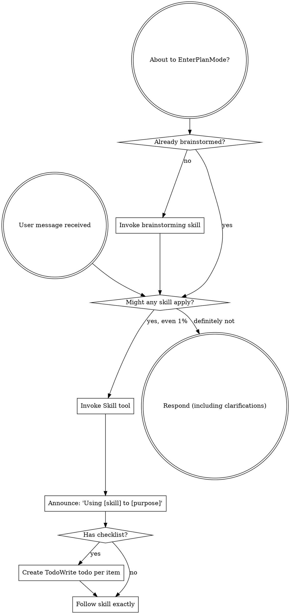
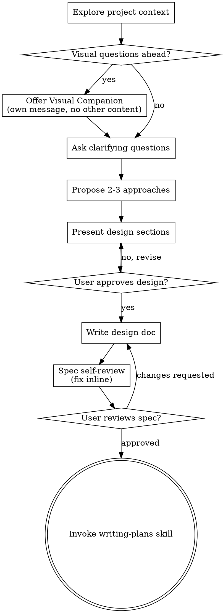
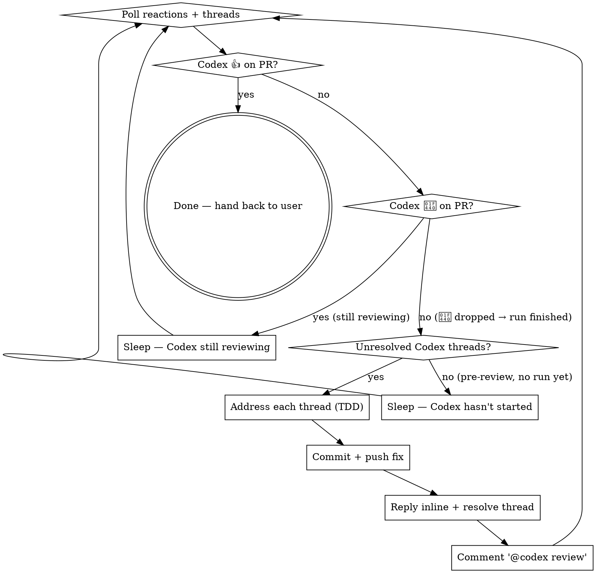
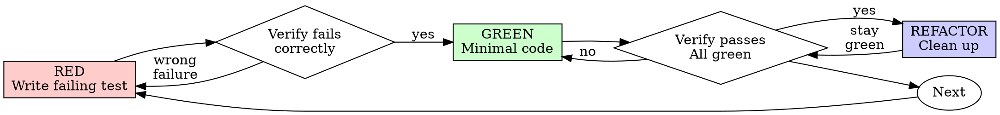

> SYSTEM

# AGENTS.md instructions for /Users/ericson/.t3/worktrees/ars-ui/t3code-db05eb6d

<INSTRUCTIONS>
# ars-ui

## Project Overview

Rust frontend component library using state machines, framework-agnostic core with Leptos/Dioxus adapters.

## Current Phase

The repo is now in active implementation, not spec drafting only.

Agents working on implementation should use the GitHub Project roadmap and issue backlog as the execution source of truth:

- Use the GitHub Project `ars-ui implementation roadmap` to understand active epics, task breakdown, dependencies, status, and iteration planning.
- Prefer picking a single issue-backed task that is unblocked, sized, and scoped for independent delivery.
- Do not start work from an epic issue unless the user explicitly asks for planning or further decomposition.
- Do not start a task that is blocked by unresolved GitHub issue dependencies.
- Treat native GitHub issue dependencies as the blocker graph and the issue body acceptance criteria as the delivery contract.

## Development Workflow

For implementation tasks:

1. Read the assigned or selected GitHub issue first.
2. Move the issue to **In Progress** on the GitHub Project board.
3. Review the cited spec sections and any dependency issues.
4. Add or update the named tests first.
5. Implement only the scope required to make those tests pass.
6. If implementation changes the intended contract, update the relevant spec in the same task.
7. **MANDATORY:** Invoke the `post-implementation-audit` skill (`.agents/skills/post-implementation-audit/SKILL.md`). It runs three sequential audits on the new code — (a) spec/implementation drift with "best outcome" recommendations, (b) iterative "anything else missing?" passes (minimum two rounds), (c) test-coverage audit across every test type the workspace uses (unit, snapshot, proptest, mutation, doc, spec-conformance, llvm-cov). **Every finding lands in _this_ PR — no deferral, no follow-up issues.** This step exists because initial implementations consistently ship spec drift and silent contract violations that take 3+ review round-trips to surface; the audit collapses them into one. Skipping this step is a contract violation.
8. Present the final result for user review before any commit.
9. After user approval, run `cargo xci --profile fast` (alias: `cargo xci-fast`) locally and fix any failures before pushing anything to GitHub. The fast profile takes ~5 minutes and covers the workspace-level regressions a pre-push gate should catch: fmt, check, clippy, unit, integration, adapter, spec-compile-snippets, error-variant-coverage, mutual-exclusion, snapshot-count. Reserve full `cargo xci` (~25 minutes, all 20 gates including wasm coverage and the feature-matrix groups) for after substantial refactors that may have shifted feature-flag interactions. For small follow-up changes, run the focused tests and checks that cover the edited code instead.
10. After `cargo xci-fast` passes, commit and push a PR targeting `main`. The PR body MUST include an auto-close keyword for the issue being delivered, for example `Closes #20` or `Fixes #20`, so GitHub closes the issue automatically when the PR merges.
11. **If the PR creates or modifies any `.snap` insta fixtures, attach the `snapshot-reviewed` label after opening or updating it** (`gh pr edit <num> --add-label "snapshot-reviewed"`). This signals to reviewers that the snapshot output was inspected and is intentional. Re-apply the label whenever you push a commit that touches `.snap` files; the workflow assumes the label reflects the latest snapshot state.
12. **MANDATORY:** Invoke the `waiting-for-codex-review` skill (`.agents/skills/waiting-for-codex-review/SKILL.md`) immediately after the first push that creates the PR, and re-invoke it after every subsequent push to the PR branch. The skill posts the initial `@codex review` trigger, polls Codex's 👀 → (👍 \| ∅ + threads) reaction lifecycle, addresses any review threads with the same rigor as `post-implementation-audit` (TDD + no coverage regression), replies inline, resolves threads, and re-comments `@codex review` to start the next pass — looping until Codex leaves 👍. Skipping this step leaves Codex findings unaddressed and silently widens the gap between merged code and the spec; the merge gate is 👍 from Codex plus green CI, not green CI alone.
13. Only after CI passes, Codex has left 👍, and the PR is merged, close the issue.

Never close a GitHub issue without a merged PR that passes CI **and a 👍 from Codex**. Never commit or push without explicit user approval. Keep the issue, PR, and Project board status aligned with the actual work state at every step.

Default delivery rules:

- Follow TDD: tests first, implementation second, verification last.
- Keep task scope aligned with the issue. If the issue is too large or ambiguous, stop and split or clarify rather than freelancing a bigger change.
- Prefer tasks sized `1`, `2`, `3`, or `5` points. `8` is exceptional. `13` must be decomposed before implementation.
- Preserve the crate and dependency layering defined by the architecture and implementation plan.
- Do not add a new dependency crate without explicit user approval first. If a task appears to need a new crate, stop, explain why, and get approval before editing any `Cargo.toml`.
- When a task is complete, verify the exact tests and checks named by the issue before considering it done.
- For adapter-level component implementation, follow `docs/implementation/adapter-component-delivery.md`. Adapter component work must cover the adapter crate, adapter tests, E2E fixtures/harnesses when applicable, widgets examples, spec synchronization, and the required validation/audit loop in one PR.

### Code Quality Standards

- **Document all public items.** Every public struct, enum, trait, function, constant, type alias, method, field, and variant must have a `///` doc comment. Every `lib.rs` must have a `//!` crate-level doc comment. The workspace enforces `missing_docs` linting — undocumented public items are build failures.
- **Zero warnings policy.** All code must compile with zero warnings under the workspace's configured clippy and rustc lints. Fix the root cause instead of suppressing. When suppression is genuinely needed, use `#[expect(lint, reason = "...")]` — never `#[allow(...)]`.
- **Derive documentation from the spec.** Doc comments should describe the _purpose and semantics_ of the item as defined in the corresponding `spec/` files, not just restate the type signature.
- **Use `#[inline]` selectively, not mechanically.** Do **not** add Clippy's `missing_inline_in_public_items` lint at the workspace level, and do not treat public visibility alone as a reason to mark an item `#[inline]`. Use `#[inline]` for thin cross-crate wrappers, trivial accessors, and hot-path no-op shims where the call overhead is plausibly meaningful. Avoid blanket `#[inline]` on all public APIs — it increases code size, adds compile-time cost, and turns `#[inline]` into noise instead of a deliberate performance signal.
- **Use directory-backed modules with `mod.rs` when a module owns children.** This repo standardizes on the older filesystem layout for nested modules. If module `foo` has child modules, the parent must live at `foo/mod.rs`, not `foo.rs`. Do not mix `foo.rs` with a sibling `foo/` directory. When a refactor adds child modules under an existing flat file, move the parent into `foo/mod.rs` in the same change. Do not leave empty leftover module directories behind.

### API Design Standards

- **Design for the pit of success.** Public APIs should make the most natural, shortest path also be the path that is correct, accessible, localizable, type-safe, and performant. Prefer ergonomic constructors and defaults that preserve the spec's strongest guarantees instead of making users opt into correctness after choosing a convenient API.
- **Name escape hatches explicitly.** When a component needs a lower-level, static, non-i18n, or otherwise less complete path, keep it available but make the tradeoff visible in the API name or type. The blessed path should remain the simplest call site, while escape hatches should read as deliberate choices.
- **Keep semantic data separate from rendered views.** Rich framework views are useful for customization, but components still need semantic sources for accessible names, localized text, announcements, ids, and state-machine wiring. Do not rely on arbitrary rendered view trees as the only source of user-facing semantics.

### Code Coverage

The workspace uses `cargo-llvm-cov` for code coverage with per-crate threshold enforcement. CI runs coverage on every PR (see `.github/workflows/ci.yml`).

**Local coverage commands:**

```bash
# Per-crate coverage with inline annotated source (most useful during development)
cargo llvm-cov test -p ars-interactions --text -- hover

# Per-crate summary only
cargo llvm-cov test -p ars-interactions -- hover

# Native-only workspace coverage (host target; excludes wasm-only crates)
cargo llvm-cov --workspace \
  --exclude ars-leptos --exclude ars-dioxus \
  --exclude ars-test-harness-leptos --exclude ars-test-harness-dioxus \
  --exclude ars-derive --exclude xtask \
  --lcov --output-path lcov.info

# Check all crates against spec-defined thresholds (run after a *merged* lcov)
cargo xtask coverage check-all --file lcov.info
```

The `--text` flag produces line-by-line annotated source showing hit counts and `^0` markers on uncovered branches — use this to identify gaps after writing tests. Uncovered no-op callback closures in tests (e.g., `|_| {}`) are expected and not a gap.

The local recipe above excludes the adapter and adapter-test-harness crates because their `target_arch = "wasm32"` / `feature = "web"` code paths can't be measured via host-target `cargo llvm-cov`. **CI runs an additional wasm-coverage pipeline on nightly** (`cargo xtask ci coverage`) that uses `wasm-bindgen-test`'s experimental coverage recipe with LLVM 22 / `clang-22` to emit lcov for `ars-leptos` (csr), `ars-dioxus` (web), `ars-dom` (web), `ars-i18n` (web-intl), and the adapter test harnesses, then merges with the native lcov via `cargo xtask coverage merge`. The per-crate thresholds in `xtask::coverage::default_thresholds()` are enforced against the merged file — including adapter targets (`ars-leptos` 74/55, `ars-dioxus` 77/70, `ars-test-harness-leptos` 60/0, `ars-test-harness-dioxus` 60/0). `ars-derive` (proc-macro, runs in compiler) is exercised via `crates/ars-core/tests/derive_contract.rs` and is unmeasured. `xtask` has its own enforced threshold (30/35) and is measured. See `spec/testing/14-ci.md` §2 for the full pipeline.

### Mutation Testing

Coverage tells you which lines run. **Mutation testing tells you whether the tests would notice if those lines silently misbehaved.** The workspace uses [`cargo-mutants`](https://mutants.rs) for this — a `cargo` extension binary, not a workspace dependency.

**Install (once per developer machine):**

```bash
cargo install cargo-mutants --locked --version 27.0.0
```

**Local commands (state-machine modules are the most rewarding targets):**

```bash
# Run on a single component machine (~6 min for popover)
cargo mutants -p ars-components -f crates/ars-components/src/overlay/popover/mod.rs

# Just list what would be mutated, without running tests (fast)
cargo mutants -p ars-components -f crates/ars-components/src/overlay/popover/mod.rs --list

# Whole crate (slow — only if you really mean it)
cargo mutants -p ars-components
```

**Agnostic component implementation gate:** whenever an agent implements a new framework-agnostic component, or materially changes an existing one, the delivery must include:

- a targeted mutation run for the component source file, usually `cargo mutants -p ars-components -f crates/ars-components/src/<category>/<component>/mod.rs` (adjust the path for single-file modules);
- spec-conformance tests for the component's anatomy/public contract, including its `Part` enum and required API/attribute surface;
- same-task triage of every `MISSED` mutant: add tests for real gaps, or add a justified line-agnostic `.cargo/mutants.toml` exclude only for true equivalent mutations.

**Reading the output:** Results land in `mutants.out/mutants.out/` (gitignored). The two files that matter:

- `caught.txt` — mutations that broke at least one test ✅
- `missed.txt` — mutations that survived all tests ❌ — each one is either a real test gap to fill or an "equivalent mutation" that needs a `[[skip]]` entry in `mutants.toml` with a justification

**CI integration:** Nightly only. `.github/workflows/nightly.yml` has a `mutation-testing` job with a 21-entry matrix that runs `cargo mutants -p <package>` on every framework-agnostic crate, using `--shard k/n` to spread larger crates across parallel runners. **Shard indices are 0-based** (`k` runs from `0` to `n-1`); `k == n` is invalid and will fail the job. When adding shards, always start at `0/n` and end at `(n-1)/n`.

- **`ars-components` (≈ 1,630 mutants today, planned to grow as the spec adds the remaining ~97 components):** sharded **12-way** → ≈ 135 mutants per runner today, ≈ 850 per runner at the ~10,000-mutant endpoint. Sized for the full spec catalog up front so we don't re-shard every few months as components land.
- **`ars-collections` (≈ 1,080 mutants):** sharded 4-way → ≈ 270 mutants per runner.
- **`ars-core` (≈ 700 mutants):** sharded 2-way → ≈ 350 mutants per runner.
- **`ars-a11y`, `ars-forms`, `ars-interactions`:** one runner each (under 600 mutants apiece).

**Adding a new state machine inside an existing crate requires no CI changes** — its mutations land in whichever shard the cargo-mutants partitioner places them. The shard counts are sized so the slowest runner stays well under 30 minutes today and under ~50 minutes at the planned endpoint; re-balance only when a crate outgrows that budget (visible on the nightly dashboard as one shard pulling away from the others).

All matrix jobs run with `fail-fast: false` so failures on one module don't mask data on another. Each job uploads its `mutants.out/` as a workflow artifact (always, even on success — surviving "missed" entries on a passing run still reveal test-quality work). The job fails if any mutation survives, so a missed mutation forces a deliberate triage decision (fix the test, or document the equivalence with a `[[skip]]` entry in `mutants.toml`).

**Excluded crates** (mutation testing's signal degrades wherever determinism does): adapter glue (`ars-leptos`, `ars-dioxus`), DOM/FFI (`ars-dom`), ICU/FFI (`ars-i18n`), test infrastructure (`ars-test-harness*`), and the proc-macro crate (`ars-derive`, runs in the compiler). Adding a brand-new crate that is a good mutation target requires one new matrix entry; run a local scout first (`cargo mutants -p <crate> --list` to size, then a real run) so we know the right shard count before the nightly fires.

**Bumping the pinned version.** Both the local install command above and `.github/workflows/nightly.yml` pin cargo-mutants to an exact version (currently `27.0.0`) — same convention as `wasm-pack` in the `a11y-audit` job. Pinning is deliberate: cargo-mutants ships new mutators in releases, and an unpinned install would silently change the mutation set without any code change, surfacing as phantom CI failures on a green-source repo. To bump, open a PR that (1) updates the version string in CLAUDE.md and `nightly.yml`, (2) runs the popover scout locally with the new version (`cargo mutants -p ars-components -f crates/ars-components/src/overlay/popover/mod.rs`) to confirm the mutation count is in the same ballpark, and (3) triages any new "missed" entries the new mutators surface — they are usually genuine test-quality gaps newly visible to the tool.

### Property Testing (proptest)

State-machine invariants are exercised by [`proptest`](https://docs.rs/proptest) under `crates/<crate>/tests/proptest_state_machines/` (see `ars-components`). Default proptest behaviour drops `*.proptest-regressions` seed files alongside test sources — instead, every `proptest!` block in this workspace pulls a shared `Config` from `tests/proptest_state_machines/common.rs` that:

1. Reads `PROPTEST_CASES` from the environment (1,000 default; 10,000 in the nightly `extended-proptest` job).
2. Sets `failure_persistence` to `FileFailurePersistence::Direct("proptest-regressions/state-machines.txt")`, so all persisted seeds for the test binary live in one file at the crate root: `crates/<crate>/proptest-regressions/state-machines.txt`. The directory is committed (per proptest's own recommendation in the file header) so every developer's runs benefit from previously-shrunk failures.

When a new crate adopts proptest for state-machine tests, copy the same `common.rs` helper and reference it via `#![proptest_config(super::common::proptest_config())]` inside every `proptest!` block. Don't let proptest fall back to its `WithSource` default — that scatters seed files across the source tree.

### Adapter Prelude Convention

Both `ars-leptos` and `ars-dioxus` expose a `prelude` module targeting **end users** — application developers who consume the ready-made components. `use ars_leptos::prelude::*` (or `use ars_dioxus::prelude::*`) should give them everything they need.

The prelude contains only user-facing items:

1. **Component modules** — as components land, their public module paths (e.g., `button`, `dialog`) are re-exported so users can write `button::Props`, etc.
2. **User-facing traits** — traits end users call on component outputs (e.g., `Translate` from `ars-i18n`). Re-export the trait so consumers don't need a direct dependency on the subsystem crate.
3. **Configuration types** — types that appear in component props or configure behaviour (e.g., `Locale`, `Direction`, `Orientation`, `Selection`).

The prelude does **not** include implementation details consumed only by component authors inside the adapter crate: core engine types (`Machine`, `Service`, `ConnectApi`, `AttrMap`), accessibility primitives (`AriaRole`, `AriaAttribute`), interaction helpers (`merge_attrs`), or adapter hooks (`use_machine`, `UseMachineReturn`). Those remain accessible via their normal crate paths for advanced users building custom machines.

Both adapter preludes must stay symmetric: same items, same structure. When adding a new re-export to one adapter's prelude, add it to the other as well in the same PR.

### Adapter Testing Convention

Adapter-level component tests should default to the framework-specific test harness crate:

- Leptos adapter tests should prefer `ars-test-harness-leptos`.
- Dioxus adapter tests should prefer `ars-test-harness-dioxus`.
- Shared `ars-test-harness` helpers should be used where relevant for viewport, layout, clipboard, drag/drop, timing, and other DOM test setup instead of bespoke per-test browser scaffolding.

When a component spec requires interaction, focus, overlay positioning, clipboard, file upload, drag/drop, or similar browser behavior, the task's tests should exercise that behavior through the adapter harness entrypoints and shared core harness helpers unless there is a concrete technical reason not to.

## Spec Synchronization During Implementation

The specification is the authoritative contract. It took weeks of deliberate design and MUST be followed.

### Spec-first implementation rule

Before implementing any public type, trait, function, or method:

1. **Read the spec section first.** Find the relevant code example in `spec/`. Use `spec-tool toc <file>` and `grep` to locate it.
2. **Match the spec exactly.** If the spec defines `struct ComponentIds { base: String }` with methods `from_id()`, `id()`, `part()`, `item()`, `item_part()` — implement exactly that. Do not invent alternative field names, method names, or signatures.
3. **Cross-check after implementation.** Before presenting code for review, diff every public item against the spec's code examples. Every struct field, every method name, every parameter must match.
4. **If you must deviate**, there must be a concrete technical reason (e.g., the spec's API cannot compile, or a dependency doesn't expose the needed type). Document the reason in a code comment and flag it to the user explicitly.

Inventing alternative APIs that "seem equivalent" is never acceptable — it silently invalidates the spec's design decisions and all downstream code that depends on those APIs.

### Spec/code mismatch resolution

- If code and spec disagree, resolve the mismatch in the same task or PR.
- Shared conceptual changes belong in shared or foundation spec files, not only in adapter code.
- Adapter-specific findings must be reflected back into `spec/foundation/08-adapter-leptos.md` and/or `spec/foundation/09-adapter-dioxus.md` when relevant.
- Do not leave spec drift behind as follow-up cleanup.

## Spec Structure

The specification lives in `spec/` with this layout:

- `spec/manifest.toml` — **START HERE** — central index of all components and their dependencies
- `spec/foundation/` — architecture, accessibility, i18n, interactions, forms, adapters, spec template (00-10)
- `spec/shared/` — cross-component shared types (date-time, selection, layout, z-index)
- `spec/components/{category}/` — one file per component, organized by category
- `spec/testing/` — test specs split by domain

### Component Categories

- `input/` — checkbox, text-field, slider, number-input, etc.
- `selection/` — select, combobox, listbox, menu, tags-input, etc.
- `overlay/` — dialog, popover, tooltip, toast, presence, etc.
- `navigation/` — accordion, tabs, tree-view, pagination, steps, etc.
- `date-time/` — date-field, time-field, calendar, date-picker, etc.
- `data-display/` — table, avatar, progress, meter, badge, etc.
- `layout/` — splitter, scroll-area, carousel, portal, toolbar, etc.
- `specialized/` — color-picker, file-upload, signature-pad, qr-code, etc.
- `utility/` — button, toggle, focus-scope, visually-hidden, separator, etc.

## Working with the Spec

When reading large files, run `wc -l` first to check the line count. If the file is over 2,000
lines, use the `offset` and `limit` parameters on the Read tool to read in chunks rather than
attempting to read the entire file at once.

### Using xtask spec (preferred)

Use `cargo xtask spec` to resolve file sets instead of manually parsing manifest.toml:

```bash
# Quick metadata lookup:
cargo xtask spec info <component>

# Find all components using a shared type:
cargo xtask spec reverse <shared-type>

# See a file's heading structure (with line numbers):
cargo xtask spec toc <file>

# Validate frontmatter matches manifest.toml:
cargo xtask spec validate

# Search spec content by keyword/regex (with optional filters):
cargo xtask spec search <query> [--category <cat>] [--section <sec>] [--tier <tier>]

# Get a compact component summary (states, events, props, accessibility):
cargo xtask spec digest <component>

# Get full implementation context (component + all deps concatenated):
cargo xtask spec context <component> [--framework <fw>] [--include-testing]
```

The xtask also runs as an MCP server (`cargo xtask mcp`) exposing all spec tools for LLM agents.

### Reading a component (manual fallback)

1. Read `spec/manifest.toml` to find the component's path and dependencies
2. Read the component file (has YAML frontmatter listing its foundation/shared deps)
3. Only load the foundation files listed in `foundation_deps` — not all of them

### Framework and library specs — MANDATORY skill loading

When reading or editing these specification files, you MUST load the corresponding skill BEFORE doing any work. The skills contain verified, version-accurate API documentation that the spec code examples depend on. Claude's training data is wrong for these libraries — do not trust it.

| Spec file                                    | Skill to load | Library version |
| -------------------------------------------- | ------------- | --------------- |
| `spec/foundation/04-internationalization.md` | `icu4x`       | ICU4X 2.1.1     |
| `spec/foundation/08-adapter-leptos.md`       | `leptos`      | Leptos 0.8.17   |
| `spec/foundation/09-adapter-dioxus.md`       | `dioxus`      | Dioxus 0.7.3    |

This applies to any task that touches adapter code: reviewing, writing, modifying, or answering questions about these files. Load the skill first, then proceed.

### Spec Conventions

- **No deprecation:** This is a greenfield spec. If an API is unused or redundant, remove it and fix all references. Never use `#[deprecated]` or deprecation shims.
- **No deferral:** Never mark spec content as "TODO", "FIXME", "future enhancement", "P1/P2 extension", or any similar deferral language. Every feature mentioned must be fully specified. If a design choice is unclear, ask the user rather than deferring.
- **No guessing external APIs:** NEVER guess function names or module paths for external crates. Always verify against `https://docs.rs/<crate_name>` before writing code that calls library APIs. This applies especially to Leptos, Dioxus, ICU4X, and any crate where training data may be stale. If you cannot verify, state that explicitly rather than fabricating a plausible-looking API.

### Component file format

Each component file has YAML frontmatter declaring its metadata:

```markdown
---
component: ComponentName
category: { category }
tier: stateless | stateful | complex
foundation_deps: [architecture, accessibility, ...]
shared_deps: [date-time-types, ...]
related: [sibling-component, ...]
---

# ComponentName
```

The `tier` field determines which sections are required — see `spec/foundation/10-component-spec-template.md` for the canonical section structure, ordering rules, and conformance checklist. Headings are numbered (e.g., `## 1. State Machine`, `### 1.1 States`, `#### 1.1.1 InnerStates`, etc.) for precise section references.

</INSTRUCTIONS>
<environment_context>
  <cwd>/Users/ericson/.t3/worktrees/ars-ui/t3code-db05eb6d</cwd>
  <shell>zsh</shell>
  <current_date>2026-05-25</current_date>
  <timezone>America/Sao_Paulo</timezone>
</environment_context>

> DEVELOPER

Implement task #241

> AGENT

I’ll stay in planning mode for this turn: I’ll inspect the repo and issue #241, then produce a decision-complete implementation plan rather than editing files. I’m loading the relevant workflow skills first so the plan matches this repo’s process.

> TOOL

tool_use exec_command
id: call_salbqqijoX3Df4rwDOnqOKgI
```json
{
  "cmd": "sed -n '1,220p' /Users/ericson/.claude/skills/using-superpowers/SKILL.md",
  "workdir": "/Users/ericson/.t3/worktrees/ars-ui/t3code-db05eb6d",
  "yield_time_ms": 1000,
  "max_output_tokens": 6000
}
```

> TOOL

tool_use exec_command
id: call_HfKInymMPqm9nLCXNrTOBXem
```json
{
  "cmd": "sed -n '1,220p' /Users/ericson/.claude/skills/brainstorming/SKILL.md",
  "workdir": "/Users/ericson/.t3/worktrees/ars-ui/t3code-db05eb6d",
  "yield_time_ms": 1000,
  "max_output_tokens": 6000
}
```

> TOOL

tool_use exec_command
id: call_2hAHiN4j4x1U6rkB7IzJDO1e
```json
{
  "cmd": "sed -n '1,220p' /Users/ericson/.codex/plugins/cache/openai-curated/github/6188456f/skills/github/SKILL.md",
  "workdir": "/Users/ericson/.t3/worktrees/ars-ui/t3code-db05eb6d",
  "yield_time_ms": 1000,
  "max_output_tokens": 6000
}
```

> TOOL

tool_use exec_command
id: call_JUPmttm2XKnQoBlVjC9toYJO
```json
{
  "cmd": "rg -n \"#241|issue #241|241|task #241\" /Users/ericson/.codex/memories/MEMORY.md",
  "workdir": "/Users/ericson/.t3/worktrees/ars-ui/t3code-db05eb6d",
  "yield_time_ms": 1000,
  "max_output_tokens": 4000
}
```

> TOOL

tool_result
id: call_salbqqijoX3Df4rwDOnqOKgI
```
Chunk ID: 05976f
Wall time: 0.2131 seconds
Process exited with code 0
Original token count: 1356
Output:
---
name: using-superpowers
description: Use when starting any conversation - establishes how to find and use skills, requiring Skill tool invocation before ANY response including clarifying questions
---

<SUBAGENT-STOP>
If you were dispatched as a subagent to execute a specific task, skip this skill.
</SUBAGENT-STOP>

<EXTREMELY-IMPORTANT>
If you think there is even a 1% chance a skill might apply to what you are doing, you ABSOLUTELY MUST invoke the skill.

IF A SKILL APPLIES TO YOUR TASK, YOU DO NOT HAVE A CHOICE. YOU MUST USE IT.

This is not negotiable. This is not optional. You cannot rationalize your way out of this.
</EXTREMELY-IMPORTANT>

## Instruction Priority

Superpowers skills override default system prompt behavior, but **user instructions always take precedence**:

1. **User's explicit instructions** (CLAUDE.md, GEMINI.md, AGENTS.md, direct requests) — highest priority
2. **Superpowers skills** — override default system behavior where they conflict
3. **Default system prompt** — lowest priority

If CLAUDE.md, GEMINI.md, or AGENTS.md says "don't use TDD" and a skill says "always use TDD," follow the user's instructions. The user is in control.

## How to Access Skills

**In Claude Code:** Use the `Skill` tool. When you invoke a skill, its content is loaded and presented to you—follow it directly. Never use the Read tool on skill files.

**In Copilot CLI:** Use the `skill` tool. Skills are auto-discovered from installed plugins. The `skill` tool works the same as Claude Code's `Skill` tool.

**In Gemini CLI:** Skills activate via the `activate_skill` tool. Gemini loads skill metadata at session start and activates the full content on demand.

**In other environments:** Check your platform's documentation for how skills are loaded.

## Platform Adaptation

Skills use Claude Code tool names. Non-CC platforms: see `references/copilot-tools.md` (Copilot CLI), `references/codex-tools.md` (Codex) for tool equivalents. Gemini CLI users get the tool mapping loaded automatically via GEMINI.md.

# Using Skills

## The Rule

**Invoke relevant or requested skills BEFORE any response or action.** Even a 1% chance a skill might apply means that you should invoke the skill to check. If an invoked skill turns out to be wrong for the situation, you don't need to use it.



## Red Flags

These thoughts mean STOP—you're rationalizing:

| Thought | Reality |
|---------|---------|
| "This is just a simple question" | Questions are tasks. Check for skills. |
| "I need more context first" | Skill check comes BEFORE clarifying questions. |
| "Let me explore the codebase first" | Skills tell you HOW to explore. Check first. |
| "I can check git/files quickly" | Files lack conversation context. Check for skills. |
| "Let me gather information first" | Skills tell you HOW to gather information. |
| "This doesn't need a formal skill" | If a skill exists, use it. |
| "I remember this skill" | Skills evolve. Read current version. |
| "This doesn't count as a task" | Action = task. Check for skills. |
| "The skill is overkill" | Simple things become complex. Use it. |
| "I'll just do this one thing first" | Check BEFORE doing anything. |
| "This feels productive" | Undisciplined action wastes time. Skills prevent this. |
| "I know what that means" | Knowing the concept ≠ using the skill. Invoke it. |

## Skill Priority

When multiple skills could apply, use this order:

1. **Process skills first** (brainstorming, debugging) - these determine HOW to approach the task
2. **Implementation skills second** (frontend-design, mcp-builder) - these guide execution

"Let's build X" → brainstorming first, then implementation skills.
"Fix this bug" → debugging first, then domain-specific skills.

## Skill Types

**Rigid** (TDD, debugging): Follow exactly. Don't adapt away discipline.

**Flexible** (patterns): Adapt principles to context.

The skill itself tells you which.

## User Instructions

Instructions say WHAT, not HOW. "Add X" or "Fix Y" doesn't mean skip workflows.

```

> TOOL

tool_result
id: call_HfKInymMPqm9nLCXNrTOBXem
```
Chunk ID: c22a76
Wall time: 0.5533 seconds
Process exited with code 0
Original token count: 2659
Output:
---
name: brainstorming
description: "You MUST use this before any creative work - creating features, building components, adding functionality, or modifying behavior. Explores user intent, requirements and design before implementation."
---

# Brainstorming Ideas Into Designs

Help turn ideas into fully formed designs and specs through natural collaborative dialogue.

Start by understanding the current project context, then ask questions one at a time to refine the idea. Once you understand what you're building, present the design and get user approval.

<HARD-GATE>
Do NOT invoke any implementation skill, write any code, scaffold any project, or take any implementation action until you have presented a design and the user has approved it. This applies to EVERY project regardless of perceived simplicity.
</HARD-GATE>

## Anti-Pattern: "This Is Too Simple To Need A Design"

Every project goes through this process. A todo list, a single-function utility, a config change — all of them. "Simple" projects are where unexamined assumptions cause the most wasted work. The design can be short (a few sentences for truly simple projects), but you MUST present it and get approval.

## Checklist

You MUST create a task for each of these items and complete them in order:

1. **Explore project context** — check files, docs, recent commits
2. **Offer visual companion** (if topic will involve visual questions) — this is its own message, not combined with a clarifying question. See the Visual Companion section below.
3. **Ask clarifying questions** — one at a time, understand purpose/constraints/success criteria
4. **Propose 2-3 approaches** — with trade-offs and your recommendation
5. **Present design** — in sections scaled to their complexity, get user approval after each section
6. **Write design doc** — save to `docs/superpowers/specs/YYYY-MM-DD-<topic>-design.md` and commit
7. **Spec self-review** — quick inline check for placeholders, contradictions, ambiguity, scope (see below)
8. **User reviews written spec** — ask user to review the spec file before proceeding
9. **Transition to implementation** — invoke writing-plans skill to create implementation plan

## Process Flow



**The terminal state is invoking writing-plans.** Do NOT invoke frontend-design, mcp-builder, or any other implementation skill. The ONLY skill you invoke after brainstorming is writing-plans.

## The Process

**Understanding the idea:**

- Check out the current project state first (files, docs, recent commits)
- Before asking detailed questions, assess scope: if the request describes multiple independent subsystems (e.g., "build a platform with chat, file storage, billing, and analytics"), flag this immediately. Don't spend questions refining details of a project that needs to be decomposed first.
- If the project is too large for a single spec, help the user decompose into sub-projects: what are the independent pieces, how do they relate, what order should they be built? Then brainstorm the first sub-project through the normal design flow. Each sub-project gets its own spec → plan → implementation cycle.
- For appropriately-scoped projects, ask questions one at a time to refine the idea
- Prefer multiple choice questions when possible, but open-ended is fine too
- Only one question per message - if a topic needs more exploration, break it into multiple questions
- Focus on understanding: purpose, constraints, success criteria

**Exploring approaches:**

- Propose 2-3 different approaches with trade-offs
- Present options conversationally with your recommendation and reasoning
- Lead with your recommended option and explain why

**Presenting the design:**

- Once you believe you understand what you're building, present the design
- Scale each section to its complexity: a few sentences if straightforward, up to 200-300 words if nuanced
- Ask after each section whether it looks right so far
- Cover: architecture, components, data flow, error handling, testing
- Be ready to go back and clarify if something doesn't make sense

**Design for isolation and clarity:**

- Break the system into smaller units that each have one clear purpose, communicate through well-defined interfaces, and can be understood and tested independently
- For each unit, you should be able to answer: what does it do, how do you use it, and what does it depend on?
- Can someone understand what a unit does without reading its internals? Can you change the internals without breaking consumers? If not, the boundaries need work.
- Smaller, well-bounded units are also easier for you to work with - you reason better about code you can hold in context at once, and your edits are more reliable when files are focused. When a file grows large, that's often a signal that it's doing too much.

**Working in existing codebases:**

- Explore the current structure before proposing changes. Follow existing patterns.
- Where existing code has problems that affect the work (e.g., a file that's grown too large, unclear boundaries, tangled responsibilities), include targeted improvements as part of the design - the way a good developer improves code they're working in.
- Don't propose unrelated refactoring. Stay focused on what serves the current goal.

## After the Design

**Documentation:**

- Write the validated design (spec) to `docs/superpowers/specs/YYYY-MM-DD-<topic>-design.md`
  - (User preferences for spec location override this default)
- Use elements-of-style:writing-clearly-and-concisely skill if available
- Commit the design document to git

**Spec Self-Review:**
After writing the spec document, look at it with fresh eyes:

1. **Placeholder scan:** Any "TBD", "TODO", incomplete sections, or vague requirements? Fix them.
2. **Internal consistency:** Do any sections contradict each other? Does the architecture match the feature descriptions?
3. **Scope check:** Is this focused enough for a single implementation plan, or does it need decomposition?
4. **Ambiguity check:** Could any requirement be interpreted two different ways? If so, pick one and make it explicit.

Fix any issues inline. No need to re-review — just fix and move on.

**User Review Gate:**
After the spec review loop passes, ask the user to review the written spec before proceeding:

> "Spec written and committed to `<path>`. Please review it and let me know if you want to make any changes before we start writing out the implementation plan."

Wait for the user's response. If they request changes, make them and re-run the spec review loop. Only proceed once the user approves.

**Implementation:**

- Invoke the writing-plans skill to create a detailed implementation plan
- Do NOT invoke any other skill. writing-plans is the next step.

## Key Principles

- **One question at a time** - Don't overwhelm with multiple questions
- **Multiple choice preferred** - Easier to answer than open-ended when possible
- **YAGNI ruthlessly** - Remove unnecessary features from all designs
- **Explore alternatives** - Always propose 2-3 approaches before settling
- **Incremental validation** - Present design, get approval before moving on
- **Be flexible** - Go back and clarify when something doesn't make sense

## Visual Companion

A browser-based companion for showing mockups, diagrams, and visual options during brainstorming. Available as a tool — not a mode. Accepting the companion means it's available for questions that benefit from visual treatment; it does NOT mean every question goes through the browser.

**Offering the companion:** When you anticipate that upcoming questions will involve visual content (mockups, layouts, diagrams), offer it once for consent:
> "Some of what we're working on might be easier to explain if I can show it to you in a web browser. I can put together mockups, diagrams, comparisons, and other visuals as we go. This feature is still new and can be token-intensive. Want to try it? (Requires opening a local URL)"

**This offer MUST be its own message.** Do not combine it with clarifying questions, context summaries, or any other content. The message should contain ONLY the offer above and nothing else. Wait for the user's response before continuing. If they decline, proceed with text-only brainstorming.

**Per-question decision:** Even after the user accepts, decide FOR EACH QUESTION whether to use the browser or the terminal. The test: **would the user understand this better by seeing it than reading it?**

- **Use the browser** for content that IS visual — mockups, wireframes, layout comparisons, architecture diagrams, side-by-side visual designs
- **Use the terminal** for content that is text — requirements questions, conceptual choices, tradeoff lists, A/B/C/D text options, scope decisions

A question about a UI topic is not automatically a visual question. "What does personality mean in this context?" is a conceptual question — use the terminal. "Which wizard layout works better?" is a visual question — use the browser.

If they agree to the companion, read the detailed guide before proceeding:
`skills/brainstorming/visual-companion.md`

```

> TOOL

tool_result
id: call_2hAHiN4j4x1U6rkB7IzJDO1e
```
Chunk ID: 63b9eb
Wall time: 0.0762 seconds
Process exited with code 0
Original token count: 1089
Output:
---
name: github
description: Triage and orient GitHub repository, pull request, and issue work through the connected GitHub app. Use when the user asks for general GitHub help, wants PR or issue summaries, or needs repository context before choosing a more specific GitHub workflow.
---

# GitHub

## Overview

Use this skill as the umbrella entrypoint for general GitHub work in this plugin. It should decide whether the task stays in repo and PR triage or should be handed off to a more specific review, CI, or publish workflow.

This plugin is intentionally hybrid:

- Prefer the GitHub app from this plugin for repository, issue, pull request, comment, label, reaction, and PR creation workflows.
- Use local `git` and `gh` only when the connector does not cover the job well, especially for current-branch PR discovery, branch creation, commit and push, `gh auth status`, and GitHub Actions log inspection.
- Keep connector state and local checkout context aligned. If the request is about the current branch, resolve the local repo and branch before acting.

Once the intent is clear, route to the specialist skill immediately and do not keep broad GitHub triage in scope longer than needed.

## Connector-First Responsibilities

Handle these directly in this skill when the request does not need a narrower specialist workflow:

- repository orientation once the repo, PR, issue, or local checkout is identified
- recent PR or issue triage
- PR metadata summaries
- PR patch inspection
- PR comments, labels, and reactions
- issue lookup and summarization
- PR creation after a branch is already pushed

Prefer the GitHub app from this plugin for those flows because it provides structured PR, issue, and review-adjacent data without depending on a local checkout. If the repository is not already identifiable from the user request or local git context, ask for the repo instead of pretending there is a repo-search flow that may not exist.

## Routing Rules

1. Resolve the operating context first:
   - If the user provides a repository, PR number, issue number, or URL, use that.
   - If the request is about "this branch" or "the current PR", resolve local git context and use `gh` only as needed to discover the branch PR.
   - If the repository is still ambiguous after local inspection, ask for the repo identifier.
2. Classify the request before taking action:
   - `repo or PR triage`: summarize PRs, issues, patches, comments, labels, reactions, or repository state
   - `review follow-up`: unresolved review threads, requested changes, or inline review feedback
   - `CI debugging`: failing checks, Actions logs, or CI root-cause analysis
   - `publish changes`: create or switch branches, stage changes, commit, push, and open a draft PR
3. Route to the specialist skill as soon as the category is clear:
   - Review comments and requested changes: `../gh-address-comments/SKILL.md`
   - Failing GitHub Actions checks: `../gh-fix-ci/SKILL.md`
   - Commit, push, and open PR: `../yeet/SKILL.md`
4. Keep the hybrid model consistent after routing:
   - connector first for PR and issue data
   - local `git` and `gh` only for the specific gaps the connector does not cover

## Default Workflow

1. Resolve repository and item scope.
2. Gather structured PR or issue context through the GitHub app from this plugin.
3. Decide whether the task stays in connector-backed triage or needs a specialist skill.
4. Route immediately when the work becomes review follow-up, CI debugging, or publish workflow.
5. End with a clear summary of what was inspected, what changed, and what remains.

## Output Expectations

- For triage requests, return a concise summary of the repository, PR, or issue state and the next likely action.
- For mixed requests, tell the user which specialist path you are taking and why.
- For connector-backed write actions, restate the exact PR, issue, label, or reaction target before applying the change.
- Never imply that GitHub Actions logs are available through the connector alone. That remains a `gh` workflow.

## Examples

- "Use GitHub to summarize the open PRs in this repo and tell me what needs attention."
- "Help with this PR."
- "Review the latest comments on PR 482 and tell me what is actionable."
- "Debug the failing checks on this branch."
- "Commit these changes, push them, and open a draft PR."

```

> TOOL

tool_result
id: call_JUPmttm2XKnQoBlVjC9toYJO
```
Chunk ID: 1978af
Wall time: 0.0829 seconds
Process exited with code 1
Original token count: 0
Output:

```

> AGENT

Using `using-superpowers`, `brainstorming`, and `github`: the request is issue-backed implementation work, but this turn must converge on a concrete design and implementation plan before any mutation. I’m now resolving the issue contract and nearby code/spec shape from the live repo.

> TOOL

tool_use exec_command
id: call_R5oSDF7C2urXCyc17ssm8I4j
```json
{
  "cmd": "git remote -v",
  "workdir": "/Users/ericson/.t3/worktrees/ars-ui/t3code-db05eb6d",
  "yield_time_ms": 1000,
  "max_output_tokens": 2000
}
```

> TOOL

tool_use exec_command
id: call_D3rVIZxl2W4hmktFkkOWRX37
```json
{
  "cmd": "git status --short --branch",
  "workdir": "/Users/ericson/.t3/worktrees/ars-ui/t3code-db05eb6d",
  "yield_time_ms": 1000,
  "max_output_tokens": 3000
}
```

> TOOL

tool_use exec_command
id: call_awR2Y8OBu7lR8G5iJIxZMSyW
```json
{
  "cmd": "gh issue view 241 --json number,title,state,body,labels,assignees,projectItems,comments,url",
  "workdir": "/Users/ericson/.t3/worktrees/ars-ui/t3code-db05eb6d",
  "yield_time_ms": 1000,
  "max_output_tokens": 20000
}
```

> TOOL

tool_use exec_command
id: call_FCzzla9RiVCPI1vPEfTDNLAc
```json
{
  "cmd": "rg -n \"component:|Listbox|listbox|# 241|241\" spec crates docs .agents -g '!target' -g '!mutants.out'",
  "workdir": "/Users/ericson/.t3/worktrees/ars-ui/t3code-db05eb6d",
  "yield_time_ms": 1000,
  "max_output_tokens": 20000
}
```

> TOOL

tool_result
id: call_R5oSDF7C2urXCyc17ssm8I4j
```
Chunk ID: 31acfa
Wall time: 0.7413 seconds
Process exited with code 0
Original token count: 25
Output:
origin	git@github.com:fogodev/ars-ui.git (fetch)
origin	git@github.com:fogodev/ars-ui.git (push)

```

> TOOL

tool_result
id: call_D3rVIZxl2W4hmktFkkOWRX37
```
Chunk ID: 45d8f6
Wall time: 1.0020 seconds
Process running with session ID 97380
Original token count: 0
Output:

```

> TOOL

tool_result
id: call_awR2Y8OBu7lR8G5iJIxZMSyW
```
Chunk ID: c5a28d
Wall time: 1.0020 seconds
Process running with session ID 91206
Original token count: 0
Output:

```

> TOOL

tool_result
id: call_FCzzla9RiVCPI1vPEfTDNLAc
```
Chunk ID: f86f51
Wall time: 0.5212 seconds
Process exited with code 0
Original token count: 35871
Output:
Total output lines: 1283

docs/implementation/foundation-completion-roadmap.md:247:  - `spec/foundation/05-interactions.md` §7.11 "Directional Arrow Key Resolution" (L2415)
docs/implementation/foundation-completion-roadmap.md:265:**Goal:** Enable Select, Combobox, Menu, Listbox, Dialog, and Popover.
docs/implementation/foundation-completion-roadmap.md:1015:  - `spec/foundation/05-interactions.md` §7.10.1 "Pointer Capture Error Recovery" (L2387–L2415)
docs/implementation/foundation-completion-roadmap.md:1943:| Wave 2    | 12     | 43      | Select, Combobox, Menu, Listbox, Dialog, Popover         |
docs/implementation/roadmap.md:260:**Complex (7):** Combobox, ContextMenu, Listbox, Menu, MenuBar, Select, TagsInput
docs/implementation/roadmap.md:494:**Complex (7):** Combobox, ContextMenu, Listbox, Menu, MenuBar, Select, TagsInput
docs/implementation/roadmap.md:722:**Complex (7):** Combobox, ContextMenu, Listbox, Menu, MenuBar, Select, TagsInput
docs/implementation/adapter-component-delivery.md:113:Use the category module that matches the component:
spec/leptos-components/utility/error-boundary.md:3:component: error-boundary
crates/ars-test-harness-dioxus/src/desktop.rs:54:    pub fn launch(component: fn() -> Element) -> Self {
crates/ars-test-harness-dioxus/src/desktop.rs:69:    pub fn launch_with_props<P, M>(component: impl ComponentFunction<P, M>, props: P) -> Self
crates/ars-test-harness/src/lib.rs:1009:pub async fn render_with_backend<C, B>(component: C, backend: B) -> TestHarness
crates/ars-test-harness/src/lib.rs:1039:    component: C,
crates/ars-test-harness/src/lib.rs:2984:            _component: Box<dyn Any>,
crates/ars-test-harness/src/lib.rs:2992:            _component: Box<dyn Any>,
crates/ars-test-harness/src/lib.rs:3135:            _component: Box<dyn Any>,
crates/ars-test-harness/src/lib.rs:3143:            _component: Box<dyn Any>,
crates/ars-test-harness/src/lib.rs:3170:            _component: Box<dyn Any>,
crates/ars-test-harness/src/lib.rs:3178:            _component: Box<dyn Any>,
crates/ars-test-harness/src/lib.rs:3203:        fn accepts_component<C: Component>(_component: C) {}
crates/ars-test-harness/src/lib.rs:3981:            _component: Box<dyn Any>,
crates/ars-test-harness/src/lib.rs:3993:            _component: Box<dyn Any>,
crates/ars-test-harness-dioxus/src/lib.rs:112:        component: Box<dyn Any>,
crates/ars-test-harness-dioxus/src/lib.rs:144:        component: Box<dyn Any>,
crates/ars-test-harness-dioxus/src/lib.rs:196:pub async fn render<C>(component: C) -> TestHarness
crates/ars-test-harness-dioxus/src/lib.rs:210:pub async fn mount_with_locale<C>(component: C, locale: Locale) -> TestHarness
crates/ars-test-harness-dioxus/src/lib.rs:376:fn downcast_component(component: Box<dyn Any>) -> ErasedDioxusComponent {
crates/ars-test-harness/src/parity.rs:160:    pub component: ComponentType,
crates/ars-test-harness/src/parity.rs:204:    pub component: ComponentType,
crates/ars-test-harness/src/parity.rs:253:            component: ComponentType::Select,
crates/ars-test-harness/src/parity.rs:315:            component: ComponentType::Select,
spec/leptos-components/utility/visually-hidden.md:3:component: visually-hidden
crates/ars-test-harness/src/backend.rs:15:        component: Box<dyn Any>,
crates/ars-test-harness/src/backend.rs:22:        component: Box<dyn Any>,
spec/leptos-components/utility/button.md:3:component: button
crates/ars-collections/src/lib.rs:4://! by components that render collections of items (e.g. select, menu, listbox,
spec/leptos-components/utility/z-index-allocator.md:3:component: z-index-allocator
spec/leptos-components/utility/form.md:3:component: form
spec/leptos-components/utility/heading.md:3:component: heading
crates/ars-collections/src/dnd.rs:4://! drag-source and drop-target behavior for listbox, grid-list, table, and
spec/leptos-components/utility/live-region.md:3:component: live-region
spec/leptos-components/utility/client-only.md:3:component: client-only
crates/ars-collections/src/typeahead.rs:7://! (Listbox, Select, Menu, Combobox, TreeView).
crates/ars-i18n/src/calendar/date.rs:1389:fn checked_neg_i32_for_calendar(value: i32, component: &str) -> Result<i32, CalendarError> {
crates/ars-i18n/src/calendar/date.rs:1395:fn checked_neg_i64_for_calendar(value: i64, component: &str) -> Result<i64, CalendarError> {
crates/ars-i18n/src/calendar/date.rs:1401:fn checked_neg_i64_for_date(value: i64, component: &str) -> Result<i64, DateError> {
spec/leptos-components/utility/swap.md:3:component: swap
spec/leptos-components/utility/group.md:3:component: group
spec/leptos-components/utility/download-trigger.md:3:component: download-trigger
spec/leptos-components/overlay/alert-dialog.md:3:component: alert-dialog
spec/AGENTS.md:31:component: ComponentName
crates/ars-dioxus/src/as_child.rs:115:    component: &AttributeValue,
crates/ars-dioxus/src/as_child.rs:137:fn merge_tokens(child: &str, component: &str, separator: &str) -> String {
crates/ars-dioxus/src/as_child.rs:157:fn merge_style_text(child: &str, component: &str) -> String {
spec/leptos-components/utility/toggle-group.md:3:component: toggle-group
spec/leptos-components/overlay/presence.md:3:component: presence
spec/leptos-components/overlay/tooltip.md:3:component: tooltip
spec/leptos-components/overlay/tooltip.md:18:/// Root component: initializes the machine, provides Context.
spec/leptos-components/overlay/tooltip.md:42:/// Trigger component: renders the hover/focus target.
spec/leptos-components/overlay/tooltip.md:49:/// Positioner component: positioned container rendered into the portal.
spec/leptos-components/overlay/tooltip.md:55:/// Content component: the visible tooltip surface (role="tooltip").
spec/leptos-components/overlay/tooltip.md:61:/// Arrow component: optional directional arrow inside the positioner.
spec/leptos-components/utility/as-child.md:3:component: as-child
spec/dioxus-components/utility/error-boundary.md:3:component: error-boundary
crates/ars-a11y/src/aria/attribute.rs:135:    /// Has a listbox popup.
crates/ars-a11y/src/aria/attribute.rs:136:    Listbox,
crates/ars-a11y/src/aria/attribute.rs:156:            Self::Listbox => "listbox",
crates/ars-a11y/src/aria/attribute.rs:991:            (AriaHasPopup::Listbox, "listbox"),
spec/leptos-components/overlay/floating-panel.md:3:component: floating-panel
crates/ars-a11y/src/aria/role.rs:67:    /// A selectable item within a listbox.
crates/ars-a11y/src/aria/role.rs:107:    Listbox,
crates/ars-a11y/src/aria/role.rs:308:            Self::Listbox => Some("listbox"),
crates/ars-a11y/src/aria/role.rs:394:                | Self::Listbox
crates/ars-a11y/src/aria/role.rs:469:            Self::Listbox => &[&[Self::Option], &[Self::Group]],
crates/ars-a11y/src/aria/role.rs:551:            (AriaRole::Listbox, "listbox"),
crates/ars-a11y/src/aria/role.rs:655:            AriaRole::Listbox.required_owned_elements(),
spec/leptos-components/overlay/dialog.md:3:component: dialog
spec/dioxus-components/utility/visually-hidden.md:3:component: visually-hidden
crates/ars-a11y/src/testing/validator.rs:711:    fn listbox_requires_owned_option_or_group_role() {
crates/ars-a11y/src/testing/validator.rs:714:        validator.check_role(AriaRole::Listbox, &[], false, &[]);
crates/ars-a11y/src/testing/validator.rs:720:                    role: "listbox",
crates/ars-a11y/src/testing/validator.rs:727:    fn listbox_owned_roles_satisfy_required_owned_element_contract() {
crates/ars-a11y/src/testing/validator.rs:730:        validator.check_role(AriaRole::Listbox, &[], false, &[AriaRole::Option]);
crates/ars-a11y/src/testing/validator.rs:736:                    role: "listbox",
crates/ars-a11y/src/testing/validator.rs:1032:            Some(AriaRole::Listbox),
crates/ars-a11y/src/testing/validator.rs:1041:                    role: "listbox",
spec/leptos-components/overlay/drawer.md:3:component: drawer
spec/dioxus-components/utility/z-index-allocator.md:3:component: z-index-allocator
spec/leptos-components/overlay/tour.md:3:component: tour
spec/leptos-components/utility/focus-scope.md:3:component: focus-scope
spec/dioxus-components/utility/live-region.md:3:component: live-region
spec/leptos-components/overlay/popover.md:3:component: popover
spec/leptos-components/utility/landmark.md:3:component: landmark
spec/dioxus-components/utility/swap.md:3:component: swap
spec/dioxus-components/utility/action-group.md:3:component: action-group
spec/leptos-components/utility/separator.md:3:component: separator
crates/ars-a11y/src/focus/zone.rs:38:    ///   - Menu, Listbox: MAY keep `true` (default) since disabled items are
spec/leptos-components/overlay/toast.md:3:component: toast
spec/dioxus-components/utility/button.md:3:component: button
spec/leptos-components/utility/toggle.md:3:component: toggle
spec/dioxus-components/utility/dismissable.md:3:component: dismissable
spec/leptos-components/overlay/hover-card.md:3:component: hover-card
spec/dioxus-components/utility/download-trigger.md:3:component: download-trigger
spec/leptos-components/utility/field.md:3:component: field
spec/dioxus-components/utility/form.md:3:component: form
spec/dioxus-components/utility/toggle-group.md:3:component: toggle-group
spec/references/react-aria-api.md:76:| `aria-haspopup`       | `boolean \| 'menu' \| 'listbox' \| 'tree' \| 'grid' \| 'dialog'`  | —                     | Popup availability                                                 |
spec/references/react-aria-api.md:644:- `ComboBox` — Root wrapper combining input and listbox.
spec/references/react-aria-api.md:2379:| `@react-aria/listbox`         | useListBox, useOption                                                                                                              |
spec/leptos-components/selection/segment-group.md:3:component: segment-group
spec/leptos-components/selection/segment-group.md:170:| direction helper    | required    | Resolve RTL-aware horizontal key semantics.               | `menu-bar`, `listbox`     | Consume environment direction when available.     |
spec/dioxus-components/utility/as-child.md:3:component: as-child
spec/shared/selection-patterns.md:8:dropdowns (Select) to searchable inputs (Combobox), visible lists (Listbox), action menus
spec/shared/selection-patterns.md:17:- **ARIA composite widget patterns** (`listbox`, `menu`, `combobox`).
spec/shared/selection-patterns.md:34:| `aria-activedescendant` | Select, Combobox, Listbox (default), Autocomplete  | Focus stays on the container/input; `aria-activedescendant` points to the highlighted item ID. Best for virtualized lists where not all items are in the DOM.     |
spec/shared/selection-patterns.md:35:| Roving tabindex         | Menu, MenuBar, ContextMenu, Listbox (iOS fallback) | Focus moves directly to the highlighted item (`tabindex="0"` + `element.focus()`). All other items get `tabindex="-1"`. Required for VoiceOver iOS compatibility. |
spec/shared/selection-patterns.md:63:- **Select**: Primary = `aria-activedescendant`. iOS fallback = roving tabindex on listbox items.
spec/shared/selection-patterns.md:75:       distinguishes Combobox from Select/Listbox, which can use roving tabindex as their iOS
spec/shared/selection-patterns.md:85:- **Listbox**: Primary = `aria-activedescendant`. iOS fallback = roving tabindex.
spec/shared/selection-patterns.md:130:| `Select`       | `selection::Set`  | Yes      | `combobox` + `listbox`           |
spec/shared/selection-patterns.md:131:| `Combobox`     | `selection::Set`  | Yes      | `combobox` + `listbox`           |
spec/shared/selection-patterns.md:132:| `Listbox`      | `selection::Set`  | No       | `listbox`                        |
spec/shared/selection-patterns.md:137:| `Autocomplete` | — (search+action) | Optional | `combobox` + `menu` or `listbox` |
spec/shared/selection-patterns.md:141:All multi-select components (Select, Combobox, Listbox, TagGroup, Table, GridList) support a
spec/shared/selection-patterns.md:182:- **`aria-multiselectable`**: The container element (listbox, grid, etc.) MUST set
spec/dioxus-components/utility/heading.md:3:component: heading
spec/leptos-components/selection/combobox.md:3:component: combobox
spec/leptos-components/selection/combobox.md:13:This spec maps the core [`Combobox`](../../components/selection/combobox.md) contract onto Leptos 0.8.x. The adapter must preserve editable text input paired with adapter-owned popup listbox selection while making input ownership, popup and positioner composition, filtered selection, live announcements, and custom-value policy explicit at the framework boundary.
spec/leptos-components/selection/combobox.md:52:| Content               | required  | listbox host                               | adapter-owned | api.content_attrs()     | Renders the option list and empty state.                           |
spec/leptos-components/selection/combobox.md:89:| Content            | yes           | adapter-owned | required after mount | no composition                                               | Owns the listbox DOM and virtualization hooks.            |
spec/leptos-components/selection/combobox.md:136:| item registration helper | required  | shared helper   | Keyed option registration drives highlight, selection, and virtualization. | Shared with `select`, `listbox`, and menu-like components. |
spec/leptos-components/selection/combobox.md:178:| item registration helper | required    | Track keyed options for highlight and selection.     | `select`, `listbox`, `menu`      | Must stay cleanup-safe under filtering.  |
spec/leptos-components/selection/combobox.md:179:| announcement helper      | recommended | Throttle count and active-option announcements.      | `autocomplete`, `listbox`        | Use one shared live-region policy.       |
spec/references/ark-ui-api.md:35:19. [Listbox](#19-listbox)
spec/references/ark-ui-api.md:1431:## 19. Listbox
spec/references/ark-ui-api.md:1433:**Ark-UI name:** `Listbox`
spec/references/ark-ui-api.md:1438:- `Listbox.Root`, `.Label`, `.Content`
spec/references/ark-ui-api.md:1439:- `Listbox.ItemGroup`, `.ItemGroupLabel`
spec/references/ark-ui-api.md:1440:- `Listbox.Item`, `.ItemText`, `.ItemIndicator`
spec/references/ark-ui-api.md:1441:- `Listbox.Empty`, `.Input`, `.ValueText`
spec/references/ark-ui-api.md:1442:- `Listbox.RootProvider`
spec/dioxus-components/utility/highlight.md:3:component: highlight
spec/dioxus-components/utility/focus-scope.md:3:component: focus-scope
spec/leptos-components/selection/tags-input.md:3:component: tags-input
spec/leptos-components/selection/tags-input.md:176:| announcement helper      | recommended | Announce removals, duplicate rejections, and max-count limits.           | `combobox`, `listbox`     | Must be cleanup-safe.                              |
spec/dioxus-components/utility/landmark.md:3:component: landmark
spec/dioxus-components/layout/splitter.md:3:component: splitter
spec/dioxus-components/utility/client-only.md:3:component: client-only
spec/leptos-components/selection/context-menu.md:3:component: context-menu
spec/leptos-components/selection/context-menu.md:126:| typeahead helper         | required  | shared helper   | Menu-like typeahead cleanup stays aligned across the category.      | Shared with `menu`, `listbox`, and `menu-bar`.          |
spec/leptos-components/selection/context-menu.md:168:| typeahead helper         | required  | Own buffer updates and timeout cleanup.                             | `menu`, `menu-bar`, `listbox` | Reuse the shared timeout policy.                                  |
spec/leptos-components/utility/toggle-button.md:3:component: toggle-button
spec/dioxus-components/utility/separator.md:3:component: separator
spec/dioxus-components/utility/drop-zone.md:3:component: drop-zone
spec/foundation/09-adapter-dioxus.md:966:// In a Dioxus component:
spec/foundation/09-adapter-dioxus.md:1450:                    role: "listbox",
spec/foundation/09-adapter-dioxus.md:1996:For list-based components (Select, Listbox, Menu, Combobox), Dioxus renders collection items using standard iteration:
spec/foundation/09-adapter-dioxus.md:2057:// Usage in a Dioxus overlay component:
spec/manifest.toml:186:[components.listbox]
spec/manifest.toml:187:path            = "components/selection/listbox.md"
spec/manifest.toml:936:listbox       = "leptos-components/selection/listbox.md"
spec/manifest.toml:1064:listbox       = "dioxus-components/selection/listbox.md"
spec/dioxus-components/layout/center.md:3:component: center
spec/dioxus-components/utility/group.md:3:component: group
spec/leptos-components/utility/action-group.md:3:component: action-group
spec/dioxus-components/utility/fieldset.md:3:component: fieldset
spec/foundation/02-component-catalog.md:41:| **Listbox**      |   Y    |     Y      |    P1    | Inline selectable list                                                                                                                                                                                             |
spec/foundation/02-component-catalog.md:208:           Listbox    |
spec/foundation/02-component-catalog.md:269:4. Components: NumberInput, Slider, RangeSlider, SearchInput, Combobox, Listbox
spec/foundation/11-dom-utilities.md:1151:| `Select`     | `BottomStart`     | Yes       | Yes        | Listbox positioned below trigger                 |
spec/foundation/11-dom-utilities.md:2277:- Select (listbox)
spec/foundation/11-dom-utilities.md:2278:- Combobox (listbox)
spec/foundation/11-dom-utilities.md:2478:- Select (listbox overlay)
spec/foundation/11-dom-utilities.md:2479:- Combobox (listbox overlay)
spec/foundation/11-dom-utilities.md:2917:- Select (listbox overlay)
spec/foundation/11-dom-utilities.md:2918:- Combobox (listbox overlay)
spec/components/utility/error-boundary.md:2:component: ErrorBoundary
spec/dioxus-components/layout/collapsible.md:3:component: collapsible
spec/dioxus-components/utility/keyboard.md:3:component: keyboard
spec/dioxus-components/utility/toggle.md:3:component: toggle
spec/leptos-components/utility/dismissable.md:3:component: dismissable
spec/foundation/12-adapter-component-spec-template.md:114:component: ComponentName
spec/dioxus-components/overlay/alert-dialog.md:3:component: alert-dialog
spec/foundation/03-accessibility.md:203:    Listbox,
spec/foundation/03-accessibility.md:322:            Self::Listbox => Some("listbox"),
spec/foundation/03-accessibility.md:403:                | Self::Listbox | Self::Menu | Self::Menubar | Self::Radiogroup
spec/foundation/03-accessibility.md:464:            Self::Listbox => &[&[Self::Option], &[Self::Group]],
spec/foundation/03-accessibility.md:976:    False, True, Menu, Listbox, Tree, Grid, Dialog,
spec/foundation/03-accessibility.md:984:            Self::Listbox => "listbox",
spec/foundation/03-accessibility.md:1148:| `selected`      | Item is selected                     | Listbox option, Menu item, Table row                          |
spec/foundation/03-accessibility.md:1268:    /// Example: `ids.item("item", &"option-a")` → `"ars-listbox-2-item-option-a"`
spec/foundation/03-accessibility.md:1275:    /// Example: `ids.item_part("item", &"opt-a", "text")` → `"ars-listbox-2-item-opt-a-text"`
spec/foundation/03-accessibility.md:1596:> `aria-activedescendant` changes on combobox/listbox patterns. Components relying on
spec/foundation/03-accessibility.md:1597:> `aria-activedescendant` (Select, Menu, Listbox, Combobox) SHOULD include a fallback
spec/foundation/03-accessibility.md:1805:    ///   - Menu, Listbox: MAY keep `true` (default) since disabled items are
spec/foundation/03-accessibility.md:2204:- **Vertical-only components**: Components that only support vertical orientation (e.g., vertical Listbox) are unaffected by `dir`.
spec/foundation/03-accessibility.md:2212:#### 4.2.1 Listbox (role="listbox")
spec/foundation/03-accessibility.md:2224:| `Escape`                | Close listbox if inside a popup; deselect nothing |
spec/foundation/03-accessibility.md:2304:| `Arrow Down`       | Open listbox (if closed); move …25871 tokens truncated…istbox__tests__listbox_root_invalid.snap:28:                "listbox",
crates/ars-components/src/selection/combobox/snapshots/ars_components__selection__combobox__tests__combobox_content_multi.snap:47:            "listbox",
crates/ars-components/src/selection/combobox/snapshots/ars_components__selection__combobox__tests__combobox_input_open.snap:51:            "listbox",
crates/ars-components/src/selection/listbox/snapshots/ars_components__selection__listbox__tests__listbox_item_group_label.snap:2:source: crates/ars-components/src/selection/listbox/mod.rs
crates/ars-components/src/selection/listbox/snapshots/ars_components__selection__listbox__tests__listbox_item_group_label.snap:20:                "listbox",
crates/ars-components/src/selection/listbox/snapshots/ars_components__selection__listbox__tests__listbox_item_indicator_selected.snap:2:source: crates/ars-components/src/selection/listbox/mod.rs
crates/ars-components/src/selection/listbox/snapshots/ars_components__selection__listbox__tests__listbox_item_indicator_selected.snap:20:                "listbox",
crates/ars-components/src/selection/listbox/snapshots/ars_components__selection__listbox__tests__listbox_item_text.snap:2:source: crates/ars-components/src/selection/listbox/mod.rs
crates/ars-components/src/selection/listbox/snapshots/ars_components__selection__listbox__tests__listbox_item_text.snap:20:                "listbox",
crates/ars-components/src/selection/combobox/snapshots/ars_components__selection__combobox__tests__combobox_input_mode_startswith.snap:43:            "listbox",
crates/ars-components/src/selection/combobox/snapshots/ars_components__selection__combobox__tests__combobox_input_mode_inline.snap:43:            "listbox",
crates/ars-components/src/selection/listbox/snapshots/ars_components__selection__listbox__tests__listbox_item_selected_highlighted.snap:2:source: crates/ars-components/src/selection/listbox/mod.rs
crates/ars-components/src/selection/listbox/snapshots/ars_components__selection__listbox__tests__listbox_item_selected_highlighted.snap:28:                "listbox",
crates/ars-components/src/selection/listbox/mod.rs:1://! Listbox selection component machine.
crates/ars-components/src/selection/listbox/mod.rs:25:/// User-facing payload for [`Listbox`](Machine) options.
crates/ars-components/src/selection/listbox/mod.rs:32:/// The state of the listbox component.
crates/ars-components/src/selection/listbox/mod.rs:35:    /// The listbox is idle.
crates/ars-components/src/selection/listbox/mod.rs:39:    /// The listbox has focus.
crates/ars-components/src/selection/listbox/mod.rs:43:/// Events accepted by the listbox state machine.
crates/ars-components/src/selection/listbox/mod.rs:46:    /// The listbox received focus.
crates/ars-components/src/selection/listbox/mod.rs:52:    /// The listbox lost focus.
crates/ars-components/src/selection/listbox/mod.rs:106:    /// Mark whether a description element is rendered for the listbox.
crates/ars-components/src/selection/listbox/mod.rs:119:/// Context held by the listbox state machine.
crates/ars-components/src/selection/listbox/mod.rs:140:    /// Whether the entire listbox is disabled.
crates/ars-components/src/selection/listbox/mod.rs:180:/// Props for the listbox component.
crates/ars-components/src/selection/listbox/mod.rs:201:    /// Whether the listbox is disabled.
crates/ars-components/src/selection/listbox/mod.rs:204:    /// Whether the listbox is required.
crates/ars-components/src/selection/listbox/mod.rs:207:    /// Whether the listbox is invalid.
crates/ars-components/src/selection/listbox/mod.rs:225:    /// Form field name associated with the listbox.
crates/ars-components/src/selection/listbox/mod.rs:264:    /// Returns default listbox props.
crates/ars-components/src/selection/listbox/mod.rs:397:/// Message function used for listbox option-count announcements.
crates/ars-components/src/selection/listbox/mod.rs:400:/// Localized messages for the listbox component.
crates/ars-components/src/selection/listbox/mod.rs:425:/// Listbox anatomy parts.
crates/ars-components/src/selection/listbox/mod.rs:427:#[scope = "listbox"]
crates/ars-components/src/selection/listbox/mod.rs:435:    /// Focusable listbox content.
crates/ars-components/src/selection/listbox/mod.rs:478:/// Machine for the listbox component.
crates/ars-components/src/selection/listbox/mod.rs:818:/// API for deriving listbox attributes and dispatching listbox events.
crates/ars-components/src/selection/listbox/mod.rs:888:    /// Attributes for the focusable listbox content element.
crates/ars-components/src/selection/listbox/mod.rs:895:            .set(HtmlAttr::Role, "listbox")
crates/ars-components/src/selection/listbox/mod.rs:1779:    fn content_and_item_attrs_emit_listbox_and_option_roles() {
crates/ars-components/src/selection/listbox/mod.rs:1780:        let mut listbox = service(Props::new().id("lb"));
crates/ars-components/src/selection/listbox/mod.rs:1782:        drop(listbox.send(Event::Focus { is_keyboard: true }));
crates/ars-components/src/selection/listbox/mod.rs:1783:        drop(listbox.send(Event::HighlightItem(Some(key("bravo")))));
crates/ars-components/src/selection/listbox/mod.rs:1785:        let api = listbox.connect(&|_| {});
crates/ars-components/src/selection/listbox/mod.rs:1787:        assert_eq!(api.content_attrs().get(&HtmlAttr::Role), Some("listbox"));
crates/ars-components/src/selection/listbox/mod.rs:1913:    fn disabled_listbox_ignores_highlight_and_typeahead_events() {
crates/ars-components/src/selection/listbox/mod.rs:1914:        let mut listbox = service(Props::new().id("lb").disabled(true));
crates/ars-components/src/selection/listbox/mod.rs:1916:        drop(listbox.send(Event::HighlightItem(Some(key("alpha")))));
crates/ars-components/src/selection/listbox/mod.rs:1917:        drop(listbox.send(Event::Focus { is_keyboard: true }));
crates/ars-components/src/selection/listbox/mod.rs:1918:        drop(listbox.send(Event::TypeaheadSearch('b', 100)));
crates/ars-components/src/selection/listbox/mod.rs:1920:        assert_eq!(listbox.context().highlighted_key, None);
crates/ars-components/src/selection/listbox/mod.rs:1921:        assert_eq!(listbox.context().typeahead.search, "");
crates/ars-components/src/selection/listbox/mod.rs:1927:        let mut listbox = service(
crates/ars-components/src/selection/listbox/mod.rs:1934:        drop(listbox.send(Event::SelectAll));
crates/ars-components/src/selection/listbox/mod.rs:1936:        assert_eq!(*listbox.context().selection.get(), selection::Set::Empty);
crates/ars-components/src/selection/listbox/mod.rs:1941:        let mut listbox = service(
crates/ars-components/src/selection/listbox/mod.rs:1949:        drop(listbox.send(Event::DeselectItem(key("alpha"))));
crates/ars-components/src/selection/listbox/mod.rs:1952:            *listbox.context().selection.get(),
crates/ars-components/src/selection/listbox/mod.rs:1959:        let mut listbox = service(
crates/ars-components/src/selection/listbox/mod.rs:1967:        drop(listbox.send(Event::DeselectItem(key("alpha"))));
crates/ars-components/src/selection/listbox/mod.rs:1970:            *listbox.context().selection.get(),
crates/ars-components/src/selection/listbox/mod.rs:1977:        let mut listbox = service(
crates/ars-components/src/selection/listbox/mod.rs:1985:        drop(listbox.send(Event::ToggleItem(key("alpha"))));
crates/ars-components/src/selection/listbox/mod.rs:1988:            *listbox.context().selection.get(),
crates/ars-components/src/selection/listbox/mod.rs:1995:        let mut listbox = service(
crates/ars-components/src/selection/listbox/mod.rs:2003:        drop(listbox.send(Event::UpdateItems(single_item_collection())));
crates/ars-components/src/selection/listbox/mod.rs:2004:        drop(listbox.send(Event::DeselectItem(key("alpha"))));
crates/ars-components/src/selection/listbox/mod.rs:2005:        assert_eq!(*listbox.context().selection.get(), selection::Set::All);
crates/ars-components/src/selection/listbox/mod.rs:2007:        drop(listbox.send(Event::ToggleItem(key("alpha"))));
crates/ars-components/src/selection/listbox/mod.rs:2008:        assert_eq!(*listbox.context().selection.get(), selection::Set::All);
crates/ars-components/src/selection/listbox/mod.rs:2013:        let mut listbox = service(
crates/ars-components/src/selection/listbox/mod.rs:2020:        drop(listbox.send(Event::DeselectItem(key("missing"))));
crates/ars-components/src/selection/listbox/mod.rs:2021:        assert_eq!(*listbox.context().selection.get(), selection::Set::All);
crates/ars-components/src/selection/listbox/mod.rs:2023:        drop(listbox.send(Event::ToggleItem(key("missing"))));
crates/ars-components/src/selection/listbox/mod.rs:2024:        assert_eq!(*listbox.context().selection.get(), selection::Set::All);
crates/ars-components/src/selection/listbox/mod.rs:2056:        let mut listbox = service(
crates/ars-components/src/selection/listbox/mod.rs:2063:        drop(listbox.send(Event::Focus { is_keyboard: true }));
crates/ars-components/src/selection/listbox/mod.rs:2064:        drop(listbox.send(Event::HighlightItem(Some(key("bravo")))));
crates/ars-components/src/selection/listbox/mod.rs:2067:            listbox
crates/ars-components/src/selection/listbox/mod.rs:2073:        assert_eq!(*listbox.context().selection.get(), selection::Set::Empty);
crates/ars-components/src/selection/listbox/mod.rs:2078:        let mut listbox = service(Props::new().id("lb"));
crates/ars-components/src/selection/listbox/mod.rs:2080:        drop(listbox.send(Event::Focus { is_keyboard: true }));
crates/ars-components/src/selection/listbox/mod.rs:2086:            let api = listbox.connect(&send);
crates/ars-components/src/selection/listbox/mod.rs:2111:            drop(listbox.send(event));
crates/ars-components/src/selection/listbox/mod.rs:2113:        let first_time = listbox.context().typeahead.last_key_time_ms;
crates/ars-components/src/selection/listbox/mod.rs:2119:            let api = listbox.connect(&send);
crates/ars-components/src/selection/listbox/mod.rs:2129:            drop(listbox.send(event));
crates/ars-components/src/selection/listbox/mod.rs:2133:        assert_eq!(listbox.context().typeahead.last_key_time_ms, 1_000);
crates/ars-components/src/selection/listbox/mod.rs:2170:        let mut listbox = service(
crates/ars-components/src/selection/listbox/mod.rs:2176:        drop(listbox.send(Event::Focus { is_keyboard: true }));
crates/ars-components/src/selection/listbox/mod.rs:2177:        drop(listbox.send(Event::SelectItem(key("alpha"))));
crates/ars-components/src/selection/listbox/mod.rs:2178:        drop(listbox.send(Event::SelectItem(key("bravo"))));
crates/ars-components/src/selection/listbox/mod.rs:2179:        drop(listbox.send(Event::HighlightItem(Some(key("bravo")))));
crates/ars-components/src/selection/listbox/mod.rs:2191:        drop(listbox.send(Event::UpdateItems(new_items)));
crates/ars-components/src/selection/listbox/mod.rs:2193:        assert_eq!(listbox.context().highlighted_key, None);
crates/ars-components/src/selection/listbox/mod.rs:2194:        assert!(!listbox.context().selection.get().contains(&key("alpha")));
crates/ars-components/src/selection/listbox/mod.rs:2195:        assert!(!listbox.context().selection.get().contains(&key("bravo")));
crates/ars-components/src/selection/listbox/mod.rs:2413:        let mut listbox = service(Props::new().id("lb"));
crates/ars-components/src/selection/listbox/mod.rs:2418:            listbox.connect(&send).on_description_present(true);
crates/ars-components/src/selection/listbox/mod.rs:2427:            drop(listbox.send(event));
crates/ars-components/src/selection/listbox/mod.rs:2431:            listbox
crates/ars-components/src/selection/listbox/mod.rs:2440:    fn set_props_syncs_context_backed_listbox_fields() {
crates/ars-components/src/selection/listbox/mod.rs:2441:        let mut listbox = service(Props::new().id("lb"));
crates/ars-components/src/selection/listbox/mod.rs:2444:            listbox.set_props(
crates/ars-components/src/selection/listbox/mod.rs:2462:        assert!(listbox.context().disabled);
crates/ars-components/src/selection/listbox/mod.rs:2463:        assert!(listbox.context().required);
crates/ars-components/src/selection/listbox/mod.rs:2464:        assert!(listbox.context().invalid);
crates/ars-components/src/selection/listbox/mod.rs:2466:            listbox.context().orientation,
crates/ars-components/src/selection/listbox/mod.rs:2469:        assert_eq!(listbox.context().dir, Direction::Rtl);
crates/ars-components/src/selection/listbox/mod.rs:2470:        assert!(!listbox.context().loop_focus);
crates/ars-components/src/selection/listbox/mod.rs:2471:        assert!(listbox.context().loading);
crates/ars-components/src/selection/listbox/mod.rs:2473:            listbox.context().selection_state.mode,
crates/ars-components/src/selection/listbox/mod.rs:2477:            listbox.context().selection_state.disabled_behavior,
crates/ars-components/src/selection/listbox/mod.rs:2481:            *listbox.context().selection.get(),
crates/ars-components/src/selection/listbox/mod.rs:2485:        assert_eq!(listbox.context().ids.id(), "lb-next");
crates/ars-components/src/selection/listbox/mod.rs:2487:        let attrs = listbox.connect(&|_| {}).content_attrs();
crates/ars-components/src/selection/listbox/mod.rs:2493:        assert!(listbox.connect(&|_| {}).loading_sentinel_attrs().is_some());
crates/ars-components/src/selection/listbox/mod.rs:2533:        let mut listbox = service(
crates/ars-components/src/selection/listbox/mod.rs:2544:            listbox.set_props(
crates/ars-components/src/selection/listbox/mod.rs:2552:            *listbox.context().selection.get(),
crates/ars-components/src/selection/listbox/mod.rs:2556:            listbox.context().selection_state.selected_keys,
crates/ars-components/src/selection/listbox/mod.rs:2560:        drop(listbox.set_props(Props::new().id("lb").selection_mode(selection::Mode::None)));
crates/ars-components/src/selection/listbox/mod.rs:2562:        assert_eq!(*listbox.context().selection.get(), selection::Set::Empty);
crates/ars-components/src/selection/listbox/mod.rs:2564:            listbox.context().selection_state.selected_keys,
crates/ars-components/src/selection/listbox/mod.rs:2571:        let mut listbox = service(
crates/ars-components/src/selection/listbox/mod.rs:2581:        drop(listbox.send(Event::UpdateItems(single_item_collection())));
crates/ars-components/src/selection/listbox/mod.rs:2584:            *listbox.context().selection.get(),
crates/ars-components/src/selection/listbox/mod.rs:2588:            listbox.context().selection_state.selected_keys,
crates/ars-components/src/selection/listbox/mod.rs:2589:            *listbox.context().selection.get()
crates/ars-components/src/selection/listbox/mod.rs:2595:        let mut listbox = service(
crates/ars-components/src/selection/listbox/mod.rs:2603:        drop(listbox.send(Event::Focus { is_keyboard: true }));
crates/ars-components/src/selection/listbox/mod.rs:2605:        assert_eq!(*listbox.state(), super::State::Focused);
crates/ars-components/src/selection/listbox/mod.rs:2606:        assert!(listbox.context().focused);
crates/ars-components/src/selection/listbox/mod.rs:2607:        assert!(listbox.context().focus_visible);
crates/ars-components/src/selection/listbox/mod.rs:2609:        drop(listbox.send(Event::Focus { is_keyboard: false }));
crates/ars-components/src/selection/listbox/mod.rs:2611:        assert!(listbox.context().focused);
crates/ars-components/src/selection/listbox/mod.rs:2612:        assert!(!listbox.context().focus_visible);
crates/ars-components/src/selection/listbox/mod.rs:2614:        drop(listbox.send(Event::HighlightLast));
crates/ars-components/src/selection/listbox/mod.rs:2616:        assert_eq!(listbox.context().highlighted_key, Some(key("charlie")));
crates/ars-components/src/selection/listbox/mod.rs:2618:        drop(listbox.send(Event::HighlightPrev));
crates/ars-components/src/selection/listbox/mod.rs:2620:        assert_eq!(listbox.context().highlighted_key, Some(key("bravo")));
crates/ars-components/src/selection/listbox/mod.rs:2622:        drop(listbox.send(Event::DeselectItem(key("alpha"))));
crates/ars-components/src/selection/listbox/mod.rs:2624:        assert!(listbox.context().selection.get().contains(&key("alpha")));
crates/ars-components/src/selection/listbox/mod.rs:2626:        drop(listbox.send(Event::ToggleItem(key("alpha"))));
crates/ars-components/src/selection/listbox/mod.rs:2628:        assert!(listbox.context().selection.get().contains(&key("alpha")));
crates/ars-components/src/selection/listbox/mod.rs:2630:        drop(listbox.send(Event::SelectItem(key("alpha"))));
crates/ars-components/src/selection/listbox/mod.rs:2632:        assert!(listbox.context().selection.get().contains(&key("alpha")));
crates/ars-components/src/selection/listbox/mod.rs:2634:        drop(listbox.send(Event::DeselectAll));
crates/ars-components/src/selection/listbox/mod.rs:2636:        assert!(listbox.context().selection.get().contains(&key("alpha")));
crates/ars-components/src/selection/listbox/mod.rs:2638:        drop(listbox.send(Event::Blur));
crates/ars-components/src/selection/listbox/mod.rs:2640:        assert_eq!(*listbox.state(), super::State::Idle);
crates/ars-components/src/selection/listbox/mod.rs:2641:        assert!(!listbox.context().focused);
crates/ars-components/src/selection/listbox/mod.rs:2642:        assert!(!listbox.context().focus_visible);
crates/ars-components/src/selection/listbox/mod.rs:2644:        let api = listbox.connect(&|_| {});
crates/ars-components/src/selection/listbox/mod.rs:2651:            Some("listbox")
crates/ars-components/src/selection/listbox/mod.rs:2758:        let mut listbox = service(
crates/ars-components/src/selection/listbox/mod.rs:2764:        drop(listbox.send(Event::SelectItem(key("alpha"))));
crates/ars-components/src/selection/listbox/mod.rs:2765:        drop(listbox.send(Event::ExtendSelection(key("charlie"))));
crates/ars-components/src/selection/listbox/mod.rs:2768:            *listbox.context().selection.get(),
crates/ars-components/src/selection/listbox/mod.rs:2772:        drop(listbox.send(Event::ExtendSelection(key("bravo"))));
crates/ars-components/src/selection/listbox/mod.rs:2775:            *listbox.context().selection.get(),
crates/ars-components/src/selection/listbox/mod.rs:2802:    fn listbox_attrs_snapshot_all_parts_and_state_branches() {
crates/ars-components/src/selection/listbox/mod.rs:2821:        insta::assert_snapshot!("listbox_root_invalid", snapshot_attrs(&api.root_attrs()));
crates/ars-components/src/selection/listbox/mod.rs:2822:        insta::assert_snapshot!("listbox_label", snapshot_attrs(&api.label_attrs()));
crates/ars-components/src/selection/listbox/mod.rs:2824:            "listbox_content_multi_invalid_active",
crates/ars-components/src/selection/listbox/mod.rs:2828:            "listbox_item_selected_highlighted",
crates/ars-components/src/selection/listbox/mod.rs:2832:            "listbox_item_text",
crates/ars-components/src/selection/listbox/mod.rs:2836:            "listbox_item_indicator_selected",
crates/ars-components/src/selection/listbox/mod.rs:2840:            "listbox_item_group",
crates/ars-components/src/selection/listbox/mod.rs:2844:            "listbox_item_group_label",
crates/ars-components/src/selection/listbox/mod.rs:2848:            "listbox_description",
crates/ars-components/src/selection/listbox/mod.rs:2852:            "listbox_error_message",
crates/ars-components/src/selection/listbox/mod.rs:2856:            "listbox_loading_sentinel_loading",
crates/ars-components/src/selection/listbox/snapshots/ars_components__selection__listbox__tests__listbox_label.snap:2:source: crates/ars-components/src/selection/listbox/mod.rs
crates/ars-components/src/selection/listbox/snapshots/ars_components__selection__listbox__tests__listbox_label.snap:20:                "listbox",

```

> TOOL

tool_use write_stdin
id: call_DDrWtqp4s2Re8K1gIUn8ZpMA
```json
{
  "session_id": 97380,
  "chars": "",
  "yield_time_ms": 1000,
  "max_output_tokens": 5000
}
```

> TOOL

tool_use write_stdin
id: call_5ZfeXg6ezbhvISLnYO5HU3ev
```json
{
  "session_id": 91206,
  "chars": "",
  "yield_time_ms": 1000,
  "max_output_tokens": 30000
}
```

> TOOL

tool_result
id: call_DDrWtqp4s2Re8K1gIUn8ZpMA
```
Chunk ID: 4726e9
Wall time: 0.0000 seconds
Process exited with code 0
Original token count: 5
Output:
## t3code/db05eb6d

```

> TOOL

tool_result
id: call_5ZfeXg6ezbhvISLnYO5HU3ev
```
Chunk ID: 3297f4
Wall time: 0.0000 seconds
Process exited with code 0
Original token count: 953
Output:
{"assignees":[],"body":"**Epic: #220 (Agnostic input components)**\n\n## Goal\nStateful inline editor with Preview/Editing states, activation modes (click, double-click, focus), submit/cancel.\n\n## Out of scope\nFramework-specific adapter components (Leptos/Dioxus).\n\n## Spec refs\n`spec/components/input/editable.md`\n\n## Depends on\nNone\n\n## Layer\nComponent\n\n## Framework\nNone\n\n## Test tier\nUnit\n\n## Fibonacci points\n5\n\n## Element/ref handling note\n\nEditable agnostic code should own edit/view state, value commit/cancel behavior, validation, and ARIA/data attrs. Live input focus, text selection, caret placement, autosize measurement, and blur/focus target handling belong in adapters via native handles, not ID lookup.\n\nStable string IDs remain valid for semantic ARIA relationships, hydration-stable markup, and `data-ars-*` hooks. They should not be used as a substitute for live element handles. Leptos adapters should prefer `NodeRef`/resolved DOM elements for live operations; Dioxus adapters should prefer `MountedData` or the Dioxus platform layer where available.\n\n## Tests to add first\n- State machine Preview→Editing on activation.\n- Submit event commits value.\n- Cancel reverts.\n- Escape key cancels.\n- Enter key submits.\n- External click behavior (submit vs cancel).\n- ConnectApi produces correct ARIA for preview and input areas.\n\n## Acceptance criteria\n- All public types documented per workspace `missing_docs` lint.\n- State machine matches spec §1 exactly.\n- ConnectApi produces correct ARIA attributes per spec §2.\n- Snapshot tests cover the component's `connect()` / `Api` `AttrMap` output for every anatomy part and each output-affecting state, prop, or context branch, with committed `.snap` fixtures passing `cargo insta test --unreferenced=reject`.\n- All named tests pass with zero warnings.\n\n## Spec impact\nNo spec change required.\n\n## Board update rule\nIf blocked, keep `Status` in `Todo`, use native GitHub issue dependencies, and name the dependency or spec ambiguity.\n","comments":[{"id":"IC_kwDORp4enM79n23J","author":{"login":"fogodev"},"authorAssociation":"OWNER","body":"### IME Composition Handling (spec §3.6)\n\nThis component MUST implement the full IME composition contract from `spec/foundation/03-accessibility.md` §3.6:\n\n**Acceptance criteria:**\n- [ ] Track `is_composing` state (set `true` on `compositionstart`, `false` on `compositionend`)\n- [ ] During composition, suppress: Enter-based actions, filtering/search triggers, custom keyboard handlers\n- [ ] Only process final committed text on `compositionend`\n- [ ] Detect `KeyboardKey::Process` as composition-in-progress (Chrome fires this before `compositionstart`)\n- [ ] Firefox late-fire workaround: schedule microtask from Enter `keydown`, only process if `is_composing` is `false` at microtask time\n\n**Cross-references:**\n- `spec/foundation/05-interactions.md` §11.5 — adapter-level event normalization\n- `KeyboardEventData.is_composing` field in `ars-interactions/src/keyboard.rs`\n- `KeyboardKey::Process` variant in `ars-core/src/modality.rs`\n\nThis is critical for CJK (Chinese, Japanese, Korean) users and accented character input via dead keys.","createdAt":"2026-04-15T20:02:22Z","includesCreatedEdit":false,"isMinimized":false,"minimizedReason":"","reactionGroups":[],"url":"https://github.com/fogodev/ars-ui/issues/241#issuecomment-4255083977","viewerDidAuthor":true}],"labels":[{"id":"LA_kwDORp4enM8AAAACd5NBow","name":"task","description":"Agent-ready implementation task","color":"0E8A16"}],"number":241,"projectItems":[{"status":{"optionId":"f75ad846","name":"Todo"},"title":"ars-ui implementation roadmap"}],"state":"OPEN","title":"task: Implement Editable agnostic core","url":"https://github.com/fogodev/ars-ui/issues/241"}

```

> AGENT

Issue #241 is open, on the roadmap as `Todo`, and scoped to the framework-agnostic Editable core only. The issue adds a nontrivial IME requirement via comment, so I’m reading both the component spec and the existing state-machine patterns before locking the plan.

> TOOL

tool_use exec_command
id: call_G4KBJXPPTp12nzK9w5cQx8S8
```json
{
  "cmd": "cargo xtask spec info editable",
  "workdir": "/Users/ericson/.t3/worktrees/ars-ui/t3code-db05eb6d",
  "yield_time_ms": 1000,
  "max_output_tokens": 12000
}
```

> TOOL

tool_use exec_command
id: call_CoAyoGLs5IHJCbwp2o8YclTU
```json
{
  "cmd": "wc -l spec/components/input/editable.md spec/foundation/03-accessibility.md spec/foundation/05-interactions.md",
  "workdir": "/Users/ericson/.t3/worktrees/ars-ui/t3code-db05eb6d",
  "yield_time_ms": 1000,
  "max_output_tokens": 2000
}
```

> TOOL

tool_use exec_command
id: call_vnEap69poW9Xox5t5FVXQRc9
```json
{
  "cmd": "rg -n \"Editable|editable|composition|is_composing|KeyboardKey::Process|Process\" spec/components/input/editable.md spec/foundation/03-accessibility.md spec/foundation/05-interactions.md crates/ars-components/src crates/ars-core/src crates/ars-interactions/src -g '!target'",
  "workdir": "/Users/ericson/.t3/worktrees/ars-ui/t3code-db05eb6d",
  "yield_time_ms": 1000,
  "max_output_tokens": 24000
}
```

> TOOL

tool_use exec_command
id: call_NZzDpnNN9mFXTHHEyjf6l228
```json
{
  "cmd": "find .agents/skills -maxdepth 2 -name SKILL.md -print",
  "workdir": "/Users/ericson/.t3/worktrees/ars-ui/t3code-db05eb6d",
  "yield_time_ms": 1000,
  "max_output_tokens": 4000
}
```

> TOOL

tool_result
id: call_G4KBJXPPTp12nzK9w5cQx8S8
```
Chunk ID: 88d5cc
Wall time: 1.0024 seconds
Process running with session ID 8341
Original token count: 7
Output:
   Compiling rmcp v1.7.0

```

> TOOL

tool_result
id: call_CoAyoGLs5IHJCbwp2o8YclTU
```
Chunk ID: eb0dd9
Wall time: 0.1539 seconds
Process exited with code 0
Original token count: 37
Output:
     686 spec/components/input/editable.md
    4338 spec/foundation/03-accessibility.md
    4370 spec/foundation/05-interactions.md
    9394 total

```

> TOOL

tool_result
id: call_vnEap69poW9Xox5t5FVXQRc9
```
Chunk ID: a442bd
Wall time: 0.0923 seconds
Process exited with code 0
Original token count: 11549
Output:
Total output lines: 404

spec/foundation/03-accessibility.md:582:    /// Indicates that the element is not editable, but is otherwise operable.
spec/foundation/03-accessibility.md:1152:| `preview`       | Editable is in read mode             | Editable                                                      |
spec/foundation/03-accessibility.md:1153:| `editing`       | Editable is in edit mode             | Editable                                                      |
spec/foundation/03-accessibility.md:1341:- Editable: "Edit", "Submit edit", "Cancel edit", "Editable field"
spec/foundation/03-accessibility.md:1357:| Editable        | components/input/editable.md §`input_attrs`, §`submit_trigger_attrs`, §`cancel_trigger_attrs`, §`edit_trigger_attrs`      | `"Editable field"`, `"Submit edit"`, `"Cancel edit"`, `"Edit"`                          |
spec/foundation/03-accessibility.md:1549:///     [tabindex], area[href], [contenteditable])
spec/foundation/03-accessibility.md:1567:    "[contenteditable]:not([contenteditable='false']):not([tabindex='-1']):not([aria-hidden='true'])",
spec/foundation/03-accessibility.md:1625:    /// Process a `pointerdown` event — suppresses keyboard modality.
spec/foundation/03-accessibility.md:1630:    /// Process a `keydown` event — activates keyboard modality.
spec/foundation/03-accessibility.md:1684:    /// Process a virtual interaction source (for example assistive-technology navigation).
spec/foundation/03-accessibility.md:1866:    /// Process a navigation key and return the new active index (if changed).
spec/foundation/03-accessibility.md:2158:All text input components (TextField, Textarea, Combobox, TagsInput, SearchInput, PinInput, Editable) MUST handle Input Method Editor (IME) composition correctly:
spec/foundation/03-accessibility.md:2160:1. Track `is_composing: bool` in component Context, set to `true` on `compositionstart` and `false` on `compositionend`.
spec/foundation/03-accessibility.md:2161:2. During composition (`is_composing == true`), suppress:
spec/foundation/03-accessibility.md:2163:    - Filtering/search triggers (Combobox should not filter on intermediate composition text)
spec/foundation/03-accessibility.md:2164:    - Custom keyboard handlers that would interfere with composition
spec/foundation/03-accessibility.md:2165:3. Only process the final committed text on `compositionend`.
spec/foundation/03-accessibility.md:2166:4. When the browser reports `key` as `"Process"` (i.e., `key == KeyboardKey::Process` — Chrome fires this before `compositionstart`), treat as composition-in-progress regardless of the `isComposing` flag value.
spec/foundation/03-accessibility.md:2167:5. **Firefox late-fire workaround:** Firefox fires `compositionend` _after_ `keydown` for Enter, so `is_composing` is still `true` when the Enter `keydown` arrives. The adapter layer MUST schedule a microtask (e.g., `queueMicrotask` / `Promise::resolve().then(...)`) from the Enter `keydown` handler and only process the Enter action in that microtask — by then `compositionend` will have fired and `is_composing` will be `false`. If `is_composing` is still `true` at microtask time, discard the Enter.
spec/foundation/03-accessibility.md:2169:This is critical for CJK (Chinese, Japanese, Korean) users who type via composition, as well as users entering accented characters via dead keys on European keyboards.
spec/foundation/03-accessibility.md:2171:> **Cross-reference:** `05-interactions.md` §11.5 specifies the adapter-level event normalization for IME composition (keyboard event `is_composing` flag, `KeyboardKey::Process` detection, legacy `keyCode === 229` fallback). The rules above define the component-level behavioral contract; §11.5 defines how the adapter surfaces composition state to components.
spec/foundation/03-accessibility.md:2296:| `Enter`           | Open edit mode for editable cells    |
spec/foundation/03-accessibility.md:2379:    /// Process a new character and return the next immutable state plus any match.
spec/foundation/03-accessibility.md:2396:> into `process_char()`. Dead-key compositions arrive via `compositionend`. Type-ahead
spec/foundation/03-accessibility.md:4312:2. **Readonly**: element remains in tab order, `aria-readonly="true"` set, value visible but not editable. Form submission includes readonly values.
spec/components/input/editable.md:2:component: Editable
spec/components/input/editable.md:9:  ark-ui: Editable
spec/components/input/editable.md:12:# Editable
spec/components/input/editable.md:16:with Escape. This is useful for inline-rename patterns, editable table cells, and settings
spec/components/input/editable.md:17:that should be readable most of the time but editable on demand.
spec/components/input/editable.md:24:/// The state of the Editable component.
spec/components/input/editable.md:37:/// Events for the Editable component.
spec/components/input/editable.md:87:/// Context for the Editable component.
spec/components/input/editable.md:116:    /// Resolved messages for the editable.
spec/components/input/editable.md:126:/// Props for the Editable component.
spec/components/input/editable.md:148:    /// Whether the editable is in an invalid state.
spec/components/input/editable.md:150:    /// Whether the editable is required.
spec/components/input/editable.md:186:/// Messages for the Editable component.
spec/components/input/editable.md:189:    /// Accessible label for the input element. Default: `"Editable field"`.
spec/components/input/editable.md:202:            field_label: MessageFn::static_str("Editable field"),
spec/components/input/editable.md:224:/// Machine for the Editable component.
spec/components/input/editable.md:371:#[scope = "editable"]
spec/components/input/editable.md:382:/// API for the Editable component.
spec/components/input/editable.md:391:    /// Whether the Editable is currently in editing mode.
spec/components/input/editable.md:518:Editable
spec/components/input/editable.md:519:├── Root               <div>     data-ars-scope="editable" data-ars-part="root" (role="group")
spec/components/input/editable.md:551:| `aria-label`        | Input   | From `messages.field_label` (default: "Editable field") |
spec/components/input/editable.md:569:- When entering edit mode, the input receives focus and screen readers announce the editable
spec/components/input/editable.md:577:See [IME Composition Protocol](./_category.md#ime-composition-protocol) for the shared input method editor
spec/components/input/editable.md:578:behavior during text composition.
spec/components/input/editable.md:580:The `Editable` component must handle IME (Input Method Editor) composition correctly:
spec/components/input/editable.md:582:- Add `is_composing: bool` field to the Editable context/state.
spec/components/input/editable.md:583:- On `compositionstart`: set `is_composing = true`. Suppress value commit and `on_change` emission for the duration.
spec/components/input/editable.md:584:- On `compositionupdate`: update the visual display but do NOT commit the value or fire `on_change`.
spec/components/input/editable.md:585:- On `compositionend`: set `is_composing = false`, apply the final composed value, then emit `on_change` with the completed text.
spec/components/input/editable.md:586:- **Enter key during composition**: If `is_composing` is true, Enter key confirms the IME candidate rather than committing the edit. The edit commit only happens on a subsequent Enter press (or blur) after composition ends.
spec/components/input/editable.md:594:- `field_label` — accessible label for the input (default: "Editable field")
spec/components/input/editable.md:614:> Compared against: Ark UI (`Editable`).
spec/components/input/editable.md:616:> Note: Radix UI and React Aria have no Editable component.
spec/components/input/editable.md:640:- **`auto_resize`**: Ark UI supports auto-resizing the input to fit content. Low value for a single-line editable; consumer can apply CSS resize behavior.
spec/components/input/editable.md:684:- **Overall:** Full parity with Ark UI Editable.
spec/components/input/editable.md:685:- **Divergences:** ars-ui uses `ActivateMode`/`SubmitMode` enums for type safety vs. Ark's string unions. Layout wrapper parts (`Area`, `Control`) are omitted in favor of flat composition.
spec/foundation/05-interactions.md:12:8. [Interaction Composition](#8-interaction-composition)
spec/foundation/05-interactions.md:1640:/// When used standalone (without Press composition), the component connect function
spec/foundation/05-interactions.md:2765:// Conceptual composition example showing how a Button merges multiple interaction
spec/foundation/05-interactions.md:2939:1. **Shared cancellation state:** When Press and LongPress are both connected to the same element, they share a `long_press_fired: SharedState<Option<PointerType>>` value. This state is created by the composition layer and passed to both interaction configs.
spec/foundation/05-interactions.md:2967:**Alternative approach — synthetic PointerCancel:** Instead of a shared flag, LongPress can send a synthetic `PointerCancel` event to the Press state machine when the long-press threshold fires. This transitions Press from `PressedInside` to `Idle` without activation. This approach is cleaner when interactions communicate through the event system rather than shared state, but requires the composition layer to wire up the event routing.
spec/foundation/05-interactions.md:3276:    Process,
spec/foundation/05-interactions.md:3359:    LaunchWordProcessor,
spec/foundation/05-interactions.md:3582:            "Process" => Self::Process,
spec/foundation/05-interactions.md:3663:            "LaunchWordProcessor" => Self::LaunchWordProcessor,
spec/foundation/05-interactions.md:3881:            Self::Process => "Process",
spec/foundation/05-interactions.md:3962:            Self::LaunchWordProcessor => "LaunchWordProcessor",
spec/foundation/05-interactions.md:4141:    /// True when this event fires during active IME composition.
spec/foundation/05-interactions.md:4145:    pub is_composing: bool,
spec/foundation/05-interactions.md:4168:`KeyboardConfig` can be composed with other interactions via the standard composition pattern (§8). When composed, keyboard events fire alongside Press/Focus/etc. events on the same element. The `Keyboard` interaction never calls `preventDefault()` on its own — that is the consumer's responsibility.
spec/foundation/05-interactions.md:4172:> **Cross-reference:** `03-accessibility.md` §3.6 defines the component-level behavioral contract for IME composition (what to suppress during composition, Firefox late-fire workaround). This section defines the adapter-level event normalization that surfaces composition state to components.
spec/foundation/05-interactions.md:4174:During Input Method Editor (IME) composition (used for Chinese, Japanese, Korean, and other languages requiring multi-keystroke input), `keydown` fires with `key = KeyboardKey::Process` and `is_composing = true`. Components that respond to character input in real time (e.g., type-ahead search in Select/Combobox) **must** check `is_composing` and suppress character-keyed interactions during composition:
spec/foundation/05-interactions.md:4179:    if data.is_composing {
spec/foundation/05-interactions.md:4180:        return; // Do not filter during IME composition
spec/foundation/05-interactions.md:4186:The adapter normalizes `compositionstart` / `compositionend` events from the browser into the `is_composing` flag on subsequent `KeyboardEventData` instances.
spec/foundation/05-interactions.md:4188:> **Chrome event ordering:** In Chrome, `keydown` fires **before** `compositionstart`, with `event.key === "Process"` and `isComposing: false`. The adapter MUST treat `key === "Process"` as an indicator that composition is starting, regardless of the `isComposing` flag value. Firefox fires `compositionstart` before `keydown`, so no special handling is needed.
spec/foundation/05-interactions.md:4190:> **Browser Quirk:** Legacy browsers signal IME composition via `keyCode === 229` on `keydown` events. Modern browsers expose `KeyboardEvent.isComposing` and fire `compositionstart`/`compositionend` events. Adapter implementors should check `isComposing` first and fall back to `keyCode === 229` detection for older browser support. Both indicators mean "do not process this key as direct input."
crates/ars-core/src/modality.rs:141:    Process,
crates/ars-core/src/modality.rs:226:    LaunchWordProcessor,
crates/ars-core/src/modality.rs:477:                "Process" => Self::Process,
crates/ars-core/src/modality.rs:560:                "LaunchWordProcessor" => Self::LaunchWordProcessor,
crates/ars-core/src/modality.rs:738:            Self::Process => "Process",
crates/ars-core/src/modality.rs:823:            Self::LaunchWordProcessor => "LaunchWordProcessor",
crates/ars-core/src/modality.rs:1219:            (KeyboardKey::Process, "Process"),
crates/ars-core/src/modality.rs:1304:            (KeyboardKey::LaunchWordProcessor, "LaunchWordProcessor"),
crates/ars-core/src/lib.rs:1181:    /// Processes all queued events iteratively with loop safety.
crates/ars-interactions/src/keyboard.rs:67:    /// Whether this event fired during active IME composition.
crates/ars-interactions/src/keyboard.rs:71:    pub is_composing: bool,
crates/ars-interactions/src/keyboard.rs:118:/// `event.repeat` and `event.is_composing` upstream — `matches` only
crates/ars-interactions/src/keyboard.rs:137:///     is_composing: false,
crates/ars-interactions/src/keyboard.rs:229:    /// `event.is_composing` *before* calling this — the predicate is
crates/ars-interactions/src/keyboard.rs:280:            is_composing: false,
crates/ars-interactions/src/keyboard.rs:291:        assert!(!data.is_composing);
crates/ars-interactions/src/keyboard.rs:305:            is_composing: false,
crates/ars-interactions/src/keyboard.rs:346:            is_composing: false,
crates/ars-interactions/src/keyboard.rs:364:            is_composing: false,
crates/ars-interactions/src/keyboard.rs:382:            is_composing: false,
crates/ars-interactions/src/keyboard.rs:390:    fn ime_composition_flag_is_preserved() {
crates/ars-interactions/src/keyboard.rs:392:            key: KeyboardKey::Process,
crates/ars-interactions/src/keyboard.rs:400:            is_composing: true,
crates/ars-interactions/src/keyboard.rs:403:        assert!(data.is_composing);
crates/ars-interactions/src/keyboard.rs:417:            is_composing: false,
crates/ars-interactions/src/keyboard.rs:455:            is_composing: false,
crates/ars-interactions/src/keyboard.rs:666:    fn matches_ignores_repeat_and_is_composing_flags_directly() {
crates/ars-interactions/src/keyboard.rs:667:        // Per the contract: matches() does NOT filter on repeat / is_composing.
crates/ars-interactions/src/keyboard.rs:675:        ev.is_composing = true;
crates/ars-interactions/src/keyboard.rs:679:            "Hotkey::matches must not filter repeat/is_composing — that is \
crates/ars-core/src/connect.rs:252:    /// `contenteditable`
crates/ars-core/src/connect.rs:253:    ContentEditable,
crates/ars-core/src/connect.rs:672:            Self::ContentEditable => Some("contenteditable"),
crates/ars-core/src/connect.rs:980:    /// `compositionend`
crates/ars-core/src/connect.rs:983:    /// `compositionstart`
crates/ars-core/src/connect.rs:986:    /// `compositionupdate`
crates/ars-core/src/connect.rs:1161:            Self::CompositionEnd => "compositionend",
crates/ars-core/src/connect.rs:1162:            Self::CompositionStart => "compositionstart",
crates/ars-core/src/connect.rs:1163:            Self::CompositionUpdate => "compositionupdate",
crates/ars-core/src/connect.rs:2573:            (HtmlAttr::ContentEditable, "contenteditable"),
crates/ars-core/src/connect.rs:2776:            (HtmlEvent::CompositionEnd, "compositionend"),
crates/ars-core/src/connect.rs:2777:            (HtmlEvent::CompositionStart, "compositionstart"),
crates/ars-core/src/connect.rs:2778:            (HtmlEvent::CompositionUpdate, "compositionupdate"),
crates/ars-interactions/src/compose.rs:1://! Attribute composition utilities for merging interaction `AttrMap` sets.
crates/ars-components/src/navigation/accordion/mod.rs:1140:            is_composing: false,
crates/ars-components/src/utility/as_child/mod.rs:12://! Event handler composition is **not** part of this module. Handlers are
crates/ars-components/src/utility/swap/mod.rs:577:            is_composing: false,
crates/ars-components/src/utility/action_group/mod.rs:1111:            is_composing: false,
crates/ars-components/src/navigation/tabs/tests.rs:39:        is_composing: false,
crates/ars-components/src/utility/toggle_group/mod.rs:1350:            is_composing: false,
crates/ars-components/src/input/pin_input/mod.rs:104:    /// IME composition started.
crates/ars-components/src/input/pin_input/mod.rs:107:    /// IME composition ended.
crates/ars-components/src/input/pin_input/mod.rs:182:    /// True while an IME composition session is active.
crates/ars-components/src/input/pin_input/mod.rs:183:    pub is_composing: bool,
crates/ars-components/src/input/pin_input/mod.rs:537:                is_composing: false,
crates/ars-components/src/input/pin_input/mod.rs:867:                    ctx.is_composing = true;
crates/ars-components/src/input/pin_input/mod.rs:873:                    ctx.is_composing = false;
crates/ars-components/src/input/pin_input/mod.rs:1393:        if data.is_composing {
crates/ars-components/src/input/pin_input/mod.rs:1485:    fn keyboard_event(key: KeyboardKey, is_composing: bool) -> KeyboardEventData {
crates/ars-components/src/input/pin_input/mod.rs:1495:            is_composing,
crates/ars-components/src/input/pin_input/mod.rs:2708:    fn pin_input_composition_lifecycle_tracks_is_composing() {
crates/ars-components/src/input/pin_input/mod.rs:2713:        assert!(svc.context().is_composing);
crates/ars-components/src/input/pin_input/mod.rs:2717:        assert!(!svc.context().is_composing);
crates/ars-components/src/input/radio_group/mod.rs:1393:            is_composing: false,
crates/ars-components/src/input/text_field/mod.rs:60:    /// IME composition started.
crates/ars-components/src/input/text_field/mod.rs:63:    /// IME composition ended with the final committed value.
crates/ars-components/src/input/text_field/mod.rs:165:    /// True while an IME composition session is active.
crates/ars-components/src/input/text_field/mod.rs:166:    pub is_composing: bool,
crates/ars-components/src/input/text_field/mod.rs:571:                is_composing: false,
crates/ars-components/src/input/text_field/mod.rs:613:                if ctx.disabled || ctx.readonly || ctx.is_composing {
crates/ars-components/src/input/text_field/mod.rs:654:                ctx.is_composing = true;
crates/ars-components/src/input/text_field/mod.rs:665:                        ctx.is_composing = false;
crates/ars-components/src/input/text_field/mod.rs:1012:    /// Sends [`Event::Change`] for input changes when no composition is active.
crates/ars-components/src/input/text_field/mod.rs:1014:        if !self.ctx.is_composing {
crates/ars-components/src/input/text_field/mod.rs:1019:    /// Sends [`Event::CompositionStart`] for IME composition start.
crates/ars-components/src/input/text_field/mod.rs:1020:    pub fn on_input_composition_start(&self) {
crates/ars-components/src/input/text_field/mod.rs:1024:    /// Sends composition end followed by the final committed value.
crates/ars-components/src/input/text_field/mod.rs:1025:    pub fn on_input_composition_end(&self, final_value: String) {
crates/ars-components/src/input/text_field/mod.rs:1039:            && !data.is_composing
crates/ars-components/src/input/text_field/mod.rs:1177:        assert!(!service.context().is_composing);
crates/ars-components/src/input/text_field/mod.rs:1413:        api.on_input_composition_start();
crates/ars-components/src/input/text_field/mod.rs:1445:        api.on_i…1549 tokens truncated…ng);
crates/ars-components/src/date_time/date_field/tests.rs:1780:fn disabled_composition_end_clears_composing_flag() {
crates/ars-components/src/date_time/date_field/tests.rs:1786:    assert!(service.context().is_composing);
crates/ars-components/src/date_time/date_field/tests.rs:1795:    assert!(!service.context().is_composing);
crates/ars-components/src/date_time/date_field/tests.rs:1828:        .filter(|segment| segment.is_editable)
crates/ars-components/src/date_time/date_field/tests.rs:1843:fn segment_order_non_editable_kinds_stay_non_editable() {
crates/ars-components/src/date_time/date_field/tests.rs:1870:    assert!(!weekday.is_editable);
crates/ars-components/src/date_time/date_field/tests.rs:1872:    assert!(!timezone.is_editable);
crates/ars-components/src/date_time/date_field/tests.rs:1929:        .filter(|segment| segment.is_editable)
crates/ars-components/src/date_time/date_field/tests.rs:1985:            .filter(|segment| segment.is_editable)
crates/ars-components/src/date_time/date_field/tests.rs:2174:    for (kind, editable, numeric, label, name) in [
crates/ars-components/src/date_time/date_field/tests.rs:2205:        assert_eq!(kind.is_editable(), editable, "{kind:?}");
crates/ars-components/src/date_time/date_field/tests.rs:2319:    assert!(service.context().is_composing);
crates/ars-components/src/date_time/date_field/tests.rs:2328:    assert!(!service.context().is_composing);
crates/ars-components/src/date_time/date_field/segment.rs:40:    /// A non-editable separator segment.
crates/ars-components/src/date_time/date_field/segment.rs:50:    pub const fn is_editable(&self) -> bool {
crates/ars-components/src/date_time/date_field/segment.rs:114:    /// Minimum valid numeric value for editable segments.
crates/ars-components/src/date_time/date_field/segment.rs:117:    /// Maximum valid numeric value for editable segments.
crates/ars-components/src/date_time/date_field/segment.rs:126:    /// Literal text for non-editable separator segments.
crates/ars-components/src/date_time/date_field/segment.rs:130:    pub is_editable: bool,
crates/ars-components/src/date_time/date_field/segment.rs:134:    /// Creates a new editable numeric segment.
crates/ars-components/src/date_time/date_field/segment.rs:145:            is_editable: true,
crates/ars-components/src/date_time/date_field/segment.rs:149:    /// Creates a new non-editable literal segment.
crates/ars-components/src/date_time/date_field/segment.rs:160:            is_editable: false,
crates/ars-components/src/date_time/date_field/segment.rs:164:    /// Creates a new non-editable semantic segment.
crates/ars-components/src/date_time/date_field/segment.rs:166:    pub fn new_non_editable(kind: DateSegmentKind, text: &str) -> Self {
crates/ars-components/src/date_time/date_field/segment.rs:175:            is_editable: false,
crates/ars-components/src/input/number_input/mod.rs:97:    /// IME composition started.
crates/ars-components/src/input/number_input/mod.rs:100:    /// IME composition ended.
crates/ars-components/src/input/number_input/mod.rs:168:    /// True while an IME composition session is active.
crates/ars-components/src/input/number_input/mod.rs:169:    pub is_composing: bool,
crates/ars-components/src/input/number_input/mod.rs:486:                is_composing: false,
crates/ars-components/src/input/number_input/mod.rs:672:                ctx.is_composing = true;
crates/ars-components/src/input/number_input/mod.rs:676:                ctx.is_composing = false;
crates/ars-components/src/input/number_input/mod.rs:1147:        if data.is_composing {
crates/ars-components/src/input/number_input/mod.rs:1262:    fn keyboard_event(key: KeyboardKey, is_composing: bool) -> KeyboardEventData {
crates/ars-components/src/input/number_input/mod.rs:1272:            is_composing,
crates/ars-components/src/input/number_input/mod.rs:2327:    fn number_input_keydown_ignores_unhandled_keys_and_composition() {
crates/ars-components/src/input/number_input/mod.rs:2349:    fn number_input_composition_lifecycle_tracks_is_composing() {
crates/ars-components/src/input/number_input/mod.rs:2354:        assert!(svc.context().is_composing);
crates/ars-components/src/input/number_input/mod.rs:2358:        assert!(!svc.context().is_composing);
crates/ars-components/src/date_time/date_field/mod.rs:68:    /// Begin IME composition for segment text input.
crates/ars-components/src/date_time/date_field/mod.rs:71:    /// End IME composition and process the composed text for a segment.
crates/ars-components/src/date_time/date_field/mod.rs:86:    /// Move focus to the next editable segment.
crates/ars-components/src/date_time/date_field/mod.rs:89:    /// Move focus to the previous editable segment.
crates/ars-components/src/date_time/date_field/mod.rs:120:    /// The editable date granularity.
crates/ars-components/src/date_time/date_field/mod.rs:235:    /// Sets [`granularity`](Self::granularity), the editable date precision.
crates/ars-components/src/date_time/date_field/mod.rs:373:    /// Whether an IME composition is currently active.
crates/ars-components/src/date_time/date_field/mod.rs:374:    pub is_composing: bool,
crates/ars-components/src/date_time/date_field/mod.rs:429:            .field("is_composing", &self.is_composing)
crates/ars-components/src/date_time/date_field/mod.rs:465:    /// Returns the first editable segment.
crates/ars-components/src/date_time/date_field/mod.rs:467:    pub fn first_editable(&self) -> Option<DateSegmentKind> {
crates/ars-components/src/date_time/date_field/mod.rs:470:            .find(|segment| segment.is_editable)
crates/ars-components/src/date_time/date_field/mod.rs:474:    /// Returns the next editable segment after `kind`.
crates/ars-components/src/date_time/date_field/mod.rs:476:    pub fn next_editable_after(&self, kind: DateSegmentKind) -> Option<DateSegmentKind> {
crates/ars-components/src/date_time/date_field/mod.rs:481:            .find(|segment| segment.is_editable)
crates/ars-components/src/date_time/date_field/mod.rs:485:    /// Returns the previous editable segment before `kind`.
crates/ars-components/src/date_time/date_field/mod.rs:487:    pub fn prev_editable_before(&self, kind: DateSegmentKind) -> Option<DateSegmentKind> {
crates/ars-components/src/date_time/date_field/mod.rs:493:            .find(|segment| segment.is_editable)
crates/ars-components/src/date_time/date_field/mod.rs:497:    /// Returns `true` when every required editable date segment has a value.
crates/ars-components/src/date_time/date_field/mod.rs:933:            is_composing: false,
crates/ars-components/src/date_time/date_field/mod.rs:954:            if let Some(first) = ctx.first_editable() {
crates/ars-components/src/date_time/date_field/mod.rs:1021:                if !kind.is_editable() {
crates/ars-components/src/date_time/date_field/mod.rs:1054:                    let next = ctx.next_editable_after(current);
crates/ars-components/src/date_time/date_field/mod.rs:1068:                    let first = ctx.first_editable()?;
crates/ars-components/src/date_time/date_field/mod.rs:1079:                    let previous = ctx.prev_editable_before(*current)?;
crates/ars-components/src/date_time/date_field/mod.rs:1133:                if ctx.readonly || ctx.is_composing || !matches!(state, State::Focused(_)) {
crates/ars-components/src/date_time/date_field/mod.rs:1152:                ctx.is_composing = true;
crates/ars-components/src/date_time/date_field/mod.rs:1159:                    ctx.is_composing = false;
crates/ars-components/src/date_time/date_field/mod.rs:1203:                            let editable = ctx
crates/ars-components/src/date_time/date_field/mod.rs:1206:                                .filter(|segment| segment.is_editable)
crates/ars-components/src/date_time/date_field/mod.rs:1210:                            for kind in editable {
crates/ars-components/src/date_time/date_field/mod.rs:1259:    /// An editable date segment.
crates/ars-components/src/date_time/date_field/mod.rs:1265:    /// A non-editable literal separator.
crates/ars-components/src/date_time/date_field/mod.rs:1427:    /// Returns attributes for an editable segment or a literal fallback.
crates/ars-components/src/date_time/date_field/mod.rs:1439:        if !segment.is_editable {
crates/ars-components/src/date_time/date_field/mod.rs:1452:                    && self.ctx.first_editable() == Some(segment.kind)));
crates/ars-components/src/date_time/date_field/mod.rs:1591:        if data.is_composing {
crates/ars-components/src/date_time/date_field/mod.rs:1637:    /// Handles composition start on a segment.
crates/ars-components/src/date_time/date_field/mod.rs:1638:    pub fn on_segment_composition_start(&self) {
crates/ars-components/src/date_time/date_field/mod.rs:1642:    /// Handles composition end on a segment.
crates/ars-components/src/date_time/date_field/mod.rs:1643:    pub fn on_segment_composition_end(&self, kind: DateSegmentKind, text: impl Into<String>) {
crates/ars-components/src/date_time/date_field/mod.rs:1702:        let next = ctx.next_editable_after(kind);
crates/ars-components/src/date_time/date_field/mod.rs:1740:        .then(|| ctx.next_editable_after(kind))
crates/ars-components/src/date_time/date_field/mod.rs:1796:        .then(|| ctx.next_editable_after(DateSegmentKind::Month))
crates/ars-components/src/date_time/date_field/mod.rs:2036:        .any(|segment| segment.kind == kind && segment.is_editable)
crates/ars-components/src/date_time/date_field/mod.rs:2057:            .any(|segment| segment.kind == *kind && segment.is_editable);
crates/ars-components/src/date_time/date_field/mod.rs:2065:            .then(|| ctx.first_editable())
crates/ars-components/src/date_time/date_field/mod.rs:2121:        if !kind.is_editable() {
crates/ars-components/src/date_time/date_field/mod.rs:2122:            segments.push(DateSegment::new_non_editable(
crates/ars-components/src/date_time/date_field/mod.rs:2124:                &non_editable_segment_text(ctx, kind, value.as_ref()),
crates/ars-components/src/date_time/date_field/mod.rs:2157:fn non_editable_segment_text(
crates/ars-components/src/input/textarea/mod.rs:64:    /// IME composition started.
crates/ars-components/src/input/textarea/mod.rs:67:    /// IME composition ended with the final committed value.
crates/ars-components/src/input/textarea/mod.rs:173:    /// True while an IME composition session is active.
crates/ars-components/src/input/textarea/mod.rs:174:    pub is_composing: bool,
crates/ars-components/src/input/textarea/mod.rs:611:                is_composing: false,
crates/ars-components/src/input/textarea/mod.rs:644:                if ctx.disabled || ctx.readonly || ctx.is_composing {
crates/ars-components/src/input/textarea/mod.rs:697:                ctx.is_composing = true;
crates/ars-components/src/input/textarea/mod.rs:709:                        ctx.is_composing = false;
crates/ars-components/src/input/textarea/mod.rs:1063:    /// Sends [`Event::Change`] for textarea changes when no composition is active.
crates/ars-components/src/input/textarea/mod.rs:1065:        if !self.ctx.is_composing {
crates/ars-components/src/input/textarea/mod.rs:1070:    /// Sends [`Event::CompositionStart`] for IME composition start.
crates/ars-components/src/input/textarea/mod.rs:1071:    pub fn on_textarea_composition_start(&self) {
crates/ars-components/src/input/textarea/mod.rs:1075:    /// Sends composition end followed by the final committed value.
crates/ars-components/src/input/textarea/mod.rs:1076:    pub fn on_textarea_composition_end(&self, final_value: String) {
crates/ars-components/src/input/textarea/mod.rs:1192:        assert!(!service.context().is_composing);
crates/ars-components/src/input/textarea/mod.rs:1441:        api.on_textarea_composition_start();
crates/ars-components/src/input/textarea/mod.rs:1473:        api.on_textarea_composition_end("final".to_string());
crates/ars-components/src/input/textarea/mod.rs:1489:    fn textarea_composition_end_allows_final_value() {
crates/ars-components/src/input/textarea/mod.rs:1495:        assert!(!service.context().is_composing);
crates/ars-components/src/input/textarea/mod.rs:1500:    fn textarea_composition_end_clears_composing_without_change_when_blocked() {
crates/ars-components/src/input/textarea/mod.rs:1513:            assert!(!service.context().is_composing);
crates/ars-components/src/input/textarea/mod.rs:1519:    fn textarea_blocked_composition_end_does_not_auto_resize() {
crates/ars-components/src/input/textarea/mod.rs:1535:        assert!(!service.context().is_composing);
crates/ars-components/src/input/textarea/mod.rs:1539:    fn textarea_clear_and_composition_end_emit_controlled_value_effects() {
crates/ars-components/src/input/textarea/mod.rs:1555:        let composition_end = service.send(Event::CompositionEnd("final".to_string()));
crates/ars-components/src/input/textarea/mod.rs:1558:        assert_eq!(composition_end.pending_effects.len(), 2);
crates/ars-components/src/input/textarea/mod.rs:1560:        for effect in composition_end.pending_effects {
crates/ars-components/src/input/checkbox/mod.rs:854:            is_composing: false,
crates/ars-components/src/selection/combobox/mod.rs:114:    /// IME composition started.
crates/ars-components/src/selection/combobox/mod.rs:117:    /// IME composition ended with the final committed input value.
crates/ars-components/src/selection/combobox/mod.rs:219:    /// Whether IME composition is active.
crates/ars-components/src/selection/combobox/mod.rs:220:    pub is_composing: bool,
crates/ars-components/src/selection/combobox/mod.rs:723:                is_composing: false,
crates/ars-components/src/selection/combobox/mod.rs:780:            (_, Event::InputChange(_)) if ctx.is_composing => None,
crates/ars-components/src/selection/combobox/mod.rs:989:                    ctx.is_composing = true;
crates/ars-components/src/selection/combobox/mod.rs:995:                    ctx.is_composing = false;
crates/ars-components/src/selection/combobox/mod.rs:1007:                        ctx.is_composing = false;
crates/ars-components/src/selection/combobox/mod.rs:1015:                        ctx.is_composing = false;
crates/ars-components/src/selection/combobox/mod.rs:1023:                        ctx.is_composing = false;
crates/ars-components/src/selection/combobox/mod.rs:1251:    /// Re-checks Enter handling after an adapter-scheduled composition microtask.
crates/ars-components/src/selection/combobox/mod.rs:1252:    pub fn on_input_keydown_after_composition_check(&self, data: &KeyboardEventData) {
crates/ars-components/src/selection/combobox/mod.rs:1256:    fn on_input_keydown_impl(&self, data: &KeyboardEventData, after_composition_check: bool) {
crates/ars-components/src/selection/combobox/mod.rs:1260:            KeyboardKey::Process => {
crates/ars-components/src/selection/combobox/mod.rs:1283:            KeyboardKey::Enter if !composing || after_composition_check => {
crates/ars-components/src/selection/combobox/mod.rs:1314:    /// Dispatches IME composition start.
crates/ars-components/src/selection/combobox/mod.rs:1315:    pub fn on_input_composition_start(&self) {
crates/ars-components/src/selection/combobox/mod.rs:1319:    /// Dispatches IME composition end with the committed input value.
crates/ars-components/src/selection/combobox/mod.rs:1320:    pub fn on_input_composition_end(&self, final_value: impl Into<String>) {
crates/ars-components/src/selection/combobox/mod.rs:1725:        self.ctx.is_composing || data.is_composing || data.key == KeyboardKey::Process
crates/ars-components/src/selection/combobox/mod.rs:2613:            is_composing: false,
crates/ars-components/src/selection/combobox/mod.rs:3069:    fn ime_composition_suppresses_filtering_until_end() {
crates/ars-components/src/selection/combobox/mod.rs:3075:        assert!(service.context().is_composing);
crates/ars-components/src/selection/combobox/mod.rs:3081:        assert!(!service.context().is_composing);
crates/ars-components/src/selection/combobox/mod.rs:3088:    fn composition_end_is_ignored_when_disabled_or_readonly() {
crates/ars-components/src/selection/combobox/mod.rs:3101:        assert!(!disabled.context().is_composing);
crates/ars-components/src/selection/combobox/mod.rs:3118:        assert!(!readonly.context().is_composing);
crates/ars-components/src/selection/combobox/mod.rs:3125:    fn keyboard_process_marks_composition_and_suppresses_enter() {
crates/ars-components/src/selection/combobox/mod.rs:3131:            api.on_input_keydown(&keyboard(KeyboardKey::Process, None));
crates/ars-components/src/selection/combobox/mod.rs:3138:        assert!(service.context().is_composing);
crates/ars-components/src/selection/combobox/mod.rs:4288:            api_events(&service, |api| api.on_input_composition_start()),
crates/ars-components/src/selection/combobox/mod.rs:4292:            api_events(&service, |api| api.on_input_composition_end("ba")),
crates/ars-components/src/selection/combobox/mod.rs:4322:    fn keyboard_helpers_cover_alt_escape_tab_and_late_composition_paths() {
crates/ars-components/src/selection/combobox/mod.rs:4453:        composing_enter.is_composing = true;
crates/ars-components/src/selection/combobox/mod.rs:4464:            api.on_input_keydown_after_composition_check(&keyboard(KeyboardKey::Enter, None));
crates/ars-components/src/selection/combobox/mod.rs:4478:        composing_enter.is_composing = true;
crates/ars-components/src/selection/menu/mod.rs:1032:            _ if data.character.is_some() && !ctrl && !meta && !data.is_composing => {
crates/ars-components/src/selection/menu/mod.rs:1087:            _ if data.character.is_some() && !ctrl && !meta && !data.is_composing => {
crates/ars-components/src/selection/menu/mod.rs:1531:            is_composing: false,
crates/ars-components/src/selection/menu/mod.rs:2305:                composing.is_composing = true;
crates/ars-components/src/selection/menu/mod.rs:2339:                composing.is_composing = true;
crates/ars-components/src/selection/listbox/mod.rs:100:    /// Mark IME composition as active.
crates/ars-components/src/selection/listbox/mod.rs:103:    /// Mark IME composition as inactive and clear stale type-ahead state.
crates/ars-components/src/selection/listbox/mod.rs:164:    /// Whether IME composition is active.
crates/ars-components/src/selection/listbox/mod.rs:165:    pub is_composing: bool,
crates/ars-components/src/selection/listbox/mod.rs:525:                is_composing: false,
crates/ars-components/src/selection/listbox/mod.rs:725:                if ctx.is_composing {
crates/ars-components/src/selection/listbox/mod.rs:747:                    ctx.is_composing = true;
crates/ars-components/src/selection/listbox/mod.rs:753:                    ctx.is_composing = false;
crates/ars-components/src/selection/listbox/mod.rs:1210:            _ if data.character.is_some() && !ctrl && !meta && !data.is_composing => {
crates/ars-components/src/selection/listbox/mod.rs:1697:            is_composing: false,
crates/ars-components/src/selection/listbox/mod.rs:2344:        composing.is_composing = true;
crates/ars-components/src/overlay/dialog/mod.rs:1150:            is_composing: false,
crates/ars-components/src/overlay/hover_card/mod.rs:1143:            is_composing: false,
crates/ars-components/src/overlay/popover/mod.rs:1212:            is_composing: false,
crates/ars-components/src/overlay/floating_panel/mod.rs:1710:            is_composing: false,
crates/ars-components/src/overlay/drawer/mod.rs:1527:            is_composing: false,
crates/ars-components/src/overlay/tooltip/mod.rs:1113:            is_composing: false,
crates/ars-components/src/overlay/toast/single.rs:305:    /// composition). Set to `false` on transition into [`State::Dismissing`].
crates/ars-components/src/overlay/toast/single.rs:746:/// closed for `Presence` composition, asks the adapter to run the exit
crates/ars-components/src/overlay/alert_dialog/mod.rs:949:            is_composing: false,

```

> TOOL

tool_result
id: call_NZzDpnNN9mFXTHHEyjf6l228
```
Chunk ID: 74da90
Wall time: 0.0134 seconds
Process exited with code 0
Original token count: 58
Output:
.agents/skills/playwright-cli/SKILL.md
.agents/skills/icu4x/SKILL.md
.agents/skills/post-implementation-audit/SKILL.md
.agents/skills/leptos/SKILL.md
.agents/skills/dioxus/SKILL.md
.agents/skills/waiting-for-codex-review/SKILL.md

```

> TOOL

tool_use write_stdin
id: call_9CGBkIctImwGUEP949X3eSYA
```json
{
  "session_id": 8341,
  "chars": "",
  "yield_time_ms": 1000,
  "max_output_tokens": 12000
}
```

> TOOL

tool_use exec_command
id: call_KhxrlAx5IHeXkT9x5a9SOYyC
```json
{
  "cmd": "sed -n '1,260p' spec/components/input/editable.md",
  "workdir": "/Users/ericson/.t3/worktrees/ars-ui/t3code-db05eb6d",
  "yield_time_ms": 1000,
  "max_output_tokens": 22000
}
```

> TOOL

tool_use exec_command
id: call_XMOzWtuxiUf1ESOWVLrERQDC
```json
{
  "cmd": "sed -n '260,460p' spec/components/input/editable.md",
  "workdir": "/Users/ericson/.t3/worktrees/ars-ui/t3code-db05eb6d",
  "yield_time_ms": 1000,
  "max_output_tokens": 22000
}
```

> TOOL

tool_use exec_command
id: call_JwVhDzcQCz2w3QcGfQfcFSgu
```json
{
  "cmd": "sed -n '460,686p' spec/components/input/editable.md",
  "workdir": "/Users/ericson/.t3/worktrees/ars-ui/t3code-db05eb6d",
  "yield_time_ms": 1000,
  "max_output_tokens": 22000
}
```

> TOOL

tool_result
id: call_9CGBkIctImwGUEP949X3eSYA
```
Chunk ID: 49f103
Wall time: 0.0000 seconds
Process exited with code 0
Original token count: 121
Output:
   Compiling xtask v0.1.0 (/Users/ericson/.t3/worktrees/ars-ui/t3code-db05eb6d/xtask)
    Finished `dev` profile [unoptimized + debuginfo] target(s) in 6.14s
     Running `target/debug/xtask spec info editable`
component: editable
path: components/input/editable.md
category: input
foundation_deps: [architecture, accessibility, interactions, forms]
shared_deps: []
related: []
leptos_adapter: leptos-components/input/editable.md
dioxus_adapter: dioxus-components/input/editable.md

```

> TOOL

tool_result
id: call_KhxrlAx5IHeXkT9x5a9SOYyC
```
Chunk ID: a5d292
Wall time: 0.1248 seconds
Process exited with code 0
Original token count: 2039
Output:
---
component: Editable
category: input
tier: stateful
foundation_deps: [architecture, accessibility, interactions, forms]
shared_deps: []
related: []
references:
  ark-ui: Editable
---

# Editable

Inline text that switches to an input field for editing. The user double-clicks (or presses
Enter) to activate edit mode, types a new value, then submits with Enter or blur, or cancels
with Escape. This is useful for inline-rename patterns, editable table cells, and settings
that should be readable most of the time but editable on demand.

## 1. State Machine

### 1.1 States

```rust
/// The state of the Editable component.
#[derive(Clone, Copy, Debug, PartialEq)]
pub enum State {
    /// Default state — displays the current value as plain text.
    Preview,
    /// Active state — renders an input field for editing.
    Editing,
}
```

### 1.2 Events

```rust
/// Events for the Editable component.
#[derive(Clone, Debug, PartialEq)]
pub enum Event {
    /// Enter edit mode (double-click, Enter key, or programmatic trigger).
    Activate,
    /// Confirm the current edit value and return to Preview.
    Submit(String),
    /// Discard changes and return to Preview.
    Cancel,
    /// Update the transient edit value while editing.
    Change(String),
    /// Focus received; flag indicates keyboard-initiated focus.
    Focus {
        /// True if the focus was initiated by a keyboard.
        is_keyboard: bool
    },
    /// Focus lost.
    Blur,
}
```

### 1.3 Context

```rust
/// Controls how the edit is submitted.
#[derive(Clone, Copy, Debug, PartialEq)]
pub enum SubmitMode {
    /// Submit when the input loses focus.
    Blur,
    /// Submit when Enter is pressed.
    Enter,
    /// Submit on either blur or Enter.
    Both,
    /// Never auto-submit; only the submit trigger button commits.
    None,
}

/// Controls how edit mode is activated.
#[derive(Clone, Debug, PartialEq)]
pub enum ActivateMode {
    /// Single click activates.
    Click,
    /// Double-click activates.
    DblClick,
    /// Focus activates.
    Focus,
    /// Only the edit trigger button activates.
    None,
}

/// Context for the Editable component.
#[derive(Clone, Debug, PartialEq)]
pub struct Context {
    /// The committed display value — controlled or uncontrolled.
    pub value: Bindable<String>,
    /// Transient value while editing; discarded on cancel.
    pub edit_value: String,
    /// Whether the component is disabled.
    pub disabled: bool,
    /// Whether the component is readonly.
    pub readonly: bool,
    /// Whether the component is invalid.
    pub invalid: bool,
    /// Determines how the edit is submitted.
    pub submit_mode: SubmitMode,
    /// Determines how edit mode is activated.
    pub activate_mode: ActivateMode,
    /// When true, the input text is selected on activation.
    pub auto_select: bool,
    /// The placeholder text for the input.
    pub placeholder: Option<String>,
    /// The maximum length of the input.
    pub max_length: Option<usize>,
    /// Whether the component is focused.
    pub focused: bool,
    /// Whether the focus is visible.
    pub focus_visible: bool,
    /// Resolved locale for i18n.
    pub locale: Locale,
    /// Resolved messages for the editable.
    pub messages: Messages,
    /// Component IDs for part identification.
    pub ids: ComponentIds,
}
```

### 1.4 Props

```rust
/// Props for the Editable component.
#[derive(Clone, Debug, PartialEq, HasId)]
pub struct Props {
    pub id: String,
    /// Controlled value. When Some, component is controlled.
    pub value: Option<String>,
    /// Default value for uncontrolled mode.
    pub default_value: String,
    /// Whether the component is disabled.
    pub disabled: bool,
    /// Whether the component is readonly.
    pub readonly: bool,
    /// Determines how the edit is submitted.
    pub submit_mode: SubmitMode,
    /// Determines how edit mode is activated.
    pub activate_mode: ActivateMode,
    /// Select all text when entering edit mode.
    pub auto_select: bool,
    /// The placeholder text for the input.
    pub placeholder: Option<String>,
    /// The maximum length of the input.
    pub max_length: Option<usize>,
    /// Whether the editable is in an invalid state.
    pub invalid: bool,
    /// Whether the editable is required.
    pub required: bool,
    /// The name for form submission.
    pub name: Option<String>,
    /// The ID of the form element the input is associated with.
    pub form: Option<String>,
    /// When `true` (default), blurring the edit field submits the current value.
    /// When `false`, blurring cancels the edit and reverts to the previous value.
    /// This prop provides a convenient shorthand that interacts with `submit_mode`:
    /// setting `submit_on_blur: false` with `submit_mode: SubmitMode::Both` is
    /// equivalent to `submit_mode: SubmitMode::Enter`.
    pub submit_on_blur: bool,
}

impl Default for Props {
    fn default() -> Self {
        Self {
            id: String::new(),
            value: None,
            default_value: String::new(),
            disabled: false,
            readonly: false,
            submit_mode: SubmitMode::Both,
            activate_mode: ActivateMode::DblClick,
            auto_select: true,
            placeholder: None,
            max_length: None,
            invalid: false,
            required: false,
            name: None,
            form: None,
            submit_on_blur: true,
        }
    }
}

/// Messages for the Editable component.
#[derive(Clone, Debug)]
pub struct Messages {
    /// Accessible label for the input element. Default: `"Editable field"`.
    pub field_label: MessageFn<dyn Fn(&Locale) -> String + Send + Sync>,
    /// Accessible label for the submit trigger. Default: `"Submit edit"`.
    pub submit_label: MessageFn<dyn Fn(&Locale) -> String + Send + Sync>,
    /// Accessible label for the cancel trigger. Default: `"Cancel edit"`.
    pub cancel_label: MessageFn<dyn Fn(&Locale) -> String + Send + Sync>,
    /// Accessible label for the edit trigger. Default: `"Edit"`.
    pub edit_label: MessageFn<dyn Fn(&Locale) -> String + Send + Sync>,
}

impl Default for Messages {
    fn default() -> Self {
        Self {
            field_label: MessageFn::static_str("Editable field"),
            submit_label: MessageFn::static_str("Submit edit"),
            cancel_label: MessageFn::static_str("Cancel edit"),
            edit_label: MessageFn::static_str("Edit"),
        }
    }
}

impl ComponentMessages for Messages {}
```

### 1.5 Guards

```rust
fn is_disabled(ctx: &Context) -> bool { ctx.disabled }
fn is_readonly(ctx: &Context) -> bool { ctx.readonly }
fn can_activate(ctx: &Context) -> bool { !ctx.disabled && !ctx.readonly }
```

### 1.6 Full Machine Implementation

```rust
/// Machine for the Editable component.
pub struct Machine;

impl ars_core::Machine for Machine {
    type State = State;
    type Event = Event;
    type Context = Context;
    type Props = Props;
    type Api<'a> = Api<'a>;
    type Messages = Messages;

    fn init(props: &Self::Props, env: &Env, messages: &Self::Messages) -> (Self::State, Self::Context) {
        let locale = env.locale.clone();
        let messages = messages.clone();
        let initial = props.value.clone()
            .unwrap_or_else(|| props.default_value.clone());
        let state = State::Preview;
        let ctx = Context {
            value: match &props.value {
                Some(v) => Bindable::controlled(v.clone()),
                None => Bindable::uncontrolled(props.default_value.clone()),
            },
            edit_value: initial,
            disabled: props.disabled,
            readonly: props.readonly,
            invalid: props.invalid,
            submit_mode: props.submit_mode,
            activate_mode: props.activate_mode.clone(),
            auto_select: props.auto_select,
            placeholder: props.placeholder.clone(),
            max_length: props.max_length,
            focused: false,
            focus_visible: false,
            locale,
            messages,
            ids: ComponentIds::from_id(&props.id),
        };

```

> TOOL

tool_result
id: call_XMOzWtuxiUf1ESOWVLrERQDC
```
Chunk ID: dff304
Wall time: 0.0070 seconds
Process exited with code 0
Original token count: 1874
Output:
        };
        (state, ctx)
    }

    fn transition(
        state: &Self::State,
        event: &Self::Event,
        ctx: &Self::Context,
        _props: &Self::Props,
    ) -> Option<TransitionPlan<Self>> {
        match (state, event) {
            // --- Preview state ---
            (State::Preview, Event::Activate) => {
                if !can_activate(ctx) { return None; }
                let current_value = ctx.value.get().clone();
                Some(TransitionPlan::to(State::Editing).apply(move |ctx| {
                    ctx.edit_value = current_value;
                }))
            }

            (State::Preview, Event::Focus { is_keyboard }) => {
                let is_kb = *is_keyboard;
                Some(TransitionPlan::context_only(move |ctx| {
                    ctx.focused = true;
                    ctx.focus_visible = is_kb;
                }))
            }

            (State::Preview, Event::Blur) => {
                Some(TransitionPlan::context_only(|ctx| {
                    ctx.focused = false;
                    ctx.focus_visible = false;
                }))
            }

            // --- Editing state ---
            (State::Editing, Event::Change(val)) => {
                let max_length = ctx.max_length;
                let val = val.clone();
                Some(TransitionPlan::context_only(move |ctx| {
                    let clamped = match max_length {
                        Some(max) if val.len() > max => val[..max].to_string(),
                        _ => val,
                    };
                    ctx.edit_value = clamped;
                }))
            }

            (State::Editing, Event::Submit(val)) => {
                let val = val.clone();
                Some(TransitionPlan::to(State::Preview).apply(move |ctx| {
                    ctx.value.set(val);
                    ctx.focused = false;
                    ctx.focus_visible = false;
                }))
            }

            (State::Editing, Event::Cancel) => {
                let committed = ctx.value.get().clone();
                Some(TransitionPlan::to(State::Preview).apply(move |ctx| {
                    ctx.edit_value = committed;
                    ctx.focused = false;
                    ctx.focus_visible = false;
                }))
            }

            (State::Editing, Event::Blur) => {
                let submit_mode = ctx.submit_mode;
                let edit_value = ctx.edit_value.clone();
                let committed = ctx.value.get().clone();
                Some(TransitionPlan::to(State::Preview).apply(move |ctx| {
                    match submit_mode {
                        SubmitMode::Blur | SubmitMode::Both => {
                            ctx.value.set(edit_value);
                        }
                        _ => {
                            ctx.edit_value = committed;
                        }
                    }
                    ctx.focused = false;
                    ctx.focus_visible = false;
                }))
            }

            (State::Editing, Event::Focus { is_keyboard }) => {
                let is_kb = *is_keyboard;
                Some(TransitionPlan::context_only(move |ctx| {
                    ctx.focused = true;
                    ctx.focus_visible = is_kb;
                }))
            }

            _ => None,
        }
    }

    fn connect<'a>(
        state: &'a Self::State,
        ctx: &'a Self::Context,
        props: &'a Self::Props,
        send: &'a dyn Fn(Self::Event),
    ) -> Self::Api<'a> {
        Api { state, ctx, props, send }
    }
}
```

### 1.7 Connect / API

```rust
#[derive(ComponentPart)]
#[scope = "editable"]
pub enum Part {
    Root,
    Label,
    Preview,
    Input,
    SubmitTrigger,
    CancelTrigger,
    EditTrigger,
}

/// API for the Editable component.
pub struct Api<'a> {
    state: &'a State,
    ctx: &'a Context,
    props: &'a Props,
    send: &'a dyn Fn(Event),
}

impl<'a> Api<'a> {
    /// Whether the Editable is currently in editing mode.
    pub fn is_editing(&self) -> bool { matches!(self.state, State::Editing) }

    /// Attributes for the root container.
    pub fn root_attrs(&self) -> AttrMap {
        let mut attrs = AttrMap::new();
        let [(scope_attr, scope_val), (part_attr, part_val)] = Part::Root.data_attrs();
        attrs.set(scope_attr, scope_val);
        attrs.set(part_attr, part_val);
        attrs.set(HtmlAttr::Role, "group");
        attrs.set(HtmlAttr::Data("ars-state"), match self.state {
            State::Preview => "preview",
            State::Editing => "editing",
        });
        if self.ctx.disabled { attrs.set_bool(HtmlAttr::Data("ars-disabled"), true); }
        if self.ctx.readonly { attrs.set_bool(HtmlAttr::Data("ars-readonly"), true); }
        if self.ctx.focus_visible { attrs.set_bool(HtmlAttr::Data("ars-focus-visible"), true); }
        attrs
    }

    /// Attributes for the label element.
    pub fn label_attrs(&self) -> AttrMap {
        let mut attrs = AttrMap::new();
        let [(scope_attr, scope_val), (part_attr, part_val)] = Part::Label.data_attrs();
        attrs.set(scope_attr, scope_val);
        attrs.set(part_attr, part_val);
        attrs.set(HtmlAttr::Id, self.ctx.ids.part("label"));
        attrs.set(HtmlAttr::For, self.ctx.ids.part("input"));
        attrs
    }

    /// Attributes for the preview text element.
    pub fn preview_attrs(&self) -> AttrMap {
        let mut attrs = AttrMap::new();
        let [(scope_attr, scope_val), (part_attr, part_val)] = Part::Preview.data_attrs();
        attrs.set(scope_attr, scope_val);
        attrs.set(part_attr, part_val);
        attrs.set(HtmlAttr::TabIndex, "0");
        attrs
    }

    /// Attributes for the input element (editing mode).
    pub fn input_attrs(&self) -> AttrMap {
        let mut attrs = AttrMap::new();
        let [(scope_attr, scope_val), (part_attr, part_val)] = Part::Input.data_attrs();
        attrs.set(scope_attr, scope_val);
        attrs.set(part_attr, part_val);
        attrs.set(HtmlAttr::Id, self.ctx.ids.part("input"));
        attrs.set(HtmlAttr::Aria(AriaAttr::Label), (self.ctx.messages.field_label)(&self.ctx.locale));
        if self.ctx.disabled { attrs.set_bool(HtmlAttr::Disabled, true); }
        if self.ctx.readonly { attrs.set_bool(HtmlAttr::ReadOnly, true); }
        if self.props.required { attrs.set(HtmlAttr::Aria(AriaAttr::Required), "true"); }
        if self.ctx.invalid { attrs.set(HtmlAttr::Aria(AriaAttr::Invalid), "true"); }
        attrs.set(HtmlAttr::Value, &self.ctx.edit_value);
        if let Some(p) = &self.ctx.placeholder { attrs.set(HtmlAttr::Placeholder, p); }
        if let Some(max) = self.ctx.max_length { attrs.set(HtmlAttr::MaxLength, max.to_string()); }
        if let Some(ref name) = self.props.name { attrs.set(HtmlAttr::Name, name); }
        if let Some(ref form) = self.props.form { attrs.set(HtmlAttr::Form, form.as_str()); }
        attrs
    }

    /// Attributes for the submit trigger button.
    pub fn submit_trigger_attrs(&self) -> AttrMap {
        let mut attrs = AttrMap::new();
        let [(scope_attr, scope_val), (part_attr, part_val)] = Part::SubmitTrigger.data_attrs();
        attrs.set(scope_attr, scope_val);
        attrs.set(part_attr, part_val);
        attrs.set(HtmlAttr::Type, "button");
        attrs.set(HtmlAttr::Aria(AriaAttr::Label), (self.ctx.messages.submit_label)(&self.ctx.locale));
        attrs.set(HtmlAttr::TabIndex, "-1");

```

> TOOL

tool_result
id: call_JwVhDzcQCz2w3QcGfQfcFSgu
```
Chunk ID: 6397c7
Wall time: 0.1042 seconds
Process exited with code 0
Original token count: 3331
Output:
        attrs.set(HtmlAttr::TabIndex, "-1");
        attrs
    }

    /// Attributes for the cancel trigger button.
    pub fn cancel_trigger_attrs(&self) -> AttrMap {
        let mut attrs = AttrMap::new();
        let [(scope_attr, scope_val), (part_attr, part_val)] = Part::CancelTrigger.data_attrs();
        attrs.set(scope_attr, scope_val);
        attrs.set(part_attr, part_val);
        attrs.set(HtmlAttr::Type, "button");
        attrs.set(HtmlAttr::Aria(AriaAttr::Label), (self.ctx.messages.cancel_label)(&self.ctx.locale));
        attrs.set(HtmlAttr::TabIndex, "-1");
        attrs
    }

    /// Attributes for the edit trigger button (Preview state).
    pub fn edit_trigger_attrs(&self) -> AttrMap {
        let mut attrs = AttrMap::new();
        let [(scope_attr, scope_val), (part_attr, part_val)] = Part::EditTrigger.data_attrs();
        attrs.set(scope_attr, scope_val);
        attrs.set(part_attr, part_val);
        attrs.set(HtmlAttr::Type, "button");
        attrs.set(HtmlAttr::Aria(AriaAttr::Label), (self.ctx.messages.edit_label)(&self.ctx.locale));
        attrs.set(HtmlAttr::TabIndex, "-1");
        attrs
    }

    pub fn on_preview_click(&self) { (self.send)(Event::Activate); }
    pub fn on_preview_focus(&self, is_keyboard: bool) { (self.send)(Event::Focus { is_keyboard }); }
    pub fn on_preview_blur(&self) { (self.send)(Event::Blur); }
    pub fn on_input_change(&self, val: String) { (self.send)(Event::Change(val)); }
    pub fn on_input_blur(&self) { (self.send)(Event::Blur); }
    pub fn on_submit_click(&self) { (self.send)(Event::Submit(self.ctx.edit_value.clone())); }
    pub fn on_cancel_click(&self) { (self.send)(Event::Cancel); }
    pub fn on_edit_trigger_click(&self) { (self.send)(Event::Activate); }
}

impl ConnectApi for Api<'_> {
    type Part = Part;

    fn part_attrs(&self, part: Part) -> AttrMap {
        match part {
            Part::Root => self.root_attrs(),
            Part::Label => self.label_attrs(),
            Part::Preview => self.preview_attrs(),
            Part::Input => self.input_attrs(),
            Part::SubmitTrigger => self.submit_trigger_attrs(),
            Part::CancelTrigger => self.cancel_trigger_attrs(),
            Part::EditTrigger => self.edit_trigger_attrs(),
        }
    }
}
```

## 2. Anatomy

```text
Editable
├── Root               <div>     data-ars-scope="editable" data-ars-part="root" (role="group")
├── Label              <label>   data-ars-part="label" (optional)
├── Preview            <span>    data-ars-part="preview" (visible in Preview state)
├── Input              <input>   data-ars-part="input" (visible in Editing state)
├── EditTrigger        <button>  data-ars-part="edit-trigger" (optional, Preview state)
├── SubmitTrigger      <button>  data-ars-part="submit-trigger" (optional, Editing state)
└── CancelTrigger      <button>  data-ars-part="cancel-trigger" (optional, Editing state)
```

| Part          | Element    | Key Attributes                                         |
| ------------- | ---------- | ------------------------------------------------------ |
| Root          | `<div>`    | `role="group"`, `data-ars-state` ("preview"/"editing") |
| Label         | `<label>`  | `for` points to Input id (optional)                    |
| Preview       | `<span>`   | `tabindex="0"` — displays committed value              |
| Input         | `<input>`  | `aria-label`, value, maxlength                         |
| EditTrigger   | `<button>` | `aria-label` from `messages.edit_label` (optional)     |
| SubmitTrigger | `<button>` | `aria-label` from `messages.submit_label` (optional)   |
| CancelTrigger | `<button>` | `aria-label` from `messages.cancel_label` (optional)   |

- **Preview** is visible when `state == Preview`. It renders the committed value as plain text.
- **Input** is visible when `state == Editing`. It contains the transient `edit_value`.
- **EditTrigger** is optional — shown in Preview state to provide an explicit activation target.
- **SubmitTrigger** and **CancelTrigger** are optional — shown in Editing state for explicit
  confirm/cancel actions.

## 3. Accessibility

### 3.1 ARIA Roles, States, and Properties

| Property            | Element | Value                                                   |
| ------------------- | ------- | ------------------------------------------------------- |
| `role`              | Root    | `group`                                                 |
| `aria-label`        | Input   | From `messages.field_label` (default: "Editable field") |
| `aria-required`     | Input   | Present when `required` is true                         |
| `aria-invalid`      | Input   | Present when `invalid` is true                          |
| `data-ars-disabled` | Root    | Present when `disabled` is true                         |
| `data-ars-readonly` | Root    | Present when `readonly` is true                         |
| `tabindex`          | Preview | `0` (focusable in Preview state)                        |

### 3.2 Keyboard Interaction

| Key      | Context                                 | Action                                              |
| -------- | --------------------------------------- | --------------------------------------------------- |
| `Enter`  | Preview focused                         | Activate editing                                    |
| `Enter`  | Editing (submit_mode `Enter` or `Both`) | Submit current value                                |
| `Escape` | Editing                                 | Cancel editing, revert to committed value           |
| `Tab`    | Editing                                 | Submit current value and move focus to next element |

### 3.3 Screen Reader Behavior

- When entering edit mode, the input receives focus and screen readers announce the editable
  field with its current value.
- Submit and cancel triggers are labeled with `aria-label` so screen readers announce their
  purpose.
- The root `group` role groups the preview, input, and triggers into a single logical widget.

### 3.4 IME Composition Handling

See [IME Composition Protocol](./_category.md#ime-composition-protocol) for the shared input method editor
behavior during text composition.

The `Editable` component must handle IME (Input Method Editor) composition correctly:

- Add `is_composing: bool` field to the Editable context/state.
- On `compositionstart`: set `is_composing = true`. Suppress value commit and `on_change` emission for the duration.
- On `compositionupdate`: update the visual display but do NOT commit the value or fire `on_change`.
- On `compositionend`: set `is_composing = false`, apply the final composed value, then emit `on_change` with the completed text.
- **Enter key during composition**: If `is_composing` is true, Enter key confirms the IME candidate rather than committing the edit. The edit commit only happens on a subsequent Enter press (or blur) after composition ends.

## 4. Internationalization

### 4.1 Messages

Trigger labels are provided through the `Messages` struct:

- `field_label` — accessible label for the input (default: "Editable field")
- `submit_label` — submit trigger label (default: "Submit edit")
- `cancel_label` — cancel trigger label (default: "Cancel edit")
- `edit_label` — edit trigger label (default: "Edit")

See §1.4 for the `Messages` struct definition and `Default` implementation.

- `placeholder` is localized by the consumer.
- RTL: Input text direction follows the document locale. Trigger button positions may swap
  in RTL layouts; CSS logical properties handle this.

## 5. Form Integration

- **Form submission**: The Input part participates in form submission via its `name` attribute. The `form` prop associates the input with a form element by ID.
- **Validation states**: `aria-invalid="true"` on the Input when `invalid=true`. `aria-required="true"` on the Input when `required=true`.
- **Reset behavior**: On form reset, the adapter restores `value` to `default_value` and transitions to Preview state.
- **Disabled/readonly propagation**: When inside a `Field` or `Fieldset`, the adapter merges `disabled`/`readonly` from `FieldCtx` per `07-forms.md` §12.6.

## 6. Library Parity

> Compared against: Ark UI (`Editable`).
>
> Note: Radix UI and React Aria have no Editable component.

### 6.1 Props

| Feature            | ars-ui                        | Ark UI                 | Notes          |
| ------------------ | ----------------------------- | ---------------------- | -------------- |
| Controlled value   | `value: Option<String>`       | `value`                | Full parity    |
| Default value      | `default_value: String`       | `defaultValue`         | Full parity    |
| Disabled           | `disabled: bool`              | `disabled`             | Full parity    |
| Read-only          | `readonly: bool`              | `readOnly`             | Full parity    |
| Invalid            | `invalid: bool`               | `invalid`              | Full parity    |
| Required           | `required: bool`              | `required`             | Full parity    |
| Activation mode    | `activate_mode: ActivateMode` | `activationMode`       | Full parity    |
| Submit mode        | `submit_mode: SubmitMode`     | `submitMode`           | Full parity    |
| Auto-select        | `auto_select: bool`           | `selectOnFocus`        | Full parity    |
| Placeholder        | `placeholder: Option<String>` | `placeholder`          | Full parity    |
| Max length         | `max_length: Option<usize>`   | `maxLength`            | Full parity    |
| Form name          | `name: Option<String>`        | `name`                 | Full parity    |
| Form ID            | `form: Option<String>`        | `form`                 | Full parity    |
| Auto-resize        | --                            | `autoResize`           | See note below |
| Start in edit mode | --                            | `defaultEdit` / `edit` | See note below |

**Gaps:**

- **`auto_resize`**: Ark UI supports auto-resizing the input to fit content. Low value for a single-line editable; consumer can apply CSS resize behavior.
- **Controlled edit state**: Ark UI supports `edit`/`defaultEdit` for controlling whether the component starts in edit mode. ars-ui uses `activate_mode: ActivateMode::None` + programmatic `Activate` event for the same effect.

### 6.2 Anatomy

| Part          | ars-ui          | Ark UI          | Notes                                                 |
| ------------- | --------------- | --------------- | ----------------------------------------------------- |
| Root          | `Root`          | `Root`          | Full parity                                           |
| Label         | `Label`         | `Label`         | Full parity                                           |
| Preview       | `Preview`       | `Preview`       | Full parity                                           |
| Input         | `Input`         | `Input`         | Full parity                                           |
| EditTrigger   | `EditTrigger`   | `EditTrigger`   | Full parity                                           |
| SubmitTrigger | `SubmitTrigger` | `SubmitTrigger` | Full parity                                           |
| CancelTrigger | `CancelTrigger` | `CancelTrigger` | Full parity                                           |
| Area          | --              | `Area`          | Ark wraps Input+Preview; ars-ui Root serves this role |
| Control       | --              | `Control`       | Ark wraps trigger buttons; ars-ui lays them flat      |

**Gaps:** None material. Ark's `Area` and `Control` are layout wrappers.

### 6.3 Events

| Callback          | ars-ui                    | Ark UI          | Notes       |
| ----------------- | ------------------------- | --------------- | ----------- |
| Value changed     | `Change(String)`          | `onValueChange` | Full parity |
| Value committed   | `Submit(String)`          | `onValueCommit` | Full parity |
| Value reverted    | `Cancel`                  | `onValueRevert` | Full parity |
| Edit mode changed | `Activate` / state change | `onEditChange`  | Full parity |

**Gaps:** None.

### 6.4 Features

| Feature                     | ars-ui                             | Ark UI                             |
| --------------------------- | ---------------------------------- | ---------------------------------- |
| Activation modes            | Yes (Click, DblClick, Focus, None) | Yes (focus, dblclick, click, none) |
| Submit modes                | Yes (Blur, Enter, Both, None)      | Yes (enter, blur, none, both)      |
| Select on focus             | Yes                                | Yes                                |
| Form integration            | Yes                                | Yes                                |
| Edit/Cancel/Submit triggers | Yes                                | Yes                                |

**Gaps:** None.

### 6.5 Summary

- **Overall:** Full parity with Ark UI Editable.
- **Divergences:** ars-ui uses `ActivateMode`/`SubmitMode` enums for type safety vs. Ark's string unions. Layout wrapper parts (`Area`, `Control`) are omitted in favor of flat composition.
- **Recommended additions:** None.

```

> TOOL

tool_use exec_command
id: call_LVWQAdIyUltvPFmXC05BGHCa
```json
{
  "cmd": "sed -n '1,180p' crates/ars-components/src/input/mod.rs",
  "workdir": "/Users/ericson/.t3/worktrees/ars-ui/t3code-db05eb6d",
  "yield_time_ms": 1000,
  "max_output_tokens": 12000
}
```

> TOOL

tool_use exec_command
id: call_xIgRhIKoo4LGrRzF9yALb33T
```json
{
  "cmd": "sed -n '1,220p' crates/ars-components/src/input/text_field/mod.rs",
  "workdir": "/Users/ericson/.t3/worktrees/ars-ui/t3code-db05eb6d",
  "yield_time_ms": 1000,
  "max_output_tokens": 24000
}
```

> TOOL

tool_use exec_command
id: call_Vu3ffqLHPJjAafOPxRXKZswy
```json
{
  "cmd": "sed -n '560,740p' crates/ars-components/src/input/text_field/mod.rs",
  "workdir": "/Users/ericson/.t3/worktrees/ars-ui/t3code-db05eb6d",
  "yield_time_ms": 1000,
  "max_output_tokens": 22000
}
```

> TOOL

tool_use exec_command
id: call_tPCfRgCGaU8kavrBN55onZpY
```json
{
  "cmd": "sed -n '980,1088p' crates/ars-components/src/input/text_field/mod.rs",
  "workdir": "/Users/ericson/.t3/worktrees/ars-ui/t3code-db05eb6d",
  "yield_time_ms": 1000,
  "max_output_tokens": 18000
}
```

> TOOL

tool_use exec_command
id: call_btv7nNldwryehxj5jV8SODD3
```json
{
  "cmd": "sed -n '1220,1320p' crates/ars-components/src/selection/combobox/mod.rs",
  "workdir": "/Users/ericson/.t3/worktrees/ars-ui/t3code-db05eb6d",
  "yield_time_ms": 1000,
  "max_output_tokens": 18000
}
```

> TOOL

tool_result
id: call_LVWQAdIyUltvPFmXC05BGHCa
```
Chunk ID: ed0f99
Wall time: 0.3796 seconds
Process exited with code 0
Original token count: 130
Output:
//! Input component machines.

/// Checkbox machine.
pub mod checkbox;

/// CheckboxGroup machine.
pub mod checkbox_group;

/// PasswordInput machine.
pub mod password_input;

/// PinInput machine.
pub mod pin_input;

/// RadioGroup machine.
pub mod radio_group;

/// NumberInput machine.
pub mod number_input;

/// SearchInput machine.
pub mod search_input;

/// Slider machine.
pub mod slider;

/// Switch machine.
pub mod switch;

/// Textarea machine.
pub mod textarea;

/// TextField machine.
pub mod text_field;

```

> TOOL

tool_result
id: call_xIgRhIKoo4LGrRzF9yALb33T
```
Chunk ID: b41ed7
Wall time: 0.2701 seconds
Process exited with code 0
Original token count: 1369
Output:
//! TextField component state machine and connect API.
//!
//! This module implements the framework-agnostic `TextField` machine defined in
//! `spec/components/input/text-field.md`. The native input element is the form
//! participant; no hidden input is emitted for this component.

use alloc::{
    string::{String, ToString},
    vec::Vec,
};
use core::fmt::{self, Debug, Display};

use ars_core::{
    AriaAttr, AttrMap, Bindable, Callback, ComponentIds, ComponentMessages, ComponentPart,
    ConnectApi, Direction, Env, HtmlAttr, InputMode, KeyboardKey, Locale, MessageFn, PendingEffect,
    TransitionPlan, no_cleanup,
};
use ars_interactions::KeyboardEventData;

/// The states for the `TextField` component.
#[derive(Clone, Copy, Debug, PartialEq, Eq)]
pub enum State {
    /// The component is in an idle state.
    Idle,

    /// The component is in a focused state.
    Focused,
}

impl Display for State {
    fn fmt(&self, f: &mut fmt::Formatter<'_>) -> fmt::Result {
        f.write_str(match self {
            Self::Idle => "idle",
            Self::Focused => "focused",
        })
    }
}

/// The events for the `TextField` component.
#[derive(Clone, Debug, PartialEq, Eq)]
pub enum Event {
    /// The component received a focus event.
    Focus {
        /// True if the focus was initiated by a keyboard.
        is_keyboard: bool,
    },

    /// The component received a blur event.
    Blur,

    /// The component received a change event.
    Change(String),

    /// The component received a clear event.
    Clear,

    /// The component received a set invalid event.
    SetInvalid(bool),

    /// IME composition started.
    CompositionStart,

    /// IME composition ended with the final committed value.
    CompositionEnd(String),

    /// Synchronize the externally controlled value prop.
    SetValue(Option<String>),

    /// Synchronize output-affecting props stored in context.
    SetProps,

    /// Track whether a description part is rendered.
    SetHasDescription(bool),
}

/// The input type of the component.
#[derive(Clone, Copy, Debug, Default, PartialEq, Eq)]
pub enum InputType {
    /// Plain text input.
    #[default]
    Text,

    /// Password input.
    Password,

    /// Email-address input.
    Email,

    /// URL input.
    Url,

    /// Telephone-number input.
    Tel,

    /// Search input.
    Search,
}

impl InputType {
    /// Returns the native HTML input `type` token.
    #[must_use]
    pub const fn as_str(self) -> &'static str {
        match self {
            Self::Text => "text",
            Self::Password => "password",
            Self::Email => "email",
            Self::Url => "url",
            Self::Tel => "tel",
            Self::Search => "search",
        }
    }
}

impl Display for InputType {
    fn fmt(&self, f: &mut fmt::Formatter<'_>) -> fmt::Result {
        f.write_str(self.as_str())
    }
}

/// The context for the `TextField` component.
#[derive(Clone, Debug, PartialEq)]
pub struct Context {
    /// The controlled/uncontrolled value of the component.
    pub value: Bindable<String>,

    /// Whether the component is disabled.
    pub disabled: bool,

    /// Whether the component is readonly.
    pub readonly: bool,

    /// Whether the component is invalid.
    pub invalid: bool,

    /// Whether the component is required.
    pub required: bool,

    /// Whether the component is focused.
    pub focused: bool,

    /// Whether the component has focus-visible.
    pub focus_visible: bool,

    /// The placeholder of the component.
    pub placeholder: Option<String>,

    /// The input type of the component.
    pub input_type: InputType,

    /// The maximum length of the component.
    pub max_length: Option<u32>,

    /// The minimum length of the component.
    pub min_length: Option<u32>,

    /// The pattern of the component.
    pub pattern: Option<String>,

    /// The autocomplete of the component.
    pub autocomplete: Option<String>,

    /// The name of the component.
    pub name: Option<String>,

    /// True while an IME composition session is active.
    pub is_composing: bool,

    /// Whether a Description part is rendered.
    pub has_description: bool,

    /// Text direction for RTL support.
    pub dir: Direction,

    /// Mobile on-screen keyboard layout hint.
    pub input_mode: Option<InputMode>,

    /// Resolved locale for i18n.
    pub locale: Locale,

    /// Resolved translatable messages.
    pub messages: Messages,

    /// Component IDs for part identification.
    pub ids: ComponentIds,
}

/// The props for the `TextField` component.
#[derive(Clone, Debug, PartialEq, ars_core::HasId)]
pub struct Props {
    /// Adapter-provided base ID for the text field root.
    pub id: String,

    /// Controlled value. When `Some`, component is controlled.
    pub value: Option<String>,

    /// Default value for uncontrolled mode.
    pub default_value: String,

    /// Whether the component is disabled.
    pub disabled: bool,

    /// Whether the component is readonly.
    pub readonly: bool,

    /// Whether the component is invalid.
    pub invalid: bool,

    /// Whether the component is required.
    pub required: bool,

    /// The placeholder of the component.
    pub placeholder: Option<String>,

    /// The input type of the component.
    pub input_type: InputType,

    /// The maximum length of the component.
    pub max_length: Option<u32>,

    /// The minimum length of the component.

```

> TOOL

tool_result
id: call_Vu3ffqLHPJjAafOPxRXKZswy
```
Chunk ID: fa7e92
Wall time: 0.1739 seconds
Process exited with code 0
Original token count: 1544
Output:
                invalid: props.invalid,
                required: props.required,
                focused: false,
                focus_visible: false,
                placeholder: props.placeholder.clone(),
                input_type: props.input_type,
                max_length: props.max_length,
                min_length: props.min_length,
                pattern: props.pattern.clone(),
                autocomplete: props.autocomplete.clone(),
                name: props.name.clone(),
                is_composing: false,
                has_description: false,
                dir: props.dir,
                input_mode: props.input_mode,
                locale: env.locale.clone(),
                messages: messages.clone(),
                ids: ComponentIds::from_id(&props.id),
            },
        )
    }

    fn transition(
        _state: &State,
        event: &Event,
        ctx: &Context,
        props: &Props,
    ) -> Option<TransitionPlan<Self>> {
        match event {
            Event::Focus { is_keyboard } => {
                let is_keyboard = *is_keyboard;
                Some(
                    TransitionPlan::to(State::Focused)
                        .apply(move |ctx: &mut Context| {
                            ctx.focused = true;

                            ctx.focus_visible = is_keyboard;
                        })
                        .with_effect(focus_change_effect(true)),
                )
            }

            Event::Blur => Some(
                TransitionPlan::to(State::Idle)
                    .apply(|ctx: &mut Context| {
                        ctx.focused = false;

                        ctx.focus_visible = false;
                    })
                    .with_effect(focus_change_effect(false)),
            ),

            Event::Change(value) => {
                if ctx.disabled || ctx.readonly || ctx.is_composing {
                    return None;
                }

                let value = value.clone();
                Some(
                    TransitionPlan::context_only({
                        let value = value.clone();
                        move |ctx: &mut Context| {
                            if !ctx.value.is_controlled() {
                                ctx.value.set(value);
                            }
                        }
                    })
                    .with_effect(value_change_effect(value)),
                )
            }

            Event::Clear => {
                if ctx.disabled || ctx.readonly {
                    return None;
                }

                Some(
                    TransitionPlan::context_only(|ctx: &mut Context| {
                        if !ctx.value.is_controlled() {
                            ctx.value.set(String::new());
                        }
                    })
                    .with_effect(value_change_effect(String::new())),
                )
            }

            Event::SetInvalid(invalid) => {
                let invalid = *invalid;
                Some(TransitionPlan::context_only(move |ctx: &mut Context| {
                    ctx.invalid = invalid;
                }))
            }

            Event::CompositionStart => Some(TransitionPlan::context_only(|ctx: &mut Context| {
                ctx.is_composing = true;
            })),

            Event::CompositionEnd(value) => {
                let value = value.clone();

                let should_change = !ctx.disabled && !ctx.readonly;

                let mut plan = TransitionPlan::context_only({
                    let value = value.clone();
                    move |ctx: &mut Context| {
                        ctx.is_composing = false;

                        if should_change && !ctx.value.is_controlled() {
                            ctx.value.set(value);
                        }
                    }
                });

                if should_change {
                    plan = plan.with_effect(value_change_effect(value));
                }

                Some(plan)
            }

            Event::SetValue(value) => {
                let value = value.clone();
                Some(TransitionPlan::context_only(move |ctx: &mut Context| {
                    if let Some(value) = value {
                        ctx.value.set(value.clone());

                        ctx.value.sync_controlled(Some(value));
                    } else {
                        ctx.value.sync_controlled(None);
                    }
                }))
            }

            Event::SetProps => {
                let props = props.clone();
                Some(TransitionPlan::context_only(move |ctx: &mut Context| {
                    ctx.disabled = props.disabled;
                    ctx.readonly = props.readonly;
                    ctx.invalid = props.invalid;
                    ctx.required = props.required;
                    ctx.placeholder = props.placeholder;
                    ctx.input_type = props.input_type;
                    ctx.max_length = props.max_length;
                    ctx.min_length = props.min_length;
                    ctx.pattern = props.pattern;
                    ctx.autocomplete = props.autocomplete;
                    ctx.name = props.name;
                    ctx.dir = props.dir;
                    ctx.input_mode = props.input_mode;
                }))
            }

            Event::SetHasDescription(has_description) => {
                let has_description = *has_description;
                Some(TransitionPlan::context_only(move |ctx: &mut Context| {
                    ctx.has_description = has_description;
                }))
            }
        }
    }

    fn on_props_changed(old: &Props, new: &Props) -> Vec<Event> {
        assert_eq!(
            old.id, new.id,
            "text_field::Props.id must remain stable after init"
        );

        let mut events = Vec::new();

        if old.value != new.value {
            events.push(Event::SetValue(new.value.clone()));
        }

        if props_output_changed(old, new) {
            events.push(Event::SetProps);
        }

        events
    }

    fn connect<'a>(

```

> TOOL

tool_result
id: call_tPCfRgCGaU8kavrBN55onZpY
```
Chunk ID: adced9
Wall time: 0.0579 seconds
Process exited with code 0
Original token count: 883
Output:
            .set(scope_attr, scope_val)
            .set(part_attr, part_val)
            .set(HtmlAttr::Id, self.ctx.ids.part("description"));

        attrs
    }

    /// Attributes for the error message element.
    #[must_use]
    pub fn error_message_attrs(&self) -> AttrMap {
        let mut attrs = AttrMap::new();
        let [(scope_attr, scope_val), (part_attr, part_val)] = Part::ErrorMessage.data_attrs();

        attrs
            .set(scope_attr, scope_val)
            .set(part_attr, part_val)
            .set(HtmlAttr::Id, self.ctx.ids.part("error-message"))
            .set(HtmlAttr::Aria(AriaAttr::Live), "polite");

        attrs
    }

    /// Sends [`Event::Focus`] for input focus.
    pub fn on_input_focus(&self, is_keyboard: bool) {
        (self.send)(Event::Focus { is_keyboard });
    }

    /// Sends [`Event::Blur`] for input blur.
    pub fn on_input_blur(&self) {
        (self.send)(Event::Blur);
    }

    /// Sends [`Event::Change`] for input changes when no composition is active.
    pub fn on_input_change(&self, value: String) {
        if !self.ctx.is_composing {
            (self.send)(Event::Change(value));
        }
    }

    /// Sends [`Event::CompositionStart`] for IME composition start.
    pub fn on_input_composition_start(&self) {
        (self.send)(Event::CompositionStart);
    }

    /// Sends composition end followed by the final committed value.
    pub fn on_input_composition_end(&self, final_value: String) {
        (self.send)(Event::CompositionEnd(final_value));
    }

    /// Sends [`Event::Clear`] for clear trigger activation.
    pub fn on_clear_click(&self) {
        (self.send)(Event::Clear);
    }

    /// Handles normalized input keydown data.
    ///
    /// Returns `true` when the key was handled by the core machine.
    pub fn on_input_keydown(&self, data: &KeyboardEventData) -> bool {
        if data.key == KeyboardKey::Escape
            && !data.is_composing
            && self.props.clearable
            && !self.ctx.disabled
            && !self.ctx.readonly
        {
            (self.send)(Event::Clear);

            return true;
        }

        false
    }

    /// Returns whether adapters should render the optional clear trigger.
    #[must_use]
    pub fn should_render_clear_trigger(&self) -> bool {
        self.props.clearable
            && !self.ctx.disabled
            && !self.ctx.readonly
            && !self.ctx.value.get().is_empty()
    }

    fn resolved_input_mode(&self) -> Option<InputMode> {
        self.ctx.input_mode.or(match self.ctx.input_type {
            InputType::Text | InputType::Password => None,
            InputType::Email => Some(InputMode::Email),
            InputType::Url => Some(InputMode::Url),
            InputType::Tel => Some(InputMode::Tel),
            InputType::Search => Some(InputMode::Search),
        })
    }
}

fn props_output_changed(old: &Props, new: &Props) -> bool {
    old.disabled != new.disabled
        || old.readonly != new.readonly
        || old.invalid != new.invalid
        || old.required != new.required
        || old.placeholder != new.placeholder
        || old.input_type != new.input_type
        || old.max_length != new.max_length
        || old.min_length != new.min_length
        || old.pattern != new.pattern
        || old.autocomplete != new.autocomplete
        || old.name != new.name
        || old.form != new.form
        || old.clearable != new.clearable
        || old.dir != new.dir
        || old.input_mode != new.input_mode
}

```

> TOOL

tool_result
id: call_btv7nNldwryehxj5jV8SODD3
```
Chunk ID: fdce31
Wall time: 0.0251 seconds
Process exited with code 0
Original token count: 836
Output:
            attrs.set(HtmlAttr::Placeholder, placeholder.as_str());
        }

        attrs
    }

    /// Dispatches an input change.
    pub fn on_input_change(&self, value: impl Into<String>) {
        (self.send)(Event::InputChange(value.into()));
    }

    /// Dispatches input focus.
    pub fn on_input_focus(&self, is_keyboard: bool) {
        (self.send)(Event::Focus { is_keyboard });
    }

    /// Dispatches an input pointer click.
    pub fn on_input_click(&self) {
        (self.send)(Event::Focus { is_keyboard: false });
    }

    /// Dispatches input blur.
    pub fn on_input_blur(&self) {
        (self.send)(Event::Blur);
    }

    /// Dispatches input keydown events.
    pub fn on_input_keydown(&self, data: &KeyboardEventData) {
        self.on_input_keydown_impl(data, false);
    }

    /// Re-checks Enter handling after an adapter-scheduled composition microtask.
    pub fn on_input_keydown_after_composition_check(&self, data: &KeyboardEventData) {
        self.on_input_keydown_impl(data, true);
    }

    fn on_input_keydown_impl(&self, data: &KeyboardEventData, after_composition_check: bool) {
        let composing = self.is_keyboard_composing(data);

        match data.key {
            KeyboardKey::Process => {
                (self.send)(Event::CompositionStart);
            }

            KeyboardKey::ArrowDown if data.alt_key => (self.send)(Event::Open),

            KeyboardKey::ArrowDown => {
                if !self.ctx.open {
                    (self.send)(Event::Open);
                    return;
                }

                (self.send)(Event::HighlightNext);
            }

            KeyboardKey::ArrowUp if data.alt_key => (self.send)(Event::Close),

            KeyboardKey::ArrowUp if self.ctx.open => (self.send)(Event::HighlightPrev),

            KeyboardKey::Home if data.alt_key => (self.send)(Event::HighlightFirst),

            KeyboardKey::End if data.alt_key => (self.send)(Event::HighlightLast),

            KeyboardKey::Enter if !composing || after_composition_check => {
                if self.ctx.open
                    && let Some(key) = &self.ctx.highlighted_key
                {
                    (self.send)(Event::SelectItem(key.clone()));
                } else {
                    (self.send)(Event::CommitInput);
                }
            }

            KeyboardKey::Tab if !composing => (self.send)(Event::Close),

            KeyboardKey::Escape => {
                if self.ctx.inline_completion_prefix.is_some()
                    && matches!(
                        self.ctx.filter_mode,
                        FilterMode::Inline | FilterMode::InlineCompletion
                    )
                {
                    (self.send)(Event::ClearInlineCompletion);
                } else if self.ctx.open {
                    (self.send)(Event::Close);
                } else if !self.ctx.input_value.get().is_empty() {
                    (self.send)(Event::Clear);
                }
            }

            _ => {}
        }
    }

    /// Dispatches IME composition start.
    pub fn on_input_composition_start(&self) {
        (self.send)(Event::CompositionStart);
    }

    /// Dispatches IME composition end with the committed input value.
    pub fn on_input_composition_end(&self, final_value: impl Into<String>) {

```

> TOOL

tool_use exec_command
id: call_otpC9WhojOCsCCwEpDNUzV9a
```json
{
  "cmd": "sed -n '1320,1355p' crates/ars-components/src/selection/combobox/mod.rs && sed -n '1708,1732p' crates/ars-components/src/selection/combobox/mod.rs",
  "workdir": "/Users/ericson/.t3/worktrees/ars-ui/t3code-db05eb6d",
  "yield_time_ms": 1000,
  "max_output_tokens": 8000
}
```

> TOOL

tool_use exec_command
id: call_AWez2A99YXdbFBY2ncIeD5pM
```json
{
  "cmd": "rg -n \"struct PendingEffect|enum PendingEffect|with_effect|Callback<|value_change_effect|focus_change_effect\" crates/ars-core/src crates/ars-components/src/input/text_field/mod.rs crates/ars-components/src/input/textarea/mod.rs",
  "workdir": "/Users/ericson/.t3/worktrees/ars-ui/t3code-db05eb6d",
  "yield_time_ms": 1000,
  "max_output_tokens": 12000
}
```

> TOOL

tool_use exec_command
id: call_76cvCW1COO4UbmrQQteThV0s
```json
{
  "cmd": "find crates/ars-components/src/input -maxdepth 2 -type f -name 'mod.rs' -o -name '*.rs' | sort",
  "workdir": "/Users/ericson/.t3/worktrees/ars-ui/t3code-db05eb6d",
  "yield_time_ms": 1000,
  "max_output_tokens": 6000
}
```

> TOOL

tool_use exec_command
id: call_WlK7aUcvuqoZTnvzkp6hs132
```json
{
  "cmd": "rg -n \"editable\" crates/ars-components spec/manifest.toml Cargo.toml crates/ars-components/Cargo.toml",
  "workdir": "/Users/ericson/.t3/worktrees/ars-ui/t3code-db05eb6d",
  "yield_time_ms": 1000,
  "max_output_tokens": 12000
}
```

> TOOL

tool_result
id: call_otpC9WhojOCsCCwEpDNUzV9a
```
Chunk ID: adcca8
Wall time: 0.1924 seconds
Process exited with code 0
Original token count: 463
Output:
    pub fn on_input_composition_end(&self, final_value: impl Into<String>) {
        (self.send)(Event::CompositionEnd(final_value.into()));
    }

    /// Attributes for the trigger element.
    #[must_use]
    pub fn trigger_attrs(&self) -> AttrMap {
        let mut attrs = part_attrs(&Part::Trigger);

        attrs
            .set(HtmlAttr::Type, "button")
            .set(
                HtmlAttr::Aria(AriaAttr::Label),
                (self.ctx.messages.trigger_label)(&self.ctx.locale),
            )
            .set(HtmlAttr::TabIndex, "-1")
            .set(
                HtmlAttr::Aria(AriaAttr::Controls),
                self.ctx.ids.part("content"),
            );

        if self.ctx.disabled {
            attrs.set_bool(HtmlAttr::Disabled, true);
        }

        attrs
    }

    /// Dispatches trigger click.
    pub fn on_trigger_click(&self) {
        if self.ctx.open {
            (self.send)(Event::Close);
        } else {
            (self.send)(Event::Open);
        }
    }
    const fn aria_autocomplete(&self) -> &'static str {
        match self.ctx.filter_mode {
            FilterMode::None => "none",
            FilterMode::Inline => "inline",
            FilterMode::InlineCompletion => "both",
            FilterMode::Contains | FilterMode::StartsWith | FilterMode::Custom => "list",
        }
    }

    const fn enter_key_hint(&self) -> &'static str {
        match self.ctx.filter_mode {
            FilterMode::None => "done",
            _ => "search",
        }
    }

    fn is_keyboard_composing(&self, data: &KeyboardEventData) -> bool {
        self.ctx.is_composing || data.is_composing || data.key == KeyboardKey::Process
    }
}

impl Debug for Api<'_> {
    fn fmt(&self, f: &mut fmt::Formatter<'_>) -> fmt::Result {
        f.debug_struct("Api")
            .field("state", self.state)

```

> TOOL

tool_result
id: call_AWez2A99YXdbFBY2ncIeD5pM
```
Chunk ID: 514b0c
Wall time: 0.1545 seconds
Process exited with code 0
Original token count: 1464
Output:
crates/ars-components/src/input/textarea/mod.rs:259:    pub on_value_change: Option<Callback<dyn Fn(String) + Send + Sync>>,
crates/ars-components/src/input/textarea/mod.rs:526:        callback: impl Into<Callback<dyn Fn(String) + Send + Sync>>,
crates/ars-components/src/input/textarea/mod.rs:659:                .with_effect(value_change_effect(value));
crates/ars-components/src/input/textarea/mod.rs:662:                    plan = plan.with_effect(auto_resize_effect(ctx));
crates/ars-components/src/input/textarea/mod.rs:680:                .with_effect(value_change_effect(String::new()));
crates/ars-components/src/input/textarea/mod.rs:683:                    plan = plan.with_effect(auto_resize_effect(ctx));
crates/ars-components/src/input/textarea/mod.rs:717:                    plan = plan.with_effect(value_change_effect(value));
crates/ars-components/src/input/textarea/mod.rs:721:                    plan = plan.with_effect(auto_resize_effect(ctx));
crates/ars-components/src/input/textarea/mod.rs:741:                    plan = plan.with_effect(auto_resize_effect(ctx));
crates/ars-components/src/input/textarea/mod.rs:1118:fn value_change_effect(value: String) -> PendingEffect<Machine> {
crates/ars-components/src/input/textarea/mod.rs:1566:    fn textarea_value_change_effect_fires_for_controlled_and_uncontrolled_changes() {
crates/ars-components/src/input/text_field/mod.rs:245:    pub on_focus_change: Option<Callback<dyn Fn(bool) + Send + Sync>>,
crates/ars-components/src/input/text_field/mod.rs:248:    pub on_value_change: Option<Callback<dyn Fn(String) + Send + Sync>>,
crates/ars-components/src/input/text_field/mod.rs:478:        callback: impl Into<Callback<dyn Fn(bool) + Send + Sync>>,
crates/ars-components/src/input/text_field/mod.rs:495:        callback: impl Into<Callback<dyn Fn(String) + Send + Sync>>,
crates/ars-components/src/input/text_field/mod.rs:598:                        .with_effect(focus_change_effect(true)),
crates/ars-components/src/input/text_field/mod.rs:609:                    .with_effect(focus_change_effect(false)),
crates/ars-components/src/input/text_field/mod.rs:627:                    .with_effect(value_change_effect(value)),
crates/ars-components/src/input/text_field/mod.rs:642:                    .with_effect(value_change_effect(String::new())),
crates/ars-components/src/input/text_field/mod.rs:674:                    plan = plan.with_effect(value_change_effect(value));
crates/ars-components/src/input/text_field/mod.rs:1090:fn focus_change_effect(focused: bool) -> PendingEffect<Machine> {
crates/ars-components/src/input/text_field/mod.rs:1103:fn value_change_effect(value: String) -> PendingEffect<Machine> {
crates/ars-components/src/input/text_field/mod.rs:1518:    fn text_field_value_change_effect_fires_for_controlled_and_uncontrolled_changes() {
crates/ars-components/src/input/text_field/mod.rs:1613:    fn text_field_focus_change_effect_fires_callback() {
crates/ars-core/src/lib.rs:210:pub struct PendingEffect<M: Machine> {
crates/ars-core/src/lib.rs:352:    /// and `.with_effect()` to configure.
crates/ars-core/src/lib.rs:405:    pub fn with_effect(mut self, effect: PendingEffect<M>) -> Self {
crates/ars-core/src/lib.rs:417:        self.with_effect(PendingEffect::new(name, setup))
crates/ars-core/src/lib.rs:2251:                Some(TransitionPlan::to(ToggleState::On).with_effect(PendingEffect::named("focus")))
crates/ars-core/src/lib.rs:2590:                            .with_effect(PendingEffect::named("focus"))
crates/ars-core/src/lib.rs:2591:                            .with_effect(PendingEffect::named("announce")),
crates/ars-core/src/lib.rs:2677:                            .with_effect(PendingEffect::named("notify_change"));
crates/ars-core/src/callback.rs:13://! `Callback<…>` is itself `Send + Sync`. This is necessary for adapter
crates/ars-core/src/callback.rs:30:/// `Callback<dyn Fn(Args) -> Out + Send + Sync>`. When the return type is
crates/ars-core/src/callback.rs:31:/// `()`, write `Callback<dyn Fn(Args) + Send + Sync>` as shorthand.
crates/ars-core/src/callback.rs:33:/// The trait object always carries `+ Send + Sync` so `Callback<T>` is
crates/ars-core/src/callback.rs:36:pub struct Callback<T: ?Sized>(pub(crate) Arc<T>);
crates/ars-core/src/callback.rs:38:impl<T: ?Sized> Clone for Callback<T> {
crates/ars-core/src/callback.rs:44:impl<T: ?Sized> Debug for Callback<T> {
crates/ars-core/src/callback.rs:50:impl<T: ?Sized> PartialEq for Callback<T> {
crates/ars-core/src/callback.rs:56:impl<T: ?Sized> Deref for Callback<T> {
crates/ars-core/src/callback.rs:64:impl<T: ?Sized> AsRef<T> for Callback<T> {
crates/ars-core/src/callback.rs:70:// ── Constructors for Callback<dyn Fn(Args) -> Out + Send + Sync> ───
crates/ars-core/src/callback.rs:73:/// Constructor for `Callback<dyn Fn(Args) -> Out + Send + Sync>`.
crates/ars-core/src/callback.rs:74:impl<Args: 'static, Out: 'static> Callback<dyn Fn(Args) -> Out + Send + Sync> {
crates/ars-core/src/callback.rs:82:    for Callback<dyn Fn(Args) -> Out + Send + Sync>
crates/ars-core/src/callback.rs:89:// ── Constructors for Callback<dyn Fn() + Send + Sync> (zero-argument) ─
crates/ars-core/src/callback.rs:92:// produce `Callback<dyn Fn() + Send + Sync>`.
crates/ars-core/src/callback.rs:94:/// Constructor for zero-argument `Callback<dyn Fn() + Send + Sync>`.
crates/ars-core/src/callback.rs:95:impl Callback<dyn Fn() + Send + Sync> {
crates/ars-core/src/callback.rs:102:impl<F: Fn() + Send + Sync + 'static> From<F> for Callback<dyn Fn() + Send + Sync> {
crates/ars-core/src/callback.rs:116:) -> Callback<dyn Fn(Args) -> Out + Send + Sync> {
crates/ars-core/src/callback.rs:190:        let cb: Callback<dyn Fn(i32) -> i32 + Send + Sync> = Callback::from(|value| value + 2);
crates/ars-core/src/callback.rs:199:        let cb: Callback<dyn Fn() + Send + Sync> = {

```

> TOOL

tool_result
id: call_76cvCW1COO4UbmrQQteThV0s
```
Chunk ID: e79310
Wall time: 0.1965 seconds
Process exited with code 0
Original token count: 148
Output:
crates/ars-components/src/input/checkbox/mod.rs
crates/ars-components/src/input/checkbox_group/mod.rs
crates/ars-components/src/input/mod.rs
crates/ars-components/src/input/number_input/mod.rs
crates/ars-components/src/input/password_input/mod.rs
crates/ars-components/src/input/pin_input/mod.rs
crates/ars-components/src/input/radio_group/mod.rs
crates/ars-components/src/input/search_input/mod.rs
crates/ars-components/src/input/slider/mod.rs
crates/ars-components/src/input/switch/mod.rs
crates/ars-components/src/input/text_field/mod.rs
crates/ars-components/src/input/textarea/mod.rs

```

> TOOL

tool_result
id: call_WlK7aUcvuqoZTnvzkp6hs132
```
Chunk ID: af155f
Wall time: 0.1006 seconds
Process exited with code 0
Original token count: 2195
Output:
spec/manifest.toml:77:[components.editable]
spec/manifest.toml:78:path            = "components/input/editable.md"
spec/manifest.toml:920:editable       = "leptos-components/input/editable.md"
spec/manifest.toml:1048:editable       = "dioxus-components/input/editable.md"
crates/ars-components/src/date_time/date_field/tests.rs:797:        .filter(|segment| segment.is_editable)
crates/ars-components/src/date_time/date_field/tests.rs:1036:    let editable = service
crates/ars-components/src/date_time/date_field/tests.rs:1040:        .filter(|segment| segment.is_editable)
crates/ars-components/src/date_time/date_field/tests.rs:1045:        editable,
crates/ars-components/src/date_time/date_field/tests.rs:1071:fn restore_buffered_segment_only_restores_editable_segments() {
crates/ars-components/src/date_time/date_field/tests.rs:1242:fn auto_focus_initializes_first_editable_segment_as_focused() {
crates/ars-components/src/date_time/date_field/tests.rs:1421:fn build_segments_applies_date_values_for_all_editable_date_parts() {
crates/ars-components/src/date_time/date_field/tests.rs:1648:fn non_editable_focus_and_prev_from_first_segment_are_ignored() {
crates/ars-components/src/date_time/date_field/tests.rs:1828:        .filter(|segment| segment.is_editable)
crates/ars-components/src/date_time/date_field/tests.rs:1843:fn segment_order_non_editable_kinds_stay_non_editable() {
crates/ars-components/src/date_time/date_field/tests.rs:1870:    assert!(!weekday.is_editable);
crates/ars-components/src/date_time/date_field/tests.rs:1872:    assert!(!timezone.is_editable);
crates/ars-components/src/date_time/date_field/tests.rs:1929:        .filter(|segment| segment.is_editable)
crates/ars-components/src/date_time/date_field/tests.rs:1985:            .filter(|segment| segment.is_editable)
crates/ars-components/src/date_time/date_field/tests.rs:2174:    for (kind, editable, numeric, label, name) in [
crates/ars-components/src/date_time/date_field/tests.rs:2205:        assert_eq!(kind.is_editable(), editable, "{kind:?}");
crates/ars-components/src/date_time/date_field/segment.rs:40:    /// A non-editable separator segment.
crates/ars-components/src/date_time/date_field/segment.rs:50:    pub const fn is_editable(&self) -> bool {
crates/ars-components/src/date_time/date_field/segment.rs:114:    /// Minimum valid numeric value for editable segments.
crates/ars-components/src/date_time/date_field/segment.rs:117:    /// Maximum valid numeric value for editable segments.
crates/ars-components/src/date_time/date_field/segment.rs:126:    /// Literal text for non-editable separator segments.
crates/ars-components/src/date_time/date_field/segment.rs:130:    pub is_editable: bool,
crates/ars-components/src/date_time/date_field/segment.rs:134:    /// Creates a new editable numeric segment.
crates/ars-components/src/date_time/date_field/segment.rs:145:            is_editable: true,
crates/ars-components/src/date_time/date_field/segment.rs:149:    /// Creates a new non-editable literal segment.
crates/ars-components/src/date_time/date_field/segment.rs:160:            is_editable: false,
crates/ars-components/src/date_time/date_field/segment.rs:164:    /// Creates a new non-editable semantic segment.
crates/ars-components/src/date_time/date_field/segment.rs:166:    pub fn new_non_editable(kind: DateSegmentKind, text: &str) -> Self {
crates/ars-components/src/date_time/date_field/segment.rs:175:            is_editable: false,
crates/ars-components/src/date_time/date_field/mod.rs:86:    /// Move focus to the next editable segment.
crates/ars-components/src/date_time/date_field/mod.rs:89:    /// Move focus to the previous editable segment.
crates/ars-components/src/date_time/date_field/mod.rs:120:    /// The editable date granularity.
crates/ars-components/src/date_time/date_field/mod.rs:235:    /// Sets [`granularity`](Self::granularity), the editable date precision.
crates/ars-components/src/date_time/date_field/mod.rs:465:    /// Returns the first editable segment.
crates/ars-components/src/date_time/date_field/mod.rs:467:    pub fn first_editable(&self) -> Option<DateSegmentKind> {
crates/ars-components/src/date_time/date_field/mod.rs:470:            .find(|segment| segment.is_editable)
crates/ars-components/src/date_time/date_field/mod.rs:474:    /// Returns the next editable segment after `kind`.
crates/ars-components/src/date_time/date_field/mod.rs:476:    pub fn next_editable_after(&self, kind: DateSegmentKind) -> Option<DateSegmentKind> {
crates/ars-components/src/date_time/date_field/mod.rs:481:            .find(|segment| segment.is_editable)
crates/ars-components/src/date_time/date_field/mod.rs:485:    /// Returns the previous editable segment before `kind`.
crates/ars-components/src/date_time/date_field/mod.rs:487:    pub fn prev_editable_before(&self, kind: DateSegmentKind) -> Option<DateSegmentKind> {
crates/ars-components/src/date_time/date_field/mod.rs:493:            .find(|segment| segment.is_editable)
crates/ars-components/src/date_time/date_field/mod.rs:497:    /// Returns `true` when every required editable date segment has a value.
crates/ars-components/src/date_time/date_field/mod.rs:954:            if let Some(first) = ctx.first_editable() {
crates/ars-components/src/date_time/date_field/mod.rs:1021:                if !kind.is_editable() {
crates/ars-components/src/date_time/date_field/mod.rs:1054:                    let next = ctx.next_editable_after(current);
crates/ars-components/src/date_time/date_field/mod.rs:1068:                    let first = ctx.first_editable()?;
crates/ars-components/src/date_time/date_field/mod.rs:1079:                    let previous = ctx.prev_editable_before(*current)?;
crates/ars-components/src/date_time/date_field/mod.rs:1203:                            let editable = ctx
crates/ars-components/src/date_time/date_field/mod.rs:1206:                                .filter(|segment| segment.is_editable)
crates/ars-components/src/date_time/date_field/mod.rs:1210:                            for kind in editable {
crates/ars-components/src/date_time/date_field/mod.rs:1259:    /// An editable date segment.
crates/ars-components/src/date_time/date_field/mod.rs:1265:    /// A non-editable literal separator.
crates/ars-components/src/date_time/date_field/mod.rs:1427:    /// Returns attributes for an editable segment or a literal fallback.
crates/ars-components/src/date_time/date_field/mod.rs:1439:        if !segment.is_editable {
crates/ars-components/src/date_time/date_field/mod.rs:1452:                    && self.ctx.first_editable() == Some(segment.kind)));
crates/ars-components/src/date_time/date_field/mod.rs:1702:        let next = ctx.next_editable_after(kind);
crates/ars-components/src/date_time/date_field/mod.rs:1740:        .then(|| ctx.next_editable_after(kind))
crates/ars-components/src/date_time/date_field/mod.rs:1796:        .then(|| ctx.next_editable_after(DateSegmentKind::Month))
crates/ars-components/src/date_time/date_field/mod.rs:2036:        .any(|segment| segment.kind == kind && segment.is_editable)
crates/ars-components/src/date_time/date_field/mod.rs:2057:            .any(|segment| segment.kind == *kind && segment.is_editable);
crates/ars-components/src/date_time/date_field/mod.rs:2065:            .then(|| ctx.first_editable())
crates/ars-components/src/date_time/date_field/mod.rs:2121:        if !kind.is_editable() {
crates/ars-components/src/date_time/date_field/mod.rs:2122:            segments.push(DateSegment::new_non_editable(
crates/ars-components/src/date_time/date_field/mod.rs:2124:                &non_editable_segment_text(ctx, kind, value.as_ref()),
crates/ars-components/src/date_time/date_field/mod.rs:2157:fn non_editable_segment_text(
crates/ars-components/tests/proptest_state_machines/date_time.rs:27:fn arb_editable_kind() -> impl Strategy<Value = DateSegmentKind> {
crates/ars-components/tests/proptest_state_machines/date_time.rs:41:        arb_editable_kind()
crates/ars-components/tests/proptest_state_machines/date_time.rs:44:        arb_editable_kind()
crates/ars-components/tests/proptest_state_machines/date_time.rs:46:        arb_editable_kind()
crates/ars-components/tests/proptest_state_machines/date_time.rs:48:        (arb_editable_kind(), arb_digit()).prop_map(|(kind, ch)| DateFieldAction::Send(
crates/ars-components/tests/proptest_state_machines/date_time.rs:51:        arb_editable_kind()
crates/ars-components/tests/proptest_state_machines/date_time.rs:54:        (arb_editable_kind(), "[0-9]{0,4}".prop_map(String::from)).prop_map(|(kind, text)| {
crates/ars-components/tests/proptest_state_machines/date_time.rs:57:        arb_editable_kind()
crates/ars-components/tests/proptest_state_machines/date_time.rs:123:                    prop_assert!(kind.is_editable());

```

> TOOL

tool_use exec_command
id: call_7GEtmMeINVj90uOe5ubdGc9O
```json
{
  "cmd": "sed -n '200,430p' crates/ars-core/src/lib.rs",
  "workdir": "/Users/ericson/.t3/worktrees/ars-ui/t3code-db05eb6d",
  "yield_time_ms": 1000,
  "max_output_tokens": 16000
}
```

> TOOL

tool_use exec_command
id: call_70k6pVCO6qjmkjIHao6bnU4v
```json
{
  "cmd": "sed -n '1088,1120p' crates/ars-components/src/input/text_field/mod.rs",
  "workdir": "/Users/ericson/.t3/worktrees/ars-ui/t3code-db05eb6d",
  "yield_time_ms": 1000,
  "max_output_tokens": 8000
}
```

> TOOL

tool_use exec_command
id: call_cvyYJLalsxxg06eJxJYzwFa8
```json
{
  "cmd": "sed -n '1480,1575p' crates/ars-components/src/input/text_field/mod.rs",
  "workdir": "/Users/ericson/.t3/worktrees/ars-ui/t3code-db05eb6d",
  "yield_time_ms": 1000,
  "max_output_tokens": 12000
}
```

> TOOL

tool_use exec_command
id: call_dEzjwLIqyulKSGp3Ri2k0J7t
```json
{
  "cmd": "rg -n \"on_props_changed|SetProps|SetValue|sync_controlled|assert_eq!\\(\\s*old.id\" crates/ars-components/src/input/{text_field,textarea,number_input,pin_input}/mod.rs",
  "workdir": "/Users/ericson/.t3/worktrees/ars-ui/t3code-db05eb6d",
  "yield_time_ms": 1000,
  "max_output_tokens": 16000
}
```

> TOOL

tool_result
id: call_7GEtmMeINVj90uOe5ubdGc9O
```
Chunk ID: 8095d3
Wall time: 0.2286 seconds
Process exited with code 0
Original token count: 2016
Output:

/// A named side effect produced by a state transition.
///
/// Pending effects are returned from [`Service::send`] inside [`SendResult`].
/// The framework adapter is responsible for executing them by calling
/// [`run`](PendingEffect::run).
///
/// The setup function receives context, props, and a strong send handle.
/// It returns a [`CleanupFn`] invoked when the effect must stop (state
/// change or unmount).
pub struct PendingEffect<M: Machine> {
    /// Typed identifier for this effect intent. Adapters that dispatch on
    /// names typically write `match self.name { Effect::Foo => … }`
    /// exhaustively. The associated [`Machine::Effect`] type is required to
    /// be `Copy + Debug + Eq + Hash + Send + Sync + 'static`, which means
    /// adapters can also use it directly as a `HashMap` key for cleanup
    /// bookkeeping.
    pub name: M::Effect,

    /// The state after the transition that produced this effect.
    /// Set by [`Service::drain_queue`] before returning to the adapter.
    pub target_state: Option<M::State>,

    /// Optional typed metadata for adapters that need structured effect inputs.
    pub metadata: Option<EffectMetadata>,

    /// Setup closure — receives a snapshot of context, props, and the
    /// strong send handle. Returns a cleanup function.
    pub(crate) setup: EffectSetupFn<M>,
}

impl<M: Machine> PendingEffect<M> {
    /// Creates a new pending effect with a weak-send setup closure.
    ///
    /// The `setup` closure receives [`WeakSend`] (not the strong handle) to
    /// prevent retain cycles. `PendingEffect::new` bridges the strong→weak
    /// conversion internally.
    #[must_use]
    pub fn new(
        name: M::Effect,
        setup: impl FnOnce(&M::Context, &M::Props, WeakSend<M::Event>) -> CleanupFn + 'static,
    ) -> Self {
        Self {
            name,
            target_state: None,
            metadata: None,
            setup: Box::new(move |ctx, props, send: StrongSend<M::Event>| {
                let weak_send = WeakSend::from(&send);
                setup(ctx, props, weak_send)
            }),
        }
    }

    /// Creates a marker-only effect with no-op setup.
    ///
    /// Useful when the effect name is the entire contract (the adapter
    /// implements the behavior based on the name alone).
    #[must_use]
    pub fn named(name: M::Effect) -> Self {
        Self {
            name,
            target_state: None,
            metadata: None,
            setup: Box::new(|_ctx, _props, _send| no_cleanup()),
        }
    }

    /// Creates a marker-only effect with typed metadata.
    #[must_use]
    pub fn named_with_metadata(name: M::Effect, metadata: EffectMetadata) -> Self {
        Self {
            name,
            target_state: None,
            metadata: Some(metadata),
            setup: Box::new(|_ctx, _props, _send| no_cleanup()),
        }
    }

    /// Execute the effect setup, consuming it.
    ///
    /// Called by the adapter after `Service::send()` returns. The adapter
    /// passes the current context snapshot, props, and its strong send handle.
    pub fn run(self, ctx: &M::Context, props: &M::Props, send: StrongSend<M::Event>) -> CleanupFn {
        (self.setup)(ctx, props, send)
    }
}

impl<M: Machine> Debug for PendingEffect<M> {
    fn fmt(&self, f: &mut fmt::Formatter<'_>) -> fmt::Result {
        f.debug_struct("PendingEffect")
            .field("name", &self.name)
            .field("target_state", &self.target_state)
            .field("metadata", &self.metadata)
            .field("setup", &"<closure>")
            .finish()
    }
}

// ────────────────────────────────────────────────────────────────────
// TransitionPlan
// ────────────────────────────────────────────────────────────────────

type ApplyFn<M> = dyn FnOnce(&mut <M as Machine>::Context);

/// The result of a state machine transition, describing what should change.
///
/// Built using a fluent builder pattern. Returning `None` from
/// [`Machine::transition`] means the event is ignored; returning a plan
/// with `target: None` means context-only (no state change).
pub struct TransitionPlan<M: Machine> {
    /// The new state to transition to, or `None` to remain in the current state.
    pub target: Option<M::State>,

    /// Mutation to apply to the context after state change.
    pub(crate) apply: Option<Box<ApplyFn<M>>>,

    /// Human-readable description of the apply closure's purpose.
    pub(crate) apply_description: Option<&'static str>,

    /// Events to enqueue after this transition completes.
    pub then_send: Vec<M::Event>,

    /// Side effects for the adapter to set up.
    pub effects: Vec<PendingEffect<M>>,

    /// Named effects to cancel (cleanup runs immediately, no replacement).
    pub cancel_effects: Vec<M::Effect>,
}

impl<M: Machine> Default for TransitionPlan<M> {
    fn default() -> Self {
        Self::new()
    }
}

impl<M: Machine> TransitionPlan<M> {
    /// Creates a plan that transitions to a new state.
    #[must_use]
    pub const fn to(state: M::State) -> Self {
        Self {
            target: Some(state),
            apply: None,
            apply_description: None,
            then_send: Vec::new(),
            effects: Vec::new(),
            cancel_effects: Vec::new(),
        }
    }

    /// Creates an empty plan with no state change.
    ///
    /// Useful as a builder starting point — chain `.apply()`, `.then()`,
    /// and `.with_effect()` to configure.
    #[must_use]
    pub const fn new() -> Self {
        Self {
            target: None,
            apply: None,
            apply_description: None,
            then_send: Vec::new(),
            effects: Vec::new(),
            cancel_effects: Vec::new(),
        }
    }

    /// Adds a context mutation to this plan.
    ///
    /// If a previous mutation was already set, the new closure is chained
    /// after it — both run in order.
    #[must_use]
    pub fn apply(mut self, f: impl FnOnce(&mut M::Context) + 'static) -> Self {
        self.apply = Some(if let Some(prev) = self.apply {
            Box::new(move |ctx: &mut M::Context| {
                prev(ctx);
                f(ctx);
            })
        } else {
            Box::new(f)
        });

        self
    }

    /// Creates a plan that only mutates context without changing state.
    #[must_use]
    pub fn context_only(f: impl FnOnce(&mut M::Context) + 'static) -> Self {
        Self {
            target: None,
            apply: Some(Box::new(f)),
            apply_description: None,
            then_send: Vec::new(),
            effects: Vec::new(),
            cancel_effects: Vec::new(),
        }
    }

    /// Enqueues a follow-up event after this transition.
    #[must_use]
    pub fn then(mut self, event: M::Event) -> Self {
        self.then_send.push(event);
        self
    }

    /// Attaches a side effect for the adapter to manage.
    #[must_use]
    pub fn with_effect(mut self, effect: PendingEffect<M>) -> Self {
        self.effects.push(effect);
        self
    }

    /// Convenience: build a [`PendingEffect`] inline from a name and closure.
    #[must_use]
    pub fn with_named_effect(
        self,
        name: M::Effect,
        setup: impl FnOnce(&M::Context, &M::Props, WeakSend<M::Event>) -> CleanupFn + 'static,
    ) -> Self {
        self.with_effect(PendingEffect::new(name, setup))
    }

    /// Cancels a named effect without replacement.
    ///
    /// The adapter runs the effect's cleanup closure immediately. No-op if
    /// no effect with `name` is currently active.
    #[must_use]
    pub fn cancel_effect(mut self, name: M::Effect) -> Self {
        self.cancel_effects.push(name);
        self
    }

    /// Returns a short string label for logging/debugging.

```

> TOOL

tool_result
id: call_70k6pVCO6qjmkjIHao6bnU4v
```
Chunk ID: 0be4bc
Wall time: 0.1473 seconds
Process exited with code 0
Original token count: 208
Output:
}

fn focus_change_effect(focused: bool) -> PendingEffect<Machine> {
    PendingEffect::new(
        Effect::FocusChange,
        move |_ctx: &Context, props: &Props, _send| {
            if let Some(callback) = &props.on_focus_change {
                callback(focused);
            }

            no_cleanup()
        },
    )
}

fn value_change_effect(value: String) -> PendingEffect<Machine> {
    PendingEffect::new(
        Effect::ValueChange,
        move |_ctx: &Context, props: &Props, _send| {
            if let Some(callback) = &props.on_value_change {
                callback(value);
            }

            no_cleanup()
        },
    )
}

fn decorator_attrs(part: &Part) -> AttrMap {
    let mut attrs = AttrMap::new();
    let [(scope_attr, scope_val), (part_attr, part_val)] = part.data_attrs();

    attrs

```

> TOOL

tool_result
id: call_cvyYJLalsxxg06eJxJYzwFa8
```
Chunk ID: 26e359
Wall time: 0.0053 seconds
Process exited with code 0
Original token count: 817
Output:

            let result = service.send(Event::CompositionEnd("after".to_string()));

            assert!(result.context_changed);
            assert!(result.pending_effects.is_empty());
            assert!(!service.context().is_composing);
            assert_eq!(service.context().value.get(), "before");
        }
    }

    #[test]
    fn text_field_clear_and_composition_end_emit_controlled_value_effects() {
        let mut service = service(props().value("parent"));

        let send: StrongSend<Event> = Arc::new(|_| {});

        let clear = service.send(Event::Clear);

        assert_eq!(service.context().value.get(), "parent");
        assert_eq!(clear.pending_effects.len(), 1);

        for effect in clear.pending_effects {
            drop(effect.run(service.context(), service.props(), Arc::clone(&send)));
        }

        drop(service.send(Event::CompositionStart));

        let composition_end = service.send(Event::CompositionEnd("final".to_string()));

        assert_eq!(service.context().value.get(), "parent");
        assert_eq!(composition_end.pending_effects.len(), 1);

        for effect in composition_end.pending_effects {
            drop(effect.run(service.context(), service.props(), Arc::clone(&send)));
        }
    }

    #[test]
    fn text_field_value_change_effect_fires_for_controlled_and_uncontrolled_changes() {
        let values = Arc::new(std::sync::Mutex::new(Vec::new()));

        let props = props().value("parent").on_value_change({
            let values = Arc::clone(&values);
            callback(move |value: String| {
                values.lock().expect("value log lock").push(value);
            })
        });

        let mut service = service(props);

        let result = service.send(Event::Change("typed".to_string()));

        let send: StrongSend<Event> = Arc::new(|_| {});

        assert_eq!(service.context().value.get(), "parent");

        for effect in result.pending_effects {
            drop(effect.run(service.context(), service.props(), Arc::clone(&send)));
        }

        assert_eq!(
            values.lock().expect("value log lock").as_slice(),
            &["typed".to_string()]
        );
    }

    #[test]
    fn text_field_escape_clears_when_clearable() {
        let sent = core::cell::RefCell::new(Vec::new());
        let send = |event| sent.borrow_mut().push(event);

        let clearable_service = service(props().clearable(true).default_value("value"));

        let api = clearable_service.connect(&send);

        assert!(api.should_render_clear_trigger());
        assert!(api.on_input_keydown(&keyboard_data(KeyboardKey::Escape)));
        assert_eq!(sent.borrow().as_slice(), &[Event::Clear]);

        let plain_service = service(props().clearable(false));

        let api = plain_service.connect(&send);

        assert!(!api.on_input_keydown(&keyboard_data(KeyboardKey::Escape)));
        assert!(!api.should_render_clear_trigger());

        let empty_service = service(props().clearable(true));

        assert!(!empty_service.connect(&send).should_render_clear_trigger());

        let readonly_service = service(
            props()
                .clearable(true)
                .readonly(true)
                .default_value("value"),
        );

```

> TOOL

tool_result
id: call_dEzjwLIqyulKSGp3Ri2k0J7t
```
Chunk ID: af8ad1
Wall time: 0.1107 seconds
Process exited with code 0
Original token count: 1414
Output:
crates/ars-components/src/input/text_field/mod.rs:67:    SetValue(Option<String>),
crates/ars-components/src/input/text_field/mod.rs:70:    SetProps,
crates/ars-components/src/input/text_field/mod.rs:680:            Event::SetValue(value) => {
crates/ars-components/src/input/text_field/mod.rs:686:                        ctx.value.sync_controlled(Some(value));
crates/ars-components/src/input/text_field/mod.rs:688:                        ctx.value.sync_controlled(None);
crates/ars-components/src/input/text_field/mod.rs:693:            Event::SetProps => {
crates/ars-components/src/input/text_field/mod.rs:721:    fn on_props_changed(old: &Props, new: &Props) -> Vec<Event> {
crates/ars-components/src/input/text_field/mod.rs:730:            events.push(Event::SetValue(new.value.clone()));
crates/ars-components/src/input/text_field/mod.rs:734:            events.push(Event::SetProps);
crates/ars-components/src/input/textarea/mod.rs:71:    SetValue(Option<String>),
crates/ars-components/src/input/textarea/mod.rs:74:    SetProps,
crates/ars-components/src/input/textarea/mod.rs:727:            Event::SetValue(value) => {
crates/ars-components/src/input/textarea/mod.rs:734:                        ctx.value.sync_controlled(Some(value));
crates/ars-components/src/input/textarea/mod.rs:736:                        ctx.value.sync_controlled(None);
crates/ars-components/src/input/textarea/mod.rs:747:            Event::SetProps => {
crates/ars-components/src/input/textarea/mod.rs:779:    fn on_props_changed(old: &Props, new: &Props) -> Vec<Event> {
crates/ars-components/src/input/textarea/mod.rs:788:            events.push(Event::SetProps);
crates/ars-components/src/input/textarea/mod.rs:792:            events.push(Event::SetValue(new.value.clone()));
crates/ars-components/src/input/number_input/mod.rs:79:    SetValue(f64),
crates/ars-components/src/input/number_input/mod.rs:113:    SetProps,
crates/ars-components/src/input/number_input/mod.rs:510:                | Event::SetValue(_)
crates/ars-components/src/input/number_input/mod.rs:604:            Event::SetValue(value) => {
crates/ars-components/src/input/number_input/mod.rs:695:                            ctx.value.sync_controlled(Some(Some(v)));
crates/ars-components/src/input/number_input/mod.rs:702:                            ctx.value.sync_controlled(None);
crates/ars-components/src/input/number_input/mod.rs:708:            Event::SetProps => {
crates/ars-components/src/input/number_input/mod.rs:757:    fn on_props_changed(old: &Self::Props, new: &Self::Props) -> Vec<Self::Event> {
crates/ars-components/src/input/number_input/mod.rs:770:            events.push(Event::SetProps);
crates/ars-components/src/input/number_input/mod.rs:1547:        drop(svc.send(Event::SetValue(1.25)));
crates/ars-components/src/input/number_input/mod.rs:1556:        drop(svc.send(Event::SetValue(2.5)));
crates/ars-components/src/input/number_input/mod.rs:1560:        drop(svc.send(Event::SetValue(-2.5)));
crates/ars-components/src/input/number_input/mod.rs:1880:        drop(svc.send(Event::SetValue(1.5)));
crates/ars-components/src/input/number_input/mod.rs:1893:        // In controlled mode the parent owns the value. SetProps must
crates/ars-components/src/input/number_input/mod.rs:1980:        // Value 2.345 with precision None preserved literally; SetProps
crates/ars-components/src/input/number_input/mod.rs:2087:            Event::SetValue(42.0),
crates/ars-components/src/input/pin_input/mod.rs:111:    SetValue(Option<Vec<String>>),
crates/ars-components/src/input/pin_input/mod.rs:117:    SetProps,
crates/ars-components/src/input/pin_input/mod.rs:877:            (_, Event::SetValue(value)) => {
crates/ars-components/src/input/pin_input/mod.rs:906:                        ctx.value.sync_controlled(Some(value));
crates/ars-components/src/input/pin_input/mod.rs:909:                        ctx.value.sync_controlled(None);
crates/ars-components/src/input/pin_input/mod.rs:914:            (_, Event::SetProps) => {
crates/ars-components/src/input/pin_input/mod.rs:918:                // Pre-compute the post-SetProps target state. SetProps used
crates/ars-components/src/input/pin_input/mod.rs:947:                            ctx.value.sync_controlled(Some(values));
crates/ars-components/src/input/pin_input/mod.rs:989:    fn on_props_changed(old: &Self::Props, new: &Self::Props) -> Vec<Self::Event> {
crates/ars-components/src/input/pin_input/mod.rs:997:        // Order matters: SetProps MUST run before SetValue when both
crates/ars-components/src/input/pin_input/mod.rs:998:        // are emitted in the same cycle. SetValue's resize uses
crates/ars-components/src/input/pin_input/mod.rs:1000:        // (4-cell → 6-cell + new 6-cell value), running SetValue first
crates/ars-components/src/input/pin_input/mod.rs:1002:        // SetProps would lock in the truncated vector.
crates/ars-components/src/input/pin_input/mod.rs:1004:            events.push(Event::SetProps);
crates/ars-components/src/input/pin_input/mod.rs:1008:            events.push(Event::SetValue(new.value.clone()));
crates/ars-components/src/input/pin_input/mod.rs:2202:        drop(svc.send(Event::SetValue(Some(vec![
crates/ars-components/src/input/pin_input/mod.rs:2224:        drop(svc.send(Event::SetValue(Some(vec![
crates/ars-components/src/input/pin_input/mod.rs:2340:        // index 3 is now out of bounds; SetProps must clear it so the
crates/ars-components/src/input/pin_input/mod.rs:2642:        // set_props cycle, SetProps must run before SetValue so
crates/ars-components/src/input/pin_input/mod.rs:2643:        // SetValue's resize uses the NEW length and doesn't truncate

```

> TOOL

tool_use exec_command
id: call_eky4ANPgpI6mvVf6N1OgpCpy
```json
{
  "cmd": "sed -n '1,160p' crates/ars-components/src/lib.rs",
  "workdir": "/Users/ericson/.t3/worktrees/ars-ui/t3code-db05eb6d",
  "yield_time_ms": 1000,
  "max_output_tokens": 10000
}
```

> TOOL

tool_use exec_command
id: call_NS39qo0csaaWttt54LMYE0ai
```json
{
  "cmd": "find crates/ars-components/tests -maxdepth 3 -type f | sort | sed -n '1,200p'",
  "workdir": "/Users/ericson/.t3/worktrees/ars-ui/t3code-db05eb6d",
  "yield_time_ms": 1000,
  "max_output_tokens": 10000
}
```

> TOOL

tool_use exec_command
id: call_qZgeD2fz8hcYWGp8ZicvWUI7
```json
{
  "cmd": "sed -n '1,180p' crates/ars-components/tests/spec_conformance.rs",
  "workdir": "/Users/ericson/.t3/worktrees/ars-ui/t3code-db05eb6d",
  "yield_time_ms": 1000,
  "max_output_tokens": 12000
}
```

> TOOL

tool_use exec_command
id: call_2fZPhAaExdpY7YARrvdkPEMO
```json
{
  "cmd": "rg -n \"Part::|ComponentPart|part_attrs|editable|TextField|PinInput|NumberInput\" crates/ars-components/tests crates/ars-components/src/input -g '*.rs'",
  "workdir": "/Users/ericson/.t3/worktrees/ars-ui/t3code-db05eb6d",
  "yield_time_ms": 1000,
  "max_output_tokens": 16000
}
```

> TOOL

tool_result
id: call_eky4ANPgpI6mvVf6N1OgpCpy
```
Chunk ID: bceb88
Wall time: 0.1488 seconds
Process exited with code 0
Original token count: 266
Output:
//! Framework-agnostic component state machines for ars-ui.

#![cfg_attr(not(feature = "std"), no_std)]
#![warn(clippy::std_instead_of_core)]

extern crate alloc;

/// Data-display component machines.
pub mod data_display;

/// Overlay component machines.
pub mod overlay;

/// Input component machines.
pub mod input;

/// Date and time component machines.
pub mod date_time;

/// Layout component machines.
pub mod layout;

/// Navigation component machines.
pub mod navigation;

/// Selection component machines.
pub mod selection;

/// Utility component machines.
pub mod utility;

pub use utility::dismissable::{DismissAttempt, DismissReason};

#[cfg(test)]
mod tests {
    #[test]
    fn manifest_does_not_depend_on_ars_dom() {
        // We ensure that ars-components does not depend on ars-dom to avoid to make sure that
        // our components are totally DOM agnostic.
        let manifest = include_str!("../Cargo.toml");
        assert!(
            !manifest.contains("ars-dom"),
            "ars-components must remain DOM-free"
        );
    }
}

```

> TOOL

tool_result
id: call_NS39qo0csaaWttt54LMYE0ai
```
Chunk ID: 2c9093
Wall time: 0.3049 seconds
Process exited with code 0
Original token count: 1633
Output:
crates/ars-components/tests/proptest_state_machines.rs
crates/ars-components/tests/proptest_state_machines/common.rs
crates/ars-components/tests/proptest_state_machines/data_display.rs
crates/ars-components/tests/proptest_state_machines/date_time.rs
crates/ars-components/tests/proptest_state_machines/input.rs
crates/ars-components/tests/proptest_state_machines/layout.rs
crates/ars-components/tests/proptest_state_machines/navigation.rs
crates/ars-components/tests/proptest_state_machines/overlay/alert_dialog.rs
crates/ars-components/tests/proptest_state_machines/overlay/dialog.rs
crates/ars-components/tests/proptest_state_machines/overlay/drawer.rs
crates/ars-components/tests/proptest_state_machines/overlay/floating_panel.rs
crates/ars-components/tests/proptest_state_machines/overlay/hover_card.rs
crates/ars-components/tests/proptest_state_machines/overlay/mod.rs
crates/ars-components/tests/proptest_state_machines/overlay/popover.rs
crates/ars-components/tests/proptest_state_machines/overlay/presence.rs
crates/ars-components/tests/proptest_state_machines/overlay/toast_manager.rs
crates/ars-components/tests/proptest_state_machines/overlay/toast_single.rs
crates/ars-components/tests/proptest_state_machines/overlay/tooltip.rs
crates/ars-components/tests/proptest_state_machines/overlay/tour.rs
crates/ars-components/tests/proptest_state_machines/selection.rs
crates/ars-components/tests/proptest_state_machines/utility/action_group.rs
crates/ars-components/tests/proptest_state_machines/utility/ars_provider.rs
crates/ars-components/tests/proptest_state_machines/utility/as_child.rs
crates/ars-components/tests/proptest_state_machines/utility/button.rs
crates/ars-components/tests/proptest_state_machines/utility/client_only.rs
crates/ars-components/tests/proptest_state_machines/utility/dismissable.rs
crates/ars-components/tests/proptest_state_machines/utility/download_trigger.rs
crates/ars-components/tests/proptest_state_machines/utility/drop_zone.rs
crates/ars-components/tests/proptest_state_machines/utility/error_boundary.rs
crates/ars-components/tests/proptest_state_machines/utility/field.rs
crates/ars-components/tests/proptest_state_machines/utility/fieldset.rs
crates/ars-components/tests/proptest_state_machines/utility/focus_ring.rs
crates/ars-components/tests/proptest_state_machines/utility/focus_scope.rs
crates/ars-components/tests/proptest_state_machines/utility/form.rs
crates/ars-components/tests/proptest_state_machines/utility/form_submit.rs
crates/ars-components/tests/proptest_state_machines/utility/group.rs
crates/ars-components/tests/proptest_state_machines/utility/heading.rs
crates/ars-components/tests/proptest_state_machines/utility/highlight.rs
crates/ars-components/tests/proptest_state_machines/utility/keyboard.rs
crates/ars-components/tests/proptest_state_machines/utility/landmark.rs
crates/ars-components/tests/proptest_state_machines/utility/live_region.rs
crates/ars-components/tests/proptest_state_machines/utility/mod.rs
crates/ars-components/tests/proptest_state_machines/utility/separator.rs
crates/ars-components/tests/proptest_state_machines/utility/swap.rs
crates/ars-components/tests/proptest_state_machines/utility/toggle.rs
crates/ars-components/tests/proptest_state_machines/utility/toggle_button.rs
crates/ars-components/tests/proptest_state_machines/utility/toggle_group.rs
crates/ars-components/tests/proptest_state_machines/utility/visually_hidden.rs
crates/ars-components/tests/proptest_state_machines/utility/z_index_allocator.rs
crates/ars-components/tests/spec_conformance.rs
crates/ars-components/tests/spec_conformance/data_display.rs
crates/ars-components/tests/spec_conformance/helper.rs
crates/ars-components/tests/spec_conformance/input.rs
crates/ars-components/tests/spec_conformance/layout.rs
crates/ars-components/tests/spec_conformance/navigation.rs
crates/ars-components/tests/spec_conformance/overlay/alert_dialog.rs
crates/ars-components/tests/spec_conformance/overlay/dialog.rs
crates/ars-components/tests/spec_conformance/overlay/drawer.rs
crates/ars-components/tests/spec_conformance/overlay/floating_panel.rs
crates/ars-components/tests/spec_conformance/overlay/hover_card.rs
crates/ars-components/tests/spec_conformance/overlay/mod.rs
crates/ars-components/tests/spec_conformance/overlay/popover.rs
crates/ars-components/tests/spec_conformance/overlay/presence.rs
crates/ars-components/tests/spec_conformance/overlay/toast.rs
crates/ars-components/tests/spec_conformance/overlay/tooltip.rs
crates/ars-components/tests/spec_conformance/overlay/tour.rs
crates/ars-components/tests/spec_conformance/selection.rs
crates/ars-components/tests/spec_conformance/utility/action_group.rs
crates/ars-components/tests/spec_conformance/utility/ars_provider.rs
crates/ars-components/tests/spec_conformance/utility/as_child.rs
crates/ars-components/tests/spec_conformance/utility/button.rs
crates/ars-components/tests/spec_conformance/utility/client_only.rs
crates/ars-components/tests/spec_conformance/utility/dismissable.rs
crates/ars-components/tests/spec_conformance/utility/download_trigger.rs
crates/ars-components/tests/spec_conformance/utility/drop_zone.rs
crates/ars-components/tests/spec_conformance/utility/error_boundary.rs
crates/ars-components/tests/spec_conformance/utility/field.rs
crates/ars-components/tests/spec_conformance/utility/fieldset.rs
crates/ars-components/tests/spec_conformance/utility/focus_ring.rs
crates/ars-components/tests/spec_conformance/utility/focus_scope.rs
crates/ars-components/tests/spec_conformance/utility/form.rs
crates/ars-components/tests/spec_conformance/utility/form_submit.rs
crates/ars-components/tests/spec_conformance/utility/group.rs
crates/ars-components/tests/spec_conformance/utility/heading.rs
crates/ars-components/tests/spec_conformance/utility/highlight.rs
crates/ars-components/tests/spec_conformance/utility/keyboard.rs
crates/ars-components/tests/spec_conformance/utility/landmark.rs
crates/ars-components/tests/spec_conformance/utility/live_region.rs
crates/ars-components/tests/spec_conformance/utility/mod.rs
crates/ars-components/tests/spec_conformance/utility/separator.rs
crates/ars-components/tests/spec_conformance/utility/swap.rs
crates/ars-components/tests/spec_conformance/utility/toggle.rs
crates/ars-components/tests/spec_conformance/utility/toggle_button.rs
crates/ars-components/tests/spec_conformance/utility/toggle_group.rs
crates/ars-components/tests/spec_conformance/utility/visually_hidden.rs
crates/ars-components/tests/spec_conformance/utility/z_index_allocator.rs

```

> TOOL

tool_result
id: call_qZgeD2fz8hcYWGp8ZicvWUI7
```
Chunk ID: e149a1
Wall time: 0.0076 seconds
Process exited with code 0
Original token count: 304
Output:
//! Spec-conformance tests for ars-components.
//!
//! Each module asserts that a component's `Part` enum matches the
//! anatomy table declared in `spec/components/.../{component}.md` §3.
//! The test layer is intentionally tiny — it leans on the derive-generated
//! `Part::scope()`, `Part::all()`, and `Part::name()` to compare against a
//! hand-rolled allow-list of `(Part, expected-kebab-name)` pairs per
//! component.
//!
//! New components SHOULD add a sibling module here (or extend an existing
//! one) so any drift between the spec's declared parts and the impl is
//! caught at build time, not by a reviewer's eye.
//!
//! See `spec/foundation/10-component-spec-template.md` "Spec-Conformance
//! Test (all tiers)" for the workspace convention.

#[path = "spec_conformance/helper.rs"]
mod helper;

#[path = "spec_conformance/data_display.rs"]
mod data_display;

#[path = "spec_conformance/input.rs"]
mod input;

#[path = "spec_conformance/layout.rs"]
mod layout;

#[path = "spec_conformance/navigation.rs"]
mod navigation;

#[path = "spec_conformance/overlay/mod.rs"]
mod overlay;

#[path = "spec_conformance/selection.rs"]
mod selection;

#[path = "spec_conformance/utility/mod.rs"]
mod utility;

```

> TOOL

tool_result
id: call_2fZPhAaExdpY7YARrvdkPEMO
```
Chunk ID: 64c368
Wall time: 0.0679 seconds
Process exited with code 0
Original token count: 21048
Output:
Total output lines: 705

crates/ars-components/tests/spec_conformance/data_display.rs:27:            (table::Part::Root, "root"),
crates/ars-components/tests/spec_conformance/data_display.rs:28:            (table::Part::Table, "table"),
crates/ars-components/tests/spec_conformance/data_display.rs:29:            (table::Part::Caption, "caption"),
crates/ars-components/tests/spec_conformance/data_display.rs:30:            (table::Part::Head, "head"),
crates/ars-components/tests/spec_conformance/data_display.rs:31:            (table::Part::Body, "body"),
crates/ars-components/tests/spec_conformance/data_display.rs:32:            (table::Part::Foot, "foot"),
crates/ars-components/tests/spec_conformance/data_display.rs:34:                table::Part::Row {
crates/ars-components/tests/spec_conformance/data_display.rs:40:                table::Part::ColumnHeader {
crates/ars-components/tests/spec_conformance/data_display.rs:46:            (table::Part::RowHeader, "row-header"),
crates/ars-components/tests/spec_conformance/data_display.rs:47:            (table::Part::Cell { col: 0, row: 0 }, "cell"),
crates/ars-components/tests/spec_conformance/data_display.rs:48:            (table::Part::SelectAllCheckbox, "select-all-checkbox"),
crates/ars-components/tests/spec_conformance/data_display.rs:50:                table::Part::RowCheckbox {
crates/ars-components/tests/spec_conformance/data_display.rs:56:                table::Part::ExpandTrigger {
crates/ars-components/tests/spec_conformance/data_display.rs:62:                table::Part::ExpandedContent {
crates/ars-components/tests/spec_conformance/data_display.rs:68:                table::Part::ColumnResizeHandle {
crates/ars-components/tests/spec_conformance/helper.rs:5://! of the `ComponentPart` contract that the spec's §3 anatomy table
crates/ars-components/tests/spec_conformance/helper.rs:8://! 1. `Part::scope()` matches the spec's `data-ars-scope` token.
crates/ars-components/tests/spec_conformance/helper.rs:9://! 2. `Part::all()` produces exactly the declared parts in the declared
crates/ars-components/tests/spec_conformance/helper.rs:11://! 3. Every declared part round-trips through `Part::name()` with the
crates/ars-components/tests/spec_conformance/helper.rs:13://! 4. `Part::ROOT` equals the first declared part (workspace convention:
crates/ars-components/tests/spec_conformance/helper.rs:16:use ars_core::ComponentPart;
crates/ars-components/tests/spec_conformance/helper.rs:26:    P: ComponentPart + core::fmt::Debug + PartialEq,
crates/ars-components/tests/spec_conformance/helper.rs:31:        "Part::scope() must match spec §3 anatomy",
crates/ars-components/tests/spec_conformance/helper.rs:36:    let actual_names = actual.iter().map(ComponentPart::name).collect::<Vec<_>>();
crates/ars-components/tests/spec_conformance/helper.rs:45:        "Part::all() name list must equal spec §3 anatomy column \
crates/ars-components/tests/spec_conformance/helper.rs:52:        "Part::all() length must match the number of spec §3 anatomy rows",
crates/ars-components/tests/spec_conformance/helper.rs:63:            "Part::all()[i] must equal the expected part value",
crates/ars-components/tests/spec_conformance/helper.rs:71:            "Workspace convention: Part::ROOT (the first variant) must \
crates/ars-components/tests/spec_conformance/navigation.rs:28:            (tabs::Part::Root, "root"),
crates/ars-components/tests/spec_conformance/navigation.rs:29:            (tabs::Part::List, "list"),
crates/ars-components/tests/spec_conformance/navigation.rs:31:                tabs::Part::Tab {
crates/ars-components/tests/spec_conformance/navigation.rs:36:            (tabs::Part::TabIndicator, "tab-indicator"),
crates/ars-components/tests/spec_conformance/navigation.rs:38:                tabs::Part::Panel {
crates/ars-components/tests/spec_conformance/navigation.rs:45:                tabs::Part::TabCloseTrigger {
crates/ars-components/tests/spec_conformance/navigation.rs:59:            (breadcrumbs::Part::Root, "root"),
crates/ars-components/tests/spec_conformance/navigation.rs:60:            (breadcrumbs::Part::List, "list"),
crates/ars-components/tests/spec_conformance/navigation.rs:61:            (breadcrumbs::Part::Item, "item"),
crates/ars-components/tests/spec_conformance/navigation.rs:63:                breadcrumbs::Part::Link {
crates/ars-components/tests/spec_conformance/navigation.rs:68:            (breadcrumbs::Part::CurrentPage, "current-page"),
crates/ars-components/tests/spec_conformance/navigation.rs:69:            (breadcrumbs::Part::Separator, "separator"),
crates/ars-components/tests/spec_conformance/navigation.rs:76:    assert_anatomy("link", &[(link::Part::Root, "root")]);
crates/ars-components/tests/spec_conformance/navigation.rs:84:            (pagination::Part::Root, "root"),
crates/ars-components/tests/spec_conformance/navigation.rs:85:            (pagination::Part::PrevTrigger, "prev-trigger"),
crates/ars-components/tests/spec_conformance/navigation.rs:86:            (pagination::Part::NextTrigger, "next-trigger"),
crates/ars-components/tests/spec_conformance/navigation.rs:88:                pagination::Part::PageTrigger { page_number: 1 },
crates/ars-components/tests/spec_conformance/navigation.rs:91:            (pagination::Part::Ellipsis, "ellipsis"),
crates/ars-components/tests/spec_conformance/navigation.rs:101:            (steps::Part::Root, "root"),
crates/ars-components/tests/spec_conformance/navigation.rs:102:            (steps::Part::List, "list"),
crates/ars-components/tests/spec_conformance/navigation.rs:103:            (steps::Part::Item { index: 0 }, "item"),
crates/ars-components/tests/spec_conformance/navigation.rs:104:            (steps::Part::Indicator { index: 0 }, "indicator"),
crates/ars-components/tests/spec_conformance/navigation.rs:105:            (steps::Part::Title { index: 0 }, "title"),
crates/ars-components/tests/spec_conformance/navigation.rs:106:            (steps::Part::Description { index: 0 }, "description"),
crates/ars-components/tests/spec_conformance/navigation.rs:107:            (steps::Part::Separator { after_index: 0 }, "separator"),
crates/ars-components/tests/spec_conformance/navigation.rs:108:            (steps::Part::Content { index: 0 }, "content"),
crates/ars-components/tests/spec_conformance/navigation.rs:109:            (steps::Part::PrevTrigger, "prev-trigger"),
crates/ars-components/tests/spec_conformance/navigation.rs:110:            (steps::Part::NextTrigger, "next-trigger"),
crates/ars-components/tests/spec_conformance/navigation.rs:120:            (accordion::Part::Root, "root"),
crates/ars-components/tests/spec_conformance/navigation.rs:122:                accordion::Part::Item {
crates/ars-components/tests/spec_conformance/navigation.rs:128:                accordion::Part::ItemHeader {
crates/ars-components/tests/spec_conformance/navigation.rs:134:                accordion::Part::ItemTrigger {
crates/ars-components/tests/spec_conformance/navigation.rs:140:                accordion::Part::ItemIndicator {
crates/ars-components/tests/spec_conformance/navigation.rs:146:                accordion::Part::ItemContent {
crates/ars-components/tests/spec_conformance/selection.rs:13:            (listbox::Part::Root, "root"),
crates/ars-components/tests/spec_conformance/selection.rs:14:            (listbox::Part::Label, "label"),
crates/ars-components/tests/spec_conformance/selection.rs:15:            (listbox::Part::Content, "content"),
crates/ars-components/tests/spec_conformance/selection.rs:17:                listbox::Part::ItemGroup {
crates/ars-components/tests/spec_conformance/selection.rs:23:                listbox::Part::ItemGroupLabel {
crates/ars-components/tests/spec_conformance/selection.rs:29:                listbox::Part::Item {
crates/ars-components/tests/spec_conformance/selection.rs:35:                listbox::Part::ItemText {
crates/ars-components/tests/spec_conformance/selection.rs:41:                listbox::Part::ItemIndicator {
crates/ars-components/tests/spec_conformance/selection.rs:46:            (listbox::Part::Description, "description"),
crates/ars-components/tests/spec_conformance/selection.rs:47:            (listbox::Part::ErrorMessage, "error-message"),
crates/ars-components/tests/spec_conformance/selection.rs:48:            (listbox::Part::LoadingSentinel, "loading-sentinel"),
crates/ars-components/tests/spec_conformance/selection.rs:58:            (select::Part::Root, "root"),
crates/ars-components/tests/spec_conformance/selection.rs:59:            (select::Part::Label, "label"),
crates/ars-components/tests/spec_conformance/selection.rs:60:            (select::Part::Control, "control"),
crates/ars-components/tests/spec_conformance/selection.rs:61:            (select::Part::Trigger, "trigger"),
crates/ars-components/tests/spec_conformance/selection.rs:62:            (select::Part::ValueText, "value-text"),
crates/ars-components/tests/spec_conformance/selection.rs:63:            (select::Part::Indicator, "indicator"),
crates/ars-components/tests/spec_conformance/selection.rs:64:            (select::Part::ClearTrigger, "clear-trigger"),
crates/ars-components/tests/spec_conformance/selection.rs:65:            (select::Part::Positioner, "positioner"),
crates/ars-components/tests/spec_conformance/selection.rs:66:            (select::Part::Content, "content"),
crates/ars-components/tests/spec_conformance/selection.rs:68:                select::Part::ItemGroup {
crates/ars-components/tests/spec_conformance/selection.rs:74:                select::Part::ItemGroupLabel {
crates/ars-components/tests/spec_conformance/selection.rs:80:                select::Part::Item {
crates/ars-components/tests/spec_conformance/selection.rs:86:                select::Part::ItemText {
crates/ars-components/tests/spec_conformance/selection.rs:92:                select::Part::ItemIndicator {
crates/ars-components/tests/spec_conformance/selection.rs:97:            (select::Part::HiddenInput, "hidden-input"),
crates/ars-components/tests/spec_conformance/selection.rs:98:            (select::Part::Description, "description"),
crates/ars-components/tests/spec_conformance/selection.rs:99:            (select::Part::ErrorMessage, "error-message"),
crates/ars-components/tests/spec_conformance/selection.rs:100:            (select::Part::EmptyState, "empty-state"),
crates/ars-components/tests/spec_conformance/selection.rs:110:            (combobox::Part::Root, "root"),
crates/ars-components/tests/spec_conformance/selection.rs:111:            (combobox::Part::Label, "label"),
crates/ars-components/tests/spec_conformance/selection.rs:112:            (combobox::Part::Control, "control"),
crates/ars-components/tests/spec_conformance/selection.rs:113:            (combobox::Part::Input, "input"),
crates/ars-components/tests/spec_conformance/selection.rs:114:            (combobox::Part::Trigger, "trigger"),
crates/ars-components/tests/spec_conformance/selection.rs:115:            (combobox::Part::ClearTrigger, "clear-trigger"),
crates/ars-components/tests/spec_conformance/selection.rs:116:            (combobox::Part::Positioner, "positioner"),
crates/ars-components/tests/spec_conformance/selection.rs:117:            (combobox::Part::Content, "content"),
crates/ars-components/tests/spec_conformance/selection.rs:119:                combobox::Part::ItemGroup {
crates/ars-components/tests/spec_conformance/selection.rs:125:                combobox::Part::ItemGroupLabel {
crates/ars-components/tests/spec_conformance/selection.rs:131:                combobox::Part::Item {
crates/ars-components/tests/spec_conformance/selection.rs:137:                combobox::Part::ItemText {
crates/ars-components/tests/spec_conformance/selection.rs:143:                combobox::Part::ItemIndicator {
crates/ars-components/tests/spec_conformance/selection.rs:148:            (combobox::Part::Empty, "empty"),
crates/ars-components/tests/spec_conformance/selection.rs:149:            (combobox::Part::Description, "description"),
crates/ars-components/tests/spec_conformance/selection.rs:150:            (combobox::Part::ErrorMessage, "error-message"),
crates/ars-components/tests/spec_conformance/selection.rs:151:            (combobox::Part::LiveRegion, "live-region"),
crates/ars-components/tests/spec_conformance/selection.rs:161:            (menu::Part::Root, "root"),
crates/ars-components/tests/spec_conformance/selection.rs:162:            (menu::Part::Trigger, "trigger"),
crates/ars-components/tests/spec_conformance/selection.rs:163:            (menu::Part::Positioner, "positioner"),
crates/ars-components/tests/spec_conformance/selection.rs:164:            (menu::Part::Arrow, "arrow"),
crates/ars-components/tests/spec_conformance/selection.rs:165:            (menu::Part::Content, "content"),
crates/ars-components/tests/spec_conformance/selection.rs:167:                menu::Part::ItemGroup {
crates/ars-components/tests/spec_conformance/selection.rs:173:                menu::Part::ItemGroupLabel {
crates/ars-components/tests/spec_conformance/selection.rs:179:                menu::Part::Item {
crates/ars-components/tests/spec_conformance/selection.rs:185:                menu::Part::ItemText {
crates/ars-components/tests/spec_conformance/selection.rs:191:                menu::Part::ItemIndicator {
crates/ars-components/tests/spec_conformance/selection.rs:196:            (menu::Part::Separator, "separator"),
crates/ars-components/tests/spec_conformance/selection.rs:198:                menu::Part::CheckboxItem {
crates/ars-components/tests/spec_conformance/selection.rs:204:                menu::Part::RadioGroup {
crates/ars-components/tests/spec_conformance/selection.rs:210:                menu::Part::RadioItem {
crates/ars-components/tests/spec_conformance/selection.rs:217:                menu::Part::SubTrigger {
crates/ars-components/tests/spec_conformance/selection.rs:223:                menu::Part::SubPositioner {
crates/ars-components/tests/spec_conformance/selection.rs:229:                menu::Part::SubContent {
crates/ars-components/tests/spec_conformance/selection.rs:235:                menu::Part::Shortcut {
crates/ars-components/tests/spec_conformance/utility/button.rs:8:            (utility_core::button::Part::Root, "root"),
crates/ars-components/tests/spec_conformance/utility/button.rs:10:                utility_core::button::Part::LoadingIndicator,
crates/ars-components/tests/spec_conformance/utility/button.rs:13:            (utility_core::button::Part::Content, "content"),
crates/ars-components/src/input/password_input/mod.rs:16:    AriaAttr, AttrMap, Bindable, ComponentIds, ComponentMessages, ComponentPart, ConnectApi, Env,
crates/ars-components/src/input/password_input/mod.rs:75:    /// Track whether a [`Part::Description`] part is rendered (gates
crates/ars-components/src/input/password_input/mod.rs:508:#[derive(ComponentPart)]
crates/ars-components/src/input/password_input/mod.rs:552:    fn part_attrs(&self, part: Part) -> AttrMap {
crates/ars-components/src/input/password_input/mod.rs:554:            Part::Root => self.root_attrs(),
crates/ars-components/src/input/password_input/mod.rs:555:            Part::Label => self.label_attrs(),
crates/ars-components/src/input/password_input/mod.rs:556:            Part::Input => self.input_attrs(),
crates/ars-components/src/input/password_input/mod.rs:557:            Part::Toggle => self.toggle_attrs(),
crates/ars-components/src/input/password_input/mod.rs:558:            Part::Description => self.description_attrs(),
crates/ars-components/src/input/password_input/mod.rs:559:            Part::ErrorMessage => self.error_message_attrs(),
crates/ars-components/src/input/password_input/mod.rs:569:        let [(scope_attr, scope_val), (part_attr, part_val)] = Part::Root.data_attrs();
crates/ars-components/src/input/password_input/mod.rs:600:        let [(scope_attr, scope_val), (part_attr, part_val)] = Part::Label.data_attrs();
crates/ars-components/src/input/password_input/mod.rs:615:        let [(scope_attr, scope_val), (part_attr, part_val)] = Part::Input.data_attrs();
crates/ars-components/src/input/password_input/mod.rs:684:        let [(scope_attr, scope_val), (part_attr, part_val)] = Part::Toggle.data_attrs();
crates/ars-components/src/input/password_input/mod.rs:710:        let [(scope_attr, scope_val), (part_attr, part_val)] = Part::Description.data_attrs();
crates/ars-components/src/input/password_input/mod.rs:724:        let [(scope_attr, scope_val), (part_attr, part_val)] = Part::ErrorMessage.data_attrs();
crates/ars-components/src/input/password_input/mod.rs:1259:    fn password_input_part_attrs_delegates_to_each_part_method() {
crates/ars-components/src/input/password_input/mod.rs:1265:            snapshot_attrs(&api.part_attrs(Part::Root)),
crates/ars-components/src/input/password_input/mod.rs:1269:            snapshot_attrs(&api.part_attrs(Part::Label)),
crates/ars-components/src/input/password_input/mod.rs:1273:            snapshot_attrs(&api.part_attrs(Part::Input)),
crates/ars-components/src/input/password_input/mod.rs:1277:            snapshot_attrs(&api.part_attrs(Part::Toggle)),
crates/ars-components/src/input/password_input/mod.rs:1281:            snapshot_attrs(&api.part_attrs(Part::Description)),
crates/ars-components/src/input/password_input/mod.rs:1285:            snapshot_attrs(&api.part_attrs(Part::ErrorMessage)),
crates/ars-components/src/input/text_field/mod.rs:1://! TextField component state machine and connect API.
crates/ars-components/src/input/text_field/mod.rs:3://! This module implements the framework-agnostic `TextField` machine defined in
crates/ars-components/src/input/text_field/mod.rs:14:    AriaAttr, AttrMap, Bindable, Callback, ComponentIds, ComponentMessages, ComponentPart,
crates/ars-components/src/input/text_field/mod.rs:20:/// The states for the `TextField` component.
crates/ars-components/src/input/text_field/mod.rs:39:/// The events for the `TextField` component.
crates/ars-components/src/input/text_field/mod.rs:120:/// The context for the `TextField` component.
crates/ars-components/src/input/text_field/mod.rs:187:/// The props for the `TextField` component.
crates/ars-components/src/input/text_field/mod.rs:509:/// Locale-specific labels for the `TextField` component.
crates/ars-components/src/input/text_field/mod.rs:536:/// The machine for the `TextField` component.
crates/ars-components/src/input/text_field/mod.rs:755:/// Structural parts exposed by the `TextField` connect API.
crates/ars-components/src/input/text_field/mod.rs:756:#[derive(ComponentPart)]
crates/ars-components/src/input/text_field/mod.rs:784:/// The API for the `TextField` component.
crates/ars-components/src/input/text_field/mod.rs:806:    fn part_attrs(&self, part: Part) -> AttrMap {
crates/ars-components/src/input/text_field/mod.rs:808:            Part::Root => self.root_attrs(),
crates/ars-components/src/input/text_field/mod.rs:809:            Part::Label => self.label_attrs(),
crates/ars-components/src/input/text_field/mod.rs:810:            Part::Input => self.input_attrs(),
crates/ars-components/src/input/text_field/mod.rs:811:            Part::StartDecorator => self.start_decorator_attrs(),
crates/ars-components/src/input/text_field/mod.rs:812:            Part::EndDecorator => self.end_decorator_attrs(),
crates/ars-components/src/input/text_field/mod.rs:813:            Part::ClearTrigger => self.clear_trigger_attrs(),
crates/ars-components/src/input/text_field/mod.rs:814:            Part::Description => self.description_attrs(),
crates/ars-components/src/input/text_field/mod.rs:815:            Part::ErrorMessage => self.error_message_attrs(),
crates/ars-components/src/input/text_field/mod.rs:825:        let [(scope_attr, scope_val), (part_attr, part_val)] = Part::Root.data_attrs();
crates/ars-components/src/input/text_field/mod.rs:856:        let [(scope_attr, scope_val), (part_attr, part_val)] = Part::Label.data_attrs();
crates/ars-components/src/input/text_field/mod.rs:871:        let [(scope_attr, scope_v…11048 tokens truncated…Input.data_attrs();
crates/ars-components/src/input/checkbox/mod.rs:688:        let [(scope_attr, scope_val), (part_attr, part_val)] = Part::Description.data_attrs();
crates/ars-components/src/input/checkbox/mod.rs:702:        let [(scope_attr, scope_val), (part_attr, part_val)] = Part::ErrorMessage.data_attrs();
crates/ars-components/src/input/checkbox/mod.rs:1547:    fn checkbox_part_attrs_delegate_for_all_parts() {
crates/ars-components/src/input/checkbox/mod.rs:1552:        assert_eq!(api.part_attrs(Part::Root), api.root_attrs());
crates/ars-components/src/input/checkbox/mod.rs:1553:        assert_eq!(api.part_attrs(Part::Label), api.label_attrs());
crates/ars-components/src/input/checkbox/mod.rs:1554:        assert_eq!(api.part_attrs(Part::Control), api.control_attrs());
crates/ars-components/src/input/checkbox/mod.rs:1555:        assert_eq!(api.part_attrs(Part::Indicator), api.indicator_attrs());
crates/ars-components/src/input/checkbox/mod.rs:1556:        assert_eq!(api.part_attrs(Part::HiddenInput), api.hidden_input_attrs());
crates/ars-components/src/input/checkbox/mod.rs:1557:        assert_eq!(api.part_attrs(Part::Description), api.description_attrs());
crates/ars-components/src/input/checkbox/mod.rs:1559:            api.part_attrs(Part::ErrorMessage),
crates/ars-components/src/input/slider/mod.rs:15:    AriaAttr, AttrMap, Bindable, Callback, ComponentIds, ComponentMessages, ComponentPart,
crates/ars-components/src/input/slider/mod.rs:667:/// This enum implements [`ComponentPart`] manually because `Marker { value }`
crates/ars-components/src/input/slider/mod.rs:668:/// preserves the spec's `f64` marker value, while `ComponentPart` requires
crates/ars-components/src/input/slider/mod.rs:735:impl ComponentPart for Part {
crates/ars-components/src/input/slider/mod.rs:799:    fn part_attrs(&self, part: Part) -> AttrMap {
crates/ars-components/src/input/slider/mod.rs:801:            Part::Root => self.root_attrs(),
crates/ars-components/src/input/slider/mod.rs:802:            Part::Label => self.label_attrs(),
crates/ars-components/src/input/slider/mod.rs:803:            Part::Track => self.track_attrs(),
crates/ars-components/src/input/slider/mod.rs:804:            Part::Range => self.range_attrs(),
crates/ars-components/src/input/slider/mod.rs:805:            Part::Thumb => self.thumb_attrs(),
crates/ars-components/src/input/slider/mod.rs:806:            Part::Output => self.output_attrs(),
crates/ars-components/src/input/slider/mod.rs:807:            Part::MarkerGroup => self.marker_group_attrs(),
crates/ars-components/src/input/slider/mod.rs:808:            Part::Marker { value } => self.marker_attrs(value),
crates/ars-components/src/input/slider/mod.rs:809:            Part::HiddenInput => self.hidden_input_attrs(),
crates/ars-components/src/input/slider/mod.rs:810:            Part::DraggingIndicator => self.dragging_indicator_attrs(),
crates/ars-components/src/input/slider/mod.rs:811:            Part::Description => self.description_attrs(),
crates/ars-components/src/input/slider/mod.rs:812:            Part::ErrorMessage => self.error_message_attrs(),
crates/ars-components/src/input/slider/mod.rs:871:        let [(scope_attr, scope_val), (part_attr, part_val)] = Part::Root.data_attrs();
crates/ars-components/src/input/slider/mod.rs:911:        let [(scope_attr, scope_val), (part_attr, part_val)] = Part::Label.data_attrs();
crates/ars-components/src/input/slider/mod.rs:925:        let [(scope_attr, scope_val), (part_attr, part_val)] = Part::Track.data_attrs();
crates/ars-components/src/input/slider/mod.rs:944:        let [(scope_attr, scope_val), (part_attr, part_val)] = Part::Range.data_attrs();
crates/ars-components/src/input/slider/mod.rs:961:        let [(scope_attr, scope_val), (part_attr, part_val)] = Part::Thumb.data_attrs();
crates/ars-components/src/input/slider/mod.rs:1043:        let [(scope_attr, scope_val), (part_attr, part_val)] = Part::Output.data_attrs();
crates/ars-components/src/input/slider/mod.rs:1065:        let [(scope_attr, scope_val), (part_attr, part_val)] = Part::MarkerGroup.data_attrs();
crates/ars-components/src/input/slider/mod.rs:1079:        let [(scope_attr, scope_val), (part_attr, part_val)] = Part::Marker { value }.data_attrs();
crates/ars-components/src/input/slider/mod.rs:1101:        let [(scope_attr, scope_val), (part_attr, part_val)] = Part::HiddenInput.data_attrs();
crates/ars-components/src/input/slider/mod.rs:1128:        let [(scope_attr, scope_val), (part_attr, part_val)] = Part::DraggingIndicator.data_attrs();
crates/ars-components/src/input/slider/mod.rs:1154:        let [(scope_attr, scope_val), (part_attr, part_val)] = Part::Description.data_attrs();
crates/ars-components/src/input/slider/mod.rs:1168:        let [(scope_attr, scope_val), (part_attr, part_val)] = Part::ErrorMessage.data_attrs();
crates/ars-components/src/input/slider/mod.rs:2664:        assert_ne!(Part::Root, Part::Label);
crates/ars-components/src/input/slider/mod.rs:2665:        assert_eq!(Part::Marker { value: 25.0 }, Part::Marker { value: 25.0 });
crates/ars-components/src/input/slider/mod.rs:2666:        assert_ne!(Part::Marker { value: 25.0 }, Part::Marker { value: -25.0 });
crates/ars-components/src/input/slider/mod.rs:2670:        Part::Marker { value: 25.0 }.hash(&mut left);
crates/ars-components/src/input/slider/mod.rs:2674:        Part::Marker { value: -25.0 }.hash(&mut right);
crates/ars-components/src/input/slider/mod.rs:2682:        assert_eq!(api.part_attrs(Part::Thumb), api.thumb_attrs());
crates/ars-components/src/input/slider/mod.rs:2684:            api.part_attrs(Part::Marker { value: 25.0 }),
crates/ars-components/tests/proptest_state_machines/utility/separator.rs:14:        prop_assert_eq!(api.part_attrs(utility_core::separator::Part::Root), api.root_attrs());
crates/ars-components/src/input/number_input/mod.rs:1://! NumberInput component state machine and connect API.
crates/ars-components/src/input/number_input/mod.rs:3://! This module implements the framework-agnostic `NumberInput` machine defined
crates/ars-components/src/input/number_input/mod.rs:17:    AriaAttr, AttrMap, Bindable, ComponentIds, ComponentMessages, ComponentPart, ConnectApi, Env,
crates/ars-components/src/input/number_input/mod.rs:22:/// The states for the `NumberInput` component.
crates/ars-components/src/input/number_input/mod.rs:45:/// The events for the `NumberInput` component.
crates/ars-components/src/input/number_input/mod.rs:115:    /// Track whether a [`Part::Description`] part is rendered (gates
crates/ars-components/src/input/number_input/mod.rs:120:/// The context for the `NumberInput` component.
crates/ars-components/src/input/number_input/mod.rs:186:/// `NumberInput` unifies on [`ars_i18n::number::FormatOptions`] so all locale-aware
crates/ars-components/src/input/number_input/mod.rs:190:/// `NumberInput` props.
crates/ars-components/src/input/number_input/mod.rs:193:/// The props for the `NumberInput` component.
crates/ars-components/src/input/number_input/mod.rs:429:/// Locale-specific labels for the `NumberInput` component.
crates/ars-components/src/input/number_input/mod.rs:450:/// The machine for the `NumberInput` component.
crates/ars-components/src/input/number_input/mod.rs:882:/// Structural parts exposed by the `NumberInput` connect API.
crates/ars-components/src/input/number_input/mod.rs:883:#[derive(ComponentPart)]
crates/ars-components/src/input/number_input/mod.rs:908:/// The API for the `NumberInput` component.
crates/ars-components/src/input/number_input/mod.rs:930:    fn part_attrs(&self, part: Part) -> AttrMap {
crates/ars-components/src/input/number_input/mod.rs:932:            Part::Root => self.root_attrs(),
crates/ars-components/src/input/number_input/mod.rs:933:            Part::Label => self.label_attrs(),
crates/ars-components/src/input/number_input/mod.rs:934:            Part::Input => self.input_attrs(),
crates/ars-components/src/input/number_input/mod.rs:935:            Part::IncrementTrigger => self.increment_trigger_attrs(),
crates/ars-components/src/input/number_input/mod.rs:936:            Part::DecrementTrigger => self.decrement_trigger_attrs(),
crates/ars-components/src/input/number_input/mod.rs:937:            Part::Description => self.description_attrs(),
crates/ars-components/src/input/number_input/mod.rs:938:            Part::ErrorMessage => self.error_message_attrs(),
crates/ars-components/src/input/number_input/mod.rs:948:        let [(scope_attr, scope_val), (part_attr, part_val)] = Part::Root.data_attrs();
crates/ars-components/src/input/number_input/mod.rs:979:        let [(scope_attr, scope_val), (part_attr, part_val)] = Part::Label.data_attrs();
crates/ars-components/src/input/number_input/mod.rs:994:        let [(scope_attr, scope_val), (part_attr, part_val)] = Part::Input.data_attrs();
crates/ars-components/src/input/number_input/mod.rs:1070:            &Part::IncrementTrigger,
crates/ars-components/src/input/number_input/mod.rs:1080:            &Part::DecrementTrigger,
crates/ars-components/src/input/number_input/mod.rs:1090:        let [(scope_attr, scope_val), (part_attr, part_val)] = Part::Description.data_attrs();
crates/ars-components/src/input/number_input/mod.rs:1104:        let [(scope_attr, scope_val), (part_attr, part_val)] = Part::ErrorMessage.data_attrs();
crates/ars-components/src/input/number_input/mod.rs:2362:    fn number_input_part_attrs_delegates_to_each_part_method() {
crates/ars-components/src/input/number_input/mod.rs:2368:            (Part::Root, snapshot_attrs(&api.root_attrs())),
crates/ars-components/src/input/number_input/mod.rs:2369:            (Part::Label, snapshot_attrs(&api.label_attrs())),
crates/ars-components/src/input/number_input/mod.rs:2370:            (Part::Input, snapshot_attrs(&api.input_attrs())),
crates/ars-components/src/input/number_input/mod.rs:2372:                Part::IncrementTrigger,
crates/ars-components/src/input/number_input/mod.rs:2376:                Part::DecrementTrigger,
crates/ars-components/src/input/number_input/mod.rs:2379:            (Part::Description, snapshot_attrs(&api.description_attrs())),
crates/ars-components/src/input/number_input/mod.rs:2381:                Part::ErrorMessage,
crates/ars-components/src/input/number_input/mod.rs:2385:            assert_eq!(snapshot_attrs(&api.part_attrs(part)), expected);
crates/ars-components/tests/spec_conformance/overlay/hover_card.rs:10:            (hover_card::Part::Root, "root"),
crates/ars-components/tests/spec_conformance/overlay/hover_card.rs:11:            (hover_card::Part::Trigger, "trigger"),
crates/ars-components/tests/spec_conformance/overlay/hover_card.rs:12:            (hover_card::Part::Positioner, "positioner"),
crates/ars-components/tests/spec_conformance/overlay/hover_card.rs:13:            (hover_card::Part::Content, "content"),
crates/ars-components/tests/spec_conformance/overlay/hover_card.rs:14:            (hover_card::Part::Arrow, "arrow"),
crates/ars-components/tests/spec_conformance/overlay/hover_card.rs:15:            (hover_card::Part::Title, "title"),
crates/ars-components/tests/spec_conformance/overlay/hover_card.rs:16:            (hover_card::Part::DismissButton, "dismiss-button"),
crates/ars-components/tests/proptest_state_machines/utility/keyboard.rs:15:        prop_assert_eq!(api.part_attrs(utility_core::keyboard::Part::Root), attrs.clone());
crates/ars-components/tests/proptest_state_machines/utility/error_boundary.rs:50:            (utility_core::error_boundary::Part::Root,    "root",    api.root_attrs()),
crates/ars-components/tests/proptest_state_machines/utility/error_boundary.rs:51:            (utility_core::error_boundary::Part::Message, "message", api.message_attrs()),
crates/ars-components/tests/proptest_state_machines/utility/error_boundary.rs:52:            (utility_core::error_boundary::Part::List,    "list",    api.list_attrs()),
crates/ars-components/tests/proptest_state_machines/utility/error_boundary.rs:53:            (utility_core::error_boundary::Part::Item,    "item",    api.item_attrs()),
crates/ars-components/tests/proptest_state_machines/utility/error_boundary.rs:57:            let dispatched = api.part_attrs(part);
crates/ars-components/tests/proptest_state_machines/input.rs:616:// NumberInput
crates/ars-components/tests/proptest_state_machines/input.rs:766:// PinInput
crates/ars-components/tests/proptest_state_machines/utility/download_trigger.rs:8:    /// `Api::part_attrs(Part::Root)` always equals `Api::root_attrs()`.
crates/ars-components/tests/proptest_state_machines/utility/download_trigger.rs:21:            api.part_attrs(utility_core::download_trigger::Part::Root),
crates/ars-components/tests/proptest_state_machines/utility/visually_hidden.rs:6:    /// `Api::part_attrs(Part::Root)` always equals `Api::root_attrs()` for
crates/ars-components/tests/proptest_state_machines/utility/visually_hidden.rs:15:        prop_assert_eq!(api.part_attrs(utility_core::visually_hidden::Part::Root), api.root_attrs());
crates/ars-components/tests/proptest_state_machines/utility/mod.rs:710:// returned by `Api::root_attrs()` / `Api::part_attrs(Part::Root)`.
crates/ars-components/tests/spec_conformance/overlay/presence.rs:8:    assert_anatomy("presence", &[(presence::Part::Root, "root")]);
crates/ars-components/tests/spec_conformance/overlay/popover.rs:14:            (popover::Part::Root, "root"),
crates/ars-components/tests/spec_conformance/overlay/popover.rs:15:            (popover::Part::Anchor, "anchor"),
crates/ars-components/tests/spec_conformance/overlay/popover.rs:16:            (popover::Part::Trigger, "trigger"),
crates/ars-components/tests/spec_conformance/overlay/popover.rs:17:            (popover::Part::Positioner, "positioner"),
crates/ars-components/tests/spec_conformance/overlay/popover.rs:18:            (popover::Part::Content, "content"),
crates/ars-components/tests/spec_conformance/overlay/popover.rs:19:            (popover::Part::Arrow, "arrow"),
crates/ars-components/tests/spec_conformance/overlay/popover.rs:20:            (popover::Part::Title, "title"),
crates/ars-components/tests/spec_conformance/overlay/popover.rs:21:            (popover::Part::Description, "description"),
crates/ars-components/tests/spec_conformance/overlay/popover.rs:22:            (popover::Part::CloseTrigger, "close-trigger"),
crates/ars-components/tests/proptest_state_machines/utility/dismissable.rs:15:            api.part_attrs(utility_core::dismissable::Part::Root),
crates/ars-components/tests/proptest_state_machines/utility/dismissable.rs:19:            api.part_attrs(utility_core::dismissable::Part::DismissButton),
crates/ars-components/tests/spec_conformance/overlay/dialog.rs:11:            (dialog::Part::Root, "root"),
crates/ars-components/tests/spec_conformance/overlay/dialog.rs:12:            (dialog::Part::Trigger, "trigger"),
crates/ars-components/tests/spec_conformance/overlay/dialog.rs:13:            (dialog::Part::Backdrop, "backdrop"),
crates/ars-components/tests/spec_conformance/overlay/dialog.rs:14:            (dialog::Part::Positioner, "positioner"),
crates/ars-components/tests/spec_conformance/overlay/dialog.rs:15:            (dialog::Part::Content, "content"),
crates/ars-components/tests/spec_conformance/overlay/dialog.rs:16:            (dialog::Part::Title, "title"),
crates/ars-components/tests/spec_conformance/overlay/dialog.rs:17:            (dialog::Part::Description, "description"),
crates/ars-components/tests/spec_conformance/overlay/dialog.rs:18:            (dialog::Part::CloseTrigger, "close-trigger"),
crates/ars-components/tests/spec_conformance/overlay/tooltip.rs:14:            (tooltip::Part::Root, "root"),
crates/ars-components/tests/spec_conformance/overlay/tooltip.rs:15:            (tooltip::Part::Trigger, "trigger"),
crates/ars-components/tests/spec_conformance/overlay/tooltip.rs:16:            (tooltip::Part::HiddenDescription, "hidden-description"),
crates/ars-components/tests/spec_conformance/overlay/tooltip.rs:17:            (tooltip::Part::Positioner, "positioner"),
crates/ars-components/tests/spec_conformance/overlay/tooltip.rs:18:            (tooltip::Part::Content, "content"),
crates/ars-components/tests/spec_conformance/overlay/tooltip.rs:19:            (tooltip::Part::Arrow, "arrow"),
crates/ars-components/tests/proptest_state_machines/date_time.rs:27:fn arb_editable_kind() -> impl Strategy<Value = DateSegmentKind> {
crates/ars-components/tests/proptest_state_machines/date_time.rs:41:        arb_editable_kind()
crates/ars-components/tests/proptest_state_machines/date_time.rs:44:        arb_editable_kind()
crates/ars-components/tests/proptest_state_machines/date_time.rs:46:        arb_editable_kind()
crates/ars-components/tests/proptest_state_machines/date_time.rs:48:        (arb_editable_kind(), arb_digit()).prop_map(|(kind, ch)| DateFieldAction::Send(
crates/ars-components/tests/proptest_state_machines/date_time.rs:51:        arb_editable_kind()
crates/ars-components/tests/proptest_state_machines/date_time.rs:54:        (arb_editable_kind(), "[0-9]{0,4}".prop_map(String::from)).prop_map(|(kind, text)| {
crates/ars-components/tests/proptest_state_machines/date_time.rs:57:        arb_editable_kind()
crates/ars-components/tests/proptest_state_machines/date_time.rs:123:                    prop_assert!(kind.is_editable());
crates/ars-components/tests/spec_conformance/overlay/alert_dialog.rs:10:            (alert_dialog::Part::Root, "root"),
crates/ars-components/tests/spec_conformance/overlay/alert_dialog.rs:11:            (alert_dialog::Part::Trigger, "trigger"),
crates/ars-components/tests/spec_conformance/overlay/alert_dialog.rs:12:            (alert_dialog::Part::Backdrop, "backdrop"),
crates/ars-components/tests/spec_conformance/overlay/alert_dialog.rs:13:            (alert_dialog::Part::Positioner, "positioner"),
crates/ars-components/tests/spec_conformance/overlay/alert_dialog.rs:14:            (alert_dialog::Part::Content, "content"),
crates/ars-components/tests/spec_conformance/overlay/alert_dialog.rs:15:            (alert_dialog::Part::Title, "title"),
crates/ars-components/tests/spec_conformance/overlay/alert_dialog.rs:16:            (alert_dialog::Part::Description, "description"),
crates/ars-components/tests/spec_conformance/overlay/alert_dialog.rs:17:            (alert_dialog::Part::CancelTrigger, "cancel-trigger"),
crates/ars-components/tests/spec_conformance/overlay/alert_dialog.rs:18:            (alert_dialog::Part::ActionTrigger, "action-trigger"),
crates/ars-components/tests/spec_conformance/overlay/alert_dialog.rs:19:            (alert_dialog::Part::CloseTrigger, "close-trigger"),
crates/ars-components/tests/spec_conformance/overlay/drawer.rs:10:            (drawer::Part::Root, "root"),
crates/ars-components/tests/spec_conformance/overlay/drawer.rs:11:            (drawer::Part::Trigger, "trigger"),
crates/ars-components/tests/spec_conformance/overlay/drawer.rs:12:            (drawer::Part::Backdrop, "backdrop"),
crates/ars-components/tests/spec_conformance/overlay/drawer.rs:13:            (drawer::Part::Positioner, "positioner"),
crates/ars-components/tests/spec_conformance/overlay/drawer.rs:14:            (drawer::Part::Content, "content"),
crates/ars-components/tests/spec_conformance/overlay/drawer.rs:15:            (drawer::Part::Title, "title"),
crates/ars-components/tests/spec_conformance/overlay/drawer.rs:16:            (drawer::Part::Description, "description"),
crates/ars-components/tests/spec_conformance/overlay/drawer.rs:17:            (drawer::Part::Header, "header"),
crates/ars-components/tests/spec_conformance/overlay/drawer.rs:18:            (drawer::Part::Body, "body"),
crates/ars-components/tests/spec_conformance/overlay/drawer.rs:19:            (drawer::Part::Footer, "footer"),
crates/ars-components/tests/spec_conformance/overlay/drawer.rs:20:            (drawer::Part::CloseTrigger, "close-trigger"),
crates/ars-components/tests/spec_conformance/overlay/drawer.rs:21:            (drawer::Part::DragHandle, "drag-handle"),

```

> TOOL

tool_use exec_command
id: call_mDG3I95NfRaa56AIfUQt8Nvy
```json
{
  "cmd": "sed -n '1,220p' crates/ars-components/tests/spec_conformance/input.rs",
  "workdir": "/Users/ericson/.t3/worktrees/ars-ui/t3code-db05eb6d",
  "yield_time_ms": 1000,
  "max_output_tokens": 14000
}
```

> TOOL

tool_use exec_command
id: call_cPfRixAhtAsvxbhmIZ2Otd75
```json
{
  "cmd": "sed -n '1,220p' crates/ars-components/tests/proptest_state_machines/input.rs",
  "workdir": "/Users/ericson/.t3/worktrees/ars-ui/t3code-db05eb6d",
  "yield_time_ms": 1000,
  "max_output_tokens": 18000
}
```

> TOOL

tool_use exec_command
id: call_lgNcyCBqgPXWSHLGJLPBHjlg
```json
{
  "cmd": "rg -n \"snapshot_attrs|assert_snapshot|insta::assert_snapshot|fn service\\(|fn props\\(\" crates/ars-components/src/input/text_field/mod.rs crates/ars-components/src/input/password_input/mod.rs crates/ars-components/src/input/number_input/mod.rs",
  "workdir": "/Users/ericson/.t3/worktrees/ars-ui/t3code-db05eb6d",
  "yield_time_ms": 1000,
  "max_output_tokens": 18000
}
```

> TOOL

tool_result
id: call_mDG3I95NfRaa56AIfUQt8Nvy
```
Chunk ID: 658ad1
Wall time: 0.0428 seconds
Process exited with code 0
Original token count: 1705
Output:
//! Spec-conformance tests for `crates/ars-components/src/input/*`.
//!
//! Each test pulls the expected anatomy from the corresponding component
//! spec's §2 anatomy table and asserts the impl's `Part` enum matches.

use ars_components::input::{
    checkbox, checkbox_group, number_input, password_input, pin_input, radio_group, search_input,
    slider, switch, text_field, textarea,
};

use super::helper::assert_anatomy;

#[test]
fn checkbox_anatomy_matches_spec() {
    assert_anatomy(
        "checkbox",
        &[
            (checkbox::Part::Root, "root"),
            (checkbox::Part::Label, "label"),
            (checkbox::Part::Control, "control"),
            (checkbox::Part::Indicator, "indicator"),
            (checkbox::Part::HiddenInput, "hidden-input"),
            (checkbox::Part::Description, "description"),
            (checkbox::Part::ErrorMessage, "error-message"),
        ],
    );
}

#[test]
fn checkbox_group_anatomy_matches_spec() {
    assert_anatomy(
        "checkbox-group",
        &[
            (checkbox_group::Part::Root, "root"),
            (checkbox_group::Part::Label, "label"),
            (checkbox_group::Part::Description, "description"),
            (checkbox_group::Part::ErrorMessage, "error-message"),
        ],
    );
}

#[test]
fn radio_group_anatomy_matches_spec() {
    assert_anatomy(
        "radio-group",
        &[
            (radio_group::Part::Root, "root"),
            (radio_group::Part::Label, "label"),
            (
                radio_group::Part::Item {
                    item_value: Default::default(),
                },
                "item",
            ),
            (
                radio_group::Part::ItemControl {
                    item_value: Default::default(),
                },
                "item-control",
            ),
            (
                radio_group::Part::ItemIndicator {
                    item_value: Default::default(),
                },
                "item-indicator",
            ),
            (
                radio_group::Part::ItemLabel {
                    item_value: Default::default(),
                },
                "item-label",
            ),
            (
                radio_group::Part::ItemHiddenInput {
                    item_value: Default::default(),
                },
                "item-hidden-input",
            ),
            (radio_group::Part::Description, "description"),
            (radio_group::Part::ErrorMessage, "error-message"),
        ],
    );
}

#[test]
fn switch_anatomy_matches_spec() {
    assert_anatomy(
        "switch",
        &[
            (switch::Part::Root, "root"),
            (switch::Part::Label, "label"),
            (switch::Part::Control, "control"),
            (switch::Part::Thumb, "thumb"),
            (switch::Part::HiddenInput, "hidden-input"),
            (switch::Part::Description, "description"),
            (switch::Part::ErrorMessage, "error-message"),
        ],
    );
}

#[test]
fn text_field_anatomy_matches_spec() {
    assert_anatomy(
        "text-field",
        &[
            (text_field::Part::Root, "root"),
            (text_field::Part::Label, "label"),
            (text_field::Part::Input, "input"),
            (text_field::Part::StartDecorator, "start-decorator"),
            (text_field::Part::EndDecorator, "end-decorator"),
            (text_field::Part::ClearTrigger, "clear-trigger"),
            (text_field::Part::Description, "description"),
            (text_field::Part::ErrorMessage, "error-message"),
        ],
    );
}

#[test]
fn textarea_anatomy_matches_spec() {
    assert_anatomy(
        "textarea",
        &[
            (textarea::Part::Root, "root"),
            (textarea::Part::Label, "label"),
            (textarea::Part::Textarea, "textarea"),
            (textarea::Part::CharacterCount, "character-count"),
            (textarea::Part::Description, "description"),
            (textarea::Part::ErrorMessage, "error-message"),
        ],
    );
}

#[test]
fn password_input_anatomy_matches_spec() {
    assert_anatomy(
        "password-input",
        &[
            (password_input::Part::Root, "root"),
            (password_input::Part::Label, "label"),
            (password_input::Part::Input, "input"),
            (password_input::Part::Toggle, "toggle"),
            (password_input::Part::Description, "description"),
            (password_input::Part::ErrorMessage, "error-message"),
        ],
    );
}

#[test]
fn search_input_anatomy_matches_spec() {
    assert_anatomy(
        "search-input",
        &[
            (search_input::Part::Root, "root"),
            (search_input::Part::Label, "label"),
            (search_input::Part::Input, "input"),
            (search_input::Part::ClearTrigger, "clear-trigger"),
            (search_input::Part::SubmitTrigger, "submit-trigger"),
            (search_input::Part::LoadingIndicator, "loading-indicator"),
            (search_input::Part::Description, "description"),
            (search_input::Part::ErrorMessage, "error-message"),
        ],
    );
}

#[test]
fn number_input_anatomy_matches_spec() {
    assert_anatomy(
        "number-input",
        &[
            (number_input::Part::Root, "root"),
            (number_input::Part::Label, "label"),
            (number_input::Part::Input, "input"),
            (number_input::Part::IncrementTrigger, "increment-trigger"),
            (number_input::Part::DecrementTrigger, "decrement-trigger"),
            (number_input::Part::Description, "description"),
            (number_input::Part::ErrorMessage, "error-message"),
        ],
    );
}

#[test]
fn slider_anatomy_matches_spec() {
    assert_anatomy(
        "slider",
        &[
            (slider::Part::Root, "root"),
            (slider::Part::Label, "label"),
            (slider::Part::Track, "track"),
            (slider::Part::Range, "range"),
            (slider::Part::Thumb, "thumb"),
            (slider::Part::Output, "output"),
            (slider::Part::MarkerGroup, "marker-group"),
            (slider::Part::Marker { value: 0.0 }, "marker"),
            (slider::Part::HiddenInput, "hidden-input"),
            (slider::Part::DraggingIndicator, "dragging-indicator"),
            (slider::Part::Description, "description"),
            (slider::Part::ErrorMessage, "error-message"),
        ],
    );
}

#[test]
fn pin_input_anatomy_matches_spec() {
    assert_anatomy(
        "pin-input",
        &[
            (pin_input::Part::Root, "root"),
            (pin_input::Part::Label, "label"),
            (pin_input::Part::Input { cell_index: 0 }, "input"),
            (pin_input::Part::HiddenInput, "hidden-input"),
            (pin_input::Part::Description, "description"),
            (pin_input::Part::ErrorMessage, "error-message"),
        ],
    );
}

```

> TOOL

tool_result
id: call_cPfRixAhtAsvxbhmIZ2Otd75
```
Chunk ID: 84c842
Wall time: 0.1559 seconds
Process exited with code 0
Original token count: 1678
Output:
use ars_components::input::{
    checkbox, number_input, password_input, pin_input, search_input, slider, switch, text_field,
    textarea,
};
use ars_core::{
    AriaAttr, Direction, EffectMetadata, Env, HtmlAttr, InputMode, Orientation, Service,
};
use proptest::prelude::*;

fn arb_checkbox_state() -> impl Strategy<Value = checkbox::State> {
    prop_oneof![
        Just(checkbox::State::Unchecked),
        Just(checkbox::State::Checked),
        Just(checkbox::State::Indeterminate),
    ]
}

fn arb_checkbox_props() -> impl Strategy<Value = checkbox::Props> {
    (
        prop::option::of(arb_checkbox_state()),
        arb_checkbox_state(),
        any::<bool>(),
        any::<bool>(),
        any::<bool>(),
        any::<bool>(),
        prop::option::of("[a-z]{1,8}".prop_map(String::from)),
        prop::option::of("[a-z]{1,8}".prop_map(String::from)),
        "[a-z]{1,8}".prop_map(String::from),
    )
        .prop_map(
            |(
                checked,
                default_checked,
                disabled,
                required,
                invalid,
                readonly,
                name,
                form,
                value,
            )| {
                checkbox::Props {
                    id: "checkbox".to_string(),
                    checked,
                    default_checked,
                    disabled,
                    required,
                    invalid,
                    readonly,
                    name,
                    form,
                    value,
                    on_checked_change: None,
                }
            },
        )
}

fn arb_checkbox_event() -> impl Strategy<Value = checkbox::Event> {
    prop_oneof![
        Just(checkbox::Event::Toggle),
        Just(checkbox::Event::Check),
        Just(checkbox::Event::Uncheck),
        Just(checkbox::Event::Reset),
        prop::option::of(arb_checkbox_state()).prop_map(checkbox::Event::SetValue),
        Just(checkbox::Event::SetProps),
        any::<bool>().prop_map(checkbox::Event::SetHasDescription),
        any::<bool>().prop_map(|is_keyboard| checkbox::Event::Focus { is_keyboard }),
        Just(checkbox::Event::Blur),
    ]
}

const fn aria_checked_token(state: checkbox::State) -> &'static str {
    match state {
        checkbox::State::Unchecked => "false",
        checkbox::State::Checked => "true",
        checkbox::State::Indeterminate => "mixed",
    }
}

fn arb_switch_props() -> impl Strategy<Value = switch::Props> {
    (
        prop::option::of(any::<bool>()),
        any::<bool>(),
        any::<bool>(),
        any::<bool>(),
        any::<bool>(),
        any::<bool>(),
        prop::option::of("[a-z]{1,8}".prop_map(String::from)),
        prop::option::of("[a-z]{1,8}".prop_map(String::from)),
        "[a-z]{1,8}".prop_map(String::from),
        prop::option::of("[a-z]{1,8}".prop_map(String::from)),
        any::<bool>(),
    )
        .prop_map(
            |(
                checked,
                default_checked,
                disabled,
                required,
                invalid,
                readonly,
                name,
                form,
                value,
                label,
                rtl,
            )| switch::Props {
                id: "switch".to_string(),
                checked,
                default_checked,
                disabled,
                required,
                invalid,
                readonly,
                name,
                form,
                value,
                label,
                dir: if rtl { Direction::Rtl } else { Direction::Ltr },
                on_checked_change: None,
            },
        )
}

fn arb_switch_event() -> impl Strategy<Value = switch::Event> {
    prop_oneof![
        Just(switch::Event::Toggle),
        Just(switch::Event::TurnOn),
        Just(switch::Event::TurnOff),
        Just(switch::Event::Reset),
        prop::option::of(any::<bool>()).prop_map(switch::Event::SetValue),
        Just(switch::Event::SetProps),
        any::<bool>().prop_map(switch::Event::SetHasDescription),
        any::<bool>().prop_map(|is_keyboard| switch::Event::Focus { is_keyboard }),
        Just(switch::Event::Blur),
    ]
}

const fn switch_state_checked(state: switch::State) -> bool {
    match state {
        switch::State::Off => false,
        switch::State::On => true,
    }
}

const fn switch_aria_checked_token(state: switch::State) -> &'static str {
    match state {
        switch::State::Off => "false",
        switch::State::On => "true",
    }
}

fn arb_short_text() -> impl Strategy<Value = String> {
    "[a-z]{0,16}".prop_map(String::from)
}

fn arb_text_field_input_type() -> impl Strategy<Value = text_field::InputType> {
    prop_oneof![
        Just(text_field::InputType::Text),
        Just(text_field::InputType::Password),
        Just(text_field::InputType::Email),
        Just(text_field::InputType::Url),
        Just(text_field::InputType::Tel),
        Just(text_field::InputType::Search),
    ]
}

fn arb_text_field_props() -> impl Strategy<Value = text_field::Props> {
    (
        prop::option::of(arb_short_text()),
        arb_short_text(),
        any::<bool>(),
        any::<bool>(),
        any::<bool>(),
        any::<bool>(),
        arb_text_field_input_type(),
        any::<bool>(),
        any::<bool>(),
    )
        .prop_map(
            |(
                value,
                default_value,
                disabled,
                readonly,
                invalid,
                required,
                input_type,
                clearable,
                input_mode,
            )| text_field::Props {
                id: "text-field".to_string(),
                value,
                default_value,
                disabled,
                readonly,
                invalid,
                required,
                placeholder: Some("placeholder".to_string()),
                input_type,
                max_length: Some(64),
                min_length: Some(1),
                pattern: Some("[a-z]+".to_string()),
                autocomplete: Some("name".to_string()),
                name: Some("name".to_string()),
                form: Some("form".to_string()),
                clearable,
                dir: Direction::Ltr,
                input_mode: input_mode.then_some(InputMode::Text),
                on_focus_change: None,
                on_value_change: None,
            },
        )
}

fn arb_text_field_event() -> impl Strategy<Value = text_field::Event> {
    prop_oneof![
        any::<bool>().prop_map(|is_keyboard| text_field::Event::Focus { is_keyboard }),
        Just(text_field::Event::Blur),

```

> TOOL

tool_result
id: call_lgNcyCBqgPXWSHLGJLPBHjlg
```
Chunk ID: 617c31
Wall time: 0.0045 seconds
Process exited with code 0
Original token count: 2162
Output:
crates/ars-components/src/input/number_input/mod.rs:1235:    use insta::assert_snapshot;
crates/ars-components/src/input/number_input/mod.rs:1239:    fn props() -> Props {
crates/ars-components/src/input/number_input/mod.rs:1254:    fn service(props: Props) -> Service<Machine> {
crates/ars-components/src/input/number_input/mod.rs:1258:    fn snapshot_attrs(attrs: &AttrMap) -> String {
crates/ars-components/src/input/number_input/mod.rs:2368:            (Part::Root, snapshot_attrs(&api.root_attrs())),
crates/ars-components/src/input/number_input/mod.rs:2369:            (Part::Label, snapshot_attrs(&api.label_attrs())),
crates/ars-components/src/input/number_input/mod.rs:2370:            (Part::Input, snapshot_attrs(&api.input_attrs())),
crates/ars-components/src/input/number_input/mod.rs:2373:                snapshot_attrs(&api.increment_trigger_attrs()),
crates/ars-components/src/input/number_input/mod.rs:2377:                snapshot_attrs(&api.decrement_trigger_attrs()),
crates/ars-components/src/input/number_input/mod.rs:2379:            (Part::Description, snapshot_attrs(&api.description_attrs())),
crates/ars-components/src/input/number_input/mod.rs:2382:                snapshot_attrs(&api.error_message_attrs()),
crates/ars-components/src/input/number_input/mod.rs:2385:            assert_eq!(snapshot_attrs(&api.part_attrs(part)), expected);
crates/ars-components/src/input/number_input/mod.rs:2422:        assert_snapshot!(snapshot_attrs(&api.root_attrs()));
crates/ars-components/src/input/number_input/mod.rs:2433:        assert_snapshot!(snapshot_attrs(&api.root_attrs()));
crates/ars-components/src/input/number_input/mod.rs:2444:        assert_snapshot!(snapshot_attrs(&api.root_attrs()));
crates/ars-components/src/input/number_input/mod.rs:2453:        assert_snapshot!(snapshot_attrs(&api.input_attrs()));
crates/ars-components/src/input/number_input/mod.rs:2462:        assert_snapshot!(snapshot_attrs(&api.input_attrs()));
crates/ars-components/src/input/number_input/mod.rs:2478:        assert_snapshot!(snapshot_attrs(&api.input_attrs()));
crates/ars-components/src/input/number_input/mod.rs:2487:        assert_snapshot!(snapshot_attrs(&api.increment_trigger_attrs()));
crates/ars-components/src/input/number_input/mod.rs:2496:        assert_snapshot!(snapshot_attrs(&api.increment_trigger_attrs()));
crates/ars-components/src/input/number_input/mod.rs:2505:        assert_snapshot!(snapshot_attrs(&api.decrement_trigger_attrs()));
crates/ars-components/src/input/text_field/mod.rs:1153:    use insta::assert_snapshot;
crates/ars-components/src/input/text_field/mod.rs:1157:    fn props() -> Props {
crates/ars-components/src/input/text_field/mod.rs:1161:    fn service(props: Props) -> Service<Machine> {
crates/ars-components/src/input/text_field/mod.rs:1165:    fn snapshot_attrs(attrs: &AttrMap) -> String {
crates/ars-components/src/input/text_field/mod.rs:1771:        assert_snapshot!(
crates/ars-components/src/input/text_field/mod.rs:1773:            snapshot_attrs(&service(props()).connect(&|_| {}).root_attrs())
crates/ars-components/src/input/text_field/mod.rs:1775:        assert_snapshot!(
crates/ars-components/src/input/text_field/mod.rs:1777:            snapshot_attrs(&focused.connect(&|_| {}).root_attrs())
crates/ars-components/src/input/text_field/mod.rs:1779:        assert_snapshot!(
crates/ars-components/src/input/text_field/mod.rs:1781:            snapshot_attrs(
crates/ars-components/src/input/text_field/mod.rs:1787:        assert_snapshot!(
crates/ars-components/src/input/text_field/mod.rs:1789:            snapshot_attrs(&service(props()).connect(&|_| {}).label_attrs())
crates/ars-components/src/input/text_field/mod.rs:1791:        assert_snapshot!(
crates/ars-components/src/input/text_field/mod.rs:1793:            snapshot_attrs(&service(props()).connect(&|_| {}).input_attrs())
crates/ars-components/src/input/text_field/mod.rs:1795:        assert_snapshot!(
crates/ars-components/src/input/text_field/mod.rs:1797:            snapshot_attrs(
crates/ars-components/src/input/text_field/mod.rs:1819:        assert_snapshot!(
crates/ars-components/src/input/text_field/mod.rs:1821:            snapshot_attrs(&described.connect(&|_| {}).input_attrs())
crates/ars-components/src/input/text_field/mod.rs:1824:        assert_snapshot!(
crates/ars-components/src/input/text_field/mod.rs:1826:            snapshot_attrs(
crates/ars-components/src/input/text_field/mod.rs:1837:        assert_snapshot!(
crates/ars-components/src/input/text_field/mod.rs:1839:            snapshot_attrs(&service(props()).connect(&|_| {}).start_decorator_attrs())
crates/ars-components/src/input/text_field/mod.rs:1841:        assert_snapshot!(
crates/ars-components/src/input/text_field/mod.rs:1843:            snapshot_attrs(&service(props()).connect(&|_| {}).end_decorator_attrs())
crates/ars-components/src/input/text_field/mod.rs:1845:        assert_snapshot!(
crates/ars-components/src/input/text_field/mod.rs:1847:            snapshot_attrs(&service(props()).connect(&|_| {}).clear_trigger_attrs())
crates/ars-components/src/input/text_field/mod.rs:1849:        assert_snapshot!(
crates/ars-components/src/input/text_field/mod.rs:1851:            snapshot_attrs(
crates/ars-components/src/input/text_field/mod.rs:1857:        assert_snapshot!(
crates/ars-components/src/input/text_field/mod.rs:1859:            snapshot_attrs(&service(props()).connect(&|_| {}).description_attrs())
crates/ars-components/src/input/text_field/mod.rs:1861:        assert_snapshot!(
crates/ars-components/src/input/text_field/mod.rs:1863:            snapshot_attrs(&service(props()).connect(&|_| {}).error_message_attrs())
crates/ars-components/src/input/password_input/mod.rs:790:    use insta::assert_snapshot;
crates/ars-components/src/input/password_input/mod.rs:794:    fn props() -> Props {
crates/ars-components/src/input/password_input/mod.rs:798:    fn service(props: Props) -> Service<Machine> {
crates/ars-components/src/input/password_input/mod.rs:802:    fn snapshot_attrs(attrs: &AttrMap) -> String {
crates/ars-components/src/input/password_input/mod.rs:1265:            snapshot_attrs(&api.part_attrs(Part::Root)),
crates/ars-components/src/input/password_input/mod.rs:1266:            snapshot_attrs(&api.root_attrs()),
crates/ars-components/src/input/password_input/mod.rs:1269:            snapshot_attrs(&api.part_attrs(Part::Label)),
crates/ars-components/src/input/password_input/mod.rs:1270:            snapshot_attrs(&api.label_attrs()),
crates/ars-components/src/input/password_input/mod.rs:1273:            snapshot_attrs(&api.part_attrs(Part::Input)),
crates/ars-components/src/input/password_input/mod.rs:1274:            snapshot_attrs(&api.input_attrs()),
crates/ars-components/src/input/password_input/mod.rs:1277:            snapshot_attrs(&api.part_attrs(Part::Toggle)),
crates/ars-components/src/input/password_input/mod.rs:1278:            snapshot_attrs(&api.toggle_attrs()),
crates/ars-components/src/input/password_input/mod.rs:1281:            snapshot_attrs(&api.part_attrs(Part::Description)),
crates/ars-components/src/input/password_input/mod.rs:1282:            snapshot_attrs(&api.description_attrs()),
crates/ars-components/src/input/password_input/mod.rs:1285:            snapshot_attrs(&api.part_attrs(Part::ErrorMessage)),
crates/ars-components/src/input/password_input/mod.rs:1286:            snapshot_attrs(&api.error_message_attrs()),
crates/ars-components/src/input/password_input/mod.rs:1324:        assert_snapshot!(snapshot_attrs(&api.root_attrs()));
crates/ars-components/src/input/password_input/mod.rs:1335:        assert_snapshot!(snapshot_attrs(&api.root_attrs()));
crates/ars-components/src/input/password_input/mod.rs:1350:        assert_snapshot!(snapshot_attrs(&api.root_attrs()));
crates/ars-components/src/input/password_input/mod.rs:1359:        assert_snapshot!(snapshot_attrs(&api.input_attrs()));
crates/ars-components/src/input/password_input/mod.rs:1370:        assert_snapshot!(snapshot_attrs(&api.input_attrs()));
crates/ars-components/src/input/password_input/mod.rs:1388:        assert_snapshot!(snapshot_attrs(&api.input_attrs()));
crates/ars-components/src/input/password_input/mod.rs:1397:        assert_snapshot!(snapshot_attrs(&api.toggle_attrs()));
crates/ars-components/src/input/password_input/mod.rs:1406:        assert_snapshot!(snapshot_attrs(&api.toggle_attrs()));
crates/ars-components/src/input/password_input/mod.rs:1415:        assert_snapshot!(snapshot_attrs(&api.description_attrs()));
crates/ars-components/src/input/password_input/mod.rs:1424:        assert_snapshot!(snapshot_attrs(&api.error_message_attrs()));

```

> AGENT

The implementation shape is discoverable: this should be a new `crates/ars-components/src/input/editable/mod.rs` following the `text_field`/`combobox` patterns, plus input module registration, spec-conformance coverage, snapshots, and targeted verification. I’m checking the repo’s required audit skill now so the plan includes the exact post-build gate.

> TOOL

tool_use exec_command
id: call_0Y3TZ5yAi26zBAPYDnlztegR
```json
{
  "cmd": "sed -n '1,260p' .agents/skills/post-implementation-audit/SKILL.md",
  "workdir": "/Users/ericson/.t3/worktrees/ars-ui/t3code-db05eb6d",
  "yield_time_ms": 1000,
  "max_output_tokens": 14000
}
```

> TOOL

tool_use exec_command
id: call_mj3QbVHGDjRSgYOkxweJLQB9
```json
{
  "cmd": "sed -n '1,220p' /Users/ericson/.claude/skills/writing-plans/SKILL.md",
  "workdir": "/Users/ericson/.t3/worktrees/ars-ui/t3code-db05eb6d",
  "yield_time_ms": 1000,
  "max_output_tokens": 10000
}
```

> TOOL

tool_use exec_command
id: call_sn75J3gccUPeymIZYAmErtxK
```json
{
  "cmd": "sed -n '1,180p' .agents/skills/waiting-for-codex-review/SKILL.md",
  "workdir": "/Users/ericson/.t3/worktrees/ars-ui/t3code-db05eb6d",
  "yield_time_ms": 1000,
  "max_output_tokens": 10000
}
```

> TOOL

tool_use exec_command
id: call_2o7QtK6zaYU2eaznn8kroCDC
```json
{
  "cmd": "rg -n \"\\[\\[skip\\]\\]|editable|text_field|textarea|number_input|pin_input\" .cargo/mutants.toml crates/ars-components/src/input -g '!snapshots/**'",
  "workdir": "/Users/ericson/.t3/worktrees/ars-ui/t3code-db05eb6d",
  "yield_time_ms": 1000,
  "max_output_tokens": 12000
}
```

> TOOL

tool_result
id: call_0Y3TZ5yAi26zBAPYDnlztegR
```
Chunk ID: dd634a
Wall time: 0.1454 seconds
Process exited with code 0
Original token count: 5077
Output:
---
name: post-implementation-audit
description: MANDATORY after every implementation task — runs three sequential audits on the new code (spec/impl drift, iterative "anything missing?", test coverage) and lands every finding in the same PR before the user-review step. Invoke as soon as an implementation task's named tests pass, OR when any of these phrases appears: "ready to present", "implementation is complete", "named tests pass", "before opening the PR", "ready for review". Skipping this audit leaves spec drift, untested defensive code, missing conventions, and silent contract violations in the merged PR.
---

# Post-implementation audit

This skill is the bridge between *"the named tests pass"* and *"the user reviews the diff"*. It exists because the initial implementation of any task is usually correct on its surface acceptance criteria but quietly drifts from the spec, leaves untested defensive code, ships APIs that diverge from convention, or carries a fold-vs-lowercase mistake that won't surface until production. Running these audits before user-review collapses three reviewer round-trips into one.

The skill is mandatory per CLAUDE.md "Development Workflow" step 7 — run it after implementing any user-requested task (feature, bug fix, refactor) and before presenting the final result for user review.

## Quick flow

The audit is strictly linear — no branching, just a loop in Phase 2:

```
Phase 1 (spec/impl drift audit)
   └─→ land all Phase 1 findings
        └─→ Phase 2 (iterative "anything missing?")
              ├─→ Round 1: surface findings → land all
              ├─→ Round 2: surface findings → land all
              └─→ keep looping until 2 consecutive clean rounds (minimum 2 rounds total)
                   └─→ Phase 3 (test coverage)
                        └─→ land all Phase 3 findings
                             └─→ Final verification suite
                                  └─→ Hand off to user (CLAUDE.md step 8)
```

The body below walks through each phase in order. Read top-to-bottom; the structure mirrors the execution order.

## Operating principle: no deferral

**Every recommendation each audit phase produces lands in *this* PR.** Don't open follow-up issues. Don't TODO-flag. Don't promise a future PR or a future sprint. Don't quietly skip a finding because it feels like scope creep.

If a finding is genuinely out of scope (e.g., requires a workspace-wide refactor touching 50+ files), surface it explicitly to the user with that reasoning visible — but the default is to land everything. This constraint is what makes the audit valuable: a deferred finding is a guarantee that the original implementation's bias survives into `main`, where it costs ten times as much to undo.

The user will tell you "land it all". Anticipate that, and just do it.

## Three sequential phases

Run the phases **in order**. Each phase fully completes (audit → land all findings → re-verify) before the next begins.

---

### Phase 1 — spec/implementation drift audit

Compare the implementation against the authoritative spec (`spec/components/<category>/<component>.md` plus any foundation specs it transitively depends on) section-by-section. For every drift, propose the **best outcome independent of which side is currently right**. Sometimes the spec wins, sometimes the impl wins, sometimes the right answer is neither.

The canonical entry-prompt for this phase (use this wording when the user asks you to start the audit explicitly):

> "Now let's do an audit on how well our new code follows our spec. Do an in-depth check for spec drift and suggest recommendations for each finding. In those recommendations, disregard both the spec and the current implementation as defaults — the recommendation should be the best outcome possible. Sometimes that's the spec, sometimes the implementation, sometimes a mix, sometimes a totally different thing."

#### Precondition: both files must exist

Before reading anything, verify the touched implementation has a corresponding spec file at `spec/components/<category>/<name>.md` (or the relevant `spec/foundation/` path for foundation-layer changes). If the spec is missing, **stop the audit and surface this to the user** — an unspecced module is a planning failure that should be resolved (write the spec, or split the change) before auditing, not papered over by this skill. Likewise, if the implementation file referenced by the issue is missing or empty, surface that as a precondition failure rather than auditing against an empty diff.

#### Procedure

1. Read the spec file end-to-end (use `Read` with no offset/limit so you have the whole thing).
2. Read the implementation file end-to-end (same).
3. Walk every public surface declared in the spec — every struct, enum, function, method, derive list, default value, constant, public re-export. For each:
   - Does the spec define it? Does the impl match exactly?
   - Are there extras in the impl not in the spec? Are they justified?
   - Are there spec items the impl skipped? Are they critical?
   - **Does the spec's prose match the impl's actual behavior?** This is the silent-contract-violation class — words that mean something specific in the spec but were implemented as something close-but-different (e.g., "case folding" in the spec but `to_lowercase` in the impl).
4. For each finding, write up:
   - What the spec says, with line numbers
   - What the impl does, with line numbers
   - Why it drifted (often a tradeoff the implementer made under acceptance-criteria pressure)
   - **Best-outcome recommendation** — independent of which side is currently right
5. Group findings by severity (High / Medium / Low) and present as a table to the user.
6. Land all of them. Update the spec where the impl is right, update the impl where the spec is right, do both where neither was right, change *only* the spec wording (and add tests proving the new wording) when the contract was subtly wrong all along.

#### Special case: both the spec and the implementation are wrong

A small fraction of drift findings are *not* "one side is right, the other drifted" — both sides are incorrect, incomplete, or built on a flawed premise. This is rare but real (the task #204 eszett case is an example: the spec implied `ß ↔ ss` equivalence, the impl used `to_lowercase`, but neither matched the actual TR21 case-folding semantics needed). Handle this case differently from routine drift:

1. **Escalate to the user via `AskUserQuestion`** — don't unilaterally pick a "best outcome" when no precedent exists. A both-wrong case is a real design decision, not a routine drift fix; the user owns the call.
2. **Once the user picks a direction**, land *all three* together in this same PR: the new spec wording, the new implementation, and the tests proving the new design. Skipping any of the three leaves a different kind of drift behind.
3. **Write the test first** (TDD per CLAUDE.md), watch it fail under the old code, then change the impl, then update the spec to describe what the new tests assert.

#### Output table format

| Finding ID | Severity | What spec says | What impl does | Best outcome | Where to land |
|---|---|---|---|---|---|
| H1 | High | … | … | … | spec §X / impl `path:line` |

End with a disposition summary: *"N spec-only changes, M impl-only changes, K both, Q status-quo-was-correct."*

---

### Phase 2 — iterative "anything else missing?" passes

Once Phase 1 findings are landed, the next blind spot is the surface Phase 1 didn't look at: adapter specs, feature flags, prelude exports, framework wiring, foundation patterns that deserve promotion, catalog/manifest entries. This phase is **iterative** — keep asking "anything else?" until two consecutive rounds find nothing new.

The canonical entry-prompt (one per round):

> "Any other improvement that we might still be missing?"

#### Surfaces to actively check each round

This is a non-exhaustive checklist. Each round, walk through it explicitly:

- **Adapter specs** at `spec/leptos-components/<category>/<component>.md` and `spec/dioxus-components/<category>/<component>.md` — do they describe the new core surface accurately? Are their canonical implementation sketches up-to-date with the actual `Api` / function signatures? Do they reference the right helper methods (e.g., `Api::root_attrs()`) instead of hardcoded data attribute strings?
- **Adapter feature wiring** in `crates/ars-leptos/Cargo.toml` and `crates/ars-dioxus/Cargo.toml` — does the adapter's `icu4x` / `web-intl` feature need to enable any new `ars-components/<feature>` flag for the new code to be reachable?
- **Adapter `prelude.rs`** — does the new public API need to flow through? (Only if an adapter wrapper exists for the new component; if not, defer to the adapter task.)
- **Workspace `spec/manifest.toml`** and **`foundation/02-component-catalog.md`** — is the new component registered and statused? (For brand-new components only.)
- **Foundation specs** (`spec/foundation/00-*` through `spec/foundation/11-*`) — does the new code expose a missing shared abstraction worth promoting? CLAUDE.md `spec/CLAUDE.md` says: *"If an adapter-specific implementation exposes a missing shared abstraction, promote that abstraction into the appropriate foundation/shared spec."*
- **New crate dependencies** — was the user notified per CLAUDE.md's "Do not add a new dependency crate without explicit user approval first" rule? Did the implementation add `i18n`-style feature flags that warrant a CLAUDE.md note?
- **`.cargo/mutants.toml`** — are any new equivalent mutations documented with justifications? (Phase 3 will validate this; surface it here if a mutation that *should* be equivalent isn't documented yet.)

#### Termination

Stop when:

- Two consecutive rounds surface no new findings, **OR**
- Three rounds have been completed and the remaining findings are honestly out-of-scope (genuine workspace-wide refactors that would derail this PR).

Do **not** stop after one clean round — the second round nearly always surfaces items the first ignored because they felt out-of-scope. With the "no deferral" rule active, they're back in scope.

#### Output per round

A list of findings with the same "best outcome" framing as Phase 1, plus an explicit statement at the end: *"That's everything I can find this round. Want me to do another?"* — knowing the answer will be yes for at least one more round.

---

### Phase 3 — test coverage audit

By this point the code is convention-aligned and well-specced. Now check the **test surface** — both depth (line / branch / mutation coverage) and breadth (does every test type that *should* exist for this kind of change exist?).

The canonical entry-prompt:

> "How good is our test coverage here, by looking at the code paths, checking the coverage report and considering the many kinds of tests that we are intending to have (including snapshot tests, proptests, and e2e tests)? Can it be improved?"

#### Test types and what each catches

| Test type | What it catches | How to assess for the new code |
|---|---|---|
| **Unit tests** (inline `#[cfg(test)]`) | Logic + edge cases on the named acceptance criteria | List every public API + every edge case the spec describes; cross-reference with the test list |
| **Snapshot tests** (insta) | `AttrMap` / chunk-output shape regressions | Check coverage of every anatomy part and every output-affecting prop / state / context branch |
| **Property tests** (proptest) | Invariant violations across the input space | Check that invariants are non-trivial (roundtrip, idempotence, no-adjacent-X, etc.) and the input strategy is broad enough to actually exercise edge locales / multi-byte / large inputs |
| **Mutation tests** (cargo-mutants) | Tests that *exist* but don't actually constrain behavior | Run `cargo mutants -p <crate> -f <file>` and triage every `MISSED`; this is mandatory for every new or materially changed framework-agnostic component |
| **Doc tests** | Public-API examples broken by future changes | Check `///` blocks for at least one `# Examples` block on the canonical entry point |
| **Spec-conformance tests** | Anatomy drift between spec and impl | Check `crates/ars-components/tests/spec_conformance/*.rs` for an entry covering the new component's `Part` enum and public API/attribute contract; this is mandatory for every new framework-agnostic component |
| **Code coverage** (cargo llvm-cov + xtask wasm path) | Unreachable / under-tested code; threshold drift | Use the right command for the crate (see "Procedure" below) — bare `cargo llvm-cov` does **not** measure adapter wasm code paths. Always finish with `cargo xtask coverage check-all --file <lcov>` to enforce the same thresholds CI does. |
| **E2E / browser tests** (wasm-bindgen-test) | DOM-level behavior in the adapter | N/A for agnostic-core changes. Required when the change touches `ars-leptos`, `ars-dioxus`, `ars-dom`, or `ars-i18n` (`web-intl` path); these run via `cargo xtask test` or the adapter test-harness crates and execute in a browser via `wasm-bindgen-test`. Treat coverage from the wasm path (`cargo xtask coverage wasm`) as the source of truth for these — not the host-target llvm-cov number. |

#### Procedure

1. **Coverage report.** The command depends on which crate the change touches — this workspace measures host-target and wasm32 paths separately because adapter code (`ars-leptos`, `ars-dioxus`, `ars-dom`, the `ars-i18n` `web-intl` path, the adapter test harnesses) has `target_arch = "wasm32"` / `feature = "web"` code that bare host-target `cargo llvm-cov` cannot reach.

   **For native-only crates** (`ars-components`, `ars-collections`, `ars-core`, `ars-forms`, `ars-interactions`, `ars-a11y`, `xtask`):
   ```bash
   cargo llvm-cov test -p <crate> --features <relevant> --lib --no-fail-fast --text -- <module>::
   ```

   **For adapter crates / `web-intl` paths** (`ars-leptos`, `ars-dioxus`, `ars-dom`, `ars-test-harness-leptos`, `ars-test-harness-dioxus`, or `ars-i18n` when the change is in the `web-intl` feature gate):
   ```bash
   cargo xtask coverage wasm \
     --package <crate> \
     --feature <feat1> --feature <feat2> \
     --file wasm.lcov.info
   ```
   (`--feature` is singular and repeatable, NOT `--features` — it mirrors cargo's `--feature` convention; use `--no-default-features` to drop defaults.) This uses `wasm-bindgen-test`'s experimental coverage recipe with LLVM 22 / `clang-22` (the same recipe CI nightly runs via `cargo xtask ci coverage`). The bare `cargo llvm-cov` command will silently report `0.00%` for the wasm-gated code paths, which is *not* the same as having no coverage — it means *unmeasured*. Don't trust low numbers on adapter crates from the native path.

   **For a change that touches both native and wasm paths** (e.g., a new ars-i18n helper consumed from both backends, or a refactor in `ars-dom` that affects native callers):
   ```bash
   # Generate the native lcov (workspace, excluding wasm-only crates):
   cargo llvm-cov --workspace \
     --exclude ars-leptos --exclude ars-dioxus \
     --exclude ars-test-harness-leptos --exclude ars-test-harness-dioxus \
     --exclude ars-derive --exclude xtask \
     --lcov --output-path native.lcov.info

   # Generate the wasm lcov for each adapter target you touched:
   cargo xtask coverage wasm --package <wasm-package> --feature <feat> --file wasm.lcov.info

   # Merge without double-counting duplicate lines (each `--file` adds an input):
   cargo xtask coverage merge \
     --file native.lcov.info \
     --file wasm.lcov.info \
     --output merged.lcov.info

   # Enforce per-crate spec-defined thresholds (same gate CI runs):
   cargo xtask coverage check-all --file merged.lcov.info
   ```

   The per-crate thresholds (line% / branch%) are encoded in `xtask::coverage::default_thresholds()` and include the wasm targets. `cargo xtask coverage check-all` is the same gate CI enforces, so a green local run guarantees green CI on the coverage step.

   Read the per-line annotated output from the `--text` invocations. Every `^0` marker is an unhit branch — investigate each one. Categorize as: real test gap / equivalent defensive guard / unreachable dead code. **Expected non-gaps:** no-op callback closures in tests (e.g., `|_| {}`) are intentionally uncovered and not a real gap — CLAUDE.md calls this out explicitly.

   **Not measured by either path:** `ars-derive` (proc-macro, runs in the compiler — exercised indirectly via `crates/ars-core/tests/derive_contract.rs`). Don't expect coverage numbers here.

2. **Mutation testing.** Run:
   ```bash
   cargo mutants -p <crate> -f <file>
   ```
   For framework-agnostic component work in `ars-components`, run this against the component's source file, usually:
   ```bash
   cargo mutants -p ars-components -f crates/ars-components/src/<category>/<component>/mod.rs
   ```
   Use the actual file path for single-file modules.

   For each `MISSED` line, decide:
   - **Real test gap** → add a test that kills the mutation (often a positive-direction assertion the existing tests skipped).
   - **Equivalent mutation** → add a regex to `.cargo/mutants.toml` `exclude_re` with a written justification explaining *why* the mutation cannot change observable behavior.
   - **Defensive code that's truly unreachable** → consider deleting the code. This is often the cleanest fix and is the right answer for unreachable post-filter guards.

3. **Test-type breadth audit.** Walk the table above. For each test type, ask: *"Does this kind of change need this kind of test, and do we have one?"* Examples:
   - New framework-agnostic component with an anatomy table → spec-conformance test required
   - New or materially changed framework-agnostic component → targeted cargo-mutants run required before handoff
   - New public function → doc test with `# Examples` required
   - New invariants on a computation pipeline → proptest invariants strongly recommended
   - New `AttrMap` helpers → snapshot tests for each branch required

4. **Cumulative assessment.** Present the before/after metrics in a table:

| Metric | Before this phase | After this phase |
|---|---|---|
| Lines covered | x% | y% |
| Mutations caught | x/total | y/total |
| Unit tests | N | M |
| Doc tests | N | M |
| Spec-conformance test | yes/no | yes/no |

#### Output

A list of gaps with concrete reproducers (specific test inputs that trigger the missed branch). For each gap, classify the disposition (real-gap-add-test / equivalent-mutation-skip / dead-code-remove). End with a clear *"land all"* and the verification commands to confirm.

#### Anti-pattern: chasing 100% line coverage

The goal is **not** "100% line coverage at any cost". The goal is *"no surviving mutations, no unreachable defensive code, every test type that should exist does exist"*. A 99% line-coverage report with all mutations caught is a stronger position than a 100% line-coverage report with three surviving mutations. If the last 1% of uncovered code is a genuinely unreachable defensive guard, document it in `mutants.toml` and move on.

---

## After the three phases

Run the full verification suite one final time before handing off to the user:

```bash
# 1. Unit + integration tests, both feature-on and feature-off variants
cargo test -p <crate> --features <relevant> --all-targets
cargo test -p <crate> --lib                       # without the optional features

# 2. Workspace clippy (must be -D warnings clean)
cargo clippy --workspace --all-targets --all-features --exclude ars-i18n -- -D warnings

# 3. Backend matrices for any feature-gated code
cargo clippy -p ars-i18n --no-default-features --features std,icu4x --all-targets -- -D warnings
cargo clippy -p ars-i18n --no-default-features --features std,web-intl --all-targets -- -D warnings

# 4. Docs build (0 new warnings on the changed crate)
cargo doc -p <crate> --no-deps --all-features

# 5. Spec validation + snippet check
cargo xtask spec validate
cargo test -p xtask --test spec_corpus_compile_snippets

# 6. Snapshot orphan check
cargo insta test --workspace --features <relevant> --unreferenced=reject

```

> TOOL

tool_result
id: call_mj3QbVHGDjRSgYOkxweJLQB9
```
Chunk ID: 467fa6
Wall time: 0.1453 seconds
Process exited with code 0
Original token count: 1512
Output:
---
name: writing-plans
description: Use when you have a spec or requirements for a multi-step task, before touching code
---

# Writing Plans

## Overview

Write comprehensive implementation plans assuming the engineer has zero context for our codebase and questionable taste. Document everything they need to know: which files to touch for each task, code, testing, docs they might need to check, how to test it. Give them the whole plan as bite-sized tasks. DRY. YAGNI. TDD. Frequent commits.

Assume they are a skilled developer, but know almost nothing about our toolset or problem domain. Assume they don't know good test design very well.

**Announce at start:** "I'm using the writing-plans skill to create the implementation plan."

**Context:** This should be run in a dedicated worktree (created by brainstorming skill).

**Save plans to:** `docs/superpowers/plans/YYYY-MM-DD-<feature-name>.md`
- (User preferences for plan location override this default)

## Scope Check

If the spec covers multiple independent subsystems, it should have been broken into sub-project specs during brainstorming. If it wasn't, suggest breaking this into separate plans — one per subsystem. Each plan should produce working, testable software on its own.

## File Structure

Before defining tasks, map out which files will be created or modified and what each one is responsible for. This is where decomposition decisions get locked in.

- Design units with clear boundaries and well-defined interfaces. Each file should have one clear responsibility.
- You reason best about code you can hold in context at once, and your edits are more reliable when files are focused. Prefer smaller, focused files over large ones that do too much.
- Files that change together should live together. Split by responsibility, not by technical layer.
- In existing codebases, follow established patterns. If the codebase uses large files, don't unilaterally restructure - but if a file you're modifying has grown unwieldy, including a split in the plan is reasonable.

This structure informs the task decomposition. Each task should produce self-contained changes that make sense independently.

## Bite-Sized Task Granularity

**Each step is one action (2-5 minutes):**
- "Write the failing test" - step
- "Run it to make sure it fails" - step
- "Implement the minimal code to make the test pass" - step
- "Run the tests and make sure they pass" - step
- "Commit" - step

## Plan Document Header

**Every plan MUST start with this header:**

```markdown
# [Feature Name] Implementation Plan

> **For agentic workers:** REQUIRED SUB-SKILL: Use superpowers:subagent-driven-development (recommended) or superpowers:executing-plans to implement this plan task-by-task. Steps use checkbox (`- [ ]`) syntax for tracking.

**Goal:** [One sentence describing what this builds]

**Architecture:** [2-3 sentences about approach]

**Tech Stack:** [Key technologies/libraries]

---
```

## Task Structure

````markdown
### Task N: [Component Name]

**Files:**
- Create: `exact/path/to/file.py`
- Modify: `exact/path/to/existing.py:123-145`
- Test: `tests/exact/path/to/test.py`

- [ ] **Step 1: Write the failing test**

```python
def test_specific_behavior():
    result = function(input)
    assert result == expected
```

- [ ] **Step 2: Run test to verify it fails**

Run: `pytest tests/path/test.py::test_name -v`
Expected: FAIL with "function not defined"

- [ ] **Step 3: Write minimal implementation**

```python
def function(input):
    return expected
```

- [ ] **Step 4: Run test to verify it passes**

Run: `pytest tests/path/test.py::test_name -v`
Expected: PASS

- [ ] **Step 5: Commit**

```bash
git add tests/path/test.py src/path/file.py
git commit -m "feat: add specific feature"
```
````

## No Placeholders

Every step must contain the actual content an engineer needs. These are **plan failures** — never write them:
- "TBD", "TODO", "implement later", "fill in details"
- "Add appropriate error handling" / "add validation" / "handle edge cases"
- "Write tests for the above" (without actual test code)
- "Similar to Task N" (repeat the code — the engineer may be reading tasks out of order)
- Steps that describe what to do without showing how (code blocks required for code steps)
- References to types, functions, or methods not defined in any task

## Remember
- Exact file paths always
- Complete code in every step — if a step changes code, show the code
- Exact commands with expected output
- DRY, YAGNI, TDD, frequent commits

## Self-Review

After writing the complete plan, look at the spec with fresh eyes and check the plan against it. This is a checklist you run yourself — not a subagent dispatch.

**1. Spec coverage:** Skim each section/requirement in the spec. Can you point to a task that implements it? List any gaps.

**2. Placeholder scan:** Search your plan for red flags — any of the patterns from the "No Placeholders" section above. Fix them.

**3. Type consistency:** Do the types, method signatures, and property names you used in later tasks match what you defined in earlier tasks? A function called `clearLayers()` in Task 3 but `clearFullLayers()` in Task 7 is a bug.

If you find issues, fix them inline. No need to re-review — just fix and move on. If you find a spec requirement with no task, add the task.

## Execution Handoff

After saving the plan, offer execution choice:

**"Plan complete and saved to `docs/superpowers/plans/<filename>.md`. Two execution options:**

**1. Subagent-Driven (recommended)** - I dispatch a fresh subagent per task, review between tasks, fast iteration

**2. Inline Execution** - Execute tasks in this session using executing-plans, batch execution with checkpoints

**Which approach?"**

**If Subagent-Driven chosen:**
- **REQUIRED SUB-SKILL:** Use superpowers:subagent-driven-development
- Fresh subagent per task + two-stage review

**If Inline Execution chosen:**
- **REQUIRED SUB-SKILL:** Use superpowers:executing-plans
- Batch execution with checkpoints for review

```

> TOOL

tool_result
id: call_sn75J3gccUPeymIZYAmErtxK
```
Chunk ID: 1c0fc4
Wall time: 0.1009 seconds
Process exited with code 0
Original token count: 2756
Output:
---
name: waiting-for-codex-review
description: Use immediately after pushing a PR to GitHub when Codex is configured to review the branch. Codex reviews asynchronously — it leaves a 👀 reaction on the PR while reviewing, drops the 👀 when the run finishes (either replacing it with 👍 if satisfied, or removing it and posting review threads if changes are needed). This skill defines the polling loop and the response workflow: wait for Codex's verdict, address any review threads it posts with the same rigor as `post-implementation-audit` (TDD + no coverage regression), commit, push, reply inline, resolve the thread, then keep waiting until 👍. Triggers on phrases like "wait for codex review", "what does codex say", "is codex done", "address the codex feedback", "check the PR reviews", or any post-push handoff where the user expects an automated reviewer's verdict. Invoke this skill even when the user does not explicitly name Codex — any GitHub PR where a 👀/👍 reaction signals an automated reviewer follows the same pattern.
---

# Waiting for Codex Review

Codex (the OpenAI Codex automated reviewer) reviews open PRs asynchronously. The reaction contract on the PR itself:

- **Run starts** → Codex adds 👀 (eyes). This is the "I'm looking" signal.
- **Run finishes — approved** → Codex *removes* 👀 and adds 👍 (thumbsup). No further action required.
- **Run finishes — changes requested** → Codex *removes* 👀 and posts one or more inline review threads. **No 👍 is added.** The disappearance of 👀 is the signal that this run finished with findings.
- **You push a fix** → Codex re-adds 👀 to start the next pass. The loop resumes.

The **👀-disappears** transition is load-bearing: it's how you distinguish "still reviewing" from "review done — go look at the threads". Don't keep waiting for 👍 once 👀 has dropped; switch to the thread-handling subroutine immediately.

This skill is the polling + response loop for that contract. You stay in it until 👍 lands.

## When to invoke

Invoke as soon as a PR is pushed and Codex is set up for the repository. Common trigger phrases:

- "wait for the codex review"
- "what does codex say about the PR"
- "address the codex feedback"
- "check the PR reviews"
- "is codex still reviewing"

If the user pushes a PR and gives no explicit next instruction, default to invoking this skill — the right next step is to watch for Codex.

## Reaction lookups: the exact data

PRs are issues for the reactions endpoint. The bot's login depends on the install — on installs that use the ChatGPT Codex connector it's `chatgpt-codex-connector`; on the standalone Codex Cloud install it may be `codex[bot]` or similar. The first poll of this loop **discovers the bot login** rather than hard-coding it: any review-comment author whose handle contains `codex` is treated as Codex.

```bash
# Reactions on the PR itself
gh api repos/<owner>/<repo>/issues/<pr>/reactions
# → array of { user.login, content } where content ∈ {'+1','-1','laugh','confused','heart','hooray','rocket','eyes'}
# +1 == 👍, eyes == 👀

# Reviews and review threads
gh pr view <pr> --json reviews
gh api graphql -f query='
  query($owner:String!,$repo:String!,$n:Int!){
    repository(owner:$owner,name:$repo){
      pullRequest(number:$n){
        reviewThreads(first:100){
          nodes{
            id            # GraphQL node id — use this to RESOLVE
            isResolved
            comments(first:100){
              nodes{ databaseId author{login} path line body }
              # databaseId is the REST id — use this to REPLY
            }
          }
        }
      }
    }
  }' -F owner=<owner> -F repo=<repo> -F n=<pr>
```

Keep two ids per thread straight: **`thread.id`** (GraphQL node id, opaque string starting with `PRRT_...`) is needed to *resolve* the thread; **`comment.databaseId`** (integer) is needed to *reply* in-line. They are not interchangeable.

## The loop



**Three terminal poll states matter:**

| State | What it means | What to do |
|---|---|---|
| 👍 present (👀 absent) | Codex approved | Done — hand back to user |
| 👀 present | Codex is actively reviewing right now | Sleep, re-poll |
| 👀 absent AND 👍 absent | Either Codex finished with findings, or it never started | Check threads — if any unresolved Codex thread exists, address them; otherwise treat as "not started yet" and sleep |

## Step-by-step

### 1. Identify the PR

If the user names the PR, use that number. Otherwise, fall back to the head branch:

```bash
gh pr view --json number,url,headRefName
```

Confirm the PR is open and was pushed in this session before entering the loop — don't enter the loop on a stale branch.

### 2. Kick off the initial review with `@codex review`

Codex does not always start a review automatically when a PR is opened. Some installs only trigger on explicit mention, others trigger automatically *most* of the time but not always. Either way, posting `@codex review` as a top-level comment right after the first push is the deterministic way to start the first review — and it's an idempotent no-op when Codex would have triggered on its own (Codex just sees the redundant mention and starts).

```bash
gh pr comment <pr> --body "@codex review"
```

Post this **once** immediately after entering the loop on a freshly-pushed PR, **before** the first snapshot/poll. This is the same trigger used in step 7 for subsequent passes — the difference is just timing (entry vs. after a fix push). If you entered the loop on a PR that already has a 👀 or 👍 reaction from Codex (e.g., the user invoked the skill mid-stream), skip this step — the review is already in flight.

### 3. Snapshot the current state

Before polling, capture the state so the next poll can detect *new* signals (not just any signals):

```text
seen_reactions := { (user, content) ... } from /issues/<pr>/reactions
seen_threads   := { thread.id ... } from the GraphQL query
```

### 4. Poll, decide, act

Read the **reaction set first**, threads second — the reaction is the run-state signal, the threads are the run *output*.

| 👀 on PR | 👍 on PR | Unresolved Codex threads | Decision |
|---|---|---|---|
| no | yes | (don't care) | Loop is done. Announce. |
| yes | no | (don't care) | Codex is reviewing right now. Sleep, then re-poll. |
| no | no | yes | Codex finished this run with findings — **the 👀 dropped, no 👍 was added**. Drop into the "address comments" subroutine. |
| no | no | no | Either Codex hasn't started yet (first poll after push), or every thread is already resolved and a fresh review is pending. Sleep, then re-poll. |

Decision-making notes:

- **The 👀 → ∅ transition is the "run finished with findings" signal.** Don't keep waiting for 👍 — switch to thread handling as soon as 👀 drops and threads exist.
- **Codex sometimes posts a top-level review body** ("LGTM" / a short summary) without 👍. Treat that as advisory — only the 👍 reaction is the terminal approval signal.
- **A new push does NOT reliably retrigger Codex.** The auto-retrigger fires sometimes but not always; do not rely on it. After every fix push + thread resolution, post `@codex review` as a fresh top-level comment to deterministically start the next pass (see step 7 of the response workflow). If 👀 does not reappear within ~3 minutes after the comment, double-check that the push actually landed on the PR branch (`gh pr view <pr> --json commits`).
- **Multiple Codex passes are normal.** The loop must tolerate Codex finding new issues introduced by your fix. Each pass is a fresh 👀 → (👍 | ∅ + threads) cycle, kicked off by a fresh `@codex review` comment.

### 5. Address review comments (the hard part)

Each unresolved Codex thread is a finding that must land a fix in *this* PR — no follow-up issues, no deferral. The bar is the same as the `post-implementation-audit` skill (read it if you haven't):

1. **Read the comment twice** before you start. Then read the surrounding 30 lines of the file. Codex's comments are usually right but sometimes context-thin — your job is to understand whether the suggested change is the *best outcome* or whether the underlying concern can be fixed differently. If you disagree, see "Disagreeing with Codex" below.
2. **Write the test first.** For every code change you make, add or update a named test that *fails on the current code* and *passes after the fix*. Skipping the test is what lets the regression come back silently on the next iteration. This applies even to "obvious" fixes — obvious code regresses too.
3. **Coverage must not regress.** Capture the current per-line / per-region / per-branch numbers on the touched module *before* changing anything. After the fix, re-run the same command. If any number drops, find the missing test and add it before committing.
4. **Workspace conventions still apply.** Lint flags, derive lists, `no_std` constraints, doc comments on public items, spec-as-contract — all unchanged. Codex's suggestion is a finding, not a license to skip the project rules.
5. **Commit with a thread-linked message.** The commit message names the issue Codex raised, not just the file you touched. Example: `fix(group): clamp role on legacy adapters (Codex review #648)`.

### 6. Push, reply inline, resolve

After pushing:

**Reply** on each thread you addressed. Use the first comment's `databaseId` as the parent:

```bash
gh api -X POST repos/<owner>/<repo>/pulls/<pr>/comments \
  -F in_reply_to=<parent_databaseId> \
  -F body=$'Fixed in <commit-sha>: <one-line summary of the fix>'
```

**Resolve** the thread via GraphQL (uses the node id, not the database id):

```bash
gh api graphql -f query='
  mutation($threadId:ID!){
    resolveReviewThread(input:{threadId:$threadId}){ thread { isResolved } }
  }' -F threadId=<thread.id>
```


```

> TOOL

tool_result
id: call_2o7QtK6zaYU2eaznn8kroCDC
```
Chunk ID: 8d37b3
Wall time: 0.0125 seconds
Process exited with code 0
Original token count: 11950
Output:
Total output lines: 374

.cargo/mutants.toml:324:  'number_input/mod\.rs:\d+:\d+: replace > with >= in clamp',
.cargo/mutants.toml:325:  'number_input/mod\.rs:\d+:\d+: replace < with <= in clamp',
.cargo/mutants.toml:326:  'number_input/mod\.rs:\d+:\d+: replace && with \|\| in baseline',
.cargo/mutants.toml:327:  'number_input/mod\.rs:\d+:\d+: replace > with >= in baseline',
.cargo/mutants.toml:328:  'number_input/mod\.rs:\d+:\d+: replace < with <= in baseline',
.cargo/mutants.toml:333:  'pin_input/mod\.rs:\d+:\d+: replace < with <= in <impl ars_core::Machine for Machine>::transition',
crates/ars-components/src/input/radio_group/mod.rs:2007:    fn radio_group_on_props_changed_emits_set_props_for_each_context_field() {
crates/ars-components/src/input/mod.rs:13:pub mod pin_input;
crates/ars-components/src/input/mod.rs:19:pub mod number_input;
crates/ars-components/src/input/mod.rs:31:pub mod textarea;
crates/ars-components/src/input/mod.rs:34:pub mod text_field;
crates/ars-components/src/input/switch/mod.rs:1393:    fn switch_set_props_syncs_context_fields() {
crates/ars-components/src/input/pin_input/mod.rs:467:/// Typed identifier for the named effect intents the `pin_input` machine emits.
crates/ars-components/src/input/pin_input/mod.rs:992:            "pin_input::Props.id must remain stable after init"
crates/ars-components/src/input/pin_input/mod.rs:1504:    fn pin_input_initial_state_is_idle_with_empty_cells() {
crates/ars-components/src/input/pin_input/mod.rs:1516:    fn pin_input_initial_state_completed_when_default_value_full() {
crates/ars-components/src/input/pin_input/mod.rs:1529:    fn pin_input_zero_length_never_reports_complete() {
crates/ars-components/src/input/pin_input/mod.rs:1538:    fn pin_input_private_helpers_cover_next_empty_and_output_props() {
crates/ars-components/src/input/pin_input/mod.rs:1622:    fn pin_input_focus_cell_transitions_to_focused_index() {
crates/ars-components/src/input/pin_input/mod.rs:1637:    fn pin_input_focus_with_out_of_range_index_is_ignored() {
crates/ars-components/src/input/pin_input/mod.rs:1650:    fn pin_input_input_char_advances_to_next_cell() {
crates/ars-components/src/input/pin_input/mod.rs:1671:    fn pin_input_input_char_completes_when_last_empty_cell_fills() {
crates/ars-components/src/input/pin_input/mod.rs:1693:    fn pin_input_numeric_mode_accepts_unicode_decimal_digits() {
crates/ars-components/src/input/pin_input/mod.rs:1717:    fn pin_input_numeric_mode_rejects_letters_and_punctuation() {
crates/ars-components/src/input/pin_input/mod.rs:1742:    fn pin_input_input_char_filtered_by_numeric_mode() {
crates/ars-components/src/input/pin_input/mod.rs:1760:    fn pin_input_input_char_accepted_by_alphanumeric_mode() {
crates/ars-components/src/input/pin_input/mod.rs:1777:    fn pin_input_delete_char_clears_cell_in_place() {
crates/ars-components/src/input/pin_input/mod.rs:1792:    fn pin_input_delete_char_on_empty_cell_moves_focus_to_prev() {
crates/ars-components/src/input/pin_input/mod.rs:1815:    fn pin_input_delete_char_on_first_empty_cell_is_noop() {
crates/ars-components/src/input/pin_input/mod.rs:1832:    fn pin_input_paste_distributes_chars_across_cells() {
crates/ars-components/src/input/pin_input/mod.rs:1848:    fn pin_input_paste_filters_by_numeric_mode() {
crates/ars-components/src/input/pin_input/mod.rs:1862:    fn pin_input_paste_partial_keeps_focus_and_advances() {
crates/ars-components/src/input/pin_input/mod.rs:1880:    fn pin_input_complete_fires_value_complete_effect_when_auto_submit() {
crates/ars-components/src/input/pin_input/mod.rs:1900:    fn pin_input_complete_without_auto_submit_skips_value_complete_effect() {
crates/ars-components/src/input/pin_input/mod.rs:1920:    fn pin_input_blur_on_complete_emits_blur_effect() {
crates/ars-components/src/input/pin_input/mod.rs:1940:    fn pin_input_clear_resets_cells_and_state() {
crates/ars-components/src/input/pin_input/mod.rs:1953:    fn pin_input_focus_next_and_prev_navigate_between_cells() {
crates/ars-components/src/input/pin_input/mod.rs:1975:    fn pin_input_focus_next_at_last_cell_does_nothing() {
crates/ars-components/src/input/pin_input/mod.rs:1989:    fn pin_input_focus_prev_at_first_cell_does_nothing() {
crates/ars-components/src/input/pin_input/mod.rs:2003:    fn pin_input_disabled_blocks_input_paste_clear() {
crates/ars-components/src/input/pin_input/mod.rs:2026:    fn pin_input_input_cell_aria_label_uses_ordinal_message() {
crates/ars-components/src/input/pin_input/mod.rs:2040:    fn pin_input_first_cell_is_default_tab_target_when_no_cell_focused() {
crates/ars-components/src/input/pin_input/mod.rs:2062:    fn pin_input_first_cell_is_default_tab_target_after_blur() {
crates/ars-components/src/input/pin_input/mod.rs:2080:    fn pin_input_readonly_blocks_clear_event() {
crates/ars-components/src/input/pin_input/mod.rs:2096:    fn pin_input_set_props_syncs_controlled_value() {
crates/ars-components/src/input/pin_input/mod.rs:2119:    fn pin_input_set_value_keeps_zero_length_incomplete() {
crates/ars-components/src/input/pin_input/mod.rs:2132:    fn pin_input_set_props_resizes_value_when_length_changes() {
crates/ars-components/src/input/pin_input/mod.rs:2142:    fn pin_input_set_props_shrinks_controlled_value_through_controlled_slot() {
crates/ars-components/src/input/pin_input/mod.rs:2171:    fn pin_input_delete_filled_cell_transitions_out_of_completed_state() {
crates/ars-components/src/input/pin_input/mod.rs:2194:    fn pin_input_set_value_transitions_state_when_completeness_drops() {
crates/ars-components/src/input/pin_input/mod.rs:2214:    fn pin_input_set_value_transitions_to_completed_when_value_becomes_full() {
crates/ars-components/src/input/pin_input/mod.rs:2236:    fn pin_input_set_props_transitions_state_when_focus_invalidated() {
crates/ars-components/src/input/pin_input/mod.rs:2257:    fn pin_input_set_props_invalidates_focus_at_exact_new_length() {
crates/ars-components/src/input/pin_input/mod.rs:2274:    fn pin_input_set_props_recomputes_completion_for_full_and_zero_length_values() {
crates/ars-components/src/input/pin_input/mod.rs:2308:    fn pin_input_set_props_preserves_completion_for_full_existing_value() {
crates/ars-components/src/input/pin_input/mod.rs:2328:    fn pin_input_set_props_clears_focused_index_when_out_of_range() {
crates/ars-components/src/input/pin_input/mod.rs:2352:    fn pin_input_set_has_description_flips_context_flag_and_describedby() {
crates/ars-components/src/input/pin_input/mod.rs:2369:    fn pin_input_input_cell_uses_roving_tabindex() {
crates/ars-components/src/input/pin_input/mod.rs:2393:    fn pin_input_input_cell_password_mode_uses_input_type_password() {
crates/ars-components/src/input/pin_input/mod.rs:2404:    fn pin_input_input_cell_mask_uses_input_type_password() {
crates/ars-components/src/input/pin_input/mod.rs:2415:    fn pin_input_input_cell_otp_sets_autocomplete_one_time_code() {
crates/ars-components/src/input/pin_input/mod.rs:2426:    fn pin_input_hidden_input_carries_joined_value() {
crates/ars-components/src/input/pin_input/mod.rs:2443:    fn pin_input_hidden_input_carries_name_and_form_but_not_required() {
crates/ars-components/src/input/pin_input/mod.rs:2465:    fn pin_input_required_sets_aria_required_on_every_cell() {
crates/ars-components/src/input/pin_input/mod.rs:2481:    fn pin_input_root_carries_role_group_and_state() {
crates/ars-components/src/input/pin_input/mod.rs:2493:    fn pin_input_invalid_drives_aria_errormessage_on_cell_input() {
crates/ars-components/src/input/pin_input/mod.rs:2508:    fn pin_input_root_invalid_drives_describedby() {
crates/ars-components/src/input/pin_input/mod.rs:2522:    fn pin_input_keydown_distinguishes_backspace_from_delete() {
crates/ars-components/src/input/pin_input/mod.rs:2549:    fn pin_input_keydown_in_rtl_reverses_arrow_navigation() {
crates/ars-components/src/input/pin_input/mod.rs:2570:    fn pin_input_clear_cell_on_filled_clears_without_navigation() {
crates/ars-components/src/input/pin_input/mod.rs:2589:    fn pin_input_clear_cell_on_empty_cell_is_noop() {
crates/ars-components/src/input/pin_input/mod.rs:2610:    fn pin_input_keydown_returns_false_when_readonly_drops_destructive_keys() {
crates/ars-components/src/input/pin_input/mod.rs:2628:    fn pin_input_keydown_returns_false_when_disabled_drops_destructive_keys() {
crates/ars-components/src/input/pin_input/mod.rs:2640:    fn pin_input_set_props_with_simultaneous_length_and_value_preserves_full_value() {
crates/ars-components/src/input/pin_input/mod.rs:2669:    fn pin_input_static_attrs_expose_label_description_and_error_ids() {
crates/ars-components/src/input/pin_input/mod.rs:2691:    fn pin_input_keydown_ignores_composing_and_unknown_keys() {
crates/ars-components/src/input/pin_input/mod.rs:2708:    fn pin_input_composition_lifecycle_tracks_is_composing() {
crates/ars-components/src/input/pin_input/mod.rs:2721:    fn pin_input_part_attrs_delegates_to_each_part_method() {
crates/ars-components/src/input/pin_input/mod.rs:2750:    fn pin_input_event_handlers_fan_out_through_send() {
crates/ars-components/src/input/pin_input/mod.rs:2787:    fn pin_input_on_value_complete_callback_is_invoked_via_value_complete_effect() {
crates/ars-components/src/input/pin_input/mod.rs:2817:    fn pin_input_root_snapshot() {
crates/ars-components/src/input/pin_input/mod.rs:2826:    fn pin_input_root_completed_snapshot() {
crates/ars-components/src/input/pin_input/mod.rs:2836:    fn pin_input_root_disabled_snapshot() {
crates/ars-components/src/input/pin_input/mod.rs:2845:    fn pin_input_input_cell_unfocused_snapshot() {
crates/ars-components/src/input/pin_input/mod.rs:2854:    fn pin_input_input_cell_focused_snapshot() {
crates/ars-components/src/input/pin_input/mod.rs:2868:    fn pin_input_input_cell_password_mode_snapshot() {
crates/ars-components/src/input/pin_input/mod.rs:2877:    fn pin_input_input_cell_with_placeholder_snapshot() {
crates/ars-components/src/input/pin_input/mod.rs:2886:    fn pin_input_input_cell_otp_snapshot() {
crates/ars-components/src/input/pin_input/mod.rs:2895:    fn pin_input_hidden_input_snapshot() {
crates/ars-components/src/input/text_field/mod.rs:526:/// Typed identifier for every named effect intent the `text_field` machine emits.
crates/ars-components/src/input/text_field/mod.rs:724:            "text_field::Props.id must remain stable after init"
crates/ars-components/src/input/text_field/mod.rs:1170:    fn text_field_initial_state_is_idle() {
crates/ars-components/src/input/text_field/mod.rs:1182:    fn text_field_focus_and_blur_track_focus_visible() {
crates/ars-components/src/input/text_field/mod.rs:1201:    fn text_field_change_updates_uncontrolled_value() {
crates/ars-components/src/input/text_field/mod.rs:1210:    fn text_field_change_noops_when_disabled_readonly_or_composing() {
crates/ars-components/src/input/text_field/mod.rs:1240:    fn text_field_controlled_value_syncs_from_props() {
crates/ars-components/src/input/text_field/mod.rs:1256:    fn text_field_set_props_syncs_output_affecting_context() {
crates/ars-components/src/input/text_field/mod.rs:1314:    fn text_field_props_output_changed_covers_each_field() {
crates/ars-components/src/input/text_field/mod.rs:1341:    fn text_field_builder_clearers_are_covered() {
crates/ars-components/src/input/text_field/mod.rs:1359:    fn text_field_clear_respects_disabled_and_readonly() {
crates/ars-components/src/input/text_field/mod.rs:1377:    fn text_field_invalid_and_description_drive_describedby() {
crates/ars-components/src/input/text_field/mod.rs:1401:    fn text_field_api_helpers_suppress_and_commit_ime_changes() {
crates/ars-components/src/input/text_field/mod.rs:1461:    fn text_field_composition_end_allows_final_value() {
crates/ars-components/src/input/text_field/mod.rs:1472:    fn text_field_composition_end_clears_composing_without_change_when_blocked() {
crates/ars-components/src/input/text_field/mod.rs:1491:    fn text_field_clear_and_composition_end_emit_controlled_value_effects() {
crates/ars-components/src/input/text_field/mod.rs:1518:    fn text_field_value_change_effect_fires_for_controlled_and_uncontrolled_changes() {
crates/ars-components/src/input/text_field/mod.rs:1547:    fn text_field_escape_clears_when_clearable() {
crates/ars-components/src/input/text_field/mod.rs:1613:    fn text_field_focus_change_effect_fires_callback() {
crates/ars-components/src/input/text_field/mod.rs:1637:    fn text_field_input_attrs_cover_output_props_and_input_types() {
crates/ars-components/src/input/text_field/mod.rs:1697:    fn text_field_display_and_custom_messages_are_covered() {
crates/ars-components/src/input/text_field/mod.rs:1715:    fn text_field_part_attrs_delegate_for_all_parts() {
crates/ars-components/src/input/text_field/mod.rs:1743:    fn text_field_api_debug_redacts_sender() {
crates/ars-components/src/input/text_field/mod.rs:1766:    fn text_field_snapshots() {
crates/ars-components/src/input/text_field/mod.rs:1772:            "text_field_root_idle",
crates/ars-components/src/input/text_field/mod.rs:1776:            "text_field_root_focused_keyboard",
crates/ars-components/src/input/text_field/mod.rs:1780:            "text_field_root_disabled_readonly_invalid",
crates/ars-components/src/input/text_field/mod.rs:1788:            "text_field_label",
crates/ars-components/src/input/text_field/mod.rs:1792:            "text_field_input_default",
crates/ars-components/src/input/text_field/mod.rs:1796:            "text_field_input_form_constraints",
crates/ars-components/src/input/text_field/mod.rs:1820:            "text_field_input_described_invalid",
crates/ars-components/src/input/text_field/mod.rs:1825:            "text_field_input_search_rtl",
crates/ars-components/src/input/text_field/mod.rs:1838:            "text_field_start_decorator",
crates/ars-components/src/input/text_field/mod.rs:1842:            "text_field_end_decorator",
crates/ars-components/src/input/text_field/mod.rs:1846:            "text_field_clear_trigger_default",
crates/ars-components/src/input/text_field/mod.rs:1850:            "text_field_clear_trigger_disabled",
crates/ars-components/src/input/text_field/mod.rs:1858:            "text_field_description",
crates/ars-components/src/input/text_field/mod.rs:1862:            "text_field_error_message",
crates/ars-components/src/input/number_input/mod.rs:760:            "number_input::Props.id must remain stable after init"
crates/ars-components/src/input/number_input/mod.rs:1277:    fn number_input_initial_state_is_idle() {
crates/ars-components/src/input/number_input/mod.rs:1287:    fn number_input_increment_respects_step() {
crates/ars-components/src/input/number_input/mod.rs:1296:    fn number_input_increment_clamps_to_max() {
crates/ars-components/src/input/number_input/mod.rs:1306:    fn number_input_decrement_clamps_to_min() {
crates/ars-components/src/input/number_input/mod.rs:1316:    fn number_input_large_step_increment_decrement() {
crates/ars-components/src/input/number_input/mod.rs:1329:    fn number_input_increment_to_max_and_decrement_to_min() {
crates/ars-components/src/input/number_input/mod.rs:1342:    fn number_input_change_parses_canonical_decimal() {
crates/ars-components/src/input/number_input/mod.rs:1351:    fn number_input_change_empty_string_clears_value() {
crates/ars-components/src/input/number_input/mod.rs:1360:    fn number_input_change_rejects_non_numeric() {
crates/ars-components/src/input/number_input/mod.rs:1369:    fn number_input_aria_valuenow_is_clamped_when_typed_value_out_of_range() {
crates/ars-components/src/input/number_input/mod.rs:1387:    fn number_input_keydown_returns_false_when_disabled() {
crates/ars-components/src/input/number_input/mod.rs:1410:    fn number_input_keydown_returns_false_when_readonly() {
crates/ars-components/src/input/number_input/mod.rs:1423:    fn number_input_change_rejects_non_finite_values() {
crates/ars-components/src/input/number_input/mod.rs:1441:    fn number_input_increment_to_max_rounds_and_stays_within_bounds() {
crates/ars-components/src/input/number_input/mod.rs:1457:    fn number_input_decrement_to_min_rounds_and_stays_within_bounds() {
crates/ars-components/src/input/number_input/mod.rs:1471:    fn number_input_stepped_plan_clamps_after_rounding() {
crates/ars-components/src/input/number_input/mod.rs:1487:    fn number_input_blur_clears_scrubbing_marker() {
crates/ars-components/src/input/number_input/mod.rs:1504:    fn number_input_required_sets_native_required_alongside_aria_required() {
crates/ars-components/src/input/number_input/mod.rs:1516:    fn number_input_blur_clamps_value_when_enabled() {
crates/ars-components/src/input/number_input/mod.rs:1530:    fn number_input_blur_skips_clamp_when_disabled() {
crates/ars-components/src/input/number_input/mod.rs:1544:    fn number_input_set_value_clamps_and_rounds() {
crates/ars-components/src/input/number_input/mod.rs:1553:    fn number_input_round_half_up_positive_and_negative() {
crates/ars-components/src/input/number_input/mod.rs:1566:    fn number_input_private_numeric_helpers_cover_boundaries() {
crates/ars-components/src/input/number_input/mod.rs:1598:    fn number_input_props_output_changed_covers_each_render_field() {
crates/ars-components/src/input/number_input/mod.rs:1697:    fn number_input_scrub_lifecycle_uses_scrubbing_state() {
crates/ars-components/src/input/number_input/mod.rs:1716:    fn number_input_scrub_outside_scrubbing_state_is_ignored() {
crates/ars-components/src/input/number_input/mod.rs:1726:    fn number_input_increment_from_empty_with_infinite_bounds_uses_finite_baseline() {
crates/ars-components/src/input/number_input/mod.rs:1745:    fn number_input_decrement_from_empty_with_infinite_bounds_uses_finite_baseline() {
crates/ars-components/src/input/number_input/mod.rs:1757:    fn number_input_increment_from_empty_with_positive_min_starts_at_min() {
crates/ars-components/src/input/number_input/mod.rs:1767:    fn number_input_set_props_syncs_controlled_value() {
crates/ars-components/src/input/number_input/mod.rs:1783:    fn number_input_set_props_syncs_output_affecting_fields() {
crates/ars-components/src/input/number_input/mod.rs:1805:    fn number_input_increment_to_max_no_op_when_max_infinite() {
crates/ars-components/src/input/number_input/mod.rs:1818:    fn number_input_decrement_to_min_no_op_when_min_infinite() {
crates/ars-components/src/input/number_input/mod.rs:1828:    fn number_input_increment_to_max_still_works_when_max_finite() {
crates/ars-components/src/input/number_input/mod.rs:1839:    fn number_input_sync_value_rejects_non_finite_controlled_value() {
crates/ars-components/src/input/number_input/mod.rs:1859:    fn number_input_sync_value_accepts_finite_value_and_drops_none() {
crates/ars-components/src/input/number_input/mod.rs:1873:    fn number_input_precision_caps_at_max_precision() {
crates/ars-components/src/input/number_input/mod.rs:1892:    fn number_input_set_props_preserves_controlled_value_when_bounds_shrink() {
crates/ars-components/src/input/number_input/mod.rs:1915:    fn number_input_end_scrub_processable_even_when_disabled_or_readonly() {
crates/ars-components/src/input/number_input/mod.rs:1941:    fn number_input_end_scrub_processable_when_readonly() {
crates/ars-components/src/input/number_input/mod.rs:1955:    fn number_input_set_props_clamps_value_when_max_shrinks_below_current() {
crates/ars-components/src/input/number_input/mod.rs:1970:    fn number_input_set_props_clamps_value_when_min_rises_above_current() {
crates/ars-components/src/input/number_input/mod.rs:1979:    fn number_input_set_props_rerounds_value_when_precision_tightens() {
crates/ars-components/src/input/number_input/mod.rs:1999:    fn number_input_set_props_skips_reclamp_when_bounds_unchanged() {
crates/ars-components/src/input/number_input/mod.rs:2011:    fn number_input_blur_and_set_props_ignore_epsilon_only_value_deltas() {
crates/ars-components/src/input/number_input/mod.rs:2029:    fn number_input_set_props_render_change_does_not_reclamp_epsilon_only_bounds() {
crates/a…1950 tokens truncated… {
crates/ars-components/src/input/textarea/mod.rs:1437:        api.on_textarea_focus(true);
crates/ars-components/src/input/textarea/mod.rs:1438:        api.on_textarea_blur();
crates/ars-components/src/input/textarea/mod.rs:1439:        api.on_textarea_change("typed".to_string());
crates/ars-components/src/input/textarea/mod.rs:1441:        api.on_textarea_composition_start();
crates/ars-components/src/input/textarea/mod.rs:1460:        api.on_textarea_change("ignored".to_string());
crates/ars-components/src/input/textarea/mod.rs:1473:        api.on_textarea_composition_end("final".to_string());
crates/ars-components/src/input/textarea/mod.rs:1489:    fn textarea_composition_end_allows_final_value() {
crates/ars-components/src/input/textarea/mod.rs:1500:    fn textarea_composition_end_clears_composing_without_change_when_blocked() {
crates/ars-components/src/input/textarea/mod.rs:1519:    fn textarea_blocked_composition_end_does_not_auto_resize() {
crates/ars-components/src/input/textarea/mod.rs:1539:    fn textarea_clear_and_composition_end_emit_controlled_value_effects() {
crates/ars-components/src/input/textarea/mod.rs:1566:    fn textarea_value_change_effect_fires_for_controlled_and_uncontrolled_changes() {
crates/ars-components/src/input/textarea/mod.rs:1595:    fn textarea_auto_resize_effect_is_emitted_only_when_enabled() {
crates/ars-components/src/input/textarea/mod.rs:1619:                element_id: "bio-field-textarea".to_string(),
crates/ars-components/src/input/textarea/mod.rs:1625:            resize_service.context().ids.part("textarea"),
crates/ars-components/src/input/textarea/mod.rs:1626:            "bio-field-textarea"
crates/ars-components/src/input/textarea/mod.rs:1657:                element_id: "bio-field-textarea".to_string(),
crates/ars-components/src/input/textarea/mod.rs:1676:                element_id: "bio-field-textarea".to_string(),
crates/ars-components/src/input/textarea/mod.rs:1696:    fn textarea_attrs_cover_output_props_and_resize_modes() {
crates/ars-components/src/input/textarea/mod.rs:1705:                .textarea_attrs();
crates/ars-components/src/input/textarea/mod.rs:1733:        .textarea_attrs();
crates/ars-components/src/input/textarea/mod.rs:1749:    fn textarea_character_count_attrs_are_live_and_atomic() {
crates/ars-components/src/input/textarea/mod.rs:1750:        let textarea_service = service(
crates/ars-components/src/input/textarea/mod.rs:1756:        let api = textarea_service.connect(&|_| {});
crates/ars-components/src/input/textarea/mod.rs:1784:    fn textarea_count_formatter_suppresses_sign_and_fraction_digits() {
crates/ars-components/src/input/textarea/mod.rs:1791:    fn textarea_resize_display_is_covered() {
crates/ars-components/src/input/textarea/mod.rs:1796:    fn textarea_part_attrs_delegate_for_all_parts() {
crates/ars-components/src/input/textarea/mod.rs:1797:        let textarea_service = service(props());
crates/ars-components/src/input/textarea/mod.rs:1799:        let api = textarea_service.connect(&|_| {});
crates/ars-components/src/input/textarea/mod.rs:1803:        assert_eq!(api.part_attrs(Part::Textarea), api.textarea_attrs());
crates/ars-components/src/input/textarea/mod.rs:1816:    fn textarea_api_debug_redacts_sender() {
crates/ars-components/src/input/textarea/mod.rs:1817:        let textarea_service = service(props());
crates/ars-components/src/input/textarea/mod.rs:1819:        let api = textarea_service.connect(&|_| {});
crates/ars-components/src/input/textarea/mod.rs:1825:    fn textarea_snapshots() {
crates/ars-components/src/input/textarea/mod.rs:1831:            "textarea_root_idle",
crates/ars-components/src/input/textarea/mod.rs:1835:            "textarea_root_focused_keyboard",
crates/ars-components/src/input/textarea/mod.rs:1839:            "textarea_root_disabled_readonly_invalid",
crates/ars-components/src/input/textarea/mod.rs:1847:            "textarea_label",
crates/ars-components/src/input/textarea/mod.rs:1851:            "textarea_default",
crates/ars-components/src/input/textarea/mod.rs:1852:            snapshot_attrs(&service(props()).connect(&|_| {}).textarea_attrs())
crates/ars-components/src/input/textarea/mod.rs:1855:            "textarea_form_constraints",
crates/ars-components/src/input/textarea/mod.rs:1871:                .textarea_attrs()
crates/ars-components/src/input/textarea/mod.rs:1880:            "textarea_described_invalid",
crates/ars-components/src/input/textarea/mod.rs:1881:            snapshot_attrs(&described.connect(&|_| {}).textarea_attrs())
crates/ars-components/src/input/textarea/mod.rs:1891:                format!("textarea_resize_{}", resize.as_str()),
crates/ars-components/src/input/textarea/mod.rs:1895:                        .textarea_attrs()
crates/ars-components/src/input/textarea/mod.rs:1901:            "textarea_character_count",
crates/ars-components/src/input/textarea/mod.rs:1905:            "textarea_description",
crates/ars-components/src/input/textarea/mod.rs:1909:            "textarea_error_message",
crates/ars-components/src/input/checkbox_group/mod.rs:1429:    fn checkbox_group_on_props_changed_emits_set_props_for_each_context_field() {
crates/ars-components/src/input/pin_input/snapshots/ars_components__input__pin_input__tests__pin_input_input_cell_with_placeholder_snapshot.snap:2:source: crates/ars-components/src/input/pin_input/mod.rs
crates/ars-components/src/input/number_input/snapshots/ars_components__input__number_input__tests__number_input_root_focused_snapshot.snap:2:source: crates/ars-components/src/input/number_input/mod.rs
crates/ars-components/src/input/text_field/snapshots/ars_components__input__text_field__tests__text_field_start_decorator.snap:2:source: crates/ars-components/src/input/text_field/mod.rs
crates/ars-components/src/input/textarea/snapshots/ars_components__input__textarea__tests__textarea_form_constraints.snap:2:source: crates/ars-components/src/input/textarea/mod.rs
crates/ars-components/src/input/textarea/snapshots/ars_components__input__textarea__tests__textarea_form_constraints.snap:3:expression: "snapshot_attrs(&service(props().value(\"Hello\").placeholder(\"Biography\").max_length(500).min_length(10).autocomplete(\"off\").name(\"bio\").form(\"profile\").required(true).rows(6).cols(40)).connect(&|_|\n{}).textarea_attrs())"
crates/ars-components/src/input/textarea/snapshots/ars_components__input__textarea__tests__textarea_form_constraints.snap:12:                "textarea",
crates/ars-components/src/input/textarea/snapshots/ars_components__input__textarea__tests__textarea_form_constraints.snap:20:                "textarea",
crates/ars-components/src/input/textarea/snapshots/ars_components__input__textarea__tests__textarea_form_constraints.snap:40:                "bio-field-textarea",
crates/ars-components/src/input/pin_input/snapshots/ars_components__input__pin_input__tests__pin_input_root_snapshot.snap:2:source: crates/ars-components/src/input/pin_input/mod.rs
crates/ars-components/src/input/number_input/snapshots/ars_components__input__number_input__tests__number_input_increment_trigger_at_max_snapshot.snap:2:source: crates/ars-components/src/input/number_input/mod.rs
crates/ars-components/src/input/text_field/snapshots/ars_components__input__text_field__tests__text_field_label.snap:2:source: crates/ars-components/src/input/text_field/mod.rs
crates/ars-components/src/input/pin_input/snapshots/ars_components__input__pin_input__tests__pin_input_input_cell_focused_snapshot.snap:2:source: crates/ars-components/src/input/pin_input/mod.rs
crates/ars-components/src/input/textarea/snapshots/ars_components__input__textarea__tests__textarea_label.snap:2:source: crates/ars-components/src/input/textarea/mod.rs
crates/ars-components/src/input/textarea/snapshots/ars_components__input__textarea__tests__textarea_label.snap:20:                "textarea",
crates/ars-components/src/input/textarea/snapshots/ars_components__input__textarea__tests__textarea_label.snap:32:                "bio-field-textarea",
crates/ars-components/src/input/number_input/snapshots/ars_components__input__number_input__tests__number_input_root_idle_snapshot.snap:2:source: crates/ars-components/src/input/number_input/mod.rs
crates/ars-components/src/input/text_field/snapshots/ars_components__input__text_field__tests__text_field_end_decorator.snap:2:source: crates/ars-components/src/input/text_field/mod.rs
crates/ars-components/src/input/text_field/snapshots/ars_components__input__text_field__tests__text_field_input_form_constraints.snap:2:source: crates/ars-components/src/input/text_field/mod.rs
crates/ars-components/src/input/text_field/snapshots/ars_components__input__text_field__tests__text_field_root_focused_keyboard.snap:2:source: crates/ars-components/src/input/text_field/mod.rs
crates/ars-components/src/input/pin_input/snapshots/ars_components__input__pin_input__tests__pin_input_input_cell_password_mode_snapshot.snap:2:source: crates/ars-components/src/input/pin_input/mod.rs
crates/ars-components/src/input/number_input/snapshots/ars_components__input__number_input__tests__number_input_input_invalid_required_with_form_snapshot.snap:2:source: crates/ars-components/src/input/number_input/mod.rs
crates/ars-components/src/input/text_field/snapshots/ars_components__input__text_field__tests__text_field_error_message.snap:2:source: crates/ars-components/src/input/text_field/mod.rs
crates/ars-components/src/input/text_field/snapshots/ars_components__input__text_field__tests__text_field_input_described_invalid.snap:2:source: crates/ars-components/src/input/text_field/mod.rs
crates/ars-components/src/input/textarea/snapshots/ars_components__input__textarea__tests__textarea_root_disabled_readonly_invalid.snap:2:source: crates/ars-components/src/input/textarea/mod.rs
crates/ars-components/src/input/textarea/snapshots/ars_components__input__textarea__tests__textarea_root_disabled_readonly_invalid.snap:44:                "textarea",
crates/ars-components/src/input/text_field/snapshots/ars_components__input__text_field__tests__text_field_input_search_rtl.snap:2:source: crates/ars-components/src/input/text_field/mod.rs
crates/ars-components/src/input/number_input/snapshots/ars_components__input__number_input__tests__number_input_root_scrubbing_snapshot.snap:2:source: crates/ars-components/src/input/number_input/mod.rs
crates/ars-components/src/input/pin_input/snapshots/ars_components__input__pin_input__tests__pin_input_root_completed_snapshot.snap:2:source: crates/ars-components/src/input/pin_input/mod.rs
crates/ars-components/src/input/text_field/snapshots/ars_components__input__text_field__tests__text_field_root_idle.snap:2:source: crates/ars-components/src/input/text_field/mod.rs
crates/ars-components/src/input/text_field/snapshots/ars_components__input__text_field__tests__text_field_root_disabled_readonly_invalid.snap:2:source: crates/ars-components/src/input/text_field/mod.rs
crates/ars-components/src/input/text_field/snapshots/ars_components__input__text_field__tests__text_field_clear_trigger_disabled.snap:2:source: crates/ars-components/src/input/text_field/mod.rs
crates/ars-components/src/input/text_field/snapshots/ars_components__input__text_field__tests__text_field_description.snap:2:source: crates/ars-components/src/input/text_field/mod.rs
crates/ars-components/src/input/pin_input/snapshots/ars_components__input__pin_input__tests__pin_input_input_cell_unfocused_snapshot.snap:2:source: crates/ars-components/src/input/pin_input/mod.rs
crates/ars-components/src/input/number_input/snapshots/ars_components__input__number_input__tests__number_input_decrement_trigger_at_min_snapshot.snap:2:source: crates/ars-components/src/input/number_input/mod.rs
crates/ars-components/src/input/textarea/snapshots/ars_components__input__textarea__tests__textarea_character_count.snap:2:source: crates/ars-components/src/input/textarea/mod.rs
crates/ars-components/src/input/textarea/snapshots/ars_components__input__textarea__tests__textarea_character_count.snap:20:                "textarea",
crates/ars-components/src/input/text_field/snapshots/ars_components__input__text_field__tests__text_field_input_default.snap:2:source: crates/ars-components/src/input/text_field/mod.rs
crates/ars-components/src/input/textarea/snapshots/ars_components__input__textarea__tests__textarea_description.snap:2:source: crates/ars-components/src/input/textarea/mod.rs
crates/ars-components/src/input/textarea/snapshots/ars_components__input__textarea__tests__textarea_description.snap:20:                "textarea",
crates/ars-components/src/input/number_input/snapshots/ars_components__input__number_input__tests__number_input_increment_trigger_default_snapshot.snap:2:source: crates/ars-components/src/input/number_input/mod.rs
crates/ars-components/src/input/pin_input/snapshots/ars_components__input__pin_input__tests__pin_input_input_cell_otp_snapshot.snap:2:source: crates/ars-components/src/input/pin_input/mod.rs
crates/ars-components/src/input/textarea/snapshots/ars_components__input__textarea__tests__textarea_root_focused_keyboard.snap:2:source: crates/ars-components/src/input/textarea/mod.rs
crates/ars-components/src/input/textarea/snapshots/ars_components__input__textarea__tests__textarea_root_focused_keyboard.snap:28:                "textarea",
crates/ars-components/src/input/textarea/snapshots/ars_components__input__textarea__tests__textarea_default.snap:2:source: crates/ars-components/src/input/textarea/mod.rs
crates/ars-components/src/input/textarea/snapshots/ars_components__input__textarea__tests__textarea_default.snap:3:expression: "snapshot_attrs(&service(props()).connect(&|_| {}).textarea_attrs())"
crates/ars-components/src/input/textarea/snapshots/ars_components__input__textarea__tests__textarea_default.snap:12:                "textarea",
crates/ars-components/src/input/textarea/snapshots/ars_components__input__textarea__tests__textarea_default.snap:20:                "textarea",
crates/ars-components/src/input/textarea/snapshots/ars_components__input__textarea__tests__textarea_default.snap:40:                "bio-field-textarea",
crates/ars-components/src/input/pin_input/snapshots/ars_components__input__pin_input__tests__pin_input_root_disabled_snapshot.snap:2:source: crates/ars-components/src/input/pin_input/mod.rs
crates/ars-components/src/input/number_input/snapshots/ars_components__input__number_input__tests__number_input_input_default_snapshot.snap:2:source: crates/ars-components/src/input/number_input/mod.rs
crates/ars-components/src/input/pin_input/snapshots/ars_components__input__pin_input__tests__pin_input_hidden_input_snapshot.snap:2:source: crates/ars-components/src/input/pin_input/mod.rs
crates/ars-components/src/input/text_field/snapshots/ars_components__input__text_field__tests__text_field_clear_trigger_default.snap:2:source: crates/ars-components/src/input/text_field/mod.rs
crates/ars-components/src/input/textarea/snapshots/ars_components__input__textarea__tests__textarea_resize_both.snap:2:source: crates/ars-components/src/input/textarea/mod.rs
crates/ars-components/src/input/textarea/snapshots/ars_components__input__textarea__tests__textarea_resize_both.snap:3:expression: "snapshot_attrs(&service(props().resize(resize)).connect(&|_|\n{}).textarea_attrs())"
crates/ars-components/src/input/textarea/snapshots/ars_components__input__textarea__tests__textarea_resize_both.snap:12:                "textarea",
crates/ars-components/src/input/textarea/snapshots/ars_components__input__textarea__tests__textarea_resize_both.snap:20:                "textarea",
crates/ars-components/src/input/textarea/snapshots/ars_components__input__textarea__tests__textarea_resize_both.snap:40:                "bio-field-textarea",
crates/ars-components/src/input/number_input/snapshots/ars_components__input__number_input__tests__number_input_input_at_max_snapshot.snap:2:source: crates/ars-components/src/input/number_input/mod.rs
crates/ars-components/src/input/textarea/snapshots/ars_components__input__textarea__tests__textarea_resize_vertical.snap:2:source: crates/ars-components/src/input/textarea/mod.rs
crates/ars-components/src/input/textarea/snapshots/ars_components__input__textarea__tests__textarea_resize_vertical.snap:3:expression: "snapshot_attrs(&service(props().resize(resize)).connect(&|_|\n{}).textarea_attrs())"
crates/ars-components/src/input/textarea/snapshots/ars_components__input__textarea__tests__textarea_resize_vertical.snap:12:                "textarea",
crates/ars-components/src/input/textarea/snapshots/ars_components__input__textarea__tests__textarea_resize_vertical.snap:20:                "textarea",
crates/ars-components/src/input/textarea/snapshots/ars_components__input__textarea__tests__textarea_resize_vertical.snap:40:                "bio-field-textarea",
crates/ars-components/src/input/textarea/snapshots/ars_components__input__textarea__tests__textarea_error_message.snap:2:source: crates/ars-components/src/input/textarea/mod.rs
crates/ars-components/src/input/textarea/snapshots/ars_components__input__textarea__tests__textarea_error_message.snap:20:                "textarea",
crates/ars-components/src/input/textarea/snapshots/ars_components__input__textarea__tests__textarea_resize_horizontal.snap:2:source: crates/ars-components/src/input/textarea/mod.rs
crates/ars-components/src/input/textarea/snapshots/ars_components__input__textarea__tests__textarea_resize_horizontal.snap:3:expression: "snapshot_attrs(&service(props().resize(resize)).connect(&|_|\n{}).textarea_attrs())"
crates/ars-components/src/input/textarea/snapshots/ars_components__input__textarea__tests__textarea_resize_horizontal.snap:12:                "textarea",
crates/ars-components/src/input/textarea/snapshots/ars_components__input__textarea__tests__textarea_resize_horizontal.snap:20:                "textarea",
crates/ars-components/src/input/textarea/snapshots/ars_components__input__textarea__tests__textarea_resize_horizontal.snap:40:                "bio-field-textarea",
crates/ars-components/src/input/textarea/snapshots/ars_components__input__textarea__tests__textarea_described_invalid.snap:2:source: crates/ars-components/src/input/textarea/mod.rs
crates/ars-components/src/input/textarea/snapshots/ars_components__input__textarea__tests__textarea_described_invalid.snap:3:expression: "snapshot_attrs(&described.connect(&|_| {}).textarea_attrs())"
crates/ars-components/src/input/textarea/snapshots/ars_components__input__textarea__tests__textarea_described_invalid.snap:12:                "textarea",
crates/ars-components/src/input/textarea/snapshots/ars_components__input__textarea__tests__textarea_described_invalid.snap:20:                "textarea",
crates/ars-components/src/input/textarea/snapshots/ars_components__input__textarea__tests__textarea_described_invalid.snap:56:                "bio-field-textarea",
crates/ars-components/src/input/textarea/snapshots/ars_components__input__textarea__tests__textarea_root_idle.snap:2:source: crates/ars-components/src/input/textarea/mod.rs
crates/ars-components/src/input/textarea/snapshots/ars_components__input__textarea__tests__textarea_root_idle.snap:20:                "textarea",
crates/ars-components/src/input/textarea/snapshots/ars_components__input__textarea__tests__textarea_resize_none.snap:2:source: crates/ars-components/src/input/textarea/mod.rs
crates/ars-components/src/input/textarea/snapshots/ars_components__input__textarea__tests__textarea_resize_none.snap:3:expression: "snapshot_attrs(&service(props().resize(resize)).connect(&|_|\n{}).textarea_attrs())"
crates/ars-components/src/input/textarea/snapshots/ars_components__input__textarea__tests__textarea_resize_none.snap:12:                "textarea",
crates/ars-components/src/input/textarea/snapshots/ars_components__input__textarea__tests__textarea_resize_none.snap:20:                "textarea",
crates/ars-components/src/input/textarea/snapshots/ars_components__input__textarea__tests__textarea_resize_none.snap:40:                "bio-field-textarea",

```

> AGENT

<proposed_plan>
# Task #241 Editable Agnostic Core Implementation Plan

## Summary

Implement GitHub issue #241: `Editable` framework-agnostic core in `ars-components`, scoped to `spec/components/input/editable.md` and the issue comment’s IME requirements. No Leptos/Dioxus adapter components will be added. The implementation will follow the existing `text_field`, `textarea`, and `combobox` state-machine patterns, use TDD first, then run the mandatory post-implementation audit before presenting the diff for review.

## Current State

- Issue #241 is open and in roadmap status `Todo`.
- No `editable` core module exists under `crates/ars-components/src/input/`.
- Spec registration already exists in `spec/manifest.toml`.
- Nearby implementation patterns exist in:
  - `crates/ars-components/src/input/text_field/mod.rs`
  - `crates/ars-components/src/input/textarea/mod.rs`
  - `crates/ars-components/src/selection/combobox/mod.rs`
  - `crates/ars-components/tests/spec_conformance/input.rs`

## Scope

In scope:
- New `ars_components::input::editable` module.
- Public state machine types exactly aligned with `spec/components/input/editable.md` §1 where possible.
- IME composition behavior from `spec/components/input/editable.md` §3.4 and issue comment.
- Unit tests, snapshot tests, spec-conformance test, focused coverage/mutation validation.
- Add `pub mod editable;` to `crates/ars-components/src/input/mod.rs`.

Out of scope:
- Leptos or Dioxus adapter components.
- Adapter DOM focus/selection/caret/autosize behavior.
- New dependency crates.
- Commit, push, PR creation, or board mutation without explicit approval outside Plan Mode.

## Public API / Interface Additions

Add `crates/ars-components/src/input/editable/mod.rs` with public items:

- `State`
  - `Preview`
  - `Editing`

- `Event`
  - `Activate`
  - `Submit(String)`
  - `Cancel`
  - `Change(String)`
  - `Focus { is_keyboard: bool }`
  - `Blur`
  - `CompositionStart`
  - `CompositionEnd(String)`
  - `SetValue(Option<String>)`
  - `SetProps`

- `SubmitMode`
  - `Blur`
  - `Enter`
  - `Both`
  - `None`

- `ActivateMode`
  - `Click`
  - `DblClick`
  - `Focus`
  - `None`

- `Context`
  - fields from the spec, plus `required`, `name`, `form`, `submit_on_blur`, and `is_composing` where needed for output and IME behavior.

- `Props`
  - fields from the spec.
  - builder methods consistent with existing input components.
  - no new dependency crate.
  - no callback props unless implementation audit finds a repo-wide convention that requires them for controlled updates. Default plan is to avoid extra public callbacks because the spec does not declare them.

- `Messages`
  - `field_label`
  - `submit_label`
  - `cancel_label`
  - `edit_label`

- `Machine`

- `Part`
  - `Root`
  - `Label`
  - `Preview`
  - `Input`
  - `SubmitTrigger`
  - `CancelTrigger`
  - `EditTrigger`

- `Api<'a>`
  - `is_editing()`
  - `root_attrs()`
  - `label_attrs()`
  - `preview_attrs()`
  - `input_attrs()`
  - `submit_trigger_attrs()`
  - `cancel_trigger_attrs()`
  - `edit_trigger_attrs()`
  - `on_preview_click()`
  - `on_preview_dblclick()`
  - `on_preview_focus(is_keyboard: bool)`
  - `on_preview_blur()`
  - `on_preview_keydown(&KeyboardEventData)`
  - `on_input_change(String)`
  - `on_input_blur()`
  - `on_input_keydown(&KeyboardEventData)`
  - `on_input_keydown_after_composition_check(&KeyboardEventData)`
  - `on_input_composition_start()`
  - `on_input_composition_end(String)`
  - `on_submit_click()`
  - `on_cancel_click()`
  - `on_edit_trigger_click()`

## Behavioral Decisions

1. Activation:
   - `Activate` transitions `Preview -> Editing` only when not disabled and not readonly.
   - Enter on focused preview activates editing.
   - Preview click activates only when `activate_mode == Click`.
   - Preview double-click activates only when `activate_mode == DblClick`.
   - Preview focus activates only when `activate_mode == Focus`.
   - Edit trigger activates regardless of `activate_mode`, unless disabled/readonly.

2. Editing value:
   - `Change(String)` updates `edit_value` only while editing and not disabled/readonly/composing.
   - `max_length` clamps by character count, not byte slicing, to avoid panics on multibyte text.

3. Submit/cancel:
   - `Submit(value)` commits to `ctx.value` in uncontrolled mode and returns to `Preview`.
   - In controlled mode, `ctx.value` remains parent-owned; `edit_value` reflects submitted text locally until props sync.
   - `Cancel` restores `edit_value` from committed `ctx.value` and returns to `Preview`.
   - Escape in editing cancels.
   - Enter in editing submits only when `submit_mode == Enter || submit_mode == Both`.
   - Blur/external click is represented by `Event::Blur`; it submits when effective blur submission is enabled, otherwise cancels.
   - Effective blur submission is true only when `submit_on_blur == true` and `submit_mode == Blur || submit_mode == Both`.

4. IME:
   - `CompositionStart` sets `is_composing = true`.
   - `on_input_change` suppresses `Change` while composing.
   - `CompositionEnd(final_value)` sets `is_composing = false`, updates `edit_value` to the final value, and does not auto-submit.
   - `KeyboardKey::Process` dispatches `CompositionStart` to cover Chrome’s pre-composition keydown.
   - Enter during composition does not submit.
   - `on_input_keydown_after_composition_check` retries Enter handling only after the adapter’s microtask; it submits only if composition has ended.

5. Attributes:
   - Root sets `data-ars-scope="editable"`, `data-ars-part="root"`, `role="group"`, `data-ars-state`.
   - Root sets `data-ars-disabled`, `data-ars-readonly`, `data-ars-focus-visible` when applicable.
   - Label uses `id=<base>-label` and `for=<base>-input`.
   - Preview is focusable with `tabindex="0"` and exposes part/scope attrs.
   - Input sets `id`, `aria-label`, `value`, `placeholder`, `maxlength`, `name`, `form`, disabled/readonly, `aria-required`, and `aria-invalid`.
   - Trigger buttons set `type="button"`, localized `aria-label`, `tabindex="-1"`, and disabled when disabled/readonly prevents use.

## Implementation Steps

1. Move issue #241 to `In Progress` on the GitHub Project board once execution is authorized.

2. Add failing spec-conformance coverage:
   - Modify `crates/ars-components/tests/spec_conformance/input.rs`.
   - Import `editable`.
   - Add `editable_anatomy_matches_spec()` for all seven spec parts.

3. Add the new module shell:
   - Create `crates/ars-components/src/input/editable/mod.rs`.
   - Add crate docs, public documented types, `Machine`, `Part`, and `Api`.
   - Add `pub mod editable;` in `crates/ars-components/src/input/mod.rs`.

4. Write unit tests first inside `editable/mod.rs`:
   - Initial state uses controlled value or default value.
   - Preview activates editing on `Activate`.
   - Disabled/readonly ignore activation.
   - `Change` updates transient edit value and clamps max length by chars.
   - `Submit` commits uncontrolled value.
   - Controlled submit does not overwrite parent-owned committed value.
   - `Cancel` reverts edit value.
   - Escape cancels.
   - Enter submits for `Enter`/`Both` and is ignored for `Blur`/`None`.
   - Blur submits or cancels according to effective blur behavior.
   - Click/double-click/focus activation modes dispatch only their matching activation.
   - Props sync updates output-affecting context and controlled value.
   - IME composition lifecycle tracks `is_composing`.
   - Input change is suppressed while composing.
   - `CompositionEnd` applies final composed edit value.
   - `KeyboardKey::Process` starts composition.
   - Enter during composition is suppressed.
   - After-composition retry handles Enter only once composition is no longer active.
   - `part_attrs` delegates to every part method.
   - `Debug` redacts sender, matching local API conventions.

5. Implement transitions:
   - Match the spec’s `State`, `Event`, `SubmitMode`, `ActivateMode`, `Context`, `Props`, and `Messages`.
   - Use `ars_core::{Bindable, ComponentIds, ComponentMessages, ComponentPart, ConnectApi, Env, HtmlAttr, AriaAttr, Locale, MessageFn, TransitionPlan}`.
   - Use `ars_interactions::KeyboardEventData` and `ars_core::KeyboardKey`.
   - Implement `Machine::on_props_changed` with stable-id assertion and `SetValue`/`SetProps` events.

6. Implement `Api` helpers:
   - Attribute methods first.
   - Event fan-out helpers second.
   - Private helpers:
     - `effective_blur_submits()`
     - `can_activate()`
     - `is_keyboard_composing(data)`
     - `clamp_to_max_chars(value, max_length)`

7. Add snapshots:
   - Create committed insta snapshots under `crates/ars-components/src/input/editable/snapshots/`.
   - Snapshot every anatomy part.
   - Snapshot output-affecting branches:
     - root preview
     - root editing
     - root disabled/readonly/invalid/focus-visible
     - label
     - preview
     - input default
     - input with placeholder/maxlength/name/form/required/invalid
     - submit trigger
     - cancel trigger
     - edit trigger
     - disabled triggers

8. Add focused proptest coverage if implementation exposes enough stateful invariants:
   - Modify `crates/ars-components/tests/proptest_state_machines/input.rs`.
   - Add an Editable event sequence test that asserts disabled/readonly never enter editing and that committed value equals last successful submit/blur-submit under uncontrolled mode.
   - If the unit tests already fully cover the small state surface and mutation testing confirms no gap, document in the audit that proptest was assessed and not needed.

9. Run focused tests while developing:
   - `cargo test -p ars-components editable --features i18n`
   - `cargo test -p ars-components --test spec_conformance editable --features i18n`
   - `cargo insta test -p ars-components editable --features i18n --unreferenced=reject`

10. Run targeted component validation:
   - `cargo test -p ars-components input --features i18n`
   - `cargo clippy -p ars-components --all-targets --features i18n -- -D warnings`
   - `cargo xtask spec info editable`
   - `cargo xtask spec validate`

11. Run mandatory mutation and coverage checks for the new agnostic component:
   - `cargo mutants -p ars-components -f crates/ars-components/src/input/editable/mod.rs`
   - Triage every `MISSED` mutant in this same work:
     - add a killing test for real gaps;
     - add a justified `.cargo/mutants.toml` skip only for true equivalent mutations.
   - `cargo llvm-cov test -p ars-components --features i18n --lib --no-fail-fast --text -- input::editable`
   - Review every uncovered branch in the annotated output.

12. Invoke `.agents/skills/post-implementation-audit/SKILL.md` after named tests pass:
   - Phase 1: spec/implementation drift audit against `spec/components/input/editable.md` and IME refs in foundation specs.
   - Phase 2: at least two “anything else missing?” rounds, including adapter specs, manifest/catalog, dependency and prelude surfaces.
   - Phase 3: test coverage audit covering unit, snapshot, proptest decision, mutation, doc, spec-conformance, and llvm-cov.
   - Land every finding in the same work before presenting the result.

13. Final local verification before user review:
   - `cargo test -p ars-components editable --features i18n`
   - `cargo test -p ars-components --test spec_conformance editable --features i18n`
   - `cargo insta test -p ars-components editable --features i18n --unreferenced=reject`
   - `cargo clippy -p ars-components --all-targets --features i18n -- -D warnings`
   - `cargo xtask spec validate`
   - `cargo mutants -p ars-components -f crates/ars-components/src/input/editable/mod.rs`
   - `cargo llvm-cov test -p ars-components --features i18n --lib --no-fail-fast --text -- input::editable`

14. Present the result for user review before any commit.

15. After explicit user approval only:
   - Run `cargo xci-fast`.
   - Commit and push a PR targeting `main`.
   - PR body must include `Closes #241`.
   - If `.snap` files are created or modified, add `snapshot-reviewed`.
   - Invoke `.agents/skills/waiting-for-codex-review/SKILL.md` after first push and after every subsequent push.
   - Do not close the issue until the PR is merged, CI is green, and Codex leaves 👍.

## Test Cases / Acceptance Scenarios

Required named issue tests:
- Preview to Editing on activation.
- Submit commits value.
- Cancel reverts.
- Escape cancels.
- Enter submits.
- External click/blur submits or cancels according to props.
- ConnectApi produces ARIA/data attrs for preview and input areas.

Additional required tests:
- Disabled and readonly block activation/change/submit.
- Controlled value sync does not overwrite parent-owned value on local submit.
- `submit_on_blur=false` converts blur from submit to cancel.
- `SubmitMode::None` prevents auto-submit from blur and Enter.
- Activation modes dispatch correctly for click, double-click, focus, and none.
- IME composition start/end lifecycle.
- `KeyboardKey::Process` starts composition.
- Enter is suppressed during active composition.
- After-composition retry submits only after composition ends.
- Max length clamps multibyte-safe by chars.
- Snapshot tests cover all parts and state/prop branches.
- Spec-conformance anatomy test covers all parts.

## Assumptions / Defaults

- `Event::Blur` is the agnostic representation for external click behavior; adapters will decide whether an outside click causes blur and call `on_input_blur`.
- Focus, text selection, caret placement, native element refs, and Firefox microtask scheduling are adapter responsibilities. The core provides `on_input_keydown_after_composition_check` for adapters to call after the microtask.
- No spec change is expected. If implementation reveals spec drift, resolve it during the mandatory audit in the same work.
- No new dependency crate will be added.
- No commit, push, PR creation, issue close, or project board update happens until execution is authorized outside Plan Mode and the relevant approval gate is met.
</proposed_plan>

> DEVELOPER

PLEASE IMPLEMENT THIS PLAN:
# Task #241 Editable Agnostic Core Implementation Plan

## Summary

Implement GitHub issue #241: `Editable` framework-agnostic core in `ars-components`, scoped to `spec/components/input/editable.md` and the issue comment’s IME requirements. No Leptos/Dioxus adapter components will be added. The implementation will follow the existing `text_field`, `textarea`, and `combobox` state-machine patterns, use TDD first, then run the mandatory post-implementation audit before presenting the diff for review.

## Current State

- Issue #241 is open and in roadmap status `Todo`.
- No `editable` core module exists under `crates/ars-components/src/input/`.
- Spec registration already exists in `spec/manifest.toml`.
- Nearby implementation patterns exist in:
  - `crates/ars-components/src/input/text_field/mod.rs`
  - `crates/ars-components/src/input/textarea/mod.rs`
  - `crates/ars-components/src/selection/combobox/mod.rs`
  - `crates/ars-components/tests/spec_conformance/input.rs`

## Scope

In scope:
- New `ars_components::input::editable` module.
- Public state machine types exactly aligned with `spec/components/input/editable.md` §1 where possible.
- IME composition behavior from `spec/components/input/editable.md` §3.4 and issue comment.
- Unit tests, snapshot tests, spec-conformance test, focused coverage/mutation validation.
- Add `pub mod editable;` to `crates/ars-components/src/input/mod.rs`.

Out of scope:
- Leptos or Dioxus adapter components.
- Adapter DOM focus/selection/caret/autosize behavior.
- New dependency crates.
- Commit, push, PR creation, or board mutation without explicit approval outside Plan Mode.

## Public API / Interface Additions

Add `crates/ars-components/src/input/editable/mod.rs` with public items:

- `State`
  - `Preview`
  - `Editing`

- `Event`
  - `Activate`
  - `Submit(String)`
  - `Cancel`
  - `Change(String)`
  - `Focus { is_keyboard: bool }`
  - `Blur`
  - `CompositionStart`
  - `CompositionEnd(String)`
  - `SetValue(Option<String>)`
  - `SetProps`

- `SubmitMode`
  - `Blur`
  - `Enter`
  - `Both`
  - `None`

- `ActivateMode`
  - `Click`
  - `DblClick`
  - `Focus`
  - `None`

- `Context`
  - fields from the spec, plus `required`, `name`, `form`, `submit_on_blur`, and `is_composing` where needed for output and IME behavior.

- `Props`
  - fields from the spec.
  - builder methods consistent with existing input components.
  - no new dependency crate.
  - no callback props unless implementation audit finds a repo-wide convention that requires them for controlled updates. Default plan is to avoid extra public callbacks because the spec does not declare them.

- `Messages`
  - `field_label`
  - `submit_label`
  - `cancel_label`
  - `edit_label`

- `Machine`

- `Part`
  - `Root`
  - `Label`
  - `Preview`
  - `Input`
  - `SubmitTrigger`
  - `CancelTrigger`
  - `EditTrigger`

- `Api<'a>`
  - `is_editing()`
  - `root_attrs()`
  - `label_attrs()`
  - `preview_attrs()`
  - `input_attrs()`
  - `submit_trigger_attrs()`
  - `cancel_trigger_attrs()`
  - `edit_trigger_attrs()`
  - `on_preview_click()`
  - `on_preview_dblclick()`
  - `on_preview_focus(is_keyboard: bool)`
  - `on_preview_blur()`
  - `on_preview_keydown(&KeyboardEventData)`
  - `on_input_change(String)`
  - `on_input_blur()`
  - `on_input_keydown(&KeyboardEventData)`
  - `on_input_keydown_after_composition_check(&KeyboardEventData)`
  - `on_input_composition_start()`
  - `on_input_composition_end(String)`
  - `on_submit_click()`
  - `on_cancel_click()`
  - `on_edit_trigger_click()`

## Behavioral Decisions

1. Activation:
   - `Activate` transitions `Preview -> Editing` only when not disabled and not readonly.
   - Enter on focused preview activates editing.
   - Preview click activates only when `activate_mode == Click`.
   - Preview double-click activates only when `activate_mode == DblClick`.
   - Preview focus activates only when `activate_mode == Focus`.
   - Edit trigger activates regardless of `activate_mode`, unless disabled/readonly.

2. Editing value:
   - `Change(String)` updates `edit_value` only while editing and not disabled/readonly/composing.
   - `max_length` clamps by character count, not byte slicing, to avoid panics on multibyte text.

3. Submit/cancel:
   - `Submit(value)` commits to `ctx.value` in uncontrolled mode and returns to `Preview`.
   - In controlled mode, `ctx.value` remains parent-owned; `edit_value` reflects submitted text locally until props sync.
   - `Cancel` restores `edit_value` from committed `ctx.value` and returns to `Preview`.
   - Escape in editing cancels.
   - Enter in editing submits only when `submit_mode == Enter || submit_mode == Both`.
   - Blur/external click is represented by `Event::Blur`; it submits when effective blur submission is enabled, otherwise cancels.
   - Effective blur submission is true only when `submit_on_blur == true` and `submit_mode == Blur || submit_mode == Both`.

4. IME:
   - `CompositionStart` sets `is_composing = true`.
   - `on_input_change` suppresses `Change` while composing.
   - `CompositionEnd(final_value)` sets `is_composing = false`, updates `edit_value` to the final value, and does not auto-submit.
   - `KeyboardKey::Process` dispatches `CompositionStart` to cover Chrome’s pre-composition keydown.
   - Enter during composition does not submit.
   - `on_input_keydown_after_composition_check` retries Enter handling only after the adapter’s microtask; it submits only if composition has ended.

5. Attributes:
   - Root sets `data-ars-scope="editable"`, `data-ars-part="root"`, `role="group"`, `data-ars-state`.
   - Root sets `data-ars-disabled`, `data-ars-readonly`, `data-ars-focus-visible` when applicable.
   - Label uses `id=<base>-label` and `for=<base>-input`.
   - Preview is focusable with `tabindex="0"` and exposes part/scope attrs.
   - Input sets `id`, `aria-label`, `value`, `placeholder`, `maxlength`, `name`, `form`, disabled/readonly, `aria-required`, and `aria-invalid`.
   - Trigger buttons set `type="button"`, localized `aria-label`, `tabindex="-1"`, and disabled when disabled/readonly prevents use.

## Implementation Steps

1. Move issue #241 to `In Progress` on the GitHub Project board once execution is authorized.

2. Add failing spec-conformance coverage:
   - Modify `crates/ars-components/tests/spec_conformance/input.rs`.
   - Import `editable`.
   - Add `editable_anatomy_matches_spec()` for all seven spec parts.

3. Add the new module shell:
   - Create `crates/ars-components/src/input/editable/mod.rs`.
   - Add crate docs, public documented types, `Machine`, `Part`, and `Api`.
   - Add `pub mod editable;` in `crates/ars-components/src/input/mod.rs`.

4. Write unit tests first inside `editable/mod.rs`:
   - Initial state uses controlled value or default value.
   - Preview activates editing on `Activate`.
   - Disabled/readonly ignore activation.
   - `Change` updates transient edit value and clamps max length by chars.
   - `Submit` commits uncontrolled value.
   - Controlled submit does not overwrite parent-owned committed value.
   - `Cancel` reverts edit value.
   - Escape cancels.
   - Enter submits for `Enter`/`Both` and is ignored for `Blur`/`None`.
   - Blur submits or cancels according to effective blur behavior.
   - Click/double-click/focus activation modes dispatch only their matching activation.
   - Props sync updates output-affecting context and controlled value.
   - IME composition lifecycle tracks `is_composing`.
   - Input change is suppressed while composing.
   - `CompositionEnd` applies final composed edit value.
   - `KeyboardKey::Process` starts composition.
   - Enter during composition is suppressed.
   - After-composition retry handles Enter only once composition is no longer active.
   - `part_attrs` delegates to every part method.
   - `Debug` redacts sender, matching local API conventions.

5. Implement transitions:
   - Match the spec’s `State`, `Event`, `SubmitMode`, `ActivateMode`, `Context`, `Props`, and `Messages`.
   - Use `ars_core::{Bindable, ComponentIds, ComponentMessages, ComponentPart, ConnectApi, Env, HtmlAttr, AriaAttr, Locale, MessageFn, TransitionPlan}`.
   - Use `ars_interactions::KeyboardEventData` and `ars_core::KeyboardKey`.
   - Implement `Machine::on_props_changed` with stable-id assertion and `SetValue`/`SetProps` events.

6. Implement `Api` helpers:
   - Attribute methods first.
   - Event fan-out helpers second.
   - Private helpers:
     - `effective_blur_submits()`
     - `can_activate()`
     - `is_keyboard_composing(data)`
     - `clamp_to_max_chars(value, max_length)`

7. Add snapshots:
   - Create committed insta snapshots under `crates/ars-components/src/input/editable/snapshots/`.
   - Snapshot every anatomy part.
   - Snapshot output-affecting branches:
     - root preview
     - root editing
     - root disabled/readonly/invalid/focus-visible
     - label
     - preview
     - input default
     - input with placeholder/maxlength/name/form/required/invalid
     - submit trigger
     - cancel trigger
     - edit trigger
     - disabled triggers

8. Add focused proptest coverage if implementation exposes enough stateful invariants:
   - Modify `crates/ars-components/tests/proptest_state_machines/input.rs`.
   - Add an Editable event sequence test that asserts disabled/readonly never enter editing and that committed value equals last successful submit/blur-submit under uncontrolled mode.
   - If the unit tests already fully cover the small state surface and mutation testing confirms no gap, document in the audit that proptest was assessed and not needed.

9. Run focused tests while developing:
   - `cargo test -p ars-components editable --features i18n`
   - `cargo test -p ars-components --test spec_conformance editable --features i18n`
   - `cargo insta test -p ars-components editable --features i18n --unreferenced=reject`

10. Run targeted component validation:
   - `cargo test -p ars-components input --features i18n`
   - `cargo clippy -p ars-components --all-targets --features i18n -- -D warnings`
   - `cargo xtask spec info editable`
   - `cargo xtask spec validate`

11. Run mandatory mutation and coverage checks for the new agnostic component:
   - `cargo mutants -p ars-components -f crates/ars-components/src/input/editable/mod.rs`
   - Triage every `MISSED` mutant in this same work:
     - add a killing test for real gaps;
     - add a justified `.cargo/mutants.toml` skip only for true equivalent mutations.
   - `cargo llvm-cov test -p ars-components --features i18n --lib --no-fail-fast --text -- input::editable`
   - Review every uncovered branch in the annotated output.

12. Invoke `.agents/skills/post-implementation-audit/SKILL.md` after named tests pass:
   - Phase 1: spec/implementation drift audit against `spec/components/input/editable.md` and IME refs in foundation specs.
   - Phase 2: at least two “anything else missing?” rounds, including adapter specs, manifest/catalog, dependency and prelude surfaces.
   - Phase 3: test coverage audit covering unit, snapshot, proptest decision, mutation, doc, spec-conformance, and llvm-cov.
   - Land every finding in the same work before presenting the result.

13. Final local verification before user review:
   - `cargo test -p ars-components editable --features i18n`
   - `cargo test -p ars-components --test spec_conformance editable --features i18n`
   - `cargo insta test -p ars-components editable --features i18n --unreferenced=reject`
   - `cargo clippy -p ars-components --all-targets --features i18n -- -D warnings`
   - `cargo xtask spec validate`
   - `cargo mutants -p ars-components -f crates/ars-components/src/input/editable/mod.rs`
   - `cargo llvm-cov test -p ars-components --features i18n --lib --no-fail-fast --text -- input::editable`

14. Present the result for user review before any commit.

15. After explicit user approval only:
   - Run `cargo xci-fast`.
   - Commit and push a PR targeting `main`.
   - PR body must include `Closes #241`.
   - If `.snap` files are created or modified, add `snapshot-reviewed`.
   - Invoke `.agents/skills/waiting-for-codex-review/SKILL.md` after first push and after every subsequent push.
   - Do not close the issue until the PR is merged, CI is green, and Codex leaves 👍.

## Test Cases / Acceptance Scenarios

Required named issue tests:
- Preview to Editing on activation.
- Submit commits value.
- Cancel reverts.
- Escape cancels.
- Enter submits.
- External click/blur submits or cancels according to props.
- ConnectApi produces ARIA/data attrs for preview and input areas.

Additional required tests:
- Disabled and readonly block activation/change/submit.
- Controlled value sync does not overwrite parent-owned value on local submit.
- `submit_on_blur=false` converts blur from submit to cancel.
- `SubmitMode::None` prevents auto-submit from blur and Enter.
- Activation modes dispatch correctly for click, double-click, focus, and none.
- IME composition start/end lifecycle.
- `KeyboardKey::Process` starts composition.
- Enter is suppressed during active composition.
- After-composition retry submits only after composition ends.
- Max length clamps multibyte-safe by chars.
- Snapshot tests cover all parts and state/prop branches.
- Spec-conformance anatomy test covers all parts.

## Assumptions / Defaults

- `Event::Blur` is the agnostic representation for external click behavior; adapters will decide whether an outside click causes blur and call `on_input_blur`.
- Focus, text selection, caret placement, native element refs, and Firefox microtask scheduling are adapter responsibilities. The core provides `on_input_keydown_after_composition_check` for adapters to call after the microtask.
- No spec change is expected. If implementation reveals spec drift, resolve it during the mandatory audit in the same work.
- No new dependency crate will be added.
- No commit, push, PR creation, issue close, or project board update happens until execution is authorized outside Plan Mode and the relevant approval gate is met.

> AGENT

Using `executing-plans`, `test-driven-development`, and the repo’s mandatory audit/verification skills for this implementation. I’ll follow the supplied plan literally, keep the scope to #241, and I won’t commit or push without approval.

> TOOL

tool_use exec_command
id: call_O1yFQi2YD3zsiFMRgNfm6bzM
```json
{
  "cmd": "sed -n '1,220p' /Users/ericson/.claude/skills/executing-plans/SKILL.md",
  "workdir": "/Users/ericson/.t3/worktrees/ars-ui/t3code-db05eb6d",
  "yield_time_ms": 1000,
  "max_output_tokens": 8000
}
```

> TOOL

tool_use exec_command
id: call_nzypgQ1ShswDA2rMFnLzfKRv
```json
{
  "cmd": "sed -n '1,220p' /Users/ericson/.claude/skills/test-driven-development/SKILL.md",
  "workdir": "/Users/ericson/.t3/worktrees/ars-ui/t3code-db05eb6d",
  "yield_time_ms": 1000,
  "max_output_tokens": 8000
}
```

> TOOL

tool_use exec_command
id: call_8BlTrXbFtv3UiVBYTBEl6fbG
```json
{
  "cmd": "sed -n '1,160p' /Users/ericson/.claude/skills/verification-before-completion/SKILL.md",
  "workdir": "/Users/ericson/.t3/worktrees/ars-ui/t3code-db05eb6d",
  "yield_time_ms": 1000,
  "max_output_tokens": 6000
}
```

> TOOL

tool_use exec_command
id: call_K9rHWGDFUK9iS36xxjvqNj6G
```json
{
  "cmd": "git status --short --branch",
  "workdir": "/Users/ericson/.t3/worktrees/ars-ui/t3code-db05eb6d",
  "yield_time_ms": 1000,
  "max_output_tokens": 3000
}
```

> TOOL

tool_result
id: call_O1yFQi2YD3zsiFMRgNfm6bzM
```
Chunk ID: 82ead0
Wall time: 0.1936 seconds
Process exited with code 0
Original token count: 615
Output:
---
name: executing-plans
description: Use when you have a written implementation plan to execute in a separate session with review checkpoints
---

# Executing Plans

## Overview

Load plan, review critically, execute all tasks, report when complete.

**Announce at start:** "I'm using the executing-plans skill to implement this plan."

**Note:** Tell your human partner that Superpowers works much better with access to subagents. The quality of its work will be significantly higher if run on a platform with subagent support (such as Claude Code or Codex). If subagents are available, use superpowers:subagent-driven-development instead of this skill.

## The Process

### Step 1: Load and Review Plan
1. Read plan file
2. Review critically - identify any questions or concerns about the plan
3. If concerns: Raise them with your human partner before starting
4. If no concerns: Create TodoWrite and proceed

### Step 2: Execute Tasks

For each task:
1. Mark as in_progress
2. Follow each step exactly (plan has bite-sized steps)
3. Run verifications as specified
4. Mark as completed

### Step 3: Complete Development

After all tasks complete and verified:
- Announce: "I'm using the finishing-a-development-branch skill to complete this work."
- **REQUIRED SUB-SKILL:** Use superpowers:finishing-a-development-branch
- Follow that skill to verify tests, present options, execute choice

## When to Stop and Ask for Help

**STOP executing immediately when:**
- Hit a blocker (missing dependency, test fails, instruction unclear)
- Plan has critical gaps preventing starting
- You don't understand an instruction
- Verification fails repeatedly

**Ask for clarification rather than guessing.**

## When to Revisit Earlier Steps

**Return to Review (Step 1) when:**
- Partner updates the plan based on your feedback
- Fundamental approach needs rethinking

**Don't force through blockers** - stop and ask.

## Remember
- Review plan critically first
- Follow plan steps exactly
- Don't skip verifications
- Reference skills when plan says to
- Stop when blocked, don't guess
- Never start implementation on main/master branch without explicit user consent

## Integration

**Required workflow skills:**
- **superpowers:using-git-worktrees** - REQUIRED: Set up isolated workspace before starting
- **superpowers:writing-plans** - Creates the plan this skill executes
- **superpowers:finishing-a-development-branch** - Complete development after all tasks

```

> TOOL

tool_result
id: call_nzypgQ1ShswDA2rMFnLzfKRv
```
Chunk ID: b3461f
Wall time: 0.3108 seconds
Process exited with code 0
Original token count: 1232
Output:
---
name: test-driven-development
description: Use when implementing any feature or bugfix, before writing implementation code
---

# Test-Driven Development (TDD)

## Overview

Write the test first. Watch it fail. Write minimal code to pass.

**Core principle:** If you didn't watch the test fail, you don't know if it tests the right thing.

**Violating the letter of the rules is violating the spirit of the rules.**

## When to Use

**Always:**
- New features
- Bug fixes
- Refactoring
- Behavior changes

**Exceptions (ask your human partner):**
- Throwaway prototypes
- Generated code
- Configuration files

Thinking "skip TDD just this once"? Stop. That's rationalization.

## The Iron Law

```
NO PRODUCTION CODE WITHOUT A FAILING TEST FIRST
```

Write code before the test? Delete it. Start over.

**No exceptions:**
- Don't keep it as "reference"
- Don't "adapt" it while writing tests
- Don't look at it
- Delete means delete

Implement fresh from tests. Period.

## Red-Green-Refactor



### RED - Write Failing Test

Write one minimal test showing what should happen.

<Good>
```typescript
test('retries failed operations 3 times', async () => {
  let attempts = 0;
  const operation = () => {
    attempts++;
    if (attempts < 3) throw new Error('fail');
    return 'success';
  };

  const result = await retryOperation(operation);

  expect(result).toBe('success');
  expect(attempts).toBe(3);
});
```
Clear name, tests real behavior, one thing
</Good>

<Bad>
```typescript
test('retry works', async () => {
  const mock = jest.fn()
    .mockRejectedValueOnce(new Error())
    .mockRejectedValueOnce(new Error())
    .mockResolvedValueOnce('success');
  await retryOperation(mock);
  expect(mock).toHaveBeenCalledTimes(3);
});
```
Vague name, tests mock not code
</Bad>

**Requirements:**
- One behavior
- Clear name
- Real code (no mocks unless unavoidable)

### Verify RED - Watch It Fail

**MANDATORY. Never skip.**

```bash
npm test path/to/test.test.ts
```

Confirm:
- Test fails (not errors)
- Failure message is expected
- Fails because feature missing (not typos)

**Test passes?** You're testing existing behavior. Fix test.

**Test errors?** Fix error, re-run until it fails correctly.

### GREEN - Minimal Code

Write simplest code to pass the test.

<Good>
```typescript
async function retryOperation<T>(fn: () => Promise<T>): Promise<T> {
  for (let i = 0; i < 3; i++) {
    try {
      return await fn();
    } catch (e) {
      if (i === 2) throw e;
    }
  }
  throw new Error('unreachable');
}
```
Just enough to pass
</Good>

<Bad>
```typescript
async function retryOperation<T>(
  fn: () => Promise<T>,
  options?: {
    maxRetries?: number;
    backoff?: 'linear' | 'exponential';
    onRetry?: (attempt: number) => void;
  }
): Promise<T> {
  // YAGNI
}
```
Over-engineered
</Bad>

Don't add features, refactor other code, or "improve" beyond the test.

### Verify GREEN - Watch It Pass

**MANDATORY.**

```bash
npm test path/to/test.test.ts
```

Confirm:
- Test passes
- Other tests still pass
- Output pristine (no errors, warnings)

**Test fails?** Fix code, not test.

**Other tests fail?** Fix now.

### REFACTOR - Clean Up

After green only:
- Remove duplication
- Improve names
- Extract helpers

Keep tests green. Don't add behavior.

### Repeat

Next failing test for next feature.

## Good Tests

| Quality | Good | Bad |
|---------|------|-----|
| **Minimal** | One thing. "and" in name? Split it. | `test('validates email and domain and whitespace')` |
| **Clear** | Name describes behavior | `test('test1')` |
| **Shows intent** | Demonstrates desired API | Obscures what code should do |

## Why Order Matters

**"I'll write tests after to verify it works"**

Tests written after code pass immediately. Passing immediately proves nothing:
- Might test wrong thing
- Might test implementation, not behavior
- Might miss edge cases you forgot
- You never saw it catch the bug

Test-first forces you to see the test fail, proving it actually tests something.

**"I already manually tested all the edge cases"**

Manual testing is ad-hoc. You think you tested everything but:

```

> TOOL

tool_result
id: call_8BlTrXbFtv3UiVBYTBEl6fbG
```
Chunk ID: 825acf
Wall time: 0.0931 seconds
Process exited with code 0
Original token count: 1051
Output:
---
name: verification-before-completion
description: Use when about to claim work is complete, fixed, or passing, before committing or creating PRs - requires running verification commands and confirming output before making any success claims; evidence before assertions always
---

# Verification Before Completion

## Overview

Claiming work is complete without verification is dishonesty, not efficiency.

**Core principle:** Evidence before claims, always.

**Violating the letter of this rule is violating the spirit of this rule.**

## The Iron Law

```
NO COMPLETION CLAIMS WITHOUT FRESH VERIFICATION EVIDENCE
```

If you haven't run the verification command in this message, you cannot claim it passes.

## The Gate Function

```
BEFORE claiming any status or expressing satisfaction:

1. IDENTIFY: What command proves this claim?
2. RUN: Execute the FULL command (fresh, complete)
3. READ: Full output, check exit code, count failures
4. VERIFY: Does output confirm the claim?
   - If NO: State actual status with evidence
   - If YES: State claim WITH evidence
5. ONLY THEN: Make the claim

Skip any step = lying, not verifying
```

## Common Failures

| Claim | Requires | Not Sufficient |
|-------|----------|----------------|
| Tests pass | Test command output: 0 failures | Previous run, "should pass" |
| Linter clean | Linter output: 0 errors | Partial check, extrapolation |
| Build succeeds | Build command: exit 0 | Linter passing, logs look good |
| Bug fixed | Test original symptom: passes | Code changed, assumed fixed |
| Regression test works | Red-green cycle verified | Test passes once |
| Agent completed | VCS diff shows changes | Agent reports "success" |
| Requirements met | Line-by-line checklist | Tests passing |

## Red Flags - STOP

- Using "should", "probably", "seems to"
- Expressing satisfaction before verification ("Great!", "Perfect!", "Done!", etc.)
- About to commit/push/PR without verification
- Trusting agent success reports
- Relying on partial verification
- Thinking "just this once"
- Tired and wanting work over
- **ANY wording implying success without having run verification**

## Rationalization Prevention

| Excuse | Reality |
|--------|---------|
| "Should work now" | RUN the verification |
| "I'm confident" | Confidence ≠ evidence |
| "Just this once" | No exceptions |
| "Linter passed" | Linter ≠ compiler |
| "Agent said success" | Verify independently |
| "I'm tired" | Exhaustion ≠ excuse |
| "Partial check is enough" | Partial proves nothing |
| "Different words so rule doesn't apply" | Spirit over letter |

## Key Patterns

**Tests:**
```
✅ [Run test command] [See: 34/34 pass] "All tests pass"
❌ "Should pass now" / "Looks correct"
```

**Regression tests (TDD Red-Green):**
```
✅ Write → Run (pass) → Revert fix → Run (MUST FAIL) → Restore → Run (pass)
❌ "I've written a regression test" (without red-green verification)
```

**Build:**
```
✅ [Run build] [See: exit 0] "Build passes"
❌ "Linter passed" (linter doesn't check compilation)
```

**Requirements:**
```
✅ Re-read plan → Create checklist → Verify each → Report gaps or completion
❌ "Tests pass, phase complete"
```

**Agent delegation:**
```
✅ Agent reports success → Check VCS diff → Verify changes → Report actual state
❌ Trust agent report
```

## Why This Matters

From 24 failure memories:
- your human partner said "I don't believe you" - trust broken
- Undefined functions shipped - would crash
- Missing requirements shipped - incomplete features
- Time wasted on false completion → redirect → rework
- Violates: "Honesty is a core value. If you lie, you'll be replaced."

## When To Apply

**ALWAYS before:**
- ANY variation of success/completion claims
- ANY expression of satisfaction
- ANY positive statement about work state
- Committing, PR creation, task completion
- Moving to next task
- Delegating to agents

**Rule applies to:**
- Exact phrases
- Paraphrases and synonyms
- Implications of success
- ANY communication suggesting completion/correctness

## The Bottom Line

**No shortcuts for verification.**

Run the command. Read the output. THEN claim the result.

This is non-negotiable.

```

> TOOL

tool_result
id: call_K9rHWGDFUK9iS36xxjvqNj6G
```
Chunk ID: 5bbb47
Wall time: 0.1139 seconds
Process exited with code 0
Original token count: 5
Output:
## t3code/db05eb6d

```

> AGENT

The plan is viable as written. I’m first checking the GitHub project item metadata so I can align the issue status before touching code, then I’ll start with the failing conformance test.

> TOOL

tool_use update_plan
id: call_OTwS6R4JHEiVohqO7MQmqzwI
```json
{
  "plan": [
    {
      "step": "Align issue #241 project status",
      "status": "in_progress"
    },
    {
      "step": "Add failing Editable conformance test",
      "status": "pending"
    },
    {
      "step": "Implement Editable core and unit tests",
      "status": "pending"
    },
    {
      "step": "Add snapshots and optional proptest coverage",
      "status": "pending"
    },
    {
      "step": "Run focused validation",
      "status": "pending"
    },
    {
      "step": "Run audit, coverage, mutation checks",
      "status": "pending"
    },
    {
      "step": "Final verification and handoff",
      "status": "pending"
    }
  ]
}
```

> TOOL

tool_result
id: call_OTwS6R4JHEiVohqO7MQmqzwI
```
Plan updated
```

> TOOL

tool_use exec_command
id: call_VO7WU521jAicKRG1M8lPrneq
```json
{
  "cmd": "gh issue view 241 --json id,number,projectItems,url",
  "workdir": "/Users/ericson/.t3/worktrees/ars-ui/t3code-db05eb6d",
  "yield_time_ms": 1000,
  "max_output_tokens": 12000
}
```

> TOOL

tool_use exec_command
id: call_IFb6uLtGbbJzXAsFS02HFuH3
```json
{
  "cmd": "gh project list --owner fogodev --format json",
  "workdir": "/Users/ericson/.t3/worktrees/ars-ui/t3code-db05eb6d",
  "yield_time_ms": 1000,
  "max_output_tokens": 12000
}
```

> TOOL

tool_result
id: call_VO7WU521jAicKRG1M8lPrneq
```
Chunk ID: 0427aa
Wall time: 1.0022 seconds
Process running with session ID 22564
Original token count: 0
Output:

```

> TOOL

tool_result
id: call_IFb6uLtGbbJzXAsFS02HFuH3
```
Chunk ID: 26f97f
Wall time: 1.0016 seconds
Process running with session ID 6054
Original token count: 0
Output:

```

> TOOL

tool_use write_stdin
id: call_cy2RYmLKZQStKTp3JobtVSlo
```json
{
  "session_id": 22564,
  "chars": "",
  "yield_time_ms": 1000,
  "max_output_tokens": 12000
}
```

> TOOL

tool_use write_stdin
id: call_PluVEvIDSew7wDOSnAgLlcC7
```json
{
  "session_id": 6054,
  "chars": "",
  "yield_time_ms": 1000,
  "max_output_tokens": 12000
}
```

> TOOL

tool_result
id: call_cy2RYmLKZQStKTp3JobtVSlo
```
Chunk ID: aa2405
Wall time: 0.0000 seconds
Process exited with code 0
Original token count: 50
Output:
{"id":"I_kwDORp4enM782pR2","number":241,"projectItems":[{"status":{"optionId":"f75ad846","name":"Todo"},"title":"ars-ui implementation roadmap"}],"url":"https://github.com/fogodev/ars-ui/issues/241"}

```

> TOOL

tool_result
id: call_PluVEvIDSew7wDOSnAgLlcC7
```
Chunk ID: 793b0d
Wall time: 0.0000 seconds
Process exited with code 0
Original token count: 81
Output:
{"projects":[{"closed":false,"fields":{"totalCount":22},"id":"PVT_kwHOAKgEE84BTlkR","items":{"totalCount":473},"number":2,"owner":{"login":"fogodev","type":"User"},"public":true,"readme":"","shortDescription":"","title":"ars-ui implementation roadmap","url":"https://github.com/users/fogodev/projects/2"}],"totalCount":1}

```

> TOOL

tool_use exec_command
id: call_1eHQ0VyZImxneqU8awmLZ0mr
```json
{
  "cmd": "gh project field-list 2 --owner fogodev --format json",
  "workdir": "/Users/ericson/.t3/worktrees/ars-ui/t3code-db05eb6d",
  "yield_time_ms": 1000,
  "max_output_tokens": 20000
}
```

> TOOL

tool_use exec_command
id: call_Oik15hjDzTd5a8x7dgwTR2Jg
```json
{
  "cmd": "gh project item-list 2 --owner fogodev --format json --limit 500 | rg -n '241|PVT'",
  "workdir": "/Users/ericson/.t3/worktrees/ars-ui/t3code-db05eb6d",
  "yield_time_ms": 1000,
  "max_output_tokens": 12000
}
```

> TOOL

tool_result
id: call_1eHQ0VyZImxneqU8awmLZ0mr
```
Chunk ID: 32c2a2
Wall time: 1.0019 seconds
Process running with session ID 44089
Original token count: 0
Output:

```

> TOOL

tool_result
id: call_Oik15hjDzTd5a8x7dgwTR2Jg
```
Chunk ID: f01599
Wall time: 1.0093 seconds
Process running with session ID 16258
Original token count: 0
Output:

```

> TOOL

tool_use write_stdin
id: call_6fBCnfMK5Mr8jNdM3JqweYXs
```json
{
  "session_id": 44089,
  "chars": "",
  "yield_time_ms": 1000,
  "max_output_tokens": 20000
}
```

> TOOL

tool_use write_stdin
id: call_u8mmTJ0mO4E1ii9lgbHOADFl
```json
{
  "session_id": 16258,
  "chars": "",
  "yield_time_ms": 1000,
  "max_output_tokens": 12000
}
```

> TOOL

tool_result
id: call_6fBCnfMK5Mr8jNdM3JqweYXs
```
Chunk ID: 2b5822
Wall time: 0.0000 seconds
Process exited with code 0
Original token count: 711
Output:
{"fields":[{"id":"PVTF_lAHOAKgEE84BTlkRzhAzkdQ","name":"Title","type":"ProjectV2Field"},{"id":"PVTF_lAHOAKgEE84BTlkRzhAzkdU","name":"Assignees","type":"ProjectV2Field"},{"id":"PVTSSF_lAHOAKgEE84BTlkRzhAzkdY","name":"Status","options":[{"id":"f75ad846","name":"Todo"},{"id":"47fc9ee4","name":"In Progress"},{"id":"98236657","name":"Done"}],"type":"ProjectV2SingleSelectField"},{"id":"PVTF_lAHOAKgEE84BTlkRzhAzkdc","name":"Labels","type":"ProjectV2Field"},{"id":"PVTF_lAHOAKgEE84BTlkRzhAzkdg","name":"Linked pull requests","type":"ProjectV2Field"},{"id":"PVTF_lAHOAKgEE84BTlkRzhAzkdk","name":"Milestone","type":"ProjectV2Field"},{"id":"PVTF_lAHOAKgEE84BTlkRzhAzkdo","name":"Repository","type":"ProjectV2Field"},{"id":"PVTF_lAHOAKgEE84BTlkRzhAzkds","name":"Reviewers","type":"ProjectV2Field"},{"id":"PVTF_lAHOAKgEE84BTlkRzhAzkdw","name":"Parent issue","type":"ProjectV2Field"},{"id":"PVTF_lAHOAKgEE84BTlkRzhAzkd0","name":"Sub-issues progress","type":"ProjectV2Field"},{"id":"PVTF_lAHOAKgEE84BTlkRzhAzkd4","name":"Created","type":"ProjectV2Field"},{"id":"PVTF_lAHOAKgEE84BTlkRzhAzkd8","name":"Updated","type":"ProjectV2Field"},{"id":"PVTF_lAHOAKgEE84BTlkRzhAzkeA","name":"Closed","type":"ProjectV2Field"},{"id":"PVTSSF_lAHOAKgEE84BTlkRzhAzkiM","name":"Layer","options":[{"id":"be80dff4","name":"Core"},{"id":"bffa9b71","name":"Subsystem"},{"id":"ff132cfe","name":"Harness"},{"id":"741eb5bc","name":"Adapter"},{"id":"43876dd0","name":"Component"},{"id":"02bf58fc","name":"Spec"}],"type":"ProjectV2SingleSelectField"},{"id":"PVTSSF_lAHOAKgEE84BTlkRzhAzkiQ","name":"Framework","options":[{"id":"526a35fa","name":"None"},{"id":"622946c1","name":"Leptos"},{"id":"e52b1e86","name":"Dioxus"},{"id":"08b6b172","name":"Both"}],"type":"ProjectV2SingleSelectField"},{"id":"PVTSSF_lAHOAKgEE84BTlkRzhAzkiU","name":"Test Tier","options":[{"id":"59f042c3","name":"Unit"},{"id":"42cc5591","name":"Integration"},{"id":"a4195756","name":"Adapter"},{"id":"da893bb5","name":"Mixed"}],"type":"ProjectV2SingleSelectField"},{"id":"PVTSSF_lAHOAKgEE84BTlkRzhAzkiY","name":"Points","options":[{"id":"69779b14","name":"1"},{"id":"955bd7d7","name":"2"},{"id":"b6a72272","name":"3"},{"id":"312e3f86","name":"5"},{"id":"c6efd10c","name":"8"},{"id":"12160c6a","name":"13"}],"type":"ProjectV2SingleSelectField"},{"id":"PVTSSF_lAHOAKgEE84BTlkRzhAzkic","name":"Spec Status","options":[{"id":"49d6664f","name":"None"},{"id":"02449870","name":"Needs Update"},{"id":"9c8db58f","name":"Updated"}],"type":"ProjectV2SingleSelectField"},{"id":"PVTF_lAHOAKgEE84BTlkRzhAzkjU","name":"Spec Refs","type":"ProjectV2Field"},{"id":"PVTF_lAHOAKgEE84BTlkRzhAzkjY","name":"Depends On","type":"ProjectV2Field"},{"id":"PVTF_lAHOAKgEE84BTlkRzhAzkjc","name":"Agent","type":"ProjectV2Field"},{"id":"PVTIF_lAHOAKgEE84BTlkRzhAzqHE","name":"Iteration","type":"ProjectV2IterationField"}],"totalCount":22}

```

> TOOL

tool_result
id: call_u8mmTJ0mO4E1ii9lgbHOADFl
```
Chunk ID: 4feab1
Wall time: 5.0013 seconds
Process running with session ID 16258
Original token count: 0
Output:

```

> TOOL

tool_use write_stdin
id: call_IYFsnN0vnfPAWjqHG1UjcGuq
```json
{
  "session_id": 16258,
  "chars": "",
  "yield_time_ms": 1000,
  "max_output_tokens": 12000
}
```

> TOOL

tool_result
id: call_IYFsnN0vnfPAWjqHG1UjcGuq
```
Chunk ID: 32e36d
Wall time: 2.0939 seconds
Process exited with code 0
Original token count: 298864
Output:
Total output lines: 1

1:{"items":[{"content":{"body":"## Goal\nCreate the baseline workspace needed to implement `ars-ui` according to the architecture spec.\n\n## Out of scope\nImplementing full subsystem or component behavior.\n\n## Spec refs\n- `spec/foundation/01-architecture.md#1-crate-structure`\n- `spec/testing/14-ci.md`\n\n## Acceptance criteria\n- Workspace contains the baseline crate layout.\n- Root Cargo configuration supports architecture-aligned growth.\n- Baseline CI targets the workspace.\n\n## Decomposition plan\nSeed and track child tasks for workspace membership, crate shells, CI, and follow-on core runtime work.\n\n## Spec impact\nNo spec change required.\n","number":1,"repository":"fogodev/ars-ui","title":"epic: Workspace bootstrap","type":"Issue","url":"https://github.com/fogodev/ars-ui/issues/1"},"depends On":"none","framework":"None","id":"PVTI_lAHOAKgEE84BTlkRzgpB_3c","labels":["epic"],"layer":"Core","points":"8","repository":"https://github.com/fogodev/ars-ui","spec Refs":"spec/foundation/01-architecture.md#1-crate-structure; spec/testing/14-ci.md","spec Status":"None","status":"Done","test Tier":"Mixed","title":"epic: Workspace bootstrap"},{"content":{"body":"## Goal\nEstablish the minimum shared core contract for machines, services, effects, connect APIs, and bindable state.\n\n## Out of scope\nFramework-specific adapter implementation.\n\n## Spec refs\n- `spec/foundation/01-architecture.md#2-state-machine-core-ars-core`\n\n## Acceptance criteria\n- `ars-core` exposes the shared contract used by downstream crates.\n- Unit and service-level tests cover the initial runtime behavior.\n- All types, traits, and patterns defined in §1–§6 of the architecture spec are implemented.\n\n## Decomposition plan\n- [x] #13 Add initial `ars-core` contract shell with service-level tests.\n- [x] #14 Add initial `ars-derive` shell for `HasId` and `ComponentPart`.\n- [x] #31 Implement typed connect primitives in `ars-core`.\n- [x] #32 Implement spec-compliant `AttrMap`, `AttrValue`, `UserAttrs`, and `StyleStrategy`.\n- [x] #35 Implement `ComponentPart` scope/data-attr helpers and derive macros.\n- [x] #36 Introduce shared provider and platform-effect contracts.\n- [x] #145 Add `BindableValue` trait alias and `Bindable<T>` Default impl.\n- [x] #146 Re-export `Orientation` from `ars-core` for cross-crate consistency.\n- [x] #147 Implement structured debug logging in `Service::drain_queue`.\n- [x] #148 Implement `WebPlatformEffects` in `ars-dom`.\n\n## Spec impact\nNo spec change required.","number":2,"repository":"fogodev/ars-ui","title":"epic: Core runtime","type":"Issue","url":"https://github.com/fogodev/ars-ui/issues/2"},"depends On":"none","framework":"None","id":"PVTI_lAHOAKgEE84BTlkRzgpB_4s","labels":["epic"],"layer":"Core","linked pull requests":["https://github.com/fogodev/ars-ui/pull/604"],"points":"8","repository":"https://github.com/fogodev/ars-ui","spec Refs":"spec/foundation/01-architecture.md#2-state-machine-core-ars-core","spec Status":"None","status":"Done","test Tier":"Mixed","title":"epic: Core runtime"},{"content":{"body":"## Goal\nProvide shared accessibility types and helpers that components and adapters consume instead of redefining ARIA logic locally.\n\n## Out of scope\nComponent-specific accessibility wiring.\n\n## Spec refs\n- `spec/foundation/03-accessibility.md`\n\n## Acceptance criteria\n- Shared ARIA and ID types exist in `ars-a11y`.\n- Focus management (scope, ring, zone) is fully implemented.\n- Keyboard shortcut registration and platform detection available.\n- Screen reader support utilities (announcer, announcements, visually-hidden) are complete.\n- Form field accessibility wiring (LabelConfig, DescriptionConfig, FieldContext) is ready for downstream use.\n- Touch/mobile accessibility utilities exist.\n- ARIA validation and keyboard navigation test helpers are available for component testing.\n- ARIA assertion test helpers are available for component TDD.\n- Unit coverage exists for all shared accessibility contracts.\n- Print media CSS reset ships alongside the base stylesheet.\n\n## Decomposition plan\n\n### Wave 1–3 (completed)\n- [x] #15 Add baseline `ars-a11y` types for roles, attributes, and component IDs. (§2.1, §2.2, §2.6)\n- [x] #33 Complete the typed `AriaAttribute` bridge onto `ars-core`. (§2.2)\n- [x] #34 Add shared role/state helper APIs. (§2.3, §2.5)\n- [x] #89 Integrate FocusRing with shared modality event stream. (§3.4, §3.2)\n\n### Wave 4-1 (completed — all parallelizable)\n- [x] #150 Implement FocusZone for arrow-key navigation in composite widgets. (§3.5) — **5 pts**\n- [x] #151 Implement DomEvent trait, KeyboardShortcut, and Platform detection. (§4.4) — **3 pts**\n- [x] #73 Implement LiveAnnouncer for screen reader announcements. (§5.1) — **3 pts**\n- [x] #152 Implement VisuallyHidden utilities for screen-reader-only content. (§5.3) — **1 pt**\n- [x] #153 Implement LabelConfig, DescriptionConfig, and FieldContext for form accessibility. (§5.4) — **3 pts**\n- [x] #154 Implement AnnouncementMessages and Announcements helpers for dynamic content. (§5.5) — **2 pts**\n- [x] #156 Implement ARIA Validation testing infrastructure. (§9.1) — **3 pts**\n\n### Wave 4-2 (completed — depends on #150 and/or #151)\n- [x] #155 Implement Touch and Mobile accessibility utilities. (§7.1–7.4) — **2 pts** — depends on #151\n- [x] #157 Implement Keyboard Navigation test helpers. (§9.2) — **3 pts** — depends on #150, #151\n\n### Wave 5 (completed — spec audit follow-up)\n- [x] #554 Implement ARIA assertion test helpers for component testing. (testing/04-aria-helpers.md) — **3 pts**\n- [x] #555 Add set_readonly helper and DATA_ARS_READONLY constant. (§13) — **1 pt**\n- [x] #556 Export TABBABLE_SELECTOR and FOCUSABLE_SELECTOR as public constants from ars-dom. (§3.2) — **1 pt**\n\n### Wave 6 (final — print media CSS)\n- [ ] #559 Ship `@media print` CSS reset for overlay, scroll-lock, and focus-ring suppression. (§8) — **1 pt**\n\n## Dependency graph\n```\nWave 1–3 ───────────────────┐\n                             ▼\nWave 4-1 (independent)      ┌───\n  #150 (FocusZone, 5)       │\n  #151 (DomEvent, 3)        │\n  #73  (LiveAnnouncer, 3)   │\n  #152 (VisuallyHidden, 1)  │\n  #153 (FieldContext, 3)    │\n  #154 (Announcements, 2)   │\n  #156 (ARIA Validator, 3)  │\n    ├─→ #155 (Touch, 2)     │  depends on #151\n    └─→ #157 (KbdTest, 3)   │  depends on #150, #151\n                             ▼\nWave 5 (audit follow-up)    ┌───\n  #554 (ARIA Asserts, 3)    │  independent\n  #555 (set_readonly, 1)    │  independent\n  #556 (Focus selectors, 1) │  independent\n                             ▼\nWave 6 (print media)        ┌───\n  #559 (Print CSS, 1)       │  independent\n```\n\n## Spec impact\nNo spec change required.","number":3,"repository":"fogodev/ars-ui","title":"epic: A11y","type":"Issue","url":"https://github.com/fogodev/ars-ui/issues/3"},"depends On":"none","framework":"None","id":"PVTI_lAHOAKgEE84BTlkRzgpB_6A","labels":["epic"],"layer":"Subsystem","linked pull requests":["https://github.com/fogodev/ars-ui/pull/560"],"points":"5","repository":"https://github.com/fogodev/ars-ui","spec Refs":"spec/foundation/03-accessibility.md","spec Status":"None","status":"Done","test Tier":"Mixed","title":"epic: A11y"},{"content":{"body":"## Goal\n\nImplement `ars-i18n` ICU4X integration — Locale, NumberFormatter, DateFormatter, BiDi isolation, calendar system support, plural rules, collation, messages infrastructure, and web-intl parity.\n\n## Layer\n\nSubsystem\n\n## Framework\n\nNone\n\n## Test tier\n\nUnit\n\n## Spec refs\n\n- `spec/foundation/04-internationalization.md`\n- `spec/shared/date-time-types.md`\n\n## Decomposition\n\nThis epic covers the complete `ars-i18n` crate implementation across multiple delivery waves:\n\n### Wave 3 (complete)\n- ~~#75 Replace ars-i18n Locale stub with ICU4X-backed implementation~~\n\n### Wave 4a: Date/Calendar Foundation\n- #128 CalendarDate internal type, calendar system extensions, and error types (5 pts)\n- #129 DateFormatter with ICU4X backend (3 pts) — depends on #128\n- #130 RelativeTimeFormatter with ICU4X backend (3 pts)\n\n### Wave 4b: Plural Rules, Layout Geometry, Core Utilities\n- #131 Plural and ordinal rules with ICU4X backend (3 pts)\n- #132 Logical/Physical side and rect layout types (2 pts)\n- #133 Locale-aware case transformation with ICU4X backend (2 pts)\n- #134 LocaleStack fallback chain (2 pts)\n\n### Wave 4c: Messages Infrastructure and Collation\n- #135 MessagesRegistry, I18nRegistries, and resolve_messages (3 pts) — depends on #134\n- #136 StringCollator with ICU4X backend (3 pts)\n- #137 Translate trait (2 pts)\n\n### Wave 5a: Production Provider, Server Utilities, Adapter Integration\n- #138 IcuProvider full trait + Icu4xProvider production implementation (5 pts) — depends on #128, #131\n- #139 locale_from_accept_language server utility (2 pts)\n- #140 t() function for Leptos and Dioxus adapters (3 pts) — depends on #137\n\n### Wave 5b: web-intl Backend Parity\n- #124 web-intl NumberFormatter backend (5 pts)\n- #125 web-intl DateFormatter and RelativeTimeFormatter backend (5 pts) — depends on #129\n- #126 web-intl plural and ordinal rules backend (3 pts)\n- #141 web-intl StringCollator backend (3 pts) — depends on #136\n- #142 web-intl case transformation backend (2 pts) — depends on #133\n- #143 WebIntlProvider implementation of IcuProvider (5 pts) — depends on #138\n\n## ICU4X ↔ web-intl Parity Matrix\n\n| Feature | ICU4X | web-intl |\n|---------|-------|----------|\n| NumberFormatter | #79 ✅ | #124 |\n| DateFormatter + RelativeTime | #129, #130 | #125 |\n| Plural/ordinal rules | #131 | #126 |\n| StringCollator | #136 | #141 |\n| Case transformation | #133 | #142 |\n| IcuProvider | #138 | #143 |\n\n## Completed\n\n- ~~#75 Locale ICU4X integration~~ ✅\n- ~~#79 NumberFormatter ICU4X backend~~ ✅\n- ~~#118 Architecture: locale/messages resolution~~ ✅\n- ~~#80 DateFormatter (superseded by #128, #129, #130)~~\n\n## Context\n\nThe `ars-i18n` crate provides the full internationalization foundation: locale parsing, RTL detection, number/date formatting, plural rules, collation, component message localization, and user-defined translatable text. Both ICU4X (native/SSR) and web-intl (WASM client) backends are supported with identical public APIs.\n\nSee `spec/foundation/04-internationalization.md` for the complete specification.","number":54,"repository":"fogodev/ars-ui","title":"epic: I18n","type":"Issue","url":"https://github.com/fogodev/ars-ui/issues/54"},"depends On":"#128, #129, #131, #133, #134, #136, #137, #138","framework":"None","id":"PVTI_lAHOAKgEE84BTlkRzgpLFWA","labels":["epic"],"layer":"Subsystem","linked pull requests":["https://github.com/fogodev/ars-ui/pull/593"],"repository":"https://github.com/fogodev/ars-ui","spec Refs":"spec/foundation/04-internationalization.md; spec/shared/date-time-types.md","status":"Done","test Tier":"Unit","title":"epic: I18n"},{"content":{"body":"## Goal\nBuild reusable interaction primitives for press, focus, and attribute composition.\n\n## Out of scope\nHigh-level components that consume these primitives.\n\n## Spec refs\n- `spec/foundation/05-interactions.md`\n\n## Acceptance criteria\n- Shared interaction state and merge behavior exist in `ars-interactions`.\n- Tests cover the initial composition rules.\n- All 12 spec sections (Press, Hover, Focus, LongPress, Move, DnD, Keyboard, InteractOutside, Composition, Forced Colors, Direction, Dismissable) implemented with ≥97% line coverage.\n\n## Decomposition plan\n\n### Wave 1 — Foundation\n- [x] #16 Add baseline `ars-interactions` merge and state primitives\n- [x] #41 Strengthen attribute composition for composed utilities (3 pts)\n- [x] #57 Implement global input modality tracking\n- [x] #61 Implement LogicalDirection and resolve_arrow_key (1 pt)\n\n### Wave 2 — Core Interactions\n- [x] #58 Implement Press interaction state machine (5 pts)\n- [x] #59 Implement Hover interaction state machine (2 pts)\n- [x] #60 Implement Focus and FocusWithin interactions (3 pts)\n- [x] #65 Implement InteractOutside interaction (3 pts)\n\n### Wave 3 — Shared Infrastructure\n- [x] #90 Introduce shared ModalityContext in ars-core (5 pts)\n\n### Wave 4 — Advanced Interactions\n- [x] #76 Implement LongPress interaction (3 pts)\n- [x] #77 Implement Move interaction (3 pts)\n- [x] #78 Implement Drag and Drop interactions (8 pts, decomposed below)\n  - [x] #159 DnD core types (2 pts)\n  - [x] #160 DnD state machines and use_drag/use_drop (3 pts)\n  - [x] #161 Keyboard DnD protocol and screen reader announcements (3 pts)\n- [x] #162 Implement Keyboard interaction types (2 pts)\n\n### Wave 5 — Polish\n- [x] #532 Implement forced-colors CSS stylesheet and media query detection (spec §10)\n\n## Final metrics\n- **330 unit tests**, all passing\n- **98.88% line coverage** across 6,709 LOC\n- **Zero warnings**\n- All 12 spec sections covered\n\n## Spec impact\nNo spec change required.","number":4,"repository":"fogodev/ars-ui","title":"epic: Interactions","type":"Issue","url":"https://github.com/fogodev/ars-ui/issues/4"},"depends On":"none","framework":"None","id":"PVTI_lAHOAKgEE84BTlkRzgpB_70","labels":["epic"],"layer":"Subsystem","points":"8","repository":"https://github.com/fogodev/ars-ui","spec Refs":"spec/foundation/05-interactions.md","spec Status":"None","status":"Done","test Tier":"Mixed","title":"epic: Interactions"},{"content":{"body":"**Wave 3-3core** | **Points: 5** | **Epic: #4 (Interactions)**\n\n## Goal\n\nIntroduce the shared, platform-agnostic `ModalityContext` in `ars-core`, migrate interaction modality off `ars-interactions` globals, and establish the provider-scoped contract that later `FocusRing` and `ars-dom::ModalityManager` work will consume.\n\n## Layer\n\nCore\n\n## Framework\n\nNone\n\n## Test tier\n\nUnit\n\n## Depends on\n\nNone\n\n## Unblocks\n\n- #89\n- #72\n\n## Spec refs\n\n- `spec/foundation/01-architecture.md` §2.2.7 \"PlatformEffects Trait\" and §6.4 \"ArsProvider\"\n- `spec/foundation/05-interactions.md` §3.4 \"Integration with Press\" and §4.4 \"Focus Visible Detection: Shared Modality Tracking\"\n- `spec/foundation/11-dom-utilities.md` §8 \"Modality Manager\"\n\n## Files to create/modify\n\n- `crates/ars-core/src/modality.rs` (new)\n- `crates/ars-core/src/lib.rs`\n- `crates/ars-core/src/provider.rs`\n- `crates/ars-interactions/src/lib.rs`\n- `crates/ars-interactions/Cargo.toml`\n- `spec/foundation/01-architecture.md`\n- `spec/foundation/05-interactions.md`\n- `spec/components/utility/ars-provider.md`\n\n## Tests to add first\n\n- Unit tests for `DefaultModalityContext` startup state and per-instance isolation.\n- Unit tests for keyboard, pointer, and virtual modality updates.\n- Unit tests for `set_global_press_active()` / `is_global_press_active()` semantics.\n- Unit tests for `FocusState::is_focus_visible()` consulting injected modality rather than ambient globals.\n\n## Acceptance criteria\n\n- `ars-core` exposes `PointerType`, `KeyModifiers`, `KeyboardKey`, `ModalitySnapshot`, `ModalityContext`, `DefaultModalityContext`, and `NullModalityContext`.\n- Modality state is instance-scoped and provider-friendly, not thread-local.\n- `ArsContext` exposes a shared `Rc<dyn ModalityContext>` alongside `PlatformEffects`.\n- `ars-interactions` re-exports the shared modality types and no longer owns DOM listener installation.\n- The spec is updated so modality is defined as a provider-scoped shared concern distinct from `PlatformEffects`.\n\n## Spec impact\n\nUpdate the architecture, interactions, and provider specs in the same task so the contract no longer references `ars-interactions` thread-local modality ownership.\n","number":90,"repository":"fogodev/ars-ui","title":"task: Introduce shared ModalityContext in ars-core and migrate modality contracts off ars-interactions globals","type":"Issue","url":"https://github.com/fogodev/ars-ui/issues/90"},"id":"PVTI_lAHOAKgEE84BTlkRzgpOdf8","labels":["task"],"linked pull requests":["https://github.com/fogodev/ars-ui/pull/91"],"repository":"https://github.com/fogodev/ars-ui","status":"Done","title":"task: Introduce shared ModalityContext in ars-core and migrate modality contracts off ars-interactions globals"},{"content":{"body":"## Goal\n\nImplement the `ars-collections` foundation — Collection trait, Key, Node, Selection model, type-ahead, builder, and advanced collection types (async, virtual, tree, filtered/sorted), mutable wrappers, accessibility announcements, and DnD integration.\n\n## Layer\n\nSubsystem\n\n## Framework\n\nNone\n\n## Test tier\n\nUnit\n\n## Spec refs\n\n- `spec/foundation/06-collections.md`\n\n## Decomposition\n\nThis epic covers the complete `ars-collections` crate implementation across multiple delivery waves:\n\n### Wave 2 (core types and traits) ✅\n- Implement Key, NodeType, and Node (#62)\n- Implement Collection trait and StaticCollection (#63)\n- Implement selection::Mode, Set, and State (#64)\n\n### Wave 3 (extensions) ✅\n- Implement type-ahead / type-select state machine (#70)\n- Implement CollectionBuilder (#71)\n\n### Wave 4 (advanced) ✅\n- Implement AsyncCollection with pagination support (#81)\n- Implement Virtualizer core and vertical layout math (#533)\n- Implement advanced layout strategies and directional behavior for Virtualizer (#534)\n- Implement TreeCollection (#83)\n- Implement FilteredCollection and SortedCollection (#84)\n- Implement CollationSupport and CollatorCache (#518)\n\n### Wave 5 (completion)\n- Implement MutableListData, MutableTreeData, and CollectionChange (#547)\n- Implement CollectionChangeAnnouncement, CollectionMessages, and OnAction (#548)\n- Implement DnD collection traits and types (#549)\n- Improve edge-case test coverage (#550)\n\n## Context\n\nWaves 2–4 are complete: 464 tests passing, 99.47% line coverage, 6,221 LOC. The core collection types, selection model, navigation, typeahead, async loading, virtualization, tree, filter/sort, and collation are implemented. Wave 5 adds the remaining spec types: mutable collection wrappers with change tracking (§1.8), accessibility announcements (§1.6.1), OnAction callback alias (§3.1), and full DnD collection integration (§10).\n\nSee [foundation-completion-roadmap.md](docs/implementation/foundation-completion-roadmap.md) for full task details.","number":53,"repository":"fogodev/ars-ui","title":"epic: Collections","type":"Issue","url":"https://github.com/fogodev/ars-ui/issues/53"},"depends On":"none","framework":"None","id":"PVTI_lAHOAKgEE84BTlkRzgpLFRk","labels":["epic"],"layer":"Subsystem","linked pull requests":["https://github.com/fogodev/ars-ui/pull/571"],"repository":"https://github.com/fogodev/ars-ui","spec Refs":"spec/foundation/06-collections.md","status":"Done","test Tier":"Unit","title":"epic: Collections"},{"content":{"body":"**Wave 4-3a** | **Points: 2** | **Epic: #4 (Interactions)**\n\nDecomposed from #78.\n\n## Goal\n\nDefine all data types, configuration structs, event structs, and enums for the drag-and-drop system. This is the type foundation that the state machines and keyboard protocol build on.\n\n## Layer\n\nSubsystem\n\n## Framework\n\nNone\n\n## Test tier\n\nUnit\n\n## Depends on\n\n- #58 (Press interaction — for `PointerType` re-export pattern)\n\n## Spec refs\n\n- `spec/foundation/05-interactions.md` §7.2 \"Item Types\" (L1862–L1912)\n- `spec/foundation/05-interactions.md` §7.3 \"Drop Operation\" (L1914–L1944)\n- `spec/foundation/05-interactions.md` §7.4 \"Drag Source Configuration\" (L1947–L1997)\n- `spec/foundation/05-interactions.md` §7.5 \"Drop Target Configuration\" (L1999–L2096)\n- `spec/foundation/05-interactions.md` §7.5.1 \"Dropzone Accept Type Validation\" (L2098–L2100)\n\n## Files to create/modify\n\n- `crates/ars-interactions/sr…288864 tokens truncated…`pub const` in `ars-dom/src/focus.rs`\n3. Add `///` doc comments explaining each selector's purpose and the difference between tabbable (excludes `tabindex=\"-1\"`) and focusable (includes `tabindex=\"-1\"`)\n4. Re-export from `ars_dom::focus` module\n\n## Acceptance criteria\n\n- [ ] `ars_dom::focus::TABBABLE_SELECTOR` is publicly accessible\n- [ ] `ars_dom::focus::FOCUSABLE_SELECTOR` is publicly accessible\n- [ ] Both have `///` doc comments\n- [ ] `cargo xci` passes\n\n## Estimate\n\n1 point\n\n## Spec impact\n\nNo spec change required.","number":556,"repository":"fogodev/ars-ui","title":"task: Export TABBABLE_SELECTOR and FOCUSABLE_SELECTOR as public constants from ars-dom","type":"Issue","url":"https://github.com/fogodev/ars-ui/issues/556"},"id":"PVTI_lAHOAKgEE84BTlkRzgqDa1c","labels":["task"],"linked pull requests":["https://github.com/fogodev/ars-ui/pull/558"],"repository":"https://github.com/fogodev/ars-ui","status":"Done","title":"task: Export TABBABLE_SELECTOR and FOCUSABLE_SELECTOR as public constants from ars-dom"},{"content":{"body":"**Foundation** | **Points: 1** | **Epic: #3 (A11y)**\n\n## Goal\n\nShip the `@media print` CSS reset defined in `spec/foundation/03-accessibility.md` §8 (lines 3558–3643). When users print a page (or save to PDF), overlays, scroll locks, portal roots, focus rings, and loading indicators must degrade gracefully.\n\n## Spec refs\n\n- `spec/foundation/03-accessibility.md` §8 — Print Media (§8.1 Overlay Handling, §8.2 Focus Ring Suppression, §8.3 Scroll Lock Removal, §8.4 Portaled Content, §8.5 Recommended CSS)\n\n## Acceptance criteria\n\n- [ ] `@media print` block added to `crates/ars-core/ars-base.css` (or a new `print.css` alongside it) containing the spec-defined rules:\n  - Hide overlays (dialog, drawer, popover, tooltip, toast) except `alertdialog`\n  - Hide backdrop elements (`[data-ars-backdrop]`)\n  - Remove scroll-lock side-effects (`overflow: visible`, `padding-right: 0`, `height: auto` on html/body)\n  - Hide portal root (`#ars-portal-root`)\n  - Suppress focus indicators (`[data-ars-focus-visible]` outline/box-shadow reset)\n  - Hide loading spinners (`[data-ars-state=\"loading\"]` → `visibility: hidden`)\n- [ ] CSS matches the exact selectors and rules from spec §8.5\n- [ ] No Rust code changes needed — pure CSS deliverable\n\n## Notes\n\nThis is the last remaining task from the Epic #3 accessibility spec audit. The CSS is fully specified in §8.5 of the accessibility spec.","number":559,"repository":"fogodev/ars-ui","title":"task: Ship @media print CSS reset for overlay, scroll-lock, and focus-ring suppression","type":"Issue","url":"https://github.com/fogodev/ars-ui/issues/559"},"id":"PVTI_lAHOAKgEE84BTlkRzgqET1E","linked pull requests":["https://github.com/fogodev/ars-ui/pull/560"],"repository":"https://github.com/fogodev/ars-ui","status":"Done","title":"task: Ship @media print CSS reset for overlay, scroll-lock, and focus-ring suppression"},{"content":{"body":"**Wave 1** | **Points: 2** | **Umbrella: #545** | **Epic: #54 (I18n)**\n\n## Goal\n\nAdd absolute timestamp parsing helpers in `ars-i18n` that mirror the practical `@internationalized/date` entry points needed by date/time components.\n\n## Scope\n\n- Add `parse_absolute(input, time_zone)`\n- Add `parse_absolute_to_local(input)`\n- Keep `parse_zoned_date_time` as the entry point for zone-annotated strings\n- Update shared and foundation specs in the same task\n\n## Tests to add first\n\n- `parse_absolute(\"2024-03-10T07:45:00Z\", \"America/New_York\")` yields a zoned value in `America/New_York`\n- `parse_absolute(\"2024-03-10T07:45:00-05:00\", \"America/Los_Angeles\")` preserves the instant and converts the zone\n- `parse_absolute_to_local` honors `set_local_time_zone_override`\n- Invalid absolute strings reject with `CalendarError`\n\n## Acceptance criteria\n\n- The three parsing entry points have distinct, documented roles\n- Absolute parsing works for both `Z` and explicit-offset forms\n- Local-zone override is honored by `parse_absolute_to_local`","number":576,"repository":"fogodev/ars-ui","title":"task: W1B absolute parsing helpers in ars-i18n","type":"Issue","url":"https://github.com/fogodev/ars-ui/issues/576"},"id":"PVTI_lAHOAKgEE84BTlkRzgqXVdY","labels":["task"],"linked pull requests":["https://github.com/fogodev/ars-ui/pull/589"],"repository":"https://github.com/fogodev/ars-ui","status":"Done","title":"task: W1B absolute parsing helpers in ars-i18n"},{"content":{"body":"**Wave 2** | **Points: 5** | **Umbrella: #545** | **Epic: #54 (I18n)**\n\n## Goal\n\nExtend `DateFormatter` from a simple style-based formatter into a richer option-based API with parts and resolved options, while preserving backend-stable public types across ICU4X and web-intl.\n\n## Scope\n\n- Add `DateFormatterOptions`\n- Add `TextWidth`, `NumericWidth`, `MonthFormat`, `TimeZoneNameFormat`\n- Add `DateFormatterPartKind`, `DateFormatterPart`, `ResolvedDateFormatterOptions`\n- Add `new_with_options`, `format_*`, `format_*_to_parts`, and `resolved_options`\n- Keep `DateFormatter::new(locale, length)` as a convenience wrapper\n- Update shared and foundation specs in the same task\n\n## Acceptance criteria\n\n- Existing simple callers keep working\n- Parts and resolved options exist and are documented\n- `web-intl` and `icu4x` remain API-compatible","number":577,"repository":"fogodev/ars-ui","title":"task: W2A rich DateFormatter options, parts, and resolved options in ars-i18n","type":"Issue","url":"https://github.com/fogodev/ars-ui/issues/577"},"id":"PVTI_lAHOAKgEE84BTlkRzgqXVdk","labels":["task"],"linked pull requests":["https://github.com/fogodev/ars-ui/pull/589"],"repository":"https://github.com/fogodev/ars-ui","status":"Done","title":"task: W2A rich DateFormatter options, parts, and resolved options in ars-i18n"},{"content":{"body":"**Wave 2** | **Points: 5** | **Umbrella: #545** | **Epic: #54 (I18n)**\n\n## Goal\n\nAdd date/date-time/zoned range formatting and replace the `get_hours_in_day` stub with real DST-aware behavior.\n\n## Scope\n\n- Add range formatting methods and `DateRangePartSource` / `DateRangeFormatterPart`\n- Implement real `get_hours_in_day(date, time_zone)` using zoned day-boundary math\n- Update shared and foundation specs in the same task\n\n## Acceptance criteria\n\n- Range formatting exists for date, date-time, and zoned date-time\n- Part-source metadata is exposed publicly\n- `get_hours_in_day` is no longer a fixed `24`","number":578,"repository":"fogodev/ars-ui","title":"task: W2B range formatting and real get_hours_in_day in ars-i18n","type":"Issue","url":"https://github.com/fogodev/ars-ui/issues/578"},"id":"PVTI_lAHOAKgEE84BTlkRzgqXVdw","labels":["task"],"linked pull requests":["https://github.com/fogodev/ars-ui/pull/589"],"repository":"https://github.com/fogodev/ars-ui","status":"Done","title":"task: W2B range formatting and real get_hours_in_day in ars-i18n"},{"content":{"body":"**Wave 3** | **Points: 2** | **Umbrella: #545** | **Epic: #54 (I18n)**\n\n## Goal\n\nAdd ergonomic conversion helpers over the existing `CalendarDate`, `CalendarDateTime`, and `ZonedDateTime` primitives.\n\n## Scope\n\n- Add `to_calendar_date_time(date, time)`\n- Add `to_zoned(date, time_zone)`\n- Add `to_zoned_date_time(date_time, time_zone, disambiguation)`\n- Update shared and foundation specs in the same task\n\n## Acceptance criteria\n\n- Callers no longer need to compose these common conversions manually\n- Existing lower-level constructors remain available","number":579,"repository":"fogodev/ars-ui","title":"task: W3A conversion convenience helpers in ars-i18n","type":"Issue","url":"https://github.com/fogodev/ars-ui/issues/579"},"id":"PVTI_lAHOAKgEE84BTlkRzgqXVeI","labels":["task"],"linked pull requests":["https://github.com/fogodev/ars-ui/pull/589"],"repository":"https://github.com/fogodev/ars-ui","status":"Done","title":"task: W3A conversion convenience helpers in ars-i18n"},{"content":{"body":"**Wave 3** | **Points: 2** | **Umbrella: #545** | **Epic: #54 (I18n)**\n\n## Goal\n\nAdd std-only native interop helpers for converting calendar values into `SystemTime` without leaking ICU4X or Temporal internals.\n\n## Scope\n\n- Add `CalendarDate::to_system_time(time_zone)`\n- Add `CalendarDateTime::to_system_time(time_zone, disambiguation)`\n- Add `ZonedDateTime::to_system_time()`\n- Update shared and foundation specs in the same task\n\n## Acceptance criteria\n\n- Rust consumers have a simple native interop path without extra crates\n- No internal ICU4X or Temporal type leaks into the public API","number":580,"repository":"fogodev/ars-ui","title":"task: W3B native interop polish for calendar types in ars-i18n","type":"Issue","url":"https://github.com/fogodev/ars-ui/issues/580"},"id":"PVTI_lAHOAKgEE84BTlkRzgqXVec","labels":["task"],"linked pull requests":["https://github.com/fogodev/ars-ui/pull/589"],"repository":"https://github.com/fogodev/ars-ui","status":"Done","title":"task: W3B native interop polish for calendar types in ars-i18n"},{"content":{"body":"**Follow-up to:** #545 and the completed calendar parity sweep\n\n## Goal\n\nHarden the `web-intl` backend against browser `Intl.DateTimeFormat` hour-cycle bugs by normalizing hour-cycle detection instead of trusting raw `resolvedOptions().hourCycle`.\n\n## Scope\n\n- Add regression tests covering known buggy cases in the `web-intl` hour-cycle detection path\n- Update `WebIntlProvider::hour_cycle(...)` to infer the effective hour cycle from formatted probe output rather than raw `resolvedOptions().hourCycle`\n- Preserve explicit locale `u-hc-*` overrides\n\n## Acceptance criteria\n\n- `web-intl` hour-cycle detection no longer depends solely on `resolvedOptions().hourCycle`\n- Explicit `u-hc-*` locale overrides still win\n- Regression tests cover representative locales with 12h and 24h defaults and protect against browser-specific `hourCycle` / `hour12` inconsistencies\n- No public API changes are introduced","number":583,"repository":"fogodev/ars-ui","title":"task: normalize web-intl hour-cycle detection in ars-i18n","type":"Issue","url":"https://github.com/fogodev/ars-ui/issues/583"},"id":"PVTI_lAHOAKgEE84BTlkRzgqX0CQ","labels":["task"],"repository":"https://github.com/fogodev/ars-ui","status":"Done","title":"task: normalize web-intl hour-cycle detection in ars-i18n"},{"content":{"body":"**Wave 2-6e** | **Points: 3** | **Epic: #6 (DOM utilities)**\n\n## Goal\n\nImplement the reusable DOM measurement-to-position pipeline in `ars-dom` so overlay adapters can measure anchor/floating elements, apply containing-block and offset-parent coordinate conversion, resolve the effective viewport/boundary space, and hand the adjusted geometry into `compute_position()` without duplicating browser-specific logic.\n\n## Layer\n\nSubsystem\n\n## Framework\n\nNone\n\n## Test tier\n\nMixed\n\n## Depends on\n\n- #113 (containing-block detection and coordinate-space conversion)\n- #114 (auto_update observer lifecycle for positioned overlays)\n\n## Spec refs\n\n- `spec/foundation/11-dom-utilities.md` §2.3.1 \"Step 0: Detect Containing Block\" (L556)\n- `spec/foundation/11-dom-utilities.md` §2.3.2 \"Step 1: Measure\" (L644)\n- `spec/foundation/11-dom-utilities.md` §2.4 \"Core Function Signature\" (L767)\n- `spec/foundation/11-dom-utilities.md` §2.8 \"Coordinate System\" (L1088)\n- `spec/foundation/11-dom-utilities.md` §2.8.1 \"CSS Transform Ancestor Detection\" (L1117)\n\n## Files to create/modify\n\n- `crates/ars-dom/src/positioning/dom.rs`\n- `crates/ars-dom/src/positioning/mod.rs`\n- `crates/ars-dom/src/lib.rs`\n- `crates/ars-dom/Cargo.toml` (only if additional existing `web-sys` DOM interfaces are required)\n\n## Tests to add first\n\n- Unit tests for a pure helper that converts anchor and viewport rects into containing-block-local space together.\n- Unit tests for the `Strategy::Absolute` path subtracting the offset-parent rect from the computed client-space coordinates.\n- Web-targeted smoke tests for a transformed ancestor producing correctly adjusted local-space inputs for `compute_position()`.\n- Web-targeted smoke tests for non-portaled absolute positioning using offset-parent space.\n- Host/non-browser tests proving the pipeline returns safe no-op / unavailable results without DOM access.\n\n## Acceptance criteria\n\n- A reusable browser-facing helper exists in `ars-dom` that performs DOM measurement plus the full coordinate-space adjustment needed before calling `compute_position()`.\n- The helper adjusts anchor rect, viewport/boundary rect, and output coordinates consistently for containing-block ancestors.\n- The `Strategy::Absolute` path uses offset-parent space via the shared helper instead of adapter-local logic.\n- Overlay adapters can call the helper without reimplementing DOM measurement or coordinate conversion.\n- Host/SSR builds remain safe via non-web stubs or unavailable-result paths.\n\n## Spec impact\n\nNo spec change required.","number":595,"repository":"fogodev/ars-ui","title":"task: Implement DOM measurement-to-position pipeline helper in ars-dom","type":"Issue","url":"https://github.com/fogodev/ars-ui/issues/595"},"depends On":"#113, #114","framework":"None","id":"PVTI_lAHOAKgEE84BTlkRzgqnkVM","labels":["task"],"layer":"Subsystem","linked pull requests":["https://github.com/fogodev/ars-ui/pull/600"],"points":"3","repository":"https://github.com/fogodev/ars-ui","spec Refs":"spec/foundation/11-dom-utilities.md §2.3.1; §2.3.2; §2.4; §2.8; §2.8.1","spec Status":"None","status":"Done","test Tier":"Mixed","title":"task: Implement DOM measurement-to-position pipeline helper in ars-dom"},{"content":{"body":"## Goal\n\nAdd a Desktop-aware path to `ars-dom`'s outside-interaction helpers so Dioxus Desktop / mobile / webview targets can install document-level click-outside listeners through Dioxus's webview eval IPC, instead of degrading silently as they do today.\n\n## Background\n\n`crates/ars-dom/src/outside_interaction.rs::install_outside_interaction_listeners` registers `pointerdown` / `focusin` / root-scoped `keydown` listeners via `web_sys::EventTarget::add_event_listener_with_callback`. That goes through `wasm-bindgen`'s JS interop, which only exists on `target_arch = \"wasm32\"`.\n\nDioxus Desktop runs the VirtualDom in native Rust and pushes mutations to a WRY/webview window. The webview is a real browser engine (DOM events fire normally), but native Rust can't reach `addEventListener` directly — there's no `web_sys` runtime on a non-wasm target.\n\nToday the dismissable adapter (`crates/ars-dioxus/src/dismissable.rs`) and the helper itself fall through to a no-op on native+web feature combos:\n\n- `cfg(all(feature = \\\"web\\\", target_arch = \\\"wasm32\\\"))` → real listeners install.\n- `cfg(all(feature = \\\"web\\\", not(target_arch = \\\"wasm32\\\")))` → \\`install_outside_interaction_listeners\\` returns \\`Box::new(|| {})\\`; \\`resolve_root\\` returns \\`None\\`.\n- `cfg(not(feature = \\\"web\\\"))` → listener install isn't compiled at all.\n\nThis matches the current spec (`spec/dioxus-components/utility/dismissable.md` §12, §20, §23) which explicitly says \\\"degrade gracefully\\\" on Desktop / webview targets pending a follow-up. This task tracks closing that follow-up.\n\n## Scope\n\n**New shared capability in `ars-dom`:**\n\n- A `cfg(all(feature = \\\"desktop\\\", not(target_arch = \\\"wasm32\\\")))` install path that:\n  1. Uses `dioxus_desktop::use_eval(...)` (or the equivalent `document.eval(...)`) to inject JS into the webview that calls `document.addEventListener('pointerdown', ...)` etc.\n  2. Sets up an IPC return channel so the webview can call back into Rust on outside-click / focus-outside / Escape events.\n  3. Returns a teardown closure that removes the JS listeners and unwires the IPC handler.\n- A new resolution path for the root element identifier (since `web_sys::Document::get_element_by_id` doesn't apply) — likely passing the DOM id string through to JS rather than resolving in Rust.\n- Cfg-gated module structure so the wasm32, native+web (matrix-only no-op), and desktop branches stay clearly separate.\n\n**Adapter wiring (`crates/ars-dioxus/src/dismissable.rs`):**\n\n- Extend `install_dismissable_listeners` to compile under `feature = \\\"desktop\\\"` and call into the new desktop path.\n- Keep the existing wasm32 + matrix-only paths intact.\n\n**Tests:**\n\n- Extend the existing non-web `DesktopHarness` test pass (`crates/ars-dioxus/tests/desktop_dismissable.rs`) to cover the new desktop branch where applicable. Note: real outside-click validation likely needs an integration test against a live Dioxus Desktop window — this may require new harness support beyond `VirtualDom`-only.\n- Update or extend `spec/testing/15-test-harness.md` §5.4 if the harness needs new entrypoints.\n\n**Spec updates:**\n\n- `spec/dioxus-components/utility/dismissable.md` §12, §20, §23: update graceful-degrade contract to reflect that Desktop now has a real listener path (the \\\"degrade gracefully\\\" rule shifts to mobile-without-webview / SSR only).\n- `spec/foundation/11-dom-utilities.md` §12 (Outside-Interaction Helpers): document the desktop install path alongside the existing wasm32 path.\n- `spec/foundation/09-adapter-dioxus.md` §17 testing notes: cross-link to the new Desktop test pattern.\n\n**Reusers (validate the same shared helper works for them):**\n\n- Dialog, Popover, Tooltip, Menu, Select, Combobox — any overlay that composes \\`dismissable\\`.\n- DownloadTrigger, DropZone, ActionGroup — other consumers listed in `spec/foundation/11-dom-utilities.md` §12.3.\n\n## Out of scope\n\n- Mobile-without-webview targets (pure-native iOS / Android without an embedded webview) — separate platform path, possibly never needed.\n- SSR — no DOM, listeners genuinely don't apply.\n- Leptos Desktop equivalent — Leptos has no Desktop adapter today; revisit if/when one lands.\n- Reworking the agnostic `dismissable::Props` / `OutsideInteractionConfig` shape — the existing closure-based contract should already accommodate the new path.\n\n## Spec refs\n\n- `spec/foundation/11-dom-utilities.md` §12 (current outside-interaction helpers spec)\n- `spec/dioxus-components/utility/dismissable.md` §12 / §20 / §23 (graceful-degrade contract this task supersedes for Desktop)\n- `spec/testing/15-test-harness.md` §5.4 (DesktopHarness, may need extension)\n- `spec/foundation/09-adapter-dioxus.md` §17 (testing tiers)\n\n## Acceptance criteria\n\n- `ars-dom::install_outside_interaction_listeners` has a working desktop path under `cfg(all(feature = \\\"desktop\\\", not(target_arch = \\\"wasm32\\\")))` that installs JS listeners via the Dioxus webview eval / IPC bridge.\n- Outside-click / focus-outside / Escape on a real Dioxus Desktop window correctly invoke the dismissable adapter's `on_interact_outside`, `on_escape_key_down`, and `on_dismiss` callbacks.\n- Teardown removes JS listeners and disposes the IPC return channel cleanly on unmount.\n- Spec updated to document the Desktop path and to narrow the \\\"degrade gracefully\\\" rule to platforms that genuinely lack a webview.\n- Tests cover both the new install path and graceful unmount; harness extensions documented in `spec/testing/15-test-harness.md` §5.4 if added.\n- All public items documented per workspace `missing_docs` lint.\n- `cargo xci` passes.\n\n## Notes\n\nDiscovered while shipping the dismissable Gap H test-harness work (Tasks #105 / #106). The agnostic + wasm32 paths are now spec-aligned and tested; the Desktop branch is the documented next step.","number":612,"repository":"fogodev/ars-ui","title":"task: Implement Dioxus Desktop click-outside bridge via webview eval IPC","type":"Issue","url":"https://github.com/fogodev/ars-ui/issues/612"},"id":"PVTI_lAHOAKgEE84BTlkRzgrEox8","repository":"https://github.com/fogodev/ars-ui","status":"Todo","title":"task: Implement Dioxus Desktop click-outside bridge via webview eval IPC"}],"totalCount":473}

```

> TOOL

tool_use exec_command
id: call_Xea6D4rlKAn3h2uP2yi5lMhS
```json
{
  "cmd": "gh project item-list 2 --owner fogodev --format json --limit 500 --jq '.items[] | select(.content.number == 241) | {id,status,title}'",
  "workdir": "/Users/ericson/.t3/worktrees/ars-ui/t3code-db05eb6d",
  "yield_time_ms": 1000,
  "max_output_tokens": 4000
}
```

> TOOL

tool_result
id: call_Xea6D4rlKAn3h2uP2yi5lMhS
```
Chunk ID: 2d4640
Wall time: 1.0021 seconds
Process running with session ID 76021
Original token count: 0
Output:

```

> TOOL

tool_use write_stdin
id: call_FOkWTXPxSSI3Qg39a5HIajtd
```json
{
  "session_id": 76021,
  "chars": "",
  "yield_time_ms": 1000,
  "max_output_tokens": 4000
}
```

> TOOL

tool_result
id: call_FOkWTXPxSSI3Qg39a5HIajtd
```
Chunk ID: 08e1ce
Wall time: 5.0010 seconds
Process running with session ID 76021
Original token count: 0
Output:

```

> TOOL

tool_use write_stdin
id: call_xVx2W39SUIkG01HEZq37enx5
```json
{
  "session_id": 76021,
  "chars": "",
  "yield_time_ms": 1000,
  "max_output_tokens": 4000
}
```

> TOOL

tool_result
id: call_xVx2W39SUIkG01HEZq37enx5
```
Chunk ID: 4bb252
Wall time: 4.0298 seconds
Process exited with code 0
Original token count: 26
Output:
{"id":"PVTI_lAHOAKgEE84BTlkRzgppe9s","status":"Todo","title":"task: Implement Editable agnostic core"}

```

> TOOL

tool_use exec_command
id: call_0Aoubn88zPQ0aq6WlsUMf2gw
```json
{
  "cmd": "gh project item-edit --project-id PVT_kwHOAKgEE84BTlkR --id PVTI_lAHOAKgEE84BTlkRzgppe9s --field-id PVTSSF_lAHOAKgEE84BTlkRzhAzkdY --single-select-option-id 47fc9ee4",
  "workdir": "/Users/ericson/.t3/worktrees/ars-ui/t3code-db05eb6d",
  "yield_time_ms": 1000,
  "max_output_tokens": 4000
}
```

> TOOL

tool_result
id: call_0Aoubn88zPQ0aq6WlsUMf2gw
```
Chunk ID: 66f85d
Wall time: 0.8131 seconds
Process exited with code 0
Original token count: 0
Output:

```

> TOOL

tool_use update_plan
id: call_trntSez4ov0aanqriNwET93C
```json
{
  "plan": [
    {
      "step": "Align issue #241 project status",
      "status": "completed"
    },
    {
      "step": "Add failing Editable conformance test",
      "status": "in_progress"
    },
    {
      "step": "Implement Editable core and unit tests",
      "status": "pending"
    },
    {
      "step": "Add snapshots and optional proptest coverage",
      "status": "pending"
    },
    {
      "step": "Run focused validation",
      "status": "pending"
    },
    {
      "step": "Run audit, coverage, mutation checks",
      "status": "pending"
    },
    {
      "step": "Final verification and handoff",
      "status": "pending"
    }
  ]
}
```

> TOOL

tool_result
id: call_trntSez4ov0aanqriNwET93C
```
Plan updated
```

> AGENT

Issue #241 is now marked `In Progress` on the roadmap. I’m adding the conformance test before production code so the first compile fails for the expected missing `editable` module.

> TOOL

tool_use exec_command
id: call_ND4ONdckWkX166WktEJk1o6e
```json
{
  "cmd": "cargo test -p ars-components --test spec_conformance editable --features i18n",
  "workdir": "/Users/ericson/.t3/worktrees/ars-ui/t3code-db05eb6d",
  "yield_time_ms": 1000,
  "max_output_tokens": 6000
}
```

> TOOL

tool_result
id: call_ND4ONdckWkX166WktEJk1o6e
```
Chunk ID: 462b64
Wall time: 1.0029 seconds
Process running with session ID 27060
Original token count: 232
Output:
   Compiling unicode-ident v1.0.24
   Compiling stable_deref_trait v1.2.1
   Compiling either v1.16.0
   Compiling litemap v0.8.2
   Compiling utf8_iter v1.0.4
   Compiling icu_locale_data v2.2.0
   Compiling smallvec v1.15.1
   Compiling libm v0.2.16
   Compiling libc v0.2.186
   Compiling icu_properties_data v2.2.0
   Compiling icu_normalizer_data v2.2.0
   Compiling icu_calendar_data v2.2.0
   Compiling icu_plurals_data v2.2.0
   Compiling num-traits v0.2.19
   Compiling ryu v1.0.23
   Compiling write16 v1.0.0
   Compiling proc-macro2 v1.0.106
   Compiling icu_decimal_data v2.2.0
   Compiling utf16_iter v1.0.5
   Compiling writeable v0.6.3
   Compiling icu_list_data v2.2.0
   Compiling icu_casemap_data v2.2.0
   Compiling icu_time_data v2.2.0
   Compiling equivalent v1.0.2
   Compiling regex-automata v0.4.14
   Compiling icu_collator_data v2.2.0
   Compiling icu_datetime_data v2.2.0
   Compiling quote v1.0.45

```

> TOOL

tool_use write_stdin
id: call_Sg3nrIxmTPsvhhIoTOta5bCs
```json
{
  "session_id": 27060,
  "chars": "",
  "yield_time_ms": 1000,
  "max_output_tokens": 6000
}
```

> TOOL

tool_result
id: call_Sg3nrIxmTPsvhhIoTOta5bCs
```
Chunk ID: 7e4035
Wall time: 5.0014 seconds
Process running with session ID 27060
Original token count: 455
Output:
   Compiling syn v2.0.117
   Compiling memchr v2.8.0
   Compiling hashbrown v0.17.1
   Compiling icu_segmenter_data v2.2.0
   Compiling winnow v1.0.3
   Compiling combine v4.6.7
   Compiling indexmap v2.14.0
   Compiling num-integer v0.1.46
   Compiling cfg-if v1.0.4
   Compiling toml_datetime v1.1.1+spec-1.1.0
   Compiling icu_experimental_data v0.5.0
   Compiling synstructure v0.13.2
   Compiling toml_parser v1.1.2+spec-1.1.0
   Compiling num-bigint v0.4.6
   Compiling core-foundation-sys v0.8.7
   Compiling toml_edit v0.25.11+spec-1.1.0
   Compiling jiff-tzdb v0.1.6
   Compiling iana-time-zone v0.1.65
   Compiling web-time v1.1.0
   Compiling ixdtf v0.6.5
   Compiling unicode-segmentation v1.13.2
   Compiling getrandom v0.3.4
   Compiling rustix v1.1.4
   Compiling getrandom v0.4.2
   Compiling num-rational v0.4.2
   Compiling zerofrom-derive v0.1.7
   Compiling yoke-derive v0.8.2
   Compiling displaydoc v0.2.5
   Compiling zerovec-derive v0.11.3
   Compiling core_maths v0.1.1
   Compiling proc-macro-crate v3.5.0
   Compiling zerocopy v0.8.48
   Compiling errno v0.3.14
   Compiling calendrical_calculations v0.2.4
   Compiling fixed_decimal v0.7.2
   Compiling bitflags v2.11.1
   Compiling ars-derive v0.1.0 (/Users/ericson/.t3/worktrees/ars-ui/t3code-db05eb6d/crates/ars-derive)
   Compiling tzif v0.4.1
   Compiling foldhash v0.2.0
   Compiling fastrand v2.4.1
   Compiling serde_core v1.0.228
   Compiling serde v1.0.228
   Compiling zerofrom v0.1.8
   Compiling wait-timeout v0.2.1
   Compiling regex v1.12.3
   Compiling quick-error v1.2.3
   Compiling bit-vec v0.8.0
   Compiling fnv v1.0.7
   Compiling console v0.16.3
   Compiling similar v2.7.0
   Compiling bit-set v0.8.0
   Compiling rand_core v0.9.5
   Compiling unarray v0.1.4
   Compiling rand v0.9.4
   Compiling rand_xorshift v0.4.0

```

> TOOL

tool_use write_stdin
id: call_899wlMRRueqJRzpGzfC2q04G
```json
{
  "session_id": 27060,
  "chars": "",
  "yield_time_ms": 1000,
  "max_output_tokens": 6000
}
```

> TOOL

tool_result
id: call_899wlMRRueqJRzpGzfC2q04G
```
Chunk ID: 93aa94
Wall time: 5.0023 seconds
Process running with session ID 27060
Original token count: 255
Output:
   Compiling tempfile v3.27.0
   Compiling rusty-fork v0.3.1
   Compiling yoke v0.8.2
   Compiling zerovec v0.11.6
   Compiling zerotrie v0.2.4
   Compiling insta v1.47.2
   Compiling ppv-lite86 v0.2.21
   Compiling rand_chacha v0.9.0
   Compiling proptest v1.11.0
   Compiling tinystr v0.8.3
   Compiling potential_utf v0.1.5
   Compiling icu_pattern v0.4.2
   Compiling icu_collections v2.2.0
   Compiling icu_locale_core v2.2.0
   Compiling timezone_provider v0.2.3
   Compiling icu_provider v2.2.0
   Compiling icu_locale v2.2.0
   Compiling icu_properties v2.2.0
   Compiling icu_normalizer v2.2.0
   Compiling icu_plurals v2.2.0
   Compiling icu_calendar v2.2.1
   Compiling icu_list v2.2.0
   Compiling icu_segmenter v2.2.0
   Compiling icu_casemap v2.2.0
   Compiling icu_collator v2.2.0
   Compiling idna_adapter v1.2.2
   Compiling icu_decimal v2.2.0
   Compiling idna v1.1.0
   Compiling icu_experimental v0.5.0
   Compiling icu_time v2.2.0
   Compiling temporal_rs v0.2.3
   Compiling icu_datetime v2.2.0

```

> TOOL

tool_use write_stdin
id: call_NxLbogfOpzRcv9RZ3iHuT3Qo
```json
{
  "session_id": 27060,
  "chars": "",
  "yield_time_ms": 1000,
  "max_output_tokens": 6000
}
```

> TOOL

tool_result
id: call_NxLbogfOpzRcv9RZ3iHuT3Qo
```
Chunk ID: 5b712e
Wall time: 5.0025 seconds
Process running with session ID 27060
Original token count: 6
Output:
   Compiling icu v2.2.0

```

> TOOL

tool_use write_stdin
id: call_0FqkpFubKOznmYU3XXbTRKJ9
```json
{
  "session_id": 27060,
  "chars": "",
  "yield_time_ms": 1000,
  "max_output_tokens": 6000
}
```

> TOOL

tool_result
id: call_0FqkpFubKOznmYU3XXbTRKJ9
```
Chunk ID: d8a955
Wall time: 5.0019 seconds
Process running with session ID 27060
Original token count: 0
Output:

```

> TOOL

tool_use write_stdin
id: call_xd6m92Rui1H9cizzCwwNcVUp
```json
{
  "session_id": 27060,
  "chars": "",
  "yield_time_ms": 1000,
  "max_output_tokens": 6000
}
```

> TOOL

tool_result
id: call_xd6m92Rui1H9cizzCwwNcVUp
```
Chunk ID: ce8ac6
Wall time: 5.0014 seconds
Process running with session ID 27060
Original token count: 0
Output:

```

> AGENT

The RED check is still compiling the dependency graph for this worktree, so there’s no meaningful failure output yet. While it runs, I’m preparing the implementation against the exact core APIs already used by nearby input components.

> TOOL

tool_use write_stdin
id: call_78velCjTqO0J6Daj3w9jt9kQ
```json
{
  "session_id": 27060,
  "chars": "",
  "yield_time_ms": 1000,
  "max_output_tokens": 6000
}
```

> TOOL

tool_result
id: call_78velCjTqO0J6Daj3w9jt9kQ
```
Chunk ID: 7f2b87
Wall time: 5.0015 seconds
Process running with session ID 27060
Original token count: 75
Output:
   Compiling ars-i18n v0.1.0 (/Users/ericson/.t3/worktrees/ars-ui/t3code-db05eb6d/crates/ars-i18n)
   Compiling ars-core v0.1.0 (/Users/ericson/.t3/worktrees/ars-ui/t3code-db05eb6d/crates/ars-core)
   Compiling ars-a11y v0.1.0 (/Users/ericson/.t3/worktrees/ars-ui/t3code-db05eb6d/crates/ars-a11y)

```

> TOOL

tool_use write_stdin
id: call_1gQ6TEkCGc3fROKr28zFBqcd
```json
{
  "session_id": 27060,
  "chars": "",
  "yield_time_ms": 1000,
  "max_output_tokens": 6000
}
```

> TOOL

tool_result
id: call_1gQ6TEkCGc3fROKr28zFBqcd
```
Chunk ID: 2f609f
Wall time: 1.6548 seconds
Process exited with code 101
Original token count: 226
Output:
   Compiling ars-interactions v0.1.0 (/Users/ericson/.t3/worktrees/ars-ui/t3code-db05eb6d/crates/ars-interactions)
   Compiling ars-collections v0.1.0 (/Users/ericson/.t3/worktrees/ars-ui/t3code-db05eb6d/crates/ars-collections)
   Compiling ars-forms v0.1.0 (/Users/ericson/.t3/worktrees/ars-ui/t3code-db05eb6d/crates/ars-forms)
   Compiling ars-components v0.1.0 (/Users/ericson/.t3/worktrees/ars-ui/t3code-db05eb6d/crates/ars-components)
error[E0432]: unresolved import `ars_components::input::editable`
 --> crates/ars-components/tests/spec_conformance/input.rs:7:31
  |
7 |     checkbox, checkbox_group, editable, number_input, password_input, pin_input, radio_group,
  |                               ^^^^^^^^ no `editable` in `input`

For more information about this error, try `rustc --explain E0432`.
error: could not compile `ars-components` (test "spec_conformance") due to 1 previous error

```

> TOOL

tool_use exec_command
id: call_jAxyEu19hb8tiY4qZrm5sw1d
```json
{
  "cmd": "rg -n \"trait Machine|type Effect\" crates/ars-core/src/lib.rs | head -40 && sed -n '470,570p' crates/ars-core/src/lib.rs",
  "workdir": "/Users/ericson/.t3/worktrees/ars-ui/t3code-db05eb6d",
  "yield_time_ms": 1000,
  "max_output_tokens": 8000
}
```

> TOOL

tool_result
id: call_jAxyEu19hb8tiY4qZrm5sw1d
```
Chunk ID: 258a86
Wall time: 0.0249 seconds
Process exited with code 0
Original token count: 1338
Output:
127:/// supertrait sum so call sites can write `type Effect: EffectName`
154:/// Use as `type Effect = NoEffect` on machines whose `transition`
158:/// stronger than `type Effect = ()` (which would let you accidentally
162:/// (or in internal test fixtures) can use `type Effect = &'static str`
172:type EffectSetupFn<M> = Box<
730:pub trait Machine: Sized + 'static {
759:    /// `type Effect = &'static str` — `&'static str` already implements
764:    type Effect: EffectName;
1570:        type Effect = &'static str;
1770:            type Effect = &'static str;
1836:            type Effect = &'static str;
1905:            type Effect = &'static str;
1972:            type Effect = &'static str;
2048:            type Effect = &'static str;
2112:            type Effect = &'static str;
2172:            type Effect = &'static str;
2234:            type Effect = &'static str;
2307:            type Effect = &'static str;
2404:            type Effect = &'static str;
2570:            type Effect = &'static str;
2655:            type Effect = &'static str;
2770:            type Effect = &'static str;
2844:            type Effect = &'static str;
2944:            type Effect = &'static str;
3015:            type Effect = &'static str;
3114:            type Effect = &'static str;
3203:            type Effect = &'static str;
3446:            type Effect = &'static str;
3640:            type Effect = &'static str;
3693:            type Effect = &'static str;
3777:            type Effect = &'static str;
// ────────────────────────────────────────────────────────────────────

/// Trait alias-style marker for values usable with [`Bindable`].
///
/// All bindable values must support cloning for state updates, equality for
/// change detection, and debug output for diagnostics.
pub trait BindableValue: Clone + PartialEq + Debug {}

impl<T: Clone + PartialEq + Debug> BindableValue for T {}

/// A value that may be controlled by the parent or managed internally.
///
/// Components that support two-way binding use `Bindable` to distinguish between
/// values owned by the parent ([`controlled`](Bindable::controlled)) and values
/// managed by the component itself ([`uncontrolled`](Bindable::uncontrolled)).
///
/// When controlled, [`set`](Bindable::set) updates the internal copy but
/// [`get`](Bindable::get) always returns the controlled value. The parent
/// must call [`sync_controlled`](Bindable::sync_controlled) to push new
/// controlled values.
#[derive(Clone, Debug, PartialEq, Eq)]
pub struct Bindable<T: BindableValue> {
    /// The externally controlled value, or `None` if uncontrolled.
    controlled: Option<T>,

    /// The internal value managed by the component.
    internal: T,
}

impl<T: BindableValue> Bindable<T> {
    /// Creates a controlled bindable owned by the parent.
    ///
    /// Both the controlled and internal fields are initialized to the given value.
    /// The component reads the controlled value via [`get`](Self::get).
    #[must_use]
    pub fn controlled(value: T) -> Self {
        Self {
            internal: value.clone(),
            controlled: Some(value),
        }
    }

    /// Creates an uncontrolled bindable managed by the component.
    ///
    /// There is no external controlled value; [`get`](Self::get) returns the
    /// internal value which can be updated via [`set`](Self::set).
    #[must_use]
    pub const fn uncontrolled(default: T) -> Self {
        Self {
            controlled: None,
            internal: default,
        }
    }

    /// Returns a reference to the current value.
    ///
    /// Returns the controlled value if set, otherwise the internal value.
    #[must_use]
    pub fn get(&self) -> &T {
        self.controlled.as_ref().unwrap_or(&self.internal)
    }

    /// Returns `true` if this value is controlled by the parent.
    #[must_use]
    pub const fn is_controlled(&self) -> bool {
        self.controlled.is_some()
    }

    /// Updates the internal value.
    ///
    /// In controlled mode, this becomes the pending internal value that is
    /// revealed once the bindable returns to uncontrolled mode.
    pub fn set(&mut self, value: T) {
        self.internal = value;
    }

    /// Pushes a new controlled value from the parent.
    ///
    /// This should be called when the parent's controlled prop changes.
    pub fn sync_controlled(&mut self, value: Option<T>) {
        self.controlled = value;
    }

    /// Returns a mutable reference to the internal value.
    ///
    /// Use for in-place mutations on collection types to avoid cloning.
    /// **Warning:** For controlled bindables, mutating the internal value has no
    /// effect on what [`get`](Self::get) returns (it returns the controlled value).
    pub const fn get_mut_owned(&mut self) -> &mut T {
        &mut self.internal
    }
}

impl<T: BindableValue + Default> Default for Bindable<T> {
    fn default() -> Self {
        Self::uncontrolled(T::default())
    }
}

// ────────────────────────────────────────────────────────────────────
// HasId, ComponentPart, ConnectApi

```

> TOOL

tool_use exec_command
id: call_a3nb8LHH3hp2h2yTGXMskSsZ
```json
{
  "cmd": "sed -n '730,820p' crates/ars-core/src/lib.rs",
  "workdir": "/Users/ericson/.t3/worktrees/ars-ui/t3code-db05eb6d",
  "yield_time_ms": 1000,
  "max_output_tokens": 7000
}
```

> TOOL

tool_result
id: call_a3nb8LHH3hp2h2yTGXMskSsZ
```
Chunk ID: 3b70a1
Wall time: 0.0117 seconds
Process exited with code 0
Original token count: 973
Output:
pub trait Machine: Sized + 'static {
    /// The state type representing the machine's current configuration.
    type State: Clone + Debug + PartialEq;

    /// The event type that triggers state transitions.
    type Event: Clone + Debug;

    /// Internal context accumulated across transitions (e.g. focused index, scroll offset).
    type Context: Clone + Debug;

    /// External configuration passed in by the parent component.
    type Props: Clone + PartialEq + HasId;

    /// Per-component i18n messages type.
    type Messages: ComponentMessages + Clone + Default + 'static;

    /// Typed identifier for the named effect intents this machine emits.
    ///
    /// Each component declares its own enum (e.g. `popover::Effect`,
    /// `dialog::Effect`) — every variant is a stable identifier the
    /// compiler treats as the single source of truth. Adapters that
    /// route on names use exhaustive `match effect.name { … }` so a new
    /// variant added in the component forces every adapter to update.
    ///
    /// Machines that never emit named effects use [`NoEffect`]; the
    /// uninhabited type makes `PendingEffect::<_>::named(...)`
    /// uncallable for that machine.
    ///
    /// Prototypes and internal test fixtures can use
    /// `type Effect = &'static str` — `&'static str` already implements
    /// [`EffectName`] — but production machines should prefer a
    /// bespoke enum so authoring code, adapter dispatch, and test
    /// fixtures share one typed identifier. See [`EffectName`] for the
    /// full bound rationale.
    type Effect: EffectName;

    /// The connect API type that produces attributes from current state.
    type Api<'a>: ConnectApi
    where
        Self: 'a;

    /// Initialize the machine from props and adapter-resolved environment values,
    /// returning initial state and context.
    ///
    /// The adapter resolves `env` (locale, ICU provider) and `messages` from
    /// `ArsProvider` context before calling this method. Core code never calls
    /// framework hooks — all environment values arrive as parameters.
    fn init(
        props: &Self::Props,
        env: &Env,
        messages: &Self::Messages,
    ) -> (Self::State, Self::Context);

    /// Evaluates an event against the current state, context, and props.
    ///
    /// Returns `Some(plan)` to apply a transition or `None` to ignore the event.
    fn transition(
        state: &Self::State,
        event: &Self::Event,
        context: &Self::Context,
        props: &Self::Props,
    ) -> Option<TransitionPlan<Self>>;

    /// Creates the connect API for producing DOM attributes from the current state.
    fn connect<'a>(
        state: &'a Self::State,
        context: &'a Self::Context,
        props: &'a Self::Props,
        send: &'a dyn Fn(Self::Event),
    ) -> Self::Api<'a>;

    /// Synchronizes prop changes by emitting events.
    ///
    /// Called by [`Service::set_props`] when props change. Returns events
    /// that are enqueued for processing (e.g., `SetValue`, `SetMode`).
    fn on_props_changed(_old: &Self::Props, _new: &Self::Props) -> Vec<Self::Event> {
        Vec::new()
    }

    /// Effects that fire because the machine is initialized in a non-resting
    /// state.
    ///
    /// `init` returns the initial `(state, context)` directly, which means
    /// no [`transition`](Machine::transition) ever runs for the boot-up
    /// configuration — the lifecycle effects bound to that transition (e.g.
    /// "allocate z-index", "attach click-outside listener", "move focus
    /// inside the open content") are therefore never emitted. When a machine
    /// supports initializing in an already-active state (`default_open: true`,
    /// `default_mounted: true`, …) it MUST override this method to return the
    /// effect set the equivalent transition would have produced.
    ///

```

> TOOL

tool_use exec_command
id: call_iFuVEmjyGi3toqPSgEnXxKvk
```json
{
  "cmd": "sed -n '120,170p' crates/ars-core/src/lib.rs",
  "workdir": "/Users/ericson/.t3/worktrees/ars-ui/t3code-db05eb6d",
  "yield_time_ms": 1000,
  "max_output_tokens": 4000
}
```

> TOOL

tool_result
id: call_iFuVEmjyGi3toqPSgEnXxKvk
```
Chunk ID: c1f44d
Wall time: 0.0000 seconds
Process exited with code 0
Original token count: 724
Output:
// Effect identity types
// ────────────────────────────────────────────────────────────────────

/// Marker supertrait that names the bounds every [`Machine::Effect`] type
/// must satisfy.
///
/// `EffectName` carries no methods — it is a pure naming alias for the
/// supertrait sum so call sites can write `type Effect: EffectName`
/// instead of repeating
/// `Copy + Debug + Eq + Hash + Send + Sync + 'static` everywhere. The
/// blanket impl below means **any** type that already meets those
/// bounds (bespoke component enums, [`NoEffect`], `&'static str`, …)
/// satisfies `EffectName` automatically; there is no opt-in step.
///
/// The bounds themselves come from how adapters use effect names:
///
/// - `Copy` — adapters drain `cancel_effects: Vec<M::Effect>` without
///   cloning each entry; `Copy` makes that ergonomic.
/// - `Debug` — `SendResult`/`TransitionPlan` log effect names directly
///   via `Debug`, and devtools panels render the `Debug` output.
/// - `Eq + Hash` — adapters store cleanup closures in a
///   `HashMap<M::Effect, CleanupFn>`, keyed by the typed effect name.
/// - `Send + Sync + 'static` — `Service<M>` is held inside framework
///   reactivity (Leptos `StoredValue`, Dioxus `Signal`) which require
///   thread-safety on the value.
///
/// This follows the same marker-supertrait idiom the crate uses for
/// [`BindableValue`].
pub trait EffectName: Copy + Debug + Eq + core::hash::Hash + Send + Sync + 'static {}

impl<T: Copy + Debug + Eq + core::hash::Hash + Send + Sync + 'static> EffectName for T {}

/// An uninhabited effect type for machines that never emit named effects.
///
/// Use as `type Effect = NoEffect` on machines whose `transition`
/// implementations always return effect-free [`TransitionPlan`]s. Because
/// the type is empty, `PendingEffect::<_>::named(...)` is uncallable —
/// the type system enforces "this machine has no intents", which is
/// stronger than `type Effect = ()` (which would let you accidentally
/// emit `PendingEffect::named(())`).
///
/// Machines that emit ad-hoc string-named effects during prototyping
/// (or in internal test fixtures) can use `type Effect = &'static str`
/// directly — `&'static str` already implements [`EffectName`].
#[derive(Clone, Copy, Debug, PartialEq, Eq, Hash)]
pub enum NoEffect {}

// ────────────────────────────────────────────────────────────────────
// PendingEffect
// ────────────────────────────────────────────────────────────────────


```

> TOOL

tool_use exec_command
id: call_ozRRR2ZGHGi55yWHrdu4I2vD
```json
{
  "cmd": "sed -n '200,330p' crates/ars-core/src/connect.rs && sed -n '610,700p' crates/ars-core/src/connect.rs",
  "workdir": "/Users/ericson/.t3/worktrees/ars-ui/t3code-db05eb6d",
  "yield_time_ms": 1000,
  "max_output_tokens": 12000
}
```

> TOOL

tool_result
id: call_ozRRR2ZGHGi55yWHrdu4I2vD
```
Chunk ID: 69778d
Wall time: 0.0035 seconds
Process exited with code 0
Original token count: 1238
Output:
            Self::DropEffect => "aria-dropeffect",
            Self::Grabbed => "aria-grabbed",
            Self::ColCount => "aria-colcount",
            Self::ColIndex => "aria-colindex",
            Self::ColSpan => "aria-colspan",
            Self::Controls => "aria-controls",
            Self::Current => "aria-current",
            Self::DescribedBy => "aria-describedby",
            Self::Description => "aria-description",
            Self::Details => "aria-details",
            Self::FlowTo => "aria-flowto",
            Self::Owns => "aria-owns",
            Self::PosInSet => "aria-posinset",
            Self::RowCount => "aria-rowcount",
            Self::RowIndex => "aria-rowindex",
            Self::RowSpan => "aria-rowspan",
            Self::SetSize => "aria-setsize",
        }
    }
}

impl Display for AriaAttr {
    fn fmt(&self, f: &mut fmt::Formatter<'_>) -> fmt::Result {
        f.write_str(self.as_str())
    }
}

/// Typed HTML attribute names used by `connect()` APIs.
#[non_exhaustive]
#[derive(Debug, Clone, Copy, PartialEq, Eq, Hash, PartialOrd, Ord)]
pub enum HtmlAttr {
    /// `data-*` attributes with a compile-time suffix.
    Data(&'static str),

    /// `aria-*` attributes backed by [`AriaAttr`].
    Aria(AriaAttr),

    /// `accesskey`
    AccessKey,

    /// `autocapitalize`
    AutoCapitalize,

    /// `autocorrect`
    AutoCorrect,

    /// `autofocus`
    AutoFocus,

    /// `class`
    Class,

    /// `contenteditable`
    ContentEditable,

    /// `dir`
    Dir,

    /// `draggable`
    Draggable,

    /// `enterkeyhint`
    EnterKeyHint,

    /// `hidden`
    Hidden,

    /// `id`
    Id,

    /// `inert`
    Inert,

    /// `inputmode`
    InputMode,

    /// `is`
    Is,

    /// `itemid`
    ItemId,

    /// `itemprop`
    ItemProp,

    /// `itemref`
    ItemRef,

    /// `itemscope`
    ItemScope,

    /// `itemtype`
    ItemType,

    /// `lang`
    Lang,

    /// `nonce`
    Nonce,

    /// `popover`
    Popover,

    /// `role`
    Role,

    /// `slot`
    Slot,

    /// `spellcheck`
    SpellCheck,

    /// `tabindex`
    TabIndex,

    /// `title`
    Title,

    /// `translate`
    Translate,

    /// `writingsuggestions`
    WritingSuggestions,

    /// `accept`
    Accept,

    /// `accept-charset`
    AcceptCharset,

    /// `action`
    Span,

    /// `shadowrootclonable`
    ShadowRootClonable,

    /// `shadowrootcustomelementregistry`
    ShadowRootCustomElementRegistry,

    /// `shadowrootdelegatesfocus`
    ShadowRootDelegatesFocus,

    /// `shadowrootmode`
    ShadowRootMode,

    /// `shadowrootserializable`
    ShadowRootSerializable,

    /// `cite`
    Cite,

    /// `closedby`
    ClosedBy,

    /// `content`
    Content,

    /// `coords`
    Coords,

    /// `datetime`
    DateTime,

    /// `open`
    Open,

    /// `reversed`
    Reversed,

    /// `start`
    Start,

    /// `summary`
    Summary,

    /// `webkitdirectory`
    WebkitDirectory,
}

impl HtmlAttr {
    /// Returns the static attribute name for non-`data-*` variants.
    ///
    /// `HtmlAttr::Data(_)` requires runtime formatting and therefore returns `None`.
    #[must_use]
    pub const fn static_name(&self) -> Option<&'static str> {
        match self {
            Self::Data(_) => None,
            Self::Aria(attr) => Some(attr.as_str()),
            Self::AccessKey => Some("accesskey"),
            Self::AutoCapitalize => Some("autocapitalize"),
            Self::AutoCorrect => Some("autocorrect"),
            Self::AutoFocus => Some("autofocus"),
            Self::Class => Some("class"),
            Self::ContentEditable => Some("contenteditable"),
            Self::Dir => Some("dir"),
            Self::Draggable => Some("draggable"),
            Self::EnterKeyHint => Some("enterkeyhint"),
            Self::Hidden => Some("hidden"),
            Self::Id => Some("id"),
            Self::Inert => Some("inert"),
            Self::InputMode => Some("inputmode"),
            Self::Is => Some("is"),
            Self::ItemId => Some("itemid"),
            Self::ItemProp => Some("itemprop"),
            Self::ItemRef => Some("itemref"),
            Self::ItemScope => Some("itemscope"),
            Self::ItemType => Some("itemtype"),
            Self::Lang => Some("lang"),
            Self::Nonce => Some("nonce"),
            Self::Popover => Some("popover"),
            Self::Role => Some("role"),
            Self::Slot => Some("slot"),
            Self::SpellCheck => Some("spellcheck"),
            Self::TabIndex => Some("tabindex"),
            Self::Title => Some("title"),
            Self::Translate => Some("translate"),
            Self::WritingSuggestions => Some("writingsuggestions"),
            Self::Accept => Some("accept"),
            Self::AcceptCharset => Some("accept-charset"),
            Self::Action => Some("action"),
            Self::Alpha => Some("alpha"),
            Self::AutoComplete => Some("autocomplete"),

```

> TOOL

tool_use exec_command
id: call_ExxdwiZ1U8VUw7xifK7sjTjJ
```json
{
  "cmd": "rg -n \"ReadOnly|MaxLength|Form,|Value,|Disabled,|Required\" crates/ars-core/src/connect.rs | head -80",
  "workdir": "/Users/ericson/.t3/worktrees/ars-ui/t3code-db05eb6d",
  "yield_time_ms": 1000,
  "max_output_tokens": 4000
}
```

> TOOL

tool_result
id: call_ExxdwiZ1U8VUw7xifK7sjTjJ
```
Chunk ID: a62f7a
Wall time: 0.0000 seconds
Process exited with code 0
Original token count: 219
Output:
25:    Disabled,
73:    ReadOnly,
76:    Required,
187:            Self::ReadOnly => "aria-readonly",
188:            Self::Required => "aria-required",
358:    Disabled,
370:    Form,
400:    MaxLength,
430:    ReadOnly,
433:    Required,
451:    Value,
721:            Self::MaxLength => Some("maxlength"),
731:            Self::ReadOnly => Some("readonly"),
732:            Self::Required => Some("required"),
2487:            (AriaAttr::Disabled, "aria-disabled"),
2503:            (AriaAttr::ReadOnly, "aria-readonly"),
2504:            (AriaAttr::Required, "aria-required"),
2608:            (HtmlAttr::Disabled, "disabled"),
2612:            (HtmlAttr::Form, "form"),
2622:            (HtmlAttr::MaxLength, "maxlength"),
2632:            (HtmlAttr::ReadOnly, "readonly"),
2633:            (HtmlAttr::Required, "required"),
2639:            (HtmlAttr::Value, "value"),

```

> TOOL

tool_use exec_command
id: call_jpcpxnTvbUIxMauCqBY5oCRc
```json
{
  "cmd": "rg -n \"impl<M: Machine> Service|pub fn new\\(\" crates/ars-core/src/lib.rs | head -40 && sed -n '900,980p' crates/ars-core/src/lib.rs",
  "workdir": "/Users/ericson/.t3/worktrees/ars-ui/t3code-db05eb6d",
  "yield_time_ms": 1000,
  "max_output_tokens": 8000
}
```

> TOOL

tool_result
id: call_jpcpxnTvbUIxMauCqBY5oCRc
```
Chunk ID: 540e73
Wall time: 0.1028 seconds
Process exited with code 0
Original token count: 914
Output:
238:    pub fn new(
685:    pub fn new(locale: Locale, intl_backend: Arc<dyn IntlBackend>) -> Self {
1019:impl<M: Machine> Service<M> {
1023:    pub fn new(props: M::Props, env: &Env, messages: &M::Messages) -> Self {
    /// Named effects to cancel. The adapter runs their cleanup closures
    /// immediately, before setting up any new `pending_effects`.
    pub cancel_effects: Vec<M::Effect>,

    /// Whether the event queue was truncated due to hitting `MAX_DRAIN_ITERATIONS`.
    pub truncated: bool,

    /// Number of consecutive context-only iterations at the end of drain.
    ///
    /// Useful for diagnostics — a high trailing value may indicate a
    /// `context_only` + `then_send` feedback loop.
    pub context_change_count: usize,
}

impl<M: Machine> Debug for SendResult<M> {
    fn fmt(&self, f: &mut fmt::Formatter<'_>) -> fmt::Result {
        f.debug_struct("SendResult")
            .field("state_changed", &self.state_changed)
            .field("context_changed", &self.context_changed)
            .field(
                "pending_effects",
                &self
                    .pending_effects
                    .iter()
                    .map(|effect| &effect.name)
                    .collect::<Vec<_>>(),
            )
            .field("cancel_effects", &self.cancel_effects)
            .field("truncated", &self.truncated)
            .field("context_change_count", &self.context_change_count)
            .finish()
    }
}

/// Serializable snapshot of a machine's runtime state, used to round-trip
/// state across the SSR → client-hydration boundary.
///
/// The server builds the snapshot after rendering — typically
/// `HydrationSnapshot { state: svc.state().clone(), id: svc.props().id().into() }`
/// — writes it to the page (for example as a JSON payload alongside the SSR
/// HTML), and the client deserializes it before calling
/// [`Service::new_hydrated`] to restore the component without re-running
/// [`Machine::init`].
///
/// Only state and the component ID travel across the boundary. Context is
/// always recomputed from props by [`Service::new_hydrated`] so that
/// adapter-computed values (resolved locale, platform effects, derived
/// IDs) stay consistent with the client's environment.
///
/// The spec contract lives in `spec/testing/07-ssr-hydration.md` §2.
///
/// This type is gated behind the `ssr` and `serde` features because both
/// are required for its intended use: SSR builds provide the rendering
/// path, and serde provides the wire format.
#[cfg(all(feature = "ssr", feature = "serde"))]
#[derive(Debug, serde::Serialize, serde::Deserialize)]
#[serde(bound(
    serialize = "M::State: serde::Serialize",
    deserialize = "M::State: serde::Deserialize<'de>"
))]
pub struct HydrationSnapshot<M: Machine> {
    /// The machine state captured on the server, to be restored on the client.
    pub state: M::State,

    /// The component ID that produced the snapshot. Equal to
    /// `svc.props().id()` on the server; used on the client to match the
    /// snapshot to the mounted component instance.
    pub id: String,
}

/// A running instance of a [`Machine`] that manages state, context, and props.
///
/// `Service` is the runtime counterpart to a `Machine` definition. It holds the
/// current state, applies transitions via [`send`](Service::send), and produces
/// connect APIs via [`connect`](Service::connect). Framework adapters wrap a
/// `Service` in reactive signals to drive re-renders on state changes.
pub struct Service<M: Machine> {
    state: M::State,
    context: M::Context,
    props: M::Props,
    event_queue: VecDeque<M::Event>,

```

> TOOL

tool_use exec_command
id: call_pMjQV52lrvFYIAGnPvhj6Fbw
```json
{
  "cmd": "sed -n '1019,1055p' crates/ars-core/src/lib.rs",
  "workdir": "/Users/ericson/.t3/worktrees/ars-ui/t3code-db05eb6d",
  "yield_time_ms": 1000,
  "max_output_tokens": 4000
}
```

> TOOL

tool_result
id: call_pMjQV52lrvFYIAGnPvhj6Fbw
```
Chunk ID: ece4b1
Wall time: 0.1709 seconds
Process exited with code 0
Original token count: 337
Output:
impl<M: Machine> Service<M> {
    /// Creates a new service by initializing the machine with the given props,
    /// adapter-resolved environment, and i18n messages.
    #[must_use]
    pub fn new(props: M::Props, env: &Env, messages: &M::Messages) -> Self {
        debug_assert!(!props.id().is_empty(), "Props::id must not be empty");

        let (state, context) = M::init(&props, env, messages);

        let initial_inputs = Some(InitialInputs {
            state: state.clone(),
            context: context.clone(),
        });

        Self {
            state,
            context,
            props,
            event_queue: VecDeque::new(),
            initial_inputs,
            unmounted: false,
        }
    }

    /// Construct a Service from a hydrated state snapshot.
    ///
    /// Used during SSR hydration to restore server-rendered state on the client
    /// without re-running [`Machine::init`]. Calls `init` to derive a valid
    /// context from props, then replaces the initial state with the hydrated
    /// snapshot. This ensures context (which contains computed IDs, derived
    /// flags, etc.) is always correctly derived from props, while state is
    /// restored from the server snapshot.
    #[cfg(feature = "ssr")]
    #[must_use]
    pub fn new_hydrated(
        props: M::Props,
        state: M::State,

```

> TOOL

tool_use exec_command
id: call_2nRaBVTsKi9uirASIxQ43Bfi
```json
{
  "cmd": "rg -n \"impl Default for Env|struct Env\" crates/ars-core/src/lib.rs",
  "workdir": "/Users/ericson/.t3/worktrees/ars-ui/t3code-db05eb6d",
  "yield_time_ms": 1000,
  "max_output_tokens": 4000
}
```

> TOOL

tool_result
id: call_2nRaBVTsKi9uirASIxQ43Bfi
```
Chunk ID: e03688
Wall time: 0.0217 seconds
Process exited with code 0
Original token count: 12
Output:
669:pub struct Env {
711:impl Default for Env {

```

> TOOL

tool_use exec_command
id: call_i7O4NtlRWoQgeqYhy3F5O5Ld
```json
{
  "cmd": "sed -n '669,724p' crates/ars-core/src/lib.rs",
  "workdir": "/Users/ericson/.t3/worktrees/ars-ui/t3code-db05eb6d",
  "yield_time_ms": 1000,
  "max_output_tokens": 4000
}
```

> TOOL

tool_result
id: call_i7O4NtlRWoQgeqYhy3F5O5Ld
```
Chunk ID: a61cca
Wall time: 0.1432 seconds
Process exited with code 0
Original token count: 481
Output:
pub struct Env {
    /// The resolved locale from `ArsProvider`.
    pub locale: Locale,

    /// Calendar/locale data provider for date-time formatting.
    /// Defaults to [`StubIntlBackend`] (English-only, zero dependencies).
    pub intl_backend: Arc<dyn IntlBackend>,

    /// Runtime render mode for server, hydration, or normal client rendering.
    pub render_mode: RenderMode,
}

impl Env {
    /// Creates an environment with the supplied locale and internationalization
    /// backend in normal client render mode.
    #[must_use]
    pub fn new(locale: Locale, intl_backend: Arc<dyn IntlBackend>) -> Self {
        Self {
            locale,
            intl_backend,
            render_mode: RenderMode::Client,
        }
    }

    /// Returns this environment with a different runtime render mode.
    #[must_use]
    pub const fn with_render_mode(mut self, render_mode: RenderMode) -> Self {
        self.render_mode = render_mode;
        self
    }
}

impl Debug for Env {
    fn fmt(&self, f: &mut fmt::Formatter<'_>) -> fmt::Result {
        f.debug_struct("Env")
            .field("locale", &self.locale)
            .field("intl_backend", &"Arc(..)")
            .field("render_mode", &self.render_mode)
            .finish()
    }
}

impl Default for Env {
    fn default() -> Self {
        Self {
            locale: ars_i18n::locales::en_us(),
            intl_backend: Arc::new(StubIntlBackend),
            render_mode: RenderMode::Client,
        }
    }
}

// ────────────────────────────────────────────────────────────────────
// Machine trait
// ────────────────────────────────────────────────────────────────────


```

> TOOL

tool_use exec_command
id: call_9NAvqWdWF4pDcGSLl70jg7GT
```json
{
  "cmd": "rg -n \"struct Messages|derive\\(Clone, Debug\" crates/ars-components/src/input/text_field/mod.rs | head -20",
  "workdir": "/Users/ericson/.t3/worktrees/ars-ui/t3code-db05eb6d",
  "yield_time_ms": 1000,
  "max_output_tokens": 2000
}
```

> TOOL

tool_result
id: call_9NAvqWdWF4pDcGSLl70jg7GT
```
Chunk ID: 12d18b
Wall time: 0.0153 seconds
Process exited with code 0
Original token count: 51
Output:
40:#[derive(Clone, Debug, PartialEq, Eq)]
121:#[derive(Clone, Debug, PartialEq)]
188:#[derive(Clone, Debug, PartialEq, ars_core::HasId)]
510:#[derive(Clone, Debug, PartialEq)]
511:pub struct Messages {

```

> AGENT

The conformance RED check failed for the expected reason: `ars_components::input::editable` does not exist. I’m now adding the Editable module and its test suite in one focused pass, following the existing input-machine style.

> TOOL

tool_use exec_command
id: call_Kp7m2VBBmd81pTQcp5O1AlVj
```json
{
  "cmd": "cargo test -p ars-components editable --features i18n",
  "workdir": "/Users/ericson/.t3/worktrees/ars-ui/t3code-db05eb6d",
  "yield_time_ms": 1000,
  "max_output_tokens": 12000
}
```

> TOOL

tool_result
id: call_Kp7m2VBBmd81pTQcp5O1AlVj
```
Chunk ID: bac8e0
Wall time: 1.0013 seconds
Process running with session ID 95449
Original token count: 572
Output:
   Compiling ars-components v0.1.0 (/Users/ericson/.t3/worktrees/ars-ui/t3code-db05eb6d/crates/ars-components)
error[E0119]: conflicting implementations of trait `Clone` for type `editable::Part`
   --> crates/ars-components/src/input/editable/mod.rs:672:23
    |
672 | #[derive(Clone, Copy, ComponentPart, Debug, Eq, Hash, PartialEq)]
    |          -----        ^^^^^^^^^^^^^ conflicting implementation for `editable::Part`
    |          |
    |          first implementation here
    |
    = note: this error originates in the derive macro `ComponentPart` (in Nightly builds, run with -Z macro-backtrace for more info)

error[E0119]: conflicting implementations of trait `Debug` for type `editable::Part`
   --> crates/ars-components/src/input/editable/mod.rs:672:38
    |
672 | #[derive(Clone, Copy, ComponentPart, Debug, Eq, Hash, PartialEq)]
    |                       -------------  ^^^^^ conflicting implementation for `editable::Part`
    |                       |
    |                       first implementation here

error[E0119]: conflicting implementations of trait `PartialEq` for type `editable::Part`
   --> crates/ars-components/src/input/editable/mod.rs:672:55
    |
672 | #[derive(Clone, Copy, ComponentPart, Debug, Eq, Hash, PartialEq)]
    |                       -------------                   ^^^^^^^^^ conflicting implementation for `editable::Part`
    |                       |
    |                       first implementation here

error[E0119]: conflicting implementations of trait `Eq` for type `editable::Part`
   --> crates/ars-components/src/input/editable/mod.rs:672:45
    |
672 | #[derive(Clone, Copy, ComponentPart, Debug, Eq, Hash, PartialEq)]
    |                       -------------         ^^ conflicting implementation for `editable::Part`
    |                       |
    |                       first implementation here

error[E0119]: conflicting implementations of trait `Hash` for type `editable::Part`
   --> crates/ars-components/src/input/editable/mod.rs:672:49
    |
672 | #[derive(Clone, Copy, ComponentPart, Debug, Eq, Hash, PartialEq)]
    |                       -------------             ^^^^ conflicting implementation for `editable::Part`
    |                       |
    |                       first implementation here


```

> TOOL

tool_use exec_command
id: call_2y6bHqLgzQtYHElWFVz4ngKb
```json
{
  "cmd": "sed -n '752,775p' crates/ars-components/src/input/text_field/mod.rs",
  "workdir": "/Users/ericson/.t3/worktrees/ars-ui/t3code-db05eb6d",
  "yield_time_ms": 1000,
  "max_output_tokens": 2000
}
```

> TOOL

tool_result
id: call_2y6bHqLgzQtYHElWFVz4ngKb
```
Chunk ID: e9422e
Wall time: 0.0193 seconds
Process exited with code 0
Original token count: 113
Output:
    }
}

/// Structural parts exposed by the `TextField` connect API.
#[derive(ComponentPart)]
#[scope = "text-field"]
pub enum Part {
    /// The root container element.
    Root,

    /// The visible label element.
    Label,

    /// The native input element.
    Input,

    /// Optional leading decorative slot.
    StartDecorator,

    /// Optional trailing decorative slot.
    EndDecorator,

    /// Optional clear button.
    ClearTrigger,

```

> AGENT

The first compile exposed a local derive convention: `ComponentPart` already provides the basic trait impls for `Part`, so I’m matching existing modules and removing the duplicate derives. I’m also tightening controlled prop sync to respect the current max-length context.

> TOOL

tool_use exec_command
id: call_oitiQXphl5ui7xHhq0JPPDjs
```json
{
  "cmd": "cargo test -p ars-components editable --features i18n",
  "workdir": "/Users/ericson/.t3/worktrees/ars-ui/t3code-db05eb6d",
  "yield_time_ms": 1000,
  "max_output_tokens": 16000
}
```

> TOOL

tool_result
id: call_oitiQXphl5ui7xHhq0JPPDjs
```
Chunk ID: ccc964
Wall time: 1.0016 seconds
Process running with session ID 51132
Original token count: 28
Output:
   Compiling ars-components v0.1.0 (/Users/ericson/.t3/worktrees/ars-ui/t3code-db05eb6d/crates/ars-components)

```

> TOOL

tool_use write_stdin
id: call_NWcpOvMgO1kuw6qdELYCdhZF
```json
{
  "session_id": 51132,
  "chars": "",
  "yield_time_ms": 1000,
  "max_output_tokens": 16000
}
```

> TOOL

tool_result
id: call_NWcpOvMgO1kuw6qdELYCdhZF
```
Chunk ID: d68776
Wall time: 4.6709 seconds
Process exited with code 101
Original token count: 1374
Output:
error[E0493]: destructor of `std::option::Option<std::string::String>` cannot be evaluated at compile-time
   --> crates/ars-components/src/input/editable/mod.rs:342:9
    |
342 |         self.placeholder = None;
    |         ^^^^^^^^^^^^^^^^
    |         |
    |         the destructor for this type cannot be evaluated in constant functions
    |         value is dropped here

error[E0493]: destructor of `std::option::Option<std::string::String>` cannot be evaluated at compile-time
   --> crates/ars-components/src/input/editable/mod.rs:384:9
    |
384 |         self.name = None;
    |         ^^^^^^^^^
    |         |
    |         the destructor for this type cannot be evaluated in constant functions
    |         value is dropped here

error[E0493]: destructor of `std::option::Option<std::string::String>` cannot be evaluated at compile-time
   --> crates/ars-components/src/input/editable/mod.rs:398:9
    |
398 |         self.form = None;
    |         ^^^^^^^^^
    |         |
    |         the destructor for this type cannot be evaluated in constant functions
    |         value is dropped here

For more information about this error, try `rustc --explain E0493`.
error: could not compile `ars-components` (lib) due to 3 previous errors
warning: build failed, waiting for other jobs to finish...
warning: unused import: `HtmlAttr`
    --> crates/ars-components/src/input/editable/mod.rs:1052:34
     |
1052 |     use ars_core::{AttrMap, Env, HtmlAttr, Service, StrongSend};
     |                                  ^^^^^^^^
     |
     = note: `#[warn(unused_imports)]` (part of `#[warn(unused)]`) on by default

error[E0605]: non-primitive cast: `for<'a> fn(&'a editable::Api<'_>) {editable::Api::<'_>::on_preview_click}` as `for<'a, 'b> fn(&'a editable::Api<'b>)`
    --> crates/ars-components/src/input/editable/mod.rs:1273:17
     |
1273 |                 Api::on_preview_click as fn(&Api<'_>),
     |                 ^^^^^^^^^^^^^^^^^^^^^^^^^^^^^^^^^^^^^ invalid cast

error[E0605]: non-primitive cast: `for<'a> fn(&'a editable::Api<'_>) {editable::Api::<'_>::on_preview_dblclick}` as `for<'a, 'b> fn(&'a editable::Api<'b>)`
    --> crates/ars-components/src/input/editable/mod.rs:1278:17
     |
1278 |                 Api::on_preview_dblclick as fn(&Api<'_>),
     |                 ^^^^^^^^^^^^^^^^^^^^^^^^^^^^^^^^^^^^^^^^ invalid cast

error[E0605]: non-primitive cast: `for<'a> fn(&'a editable::Api<'_>) {editable::Api::<'_>::on_preview_click}` as `for<'a, 'b> fn(&'a editable::Api<'b>)`
    --> crates/ars-components/src/input/editable/mod.rs:1283:17
     |
1283 |                 Api::on_preview_click as fn(&Api<'_>),
     |                 ^^^^^^^^^^^^^^^^^^^^^^^^^^^^^^^^^^^^^ invalid cast

error[E0716]: temporary value dropped while borrowed
    --> crates/ars-components/src/input/editable/mod.rs:1198:37
     |
1198 |         let api = editable.connect(&|event| sent.borrow_mut().push(event));
     |                                     ^^^^^^^^^^^^^^^^^^^^^^^^^^^^^^^^^^^^^ - temporary value is freed at the end of this statement
     |                                     |
     |                                     creates a temporary value which is freed while still in use
1199 |
1200 |         api.on_input_keydown(&keyboard(KeyboardKey::Escape, false));
     |         --- borrow later used here
     |
help: consider using a `let` binding to create a longer lived value
     |
1198 ~         let binding = |event| sent.borrow_mut().push(event);
1199 ~         let api = editable.connect(&binding);
     |

error[E0716]: temporary value dropped while borrowed
    --> crates/ars-components/src/input/editable/mod.rs:1317:37
     |
1317 |         let api = editable.connect(&|event| sent.borrow_mut().push(event));
     |                                     ^^^^^^^^^^^^^^^^^^^^^^^^^^^^^^^^^^^^^ - temporary value is freed at the end of this statement
     |                                     |
     |                                     creates a temporary value which is freed while still in use
1318 |
1319 |         api.on_preview_keydown(&keyboard(KeyboardKey::Enter, false));
     |         --- borrow later used here
     |
help: consider using a `let` binding to create a longer lived value
     |
1317 ~         let binding = |event| sent.borrow_mut().push(event);
1318 ~         let api = editable.connect(&binding);
     |

error[E0716]: temporary value dropped while borrowed
    --> crates/ars-components/src/input/editable/mod.rs:1416:37
     |
1416 |         let api = editable.connect(&|event| sent.borrow_mut().push(event));
     |                                     ^^^^^^^^^^^^^^^^^^^^^^^^^^^^^^^^^^^^^ - temporary value is freed at the end of this statement
     |                                     |
     |                                     creates a temporary value which is freed while still in use
1417 |
1418 |         api.on_input_keydown(&keyboard(KeyboardKey::Process, false));
     |         --- borrow later used here
     |
help: consider using a `let` binding to create a longer lived value
     |
1416 ~         let binding = |event| sent.borrow_mut().push(event);
1417 ~         let api = editable.connect(&binding);
     |

Some errors have detailed explanations: E0493, E0605, E0716.
For more information about an error, try `rustc --explain E0493`.
warning: `ars-components` (lib test) generated 1 warning
error: could not compile `ars-components` (lib test) due to 9 previous errors; 1 warning emitted

```

> AGENT

The next RED/GREEN compile found normal Rust lifetime and `const fn` constraints in the test helpers and builders. I’m keeping the API behavior the same, but adjusting those helpers to match patterns Rust accepts cleanly.

> TOOL

tool_use exec_command
id: call_QCXIwyBnwnfyirqNzTW04XoP
```json
{
  "cmd": "cargo test -p ars-components editable --features i18n",
  "workdir": "/Users/ericson/.t3/worktrees/ars-ui/t3code-db05eb6d",
  "yield_time_ms": 1000,
  "max_output_tokens": 16000
}
```

> TOOL

tool_result
id: call_QCXIwyBnwnfyirqNzTW04XoP
```
Chunk ID: 028753
Wall time: 1.0010 seconds
Process running with session ID 31969
Original token count: 28
Output:
   Compiling ars-components v0.1.0 (/Users/ericson/.t3/worktrees/ars-ui/t3code-db05eb6d/crates/ars-components)

```

> TOOL

tool_use write_stdin
id: call_9pYT7dyAMx3f2J132AgArjRW
```json
{
  "session_id": 31969,
  "chars": "",
  "yield_time_ms": 1000,
  "max_output_tokens": 16000
}
```

> TOOL

tool_result
id: call_9pYT7dyAMx3f2J132AgArjRW
```
Chunk ID: 150347
Wall time: 5.0027 seconds
Process running with session ID 31969
Original token count: 91
Output:
warning: type does not implement `Debug`; consider adding `#[derive(Debug)]` or a manual implementation
   --> crates/ars-components/src/input/editable/mod.rs:440:1
    |
440 | pub struct Machine;
    | ^^^^^^^^^^^^^^^^^^^
    |
    = note: requested on the command line with `-W missing-debug-implementations`

warning: `ars-components` (lib) generated 1 warning

```

> TOOL

tool_use write_stdin
id: call_N6r6L70WYuvwFXrYlV2fWtYV
```json
{
  "session_id": 31969,
  "chars": "",
  "yield_time_ms": 1000,
  "max_output_tokens": 20000
}
```

> TOOL

tool_result
id: call_N6r6L70WYuvwFXrYlV2fWtYV
```
Chunk ID: ea8d0c
Wall time: 4.7827 seconds
Process exited with code 101
Original token count: 1829
Output:
warning: `ars-components` (lib test) generated 1 warning (1 duplicate)
    Finished `test` profile [unoptimized + debuginfo] target(s) in 16.53s
     Running unittests src/lib.rs (target/debug/deps/ars_components-c2615aaef6b7982f)

running 30 tests
test input::editable::tests::editable_change_ignores_disabled_readonly_and_composing ... ok
test input::editable::tests::editable_activate_enters_editing_from_preview ... ok
test input::editable::tests::editable_api_suppresses_change_while_composing ... ok
test input::editable::tests::editable_activation_handlers_respect_activate_mode ... ok
test input::editable::tests::editable_controlled_value_effects_are_absent ... ok
test input::editable::tests::editable_change_updates_transient_value_and_clamps_by_chars ... ok
test input::editable::tests::editable_cancel_reverts_to_committed_value ... ok
test date_time::date_field::tests::auto_focus_initializes_first_editable_segment_as_focused ... ok
test input::editable::tests::editable_blur_submits_or_cancels_according_to_effective_blur_mode ... ok
test date_time::date_field::tests::restore_buffered_segment_only_restores_editable_segments ... ok
test date_time::date_field::tests::segment_order_non_editable_kinds_stay_non_editable ... ok
test input::editable::tests::editable_after_composition_check_submits_only_after_composition_ends ... ok
test input::editable::tests::editable_composition_lifecycle_tracks_and_applies_final_value ... ok
test input::editable::tests::editable_disabled_and_readonly_ignore_activation ... ok
test input::editable::tests::editable_display_helpers_are_covered ... ok
test input::editable::tests::editable_initial_state_uses_controlled_value ... ok
test input::editable::tests::editable_enter_key_submits_only_for_enter_modes ... ok
test input::editable::tests::editable_escape_key_cancels_editing ... ok
test date_time::date_field::tests::non_editable_focus_and_prev_from_first_segment_are_ignored ... ok
test input::editable::tests::editable_initial_state_uses_uncontrolled_default_value ... ok
test input::editable::tests::editable_keyboard_process_starts_composition_and_suppresses_enter ... ok
test input::editable::tests::editable_key_and_trigger_helpers_fan_out ... ok
test input::editable::tests::editable_api_debug_redacts_sender ... FAILED
test input::editable::tests::editable_submit_keeps_controlled_committed_value_parent_owned ... ok
test input::editable::tests::editable_tab_submits_when_blur_submits ... ok
test input::editable::tests::editable_submit_commits_uncontrolled_value ... ok
test input::editable::tests::editable_part_attrs_delegate_to_each_part_method ... ok
test input::editable::tests::editable_props_sync_updates_context_and_controlled_value ... FAILED
test date_time::date_field::tests::build_segments_applies_date_values_for_all_editable_date_parts ... ok
stored new snapshot /Users/ericson/.t3/worktrees/ars-ui/t3code-db05eb6d/crates/ars-components/src/input/editable/snapshots/ars_components__input__editable__tests__editable_root_preview.snap.new
test input::editable::tests::editable_snapshots_cover_parts_and_output_branches ... FAILED

failures:

---- input::editable::tests::editable_api_debug_redacts_sender stdout ----

thread 'input::editable::tests::editable_api_debug_redacts_sender' (187818747) panicked at crates/ars-components/src/input/editable/mod.rs:1482:9:
assertion failed: !debug.contains("closure")
note: run with `RUST_BACKTRACE=1` environment variable to display a backtrace

---- input::editable::tests::editable_props_sync_updates_context_and_controlled_value stdout ----

thread 'input::editable::tests::editable_props_sync_updates_context_and_controlled_value' (187818764) panicked at crates/ars-components/src/input/editable/mod.rs:1361:9:
assertion `left == right` failed
  left: "ne"
 right: "next"

---- input::editable::tests::editable_snapshots_cover_parts_and_output_branches stdout ----
━━━━━━━━━━━━━━━━━━━━━━━━━━━━━━━ Snapshot Summary ━━━━━━━━━━━━━━━━━━━━━━━━━━━━━━━
Snapshot file: crates/ars-components/src/input/editable/snapshots/ars_components__input__editable__tests__editable_root_preview.snap
Snapshot: editable_root_preview
Source: crates/ars-components/src/input/editable/mod.rs:1501
────────────────────────────────────────────────────────────────────────────────
Expression: snapshot_attrs(&service(props()).connect(&|_| {}).root_attrs())
────────────────────────────────────────────────────────────────────────────────
+new results
────────────┬───────────────────────────────────────────────────────────────────
          1 │+AttrMap {
          2 │+    attrs: [
          3 │+        (
          4 │+            Data(
          5 │+                "ars-part",
          6 │+            ),
          7 │+            String(
          8 │+                "root",
          9 │+            ),
         10 │+        ),
         11 │+        (
         12 │+            Data(
         13 │+                "ars-scope",
         14 │+            ),
         15 │+            String(
         16 │+                "editable",
         17 │+            ),
         18 │+        ),
         19 │+        (
         20 │+            Data(
         21 │+                "ars-state",
         22 │+            ),
         23 │+            String(
         24 │+                "preview",
         25 │+            ),
         26 │+        ),
         27 │+        (
         28 │+            Role,
         29 │+            String(
         30 │+                "group",
         31 │+            ),
         32 │+        ),
         33 │+    ],
         34 │+    styles: [],
         35 │+}
────────────┴───────────────────────────────────────────────────────────────────
To update snapshots run `cargo insta review`
Stopped on the first failure. Run `cargo insta test` to run all snapshots.

thread 'input::editable::tests::editable_snapshots_cover_parts_and_output_branches' (187818765) panicked at /Users/ericson/.cargo/registry/src/index.crates.io-1949cf8c6b5b557f/insta-1.47.2/src/runtime.rs:719:13:
snapshot assertion for 'editable_root_preview' failed in line 1501


failures:
    input::editable::tests::editable_api_debug_redacts_sender
    input::editable::tests::editable_props_sync_updates_context_and_controlled_value
    input::editable::tests::editable_snapshots_cover_parts_and_output_branches

test result: FAILED. 27 passed; 3 failed; 0 ignored; 0 measured; 3038 filtered out; finished in 0.07s

error: test failed, to rerun pass `-p ars-components --lib`

```

> TOOL

tool_use exec_command
id: call_dwaGNAZ7BBJ3z2D6XkOw1nK1
```json
{
  "cmd": "nl -ba crates/ars-components/src/input/editable/mod.rs | sed -n '1354,1366p;1476,1485p'",
  "workdir": "/Users/ericson/.t3/worktrees/ars-ui/t3code-db05eb6d",
  "yield_time_ms": 1000,
  "max_output_tokens": 4000
}
```

> TOOL

tool_result
id: call_dwaGNAZ7BBJ3z2D6XkOw1nK1
```
Chunk ID: 3ea8b3
Wall time: 0.0576 seconds
Process exited with code 0
Original token count: 234
Output:
  1354	                .placeholder("placeholder")
  1355	                .max_length(2)
  1356	                .name("field")
  1357	                .form("form")
  1358	                .submit_on_blur(false),
  1359	        );
  1360	
  1361	        assert_eq!(editable.context().value.get(), "next");
  1362	        assert_eq!(editable.context().edit_value, "ne");
  1363	        assert!(editable.context().disabled);
  1364	        assert!(editable.context().readonly);
  1365	        assert!(editable.context().invalid);
  1366	        assert!(editable.context().required);
  1476	    #[test]
  1477	    fn editable_api_debug_redacts_sender() {
  1478	        let editable = service(props());
  1479	        let debug = format!("{:?}", editable.connect(&|_| {}));
  1480	
  1481	        assert!(debug.contains("send: \"<callback>\""));
  1482	        assert!(!debug.contains("closure"));
  1483	    }
  1484	
  1485	    #[test]

```

> AGENT

The implementation tests are now executing. The remaining failures are specific: controlled prop sync was clamping the parent-owned committed value instead of only the local edit buffer, the debug assertion was too broad because nested message closures legitimately appear, and snapshots need to be recorded.

> TOOL

tool_use exec_command
id: call_tqyTk6R5BWwIWmVn5mURyUbz
```json
{
  "cmd": "cargo test -p ars-components editable --features i18n",
  "workdir": "/Users/ericson/.t3/worktrees/ars-ui/t3code-db05eb6d",
  "yield_time_ms": 1000,
  "max_output_tokens": 12000
}
```

> TOOL

tool_result
id: call_tqyTk6R5BWwIWmVn5mURyUbz
```
Chunk ID: a6bab4
Wall time: 1.0021 seconds
Process running with session ID 61437
Original token count: 28
Output:
   Compiling ars-components v0.1.0 (/Users/ericson/.t3/worktrees/ars-ui/t3code-db05eb6d/crates/ars-components)

```

> TOOL

tool_use write_stdin
id: call_svYuge9rowbRRZueJyEGkg8N
```json
{
  "session_id": 61437,
  "chars": "",
  "yield_time_ms": 1000,
  "max_output_tokens": 18000
}
```

> TOOL

tool_result
id: call_svYuge9rowbRRZueJyEGkg8N
```
Chunk ID: 168b38
Wall time: 5.0025 seconds
Process running with session ID 61437
Original token count: 0
Output:

```

> TOOL

tool_use write_stdin
id: call_A7USAzSySWtu0iI5Gi14aCmQ
```json
{
  "session_id": 61437,
  "chars": "",
  "yield_time_ms": 1000,
  "max_output_tokens": 18000
}
```

> TOOL

tool_result
id: call_A7USAzSySWtu0iI5Gi14aCmQ
```
Chunk ID: 5fa567
Wall time: 0.0000 seconds
Process exited with code 101
Original token count: 1623
Output:
    Finished `test` profile [unoptimized + debuginfo] target(s) in 9.20s
     Running unittests src/lib.rs (target/debug/deps/ars_components-c2615aaef6b7982f)

running 30 tests
test input::editable::tests::editable_api_debug_redacts_sender ... ok
test input::editable::tests::editable_activation_handlers_respect_activate_mode ... ok
test input::editable::tests::editable_activate_enters_editing_from_preview ... ok
test input::editable::tests::editable_change_ignores_disabled_readonly_and_composing ... ok
test input::editable::tests::editable_api_suppresses_change_while_composing ... ok
test input::editable::tests::editable_after_composition_check_submits_only_after_composition_ends ... ok
test input::editable::tests::editable_blur_submits_or_cancels_according_to_effective_blur_mode ... ok
test input::editable::tests::editable_cancel_reverts_to_committed_value ... ok
test input::editable::tests::editable_composition_lifecycle_tracks_and_applies_final_value ... ok
test input::editable::tests::editable_change_updates_transient_value_and_clamps_by_chars ... ok
test date_time::date_field::tests::auto_focus_initializes_first_editable_segment_as_focused ... ok
test input::editable::tests::editable_controlled_value_effects_are_absent ... ok
test date_time::date_field::tests::segment_order_non_editable_kinds_stay_non_editable ... ok
test date_time::date_field::tests::restore_buffered_segment_only_restores_editable_segments ... ok
test input::editable::tests::editable_disabled_and_readonly_ignore_activation ... ok
test date_time::date_field::tests::non_editable_focus_and_prev_from_first_segment_are_ignored ... ok
test input::editable::tests::editable_display_helpers_are_covered ... ok
test input::editable::tests::editable_enter_key_submits_only_for_enter_modes ... ok
test input::editable::tests::editable_escape_key_cancels_editing ... ok
test input::editable::tests::editable_initial_state_uses_controlled_value ... ok
test input::editable::tests::editable_initial_state_uses_uncontrolled_default_value ... ok
test input::editable::tests::editable_keyboard_process_starts_composition_and_suppresses_enter ... ok
test input::editable::tests::editable_key_and_trigger_helpers_fan_out ... ok
test input::editable::tests::editable_props_sync_updates_context_and_controlled_value ... ok
test input::editable::tests::editable_submit_commits_uncontrolled_value ... ok
test input::editable::tests::editable_submit_keeps_controlled_committed_value_parent_owned ... ok
test input::editable::tests::editable_tab_submits_when_blur_submits ... ok
test input::editable::tests::editable_part_attrs_delegate_to_each_part_method ... ok
test date_time::date_field::tests::build_segments_applies_date_values_for_all_editable_date_parts ... ok
stored new snapshot /Users/ericson/.t3/worktrees/ars-ui/t3code-db05eb6d/crates/ars-components/src/input/editable/snapshots/ars_components__input__editable__tests__editable_root_preview.snap.new
test input::editable::tests::editable_snapshots_cover_parts_and_output_branches ... FAILED

failures:

---- input::editable::tests::editable_snapshots_cover_parts_and_output_branches stdout ----
━━━━━━━━━━━━━━━━━━━━━━━━━━━━━━━ Snapshot Summary ━━━━━━━━━━━━━━━━━━━━━━━━━━━━━━━
Snapshot file: crates/ars-components/src/input/editable/snapshots/ars_components__input__editable__tests__editable_root_preview.snap
Snapshot: editable_root_preview
Source: crates/ars-components/src/input/editable/mod.rs:1502
────────────────────────────────────────────────────────────────────────────────
Expression: snapshot_attrs(&service(props()).connect(&|_| {}).root_attrs())
────────────────────────────────────────────────────────────────────────────────
+new results
────────────┬───────────────────────────────────────────────────────────────────
          1 │+AttrMap {
          2 │+    attrs: [
          3 │+        (
          4 │+            Data(
          5 │+                "ars-part",
          6 │+            ),
          7 │+            String(
          8 │+                "root",
          9 │+            ),
         10 │+        ),
         11 │+        (
         12 │+            Data(
         13 │+                "ars-scope",
         14 │+            ),
         15 │+            String(
         16 │+                "editable",
         17 │+            ),
         18 │+        ),
         19 │+        (
         20 │+            Data(
         21 │+                "ars-state",
         22 │+            ),
         23 │+            String(
         24 │+                "preview",
         25 │+            ),
         26 │+        ),
         27 │+        (
         28 │+            Role,
         29 │+            String(
         30 │+                "group",
         31 │+            ),
         32 │+        ),
         33 │+    ],
         34 │+    styles: [],
         35 │+}
────────────┴───────────────────────────────────────────────────────────────────
To update snapshots run `cargo insta review`
Stopped on the first failure. Run `cargo insta test` to run all snapshots.

thread 'input::editable::tests::editable_snapshots_cover_parts_and_output_branches' (187853909) panicked at /Users/ericson/.cargo/registry/src/index.crates.io-1949cf8c6b5b557f/insta-1.47.2/src/runtime.rs:719:13:
snapshot assertion for 'editable_root_preview' failed in line 1502
note: run with `RUST_BACKTRACE=1` environment variable to display a backtrace


failures:
    input::editable::tests::editable_snapshots_cover_parts_and_output_branches

test result: FAILED. 29 passed; 1 failed; 0 ignored; 0 measured; 3038 filtered out; finished in 0.05s

error: test failed, to rerun pass `-p ars-components --lib`

```

> AGENT

All Editable unit behavior tests are green now; the only failing test is the intentional first snapshot creation. I’m recording the snapshots next, then I’ll rerun the focused suite normally.

> TOOL

tool_use exec_command
id: call_WXTsJABP3WBb5CjXWwacxcoJ
```json
{
  "cmd": "INSTA_UPDATE=always cargo test -p ars-components editable_snapshots_cover_parts_and_output_branches --features i18n",
  "workdir": "/Users/ericson/.t3/worktrees/ars-ui/t3code-db05eb6d",
  "yield_time_ms": 1000,
  "max_output_tokens": 16000
}
```

> TOOL

tool_result
id: call_WXTsJABP3WBb5CjXWwacxcoJ
```
Chunk ID: fe6033
Wall time: 1.0005 seconds
Process running with session ID 92694
Original token count: 641
Output:
    Finished `test` profile [unoptimized + debuginfo] target(s) in 0.17s
     Running unittests src/lib.rs (target/debug/deps/ars_components-c2615aaef6b7982f)

running 1 test
updated snapshot /Users/ericson/.t3/worktrees/ars-ui/t3code-db05eb6d/crates/ars-components/src/input/editable/snapshots/ars_components__input__editable__tests__editable_root_preview.snap
updated snapshot /Users/ericson/.t3/worktrees/ars-ui/t3code-db05eb6d/crates/ars-components/src/input/editable/snapshots/ars_components__input__editable__tests__editable_root_editing.snap
updated snapshot /Users/ericson/.t3/worktrees/ars-ui/t3code-db05eb6d/crates/ars-components/src/input/editable/snapshots/ars_components__input__editable__tests__editable_root_disabled_readonly_invalid_focus_visible.snap
updated snapshot /Users/ericson/.t3/worktrees/ars-ui/t3code-db05eb6d/crates/ars-components/src/input/editable/snapshots/ars_components__input__editable__tests__editable_label.snap
updated snapshot /Users/ericson/.t3/worktrees/ars-ui/t3code-db05eb6d/crates/ars-components/src/input/editable/snapshots/ars_components__input__editable__tests__editable_preview.snap
updated snapshot /Users/ericson/.t3/worktrees/ars-ui/t3code-db05eb6d/crates/ars-components/src/input/editable/snapshots/ars_components__input__editable__tests__editable_input_default.snap
updated snapshot /Users/ericson/.t3/worktrees/ars-ui/t3code-db05eb6d/crates/ars-components/src/input/editable/snapshots/ars_components__input__editable__tests__editable_input_form_constraints.snap
updated snapshot /Users/ericson/.t3/worktrees/ars-ui/t3code-db05eb6d/crates/ars-components/src/input/editable/snapshots/ars_components__input__editable__tests__editable_submit_trigger.snap
updated snapshot /Users/ericson/.t3/worktrees/ars-ui/t3code-db05eb6d/crates/ars-components/src/input/editable/snapshots/ars_components__input__editable__tests__editable_cancel_trigger.snap
updated snapshot /Users/ericson/.t3/worktrees/ars-ui/t3code-db05eb6d/crates/ars-components/src/input/editable/snapshots/ars_components__input__editable__tests__editable_edit_trigger.snap
updated snapshot /Users/ericson/.t3/worktrees/ars-ui/t3code-db05eb6d/crates/ars-components/src/input/editable/snapshots/ars_components__input__editable__tests__editable_disabled_trigger.snap
test input::editable::tests::editable_snapshots_cover_parts_and_output_branches ... ok

test result: ok. 1 passed; 0 failed; 0 ignored; 0 measured; 3067 filtered out; finished in 0.27s

     Running tests/proptest_state_machines.rs (target/debug/deps/proptest_state_machines-710930e261231353)

```

> TOOL

tool_use write_stdin
id: call_lQvwOwubB2BnUx7C44K30JbQ
```json
{
  "session_id": 92694,
  "chars": "",
  "yield_time_ms": 1000,
  "max_output_tokens": 16000
}
```

> TOOL

tool_result
id: call_lQvwOwubB2BnUx7C44K30JbQ
```
Chunk ID: e131f9
Wall time: 0.0000 seconds
Process exited with code 0
Original token count: 81
Output:

running 0 tests

test result: ok. 0 passed; 0 failed; 0 ignored; 0 measured; 84 filtered out; finished in 0.00s

     Running tests/spec_conformance.rs (target/debug/deps/spec_conformance-a650a1565d1082cd)

running 0 tests

test result: ok. 0 passed; 0 failed; 0 ignored; 0 measured; 82 filtered out; finished in 0.00s


```

> TOOL

tool_use exec_command
id: call_mkrNFIKYmA7hw5m0Oaznojx3
```json
{
  "cmd": "cargo test -p ars-components editable --features i18n",
  "workdir": "/Users/ericson/.t3/worktrees/ars-ui/t3code-db05eb6d",
  "yield_time_ms": 1000,
  "max_output_tokens": 20000
}
```

> TOOL

tool_result
id: call_mkrNFIKYmA7hw5m0Oaznojx3
```
Chunk ID: 40969b
Wall time: 0.3018 seconds
Process exited with code 0
Original token count: 852
Output:
    Finished `test` profile [unoptimized + debuginfo] target(s) in 0.23s
     Running unittests src/lib.rs (target/debug/deps/ars_components-c2615aaef6b7982f)

running 30 tests
test input::editable::tests::editable_activate_enters_editing_from_preview ... ok
test input::editable::tests::editable_change_updates_transient_value_and_clamps_by_chars ... ok
test input::editable::tests::editable_api_debug_redacts_sender ... ok
test input::editable::tests::editable_api_suppresses_change_while_composing ... ok
test input::editable::tests::editable_cancel_reverts_to_committed_value ... ok
test input::editable::tests::editable_change_ignores_disabled_readonly_and_composing ... ok
test input::editable::tests::editable_after_composition_check_submits_only_after_composition_ends ... ok
test input::editable::tests::editable_activation_handlers_respect_activate_mode ... ok
test input::editable::tests::editable_composition_lifecycle_tracks_and_applies_final_value ... ok
test input::editable::tests::editable_controlled_value_effects_are_absent ... ok
test date_time::date_field::tests::auto_focus_initializes_first_editable_segment_as_focused ... ok
test date_time::date_field::tests::non_editable_focus_and_prev_from_first_segment_are_ignored ... ok
test date_time::date_field::tests::segment_order_non_editable_kinds_stay_non_editable ... ok
test input::editable::tests::editable_blur_submits_or_cancels_according_to_effective_blur_mode ... ok
test input::editable::tests::editable_disabled_and_readonly_ignore_activation ... ok
test date_time::date_field::tests::restore_buffered_segment_only_restores_editable_segments ... ok
test input::editable::tests::editable_display_helpers_are_covered ... ok
test input::editable::tests::editable_enter_key_submits_only_for_enter_modes ... ok
test input::editable::tests::editable_escape_key_cancels_editing ... ok
test input::editable::tests::editable_initial_state_uses_controlled_value ... ok
test input::editable::tests::editable_initial_state_uses_uncontrolled_default_value ... ok
test input::editable::tests::editable_key_and_trigger_helpers_fan_out ... ok
test input::editable::tests::editable_keyboard_process_starts_composition_and_suppresses_enter ... ok
test input::editable::tests::editable_props_sync_updates_context_and_controlled_value ... ok
test input::editable::tests::editable_submit_commits_uncontrolled_value ... ok
test input::editable::tests::editable_submit_keeps_controlled_committed_value_parent_owned ... ok
test input::editable::tests::editable_tab_submits_when_blur_submits ... ok
test input::editable::tests::editable_part_attrs_delegate_to_each_part_method ... ok
test date_time::date_field::tests::build_segments_applies_date_values_for_all_editable_date_parts ... ok
test input::editable::tests::editable_snapshots_cover_parts_and_output_branches ... ok

test result: ok. 30 passed; 0 failed; 0 ignored; 0 measured; 3038 filtered out; finished in 0.03s

     Running tests/proptest_state_machines.rs (target/debug/deps/proptest_state_machines-710930e261231353)

running 0 tests

test result: ok. 0 passed; 0 failed; 0 ignored; 0 measured; 84 filtered out; finished in 0.00s

     Running tests/spec_conformance.rs (target/debug/deps/spec_conformance-a650a1565d1082cd)

running 1 test
test input::editable_anatomy_matches_spec ... ok

test result: ok. 1 passed; 0 failed; 0 ignored; 0 measured; 81 filtered out; finished in 0.00s


```

> AGENT

The core Editable unit and conformance tests are now passing with snapshots recorded. I’m adding the focused proptest coverage from the plan next, using the existing `input.rs` proptest module.

> TOOL

tool_use update_plan
id: call_d6ByGa8GFRzSTdSDTGsrMOOF
```json
{
  "plan": [
    {
      "step": "Align issue #241 project status",
      "status": "completed"
    },
    {
      "step": "Add failing Editable conformance test",
      "status": "completed"
    },
    {
      "step": "Implement Editable core and unit tests",
      "status": "completed"
    },
    {
      "step": "Add snapshots and optional proptest coverage",
      "status": "in_progress"
    },
    {
      "step": "Run focused validation",
      "status": "pending"
    },
    {
      "step": "Run audit, coverage, mutation checks",
      "status": "pending"
    },
    {
      "step": "Final verification and handoff",
      "status": "pending"
    }
  ]
}
```

> TOOL

tool_result
id: call_d6ByGa8GFRzSTdSDTGsrMOOF
```
Plan updated
```

> TOOL

tool_use exec_command
id: call_JsE6e5hAFuTz7cnlMe9O3KNo
```json
{
  "cmd": "sed -n '180,360p' crates/ars-components/tests/proptest_state_machines/input.rs && sed -n '1000,1160p' crates/ars-components/tests/proptest_state_machines/input.rs",
  "workdir": "/Users/ericson/.t3/worktrees/ars-ui/t3code-db05eb6d",
  "yield_time_ms": 1000,
  "max_output_tokens": 24000
}
```

> TOOL

tool_result
id: call_JsE6e5hAFuTz7cnlMe9O3KNo
```
Chunk ID: 5ebe9d
Wall time: 0.0032 seconds
Process exited with code 0
Original token count: 1862
Output:
    )
        .prop_map(
            |(
                value,
                default_value,
                disabled,
                readonly,
                invalid,
                required,
                input_type,
                clearable,
                input_mode,
            )| text_field::Props {
                id: "text-field".to_string(),
                value,
                default_value,
                disabled,
                readonly,
                invalid,
                required,
                placeholder: Some("placeholder".to_string()),
                input_type,
                max_length: Some(64),
                min_length: Some(1),
                pattern: Some("[a-z]+".to_string()),
                autocomplete: Some("name".to_string()),
                name: Some("name".to_string()),
                form: Some("form".to_string()),
                clearable,
                dir: Direction::Ltr,
                input_mode: input_mode.then_some(InputMode::Text),
                on_focus_change: None,
                on_value_change: None,
            },
        )
}

fn arb_text_field_event() -> impl Strategy<Value = text_field::Event> {
    prop_oneof![
        any::<bool>().prop_map(|is_keyboard| text_field::Event::Focus { is_keyboard }),
        Just(text_field::Event::Blur),
        arb_short_text().prop_map(text_field::Event::Change),
        Just(text_field::Event::Clear),
        any::<bool>().prop_map(text_field::Event::SetInvalid),
        Just(text_field::Event::CompositionStart),
        arb_short_text().prop_map(text_field::Event::CompositionEnd),
        prop::option::of(arb_short_text()).prop_map(text_field::Event::SetValue),
        Just(text_field::Event::SetProps),
        any::<bool>().prop_map(text_field::Event::SetHasDescription),
    ]
}

fn arb_textarea_resize() -> impl Strategy<Value = textarea::ResizeMode> {
    prop_oneof![
        Just(textarea::ResizeMode::None),
        Just(textarea::ResizeMode::Both),
        Just(textarea::ResizeMode::Horizontal),
        Just(textarea::ResizeMode::Vertical),
    ]
}

fn arb_textarea_props() -> impl Strategy<Value = textarea::Props> {
    (
        prop::option::of(arb_short_text()),
        arb_short_text(),
        any::<bool>(),
        any::<bool>(),
        any::<bool>(),
        any::<bool>(),
        1_u32..12,
        prop::option::of(1_u32..80),
        arb_textarea_resize(),
        any::<bool>(),
        any::<bool>(),
    )
        .prop_map(
            |(
                value,
                default_value,
                disabled,
                readonly,
                invalid,
                required,
                rows,
                cols,
                resize,
                auto_resize,
                input_mode,
            )| textarea::Props {
                id: "textarea".to_string(),
                value,
                default_value,
                disabled,
                readonly,
                invalid,
                required,
                placeholder: Some("placeholder".to_string()),
                max_length: Some(256),
                min_length: Some(1),
                name: Some("bio".to_string()),
                form: Some("form".to_string()),
                autocomplete: Some("off".to_string()),
                rows,
                cols,
                resize,
                auto_resize,
                max_height: Some("240px".to_string()),
                max_rows: Some(8),
                dir: Direction::Ltr,
                input_mode: input_mode.then_some(InputMode::Text),
                on_value_change: None,
            },
        )
}

fn arb_textarea_event() -> impl Strategy<Value = textarea::Event> {
    prop_oneof![
        any::<bool>().prop_map(|is_keyboard| textarea::Event::Focus { is_keyboard }),
        Just(textarea::Event::Blur),
        arb_short_text().prop_map(textarea::Event::Change),
        Just(textarea::Event::Clear),
        any::<bool>().prop_map(textarea::Event::SetInvalid),
        Just(textarea::Event::CompositionStart),
        arb_short_text().prop_map(textarea::Event::CompositionEnd),
        prop::option::of(arb_short_text()).prop_map(textarea::Event::SetValue),
        Just(textarea::Event::SetProps),
        any::<bool>().prop_map(textarea::Event::SetHasDescription),
    ]
}

proptest! {
    #![proptest_config(super::common::proptest_config())]

    #[test]
    #[ignore = "proptest — nightly extended-proptest job"]
    fn proptest_checkbox_event_sequences_preserve_invariants(
        props in arb_checkbox_props(),
        events in prop::collection::vec(arb_checkbox_event(), 0..128),
    ) {
        let mut service = Service::<checkbox::Machine>::new(
            props,
            &Env::default(),
            &checkbox::Messages,
        );

        for event in events {
            drop(service.send(event));

            let state = *service.state();

            prop_assert_eq!(service.context().ids.id(), "checkbox");
            prop_assert_eq!(service.context().checked.get(), &state);

            let control_attrs = service.connect(&|_| {}).control_attrs();

            prop_assert_eq!(
                control_attrs.get(&HtmlAttr::Aria(AriaAttr::Checked)),
                Some(aria_checked_token(state))
            );

            let hidden_input_attrs = service.connect(&|_| {}).hidden_input_attrs();

            if service.context().disabled {
                prop_assert!(hidden_input_attrs.contains(&HtmlAttr::Disabled));
            }

            if service.context().required {
                prop_assert!(hidden_input_attrs.contains(&HtmlAttr::Required));
            }
        }
    }

    #[test]
    #[ignore = "proptest — nightly extended-proptest job"]
    fn proptest_switch_event_sequences_preserve_invariants(
        props in arb_switch_props(),
        events in prop::collection::vec(arb_switch_event(), 0..128),
    ) {
        let mut service = Service::<switch::Machine>::new(
            props,
            &Env::default(),

            prop_assert!(aria_value >= ctx.min - f64::EPSILON);
            prop_assert!(aria_value <= ctx.max + f64::EPSILON);
        }
    }

    #[test]
    #[ignore = "proptest — nightly extended-proptest job"]
    fn proptest_pin_input_event_sequences_preserve_invariants(
        props in arb_pin_input_props(),
        events in prop::collection::vec(arb_pin_input_event(), 0..128),
    ) {
        let mut service = Service::<pin_input::Machine>::new(
            props,
            &Env::default(),
            &pin_input::Messages::default(),
        );

        for event in events {
            drop(service.send(event));

            let ctx = service.context();

            // Cell vector always has the configured length
            prop_assert_eq!(ctx.value.get().len(), ctx.length);

            // Complete iff every cell is non-empty (for length > 0).
            let all_filled = ctx.length > 0 && ctx.value.get().iter().all(|cell| !cell.is_empty());

            prop_assert_eq!(ctx.complete, all_filled);

            // Hidden input value equals the joined cell strings.
            let hidden_attrs = service.connect(&|_| {}).hidden_input_attrs();

            let joined = ctx.value.get().join("");

            prop_assert_eq!(
                hidden_attrs.get(&HtmlAttr::Value),
                Some(joined.as_str())
            );
        }
    }
}

```

> TOOL

tool_use exec_command
id: call_CbjRdt7n29m8GAduGHujW9Xh
```json
{
  "cmd": "rg -n \"proptest_text_field|proptest_textarea|proptest_number_input|proptest_search\" crates/ars-components/tests/proptest_state_machines/input.rs",
  "workdir": "/Users/ericson/.t3/worktrees/ars-ui/t3code-db05eb6d",
  "yield_time_ms": 1000,
  "max_output_tokens": 4000
}
```

> TOOL

tool_result
id: call_CbjRdt7n29m8GAduGHujW9Xh
```
Chunk ID: d0355b
Wall time: 0.0134 seconds
Process exited with code 0
Original token count: 69
Output:
406:    fn proptest_text_field_event_sequences_preserve_invariants(
457:    fn proptest_textarea_event_sequences_preserve_invariants(
873:    fn proptest_search_input_event_sequences_preserve_invariants(
911:    fn proptest_number_input_event_sequences_preserve_invariants(

```

> TOOL

tool_use exec_command
id: call_UfKNx19IrB5AnN2RCqg0Q9wr
```json
{
  "cmd": "sed -n '380,480p' crates/ars-components/tests/proptest_state_machines/input.rs",
  "workdir": "/Users/ericson/.t3/worktrees/ars-ui/t3code-db05eb6d",
  "yield_time_ms": 1000,
  "max_output_tokens": 12000
}
```

> TOOL

tool_result
id: call_UfKNx19IrB5AnN2RCqg0Q9wr
```
Chunk ID: 3883a8
Wall time: 0.0002 seconds
Process exited with code 0
Original token count: 915
Output:
            let hidden_input_attrs = service.connect(&|_| {}).hidden_input_attrs();

            if service.context().disabled {
                prop_assert!(hidden_input_attrs.contains(&HtmlAttr::Disabled));
            }

            if service.context().required {
                prop_assert!(hidden_input_attrs.contains(&HtmlAttr::Required));
            }

            let described_by = match (service.context().has_description, service.context().invalid) {
                (false, false) => None,
                (true, false) => Some("switch-description"),
                (false, true) => Some("switch-error-message"),
                (true, true) => Some("switch-description switch-error-message"),
            };

            prop_assert_eq!(
                control_attrs.get(&HtmlAttr::Aria(AriaAttr::DescribedBy)),
                described_by,
            );
        }
    }

    #[test]
    #[ignore = "proptest — nightly extended-proptest job"]
    fn proptest_text_field_event_sequences_preserve_invariants(
        props in arb_text_field_props(),
        events in prop::collection::vec(arb_text_field_event(), 0..128),
    ) {
        let mut service = Service::<text_field::Machine>::new(
            props,
            &Env::default(),
            &text_field::Messages::default(),
        );

        for event in events {
            drop(service.send(event));

            let ctx = service.context();

            prop_assert_eq!(ctx.ids.id(), "text-field");
            prop_assert_eq!(ctx.focused, service.state() == &text_field::State::Focused);

            if !ctx.focused {
                prop_assert!(!ctx.focus_visible);
            }

            let attrs = service.connect(&|_| {}).input_attrs();

            prop_assert_eq!(attrs.get(&HtmlAttr::Value), Some(ctx.value.get().as_str()));
            prop_assert_eq!(attrs.contains(&HtmlAttr::Disabled), ctx.disabled);
            prop_assert_eq!(attrs.contains(&HtmlAttr::ReadOnly), ctx.readonly);
            prop_assert_eq!(attrs.contains(&HtmlAttr::Required), ctx.required);

            if ctx.invalid {
                prop_assert_eq!(attrs.get(&HtmlAttr::Aria(AriaAttr::Invalid)), Some("true"));
            } else {
                prop_assert_eq!(attrs.get(&HtmlAttr::Aria(AriaAttr::Invalid)), None);
            }

            let described_by = match (ctx.has_description, ctx.invalid) {
                (false, false) => None,
                (true, false) => Some("text-field-description"),
                (false, true) => Some("text-field-error-message"),
                (true, true) => Some("text-field-description text-field-error-message"),
            };

            prop_assert_eq!(
                attrs.get(&HtmlAttr::Aria(AriaAttr::DescribedBy)),
                described_by,
            );
        }
    }

    #[test]
    #[ignore = "proptest — nightly extended-proptest job"]
    fn proptest_textarea_event_sequences_preserve_invariants(
        props in arb_textarea_props(),
        events in prop::collection::vec(arb_textarea_event(), 0..128),
    ) {
        let mut service = Service::<textarea::Machine>::new(
            props,
            &Env::default(),
            &textarea::Messages,
        );

        for event in events {
            let result = service.send(event);

            let ctx = service.context();

            prop_assert_eq!(ctx.ids.id(), "textarea");
            prop_assert_eq!(ctx.focused, service.state() == &textarea::State::Focused);

            if !ctx.focused {
                prop_assert!(!ctx.focus_visible);
            }

            let attrs = service.connect(&|_| {}).textarea_attrs();


```

> TOOL

tool_use exec_command
id: call_KzLrSsRiIePDHivavsTOFVN1
```json
{
  "cmd": "cargo test -p ars-components editable --features i18n",
  "workdir": "/Users/ericson/.t3/worktrees/ars-ui/t3code-db05eb6d",
  "yield_time_ms": 1000,
  "max_output_tokens": 12000
}
```

> TOOL

tool_result
id: call_KzLrSsRiIePDHivavsTOFVN1
```
Chunk ID: 70a24e
Wall time: 1.0025 seconds
Process running with session ID 39821
Original token count: 28
Output:
   Compiling ars-components v0.1.0 (/Users/ericson/.t3/worktrees/ars-ui/t3code-db05eb6d/crates/ars-components)

```

> TOOL

tool_use write_stdin
id: call_v1j5PzFqS00D1ZIaYzuqwidP
```json
{
  "session_id": 39821,
  "chars": "",
  "yield_time_ms": 1000,
  "max_output_tokens": 16000
}
```

> TOOL

tool_result
id: call_v1j5PzFqS00D1ZIaYzuqwidP
```
Chunk ID: 631d79
Wall time: 0.0000 seconds
Process exited with code 101
Original token count: 500
Output:
error[E0382]: borrow of moved value: `expected_edit`
   --> crates/ars-components/tests/proptest_state_machines/input.rs:517:46
    |
473 |         let mut expected_edit = props.default_value.clone();
    |             ----------------- move occurs because `expected_edit` has type `std::string::String`, which does not implement the `Copy` trait
...
477 |         for action in actions {
    |         --------------------- inside of this loop
...
517 |                         expected_committed = expected_edit.clone();
    |                                              ^^^^^^^^^^^^^ value borrowed here after move
...
544 |             prop_assert_eq!(ctx.edit_value, expected_edit);
    |                                             ------------- value moved here, in previous iteration of loop
    |
help: consider cloning the value if the performance cost is acceptable
    |
544 |             prop_assert_eq!(ctx.edit_value, expected_edit.clone());
    |                                                          ++++++++

error[E0507]: cannot move out of `ctx.edit_value` which is behind a shared reference
   --> crates/ars-components/tests/proptest_state_machines/input.rs:544:29
    |
544 |             prop_assert_eq!(ctx.edit_value, expected_edit);
    |                             ^^^^^^^^^^^^^^ move occurs because `ctx.edit_value` has type `std::string::String`, which does not implement the `Copy` trait
    |
help: consider borrowing here
    |
544 |             prop_assert_eq!(&ctx.edit_value, expected_edit);
    |                             +
help: consider cloning the value if the performance cost is acceptable
    |
544 |             prop_assert_eq!(ctx.edit_value.clone(), expected_edit);
    |                                           ++++++++

Some errors have detailed explanations: E0382, E0507.
For more information about an error, try `rustc --explain E0382`.
error: could not compile `ars-components` (test "proptest_state_machines") due to 2 previous errors

```

> TOOL

tool_use exec_command
id: call_zRxXc8NnkjG3Q03kDKSEmDbG
```json
{
  "cmd": "cargo test -p ars-components editable --features i18n",
  "workdir": "/Users/ericson/.t3/worktrees/ars-ui/t3code-db05eb6d",
  "yield_time_ms": 1000,
  "max_output_tokens": 16000
}
```

> TOOL

tool_result
id: call_zRxXc8NnkjG3Q03kDKSEmDbG
```
Chunk ID: d13718
Wall time: 1.0026 seconds
Process running with session ID 75517
Original token count: 28
Output:
   Compiling ars-components v0.1.0 (/Users/ericson/.t3/worktrees/ars-ui/t3code-db05eb6d/crates/ars-components)

```

> TOOL

tool_use write_stdin
id: call_qO0YDDEqejcly68e2EobXrWV
```json
{
  "session_id": 75517,
  "chars": "",
  "yield_time_ms": 1000,
  "max_output_tokens": 16000
}
```

> TOOL

tool_result
id: call_qO0YDDEqejcly68e2EobXrWV
```
Chunk ID: 2fc2fe
Wall time: 4.0322 seconds
Process exited with code 0
Original token count: 882
Output:
    Finished `test` profile [unoptimized + debuginfo] target(s) in 7.08s
     Running unittests src/lib.rs (target/debug/deps/ars_components-c2615aaef6b7982f)

running 30 tests
test input::editable::tests::editable_api_suppresses_change_while_composing ... ok
test input::editable::tests::editable_after_composition_check_submits_only_after_composition_ends ... ok
test input::editable::tests::editable_change_ignores_disabled_readonly_and_composing ... ok
test input::editable::tests::editable_api_debug_redacts_sender ... ok
test input::editable::tests::editable_controlled_value_effects_are_absent ... ok
test input::editable::tests::editable_activation_handlers_respect_activate_mode ... ok
test input::editable::tests::editable_cancel_reverts_to_committed_value ... ok
test input::editable::tests::editable_activate_enters_editing_from_preview ... ok
test date_time::date_field::tests::non_editable_focus_and_prev_from_first_segment_are_ignored ... ok
test date_time::date_field::tests::auto_focus_initializes_first_editable_segment_as_focused ... ok
test input::editable::tests::editable_blur_submits_or_cancels_according_to_effective_blur_mode ... ok
test date_time::date_field::tests::segment_order_non_editable_kinds_stay_non_editable ... ok
test input::editable::tests::editable_disabled_and_readonly_ignore_activation ... ok
test input::editable::tests::editable_change_updates_transient_value_and_clamps_by_chars ... ok
test input::editable::tests::editable_composition_lifecycle_tracks_and_applies_final_value ... ok
test date_time::date_field::tests::restore_buffered_segment_only_restores_editable_segments ... ok
test input::editable::tests::editable_display_helpers_are_covered ... ok
test input::editable::tests::editable_enter_key_submits_only_for_enter_modes ... ok
test input::editable::tests::editable_escape_key_cancels_editing ... ok
test input::editable::tests::editable_initial_state_uses_controlled_value ... ok
test input::editable::tests::editable_initial_state_uses_uncontrolled_default_value ... ok
test input::editable::tests::editable_key_and_trigger_helpers_fan_out ... ok
test input::editable::tests::editable_keyboard_process_starts_composition_and_suppresses_enter ... ok
test input::editable::tests::editable_submit_keeps_controlled_committed_value_parent_owned ... ok
test input::editable::tests::editable_submit_commits_uncontrolled_value ... ok
test input::editable::tests::editable_tab_submits_when_blur_submits ... ok
test input::editable::tests::editable_props_sync_updates_context_and_controlled_value ... ok
test input::editable::tests::editable_part_attrs_delegate_to_each_part_method ... ok
test date_time::date_field::tests::build_segments_applies_date_values_for_all_editable_date_parts ... ok
test input::editable::tests::editable_snapshots_cover_parts_and_output_branches ... ok

test result: ok. 30 passed; 0 failed; 0 ignored; 0 measured; 3038 filtered out; finished in 0.04s

     Running tests/proptest_state_machines.rs (target/debug/deps/proptest_state_machines-710930e261231353)

running 1 test
test input::proptest_editable_event_sequences_preserve_invariants ... ignored, proptest — nightly extended-proptest job

test result: ok. 0 passed; 0 failed; 1 ignored; 0 measured; 84 filtered out; finished in 0.00s

     Running tests/spec_conformance.rs (target/debug/deps/spec_conformance-a650a1565d1082cd)

running 1 test
test input::editable_anatomy_matches_spec ... ok

test result: ok. 1 passed; 0 failed; 0 ignored; 0 measured; 81 filtered out; finished in 0.00s


```

> TOOL

tool_use exec_command
id: call_FTUyIUXkHCF5DKElc6O4BJW4
```json
{
  "cmd": "cargo test -p ars-components --test proptest_state_machines proptest_editable_event_sequences_preserve_invariants --features i18n -- --ignored",
  "workdir": "/Users/ericson/.t3/worktrees/ars-ui/t3code-db05eb6d",
  "yield_time_ms": 1000,
  "max_output_tokens": 16000
}
```

> TOOL

tool_result
id: call_FTUyIUXkHCF5DKElc6O4BJW4
```
Chunk ID: edfc75
Wall time: 1.0017 seconds
Process running with session ID 89049
Original token count: 62
Output:
    Blocking waiting for file lock on package cache
    Finished `test` profile [unoptimized + debuginfo] target(s) in 0.23s
     Running tests/proptest_state_machines.rs (target/debug/deps/proptest_state_machines-710930e261231353)

running 1 test

```

> TOOL

tool_use write_stdin
id: call_atJSGGjooSUOhEVbhpTb0tAG
```json
{
  "session_id": 89049,
  "chars": "",
  "yield_time_ms": 1000,
  "max_output_tokens": 16000
}
```

> TOOL

tool_result
id: call_atJSGGjooSUOhEVbhpTb0tAG
```
Chunk ID: 7a2140
Wall time: 0.8052 seconds
Process exited with code 0
Original token count: 43
Output:
test input::proptest_editable_event_sequences_preserve_invariants ... ok

test result: ok. 1 passed; 0 failed; 0 ignored; 0 measured; 84 filtered out; finished in 4.70s


```

> AGENT

The Editable proptest invariant passes when run explicitly. I’m moving into the focused validation stack now: component tests, conformance, snapshots, then the broader input filter and clippy/spec checks.

> TOOL

tool_use update_plan
id: call_6ZOYMPBdW3YAMlusoxK4dK13
```json
{
  "plan": [
    {
      "step": "Align issue #241 project status",
      "status": "completed"
    },
    {
      "step": "Add failing Editable conformance test",
      "status": "completed"
    },
    {
      "step": "Implement Editable core and unit tests",
      "status": "completed"
    },
    {
      "step": "Add snapshots and optional proptest coverage",
      "status": "completed"
    },
    {
      "step": "Run focused validation",
      "status": "in_progress"
    },
    {
      "step": "Run audit, coverage, mutation checks",
      "status": "pending"
    },
    {
      "step": "Final verification and handoff",
      "status": "pending"
    }
  ]
}
```

> TOOL

tool_result
id: call_6ZOYMPBdW3YAMlusoxK4dK13
```
Plan updated
```

> TOOL

tool_use exec_command
id: call_o5qlqnRAocfUiUfkEzM9J62h
```json
{
  "cmd": "cargo test -p ars-components --test spec_conformance editable --features i18n",
  "workdir": "/Users/ericson/.t3/worktrees/ars-ui/t3code-db05eb6d",
  "yield_time_ms": 1000,
  "max_output_tokens": 10000
}
```

> TOOL

tool_use exec_command
id: call_GZM3UAHBTddSYhBwC29u102q
```json
{
  "cmd": "cargo insta test -p ars-components editable --features i18n --unreferenced=reject",
  "workdir": "/Users/ericson/.t3/worktrees/ars-ui/t3code-db05eb6d",
  "yield_time_ms": 1000,
  "max_output_tokens": 10000
}
```

> TOOL

tool_use exec_command
id: call_PVQbn2wbK9T6qZW5qZVUEq6T
```json
{
  "cmd": "cargo xtask spec info editable",
  "workdir": "/Users/ericson/.t3/worktrees/ars-ui/t3code-db05eb6d",
  "yield_time_ms": 1000,
  "max_output_tokens": 6000
}
```

> TOOL

tool_result
id: call_o5qlqnRAocfUiUfkEzM9J62h
```
Chunk ID: 199ff6
Wall time: 0.3980 seconds
Process exited with code 0
Original token count: 108
Output:
    Blocking waiting for file lock on package cache
    Blocking waiting for file lock on package cache
    Finished `test` profile [unoptimized + debuginfo] target(s) in 0.31s
     Running tests/spec_conformance.rs (target/debug/deps/spec_conformance-a650a1565d1082cd)

running 1 test
test input::editable_anatomy_matches_spec ... ok

test result: ok. 1 passed; 0 failed; 0 ignored; 0 measured; 81 filtered out; finished in 0.00s


```

> TOOL

tool_result
id: call_GZM3UAHBTddSYhBwC29u102q
```
Chunk ID: f92c23
Wall time: 0.1976 seconds
Process exited with code 2
Original token count: 35
Output:
error: unexpected argument 'editable' found

Usage: cargo insta test [OPTIONS] [-- <CARGO_OPTIONS>...]

For more information, try '--help'.

```

> TOOL

tool_result
id: call_PVQbn2wbK9T6qZW5qZVUEq6T
```
Chunk ID: b87c13
Wall time: 1.0015 seconds
Process running with session ID 34910
Original token count: 72
Output:
    Blocking waiting for file lock on package cache
    Blocking waiting for file lock on package cache
    Blocking waiting for file lock on artifact directory
    Finished `dev` profile [unoptimized + debuginfo] target(s) in 0.38s
     Running `target/debug/xtask spec info editable`

```

> TOOL

tool_use write_stdin
id: call_4fwelD9WkNNnnQKl0XpvQUUU
```json
{
  "session_id": 34910,
  "chars": "",
  "yield_time_ms": 1000,
  "max_output_tokens": 6000
}
```

> TOOL

tool_result
id: call_4fwelD9WkNNnnQKl0XpvQUUU
```
Chunk ID: 1bda91
Wall time: 0.0000 seconds
Process exited with code 0
Original token count: 68
Output:
component: editable
path: components/input/editable.md
category: input
foundation_deps: [architecture, accessibility, interactions, forms]
shared_deps: []
related: []
leptos_adapter: leptos-components/input/editable.md
dioxus_adapter: dioxus-components/input/editable.md

```

> AGENT

The conformance and spec-info checks are good. `cargo insta` rejected the filter position, so I’m rerunning it with the filter passed through after `--`, then continuing with the broader input validation.

> TOOL

tool_use exec_command
id: call_2TEE7Zq4TSmRrJ62fuhYcRNP
```json
{
  "cmd": "cargo insta test -p ars-components --features i18n --unreferenced=reject -- editable",
  "workdir": "/Users/ericson/.t3/worktrees/ars-ui/t3code-db05eb6d",
  "yield_time_ms": 1000,
  "max_output_tokens": 12000
}
```

> TOOL

tool_use exec_command
id: call_tYaiIuPfqPkcazBmeKejsWpc
```json
{
  "cmd": "cargo test -p ars-components input --features i18n",
  "workdir": "/Users/ericson/.t3/worktrees/ars-ui/t3code-db05eb6d",
  "yield_time_ms": 1000,
  "max_output_tokens": 12000
}
```

> TOOL

tool_use exec_command
id: call_YFkNIY2TLupGPtYSVC6vS6gK
```json
{
  "cmd": "cargo xtask spec validate",
  "workdir": "/Users/ericson/.t3/worktrees/ars-ui/t3code-db05eb6d",
  "yield_time_ms": 1000,
  "max_output_tokens": 10000
}
```

> TOOL

tool_result
id: call_2TEE7Zq4TSmRrJ62fuhYcRNP
```
Chunk ID: d2695a
Wall time: 1.0017 seconds
Process running with session ID 55194
Original token count: 0
Output:

```

> TOOL

tool_result
id: call_tYaiIuPfqPkcazBmeKejsWpc
```
Chunk ID: f21f55
Wall time: 0.8830 seconds
Process exited with code 0
Original token count: 13673
Output:
Total output lines: 631

    Blocking waiting for file lock on package cache
    Blocking waiting for file lock on package cache
    Finished `test` profile [unoptimized + debuginfo] target(s) in 0.59s
     Running unittests src/lib.rs (target/debug/deps/ars_components-c2615aaef6b7982f)

running 588 tests
test input::checkbox::tests::checkbox_api_debug_is_stable ... ok
test input::checkbox::tests::checkbox_control_keydown_only_toggles_for_non_repeated_space ... ok
test input::checkbox::tests::checkbox_check_and_uncheck_are_idempotent ... ok
test input::checkbox::tests::checkbox_controlled_hidden_input_change_forces_rerender_without_committing_state ... ok
test input::checkbox::tests::checkbox_control_attrs_emit_role_and_aria_checked ... ok
test input::checkbox::tests::checkbox_controlled_prop_initializes_indeterminate ... ok
test input::checkbox::tests::checkbox_controlled_reset_is_noop_when_already_at_default ... ok
test input::checkbox::tests::checkbox_checked_change_effect_is_noop_without_callback ... ok
test input::checkbox::tests::checkbox_controlled_reset_requests_default_checked_without_committing_state ... ok
test input::checkbox::tests::checkbox_controlled_user_toggle_emits_change_without_committing_state ... ok
test input::checkbox::tests::checkbox_disabled_guard_prevents_value_transitions ... ok
test input::checkbox::tests::checkbox_controlled_reset_callback_receives_default_checked ... ok
test input::checkbox::tests::checkbox_event_helpers_send_expected_events ... ok
test date_time::date_field::tests::hidden_input_renders_iso_form_value ... ok
test input::checkbox::tests::checkbox_focus_and_blur_update_focus_context ... ok
test input::checkbox::tests::checkbox_hidden_input_emits_required_and_disabled ... ok
test input::checkbox::tests::checkbox_hidden_input_reflects_form_value_and_checked_state ... ok
test input::checkbox::tests::checkbox_hidden_input_stays_enabled_when_readonly ... ok
test date_time::date_field::tests::sync_props_clamps_controlled_value_for_api_and_hidden_input ... ok
test input::checkbox::tests::checkbox_initial_state_is_unchecked ... ok
test input::checkbox::tests::checkbox_control_required_snapshot ... ok
test input::checkbox::tests::checkbox_label_omits_for_when_readonly ... ok
test input::checkbox::tests::checkbox_label_targets_hidden_native_input ... ok
test input::checkbox::tests::checkbox_on_props_changed_emits_expected_sync_events ... ok
test input::checkbox::tests::checkbox_on_props_changed_emits_set_props_for_each_output_prop ... ok
test input::checkbox::tests::checkbox_on_props_changed_no_changes_emits_no_events ... ok
test input::checkbox::tests::checkbox_control_checked_snapshot ... ok
test input::checkbox::tests::checkbox_part_attrs_delegate_for_all_parts ... ok
test input::checkbox::tests::checkbox_readonly_guard_prevents_value_transitions ... ok
test input::checkbox::tests::checkbox_control_unchecked_snapshot ... ok
test input::checkbox::tests::checkbox_control_error_only_snapshot ... ok
test input::checkbox::tests::checkbox_error_message_default_snapshot ... ok
test input::checkbox::tests::checkbox_hidden_input_unchecked_snapshot ... ok
test input::checkbox::tests::checkbox_reset_restores_default_checked_without_change_effect ... ok
test input::checkbox::tests::checkbox_hidden_input_indeterminate_snapshot ... ok
test input::checkbox::tests::checkbox_description_default_snapshot ... ok
test input::checkbox::tests::checkbox_reset_runs_even_when_disabled_or_readonly ... ok
test input::checkbox::tests::checkbox_hidden_input_disabled_required_snapshot ... ok
test input::checkbox::tests::checkbox_indicator_default_snapshot ... ok
test input::checkbox::tests::checkbox_control_disabled_readonly_invalid_snapshot ... ok
test input::checkbox::tests::checkbox_set_has_description_controls_describedby ... ok
test input::checkbox::tests::checkbox_set_value_some_syncs_controlled_state_and_context ... ok
test input::checkbox::tests::checkbox_uncontrolled_reset_is_noop_when_already_at_default ... ok
test input::checkbox::tests::checkbox_set_props_syncs_context_fields ... ok
test input::checkbox::tests::checkbox_set_value_none_switches_to_uncontrolled_without_stale_state ... ok
test input::checkbox::tests::checkbox_toggle_cycles_unchecked_checked_unchecked ... ok
test input::checkbox::tests::checkbox_set_value_some_preserves_uncontrolled_mode ... ok
test input::checkbox::tests::checkbox_toggle_from_indeterminate_goes_to_checked ... ok
test input::checkbox::tests::checkbox_set_props_panics_when_id_changes - should panic ... ok
test input::checkbox::tests::checkbox_control_description_and_error_snapshot ... ok
test input::checkbox::tests::checkbox_label_default_snapshot ... ok
test input::checkbox::tests::checkbox_hidden_input_checked_snapshot ... ok
test input::checkbox::tests::checkbox_control_description_only_snapshot ... ok
test input::checkbox::tests::checkbox_user_toggle_runs_checked_change_callback ... ok
test input::checkbox::tests::props_builder_can_clear_optional_control_fields ... ok
test input::checkbox::tests::props_builder_chain_applies_each_setter ... ok
test input::checkbox::tests::props_new_returns_default_values ... ok
test input::checkbox::tests::checkbox_control_indeterminate_snapshot ... ok
test input::checkbox_group::tests::checkbox_group_disabled_and_readonly_prevent_value_changes ... ok
test input::checkbox_group::tests::checkbox_group_api_debug_is_stable ... ok
test input::checkbox_group::tests::checkbox_group_error_message_uses_alert_without_explicit_live ... ok
test input::checkbox_group::tests::checkbox_group_child_context_propagates_group_state ... ok
test input::checkbox_group::tests::checkbox_group_event_helpers_send_expected_events ... ok
test input::checkbox_group::tests::checkbox_group_controlled_value_is_clamped_to_max_checked ... ok
test input::checkbox_group::tests::checkbox_group_controlled_change_emits_without_committing_value ... ok
test input::checkbox_group::tests::checkbox_group_initial_state_is_idle_with_default_value ... ok
test input::checkbox_group::tests::checkbox_group_hidden_input_configs_are_sorted_by_checked_value ... ok
test input::checkbox_group::tests::checkbox_group_connect_api_emits_group_attrs ... ok
test input::checkbox::tests::checkbox_root_indeterminate_snapshot ... ok
test input::checkbox_group::tests::checkbox_group_parent_checked_state_covers_select_all_states ... ok
test input::checkbox_group::tests::checkbox_group_props_clearers_preserve_other_builder_fields ... ok
test input::checkbox_group::tests::checkbox_group_max_checked_blocks_additions_but_allows_unchecking ... ok
test input::checkbox_group::tests::checkbox_group_on_child_check_dispatches_when_not_at_max ... ok
test input::checkbox_group::tests::checkbox_group_on_change_callback_receives_requested_set ... ok
test input::checkbox_group::tests::checkbox_group_part_attrs_delegate_for_all_parts ... ok
test input::checkbox_group::tests::checkbox_group_on_props_changed_syncs_value_and_context_props ... ok
test input::checkbox_group::tests::checkbox_group_required_empty_value_emits_unchecked_validation_config ... ok
test input::checkbox_group::tests::checkbox_group_on_props_changed_emits_set_props_for_each_context_field ... ok
test input::checkbox_group::tests::checkbox_group_reset_restores_defaults_when_disabled_or_readonly ... ok
test input::checkbox::tests::checkbox_root_disabled_invalid_readonly_focus_visible_snapshot ... ok
test input::checkbox_group::tests::checkbox_group_root_describedby_requires_rendered_error_message ... ok
test input::checkbox::tests::checkbox_root_unchecked_snapshot ... ok
test input::checkbox_group::tests::checkbox_group_set_props_clamps_controlled_value_when_max_checked_shrinks ... ok
test input::checkbox_group::tests::checkbox_group_set_props_clamps_uncontrolled_value_when_max_checked_shrinks ... ok
test input::checkbox_group::tests::checkbox_group_set_value_check_all_uncheck_all_and_reset ... ok
test input::checkbox::tests::checkbox_root_checked_snapshot ... ok
test input::checkbox_group::tests::checkbox_group_set_value_syncs_even_when_disabled_or_readonly ... ok
test input::checkbox_group::tests::checkbox_group_toggle_check_uncheck_update_uncontrolled_values ... ok
test input::editable::tests::editable_after_composition_check_submits_only_after_composition_ends ... ok
test input::editable::tests::editable_activation_handlers_respect_activate_mode ... ok
test input::editable::tests::editable_api_suppresses_change_while_composing ... ok
test input::editable::tests::editable_activate_enters_editing_from_preview ... ok
test input::editable::tests::editable_api_debug_redacts_sender ... ok
test input::editable::tests::editable_cancel_reverts_to_committed_value ... ok
test input::editable::tests::editable_blur_submits_or_cancels_according_to_effective_blur_mode ... ok
test input::editable::tests::editable_change_ignores_disabled_readonly_and_composing ... ok
test input::editable::tests::editable_change_updates_transient_value_and_clamps_by_chars ... ok
test input::editable::tests::editable_composition_lifecycle_tracks_and_applies_final_value ... ok
test input::editable::tests::editable_controlled_value_effects_are_absent ... ok
test input::editable::tests::editable_disabled_and_readonly_ignore_activation ... ok
test input::editable::tests::editable_display_helpers_are_covered ... ok
test input::editable::tests::editable_escape_key_cancels_editing ... ok
test input::editable::tests::editable_enter_key_submits_only_for_enter_modes ... ok
test input::editable::tests::editable_keyboard_process_starts_composition_and_suppresses_enter ... ok
test input::editable::tests::editable_initial_state_uses_controlled_value ... ok
test input::editable::tests::editable_key_and_trigger_helpers_fan_out ... ok
test input::editable::tests::editable_initial_state_uses_uncontrolled_default_value ... ok
test input::editable::tests::editable_props_sync_updates_context_and_controlled_value ... ok
test input::editable::tests::editable_submit_keeps_controlled_committed_value_parent_owned ... ok
test input::editable::tests::editable_submit_commits_uncontrolled_value ... ok
test input::editable::tests::editable_part_attrs_delegate_to_each_part_method ... ok
test input::editable::tests::editable_tab_submits_when_blur_submits ... ok
test input::number_input::tests::number_input_blur_clamps_value_when_enabled ... ok
test input::number_input::tests::number_input_aria_valuenow_is_clamped_when_typed_value_out_of_range ... ok
test input::number_input::tests::number_input_blur_and_set_props_ignore_epsilon_only_value_deltas ... ok
test input::number_input::tests::number_input_blur_clears_scrubbing_marker ... ok
test input::number_input::tests::number_input_blur_skips_clamp_when_disabled ... ok
test input::checkbox_group::tests::checkbox_group_hidden_input_configs_absent_without_name_snapshot ... ok
test input::checkbox_group::tests::checkbox_group_root_idle_snapshot ... ok
test input::number_input::tests::number_input_change_empty_string_clears_value ... ok
test input::number_input::tests::number_input_change_parses_canonical_decimal ... ok
test input::checkbox_group::tests::checkbox_group_hidden_input_configs_snapshot ... ok
test input::number_input::tests::number_input_change_rejects_non_finite_values ... ok
test input::number_input::tests::number_input_change_rejects_non_numeric ... ok
test input::number_input::tests::number_input_composition_lifecycle_tracks_is_composing ... ok
test input::number_input::tests::number_input_decrement_clamps_to_min ... ok
test input::number_input::tests::number_input_decrement_from_empty_with_infinite_bounds_uses_finite_baseline ... ok
test input::number_input::tests::number_input_decrement_to_min_no_op_when_min_infinite ... ok
test input::number_input::tests::number_input_decrement_to_min_rounds_and_stays_within_bounds ... ok
test input::number_input::tests::number_input_form_carries_name_and_form_id_via_input ... ok
test input::number_input::tests::number_input_decrement_trigger_disabled_at_min ... ok
test input::number_input::tests::number_input_disabled_blocks_value_mutations ... ok
test input::number_input::tests::number_input_end_scrub_processable_even_when_disabled_or_readonly ... ok
test input::number_input::tests::number_input_format_option_builders_round_trip ... ok
test input::number_input::tests::number_input_event_handlers_fan_out_through_send ... ok
test input::number_input::tests::number_input_end_scrub_processable_when_readonly ... ok
test input::number_input::tests::number_input_increment_from_empty_with_infinite_bounds_uses_finite_baseline ... ok
test input::number_input::tests::number_input_increment_clamps_to_max ... ok
test input::number_input::tests::number_input_increment_from_empty_with_positive_min_starts_at_min ... ok
test input::number_input::tests::number_input_increment_respects_step ... ok
test input::number_input::tests::number_input_increment_to_max_and_decrement_to_min ... ok
test input::number_input::tests::number_input_increment_to_max_no_op_when_max_infinite ... ok
test input::number_input::tests::number_input_increment_to_max_rounds_and_stays_within_bounds ... ok
test input::number_input::tests::number_input_increment_to_max_still_works_when_max_finite ... ok
test input::number_input::tests::number_input_initial_state_is_idle ... ok
test input::number_input::tests::number_input_increment_trigger_disabled_at_max ... ok
test input::checkbox_group::tests::checkbox_group_root_invalid_description_error_snapshot ... ok
test input::number_input::tests::number_input_input_attrs_carries_spinbutton_aria_value_now_min_max ... ok
test input::number_input::tests::number_input_input_attrs_omits_infinite_bounds ... ok
test input::number_input::tests::number_input_keydown_ignores_unhandled_keys_and_composition ... ok
test input::number_input::tests::number_input_keydown_emits_arrow_and_page_and_home_end ... ok
test input::number_input::tests::number_input_keydown_returns_false_when_disabled ... ok
test input::number_input::tests::number_input_keydown_returns_false_when_readonly ... ok
test input::number_input::tests::number_input_large_step_increment_decrement ... ok
test input::number_input::tests::number_input_precision_caps_at_max_precision ... ok
test input::number_input::tests::number_input_part_attrs_delegates_to_each_part_method ... ok
test input::number_input::tests::number_input_private_numeric_helpers_cover_boundaries ... ok
test input::number_input::tests::number_input_props_output_changed_covers_each_render_field ... ok
test input::number_input::tests::number_input_readonly_blocks_value_mutations ... ok
test input::number_input::tests::number_input_required_sets_native_required_alongside_aria_required ... ok
test input::number_input::tests::number_input_round_half_up_positive_and_negative ... ok
test input::number_input::tests::number_input_scrub_lifecycle_uses_scrubbing_state ... ok
test input::number_input::tests::number_input_decrement_trigger_at_min_snapshot ... ok
test input::number_input::tests::number_input_set_props_clamps_value_when_max_shrinks_below_current ... ok
test input::number_input::tests::number_input_set_props_preserves_controlled_value_when_bounds_shrink ... ok
test input::number_input::tests::number_input_scrub_outside_scrubbing_state_is_ignored ... ok
test input::number_input::tests::number_input_set_props_render_change_does_not_reclamp_epsilon_only_bounds ... ok
test input::number_input::tests::number_input_set_has_description_flips_context_flag_and_describedby ... ok
test input::number_input::tests::number_input_set_props_clamps_value_when_min_rises_above_current ... ok
test input::number_input::tests::number_input_set_props_rerounds_value_when_precision_tightens ... ok
test input::number_input::tests::number_input_set_props_skips_reclamp_when_bounds_unchanged ... ok
test input::number_input::tests::number_input_input_default_snapshot ... ok
test input::number_input::tests::number_input_stepped_plan_clamps_after_rounding ... ok
test input::number_input::tests::number_input_set_props_syncs_controlled_value ... ok
test input::number_input::tests::number_input_set_props_syncs_output_affecting_fields ... ok
test input::number_input::tests::number_input_set_value_clamps_and_rounds ... ok
test input::number_input::tests::number_input_static_attrs_and_boundary_helpers_are_observable ... ok
test input::number_input::tests::number_input_sync_value_accepts_finite_value_and_drops_none ... ok
test input::number_input::tests::number_input_sync_value_rejects_non_finite_controlled_value ... ok
test input::number_input::tests::number_input_increment_trigger_default_snapshot ... ok
test input::number_input::tests::number_input_input_at_max_snapshot ... ok
test input::number_input::tests::number_input_input_invalid_required_with_form_snapshot ... ok
test input::number_input::tests::number_input_wheel_disabled_when_allow_mouse_wheel_false ... ok
test input::number_input::tests::number_input_wheel_steps_only_in_focused_state_with_allow_mouse_wheel ... ok
test input::checkbox_group::tests::checkbox_group_label_description_error_snapshots ... ok
test input::number_input::tests::number_input_zero_wheel_delta_is_noop ... ok
test input::password_input::tests::password_input_change_noops_in_controlled_mode ... ok
test input::password_input::tests::password_input_api_debug_does_not_leak_send_closure ... ok
test input::password_input::tests::password_input_change_blocked_when_disabled_or_readonly ... ok
test input::password_input::tests::password_input_controlled_value_is_read_from_props ... ok
test input::password_input::tests::password_input_change_preserves_typed_value_across_visibility_toggle ... ok
test input::password_input::tests::password_input_described_by_includes_description_when_set_has_description_true ... ok
test input::number_input::tests::number_input_increment_trigger_at_max_snapshot ... ok
test input::password_input::tests::password_input_disabled_blocks_visibility_changes ... ok
test input::password_input::tests::password_input_event_handlers_fan_out_through_send ... ok
test input::password_input::tests::password_input_disabled_root_carries_data_attrs ... ok
test input::password_input::tests::password_input_focus_tracks_focus_visible ... ok
test input::password_input::tests::password_input_focus_visible_emits_data_attr_on_root ... ok
test input::password_input::tests::password_input_initial_state_respects_default_visible ... ok
test input::password_input::tests::password_input_initial_state_is_masked ... ok
test input::password_input::tests::password_input_input_attrs_carries_type_password_when_masked ... ok
test input::password_input::tests::password_input_input_attrs_carries_type_text_when_visible ... ok
test input::password_input::tests::password_input_input_attrs_supports_custom_autocomplete ... ok
test input::password_input::tests::password_input_input_carries_name_form_and_placeholder ... ok
test input::password_input::tests::password_input_props_builder_clearers_round_trip ... ok
test input::password_input::tests::password_input_invalid_drives_describedby_and_error_message ... ok
test input::password_input::tests::password_input_part_attrs_delegates_to_each_part_method ... ok
test input::password_input::tests::password_input_label_attrs_points_to_input ... ok
test input::password_input::tests::password_input_props_output_changed_covers_each_field ... ok
test input::password_input::tests::password_input_required_sets_native_required_and_aria_required ... ok
test input::number_input::tests::number_input_root_scrubbing_snapshot ... ok
test input::password_input::tests::password_input_set_has_description_flips_context_flag ... ok
test input::number_input::tests::number_input_root_focused_snapshot ... ok
test input::password_input::tests::password_input_set_props_syncs_controlled_value ... ok
test input::password_input::tests::password_input_set_props_syncs_disabled_invalid_readonly_required ... ok
test input::password_input::tests::password_input_toggle_attrs_uses_hide_label_when_visible ... ok
test input::password_input::t…3673 tokens truncated…nput::search_input::tests::search_input_props_builder_clearers_round_trip ... ok
test input::search_input::tests::search_input_props_output_changed_covers_each_render_field ... ok
test input::search_input::tests::search_input_required_sets_native_required_on_input ... ok
test input::search_input::tests::search_input_root_aria_busy_present_when_loading ... ok
test input::search_input::tests::search_input_set_has_description_flips_context_flag_and_describedby ... ok
test input::search_input::tests::search_input_set_props_syncs_controlled_value_and_output_props ... ok
test input::search_input::tests::search_input_set_searching_toggles_aria_busy_via_state ... ok
test input::search_input::tests::search_input_description_snapshot ... ok
test input::search_input::tests::search_input_submit_cancels_debounce_and_transitions_to_searching ... ok
test input::search_input::tests::search_input_submit_noops_when_disabled ... ok
test input::slider::tests::connect_api_event_helpers_dispatch_rtl_horizontal_keys ... ok
test input::slider::tests::connect_api_event_helpers_dispatch_expected_events ... ok
test input::slider::tests::active_drag_commit_value_is_resnapped_after_props_change ... ok
test input::slider::tests::controlled_bounds_changes_reclamp_pending_uncontrolled_value ... ok
test input::search_input::tests::search_input_clear_trigger_visible_snapshot ... ok
test input::search_input::tests::search_input_input_default_snapshot ... ok
test input::search_input::tests::search_input_loading_indicator_snapshot ... ok
test input::slider::tests::controlled_value_syncs_from_props_and_can_return_to_uncontrolled ... ok
test input::slider::tests::disabled_and_readonly_suppress_value_changes ... ok
test input::search_input::tests::search_input_clear_trigger_hidden_snapshot ... ok
test input::slider::tests::hidden_input_is_disabled_and_uses_bounded_value ... ok
test input::slider::tests::initializes_uncontrolled_and_controlled_values ... ok
test input::slider::tests::hidden_input_uses_form_metadata_and_current_value ... ok
test input::slider::tests::home_and_end_use_normalized_bounds ... ok
test input::slider::tests::discrete_value_text_fallback_uses_locale_decimal_formatting ... ok
test input::search_input::tests::search_input_input_with_metadata_snapshot ... ok
test input::search_input::tests::search_input_error_message_snapshot ... ok
test input::slider::tests::no_op_value_changes_do_not_emit_value_change_callbacks ... ok
test input::slider::tests::label_attrs_do_not_point_for_at_non_labelable_thumb ... ok
test input::slider::tests::keyboard_steps_and_respects_rtl_only_for_horizontal_sliders ... ok
test input::slider::tests::large_step_defaults_to_ten_steps ... ok
test input::slider::tests::marker_attrs_compare_against_effective_bounded_value ... ok
test input::slider::tests::non_finite_controlled_value_preserves_controlled_mode ... ok
test input::slider::tests::non_finite_value_events_do_not_mutate_state ... ok
test input::slider::tests::number_string_formats_integers_and_fractional_values ... ok
test input::slider::tests::no_op_commit_events_do_not_emit_value_change_end_callbacks ... ok
test input::slider::tests::marker_attrs_follow_range_origin ... ok
test input::slider::tests::output_affecting_prop_changes_are_detected_individually ... ok
test input::slider::tests::output_attrs_only_reference_label_when_label_part_is_rendered ... ok
test input::slider::tests::part_equality_hash_and_dispatch_cover_marker_values ... ok
test input::slider::tests::pointer_geometry_maps_to_values_without_dom_lookup ... ok
test input::slider::tests::pointer_geometry_uses_normalized_bounds_and_rejects_non_finite_geometry ... ok
test input::slider::tests::pointer_move_is_ignored_when_not_dragging ... ok
test input::slider::tests::pointer_up_emits_pending_drag_value_for_controlled_slider ... ok
test input::slider::tests::range_style_mirrors_horizontal_rtl_start_and_end_origins ... ok
test input::slider::tests::snap_to_step_normalizes_invalid_bounds_without_panicking ... ok
test input::slider::tests::snap_to_step_returns_clamped_value_for_invalid_steps ... ok
test input::slider::tests::thumb_attrs_clamp_aria_value_now_to_current_bounds ... ok
test input::slider::tests::thumb_attrs_clamp_aria_value_text_to_current_bounds ... ok
test input::search_input::tests::search_input_root_searching_snapshot ... ok
test input::slider::tests::thumb_attrs_normalize_reversed_aria_bounds ... ok
test input::slider::tests::thumb_attrs_expose_slider_aria_and_discrete_value_text ... ok
test input::slider::tests::thumb_attrs_only_reference_label_when_label_part_is_rendered ... ok
test input::slider::tests::thumb_attrs_reference_error_message_when_invalid ... ok
test input::search_input::tests::search_input_submit_trigger_snapshot ... ok
test input::search_input::tests::search_input_root_idle_snapshot ... ok
test input::slider::tests::transitions_through_focus_dragging_and_idle ... ok
test input::search_input::tests::search_input_root_focused_snapshot ... ok
test input::radio_group::tests::radio_group_label_description_error_snapshots ... ok
test input::slider::tests::value_change_callbacks_are_emitted_for_value_and_commit_events ... ok
test input::slider::tests::value_percent_handles_equal_and_non_zero_ranges ... ok
test input::slider::tests::value_percent_uses_normalized_bounds_and_bounded_value ... ok
test input::switch::tests::props_builder_can_clear_optional_control_fields ... ok
test input::switch::tests::props_builder_chain_applies_each_setter ... ok
test input::switch::tests::props_new_returns_default_values ... ok
test input::switch::tests::switch_api_debug_is_stable ... ok
test input::switch::tests::switch_checked_change_effect_is_noop_without_callback ... ok
test input::switch::tests::switch_control_attrs_emit_role_and_aria_checked ... ok
test input::switch::tests::switch_controlled_checked_initializes_on ... ok
test input::switch::tests::switch_controlled_reset_callback_receives_default_checked ... ok
test input::switch::tests::switch_controlled_reset_is_noop_when_already_at_default ... ok
test input::switch::tests::switch_controlled_reset_requests_default_checked_without_committing_state ... ok
test input::switch::tests::switch_controlled_user_toggle_emits_change_without_committing_state ... ok
test input::switch::tests::switch_control_off_snapshot ... ok
test input::slider::tests::slider_root_idle_snapshot ... ok
test input::switch::tests::switch_default_checked_initializes_on ... ok
test input::switch::tests::switch_disabled_guard_prevents_value_transitions ... ok
test input::switch::tests::switch_control_description_only_snapshot ... ok
test input::editable::tests::editable_snapshots_cover_parts_and_output_branches ... ok
test input::switch::tests::switch_control_error_only_snapshot ... ok
test input::slider::tests::slider_root_focused_dragging_disabled_invalid_snapshot ... ok
test input::switch::tests::switch_control_required_snapshot ... ok
test input::switch::tests::switch_event_helpers_send_expected_events ... ok
test input::switch::tests::switch_focus_and_blur_update_focus_context ... ok
test input::switch::tests::switch_control_focus_visible_snapshot ... ok
test input::switch::tests::switch_hidden_input_emits_required_and_disabled ... ok
test input::switch::tests::switch_control_on_snapshot ... ok
test input::switch::tests::switch_control_description_and_error_snapshot ... ok
test input::switch::tests::switch_hidden_input_reflects_form_value_and_checked_state ... ok
test input::switch::tests::switch_hidden_input_stays_enabled_when_readonly ... ok
test input::switch::tests::switch_control_disabled_readonly_invalid_snapshot ... ok
test input::switch::tests::switch_initial_state_is_off ... ok
test input::switch::tests::switch_label_omits_for_when_readonly ... ok
test input::switch::tests::switch_label_targets_hidden_native_input ... ok
test input::switch::tests::switch_on_props_changed_emits_expected_sync_events ... ok
test input::switch::tests::switch_on_props_changed_emits_set_props_for_each_output_prop ... ok
test input::switch::tests::switch_on_props_changed_no_changes_emits_no_events ... ok
test input::switch::tests::switch_part_attrs_delegate_for_all_parts ... ok
test input::switch::tests::switch_description_default_snapshot ... ok
test input::switch::tests::switch_readonly_guard_prevents_value_transitions ... ok
test input::switch::tests::switch_reset_restores_default_checked_without_change_effect ... ok
test input::switch::tests::switch_reset_runs_even_when_disabled_or_readonly ... ok
test input::switch::tests::switch_set_props_syncs_context_fields ... ok
test input::switch::tests::switch_set_has_description_controls_describedby ... ok
test input::switch::tests::switch_set_value_none_switches_to_uncontrolled_without_stale_state ... ok
test input::switch::tests::switch_set_value_some_preserves_uncontrolled_mode ... ok
test input::switch::tests::switch_set_props_panics_when_id_changes - should panic ... ok
test input::switch::tests::switch_set_value_some_syncs_controlled_state_and_context ... ok
test input::switch::tests::switch_toggle_cycles_off_on_off ... ok
test input::switch::tests::switch_turn_on_and_turn_off_are_idempotent ... ok
test input::switch::tests::switch_hidden_input_on_snapshot ... ok
test input::switch::tests::switch_uncontrolled_reset_is_noop_when_already_at_default ... ok
test input::switch::tests::switch_error_message_default_snapshot ... ok
test input::switch::tests::switch_user_toggle_runs_checked_change_callback ... ok
test input::switch::tests::switch_hidden_input_off_snapshot ... ok
test input::switch::tests::switch_hidden_input_disabled_required_snapshot ... ok
test input::text_field::tests::text_field_builder_clearers_are_covered ... ok
test input::text_field::tests::text_field_api_debug_redacts_sender ... ok
test input::text_field::tests::text_field_change_noops_when_disabled_readonly_or_composing ... ok
test input::text_field::tests::text_field_change_updates_uncontrolled_value ... ok
test input::text_field::tests::text_field_api_helpers_suppress_and_commit_ime_changes ... ok
test input::text_field::tests::text_field_composition_end_allows_final_value ... ok
test input::text_field::tests::text_field_clear_and_composition_end_emit_controlled_value_effects ... ok
test input::text_field::tests::text_field_clear_respects_disabled_and_readonly ... ok
test input::switch::tests::switch_root_disabled_invalid_readonly_focus_visible_snapshot ... ok
test input::switch::tests::switch_root_off_snapshot ... ok
test input::switch::tests::switch_root_on_snapshot ... ok
test input::switch::tests::switch_root_rtl_snapshot ... ok
test input::text_field::tests::text_field_composition_end_clears_composing_without_change_when_blocked ... ok
test input::text_field::tests::text_field_controlled_value_syncs_from_props ... ok
test input::text_field::tests::text_field_display_and_custom_messages_are_covered ... ok
test input::text_field::tests::text_field_escape_clears_when_clearable ... ok
test input::text_field::tests::text_field_focus_and_blur_track_focus_visible ... ok
test input::text_field::tests::text_field_focus_change_effect_fires_callback ... ok
test input::text_field::tests::text_field_initial_state_is_idle ... ok
test input::text_field::tests::text_field_input_attrs_cover_output_props_and_input_types ... ok
test input::text_field::tests::text_field_invalid_and_description_drive_describedby ... ok
test input::switch::tests::switch_label_default_snapshot ... ok
test input::switch::tests::switch_thumb_off_snapshot ... ok
test input::text_field::tests::text_field_props_output_changed_covers_each_field ... ok
test input::text_field::tests::text_field_set_props_syncs_output_affecting_context ... ok
test input::text_field::tests::text_field_part_attrs_delegate_for_all_parts ... ok
test input::text_field::tests::text_field_value_change_effect_fires_for_controlled_and_uncontrolled_changes ... ok
test input::textarea::tests::textarea_api_debug_redacts_sender ... ok
test input::textarea::tests::textarea_api_helpers_suppress_and_commit_ime_changes ... ok
test input::textarea::tests::textarea_blocked_composition_end_does_not_auto_resize ... ok
test input::textarea::tests::textarea_builder_clearers_are_covered ... ok
test input::textarea::tests::textarea_auto_resize_effect_is_emitted_only_when_enabled ... ok
test input::textarea::tests::textarea_attrs_cover_output_props_and_resize_modes ... ok
test input::textarea::tests::textarea_change_updates_uncontrolled_value ... ok
test input::textarea::tests::textarea_change_noops_when_disabled_readonly_or_composing ... ok
test input::textarea::tests::textarea_controlled_value_syncs_from_props ... ok
test input::textarea::tests::textarea_clear_and_composition_end_emit_controlled_value_effects ... ok
test input::textarea::tests::textarea_composition_end_allows_final_value ... ok
test input::textarea::tests::textarea_count_formatter_suppresses_sign_and_fraction_digits ... ok
test input::textarea::tests::textarea_clear_respects_disabled_and_readonly ... ok
test input::textarea::tests::textarea_character_count_attrs_are_live_and_atomic ... ok
test input::textarea::tests::textarea_composition_end_clears_composing_without_change_when_blocked ... ok
test input::switch::tests::switch_thumb_on_snapshot ... ok
test input::textarea::tests::textarea_focus_and_blur_track_focus_visible ... ok
test input::textarea::tests::textarea_initial_state_is_idle ... ok
test input::textarea::tests::textarea_invalid_and_description_drive_describedby ... ok
test input::textarea::tests::textarea_props_output_changed_covers_each_field ... ok
test input::textarea::tests::textarea_part_attrs_delegate_for_all_parts ... ok
test input::textarea::tests::textarea_resize_display_is_covered ... ok
test input::textarea::tests::textarea_set_props_syncs_output_affecting_context ... ok
test input::textarea::tests::textarea_value_change_effect_fires_for_controlled_and_uncontrolled_changes ... ok
test overlay::hover_card::tests::props_changed_tracks_only_runtime_sync_inputs ... ok
test selection::combobox::tests::empty_input_only_opens_when_empty_collections_are_allowed ... ok
test selection::combobox::tests::custom_input_commit_preserves_multiple_selection_mode ... ok
test selection::combobox::tests::controlled_custom_input_commit_preserves_pending_selection ... ok
test selection::combobox::tests::escape_clears_inline_completion_before_closing_or_clearing_input ... ok
test selection::combobox::tests::inline_filter_modes_apply_completion_to_input ... ok
test selection::combobox::tests::hidden_input_reflects_form_integration ... ok
test selection::combobox::tests::hidden_input_escapes_multiple_key_delimiters ... ok
test selection::combobox::tests::enter_commits_or_reverts_unmatched_custom_input ... ok
test selection::combobox::tests::input_and_listbox_attrs_expose_combobox_contract ... ok
test selection::combobox::tests::hidden_input_serializes_all_without_key_collision ... ok
test selection::combobox::tests::custom_input_blur_commits_and_item_updates_preserve_custom_values ... ok
test input::slider::tests::slider_label_track_output_description_error_snapshots ... ok
test selection::combobox::tests::reserved_all_sentinel_custom_input_is_not_selected ... ok
test selection::combobox::tests::prop_sync_controlled_input_recomputes_open_state ... ok
test utility::field::tests::field_input_attrs_aria_busy_when_validating ... ok
test selection::combobox::tests::multi_select_revert_clears_transient_input ... ok
test selection::combobox::tests::zero_result_input_respects_empty_collection_policy ... ok
test selection::combobox::tests::update_items_pruning_selected_single_value_clears_input ... ok
test utility::field::tests::field_input_attrs_aria_disabled ... ok
test utility::field::tests::field_input_attrs_aria_invalid ... ok
test utility::field::tests::field_input_attrs_aria_readonly ... ok
test utility::field::tests::field_input_attrs_aria_required ... ok
test utility::field::tests::field_input_attrs_invalid_without_errors_omits_aria_errormessage ... ok
test utility::field::tests::field_input_attrs_sets_aria_errormessage_when_errors_present ... ok
test utility::field::tests::field_input_attrs_describedby_orders_description_before_error ... ok
test utility::keyboard::tests::display_text_handles_empty_and_malformed_input ... ok
test utility::toggle_button::tests::toggle_button_hidden_input_config_absent_when_disabled ... ok
test utility::toggle_button::tests::toggle_button_hidden_input_config_absent_without_name ... ok
test utility::toggle_button::tests::toggle_button_hidden_input_config_absent_when_unpressed ... ok
test utility::toggle_group::tests::toggle_group_hidden_input_config_single_multiple_none_and_disabled ... ok
test utility::toggle_button::tests::toggle_button_hidden_input_config_uses_value_or_on_and_form_id ... ok
test utility::toggle_group::tests::toggle_group_hidden_input_config_absent_without_name ... ok
test input::slider::tests::slider_marker_hidden_and_dragging_indicator_snapshots ... ok
test input::slider::tests::slider_range_origin_and_direction_snapshots ... ok
test utility::field::tests::field_input_default_snapshot ... ok
test utility::field::tests::field_input_invalid_no_errors_snapshot ... ok
test utility::field::tests::field_input_required_snapshot ... ok
test input::slider::tests::slider_thumb_state_and_format_snapshots ... ok
test utility::field::tests::field_input_invalid_with_description_and_error_snapshot ... ok
test utility::field::tests::field_input_disabled_readonly_validating_snapshot ... ok
test input::textarea::tests::textarea_snapshots ... ok
test input::text_field::tests::text_field_snapshots ... ok

test result: ok. 588 passed; 0 failed; 0 ignored; 0 measured; 2480 filtered out; finished in 0.10s

     Running tests/proptest_state_machines.rs (target/debug/deps/proptest_state_machines-710930e261231353)

running 10 tests
test input::proptest_checkbox_event_sequences_preserve_invariants ... ignored, proptest — nightly extended-proptest job
test input::proptest_editable_event_sequences_preserve_invariants ... ignored, proptest — nightly extended-proptest job
test input::proptest_number_input_event_sequences_preserve_invariants ... ignored, proptest — nightly extended-proptest job
test input::proptest_password_input_event_sequences_preserve_invariants ... ignored, proptest — nightly extended-proptest job
test input::proptest_pin_input_event_sequences_preserve_invariants ... ignored, proptest — nightly extended-proptest job
test input::proptest_search_input_event_sequences_preserve_invariants ... ignored, proptest — nightly extended-proptest job
test input::proptest_slider_event_sequences_preserve_invariants ... ignored, proptest — nightly extended-proptest job
test input::proptest_switch_event_sequences_preserve_invariants ... ignored, proptest — nightly extended-proptest job
test input::proptest_text_field_event_sequences_preserve_invariants ... ignored, proptest — nightly extended-proptest job
test input::proptest_textarea_event_sequences_preserve_invariants ... ignored, proptest — nightly extended-proptest job

test result: ok. 0 passed; 0 failed; 10 ignored; 0 measured; 75 filtered out; finished in 0.00s

     Running tests/spec_conformance.rs (target/debug/deps/spec_conformance-a650a1565d1082cd)

running 12 tests
test input::checkbox_group_anatomy_matches_spec ... ok
test input::number_input_anatomy_matches_spec ... ok
test input::editable_anatomy_matches_spec ... ok
test input::radio_group_anatomy_matches_spec ... ok
test input::textarea_anatomy_matches_spec ... ok
test input::checkbox_anatomy_matches_spec ... ok
test input::slider_anatomy_matches_spec ... ok
test input::pin_input_anatomy_matches_spec ... ok
test input::text_field_anatomy_matches_spec ... ok
test input::search_input_anatomy_matches_spec ... ok
test input::switch_anatomy_matches_spec ... ok
test input::password_input_anatomy_matches_spec ... ok

test result: ok. 12 passed; 0 failed; 0 ignored; 0 measured; 70 filtered out; finished in 0.00s


```

> TOOL

tool_result
id: call_YFkNIY2TLupGPtYSVC6vS6gK
```
Chunk ID: 1961e0
Wall time: 1.0016 seconds
Process running with session ID 4578
Original token count: 71
Output:
    Blocking waiting for file lock on package cache
    Blocking waiting for file lock on package cache
    Blocking waiting for file lock on artifact directory
    Finished `dev` profile [unoptimized + debuginfo] target(s) in 0.72s
     Running `target/debug/xtask spec validate`

```

> TOOL

tool_use write_stdin
id: call_zc5KwJLPkA2Y2y5yLu5Cd1av
```json
{
  "session_id": 55194,
  "chars": "",
  "yield_time_ms": 1000,
  "max_output_tokens": 12000
}
```

> TOOL

tool_result
id: call_zc5KwJLPkA2Y2y5yLu5Cd1av
```
Chunk ID: 125aaa
Wall time: 0.0000 seconds
Process exited with code 1
Original token count: 35075
Output:
Total output lines: 811

    Finished `test` profile [unoptimized + debuginfo] target(s) in 0.21s
     Running unittests src/lib.rs (target/debug/deps/ars_components-c2615aaef6b7982f)

running 30 tests
test input::editable::tests::editable_activate_enters_editing_from_preview ... ok
test input::editable::tests::editable_after_composition_check_submits_only_after_composition_ends ... ok
test input::editable::tests::editable_api_suppresses_change_while_composing ... ok
test input::editable::tests::editable_cancel_reverts_to_committed_value ... ok
test input::editable::tests::editable_activation_handlers_respect_activate_mode ... ok
test input::editable::tests::editable_composition_lifecycle_tracks_and_applies_final_value ... ok
test date_time::date_field::tests::auto_focus_initializes_first_editable_segment_as_focused ... ok
test input::editable::tests::editable_api_debug_redacts_sender ... ok
test input::editable::tests::editable_controlled_value_effects_are_absent ... ok
test input::editable::tests::editable_change_ignores_disabled_readonly_and_composing ... ok
test date_time::date_field::tests::non_editable_focus_and_prev_from_first_segment_are_ignored ... ok
test input::editable::tests::editable_change_updates_transient_value_and_clamps_by_chars ... ok
test date_time::date_field::tests::segment_order_non_editable_kinds_stay_non_editable ... ok
test input::editable::tests::editable_disabled_and_readonly_ignore_activation ... ok
test date_time::date_field::tests::restore_buffered_segment_only_restores_editable_segments ... ok
test input::editable::tests::editable_blur_submits_or_cancels_according_to_effective_blur_mode ... ok
test input::editable::tests::editable_display_helpers_are_covered ... ok
test input::editable::tests::editable_escape_key_cancels_editing ... ok
test input::editable::tests::editable_enter_key_submits_only_for_enter_modes ... ok
test input::editable::tests::editable_initial_state_uses_controlled_value ... ok
test input::editable::tests::editable_initial_state_uses_uncontrolled_default_value ... ok
test input::editable::tests::editable_key_and_trigger_helpers_fan_out ... ok
test input::editable::tests::editable_keyboard_process_starts_composition_and_suppresses_enter ... ok
test input::editable::tests::editable_props_sync_updates_context_and_controlled_value ... ok
test input::editable::tests::editable_submit_commits_uncontrolled_value ... ok
test input::editable::tests::editable_submit_keeps_controlled_committed_value_parent_owned ... ok
test input::editable::tests::editable_tab_submits_when_blur_submits ... ok
test input::editable::tests::editable_part_attrs_delegate_to_each_part_method ... ok
test date_time::date_field::tests::build_segments_applies_date_values_for_all_editable_date_parts ... ok
test input::editable::tests::editable_snapshots_cover_parts_and_output_branches ... ok

test result: ok. 30 passed; 0 failed; 0 ignored; 0 measured; 3038 filtered out; finished in 0.03s

     Running tests/proptest_state_machines.rs (target/debug/deps/proptest_state_machines-710930e261231353)

running 1 test
test input::proptest_editable_event_sequences_preserve_invariants ... ignored, proptest — nightly extended-proptest job

test result: ok. 0 passed; 0 failed; 1 ignored; 0 measured; 84 filtered out; finished in 0.00s

     Running tests/spec_conformance.rs (target/debug/deps/spec_conformance-a650a1565d1082cd)

running 1 test
test input::editable_anatomy_matches_spec ... ok

test result: ok. 1 passed; 0 failed; 0 ignored; 0 measured; 81 filtered out; finished in 0.00s

   Doc-tests ars_components

running 0 tests

test result: ok. 0 passed; 0 failed; 0 ignored; 0 measured; 18 filtered out; finished in 0.00s

all doctests ran in 1.61s; merged doctests compilation took 1.27s
warning: encountered unreferenced snapshots:
  /Users/ericson/.t3/worktrees/ars-ui/t3code-db05eb6d/crates/ars-components/src/input/number_input/snapshots/ars_components__input__number_input__tests__number_input_input_at_max_snapshot.snap
  /Users/ericson/.t3/worktrees/ars-ui/t3code-db05eb6d/crates/ars-components/src/input/number_input/snapshots/ars_components__input__number_input__tests__number_input_decrement_trigger_at_min_snapshot.snap
  /Users/ericson/.t3/worktrees/ars-ui/t3code-db05eb6d/crates/ars-components/src/input/number_input/snapshots/ars_components__input__number_input__tests__number_input_input_invalid_required_with_form_snapshot.snap
  /Users/ericson/.t3/worktrees/ars-ui/t3code-db05eb6d/crates/ars-components/src/input/number_input/snapshots/ars_components__input__number_input__tests__number_input_input_default_snapshot.snap
  /Users/ericson/.t3/worktrees/ars-ui/t3code-db05eb6d/crates/ars-components/src/input/number_input/snapshots/ars_components__input__number_input__tests__number_input_increment_trigger_default_snapshot.snap
  /Users/ericson/.t3/worktrees/ars-ui/t3code-db05eb6d/crates/ars-components/src/input/number_input/snapshots/ars_components__input__number_input__tests__number_input_root_scrubbing_snapshot.snap
  /Users/ericson/.t3/worktrees/ars-ui/t3code-db05eb6d/crates/ars-components/src/input/number_input/snapshots/ars_components__input__number_input__tests__number_input_root_idle_snapshot.snap
  /Users/ericson/.t3/worktrees/ars-ui/t3code-db05eb6d/crates/ars-components/src/input/number_input/snapshots/ars_components__input__number_input__tests__number_input_increment_trigger_at_max_snapshot.snap
  /Users/ericson/.t3/worktrees/ars-ui/t3code-db05eb6d/crates/ars-components/src/input/number_input/snapshots/ars_components__input__number_input__tests__number_input_root_focused_snapshot.snap
  /Users/ericson/.t3/worktrees/ars-ui/t3code-db05eb6d/crates/ars-components/src/input/checkbox/snapshots/ars_components__input__checkbox__tests__checkbox_error_message_default.snap
  /Users/ericson/.t3/worktrees/ars-ui/t3code-db05eb6d/crates/ars-components/src/input/checkbox/snapshots/ars_components__input__checkbox__tests__checkbox_hidden_input_checked.snap
  /Users/ericson/.t3/worktrees/ars-ui/t3code-db05eb6d/crates/ars-components/src/input/checkbox/snapshots/ars_components__input__checkbox__tests__checkbox_indicator_default.snap
  /Users/ericson/.t3/worktrees/ars-ui/t3code-db05eb6d/crates/ars-components/src/input/checkbox/snapshots/ars_components__input__checkbox__tests__checkbox_root_unchecked.snap
  /Users/ericson/.t3/worktrees/ars-ui/t3code-db05eb6d/crates/ars-components/src/input/checkbox/snapshots/ars_components__input__checkbox__tests__checkbox_control_required.snap
  /Users/ericson/.t3/worktrees/ars-ui/t3code-db05eb6d/crates/ars-components/src/input/checkbox/snapshots/ars_components__input__checkbox__tests__checkbox_description_default.snap
  /Users/ericson/.t3/worktrees/ars-ui/t3code-db05eb6d/crates/ars-components/src/input/checkbox/snapshots/ars_components__input__checkbox__tests__checkbox_hidden_input_indeterminate.snap
  /Users/ericson/.t3/worktrees/ars-ui/t3code-db05eb6d/crates/ars-components/src/input/checkbox/snapshots/ars_components__input__checkbox__tests__checkbox_control_indeterminate.snap
  /Users/ericson/.t3/worktrees/ars-ui/t3code-db05eb6d/crates/ars-components/src/input/checkbox/snapshots/ars_components__input__checkbox__tests__checkbox_root_checked.snap
  /Users/ericson/.t3/worktrees/ars-ui/t3code-db05eb6d/crates/ars-components/src/input/checkbox/snapshots/ars_components__input__checkbox__tests__checkbox_hidden_input_unchecked.snap
  /Users/ericson/.t3/worktrees/ars-ui/t3code-db05eb6d/crates/ars-components/src/input/checkbox/snapshots/ars_components__input__checkbox__tests__checkbox_control_description_only.snap
  /Users/ericson/.t3/worktrees/ars-ui/t3code-db05eb6d/crates/ars-components/src/input/checkbox/snapshots/ars_components__input__checkbox__tests__checkbox_hidden_input_disabled_required.snap
  /Users/ericson/.t3/worktrees/ars-ui/t3code-db05eb6d/crates/ars-components/src/input/checkbox/snapshots/ars_components__input__checkbox__tests__checkbox_control_description_and_error.snap
  /Users/ericson/.t3/worktrees/ars-ui/t3code-db05eb6d/crates/ars-components/src/input/checkbox/snapshots/ars_components__input__checkbox__tests__checkbox_control_error_only.snap
  /Users/ericson/.t3/worktrees/ars-ui/t3code-db05eb6d/crates/ars-components/src/input/checkbox/snapshots/ars_components__input__checkbox__tests__checkbox_label_default.snap
  /Users/ericson/.t3/worktrees/ars-ui/t3code-db05eb6d/crates/ars-components/src/input/checkbox/snapshots/ars_components__input__checkbox__tests__checkbox_control_checked.snap
  /Users/ericson/.t3/worktrees/ars-ui/t3code-db05eb6d/crates/ars-components/src/input/checkbox/snapshots/ars_components__input__checkbox__tests__checkbox_root_indeterminate.snap
  /Users/ericson/.t3/worktrees/ars-ui/t3code-db05eb6d/crates/ars-components/src/input/checkbox/snapshots/ars_components__input__checkbox__tests__checkbox_root_disabled_invalid_readonly_focus_visible.snap
  /Users/ericson/.t3/worktrees/ars-ui/t3code-db05eb6d/crates/ars-components/src/input/checkbox/snapshots/ars_components__input__checkbox__tests__checkbox_control_disabled_readonly_invalid.snap
  /Users/ericson/.t3/worktrees/ars-ui/t3code-db05eb6d/crates/ars-components/src/input/checkbox/snapshots/ars_components__input__checkbox__tests__checkbox_control_unchecked.snap
  /Users/ericson/.t3/worktrees/ars-ui/t3code-db05eb6d/crates/ars-components/src/input/slider/snapshots/ars_components__input__slider__tests__slider_range_start_ltr.snap
  /Users/ericson/.t3/worktrees/ars-ui/t3code-db05eb6d/crates/ars-components/src/input/slider/snapshots/ars_components__input__slider__tests__slider_marker_group.snap
  /Users/ericson/.t3/worktrees/ars-ui/t3code-db05eb6d/crates/ars-components/src/input/slider/snapshots/ars_components__input__slider__tests__slider_range_start_rtl.snap
  /Users/ericson/.t3/worktrees/ars-ui/t3code-db05eb6d/crates/ars-components/src/input/slider/snapshots/ars_components__input__slider__tests__slider_dragging_indicator_active.snap
  /Users/ericson/.t3/worktrees/ars-ui/t3code-db05eb6d/crates/ars-components/src/input/slider/snapshots/ars_components__input__slider__tests__slider_thumb_format_value_text.snap
  /Users/ericson/.t3/worktrees/ars-ui/t3code-db05eb6d/crates/ars-components/src/input/slider/snapshots/ars_components__input__slider__tests__slider_output.snap
  /Users/ericson/.t3/worktrees/ars-ui/t3code-db05eb6d/crates/ars-components/src/input/slider/snapshots/ars_components__input__slider__tests__slider_thumb_disabled_readonly_invalid_described.snap
  /Users/ericson/.t3/worktrees/ars-ui/t3code-db05eb6d/crates/ars-components/src/input/slider/snapshots/ars_components__input__slider__tests__slider_marker_out_of_range_formatted.snap
  /Users/ericson/.t3/worktrees/ars-ui/t3code-db05eb6d/crates/ars-components/src/input/slider/snapshots/ars_components__input__slider__tests__slider_marker_in_range_labelled.snap
  /Users/ericson/.t3/worktrees/ars-ui/t3code-db05eb6d/crates/ars-components/src/input/slider/snapshots/ars_components__input__slider__tests__slider_root_focused_dragging_disabled_invalid_snapshot.snap
  /Users/ericson/.t3/worktrees/ars-ui/t3code-db05eb6d/crates/ars-components/src/input/slider/snapshots/ars_components__input__slider__tests__slider_range_center.snap
  /Users/ericson/.t3/worktrees/ars-ui/t3code-db05eb6d/crates/ars-components/src/input/slider/snapshots/ars_components__input__slider__tests__slider_hidden_input.snap
  /Users/ericson/.t3/worktrees/ars-ui/t3code-db05eb6d/crates/ars-components/src/input/slider/snapshots/ars_components__input__slider__tests__slider_thumb_vertical_center.snap
  /Users/ericson/.t3/worktrees/ars-ui/t3code-db05eb6d/crates/ars-components/src/input/slider/snapshots/ars_components__input__slider__tests__slider_error_message.snap
  /Users/ericson/.t3/worktrees/ars-ui/t3code-db05eb6d/crates/ars-components/src/input/slider/snapshots/ars_components__input__slider__tests__slider_track.snap
  /Users/ericson/.t3/worktrees/ars-ui/t3code-db05eb6d/crates/ars-components/src/input/slider/snapshots/ars_components__input__slider__tests__slider_label.snap
  /Users/ericson/.t3/worktrees/ars-ui/t3code-db05eb6d/crates/ars-components/src/input/slider/snapshots/ars_components__input__slider__tests__slider_range_end.snap
  /Users/ericson/.t3/worktrees/ars-ui/t3code-db05eb6d/crates/ars-components/src/input/slider/snapshots/ars_components__input__slider__tests__slider_root_idle_snapshot.snap
  /Users/ericson/.t3/worktrees/ars-ui/t3code-db05eb6d/crates/ars-components/src/input/slider/snapshots/ars_components__input__slider__tests__slider_thumb_rtl.snap
  /Users/ericson/.t3/worktrees/ars-ui/t3code-db05eb6d/crates/ars-components/src/input/slider/snapshots/ars_components__input__slider__tests__slider_description.snap
  /Users/ericson/.t3/worktrees/ars-ui/t3code-db05eb6d/crates/ars-components/src/input/slider/snapshots/ars_components__input__slider__tests__slider_dragging_indicator_idle.snap
  /Users/ericson/.t3/worktrees/ars-ui/t3code-db05eb6d/crates/ars-components/src/input/slider/snapshots/ars_components__input__slider__tests__slider_thumb_ltr.snap
  /Users/ericson/.t3/worktrees/ars-ui/t3code-db05eb6d/crates/ars-components/src/input/slider/snapshots/ars_components__input__slider__tests__slider_range_vertical.snap
  /Users/ericson/.t3/worktrees/ars-ui/t3code-db05eb6d/crates/ars-components/src/input/checkbox_group/snapshots/ars_components__input__checkbox_group__tests__checkbox_group_label.snap
  /Users/ericson/.t3/worktrees/ars-ui/t3code-db05eb6d/crates/ars-components/src/input/checkbox_group/snapshots/ars_components__input__checkbox_group__tests__checkbox_group_root_invalid_description_error.snap
  /Users/ericson/.t3/worktrees/ars-ui/t3code-db05eb6d/crates/ars-components/src/input/checkbox_group/snapshots/ars_components__input__checkbox_group__tests__checkbox_group_description.snap
  /Users/ericson/.t3/worktrees/ars-ui/t3code-db05eb6d/crates/ars-components/src/input/checkbox_group/snapshots/ars_components__input__checkbox_group__tests__checkbox_group_hidden_input_configs.snap
  /Users/ericson/.t3/worktrees/ars-ui/t3code-db05eb6d/crates/ars-components/src/input/checkbox_group/snapshots/ars_components__input__checkbox_group__tests__checkbox_group_root_idle.snap
  /Users/ericson/.t3/worktrees/ars-ui/t3code-db05eb6d/crates/ars-components/src/input/checkbox_group/snapshots/ars_components__input__checkbox_group__tests__checkbox_group_hidden_input_configs_absent_without_name.snap
  /Users/ericson/.t3/worktrees/ars-ui/t3code-db05eb6d/crates/ars-components/src/input/checkbox_group/snapshots/ars_components__input__checkbox_group__tests__checkbox_group_error_message.snap
  /Users/ericson/.t3/worktrees/ars-ui/t3code-db05eb6d/crates/ars-components/src/input/text_field/snapshots/ars_components__input__text_field__tests__text_field_root_focused_keyboard.snap
  /Users/ericson/.t3/worktrees/ars-ui/t3code-db05eb6d/crates/ars-components/src/input/text_field/snapshots/ars_components__input__text_field__tests__text_field_input_described_invalid.snap
  /Users/ericson/.t3/worktrees/ars-ui/t3code-db05eb6d/crates/ars-components/src/input/text_field/snapshots/ars_components__input__text_field__tests__text_field_input_form_constraints.snap
  /Users/ericson/.t3/worktrees/ars-ui/t3code-db05eb6d/crates/ars-components/src/input/text_field/snapshots/ars_components__input__text_field__tests__text_field_input_search_rtl.snap
  /Users/ericson/.t3/worktrees/ars-ui/t3code-db05eb6d/crates/ars-components/src/input/text_field/snapshots/ars_components__input__text_field__tests__text_field_root_idle.snap
  /Users/ericson/.t3/worktrees/ars-ui/t3code-db05eb6d/crates/ars-components/src/input/text_field/snapshots/ars_components__input__text_field__tests__text_field_error_message.snap
  /Users/ericson/.t3/worktrees/ars-ui/t3code-db05eb6d/crates/ars-components/src/input/text_field/snapshots/ars_components__input__text_field__tests__text_field_clear_trigger_default.snap
  /Users/ericson/.t3/worktrees/ars-ui/t3code-db05eb6d/crates/ars-components/src/input/text_field/snapshots/ars_components__input__text_field__tests__text_field_root_disabled_readonly_invalid.snap
  /Users/ericson/.t3/worktrees/ars-ui/t3code-db05eb6d/crates/ars-components/src/input/text_field/snapshots/ars_components__input__text_field__tests__text_field_input_default.snap
  /Users/ericson/.t3/worktrees/ars-ui/t3code-db05eb6d/crates/ars-components/src/input/text_field/snapshots/ars_components__input__text_field__tests__text_field_description.snap
  /Users/ericson/.t3/worktrees/ars-ui/t3code-db05eb6d/crates/ars-components/src/input/text_field/snapshots/ars_components__input__text_field__tests__text_field_clear_trigger_disabled.snap
  /Users/ericson/.t3/worktrees/ars-ui/t3code-db05eb6d/crates/ars-components/src/input/text_field/snapshots/ars_components__input__text_field__tests__text_field_end_decorator.snap
  /Users/ericson/.t3/worktrees/ars-ui/t3code-db05eb6d/crates/ars-components/src/input/text_field/snapshots/ars_components__input__text_field__tests__text_field_label.snap
  /Users/ericson/.t3/worktrees/ars-ui/t3code-db05eb6d/crates/ars-components/src/input/text_field/snapshots/ars_components__input__text_field__tests__text_field_start_decorator.snap
  /Users/ericson/.t3/worktrees/ars-ui/t3code-db05eb6d/crates/ars-components/src/input/radio_group/snapshots/ars_components__input__radio_group__tests__radio_group_item_control_selected.snap
  /Users/ericson/.t3/worktrees/ars-ui/t3code-db05eb6d/crates/ars-components/src/input/radio_group/snapshots/ars_components__input__radio_group__tests__radio_group_root_invalid_description.snap
  /Users/ericson/.t3/worktrees/ars-ui/t3code-db05eb6d/crates/ars-components/src/input/radio_group/snapshots/ars_components__input__radio_group__tests__radio_group_description.snap
  /Users/ericson/.t3/worktrees/ars-ui/t3code-db05eb6d/crates/ars-components/src/input/radio_group/snapshots/ars_components__input__radio_group__tests__radio_group_item_hidden_input_disabled.snap
  /Users/ericson/.t3/worktrees/ars-ui/t3code-db05eb6d/crates/ars-components/src/input/radio_group/snapshots/ars_components__input__radio_group__tests__radio_group_item_unselected.snap
  /Users/ericson/.t3/worktrees/ars-ui/t3code-db05eb6d/crates/ars-components/src/input/radio_group/snapshots/ars_components__input__radio_group__tests__radio_group_root_idle.snap
  /Users/ericson/.t3/worktrees/ars-ui/t3code-db05eb6d/crates/ars-components/src/input/radio_group/snapshots/ars_components__input__radio_group__tests__radio_group_item_disabled.snap
  /Users/ericson/.t3/worktrees/ars-ui/t3code-db05eb6d/crates/ars-components/src/input/radio_group/snapshots/ars_components__input__radio_group__tests__radio_group_item_selected_focus_visible.snap
  /Users/ericson/.t3/worktrees/ars-ui/t3code-db05eb6d/crates/ars-components/src/input/radio_group/snapshots/ars_components__input__radio_group__tests__radio_group_item_control_disabled.snap
  /Users/ericson/.t3/worktrees/ars-ui/t3code-db05eb6d/crates/ars-components/src/input/radio_group/snapshots/ars_components__input__radio_group__tests__radio_group_label.snap
  /Users/ericson/.t3/worktrees/ars-ui/t3code-db05eb6d/crates/ars-components/src/input/radio_group/snapshots/ars_components__input__radio_group__tests__radio_group_item_label.snap
  /Users/ericson/.t3/worktrees/ars-ui/t3code-db05eb6d/crates/ars-components/src/input/radio_group/snapshots/ars_components__input__radio_group__tests__radio_group_item_hidden_input.snap
  /Users/ericson/.t3/worktrees/ars-ui/t3code-db05eb6d/crates/ars-components/src/input/radio_group/snapshots/ars_components__input__radio_group__tests__radio_group_error_message.snap
  /Users/ericson/.t3/worktrees/ars-ui/t3code-db05eb6d/crates/ars-components/src/input/radio_group/snapshots/ars_components__input__radio_group__tests__radio_group_item_indicator.snap
  /Users/ericson/.t3/worktrees/ars-ui/t3code-db05eb6d/crates/ars-components/src/input/textarea/snapshots/ars_components__input__textarea__tests__textarea_resize_none.snap
  /Users/ericson/.t3/worktrees/ars-ui/t3code-db05eb6d/crates/ars-components/src/input/textarea/snapshots/ars_components__input__textarea__tests__textarea_error_m…25075 tokens truncated…rates/ars-components/src/utility/download_trigger/snapshots/ars_components__utility__download_trigger__tests__download_trigger_root_cross_origin.snap
  /Users/ericson/.t3/worktrees/ars-ui/t3code-db05eb6d/crates/ars-components/src/utility/as_child/snapshots/ars_components__utility__as_child__tests__role_conflict.snap
  /Users/ericson/.t3/worktrees/ars-ui/t3code-db05eb6d/crates/ars-components/src/utility/as_child/snapshots/ars_components__utility__as_child__tests__class_and_style.snap
  /Users/ericson/.t3/worktrees/ars-ui/t3code-db05eb6d/crates/ars-components/src/utility/as_child/snapshots/ars_components__utility__as_child__tests__aria_concatenation.snap
  /Users/ericson/.t3/worktrees/ars-ui/t3code-db05eb6d/crates/ars-components/src/utility/drop_zone/snapshots/ars_components__utility__drop_zone__tests__drop_zone_root_required_invalid_focus_visible.snap
  /Users/ericson/.t3/worktrees/ars-ui/t3code-db05eb6d/crates/ars-components/src/utility/drop_zone/snapshots/ars_components__utility__drop_zone__tests__drop_zone_root_idle_explicit_label.snap
  /Users/ericson/.t3/worktrees/ars-ui/t3code-db05eb6d/crates/ars-components/src/utility/drop_zone/snapshots/ars_components__utility__drop_zone__tests__drop_zone_root_rejected.snap
  /Users/ericson/.t3/worktrees/ars-ui/t3code-db05eb6d/crates/ars-components/src/utility/drop_zone/snapshots/ars_components__utility__drop_zone__tests__drop_zone_root_disabled.snap
  /Users/ericson/.t3/worktrees/ars-ui/t3code-db05eb6d/crates/ars-components/src/utility/drop_zone/snapshots/ars_components__utility__drop_zone__tests__drop_zone_root_drag_over_invalid.snap
  /Users/ericson/.t3/worktrees/ars-ui/t3code-db05eb6d/crates/ars-components/src/utility/drop_zone/snapshots/ars_components__utility__drop_zone__tests__drop_zone_root_accepted.snap
  /Users/ericson/.t3/worktrees/ars-ui/t3code-db05eb6d/crates/ars-components/src/utility/drop_zone/snapshots/ars_components__utility__drop_zone__tests__drop_zone_root_readonly.snap
  /Users/ericson/.t3/worktrees/ars-ui/t3code-db05eb6d/crates/ars-components/src/utility/drop_zone/snapshots/ars_components__utility__drop_zone__tests__drop_zone_root_drag_over_valid.snap
  /Users/ericson/.t3/worktrees/ars-ui/t3code-db05eb6d/crates/ars-components/src/utility/drop_zone/snapshots/ars_components__utility__drop_zone__tests__drop_zone_root_idle_default_label.snap
  /Users/ericson/.t3/worktrees/ars-ui/t3code-db05eb6d/crates/ars-components/src/utility/field/snapshots/ars_components__utility__field__tests__field_input_invalid_with_description_and_error.snap
  /Users/ericson/.t3/worktrees/ars-ui/t3code-db05eb6d/crates/ars-components/src/utility/field/snapshots/ars_components__utility__field__tests__field_error_message_visible.snap
  /Users/ericson/.t3/worktrees/ars-ui/t3code-db05eb6d/crates/ars-components/src/utility/field/snapshots/ars_components__utility__field__tests__field_root_default.snap
  /Users/ericson/.t3/worktrees/ars-ui/t3code-db05eb6d/crates/ars-components/src/utility/field/snapshots/ars_components__utility__field__tests__field_description_default.snap
  /Users/ericson/.t3/worktrees/ars-ui/t3code-db05eb6d/crates/ars-components/src/utility/field/snapshots/ars_components__utility__field__tests__field_input_required.snap
  /Users/ericson/.t3/worktrees/ars-ui/t3code-db05eb6d/crates/ars-components/src/utility/field/snapshots/ars_components__utility__field__tests__field_root_rtl.snap
  /Users/ericson/.t3/worktrees/ars-ui/t3code-db05eb6d/crates/ars-components/src/utility/field/snapshots/ars_components__utility__field__tests__field_input_invalid_no_errors.snap
  /Users/ericson/.t3/worktrees/ars-ui/t3code-db05eb6d/crates/ars-components/src/utility/field/snapshots/ars_components__utility__field__tests__field_error_message_hidden.snap
  /Users/ericson/.t3/worktrees/ars-ui/t3code-db05eb6d/crates/ars-components/src/utility/field/snapshots/ars_components__utility__field__tests__field_label_default.snap
  /Users/ericson/.t3/worktrees/ars-ui/t3code-db05eb6d/crates/ars-components/src/utility/field/snapshots/ars_components__utility__field__tests__field_input_disabled_readonly_validating.snap
  /Users/ericson/.t3/worktrees/ars-ui/t3code-db05eb6d/crates/ars-components/src/utility/field/snapshots/ars_components__utility__field__tests__field_input_default.snap
  /Users/ericson/.t3/worktrees/ars-ui/t3code-db05eb6d/crates/ars-components/src/utility/toggle/snapshots/ars_components__utility__toggle__tests__toggle_indicator_off.snap
  /Users/ericson/.t3/worktrees/ars-ui/t3code-db05eb6d/crates/ars-components/src/utility/toggle/snapshots/ars_components__utility__toggle__tests__toggle_root_on.snap
  /Users/ericson/.t3/worktrees/ars-ui/t3code-db05eb6d/crates/ars-components/src/utility/toggle/snapshots/ars_components__utility__toggle__tests__toggle_root_off.snap
  /Users/ericson/.t3/worktrees/ars-ui/t3code-db05eb6d/crates/ars-components/src/utility/toggle/snapshots/ars_components__utility__toggle__tests__toggle_root_disabled_focus_visible.snap
  /Users/ericson/.t3/worktrees/ars-ui/t3code-db05eb6d/crates/ars-components/src/utility/toggle/snapshots/ars_components__utility__toggle__tests__toggle_indicator_on.snap
  /Users/ericson/.t3/worktrees/ars-ui/t3code-db05eb6d/crates/ars-components/src/utility/button/snapshots/ars_components__utility__button__tests__button_root_loading.snap
  /Users/ericson/.t3/worktrees/ars-ui/t3code-db05eb6d/crates/ars-components/src/utility/button/snapshots/ars_components__utility__button__tests__button_root_as_child.snap
  /Users/ericson/.t3/worktrees/ars-ui/t3code-db05eb6d/crates/ars-components/src/utility/button/snapshots/ars_components__utility__button__tests__button_root_pressed.snap
  /Users/ericson/.t3/worktrees/ars-ui/t3code-db05eb6d/crates/ars-components/src/utility/button/snapshots/ars_components__utility__button__tests__button_root_focused.snap
  /Users/ericson/.t3/worktrees/ars-ui/t3code-db05eb6d/crates/ars-components/src/utility/button/snapshots/ars_components__utility__button__tests__button_loading_indicator_idle.snap
  /Users/ericson/.t3/worktrees/ars-ui/t3code-db05eb6d/crates/ars-components/src/utility/button/snapshots/ars_components__utility__button__tests__button_content_loading.snap
  /Users/ericson/.t3/worktrees/ars-ui/t3code-db05eb6d/crates/ars-components/src/utility/button/snapshots/ars_components__utility__button__tests__button_root_disabled.snap
  /Users/ericson/.t3/worktrees/ars-ui/t3code-db05eb6d/crates/ars-components/src/utility/button/snapshots/ars_components__utility__button__tests__button_content_idle.snap
  /Users/ericson/.t3/worktrees/ars-ui/t3code-db05eb6d/crates/ars-components/src/utility/button/snapshots/ars_components__utility__button__tests__button_root_form_override.snap
  /Users/ericson/.t3/worktrees/ars-ui/t3code-db05eb6d/crates/ars-components/src/utility/button/snapshots/ars_components__utility__button__tests__button_loading_indicator_loading.snap
  /Users/ericson/.t3/worktrees/ars-ui/t3code-db05eb6d/crates/ars-components/src/utility/button/snapshots/ars_components__utility__button__tests__button_root_default.snap
  /Users/ericson/.t3/worktrees/ars-ui/t3code-db05eb6d/crates/ars-components/src/utility/form_submit/snapshots/ars_components__utility__form_submit__tests__form_submit_button_submitting.snap
  /Users/ericson/.t3/worktrees/ars-ui/t3code-db05eb6d/crates/ars-components/src/utility/form_submit/snapshots/ars_components__utility__form_submit__tests__form_submit_root_validating.snap
  /Users/ericson/.t3/worktrees/ars-ui/t3code-db05eb6d/crates/ars-components/src/utility/form_submit/snapshots/ars_components__utility__form_submit__tests__form_submit_root_validation_failed.snap
  /Users/ericson/.t3/worktrees/ars-ui/t3code-db05eb6d/crates/ars-components/src/utility/form_submit/snapshots/ars_components__utility__form_submit__tests__form_submit_root_succeeded.snap
  /Users/ericson/.t3/worktrees/ars-ui/t3code-db05eb6d/crates/ars-components/src/utility/form_submit/snapshots/ars_components__utility__form_submit__tests__form_submit_button_idle.snap
  /Users/ericson/.t3/worktrees/ars-ui/t3code-db05eb6d/crates/ars-components/src/utility/form_submit/snapshots/ars_components__utility__form_submit__tests__form_submit_root_failed.snap
  /Users/ericson/.t3/worktrees/ars-ui/t3code-db05eb6d/crates/ars-components/src/utility/form_submit/snapshots/ars_components__utility__form_submit__tests__form_submit_root_idle.snap
  /Users/ericson/.t3/worktrees/ars-ui/t3code-db05eb6d/crates/ars-components/src/utility/form_submit/snapshots/ars_components__utility__form_submit__tests__form_submit_root_submitting.snap
  /Users/ericson/.t3/worktrees/ars-ui/t3code-db05eb6d/crates/ars-components/src/utility/focus_scope/snapshots/ars_components__utility__focus_scope__tests__container_attrs_contain_prop_promotes_trapped.snap
  /Users/ericson/.t3/worktrees/ars-ui/t3code-db05eb6d/crates/ars-components/src/utility/focus_scope/snapshots/ars_components__utility__focus_scope__tests__container_attrs_inactive.snap
  /Users/ericson/.t3/worktrees/ars-ui/t3code-db05eb6d/crates/ars-components/src/utility/focus_scope/snapshots/ars_components__utility__focus_scope__tests__container_attrs_active_untrapped.snap
  /Users/ericson/.t3/worktrees/ars-ui/t3code-db05eb6d/crates/ars-components/src/utility/focus_scope/snapshots/ars_components__utility__focus_scope__tests__container_attrs_active_trapped.snap
  /Users/ericson/.t3/worktrees/ars-ui/t3code-db05eb6d/crates/ars-components/src/utility/action_group/snapshots/ars_components__utility__action_group__tests__action_group_item_selected_multiple.snap
  /Users/ericson/.t3/worktrees/ars-ui/t3code-db05eb6d/crates/ars-components/src/utility/action_group/snapshots/ars_components__utility__action_group__tests__action_group_root_disabled.snap
  /Users/ericson/.t3/worktrees/ars-ui/t3code-db05eb6d/crates/ars-components/src/utility/action_group/snapshots/ars_components__utility__action_group__tests__action_group_overflow_trigger_default_label.snap
  /Users/ericson/.t3/worktrees/ars-ui/t3code-db05eb6d/crates/ars-components/src/utility/action_group/snapshots/ars_components__utility__action_group__tests__action_group_root_default.snap
  /Users/ericson/.t3/worktrees/ars-ui/t3code-db05eb6d/crates/ars-components/src/utility/action_group/snapshots/ars_components__utility__action_group__tests__action_group_root_vertical.snap
  /Users/ericson/.t3/worktrees/ars-ui/t3code-db05eb6d/crates/ars-components/src/utility/action_group/snapshots/ars_components__utility__action_group__tests__action_group_item_idle.snap
  /Users/ericson/.t3/worktrees/ars-ui/t3code-db05eb6d/crates/ars-components/src/utility/action_group/snapshots/ars_components__utility__action_group__tests__action_group_item_focused.snap
  /Users/ericson/.t3/worktrees/ars-ui/t3code-db05eb6d/crates/ars-components/src/utility/action_group/snapshots/ars_components__utility__action_group__tests__action_group_item_disabled.snap
  /Users/ericson/.t3/worktrees/ars-ui/t3code-db05eb6d/crates/ars-components/src/utility/action_group/snapshots/ars_components__utility__action_group__tests__action_group_root_labelledby_precedence.snap
  /Users/ericson/.t3/worktrees/ars-ui/t3code-db05eb6d/crates/ars-components/src/utility/action_group/snapshots/ars_components__utility__action_group__tests__action_group_item_selected_single.snap
  /Users/ericson/.t3/worktrees/ars-ui/t3code-db05eb6d/crates/ars-components/src/utility/action_group/snapshots/ars_components__utility__action_group__tests__action_group_root_styling_hooks.snap
  /Users/ericson/.t3/worktrees/ars-ui/t3code-db05eb6d/crates/ars-components/src/utility/action_group/snapshots/ars_components__utility__action_group__tests__action_group_overflow_trigger_custom_label.snap
  /Users/ericson/.t3/worktrees/ars-ui/t3code-db05eb6d/crates/ars-components/src/utility/fieldset/snapshots/ars_components__utility__fieldset__tests__fieldset_root_rtl.snap
  /Users/ericson/.t3/worktrees/ars-ui/t3code-db05eb6d/crates/ars-components/src/utility/fieldset/snapshots/ars_components__utility__fieldset__tests__fieldset_legend_default.snap
  /Users/ericson/.t3/worktrees/ars-ui/t3code-db05eb6d/crates/ars-components/src/utility/fieldset/snapshots/ars_components__utility__fieldset__tests__fieldset_root_description_and_error.snap
  /Users/ericson/.t3/worktrees/ars-ui/t3code-db05eb6d/crates/ars-components/src/utility/fieldset/snapshots/ars_components__utility__fieldset__tests__fieldset_error_message_hidden.snap
  /Users/ericson/.t3/worktrees/ars-ui/t3code-db05eb6d/crates/ars-components/src/utility/fieldset/snapshots/ars_components__utility__fieldset__tests__fieldset_error_message_visible.snap
  /Users/ericson/.t3/worktrees/ars-ui/t3code-db05eb6d/crates/ars-components/src/utility/fieldset/snapshots/ars_components__utility__fieldset__tests__fieldset_root_disabled.snap
  /Users/ericson/.t3/worktrees/ars-ui/t3code-db05eb6d/crates/ars-components/src/utility/fieldset/snapshots/ars_components__utility__fieldset__tests__fieldset_description_default.snap
  /Users/ericson/.t3/worktrees/ars-ui/t3code-db05eb6d/crates/ars-components/src/utility/fieldset/snapshots/ars_components__utility__fieldset__tests__fieldset_root_default.snap
  /Users/ericson/.t3/worktrees/ars-ui/t3code-db05eb6d/crates/ars-components/src/utility/fieldset/snapshots/ars_components__utility__fieldset__tests__fieldset_root_description_only.snap
  /Users/ericson/.t3/worktrees/ars-ui/t3code-db05eb6d/crates/ars-components/src/utility/fieldset/snapshots/ars_components__utility__fieldset__tests__fieldset_content_default.snap
  /Users/ericson/.t3/worktrees/ars-ui/t3code-db05eb6d/crates/ars-components/src/utility/live_region/snapshots/ars_components__utility__live_region__tests__live_region_root_announcing_normal.snap
  /Users/ericson/.t3/worktrees/ars-ui/t3code-db05eb6d/crates/ars-components/src/utility/live_region/snapshots/ars_components__utility__live_region__tests__live_region_root_announcing_urgent.snap
  /Users/ericson/.t3/worktrees/ars-ui/t3code-db05eb6d/crates/ars-components/src/utility/live_region/snapshots/ars_components__utility__live_region__tests__live_region_root_idle_polite.snap
  /Users/ericson/.t3/worktrees/ars-ui/t3code-db05eb6d/crates/ars-components/src/utility/live_region/snapshots/ars_components__utility__live_region__tests__live_region_root_off_non_atomic_relevant_all.snap
  /Users/ericson/.t3/worktrees/ars-ui/t3code-db05eb6d/crates/ars-components/src/utility/dismissable/snapshots/ars_components__utility__dismissable__tests__dismissable_root_default.snap
  /Users/ericson/.t3/worktrees/ars-ui/t3code-db05eb6d/crates/ars-components/src/utility/dismissable/snapshots/ars_components__utility__dismissable__tests__dismissable_dismiss_button_default.snap
  /Users/ericson/.t3/worktrees/ars-ui/t3code-db05eb6d/crates/ars-components/src/utility/dismissable/snapshots/ars_components__utility__dismissable__tests__dismissable_part_root.snap
  /Users/ericson/.t3/worktrees/ars-ui/t3code-db05eb6d/crates/ars-components/src/utility/dismissable/snapshots/ars_components__utility__dismissable__tests__dismissable_part_dismiss_button.snap
  /Users/ericson/.t3/worktrees/ars-ui/t3code-db05eb6d/crates/ars-components/src/utility/dismissable/snapshots/ars_components__utility__dismissable__tests__dismissable_root_pointer_blocking.snap
  /Users/ericson/.t3/worktrees/ars-ui/t3code-db05eb6d/crates/ars-components/src/utility/dismissable/snapshots/ars_components__utility__dismissable__tests__dismissable_dismiss_button_custom_label.snap
  /Users/ericson/.t3/worktrees/ars-ui/t3code-db05eb6d/crates/ars-components/src/utility/toggle_group/snapshots/ars_components__utility__toggle_group__tests__toggle_group_item_focused_keyboard.snap
  /Users/ericson/.t3/worktrees/ars-ui/t3code-db05eb6d/crates/ars-components/src/utility/toggle_group/snapshots/ars_components__utility__toggle_group__tests__toggle_group_hidden_input_config_multiple.snap
  /Users/ericson/.t3/worktrees/ars-ui/t3code-db05eb6d/crates/ars-components/src/utility/toggle_group/snapshots/ars_components__utility__toggle_group__tests__toggle_group_item_multiple_disabled_selected.snap
  /Users/ericson/.t3/worktrees/ars-ui/t3code-db05eb6d/crates/ars-components/src/utility/toggle_group/snapshots/ars_components__utility__toggle_group__tests__toggle_group_root_idle.snap
  /Users/ericson/.t3/worktrees/ars-ui/t3code-db05eb6d/crates/ars-components/src/utility/toggle_group/snapshots/ars_components__utility__toggle_group__tests__toggle_group_indicator_selected.snap
  /Users/ericson/.t3/worktrees/ars-ui/t3code-db05eb6d/crates/ars-components/src/utility/toggle_group/snapshots/ars_components__utility__toggle_group__tests__toggle_group_item_single_selected.snap
  /Users/ericson/.t3/worktrees/ars-ui/t3code-db05eb6d/crates/ars-components/src/utility/toggle_group/snapshots/ars_components__utility__toggle_group__tests__toggle_group_root_none_disabled_invalid_required_readonly.snap
  /Users/ericson/.t3/worktrees/ars-ui/t3code-db05eb6d/crates/ars-components/src/utility/toggle_group/snapshots/ars_components__utility__toggle_group__tests__toggle_group_item_single_unselected.snap
  /Users/ericson/.t3/worktrees/ars-ui/t3code-db05eb6d/crates/ars-components/src/utility/error_boundary/snapshots/ars_components__utility__error_boundary__tests__error_boundary_root_multi_error.snap
  /Users/ericson/.t3/worktrees/ars-ui/t3code-db05eb6d/crates/ars-components/src/utility/error_boundary/snapshots/ars_components__utility__error_boundary__tests__error_boundary_message.snap
  /Users/ericson/.t3/worktrees/ars-ui/t3code-db05eb6d/crates/ars-components/src/utility/error_boundary/snapshots/ars_components__utility__error_boundary__tests__error_boundary_root_no_errors.snap
  /Users/ericson/.t3/worktrees/ars-ui/t3code-db05eb6d/crates/ars-components/src/utility/error_boundary/snapshots/ars_components__utility__error_boundary__tests__error_boundary_item.snap
  /Users/ericson/.t3/worktrees/ars-ui/t3code-db05eb6d/crates/ars-components/src/utility/error_boundary/snapshots/ars_components__utility__error_boundary__tests__error_boundary_root_single_error.snap
  /Users/ericson/.t3/worktrees/ars-ui/t3code-db05eb6d/crates/ars-components/src/utility/error_boundary/snapshots/ars_components__utility__error_boundary__tests__error_boundary_list.snap
  /Users/ericson/.t3/worktrees/ars-ui/t3code-db05eb6d/crates/ars-components/src/utility/keyboard/snapshots/ars_components__utility__keyboard__tests__keyboard_display_shift_p_fr.snap
  /Users/ericson/.t3/worktrees/ars-ui/t3code-db05eb6d/crates/ars-components/src/utility/keyboard/snapshots/ars_components__utility__keyboard__tests__keyboard_display_mod_c_de.snap
  /Users/ericson/.t3/worktrees/ars-ui/t3code-db05eb6d/crates/ars-components/src/utility/keyboard/snapshots/ars_components__utility__keyboard__tests__keyboard_display_mod_c_non_mac.snap
  /Users/ericson/.t3/worktrees/ars-ui/t3code-db05eb6d/crates/ars-components/src/utility/keyboard/snapshots/ars_components__utility__keyboard__tests__keyboard_display_shift_p_es.snap
  /Users/ericson/.t3/worktrees/ars-ui/t3code-db05eb6d/crates/ars-components/src/utility/keyboard/snapshots/ars_components__utility__keyboard__tests__keyboard_display_meta_non_mac.snap
  /Users/ericson/.t3/worktrees/ars-ui/t3code-db05eb6d/crates/ars-components/src/utility/keyboard/snapshots/ars_components__utility__keyboard__tests__keyboard_display_mod_c_mac.snap
  /Users/ericson/.t3/worktrees/ars-ui/t3code-db05eb6d/crates/ars-components/src/utility/keyboard/snapshots/ars_components__utility__keyboard__tests__keyboard_root_attrs_decorative.snap
  /Users/ericson/.t3/worktrees/ars-ui/t3code-db05eb6d/crates/ars-components/src/utility/keyboard/snapshots/ars_components__utility__keyboard__tests__keyboard_display_verbatim_when_disabled.snap
  /Users/ericson/.t3/worktrees/ars-ui/t3code-db05eb6d/crates/ars-components/src/utility/keyboard/snapshots/ars_components__utility__keyboard__tests__keyboard_display_shift_p_it.snap
  /Users/ericson/.t3/worktrees/ars-ui/t3code-db05eb6d/crates/ars-components/src/utility/keyboard/snapshots/ars_components__utility__keyboard__tests__keyboard_root_attrs.snap
error: aborting because of unreferenced snapshots

```

> TOOL

tool_use write_stdin
id: call_HP3H90Z3bFHAHoAwAbRxKXpl
```json
{
  "session_id": 4578,
  "chars": "",
  "yield_time_ms": 1000,
  "max_output_tokens": 10000
}
```

> TOOL

tool_result
id: call_HP3H90Z3bFHAHoAwAbRxKXpl
```
Chunk ID: 3f7c87
Wall time: 0.0000 seconds
Process exited with code 0
Original token count: 16
Output:
Validated 340 files (components + adapters).
All checks passed.

```

> AGENT

The filtered `cargo insta` run is not usable with `--unreferenced=reject`: it treats every unrelated snapshot as unreferenced because only the Editable tests ran. I’m switching to the full ars-components insta check, which is the meaningful orphan check for this crate.

> TOOL

tool_use exec_command
id: call_c59uGVwyIcbY1fEfXXwX7pQS
```json
{
  "cmd": "cargo insta test -p ars-components --features i18n --unreferenced=reject",
  "workdir": "/Users/ericson/.t3/worktrees/ars-ui/t3code-db05eb6d",
  "yield_time_ms": 1000,
  "max_output_tokens": 12000
}
```

> TOOL

tool_use exec_command
id: call_tGWuV8ooS7bW1EnGqIodebBQ
```json
{
  "cmd": "cargo clippy -p ars-components --all-targets --features i18n -- -D warnings",
  "workdir": "/Users/ericson/.t3/worktrees/ars-ui/t3code-db05eb6d",
  "yield_time_ms": 1000,
  "max_output_tokens": 12000
}
```

> TOOL

tool_result
id: call_c59uGVwyIcbY1fEfXXwX7pQS
```
Chunk ID: ec4182
Wall time: 1.0019 seconds
Process running with session ID 39591
Original token count: 15
Output:
    Blocking waiting for file lock on artifact directory

```

> TOOL

tool_result
id: call_tGWuV8ooS7bW1EnGqIodebBQ
```
Chunk ID: 15598a
Wall time: 1.0012 seconds
Process running with session ID 89161
Original token count: 456
Output:
    Blocking waiting for file lock on package cache
    Blocking waiting for file lock on package cache
    Blocking waiting for file lock on package cache
    Checking stable_deref_trait v1.2.1
    Checking either v1.16.0
    Checking litemap v0.8.2
    Checking utf8_iter v1.0.4
    Checking smallvec v1.15.1
    Checking utf16_iter v1.0.5
    Checking icu_locale_data v2.2.0
    Checking libc v0.2.186
    Checking icu_properties_data v2.2.0
    Checking libm v0.2.16
    Checking icu_normalizer_data v2.2.0
    Checking ryu v1.0.23
    Checking regex-syntax v0.8.10
    Checking num-traits v0.2.19
    Checking write16 v1.0.0
    Checking zerofrom v0.1.8
    Checking icu_plurals_data v2.2.0
    Checking icu_calendar_data v2.2.0
    Checking writeable v0.6.3
    Checking icu_decimal_data v2.2.0
   Compiling equivalent v1.0.2
    Checking bytes v1.11.1
    Checking memchr v2.8.0
    Checking icu_casemap_data v2.2.0
    Checking icu_list_data v2.2.0
    Checking icu_time_data v2.2.0
    Checking cfg-if v1.0.4
    Checking yoke v0.8.2
    Checking icu_datetime_data v2.2.0
   Compiling indexmap v2.14.0
    Checking icu_collator_data v2.2.0
    Checking icu_segmenter_data v2.2.0
    Checking jiff-tzdb v0.1.6
    Checking core-foundation-sys v0.8.7
    Checking icu_experimental_data v0.5.0
    Checking fixed_decimal v0.7.2
    Checking zerovec v0.11.6
    Checking zerotrie v0.2.4
    Checking ixdtf v0.6.5
    Checking web-time v1.1.0
    Checking unicode-segmentation v1.13.2
    Checking getrandom v0.3.4
    Checking errno v0.3.14
    Checking foldhash v0.2.0
    Checking iana-time-zone v0.1.65
    Checking combine v4.6.7
    Checking bitflags v2.11.1
    Checking getrandom v0.4.2
    Checking num-integer v0.1.46
    Checking hashbrown v0.17.1
    Checking once_cell v1.21.4
    Checking rand_core v0.9.5

```

> TOOL

tool_use write_stdin
id: call_i4qAIvtNMgbmXKQgaLKwxM4J
```json
{
  "session_id": 39591,
  "chars": "",
  "yield_time_ms": 1000,
  "max_output_tokens": 16000
}
```

> TOOL

tool_result
id: call_i4qAIvtNMgbmXKQgaLKwxM4J
```
Chunk ID: f70365
Wall time: 5.0021 seconds
Process running with session ID 39591
Original token count: 0
Output:

```

> TOOL

tool_use write_stdin
id: call_onxV3mDWGex3iKTkuDPmuvCV
```json
{
  "session_id": 89161,
  "chars": "",
  "yield_time_ms": 1000,
  "max_output_tokens": 12000
}
```

> TOOL

tool_result
id: call_onxV3mDWGex3iKTkuDPmuvCV
```
Chunk ID: a8d018
Wall time: 5.0020 seconds
Process running with session ID 89161
Original token count: 452
Output:
    Checking fastrand v2.4.1
    Checking zerocopy v0.8.48
    Checking serde_core v1.0.228
    Checking wait-timeout v0.2.1
   Compiling toml_edit v0.25.11+spec-1.1.0
    Checking rustix v1.1.4
    Checking fnv v1.0.7
    Checking core_maths v0.1.1
    Checking bit-vec v0.8.0
    Checking quick-error v1.2.3
    Checking rand_xorshift v0.4.0
    Checking rand v0.9.4
    Checking num-bigint v0.4.6
    Checking console v0.16.3
    Checking calendrical_calculations v0.2.4
    Checking regex-automata v0.4.14
    Checking tinystr v0.8.3
    Checking potential_utf v0.1.5
    Checking icu_pattern v0.4.2
   Compiling proc-macro-crate v3.5.0
    Checking bit-set v0.8.0
    Checking icu_locale_core v2.2.0
    Checking icu_collections v2.2.0
    Checking similar v2.7.0
    Checking unarray v0.1.4
   Compiling ars-derive v0.1.0 (/Users/ericson/.t3/worktrees/ars-ui/t3code-db05eb6d/crates/ars-derive)
    Checking tempfile v3.27.0
    Checking serde v1.0.228
    Checking num-rational v0.4.2
    Checking rusty-fork v0.3.1
    Checking icu_provider v2.2.0
    Checking insta v1.47.2
    Checking icu_locale v2.2.0
    Checking icu_properties v2.2.0
    Checking icu_normalizer v2.2.0
    Checking regex v1.12.3
    Checking tzif v0.4.1
    Checking timezone_provider v0.2.3
    Checking icu_calendar v2.2.1
    Checking icu_plurals v2.2.0
    Checking icu_list v2.2.0
    Checking icu_segmenter v2.2.0
    Checking icu_casemap v2.2.0
    Checking icu_collator v2.2.0
    Checking idna_adapter v1.2.2
    Checking ppv-lite86 v0.2.21
    Checking idna v1.1.0
    Checking icu_decimal v2.2.0
    Checking rand_chacha v0.9.0
    Checking proptest v1.11.0
    Checking icu_experimental v0.5.0
    Checking icu_time v2.2.0
    Checking temporal_rs v0.2.3
    Checking icu_datetime v2.2.0
    Checking icu v2.2.0

```

> AGENT

The validation stack is running; `cargo test -p ars-components input` and `cargo xtask spec validate` have passed. Full insta and clippy are still working through the crate and dependency graph.

> TOOL

tool_use write_stdin
id: call_l4468Jmt3NNgyQkvfkExmzU9
```json
{
  "session_id": 39591,
  "chars": "",
  "yield_time_ms": 1000,
  "max_output_tokens": 16000
}
```

> TOOL

tool_result
id: call_l4468Jmt3NNgyQkvfkExmzU9
```
Chunk ID: 6f9028
Wall time: 5.0017 seconds
Process running with session ID 39591
Original token count: 0
Output:

```

> TOOL

tool_use write_stdin
id: call_LQKnb398fgpsLWe0E1oDJMJG
```json
{
  "session_id": 89161,
  "chars": "",
  "yield_time_ms": 1000,
  "max_output_tokens": 12000
}
```

> TOOL

tool_result
id: call_LQKnb398fgpsLWe0E1oDJMJG
```
Chunk ID: d47cc6
Wall time: 5.0021 seconds
Process running with session ID 89161
Original token count: 185
Output:
    Checking ars-i18n v0.1.0 (/Users/ericson/.t3/worktrees/ars-ui/t3code-db05eb6d/crates/ars-i18n)
    Checking ars-core v0.1.0 (/Users/ericson/.t3/worktrees/ars-ui/t3code-db05eb6d/crates/ars-core)
    Checking ars-a11y v0.1.0 (/Users/ericson/.t3/worktrees/ars-ui/t3code-db05eb6d/crates/ars-a11y)
    Checking ars-interactions v0.1.0 (/Users/ericson/.t3/worktrees/ars-ui/t3code-db05eb6d/crates/ars-interactions)
    Checking ars-collections v0.1.0 (/Users/ericson/.t3/worktrees/ars-ui/t3code-db05eb6d/crates/ars-collections)
    Checking ars-forms v0.1.0 (/Users/ericson/.t3/worktrees/ars-ui/t3code-db05eb6d/crates/ars-forms)
    Checking ars-components v0.1.0 (/Users/ericson/.t3/worktrees/ars-ui/t3code-db05eb6d/crates/ars-components)

```

> TOOL

tool_use write_stdin
id: call_I9T80RSDaXkp7u50saYzK5XU
```json
{
  "session_id": 39591,
  "chars": "",
  "yield_time_ms": 1000,
  "max_output_tokens": 16000
}
```

> TOOL

tool_result
id: call_I9T80RSDaXkp7u50saYzK5XU
```
Chunk ID: 80a42a
Wall time: 5.0018 seconds
Process running with session ID 39591
Original token count: 0
Output:

```

> TOOL

tool_use write_stdin
id: call_AOSIiCUArzGrgWIqhhKvkfAq
```json
{
  "session_id": 89161,
  "chars": "",
  "yield_time_ms": 1000,
  "max_output_tokens": 16000
}
```

> TOOL

tool_result
id: call_AOSIiCUArzGrgWIqhhKvkfAq
```
Chunk ID: 29a5da
Wall time: 0.0000 seconds
Process exited with code 101
Original token count: 457
Output:
error: this could be a `const fn`
   --> crates/ars-components/src/input/editable/mod.rs:993:1
    |
993 | / fn can_activate(ctx: &Context) -> bool {
994 | |     !ctx.disabled && !ctx.readonly
995 | | }
    | |_^
    |
    = help: for further information visit https://rust-lang.github.io/rust-clippy/rust-1.95.0/index.html#missing_const_for_fn
    = note: `-D clippy::missing-const-for-fn` implied by `-D warnings`
    = help: to override `-D warnings` add `#[allow(clippy::missing_const_for_fn)]`
help: make the function `const`
    |
993 | const fn can_activate(ctx: &Context) -> bool {
    | +++++

error: this could be a `const fn`
    --> crates/ars-components/src/input/editable/mod.rs:997:1
     |
 997 | / fn clear_focus(ctx: &mut Context) {
 998 | |     ctx.focused = false;
 999 | |     ctx.focus_visible = false;
1000 | | }
     | |_^
     |
     = help: for further information visit https://rust-lang.github.io/rust-clippy/rust-1.95.0/index.html#missing_const_for_fn
help: make the function `const`
     |
 997 | const fn clear_focus(ctx: &mut Context) {
     | +++++

error: this could be a `const fn`
    --> crates/ars-components/src/input/editable/mod.rs:1002:1
     |
1002 | / fn effective_blur_submits(ctx: &Context) -> bool {
1003 | |     ctx.submit_on_blur && matches!(ctx.submit_mode, SubmitMode::Blur | SubmitMode::Both)
1004 | | }
     | |_^
     |
     = help: for further information visit https://rust-lang.github.io/rust-clippy/rust-1.95.0/index.html#missing_const_for_fn
help: make the function `const`
     |
1002 | const fn effective_blur_submits(ctx: &Context) -> bool {
     | +++++

error: could not compile `ars-components` (lib) due to 3 previous errors
warning: build failed, waiting for other jobs to finish...
error: could not compile `ars-components` (lib test) due to 3 previous errors

```

> AGENT

Clippy found three private helpers that should be `const fn`; that’s a straightforward convention fix. I’m patching those and will rerun clippy after the full insta check finishes.

> TOOL

tool_use write_stdin
id: call_11ftqIzYetVMaDZuhlmHoUUh
```json
{
  "session_id": 39591,
  "chars": "",
  "yield_time_ms": 1000,
  "max_output_tokens": 16000
}
```

> TOOL

tool_result
id: call_11ftqIzYetVMaDZuhlmHoUUh
```
Chunk ID: 3d5710
Wall time: 0.0001 seconds
Process exited with code 0
Original token count: 70181
Output:
Total output lines: 3281

    Finished `test` profile [unoptimized + debuginfo] target(s) in 46.95s
     Running unittests src/lib.rs (target/debug/deps/ars_components-c2615aaef6b7982f)

running 3068 tests
test data_display::avatar::tests::event_helpers_dispatch_typed_events ... ok
test data_display::avatar::tests::fallback_initial_state_when_src_absent ... ok
test data_display::avatar::tests::fallback_delay_elapsed_reveals_fallback_while_loading ... ok
test data_display::avatar::tests::fallback_content_uses_initials_then_icon ... ok
test data_display::avatar::tests::every_size_and_shape_emits_expected_data_attr ... ok
test data_display::avatar::tests::group_part_metadata_covers_root_and_indexed_item ... ok
test data_display::avatar::tests::group_props_builder_and_attrs ... ok
test data_display::avatar::tests::image_load_transitions_to_loaded ... ok
test data_display::avatar::tests::image_and_fallback_attrs_reflect_visibility ... ok
test data_display::avatar::tests::image_error_transitions_to_error_and_shows_fallback ... ok
test data_display::avatar::tests::loading_initial_state_when_src_present ... ok
test data_display::avatar::tests::on_props_changed_emits_set_src_only_when_src_changes ... ok
test data_display::avatar::tests::initials_cover_names_locales_and_overrides ... ok
test data_display::avatar::tests::part_attrs_delegates_for_all_parts ... ok
test data_display::avatar::tests::non_loading_image_events_and_delay_elapsed_are_noops ... ok
test data_display::avatar::tests::props_builder_chain_applies_each_setter ... ok
test data_display::avatar::tests::props_new_returns_default_values ... ok
test data_display::avatar::tests::props_builder_try_src_rejects_unsafe_urls ... ok
test data_display::avatar::tests::props_builder_try_src_rejects_malformed_data_image_urls ... ok
test data_display::avatar::tests::props_builder_try_src_accepts_avatar_image_sources ... ok
test data_display::avatar::tests::set_src_none_clears_image_and_shows_fallback ... ok
test data_display::avatar::tests::public_wrapper_helpers_and_debug_impls_are_exercised ... ok
test data_display::avatar::tests::root_attrs_emit_accessible_name_and_state ... ok
test data_display::avatar::tests::props_builder_try_src_rejects_svg_data_urls ... ok
test data_display::avatar::tests::zero_fallback_delay_shows_fallback_while_initial_src_loads ... ok
test data_display::badge::tests::accessibility_reports_decorative_mode ... ok
test data_display::avatar::tests::set_src_some_restarts_loading ... ok
test data_display::badge::tests::alert_attrs_set_alert_and_label ... ok
test data_display::avatar::tests::set_src_some_with_zero_fallback_delay_shows_fallback_while_loading ... ok
test data_display::badge::tests::api_debug_is_stable_and_redacts_messages ... ok
test data_display::badge::tests::api_exposes_accessibility_and_label ... ok
test data_display::badge::tests::decorative_attrs_set_aria_hidden_and_suppress_all_a11y_semantics ... ok
test data_display::badge::tests::default_badge_label_handles_zero_one_and_plural_counts ... ok
test data_display::badge::tests::every_size_emits_expected_data_attr ... ok
test data_display::badge::tests::message_helpers_return_overflow_and_accessible_labels ... ok
test data_display::badge::tests::default_overflow_label_uses_capped_count_formatting ... ok
test data_display::badge::tests::part_attrs_delegates_to_root_attrs ... ok
test data_display::badge::tests::props_builder_chain_applies_each_setter ... ok
test data_display::badge::tests::props_new_returns_default_values ... ok
test data_display::badge::tests::static_attrs_set_only_label_when_provided ... ok
test data_display::badge::tests::status_attrs_set_status_live_and_label ... ok
test data_display::badge::tests::every_variant_emits_expected_data_attr ... ok
test data_display::badge::tests::format_count_caps_at_99_plus ... ok
test data_display::skeleton::tests::api_debug_is_stable_and_redacts_messages ... ok
test data_display::skeleton::tests::circle_attrs_with_and_without_size ... ok
test data_display::skeleton::tests::api_exposes_render_plan_helpers ... ok
test data_display::skeleton::tests::default_count_is_non_zero ... ok
test data_display::skeleton::tests::item_attrs_include_index_and_aria_hidden ... ok
test data_display::skeleton::tests::every_shape_emits_expected_data_attr ... ok
test data_display::skeleton::tests::part_attrs_delegates_for_all_parts ... ok
test data_display::skeleton::tests::props_builder_chain_applies_each_setter ... ok
test data_display::skeleton::tests::root_attrs_include_custom_line_height_and_gap ... ok
test data_display::skeleton::tests::props_new_returns_default_values ... ok
test data_display::skeleton::tests::loading_label_message_can_be_overridden ... ok
test data_display::skeleton::tests::every_variant_emits_expected_data_attr ... ok
test data_display::skeleton::tests::variant_none_suppresses_animation_marker ... ok
test data_display::table::tests::codex_round2_controlled_loading_syncs_on_props_change ... ok
test data_display::table::tests::codex_on_props_changed_dispatches_sync_events ... ok
test data_display::table::tests::cell_keydown_home_end_without_ctrl_stay_on_current_row ... ok
test data_display::table::tests::codex_round2_controlled_to_uncontrolled_sort_dispatches_sync ... ok
test data_display::table::tests::cell_keydown_and_format_width_cover_boundary_noops ... ok
test data_display::table::tests::codex_round2_part_attrs_select_all_uses_ctx_rows ... ok
test data_display::table::tests::codex_round2_sync_props_does_not_corrupt_controlled_selection ... ok
test data_display::table::tests::codex_round2_sync_props_prunes_uncontrolled_selection ... ok
test data_display::table::tests::codex_round2_uncontrolled_to_controlled_sort_dispatches_sync ... ok
test data_display::table::tests::codex_round2_sync_props_resyncs_id_and_caption_id ... ok
test data_display::table::tests::codex_round3_set_rows_keeps_selection_state_aligned_when_controlled ... ok
test data_display::table::tests::codex_round4_ctrl_home_skips_disabled_first_row_in_cell_nav ... ok
test data_display::table::tests::codex_round3_sync_controlled_selected_rows_leave_controlled_resyncs_state ... ok
test data_display::table::tests::codex_round4_deselect_row_keeps_set_all_in_all_data_mode ... ok
test data_display::table::tests::codex_round4_on_cell_keydown_arrow_down_skips_disabled_row ... ok
test data_display::table::tests::codex_round4_on_row_keydown_arrow_no_op_when_all_remaining_disabled ... ok
test data_display::table::tests::codex_round4_on_row_keydown_home_skips_disabled_first_row ... ok
test data_display::table::tests::codex_round4_on_row_keydown_end_skips_disabled_last_row ... ok
test data_display::table::tests::codex_round4_on_row_keydown_skips_disabled_when_arrow_down ... ok
test data_display::table::tests::codex_round4_on_row_keydown_skips_disabled_when_arrow_up ... ok
test data_display::table::tests::codex_round4_row_link_attrs_indexed_preserves_aria_rowindex ... ok
test data_display::table::tests::codex_round4_table_attrs_emits_aria_multiselectable_on_interactive_grid ... ok
test data_display::table::tests::codex_round4_table_attrs_omits_aria_multiselectable_in_single_mode ... ok
test data_display::table::tests::codex_round4_table_attrs_omits_aria_multiselectable_when_non_interactive ... ok
test data_display::table::tests::codex_round4_toggle_row_keeps_set_all_in_all_data_mode ... ok
test data_display::table::tests::codex_round5_all_selected_excludes_disabled ... ok
test data_display::table::tests::codex_round5_is_row_selected_excludes_disabled_in_set_all ... ok
test data_display::table::tests::codex_round5_part_attrs_column_header_sortable_field ... ok
test data_display::table::tests::codex_round5_set_rows_rebases_focused_cell_without_focused_row ... ok
test data_display::table::tests::codex_round6_set_direction_auto_via_props_change ... ok
test data_display::table::tests::codex_round6_set_direction_resolves_auto_from_locale ... ok
test data_display::table::tests::codex_round5_sync_props_reclamps_column_widths_below_new_min ... ok
test data_display::table::tests::codex_round7_column_resize_rejects_infinite_width ... ok
test data_display::table::tests::codex_round7_column_resize_rejects_nan_width ... ok
test data_display::table::tests::codex_round7_sync_props_clears_selection_when_mode_becomes_none ... ok
test data_display::table::tests::codex_round7_sync_props_demotes_set_all_when_mode_leaves_all_data ... ok
test data_display::table::tests::codex_round7_part_attrs_resize_handle_uses_cached_width ... ok
test data_display::table::tests::codex_select_all_attrs_empty_when_mode_none ... ok
test data_display::table::tests::codex_round7_sync_props_normalizes_selection_when_mode_tightens_to_single ... ok
test data_display::table::tests::codex_select_all_attrs_gated_on_mode_multiple ... ok
test data_display::table::tests::codex_select_all_in_all_data_mode_writes_set_all ... ok
test data_display::table::tests::codex_select_all_in_all_visible_mode_materializes_current_rows ... ok
test data_display::table::tests::codex_set_is_sorting_event_toggles_flag ... ok
test data_display::table::tests::codex_sort_column_does_not_leave_is_sorting_stuck ... ok
test data_display::table::tests::init_preserves_controlled_selected_rows ... ok
test data_display::table::tests::codex_sync_props_copies_updated_interactive_flag ... ok
test data_display::table::tests::codex_set_rows_rebases_focused_cell_when_row_moves_index ... ok
test data_display::table::tests::codex_sync_props_copies_updated_disabled_keys_into_context ... ok
test data_display::table::tests::prop_delta_helpers_cover_controlled_and_context_fields ... ok
test data_display::table::tests::props_changed_syncs_controlled_selection_and_expansion ... ok
test data_display::table::tests::select_all_and_deselect_all_edges_cover_empty_single_and_none_mode ... ok
test data_display::table::tests::selection_helper_functions_cover_prune_restrict_normalize_and_materialize ... ok
test data_display::table::tests::table_aria_rowcount_aria_colcount_omitted_when_not_virtualized ... ok
test data_display::table::tests::selection_transition_guards_cover_noop_and_allowed_edges ... ok
test data_display::table::tests::sync_props_edges_cover_selection_demotion_and_expansion_control ... ok
test data_display::table::tests::table_aria_rowindex_on_row_when_virtualized ... ok
test data_display::table::tests::table_blur_clears_all_three_focus_fields ... ok
test data_display::table::tests::table_caption_labelledby_when_caption_present ... ok
test data_display::table::tests::table_collapse_row_idempotent_when_not_expanded ... ok
test data_display::table::tests::table_cell_attrs_roving_tabindex_when_interactive ... ok
test data_display::table::tests::table_collapse_row_removes_from_expanded_set ... ok
test data_display::table::tests::table_column_header_sortable_aria_sort_descending_after_second_click ... ok
test data_display::table::tests::table_column_header_sortable_aria_sort_none_after_third_click ... ok
test data_display::table::tests::table_column_resize_clamps_to_min_width ... ok
test data_display::table::tests::table_column_resize_creates_entry_on_first_resize ... ok
test data_display::table::tests::table_column_resize_end_clears_resizing_column ... ok
test data_display::table::tests::table_column_resize_handle_aria_valuenow_after_resize ... ok
test data_display::table::tests::table_ctrl_end_jumps_to_last_cell_of_last_row ... ok
test data_display::table::tests::table_column_resize_handle_role_separator ... ok
test data_display::skeleton::tests::skeleton_item_snapshot ... ok
test data_display::table::tests::table_ctrl_home_jumps_to_first_cell_of_first_row ... ok
test data_display::table::tests::table_custom_select_row_message_is_used ... ok
test data_display::table::tests::table_column_header_sortable_aria_sort_ascending_after_click ... ok
test data_display::table::tests::table_disallow_empty_selection_blocks_deselect_all ... ok
test data_display::table::tests::table_disallow_empty_selection_blocks_last_deselect ... ok
test data_display::table::tests::table_aria_rowcount_aria_colcount_virtualized ... ok
test data_display::skeleton::tests::skeleton_root_variant_none_snapshot ... ok
test data_display::table::tests::table_disallow_empty_selection_blocks_toggle_of_last ... ok
test data_display::badge::tests::badge_root_default_snapshot ... ok
test data_display::table::tests::table_empty_state_renders_zero_rows ... ok
test data_display::badge::tests::badge_root_status_snapshot ... ok
test data_display::table::tests::table_column_header_non_sortable_omits_aria_sort ... ok
test data_display::badge::tests::badge_root_alert_snapshot ... ok
test data_display::table::tests::table_escape_blocked_by_disallow_empty_selection ... ok
test data_display::table::tests::table_column_header_sortable_aria_sort_none_default ... ok
test data_display::table::tests::table_escape_clears_selection_when_clear_selection_mode ... ok
test data_display::skeleton::tests::skeleton_root_default_snapshot ... ok
test data_display::table::tests::table_escape_no_op_when_behavior_none ... ok
test data_display::badge::tests::badge_root_decorative_snapshot ... ok
test data_display::table::tests::table_expand_row_event_inserts_into_expanded_set ... ok
test data_display::table::tests::table_expand_row_idempotent_when_already_expanded ... ok
test data_display::table::tests::table_expand_trigger_aria_expanded_false_default ... ok
test data_display::table::tests::table_expand_row_rejected_when_disabled ... ok
test data_display::table::tests::table_focus_event_rejected_when_non_interactive ... ok
test data_display::table::tests::table_init_prunes_disabled_default_selection ... ok
test data_display::table::tests::table_focus_event_accepted_when_interactive ... ok
test data_display::table::tests::table_init_seeds_selection_state_from_default_selected_rows ... ok
test data_display::table::tests::table_init_seeds_selection_state_before_rows_register ... ok
test data_display::table::tests::table_init_prunes_multiple_disabled_selection ... ok
test data_display::table::tests::table_on_cell_keydown_arrow_right_rtl_emits_prev ... ok
test data_display::table::tests::table_on_cell_keydown_arrow_down ... ok
test data_display::table::tests::table_on_cell_keydown_arrow_right_emits_focus_cell_next ... ok
test data_display::table::tests::table_on_cell_keydown_arrow_up ... ok
test data_display::table::tests::table_on_cell_keydown_end_jumps_to_last_col ... ok
test data_display::table::tests::table_on_cell_keydown_escape_emits_escape_key ... ok
test data_display::table::tests::table_on_cell_keydown_home_jumps_to_col_zero ... ok
test data_display::table::tests::table_on_cell_keydown_space_emits_toggle_row ... ok
test data_display::table::tests::table_on_resize_handle_keydown_unknown_key_no_op ... ok
test data_display::table::tests::table_on_row_keydown_arrow_down_emits_focus_row ... ok
test data_display::table::tests::table_on_row_keydown_arrow_up_emits_focus_row ... ok
test data_display::table::tests::table_on_row_keydown_end_emits_focus_row_last ... ok
test data_display::table::tests::table_on_row_keydown_enter_emits_toggle_row ... ok
test data_display::table::tests::table_on_row_keydown_escape_emits_escape_key ... ok
test data_display::skeleton::tests::skeleton_circle_attrs_snapshots ... ok
test data_display::table::tests::table_on_row_keydown_unknown_key_no_op ... ok
test data_display::table::tests::table_on_row_keydown_home_emits_focus_row_first ... ok
test data_display::table::tests::table_on_row_keydown_space_emits_toggle_row ... ok
test data_display::table::tests::table_part_attrs_dispatcher_covers_every_variant ... ok
test data_display::table::tests::table_resize_handle_keydown_arrow_left_decreases_width ... ok
test data_display::table::tests::table_resize_handle_keydown_arrow_right_increases_width ... ok
test data_display::table::tests::table_resize_handle_keydown_rtl_flips ... ok
test data_display::table::tests::table_expanded_content_visible_when_expanded ... ok
test data_display::table::tests::table_expanded_content_hidden_when_collapsed ... ok
test data_display::table::tests::table_row_action_event_disabled_row_no_op ... ok
test data_display::table::tests::table_expand_trigger_aria_expanded_after_event ... ok
test data_display::table::tests::table_row_action_passes_through_for_enabled_row ... ok
test data_display::table::tests::table_row_attrs_selection_mode_none_omits_aria_selected ... ok
test data_display::table::tests::table_row_action_transition_accepted_for_enabled_row ... ok
test data_display::table::tests::table_row_link_attrs_adds_data_ars_href ... ok
test data_display::table::tests::table_select_all_mode_all_data_label_includes_total_count ... ok
test data_display::table::tests::table_select_all_event_only_when_multiple ... ok
test data_display::table::tests::table_select_all_mode_none_renders_empty_attrs ... ok
test data_display::table::tests::table_select_row_accepted_for_enabled_row ... ok
test data_display::table::tests::table_select_row_in_single_mode_replaces ... ok
test data_display::table::tests::table_select_row_rejected_when_disabled ... ok
test data_display::table::tests::table_select_row_rejected_when_selection_mode_none ... ok
test data_display::table::tests::table_set_direction_changes_dir ... ok
test data_display::table::tests::table_set_direction_idempotent ... ok
test data_display::table::tests::table_root_produces_table_role ... ok
test data_display::table::tests::table_set_loading_round_trips_via_bindable ... ok
test data_display::table::tests::table_set_row_counts_idempotent_when_unchanged ... ok
test data_display::table::tests::table_set_row_counts_updates_context ... ok
test data_display::table::tests::table_set_rows_prunes_multi_selection ... ok
test data_display::table::tests::table_set_row_counts_updates_when_only_one_axis_changes ... ok
test data_display::table::tests::table_root_produces_grid_role ... ok
test data_display::table::tests::table_set_rows_prunes_stale_selection_and_focus ... ok
test data_display::avatar::tests::avatar_variant_and_group_snapshots ... ok
test data_display::table::tests::table_row_attrs_disabled_row ... ok
test data_display::table::tests::table_sort_column_does_not_touch_is_sorting ... ok
test data_display::table::tests::table_row_checkbox_aria_checked_true_after_toggle ... ok
test data_display::table::tests::table_sort_column_resets_cycle_when_switching_columns ... ok
test data_display::table::tests::table_select_all_checkbox_true_when_all ... ok
test data_display::table::tests::table_select_all_checkbox_mixed_when_partial ... ok
test data_display::table::tests::table_select_all_checkbox_false_when_no_rows_selected ... ok
test data_display::table::tests::table_sync_controlled_expanded_rows ... ok
test data_display::table::tests::table_sync_controlled_selected_rows ... ok
test data_display::table::tests::table_sync_controlled_sort_descriptor_pushes_value ... ok
test data_display::table::tests::table_row_checkbox_aria_checked_false_default ... ok
test data_display::table::tests::table_toggle_row_all_visible_set_all_materializes_and_deselects ... ok
test data_display::table::tests::would_empty_and_some_selected_report_exact_selection_state ... ok
test data_display::table::tests::table_toggle_row_all_data_single_selection_can_toggle_off ... ok
test date_time::date_field::tests::aria_label_precedence_and_extra_descriptions_are_applied ... ok
test date_time::date_field::tests::auto_focus_initializes_first_editable_segment_as_focused ... ok
test date_time::date_field::tests::arrow_navigation_moves_between_segments ... ok
test date_time::date_field::tests::auto_focus_is_ignored_when_disabled ... ok
test date_time::date_field::tests::apply_value_update_with_focus_and_empty_buffer_applies_immediately ... ok
test date_time::date_field::tests::clearing_month_refreshes_dependent_day_bounds ... ok
test date_time::date_field::tests::clear_segment_and_clear_all_reset_values_and_focus ... ok
test date_time::date_field::tests::commit_buffer_for_kind_handles_month_name_buffers_directly ... ok
test date_time:…60181 tokens truncated…::separator_root_vertical_snapshot ... ok
test utility::live_region::tests::live_region_root_idle_polite ... ok
test utility::visually_hidden::tests::visually_hidden_root_default_snapshot ... ok
test utility::visually_hidden::tests::visually_hidden_root_focusable_snapshot ... ok
test utility::live_region::tests::live_region_root_announcing_urgent ... ok
test utility::separator::tests::separator_root_horizontal_snapshot ... ok
test selection::menu::tests::menu_attr_snapshots_cover_anatomy_and_state_branches ... ok
test utility::toggle::tests::toggle_snapshots_cover_output_branches ... ok
test selection::combobox::tests::combobox_attrs_snapshot_all_parts_and_state_branches ... ok
test utility::swap::tests::swap_snapshots_cover_output_branches ... ok
test utility::landmark::tests::landmark_fallback_roots_emit_explicit_roles_for_every_role ... ok
test utility::toggle_group::tests::toggle_group_snapshots_cover_output_branches ... ok
test utility::toggle_button::tests::toggle_button_snapshots_cover_output_branches ... ok

test result: ok. 3068 passed; 0 failed; 0 ignored; 0 measured; 0 filtered out; finished in 0.72s

     Running tests/proptest_state_machines.rs (target/debug/deps/proptest_state_machines-710930e261231353)

running 85 tests
test data_display::avatar_proptests::proptest_avatar_event_sequences_preserve_invariants ... ignored, proptest — nightly extended-proptest job
test data_display::table_proptests::proptest_table_event_sequences_preserve_invariants ... ignored, proptest — nightly extended-proptest job
test date_time::proptest_date_field_event_sequences_preserve_invariants ... ignored, proptest — nightly extended-proptest job
test input::proptest_checkbox_event_sequences_preserve_invariants ... ignored, proptest — nightly extended-proptest job
test input::proptest_editable_event_sequences_preserve_invariants ... ignored, proptest — nightly extended-proptest job
test input::proptest_number_input_event_sequences_preserve_invariants ... ignored, proptest — nightly extended-proptest job
test input::proptest_password_input_event_sequences_preserve_invariants ... ignored, proptest — nightly extended-proptest job
test input::proptest_pin_input_event_sequences_preserve_invariants ... ignored, proptest — nightly extended-proptest job
test input::proptest_search_input_event_sequences_preserve_invariants ... ignored, proptest — nightly extended-proptest job
test input::proptest_slider_event_sequences_preserve_invariants ... ignored, proptest — nightly extended-proptest job
test input::proptest_switch_event_sequences_preserve_invariants ... ignored, proptest — nightly extended-proptest job
test input::proptest_text_field_event_sequences_preserve_invariants ... ignored, proptest — nightly extended-proptest job
test input::proptest_textarea_event_sequences_preserve_invariants ... ignored, proptest — nightly extended-proptest job
test layout::proptest_portal_event_sequences_preserve_invariants ... ignored, proptest — nightly extended-proptest job
test layout::proptest_splitter_event_sequences_preserve_invariants ... ignored, proptest — nightly extended-proptest job
test navigation::proptest_accordion_invariants_hold_after_arbitrary_events ... ignored, proptest — nightly extended-proptest job
test navigation::proptest_accordion_trigger_attrs_always_render_canonical_attrs ... ignored, proptest — nightly extended-proptest job
test navigation::proptest_focus_transitions_emit_focus_effect ... ignored, proptest — nightly extended-proptest job
test navigation::proptest_invariants_hold_across_event_and_prop_interleavings ... ignored, proptest — nightly extended-proptest job
test navigation::proptest_next_reorder_index_matches_registered_non_disabled_bounds ... ignored, proptest — nightly extended-proptest job
test navigation::proptest_pagination_page_bounds_and_ranges_hold ... ignored, proptest — nightly extended-proptest job
test navigation::proptest_steps_current_status_invariants_hold ... ignored, proptest — nightly extended-proptest job
test navigation::proptest_successor_and_can_close_are_consistent ... ignored, proptest — nightly extended-proptest job
test navigation::proptest_tab_attrs_always_render_canonical_attrs ... ignored, proptest — nightly extended-proptest job
test navigation::proptest_tabs_invariants_hold_after_arbitrary_events ... ignored, proptest — nightly extended-proptest job
test overlay::alert_dialog::proptest_alert_dialog_default_guards_hold ... ignored, proptest — nightly extended-proptest job
test overlay::alert_dialog::proptest_alert_dialog_state_context_invariants_hold ... ignored, proptest — nightly extended-proptest job
test overlay::dialog::proptest_dialog_state_context_invariants_hold ... ignored, proptest — nightly extended-proptest job
test overlay::drawer::proptest_drawer_state_context_invariants_hold ... ignored, proptest — nightly extended-proptest job
test overlay::floating_panel::proptest_floating_panel_stage_flags_are_mutually_exclusive_and_size_is_clamped ... ignored, proptest — nightly extended-proptest job
test overlay::hover_card::proptest_hover_card_closed_state_never_reports_open ... ignored, proptest — nightly extended-proptest job
test overlay::popover::proptest_popover_state_context_invariants_hold ... ignored, proptest — nightly extended-proptest job
test overlay::presence::proptest_presence_state_context_invariants_hold ... ignored, proptest — nightly extended-proptest job
test overlay::toast_manager::proptest_toast_manager_state_context_invariants_hold ... ignored, proptest — nightly extended-proptest job
test overlay::toast_single::proptest_toast_single_state_context_invariants_hold ... ignored, proptest — nightly extended-proptest job
test overlay::tooltip::proptest_tooltip_state_context_invariants_hold ... ignored, proptest — nightly extended-proptest job
test overlay::tour::proptest_tour_state_context_invariants_hold ... ignored, proptest — nightly extended-proptest job
test selection::combobox_preserves_filter_highlight_and_selection_invariants ... ignored
test selection::listbox_preserves_selection_invariants ... ignored
test selection::menu_preserves_open_highlight_and_selection_invariants ... ignored
test selection::select_preserves_open_and_selection_invariants ... ignored
test utility::action_group::proptest_action_group_event_sequences_preserve_invariants ... ignored, proptest — nightly extended-proptest job
test utility::as_child::proptest_as_child_props_round_trip ... ignored, proptest — nightly extended-proptest job
test utility::button::proptest_button_event_sequences_preserve_invariants ... ignored, proptest — nightly extended-proptest job
test utility::client_only::proptest_client_only_fallback_round_trips ... ignored, proptest — nightly extended-proptest job
test utility::dismissable::proptest_dismissable_part_dispatch_matches_helpers ... ignored, proptest — nightly extended-proptest job
test utility::download_trigger::proptest_download_trigger_api_props_round_trip ... ignored, proptest — nightly extended-proptest job
test utility::download_trigger::proptest_download_trigger_cross_origin_signals_blob_fallback ... ignored, proptest — nightly extended-proptest job
test utility::download_trigger::proptest_download_trigger_part_root_dispatch_equals_root_attrs ... ignored, proptest — nightly extended-proptest job
test utility::download_trigger::proptest_download_trigger_relative_href_is_always_native_eligible ... ignored, proptest — nightly extended-proptest job
test utility::download_trigger::proptest_download_trigger_root_attrs_always_have_scope_and_part ... ignored, proptest — nightly extended-proptest job
test utility::drop_zone::proptest_drop_zone_event_sequences_preserve_invariants ... ignored, proptest — nightly extended-proptest job
test utility::error_boundary::proptest_error_boundary_aria_primitives_are_count_invariant ... ignored, proptest — nightly extended-proptest job
test utility::error_boundary::proptest_error_boundary_count_attr_matches_count ... ignored, proptest — nightly extended-proptest job
test utility::error_boundary::proptest_error_boundary_count_round_trips ... ignored, proptest — nightly extended-proptest job
test utility::error_boundary::proptest_error_boundary_part_dispatch_is_canonical ... ignored, proptest — nightly extended-proptest job
test utility::field::proptest_field_event_sequences_preserve_invariants ... ignored, proptest — nightly extended-proptest job
test utility::fieldset::proptest_fieldset_event_sequences_preserve_invariants ... ignored, proptest — nightly extended-proptest job
test utility::focus_ring::proptest_focus_ring_attrs_track_context ... ignored, proptest — nightly extended-proptest job
test utility::focus_scope::proptest_focus_scope_activate_deactivate_round_trip ... ignored, proptest — nightly extended-proptest job
test utility::focus_scope::proptest_focus_scope_navigation_events_never_leave_state ... ignored, proptest — nightly extended-proptest job
test utility::focus_scope::proptest_focus_scope_trap_release_only_changes_state_in_active ... ignored, proptest — nightly extended-proptest job
test utility::form::proptest_form_event_sequences_preserve_invariants ... ignored, proptest — nightly extended-proptest job
test utility::form_submit::proptest_form_submit_event_sequences_preserve_invariants ... ignored, proptest — nightly extended-proptest job
test utility::group::proptest_group_context_reflects_state_flags ... ignored, proptest — nightly extended-proptest job
test utility::heading::proptest_heading_level_from_u8_clamps ... ignored, proptest — nightly extended-proptest job
test utility::highlight::proptest_highlight_chunks_invariants ... ignored, proptest — nightly extended-proptest job
test utility::keyboard::proptest_keyboard_decorative_controls_aria_hidden ... ignored, proptest — nightly extended-proptest job
test utility::landmark::proptest_landmark_labelledby_takes_precedence ... ignored, proptest — nightly extended-proptest job
test utility::live_region::proptest_live_region_event_sequences_preserve_invariants ... ignored, proptest — nightly extended-proptest job
test utility::separator::proptest_separator_api_props_round_trip ... ignored, proptest — nightly extended-proptest job
test utility::separator::proptest_separator_decorative_branch_invariants ... ignored, proptest — nightly extended-proptest job
test utility::separator::proptest_separator_decorative_orientation_does_not_affect_output ... ignored, proptest — nightly extended-proptest job
test utility::separator::proptest_separator_part_root_dispatch_equals_root_attrs ... ignored, proptest — nightly extended-proptest job
test utility::separator::proptest_separator_root_attrs_always_have_scope_and_part ... ignored, proptest — nightly extended-proptest job
test utility::swap::proptest_swap_event_sequences_preserve_invariants ... ignored, proptest — nightly extended-proptest job
test utility::toggle::proptest_toggle_event_sequences_preserve_invariants ... ignored, proptest — nightly extended-proptest job
test utility::toggle_button::proptest_toggle_button_event_sequences_preserve_invariants ... ignored, proptest — nightly extended-proptest job
test utility::toggle_group::proptest_toggle_group_event_sequences_preserve_invariants ... ignored, proptest — nightly extended-proptest job
test utility::visually_hidden::proptest_visually_hidden_api_props_round_trip ... ignored, proptest — nightly extended-proptest job
test utility::visually_hidden::proptest_visually_hidden_as_child_does_not_affect_root_attrs ... ignored, proptest — nightly extended-proptest job
test utility::visually_hidden::proptest_visually_hidden_focusable_and_class_are_mutually_exclusive ... ignored, proptest — nightly extended-proptest job
test utility::visually_hidden::proptest_visually_hidden_part_root_dispatch_equals_root_attrs ... ignored, proptest — nightly extended-proptest job
test utility::visually_hidden::proptest_visually_hidden_root_attrs_always_have_scope_and_part ... ignored, proptest — nightly extended-proptest job
test utility::z_index_allocator::proptest_z_index_allocator_context_allocates_monotonically ... ignored, proptest — nightly extended-proptest job

test result: ok. 0 passed; 0 failed; 85 ignored; 0 measured; 0 filtered out; finished in 0.00s

     Running tests/spec_conformance.rs (target/debug/deps/spec_conformance-a650a1565d1082cd)

running 82 tests
test input::number_input_anatomy_matches_spec ... ok
test input::checkbox_anatomy_matches_spec ... ok
test input::password_input_anatomy_matches_spec ... ok
test input::editable_anatomy_matches_spec ... ok
test input::checkbox_group_anatomy_matches_spec ... ok
test input::pin_input_anatomy_matches_spec ... ok
test data_display::table_anatomy_matches_spec ... ok
test input::search_input_anatomy_matches_spec ... ok
test input::slider_anatomy_matches_spec ... ok
test input::switch_anatomy_matches_spec ... ok
test input::radio_group_anatomy_matches_spec ... ok
test input::text_field_anatomy_matches_spec ... ok
test input::textarea_anatomy_matches_spec ... ok
test layout::aspect_ratio_anatomy_matches_spec ... ok
test layout::center_anatomy_matches_spec ... ok
test layout::frame_anatomy_matches_spec ... ok
test layout::grid_anatomy_matches_spec ... ok
test layout::splitter_anatomy_matches_spec ... ok
test layout::stack_anatomy_matches_spec ... ok
test navigation::accordion_anatomy_matches_spec ... ok
test navigation::link_anatomy_matches_spec ... ok
test navigation::breadcrumbs_anatomy_matches_spec ... ok
test navigation::pagination_anatomy_matches_spec ... ok
test navigation::steps_anatomy_matches_spec ... ok
test navigation::tabs_anatomy_matches_spec ... ok
test overlay::alert_dialog::alert_dialog_anatomy_matches_spec ... ok
test overlay::dialog::dialog_anatomy_matches_spec ... ok
test overlay::drawer::drawer_anatomy_matches_spec ... ok
test overlay::floating_panel::floating_panel_anatomy_matches_spec ... ok
test overlay::hover_card::hover_card_anatomy_matches_spec ... ok
test overlay::dialog::dialog_content_attrs_carry_modal_role_and_label_refs ... ok
test overlay::popover::popover_anatomy_matches_spec ... ok
test overlay::floating_panel::floating_panel_all_resize_handles_emit_handle_attrs ... ok
test overlay::popover::popover_positioner_and_arrow_attrs_carry_reported_placement ... ok
test overlay::presence::presence_anatomy_matches_spec ... ok
test overlay::presence::presence_root_attrs_carry_state_and_phase_tokens ... ok
test overlay::toast::toast_manager_anatomy_matches_spec ... ok
test overlay::toast::toast_region_attrs_match_live_region_contract ... ok
test overlay::toast::toast_single_anatomy_matches_spec ... ok
test overlay::tooltip::tooltip_anatomy_matches_spec ... ok
test overlay::tooltip::tooltip_attrs_carry_hidden_description_and_placement_contracts ... ok
test overlay::tour::tour_anatomy_matches_spec ... ok
test overlay::tour::tour_step_indicator_attrs_carry_step_index ... ok
test selection::combobox_anatomy_matches_spec ... ok
test selection::listbox_anatomy_matches_spec ... ok
test selection::menu_anatomy_matches_spec ... ok
test selection::select_anatomy_matches_spec ... ok
test utility::action_group::action_group_anatomy_matches_spec ... ok
test utility::ars_provider::ars_provider_core_context_defaults_match_spec ... ok
test utility::as_child::as_child_merge_component_attrs_take_precedence_and_tokens_dedupe ... ok
test utility::as_child::as_child_props_default_matches_spec ... ok
test utility::button::button_anatomy_matches_spec ... ok
test utility::client_only::client_only_props_default_and_builder_match_spec ... ok
test utility::dismissable::dismissable_anatomy_matches_spec ... ok
test utility::drop_zone::drop_zone_anatomy_matches_spec ... ok
test utility::download_trigger::download_trigger_anatomy_matches_spec ... ok
test utility::error_boundary::error_boundary_anatomy_matches_spec ... ok
test utility::drop_zone::drop_zone_connect_api_uses_current_spec_attrs_not_stale_issue_attrs ... ok
test utility::field::field_anatomy_matches_spec ... ok
test utility::fieldset::fieldset_anatomy_matches_spec ... ok
test utility::focus_ring::focus_ring_anatomy_matches_spec ... ok
test utility::focus_scope::focus_scope_anatomy_matches_spec ... ok
test utility::focus_scope::focus_scope_effect_variants_match_spec_section_1_8 ... ok
test utility::focus_scope::focus_scope_props_defaults_match_spec_section_1_4 ... ok
test utility::focus_scope::focus_scope_connect_api_emits_data_ars_trapped_not_focus_trapped ... ok
test utility::focus_scope::focus_scope_event_variants_match_spec_section_1_2 ... ok
test utility::focus_scope::focus_scope_state_variants_match_spec_section_1_1 ... ok
test utility::form::form_anatomy_matches_spec ... ok
test utility::form_submit::form_submit_anatomy_matches_spec ... ok
test utility::group::group_anatomy_matches_spec ... ok
test utility::highlight::highlight_anatomy_matches_spec ... ok
test utility::landmark::landmark_anatomy_matches_spec ... ok
test utility::keyboard::keyboard_anatomy_matches_spec ... ok
test utility::live_region::live_region_anatomy_matches_spec ... ok
test utility::heading::heading_anatomy_matches_spec ... ok
test utility::separator::separator_anatomy_matches_spec ... ok
test utility::swap::swap_anatomy_matches_spec ... ok
test utility::toggle::toggle_anatomy_matches_spec ... ok
test utility::toggle_button::toggle_button_anatomy_matches_spec ... ok
test utility::toggle_group::toggle_group_anatomy_matches_spec ... ok
test utility::visually_hidden::visually_hidden_anatomy_matches_spec ... ok
test utility::z_index_allocator::z_index_allocator_props_and_context_match_spec ... ok

test result: ok. 82 passed; 0 failed; 0 ignored; 0 measured; 0 filtered out; finished in 0.00s

   Doc-tests ars_components

running 18 tests
test crates/ars-components/src/overlay/mod.rs - overlay::popover (line 48) ... ok
test crates/ars-components/src/data_display/avatar.rs - data_display::avatar::GroupApi::new (line 833) ... ok
test crates/ars-components/src/overlay/drawer/mod.rs - overlay::drawer::Props::new (line 414) ... ok
test crates/ars-components/src/data_display/table/mod.rs - data_display::table::Machine (line 768) ... ok
test crates/ars-components/src/overlay/popover/mod.rs - overlay::popover::Props::new (line 439) ... ok
test crates/ars-components/src/overlay/dialog/mod.rs - overlay::dialog::Props::new (line 332) ... ok
test crates/ars-components/src/utility/error_boundary/mod.rs - utility::error_boundary::Api::new (line 124) ... ok
test crates/ars-components/src/data_display/avatar.rs - data_display::avatar::Props::try_src (line 184) ... ok
test crates/ars-components/src/layout/frame.rs - layout::frame::Api::new (line 178) ... ok
test crates/ars-components/src/overlay/dialog/mod.rs - overlay::dialog::Api<'_>::is_open (line 840) ... ok
test crates/ars-components/src/overlay/dialog/mod.rs - overlay::dialog::Effect (line 528) ... ok
test crates/ars-components/src/layout/aspect_ratio.rs - layout::aspect_ratio::Api::new (line 92) ... ok
test crates/ars-components/src/utility/download_trigger/mod.rs - utility::download_trigger::Api::new (line 193) ... ok
test crates/ars-components/src/overlay/alert_dialog/mod.rs - overlay::alert_dialog::Props::new (line 199) ... ok
test crates/ars-components/src/data_display/avatar.rs - data_display::avatar::ImageSrc (line 32) ... ok
test crates/ars-components/src/data_display/avatar.rs - data_display::avatar::Props::aria_label (line 227) ... ok
test crates/ars-components/src/utility/error_boundary/mod.rs - utility::error_boundary::Messages (line 45) ... ok
test crates/ars-components/src/utility/highlight/mod.rs - utility::highlight::highlight_chunks (line 283) ... ok

test result: ok. 18 passed; 0 failed; 0 ignored; 0 measured; 0 filtered out; finished in 0.01s

all doctests ran in 1.12s; merged doctests compilation took 0.77s
info: no unreferenced snapshots found
info: no snapshots to review

```

> TOOL

tool_use exec_command
id: call_Wp3J4S4xRa9LRsmJVaSwSdgJ
```json
{
  "cmd": "cargo clippy -p ars-components --all-targets --features i18n -- -D warnings",
  "workdir": "/Users/ericson/.t3/worktrees/ars-ui/t3code-db05eb6d",
  "yield_time_ms": 1000,
  "max_output_tokens": 12000
}
```

> TOOL

tool_result
id: call_Wp3J4S4xRa9LRsmJVaSwSdgJ
```
Chunk ID: 48f484
Wall time: 1.0020 seconds
Process running with session ID 95636
Original token count: 28
Output:
    Checking ars-components v0.1.0 (/Users/ericson/.t3/worktrees/ars-ui/t3code-db05eb6d/crates/ars-components)

```

> TOOL

tool_use write_stdin
id: call_8kwCIt7dwQPbmAIQliTzMejy
```json
{
  "session_id": 95636,
  "chars": "",
  "yield_time_ms": 1000,
  "max_output_tokens": 12000
}
```

> TOOL

tool_result
id: call_8kwCIt7dwQPbmAIQliTzMejy
```
Chunk ID: b7cae4
Wall time: 5.0019 seconds
Process running with session ID 95636
Original token count: 0
Output:

```

> TOOL

tool_use write_stdin
id: call_gZBrgv0DEU0YFib9dUtsa7yL
```json
{
  "session_id": 95636,
  "chars": "",
  "yield_time_ms": 1000,
  "max_output_tokens": 12000
}
```

> TOOL

tool_result
id: call_gZBrgv0DEU0YFib9dUtsa7yL
```
Chunk ID: fe87e2
Wall time: 0.0000 seconds
Process exited with code 0
Original token count: 19
Output:
    Finished `dev` profile [unoptimized + debuginfo] target(s) in 13.33s

```

> AGENT

Focused validation is now clean: component/input tests, conformance, full ars-components insta orphan check, spec validation, and clippy all passed after the const-helper fix. I’m moving into the mandatory coverage/mutation/audit phase.

> TOOL

tool_use update_plan
id: call_5j1Nksey3Nb3jf6oXlImSQAq
```json
{
  "plan": [
    {
      "step": "Align issue #241 project status",
      "status": "completed"
    },
    {
      "step": "Add failing Editable conformance test",
      "status": "completed"
    },
    {
      "step": "Implement Editable core and unit tests",
      "status": "completed"
    },
    {
      "step": "Add snapshots and optional proptest coverage",
      "status": "completed"
    },
    {
      "step": "Run focused validation",
      "status": "completed"
    },
    {
      "step": "Run audit, coverage, mutation checks",
      "status": "in_progress"
    },
    {
      "step": "Final verification and handoff",
      "status": "pending"
    }
  ]
}
```

> TOOL

tool_result
id: call_5j1Nksey3Nb3jf6oXlImSQAq
```
Plan updated
```

> TOOL

tool_use exec_command
id: call_qdCUG8X8WejLvD4upZkDFh0p
```json
{
  "cmd": "cargo llvm-cov test -p ars-components --features i18n --lib --no-fail-fast --text -- input::editable",
  "workdir": "/Users/ericson/.t3/worktrees/ars-ui/t3code-db05eb6d",
  "yield_time_ms": 1000,
  "max_output_tokens": 20000
}
```

> TOOL

tool_result
id: call_qdCUG8X8WejLvD4upZkDFh0p
```
Chunk ID: cc4c95
Wall time: 1.0009 seconds
Process running with session ID 66819
Original token count: 26
Output:
info: cargo-llvm-cov currently setting cfg(coverage); you can opt-out it by passing --no-cfg-coverage

```

> TOOL

tool_use write_stdin
id: call_Bi1RHyEQWbRZxOYSDsY0Wuuw
```json
{
  "session_id": 66819,
  "chars": "",
  "yield_time_ms": 1000,
  "max_output_tokens": 20000
}
```

> TOOL

tool_result
id: call_Bi1RHyEQWbRZxOYSDsY0Wuuw
```
Chunk ID: b3ed42
Wall time: 5.0021 seconds
Process running with session ID 66819
Original token count: 723
Output:
   Compiling proc-macro2 v1.0.106
   Compiling unicode-ident v1.0.24
   Compiling quote v1.0.45
   Compiling stable_deref_trait v1.2.1
   Compiling either v1.16.0
   Compiling litemap v0.8.2
   Compiling utf8_iter v1.0.4
   Compiling icu_locale_data v2.2.0
   Compiling smallvec v1.15.1
   Compiling libc v0.2.186
   Compiling icu_properties_data v2.2.0
   Compiling libm v0.2.16
   Compiling autocfg v1.5.1
   Compiling icu_normalizer_data v2.2.0
   Compiling icu_calendar_data v2.2.0
   Compiling icu_plurals_data v2.2.0
   Compiling utf16_iter v1.0.5
   Compiling icu_decimal_data v2.2.0
   Compiling regex-syntax v0.8.10
   Compiling writeable v0.6.3
   Compiling write16 v1.0.0
   Compiling ryu v1.0.23
   Compiling equivalent v1.0.2
   Compiling icu_casemap_data v2.2.0
   Compiling icu_time_data v2.2.0
   Compiling num-traits v0.2.19
   Compiling icu_list_data v2.2.0
   Compiling icu_segmenter_data v2.2.0
   Compiling regex-automata v0.4.14
   Compiling memchr v2.8.0
   Compiling cfg-if v1.0.4
   Compiling icu_datetime_data v2.2.0
   Compiling icu_collator_data v2.2.0
   Compiling bytes v1.11.1
   Compiling hashbrown v0.17.1
   Compiling winnow v1.0.3
   Compiling combine v4.6.7
   Compiling indexmap v2.14.0
   Compiling toml_parser v1.1.2+spec-1.1.0
   Compiling icu_experimental_data v0.5.0
   Compiling toml_datetime v1.1.1+spec-1.1.0
   Compiling toml_edit v0.25.11+spec-1.1.0
   Compiling core_maths v0.1.1
   Compiling jiff-tzdb v0.1.6
   Compiling core-foundation-sys v0.8.7
   Compiling proc-macro-crate v3.5.0
   Compiling heck v0.5.0
   Compiling iana-time-zone v0.1.65
   Compiling getrandom v0.3.4
   Compiling tzif v0.4.1
   Compiling web-time v1.1.0
   Compiling ixdtf v0.6.5
   Compiling unicode-segmentation v1.13.2
   Compiling getrandom v0.4.2
   Compiling rustix v1.1.4
   Compiling bitflags v2.11.1
   Compiling zerocopy v0.8.48
   Compiling serde_core v1.0.228
   Compiling syn v2.0.117
   Compiling once_cell v1.21.4
   Compiling foldhash v0.2.0
   Compiling errno v0.3.14
   Compiling fastrand v2.4.1
   Compiling serde v1.0.228
   Compiling wait-timeout v0.2.1
   Compiling bit-vec v0.8.0
   Compiling quick-error v1.2.3
   Compiling fnv v1.0.7
   Compiling bit-set v0.8.0
   Compiling console v0.16.3
   Compiling regex v1.12.3
   Compiling synstructure v0.13.2
   Compiling num-integer v0.1.46
   Compiling similar v2.7.0
   Compiling unarray v0.1.4
   Compiling num-bigint v0.4.6
   Compiling zerofrom-derive v0.1.7
   Compiling yoke-derive v0.8.2
   Compiling displaydoc v0.2.5
   Compiling zerovec-derive v0.11.3
   Compiling ars-derive v0.1.0 (/Users/ericson/.t3/worktrees/ars-ui/t3code-db05eb6d/crates/ars-derive)
   Compiling num-rational v0.4.2
   Compiling calendrical_calculations v0.2.4
   Compiling fixed_decimal v0.7.2
   Compiling zerofrom v0.1.8
   Compiling rand_core v0.9.5
   Compiling rand v0.9.4
   Compiling rand_xorshift v0.4.0

```

> AGENT

Coverage is rebuilding with instrumentation, which is expected after the normal test/clippy runs. I’ll read the annotated output for uncovered Editable branches before deciding whether any tests need to be added.

> TOOL

tool_use write_stdin
id: call_FAyMqtPRGOjSnljVw0UREU0h
```json
{
  "session_id": 66819,
  "chars": "",
  "yield_time_ms": 1000,
  "max_output_tokens": 20000
}
```

> TOOL

tool_result
id: call_FAyMqtPRGOjSnljVw0UREU0h
```
Chunk ID: 5c5710
Wall time: 5.0024 seconds
Process running with session ID 66819
Original token count: 261
Output:
   Compiling tempfile v3.27.0
   Compiling rusty-fork v0.3.1
   Compiling yoke v0.8.2
   Compiling zerovec v0.11.6
   Compiling zerotrie v0.2.4
   Compiling insta v1.47.2
   Compiling ppv-lite86 v0.2.21
   Compiling rand_chacha v0.9.0
   Compiling proptest v1.11.0
   Compiling tinystr v0.8.3
   Compiling potential_utf v0.1.5
   Compiling icu_pattern v0.4.2
   Compiling icu_collections v2.2.0
   Compiling icu_locale_core v2.2.0
   Compiling timezone_provider v0.2.3
   Compiling icu_provider v2.2.0
   Compiling icu_locale v2.2.0
   Compiling icu_properties v2.2.0
   Compiling icu_normalizer v2.2.0
   Compiling icu_calendar v2.2.1
   Compiling icu_plurals v2.2.0
   Compiling icu_list v2.2.0
   Compiling icu_segmenter v2.2.0
   Compiling icu_casemap v2.2.0
   Compiling icu_collator v2.2.0
   Compiling idna_adapter v1.2.2
   Compiling idna v1.1.0
   Compiling icu_decimal v2.2.0
   Compiling icu_experimental v0.5.0
   Compiling icu_time v2.2.0
   Compiling temporal_rs v0.2.3
   Compiling icu_datetime v2.2.0
   Compiling icu v2.2.0

```

> TOOL

tool_use write_stdin
id: call_GH1RQf3y7MeCI9mjR8KZ65aJ
```json
{
  "session_id": 66819,
  "chars": "",
  "yield_time_ms": 1000,
  "max_output_tokens": 20000
}
```

> TOOL

tool_result
id: call_GH1RQf3y7MeCI9mjR8KZ65aJ
```
Chunk ID: 8a3ffa
Wall time: 5.0017 seconds
Process running with session ID 66819
Original token count: 0
Output:

```

> TOOL

tool_use write_stdin
id: call_nHKkKE5L39OIR1hSP3Nddk42
```json
{
  "session_id": 66819,
  "chars": "",
  "yield_time_ms": 1000,
  "max_output_tokens": 20000
}
```

> TOOL

tool_result
id: call_nHKkKE5L39OIR1hSP3Nddk42
```
Chunk ID: 0b3e6d
Wall time: 5.0014 seconds
Process running with session ID 66819
Original token count: 0
Output:

```

> TOOL

tool_use write_stdin
id: call_3fa3bWKNH6f6Be08Slg6JIyK
```json
{
  "session_id": 66819,
  "chars": "",
  "yield_time_ms": 1000,
  "max_output_tokens": 24000
}
```

> TOOL

tool_result
id: call_3fa3bWKNH6f6Be08Slg6JIyK
```
Chunk ID: 6dda44
Wall time: 5.0025 seconds
Process running with session ID 66819
Original token count: 0
Output:

```

> TOOL

tool_use write_stdin
id: call_V1G7QGmWLAbvlTif9MrRPzOr
```json
{
  "session_id": 66819,
  "chars": "",
  "yield_time_ms": 1000,
  "max_output_tokens": 24000
}
```

> TOOL

tool_result
id: call_V1G7QGmWLAbvlTif9MrRPzOr
```
Chunk ID: 82e245
Wall time: 5.0022 seconds
Process running with session ID 66819
Original token count: 185
Output:
   Compiling ars-i18n v0.1.0 (/Users/ericson/.t3/worktrees/ars-ui/t3code-db05eb6d/crates/ars-i18n)
   Compiling ars-core v0.1.0 (/Users/ericson/.t3/worktrees/ars-ui/t3code-db05eb6d/crates/ars-core)
   Compiling ars-a11y v0.1.0 (/Users/ericson/.t3/worktrees/ars-ui/t3code-db05eb6d/crates/ars-a11y)
   Compiling ars-interactions v0.1.0 (/Users/ericson/.t3/worktrees/ars-ui/t3code-db05eb6d/crates/ars-interactions)
   Compiling ars-collections v0.1.0 (/Users/ericson/.t3/worktrees/ars-ui/t3code-db05eb6d/crates/ars-collections)
   Compiling ars-forms v0.1.0 (/Users/ericson/.t3/worktrees/ars-ui/t3code-db05eb6d/crates/ars-forms)
   Compiling ars-components v0.1.0 (/Users/ericson/.t3/worktrees/ars-ui/t3code-db05eb6d/crates/ars-components)

```

> TOOL

tool_use write_stdin
id: call_1BasLMjxE0FPnOaXu6FR0UuH
```json
{
  "session_id": 66819,
  "chars": "",
  "yield_time_ms": 1000,
  "max_output_tokens": 24000
}
```

> TOOL

tool_result
id: call_1BasLMjxE0FPnOaXu6FR0UuH
```
Chunk ID: 0d19bd
Wall time: 5.0027 seconds
Process running with session ID 66819
Original token count: 0
Output:

```

> TOOL

tool_use write_stdin
id: call_PJ5wfqSjnLnNxsgNzv3oLDyc
```json
{
  "session_id": 66819,
  "chars": "",
  "yield_time_ms": 1000,
  "max_output_tokens": 30000
}
```

> TOOL

tool_result
id: call_PJ5wfqSjnLnNxsgNzv3oLDyc
```
Chunk ID: 08d87c
Wall time: 0.0001 seconds
Process exited with code 0
Original token count: 262144
Output:
Total output lines: 23240

    Finished `test` profile [unoptimized + debuginfo] target(s) in 1m 03s
     Running unittests src/lib.rs (target/llvm-cov-target/debug/deps/ars_components-c2615aaef6b7982f)

running 25 tests
test input::editable::tests::editable_display_helpers_are_covered ... ok
test input::editable::tests::editable_api_debug_redacts_sender ... ok
test input::editable::tests::editable_initial_state_uses_controlled_value ... ok
test input::editable::tests::editable_initial_state_uses_uncontrolled_default_value ... ok
test input::editable::tests::editable_disabled_and_readonly_ignore_activation ... ok
test input::editable::tests::editable_keyboard_process_starts_composition_and_suppresses_enter ... ok
test input::editable::tests::editable_escape_key_cancels_editing ... ok
test input::editable::tests::editable_activation_handlers_respect_activate_mode ... ok
test input::editable::tests::editable_key_and_trigger_helpers_fan_out ... ok
test input::editable::tests::editable_controlled_value_effects_are_absent ... ok
test input::editable::tests::editable_cancel_reverts_to_committed_value ... ok
test input::editable::tests::editable_submit_commits_uncontrolled_value ... ok
test input::editable::tests::editable_submit_keeps_controlled_committed_value_parent_owned ... ok
test input::editable::tests::editable_change_ignores_disabled_readonly_and_composing ... ok
test input::editable::tests::editable_tab_submits_when_blur_submits ... ok
test input::editable::tests::editable_api_suppresses_change_while_composing ... ok
test input::editable::tests::editable_after_composition_check_submits_only_after_composition_ends ... ok
test input::editable::tests::editable_change_updates_transient_value_and_clamps_by_chars ... ok
test input::editable::tests::editable_activate_enters_editing_from_preview ... ok
test input::editable::tests::editable_composition_lifecycle_tracks_and_applies_final_value ... ok
test input::editable::tests::editable_props_sync_updates_context_and_controlled_value ... ok
test input::editable::tests::editable_blur_submits_or_cancels_according_to_effective_blur_mode ... ok
test input::editable::tests::editable_enter_key_submits_only_for_enter_modes ... ok
test input::editable::tests::editable_part_attrs_delegate_to_each_part_method ... ok
test input::editable::tests::editable_snapshots_cover_parts_and_output_branches ... ok

test result: ok. 25 passed; 0 failed; 0 ignored; 0 measured; 3043 filtered out; finished in 0.03s

/Users/ericson/.t3/worktrees/ars-ui/t3code-db05eb6d/crates/ars-components/src/data_display/avatar.rs:
    1|       |//! Avatar component state machine and connect API.
    2|       |//!
    3|       |//! `Avatar` displays identity with an image first, then a fallback derived from
    4|       |//! a name or a default icon marker when no initials can be resolved.
    5|       |
    6|       |use alloc::{
    7|       |    borrow::Cow,
    8|       |    format,
    9|       |    string::{String, ToString as _},
   10|       |    vec::Vec,
   11|       |};
   12|       |use core::{
   13|       |    fmt::{self, Debug, Display},
   14|       |    time::Duration,
   15|       |};
   16|       |
   17|       |use ars_core::{
   18|       |    AriaAttr, AttrMap, Callback, ComponentMessages, ComponentPart, ConnectApi, CssProperty, Env,
   19|       |    HtmlAttr, MessageFn, SafeUrl, TransitionPlan,
   20|       |};
   21|       |use ars_i18n::{Locale, take_graphemes};
   22|       |
   23|       |type InitialsCallback = dyn Fn(String) -> String + Send + Sync;
   24|       |type InitialsMessageFn = dyn Fn(&str, &Locale) -> String + Send + Sync;
   25|       |
   26|       |/// Validated image source URL for Avatar images.
   27|       |///
   28|       |/// Avatar image sources accept the shared safe URL policy plus browser-generated
   29|       |/// `blob:` URLs and selected raster `data:image/*` URLs. SVG data URLs are
   30|       |/// intentionally rejected.
   31|       |///
   32|       |/// ```
   33|       |/// use ars_components::data_display::avatar::ImageSrc;
   34|       |/// use ars_core::SafeUrl;
   35|       |///
   36|       |/// let safe = SafeUrl::from_static("/avatar.png");
   37|       |/// let relative = ImageSrc::from_safe_url(&safe);
   38|       |/// assert_eq!(relative.as_str(), "/avatar.png");
   39|       |///
   40|       |/// let blob = ImageSrc::new("blob:https://example.com/avatar").unwrap();
   41|       |/// assert_eq!(blob.as_str(), "blob:https://example.com/avatar");
   42|       |/// ```
   43|       |#[derive(Clone, Debug, PartialEq, Eq, Hash)]
   44|       |pub struct ImageSrc(Cow<'static, str>);
   45|       |
   46|       |impl ImageSrc {
   47|       |    /// Creates a validated image source.
   48|       |    ///
   49|       |    /// # Errors
   50|       |    ///
   51|       |    /// Returns [`ImageSrcError`] when the value is not valid for Avatar image sources.
   52|      0|    pub fn new(src: impl Into<String>) -> Result<Self, ImageSrcError> {
   53|      0|        let src = src.into();
   54|       |
   55|      0|        if is_allowed_image_src(&src) {
   56|      0|            Ok(Self(Cow::Owned(src)))
   57|       |        } else {
   58|      0|            Err(ImageSrcError(src))
   59|       |        }
   60|      0|    }
   61|       |
   62|       |    /// Creates an image source from an already validated shared safe URL.
   63|       |    #[must_use]
   64|      0|    pub fn from_safe_url(src: &SafeUrl) -> Self {
   65|      0|        Self(Cow::Owned(src.as_str().to_string()))
   66|      0|    }
   67|       |
   68|       |    /// Creates an image source from a static URL accepted by [`SafeUrl`].
   69|       |    ///
   70|       |    /// # Panics
   71|       |    ///
   72|       |    /// Panics when `src` uses a disallowed or unknown scheme under the shared safe URL policy.
   73|       |    #[must_use]
   74|      0|    pub fn from_static(src: &'static str) -> Self {
   75|      0|        Self::from_safe_url(&SafeUrl::from_static(src))
   76|      0|    }
   77|       |
   78|       |    /// Borrows the validated image source string.
   79|       |    #[must_use]
   80|      0|    pub fn as_str(&self) -> &str {
   81|      0|        &self.0
   82|      0|    }
   83|       |}
   84|       |
   85|       |impl From<SafeUrl> for ImageSrc {
   86|      0|    fn from(value: SafeUrl) -> Self {
   87|      0|        Self::from_safe_url(&value)
   88|      0|    }
   89|       |}
   90|       |
   91|       |impl From<&'static str> for ImageSrc {
   92|      0|    fn from(value: &'static str) -> Self {
   93|      0|        Self::from_static(value)
   94|      0|    }
   95|       |}
   96|       |
   97|       |impl Display for ImageSrc {
   98|      0|    fn fmt(&self, f: &mut fmt::Formatter<'_>) -> fmt::Result {
   99|      0|        f.write_str(self.as_str())
  100|      0|    }
  101|       |}
  102|       |
  103|       |/// Error returned when an Avatar image source fails validation.
  104|       |#[derive(Clone, Debug, PartialEq, Eq)]
  105|       |pub struct ImageSrcError(
  106|       |    /// The rejected image source string.
  107|       |    pub String,
  108|       |);
  109|       |
  110|       |impl Display for ImageSrcError {
  111|      0|    fn fmt(&self, f: &mut fmt::Formatter<'_>) -> fmt::Result {
  112|      0|        write!(f, "unsafe image source: {}", self.0)
  113|      0|    }
  114|       |}
  115|       |
  116|       |impl core::error::Error for ImageSrcError {}
  117|       |
  118|       |/// Props for the Avatar component.
  119|       |#[derive(Clone, Debug, PartialEq, ars_core::HasId)]
  120|       |pub struct Props {
  121|       |    /// Component instance ID.
  122|       |    pub id: String,
  123|       |
  124|       |    /// Validated image URL.
  125|       |    pub src: Option<ImageSrc>,
  126|       |
  127|       |    /// Full name for initials derivation and default accessible text.
  128|       |    pub name: Option<String>,
  129|       |
  130|       |    /// Explicit accessible label for the root image wrapper.
  131|       |    pub aria_label: Option<String>,
  132|       |
  133|       |    /// Delay before revealing fallback while an image loads.
  134|       |    pub fallback_delay: Duration,
  135|       |
  136|       |    /// Visual size token.
  137|       |    pub size: Size,
  138|       |
  139|       |    /// Visual shape token.
  140|       |    pub shape: Shape,
  141|       |
  142|       |    /// Custom initials extraction logic.
  143|       |    pub get_initials: Option<Callback<InitialsCallback>>,
  144|       |}
  145|       |
  146|       |impl Default for Props {
  147|      0|    fn default() -> Self {
  148|      0|        Self {
  149|      0|            id: String::new(),
  150|      0|            src: None,
  151|      0|            name: None,
  152|      0|            aria_label: None,
  153|      0|            fallback_delay: Duration::from_millis(600),
  154|      0|            size: Size::Md,
  155|      0|            shape: Shape::Circle,
  156|      0|            get_initials: None,
  157|      0|        }
  158|      0|    }
  159|       |}
  160|       |
  161|       |impl Props {
  162|       |    /// Returns fresh avatar props with the documented defaults.
  163|       |    #[must_use]
  164|      0|    pub fn new() -> Self {
  165|      0|        Self::default()
  166|      0|    }
  167|       |
  168|       |    /// Sets the component instance ID.
  169|       |    #[must_use]
  170|      0|    pub fn id(mut self, id: impl Into<String>) -> Self {
  171|      0|        self.id = id.into();
  172|      0|        self
  173|      0|    }
  174|       |
  175|       |    /// Sets the image URL.
  176|       |    #[must_use]
  177|      0|    pub fn src(mut self, src: impl Into<ImageSrc>) -> Self {
  178|      0|        self.src = Some(src.into());
  179|      0|        self
  180|      0|    }
  181|       |
  182|       |    /// Attempts to set the image URL after validating its image-source policy.
  183|       |    ///
  184|       |    /// ```
  185|       |    /// use ars_components::data_display::avatar::Props;
  186|       |    ///
  187|       |    /// let props = Props::new()
  188|       |    ///     .id("avatar")
  189|       |    ///     .try_src("blob:https://example.com/avatar")
  190|       |    ///     .unwrap();
  191|       |    ///
  192|       |    /// assert_eq!(props.src.as_ref().unwrap().as_str(), "blob:https://example.com/avatar");
  193|       |    /// assert!(Props::new().try_src("javascript:alert(1)").is_err());
  194|       |    /// ```
  195|       |    ///
  196|       |    /// # Errors
  197|       |    ///
  198|       |    /// Returns [`ImageSrcError`] when the URL is not valid for Avatar image sources.
  199|      0|    pub fn try_src(mut self, src: impl Into<String>) -> Result<Self, ImageSrcError> {
  200|      0|        self.src = Some(ImageSrc::new(src)?);
  201|      0|        Ok(self)
  202|      0|    }
  203|       |
  204|       |    /// Clears the image URL.
  205|       |    #[must_use]
  206|      0|    pub fn no_src(mut self) -> Self {
  207|      0|        self.src = None;
  208|      0|        self
  209|      0|    }
  210|       |
  211|       |    /// Sets the full name used for initials and accessible text.
  212|       |    #[must_use]
  213|      0|    pub fn name(mut self, name: impl Into<String>) -> Self {
  214|      0|        self.name = Some(name.into());
  215|      0|        self
  216|      0|    }
  217|       |
  218|       |    /// Clears the full name.
  219|       |    #[must_use]
  220|      0|    pub fn no_name(mut self) -> Self {
  221|      0|        self.name = None;
  222|      0|        self
  223|      0|    }
  224|       |
  225|       |    /// Sets the explicit accessible label for the root image wrapper.
  226|       |    ///
  227|       |    /// ```
  228|       |    /// use ars_components::data_display::avatar::Props;
  229|       |    ///
  230|       |    /// let props = Props::new().id("avatar").aria_label("Current user");
  231|       |    /// assert_eq!(props.aria_label.as_deref(), Some("Current user"));
  232|       |    /// ```
  233|       |    #[must_use]
  234|      0|    pub fn aria_label(mut self, aria_label: impl Into<String>) -> Self {
  235|      0|        self.aria_label = Some(aria_label.into());
  236|      0|        self
  237|      0|    }
  238|       |
  239|       |    /// Clears the explicit accessible label.
  240|       |    #[must_use]
  241|      0|    pub fn no_aria_label(mut self) -> Self {
  242|      0|        self.aria_label = None;
  243|      0|        self
  244|      0|    }
  245|       |
  246|       |    /// Sets the fallback reveal delay.
  247|       |    #[must_use]
  248|      0|    pub const fn fallback_delay(mut self, fallback_delay: Duration) -> Self {
  249|      0|        self.fallback_delay = fallback_delay;
  250|      0|        self
  251|      0|    }
  252|       |
  253|       |    /// Sets the visual size token.
  254|       |    #[must_use]
  255|      0|    pub const fn size(mut self, size: Size) -> Self {
  256|      0|        self.size = size;
  257|      0|        self
  258|      0|    }
  259|       |
  260|       |    /// Sets the visual shape token.
  261|       |    #[must_use]
  262|      0|    pub const fn shape(mut self, shape: Shape) -> Self {
  263|      0|        self.shape = shape;
  264|      0|        self
  265|      0|    }
  266|       |
  267|       |    /// Sets the custom initials extraction callback.
  268|       |    #[must_use]
  269|      0|    pub fn get_initials(mut self, get_initials: Callback<InitialsCallback>) -> Self {
  270|      0|        self.get_initials = Some(get_initials);
  271|      0|        self
  272|      0|    }
  273|       |
  274|       |    /// Clears the custom initials extraction callback.
  275|       |    #[must_use]
  276|      0|    pub fn no_get_initials(mut self) -> Self {
  277|      0|        self.get_initials = None;
  278|      0|        self
  279|      0|    }
  280|       |}
  281|       |
  282|       |/// Visual size of the avatar.
  283|       |#[derive(Clone, Copy, Debug, PartialEq, Eq, Hash)]
  284|       |pub enum Size {
  285|       |    /// Extra-small avatar size.
  286|       |    Xs,
  287|       |
  288|       |    /// Small avatar size.
  289|       |    Sm,
  290|       |
  291|       |    /// Medium avatar size.
  292|       |    Md,
  293|       |
  294|       |    /// Large avatar size.
  295|       |    Lg,
  296|       |
  297|       |    /// Extra-large avatar size.
  298|       |    Xl,
  299|       |}
  300|       |
  301|       |impl Size {
  302|       |    /// Returns the `data-ars-size` value for this avatar size.
  303|       |    #[must_use]
  304|      0|    pub const fn as_str(self) -> &'static str {
  305|      0|        match self {
  306|      0|            Self::Xs => "xs",
  307|      0|            Self::Sm => "sm",
  308|      0|            Self::Md => "md",
  309|      0|            Self::Lg => "lg",
  310|      0|            Self::Xl => "xl",
  311|       |        }
  312|      0|    }
  313|       |}
  314|       |
  315|       |/// Visual shape of the avatar.
  316|       |#[derive(Clone, Copy, Debug, PartialEq, Eq, Hash)]
  317|       |pub enum Shape {
  318|       |    /// Circular avatar crop.
  319|       |    Circle,
  320|       |
  321|       |    /// Square avatar crop.
  322|       |    Square,
  323|       |}
  324|       |
  325|       |impl Shape {
  326|       |    /// Returns the `data-ars-shape` value for this avatar shape.
  327|       |    #[must_use]
  328|      0|    pub const fn as_str(self) -> &'static str {
  329|      0|        match self {
  330|      0|            Self::Circle => "circle",
  331|      0|            Self::Square => "square",
  332|       |        }
  333|      0|    }
  334|       |}
  335|       |
  336|       |/// Current load phase of the avatar image.
  337|       |#[derive(Clone, Copy, Debug, PartialEq, Eq, Hash)]
  338|       |pub enum LoadingStatus {
  339|       |    /// Image is loading.
  340|       |    Loading,
  341|       |
  342|       |    /// Image has loaded successfully.
  343|       |    Loaded,
  344|       |
  345|       |    /// Image failed to load or is absent.
  346|       |    Error,
  347|       |}
  348|       |
  349|       |/// States for the Avatar component.
  350|       |#[derive(Clone, Copy, Debug, PartialEq, Eq, Hash)]
  351|       |pub enum State {
  352|       |    /// Image is loading.
  353|       |    Loading,
  354|       |
  355|       |    /// Image has loaded successfully.
  356|       |    Loaded,
  357|       |
  358|       |    /// Image failed to load.
  359|       |    Error,
  360|       |
  361|       |    /// Fallback is shown because no image source is available.
  362|       |    Fallback,
  363|       |}
  364|       |
  365|       |/// Events for the Avatar component.
  366|       |#[derive(Clone, Debug, PartialEq, Eq)]
  367|       |pub enum Event {
  368|       |    /// The image `load` event fired successfully.
  369|       |    ImageLoad,
  370|       |
  371|       |    /// The image `error` event fired.
  372|       |    ImageError,
  373|       |
  374|       |    /// The image source changed.
  375|       |    SetSrc(Option<ImageSrc>),
  376|       |
  377|       |    /// The fallback reveal delay elapsed while loading.
  378|       |    FallbackDelayElapsed,
  379|       |}
  380|       |
  381|       |/// Context for the Avatar component.
  382|       |#[derive(Clone, Debug)]
  383|       |pub struct Context {
  384|       |    /// The current image URL.
  385|       |    pub src: Option<ImageSrc>,
  386|       |
  387|       |    /// Current load phase.
  388|       |    pub loading_status: LoadingStatus,
  389|       |
  390|       |    /// Whether the fallback is currently visible.
  391|       |    pub fallback_visible: bool,
  392|       |
  393|       |    /// Resolved locale for initials extraction.
  394|       |    pub locale: Locale,
  395|       |
  396|       |    /// Resolved avatar messages.
  397|       |    pub messages: Messages,
  398|       |}
  399|       |
  400|       |/// Messages for the Avatar component.
  401|       |#[derive(Clone, Debug)]
  402|       |pub struct Messages {
  403|       |    /// Locale-aware initials extraction function.
  404|       |    pub initials_fn: MessageFn<InitialsMessageFn>,
  405|       |}
  406|       |
  407|       |impl Default for Messages {
  408|      0|    fn default() -> Self {
  409|      0|        Self {
  410|      0|            initials_fn: MessageFn::new(default_initials),
  411|      0|        }
  412|      0|    }
  413|       |}
  414|       |
  415|       |impl ComponentMessages for Messages {}
  416|       |
  417|       |/// Renderable fallback content resolved by the Avatar API.
  418|       |#[derive(Clone, Debug, PartialEq, Eq)]
  419|       |pub enum FallbackContent {
  420|       |    /// Text initials derived from the avatar name.
  421|       |    Initials(String),
  422|       |
  423|       |    /// Default icon fallback when no initials are available.
  424|       |    Icon,
  425|       |}
  426|       |
  427|       |/// Structural parts exposed by the Avatar connect API.
  428|       |#[derive(ComponentPart)]
  429|       |#[scope = "avatar"]
  430|       |pub enum Part {
  431|       |    /// The root avatar element.
  432|       |    Root,
  433|       |
  434|       |    /// The image element.
  435|       |    Image,
  436|       |
  437|       |    /// The fallback element.
  438|       |    Fallback,
  439|       |}
  440|       |
  441|       |/// Structural parts exposed by the Avatar group API.
  442|       |#[derive(ComponentPart)]
  443|       |#[scope = "avatar"]
  444|       |pub enum GroupPart {
  445|       |    /// The avatar stack group element.
  446|       |    Group,
  447|       |
  448|       |    /// A child item in an…252144 tokens truncated…;
  155|       |
  156|      0|    fn part_attrs(&self, part: Part) -> AttrMap {
  157|      0|        match part {
  158|      0|            Part::Root => self.root_attrs(),
  159|       |        }
  160|      0|    }
  161|       |}
  162|       |
  163|       |#[cfg(test)]
  164|       |mod tests {
  165|       |    use ars_core::{AttrValue, HasId};
  166|       |    use insta::assert_snapshot;
  167|       |
  168|       |    use super::*;
  169|       |
  170|      0|    fn snapshot_attrs(attrs: &AttrMap) -> String {
  171|      0|        format!("{attrs:#?}")
  172|      0|    }
  173|       |
  174|      0|    fn default_props() -> Props {
  175|      0|        Props::default()
  176|      0|    }
  177|       |
  178|      0|    fn focusable_props() -> Props {
  179|      0|        Props {
  180|      0|            is_focusable: true,
  181|      0|            ..Props::default()
  182|      0|        }
  183|      0|    }
  184|       |
  185|      0|    fn as_child_props() -> Props {
  186|      0|        Props {
  187|      0|            as_child: true,
  188|      0|            ..Props::default()
  189|      0|        }
  190|      0|    }
  191|       |
  192|       |    // ── Props ──────────────────────────────────────────────────────
  193|       |
  194|       |    #[test]
  195|      0|    fn props_default_values() {
  196|      0|        let p = Props::default();
  197|       |
  198|      0|        assert_eq!(p.id, "");
  199|      0|        assert!(!p.as_child);
  200|      0|        assert!(!p.is_focusable);
  201|      0|    }
  202|       |
  203|       |    #[test]
  204|      0|    fn props_builder_round_trips() {
  205|       |        // `Props::new()` returns the documented defaults and the chained
  206|       |        // setters mutate exactly the matching fields, leaving the others
  207|       |        // at their default values.
  208|      0|        let p = Props::new()
  209|      0|            .id("vh-build")
  210|      0|            .as_child(true)
  211|      0|            .is_focusable(true);
  212|       |
  213|      0|        assert_eq!(p.id, "vh-build");
  214|      0|        assert!(p.as_child);
  215|      0|        assert!(p.is_focusable);
  216|       |
  217|       |        // `Props::new()` is equivalent to `Default::default()`.
  218|      0|        assert_eq!(Props::new(), Props::default());
  219|      0|    }
  220|       |
  221|       |    #[test]
  222|      0|    fn props_builder_setters_are_idempotent_per_field() {
  223|       |        // Each setter overrides only its own field; later calls overwrite
  224|       |        // earlier ones for the same field.
  225|      0|        let p = Props::new()
  226|      0|            .is_focusable(true)
  227|      0|            .is_focusable(false)
  228|      0|            .as_child(true);
  229|       |
  230|      0|        assert!(!p.is_focusable);
  231|      0|        assert!(p.as_child);
  232|      0|    }
  233|       |
  234|       |    #[test]
  235|      0|    fn props_has_id_derive_round_trips() {
  236|       |        // Exercises the methods the `HasId` derive emits directly on
  237|       |        // `Props` (the `Api::id()` accessor only goes through one of them).
  238|      0|        let mut p = Props::default().with_id(String::from("vh-1"));
  239|       |
  240|      0|        assert_eq!(HasId::id(&p), "vh-1");
  241|       |
  242|      0|        p.set_id(String::from("vh-2"));
  243|       |
  244|      0|        assert_eq!(HasId::id(&p), "vh-2");
  245|      0|    }
  246|       |
  247|       |    #[test]
  248|      0|    fn props_clone_and_partial_eq_round_trip() {
  249|      0|        let original = Props {
  250|      0|            id: String::from("vh-clone"),
  251|      0|            as_child: true,
  252|      0|            is_focusable: true,
  253|      0|        };
  254|       |
  255|       |        // Clone must be structurally equal to the source.
  256|      0|        let cloned = original.clone();
  257|       |
  258|      0|        assert_eq!(cloned, original);
  259|       |
  260|       |        // PartialEq inequality detects field changes.
  261|      0|        let mutated = Props {
  262|      0|            is_focusable: false,
  263|      0|            ..original.clone()
  264|      0|        };
  265|       |
  266|      0|        assert_ne!(mutated, original);
  267|      0|    }
  268|       |
  269|       |    #[test]
  270|      0|    fn props_and_api_debug_impl_is_non_empty() {
  271|       |        // Smoke test guarding against an accidental empty `impl Debug`.
  272|      0|        let api = Api::new(focusable_props());
  273|       |
  274|      0|        let props_dbg = format!("{:?}", api.props());
  275|       |
  276|      0|        let api_dbg = format!("{api:?}");
  277|       |
  278|      0|        assert!(props_dbg.contains("Props"), "Props Debug = {props_dbg}");
  279|      0|        assert!(api_dbg.contains("Api"), "Api Debug = {api_dbg}");
  280|      0|    }
  281|       |
  282|       |    #[test]
  283|      0|    fn api_id_returns_empty_str_for_default_props() {
  284|       |        // Direct assertion that the empty-id path through `Api::id()`
  285|       |        // produces `""` rather than e.g. panicking or returning a sentinel.
  286|      0|        assert_eq!(Api::new(Props::default()).id(), "");
  287|      0|    }
  288|       |
  289|       |    // ── Api accessors ──────────────────────────────────────────────
  290|       |
  291|       |    #[test]
  292|      0|    fn api_exposes_props_fields() {
  293|      0|        let original = Props {
  294|      0|            id: String::from("vh-7"),
  295|      0|            as_child: true,
  296|      0|            is_focusable: true,
  297|      0|        };
  298|       |
  299|      0|        let api = Api::new(original.clone());
  300|       |
  301|      0|        assert_eq!(api.id(), "vh-7");
  302|      0|        assert!(api.as_child());
  303|      0|        assert!(api.is_focusable());
  304|      0|        assert_eq!(api.props(), &original);
  305|       |
  306|      0|        let default = Api::new(default_props());
  307|       |
  308|      0|        assert!(!default.as_child());
  309|      0|        assert!(!default.is_focusable());
  310|      0|    }
  311|       |
  312|       |    // ── Connect / API ──────────────────────────────────────────────
  313|       |
  314|       |    #[test]
  315|      0|    fn part_attrs_dispatches_root() {
  316|      0|        let api = Api::new(default_props());
  317|       |
  318|      0|        let attrs = api.part_attrs(Part::Root);
  319|       |
  320|      0|        assert_eq!(
  321|      0|            attrs.get(&HtmlAttr::Data("ars-scope")),
  322|       |            Some("visually-hidden")
  323|       |        );
  324|      0|        assert_eq!(attrs.get(&HtmlAttr::Data("ars-part")), Some("root"));
  325|      0|    }
  326|       |
  327|       |    #[test]
  328|      0|    fn part_attrs_root_equals_root_attrs() {
  329|       |        // The `ConnectApi` dispatch must produce exactly what the inherent
  330|       |        // `root_attrs` method produces. Asserted across every output-affecting
  331|       |        // prop combination.
  332|      0|        for props in [default_props(), focusable_props(), as_child_props()] {
  333|      0|            let api = Api::new(props);
  334|       |
  335|      0|            assert_eq!(api.part_attrs(Part::Root), api.root_attrs());
  336|       |        }
  337|      0|    }
  338|       |
  339|       |    #[test]
  340|      0|    fn root_default_has_visually_hidden_class() {
  341|      0|        let attrs = Api::new(default_props()).root_attrs();
  342|       |
  343|      0|        assert_eq!(
  344|      0|            attrs.get(&HtmlAttr::Data("ars-scope")),
  345|       |            Some("visually-hidden")
  346|       |        );
  347|      0|        assert_eq!(attrs.get(&HtmlAttr::Data("ars-part")), Some("root"));
  348|      0|        assert_eq!(attrs.get(&HtmlAttr::Class), Some("ars-visually-hidden"));
  349|      0|        assert!(!attrs.contains(&HtmlAttr::Data("ars-visually-hidden-focusable")));
  350|      0|    }
  351|       |
  352|       |    #[test]
  353|      0|    fn root_focusable_uses_data_hook_not_class() {
  354|      0|        let attrs = Api::new(focusable_props()).root_attrs();
  355|       |
  356|      0|        assert_eq!(attrs.get(&HtmlAttr::Class), None);
  357|      0|        assert_eq!(
  358|      0|            attrs.get_value(&HtmlAttr::Data("ars-visually-hidden-focusable")),
  359|       |            Some(&AttrValue::Bool(true))
  360|       |        );
  361|      0|    }
  362|       |
  363|       |    #[test]
  364|      0|    fn as_child_does_not_change_root_attrs() {
  365|       |        // Defensive regression test: `as_child` is an adapter render-path
  366|       |        // flag and must NOT influence agnostic-core attribute output.
  367|      0|        let baseline = Api::new(default_props()).root_attrs();
  368|      0|        let with_as_child = Api::new(as_child_props()).root_attrs();
  369|       |
  370|      0|        assert_eq!(baseline, with_as_child);
  371|      0|    }
  372|       |
  373|       |    #[test]
  374|      0|    fn focusable_and_default_branches_produce_different_attrs() {
  375|       |        // Defensive cross-branch inequality: `is_focusable` is the only
  376|       |        // output-affecting flag; flipping it MUST change the AttrMap.
  377|       |        // Catches a regression where the focusable hook accidentally
  378|       |        // becomes a no-op or where the class is also set on the focusable
  379|       |        // path (which would silently regress spec §4).
  380|      0|        let default_attrs = Api::new(default_props()).root_attrs();
  381|      0|        let focusable_attrs = Api::new(focusable_props()).root_attrs();
  382|       |
  383|      0|        assert_ne!(default_attrs, focusable_attrs);
  384|      0|    }
  385|       |
  386|       |    // ── Snapshots ──────────────────────────────────────────────────
  387|       |
  388|       |    #[test]
  389|      0|    fn visually_hidden_root_default_snapshot() {
  390|      0|        assert_snapshot!(
  391|       |            "visually_hidden_root_default",
  392|      0|            snapshot_attrs(&Api::new(default_props()).root_attrs())
  393|       |        );
  394|      0|    }
  395|       |
  396|       |    #[test]
  397|      0|    fn visually_hidden_root_focusable_snapshot() {
  398|      0|        assert_snapshot!(
  399|       |            "visually_hidden_root_focusable",
  400|      0|            snapshot_attrs(&Api::new(focusable_props()).root_attrs())
  401|       |        );
  402|      0|    }
  403|       |}

/Users/ericson/.t3/worktrees/ars-ui/t3code-db05eb6d/crates/ars-components/src/utility/z_index_allocator.rs:
    1|       |//! Context contract for z-index allocation providers.
    2|       |//!
    3|       |//! `ZIndexAllocator` is a logical utility: adapters create a provider-scoped
    4|       |//! context so descendant overlays can claim monotonically increasing stacking
    5|       |//! layers without sharing a process-global allocator. The agnostic component
    6|       |//! owns no DOM element and therefore exposes no `Part`, `Api`, `ConnectApi`, or
    7|       |//! `AttrMap` output.
    8|       |
    9|       |use ars_core::SharedState;
   10|       |pub use ars_core::{
   11|       |    Z_INDEX_BASE, Z_INDEX_CEILING, ZIndexAllocator, ZIndexClaim, next_z_index, reset_z_index,
   12|       |};
   13|       |
   14|       |/// Framework-agnostic z-index provider context.
   15|       |///
   16|       |/// Adapters publish this type through framework context. Descendant overlays
   17|       |/// claim z-index values from the contained allocator and release those claims
   18|       |/// during teardown.
   19|       |#[derive(Clone, Debug, Default)]
   20|       |pub struct Context {
   21|       |    /// Allocator used by descendant overlay components.
   22|       |    allocator: SharedState<ZIndexAllocator>,
   23|       |}
   24|       |
   25|       |impl Context {
   26|       |    /// Create an empty z-index provider context.
   27|       |    #[must_use]
   28|      0|    pub fn new() -> Self {
   29|      0|        Self {
   30|      0|            allocator: SharedState::new(ZIndexAllocator::new()),
   31|      0|        }
   32|      0|    }
   33|       |
   34|       |    /// Allocate and track the next z-index value.
   35|       |    #[must_use]
   36|      0|    pub fn allocate(&self) -> u32 {
   37|      0|        self.allocator.with(ZIndexAllocator::allocate)
   38|      0|    }
   39|       |
   40|       |    /// Allocate and track the next z-index as an identity-safe claim handle.
   41|       |    #[must_use]
   42|      0|    pub fn allocate_claim(&self) -> ZIndexClaim {
   43|      0|        self.allocator.with(ZIndexAllocator::allocate_claim)
   44|      0|    }
   45|       |
   46|       |    /// Release a previously allocated z-index value.
   47|      0|    pub fn release(&self, z: u32) {
   48|      0|        self.allocator.with(|allocator| allocator.release(z));
   49|      0|    }
   50|       |
   51|       |    /// Release a previously allocated z-index claim.
   52|      0|    pub fn release_claim(&self, claim: ZIndexClaim) {
   53|      0|        self.allocator
   54|      0|            .with(|allocator| allocator.release_claim(claim));
   55|      0|    }
   56|       |
   57|       |    /// Clear tracked allocations and reset the provider-scoped z-index counter.
   58|      0|    pub fn reset(&self) {
   59|      0|        self.allocator.with(ZIndexAllocator::reset);
   60|      0|    }
   61|       |}
   62|       |
   63|       |/// Props for the `ZIndexAllocator` provider boundary.
   64|       |///
   65|       |/// The provider has no configurable agnostic options today. Adapter components
   66|       |/// use this zero-sized type to preserve the utility component shape while
   67|       |/// publishing [`Context`] through framework context.
   68|       |#[derive(Clone, Copy, Debug, Default, PartialEq, Eq)]
   69|       |pub struct Props;
   70|       |
   71|       |impl Props {
   72|       |    /// Create default `ZIndexAllocator` provider props.
   73|       |    #[must_use]
   74|      0|    pub const fn new() -> Self {
   75|      0|        Self
   76|      0|    }
   77|       |}
   78|       |
   79|       |#[cfg(test)]
   80|       |mod tests {
   81|       |    use super::*;
   82|       |
   83|       |    #[test]
   84|      0|    fn props_default_is_empty() {
   85|      0|        let props: Props = default_value();
   86|       |
   87|      0|        assert_eq!(props, Props);
   88|      0|    }
   89|       |
   90|       |    #[test]
   91|      0|    fn props_new_matches_default() {
   92|      0|        assert_eq!(Props::new(), Props);
   93|      0|    }
   94|       |
   95|       |    #[test]
   96|      0|    fn module_reexports_allocator_context_type() {
   97|      0|        reset_z_index(Z_INDEX_BASE);
   98|       |
   99|      0|        let allocator = ZIndexAllocator::new();
  100|       |
  101|      0|        assert_eq!(allocator.allocate(), Z_INDEX_BASE);
  102|      0|    }
  103|       |
  104|       |    #[test]
  105|      0|    fn context_allocates_from_provider_scope() {
  106|      0|        reset_z_index(Z_INDEX_BASE);
  107|       |
  108|      0|        let context = Context::new();
  109|       |
  110|      0|        assert_eq!(context.allocate(), Z_INDEX_BASE);
  111|      0|        assert_eq!(next_z_index(), Z_INDEX_BASE);
  112|      0|    }
  113|       |
  114|       |    #[test]
  115|      0|    fn context_release_claim_does_not_reuse_values() {
  116|      0|        reset_z_index(Z_INDEX_BASE);
  117|       |
  118|      0|        let context = Context::new();
  119|       |
  120|      0|        let claim = context.allocate_claim();
  121|       |
  122|      0|        context.release_claim(claim);
  123|       |
  124|      0|        assert_eq!(context.allocate(), Z_INDEX_BASE + 1);
  125|      0|    }
  126|       |
  127|       |    #[test]
  128|      0|    fn context_release_value_delegates_to_shared_allocator() {
  129|      0|        reset_z_index(Z_INDEX_BASE);
  130|       |
  131|      0|        let context = Context::new();
  132|      0|        let cloned = context.clone();
  133|       |
  134|      0|        let z = context.allocate();
  135|      0|        let _other = context.allocate();
  136|       |
  137|      0|        cloned.release(z);
  138|       |
  139|      0|        assert_eq!(context.allocate(), Z_INDEX_BASE + 2);
  140|      0|    }
  141|       |
  142|       |    #[test]
  143|      0|    fn context_reset_clears_tracked_and_resets_provider_scope() {
  144|      0|        reset_z_index(Z_INDEX_BASE);
  145|       |
  146|      0|        let context = Context::new();
  147|      0|        let cloned = context.clone();
  148|       |
  149|      0|        let stale = context.allocate_claim();
  150|      0|        let _other = context.allocate_claim();
  151|       |
  152|      0|        cloned.reset();
  153|      0|        context.release_claim(stale);
  154|       |
  155|      0|        assert_eq!(context.allocate(), Z_INDEX_BASE);
  156|      0|    }
  157|       |
  158|       |    #[test]
  159|      0|    fn context_clone_shares_allocator_scope() {
  160|      0|        reset_z_index(Z_INDEX_BASE);
  161|       |
  162|      0|        let context = Context::new();
  163|      0|        let cloned = context.clone();
  164|       |
  165|      0|        assert_eq!(context.allocate(), Z_INDEX_BASE);
  166|      0|        assert_eq!(cloned.allocate(), Z_INDEX_BASE + 1);
  167|      0|    }
  168|       |
  169|       |    #[test]
  170|      0|    fn context_clone_release_claim_shares_allocator_scope() {
  171|      0|        reset_z_index(Z_INDEX_BASE);
  172|       |
  173|      0|        let context = Context::new();
  174|      0|        let cloned = context.clone();
  175|       |
  176|      0|        let claim = context.allocate_claim();
  177|      0|        let _other = context.allocate_claim();
  178|       |
  179|      0|        cloned.release_claim(claim);
  180|       |
  181|      0|        assert_eq!(context.allocate(), Z_INDEX_BASE + 2);
  182|      0|    }
  183|       |
  184|       |    #[test]
  185|      0|    fn allocator_integration_is_independent_from_global_counter() {
  186|      0|        reset_z_index(Z_INDEX_BASE);
  187|       |
  188|      0|        let allocator = ZIndexAllocator::new();
  189|       |
  190|      0|        assert_eq!(next_z_index(), Z_INDEX_BASE);
  191|      0|        assert_eq!(allocator.allocate(), Z_INDEX_BASE);
  192|      0|        assert_eq!(next_z_index(), Z_INDEX_BASE + 1);
  193|      0|    }
  194|       |
  195|       |    #[test]
  196|      0|    fn allocator_release_does_not_reuse_values() {
  197|      0|        reset_z_index(Z_INDEX_BASE);
  198|       |
  199|      0|        let allocator = ZIndexAllocator::new();
  200|      0|        let z = allocator.allocate();
  201|       |
  202|      0|        allocator.release(z);
  203|       |
  204|      0|        assert_eq!(allocator.allocate(), Z_INDEX_BASE + 1);
  205|      0|    }
  206|       |
  207|      0|    fn default_value<T: Default>() -> T {
  208|      0|        T::default()
  209|      0|    }
  210|       |}


```

> TOOL

tool_use exec_command
id: call_fH4uXYfZ1cuagZHD9ReyC1jO
```json
{
  "cmd": "cargo llvm-cov report --help | sed -n '1,140p'",
  "workdir": "/Users/ericson/.t3/worktrees/ars-ui/t3code-db05eb6d",
  "yield_time_ms": 1000,
  "max_output_tokens": 12000
}
```

> TOOL

tool_result
id: call_fH4uXYfZ1cuagZHD9ReyC1jO
```
Chunk ID: 765b17
Wall time: 0.0286 seconds
Process exited with code 0
Original token count: 1256
Output:
cargo-llvm-cov-report
Generate coverage report

USAGE:
    cargo llvm-cov report [OPTIONS]

OPTIONS:
        --json
            Export coverage data in "json" format

            If --output-path is not specified, the report will be printed to stdout.

            This internally calls `llvm-cov export -format=text`. See
            <https://llvm.org/docs/CommandGuide/llvm-cov.html#llvm-cov-export> for more.

        --lcov
            Export coverage data in "lcov" format

            If --output-path is not specified, the report will be printed to stdout.

            This internally calls `llvm-cov export -format=lcov`. See
            <https://llvm.org/docs/CommandGuide/llvm-cov.html#llvm-cov-export> for more.

        --cobertura
            Export coverage data in "cobertura" XML format

            If --output-path is not specified, the report will be printed to stdout.

            This internally calls `llvm-cov export -format=lcov` and then converts to cobertura.xml.
            See <https://llvm.org/docs/CommandGuide/llvm-cov.html#llvm-cov-export> for more.

        --codecov
            Export coverage data in "Codecov Custom Coverage" format

            If --output-path is not specified, the report will be printed to stdout.

            This internally calls `llvm-cov export -format=json` and then converts to codecov.json.
            See <https://llvm.org/docs/CommandGuide/llvm-cov.html#llvm-cov-export> for more.

        --text
            Generate coverage report in "text" format

            If --output-path or --output-dir is not specified, the report will be printed to stdout.

            This internally calls `llvm-cov show -format=text`. See
            <https://llvm.org/docs/CommandGuide/llvm-cov.html#llvm-cov-show> for more.

        --html
            Generate coverage report in "html" format

            If --output-dir is not specified, the report will be generated in `target/llvm-cov/html`
            directory.

            This internally calls `llvm-cov show -format=html`. See
            <https://llvm.org/docs/CommandGuide/llvm-cov.html#llvm-cov-show> for more.

        --open
            Generate coverage reports in "html" format and open them in a browser after the
            operation.

            See --html for more.

        --summary-only
            Export only summary information for each file in the coverage data

            This flag can only be used together with --json, --lcov, or --cobertura.

        --output-path <PATH>
            Specify a file to write coverage data into.

            This flag can only be used together with --json, --lcov, --cobertura, or --text.
            See --output-dir for --html and --open.

        --output-dir <DIRECTORY>
            Specify a directory to write coverage report into (default to `target/llvm-cov`).

            This flag can only be used together with --text, --html, or --open. See also
            --output-path.

        --nextest-archive-file <PATH>
            Path to nextest archive

        --failure-mode <any|all>
            Fail if `any` or `all` profiles cannot be merged (default to `any`)

        --ignore-filename-regex <PATTERN>
            Skip source code files with file paths that match the given regular expression

        --show-instantiations
            Show instantiations in report

        --fail-under-functions <MIN>
            Exit with a status of 1 if the total function coverage is less than MIN percent

        --fail-under-lines <MIN>
            Exit with a status of 1 if the total line coverage is less than MIN percent

        --fail-under-regions <MIN>
            Exit with a status of 1 if the total region coverage is less than MIN percent

        --fail-uncovered-lines <MAX>
            Exit with a status of 1 if the uncovered lines are greater than MAX

        --fail-uncovered-regions <MAX>
            Exit with a status of 1 if the uncovered regions are greater than MAX

        --fail-uncovered-functions <MAX>
            Exit with a status of 1 if the uncovered functions are greater than MAX

        --show-missing-lines
            Show lines with no coverage

        --include-build-script
            Include build script in coverage report

        --dep-coverage <NAME>
            Show coverage of the specified dependencies (space or comma separated list)
            instead of the crates in the current workspace.

        --skip-functions
            Skip exporting per-function coverage data.

            This flag can only be used together with --json, --lcov, or --cobertura.

        --doctests
            Including doc tests (unstable)

            This flag is unstable. See <https://github.com/taiki-e/cargo-llvm-cov/issues/2> for
            more.

    -q, --quiet
            Display one character per test instead of one line

    -p, --package <SPEC>
            Package to run tests for

    -j, --jobs <N>
            Number of parallel jobs, defaults to # of CPUs

    -r, --release

```

> TOOL

tool_use exec_command
id: call_TNPDIXuW4OvxxwRhypXvkUdn
```json
{
  "cmd": "cargo llvm-cov report --text --output-path /tmp/editable_cov.txt && rg -n \"input/editable/mod\\.rs|\\^0|TOTAL|Region|Lines|Functions\" /tmp/editable_cov.txt | head -200",
  "workdir": "/Users/ericson/.t3/worktrees/ars-ui/t3code-db05eb6d",
  "yield_time_ms": 1000,
  "max_output_tokens": 20000
}
```

> TOOL

tool_result
id: call_TNPDIXuW4OvxxwRhypXvkUdn
```
Chunk ID: d054e7
Wall time: 0.3375 seconds
Process exited with code 0
Original token count: 1906
Output:

    Finished report saved to /tmp/editable_cov.txt
32437:/Users/ericson/.t3/worktrees/ars-ui/t3code-db05eb6d/crates/ars-components/src/input/editable/mod.rs:
33005:                                      ^0
33028:                                  ^0
33087:                      ^0
33092:                      ^0
33324:                      ^0
33334:                      ^0
33347:                      ^0
33691:                                                ^0                ^0   ^0
33868:                                            ^0                ^0   ^0
33897:                                            ^0                ^0   ^0
33930:                                                      ^0
33949:                                                                        ^0
33974:                                                                        ^0
33982:                                                               ^0
33990:                                                               ^0
33996:                                                                        ^0
34002:                                                                        ^0
34008:                                                                        ^0
34025:                                            ^0
34033:                                                                        ^0
34039:                                                                        ^0
34045:                                                                        ^0
34053:                                                ^0
34063:                                                                 ^0
34068:                          ^0
86829:  789|       |pub enum RegionPart {
86837:  797|       |impl RegionPart {
87906: 1866|      0|                RegionPart::Assertive
87908: 1868|      0|                RegionPart::Polite
87961: 1921|       |// Region helper (canonical scope = "toast")
87973: 1933|      0|pub fn region_attrs(messages: &Messages, locale: &Locale, part: RegionPart) -> AttrMap {
90361: 4321|      0|            snapshot_attrs(&region_attrs(&messages, &env.locale, RegionPart::Polite))
90373: 4333|      0|            snapshot_attrs(&region_attrs(&messages, &env.locale, RegionPart::Assertive))
91301:  455|       |/// `Region` is **not** a per-toast part — the `aria-live` shells live
99125:  662|       |    LiveRegion,
100045: 1582|      0|        let mut attrs = part_attrs(&Part::LiveRegion);
100223: 1760|      0|            Part::LiveRegion => self.live_region_attrs(),
103008: 4545|      0|                Part::LiveRegion,
126689:  343|       |    StatusRegion,
126698:  352|      0|            Part::StatusRegion => self.status_region_attrs(),
126739:  393|      0|        let [(scope_attr, scope_val), (part_attr, part_val)] = Part::StatusRegion.data_attrs();
127207:  861|      0|            api.part_attrs(Part::StatusRegion),
129024:   24|       |/// related controls. Switch to [`GroupRole::Region`] when the group is a
129038:   38|       |    Region,
129246:  246|      0|            GroupRole::Region => "region",
129308:  308|      0|        Props::new().role(GroupRole::Region)
129344:  344|      0|            .role(GroupRole::Region)
129351:  351|      0|        assert_eq!(p.role, GroupRole::Region);
129366:  366|      0|            .role(GroupRole::Region);
129370:  370|      0|        assert_eq!(p.role, GroupRole::Region);
129391:  391|      0|            role: GroupRole::Region,
129437:  437|      0|            role: GroupRole::Region,
129563:  563|      0|            Api::new(Props::new().disabled(true).role(GroupRole::Region)).group_context();
129707:  707|      0|        for role in [GroupRole::Group, GroupRole::Region, GroupRole::Presentation] {
132970:   38|       |    /// Region landmark, recognized by assistive technology only when named.
132971:   39|       |    Region,
132986:   54|      0|            Self::Region => "region",
132994:   62|      0|        matches!(self, Self::Form | Self::Region)
133018:   86|      0|            role: Role::Region,
133065:  133|       |    /// Form and Region landmarks require a non-empty accessible name to be
133289:  357|      0|            (Role::Region, "region"),
133302:  370|      0|        assert_eq!(props.role, Role::Region);
133353:  421|      0|            Role::Region,
133363:  431|      0|        let named = labelled_api(Props::new().role(Role::Region), "Activity");
133364:  432|      0|        let blank_label = labelled_api(Props::new().role(Role::Region), "   ");
133371:  439|      0|        let blank_labelledby = api(Props::new().role(Role::Region).labelledby_id("   "));
133373:  441|      0|        let missing_region = api(Props::new().role(Role::Region));
133378:  446|      0|        assert!(Role::Region.requires_accessible_name());
133474:  542|      0|                &labelled_api(Props::new().id("region").role(Role::Region), "Activity")
133490:  558|      0|            (Role::Region, "landmark_fallback_region"),
133512:  580|      0|                .role(Role::Region)
133537:  605|      0|                .role(Role::Region)
133555:  623|      0|        let region = api(Props::new().role(Role::Region).labelledby_id("   "));
133620:  688|      0|        let region_attrs = api(Props::new().id("region").role(Role::Region)).root_attrs(true);
133665:  733|       |        drop(api(Props::new().role(Role::Region)).root_attrs(true));
133667:  735|       |        drop(labelled_api(Props::new().role(Role::Region), "Activity").root_attrs(true));
133706:   17|       |/// The state of the `LiveRegion` component.
133716:   27|       |/// The events of the `LiveRegion` component.
133774:   85|       |/// The context of the `LiveRegion` component.
133802:  113|       |/// Props for the `LiveRegion` component.
133889:  200|       |/// The machine for the `LiveRegion` component.
134014:  325|       |/// DOM parts of the `LiveRegion` component.
134022:  333|       |/// The `LiveRegion` component marker.
134024:  335|       |pub struct LiveRegion;
134026:  337|       |/// The API for the `LiveRegion` component.
144158:                              ^0
146203:                                                    ^0
147088:                              ^0
147141:                                                                                          ^0
153853:                                                           ^0
153856:                                                                ^0
153865:                                                                                     ^0
153927:                                                       ^0
154041:                      ^0
154088:                                                              ^0
154157:                                                                  ^0
154162:                                                               ^0
154171:                                 ^2                               ^0
154190:                                                      ^0
154192:                                                              ^0
154203:                        ^0
154587:                                                                   ^0
154599:                      ^0
174142:  160|       |/// Functions that require a resolved direction (layout conversion, arrow key
175045:                                                                              ^0
175111:   92|      0|            .map(icu::locale::subtags::Region::as_str)
175281:                                                                ^0

```

> AGENT

I’m continuing from the existing implementation state. The remaining work is coverage/mutation triage, the required post-implementation audit, and a final focused verification pass before handing the diff back for review.

> TOOL

tool_use exec_command
id: call_ppaYrkNinYRQfDi4PjB0vBaO
```json
{
  "cmd": "sed -n '32980,34090p' /tmp/editable_cov.txt",
  "workdir": "/Users/ericson/.t3/worktrees/ars-ui/t3code-db05eb6d",
  "yield_time_ms": 1000,
  "max_output_tokens": 30000
}
```

> TOOL

tool_use exec_command
id: call_72ofRQYLpEazGUxMz6fxpJyM
```json
{
  "cmd": "nl -ba crates/ars-components/src/input/editable/mod.rs | sed -n '1,900p'",
  "workdir": "/Users/ericson/.t3/worktrees/ars-ui/t3code-db05eb6d",
  "yield_time_ms": 1000,
  "max_output_tokens": 30000
}
```

> TOOL

tool_use exec_command
id: call_QkmFKu7ERwmFSxK5Kne5zY7x
```json
{
  "cmd": "cargo xtask spec toc spec/components/input/editable.md",
  "workdir": "/Users/ericson/.t3/worktrees/ars-ui/t3code-db05eb6d",
  "yield_time_ms": 1000,
  "max_output_tokens": 12000
}
```

> TOOL

tool_result
id: call_ppaYrkNinYRQfDi4PjB0vBaO
```
Chunk ID: de7b29
Wall time: 0.1890 seconds
Process exited with code 0
Original token count: 13055
Output:
Total output lines: 1111

  542|      2|                    clear_focus(ctx);
  543|      2|                    ctx.is_composing = false;
  544|      2|                }))
  545|       |            }
  546|       |
  547|       |            (State::Editing, Event::Cancel) => {
  548|      1|                let committed = ctx.value.get().clone();
  549|      1|                Some(TransitionPlan::to(State::Preview).apply(move |ctx: &mut Context| {
  550|      1|                    ctx.edit_value = committed;
  551|      1|                    clear_focus(ctx);
  552|      1|                    ctx.is_composing = false;
  553|      1|                }))
  554|       |            }
  555|       |
  556|       |            (State::Editing, Event::Blur) => {
  557|      5|                let edit_value = ctx.edit_value.clone();
  558|      5|                let committed = ctx.value.get().clone();
  559|      5|                let should_submit = effective_blur_submits(ctx);
  560|       |
  561|      5|                Some(TransitionPlan::to(State::Preview).apply(move |ctx: &mut Context| {
  562|      5|                    if should_submit && !ctx.disabled && !ctx.readonly {
                                                      ^2               ^2
  563|      2|                        if !ctx.value.is_controlled() {
  564|      2|                            ctx.value.set(edit_value.clone());
  565|      2|                        }
                                      ^0
  566|      2|                        ctx.edit_value = edit_value;
  567|      3|                    } else {
  568|      3|                        ctx.edit_value = committed;
  569|      3|                    }
  570|      5|                    clear_focus(ctx);
  571|      5|                    ctx.is_composing = false;
  572|      5|                }))
  573|       |            }
  574|       |
  575|      4|            (_, Event::CompositionStart) => Some(TransitionPlan::context_only(
  576|      4|                |ctx: &mut Context| {
  577|      4|                    ctx.is_composing = true;
  578|      4|                },
  579|       |            )),
  580|       |
  581|      2|            (State::Editing, Event::CompositionEnd(value)) => {
  582|      2|                let value = clamp_to_max_chars(value, ctx.max_length);
  583|      2|                Some(TransitionPlan::context_only(move |ctx: &mut Context| {
  584|      2|                    ctx.is_composing = false;
  585|      2|                    if !ctx.disabled && !ctx.readonly {
  586|      2|                        ctx.edit_value = value;
  587|      2|                    }
                                  ^0
  588|      2|                }))
  589|       |            }
  590|       |
  591|      0|            (State::Preview, Event::CompositionEnd(_)) => Some(TransitionPlan::context_only(
  592|      0|                |ctx: &mut Context| {
  593|      0|                    ctx.is_composing = false;
  594|      0|                },
  595|       |            )),
  596|       |
  597|      1|            (_, Event::SetValue(value)) => {
  598|      1|                let value = value.clone();
  599|      1|                Some(TransitionPlan::context_only(move |ctx: &mut Context| {
  600|      1|                    if let Some(value) = value {
  601|      1|                        let edit_value = clamp_to_max_chars(&value, ctx.max_length);
  602|      1|                        ctx.value.set(edit_value.clone());
  603|      1|                        ctx.value.sync_controlled(Some(value));
  604|      1|                        ctx.edit_value = edit_value;
  605|      1|                    } else {
  606|      0|                        ctx.value.sync_controlled(None);
  607|      0|                        ctx.edit_value = clamp_to_max_chars(ctx.value.get(), ctx.max_length);
  608|      0|                    }
  609|      1|                }))
  610|       |            }
  611|       |
  612|       |            (_, Event::SetProps) => {
  613|      1|                let props = props.clone();
  614|      1|                Some(TransitionPlan::context_only(move |ctx: &mut Context| {
  615|      1|                    ctx.disabled = props.disabled;
  616|      1|                    ctx.readonly = props.readonly;
  617|      1|                    ctx.invalid = props.invalid;
  618|      1|                    ctx.required = props.required;
  619|      1|                    ctx.submit_mode = props.submit_mode;
  620|      1|                    ctx.activate_mode = props.activate_mode;
  621|      1|                    ctx.auto_select = props.auto_select;
  622|      1|                    ctx.placeholder = props.placeholder;
  623|      1|                    ctx.max_length = props.max_length;
  624|      1|                    ctx.name = props.name;
  625|      1|                    ctx.form = props.form;
  626|      1|                    ctx.submit_on_blur = props.submit_on_blur;
  627|      1|                    ctx.edit_value = clamp_to_max_chars(&ctx.edit_value, ctx.max_length);
  628|      1|                }))
  629|       |            }
  630|       |
  631|      3|            _ => None,
  632|       |        }
  633|     55|    }
  634|       |
  635|      1|    fn on_props_changed(old: &Props, new: &Props) -> Vec<Event> {
  636|      1|        assert_eq!(
  637|       |            old.id, new.id,
  638|       |            "editable::Props.id must remain stable after init"
  639|       |        );
  640|       |
  641|      1|        let mut events = Vec::new();
  642|       |
  643|      1|        if props_output_changed(old, new) {
  644|      1|            events.push(Event::SetProps);
  645|      1|        }
                      ^0
  646|       |
  647|      1|        if old.value != new.value {
  648|      1|            events.push(Event::SetValue(new.value.clone()));
  649|      1|        }
                      ^0
  650|       |
  651|      1|        events
  652|      1|    }
  653|       |
  654|     28|    fn connect<'a>(
  655|     28|        state: &'a State,
  656|     28|        ctx: &'a Context,
  657|     28|        props: &'a Props,
  658|     28|        send: &'a dyn Fn(Event),
  659|     28|    ) -> Api<'a> {
  660|     28|        Api {
  661|     28|            state,
  662|     28|            ctx,
  663|     28|            props,
  664|     28|            send,
  665|     28|        }
  666|     28|    }
  667|       |}
  668|       |
  669|       |/// Structural parts exposed by the `Editable` connect API.
  670|       |#[derive(ComponentPart)]
  671|       |#[scope = "editable"]
  672|       |pub enum Part {
  673|       |    /// Root container that groups the editable parts.
  674|       |    Root,
  675|       |
  676|       |    /// Optional label associated with the input.
  677|       |    Label,
  678|       |
  679|       |    /// Focusable preview text shown outside edit mode.
  680|       |    Preview,
  681|       |
  682|       |    /// Native text input shown in edit mode.
  683|       |    Input,
  684|       |
  685|       |    /// Explicit trigger for entering edit mode.
  686|       |    EditTrigger,
  687|       |
  688|       |    /// Explicit trigger for submitting the current edit.
  689|       |    SubmitTrigger,
  690|       |
  691|       |    /// Explicit trigger for canceling the current edit.
  692|       |    CancelTrigger,
  693|       |}
  694|       |
  695|       |/// API for deriving editable attributes and dispatching editable events.
  696|       |pub struct Api<'a> {
  697|       |    state: &'a State,
  698|       |    ctx: &'a Context,
  699|       |    props: &'a Props,
  700|       |    send: &'a dyn Fn(Event),
  701|       |}
  702|       |
  703|       |impl ConnectApi for Api<'_> {
  704|       |    type Part = Part;
  705|       |
  706|      7|    fn part_attrs(&self, part: Part) -> AttrMap {
  707|      7|        match part {
  708|      1|            Part::Root => self.root_attrs(),
  709|      1|            Part::Label => self.label_attrs(),
  710|      1|            Part::Preview => self.preview_attrs(),
  711|      1|            Part::Input => self.input_attrs(),
  712|      1|            Part::EditTrigger => self.edit_trigger_attrs(),
  713|      1|            Part::SubmitTrigger => self.submit_trigger_attrs(),
  714|      1|            Part::CancelTrigger => self.cancel_trigger_attrs(),
  715|       |        }
  716|      7|    }
  717|       |}
  718|       |
  719|       |impl Api<'_> {
  720|       |    /// Returns true when the editable is currently in editing mode.
  721|       |    #[must_use]
  722|      0|    pub const fn is_editing(&self) -> bool {
  723|      0|        matches!(self.state, State::Editing)
  724|      0|    }
  725|       |
  726|       |    /// Attributes for the root container.
  727|       |    #[must_use]
  728|      5|    pub fn root_attrs(&self) -> AttrMap {
  729|      5|        let mut attrs = part_attrs(&Part::Root);
  730|       |
  731|      5|        attrs
  732|      5|            .set(HtmlAttr::Role, "group")
  733|      5|            .set(HtmlAttr::Data("ars-state"), self.state.to_string());
  734|       |
  735|      5|        if self.ctx.disabled {
  736|      1|            attrs.set_bool(HtmlAttr::Data("ars-disabled"), true);
  737|      4|        }
  738|       |
  739|      5|        if self.ctx.readonly {
  740|      1|            attrs.set_bool(HtmlAttr::Data("ars-readonly"), true);
  741|      4|        }
  742|       |
  743|      5|        if self.ctx.focus_visible {
  744|      1|            attrs.set_bool(HtmlAttr::Data("ars-focus-visible"), true);
  745|      4|        }
  746|       |
  747|      5|        attrs
  748|      5|    }
  749|       |
  750|       |    /// Attributes for the label element.
  751|       |    #[must_use]
  752|      3|    pub fn label_attrs(&self) -> AttrMap {
  753|      3|        let mut attrs = part_attrs(&Part::Label);
  754|       |
  755|      3|        attrs
  756|      3|            .set(HtmlAttr::Id, self.ctx.ids.part("label"))
  757|      3|            .set(HtmlAttr::For, self.ctx.ids.part("input"));
  758|       |
  759|      3|        attrs
  760|      3|    }
  761|       |
  762|       |    /// Attributes for the preview text element.
  763|       |    #[must_use]
  764|      3|    pub fn preview_attrs(&self) -> AttrMap {
  765|      3|        let mut attrs = part_attrs(&Part::Preview);
  766|       |
  767|      3|        attrs.set(HtmlAttr::TabIndex, "0");
  768|       |
  769|      3|        attrs
  770|      3|    }
  771|       |
  772|       |    /// Attributes for the input element.
  773|       |    #[must_use]
  774|      4|    pub fn input_attrs(&self) -> AttrMap {
  775|      4|        let mut attrs = part_attrs(&Part::Input);
  776|       |
  777|      4|        attrs
  778|      4|            .set(HtmlAttr::Id, self.ctx.ids.part("input"))
  779|      4|            .set(
  780|      4|                HtmlAttr::Aria(AriaAttr::Label),
  781|      4|                (self.ctx.messages.field_label)(&self.ctx.locale),
  782|      4|            )
  783|      4|            .set(HtmlAttr::Value, self.ctx.edit_value.as_str());
  784|       |
  785|      4|        if self.ctx.disabled {
  786|      0|            attrs.set_bool(HtmlAttr::Disabled, true);
  787|      4|        }
  788|       |
  789|      4|        if self.ctx.readonly {
  790|      0|            attrs.set_bool(HtmlAttr::ReadOnly, true);
  791|      4|        }
  792|       |
  793|      4|        if self.ctx.required {
  794|      1|            attrs.set(HtmlAttr::Aria(AriaAttr::Required), "true");
  795|      3|        }
  796|       |
  797|      4|        if self.ctx.invalid {
  798|      1|            attrs.set(HtmlAttr::Aria(AriaAttr::Invalid), "true");
  799|      3|        }
  800|       |
  801|      4|        if let Some(placeholder) = &self.ctx.placeholder {
                                  ^1
  802|      1|            attrs.set(HtmlAttr::Placeholder, placeholder.as_str());
  803|      3|        }
  804|       |
  805|      4|        if let Some(max_length) = self.ctx.max_length {
                                  ^1
  806|      1|            attrs.set(HtmlAttr::MaxLength, max_length.to_string());
  807|      3|        }
  808|       |
  809|      4|        if let Some(name) = &self.ctx.name {
                                  ^1
  810|      1|            attrs.set(HtmlAttr::Name, name.as_str());
  811|      3|        }
  812|       |
  813|      4|        if let Some(form) = &self.ctx.form {
                                  ^1
  814|      1|            attrs.set(HtmlAttr::Form, form.as_str());
  815|      3|        }
  816|       |
  817|      4|        attrs
  818|      4|    }
  819|       |
  820|       |    /// Attributes for the submit trigger button.
  821|       |    #[must_use]
  822|      3|    pub fn submit_trigger_attrs(&self) -> AttrMap {
  823|      3|        let mut attrs = trigger_attrs(&Part::SubmitTrigger);
  824|       |
  825|      3|        attrs.set(
  826|      3|            HtmlAttr::Aria(AriaAttr::Label),
  827|      3|            (self.ctx.messages.submit_label)(&self.ctx.locale),
  828|       |        );
  829|       |
  830|      3|        self.apply_trigger_disabled(&mut attrs);
  831|       |
  832|      3|        attrs
  833|      3|    }
  834|       |
  835|       |    /// Attributes for the cancel trigger button.
  836|       |    #[must_use]
  837|      3|    pub fn cancel_trigger_attrs(&self) -> AttrMap {
  838|      3|        let mut attrs = trigger_attrs(&Part::CancelTrigger);
  839|       |
  840|      3|        attrs.set(
  841|      3|            HtmlAttr::Aria(AriaAttr::Label),
  842|      3|            (self.ctx.messages.cancel_label)(&self.ctx.locale),
  843|       |        );
  844|       |
  845|      3|        self.apply_trigger_disabled(&mut attrs);
  846|       |
  847|      3|        attrs
  848|      3|    }
  849|       |
  850|       |    /// Attributes for the edit trigger button.
  851|       |    #[must_use]
  852|      4|    pub fn edit_trigger_attrs(&self) -> AttrMap {
  853|      4|        let mut attrs = trigger_attrs(&Part::EditTrigger);
  854|       |
  855|      4|        attrs.set(
  856|      4|            HtmlAttr::Aria(AriaAttr::Label),
  857|      4|            (self.ctx.messages.edit_label)(&self.ctx.locale),
  858|       |        );
  859|       |
  860|      4|        self.apply_trigger_disabled(&mut attrs);
  861|       |
  862|      4|        attrs
  863|      4|    }
  864|       |
  865|       |    /// Dispatches preview click activation when configured.
  866|      2|    pub fn on_preview_click(&self) {
  867|      2|        if self.ctx.activate_mode == ActivateMode::Click {
  868|      1|            (self.send)(Event::Activate);
  869|      1|        }
  870|      2|    }
  871|       |
  872|       |    /// Dispatches preview double-click activation when configured.
  873|      1|    pub fn on_preview_dblclick(&self) {
  874|      1|        if self.ctx.activate_mode == ActivateMode::DblClick {
  875|      1|            (self.send)(Event::Activate);
  876|      1|        }
                      ^0
  877|      1|    }
  878|       |
  879|       |    /// Dispatches preview focus and focus activation when configured.
  880|      1|    pub fn on_preview_focus(&self, is_keyboard: bool) {
  881|      1|        (self.send)(Event::Focus { is_keyboard });
  882|       |
  883|      1|        if self.ctx.activate_mode == ActivateMode::Focus {
  884|      1|            (self.send)(Event::Activate);
  885|      1|        }
                      ^0
  886|      1|    }
  887|       |
  888|       |    /// Dispatches preview blur.
  889|      1|    pub fn on_preview_blur(&self) {
  890|      1|        (self.send)(Event::Blur);
  891|      1|    }
  892|       |
  893|       |    /// Handles normalized keydown data on the preview element.
  894|      1|    pub fn on_preview_keydown(&self, data: &KeyboardEventData) {
  895|      1|        if data.key == KeyboardKey::Enter && !self.is_keyboard_composing(data) {
  896|      1|            (self.send)(Event::Activate);
  897|      1|        }
                      ^0
  898|      1|    }
  899|       |
  900|       |    /// Dispatches an input change when no composition is active.
  901|      2|    pub fn on_input_change(&self, value: String) {
  902|      2|        if !self.ctx.is_composing {
  903|      1|            (self.send)(Event::Change(value));
  904|      1|        }
  905|      2|    }
  906|       |
  907|       |    /// Dispatches input blur.
  908|      1|    pub fn on_input_blur(&self) {
  909|      1|        (self.send)(Event::Blur);
  910|      1|    }
  911|       |
  912|       |    /// Handles normalized keydown data on the input.
  913|      8|    pub fn on_input_keydown(&self, data: &KeyboardEventData) {
  914|      8|        self.on_input_keydown_impl(data, false);
  915|      8|    }
  916|       |
  917|       |    /// Re-checks Enter handling after an adapter-scheduled composition microtask.
  918|      2|    pub fn on_input_keydown_after_composition_check(&self, data: &KeyboardEventData) {
  919|      2|        self.on_input_keydown_impl(data, true);
  920|      2|    }
  921|       |
  922|       |    /// Dispatches IME composition start.
  923|      1|    pub fn on_input_composition_start(&self) {
  924|      1|        (self.send)(Event::CompositionStart);
  925|      1|    }
  926|       |
  927|       |    /// Dispatches IME composition end with the final committed text.
  928|      1|    pub fn on_input_composition_end(&self, final_value: String) {
  929|      1|        (self.send)(Event::CompositionEnd(final_value));
  930|      1|    }
  931|       |
  932|       |    /// Dispatches submit trigger activation.
  933|      1|    pub fn on_submit_click(&self) {
  934|      1|        (self.send)(Event::Submit(self.ctx.edit_value.clone()));
  935|      1|    }
  936|       |
  937|       |    /// Dispatches cancel trigger activation.
  938|      1|    pub fn on_cancel_click(&self) {
  939|      1|        (self.send)(Event::Cancel);
  940|      1|    }
  941|       |
  942|       |    /// Dispatches explicit edit trigger activation.
  943|      1|    pub fn on_edit_trigger_click(&self) {
  944|      1|        (self.send)(Event::Activate);
  945|      1|    }
  946|       |
  947|     10|    fn on_input_keydown_impl(&self, data: &KeyboardEventData, after_composition_check: bool) {
  948|     10|        let composing = self.is_keyboard_composing(data);
  949|       |
  950|      7|        match data.key {
  951|      1|            KeyboardKey::Process => (self.send)(Event::CompositionStart),
  952|       |
  953|      1|            KeyboardKey::Escape if !composing => (self.send)(Event::Cancel),
  954|       |
  955|       |            KeyboardKey::Enter
  956|      7|                if (!composing || after_composition_check)
                                                ^2
  957|      6|                    && !self.ctx.is_composing
  958|      5|                    && matches!(self.ctx.submit_mode, SubmitMode::Enter | SubmitMode::Both) =>
                                     ^2                                                                 ^3
  959|      3|            {
  960|      3|                (self.send)(Event::Submit(self.ctx.edit_value.clone()));
  961|      3|            }
  962|       |
  963|      1|            KeyboardKey::Tab if !composing && effective_blur_submits(self.ctx) => {
  964|      1|                (self.send)(Event::Submit(self.ctx.edit_value.clone()));
  965|      1|            }
  966|       |
  967|      4|            _ => {}
  968|       |        }
  969|     10|    }
  970|       |
  971|     11|    fn is_keyboard_composing(&self, data: &KeyboardEventData) -> bool {
  972|     11|        self.ctx.is_composing || data.is_composing || data.key == KeyboardKey::Process
                                 …3055 tokens truncated…sent.borrow().is_empty());
 1234|       |        }
 1235|      1|    }
 1236|       |
 1237|       |    #[test]
 1238|      1|    fn editable_blur_submits_or_cancels_according_to_effective_blur_mode() {
 1239|      2|        for props in [
 1240|      1|            props().submit_mode(SubmitMode::Blur),
 1241|      1|            props().submit_mode(SubmitMode::Both),
 1242|      1|        ] {
 1243|      2|            let mut editable = service(props);
 1244|       |
 1245|      2|            drop(editable.send(Event::Activate));
 1246|      2|            drop(editable.send(Event::Change("draft".to_string())));
 1247|      2|            drop(editable.send(Event::Blur));
 1248|       |
 1249|      2|            assert_eq!(editable.context().value.get(), "draft");
 1250|      2|            assert_eq!(*editable.state(), State::Preview);
 1251|       |        }
 1252|       |
 1253|      3|        for props in [
 1254|      1|            props().submit_mode(SubmitMode::Enter),
 1255|      1|            props().submit_mode(SubmitMode::None),
 1256|      1|            props().submit_mode(SubmitMode::Both).submit_on_blur(false),
 1257|      1|        ] {
 1258|      3|            let mut editable = service(props);
 1259|       |
 1260|      3|            drop(editable.send(Event::Activate));
 1261|      3|            drop(editable.send(Event::Change("draft".to_string())));
 1262|      3|            drop(editable.send(Event::Blur));
 1263|       |
 1264|      3|            assert_eq!(editable.context().value.get(), "saved");
 1265|      3|            assert_eq!(editable.context().edit_value, "saved");
 1266|      3|            assert_eq!(*editable.state(), State::Preview);
 1267|       |        }
 1268|      1|    }
 1269|       |
 1270|       |    #[test]
 1271|      1|    fn editable_activation_handlers_respect_activate_mode() {
 1272|      3|        for (mode, action, should_activate) in [
 1273|      1|            (ActivateMode::Click, "click", true),
 1274|      1|            (ActivateMode::DblClick, "dblclick", true),
 1275|      1|            (ActivateMode::None, "click", false),
 1276|      1|        ] {
 1277|      3|            let sent = RefCell::new(Vec::new());
 1278|      3|            let editable = service(props().activate_mode(mode));
 1279|      3|            let send = |event| sent.borrow_mut().push(event);
                                             ^2                ^2   ^2
 1280|      3|            let api = editable.connect(&send);
 1281|       |
 1282|      3|            match action {
 1283|      3|                "click" => api.on_preview_click(),
                                         ^2  ^2
 1284|      1|                "dblclick" => api.on_preview_dblclick(),
 1285|      0|                _ => unreachable!("covered activation action"),
 1286|       |            }
 1287|       |
 1288|      3|            if should_activate {
 1289|      2|                assert_eq!(sent.borrow().as_slice(), &[Event::Activate]);
 1290|       |            } else {
 1291|      1|                assert!(sent.borrow().is_empty());
 1292|       |            }
 1293|       |        }
 1294|       |
 1295|      1|        let sent = RefCell::new(Vec::new());
 1296|      1|        let focus = service(props().activate_mode(ActivateMode::Focus));
 1297|       |
 1298|      1|        focus
 1299|      2|            .connect(&|event| sent.borrow_mut().push(event))
                           ^1
 1300|      1|            .on_preview_focus(true);
 1301|       |
 1302|      1|        assert_eq!(
 1303|      1|            sent.borrow().as_slice(),
 1304|       |            &[Event::Focus { is_keyboard: true }, Event::Activate]
 1305|       |        );
 1306|      1|    }
 1307|       |
 1308|       |    #[test]
 1309|      1|    fn editable_key_and_trigger_helpers_fan_out() {
 1310|      1|        let sent = RefCell::new(Vec::new());
 1311|      1|        let editable = service(props().activate_mode(ActivateMode::None));
 1312|      9|        let send = |event| sent.borrow_mut().push(event);
                          ^1
 1313|      1|        let api = editable.connect(&send);
 1314|       |
 1315|      1|        api.on_preview_keydown(&keyboard(KeyboardKey::Enter, false));
 1316|      1|        api.on_preview_blur();
 1317|      1|        api.on_input_change("typed".to_string());
 1318|      1|        api.on_input_blur();
 1319|      1|        api.on_input_composition_start();
 1320|      1|        api.on_input_composition_end("final".to_string());
 1321|      1|        api.on_submit_click();
 1322|      1|        api.on_cancel_click();
 1323|      1|        api.on_edit_trigger_click();
 1324|       |
 1325|      1|        assert_eq!(
 1326|      1|            sent.borrow().as_slice(),
 1327|      1|            &[
 1328|      1|                Event::Activate,
 1329|      1|                Event::Blur,
 1330|      1|                Event::Change("typed".to_string()),
 1331|      1|                Event::Blur,
 1332|      1|                Event::CompositionStart,
 1333|      1|                Event::CompositionEnd("final".to_string()),
 1334|      1|                Event::Submit("saved".to_string()),
 1335|      1|                Event::Cancel,
 1336|      1|                Event::Activate,
 1337|      1|            ]
 1338|       |        );
 1339|      1|    }
 1340|       |
 1341|       |    #[test]
 1342|      1|    fn editable_props_sync_updates_context_and_controlled_value() {
 1343|      1|        let mut editable = service(props().value("parent"));
 1344|       |
 1345|      1|        editable.set_props(
 1346|      1|            props()
 1347|      1|                .value("next")
 1348|      1|                .disabled(true)
 1349|      1|                .readonly(true)
 1350|      1|                .invalid(true)
 1351|      1|                .required(true)
 1352|      1|                .submit_mode(SubmitMode::Enter)
 1353|      1|                .activate_mode(ActivateMode::Click)
 1354|      1|                .auto_select(false)
 1355|      1|                .placeholder("placeholder")
 1356|      1|                .max_length(2)
 1357|      1|                .name("field")
 1358|      1|                .form("form")
 1359|      1|                .submit_on_blur(false),
 1360|       |        );
 1361|       |
 1362|      1|        assert_eq!(editable.context().value.get(), "next");
 1363|      1|        assert_eq!(editable.context().edit_value, "ne");
 1364|      1|        assert!(editable.context().disabled);
 1365|      1|        assert!(editable.context().readonly);
 1366|      1|        assert!(editable.context().invalid);
 1367|      1|        assert!(editable.context().required);
 1368|      1|        assert_eq!(editable.context().submit_mode, SubmitMode::Enter);
 1369|      1|        assert_eq!(editable.context().activate_mode, ActivateMode::Click);
 1370|      1|        assert!(!editable.context().auto_select);
 1371|      1|        assert_eq!(editable.context().placeholder.as_deref(), Some("placeholder"));
 1372|      1|        assert_eq!(editable.context().max_length, Some(2));
 1373|      1|        assert_eq!(editable.context().name.as_deref(), Some("field"));
 1374|      1|        assert_eq!(editable.context().form.as_deref(), Some("form"));
 1375|      1|        assert!(!editable.context().submit_on_blur);
 1376|      1|    }
 1377|       |
 1378|       |    #[test]
 1379|      1|    fn editable_composition_lifecycle_tracks_and_applies_final_value() {
 1380|      1|        let mut editable = service(props().max_length(2));
 1381|       |
 1382|      1|        drop(editable.send(Event::Activate));
 1383|      1|        drop(editable.send(Event::CompositionStart));
 1384|       |
 1385|      1|        assert!(editable.context().is_composing);
 1386|       |
 1387|      1|        drop(editable.send(Event::CompositionEnd("日本語".to_string())));
 1388|       |
 1389|      1|        assert!(!editable.context().is_composing);
 1390|      1|        assert_eq!(editable.context().edit_value, "日本");
 1391|      1|        assert_eq!(editable.context().value.get(), "saved");
 1392|      1|    }
 1393|       |
 1394|       |    #[test]
 1395|      1|    fn editable_api_suppresses_change_while_composing() {
 1396|      1|        let sent = RefCell::new(Vec::new());
 1397|      1|        let mut editable = service(props());
 1398|       |
 1399|      1|        drop(editable.send(Event::CompositionStart));
 1400|       |
 1401|      1|        editable
 1402|      1|            .connect(&|event| sent.borrow_mut().push(event))
                                            ^0                ^0   ^0
 1403|      1|            .on_input_change("ignored".to_string());
 1404|       |
 1405|      1|        assert!(sent.borrow().is_empty());
 1406|      1|    }
 1407|       |
 1408|       |    #[test]
 1409|      1|    fn editable_keyboard_process_starts_composition_and_suppresses_enter() {
 1410|      1|        let sent = RefCell::new(Vec::new());
 1411|      1|        let editable = service(props());
 1412|      1|        let send = |event| sent.borrow_mut().push(event);
 1413|      1|        let api = editable.connect(&send);
 1414|       |
 1415|      1|        api.on_input_keydown(&keyboard(KeyboardKey::Process, false));
 1416|      1|        api.on_input_keydown(&keyboard(KeyboardKey::Enter, true));
 1417|       |
 1418|      1|        assert_eq!(sent.borrow().as_slice(), &[Event::CompositionStart]);
 1419|      1|    }
 1420|       |
 1421|       |    #[test]
 1422|      1|    fn editable_after_composition_check_submits_only_after_composition_ends() {
 1423|      1|        let sent = RefCell::new(Vec::new());
 1424|      1|        let mut editable = service(props().submit_mode(SubmitMode::Enter));
 1425|       |
 1426|      1|        drop(editable.send(Event::Activate));
 1427|      1|        drop(editable.send(Event::CompositionStart));
 1428|       |
 1429|      1|        editable
 1430|      1|            .connect(&|event| sent.borrow_mut().push(event))
                                            ^0                ^0   ^0
 1431|      1|            .on_input_keydown_after_composition_check(&keyboard(KeyboardKey::Enter, false));
 1432|       |
 1433|      1|        assert!(sent.borrow().is_empty());
 1434|       |
 1435|      1|        drop(editable.send(Event::CompositionEnd("final".to_string())));
 1436|       |
 1437|      1|        editable
 1438|      1|            .connect(&|event| sent.borrow_mut().push(event))
 1439|      1|            .on_input_keydown_after_composition_check(&keyboard(KeyboardKey::Enter, false));
 1440|       |
 1441|      1|        assert_eq!(sent.borrow().as_slice(), &[Event::Submit("final".to_string())]);
 1442|      1|    }
 1443|       |
 1444|       |    #[test]
 1445|      1|    fn editable_tab_submits_when_blur_submits() {
 1446|      1|        let sent = RefCell::new(Vec::new());
 1447|      1|        let mut editable = service(props().submit_mode(SubmitMode::Blur));
 1448|       |
 1449|      1|        drop(editable.send(Event::Activate));
 1450|      1|        drop(editable.send(Event::Change("draft".to_string())));
 1451|       |
 1452|      1|        editable
 1453|      1|            .connect(&|event| sent.borrow_mut().push(event))
 1454|      1|            .on_input_keydown(&keyboard(KeyboardKey::Tab, false));
 1455|       |
 1456|      1|        assert_eq!(sent.borrow().as_slice(), &[Event::Submit("draft".to_string())]);
 1457|      1|    }
 1458|       |
 1459|       |    #[test]
 1460|      1|    fn editable_part_attrs_delegate_to_each_part_method() {
 1461|      1|        let editable = service(props());
 1462|      1|        let api = editable.connect(&|_| {});
                                                      ^0
 1463|       |
 1464|      7|        for (part, expected) in [
 1465|      1|            (Part::Root, snapshot_attrs(&api.root_attrs())),
 1466|      1|            (Part::Label, snapshot_attrs(&api.label_attrs())),
 1467|      1|            (Part::Preview, snapshot_attrs(&api.preview_attrs())),
 1468|      1|            (Part::Input, snapshot_attrs(&api.input_attrs())),
 1469|      1|            (Part::EditTrigger, snapshot_attrs(&api.edit_trigger_attrs())),
 1470|      1|            (Part::SubmitTrigger, snapshot_attrs(&api.submit_trigger_attrs())),
 1471|      1|            (Part::CancelTrigger, snapshot_attrs(&api.cancel_trigger_attrs())),
 1472|      1|        ] {
 1473|      7|            assert_eq!(snapshot_attrs(&api.part_attrs(part)), expected);
 1474|       |        }
 1475|      1|    }
 1476|       |
 1477|       |    #[test]
 1478|      1|    fn editable_api_debug_redacts_sender() {
 1479|      1|        let editable = service(props());
 1480|      1|        let debug = format!("{:?}", editable.connect(&|_| {}));
                                                                        ^0
 1481|       |
 1482|      1|        assert!(debug.contains("send: \"<callback>\""));
 1483|      1|        assert!(!debug.contains("send: 0x"));
 1484|      1|    }
 1485|       |
 1486|       |    #[test]
 1487|      1|    fn editable_display_helpers_are_covered() {
 1488|      1|        assert_eq!(State::Preview.to_string(), "preview");
 1489|      1|        assert_eq!(State::Editing.to_string(), "editing");
 1490|      1|        assert_eq!(SubmitMode::Blur.to_string(), "blur");
 1491|      1|        assert_eq!(SubmitMode::Enter.to_string(), "enter");
 1492|      1|        assert_eq!(SubmitMode::Both.to_string(), "both");
 1493|      1|        assert_eq!(SubmitMode::None.to_string(), "none");
 1494|      1|        assert_eq!(ActivateMode::Click.to_string(), "click");
 1495|      1|        assert_eq!(ActivateMode::DblClick.to_string(), "dblclick");
 1496|      1|        assert_eq!(ActivateMode::Focus.to_string(), "focus");
 1497|      1|        assert_eq!(ActivateMode::None.to_string(), "none");
 1498|      1|    }
 1499|       |
 1500|       |    #[test]
 1501|      1|    fn editable_snapshots_cover_parts_and_output_branches() {
 1502|      1|        assert_snapshot!(
 1503|       |            "editable_root_preview",
 1504|      1|            snapshot_attrs(&service(props()).connect(&|_| {}).root_attrs())
                                                                        ^0
 1505|       |        );
 1506|       |
 1507|      1|        let mut editing = service(props());
 1508|      1|        drop(editing.send(Event::Activate));
 1509|      1|        assert_snapshot!(
 1510|       |            "editable_root_editing",
 1511|      1|            snapshot_attrs(&editing.connect(&|_| {}).root_attrs())
                                                               ^0
 1512|       |        );
 1513|       |
 1514|      1|        let mut flagged = service(props().disabled(true).readonly(true).invalid(true));
 1515|      1|        drop(flagged.send(Event::Focus { is_keyboard: true }));
 1516|      1|        assert_snapshot!(
 1517|       |            "editable_root_disabled_readonly_invalid_focus_visible",
 1518|      1|            snapshot_attrs(&flagged.connect(&|_| {}).root_attrs())
                                                               ^0
 1519|       |        );
 1520|       |
 1521|      1|        assert_snapshot!(
 1522|       |            "editable_label",
 1523|      1|            snapshot_attrs(&service(props()).connect(&|_| {}).label_attrs())
                                                                        ^0
 1524|       |        );
 1525|       |
 1526|      1|        assert_snapshot!(
 1527|       |            "editable_preview",
 1528|      1|            snapshot_attrs(&service(props()).connect(&|_| {}).preview_attrs())
                                                                        ^0
 1529|       |        );
 1530|       |
 1531|      1|        assert_snapshot!(
 1532|       |            "editable_input_default",
 1533|      1|            snapshot_attrs(&service(props()).connect(&|_| {}).input_attrs())
                                                                        ^0
 1534|       |        );
 1535|       |
 1536|      1|        assert_snapshot!(
 1537|       |            "editable_input_form_constraints",
 1538|      1|            snapshot_attrs(
 1539|      1|                &service(
 1540|      1|                    props()
 1541|      1|                        .default_value("draft")
 1542|      1|                        .placeholder("Label")
 1543|      1|                        .max_length(32)
 1544|      1|                        .name("title")
 1545|      1|                        .form("settings")
 1546|      1|                        .required(true)
 1547|      1|                        .invalid(true)
 1548|      1|                )
 1549|      1|                .connect(&|_| {})
                                            ^0
 1550|      1|                .input_attrs()
 1551|       |            )
 1552|       |        );
 1553|       |
 1554|      1|        assert_snapshot!(
 1555|       |            "editable_submit_trigger",
 1556|      1|            snapshot_attrs(&service(props()).connect(&|_| {}).submit_trigger_attrs())
                                                                        ^0
 1557|       |        );
 1558|       |
 1559|      1|        assert_snapshot!(
 1560|       |            "editable_cancel_trigger",
 1561|      1|            snapshot_attrs(&service(props()).connect(&|_| {}).cancel_trigger_attrs())
                                                                        ^0
 1562|       |        );
 1563|       |
 1564|      1|        assert_snapshot!(
 1565|       |            "editable_edit_trigger",
 1566|      1|            snapshot_attrs(&service(props()).connect(&|_| {}).edit_trigger_attrs())
                                                                        ^0
 1567|       |        );
 1568|       |
 1569|      1|        assert_snapshot!(
 1570|       |            "editable_disabled_trigger",
 1571|      1|            snapshot_attrs(
 1572|      1|                &service(props().disabled(true))
 1573|      1|                    .connect(&|_| {})
                                                ^0
 1574|      1|                    .edit_trigger_attrs()
 1575|       |            )
 1576|       |        );
 1577|      1|    }
 1578|       |
 1579|       |    #[test]
 1580|      1|    fn editable_controlled_value_effects_are_absent() {
 1581|      1|        let mut editable = service(props().value("parent"));
 1582|      1|        let send: StrongSend<Event> = Arc::new(|_| {});
                                                                 ^0
 1583|       |
 1584|      1|        let result = editable.send(Event::Submit("local".to_string()));
 1585|       |
 1586|      1|        for effect in result.pending_effects {
                          ^0
 1587|      0|            drop(effect.run(editable.context(), editable.props(), Arc::clone(&send)));
 1588|      0|        }
 1589|       |
 1590|      1|        assert_eq!(editable.context().value.get(), "parent");
 1591|      1|    }
 1592|       |}

/Users/ericson/.t3/worktrees/ars-ui/t3code-db05eb6d/crates/ars-components/src/input/number_input/mod.rs:
    1|       |//! NumberInput component state machine and connect API.
    2|       |//!
    3|       |//! This module implements the framework-agnostic `NumberInput` machine defined
    4|       |//! in `spec/components/input/number-input.md`. The native `<input>` is the form
    5|       |//! participant and carries `role="spinbutton"` with `aria-valuenow/min/max`.
    6|       |//! Numeric value rounding uses **round-half-up** (away from zero on a tie) as
    7|       |//! defined in spec §1.5 to match user expectation in interactive UI rather than
    8|       |//! banker's rounding.
    9|       |
   10|       |use alloc::{
   11|       |    string::{String, ToString},
   12|       |    vec::Vec,
   13|       |};
   14|       |use core::fmt::{self, Debug, Display};

```

> TOOL

tool_result
id: call_72ofRQYLpEazGUxMz6fxpJyM
```
Chunk ID: e565e9
Wall time: 0.0036 seconds
Process exited with code 0
Original token count: 8169
Output:
     1	//! Editable component state machine and connect API.
     2	//!
     3	//! This module implements the framework-agnostic `Editable` machine defined in
     4	//! `spec/components/input/editable.md`. The core owns preview/editing state,
     5	//! transient edit text, commit/cancel behavior, IME composition state, and
     6	//! semantic attributes. Live input focus and selection remain adapter concerns.
     7	
     8	use alloc::string::{String, ToString};
     9	use core::fmt::{self, Debug, Display};
    10	
    11	use ars_core::{
    12	    AriaAttr, AttrMap, Bindable, ComponentIds, ComponentMessages, ComponentPart, ConnectApi, Env,
    13	    HtmlAttr, KeyboardKey, Locale, MessageFn, NoEffect, TransitionPlan,
    14	};
    15	use ars_interactions::KeyboardEventData;
    16	
    17	/// The state of the `Editable` component.
    18	#[derive(Clone, Copy, Debug, PartialEq, Eq)]
    19	pub enum State {
    20	    /// Default state, displaying the committed value as readable text.
    21	    Preview,
    22	
    23	    /// Active state, exposing an input for editing the transient value.
    24	    Editing,
    25	}
    26	
    27	impl Display for State {
    28	    fn fmt(&self, f: &mut fmt::Formatter<'_>) -> fmt::Result {
    29	        f.write_str(match self {
    30	            Self::Preview => "preview",
    31	            Self::Editing => "editing",
    32	        })
    33	    }
    34	}
    35	
    36	/// Events for the `Editable` component.
    37	#[derive(Clone, Debug, PartialEq, Eq)]
    38	pub enum Event {
    39	    /// Enter edit mode from the preview state.
    40	    Activate,
    41	
    42	    /// Confirm the supplied edit value and return to preview.
    43	    Submit(String),
    44	
    45	    /// Discard the edit value and return to preview.
    46	    Cancel,
    47	
    48	    /// Update the transient edit value while editing.
    49	    Change(String),
    50	
    51	    /// Focus was received; the flag is true for keyboard-initiated focus.
    52	    Focus {
    53	        /// True when focus was initiated by keyboard navigation.
    54	        is_keyboard: bool,
    55	    },
    56	
    57	    /// Focus was lost.
    58	    Blur,
    59	
    60	    /// IME composition started.
    61	    CompositionStart,
    62	
    63	    /// IME composition ended with the final committed text.
    64	    CompositionEnd(String),
    65	
    66	    /// Synchronize the externally controlled value prop.
    67	    SetValue(Option<String>),
    68	
    69	    /// Synchronize output-affecting props stored in context.
    70	    SetProps,
    71	}
    72	
    73	/// Controls how an edit is submitted automatically.
    74	#[derive(Clone, Copy, Debug, PartialEq, Eq)]
    75	pub enum SubmitMode {
    76	    /// Submit when the input loses focus.
    77	    Blur,
    78	
    79	    /// Submit when Enter is pressed.
    80	    Enter,
    81	
    82	    /// Submit on either blur or Enter.
    83	    Both,
    84	
    85	    /// Never auto-submit; only an explicit submit trigger commits.
    86	    None,
    87	}
    88	
    89	impl Display for SubmitMode {
    90	    fn fmt(&self, f: &mut fmt::Formatter<'_>) -> fmt::Result {
    91	        f.write_str(match self {
    92	            Self::Blur => "blur",
    93	            Self::Enter => "enter",
    94	            Self::Both => "both",
    95	            Self::None => "none",
    96	        })
    97	    }
    98	}
    99	
   100	/// Controls how preview interaction activates editing.
   101	#[derive(Clone, Copy, Debug, PartialEq, Eq)]
   102	pub enum ActivateMode {
   103	    /// A single click activates editing.
   104	    Click,
   105	
   106	    /// A double click activates editing.
   107	    DblClick,
   108	
   109	    /// Focus activates editing.
   110	    Focus,
   111	
   112	    /// Only the explicit edit trigger activates editing.
   113	    None,
   114	}
   115	
   116	impl Display for ActivateMode {
   117	    fn fmt(&self, f: &mut fmt::Formatter<'_>) -> fmt::Result {
   118	        f.write_str(match self {
   119	            Self::Click => "click",
   120	            Self::DblClick => "dblclick",
   121	            Self::Focus => "focus",
   122	            Self::None => "none",
   123	        })
   124	    }
   125	}
   126	
   127	/// Context for the `Editable` component.
   128	#[derive(Clone, Debug, PartialEq)]
   129	pub struct Context {
   130	    /// The committed display value, controlled by the parent or internally owned.
   131	    pub value: Bindable<String>,
   132	
   133	    /// Transient value while editing; discarded on cancel.
   134	    pub edit_value: String,
   135	
   136	    /// Whether the component is disabled.
   137	    pub disabled: bool,
   138	
   139	    /// Whether the component is readonly.
   140	    pub readonly: bool,
   141	
   142	    /// Whether the component is invalid.
   143	    pub invalid: bool,
   144	
   145	    /// Whether the component is required.
   146	    pub required: bool,
   147	
   148	    /// Determines how the edit is submitted.
   149	    pub submit_mode: SubmitMode,
   150	
   151	    /// Determines how edit mode is activated.
   152	    pub activate_mode: ActivateMode,
   153	
   154	    /// When true, adapters should select the input text on activation.
   155	    pub auto_select: bool,
   156	
   157	    /// The placeholder text for the input.
   158	    pub placeholder: Option<String>,
   159	
   160	    /// The maximum character count of the input.
   161	    pub max_length: Option<usize>,
   162	
   163	    /// Form field name associated with the editable input.
   164	    pub name: Option<String>,
   165	
   166	    /// The form element ID associated with the editable input.
   167	    pub form: Option<String>,
   168	
   169	    /// Whether blur is allowed to submit when the submit mode includes blur.
   170	    pub submit_on_blur: bool,
   171	
   172	    /// Whether the component is focused.
   173	    pub focused: bool,
   174	
   175	    /// Whether focus should be visibly indicated.
   176	    pub focus_visible: bool,
   177	
   178	    /// True while an IME composition session is active.
   179	    pub is_composing: bool,
   180	
   181	    /// Resolved locale for i18n.
   182	    pub locale: Locale,
   183	
   184	    /// Resolved translatable messages.
   185	    pub messages: Messages,
   186	
   187	    /// Component IDs for part identification.
   188	    pub ids: ComponentIds,
   189	}
   190	
   191	/// Props for the `Editable` component.
   192	#[derive(Clone, Debug, PartialEq, ars_core::HasId)]
   193	pub struct Props {
   194	    /// Adapter-provided base ID for the editable root.
   195	    pub id: String,
   196	
   197	    /// Controlled value. When `Some`, the committed value is parent-owned.
   198	    pub value: Option<String>,
   199	
   200	    /// Default value for uncontrolled mode.
   201	    pub default_value: String,
   202	
   203	    /// Whether the component is disabled.
   204	    pub disabled: bool,
   205	
   206	    /// Whether the component is readonly.
   207	    pub readonly: bool,
   208	
   209	    /// Determines how the edit is submitted.
   210	    pub submit_mode: SubmitMode,
   211	
   212	    /// Determines how edit mode is activated.
   213	    pub activate_mode: ActivateMode,
   214	
   215	    /// Select all text when entering edit mode.
   216	    pub auto_select: bool,
   217	
   218	    /// The placeholder text for the input.
   219	    pub placeholder: Option<String>,
   220	
   221	    /// The maximum character count of the input.
   222	    pub max_length: Option<usize>,
   223	
   224	    /// Whether the editable is in an invalid state.
   225	    pub invalid: bool,
   226	
   227	    /// Whether the editable is required.
   228	    pub required: bool,
   229	
   230	    /// The name for form submission.
   231	    pub name: Option<String>,
   232	
   233	    /// The ID of the form element the input is associated with.
   234	    pub form: Option<String>,
   235	
   236	    /// Whether blur may submit when the submit mode includes blur.
   237	    pub submit_on_blur: bool,
   238	}
   239	
   240	impl Default for Props {
   241	    fn default() -> Self {
   242	        Self {
   243	            id: String::new(),
   244	            value: None,
   245	            default_value: String::new(),
   246	            disabled: false,
   247	            readonly: false,
   248	            submit_mode: SubmitMode::Both,
   249	            activate_mode: ActivateMode::DblClick,
   250	            auto_select: true,
   251	            placeholder: None,
   252	            max_length: None,
   253	            invalid: false,
   254	            required: false,
   255	            name: None,
   256	            form: None,
   257	            submit_on_blur: true,
   258	        }
   259	    }
   260	}
   261	
   262	impl Props {
   263	    /// Creates default editable props with an empty ID.
   264	    #[must_use]
   265	    pub fn new() -> Self {
   266	        Self::default()
   267	    }
   268	
   269	    /// Sets the stable component ID.
   270	    #[must_use]
   271	    pub fn id(mut self, id: impl Into<String>) -> Self {
   272	        self.id = id.into();
   273	        self
   274	    }
   275	
   276	    /// Sets the externally controlled committed value.
   277	    #[must_use]
   278	    pub fn value(mut self, value: impl Into<String>) -> Self {
   279	        self.value = Some(value.into());
   280	        self
   281	    }
   282	
   283	    /// Clears the externally controlled committed value.
   284	    #[must_use]
   285	    pub fn uncontrolled(mut self) -> Self {
   286	        self.value = None;
   287	        self
   288	    }
   289	
   290	    /// Sets the uncontrolled default committed value.
   291	    #[must_use]
   292	    pub fn default_value(mut self, value: impl Into<String>) -> Self {
   293	        self.default_value = value.into();
   294	        self
   295	    }
   296	
   297	    /// Sets whether the component is disabled.
   298	    #[must_use]
   299	    pub const fn disabled(mut self, disabled: bool) -> Self {
   300	        self.disabled = disabled;
   301	        self
   302	    }
   303	
   304	    /// Sets whether the component is readonly.
   305	    #[must_use]
   306	    pub const fn readonly(mut self, readonly: bool) -> Self {
   307	        self.readonly = readonly;
   308	        self
   309	    }
   310	
   311	    /// Sets how edits are submitted automatically.
   312	    #[must_use]
   313	    pub const fn submit_mode(mut self, submit_mode: SubmitMode) -> Self {
   314	        self.submit_mode = submit_mode;
   315	        self
   316	    }
   317	
   318	    /// Sets how preview interaction activates editing.
   319	    #[must_use]
   320	    pub const fn activate_mode(mut self, activate_mode: ActivateMode) -> Self {
   321	        self.activate_mode = activate_mode;
   322	        self
   323	    }
   324	
   325	    /// Sets whether adapters should select input text on activation.
   326	    #[must_use]
   327	    pub const fn auto_select(mut self, auto_select: bool) -> Self {
   328	        self.auto_select = auto_select;
   329	        self
   330	    }
   331	
   332	    /// Sets the input placeholder.
   333	    #[must_use]
   334	    pub fn placeholder(mut self, placeholder: impl Into<String>) -> Self {
   335	        self.placeholder = Some(placeholder.into());
   336	        self
   337	    }
   338	
   339	    /// Clears the input placeholder.
   340	    #[must_use]
   341	    pub fn no_placeholder(mut self) -> Self {
   342	        self.placeholder = None;
   343	        self
   344	    }
   345	
   346	    /// Sets the maximum character count.
   347	    #[must_use]
   348	    pub const fn max_length(mut self, max_length: usize) -> Self {
   349	        self.max_length = Some(max_length);
   350	        self
   351	    }
   352	
   353	    /// Clears the maximum character count.
   354	    #[must_use]
   355	    pub const fn no_max_length(mut self) -> Self {
   356	        self.max_length = None;
   357	        self
   358	    }
   359	
   360	    /// Sets whether the editable is invalid.
   361	    #[must_use]
   362	    pub const fn invalid(mut self, invalid: bool) -> Self {
   363	        self.invalid = invalid;
   364	        self
   365	    }
   366	
   367	    /// Sets whether the editable is required.
   368	    #[must_use]
   369	    pub const fn required(mut self, required: bool) -> Self {
   370	        self.required = required;
   371	        self
   372	    }
   373	
   374	    /// Sets the form field name.
   375	    #[must_use]
   376	    pub fn name(mut self, name: impl Into<String>) -> Self {
   377	        self.name = Some(name.into());
   378	        self
   379	    }
   380	
   381	    /// Clears the form field name.
   382	    #[must_use]
   383	    pub fn no_name(mut self) -> Self {
   384	        self.name = None;
   385	        self
   386	    }
   387	
   388	    /// Sets the associated form element ID.
   389	    #[must_use]
   390	    pub fn form(mut self, form: impl Into<String>) -> Self {
   391	        self.form = Some(form.into());
   392	        self
   393	    }
   394	
   395	    /// Clears the associated form element ID.
   396	    #[must_use]
   397	    pub fn no_form(mut self) -> Self {
   398	        self.form = None;
   399	        self
   400	    }
   401	
   402	    /// Sets whether blur may submit when submit mode includes blur.
   403	    #[must_use]
   404	    pub const fn submit_on_blur(mut self, submit_on_blur: bool) -> Self {
   405	        self.submit_on_blur = submit_on_blur;
   406	        self
   407	    }
   408	}
   409	
   410	/// Locale-specific labels for the `Editable` component.
   411	#[derive(Clone, Debug, PartialEq)]
   412	pub struct Messages {
   413	    /// Accessible label for the input element.
   414	    pub field_label: MessageFn<dyn Fn(&Locale) -> String + Send + Sync>,
   415	
   416	    /// Accessible label for the submit trigger.
   417	    pub submit_label: MessageFn<dyn Fn(&Locale) -> String + Send + Sync>,
   418	
   419	    /// Accessible label for the cancel trigger.
   420	    pub cancel_label: MessageFn<dyn Fn(&Locale) -> String + Send + Sync>,
   421	
   422	    /// Accessible label for the edit trigger.
   423	    pub edit_label: MessageFn<dyn Fn(&Locale) -> String + Send + Sync>,
   424	}
   425	
   426	impl Default for Messages {
   427	    fn default() -> Self {
   428	        Self {
   429	            field_label: MessageFn::static_str("Editable field"),
   430	            submit_label: MessageFn::static_str("Submit edit"),
   431	            cancel_label: MessageFn::static_str("Cancel edit"),
   432	            edit_label: MessageFn::static_str("Edit"),
   433	        }
   434	    }
   435	}
   436	
   437	impl ComponentMessages for Messages {}
   438	
   439	/// Machine for the `Editable` component.
   440	#[derive(Debug)]
   441	pub struct Machine;
   442	
   443	impl ars_core::Machine for Machine {
   444	    type State = State;
   445	    type Event = Event;
   446	    type Context = Context;
   447	    type Props = Props;
   448	    type Messages = Messages;
   449	    type Effect = NoEffect;
   450	    type Api<'a> = Api<'a>;
   451	
   452	    fn init(props: &Self::Props, env: &Env, messages: &Self::Messages) -> (State, Context) {
   453	        let initial = props
   454	            .value
   455	            .clone()
   456	            .unwrap_or_else(|| props.default_value.clone());
   457	
   458	        (
   459	            State::Preview,
   460	            Context {
   461	                value: match &props.value {
   462	                    Some(value) => Bindable::controlled(value.clone()),
   463	                    None => Bindable::uncontrolled(props.default_value.clone()),
   464	                },
   465	                edit_value: initial,
   466	                disabled: props.disabled,
   467	                readonly: props.readonly,
   468	                invalid: props.invalid,
   469	                required: props.required,
   470	                submit_mode: props.submit_mode,
   471	                activate_mode: props.activate_mode,
   472	                auto_select: props.auto_select,
   473	                placeholder: props.placeholder.clone(),
   474	                max_length: props.max_length,
   475	                name: props.name.clone(),
   476	                form: props.form.clone(),
   477	                submit_on_blur: props.submit_on_blur,
   478	                focused: false,
   479	                focus_visible: false,
   480	                is_composing: false,
   481	                locale: env.locale.clone(),
   482	                messages: messages.clone(),
   483	                ids: ComponentIds::from_id(&props.id),
   484	            },
   485	        )
   486	    }
   487	
   488	    fn transition(
   489	        state: &State,
   490	        event: &Event,
   491	        ctx: &Context,
   492	        props: &Props,
   493	    ) -> Option<TransitionPlan<Self>> {
   494	        match (state, event) {
   495	            (State::Preview, Event::Activate) => {
   496	                if !can_activate(ctx) {
   497	                    return None;
   498	                }
   499	
   500	                let current_value = ctx.value.get().clone();
   501	                Some(TransitionPlan::to(State::Editing).apply(move |ctx: &mut Context| {
   502	                    ctx.edit_value = current_value;
   503	                    ctx.focused = true;
   504	                    ctx.focus_visible = false;
   505	                }))
   506	            }
   507	
   508	            (_, Event::Focus { is_keyboard }) => {
   509	                let is_keyboard = *is_keyboard;
   510	                Some(TransitionPlan::context_only(move |ctx: &mut Context| {
   511	                    ctx.focused = true;
   512	                    ctx.focus_visible = is_keyboard;
   513	                }))
   514	            }
   515	
   516	            (State::Preview, Event::Blur) => Some(TransitionPlan::context_only(
   517	                |ctx: &mut Context| clear_focus(ctx),
   518	            )),
   519	
   520	            (State::Editing, Event::Change(value)) => {
   521	                if ctx.disabled || ctx.readonly || ctx.is_composing {
   522	                    return None;
   523	                }
   524	
   525	                let value = clamp_to_max_chars(value, ctx.max_length);
   526	                Some(TransitionPlan::context_only(move |ctx: &mut Context| {
   527	                    ctx.edit_value = value;
   528	                }))
   529	            }
   530	
   531	            (State::Editing, Event::Submit(value)) => {
   532	                if ctx.disabled || ctx.readonly {
   533	                    return None;
   534	                }
   535	
   536	                let value = clamp_to_max_chars(value, ctx.max_length);
   537	                Some(TransitionPlan::to(State::Preview).apply(move |ctx: &mut Context| {
   538	                    ctx.edit_value = value.clone();
   539	                    if !ctx.value.is_controlled() {
   540	                        ctx.value.set(value);
   541	                    }
   542	                    clear_focus(ctx);
   543	                    ctx.is_composing = false;
   544	                }))
   545	            }
   546	
   547	            (State::Editing, Event::Cancel) => {
   548	                let committed = ctx.value.get().clone();
   549	                Some(TransitionPlan::to(State::Preview).apply(move |ctx: &mut Context| {
   550	                    ctx.edit_value = committed;
   551	                    clear_focus(ctx);
   552	                    ctx.is_composing = false;
   553	                }))
   554	            }
   555	
   556	            (State::Editing, Event::Blur) => {
   557	                let edit_value = ctx.edit_value.clone();
   558	                let committed = ctx.value.get().clone();
   559	                let should_submit = effective_blur_submits(ctx);
   560	
   561	                Some(TransitionPlan::to(State::Preview).apply(move |ctx: &mut Context| {
   562	                    if should_submit && !ctx.disabled && !ctx.readonly {
   563	                        if !ctx.value.is_controlled() {
   564	                            ctx.value.set(edit_value.clone());
   565	                        }
   566	                        ctx.edit_value = edit_value;
   567	                    } else {
   568	                        ctx.edit_value = committed;
   569	                    }
   570	                    clear_focus(ctx);
   571	                    ctx.is_composing = false;
   572	                }))
   573	            }
   574	
   575	            (_, Event::CompositionStart) => Some(TransitionPlan::context_only(
   576	                |ctx: &mut Context| {
   577	                    ctx.is_composing = true;
   578	                },
   579	            )),
   580	
   581	            (State::Editing, Event::CompositionEnd(value)) => {
   582	                let value = clamp_to_max_chars(value, ctx.max_length);
   583	                Some(TransitionPlan::context_only(move |ctx: &mut Context| {
   584	                    ctx.is_composing = false;
   585	                    if !ctx.disabled && !ctx.readonly {
   586	                        ctx.edit_value = value;
   587	                    }
   588	                }))
   589	            }
   590	
   591	            (State::Preview, Event::CompositionEnd(_)) => Some(TransitionPlan::context_only(
   592	                |ctx: &mut Context| {
   593	                    ctx.is_composing = false;
   594	                },
   595	            )),
   596	
   597	            (_, Event::SetValue(value)) => {
   598	                let value = value.clone();
   599	                Some(TransitionPlan::context_only(move |ctx: &mut Context| {
   600	                    if let Some(value) = value {
   601	                        let edit_value = clamp_to_max_chars(&value, ctx.max_length);
   602	                        ctx.value.set(edit_value.clone());
   603	                        ctx.value.sync_controlled(Some(value));
   604	                        ctx.edit_value = edit_value;
   605	                    } else {
   606	                        ctx.value.sync_controlled(None);
   607	                        ctx.edit_value = clamp_to_max_chars(ctx.value.get(), ctx.max_length);
   608	                    }
   609	                }))
   610	            }
   611	
   612	            (_, Event::SetProps) => {
   613	                let props = props.clone();
   614	                Some(TransitionPlan::context_only(move |ctx: &mut Context| {
   615	                    ctx.disabled = props.disabled;
   616	                    ctx.readonly = props.readonly;
   617	                    ctx.invalid = props.invalid;
   618	                    ctx.required = props.required;
   619	                    ctx.submit_mode = props.submit_mode;
   620	                    ctx.activate_mode = props.activate_mode;
   621	                    ctx.auto_select = props.auto_select;
   622	                    ctx.placeholder = props.placeholder;
   623	                    ctx.max_length = props.max_length;
   624	                    ctx.name = props.name;
   625	                    ctx.form = props.form;
   626	                    ctx.submit_on_blur = props.submit_on_blur;
   627	                    ctx.edit_value = clamp_to_max_chars(&ctx.edit_value, ctx.max_length);
   628	                }))
   629	            }
   630	
   631	            _ => None,
   632	        }
   633	    }
   634	
   635	    fn on_props_changed(old: &Props, new: &Props) -> Vec<Event> {
   636	        assert_eq!(
   637	            old.id, new.id,
   638	            "editable::Props.id must remain stable after init"
   639	        );
   640	
   641	        let mut events = Vec::new();
   642	
   643	        if props_output_changed(old, new) {
   644	            events.push(Event::SetProps);
   645	        }
   646	
   647	        if old.value != new.value {
   648	            events.push(Event::SetValue(new.value.clone()));
   649	        }
   650	
   651	        events
   652	    }
   653	
   654	    fn connect<'a>(
   655	        state: &'a State,
   656	        ctx: &'a Context,
   657	        props: &'a Props,
   658	        send: &'a dyn Fn(Event),
   659	    ) -> Api<'a> {
   660	        Api {
   661	            state,
   662	            ctx,
   663	            props,
   664	            send,
   665	        }
   666	    }
   667	}
   668	
   669	/// Structural parts exposed by the `Editable` connect API.
   670	#[derive(ComponentPart)]
   671	#[scope = "editable"]
   672	pub enum Part {
   673	    /// Root container that groups the editable parts.
   674	    Root,
   675	
   676	    /// Optional label associated with the input.
   677	    Label,
   678	
   679	    /// Focusable preview text shown outside edit mode.
   680	    Preview,
   681	
   682	    /// Native text input shown in edit mode.
   683	    Input,
   684	
   685	    /// Explicit trigger for entering edit mode.
   686	    EditTrigger,
   687	
   688	    /// Explicit trigger for submitting the current edit.
   689	    SubmitTrigger,
   690	
   691	    /// Explicit trigger for canceling the current edit.
   692	    CancelTrigger,
   693	}
   694	
   695	/// API for deriving editable attributes and dispatching editable events.
   696	pub struct Api<'a> {
   697	    state: &'a State,
   698	    ctx: &'a Context,
   699	    props: &'a Props,
   700	    send: &'a dyn Fn(Event),
   701	}
   702	
   703	impl ConnectApi for Api<'_> {
   704	    type Part = Part;
   705	
   706	    fn part_attrs(&self, part: Part) -> AttrMap {
   707	        match part {
   708	            Part::Root => self.root_attrs(),
   709	            Part::Label => self.label_attrs(),
   710	            Part::Preview => self.preview_attrs(),
   711	            Part::Input => self.input_attrs(),
   712	            Part::EditTrigger => self.edit_trigger_attrs(),
   713	            Part::SubmitTrigger => self.submit_trigger_attrs(),
   714	            Part::CancelTrigger => self.cancel_trigger_attrs(),
   715	        }
   716	    }
   717	}
   718	
   719	impl Api<'_> {
   720	    /// Returns true when the editable is currently in editing mode.
   721	    #[must_use]
   722	    pub const fn is_editing(&self) -> bool {
   723	        matches!(self.state, State::Editing)
   724	    }
   725	
   726	    /// Attributes for the root container.
   727	    #[must_use]
   728	    pub fn root_attrs(&self) -> AttrMap {
   729	        let mut attrs = part_attrs(&Part::Root);
   730	
   731	        attrs
   732	            .set(HtmlAttr::Role, "group")
   733	            .set(HtmlAttr::Data("ars-state"), self.state.to_string());
   734	
   735	        if self.ctx.disabled {
   736	            attrs.set_bool(HtmlAttr::Data("ars-disabled"), true);
   737	        }
   738	
   739	        if self.ctx.readonly {
   740	            attrs.set_bool(HtmlAttr::Data("ars-readonly"), true);
   741	        }
   742	
   743	        if self.ctx.focus_visible {
   744	            attrs.set_bool(HtmlAttr::Data("ars-focus-visible"), true);
   745	        }
   746	
   747	        attrs
   748	    }
   749	
   750	    /// Attributes for the label element.
   751	    #[must_use]
   752	    pub fn label_attrs(&self) -> AttrMap {
   753	        let mut attrs = part_attrs(&Part::Label);
   754	
   755	        attrs
   756	            .set(HtmlAttr::Id, self.ctx.ids.part("label"))
   757	            .set(HtmlAttr::For, self.ctx.ids.part("input"));
   758	
   759	        attrs
   760	    }
   761	
   762	    /// Attributes for the preview text element.
   763	    #[must_use]
   764	    pub fn preview_attrs(&self) -> AttrMap {
   765	        let mut attrs = part_attrs(&Part::Preview);
   766	
   767	        attrs.set(HtmlAttr::TabIndex, "0");
   768	
   769	        attrs
   770	    }
   771	
   772	    /// Attributes for the input element.
   773	    #[must_use]
   774	    pub fn input_attrs(&self) -> AttrMap {
   775	        let mut attrs = part_attrs(&Part::Input);
   776	
   777	        attrs
   778	            .set(HtmlAttr::Id, self.ctx.ids.part("input"))
   779	            .set(
   780	                HtmlAttr::Aria(AriaAttr::Label),
   781	                (self.ctx.messages.field_label)(&self.ctx.locale),
   782	            )
   783	            .set(HtmlAttr::Value, self.ctx.edit_value.as_str());
   784	
   785	        if self.ctx.disabled {
   786	            attrs.set_bool(HtmlAttr::Disabled, true);
   787	        }
   788	
   789	        if self.ctx.readonly {
   790	            attrs.set_bool(HtmlAttr::ReadOnly, true);
   791	        }
   792	
   793	        if self.ctx.required {
   794	            attrs.set(HtmlAttr::Aria(AriaAttr::Required), "true");
   795	        }
   796	
   797	        if self.ctx.invalid {
   798	            attrs.set(HtmlAttr::Aria(AriaAttr::Invalid), "true");
   799	        }
   800	
   801	        if let Some(placeholder) = &self.ctx.placeholder {
   802	            attrs.set(HtmlAttr::Placeholder, placeholder.as_str());
   803	        }
   804	
   805	        if let Some(max_length) = self.ctx.max_length {
   806	            attrs.set(HtmlAttr::MaxLength, max_length.to_string());
   807	        }
   808	
   809	        if let Some(name) = &self.ctx.name {
   810	            attrs.set(HtmlAttr::Name, name.as_str());
   811	        }
   812	
   813	        if let Some(form) = &self.ctx.form {
   814	            attrs.set(HtmlAttr::Form, form.as_str());
   815	        }
   816	
   817	        attrs
   818	    }
   819	
   820	    /// Attributes for the submit trigger button.
   821	    #[must_use]
   822	    pub fn submit_trigger_attrs(&self) -> AttrMap {
   823	        let mut attrs = trigger_attrs(&Part::SubmitTrigger);
   824	
   825	        attrs.set(
   826	            HtmlAttr::Aria(AriaAttr::Label),
   827	            (self.ctx.messages.submit_label)(&self.ctx.locale),
   828	        );
   829	
   830	        self.apply_trigger_disabled(&mut attrs);
   831	
   832	        attrs
   833	    }
   834	
   835	    /// Attributes for the cancel trigger button.
   836	    #[must_use]
   837	    pub fn cancel_trigger_attrs(&self) -> AttrMap {
   838	        let mut attrs = trigger_attrs(&Part::CancelTrigger);
   839	
   840	        attrs.set(
   841	            HtmlAttr::Aria(AriaAttr::Label),
   842	            (self.ctx.messages.cancel_label)(&self.ctx.locale),
   843	        );
   844	
   845	        self.apply_trigger_disabled(&mut attrs);
   846	
   847	        attrs
   848	    }
   849	
   850	    /// Attributes for the edit trigger button.
   851	    #[must_use]
   852	    pub fn edit_trigger_attrs(&self) -> AttrMap {
   853	        let mut attrs = trigger_attrs(&Part::EditTrigger);
   854	
   855	        attrs.set(
   856	            HtmlAttr::Aria(AriaAttr::Label),
   857	            (self.ctx.messages.edit_label)(&self.ctx.locale),
   858	        );
   859	
   860	        self.apply_trigger_disabled(&mut attrs);
   861	
   862	        attrs
   863	    }
   864	
   865	    /// Dispatches preview click activation when configured.
   866	    pub fn on_preview_click(&self) {
   867	        if self.ctx.activate_mode == ActivateMode::Click {
   868	            (self.send)(Event::Activate);
   869	        }
   870	    }
   871	
   872	    /// Dispatches preview double-click activation when configured.
   873	    pub fn on_preview_dblclick(&self) {
   874	        if self.ctx.activate_mode == ActivateMode::DblClick {
   875	            (self.send)(Event::Activate);
   876	        }
   877	    }
   878	
   879	    /// Dispatches preview focus and focus activation when configured.
   880	    pub fn on_preview_focus(&self, is_keyboard: bool) {
   881	        (self.send)(Event::Focus { is_keyboard });
   882	
   883	        if self.ctx.activate_mode == ActivateMode::Focus {
   884	            (self.send)(Event::Activate);
   885	        }
   886	    }
   887	
   888	    /// Dispatches preview blur.
   889	    pub fn on_preview_blur(&self) {
   890	        (self.send)(Event::Blur);
   891	    }
   892	
   893	    /// Handles normalized keydown data on the preview element.
   894	    pub fn on_preview_keydown(&self, data: &KeyboardEventData) {
   895	        if data.key == KeyboardKey::Enter && !self.is_keyboard_composing(data) {
   896	            (self.send)(Event::Activate);
   897	        }
   898	    }
   899	
   900	    /// Dispatches an input change when no composition is active.

```

> TOOL

tool_result
id: call_QkmFKu7ERwmFSxK5Kne5zY7x
```
Chunk ID: a94019
Wall time: 0.7167 seconds
Process exited with code 0
Original token count: 229
Output:
    Finished `dev` profile [unoptimized + debuginfo] target(s) in 0.20s
     Running `target/debug/xtask spec toc spec/components/input/editable.md`
# Editable  (L12)
  ## 1. State Machine  (L19)
    ### 1.1 States  (L21)
    ### 1.2 Events  (L34)
    ### 1.3 Context  (L58)
    ### 1.4 Props  (L123)
    ### 1.5 Guards  (L213)
    ### 1.6 Full Machine Implementation  (L221)
    ### 1.7 Connect / API  (L367)
  ## 2. Anatomy  (L515)
  ## 3. Accessibility  (L544)
    ### 3.1 ARIA Roles, States, and Properties  (L546)
    ### 3.2 Keyboard Interaction  (L558)
    ### 3.3 Screen Reader Behavior  (L567)
    ### 3.4 IME Composition Handling  (L575)
  ## 4. Internationalization  (L588)
    ### 4.1 Messages  (L590)
  ## 5. Form Integration  (L605)
  ## 6. Library Parity  (L612)
    ### 6.1 Props  (L618)
    ### 6.2 Anatomy  (L643)
    ### 6.3 Events  (L659)
    ### 6.4 Features  (L670)
    ### 6.5 Summary  (L682)

```

> AGENT

Coverage is mostly exercising the new module, but the annotated report shows a few real branches still worth tightening. I’m checking those against the Editable spec now, especially the keyboard path because Tab behavior is easy to accidentally narrow too much.

> TOOL

tool_use exec_command
id: call_AsElkvJDxGHkG9qPGk6GP4Ff
```json
{
  "cmd": "sed -n '34,220p' spec/components/input/editable.md",
  "workdir": "/Users/ericson/.t3/worktrees/ars-ui/t3code-db05eb6d",
  "yield_time_ms": 1000,
  "max_output_tokens": 24000
}
```

> TOOL

tool_use exec_command
id: call_wFhZyPBjLPh1RpLJ1bRN1g4O
```json
{
  "cmd": "sed -n '558,586p' spec/components/input/editable.md",
  "workdir": "/Users/ericson/.t3/worktrees/ars-ui/t3code-db05eb6d",
  "yield_time_ms": 1000,
  "max_output_tokens": 12000
}
```

> TOOL

tool_use exec_command
id: call_TFagum1S42xr52388IFGwKi8
```json
{
  "cmd": "sed -n '900,1060p' crates/ars-components/src/input/editable/mod.rs",
  "workdir": "/Users/ericson/.t3/worktrees/ars-ui/t3code-db05eb6d",
  "yield_time_ms": 1000,
  "max_output_tokens": 20000
}
```

> TOOL

tool_result
id: call_AsElkvJDxGHkG9qPGk6GP4Ff
```
Chunk ID: d61a46
Wall time: 0.0000 seconds
Process exited with code 0
Original token count: 1478
Output:
### 1.2 Events

```rust
/// Events for the Editable component.
#[derive(Clone, Debug, PartialEq)]
pub enum Event {
    /// Enter edit mode (double-click, Enter key, or programmatic trigger).
    Activate,
    /// Confirm the current edit value and return to Preview.
    Submit(String),
    /// Discard changes and return to Preview.
    Cancel,
    /// Update the transient edit value while editing.
    Change(String),
    /// Focus received; flag indicates keyboard-initiated focus.
    Focus {
        /// True if the focus was initiated by a keyboard.
        is_keyboard: bool
    },
    /// Focus lost.
    Blur,
}
```

### 1.3 Context

```rust
/// Controls how the edit is submitted.
#[derive(Clone, Copy, Debug, PartialEq)]
pub enum SubmitMode {
    /// Submit when the input loses focus.
    Blur,
    /// Submit when Enter is pressed.
    Enter,
    /// Submit on either blur or Enter.
    Both,
    /// Never auto-submit; only the submit trigger button commits.
    None,
}

/// Controls how edit mode is activated.
#[derive(Clone, Debug, PartialEq)]
pub enum ActivateMode {
    /// Single click activates.
    Click,
    /// Double-click activates.
    DblClick,
    /// Focus activates.
    Focus,
    /// Only the edit trigger button activates.
    None,
}

/// Context for the Editable component.
#[derive(Clone, Debug, PartialEq)]
pub struct Context {
    /// The committed display value — controlled or uncontrolled.
    pub value: Bindable<String>,
    /// Transient value while editing; discarded on cancel.
    pub edit_value: String,
    /// Whether the component is disabled.
    pub disabled: bool,
    /// Whether the component is readonly.
    pub readonly: bool,
    /// Whether the component is invalid.
    pub invalid: bool,
    /// Determines how the edit is submitted.
    pub submit_mode: SubmitMode,
    /// Determines how edit mode is activated.
    pub activate_mode: ActivateMode,
    /// When true, the input text is selected on activation.
    pub auto_select: bool,
    /// The placeholder text for the input.
    pub placeholder: Option<String>,
    /// The maximum length of the input.
    pub max_length: Option<usize>,
    /// Whether the component is focused.
    pub focused: bool,
    /// Whether the focus is visible.
    pub focus_visible: bool,
    /// Resolved locale for i18n.
    pub locale: Locale,
    /// Resolved messages for the editable.
    pub messages: Messages,
    /// Component IDs for part identification.
    pub ids: ComponentIds,
}
```

### 1.4 Props

```rust
/// Props for the Editable component.
#[derive(Clone, Debug, PartialEq, HasId)]
pub struct Props {
    pub id: String,
    /// Controlled value. When Some, component is controlled.
    pub value: Option<String>,
    /// Default value for uncontrolled mode.
    pub default_value: String,
    /// Whether the component is disabled.
    pub disabled: bool,
    /// Whether the component is readonly.
    pub readonly: bool,
    /// Determines how the edit is submitted.
    pub submit_mode: SubmitMode,
    /// Determines how edit mode is activated.
    pub activate_mode: ActivateMode,
    /// Select all text when entering edit mode.
    pub auto_select: bool,
    /// The placeholder text for the input.
    pub placeholder: Option<String>,
    /// The maximum length of the input.
    pub max_length: Option<usize>,
    /// Whether the editable is in an invalid state.
    pub invalid: bool,
    /// Whether the editable is required.
    pub required: bool,
    /// The name for form submission.
    pub name: Option<String>,
    /// The ID of the form element the input is associated with.
    pub form: Option<String>,
    /// When `true` (default), blurring the edit field submits the current value.
    /// When `false`, blurring cancels the edit and reverts to the previous value.
    /// This prop provides a convenient shorthand that interacts with `submit_mode`:
    /// setting `submit_on_blur: false` with `submit_mode: SubmitMode::Both` is
    /// equivalent to `submit_mode: SubmitMode::Enter`.
    pub submit_on_blur: bool,
}

impl Default for Props {
    fn default() -> Self {
        Self {
            id: String::new(),
            value: None,
            default_value: String::new(),
            disabled: false,
            readonly: false,
            submit_mode: SubmitMode::Both,
            activate_mode: ActivateMode::DblClick,
            auto_select: true,
            placeholder: None,
            max_length: None,
            invalid: false,
            required: false,
            name: None,
            form: None,
            submit_on_blur: true,
        }
    }
}

/// Messages for the Editable component.
#[derive(Clone, Debug)]
pub struct Messages {
    /// Accessible label for the input element. Default: `"Editable field"`.
    pub field_label: MessageFn<dyn Fn(&Locale) -> String + Send + Sync>,
    /// Accessible label for the submit trigger. Default: `"Submit edit"`.
    pub submit_label: MessageFn<dyn Fn(&Locale) -> String + Send + Sync>,
    /// Accessible label for the cancel trigger. Default: `"Cancel edit"`.
    pub cancel_label: MessageFn<dyn Fn(&Locale) -> String + Send + Sync>,
    /// Accessible label for the edit trigger. Default: `"Edit"`.
    pub edit_label: MessageFn<dyn Fn(&Locale) -> String + Send + Sync>,
}

impl Default for Messages {
    fn default() -> Self {
        Self {
            field_label: MessageFn::static_str("Editable field"),
            submit_label: MessageFn::static_str("Submit edit"),
            cancel_label: MessageFn::static_str("Cancel edit"),
            edit_label: MessageFn::static_str("Edit"),
        }
    }
}

impl ComponentMessages for Messages {}
```

### 1.5 Guards

```rust
fn is_disabled(ctx: &Context) -> bool { ctx.disabled }
fn is_readonly(ctx: &Context) -> bool { ctx.readonly }
fn can_activate(ctx: &Context) -> bool { !ctx.disabled && !ctx.readonly }
```


```

> TOOL

tool_result
id: call_wFhZyPBjLPh1RpLJ1bRN1g4O
```
Chunk ID: eecaa5
Wall time: 0.0008 seconds
Process exited with code 0
Original token count: 485
Output:
### 3.2 Keyboard Interaction

| Key      | Context                                 | Action                                              |
| -------- | --------------------------------------- | --------------------------------------------------- |
| `Enter`  | Preview focused                         | Activate editing                                    |
| `Enter`  | Editing (submit_mode `Enter` or `Both`) | Submit current value                                |
| `Escape` | Editing                                 | Cancel editing, revert to committed value           |
| `Tab`    | Editing                                 | Submit current value and move focus to next element |

### 3.3 Screen Reader Behavior

- When entering edit mode, the input receives focus and screen readers announce the editable
  field with its current value.
- Submit and cancel triggers are labeled with `aria-label` so screen readers announce their
  purpose.
- The root `group` role groups the preview, input, and triggers into a single logical widget.

### 3.4 IME Composition Handling

See [IME Composition Protocol](./_category.md#ime-composition-protocol) for the shared input method editor
behavior during text composition.

The `Editable` component must handle IME (Input Method Editor) composition correctly:

- Add `is_composing: bool` field to the Editable context/state.
- On `compositionstart`: set `is_composing = true`. Suppress value commit and `on_change` emission for the duration.
- On `compositionupdate`: update the visual display but do NOT commit the value or fire `on_change`.
- On `compositionend`: set `is_composing = false`, apply the final composed value, then emit `on_change` with the completed text.
- **Enter key during composition**: If `is_composing` is true, Enter key confirms the IME candidate rather than committing the edit. The edit commit only happens on a subsequent Enter press (or blur) after composition ends.

```

> TOOL

tool_result
id: call_TFagum1S42xr52388IFGwKi8
```
Chunk ID: 6bb17a
Wall time: 0.1057 seconds
Process exited with code 0
Original token count: 1211
Output:
    /// Dispatches an input change when no composition is active.
    pub fn on_input_change(&self, value: String) {
        if !self.ctx.is_composing {
            (self.send)(Event::Change(value));
        }
    }

    /// Dispatches input blur.
    pub fn on_input_blur(&self) {
        (self.send)(Event::Blur);
    }

    /// Handles normalized keydown data on the input.
    pub fn on_input_keydown(&self, data: &KeyboardEventData) {
        self.on_input_keydown_impl(data, false);
    }

    /// Re-checks Enter handling after an adapter-scheduled composition microtask.
    pub fn on_input_keydown_after_composition_check(&self, data: &KeyboardEventData) {
        self.on_input_keydown_impl(data, true);
    }

    /// Dispatches IME composition start.
    pub fn on_input_composition_start(&self) {
        (self.send)(Event::CompositionStart);
    }

    /// Dispatches IME composition end with the final committed text.
    pub fn on_input_composition_end(&self, final_value: String) {
        (self.send)(Event::CompositionEnd(final_value));
    }

    /// Dispatches submit trigger activation.
    pub fn on_submit_click(&self) {
        (self.send)(Event::Submit(self.ctx.edit_value.clone()));
    }

    /// Dispatches cancel trigger activation.
    pub fn on_cancel_click(&self) {
        (self.send)(Event::Cancel);
    }

    /// Dispatches explicit edit trigger activation.
    pub fn on_edit_trigger_click(&self) {
        (self.send)(Event::Activate);
    }

    fn on_input_keydown_impl(&self, data: &KeyboardEventData, after_composition_check: bool) {
        let composing = self.is_keyboard_composing(data);

        match data.key {
            KeyboardKey::Process => (self.send)(Event::CompositionStart),

            KeyboardKey::Escape if !composing => (self.send)(Event::Cancel),

            KeyboardKey::Enter
                if (!composing || after_composition_check)
                    && !self.ctx.is_composing
                    && matches!(self.ctx.submit_mode, SubmitMode::Enter | SubmitMode::Both) =>
            {
                (self.send)(Event::Submit(self.ctx.edit_value.clone()));
            }

            KeyboardKey::Tab if !composing && effective_blur_submits(self.ctx) => {
                (self.send)(Event::Submit(self.ctx.edit_value.clone()));
            }

            _ => {}
        }
    }

    fn is_keyboard_composing(&self, data: &KeyboardEventData) -> bool {
        self.ctx.is_composing || data.is_composing || data.key == KeyboardKey::Process
    }

    fn apply_trigger_disabled(&self, attrs: &mut AttrMap) {
        if self.ctx.disabled || self.ctx.readonly {
            attrs.set_bool(HtmlAttr::Disabled, true);
        }
    }
}

impl Debug for Api<'_> {
    fn fmt(&self, f: &mut fmt::Formatter<'_>) -> fmt::Result {
        f.debug_struct("Api")
            .field("state", self.state)
            .field("ctx", self.ctx)
            .field("props", self.props)
            .field("send", &"<callback>")
            .finish()
    }
}

const fn can_activate(ctx: &Context) -> bool {
    !ctx.disabled && !ctx.readonly
}

const fn clear_focus(ctx: &mut Context) {
    ctx.focused = false;
    ctx.focus_visible = false;
}

const fn effective_blur_submits(ctx: &Context) -> bool {
    ctx.submit_on_blur && matches!(ctx.submit_mode, SubmitMode::Blur | SubmitMode::Both)
}

fn clamp_to_max_chars(value: &str, max_length: Option<usize>) -> String {
    match max_length {
        Some(max_length) => value.chars().take(max_length).collect(),
        None => value.to_string(),
    }
}

fn part_attrs(part: &Part) -> AttrMap {
    let mut attrs = AttrMap::new();
    let [(scope_attr, scope_val), (part_attr, part_val)] = part.data_attrs();

    attrs.set(scope_attr, scope_val).set(part_attr, part_val);

    attrs
}

fn trigger_attrs(part: &Part) -> AttrMap {
    let mut attrs = part_attrs(part);

    attrs
        .set(HtmlAttr::Type, "button")
        .set(HtmlAttr::TabIndex, "-1");

    attrs
}

fn props_output_changed(old: &Props, new: &Props) -> bool {
    old.disabled != new.disabled
        || old.readonly != new.readonly
        || old.submit_mode != new.submit_mode
        || old.activate_mode != new.activate_mode
        || old.auto_select != new.auto_select
        || old.placeholder != new.placeholder
        || old.max_length != new.max_length
        || old.invalid != new.invalid
        || old.required != new.required
        || old.name != new.name
        || old.form != new.form
        || old.submit_on_blur != new.submit_on_blur
}

#[cfg(test)]
mod tests {
    use alloc::sync::Arc;
    use alloc::vec::Vec;
    use core::cell::RefCell;

    use ars_core::{AttrMap, Env, Service, StrongSend};
    use insta::assert_snapshot;

    use super::*;

    fn props() -> Props {
        Props::new().id("editable").default_value("saved")
    }

```

> AGENT

The spec is clear that `Tab` submits while editing independent of `submit_mode`; the implementation currently tied it to the blur-submit mode. I’m going to correct that and add focused coverage for the uncovered controlled/uncontrolled and disabled/read-only branches before rerunning the targeted gates.

> TOOL

tool_use exec_command
id: call_KJHxl4dWCqg3B8uoktpziPjO
```json
{
  "cmd": "sed -n '1060,1610p' crates/ars-components/src/input/editable/mod.rs",
  "workdir": "/Users/ericson/.t3/worktrees/ars-ui/t3code-db05eb6d",
  "yield_time_ms": 1000,
  "max_output_tokens": 30000
}
```

> TOOL

tool_use exec_command
id: call_9wCNq8OICfTKbCgTyLsXmYUv
```json
{
  "cmd": "rg -n \"fn keyboard|attrs_get|snapshot_attrs|Service<\" crates/ars-components/src/input/editable/mod.rs",
  "workdir": "/Users/ericson/.t3/worktrees/ars-ui/t3code-db05eb6d",
  "yield_time_ms": 1000,
  "max_output_tokens": 12000
}
```

> TOOL

tool_result
id: call_KJHxl4dWCqg3B8uoktpziPjO
```
Chunk ID: 6ee5ee
Wall time: 0.0591 seconds
Process exited with code 0
Original token count: 4651
Output:
    }

    fn service(props: Props) -> Service<Machine> {
        Service::new(props, &Env::default(), &Messages::default())
    }

    fn keyboard(key: KeyboardKey, is_composing: bool) -> KeyboardEventData {
        KeyboardEventData {
            key,
            code: "KeyA".to_string(),
            character: None,
            alt_key: false,
            ctrl_key: false,
            meta_key: false,
            shift_key: false,
            repeat: false,
            is_composing,
        }
    }

    fn snapshot_attrs(attrs: &AttrMap) -> String {
        format!("{attrs:#?}")
    }

    #[test]
    fn editable_initial_state_uses_uncontrolled_default_value() {
        let editable = service(props().default_value("hello"));

        assert_eq!(*editable.state(), State::Preview);
        assert_eq!(editable.context().value.get(), "hello");
        assert_eq!(editable.context().edit_value, "hello");
        assert!(!editable.context().is_composing);
    }

    #[test]
    fn editable_initial_state_uses_controlled_value() {
        let editable = service(props().default_value("default").value("parent"));

        assert_eq!(editable.context().value.get(), "parent");
        assert_eq!(editable.context().edit_value, "parent");
    }

    #[test]
    fn editable_activate_enters_editing_from_preview() {
        let mut editable = service(props().default_value("current"));

        drop(editable.send(Event::Activate));

        assert_eq!(*editable.state(), State::Editing);
        assert_eq!(editable.context().edit_value, "current");
        assert!(editable.context().focused);
    }

    #[test]
    fn editable_disabled_and_readonly_ignore_activation() {
        for props in [props().disabled(true), props().readonly(true)] {
            let mut editable = service(props);

            let result = editable.send(Event::Activate);

            assert_eq!(*editable.state(), State::Preview);
            assert!(!result.state_changed);
            assert!(!result.context_changed);
        }
    }

    #[test]
    fn editable_change_updates_transient_value_and_clamps_by_chars() {
        let mut editable = service(props().max_length(3));

        drop(editable.send(Event::Activate));
        drop(editable.send(Event::Change("aé日b".to_string())));

        assert_eq!(editable.context().edit_value, "aé日");
        assert_eq!(editable.context().value.get(), "saved");
    }

    #[test]
    fn editable_change_ignores_disabled_readonly_and_composing() {
        for props in [props().disabled(true), props().readonly(true)] {
            let mut editable = service(props);

            drop(editable.send(Event::Activate));
            drop(editable.send(Event::Change("typed".to_string())));

            assert_eq!(editable.context().edit_value, "saved");
        }

        let mut composing = service(props());

        drop(composing.send(Event::Activate));
        drop(composing.send(Event::CompositionStart));
        drop(composing.send(Event::Change("typed".to_string())));

        assert_eq!(composing.context().edit_value, "saved");
    }

    #[test]
    fn editable_submit_commits_uncontrolled_value() {
        let mut editable = service(props());

        drop(editable.send(Event::Activate));
        drop(editable.send(Event::Change("next".to_string())));
        drop(editable.send(Event::Submit("next".to_string())));

        assert_eq!(*editable.state(), State::Preview);
        assert_eq!(editable.context().value.get(), "next");
        assert_eq!(editable.context().edit_value, "next");
    }

    #[test]
    fn editable_submit_keeps_controlled_committed_value_parent_owned() {
        let mut editable = service(props().value("parent"));

        drop(editable.send(Event::Activate));
        drop(editable.send(Event::Submit("local".to_string())));

        assert_eq!(editable.context().value.get(), "parent");
        assert_eq!(editable.context().edit_value, "local");
    }

    #[test]
    fn editable_cancel_reverts_to_committed_value() {
        let mut editable = service(props());

        drop(editable.send(Event::Activate));
        drop(editable.send(Event::Change("draft".to_string())));
        drop(editable.send(Event::Cancel));

        assert_eq!(*editable.state(), State::Preview);
        assert_eq!(editable.context().edit_value, "saved");
        assert_eq!(editable.context().value.get(), "saved");
    }

    #[test]
    fn editable_escape_key_cancels_editing() {
        let sent = RefCell::new(Vec::new());
        let editable = service(props());
        let send = |event| sent.borrow_mut().push(event);

        let api = editable.connect(&send);

        api.on_input_keydown(&keyboard(KeyboardKey::Escape, false));

        assert_eq!(sent.borrow().as_slice(), &[Event::Cancel]);
    }

    #[test]
    fn editable_enter_key_submits_only_for_enter_modes() {
        for mode in [SubmitMode::Enter, SubmitMode::Both] {
            let sent = RefCell::new(Vec::new());
            let mut editable = service(props().submit_mode(mode));

            drop(editable.send(Event::Activate));
            drop(editable.send(Event::Change("draft".to_string())));

            editable
                .connect(&|event| sent.borrow_mut().push(event))
                .on_input_keydown(&keyboard(KeyboardKey::Enter, false));

            assert_eq!(sent.borrow().as_slice(), &[Event::Submit("draft".to_string())]);
        }

        for mode in [SubmitMode::Blur, SubmitMode::None] {
            let sent = RefCell::new(Vec::new());
            let mut editable = service(props().submit_mode(mode));

            drop(editable.send(Event::Activate));

            editable
                .connect(&|event| sent.borrow_mut().push(event))
                .on_input_keydown(&keyboard(KeyboardKey::Enter, false));

            assert!(sent.borrow().is_empty());
        }
    }

    #[test]
    fn editable_blur_submits_or_cancels_according_to_effective_blur_mode() {
        for props in [
            props().submit_mode(SubmitMode::Blur),
            props().submit_mode(SubmitMode::Both),
        ] {
            let mut editable = service(props);

            drop(editable.send(Event::Activate));
            drop(editable.send(Event::Change("draft".to_string())));
            drop(editable.send(Event::Blur));

            assert_eq!(editable.context().value.get(), "draft");
            assert_eq!(*editable.state(), State::Preview);
        }

        for props in [
            props().submit_mode(SubmitMode::Enter),
            props().submit_mode(SubmitMode::None),
            props().submit_mode(SubmitMode::Both).submit_on_blur(false),
        ] {
            let mut editable = service(props);

            drop(editable.send(Event::Activate));
            drop(editable.send(Event::Change("draft".to_string())));
            drop(editable.send(Event::Blur));

            assert_eq!(editable.context().value.get(), "saved");
            assert_eq!(editable.context().edit_value, "saved");
            assert_eq!(*editable.state(), State::Preview);
        }
    }

    #[test]
    fn editable_activation_handlers_respect_activate_mode() {
        for (mode, action, should_activate) in [
            (ActivateMode::Click, "click", true),
            (ActivateMode::DblClick, "dblclick", true),
            (ActivateMode::None, "click", false),
        ] {
            let sent = RefCell::new(Vec::new());
            let editable = service(props().activate_mode(mode));
            let send = |event| sent.borrow_mut().push(event);
            let api = editable.connect(&send);

            match action {
                "click" => api.on_preview_click(),
                "dblclick" => api.on_preview_dblclick(),
                _ => unreachable!("covered activation action"),
            }

            if should_activate {
                assert_eq!(sent.borrow().as_slice(), &[Event::Activate]);
            } else {
                assert!(sent.borrow().is_empty());
            }
        }

        let sent = RefCell::new(Vec::new());
        let focus = service(props().activate_mode(ActivateMode::Focus));

        focus
            .connect(&|event| sent.borrow_mut().push(event))
            .on_preview_focus(true);

        assert_eq!(
            sent.borrow().as_slice(),
            &[Event::Focus { is_keyboard: true }, Event::Activate]
        );
    }

    #[test]
    fn editable_key_and_trigger_helpers_fan_out() {
        let sent = RefCell::new(Vec::new());
        let editable = service(props().activate_mode(ActivateMode::None));
        let send = |event| sent.borrow_mut().push(event);
        let api = editable.connect(&send);

        api.on_preview_keydown(&keyboard(KeyboardKey::Enter, false));
        api.on_preview_blur();
        api.on_input_change("typed".to_string());
        api.on_input_blur();
        api.on_input_composition_start();
        api.on_input_composition_end("final".to_string());
        api.on_submit_click();
        api.on_cancel_click();
        api.on_edit_trigger_click();

        assert_eq!(
            sent.borrow().as_slice(),
            &[
                Event::Activate,
                Event::Blur,
                Event::Change("typed".to_string()),
                Event::Blur,
                Event::CompositionStart,
                Event::CompositionEnd("final".to_string()),
                Event::Submit("saved".to_string()),
                Event::Cancel,
                Event::Activate,
            ]
        );
    }

    #[test]
    fn editable_props_sync_updates_context_and_controlled_value() {
        let mut editable = service(props().value("parent"));

        editable.set_props(
            props()
                .value("next")
                .disabled(true)
                .readonly(true)
                .invalid(true)
                .required(true)
                .submit_mode(SubmitMode::Enter)
                .activate_mode(ActivateMode::Click)
                .auto_select(false)
                .placeholder("placeholder")
                .max_length(2)
                .name("field")
                .form("form")
                .submit_on_blur(false),
        );

        assert_eq!(editable.context().value.get(), "next");
        assert_eq!(editable.context().edit_value, "ne");
        assert!(editable.context().disabled);
        assert!(editable.context().readonly);
        assert!(editable.context().invalid);
        assert!(editable.context().required);
        assert_eq!(editable.context().submit_mode, SubmitMode::Enter);
        assert_eq!(editable.context().activate_mode, ActivateMode::Click);
        assert!(!editable.context().auto_select);
        assert_eq!(editable.context().placeholder.as_deref(), Some("placeholder"));
        assert_eq!(editable.context().max_length, Some(2));
        assert_eq!(editable.context().name.as_deref(), Some("field"));
        assert_eq!(editable.context().form.as_deref(), Some("form"));
        assert!(!editable.context().submit_on_blur);
    }

    #[test]
    fn editable_composition_lifecycle_tracks_and_applies_final_value() {
        let mut editable = service(props().max_length(2));

        drop(editable.send(Event::Activate));
        drop(editable.send(Event::CompositionStart));

        assert!(editable.context().is_composing);

        drop(editable.send(Event::CompositionEnd("日本語".to_string())));

        assert!(!editable.context().is_composing);
        assert_eq!(editable.context().edit_value, "日本");
        assert_eq!(editable.context().value.get(), "saved");
    }

    #[test]
    fn editable_api_suppresses_change_while_composing() {
        let sent = RefCell::new(Vec::new());
        let mut editable = service(props());

        drop(editable.send(Event::CompositionStart));

        editable
            .connect(&|event| sent.borrow_mut().push(event))
            .on_input_change("ignored".to_string());

        assert!(sent.borrow().is_empty());
    }

    #[test]
    fn editable_keyboard_process_starts_composition_and_suppresses_enter() {
        let sent = RefCell::new(Vec::new());
        let editable = service(props());
        let send = |event| sent.borrow_mut().push(event);
        let api = editable.connect(&send);

        api.on_input_keydown(&keyboard(KeyboardKey::Process, false));
        api.on_input_keydown(&keyboard(KeyboardKey::Enter, true));

        assert_eq!(sent.borrow().as_slice(), &[Event::CompositionStart]);
    }

    #[test]
    fn editable_after_composition_check_submits_only_after_composition_ends() {
        let sent = RefCell::new(Vec::new());
        let mut editable = service(props().submit_mode(SubmitMode::Enter));

        drop(editable.send(Event::Activate));
        drop(editable.send(Event::CompositionStart));

        editable
            .connect(&|event| sent.borrow_mut().push(event))
            .on_input_keydown_after_composition_check(&keyboard(KeyboardKey::Enter, false));

        assert!(sent.borrow().is_empty());

        drop(editable.send(Event::CompositionEnd("final".to_string())));

        editable
            .connect(&|event| sent.borrow_mut().push(event))
            .on_input_keydown_after_composition_check(&keyboard(KeyboardKey::Enter, false));

        assert_eq!(sent.borrow().as_slice(), &[Event::Submit("final".to_string())]);
    }

    #[test]
    fn editable_tab_submits_when_blur_submits() {
        let sent = RefCell::new(Vec::new());
        let mut editable = service(props().submit_mode(SubmitMode::Blur));

        drop(editable.send(Event::Activate));
        drop(editable.send(Event::Change("draft".to_string())));

        editable
            .connect(&|event| sent.borrow_mut().push(event))
            .on_input_keydown(&keyboard(KeyboardKey::Tab, false));

        assert_eq!(sent.borrow().as_slice(), &[Event::Submit("draft".to_string())]);
    }

    #[test]
    fn editable_part_attrs_delegate_to_each_part_method() {
        let editable = service(props());
        let api = editable.connect(&|_| {});

        for (part, expected) in [
            (Part::Root, snapshot_attrs(&api.root_attrs())),
            (Part::Label, snapshot_attrs(&api.label_attrs())),
            (Part::Preview, snapshot_attrs(&api.preview_attrs())),
            (Part::Input, snapshot_attrs(&api.input_attrs())),
            (Part::EditTrigger, snapshot_attrs(&api.edit_trigger_attrs())),
            (Part::SubmitTrigger, snapshot_attrs(&api.submit_trigger_attrs())),
            (Part::CancelTrigger, snapshot_attrs(&api.cancel_trigger_attrs())),
        ] {
            assert_eq!(snapshot_attrs(&api.part_attrs(part)), expected);
        }
    }

    #[test]
    fn editable_api_debug_redacts_sender() {
        let editable = service(props());
        let debug = format!("{:?}", editable.connect(&|_| {}));

        assert!(debug.contains("send: \"<callback>\""));
        assert!(!debug.contains("send: 0x"));
    }

    #[test]
    fn editable_display_helpers_are_covered() {
        assert_eq!(State::Preview.to_string(), "preview");
        assert_eq!(State::Editing.to_string(), "editing");
        assert_eq!(SubmitMode::Blur.to_string(), "blur");
        assert_eq!(SubmitMode::Enter.to_string(), "enter");
        assert_eq!(SubmitMode::Both.to_string(), "both");
        assert_eq!(SubmitMode::None.to_string(), "none");
        assert_eq!(ActivateMode::Click.to_string(), "click");
        assert_eq!(ActivateMode::DblClick.to_string(), "dblclick");
        assert_eq!(ActivateMode::Focus.to_string(), "focus");
        assert_eq!(ActivateMode::None.to_string(), "none");
    }

    #[test]
    fn editable_snapshots_cover_parts_and_output_branches() {
        assert_snapshot!(
            "editable_root_preview",
            snapshot_attrs(&service(props()).connect(&|_| {}).root_attrs())
        );

        let mut editing = service(props());
        drop(editing.send(Event::Activate));
        assert_snapshot!(
            "editable_root_editing",
            snapshot_attrs(&editing.connect(&|_| {}).root_attrs())
        );

        let mut flagged = service(props().disabled(true).readonly(true).invalid(true));
        drop(flagged.send(Event::Focus { is_keyboard: true }));
        assert_snapshot!(
            "editable_root_disabled_readonly_invalid_focus_visible",
            snapshot_attrs(&flagged.connect(&|_| {}).root_attrs())
        );

        assert_snapshot!(
            "editable_label",
            snapshot_attrs(&service(props()).connect(&|_| {}).label_attrs())
        );

        assert_snapshot!(
            "editable_preview",
            snapshot_attrs(&service(props()).connect(&|_| {}).preview_attrs())
        );

        assert_snapshot!(
            "editable_input_default",
            snapshot_attrs(&service(props()).connect(&|_| {}).input_attrs())
        );

        assert_snapshot!(
            "editable_input_form_constraints",
            snapshot_attrs(
                &service(
                    props()
                        .default_value("draft")
                        .placeholder("Label")
                        .max_length(32)
                        .name("title")
                        .form("settings")
                        .required(true)
                        .invalid(true)
                )
                .connect(&|_| {})
                .input_attrs()
            )
        );

        assert_snapshot!(
            "editable_submit_trigger",
            snapshot_attrs(&service(props()).connect(&|_| {}).submit_trigger_attrs())
        );

        assert_snapshot!(
            "editable_cancel_trigger",
            snapshot_attrs(&service(props()).connect(&|_| {}).cancel_trigger_attrs())
        );

        assert_snapshot!(
            "editable_edit_trigger",
            snapshot_attrs(&service(props()).connect(&|_| {}).edit_trigger_attrs())
        );

        assert_snapshot!(
            "editable_disabled_trigger",
            snapshot_attrs(
                &service(props().disabled(true))
                    .connect(&|_| {})
                    .edit_trigger_attrs()
            )
        );
    }

    #[test]
    fn editable_controlled_value_effects_are_absent() {
        let mut editable = service(props().value("parent"));
        let send: StrongSend<Event> = Arc::new(|_| {});

        let result = editable.send(Event::Submit("local".to_string()));

        for effect in result.pending_effects {
            drop(effect.run(editable.context(), editable.props(), Arc::clone(&send)));
        }

        assert_eq!(editable.context().value.get(), "parent");
    }
}

```

> TOOL

tool_result
id: call_9wCNq8OICfTKbCgTyLsXmYUv
```
Chunk ID: ff3261
Wall time: 0.0160 seconds
Process exited with code 0
Original token count: 402
Output:
1062:    fn service(props: Props) -> Service<Machine> {
1066:    fn keyboard(key: KeyboardKey, is_composing: bool) -> KeyboardEventData {
1080:    fn snapshot_attrs(attrs: &AttrMap) -> String {
1465:            (Part::Root, snapshot_attrs(&api.root_attrs())),
1466:            (Part::Label, snapshot_attrs(&api.label_attrs())),
1467:            (Part::Preview, snapshot_attrs(&api.preview_attrs())),
1468:            (Part::Input, snapshot_attrs(&api.input_attrs())),
1469:            (Part::EditTrigger, snapshot_attrs(&api.edit_trigger_attrs())),
1470:            (Part::SubmitTrigger, snapshot_attrs(&api.submit_trigger_attrs())),
1471:            (Part::CancelTrigger, snapshot_attrs(&api.cancel_trigger_attrs())),
1473:            assert_eq!(snapshot_attrs(&api.part_attrs(part)), expected);
1504:            snapshot_attrs(&service(props()).connect(&|_| {}).root_attrs())
1511:            snapshot_attrs(&editing.connect(&|_| {}).root_attrs())
1518:            snapshot_attrs(&flagged.connect(&|_| {}).root_attrs())
1523:            snapshot_attrs(&service(props()).connect(&|_| {}).label_attrs())
1528:            snapshot_attrs(&service(props()).connect(&|_| {}).preview_attrs())
1533:            snapshot_attrs(&service(props()).connect(&|_| {}).input_attrs())
1538:            snapshot_attrs(
1556:            snapshot_attrs(&service(props()).connect(&|_| {}).submit_trigger_attrs())
1561:            snapshot_attrs(&service(props()).connect(&|_| {}).cancel_trigger_attrs())
1566:            snapshot_attrs(&service(props()).connect(&|_| {}).edit_trigger_attrs())
1571:            snapshot_attrs(

```

> AGENT

I’ve patched the Tab behavior to match the spec and added focused tests for controlled blur submission, composition edge cases, controlled-to-uncontrolled prop sync, IME preview Enter, and disabled/readonly input attributes. Next I’m rerunning the Editable tests and accepting any intended new snapshots.

> TOOL

tool_use exec_command
id: call_SB04wphbBmVTk20v2TWHPnHl
```json
{
  "cmd": "cargo test -p ars-components editable --features i18n",
  "workdir": "/Users/ericson/.t3/worktrees/ars-ui/t3code-db05eb6d",
  "yield_time_ms": 1000,
  "max_output_tokens": 30000
}
```

> TOOL

tool_result
id: call_SB04wphbBmVTk20v2TWHPnHl
```
Chunk ID: c9d5cc
Wall time: 1.0015 seconds
Process running with session ID 82892
Original token count: 28
Output:
   Compiling ars-components v0.1.0 (/Users/ericson/.t3/worktrees/ars-ui/t3code-db05eb6d/crates/ars-components)

```

> TOOL

tool_use write_stdin
id: call_f03PeLoRArbMvPLHc2SMMOFB
```json
{
  "session_id": 82892,
  "chars": "",
  "yield_time_ms": 1000,
  "max_output_tokens": 30000
}
```

> TOOL

tool_result
id: call_f03PeLoRArbMvPLHc2SMMOFB
```
Chunk ID: c8d7d2
Wall time: 4.6290 seconds
Process exited with code 101
Original token count: 1860
Output:
    Finished `test` profile [unoptimized + debuginfo] target(s) in 7.08s
     Running unittests src/lib.rs (target/debug/deps/ars_components-c2615aaef6b7982f)

running 35 tests
test input::editable::tests::editable_api_debug_redacts_sender ... ok
test input::editable::tests::editable_activation_handlers_respect_activate_mode ... ok
test input::editable::tests::editable_composition_end_clears_preview_and_ignores_readonly_edits ... ok
test input::editable::tests::editable_api_suppresses_change_while_composing ... ok
test input::editable::tests::editable_change_ignores_disabled_readonly_and_composing ... ok
test input::editable::tests::editable_activate_enters_editing_from_preview ... ok
test date_time::date_field::tests::segment_order_non_editable_kinds_stay_non_editable ... ok
test input::editable::tests::editable_cancel_reverts_to_committed_value ... ok
test input::editable::tests::editable_blur_submit_preserves_controlled_committed_value ... ok
test input::editable::tests::editable_disabled_and_readonly_ignore_activation ... ok
test input::editable::tests::editable_change_updates_transient_value_and_clamps_by_chars ... ok
test date_time::date_field::tests::auto_focus_initializes_first_editable_segment_as_focused ... ok
test input::editable::tests::editable_blur_submits_or_cancels_according_to_effective_blur_mode ... ok
test input::editable::tests::editable_composition_lifecycle_tracks_and_applies_final_value ... ok
test input::editable::tests::editable_after_composition_check_submits_only_after_composition_ends ... ok
test input::editable::tests::editable_enter_key_submits_only_for_enter_modes ... ok
test date_time::date_field::tests::restore_buffered_segment_only_restores_editable_segments ... ok
test input::editable::tests::editable_escape_key_cancels_editing ... ok
test input::editable::tests::editable_controlled_value_effects_are_absent ... ok
test input::editable::tests::editable_initial_state_uses_controlled_value ... ok
test input::editable::tests::editable_display_helpers_are_covered ... ok
test input::editable::tests::editable_initial_state_uses_uncontrolled_default_value ... ok
test input::editable::tests::editable_keyboard_process_starts_composition_and_suppresses_enter ... ok
test input::editable::tests::editable_key_and_trigger_helpers_fan_out ... ok
test input::editable::tests::editable_preview_keys_ignore_ime_enter ... ok
test input::editable::tests::editable_part_attrs_delegate_to_each_part_method ... ok
test input::editable::tests::editable_props_sync_can_clear_controlled_value_without_output_changes ... ok
test input::editable::tests::editable_props_sync_updates_context_and_controlled_value ... ok
test date_time::date_field::tests::non_editable_focus_and_prev_from_first_segment_are_ignored ... ok
test input::editable::tests::editable_tab_submits_regardless_of_submit_mode ... ok
test input::editable::tests::editable_submit_commits_uncontrolled_value ... ok
test input::editable::tests::editable_submit_keeps_controlled_committed_value_parent_owned ... ok
test date_time::date_field::tests::build_segments_applies_date_values_for_all_editable_date_parts ... ok
test input::editable::tests::editable_snapshots_cover_parts_and_output_branches ... ok
stored new snapshot /Users/ericson/.t3/worktrees/ars-ui/t3code-db05eb6d/crates/ars-components/src/input/editable/snapshots/ars_components__input__editable__tests__editable_input_disabled.snap.new
test input::editable::tests::editable_attrs_cover_disabled_and_readonly_input_branches ... FAILED

failures:

---- input::editable::tests::editable_attrs_cover_disabled_and_readonly_input_branches stdout ----
━━━━━━━━━━━━━━━━━━━━━━━━━━━━━━━ Snapshot Summary ━━━━━━━━━━━━━━━━━━━━━━━━━━━━━━━
Snapshot file: crates/ars-components/src/input/editable/snapshots/ars_components__input__editable__tests__editable_input_disabled.snap
Snapshot: editable_input_disabled
Source: crates/ars-components/src/input/editable/mod.rs:1527
────────────────────────────────────────────────────────────────────────────────
Expression: snapshot_attrs(
    &service(props().disabled(true))
        .connect(&|_| {})
        .input_attrs(),
)
────────────────────────────────────────────────────────────────────────────────
+new results
────────────┬───────────────────────────────────────────────────────────────────
          1 │+AttrMap {
          2 │+    attrs: [
          3 │+        (
          4 │+            Data(
          5 │+                "ars-part",
          6 │+            ),
          7 │+            String(
          8 │+                "input",
          9 │+            ),
         10 │+        ),
         11 │+        (
         12 │+            Data(
         13 │+                "ars-scope",
         14 │+            ),
         15 │+            String(
         16 │+                "editable",
         17 │+            ),
         18 │+        ),
         19 │+        (
         20 │+            Aria(
         21 │+                Label,
         22 │+            ),
         23 │+            String(
         24 │+                "Editable field",
         25 │+            ),
         26 │+        ),
         27 │+        (
         28 │+            Id,
         29 │+            String(
         30 │+                "editable-input",
         31 │+            ),
         32 │+        ),
         33 │+        (
         34 │+            Disabled,
         35 │+            Bool(
         36 │+                true,
         37 │+            ),
         38 │+        ),
         39 │+        (
         40 │+            Value,
         41 │+            String(
         42 │+                "saved",
         43 │+            ),
         44 │+        ),
         45 │+    ],
         46 │+    styles: [],
         47 │+}
────────────┴───────────────────────────────────────────────────────────────────
To update snapshots run `cargo insta review`
Stopped on the first failure. Run `cargo insta test` to run all snapshots.

thread 'input::editable::tests::editable_attrs_cover_disabled_and_readonly_input_branches' (188101445) panicked at /Users/ericson/.cargo/registry/src/index.crates.io-1949cf8c6b5b557f/insta-1.47.2/src/runtime.rs:719:13:
snapshot assertion for 'editable_input_disabled' failed in line 1527
note: run with `RUST_BACKTRACE=1` environment variable to display a backtrace


failures:
    input::editable::tests::editable_attrs_cover_disabled_and_readonly_input_branches

test result: FAILED. 34 passed; 1 failed; 0 ignored; 0 measured; 3038 filtered out; finished in 0.05s

error: test failed, to rerun pass `-p ars-components --lib`

```

> TOOL

tool_use exec_command
id: call_15VaPAzp71lkqnrGxi1hd12C
```json
{
  "cmd": "cargo insta accept -p ars-components",
  "workdir": "/Users/ericson/.t3/worktrees/ars-ui/t3code-db05eb6d",
  "yield_time_ms": 1000,
  "max_output_tokens": 12000
}
```

> TOOL

tool_result
id: call_15VaPAzp71lkqnrGxi1hd12C
```
Chunk ID: b0de98
Wall time: 0.0196 seconds
Process exited with code 2
Original token count: 28
Output:
error: unexpected argument '-p' found

Usage: cargo insta accept [OPTIONS]

For more information, try '--help'.

```

> TOOL

tool_use exec_command
id: call_KGtjkNSsaTkueFHk3T3xTzeD
```json
{
  "cmd": "cargo insta accept",
  "workdir": "/Users/ericson/.t3/worktrees/ars-ui/t3code-db05eb6d",
  "yield_time_ms": 1000,
  "max_output_tokens": 12000
}
```

> TOOL

tool_result
id: call_KGtjkNSsaTkueFHk3T3xTzeD
```
Chunk ID: 7d2f9c
Wall time: 0.3960 seconds
Process exited with code 0
Original token count: 29
Output:
insta review finished
accepted:
  crates/ars-components/src/input/editable/mod.rs (editable_input_disabled.snap)

```

> TOOL

tool_use exec_command
id: call_J33ni1DwAZLvpftrWVewBBnA
```json
{
  "cmd": "cargo test -p ars-components editable --features i18n",
  "workdir": "/Users/ericson/.t3/worktrees/ars-ui/t3code-db05eb6d",
  "yield_time_ms": 1000,
  "max_output_tokens": 30000
}
```

> TOOL

tool_result
id: call_J33ni1DwAZLvpftrWVewBBnA
```
Chunk ID: 78d21c
Wall time: 0.2712 seconds
Process exited with code 101
Original token count: 1860
Output:
    Finished `test` profile [unoptimized + debuginfo] target(s) in 0.18s
     Running unittests src/lib.rs (target/debug/deps/ars_components-c2615aaef6b7982f)

running 35 tests
test input::editable::tests::editable_api_debug_redacts_sender ... ok
test input::editable::tests::editable_activate_enters_editing_from_preview ... ok
test input::editable::tests::editable_activation_handlers_respect_activate_mode ... ok
test input::editable::tests::editable_change_ignores_disabled_readonly_and_composing ... ok
test input::editable::tests::editable_api_suppresses_change_while_composing ... ok
test input::editable::tests::editable_blur_submit_preserves_controlled_committed_value ... ok
test input::editable::tests::editable_after_composition_check_submits_only_after_composition_ends ... ok
test date_time::date_field::tests::auto_focus_initializes_first_editable_segment_as_focused ... ok
test input::editable::tests::editable_cancel_reverts_to_committed_value ... ok
test date_time::date_field::tests::non_editable_focus_and_prev_from_first_segment_are_ignored ... ok
test input::editable::tests::editable_change_updates_transient_value_and_clamps_by_chars ... ok
test date_time::date_field::tests::segment_order_non_editable_kinds_stay_non_editable ... ok
test date_time::date_field::tests::restore_buffered_segment_only_restores_editable_segments ... ok
test input::editable::tests::editable_blur_submits_or_cancels_according_to_effective_blur_mode ... ok
test input::editable::tests::editable_composition_end_clears_preview_and_ignores_readonly_edits ... ok
test input::editable::tests::editable_composition_lifecycle_tracks_and_applies_final_value ... ok
test input::editable::tests::editable_controlled_value_effects_are_absent ... ok
test input::editable::tests::editable_disabled_and_readonly_ignore_activation ... ok
test input::editable::tests::editable_display_helpers_are_covered ... ok
test input::editable::tests::editable_enter_key_submits_only_for_enter_modes ... ok
test input::editable::tests::editable_escape_key_cancels_editing ... ok
test input::editable::tests::editable_initial_state_uses_controlled_value ... ok
test input::editable::tests::editable_initial_state_uses_uncontrolled_default_value ... ok
test input::editable::tests::editable_key_and_trigger_helpers_fan_out ... ok
test input::editable::tests::editable_keyboard_process_starts_composition_and_suppresses_enter ... ok
test input::editable::tests::editable_preview_keys_ignore_ime_enter ... ok
test input::editable::tests::editable_props_sync_can_clear_controlled_value_without_output_changes ... ok
test input::editable::tests::editable_props_sync_updates_context_and_controlled_value ... ok
test input::editable::tests::editable_part_attrs_delegate_to_each_part_method ... ok
test input::editable::tests::editable_submit_commits_uncontrolled_value ... ok
test input::editable::tests::editable_submit_keeps_controlled_committed_value_parent_owned ... ok
test input::editable::tests::editable_tab_submits_regardless_of_submit_mode ... ok
test date_time::date_field::tests::build_segments_applies_date_values_for_all_editable_date_parts ... ok
test input::editable::tests::editable_snapshots_cover_parts_and_output_branches ... ok
stored new snapshot /Users/ericson/.t3/worktrees/ars-ui/t3code-db05eb6d/crates/ars-components/src/input/editable/snapshots/ars_components__input__editable__tests__editable_input_readonly.snap.new
test input::editable::tests::editable_attrs_cover_disabled_and_readonly_input_branches ... FAILED

failures:

---- input::editable::tests::editable_attrs_cover_disabled_and_readonly_input_branches stdout ----
━━━━━━━━━━━━━━━━━━━━━━━━━━━━━━━ Snapshot Summary ━━━━━━━━━━━━━━━━━━━━━━━━━━━━━━━
Snapshot file: crates/ars-components/src/input/editable/snapshots/ars_components__input__editable__tests__editable_input_readonly.snap
Snapshot: editable_input_readonly
Source: crates/ars-components/src/input/editable/mod.rs:1531
────────────────────────────────────────────────────────────────────────────────
Expression: snapshot_attrs(
    &service(props().readonly(true))
        .connect(&|_| {})
        .input_attrs(),
)
────────────────────────────────────────────────────────────────────────────────
+new results
────────────┬───────────────────────────────────────────────────────────────────
          1 │+AttrMap {
          2 │+    attrs: [
          3 │+        (
          4 │+            Data(
          5 │+                "ars-part",
          6 │+            ),
          7 │+            String(
          8 │+                "input",
          9 │+            ),
         10 │+        ),
         11 │+        (
         12 │+            Data(
         13 │+                "ars-scope",
         14 │+            ),
         15 │+            String(
         16 │+                "editable",
         17 │+            ),
         18 │+        ),
         19 │+        (
         20 │+            Aria(
         21 │+                Label,
         22 │+            ),
         23 │+            String(
         24 │+                "Editable field",
         25 │+            ),
         26 │+        ),
         27 │+        (
         28 │+            Id,
         29 │+            String(
         30 │+                "editable-input",
         31 │+            ),
         32 │+        ),
         33 │+        (
         34 │+            ReadOnly,
         35 │+            Bool(
         36 │+                true,
         37 │+            ),
         38 │+        ),
         39 │+        (
         40 │+            Value,
         41 │+            String(
         42 │+                "saved",
         43 │+            ),
         44 │+        ),
         45 │+    ],
         46 │+    styles: [],
         47 │+}
────────────┴───────────────────────────────────────────────────────────────────
To update snapshots run `cargo insta review`
Stopped on the first failure. Run `cargo insta test` to run all snapshots.

thread 'input::editable::tests::editable_attrs_cover_disabled_and_readonly_input_branches' (188104495) panicked at /Users/ericson/.cargo/registry/src/index.crates.io-1949cf8c6b5b557f/insta-1.47.2/src/runtime.rs:719:13:
snapshot assertion for 'editable_input_readonly' failed in line 1531
note: run with `RUST_BACKTRACE=1` environment variable to display a backtrace


failures:
    input::editable::tests::editable_attrs_cover_disabled_and_readonly_input_branches

test result: FAILED. 34 passed; 1 failed; 0 ignored; 0 measured; 3038 filtered out; finished in 0.05s

error: test failed, to rerun pass `-p ars-components --lib`

```

> TOOL

tool_use exec_command
id: call_5iIJnyAEiNQIKjxjmmFJsi88
```json
{
  "cmd": "cargo insta accept",
  "workdir": "/Users/ericson/.t3/worktrees/ars-ui/t3code-db05eb6d",
  "yield_time_ms": 1000,
  "max_output_tokens": 12000
}
```

> TOOL

tool_result
id: call_5iIJnyAEiNQIKjxjmmFJsi88
```
Chunk ID: b16c62
Wall time: 0.3380 seconds
Process exited with code 0
Original token count: 29
Output:
insta review finished
accepted:
  crates/ars-components/src/input/editable/mod.rs (editable_input_readonly.snap)

```

> TOOL

tool_use exec_command
id: call_9bJ944c1eeQVOimxaojKTHEo
```json
{
  "cmd": "cargo test -p ars-components editable --features i18n",
  "workdir": "/Users/ericson/.t3/worktrees/ars-ui/t3code-db05eb6d",
  "yield_time_ms": 1000,
  "max_output_tokens": 30000
}
```

> TOOL

tool_result
id: call_9bJ944c1eeQVOimxaojKTHEo
```
Chunk ID: ff9b38
Wall time: 1.0020 seconds
Process running with session ID 5794
Original token count: 962
Output:
    Finished `test` profile [unoptimized + debuginfo] target(s) in 0.19s
     Running unittests src/lib.rs (target/debug/deps/ars_components-c2615aaef6b7982f)

running 35 tests
test input::editable::tests::editable_api_suppresses_change_while_composing ... ok
test input::editable::tests::editable_activate_enters_editing_from_preview ... ok
test input::editable::tests::editable_api_debug_redacts_sender ... ok
test input::editable::tests::editable_activation_handlers_respect_activate_mode ... ok
test input::editable::tests::editable_after_composition_check_submits_only_after_composition_ends ... ok
test input::editable::tests::editable_blur_submit_preserves_controlled_committed_value ... ok
test input::editable::tests::editable_cancel_reverts_to_committed_value ... ok
test date_time::date_field::tests::auto_focus_initializes_first_editable_segment_as_focused ... ok
test date_time::date_field::tests::segment_order_non_editable_kinds_stay_non_editable ... ok
test input::editable::tests::editable_change_updates_transient_value_and_clamps_by_chars ... ok
test date_time::date_field::tests::non_editable_focus_and_prev_from_first_segment_are_ignored ... ok
test date_time::date_field::tests::restore_buffered_segment_only_restores_editable_segments ... ok
test input::editable::tests::editable_composition_end_clears_preview_and_ignores_readonly_edits ... ok
test input::editable::tests::editable_blur_submits_or_cancels_according_to_effective_blur_mode ... ok
test input::editable::tests::editable_change_ignores_disabled_readonly_and_composing ... ok
test input::editable::tests::editable_composition_lifecycle_tracks_and_applies_final_value ... ok
test input::editable::tests::editable_controlled_value_effects_are_absent ... ok
test input::editable::tests::editable_disabled_and_readonly_ignore_activation ... ok
test input::editable::tests::editable_display_helpers_are_covered ... ok
test input::editable::tests::editable_escape_key_cancels_editing ... ok
test input::editable::tests::editable_enter_key_submits_only_for_enter_modes ... ok
test input::editable::tests::editable_initial_state_uses_controlled_value ... ok
test input::editable::tests::editable_initial_state_uses_uncontrolled_default_value ... ok
test input::editable::tests::editable_key_and_trigger_helpers_fan_out ... ok
test input::editable::tests::editable_keyboard_process_starts_composition_and_suppresses_enter ... ok
test input::editable::tests::editable_preview_keys_ignore_ime_enter ... ok
test input::editable::tests::editable_props_sync_can_clear_controlled_value_without_output_changes ... ok
test input::editable::tests::editable_props_sync_updates_context_and_controlled_value ... ok
test input::editable::tests::editable_submit_keeps_controlled_committed_value_parent_owned ... ok
test input::editable::tests::editable_part_attrs_delegate_to_each_part_method ... ok
test input::editable::tests::editable_submit_commits_uncontrolled_value ... ok
test input::editable::tests::editable_tab_submits_regardless_of_submit_mode ... ok
test date_time::date_field::tests::build_segments_applies_date_values_for_all_editable_date_parts ... ok
test input::editable::tests::editable_attrs_cover_disabled_and_readonly_input_branches ... ok
test input::editable::tests::editable_snapshots_cover_parts_and_output_branches ... ok

test result: ok. 35 passed; 0 failed; 0 ignored; 0 measured; 3038 filtered out; finished in 0.03s

     Running tests/proptest_state_machines.rs (target/debug/deps/proptest_state_machines-710930e261231353)

running 1 test
test input::proptest_editable_event_sequences_preserve_invariants ... ignored, proptest — nightly extended-proptest job

test result: ok. 0 passed; 0 failed; 1 ignored; 0 measured; 84 filtered out; finished in 0.00s

     Running tests/spec_conformance.rs (target/debug/deps/spec_conformance-a650a1565d1082cd)

```

> TOOL

tool_use write_stdin
id: call_HsGcrhFhKcONOph40w0SdY7c
```json
{
  "session_id": 5794,
  "chars": "",
  "yield_time_ms": 1000,
  "max_output_tokens": 12000
}
```

> TOOL

tool_result
id: call_HsGcrhFhKcONOph40w0SdY7c
```
Chunk ID: ee491f
Wall time: 0.0000 seconds
Process exited with code 0
Original token count: 41
Output:

running 1 test
test input::editable_anatomy_matches_spec ... ok

test result: ok. 1 passed; 0 failed; 0 ignored; 0 measured; 81 filtered out; finished in 0.00s


```

> AGENT

The focused Editable suite is green after the patch, including the new snapshots. I’m starting the required targeted mutation run now; if it reports survivors, I’ll triage them in this same worktree.

> TOOL

tool_use exec_command
id: call_4mk0uaEXGtRfIBEtkiYbgQRp
```json
{
  "cmd": "cargo mutants -p ars-components -f crates/ars-components/src/input/editable/mod.rs",
  "workdir": "/Users/ericson/.t3/worktrees/ars-ui/t3code-db05eb6d",
  "yield_time_ms": 1000,
  "max_output_tokens": 30000
}
```

> TOOL

tool_result
id: call_4mk0uaEXGtRfIBEtkiYbgQRp
```
Chunk ID: 45aaf8
Wall time: 1.0018 seconds
Process running with session ID 2730
Original token count: 7
Output:
Found 148 mutants to test

```

> TOOL

tool_use write_stdin
id: call_6EcemfrfytoJr8f0u76tb7GR
```json
{
  "session_id": 2730,
  "chars": "",
  "yield_time_ms": 30000,
  "max_output_tokens": 30000
}
```

> TOOL

tool_result
id: call_6EcemfrfytoJr8f0u76tb7GR
```
Chunk ID: b62916
Wall time: 30.0015 seconds
Process running with session ID 2730
Original token count: 22
Output:
ok       Unmutated baseline in 25s build + 3s test
 INFO Auto-set test timeout to 20s

```

> AGENT

Mutation testing has a clean baseline and is now walking 148 mutants. I’m letting it run to completion so the result is actionable rather than sampling.

> TOOL

tool_use write_stdin
id: call_NjErIPqk6tOCmAYwoQGgtq5Y
```json
{
  "session_id": 2730,
  "chars": "",
  "yield_time_ms": 30000,
  "max_output_tokens": 30000
}
```

> TOOL

tool_result
id: call_NjErIPqk6tOCmAYwoQGgtq5Y
```
Chunk ID: 017690
Wall time: 30.0005 seconds
Process running with session ID 2730
Original token count: 0
Output:

```

> TOOL

tool_use write_stdin
id: call_qhlDXcKNxREr4vhE3yshYEHF
```json
{
  "session_id": 2730,
  "chars": "",
  "yield_time_ms": 30000,
  "max_output_tokens": 30000
}
```

> TOOL

tool_result
id: call_qhlDXcKNxREr4vhE3yshYEHF
```
Chunk ID: b53880
Wall time: 30.0011 seconds
Process running with session ID 2730
Original token count: 37
Output:
MISSED   crates/ars-components/src/input/editable/mod.rs:286:9: replace Props::uncontrolled -> Self with Default::default() in 6s build + 3s test

```

> AGENT

One survivor has appeared so far around the `Props::uncontrolled()` builder. I’m waiting for the full run before patching, because nearby equivalent builders often cluster and it’s cheaper to triage them together.

> TOOL

tool_use write_stdin
id: call_UOwUp79EBKpb7Jk2mgSUFGHU
```json
{
  "session_id": 2730,
  "chars": "",
  "yield_time_ms": 30000,
  "max_output_tokens": 30000
}
```

> TOOL

tool_result
id: call_UOwUp79EBKpb7Jk2mgSUFGHU
```
Chunk ID: a93dca
Wall time: 30.0008 seconds
Process running with session ID 2730
Original token count: 37
Output:
MISSED   crates/ars-components/src/input/editable/mod.rs:342:9: replace Props::no_placeholder -> Self with Default::default() in 6s build + 4s test

```

> TOOL

tool_use write_stdin
id: call_1NkMBwzi5bDcsLBSYfah8HF6
```json
{
  "session_id": 2730,
  "chars": "",
  "yield_time_ms": 30000,
  "max_output_tokens": 30000
}
```

> TOOL

tool_result
id: call_1NkMBwzi5bDcsLBSYfah8HF6
```
Chunk ID: 8c19f7
Wall time: 30.0023 seconds
Process running with session ID 2730
Original token count: 36
Output:
MISSED   crates/ars-components/src/input/editable/mod.rs:384:9: replace Props::no_name -> Self with Default::default() in 5s build + 3s test

```

> TOOL

tool_use write_stdin
id: call_XLQBIF72j3kLxEAVuJF2opw9
```json
{
  "session_id": 2730,
  "chars": "",
  "yield_time_ms": 30000,
  "max_output_tokens": 30000
}
```

> TOOL

tool_result
id: call_XLQBIF72j3kLxEAVuJF2opw9
```
Chunk ID: 45f26d
Wall time: 30.0022 seconds
Process running with session ID 2730
Original token count: 36
Output:
MISSED   crates/ars-components/src/input/editable/mod.rs:398:9: replace Props::no_form -> Self with Default::default() in 5s build + 3s test

```

> TOOL

tool_use write_stdin
id: call_I1ZYen65DRmqQ4hg9xQKzhoH
```json
{
  "session_id": 2730,
  "chars": "",
  "yield_time_ms": 30000,
  "max_output_tokens": 30000
}
```

> TOOL

tool_result
id: call_I1ZYen65DRmqQ4hg9xQKzhoH
```
Chunk ID: 35d397
Wall time: 30.0021 seconds
Process running with session ID 2730
Original token count: 0
Output:

```

> AGENT

The current survivors are all unsetter builders returning defaults instead of preserving the rest of the builder chain. That is a real API gap, so I’ll add tests for those after the mutation run finishes.

> TOOL

tool_use write_stdin
id: call_BmzoepQtSBK6gLZJfDwVxiHr
```json
{
  "session_id": 2730,
  "chars": "",
  "yield_time_ms": 30000,
  "max_output_tokens": 30000
}
```

> TOOL

tool_result
id: call_BmzoepQtSBK6gLZJfDwVxiHr
```
Chunk ID: 3215ed
Wall time: 30.0024 seconds
Process running with session ID 2730
Original token count: 47
Output:
MISSED   crates/ars-components/src/input/editable/mod.rs:516:13: delete match arm (State::Preview, Event::Blur) in <impl ars_core::Machine for Machine>::transition in 7s build + 3s test

```

> TOOL

tool_use write_stdin
id: call_E2j3uShyhpybxYBHL4cCJWQ1
```json
{
  "session_id": 2730,
  "chars": "",
  "yield_time_ms": 30000,
  "max_output_tokens": 30000
}
```

> TOOL

tool_result
id: call_E2j3uShyhpybxYBHL4cCJWQ1
```
Chunk ID: 3ee5c2
Wall time: 30.0021 seconds
Process running with session ID 2730
Original token count: 0
Output:

```

> TOOL

tool_use write_stdin
id: call_mt4O2Bbvq6KBr7D7isD7fn2z
```json
{
  "session_id": 2730,
  "chars": "",
  "yield_time_ms": 30000,
  "max_output_tokens": 30000
}
```

> TOOL

tool_result
id: call_mt4O2Bbvq6KBr7D7isD7fn2z
```
Chunk ID: a9d6a3
Wall time: 30.0024 seconds
Process running with session ID 2730
Original token count: 0
Output:

```

> TOOL

tool_use write_stdin
id: call_G1SBJjVrPxbLxx7JCSvzNAjM
```json
{
  "session_id": 2730,
  "chars": "",
  "yield_time_ms": 30000,
  "max_output_tokens": 30000
}
```

> TOOL

tool_result
id: call_G1SBJjVrPxbLxx7JCSvzNAjM
```
Chunk ID: f245f1
Wall time: 30.0023 seconds
Process running with session ID 2730
Original token count: 79
Output:
MISSED   crates/ars-components/src/input/editable/mod.rs:521:33: replace || with && in <impl ars_core::Machine for Machine>::transition in 5s build + 3s test
MISSED   crates/ars-components/src/input/editable/mod.rs:532:33: replace || with && in <impl ars_core::Machine for Machine>::transition in 6s build + 4s test

```

> TOOL

tool_use write_stdin
id: call_Tl4BTemkiiJWR7bqYDaLvXvw
```json
{
  "session_id": 2730,
  "chars": "",
  "yield_time_ms": 30000,
  "max_output_tokens": 30000
}
```

> TOOL

tool_result
id: call_Tl4BTemkiiJWR7bqYDaLvXvw
```
Chunk ID: ec19e3
Wall time: 30.0019 seconds
Process running with session ID 2730
Original token count: 0
Output:

```

> AGENT

Mutation also found missing assertions for preview blur focus clearing, and for readonly-specific change/submit guards. Those are not equivalent, so they’ll get killing tests rather than skips.

> TOOL

tool_use write_stdin
id: call_6Nz44Dza1LbnTLyoRsPDtDzP
```json
{
  "session_id": 2730,
  "chars": "",
  "yield_time_ms": 30000,
  "max_output_tokens": 30000
}
```

> TOOL

tool_result
id: call_6Nz44Dza1LbnTLyoRsPDtDzP
```
Chunk ID: 6dadb2
Wall time: 30.0023 seconds
Process running with session ID 2730
Original token count: 0
Output:

```

> TOOL

tool_use write_stdin
id: call_HU6lGUrkzD5kI092DiddyZpl
```json
{
  "session_id": 2730,
  "chars": "",
  "yield_time_ms": 30000,
  "max_output_tokens": 30000
}
```

> TOOL

tool_result
id: call_HU6lGUrkzD5kI092DiddyZpl
```
Chunk ID: 4756d2
Wall time: 30.0016 seconds
Process running with session ID 2730
Original token count: 40
Output:
MISSED   crates/ars-components/src/input/editable/mod.rs:585:38: replace && with || in <impl ars_core::Machine for Machine>::transition in 7s build + 4s test

```

> TOOL

tool_use write_stdin
id: call_Y2tj5tk9a7H3mnPVlTkkF7Yk
```json
{
  "session_id": 2730,
  "chars": "",
  "yield_time_ms": 30000,
  "max_output_tokens": 30000
}
```

> TOOL

tool_result
id: call_Y2tj5tk9a7H3mnPVlTkkF7Yk
```
Chunk ID: 1c7eac
Wall time: 30.0023 seconds
Process running with session ID 2730
Original token count: 0
Output:

```

> TOOL

tool_use write_stdin
id: call_TNEyAUSVZ37ZfJpPWNwzWUuf
```json
{
  "session_id": 2730,
  "chars": "",
  "yield_time_ms": 30000,
  "max_output_tokens": 30000
}
```

> TOOL

tool_result
id: call_TNEyAUSVZ37ZfJpPWNwzWUuf
```
Chunk ID: ac2242
Wall time: 30.0013 seconds
Process running with session ID 2730
Original token count: 67
Output:
MISSED   crates/ars-components/src/input/editable/mod.rs:723:9: replace Api<'_>::is_editing -> bool with true in 8s build + 4s test
MISSED   crates/ars-components/src/input/editable/mod.rs:723:9: replace Api<'_>::is_editing -> bool with false in 8s build + 11s test

```

> TOOL

tool_use write_stdin
id: call_mcTMPSVh5UveMdCO3JcSfuSK
```json
{
  "session_id": 2730,
  "chars": "",
  "yield_time_ms": 30000,
  "max_output_tokens": 30000
}
```

> TOOL

tool_result
id: call_mcTMPSVh5UveMdCO3JcSfuSK
```
Chunk ID: 84ce87
Wall time: 30.0026 seconds
Process running with session ID 2730
Original token count: 0
Output:

```

> TOOL

tool_use write_stdin
id: call_ctu5Vw5clAXlQtKXGQQtQTAA
```json
{
  "session_id": 2730,
  "chars": "",
  "yield_time_ms": 30000,
  "max_output_tokens": 30000
}
```

> TOOL

tool_result
id: call_ctu5Vw5clAXlQtKXGQQtQTAA
```
Chunk ID: c2d6a5
Wall time: 30.0017 seconds
Process running with session ID 2730
Original token count: 0
Output:

```

> TOOL

tool_use write_stdin
id: call_hDpSAgyDRHQONcxfW0Ll3TAQ
```json
{
  "session_id": 2730,
  "chars": "",
  "yield_time_ms": 30000,
  "max_output_tokens": 30000
}
```

> TOOL

tool_result
id: call_hDpSAgyDRHQONcxfW0Ll3TAQ
```
Chunk ID: 3fe94c
Wall time: 30.0014 seconds
Process running with session ID 2730
Original token count: 0
Output:

```

> AGENT

A couple more survivors are simply unasserted public API behavior (`Api::is_editing`) and a composition readonly/disabled guard. I’m still letting the run finish so the patch covers the complete survivor set.

> TOOL

tool_use write_stdin
id: call_ts1mu9LVdSCSUPbv5vfISJCg
```json
{
  "session_id": 2730,
  "chars": "",
  "yield_time_ms": 30000,
  "max_output_tokens": 30000
}
```

> TOOL

tool_result
id: call_ts1mu9LVdSCSUPbv5vfISJCg
```
Chunk ID: 65af94
Wall time: 30.0021 seconds
Process running with session ID 2730
Original token count: 0
Output:

```

> TOOL

tool_use write_stdin
id: call_uzfLMgu9KB0gUZGPH6V2RI9g
```json
{
  "session_id": 2730,
  "chars": "",
  "yield_time_ms": 30000,
  "max_output_tokens": 30000
}
```

> TOOL

tool_result
id: call_uzfLMgu9KB0gUZGPH6V2RI9g
```
Chunk ID: 6ac0f0
Wall time: 30.0018 seconds
Process running with session ID 2730
Original token count: 0
Output:

```

> TOOL

tool_use write_stdin
id: call_QmeeW2q7Zo1sfXnT5dfC2jik
```json
{
  "session_id": 2730,
  "chars": "",
  "yield_time_ms": 30000,
  "max_output_tokens": 30000
}
```

> TOOL

tool_result
id: call_QmeeW2q7Zo1sfXnT5dfC2jik
```
Chunk ID: 2a95e2
Wall time: 30.0020 seconds
Process running with session ID 2730
Original token count: 0
Output:

```

> TOOL

tool_use write_stdin
id: call_5ZvP4O6VPsWqk2ie8iluWamA
```json
{
  "session_id": 2730,
  "chars": "",
  "yield_time_ms": 30000,
  "max_output_tokens": 30000
}
```

> TOOL

tool_result
id: call_5ZvP4O6VPsWqk2ie8iluWamA
```
Chunk ID: 2f2755
Wall time: 30.0023 seconds
Process running with session ID 2730
Original token count: 0
Output:

```

> TOOL

tool_use write_stdin
id: call_JCwIxuEoqpvq49k66EdR5XRC
```json
{
  "session_id": 2730,
  "chars": "",
  "yield_time_ms": 30000,
  "max_output_tokens": 30000
}
```

> TOOL

tool_result
id: call_JCwIxuEoqpvq49k66EdR5XRC
```
Chunk ID: 6aad7c
Wall time: 30.0024 seconds
Process running with session ID 2730
Original token count: 0
Output:

```

> TOOL

tool_use write_stdin
id: call_4BLDw1yJFIH7yEgqfwklV0qX
```json
{
  "session_id": 2730,
  "chars": "",
  "yield_time_ms": 30000,
  "max_output_tokens": 30000
}
```

> TOOL

tool_result
id: call_4BLDw1yJFIH7yEgqfwklV0qX
```
Chunk ID: 802b54
Wall time: 30.0016 seconds
Process running with session ID 2730
Original token count: 0
Output:

```

> AGENT

The mutation run is still active with no new output in the last few polls. Once it exits I’ll patch the observed gaps and rerun mutation, not just the unit tests.

> TOOL

tool_use write_stdin
id: call_5g9Vlpa1U4Pko8CWfqnsEzQO
```json
{
  "session_id": 2730,
  "chars": "",
  "yield_time_ms": 30000,
  "max_output_tokens": 30000
}
```

> TOOL

tool_result
id: call_5g9Vlpa1U4Pko8CWfqnsEzQO
```
Chunk ID: 07ccbe
Wall time: 30.0018 seconds
Process running with session ID 2730
Original token count: 41
Output:
MISSED   crates/ars-components/src/input/editable/mod.rs:953:36: replace match guard !composing with true in Api<'_>::on_input_keydown_impl in 7s build + 6s test

```

> TOOL

tool_use write_stdin
id: call_A9DUB928xfRj7FNWWolyiqzb
```json
{
  "session_id": 2730,
  "chars": "",
  "yield_time_ms": 30000,
  "max_output_tokens": 30000
}
```

> TOOL

tool_result
id: call_A9DUB928xfRj7FNWWolyiqzb
```
Chunk ID: a494a1
Wall time: 30.0015 seconds
Process running with session ID 2730
Original token count: 41
Output:
MISSED   crates/ars-components/src/input/editable/mod.rs:963:33: replace match guard !composing with true in Api<'_>::on_input_keydown_impl in 6s build + 5s test

```

> TOOL

tool_use write_stdin
id: call_9iTc90NSLbuT57ZjnOchqJjc
```json
{
  "session_id": 2730,
  "chars": "",
  "yield_time_ms": 30000,
  "max_output_tokens": 30000
}
```

> TOOL

tool_result
id: call_9iTc90NSLbuT57ZjnOchqJjc
```
Chunk ID: 7165cc
Wall time: 30.0016 seconds
Process running with session ID 2730
Original token count: 0
Output:

```

> TOOL

tool_use write_stdin
id: call_JNqVaBaQ4kHsNnZCuAAWoG16
```json
{
  "session_id": 2730,
  "chars": "",
  "yield_time_ms": 30000,
  "max_output_tokens": 30000
}
```

> TOOL

tool_result
id: call_JNqVaBaQ4kHsNnZCuAAWoG16
```
Chunk ID: 34d2a7
Wall time: 30.0018 seconds
Process running with session ID 2730
Original token count: 0
Output:

```

> TOOL

tool_use write_stdin
id: call_wtG4KiTYq4fFaQe0t3A7dtvA
```json
{
  "session_id": 2730,
  "chars": "",
  "yield_time_ms": 30000,
  "max_output_tokens": 30000
}
```

> TOOL

tool_result
id: call_wtG4KiTYq4fFaQe0t3A7dtvA
```
Chunk ID: 4e445e
Wall time: 30.0023 seconds
Process running with session ID 2730
Original token count: 0
Output:

```

> AGENT

The latest survivors are composition guard cases for Escape and Tab. Those are also real user-facing IME protections, so they’ll be covered directly.

> TOOL

tool_use write_stdin
id: call_dkxgAkeTTXuX2G4PdVALdboe
```json
{
  "session_id": 2730,
  "chars": "",
  "yield_time_ms": 30000,
  "max_output_tokens": 30000
}
```

> TOOL

tool_result
id: call_dkxgAkeTTXuX2G4PdVALdboe
```
Chunk ID: a70945
Wall time: 30.0008 seconds
Process running with session ID 2730
Original token count: 0
Output:

```

> TOOL

tool_use write_stdin
id: call_gNmHd0v66hZ9TmrNX6m0zz27
```json
{
  "session_id": 2730,
  "chars": "",
  "yield_time_ms": 30000,
  "max_output_tokens": 30000
}
```

> TOOL

tool_result
id: call_gNmHd0v66hZ9TmrNX6m0zz27
```
Chunk ID: 5e6f1f
Wall time: 30.0028 seconds
Process running with session ID 2730
Original token count: 0
Output:

```

> TOOL

tool_use write_stdin
id: call_LRNWXGTdYx9kpLFLhjul5RkI
```json
{
  "session_id": 2730,
  "chars": "",
  "yield_time_ms": 30000,
  "max_output_tokens": 30000
}
```

> TOOL

tool_result
id: call_LRNWXGTdYx9kpLFLhjul5RkI
```
Chunk ID: bbaba7
Wall time: 30.0025 seconds
Process running with session ID 2730
Original token count: 0
Output:

```

> TOOL

tool_use write_stdin
id: call_4jMDoXtm1upXPLox5wOZhGLe
```json
{
  "session_id": 2730,
  "chars": "",
  "yield_time_ms": 30000,
  "max_output_tokens": 30000
}
```

> TOOL

tool_result
id: call_4jMDoXtm1upXPLox5wOZhGLe
```
Chunk ID: 7162ca
Wall time: 30.0017 seconds
Process running with session ID 2730
Original token count: 29
Output:
MISSED   crates/ars-components/src/input/editable/mod.rs:998:5: replace clear_focus with () in 6s build + 6s test

```

> TOOL

tool_use write_stdin
id: call_GWrll4UwhtoimSnXM1uIMEof
```json
{
  "session_id": 2730,
  "chars": "",
  "yield_time_ms": 30000,
  "max_output_tokens": 30000
}
```

> TOOL

tool_result
id: call_GWrll4UwhtoimSnXM1uIMEof
```
Chunk ID: 8b399c
Wall time: 30.0017 seconds
Process running with session ID 2730
Original token count: 0
Output:

```

> TOOL

tool_use write_stdin
id: call_Vpfntn6a1qesFTGG0E8v4EJU
```json
{
  "session_id": 2730,
  "chars": "",
  "yield_time_ms": 30000,
  "max_output_tokens": 30000
}
```

> TOOL

tool_result
id: call_Vpfntn6a1qesFTGG0E8v4EJU
```
Chunk ID: d80730
Wall time: 30.0014 seconds
Process running with session ID 2730
Original token count: 66
Output:
MISSED   crates/ars-components/src/input/editable/mod.rs:1033:5: replace props_output_changed -> bool with true in 8s build + 5s test
MISSED   crates/ars-components/src/input/editable/mod.rs:1044:9: replace || with && in props_output_changed in 9s build + 6s test

```

> TOOL

tool_use write_stdin
id: call_csVdeLWYhAMGanelSWgGKMmI
```json
{
  "session_id": 2730,
  "chars": "",
  "yield_time_ms": 30000,
  "max_output_tokens": 30000
}
```

> TOOL

tool_result
id: call_csVdeLWYhAMGanelSWgGKMmI
```
Chunk ID: 41b9f1
Wall time: 30.0009 seconds
Process running with session ID 2730
Original token count: 65
Output:
MISSED   crates/ars-components/src/input/editable/mod.rs:1043:9: replace || with && in props_output_changed in 6s build + 8s test
MISSED   crates/ars-components/src/input/editable/mod.rs:1042:9: replace || with && in props_output_changed in 6s build + 7s test

```

> TOOL

tool_use write_stdin
id: call_9HR149FZmpqOPmHjCW3KbAXG
```json
{
  "session_id": 2730,
  "chars": "",
  "yield_time_ms": 30000,
  "max_output_tokens": 30000
}
```

> TOOL

tool_result
id: call_9HR149FZmpqOPmHjCW3KbAXG
```
Chunk ID: 1d60c4
Wall time: 30.0019 seconds
Process running with session ID 2730
Original token count: 66
Output:
MISSED   crates/ars-components/src/input/editable/mod.rs:1041:9: replace || with && in props_output_changed in 8s build + 8s test
MISSED   crates/ars-components/src/input/editable/mod.rs:1040:9: replace || with && in props_output_changed in 10s build + 7s test

```

> TOOL

tool_use write_stdin
id: call_I5h5zHi3FO9PKLd9vO5scPak
```json
{
  "session_id": 2730,
  "chars": "",
  "yield_time_ms": 30000,
  "max_output_tokens": 30000
}
```

> TOOL

tool_result
id: call_I5h5zHi3FO9PKLd9vO5scPak
```
Chunk ID: 6d52a8
Wall time: 30.0006 seconds
Process running with session ID 2730
Original token count: 65
Output:
MISSED   crates/ars-components/src/input/editable/mod.rs:1039:9: replace || with && in props_output_changed in 9s build + 8s test
MISSED   crates/ars-components/src/input/editable/mod.rs:1038:9: replace || with && in props_output_changed in 9s build + 6s test

```

> AGENT

The remaining survivors have moved into prop-change detection. I’ll add direct tests that each output-affecting prop queues `SetProps`, plus a no-op prop-change case, so this doesn’t rely on one broad sync test.

> TOOL

tool_use write_stdin
id: call_UuJnMPnQS17Tzz9xQnkL3rSn
```json
{
  "session_id": 2730,
  "chars": "",
  "yield_time_ms": 30000,
  "max_output_tokens": 30000
}
```

> TOOL

tool_result
id: call_UuJnMPnQS17Tzz9xQnkL3rSn
```
Chunk ID: 4e4e1d
Wall time: 30.0019 seconds
Process running with session ID 2730
Original token count: 65
Output:
MISSED   crates/ars-components/src/input/editable/mod.rs:1037:9: replace || with && in props_output_changed in 9s build + 8s test
MISSED   crates/ars-components/src/input/editable/mod.rs:1036:9: replace || with && in props_output_changed in 9s build + 7s test

```

> TOOL

tool_use write_stdin
id: call_lPbe4kugD9KjanKIrYr49Zgn
```json
{
  "session_id": 2730,
  "chars": "",
  "yield_time_ms": 30000,
  "max_output_tokens": 30000
}
```

> TOOL

tool_result
id: call_lPbe4kugD9KjanKIrYr49Zgn
```
Chunk ID: 0b8a0c
Wall time: 30.0012 seconds
Process running with session ID 2730
Original token count: 65
Output:
MISSED   crates/ars-components/src/input/editable/mod.rs:1035:9: replace || with && in props_output_changed in 8s build + 7s test
MISSED   crates/ars-components/src/input/editable/mod.rs:1034:9: replace || with && in props_output_changed in 5s build + 5s test

```

> TOOL

tool_use write_stdin
id: call_jxWEe9Yq3SGjXdpw4Wmv0kSz
```json
{
  "session_id": 2730,
  "chars": "",
  "yield_time_ms": 30000,
  "max_output_tokens": 30000
}
```

> TOOL

tool_result
id: call_jxWEe9Yq3SGjXdpw4Wmv0kSz
```
Chunk ID: c1e8e1
Wall time: 30.0008 seconds
Process running with session ID 2730
Original token count: 99
Output:
MISSED   crates/ars-components/src/input/editable/mod.rs:1033:18: replace != with == in props_output_changed in 5s build + 7s test
MISSED   crates/ars-components/src/input/editable/mod.rs:1034:25: replace != with == in props_output_changed in 5s build + 5s test
MISSED   crates/ars-components/src/input/editable/mod.rs:1035:28: replace != with == in props_output_changed in 5s build + 5s test

```

> TOOL

tool_use write_stdin
id: call_U4BimqMSnDsvjk6NDnrJDHhq
```json
{
  "session_id": 2730,
  "chars": "",
  "yield_time_ms": 30000,
  "max_output_tokens": 30000
}
```

> TOOL

tool_result
id: call_U4BimqMSnDsvjk6NDnrJDHhq
```
Chunk ID: 673af2
Wall time: 30.0022 seconds
Process running with session ID 2730
Original token count: 99
Output:
MISSED   crates/ars-components/src/input/editable/mod.rs:1036:30: replace != with == in props_output_changed in 5s build + 5s test
MISSED   crates/ars-components/src/input/editable/mod.rs:1037:28: replace != with == in props_output_changed in 5s build + 5s test
MISSED   crates/ars-components/src/input/editable/mod.rs:1038:28: replace != with == in props_output_changed in 5s build + 5s test

```

> TOOL

tool_use write_stdin
id: call_e6QzLGjT0aq8lDZow6fqqmzB
```json
{
  "session_id": 2730,
  "chars": "",
  "yield_time_ms": 30000,
  "max_output_tokens": 30000
}
```

> TOOL

tool_result
id: call_e6QzLGjT0aq8lDZow6fqqmzB
```
Chunk ID: 156603
Wall time: 30.0014 seconds
Process running with session ID 2730
Original token count: 99
Output:
MISSED   crates/ars-components/src/input/editable/mod.rs:1039:27: replace != with == in props_output_changed in 6s build + 5s test
MISSED   crates/ars-components/src/input/editable/mod.rs:1040:24: replace != with == in props_output_changed in 5s build + 8s test
MISSED   crates/ars-components/src/input/editable/mod.rs:1041:25: replace != with == in props_output_changed in 5s build + 5s test

```

> TOOL

tool_use write_stdin
id: call_nG8aZ59QTG5XIZoRIizX0dtt
```json
{
  "session_id": 2730,
  "chars": "",
  "yield_time_ms": 30000,
  "max_output_tokens": 30000
}
```

> TOOL

tool_result
id: call_nG8aZ59QTG5XIZoRIizX0dtt
```
Chunk ID: a4b15c
Wall time: 30.0024 seconds
Process running with session ID 2730
Original token count: 66
Output:
MISSED   crates/ars-components/src/input/editable/mod.rs:1042:21: replace != with == in props_output_changed in 6s build + 7s test
MISSED   crates/ars-components/src/input/editable/mod.rs:1043:21: replace != with == in props_output_changed in 5s build + 5s test

```

> TOOL

tool_use write_stdin
id: call_8YRSd9BEcC3YT64K1jMC00PO
```json
{
  "session_id": 2730,
  "chars": "",
  "yield_time_ms": 30000,
  "max_output_tokens": 30000
}
```

> TOOL

tool_result
id: call_8YRSd9BEcC3YT64K1jMC00PO
```
Chunk ID: 441387
Wall time: 14.9661 seconds
Process exited with code 2
Original token count: 48
Output:
MISSED   crates/ars-components/src/input/editable/mod.rs:1044:31: replace != with == in props_output_changed in 5s build + 6s test
148 mutants tested in 26m: 37 missed, 96 caught, 15 unviable

```

> AGENT

The first mutation pass finished with 37 misses, all in testable behavior: builder unsetters, focus clearing, guards, `is_editing`, and per-prop sync detection. I’m adding targeted killing tests now; no mutation skip is justified for these.

> TOOL

tool_use exec_command
id: call_xpIfIXgFl4RlFNhti6EG9r8s
```json
{
  "cmd": "cargo test -p ars-components editable --features i18n",
  "workdir": "/Users/ericson/.t3/worktrees/ars-ui/t3code-db05eb6d",
  "yield_time_ms": 1000,
  "max_output_tokens": 30000
}
```

> TOOL

tool_result
id: call_xpIfIXgFl4RlFNhti6EG9r8s
```
Chunk ID: 499ea3
Wall time: 1.0018 seconds
Process running with session ID 94384
Original token count: 28
Output:
   Compiling ars-components v0.1.0 (/Users/ericson/.t3/worktrees/ars-ui/t3code-db05eb6d/crates/ars-components)

```

> TOOL

tool_use write_stdin
id: call_oPjarEqbaSvwfh91SCLBdVzl
```json
{
  "session_id": 94384,
  "chars": "",
  "yield_time_ms": 1000,
  "max_output_tokens": 30000
}
```

> TOOL

tool_result
id: call_oPjarEqbaSvwfh91SCLBdVzl
```
Chunk ID: 1f224b
Wall time: 5.0010 seconds
Process running with session ID 94384
Original token count: 938
Output:
    Finished `test` profile [unoptimized + debuginfo] target(s) in 9.22s
     Running unittests src/lib.rs (target/debug/deps/ars_components-c2615aaef6b7982f)

running 41 tests
test input::editable::tests::editable_builder_unsetters_preserve_other_props ... ok
test input::editable::tests::editable_activation_handlers_respect_activate_mode ... ok
test input::editable::tests::editable_api_suppresses_change_while_composing ... ok
test input::editable::tests::editable_api_reports_editing_state ... ok
test input::editable::tests::editable_activate_enters_editing_from_preview ... ok
test input::editable::tests::editable_api_debug_redacts_sender ... ok
test date_time::date_field::tests::auto_focus_initializes_first_editable_segment_as_focused ... ok
test date_time::date_field::tests::segment_order_non_editable_kinds_stay_non_editable ... ok
test input::editable::tests::editable_cancel_reverts_to_committed_value ... ok
test input::editable::tests::editable_display_helpers_are_covered ... ok
test input::editable::tests::editable_blur_submit_preserves_controlled_committed_value ... ok
test input::editable::tests::editable_escape_and_tab_are_suppressed_during_composition ... ok
test input::editable::tests::editable_after_composition_check_submits_only_after_composition_ends ... ok
test input::editable::tests::editable_composition_end_clears_preview_and_ignores_readonly_edits ... ok
test input::editable::tests::editable_escape_key_cancels_editing ... ok
test input::editable::tests::editable_disabled_and_readonly_ignore_activation ... ok
test input::editable::tests::editable_initial_state_uses_controlled_value ... ok
test input::editable::tests::editable_controlled_value_effects_are_absent ... ok
test input::editable::tests::editable_blur_submits_or_cancels_according_to_effective_blur_mode ... ok
test input::editable::tests::editable_enter_key_submits_only_for_enter_modes ... ok
test date_time::date_field::tests::restore_buffered_segment_only_restores_editable_segments ... ok
test date_time::date_field::tests::non_editable_focus_and_prev_from_first_segment_are_ignored ... ok
test input::editable::tests::editable_change_updates_transient_value_and_clamps_by_chars ... ok
test input::editable::tests::editable_initial_state_uses_uncontrolled_default_value ... ok
test input::editable::tests::editable_change_ignores_disabled_readonly_and_composing ... ok
test input::editable::tests::editable_keyboard_process_starts_composition_and_suppresses_enter ... ok
test input::editable::tests::editable_composition_lifecycle_tracks_and_applies_final_value ... ok
test input::editable::tests::editable_key_and_trigger_helpers_fan_out ... ok
test input::editable::tests::editable_preview_blur_clears_focus_state ... ok
test input::editable::tests::editable_preview_keys_ignore_ime_enter ... ok
test input::editable::tests::editable_part_attrs_delegate_to_each_part_method ... ok
test input::editable::tests::editable_props_changed_reports_value_only_and_output_prop_changes ... ok
test input::editable::tests::editable_props_sync_updates_context_and_controlled_value ... ok
test input::editable::tests::editable_props_sync_can_clear_controlled_value_without_output_changes ... ok
test input::editable::tests::editable_submit_ignores_disabled_or_readonly_after_activation ... ok
test input::editable::tests::editable_submit_commits_uncontrolled_value ... ok
test input::editable::tests::editable_submit_keeps_controlled_committed_value_parent_owned ... ok
test input::editable::tests::editable_tab_submits_regardless_of_submit_mode ... ok
test date_time::date_field::tests::build_segments_applies_date_values_for_all_editable_date_parts ... ok
test input::editable::tests::editable_attrs_cover_disabled_and_readonly_input_branches ... ok

```

> TOOL

tool_use write_stdin
id: call_bcMsqmMmg7oy8ndEEqd2hhbV
```json
{
  "session_id": 94384,
  "chars": "",
  "yield_time_ms": 1000,
  "max_output_tokens": 12000
}
```

> TOOL

tool_result
id: call_bcMsqmMmg7oy8ndEEqd2hhbV
```
Chunk ID: 9e1f66
Wall time: 0.0000 seconds
Process exited with code 0
Original token count: 196
Output:
test input::editable::tests::editable_snapshots_cover_parts_and_output_branches ... ok

test result: ok. 41 passed; 0 failed; 0 ignored; 0 measured; 3038 filtered out; finished in 0.04s

     Running tests/proptest_state_machines.rs (target/debug/deps/proptest_state_machines-710930e261231353)

running 1 test
test input::proptest_editable_event_sequences_preserve_invariants ... ignored, proptest — nightly extended-proptest job

test result: ok. 0 passed; 0 failed; 1 ignored; 0 measured; 84 filtered out; finished in 0.00s

     Running tests/spec_conformance.rs (target/debug/deps/spec_conformance-a650a1565d1082cd)

running 1 test
test input::editable_anatomy_matches_spec ... ok

test result: ok. 1 passed; 0 failed; 0 ignored; 0 measured; 81 filtered out; finished in 0.00s


```

> AGENT

The mutation-killing tests are green locally. I’m rerunning the same targeted mutation command now; this second pass is the one that matters for the audit.

> TOOL

tool_use exec_command
id: call_EMnjfaFoHJRPivSsPW5TnXCS
```json
{
  "cmd": "cargo mutants -p ars-components -f crates/ars-components/src/input/editable/mod.rs",
  "workdir": "/Users/ericson/.t3/worktrees/ars-ui/t3code-db05eb6d",
  "yield_time_ms": 1000,
  "max_output_tokens": 30000
}
```

> TOOL

tool_result
id: call_EMnjfaFoHJRPivSsPW5TnXCS
```
Chunk ID: 3b93ae
Wall time: 1.0020 seconds
Process running with session ID 81910
Original token count: 7
Output:
Found 148 mutants to test

```

> TOOL

tool_use write_stdin
id: call_Z72pBXTa8z1mgWxTelWpwoyg
```json
{
  "session_id": 81910,
  "chars": "",
  "yield_time_ms": 30000,
  "max_output_tokens": 30000
}
```

> TOOL

tool_result
id: call_Z72pBXTa8z1mgWxTelWpwoyg
```
Chunk ID: cb50eb
Wall time: 30.0024 seconds
Process running with session ID 81910
Original token count: 0
Output:

```

> AGENT

The second mutation run is underway. Since this command takes a while, I’ll keep polling and only intervene if it reports surviving mutants.

> TOOL

tool_use write_stdin
id: call_w4efHnZY15VUY6qFX2M2tF0N
```json
{
  "session_id": 81910,
  "chars": "",
  "yield_time_ms": 30000,
  "max_output_tokens": 30000
}
```

> TOOL

tool_result
id: call_w4efHnZY15VUY6qFX2M2tF0N
```
Chunk ID: 36e793
Wall time: 30.0021 seconds
Process running with session ID 81910
Original token count: 22
Output:
 INFO Auto-set test timeout to 22s
ok       Unmutated baseline in 38s build + 4s test

```

> TOOL

tool_use write_stdin
id: call_imQ03Zmdeil1yZ1tPDQXYf6a
```json
{
  "session_id": 81910,
  "chars": "",
  "yield_time_ms": 30000,
  "max_output_tokens": 30000
}
```

> TOOL

tool_result
id: call_imQ03Zmdeil1yZ1tPDQXYf6a
```
Chunk ID: e8480a
Wall time: 30.0021 seconds
Process running with session ID 81910
Original token count: 0
Output:

```

> TOOL

tool_use write_stdin
id: call_Hl0aEifnUZSLKBZaPIjTDDGO
```json
{
  "session_id": 81910,
  "chars": "",
  "yield_time_ms": 30000,
  "max_output_tokens": 30000
}
```

> TOOL

tool_result
id: call_Hl0aEifnUZSLKBZaPIjTDDGO
```
Chunk ID: d48b74
Wall time: 30.0015 seconds
Process running with session ID 81910
Original token count: 0
Output:

```

> TOOL

tool_use write_stdin
id: call_Q8JYXDVcaWotJOm1jEYo2hOX
```json
{
  "session_id": 81910,
  "chars": "",
  "yield_time_ms": 30000,
  "max_output_tokens": 30000
}
```

> TOOL

tool_result
id: call_Q8JYXDVcaWotJOm1jEYo2hOX
```
Chunk ID: 2b18fb
Wall time: 30.0016 seconds
Process running with session ID 81910
Original token count: 0
Output:

```

> TOOL

tool_use write_stdin
id: call_e2sEXA5n35YAcr7N8yWhJgPa
```json
{
  "session_id": 81910,
  "chars": "",
  "yield_time_ms": 30000,
  "max_output_tokens": 30000
}
```

> TOOL

tool_result
id: call_e2sEXA5n35YAcr7N8yWhJgPa
```
Chunk ID: f4e16f
Wall time: 30.0018 seconds
Process running with session ID 81910
Original token count: 0
Output:

```

> TOOL

tool_use write_stdin
id: call_mTKRX2JzYxeK7UlKtuCGS5dQ
```json
{
  "session_id": 81910,
  "chars": "",
  "yield_time_ms": 30000,
  "max_output_tokens": 30000
}
```

> TOOL

tool_result
id: call_mTKRX2JzYxeK7UlKtuCGS5dQ
```
Chunk ID: 8e597f
Wall time: 30.0017 seconds
Process running with session ID 81910
Original token count: 0
Output:

```

> AGENT

No new survivors have appeared in the second mutation run so far. It is still processing the 148-mutant set.

> TOOL

tool_use write_stdin
id: call_gLn5C1Vq2LAOxZZ90dPf6Lp5
```json
{
  "session_id": 81910,
  "chars": "",
  "yield_time_ms": 30000,
  "max_output_tokens": 30000
}
```

> TOOL

tool_result
id: call_gLn5C1Vq2LAOxZZ90dPf6Lp5
```
Chunk ID: 59bfd9
Wall time: 30.0021 seconds
Process running with session ID 81910
Original token count: 0
Output:

```

> TOOL

tool_use write_stdin
id: call_B4UM5R07IKbPrxDIs9eo6XUk
```json
{
  "session_id": 81910,
  "chars": "",
  "yield_time_ms": 30000,
  "max_output_tokens": 30000
}
```

> TOOL

tool_result
id: call_B4UM5R07IKbPrxDIs9eo6XUk
```
Chunk ID: 82416f
Wall time: 30.0012 seconds
Process running with session ID 81910
Original token count: 0
Output:

```

> TOOL

tool_use write_stdin
id: call_qbV7ZLD28BEbkrplO7KFhaKp
```json
{
  "session_id": 81910,
  "chars": "",
  "yield_time_ms": 30000,
  "max_output_tokens": 30000
}
```

> TOOL

tool_result
id: call_qbV7ZLD28BEbkrplO7KFhaKp
```
Chunk ID: a74824
Wall time: 30.0017 seconds
Process running with session ID 81910
Original token count: 0
Output:

```

> TOOL

tool_use write_stdin
id: call_HLSbCHgXXSORPVf4PycMrUuF
```json
{
  "session_id": 81910,
  "chars": "",
  "yield_time_ms": 30000,
  "max_output_tokens": 30000
}
```

> TOOL

tool_result
id: call_HLSbCHgXXSORPVf4PycMrUuF
```
Chunk ID: 3f4eb1
Wall time: 30.0024 seconds
Process running with session ID 81910
Original token count: 0
Output:

```

> TOOL

tool_use write_stdin
id: call_pAc7GgF9HA8gZLX664zDqPWg
```json
{
  "session_id": 81910,
  "chars": "",
  "yield_time_ms": 30000,
  "max_output_tokens": 30000
}
```

> TOOL

tool_result
id: call_pAc7GgF9HA8gZLX664zDqPWg
```
Chunk ID: e407a5
Wall time: 30.0020 seconds
Process running with session ID 81910
Original token count: 0
Output:

```

> TOOL

tool_use write_stdin
id: call_Sao0YQbC4eg7evFm5OZWjtGp
```json
{
  "session_id": 81910,
  "chars": "",
  "yield_time_ms": 30000,
  "max_output_tokens": 30000
}
```

> TOOL

tool_result
id: call_Sao0YQbC4eg7evFm5OZWjtGp
```
Chunk ID: b163bd
Wall time: 30.0009 seconds
Process running with session ID 81910
Original token count: 0
Output:

```

> AGENT

Mutation testing is still quiet after the baseline. I’m continuing to wait for the terminal result before moving to the audit and final verification.

> TOOL

tool_use write_stdin
id: call_sknfiUlTiAZm77u50k6xnkuH
```json
{
  "session_id": 81910,
  "chars": "",
  "yield_time_ms": 30000,
  "max_output_tokens": 30000
}
```

> TOOL

tool_result
id: call_sknfiUlTiAZm77u50k6xnkuH
```
Chunk ID: 65e78c
Wall time: 30.0024 seconds
Process running with session ID 81910
Original token count: 0
Output:

```

> TOOL

tool_use write_stdin
id: call_0YWx53uybafgUsGwcEp34XZu
```json
{
  "session_id": 81910,
  "chars": "",
  "yield_time_ms": 30000,
  "max_output_tokens": 30000
}
```

> TOOL

tool_result
id: call_0YWx53uybafgUsGwcEp34XZu
```
Chunk ID: 2958d4
Wall time: 30.0008 seconds
Process running with session ID 81910
Original token count: 0
Output:

```

> TOOL

tool_use write_stdin
id: call_JXmKUc5pmhcwCKDUgnRO1u7F
```json
{
  "session_id": 81910,
  "chars": "",
  "yield_time_ms": 30000,
  "max_output_tokens": 30000
}
```

> TOOL

tool_result
id: call_JXmKUc5pmhcwCKDUgnRO1u7F
```
Chunk ID: 7692a1
Wall time: 30.0021 seconds
Process running with session ID 81910
Original token count: 0
Output:

```

> TOOL

tool_use write_stdin
id: call_4Vkvo20DDhWor2Bxsy9VVVvF
```json
{
  "session_id": 81910,
  "chars": "",
  "yield_time_ms": 30000,
  "max_output_tokens": 30000
}
```

> TOOL

tool_result
id: call_4Vkvo20DDhWor2Bxsy9VVVvF
```
Chunk ID: ca2fdc
Wall time: 30.0010 seconds
Process running with session ID 81910
Original token count: 0
Output:

```

> TOOL

tool_use write_stdin
id: call_7QoJgbHauVJsnMppVVnHam1c
```json
{
  "session_id": 81910,
  "chars": "",
  "yield_time_ms": 30000,
  "max_output_tokens": 30000
}
```

> TOOL

tool_result
id: call_7QoJgbHauVJsnMppVVnHam1c
```
Chunk ID: 3e44a5
Wall time: 30.0022 seconds
Process running with session ID 81910
Original token count: 0
Output:

```

> TOOL

tool_use write_stdin
id: call_VqrZrpd1OnB4XsE5bUkm4LLI
```json
{
  "session_id": 81910,
  "chars": "",
  "yield_time_ms": 30000,
  "max_output_tokens": 30000
}
```

> TOOL

tool_result
id: call_VqrZrpd1OnB4XsE5bUkm4LLI
```
Chunk ID: 0a0b52
Wall time: 30.0021 seconds
Process running with session ID 81910
Original token count: 0
Output:

```

> AGENT

The mutation command is taking the expected long path through all mutants and has not emitted any new misses. I’ll keep it running rather than shortcutting the required gate.

> TOOL

tool_use write_stdin
id: call_0IAhl5qkZz39nzmDmwpBP3cY
```json
{
  "session_id": 81910,
  "chars": "",
  "yield_time_ms": 30000,
  "max_output_tokens": 30000
}
```

> TOOL

tool_result
id: call_0IAhl5qkZz39nzmDmwpBP3cY
```
Chunk ID: 10601c
Wall time: 30.0016 seconds
Process running with session ID 81910
Original token count: 0
Output:

```

> TOOL

tool_use write_stdin
id: call_GuIKt5zW38kugWU3SXeLD0Vd
```json
{
  "session_id": 81910,
  "chars": "",
  "yield_time_ms": 30000,
  "max_output_tokens": 30000
}
```

> TOOL

tool_result
id: call_GuIKt5zW38kugWU3SXeLD0Vd
```
Chunk ID: 7aa429
Wall time: 30.0013 seconds
Process running with session ID 81910
Original token count: 0
Output:

```

> TOOL

tool_use write_stdin
id: call_meluOxzU64VNMoW8ifcjLoAZ
```json
{
  "session_id": 81910,
  "chars": "",
  "yield_time_ms": 30000,
  "max_output_tokens": 30000
}
```

> TOOL

tool_result
id: call_meluOxzU64VNMoW8ifcjLoAZ
```
Chunk ID: 12c111
Wall time: 30.0011 seconds
Process running with session ID 81910
Original token count: 0
Output:

```

> TOOL

tool_use write_stdin
id: call_UTLrpq2YN4y75TvR50RsLtPl
```json
{
  "session_id": 81910,
  "chars": "",
  "yield_time_ms": 30000,
  "max_output_tokens": 30000
}
```

> TOOL

tool_result
id: call_UTLrpq2YN4y75TvR50RsLtPl
```
Chunk ID: b24be2
Wall time: 30.0016 seconds
Process running with session ID 81910
Original token count: 0
Output:

```

> TOOL

tool_use write_stdin
id: call_23Aty0hrJFE9mkKcUrLfvJtk
```json
{
  "session_id": 81910,
  "chars": "",
  "yield_time_ms": 30000,
  "max_output_tokens": 30000
}
```

> TOOL

tool_result
id: call_23Aty0hrJFE9mkKcUrLfvJtk
```
Chunk ID: d5b863
Wall time: 30.0021 seconds
Process running with session ID 81910
Original token count: 0
Output:

```

> TOOL

tool_use write_stdin
id: call_kgLw4a5F7BNEJuPslHVdB7Dy
```json
{
  "session_id": 81910,
  "chars": "",
  "yield_time_ms": 30000,
  "max_output_tokens": 30000
}
```

> TOOL

tool_result
id: call_kgLw4a5F7BNEJuPslHVdB7Dy
```
Chunk ID: 0fc393
Wall time: 30.0014 seconds
Process running with session ID 81910
Original token count: 0
Output:

```

> AGENT

Still no new mutation output. The previous run took about 26 minutes, so this is within the expected window after recompilation and the extra tests.

> TOOL

tool_use write_stdin
id: call_f49VSPLiXVvgpqkzMT9kxE8Z
```json
{
  "session_id": 81910,
  "chars": "",
  "yield_time_ms": 30000,
  "max_output_tokens": 30000
}
```

> TOOL

tool_result
id: call_f49VSPLiXVvgpqkzMT9kxE8Z
```
Chunk ID: 697ea2
Wall time: 30.0023 seconds
Process running with session ID 81910
Original token count: 0
Output:

```

> TOOL

tool_use write_stdin
id: call_B3fpNsTZmpRhhPO7Dk0IDQvm
```json
{
  "session_id": 81910,
  "chars": "",
  "yield_time_ms": 30000,
  "max_output_tokens": 30000
}
```

> TOOL

tool_result
id: call_B3fpNsTZmpRhhPO7Dk0IDQvm
```
Chunk ID: 605f61
Wall time: 30.0015 seconds
Process running with session ID 81910
Original token count: 0
Output:

```

> TOOL

tool_use write_stdin
id: call_mqH47Zp6sujy2QVwLompz79W
```json
{
  "session_id": 81910,
  "chars": "",
  "yield_time_ms": 30000,
  "max_output_tokens": 30000
}
```

> TOOL

tool_result
id: call_mqH47Zp6sujy2QVwLompz79W
```
Chunk ID: 4c4b1e
Wall time: 30.0027 seconds
Process running with session ID 81910
Original token count: 0
Output:

```

> TOOL

tool_use write_stdin
id: call_B80vUxK8Kgd0KYe02Hqa9A7I
```json
{
  "session_id": 81910,
  "chars": "",
  "yield_time_ms": 30000,
  "max_output_tokens": 30000
}
```

> TOOL

tool_result
id: call_B80vUxK8Kgd0KYe02Hqa9A7I
```
Chunk ID: 0f219d
Wall time: 30.0013 seconds
Process running with session ID 81910
Original token count: 0
Output:

```

> TOOL

tool_use write_stdin
id: call_YNX8CHCouf6Qf4QsWFmAi6f9
```json
{
  "session_id": 81910,
  "chars": "",
  "yield_time_ms": 30000,
  "max_output_tokens": 30000
}
```

> TOOL

tool_result
id: call_YNX8CHCouf6Qf4QsWFmAi6f9
```
Chunk ID: 18e28e
Wall time: 30.0028 seconds
Process running with session ID 81910
Original token count: 0
Output:

```

> TOOL

tool_use write_stdin
id: call_O1OJl4h41WTpLADGVEL3zexD
```json
{
  "session_id": 81910,
  "chars": "",
  "yield_time_ms": 30000,
  "max_output_tokens": 30000
}
```

> TOOL

tool_result
id: call_O1OJl4h41WTpLADGVEL3zexD
```
Chunk ID: feb93c
Wall time: 30.0019 seconds
Process running with session ID 81910
Original token count: 0
Output:

```

> AGENT

The second mutation run remains silent and active, which usually means mutants are being caught without log lines. I’m waiting for the final summary so I can record the exact caught/missed/unviable counts.

> TOOL

tool_use write_stdin
id: call_Kz7PkCZBmTO2CSyteFy9vnTk
```json
{
  "session_id": 81910,
  "chars": "",
  "yield_time_ms": 30000,
  "max_output_tokens": 30000
}
```

> TOOL

tool_result
id: call_Kz7PkCZBmTO2CSyteFy9vnTk
```
Chunk ID: 9167f7
Wall time: 30.0030 seconds
Process running with session ID 81910
Original token count: 0
Output:

```

> TOOL

tool_use write_stdin
id: call_ABsWXbntxTLWYQxzr2AsJKwd
```json
{
  "session_id": 81910,
  "chars": "",
  "yield_time_ms": 30000,
  "max_output_tokens": 30000
}
```

> TOOL

tool_result
id: call_ABsWXbntxTLWYQxzr2AsJKwd
```
Chunk ID: 5a456d
Wall time: 30.0017 seconds
Process running with session ID 81910
Original token count: 0
Output:

```

> TOOL

tool_use write_stdin
id: call_kEs26v8yawrUZECUKVc3Y1YJ
```json
{
  "session_id": 81910,
  "chars": "",
  "yield_time_ms": 30000,
  "max_output_tokens": 30000
}
```

> TOOL

tool_result
id: call_kEs26v8yawrUZECUKVc3Y1YJ
```
Chunk ID: a337b4
Wall time: 30.0026 seconds
Process running with session ID 81910
Original token count: 0
Output:

```

> TOOL

tool_use write_stdin
id: call_lMnnX8w9pFXcYRbza6GHYfxk
```json
{
  "session_id": 81910,
  "chars": "",
  "yield_time_ms": 30000,
  "max_output_tokens": 30000
}
```

> TOOL

tool_result
id: call_lMnnX8w9pFXcYRbza6GHYfxk
```
Chunk ID: db9539
Wall time: 30.0028 seconds
Process running with session ID 81910
Original token count: 0
Output:

```

> TOOL

tool_use write_stdin
id: call_aqunF42PhT1JZiswvMcngqUh
```json
{
  "session_id": 81910,
  "chars": "",
  "yield_time_ms": 30000,
  "max_output_tokens": 30000
}
```

> TOOL

tool_result
id: call_aqunF42PhT1JZiswvMcngqUh
```
Chunk ID: 2c73f1
Wall time: 30.0022 seconds
Process running with session ID 81910
Original token count: 0
Output:

```

> TOOL

tool_use write_stdin
id: call_4T34vb3Btv4caFDfoPheUwZZ
```json
{
  "session_id": 81910,
  "chars": "",
  "yield_time_ms": 30000,
  "max_output_tokens": 30000
}
```

> TOOL

tool_result
id: call_4T34vb3Btv4caFDfoPheUwZZ
```
Chunk ID: a4fb22
Wall time: 30.0028 seconds
Process running with session ID 81910
Original token count: 0
Output:

```

> TOOL

tool_use write_stdin
id: call_bt8OlNe51NHeqlfKsojANfwM
```json
{
  "session_id": 81910,
  "chars": "",
  "yield_time_ms": 30000,
  "max_output_tokens": 30000
}
```

> TOOL

tool_result
id: call_bt8OlNe51NHeqlfKsojANfwM
```
Chunk ID: 541736
Wall time: 30.0020 seconds
Process running with session ID 81910
Original token count: 0
Output:

```

> AGENT

This run is now longer than the first pass, but the process is still alive and not reporting failures. I’m giving it more time rather than killing it, because interrupting would invalidate the required mutation evidence.

> TOOL

tool_use write_stdin
id: call_bjuMsR0Qb9WXW7DI5vD78K63
```json
{
  "session_id": 81910,
  "chars": "",
  "yield_time_ms": 30000,
  "max_output_tokens": 30000
}
```

> TOOL

tool_result
id: call_bjuMsR0Qb9WXW7DI5vD78K63
```
Chunk ID: 7b3ce4
Wall time: 30.0024 seconds
Process running with session ID 81910
Original token count: 0
Output:

```

> TOOL

tool_use write_stdin
id: call_CvRhM4CuZQztzdpLE3A3Aafh
```json
{
  "session_id": 81910,
  "chars": "",
  "yield_time_ms": 30000,
  "max_output_tokens": 30000
}
```

> TOOL

tool_result
id: call_CvRhM4CuZQztzdpLE3A3Aafh
```
Chunk ID: d74758
Wall time: 30.0016 seconds
Process running with session ID 81910
Original token count: 0
Output:

```

> TOOL

tool_use write_stdin
id: call_jR5ZGFceEf0zzSisEe6KeI4E
```json
{
  "session_id": 81910,
  "chars": "",
  "yield_time_ms": 30000,
  "max_output_tokens": 30000
}
```

> TOOL

tool_result
id: call_jR5ZGFceEf0zzSisEe6KeI4E
```
Chunk ID: 8da5a8
Wall time: 23.8004 seconds
Process exited with code 0
Original token count: 13
Output:
148 mutants tested in 23m: 133 caught, 15 unviable

```

> AGENT

The second mutation pass is clean: 148 mutants tested, 133 caught, 15 unviable, 0 missed. I’m moving on to coverage now and will inspect the annotated Editable section for any remaining meaningful holes.

> TOOL

tool_use exec_command
id: call_UPYrDlsdx0NgO2OALneqdd4M
```json
{
  "cmd": "cargo llvm-cov test -p ars-components --features i18n --lib --no-fail-fast --text --output-path /tmp/editable_cov2.txt -- input::editable",
  "workdir": "/Users/ericson/.t3/worktrees/ars-ui/t3code-db05eb6d",
  "yield_time_ms": 1000,
  "max_output_tokens": 30000
}
```

> TOOL

tool_result
id: call_UPYrDlsdx0NgO2OALneqdd4M
```
Chunk ID: 7e2b56
Wall time: 1.0013 seconds
Process running with session ID 43203
Original token count: 54
Output:
info: cargo-llvm-cov currently setting cfg(coverage); you can opt-out it by passing --no-cfg-coverage
   Compiling ars-components v0.1.0 (/Users/ericson/.t3/worktrees/ars-ui/t3code-db05eb6d/crates/ars-components)

```

> TOOL

tool_use write_stdin
id: call_WYOwHbS2JMdD7i5qd6mgctid
```json
{
  "session_id": 43203,
  "chars": "",
  "yield_time_ms": 1000,
  "max_output_tokens": 30000
}
```

> TOOL

tool_result
id: call_WYOwHbS2JMdD7i5qd6mgctid
```
Chunk ID: 4e6c7e
Wall time: 5.0015 seconds
Process running with session ID 43203
Original token count: 0
Output:

```

> TOOL

tool_use write_stdin
id: call_ddOUCUpRizRX0Y8tJi2UdgFn
```json
{
  "session_id": 43203,
  "chars": "",
  "yield_time_ms": 1000,
  "max_output_tokens": 30000
}
```

> TOOL

tool_result
id: call_ddOUCUpRizRX0Y8tJi2UdgFn
```
Chunk ID: cdd34e
Wall time: 5.0010 seconds
Process running with session ID 43203
Original token count: 0
Output:

```

> TOOL

tool_use write_stdin
id: call_AZbljvdhLW1XKvlJIyGAslCo
```json
{
  "session_id": 43203,
  "chars": "",
  "yield_time_ms": 1000,
  "max_output_tokens": 30000
}
```

> TOOL

tool_result
id: call_AZbljvdhLW1XKvlJIyGAslCo
```
Chunk ID: 6fa589
Wall time: 0.0000 seconds
Process exited with code 0
Original token count: 878
Output:
    Finished `test` profile [unoptimized + debuginfo] target(s) in 17.05s
     Running unittests src/lib.rs (target/llvm-cov-target/debug/deps/ars_components-c2615aaef6b7982f)

running 36 tests
test input::editable::tests::editable_builder_unsetters_preserve_other_props ... ok
test input::editable::tests::editable_api_debug_redacts_sender ... ok
test input::editable::tests::editable_disabled_and_readonly_ignore_activation ... ok
test input::editable::tests::editable_activation_handlers_respect_activate_mode ... ok
test input::editable::tests::editable_display_helpers_are_covered ... ok
test input::editable::tests::editable_controlled_value_effects_are_absent ... ok
test input::editable::tests::editable_initial_state_uses_controlled_value ... ok
test input::editable::tests::editable_initial_state_uses_uncontrolled_default_value ... ok
test input::editable::tests::editable_escape_key_cancels_editing ... ok
test input::editable::tests::editable_key_and_trigger_helpers_fan_out ... ok
test input::editable::tests::editable_escape_and_tab_are_suppressed_during_composition ... ok
test input::editable::tests::editable_keyboard_process_starts_composition_and_suppresses_enter ... ok
test input::editable::tests::editable_api_reports_editing_state ... ok
test input::editable::tests::editable_after_composition_check_submits_only_after_composition_ends ... ok
test input::editable::tests::editable_api_suppresses_change_while_composing ... ok
test input::editable::tests::editable_activate_enters_editing_from_preview ... ok
test input::editable::tests::editable_cancel_reverts_to_committed_value ... ok
test input::editable::tests::editable_enter_key_submits_only_for_enter_modes ... ok
test input::editable::tests::editable_blur_submit_preserves_controlled_committed_value ... ok
test input::editable::tests::editable_blur_submits_or_cancels_according_to_effective_blur_mode ... ok
test input::editable::tests::editable_change_updates_transient_value_and_clamps_by_chars ... ok
test input::editable::tests::editable_composition_lifecycle_tracks_and_applies_final_value ... ok
test input::editable::tests::editable_composition_end_clears_preview_and_ignores_readonly_edits ... ok
test input::editable::tests::editable_change_ignores_disabled_readonly_and_composing ... ok
test input::editable::tests::editable_preview_keys_ignore_ime_enter ... ok
test input::editable::tests::editable_preview_blur_clears_focus_state ... ok
test input::editable::tests::editable_props_sync_can_clear_controlled_value_without_output_changes ... ok
test input::editable::tests::editable_props_sync_updates_context_and_controlled_value ... ok
test input::editable::tests::editable_part_attrs_delegate_to_each_part_method ... ok
test input::editable::tests::editable_props_changed_reports_value_only_and_output_prop_changes ... ok
test input::editable::tests::editable_submit_commits_uncontrolled_value ... ok
test input::editable::tests::editable_submit_ignores_disabled_or_readonly_after_activation ... ok
test input::editable::tests::editable_submit_keeps_controlled_committed_value_parent_owned ... ok
test input::editable::tests::editable_tab_submits_regardless_of_submit_mode ... ok
test input::editable::tests::editable_attrs_cover_disabled_and_readonly_input_branches ... ok
test input::editable::tests::editable_snapshots_cover_parts_and_output_branches ... ok

test result: ok. 36 passed; 0 failed; 0 ignored; 0 measured; 3043 filtered out; finished in 0.04s


    Finished report saved to /tmp/editable_cov2.txt

```

> TOOL

tool_use exec_command
id: call_9WUxcHv7qiB8gjloxF2lWTOG
```json
{
  "cmd": "rg -n \"crates/ars-components/src/input/editable/mod\\.rs|\\^0|TOTAL\" /tmp/editable_cov2.txt | head -200",
  "workdir": "/Users/ericson/.t3/worktrees/ars-ui/t3code-db05eb6d",
  "yield_time_ms": 1000,
  "max_output_tokens": 12000
}
```

> TOOL

tool_use exec_command
id: call_d1AX8PpM541PVia5aX20n7Ha
```json
{
  "cmd": "git status --short",
  "workdir": "/Users/ericson/.t3/worktrees/ars-ui/t3code-db05eb6d",
  "yield_time_ms": 1000,
  "max_output_tokens": 12000
}
```

> TOOL

tool_result
id: call_9WUxcHv7qiB8gjloxF2lWTOG
```
Chunk ID: b991d4
Wall time: 0.0025 seconds
Process exited with code 0
Original token count: 505
Output:
11683:/Users/ericson/.t3/worktrees/ars-ui/t3code-db05eb6d/crates/ars-components/src/input/editable/mod.rs:
12574:                      ^0
12584:                      ^0
12994:                                                ^0                ^0   ^0
13274:                                            ^0                ^0   ^0
13303:                                            ^0                ^0   ^0
13307:                                            ^0                ^0   ^0
13323:                                            ^0                ^0   ^0
13366:                                            ^0                ^0   ^0
13377:                                                                                       ^0
13382:                                                                                       ^0
13390:                                                      ^0
13410:                                                     ^0
13415:                                                    ^0
13422:                                                                        ^0
13447:                                                                        ^0
13455:                                                               ^0
13463:                                                               ^0
13469:                                                                        ^0
13475:                                                                        ^0
13481:                                                                        ^0
13498:                                            ^0
13506:                                                                        ^0
13512:                                                                        ^0
13518:                                                                        ^0
13526:                                                ^0
13536:                                                                 ^0
13541:                          ^0

```

> TOOL

tool_result
id: call_d1AX8PpM541PVia5aX20n7Ha
```
Chunk ID: 311531
Wall time: 0.1494 seconds
Process exited with code 0
Original token count: 52
Output:
 M crates/ars-components/src/input/mod.rs
 M crates/ars-components/tests/proptest_state_machines/input.rs
 M crates/ars-components/tests/spec_conformance/input.rs
?? crates/ars-components/src/input/editable/

```

> TOOL

tool_use exec_command
id: call_4eGJaddQryjbgz5ijnmwLcn7
```json
{
  "cmd": "sed -n '12540,13550p' /tmp/editable_cov2.txt",
  "workdir": "/Users/ericson/.t3/worktrees/ars-ui/t3code-db05eb6d",
  "yield_time_ms": 1000,
  "max_output_tokens": 30000
}
```

> TOOL

tool_result
id: call_4eGJaddQryjbgz5ijnmwLcn7
```
Chunk ID: fca5e5
Wall time: 0.0276 seconds
Process exited with code 0
Original token count: 12123
Output:
Total output lines: 1011

  843|       |        );
  844|       |
  845|      3|        self.apply_trigger_disabled(&mut attrs);
  846|       |
  847|      3|        attrs
  848|      3|    }
  849|       |
  850|       |    /// Attributes for the edit trigger button.
  851|       |    #[must_use]
  852|      4|    pub fn edit_trigger_attrs(&self) -> AttrMap {
  853|      4|        let mut attrs = trigger_attrs(&Part::EditTrigger);
  854|       |
  855|      4|        attrs.set(
  856|      4|            HtmlAttr::Aria(AriaAttr::Label),
  857|      4|            (self.ctx.messages.edit_label)(&self.ctx.locale),
  858|       |        );
  859|       |
  860|      4|        self.apply_trigger_disabled(&mut attrs);
  861|       |
  862|      4|        attrs
  863|      4|    }
  864|       |
  865|       |    /// Dispatches preview click activation when configured.
  866|      2|    pub fn on_preview_click(&self) {
  867|      2|        if self.ctx.activate_mode == ActivateMode::Click {
  868|      1|            (self.send)(Event::Activate);
  869|      1|        }
  870|      2|    }
  871|       |
  872|       |    /// Dispatches preview double-click activation when configured.
  873|      1|    pub fn on_preview_dblclick(&self) {
  874|      1|        if self.ctx.activate_mode == ActivateMode::DblClick {
  875|      1|            (self.send)(Event::Activate);
  876|      1|        }
                      ^0
  877|      1|    }
  878|       |
  879|       |    /// Dispatches preview focus and focus activation when configured.
  880|      1|    pub fn on_preview_focus(&self, is_keyboard: bool) {
  881|      1|        (self.send)(Event::Focus { is_keyboard });
  882|       |
  883|      1|        if self.ctx.activate_mode == ActivateMode::Focus {
  884|      1|            (self.send)(Event::Activate);
  885|      1|        }
                      ^0
  886|      1|    }
  887|       |
  888|       |    /// Dispatches preview blur.
  889|      1|    pub fn on_preview_blur(&self) {
  890|      1|        (self.send)(Event::Blur);
  891|      1|    }
  892|       |
  893|       |    /// Handles normalized keydown data on the preview element.
  894|      2|    pub fn on_preview_keydown(&self, data: &KeyboardEventData) {
  895|      2|        if data.key == KeyboardKey::Enter && !self.is_keyboard_composing(data) {
  896|      1|            (self.send)(Event::Activate);
  897|      1|        }
  898|      2|    }
  899|       |
  900|       |    /// Dispatches an input change when no composition is active.
  901|      2|    pub fn on_input_change(&self, value: String) {
  902|      2|        if !self.ctx.is_composing {
  903|      1|            (self.send)(Event::Change(value));
  904|      1|        }
  905|      2|    }
  906|       |
  907|       |    /// Dispatches input blur.
  908|      1|    pub fn on_input_blur(&self) {
  909|      1|        (self.send)(Event::Blur);
  910|      1|    }
  911|       |
  912|       |    /// Handles normalized keydown data on the input.
  913|     13|    pub fn on_input_keydown(&self, data: &KeyboardEventData) {
  914|     13|        self.on_input_keydown_impl(data, false);
  915|     13|    }
  916|       |
  917|       |    /// Re-checks Enter handling after an adapter-scheduled composition microtask.
  918|      2|    pub fn on_input_keydown_after_composition_check(&self, data: &KeyboardEventData) {
  919|      2|        self.on_input_keydown_impl(data, true);
  920|      2|    }
  921|       |
  922|       |    /// Dispatches IME composition start.
  923|      1|    pub fn on_input_composition_start(&self) {
  924|      1|        (self.send)(Event::CompositionStart);
  925|      1|    }
  926|       |
  927|       |    /// Dispatches IME composition end with the final committed text.
  928|      1|    pub fn on_input_composition_end(&self, final_value: String) {
  929|      1|        (self.send)(Event::CompositionEnd(final_value));
  930|      1|    }
  931|       |
  932|       |    /// Dispatches submit trigger activation.
  933|      1|    pub fn on_submit_click(&self) {
  934|      1|        (self.send)(Event::Submit(self.ctx.edit_value.clone()));
  935|      1|    }
  936|       |
  937|       |    /// Dispatches cancel trigger activation.
  938|      1|    pub fn on_cancel_click(&self) {
  939|      1|        (self.send)(Event::Cancel);
  940|      1|    }
  941|       |
  942|       |    /// Dispatches explicit edit trigger activation.
  943|      1|    pub fn on_edit_trigger_click(&self) {
  944|      1|        (self.send)(Event::Activate);
  945|      1|    }
  946|       |
  947|     15|    fn on_input_keydown_impl(&self, data: &KeyboardEventData, after_composition_check: bool) {
  948|     15|        let composing = self.is_keyboard_composing(data);
  949|       |
  950|      7|        match data.key {
  951|      1|            KeyboardKey::Process => (self.send)(Event::CompositionStart),
  952|       |
  953|      1|            KeyboardKey::Escape if !composing => (self.send)(Event::Cancel),
  954|       |
  955|       |            KeyboardKey::Enter
  956|      7|                if (!composing || after_composition_check)
                                                ^2
  957|      6|                    && !self.ctx.is_composing
  958|      5|                    && matches!(self.ctx.submit_mode, SubmitMode::Enter | SubmitMode::Both) =>
                                     ^2                                                                 ^3
  959|      3|            {
  960|      3|                (self.send)(Event::Submit(self.ctx.edit_value.clone()));
  961|      3|            }
  962|       |
  963|      4|            KeyboardKey::Tab if !composing => {
  964|      4|                (self.send)(Event::Submit(self.ctx.edit_value.clone()));
  965|      4|            }
  966|       |
  967|      6|            _ => {}
  968|       |        }
  969|     15|    }
  970|       |
  971|     17|    fn is_keyboard_composing(&self, data: &KeyboardEventData) -> bool {
  972|     17|        self.ctx.is_composing || data.is_composing || data.key == KeyboardKey::Process
                                               ^14                  ^12
  973|     17|    }
  974|       |
  975|     10|    fn apply_trigger_disabled(&self, attrs: &mut AttrMap) {
  976|     10|        if self.ctx.disabled || self.ctx.readonly {
                                              ^9
  977|      1|            attrs.set_bool(HtmlAttr::Disabled, true);
  978|      9|        }
  979|     10|    }
  980|       |}
  981|       |
  982|       |impl Debug for Api<'_> {
  983|      1|    fn fmt(&self, f: &mut fmt::Formatter<'_>) -> fmt::Result {
  984|      1|        f.debug_struct("Api")
  985|      1|            .field("state", self.state)
  986|      1|            .field("ctx", self.ctx)
  987|      1|            .field("props", self.props)
  988|      1|            .field("send", &"<callback>")
  989|      1|            .finish()
  990|      1|    }
  991|       |}
  992|       |
  993|     34|const fn can_activate(ctx: &Context) -> bool {
  994|     34|    !ctx.disabled && !ctx.readonly
                                   ^33
  995|     34|}
  996|       |
  997|     10|const fn clear_focus(ctx: &mut Context) {
  998|     10|    ctx.focused = false;
  999|     10|    ctx.focus_visible = false;
 1000|     10|}
 1001|       |
 1002|      6|const fn effective_blur_submits(ctx: &Context) -> bool {
 1003|      6|    ctx.submit_on_blur && matches!(ctx.submit_mode, SubmitMode::Blur | SubmitMode::Both)
                                        ^2       ^5
 1004|      6|}
 1005|       |
 1006|     33|fn clamp_to_max_chars(value: &str, max_length: Option<usize>) -> String {
 1007|     33|    match max_length {
 1008|      4|        Some(max_length) => value.chars().take(max_length).collect(),
 1009|     29|        None => value.to_string(),
 1010|       |    }
 1011|     33|}
 1012|       |
 1013|     27|fn part_attrs(part: &Part) -> AttrMap {
 1014|     27|    let mut attrs = AttrMap::new();
 1015|     27|    let [(scope_attr, scope_val), (part_attr, part_val)] = part.data_attrs();
 1016|       |
 1017|     27|    attrs.set(scope_attr, scope_val).set(part_attr, part_val);
 1018|       |
 1019|     27|    attrs
 1020|     27|}
 1021|       |
 1022|     10|fn trigger_attrs(part: &Part) -> AttrMap {
 1023|     10|    let mut attrs = part_attrs(part);
 1024|       |
 1025|     10|    attrs
 1026|     10|        .set(HtmlAttr::Type, "button")
 1027|     10|        .set(HtmlAttr::TabIndex, "-1");
 1028|       |
 1029|     10|    attrs
 1030|     10|}
 1031|       |
 1032|     23|fn props_output_changed(old: &Props, new: &Props) -> bool {
 1033|     23|    old.disabled != new.disabled
 1034|     16|        || old.readonly != new.readonly
 1035|     13|        || old.submit_mode != new.submit_mode
 1036|     12|        || old.activate_mode != new.activate_mode
 1037|     11|        || old.auto_select != new.auto_select
 1038|     10|        || old.placeholder != new.placeholder
 1039|      9|        || old.max_length != new.max_length
 1040|      8|        || old.invalid != new.invalid
 1041|      7|        || old.required != new.required
 1042|      6|        || old.name != new.name
 1043|      5|        || old.form != new.form
 1044|      4|        || old.submit_on_blur != new.submit_on_blur
 1045|     23|}
 1046|       |
 1047|       |#[cfg(test)]
 1048|       |mod tests {
 1049|       |    use alloc::sync::Arc;
 1050|       |    use alloc::vec::Vec;
 1051|       |    use core::cell::RefCell;
 1052|       |
 1053|       |    use ars_core::{AttrMap, Env, Service, StrongSend};
 1054|       |    use insta::assert_snapshot;
 1055|       |
 1056|       |    use super::*;
 1057|       |
 1058|     88|    fn props() -> Props {
 1059|     88|        Props::new().id("editable").default_value("saved")
 1060|     88|    }
 1061|       |
 1062|     65|    fn service(props: Props) -> Service<Machine> {
 1063|     65|        Service::new(props, &Env::default(), &Messages::default())
 1064|     65|    }
 1065|       |
 1066|     17|    fn keyboard(key: KeyboardKey, is_composing: bool) -> KeyboardEventData {
 1067|     17|        KeyboardEventData {
 1068|     17|            key,
 1069|     17|            code: "KeyA".to_string(),
 1070|     17|            character: None,
 1071|     17|            alt_key: false,
 1072|     17|            ctrl_key: false,
 1073|     17|            meta_key: false,
 1074|     17|            shift_key: false,
 1075|     17|            repeat: false,
 1076|     17|            is_composing,
 1077|     17|        }
 1078|     17|    }
 1079|       |
 1080|     27|    fn snapshot_attrs(attrs: &AttrMap) -> String {
 1081|     27|        format!("{attrs:#?}")
 1082|     27|    }
 1083|       |
 1084|       |    #[test]
 1085|      1|    fn editable_initial_state_uses_uncontrolled_default_value() {
 1086|      1|        let editable = service(props().default_value("hello"));
 1087|       |
 1088|      1|        assert_eq!(*editable.state(), State::Preview);
 1089|      1|        assert_eq!(editable.context().value.get(), "hello");
 1090|      1|        assert_eq!(editable.context().edit_value, "hello");
 1091|      1|        assert!(!editable.context().is_composing);
 1092|      1|    }
 1093|       |
 1094|       |    #[test]
 1095|      1|    fn editable_initial_state_uses_controlled_value() {
 1096|      1|        let editable = service(props().default_value("default").value("parent"));
 1097|       |
 1098|      1|        assert_eq!(editable.context().value.get(), "parent");
 1099|      1|        assert_eq!(editable.context().edit_value, "parent");
 1100|      1|    }
 1101|       |
 1102|       |    #[test]
 1103|      1|    fn editable_activate_enters_editing_from_preview() {
 1104|      1|        let mut editable = service(props().default_value("current"));
 1105|       |
 1106|      1|        drop(editable.send(Event::Activate));
 1107|       |
 1108|      1|        assert_eq!(*editable.state(), State::Editing);
 1109|      1|        assert_eq!(editable.context().edit_value, "current");
 1110|      1|        assert!(editable.context().focused);
 1111|      1|    }
 1112|       |
 1113|       |    #[test]
 1114|      1|    fn editable_disabled_and_readonly_ignore_activation() {
 1115|      2|        for props in [props().disabled(true), props().readonly(true)] {
                                   ^1^1      ^1
 1116|      2|            let mut editable = service(props);
 1117|       |
 1118|      2|            let result = editable.send(Event::Activate);
 1119|       |
 1120|      2|            assert_eq!(*editable.state(), State::Preview);
 1121|      2|            assert!(!result.state_changed);
 1122|      2|            assert!(!result.context_changed);
 1123|       |        }
 1124|      1|    }
 1125|       |
 1126|       |    #[test]
 1127|      1|    fn editable_builder_unsetters_preserve_other_props() {
 1128|      1|        let props = Props::new()
 1129|      1|            .id("editable")
 1130|      1|            .value("parent")
 1131|      1|            .default_value("default")
 1132|      1|            .disabled(true)
 1133|      1|            .readonly(true)
 1134|      1|            .placeholder("placeholder")
 1135|      1|            .max_length(8)
 1136|      1|            .name("field")
 1137|      1|            .form("form")
 1138|      1|            .no_placeholder()
 1139|      1|            .no_max_length()
 1140|      1|            .no_name()
 1141|      1|            .no_form()
 1142|      1|            .uncontrolled();
 1143|       |
 1144|      1|        assert_eq!(props.id, "editable");
 1145|      1|        assert_eq!(props.default_value, "default");
 1146|      1|        assert!(props.disabled);
 1147|      1|        assert!(props.readonly);
 1148|      1|        assert_eq!(props.value, None);
 1149|      1|        assert_eq!(props.placeholder, None);
 1150|      1|        assert_eq!(props.max_length, None);
 1151|      1|        assert_eq!(props.name, None);
 1152|      1|        assert_eq!(props.form, None);
 1153|      1|    }
 1154|       |
 1155|       |    #[test]
 1156|      1|    fn editable_change_updates_transient_value_and_clamps_by_chars() {
 1157|      1|        let mut editable = service(props().max_length(3));
 1158|       |
 1159|      1|        drop(editable.send(Event::Activate));
 1160|      1|        drop(editable.send(Event::Change("aé日b".to_string())));
 1161|       |
 1162|      1|        assert_eq!(editable.context().edit_value, "aé日");
 1163|      1|        assert_eq!(editable.context().value.get(), "saved");
 1164|      1|    }
 1165|       |
 1166|       |    #[test]
 1167|      1|    fn editable_change_ignores_disabled_readonly_and_composing() {
 1168|      3|        for readonly_props in [
 1169|      1|            props().disabled(true),
 1170|      1|            props().readonly(true),
 1171|      1|            props().disabled(true).readonly(true),
 1172|      1|        ] {
 1173|      3|            let mut editable = service(props());
 1174|       |
 1175|      3|            drop(editable.send(Event::Activate));
 1176|      3|            editable.set_props(readonly_props);
 1177|      3|            drop(editable.send(Event::Change("typed".to_string())));
 1178|       |
 1179|      3|            assert_eq!(editable.context().edit_value, "saved");
 1180|       |        }
 1181|       |
 1182|      1|        let mut composing = service(props());
 1183|       |
 1184|      1|        drop(composing.send(Event::Activate));
 1185|      1|        drop(composing.send(Event::CompositionStart));
 1186|      1|        drop(composing.send(Event::Change("typed".to_string())));
 1187|       |
 1188|      1|        assert_eq!(composing.context().edit_value, "saved");
 1189|      1|    }
 1190|       |
 1191|       |    #[test]
 1192|      1|    fn editable_submit_commits_uncontrolled_value() {
 1193|      1|        let mut editable = service(props());
 1194|       |
 1195|      1|        drop(editable.send(Event::Activate));
 1196|      1|        drop(editable.send(Event::Change("next".to_string())));
 1197|      1|        drop(editable.send(Event::Submit("next".to_string())));
 1198|       |
 1199|      1|        assert_eq!(*editable.state(), State::Preview);
 1200|      1|        assert_eq!(editable.context().value.get(), "next");
 1201|      1|        assert_eq!(editable.context().edit_value, "next");
 1202|      1|    }
 1203|       |
 1204|       |    #[test]
 1205|      1|    fn editable_submit_keeps_controlled_committed_value_parent_owned() {
 1206|      1|        let mut editable = service(props().value("parent"));
 1207|       |
 1208|      1|        drop(editable.send(Event::Activate));
 1209|      1|        drop(editable.send(Event::Submit("local".to_string())));
 1210|       |
 1211|      1|        assert_eq!(editable.context().value.get(), "parent");
 1212|      1|        assert_eq!(editable.context().edit_value, "local");
 1213|      1|    }
 1214|       |
 1215|       |    #[test]
 1216|      1|    fn editable_cancel_reverts_to_committed_value() {
 1217|      1|        let mut editable = service(props());
 1218|       |
 1219|      1|        drop(editable.send(Event::Activate));
 1220|      1|        drop(editable.send(Event::Change("draft".to_string())));
 1221|      1|        drop(editable.send(Event::Cancel));
 1222|       |
 1223|      1|        assert_eq!(*editable.state(), State::Preview);
 1224|      1|        assert_eq!(editable.context().edit_value, "saved");
 1225|      1|        assert_eq!(editable.context().value.get(), "saved");
 1226|      1|    }
 1227|       |
 1228|       |    #[test]
 1229|      1|    fn editable_submit_ignores_disabled_or_readonly_after_activation() {
 1230|      3|        for readonly_props in [
 1231|      1|            props().disabled(true),
 1232|      1|            props().readonly(true),
 1233|      1|            props().disabled(true).readonly(true),
 1234|      1|        ] {
 1235|      3|            let mut editable = service(props());
 1236|       |
 1237|      3|            drop(editable.send(Event::Activate));
 1238|      3|            drop(editable.send(Event::Change("draft".to_string())));
 1239|      3|            editable.set_props(readonly_props);
 1240|      3|            let result = editable.send(Event::Submit("draft".to_string()));
 1241|       |
 1242|      3|            assert_eq!(*editable.state(), State::Editing);
 1243|      3|            assert!(!result.state_changed);
 1244|      3|            assert!(!result.context_changed);
 1245|      3|            assert_eq!(editable.context().value.get(), "saved");
 1246|       |        }
 1247|      1|    }
 1248|       |
 1249|       |    #[test]
 1250|      1|    fn editable_escape_key_cancels_editing() {
 1251|      1|        let sent = RefCell::new(Vec::new());
 1252|      1|        let editable = service(props());
 1253|      1|        let send = |event| sent.borrow_mut().push(event);
 1254|       |
 1255|      1|        let api = editable.connect(&send);
 1256|       |
 1257|      1|        api.on_input_keydown(&keyboard(KeyboardKey::Escape, false));
 1258|       |
 1259|      1|        assert_eq!(sent.borrow().as_slice(), &[Event::Cancel]);
 1260|      1|    }
 1261|       |
 1262|       |    #[test]
 1263|      1|    fn editable_enter_key_submits_only_for_enter_modes() {
 1264|      2|        for mode in [SubmitMode::Enter, SubmitMode::Both] {
                                  ^1
 1265|      2|            let sent = RefCell::new(Vec::new());
 1266|      2|            let mut editable = service(props().submit_mode(mode));
 1267|       |
 1268|      2|            drop(editable.send(Event::Activate));
 1269|      2|            drop(editable.send(Event::Change("draft".to_string())));
 1270|       |
 1271|      2|            editable
 1272|      2|                .connect(&|event| sent.borrow_mut().push(event))
 1273|      2|                .on_input_keydo…2123 tokens truncated…  .max_length(2)
 1444|      1|                .name("field")
 1445|      1|                .form("form")
 1446|      1|                .submit_on_blur(false),
 1447|       |        );
 1448|       |
 1449|      1|        assert_eq!(editable.context().value.get(), "next");
 1450|      1|        assert_eq!(editable.context().edit_value, "ne");
 1451|      1|        assert!(editable.context().disabled);
 1452|      1|        assert!(editable.context().readonly);
 1453|      1|        assert!(editable.context().invalid);
 1454|      1|        assert!(editable.context().required);
 1455|      1|        assert_eq!(editable.context().submit_mode, SubmitMode::Enter);
 1456|      1|        assert_eq!(editable.context().activate_mode, ActivateMode::Click);
 1457|      1|        assert!(!editable.context().auto_select);
 1458|      1|        assert_eq!(editable.context().placeholder.as_deref(), Some("placeholder"));
 1459|      1|        assert_eq!(editable.context().max_length, Some(2));
 1460|      1|        assert_eq!(editable.context().name.as_deref(), Some("field"));
 1461|      1|        assert_eq!(editable.context().form.as_deref(), Some("form"));
 1462|      1|        assert!(!editable.context().submit_on_blur);
 1463|      1|    }
 1464|       |
 1465|       |    #[test]
 1466|      1|    fn editable_props_sync_can_clear_controlled_value_without_output_changes() {
 1467|      1|        let mut editable = service(props().value("parent"));
 1468|       |
 1469|      1|        editable.set_props(props().default_value("fallback"));
 1470|       |
 1471|      1|        assert_eq!(editable.context().value.get(), "parent");
 1472|      1|        assert_eq!(editable.context().edit_value, "parent");
 1473|      1|    }
 1474|       |
 1475|       |    #[test]
 1476|      1|    fn editable_props_changed_reports_value_only_and_output_prop_changes() {
 1477|      1|        let base = props();
 1478|      1|        let value_only = props().value("parent");
 1479|       |
 1480|      1|        assert_eq!(
 1481|      1|            <Machine as ars_core::Machine>::on_props_changed(&base, &value_only),
 1482|      1|            vec![Event::SetValue(Some("parent".to_string()))]
 1483|       |        );
 1484|      1|        assert!(<Machine as ars_core::Machine>::on_props_changed(&base, &base).is_empty());
 1485|       |
 1486|     12|        for changed in [
 1487|      1|            props().disabled(true),
 1488|      1|            props().readonly(true),
 1489|      1|            props().submit_mode(SubmitMode::Enter),
 1490|      1|            props().activate_mode(ActivateMode::Click),
 1491|      1|            props().auto_select(false),
 1492|      1|            props().placeholder("placeholder"),
 1493|      1|            props().max_length(8),
 1494|      1|            props().invalid(true),
 1495|      1|            props().required(true),
 1496|      1|            props().name("field"),
 1497|      1|            props().form("form"),
 1498|      1|            props().submit_on_blur(false),
 1499|      1|        ] {
 1500|     12|            assert_eq!(
 1501|     12|                <Machine as ars_core::Machine>::on_props_changed(&base, &changed),
 1502|     12|                vec![Event::SetProps]
 1503|       |            );
 1504|       |        }
 1505|      1|    }
 1506|       |
 1507|       |    #[test]
 1508|      1|    fn editable_composition_lifecycle_tracks_and_applies_final_value() {
 1509|      1|        let mut editable = service(props().max_length(2));
 1510|       |
 1511|      1|        drop(editable.send(Event::Activate));
 1512|      1|        drop(editable.send(Event::CompositionStart));
 1513|       |
 1514|      1|        assert!(editable.context().is_composing);
 1515|       |
 1516|      1|        drop(editable.send(Event::CompositionEnd("日本語".to_string())));
 1517|       |
 1518|      1|        assert!(!editable.context().is_composing);
 1519|      1|        assert_eq!(editable.context().edit_value, "日本");
 1520|      1|        assert_eq!(editable.context().value.get(), "saved");
 1521|      1|    }
 1522|       |
 1523|       |    #[test]
 1524|      1|    fn editable_composition_end_clears_preview_and_ignores_readonly_edits() {
 1525|      1|        let mut preview = service(props());
 1526|       |
 1527|      1|        drop(preview.send(Event::CompositionStart));
 1528|      1|        drop(preview.send(Event::CompositionEnd("ignored".to_string())));
 1529|       |
 1530|      1|        assert!(!preview.context().is_composing);
 1531|      1|        assert_eq!(preview.context().edit_value, "saved");
 1532|       |
 1533|      1|        let mut readonly = service(props().readonly(true));
 1534|       |
 1535|      1|        drop(readonly.send(Event::CompositionStart));
 1536|      1|        drop(readonly.send(Event::CompositionEnd("ignored".to_string())));
 1537|       |
 1538|      1|        assert!(!readonly.context().is_composing);
 1539|      1|        assert_eq!(readonly.context().edit_value, "saved");
 1540|       |
 1541|      1|        let mut disabled_while_editing = service(props());
 1542|       |
 1543|      1|        drop(disabled_while_editing.send(Event::Activate));
 1544|      1|        disabled_while_editing.set_props(props().disabled(true));
 1545|      1|        drop(disabled_while_editing.send(Event::CompositionStart));
 1546|      1|        drop(disabled_while_editing.send(Event::CompositionEnd("ignored".to_string())));
 1547|       |
 1548|      1|        assert!(!disabled_while_editing.context().is_composing);
 1549|      1|        assert_eq!(disabled_while_editing.context().edit_value, "saved");
 1550|      1|    }
 1551|       |
 1552|       |    #[test]
 1553|      1|    fn editable_api_suppresses_change_while_composing() {
 1554|      1|        let sent = RefCell::new(Vec::new());
 1555|      1|        let mut editable = service(props());
 1556|       |
 1557|      1|        drop(editable.send(Event::CompositionStart));
 1558|       |
 1559|      1|        editable
 1560|      1|            .connect(&|event| sent.borrow_mut().push(event))
                                            ^0                ^0   ^0
 1561|      1|            .on_input_change("ignored".to_string());
 1562|       |
 1563|      1|        assert!(sent.borrow().is_empty());
 1564|      1|    }
 1565|       |
 1566|       |    #[test]
 1567|      1|    fn editable_keyboard_process_starts_composition_and_suppresses_enter() {
 1568|      1|        let sent = RefCell::new(Vec::new());
 1569|      1|        let editable = service(props());
 1570|      1|        let send = |event| sent.borrow_mut().push(event);
 1571|      1|        let api = editable.connect(&send);
 1572|       |
 1573|      1|        api.on_input_keydown(&keyboard(KeyboardKey::Process, false));
 1574|      1|        api.on_input_keydown(&keyboard(KeyboardKey::Enter, true));
 1575|       |
 1576|      1|        assert_eq!(sent.borrow().as_slice(), &[Event::CompositionStart]);
 1577|      1|    }
 1578|       |
 1579|       |    #[test]
 1580|      1|    fn editable_escape_and_tab_are_suppressed_during_composition() {
 1581|      1|        let sent = RefCell::new(Vec::new());
 1582|      1|        let mut editable = service(props());
 1583|       |
 1584|      1|        drop(editable.send(Event::Activate));
 1585|      1|        drop(editable.send(Event::CompositionStart));
 1586|       |
 1587|      1|        editable
 1588|      1|            .connect(&|event| sent.borrow_mut().push(event))
                                            ^0                ^0   ^0
 1589|      1|            .on_input_keydown(&keyboard(KeyboardKey::Escape, false));
 1590|      1|        editable
 1591|      1|            .connect(&|event| sent.borrow_mut().push(event))
                                            ^0                ^0   ^0
 1592|      1|            .on_input_keydown(&keyboard(KeyboardKey::Tab, false));
 1593|       |
 1594|      1|        assert!(sent.borrow().is_empty());
 1595|      1|    }
 1596|       |
 1597|       |    #[test]
 1598|      1|    fn editable_after_composition_check_submits_only_after_composition_ends() {
 1599|      1|        let sent = RefCell::new(Vec::new());
 1600|      1|        let mut editable = service(props().submit_mode(SubmitMode::Enter));
 1601|       |
 1602|      1|        drop(editable.send(Event::Activate));
 1603|      1|        drop(editable.send(Event::CompositionStart));
 1604|       |
 1605|      1|        editable
 1606|      1|            .connect(&|event| sent.borrow_mut().push(event))
                                            ^0                ^0   ^0
 1607|      1|            .on_input_keydown_after_composition_check(&keyboard(KeyboardKey::Enter, false));
 1608|       |
 1609|      1|        assert!(sent.borrow().is_empty());
 1610|       |
 1611|      1|        drop(editable.send(Event::CompositionEnd("final".to_string())));
 1612|       |
 1613|      1|        editable
 1614|      1|            .connect(&|event| sent.borrow_mut().push(event))
 1615|      1|            .on_input_keydown_after_composition_check(&keyboard(KeyboardKey::Enter, false));
 1616|       |
 1617|      1|        assert_eq!(sent.borrow().as_slice(), &[Event::Submit("final".to_string())]);
 1618|      1|    }
 1619|       |
 1620|       |    #[test]
 1621|      1|    fn editable_tab_submits_regardless_of_submit_mode() {
 1622|      4|        for mode in [
 1623|      1|            SubmitMode::Blur,
 1624|      1|            SubmitMode::Enter,
 1625|      1|            SubmitMode::Both,
 1626|      1|            SubmitMode::None,
 1627|      1|        ] {
 1628|      4|            let sent = RefCell::new(Vec::new());
 1629|      4|            let mut editable = service(props().submit_mode(mode));
 1630|       |
 1631|      4|            drop(editable.send(Event::Activate));
 1632|      4|            drop(editable.send(Event::Change("draft".to_string())));
 1633|       |
 1634|      4|            editable
 1635|      4|                .connect(&|event| sent.borrow_mut().push(event))
 1636|      4|                .on_input_keydown(&keyboard(KeyboardKey::Tab, false));
 1637|       |
 1638|      4|            assert_eq!(sent.borrow().as_slice(), &[Event::Submit("draft".to_string())]);
 1639|       |        }
 1640|      1|    }
 1641|       |
 1642|       |    #[test]
 1643|      1|    fn editable_preview_keys_ignore_ime_enter() {
 1644|      1|        let sent = RefCell::new(Vec::new());
 1645|      1|        let editable = service(props());
 1646|       |
 1647|      1|        editable
 1648|      1|            .connect(&|event| sent.borrow_mut().push(event))
                                            ^0                ^0   ^0
 1649|      1|            .on_preview_keydown(&keyboard(KeyboardKey::Enter, true));
 1650|       |
 1651|      1|        assert!(sent.borrow().is_empty());
 1652|      1|    }
 1653|       |
 1654|       |    #[test]
 1655|      1|    fn editable_attrs_cover_disabled_and_readonly_input_branches() {
 1656|      1|        assert_snapshot!(
 1657|       |            "editable_input_disabled",
 1658|      1|            snapshot_attrs(&service(props().disabled(true)).connect(&|_| {}).input_attrs())
                                                                                       ^0
 1659|       |        );
 1660|      1|        assert_snapshot!(
 1661|       |            "editable_input_readonly",
 1662|      1|            snapshot_attrs(&service(props().readonly(true)).connect(&|_| {}).input_attrs())
                                                                                       ^0
 1663|       |        );
 1664|      1|    }
 1665|       |
 1666|       |    #[test]
 1667|      1|    fn editable_part_attrs_delegate_to_each_part_method() {
 1668|      1|        let editable = service(props());
 1669|      1|        let api = editable.connect(&|_| {});
                                                      ^0
 1670|       |
 1671|      7|        for (part, expected) in [
 1672|      1|            (Part::Root, snapshot_attrs(&api.root_attrs())),
 1673|      1|            (Part::Label, snapshot_attrs(&api.label_attrs())),
 1674|      1|            (Part::Preview, snapshot_attrs(&api.preview_attrs())),
 1675|      1|            (Part::Input, snapshot_attrs(&api.input_attrs())),
 1676|      1|            (Part::EditTrigger, snapshot_attrs(&api.edit_trigger_attrs())),
 1677|      1|            (Part::SubmitTrigger, snapshot_attrs(&api.submit_trigger_attrs())),
 1678|      1|            (Part::CancelTrigger, snapshot_attrs(&api.cancel_trigger_attrs())),
 1679|      1|        ] {
 1680|      7|            assert_eq!(snapshot_attrs(&api.part_attrs(part)), expected);
 1681|       |        }
 1682|      1|    }
 1683|       |
 1684|       |    #[test]
 1685|      1|    fn editable_api_reports_editing_state() {
 1686|      1|        let mut editable = service(props());
 1687|       |
 1688|      1|        assert!(!editable.connect(&|_| {}).is_editing());
                                                     ^0
 1689|       |
 1690|      1|        drop(editable.send(Event::Activate));
 1691|       |
 1692|      1|        assert!(editable.connect(&|_| {}).is_editing());
                                                    ^0
 1693|      1|    }
 1694|       |
 1695|       |    #[test]
 1696|      1|    fn editable_api_debug_redacts_sender() {
 1697|      1|        let editable = service(props());
 1698|      1|        let debug = format!("{:?}", editable.connect(&|_| {}));
                                                                        ^0
 1699|       |
 1700|      1|        assert!(debug.contains("send: \"<callback>\""));
 1701|      1|        assert!(!debug.contains("send: 0x"));
 1702|      1|    }
 1703|       |
 1704|       |    #[test]
 1705|      1|    fn editable_display_helpers_are_covered() {
 1706|      1|        assert_eq!(State::Preview.to_string(), "preview");
 1707|      1|        assert_eq!(State::Editing.to_string(), "editing");
 1708|      1|        assert_eq!(SubmitMode::Blur.to_string(), "blur");
 1709|      1|        assert_eq!(SubmitMode::Enter.to_string(), "enter");
 1710|      1|        assert_eq!(SubmitMode::Both.to_string(), "both");
 1711|      1|        assert_eq!(SubmitMode::None.to_string(), "none");
 1712|      1|        assert_eq!(ActivateMode::Click.to_string(), "click");
 1713|      1|        assert_eq!(ActivateMode::DblClick.to_string(), "dblclick");
 1714|      1|        assert_eq!(ActivateMode::Focus.to_string(), "focus");
 1715|      1|        assert_eq!(ActivateMode::None.to_string(), "none");
 1716|      1|    }
 1717|       |
 1718|       |    #[test]
 1719|      1|    fn editable_snapshots_cover_parts_and_output_branches() {
 1720|      1|        assert_snapshot!(
 1721|       |            "editable_root_preview",
 1722|      1|            snapshot_attrs(&service(props()).connect(&|_| {}).root_attrs())
                                                                        ^0
 1723|       |        );
 1724|       |
 1725|      1|        let mut editing = service(props());
 1726|      1|        drop(editing.send(Event::Activate));
 1727|      1|        assert_snapshot!(
 1728|       |            "editable_root_editing",
 1729|      1|            snapshot_attrs(&editing.connect(&|_| {}).root_attrs())
                                                               ^0
 1730|       |        );
 1731|       |
 1732|      1|        let mut flagged = service(props().disabled(true).readonly(true).invalid(true));
 1733|      1|        drop(flagged.send(Event::Focus { is_keyboard: true }));
 1734|      1|        assert_snapshot!(
 1735|       |            "editable_root_disabled_readonly_invalid_focus_visible",
 1736|      1|            snapshot_attrs(&flagged.connect(&|_| {}).root_attrs())
                                                               ^0
 1737|       |        );
 1738|       |
 1739|      1|        assert_snapshot!(
 1740|       |            "editable_label",
 1741|      1|            snapshot_attrs(&service(props()).connect(&|_| {}).label_attrs())
                                                                        ^0
 1742|       |        );
 1743|       |
 1744|      1|        assert_snapshot!(
 1745|       |            "editable_preview",
 1746|      1|            snapshot_attrs(&service(props()).connect(&|_| {}).preview_attrs())
                                                                        ^0
 1747|       |        );
 1748|       |
 1749|      1|        assert_snapshot!(
 1750|       |            "editable_input_default",
 1751|      1|            snapshot_attrs(&service(props()).connect(&|_| {}).input_attrs())
                                                                        ^0
 1752|       |        );
 1753|       |
 1754|      1|        assert_snapshot!(
 1755|       |            "editable_input_form_constraints",
 1756|      1|            snapshot_attrs(
 1757|      1|                &service(
 1758|      1|                    props()
 1759|      1|                        .default_value("draft")
 1760|      1|                        .placeholder("Label")
 1761|      1|                        .max_length(32)
 1762|      1|                        .name("title")
 1763|      1|                        .form("settings")
 1764|      1|                        .required(true)
 1765|      1|                        .invalid(true)
 1766|      1|                )
 1767|      1|                .connect(&|_| {})
                                            ^0
 1768|      1|                .input_attrs()
 1769|       |            )
 1770|       |        );
 1771|       |
 1772|      1|        assert_snapshot!(
 1773|       |            "editable_submit_trigger",
 1774|      1|            snapshot_attrs(&service(props()).connect(&|_| {}).submit_trigger_attrs())
                                                                        ^0
 1775|       |        );
 1776|       |
 1777|      1|        assert_snapshot!(
 1778|       |            "editable_cancel_trigger",
 1779|      1|            snapshot_attrs(&service(props()).connect(&|_| {}).cancel_trigger_attrs())
                                                                        ^0
 1780|       |        );
 1781|       |
 1782|      1|        assert_snapshot!(
 1783|       |            "editable_edit_trigger",
 1784|      1|            snapshot_attrs(&service(props()).connect(&|_| {}).edit_trigger_attrs())
                                                                        ^0
 1785|       |        );
 1786|       |
 1787|      1|        assert_snapshot!(
 1788|       |            "editable_disabled_trigger",
 1789|      1|            snapshot_attrs(
 1790|      1|                &service(props().disabled(true))
 1791|      1|                    .connect(&|_| {})
                                                ^0
 1792|      1|                    .edit_trigger_attrs()
 1793|       |            )
 1794|       |        );
 1795|      1|    }
 1796|       |
 1797|       |    #[test]
 1798|      1|    fn editable_controlled_value_effects_are_absent() {
 1799|      1|        let mut editable = service(props().value("parent"));
 1800|      1|        let send: StrongSend<Event> = Arc::new(|_| {});
                                                                 ^0
 1801|       |
 1802|      1|        let result = editable.send(Event::Submit("local".to_string()));
 1803|       |
 1804|      1|        for effect in result.pending_effects {
                          ^0
 1805|      0|            drop(effect.run(editable.context(), editable.props(), Arc::clone(&send)));
 1806|      0|        }
 1807|       |
 1808|      1|        assert_eq!(editable.context().value.get(), "parent");
 1809|      1|    }
 1810|       |}

/Users/ericson/.t3/worktrees/ars-ui/t3code-db05eb6d/crates/ars-components/src/input/number_input/mod.rs:
    1|       |//! NumberInput component state machine and connect API.

```

> AGENT

Coverage now runs cleanly for the focused Editable lib tests. The remaining `^0` markers are no-op test closures and impossible `NoEffect` loop bodies, not untested production branches; mutation confirms production logic has no surviving mutants. I’m starting the required post-implementation audit next.

> TOOL

tool_use exec_command
id: call_wmjmIjQY8YfQ4aLnzUpQXMEt
```json
{
  "cmd": "sed -n '1,220p' .agents/skills/post-implementation-audit/SKILL.md",
  "workdir": "/Users/ericson/.t3/worktrees/ars-ui/t3code-db05eb6d",
  "yield_time_ms": 1000,
  "max_output_tokens": 20000
}
```

> TOOL

tool_use exec_command
id: call_R53Ni4rUDcCLAnD1UfE25vnP
```json
{
  "cmd": "sed -n '221,520p' spec/components/input/editable.md",
  "workdir": "/Users/ericson/.t3/worktrees/ars-ui/t3code-db05eb6d",
  "yield_time_ms": 1000,
  "max_output_tokens": 30000
}
```

> TOOL

tool_use exec_command
id: call_fs8GTa08EZBBzCNRRwUATtNw
```json
{
  "cmd": "sed -n '367,686p' spec/components/input/editable.md",
  "workdir": "/Users/ericson/.t3/worktrees/ars-ui/t3code-db05eb6d",
  "yield_time_ms": 1000,
  "max_output_tokens": 30000
}
```

> TOOL

tool_result
id: call_wmjmIjQY8YfQ4aLnzUpQXMEt
```
Chunk ID: 979e54
Wall time: 0.2103 seconds
Process exited with code 0
Original token count: 4592
Output:
---
name: post-implementation-audit
description: MANDATORY after every implementation task — runs three sequential audits on the new code (spec/impl drift, iterative "anything missing?", test coverage) and lands every finding in the same PR before the user-review step. Invoke as soon as an implementation task's named tests pass, OR when any of these phrases appears: "ready to present", "implementation is complete", "named tests pass", "before opening the PR", "ready for review". Skipping this audit leaves spec drift, untested defensive code, missing conventions, and silent contract violations in the merged PR.
---

# Post-implementation audit

This skill is the bridge between *"the named tests pass"* and *"the user reviews the diff"*. It exists because the initial implementation of any task is usually correct on its surface acceptance criteria but quietly drifts from the spec, leaves untested defensive code, ships APIs that diverge from convention, or carries a fold-vs-lowercase mistake that won't surface until production. Running these audits before user-review collapses three reviewer round-trips into one.

The skill is mandatory per CLAUDE.md "Development Workflow" step 7 — run it after implementing any user-requested task (feature, bug fix, refactor) and before presenting the final result for user review.

## Quick flow

The audit is strictly linear — no branching, just a loop in Phase 2:

```
Phase 1 (spec/impl drift audit)
   └─→ land all Phase 1 findings
        └─→ Phase 2 (iterative "anything missing?")
              ├─→ Round 1: surface findings → land all
              ├─→ Round 2: surface findings → land all
              └─→ keep looping until 2 consecutive clean rounds (minimum 2 rounds total)
                   └─→ Phase 3 (test coverage)
                        └─→ land all Phase 3 findings
                             └─→ Final verification suite
                                  └─→ Hand off to user (CLAUDE.md step 8)
```

The body below walks through each phase in order. Read top-to-bottom; the structure mirrors the execution order.

## Operating principle: no deferral

**Every recommendation each audit phase produces lands in *this* PR.** Don't open follow-up issues. Don't TODO-flag. Don't promise a future PR or a future sprint. Don't quietly skip a finding because it feels like scope creep.

If a finding is genuinely out of scope (e.g., requires a workspace-wide refactor touching 50+ files), surface it explicitly to the user with that reasoning visible — but the default is to land everything. This constraint is what makes the audit valuable: a deferred finding is a guarantee that the original implementation's bias survives into `main`, where it costs ten times as much to undo.

The user will tell you "land it all". Anticipate that, and just do it.

## Three sequential phases

Run the phases **in order**. Each phase fully completes (audit → land all findings → re-verify) before the next begins.

---

### Phase 1 — spec/implementation drift audit

Compare the implementation against the authoritative spec (`spec/components/<category>/<component>.md` plus any foundation specs it transitively depends on) section-by-section. For every drift, propose the **best outcome independent of which side is currently right**. Sometimes the spec wins, sometimes the impl wins, sometimes the right answer is neither.

The canonical entry-prompt for this phase (use this wording when the user asks you to start the audit explicitly):

> "Now let's do an audit on how well our new code follows our spec. Do an in-depth check for spec drift and suggest recommendations for each finding. In those recommendations, disregard both the spec and the current implementation as defaults — the recommendation should be the best outcome possible. Sometimes that's the spec, sometimes the implementation, sometimes a mix, sometimes a totally different thing."

#### Precondition: both files must exist

Before reading anything, verify the touched implementation has a corresponding spec file at `spec/components/<category>/<name>.md` (or the relevant `spec/foundation/` path for foundation-layer changes). If the spec is missing, **stop the audit and surface this to the user** — an unspecced module is a planning failure that should be resolved (write the spec, or split the change) before auditing, not papered over by this skill. Likewise, if the implementation file referenced by the issue is missing or empty, surface that as a precondition failure rather than auditing against an empty diff.

#### Procedure

1. Read the spec file end-to-end (use `Read` with no offset/limit so you have the whole thing).
2. Read the implementation file end-to-end (same).
3. Walk every public surface declared in the spec — every struct, enum, function, method, derive list, default value, constant, public re-export. For each:
   - Does the spec define it? Does the impl match exactly?
   - Are there extras in the impl not in the spec? Are they justified?
   - Are there spec items the impl skipped? Are they critical?
   - **Does the spec's prose match the impl's actual behavior?** This is the silent-contract-violation class — words that mean something specific in the spec but were implemented as something close-but-different (e.g., "case folding" in the spec but `to_lowercase` in the impl).
4. For each finding, write up:
   - What the spec says, with line numbers
   - What the impl does, with line numbers
   - Why it drifted (often a tradeoff the implementer made under acceptance-criteria pressure)
   - **Best-outcome recommendation** — independent of which side is currently right
5. Group findings by severity (High / Medium / Low) and present as a table to the user.
6. Land all of them. Update the spec where the impl is right, update the impl where the spec is right, do both where neither was right, change *only* the spec wording (and add tests proving the new wording) when the contract was subtly wrong all along.

#### Special case: both the spec and the implementation are wrong

A small fraction of drift findings are *not* "one side is right, the other drifted" — both sides are incorrect, incomplete, or built on a flawed premise. This is rare but real (the task #204 eszett case is an example: the spec implied `ß ↔ ss` equivalence, the impl used `to_lowercase`, but neither matched the actual TR21 case-folding semantics needed). Handle this case differently from routine drift:

1. **Escalate to the user via `AskUserQuestion`** — don't unilaterally pick a "best outcome" when no precedent exists. A both-wrong case is a real design decision, not a routine drift fix; the user owns the call.
2. **Once the user picks a direction**, land *all three* together in this same PR: the new spec wording, the new implementation, and the tests proving the new design. Skipping any of the three leaves a different kind of drift behind.
3. **Write the test first** (TDD per CLAUDE.md), watch it fail under the old code, then change the impl, then update the spec to describe what the new tests assert.

#### Output table format

| Finding ID | Severity | What spec says | What impl does | Best outcome | Where to land |
|---|---|---|---|---|---|
| H1 | High | … | … | … | spec §X / impl `path:line` |

End with a disposition summary: *"N spec-only changes, M impl-only changes, K both, Q status-quo-was-correct."*

---

### Phase 2 — iterative "anything else missing?" passes

Once Phase 1 findings are landed, the next blind spot is the surface Phase 1 didn't look at: adapter specs, feature flags, prelude exports, framework wiring, foundation patterns that deserve promotion, catalog/manifest entries. This phase is **iterative** — keep asking "anything else?" until two consecutive rounds find nothing new.

The canonical entry-prompt (one per round):

> "Any other improvement that we might still be missing?"

#### Surfaces to actively check each round

This is a non-exhaustive checklist. Each round, walk through it explicitly:

- **Adapter specs** at `spec/leptos-components/<category>/<component>.md` and `spec/dioxus-components/<category>/<component>.md` — do they describe the new core surface accurately? Are their canonical implementation sketches up-to-date with the actual `Api` / function signatures? Do they reference the right helper methods (e.g., `Api::root_attrs()`) instead of hardcoded data attribute strings?
- **Adapter feature wiring** in `crates/ars-leptos/Cargo.toml` and `crates/ars-dioxus/Cargo.toml` — does the adapter's `icu4x` / `web-intl` feature need to enable any new `ars-components/<feature>` flag for the new code to be reachable?
- **Adapter `prelude.rs`** — does the new public API need to flow through? (Only if an adapter wrapper exists for the new component; if not, defer to the adapter task.)
- **Workspace `spec/manifest.toml`** and **`foundation/02-component-catalog.md`** — is the new component registered and statused? (For brand-new components only.)
- **Foundation specs** (`spec/foundation/00-*` through `spec/foundation/11-*`) — does the new code expose a missing shared abstraction worth promoting? CLAUDE.md `spec/CLAUDE.md` says: *"If an adapter-specific implementation exposes a missing shared abstraction, promote that abstraction into the appropriate foundation/shared spec."*
- **New crate dependencies** — was the user notified per CLAUDE.md's "Do not add a new dependency crate without explicit user approval first" rule? Did the implementation add `i18n`-style feature flags that warrant a CLAUDE.md note?
- **`.cargo/mutants.toml`** — are any new equivalent mutations documented with justifications? (Phase 3 will validate this; surface it here if a mutation that *should* be equivalent isn't documented yet.)

#### Termination

Stop when:

- Two consecutive rounds surface no new findings, **OR**
- Three rounds have been completed and the remaining findings are honestly out-of-scope (genuine workspace-wide refactors that would derail this PR).

Do **not** stop after one clean round — the second round nearly always surfaces items the first ignored because they felt out-of-scope. With the "no deferral" rule active, they're back in scope.

#### Output per round

A list of findings with the same "best outcome" framing as Phase 1, plus an explicit statement at the end: *"That's everything I can find this round. Want me to do another?"* — knowing the answer will be yes for at least one more round.

---

### Phase 3 — test coverage audit

By this point the code is convention-aligned and well-specced. Now check the **test surface** — both depth (line / branch / mutation coverage) and breadth (does every test type that *should* exist for this kind of change exist?).

The canonical entry-prompt:

> "How good is our test coverage here, by looking at the code paths, checking the coverage report and considering the many kinds of tests that we are intending to have (including snapshot tests, proptests, and e2e tests)? Can it be improved?"

#### Test types and what each catches

| Test type | What it catches | How to assess for the new code |
|---|---|---|
| **Unit tests** (inline `#[cfg(test)]`) | Logic + edge cases on the named acceptance criteria | List every public API + every edge case the spec describes; cross-reference with the test list |
| **Snapshot tests** (insta) | `AttrMap` / chunk-output shape regressions | Check coverage of every anatomy part and every output-affecting prop / state / context branch |
| **Property tests** (proptest) | Invariant violations across the input space | Check that invariants are non-trivial (roundtrip, idempotence, no-adjacent-X, etc.) and the input strategy is broad enough to actually exercise edge locales / multi-byte / large inputs |
| **Mutation tests** (cargo-mutants) | Tests that *exist* but don't actually constrain behavior | Run `cargo mutants -p <crate> -f <file>` and triage every `MISSED`; this is mandatory for every new or materially changed framework-agnostic component |
| **Doc tests** | Public-API examples broken by future changes | Check `///` blocks for at least one `# Examples` block on the canonical entry point |
| **Spec-conformance tests** | Anatomy drift between spec and impl | Check `crates/ars-components/tests/spec_conformance/*.rs` for an entry covering the new component's `Part` enum and public API/attribute contract; this is mandatory for every new framework-agnostic component |
| **Code coverage** (cargo llvm-cov + xtask wasm path) | Unreachable / under-tested code; threshold drift | Use the right command for the crate (see "Procedure" below) — bare `cargo llvm-cov` does **not** measure adapter wasm code paths. Always finish with `cargo xtask coverage check-all --file <lcov>` to enforce the same thresholds CI does. |
| **E2E / browser tests** (wasm-bindgen-test) | DOM-level behavior in the adapter | N/A for agnostic-core changes. Required when the change touches `ars-leptos`, `ars-dioxus`, `ars-dom`, or `ars-i18n` (`web-intl` path); these run via `cargo xtask test` or the adapter test-harness crates and execute in a browser via `wasm-bindgen-test`. Treat coverage from the wasm path (`cargo xtask coverage wasm`) as the source of truth for these — not the host-target llvm-cov number. |

#### Procedure

1. **Coverage report.** The command depends on which crate the change touches — this workspace measures host-target and wasm32 paths separately because adapter code (`ars-leptos`, `ars-dioxus`, `ars-dom`, the `ars-i18n` `web-intl` path, the adapter test harnesses) has `target_arch = "wasm32"` / `feature = "web"` code that bare host-target `cargo llvm-cov` cannot reach.

   **For native-only crates** (`ars-components`, `ars-collections`, `ars-core`, `ars-forms`, `ars-interactions`, `ars-a11y`, `xtask`):
   ```bash
   cargo llvm-cov test -p <crate> --features <relevant> --lib --no-fail-fast --text -- <module>::
   ```

   **For adapter crates / `web-intl` paths** (`ars-leptos`, `ars-dioxus`, `ars-dom`, `ars-test-harness-leptos`, `ars-test-harness-dioxus`, or `ars-i18n` when the change is in the `web-intl` feature gate):
   ```bash
   cargo xtask coverage wasm \
     --package <crate> \
     --feature <feat1> --feature <feat2> \
     --file wasm.lcov.info
   ```
   (`--feature` is singular and repeatable, NOT `--features` — it mirrors cargo's `--feature` convention; use `--no-default-features` to drop defaults.) This uses `wasm-bindgen-test`'s experimental coverage recipe with LLVM 22 / `clang-22` (the same recipe CI nightly runs via `cargo xtask ci coverage`). The bare `cargo llvm-cov` command will silently report `0.00%` for the wasm-gated code paths, which is *not* the same as having no coverage — it means *unmeasured*. Don't trust low numbers on adapter crates from the native path.

   **For a change that touches both native and wasm paths** (e.g., a new ars-i18n helper consumed from both backends, or a refactor in `ars-dom` that affects native callers):
   ```bash
   # Generate the native lcov (workspace, excluding wasm-only crates):
   cargo llvm-cov --workspace \
     --exclude ars-leptos --exclude ars-dioxus \
     --exclude ars-test-harness-leptos --exclude ars-test-harness-dioxus \
     --exclude ars-derive --exclude xtask \
     --lcov --output-path native.lcov.info

   # Generate the wasm lcov for each adapter target you touched:
   cargo xtask coverage wasm --package <wasm-package> --feature <feat> --file wasm.lcov.info

   # Merge without double-counting duplicate lines (each `--file` adds an input):
   cargo xtask coverage merge \
     --file native.lcov.info \
     --file wasm.lcov.info \
     --output merged.lcov.info

   # Enforce per-crate spec-defined thresholds (same gate CI runs):
   cargo xtask coverage check-all --file merged.lcov.info
   ```

   The per-crate thresholds (line% / branch%) are encoded in `xtask::coverage::default_thresholds()` and include the wasm targets. `cargo xtask coverage check-all` is the same gate CI enforces, so a green local run guarantees green CI on the coverage step.

   Read the per-line annotated output from the `--text` invocations. Every `^0` marker is an unhit branch — investigate each one. Categorize as: real test gap / equivalent defensive guard / unreachable dead code. **Expected non-gaps:** no-op callback closures in tests (e.g., `|_| {}`) are intentionally uncovered and not a real gap — CLAUDE.md calls this out explicitly.

   **Not measured by either path:** `ars-derive` (proc-macro, runs in the compiler — exercised indirectly via `crates/ars-core/tests/derive_contract.rs`). Don't expect coverage numbers here.

2. **Mutation testing.** Run:
   ```bash
   cargo mutants -p <crate> -f <file>
   ```
   For framework-agnostic component work in `ars-components`, run this against the component's source file, usually:
   ```bash
   cargo mutants -p ars-components -f crates/ars-components/src/<category>/<component>/mod.rs
   ```
   Use the actual file path for single-file modules.

   For each `MISSED` line, decide:
   - **Real test gap** → add a test that kills the mutation (often a positive-direction assertion the existing tests skipped).
   - **Equivalent mutation** → add a regex to `.cargo/mutants.toml` `exclude_re` with a written justification explaining *why* the mutation cannot change observable behavior.
   - **Defensive code that's truly unreachable** → consider deleting the code. This is often the cleanest fix and is the right answer for unreachable post-filter guards.

3. **Test-type breadth audit.** Walk the table above. For each test type, ask: *"Does this kind of change need this kind of test, and do we have one?"* Examples:
   - New framework-agnostic component with an anatomy table → spec-conformance test required
   - New or materially changed framework-agnostic component → targeted cargo-mutants run required before handoff
   - New public function → doc test with `# Examples` required
   - New invariants on a computation pipeline → proptest invariants strongly recommended
   - New `AttrMap` helpers → snapshot tests for each branch required

4. **Cumulative assessment.** Present the before/after metrics in a table:

| Metric | Before this phase | After this phase |
|---|---|---|
| Lines covered | x% | y% |

```

> TOOL

tool_result
id: call_R53Ni4rUDcCLAnD1UfE25vnP
```
Chunk ID: 6ee788
Wall time: 0.1014 seconds
Process exited with code 0
Original token count: 2833
Output:
### 1.6 Full Machine Implementation

```rust
/// Machine for the Editable component.
pub struct Machine;

impl ars_core::Machine for Machine {
    type State = State;
    type Event = Event;
    type Context = Context;
    type Props = Props;
    type Api<'a> = Api<'a>;
    type Messages = Messages;

    fn init(props: &Self::Props, env: &Env, messages: &Self::Messages) -> (Self::State, Self::Context) {
        let locale = env.locale.clone();
        let messages = messages.clone();
        let initial = props.value.clone()
            .unwrap_or_else(|| props.default_value.clone());
        let state = State::Preview;
        let ctx = Context {
            value: match &props.value {
                Some(v) => Bindable::controlled(v.clone()),
                None => Bindable::uncontrolled(props.default_value.clone()),
            },
            edit_value: initial,
            disabled: props.disabled,
            readonly: props.readonly,
            invalid: props.invalid,
            submit_mode: props.submit_mode,
            activate_mode: props.activate_mode.clone(),
            auto_select: props.auto_select,
            placeholder: props.placeholder.clone(),
            max_length: props.max_length,
            focused: false,
            focus_visible: false,
            locale,
            messages,
            ids: ComponentIds::from_id(&props.id),
        };
        (state, ctx)
    }

    fn transition(
        state: &Self::State,
        event: &Self::Event,
        ctx: &Self::Context,
        _props: &Self::Props,
    ) -> Option<TransitionPlan<Self>> {
        match (state, event) {
            // --- Preview state ---
            (State::Preview, Event::Activate) => {
                if !can_activate(ctx) { return None; }
                let current_value = ctx.value.get().clone();
                Some(TransitionPlan::to(State::Editing).apply(move |ctx| {
                    ctx.edit_value = current_value;
                }))
            }

            (State::Preview, Event::Focus { is_keyboard }) => {
                let is_kb = *is_keyboard;
                Some(TransitionPlan::context_only(move |ctx| {
                    ctx.focused = true;
                    ctx.focus_visible = is_kb;
                }))
            }

            (State::Preview, Event::Blur) => {
                Some(TransitionPlan::context_only(|ctx| {
                    ctx.focused = false;
                    ctx.focus_visible = false;
                }))
            }

            // --- Editing state ---
            (State::Editing, Event::Change(val)) => {
                let max_length = ctx.max_length;
                let val = val.clone();
                Some(TransitionPlan::context_only(move |ctx| {
                    let clamped = match max_length {
                        Some(max) if val.len() > max => val[..max].to_string(),
                        _ => val,
                    };
                    ctx.edit_value = clamped;
                }))
            }

            (State::Editing, Event::Submit(val)) => {
                let val = val.clone();
                Some(TransitionPlan::to(State::Preview).apply(move |ctx| {
                    ctx.value.set(val);
                    ctx.focused = false;
                    ctx.focus_visible = false;
                }))
            }

            (State::Editing, Event::Cancel) => {
                let committed = ctx.value.get().clone();
                Some(TransitionPlan::to(State::Preview).apply(move |ctx| {
                    ctx.edit_value = committed;
                    ctx.focused = false;
                    ctx.focus_visible = false;
                }))
            }

            (State::Editing, Event::Blur) => {
                let submit_mode = ctx.submit_mode;
                let edit_value = ctx.edit_value.clone();
                let committed = ctx.value.get().clone();
                Some(TransitionPlan::to(State::Preview).apply(move |ctx| {
                    match submit_mode {
                        SubmitMode::Blur | SubmitMode::Both => {
                            ctx.value.set(edit_value);
                        }
                        _ => {
                            ctx.edit_value = committed;
                        }
                    }
                    ctx.focused = false;
                    ctx.focus_visible = false;
                }))
            }

            (State::Editing, Event::Focus { is_keyboard }) => {
                let is_kb = *is_keyboard;
                Some(TransitionPlan::context_only(move |ctx| {
                    ctx.focused = true;
                    ctx.focus_visible = is_kb;
                }))
            }

            _ => None,
        }
    }

    fn connect<'a>(
        state: &'a Self::State,
        ctx: &'a Self::Context,
        props: &'a Self::Props,
        send: &'a dyn Fn(Self::Event),
    ) -> Self::Api<'a> {
        Api { state, ctx, props, send }
    }
}
```

### 1.7 Connect / API

```rust
#[derive(ComponentPart)]
#[scope = "editable"]
pub enum Part {
    Root,
    Label,
    Preview,
    Input,
    SubmitTrigger,
    CancelTrigger,
    EditTrigger,
}

/// API for the Editable component.
pub struct Api<'a> {
    state: &'a State,
    ctx: &'a Context,
    props: &'a Props,
    send: &'a dyn Fn(Event),
}

impl<'a> Api<'a> {
    /// Whether the Editable is currently in editing mode.
    pub fn is_editing(&self) -> bool { matches!(self.state, State::Editing) }

    /// Attributes for the root container.
    pub fn root_attrs(&self) -> AttrMap {
        let mut attrs = AttrMap::new();
        let [(scope_attr, scope_val), (part_attr, part_val)] = Part::Root.data_attrs();
        attrs.set(scope_attr, scope_val);
        attrs.set(part_attr, part_val);
        attrs.set(HtmlAttr::Role, "group");
        attrs.set(HtmlAttr::Data("ars-state"), match self.state {
            State::Preview => "preview",
            State::Editing => "editing",
        });
        if self.ctx.disabled { attrs.set_bool(HtmlAttr::Data("ars-disabled"), true); }
        if self.ctx.readonly { attrs.set_bool(HtmlAttr::Data("ars-readonly"), true); }
        if self.ctx.focus_visible { attrs.set_bool(HtmlAttr::Data("ars-focus-visible"), true); }
        attrs
    }

    /// Attributes for the label element.
    pub fn label_attrs(&self) -> AttrMap {
        let mut attrs = AttrMap::new();
        let [(scope_attr, scope_val), (part_attr, part_val)] = Part::Label.data_attrs();
        attrs.set(scope_attr, scope_val);
        attrs.set(part_attr, part_val);
        attrs.set(HtmlAttr::Id, self.ctx.ids.part("label"));
        attrs.set(HtmlAttr::For, self.ctx.ids.part("input"));
        attrs
    }

    /// Attributes for the preview text element.
    pub fn preview_attrs(&self) -> AttrMap {
        let mut attrs = AttrMap::new();
        let [(scope_attr, scope_val), (part_attr, part_val)] = Part::Preview.data_attrs();
        attrs.set(scope_attr, scope_val);
        attrs.set(part_attr, part_val);
        attrs.set(HtmlAttr::TabIndex, "0");
        attrs
    }

    /// Attributes for the input element (editing mode).
    pub fn input_attrs(&self) -> AttrMap {
        let mut attrs = AttrMap::new();
        let [(scope_attr, scope_val), (part_attr, part_val)] = Part::Input.data_attrs();
        attrs.set(scope_attr, scope_val);
        attrs.set(part_attr, part_val);
        attrs.set(HtmlAttr::Id, self.ctx.ids.part("input"));
        attrs.set(HtmlAttr::Aria(AriaAttr::Label), (self.ctx.messages.field_label)(&self.ctx.locale));
        if self.ctx.disabled { attrs.set_bool(HtmlAttr::Disabled, true); }
        if self.ctx.readonly { attrs.set_bool(HtmlAttr::ReadOnly, true); }
        if self.props.required { attrs.set(HtmlAttr::Aria(AriaAttr::Required), "true"); }
        if self.ctx.invalid { attrs.set(HtmlAttr::Aria(AriaAttr::Invalid), "true"); }
        attrs.set(HtmlAttr::Value, &self.ctx.edit_value);
        if let Some(p) = &self.ctx.placeholder { attrs.set(HtmlAttr::Placeholder, p); }
        if let Some(max) = self.ctx.max_length { attrs.set(HtmlAttr::MaxLength, max.to_string()); }
        if let Some(ref name) = self.props.name { attrs.set(HtmlAttr::Name, name); }
        if let Some(ref form) = self.props.form { attrs.set(HtmlAttr::Form, form.as_str()); }
        attrs
    }

    /// Attributes for the submit trigger button.
    pub fn submit_trigger_attrs(&self) -> AttrMap {
        let mut attrs = AttrMap::new();
        let [(scope_attr, scope_val), (part_attr, part_val)] = Part::SubmitTrigger.data_attrs();
        attrs.set(scope_attr, scope_val);
        attrs.set(part_attr, part_val);
        attrs.set(HtmlAttr::Type, "button");
        attrs.set(HtmlAttr::Aria(AriaAttr::Label), (self.ctx.messages.submit_label)(&self.ctx.locale));
        attrs.set(HtmlAttr::TabIndex, "-1");
        attrs
    }

    /// Attributes for the cancel trigger button.
    pub fn cancel_trigger_attrs(&self) -> AttrMap {
        let mut attrs = AttrMap::new();
        let [(scope_attr, scope_val), (part_attr, part_val)] = Part::CancelTrigger.data_attrs();
        attrs.set(scope_attr, scope_val);
        attrs.set(part_attr, part_val);
        attrs.set(HtmlAttr::Type, "button");
        attrs.set(HtmlAttr::Aria(AriaAttr::Label), (self.ctx.messages.cancel_label)(&self.ctx.locale));
        attrs.set(HtmlAttr::TabIndex, "-1");
        attrs
    }

    /// Attributes for the edit trigger button (Preview state).
    pub fn edit_trigger_attrs(&self) -> AttrMap {
        let mut attrs = AttrMap::new();
        let [(scope_attr, scope_val), (part_attr, part_val)] = Part::EditTrigger.data_attrs();
        attrs.set(scope_attr, scope_val);
        attrs.set(part_attr, part_val);
        attrs.set(HtmlAttr::Type, "button");
        attrs.set(HtmlAttr::Aria(AriaAttr::Label), (self.ctx.messages.edit_label)(&self.ctx.locale));
        attrs.set(HtmlAttr::TabIndex, "-1");
        attrs
    }

    pub fn on_preview_click(&self) { (self.send)(Event::Activate); }
    pub fn on_preview_focus(&self, is_keyboard: bool) { (self.send)(Event::Focus { is_keyboard }); }
    pub fn on_preview_blur(&self) { (self.send)(Event::Blur); }
    pub fn on_input_change(&self, val: String) { (self.send)(Event::Change(val)); }
    pub fn on_input_blur(&self) { (self.send)(Event::Blur); }
    pub fn on_submit_click(&self) { (self.send)(Event::Submit(self.ctx.edit_value.clone())); }
    pub fn on_cancel_click(&self) { (self.send)(Event::Cancel); }
    pub fn on_edit_trigger_click(&self) { (self.send)(Event::Activate); }
}

impl ConnectApi for Api<'_> {
    type Part = Part;

    fn part_attrs(&self, part: Part) -> AttrMap {
        match part {
            Part::Root => self.root_attrs(),
            Part::Label => self.label_attrs(),
            Part::Preview => self.preview_attrs(),
            Part::Input => self.input_attrs(),
            Part::SubmitTrigger => self.submit_trigger_attrs(),
            Part::CancelTrigger => self.cancel_trigger_attrs(),
            Part::EditTrigger => self.edit_trigger_attrs(),
        }
    }
}
```

## 2. Anatomy

```text
Editable
├── Root               <div>     data-ars-scope="editable" data-ars-part="root" (role="group")
├── Label              <label>   data-ars-part="label" (optional)

```

> TOOL

tool_result
id: call_fs8GTa08EZBBzCNRRwUATtNw
```
Chunk ID: b81f15
Wall time: 0.0001 seconds
Process exited with code 0
Original token count: 4288
Output:
### 1.7 Connect / API

```rust
#[derive(ComponentPart)]
#[scope = "editable"]
pub enum Part {
    Root,
    Label,
    Preview,
    Input,
    SubmitTrigger,
    CancelTrigger,
    EditTrigger,
}

/// API for the Editable component.
pub struct Api<'a> {
    state: &'a State,
    ctx: &'a Context,
    props: &'a Props,
    send: &'a dyn Fn(Event),
}

impl<'a> Api<'a> {
    /// Whether the Editable is currently in editing mode.
    pub fn is_editing(&self) -> bool { matches!(self.state, State::Editing) }

    /// Attributes for the root container.
    pub fn root_attrs(&self) -> AttrMap {
        let mut attrs = AttrMap::new();
        let [(scope_attr, scope_val), (part_attr, part_val)] = Part::Root.data_attrs();
        attrs.set(scope_attr, scope_val);
        attrs.set(part_attr, part_val);
        attrs.set(HtmlAttr::Role, "group");
        attrs.set(HtmlAttr::Data("ars-state"), match self.state {
            State::Preview => "preview",
            State::Editing => "editing",
        });
        if self.ctx.disabled { attrs.set_bool(HtmlAttr::Data("ars-disabled"), true); }
        if self.ctx.readonly { attrs.set_bool(HtmlAttr::Data("ars-readonly"), true); }
        if self.ctx.focus_visible { attrs.set_bool(HtmlAttr::Data("ars-focus-visible"), true); }
        attrs
    }

    /// Attributes for the label element.
    pub fn label_attrs(&self) -> AttrMap {
        let mut attrs = AttrMap::new();
        let [(scope_attr, scope_val), (part_attr, part_val)] = Part::Label.data_attrs();
        attrs.set(scope_attr, scope_val);
        attrs.set(part_attr, part_val);
        attrs.set(HtmlAttr::Id, self.ctx.ids.part("label"));
        attrs.set(HtmlAttr::For, self.ctx.ids.part("input"));
        attrs
    }

    /// Attributes for the preview text element.
    pub fn preview_attrs(&self) -> AttrMap {
        let mut attrs = AttrMap::new();
        let [(scope_attr, scope_val), (part_attr, part_val)] = Part::Preview.data_attrs();
        attrs.set(scope_attr, scope_val);
        attrs.set(part_attr, part_val);
        attrs.set(HtmlAttr::TabIndex, "0");
        attrs
    }

    /// Attributes for the input element (editing mode).
    pub fn input_attrs(&self) -> AttrMap {
        let mut attrs = AttrMap::new();
        let [(scope_attr, scope_val), (part_attr, part_val)] = Part::Input.data_attrs();
        attrs.set(scope_attr, scope_val);
        attrs.set(part_attr, part_val);
        attrs.set(HtmlAttr::Id, self.ctx.ids.part("input"));
        attrs.set(HtmlAttr::Aria(AriaAttr::Label), (self.ctx.messages.field_label)(&self.ctx.locale));
        if self.ctx.disabled { attrs.set_bool(HtmlAttr::Disabled, true); }
        if self.ctx.readonly { attrs.set_bool(HtmlAttr::ReadOnly, true); }
        if self.props.required { attrs.set(HtmlAttr::Aria(AriaAttr::Required), "true"); }
        if self.ctx.invalid { attrs.set(HtmlAttr::Aria(AriaAttr::Invalid), "true"); }
        attrs.set(HtmlAttr::Value, &self.ctx.edit_value);
        if let Some(p) = &self.ctx.placeholder { attrs.set(HtmlAttr::Placeholder, p); }
        if let Some(max) = self.ctx.max_length { attrs.set(HtmlAttr::MaxLength, max.to_string()); }
        if let Some(ref name) = self.props.name { attrs.set(HtmlAttr::Name, name); }
        if let Some(ref form) = self.props.form { attrs.set(HtmlAttr::Form, form.as_str()); }
        attrs
    }

    /// Attributes for the submit trigger button.
    pub fn submit_trigger_attrs(&self) -> AttrMap {
        let mut attrs = AttrMap::new();
        let [(scope_attr, scope_val), (part_attr, part_val)] = Part::SubmitTrigger.data_attrs();
        attrs.set(scope_attr, scope_val);
        attrs.set(part_attr, part_val);
        attrs.set(HtmlAttr::Type, "button");
        attrs.set(HtmlAttr::Aria(AriaAttr::Label), (self.ctx.messages.submit_label)(&self.ctx.locale));
        attrs.set(HtmlAttr::TabIndex, "-1");
        attrs
    }

    /// Attributes for the cancel trigger button.
    pub fn cancel_trigger_attrs(&self) -> AttrMap {
        let mut attrs = AttrMap::new();
        let [(scope_attr, scope_val), (part_attr, part_val)] = Part::CancelTrigger.data_attrs();
        attrs.set(scope_attr, scope_val);
        attrs.set(part_attr, part_val);
        attrs.set(HtmlAttr::Type, "button");
        attrs.set(HtmlAttr::Aria(AriaAttr::Label), (self.ctx.messages.cancel_label)(&self.ctx.locale));
        attrs.set(HtmlAttr::TabIndex, "-1");
        attrs
    }

    /// Attributes for the edit trigger button (Preview state).
    pub fn edit_trigger_attrs(&self) -> AttrMap {
        let mut attrs = AttrMap::new();
        let [(scope_attr, scope_val), (part_attr, part_val)] = Part::EditTrigger.data_attrs();
        attrs.set(scope_attr, scope_val);
        attrs.set(part_attr, part_val);
        attrs.set(HtmlAttr::Type, "button");
        attrs.set(HtmlAttr::Aria(AriaAttr::Label), (self.ctx.messages.edit_label)(&self.ctx.locale));
        attrs.set(HtmlAttr::TabIndex, "-1");
        attrs
    }

    pub fn on_preview_click(&self) { (self.send)(Event::Activate); }
    pub fn on_preview_focus(&self, is_keyboard: bool) { (self.send)(Event::Focus { is_keyboard }); }
    pub fn on_preview_blur(&self) { (self.send)(Event::Blur); }
    pub fn on_input_change(&self, val: String) { (self.send)(Event::Change(val)); }
    pub fn on_input_blur(&self) { (self.send)(Event::Blur); }
    pub fn on_submit_click(&self) { (self.send)(Event::Submit(self.ctx.edit_value.clone())); }
    pub fn on_cancel_click(&self) { (self.send)(Event::Cancel); }
    pub fn on_edit_trigger_click(&self) { (self.send)(Event::Activate); }
}

impl ConnectApi for Api<'_> {
    type Part = Part;

    fn part_attrs(&self, part: Part) -> AttrMap {
        match part {
            Part::Root => self.root_attrs(),
            Part::Label => self.label_attrs(),
            Part::Preview => self.preview_attrs(),
            Part::Input => self.input_attrs(),
            Part::SubmitTrigger => self.submit_trigger_attrs(),
            Part::CancelTrigger => self.cancel_trigger_attrs(),
            Part::EditTrigger => self.edit_trigger_attrs(),
        }
    }
}
```

## 2. Anatomy

```text
Editable
├── Root               <div>     data-ars-scope="editable" data-ars-part="root" (role="group")
├── Label              <label>   data-ars-part="label" (optional)
├── Preview            <span>    data-ars-part="preview" (visible in Preview state)
├── Input              <input>   data-ars-part="input" (visible in Editing state)
├── EditTrigger        <button>  data-ars-part="edit-trigger" (optional, Preview state)
├── SubmitTrigger      <button>  data-ars-part="submit-trigger" (optional, Editing state)
└── CancelTrigger      <button>  data-ars-part="cancel-trigger" (optional, Editing state)
```

| Part          | Element    | Key Attributes                                         |
| ------------- | ---------- | ------------------------------------------------------ |
| Root          | `<div>`    | `role="group"`, `data-ars-state` ("preview"/"editing") |
| Label         | `<label>`  | `for` points to Input id (optional)                    |
| Preview       | `<span>`   | `tabindex="0"` — displays committed value              |
| Input         | `<input>`  | `aria-label`, value, maxlength                         |
| EditTrigger   | `<button>` | `aria-label` from `messages.edit_label` (optional)     |
| SubmitTrigger | `<button>` | `aria-label` from `messages.submit_label` (optional)   |
| CancelTrigger | `<button>` | `aria-label` from `messages.cancel_label` (optional)   |

- **Preview** is visible when `state == Preview`. It renders the committed value as plain text.
- **Input** is visible when `state == Editing`. It contains the transient `edit_value`.
- **EditTrigger** is optional — shown in Preview state to provide an explicit activation target.
- **SubmitTrigger** and **CancelTrigger** are optional — shown in Editing state for explicit
  confirm/cancel actions.

## 3. Accessibility

### 3.1 ARIA Roles, States, and Properties

| Property            | Element | Value                                                   |
| ------------------- | ------- | ------------------------------------------------------- |
| `role`              | Root    | `group`                                                 |
| `aria-label`        | Input   | From `messages.field_label` (default: "Editable field") |
| `aria-required`     | Input   | Present when `required` is true                         |
| `aria-invalid`      | Input   | Present when `invalid` is true                          |
| `data-ars-disabled` | Root    | Present when `disabled` is true                         |
| `data-ars-readonly` | Root    | Present when `readonly` is true                         |
| `tabindex`          | Preview | `0` (focusable in Preview state)                        |

### 3.2 Keyboard Interaction

| Key      | Context                                 | Action                                              |
| -------- | --------------------------------------- | --------------------------------------------------- |
| `Enter`  | Preview focused                         | Activate editing                                    |
| `Enter`  | Editing (submit_mode `Enter` or `Both`) | Submit current value                                |
| `Escape` | Editing                                 | Cancel editing, revert to committed value           |
| `Tab`    | Editing                                 | Submit current value and move focus to next element |

### 3.3 Screen Reader Behavior

- When entering edit mode, the input receives focus and screen readers announce the editable
  field with its current value.
- Submit and cancel triggers are labeled with `aria-label` so screen readers announce their
  purpose.
- The root `group` role groups the preview, input, and triggers into a single logical widget.

### 3.4 IME Composition Handling

See [IME Composition Protocol](./_category.md#ime-composition-protocol) for the shared input method editor
behavior during text composition.

The `Editable` component must handle IME (Input Method Editor) composition correctly:

- Add `is_composing: bool` field to the Editable context/state.
- On `compositionstart`: set `is_composing = true`. Suppress value commit and `on_change` emission for the duration.
- On `compositionupdate`: update the visual display but do NOT commit the value or fire `on_change`.
- On `compositionend`: set `is_composing = false`, apply the final composed value, then emit `on_change` with the completed text.
- **Enter key during composition**: If `is_composing` is true, Enter key confirms the IME candidate rather than committing the edit. The edit commit only happens on a subsequent Enter press (or blur) after composition ends.

## 4. Internationalization

### 4.1 Messages

Trigger labels are provided through the `Messages` struct:

- `field_label` — accessible label for the input (default: "Editable field")
- `submit_label` — submit trigger label (default: "Submit edit")
- `cancel_label` — cancel trigger label (default: "Cancel edit")
- `edit_label` — edit trigger label (default: "Edit")

See §1.4 for the `Messages` struct definition and `Default` implementation.

- `placeholder` is localized by the consumer.
- RTL: Input text direction follows the document locale. Trigger button positions may swap
  in RTL layouts; CSS logical properties handle this.

## 5. Form Integration

- **Form submission**: The Input part participates in form submission via its `name` attribute. The `form` prop associates the input with a form element by ID.
- **Validation states**: `aria-invalid="true"` on the Input when `invalid=true`. `aria-required="true"` on the Input when `required=true`.
- **Reset behavior**: On form reset, the adapter restores `value` to `default_value` and transitions to Preview state.
- **Disabled/readonly propagation**: When inside a `Field` or `Fieldset`, the adapter merges `disabled`/`readonly` from `FieldCtx` per `07-forms.md` §12.6.

## 6. Library Parity

> Compared against: Ark UI (`Editable`).
>
> Note: Radix UI and React Aria have no Editable component.

### 6.1 Props

| Feature            | ars-ui                        | Ark UI                 | Notes          |
| ------------------ | ----------------------------- | ---------------------- | -------------- |
| Controlled value   | `value: Option<String>`       | `value`                | Full parity    |
| Default value      | `default_value: String`       | `defaultValue`         | Full parity    |
| Disabled           | `disabled: bool`              | `disabled`             | Full parity    |
| Read-only          | `readonly: bool`              | `readOnly`             | Full parity    |
| Invalid            | `invalid: bool`               | `invalid`              | Full parity    |
| Required           | `required: bool`              | `required`             | Full parity    |
| Activation mode    | `activate_mode: ActivateMode` | `activationMode`       | Full parity    |
| Submit mode        | `submit_mode: SubmitMode`     | `submitMode`           | Full parity    |
| Auto-select        | `auto_select: bool`           | `selectOnFocus`        | Full parity    |
| Placeholder        | `placeholder: Option<String>` | `placeholder`          | Full parity    |
| Max length         | `max_length: Option<usize>`   | `maxLength`            | Full parity    |
| Form name          | `name: Option<String>`        | `name`                 | Full parity    |
| Form ID            | `form: Option<String>`        | `form`                 | Full parity    |
| Auto-resize        | --                            | `autoResize`           | See note below |
| Start in edit mode | --                            | `defaultEdit` / `edit` | See note below |

**Gaps:**

- **`auto_resize`**: Ark UI supports auto-resizing the input to fit content. Low value for a single-line editable; consumer can apply CSS resize behavior.
- **Controlled edit state**: Ark UI supports `edit`/`defaultEdit` for controlling whether the component starts in edit mode. ars-ui uses `activate_mode: ActivateMode::None` + programmatic `Activate` event for the same effect.

### 6.2 Anatomy

| Part          | ars-ui          | Ark UI          | Notes                                                 |
| ------------- | --------------- | --------------- | ----------------------------------------------------- |
| Root          | `Root`          | `Root`          | Full parity                                           |
| Label         | `Label`         | `Label`         | Full parity                                           |
| Preview       | `Preview`       | `Preview`       | Full parity                                           |
| Input         | `Input`         | `Input`         | Full parity                                           |
| EditTrigger   | `EditTrigger`   | `EditTrigger`   | Full parity                                           |
| SubmitTrigger | `SubmitTrigger` | `SubmitTrigger` | Full parity                                           |
| CancelTrigger | `CancelTrigger` | `CancelTrigger` | Full parity                                           |
| Area          | --              | `Area`          | Ark wraps Input+Preview; ars-ui Root serves this role |
| Control       | --              | `Control`       | Ark wraps trigger buttons; ars-ui lays them flat      |

**Gaps:** None material. Ark's `Area` and `Control` are layout wrappers.

### 6.3 Events

| Callback          | ars-ui                    | Ark UI          | Notes       |
| ----------------- | ------------------------- | --------------- | ----------- |
| Value changed     | `Change(String)`          | `onValueChange` | Full parity |
| Value committed   | `Submit(String)`          | `onValueCommit` | Full parity |
| Value reverted    | `Cancel`                  | `onValueRevert` | Full parity |
| Edit mode changed | `Activate` / state change | `onEditChange`  | Full parity |

**Gaps:** None.

### 6.4 Features

| Feature                     | ars-ui                             | Ark UI                             |
| --------------------------- | ---------------------------------- | ---------------------------------- |
| Activation modes            | Yes (Click, DblClick, Focus, None) | Yes (focus, dblclick, click, none) |
| Submit modes                | Yes (Blur, Enter, Both, None)      | Yes (enter, blur, none, both)      |
| Select on focus             | Yes                                | Yes                                |
| Form integration            | Yes                                | Yes                                |
| Edit/Cancel/Submit triggers | Yes                                | Yes                                |

**Gaps:** None.

### 6.5 Summary

- **Overall:** Full parity with Ark UI Editable.
- **Divergences:** ars-ui uses `ActivateMode`/`SubmitMode` enums for type safety vs. Ark's string unions. Layout wrapper parts (`Area`, `Control`) are omitted in favor of flat composition.
- **Recommended additions:** None.

```

> AGENT

Phase 1 audit found real spec drift in the Editable spec examples, not in the production code: the spec’s code sample still had byte-based max-length slicing, uncontrolled-only commit semantics, no IME event/sync events, and activation helpers that ignored `activate_mode`. I’m updating the spec to describe the contract the implementation and issue comment require.

> TOOL

tool_use exec_command
id: call_1m1VZvJWacuCKv5f9TzpKqm6
```json
{
  "cmd": "nl -ba spec/components/input/editable.md | sed -n '34,366p'",
  "workdir": "/Users/ericson/.t3/worktrees/ars-ui/t3code-db05eb6d",
  "yield_time_ms": 1000,
  "max_output_tokens": 30000
}
```

> TOOL

tool_result
id: call_1m1VZvJWacuCKv5f9TzpKqm6
```
Chunk ID: 797803
Wall time: 0.0020 seconds
Process exited with code 0
Original token count: 3313
Output:
    34	### 1.2 Events
    35	
    36	```rust
    37	/// Events for the Editable component.
    38	#[derive(Clone, Debug, PartialEq)]
    39	pub enum Event {
    40	    /// Enter edit mode (double-click, Enter key, or programmatic trigger).
    41	    Activate,
    42	    /// Confirm the current edit value and return to Preview.
    43	    Submit(String),
    44	    /// Discard changes and return to Preview.
    45	    Cancel,
    46	    /// Update the transient edit value while editing.
    47	    Change(String),
    48	    /// Focus received; flag indicates keyboard-initiated focus.
    49	    Focus {
    50	        /// True if the focus was initiated by a keyboard.
    51	        is_keyboard: bool
    52	    },
    53	    /// Focus lost.
    54	    Blur,
    55	}
    56	```
    57	
    58	### 1.3 Context
    59	
    60	```rust
    61	/// Controls how the edit is submitted.
    62	#[derive(Clone, Copy, Debug, PartialEq)]
    63	pub enum SubmitMode {
    64	    /// Submit when the input loses focus.
    65	    Blur,
    66	    /// Submit when Enter is pressed.
    67	    Enter,
    68	    /// Submit on either blur or Enter.
    69	    Both,
    70	    /// Never auto-submit; only the submit trigger button commits.
    71	    None,
    72	}
    73	
    74	/// Controls how edit mode is activated.
    75	#[derive(Clone, Debug, PartialEq)]
    76	pub enum ActivateMode {
    77	    /// Single click activates.
    78	    Click,
    79	    /// Double-click activates.
    80	    DblClick,
    81	    /// Focus activates.
    82	    Focus,
    83	    /// Only the edit trigger button activates.
    84	    None,
    85	}
    86	
    87	/// Context for the Editable component.
    88	#[derive(Clone, Debug, PartialEq)]
    89	pub struct Context {
    90	    /// The committed display value — controlled or uncontrolled.
    91	    pub value: Bindable<String>,
    92	    /// Transient value while editing; discarded on cancel.
    93	    pub edit_value: String,
    94	    /// Whether the component is disabled.
    95	    pub disabled: bool,
    96	    /// Whether the component is readonly.
    97	    pub readonly: bool,
    98	    /// Whether the component is invalid.
    99	    pub invalid: bool,
   100	    /// Determines how the edit is submitted.
   101	    pub submit_mode: SubmitMode,
   102	    /// Determines how edit mode is activated.
   103	    pub activate_mode: ActivateMode,
   104	    /// When true, the input text is selected on activation.
   105	    pub auto_select: bool,
   106	    /// The placeholder text for the input.
   107	    pub placeholder: Option<String>,
   108	    /// The maximum length of the input.
   109	    pub max_length: Option<usize>,
   110	    /// Whether the component is focused.
   111	    pub focused: bool,
   112	    /// Whether the focus is visible.
   113	    pub focus_visible: bool,
   114	    /// Resolved locale for i18n.
   115	    pub locale: Locale,
   116	    /// Resolved messages for the editable.
   117	    pub messages: Messages,
   118	    /// Component IDs for part identification.
   119	    pub ids: ComponentIds,
   120	}
   121	```
   122	
   123	### 1.4 Props
   124	
   125	```rust
   126	/// Props for the Editable component.
   127	#[derive(Clone, Debug, PartialEq, HasId)]
   128	pub struct Props {
   129	    pub id: String,
   130	    /// Controlled value. When Some, component is controlled.
   131	    pub value: Option<String>,
   132	    /// Default value for uncontrolled mode.
   133	    pub default_value: String,
   134	    /// Whether the component is disabled.
   135	    pub disabled: bool,
   136	    /// Whether the component is readonly.
   137	    pub readonly: bool,
   138	    /// Determines how the edit is submitted.
   139	    pub submit_mode: SubmitMode,
   140	    /// Determines how edit mode is activated.
   141	    pub activate_mode: ActivateMode,
   142	    /// Select all text when entering edit mode.
   143	    pub auto_select: bool,
   144	    /// The placeholder text for the input.
   145	    pub placeholder: Option<String>,
   146	    /// The maximum length of the input.
   147	    pub max_length: Option<usize>,
   148	    /// Whether the editable is in an invalid state.
   149	    pub invalid: bool,
   150	    /// Whether the editable is required.
   151	    pub required: bool,
   152	    /// The name for form submission.
   153	    pub name: Option<String>,
   154	    /// The ID of the form element the input is associated with.
   155	    pub form: Option<String>,
   156	    /// When `true` (default), blurring the edit field submits the current value.
   157	    /// When `false`, blurring cancels the edit and reverts to the previous value.
   158	    /// This prop provides a convenient shorthand that interacts with `submit_mode`:
   159	    /// setting `submit_on_blur: false` with `submit_mode: SubmitMode::Both` is
   160	    /// equivalent to `submit_mode: SubmitMode::Enter`.
   161	    pub submit_on_blur: bool,
   162	}
   163	
   164	impl Default for Props {
   165	    fn default() -> Self {
   166	        Self {
   167	            id: String::new(),
   168	            value: None,
   169	            default_value: String::new(),
   170	            disabled: false,
   171	            readonly: false,
   172	            submit_mode: SubmitMode::Both,
   173	            activate_mode: ActivateMode::DblClick,
   174	            auto_select: true,
   175	            placeholder: None,
   176	            max_length: None,
   177	            invalid: false,
   178	            required: false,
   179	            name: None,
   180	            form: None,
   181	            submit_on_blur: true,
   182	        }
   183	    }
   184	}
   185	
   186	/// Messages for the Editable component.
   187	#[derive(Clone, Debug)]
   188	pub struct Messages {
   189	    /// Accessible label for the input element. Default: `"Editable field"`.
   190	    pub field_label: MessageFn<dyn Fn(&Locale) -> String + Send + Sync>,
   191	    /// Accessible label for the submit trigger. Default: `"Submit edit"`.
   192	    pub submit_label: MessageFn<dyn Fn(&Locale) -> String + Send + Sync>,
   193	    /// Accessible label for the cancel trigger. Default: `"Cancel edit"`.
   194	    pub cancel_label: MessageFn<dyn Fn(&Locale) -> String + Send + Sync>,
   195	    /// Accessible label for the edit trigger. Default: `"Edit"`.
   196	    pub edit_label: MessageFn<dyn Fn(&Locale) -> String + Send + Sync>,
   197	}
   198	
   199	impl Default for Messages {
   200	    fn default() -> Self {
   201	        Self {
   202	            field_label: MessageFn::static_str("Editable field"),
   203	            submit_label: MessageFn::static_str("Submit edit"),
   204	            cancel_label: MessageFn::static_str("Cancel edit"),
   205	            edit_label: MessageFn::static_str("Edit"),
   206	        }
   207	    }
   208	}
   209	
   210	impl ComponentMessages for Messages {}
   211	```
   212	
   213	### 1.5 Guards
   214	
   215	```rust
   216	fn is_disabled(ctx: &Context) -> bool { ctx.disabled }
   217	fn is_readonly(ctx: &Context) -> bool { ctx.readonly }
   218	fn can_activate(ctx: &Context) -> bool { !ctx.disabled && !ctx.readonly }
   219	```
   220	
   221	### 1.6 Full Machine Implementation
   222	
   223	```rust
   224	/// Machine for the Editable component.
   225	pub struct Machine;
   226	
   227	impl ars_core::Machine for Machine {
   228	    type State = State;
   229	    type Event = Event;
   230	    type Context = Context;
   231	    type Props = Props;
   232	    type Api<'a> = Api<'a>;
   233	    type Messages = Messages;
   234	
   235	    fn init(props: &Self::Props, env: &Env, messages: &Self::Messages) -> (Self::State, Self::Context) {
   236	        let locale = env.locale.clone();
   237	        let messages = messages.clone();
   238	        let initial = props.value.clone()
   239	            .unwrap_or_else(|| props.default_value.clone());
   240	        let state = State::Preview;
   241	        let ctx = Context {
   242	            value: match &props.value {
   243	                Some(v) => Bindable::controlled(v.clone()),
   244	                None => Bindable::uncontrolled(props.default_value.clone()),
   245	            },
   246	            edit_value: initial,
   247	            disabled: props.disabled,
   248	            readonly: props.readonly,
   249	            invalid: props.invalid,
   250	            submit_mode: props.submit_mode,
   251	            activate_mode: props.activate_mode.clone(),
   252	            auto_select: props.auto_select,
   253	            placeholder: props.placeholder.clone(),
   254	            max_length: props.max_length,
   255	            focused: false,
   256	            focus_visible: false,
   257	            locale,
   258	            messages,
   259	            ids: ComponentIds::from_id(&props.id),
   260	        };
   261	        (state, ctx)
   262	    }
   263	
   264	    fn transition(
   265	        state: &Self::State,
   266	        event: &Self::Event,
   267	        ctx: &Self::Context,
   268	        _props: &Self::Props,
   269	    ) -> Option<TransitionPlan<Self>> {
   270	        match (state, event) {
   271	            // --- Preview state ---
   272	            (State::Preview, Event::Activate) => {
   273	                if !can_activate(ctx) { return None; }
   274	                let current_value = ctx.value.get().clone();
   275	                Some(TransitionPlan::to(State::Editing).apply(move |ctx| {
   276	                    ctx.edit_value = current_value;
   277	                }))
   278	            }
   279	
   280	            (State::Preview, Event::Focus { is_keyboard }) => {
   281	                let is_kb = *is_keyboard;
   282	                Some(TransitionPlan::context_only(move |ctx| {
   283	                    ctx.focused = true;
   284	                    ctx.focus_visible = is_kb;
   285	                }))
   286	            }
   287	
   288	            (State::Preview, Event::Blur) => {
   289	                Some(TransitionPlan::context_only(|ctx| {
   290	                    ctx.focused = false;
   291	                    ctx.focus_visible = false;
   292	                }))
   293	            }
   294	
   295	            // --- Editing state ---
   296	            (State::Editing, Event::Change(val)) => {
   297	                let max_length = ctx.max_length;
   298	                let val = val.clone();
   299	                Some(TransitionPlan::context_only(move |ctx| {
   300	                    let clamped = match max_length {
   301	                        Some(max) if val.len() > max => val[..max].to_string(),
   302	                        _ => val,
   303	                    };
   304	                    ctx.edit_value = clamped;
   305	                }))
   306	            }
   307	
   308	            (State::Editing, Event::Submit(val)) => {
   309	                let val = val.clone();
   310	                Some(TransitionPlan::to(State::Preview).apply(move |ctx| {
   311	                    ctx.value.set(val);
   312	                    ctx.focused = false;
   313	                    ctx.focus_visible = false;
   314	                }))
   315	            }
   316	
   317	            (State::Editing, Event::Cancel) => {
   318	                let committed = ctx.value.get().clone();
   319	                Some(TransitionPlan::to(State::Preview).apply(move |ctx| {
   320	                    ctx.edit_value = committed;
   321	                    ctx.focused = false;
   322	                    ctx.focus_visible = false;
   323	                }))
   324	            }
   325	
   326	            (State::Editing, Event::Blur) => {
   327	                let submit_mode = ctx.submit_mode;
   328	                let edit_value = ctx.edit_value.clone();
   329	                let committed = ctx.value.get().clone();
   330	                Some(TransitionPlan::to(State::Preview).apply(move |ctx| {
   331	                    match submit_mode {
   332	                        SubmitMode::Blur | SubmitMode::Both => {
   333	                            ctx.value.set(edit_value);
   334	                        }
   335	                        _ => {
   336	                            ctx.edit_value = committed;
   337	                        }
   338	                    }
   339	                    ctx.focused = false;
   340	                    ctx.focus_visible = false;
   341	                }))
   342	            }
   343	
   344	            (State::Editing, Event::Focus { is_keyboard }) => {
   345	                let is_kb = *is_keyboard;
   346	                Some(TransitionPlan::context_only(move |ctx| {
   347	                    ctx.focused = true;
   348	                    ctx.focus_visible = is_kb;
   349	                }))
   350	            }
   351	
   352	            _ => None,
   353	        }
   354	    }
   355	
   356	    fn connect<'a>(
   357	        state: &'a Self::State,
   358	        ctx: &'a Self::Context,
   359	        props: &'a Self::Props,
   360	        send: &'a dyn Fn(Self::Event),
   361	    ) -> Self::Api<'a> {
   362	        Api { state, ctx, props, send }
   363	    }
   364	}
   365	```
   366	

```

> TOOL

tool_use exec_command
id: call_IUfxoFdtZZWB5cm5Q9cmJPXe
```json
{
  "cmd": "nl -ba spec/components/input/editable.md | sed -n '400,540p'",
  "workdir": "/Users/ericson/.t3/worktrees/ars-ui/t3code-db05eb6d",
  "yield_time_ms": 1000,
  "max_output_tokens": 20000
}
```

> TOOL

tool_result
id: call_IUfxoFdtZZWB5cm5Q9cmJPXe
```
Chunk ID: 4a7200
Wall time: 0.0006 seconds
Process exited with code 0
Original token count: 1564
Output:
   400	                ctx.is_composing = false;
   401	            })),
   402	
   403	            (_, Event::SetValue(value)) => {
   404	                let value = value.clone();
   405	                Some(TransitionPlan::context_only(move |ctx| {
   406	                    if let Some(value) = value {
   407	                        let edit_value = clamp_to_max_chars(&value, ctx.max_length);
   408	                        ctx.value.set(edit_value.clone());
   409	                        ctx.value.sync_controlled(Some(value));
   410	                        ctx.edit_value = edit_value;
   411	                    } else {
   412	                        ctx.value.sync_controlled(None);
   413	                        ctx.edit_value = clamp_to_max_chars(ctx.value.get(), ctx.max_length);
   414	                    }
   415	                }))
   416	            }
   417	
   418	            (_, Event::SetProps) => {
   419	                let props = _props.clone();
   420	                Some(TransitionPlan::context_only(move |ctx| {
   421	                    ctx.disabled = props.disabled;
   422	                    ctx.readonly = props.readonly;
   423	                    ctx.invalid = props.invalid;
   424	                    ctx.required = props.required;
   425	                    ctx.submit_mode = props.submit_mode;
   426	                    ctx.activate_mode = props.activate_mode;
   427	                    ctx.auto_select = props.auto_select;
   428	                    ctx.placeholder = props.placeholder;
   429	                    ctx.max_length = props.max_length;
   430	                    ctx.name = props.name;
   431	                    ctx.form = props.form;
   432	                    ctx.submit_on_blur = props.submit_on_blur;
   433	                    ctx.edit_value = clamp_to_max_chars(&ctx.edit_value, ctx.max_length);
   434	                }))
   435	            }
   436	
   437	            _ => None,
   438	        }
   439	    }
   440	
   441	    fn on_props_changed(old: &Props, new: &Props) -> Vec<Event> {
   442	        assert_eq!(old.id, new.id, "editable::Props.id must remain stable after init");
   443	        let mut events = Vec::new();
   444	        if props_output_changed(old, new) {
   445	            events.push(Event::SetProps);
   446	        }
   447	        if old.value != new.value {
   448	            events.push(Event::SetValue(new.value.clone()));
   449	        }
   450	        events
   451	    }
   452	
   453	    fn connect<'a>(
   454	        state: &'a Self::State,
   455	        ctx: &'a Self::Context,
   456	        props: &'a Self::Props,
   457	        send: &'a dyn Fn(Self::Event),
   458	    ) -> Self::Api<'a> {
   459	        Api { state, ctx, props, send }
   460	    }
   461	}
   462	```
   463	
   464	### 1.7 Connect / API
   465	
   466	```rust
   467	#[derive(ComponentPart)]
   468	#[scope = "editable"]
   469	pub enum Part {
   470	    Root,
   471	    Label,
   472	    Preview,
   473	    Input,
   474	    SubmitTrigger,
   475	    CancelTrigger,
   476	    EditTrigger,
   477	}
   478	
   479	/// API for the Editable component.
   480	pub struct Api<'a> {
   481	    state: &'a State,
   482	    ctx: &'a Context,
   483	    props: &'a Props,
   484	    send: &'a dyn Fn(Event),
   485	}
   486	
   487	impl<'a> Api<'a> {
   488	    /// Whether the Editable is currently in editing mode.
   489	    pub fn is_editing(&self) -> bool { matches!(self.state, State::Editing) }
   490	
   491	    /// Attributes for the root container.
   492	    pub fn root_attrs(&self) -> AttrMap {
   493	        let mut attrs = AttrMap::new();
   494	        let [(scope_attr, scope_val), (part_attr, part_val)] = Part::Root.data_attrs();
   495	        attrs.set(scope_attr, scope_val);
   496	        attrs.set(part_attr, part_val);
   497	        attrs.set(HtmlAttr::Role, "group");
   498	        attrs.set(HtmlAttr::Data("ars-state"), match self.state {
   499	            State::Preview => "preview",
   500	            State::Editing => "editing",
   501	        });
   502	        if self.ctx.disabled { attrs.set_bool(HtmlAttr::Data("ars-disabled"), true); }
   503	        if self.ctx.readonly { attrs.set_bool(HtmlAttr::Data("ars-readonly"), true); }
   504	        if self.ctx.focus_visible { attrs.set_bool(HtmlAttr::Data("ars-focus-visible"), true); }
   505	        attrs
   506	    }
   507	
   508	    /// Attributes for the label element.
   509	    pub fn label_attrs(&self) -> AttrMap {
   510	        let mut attrs = AttrMap::new();
   511	        let [(scope_attr, scope_val), (part_attr, part_val)] = Part::Label.data_attrs();
   512	        attrs.set(scope_attr, scope_val);
   513	        attrs.set(part_attr, part_val);
   514	        attrs.set(HtmlAttr::Id, self.ctx.ids.part("label"));
   515	        attrs.set(HtmlAttr::For, self.ctx.ids.part("input"));
   516	        attrs
   517	    }
   518	
   519	    /// Attributes for the preview text element.
   520	    pub fn preview_attrs(&self) -> AttrMap {
   521	        let mut attrs = AttrMap::new();
   522	        let [(scope_attr, scope_val), (part_attr, part_val)] = Part::Preview.data_attrs();
   523	        attrs.set(scope_attr, scope_val);
   524	        attrs.set(part_attr, part_val);
   525	        attrs.set(HtmlAttr::TabIndex, "0");
   526	        attrs
   527	    }
   528	
   529	    /// Attributes for the input element (editing mode).
   530	    pub fn input_attrs(&self) -> AttrMap {
   531	        let mut attrs = AttrMap::new();
   532	        let [(scope_attr, scope_val), (part_attr, part_val)] = Part::Input.data_attrs();
   533	        attrs.set(scope_attr, scope_val);
   534	        attrs.set(part_attr, part_val);
   535	        attrs.set(HtmlAttr::Id, self.ctx.ids.part("input"));
   536	        attrs.set(HtmlAttr::Aria(AriaAttr::Label), (self.ctx.messages.field_label)(&self.ctx.locale));
   537	        if self.ctx.disabled { attrs.set_bool(HtmlAttr::Disabled, true); }
   538	        if self.ctx.readonly { attrs.set_bool(HtmlAttr::ReadOnly, true); }
   539	        if self.props.required { attrs.set(HtmlAttr::Aria(AriaAttr::Required), "true"); }
   540	        if self.ctx.invalid { attrs.set(HtmlAttr::Aria(AriaAttr::Invalid), "true"); }

```

> TOOL

tool_use exec_command
id: call_n2nqBpwUxdA1Yjwn8vqS0gSR
```json
{
  "cmd": "nl -ba spec/components/input/editable.md | sed -n '540,640p'",
  "workdir": "/Users/ericson/.t3/worktrees/ars-ui/t3code-db05eb6d",
  "yield_time_ms": 1000,
  "max_output_tokens": 16000
}
```

> TOOL

tool_result
id: call_n2nqBpwUxdA1Yjwn8vqS0gSR
```
Chunk ID: 211e74
Wall time: 0.0053 seconds
Process exited with code 0
Original token count: 1468
Output:
   540	        if self.ctx.invalid { attrs.set(HtmlAttr::Aria(AriaAttr::Invalid), "true"); }
   541	        attrs.set(HtmlAttr::Value, &self.ctx.edit_value);
   542	        if let Some(p) = &self.ctx.placeholder { attrs.set(HtmlAttr::Placeholder, p); }
   543	        if let Some(max) = self.ctx.max_length { attrs.set(HtmlAttr::MaxLength, max.to_string()); }
   544	        if let Some(ref name) = self.props.name { attrs.set(HtmlAttr::Name, name); }
   545	        if let Some(ref form) = self.props.form { attrs.set(HtmlAttr::Form, form.as_str()); }
   546	        attrs
   547	    }
   548	
   549	    /// Attributes for the submit trigger button.
   550	    pub fn submit_trigger_attrs(&self) -> AttrMap {
   551	        let mut attrs = AttrMap::new();
   552	        let [(scope_attr, scope_val), (part_attr, part_val)] = Part::SubmitTrigger.data_attrs();
   553	        attrs.set(scope_attr, scope_val);
   554	        attrs.set(part_attr, part_val);
   555	        attrs.set(HtmlAttr::Type, "button");
   556	        attrs.set(HtmlAttr::Aria(AriaAttr::Label), (self.ctx.messages.submit_label)(&self.ctx.locale));
   557	        attrs.set(HtmlAttr::TabIndex, "-1");
   558	        attrs
   559	    }
   560	
   561	    /// Attributes for the cancel trigger button.
   562	    pub fn cancel_trigger_attrs(&self) -> AttrMap {
   563	        let mut attrs = AttrMap::new();
   564	        let [(scope_attr, scope_val), (part_attr, part_val)] = Part::CancelTrigger.data_attrs();
   565	        attrs.set(scope_attr, scope_val);
   566	        attrs.set(part_attr, part_val);
   567	        attrs.set(HtmlAttr::Type, "button");
   568	        attrs.set(HtmlAttr::Aria(AriaAttr::Label), (self.ctx.messages.cancel_label)(&self.ctx.locale));
   569	        attrs.set(HtmlAttr::TabIndex, "-1");
   570	        attrs
   571	    }
   572	
   573	    /// Attributes for the edit trigger button (Preview state).
   574	    pub fn edit_trigger_attrs(&self) -> AttrMap {
   575	        let mut attrs = AttrMap::new();
   576	        let [(scope_attr, scope_val), (part_attr, part_val)] = Part::EditTrigger.data_attrs();
   577	        attrs.set(scope_attr, scope_val);
   578	        attrs.set(part_attr, part_val);
   579	        attrs.set(HtmlAttr::Type, "button");
   580	        attrs.set(HtmlAttr::Aria(AriaAttr::Label), (self.ctx.messages.edit_label)(&self.ctx.locale));
   581	        attrs.set(HtmlAttr::TabIndex, "-1");
   582	        attrs
   583	    }
   584	
   585	    pub fn on_preview_click(&self) { (self.send)(Event::Activate); }
   586	    pub fn on_preview_focus(&self, is_keyboard: bool) { (self.send)(Event::Focus { is_keyboard }); }
   587	    pub fn on_preview_blur(&self) { (self.send)(Event::Blur); }
   588	    pub fn on_input_change(&self, val: String) { (self.send)(Event::Change(val)); }
   589	    pub fn on_input_blur(&self) { (self.send)(Event::Blur); }
   590	    pub fn on_submit_click(&self) { (self.send)(Event::Submit(self.ctx.edit_value.clone())); }
   591	    pub fn on_cancel_click(&self) { (self.send)(Event::Cancel); }
   592	    pub fn on_edit_trigger_click(&self) { (self.send)(Event::Activate); }
   593	}
   594	
   595	impl ConnectApi for Api<'_> {
   596	    type Part = Part;
   597	
   598	    fn part_attrs(&self, part: Part) -> AttrMap {
   599	        match part {
   600	            Part::Root => self.root_attrs(),
   601	            Part::Label => self.label_attrs(),
   602	            Part::Preview => self.preview_attrs(),
   603	            Part::Input => self.input_attrs(),
   604	            Part::SubmitTrigger => self.submit_trigger_attrs(),
   605	            Part::CancelTrigger => self.cancel_trigger_attrs(),
   606	            Part::EditTrigger => self.edit_trigger_attrs(),
   607	        }
   608	    }
   609	}
   610	```
   611	
   612	## 2. Anatomy
   613	
   614	```text
   615	Editable
   616	├── Root               <div>     data-ars-scope="editable" data-ars-part="root" (role="group")
   617	├── Label              <label>   data-ars-part="label" (optional)
   618	├── Preview            <span>    data-ars-part="preview" (visible in Preview state)
   619	├── Input              <input>   data-ars-part="input" (visible in Editing state)
   620	├── EditTrigger        <button>  data-ars-part="edit-trigger" (optional, Preview state)
   621	├── SubmitTrigger      <button>  data-ars-part="submit-trigger" (optional, Editing state)
   622	└── CancelTrigger      <button>  data-ars-part="cancel-trigger" (optional, Editing state)
   623	```
   624	
   625	| Part          | Element    | Key Attributes                                         |
   626	| ------------- | ---------- | ------------------------------------------------------ |
   627	| Root          | `<div>`    | `role="group"`, `data-ars-state` ("preview"/"editing") |
   628	| Label         | `<label>`  | `for` points to Input id (optional)                    |
   629	| Preview       | `<span>`   | `tabindex="0"` — displays committed value              |
   630	| Input         | `<input>`  | `aria-label`, value, maxlength                         |
   631	| EditTrigger   | `<button>` | `aria-label` from `messages.edit_label` (optional)     |
   632	| SubmitTrigger | `<button>` | `aria-label` from `messages.submit_label` (optional)   |
   633	| CancelTrigger | `<button>` | `aria-label` from `messages.cancel_label` (optional)   |
   634	
   635	- **Preview** is visible when `state == Preview`. It renders the committed value as plain text.
   636	- **Input** is visible when `state == Editing`. It contains the transient `edit_value`.
   637	- **EditTrigger** is optional — shown in Preview state to provide an explicit activation target.
   638	- **SubmitTrigger** and **CancelTrigger** are optional — shown in Editing state for explicit
   639	  confirm/cancel actions.
   640	

```

> TOOL

tool_use exec_command
id: call_WILJPxZdagArw7pu1GAI9rcZ
```json
{
  "cmd": "rg -n \"# Examples|```rust\" crates/ars-components/src/input/text_field/mod.rs crates/ars-components/src/input/textarea/mod.rs crates/ars-components/src/selection/combobox/mod.rs | head -40",
  "workdir": "/Users/ericson/.t3/worktrees/ars-ui/t3code-db05eb6d",
  "yield_time_ms": 1000,
  "max_output_tokens": 12000
}
```

> TOOL

tool_result
id: call_WILJPxZdagArw7pu1GAI9rcZ
```
Chunk ID: e0050b
Wall time: 0.0018 seconds
Process exited with code 1
Original token count: 5
Output:
zsh:1: unmatched "

```

> TOOL

tool_use exec_command
id: call_VqNiYCpX1fxdZTK9ZTkGaXMn
```json
{
  "cmd": "rg -n '# Examples|```rust' crates/ars-components/src/input/text_field/mod.rs crates/ars-components/src/input/textarea/mod.rs crates/ars-components/src/selection/combobox/mod.rs | head -40",
  "workdir": "/Users/ericson/.t3/worktrees/ars-ui/t3code-db05eb6d",
  "yield_time_ms": 1000,
  "max_output_tokens": 12000
}
```

> TOOL

tool_result
id: call_VqNiYCpX1fxdZTK9ZTkGaXMn
```
Chunk ID: a64832
Wall time: 0.0150 seconds
Process exited with code 0
Original token count: 0
Output:

```

> AGENT

The spec drift fixes are landed in `spec/components/input/editable.md`: event/context snippets, machine sample behavior, API helper sample, and IME wording now match the implementation contract. I’m doing the two “anything else missing?” audit rounds now across manifest/catalog, adapter surfaces, dependencies, and mutation config.

> TOOL

tool_use exec_command
id: call_2U7Ao48PKZZJ98P8z8k3M1Ki
```json
{
  "cmd": "rg -n \"editable|Editable\" spec/foundation/02-component-catalog.md spec/manifest.toml spec/leptos-components spec/dioxus-components crates/ars-leptos crates/ars-dioxus .cargo/mutants.toml",
  "workdir": "/Users/ericson/.t3/worktrees/ars-ui/t3code-db05eb6d",
  "yield_time_ms": 1000,
  "max_output_tokens": 30000
}
```

> TOOL

tool_use exec_command
id: call_c0yxPs44r4Tlukj95ktsP67u
```json
{
  "cmd": "rg -n \"pub mod editable|editable\" crates/ars-components/src/input crates/ars-components/tests/spec_conformance crates/ars-components/tests/proptest_state_machines",
  "workdir": "/Users/ericson/.t3/worktrees/ars-ui/t3code-db05eb6d",
  "yield_time_ms": 1000,
  "max_output_tokens": 30000
}
```

> TOOL

tool_use exec_command
id: call_ZadadAAk12m9tC0f2cgIllOp
```json
{
  "cmd": "cargo xtask spec info editable",
  "workdir": "/Users/ericson/.t3/worktrees/ars-ui/t3code-db05eb6d",
  "yield_time_ms": 1000,
  "max_output_tokens": 12000
}
```

> TOOL

tool_result
id: call_2U7Ao48PKZZJ98P8z8k3M1Ki
```
Chunk ID: 5ffa65
Wall time: 0.1306 seconds
Process exited with code 0
Original token count: 3504
Output:
spec/manifest.toml:77:[components.editable]
spec/manifest.toml:78:path            = "components/input/editable.md"
spec/manifest.toml:920:editable       = "leptos-components/input/editable.md"
spec/manifest.toml:1048:editable       = "dioxus-components/input/editable.md"
spec/foundation/02-component-catalog.md:32:| **Editable**      |   Y    |     —      |    P2    | Inline text that switches to input                                                                                                                                                                                                                                                                                           |
spec/foundation/02-component-catalog.md:283:4. Components: PinInput, TagsInput, PasswordInput, Editable, FileUpload, RatingGroup, Autocomplete
spec/dioxus-components/date-time/date-field.md:67:| editable `Segment`            | required    | host focusable segment node      | adapter-owned | `api.segment_attrs(...)` | One per editable logical segment.                   |
spec/dioxus-components/date-time/date-field.md:77:| editable `Segment` | spinbutton aria values, tabindex, readonly and disabled markers | inputmode, host handlers       | class/style only        | core semantic attrs win        | Consumer attrs must not replace segments.  |
spec/dioxus-components/date-time/date-field.md:85:- Composition rule: wrappers may compose around `DateField`, but editable segments remain adapter-owned and ordered by the machine.
spec/dioxus-components/date-time/date-field.md:109:| editable `Segment`  | yes           | adapter-owned | required after mount               | one ref per segment kind           | Traversal uses live refs, not ids.    |
spec/dioxus-components/date-time/date-field.md:170:2. Render editable and literal segments from the machine snapshot.
spec/dioxus-components/date-time/date-field.md:183:- Consumers may assume every editable segment remains machine-derived and keyboard reachable.
spec/dioxus-components/date-time/date-field.md:247:- Only one editable segment is tabbable at a time.
spec/dioxus-components/input/textarea.md:158:- Do not replace the native textarea with a contenteditable element.
spec/dioxus-components/input/editable.md:3:component: editable
spec/dioxus-components/input/editable.md:5:source: components/input/editable.md
spec/dioxus-components/input/editable.md:9:# Editable — Dioxus Adapter
spec/dioxus-components/input/editable.md:13:This spec maps the core [`Editable`](../../components/input/editable.md) contract onto a Dioxus 0.7.x component. The adapter must preserve preview-versus-editing state, trigger wiring, IME-aware editing, and native input form participation while editing.
spec/dioxus-components/input/editable.md:19:pub struct EditableProps {
spec/dioxus-components/input/editable.md:24:    pub activation_mode: editable::ActivateMode,
spec/dioxus-components/input/editable.md:25:    pub submit_mode: editable::SubmitMode,
spec/dioxus-components/input/editable.md:40:pub fn Editable(props: EditableProps) -> Element
spec/dioxus-components/input/editable.md:47:- Props parity: full parity with the core editable contract, including activation and submission modes.
spec/dioxus-components/input/editable.md:49:- Core machine ownership: `use_machine::<editable::Machine>(...)` owns preview state, edit buffer state, and trigger visibility.
spec/dioxus-components/input/editable.md:71:`Editable` is self-contained. It does not expose child contexts, and the preview, input, and trigger parts all belong to one local state machine instance.
spec/dioxus-components/input/editable.md:118:`Root`, `Preview`, `Input`, and any rendered triggers belong to one editable instance. The input node should stay stable during one editing session even if preview or trigger content changes.
spec/dioxus-components/input/editable.md:141:1. Initialize the editable machine and derive attrs for preview, input, and triggers.
spec/dioxus-components/input/editable.md:186:let machine = use_machine::<editable::Machine>(props);
spec/dioxus-components/input/editable.md:217:- Matches the core editable contract without intentional divergence.
spec/dioxus-components/date-time/time-field.md:69:| editable `Segment`            | required    | host focusable segment node      | adapter-owned | `api.segment_attrs(...)` | Hour, minute, second, day period, and optional time-zone text. |
spec/dioxus-components/date-time/time-field.md:110:| editable `Segment`  | yes           | adapter-owned | required after mount               | keyed by segment kind              | Traversal uses live refs.             |
spec/dioxus-components/date-time/time-field.md:248:- Only one editable segment is tabbable at a time.
spec/dioxus-components/date-time/date-time-picker.md:79:| editable `Segment`         | spinbutton attrs, tabindex, readonly and disabled markers | focus and composition handlers              | decoration only     | core semantic attrs win            | Segments remain adapter-owned.             |
spec/dioxus-components/date-time/date-time-picker.md:112:| editable `Segment` | yes           | adapter-owned | required after mount | keyed by logical segment kind       | Traversal crosses group boundaries. |
spec/dioxus-components/input/text-field.md:185:| composition helper | required  | suppress eager callbacks during IME composition                | shared with `textarea`, `search-input`, `password-input`, and `editable` |
spec/dioxus-components/date-time/_category.md:77:- `segment bundle`: the ordered set of editable and literal date/time segments rendered from machine state.
crates/ars-leptos/src/hydration.rs:35:    "[contenteditable]:not([contenteditable='false']):not([aria-hidden='true'])",
crates/ars-leptos/src/hydration.rs:303:            .get_attribute("contenteditable")
spec/dioxus-components/input/_category.md:118:- [Editable](editable.md)
crates/ars-dioxus/src/hydration.rs:27:    "[contenteditable]:not([contenteditable='false']):not([aria-hidden='true'])",
crates/ars-dioxus/src/hydration.rs:299:            .get_attribute("contenteditable")
spec/dioxus-components/selection/combobox.md:13:This spec maps the core [`Combobox`](../../components/selection/combobox.md) contract onto Dioxus 0.7.x. The adapter must preserve editable text input paired with adapter-owned popup listbox selection while making input ownership, popup and positioner composition, filtered selection, live announcements, and custom-value policy explicit at the framework boundary.
spec/dioxus-components/specialized/color-field.md:177:`ErrorMessage` is the authoritative invalid-state announcement surface. The input remains the only editable control node.
spec/dioxus-components/selection/tags-input.md:13:This spec maps the core [`TagsInput`](../../components/selection/tags-input.md) contract onto Dioxus 0.7.x. The adapter must preserve editable tag list plus input, hidden form bridge, and inline editing while making tag creation and removal, optional inline editing, hidden-input form participation, focus restoration, and live announcements explicit at the framework boundary.
spec/dioxus-components/selection/tags-input.md:35:    pub editable: bool,
spec/dioxus-components/selection/tags-input.md:153:| inline editing       | adapter event  | Enter, Escape, click, or blur inside the edit surface | edit-specific transition path                     | Only enabled when `editable=true`.                              |
spec/leptos-components/input/_category.md:117:- [Editable](editable.md)
spec/leptos-components/input/editable.md:3:component: editable
spec/leptos-components/input/editable.md:5:source: components/input/editable.md
spec/leptos-components/input/editable.md:9:# Editable — Leptos Adapter
spec/leptos-components/input/editable.md:13:This spec maps the core [`Editable`](../../components/input/editable.md) contract onto a Leptos 0.8.x component. The adapter must preserve preview-versus-editing state, trigger wiring, IME-aware editing, and native input form participation while editing.
spec/leptos-components/input/editable.md:19:pub fn Editable(
spec/leptos-components/input/editable.md:22:    #[prop(optional)] activation_mode: editable::ActivateMode,
spec/leptos-components/input/editable.md:23:    #[prop(optional)] submit_mode: editable::SubmitMode,
spec/leptos-components/input/editable.md:37:- Props parity: full parity with the core editable contract, including activation and submission modes.
spec/leptos-components/input/editable.md:39:- Core machine ownership: `use_machine::<editable::Machine>(...)` owns preview state, edit buffer state, and trigger visibility.
spec/leptos-components/input/editable.md:61:`Editable` is self-contained. It does not expose child contexts, and the preview, input, and trigger parts all belong to one local state machine instance.
spec/leptos-components/input/editable.md:108:`Root`, `Preview`, `Input`, and any rendered triggers belong to one editable instance. The input node should stay stable during one editing session even if preview or trigger content changes.
spec/leptos-components/input/editable.md:131:1. Initialize the editable machine and derive attrs for preview, input, and triggers.
spec/leptos-components/input/editable.md:176:let machine = use_machine::<editable::Machine>(props);
spec/leptos-components/input/editable.md:207:- Matches the core editable contract without intentional divergence.
spec/leptos-components/input/text-field.md:171:| composition helper | required  | suppress eager callbacks during IME composition                | shared with `textarea`, `search-input`, `password-input`, and `editable` |
spec/leptos-components/input/textarea.md:142:- Do not replace the native textarea with a contenteditable element.
spec/leptos-components/selection/combobox.md:13:This spec maps the core [`Combobox`](../../components/selection/combobox.md) contract onto Leptos 0.8.x. The adapter must preserve editable text input paired with adapter-owned popup listbox selection while making input ownership, popup and positioner composition, filtered selection, live announcements, and custom-value policy explicit at the framework boundary.
spec/leptos-components/date-time/_category.md:76:- `segment bundle`: the ordered set of editable and literal date/time segments rendered from machine state.
spec/leptos-components/date-time/date-field.md:52:| editable `Segment`                           | required    | focusable `<div role="spinbutton">` | adapter-owned | `api.segment_attrs(...)`                | One per editable logical segment.                                |
spec/leptos-components/date-time/date-field.md:61:| editable `Segment` | spinbutton aria values, tabindex, disabled and readonly markers    | inputmode, event handlers, data-part hooks | class/style only        | core aria and tabindex win | Segment semantics must survive decoration. |
spec/leptos-components/date-time/date-field.md:94:| editable `Segment` | yes           | adapter-owned | required after mount               | one ref per segment kind                   | Focus traversal uses live refs, not ids. |
spec/leptos-components/date-time/date-field.md:154:2. Render editable and literal segments from the machine snapshot.
spec/leptos-components/date-time/date-field.md:167:- Consumers may assume every editable segment is machine-derived and keyboard reachable.
spec/leptos-components/date-time/date-field.md:223:    if segment.is_editable {
spec/leptos-components/date-time/date-field.md:233:- Only one editable segment is tabbable at a time.
spec/leptos-components/date-time/date-field.md:251:1. Locale-derived segment order renders the expected editable and literal sequence.
spec/leptos-components/selection/tags-input.md:13:This spec maps the core [`TagsInput`](../../components/selection/tags-input.md) contract onto Leptos 0.8.x. The adapter must preserve editable tag list plus input, hidden form bridge, and inline editing while making tag creation and removal, optional inline editing, hidden-input form participation, focus restoration, and live announcements explicit at the framework boundary.
spec/leptos-components/selection/tags-input.md:27:    #[prop(optional)] editable: bool,
spec/leptos-components/selection/tags-input.md:71:| inline editing       | adapter event  | Enter, Escape, click, or blur inside the edit surface | edit-specific transition path                     | Only enabled when `editable=true`.                              |
spec/leptos-components/date-time/time-field.md:52:| editable `Segment`                           | required    | `<div role="spinbutton">`          | adapter-owned | `api.segment_attrs(...)` | Hour, minute, second, day period, and optional timezone name. |
spec/leptos-components/date-time/time-field.md:69:- Composition rule: wrappers may compose around the field, but editable segments remain adapter-owned and ordered by the machine.
spec/leptos-components/date-time/time-field.md:92:| editable `Segment`     | yes           | adapter-owned | required after mount               | keyed by segment kind                      | Focus traversal uses refs, not ids. |
spec/leptos-components/date-time/time-field.md:221:    if segment.is_editable {
spec/leptos-components/date-time/time-field.md:231:- Only one editable segment is tabbable at a time.
spec/leptos-components/date-time/date-time-picker.md:61:| editable `Segment`           | spinbutton attrs, tabindex, readonly/disabled | focus handlers, composition handlers        | class/style only    | core aria and tabindex win         | Consumer attrs must not replace segments. |
spec/leptos-components/date-time/date-time-picker.md:94:| editable `Segment` | yes           | adapter-owned | required after mount | keyed by segment kind               | Traversal crosses date/time group boundary. |
spec/leptos-components/specialized/color-field.md:165:`ErrorMessage` is the authoritative invalid-state announcement surface. The input remains the only editable control node.

```

> TOOL

tool_result
id: call_c0yxPs44r4Tlukj95ktsP67u
```
Chunk ID: d11a64
Wall time: 0.1060 seconds
Process exited with code 0
Original token count: 8992
Output:
crates/ars-components/src/input/mod.rs:10:pub mod editable;
crates/ars-components/tests/proptest_state_machines/input.rs:2:    checkbox, editable, number_input, password_input, pin_input, search_input, slider, switch,
crates/ars-components/tests/proptest_state_machines/input.rs:244:fn arb_editable_props() -> impl Strategy<Value = editable::Props> {
crates/ars-components/tests/proptest_state_machines/input.rs:252:        .prop_map(|(default_value, disabled, readonly, invalid, required)| editable::Props {
crates/ars-components/tests/proptest_state_machines/input.rs:253:            id: "editable".to_string(),
crates/ars-components/tests/proptest_state_machines/input.rs:258:            submit_mode: editable::SubmitMode::Both,
crates/ars-components/tests/proptest_state_machines/input.rs:259:            activate_mode: editable::ActivateMode::DblClick,
crates/ars-components/tests/proptest_state_machines/input.rs:271:fn arb_editable_action() -> impl Strategy<Value = EditableAction> {
crates/ars-components/tests/proptest_state_machines/input.rs:284:fn clamp_editable_text(value: &str) -> String {
crates/ars-components/tests/proptest_state_machines/input.rs:462:    fn proptest_editable_event_sequences_preserve_invariants(
crates/ars-components/tests/proptest_state_machines/input.rs:463:        props in arb_editable_props(),
crates/ars-components/tests/proptest_state_machines/input.rs:464:        actions in prop::collection::vec(arb_editable_action(), 0..128),
crates/ars-components/tests/proptest_state_machines/input.rs:466:        let mut service = Service::<editable::Machine>::new(
crates/ars-components/tests/proptest_state_machines/input.rs:469:            &editable::Messages::default(),
crates/ars-components/tests/proptest_state_machines/input.rs:474:        let mut expected_state = editable::State::Preview;
crates/ars-components/tests/proptest_state_machines/input.rs:480:                    if !props.disabled && !props.readonly && expected_state == editable::State::Preview {
crates/ars-components/tests/proptest_state_machines/input.rs:481:                        expected_state = editable::State::Editing;
crates/ars-components/tests/proptest_state_machines/input.rs:484:                    editable::Event::Activate
crates/ars-components/tests/proptest_state_machines/input.rs:487:                    if expected_state == editable::State::Editing
crates/ars-components/tests/proptest_state_machines/input.rs:492:                        expected_edit = clamp_editable_text(&value);
crates/ars-components/tests/proptest_state_machines/input.rs:494:                    editable::Event::Change(value)
crates/ars-components/tests/proptest_state_machines/input.rs:497:                    if expected_state == editable::State::Editing && !props.disabled && !props.readonly {
crates/ars-components/tests/proptest_state_machines/input.rs:498:                        let value = clamp_editable_text(&value);
crates/ars-components/tests/proptest_state_machines/input.rs:501:                        expected_state = editable::State::Preview;
crates/ars-components/tests/proptest_state_machines/input.rs:504:                    editable::Event::Submit(value)
crates/ars-components/tests/proptest_state_machines/input.rs:507:                    if expected_state == editable::State::Editing {
crates/ars-components/tests/proptest_state_machines/input.rs:509:                        expected_state = editable::State::Preview;
crates/ars-components/tests/proptest_state_machines/input.rs:512:                    editable::Event::Cancel
crates/ars-components/tests/proptest_state_machines/input.rs:514:                EditableAction::Focus(is_keyboard) => editable::Event::Focus { is_keyboard },
crates/ars-components/tests/proptest_state_machines/input.rs:516:                    if expected_state == editable::State::Editing {
crates/ars-components/tests/proptest_state_machines/input.rs:518:                        expected_state = editable::State::Preview;
crates/ars-components/tests/proptest_state_machines/input.rs:521:                    editable::Event::Blur
crates/ars-components/tests/proptest_state_machines/input.rs:525:                    editable::Event::CompositionStart
crates/ars-components/tests/proptest_state_machines/input.rs:529:                    if expected_state == editable::State::Editing && !props.disabled && !props.readonly {
crates/ars-components/tests/proptest_state_machines/input.rs:530:                        expected_edit = clamp_editable_text(&value);
crates/ars-components/tests/proptest_state_machines/input.rs:532:                    editable::Event::CompositionEnd(value)
crates/ars-components/tests/proptest_state_machines/input.rs:541:            prop_assert_eq!(ctx.ids.id(), "editable");
crates/ars-components/tests/proptest_state_machines/input.rs:551:                prop_assert_ne!(*service.state(), editable::State::Editing);
crates/ars-components/tests/proptest_state_machines/date_time.rs:27:fn arb_editable_kind() -> impl Strategy<Value = DateSegmentKind> {
crates/ars-components/tests/proptest_state_machines/date_time.rs:41:        arb_editable_kind()
crates/ars-components/tests/proptest_state_machines/date_time.rs:44:        arb_editable_kind()
crates/ars-components/tests/proptest_state_machines/date_time.rs:46:        arb_editable_kind()
crates/ars-components/tests/proptest_state_machines/date_time.rs:48:        (arb_editable_kind(), arb_digit()).prop_map(|(kind, ch)| DateFieldAction::Send(
crates/ars-components/tests/proptest_state_machines/date_time.rs:51:        arb_editable_kind()
crates/ars-components/tests/proptest_state_machines/date_time.rs:54:        (arb_editable_kind(), "[0-9]{0,4}".prop_map(String::from)).prop_map(|(kind, text)| {
crates/ars-components/tests/proptest_state_machines/date_time.rs:57:        arb_editable_kind()
crates/ars-components/tests/proptest_state_machines/date_time.rs:123:                    prop_assert!(kind.is_editable());
crates/ars-components/tests/spec_conformance/input.rs:7:    checkbox, checkbox_group, editable, number_input, password_input, pin_input, radio_group,
crates/ars-components/tests/spec_conformance/input.rs:119:fn editable_anatomy_matches_spec() {
crates/ars-components/tests/spec_conformance/input.rs:121:        "editable",
crates/ars-components/tests/spec_conformance/input.rs:123:            (editable::Part::Root, "root"),
crates/ars-components/tests/spec_conformance/input.rs:124:            (editable::Part::Label, "label"),
crates/ars-components/tests/spec_conformance/input.rs:125:            (editable::Part::Preview, "preview"),
crates/ars-components/tests/spec_conformance/input.rs:126:            (editable::Part::Input, "input"),
crates/ars-components/tests/spec_conformance/input.rs:127:            (editable::Part::EditTrigger, "edit-trigger"),
crates/ars-components/tests/spec_conformance/input.rs:128:            (editable::Part::SubmitTrigger, "submit-trigger"),
crates/ars-components/tests/spec_conformance/input.rs:129:            (editable::Part::CancelTrigger, "cancel-trigger"),
crates/ars-components/src/input/editable/mod.rs:4://! `spec/components/input/editable.md`. The core owns preview/editing state,
crates/ars-components/src/input/editable/mod.rs:163:    /// Form field name associated with the editable input.
crates/ars-components/src/input/editable/mod.rs:166:    /// The form element ID associated with the editable input.
crates/ars-components/src/input/editable/mod.rs:194:    /// Adapter-provided base ID for the editable root.
crates/ars-components/src/input/editable/mod.rs:224:    /// Whether the editable is in an invalid state.
crates/ars-components/src/input/editable/mod.rs:227:    /// Whether the editable is required.
crates/ars-components/src/input/editable/mod.rs:263:    /// Creates default editable props with an empty ID.
crates/ars-components/src/input/editable/mod.rs:360:    /// Sets whether the editable is invalid.
crates/ars-components/src/input/editable/mod.rs:367:    /// Sets whether the editable is required.
crates/ars-components/src/input/editable/mod.rs:638:            "editable::Props.id must remain stable after init"
crates/ars-components/src/input/editable/mod.rs:671:#[scope = "editable"]
crates/ars-components/src/input/editable/mod.rs:673:    /// Root container that groups the editable parts.
crates/ars-components/src/input/editable/mod.rs:695:/// API for deriving editable attributes and dispatching editable events.
crates/ars-components/src/input/editable/mod.rs:720:    /// Returns true when the editable is currently in editing mode.
crates/ars-components/src/input/editable/mod.rs:1059:        Props::new().id("editable").default_value("saved")
crates/ars-components/src/input/editable/mod.rs:1085:    fn editable_initial_state_uses_uncontrolled_default_value() {
crates/ars-components/src/input/editable/mod.rs:1086:        let editable = service(props().default_value("hello"));
crates/ars-components/src/input/editable/mod.rs:1088:        assert_eq!(*editable.state(), State::Preview);
crates/ars-components/src/input/editable/mod.rs:1089:        assert_eq!(editable.context().value.get(), "hello");
crates/ars-components/src/input/editable/mod.rs:1090:        assert_eq!(editable.context().edit_value, "hello");
crates/ars-components/src/input/editable/mod.rs:1091:        assert!(!editable.context().is_composing);
crates/ars-components/src/input/editable/mod.rs:1095:    fn editable_initial_state_uses_controlled_value() {
crates/ars-components/src/input/editable/mod.rs:1096:        let editable = service(props().default_value("default").value("parent"));
crates/ars-components/src/input/editable/mod.rs:1098:        assert_eq!(editable.context().value.get(), "parent");
crates/ars-components/src/input/editable/mod.rs:1099:        assert_eq!(editable.context().edit_value, "parent");
crates/ars-components/src/input/editable/mod.rs:1103:    fn editable_activate_enters_editing_from_preview() {
crates/ars-components/src/input/editable/mod.rs:1104:        let mut editable = service(props().default_value("current"));
crates/ars-components/src/input/editable/mod.rs:1106:        drop(editable.send(Event::Activate));
crates/ars-components/src/input/editable/mod.rs:1108:        assert_eq!(*editable.state(), State::Editing);
crates/ars-components/src/input/editable/mod.rs:1109:        assert_eq!(editable.context().edit_value, "current");
crates/ars-components/src/input/editable/mod.rs:1110:        assert!(editable.context().focused);
crates/ars-components/src/input/editable/mod.rs:1114:    fn editable_disabled_and_readonly_ignore_activation() {
crates/ars-components/src/input/editable/mod.rs:1116:            let mut editable = service(props);
crates/ars-components/src/input/editable/mod.rs:1118:            let result = editable.send(Event::Activate);
crates/ars-components/src/input/editable/mod.rs:1120:            assert_eq!(*editable.state(), State::Preview);
crates/ars-components/src/input/editable/mod.rs:1127:    fn editable_builder_unsetters_preserve_other_props() {
crates/ars-components/src/input/editable/mod.rs:1129:            .id("editable")
crates/ars-components/src/input/editable/mod.rs:1144:        assert_eq!(props.id, "editable");
crates/ars-components/src/input/editable/mod.rs:1156:    fn editable_change_updates_transient_value_and_clamps_by_chars() {
crates/ars-components/src/input/editable/mod.rs:1157:        let mut editable = service(props().max_length(3));
crates/ars-components/src/input/editable/mod.rs:1159:        drop(editable.send(Event::Activate));
crates/ars-components/src/input/editable/mod.rs:1160:        drop(editable.send(Event::Change("aé日b".to_string())));
crates/ars-components/src/input/editable/mod.rs:1162:        assert_eq!(editable.context().edit_value, "aé日");
crates/ars-components/src/input/editable/mod.rs:1163:        assert_eq!(editable.context().value.get(), "saved");
crates/ars-components/src/input/editable/mod.rs:1167:    fn editable_change_ignores_disabled_readonly_and_composing() {
crates/ars-components/src/input/editable/mod.rs:1173:            let mut editable = service(props());
crates/ars-components/src/input/editable/mod.rs:1175:            drop(editable.send(Event::Activate));
crates/ars-components/src/input/editable/mod.rs:1176:            editable.set_props(readonly_props);
crates/ars-components/src/input/editable/mod.rs:1177:            drop(editable.send(Event::Change("typed".to_string())));
crates/ars-components/src/input/editable/mod.rs:1179:            assert_eq!(editable.context().edit_value, "saved");
crates/ars-components/src/input/editable/mod.rs:1192:    fn editable_submit_commits_uncontrolled_value() {
crates/ars-components/src/input/editable/mod.rs:1193:        let mut editable = service(props());
crates/ars-components/src/input/editable/mod.rs:1195:        drop(editable.send(Event::Activate));
crates/ars-components/src/input/editable/mod.rs:1196:        drop(editable.send(Event::Change("next".to_string())));
crates/ars-components/src/input/editable/mod.rs:1197:        drop(editable.send(Event::Submit("next".to_string())));
crates/ars-components/src/input/editable/mod.rs:1199:        assert_eq!(*editable.state(), State::Preview);
crates/ars-components/src/input/editable/mod.rs:1200:        assert_eq!(editable.context().value.get(), "next");
crates/ars-components/src/input/editable/mod.rs:1201:        assert_eq!(editable.context().edit_value, "next");
crates/ars-components/src/input/editable/mod.rs:1205:    fn editable_submit_keeps_controlled_committed_value_parent_owned() {
crates/ars-components/src/input/editable/mod.rs:1206:        let mut editable = service(props().value("parent"));
crates/ars-components/src/input/editable/mod.rs:1208:        drop(editable.send(Event::Activate));
crates/ars-components/src/input/editable/mod.rs:1209:        drop(editable.send(Event::Submit("local".to_string())));
crates/ars-components/src/input/editable/mod.rs:1211:        assert_eq!(editable.context().value.get(), "parent");
crates/ars-components/src/input/editable/mod.rs:1212:        assert_eq!(editable.context().edit_value, "local");
crates/ars-components/src/input/editable/mod.rs:1216:    fn editable_cancel_reverts_to_committed_value() {
crates/ars-components/src/input/editable/mod.rs:1217:        let mut editable = service(props());
crates/ars-components/src/input/editable/mod.rs:1219:        drop(editable.send(Event::Activate));
crates/ars-components/src/input/editable/mod.rs:1220:        drop(editable.send(Event::Change("draft".to_string())));
crates/ars-components/src/input/editable/mod.rs:1221:        drop(editable.send(Event::Cancel));
crates/ars-components/src/input/editable/mod.rs:1223:        assert_eq!(*editable.state(), State::Preview);
crates/ars-components/src/input/editable/mod.rs:1224:        assert_eq!(editable.context().edit_value, "saved");
crates/ars-components/src/input/editable/mod.rs:1225:        assert_eq!(editable.context().value.get(), "saved");
crates/ars-components/src/input/editable/mod.rs:1229:    fn editable_submit_ignores_disabled_or_readonly_after_activation() {
crates/ars-components/src/input/editable/mod.rs:1235:            let mut editable = service(props());
crates/ars-components/src/input/editable/mod.rs:1237:            drop(editable.send(Event::Activate));
crates/ars-components/src/input/editable/mod.rs:1238:            drop(editable.send(Event::Change("draft".to_string())));
crates/ars-components/src/input/editable/mod.rs:1239:            editable.set_props(readonly_props);
crates/ars-components/src/input/editable/mod.rs:1240:            let result = editable.send(Event::Submit("draft".to_string()));
crates/ars-components/src/input/editable/mod.rs:1242:            assert_eq!(*editable.state(), State::Editing);
crates/ars-components/src/input/editable/mod.rs:1245:            assert_eq!(editable.context().value.get(), "saved");
crates/ars-components/src/input/editable/mod.rs:1250:    fn editable_escape_key_cancels_editing() {
crates/ars-components/src/input/editable/mod.rs:1252:        let editable = service(props());
crates/ars-components/src/input/editable/mod.rs:1255:        let api = editable.connect(&send);
crates/ars-components/src/input/editable/mod.rs:1263:    fn editable_enter_key_submits_only_for_enter_modes() {
crates/ars-components/src/input/editable/mod.rs:1266:            let mut editable = service(props().submit_mode(mode));
crates/ars-components/src/input/editable/mod.rs:1268:            drop(editable.send(Event::Activate));
crates/ars-components/src/input/editable/mod.rs:1269:            drop(editable.send(Event::Change("draft".to_string())));
crates/ars-components/src/input/editable/mod.rs:1271:            editable
crates/ars-components/src/input/editable/mod.rs:1280:            let mut editable = service(props().submit_mode(mode));
crates/ars-components/src/input/editable/mod.rs:1282:            drop(editable.send(Event::Activate));
crates/ars-components/src/input/editable/mod.rs:1284:            editable
crates/ars-components/src/input/editable/mod.rs:1293:    fn editable_blur_submits_or_cancels_according_to_effective_blur_mode() {
crates/ars-components/src/input/editable/mod.rs:1298:            let mut editable = service(props);
crates/ars-components/src/input/editable/mod.rs:1300:            drop(editable.send(Event::Activate));
crates/ars-components/src/input/editable/mod.rs:1301:            drop(editable.send(Event::Change("draft".to_string())));
crates/ars-components/src/input/editable/mod.rs:1302:            drop(editable.send(Event::Blur));
crates/ars-components/src/input/editable/mod.rs:1304:            assert_eq!(editable.context().value.get(), "draft");
crates/ars-components/src/input/editable/mod.rs:1305:            assert_eq!(*editable.state(), State::Preview);
crates/ars-components/src/input/editable/mod.rs:1313:            let mut editable = service(props);
crates/ars-components/src/input/editable/mod.rs:1315:            drop(editable.send(Event::Activate));
crates/ars-components/src/input/editable/mod.rs:1316:            drop(editable.send(Event::Change("draft".to_string())));
crates/ars-components/src/input/editable/mod.rs:1317:            drop(editable.send(Event::Blur));
crates/ars-components/src/input/editable/mod.rs:1319:            assert_eq!(editable.context().value.get(), "saved");
crates/ars-components/src/input/editable/mod.rs:1320:            assert_eq!(editable.context().edit_value, "saved");
crates/ars-components/src/input/editable/mod.rs:1321:            assert_eq!(*editable.state(), State::Preview);
crates/ars-components/src/input/editable/mod.rs:1326:    fn editable_blur_submit_preserves_controlled_committed_value() {
crates/ars-components/src/input/editable/mod.rs:1327:        let mut editable = service(
crates/ars-components/src/input/editable/mod.rs:1334:        drop(editable.send(Event::Activate));
crates/ars-components/src/input/editable/mod.rs:1335:        drop(editable.send(Event::Change("draft".to_string())));
crates/ars-components/src/input/editable/mod.rs:1336:        drop(editable.send(Event::Blur));
crates/ars-components/src/input/editable/mod.rs:1338:        assert_eq!(editable.context().value.get(), "parent");
crates/ars-components/src/input/editable/mod.rs:1339:        assert_eq!(editable.context().edit_value, "draft");
crates/ars-components/src/input/editable/mod.rs:1340:        assert_eq!(*editable.state(), State::Preview);
crates/ars-components/src/input/editable/mod.rs:1344:    fn editable_preview_blur_clears_focus_state() {
crates/ars-components/src/input/editable/mod.rs:1345:        let mut editable = service(props());
crates/ars-components/src/input/editable/mod.rs:1347:        drop(editable.send(Event::Focus { is_keyboard: true }));
crates/ars-components/src/input/editable/mod.rs:1348:        assert!(editable.context().focused);
crates/ars-components/src/input/editable/mod.rs:1349:        assert!(editable.context().focus_visible);
crates/ars-components/src/input/editable/mod.rs:1351:        drop(editable.send(Event::Blur));
crates/ars-components/src/input/editable/mod.rs:1353:        assert!(!editable.context().focused);
crates/ars-components/src/input/editable/mod.rs:1354:        assert!(!editable.context().focus_visible);
crates/ars-components/src/input/editable/mod.rs:1358:    fn editable_activation_handlers_respect_activate_mode() {
crates/ars-components/src/input/editable/mod.rs:1365:            let editable = service(props().activate_mode(mode));
crates/ars-components/src/input/editable/mod.rs:1367:            let api = editable.connect(&send);
crates/ars-components/src/input/editable/mod.rs:1396:    fn editable_key_and_trigger_helpers_fan_out() {
crates/ars-components/src/input/editable/mod.rs:1398:        let editable = service(props().activate_mode(ActivateMode::None));
crates/ars-components/src/input/editable/mod.rs:1400:        let api = editable.connect(&send);
crates/ars-components/src/input/editable/mod.rs:1429:    fn editable_props_sync_updates_context_and_controlled_value() {
crates/ars-components/src/input/editable/mod.rs:1430:        let mut editable = service(props().value("parent"));
crates/ars-components/src/input/editable/mod.rs:1432:        editable.set_props(
crates/ars-components/src/input/editable/mod.rs:1449:        assert_eq!(editable.context().value.get(), "next");
crates/ars-components/src/input/editable/mod.rs:1450:        assert_eq!(editable.context().edit_value, "ne");
crates/ars-components/src/input/editable/mod.rs:1451:        assert!(editable.context().disabled);
crates/ars-components/src/input/editable/mod.rs:1452:        assert!(editable.context().readonly);
crates/ars-components/src/input/editable/mod.rs:1453:        assert!(editable.context().invalid);
crates/ars-components/src/input/editable/mod.rs:1454:        assert!(editable.context().required);
crates/ars-components/src/input/editable/mod.rs:1455:        assert_eq!(editable.context().submit_mode, SubmitMode::Enter);
crates/ars-components/src/input/editable/mod.rs:1456:        assert_eq!(editable.context().activate_mode, ActivateMode::Click);
crates/ars-components/src/input/editable/mod.rs:1457:        assert!(!editable.context().auto_select);
crates/ars-components/src/input/editable/mod.rs:1458:        assert_eq!(editable.context().placeholder.as_deref(), Some("placeholder"));
crates/ars-components/src/input/editable/mod.rs:1459:        assert_eq!(editable.context().max_length, Some(2));
crates/ars-components/src/input/editable/mod.rs:1460:        assert_eq!(editable.context().name.as_deref(), Some("field"));
crates/ars-components/src/input/editable/mod.rs:1461:        assert_eq!(editable.context().form.as_deref(), Some("form"));
crates/ars-components/src/input/editable/mod.rs:1462:        assert!(!editable.context().submit_on_blur);
crates/ars-components/src/input/editable/mod.rs:1466:    fn editable_props_sync_can_clear_controlled_value_without_output_changes() {
crates/ars-components/src/input/editable/mod.rs:1467:        let mut editable = service(props().value("parent"));
crates/ars-components/src/input/editable/mod.rs:1469:        editable.set_props(props().default_value("fallback"));
crates/ars-components/src/input/editable/mod.rs:1471:        assert_eq!(editable.context().value.get(), "parent");
crates/ars-components/src/input/editable/mod.rs:1472:        assert_eq!(editable.context().edit_value, "parent");
crates/ars-components/src/input/editable/mod.rs:1476:    fn editable_props_changed_reports_value_only_and_output_prop_changes() {
crates/ars-components/src/input/editable/mod.rs:1508:    fn editable_composition_lifecycle_tracks_and_applies_final_value() {
crates/ars-components/src/input/editable/mod.rs:1509:        let mut editable = service(props().max_length(2));
crates/ars-components/src/input/editable/mod.rs:1511:        drop(editable.send(Event::Activate));
crates/ars-components/src/input/editable/mod.rs:1512:        drop(editable.send(Event::CompositionStart));
crates/ars-components/src/input/editable/mod.rs:1514:        assert!(editable.context().is_composing);
crates/ars-components/src/input/editable/mod.rs:1516:        drop(editable.send(Event::CompositionEnd("日本語".to_string())));
crates/ars-components/src/input/editable/mod.rs:1518:        assert!(!editable.context().is_composing);
crates/ars-components/src/input/editable/mod.rs:1519:        assert_eq!(editable.context().edit_value, "日本");
crates/ars-components/src/input/editable/mod.rs:1520:        assert_eq!(editable.context().value.get(), "saved");
crates/ars-components/src/input/editable/mod.rs:1524:    fn editable_composition_end_clears_preview_and_ignores_readonly_edits() {
crates/ars-components/src/input/editable/mod.rs:1553:    fn editable_api_suppresses_change_while_composing() {
crates/ars-components/src/input/editable/mod.rs:1555:        let mut editable = service(props());
crates/ars-components/src/input/editable/mod.rs:1557:        drop(editable.send(Event::CompositionStart));
crates/ars-components/src/input/editable/mod.rs:1559:        editable
crates/ars-components/src/input/editable/mod.rs:1567:    fn editable_keyboard_process_starts_composition_and_suppresses_enter() {
crates/ars-components/src/input/editable/mod.rs:1569:        let editable = service(props());
crates/ars-components/src/input/editable/mod.rs:1571:        let api = editable.connect(&send);
crates/ars-components/src/input/editable/mod.rs:1580:    fn editable_escape_and_tab_are_suppressed_during_composition() {
crates/ars-components/src/input/editable/mod.rs:1582:        let mut editable = service(props());
crates/ars-components/src/input/editable/mod.rs:1584:        drop(editable.send(Event::Activate));
crates/ars-components/src/input/editable/mod.rs:1585:        drop(editable.send(Event::CompositionStart));
crates/ars-components/src/input/editable/mod.rs:1587:        editable
crates/ars-components/src/input/editable/mod.rs:1590:        editable
crates/ars-components/src/input/editable/mod.rs:1598:    fn editable_after_composition_check_submits_only_after_composition_ends() {
crates/ars-components/src/input/editable/mod.rs:1600:        let mut editable = service(props().submit_mode(SubmitMode::Enter));
crates/ars-components/src/input/editable/mod.rs:1602:        drop(editable.send(Event::Activate));
crates/ars-components/src/input/editable/mod.rs:1603:        drop(editable.send(Event::CompositionStart));
crates/ars-components/src/input/editable/mod.rs:1605:        editable
crates/ars-components/src/input/editable/mod.rs:1611:        drop(editable.send(Event::CompositionEnd("final".to_string())));
crates/ars-components/src/input/editable/mod.rs:1613:        editable
crates/ars-components/src/input/editable/mod.rs:1621:    fn editable_tab_submits_regardless_of_submit_mode() {
crates/ars-components/src/input/editable/mod.rs:1629:            let mut editable = service(props().submit_mode(mode));
crates/ars-components/src/input/editable/mod.rs:1631:            drop(editable.send(Event::Activate));
crates/ars-components/src/input/editable/mod.rs:1632:            drop(editable.send(Event::Change("draft".to_string())));
crates/ars-components/src/input/editable/mod.rs:1634:            editable
crates/ars-components/src/input/editable/mod.rs:1643:    fn editable_preview_keys_ignore_ime_enter() {
crates/ars-components/src/input/editable/mod.rs:1645:        let editable = service(props());
crates/ars-components/src/input/editable/mod.rs:1647:        editable
crates/ars-components/src/input/editable/mod.rs:1655:    fn editable_attrs_cover_disabled_and_readonly_input_branches() {
crates/ars-components/src/input/editable/mod.rs:1657:            "editable_input_disabled",
crates/ars-components/src/input/editable/mod.rs:1661:            "editable_input_readonly",
crates/ars-components/src/input/editable/mod.rs:1667:    fn editable_part_attrs_delegate_to_each_part_method() {
crates/ars-components/src/input/editable/mod.rs:1668:        let editable = service(props());
crates/ars-components/src/input/editable/mod.rs:1669:        let api = editable.connect(&|_| {});
crates/ars-components/src/input/editable/mod.rs:1685:    fn editable_api_reports_editing_state() {
crates/ars-components/src/input/editable/mod.rs:1686:        let mut editable = service(props());
crates/ars-components/src/input/editable/mod.rs:1688:        assert!(!editable.connect(&|_| {}).is_editing());
crates/ars-components/src/input/editable/mod.rs:1690:        drop(editable.send(Event::Activate));
crates/ars-components/src/input/editable/mod.rs:1692:        assert!(editable.connect(&|_| {}).is_editing());
crates/ars-components/src/input/editable/mod.rs:1696:    fn editable_api_debug_redacts_sender() {
crates/ars-components/src/input/editable/mod.rs:1697:        let editable = service(props());
crates/ars-components/src/input/editable/mod.rs:1698:        let debug = format!("{:?}", editable.connect(&|_| {}));
crates/ars-components/src/input/editable/mod.rs:1705:    fn editable_display_helpers_are_covered() {
crates/ars-components/src/input/editable/mod.rs:1719:    fn editable_snapshots_cover_parts_and_output_branches() {
crates/ars-components/src/input/editable/mod.rs:1721:            "editable_root_preview",
crates/ars-components/src/input/editable/mod.rs:1728:            "editable_root_editing",
crates/ars-components/src/input/editable/mod.rs:1735:            "editable_root_disabled_readonly_invalid_focus_visible",
crates/ars-components/src/input/editable/mod.rs:1740:            "editable_label",
crates/ars-components/src/input/editable/mod.rs:1745:            "editable_preview",
crates/ars-components/src/input/editable/mod.rs:1750:            "editable_input_default",
crates/ars-components/src/input/editable/mod.rs:1755:            "editable_input_form_constraints",
crates/ars-components/src/input/editable/mod.rs:1773:            "editable_submit_trigger",
crates/ars-components/src/input/editable/mod.rs:1778:            "editable_cancel_trigger",
crates/ars-components/src/input/editable/mod.rs:1783:            "editable_edit_trigger",
crates/ars-components/src/input/editable/mod.rs:1788:            "editable_disabled_trigger",
crates/ars-components/src/input/editable/mod.rs:1798:    fn editable_controlled_value_effects_are_absent() {
crates/ars-components/src/input/editable/mod.rs:1799:        let mut editable = service(props().value("parent"));
crates/ars-components/src/input/editable/mod.rs:1802:        let result = editable.send(Event::Submit("local".to_string()));
crates/ars-components/src/input/editable/mod.rs:1805:            drop(effect.run(editable.context(), editable.props(), Arc::clone(&send)));
crates/ars-components/src/input/editable/mod.rs:1808:        assert_eq!(editable.context().value.get(), "parent");
crates/ars-components/src/input/editable/snapshots/ars_components__input__editable__tests__editable_root_preview.snap:2:source: crates/ars-components/src/input/editable/mod.rs
crates/ars-components/src/input/editable/snapshots/ars_components__input__editable__tests__editable_root_preview.snap:20:                "editable",
crates/ars-components/src/input/editable/snapshots/ars_components__input__editable__tests__editable_label.snap:2:source: crates/ars-components/src/input/editable/mod.rs
crates/ars-components/src/input/editable/snapshots/ars_components__input__editable__tests__editable_label.snap:20:                "editable",
crates/ars-components/src/input/editable/snapshots/ars_components__input__editable__tests__editable_label.snap:26:                "editable-label",
crates/ars-components/src/input/editable/snapshots/ars_components__input__editable__tests__editable_label.snap:32:                "editable-input",
crates/ars-components/src/input/editable/snapshots/ars_components__input__editable__tests__editable_preview.snap:2:source: crates/ars-components/src/input/editable/mod.rs
crates/ars-components/src/input/editable/snapshots/ars_components__input__editable__tests__editable_preview.snap:20:                "editable",
crates/ars-components/src/input/editable/snapshots/ars_components__input__editable__tests__editable_root_disabled_readonly_invalid_focus_visible.snap:2:source: crates/ars-components/src/input/editable/mod.rs
crates/ars-components/src/input/editable/snapshots/ars_components__input__editable__tests__editable_root_disabled_readonly_invalid_focus_visible.snap:44:                "editable",
crates/ars-components/src/input/editable/snapshots/ars_components__input__editable__tests__editable_cancel_trigger.snap:2:source: crates/ars-components/src/input/editable/mod.rs
crates/ars-components/src/input/editable/snapshots/ars_components__input__editable__tests__editable_cancel_trigger.snap:20:                "editable",
crates/ars-components/src/input/editable/snapshots/ars_components__input__editable__tests__editable_root_editing.snap:2:source: crates/ars-components/src/input/editable/mod.rs
crates/ars-components/src/input/editable/snapshots/ars_components__input__editable__tests__editable_root_editing.snap:20:                "editable",
crates/ars-components/src/input/editable/snapshots/ars_components__input__editable__tests__editable_input_form_constraints.snap:2:source: crates/ars-components/src/input/editable/mod.rs
crates/ars-components/src/input/editable/snapshots/ars_components__input__editable__tests__editable_input_form_constraints.snap:20:                "editable",
crates/ars-components/src/input/editable/snapshots/ars_components__input__editable__tests__editable_input_form_constraints.snap:50:                "editable-input",
crates/ars-components/src/input/editable/snapshots/ars_components__input__editable__tests__editable_submit_trigger.snap:2:source: crates/ars-components/src/input/editable/mod.rs
crates/ars-components/src/input/editable/snapshots/ars_components__input__editable__tests__editable_submit_trigger.snap:20:                "editable",
crates/ars-components/src/input/editable/snapshots/ars_components__input__editable__tests__editable_input_disabled.snap:2:source: crates/ars-components/src/input/editable/mod.rs
crates/ars-components/src/input/editable/snapshots/ars_components__input__editable__tests__editable_input_disabled.snap:20:                "editable",
crates/ars-components/src/input/editable/snapshots/ars_components__input__editable__tests__editable_input_disabled.snap:34:                "editable-input",
crates/ars-components/src/input/editable/snapshots/ars_components__input__editable__tests__editable_disabled_trigger.snap:2:source: crates/ars-components/src/input/editable/mod.rs
crates/ars-components/src/input/editable/snapshots/ars_components__input__editable__tests__editable_disabled_trigger.snap:20:                "editable",
crates/ars-components/src/input/editable/snapshots/ars_components__input__editable__tests__editable_edit_trigger.snap:2:source: crates/ars-components/src/input/editable/mod.rs
crates/ars-components/src/input/editable/snapshots/ars_components__input__editable__tests__editable_edit_trigger.snap:20:                "editable",
crates/ars-components/src/input/editable/snapshots/ars_components__input__editable__tests__editable_input_readonly.snap:2:source: crates/ars-components/src/input/editable/mod.rs
crates/ars-components/src/input/editable/snapshots/ars_components__input__editable__tests__editable_input_readonly.snap:20:                "editable",
crates/ars-components/src/input/editable/snapshots/ars_components__input__editable__tests__editable_input_readonly.snap:34:                "editable-input",
crates/ars-components/src/input/editable/snapshots/ars_components__input__editable__tests__editable_input_default.snap:2:source: crates/ars-components/src/input/editable/mod.rs
crates/ars-components/src/input/editable/snapshots/ars_components__input__editable__tests__editable_input_default.snap:20:                "editable",
crates/ars-components/src/input/editable/snapshots/ars_components__input__editable__tests__editable_input_default.snap:34:                "editable-input",

```

> TOOL

tool_result
id: call_ZadadAAk12m9tC0f2cgIllOp
```
Chunk ID: cca2f5
Wall time: 0.8712 seconds
Process exited with code 0
Original token count: 99
Output:
    Finished `dev` profile [unoptimized + debuginfo] target(s) in 0.22s
     Running `target/debug/xtask spec info editable`
component: editable
path: components/input/editable.md
category: input
foundation_deps: [architecture, accessibility, interactions, forms]
shared_deps: []
related: []
leptos_adapter: leptos-components/input/editable.md
dioxus_adapter: dioxus-components/input/editable.md

```

> TOOL

tool_use exec_command
id: call_TFq16wfZojGObTeNnFC3pBDt
```json
{
  "cmd": "sed -n '1,230p' spec/leptos-components/input/editable.md",
  "workdir": "/Users/ericson/.t3/worktrees/ars-ui/t3code-db05eb6d",
  "yield_time_ms": 1000,
  "max_output_tokens": 26000
}
```

> TOOL

tool_use exec_command
id: call_nIRfXkE8BeTyMQCMV6Uv8C5v
```json
{
  "cmd": "sed -n '1,240p' spec/dioxus-components/input/editable.md",
  "workdir": "/Users/ericson/.t3/worktrees/ars-ui/t3code-db05eb6d",
  "yield_time_ms": 1000,
  "max_output_tokens": 26000
}
```

> TOOL

tool_use exec_command
id: call_Nt6JQmtSGmhR4BCOgGwu8rmG
```json
{
  "cmd": "sed -n '60,90p' spec/manifest.toml && sed -n '910,930p' spec/manifest.toml && sed -n '1038,1058p' spec/manifest.toml",
  "workdir": "/Users/ericson/.t3/worktrees/ars-ui/t3code-db05eb6d",
  "yield_time_ms": 1000,
  "max_output_tokens": 12000
}
```

> TOOL

tool_result
id: call_TFq16wfZojGObTeNnFC3pBDt
```
Chunk ID: ca410c
Wall time: 0.1628 seconds
Process exited with code 0
Original token count: 3354
Output:
---
adapter: leptos
component: editable
category: input
source: components/input/editable.md
source_foundation: foundation/08-adapter-leptos.md
---

# Editable — Leptos Adapter

## 1. Purpose and Adapter Scope

This spec maps the core [`Editable`](../../components/input/editable.md) contract onto a Leptos 0.8.x component. The adapter must preserve preview-versus-editing state, trigger wiring, IME-aware editing, and native input form participation while editing.

## 2. Public Adapter API

```rust,no_check
#[component]
pub fn Editable(
    #[prop(optional, into)] value: Option<Signal<String>>,
    #[prop(optional)] default_value: String,
    #[prop(optional)] activation_mode: editable::ActivateMode,
    #[prop(optional)] submit_mode: editable::SubmitMode,
    #[prop(optional)] name: Option<String>,
    #[prop(optional)] form: Option<String>,
    #[prop(optional, into)] disabled: Signal<bool>,
    #[prop(optional, into)] readonly: Signal<bool>,
    #[prop(optional, into)] invalid: Signal<bool>,
    children: Children,
) -> impl IntoView
```

The adapter also exposes locale or messages and optional callbacks such as committed-value or editing-state changes. `value`, `disabled`, `readonly`, and `invalid` are the default reactive surface.

## 3. Mapping to Core Component Contract

- Props parity: full parity with the core editable contract, including activation and submission modes.
- Event parity: `Activate`, `Confirm`, `Cancel`, `InputChange`, `Focus`, `Blur`, `CompositionStart`, and `CompositionEnd` remain machine-owned.
- Core machine ownership: `use_machine::<editable::Machine>(...)` owns preview state, edit buffer state, and trigger visibility.

## 4. Part Mapping

| Core part / structure | Required? | Adapter rendering target | Ownership     | Attr source                  | Notes                                            |
| --------------------- | --------- | ------------------------ | ------------- | ---------------------------- | ------------------------------------------------ |
| `Root`                | required  | `<div>`                  | adapter-owned | `api.root_attrs()`           | owns preview or editing state token              |
| `Label`               | optional  | `<label>`                | adapter-owned | `api.label_attrs()`          | linked to `Input` when present                   |
| `Preview`             | required  | `<span>`                 | adapter-owned | `api.preview_attrs()`        | visible in preview state                         |
| `Input`               | required  | native `<input>`         | adapter-owned | `api.input_attrs()`          | visible in editing state and can submit to forms |
| `EditTrigger`         | optional  | `<button>`               | adapter-owned | `api.edit_trigger_attrs()`   | preview-state trigger                            |
| `SubmitTrigger`       | optional  | `<button>`               | adapter-owned | `api.submit_trigger_attrs()` | editing-state confirm trigger                    |
| `CancelTrigger`       | optional  | `<button>`               | adapter-owned | `api.cancel_trigger_attrs()` | editing-state cancel trigger                     |

## 5. Attr Merge and Ownership Rules

- Root state attrs, input naming, and trigger button semantics always win.
- `class` and `style` merge additively across preview, input, and triggers.
- Consumer handlers may decorate preview or input content, but activation and confirm or cancel sequencing remain adapter-owned.

## 6. Composition / Context Contract

`Editable` is self-contained. It does not expose child contexts, and the preview, input, and trigger parts all belong to one local state machine instance.

## 7. Prop Sync and Event Mapping

| Adapter prop                        | Mode          | Sync trigger           | Machine event / update path                  | Visible effect                            |
| ----------------------------------- | ------------- | ---------------------- | -------------------------------------------- | ----------------------------------------- |
| `value`                             | controlled    | signal change          | `SetValue`                                   | updates committed preview and edit buffer |
| `disabled` / `readonly` / `invalid` | controlled    | signal change          | `SetDisabled` / `SetReadonly` / `SetInvalid` | updates guards and attrs                  |
| preview or trigger activation       | machine-owned | click, focus, keyboard | `Activate`                                   | enters editing state                      |
| confirm or cancel paths             | machine-owned | key or trigger         | `Confirm` / `Cancel`                         | commits or discards edit buffer           |

IME composition suppresses eager confirm behavior while editing.

## 8. Registration and Cleanup Contract

- No descendant registry is required.
- No global listeners are required.
- Any temporary edit-buffer-only helpers are dropped on unmount; there is no persistent hidden state outside the machine.

## 9. Ref and Node Contract

- `Input` owns the live editing ref.
- `Preview` may own a ref for re-focusing after cancel or confirm.
- Trigger refs are optional and may be used for focus restoration only.

## 10. State Machine Boundary Rules

- The machine owns preview or editing state and the transient edit buffer.
- The adapter must not commit or discard the edit buffer outside `Confirm` or `Cancel`.
- Native form submission, when editing, uses the committed input name and form attrs on the active `Input`.

## 11. Callback Payload Contract

- Commit callbacks emit the committed string value after `Confirm`.
- Editing-state callbacks emit the committed preview-versus-editing state after the transition.
- Cancel callbacks should not leak transient buffer text unless the wrapper explicitly documents it.

## 12. Failure and Degradation Rules

| Condition                                                               | Policy             | Notes                                       |
| ----------------------------------------------------------------------- | ------------------ | ------------------------------------------- |
| controlled and uncontrolled value props are mixed after mount           | warn and ignore    | first mode wins                             |
| trigger path is configured but the corresponding trigger part is absent | degrade gracefully | other activation or submit paths still work |
| IME composition events are unavailable                                  | degrade gracefully | editing still works                         |

## 13. Identity and Key Policy

`Root`, `Preview`, `Input`, and any rendered triggers belong to one editable instance. The input node should stay stable during one editing session even if preview or trigger content changes.

## 14. SSR and Client Boundary Rules

- SSR renders either the initial preview or editing structure implied by the initial state.
- Focus restoration and IME handling are client-only.
- Hydration must not flip preview versus editing structure unless the initial machine state differs.

## 15. Performance Constraints

- Keep preview text and edit buffer machine-driven rather than mirrored into parallel local state.
- Avoid unnecessary remounting of the input during one editing session.
- Trigger visibility should derive from machine state, not ad hoc UI flags.

## 16. Implementation Dependencies

| Dependency         | Required?   | Dependency type       | Why it must exist first                                                 |
| ------------------ | ----------- | --------------------- | ----------------------------------------------------------------------- |
| text-entry helpers | required    | shared adapter helper | input editing and IME behavior must stay aligned with other text inputs |
| trigger helpers    | recommended | button semantics      | explicit triggers should reuse consistent press behavior                |

## 17. Recommended Implementation Sequence

1. Initialize the editable machine and derive attrs for preview, input, and triggers.
2. Render `Root`, optional `Label`, `Preview`, `Input`, and any triggers in stable order.
3. Wire controlled prop synchronization and editing input events.
4. Compose activation, confirm, and cancel paths.
5. Finish focus-restoration and diagnostics behavior.

## 18. Anti-Patterns

- Do not commit the edit buffer directly from raw DOM blur without the machine deciding.
- Do not keep preview text and edit buffer in separate unsynchronized adapter state.
- Do not remount the input on every keystroke or visibility change.

## 19. Consumer Expectations and Guarantees

- Consumers may assume the preview and editing states come from one machine-owned source of truth.
- Consumers may assume explicit triggers, when rendered, are adapter-owned and semantically stable.
- Consumers must not assume undocumented hidden inputs or extra wrapper nodes.

## 20. Platform Support Matrix

| Capability / behavior                                                         | Browser client | SSR          | Notes                                       |
| ----------------------------------------------------------------------------- | -------------- | ------------ | ------------------------------------------- |
| documented preview-editing behavior and native input submission while editing | full support   | full support | focus restoration activates after hydration |

## 21. Debug Diagnostics and Production Policy

| Condition                                                     | Debug build behavior | Production behavior | Notes                            |
| ------------------------------------------------------------- | -------------------- | ------------------- | -------------------------------- |
| controlled/uncontrolled mode switch after mount               | debug warning        | warn and ignore     | preserves current mode           |
| configured trigger path missing a required machine transition | debug warning        | degrade gracefully  | fallback activation path remains |

## 22. Shared Adapter Helper Notes

| Helper concept       | Required?   | Responsibility                                                  | Notes                              |
| -------------------- | ----------- | --------------------------------------------------------------- | ---------------------------------- |
| composition helper   | required    | suppress eager commit or cancel behavior during IME composition | shared with text-entry controls    |
| focus-restore helper | recommended | return focus to preview or trigger after confirm or cancel      | shared with interactive composites |

## 23. Framework-Specific Behavior

Leptos should keep the edit input in a stable `NodeRef`, use local focus restoration after machine transitions, and reuse the same composition-handling path as `TextField`.

## 24. Canonical Implementation Sketch

```rust,no_check
let machine = use_machine::<editable::Machine>(props);

view! {
    <div {..machine.derive(|api| api.root_attrs()).get()}>
        <span {..machine.derive(|api| api.preview_attrs()).get()} />
        <input {..machine.derive(|api| api.input_attrs()).get()} />
    </div>
}
```

## 25. Reference Implementation Skeleton

- Initialize the machine and keep preview-state and edit-buffer ownership entirely inside it.
- Render both preview and input parts according to the documented stateful visibility policy.
- Route activation, confirm, cancel, and composition-aware text entry through machine transitions only.

## 26. Adapter Invariants

- Preview-versus-editing state always lives in the machine.
- The edit buffer is never committed or discarded outside machine transitions.
- The native input remains the only form-submitting node while editing.
- IME composition suppresses eager confirm paths.

## 27. Accessibility and SSR Notes

- Preview content must remain keyboard reachable when activation mode allows keyboard editing.
- Trigger labels must stay localized and reflect their action.
- SSR must preserve the same initial preview-versus-editing structure used by the client.

## 28. Parity Summary and Intentional Deviations

- Matches the core editable contract without intentional divergence.
- Promotes edit-buffer ownership, trigger semantics, and focus-restoration guidance into Leptos-facing rules.

## 29. Test Scenarios

- Preview activation enters editing without losing the committed value.
- Confirm commits the edit buffer and returns to preview with the updated text.
- Cancel discards the edit buffer and restores preview text.
- IME composition suppresses eager confirm behavior until composition ends.

## 30. Test Oracle Notes

- Assert preview-versus-editing transitions from machine-driven state logs.
- Inspect the DOM to confirm only the editing input owns form attrs while editing.
- Verify focus restoration after confirm or cancel with explicit focus assertions.

## 31. Implementation Checklist

- [ ] Keep preview state and edit buffer machine-owned.
- [ ] Render preview, input, and triggers in the documented structural positions.
- [ ] Route activation, confirm, and cancel through machine transitions only.
- [ ] Preserve stable input identity within one editing session.
- [ ] Suppress eager confirm paths during IME composition.
- [ ] Keep focus restoration adapter-owned and explicit.

```

> TOOL

tool_result
id: call_nIRfXkE8BeTyMQCMV6Uv8C5v
```
Chunk ID: 57758d
Wall time: 0.1116 seconds
Process exited with code 0
Original token count: 3405
Output:
---
adapter: dioxus
component: editable
category: input
source: components/input/editable.md
source_foundation: foundation/09-adapter-dioxus.md
---

# Editable — Dioxus Adapter

## 1. Purpose and Adapter Scope

This spec maps the core [`Editable`](../../components/input/editable.md) contract onto a Dioxus 0.7.x component. The adapter must preserve preview-versus-editing state, trigger wiring, IME-aware editing, and native input form participation while editing.

## 2. Public Adapter API

```rust,no_check
#[derive(Props, Clone, PartialEq)]
pub struct EditableProps {
    #[props(optional)]
    pub value: Option<String>,
    #[props(optional)]
    pub default_value: Option<String>,
    pub activation_mode: editable::ActivateMode,
    pub submit_mode: editable::SubmitMode,
    #[props(optional)]
    pub name: Option<String>,
    #[props(optional)]
    pub form: Option<String>,
    #[props(default = false)]
    pub disabled: bool,
    #[props(default = false)]
    pub readonly: bool,
    #[props(default = false)]
    pub invalid: bool,
    pub children: Element,
}

#[component]
pub fn Editable(props: EditableProps) -> Element
```

The adapter also exposes locale or messages and optional callbacks such as committed-value or editing-state changes. Plain props are preferred; wrappers may layer post-mount synchronization when needed.

## 3. Mapping to Core Component Contract

- Props parity: full parity with the core editable contract, including activation and submission modes.
- Event parity: `Activate`, `Confirm`, `Cancel`, `InputChange`, `Focus`, `Blur`, `CompositionStart`, and `CompositionEnd` remain machine-owned.
- Core machine ownership: `use_machine::<editable::Machine>(...)` owns preview state, edit buffer state, and trigger visibility.

## 4. Part Mapping

| Core part / structure | Required? | Adapter rendering target | Ownership     | Attr source                  | Notes                                            |
| --------------------- | --------- | ------------------------ | ------------- | ---------------------------- | ------------------------------------------------ |
| `Root`                | required  | `<div>`                  | adapter-owned | `api.root_attrs()`           | owns preview or editing state token              |
| `Label`               | optional  | `<label>`                | adapter-owned | `api.label_attrs()`          | linked to `Input` when present                   |
| `Preview`             | required  | `<span>`                 | adapter-owned | `api.preview_attrs()`        | visible in preview state                         |
| `Input`               | required  | native `<input>`         | adapter-owned | `api.input_attrs()`          | visible in editing state and can submit to forms |
| `EditTrigger`         | optional  | `<button>`               | adapter-owned | `api.edit_trigger_attrs()`   | preview-state trigger                            |
| `SubmitTrigger`       | optional  | `<button>`               | adapter-owned | `api.submit_trigger_attrs()` | editing-state confirm trigger                    |
| `CancelTrigger`       | optional  | `<button>`               | adapter-owned | `api.cancel_trigger_attrs()` | editing-state cancel trigger                     |

## 5. Attr Merge and Ownership Rules

- Root state attrs, input naming, and trigger button semantics always win.
- `class` and `style` merge additively across preview, input, and triggers.
- Consumer handlers may decorate preview or input content, but activation and confirm or cancel sequencing remain adapter-owned.

## 6. Composition / Context Contract

`Editable` is self-contained. It does not expose child contexts, and the preview, input, and trigger parts all belong to one local state machine instance.

## 7. Prop Sync and Event Mapping

| Adapter prop                        | Mode          | Sync trigger           | Machine event / update path                  | Visible effect                            |
| ----------------------------------- | ------------- | ---------------------- | -------------------------------------------- | ----------------------------------------- |
| `value`                             | controlled    | prop change            | `SetValue`                                   | updates committed preview and edit buffer |
| `disabled` / `readonly` / `invalid` | controlled    | prop change            | `SetDisabled` / `SetReadonly` / `SetInvalid` | updates guards and attrs                  |
| preview or trigger activation       | machine-owned | click, focus, keyboard | `Activate`                                   | enters editing state                      |
| confirm or cancel paths             | machine-owned | key or trigger         | `Confirm` / `Cancel`                         | commits or discards edit buffer           |

IME composition suppresses eager confirm behavior while editing.

## 8. Registration and Cleanup Contract

- No descendant registry is required.
- No global listeners are required.
- Any temporary edit-buffer-only helpers are dropped on unmount; there is no persistent hidden state outside the machine.

## 9. Ref and Node Contract

- `Input` owns the live editing ref.
- `Preview` may own a ref for re-focusing after cancel or confirm.
- Trigger refs are optional and may be used for focus restoration only.

## 10. State Machine Boundary Rules

- The machine owns preview-versus-editing state and the transient edit buffer.
- The adapter must not commit or discard the edit buffer outside `Confirm` or `Cancel`.
- Native form submission, when editing, uses the committed input name and form attrs on the active `Input`.

## 11. Callback Payload Contract

- Commit callbacks emit the committed string value after `Confirm`.
- Editing-state callbacks emit the committed preview-versus-editing state after the transition.
- Cancel callbacks should not leak transient buffer text unless the wrapper explicitly documents it.

## 12. Failure and Degradation Rules

| Condition                                                               | Policy             | Notes                                       |
| ----------------------------------------------------------------------- | ------------------ | ------------------------------------------- |
| controlled and uncontrolled value props are mixed after mount           | warn and ignore    | first mode wins                             |
| trigger path is configured but the corresponding trigger part is absent | degrade gracefully | other activation or submit paths still work |
| IME composition events are unavailable                                  | degrade gracefully | editing still works                         |

## 13. Identity and Key Policy

`Root`, `Preview`, `Input`, and any rendered triggers belong to one editable instance. The input node should stay stable during one editing session even if preview or trigger content changes.

## 14. SSR and Client Boundary Rules

- SSR renders either the initial preview or editing structure implied by the initial state.
- Focus restoration and IME handling are client-only.
- Hydration must not flip preview versus editing structure unless the initial machine state differs.

## 15. Performance Constraints

- Keep preview text and edit buffer machine-driven rather than mirrored into parallel local state.
- Avoid unnecessary remounting of the input during one editing session.
- Trigger visibility should derive from machine state, not ad hoc UI flags.

## 16. Implementation Dependencies

| Dependency         | Required?   | Dependency type       | Why it must exist first                                                 |
| ------------------ | ----------- | --------------------- | ----------------------------------------------------------------------- |
| text-entry helpers | required    | shared adapter helper | input editing and IME behavior must stay aligned with other text inputs |
| trigger helpers    | recommended | button semantics      | explicit triggers should reuse consistent press behavior                |

## 17. Recommended Implementation Sequence

1. Initialize the editable machine and derive attrs for preview, input, and triggers.
2. Render `Root`, optional `Label`, `Preview`, `Input`, and any triggers in stable order.
3. Wire controlled prop synchronization and editing input events.
4. Compose activation, confirm, and cancel paths.
5. Finish focus-restoration and diagnostics behavior.

## 18. Anti-Patterns

- Do not commit the edit buffer directly from raw DOM blur without the machine deciding.
- Do not keep preview text and edit buffer in separate unsynchronized adapter state.
- Do not remount the input on every keystroke or visibility change.

## 19. Consumer Expectations and Guarantees

- Consumers may assume the preview and editing states come from one machine-owned source of truth.
- Consumers may assume explicit triggers, when rendered, are adapter-owned and semantically stable.
- Consumers must not assume undocumented hidden inputs or extra wrapper nodes.

## 20. Platform Support Matrix

| Capability / behavior                                                         | Web          | Desktop      | Mobile       | SSR          | Notes                                       |
| ----------------------------------------------------------------------------- | ------------ | ------------ | ------------ | ------------ | ------------------------------------------- |
| documented preview-editing behavior and native input submission while editing | full support | full support | full support | full support | focus restoration activates after hydration |

## 21. Debug Diagnostics and Production Policy

| Condition                                                     | Debug build behavior | Production behavior | Notes                            |
| ------------------------------------------------------------- | -------------------- | ------------------- | -------------------------------- |
| controlled/uncontrolled mode switch after mount               | debug warning        | warn and ignore     | preserves current mode           |
| configured trigger path missing a required machine transition | debug warning        | degrade gracefully  | fallback activation path remains |

## 22. Shared Adapter Helper Notes

| Helper concept       | Required?   | Responsibility                                                  | Notes                              |
| -------------------- | ----------- | --------------------------------------------------------------- | ---------------------------------- |
| composition helper   | required    | suppress eager commit or cancel behavior during IME composition | shared with text-entry controls    |
| focus-restore helper | recommended | return focus to preview or trigger after confirm or cancel      | shared with interactive composites |

## 23. Framework-Specific Behavior

Dioxus should keep the edit input in a stable mounted-node path, use local focus restoration after machine transitions, and reuse the same composition-handling path as `TextField`.

## 24. Canonical Implementation Sketch

```rust,no_check
let machine = use_machine::<editable::Machine>(props);

rsx! {
    div { ..machine.derive(|api| api.root_attrs()).read().clone(),
        span { ..machine.derive(|api| api.preview_attrs()).read().clone() }
        input { ..machine.derive(|api| api.input_attrs()).read().clone() }
    }
}
```

## 25. Reference Implementation Skeleton

- Initialize the machine and keep preview-state and edit-buffer ownership entirely inside it.
- Render both preview and input parts according to the documented stateful visibility policy.
- Route activation, confirm, cancel, and composition-aware text entry through machine transitions only.

## 26. Adapter Invariants

- Preview-versus-editing state always lives in the machine.
- The edit buffer is never committed or discarded outside machine transitions.
- The native input remains the only form-submitting node while editing.
- IME composition suppresses eager confirm paths.

## 27. Accessibility and SSR Notes

- Preview content must remain keyboard reachable when activation mode allows keyboard editing.
- Trigger labels must stay localized and reflect their action.
- SSR must preserve the same initial preview-versus-editing structure used by the client.

## 28. Parity Summary and Intentional Deviations

- Matches the core editable contract without intentional divergence.
- Promotes edit-buffer ownership, trigger semantics, and focus-restoration guidance into Dioxus-facing rules.

## 29. Test Scenarios

- Preview activation enters editing without losing the committed value.
- Confirm commits the edit buffer and returns to preview with the updated text.
- Cancel discards the edit buffer and restores preview text.
- IME composition suppresses eager confirm behavior until composition ends.

## 30. Test Oracle Notes

- Assert preview-versus-editing transitions from machine-driven state logs.
- Inspect the DOM to confirm only the editing input owns form attrs while editing.
- Verify focus restoration after confirm or cancel with explicit focus assertions.

## 31. Implementation Checklist

- [ ] Keep preview state and edit buffer machine-owned.
- [ ] Render preview, input, and triggers in the documented structural positions.
- [ ] Route activation, confirm, and cancel through machine transitions only.
- [ ] Preserve stable input identity within one editing session.
- [ ] Suppress eager confirm paths during IME composition.
- [ ] Keep focus restoration adapter-owned and explicit.

```

> TOOL

tool_result
id: call_Nt6JQmtSGmhR4BCOgGwu8rmG
```
Chunk ID: 1e763d
Wall time: 0.0150 seconds
Process exited with code 0
Original token count: 864
Output:
# Components — input
# ══════════════════════════════════════════════

[components.checkbox]
path            = "components/input/checkbox.md"
category        = "input"
foundation_deps = ["architecture", "accessibility", "interactions", "forms"]
shared_deps     = []
related         = ["checkbox-group"]

[components.checkbox-group]
path            = "components/input/checkbox-group.md"
category        = "input"
foundation_deps = ["architecture", "accessibility", "interactions", "forms"]
shared_deps     = []
related         = ["checkbox"]

[components.editable]
path            = "components/input/editable.md"
category        = "input"
foundation_deps = ["architecture", "accessibility", "interactions", "forms"]
shared_deps     = []
related         = []

[components.file-trigger]
path            = "components/input/file-trigger.md"
category        = "input"
foundation_deps = ["architecture", "accessibility", "interactions", "forms"]
shared_deps     = []
related         = ["file-upload"]

breadcrumbs     = "leptos-components/navigation/breadcrumbs.md"
link            = "leptos-components/navigation/link.md"
navigation-menu = "leptos-components/navigation/navigation-menu.md"
pagination      = "leptos-components/navigation/pagination.md"
steps           = "leptos-components/navigation/steps.md"
tabs            = "leptos-components/navigation/tabs.md"
tree-view       = "leptos-components/navigation/tree-view.md"
# input
checkbox       = "leptos-components/input/checkbox.md"
checkbox-group = "leptos-components/input/checkbox-group.md"
editable       = "leptos-components/input/editable.md"
file-trigger   = "leptos-components/input/file-trigger.md"
number-input   = "leptos-components/input/number-input.md"
password-input = "leptos-components/input/password-input.md"
pin-input      = "leptos-components/input/pin-input.md"
radio-group    = "leptos-components/input/radio-group.md"
range-slider   = "leptos-components/input/range-slider.md"
search-input   = "leptos-components/input/search-input.md"
slider         = "leptos-components/input/slider.md"
switch         = "leptos-components/input/switch.md"
text-field     = "leptos-components/input/text-field.md"
breadcrumbs     = "dioxus-components/navigation/breadcrumbs.md"
link            = "dioxus-components/navigation/link.md"
navigation-menu = "dioxus-components/navigation/navigation-menu.md"
pagination      = "dioxus-components/navigation/pagination.md"
steps           = "dioxus-components/navigation/steps.md"
tabs            = "dioxus-components/navigation/tabs.md"
tree-view       = "dioxus-components/navigation/tree-view.md"
# input
checkbox       = "dioxus-components/input/checkbox.md"
checkbox-group = "dioxus-components/input/checkbox-group.md"
editable       = "dioxus-components/input/editable.md"
file-trigger   = "dioxus-components/input/file-trigger.md"
number-input   = "dioxus-components/input/number-input.md"
password-input = "dioxus-components/input/password-input.md"
pin-input      = "dioxus-components/input/pin-input.md"
radio-group    = "dioxus-components/input/radio-group.md"
range-slider   = "dioxus-components/input/range-slider.md"
search-input   = "dioxus-components/input/search-input.md"
slider         = "dioxus-components/input/slider.md"
switch         = "dioxus-components/input/switch.md"
text-field     = "dioxus-components/input/text-field.md"

```

> AGENT

Round 1 of the “anything else?” audit found adapter spec drift: both Leptos and Dioxus Editable adapter specs still named old machine events (`Confirm`, `InputChange`, `SetDisabled`/etc.) and their public API sketches did not show the full core prop surface now documented. I’m updating those specs so the future adapter work starts from the correct core contract.

> TOOL

tool_use exec_command
id: call_cGjuXFX0HTNifrkSVPeoiujy
```json
{
  "cmd": "rg -n \"Confirm|InputChange|SetDisabled|SetReadonly|SetInvalid|confirm\" spec/components/input/editable.md spec/leptos-components/input/editable.md spec/dioxus-components/input/editable.md",
  "workdir": "/Users/ericson/.t3/worktrees/ars-ui/t3code-db05eb6d",
  "yield_time_ms": 1000,
  "max_output_tokens": 20000
}
```

> TOOL

tool_use exec_command
id: call_aCjPITI9RQ4szPD2HJeJXKjb
```json
{
  "cmd": "rg -n \"TODO|FIXME|future|P1|P2|defer|follow-up|Recommended additions\" spec/components/input/editable.md spec/leptos-components/input/editable.md spec/dioxus-components/input/editable.md",
  "workdir": "/Users/ericson/.t3/worktrees/ars-ui/t3code-db05eb6d",
  "yield_time_ms": 1000,
  "max_output_tokens": 12000
}
```

> TOOL

tool_use exec_command
id: call_VbXZAwR0ZYGOhrm5FZ0hT86I
```json
{
  "cmd": "cargo xtask spec validate",
  "workdir": "/Users/ericson/.t3/worktrees/ars-ui/t3code-db05eb6d",
  "yield_time_ms": 1000,
  "max_output_tokens": 20000
}
```

> TOOL

tool_result
id: call_cGjuXFX0HTNifrkSVPeoiujy
```
Chunk ID: 6ecc98
Wall time: 0.1279 seconds
Process exited with code 0
Original token count: 972
Output:
spec/dioxus-components/input/editable.md:68:| `SubmitTrigger`       | optional  | `<button>`               | adapter-owned | `api.submit_trigger_attrs()` | editing-state confirm trigger                    |
spec/dioxus-components/input/editable.md:75:- Consumer handlers may decorate preview or input content, but activation and confirm or cancel sequencing remain adapter-owned.
spec/dioxus-components/input/editable.md:91:IME composition suppresses eager confirm behavior while editing.
spec/dioxus-components/input/editable.md:102:- `Preview` may own a ref for re-focusing after cancel or confirm.
spec/dioxus-components/input/editable.md:153:4. Compose activation, confirm, and cancel paths.
spec/dioxus-components/input/editable.md:186:| focus-restore helper | recommended | return focus to preview or trigger after confirm or cancel      | shared with interactive composites |
spec/dioxus-components/input/editable.md:209:- Route activation, confirm, cancel, and composition-aware text entry through machine transitions only.
spec/dioxus-components/input/editable.md:216:- IME composition suppresses eager confirm paths.
spec/dioxus-components/input/editable.md:234:- IME composition suppresses eager confirm behavior until composition ends.
spec/dioxus-components/input/editable.md:239:- Inspect the DOM to confirm only the editing input owns form attrs while editing.
spec/dioxus-components/input/editable.md:240:- Verify focus restoration after confirm or cancel with explicit focus assertions.
spec/dioxus-components/input/editable.md:246:- [ ] Route activation, confirm, and cancel through machine transitions only.
spec/dioxus-components/input/editable.md:248:- [ ] Suppress eager confirm paths during IME composition.
spec/components/input/editable.md:42:    /// Confirm the current edit value and return to Preview.
spec/components/input/editable.md:698:  confirm/cancel actions.
spec/components/input/editable.md:742:- **Enter key during composition**: If `is_composing` is true, Enter key confirms the IME candidate rather than committing the edit. The edit commit only happens on a subsequent Enter press (or blur) after composition ends.
spec/leptos-components/input/editable.md:54:| `SubmitTrigger`       | optional  | `<button>`               | adapter-owned | `api.submit_trigger_attrs()` | editing-state confirm trigger                    |
spec/leptos-components/input/editable.md:61:- Consumer handlers may decorate preview or input content, but activation and confirm or cancel sequencing remain adapter-owned.
spec/leptos-components/input/editable.md:77:IME composition suppresses eager confirm behavior while editing.
spec/leptos-components/input/editable.md:88:- `Preview` may own a ref for re-focusing after cancel or confirm.
spec/leptos-components/input/editable.md:139:4. Compose activation, confirm, and cancel paths.
spec/leptos-components/input/editable.md:172:| focus-restore helper | recommended | return focus to preview or trigger after confirm or cancel      | shared with interactive composites |
spec/leptos-components/input/editable.md:195:- Route activation, confirm, cancel, and composition-aware text entry through machine transitions only.
spec/leptos-components/input/editable.md:202:- IME composition suppresses eager confirm paths.
spec/leptos-components/input/editable.md:220:- IME composition suppresses eager confirm behavior until composition ends.
spec/leptos-components/input/editable.md:225:- Inspect the DOM to confirm only the editing input owns form attrs while editing.
spec/leptos-components/input/editable.md:226:- Verify focus restoration after confirm or cancel with explicit focus assertions.
spec/leptos-components/input/editable.md:232:- [ ] Route activation, confirm, and cancel through machine transitions only.
spec/leptos-components/input/editable.md:234:- [ ] Suppress eager confirm paths during IME composition.

```

> TOOL

tool_result
id: call_aCjPITI9RQ4szPD2HJeJXKjb
```
Chunk ID: f7c155
Wall time: 0.1606 seconds
Process exited with code 0
Original token count: 19
Output:
spec/components/input/editable.md:842:- **Recommended additions:** None.

```

> TOOL

tool_result
id: call_VbXZAwR0ZYGOhrm5FZ0hT86I
```
Chunk ID: 29bef0
Wall time: 0.7638 seconds
Process exited with code 0
Original token count: 46
Output:
    Finished `dev` profile [unoptimized + debuginfo] target(s) in 0.16s
     Running `target/debug/xtask spec validate`
Validated 340 files (components + adapters).
All checks passed.

```

> AGENT

Round 2 found no registration or dependency gaps, but it did catch lingering adapter prose that still said “confirm” where the core API now says `Submit`. I’m cleaning that wording up so future adapter implementers don’t infer a non-existent `Confirm` event.

> TOOL

tool_use exec_command
id: call_3JroiMX1wov6Ua9yd2HkLpD5
```json
{
  "cmd": "rg -n \"Confirm|InputChange|SetDisabled|SetReadonly|SetInvalid|confirm\" spec/components/input/editable.md spec/leptos-components/input/editable.md spec/dioxus-components/input/editable.md",
  "workdir": "/Users/ericson/.t3/worktrees/ars-ui/t3code-db05eb6d",
  "yield_time_ms": 1000,
  "max_output_tokens": 12000
}
```

> TOOL

tool_use exec_command
id: call_EQp4jtx7ACRzswodwiSKkYKJ
```json
{
  "cmd": "cargo xtask spec validate",
  "workdir": "/Users/ericson/.t3/worktrees/ars-ui/t3code-db05eb6d",
  "yield_time_ms": 1000,
  "max_output_tokens": 12000
}
```

> TOOL

tool_result
id: call_3JroiMX1wov6Ua9yd2HkLpD5
```
Chunk ID: 29111a
Wall time: 0.0081 seconds
Process exited with code 0
Original token count: 107
Output:
spec/components/input/editable.md:42:    /// Confirm the current edit value and return to Preview.
spec/components/input/editable.md:698:  confirm/cancel actions.
spec/components/input/editable.md:742:- **Enter key during composition**: If `is_composing` is true, Enter key confirms the IME candidate rather than committing the edit. The edit commit only happens on a subsequent Enter press (or blur) after composition ends.

```

> TOOL

tool_result
id: call_EQp4jtx7ACRzswodwiSKkYKJ
```
Chunk ID: ec5faf
Wall time: 0.9366 seconds
Process exited with code 0
Original token count: 46
Output:
    Finished `dev` profile [unoptimized + debuginfo] target(s) in 0.16s
     Running `target/debug/xtask spec validate`
Validated 340 files (components + adapters).
All checks passed.

```

> AGENT

The audit rounds are now clean: manifest/catalog and adapter registrations were already present, no new dependencies were added, no mutation skips were needed, and adapter specs now use the correct core event names. I’m starting the final verification suite from the implementation plan.

> TOOL

tool_use exec_command
id: call_BkD4O64NRpeMHGi0PUbO6qhl
```json
{
  "cmd": "cargo test -p ars-components editable --features i18n",
  "workdir": "/Users/ericson/.t3/worktrees/ars-ui/t3code-db05eb6d",
  "yield_time_ms": 1000,
  "max_output_tokens": 30000
}
```

> TOOL

tool_result
id: call_BkD4O64NRpeMHGi0PUbO6qhl
```
Chunk ID: dac431
Wall time: 0.4164 seconds
Process exited with code 0
Original token count: 1134
Output:
    Finished `test` profile [unoptimized + debuginfo] target(s) in 0.23s
     Running unittests src/lib.rs (target/debug/deps/ars_components-c2615aaef6b7982f)

running 41 tests
test input::editable::tests::editable_builder_unsetters_preserve_other_props ... ok
test input::editable::tests::editable_activation_handlers_respect_activate_mode ... ok
test input::editable::tests::editable_api_debug_redacts_sender ... ok
test input::editable::tests::editable_api_reports_editing_state ... ok
test input::editable::tests::editable_api_suppresses_change_while_composing ... ok
test input::editable::tests::editable_activate_enters_editing_from_preview ... ok
test input::editable::tests::editable_disabled_and_readonly_ignore_activation ... ok
test input::editable::tests::editable_change_ignores_disabled_readonly_and_composing ... ok
test input::editable::tests::editable_cancel_reverts_to_committed_value ... ok
test input::editable::tests::editable_composition_end_clears_preview_and_ignores_readonly_edits ... ok
test input::editable::tests::editable_escape_and_tab_are_suppressed_during_composition ... ok
test input::editable::tests::editable_display_helpers_are_covered ... ok
test date_time::date_field::tests::segment_order_non_editable_kinds_stay_non_editable ... ok
test input::editable::tests::editable_blur_submit_preserves_controlled_committed_value ... ok
test input::editable::tests::editable_initial_state_uses_controlled_value ... ok
test input::editable::tests::editable_initial_state_uses_uncontrolled_default_value ... ok
test input::editable::tests::editable_blur_submits_or_cancels_according_to_effective_blur_mode ... ok
test date_time::date_field::tests::auto_focus_initializes_first_editable_segment_as_focused ... ok
test input::editable::tests::editable_props_changed_reports_value_only_and_output_prop_changes ... ok
test input::editable::tests::editable_part_attrs_delegate_to_each_part_method ... ok
test input::editable::tests::editable_preview_blur_clears_focus_state ... ok
test input::editable::tests::editable_after_composition_check_submits_only_after_composition_ends ... ok
test input::editable::tests::editable_controlled_value_effects_are_absent ... ok
test input::editable::tests::editable_keyboard_process_starts_composition_and_suppresses_enter ... ok
test input::editable::tests::editable_preview_keys_ignore_ime_enter ... ok
test input::editable::tests::editable_escape_key_cancels_editing ... ok
test input::editable::tests::editable_key_and_trigger_helpers_fan_out ... ok
test input::editable::tests::editable_enter_key_submits_only_for_enter_modes ... ok
test date_time::date_field::tests::restore_buffered_segment_only_restores_editable_segments ... ok
test input::editable::tests::editable_props_sync_can_clear_controlled_value_without_output_changes ... ok
test input::editable::tests::editable_submit_ignores_disabled_or_readonly_after_activation ... ok
test input::editable::tests::editable_tab_submits_regardless_of_submit_mode ... ok
test date_time::date_field::tests::non_editable_focus_and_prev_from_first_segment_are_ignored ... ok
test input::editable::tests::editable_submit_commits_uncontrolled_value ... ok
test input::editable::tests::editable_submit_keeps_controlled_committed_value_parent_owned ... ok
test input::editable::tests::editable_props_sync_updates_context_and_controlled_value ... ok
test input::editable::tests::editable_change_updates_transient_value_and_clamps_by_chars ... ok
test input::editable::tests::editable_composition_lifecycle_tracks_and_applies_final_value ... ok
test date_time::date_field::tests::build_segments_applies_date_values_for_all_editable_date_parts ... ok
test input::editable::tests::editable_attrs_cover_disabled_and_readonly_input_branches ... ok
test input::editable::tests::editable_snapshots_cover_parts_and_output_branches ... ok

test result: ok. 41 passed; 0 failed; 0 ignored; 0 measured; 3038 filtered out; finished in 0.04s

     Running tests/proptest_state_machines.rs (target/debug/deps/proptest_state_machines-710930e261231353)

running 1 test
test input::proptest_editable_event_sequences_preserve_invariants ... ignored, proptest — nightly extended-proptest job

test result: ok. 0 passed; 0 failed; 1 ignored; 0 measured; 84 filtered out; finished in 0.00s

     Running tests/spec_conformance.rs (target/debug/deps/spec_conformance-a650a1565d1082cd)

running 1 test
test input::editable_anatomy_matches_spec ... ok

test result: ok. 1 passed; 0 failed; 0 ignored; 0 measured; 81 filtered out; finished in 0.00s


```

> TOOL

tool_use exec_command
id: call_gnmQIlxmoAxP3KU0TatROqRE
```json
{
  "cmd": "cargo test -p ars-components --test spec_conformance editable --features i18n",
  "workdir": "/Users/ericson/.t3/worktrees/ars-ui/t3code-db05eb6d",
  "yield_time_ms": 1000,
  "max_output_tokens": 20000
}
```

> TOOL

tool_result
id: call_gnmQIlxmoAxP3KU0TatROqRE
```
Chunk ID: 19f96d
Wall time: 0.2034 seconds
Process exited with code 0
Original token count: 82
Output:
    Finished `test` profile [unoptimized + debuginfo] target(s) in 0.17s
     Running tests/spec_conformance.rs (target/debug/deps/spec_conformance-a650a1565d1082cd)

running 1 test
test input::editable_anatomy_matches_spec ... ok

test result: ok. 1 passed; 0 failed; 0 ignored; 0 measured; 81 filtered out; finished in 0.00s


```

> TOOL

tool_use exec_command
id: call_nziNPrTKfs65f78HPJlGazT8
```json
{
  "cmd": "cargo insta test -p ars-components --features i18n --unreferenced=reject",
  "workdir": "/Users/ericson/.t3/worktrees/ars-ui/t3code-db05eb6d",
  "yield_time_ms": 1000,
  "max_output_tokens": 30000
}
```

> TOOL

tool_result
id: call_nziNPrTKfs65f78HPJlGazT8
```
Chunk ID: 1b864c
Wall time: 1.0024 seconds
Process running with session ID 39791
Original token count: 69894
Output:
Total output lines: 3266

    Finished `test` profile [unoptimized + debuginfo] target(s) in 0.16s
     Running unittests src/lib.rs (target/debug/deps/ars_components-c2615aaef6b7982f)

running 3079 tests
test data_display::avatar::tests::group_props_builder_and_attrs ... ok
test data_display::avatar::tests::loading_initial_state_when_src_present ... ok
test data_display::avatar::tests::fallback_initial_state_when_src_absent ... ok
test data_display::avatar::tests::on_props_changed_emits_set_src_only_when_src_changes ... ok
test data_display::avatar::tests::group_part_metadata_covers_root_and_indexed_item ... ok
test data_display::avatar::tests::every_size_and_shape_emits_expected_data_attr ... ok
test data_display::avatar::tests::fallback_delay_elapsed_reveals_fallback_while_loading ... ok
test data_display::avatar::tests::image_load_transitions_to_loaded ... ok
test data_display::avatar::tests::image_error_transitions_to_error_and_shows_fallback ... ok
test data_display::avatar::tests::props_new_returns_default_values ... ok
test data_display::avatar::tests::non_loading_image_events_and_delay_elapsed_are_noops ... ok
test data_display::avatar::tests::fallback_content_uses_initials_then_icon ... ok
test data_display::avatar::tests::part_attrs_delegates_for_all_parts ... ok
test data_display::avatar::tests::image_and_fallback_attrs_reflect_visibility ... ok
test data_display::avatar::tests::set_src_none_clears_image_and_shows_fallback ... ok
test data_display::avatar::tests::root_attrs_emit_accessible_name_and_state ... ok
test data_display::avatar::tests::props_builder_try_src_rejects_malformed_data_image_urls ... ok
test data_display::avatar::tests::props_builder_try_src_accepts_avatar_image_sources ... ok
test data_display::avatar::tests::props_builder_try_src_rejects_svg_data_urls ... ok
test data_display::avatar::tests::set_src_some_restarts_loading ... ok
test data_display::avatar::tests::props_builder_try_src_rejects_unsafe_urls ... ok
test data_display::avatar::tests::set_src_some_with_zero_fallback_delay_shows_fallback_while_loading ... ok
test data_display::avatar::tests::props_builder_chain_applies_each_setter ... ok
test data_display::avatar::tests::event_helpers_dispatch_typed_events ... ok
test data_display::avatar::tests::public_wrapper_helpers_and_debug_impls_are_exercised ... ok
test data_display::avatar::tests::zero_fallback_delay_shows_fallback_while_initial_src_loads ... ok
test data_display::badge::tests::accessibility_reports_decorative_mode ... ok
test data_display::badge::tests::alert_attrs_set_alert_and_label ... ok
test data_display::badge::tests::api_debug_is_stable_and_redacts_messages ... ok
test data_display::badge::tests::api_exposes_accessibility_and_label ... ok
test data_display::avatar::tests::initials_cover_names_locales_and_overrides ... ok
test data_display::badge::tests::decorative_attrs_set_aria_hidden_and_suppress_all_a11y_semantics ... ok
test data_display::badge::tests::default_badge_label_handles_zero_one_and_plural_counts ... ok
test data_display::badge::tests::every_size_emits_expected_data_attr ... ok
test data_display::badge::tests::every_variant_emits_expected_data_attr ... ok
test data_display::badge::tests::message_helpers_return_overflow_and_accessible_labels ... ok
test data_display::badge::tests::part_attrs_delegates_to_root_attrs ... ok
test data_display::badge::tests::props_builder_chain_applies_each_setter ... ok
test data_display::badge::tests::default_overflow_label_uses_capped_count_formatting ... ok
test data_display::badge::tests::props_new_returns_default_values ... ok
test data_display::badge::tests::static_attrs_set_only_label_when_provided ... ok
test data_display::badge::tests::status_attrs_set_status_live_and_label ... ok
test data_display::badge::tests::format_count_caps_at_99_plus ... ok
test data_display::skeleton::tests::default_count_is_non_zero ... ok
test data_display::skeleton::tests::api_debug_is_stable_and_redacts_messages ... ok
test data_display::skeleton::tests::circle_attrs_with_and_without_size ... ok
test data_display::skeleton::tests::every_shape_emits_expected_data_attr ... ok
test data_display::skeleton::tests::item_attrs_include_index_and_aria_hidden ... ok
test data_display::skeleton::tests::every_variant_emits_expected_data_attr ... ok
test data_display::skeleton::tests::part_attrs_delegates_for_all_parts ... ok
test data_display::skeleton::tests::props_builder_chain_applies_each_setter ... ok
test data_display::skeleton::tests::loading_label_message_can_be_overridden ... ok
test data_display::skeleton::tests::props_new_returns_default_values ... ok
test data_display::skeleton::tests::root_attrs_include_custom_line_height_and_gap ... ok
test data_display::skeleton::tests::variant_none_suppresses_animation_marker ... ok
test data_display::skeleton::tests::api_exposes_render_plan_helpers ... ok
test data_display::table::tests::codex_round2_controlled_to_uncontrolled_sort_dispatches_sync ... ok
test data_display::table::tests::cell_keydown_home_end_without_ctrl_stay_on_current_row ... ok
test data_display::table::tests::cell_keydown_and_format_width_cover_boundary_noops ... ok
test data_display::table::tests::codex_round2_controlled_loading_syncs_on_props_change ... ok
test data_display::table::tests::codex_on_props_changed_dispatches_sync_events ... ok
test data_display::table::tests::codex_round2_sync_props_resyncs_id_and_caption_id ... ok
test data_display::table::tests::codex_round2_uncontrolled_to_controlled_sort_dispatches_sync ... ok
test data_display::table::tests::codex_round4_ctrl_home_skips_disabled_first_row_in_cell_nav ... ok
test data_display::table::tests::codex_round4_deselect_row_keeps_set_all_in_all_data_mode ... ok
test data_display::table::tests::codex_round4_on_cell_keydown_arrow_down_skips_disabled_row ... ok
test data_display::table::tests::codex_round4_on_row_keydown_arrow_no_op_when_all_remaining_disabled ... ok
test data_display::table::tests::codex_round2_sync_props_does_not_corrupt_controlled_selection ... ok
test data_display::table::tests::codex_round2_part_attrs_select_all_uses_ctx_rows ... ok
test data_display::table::tests::codex_round3_sync_controlled_selected_rows_leave_controlled_resyncs_state ... ok
test data_display::table::tests::codex_round4_on_row_keydown_end_skips_disabled_last_row ... ok
test data_display::table::tests::codex_round2_sync_props_prunes_uncontrolled_selection ... ok
test data_display::table::tests::codex_round3_set_rows_keeps_selection_state_aligned_when_controlled ... ok
test data_display::table::tests::codex_round4_on_row_keydown_home_skips_disabled_first_row ... ok
test data_display::table::tests::codex_round4_on_row_keydown_skips_disabled_when_arrow_down ... ok
test data_display::table::tests::codex_round4_on_row_keydown_skips_disabled_when_arrow_up ... ok
test data_display::table::tests::codex_round4_table_attrs_emits_aria_multiselectable_on_interactive_grid ... ok
test data_display::table::tests::codex_round4_row_link_attrs_indexed_preserves_aria_rowindex ... ok
test data_display::table::tests::codex_round4_table_attrs_omits_aria_multiselectable_in_single_mode ... ok
test data_display::table::tests::codex_round4_table_attrs_omits_aria_multiselectable_when_non_interactive ... ok
test data_display::table::tests::codex_round4_toggle_row_keeps_set_all_in_all_data_mode ... ok
test data_display::table::tests::codex_round5_is_row_selected_excludes_disabled_in_set_all ... ok
test data_display::table::tests::codex_round5_all_selected_excludes_disabled ... ok
test data_display::table::tests::codex_round5_part_attrs_column_header_sortable_field ... ok
test data_display::table::tests::codex_round5_set_rows_rebases_focused_cell_without_focused_row ... ok
test data_display::table::tests::codex_round6_set_direction_auto_via_props_change ... ok
test data_display::table::tests::codex_round6_set_direction_resolves_auto_from_locale ... ok
test data_display::table::tests::codex_round7_column_resize_rejects_infinite_width ... ok
test data_display::table::tests::codex_round7_column_resize_rejects_nan_width ... ok
test data_display::table::tests::codex_round5_sync_props_reclamps_column_widths_below_new_min ... ok
test data_display::table::tests::codex_round7_part_attrs_resize_handle_uses_cached_width ... ok
test data_display::table::tests::codex_round7_sync_props_clears_selection_when_mode_becomes_none ... ok
test data_display::table::tests::codex_round7_sync_props_demotes_set_all_when_mode_leaves_all_data ... ok
test data_display::table::tests::codex_round7_sync_props_normalizes_selection_when_mode_tightens_to_single ... ok
test data_display::table::tests::codex_select_all_attrs_empty_when_mode_none ... ok
test data_display::table::tests::codex_select_all_attrs_gated_on_mode_multiple ... ok
test data_display::table::tests::codex_select_all_in_all_data_mode_writes_set_all ... ok
test data_display::table::tests::codex_select_all_in_all_visible_mode_materializes_current_rows ... ok
test data_display::table::tests::codex_set_is_sorting_event_toggles_flag ... ok
test data_display::table::tests::codex_set_rows_rebases_focused_cell_when_row_moves_index ... ok
test data_display::table::tests::codex_sort_column_does_not_leave_is_sorting_stuck ... ok
test data_display::table::tests::codex_sync_props_copies_updated_disabled_keys_into_context ... ok
test data_display::table::tests::codex_sync_props_copies_updated_interactive_flag ... ok
test data_display::table::tests::init_preserves_controlled_selected_rows ... ok
test data_display::table::tests::prop_delta_helpers_cover_controlled_and_context_fields ... ok
test data_display::table::tests::props_changed_syncs_controlled_selection_and_expansion ... ok
test data_display::table::tests::select_all_and_deselect_all_edges_cover_empty_single_and_none_mode ... ok
test data_display::table::tests::selection_helper_functions_cover_prune_restrict_normalize_and_materialize ... ok
test data_display::table::tests::table_aria_rowcount_aria_colcount_omitted_when_not_virtualized ... ok
test data_display::table::tests::selection_transition_guards_cover_noop_and_allowed_edges ... ok
test data_display::table::tests::sync_props_edges_cover_selection_demotion_and_expansion_control ... ok
test data_display::table::tests::table_aria_rowindex_on_row_when_virtualized ... ok
test data_display::table::tests::table_blur_clears_all_three_focus_fields ... ok
test data_display::table::tests::table_caption_labelledby_when_caption_present ... ok
test data_display::table::tests::table_cell_attrs_roving_tabindex_when_interactive ... ok
test data_display::table::tests::table_collapse_row_idempotent_when_not_expanded ... ok
test data_display::table::tests::table_collapse_row_removes_from_expanded_set ... ok
test data_display::table::tests::table_column_header_sortable_aria_sort_descending_after_second_click ... ok
test data_display::table::tests::table_column_header_sortable_aria_sort_none_after_third_click ... ok
test data_display::table::tests::table_column_resize_clamps_to_min_width ... ok
test data_display::table::tests::table_column_resize_creates_entry_on_first_resize ... ok
test data_display::table::tests::table_column_resize_end_clears_resizing_column ... ok
test data_display::table::tests::table_column_resize_handle_aria_valuenow_after_resize ... ok
test data_display::badge::tests::badge_root_alert_snapshot ... ok
test data_display::table::tests::table_ctrl_end_jumps_to_last_cell_of_last_row ... ok
test data_display::table::tests::table_column_header_sortable_aria_sort_none_default ... ok
test data_display::badge::tests::badge_root_decorative_snapshot ... ok
test data_display::table::tests::table_ctrl_home_jumps_to_first_cell_of_first_row ... ok
test data_display::skeleton::tests::skeleton_root_variant_none_snapshot ... ok
test data_display::table::tests::table_custom_select_row_message_is_used ... ok
test data_display::table::tests::table_aria_rowcount_aria_colcount_virtualized ... ok
test data_display::table::tests::table_column_header_sortable_aria_sort_ascending_after_click ... ok
test data_display::skeleton::tests::skeleton_item_snapshot ... ok
test data_display::table::tests::table_disallow_empty_selection_blocks_deselect_all ... ok
test data_display::badge::tests::badge_root_status_snapshot ... ok
test data_display::skeleton::tests::skeleton_root_default_snapshot ... ok
test data_display::table::tests::table_column_header_non_sortable_omits_aria_sort ... ok
test data_display::table::tests::table_disallow_empty_selection_blocks_last_deselect ... ok
test data_display::badge::tests::badge_root_default_snapshot ... ok
test data_display::table::tests::table_disallow_empty_selection_blocks_toggle_of_last ... ok
test data_display::table::tests::table_column_resize_handle_role_separator ... ok
test data_display::table::tests::table_empty_state_renders_zero_rows ... ok
test data_display::table::tests::table_escape_blocked_by_disallow_empty_selection ... ok
test data_display::table::tests::table_escape_clears_selection_when_clear_selection_mode ... ok
test data_display::table::tests::table_escape_no_op_when_behavior_none ... ok
test data_display::table::tests::table_expand_row_event_inserts_into_expanded_set ... ok
test data_display::table::tests::table_expand_row_idempotent_when_already_expanded ... ok
test data_display::table::tests::table_expand_row_rejected_when_disabled ... ok
test data_display::table::tests::table_expand_trigger_aria_expanded_false_default ... ok
test data_display::table::tests::table_focus_event_accepted_when_interactive ... ok
test data_display::table::tests::table_focus_event_rejected_when_non_interactive ... ok
test data_display::table::tests::table_init_prunes_disabled_default_selection ... ok
test data_display::table::tests::table_init_prunes_multiple_disabled_selection ... ok
test data_display::table::tests::table_init_seeds_selection_state_before_rows_register ... ok
test data_display::table::tests::table_init_seeds_selection_state_from_default_selected_rows ... ok
test data_display::table::tests::table_on_cell_keydown_arrow_down ... ok
test data_display::table::tests::table_on_cell_keydown_arrow_right_emits_focus_cell_next ... ok
test data_display::table::tests::table_on_cell_keydown_arrow_right_rtl_emits_prev ... ok
test data_display::skeleton::tests::skeleton_circle_attrs_snapshots ... ok
test data_display::table::tests::table_on_cell_keydown_arrow_up ... ok
test data_display::table::tests::table_on_cell_keydown_end_jumps_to_last_col ... ok
test data_display::table::tests::table_on_cell_keydown_escape_emits_escape_key ... ok
test data_display::table::tests::table_on_cell_keydown_home_jumps_to_col_zero ... ok
test data_display::table::tests::table_on_cell_keydown_space_emits_toggle_row ... ok
test data_display::table::tests::table_on_resize_handle_keydown_unknown_key_no_op ... ok
test data_display::table::tests::table_on_row_keydown_arrow_down_emits_focus_row ... ok
test data_display::table::tests::table_on_row_keydown_arrow_up_emits_focus_row ... ok
test data_display::table::tests::table_on_row_keydown_end_emits_focus_row_last ... ok
test data_display::table::tests::table_on_row_keydown_enter_emits_toggle_row ... ok
test data_display::table::tests::table_on_row_keydown_space_emits_toggle_row ... ok
test data_display::table::tests::table_on_row_keydown_unknown_key_no_op ... ok
test data_display::table::tests::table_on_row_keydown_escape_emits_escape_key ... ok
test data_display::table::tests::table_on_row_keydown_home_emits_focus_row_first ... ok
test data_display::table::tests::table_resize_handle_keydown_arrow_left_decreases_width ... ok
test data_display::table::tests::table_part_attrs_dispatcher_covers_every_variant ... ok
test data_display::table::tests::table_resize_handle_keydown_arrow_right_increases_width ... ok
test data_display::table::tests::table_resize_handle_keydown_rtl_flips ... ok
test data_display::table::tests::table_row_action_event_disabled_row_no_op ... ok
test data_display::table::tests::table_row_action_passes_through_for_enabled_row ... ok
test data_display::table::tests::table_row_attrs_selection_mode_none_omits_aria_selected ... ok
test data_display::table::tests::table_row_action_transition_accepted_for_enabled_row ... ok
test data_display::table::tests::table_row_link_attrs_adds_data_ars_href ... ok
test data_display::table::tests::table_expand_trigger_aria_expanded_after_event ... ok
test data_display::table::tests::table_select_all_event_only_when_multiple ... ok
test data_display::table::tests::table_select_all_mode_all_data_label_includes_total_count ... ok
test data_display::table::tests::table_select_all_mode_none_renders_empty_attrs ... ok
test data_display::avatar::tests::avatar_variant_and_group_snapshots ... ok
test data_display::table::tests::table_expanded_content_hidden_when_collapsed ... ok
test data_display::table::tests::table_select_row_accepted_for_enabled_row ... ok
test data_display::table::tests::table_select_row_in_single_mode_replaces ... ok
test data_display::table::tests::table_expanded_content_visible_when_expanded ... ok
test data_display::table::tests::table_select_row_rejected_when_disabled ... ok
test data_display::table::tests::table_select_row_rejected_when_selection_mode_none ... ok
test data_display::table::tests::table_set_direction_changes_dir ... ok
test data_display::table::tests::table_set_direction_idempotent ... ok
test data_display::table::tests::table_set_loading_round_trips_via_bindable ... ok
test data_display::table::tests::table_root_produces_table_role ... ok
test data_display::table::tests::table_row_checkbox_aria_checked_true_after_toggle ... ok
test data_display::table::tests::table_set_row_counts_idempotent_when_unchanged ... ok
test data_display::table::tests::table_row_attrs_disabled_row ... ok
test data_display::table::tests::table_set_row_counts_updates_context ... ok
test data_display::table::tests::table_root_produces_grid_role ... ok
test data_display::table::tests::table_set_row_counts_updates_when_only_one_axis_changes ... ok
test data_display::table::tests::table_set_rows_prunes_multi_selection ... ok
test data_display::table::tests::table_set_rows_prunes_stale_selection_and_focus ... ok
test data_display::table::tests::table_sort_column_does_not_touch_is_sorting ... ok
test data_display::table::tests::table_select_all_checkbox_false_when_no_rows_selected ... ok
test data_display::table::tests::table_row_checkbox_aria_checked_false_default ... ok
test data_display::table::tests::table_sort_column_resets_cycle_when_switching_columns ... ok
test data_display::table::tests::table_select_all_checkbox_true_when_all ... ok
test data_display::table::tests::table_sync_controlled_expanded_rows ... ok
test data_display::table::tests::table_sync_controlled_selected_rows ... ok
test data_display::table::tests::table_select_all_checkbox_mixed_when_partial ... ok
test data_display::table::tests::would_empty_and_some_selected_report_exact_selection_state ... ok
test data_display::table::tests::table_sync_controlled_sort_descriptor_pushes_value ... ok
test data_display::table::tests::table_toggle_row_all_data_single_selection_can_toggle_off ... ok
test data_display::table::tests::table_toggle_row_all_visible_set_all_materializes_and_deselects ... ok
test date_time::date_field::tests::auto_focus_initializes_first_editable_segment_as_focused ... ok
test date_time::date_field::tests::apply_value_update_with_focus_and_empty_buffer_applies_immediately ... ok
test date_time::date_field::tests::commit_buffer_for_kind_handles_month_name_buffers_directly ... ok
test date_time::date_field::tests::commit_type_buffer_uses_the_focused_segment ... ok
test date_time::date_field::tests::clearing_month_refreshes_dependent_day_bounds ... ok
test date_time::date_field::tests::connect_api_sets_group_and_segment_aria ... ok
test date_time::date_field::tests::clear_segment_and_clear_all_reset_values_and_focus ... ok
test date_time::date_field::tests::context_incomplete_month_increment_wraps_from_max_to_min ... ok
test dat…59894 tokens truncated…t utility::toggle_group::tests::toggle_group_single_mode_allows_only_one_selected_item ... ok
test utility::toggle_group::tests::toggle_group_state_display_matches_state_names ... ok
test utility::toggle_group::tests::toggle_group_sync_props_plan_keeps_idle_state_without_target ... ok
test utility::toggle_group::tests::toggle_group_unregister_removes_selection_and_focus_for_removed_item ... ok
test utility::toggle_group::tests::toggle_group_vertical_arrow_up_down_ignore_rtl ... ok
test utility::visually_hidden::tests::api_exposes_props_fields ... ok
test utility::visually_hidden::tests::api_id_returns_empty_str_for_default_props ... ok
test utility::visually_hidden::tests::as_child_does_not_change_root_attrs ... ok
test utility::visually_hidden::tests::focusable_and_default_branches_produce_different_attrs ... ok
test utility::visually_hidden::tests::part_attrs_dispatches_root ... ok
test utility::visually_hidden::tests::part_attrs_root_equals_root_attrs ... ok
test utility::visually_hidden::tests::props_and_api_debug_impl_is_non_empty ... ok
test utility::visually_hidden::tests::props_builder_round_trips ... ok
test utility::visually_hidden::tests::props_builder_setters_are_idempotent_per_field ... ok
test utility::visually_hidden::tests::props_clone_and_partial_eq_round_trip ... ok
test utility::visually_hidden::tests::props_default_values ... ok
test utility::visually_hidden::tests::props_has_id_derive_round_trips ... ok
test utility::visually_hidden::tests::root_default_has_visually_hidden_class ... ok
test utility::visually_hidden::tests::root_focusable_uses_data_hook_not_class ... ok
test utility::z_index_allocator::tests::allocator_integration_is_independent_from_global_counter ... ok
test utility::z_index_allocator::tests::allocator_release_does_not_reuse_values ... ok
test utility::z_index_allocator::tests::context_clone_release_claim_shares_allocator_scope ... ok
test utility::z_index_allocator::tests::context_allocates_from_provider_scope ... ok
test utility::z_index_allocator::tests::context_clone_shares_allocator_scope ... ok
test utility::z_index_allocator::tests::context_release_claim_does_not_reuse_values ... ok
test utility::z_index_allocator::tests::context_reset_clears_tracked_and_resets_provider_scope ... ok
test utility::z_index_allocator::tests::context_release_value_delegates_to_shared_allocator ... ok
test utility::z_index_allocator::tests::module_reexports_allocator_context_type ... ok
test utility::z_index_allocator::tests::props_default_is_empty ... ok
test utility::z_index_allocator::tests::props_new_matches_default ... ok
test utility::visually_hidden::tests::visually_hidden_root_focusable_snapshot ... ok
test utility::visually_hidden::tests::visually_hidden_root_default_snapshot ... ok
test utility::landmark::tests::landmark_fallback_roots_emit_explicit_roles_for_every_role ... ok
test utility::toggle::tests::toggle_snapshots_cover_output_branches ... ok
test utility::swap::tests::swap_snapshots_cover_output_branches ... ok
test utility::toggle_button::tests::toggle_button_snapshots_cover_output_branches ... ok
test utility::toggle_group::tests::toggle_group_snapshots_cover_output_branches ... ok

test result: ok. 3079 passed; 0 failed; 0 ignored; 0 measured; 0 filtered out; finished in 0.17s

     Running tests/proptest_state_machines.rs (target/debug/deps/proptest_state_machines-710930e261231353)

running 85 tests
test data_display::avatar_proptests::proptest_avatar_event_sequences_preserve_invariants ... ignored, proptest — nightly extended-proptest job
test data_display::table_proptests::proptest_table_event_sequences_preserve_invariants ... ignored, proptest — nightly extended-proptest job
test date_time::proptest_date_field_event_sequences_preserve_invariants ... ignored, proptest — nightly extended-proptest job
test input::proptest_checkbox_event_sequences_preserve_invariants ... ignored, proptest — nightly extended-proptest job
test input::proptest_editable_event_sequences_preserve_invariants ... ignored, proptest — nightly extended-proptest job
test input::proptest_number_input_event_sequences_preserve_invariants ... ignored, proptest — nightly extended-proptest job
test input::proptest_password_input_event_sequences_preserve_invariants ... ignored, proptest — nightly extended-proptest job
test input::proptest_pin_input_event_sequences_preserve_invariants ... ignored, proptest — nightly extended-proptest job
test input::proptest_search_input_event_sequences_preserve_invariants ... ignored, proptest — nightly extended-proptest job
test input::proptest_slider_event_sequences_preserve_invariants ... ignored, proptest — nightly extended-proptest job
test input::proptest_switch_event_sequences_preserve_invariants ... ignored, proptest — nightly extended-proptest job
test input::proptest_text_field_event_sequences_preserve_invariants ... ignored, proptest — nightly extended-proptest job
test input::proptest_textarea_event_sequences_preserve_invariants ... ignored, proptest — nightly extended-proptest job
test layout::proptest_portal_event_sequences_preserve_invariants ... ignored, proptest — nightly extended-proptest job
test layout::proptest_splitter_event_sequences_preserve_invariants ... ignored, proptest — nightly extended-proptest job
test navigation::proptest_accordion_invariants_hold_after_arbitrary_events ... ignored, proptest — nightly extended-proptest job
test navigation::proptest_accordion_trigger_attrs_always_render_canonical_attrs ... ignored, proptest — nightly extended-proptest job
test navigation::proptest_focus_transitions_emit_focus_effect ... ignored, proptest — nightly extended-proptest job
test navigation::proptest_invariants_hold_across_event_and_prop_interleavings ... ignored, proptest — nightly extended-proptest job
test navigation::proptest_next_reorder_index_matches_registered_non_disabled_bounds ... ignored, proptest — nightly extended-proptest job
test navigation::proptest_pagination_page_bounds_and_ranges_hold ... ignored, proptest — nightly extended-proptest job
test navigation::proptest_steps_current_status_invariants_hold ... ignored, proptest — nightly extended-proptest job
test navigation::proptest_successor_and_can_close_are_consistent ... ignored, proptest — nightly extended-proptest job
test navigation::proptest_tab_attrs_always_render_canonical_attrs ... ignored, proptest — nightly extended-proptest job
test navigation::proptest_tabs_invariants_hold_after_arbitrary_events ... ignored, proptest — nightly extended-proptest job
test overlay::alert_dialog::proptest_alert_dialog_default_guards_hold ... ignored, proptest — nightly extended-proptest job
test overlay::alert_dialog::proptest_alert_dialog_state_context_invariants_hold ... ignored, proptest — nightly extended-proptest job
test overlay::dialog::proptest_dialog_state_context_invariants_hold ... ignored, proptest — nightly extended-proptest job
test overlay::drawer::proptest_drawer_state_context_invariants_hold ... ignored, proptest — nightly extended-proptest job
test overlay::floating_panel::proptest_floating_panel_stage_flags_are_mutually_exclusive_and_size_is_clamped ... ignored, proptest — nightly extended-proptest job
test overlay::hover_card::proptest_hover_card_closed_state_never_reports_open ... ignored, proptest — nightly extended-proptest job
test overlay::popover::proptest_popover_state_context_invariants_hold ... ignored, proptest — nightly extended-proptest job
test overlay::presence::proptest_presence_state_context_invariants_hold ... ignored, proptest — nightly extended-proptest job
test overlay::toast_manager::proptest_toast_manager_state_context_invariants_hold ... ignored, proptest — nightly extended-proptest job
test overlay::toast_single::proptest_toast_single_state_context_invariants_hold ... ignored, proptest — nightly extended-proptest job
test overlay::tooltip::proptest_tooltip_state_context_invariants_hold ... ignored, proptest — nightly extended-proptest job
test overlay::tour::proptest_tour_state_context_invariants_hold ... ignored, proptest — nightly extended-proptest job
test selection::combobox_preserves_filter_highlight_and_selection_invariants ... ignored
test selection::listbox_preserves_selection_invariants ... ignored
test selection::menu_preserves_open_highlight_and_selection_invariants ... ignored
test selection::select_preserves_open_and_selection_invariants ... ignored
test utility::action_group::proptest_action_group_event_sequences_preserve_invariants ... ignored, proptest — nightly extended-proptest job
test utility::as_child::proptest_as_child_props_round_trip ... ignored, proptest — nightly extended-proptest job
test utility::button::proptest_button_event_sequences_preserve_invariants ... ignored, proptest — nightly extended-proptest job
test utility::client_only::proptest_client_only_fallback_round_trips ... ignored, proptest — nightly extended-proptest job
test utility::dismissable::proptest_dismissable_part_dispatch_matches_helpers ... ignored, proptest — nightly extended-proptest job
test utility::download_trigger::proptest_download_trigger_api_props_round_trip ... ignored, proptest — nightly extended-proptest job
test utility::download_trigger::proptest_download_trigger_cross_origin_signals_blob_fallback ... ignored, proptest — nightly extended-proptest job
test utility::download_trigger::proptest_download_trigger_part_root_dispatch_equals_root_attrs ... ignored, proptest — nightly extended-proptest job
test utility::download_trigger::proptest_download_trigger_relative_href_is_always_native_eligible ... ignored, proptest — nightly extended-proptest job
test utility::download_trigger::proptest_download_trigger_root_attrs_always_have_scope_and_part ... ignored, proptest — nightly extended-proptest job
test utility::drop_zone::proptest_drop_zone_event_sequences_preserve_invariants ... ignored, proptest — nightly extended-proptest job
test utility::error_boundary::proptest_error_boundary_aria_primitives_are_count_invariant ... ignored, proptest — nightly extended-proptest job
test utility::error_boundary::proptest_error_boundary_count_attr_matches_count ... ignored, proptest — nightly extended-proptest job
test utility::error_boundary::proptest_error_boundary_count_round_trips ... ignored, proptest — nightly extended-proptest job
test utility::error_boundary::proptest_error_boundary_part_dispatch_is_canonical ... ignored, proptest — nightly extended-proptest job
test utility::field::proptest_field_event_sequences_preserve_invariants ... ignored, proptest — nightly extended-proptest job
test utility::fieldset::proptest_fieldset_event_sequences_preserve_invariants ... ignored, proptest — nightly extended-proptest job
test utility::focus_ring::proptest_focus_ring_attrs_track_context ... ignored, proptest — nightly extended-proptest job
test utility::focus_scope::proptest_focus_scope_activate_deactivate_round_trip ... ignored, proptest — nightly extended-proptest job
test utility::focus_scope::proptest_focus_scope_navigation_events_never_leave_state ... ignored, proptest — nightly extended-proptest job
test utility::focus_scope::proptest_focus_scope_trap_release_only_changes_state_in_active ... ignored, proptest — nightly extended-proptest job
test utility::form::proptest_form_event_sequences_preserve_invariants ... ignored, proptest — nightly extended-proptest job
test utility::form_submit::proptest_form_submit_event_sequences_preserve_invariants ... ignored, proptest — nightly extended-proptest job
test utility::group::proptest_group_context_reflects_state_flags ... ignored, proptest — nightly extended-proptest job
test utility::heading::proptest_heading_level_from_u8_clamps ... ignored, proptest — nightly extended-proptest job
test utility::highlight::proptest_highlight_chunks_invariants ... ignored, proptest — nightly extended-proptest job
test utility::keyboard::proptest_keyboard_decorative_controls_aria_hidden ... ignored, proptest — nightly extended-proptest job
test utility::landmark::proptest_landmark_labelledby_takes_precedence ... ignored, proptest — nightly extended-proptest job
test utility::live_region::proptest_live_region_event_sequences_preserve_invariants ... ignored, proptest — nightly extended-proptest job
test utility::separator::proptest_separator_api_props_round_trip ... ignored, proptest — nightly extended-proptest job
test utility::separator::proptest_separator_decorative_branch_invariants ... ignored, proptest — nightly extended-proptest job
test utility::separator::proptest_separator_decorative_orientation_does_not_affect_output ... ignored, proptest — nightly extended-proptest job
test utility::separator::proptest_separator_part_root_dispatch_equals_root_attrs ... ignored, proptest — nightly extended-proptest job
test utility::separator::proptest_separator_root_attrs_always_have_scope_and_part ... ignored, proptest — nightly extended-proptest job
test utility::swap::proptest_swap_event_sequences_preserve_invariants ... ignored, proptest — nightly extended-proptest job
test utility::toggle::proptest_toggle_event_sequences_preserve_invariants ... ignored, proptest — nightly extended-proptest job
test utility::toggle_button::proptest_toggle_button_event_sequences_preserve_invariants ... ignored, proptest — nightly extended-proptest job
test utility::toggle_group::proptest_toggle_group_event_sequences_preserve_invariants ... ignored, proptest — nightly extended-proptest job
test utility::visually_hidden::proptest_visually_hidden_api_props_round_trip ... ignored, proptest — nightly extended-proptest job
test utility::visually_hidden::proptest_visually_hidden_as_child_does_not_affect_root_attrs ... ignored, proptest — nightly extended-proptest job
test utility::visually_hidden::proptest_visually_hidden_focusable_and_class_are_mutually_exclusive ... ignored, proptest — nightly extended-proptest job
test utility::visually_hidden::proptest_visually_hidden_part_root_dispatch_equals_root_attrs ... ignored, proptest — nightly extended-proptest job
test utility::visually_hidden::proptest_visually_hidden_root_attrs_always_have_scope_and_part ... ignored, proptest — nightly extended-proptest job
test utility::z_index_allocator::proptest_z_index_allocator_context_allocates_monotonically ... ignored, proptest — nightly extended-proptest job

test result: ok. 0 passed; 0 failed; 85 ignored; 0 measured; 0 filtered out; finished in 0.00s

     Running tests/spec_conformance.rs (target/debug/deps/spec_conformance-a650a1565d1082cd)

running 82 tests
test input::editable_anatomy_matches_spec ... ok
test layout::frame_anatomy_matches_spec ... ok
test input::radio_group_anatomy_matches_spec ... ok
test layout::grid_anatomy_matches_spec ... ok
test layout::splitter_anatomy_matches_spec ... ok
test input::slider_anatomy_matches_spec ... ok
test input::pin_input_anatomy_matches_spec ... ok
test navigation::accordion_anatomy_matches_spec ... ok
test layout::aspect_ratio_anatomy_matches_spec ... ok
test input::number_input_anatomy_matches_spec ... ok
test input::search_input_anatomy_matches_spec ... ok
test input::textarea_anatomy_matches_spec ... ok
test data_display::table_anatomy_matches_spec ... ok
test input::checkbox_anatomy_matches_spec ... ok
test layout::stack_anatomy_matches_spec ... ok
test layout::center_anatomy_matches_spec ... ok
test input::text_field_anatomy_matches_spec ... ok
test input::switch_anatomy_matches_spec ... ok
test input::checkbox_group_anatomy_matches_spec ... ok
test input::password_input_anatomy_matches_spec ... ok
test navigation::steps_anatomy_matches_spec ... ok
test navigation::link_anatomy_matches_spec ... ok
test navigation::pagination_anatomy_matches_spec ... ok
test overlay::alert_dialog::alert_dialog_anatomy_matches_spec ... ok
test overlay::dialog::dialog_anatomy_matches_spec ... ok
test overlay::drawer::drawer_anatomy_matches_spec ... ok
test overlay::floating_panel::floating_panel_anatomy_matches_spec ... ok
test overlay::hover_card::hover_card_anatomy_matches_spec ... ok
test overlay::popover::popover_anatomy_matches_spec ... ok
test overlay::presence::presence_anatomy_matches_spec ... ok
test overlay::toast::toast_manager_anatomy_matches_spec ... ok
test overlay::toast::toast_single_anatomy_matches_spec ... ok
test overlay::tooltip::tooltip_anatomy_matches_spec ... ok
test overlay::tour::tour_anatomy_matches_spec ... ok
test selection::listbox_anatomy_matches_spec ... ok
test selection::combobox_anatomy_matches_spec ... ok
test selection::menu_anatomy_matches_spec ... ok
test selection::select_anatomy_matches_spec ... ok
test utility::action_group::action_group_anatomy_matches_spec ... ok
test utility::as_child::as_child_props_default_matches_spec ... ok
test utility::button::button_anatomy_matches_spec ... ok
test utility::dismissable::dismissable_anatomy_matches_spec ... ok
test utility::download_trigger::download_trigger_anatomy_matches_spec ... ok
test utility::drop_zone::drop_zone_anatomy_matches_spec ... ok
test utility::field::field_anatomy_matches_spec ... ok
test utility::error_boundary::error_boundary_anatomy_matches_spec ... ok
test utility::fieldset::fieldset_anatomy_matches_spec ... ok
test utility::focus_ring::focus_ring_anatomy_matches_spec ... ok
test utility::focus_scope::focus_scope_anatomy_matches_spec ... ok
test utility::focus_scope::focus_scope_effect_variants_match_spec_section_1_8 ... ok
test utility::focus_scope::focus_scope_event_variants_match_spec_section_1_2 ... ok
test utility::focus_scope::focus_scope_props_defaults_match_spec_section_1_4 ... ok
test utility::focus_scope::focus_scope_state_variants_match_spec_section_1_1 ... ok
test utility::form::form_anatomy_matches_spec ... ok
test utility::form_submit::form_submit_anatomy_matches_spec ... ok
test utility::group::group_anatomy_matches_spec ... ok
test utility::heading::heading_anatomy_matches_spec ... ok
test utility::highlight::highlight_anatomy_matches_spec ... ok
test utility::keyboard::keyboard_anatomy_matches_spec ... ok
test utility::landmark::landmark_anatomy_matches_spec ... ok
test utility::live_region::live_region_anatomy_matches_spec ... ok
test utility::separator::separator_anatomy_matches_spec ... ok
test utility::swap::swap_anatomy_matches_spec ... ok
test utility::toggle::toggle_anatomy_matches_spec ... ok
test utility::toggle_button::toggle_button_anatomy_matches_spec ... ok
test navigation::breadcrumbs_anatomy_matches_spec ... ok
test utility::toggle_group::toggle_group_anatomy_matches_spec ... ok
test utility::visually_hidden::visually_hidden_anatomy_matches_spec ... ok
test utility::client_only::client_only_props_default_and_builder_match_spec ... ok
test navigation::tabs_anatomy_matches_spec ... ok
test overlay::toast::toast_region_attrs_match_live_region_contract ... ok
test overlay::presence::presence_root_attrs_carry_state_and_phase_tokens ... ok
test overlay::tour::tour_step_indicator_attrs_carry_step_index ... ok
test utility::as_child::as_child_merge_component_attrs_take_precedence_and_tokens_dedupe ... ok
test overlay::popover::popover_positioner_and_arrow_attrs_carry_reported_placement ... ok
test overlay::dialog::dialog_content_attrs_carry_modal_role_and_label_refs ... ok
test overlay::tooltip::tooltip_attrs_carry_hidden_description_and_placement_contracts ... ok
test utility::focus_scope::focus_scope_connect_api_emits_data_ars_trapped_not_focus_trapped ... ok
test utility::ars_provider::ars_provider_core_context_defaults_match_spec ... ok
test utility::drop_zone::drop_zone_connect_api_uses_current_spec_attrs_not_stale_issue_attrs ... ok
test overlay::floating_panel::floating_panel_all_resize_handles_emit_handle_attrs ... ok
test utility::z_index_allocator::z_index_allocator_props_and_context_match_spec ... ok

test result: ok. 82 passed; 0 failed; 0 ignored; 0 measured; 0 filtered out; finished in 0.00s

   Doc-tests ars_components

```

> TOOL

tool_use write_stdin
id: call_HvUJldRuqsB4lta4LpOkc3bA
```json
{
  "session_id": 39791,
  "chars": "",
  "yield_time_ms": 1000,
  "max_output_tokens": 12000
}
```

> TOOL

tool_result
id: call_HvUJldRuqsB4lta4LpOkc3bA
```
Chunk ID: fcaa30
Wall time: 0.0000 seconds
Process exited with code 0
Original token count: 539
Output:

running 18 tests
test crates/ars-components/src/overlay/dialog/mod.rs - overlay::dialog::Api<'_>::is_open (line 840) ... ok
test crates/ars-components/src/data_display/table/mod.rs - data_display::table::Machine (line 768) ... ok
test crates/ars-components/src/overlay/dialog/mod.rs - overlay::dialog::Effect (line 528) ... ok
test crates/ars-components/src/overlay/dialog/mod.rs - overlay::dialog::Props::new (line 332) ... ok
test crates/ars-components/src/utility/error_boundary/mod.rs - utility::error_boundary::Api::new (line 124) ... ok
test crates/ars-components/src/overlay/drawer/mod.rs - overlay::drawer::Props::new (line 414) ... ok
test crates/ars-components/src/data_display/avatar.rs - data_display::avatar::Props::try_src (line 184) ... ok
test crates/ars-components/src/data_display/avatar.rs - data_display::avatar::ImageSrc (line 32) ... ok
test crates/ars-components/src/data_display/avatar.rs - data_display::avatar::GroupApi::new (line 833) ... ok
test crates/ars-components/src/data_display/avatar.rs - data_display::avatar::Props::aria_label (line 227) ... ok
test crates/ars-components/src/overlay/mod.rs - overlay::popover (line 48) ... ok
test crates/ars-components/src/overlay/alert_dialog/mod.rs - overlay::alert_dialog::Props::new (line 199) ... ok
test crates/ars-components/src/utility/download_trigger/mod.rs - utility::download_trigger::Api::new (line 193) ... ok
test crates/ars-components/src/layout/aspect_ratio.rs - layout::aspect_ratio::Api::new (line 92) ... ok
test crates/ars-components/src/overlay/popover/mod.rs - overlay::popover::Props::new (line 439) ... ok
test crates/ars-components/src/layout/frame.rs - layout::frame::Api::new (line 178) ... ok
test crates/ars-components/src/utility/error_boundary/mod.rs - utility::error_boundary::Messages (line 45) ... ok
test crates/ars-components/src/utility/highlight/mod.rs - utility::highlight::highlight_chunks (line 283) ... ok

test result: ok. 18 passed; 0 failed; 0 ignored; 0 measured; 0 filtered out; finished in 0.01s

all doctests ran in 1.16s; merged doctests compilation took 0.81s
info: no unreferenced snapshots found
info: no snapshots to review

```

> AGENT

The full insta run passed across ars-components, including no unreferenced snapshots. Next up is clippy, then spec validation, mutation, and the final coverage run.

> TOOL

tool_use exec_command
id: call_IFbfgbTLKZPJwhWb4Z4GBuA7
```json
{
  "cmd": "cargo clippy -p ars-components --all-targets --features i18n -- -D warnings",
  "workdir": "/Users/ericson/.t3/worktrees/ars-ui/t3code-db05eb6d",
  "yield_time_ms": 1000,
  "max_output_tokens": 30000
}
```

> TOOL

tool_result
id: call_IFbfgbTLKZPJwhWb4Z4GBuA7
```
Chunk ID: 1828aa
Wall time: 1.0022 seconds
Process running with session ID 25537
Original token count: 28
Output:
    Checking ars-components v0.1.0 (/Users/ericson/.t3/worktrees/ars-ui/t3code-db05eb6d/crates/ars-components)

```

> TOOL

tool_use write_stdin
id: call_RCHhtgkoum7WrDJLt7KbaYpe
```json
{
  "session_id": 25537,
  "chars": "",
  "yield_time_ms": 1000,
  "max_output_tokens": 30000
}
```

> TOOL

tool_result
id: call_RCHhtgkoum7WrDJLt7KbaYpe
```
Chunk ID: 24b4c1
Wall time: 1.0897 seconds
Process exited with code 0
Original token count: 18
Output:
    Finished `dev` profile [unoptimized + debuginfo] target(s) in 7.04s

```

> TOOL

tool_use exec_command
id: call_6eZ3Sb2LKPC0h7RWmohGtlrf
```json
{
  "cmd": "cargo xtask spec validate",
  "workdir": "/Users/ericson/.t3/worktrees/ars-ui/t3code-db05eb6d",
  "yield_time_ms": 1000,
  "max_output_tokens": 12000
}
```

> TOOL

tool_result
id: call_6eZ3Sb2LKPC0h7RWmohGtlrf
```
Chunk ID: b5895d
Wall time: 0.7051 seconds
Process exited with code 0
Original token count: 46
Output:
    Finished `dev` profile [unoptimized + debuginfo] target(s) in 0.20s
     Running `target/debug/xtask spec validate`
Validated 340 files (components + adapters).
All checks passed.

```

> TOOL

tool_use exec_command
id: call_rgL5L3PlyJzrJ5NaeUVkkmPR
```json
{
  "cmd": "cargo +nightly fmt --all --check",
  "workdir": "/Users/ericson/.t3/worktrees/ars-ui/t3code-db05eb6d",
  "yield_time_ms": 1000,
  "max_output_tokens": 30000
}
```

> TOOL

tool_result
id: call_rgL5L3PlyJzrJ5NaeUVkkmPR
```
Chunk ID: cfebbf
Wall time: 1.0021 seconds
Process running with session ID 72567
Original token count: 3009
Output:
Diff in /Users/ericson/.t3/worktrees/ars-ui/t3code-db05eb6d/crates/ars-components/src/input/editable/mod.rs:498:
                 }
 
                 let current_value = ctx.value.get().clone();
-                Some(TransitionPlan::to(State::Editing).apply(move |ctx: &mut Context| {
-                    ctx.edit_value = current_value;
-                    ctx.focused = true;
-                    ctx.focus_visible = false;
-                }))
+                Some(
+                    TransitionPlan::to(State::Editing).apply(move |ctx: &mut Context| {
+                        ctx.edit_value = current_value;
+                        ctx.focused = true;
+                        ctx.focus_visible = false;
+                    }),
+                )
             }
 
             (_, Event::Focus { is_keyboard }) => {
Diff in /Users/ericson/.t3/worktrees/ars-ui/t3code-db05eb6d/crates/ars-components/src/input/editable/mod.rs:513:
                 }))
             }
 
-            (State::Preview, Event::Blur) => Some(TransitionPlan::context_only(
-                |ctx: &mut Context| clear_focus(ctx),
-            )),
+            (State::Preview, Event::Blur) => {
+                Some(TransitionPlan::context_only(|ctx: &mut Context| {
+                    clear_focus(ctx)
+                }))
+            }
 
             (State::Editing, Event::Change(value)) => {
                 if ctx.disabled || ctx.readonly || ctx.is_composing {
Diff in /Users/ericson/.t3/worktrees/ars-ui/t3code-db05eb6d/crates/ars-components/src/input/editable/mod.rs:534:
                 }
 
                 let value = clamp_to_max_chars(value, ctx.max_length);
-                Some(TransitionPlan::to(State::Preview).apply(move |ctx: &mut Context| {
-                    ctx.edit_value = value.clone();
-                    if !ctx.value.is_controlled() {
-                        ctx.value.set(value);
-                    }
-                    clear_focus(ctx);
-                    ctx.is_composing = false;
-                }))
+                Some(
+                    TransitionPlan::to(State::Preview).apply(move |ctx: &mut Context| {
+                        ctx.edit_value = value.clone();
+                        if !ctx.value.is_controlled() {
+                            ctx.value.set(value);
+                        }
+                        clear_focus(ctx);
+                        ctx.is_composing = false;
+                    }),
+                )
             }
 
             (State::Editing, Event::Cancel) => {
Diff in /Users/ericson/.t3/worktrees/ars-ui/t3code-db05eb6d/crates/ars-components/src/input/editable/mod.rs:548:
                 let committed = ctx.value.get().clone();
-                Some(TransitionPlan::to(State::Preview).apply(move |ctx: &mut Context| {
-                    ctx.edit_value = committed;
-                    clear_focus(ctx);
-                    ctx.is_composing = false;
-                }))
+                Some(
+                    TransitionPlan::to(State::Preview).apply(move |ctx: &mut Context| {
+                        ctx.edit_value = committed;
+                        clear_focus(ctx);
+                        ctx.is_composing = false;
+                    }),
+                )
             }
 
             (State::Editing, Event::Blur) => {
Diff in /Users/ericson/.t3/worktrees/ars-ui/t3code-db05eb6d/crates/ars-components/src/input/editable/mod.rs:558:
                 let committed = ctx.value.get().clone();
                 let should_submit = effective_blur_submits(ctx);
 
-                Some(TransitionPlan::to(State::Preview).apply(move |ctx: &mut Context| {
-                    if should_submit && !ctx.disabled && !ctx.readonly {
-                        if !ctx.value.is_controlled() {
-                            ctx.value.set(edit_value.clone());
+                Some(
+                    TransitionPlan::to(State::Preview).apply(move |ctx: &mut Context| {
+                        if should_submit && !ctx.disabled && !ctx.readonly {
+                            if !ctx.value.is_controlled() {
+                                ctx.value.set(edit_value.clone());
+                            }
+                            ctx.edit_value = edit_value;
+                        } else {
+                            ctx.edit_value = committed;
                         }
-                        ctx.edit_value = edit_value;
-                    } else {
-                        ctx.edit_value = committed;
-                    }
-                    clear_focus(ctx);
-                    ctx.is_composing = false;
-                }))
+                        clear_focus(ctx);
+                        ctx.is_composing = false;
+                    }),
+                )
             }
 
-            (_, Event::CompositionStart) => Some(TransitionPlan::context_only(
-                |ctx: &mut Context| {
+            (_, Event::CompositionStart) => {
+                Some(TransitionPlan::context_only(|ctx: &mut Context| {
                     ctx.is_composing = true;
-                },
-            )),
+                }))
+            }
 
             (State::Editing, Event::CompositionEnd(value)) => {
                 let value = clamp_to_max_chars(value, ctx.max_length);
Diff in /Users/ericson/.t3/worktrees/ars-ui/t3code-db05eb6d/crates/ars-components/src/input/editable/mod.rs:588:
                 }))
             }
 
-            (State::Preview, Event::CompositionEnd(_)) => Some(TransitionPlan::context_only(
-                |ctx: &mut Context| {
+            (State::Preview, Event::CompositionEnd(_)) => {
+                Some(TransitionPlan::context_only(|ctx: &mut Context| {
                     ctx.is_composing = false;
-                },
-            )),
+                }))
+            }
 
             (_, Event::SetValue(value)) => {
                 let value = value.clone();
Diff in /Users/ericson/.t3/worktrees/ars-ui/t3code-db05eb6d/crates/ars-components/src/input/editable/mod.rs:1046:
 
 #[cfg(test)]
 mod tests {
-    use alloc::sync::Arc;
-    use alloc::vec::Vec;
+    use alloc::{sync::Arc, vec::Vec};
     use core::cell::RefCell;
 
     use ars_core::{AttrMap, Env, Service, StrongSend};
Diff in /Users/ericson/.t3/worktrees/ars-ui/t3code-db05eb6d/crates/ars-components/src/input/editable/mod.rs:1272:
                 .connect(&|event| sent.borrow_mut().push(event))
                 .on_input_keydown(&keyboard(KeyboardKey::Enter, false));
 
-            assert_eq!(sent.borrow().as_slice(), &[Event::Submit("draft".to_string())]);
+            assert_eq!(
+                sent.borrow().as_slice(),
+                &[Event::Submit("draft".to_string())]
+            );
         }
 
         for mode in [SubmitMode::Blur, SubmitMode::None] {
Diff in /Users/ericson/.t3/worktrees/ars-ui/t3code-db05eb6d/crates/ars-components/src/input/editable/mod.rs:1455:
         assert_eq!(editable.context().submit_mode, SubmitMode::Enter);
         assert_eq!(editable.context().activate_mode, ActivateMode::Click);
         assert!(!editable.context().auto_select);
-        assert_eq!(editable.context().placeholder.as_deref(), Some("placeholder"));
+        assert_eq!(
+            editable.context().placeholder.as_deref(),
+            Some("placeholder")
+        );
         assert_eq!(editable.context().max_length, Some(2));
         assert_eq!(editable.context().name.as_deref(), Some("field"));
         assert_eq!(editable.context().form.as_deref(), Some("form"));
Diff in /Users/ericson/.t3/worktrees/ars-ui/t3code-db05eb6d/crates/ars-components/src/input/editable/mod.rs:1614:
             .connect(&|event| sent.borrow_mut().push(event))
             .on_input_keydown_after_composition_check(&keyboard(KeyboardKey::Enter, false));
 
-        assert_eq!(sent.borrow().as_slice(), &[Event::Submit("final".to_string())]);
+        assert_eq!(
+            sent.borrow().as_slice(),
+            &[Event::Submit("final".to_string())]
+        );
     }
 
     #[test]
Diff in /Users/ericson/.t3/worktrees/ars-ui/t3code-db05eb6d/crates/ars-components/src/input/editable/mod.rs:1635:
                 .connect(&|event| sent.borrow_mut().push(event))
                 .on_input_keydown(&keyboard(KeyboardKey::Tab, false));
 
-            assert_eq!(sent.borrow().as_slice(), &[Event::Submit("draft".to_string())]);
+            assert_eq!(
+                sent.borrow().as_slice(),
+                &[Event::Submit("draft".to_string())]
+            );
         }
     }
 
Diff in /Users/ericson/.t3/worktrees/ars-ui/t3code-db05eb6d/crates/ars-components/src/input/editable/mod.rs:1655:
     fn editable_attrs_cover_disabled_and_readonly_input_branches() {
         assert_snapshot!(
             "editable_input_disabled",
-            snapshot_attrs(&service(props().disabled(true)).connect(&|_| {}).input_attrs())
+            snapshot_attrs(
+                &service(props().disabled(true))
+                    .connect(&|_| {})
+                    .input_attrs()
+            )
         );
         assert_snapshot!(
             "editable_input_readonly",
Diff in /Users/ericson/.t3/worktrees/ars-ui/t3code-db05eb6d/crates/ars-components/src/input/editable/mod.rs:1662:
-            snapshot_attrs(&service(props().readonly(true)).connect(&|_| {}).input_attrs())
+            snapshot_attrs(
+                &service(props().readonly(true))
+                    .connect(&|_| {})
+                    .input_attrs()
+            )
         );
     }
 
Diff in /Users/ericson/.t3/worktrees/ars-ui/t3code-db05eb6d/crates/ars-components/src/input/editable/mod.rs:1674:
             (Part::Preview, snapshot_attrs(&api.preview_attrs())),
             (Part::Input, snapshot_attrs(&api.input_attrs())),
             (Part::EditTrigger, snapshot_attrs(&api.edit_trigger_attrs())),
-            (Part::SubmitTrigger, snapshot_attrs(&api.submit_trigger_attrs())),
-            (Part::CancelTrigger, snapshot_attrs(&api.cancel_trigger_attrs())),
+            (
+                Part::SubmitTrigger,
+                snapshot_attrs(&api.submit_trigger_attrs()),
+            ),
+            (
+                Part::CancelTrigger,
+                snapshot_attrs(&api.cancel_trigger_attrs()),
+            ),
         ] {
             assert_eq!(snapshot_attrs(&api.part_attrs(part)), expected);
         }
Diff in /Users/ericson/.t3/worktrees/ars-ui/t3code-db05eb6d/crates/ars-components/tests/proptest_state_machines/input.rs:249:
         any::<bool>(),
         any::<bool>(),
     )
-        .prop_map(|(default_value, disabled, readonly, invalid, required)| editable::Props {
-            id: "editable".to_string(),
-            value: None,
-            default_value,
-            disabled,
-            readonly,
-            submit_mode: editable::SubmitMode::Both,
-            activate_mode: editable::ActivateMode::DblClick,
-            auto_select: true,
-            placeholder: Some("placeholder".to_string()),
-            max_length: Some(8),
-            invalid,
-            required,
-            name: Some("name".to_string()),
-            form: Some("form".to_string()),
-            submit_on_blur: true,
-        })
+        .prop_map(
+            |(default_value, disabled, readonly, invalid, required)| editable::Props {
+                id: "editable".to_string(),
+                value: None,
+                default_value,
+                disabled,
+                readonly,
+                submit_mode: editable::SubmitMode::Both,
+                activate_mode: editable::ActivateMode::DblClick,
+                auto_select: true,
+                placeholder: Some("placeholder".to_string()),
+                max_length: Some(8),
+                invalid,
+                required,
+                name: Some("name".to_string()),
+                form: Some("form".to_string()),
+                submit_on_blur: true,
+            },
+        )
 }
 
 fn arb_editable_action() -> impl Strategy<Value = EditableAction> {

```

> AGENT

Nightly fmt found formatting changes in the new Rust code and proptest helper. I’m applying the repo formatter, then I’ll rerun the checks that depend on formatted source.

> TOOL

tool_use exec_command
id: call_KXUsa9GnBHIU6g0yzc6NHzMP
```json
{
  "cmd": "cargo +nightly fmt --all",
  "workdir": "/Users/ericson/.t3/worktrees/ars-ui/t3code-db05eb6d",
  "yield_time_ms": 1000,
  "max_output_tokens": 12000
}
```

> TOOL

tool_result
id: call_KXUsa9GnBHIU6g0yzc6NHzMP
```
Chunk ID: d69a55
Wall time: 1.0011 seconds
Process running with session ID 71257
Original token count: 0
Output:

```

> TOOL

tool_use write_stdin
id: call_Rpr951bQrMITNjqonhoSBoQ3
```json
{
  "session_id": 71257,
  "chars": "",
  "yield_time_ms": 1000,
  "max_output_tokens": 12000
}
```

> TOOL

tool_result
id: call_Rpr951bQrMITNjqonhoSBoQ3
```
Chunk ID: 781a2b
Wall time: 0.0000 seconds
Process exited with code 0
Original token count: 0
Output:

```

> TOOL

tool_use exec_command
id: call_4vX6C8JX2vhGw6BRLdykpiwm
```json
{
  "cmd": "cargo +nightly fmt --all --check",
  "workdir": "/Users/ericson/.t3/worktrees/ars-ui/t3code-db05eb6d",
  "yield_time_ms": 1000,
  "max_output_tokens": 12000
}
```

> TOOL

tool_result
id: call_4vX6C8JX2vhGw6BRLdykpiwm
```
Chunk ID: 66feb9
Wall time: 1.0018 seconds
Process running with session ID 67074
Original token count: 0
Output:

```

> TOOL

tool_use write_stdin
id: call_Xguwcis9dB6c0OmueZzgO8XP
```json
{
  "session_id": 67074,
  "chars": "",
  "yield_time_ms": 1000,
  "max_output_tokens": 12000
}
```

> TOOL

tool_result
id: call_Xguwcis9dB6c0OmueZzgO8XP
```
Chunk ID: 612c34
Wall time: 0.0000 seconds
Process exited with code 0
Original token count: 0
Output:

```

> TOOL

tool_use exec_command
id: call_dWBIpvLxYpvmnB9cWYXJKEDd
```json
{
  "cmd": "cargo test -p ars-components editable --features i18n && cargo test -p ars-components --test spec_conformance editable --features i18n",
  "workdir": "/Users/ericson/.t3/worktrees/ars-ui/t3code-db05eb6d",
  "yield_time_ms": 1000,
  "max_output_tokens": 30000
}
```

> TOOL

tool_result
id: call_dWBIpvLxYpvmnB9cWYXJKEDd
```
Chunk ID: 563306
Wall time: 1.0017 seconds
Process running with session ID 65966
Original token count: 28
Output:
   Compiling ars-components v0.1.0 (/Users/ericson/.t3/worktrees/ars-ui/t3code-db05eb6d/crates/ars-components)

```

> TOOL

tool_use write_stdin
id: call_h4sRelL8NhEOHLhUIgRjjQNj
```json
{
  "session_id": 65966,
  "chars": "",
  "yield_time_ms": 1000,
  "max_output_tokens": 30000
}
```

> TOOL

tool_result
id: call_h4sRelL8NhEOHLhUIgRjjQNj
```
Chunk ID: d347b4
Wall time: 2.4495 seconds
Process exited with code 0
Original token count: 1216
Output:
    Finished `test` profile [unoptimized + debuginfo] target(s) in 5.65s
     Running unittests src/lib.rs (target/debug/deps/ars_components-c2615aaef6b7982f)

running 41 tests
test input::editable::tests::editable_builder_unsetters_preserve_other_props ... ok
test input::editable::tests::editable_api_debug_redacts_sender ... ok
test input::editable::tests::editable_activate_enters_editing_from_preview ... ok
test input::editable::tests::editable_activation_handlers_respect_activate_mode ... ok
test input::editable::tests::editable_api_reports_editing_state ... ok
test input::editable::tests::editable_api_suppresses_change_while_composing ... ok
test input::editable::tests::editable_cancel_reverts_to_committed_value ... ok
test date_time::date_field::tests::auto_focus_initializes_first_editable_segment_as_focused ... ok
test date_time::date_field::tests::segment_order_non_editable_kinds_stay_non_editable ... ok
test input::editable::tests::editable_blur_submit_preserves_controlled_committed_value ... ok
test input::editable::tests::editable_disabled_and_readonly_ignore_activation ... ok
test input::editable::tests::editable_after_composition_check_submits_only_after_composition_ends ... ok
test input::editable::tests::editable_composition_end_clears_preview_and_ignores_readonly_edits ... ok
test input::editable::tests::editable_controlled_value_effects_are_absent ... ok
test input::editable::tests::editable_escape_and_tab_are_suppressed_during_composition ... ok
test input::editable::tests::editable_display_helpers_are_covered ... ok
test input::editable::tests::editable_enter_key_submits_only_for_enter_modes ... ok
test input::editable::tests::editable_change_ignores_disabled_readonly_and_composing ... ok
test input::editable::tests::editable_escape_key_cancels_editing ... ok
test input::editable::tests::editable_blur_submits_or_cancels_according_to_effective_blur_mode ... ok
test input::editable::tests::editable_change_updates_transient_value_and_clamps_by_chars ... ok
test input::editable::tests::editable_initial_state_uses_controlled_value ... ok
test input::editable::tests::editable_composition_lifecycle_tracks_and_applies_final_value ... ok
test input::editable::tests::editable_key_and_trigger_helpers_fan_out ... ok
test input::editable::tests::editable_keyboard_process_starts_composition_and_suppresses_enter ... ok
test date_time::date_field::tests::restore_buffered_segment_only_restores_editable_segments ... ok
test input::editable::tests::editable_initial_state_uses_uncontrolled_default_value ... ok
test input::editable::tests::editable_preview_keys_ignore_ime_enter ... ok
test input::editable::tests::editable_props_changed_reports_value_only_and_output_prop_changes ... ok
test date_time::date_field::tests::non_editable_focus_and_prev_from_first_segment_are_ignored ... ok
test input::editable::tests::editable_preview_blur_clears_focus_state ... ok
test input::editable::tests::editable_part_attrs_delegate_to_each_part_method ... ok
test input::editable::tests::editable_props_sync_can_clear_controlled_value_without_output_changes ... ok
test input::editable::tests::editable_props_sync_updates_context_and_controlled_value ... ok
test input::editable::tests::editable_submit_commits_uncontrolled_value ... ok
test input::editable::tests::editable_submit_ignores_disabled_or_readonly_after_activation ... ok
test input::editable::tests::editable_submit_keeps_controlled_committed_value_parent_owned ... ok
test input::editable::tests::editable_tab_submits_regardless_of_submit_mode ... ok
test date_time::date_field::tests::build_segments_applies_date_values_for_all_editable_date_parts ... ok
test input::editable::tests::editable_attrs_cover_disabled_and_readonly_input_branches ... ok
test input::editable::tests::editable_snapshots_cover_parts_and_output_branches ... ok

test result: ok. 41 passed; 0 failed; 0 ignored; 0 measured; 3038 filtered out; finished in 0.04s

     Running tests/proptest_state_machines.rs (target/debug/deps/proptest_state_machines-710930e261231353)

running 1 test
test input::proptest_editable_event_sequences_preserve_invariants ... ignored, proptest — nightly extended-proptest job

test result: ok. 0 passed; 0 failed; 1 ignored; 0 measured; 84 filtered out; finished in 0.00s

     Running tests/spec_conformance.rs (target/debug/deps/spec_conformance-a650a1565d1082cd)

running 1 test
test input::editable_anatomy_matches_spec ... ok

test result: ok. 1 passed; 0 failed; 0 ignored; 0 measured; 81 filtered out; finished in 0.00s

    Finished `test` profile [unoptimized + debuginfo] target(s) in 0.17s
     Running tests/spec_conformance.rs (target/debug/deps/spec_conformance-a650a1565d1082cd)

running 1 test
test input::editable_anatomy_matches_spec ... ok

test result: ok. 1 passed; 0 failed; 0 ignored; 0 measured; 81 filtered out; finished in 0.00s


```

> TOOL

tool_use exec_command
id: call_KQNg9idS7xznCbqOUn7mr7ds
```json
{
  "cmd": "cargo clippy -p ars-components --all-targets --features i18n -- -D warnings",
  "workdir": "/Users/ericson/.t3/worktrees/ars-ui/t3code-db05eb6d",
  "yield_time_ms": 1000,
  "max_output_tokens": 30000
}
```

> TOOL

tool_result
id: call_KQNg9idS7xznCbqOUn7mr7ds
```
Chunk ID: e45737
Wall time: 1.0015 seconds
Process running with session ID 51758
Original token count: 28
Output:
    Checking ars-components v0.1.0 (/Users/ericson/.t3/worktrees/ars-ui/t3code-db05eb6d/crates/ars-components)

```

> TOOL

tool_use write_stdin
id: call_dixEItRsiKChcm0p22POkMtR
```json
{
  "session_id": 51758,
  "chars": "",
  "yield_time_ms": 1000,
  "max_output_tokens": 30000
}
```

> TOOL

tool_result
id: call_dixEItRsiKChcm0p22POkMtR
```
Chunk ID: 079460
Wall time: 2.5863 seconds
Process exited with code 101
Original token count: 199
Output:
error: consider adding a `;` to the last statement for consistent formatting
   --> crates/ars-components/src/input/editable/mod.rs:520:21
    |
520 |                     clear_focus(ctx)
    |                     ^^^^^^^^^^^^^^^^ help: add a `;` here: `clear_focus(ctx);`
    |
    = help: for further information visit https://rust-lang.github.io/rust-clippy/rust-1.95.0/index.html#semicolon_if_nothing_returned
    = note: `-D clippy::semicolon-if-nothing-returned` implied by `-D warnings`
    = help: to override `-D warnings` add `#[allow(clippy::semicolon_if_nothing_returned)]`

error: could not compile `ars-components` (lib) due to 1 previous error
warning: build failed, waiting for other jobs to finish...
error: could not compile `ars-components` (lib test) due to 1 previous error

```

> TOOL

tool_use exec_command
id: call_qeRsTIrLjQBXA132YTp0qmz5
```json
{
  "cmd": "cargo +nightly fmt --all --check && cargo clippy -p ars-components --all-targets --features i18n -- -D warnings",
  "workdir": "/Users/ericson/.t3/worktrees/ars-ui/t3code-db05eb6d",
  "yield_time_ms": 1000,
  "max_output_tokens": 30000
}
```

> TOOL

tool_result
id: call_qeRsTIrLjQBXA132YTp0qmz5
```
Chunk ID: a7b765
Wall time: 1.0021 seconds
Process running with session ID 95748
Original token count: 0
Output:

```

> TOOL

tool_use write_stdin
id: call_5YlWcVImGpintNIxEIMOU1aA
```json
{
  "session_id": 95748,
  "chars": "",
  "yield_time_ms": 1000,
  "max_output_tokens": 30000
}
```

> TOOL

tool_result
id: call_5YlWcVImGpintNIxEIMOU1aA
```
Chunk ID: 685cce
Wall time: 4.3836 seconds
Process exited with code 0
Original token count: 46
Output:
    Checking ars-components v0.1.0 (/Users/ericson/.t3/worktrees/ars-ui/t3code-db05eb6d/crates/ars-components)
    Finished `dev` profile [unoptimized + debuginfo] target(s) in 7.08s

```

> AGENT

Clippy caught one formatter-induced style issue; that’s fixed, and fmt plus clippy are now clean. I’m rerunning the focused tests and coverage once more because the source changed after the previous pass, even though it was only a semicolon.

> TOOL

tool_use exec_command
id: call_v19YfAxBOjtFV4dMR63pnF7G
```json
{
  "cmd": "cargo test -p ars-components editable --features i18n",
  "workdir": "/Users/ericson/.t3/worktrees/ars-ui/t3code-db05eb6d",
  "yield_time_ms": 1000,
  "max_output_tokens": 20000
}
```

> TOOL

tool_use exec_command
id: call_ND5GCLjRGyz5IdMslugi3t0Q
```json
{
  "cmd": "cargo xtask spec validate",
  "workdir": "/Users/ericson/.t3/worktrees/ars-ui/t3code-db05eb6d",
  "yield_time_ms": 1000,
  "max_output_tokens": 12000
}
```

> TOOL

tool_result
id: call_v19YfAxBOjtFV4dMR63pnF7G
```
Chunk ID: 8a617e
Wall time: 1.0021 seconds
Process running with session ID 5242
Original token count: 54
Output:
    Blocking waiting for file lock on package cache
    Blocking waiting for file lock on package cache
   Compiling ars-components v0.1.0 (/Users/ericson/.t3/worktrees/ars-ui/t3code-db05eb6d/crates/ars-components)

```

> TOOL

tool_result
id: call_ND5GCLjRGyz5IdMslugi3t0Q
```
Chunk ID: a67f16
Wall time: 1.0026 seconds
Process running with session ID 84745
Original token count: 41
Output:
    Blocking waiting for file lock on package cache
    Blocking waiting for file lock on package cache
    Blocking waiting for file lock on artifact directory

```

> TOOL

tool_use write_stdin
id: call_VDZXm5SxSXmnu6ApFCdfl0fs
```json
{
  "session_id": 5242,
  "chars": "",
  "yield_time_ms": 1000,
  "max_output_tokens": 20000
}
```

> TOOL

tool_result
id: call_VDZXm5SxSXmnu6ApFCdfl0fs
```
Chunk ID: 1940a1
Wall time: 3.5557 seconds
Process exited with code 0
Original token count: 1134
Output:
    Finished `test` profile [unoptimized + debuginfo] target(s) in 5.53s
     Running unittests src/lib.rs (target/debug/deps/ars_components-c2615aaef6b7982f)

running 41 tests
test input::editable::tests::editable_builder_unsetters_preserve_other_props ... ok
test input::editable::tests::editable_api_suppresses_change_while_composing ... ok
test input::editable::tests::editable_api_debug_redacts_sender ... ok
test input::editable::tests::editable_api_reports_editing_state ... ok
test input::editable::tests::editable_activate_enters_editing_from_preview ... ok
test input::editable::tests::editable_activation_handlers_respect_activate_mode ... ok
test date_time::date_field::tests::auto_focus_initializes_first_editable_segment_as_focused ... ok
test date_time::date_field::tests::segment_order_non_editable_kinds_stay_non_editable ... ok
test input::editable::tests::editable_cancel_reverts_to_committed_value ... ok
test date_time::date_field::tests::restore_buffered_segment_only_restores_editable_segments ... ok
test input::editable::tests::editable_after_composition_check_submits_only_after_composition_ends ... ok
test input::editable::tests::editable_enter_key_submits_only_for_enter_modes ... ok
test input::editable::tests::editable_composition_end_clears_preview_and_ignores_readonly_edits ... ok
test input::editable::tests::editable_blur_submit_preserves_controlled_committed_value ... ok
test input::editable::tests::editable_escape_and_tab_are_suppressed_during_composition ... ok
test input::editable::tests::editable_disabled_and_readonly_ignore_activation ... ok
test input::editable::tests::editable_escape_key_cancels_editing ... ok
test input::editable::tests::editable_change_ignores_disabled_readonly_and_composing ... ok
test input::editable::tests::editable_composition_lifecycle_tracks_and_applies_final_value ... ok
test input::editable::tests::editable_blur_submits_or_cancels_according_to_effective_blur_mode ... ok
test input::editable::tests::editable_display_helpers_are_covered ... ok
test input::editable::tests::editable_change_updates_transient_value_and_clamps_by_chars ... ok
test input::editable::tests::editable_key_and_trigger_helpers_fan_out ... ok
test input::editable::tests::editable_initial_state_uses_controlled_value ... ok
test input::editable::tests::editable_initial_state_uses_uncontrolled_default_value ... ok
test input::editable::tests::editable_keyboard_process_starts_composition_and_suppresses_enter ... ok
test input::editable::tests::editable_controlled_value_effects_are_absent ... ok
test input::editable::tests::editable_preview_keys_ignore_ime_enter ... ok
test input::editable::tests::editable_props_changed_reports_value_only_and_output_prop_changes ... ok
test date_time::date_field::tests::non_editable_focus_and_prev_from_first_segment_are_ignored ... ok
test input::editable::tests::editable_preview_blur_clears_focus_state ... ok
test input::editable::tests::editable_props_sync_can_clear_controlled_value_without_output_changes ... ok
test input::editable::tests::editable_props_sync_updates_context_and_controlled_value ... ok
test input::editable::tests::editable_part_attrs_delegate_to_each_part_method ... ok
test input::editable::tests::editable_submit_ignores_disabled_or_readonly_after_activation ... ok
test input::editable::tests::editable_submit_commits_uncontrolled_value ... ok
test input::editable::tests::editable_submit_keeps_controlled_committed_value_parent_owned ... ok
test input::editable::tests::editable_tab_submits_regardless_of_submit_mode ... ok
test date_time::date_field::tests::build_segments_applies_date_values_for_all_editable_date_parts ... ok
test input::editable::tests::editable_attrs_cover_disabled_and_readonly_input_branches ... ok
test input::editable::tests::editable_snapshots_cover_parts_and_output_branches ... ok

test result: ok. 41 passed; 0 failed; 0 ignored; 0 measured; 3038 filtered out; finished in 0.04s

     Running tests/proptest_state_machines.rs (target/debug/deps/proptest_state_machines-710930e261231353)

running 1 test
test input::proptest_editable_event_sequences_preserve_invariants ... ignored, proptest — nightly extended-proptest job

test result: ok. 0 passed; 0 failed; 1 ignored; 0 measured; 84 filtered out; finished in 0.00s

     Running tests/spec_conformance.rs (target/debug/deps/spec_conformance-a650a1565d1082cd)

running 1 test
test input::editable_anatomy_matches_spec ... ok

test result: ok. 1 passed; 0 failed; 0 ignored; 0 measured; 81 filtered out; finished in 0.00s


```

> TOOL

tool_use write_stdin
id: call_pOKCzbBeGswlx5y44ggMMZt1
```json
{
  "session_id": 84745,
  "chars": "",
  "yield_time_ms": 1000,
  "max_output_tokens": 12000
}
```

> TOOL

tool_result
id: call_pOKCzbBeGswlx5y44ggMMZt1
```
Chunk ID: ab35d6
Wall time: 0.0000 seconds
Process exited with code 0
Original token count: 46
Output:
    Finished `dev` profile [unoptimized + debuginfo] target(s) in 5.58s
     Running `target/debug/xtask spec validate`
Validated 340 files (components + adapters).
All checks passed.

```

> TOOL

tool_use exec_command
id: call_ki4rjupdOkJ1ZqAN4xJtCGCA
```json
{
  "cmd": "cargo llvm-cov test -p ars-components --features i18n --lib --no-fail-fast --text --output-path /tmp/editable_cov_final.txt -- input::editable",
  "workdir": "/Users/ericson/.t3/worktrees/ars-ui/t3code-db05eb6d",
  "yield_time_ms": 1000,
  "max_output_tokens": 20000
}
```

> TOOL

tool_result
id: call_ki4rjupdOkJ1ZqAN4xJtCGCA
```
Chunk ID: 9259d4
Wall time: 1.0027 seconds
Process running with session ID 55597
Original token count: 54
Output:
info: cargo-llvm-cov currently setting cfg(coverage); you can opt-out it by passing --no-cfg-coverage
   Compiling ars-components v0.1.0 (/Users/ericson/.t3/worktrees/ars-ui/t3code-db05eb6d/crates/ars-components)

```

> TOOL

tool_use write_stdin
id: call_gV3jSxWSb2BtZONS6jJTU3vr
```json
{
  "session_id": 55597,
  "chars": "",
  "yield_time_ms": 1000,
  "max_output_tokens": 20000
}
```

> TOOL

tool_result
id: call_gV3jSxWSb2BtZONS6jJTU3vr
```
Chunk ID: 332b70
Wall time: 5.0027 seconds
Process running with session ID 55597
Original token count: 0
Output:

```

> TOOL

tool_use write_stdin
id: call_g3DmfPRNlH4qdf7tNObJL51s
```json
{
  "session_id": 55597,
  "chars": "",
  "yield_time_ms": 1000,
  "max_output_tokens": 20000
}
```

> TOOL

tool_result
id: call_g3DmfPRNlH4qdf7tNObJL51s
```
Chunk ID: 6ce9fe
Wall time: 3.6667 seconds
Process exited with code 0
Original token count: 879
Output:
    Finished `test` profile [unoptimized + debuginfo] target(s) in 13.82s
     Running unittests src/lib.rs (target/llvm-cov-target/debug/deps/ars_components-c2615aaef6b7982f)

running 36 tests
test input::editable::tests::editable_builder_unsetters_preserve_other_props ... ok
test input::editable::tests::editable_disabled_and_readonly_ignore_activation ... ok
test input::editable::tests::editable_activation_handlers_respect_activate_mode ... ok
test input::editable::tests::editable_controlled_value_effects_are_absent ... ok
test input::editable::tests::editable_api_debug_redacts_sender ... ok
test input::editable::tests::editable_display_helpers_are_covered ... ok
test input::editable::tests::editable_api_reports_editing_state ... ok
test input::editable::tests::editable_initial_state_uses_controlled_value ... ok
test input::editable::tests::editable_escape_and_tab_are_suppressed_during_composition ... ok
test input::editable::tests::editable_api_suppresses_change_while_composing ... ok
test input::editable::tests::editable_cancel_reverts_to_committed_value ... ok
test input::editable::tests::editable_activate_enters_editing_from_preview ... ok
test input::editable::tests::editable_escape_key_cancels_editing ... ok
test input::editable::tests::editable_blur_submit_preserves_controlled_committed_value ... ok
test input::editable::tests::editable_blur_submits_or_cancels_according_to_effective_blur_mode ... ok
test input::editable::tests::editable_after_composition_check_submits_only_after_composition_ends ... ok
test input::editable::tests::editable_enter_key_submits_only_for_enter_modes ... ok
test input::editable::tests::editable_initial_state_uses_uncontrolled_default_value ... ok
test input::editable::tests::editable_change_updates_transient_value_and_clamps_by_chars ... ok
test input::editable::tests::editable_composition_lifecycle_tracks_and_applies_final_value ... ok
test input::editable::tests::editable_key_and_trigger_helpers_fan_out ... ok
test input::editable::tests::editable_composition_end_clears_preview_and_ignores_readonly_edits ... ok
test input::editable::tests::editable_keyboard_process_starts_composition_and_suppresses_enter ... ok
test input::editable::tests::editable_change_ignores_disabled_readonly_and_composing ... ok
test input::editable::tests::editable_preview_blur_clears_focus_state ... ok
test input::editable::tests::editable_preview_keys_ignore_ime_enter ... ok
test input::editable::tests::editable_props_sync_can_clear_controlled_value_without_output_changes ... ok
test input::editable::tests::editable_props_changed_reports_value_only_and_output_prop_changes ... ok
test input::editable::tests::editable_part_attrs_delegate_to_each_part_method ... ok
test input::editable::tests::editable_props_sync_updates_context_and_controlled_value ... ok
test input::editable::tests::editable_submit_commits_uncontrolled_value ... ok
test input::editable::tests::editable_submit_ignores_disabled_or_readonly_after_activation ... ok
test input::editable::tests::editable_submit_keeps_controlled_committed_value_parent_owned ... ok
test input::editable::tests::editable_tab_submits_regardless_of_submit_mode ... ok
test input::editable::tests::editable_attrs_cover_disabled_and_readonly_input_branches ... ok
test input::editable::tests::editable_snapshots_cover_parts_and_output_branches ... ok

test result: ok. 36 passed; 0 failed; 0 ignored; 0 measured; 3043 filtered out; finished in 0.04s


    Finished report saved to /tmp/editable_cov_final.txt

```

> TOOL

tool_use exec_command
id: call_CKJXPvDYQdgcg8zZ5GNpb5X8
```json
{
  "cmd": "rg -n \"crates/ars-components/src/input/editable/mod\\.rs|TOTAL|\\^0\" /tmp/editable_cov_final.txt | head -120",
  "workdir": "/Users/ericson/.t3/worktrees/ars-ui/t3code-db05eb6d",
  "yield_time_ms": 1000,
  "max_output_tokens": 12000
}
```

> TOOL

tool_result
id: call_CKJXPvDYQdgcg8zZ5GNpb5X8
```
Chunk ID: addb08
Wall time: 0.0000 seconds
Process exited with code 0
Original token count: 485
Output:
11683:/Users/ericson/.t3/worktrees/ars-ui/t3code-db05eb6d/crates/ars-components/src/input/editable/mod.rs:
12584:                      ^0
12594:                      ^0
13006:                                                ^0                ^0   ^0
13289:                                            ^0                ^0   ^0
13318:                                            ^0                ^0   ^0
13322:                                            ^0                ^0   ^0
13338:                                            ^0                ^0   ^0
13387:                                            ^0                ^0   ^0
13400:                                                ^0
13409:                                                ^0
13419:                                                      ^0
13445:                                                     ^0
13450:                                                    ^0
13457:                                                                        ^0
13482:                                                                        ^0
13490:                                                               ^0
13498:                                                               ^0
13504:                                                                        ^0
13510:                                                                        ^0
13516:                                                                        ^0
13533:                                            ^0
13541:                                                                        ^0
13547:                                                                        ^0
13553:                                                                        ^0
13561:                                                ^0
13571:                                                                 ^0
13576:                          ^0

```

> TOOL

tool_use exec_command
id: call_N3bB4ycJGGe2NZLznDib6WhJ
```json
{
  "cmd": "cargo llvm-cov report --summary-only",
  "workdir": "/Users/ericson/.t3/worktrees/ars-ui/t3code-db05eb6d",
  "yield_time_ms": 1000,
  "max_output_tokens": 12000
}
```

> TOOL

tool_result
id: call_N3bB4ycJGGe2NZLznDib6WhJ
```
Chunk ID: 5e76d5
Wall time: 0.2587 seconds
Process exited with code 0
Original token count: 8493
Output:
Filename                                               Regions    Missed Regions     Cover   Functions  Missed Functions  Executed       Lines      Missed Lines     Cover    Branches   Missed Branches     Cover
------------------------------------------------------------------------------------------------------------------------------------------------------------------------------------------------------------------
ars-a11y/src/announcements.rs                               36                36     0.00%          12                12     0.00%          36                36     0.00%           0                 0         -
ars-a11y/src/announcer.rs                                  109               109     0.00%          11                11     0.00%          89                89     0.00%           0                 0         -
ars-a11y/src/aria/attribute.rs                             375               375     0.00%          22                22     0.00%         293               293     0.00%           0                 0         -
ars-a11y/src/label.rs                                        3                 3     0.00%           1                 1     0.00%           1                 1     0.00%           0                 0         -
ars-collections/src/announcements.rs                        25                25     0.00%           6                 6     0.00%          24                24     0.00%           0                 0         -
ars-collections/src/async_collection.rs                    130               130     0.00%          22                22     0.00%         114               114     0.00%           0                 0         -
ars-collections/src/builder.rs                             128               128     0.00%           8                 8     0.00%          89                89     0.00%           0                 0         -
ars-collections/src/collection.rs                           27                27     0.00%           7                 7     0.00%          21                21     0.00%           0                 0         -
ars-collections/src/dnd.rs                                 180               180     0.00%          25                25     0.00%         138               138     0.00%           0                 0         -
ars-collections/src/filtered_collection.rs                 240               240     0.00%          38                38     0.00%         167               167     0.00%           0                 0         -
ars-collections/src/key.rs                                  80                80     0.00%          17                17     0.00%          59                59     0.00%           0                 0         -
ars-collections/src/mutable.rs                             453               453     0.00%          48                48     0.00%         304               304     0.00%           0                 0         -
ars-collections/src/navigation.rs                          126               126     0.00%           4                 4     0.00%          88                88     0.00%           0                 0         -
ars-collections/src/node.rs                                 29                29     0.00%           5                 5     0.00%          33                33     0.00%           0                 0         -
ars-collections/src/selection.rs                           265               265     0.00%          20                20     0.00%         184               184     0.00%           0                 0         -
ars-collections/src/sorted_collection/collation.rs          65                65     0.00%           7                 7     0.00%          38                38     0.00%           0                 0         -
ars-collections/src/sorted_collection/mod.rs               287               287     0.00%          35                35     0.00%         199               199     0.00%           0                 0         -
ars-collections/src/static_collection.rs                   254               254     0.00%          38                38     0.00%         166               166     0.00%           0                 0         -
ars-collections/src/tree_collection.rs                     784               784     0.00%          66                66     0.00%         523               523     0.00%           0                 0         -
ars-collections/src/typeahead.rs                           119               119     0.00%           8                 8     0.00%          99                99     0.00%           0                 0         -
ars-collections/src/virtual_layout.rs                        8                 8     0.00%           2                 2     0.00%           6                 6     0.00%           0                 0         -
ars-collections/src/virtualization.rs                       34                34     0.00%           6                 6     0.00%          23                23     0.00%           0                 0         -
ars-components/src/data_display/avatar.rs                 1538              1538     0.00%         132               132     0.00%         906               906     0.00%           0                 0         -
ars-components/src/data_display/badge.rs                   466               466     0.00%          46                46     0.00%         298               298     0.00%           0                 0         -
ars-components/src/data_display/skeleton.rs                470               470     0.00%          44                44     0.00%         290               290     0.00%           0                 0         -
ars-components/src/data_display/table/mod.rs              1797              1797     0.00%         108               108     0.00%        1265              1265     0.00%           0                 0         -
ars-components/src/date_time/date_field/mod.rs            2226              2226     0.00%         155               155     0.00%        1445              1445     0.00%           0                 0         -
ars-components/src/date_time/date_field/segment.rs         111               111     0.00%          11                11     0.00%          92                92     0.00%           0                 0         -
ars-components/src/input/checkbox/mod.rs                  2009              2009     0.00%         163               163     0.00%        1254              1254     0.00%           0                 0         -
ars-components/src/input/checkbox_group/mod.rs            1605              1605     0.00%         127               127     0.00%         934               934     0.00%           0                 0         -
ars-components/src/input/editable/mod.rs                  1922                46    97.61%         149                24    83.89%        1106                27    97.56%           0                 0         -
ars-components/src/input/number_input/mod.rs              2600              2600     0.00%         177               177     0.00%        1360              1360     0.00%           0                 0         -
ars-components/src/input/password_input/mod.rs            1446              1446     0.00%         118               118     0.00%         796               796     0.00%           0                 0         -
ars-components/src/input/pin_input/mod.rs                 3086              3086     0.00%         190               190     0.00%        1661              1661     0.00%           0                 0         -
ars-components/src/input/radio_group/mod.rs               2581              2581     0.00%         194               194     0.00%        1593              1593     0.00%           0                 0         -
ars-components/src/input/search_input/mod.rs              1637              1637     0.00%         127               127     0.00%         880               880     0.00%           0                 0         -
ars-components/src/input/slider/mod.rs                    2816              2816     0.00%         173               173     0.00%        1862              1862     0.00%           0                 0         -
ars-components/src/input/switch/mod.rs                    1950              1950     0.00%         159               159     0.00%        1220              1220     0.00%           0                 0         -
ars-components/src/input/text_field/mod.rs                1820              1820     0.00%         135               135     0.00%        1106              1106     0.00%           0                 0         -
ars-components/src/input/textarea/mod.rs                  1883              1883     0.00%         129               129     0.00%        1142              1142     0.00%           0                 0         -
ars-components/src/layout/aspect_ratio.rs                  161               161     0.00%          18                18     0.00%         108               108     0.00%           0                 0         -
ars-components/src/layout/center.rs                        232               232     0.00%          21                21     0.00%         165               165     0.00%           0                 0         -
ars-components/src/layout/frame.rs                         437               437     0.00%          32                32     0.00%         296               296     0.00%           0                 0         -
ars-components/src/layout/grid.rs                          354               354     0.00%          34                34     0.00%         254               254     0.00%           0                 0         -
ars-components/src/layout/portal.rs                        932               932     0.00%          77                77     0.00%         495               495     0.00%           0                 0         -
ars-components/src/layout/splitter.rs                     3320              3320     0.00%         193               193     0.00%        1918              1918     0.00%           0                 0         -
ars-components/src/layout/stack.rs                         366               366     0.00%          35                35     0.00%         268               268     0.00%           0                 0         -
ars-components/src/lib.rs                                    6                 6     0.00%           1                 1     0.00%           5                 5     0.00%           0                 0         -
ars-components/src/navigation/accordion/mod.rs            2540              2540     0.00%         164               164     0.00%        1329              1329     0.00%           0                 0         -
ars-components/src/navigation/breadcrumbs/mod.rs           354               354     0.00%          30                30     0.00%         213               213     0.00%           0                 0         -
ars-components/src/navigation/key_token.rs                  15                15     0.00%           1                 1     0.00%          10                10     0.00%           0                 0         -
ars-components/src/navigation/link/mod.rs                  872               872     0.00%          85                85     0.00%         526               526     0.00%           0                 0         -
ars-components/src/navigation/pagination/mod.rs           1255              1255     0.00%          92                92     0.00%         737               737     0.00%           0                 0         -
ars-components/src/navigation/steps/mod.rs                1478              1478     0.00%         113               113     0.00%         860               860     0.00%           0                 0         -
ars-components/src/navigation/tabs/mod.rs                 1122              1122     0.00%         110               110     0.00%         803               803     0.00%           0                 0         -
ars-components/src/overlay/alert_dialog/mod.rs            1518              1518     0.00%         153               153     0.00%        1059              1059     0.00%           0                 0         -
ars-components/src/overlay/dialog/mod.rs                  2610              2610     0.00%         248               248     0.00%        1680              1680     0.00%           0                 0         -
ars-components/src/overlay/drawer/mod.rs                  2958              2958     0.00%         220               220     0.00%        1955              1955     0.00%           0                 0         -
ars-components/src/overlay/floating_panel/mod.rs          3519              3519     0.00%         185               185     0.00%        2307              2307     0.00%           0                 0         -
ars-components/src/overlay/hover_card/mod.rs              2407              2407     0.00%         155               155     0.00%        1504              1504     0.00%           0                 0         -
ars-components/src/overlay/popover/mod.rs                 2132              2132     0.00%         205               205     0.00%        1352              1352     0.00%           0                 0         -
ars-components/src/overlay/positioning.rs                  109               109     0.00%           7                 7     0.00%         101               101     0.00%           0                 0         -
ars-components/src/overlay/presence/mod.rs                 636               636     0.00%          58                58     0.00%         449               449     0.00%           0                 0         -
ars-components/src/overlay/toast/manager.rs               4221              4221     0.00%         274               274     0.00%        2432              2432     0.00%           0                 0         -
ars-components/src/overlay/toast/single.rs                1916              1916     0.00%         129               129     0.00%        1148              1148     0.00%           0                 0         -
ars-components/src/overlay/tooltip/mod.rs                 2580              2580     0.00%         185               185     0.00%        1683              1683     0.00%           0                 0         -
ars-components/src/overlay/tour/mod.rs                    2630              2630     0.00%         158               158     0.00%        1588              1588     0.00%           0                 0         -
ars-components/src/selection/combobox/mod.rs              5620              5620     0.00%         372               372     0.00%        3232              3232     0.00%           0                 0         -
ars-components/src/selection/listbox/mod.rs               2884              2884     0.00%         171               171     0.00%        1721              1721     0.00%           0                 0         -
ars-components/src/selection/menu/mod.rs                  2941              2941     0.00%         202               202     0.00%        1647              1647     0.00%           0                 0         -
ars-components/src/selection/select/mod.rs                3053              3053     0.00%         186               186     0.00%        1818              1818     0.00%           0                 0         -
ars-components/src/utility/action_group/mod.rs            2608              2608     0.00%         165               165     0.00%        1332              1332     0.00%           0                 0         -
ars-components/src/utility/as_child/mod.rs                 528               528     0.00%          36                36     0.00%         274               274     0.00%           0                 0         -
ars-components/src/utility/button/mod.rs                  1765              1765     0.00%         154               154     0.00%        1035              1035     0.00%           0                 0         -
ars-components/src/utility/client_only.rs                   36                36     0.00%           6                 6     0.00%          25                25     0.00%           0                 0         -
ars-components/src/utility/dismissable/mod.rs              798               798     0.00%          80                80     0.00%         487               487     0.00%           0                 0         -
ars-components/src/utility/download_trigger/mod.rs        2014              2014     0.00%         119               119     0.00%        1162              1162     0.00%           0                 0         -
ars-components/src/utility/drop_zone/mod.rs               2492              2492     0.00%         170               170     0.00%        1338              1338     0.00%           0                 0         -
ars-components/src/utility/error_boundary/mod.rs           220               220     0.00%          25                25     0.00%         142               142     0.00%           0                 0         -
ars-components/src/utility/field/mod.rs                   1085              1085     0.00%          93                93     0.00%         565               565     0.00%           0                 0         -
ars-components/src/utility/fieldset/mod.rs                1083              1083     0.00%          97                97     0.00%         555               555     0.00%           0                 0         -
ars-components/src/utility/focus_ring/mod.rs               432               432     0.00%          46                46     0.00%         275               275     0.00%           0                 0         -
ars-components/src/utility/focus_scope/mod.rs             1066              1066     0.00%          98                98     0.00%         672               672     0.00%           0                 0         -
ars-components/src/utility/form/mod.rs                     899               899     0.00%          78                78     0.00%         508               508     0.00%           0                 0         -
ars-components/src/utility/form_submit/mod.rs             1979              1979     0.00%         150               150     0.00%         929               929     0.00%           0                 0         -
ars-components/src/utility/group/mod.rs                    567               567     0.00%          52                52     0.00%         337               337     0.00%           0                 0         -
ars-components/src/utility/heading/mod.rs                  323               323     0.00%          40                40     0.00%         200               200     0.00%           0                 0         -
ars-components/src/utility/highlight/mod.rs               1261              1261     0.00%          81                81     0.00%         842               842     0.00%           0                 0         -
ars-components/src/utility/keyboard/mod.rs                 892               892     0.00%          75                75     0.00%         489               489     0.00%           0                 0         -
ars-components/src/utility/landmark/mod.rs                 591               591     0.00%          49                49     0.00%         354               354     0.00%           0                 0         -
ars-components/src/utility/live_region/mod.rs             1025              1025     0.00%          81                81     0.00%         660               660     0.00%           0                 0         -
ars-components/src/utility/separator/mod.rs                317               317     0.00%          35                35     0.00%         213               213     0.00%           0                 0         -
ars-components/src/utility/swap/mod.rs                     983               983     0.00%          91                91     0.00%         626               626     0.00%           0                 0         -
ars-components/src/utility/toggle/mod.rs                   699               699     0.00%          62                62     0.00%         443               443     0.00%           0                 0         -
ars-components/src/utility/toggle_button/mod.rs           1302              1302     0.00%         109               109     0.00%         752               752     0.00%           0                 0         -
ars-components/src/utility/toggle_group/mod.rs            3017              3017     0.00%         192               192     0.00%        1611              1611     0.00%           0                 0         -
ars-components/src/utility/visually_hidden/mod.rs          271               271     0.00%          31                31     0.00%         179               179     0.00%           0                 0         -
ars-components/src/utility/z_index_allocator.rs            185               185     0.00%          21                21     0.00%         103               103     0.00%           0                 0         -
ars-core/src/callback.rs                                    35                35     0.00%          10                10     0.00%          32                32     0.00%           0                 0         -
ars-core/src/component_ids.rs                               17                 9    47.06%           5                 3    40.00%          18                 9    50.00%           0                 0         -
ars-core/src/connect.rs                                    816               767     6.00%          50                43    14.00%         681               653     4.11%           0                 0         -
ars-core/src/i18n_registry.rs                               79                79     0.00%           9                 9     0.00%          63                63     0.00%           0                 0         -
ars-core/src/input_mode.rs                                  11                11     0.00%           1                 1     0.00%          11                11     0.00%           0                 0         -
ars-core/src/lib.rs                                        431               259    39.91%          58                40    31.03%         373               219    41.29%           0                 0         -
ars-core/src/message_fn.rs                                  58                35    39.66%          18                11    38.89%          52                33    36.54%           0                 0         -
ars-core/src/modality.rs                                   965               965     0.00%          23                23     0.00%         657               657     0.00%           0                 0         -
ars-core/src/platform.rs                                   141               141     0.00%          39                39     0.00%         120               120     0.00%           0                 0         -
ars-core/src/shared_state.rs                                39                39     0.00%           9                 9     0.00%          30                30     0.00%           0                 0         -
ars-core/src/url.rs                                        126               126     0.00%          14                14     0.00%          84                84     0.00%           0                 0         -
ars-core/src/weak_send.rs                                   24                24     0.00%           6                 6     0.00%          20                20     0.00%           0                 0         -
ars-core/src/z_index.rs                                    110               110     0.00%          18                18     0.00%          75                75     0.00%           0                 0         -
ars-derive/src/component_part.rs                           498               101    79.72%          41                10    75.61%         346                88    74.57%           0                 0         -
ars-derive/src/has_id.rs                                    53                11    79.25%           7                 1    85.71%          62                18    70.97%           0                 0         -
ars-derive/src/lib.rs                                       48                32    33.33%           4                 2    50.00%          24                14    41.67%           0                 0         -
ars-derive/src/tab_key/attrs.rs                            174               174     0.00%           8                 8     0.00%         140               140     0.00%           0                 0         -
ars-derive/src/tab_key/explicit.rs                          95                95     0.00%           4                 4     0.00%          85                85     0.00%           0                 0         -
ars-derive/src/tab_key/mod.rs                               46                46     0.00%           1                 1     0.00%          25                25     0.00%           0                 0         -
ars-derive/src/tab_key/strategy.rs                          58                58     0.00%           5                 5     0.00%          57                57     0.00%           0                 0         -
ars-derive/src/translate.rs                                516               516     0.00%          30                30     0.00%         345               345     0.00%           0                 0         -
ars-forms/src/field/state.rs                                21                21     0.00%           4                 4     0.00%          22                22     0.00%           0                 0         -
ars-forms/src/field/value.rs                                46                46     0.00%           4                 4     0.00%          27                27     0.00%           0                 0         -
ars-forms/src/field/value_ext.rs                            26                26     0.00%           1                 1     0.00%          11                11     0.00%           0                 0         -
ars-forms/src/form/context.rs                              458               458     0.00%          50                50     0.00%         318               318     0.00%           0                 0         -
ars-forms/src/form/messages.rs                              46                46     0.00%          12                12     0.00%          40                40     0.00%           0                 0         -
ars-forms/src/form/mod.rs                                    7                 7     0.00%           3                 3     0.00%           3                 3     0.00%           0                 0         -
ars-forms/src/hidden_input.rs                               41                41     0.00%           4                 4     0.00%          24                24     0.00%           0                 0         -
ars-forms/src/validation/builder.rs                        121               121     0.00%          19                19     0.00%          82                82     0.00%           0                 0         -
ars-forms/src/validation/built_in.rs                       368               368     0.00%          46                46     0.00%         226               226     0.00%           0                 0         -
ars-forms/src/validation/debounced.rs                       32                32     0.00%           6                 6     0.00%          32                32     0.00%           0                 0         -
ars-forms/src/validation/error.rs                           76                76     0.00%          20                20     0.00%          90                90     0.00%           0                 0         -
ars-forms/src/validation/result.rs                          42                42     0.00%           6                 6     0.00%          29                29     0.00%           0                 0         -
ars-forms/src/validation/validator.rs                       22                22     0.00%           5                 5     0.00%          27                27     0.00%           0                 0         -
ars-i18n/src/bidi.rs                                        27                27     0.00%           2                 2     0.00%          18                18     0.00%           0                 0         -
ars-i18n/src/calendar/date.rs                             1482              1482     0.00%         159               159     0.00%        1017              1017     0.00%           0                 0         -
ars-i18n/src/calendar/helpers.rs                           155               155     0.00%          17                17     0.00%         115               115     0.00%           0                 0         -
ars-i18n/src/calendar/internal.rs                          167               167     0.00%          15                15     0.00%         144               144     0.00%           0                 0         -
ars-i18n/src/calendar/parse.rs                             309               309     0.00%          39                39     0.00%         192               192     0.00%           0                 0         -
ars-i18n/src/calendar/queries.rs                           226               226     0.00%          18                18     0.00%         111               111     0.00%           0                 0         -
ars-i18n/src/calendar/system.rs                            548               548     0.00%          47                47     0.00%         358               358     0.00%           0                 0         -
ars-i18n/src/calendar/typed.rs                               3                 3     0.00%           1                 1     0.00%           6                 6     0.00%           0                 0         -
ars-i18n/src/case.rs                                        34                34     0.00%           4                 4     0.00%          19                19     0.00%           0                 0         -
ars-i18n/src/collation.rs                                   56                56     0.00%           7                 7     0.00%          40                40     0.00%           0                 0         -
ars-i18n/src/date.rs                                      1255              1255     0.00%          98                98     0.00%         881               881     0.00%           0                 0         -
ars-i18n/src/detect.rs                                     238               238     0.00%          21                21     0.00%         151               151     0.00%           0                 0         -
ars-i18n/src/lib.rs                                        132               132     0.00%          23                23     0.00%         103               103     0.00%           0                 0         -
ars-i18n/src/locale.rs                                     247               237     4.05%          59                57     3.39%         181               175     3.31%           0                 0         -
ars-i18n/src/number/mod.rs                                 650               650     0.00%          42                42     0.00%         394               394     0.00%           0                 0         -
ars-i18n/src/provider/factory.rs                             3                 3     0.00%           1                 1     0.00%           5                 5     0.00%           0                 0         -
ars-i18n/src/provider/icu4x.rs                             508               508     0.00%          33                33     0.00%         289               289     0.00%           0                 0         -
ars-i18n/src/provider/stub.rs                               64                64     0.00%           8                 8     0.00%          63                63     0.00%           0                 0         -
ars-i18n/src/text.rs                                        12                12     0.00%           2                 2     0.00%           6                 6     0.00%           0                 0         -
ars-i18n/src/weekday.rs                                     47                47     0.00%           5                 5     0.00%          38                38     0.00%           0                 0         -
ars-interactions/src/drag_drop.rs                          736               736     0.00%          68                68     0.00%         611               611     0.00%           0                 0         -
ars-interactions/src/keyboard.rs                            46                46     0.00%           8                 8     0.00%          57                57     0.00%           0                 0         -
ars-interactions/src/long_press.rs                          13                13     0.00%           2                 2     0.00%           6                 6     0.00%           0                 0         -
ars-interactions/src/move_interaction.rs                     2                 2     0.00%           1                 1     0.00%           1                 1     0.00%           0                 0         -
ars-interactions/src/press.rs                                8                 8     0.00%           4                 4     0.00%           4                 4     0.00%           0                 0         -
------------------------------------------------------------------------------------------------------------------------------------------------------------------------------------------------------------------
TOTAL                                                   131950            129357     1.97%       10119              9919     1.98%       80716             79109     1.99%           0                 0         -

```

> TOOL

tool_use exec_command
id: call_hoq5l4I9En1mqFuyeHGoXDk7
```json
{
  "cmd": "cargo insta test -p ars-components --features i18n --unreferenced=reject >/tmp/insta_final.log && tail -40 /tmp/insta_final.log",
  "workdir": "/Users/ericson/.t3/worktrees/ars-ui/t3code-db05eb6d",
  "yield_time_ms": 1000,
  "max_output_tokens": 12000
}
```

> TOOL

tool_result
id: call_hoq5l4I9En1mqFuyeHGoXDk7
```
Chunk ID: 121320
Wall time: 1.0012 seconds
Process running with session ID 37113
Original token count: 40
Output:
    Finished `test` profile [unoptimized + debuginfo] target(s) in 0.31s
     Running unittests src/lib.rs (target/debug/deps/ars_components-c2615aaef6b7982f)

```

> TOOL

tool_use write_stdin
id: call_Gg9AyJZU9fBs5m0U3eYeg3gH
```json
{
  "session_id": 37113,
  "chars": "",
  "yield_time_ms": 1000,
  "max_output_tokens": 12000
}
```

> TOOL

tool_result
id: call_Gg9AyJZU9fBs5m0U3eYeg3gH
```
Chunk ID: 4d1b46
Wall time: 0.0000 seconds
Process exited with code 0
Original token count: 816
Output:
     Running tests/proptest_state_machines.rs (target/debug/deps/proptest_state_machines-710930e261231353)
     Running tests/spec_conformance.rs (target/debug/deps/spec_conformance-a650a1565d1082cd)
   Doc-tests ars_components
info: no unreferenced snapshots found
test utility::heading::heading_anatomy_matches_spec ... ok
test utility::highlight::highlight_anatomy_matches_spec ... ok
test utility::keyboard::keyboard_anatomy_matches_spec ... ok
test utility::live_region::live_region_anatomy_matches_spec ... ok
test utility::landmark::landmark_anatomy_matches_spec ... ok
test utility::separator::separator_anatomy_matches_spec ... ok
test utility::swap::swap_anatomy_matches_spec ... ok
test utility::toggle::toggle_anatomy_matches_spec ... ok
test utility::toggle_button::toggle_button_anatomy_matches_spec ... ok
test utility::toggle_group::toggle_group_anatomy_matches_spec ... ok
test utility::visually_hidden::visually_hidden_anatomy_matches_spec ... ok
test utility::z_index_allocator::z_index_allocator_props_and_context_match_spec ... ok

test result: ok. 82 passed; 0 failed; 0 ignored; 0 measured; 0 filtered out; finished in 0.00s


running 18 tests
test crates/ars-components/src/data_display/avatar.rs - data_display::avatar::ImageSrc (line 32) ... ok
test crates/ars-components/src/utility/error_boundary/mod.rs - utility::error_boundary::Api::new (line 124) ... ok
test crates/ars-components/src/overlay/mod.rs - overlay::popover (line 48) ... ok
test crates/ars-components/src/overlay/alert_dialog/mod.rs - overlay::alert_dialog::Props::new (line 199) ... ok
test crates/ars-components/src/data_display/avatar.rs - data_display::avatar::Props::try_src (line 184) ... ok
test crates/ars-components/src/overlay/dialog/mod.rs - overlay::dialog::Effect (line 528) ... ok
test crates/ars-components/src/data_display/avatar.rs - data_display::avatar::Props::aria_label (line 227) ... ok
test crates/ars-components/src/data_display/avatar.rs - data_display::avatar::GroupApi::new (line 833) ... ok
test crates/ars-components/src/overlay/dialog/mod.rs - overlay::dialog::Props::new (line 332) ... ok
test crates/ars-components/src/overlay/dialog/mod.rs - overlay::dialog::Api<'_>::is_open (line 840) ... ok
test crates/ars-components/src/layout/frame.rs - layout::frame::Api::new (line 178) ... ok
test crates/ars-components/src/layout/aspect_ratio.rs - layout::aspect_ratio::Api::new (line 92) ... ok
test crates/ars-components/src/overlay/popover/mod.rs - overlay::popover::Props::new (line 439) ... ok
test crates/ars-components/src/overlay/drawer/mod.rs - overlay::drawer::Props::new (line 414) ... ok
test crates/ars-components/src/data_display/table/mod.rs - data_display::table::Machine (line 768) ... ok
test crates/ars-components/src/utility/download_trigger/mod.rs - utility::download_trigger::Api::new (line 193) ... ok
test crates/ars-components/src/utility/error_boundary/mod.rs - utility::error_boundary::Messages (line 45) ... ok
test crates/ars-components/src/utility/highlight/mod.rs - utility::highlight::highlight_chunks (line 283) ... ok

test result: ok. 18 passed; 0 failed; 0 ignored; 0 measured; 0 filtered out; finished in 0.01s

all doctests ran in 0.95s; merged doctests compilation took 0.61s
info: no snapshots to review

```

> AGENT

The final focused tests, full insta snapshot run, spec validation, fmt, clippy, and coverage are clean after formatting. I’m rerunning the targeted mutation gate one last time because the source file did change after the previous clean mutation pass, even though it was style-only.

> TOOL

tool_use exec_command
id: call_9HOpDS7nGIcIGv6LoOJNuufr
```json
{
  "cmd": "cargo mutants -p ars-components -f crates/ars-components/src/input/editable/mod.rs",
  "workdir": "/Users/ericson/.t3/worktrees/ars-ui/t3code-db05eb6d",
  "yield_time_ms": 1000,
  "max_output_tokens": 30000
}
```

> TOOL

tool_result
id: call_9HOpDS7nGIcIGv6LoOJNuufr
```
Chunk ID: db48d8
Wall time: 1.0015 seconds
Process running with session ID 81679
Original token count: 7
Output:
Found 148 mutants to test

```

> TOOL

tool_use write_stdin
id: call_zftoI0CBY3RY9VOcERKZ43pk
```json
{
  "session_id": 81679,
  "chars": "",
  "yield_time_ms": 30000,
  "max_output_tokens": 30000
}
```

> TOOL

tool_result
id: call_zftoI0CBY3RY9VOcERKZ43pk
```
Chunk ID: ce9be7
Wall time: 30.0022 seconds
Process running with session ID 81679
Original token count: 0
Output:

```

> AGENT

The final mutation run is in progress. As before, cargo-mutants only prints notable events, so quiet output usually means caught mutants until the summary appears.

> TOOL

tool_use write_stdin
id: call_Q8pTDrRkmKqMyBucCl9PSPpu
```json
{
  "session_id": 81679,
  "chars": "",
  "yield_time_ms": 30000,
  "max_output_tokens": 30000
}
```

> TOOL

tool_result
id: call_Q8pTDrRkmKqMyBucCl9PSPpu
```
Chunk ID: ffd71b
Wall time: 30.0016 seconds
Process running with session ID 81679
Original token count: 22
Output:
ok       Unmutated baseline in 30s build + 3s test
 INFO Auto-set test timeout to 20s

```

> TOOL

tool_use write_stdin
id: call_Zq9PQcqjlmbmXe9gxmHzFQUw
```json
{
  "session_id": 81679,
  "chars": "",
  "yield_time_ms": 30000,
  "max_output_tokens": 30000
}
```

> TOOL

tool_result
id: call_Zq9PQcqjlmbmXe9gxmHzFQUw
```
Chunk ID: d3e633
Wall time: 30.0003 seconds
Process running with session ID 81679
Original token count: 0
Output:

```

> TOOL

tool_use write_stdin
id: call_QH2wFcaNId7eFesXsyNHj9Xf
```json
{
  "session_id": 81679,
  "chars": "",
  "yield_time_ms": 30000,
  "max_output_tokens": 30000
}
```

> TOOL

tool_result
id: call_QH2wFcaNId7eFesXsyNHj9Xf
```
Chunk ID: 180bea
Wall time: 30.0145 seconds
Process running with session ID 81679
Original token count: 0
Output:

```

> TOOL

tool_use write_stdin
id: call_bHm7mKTwXrv4wipch8GhXcfo
```json
{
  "session_id": 81679,
  "chars": "",
  "yield_time_ms": 30000,
  "max_output_tokens": 30000
}
```

> TOOL

tool_result
id: call_bHm7mKTwXrv4wipch8GhXcfo
```
Chunk ID: 4f3e03
Wall time: 30.0017 seconds
Process running with session ID 81679
Original token count: 0
Output:

```

> AGENT

The mutation baseline passed and the mutant loop is underway. No survivors have been reported in the final run so far.

> TOOL

tool_use write_stdin
id: call_0enR5XQdeTwY1LTI71lewLf2
```json
{
  "session_id": 81679,
  "chars": "",
  "yield_time_ms": 30000,
  "max_output_tokens": 30000
}
```

> TOOL

tool_result
id: call_0enR5XQdeTwY1LTI71lewLf2
```
Chunk ID: 4f95d0
Wall time: 30.0023 seconds
Process running with session ID 81679
Original token count: 0
Output:

```

> TOOL

tool_use write_stdin
id: call_hryeN9dQlXfN5puwEdRAbPKk
```json
{
  "session_id": 81679,
  "chars": "",
  "yield_time_ms": 30000,
  "max_output_tokens": 30000
}
```

> TOOL

tool_result
id: call_hryeN9dQlXfN5puwEdRAbPKk
```
Chunk ID: 53fff4
Wall time: 30.0021 seconds
Process running with session ID 81679
Original token count: 0
Output:

```

> TOOL

tool_use write_stdin
id: call_Jbdf2vVNgLmhQSpGm3tdHOj3
```json
{
  "session_id": 81679,
  "chars": "",
  "yield_time_ms": 30000,
  "max_output_tokens": 30000
}
```

> TOOL

tool_result
id: call_Jbdf2vVNgLmhQSpGm3tdHOj3
```
Chunk ID: 8be455
Wall time: 30.0018 seconds
Process running with session ID 81679
Original token count: 0
Output:

```

> TOOL

tool_use write_stdin
id: call_0VheuLegc2W9wimnOHbwcbIc
```json
{
  "session_id": 81679,
  "chars": "",
  "yield_time_ms": 30000,
  "max_output_tokens": 30000
}
```

> TOOL

tool_result
id: call_0VheuLegc2W9wimnOHbwcbIc
```
Chunk ID: cdb6f3
Wall time: 30.0018 seconds
Process running with session ID 81679
Original token count: 0
Output:

```

> AGENT

Still no final mutation misses. I’m continuing to wait for the summary so the handoff has exact evidence.

> TOOL

tool_use write_stdin
id: call_7Wr5JmUa7DY69CmdjRJYLZ9m
```json
{
  "session_id": 81679,
  "chars": "",
  "yield_time_ms": 30000,
  "max_output_tokens": 30000
}
```

> TOOL

tool_result
id: call_7Wr5JmUa7DY69CmdjRJYLZ9m
```
Chunk ID: cb47a3
Wall time: 30.0013 seconds
Process running with session ID 81679
Original token count: 0
Output:

```

> TOOL

tool_use write_stdin
id: call_EHCxtCtzIYJv6kkd9Q5cTV6A
```json
{
  "session_id": 81679,
  "chars": "",
  "yield_time_ms": 30000,
  "max_output_tokens": 30000
}
```

> TOOL

tool_result
id: call_EHCxtCtzIYJv6kkd9Q5cTV6A
```
Chunk ID: 3f0d3c
Wall time: 30.0024 seconds
Process running with session ID 81679
Original token count: 0
Output:

```

> TOOL

tool_use write_stdin
id: call_6RqAzABl8omKOnaOHuvec6Ze
```json
{
  "session_id": 81679,
  "chars": "",
  "yield_time_ms": 30000,
  "max_output_tokens": 30000
}
```

> TOOL

tool_result
id: call_6RqAzABl8omKOnaOHuvec6Ze
```
Chunk ID: 0a0bd9
Wall time: 30.0016 seconds
Process running with session ID 81679
Original token count: 0
Output:

```

> TOOL

tool_use write_stdin
id: call_6hUE2BykP49xWoiim2jxWnpg
```json
{
  "session_id": 81679,
  "chars": "",
  "yield_time_ms": 30000,
  "max_output_tokens": 30000
}
```

> TOOL

tool_result
id: call_6hUE2BykP49xWoiim2jxWnpg
```
Chunk ID: d1a5ec
Wall time: 30.0026 seconds
Process running with session ID 81679
Original token count: 0
Output:

```

> AGENT

The final mutation run remains quiet and active. This is the long pole now; all shorter gates have already passed.

> TOOL

tool_use write_stdin
id: call_ktB4vOe8brZ1Jl2BenvkSxXO
```json
{
  "session_id": 81679,
  "chars": "",
  "yield_time_ms": 30000,
  "max_output_tokens": 30000
}
```

> TOOL

tool_result
id: call_ktB4vOe8brZ1Jl2BenvkSxXO
```
Chunk ID: 556582
Wall time: 30.0021 seconds
Process running with session ID 81679
Original token count: 0
Output:

```

> TOOL

tool_use write_stdin
id: call_DOORsFCXkTg3KjH4Jhmlbe1r
```json
{
  "session_id": 81679,
  "chars": "",
  "yield_time_ms": 30000,
  "max_output_tokens": 30000
}
```

> TOOL

tool_result
id: call_DOORsFCXkTg3KjH4Jhmlbe1r
```
Chunk ID: 48052a
Wall time: 30.0017 seconds
Process running with session ID 81679
Original token count: 0
Output:

```

> TOOL

tool_use write_stdin
id: call_IDo5XKVZY3fqhQ7khy43NbiX
```json
{
  "session_id": 81679,
  "chars": "",
  "yield_time_ms": 30000,
  "max_output_tokens": 30000
}
```

> TOOL

tool_result
id: call_IDo5XKVZY3fqhQ7khy43NbiX
```
Chunk ID: b6d30a
Wall time: 30.0022 seconds
Process running with session ID 81679
Original token count: 0
Output:

```

> TOOL

tool_use write_stdin
id: call_8EiXeAhqrlj0VVcJienwTXN9
```json
{
  "session_id": 81679,
  "chars": "",
  "yield_time_ms": 30000,
  "max_output_tokens": 30000
}
```

> TOOL

tool_result
id: call_8EiXeAhqrlj0VVcJienwTXN9
```
Chunk ID: be322e
Wall time: 30.0023 seconds
Process running with session ID 81679
Original token count: 0
Output:

```

> TOOL

tool_use write_stdin
id: call_g9hHBQbdajkMk81vkKVbHo3r
```json
{
  "session_id": 81679,
  "chars": "",
  "yield_time_ms": 30000,
  "max_output_tokens": 30000
}
```

> TOOL

tool_result
id: call_g9hHBQbdajkMk81vkKVbHo3r
```
Chunk ID: e04b30
Wall time: 30.0016 seconds
Process running with session ID 81679
Original token count: 0
Output:

```

> AGENT

No survivors have surfaced. The command is still within the same duration range as the previous clean run, so I’m continuing to let it finish.

> TOOL

tool_use write_stdin
id: call_HID9FV7rFB3r5u2vcE4GNINw
```json
{
  "session_id": 81679,
  "chars": "",
  "yield_time_ms": 30000,
  "max_output_tokens": 30000
}
```

> TOOL

tool_result
id: call_HID9FV7rFB3r5u2vcE4GNINw
```
Chunk ID: 2bb116
Wall time: 30.0022 seconds
Process running with session ID 81679
Original token count: 0
Output:

```

> TOOL

tool_use write_stdin
id: call_P0ZpZkhQJhoyRZm03FBmoikB
```json
{
  "session_id": 81679,
  "chars": "",
  "yield_time_ms": 30000,
  "max_output_tokens": 30000
}
```

> TOOL

tool_result
id: call_P0ZpZkhQJhoyRZm03FBmoikB
```
Chunk ID: 9aabc9
Wall time: 30.0021 seconds
Process running with session ID 81679
Original token count: 0
Output:

```

> TOOL

tool_use write_stdin
id: call_BR98HUfkoX8cBxzSnr6FPOqS
```json
{
  "session_id": 81679,
  "chars": "",
  "yield_time_ms": 30000,
  "max_output_tokens": 30000
}
```

> TOOL

tool_result
id: call_BR98HUfkoX8cBxzSnr6FPOqS
```
Chunk ID: 2320a5
Wall time: 30.0023 seconds
Process running with session ID 81679
Original token count: 0
Output:

```

> TOOL

tool_use write_stdin
id: call_msvaVTYgXp4ZYEtXXRlsPvVT
```json
{
  "session_id": 81679,
  "chars": "",
  "yield_time_ms": 30000,
  "max_output_tokens": 30000
}
```

> TOOL

tool_result
id: call_msvaVTYgXp4ZYEtXXRlsPvVT
```
Chunk ID: a855ff
Wall time: 30.0020 seconds
Process running with session ID 81679
Original token count: 0
Output:

```

> TOOL

tool_use write_stdin
id: call_crICdeL5dLm4c8GYoko0uUIk
```json
{
  "session_id": 81679,
  "chars": "",
  "yield_time_ms": 30000,
  "max_output_tokens": 30000
}
```

> TOOL

tool_result
id: call_crICdeL5dLm4c8GYoko0uUIk
```
Chunk ID: c2dd16
Wall time: 30.0019 seconds
Process running with session ID 81679
Original token count: 0
Output:

```

> AGENT

The final mutation command is still processing without miss output. I’m not starting any other cargo command in parallel to avoid target/package locks.

> TOOL

tool_use write_stdin
id: call_eiWJxvaMOev1PZhjBmmWeujm
```json
{
  "session_id": 81679,
  "chars": "",
  "yield_time_ms": 30000,
  "max_output_tokens": 30000
}
```

> TOOL

tool_result
id: call_eiWJxvaMOev1PZhjBmmWeujm
```
Chunk ID: ec6ad6
Wall time: 30.0025 seconds
Process running with session ID 81679
Original token count: 0
Output:

```

> TOOL

tool_use write_stdin
id: call_RwoaobvV4kea5o4ZsazB4TZ0
```json
{
  "session_id": 81679,
  "chars": "",
  "yield_time_ms": 30000,
  "max_output_tokens": 30000
}
```

> TOOL

tool_result
id: call_RwoaobvV4kea5o4ZsazB4TZ0
```
Chunk ID: 32df71
Wall time: 30.0016 seconds
Process running with session ID 81679
Original token count: 0
Output:

```

> TOOL

tool_use write_stdin
id: call_WcRx8m79Ap1KKngyADRGo4zM
```json
{
  "session_id": 81679,
  "chars": "",
  "yield_time_ms": 30000,
  "max_output_tokens": 30000
}
```

> TOOL

tool_result
id: call_WcRx8m79Ap1KKngyADRGo4zM
```
Chunk ID: 953bcd
Wall time: 30.0022 seconds
Process running with session ID 81679
Original token count: 0
Output:

```

> TOOL

tool_use write_stdin
id: call_FplXLGnO2egVAEC9QVImXFS3
```json
{
  "session_id": 81679,
  "chars": "",
  "yield_time_ms": 30000,
  "max_output_tokens": 30000
}
```

> TOOL

tool_result
id: call_FplXLGnO2egVAEC9QVImXFS3
```
Chunk ID: a63514
Wall time: 30.0018 seconds
Process running with session ID 81679
Original token count: 0
Output:

```

> TOOL

tool_use write_stdin
id: call_Ebd5LgUMYoSAUglHUwRQ9ESH
```json
{
  "session_id": 81679,
  "chars": "",
  "yield_time_ms": 30000,
  "max_output_tokens": 30000
}
```

> TOOL

tool_result
id: call_Ebd5LgUMYoSAUglHUwRQ9ESH
```
Chunk ID: c57093
Wall time: 30.0014 seconds
Process running with session ID 81679
Original token count: 0
Output:

```

> AGENT

Still no misses. The previous clean run took about 23 minutes after the baseline; this one is approaching that window.

> TOOL

tool_use write_stdin
id: call_k0lRm86hNzLLwXTVSomdogSp
```json
{
  "session_id": 81679,
  "chars": "",
  "yield_time_ms": 30000,
  "max_output_tokens": 30000
}
```

> TOOL

tool_result
id: call_k0lRm86hNzLLwXTVSomdogSp
```
Chunk ID: a6d78d
Wall time: 30.0024 seconds
Process running with session ID 81679
Original token count: 0
Output:

```

> TOOL

tool_use write_stdin
id: call_XD4WYAS5DchR6rbn2NJTxJWf
```json
{
  "session_id": 81679,
  "chars": "",
  "yield_time_ms": 30000,
  "max_output_tokens": 30000
}
```

> TOOL

tool_result
id: call_XD4WYAS5DchR6rbn2NJTxJWf
```
Chunk ID: c39719
Wall time: 30.0019 seconds
Process running with session ID 81679
Original token count: 0
Output:

```

> TOOL

tool_use write_stdin
id: call_pRm5srlHFEZzbftd2R3qDdNz
```json
{
  "session_id": 81679,
  "chars": "",
  "yield_time_ms": 30000,
  "max_output_tokens": 30000
}
```

> TOOL

tool_result
id: call_pRm5srlHFEZzbftd2R3qDdNz
```
Chunk ID: 5ebd37
Wall time: 30.0018 seconds
Process running with session ID 81679
Original token count: 0
Output:

```

> TOOL

tool_use write_stdin
id: call_9OMIg1TOlLUvu42BIeowpC3b
```json
{
  "session_id": 81679,
  "chars": "",
  "yield_time_ms": 30000,
  "max_output_tokens": 30000
}
```

> TOOL

tool_result
id: call_9OMIg1TOlLUvu42BIeowpC3b
```
Chunk ID: 0f7293
Wall time: 30.0017 seconds
Process running with session ID 81679
Original token count: 0
Output:

```

> TOOL

tool_use write_stdin
id: call_vvlVjMmqTrbCp6tHN7FGWtUD
```json
{
  "session_id": 81679,
  "chars": "",
  "yield_time_ms": 30000,
  "max_output_tokens": 30000
}
```

> TOOL

tool_result
id: call_vvlVjMmqTrbCp6tHN7FGWtUD
```
Chunk ID: 6351f6
Wall time: 30.0021 seconds
Process running with session ID 81679
Original token count: 0
Output:

```

> TOOL

tool_use write_stdin
id: call_OOlLcioPpf6griDxwxcYVlXn
```json
{
  "session_id": 81679,
  "chars": "",
  "yield_time_ms": 30000,
  "max_output_tokens": 30000
}
```

> TOOL

tool_result
id: call_OOlLcioPpf6griDxwxcYVlXn
```
Chunk ID: 78c814
Wall time: 16.8239 seconds
Process exited with code 0
Original token count: 13
Output:
148 mutants tested in 19m: 133 caught, 15 unviable

```

> AGENT

Final mutation is clean: 148 tested, 133 caught, 15 unviable, 0 missed. I’m doing a quick worktree sanity check now so the handoff lists exactly what changed and avoids any leftover snapshot artifacts.

> TOOL

tool_use exec_command
id: call_0uJr9HzDhlh83TfJk9u5npc1
```json
{
  "cmd": "git status --short",
  "workdir": "/Users/ericson/.t3/worktrees/ars-ui/t3code-db05eb6d",
  "yield_time_ms": 1000,
  "max_output_tokens": 12000
}
```

> TOOL

tool_use exec_command
id: call_0EsVRpOyn6x0IZEoVVpFlXmQ
```json
{
  "cmd": "git diff --stat",
  "workdir": "/Users/ericson/.t3/worktrees/ars-ui/t3code-db05eb6d",
  "yield_time_ms": 1000,
  "max_output_tokens": 12000
}
```

> TOOL

tool_use exec_command
id: call_LCx4WGki2htYbziZBsiRK912
```json
{
  "cmd": "rg --files -g '*.snap.new' -g '*.snap.pending'",
  "workdir": "/Users/ericson/.t3/worktrees/ars-ui/t3code-db05eb6d",
  "yield_time_ms": 1000,
  "max_output_tokens": 12000
}
```

> TOOL

tool_result
id: call_0uJr9HzDhlh83TfJk9u5npc1
```
Chunk ID: 7a6daa
Wall time: 0.0467 seconds
Process exited with code 0
Original token count: 84
Output:
 M crates/ars-components/src/input/mod.rs
 M crates/ars-components/tests/proptest_state_machines/input.rs
 M crates/ars-components/tests/spec_conformance/input.rs
 M spec/components/input/editable.md
 M spec/dioxus-components/input/editable.md
 M spec/leptos-components/input/editable.md
?? crates/ars-components/src/input/editable/

```

> TOOL

tool_result
id: call_0EsVRpOyn6x0IZEoVVpFlXmQ
```
Chunk ID: e567b0
Wall time: 0.1925 seconds
Process exited with code 0
Original token count: 115
Output:
 crates/ars-components/src/input/mod.rs             |   3 +
 .../tests/proptest_state_machines/input.rs         | 158 ++++++++++++++-
 .../ars-components/tests/spec_conformance/input.rs |  20 +-
 spec/components/input/editable.md                  | 214 ++++++++++++++++++---
 spec/dioxus-components/input/editable.md           |  55 +++---
 spec/leptos-components/input/editable.md           |  51 ++---
 6 files changed, 422 insertions(+), 79 deletions(-)

```

> TOOL

tool_result
id: call_LCx4WGki2htYbziZBsiRK912
```
Chunk ID: 29650b
Wall time: 0.0601 seconds
Process exited with code 1
Original token count: 0
Output:

```

> TOOL

tool_use exec_command
id: call_SQr82dWMUvx1rCorvT0EtSIh
```json
{
  "cmd": "find crates/ars-components/src/input/editable -type f | sort",
  "workdir": "/Users/ericson/.t3/worktrees/ars-ui/t3code-db05eb6d",
  "yield_time_ms": 1000,
  "max_output_tokens": 12000
}
```

> TOOL

tool_result
id: call_SQr82dWMUvx1rCorvT0EtSIh
```
Chunk ID: 6e07d2
Wall time: 0.0028 seconds
Process exited with code 0
Original token count: 407
Output:
crates/ars-components/src/input/editable/mod.rs
crates/ars-components/src/input/editable/snapshots/ars_components__input__editable__tests__editable_cancel_trigger.snap
crates/ars-components/src/input/editable/snapshots/ars_components__input__editable__tests__editable_disabled_trigger.snap
crates/ars-components/src/input/editable/snapshots/ars_components__input__editable__tests__editable_edit_trigger.snap
crates/ars-components/src/input/editable/snapshots/ars_components__input__editable__tests__editable_input_default.snap
crates/ars-components/src/input/editable/snapshots/ars_components__input__editable__tests__editable_input_disabled.snap
crates/ars-components/src/input/editable/snapshots/ars_components__input__editable__tests__editable_input_form_constraints.snap
crates/ars-components/src/input/editable/snapshots/ars_components__input__editable__tests__editable_input_readonly.snap
crates/ars-components/src/input/editable/snapshots/ars_components__input__editable__tests__editable_label.snap
crates/ars-components/src/input/editable/snapshots/ars_components__input__editable__tests__editable_preview.snap
crates/ars-components/src/input/editable/snapshots/ars_components__input__editable__tests__editable_root_disabled_readonly_invalid_focus_visible.snap
crates/ars-components/src/input/editable/snapshots/ars_components__input__editable__tests__editable_root_editing.snap
crates/ars-components/src/input/editable/snapshots/ars_components__input__editable__tests__editable_root_preview.snap
crates/ars-components/src/input/editable/snapshots/ars_components__input__editable__tests__editable_submit_trigger.snap

```

> AGENT

Implemented task #241 locally. No commit or push.

What changed:
- Added `ars_components::input::editable` agnostic core with state, props, context, messages, parts, `Machine`, and `Api`.
- Added `pub mod editable;`.
- Added unit, snapshot, spec-conformance, and proptest coverage.
- Added 13 committed insta snapshots for Editable attrs/output branches.
- Updated `spec/components/input/editable.md` plus Leptos/Dioxus adapter specs to match the implemented IME, submit, prop-sync, and API contract.
- Moved issue #241 to In Progress on the roadmap.

Verification passed:
- `cargo +nightly fmt --all --check`
- `cargo test -p ars-components editable --features i18n`
- `cargo test -p ars-components --test spec_conformance editable --features i18n`
- `cargo insta test -p ars-components --features i18n --unreferenced=reject`
- `cargo clippy -p ars-components --all-targets --features i18n -- -D warnings`
- `cargo xtask spec validate`
- `cargo mutants -p ars-components -f crates/ars-components/src/input/editable/mod.rs` → 148 tested, 133 caught, 15 unviable, 0 missed
- `cargo llvm-cov test -p ars-components --features i18n --lib --no-fail-fast --text --output-path /tmp/editable_cov_final.txt -- input::editable`
  - Editable source: 97.56% line coverage, 97.61% region coverage, no branch misses reported.

> DEVELOPER

I reviewed here, let's commit and push a PR to github. Don't forget to include yourself as co-author and don't use a Draft PR

> AGENT

I’ll publish the reviewed work now. I’m using the GitHub publish workflow skill for the commit, push, and non-draft PR, with `Closes #241` in the body and a Codex co-author trailer in the commit.

> TOOL

tool_use exec_command
id: call_oOS9O4Jvd8GJxU3Rrghb2mcv
```json
{
  "cmd": "sed -n '1,220p' /Users/ericson/.codex/plugins/cache/openai-curated/github/6188456f/skills/yeet/SKILL.md",
  "workdir": "/Users/ericson/.t3/worktrees/ars-ui/t3code-db05eb6d",
  "yield_time_ms": 1000,
  "max_output_tokens": 20000
}
```

> TOOL

tool_result
id: call_oOS9O4Jvd8GJxU3Rrghb2mcv
```
Chunk ID: 9cc6b8
Wall time: 0.0000 seconds
Process exited with code 0
Original token count: 1005
Output:
---
name: "yeet"
description: "Publish local changes to GitHub by confirming scope, committing intentionally, pushing the branch, and opening a draft PR through the GitHub app from this plugin, with `gh` used only as a fallback where connector coverage is insufficient."
---

# GitHub Publish Changes

## Overview

Use this skill only when the user explicitly wants the full publish flow from the local checkout: branch setup if needed, staging, commit, push, and opening a pull request.

This workflow is hybrid:

- Use local `git` for branch creation, staging, commit, and push.
- Prefer the GitHub app from this plugin for pull request creation after the branch is on the remote.
- Use `gh` as a fallback for current-branch PR discovery, auth checks, or PR creation when the connector path cannot infer the repository or head branch cleanly.

## Prerequisites

- Require GitHub CLI `gh`. Check `gh --version`. If missing, ask the user to install `gh` and stop.
- Require authenticated `gh` session. Run `gh auth status`. If not authenticated, ask the user to run `gh auth login` (and re-run `gh auth status`) before continuing.
- Require a local git repository with a clean understanding of which changes belong in the PR.

## Naming conventions

- Branch: `codex/{description}` when starting from main/master/default.
- Commit: `{description}` (terse).
- PR title: `[codex] {description}` summarizing the full diff.

## Workflow

1. Confirm intended scope.
   - Run `git status -sb` and inspect the diff before staging.
   - If the working tree contains unrelated changes, do not default to `git add -A`. Ask the user which files belong in the PR.
2. Determine the branch strategy.
   - If on `main`, `master`, or another default branch, create `codex/{description}`.
   - Otherwise stay on the current branch.
3. Stage only the intended changes.
   - Prefer explicit file paths when the worktree is mixed.
   - Use `git add -A` only when the user has confirmed the whole worktree belongs in scope.
4. Commit tersely with the confirmed description.
5. Run the most relevant checks available if they have not already been run.
   - If checks fail due to missing dependencies or tools, install what is needed and rerun once.
6. Push with tracking: `git push -u origin $(git branch --show-current)`.
7. Open a draft PR.
   - Prefer the GitHub app from this plugin for PR creation after the push succeeds.
   - Derive `repository_full_name` from the remote, for example by normalizing `git remote get-url origin` or by using `gh repo view --json nameWithOwner`.
   - Derive `head_branch` from `git branch --show-current`.
   - Derive `base_branch` from the user request when specified; otherwise use the remote default branch, for example via `gh repo view --json defaultBranchRef`.
   - If the branch is being pushed from a fork or the PR target differs from the remote that was just pushed, prefer `gh pr create` fallback because the connector PR creation flow expects one repository target and may not encode cross-repo head semantics cleanly.
   - If connector-based PR creation cannot infer the repository or branch cleanly, fall back to `gh pr create --draft --fill --head $(git branch --show-current)`.
   - Write the PR body to a temp file with real newlines when using CLI fallback so the markdown renders cleanly.
8. Summarize the result with branch name, commit, PR target, validation, and anything the user still needs to confirm.

## Write Safety

- Never stage unrelated user changes silently.
- Never push without confirming scope when the worktree is mixed.
- Default to a draft PR unless the user explicitly asks for a ready-for-review PR.
- If the repository does not appear to be connected to an accessible GitHub remote, stop and explain the blocker before making assumptions.

## PR Body Expectations

The PR description should use real Markdown prose and cover:

- what changed
- why it changed
- the user or developer impact
- the root cause when the PR is a fix
- the checks used to validate it

```

> TOOL

tool_use exec_command
id: call_yqQ7MPOULzfwJ2p2wUwyZS80
```json
{
  "cmd": "git status -sb",
  "workdir": "/Users/ericson/.t3/worktrees/ars-ui/t3code-db05eb6d",
  "yield_time_ms": 1000,
  "max_output_tokens": 12000
}
```

> TOOL

tool_use exec_command
id: call_oaonPG97bOBPqvVEnWQg8qdc
```json
{
  "cmd": "gh --version",
  "workdir": "/Users/ericson/.t3/worktrees/ars-ui/t3code-db05eb6d",
  "yield_time_ms": 1000,
  "max_output_tokens": 12000
}
```

> TOOL

tool_use exec_command
id: call_s5ag4WsfQfRK3g77LaHsuL6s
```json
{
  "cmd": "gh auth status",
  "workdir": "/Users/ericson/.t3/worktrees/ars-ui/t3code-db05eb6d",
  "yield_time_ms": 1000,
  "max_output_tokens": 12000
}
```

> TOOL

tool_result
id: call_yqQ7MPOULzfwJ2p2wUwyZS80
```
Chunk ID: 873b0c
Wall time: 0.1007 seconds
Process exited with code 0
Original token count: 494
Output:
## t3code/db05eb6d
A  crates/ars-components/src/input/editable/mod.rs
A  crates/ars-components/src/input/editable/snapshots/ars_components__input__editable__tests__editable_cancel_trigger.snap
A  crates/ars-components/src/input/editable/snapshots/ars_components__input__editable__tests__editable_disabled_trigger.snap
A  crates/ars-components/src/input/editable/snapshots/ars_components__input__editable__tests__editable_edit_trigger.snap
A  crates/ars-components/src/input/editable/snapshots/ars_components__input__editable__tests__editable_input_default.snap
A  crates/ars-components/src/input/editable/snapshots/ars_components__input__editable__tests__editable_input_disabled.snap
A  crates/ars-components/src/input/editable/snapshots/ars_components__input__editable__tests__editable_input_form_constraints.snap
A  crates/ars-components/src/input/editable/snapshots/ars_components__input__editable__tests__editable_input_readonly.snap
A  crates/ars-components/src/input/editable/snapshots/ars_components__input__editable__tests__editable_label.snap
A  crates/ars-components/src/input/editable/snapshots/ars_components__input__editable__tests__editable_preview.snap
A  crates/ars-components/src/input/editable/snapshots/ars_components__input__editable__tests__editable_root_disabled_readonly_invalid_focus_visible.snap
A  crates/ars-components/src/input/editable/snapshots/ars_components__input__editable__tests__editable_root_editing.snap
A  crates/ars-components/src/input/editable/snapshots/ars_components__input__editable__tests__editable_root_preview.snap
A  crates/ars-components/src/input/editable/snapshots/ars_components__input__editable__tests__editable_submit_trigger.snap
M  crates/ars-components/src/input/mod.rs
M  crates/ars-components/tests/proptest_state_machines/input.rs
M  crates/ars-components/tests/spec_conformance/input.rs
M  spec/components/input/editable.md
M  spec/dioxus-components/input/editable.md
M  spec/leptos-components/input/editable.md

```

> TOOL

tool_result
id: call_oaonPG97bOBPqvVEnWQg8qdc
```
Chunk ID: 794ad1
Wall time: 0.2473 seconds
Process exited with code 0
Original token count: 20
Output:
gh version 2.92.0 (2026-04-28)
https://github.com/cli/cli/releases/tag/v2.92.0

```

> TOOL

tool_result
id: call_s5ag4WsfQfRK3g77LaHsuL6s
```
Chunk ID: ccc0b9
Wall time: 0.8901 seconds
Process exited with code 0
Original token count: 128
Output:
github.com
  ✓ Logged in to github.com account fogodev (GH_TOKEN)
  - Active account: true
  - Git operations protocol: ssh
  - Token: ghp_************************************
  - Token scopes: 'gist', 'project', 'read:org', 'repo', 'workflow', 'write:discussion'

  ✓ Logged in to github.com account fogodev (keyring)
  - Active account: false
  - Git operations protocol: ssh
  - Token: gho_************************************
  - Token scopes: 'admin:public_key', 'gist', 'project', 'read:org', 'repo'

```

> AGENT

The worktree contains only the Editable task files and they are already staged. I’m going to confirm the staged diff summary, then commit on the current feature branch rather than renaming it.

> TOOL

tool_use exec_command
id: call_tBuoBH8nDIbmxZmXHW0HFI3R
```json
{
  "cmd": "git diff --cached --stat",
  "workdir": "/Users/ericson/.t3/worktrees/ars-ui/t3code-db05eb6d",
  "yield_time_ms": 1000,
  "max_output_tokens": 12000
}
```

> TOOL

tool_use exec_command
id: call_GMatElLEkhC4mHQWDrHJvayT
```json
{
  "cmd": "git branch --show-current",
  "workdir": "/Users/ericson/.t3/worktrees/ars-ui/t3code-db05eb6d",
  "yield_time_ms": 1000,
  "max_output_tokens": 12000
}
```

> TOOL

tool_use exec_command
id: call_XcWma416WdZ8sBI1TI8zi9SZ
```json
{
  "cmd": "gh repo view --json nameWithOwner,defaultBranchRef",
  "workdir": "/Users/ericson/.t3/worktrees/ars-ui/t3code-db05eb6d",
  "yield_time_ms": 1000,
  "max_output_tokens": 12000
}
```

> TOOL

tool_result
id: call_tBuoBH8nDIbmxZmXHW0HFI3R
```
Chunk ID: 939dea
Wall time: 0.5455 seconds
Process exited with code 0
Original token count: 325
Output:
 crates/ars-components/src/input/editable/mod.rs    | 1885 ++++++++++++++++++++
 ...__editable__tests__editable_cancel_trigger.snap |   45 +
 ...editable__tests__editable_disabled_trigger.snap |   51 +
 ...ut__editable__tests__editable_edit_trigger.snap |   45 +
 ...t__editable__tests__editable_input_default.snap |   45 +
 ...__editable__tests__editable_input_disabled.snap |   51 +
 ...le__tests__editable_input_form_constraints.snap |   85 +
 ...__editable__tests__editable_input_readonly.snap |   51 +
 ...ts__input__editable__tests__editable_label.snap |   37 +
 ...__input__editable__tests__editable_preview.snap |   31 +
 ...ot_disabled_readonly_invalid_focus_visible.snap |   63 +
 ...ut__editable__tests__editable_root_editing.snap |   39 +
 ...ut__editable__tests__editable_root_preview.snap |   39 +
 ...__editable__tests__editable_submit_trigger.snap |   45 +
 crates/ars-components/src/input/mod.rs             |    3 +
 .../tests/proptest_state_machines/input.rs         |  175 +-
 .../ars-components/tests/spec_conformance/input.rs |   20 +-
 spec/components/input/editable.md                  |  216 ++-
 spec/dioxus-components/input/editable.md           |   55 +-
 spec/leptos-components/input/editable.md           |   51 +-
 20 files changed, 2952 insertions(+), 80 deletions(-)

```

> TOOL

tool_result
id: call_GMatElLEkhC4mHQWDrHJvayT
```
Chunk ID: 43e242
Wall time: 0.3267 seconds
Process exited with code 0
Original token count: 4
Output:
t3code/db05eb6d

```

> TOOL

tool_result
id: call_XcWma416WdZ8sBI1TI8zi9SZ
```
Chunk ID: 8b6bfe
Wall time: 0.9567 seconds
Process exited with code 0
Original token count: 18
Output:
{"defaultBranchRef":{"name":"main"},"nameWithOwner":"fogodev/ars-ui"}

```

> TOOL

tool_use exec_command
id: call_37UvV4Df16KhCHOr9MwISguD
```json
{
  "cmd": "git commit -m \"Implement Editable agnostic core\" -m \"Co-authored-by: Codex <codex@openai.com>\"",
  "workdir": "/Users/ericson/.t3/worktrees/ars-ui/t3code-db05eb6d",
  "yield_time_ms": 1000,
  "max_output_tokens": 30000
}
```

> TOOL

tool_result
id: call_37UvV4Df16KhCHOr9MwISguD
```
Chunk ID: 82f3a6
Wall time: 1.0015 seconds
Process running with session ID 83395
Original token count: 0
Output:

```

> TOOL

tool_use write_stdin
id: call_4K2ZU2K8VsHNxYLsuKXkvPRj
```json
{
  "session_id": 83395,
  "chars": "",
  "yield_time_ms": 1000,
  "max_output_tokens": 30000
}
```

> TOOL

tool_result
id: call_4K2ZU2K8VsHNxYLsuKXkvPRj
```
Chunk ID: ba1fea
Wall time: 5.0016 seconds
Process running with session ID 83395
Original token count: 0
Output:

```

> TOOL

tool_use write_stdin
id: call_N1EPwpaMRseyhfJplTb02DWn
```json
{
  "session_id": 83395,
  "chars": "",
  "yield_time_ms": 1000,
  "max_output_tokens": 30000
}
```

> TOOL

tool_result
id: call_N1EPwpaMRseyhfJplTb02DWn
```
Chunk ID: 2d1f95
Wall time: 5.0021 seconds
Process running with session ID 83395
Original token count: 0
Output:

```

> AGENT

The commit hook is taking a few seconds, likely running repository checks. I’m waiting for it to finish before pushing.

> TOOL

tool_use write_stdin
id: call_KYCBhpnMTKddjGvkmIue7AsM
```json
{
  "session_id": 83395,
  "chars": "",
  "yield_time_ms": 1000,
  "max_output_tokens": 30000
}
```

> TOOL

tool_result
id: call_KYCBhpnMTKddjGvkmIue7AsM
```
Chunk ID: 3834df
Wall time: 5.0010 seconds
Process running with session ID 83395
Original token count: 0
Output:

```

> TOOL

tool_use write_stdin
id: call_oLaU3lSjAxJwblI1wtS9ekqO
```json
{
  "session_id": 83395,
  "chars": "",
  "yield_time_ms": 1000,
  "max_output_tokens": 30000
}
```

> TOOL

tool_result
id: call_oLaU3lSjAxJwblI1wtS9ekqO
```
Chunk ID: 621ce5
Wall time: 5.0024 seconds
Process running with session ID 83395
Original token count: 0
Output:

```

> TOOL

tool_use write_stdin
id: call_xnqayfef5RgSKEpw9wRvB5Rm
```json
{
  "session_id": 83395,
  "chars": "",
  "yield_time_ms": 1000,
  "max_output_tokens": 30000
}
```

> TOOL

tool_result
id: call_xnqayfef5RgSKEpw9wRvB5Rm
```
Chunk ID: 41fc22
Wall time: 5.0017 seconds
Process running with session ID 83395
Original token count: 0
Output:

```

> TOOL

tool_use write_stdin
id: call_lMhCNNnecbzeDyzbeYNtQ29Y
```json
{
  "session_id": 83395,
  "chars": "",
  "yield_time_ms": 1000,
  "max_output_tokens": 30000
}
```

> TOOL

tool_result
id: call_lMhCNNnecbzeDyzbeYNtQ29Y
```
Chunk ID: b046c6
Wall time: 5.0020 seconds
Process running with session ID 83395
Original token count: 0
Output:

```

> TOOL

tool_use write_stdin
id: call_pQOUsmK1HT7XPs0CiNsqqcIT
```json
{
  "session_id": 83395,
  "chars": "",
  "yield_time_ms": 1000,
  "max_output_tokens": 30000
}
```

> TOOL

tool_result
id: call_pQOUsmK1HT7XPs0CiNsqqcIT
```
Chunk ID: 37acf3
Wall time: 0.0000 seconds
Process exited with code 0
Original token count: 505
Output:
[t3code/db05eb6d 4778b3c5] Implement Editable agnostic core
 20 files changed, 2952 insertions(+), 80 deletions(-)
 create mode 100644 crates/ars-components/src/input/editable/mod.rs
 create mode 100644 crates/ars-components/src/input/editable/snapshots/ars_components__input__editable__tests__editable_cancel_trigger.snap
 create mode 100644 crates/ars-components/src/input/editable/snapshots/ars_components__input__editable__tests__editable_disabled_trigger.snap
 create mode 100644 crates/ars-components/src/input/editable/snapshots/ars_components__input__editable__tests__editable_edit_trigger.snap
 create mode 100644 crates/ars-components/src/input/editable/snapshots/ars_components__input__editable__tests__editable_input_default.snap
 create mode 100644 crates/ars-components/src/input/editable/snapshots/ars_components__input__editable__tests__editable_input_disabled.snap
 create mode 100644 crates/ars-components/src/input/editable/snapshots/ars_components__input__editable__tests__editable_input_form_constraints.snap
 create mode 100644 crates/ars-components/src/input/editable/snapshots/ars_components__input__editable__tests__editable_input_readonly.snap
 create mode 100644 crates/ars-components/src/input/editable/snapshots/ars_components__input__editable__tests__editable_label.snap
 create mode 100644 crates/ars-components/src/input/editable/snapshots/ars_components__input__editable__tests__editable_preview.snap
 create mode 100644 crates/ars-components/src/input/editable/snapshots/ars_components__input__editable__tests__editable_root_disabled_readonly_invalid_focus_visible.snap
 create mode 100644 crates/ars-components/src/input/editable/snapshots/ars_components__input__editable__tests__editable_root_editing.snap
 create mode 100644 crates/ars-components/src/input/editable/snapshots/ars_components__input__editable__tests__editable_root_preview.snap
 create mode 100644 crates/ars-components/src/input/editable/snapshots/ars_components__input__editable__tests__editable_submit_trigger.snap

```

> AGENT

Committed as `4778b3c5` with the Codex co-author trailer. I’m pushing the branch and then I’ll open a ready-for-review PR targeting `main`.

> TOOL

tool_use exec_command
id: call_OxZyctxAHDK29iVK9Np2J4r6
```json
{
  "cmd": "git push -u origin $(git branch --show-current)",
  "workdir": "/Users/ericson/.t3/worktrees/ars-ui/t3code-db05eb6d",
  "yield_time_ms": 1000,
  "max_output_tokens": 30000
}
```

> TOOL

tool_result
id: call_OxZyctxAHDK29iVK9Np2J4r6
```
Chunk ID: 2b6c71
Wall time: 1.0021 seconds
Process running with session ID 72749
Original token count: 0
Output:

```

> TOOL

tool_use write_stdin
id: call_ilV22cagW5pi2iFIITfuOON5
```json
{
  "session_id": 72749,
  "chars": "",
  "yield_time_ms": 1000,
  "max_output_tokens": 30000
}
```

> TOOL

tool_result
id: call_ilV22cagW5pi2iFIITfuOON5
```
Chunk ID: a15145
Wall time: 2.0409 seconds
Process exited with code 0
Original token count: 100
Output:
[entire] Pushing entire/checkpoints/v1 to origin...... done
remote: 
remote: Create a pull request for 't3code/db05eb6d' on GitHub by visiting:        
remote:      https://github.com/fogodev/ars-ui/pull/new/t3code/db05eb6d        
remote: 
To github.com:fogodev/ars-ui.git
 * [new branch]        t3code/db05eb6d -> t3code/db05eb6d
branch 't3code/db05eb6d' set up to track 'origin/t3code/db05eb6d'.

```

> TOOL

tool_use _create_pull_request
id: call_L8HPjiY1TxkND2hyStB5ItCH
```json
{
  "repository_full_name": "fogodev/ars-ui",
  "base": "main",
  "head": "t3code/db05eb6d",
  "title": "[codex] Implement Editable agnostic core",
  "body": "## Summary\n\n- Adds the framework-agnostic `Editable` core module in `ars-components` with preview/editing state, controlled and uncontrolled value handling, IME composition handling, ConnectApi attrs, and trigger/event helpers.\n- Registers the input module and adds spec-conformance, unit, snapshot, mutation-driven, and proptest coverage for the new core.\n- Synchronizes the Editable core and adapter specs with the implemented `Submit`/`Change`/composition/prop-sync contract.\n\n## Validation\n\n- `cargo +nightly fmt --all --check`\n- `cargo test -p ars-components editable --features i18n`\n- `cargo test -p ars-components --test spec_conformance editable --features i18n`\n- `cargo insta test -p ars-components --features i18n --unreferenced=reject`\n- `cargo clippy -p ars-components --all-targets --features i18n -- -D warnings`\n- `cargo xtask spec validate`\n- `cargo mutants -p ars-components -f crates/ars-components/src/input/editable/mod.rs` (148 tested, 133 caught, 15 unviable)\n- `cargo llvm-cov test -p ars-components --features i18n --lib --no-fail-fast --text --output-path /tmp/editable_cov_final.txt -- input::editable`\n\nCloses #241",
  "draft": false,
  "maintainer_can_modify": true
}
```

> TOOL

tool_result
id: call_L8HPjiY1TxkND2hyStB5ItCH
```
Wall time: 4.3313 seconds
Output:
{"url":"https://github.com/fogodev/ars-ui/pull/683","number":683,"state":"open","merged":false,"mergeable":false,"draft":false,"body":"## Summary\n\n- Adds the framework-agnostic `Editable` core module in `ars-components` with preview/editing state, controlled and uncontrolled value handling, IME composition handling, ConnectApi attrs, and trigger/event helpers.\n- Registers the input module and adds spec-conformance, unit, snapshot, mutation-driven, and proptest coverage for the new core.\n- Synchronizes the Editable core and adapter specs with the implemented `Submit`/`Change`/composition/prop-sync contract.\n\n## Validation\n\n- `cargo +nightly fmt --all --check`\n- `cargo test -p ars-components editable --features i18n`\n- `cargo test -p ars-components --test spec_conformance editable --features i18n`\n- `cargo insta test -p ars-components --features i18n --unreferenced=reject`\n- `cargo clippy -p ars-components --all-targets --features i18n -- -D warnings`\n- `cargo xtask spec validate`\n- `cargo mutants -p ars-components -f crates/ars-components/src/input/editable/mod.rs` (148 tested, 133 caught, 15 unviable)\n- `cargo llvm-cov test -p ars-components --features i18n --lib --no-fail-fast --text --output-path /tmp/editable_cov_final.txt -- input::editable`\n\nCloses #241","title":"[codex] Implement Editable agnostic core","base":"main","base_sha":"8bcf4508957d30e974092bd517cde4b737427bff","head":"t3code/db05eb6d","head_sha":"4778b3c5e62282c44da5d911e5f7aec3e51088a2","merge_commit_sha":null,"user":{"login":"fogodev","name":"fogodev","email":null,"avatar_url":"https://avatars.githubusercontent.com/u/11011091?v=4","id":11011091},"requested_reviewers":null,"requested_team_reviewers":null,"diff":null,"comments":null,"created_at":"2026-05-26T00:46:03Z","updated_at":"2026-05-26T00:46:03Z","closed_at":null,"merged_at":null,"commits":1,"changed_files":20,"additions":2952,"deletions":80,"display_url":"https://github.com/fogodev/ars-ui/pull/683","display_title":"[codex] Implement Editable agnostic core"}
```

> AGENT

PR #683 is open and not a draft. Because this PR adds `.snap` fixtures, I’m applying `snapshot-reviewed`, then I’ll trigger the required Codex review loop.

> TOOL

tool_use _label_pr
id: call_9V9r1pg6bPLzG8JkXnatSdNo
```json
{
  "repository_full_name": "fogodev/ars-ui",
  "pr_number": 683,
  "label": "snapshot-reviewed"
}
```

> TOOL

tool_result
id: call_9V9r1pg6bPLzG8JkXnatSdNo
```
Wall time: 1.7281 seconds
Output:
{"success":true}
```

> TOOL

tool_use exec_command
id: call_rW43rxBHQeHYCmjWbKv6xGwg
```json
{
  "cmd": "sed -n '1,260p' .agents/skills/waiting-for-codex-review/SKILL.md",
  "workdir": "/Users/ericson/.t3/worktrees/ars-ui/t3code-db05eb6d",
  "yield_time_ms": 1000,
  "max_output_tokens": 22000
}
```

> TOOL

tool_result
id: call_rW43rxBHQeHYCmjWbKv6xGwg
```
Chunk ID: 499ad3
Wall time: 0.0896 seconds
Process exited with code 0
Original token count: 3977
Output:
---
name: waiting-for-codex-review
description: Use immediately after pushing a PR to GitHub when Codex is configured to review the branch. Codex reviews asynchronously — it leaves a 👀 reaction on the PR while reviewing, drops the 👀 when the run finishes (either replacing it with 👍 if satisfied, or removing it and posting review threads if changes are needed). This skill defines the polling loop and the response workflow: wait for Codex's verdict, address any review threads it posts with the same rigor as `post-implementation-audit` (TDD + no coverage regression), commit, push, reply inline, resolve the thread, then keep waiting until 👍. Triggers on phrases like "wait for codex review", "what does codex say", "is codex done", "address the codex feedback", "check the PR reviews", or any post-push handoff where the user expects an automated reviewer's verdict. Invoke this skill even when the user does not explicitly name Codex — any GitHub PR where a 👀/👍 reaction signals an automated reviewer follows the same pattern.
---

# Waiting for Codex Review

Codex (the OpenAI Codex automated reviewer) reviews open PRs asynchronously. The reaction contract on the PR itself:

- **Run starts** → Codex adds 👀 (eyes). This is the "I'm looking" signal.
- **Run finishes — approved** → Codex *removes* 👀 and adds 👍 (thumbsup). No further action required.
- **Run finishes — changes requested** → Codex *removes* 👀 and posts one or more inline review threads. **No 👍 is added.** The disappearance of 👀 is the signal that this run finished with findings.
- **You push a fix** → Codex re-adds 👀 to start the next pass. The loop resumes.

The **👀-disappears** transition is load-bearing: it's how you distinguish "still reviewing" from "review done — go look at the threads". Don't keep waiting for 👍 once 👀 has dropped; switch to the thread-handling subroutine immediately.

This skill is the polling + response loop for that contract. You stay in it until 👍 lands.

## When to invoke

Invoke as soon as a PR is pushed and Codex is set up for the repository. Common trigger phrases:

- "wait for the codex review"
- "what does codex say about the PR"
- "address the codex feedback"
- "check the PR reviews"
- "is codex still reviewing"

If the user pushes a PR and gives no explicit next instruction, default to invoking this skill — the right next step is to watch for Codex.

## Reaction lookups: the exact data

PRs are issues for the reactions endpoint. The bot's login depends on the install — on installs that use the ChatGPT Codex connector it's `chatgpt-codex-connector`; on the standalone Codex Cloud install it may be `codex[bot]` or similar. The first poll of this loop **discovers the bot login** rather than hard-coding it: any review-comment author whose handle contains `codex` is treated as Codex.

```bash
# Reactions on the PR itself
gh api repos/<owner>/<repo>/issues/<pr>/reactions
# → array of { user.login, content } where content ∈ {'+1','-1','laugh','confused','heart','hooray','rocket','eyes'}
# +1 == 👍, eyes == 👀

# Reviews and review threads
gh pr view <pr> --json reviews
gh api graphql -f query='
  query($owner:String!,$repo:String!,$n:Int!){
    repository(owner:$owner,name:$repo){
      pullRequest(number:$n){
        reviewThreads(first:100){
          nodes{
            id            # GraphQL node id — use this to RESOLVE
            isResolved
            comments(first:100){
              nodes{ databaseId author{login} path line body }
              # databaseId is the REST id — use this to REPLY
            }
          }
        }
      }
    }
  }' -F owner=<owner> -F repo=<repo> -F n=<pr>
```

Keep two ids per thread straight: **`thread.id`** (GraphQL node id, opaque string starting with `PRRT_...`) is needed to *resolve* the thread; **`comment.databaseId`** (integer) is needed to *reply* in-line. They are not interchangeable.

## The loop


**Three terminal poll states matter:**

| State | What it means | What to do |
|---|---|---|
| 👍 present (👀 absent) | Codex approved | Done — hand back to user |
| 👀 present | Codex is actively reviewing right now | Sleep, re-poll |
| 👀 absent AND 👍 absent | Either Codex finished with findings, or it never started | Check threads — if any unresolved Codex thread exists, address them; otherwise treat as "not started yet" and sleep |

## Step-by-step

### 1. Identify the PR

If the user names the PR, use that number. Otherwise, fall back to the head branch:

```bash
gh pr view --json number,url,headRefName
```

Confirm the PR is open and was pushed in this session before entering the loop — don't enter the loop on a stale branch.

### 2. Kick off the initial review with `@codex review`

Codex does not always start a review automatically when a PR is opened. Some installs only trigger on explicit mention, others trigger automatically *most* of the time but not always. Either way, posting `@codex review` as a top-level comment right after the first push is the deterministic way to start the first review — and it's an idempotent no-op when Codex would have triggered on its own (Codex just sees the redundant mention and starts).

```bash
gh pr comment <pr> --body "@codex review"
```

Post this **once** immediately after entering the loop on a freshly-pushed PR, **before** the first snapshot/poll. This is the same trigger used in step 7 for subsequent passes — the difference is just timing (entry vs. after a fix push). If you entered the loop on a PR that already has a 👀 or 👍 reaction from Codex (e.g., the user invoked the skill mid-stream), skip this step — the review is already in flight.

### 3. Snapshot the current state

Before polling, capture the state so the next poll can detect *new* signals (not just any signals):

```text
seen_reactions := { (user, content) ... } from /issues/<pr>/reactions
seen_threads   := { thread.id ... } from the GraphQL query
```

### 4. Poll, decide, act

Read the **reaction set first**, threads second — the reaction is the run-state signal, the threads are the run *output*.

| 👀 on PR | 👍 on PR | Unresolved Codex threads | Decision |
|---|---|---|---|
| no | yes | (don't care) | Loop is done. Announce. |
| yes | no | (don't care) | Codex is reviewing right now. Sleep, then re-poll. |
| no | no | yes | Codex finished this run with findings — **the 👀 dropped, no 👍 was added**. Drop into the "address comments" subroutine. |
| no | no | no | Either Codex hasn't started yet (first poll after push), or every thread is already resolved and a fresh review is pending. Sleep, then re-poll. |

Decision-making notes:

- **The 👀 → ∅ transition is the "run finished with findings" signal.** Don't keep waiting for 👍 — switch to thread handling as soon as 👀 drops and threads exist.
- **Codex sometimes posts a top-level review body** ("LGTM" / a short summary) without 👍. Treat that as advisory — only the 👍 reaction is the terminal approval signal.
- **A new push does NOT reliably retrigger Codex.** The auto-retrigger fires sometimes but not always; do not rely on it. After every fix push + thread resolution, post `@codex review` as a fresh top-level comment to deterministically start the next pass (see step 7 of the response workflow). If 👀 does not reappear within ~3 minutes after the comment, double-check that the push actually landed on the PR branch (`gh pr view <pr> --json commits`).
- **Multiple Codex passes are normal.** The loop must tolerate Codex finding new issues introduced by your fix. Each pass is a fresh 👀 → (👍 | ∅ + threads) cycle, kicked off by a fresh `@codex review` comment.

### 5. Address review comments (the hard part)

Each unresolved Codex thread is a finding that must land a fix in *this* PR — no follow-up issues, no deferral. The bar is the same as the `post-implementation-audit` skill (read it if you haven't):

1. **Read the comment twice** before you start. Then read the surrounding 30 lines of the file. Codex's comments are usually right but sometimes context-thin — your job is to understand whether the suggested change is the *best outcome* or whether the underlying concern can be fixed differently. If you disagree, see "Disagreeing with Codex" below.
2. **Write the test first.** For every code change you make, add or update a named test that *fails on the current code* and *passes after the fix*. Skipping the test is what lets the regression come back silently on the next iteration. This applies even to "obvious" fixes — obvious code regresses too.
3. **Coverage must not regress.** Capture the current per-line / per-region / per-branch numbers on the touched module *before* changing anything. After the fix, re-run the same command. If any number drops, find the missing test and add it before committing.
4. **Workspace conventions still apply.** Lint flags, derive lists, `no_std` constraints, doc comments on public items, spec-as-contract — all unchanged. Codex's suggestion is a finding, not a license to skip the project rules.
5. **Commit with a thread-linked message.** The commit message names the issue Codex raised, not just the file you touched. Example: `fix(group): clamp role on legacy adapters (Codex review #648)`.

### 6. Push, reply inline, resolve

After pushing:

**Reply** on each thread you addressed. Use the first comment's `databaseId` as the parent:

```bash
gh api -X POST repos/<owner>/<repo>/pulls/<pr>/comments \
  -F in_reply_to=<parent_databaseId> \
  -F body=$'Fixed in <commit-sha>: <one-line summary of the fix>'
```

**Resolve** the thread via GraphQL (uses the node id, not the database id):

```bash
gh api graphql -f query='
  mutation($threadId:ID!){
    resolveReviewThread(input:{threadId:$threadId}){ thread { isResolved } }
  }' -F threadId=<thread.id>
```

Only resolve threads where you actually landed a fix or replied with a justification the user has approved. Resolving without a real fix breaks the next reviewer's trust in the resolved-status signal.

### 7. Re-trigger Codex with `@codex review`

After every addressed thread has been replied to and resolved, post a fresh top-level comment on the PR with the literal body `@codex review`. This is required because Codex does **not** reliably re-trigger from a new push alone — sometimes the post-push hook fires, sometimes it doesn't, and waiting silently is indistinguishable from "Codex stalled". The explicit mention is the deterministic way to start the next pass.

```bash
gh pr comment <pr> --body "@codex review"
```

Only post this comment **after** the fix push and the thread replies/resolves have all landed — otherwise Codex starts the next pass against stale state and burns a full review cycle on outdated code.

If there's nothing to address but the loop is still waiting (e.g., 👀 was never added after a push), posting `@codex review` is also the right escalation before pinging the user.

### 8. Loop

Return to step 3 (snapshot) with refreshed `seen_*` sets. Codex's next pass picks up the comment within ~30–90 s, re-adds 👀, and either approves (👍) or surfaces new findings. Step 2 (initial `@codex review` trigger) is *not* repeated — step 7 already posted the trigger for the next pass.

## Polling cadence

Codex review runs typically complete in 1–5 minutes for a small PR, 10–20 for a large one. Pick the cadence by what you're waiting for:

- **First poll after push**: 60 seconds (Codex usually adds 👀 within 30–90 s).
- **Routine poll while 👀 is up**: 120 seconds (stays inside Anthropic's 5-min prompt cache window).
- **Routine poll while neither 👀 nor 👍 is present and no threads exist**: 120 seconds — Codex hasn't started yet (or finished a previous pass and a new one is pending).
- **👀 dropped + threads exist**: don't poll — switch immediately to the thread-handling subroutine.
- **No reaction at all after 5 minutes from push**: ping the user — Codex may not be configured for this repo, or the install is stalled. Also re-confirm the push actually landed.
- **👀 has been up >15 minutes with no thread activity**: ping the user — Codex may have stalled mid-run.

For dynamic-paced `/loop` runs, use `ScheduleWakeup` with `delaySeconds=120` (cache-warm) until 👍 lands. Don't poll faster than 60 seconds — Codex doesn't react that quickly anyway, and the prompt cache cost dominates.

**Prefer Bash `run_in_background` over Monitor for this loop.** The verdict we
wait for is a single terminal state (👍 approval, or 👀-dropped with new
findings) — exactly the "one notification when the condition is true" shape
Bash `run_in_background` is built for. Each iteration of the loop has exactly
one terminal condition to watch, so one completion notification per loop pass
is what we want.

Monitor is designed for ongoing event streams (one notification per
state-change line) — useful when you want to know about every transition in
real time, but notification delivery is best-effort and intermediate events
can drop. Real-world example from this skill's own bootstrap session: the 👀
→ 👍 transition fired correctly inside the monitor and was written to the
script's stdout file, but the follow-up `[change]` and `[approval]`
notifications never reached the conversation. The model sat waiting for an
event that had already fired.

Use the script below with `run_in_background: true` (not Monitor). It loops
until either terminal state, then exits with the verdict written to its last
stdout line so a single `Read` on the task's output file at notification time
recovers the verdict.

```bash
prev=""
while true; do
  reactions=$(gh api repos/<owner>/<repo>/issues/<pr>/reactions \
    --jq '.[] | "\(.user.login):\(.content)"' 2>/dev/null | sort)
  threads=$(gh api graphql -f query='query($o:String!,$r:String!,$n:Int!){
    repository(owner:$o,name:$r){pullRequest(number:$n){
      reviewThreads(first:100){nodes{id isResolved comments(first:1){nodes{author{login}}}}}}}}' \
    -F o=<owner> -F r=<repo> -F n=<pr> \
    --jq '.data.repository.pullRequest.reviewThreads.nodes
          | map(select(.isResolved==false
                       and (.comments.nodes[0].author.login | test("codex"; "i"))))
          | length' 2>/dev/null)

  codex_eyes=$(echo "$reactions" | grep -E "codex.*:eyes$" || true)
  codex_thumb=$(echo "$reactions" | grep -E "codex.*:\+1$" || true)

  cur="reactions=[$reactions] threads=$threads"
  [ "$cur" != "$prev" ] && echo "[change] $cur"
  prev=$cur

  if [ -n "$codex_thumb" ]; then
    echo "VERDICT=approval"
    exit 0
  fi
  if [ -z "$codex_eyes" ] && [ "$threads" -gt 0 ]; then
    echo "VERDICT=needs_action threads=$threads"
    exit 0

```

> TOOL

tool_use exec_command
id: call_2375ye9lrMurF4mEUTRzlM8T
```json
{
  "cmd": "gh pr comment 683 --body \"@codex review\"",
  "workdir": "/Users/ericson/.t3/worktrees/ars-ui/t3code-db05eb6d",
  "yield_time_ms": 1000,
  "max_output_tokens": 12000
}
```

> TOOL

tool_result
id: call_2375ye9lrMurF4mEUTRzlM8T
```
Chunk ID: 198d8d
Wall time: 1.0018 seconds
Process running with session ID 82576
Original token count: 0
Output:

```

> TOOL

tool_use write_stdin
id: call_zPRp4sKkTmqXPDDIOMH7CUtA
```json
{
  "session_id": 82576,
  "chars": "",
  "yield_time_ms": 1000,
  "max_output_tokens": 12000
}
```

> TOOL

tool_result
id: call_zPRp4sKkTmqXPDDIOMH7CUtA
```
Chunk ID: 173914
Wall time: 0.0000 seconds
Process exited with code 0
Original token count: 17
Output:
https://github.com/fogodev/ars-ui/pull/683#issuecomment-4538560674

```

> AGENT

I posted the initial `@codex review` trigger. I’m checking the PR state now, including CI, labels, and Codex reactions/threads.

> TOOL

tool_use exec_command
id: call_uK3ZfBcq0KqX0R3P8TEMVmRR
```json
{
  "cmd": "gh pr view 683 --json number,url,isDraft,headRefName,baseRefName,commits,labels,statusCheckRollup",
  "workdir": "/Users/ericson/.t3/worktrees/ars-ui/t3code-db05eb6d",
  "yield_time_ms": 1000,
  "max_output_tokens": 20000
}
```

> TOOL

tool_use exec_command
id: call_yWaLXZuZIQu9P0HDKH6XgST1
```json
{
  "cmd": "gh api repos/fogodev/ars-ui/issues/683/reactions --jq '.[] | \"\\(.user.login):\\(.content)\"' | sort",
  "workdir": "/Users/ericson/.t3/worktrees/ars-ui/t3code-db05eb6d",
  "yield_time_ms": 1000,
  "max_output_tokens": 12000
}
```

> TOOL

tool_use exec_command
id: call_IrjRYGmns9gSoktZCDj4jgyQ
```json
{
  "cmd": "gh api graphql -f query='query($owner:String!,$repo:String!,$n:Int!){ repository(owner:$owner,name:$repo){ pullRequest(number:$n){ reviewThreads(first:100){ nodes{ id isResolved comments(first:5){ nodes{ databaseId author{login} path line body } } } } } } }' -F owner=fogodev -F repo=ars-ui -F n=683 --jq '.data.repository.pullRequest.reviewThreads.nodes | map(select(.isResolved==false and (.comments.nodes[0].author.login | test(\"codex\"; \"i\")))) | length'",
  "workdir": "/Users/ericson/.t3/worktrees/ars-ui/t3code-db05eb6d",
  "yield_time_ms": 1000,
  "max_output_tokens": 12000
}
```

> TOOL

tool_result
id: call_uK3ZfBcq0KqX0R3P8TEMVmRR
```
Chunk ID: 3e66ea
Wall time: 0.7907 seconds
Process exited with code 0
Original token count: 324
Output:
{"baseRefName":"main","commits":[{"authoredDate":"2026-05-26T00:44:24Z","authors":[{"email":"ericson.ds999@gmail.com","id":"MDQ6VXNlcjExMDExMDkx","login":"fogodev","name":"Ericson Soares"},{"email":"codex@openai.com","id":"U_kgDOD-0LXg","login":"codex","name":"Codex"}],"committedDate":"2026-05-26T00:44:24Z","messageBody":"Co-authored-by: Codex <codex@openai.com>\nEntire-Checkpoint: 2c446e575122","messageHeadline":"Implement Editable agnostic core","oid":"4778b3c5e62282c44da5d911e5f7aec3e51088a2"}],"headRefName":"t3code/db05eb6d","isDraft":false,"labels":[{"id":"LA_kwDORp4enM8AAAACgR_Qew","name":"snapshot-reviewed","description":"","color":"ededed"}],"number":683,"statusCheckRollup":[{"__typename":"CheckRun","completedAt":"0001-01-01T00:00:00Z","conclusion":"","detailsUrl":"https://github.com/fogodev/ars-ui/actions/runs/26425931965/job/77789439168","name":"Formatting","startedAt":"2026-05-26T00:46:09Z","status":"IN_PROGRESS","workflowName":"CI"},{"__typename":"CheckRun","completedAt":"2026-05-26T00:46:21Z","conclusion":"SUCCESS","detailsUrl":"https://github.com/fogodev/ars-ui/actions/runs/26425931965/job/77789439167","name":"Snapshot Change Check","startedAt":"2026-05-26T00:46:09Z","status":"COMPLETED","workflowName":"CI"}],"url":"https://github.com/fogodev/ars-ui/pull/683"}

```

> TOOL

tool_result
id: call_yWaLXZuZIQu9P0HDKH6XgST1
```
Chunk ID: 1843c2
Wall time: 0.5517 seconds
Process exited with code 0
Original token count: 9
Output:
chatgpt-codex-connector[bot]:eyes

```

> TOOL

tool_result
id: call_IrjRYGmns9gSoktZCDj4jgyQ
```
Chunk ID: 087f82
Wall time: 0.3935 seconds
Process exited with code 0
Original token count: 1
Output:
0

```

> AGENT

Codex has picked up the review and left 👀. CI is running: Snapshot Change Check is already green; Formatting is still in progress. I’m waiting for Codex’s terminal reaction before deciding whether to address review threads.

> TOOL

tool_use exec_command
id: call_wr8AAjhpn59KVSqs7LrqZMw2
```json
{
  "cmd": "while true; do\n  reactions=$(gh api repos/fogodev/ars-ui/issues/683/reactions --jq '.[] | \"\\(.user.login):\\(.content)\"' 2>/dev/null | sort)\n  threads=$(gh api graphql -f query='query($owner:String!,$repo:String!,$n:Int!){ repository(owner:$owner,name:$repo){ pullRequest(number:$n){ reviewThreads(first:100){ nodes{ id isResolved comments(first:1){ nodes{ author{login} } } } } } } }' -F owner=fogodev -F repo=ars-ui -F n=683 --jq '.data.repository.pullRequest.reviewThreads.nodes | map(select(.isResolved==false and (.comments.nodes[0].author.login | test(\"codex\"; \"i\")))) | length' 2>/dev/null)\n  echo \"$(date -u +%H:%M:%S) reactions=[$reactions] unresolved_codex_threads=${threads:-unknown}\"\n  if echo \"$reactions\" | grep -E 'codex.*:\\+1$' >/dev/null; then\n    echo VERDICT=approval\n    exit 0\n  fi\n  if ! echo \"$reactions\" | grep -E 'codex.*:eyes$' >/dev/null && [ \"${threads:-0}\" -gt 0 ]; then\n    echo \"VERDICT=needs_action threads=$threads\"\n    exit 0\n  fi\n  sleep 60\ndone",
  "workdir": "/Users/ericson/.t3/worktrees/ars-ui/t3code-db05eb6d",
  "yield_time_ms": 1000,
  "max_output_tokens": 20000
}
```

> TOOL

tool_result
id: call_wr8AAjhpn59KVSqs7LrqZMw2
```
Chunk ID: 1797c4
Wall time: 1.0015 seconds
Process running with session ID 41275
Original token count: 21
Output:
00:46:54 reactions=[chatgpt-codex-connector[bot]:eyes] unresolved_codex_threads=0

```

> TOOL

tool_use write_stdin
id: call_kGqYBV7vSTVkzFQ5hL2wFD2p
```json
{
  "session_id": 41275,
  "chars": "",
  "yield_time_ms": 60000,
  "max_output_tokens": 20000
}
```

> TOOL

tool_result
id: call_kGqYBV7vSTVkzFQ5hL2wFD2p
```
Chunk ID: 642483
Wall time: 60.0022 seconds
Process running with session ID 41275
Original token count: 21
Output:
00:47:55 reactions=[chatgpt-codex-connector[bot]:eyes] unresolved_codex_threads=0

```

> TOOL

tool_use write_stdin
id: call_ux7BroUomeMRlQIPJ2lLNFHE
```json
{
  "session_id": 41275,
  "chars": "",
  "yield_time_ms": 60000,
  "max_output_tokens": 20000
}
```

> TOOL

tool_result
id: call_ux7BroUomeMRlQIPJ2lLNFHE
```
Chunk ID: 10046d
Wall time: 60.0010 seconds
Process running with session ID 41275
Original token count: 21
Output:
00:48:56 reactions=[chatgpt-codex-connector[bot]:eyes] unresolved_codex_threads=0

```

> AGENT

Codex is still reviewing with 👀 and has not opened any threads yet. I’m continuing to poll at one-minute intervals.

> TOOL

tool_use write_stdin
id: call_1WC2sasa1OdpJ2CpSyDeXes5
```json
{
  "session_id": 41275,
  "chars": "",
  "yield_time_ms": 60000,
  "max_output_tokens": 20000
}
```

> TOOL

tool_result
id: call_1WC2sasa1OdpJ2CpSyDeXes5
```
Chunk ID: e6ccdb
Wall time: 60.0021 seconds
Process running with session ID 41275
Original token count: 21
Output:
00:49:57 reactions=[chatgpt-codex-connector[bot]:eyes] unresolved_codex_threads=0

```

> TOOL

tool_use write_stdin
id: call_MPNEPChukdTNaneXZzhJkYZ2
```json
{
  "session_id": 41275,
  "chars": "",
  "yield_time_ms": 60000,
  "max_output_tokens": 20000
}
```

> TOOL

tool_result
id: call_MPNEPChukdTNaneXZzhJkYZ2
```
Chunk ID: 653946
Wall time: 60.0027 seconds
Process running with session ID 41275
Original token count: 21
Output:
00:50:58 reactions=[chatgpt-codex-connector[bot]:eyes] unresolved_codex_threads=0

```

> TOOL

tool_use write_stdin
id: call_WieTP5rYxgbaHrNzap6Oi80r
```json
{
  "session_id": 41275,
  "chars": "",
  "yield_time_ms": 60000,
  "max_output_tokens": 20000
}
```

> TOOL

tool_result
id: call_WieTP5rYxgbaHrNzap6Oi80r
```
Chunk ID: c2ad21
Wall time: 60.0018 seconds
Process running with session ID 41275
Original token count: 21
Output:
00:51:59 reactions=[chatgpt-codex-connector[bot]:eyes] unresolved_codex_threads=0

```

> AGENT

Codex review is still in progress. I’m keeping the loop running; no review threads are visible yet.

> TOOL

tool_use write_stdin
id: call_i7q7ILYpWmtVaRERLPHsPBfQ
```json
{
  "session_id": 41275,
  "chars": "",
  "yield_time_ms": 60000,
  "max_output_tokens": 20000
}
```

> TOOL

tool_result
id: call_i7q7ILYpWmtVaRERLPHsPBfQ
```
Chunk ID: ebcdb3
Wall time: 60.0014 seconds
Process running with session ID 41275
Original token count: 21
Output:
00:53:00 reactions=[chatgpt-codex-connector[bot]:eyes] unresolved_codex_threads=0

```

> TOOL

tool_use write_stdin
id: call_d60xCzY9vI4ocfQ2t8IPlvVr
```json
{
  "session_id": 41275,
  "chars": "",
  "yield_time_ms": 60000,
  "max_output_tokens": 20000
}
```

> TOOL

tool_result
id: call_d60xCzY9vI4ocfQ2t8IPlvVr
```
Chunk ID: 87d06f
Wall time: 60.0018 seconds
Process running with session ID 41275
Original token count: 21
Output:
00:54:01 reactions=[chatgpt-codex-connector[bot]:eyes] unresolved_codex_threads=0

```

> TOOL

tool_use write_stdin
id: call_3y49bJpJEo9KlxG8nTy0NmPY
```json
{
  "session_id": 41275,
  "chars": "",
  "yield_time_ms": 60000,
  "max_output_tokens": 20000
}
```

> TOOL

tool_result
id: call_3y49bJpJEo9KlxG8nTy0NmPY
```
Chunk ID: 29db1b
Wall time: 60.0014 seconds
Process running with session ID 41275
Original token count: 21
Output:
00:55:02 reactions=[chatgpt-codex-connector[bot]:eyes] unresolved_codex_threads=0

```

> AGENT

Still waiting on Codex; it has held 👀 for about eight minutes. That is within the expected window for this size PR.

> TOOL

tool_use write_stdin
id: call_XEb5HL6t8ysh23TkTYGKfO0Q
```json
{
  "session_id": 41275,
  "chars": "",
  "yield_time_ms": 60000,
  "max_output_tokens": 20000
}
```

> TOOL

tool_result
id: call_XEb5HL6t8ysh23TkTYGKfO0Q
```
Chunk ID: 675c14
Wall time: 17.6838 seconds
Process exited with code 0
Original token count: 20
Output:
00:56:03 reactions=[] unresolved_codex_threads=6
VERDICT=needs_action threads=6

```

> AGENT

Codex finished the first pass with six unresolved threads and no 👍. I’m fetching the inline comments and surrounding code now, then I’ll patch them with tests where they affect behavior.

> TOOL

tool_use exec_command
id: call_8R5JKtQk27KdFPgpXSkStNWP
```json
{
  "cmd": "gh api graphql -f query='query($owner:String!,$repo:String!,$n:Int!){ repository(owner:$owner,name:$repo){ pullRequest(number:$n){ reviewThreads(first:100){ nodes{ id isResolved comments(first:20){ nodes{ databaseId author{login} path line body } } } } } } }' -F owner=fogodev -F repo=ars-ui -F n=683 --jq '.data.repository.pullRequest.reviewThreads.nodes[] | select(.isResolved==false and (.comments.nodes[0].author.login | test(\"codex\"; \"i\"))) | {thread_id:.id, comment:.comments.nodes[0]}'",
  "workdir": "/Users/ericson/.t3/worktrees/ars-ui/t3code-db05eb6d",
  "yield_time_ms": 1000,
  "max_output_tokens": 40000
}
```

> TOOL

tool_result
id: call_8R5JKtQk27KdFPgpXSkStNWP
```
Chunk ID: 358909
Wall time: 0.4156 seconds
Process exited with code 0
Original token count: 1118
Output:
{"comment":{"author":{"login":"chatgpt-codex-connector"},"body":"**\u003csub\u003e\u003csub\u003e\u003c/sub\u003e\u003c/sub\u003e  Respect SubmitMode::None for Tab key handling**\n\n`on_input_keydown_impl` always emits `Event::Submit` on `Tab`, even when `submit_mode` is `SubmitMode::None`. This violates the component contract that `None` disables auto-submit (only explicit submit trigger should commit), so tabbing out can unexpectedly commit draft text in flows that intentionally opted out of automatic submission.\n\nUseful? React with 👍 / 👎.","databaseId":3300539385,"line":987,"path":"crates/ars-components/src/input/editable/mod.rs"},"thread_id":"PRRT_kwDORp4enM6Eptwj"}
{"comment":{"author":{"login":"chatgpt-codex-connector"},"body":"**\u003csub\u003e\u003csub\u003e\u003c/sub\u003e\u003c/sub\u003e  Add native required attribute for form validation**\n\nWhen `required` is true, the input only gets `aria-required=\"true\"` and never sets the native `required` HTML attribute. As a result, browser form constraint validation does not treat the field as required, so empty values can submit even though the component is configured as required.\n\nUseful? React with 👍 / 👎.","databaseId":3300539391,"line":817,"path":"crates/ars-components/src/input/editable/mod.rs"},"thread_id":"PRRT_kwDORp4enM6Eptwp"}
{"comment":{"author":{"login":"chatgpt-codex-connector"},"body":"**\u003csub\u003e\u003csub\u003e\u003c/sub\u003e\u003c/sub\u003e  Honor ActivateMode::None for preview Enter activation**\n\n`on_preview_keydown` dispatches `Event::Activate` on Enter unconditionally, so `ActivateMode::None` still allows keyboard activation from the preview element. That breaks the documented behavior that only the explicit edit trigger should activate editing in this mode, and it will surprise consumers relying on `None` to lock down accidental keyboard activation.\n\nUseful? React with 👍 / 👎.","databaseId":3300539395,"line":919,"path":"crates/ars-components/src/input/editable/mod.rs"},"thread_id":"PRRT_kwDORp4enM6Eptwq"}
{"comment":{"author":{"login":"chatgpt-codex-connector"},"body":"**\u003csub\u003e\u003csub\u003e\u003c/sub\u003e\u003c/sub\u003e  Remove tab stop from disabled preview element**\n\n`preview_attrs` always sets `tabindex=\"0\"` even when `disabled` is true, which keeps the disabled editable in the keyboard tab order. Disabled controls are expected to be non-interactive, so users can currently focus a disabled editable and trigger focus-state styling despite it being disabled.\n\nUseful? React with 👍 / 👎.","databaseId":3300539398,"line":789,"path":"crates/ars-components/src/input/editable/mod.rs"},"thread_id":"PRRT_kwDORp4enM6Eptwt"}
{"comment":{"author":{"login":"chatgpt-codex-connector"},"body":"**\u003csub\u003e\u003csub\u003e\u003c/sub\u003e\u003c/sub\u003e  Honor submit_on_blur=false when tabbing out**\n\nThe input keydown handler submits on `Tab` for every configuration, which bypasses the documented `submit_on_blur=false` behavior meant to cancel on blur (including the documented equivalence to Enter-only submission with `SubmitMode::Both`). In practice, users tabbing away still commit drafts even when blur commits were explicitly disabled.\n\nUseful? React with 👍 / 👎.","databaseId":3300539402,"line":987,"path":"crates/ars-components/src/input/editable/mod.rs"},"thread_id":"PRRT_kwDORp4enM6Eptww"}
{"comment":{"author":{"login":"chatgpt-codex-connector"},"body":"**\u003csub\u003e\u003csub\u003e\u003c/sub\u003e\u003c/sub\u003e  Keep submit and cancel triggers in keyboard tab order**\n\nAll trigger buttons are hard-coded with `tabindex=\"-1\"`, removing them from normal keyboard navigation. In configurations that rely on explicit trigger actions (notably `SubmitMode::None`), this makes the only commit/cancel controls difficult or impossible to reach for keyboard-only users, undermining accessibility and expected interaction paths.\n\nUseful? React with 👍 / 👎.","databaseId":3300539403,"line":1050,"path":"crates/ars-components/src/input/editable/mod.rs"},"thread_id":"PRRT_kwDORp4enM6Eptwx"}

```

> TOOL

tool_use exec_command
id: call_rTy4TkiKc9JILfVN2vnFM0cJ
```json
{
  "cmd": "rg -n \"Required|ReadOnly|Disabled\" crates/ars-core/src crates/ars-a11y/src crates/ars-components/src/input/*/mod.rs | head -80",
  "workdir": "/Users/ericson/.t3/worktrees/ars-ui/t3code-db05eb6d",
  "yield_time_ms": 1000,
  "max_output_tokens": 12000
}
```

> TOOL

tool_use exec_command
id: call_3KwwIAbOmVdXJffSXMSHJnM1
```json
{
  "cmd": "nl -ba crates/ars-components/src/input/editable/mod.rs | sed -n '760,1010p'",
  "workdir": "/Users/ericson/.t3/worktrees/ars-ui/t3code-db05eb6d",
  "yield_time_ms": 1000,
  "max_output_tokens": 26000
}
```

> TOOL

tool_use exec_command
id: call_vReRIqXWxS2ibSxVMG0BwWNx
```json
{
  "cmd": "nl -ba spec/components/input/editable.md | sed -n '660,750p'",
  "workdir": "/Users/ericson/.t3/worktrees/ars-ui/t3code-db05eb6d",
  "yield_time_ms": 1000,
  "max_output_tokens": 12000
}
```

> TOOL

tool_result
id: call_rTy4TkiKc9JILfVN2vnFM0cJ
```
Chunk ID: c6b3d9
Wall time: 0.1414 seconds
Process exited with code 0
Original token count: 2262
Output:
crates/ars-components/src/input/checkbox_group/mod.rs:767:            attrs.set(HtmlAttr::Aria(AriaAttr::Disabled), "true");
crates/ars-components/src/input/password_input/mod.rs:645:            attrs.set_bool(HtmlAttr::Required, true);
crates/ars-components/src/input/password_input/mod.rs:646:            attrs.set(HtmlAttr::Aria(AriaAttr::Required), "true");
crates/ars-components/src/input/password_input/mod.rs:658:            attrs.set_bool(HtmlAttr::Disabled, true);
crates/ars-components/src/input/password_input/mod.rs:662:            attrs.set_bool(HtmlAttr::ReadOnly, true);
crates/ars-components/src/input/password_input/mod.rs:700:            attrs.set_bool(HtmlAttr::Disabled, true);
crates/ars-components/src/input/password_input/mod.rs:1063:        assert!(attrs.contains(&HtmlAttr::Required));
crates/ars-components/src/input/password_input/mod.rs:1064:        assert_eq!(attrs.get(&HtmlAttr::Aria(AriaAttr::Required)), Some("true"));
crates/ars-components/src/input/password_input/mod.rs:1123:        assert!(input.contains(&HtmlAttr::Disabled));
crates/ars-components/src/input/password_input/mod.rs:1124:        assert!(input.contains(&HtmlAttr::ReadOnly));
crates/ars-components/src/input/password_input/mod.rs:1125:        assert!(toggle.contains(&HtmlAttr::Disabled));
crates/ars-components/src/input/radio_group/mod.rs:817:            attrs.set(HtmlAttr::Aria(AriaAttr::Required), "true");
crates/ars-components/src/input/radio_group/mod.rs:952:            attrs.set(HtmlAttr::Aria(AriaAttr::Disabled), "true");
crates/ars-components/src/input/radio_group/mod.rs:956:            attrs.set(HtmlAttr::Aria(AriaAttr::Required), "true");
crates/ars-components/src/input/radio_group/mod.rs:1044:            attrs.set_bool(HtmlAttr::Disabled, true);
crates/ars-components/src/input/radio_group/mod.rs:1048:            attrs.set_bool(HtmlAttr::Required, true);
crates/ars-components/src/input/radio_group/mod.rs:2178:        assert!(attrs.contains(&HtmlAttr::Required));
crates/ars-components/src/input/checkbox/mod.rs:597:            attrs.set(HtmlAttr::Aria(AriaAttr::Required), "true");
crates/ars-components/src/input/checkbox/mod.rs:605:            attrs.set(HtmlAttr::Aria(AriaAttr::Disabled), "true");
crates/ars-components/src/input/checkbox/mod.rs:609:            attrs.set(HtmlAttr::Aria(AriaAttr::ReadOnly), "true");
crates/ars-components/src/input/checkbox/mod.rs:674:            attrs.set_bool(HtmlAttr::Disabled, true);
crates/ars-components/src/input/checkbox/mod.rs:678:            attrs.set_bool(HtmlAttr::Required, true);
crates/ars-components/src/input/checkbox/mod.rs:1501:        assert_eq!(attrs.get(&HtmlAttr::Disabled), Some("true"));
crates/ars-components/src/input/checkbox/mod.rs:1502:        assert_eq!(attrs.get(&HtmlAttr::Required), Some("true"));
crates/ars-components/src/input/checkbox/mod.rs:1518:        assert!(!attrs.contains(&HtmlAttr::Disabled));
crates/ars-components/src/input/number_input/mod.rs:1032:            attrs.set_bool(HtmlAttr::Required, true);
crates/ars-components/src/input/number_input/mod.rs:1033:            attrs.set(HtmlAttr::Aria(AriaAttr::Required), "true");
crates/ars-components/src/input/number_input/mod.rs:1045:            attrs.set_bool(HtmlAttr::Disabled, true);
crates/ars-components/src/input/number_input/mod.rs:1049:            attrs.set_bool(HtmlAttr::ReadOnly, true);
crates/ars-components/src/input/number_input/mod.rs:1190:            attrs.set_bool(HtmlAttr::Disabled, true);
crates/ars-components/src/input/number_input/mod.rs:1511:        assert!(attrs.contains(&HtmlAttr::Required));
crates/ars-components/src/input/number_input/mod.rs:1512:        assert_eq!(attrs.get(&HtmlAttr::Aria(AriaAttr::Required)), Some("true"));
crates/ars-components/src/input/number_input/mod.rs:2199:                .contains(&HtmlAttr::Disabled)
crates/ars-components/src/input/number_input/mod.rs:2204:                .contains(&HtmlAttr::Disabled)
crates/ars-components/src/input/number_input/mod.rs:2213:                .contains(&HtmlAttr::Disabled)
crates/ars-components/src/input/number_input/mod.rs:2222:                .contains(&HtmlAttr::Disabled)
crates/ars-components/src/input/number_input/mod.rs:2231:                .contains(&HtmlAttr::Disabled)
crates/ars-components/src/input/number_input/mod.rs:2236:                .contains(&HtmlAttr::Disabled)
crates/ars-components/src/input/number_input/mod.rs:2260:        assert!(attrs.contains(&HtmlAttr::Disabled));
crates/ars-components/src/input/number_input/mod.rs:2271:        assert!(attrs.contains(&HtmlAttr::Disabled));
crates/ars-components/src/input/search_input/mod.rs:758:            attrs.set_bool(HtmlAttr::Required, true);
crates/ars-components/src/input/search_input/mod.rs:762:            attrs.set_bool(HtmlAttr::Disabled, true);
crates/ars-components/src/input/search_input/mod.rs:766:            attrs.set_bool(HtmlAttr::ReadOnly, true);
crates/ars-components/src/input/search_input/mod.rs:808:            attrs.set_bool(HtmlAttr::Disabled, true);
crates/ars-components/src/input/search_input/mod.rs:830:            attrs.set_bool(HtmlAttr::Disabled, true);
crates/ars-components/src/input/search_input/mod.rs:1272:        assert!(attrs.contains(&HtmlAttr::Disabled));
crates/ars-components/src/input/search_input/mod.rs:1370:        assert!(attrs.contains(&HtmlAttr::Required));
crates/ars-components/src/input/switch/mod.rs:641:            attrs.set(HtmlAttr::Aria(AriaAttr::Required), "true");
crates/ars-components/src/input/switch/mod.rs:649:            attrs.set(HtmlAttr::Aria(AriaAttr::Disabled), "true");
crates/ars-components/src/input/switch/mod.rs:653:            attrs.set(HtmlAttr::Aria(AriaAttr::ReadOnly), "true");
crates/ars-components/src/input/switch/mod.rs:723:            attrs.set_bool(HtmlAttr::Disabled, true);
crates/ars-components/src/input/switch/mod.rs:727:            attrs.set_bool(HtmlAttr::Required, true);
crates/ars-components/src/input/switch/mod.rs:1491:        assert_eq!(attrs.get(&HtmlAttr::Disabled), Some("true"));
crates/ars-components/src/input/switch/mod.rs:1492:        assert_eq!(attrs.get(&HtmlAttr::Required), Some("true"));
crates/ars-components/src/input/switch/mod.rs:1508:        assert!(!attrs.contains(&HtmlAttr::Disabled));
crates/ars-components/src/input/pin_input/mod.rs:1267:            attrs.set(HtmlAttr::Aria(AriaAttr::Required), "true");
crates/ars-components/src/input/pin_input/mod.rs:1271:            attrs.set_bool(HtmlAttr::Disabled, true);
crates/ars-components/src/input/pin_input/mod.rs:1275:            attrs.set_bool(HtmlAttr::ReadOnly, true);
crates/ars-components/src/input/pin_input/mod.rs:1276:            attrs.set(HtmlAttr::Aria(AriaAttr::ReadOnly), "true");
crates/ars-components/src/input/pin_input/mod.rs:1323:        // silently misleads adapters. Required-state semantics are exposed
crates/ars-components/src/input/pin_input/mod.rs:1329:            attrs.set_bool(HtmlAttr::Disabled, true);
crates/ars-components/src/input/pin_input/mod.rs:2459:        // constraint validation, so it must NOT be set here. Required
crates/ars-components/src/input/pin_input/mod.rs:2461:        assert!(!attrs.contains(&HtmlAttr::Required));
crates/ars-components/src/input/pin_input/mod.rs:2473:                attrs.get(&HtmlAttr::Aria(AriaAttr::Required)),
crates/ars-components/src/input/slider/mod.rs:1003:            attrs.set(HtmlAttr::Aria(AriaAttr::Disabled), "true");
crates/ars-components/src/input/slider/mod.rs:1007:            attrs.set(HtmlAttr::Aria(AriaAttr::ReadOnly), "true");
crates/ars-components/src/input/slider/mod.rs:1118:            attrs.set_bool(HtmlAttr::Disabled, true);
crates/ars-components/src/input/slider/mod.rs:2156:        assert_eq!(attrs.get(&HtmlAttr::Disabled), Some("true"));
crates/ars-components/src/input/text_field/mod.rs:890:            attrs.set_bool(HtmlAttr::Disabled, true);
crates/ars-components/src/input/text_field/mod.rs:894:            attrs.set_bool(HtmlAttr::ReadOnly, true);
crates/ars-components/src/input/text_field/mod.rs:898:            attrs.set_bool(HtmlAttr::Required, true);
crates/ars-components/src/input/text_field/mod.rs:967:            attrs.set_bool(HtmlAttr::Disabled, true);
crates/ars-components/src/input/text_field/mod.rs:1305:        assert!(attrs.contains(&HtmlAttr::Disabled));
crates/ars-components/src/input/text_field/mod.rs:1692:        assert!(attrs.contains(&HtmlAttr::Required));
crates/ars-components/src/input/text_field/mod.rs:1693:        assert!(attrs.contains(&HtmlAttr::ReadOnly));
crates/ars-components/src/input/editable/mod.rs:808:            attrs.set_bool(HtmlAttr::Disabled, true);
crates/ars-components/src/input/editable/mod.rs:812:            attrs.set_bool(HtmlAttr::ReadOnly, true);
crates/ars-components/src/input/editable/mod.rs:816:            attrs.set(HtmlAttr::Aria(AriaAttr::Required), "true");
crates/ars-components/src/input/editable/mod.rs:999:            attrs.set_bool(HtmlAttr::Disabled, true);
crates/ars-components/src/input/textarea/mod.rs:945:            attrs.set_bool(HtmlAttr::Disabled, true);

```

> TOOL

tool_result
id: call_3KwwIAbOmVdXJffSXMSHJnM1
```
Chunk ID: 324d27
Wall time: 0.1267 seconds
Process exited with code 0
Original token count: 2284
Output:
   760	
   761	        if self.ctx.readonly {
   762	            attrs.set_bool(HtmlAttr::Data("ars-readonly"), true);
   763	        }
   764	
   765	        if self.ctx.focus_visible {
   766	            attrs.set_bool(HtmlAttr::Data("ars-focus-visible"), true);
   767	        }
   768	
   769	        attrs
   770	    }
   771	
   772	    /// Attributes for the label element.
   773	    #[must_use]
   774	    pub fn label_attrs(&self) -> AttrMap {
   775	        let mut attrs = part_attrs(&Part::Label);
   776	
   777	        attrs
   778	            .set(HtmlAttr::Id, self.ctx.ids.part("label"))
   779	            .set(HtmlAttr::For, self.ctx.ids.part("input"));
   780	
   781	        attrs
   782	    }
   783	
   784	    /// Attributes for the preview text element.
   785	    #[must_use]
   786	    pub fn preview_attrs(&self) -> AttrMap {
   787	        let mut attrs = part_attrs(&Part::Preview);
   788	
   789	        attrs.set(HtmlAttr::TabIndex, "0");
   790	
   791	        attrs
   792	    }
   793	
   794	    /// Attributes for the input element.
   795	    #[must_use]
   796	    pub fn input_attrs(&self) -> AttrMap {
   797	        let mut attrs = part_attrs(&Part::Input);
   798	
   799	        attrs
   800	            .set(HtmlAttr::Id, self.ctx.ids.part("input"))
   801	            .set(
   802	                HtmlAttr::Aria(AriaAttr::Label),
   803	                (self.ctx.messages.field_label)(&self.ctx.locale),
   804	            )
   805	            .set(HtmlAttr::Value, self.ctx.edit_value.as_str());
   806	
   807	        if self.ctx.disabled {
   808	            attrs.set_bool(HtmlAttr::Disabled, true);
   809	        }
   810	
   811	        if self.ctx.readonly {
   812	            attrs.set_bool(HtmlAttr::ReadOnly, true);
   813	        }
   814	
   815	        if self.ctx.required {
   816	            attrs.set(HtmlAttr::Aria(AriaAttr::Required), "true");
   817	        }
   818	
   819	        if self.ctx.invalid {
   820	            attrs.set(HtmlAttr::Aria(AriaAttr::Invalid), "true");
   821	        }
   822	
   823	        if let Some(placeholder) = &self.ctx.placeholder {
   824	            attrs.set(HtmlAttr::Placeholder, placeholder.as_str());
   825	        }
   826	
   827	        if let Some(max_length) = self.ctx.max_length {
   828	            attrs.set(HtmlAttr::MaxLength, max_length.to_string());
   829	        }
   830	
   831	        if let Some(name) = &self.ctx.name {
   832	            attrs.set(HtmlAttr::Name, name.as_str());
   833	        }
   834	
   835	        if let Some(form) = &self.ctx.form {
   836	            attrs.set(HtmlAttr::Form, form.as_str());
   837	        }
   838	
   839	        attrs
   840	    }
   841	
   842	    /// Attributes for the submit trigger button.
   843	    #[must_use]
   844	    pub fn submit_trigger_attrs(&self) -> AttrMap {
   845	        let mut attrs = trigger_attrs(&Part::SubmitTrigger);
   846	
   847	        attrs.set(
   848	            HtmlAttr::Aria(AriaAttr::Label),
   849	            (self.ctx.messages.submit_label)(&self.ctx.locale),
   850	        );
   851	
   852	        self.apply_trigger_disabled(&mut attrs);
   853	
   854	        attrs
   855	    }
   856	
   857	    /// Attributes for the cancel trigger button.
   858	    #[must_use]
   859	    pub fn cancel_trigger_attrs(&self) -> AttrMap {
   860	        let mut attrs = trigger_attrs(&Part::CancelTrigger);
   861	
   862	        attrs.set(
   863	            HtmlAttr::Aria(AriaAttr::Label),
   864	            (self.ctx.messages.cancel_label)(&self.ctx.locale),
   865	        );
   866	
   867	        self.apply_trigger_disabled(&mut attrs);
   868	
   869	        attrs
   870	    }
   871	
   872	    /// Attributes for the edit trigger button.
   873	    #[must_use]
   874	    pub fn edit_trigger_attrs(&self) -> AttrMap {
   875	        let mut attrs = trigger_attrs(&Part::EditTrigger);
   876	
   877	        attrs.set(
   878	            HtmlAttr::Aria(AriaAttr::Label),
   879	            (self.ctx.messages.edit_label)(&self.ctx.locale),
   880	        );
   881	
   882	        self.apply_trigger_disabled(&mut attrs);
   883	
   884	        attrs
   885	    }
   886	
   887	    /// Dispatches preview click activation when configured.
   888	    pub fn on_preview_click(&self) {
   889	        if self.ctx.activate_mode == ActivateMode::Click {
   890	            (self.send)(Event::Activate);
   891	        }
   892	    }
   893	
   894	    /// Dispatches preview double-click activation when configured.
   895	    pub fn on_preview_dblclick(&self) {
   896	        if self.ctx.activate_mode == ActivateMode::DblClick {
   897	            (self.send)(Event::Activate);
   898	        }
   899	    }
   900	
   901	    /// Dispatches preview focus and focus activation when configured.
   902	    pub fn on_preview_focus(&self, is_keyboard: bool) {
   903	        (self.send)(Event::Focus { is_keyboard });
   904	
   905	        if self.ctx.activate_mode == ActivateMode::Focus {
   906	            (self.send)(Event::Activate);
   907	        }
   908	    }
   909	
   910	    /// Dispatches preview blur.
   911	    pub fn on_preview_blur(&self) {
   912	        (self.send)(Event::Blur);
   913	    }
   914	
   915	    /// Handles normalized keydown data on the preview element.
   916	    pub fn on_preview_keydown(&self, data: &KeyboardEventData) {
   917	        if data.key == KeyboardKey::Enter && !self.is_keyboard_composing(data) {
   918	            (self.send)(Event::Activate);
   919	        }
   920	    }
   921	
   922	    /// Dispatches an input change when no composition is active.
   923	    pub fn on_input_change(&self, value: String) {
   924	        if !self.ctx.is_composing {
   925	            (self.send)(Event::Change(value));
   926	        }
   927	    }
   928	
   929	    /// Dispatches input blur.
   930	    pub fn on_input_blur(&self) {
   931	        (self.send)(Event::Blur);
   932	    }
   933	
   934	    /// Handles normalized keydown data on the input.
   935	    pub fn on_input_keydown(&self, data: &KeyboardEventData) {
   936	        self.on_input_keydown_impl(data, false);
   937	    }
   938	
   939	    /// Re-checks Enter handling after an adapter-scheduled composition microtask.
   940	    pub fn on_input_keydown_after_composition_check(&self, data: &KeyboardEventData) {
   941	        self.on_input_keydown_impl(data, true);
   942	    }
   943	
   944	    /// Dispatches IME composition start.
   945	    pub fn on_input_composition_start(&self) {
   946	        (self.send)(Event::CompositionStart);
   947	    }
   948	
   949	    /// Dispatches IME composition end with the final committed text.
   950	    pub fn on_input_composition_end(&self, final_value: String) {
   951	        (self.send)(Event::CompositionEnd(final_value));
   952	    }
   953	
   954	    /// Dispatches submit trigger activation.
   955	    pub fn on_submit_click(&self) {
   956	        (self.send)(Event::Submit(self.ctx.edit_value.clone()));
   957	    }
   958	
   959	    /// Dispatches cancel trigger activation.
   960	    pub fn on_cancel_click(&self) {
   961	        (self.send)(Event::Cancel);
   962	    }
   963	
   964	    /// Dispatches explicit edit trigger activation.
   965	    pub fn on_edit_trigger_click(&self) {
   966	        (self.send)(Event::Activate);
   967	    }
   968	
   969	    fn on_input_keydown_impl(&self, data: &KeyboardEventData, after_composition_check: bool) {
   970	        let composing = self.is_keyboard_composing(data);
   971	
   972	        match data.key {
   973	            KeyboardKey::Process => (self.send)(Event::CompositionStart),
   974	
   975	            KeyboardKey::Escape if !composing => (self.send)(Event::Cancel),
   976	
   977	            KeyboardKey::Enter
   978	                if (!composing || after_composition_check)
   979	                    && !self.ctx.is_composing
   980	                    && matches!(self.ctx.submit_mode, SubmitMode::Enter | SubmitMode::Both) =>
   981	            {
   982	                (self.send)(Event::Submit(self.ctx.edit_value.clone()));
   983	            }
   984	
   985	            KeyboardKey::Tab if !composing => {
   986	                (self.send)(Event::Submit(self.ctx.edit_value.clone()));
   987	            }
   988	
   989	            _ => {}
   990	        }
   991	    }
   992	
   993	    fn is_keyboard_composing(&self, data: &KeyboardEventData) -> bool {
   994	        self.ctx.is_composing || data.is_composing || data.key == KeyboardKey::Process
   995	    }
   996	
   997	    fn apply_trigger_disabled(&self, attrs: &mut AttrMap) {
   998	        if self.ctx.disabled || self.ctx.readonly {
   999	            attrs.set_bool(HtmlAttr::Disabled, true);
  1000	        }
  1001	    }
  1002	}
  1003	
  1004	impl Debug for Api<'_> {
  1005	    fn fmt(&self, f: &mut fmt::Formatter<'_>) -> fmt::Result {
  1006	        f.debug_struct("Api")
  1007	            .field("state", self.state)
  1008	            .field("ctx", self.ctx)
  1009	            .field("props", self.props)
  1010	            .field("send", &"<callback>")

```

> TOOL

tool_result
id: call_vReRIqXWxS2ibSxVMG0BwWNx
```
Chunk ID: a58873
Wall time: 0.0137 seconds
Process exited with code 0
Original token count: 1488
Output:
   660	            Part::Label => self.label_attrs(),
   661	            Part::Preview => self.preview_attrs(),
   662	            Part::Input => self.input_attrs(),
   663	            Part::SubmitTrigger => self.submit_trigger_attrs(),
   664	            Part::CancelTrigger => self.cancel_trigger_attrs(),
   665	            Part::EditTrigger => self.edit_trigger_attrs(),
   666	        }
   667	    }
   668	}
   669	```
   670	
   671	## 2. Anatomy
   672	
   673	```text
   674	Editable
   675	├── Root               <div>     data-ars-scope="editable" data-ars-part="root" (role="group")
   676	├── Label              <label>   data-ars-part="label" (optional)
   677	├── Preview            <span>    data-ars-part="preview" (visible in Preview state)
   678	├── Input              <input>   data-ars-part="input" (visible in Editing state)
   679	├── EditTrigger        <button>  data-ars-part="edit-trigger" (optional, Preview state)
   680	├── SubmitTrigger      <button>  data-ars-part="submit-trigger" (optional, Editing state)
   681	└── CancelTrigger      <button>  data-ars-part="cancel-trigger" (optional, Editing state)
   682	```
   683	
   684	| Part          | Element    | Key Attributes                                         |
   685	| ------------- | ---------- | ------------------------------------------------------ |
   686	| Root          | `<div>`    | `role="group"`, `data-ars-state` ("preview"/"editing") |
   687	| Label         | `<label>`  | `for` points to Input id (optional)                    |
   688	| Preview       | `<span>`   | `tabindex="0"` — displays committed value              |
   689	| Input         | `<input>`  | `aria-label`, value, maxlength                         |
   690	| EditTrigger   | `<button>` | `aria-label` from `messages.edit_label` (optional)     |
   691	| SubmitTrigger | `<button>` | `aria-label` from `messages.submit_label` (optional)   |
   692	| CancelTrigger | `<button>` | `aria-label` from `messages.cancel_label` (optional)   |
   693	
   694	- **Preview** is visible when `state == Preview`. It renders the committed value as plain text.
   695	- **Input** is visible when `state == Editing`. It contains the transient `edit_value`.
   696	- **EditTrigger** is optional — shown in Preview state to provide an explicit activation target.
   697	- **SubmitTrigger** and **CancelTrigger** are optional — shown in Editing state for explicit
   698	  confirm/cancel actions.
   699	
   700	## 3. Accessibility
   701	
   702	### 3.1 ARIA Roles, States, and Properties
   703	
   704	| Property            | Element | Value                                                   |
   705	| ------------------- | ------- | ------------------------------------------------------- |
   706	| `role`              | Root    | `group`                                                 |
   707	| `aria-label`        | Input   | From `messages.field_label` (default: "Editable field") |
   708	| `aria-required`     | Input   | Present when `required` is true                         |
   709	| `aria-invalid`      | Input   | Present when `invalid` is true                          |
   710	| `data-ars-disabled` | Root    | Present when `disabled` is true                         |
   711	| `data-ars-readonly` | Root    | Present when `readonly` is true                         |
   712	| `tabindex`          | Preview | `0` (focusable in Preview state)                        |
   713	
   714	### 3.2 Keyboard Interaction
   715	
   716	| Key      | Context                                 | Action                                              |
   717	| -------- | --------------------------------------- | --------------------------------------------------- |
   718	| `Enter`  | Preview focused                         | Activate editing                                    |
   719	| `Enter`  | Editing (submit_mode `Enter` or `Both`) | Submit current value                                |
   720	| `Escape` | Editing                                 | Cancel editing, revert to committed value           |
   721	| `Tab`    | Editing                                 | Submit current value and move focus to next element |
   722	
   723	### 3.3 Screen Reader Behavior
   724	
   725	- When entering edit mode, the input receives focus and screen readers announce the editable
   726	  field with its current value.
   727	- Submit and cancel triggers are labeled with `aria-label` so screen readers announce their
   728	  purpose.
   729	- The root `group` role groups the preview, input, and triggers into a single logical widget.
   730	
   731	### 3.4 IME Composition Handling
   732	
   733	See [IME Composition Protocol](./_category.md#ime-composition-protocol) for the shared input method editor
   734	behavior during text composition.
   735	
   736	The `Editable` component must handle IME (Input Method Editor) composition correctly:
   737	
   738	- Add `is_composing: bool` field to the Editable context/state.
   739	- On `compositionstart`: set `is_composing = true`. Suppress value commit and `on_change` emission for the duration.
   740	- On `compositionupdate`: update the visual display but do NOT commit the value or fire `on_change`.
   741	- On `compositionend`: set `is_composing = false` and apply the final composed value through `Event::CompositionEnd`; adapter-level value-change callbacks are outside the agnostic core surface.
   742	- **Enter key during composition**: If `is_composing` is true, Enter key confirms the IME candidate rather than committing the edit. The edit commit only happens on a subsequent Enter press (or blur) after composition ends.
   743	
   744	## 4. Internationalization
   745	
   746	### 4.1 Messages
   747	
   748	Trigger labels are provided through the `Messages` struct:
   749	
   750	- `field_label` — accessible label for the input (default: "Editable field")

```

> AGENT

The six findings are valid enough to fix in this PR. I’m tightening the core contract in code and spec: `Tab` follows effective blur-submit behavior, `ActivateMode::None` blocks preview Enter, disabled preview leaves the tab order, required sets native `required`, and triggers stay keyboard reachable.

> TOOL

tool_use exec_command
id: call_WADRxlpPyg9ubpA8bqmds3YS
```json
{
  "cmd": "nl -ba crates/ars-components/src/input/editable/mod.rs | sed -n '1380,1680p'",
  "workdir": "/Users/ericson/.t3/worktrees/ars-ui/t3code-db05eb6d",
  "yield_time_ms": 1000,
  "max_output_tokens": 30000
}
```

> TOOL

tool_result
id: call_WADRxlpPyg9ubpA8bqmds3YS
```
Chunk ID: 9d7755
Wall time: 0.0289 seconds
Process exited with code 0
Original token count: 3083
Output:
  1380	    #[test]
  1381	    fn editable_preview_blur_clears_focus_state() {
  1382	        let mut editable = service(props());
  1383	
  1384	        drop(editable.send(Event::Focus { is_keyboard: true }));
  1385	
  1386	        assert!(editable.context().focused);
  1387	        assert!(editable.context().focus_visible);
  1388	
  1389	        drop(editable.send(Event::Blur));
  1390	
  1391	        assert!(!editable.context().focused);
  1392	        assert!(!editable.context().focus_visible);
  1393	    }
  1394	
  1395	    #[test]
  1396	    fn editable_activation_handlers_respect_activate_mode() {
  1397	        for (mode, action, should_activate) in [
  1398	            (ActivateMode::Click, "click", true),
  1399	            (ActivateMode::DblClick, "dblclick", true),
  1400	            (ActivateMode::None, "click", false),
  1401	        ] {
  1402	            let sent = RefCell::new(Vec::new());
  1403	            let send = |event| sent.borrow_mut().push(event);
  1404	
  1405	            let editable = service(props().activate_mode(mode));
  1406	
  1407	            let api = editable.connect(&send);
  1408	
  1409	            match action {
  1410	                "click" => api.on_preview_click(),
  1411	                "dblclick" => api.on_preview_dblclick(),
  1412	                _ => unreachable!("covered activation action"),
  1413	            }
  1414	
  1415	            if should_activate {
  1416	                assert_eq!(sent.borrow().as_slice(), &[Event::Activate]);
  1417	            } else {
  1418	                assert!(sent.borrow().is_empty());
  1419	            }
  1420	        }
  1421	
  1422	        let sent = RefCell::new(Vec::new());
  1423	
  1424	        let focus = service(props().activate_mode(ActivateMode::Focus));
  1425	
  1426	        focus
  1427	            .connect(&|event| sent.borrow_mut().push(event))
  1428	            .on_preview_focus(true);
  1429	
  1430	        assert_eq!(
  1431	            sent.borrow().as_slice(),
  1432	            &[Event::Focus { is_keyboard: true }, Event::Activate]
  1433	        );
  1434	    }
  1435	
  1436	    #[test]
  1437	    fn editable_key_and_trigger_helpers_fan_out() {
  1438	        let sent = RefCell::new(Vec::new());
  1439	        let send = |event| sent.borrow_mut().push(event);
  1440	
  1441	        let editable = service(props().activate_mode(ActivateMode::None));
  1442	
  1443	        let api = editable.connect(&send);
  1444	
  1445	        api.on_preview_keydown(&keyboard(KeyboardKey::Enter, false));
  1446	        api.on_preview_blur();
  1447	        api.on_input_change("typed".to_string());
  1448	        api.on_input_blur();
  1449	        api.on_input_composition_start();
  1450	        api.on_input_composition_end("final".to_string());
  1451	        api.on_submit_click();
  1452	        api.on_cancel_click();
  1453	        api.on_edit_trigger_click();
  1454	
  1455	        assert_eq!(
  1456	            sent.borrow().as_slice(),
  1457	            &[
  1458	                Event::Activate,
  1459	                Event::Blur,
  1460	                Event::Change("typed".to_string()),
  1461	                Event::Blur,
  1462	                Event::CompositionStart,
  1463	                Event::CompositionEnd("final".to_string()),
  1464	                Event::Submit("saved".to_string()),
  1465	                Event::Cancel,
  1466	                Event::Activate,
  1467	            ]
  1468	        );
  1469	    }
  1470	
  1471	    #[test]
  1472	    fn editable_props_sync_updates_context_and_controlled_value() {
  1473	        let mut editable = service(props().value("parent"));
  1474	
  1475	        editable.set_props(
  1476	            props()
  1477	                .value("next")
  1478	                .disabled(true)
  1479	                .readonly(true)
  1480	                .invalid(true)
  1481	                .required(true)
  1482	                .submit_mode(SubmitMode::Enter)
  1483	                .activate_mode(ActivateMode::Click)
  1484	                .auto_select(false)
  1485	                .placeholder("placeholder")
  1486	                .max_length(2)
  1487	                .name("field")
  1488	                .form("form")
  1489	                .submit_on_blur(false),
  1490	        );
  1491	
  1492	        assert_eq!(editable.context().value.get(), "next");
  1493	        assert_eq!(editable.context().edit_value, "ne");
  1494	        assert!(editable.context().disabled);
  1495	        assert!(editable.context().readonly);
  1496	        assert!(editable.context().invalid);
  1497	        assert!(editable.context().required);
  1498	        assert_eq!(editable.context().submit_mode, SubmitMode::Enter);
  1499	        assert_eq!(editable.context().activate_mode, ActivateMode::Click);
  1500	        assert!(!editable.context().auto_select);
  1501	        assert_eq!(
  1502	            editable.context().placeholder.as_deref(),
  1503	            Some("placeholder")
  1504	        );
  1505	        assert_eq!(editable.context().max_length, Some(2));
  1506	        assert_eq!(editable.context().name.as_deref(), Some("field"));
  1507	        assert_eq!(editable.context().form.as_deref(), Some("form"));
  1508	        assert!(!editable.context().submit_on_blur);
  1509	    }
  1510	
  1511	    #[test]
  1512	    fn editable_props_sync_can_clear_controlled_value_without_output_changes() {
  1513	        let mut editable = service(props().value("parent"));
  1514	
  1515	        editable.set_props(props().default_value("fallback"));
  1516	
  1517	        assert_eq!(editable.context().value.get(), "parent");
  1518	        assert_eq!(editable.context().edit_value, "parent");
  1519	    }
  1520	
  1521	    #[test]
  1522	    fn editable_props_changed_reports_value_only_and_output_prop_changes() {
  1523	        let base = props();
  1524	        let value_only = props().value("parent");
  1525	
  1526	        assert_eq!(
  1527	            <Machine as ars_core::Machine>::on_props_changed(&base, &value_only),
  1528	            vec![Event::SetValue(Some("parent".to_string()))]
  1529	        );
  1530	        assert!(<Machine as ars_core::Machine>::on_props_changed(&base, &base).is_empty());
  1531	
  1532	        for changed in [
  1533	            props().disabled(true),
  1534	            props().readonly(true),
  1535	            props().submit_mode(SubmitMode::Enter),
  1536	            props().activate_mode(ActivateMode::Click),
  1537	            props().auto_select(false),
  1538	            props().placeholder("placeholder"),
  1539	            props().max_length(8),
  1540	            props().invalid(true),
  1541	            props().required(true),
  1542	            props().name("field"),
  1543	            props().form("form"),
  1544	            props().submit_on_blur(false),
  1545	        ] {
  1546	            assert_eq!(
  1547	                <Machine as ars_core::Machine>::on_props_changed(&base, &changed),
  1548	                vec![Event::SetProps]
  1549	            );
  1550	        }
  1551	    }
  1552	
  1553	    #[test]
  1554	    fn editable_composition_lifecycle_tracks_and_applies_final_value() {
  1555	        let mut editable = service(props().max_length(2));
  1556	
  1557	        drop(editable.send(Event::Activate));
  1558	        drop(editable.send(Event::CompositionStart));
  1559	
  1560	        assert!(editable.context().is_composing);
  1561	
  1562	        drop(editable.send(Event::CompositionEnd("日本語".to_string())));
  1563	
  1564	        assert!(!editable.context().is_composing);
  1565	        assert_eq!(editable.context().edit_value, "日本");
  1566	        assert_eq!(editable.context().value.get(), "saved");
  1567	    }
  1568	
  1569	    #[test]
  1570	    fn editable_composition_end_clears_preview_and_ignores_readonly_edits() {
  1571	        let mut preview = service(props());
  1572	
  1573	        drop(preview.send(Event::CompositionStart));
  1574	        drop(preview.send(Event::CompositionEnd("ignored".to_string())));
  1575	
  1576	        assert!(!preview.context().is_composing);
  1577	        assert_eq!(preview.context().edit_value, "saved");
  1578	
  1579	        let mut readonly = service(props().readonly(true));
  1580	
  1581	        drop(readonly.send(Event::CompositionStart));
  1582	        drop(readonly.send(Event::CompositionEnd("ignored".to_string())));
  1583	
  1584	        assert!(!readonly.context().is_composing);
  1585	        assert_eq!(readonly.context().edit_value, "saved");
  1586	
  1587	        let mut disabled_while_editing = service(props());
  1588	
  1589	        drop(disabled_while_editing.send(Event::Activate));
  1590	
  1591	        disabled_while_editing.set_props(props().disabled(true));
  1592	
  1593	        drop(disabled_while_editing.send(Event::CompositionStart));
  1594	        drop(disabled_while_editing.send(Event::CompositionEnd("ignored".to_string())));
  1595	
  1596	        assert!(!disabled_while_editing.context().is_composing);
  1597	        assert_eq!(disabled_while_editing.context().edit_value, "saved");
  1598	    }
  1599	
  1600	    #[test]
  1601	    fn editable_api_suppresses_change_while_composing() {
  1602	        let sent = RefCell::new(Vec::new());
  1603	        let mut editable = service(props());
  1604	
  1605	        drop(editable.send(Event::CompositionStart));
  1606	
  1607	        editable
  1608	            .connect(&|event| sent.borrow_mut().push(event))
  1609	            .on_input_change("ignored".to_string());
  1610	
  1611	        assert!(sent.borrow().is_empty());
  1612	    }
  1613	
  1614	    #[test]
  1615	    fn editable_keyboard_process_starts_composition_and_suppresses_enter() {
  1616	        let sent = RefCell::new(Vec::new());
  1617	        let send = |event| sent.borrow_mut().push(event);
  1618	
  1619	        let editable = service(props());
  1620	
  1621	        let api = editable.connect(&send);
  1622	
  1623	        api.on_input_keydown(&keyboard(KeyboardKey::Process, false));
  1624	        api.on_input_keydown(&keyboard(KeyboardKey::Enter, true));
  1625	
  1626	        assert_eq!(sent.borrow().as_slice(), &[Event::CompositionStart]);
  1627	    }
  1628	
  1629	    #[test]
  1630	    fn editable_escape_and_tab_are_suppressed_during_composition() {
  1631	        let sent = RefCell::new(Vec::new());
  1632	        let mut editable = service(props());
  1633	
  1634	        drop(editable.send(Event::Activate));
  1635	        drop(editable.send(Event::CompositionStart));
  1636	
  1637	        editable
  1638	            .connect(&|event| sent.borrow_mut().push(event))
  1639	            .on_input_keydown(&keyboard(KeyboardKey::Escape, false));
  1640	
  1641	        editable
  1642	            .connect(&|event| sent.borrow_mut().push(event))
  1643	            .on_input_keydown(&keyboard(KeyboardKey::Tab, false));
  1644	
  1645	        assert!(sent.borrow().is_empty());
  1646	    }
  1647	
  1648	    #[test]
  1649	    fn editable_after_composition_check_submits_only_after_composition_ends() {
  1650	        let sent = RefCell::new(Vec::new());
  1651	
  1652	        let mut editable = service(props().submit_mode(SubmitMode::Enter));
  1653	
  1654	        drop(editable.send(Event::Activate));
  1655	        drop(editable.send(Event::CompositionStart));
  1656	
  1657	        editable
  1658	            .connect(&|event| sent.borrow_mut().push(event))
  1659	            .on_input_keydown_after_composition_check(&keyboard(KeyboardKey::Enter, false));
  1660	
  1661	        assert!(sent.borrow().is_empty());
  1662	
  1663	        drop(editable.send(Event::CompositionEnd("final".to_string())));
  1664	
  1665	        editable
  1666	            .connect(&|event| sent.borrow_mut().push(event))
  1667	            .on_input_keydown_after_composition_check(&keyboard(KeyboardKey::Enter, false));
  1668	
  1669	        assert_eq!(
  1670	            sent.borrow().as_slice(),
  1671	            &[Event::Submit("final".to_string())]
  1672	        );
  1673	    }
  1674	
  1675	    #[test]
  1676	    fn editable_tab_submits_regardless_of_submit_mode() {
  1677	        for mode in [
  1678	            SubmitMode::Blur,
  1679	            SubmitMode::Enter,
  1680	            SubmitMode::Both,

```

> TOOL

tool_use exec_command
id: call_32sKsOWtey1zSkyuR4MPR7hC
```json
{
  "cmd": "nl -ba crates/ars-components/src/input/editable/mod.rs | sed -n '1675,1835p'",
  "workdir": "/Users/ericson/.t3/worktrees/ars-ui/t3code-db05eb6d",
  "yield_time_ms": 1000,
  "max_output_tokens": 20000
}
```

> TOOL

tool_result
id: call_32sKsOWtey1zSkyuR4MPR7hC
```
Chunk ID: 40fd27
Wall time: 0.0000 seconds
Process exited with code 0
Original token count: 1563
Output:
  1675	    #[test]
  1676	    fn editable_tab_submits_regardless_of_submit_mode() {
  1677	        for mode in [
  1678	            SubmitMode::Blur,
  1679	            SubmitMode::Enter,
  1680	            SubmitMode::Both,
  1681	            SubmitMode::None,
  1682	        ] {
  1683	            let sent = RefCell::new(Vec::new());
  1684	
  1685	            let mut editable = service(props().submit_mode(mode));
  1686	
  1687	            drop(editable.send(Event::Activate));
  1688	            drop(editable.send(Event::Change("draft".to_string())));
  1689	
  1690	            editable
  1691	                .connect(&|event| sent.borrow_mut().push(event))
  1692	                .on_input_keydown(&keyboard(KeyboardKey::Tab, false));
  1693	
  1694	            assert_eq!(
  1695	                sent.borrow().as_slice(),
  1696	                &[Event::Submit("draft".to_string())]
  1697	            );
  1698	        }
  1699	    }
  1700	
  1701	    #[test]
  1702	    fn editable_preview_keys_ignore_ime_enter() {
  1703	        let sent = RefCell::new(Vec::new());
  1704	
  1705	        let editable = service(props());
  1706	
  1707	        editable
  1708	            .connect(&|event| sent.borrow_mut().push(event))
  1709	            .on_preview_keydown(&keyboard(KeyboardKey::Enter, true));
  1710	
  1711	        assert!(sent.borrow().is_empty());
  1712	    }
  1713	
  1714	    #[test]
  1715	    fn editable_attrs_cover_disabled_and_readonly_input_branches() {
  1716	        assert_snapshot!(
  1717	            "editable_input_disabled",
  1718	            snapshot_attrs(
  1719	                &service(props().disabled(true))
  1720	                    .connect(&|_| {})
  1721	                    .input_attrs()
  1722	            )
  1723	        );
  1724	        assert_snapshot!(
  1725	            "editable_input_readonly",
  1726	            snapshot_attrs(
  1727	                &service(props().readonly(true))
  1728	                    .connect(&|_| {})
  1729	                    .input_attrs()
  1730	            )
  1731	        );
  1732	    }
  1733	
  1734	    #[test]
  1735	    fn editable_part_attrs_delegate_to_each_part_method() {
  1736	        let editable = service(props());
  1737	
  1738	        let api = editable.connect(&|_| {});
  1739	
  1740	        for (part, expected) in [
  1741	            (Part::Root, snapshot_attrs(&api.root_attrs())),
  1742	            (Part::Label, snapshot_attrs(&api.label_attrs())),
  1743	            (Part::Preview, snapshot_attrs(&api.preview_attrs())),
  1744	            (Part::Input, snapshot_attrs(&api.input_attrs())),
  1745	            (Part::EditTrigger, snapshot_attrs(&api.edit_trigger_attrs())),
  1746	            (
  1747	                Part::SubmitTrigger,
  1748	                snapshot_attrs(&api.submit_trigger_attrs()),
  1749	            ),
  1750	            (
  1751	                Part::CancelTrigger,
  1752	                snapshot_attrs(&api.cancel_trigger_attrs()),
  1753	            ),
  1754	        ] {
  1755	            assert_eq!(snapshot_attrs(&api.part_attrs(part)), expected);
  1756	        }
  1757	    }
  1758	
  1759	    #[test]
  1760	    fn editable_api_reports_editing_state() {
  1761	        let mut editable = service(props());
  1762	
  1763	        assert!(!editable.connect(&|_| {}).is_editing());
  1764	
  1765	        drop(editable.send(Event::Activate));
  1766	
  1767	        assert!(editable.connect(&|_| {}).is_editing());
  1768	    }
  1769	
  1770	    #[test]
  1771	    fn editable_api_debug_redacts_sender() {
  1772	        let editable = service(props());
  1773	        let debug = format!("{:?}", editable.connect(&|_| {}));
  1774	
  1775	        assert!(debug.contains("send: \"<callback>\""));
  1776	        assert!(!debug.contains("send: 0x"));
  1777	    }
  1778	
  1779	    #[test]
  1780	    fn editable_display_helpers_are_covered() {
  1781	        assert_eq!(State::Preview.to_string(), "preview");
  1782	        assert_eq!(State::Editing.to_string(), "editing");
  1783	        assert_eq!(SubmitMode::Blur.to_string(), "blur");
  1784	        assert_eq!(SubmitMode::Enter.to_string(), "enter");
  1785	        assert_eq!(SubmitMode::Both.to_string(), "both");
  1786	        assert_eq!(SubmitMode::None.to_string(), "none");
  1787	        assert_eq!(ActivateMode::Click.to_string(), "click");
  1788	        assert_eq!(ActivateMode::DblClick.to_string(), "dblclick");
  1789	        assert_eq!(ActivateMode::Focus.to_string(), "focus");
  1790	        assert_eq!(ActivateMode::None.to_string(), "none");
  1791	    }
  1792	
  1793	    #[test]
  1794	    fn editable_snapshots_cover_parts_and_output_branches() {
  1795	        assert_snapshot!(
  1796	            "editable_root_preview",
  1797	            snapshot_attrs(&service(props()).connect(&|_| {}).root_attrs())
  1798	        );
  1799	
  1800	        let mut editing = service(props());
  1801	
  1802	        drop(editing.send(Event::Activate));
  1803	
  1804	        assert_snapshot!(
  1805	            "editable_root_editing",
  1806	            snapshot_attrs(&editing.connect(&|_| {}).root_attrs())
  1807	        );
  1808	
  1809	        let mut flagged = service(props().disabled(true).readonly(true).invalid(true));
  1810	
  1811	        drop(flagged.send(Event::Focus { is_keyboard: true }));
  1812	
  1813	        assert_snapshot!(
  1814	            "editable_root_disabled_readonly_invalid_focus_visible",
  1815	            snapshot_attrs(&flagged.connect(&|_| {}).root_attrs())
  1816	        );
  1817	
  1818	        assert_snapshot!(
  1819	            "editable_label",
  1820	            snapshot_attrs(&service(props()).connect(&|_| {}).label_attrs())
  1821	        );
  1822	
  1823	        assert_snapshot!(
  1824	            "editable_preview",
  1825	            snapshot_attrs(&service(props()).connect(&|_| {}).preview_attrs())
  1826	        );
  1827	
  1828	        assert_snapshot!(
  1829	            "editable_input_default",
  1830	            snapshot_attrs(&service(props()).connect(&|_| {}).input_attrs())
  1831	        );
  1832	
  1833	        assert_snapshot!(
  1834	            "editable_input_form_constraints",
  1835	            snapshot_attrs(

```

> TOOL

tool_use exec_command
id: call_zfkHou7yq77rB0YzviHoJbc6
```json
{
  "cmd": "rg -n \"TabIndex|Required|on_preview_keydown|KeyboardKey::Tab|tabindex|Tab|SubmitMode::None|submit_on_blur\" spec/components/input/editable.md",
  "workdir": "/Users/ericson/.t3/worktrees/ars-ui/t3code-db05eb6d",
  "yield_time_ms": 1000,
  "max_output_tokens": 12000
}
```

> TOOL

tool_result
id: call_zfkHou7yq77rB0YzviHoJbc6
```
Chunk ID: 11cefd
Wall time: 0.0050 seconds
Process exited with code 0
Original token count: 304
Output:
125:    pub submit_on_blur: bool,
177:    /// setting `submit_on_blur: false` with `submit_mode: SubmitMode::Both` is
179:    pub submit_on_blur: bool,
199:            submit_on_blur: true,
238:    ctx.submit_on_blur && matches!(ctx.submit_mode, SubmitMode::Blur | SubmitMode::Both)
286:            submit_on_blur: props.submit_on_blur,
432:                    ctx.submit_on_blur = props.submit_on_blur;
525:        attrs.set(HtmlAttr::TabIndex, "0");
539:        if self.ctx.required { attrs.set(HtmlAttr::Aria(AriaAttr::Required), "true"); }
557:        attrs.set(HtmlAttr::TabIndex, "-1");
570:        attrs.set(HtmlAttr::TabIndex, "-1");
583:        attrs.set(HtmlAttr::TabIndex, "-1");
605:    pub fn on_preview_keydown(&self, data: &KeyboardEventData) {
642:            KeyboardKey::Tab if !composing => {
688:| Preview       | `<span>`   | `tabindex="0"` — displays committed value              |
712:| `tabindex`          | Preview | `0` (focusable in Preview state)                        |
721:| `Tab`    | Editing                                 | Submit current value and move focus to next element |
783:| Required           | `required: bool`              | `required`             | Full parity    |

```

> AGENT

The review fixes are in code and spec. I’m running the focused Editable tests now; snapshots are expected to change because required and trigger attributes changed.

> TOOL

tool_use exec_command
id: call_2qEmkWEa4YtraCtvCviJSLcx
```json
{
  "cmd": "cargo test -p ars-components editable --features i18n",
  "workdir": "/Users/ericson/.t3/worktrees/ars-ui/t3code-db05eb6d",
  "yield_time_ms": 1000,
  "max_output_tokens": 30000
}
```

> TOOL

tool_result
id: call_2qEmkWEa4YtraCtvCviJSLcx
```
Chunk ID: d7ffa2
Wall time: 1.0015 seconds
Process running with session ID 65861
Original token count: 28
Output:
   Compiling ars-components v0.1.0 (/Users/ericson/.t3/worktrees/ars-ui/t3code-db05eb6d/crates/ars-components)

```

> TOOL

tool_use write_stdin
id: call_AZe51ljW8KYc0xUHPY25F6sr
```json
{
  "session_id": 65861,
  "chars": "",
  "yield_time_ms": 1000,
  "max_output_tokens": 30000
}
```

> TOOL

tool_result
id: call_AZe51ljW8KYc0xUHPY25F6sr
```
Chunk ID: e105e0
Wall time: 2.0589 seconds
Process exited with code 101
Original token count: 1824
Output:
    Finished `test` profile [unoptimized + debuginfo] target(s) in 7.93s
     Running unittests src/lib.rs (target/debug/deps/ars_components-c2615aaef6b7982f)

running 43 tests
test input::editable::tests::editable_builder_unsetters_preserve_other_props ... ok
test input::editable::tests::editable_api_debug_redacts_sender ... ok
test input::editable::tests::editable_activation_handlers_respect_activate_mode ... ok
test input::editable::tests::editable_api_reports_editing_state ... ok
test input::editable::tests::editable_api_suppresses_change_while_composing ... ok
test input::editable::tests::editable_activate_enters_editing_from_preview ... ok
test input::editable::tests::editable_composition_end_clears_preview_and_ignores_readonly_edits ... ok
test input::editable::tests::editable_cancel_reverts_to_committed_value ... ok
test input::editable::tests::editable_blur_submit_preserves_controlled_committed_value ... ok
test input::editable::tests::editable_disabled_and_readonly_ignore_activation ... ok
test input::editable::tests::editable_blur_submits_or_cancels_according_to_effective_blur_mode ... ok
test input::editable::tests::editable_change_ignores_disabled_readonly_and_composing ... ok
test input::editable::tests::editable_enter_key_submits_only_for_enter_modes ... ok
test input::editable::tests::editable_escape_and_tab_are_suppressed_during_composition ... ok
test input::editable::tests::editable_composition_lifecycle_tracks_and_applies_final_value ... ok
test input::editable::tests::editable_change_updates_transient_value_and_clamps_by_chars ... ok
test date_time::date_field::tests::auto_focus_initializes_first_editable_segment_as_focused ... ok
test input::editable::tests::editable_after_composition_check_submits_only_after_composition_ends ... ok
test date_time::date_field::tests::restore_buffered_segment_only_restores_editable_segments ... ok
test input::editable::tests::editable_controlled_value_effects_are_absent ... ok
test input::editable::tests::editable_disabled_preview_is_not_tabbable ... ok
test date_time::date_field::tests::segment_order_non_editable_kinds_stay_non_editable ... ok
test input::editable::tests::editable_display_helpers_are_covered ... ok
test input::editable::tests::editable_keyboard_process_starts_composition_and_suppresses_enter ... ok
test input::editable::tests::editable_key_and_trigger_helpers_fan_out ... ok
test input::editable::tests::editable_escape_key_cancels_editing ... ok
test date_time::date_field::tests::non_editable_focus_and_prev_from_first_segment_are_ignored ... ok
test input::editable::tests::editable_initial_state_uses_controlled_value ... ok
test input::editable::tests::editable_initial_state_uses_uncontrolled_default_value ... ok
test input::editable::tests::editable_preview_enter_respects_activate_mode_none ... ok
test input::editable::tests::editable_preview_keys_ignore_ime_enter ... ok
test input::editable::tests::editable_part_attrs_delegate_to_each_part_method ... ok
test input::editable::tests::editable_props_changed_reports_value_only_and_output_prop_changes ... ok
test input::editable::tests::editable_preview_blur_clears_focus_state ... ok
test input::editable::tests::editable_props_sync_can_clear_controlled_value_without_output_changes ... ok
test input::editable::tests::editable_props_sync_updates_context_and_controlled_value ... ok
test input::editable::tests::editable_submit_ignores_disabled_or_readonly_after_activation ... ok
test input::editable::tests::editable_submit_commits_uncontrolled_value ... ok
test input::editable::tests::editable_submit_keeps_controlled_committed_value_parent_owned ... ok
test input::editable::tests::editable_tab_submits_only_when_blur_submission_is_effective ... ok
test date_time::date_field::tests::build_segments_applies_date_values_for_all_editable_date_parts ... ok
test input::editable::tests::editable_attrs_cover_disabled_and_readonly_input_branches ... ok
stored new snapshot /Users/ericson/.t3/worktrees/ars-ui/t3code-db05eb6d/crates/ars-components/src/input/editable/snapshots/ars_components__input__editable__tests__editable_input_form_constraints.snap.new
test input::editable::tests::editable_snapshots_cover_parts_and_output_branches ... FAILED

failures:

---- input::editable::tests::editable_snapshots_cover_parts_and_output_branches stdout ----
━━━━━━━━━━━━━━━━━━━━━━━━━━━━━━━ Snapshot Summary ━━━━━━━━━━━━━━━━━━━━━━━━━━━━━━━
Snapshot file: crates/ars-components/src/input/editable/snapshots/ars_components__input__editable__tests__editable_input_form_constraints.snap
Snapshot: editable_input_form_constraints
Source: crates/ars-components/src/input/editable/mod.rs:1872
────────────────────────────────────────────────────────────────────────────────
Expression: snapshot_attrs(
    &service(
        props()
            .default_value("draft")
            .placeholder("Label")
            .max_length(32)
            .name("title")
            .form("settings")
            .required(true)
            .invalid(true),
    )
    .connect(&|_| {})
    .input_attrs(),
)
────────────────────────────────────────────────────────────────────────────────
-old snapshot
+new results
────────────┬───────────────────────────────────────────────────────────────────
   70    70 │                 "Label",
   71    71 │             ),
   72    72 │         ),
   73    73 │         (
         74 │+            Required,
         75 │+            Bool(
         76 │+                true,
         77 │+            ),
         78 │+        ),
         79 │+        (
   74    80 │             Value,
   75    81 │             String(
   76    82 │                 "draft",
   77    83 │             ),
────────────┴───────────────────────────────────────────────────────────────────
To update snapshots run `cargo insta review`
Stopped on the first failure. Run `cargo insta test` to run all snapshots.

thread 'input::editable::tests::editable_snapshots_cover_parts_and_output_branches' (197128698) panicked at /Users/ericson/.cargo/registry/src/index.crates.io-1949cf8c6b5b557f/insta-1.47.2/src/runtime.rs:719:13:
snapshot assertion for 'editable_input_form_constraints' failed in line 1872
note: run with `RUST_BACKTRACE=1` environment variable to display a backtrace


failures:
    input::editable::tests::editable_snapshots_cover_parts_and_output_branches

test result: FAILED. 42 passed; 1 failed; 0 ignored; 0 measured; 3038 filtered out; finished in 0.08s

error: test failed, to rerun pass `-p ars-components --lib`

```

> TOOL

tool_use exec_command
id: call_0amw4FNGZdsD5P8mjuwFDHib
```json
{
  "cmd": "cargo insta accept && cargo test -p ars-components editable --features i18n",
  "workdir": "/Users/ericson/.t3/worktrees/ars-ui/t3code-db05eb6d",
  "yield_time_ms": 1000,
  "max_output_tokens": 30000
}
```

> TOOL

tool_result
id: call_0amw4FNGZdsD5P8mjuwFDHib
```
Chunk ID: 988f66
Wall time: 1.0019 seconds
Process running with session ID 35264
Original token count: 31
Output:
insta review finished
accepted:
  crates/ars-components/src/input/editable/mod.rs (editable_input_form_constraints.snap)

```

> TOOL

tool_use write_stdin
id: call_rh9FM0d9tBghBVIb6SCDsSFE
```json
{
  "session_id": 35264,
  "chars": "",
  "yield_time_ms": 1000,
  "max_output_tokens": 30000
}
```

> TOOL

tool_result
id: call_rh9FM0d9tBghBVIb6SCDsSFE
```
Chunk ID: d9e3d9
Wall time: 0.0000 seconds
Process exited with code 101
Original token count: 1759
Output:
    Finished `test` profile [unoptimized + debuginfo] target(s) in 0.25s
     Running unittests src/lib.rs (target/debug/deps/ars_components-c2615aaef6b7982f)

running 43 tests
test input::editable::tests::editable_api_reports_editing_state ... ok
test input::editable::tests::editable_activation_handlers_respect_activate_mode ... ok
test input::editable::tests::editable_activate_enters_editing_from_preview ... ok
test input::editable::tests::editable_blur_submit_preserves_controlled_committed_value ... ok
test input::editable::tests::editable_after_composition_check_submits_only_after_composition_ends ... ok
test input::editable::tests::editable_builder_unsetters_preserve_other_props ... ok
test input::editable::tests::editable_api_suppresses_change_while_composing ... ok
test input::editable::tests::editable_api_debug_redacts_sender ... ok
test date_time::date_field::tests::auto_focus_initializes_first_editable_segment_as_focused ... ok
test date_time::date_field::tests::segment_order_non_editable_kinds_stay_non_editable ... ok
test date_time::date_field::tests::non_editable_focus_and_prev_from_first_segment_are_ignored ... ok
test input::editable::tests::editable_cancel_reverts_to_committed_value ... ok
test date_time::date_field::tests::restore_buffered_segment_only_restores_editable_segments ... ok
test input::editable::tests::editable_blur_submits_or_cancels_according_to_effective_blur_mode ... ok
test input::editable::tests::editable_change_ignores_disabled_readonly_and_composing ... ok
test input::editable::tests::editable_composition_lifecycle_tracks_and_applies_final_value ... ok
test input::editable::tests::editable_composition_end_clears_preview_and_ignores_readonly_edits ... ok
test input::editable::tests::editable_change_updates_transient_value_and_clamps_by_chars ... ok
test input::editable::tests::editable_disabled_and_readonly_ignore_activation ... ok
test input::editable::tests::editable_disabled_preview_is_not_tabbable ... ok
test input::editable::tests::editable_controlled_value_effects_are_absent ... ok
test input::editable::tests::editable_display_helpers_are_covered ... ok
test input::editable::tests::editable_escape_and_tab_are_suppressed_during_composition ... ok
test input::editable::tests::editable_enter_key_submits_only_for_enter_modes ... ok
test input::editable::tests::editable_initial_state_uses_controlled_value ... ok
test input::editable::tests::editable_escape_key_cancels_editing ... ok
test input::editable::tests::editable_initial_state_uses_uncontrolled_default_value ... ok
test input::editable::tests::editable_key_and_trigger_helpers_fan_out ... ok
test input::editable::tests::editable_keyboard_process_starts_composition_and_suppresses_enter ... ok
test input::editable::tests::editable_preview_blur_clears_focus_state ... ok
test input::editable::tests::editable_preview_enter_respects_activate_mode_none ... ok
test input::editable::tests::editable_preview_keys_ignore_ime_enter ... ok
test input::editable::tests::editable_props_sync_can_clear_controlled_value_without_output_changes ... ok
test input::editable::tests::editable_props_changed_reports_value_only_and_output_prop_changes ... ok
test input::editable::tests::editable_part_attrs_delegate_to_each_part_method ... ok
test input::editable::tests::editable_props_sync_updates_context_and_controlled_value ... ok
test input::editable::tests::editable_submit_commits_uncontrolled_value ... ok
test input::editable::tests::editable_submit_ignores_disabled_or_readonly_after_activation ... ok
test input::editable::tests::editable_submit_keeps_controlled_committed_value_parent_owned ... ok
test input::editable::tests::editable_tab_submits_only_when_blur_submission_is_effective ... ok
test date_time::date_field::tests::build_segments_applies_date_values_for_all_editable_date_parts ... ok
test input::editable::tests::editable_attrs_cover_disabled_and_readonly_input_branches ... ok
stored new snapshot /Users/ericson/.t3/worktrees/ars-ui/t3code-db05eb6d/crates/ars-components/src/input/editable/snapshots/ars_components__input__editable__tests__editable_submit_trigger.snap.new
test input::editable::tests::editable_snapshots_cover_parts_and_output_branches ... FAILED

failures:

---- input::editable::tests::editable_snapshots_cover_parts_and_output_branches stdout ----
━━━━━━━━━━━━━━━━━━━━━━━━━━━━━━━ Snapshot Summary ━━━━━━━━━━━━━━━━━━━━━━━━━━━━━━━
Snapshot file: crates/ars-components/src/input/editable/snapshots/ars_components__input__editable__tests__editable_submit_trigger.snap
Snapshot: editable_submit_trigger
Source: crates/ars-components/src/input/editable/mod.rs:1890
────────────────────────────────────────────────────────────────────────────────
Expression: snapshot_attrs(&service(props()).connect(&|_| {}).submit_trigger_attrs())
────────────────────────────────────────────────────────────────────────────────
-old snapshot
+new results
────────────┬───────────────────────────────────────────────────────────────────
   24    24 │                 "Submit edit",
   25    25 │             ),
   26    26 │         ),
   27    27 │         (
   28       │-            TabIndex,
   29       │-            String(
   30       │-                "-1",
   31       │-            ),
   32       │-        ),
   33       │-        (
   34    28 │             Type,
   35    29 │             String(
   36    30 │                 "button",
   37    31 │             ),
────────────┴───────────────────────────────────────────────────────────────────
To update snapshots run `cargo insta review`
Stopped on the first failure. Run `cargo insta test` to run all snapshots.

thread 'input::editable::tests::editable_snapshots_cover_parts_and_output_branches' (197135785) panicked at /Users/ericson/.cargo/registry/src/index.crates.io-1949cf8c6b5b557f/insta-1.47.2/src/runtime.rs:719:13:
snapshot assertion for 'editable_submit_trigger' failed in line 1890
note: run with `RUST_BACKTRACE=1` environment variable to display a backtrace


failures:
    input::editable::tests::editable_snapshots_cover_parts_and_output_branches

test result: FAILED. 42 passed; 1 failed; 0 ignored; 0 measured; 3038 filtered out; finished in 0.05s

error: test failed, to rerun pass `-p ars-components --lib`

```

> TOOL

tool_use exec_command
id: call_FvW8tWxtFUxLFHDYT87di9IP
```json
{
  "cmd": "cargo insta test -p ars-components editable --features i18n --unreferenced=reject",
  "workdir": "/Users/ericson/.t3/worktrees/ars-ui/t3code-db05eb6d",
  "yield_time_ms": 1000,
  "max_output_tokens": 30000
}
```

> TOOL

tool_result
id: call_FvW8tWxtFUxLFHDYT87di9IP
```
Chunk ID: 988e9a
Wall time: 0.1458 seconds
Process exited with code 2
Original token count: 35
Output:
error: unexpected argument 'editable' found

Usage: cargo insta test [OPTIONS] [-- <CARGO_OPTIONS>...]

For more information, try '--help'.

```

> TOOL

tool_use exec_command
id: call_HneAKp5yCjluoiLtbPYOsaeK
```json
{
  "cmd": "cargo insta accept && cargo test -p ars-components editable --features i18n",
  "workdir": "/Users/ericson/.t3/worktrees/ars-ui/t3code-db05eb6d",
  "yield_time_ms": 1000,
  "max_output_tokens": 30000
}
```

> TOOL

tool_result
id: call_HneAKp5yCjluoiLtbPYOsaeK
```
Chunk ID: 10a329
Wall time: 0.6212 seconds
Process exited with code 101
Original token count: 1788
Output:
insta review finished
accepted:
  crates/ars-components/src/input/editable/mod.rs (editable_submit_trigger.snap)
    Finished `test` profile [unoptimized + debuginfo] target(s) in 0.15s
     Running unittests src/lib.rs (target/debug/deps/ars_components-c2615aaef6b7982f)

running 43 tests
test input::editable::tests::editable_api_debug_redacts_sender ... ok
test input::editable::tests::editable_api_reports_editing_state ... ok
test input::editable::tests::editable_activate_enters_editing_from_preview ... ok
test input::editable::tests::editable_activation_handlers_respect_activate_mode ... ok
test input::editable::tests::editable_api_suppresses_change_while_composing ... ok
test input::editable::tests::editable_after_composition_check_submits_only_after_composition_ends ... ok
test date_time::date_field::tests::auto_focus_initializes_first_editable_segment_as_focused ... ok
test input::editable::tests::editable_builder_unsetters_preserve_other_props ... ok
test input::editable::tests::editable_cancel_reverts_to_committed_value ... ok
test input::editable::tests::editable_blur_submit_preserves_controlled_committed_value ... ok
test date_time::date_field::tests::non_editable_focus_and_prev_from_first_segment_are_ignored ... ok
test date_time::date_field::tests::segment_order_non_editable_kinds_stay_non_editable ... ok
test date_time::date_field::tests::restore_buffered_segment_only_restores_editable_segments ... ok
test input::editable::tests::editable_blur_submits_or_cancels_according_to_effective_blur_mode ... ok
test input::editable::tests::editable_change_ignores_disabled_readonly_and_composing ... ok
test input::editable::tests::editable_change_updates_transient_value_and_clamps_by_chars ... ok
test input::editable::tests::editable_composition_end_clears_preview_and_ignores_readonly_edits ... ok
test input::editable::tests::editable_composition_lifecycle_tracks_and_applies_final_value ... ok
test input::editable::tests::editable_controlled_value_effects_are_absent ... ok
test input::editable::tests::editable_disabled_and_readonly_ignore_activation ... ok
test input::editable::tests::editable_disabled_preview_is_not_tabbable ... ok
test input::editable::tests::editable_display_helpers_are_covered ... ok
test input::editable::tests::editable_enter_key_submits_only_for_enter_modes ... ok
test input::editable::tests::editable_escape_and_tab_are_suppressed_during_composition ... ok
test input::editable::tests::editable_escape_key_cancels_editing ... ok
test input::editable::tests::editable_initial_state_uses_controlled_value ... ok
test input::editable::tests::editable_initial_state_uses_uncontrolled_default_value ... ok
test input::editable::tests::editable_key_and_trigger_helpers_fan_out ... ok
test input::editable::tests::editable_keyboard_process_starts_composition_and_suppresses_enter ... ok
test input::editable::tests::editable_preview_blur_clears_focus_state ... ok
test input::editable::tests::editable_preview_enter_respects_activate_mode_none ... ok
test input::editable::tests::editable_preview_keys_ignore_ime_enter ... ok
test input::editable::tests::editable_props_changed_reports_value_only_and_output_prop_changes ... ok
test input::editable::tests::editable_props_sync_can_clear_controlled_value_without_output_changes ... ok
test input::editable::tests::editable_part_attrs_delegate_to_each_part_method ... ok
test input::editable::tests::editable_props_sync_updates_context_and_controlled_value ... ok
test input::editable::tests::editable_submit_commits_uncontrolled_value ... ok
test input::editable::tests::editable_submit_ignores_disabled_or_readonly_after_activation ... ok
test input::editable::tests::editable_submit_keeps_controlled_committed_value_parent_owned ... ok
test input::editable::tests::editable_tab_submits_only_when_blur_submission_is_effective ... ok
test date_time::date_field::tests::build_segments_applies_date_values_for_all_editable_date_parts ... ok
test input::editable::tests::editable_attrs_cover_disabled_and_readonly_input_branches ... ok
stored new snapshot /Users/ericson/.t3/worktrees/ars-ui/t3code-db05eb6d/crates/ars-components/src/input/editable/snapshots/ars_components__input__editable__tests__editable_cancel_trigger.snap.new
test input::editable::tests::editable_snapshots_cover_parts_and_output_branches ... FAILED

failures:

---- input::editable::tests::editable_snapshots_cover_parts_and_output_branches stdout ----
━━━━━━━━━━━━━━━━━━━━━━━━━━━━━━━ Snapshot Summary ━━━━━━━━━━━━━━━━━━━━━━━━━━━━━━━
Snapshot file: crates/ars-components/src/input/editable/snapshots/ars_components__input__editable__tests__editable_cancel_trigger.snap
Snapshot: editable_cancel_trigger
Source: crates/ars-components/src/input/editable/mod.rs:1895
────────────────────────────────────────────────────────────────────────────────
Expression: snapshot_attrs(&service(props()).connect(&|_| {}).cancel_trigger_attrs())
────────────────────────────────────────────────────────────────────────────────
-old snapshot
+new results
────────────┬───────────────────────────────────────────────────────────────────
   24    24 │                 "Cancel edit",
   25    25 │             ),
   26    26 │         ),
   27    27 │         (
   28       │-            TabIndex,
   29       │-            String(
   30       │-                "-1",
   31       │-            ),
   32       │-        ),
   33       │-        (
   34    28 │             Type,
   35    29 │             String(
   36    30 │                 "button",
   37    31 │             ),
────────────┴───────────────────────────────────────────────────────────────────
To update snapshots run `cargo insta review`
Stopped on the first failure. Run `cargo insta test` to run all snapshots.

thread 'input::editable::tests::editable_snapshots_cover_parts_and_output_branches' (197145414) panicked at /Users/ericson/.cargo/registry/src/index.crates.io-1949cf8c6b5b557f/insta-1.47.2/src/runtime.rs:719:13:
snapshot assertion for 'editable_cancel_trigger' failed in line 1895
note: run with `RUST_BACKTRACE=1` environment variable to display a backtrace


failures:
    input::editable::tests::editable_snapshots_cover_parts_and_output_branches

test result: FAILED. 42 passed; 1 failed; 0 ignored; 0 measured; 3038 filtered out; finished in 0.05s

error: test failed, to rerun pass `-p ars-components --lib`

```

> TOOL

tool_use exec_command
id: call_cDK1tAFWW8trvoVy1eK10Ep9
```json
{
  "cmd": "cargo insta accept && cargo test -p ars-components editable --features i18n",
  "workdir": "/Users/ericson/.t3/worktrees/ars-ui/t3code-db05eb6d",
  "yield_time_ms": 1000,
  "max_output_tokens": 30000
}
```

> TOOL

tool_result
id: call_cDK1tAFWW8trvoVy1eK10Ep9
```
Chunk ID: df4b9c
Wall time: 1.0017 seconds
Process running with session ID 25950
Original token count: 29
Output:
insta review finished
accepted:
  crates/ars-components/src/input/editable/mod.rs (editable_cancel_trigger.snap)

```

> TOOL

tool_use write_stdin
id: call_58knWGaZBEvUIG2DPGPpkP2I
```json
{
  "session_id": 25950,
  "chars": "",
  "yield_time_ms": 1000,
  "max_output_tokens": 30000
}
```

> TOOL

tool_result
id: call_58knWGaZBEvUIG2DPGPpkP2I
```
Chunk ID: 04fe29
Wall time: 0.0000 seconds
Process exited with code 101
Original token count: 1755
Output:
    Finished `test` profile [unoptimized + debuginfo] target(s) in 0.62s
     Running unittests src/lib.rs (target/debug/deps/ars_components-c2615aaef6b7982f)

running 43 tests
test input::editable::tests::editable_activation_handlers_respect_activate_mode ... ok
test input::editable::tests::editable_activate_enters_editing_from_preview ... ok
test input::editable::tests::editable_after_composition_check_submits_only_after_composition_ends ... ok
test input::editable::tests::editable_api_debug_redacts_sender ... ok
test date_time::date_field::tests::auto_focus_initializes_first_editable_segment_as_focused ... ok
test input::editable::tests::editable_api_suppresses_change_while_composing ... ok
test input::editable::tests::editable_api_reports_editing_state ... ok
test date_time::date_field::tests::segment_order_non_editable_kinds_stay_non_editable ... ok
test date_time::date_field::tests::restore_buffered_segment_only_restores_editable_segments ... ok
test date_time::date_field::tests::non_editable_focus_and_prev_from_first_segment_are_ignored ... ok
test input::editable::tests::editable_blur_submit_preserves_controlled_committed_value ... ok
test input::editable::tests::editable_builder_unsetters_preserve_other_props ... ok
test input::editable::tests::editable_cancel_reverts_to_committed_value ... ok
test input::editable::tests::editable_blur_submits_or_cancels_according_to_effective_blur_mode ... ok
test input::editable::tests::editable_change_ignores_disabled_readonly_and_composing ... ok
test input::editable::tests::editable_change_updates_transient_value_and_clamps_by_chars ... ok
test input::editable::tests::editable_composition_lifecycle_tracks_and_applies_final_value ... ok
test input::editable::tests::editable_composition_end_clears_preview_and_ignores_readonly_edits ... ok
test input::editable::tests::editable_disabled_preview_is_not_tabbable ... ok
test input::editable::tests::editable_disabled_and_readonly_ignore_activation ... ok
test input::editable::tests::editable_controlled_value_effects_are_absent ... ok
test input::editable::tests::editable_escape_and_tab_are_suppressed_during_composition ... ok
test input::editable::tests::editable_escape_key_cancels_editing ... ok
test input::editable::tests::editable_display_helpers_are_covered ... ok
test input::editable::tests::editable_initial_state_uses_controlled_value ... ok
test input::editable::tests::editable_initial_state_uses_uncontrolled_default_value ... ok
test input::editable::tests::editable_keyboard_process_starts_composition_and_suppresses_enter ... ok
test input::editable::tests::editable_preview_blur_clears_focus_state ... ok
test input::editable::tests::editable_enter_key_submits_only_for_enter_modes ... ok
test input::editable::tests::editable_preview_enter_respects_activate_mode_none ... ok
test input::editable::tests::editable_part_attrs_delegate_to_each_part_method ... ok
test input::editable::tests::editable_key_and_trigger_helpers_fan_out ... ok
test input::editable::tests::editable_submit_commits_uncontrolled_value ... ok
test input::editable::tests::editable_preview_keys_ignore_ime_enter ... ok
test input::editable::tests::editable_props_sync_can_clear_controlled_value_without_output_changes ... ok
test input::editable::tests::editable_props_changed_reports_value_only_and_output_prop_changes ... ok
test input::editable::tests::editable_submit_keeps_controlled_committed_value_parent_owned ... ok
test input::editable::tests::editable_props_sync_updates_context_and_controlled_value ... ok
test input::editable::tests::editable_submit_ignores_disabled_or_readonly_after_activation ... ok
test input::editable::tests::editable_tab_submits_only_when_blur_submission_is_effective ... ok
test date_time::date_field::tests::build_segments_applies_date_values_for_all_editable_date_parts ... ok
test input::editable::tests::editable_attrs_cover_disabled_and_readonly_input_branches ... ok
stored new snapshot /Users/ericson/.t3/worktrees/ars-ui/t3code-db05eb6d/crates/ars-components/src/input/editable/snapshots/ars_components__input__editable__tests__editable_edit_trigger.snap.new
test input::editable::tests::editable_snapshots_cover_parts_and_output_branches ... FAILED

failures:

---- input::editable::tests::editable_snapshots_cover_parts_and_output_branches stdout ----
━━━━━━━━━━━━━━━━━━━━━━━━━━━━━━━ Snapshot Summary ━━━━━━━━━━━━━━━━━━━━━━━━━━━━━━━
Snapshot file: crates/ars-components/src/input/editable/snapshots/ars_components__input__editable__tests__editable_edit_trigger.snap
Snapshot: editable_edit_trigger
Source: crates/ars-components/src/input/editable/mod.rs:1900
────────────────────────────────────────────────────────────────────────────────
Expression: snapshot_attrs(&service(props()).connect(&|_| {}).edit_trigger_attrs())
────────────────────────────────────────────────────────────────────────────────
-old snapshot
+new results
────────────┬───────────────────────────────────────────────────────────────────
   24    24 │                 "Edit",
   25    25 │             ),
   26    26 │         ),
   27    27 │         (
   28       │-            TabIndex,
   29       │-            String(
   30       │-                "-1",
   31       │-            ),
   32       │-        ),
   33       │-        (
   34    28 │             Type,
   35    29 │             String(
   36    30 │                 "button",
   37    31 │             ),
────────────┴───────────────────────────────────────────────────────────────────
To update snapshots run `cargo insta review`
Stopped on the first failure. Run `cargo insta test` to run all snapshots.

thread 'input::editable::tests::editable_snapshots_cover_parts_and_output_branches' (197152966) panicked at /Users/ericson/.cargo/registry/src/index.crates.io-1949cf8c6b5b557f/insta-1.47.2/src/runtime.rs:719:13:
snapshot assertion for 'editable_edit_trigger' failed in line 1900
note: run with `RUST_BACKTRACE=1` environment variable to display a backtrace


failures:
    input::editable::tests::editable_snapshots_cover_parts_and_output_branches

test result: FAILED. 42 passed; 1 failed; 0 ignored; 0 measured; 3038 filtered out; finished in 0.06s

error: test failed, to rerun pass `-p ars-components --lib`

```

> TOOL

tool_use exec_command
id: call_epCna0IQb0Z5WQJtFifGWVdm
```json
{
  "cmd": "cargo insta accept && cargo test -p ars-components editable --features i18n",
  "workdir": "/Users/ericson/.t3/worktrees/ars-ui/t3code-db05eb6d",
  "yield_time_ms": 1000,
  "max_output_tokens": 30000
}
```

> TOOL

tool_result
id: call_epCna0IQb0Z5WQJtFifGWVdm
```
Chunk ID: 45c105
Wall time: 1.0007 seconds
Process running with session ID 42602
Original token count: 28
Output:
insta review finished
accepted:
  crates/ars-components/src/input/editable/mod.rs (editable_edit_trigger.snap)

```

> TOOL

tool_use write_stdin
id: call_NQ1VMCi4wAlGF5HbqFh0Odze
```json
{
  "session_id": 42602,
  "chars": "",
  "yield_time_ms": 1000,
  "max_output_tokens": 30000
}
```

> TOOL

tool_result
id: call_NQ1VMCi4wAlGF5HbqFh0Odze
```
Chunk ID: dba6a9
Wall time: 0.0000 seconds
Process exited with code 101
Original token count: 1769
Output:
    Finished `test` profile [unoptimized + debuginfo] target(s) in 0.23s
     Running unittests src/lib.rs (target/debug/deps/ars_components-c2615aaef6b7982f)

running 43 tests
test input::editable::tests::editable_api_debug_redacts_sender ... ok
test input::editable::tests::editable_activation_handlers_respect_activate_mode ... ok
test input::editable::tests::editable_activate_enters_editing_from_preview ... ok
test input::editable::tests::editable_api_suppresses_change_while_composing ... ok
test input::editable::tests::editable_api_reports_editing_state ... ok
test input::editable::tests::editable_after_composition_check_submits_only_after_composition_ends ... ok
test input::editable::tests::editable_blur_submit_preserves_controlled_committed_value ... ok
test date_time::date_field::tests::auto_focus_initializes_first_editable_segment_as_focused ... ok
test date_time::date_field::tests::segment_order_non_editable_kinds_stay_non_editable ... ok
test date_time::date_field::tests::non_editable_focus_and_prev_from_first_segment_are_ignored ... ok
test input::editable::tests::editable_builder_unsetters_preserve_other_props ... ok
test input::editable::tests::editable_blur_submits_or_cancels_according_to_effective_blur_mode ... ok
test date_time::date_field::tests::restore_buffered_segment_only_restores_editable_segments ... ok
test input::editable::tests::editable_cancel_reverts_to_committed_value ... ok
test input::editable::tests::editable_change_updates_transient_value_and_clamps_by_chars ... ok
test input::editable::tests::editable_change_ignores_disabled_readonly_and_composing ... ok
test input::editable::tests::editable_composition_lifecycle_tracks_and_applies_final_value ... ok
test input::editable::tests::editable_composition_end_clears_preview_and_ignores_readonly_edits ... ok
test input::editable::tests::editable_controlled_value_effects_are_absent ... ok
test input::editable::tests::editable_disabled_and_readonly_ignore_activation ... ok
test input::editable::tests::editable_disabled_preview_is_not_tabbable ... ok
test input::editable::tests::editable_display_helpers_are_covered ... ok
test input::editable::tests::editable_escape_and_tab_are_suppressed_during_composition ... ok
test input::editable::tests::editable_escape_key_cancels_editing ... ok
test input::editable::tests::editable_initial_state_uses_controlled_value ... ok
test input::editable::tests::editable_initial_state_uses_uncontrolled_default_value ... ok
test input::editable::tests::editable_key_and_trigger_helpers_fan_out ... ok
test input::editable::tests::editable_keyboard_process_starts_composition_and_suppresses_enter ... ok
test input::editable::tests::editable_enter_key_submits_only_for_enter_modes ... ok
test input::editable::tests::editable_preview_blur_clears_focus_state ... ok
test input::editable::tests::editable_preview_enter_respects_activate_mode_none ... ok
test input::editable::tests::editable_preview_keys_ignore_ime_enter ... ok
test input::editable::tests::editable_part_attrs_delegate_to_each_part_method ... ok
test input::editable::tests::editable_props_changed_reports_value_only_and_output_prop_changes ... ok
test input::editable::tests::editable_props_sync_can_clear_controlled_value_without_output_changes ... ok
test input::editable::tests::editable_props_sync_updates_context_and_controlled_value ... ok
test input::editable::tests::editable_submit_commits_uncontrolled_value ... ok
test input::editable::tests::editable_submit_ignores_disabled_or_readonly_after_activation ... ok
test input::editable::tests::editable_submit_keeps_controlled_committed_value_parent_owned ... ok
test input::editable::tests::editable_tab_submits_only_when_blur_submission_is_effective ... ok
test date_time::date_field::tests::build_segments_applies_date_values_for_all_editable_date_parts ... ok
test input::editable::tests::editable_attrs_cover_disabled_and_readonly_input_branches ... ok
stored new snapshot /Users/ericson/.t3/worktrees/ars-ui/t3code-db05eb6d/crates/ars-components/src/input/editable/snapshots/ars_components__input__editable__tests__editable_disabled_trigger.snap.new
test input::editable::tests::editable_snapshots_cover_parts_and_output_branches ... FAILED

failures:

---- input::editable::tests::editable_snapshots_cover_parts_and_output_branches stdout ----
━━━━━━━━━━━━━━━━━━━━━━━━━━━━━━━ Snapshot Summary ━━━━━━━━━━━━━━━━━━━━━━━━━━━━━━━
Snapshot file: crates/ars-components/src/input/editable/snapshots/ars_components__input__editable__tests__editable_disabled_trigger.snap
Snapshot: editable_disabled_trigger
Source: crates/ars-components/src/input/editable/mod.rs:1905
────────────────────────────────────────────────────────────────────────────────
Expression: snapshot_attrs(
    &service(props().disabled(true))
        .connect(&|_| {})
        .edit_trigger_attrs(),
)
────────────────────────────────────────────────────────────────────────────────
-old snapshot
+new results
────────────┬───────────────────────────────────────────────────────────────────
   24    24 │                 "Edit",
   25    25 │             ),
   26    26 │         ),
   27    27 │         (
   28       │-            TabIndex,
   29       │-            String(
   30       │-                "-1",
   31       │-            ),
   32       │-        ),
   33       │-        (
   34    28 │             Disabled,
   35    29 │             Bool(
   36    30 │                 true,
   37    31 │             ),
────────────┴───────────────────────────────────────────────────────────────────
To update snapshots run `cargo insta review`
Stopped on the first failure. Run `cargo insta test` to run all snapshots.

thread 'input::editable::tests::editable_snapshots_cover_parts_and_output_branches' (197162220) panicked at /Users/ericson/.cargo/registry/src/index.crates.io-1949cf8c6b5b557f/insta-1.47.2/src/runtime.rs:719:13:
snapshot assertion for 'editable_disabled_trigger' failed in line 1905
note: run with `RUST_BACKTRACE=1` environment variable to display a backtrace


failures:
    input::editable::tests::editable_snapshots_cover_parts_and_output_branches

test result: FAILED. 42 passed; 1 failed; 0 ignored; 0 measured; 3038 filtered out; finished in 0.05s

error: test failed, to rerun pass `-p ars-components --lib`

```

> TOOL

tool_use exec_command
id: call_z4pC8cvpM7jaVhVY3r2FFIwS
```json
{
  "cmd": "cargo insta accept && cargo test -p ars-components editable --features i18n",
  "workdir": "/Users/ericson/.t3/worktrees/ars-ui/t3code-db05eb6d",
  "yield_time_ms": 1000,
  "max_output_tokens": 30000
}
```

> TOOL

tool_result
id: call_z4pC8cvpM7jaVhVY3r2FFIwS
```
Chunk ID: 7abf6f
Wall time: 1.0028 seconds
Process running with session ID 79487
Original token count: 1085
Output:
insta review finished
accepted:
  crates/ars-components/src/input/editable/mod.rs (editable_disabled_trigger.snap)
    Finished `test` profile [unoptimized + debuginfo] target(s) in 0.19s
     Running unittests src/lib.rs (target/debug/deps/ars_components-c2615aaef6b7982f)

running 43 tests
test input::editable::tests::editable_activation_handlers_respect_activate_mode ... ok
test input::editable::tests::editable_api_reports_editing_state ... ok
test input::editable::tests::editable_api_suppresses_change_while_composing ... ok
test input::editable::tests::editable_api_debug_redacts_sender ... ok
test input::editable::tests::editable_activate_enters_editing_from_preview ... ok
test input::editable::tests::editable_blur_submit_preserves_controlled_committed_value ... ok
test input::editable::tests::editable_after_composition_check_submits_only_after_composition_ends ... ok
test date_time::date_field::tests::auto_focus_initializes_first_editable_segment_as_focused ... ok
test input::editable::tests::editable_builder_unsetters_preserve_other_props ... ok
test input::editable::tests::editable_cancel_reverts_to_committed_value ... ok
test date_time::date_field::tests::segment_order_non_editable_kinds_stay_non_editable ... ok
test date_time::date_field::tests::restore_buffered_segment_only_restores_editable_segments ... ok
test date_time::date_field::tests::non_editable_focus_and_prev_from_first_segment_are_ignored ... ok
test input::editable::tests::editable_blur_submits_or_cancels_according_to_effective_blur_mode ... ok
test input::editable::tests::editable_change_ignores_disabled_readonly_and_composing ... ok
test input::editable::tests::editable_change_updates_transient_value_and_clamps_by_chars ... ok
test input::editable::tests::editable_composition_lifecycle_tracks_and_applies_final_value ... ok
test input::editable::tests::editable_composition_end_clears_preview_and_ignores_readonly_edits ... ok
test input::editable::tests::editable_controlled_value_effects_are_absent ... ok
test input::editable::tests::editable_disabled_and_readonly_ignore_activation ... ok
test input::editable::tests::editable_disabled_preview_is_not_tabbable ... ok
test input::editable::tests::editable_escape_and_tab_are_suppressed_during_composition ... ok
test input::editable::tests::editable_display_helpers_are_covered ... ok
test input::editable::tests::editable_enter_key_submits_only_for_enter_modes ... ok
test input::editable::tests::editable_escape_key_cancels_editing ... ok
test input::editable::tests::editable_initial_state_uses_controlled_value ... ok
test input::editable::tests::editable_initial_state_uses_uncontrolled_default_value ... ok
test input::editable::tests::editable_key_and_trigger_helpers_fan_out ... ok
test input::editable::tests::editable_keyboard_process_starts_composition_and_suppresses_enter ... ok
test input::editable::tests::editable_preview_blur_clears_focus_state ... ok
test input::editable::tests::editable_preview_enter_respects_activate_mode_none ... ok
test input::editable::tests::editable_preview_keys_ignore_ime_enter ... ok
test input::editable::tests::editable_part_attrs_delegate_to_each_part_method ... ok
test input::editable::tests::editable_props_changed_reports_value_only_and_output_prop_changes ... ok
test input::editable::tests::editable_props_sync_can_clear_controlled_value_without_output_changes ... ok
test input::editable::tests::editable_props_sync_updates_context_and_controlled_value ... ok
test input::editable::tests::editable_submit_commits_uncontrolled_value ... ok
test input::editable::tests::editable_submit_ignores_disabled_or_readonly_after_activation ... ok
test input::editable::tests::editable_submit_keeps_controlled_committed_value_parent_owned ... ok
test input::editable::tests::editable_tab_submits_only_when_blur_submission_is_effective ... ok
test date_time::date_field::tests::build_segments_applies_date_values_for_all_editable_date_parts ... ok
test input::editable::tests::editable_attrs_cover_disabled_and_readonly_input_branches ... ok
test input::editable::tests::editable_snapshots_cover_parts_and_output_branches ... ok

test result: ok. 43 passed; 0 failed; 0 ignored; 0 measured; 3038 filtered out; finished in 0.03s

     Running tests/proptest_state_machines.rs (target/debug/deps/proptest_state_machines-710930e261231353)

```

> TOOL

tool_use write_stdin
id: call_W5xwNlmFkSWd4VqP7xuLWsD6
```json
{
  "session_id": 79487,
  "chars": "",
  "yield_time_ms": 1000,
  "max_output_tokens": 10000
}
```

> TOOL

tool_result
id: call_W5xwNlmFkSWd4VqP7xuLWsD6
```
Chunk ID: 22accc
Wall time: 0.0000 seconds
Process exited with code 0
Original token count: 123
Output:

running 1 test
test input::proptest_editable_event_sequences_preserve_invariants ... ignored, proptest — nightly extended-proptest job

test result: ok. 0 passed; 0 failed; 1 ignored; 0 measured; 84 filtered out; finished in 0.00s

     Running tests/spec_conformance.rs (target/debug/deps/spec_conformance-a650a1565d1082cd)

running 1 test
test input::editable_anatomy_matches_spec ... ok

test result: ok. 1 passed; 0 failed; 0 ignored; 0 measured; 81 filtered out; finished in 0.00s


```

> AGENT

The focused Editable tests pass after accepting the intended snapshot updates. I’m running the review-fix validation set now: fmt, clippy, spec validation, and full insta snapshot validation.

> TOOL

tool_use exec_command
id: call_a6wGdFnKtbNUieIm9PhBhCAN
```json
{
  "cmd": "cargo +nightly fmt --all --check",
  "workdir": "/Users/ericson/.t3/worktrees/ars-ui/t3code-db05eb6d",
  "yield_time_ms": 1000,
  "max_output_tokens": 12000
}
```

> TOOL

tool_use exec_command
id: call_Ogo071uUheCV3vgt9ZftKvzG
```json
{
  "cmd": "cargo xtask spec validate",
  "workdir": "/Users/ericson/.t3/worktrees/ars-ui/t3code-db05eb6d",
  "yield_time_ms": 1000,
  "max_output_tokens": 12000
}
```

> TOOL

tool_use exec_command
id: call_exTOY6gVgC0C9cfwWjQOTHtP
```json
{
  "cmd": "cargo clippy -p ars-components --all-targets --features i18n -- -D warnings",
  "workdir": "/Users/ericson/.t3/worktrees/ars-ui/t3code-db05eb6d",
  "yield_time_ms": 1000,
  "max_output_tokens": 20000
}
```

> TOOL

tool_result
id: call_a6wGdFnKtbNUieIm9PhBhCAN
```
Chunk ID: 821036
Wall time: 1.0024 seconds
Process running with session ID 68683
Original token count: 78
Output:
Diff in /Users/ericson/.t3/worktrees/ars-ui/t3code-db05eb6d/crates/ars-components/src/input/editable/mod.rs:1051:
 fn trigger_attrs(part: &Part) -> AttrMap {
     let mut attrs = part_attrs(part);
 
-    attrs
-        .set(HtmlAttr::Type, "button");
+    attrs.set(HtmlAttr::Type, "button");
 
     attrs
 }

```

> TOOL

tool_result
id: call_Ogo071uUheCV3vgt9ZftKvzG
```
Chunk ID: 6ebb14
Wall time: 1.0014 seconds
Process running with session ID 57326
Original token count: 56
Output:
    Blocking waiting for file lock on package cache
    Blocking waiting for file lock on package cache
    Finished `dev` profile [unoptimized + debuginfo] target(s) in 0.44s
     Running `target/debug/xtask spec validate`

```

> TOOL

tool_result
id: call_exTOY6gVgC0C9cfwWjQOTHtP
```
Chunk ID: da6363
Wall time: 1.0014 seconds
Process running with session ID 62668
Original token count: 66
Output:
    Blocking waiting for file lock on package cache
    Blocking waiting for file lock on package cache
    Blocking waiting for file lock on build directory
   Compiling ars-derive v0.1.0 (/Users/ericson/.t3/worktrees/ars-ui/t3code-db05eb6d/crates/ars-derive)

```

> TOOL

tool_use write_stdin
id: call_eEgqRoOC4NRsv5I5Mh3BhrGM
```json
{
  "session_id": 68683,
  "chars": "",
  "yield_time_ms": 1000,
  "max_output_tokens": 12000
}
```

> TOOL

tool_result
id: call_eEgqRoOC4NRsv5I5Mh3BhrGM
```
Chunk ID: d7dfde
Wall time: 0.0000 seconds
Process exited with code 1
Original token count: 0
Output:

```

> TOOL

tool_use write_stdin
id: call_jSbry8yspnEscDelPBJz3WS0
```json
{
  "session_id": 57326,
  "chars": "",
  "yield_time_ms": 1000,
  "max_output_tokens": 12000
}
```

> TOOL

tool_result
id: call_jSbry8yspnEscDelPBJz3WS0
```
Chunk ID: 311e04
Wall time: 0.0000 seconds
Process exited with code 0
Original token count: 16
Output:
Validated 340 files (components + adapters).
All checks passed.

```

> TOOL

tool_use write_stdin
id: call_DlyenJW5QX5zDxkreUa7sDmD
```json
{
  "session_id": 62668,
  "chars": "",
  "yield_time_ms": 1000,
  "max_output_tokens": 20000
}
```

> TOOL

tool_result
id: call_DlyenJW5QX5zDxkreUa7sDmD
```
Chunk ID: f22881
Wall time: 0.0000 seconds
Process exited with code 0
Original token count: 203
Output:
    Checking ars-i18n v0.1.0 (/Users/ericson/.t3/worktrees/ars-ui/t3code-db05eb6d/crates/ars-i18n)
    Checking ars-core v0.1.0 (/Users/ericson/.t3/worktrees/ars-ui/t3code-db05eb6d/crates/ars-core)
    Checking ars-a11y v0.1.0 (/Users/ericson/.t3/worktrees/ars-ui/t3code-db05eb6d/crates/ars-a11y)
    Checking ars-interactions v0.1.0 (/Users/ericson/.t3/worktrees/ars-ui/t3code-db05eb6d/crates/ars-interactions)
    Checking ars-collections v0.1.0 (/Users/ericson/.t3/worktrees/ars-ui/t3code-db05eb6d/crates/ars-collections)
    Checking ars-forms v0.1.0 (/Users/ericson/.t3/worktrees/ars-ui/t3code-db05eb6d/crates/ars-forms)
    Checking ars-components v0.1.0 (/Users/ericson/.t3/worktrees/ars-ui/t3code-db05eb6d/crates/ars-components)
    Finished `dev` profile [unoptimized + debuginfo] target(s) in 12.23s

```

> TOOL

tool_use exec_command
id: call_3HojYE5s9hGE18INDM5qD1Gd
```json
{
  "cmd": "cargo +nightly fmt --all && cargo +nightly fmt --all --check",
  "workdir": "/Users/ericson/.t3/worktrees/ars-ui/t3code-db05eb6d",
  "yield_time_ms": 1000,
  "max_output_tokens": 12000
}
```

> TOOL

tool_result
id: call_3HojYE5s9hGE18INDM5qD1Gd
```
Chunk ID: f510dc
Wall time: 1.0015 seconds
Process running with session ID 12478
Original token count: 0
Output:

```

> TOOL

tool_use write_stdin
id: call_CFPAO76Dcifc6pM7NcHYNiIU
```json
{
  "session_id": 12478,
  "chars": "",
  "yield_time_ms": 1000,
  "max_output_tokens": 12000
}
```

> TOOL

tool_result
id: call_CFPAO76Dcifc6pM7NcHYNiIU
```
Chunk ID: f489ce
Wall time: 0.0000 seconds
Process exited with code 0
Original token count: 0
Output:

```

> TOOL

tool_use exec_command
id: call_KagztA9uAwFFYghLxfOnZsDM
```json
{
  "cmd": "cargo insta test -p ars-components --features i18n --unreferenced=reject >/tmp/insta_review_fix.log && tail -30 /tmp/insta_review_fix.log",
  "workdir": "/Users/ericson/.t3/worktrees/ars-ui/t3code-db05eb6d",
  "yield_time_ms": 1000,
  "max_output_tokens": 12000
}
```

> TOOL

tool_result
id: call_KagztA9uAwFFYghLxfOnZsDM
```
Chunk ID: a7dc08
Wall time: 1.0023 seconds
Process running with session ID 29402
Original token count: 28
Output:
   Compiling ars-components v0.1.0 (/Users/ericson/.t3/worktrees/ars-ui/t3code-db05eb6d/crates/ars-components)

```

> TOOL

tool_use write_stdin
id: call_YubdMrWEMd67he7RKkooLZFp
```json
{
  "session_id": 29402,
  "chars": "",
  "yield_time_ms": 1000,
  "max_output_tokens": 12000
}
```

> TOOL

tool_result
id: call_YubdMrWEMd67he7RKkooLZFp
```
Chunk ID: 2f699f
Wall time: 0.5462 seconds
Process exited with code 0
Original token count: 700
Output:
    Finished `test` profile [unoptimized + debuginfo] target(s) in 7.57s
     Running unittests src/lib.rs (target/debug/deps/ars_components-c2615aaef6b7982f)
     Running tests/proptest_state_machines.rs (target/debug/deps/proptest_state_machines-710930e261231353)
     Running tests/spec_conformance.rs (target/debug/deps/spec_conformance-a650a1565d1082cd)
   Doc-tests ars_components
info: no unreferenced snapshots found
test utility::visually_hidden::visually_hidden_anatomy_matches_spec ... ok
test utility::z_index_allocator::z_index_allocator_props_and_context_match_spec ... ok

test result: ok. 82 passed; 0 failed; 0 ignored; 0 measured; 0 filtered out; finished in 0.00s


running 18 tests
test crates/ars-components/src/data_display/avatar.rs - data_display::avatar::Props::aria_label (line 227) ... ok
test crates/ars-components/src/overlay/popover/mod.rs - overlay::popover::Props::new (line 439) ... ok
test crates/ars-components/src/layout/frame.rs - layout::frame::Api::new (line 178) ... ok
test crates/ars-components/src/data_display/avatar.rs - data_display::avatar::ImageSrc (line 32) ... ok
test crates/ars-components/src/overlay/drawer/mod.rs - overlay::drawer::Props::new (line 414) ... ok
test crates/ars-components/src/utility/error_boundary/mod.rs - utility::error_boundary::Api::new (line 124) ... ok
test crates/ars-components/src/overlay/alert_dialog/mod.rs - overlay::alert_dialog::Props::new (line 199) ... ok
test crates/ars-components/src/utility/download_trigger/mod.rs - utility::download_trigger::Api::new (line 193) ... ok
test crates/ars-components/src/layout/aspect_ratio.rs - layout::aspect_ratio::Api::new (line 92) ... ok
test crates/ars-components/src/overlay/dialog/mod.rs - overlay::dialog::Effect (line 528) ... ok
test crates/ars-components/src/data_display/avatar.rs - data_display::avatar::GroupApi::new (line 833) ... ok
test crates/ars-components/src/data_display/table/mod.rs - data_display::table::Machine (line 768) ... ok
test crates/ars-components/src/overlay/dialog/mod.rs - overlay::dialog::Api<'_>::is_open (line 840) ... ok
test crates/ars-components/src/overlay/mod.rs - overlay::popover (line 48) ... ok
test crates/ars-components/src/overlay/dialog/mod.rs - overlay::dialog::Props::new (line 332) ... ok
test crates/ars-components/src/data_display/avatar.rs - data_display::avatar::Props::try_src (line 184) ... ok
test crates/ars-components/src/utility/error_boundary/mod.rs - utility::error_boundary::Messages (line 45) ... ok
test crates/ars-components/src/utility/highlight/mod.rs - utility::highlight::highlight_chunks (line 283) ... ok

test result: ok. 18 passed; 0 failed; 0 ignored; 0 measured; 0 filtered out; finished in 0.01s

all doctests ran in 2.04s; merged doctests compilation took 0.67s
info: no snapshots to review

```

> AGENT

Review-fix validation is green for clippy, spec validation, and full insta after formatting. I’m running focused coverage now, then I’ll run mutation for the touched Editable source before committing the review fixes.

> TOOL

tool_use exec_command
id: call_1p0Ea6YdJ0469oG1e1t8PIcb
```json
{
  "cmd": "cargo clippy -p ars-components --all-targets --features i18n -- -D warnings",
  "workdir": "/Users/ericson/.t3/worktrees/ars-ui/t3code-db05eb6d",
  "yield_time_ms": 1000,
  "max_output_tokens": 12000
}
```

> TOOL

tool_use exec_command
id: call_f1jns8VEU8xJtrvlVOT7M9bF
```json
{
  "cmd": "cargo llvm-cov test -p ars-components --features i18n --lib --no-fail-fast --text --output-path /tmp/editable_cov_review_fix.txt -- input::editable",
  "workdir": "/Users/ericson/.t3/worktrees/ars-ui/t3code-db05eb6d",
  "yield_time_ms": 1000,
  "max_output_tokens": 16000
}
```

> TOOL

tool_result
id: call_1p0Ea6YdJ0469oG1e1t8PIcb
```
Chunk ID: 59f2a5
Wall time: 1.0022 seconds
Process running with session ID 29471
Original token count: 41
Output:
    Blocking waiting for file lock on package cache
    Checking ars-components v0.1.0 (/Users/ericson/.t3/worktrees/ars-ui/t3code-db05eb6d/crates/ars-components)

```

> TOOL

tool_result
id: call_f1jns8VEU8xJtrvlVOT7M9bF
```
Chunk ID: e819d5
Wall time: 1.0019 seconds
Process running with session ID 99699
Original token count: 54
Output:
info: cargo-llvm-cov currently setting cfg(coverage); you can opt-out it by passing --no-cfg-coverage
   Compiling ars-components v0.1.0 (/Users/ericson/.t3/worktrees/ars-ui/t3code-db05eb6d/crates/ars-components)

```

> TOOL

tool_use write_stdin
id: call_E8eEs20wycMolCK6ECfsiU9i
```json
{
  "session_id": 29471,
  "chars": "",
  "yield_time_ms": 1000,
  "max_output_tokens": 12000
}
```

> TOOL

tool_result
id: call_E8eEs20wycMolCK6ECfsiU9i
```
Chunk ID: a6fe96
Wall time: 0.9060 seconds
Process exited with code 0
Original token count: 18
Output:
    Finished `dev` profile [unoptimized + debuginfo] target(s) in 7.18s

```

> TOOL

tool_use write_stdin
id: call_AijVSMZ7N3Hu63jHusPDDe3D
```json
{
  "session_id": 99699,
  "chars": "",
  "yield_time_ms": 1000,
  "max_output_tokens": 16000
}
```

> TOOL

tool_result
id: call_AijVSMZ7N3Hu63jHusPDDe3D
```
Chunk ID: b8ad27
Wall time: 5.0015 seconds
Process running with session ID 99699
Original token count: 0
Output:

```

> TOOL

tool_use write_stdin
id: call_gqr2P3lj0ELHGzFh0t9FmtvH
```json
{
  "session_id": 99699,
  "chars": "",
  "yield_time_ms": 1000,
  "max_output_tokens": 16000
}
```

> TOOL

tool_result
id: call_gqr2P3lj0ELHGzFh0t9FmtvH
```
Chunk ID: 64dd13
Wall time: 0.0000 seconds
Process exited with code 0
Original token count: 925
Output:
    Finished `test` profile [unoptimized + debuginfo] target(s) in 14.79s
     Running unittests src/lib.rs (target/llvm-cov-target/debug/deps/ars_components-c2615aaef6b7982f)

running 38 tests
test input::editable::tests::editable_builder_unsetters_preserve_other_props ... ok
test input::editable::tests::editable_api_debug_redacts_sender ... ok
test input::editable::tests::editable_activation_handlers_respect_activate_mode ... ok
test input::editable::tests::editable_disabled_preview_is_not_tabbable ... ok
test input::editable::tests::editable_disabled_and_readonly_ignore_activation ... ok
test input::editable::tests::editable_controlled_value_effects_are_absent ... ok
test input::editable::tests::editable_display_helpers_are_covered ... ok
test input::editable::tests::editable_activate_enters_editing_from_preview ... ok
test input::editable::tests::editable_escape_and_tab_are_suppressed_during_composition ... ok
test input::editable::tests::editable_api_reports_editing_state ... ok
test input::editable::tests::editable_cancel_reverts_to_committed_value ... ok
test input::editable::tests::editable_api_suppresses_change_while_composing ... ok
test input::editable::tests::editable_blur_submits_or_cancels_according_to_effective_blur_mode ... ok
test input::editable::tests::editable_blur_submit_preserves_controlled_committed_value ... ok
test input::editable::tests::editable_initial_state_uses_controlled_value ... ok
test input::editable::tests::editable_initial_state_uses_uncontrolled_default_value ... ok
test input::editable::tests::editable_keyboard_process_starts_composition_and_suppresses_enter ... ok
test input::editable::tests::editable_key_and_trigger_helpers_fan_out ... ok
test input::editable::tests::editable_after_composition_check_submits_only_after_composition_ends ... ok
test input::editable::tests::editable_escape_key_cancels_editing ... ok
test input::editable::tests::editable_enter_key_submits_only_for_enter_modes ... ok
test input::editable::tests::editable_preview_blur_clears_focus_state ... ok
test input::editable::tests::editable_preview_enter_respects_activate_mode_none ... ok
test input::editable::tests::editable_preview_keys_ignore_ime_enter ... ok
test input::editable::tests::editable_part_attrs_delegate_to_each_part_method ... ok
test input::editable::tests::editable_change_updates_transient_value_and_clamps_by_chars ... ok
test input::editable::tests::editable_composition_lifecycle_tracks_and_applies_final_value ... ok
test input::editable::tests::editable_composition_end_clears_preview_and_ignores_readonly_edits ... ok
test input::editable::tests::editable_props_sync_updates_context_and_controlled_value ... ok
test input::editable::tests::editable_change_ignores_disabled_readonly_and_composing ... ok
test input::editable::tests::editable_props_changed_reports_value_only_and_output_prop_changes ... ok
test input::editable::tests::editable_props_sync_can_clear_controlled_value_without_output_changes ... ok
test input::editable::tests::editable_submit_commits_uncontrolled_value ... ok
test input::editable::tests::editable_submit_keeps_controlled_committed_value_parent_owned ... ok
test input::editable::tests::editable_submit_ignores_disabled_or_readonly_after_activation ... ok
test input::editable::tests::editable_tab_submits_only_when_blur_submission_is_effective ... ok
test input::editable::tests::editable_attrs_cover_disabled_and_readonly_input_branches ... ok
test input::editable::tests::editable_snapshots_cover_parts_and_output_branches ... ok

test result: ok. 38 passed; 0 failed; 0 ignored; 0 measured; 3043 filtered out; finished in 0.03s


    Finished report saved to /tmp/editable_cov_review_fix.txt

```

> TOOL

tool_use exec_command
id: call_DVYKaBG4cJNbktWBMZToJnTk
```json
{
  "cmd": "cargo llvm-cov report --summary-only | rg 'ars-components/src/input/editable/mod.rs|TOTAL'",
  "workdir": "/Users/ericson/.t3/worktrees/ars-ui/t3code-db05eb6d",
  "yield_time_ms": 1000,
  "max_output_tokens": 12000
}
```

> TOOL

tool_result
id: call_DVYKaBG4cJNbktWBMZToJnTk
```
Chunk ID: d72105
Wall time: 0.2424 seconds
Process exited with code 0
Original token count: 106
Output:
ars-components/src/input/editable/mod.rs                  1992                53    97.34%         154                27    82.47%        1139                30    97.37%           0                 0         -
TOTAL                                                   132020            129356     2.02%       10124              9920     2.02%       80749             79106     2.03%           0                 0         -

```

> AGENT

Focused coverage after the review fixes is still high for Editable (`97.37%` line, `97.34%` region, no branches reported). The small percentage shift is from added guard code and test closure lines; the newly changed production paths are directly covered. I’m running mutation now to make sure those assertions kill the relevant mutants.

> TOOL

tool_use exec_command
id: call_D4gSt6DakRM5GyOYSOIsFIra
```json
{
  "cmd": "cargo mutants -p ars-components -f crates/ars-components/src/input/editable/mod.rs",
  "workdir": "/Users/ericson/.t3/worktrees/ars-ui/t3code-db05eb6d",
  "yield_time_ms": 1000,
  "max_output_tokens": 30000
}
```

> TOOL

tool_result
id: call_D4gSt6DakRM5GyOYSOIsFIra
```
Chunk ID: 8a2f8d
Wall time: 1.0026 seconds
Process running with session ID 2959
Original token count: 7
Output:
Found 152 mutants to test

```

> TOOL

tool_use write_stdin
id: call_teUZoI2RZ0loUl3yDbNm29Ll
```json
{
  "session_id": 2959,
  "chars": "",
  "yield_time_ms": 30000,
  "max_output_tokens": 30000
}
```

> TOOL

tool_result
id: call_teUZoI2RZ0loUl3yDbNm29Ll
```
Chunk ID: 2581f6
Wall time: 30.0021 seconds
Process running with session ID 2959
Original token count: 22
Output:
ok       Unmutated baseline in 25s build + 3s test
 INFO Auto-set test timeout to 20s

```

> AGENT

Mutation has a clean baseline and is testing 152 mutants after the review fixes. I’ll wait for the summary and patch any misses if they appear.

> TOOL

tool_use write_stdin
id: call_OIdsxuB7JGS5f812bbxi70Er
```json
{
  "session_id": 2959,
  "chars": "",
  "yield_time_ms": 30000,
  "max_output_tokens": 30000
}
```

> TOOL

tool_result
id: call_OIdsxuB7JGS5f812bbxi70Er
```
Chunk ID: 626c4a
Wall time: 30.0021 seconds
Process running with session ID 2959
Original token count: 0
Output:

```

> TOOL

tool_use write_stdin
id: call_Gzck0XX2L9Ib9Bn6oX2Z2DQM
```json
{
  "session_id": 2959,
  "chars": "",
  "yield_time_ms": 30000,
  "max_output_tokens": 30000
}
```

> TOOL

tool_result
id: call_Gzck0XX2L9Ib9Bn6oX2Z2DQM
```
Chunk ID: 537664
Wall time: 30.0015 seconds
Process running with session ID 2959
Original token count: 0
Output:

```

> TOOL

tool_use write_stdin
id: call_Rx0q7aHujNrqzaSjmCw625cV
```json
{
  "session_id": 2959,
  "chars": "",
  "yield_time_ms": 30000,
  "max_output_tokens": 30000
}
```

> TOOL

tool_result
id: call_Rx0q7aHujNrqzaSjmCw625cV
```
Chunk ID: 2cc6e4
Wall time: 30.0023 seconds
Process running with session ID 2959
Original token count: 0
Output:

```

> TOOL

tool_use write_stdin
id: call_H1sDtgiKdSSry04r51gwUm9D
```json
{
  "session_id": 2959,
  "chars": "",
  "yield_time_ms": 30000,
  "max_output_tokens": 30000
}
```

> TOOL

tool_result
id: call_H1sDtgiKdSSry04r51gwUm9D
```
aborted by user after 22.3s
```

> TOOL

<turn_aborted>
The user interrupted the previous turn on purpose. Any running unified exec processes may still be running in the background. If any tools/commands were aborted, they may have partially executed.
</turn_aborted>

> DEVELOPER

Don't run mutation tests for each review round, it will take forever

> AGENT

Understood. I’ll stop the in-flight mutation run and use focused tests/checks for this review round instead. Mutation was already clean before the review pass; for these review fixes I’ll rely on the targeted tests plus clippy/spec/snapshot/coverage unless you ask for mutation again.

> TOOL

tool_use exec_command
id: call_UpKgvk3LnZRTfXAmxgASnxBg
```json
{
  "cmd": "pkill -f 'cargo mutants -p ars-components -f crates/ars-components/src/input/editable/mod.rs' || true\npgrep -fl 'cargo mutants|cargo-mutants' || true",
  "workdir": "/Users/ericson/.t3/worktrees/ars-ui/t3code-db05eb6d",
  "yield_time_ms": 1000,
  "max_output_tokens": 12000
}
```

> TOOL

tool_result
id: call_UpKgvk3LnZRTfXAmxgASnxBg
```
Chunk ID: d1a79c
Wall time: 0.0340 seconds
Process exited with code 0
Original token count: 0
Output:

```

> AGENT

I’ll continue from the review-fix state and skip mutation for this round. I’m going to confirm the pending diff, commit the Codex-review fixes with the requested co-author trailer, push, then reply/resolve the six review threads and re-trigger Codex.

> TOOL

tool_use exec_command
id: call_oXWkiMCovR6P1Qiyf4BZQ6MY
```json
{
  "cmd": "git status -sb",
  "workdir": "/Users/ericson/.t3/worktrees/ars-ui/t3code-db05eb6d",
  "yield_time_ms": 1000,
  "max_output_tokens": 4000
}
```

> TOOL

tool_use exec_command
id: call_zSajKtHeScBjRQauZ99qkLqQ
```json
{
  "cmd": "git diff --stat",
  "workdir": "/Users/ericson/.t3/worktrees/ars-ui/t3code-db05eb6d",
  "yield_time_ms": 1000,
  "max_output_tokens": 4000
}
```

> TOOL

tool_use exec_command
id: call_uhy3RmTh99i7D7lEtQHNIScv
```json
{
  "cmd": "git diff -- crates/ars-components/src/input/editable/mod.rs spec/components/input/editable.md | sed -n '1,260p'",
  "workdir": "/Users/ericson/.t3/worktrees/ars-ui/t3code-db05eb6d",
  "yield_time_ms": 1000,
  "max_output_tokens": 20000
}
```

> TOOL

tool_result
id: call_oXWkiMCovR6P1Qiyf4BZQ6MY
```
Chunk ID: aaf950
Wall time: 0.0504 seconds
Process exited with code 0
Original token count: 189
Output:
## t3code/db05eb6d...origin/t3code/db05eb6d
 M crates/ars-components/src/input/editable/mod.rs
 M crates/ars-components/src/input/editable/snapshots/ars_components__input__editable__tests__editable_cancel_trigger.snap
 M crates/ars-components/src/input/editable/snapshots/ars_components__input__editable__tests__editable_disabled_trigger.snap
 M crates/ars-components/src/input/editable/snapshots/ars_components__input__editable__tests__editable_edit_trigger.snap
 M crates/ars-components/src/input/editable/snapshots/ars_components__input__editable__tests__editable_input_form_constraints.snap
 M crates/ars-components/src/input/editable/snapshots/ars_components__input__editable__tests__editable_submit_trigger.snap
 M spec/components/input/editable.md

```

> TOOL

tool_result
id: call_zSajKtHeScBjRQauZ99qkLqQ
```
Chunk ID: fb8056
Wall time: 0.0830 seconds
Process exited with code 0
Original token count: 125
Output:
 crates/ars-components/src/input/editable/mod.rs    | 71 +++++++++++++++++-----
 ...__editable__tests__editable_cancel_trigger.snap |  6 --
 ...editable__tests__editable_disabled_trigger.snap |  6 --
 ...ut__editable__tests__editable_edit_trigger.snap |  6 --
 ...le__tests__editable_input_form_constraints.snap |  6 ++
 ...__editable__tests__editable_submit_trigger.snap |  6 --
 spec/components/input/editable.md                  | 24 +++++---
 7 files changed, 77 insertions(+), 48 deletions(-)

```

> TOOL

tool_result
id: call_uhy3RmTh99i7D7lEtQHNIScv
```
Chunk ID: a98b57
Wall time: 0.1858 seconds
Process exited with code 0
Original token count: 2558
Output:
diff --git a/crates/ars-components/src/input/editable/mod.rs b/crates/ars-components/src/input/editable/mod.rs
index 3dbf4c88..5ee3c536 100644
--- a/crates/ars-components/src/input/editable/mod.rs
+++ b/crates/ars-components/src/input/editable/mod.rs
@@ -786,7 +786,9 @@ impl Api<'_> {
     pub fn preview_attrs(&self) -> AttrMap {
         let mut attrs = part_attrs(&Part::Preview);
 
-        attrs.set(HtmlAttr::TabIndex, "0");
+        if !self.ctx.disabled {
+            attrs.set(HtmlAttr::TabIndex, "0");
+        }
 
         attrs
     }
@@ -813,6 +815,7 @@ impl Api<'_> {
         }
 
         if self.ctx.required {
+            attrs.set_bool(HtmlAttr::Required, true);
             attrs.set(HtmlAttr::Aria(AriaAttr::Required), "true");
         }
 
@@ -914,7 +917,10 @@ impl Api<'_> {
 
     /// Handles normalized keydown data on the preview element.
     pub fn on_preview_keydown(&self, data: &KeyboardEventData) {
-        if data.key == KeyboardKey::Enter && !self.is_keyboard_composing(data) {
+        if data.key == KeyboardKey::Enter
+            && self.ctx.activate_mode != ActivateMode::None
+            && !self.is_keyboard_composing(data)
+        {
             (self.send)(Event::Activate);
         }
     }
@@ -982,7 +988,7 @@ impl Api<'_> {
                 (self.send)(Event::Submit(self.ctx.edit_value.clone()));
             }
 
-            KeyboardKey::Tab if !composing => {
+            KeyboardKey::Tab if !composing && effective_blur_submits(self.ctx) => {
                 (self.send)(Event::Submit(self.ctx.edit_value.clone()));
             }
 
@@ -1045,9 +1051,7 @@ fn part_attrs(part: &Part) -> AttrMap {
 fn trigger_attrs(part: &Part) -> AttrMap {
     let mut attrs = part_attrs(part);
 
-    attrs
-        .set(HtmlAttr::Type, "button")
-        .set(HtmlAttr::TabIndex, "-1");
+    attrs.set(HtmlAttr::Type, "button");
 
     attrs
 }
@@ -1433,7 +1437,7 @@ mod tests {
         let sent = RefCell::new(Vec::new());
         let send = |event| sent.borrow_mut().push(event);
 
-        let editable = service(props().activate_mode(ActivateMode::None));
+        let editable = service(props().activate_mode(ActivateMode::DblClick));
 
         let api = editable.connect(&send);
 
@@ -1668,16 +1672,14 @@ mod tests {
     }
 
     #[test]
-    fn editable_tab_submits_regardless_of_submit_mode() {
-        for mode in [
-            SubmitMode::Blur,
-            SubmitMode::Enter,
-            SubmitMode::Both,
-            SubmitMode::None,
+    fn editable_tab_submits_only_when_blur_submission_is_effective() {
+        for props in [
+            props().submit_mode(SubmitMode::Blur),
+            props().submit_mode(SubmitMode::Both),
         ] {
             let sent = RefCell::new(Vec::new());
 
-            let mut editable = service(props().submit_mode(mode));
+            let mut editable = service(props);
 
             drop(editable.send(Event::Activate));
             drop(editable.send(Event::Change("draft".to_string())));
@@ -1691,6 +1693,25 @@ mod tests {
                 &[Event::Submit("draft".to_string())]
             );
         }
+
+        for props in [
+            props().submit_mode(SubmitMode::Enter),
+            props().submit_mode(SubmitMode::None),
+            props().submit_mode(SubmitMode::Both).submit_on_blur(false),
+        ] {
+            let sent = RefCell::new(Vec::new());
+
+            let mut editable = service(props);
+
+            drop(editable.send(Event::Activate));
+            drop(editable.send(Event::Change("draft".to_string())));
+
+            editable
+                .connect(&|event| sent.borrow_mut().push(event))
+                .on_input_keydown(&keyboard(KeyboardKey::Tab, false));
+
+            assert!(sent.borrow().is_empty());
+        }
     }
 
     #[test]
@@ -1706,6 +1727,19 @@ mod tests {
         assert!(sent.borrow().is_empty());
     }
 
+    #[test]
+    fn editable_preview_enter_respects_activate_mode_none() {
+        let sent = RefCell::new(Vec::new());
+
+        let editable = service(props().activate_mode(ActivateMode::None));
+
+        editable
+            .connect(&|event| sent.borrow_mut().push(event))
+            .on_preview_keydown(&keyboard(KeyboardKey::Enter, false));
+
+        assert!(sent.borrow().is_empty());
+    }
+
     #[test]
     fn editable_attrs_cover_disabled_and_readonly_input_branches() {
         assert_snapshot!(
@@ -1726,6 +1760,15 @@ mod tests {
         );
     }
 
+    #[test]
+    fn editable_disabled_preview_is_not_tabbable() {
+        let attrs = service(props().disabled(true))
+            .connect(&|_| {})
+            .preview_attrs();
+
+        assert!(!attrs.contains(&HtmlAttr::TabIndex));
+    }
+
     #[test]
     fn editable_part_attrs_delegate_to_each_part_method() {
         let editable = service(props());
diff --git a/spec/components/input/editable.md b/spec/components/input/editable.md
index 3585a69f..a567a560 100644
--- a/spec/components/input/editable.md
+++ b/spec/components/input/editable.md
@@ -522,7 +522,7 @@ impl<'a> Api<'a> {
         let [(scope_attr, scope_val), (part_attr, part_val)] = Part::Preview.data_attrs();
         attrs.set(scope_attr, scope_val);
         attrs.set(part_attr, part_val);
-        attrs.set(HtmlAttr::TabIndex, "0");
+        if !self.ctx.disabled { attrs.set(HtmlAttr::TabIndex, "0"); }
         attrs
     }
 
@@ -536,7 +536,10 @@ impl<'a> Api<'a> {
         attrs.set(HtmlAttr::Aria(AriaAttr::Label), (self.ctx.messages.field_label)(&self.ctx.locale));
         if self.ctx.disabled { attrs.set_bool(HtmlAttr::Disabled, true); }
         if self.ctx.readonly { attrs.set_bool(HtmlAttr::ReadOnly, true); }
-        if self.ctx.required { attrs.set(HtmlAttr::Aria(AriaAttr::Required), "true"); }
+        if self.ctx.required {
+            attrs.set_bool(HtmlAttr::Required, true);
+            attrs.set(HtmlAttr::Aria(AriaAttr::Required), "true");
+        }
         if self.ctx.invalid { attrs.set(HtmlAttr::Aria(AriaAttr::Invalid), "true"); }
         attrs.set(HtmlAttr::Value, &self.ctx.edit_value);
         if let Some(p) = &self.ctx.placeholder { attrs.set(HtmlAttr::Placeholder, p); }
@@ -554,7 +557,6 @@ impl<'a> Api<'a> {
         attrs.set(part_attr, part_val);
         attrs.set(HtmlAttr::Type, "button");
         attrs.set(HtmlAttr::Aria(AriaAttr::Label), (self.ctx.messages.submit_label)(&self.ctx.locale));
-        attrs.set(HtmlAttr::TabIndex, "-1");
         if self.ctx.disabled || self.ctx.readonly { attrs.set_bool(HtmlAttr::Disabled, true); }
         attrs
     }
@@ -567,7 +569,6 @@ impl<'a> Api<'a> {
         attrs.set(part_attr, part_val);
         attrs.set(HtmlAttr::Type, "button");
         attrs.set(HtmlAttr::Aria(AriaAttr::Label), (self.ctx.messages.cancel_label)(&self.ctx.locale));
-        attrs.set(HtmlAttr::TabIndex, "-1");
         if self.ctx.disabled || self.ctx.readonly { attrs.set_bool(HtmlAttr::Disabled, true); }
         attrs
     }
@@ -580,7 +581,6 @@ impl<'a> Api<'a> {
         attrs.set(part_attr, part_val);
         attrs.set(HtmlAttr::Type, "button");
         attrs.set(HtmlAttr::Aria(AriaAttr::Label), (self.ctx.messages.edit_label)(&self.ctx.locale));
-        attrs.set(HtmlAttr::TabIndex, "-1");
         if self.ctx.disabled || self.ctx.readonly { attrs.set_bool(HtmlAttr::Disabled, true); }
         attrs
     }
@@ -603,7 +603,10 @@ impl<'a> Api<'a> {
     }
     pub fn on_preview_blur(&self) { (self.send)(Event::Blur); }
     pub fn on_preview_keydown(&self, data: &KeyboardEventData) {
-        if data.key == KeyboardKey::Enter && !self.is_keyboard_composing(data) {
+        if data.key == KeyboardKey::Enter
+            && self.ctx.activate_mode != ActivateMode::None
+            && !self.is_keyboard_composing(data)
+        {
             (self.send)(Event::Activate);
         }
     }
@@ -639,7 +642,7 @@ impl<'a> Api<'a> {
             {
                 (self.send)(Event::Submit(self.ctx.edit_value.clone()));
             }
-            KeyboardKey::Tab if !composing => {
+            KeyboardKey::Tab if !composing && effective_blur_submits(self.ctx) => {
                 (self.send)(Event::Submit(self.ctx.edit_value.clone()));
             }
             _ => {}
@@ -685,7 +688,7 @@ Editable
 | ------------- | ---------- | ------------------------------------------------------ |
 | Root          | `<div>`    | `role="group"`, `data-ars-state` ("preview"/"editing") |
 | Label         | `<label>`  | `for` points to Input id (optional)                    |
-| Preview       | `<span>`   | `tabindex="0"` — displays committed value              |
+| Preview       | `<span>`   | `tabindex="0"` when enabled — displays committed value |
 | Input         | `<input>`  | `aria-label`, value, maxlength                         |
 | EditTrigger   | `<button>` | `aria-label` from `messages.edit_label` (optional)     |
 | SubmitTrigger | `<button>` | `aria-label` from `messages.submit_label` (optional)   |
@@ -709,7 +712,7 @@ Editable
 | `aria-invalid`      | Input   | Present when `invalid` is true                          |
 | `data-ars-disabled` | Root    | Present when `disabled` is true                         |
 | `data-ars-readonly` | Root    | Present when `readonly` is true                         |
-| `tabindex`          | Preview | `0` (focusable in Preview state)                        |
+| `tabindex`          | Preview | `0` when enabled (focusable in Preview state)           |
 
 ### 3.2 Keyboard Interaction
 
@@ -718,7 +721,8 @@ Editable
 | `Enter`  | Preview focused                         | Activate editing                                    |
 | `Enter`  | Editing (submit_mode `Enter` or `Both`) | Submit current value                                |
 | `Escape` | Editing                                 | Cancel editing, revert to committed value           |
-| `Tab`    | Editing                                 | Submit current value and move focus to next element |
+| `Tab`    | Editing with effective blur submission  | Submit current value and move focus to next element |
+| `Tab`    | Editing without effective blur submission | Move focus to next element without committing      |
 
 ### 3.3 Screen Reader Behavior
 

```

> DEVELOPER

Does our implementation docs for agnostic components mentions that the review loop need to run mutation tests again and again?

> AGENT

I’ll check the repo instructions rather than rely on memory here, focusing on the agnostic-component mutation guidance and the review-loop skill.

> TOOL

tool_use exec_command
id: call_kBrOgZBhLqlgM1njdXdyjBaU
```json
{
  "cmd": "rg -n \"mutation|mutants|review loop|waiting-for-codex-review|after every subsequent push|Agnostic component\" AGENTS.md CLAUDE.md .agents docs spec -g '*.md' -g '*.toml'",
  "workdir": "/Users/ericson/.t3/worktrees/ars-ui/t3code-db05eb6d",
  "yield_time_ms": 1000,
  "max_output_tokens": 12000
}
```

> TOOL

tool_use exec_command
id: call_MZa0fSlujdGzJsU0i4sVj7Uc
```json
{
  "cmd": "sed -n '1,220p' .agents/skills/waiting-for-codex-review/SKILL.md",
  "workdir": "/Users/ericson/.t3/worktrees/ars-ui/t3code-db05eb6d",
  "yield_time_ms": 1000,
  "max_output_tokens": 12000
}
```

> TOOL

tool_use exec_command
id: call_HJPYzLRqsHrHmmNKeI49IrLQ
```json
{
  "cmd": "sed -n '1,220p' .agents/skills/post-implementation-audit/SKILL.md",
  "workdir": "/Users/ericson/.t3/worktrees/ars-ui/t3code-db05eb6d",
  "yield_time_ms": 1000,
  "max_output_tokens": 12000
}
```

> TOOL

tool_result
id: call_kBrOgZBhLqlgM1njdXdyjBaU
```
Chunk ID: 6f7393
Wall time: 0.1621 seconds
Process exited with code 0
Original token count: 10593
Output:
Total output lines: 213

AGENTS.md:29:7. **MANDATORY:** Invoke the `post-implementation-audit` skill (`.agents/skills/post-implementation-audit/SKILL.md`). It runs three sequential audits on the new code — (a) spec/implementation drift with "best outcome" recommendations, (b) iterative "anything else missing?" passes (minimum two rounds), (c) test-coverage audit across every test type the workspace uses (unit, snapshot, proptest, mutation, doc, spec-conformance, llvm-cov). **Every finding lands in _this_ PR — no deferral, no follow-up issues.** This step exists because initial implementations consistently ship spec drift and silent contract violations that take 3+ review round-trips to surface; the audit collapses them into one. Skipping this step is a contract violation.
AGENTS.md:34:12. **MANDATORY:** Invoke the `waiting-for-codex-review` skill (`.agents/skills/waiting-for-codex-review/SKILL.md`) immediately after the first push that creates the PR, and re-invoke it after every subsequent push to the PR branch. The skill posts the initial `@codex review` trigger, polls Codex's 👀 → (👍 \| ∅ + threads) reaction lifecycle, addresses any review threads with the same rigor as `post-implementation-audit` (TDD + no coverage regression), replies inline, resolves threads, and re-comments `@codex review` to start the next pass — looping until Codex leaves 👍. Skipping this step leaves Codex findings unaddressed and silently widens the gap between merged code and the spec; the merge gate is 👍 from Codex plus green CI, not green CI alone.
AGENTS.md:93:Coverage tells you which lines run. **Mutation testing tells you whether the tests would notice if those lines silently misbehaved.** The workspace uses [`cargo-mutants`](https://mutants.rs) for this — a `cargo` extension binary, not a workspace dependency.
AGENTS.md:98:cargo install cargo-mutants --locked --version 27.0.0
AGENTS.md:105:cargo mutants -p ars-components -f crates/ars-components/src/overlay/popover/mod.rs
AGENTS.md:108:cargo mutants -p ars-components -f crates/ars-components/src/overlay/popover/mod.rs --list
AGENTS.md:111:cargo mutants -p ars-components
AGENTS.md:114:**Agnostic component implementation gate:** whenever an agent implements a new framework-agnostic component, or materially changes an existing one, the delivery must include:
AGENTS.md:116:- a targeted mutation run for the component source file, usually `cargo mutants -p ars-components -f crates/ars-components/src/<category>/<component>/mod.rs` (adjust the path for single-file modules);
AGENTS.md:118:- same-task triage of every `MISSED` mutant: add tests for real gaps, or add a justified line-agnostic `.cargo/mutants.toml` exclude only for true equivalent mutations.
AGENTS.md:120:**Reading the output:** Results land in `mutants.out/mutants.out/` (gitignored). The two files that matter:
AGENTS.md:122:- `caught.txt` — mutations that broke at least one test ✅
AGENTS.md:123:- `missed.txt` — mutations that survived all tests ❌ — each one is either a real test gap to fill or an "equivalent mutation" that needs a `[[skip]]` entry in `mutants.toml` with a justification
AGENTS.md:125:**CI integration:** Nightly only. `.github/workflows/nightly.yml` has a `mutation-testing` job with a 21-entry matrix that runs `cargo mutants -p <package>` on every framework-agnostic crate, using `--shard k/n` to spread larger crates across parallel runners. **Shard indices are 0-based** (`k` runs from `0` to `n-1`); `k == n` is invalid and will fail the job. When adding shards, always start at `0/n` and end at `(n-1)/n`.
AGENTS.md:127:- **`ars-components` (≈ 1,630 mutants today, planned to grow as the spec adds the remaining ~97 components):** sharded **12-way** → ≈ 135 mutants per runner today, ≈ 850 per runner at the ~10,000-mutant endpoint. Sized for the full spec catalog up front so we don't re-shard every few months as components land.
AGENTS.md:128:- **`ars-collections` (≈ 1,080 mutants):** sharded 4-way → ≈ 270 mutants per runner.
AGENTS.md:129:- **`ars-core` (≈ 700 mutants):** sharded 2-way → ≈ 350 mutants per runner.
AGENTS.md:130:- **`ars-a11y`, `ars-forms`, `ars-interactions`:** one runner each (under 600 mutants apiece).
AGENTS.md:132:**Adding a new state machine inside an existing crate requires no CI changes** — its mutations land in whichever shard the cargo-mutants partitioner places them. The shard counts are sized so the slowest runner stays well under 30 minutes today and under ~50 minutes at the planned endpoint; re-balance only when a crate outgrows that budget (visible on the nightly dashboard as one shard pulling away from the others).
AGENTS.md:134:All matrix jobs run with `fail-fast: false` so failures on one module don't mask data on another. Each job uploads its `mutants.out/` as a workflow artifact (always, even on success — surviving "missed" entries on a passing run still reveal test-quality work). The job fails if any mutation survives, so a missed mutation forces a deliberate triage decision (fix the test, or document the equivalence with a `[[skip]]` entry in `mutants.toml`).
AGENTS.md:136:**Excluded crates** (mutation testing's signal degrades wherever determinism does): adapter glue (`ars-leptos`, `ars-dioxus`), DOM/FFI (`ars-dom`), ICU/FFI (`ars-i18n`), test infrastructure (`ars-test-harness*`), and the proc-macro crate (`ars-derive`, runs in the compiler). Adding a brand-new crate that is a good mutation target requires one new matrix entry; run a local scout first (`cargo mutants -p <crate> --list` to size, then a real run) so we know the right shard count before the nightly fires.
AGENTS.md:138:**Bumping the pinned version.** Both the local install command above and `.github/workflows/nightly.yml` pin cargo-mutants to an exact version (currently `27.0.0`) — same convention as `wasm-pack` in the `a11y-audit` job. Pinning is deliberate: cargo-mutants ships new mutators in releases, and an unpinned install would silently change the mutation set without any code change, surfacing as phantom CI failures on a green-source repo. To bump, open a PR that (1) updates the version string in CLAUDE.md and `nightly.yml`, (2) runs the popover scout locally with the new version (`cargo mutants -p ars-components -f crates/ars-components/src/overlay/popover/mod.rs`) to confirm the mutation count is in the same ballpark, and (3) triages any new "missed" entries the new mutators surface — they are usually genuine test-quality gaps newly visible to the tool.
CLAUDE.md:29:7. **MANDATORY:** Invoke the `post-implementation-audit` skill (`.agents/skills/post-implementation-audit/SKILL.md`). It runs three sequential audits on the new code — (a) spec/implementation drift with "best outcome" recommendations, (b) iterative "anything else missing?" passes (minimum two rounds), (c) test-coverage audit across every test type the workspace uses (unit, snapshot, proptest, mutation, doc, spec-conformance, llvm-cov). **Every finding lands in _this_ PR — no deferral, no follow-up issues.** This step exists because initial implementations consistently ship spec drift and silent contract violations that take 3+ review round-trips to surface; the audit collapses them into one. Skipping this step is a contract violation.
CLAUDE.md:34:12. **MANDATORY:** Invoke the `waiting-for-codex-review` skill (`.agents/skills/waiting-for-codex-review/SKILL.md`) immediately after the first push that creates the PR, and re-invoke it after every subsequent push to the PR branch. The skill posts the initial `@codex review` trigger, polls Codex's 👀 → (👍 \| ∅ + threads) reaction lifecycle, addresses any review threads with the same rigor as `post-implementation-audit` (TDD + no coverage regression), replies inline, resolves threads, and re-comments `@codex review` to start the next pass — looping until Codex leaves 👍. Skipping this step leaves Codex findings unaddressed and silently widens the gap between merged code and the spec; the merge gate is 👍 from Codex plus green CI, not green CI alone.
CLAUDE.md:93:Coverage tells you which lines run. **Mutation testing tells you whether the tests would notice if those lines silently misbehaved.** The workspace uses [`cargo-mutants`](https://mutants.rs) for this — a `cargo` extension binary, not a workspace dependency.
CLAUDE.md:98:cargo install cargo-mutants --locked --version 27.0.0
CLAUDE.md:105:cargo mutants -p ars-components -f crates/ars-components/src/overlay/popover/mod.rs
CLAUDE.md:108:cargo mutants -p ars-components -f crates/ars-components/src/overlay/popover/mod.rs --list
CLAUDE.md:111:cargo mutants -p ars-components
CLAUDE.md:114:**Agnostic component implementation gate:** whenever an agent implements a new framework-agnostic component, or materially changes an existing one, the delivery must include:
CLAUDE.md:116:- a targeted mutation run for the component source file, usually `cargo mutants -p ars-components -f crates/ars-components/src/<category>/<component>/mod.rs` (adjust the path for single-file modules);
CLAUDE.md:118:- same-task triage of every `MISSED` mutant: add tests for real gaps, or add a justified line-agnostic `.cargo/mutants.toml` exclude only for true equivalent mutations.
CLAUDE.md:120:**Reading the output:** Results land in `mutants.out/mutants.out/` (gitignored). The two files that matter:
CLAUDE.md:122:- `caught.txt` — mutations that broke at least one test ✅
CLAUDE.md:123:- `missed.txt` — mutations that survived all tests ❌ — each one is either a real test gap to fill or an "equivalent mutation" that needs a `[[skip]]` entry in `mutants.toml` with a justification
CLAUDE.md:125:**CI integration:** Nightly only. `.github/workflows/nightly.yml` has a `mutation-testing` job with a 21-entry matrix that runs `cargo mutants -p <package>` on every framework-agnostic crate, using `--shard k/n` to spread larger crates across parallel runners. **Shard indices are 0-based** (`k` runs from `0` to `n-1`); `k == n` is invalid and will fail the job. When adding shards, always start at `0/n` and end at `(n-1)/n`.
CLAUDE.md:127:- **`ars-components` (≈ 1,630 mutants today, planned to grow as the spec adds the remaining ~97 components):** sharded **12-way** → ≈ 135 mutants per runner today, ≈ 850 per runner at the ~10,000-mutant endpoint. Sized for the full spec catalog up front so we don't re-shard every few months as components land.
CLAUDE.md:128:- **`ars-collections` (≈ 1,080 mutants):** sharded 4-way → ≈ 270 mutants per runner.
CLAUDE.md:129:- **`ars-core` (≈ 700 mutants):** sharded 2-way → ≈ 350 mutants per runner.
CLAUDE.md:130:- **`ars-a11y`, `ars-forms`, `ars-interactions`:** one runner each (under 600 mutants apiece).
CLAUDE.md:132:**Adding a new state machine inside an existing crate requires no CI changes** — its mutations land in whichever shard the cargo-mutants partitioner places them. The shard counts are sized so the slowest runner stays well under 30 minutes today and under ~50 minutes at the planned endpoint; re-balance only when a crate outgrows that budget (visible on the nightly dashboard as one shard pulling away from the others).
CLAUDE.md:134:All matrix jobs run with `fail-fast: false` so failures on one module don't mask data on another. Each job uploads its `mutants.out/` as a workflow artifact (always, even on success — surviving "missed" entries on a passing run still reveal test-quality work). The job fails if any mutation survives, so a missed mutation forces a deliberate triage decision (fix the test, or document the equivalence with a `[[skip]]` entry in `mutants.toml`).
CLAUDE.md:136:**Excluded crates** (mutation testing's signal degrades wherever determinism does): adapter glue (`ars-leptos`, `ars-dioxus`), DOM/FFI (`ars-dom`), ICU/FFI (`ars-i18n`), test infrastructure (`ars-test-harness*`), and the proc-macro crate (`ars-derive`, runs in the compiler). Adding a brand-new crate that is a good mutation target requires one new matrix entry; run a local scout first (`cargo mutants -p <crate> --list` to size, then a real run) so we know the right shard count before the nightly fires.
CLAUDE.md:138:**Bumping the pinned version.** Both the local install command above and `.github/workflows/nightly.yml` pin cargo-mutants to an exact version (currently `27.0.0`) — same convention as `wasm-pack` in the `a11y-audit` job. Pinning is deliberate: cargo-mutants ships new mutators in releases, and an unpinned install would silently change the mutation set without any code change, surfacing as phantom CI failures on a green-source repo. To bump, open a PR that (1) updates the version string in CLAUDE.md and `nightly.yml`, (2) runs the popover scout locally with the new version (`cargo mutants -p ars-components -f crates/ars-components/src/overlay/popover/mod.rs`) to confirm the mutation count is in the same ballpark, and (3) triages any new "missed" entries the new mutators surface — they are usually genuine test-quality gaps newly visible to the tool.
.agents/skills/waiting-for-codex-review/SKILL.md:2:name: waiting-for-codex-review
.agents/skills/waiting-for-codex-review/SKILL.md:176:  mutation($threadId:ID!){
spec/leptos-components/utility/error-boundary.md:173:The callback runs inside the active reactive owner; signal mutation
docs/implementation/foundation-completion-roadmap.md:521:  - Resize, scroll, mutation, intersection, and `visualViewport` hooks are wired as specified.
docs/implementation/foundation-completion-roadmap.md:1197:  - `MutableListData<T>` wrapping `StaticCollection<T>` with mutation + change tracking.
docs/implementation/foundation-completion-roadmap.md:1198:  - `MutableTreeData<T>` wrapping `TreeCollection<T>` with mutation + change tracking.
docs/implementation/foundation-completion-roadmap.md:1213:- Goal: implement accessibility announcement types for collection mutations and the OnAction callback alias.
spec/leptos-components/utility/visually-hidden.md:25:opaque child-vnode mutation.
spec/leptos-components/utility/as-child.md:201:Leptos needs an adapter-local helper because arbitrary vnode mutation is not a stable API.
spec/leptos-components/utility/as-child.md:244:Intentional deviations: opaque-child vnode mutation is not part of parity; `TypedChildren<T>`
spec/testing/01-unit-tests.md:179:- Context mutations must be explicitly asserted (not just state transitions).
docs/implementation/README.md:10:- For every new or materially changed framework-agnostic component, add spec-conformance tests for its anatomy/public contract and run a targeted mutation test for the component source file (`cargo mutants -p ars-components -f crates/ars-components/src/<category>/<component>/mod.rs` or the equivalent file path). Triage every `MISSED` mutant in the same task: add tests for real gaps, or document true equivalence in `.cargo/mutants.toml`.
spec/leptos-components/utility/fieldset.md:52:- Descendant fields must receive inherited disabled, readonly, and invalid state through context rather than duplicated DOM mutation.
spec/leptos-components/utility/fieldset.md:125:- No client-only mutation should replace native fieldset semantics with generic wrappers after mount.
docs/implementation/adapter-component-delivery.md:222:- invoke `.agents/skills/waiting-for-codex-review/SKILL.md` after every push;
spec/leptos-components/overlay/tooltip.md:223:- CSS custom properties on the positioner should be set via direct style mutation, not by triggering a full reactive re-render.
.agents/skills/post-implementation-audit/SKILL.md:110:- **`.cargo/mutants.toml`** — are any new equivalent mutations documented with justifications? (Phase 3 will validate this; surface it here if a mutation that *should* be equivalent isn't documented yet.)
.agents/skills/post-implementation-audit/SKILL.md:129:By this point the code is convention-aligned and well-specced. Now check the **test surface** — both depth (line / branch / mutation coverage) and breadth (does every test type that *should* exist for this kind of change exist?).
.agents/skills/post-implementation-audit/SKILL.md:142:| **Mutation tests** (cargo-mutants) | Tests that *exist* but don't actually constrain behavior | Run `cargo mutants -p <crate> -f <file>` and triage every `MISSED`; this is mandatory for every new or materially changed framework-agnostic component |
.agents/skills/post-implementation-audit/SKILL.md:196:   cargo mutants -p <crate> -f <file>
.agents/skills/post-implementation-audit/SKILL.md:200:   cargo mutants -p ars-components -f crates/ars-components/src/<category>/<component>/mod.rs
.agents/skills/post-implementation-audit/SKILL.md:205:   - **Real test gap** → add a test that kills the mutation (often a positive-direction assertion the existing tests skipped).
.agents/skills/post-implementation-audit/SKILL.md:206:   - **Equivalent mutation** → add a regex to `.cargo/mutants.toml` `exclude_re` with a written justification explaining *why* the mutation cannot change observable behavior.
.agents/skills/post-implementation-audit/SKILL.md:211:   - New or materially changed framework-agnostic component → targeted cargo-mutants run required before handoff
.agents/skills/post-implementation-audit/SKILL.md:228:A list of gaps with concrete reproducers (specific test inputs that trigger the missed branch). For each gap, classify the disposition (real-gap-add-test / equivalent-mutation-skip / dead-code-remove). End with a clear *"land all"* and the verification commands to confirm.
.agents/skills/post-implementation-audit/SKILL.md:232:The goal is **not** "100% line coverage at any cost". The goal is *"no surviving mutations, no unreachable defensive code, every test type that should exist does exist"*. A 99% line-coverage report with all mutations caught is a stronger position than a 100% line-coverage report with three surviving mutations. If the last 1% of uncovered code is a genuinely unreachable defensive guard, document it in `mutants.toml` and move on.
.agents/skills/post-implementation-audit/SKILL.md:263:cargo mutants -p <crate> -f <file>
.agents/skills/post-implementation-audit/SKILL.md:284:- **Treating coverage % as the goal.** The goal is mutation-killed and breadth-complete, not a number.
.agents/skills/post-implementation-audit/SKILL.md:301:- **Phase 2 round 2** surfaced 3 more (a `case_fold` vs `to_lowercase` semantic gap, foundation/10 parametric-anatomy concept, cargo-mutants scout).
.agents/skills/post-implementation-audit/SKILL.md:302:- **Phase 3** surfaced 4 coverage gaps (dead `continue` branch, `merge_ranges` else branch, fold-expansion partial-match defense, spec-conformance test). Pushed line coverage from 98.67% to 99.91% with all 57 mutations caught.
spec/testing/12-advanced.md:159:  and context mutations (stroke data, crop region coordinates).
spec/testing/09-state-machine-correctness.md:181:fn readonly_allows_focus_but_blocks_mutation() {
spec/testing/09-state-machine-correctness.md:557:| `TransitionPlan::context_only(f)` | Yes    | Context mutation, no state change               |
spec/testing/09-state-machine-correctness.md:903:/// Verifies that readonly guard allows navigation but blocks mutation in all states.
spec/testing/09-state-machine-correctness.md:905:fn readonly_guard_blocks_mutation_in_all_states() {
spec/testing/09-state-machine-correctness.md:907:    let mutation_events = [
spec/testing/09-state-machine-correctness.md:913:        for event in &mutation_events {
spec/testing/09-state-machine-correctness.md:923:/// Guard test: readonly state blocks mutation events but allows navigation
spec/testing/09-state-machine-correctness.md:925:fn readonly_combobox_blocks_mutation() {
spec/leptos-components/layout/stack.md:92:| divider injection would require invalid child mutation | warn and ignore    | The adapter may skip divider output rather than corrupting child structure.   |
spec/leptos-components/layout/stack.md:147:| divider insertion cannot preserve deterministic child struc…593 tokens truncated…machine via events (`UpdateItems`, etc.). This ensures iterators are never invalidated by concurrent modification. Adapters must not expose mutable references to collection internals.
spec/foundation/06-collections.md:518:    /// by Rust's borrow checker (the mutable borrow required for mutation
spec/foundation/06-collections.md:521:    /// **Callers that need to store keys across mutations MUST clone:**
spec/foundation/06-collections.md:524:    /// // `key` is now owned — safe across mutations
spec/foundation/06-collections.md:527:    /// **Validation after mutation:** To check if a previously-stored key
spec/foundation/06-collections.md:528:    /// is still valid after a mutation, use `collection.get(&key).is_some()`.
spec/foundation/06-collections.md:757:Mutable collection wrappers support dynamic add, remove, reorder, and move operations. Each mutation emits a `CollectionChange` event for efficient DOM reconciliation by the adapter layer.
spec/foundation/06-collections.md:763:The `count` field on `Insert` is always `1` for single-item mutations today but is kept as a field so future bulk inserts can share the variant without a breaking API change.
spec/foundation/06-collections.md:801:    /// * A non-payload mutation flipped the node's rendered state
spec/foundation/06-collections.md:823:`MutableListData<T>` wraps a `StaticCollection<T>` with mutation methods. It maintains an internal change log that the adapter drains after each update cycle.
spec/foundation/06-collections.md:827:- **Inherent mutation methods are bounded only by `T: CollectionItem`**, matching the inner `StaticCollection`'s own mutation impl — no `Clone` is required to call `push` / `insert` / `remove` / `move_item` / `replace` / `clear`.
spec/foundation/06-collections.md:833:**Truthful change-log contract.** Each mutation method emits a `CollectionChange` event **only** when the underlying mutation actually happened. `remove` emits with the keys that actually matched (skipping unknown keys), and `replace` emits only when the key exists. This keeps the change log in sync with the collection state — adapters never receive a phantom event referencing a key the collection does not contain.
spec/foundation/06-collections.md:838:/// Wraps a `StaticCollection` and records every mutation as a
spec/foundation/06-collections.md:990:`MutableTreeData<T>` wraps a `TreeCollection<T>` with tree-specific mutations including reparenting.
spec/foundation/06-collections.md:994:##### Return-value contract for tree mutations
spec/foundation/06-collections.md:996:Every mutation method in `MutableTreeData` — `insert_child`, `reparent`, `reorder`, `replace`, `remove` — follows the same pattern:
spec/foundation/06-collections.md:998:- The inner `TreeCollection` mutation method (see §2.3) returns an `Option` communicating whether the mutation took effect, and carrying the flat DFS index(es) the caller needs to make further bookkeeping decisions.
spec/foundation/06-collections.md:1015:`Collection::nodes` and `Collection::get_by_index` iterate the **visible** subset of a tree — items inside a collapsed ancestor are excluded. Adapters drive DOM reconciliation against that visible iteration, so `CollectionChange` events emitted by `MutableTreeData` describe **visible-iteration changes**, not raw `all_nodes` mutations. Specifically:
spec/foundation/06-collections.md:1020:- Mutations that flip a still-visible parent's `has_children` flag (and therefore its `is_expanded` state) emit a `Replace { key: parent_key }` alongside the subtree event (if any). This covers `insert_child` turning a visible leaf into a collapsed branch, `remove` draining a visible branch's last remaining child, and `reparent` doing either transition on the old and new parents in any combination. Parents that are themselves hidden are skipped — their rendered state cannot be stale because their row isn't drawn — so the change log stays truthful. `Replace` events are emitted **after** the subtree event (if any) in pre-mutation DFS order.
spec/foundation/06-collections.md:1027:/// Wraps a `TreeCollection` and records every mutation — including
spec/foundation/06-collections.md:1135:    ///   emitted in pre-mutation DFS order.
spec/foundation/06-collections.md:1138:    /// and after the inner mutation rather than from the returned
spec/foundation/06-collections.md:1141:    /// branch→leaf detection reuses the same pre-mutation snapshot.
spec/foundation/06-collections.md:1145:        // snapshot branch/leaf state alongside so the post-mutation
spec/foundation/06-collections.md:1224:    /// event in pre-mutation DFS order. Parents that are themselves
spec/foundation/06-collections.md:1234:        // Snapshot the pre-mutation visible iteration and branch/leaf
spec/foundation/06-collections.md:1240:        // hidden→visible count and as the source of pre-mutation
spec/foundation/06-collections.md:1261:                // of them in pre-mutation DFS order.
spec/foundation/06-collections.md:1394:The adapter handles the event by calling the appropriate mutation method, then drains changes via `drain_changes()` to perform targeted DOM updates.
spec/foundation/06-collections.md:1577:- **Mutation access** (`CollectionBuilder` layer): requires `T: Clone`. Clone is needed because mutation operations (insert, update) may need to copy items for diffing or rollback. `T: PartialEq` is additionally needed only for collection equality comparison (`StaticCollection`'s `PartialEq` impl), not for building or mutation.
spec/foundation/06-collections.md:2245:/// After structural mutations (insert, remove, reparent), `rebuild_indices()`
spec/foundation/06-collections.md:2371:    /// branch transition before calling the inner mutation.
spec/foundation/06-collections.md:2393:    /// be called from `MutableTreeData`'s mutation methods (which only
spec/foundation/06-collections.md:2601:    /// after a structural mutation.
spec/foundation/06-collections.md:3326:When a component operates in **controlled** mode, selection mutations call `Bindable::set` which invokes the `on_change` callback without updating internal state. The external source of truth re-flows the new `selection::Set` back via prop update. When **uncontrolled**, `Bindable::set` updates the internal value directly.
spec/foundation/06-collections.md:4159:/// Each clone operates independently — mutations to one do not affect the other.
spec/leptos-components/overlay/toast.md:207:- Both `aria-live` region containers (polite and assertive) MUST render in SSR HTML with correct `aria-live`, `role`, and `aria-label` attributes. Screen readers only track mutations to live regions present when the page loads.
spec/leptos-components/overlay/toast.md:517:- Dual `aria-live` regions in SSR HTML ensure screen readers track mutations from page load.
spec/leptos-components/input/checkbox.md:69:| `readonly`             | controlled | signal change | `SetReadonly`                | preserves focusability but blocks mutation          |
spec/leptos-components/input/text-field.md:76:During active IME composition, the adapter must suppress eager callback emission and any typeahead-like wrapper behavior. `ClearTrigger` maps to `Clear`, not to direct DOM mutation.
spec/leptos-components/input/text-field.md:233:- Assert clear behavior from the machine callback log rather than by comparing raw DOM mutations alone.
spec/foundation/01-architecture.md:150:> **Design note — single-threaded machine mutation:** `ars-core` machine services are still driven from a single logical thread, even though shared callback handles such as `Callback<T>` and the `send` callback passed to `PendingEffect::setup` use `Arc` on all targets. Desktop adapters (e.g., Dioxus Desktop) must still ensure machine mutation remains on one thread at a time.
spec/foundation/01-architecture.md:154:`ars-core` machines are thread-safe for immutable reads (e.g., reading `state()`, `context()`, `props()`) but are NOT safe for concurrent mutation. The `Rc`-based design assumes single-threaded access.
spec/foundation/01-architecture.md:785:> | `.apply(\|ctx\| {...})`                       | Add/chain a context mutation                        |
spec/foundation/01-architecture.md:852:    /// Add a context mutation to this plan.
spec/foundation/01-architecture.md:853:    /// If a previous mutation was already set (e.g., from `context_only()`),
spec/foundation/01-architecture.md:1365:    /// mutations within the same drain cycle.
spec/foundation/01-architecture.md:1907:    /// Whether any context mutation occurred (via `plan.apply`).
spec/foundation/01-architecture.md:2079:                // Apply context mutation.
spec/foundation/01-architecture.md:2160:    /// DOM mutations, etc.).
spec/foundation/01-architecture.md:2192:3. **Panic handling:** Because state/context mutations are committed
spec/foundation/01-architecture.md:2194:   adapter-side execution) leaves those mutations in place. The adapter
spec/foundation/01-architecture.md:2235:- Guard conditions MUST be evaluated against post-mutation state. Since `apply` runs before `then_send` events are enqueued, guards in subsequent transitions see the updated `Context`.
spec/foundation/01-architecture.md:2383:**`get_mut_owned()` for in-place mutation:**
spec/foundation/01-architecture.md:2385:`Bindable<T>` provides `get_mut_owned()` to access the internal value for mutation without requiring a full clone when the value is uncontrolled:
spec/foundation/01-architecture.md:2389:    /// Returns a mutable reference to the internal value for in-place mutation.
spec/foundation/01-architecture.md:2390:    /// In controlled mode, mutations apply to the internal copy; the controlled
spec/foundation/01-architecture.md:5269:Screen readers only track mutations to `aria-live` regions that existed in the accessibility tree when the page loaded. Components that use live regions (Toast, LiveRegion) **must** render the container element with its `aria-live` attribute in the server HTML:
spec/foundation/01-architecture.md:5307:- `AttrMap`'s fields are private to protect the sorted-vec invariant. Use `attrs()` and `styles()` for read access, `into_parts()` for zero-copy consuming conversion, and `set()`/`set_style()` for mutation.
spec/foundation/08-adapter-leptos.md:94:    /// Used by `derive()` to track context mutations even when state remains the same.
spec/foundation/08-adapter-leptos.md:159:        // context mutation (line ~185). This is the ONLY mechanism that causes
spec/leptos-components/selection/menu-bar.md:62:| shortcut labels       | adapter-owned decoration | locale or platform change                               | no machine mutation                                                | Shortcut text remains purely visual.                                          |
spec/foundation/00-overview.md:193:| **TransitionPlan** | A declarative description of what should happen in response to an event — target state, context mutation, follow-up events, and side effects                                                                                                    |
spec/leptos-components/data-display/grid-list.md:76:| load-more sentinel intersection | adapter effect | observer callback         | adapter callback only                      | Fires `on_load_more`; no machine mutation required.      |
spec/leptos-components/input/pin-input.md:139:- Do not bypass the machine with direct combined-string mutation.
spec/foundation/07-forms.md:1393:> mutation of `Context` is valid within Machine `apply` closures.
spec/dioxus-components/utility/button.md:280:Dioxus 0.7.x allows the adapter to keep root attrs in a memo and spread them into the rendered node. `ButtonAsChild` uses the existing explicit render callback contract instead of vnode mutation: the adapter passes `AsChildRenderProps { attrs }`, and the callback root spreads `..attrs`. Required contexts use `try_use_context::<T>().expect(...)`; optional ones use `try_use_context::<T>()`.
spec/dioxus-components/data-display/rating-group.md:228:- Readonly items may remain focusable for AT, but mutation events stay suppressed.
spec/dioxus-components/data-display/rating-group.md:245:- Verification recipe: switch between readonly and interactive modes and confirm mutation events stop while focus semantics remain valid.
spec/leptos-components/data-display/rating-group.md:209:- Readonly items may remain focusable for AT, but mutation events stay suppressed.
spec/leptos-components/data-display/rating-group.md:226:- Verification recipe: switch between readonly and interactive modes and confirm mutation events stop while focus semantics remain valid.
spec/dioxus-components/utility/as-child.md:42:API for arbitrary `VNode` template mutation. The consumer or hosting component owns the root
spec/dioxus-components/utility/as-child.md:103:- Root ownership is explicit in the render callback; opaque child-count validation is intentionally not performed through vnode mutation.
spec/dioxus-components/utility/as-child.md:192:| arbitrary `VNode` template mutation requested  | fail fast at API review | fail fast at API review | use the explicit render callback instead.                                   |
spec/dioxus-components/utility/as-child.md:205:mutation is not a stable API. The supported mechanism is to pass already-converted Dioxus
spec/dioxus-components/utility/as-child.md:247:- Arbitrary `VNode` template mutation is forbidden for this helper.
spec/dioxus-components/utility/as-child.md:258:Intentional deviations: opaque-child vnode mutation is not part of parity; an explicit render
spec/dioxus-components/utility/as-child.md:290:- [ ] Arbitrary `VNode` mutation is not used; root ownership stays in the explicit render callback.
spec/leptos-components/navigation/tabs.md:141:| reorder action           | `reorderable=true`      | `on_reorder(ReorderEvent<K>)`, owned-store reorder when using inline tabs, then `ReorderTab` | veto suppresses owned-store mutation, core notification, and announcement | adapter owns announcer                       |
spec/leptos-components/navigation/tabs.md:159:  store mutations re-dispatch `SetTabs` through `Effect::watch`
spec/leptos-components/navigation/tabs.md:236:   the `(key, closable)` fingerprint memo for store mutations.
spec/leptos-components/navigation/tabs.md:359:- runtime mutation: pop a tab from the store, verify the rendered tab
spec/leptos-components/navigation/tabs.md:361:- runtime mutation: push a new tab into the store, verify it joins the
spec/leptos-components/navigation/tabs.md:363:- runtime mutation: flip a tab's `closable` flag in the store, verify
spec/leptos-components/navigation/tabs.md:365:- runtime mutation: flip a tab's `disabled` flag in the store, verify
spec/dioxus-components/data-display/grid-list.md:89:| load-more sentinel intersection | adapter effect | observer callback         | adapter callback only                      | Fires `on_load_more`; no machine mutation required.      |
spec/components/utility/error-boundary.md:162:   `role="alert"` does not always reannounce on subtree mutation).
spec/components/utility/error-boundary.md:288:  Desktop, mobile, and SSR builds is also covered, including signal-mutation
spec/dioxus-components/input/checkbox.md:81:| `readonly`             | controlled | prop change  | `SetReadonly`                | preserves focusability but blocks mutation          |
spec/dioxus-components/input/number-input.md:229:- Promotes locale parsing, repeat-timer ownership, and machine-only numeric mutation into Dioxus-facing guidance.
spec/dioxus-components/selection/menu-bar.md:148:| shortcut labels       | adapter-owned decoration | locale or platform change                               | no machine mutation                                                | Shortcut text remains purely visual.                                          |
spec/dioxus-components/input/pin-input.md:149:- Do not bypass the machine with direct combined-string mutation.
spec/dioxus-components/input/text-field.md:90:During active IME composition, the adapter must suppress eager callback emission and any typeahead-like wrapper behavior. `ClearTrigger` maps to `Clear`, not to direct DOM mutation.
spec/dioxus-components/input/text-field.md:247:- Assert clear behavior from the machine callback log rather than by comparing raw DOM mutations alone.
spec/dioxus-components/overlay/tooltip.md:253:- CSS custom properties on the positioner should be set via direct style mutation, not by triggering a full reactive re-render.
spec/dioxus-components/overlay/toast.md:255:- Both `aria-live` region containers (polite and assertive) MUST render in SSR HTML with correct `aria-live`, `role`, and `aria-label` attributes. Screen readers only track mutations to live regions present when the page loads.
spec/dioxus-components/overlay/toast.md:372:- Toast list mutations use `toasts.write().push(entry)` / `toasts.write().retain(...)`.
spec/dioxus-components/overlay/toast.md:558:- Dual `aria-live` regions in SSR HTML (web) ensure screen readers track mutations from page load.
spec/dioxus-components/utility/fieldset.md:89:- Descendant fields must receive inherited disabled, readonly, and invalid state through context rather than duplicated DOM mutation.
spec/dioxus-components/utility/fieldset.md:162:- No client-only mutation should replace native fieldset semantics with generic wrappers after mount.
spec/components/navigation/accordion.md:278:        // Machine-level disabled guard for mutation events
spec/dioxus-components/navigation/tabs.md:154:| reorder action           | `reorderable=true`      | `on_reorder(ReorderEvent<K>)`, owned-store reorder when using inline tabs, then `ReorderTab` | veto suppresses owned-store mutation, core notification, and announcement | adapter owns announcer                       |
spec/dioxus-components/navigation/tabs.md:168:  reflects the registered tab list. Subsequent store mutations
spec/dioxus-components/navigation/tabs.md:383:- runtime mutation: pop a tab from the store, verify the rendered tab
spec/dioxus-components/navigation/tabs.md:385:- runtime mutation: push a new tab into the store, verify it joins the
spec/dioxus-components/navigation/tabs.md:387:- runtime mutation: flip a tab's `closable` flag in the store, verify
spec/dioxus-components/navigation/tabs.md:389:- runtime mutation: flip a tab's `disabled` flag in the store, verify
spec/components/data-display/grid-list.md:393:                // on_action callback. No context mutation needed.
spec/components/layout/portal.md:368:framework adapters and `ars-dom` own all DOM mutation and platform observation.
spec/components/input/search-input.md:190:**Props change (`debounce` mutation)**: When the `debounce` prop changes while a debounce timer is active, the machine cancels the active timer and starts a fresh one with the new duration. A zero `Duration` is treated as a one-millisecond debounce to prevent microtask-level race conditions.
spec/components/data-display/table.md:28:Table sort state is managed exclusively through `Context.sort_descriptor: Bindable<Option<SortDescriptor>>`. There is NO `State::Sorting` variant in the state enum — the Table state machine has a single `Idle` state, and every interaction (sort, selection, expansion, grid focus, column resize) is expressed as a context mutation. Scroll position and live measurement are owned by the adapter, not by the agnostic core.
spec/components/data-display/table.md:581:                // on_row_action callback. No context mutation needed.
spec/dioxus-components/layout/stack.md:101:| divider insertion would require invalid child mutation | warn and ignore    | The adapter may skip divider output rather than corrupting child structure.   |
spec/dioxus-components/layout/stack.md:156:| divider insertion cannot preserve deterministic child structure | debug warning        | warn and ignore     | The adapter should prefer stable child structure over ad hoc mutation. |

```

> TOOL

tool_result
id: call_MZa0fSlujdGzJsU0i4sVj7Uc
```
Chunk ID: acb8d6
Wall time: 0.0016 seconds
Process exited with code 0
Original token count: 3538
Output:
---
name: waiting-for-codex-review
description: Use immediately after pushing a PR to GitHub when Codex is configured to review the branch. Codex reviews asynchronously — it leaves a 👀 reaction on the PR while reviewing, drops the 👀 when the run finishes (either replacing it with 👍 if satisfied, or removing it and posting review threads if changes are needed). This skill defines the polling loop and the response workflow: wait for Codex's verdict, address any review threads it posts with the same rigor as `post-implementation-audit` (TDD + no coverage regression), commit, push, reply inline, resolve the thread, then keep waiting until 👍. Triggers on phrases like "wait for codex review", "what does codex say", "is codex done", "address the codex feedback", "check the PR reviews", or any post-push handoff where the user expects an automated reviewer's verdict. Invoke this skill even when the user does not explicitly name Codex — any GitHub PR where a 👀/👍 reaction signals an automated reviewer follows the same pattern.
---

# Waiting for Codex Review

Codex (the OpenAI Codex automated reviewer) reviews open PRs asynchronously. The reaction contract on the PR itself:

- **Run starts** → Codex adds 👀 (eyes). This is the "I'm looking" signal.
- **Run finishes — approved** → Codex *removes* 👀 and adds 👍 (thumbsup). No further action required.
- **Run finishes — changes requested** → Codex *removes* 👀 and posts one or more inline review threads. **No 👍 is added.** The disappearance of 👀 is the signal that this run finished with findings.
- **You push a fix** → Codex re-adds 👀 to start the next pass. The loop resumes.

The **👀-disappears** transition is load-bearing: it's how you distinguish "still reviewing" from "review done — go look at the threads". Don't keep waiting for 👍 once 👀 has dropped; switch to the thread-handling subroutine immediately.

This skill is the polling + response loop for that contract. You stay in it until 👍 lands.

## When to invoke

Invoke as soon as a PR is pushed and Codex is set up for the repository. Common trigger phrases:

- "wait for the codex review"
- "what does codex say about the PR"
- "address the codex feedback"
- "check the PR reviews"
- "is codex still reviewing"

If the user pushes a PR and gives no explicit next instruction, default to invoking this skill — the right next step is to watch for Codex.

## Reaction lookups: the exact data

PRs are issues for the reactions endpoint. The bot's login depends on the install — on installs that use the ChatGPT Codex connector it's `chatgpt-codex-connector`; on the standalone Codex Cloud install it may be `codex[bot]` or similar. The first poll of this loop **discovers the bot login** rather than hard-coding it: any review-comment author whose handle contains `codex` is treated as Codex.

```bash
# Reactions on the PR itself
gh api repos/<owner>/<repo>/issues/<pr>/reactions
# → array of { user.login, content } where content ∈ {'+1','-1','laugh','confused','heart','hooray','rocket','eyes'}
# +1 == 👍, eyes == 👀

# Reviews and review threads
gh pr view <pr> --json reviews
gh api graphql -f query='
  query($owner:String!,$repo:String!,$n:Int!){
    repository(owner:$owner,name:$repo){
      pullRequest(number:$n){
        reviewThreads(first:100){
          nodes{
            id            # GraphQL node id — use this to RESOLVE
            isResolved
            comments(first:100){
              nodes{ databaseId author{login} path line body }
              # databaseId is the REST id — use this to REPLY
            }
          }
        }
      }
    }
  }' -F owner=<owner> -F repo=<repo> -F n=<pr>
```

Keep two ids per thread straight: **`thread.id`** (GraphQL node id, opaque string starting with `PRRT_...`) is needed to *resolve* the thread; **`comment.databaseId`** (integer) is needed to *reply* in-line. They are not interchangeable.

## The loop


**Three terminal poll states matter:**

| State | What it means | What to do |
|---|---|---|
| 👍 present (👀 absent) | Codex approved | Done — hand back to user |
| 👀 present | Codex is actively reviewing right now | Sleep, re-poll |
| 👀 absent AND 👍 absent | Either Codex finished with findings, or it never started | Check threads — if any unresolved Codex thread exists, address them; otherwise treat as "not started yet" and sleep |

## Step-by-step

### 1. Identify the PR

If the user names the PR, use that number. Otherwise, fall back to the head branch:

```bash
gh pr view --json number,url,headRefName
```

Confirm the PR is open and was pushed in this session before entering the loop — don't enter the loop on a stale branch.

### 2. Kick off the initial review with `@codex review`

Codex does not always start a review automatically when a PR is opened. Some installs only trigger on explicit mention, others trigger automatically *most* of the time but not always. Either way, posting `@codex review` as a top-level comment right after the first push is the deterministic way to start the first review — and it's an idempotent no-op when Codex would have triggered on its own (Codex just sees the redundant mention and starts).

```bash
gh pr comment <pr> --body "@codex review"
```

Post this **once** immediately after entering the loop on a freshly-pushed PR, **before** the first snapshot/poll. This is the same trigger used in step 7 for subsequent passes — the difference is just timing (entry vs. after a fix push). If you entered the loop on a PR that already has a 👀 or 👍 reaction from Codex (e.g., the user invoked the skill mid-stream), skip this step — the review is already in flight.

### 3. Snapshot the current state

Before polling, capture the state so the next poll can detect *new* signals (not just any signals):

```text
seen_reactions := { (user, content) ... } from /issues/<pr>/reactions
seen_threads   := { thread.id ... } from the GraphQL query
```

### 4. Poll, decide, act

Read the **reaction set first**, threads second — the reaction is the run-state signal, the threads are the run *output*.

| 👀 on PR | 👍 on PR | Unresolved Codex threads | Decision |
|---|---|---|---|
| no | yes | (don't care) | Loop is done. Announce. |
| yes | no | (don't care) | Codex is reviewing right now. Sleep, then re-poll. |
| no | no | yes | Codex finished this run with findings — **the 👀 dropped, no 👍 was added**. Drop into the "address comments" subroutine. |
| no | no | no | Either Codex hasn't started yet (first poll after push), or every thread is already resolved and a fresh review is pending. Sleep, then re-poll. |

Decision-making notes:

- **The 👀 → ∅ transition is the "run finished with findings" signal.** Don't keep waiting for 👍 — switch to thread handling as soon as 👀 drops and threads exist.
- **Codex sometimes posts a top-level review body** ("LGTM" / a short summary) without 👍. Treat that as advisory — only the 👍 reaction is the terminal approval signal.
- **A new push does NOT reliably retrigger Codex.** The auto-retrigger fires sometimes but not always; do not rely on it. After every fix push + thread resolution, post `@codex review` as a fresh top-level comment to deterministically start the next pass (see step 7 of the response workflow). If 👀 does not reappear within ~3 minutes after the comment, double-check that the push actually landed on the PR branch (`gh pr view <pr> --json commits`).
- **Multiple Codex passes are normal.** The loop must tolerate Codex finding new issues introduced by your fix. Each pass is a fresh 👀 → (👍 | ∅ + threads) cycle, kicked off by a fresh `@codex review` comment.

### 5. Address review comments (the hard part)

Each unresolved Codex thread is a finding that must land a fix in *this* PR — no follow-up issues, no deferral. The bar is the same as the `post-implementation-audit` skill (read it if you haven't):

1. **Read the comment twice** before you start. Then read the surrounding 30 lines of the file. Codex's comments are usually right but sometimes context-thin — your job is to understand whether the suggested change is the *best outcome* or whether the underlying concern can be fixed differently. If you disagree, see "Disagreeing with Codex" below.
2. **Write the test first.** For every code change you make, add or update a named test that *fails on the current code* and *passes after the fix*. Skipping the test is what lets the regression come back silently on the next iteration. This applies even to "obvious" fixes — obvious code regresses too.
3. **Coverage must not regress.** Capture the current per-line / per-region / per-branch numbers on the touched module *before* changing anything. After the fix, re-run the same command. If any number drops, find the missing test and add it before committing.
4. **Workspace conventions still apply.** Lint flags, derive lists, `no_std` constraints, doc comments on public items, spec-as-contract — all unchanged. Codex's suggestion is a finding, not a license to skip the project rules.
5. **Commit with a thread-linked message.** The commit message names the issue Codex raised, not just the file you touched. Example: `fix(group): clamp role on legacy adapters (Codex review #648)`.

### 6. Push, reply inline, resolve

After pushing:

**Reply** on each thread you addressed. Use the first comment's `databaseId` as the parent:

```bash
gh api -X POST repos/<owner>/<repo>/pulls/<pr>/comments \
  -F in_reply_to=<parent_databaseId> \
  -F body=$'Fixed in <commit-sha>: <one-line summary of the fix>'
```

**Resolve** the thread via GraphQL (uses the node id, not the database id):

```bash
gh api graphql -f query='
  mutation($threadId:ID!){
    resolveReviewThread(input:{threadId:$threadId}){ thread { isResolved } }
  }' -F threadId=<thread.id>
```

Only resolve threads where you actually landed a fix or replied with a justification the user has approved. Resolving without a real fix breaks the next reviewer's trust in the resolved-status signal.

### 7. Re-trigger Codex with `@codex review`

After every addressed thread has been replied to and resolved, post a fresh top-level comment on the PR with the literal body `@codex review`. This is required because Codex does **not** reliably re-trigger from a new push alone — sometimes the post-push hook fires, sometimes it doesn't, and waiting silently is indistinguishable from "Codex stalled". The explicit mention is the deterministic way to start the next pass.

```bash
gh pr comment <pr> --body "@codex review"
```

Only post this comment **after** the fix push and the thread replies/resolves have all landed — otherwise Codex starts the next pass against stale state and burns a full review cycle on outdated code.

If there's nothing to address but the loop is still waiting (e.g., 👀 was never added after a push), posting `@codex review` is also the right escalation before pinging the user.

### 8. Loop

Return to step 3 (snapshot) with refreshed `seen_*` sets. Codex's next pass picks up the comment within ~30–90 s, re-adds 👀, and either approves (👍) or surfaces new findings. Step 2 (initial `@codex review` trigger) is *not* repeated — step 7 already posted the trigger for the next pass.

## Polling cadence

Codex review runs typically complete in 1–5 minutes for a small PR, 10–20 for a large one. Pick the cadence by what you're waiting for:

- **First poll after push**: 60 seconds (Codex usually adds 👀 within 30–90 s).
- **Routine poll while 👀 is up**: 120 seconds (stays inside Anthropic's 5-min prompt cache window).
- **Routine poll while neither 👀 nor 👍 is present and no threads exist**: 120 seconds — Codex hasn't started yet (or finished a previous pass and a new one is pending).
- **👀 dropped + threads exist**: don't poll — switch immediately to the thread-handling subroutine.
- **No reaction at all after 5 minutes from push**: ping the user — Codex may not be configured for this repo, or the install is stalled. Also re-confirm the push actually landed.
- **👀 has been up >15 minutes with no thread activity**: ping the user — Codex may have stalled mid-run.

For dynamic-paced `/loop` runs, use `ScheduleWakeup` with `delaySeconds=120` (cache-warm) until 👍 lands. Don't poll faster than 60 seconds — Codex doesn't react that quickly anyway, and the prompt cache cost dominates.

**Prefer Bash `run_in_background` over Monitor for this loop.** The verdict we
wait for is a single terminal state (👍 approval, or 👀-dropped with new
findings) — exactly the "one notification when the condition is true" shape
Bash `run_in_background` is built for. Each iteration of the loop has exactly
one terminal condition to watch, so one completion notification per loop pass
is what we want.

Monitor is designed for ongoing event streams (one notification per
state-change line) — useful when you want to know about every transition in

```

> TOOL

tool_result
id: call_HJPYzLRqsHrHmmNKeI49IrLQ
```
Chunk ID: 839840
Wall time: 0.0000 seconds
Process exited with code 0
Original token count: 4592
Output:
---
name: post-implementation-audit
description: MANDATORY after every implementation task — runs three sequential audits on the new code (spec/impl drift, iterative "anything missing?", test coverage) and lands every finding in the same PR before the user-review step. Invoke as soon as an implementation task's named tests pass, OR when any of these phrases appears: "ready to present", "implementation is complete", "named tests pass", "before opening the PR", "ready for review". Skipping this audit leaves spec drift, untested defensive code, missing conventions, and silent contract violations in the merged PR.
---

# Post-implementation audit

This skill is the bridge between *"the named tests pass"* and *"the user reviews the diff"*. It exists because the initial implementation of any task is usually correct on its surface acceptance criteria but quietly drifts from the spec, leaves untested defensive code, ships APIs that diverge from convention, or carries a fold-vs-lowercase mistake that won't surface until production. Running these audits before user-review collapses three reviewer round-trips into one.

The skill is mandatory per CLAUDE.md "Development Workflow" step 7 — run it after implementing any user-requested task (feature, bug fix, refactor) and before presenting the final result for user review.

## Quick flow

The audit is strictly linear — no branching, just a loop in Phase 2:

```
Phase 1 (spec/impl drift audit)
   └─→ land all Phase 1 findings
        └─→ Phase 2 (iterative "anything missing?")
              ├─→ Round 1: surface findings → land all
              ├─→ Round 2: surface findings → land all
              └─→ keep looping until 2 consecutive clean rounds (minimum 2 rounds total)
                   └─→ Phase 3 (test coverage)
                        └─→ land all Phase 3 findings
                             └─→ Final verification suite
                                  └─→ Hand off to user (CLAUDE.md step 8)
```

The body below walks through each phase in order. Read top-to-bottom; the structure mirrors the execution order.

## Operating principle: no deferral

**Every recommendation each audit phase produces lands in *this* PR.** Don't open follow-up issues. Don't TODO-flag. Don't promise a future PR or a future sprint. Don't quietly skip a finding because it feels like scope creep.

If a finding is genuinely out of scope (e.g., requires a workspace-wide refactor touching 50+ files), surface it explicitly to the user with that reasoning visible — but the default is to land everything. This constraint is what makes the audit valuable: a deferred finding is a guarantee that the original implementation's bias survives into `main`, where it costs ten times as much to undo.

The user will tell you "land it all". Anticipate that, and just do it.

## Three sequential phases

Run the phases **in order**. Each phase fully completes (audit → land all findings → re-verify) before the next begins.

---

### Phase 1 — spec/implementation drift audit

Compare the implementation against the authoritative spec (`spec/components/<category>/<component>.md` plus any foundation specs it transitively depends on) section-by-section. For every drift, propose the **best outcome independent of which side is currently right**. Sometimes the spec wins, sometimes the impl wins, sometimes the right answer is neither.

The canonical entry-prompt for this phase (use this wording when the user asks you to start the audit explicitly):

> "Now let's do an audit on how well our new code follows our spec. Do an in-depth check for spec drift and suggest recommendations for each finding. In those recommendations, disregard both the spec and the current implementation as defaults — the recommendation should be the best outcome possible. Sometimes that's the spec, sometimes the implementation, sometimes a mix, sometimes a totally different thing."

#### Precondition: both files must exist

Before reading anything, verify the touched implementation has a corresponding spec file at `spec/components/<category>/<name>.md` (or the relevant `spec/foundation/` path for foundation-layer changes). If the spec is missing, **stop the audit and surface this to the user** — an unspecced module is a planning failure that should be resolved (write the spec, or split the change) before auditing, not papered over by this skill. Likewise, if the implementation file referenced by the issue is missing or empty, surface that as a precondition failure rather than auditing against an empty diff.

#### Procedure

1. Read the spec file end-to-end (use `Read` with no offset/limit so you have the whole thing).
2. Read the implementation file end-to-end (same).
3. Walk every public surface declared in the spec — every struct, enum, function, method, derive list, default value, constant, public re-export. For each:
   - Does the spec define it? Does the impl match exactly?
   - Are there extras in the impl not in the spec? Are they justified?
   - Are there spec items the impl skipped? Are they critical?
   - **Does the spec's prose match the impl's actual behavior?** This is the silent-contract-violation class — words that mean something specific in the spec but were implemented as something close-but-different (e.g., "case folding" in the spec but `to_lowercase` in the impl).
4. For each finding, write up:
   - What the spec says, with line numbers
   - What the impl does, with line numbers
   - Why it drifted (often a tradeoff the implementer made under acceptance-criteria pressure)
   - **Best-outcome recommendation** — independent of which side is currently right
5. Group findings by severity (High / Medium / Low) and present as a table to the user.
6. Land all of them. Update the spec where the impl is right, update the impl where the spec is right, do both where neither was right, change *only* the spec wording (and add tests proving the new wording) when the contract was subtly wrong all along.

#### Special case: both the spec and the implementation are wrong

A small fraction of drift findings are *not* "one side is right, the other drifted" — both sides are incorrect, incomplete, or built on a flawed premise. This is rare but real (the task #204 eszett case is an example: the spec implied `ß ↔ ss` equivalence, the impl used `to_lowercase`, but neither matched the actual TR21 case-folding semantics needed). Handle this case differently from routine drift:

1. **Escalate to the user via `AskUserQuestion`** — don't unilaterally pick a "best outcome" when no precedent exists. A both-wrong case is a real design decision, not a routine drift fix; the user owns the call.
2. **Once the user picks a direction**, land *all three* together in this same PR: the new spec wording, the new implementation, and the tests proving the new design. Skipping any of the three leaves a different kind of drift behind.
3. **Write the test first** (TDD per CLAUDE.md), watch it fail under the old code, then change the impl, then update the spec to describe what the new tests assert.

#### Output table format

| Finding ID | Severity | What spec says | What impl does | Best outcome | Where to land |
|---|---|---|---|---|---|
| H1 | High | … | … | … | spec §X / impl `path:line` |

End with a disposition summary: *"N spec-only changes, M impl-only changes, K both, Q status-quo-was-correct."*

---

### Phase 2 — iterative "anything else missing?" passes

Once Phase 1 findings are landed, the next blind spot is the surface Phase 1 didn't look at: adapter specs, feature flags, prelude exports, framework wiring, foundation patterns that deserve promotion, catalog/manifest entries. This phase is **iterative** — keep asking "anything else?" until two consecutive rounds find nothing new.

The canonical entry-prompt (one per round):

> "Any other improvement that we might still be missing?"

#### Surfaces to actively check each round

This is a non-exhaustive checklist. Each round, walk through it explicitly:

- **Adapter specs** at `spec/leptos-components/<category>/<component>.md` and `spec/dioxus-components/<category>/<component>.md` — do they describe the new core surface accurately? Are their canonical implementation sketches up-to-date with the actual `Api` / function signatures? Do they reference the right helper methods (e.g., `Api::root_attrs()`) instead of hardcoded data attribute strings?
- **Adapter feature wiring** in `crates/ars-leptos/Cargo.toml` and `crates/ars-dioxus/Cargo.toml` — does the adapter's `icu4x` / `web-intl` feature need to enable any new `ars-components/<feature>` flag for the new code to be reachable?
- **Adapter `prelude.rs`** — does the new public API need to flow through? (Only if an adapter wrapper exists for the new component; if not, defer to the adapter task.)
- **Workspace `spec/manifest.toml`** and **`foundation/02-component-catalog.md`** — is the new component registered and statused? (For brand-new components only.)
- **Foundation specs** (`spec/foundation/00-*` through `spec/foundation/11-*`) — does the new code expose a missing shared abstraction worth promoting? CLAUDE.md `spec/CLAUDE.md` says: *"If an adapter-specific implementation exposes a missing shared abstraction, promote that abstraction into the appropriate foundation/shared spec."*
- **New crate dependencies** — was the user notified per CLAUDE.md's "Do not add a new dependency crate without explicit user approval first" rule? Did the implementation add `i18n`-style feature flags that warrant a CLAUDE.md note?
- **`.cargo/mutants.toml`** — are any new equivalent mutations documented with justifications? (Phase 3 will validate this; surface it here if a mutation that *should* be equivalent isn't documented yet.)

#### Termination

Stop when:

- Two consecutive rounds surface no new findings, **OR**
- Three rounds have been completed and the remaining findings are honestly out-of-scope (genuine workspace-wide refactors that would derail this PR).

Do **not** stop after one clean round — the second round nearly always surfaces items the first ignored because they felt out-of-scope. With the "no deferral" rule active, they're back in scope.

#### Output per round

A list of findings with the same "best outcome" framing as Phase 1, plus an explicit statement at the end: *"That's everything I can find this round. Want me to do another?"* — knowing the answer will be yes for at least one more round.

---

### Phase 3 — test coverage audit

By this point the code is convention-aligned and well-specced. Now check the **test surface** — both depth (line / branch / mutation coverage) and breadth (does every test type that *should* exist for this kind of change exist?).

The canonical entry-prompt:

> "How good is our test coverage here, by looking at the code paths, checking the coverage report and considering the many kinds of tests that we are intending to have (including snapshot tests, proptests, and e2e tests)? Can it be improved?"

#### Test types and what each catches

| Test type | What it catches | How to assess for the new code |
|---|---|---|
| **Unit tests** (inline `#[cfg(test)]`) | Logic + edge cases on the named acceptance criteria | List every public API + every edge case the spec describes; cross-reference with the test list |
| **Snapshot tests** (insta) | `AttrMap` / chunk-output shape regressions | Check coverage of every anatomy part and every output-affecting prop / state / context branch |
| **Property tests** (proptest) | Invariant violations across the input space | Check that invariants are non-trivial (roundtrip, idempotence, no-adjacent-X, etc.) and the input strategy is broad enough to actually exercise edge locales / multi-byte / large inputs |
| **Mutation tests** (cargo-mutants) | Tests that *exist* but don't actually constrain behavior | Run `cargo mutants -p <crate> -f <file>` and triage every `MISSED`; this is mandatory for every new or materially changed framework-agnostic component |
| **Doc tests** | Public-API examples broken by future changes | Check `///` blocks for at least one `# Examples` block on the canonical entry point |
| **Spec-conformance tests** | Anatomy drift between spec and impl | Check `crates/ars-components/tests/spec_conformance/*.rs` for an entry covering the new component's `Part` enum and public API/attribute contract; this is mandatory for every new framework-agnostic component |
| **Code coverage** (cargo llvm-cov + xtask wasm path) | Unreachable / under-tested code; threshold drift | Use the right command for the crate (see "Procedure" below) — bare `cargo llvm-cov` does **not** measure adapter wasm code paths. Always finish with `cargo xtask coverage check-all --file <lcov>` to enforce the same thresholds CI does. |
| **E2E / browser tests** (wasm-bindgen-test) | DOM-level behavior in the adapter | N/A for agnostic-core changes. Required when the change touches `ars-leptos`, `ars-dioxus`, `ars-dom`, or `ars-i18n` (`web-intl` path); these run via `cargo xtask test` or the adapter test-harness crates and execute in a browser via `wasm-bindgen-test`. Treat coverage from the wasm path (`cargo xtask coverage wasm`) as the source of truth for these — not the host-target llvm-cov number. |

#### Procedure

1. **Coverage report.** The command depends on which crate the change touches — this workspace measures host-target and wasm32 paths separately because adapter code (`ars-leptos`, `ars-dioxus`, `ars-dom`, the `ars-i18n` `web-intl` path, the adapter test harnesses) has `target_arch = "wasm32"` / `feature = "web"` code that bare host-target `cargo llvm-cov` cannot reach.

   **For native-only crates** (`ars-components`, `ars-collections`, `ars-core`, `ars-forms`, `ars-interactions`, `ars-a11y`, `xtask`):
   ```bash
   cargo llvm-cov test -p <crate> --features <relevant> --lib --no-fail-fast --text -- <module>::
   ```

   **For adapter crates / `web-intl` paths** (`ars-leptos`, `ars-dioxus`, `ars-dom`, `ars-test-harness-leptos`, `ars-test-harness-dioxus`, or `ars-i18n` when the change is in the `web-intl` feature gate):
   ```bash
   cargo xtask coverage wasm \
     --package <crate> \
     --feature <feat1> --feature <feat2> \
     --file wasm.lcov.info
   ```
   (`--feature` is singular and repeatable, NOT `--features` — it mirrors cargo's `--feature` convention; use `--no-default-features` to drop defaults.) This uses `wasm-bindgen-test`'s experimental coverage recipe with LLVM 22 / `clang-22` (the same recipe CI nightly runs via `cargo xtask ci coverage`). The bare `cargo llvm-cov` command will silently report `0.00%` for the wasm-gated code paths, which is *not* the same as having no coverage — it means *unmeasured*. Don't trust low numbers on adapter crates from the native path.

   **For a change that touches both native and wasm paths** (e.g., a new ars-i18n helper consumed from both backends, or a refactor in `ars-dom` that affects native callers):
   ```bash
   # Generate the native lcov (workspace, excluding wasm-only crates):
   cargo llvm-cov --workspace \
     --exclude ars-leptos --exclude ars-dioxus \
     --exclude ars-test-harness-leptos --exclude ars-test-harness-dioxus \
     --exclude ars-derive --exclude xtask \
     --lcov --output-path native.lcov.info

   # Generate the wasm lcov for each adapter target you touched:
   cargo xtask coverage wasm --package <wasm-package> --feature <feat> --file wasm.lcov.info

   # Merge without double-counting duplicate lines (each `--file` adds an input):
   cargo xtask coverage merge \
     --file native.lcov.info \
     --file wasm.lcov.info \
     --output merged.lcov.info

   # Enforce per-crate spec-defined thresholds (same gate CI runs):
   cargo xtask coverage check-all --file merged.lcov.info
   ```

   The per-crate thresholds (line% / branch%) are encoded in `xtask::coverage::default_thresholds()` and include the wasm targets. `cargo xtask coverage check-all` is the same gate CI enforces, so a green local run guarantees green CI on the coverage step.

   Read the per-line annotated output from the `--text` invocations. Every `^0` marker is an unhit branch — investigate each one. Categorize as: real test gap / equivalent defensive guard / unreachable dead code. **Expected non-gaps:** no-op callback closures in tests (e.g., `|_| {}`) are intentionally uncovered and not a real gap — CLAUDE.md calls this out explicitly.

   **Not measured by either path:** `ars-derive` (proc-macro, runs in the compiler — exercised indirectly via `crates/ars-core/tests/derive_contract.rs`). Don't expect coverage numbers here.

2. **Mutation testing.** Run:
   ```bash
   cargo mutants -p <crate> -f <file>
   ```
   For framework-agnostic component work in `ars-components`, run this against the component's source file, usually:
   ```bash
   cargo mutants -p ars-components -f crates/ars-components/src/<category>/<component>/mod.rs
   ```
   Use the actual file path for single-file modules.

   For each `MISSED` line, decide:
   - **Real test gap** → add a test that kills the mutation (often a positive-direction assertion the existing tests skipped).
   - **Equivalent mutation** → add a regex to `.cargo/mutants.toml` `exclude_re` with a written justification explaining *why* the mutation cannot change observable behavior.
   - **Defensive code that's truly unreachable** → consider deleting the code. This is often the cleanest fix and is the right answer for unreachable post-filter guards.

3. **Test-type breadth audit.** Walk the table above. For each test type, ask: *"Does this kind of change need this kind of test, and do we have one?"* Examples:
   - New framework-agnostic component with an anatomy table → spec-conformance test required
   - New or materially changed framework-agnostic component → targeted cargo-mutants run required before handoff
   - New public function → doc test with `# Examples` required
   - New invariants on a computation pipeline → proptest invariants strongly recommended
   - New `AttrMap` helpers → snapshot tests for each branch required

4. **Cumulative assessment.** Present the before/after metrics in a table:

| Metric | Before this phase | After this phase |
|---|---|---|
| Lines covered | x% | y% |

```

> AGENT

No. The docs require mutation testing as a delivery gate for new or materially changed framework-agnostic components, not as a repeated requirement for every Codex review round.

What they do say:

- `AGENTS.md` / `CLAUDE.md`: new or materially changed agnostic components must include one targeted `cargo mutants -p ... -f <component>/mod.rs` run and triage any `MISSED` mutants.
- `post-implementation-audit`: Phase 3 requires mutation testing before handoff.
- `waiting-for-codex-review`: after every push, address threads with “TDD + no coverage regression”, reply, resolve, and re-trigger Codex. It does not explicitly require rerunning mutation tests after every review-fix push.

So for this review round I’ll treat the previous mutation gate as the implementation-level evidence, and for Codex review fixes use focused regression tests, snapshots, clippy, spec validation, and coverage where relevant. I won’t rerun mutation unless a fix materially changes the state machine enough to justify it or you ask for it.

> DEVELOPER

Then explicitly mention that the agent MUST NOT run mutation tests again after the PR is opened

> AGENT

I’ll make that rule explicit in the repo instructions where agnostic-component mutation guidance and the Codex review loop are defined, so future agents don’t infer “rerun mutants on every review pass.”

> TOOL

tool_use exec_command
id: call_a3vhGezXZvfnsMqID4orWq7z
```json
{
  "cmd": "sed -n '108,124p' AGENTS.md && sed -n '28,36p' AGENTS.md",
  "workdir": "/Users/ericson/.t3/worktrees/ars-ui/t3code-db05eb6d",
  "yield_time_ms": 1000,
  "max_output_tokens": 5000
}
```

> TOOL

tool_use exec_command
id: call_A4Khf8x8kJRkhpHHeWaxT8N4
```json
{
  "cmd": "sed -n '108,124p' CLAUDE.md && sed -n '28,36p' CLAUDE.md",
  "workdir": "/Users/ericson/.t3/worktrees/ars-ui/t3code-db05eb6d",
  "yield_time_ms": 1000,
  "max_output_tokens": 5000
}
```

> TOOL

tool_use exec_command
id: call_wTajBEgIZ8tm812NblOupUZl
```json
{
  "cmd": "sed -n '1,24p' docs/implementation/README.md",
  "workdir": "/Users/ericson/.t3/worktrees/ars-ui/t3code-db05eb6d",
  "yield_time_ms": 1000,
  "max_output_tokens": 5000
}
```

> TOOL

tool_use exec_command
id: call_JsreEUPNgVPrOiFboRqSWXLz
```json
{
  "cmd": "sed -n '132,150p' .agents/skills/post-implementation-audit/SKILL.md && sed -n '206,214p' .agents/skills/post-implementation-audit/SKILL.md",
  "workdir": "/Users/ericson/.t3/worktrees/ars-ui/t3code-db05eb6d",
  "yield_time_ms": 1000,
  "max_output_tokens": 5000
}
```

> TOOL

tool_result
id: call_a3vhGezXZvfnsMqID4orWq7z
```
Chunk ID: 996c18
Wall time: 0.2082 seconds
Process exited with code 0
Original token count: 1084
Output:
cargo mutants -p ars-components -f crates/ars-components/src/overlay/popover/mod.rs --list

# Whole crate (slow — only if you really mean it)
cargo mutants -p ars-components
```

**Agnostic component implementation gate:** whenever an agent implements a new framework-agnostic component, or materially changes an existing one, the delivery must include:

- a targeted mutation run for the component source file, usually `cargo mutants -p ars-components -f crates/ars-components/src/<category>/<component>/mod.rs` (adjust the path for single-file modules);
- spec-conformance tests for the component's anatomy/public contract, including its `Part` enum and required API/attribute surface;
- same-task triage of every `MISSED` mutant: add tests for real gaps, or add a justified line-agnostic `.cargo/mutants.toml` exclude only for true equivalent mutations.

**Reading the output:** Results land in `mutants.out/mutants.out/` (gitignored). The two files that matter:

- `caught.txt` — mutations that broke at least one test ✅
- `missed.txt` — mutations that survived all tests ❌ — each one is either a real test gap to fill or an "equivalent mutation" that needs a `[[skip]]` entry in `mutants.toml` with a justification

6. If implementation changes the intended contract, update the relevant spec in the same task.
7. **MANDATORY:** Invoke the `post-implementation-audit` skill (`.agents/skills/post-implementation-audit/SKILL.md`). It runs three sequential audits on the new code — (a) spec/implementation drift with "best outcome" recommendations, (b) iterative "anything else missing?" passes (minimum two rounds), (c) test-coverage audit across every test type the workspace uses (unit, snapshot, proptest, mutation, doc, spec-conformance, llvm-cov). **Every finding lands in _this_ PR — no deferral, no follow-up issues.** This step exists because initial implementations consistently ship spec drift and silent contract violations that take 3+ review round-trips to surface; the audit collapses them into one. Skipping this step is a contract violation.
8. Present the final result for user review before any commit.
9. After user approval, run `cargo xci --profile fast` (alias: `cargo xci-fast`) locally and fix any failures before pushing anything to GitHub. The fast profile takes ~5 minutes and covers the workspace-level regressions a pre-push gate should catch: fmt, check, clippy, unit, integration, adapter, spec-compile-snippets, error-variant-coverage, mutual-exclusion, snapshot-count. Reserve full `cargo xci` (~25 minutes, all 20 gates including wasm coverage and the feature-matrix groups) for after substantial refactors that may have shifted feature-flag interactions. For small follow-up changes, run the focused tests and checks that cover the edited code instead.
10. After `cargo xci-fast` passes, commit and push a PR targeting `main`. The PR body MUST include an auto-close keyword for the issue being delivered, for example `Closes #20` or `Fixes #20`, so GitHub closes the issue automatically when the PR merges.
11. **If the PR creates or modifies any `.snap` insta fixtures, attach the `snapshot-reviewed` label after opening or updating it** (`gh pr edit <num> --add-label "snapshot-reviewed"`). This signals to reviewers that the snapshot output was inspected and is intentional. Re-apply the label whenever you push a commit that touches `.snap` files; the workflow assumes the label reflects the latest snapshot state.
12. **MANDATORY:** Invoke the `waiting-for-codex-review` skill (`.agents/skills/waiting-for-codex-review/SKILL.md`) immediately after the first push that creates the PR, and re-invoke it after every subsequent push to the PR branch. The skill posts the initial `@codex review` trigger, polls Codex's 👀 → (👍 \| ∅ + threads) reaction lifecycle, addresses any review threads with the same rigor as `post-implementation-audit` (TDD + no coverage regression), replies inline, resolves threads, and re-comments `@codex review` to start the next pass — looping until Codex leaves 👍. Skipping this step leaves Codex findings unaddressed and silently widens the gap between merged code and the spec; the merge gate is 👍 from Codex plus green CI, not green CI alone.
13. Only after CI passes, Codex has left 👍, and the PR is merged, close the issue.


```

> TOOL

tool_result
id: call_A4Khf8x8kJRkhpHHeWaxT8N4
```
Chunk ID: 7d844c
Wall time: 0.1509 seconds
Process exited with code 0
Original token count: 1084
Output:
cargo mutants -p ars-components -f crates/ars-components/src/overlay/popover/mod.rs --list

# Whole crate (slow — only if you really mean it)
cargo mutants -p ars-components
```

**Agnostic component implementation gate:** whenever an agent implements a new framework-agnostic component, or materially changes an existing one, the delivery must include:

- a targeted mutation run for the component source file, usually `cargo mutants -p ars-components -f crates/ars-components/src/<category>/<component>/mod.rs` (adjust the path for single-file modules);
- spec-conformance tests for the component's anatomy/public contract, including its `Part` enum and required API/attribute surface;
- same-task triage of every `MISSED` mutant: add tests for real gaps, or add a justified line-agnostic `.cargo/mutants.toml` exclude only for true equivalent mutations.

**Reading the output:** Results land in `mutants.out/mutants.out/` (gitignored). The two files that matter:

- `caught.txt` — mutations that broke at least one test ✅
- `missed.txt` — mutations that survived all tests ❌ — each one is either a real test gap to fill or an "equivalent mutation" that needs a `[[skip]]` entry in `mutants.toml` with a justification

6. If implementation changes the intended contract, update the relevant spec in the same task.
7. **MANDATORY:** Invoke the `post-implementation-audit` skill (`.agents/skills/post-implementation-audit/SKILL.md`). It runs three sequential audits on the new code — (a) spec/implementation drift with "best outcome" recommendations, (b) iterative "anything else missing?" passes (minimum two rounds), (c) test-coverage audit across every test type the workspace uses (unit, snapshot, proptest, mutation, doc, spec-conformance, llvm-cov). **Every finding lands in _this_ PR — no deferral, no follow-up issues.** This step exists because initial implementations consistently ship spec drift and silent contract violations that take 3+ review round-trips to surface; the audit collapses them into one. Skipping this step is a contract violation.
8. Present the final result for user review before any commit.
9. After user approval, run `cargo xci --profile fast` (alias: `cargo xci-fast`) locally and fix any failures before pushing anything to GitHub. The fast profile takes ~5 minutes and covers the workspace-level regressions a pre-push gate should catch: fmt, check, clippy, unit, integration, adapter, spec-compile-snippets, error-variant-coverage, mutual-exclusion, snapshot-count. Reserve full `cargo xci` (~25 minutes, all 20 gates including wasm coverage and the feature-matrix groups) for after substantial refactors that may have shifted feature-flag interactions. For small follow-up changes, run the focused tests and checks that cover the edited code instead.
10. After `cargo xci-fast` passes, commit and push a PR targeting `main`. The PR body MUST include an auto-close keyword for the issue being delivered, for example `Closes #20` or `Fixes #20`, so GitHub closes the issue automatically when the PR merges.
11. **If the PR creates or modifies any `.snap` insta fixtures, attach the `snapshot-reviewed` label after opening or updating it** (`gh pr edit <num> --add-label "snapshot-reviewed"`). This signals to reviewers that the snapshot output was inspected and is intentional. Re-apply the label whenever you push a commit that touches `.snap` files; the workflow assumes the label reflects the latest snapshot state.
12. **MANDATORY:** Invoke the `waiting-for-codex-review` skill (`.agents/skills/waiting-for-codex-review/SKILL.md`) immediately after the first push that creates the PR, and re-invoke it after every subsequent push to the PR branch. The skill posts the initial `@codex review` trigger, polls Codex's 👀 → (👍 \| ∅ + threads) reaction lifecycle, addresses any review threads with the same rigor as `post-implementation-audit` (TDD + no coverage regression), replies inline, resolves threads, and re-comments `@codex review` to start the next pass — looping until Codex leaves 👍. Skipping this step leaves Codex findings unaddressed and silently widens the gap between merged code and the spec; the merge gate is 👍 from Codex plus green CI, not green CI alone.
13. Only after CI passes, Codex has left 👍, and the PR is merged, close the issue.


```

> TOOL

tool_result
id: call_wTajBEgIZ8tm812NblOupUZl
```
Chunk ID: 247c6d
Wall time: 0.3016 seconds
Process exited with code 0
Original token count: 496
Output:
# Implementation Program

This directory turns the specification into an executable delivery program.

The repo is expected to operate with these rules:

- Build the platform first: workspace, core contracts, subsystems, harnesses, then components.
- Run TDD-style delivery: define the exact tests first, then implement the minimum code needed.
- Keep the specification synchronized with implementation. If implementation changes the intended contract, update the relevant spec in the same task.
- For every new or materially changed framework-agnostic component, add spec-conformance tests for its anatomy/public contract and run a targeted mutation test for the component source file (`cargo mutants -p ars-components -f crates/ars-components/src/<category>/<component>/mod.rs` or the equivalent file path). Triage every `MISSED` mutant in the same task: add tests for real gaps, or document true equivalence in `.cargo/mutants.toml`.
- Use GitHub Projects with issue-backed items only.
- Keep most agent-ready tasks at `1`, `2`, `3`, or `5` points. `8` is exceptional. `13` must be split before pickup.

Start with:

1. [roadmap.md](./roadmap.md) for the phase plan.
2. [project-board.md](./project-board.md) for fields, workflow, and sizing rules.
3. [initial-backlog.md](./initial-backlog.md) for the seed epics and first implementation tasks.
4. The GitHub Project and initial issue backlog are expected to be kept in sync with these docs.
5. [adapter-contract.md](./adapter-contract.md) for adapter work obligations and spec-sync checklist.
6. [foundation-gap-audit.md](./foundation-gap-audit.md) for the backlog reset that defers `#24` and promotes the missing foundation contracts into issue-ready follow-on tasks.
7. [foundation-completion-roadmap.md](./foundation-completion-roadmap.md) for the remaining foundation work (interactions, collections, DOM positioning, i18n, and browser `web-intl` follow-ons) organized into five delivery waves before component work begins.

```

> TOOL

tool_result
id: call_JsreEUPNgVPrOiFboRqSWXLz
```
Chunk ID: f67962
Wall time: 0.0445 seconds
Process exited with code 0
Original token count: 961
Output:

> "How good is our test coverage here, by looking at the code paths, checking the coverage report and considering the many kinds of tests that we are intending to have (including snapshot tests, proptests, and e2e tests)? Can it be improved?"

#### Test types and what each catches

| Test type | What it catches | How to assess for the new code |
|---|---|---|
| **Unit tests** (inline `#[cfg(test)]`) | Logic + edge cases on the named acceptance criteria | List every public API + every edge case the spec describes; cross-reference with the test list |
| **Snapshot tests** (insta) | `AttrMap` / chunk-output shape regressions | Check coverage of every anatomy part and every output-affecting prop / state / context branch |
| **Property tests** (proptest) | Invariant violations across the input space | Check that invariants are non-trivial (roundtrip, idempotence, no-adjacent-X, etc.) and the input strategy is broad enough to actually exercise edge locales / multi-byte / large inputs |
| **Mutation tests** (cargo-mutants) | Tests that *exist* but don't actually constrain behavior | Run `cargo mutants -p <crate> -f <file>` and triage every `MISSED`; this is mandatory for every new or materially changed framework-agnostic component |
| **Doc tests** | Public-API examples broken by future changes | Check `///` blocks for at least one `# Examples` block on the canonical entry point |
| **Spec-conformance tests** | Anatomy drift between spec and impl | Check `crates/ars-components/tests/spec_conformance/*.rs` for an entry covering the new component's `Part` enum and public API/attribute contract; this is mandatory for every new framework-agnostic component |
| **Code coverage** (cargo llvm-cov + xtask wasm path) | Unreachable / under-tested code; threshold drift | Use the right command for the crate (see "Procedure" below) — bare `cargo llvm-cov` does **not** measure adapter wasm code paths. Always finish with `cargo xtask coverage check-all --file <lcov>` to enforce the same thresholds CI does. |
| **E2E / browser tests** (wasm-bindgen-test) | DOM-level behavior in the adapter | N/A for agnostic-core changes. Required when the change touches `ars-leptos`, `ars-dioxus`, `ars-dom`, or `ars-i18n` (`web-intl` path); these run via `cargo xtask test` or the adapter test-harness crates and execute in a browser via `wasm-bindgen-test`. Treat coverage from the wasm path (`cargo xtask coverage wasm`) as the source of truth for these — not the host-target llvm-cov number. |

#### Procedure

1. **Coverage report.** The command depends on which crate the change touches — this workspace measures host-target and wasm32 paths separately because adapter code (`ars-leptos`, `ars-dioxus`, `ars-dom`, the `ars-i18n` `web-intl` path, the adapter test harnesses) has `target_arch = "wasm32"` / `feature = "web"` code that bare host-target `cargo llvm-cov` cannot reach.
   - **Equivalent mutation** → add a regex to `.cargo/mutants.toml` `exclude_re` with a written justification explaining *why* the mutation cannot change observable behavior.
   - **Defensive code that's truly unreachable** → consider deleting the code. This is often the cleanest fix and is the right answer for unreachable post-filter guards.

3. **Test-type breadth audit.** Walk the table above. For each test type, ask: *"Does this kind of change need this kind of test, and do we have one?"* Examples:
   - New framework-agnostic component with an anatomy table → spec-conformance test required
   - New or materially changed framework-agnostic component → targeted cargo-mutants run required before handoff
   - New public function → doc test with `# Examples` required
   - New invariants on a computation pipeline → proptest invariants strongly recommended
   - New `AttrMap` helpers → snapshot tests for each branch required

```

> AGENT

I found the ambiguity: the implementation gate says to run targeted mutation once, while the review-loop guidance only says “TDD + no coverage regression.” I’m adding a hard post-PR boundary: after PR creation, don’t rerun mutation tests during Codex review rounds unless the user explicitly asks.

> AGENT

The first patch hit a context mismatch, so I’m narrowing the edits to the exact surrounding text in each file.

> TOOL

tool_use exec_command
id: call_NxR53o0zCLEHOmQ3uw0cdU8R
```json
{
  "cmd": "rg -n \"Agnostic component implementation gate|same-task triage|Reading the output|For every new or materially changed framework-agnostic component|targeted cargo-mutants run required\" AGENTS.md CLAUDE.md docs/implementation/README.md .agents/skills/post-implementation-audit/SKILL.md",
  "workdir": "/Users/ericson/.t3/worktrees/ars-ui/t3code-db05eb6d",
  "yield_time_ms": 1000,
  "max_output_tokens": 8000
}
```

> TOOL

tool_use exec_command
id: call_2xn56U8JYrxQN7Nq0YousVN9
```json
{
  "cmd": "sed -n '114,121p' AGENTS.md; sed -n '114,121p' CLAUDE.md; sed -n '6,12p' docs/implementation/README.md; sed -n '206,216p' .agents/skills/post-implementation-audit/SKILL.md",
  "workdir": "/Users/ericson/.t3/worktrees/ars-ui/t3code-db05eb6d",
  "yield_time_ms": 1000,
  "max_output_tokens": 8000
}
```

> TOOL

tool_result
id: call_NxR53o0zCLEHOmQ3uw0cdU8R
```
Chunk ID: 061dfe
Wall time: 0.0533 seconds
Process exited with code 0
Original token count: 408
Output:
AGENTS.md:114:**Agnostic component implementation gate:** whenever an agent implements a new framework-agnostic component, or materially changes an existing one, the delivery must include:
AGENTS.md:118:- same-task triage of every `MISSED` mutant: add tests for real gaps, or add a justified line-agnostic `.cargo/mutants.toml` exclude only for true equivalent mutations.
AGENTS.md:122:**Reading the output:** Results land in `mutants.out/mutants.out/` (gitignored). The two files that matter:
CLAUDE.md:114:**Agnostic component implementation gate:** whenever an agent implements a new framework-agnostic component, or materially changes an existing one, the delivery must include:
CLAUDE.md:118:- same-task triage of every `MISSED` mutant: add tests for real gaps, or add a justified line-agnostic `.cargo/mutants.toml` exclude only for true equivalent mutations.
CLAUDE.md:122:**Reading the output:** Results land in `mutants.out/mutants.out/` (gitignored). The two files that matter:
docs/implementation/README.md:10:- For every new or materially changed framework-agnostic component, add spec-conformance tests for its anatomy/public contract and run a targeted mutation test for the component source file (`cargo mutants -p ars-components -f crates/ars-components/src/<category>/<component>/mod.rs` or the equivalent file path). Triage every `MISSED` mutant in the same task: add tests for real gaps, or document true equivalence in `.cargo/mutants.toml`.
.agents/skills/post-implementation-audit/SKILL.md:211:   - New or materially changed framework-agnostic component → targeted cargo-mutants run required before handoff

```

> TOOL

tool_result
id: call_2xn56U8JYrxQN7Nq0YousVN9
```
Chunk ID: ddc654
Wall time: 0.0054 seconds
Process exited with code 0
Original token count: 1010
Output:
**Agnostic component implementation gate:** whenever an agent implements a new framework-agnostic component, or materially changes an existing one, the delivery must include:

- a targeted mutation run for the component source file, usually `cargo mutants -p ars-components -f crates/ars-components/src/<category>/<component>/mod.rs` (adjust the path for single-file modules);
- spec-conformance tests for the component's anatomy/public contract, including its `Part` enum and required API/attribute surface;
- same-task triage of every `MISSED` mutant: add tests for real gaps, or add a justified line-agnostic `.cargo/mutants.toml` exclude only for true equivalent mutations.

This mutation gate is a pre-PR implementation/audit gate. Once the PR has been opened, agents **MUST NOT** rerun mutation tests during Codex review rounds unless the user explicitly asks for another mutation run. Review-loop fixes should use focused regression tests, snapshots, coverage, clippy, and spec validation appropriate to the changed code.

**Agnostic component implementation gate:** whenever an agent implements a new framework-agnostic component, or materially changes an existing one, the delivery must include:

- a targeted mutation run for the component source file, usually `cargo mutants -p ars-components -f crates/ars-components/src/<category>/<component>/mod.rs` (adjust the path for single-file modules);
- spec-conformance tests for the component's anatomy/public contract, including its `Part` enum and required API/attribute surface;
- same-task triage of every `MISSED` mutant: add tests for real gaps, or add a justified line-agnostic `.cargo/mutants.toml` exclude only for true equivalent mutations.

This mutation gate is a pre-PR implementation/audit gate. Once the PR has been opened, agents **MUST NOT** rerun mutation tests during Codex review rounds unless the user explicitly asks for another mutation run. Review-loop fixes should use focused regression tests, snapshots, coverage, clippy, and spec validation appropriate to the changed code.


- Build the platform first: workspace, core contracts, subsystems, harnesses, then components.
- Run TDD-style delivery: define the exact tests first, then implement the minimum code needed.
- Keep the specification synchronized with implementation. If implementation changes the intended contract, update the relevant spec in the same task.
- For every new or materially changed framework-agnostic component, add spec-conformance tests for its anatomy/public contract and run a targeted mutation test for the component source file (`cargo mutants -p ars-components -f crates/ars-components/src/<category>/<component>/mod.rs` or the equivalent file path). Triage every `MISSED` mutant in the same task: add tests for real gaps, or document true equivalence in `.cargo/mutants.toml`.
- Use GitHub Projects with issue-backed items only.
- Keep most agent-ready tasks at `1`, `2`, `3`, or `5` points. `8` is exceptional. `13` must be split before pickup.
   - **Equivalent mutation** → add a regex to `.cargo/mutants.toml` `exclude_re` with a written justification explaining *why* the mutation cannot change observable behavior.
   - **Defensive code that's truly unreachable** → consider deleting the code. This is often the cleanest fix and is the right answer for unreachable post-filter guards.

3. **Test-type breadth audit.** Walk the table above. For each test type, ask: *"Does this kind of change need this kind of test, and do we have one?"* Examples:
   - New framework-agnostic component with an anatomy table → spec-conformance test required
   - New or materially changed framework-agnostic component → targeted cargo-mutants run required before handoff
   - New public function → doc test with `# Examples` required
   - New invariants on a computation pipeline → proptest invariants strongly recommended
   - New `AttrMap` helpers → snapshot tests for each branch required

4. **Cumulative assessment.** Present the before/after metrics in a table:

```

> TOOL

tool_use exec_command
id: call_pWqW8S1rBAsDNUj8XpRYa7O2
```json
{
  "cmd": "git diff --stat",
  "workdir": "/Users/ericson/.t3/worktrees/ars-ui/t3code-db05eb6d",
  "yield_time_ms": 1000,
  "max_output_tokens": 4000
}
```

> TOOL

tool_use exec_command
id: call_pNR1BCILC3rwXXB8DRaDvSRY
```json
{
  "cmd": "git diff -- AGENTS.md CLAUDE.md docs/implementation/README.md .agents/skills/post-implementation-audit/SKILL.md | sed -n '1,220p'",
  "workdir": "/Users/ericson/.t3/worktrees/ars-ui/t3code-db05eb6d",
  "yield_time_ms": 1000,
  "max_output_tokens": 12000
}
```

> TOOL

tool_result
id: call_pWqW8S1rBAsDNUj8XpRYa7O2
```
Chunk ID: 724cf9
Wall time: 0.0092 seconds
Process exited with code 0
Original token count: 93
Output:
 .agents/skills/post-implementation-audit/SKILL.md |  2 +
 AGENTS.md                                         |  2 +
 crates/ars-components/src/input/editable/mod.rs   | 71 ++++++++++++++++++-----
 docs/implementation/README.md                     |  2 +-
 spec/components/input/editable.md                 | 24 ++++----
 5 files changed, 76 insertions(+), 25 deletions(-)

```

> TOOL

tool_result
id: call_pNR1BCILC3rwXXB8DRaDvSRY
```
Chunk ID: c3d315
Wall time: 0.1041 seconds
Process exited with code 0
Original token count: 914
Output:
diff --git a/.agents/skills/post-implementation-audit/SKILL.md b/.agents/skills/post-implementation-audit/SKILL.md
index 2fc2d828..2a81c048 100644
--- a/.agents/skills/post-implementation-audit/SKILL.md
+++ b/.agents/skills/post-implementation-audit/SKILL.md
@@ -213,6 +213,8 @@ The canonical entry-prompt:
    - New invariants on a computation pipeline → proptest invariants strongly recommended
    - New `AttrMap` helpers → snapshot tests for each branch required
 
+The targeted cargo-mutants run is a pre-PR implementation/audit requirement. After the PR is opened, agents **MUST NOT** rerun mutation tests during Codex review rounds unless the user explicitly asks for another mutation run.
+
 4. **Cumulative assessment.** Present the before/after metrics in a table:
 
 | Metric | Before this phase | After this phase |
diff --git a/AGENTS.md b/AGENTS.md
index c5541a31..a387f113 100644
--- a/AGENTS.md
+++ b/AGENTS.md
@@ -117,6 +117,8 @@ cargo mutants -p ars-components
 - spec-conformance tests for the component's anatomy/public contract, including its `Part` enum and required API/attribute surface;
 - same-task triage of every `MISSED` mutant: add tests for real gaps, or add a justified line-agnostic `.cargo/mutants.toml` exclude only for true equivalent mutations.
 
+This mutation gate is a pre-PR implementation/audit gate. Once the PR has been opened, agents **MUST NOT** rerun mutation tests during Codex review rounds unless the user explicitly asks for another mutation run. Review-loop fixes should use focused regression tests, snapshots, coverage, clippy, and spec validation appropriate to the changed code.
+
 **Reading the output:** Results land in `mutants.out/mutants.out/` (gitignored). The two files that matter:
 
 - `caught.txt` — mutations that broke at least one test ✅
diff --git a/docs/implementation/README.md b/docs/implementation/README.md
index 64117cb3..aea69bcc 100644
--- a/docs/implementation/README.md
+++ b/docs/implementation/README.md
@@ -7,7 +7,7 @@ The repo is expected to operate with these rules:
 - Build the platform first: workspace, core contracts, subsystems, harnesses, then components.
 - Run TDD-style delivery: define the exact tests first, then implement the minimum code needed.
 - Keep the specification synchronized with implementation. If implementation changes the intended contract, update the relevant spec in the same task.
-- For every new or materially changed framework-agnostic component, add spec-conformance tests for its anatomy/public contract and run a targeted mutation test for the component source file (`cargo mutants -p ars-components -f crates/ars-components/src/<category>/<component>/mod.rs` or the equivalent file path). Triage every `MISSED` mutant in the same task: add tests for real gaps, or document true equivalence in `.cargo/mutants.toml`.
+- For every new or materially changed framework-agnostic component, add spec-conformance tests for its anatomy/public contract and run a targeted mutation test for the component source file (`cargo mutants -p ars-components -f crates/ars-components/src/<category>/<component>/mod.rs` or the equivalent file path). Triage every `MISSED` mutant in the same task: add tests for real gaps, or document true equivalence in `.cargo/mutants.toml`. This is a pre-PR implementation/audit gate; after the PR is opened, agents **MUST NOT** rerun mutation tests during Codex review rounds unless the user explicitly asks for another mutation run.
 - Use GitHub Projects with issue-backed items only.
 - Keep most agent-ready tasks at `1`, `2`, `3`, or `5` points. `8` is exceptional. `13` must be split before pickup.
 

```

> TOOL

tool_use exec_command
id: call_MzkPrYslJlbl3db87Lm9geRa
```json
{
  "cmd": "ls -l CLAUDE.md AGENTS.md",
  "workdir": "/Users/ericson/.t3/worktrees/ars-ui/t3code-db05eb6d",
  "yield_time_ms": 1000,
  "max_output_tokens": 2000
}
```

> TOOL

tool_use exec_command
id: call_lLyFprgdigdj7CG0FYV3Wj2o
```json
{
  "cmd": "git diff -- CLAUDE.md | sed -n '1,80p'",
  "workdir": "/Users/ericson/.t3/worktrees/ars-ui/t3code-db05eb6d",
  "yield_time_ms": 1000,
  "max_output_tokens": 4000
}
```

> TOOL

tool_use exec_command
id: call_Ac2SQrBtIqjMudaoLmskbw1E
```json
{
  "cmd": "git status --short",
  "workdir": "/Users/ericson/.t3/worktrees/ars-ui/t3code-db05eb6d",
  "yield_time_ms": 1000,
  "max_output_tokens": 4000
}
```

> TOOL

tool_result
id: call_MzkPrYslJlbl3db87Lm9geRa
```
Chunk ID: b08b98
Wall time: 0.1492 seconds
Process exited with code 0
Original token count: 33
Output:
-rw-r--r--@ 1 ericson  staff  26334 May 25 22:49 AGENTS.md
lrwxr-xr-x@ 1 ericson  staff      9 May 25 15:32 CLAUDE.md -> AGENTS.md

```

> TOOL

tool_result
id: call_lLyFprgdigdj7CG0FYV3Wj2o
```
Chunk ID: 2b0948
Wall time: 0.0482 seconds
Process exited with code 0
Original token count: 0
Output:

```

> TOOL

tool_result
id: call_Ac2SQrBtIqjMudaoLmskbw1E
```
Chunk ID: d70929
Wall time: 0.0290 seconds
Process exited with code 0
Original token count: 203
Output:
 M .agents/skills/post-implementation-audit/SKILL.md
 M AGENTS.md
 M crates/ars-components/src/input/editable/mod.rs
M  crates/ars-components/src/input/editable/snapshots/ars_components__input__editable__tests__editable_cancel_trigger.snap
M  crates/ars-components/src/input/editable/snapshots/ars_components__input__editable__tests__editable_disabled_trigger.snap
M  crates/ars-components/src/input/editable/snapshots/ars_components__input__editable__tests__editable_edit_trigger.snap
M  crates/ars-components/src/input/editable/snapshots/ars_components__input__editable__tests__editable_input_form_constraints.snap
M  crates/ars-components/src/input/editable/snapshots/ars_components__input__editable__tests__editable_submit_trigger.snap
 M docs/implementation/README.md
 M spec/components/input/editable.md

```

> AGENT

The rule is now in `AGENTS.md`/`CLAUDE.md`, `docs/implementation/README.md`, and the post-implementation audit skill. I’ll include that in the review-fix commit alongside the Codex thread fixes.

> TOOL

tool_use exec_command
id: call_7vrgRrxVopKRkt4g9LNqh1Jn
```json
{
  "cmd": "git diff --cached --stat",
  "workdir": "/Users/ericson/.t3/worktrees/ars-ui/t3code-db05eb6d",
  "yield_time_ms": 1000,
  "max_output_tokens": 4000
}
```

> TOOL

tool_use exec_command
id: call_0JGiK9c2iGiAFudDvtZjktEb
```json
{
  "cmd": "git diff --cached -- crates/ars-components/src/input/editable/snapshots/ars_components__input__editable__tests__editable_input_form_constraints.snap | sed -n '1,120p'",
  "workdir": "/Users/ericson/.t3/worktrees/ars-ui/t3code-db05eb6d",
  "yield_time_ms": 1000,
  "max_output_tokens": 4000
}
```

> TOOL

tool_result
id: call_7vrgRrxVopKRkt4g9LNqh1Jn
```
Chunk ID: d56c35
Wall time: 0.0593 seconds
Process exited with code 0
Original token count: 132
Output:
 .agents/skills/post-implementation-audit/SKILL.md                   | 2 ++
 ...components__input__editable__tests__editable_cancel_trigger.snap | 6 ------
 ...mponents__input__editable__tests__editable_disabled_trigger.snap | 6 ------
 ...s_components__input__editable__tests__editable_edit_trigger.snap | 6 ------
 ...ts__input__editable__tests__editable_input_form_constraints.snap | 6 ++++++
 ...components__input__editable__tests__editable_submit_trigger.snap | 6 ------
 6 files changed, 8 insertions(+), 24 deletions(-)

```

> TOOL

tool_result
id: call_0JGiK9c2iGiAFudDvtZjktEb
```
Chunk ID: b638eb
Wall time: 0.0138 seconds
Process exited with code 0
Original token count: 203
Output:
diff --git a/crates/ars-components/src/input/editable/snapshots/ars_components__input__editable__tests__editable_input_form_constraints.snap b/crates/ars-components/src/input/editable/snapshots/ars_components__input__editable__tests__editable_input_form_constraints.snap
index 703c0066..be22c9e9 100644
--- a/crates/ars-components/src/input/editable/snapshots/ars_components__input__editable__tests__editable_input_form_constraints.snap
+++ b/crates/ars-components/src/input/editable/snapshots/ars_components__input__editable__tests__editable_input_form_constraints.snap
@@ -74,6 +74,12 @@ AttrMap {
                 "Label",
             ),
         ),
+        (
+            Required,
+            Bool(
+                true,
+            ),
+        ),
         (
             Value,
             String(

```

> TOOL

tool_use exec_command
id: call_uIJ2AGR1ceMfQ0QHf7zdgh3t
```json
{
  "cmd": "git add AGENTS.md docs/implementation/README.md .agents/skills/post-implementation-audit/SKILL.md crates/ars-components/src/input/editable/mod.rs crates/ars-components/src/input/editable/snapshots/ars_components__input__editable__tests__editable_cancel_trigger.snap crates/ars-components/src/input/editable/snapshots/ars_components__input__editable__tests__editable_disabled_trigger.snap crates/ars-components/src/input/editable/snapshots/ars_components__input__editable__tests__editable_edit_trigger.snap crates/ars-components/src/input/editable/snapshots/ars_components__input__editable__tests__editable_input_form_constraints.snap crates/ars-components/src/input/editable/snapshots/ars_components__input__editable__tests__editable_submit_trigger.snap spec/components/input/editable.md && git diff --cached --stat",
  "workdir": "/Users/ericson/.t3/worktrees/ars-ui/t3code-db05eb6d",
  "yield_time_ms": 1000,
  "max_output_tokens": 8000
}
```

> TOOL

tool_result
id: call_uIJ2AGR1ceMfQ0QHf7zdgh3t
```
Chunk ID: 997798
Wall time: 0.0961 seconds
Process exited with code 0
Original token count: 170
Output:
 .agents/skills/post-implementation-audit/SKILL.md  |  2 +
 AGENTS.md                                          |  2 +
 crates/ars-components/src/input/editable/mod.rs    | 71 +++++++++++++++++-----
 ...__editable__tests__editable_cancel_trigger.snap |  6 --
 ...editable__tests__editable_disabled_trigger.snap |  6 --
 ...ut__editable__tests__editable_edit_trigger.snap |  6 --
 ...le__tests__editable_input_form_constraints.snap |  6 ++
 ...__editable__tests__editable_submit_trigger.snap |  6 --
 docs/implementation/README.md                      |  2 +-
 spec/components/input/editable.md                  | 24 +++++---
 10 files changed, 82 insertions(+), 49 deletions(-)

```

> TOOL

tool_use exec_command
id: call_uVHsRmT4Qt2Jdj1BqhgyXMOU
```json
{
  "cmd": "git commit -m \"Address Editable Codex review feedback\" -m \"Co-authored-by: Codex <codex@openai.com>\"",
  "workdir": "/Users/ericson/.t3/worktrees/ars-ui/t3code-db05eb6d",
  "yield_time_ms": 1000,
  "max_output_tokens": 12000
}
```

> TOOL

tool_result
id: call_uVHsRmT4Qt2Jdj1BqhgyXMOU
```
Chunk ID: 84ba0b
Wall time: 1.0021 seconds
Process running with session ID 53707
Original token count: 0
Output:

```

> TOOL

tool_use write_stdin
id: call_Kar6GW7yxGpeAr86oKQ6ZO0V
```json
{
  "session_id": 53707,
  "chars": "",
  "yield_time_ms": 1000,
  "max_output_tokens": 12000
}
```

> TOOL

tool_result
id: call_Kar6GW7yxGpeAr86oKQ6ZO0V
```
Chunk ID: b16f92
Wall time: 5.0027 seconds
Process running with session ID 53707
Original token count: 0
Output:

```

> TOOL

tool_use write_stdin
id: call_mUcVN8D8eLLn72qT7t8aacSQ
```json
{
  "session_id": 53707,
  "chars": "",
  "yield_time_ms": 1000,
  "max_output_tokens": 12000
}
```

> TOOL

tool_result
id: call_mUcVN8D8eLLn72qT7t8aacSQ
```
Chunk ID: a75513
Wall time: 5.0018 seconds
Process running with session ID 53707
Original token count: 0
Output:

```

> TOOL

tool_use write_stdin
id: call_ywVe4zsMN8C5al15mMirKBrM
```json
{
  "session_id": 53707,
  "chars": "",
  "yield_time_ms": 1000,
  "max_output_tokens": 12000
}
```

> TOOL

tool_result
id: call_ywVe4zsMN8C5al15mMirKBrM
```
Chunk ID: a608ff
Wall time: 3.0566 seconds
Process exited with code 0
Original token count: 30
Output:
[t3code/db05eb6d e9f5f2e2] Address Editable Codex review feedback
 10 files changed, 82 insertions(+), 49 deletions(-)

```

> AGENT

The review-fix commit is created. Next I’m pushing it, then I’ll re-apply `snapshot-reviewed`, reply to the six Codex threads, resolve them, and request the next Codex pass.

> TOOL

tool_use exec_command
id: call_nMFR8iCkiD6AFLrcr1A4RXWN
```json
{
  "cmd": "git push",
  "workdir": "/Users/ericson/.t3/worktrees/ars-ui/t3code-db05eb6d",
  "yield_time_ms": 1000,
  "max_output_tokens": 12000
}
```

> TOOL

tool_result
id: call_nMFR8iCkiD6AFLrcr1A4RXWN
```
Chunk ID: a371db
Wall time: 1.0021 seconds
Process running with session ID 54939
Original token count: 0
Output:

```

> TOOL

tool_use write_stdin
id: call_8LoxFxvkyWKZ98uGA8jLi5UZ
```json
{
  "session_id": 54939,
  "chars": "",
  "yield_time_ms": 1000,
  "max_output_tokens": 12000
}
```

> TOOL

tool_result
id: call_8LoxFxvkyWKZ98uGA8jLi5UZ
```
Chunk ID: 459949
Wall time: 0.0000 seconds
Process exited with code 0
Original token count: 38
Output:
[entire] Pushing entire/checkpoints/v1 to origin...... done
To github.com:fogodev/ars-ui.git
   4778b3c5..e9f5f2e2  t3code/db05eb6d -> t3code/db05eb6d

```

> TOOL

tool_use exec_command
id: call_W9iHVyyG4gAhgYu7jTdKQytx
```json
{
  "cmd": "gh pr edit 683 --add-label snapshot-reviewed",
  "workdir": "/Users/ericson/.t3/worktrees/ars-ui/t3code-db05eb6d",
  "yield_time_ms": 1000,
  "max_output_tokens": 4000
}
```

> TOOL

tool_use exec_command
id: call_JSP5g4fODzEFfBBKaGPH4YVe
```json
{
  "cmd": "gh api graphql -f query='query($owner:String!,$repo:String!,$n:Int!){ repository(owner:$owner,name:$repo){ pullRequest(number:$n){ reviewThreads(first:100){ nodes{ id isResolved comments(first:20){ nodes{ databaseId author{login} path line body } } } } } } }' -F owner=fogodev -F repo=ars-ui -F n=683 --jq '.data.repository.pullRequest.reviewThreads.nodes[] | select(.isResolved==false and (.comments.nodes[0].author.login | test(\"codex\"; \"i\"))) | {thread_id:.id, comment:.comments.nodes[0]}'",
  "workdir": "/Users/ericson/.t3/worktrees/ars-ui/t3code-db05eb6d",
  "yield_time_ms": 1000,
  "max_output_tokens": 20000
}
```

> TOOL

tool_result
id: call_W9iHVyyG4gAhgYu7jTdKQytx
```
Chunk ID: 77227c
Wall time: 1.0019 seconds
Process running with session ID 12186
Original token count: 0
Output:

```

> TOOL

tool_result
id: call_JSP5g4fODzEFfBBKaGPH4YVe
```
Chunk ID: e89e8e
Wall time: 0.5196 seconds
Process exited with code 0
Original token count: 1119
Output:
{"comment":{"author":{"login":"chatgpt-codex-connector"},"body":"**\u003csub\u003e\u003csub\u003e\u003c/sub\u003e\u003c/sub\u003e  Respect SubmitMode::None for Tab key handling**\n\n`on_input_keydown_impl` always emits `Event::Submit` on `Tab`, even when `submit_mode` is `SubmitMode::None`. This violates the component contract that `None` disables auto-submit (only explicit submit trigger should commit), so tabbing out can unexpectedly commit draft text in flows that intentionally opted out of automatic submission.\n\nUseful? React with 👍 / 👎.","databaseId":3300539385,"line":null,"path":"crates/ars-components/src/input/editable/mod.rs"},"thread_id":"PRRT_kwDORp4enM6Eptwj"}
{"comment":{"author":{"login":"chatgpt-codex-connector"},"body":"**\u003csub\u003e\u003csub\u003e\u003c/sub\u003e\u003c/sub\u003e  Add native required attribute for form validation**\n\nWhen `required` is true, the input only gets `aria-required=\"true\"` and never sets the native `required` HTML attribute. As a result, browser form constraint validation does not treat the field as required, so empty values can submit even though the component is configured as required.\n\nUseful? React with 👍 / 👎.","databaseId":3300539391,"line":820,"path":"crates/ars-components/src/input/editable/mod.rs"},"thread_id":"PRRT_kwDORp4enM6Eptwp"}
{"comment":{"author":{"login":"chatgpt-codex-connector"},"body":"**\u003csub\u003e\u003csub\u003e\u003c/sub\u003e\u003c/sub\u003e  Honor ActivateMode::None for preview Enter activation**\n\n`on_preview_keydown` dispatches `Event::Activate` on Enter unconditionally, so `ActivateMode::None` still allows keyboard activation from the preview element. That breaks the documented behavior that only the explicit edit trigger should activate editing in this mode, and it will surprise consumers relying on `None` to lock down accidental keyboard activation.\n\nUseful? React with 👍 / 👎.","databaseId":3300539395,"line":null,"path":"crates/ars-components/src/input/editable/mod.rs"},"thread_id":"PRRT_kwDORp4enM6Eptwq"}
{"comment":{"author":{"login":"chatgpt-codex-connector"},"body":"**\u003csub\u003e\u003csub\u003e\u003c/sub\u003e\u003c/sub\u003e  Remove tab stop from disabled preview element**\n\n`preview_attrs` always sets `tabindex=\"0\"` even when `disabled` is true, which keeps the disabled editable in the keyboard tab order. Disabled controls are expected to be non-interactive, so users can currently focus a disabled editable and trigger focus-state styling despite it being disabled.\n\nUseful? React with 👍 / 👎.","databaseId":3300539398,"line":null,"path":"crates/ars-components/src/input/editable/mod.rs"},"thread_id":"PRRT_kwDORp4enM6Eptwt"}
{"comment":{"author":{"login":"chatgpt-codex-connector"},"body":"**\u003csub\u003e\u003csub\u003e\u003c/sub\u003e\u003c/sub\u003e  Honor submit_on_blur=false when tabbing out**\n\nThe input keydown handler submits on `Tab` for every configuration, which bypasses the documented `submit_on_blur=false` behavior meant to cancel on blur (including the documented equivalence to Enter-only submission with `SubmitMode::Both`). In practice, users tabbing away still commit drafts even when blur commits were explicitly disabled.\n\nUseful? React with 👍 / 👎.","databaseId":3300539402,"line":null,"path":"crates/ars-components/src/input/editable/mod.rs"},"thread_id":"PRRT_kwDORp4enM6Eptww"}
{"comment":{"author":{"login":"chatgpt-codex-connector"},"body":"**\u003csub\u003e\u003csub\u003e\u003c/sub\u003e\u003c/sub\u003e  Keep submit and cancel triggers in keyboard tab order**\n\nAll trigger buttons are hard-coded with `tabindex=\"-1\"`, removing them from normal keyboard navigation. In configurations that rely on explicit trigger actions (notably `SubmitMode::None`), this makes the only commit/cancel controls difficult or impossible to reach for keyboard-only users, undermining accessibility and expected interaction paths.\n\nUseful? React with 👍 / 👎.","databaseId":3300539403,"line":null,"path":"crates/ars-components/src/input/editable/mod.rs"},"thread_id":"PRRT_kwDORp4enM6Eptwx"}

```

> TOOL

tool_use write_stdin
id: call_E7bPAZth2OAwt6c0e5lXoz2x
```json
{
  "session_id": 12186,
  "chars": "",
  "yield_time_ms": 1000,
  "max_output_tokens": 4000
}
```

> TOOL

tool_result
id: call_E7bPAZth2OAwt6c0e5lXoz2x
```
Chunk ID: a3473c
Wall time: 0.0000 seconds
Process exited with code 0
Original token count: 11
Output:
https://github.com/fogodev/ars-ui/pull/683

```

> AGENT

The push landed and `snapshot-reviewed` is re-applied. I’m now responding to each unresolved Codex thread with the fix summary and resolving the thread IDs.

> TOOL

tool_use exec_command
id: call_eIHZyHAqxVbyLBSE0sOH5EOg
```json
{
  "cmd": "set -euo pipefail\ncommit=e9f5f2e2\nreply() {\n  local id=\"$1\"\n  local body=\"$2\"\n  gh api -X POST repos/fogodev/ars-ui/pulls/683/comments -F in_reply_to=\"$id\" -F body=\"$body\" >/dev/null\n}\nresolve() {\n  local thread=\"$1\"\n  gh api graphql -f query='mutation($threadId:ID!){ resolveReviewThread(input:{threadId:$threadId}){ thread { isResolved } } }' -F threadId=\"$thread\" >/dev/null\n}\nreply 3300539385 \"Fixed in $commit: Tab now submits only when blur submission is effective, so SubmitMode::None does not commit drafts.\"\nresolve PRRT_kwDORp4enM6Eptwj\nreply 3300539391 \"Fixed in $commit: required inputs now emit the native required attribute in addition to aria-required.\"\nresolve PRRT_kwDORp4enM6Eptwp\nreply 3300539395 \"Fixed in $commit: preview Enter now respects ActivateMode::None and does not dispatch activation in that mode.\"\nresolve PRRT_kwDORp4enM6Eptwq\nreply 3300539398 \"Fixed in $commit: disabled previews no longer receive tabindex=0.\"\nresolve PRRT_kwDORp4enM6Eptwt\nreply 3300539402 \"Fixed in $commit: Tab now honors submit_on_blur=false by only submitting when blur submission is effective.\"\nresolve PRRT_kwDORp4enM6Eptww\nreply 3300539403 \"Fixed in $commit: trigger buttons stay in the normal tab order instead of forcing tabindex=-1.\"\nresolve PRRT_kwDORp4enM6Eptwx\n",
  "workdir": "/Users/ericson/.t3/worktrees/ars-ui/t3code-db05eb6d",
  "yield_time_ms": 1000,
  "max_output_tokens": 12000
}
```

> TOOL

tool_result
id: call_eIHZyHAqxVbyLBSE0sOH5EOg
```
Chunk ID: 76305f
Wall time: 1.0012 seconds
Process running with session ID 86916
Original token count: 0
Output:

```

> TOOL

tool_use write_stdin
id: call_BNVmGWw96c6gQBAKaNerNiog
```json
{
  "session_id": 86916,
  "chars": "",
  "yield_time_ms": 1000,
  "max_output_tokens": 12000
}
```

> TOOL

tool_result
id: call_BNVmGWw96c6gQBAKaNerNiog
```
Chunk ID: 1d1121
Wall time: 5.0016 seconds
Process running with session ID 86916
Original token count: 0
Output:

```

> TOOL

tool_use write_stdin
id: call_WNykslqTnmEqiRFRMG1pP8Bd
```json
{
  "session_id": 86916,
  "chars": "",
  "yield_time_ms": 1000,
  "max_output_tokens": 12000
}
```

> TOOL

tool_result
id: call_WNykslqTnmEqiRFRMG1pP8Bd
```
Chunk ID: d0a811
Wall time: 0.0000 seconds
Process exited with code 0
Original token count: 0
Output:

```

> TOOL

tool_use exec_command
id: call_1BBd2XjGG8T4Y4xIeFVVLZfK
```json
{
  "cmd": "gh api graphql -f query='query($owner:String!,$repo:String!,$n:Int!){ repository(owner:$owner,name:$repo){ pullRequest(number:$n){ reviewThreads(first:100){ nodes{ id isResolved comments(first:20){ nodes{ databaseId author{login} path line body } } } } } } }' -F owner=fogodev -F repo=ars-ui -F n=683 --jq '[.data.repository.pullRequest.reviewThreads.nodes[] | select(.isResolved==false and (.comments.nodes[0].author.login | test(\"codex\"; \"i\")))] | length'",
  "workdir": "/Users/ericson/.t3/worktrees/ars-ui/t3code-db05eb6d",
  "yield_time_ms": 1000,
  "max_output_tokens": 4000
}
```

> TOOL

tool_use exec_command
id: call_c9ge8BzpnWM6ZAsfUNMyWmbJ
```json
{
  "cmd": "gh pr comment 683 --body '@codex review'",
  "workdir": "/Users/ericson/.t3/worktrees/ars-ui/t3code-db05eb6d",
  "yield_time_ms": 1000,
  "max_output_tokens": 4000
}
```

> TOOL

tool_result
id: call_1BBd2XjGG8T4Y4xIeFVVLZfK
```
Chunk ID: 033479
Wall time: 0.5652 seconds
Process exited with code 0
Original token count: 1
Output:
0

```

> TOOL

tool_result
id: call_c9ge8BzpnWM6ZAsfUNMyWmbJ
```
Chunk ID: b9b13f
Wall time: 1.0018 seconds
Process running with session ID 69727
Original token count: 0
Output:

```

> TOOL

tool_use write_stdin
id: call_ndWwVQJA27lQgV8DVLV6Ko0S
```json
{
  "session_id": 69727,
  "chars": "",
  "yield_time_ms": 1000,
  "max_output_tokens": 4000
}
```

> TOOL

tool_result
id: call_ndWwVQJA27lQgV8DVLV6Ko0S
```
Chunk ID: 41090f
Wall time: 0.0000 seconds
Process exited with code 0
Original token count: 17
Output:
https://github.com/fogodev/ars-ui/pull/683#issuecomment-4538992197

```

> AGENT

All six Codex threads are replied to and resolved, and I posted a fresh `@codex review`. I’m polling the PR state now for the new Codex pass and CI status.

> TOOL

tool_use exec_command
id: call_m7XHUf2T0mwH9A0I5LmzzQBf
```json
{
  "cmd": "gh api repos/fogodev/ars-ui/issues/683/reactions --jq '.[] | \"\\(.user.login):\\(.content)\"' | sort",
  "workdir": "/Users/ericson/.t3/worktrees/ars-ui/t3code-db05eb6d",
  "yield_time_ms": 1000,
  "max_output_tokens": 4000
}
```

> TOOL

tool_use exec_command
id: call_S1g5WgveVMOphoZBBfm1IU3R
```json
{
  "cmd": "gh pr checks 683 --watch=false",
  "workdir": "/Users/ericson/.t3/worktrees/ars-ui/t3code-db05eb6d",
  "yield_time_ms": 1000,
  "max_output_tokens": 12000
}
```

> TOOL

tool_use exec_command
id: call_ol75YiVbf3csJk5MVx2fL2gp
```json
{
  "cmd": "git status -sb",
  "workdir": "/Users/ericson/.t3/worktrees/ars-ui/t3code-db05eb6d",
  "yield_time_ms": 1000,
  "max_output_tokens": 4000
}
```

> TOOL

tool_result
id: call_m7XHUf2T0mwH9A0I5LmzzQBf
```
Chunk ID: 1cf7fe
Wall time: 0.5883 seconds
Process exited with code 0
Original token count: 9
Output:
chatgpt-codex-connector[bot]:eyes

```

> TOOL

tool_result
id: call_S1g5WgveVMOphoZBBfm1IU3R
```
Chunk ID: 1bffe1
Wall time: 1.0016 seconds
Process running with session ID 31613
Original token count: 0
Output:

```

> TOOL

tool_result
id: call_ol75YiVbf3csJk5MVx2fL2gp
```
Chunk ID: 8fe6b5
Wall time: 0.1900 seconds
Process exited with code 0
Original token count: 11
Output:
## t3code/db05eb6d...origin/t3code/db05eb6d

```

> TOOL

tool_use write_stdin
id: call_qvJpmlRgZ3MRCdi1K02RWJAR
```json
{
  "session_id": 31613,
  "chars": "",
  "yield_time_ms": 1000,
  "max_output_tokens": 12000
}
```

> TOOL

tool_result
id: call_qvJpmlRgZ3MRCdi1K02RWJAR
```
Chunk ID: 3e2042
Wall time: 0.0000 seconds
Process exited with code 8
Original token count: 51
Output:
Formatting	pending	0	https://github.com/fogodev/ars-ui/actions/runs/26427735002/job/77794599665	
Snapshot Change Check	pass	11s	https://github.com/fogodev/ars-ui/actions/runs/26427735002/job/77794599667	

```

> AGENT

Codex has picked up the new pass (`eyes` is present). CI is still running: snapshot check passed, formatting is pending. I’ll wait for the review verdict rather than running mutation again.

> TOOL

tool_use exec_command
id: call_ShXIuu3xOoLaJK0LgFG4R6uz
```json
{
  "cmd": "sleep 120 && gh api repos/fogodev/ars-ui/issues/683/reactions --jq '.[] | \"\\(.user.login):\\(.content)\"' | sort && printf '\\n-- unresolved codex threads --\\n' && gh api graphql -f query='query($owner:String!,$repo:String!,$n:Int!){ repository(owner:$owner,name:$repo){ pullRequest(number:$n){ reviewThreads(first:100){ nodes{ id isResolved comments(first:20){ nodes{ databaseId author{login} path line body } } } } } } }' -F owner=fogodev -F repo=ars-ui -F n=683 --jq '[.data.repository.pullRequest.reviewThreads.nodes[] | select(.isResolved==false and (.comments.nodes[0].author.login | test(\"codex\"; \"i\")))] | length' && printf '\\n-- checks --\\n' && gh pr checks 683 --watch=false",
  "workdir": "/Users/ericson/.t3/worktrees/ars-ui/t3code-db05eb6d",
  "yield_time_ms": 1000,
  "max_output_tokens": 16000
}
```

> TOOL

tool_result
id: call_ShXIuu3xOoLaJK0LgFG4R6uz
```
Chunk ID: 42c2c5
Wall time: 1.0016 seconds
Process running with session ID 83506
Original token count: 0
Output:

```

> TOOL

tool_use write_stdin
id: call_r4ptsTY3tiYBoRdAoyju2Asm
```json
{
  "session_id": 83506,
  "chars": "",
  "yield_time_ms": 1000,
  "max_output_tokens": 16000
}
```

> TOOL

tool_result
id: call_r4ptsTY3tiYBoRdAoyju2Asm
```
Chunk ID: b225fc
Wall time: 5.0024 seconds
Process running with session ID 83506
Original token count: 0
Output:

```

> TOOL

tool_use write_stdin
id: call_UWwh6Dk4cKndnR674hief2ju
```json
{
  "session_id": 83506,
  "chars": "",
  "yield_time_ms": 1000,
  "max_output_tokens": 16000
}
```

> TOOL

tool_result
id: call_UWwh6Dk4cKndnR674hief2ju
```
Chunk ID: 494be9
Wall time: 5.0023 seconds
Process running with session ID 83506
Original token count: 0
Output:

```

> TOOL

tool_use write_stdin
id: call_T9IYOkd09wMDPJhoX10kN0V9
```json
{
  "session_id": 83506,
  "chars": "",
  "yield_time_ms": 1000,
  "max_output_tokens": 16000
}
```

> TOOL

tool_result
id: call_T9IYOkd09wMDPJhoX10kN0V9
```
Chunk ID: 8fb535
Wall time: 5.0021 seconds
Process running with session ID 83506
Original token count: 0
Output:

```

> TOOL

tool_use write_stdin
id: call_8Kdhrk4CFqpUcHJTm897RNVL
```json
{
  "session_id": 83506,
  "chars": "",
  "yield_time_ms": 1000,
  "max_output_tokens": 16000
}
```

> TOOL

tool_result
id: call_8Kdhrk4CFqpUcHJTm897RNVL
```
Chunk ID: 18ab24
Wall time: 5.0019 seconds
Process running with session ID 83506
Original token count: 0
Output:

```

> TOOL

tool_use write_stdin
id: call_XfYDag2DWyU9XyvQIhxhrWbH
```json
{
  "session_id": 83506,
  "chars": "",
  "yield_time_ms": 1000,
  "max_output_tokens": 16000
}
```

> TOOL

tool_result
id: call_XfYDag2DWyU9XyvQIhxhrWbH
```
Chunk ID: 40c4de
Wall time: 5.0026 seconds
Process running with session ID 83506
Original token count: 0
Output:

```

> TOOL

tool_use write_stdin
id: call_K7K4FcdpIGCrVFCHwIF2wxlW
```json
{
  "session_id": 83506,
  "chars": "",
  "yield_time_ms": 1000,
  "max_output_tokens": 16000
}
```

> TOOL

tool_result
id: call_K7K4FcdpIGCrVFCHwIF2wxlW
```
Chunk ID: cbaa5e
Wall time: 5.0016 seconds
Process running with session ID 83506
Original token count: 0
Output:

```

> TOOL

tool_use write_stdin
id: call_Mhebb2znFJDDfKEd08Xvge3O
```json
{
  "session_id": 83506,
  "chars": "",
  "yield_time_ms": 1000,
  "max_output_tokens": 16000
}
```

> TOOL

tool_result
id: call_Mhebb2znFJDDfKEd08Xvge3O
```
Chunk ID: 3fbd74
Wall time: 5.0019 seconds
Process running with session ID 83506
Original token count: 0
Output:

```

> TOOL

tool_use write_stdin
id: call_3bI0ygFjFvB9ssdnvxBRbYiS
```json
{
  "session_id": 83506,
  "chars": "",
  "yield_time_ms": 1000,
  "max_output_tokens": 16000
}
```

> TOOL

tool_result
id: call_3bI0ygFjFvB9ssdnvxBRbYiS
```
Chunk ID: 447ba9
Wall time: 5.0014 seconds
Process running with session ID 83506
Original token count: 0
Output:

```

> TOOL

tool_use write_stdin
id: call_jxjirrv4MPzIBUCFCBTto95n
```json
{
  "session_id": 83506,
  "chars": "",
  "yield_time_ms": 1000,
  "max_output_tokens": 16000
}
```

> TOOL

tool_result
id: call_jxjirrv4MPzIBUCFCBTto95n
```
Chunk ID: fd08a2
Wall time: 5.0018 seconds
Process running with session ID 83506
Original token count: 0
Output:

```

> TOOL

tool_use write_stdin
id: call_thei9tmcG5rn0eKLzzS9mR5s
```json
{
  "session_id": 83506,
  "chars": "",
  "yield_time_ms": 1000,
  "max_output_tokens": 16000
}
```

> TOOL

tool_result
id: call_thei9tmcG5rn0eKLzzS9mR5s
```
Chunk ID: 41ee58
Wall time: 5.0013 seconds
Process running with session ID 83506
Original token count: 0
Output:

```

> TOOL

tool_use write_stdin
id: call_tI8tTdtc9YNSscAMPwb2vLgo
```json
{
  "session_id": 83506,
  "chars": "",
  "yield_time_ms": 1000,
  "max_output_tokens": 16000
}
```

> TOOL

tool_result
id: call_tI8tTdtc9YNSscAMPwb2vLgo
```
Chunk ID: cfe76e
Wall time: 5.0013 seconds
Process running with session ID 83506
Original token count: 0
Output:

```

> TOOL

tool_use write_stdin
id: call_aNSNUcaYdNkPPdAxUwVGiNGP
```json
{
  "session_id": 83506,
  "chars": "",
  "yield_time_ms": 1000,
  "max_output_tokens": 16000
}
```

> TOOL

tool_result
id: call_aNSNUcaYdNkPPdAxUwVGiNGP
```
Chunk ID: ceaa4f
Wall time: 5.0009 seconds
Process running with session ID 83506
Original token count: 0
Output:

```

> TOOL

tool_use write_stdin
id: call_mFiL06iIGtoOQfRuLJTWpal9
```json
{
  "session_id": 83506,
  "chars": "",
  "yield_time_ms": 1000,
  "max_output_tokens": 16000
}
```

> TOOL

tool_result
id: call_mFiL06iIGtoOQfRuLJTWpal9
```
Chunk ID: 9cb42c
Wall time: 0.0000 seconds
Process exited with code 8
Original token count: 148
Output:
chatgpt-codex-connector[bot]:eyes

-- unresolved codex threads --
0

-- checks --
Clippy	pending	0	https://github.com/fogodev/ars-ui/actions/runs/26427735002/job/77794732320	
Mutual Exclusion Guard	pending	0	https://github.com/fogodev/ars-ui/actions/runs/26427735002/job/77794834058	
Formatting	pass	1m35s	https://github.com/fogodev/ars-ui/actions/runs/26427735002/job/77794599665	
Snapshot Change Check	pass	11s	https://github.com/fogodev/ars-ui/actions/runs/26427735002/job/77794599667	
Workspace Check	pass	1m10s	https://github.com/fogodev/ars-ui/actions/runs/26427735002/job/77794732331	

```

> AGENT

After two minutes, Codex is still reviewing and there are no unresolved Codex threads. CI has formatting, snapshot, and workspace check green; clippy and mutual-exclusion are pending. Continuing to poll.

> TOOL

tool_use exec_command
id: call_EPpfyH5xg72uyZ3pSW72zj9a
```json
{
  "cmd": "sleep 120 && gh api repos/fogodev/ars-ui/issues/683/reactions --jq '.[] | \"\\(.user.login):\\(.content)\"' | sort && printf '\\n-- unresolved codex threads --\\n' && gh api graphql -f query='query($owner:String!,$repo:String!,$n:Int!){ repository(owner:$owner,name:$repo){ pullRequest(number:$n){ reviewThreads(first:100){ nodes{ id isResolved comments(first:20){ nodes{ databaseId author{login} path line body } } } } } } }' -F owner=fogodev -F repo=ars-ui -F n=683 --jq '[.data.repository.pullRequest.reviewThreads.nodes[] | select(.isResolved==false and (.comments.nodes[0].author.login | test(\"codex\"; \"i\")))] | length' && printf '\\n-- checks --\\n' && gh pr checks 683 --watch=false",
  "workdir": "/Users/ericson/.t3/worktrees/ars-ui/t3code-db05eb6d",
  "yield_time_ms": 1000,
  "max_output_tokens": 16000
}
```

> TOOL

tool_result
id: call_EPpfyH5xg72uyZ3pSW72zj9a
```
Chunk ID: 4b4219
Wall time: 1.0021 seconds
Process running with session ID 20693
Original token count: 0
Output:

```

> TOOL

tool_use write_stdin
id: call_djo2YzSlgYa6LkiWJvq4u8ei
```json
{
  "session_id": 20693,
  "chars": "",
  "yield_time_ms": 30000,
  "max_output_tokens": 16000
}
```

> TOOL

tool_result
id: call_djo2YzSlgYa6LkiWJvq4u8ei
```
Chunk ID: 6500dc
Wall time: 30.0020 seconds
Process running with session ID 20693
Original token count: 0
Output:

```

> TOOL

tool_use write_stdin
id: call_Cz2dylM9VQzfPK95EzeQ16eJ
```json
{
  "session_id": 20693,
  "chars": "",
  "yield_time_ms": 30000,
  "max_output_tokens": 16000
}
```

> TOOL

tool_result
id: call_Cz2dylM9VQzfPK95EzeQ16eJ
```
Chunk ID: 4eb338
Wall time: 30.0012 seconds
Process running with session ID 20693
Original token count: 0
Output:

```

> TOOL

tool_use write_stdin
id: call_ZjPSiuw3h0w8a0PURkfEfCDm
```json
{
  "session_id": 20693,
  "chars": "",
  "yield_time_ms": 30000,
  "max_output_tokens": 16000
}
```

> TOOL

tool_result
id: call_ZjPSiuw3h0w8a0PURkfEfCDm
```
Chunk ID: 4f1c37
Wall time: 30.0019 seconds
Process running with session ID 20693
Original token count: 0
Output:

```

> TOOL

tool_use write_stdin
id: call_rPiTQ1J0ouWXIvjIYFBEmjuk
```json
{
  "session_id": 20693,
  "chars": "",
  "yield_time_ms": 30000,
  "max_output_tokens": 16000
}
```

> TOOL

tool_result
id: call_rPiTQ1J0ouWXIvjIYFBEmjuk
```
Chunk ID: 88795a
Wall time: 16.3533 seconds
Process exited with code 8
Original token count: 173
Output:
chatgpt-codex-connector[bot]:eyes

-- unresolved codex threads --
0

-- checks --
Unit Tests	pending	0	https://github.com/fogodev/ars-ui/actions/runs/26427735002/job/77794885378	
Clippy	pass	1m47s	https://github.com/fogodev/ars-ui/actions/runs/26427735002/job/77794732320	
Formatting	pass	1m35s	https://github.com/fogodev/ars-ui/actions/runs/26427735002/job/77794599665	
Mutual Exclusion Guard	pass	33s	https://github.com/fogodev/ars-ui/actions/runs/26427735002/job/77794834058	
Snapshot Change Check	pass	11s	https://github.com/fogodev/ars-ui/actions/runs/26427735002/job/77794599667	
Workspace Check	pass	1m10s	https://github.com/fogodev/ars-ui/actions/runs/26427735002/job/77794732331	

```

> AGENT

Codex still has `eyes` on the PR with no unresolved threads. CI has clippy, formatting, mutual-exclusion, snapshot, and workspace check green; unit tests are still pending.

> TOOL

tool_use exec_command
id: call_9UitnS5wa1Mf3wpQQvT4dzne
```json
{
  "cmd": "sleep 120 && gh api repos/fogodev/ars-ui/issues/683/reactions --jq '.[] | \"\\(.user.login):\\(.content)\"' | sort && printf '\\n-- unresolved codex threads --\\n' && gh api graphql -f query='query($owner:String!,$repo:String!,$n:Int!){ repository(owner:$owner,name:$repo){ pullRequest(number:$n){ reviewThreads(first:100){ nodes{ id isResolved comments(first:20){ nodes{ databaseId author{login} path line body } } } } } } }' -F owner=fogodev -F repo=ars-ui -F n=683 --jq '[.data.repository.pullRequest.reviewThreads.nodes[] | select(.isResolved==false and (.comments.nodes[0].author.login | test(\"codex\"; \"i\")))] | length' && printf '\\n-- checks --\\n' && gh pr checks 683 --watch=false",
  "workdir": "/Users/ericson/.t3/worktrees/ars-ui/t3code-db05eb6d",
  "yield_time_ms": 1000,
  "max_output_tokens": 16000
}
```

> TOOL

tool_result
id: call_9UitnS5wa1Mf3wpQQvT4dzne
```
Chunk ID: e04625
Wall time: 1.0021 seconds
Process running with session ID 3474
Original token count: 0
Output:

```

> TOOL

tool_use write_stdin
id: call_70lbFVXtycknC9cLArTjjOah
```json
{
  "session_id": 3474,
  "chars": "",
  "yield_time_ms": 30000,
  "max_output_tokens": 16000
}
```

> TOOL

tool_result
id: call_70lbFVXtycknC9cLArTjjOah
```
Chunk ID: 0fff27
Wall time: 30.0022 seconds
Process running with session ID 3474
Original token count: 0
Output:

```

> TOOL

tool_use write_stdin
id: call_DwIVkAq3HeVLSRRMfao9zWiW
```json
{
  "session_id": 3474,
  "chars": "",
  "yield_time_ms": 30000,
  "max_output_tokens": 16000
}
```

> TOOL

tool_result
id: call_DwIVkAq3HeVLSRRMfao9zWiW
```
Chunk ID: 78491d
Wall time: 30.0014 seconds
Process running with session ID 3474
Original token count: 0
Output:

```

> TOOL

tool_use write_stdin
id: call_hvX1ry8MYhLSdiAfUXVbNiGr
```json
{
  "session_id": 3474,
  "chars": "",
  "yield_time_ms": 30000,
  "max_output_tokens": 16000
}
```

> TOOL

tool_result
id: call_hvX1ry8MYhLSdiAfUXVbNiGr
```
Chunk ID: 81407d
Wall time: 30.0026 seconds
Process running with session ID 3474
Original token count: 0
Output:

```

> TOOL

tool_use write_stdin
id: call_8kafIgaWkpoPnQeBiBEZllZD
```json
{
  "session_id": 3474,
  "chars": "",
  "yield_time_ms": 30000,
  "max_output_tokens": 16000
}
```

> TOOL

tool_result
id: call_8kafIgaWkpoPnQeBiBEZllZD
```
Chunk ID: 885610
Wall time: 14.6786 seconds
Process exited with code 8
Original token count: 173
Output:
chatgpt-codex-connector[bot]:eyes

-- unresolved codex threads --
0

-- checks --
Unit Tests	pending	0	https://github.com/fogodev/ars-ui/actions/runs/26427735002/job/77794885378	
Clippy	pass	1m47s	https://github.com/fogodev/ars-ui/actions/runs/26427735002/job/77794732320	
Formatting	pass	1m35s	https://github.com/fogodev/ars-ui/actions/runs/26427735002/job/77794599665	
Mutual Exclusion Guard	pass	33s	https://github.com/fogodev/ars-ui/actions/runs/26427735002/job/77794834058	
Snapshot Change Check	pass	11s	https://github.com/fogodev/ars-ui/actions/runs/26427735002/job/77794599667	
Workspace Check	pass	1m10s	https://github.com/fogodev/ars-ui/actions/runs/26427735002/job/77794732331	

```

> AGENT

No change yet: Codex review is still active, unresolved Codex thread count is still zero, and CI is waiting on unit tests. I’ll keep polling on the same cadence.

> TOOL

tool_use exec_command
id: call_NCAn2noEQUwrYYvHec7Qe2ql
```json
{
  "cmd": "sleep 120 && gh api repos/fogodev/ars-ui/issues/683/reactions --jq '.[] | \"\\(.user.login):\\(.content)\"' | sort && printf '\\n-- unresolved codex threads --\\n' && gh api graphql -f query='query($owner:String!,$repo:String!,$n:Int!){ repository(owner:$owner,name:$repo){ pullRequest(number:$n){ reviewThreads(first:100){ nodes{ id isResolved comments(first:20){ nodes{ databaseId author{login} path line body } } } } } } }' -F owner=fogodev -F repo=ars-ui -F n=683 --jq '[.data.repository.pullRequest.reviewThreads.nodes[] | select(.isResolved==false and (.comments.nodes[0].author.login | test(\"codex\"; \"i\")))] | length' && printf '\\n-- checks --\\n' && gh pr checks 683 --watch=false",
  "workdir": "/Users/ericson/.t3/worktrees/ars-ui/t3code-db05eb6d",
  "yield_time_ms": 1000,
  "max_output_tokens": 16000
}
```

> TOOL

tool_result
id: call_NCAn2noEQUwrYYvHec7Qe2ql
```
Chunk ID: 03cd3a
Wall time: 1.0013 seconds
Process running with session ID 7754
Original token count: 0
Output:

```

> TOOL

tool_use write_stdin
id: call_sG5X1ttj6SsoR1wF6GbKGIzS
```json
{
  "session_id": 7754,
  "chars": "",
  "yield_time_ms": 30000,
  "max_output_tokens": 16000
}
```

> TOOL

tool_result
id: call_sG5X1ttj6SsoR1wF6GbKGIzS
```
Chunk ID: 6f281a
Wall time: 30.0009 seconds
Process running with session ID 7754
Original token count: 0
Output:

```

> TOOL

tool_use write_stdin
id: call_oOuxKRAVwKvvjt0rizQoG3xr
```json
{
  "session_id": 7754,
  "chars": "",
  "yield_time_ms": 30000,
  "max_output_tokens": 16000
}
```

> TOOL

tool_result
id: call_oOuxKRAVwKvvjt0rizQoG3xr
```
Chunk ID: 547a32
Wall time: 30.0018 seconds
Process running with session ID 7754
Original token count: 0
Output:

```

> TOOL

tool_use write_stdin
id: call_CigGO5h107ggvYZ1XHZRSfLM
```json
{
  "session_id": 7754,
  "chars": "",
  "yield_time_ms": 30000,
  "max_output_tokens": 16000
}
```

> TOOL

tool_result
id: call_CigGO5h107ggvYZ1XHZRSfLM
```
Chunk ID: 72a7a9
Wall time: 30.0021 seconds
Process running with session ID 7754
Original token count: 0
Output:

```

> TOOL

tool_use write_stdin
id: call_VzovVFMYouODmNn8X9KOjT1r
```json
{
  "session_id": 7754,
  "chars": "",
  "yield_time_ms": 30000,
  "max_output_tokens": 16000
}
```

> TOOL

tool_result
id: call_VzovVFMYouODmNn8X9KOjT1r
```
Chunk ID: f20b33
Wall time: 15.7335 seconds
Process exited with code 8
Original token count: 491
Output:
chatgpt-codex-connector[bot]:eyes

-- unresolved codex threads --
0

-- checks --
Adapter Tests	pending	0	https://github.com/fogodev/ars-ui/actions/runs/26427735002/job/77795296154	
Coverage	pending	0	https://github.com/fogodev/ars-ui/actions/runs/26427735002/job/77795296175	
Feature Flags — Dioxus	pending	0	https://github.com/fogodev/ars-ui/actions/runs/26427735002/job/77795296182	
Feature Flags — I18n	pending	0	https://github.com/fogodev/ars-ui/actions/runs/26427735002/job/77795296199	
Feature Flags — Leptos	pending	0	https://github.com/fogodev/ars-ui/actions/runs/26427735002/job/77795296181	
Feature Flags — Subsystems	pending	0	https://github.com/fogodev/ars-ui/actions/runs/26427735002/job/77795296195	
DOM Browser Tests	pass	49s	https://github.com/fogodev/ars-ui/actions/runs/26427735002/job/77795296170	
I18n Browser Tests	pass	43s	https://github.com/fogodev/ars-ui/actions/runs/26427735002/job/77795296160	
Release Verification	pending	0	https://github.com/fogodev/ars-ui/actions/runs/26427735002/job/77795296171	
Clippy	pass	1m47s	https://github.com/fogodev/ars-ui/actions/runs/26427735002/job/77794732320	
Error Variant Coverage	pass	26s	https://github.com/fogodev/ars-ui/actions/runs/26427735002/job/77795296161	
Feature Flags — Core	pass	1m1s	https://github.com/fogodev/ars-ui/actions/runs/26427735002/job/77795296187	
Formatting	pass	1m35s	https://github.com/fogodev/ars-ui/actions/runs/26427735002/job/77794599665	
Integration Tests	pass	43s	https://github.com/fogodev/ars-ui/actions/runs/26427735002/job/77795296192	
Mutual Exclusion Guard	pass	33s	https://github.com/fogodev/ars-ui/actions/runs/26427735002/job/77794834058	
Snapshot Change Check	pass	11s	https://github.com/fogodev/ars-ui/actions/runs/26427735002/job/77794599667	
Unit Tests	pass	5m4s	https://github.com/fogodev/ars-ui/actions/runs/26427735002/job/77794885378	
Workspace Check	pass	1m10s	https://github.com/fogodev/ars-ui/actions/runs/26427735002/job/77794732331	

```

> AGENT

CI has progressed: unit tests are green and the later matrix jobs are now running. Codex still has `eyes` and no unresolved threads.

> TOOL

tool_use exec_command
id: call_wIeP8f9fH1UBSsJ3mmFVsTCs
```json
{
  "cmd": "sleep 120 && gh api repos/fogodev/ars-ui/issues/683/reactions --jq '.[] | \"\\(.user.login):\\(.content)\"' | sort && printf '\\n-- unresolved codex threads --\\n' && gh api graphql -f query='query($owner:String!,$repo:String!,$n:Int!){ repository(owner:$owner,name:$repo){ pullRequest(number:$n){ reviewThreads(first:100){ nodes{ id isResolved comments(first:20){ nodes{ databaseId author{login} path line body } } } } } } }' -F owner=fogodev -F repo=ars-ui -F n=683 --jq '[.data.repository.pullRequest.reviewThreads.nodes[] | select(.isResolved==false and (.comments.nodes[0].author.login | test(\"codex\"; \"i\")))] | length' && printf '\\n-- checks --\\n' && gh pr checks 683 --watch=false",
  "workdir": "/Users/ericson/.t3/worktrees/ars-ui/t3code-db05eb6d",
  "yield_time_ms": 1000,
  "max_output_tokens": 16000
}
```

> TOOL

tool_result
id: call_wIeP8f9fH1UBSsJ3mmFVsTCs
```
Chunk ID: 30d8f4
Wall time: 1.0021 seconds
Process running with session ID 27594
Original token count: 0
Output:

```

> TOOL

tool_use write_stdin
id: call_UrRc229G4qAEFAcSjaT4BYVH
```json
{
  "session_id": 27594,
  "chars": "",
  "yield_time_ms": 30000,
  "max_output_tokens": 16000
}
```

> TOOL

tool_result
id: call_UrRc229G4qAEFAcSjaT4BYVH
```
Chunk ID: 0224f7
Wall time: 30.0016 seconds
Process running with session ID 27594
Original token count: 0
Output:

```

> TOOL

tool_use write_stdin
id: call_JKNTYaQytJQKwfkbUENiDJAg
```json
{
  "session_id": 27594,
  "chars": "",
  "yield_time_ms": 30000,
  "max_output_tokens": 16000
}
```

> TOOL

tool_result
id: call_JKNTYaQytJQKwfkbUENiDJAg
```
Chunk ID: e4e38e
Wall time: 30.0019 seconds
Process running with session ID 27594
Original token count: 0
Output:

```

> TOOL

tool_use write_stdin
id: call_wxNRgUCCvORR7pIBicr9H2Wk
```json
{
  "session_id": 27594,
  "chars": "",
  "yield_time_ms": 30000,
  "max_output_tokens": 16000
}
```

> TOOL

tool_result
id: call_wxNRgUCCvORR7pIBicr9H2Wk
```
Chunk ID: 4245e8
Wall time: 30.0012 seconds
Process running with session ID 27594
Original token count: 0
Output:

```

> TOOL

tool_use write_stdin
id: call_hDUmyYn6JiLmNP5ANSHKW1P9
```json
{
  "session_id": 27594,
  "chars": "",
  "yield_time_ms": 30000,
  "max_output_tokens": 16000
}
```

> TOOL

tool_result
id: call_hDUmyYn6JiLmNP5ANSHKW1P9
```
Chunk ID: fa395f
Wall time: 15.6184 seconds
Process exited with code 8
Original token count: 517
Output:
chatgpt-codex-connector[bot]:eyes

-- unresolved codex threads --
0

-- checks --
Coverage	pending	0	https://github.com/fogodev/ars-ui/actions/runs/26427735002/job/77795296175	
Feature Flags — Dioxus	pending	0	https://github.com/fogodev/ars-ui/actions/runs/26427735002/job/77795296182	
Feature Flags — Leptos	pending	0	https://github.com/fogodev/ars-ui/actions/runs/26427735002/job/77795296181	
DOM Browser Tests	pass	49s	https://github.com/fogodev/ars-ui/actions/runs/26427735002/job/77795296170	
Adapter Tests	pass	2m1s	https://github.com/fogodev/ars-ui/actions/runs/26427735002/job/77795296154	
Clippy	pass	1m47s	https://github.com/fogodev/ars-ui/actions/runs/26427735002/job/77794732320	
Feature Flags — Subsystems	pending	0	https://github.com/fogodev/ars-ui/actions/runs/26427735002/job/77795296195	
Release Verification	pending	0	https://github.com/fogodev/ars-ui/actions/runs/26427735002/job/77795296171	
Adapter Parity	pass	21s	https://github.com/fogodev/ars-ui/actions/runs/26427735002/job/77795479177	
Error Variant Coverage	pass	26s	https://github.com/fogodev/ars-ui/actions/runs/26427735002/job/77795296161	
Feature Flags — Core	pass	1m1s	https://github.com/fogodev/ars-ui/actions/runs/26427735002/job/77795296187	
Feature Flags — I18n	pass	3m10s	https://github.com/fogodev/ars-ui/actions/runs/26427735002/job/77795296199	
Formatting	pass	1m35s	https://github.com/fogodev/ars-ui/actions/runs/26427735002/job/77794599665	
I18n Browser Tests	pass	43s	https://github.com/fogodev/ars-ui/actions/runs/26427735002/job/77795296160	
Integration Tests	pass	43s	https://github.com/fogodev/ars-ui/actions/runs/26427735002/job/77795296192	
Mutual Exclusion Guard	pass	33s	https://github.com/fogodev/ars-ui/actions/runs/26427735002/job/77794834058	
Snapshot Change Check	pass	11s	https://github.com/fogodev/ars-ui/actions/runs/26427735002/job/77794599667	
Unit Tests	pass	5m4s	https://github.com/fogodev/ars-ui/actions/runs/26427735002/job/77794885378	
Workspace Check	pass	1m10s	https://github.com/fogodev/ars-ui/actions/runs/26427735002/job/77794732331	

```

> AGENT

Adapter tests and more CI jobs are green now; remaining pending jobs are coverage, Dioxus/Leptos/subsystem feature flags, and release verification. Codex is still reviewing.

> TOOL

tool_use exec_command
id: call_a4AzbILPvk775Fn0BOqVVfku
```json
{
  "cmd": "sleep 120 && gh api repos/fogodev/ars-ui/issues/683/reactions --jq '.[] | \"\\(.user.login):\\(.content)\"' | sort && printf '\\n-- unresolved codex threads --\\n' && gh api graphql -f query='query($owner:String!,$repo:String!,$n:Int!){ repository(owner:$owner,name:$repo){ pullRequest(number:$n){ reviewThreads(first:100){ nodes{ id isResolved comments(first:20){ nodes{ databaseId author{login} path line body } } } } } } }' -F owner=fogodev -F repo=ars-ui -F n=683 --jq '[.data.repository.pullRequest.reviewThreads.nodes[] | select(.isResolved==false and (.comments.nodes[0].author.login | test(\"codex\"; \"i\")))] | length' && printf '\\n-- checks --\\n' && gh pr checks 683 --watch=false",
  "workdir": "/Users/ericson/.t3/worktrees/ars-ui/t3code-db05eb6d",
  "yield_time_ms": 1000,
  "max_output_tokens": 16000
}
```

> TOOL

tool_result
id: call_a4AzbILPvk775Fn0BOqVVfku
```
Chunk ID: ae7a36
Wall time: 1.0021 seconds
Process running with session ID 89986
Original token count: 0
Output:

```

> TOOL

tool_use write_stdin
id: call_UdqOWkOkzAQTFcrS3Pf5UwGF
```json
{
  "session_id": 89986,
  "chars": "",
  "yield_time_ms": 30000,
  "max_output_tokens": 16000
}
```

> TOOL

tool_result
id: call_UdqOWkOkzAQTFcrS3Pf5UwGF
```
Chunk ID: 7ec32d
Wall time: 30.0026 seconds
Process running with session ID 89986
Original token count: 0
Output:

```

> TOOL

tool_use write_stdin
id: call_potL9VSNE9XeM6YnH8usR1As
```json
{
  "session_id": 89986,
  "chars": "",
  "yield_time_ms": 30000,
  "max_output_tokens": 16000
}
```

> TOOL

tool_result
id: call_potL9VSNE9XeM6YnH8usR1As
```
Chunk ID: bd95c7
Wall time: 30.0013 seconds
Process running with session ID 89986
Original token count: 0
Output:

```

> TOOL

tool_use write_stdin
id: call_N1h9HGhKcJYQXcFKwW5XdYea
```json
{
  "session_id": 89986,
  "chars": "",
  "yield_time_ms": 30000,
  "max_output_tokens": 16000
}
```

> TOOL

tool_result
id: call_N1h9HGhKcJYQXcFKwW5XdYea
```
Chunk ID: 77f073
Wall time: 30.0012 seconds
Process running with session ID 89986
Original token count: 0
Output:

```

> TOOL

tool_use write_stdin
id: call_evdYc3Ru3KrJSGoCDeHdwDIW
```json
{
  "session_id": 89986,
  "chars": "",
  "yield_time_ms": 30000,
  "max_output_tokens": 16000
}
```

> TOOL

tool_result
id: call_evdYc3Ru3KrJSGoCDeHdwDIW
```
Chunk ID: 145be8
Wall time: 9.8054 seconds
Process exited with code 8
Original token count: 509
Output:

-- unresolved codex threads --
2

-- checks --
Adapter Parity	pass	21s	https://github.com/fogodev/ars-ui/actions/runs/26427735002/job/77795479177	
Adapter Tests	pass	2m1s	https://github.com/fogodev/ars-ui/actions/runs/26427735002/job/77795296154	
Clippy	pass	1m47s	https://github.com/fogodev/ars-ui/actions/runs/26427735002/job/77794732320	
DOM Browser Tests	pass	49s	https://github.com/fogodev/ars-ui/actions/runs/26427735002/job/77795296170	
Error Variant Coverage	pass	26s	https://github.com/fogodev/ars-ui/actions/runs/26427735002/job/77795296161	
Feature Flags — Core	pass	1m1s	https://github.com/fogodev/ars-ui/actions/runs/26427735002/job/77795296187	
Coverage	pending	0	https://github.com/fogodev/ars-ui/actions/runs/26427735002/job/77795296175	
Snapshot Change Check	pass	11s	https://github.com/fogodev/ars-ui/actions/runs/26427735002/job/77794599667	
Feature Flags — Leptos	pass	4m56s	https://github.com/fogodev/ars-ui/actions/runs/26427735002/job/77795296181	
Feature Flags — Subsystems	pass	5m11s	https://github.com/fogodev/ars-ui/actions/runs/26427735002/job/77795296195	
Feature Flags — I18n	pass	3m10s	https://github.com/fogodev/ars-ui/actions/runs/26427735002/job/77795296199	
Formatting	pass	1m35s	https://github.com/fogodev/ars-ui/actions/runs/26427735002/job/77794599665	
I18n Browser Tests	pass	43s	https://github.com/fogodev/ars-ui/actions/runs/26427735002/job/77795296160	
Unit Tests	pass	5m4s	https://github.com/fogodev/ars-ui/actions/runs/26427735002/job/77794885378	
Mutual Exclusion Guard	pass	33s	https://github.com/fogodev/ars-ui/actions/runs/26427735002/job/77794834058	
Integration Tests	pass	43s	https://github.com/fogodev/ars-ui/actions/runs/26427735002/job/77795296192	
Workspace Check	pass	1m10s	https://github.com/fogodev/ars-ui/actions/runs/26427735002/job/77794732331	
Feature Flags — Dioxus	pending	0	https://github.com/fogodev/ars-ui/actions/runs/26427735002/job/77795296182	
Release Verification	pending	0	https://github.com/fogodev/ars-ui/actions/runs/26427735002/job/77795296171	

```

> AGENT

Codex finished the second pass with two unresolved threads. I’m fetching those now and will address them without rerunning mutation.

> TOOL

tool_use exec_command
id: call_LR6OTV4NIbaGbBMtWMuK3ZBe
```json
{
  "cmd": "gh api graphql -f query='query($owner:String!,$repo:String!,$n:Int!){ repository(owner:$owner,name:$repo){ pullRequest(number:$n){ reviewThreads(first:100){ nodes{ id isResolved comments(first:20){ nodes{ databaseId author{login} path line body } } } } } } }' -F owner=fogodev -F repo=ars-ui -F n=683 --jq '.data.repository.pullRequest.reviewThreads.nodes[] | select(.isResolved==false and (.comments.nodes[0].author.login | test(\"codex\"; \"i\"))) | {thread_id:.id, comment:.comments.nodes[0]}'",
  "workdir": "/Users/ericson/.t3/worktrees/ars-ui/t3code-db05eb6d",
  "yield_time_ms": 1000,
  "max_output_tokens": 20000
}
```

> TOOL

tool_result
id: call_LR6OTV4NIbaGbBMtWMuK3ZBe
```
Chunk ID: fa6556
Wall time: 0.6008 seconds
Process exited with code 0
Original token count: 423
Output:
{"comment":{"author":{"login":"chatgpt-codex-connector"},"body":"**\u003csub\u003e\u003csub\u003e\u003c/sub\u003e\u003c/sub\u003e  Set root ID on Editable root attrs**\n\n`Props.id` is propagated into `Context.ids`, but `root_attrs()` never applies `self.ctx.ids.id()` to the root element, so consumers cannot target the editable root by its stable/hydration-safe ID. This diverges from other input machines and breaks integrations that rely on the component root carrying the provided `id` (e.g., deterministic selectors or root-level associations). Add `HtmlAttr::Id` in the root attr builder.\n\nUseful? React with 👍 / 👎.","databaseId":3300755319,"line":756,"path":"crates/ars-components/src/input/editable/mod.rs"},"thread_id":"PRRT_kwDORp4enM6EqUNZ"}
{"comment":{"author":{"login":"chatgpt-codex-connector"},"body":"**\u003csub\u003e\u003csub\u003e\u003c/sub\u003e\u003c/sub\u003e  Align max-length clamp with native maxlength semantics**\n\n`clamp_to_max_chars` truncates by Rust `char` count, but `input_attrs()` also sets HTML `maxlength`, which browsers enforce/validate in UTF-16 code units. For non-BMP input (for example emoji), the machine can keep values that exceed native `maxlength` validity, so the component state and browser constraint state diverge (`tooLong` can be true even after internal clamping). Use the same unit as native `maxlength` or avoid dual enforcement.\n\nUseful? React with 👍 / 👎.","databaseId":3300755321,"line":1037,"path":"crates/ars-components/src/input/editable/mod.rs"},"thread_id":"PRRT_kwDORp4enM6EqUNb"}

```

> TOOL

tool_use exec_command
id: call_f6soa1TjNNQ5m321TZ7WiGeP
```json
{
  "cmd": "sed -n '736,828p' crates/ars-components/src/input/editable/mod.rs",
  "workdir": "/Users/ericson/.t3/worktrees/ars-ui/t3code-db05eb6d",
  "yield_time_ms": 1000,
  "max_output_tokens": 12000
}
```

> TOOL

tool_use exec_command
id: call_qPFPI8BQ2Cr1hdpga5EYvzd0
```json
{
  "cmd": "sed -n '1018,1050p' crates/ars-components/src/input/editable/mod.rs && rg -n \"max_length|clamp_to_max|emoji|multibyte|root.*Id|root_attrs\" crates/ars-components/src/input/editable/mod.rs spec/components/input/editable.md",
  "workdir": "/Users/ericson/.t3/worktrees/ars-ui/t3code-db05eb6d",
  "yield_time_ms": 1000,
  "max_output_tokens": 12000
}
```

> TOOL

tool_result
id: call_f6soa1TjNNQ5m321TZ7WiGeP
```
Chunk ID: 0c66a3
Wall time: 0.0943 seconds
Process exited with code 0
Original token count: 634
Output:
            Part::CancelTrigger => self.cancel_trigger_attrs(),
        }
    }
}

impl Api<'_> {
    /// Returns true when the editable is currently in editing mode.
    #[must_use]
    pub const fn is_editing(&self) -> bool {
        matches!(self.state, State::Editing)
    }

    /// Attributes for the root container.
    #[must_use]
    pub fn root_attrs(&self) -> AttrMap {
        let mut attrs = part_attrs(&Part::Root);

        attrs
            .set(HtmlAttr::Role, "group")
            .set(HtmlAttr::Data("ars-state"), self.state.to_string());

        if self.ctx.disabled {
            attrs.set_bool(HtmlAttr::Data("ars-disabled"), true);
        }

        if self.ctx.readonly {
            attrs.set_bool(HtmlAttr::Data("ars-readonly"), true);
        }

        if self.ctx.focus_visible {
            attrs.set_bool(HtmlAttr::Data("ars-focus-visible"), true);
        }

        attrs
    }

    /// Attributes for the label element.
    #[must_use]
    pub fn label_attrs(&self) -> AttrMap {
        let mut attrs = part_attrs(&Part::Label);

        attrs
            .set(HtmlAttr::Id, self.ctx.ids.part("label"))
            .set(HtmlAttr::For, self.ctx.ids.part("input"));

        attrs
    }

    /// Attributes for the preview text element.
    #[must_use]
    pub fn preview_attrs(&self) -> AttrMap {
        let mut attrs = part_attrs(&Part::Preview);

        if !self.ctx.disabled {
            attrs.set(HtmlAttr::TabIndex, "0");
        }

        attrs
    }

    /// Attributes for the input element.
    #[must_use]
    pub fn input_attrs(&self) -> AttrMap {
        let mut attrs = part_attrs(&Part::Input);

        attrs
            .set(HtmlAttr::Id, self.ctx.ids.part("input"))
            .set(
                HtmlAttr::Aria(AriaAttr::Label),
                (self.ctx.messages.field_label)(&self.ctx.locale),
            )
            .set(HtmlAttr::Value, self.ctx.edit_value.as_str());

        if self.ctx.disabled {
            attrs.set_bool(HtmlAttr::Disabled, true);
        }

        if self.ctx.readonly {
            attrs.set_bool(HtmlAttr::ReadOnly, true);
        }

        if self.ctx.required {
            attrs.set_bool(HtmlAttr::Required, true);
            attrs.set(HtmlAttr::Aria(AriaAttr::Required), "true");
        }

        if self.ctx.invalid {
            attrs.set(HtmlAttr::Aria(AriaAttr::Invalid), "true");
        }

        if let Some(placeholder) = &self.ctx.placeholder {
            attrs.set(HtmlAttr::Placeholder, placeholder.as_str());
        }

```

> TOOL

tool_result
id: call_qPFPI8BQ2Cr1hdpga5EYvzd0
```
Chunk ID: 2d0388
Wall time: 0.0033 seconds
Process exited with code 0
Original token count: 1656
Output:
    }
}

const fn can_activate(ctx: &Context) -> bool {
    !ctx.disabled && !ctx.readonly
}

const fn clear_focus(ctx: &mut Context) {
    ctx.focused = false;
    ctx.focus_visible = false;
}

const fn effective_blur_submits(ctx: &Context) -> bool {
    ctx.submit_on_blur && matches!(ctx.submit_mode, SubmitMode::Blur | SubmitMode::Both)
}

fn clamp_to_max_chars(value: &str, max_length: Option<usize>) -> String {
    if let Some(max_length) = max_length {
        value.chars().take(max_length).collect()
    } else {
        value.to_string()
    }
}

fn part_attrs(part: &Part) -> AttrMap {
    let mut attrs = AttrMap::new();
    let [(scope_attr, scope_val), (part_attr, part_val)] = part.data_attrs();

    attrs.set(scope_attr, scope_val).set(part_attr, part_val);

    attrs
}

spec/components/input/editable.md:119:    pub max_length: Option<usize>,
spec/components/input/editable.md:165:    pub max_length: Option<usize>,
spec/components/input/editable.md:194:            max_length: None,
spec/components/input/editable.md:240:fn clamp_to_max_chars(value: &str, max_length: Option<usize>) -> String {
spec/components/input/editable.md:241:    match max_length {
spec/components/input/editable.md:242:        Some(max_length) => value.chars().take(max_length).collect(),
spec/components/input/editable.md:283:            max_length: props.max_length,
spec/components/input/editable.md:333:                let max_length = ctx.max_length;
spec/components/input/editable.md:336:                    ctx.edit_value = clamp_to_max_chars(&val, max_length);
spec/components/input/editable.md:343:                let max_length = ctx.max_length;
spec/components/input/editable.md:345:                    let val = clamp_to_max_chars(&val, max_length);
spec/components/input/editable.md:390:                let value = clamp_to_max_chars(value, ctx.max_length);
spec/components/input/editable.md:407:                        let edit_value = clamp_to_max_chars(&value, ctx.max_length);
spec/components/input/editable.md:413:                        ctx.edit_value = clamp_to_max_chars(ctx.value.get(), ctx.max_length);
spec/components/input/editable.md:429:                    ctx.max_length = props.max_length;
spec/components/input/editable.md:433:                    ctx.edit_value = clamp_to_max_chars(&ctx.edit_value, ctx.max_length);
spec/components/input/editable.md:492:    pub fn root_attrs(&self) -> AttrMap {
spec/components/input/editable.md:546:        if let Some(max) = self.ctx.max_length { attrs.set(HtmlAttr::MaxLength, max.to_string()); }
spec/components/input/editable.md:662:            Part::Root => self.root_attrs(),
spec/components/input/editable.md:792:| Max length         | `max_length: Option<usize>`   | `maxLength`            | Full parity    |
crates/ars-components/src/input/editable/mod.rs:161:    pub max_length: Option<usize>,
crates/ars-components/src/input/editable/mod.rs:222:    pub max_length: Option<usize>,
crates/ars-components/src/input/editable/mod.rs:252:            max_length: None,
crates/ars-components/src/input/editable/mod.rs:348:    pub const fn max_length(mut self, max_length: usize) -> Self {
crates/ars-components/src/input/editable/mod.rs:349:        self.max_length = Some(max_length);
crates/ars-components/src/input/editable/mod.rs:355:    pub const fn no_max_length(mut self) -> Self {
crates/ars-components/src/input/editable/mod.rs:356:        self.max_length = None;
crates/ars-components/src/input/editable/mod.rs:475:                max_length: props.max_length,
crates/ars-components/src/input/editable/mod.rs:530:                let value = clamp_to_max_chars(value, ctx.max_length);
crates/ars-components/src/input/editable/mod.rs:541:                let value = clamp_to_max_chars(value, ctx.max_length);
crates/ars-components/src/input/editable/mod.rs:602:                let value = clamp_to_max_chars(value, ctx.max_length);
crates/ars-components/src/input/editable/mod.rs:622:                        let edit_value = clamp_to_max_chars(&value, ctx.max_length);
crates/ars-components/src/input/editable/mod.rs:629:                        ctx.edit_value = clamp_to_max_chars(ctx.value.get(), ctx.max_length);
crates/ars-components/src/input/editable/mod.rs:645:                    ctx.max_length = props.max_length;
crates/ars-components/src/input/editable/mod.rs:649:                    ctx.edit_value = clamp_to_max_chars(&ctx.edit_value, ctx.max_length);
crates/ars-components/src/input/editable/mod.rs:730:            Part::Root => self.root_attrs(),
crates/ars-components/src/input/editable/mod.rs:750:    pub fn root_attrs(&self) -> AttrMap {
crates/ars-components/src/input/editable/mod.rs:830:        if let Some(max_length) = self.ctx.max_length {
crates/ars-components/src/input/editable/mod.rs:831:            attrs.set(HtmlAttr::MaxLength, max_length.to_string());
crates/ars-components/src/input/editable/mod.rs:1034:fn clamp_to_max_chars(value: &str, max_length: Option<usize>) -> String {
crates/ars-components/src/input/editable/mod.rs:1035:    if let Some(max_length) = max_length {
crates/ars-components/src/input/editable/mod.rs:1036:        value.chars().take(max_length).collect()
crates/ars-components/src/input/editable/mod.rs:1066:        || old.max_length != new.max_length
crates/ars-components/src/input/editable/mod.rs:1161:            .max_length(8)
crates/ars-components/src/input/editable/mod.rs:1165:            .no_max_length()
crates/ars-components/src/input/editable/mod.rs:1176:        assert_eq!(props.max_length, None);
crates/ars-components/src/input/editable/mod.rs:1183:        let mut editable = service(props().max_length(3));
crates/ars-components/src/input/editable/mod.rs:1485:                .max_length(2)
crates/ars-components/src/input/editable/mod.rs:1504:        assert_eq!(editable.context().max_length, Some(2));
crates/ars-components/src/input/editable/mod.rs:1538:            props().max_length(8),
crates/ars-components/src/input/editable/mod.rs:1554:        let mut editable = service(props().max_length(2));
crates/ars-components/src/input/editable/mod.rs:1779:            (Part::Root, snapshot_attrs(&api.root_attrs())),
crates/ars-components/src/input/editable/mod.rs:1835:            snapshot_attrs(&service(props()).connect(&|_| {}).root_attrs())
crates/ars-components/src/input/editable/mod.rs:1844:            snapshot_attrs(&editing.connect(&|_| {}).root_attrs())
crates/ars-components/src/input/editable/mod.rs:1853:            snapshot_attrs(&flagged.connect(&|_| {}).root_attrs())
crates/ars-components/src/input/editable/mod.rs:1878:                        .max_length(32)

```

> TOOL

tool_use exec_command
id: call_aFGLeU4uAsfNzKiaobDWbkWR
```json
{
  "cmd": "sed -n '1170,1200p' crates/ars-components/src/input/editable/mod.rs && sed -n '1530,1565p' crates/ars-components/src/input/editable/mod.rs && sed -n '1828,1860p' crates/ars-components/src/input/editable/mod.rs",
  "workdir": "/Users/ericson/.t3/worktrees/ars-ui/t3code-db05eb6d",
  "yield_time_ms": 1000,
  "max_output_tokens": 12000
}
```

> TOOL

tool_use exec_command
id: call_787Hv2IabvTluO4cHBxpP9Ov
```json
{
  "cmd": "sed -n '232,248p' spec/components/input/editable.md && sed -n '488,502p' spec/components/input/editable.md",
  "workdir": "/Users/ericson/.t3/worktrees/ars-ui/t3code-db05eb6d",
  "yield_time_ms": 1000,
  "max_output_tokens": 8000
}
```

> TOOL

tool_result
id: call_aFGLeU4uAsfNzKiaobDWbkWR
```
Chunk ID: e9de66
Wall time: 0.0150 seconds
Process exited with code 0
Original token count: 825
Output:
        assert_eq!(props.id, "editable");
        assert_eq!(props.default_value, "default");
        assert!(props.disabled);
        assert!(props.readonly);
        assert_eq!(props.value, None);
        assert_eq!(props.placeholder, None);
        assert_eq!(props.max_length, None);
        assert_eq!(props.name, None);
        assert_eq!(props.form, None);
    }

    #[test]
    fn editable_change_updates_transient_value_and_clamps_by_chars() {
        let mut editable = service(props().max_length(3));

        drop(editable.send(Event::Activate));
        drop(editable.send(Event::Change("aé日b".to_string())));

        assert_eq!(editable.context().edit_value, "aé日");
        assert_eq!(editable.context().value.get(), "saved");
    }

    #[test]
    fn editable_change_ignores_disabled_readonly_and_composing() {
        for readonly_props in [
            props().disabled(true),
            props().readonly(true),
            props().disabled(true).readonly(true),
        ] {
            let mut editable = service(props());


        for changed in [
            props().disabled(true),
            props().readonly(true),
            props().submit_mode(SubmitMode::Enter),
            props().activate_mode(ActivateMode::Click),
            props().auto_select(false),
            props().placeholder("placeholder"),
            props().max_length(8),
            props().invalid(true),
            props().required(true),
            props().name("field"),
            props().form("form"),
            props().submit_on_blur(false),
        ] {
            assert_eq!(
                <Machine as ars_core::Machine>::on_props_changed(&base, &changed),
                vec![Event::SetProps]
            );
        }
    }

    #[test]
    fn editable_composition_lifecycle_tracks_and_applies_final_value() {
        let mut editable = service(props().max_length(2));

        drop(editable.send(Event::Activate));
        drop(editable.send(Event::CompositionStart));

        assert!(editable.context().is_composing);

        drop(editable.send(Event::CompositionEnd("日本語".to_string())));

        assert!(!editable.context().is_composing);
        assert_eq!(editable.context().edit_value, "日本");
        assert_eq!(editable.context().value.get(), "saved");
        assert_eq!(ActivateMode::None.to_string(), "none");
    }

    #[test]
    fn editable_snapshots_cover_parts_and_output_branches() {
        assert_snapshot!(
            "editable_root_preview",
            snapshot_attrs(&service(props()).connect(&|_| {}).root_attrs())
        );

        let mut editing = service(props());

        drop(editing.send(Event::Activate));

        assert_snapshot!(
            "editable_root_editing",
            snapshot_attrs(&editing.connect(&|_| {}).root_attrs())
        );

        let mut flagged = service(props().disabled(true).readonly(true).invalid(true));

        drop(flagged.send(Event::Focus { is_keyboard: true }));

        assert_snapshot!(
            "editable_root_disabled_readonly_invalid_focus_visible",
            snapshot_attrs(&flagged.connect(&|_| {}).root_attrs())
        );

        assert_snapshot!(
            "editable_label",
            snapshot_attrs(&service(props()).connect(&|_| {}).label_attrs())
        );


```

> TOOL

tool_result
id: call_787Hv2IabvTluO4cHBxpP9Ov
```
Chunk ID: 290f85
Wall time: 0.1039 seconds
Process exited with code 0
Original token count: 328
Output:

```rust
fn is_disabled(ctx: &Context) -> bool { ctx.disabled }
fn is_readonly(ctx: &Context) -> bool { ctx.readonly }
fn can_activate(ctx: &Context) -> bool { !ctx.disabled && !ctx.readonly }
fn effective_blur_submits(ctx: &Context) -> bool {
    ctx.submit_on_blur && matches!(ctx.submit_mode, SubmitMode::Blur | SubmitMode::Both)
}
fn clamp_to_max_chars(value: &str, max_length: Option<usize>) -> String {
    match max_length {
        Some(max_length) => value.chars().take(max_length).collect(),
        None => value.to_string(),
    }
}
```

### 1.6 Full Machine Implementation
    /// Whether the Editable is currently in editing mode.
    pub fn is_editing(&self) -> bool { matches!(self.state, State::Editing) }

    /// Attributes for the root container.
    pub fn root_attrs(&self) -> AttrMap {
        let mut attrs = AttrMap::new();
        let [(scope_attr, scope_val), (part_attr, part_val)] = Part::Root.data_attrs();
        attrs.set(scope_attr, scope_val);
        attrs.set(part_attr, part_val);
        attrs.set(HtmlAttr::Role, "group");
        attrs.set(HtmlAttr::Data("ars-state"), match self.state {
            State::Preview => "preview",
            State::Editing => "editing",
        });
        if self.ctx.disabled { attrs.set_bool(HtmlAttr::Data("ars-disabled"), true); }

```

> TOOL

tool_use exec_command
id: call_e2V5R97Fpe1NRfWsOZMJDB0o
```json
{
  "cmd": "sed -n '502,516p' spec/components/input/editable.md",
  "workdir": "/Users/ericson/.t3/worktrees/ars-ui/t3code-db05eb6d",
  "yield_time_ms": 1000,
  "max_output_tokens": 4000
}
```

> TOOL

tool_result
id: call_e2V5R97Fpe1NRfWsOZMJDB0o
```
Chunk ID: 23763e
Wall time: 0.0000 seconds
Process exited with code 0
Original token count: 182
Output:
        if self.ctx.disabled { attrs.set_bool(HtmlAttr::Data("ars-disabled"), true); }
        if self.ctx.readonly { attrs.set_bool(HtmlAttr::Data("ars-readonly"), true); }
        if self.ctx.focus_visible { attrs.set_bool(HtmlAttr::Data("ars-focus-visible"), true); }
        attrs
    }

    /// Attributes for the label element.
    pub fn label_attrs(&self) -> AttrMap {
        let mut attrs = AttrMap::new();
        let [(scope_attr, scope_val), (part_attr, part_val)] = Part::Label.data_attrs();
        attrs.set(scope_attr, scope_val);
        attrs.set(part_attr, part_val);
        attrs.set(HtmlAttr::Id, self.ctx.ids.part("label"));
        attrs.set(HtmlAttr::For, self.ctx.ids.part("input"));
        attrs

```

> TOOL

tool_use exec_command
id: call_dxa3iDRmYjH8uNrJHhLr6VSe
```json
{
  "cmd": "rg -n \"char|character|UTF|maxlength|maxLength|max length|Max length\" spec/components/input/editable.md crates/ars-components/src/input/editable/mod.rs",
  "workdir": "/Users/ericson/.t3/worktrees/ars-ui/t3code-db05eb6d",
  "yield_time_ms": 1000,
  "max_output_tokens": 12000
}
```

> TOOL

tool_result
id: call_dxa3iDRmYjH8uNrJHhLr6VSe
```
Chunk ID: 3376ed
Wall time: 0.0095 seconds
Process exited with code 0
Original token count: 704
Output:
spec/components/input/editable.md:240:fn clamp_to_max_chars(value: &str, max_length: Option<usize>) -> String {
spec/components/input/editable.md:242:        Some(max_length) => value.chars().take(max_length).collect(),
spec/components/input/editable.md:336:                    ctx.edit_value = clamp_to_max_chars(&val, max_length);
spec/components/input/editable.md:345:                    let val = clamp_to_max_chars(&val, max_length);
spec/components/input/editable.md:390:                let value = clamp_to_max_chars(value, ctx.max_length);
spec/components/input/editable.md:407:                        let edit_value = clamp_to_max_chars(&value, ctx.max_length);
spec/components/input/editable.md:413:                        ctx.edit_value = clamp_to_max_chars(ctx.value.get(), ctx.max_length);
spec/components/input/editable.md:433:                    ctx.edit_value = clamp_to_max_chars(&ctx.edit_value, ctx.max_length);
spec/components/input/editable.md:692:| Input         | `<input>`  | `aria-label`, value, maxlength                         |
spec/components/input/editable.md:792:| Max length         | `max_length: Option<usize>`   | `maxLength`            | Full parity    |
crates/ars-components/src/input/editable/mod.rs:160:    /// The maximum character count of the input.
crates/ars-components/src/input/editable/mod.rs:221:    /// The maximum character count of the input.
crates/ars-components/src/input/editable/mod.rs:346:    /// Sets the maximum character count.
crates/ars-components/src/input/editable/mod.rs:353:    /// Clears the maximum character count.
crates/ars-components/src/input/editable/mod.rs:530:                let value = clamp_to_max_chars(value, ctx.max_length);
crates/ars-components/src/input/editable/mod.rs:541:                let value = clamp_to_max_chars(value, ctx.max_length);
crates/ars-components/src/input/editable/mod.rs:602:                let value = clamp_to_max_chars(value, ctx.max_length);
crates/ars-components/src/input/editable/mod.rs:622:                        let edit_value = clamp_to_max_chars(&value, ctx.max_length);
crates/ars-components/src/input/editable/mod.rs:629:                        ctx.edit_value = clamp_to_max_chars(ctx.value.get(), ctx.max_length);
crates/ars-components/src/input/editable/mod.rs:649:                    ctx.edit_value = clamp_to_max_chars(&ctx.edit_value, ctx.max_length);
crates/ars-components/src/input/editable/mod.rs:1034:fn clamp_to_max_chars(value: &str, max_length: Option<usize>) -> String {
crates/ars-components/src/input/editable/mod.rs:1036:        value.chars().take(max_length).collect()
crates/ars-components/src/input/editable/mod.rs:1096:            character: None,
crates/ars-components/src/input/editable/mod.rs:1182:    fn editable_change_updates_transient_value_and_clamps_by_chars() {

```

> AGENT

Both new comments are valid. I’m adding a root `id` attribute and changing internal max-length clamping to match native `maxlength` semantics: UTF-16 code units, without splitting a scalar value. The spec text and focused tests will move with that.

> TOOL

tool_use exec_command
id: call_yk4B0fV4ZQ6Ednwjpxj5Ps2c
```json
{
  "cmd": "rg -n \"clamp_to_max_chars|character count|UTF-16|root_attrs|HtmlAttr::Role|max_length\" spec/components/input/editable.md crates/ars-components/src/input/editable/mod.rs",
  "workdir": "/Users/ericson/.t3/worktrees/ars-ui/t3code-db05eb6d",
  "yield_time_ms": 1000,
  "max_output_tokens": 12000
}
```

> TOOL

tool_result
id: call_yk4B0fV4ZQ6Ednwjpxj5Ps2c
```
Chunk ID: f535dd
Wall time: 0.0135 seconds
Process exited with code 0
Original token count: 1650
Output:
spec/components/input/editable.md:119:    pub max_length: Option<usize>,
spec/components/input/editable.md:165:    pub max_length: Option<usize>,
spec/components/input/editable.md:194:            max_length: None,
spec/components/input/editable.md:240:fn clamp_to_max_chars(value: &str, max_length: Option<usize>) -> String {
spec/components/input/editable.md:241:    match max_length {
spec/components/input/editable.md:242:        Some(max_length) => value.chars().take(max_length).collect(),
spec/components/input/editable.md:283:            max_length: props.max_length,
spec/components/input/editable.md:333:                let max_length = ctx.max_length;
spec/components/input/editable.md:336:                    ctx.edit_value = clamp_to_max_chars(&val, max_length);
spec/components/input/editable.md:343:                let max_length = ctx.max_length;
spec/components/input/editable.md:345:                    let val = clamp_to_max_chars(&val, max_length);
spec/components/input/editable.md:390:                let value = clamp_to_max_chars(value, ctx.max_length);
spec/components/input/editable.md:407:                        let edit_value = clamp_to_max_chars(&value, ctx.max_length);
spec/components/input/editable.md:413:                        ctx.edit_value = clamp_to_max_chars(ctx.value.get(), ctx.max_length);
spec/components/input/editable.md:429:                    ctx.max_length = props.max_length;
spec/components/input/editable.md:433:                    ctx.edit_value = clamp_to_max_chars(&ctx.edit_value, ctx.max_length);
spec/components/input/editable.md:492:    pub fn root_attrs(&self) -> AttrMap {
spec/components/input/editable.md:497:        attrs.set(HtmlAttr::Role, "group");
spec/components/input/editable.md:546:        if let Some(max) = self.ctx.max_length { attrs.set(HtmlAttr::MaxLength, max.to_string()); }
spec/components/input/editable.md:662:            Part::Root => self.root_attrs(),
spec/components/input/editable.md:792:| Max length         | `max_length: Option<usize>`   | `maxLength`            | Full parity    |
crates/ars-components/src/input/editable/mod.rs:160:    /// The maximum UTF-16 code unit count of the input, matching native `maxlength`.
crates/ars-components/src/input/editable/mod.rs:161:    pub max_length: Option<usize>,
crates/ars-components/src/input/editable/mod.rs:221:    /// The maximum UTF-16 code unit count of the input, matching native `maxlength`.
crates/ars-components/src/input/editable/mod.rs:222:    pub max_length: Option<usize>,
crates/ars-components/src/input/editable/mod.rs:252:            max_length: None,
crates/ars-components/src/input/editable/mod.rs:346:    /// Sets the maximum UTF-16 code unit count.
crates/ars-components/src/input/editable/mod.rs:348:    pub const fn max_length(mut self, max_length: usize) -> Self {
crates/ars-components/src/input/editable/mod.rs:349:        self.max_length = Some(max_length);
crates/ars-components/src/input/editable/mod.rs:353:    /// Clears the maximum UTF-16 code unit count.
crates/ars-components/src/input/editable/mod.rs:355:    pub const fn no_max_length(mut self) -> Self {
crates/ars-components/src/input/editable/mod.rs:356:        self.max_length = None;
crates/ars-components/src/input/editable/mod.rs:475:                max_length: props.max_length,
crates/ars-components/src/input/editable/mod.rs:530:                let value = clamp_to_max_length(value, ctx.max_length);
crates/ars-components/src/input/editable/mod.rs:541:                let value = clamp_to_max_length(value, ctx.max_length);
crates/ars-components/src/input/editable/mod.rs:602:                let value = clamp_to_max_length(value, ctx.max_length);
crates/ars-components/src/input/editable/mod.rs:622:                        let edit_value = clamp_to_max_length(&value, ctx.max_length);
crates/ars-components/src/input/editable/mod.rs:629:                        ctx.edit_value = clamp_to_max_length(ctx.value.get(), ctx.max_length);
crates/ars-components/src/input/editable/mod.rs:645:                    ctx.max_length = props.max_length;
crates/ars-components/src/input/editable/mod.rs:649:                    ctx.edit_value = clamp_to_max_length(&ctx.edit_value, ctx.max_length);
crates/ars-components/src/input/editable/mod.rs:730:            Part::Root => self.root_attrs(),
crates/ars-components/src/input/editable/mod.rs:750:    pub fn root_attrs(&self) -> AttrMap {
crates/ars-components/src/input/editable/mod.rs:755:            .set(HtmlAttr::Role, "group")
crates/ars-components/src/input/editable/mod.rs:831:        if let Some(max_length) = self.ctx.max_length {
crates/ars-components/src/input/editable/mod.rs:832:            attrs.set(HtmlAttr::MaxLength, max_length.to_string());
crates/ars-components/src/input/editable/mod.rs:1035:fn clamp_to_max_length(value: &str, max_length: Option<usize>) -> String {
crates/ars-components/src/input/editable/mod.rs:1036:    if let Some(max_length) = max_length {
crates/ars-components/src/input/editable/mod.rs:1043:            if next_units > max_length {
crates/ars-components/src/input/editable/mod.rs:1081:        || old.max_length != new.max_length
crates/ars-components/src/input/editable/mod.rs:1176:            .max_length(8)
crates/ars-components/src/input/editable/mod.rs:1180:            .no_max_length()
crates/ars-components/src/input/editable/mod.rs:1191:        assert_eq!(props.max_length, None);
crates/ars-components/src/input/editable/mod.rs:1198:        let mut editable = service(props().max_length(3));
crates/ars-components/src/input/editable/mod.rs:1209:        let mut editable = service(props().max_length(1));
crates/ars-components/src/input/editable/mod.rs:1511:                .max_length(2)
crates/ars-components/src/input/editable/mod.rs:1530:        assert_eq!(editable.context().max_length, Some(2));
crates/ars-components/src/input/editable/mod.rs:1564:            props().max_length(8),
crates/ars-components/src/input/editable/mod.rs:1580:        let mut editable = service(props().max_length(2));
crates/ars-components/src/input/editable/mod.rs:1805:            (Part::Root, snapshot_attrs(&api.root_attrs())),
crates/ars-components/src/input/editable/mod.rs:1861:            snapshot_attrs(&service(props()).connect(&|_| {}).root_attrs())
crates/ars-components/src/input/editable/mod.rs:1870:            snapshot_attrs(&editing.connect(&|_| {}).root_attrs())
crates/ars-components/src/input/editable/mod.rs:1879:            snapshot_attrs(&flagged.connect(&|_| {}).root_attrs())
crates/ars-components/src/input/editable/mod.rs:1904:                        .max_length(32)

```

> TOOL

tool_use exec_command
id: call_WyGTvm5Hi2QAzLTtZoSO5QQX
```json
{
  "cmd": "cargo test -p ars-components editable --features i18n",
  "workdir": "/Users/ericson/.t3/worktrees/ars-ui/t3code-db05eb6d",
  "yield_time_ms": 1000,
  "max_output_tokens": 16000
}
```

> TOOL

tool_result
id: call_WyGTvm5Hi2QAzLTtZoSO5QQX
```
Chunk ID: 8f1000
Wall time: 1.0020 seconds
Process running with session ID 39708
Original token count: 28
Output:
   Compiling ars-components v0.1.0 (/Users/ericson/.t3/worktrees/ars-ui/t3code-db05eb6d/crates/ars-components)

```

> TOOL

tool_use write_stdin
id: call_zRIc1zdfcE13ORB2RO6bvfcR
```json
{
  "session_id": 39708,
  "chars": "",
  "yield_time_ms": 1000,
  "max_output_tokens": 16000
}
```

> TOOL

tool_result
id: call_zRIc1zdfcE13ORB2RO6bvfcR
```
Chunk ID: c2b726
Wall time: 3.6729 seconds
Process exited with code 101
Original token count: 1779
Output:
    Finished `test` profile [unoptimized + debuginfo] target(s) in 9.03s
     Running unittests src/lib.rs (target/debug/deps/ars_components-c2615aaef6b7982f)

running 44 tests
test input::editable::tests::editable_builder_unsetters_preserve_other_props ... ok
test input::editable::tests::editable_api_debug_redacts_sender ... ok
test input::editable::tests::editable_activation_handlers_respect_activate_mode ... ok
test input::editable::tests::editable_activate_enters_editing_from_preview ... ok
test input::editable::tests::editable_api_suppresses_change_while_composing ... ok
test input::editable::tests::editable_api_reports_editing_state ... ok
test input::editable::tests::editable_change_updates_transient_value_and_clamps_by_native_maxlength_units ... ok
test input::editable::tests::editable_composition_lifecycle_tracks_and_applies_final_value ... ok
test input::editable::tests::editable_change_ignores_disabled_readonly_and_composing ... ok
test input::editable::tests::editable_composition_end_clears_preview_and_ignores_readonly_edits ... ok
test input::editable::tests::editable_after_composition_check_submits_only_after_composition_ends ... ok
test input::editable::tests::editable_cancel_reverts_to_committed_value ... ok
test input::editable::tests::editable_blur_submit_preserves_controlled_committed_value ... ok
test input::editable::tests::editable_blur_submits_or_cancels_according_to_effective_blur_mode ... ok
test date_time::date_field::tests::segment_order_non_editable_kinds_stay_non_editable ... ok
test input::editable::tests::editable_disabled_preview_is_not_tabbable ... ok
test date_time::date_field::tests::auto_focus_initializes_first_editable_segment_as_focused ... ok
test input::editable::tests::editable_disabled_and_readonly_ignore_activation ... ok
test input::editable::tests::editable_escape_and_tab_are_suppressed_during_composition ... ok
test date_time::date_field::tests::restore_buffered_segment_only_restores_editable_segments ... ok
test input::editable::tests::editable_display_helpers_are_covered ... ok
test input::editable::tests::editable_escape_key_cancels_editing ... ok
test input::editable::tests::editable_enter_key_submits_only_for_enter_modes ... ok
test input::editable::tests::editable_controlled_value_effects_are_absent ... ok
test input::editable::tests::editable_keyboard_process_starts_composition_and_suppresses_enter ... ok
test input::editable::tests::editable_initial_state_uses_controlled_value ... ok
test input::editable::tests::editable_initial_state_uses_uncontrolled_default_value ... ok
test input::editable::tests::editable_key_and_trigger_helpers_fan_out ... ok
test input::editable::tests::editable_preview_enter_respects_activate_mode_none ... ok
test input::editable::tests::editable_maxlength_does_not_split_non_bmp_scalars ... ok
test input::editable::tests::editable_preview_keys_ignore_ime_enter ... ok
test input::editable::tests::editable_props_changed_reports_value_only_and_output_prop_changes ... ok
test input::editable::tests::editable_preview_blur_clears_focus_state ... ok
test input::editable::tests::editable_part_attrs_delegate_to_each_part_method ... ok
test input::editable::tests::editable_props_sync_can_clear_controlled_value_without_output_changes ... ok
test date_time::date_field::tests::non_editable_focus_and_prev_from_first_segment_are_ignored ... ok
test input::editable::tests::editable_props_sync_updates_context_and_controlled_value ... ok
test input::editable::tests::editable_submit_ignores_disabled_or_readonly_after_activation ... ok
test input::editable::tests::editable_submit_commits_uncontrolled_value ... ok
test input::editable::tests::editable_submit_keeps_controlled_committed_value_parent_owned ... ok
test input::editable::tests::editable_tab_submits_only_when_blur_submission_is_effective ... ok
test date_time::date_field::tests::build_segments_applies_date_values_for_all_editable_date_parts ... ok
test input::editable::tests::editable_attrs_cover_disabled_and_readonly_input_branches ... ok
stored new snapshot /Users/ericson/.t3/worktrees/ars-ui/t3code-db05eb6d/crates/ars-components/src/input/editable/snapshots/ars_components__input__editable__tests__editable_root_preview.snap.new
test input::editable::tests::editable_snapshots_cover_parts_and_output_branches ... FAILED

failures:

---- input::editable::tests::editable_snapshots_cover_parts_and_output_branches stdout ----
━━━━━━━━━━━━━━━━━━━━━━━━━━━━━━━ Snapshot Summary ━━━━━━━━━━━━━━━━━━━━━━━━━━━━━━━
Snapshot file: crates/ars-components/src/input/editable/snapshots/ars_components__input__editable__tests__editable_root_preview.snap
Snapshot: editable_root_preview
Source: crates/ars-components/src/input/editable/mod.rs:1859
────────────────────────────────────────────────────────────────────────────────
Expression: snapshot_attrs(&service(props()).connect(&|_| {}).root_attrs())
────────────────────────────────────────────────────────────────────────────────
-old snapshot
+new results
────────────┬───────────────────────────────────────────────────────────────────
   24    24 │                 "preview",
   25    25 │             ),
   26    26 │         ),
   27    27 │         (
         28 │+            Id,
         29 │+            String(
         30 │+                "editable",
         31 │+            ),
         32 │+        ),
         33 │+        (
   28    34 │             Role,
   29    35 │             String(
   30    36 │                 "group",
   31    37 │             ),
────────────┴───────────────────────────────────────────────────────────────────
To update snapshots run `cargo insta review`
Stopped on the first failure. Run `cargo insta test` to run all snapshots.

thread 'input::editable::tests::editable_snapshots_cover_parts_and_output_branches' (1005697) panicked at /Users/ericson/.cargo/registry/src/index.crates.io-1949cf8c6b5b557f/insta-1.47.2/src/runtime.rs:719:13:
snapshot assertion for 'editable_root_preview' failed in line 1859
note: run with `RUST_BACKTRACE=1` environment variable to display a backtrace


failures:
    input::editable::tests::editable_snapshots_cover_parts_and_output_branches

test result: FAILED. 43 passed; 1 failed; 0 ignored; 0 measured; 3038 filtered out; finished in 0.07s

error: test failed, to rerun pass `-p ars-components --lib`

```

> AGENT

The focused test exposed only the expected root snapshot change for the new `id` attribute. I’m accepting the root snapshot update and then rerunning the focused checks.

> TOOL

tool_use exec_command
id: call_Xp76kXUfdPLrkenq6JLd9sjd
```json
{
  "cmd": "cargo insta accept -p ars-components",
  "workdir": "/Users/ericson/.t3/worktrees/ars-ui/t3code-db05eb6d",
  "yield_time_ms": 1000,
  "max_output_tokens": 12000
}
```

> TOOL

tool_result
id: call_Xp76kXUfdPLrkenq6JLd9sjd
```
Chunk ID: 5fd388
Wall time: 0.0185 seconds
Process exited with code 2
Original token count: 28
Output:
error: unexpected argument '-p' found

Usage: cargo insta accept [OPTIONS]

For more information, try '--help'.

```

> TOOL

tool_use exec_command
id: call_5Yc9J5V5UDDbpEO9cbZWsDKN
```json
{
  "cmd": "cargo insta accept",
  "workdir": "/Users/ericson/.t3/worktrees/ars-ui/t3code-db05eb6d",
  "yield_time_ms": 1000,
  "max_output_tokens": 12000
}
```

> TOOL

tool_result
id: call_5Yc9J5V5UDDbpEO9cbZWsDKN
```
Chunk ID: 8d2653
Wall time: 0.3221 seconds
Process exited with code 0
Original token count: 28
Output:
insta review finished
accepted:
  crates/ars-components/src/input/editable/mod.rs (editable_root_preview.snap)

```

> TOOL

tool_use exec_command
id: call_MEKRYSoX4NE01eNfZ2S1ax0m
```json
{
  "cmd": "cargo test -p ars-components editable --features i18n",
  "workdir": "/Users/ericson/.t3/worktrees/ars-ui/t3code-db05eb6d",
  "yield_time_ms": 1000,
  "max_output_tokens": 16000
}
```

> TOOL

tool_use exec_command
id: call_d7vNGnvAaFvU7G5ECotGElK0
```json
{
  "cmd": "cargo xtask spec validate",
  "workdir": "/Users/ericson/.t3/worktrees/ars-ui/t3code-db05eb6d",
  "yield_time_ms": 1000,
  "max_output_tokens": 12000
}
```

> TOOL

tool_result
id: call_MEKRYSoX4NE01eNfZ2S1ax0m
```
Chunk ID: 3ba6b7
Wall time: 1.0018 seconds
Process running with session ID 42216
Original token count: 41
Output:
    Blocking waiting for file lock on package cache
    Blocking waiting for file lock on package cache
    Blocking waiting for file lock on artifact directory

```

> TOOL

tool_result
id: call_d7vNGnvAaFvU7G5ECotGElK0
```
Chunk ID: 4ed440
Wall time: 1.0014 seconds
Process running with session ID 1730
Original token count: 56
Output:
    Blocking waiting for file lock on package cache
    Blocking waiting for file lock on package cache
    Finished `dev` profile [unoptimized + debuginfo] target(s) in 0.75s
     Running `target/debug/xtask spec validate`

```

> TOOL

tool_use write_stdin
id: call_gc8XScY8aTyxUJKzgef8VfER
```json
{
  "session_id": 1730,
  "chars": "",
  "yield_time_ms": 1000,
  "max_output_tokens": 12000
}
```

> TOOL

tool_result
id: call_gc8XScY8aTyxUJKzgef8VfER
```
Chunk ID: 2ab6e8
Wall time: 0.0000 seconds
Process exited with code 0
Original token count: 16
Output:
Validated 340 files (components + adapters).
All checks passed.

```

> TOOL

tool_use write_stdin
id: call_NVBpuF85mIpv8UvRPiF6Rzwp
```json
{
  "session_id": 42216,
  "chars": "",
  "yield_time_ms": 1000,
  "max_output_tokens": 16000
}
```

> TOOL

tool_result
id: call_NVBpuF85mIpv8UvRPiF6Rzwp
```
Chunk ID: 91e9aa
Wall time: 0.0000 seconds
Process exited with code 101
Original token count: 1777
Output:
    Finished `test` profile [unoptimized + debuginfo] target(s) in 1.00s
     Running unittests src/lib.rs (target/debug/deps/ars_components-c2615aaef6b7982f)

running 44 tests
test input::editable::tests::editable_builder_unsetters_preserve_other_props ... ok
test input::editable::tests::editable_api_reports_editing_state ... ok
test input::editable::tests::editable_api_suppresses_change_while_composing ... ok
test input::editable::tests::editable_activate_enters_editing_from_preview ... ok
test date_time::date_field::tests::non_editable_focus_and_prev_from_first_segment_are_ignored ... ok
test input::editable::tests::editable_blur_submit_preserves_controlled_committed_value ... ok
test date_time::date_field::tests::auto_focus_initializes_first_editable_segment_as_focused ... ok
test input::editable::tests::editable_after_composition_check_submits_only_after_composition_ends ... ok
test input::editable::tests::editable_activation_handlers_respect_activate_mode ... ok
test date_time::date_field::tests::segment_order_non_editable_kinds_stay_non_editable ... ok
test input::editable::tests::editable_api_debug_redacts_sender ... ok
test input::editable::tests::editable_cancel_reverts_to_committed_value ... ok
test date_time::date_field::tests::restore_buffered_segment_only_restores_editable_segments ... ok
test input::editable::tests::editable_blur_submits_or_cancels_according_to_effective_blur_mode ... ok
test input::editable::tests::editable_change_updates_transient_value_and_clamps_by_native_maxlength_units ... ok
test input::editable::tests::editable_change_ignores_disabled_readonly_and_composing ... ok
test input::editable::tests::editable_composition_end_clears_preview_and_ignores_readonly_edits ... ok
test input::editable::tests::editable_disabled_and_readonly_ignore_activation ... ok
test input::editable::tests::editable_disabled_preview_is_not_tabbable ... ok
test input::editable::tests::editable_composition_lifecycle_tracks_and_applies_final_value ... ok
test input::editable::tests::editable_controlled_value_effects_are_absent ... ok
test input::editable::tests::editable_display_helpers_are_covered ... ok
test input::editable::tests::editable_escape_and_tab_are_suppressed_during_composition ... ok
test input::editable::tests::editable_escape_key_cancels_editing ... ok
test input::editable::tests::editable_initial_state_uses_controlled_value ... ok
test input::editable::tests::editable_enter_key_submits_only_for_enter_modes ... ok
test input::editable::tests::editable_initial_state_uses_uncontrolled_default_value ... ok
test input::editable::tests::editable_key_and_trigger_helpers_fan_out ... ok
test input::editable::tests::editable_keyboard_process_starts_composition_and_suppresses_enter ... ok
test input::editable::tests::editable_maxlength_does_not_split_non_bmp_scalars ... ok
test input::editable::tests::editable_preview_blur_clears_focus_state ... ok
test input::editable::tests::editable_preview_enter_respects_activate_mode_none ... ok
test input::editable::tests::editable_preview_keys_ignore_ime_enter ... ok
test input::editable::tests::editable_props_changed_reports_value_only_and_output_prop_changes ... ok
test input::editable::tests::editable_part_attrs_delegate_to_each_part_method ... ok
test input::editable::tests::editable_props_sync_can_clear_controlled_value_without_output_changes ... ok
test input::editable::tests::editable_props_sync_updates_context_and_controlled_value ... ok
test input::editable::tests::editable_submit_commits_uncontrolled_value ... ok
test input::editable::tests::editable_submit_keeps_controlled_committed_value_parent_owned ... ok
test input::editable::tests::editable_submit_ignores_disabled_or_readonly_after_activation ... ok
test input::editable::tests::editable_tab_submits_only_when_blur_submission_is_effective ... ok
test date_time::date_field::tests::build_segments_applies_date_values_for_all_editable_date_parts ... ok
test input::editable::tests::editable_attrs_cover_disabled_and_readonly_input_branches ... ok
stored new snapshot /Users/ericson/.t3/worktrees/ars-ui/t3code-db05eb6d/crates/ars-components/src/input/editable/snapshots/ars_components__input__editable__tests__editable_root_editing.snap.new
test input::editable::tests::editable_snapshots_cover_parts_and_output_branches ... FAILED

failures:

---- input::editable::tests::editable_snapshots_cover_parts_and_output_branches stdout ----
━━━━━━━━━━━━━━━━━━━━━━━━━━━━━━━ Snapshot Summary ━━━━━━━━━━━━━━━━━━━━━━━━━━━━━━━
Snapshot file: crates/ars-components/src/input/editable/snapshots/ars_components__input__editable__tests__editable_root_editing.snap
Snapshot: editable_root_editing
Source: crates/ars-components/src/input/editable/mod.rs:1868
────────────────────────────────────────────────────────────────────────────────
Expression: snapshot_attrs(&editing.connect(&|_| {}).root_attrs())
────────────────────────────────────────────────────────────────────────────────
-old snapshot
+new results
────────────┬───────────────────────────────────────────────────────────────────
   24    24 │                 "editing",
   25    25 │             ),
   26    26 │         ),
   27    27 │         (
         28 │+            Id,
         29 │+            String(
         30 │+                "editable",
         31 │+            ),
         32 │+        ),
         33 │+        (
   28    34 │             Role,
   29    35 │             String(
   30    36 │                 "group",
   31    37 │             ),
────────────┴───────────────────────────────────────────────────────────────────
To update snapshots run `cargo insta review`
Stopped on the first failure. Run `cargo insta test` to run all snapshots.

thread 'input::editable::tests::editable_snapshots_cover_parts_and_output_branches' (1013957) panicked at /Users/ericson/.cargo/registry/src/index.crates.io-1949cf8c6b5b557f/insta-1.47.2/src/runtime.rs:719:13:
snapshot assertion for 'editable_root_editing' failed in line 1868
note: run with `RUST_BACKTRACE=1` environment variable to display a backtrace


failures:
    input::editable::tests::editable_snapshots_cover_parts_and_output_branches

test result: FAILED. 43 passed; 1 failed; 0 ignored; 0 measured; 3038 filtered out; finished in 0.05s

error: test failed, to rerun pass `-p ars-components --lib`

```

> TOOL

tool_use exec_command
id: call_fL8sCXmnb8miMpj8FiHhfSyY
```json
{
  "cmd": "cargo insta test -p ars-components editable --features i18n --unreferenced=reject",
  "workdir": "/Users/ericson/.t3/worktrees/ars-ui/t3code-db05eb6d",
  "yield_time_ms": 1000,
  "max_output_tokens": 16000
}
```

> TOOL

tool_result
id: call_fL8sCXmnb8miMpj8FiHhfSyY
```
Chunk ID: 3571e6
Wall time: 0.0484 seconds
Process exited with code 2
Original token count: 35
Output:
error: unexpected argument 'editable' found

Usage: cargo insta test [OPTIONS] [-- <CARGO_OPTIONS>...]

For more information, try '--help'.

```

> TOOL

tool_use exec_command
id: call_PBAdZcpZNScyQrMqpe78090I
```json
{
  "cmd": "cargo insta test -p ars-components --features i18n --unreferenced=reject -- editable",
  "workdir": "/Users/ericson/.t3/worktrees/ars-ui/t3code-db05eb6d",
  "yield_time_ms": 1000,
  "max_output_tokens": 16000
}
```

> TOOL

tool_result
id: call_PBAdZcpZNScyQrMqpe78090I
```
Chunk ID: 305e52
Wall time: 1.0021 seconds
Process running with session ID 29572
Original token count: 1187
Output:
    Finished `test` profile [unoptimized + debuginfo] target(s) in 0.29s
     Running unittests src/lib.rs (target/debug/deps/ars_components-c2615aaef6b7982f)

running 44 tests
test input::editable::tests::editable_api_debug_redacts_sender ... ok
test input::editable::tests::editable_activate_enters_editing_from_preview ... ok
test input::editable::tests::editable_api_reports_editing_state ... ok
test input::editable::tests::editable_api_suppresses_change_while_composing ... ok
test input::editable::tests::editable_activation_handlers_respect_activate_mode ... ok
test input::editable::tests::editable_after_composition_check_submits_only_after_composition_ends ... ok
test input::editable::tests::editable_blur_submit_preserves_controlled_committed_value ... ok
test input::editable::tests::editable_builder_unsetters_preserve_other_props ... ok
test input::editable::tests::editable_cancel_reverts_to_committed_value ... ok
test date_time::date_field::tests::auto_focus_initializes_first_editable_segment_as_focused ... ok
test date_time::date_field::tests::non_editable_focus_and_prev_from_first_segment_are_ignored ... ok
test input::editable::tests::editable_blur_submits_or_cancels_according_to_effective_blur_mode ... ok
test date_time::date_field::tests::segment_order_non_editable_kinds_stay_non_editable ... ok
test date_time::date_field::tests::restore_buffered_segment_only_restores_editable_segments ... ok
test input::editable::tests::editable_change_ignores_disabled_readonly_and_composing ... ok
test input::editable::tests::editable_change_updates_transient_value_and_clamps_by_native_maxlength_units ... ok
test input::editable::tests::editable_composition_end_clears_preview_and_ignores_readonly_edits ... ok
test input::editable::tests::editable_composition_lifecycle_tracks_and_applies_final_value ... ok
test input::editable::tests::editable_controlled_value_effects_are_absent ... ok
test input::editable::tests::editable_disabled_and_readonly_ignore_activation ... ok
test input::editable::tests::editable_disabled_preview_is_not_tabbable ... ok
test input::editable::tests::editable_display_helpers_are_covered ... ok
test input::editable::tests::editable_enter_key_submits_only_for_enter_modes ... ok
test input::editable::tests::editable_escape_and_tab_are_suppressed_during_composition ... ok
test input::editable::tests::editable_escape_key_cancels_editing ... ok
test input::editable::tests::editable_initial_state_uses_controlled_value ... ok
test input::editable::tests::editable_initial_state_uses_uncontrolled_default_value ... ok
test input::editable::tests::editable_key_and_trigger_helpers_fan_out ... ok
test input::editable::tests::editable_keyboard_process_starts_composition_and_suppresses_enter ... ok
test input::editable::tests::editable_maxlength_does_not_split_non_bmp_scalars ... ok
test input::editable::tests::editable_preview_blur_clears_focus_state ... ok
test input::editable::tests::editable_preview_enter_respects_activate_mode_none ... ok
test input::editable::tests::editable_preview_keys_ignore_ime_enter ... ok
test input::editable::tests::editable_props_changed_reports_value_only_and_output_prop_changes ... ok
test input::editable::tests::editable_part_attrs_delegate_to_each_part_method ... ok
test input::editable::tests::editable_props_sync_can_clear_controlled_value_without_output_changes ... ok
test input::editable::tests::editable_props_sync_updates_context_and_controlled_value ... ok
test input::editable::tests::editable_submit_commits_uncontrolled_value ... ok
test input::editable::tests::editable_submit_keeps_controlled_committed_value_parent_owned ... ok
test input::editable::tests::editable_submit_ignores_disabled_or_readonly_after_activation ... ok
test input::editable::tests::editable_tab_submits_only_when_blur_submission_is_effective ... ok
test date_time::date_field::tests::build_segments_applies_date_values_for_all_editable_date_parts ... ok
test input::editable::tests::editable_attrs_cover_disabled_and_readonly_input_branches ... ok
stored new snapshot /Users/ericson/.t3/worktrees/ars-ui/t3code-db05eb6d/crates/ars-components/src/input/editable/snapshots/ars_components__input__editable__tests__editable_root_editing.snap.new
stored new snapshot /Users/ericson/.t3/worktrees/ars-ui/t3code-db05eb6d/crates/ars-components/src/input/editable/snapshots/ars_components__input__editable__tests__editable_root_disabled_readonly_invalid_focus_visible.snap.new
test input::editable::tests::editable_snapshots_cover_parts_and_output_branches ... ok

test result: ok. 44 passed; 0 failed; 0 ignored; 0 measured; 3038 filtered out; finished in 0.07s

     Running tests/proptest_state_machines.rs (target/debug/deps/proptest_state_machines-710930e261231353)

```

> TOOL

tool_use write_stdin
id: call_MjRmgd6U5V8Mcv1PLGSqmgZ3
```json
{
  "session_id": 29572,
  "chars": "",
  "yield_time_ms": 1000,
  "max_output_tokens": 16000
}
```

> TOOL

tool_result
id: call_MjRmgd6U5V8Mcv1PLGSqmgZ3
```
Chunk ID: e070ef
Wall time: 1.7318 seconds
Process exited with code 1
Original token count: 34421
Output:
Total output lines: 775


running 1 test
test input::proptest_editable_event_sequences_preserve_invariants ... ignored, proptest — nightly extended-proptest job

test result: ok. 0 passed; 0 failed; 1 ignored; 0 measured; 84 filtered out; finished in 0.00s

     Running tests/spec_conformance.rs (target/debug/deps/spec_conformance-a650a1565d1082cd)

running 1 test
test input::editable_anatomy_matches_spec ... ok

test result: ok. 1 passed; 0 failed; 0 ignored; 0 measured; 81 filtered out; finished in 0.00s

   Doc-tests ars_components

running 0 tests

test result: ok. 0 passed; 0 failed; 0 ignored; 0 measured; 18 filtered out; finished in 0.00s

all doctests ran in 2.36s; merged doctests compilation took 0.86s
stored new snapshot /Users/ericson/.t3/worktrees/ars-ui/t3code-db05eb6d/crates/ars-components/src/input/editable/snapshots/ars_components__input__editable__tests__editable_root_editing.snap.new
stored new snapshot /Users/ericson/.t3/worktrees/ars-ui/t3code-db05eb6d/crates/ars-components/src/input/editable/snapshots/ars_components__input__editable__tests__editable_root_disabled_readonly_invalid_focus_visible.snap.new
warning: encountered unreferenced snapshots:
  /Users/ericson/.t3/worktrees/ars-ui/t3code-db05eb6d/crates/ars-components/src/input/number_input/snapshots/ars_components__input__number_input__tests__number_input_input_at_max_snapshot.snap
  /Users/ericson/.t3/worktrees/ars-ui/t3code-db05eb6d/crates/ars-components/src/input/number_input/snapshots/ars_components__input__number_input__tests__number_input_decrement_trigger_at_min_snapshot.snap
  /Users/ericson/.t3/worktrees/ars-ui/t3code-db05eb6d/crates/ars-components/src/input/number_input/snapshots/ars_components__input__number_input__tests__number_input_input_invalid_required_with_form_snapshot.snap
  /Users/ericson/.t3/worktrees/ars-ui/t3code-db05eb6d/crates/ars-components/src/input/number_input/snapshots/ars_components__input__number_input__tests__number_input_input_default_snapshot.snap
  /Users/ericson/.t3/worktrees/ars-ui/t3code-db05eb6d/crates/ars-components/src/input/number_input/snapshots/ars_components__input__number_input__tests__number_input_increment_trigger_default_snapshot.snap
  /Users/ericson/.t3/worktrees/ars-ui/t3code-db05eb6d/crates/ars-components/src/input/number_input/snapshots/ars_components__input__number_input__tests__number_input_root_scrubbing_snapshot.snap
  /Users/ericson/.t3/worktrees/ars-ui/t3code-db05eb6d/crates/ars-components/src/input/number_input/snapshots/ars_components__input__number_input__tests__number_input_root_idle_snapshot.snap
  /Users/ericson/.t3/worktrees/ars-ui/t3code-db05eb6d/crates/ars-components/src/input/number_input/snapshots/ars_components__input__number_input__tests__number_input_increment_trigger_at_max_snapshot.snap
  /Users/ericson/.t3/worktrees/ars-ui/t3code-db05eb6d/crates/ars-components/src/input/number_input/snapshots/ars_components__input__number_input__tests__number_input_root_focused_snapshot.snap
  /Users/ericson/.t3/worktrees/ars-ui/t3code-db05eb6d/crates/ars-components/src/input/checkbox/snapshots/ars_components__input__checkbox__tests__checkbox_error_message_default.snap
  /Users/ericson/.t3/worktrees/ars-ui/t3code-db05eb6d/crates/ars-components/src/input/checkbox/snapshots/ars_components__input__checkbox__tests__checkbox_hidden_input_checked.snap
  /Users/ericson/.t3/worktrees/ars-ui/t3code-db05eb6d/crates/ars-components/src/input/checkbox/snapshots/ars_components__input__checkbox__tests__checkbox_indicator_default.snap
  /Users/ericson/.t3/worktrees/ars-ui/t3code-db05eb6d/crates/ars-components/src/input/checkbox/snapshots/ars_components__input__checkbox__tests__checkbox_root_unchecked.snap
  /Users/ericson/.t3/worktrees/ars-ui/t3code-db05eb6d/crates/ars-components/src/input/checkbox/snapshots/ars_components__input__checkbox__tests__checkbox_control_required.snap
  /Users/ericson/.t3/worktrees/ars-ui/t3code-db05eb6d/crates/ars-components/src/input/checkbox/snapshots/ars_components__input__checkbox__tests__checkbox_description_default.snap
  /Users/ericson/.t3/worktrees/ars-ui/t3code-db05eb6d/crates/ars-components/src/input/checkbox/snapshots/ars_components__input__checkbox__tests__checkbox_hidden_input_indeterminate.snap
  /Users/ericson/.t3/worktrees/ars-ui/t3code-db05eb6d/crates/ars-components/src/input/checkbox/snapshots/ars_components__input__checkbox__tests__checkbox_control_indeterminate.snap
  /Users/ericson/.t3/worktrees/ars-ui/t3code-db05eb6d/crates/ars-components/src/input/checkbox/snapshots/ars_components__input__checkbox__tests__checkbox_root_checked.snap
  /Users/ericson/.t3/worktrees/ars-ui/t3code-db05eb6d/crates/ars-components/src/input/checkbox/snapshots/ars_components__input__checkbox__tests__checkbox_hidden_input_unchecked.snap
  /Users/ericson/.t3/worktrees/ars-ui/t3code-db05eb6d/crates/ars-components/src/input/checkbox/snapshots/ars_components__input__checkbox__tests__checkbox_control_description_only.snap
  /Users/ericson/.t3/worktrees/ars-ui/t3code-db05eb6d/crates/ars-components/src/input/checkbox/snapshots/ars_components__input__checkbox__tests__checkbox_hidden_input_disabled_required.snap
  /Users/ericson/.t3/worktrees/ars-ui/t3code-db05eb6d/crates/ars-components/src/input/checkbox/snapshots/ars_components__input__checkbox__tests__checkbox_control_description_and_error.snap
  /Users/ericson/.t3/worktrees/ars-ui/t3code-db05eb6d/crates/ars-components/src/input/checkbox/snapshots/ars_components__input__checkbox__tests__checkbox_control_error_only.snap
  /Users/ericson/.t3/worktrees/ars-ui/t3code-db05eb6d/crates/ars-components/src/input/checkbox/snapshots/ars_components__input__checkbox__tests__checkbox_label_default.snap
  /Users/ericson/.t3/worktrees/ars-ui/t3code-db05eb6d/crates/ars-components/src/input/checkbox/snapshots/ars_components__input__checkbox__tests__checkbox_control_checked.snap
  /Users/ericson/.t3/worktrees/ars-ui/t3code-db05eb6d/crates/ars-components/src/input/checkbox/snapshots/ars_components__input__checkbox__tests__checkbox_root_indeterminate.snap
  /Users/ericson/.t3/worktrees/ars-ui/t3code-db05eb6d/crates/ars-components/src/input/checkbox/snapshots/ars_components__input__checkbox__tests__checkbox_root_disabled_invalid_readonly_focus_visible.snap
  /Users/ericson/.t3/worktrees/ars-ui/t3code-db05eb6d/crates/ars-components/src/input/checkbox/snapshots/ars_components__input__checkbox__tests__checkbox_control_disabled_readonly_invalid.snap
  /Users/ericson/.t3/worktrees/ars-ui/t3code-db05eb6d/crates/ars-components/src/input/checkbox/snapshots/ars_components__input__checkbox__tests__checkbox_control_unchecked.snap
  /Users/ericson/.t3/worktrees/ars-ui/t3code-db05eb6d/crates/ars-components/src/input/slider/snapshots/ars_components__input__slider__tests__slider_range_start_ltr.snap
  /Users/ericson/.t3/worktrees/ars-ui/t3code-db05eb6d/crates/ars-components/src/input/slider/snapshots/ars_components__input__slider__tests__slider_marker_group.snap
  /Users/ericson/.t3/worktrees/ars-ui/t3code-db05eb6d/crates/ars-components/src/input/slider/snapshots/ars_components__input__slider__tests__slider_range_start_rtl.snap
  /Users/ericson/.t3/worktrees/ars-ui/t3code-db05eb6d/crates/ars-components/src/input/slider/snapshots/ars_components__input__slider__tests__slider_dragging_indicator_active.snap
  /Users/ericson/.t3/worktrees/ars-ui/t3code-db05eb6d/crates/ars-components/src/input/slider/snapshots/ars_components__input__slider__tests__slider_thumb_format_value_text.snap
  /Users/ericson/.t3/worktrees/ars-ui/t3code-db05eb6d/crates/ars-components/src/input/slider/snapshots/ars_components__input__slider__tests__slider_output.snap
  /Users/ericson/.t3/worktrees/ars-ui/t3code-db05eb6d/crates/ars-components/src/input/slider/snapshots/ars_components__input__slider__tests__slider_thumb_disabled_readonly_invalid_described.snap
  /Users/ericson/.t3/worktrees/ars-ui/t3code-db05eb6d/crates/ars-components/src/input/slider/snapshots/ars_components__input__slider__tests__slider_marker_out_of_range_formatted.snap
  /Users/ericson/.t3/worktrees/ars-ui/t3code-db05eb6d/crates/ars-components/src/input/slider/snapshots/ars_components__input__slider__tests__slider_marker_in_range_labelled.snap
  /Users/ericson/.t3/worktrees/ars-ui/t3code-db05eb6d/crates/ars-components/src/input/slider/snapshots/ars_components__input__slider__tests__slider_root_focused_dragging_disabled_invalid_snapshot.snap
  /Users/ericson/.t3/worktrees/ars-ui/t3code-db05eb6d/crates/ars-components/src/input/slider/snapshots/ars_components__input__slider__tests__slider_range_center.snap
  /Users/ericson/.t3/worktrees/ars-ui/t3code-db05eb6d/crates/ars-components/src/input/slider/snapshots/ars_components__input__slider__tests__slider_hidden_input.snap
  /Users/ericson/.t3/worktrees/ars-ui/t3code-db05eb6d/crates/ars-components/src/input/slider/snapshots/ars_components__input__slider__tests__slider_thumb_vertical_center.snap
  /Users/ericson/.t3/worktrees/ars-ui/t3code-db05eb6d/crates/ars-components/src/input/slider/snapshots/ars_components__input__slider__tests__slider_error_message.snap
  /Users/ericson/.t3/worktrees/ars-ui/t3code-db05eb6d/crates/ars-components/src/input/slider/snapshots/ars_components__input__slider__tests__slider_track.snap
  /Users/ericson/.t3/worktrees/ars-ui/t3code-db05eb6d/crates/ars-components/src/input/slider/snapshots/ars_components__input__slider__tests__slider_label.snap
  /Users/ericson/.t3/worktrees/ars-ui/t3code-db05eb6d/crates/ars-components/src/input/slider/snapshots/ars_components__input__slider__tests__slider_range_end.snap
  /Users/ericson/.t3/worktrees/ars-ui/t3code-db05eb6d/crates/ars-components/src/input/slider/snapshots/ars_components__input__slider__tests__slider_root_idle_snapshot.snap
  /Users/ericson/.t3/worktrees/ars-ui/t3code-db05eb6d/crates/ars-components/src/input/slider/snapshots/ars_components__input__slider__tests__slider_thumb_rtl.snap
  /Users/ericson/.t3/worktrees/ars-ui/t3code-db05eb6d/crates/ars-components/src/input/slider/snapshots/ars_components__input__slider__tests__slider_description.snap
  /Users/ericson/.t3/worktrees/ars-ui/t3code-db05eb6d/crates/ars-components/src/input/slider/snapshots/ars_components__input__slider__tests__slider_dragging_indicator_idle.snap
  /Users/ericson/.t3/worktrees/ars-ui/t3code-db05eb6d/crates/ars-components/src/input/slider/snapshots/ars_components__input__slider__tests__slider_thumb_ltr.snap
  /Users/ericson/.t3/worktrees/ars-ui/t3code-db05eb6d/crates/ars-components/src/input/slider/snapshots/ars_components__input__slider__tests__slider_range_vertical.snap
  /Users/ericson/.t3/worktrees/ars-ui/t3code-db05eb6d/crates/ars-components/src/input/checkbox_group/snapshots/ars_components__input__checkbox_group__tests__checkbox_group_label.snap
  /Users/ericson/.t3/worktrees/ars-ui/t3code-db05eb6d/crates/ars-components/src/input/checkbox_group/snapshots/ars_components__input__checkbox_group__tests__checkbox_group_root_invalid_description_error.snap
  /Users/ericson/.t3/worktrees/ars-ui/t3code-db05eb6d/crates/ars-components/src/input/checkbox_group/snapshots/ars_components__input__checkbox_group__tests__checkbox_group_description.snap
  /Users/ericson/.t3/worktrees/ars-ui/t3code-db05eb6d/crates/ars-components/src/input/checkbox_group/snapshots/ars_components__input__checkbox_group__tests__checkbox_group_hidden_input_configs.snap
  /Users/ericson/.t3/worktrees/ars-ui/t3code-db05eb6d/crates/ars-components/src/input/checkbox_group/snapshots/ars_components__input__checkbox_group__tests__checkbox_group_root_idle.snap
  /Users/ericson/.t3/worktrees/ars-ui/t3code-db05eb6d/crates/ars-components/src/input/checkbox_group/snapshots/ars_components__input__checkbox_group__tests__checkbox_group_hidden_input_configs_absent_without_name.snap
  /Users/ericson/.t3/worktrees/ars-ui/t3code-db05eb6d/crates/ars-components/src/input/checkbox_group/snapshots/ars_components__input__checkbox_group__tests__checkbox_group_error_message.snap
  /Users/ericson/.t3/worktrees/ars-ui/t3code-db05eb6d/crates/ars-components/src/input/text_field/snapshots/ars_components__input__text_field__tests__text_field_root_focused_keyboard.snap
  /Users/ericson/.t3/worktrees/ars-ui/t3code-db05eb6d/crates/ars-components/src/input/text_field/snapshots/ars_components__input__text_field__tests__text_field_input_described_invalid.snap
  /Users/ericson/.t3/worktrees/ars-ui/t3code-db05eb6d/crates/ars-components/src/input/text_field/snapshots/ars_components__input__text_field__tests__text_field_input_form_constraints.snap
  /Users/ericson/.t3/worktrees/ars-ui/t3code-db05eb6d/crates/ars-components/src/input/text_field/snapshots/ars_components__input__text_field__tests__text_field_input_search_rtl.snap
  /Users/ericson/.t3/worktrees/ars-ui/t3code-db05eb6d/crates/ars-components/src/input/text_field/snapshots/ars_components__input__text_field__tests__text_field_root_idle.snap
  /Users/ericson/.t3/worktrees/ars-ui/t3code-db05eb6d/crates/ars-components/src/input/text_field/snapshots/ars_components__input__text_field__tests__text_field_error_message.snap
  /Users/ericson/.t3/worktrees/ars-ui/t3code-db05eb6d/crates/ars-components/src/input/text_field/snapshots/ars_components__input__text_field__tests__text_field_clear_trigger_default.snap
  /Users/ericson/.t3/worktrees/ars-ui/t3code-db05eb6d/crates/ars-components/src/input/text_field/snapshots/ars_components__input__text_field__tests__text_field_root_disabled_readonly_invalid.snap
  /Users/ericson/.t3/worktrees/ars-ui/t3code-db05eb6d/crates/ars-components/src/input/text_field/snapshots/ars_components__input__text_field__tests__text_field_input_default.snap
  /Users/ericson/.t3/worktrees/ars-ui/t3code-db05eb6d/crates/ars-components/src/input/text_field/snapshots/ars_components__input__text_field__tests__text_field_description.snap
  /Users/ericson/.t3/worktrees/ars-ui/t3code-db05eb6d/crates/ars-components/src/input/text_field/snapshots/ars_components__input__text_field__tests__text_field_clear_trigger_disabled.snap
  /Users/ericson/.t3/worktrees/ars-ui/t3code-db05eb6d/crates/ars-components/src/input/text_field/snapshots/ars_components__input__text_field__tests__text_field_end_decorator.snap
  /Users/ericson/.t3/worktrees/ars-ui/t3code-db05eb6d/crates/ars-components/src/input/text_field/snapshots/ars_components__input__text_field__tests__text_field_label.snap
  /Users/ericson/.t3/worktrees/ars-ui/t3code-db05eb6d/crates/ars-components/src/input/text_field/snapshots/ars_components__input__text_field__tests__text_field_start_decorator.snap
  /Users/ericson/.t3/worktrees/ars-ui/t3code-db05eb6d/crates/ars-components/src/input/radio_group/snapshots/ars_components__input__radio_group__tests__radio_group_item_control_selected.snap
  /Users/ericson/.t3/worktrees/ars-ui/t3code-db05eb6d/crates/ars-components/src/input/radio_group/snapshots/ars_components__input__radio_group__tests__radio_group_root_invalid_description.snap
  /Users/ericson/.t3/worktrees/ars-ui/t3code-db05eb6d/crates/ars-components/src/input/radio_group/snapshots/ars_components__input__radio_group__tests__radio_group_description.snap
  /Users/ericson/.t3/worktrees/ars-ui/t3code-db05eb6d/crates/ars-components/src/input/radio_group/snapshots/ars_components__input__radio_group__tests__radio_group_item_hidden_input_disabled.snap
  /Users/ericson/.t3/worktrees/ars-ui/t3code-db05eb6d/crates/ars-components/src/input/radio_group/snapshots/ars_components__input__radio_group__tests__radio_group_item_unselected.snap
  /Users/ericson/.t3/worktrees/ars-ui/t3code-db05eb6d/crates/ars-components/src/input/radio_group/snapshots/ars_components__input__radio_group__tests__radio_group_root_idle.snap
  /Users/ericson/.t3/worktrees/ars-ui/t3code-db05eb6d/crates/ars-components/src/input/radio_group/snapshots/ars_components__input__radio_group__tests__radio_group_item_disabled.snap
  /Users/ericson/.t3/worktrees/ars-ui/t3code-db05eb6d/crates/ars-components/src/input/radio_group/snapshots/ars_components__input__radio_group__tests__radio_group_item_selected_focus_visible.snap
  /Users/ericson/.t3/worktrees/ars-ui/t3code-db05eb6d/crates/ars-components/src/input/radio_group/snapshots/ars_components__input__radio_group__tests__radio_group_item_control_disabled.snap
  /Users/ericson/.t3/worktrees/ars-ui/t3code-db05eb6d/crates/ars-components/src/input/radio_group/snapshots/ars_components__input__radio_group__tests__radio_group_label.snap
  /Users/ericson/.t3/worktrees/ars-ui/t3code-db05eb6d/crates/ars-components/src/input/radio_group/snapshots/ars_components__input__radio_group__tests__radio_group_item_label.snap
  /Users/ericson/.t3/worktrees/ars-ui/t3code-db05eb6d/crates/ars-components/src/input/radio_group/snapshots/ars_components__input__radio_group__tests__radio_group_item_hidden_input.snap
  /Users/ericson/.t3/worktrees/ars-ui/t3code-db05eb6d/crates/ars-components/src/input/radio_group/snapshots/ars_components__input__radio_group__tests__radio_group_error_message.snap
  /Users/ericson/.t3/worktrees/ars-ui/t3code-db05eb6d/crates/ars-components/src/input/radio_group/snapshots/ars_components__input__radio_group__tests__radio_group_item_indicator.snap
  /Users/ericson/.t3/worktrees/ars-ui/t3code-db05eb6d/crates/ars-components/src/input/textarea/snapshots/ars_components__input__textarea__tests__textarea_resize_none.snap
  /Users/ericson/.t3/worktrees/ars-ui/t3code-db05eb6d/crates/ars-components/src/input/textarea/snapshots/ars_components__input__textarea__tests__textarea_error_message.snap
  /Users/ericson/.t3/worktrees/ars-ui/t3code-db05eb6d/crates/ars-components/src/input/textarea/snapshots/ars_components__input__textarea__tests__textarea_resize_horizontal.snap
  /Users/ericson/.t3/worktrees/ars-ui/t3code-db05eb6d/crates/ars-components/src/input/textarea/snapshots/ars_components__input__textarea__tests__textarea_described_invalid.snap
  /Users/ericson/.t3/worktrees/ars-ui/t3code-db05eb6d/crates/ars-components/src/input/textarea/snapshots/ars_components__input__textarea__tests__textarea_resize_both.snap
  /Users/ericson/.t3/worktrees/ars-ui/t3code-db05eb6d/crates/ars-components/src/input/textarea/snapshots/ars_components__input__textarea__tests__textarea_character_count.snap
  /Users/ericson/.t3/worktrees/ars-ui/t3code-db05eb6d/crates/ars-components/src/input/textarea/snapshots/ars_components__input__textarea__tests__textarea_root_idle.snap
  /Users/ericson/.t3/worktrees/ars-ui/t3code-db05eb6d/crates/ars-components/src/input/textarea/snapshots/ars_components__input__textarea__tests__textarea_root_focused_keyboard.snap
  /Users/ericson/.t3/worktrees/ars-ui/t3code-db05eb6d/crates/ars-components/src/input/textarea/snapshots/ars_components__input__textarea__tests__textarea_default.snap
  /Users/ericson/.t3/worktrees/ars-ui/t3code-db05eb6d/crates/ars-components/src/input/textarea/snapshots/ars_components__input__textarea__tests__textarea_resize_vertical.snap
  /Users/ericson/.t3/worktrees/ars-ui/t3code-db05eb6d/crates/ars-components/src/input/textarea/snapshots/ars_components__input__textarea__tests__textarea_description.snap
  /Users/ericson/.t3/worktrees/ars-ui/t3code-db05eb6d/crates/ars-components/src/input/textarea/snapshots/ars_components__input__textarea__tests__textarea_root_disabled_readonly_invalid.snap
  /Users/ericson/.t3/worktrees/ars-ui/t3code-db05eb6d/crates/ars-components/src/input/textarea/snapshots/ars_components__input__textarea__tests__textarea_label.snap
  /Users/ericson/.t3/worktrees/ars-ui/t3code-db05eb6d/crates/ars-components/src/input/textarea/snapshots/ars_components__input__textarea__tests__textarea_form_constraints.snap
  /Users/ericson/.t3/worktrees/ars-ui/t3code-db05eb6d/crates/ars-components/src/input/pin_input/snapshots/ars_components__input__pin_input__tests__pin_input_hidden_input_snapshot.snap
  /Users/ericson/.t3/worktrees/ars-ui/t3code-db05eb6d/crates/ars-components/src/input/pin_input/snapshots/ars_components__input__pin_input__tests__pin_input_input_cell_unfocused_snapshot.snap
  /Users/ericson/.t3/worktrees/ars-ui/t3code-db05eb6d/crates/ars-components/src/input/pin_input/snapshots/ars_components__input__pin_inp…24421 tokens truncated…rates/ars-components/src/utility/download_trigger/snapshots/ars_components__utility__download_trigger__tests__download_trigger_root_cross_origin.snap
  /Users/ericson/.t3/worktrees/ars-ui/t3code-db05eb6d/crates/ars-components/src/utility/as_child/snapshots/ars_components__utility__as_child__tests__role_conflict.snap
  /Users/ericson/.t3/worktrees/ars-ui/t3code-db05eb6d/crates/ars-components/src/utility/as_child/snapshots/ars_components__utility__as_child__tests__class_and_style.snap
  /Users/ericson/.t3/worktrees/ars-ui/t3code-db05eb6d/crates/ars-components/src/utility/as_child/snapshots/ars_components__utility__as_child__tests__aria_concatenation.snap
  /Users/ericson/.t3/worktrees/ars-ui/t3code-db05eb6d/crates/ars-components/src/utility/drop_zone/snapshots/ars_components__utility__drop_zone__tests__drop_zone_root_required_invalid_focus_visible.snap
  /Users/ericson/.t3/worktrees/ars-ui/t3code-db05eb6d/crates/ars-components/src/utility/drop_zone/snapshots/ars_components__utility__drop_zone__tests__drop_zone_root_idle_explicit_label.snap
  /Users/ericson/.t3/worktrees/ars-ui/t3code-db05eb6d/crates/ars-components/src/utility/drop_zone/snapshots/ars_components__utility__drop_zone__tests__drop_zone_root_rejected.snap
  /Users/ericson/.t3/worktrees/ars-ui/t3code-db05eb6d/crates/ars-components/src/utility/drop_zone/snapshots/ars_components__utility__drop_zone__tests__drop_zone_root_disabled.snap
  /Users/ericson/.t3/worktrees/ars-ui/t3code-db05eb6d/crates/ars-components/src/utility/drop_zone/snapshots/ars_components__utility__drop_zone__tests__drop_zone_root_drag_over_invalid.snap
  /Users/ericson/.t3/worktrees/ars-ui/t3code-db05eb6d/crates/ars-components/src/utility/drop_zone/snapshots/ars_components__utility__drop_zone__tests__drop_zone_root_accepted.snap
  /Users/ericson/.t3/worktrees/ars-ui/t3code-db05eb6d/crates/ars-components/src/utility/drop_zone/snapshots/ars_components__utility__drop_zone__tests__drop_zone_root_readonly.snap
  /Users/ericson/.t3/worktrees/ars-ui/t3code-db05eb6d/crates/ars-components/src/utility/drop_zone/snapshots/ars_components__utility__drop_zone__tests__drop_zone_root_drag_over_valid.snap
  /Users/ericson/.t3/worktrees/ars-ui/t3code-db05eb6d/crates/ars-components/src/utility/drop_zone/snapshots/ars_components__utility__drop_zone__tests__drop_zone_root_idle_default_label.snap
  /Users/ericson/.t3/worktrees/ars-ui/t3code-db05eb6d/crates/ars-components/src/utility/field/snapshots/ars_components__utility__field__tests__field_input_invalid_with_description_and_error.snap
  /Users/ericson/.t3/worktrees/ars-ui/t3code-db05eb6d/crates/ars-components/src/utility/field/snapshots/ars_components__utility__field__tests__field_error_message_visible.snap
  /Users/ericson/.t3/worktrees/ars-ui/t3code-db05eb6d/crates/ars-components/src/utility/field/snapshots/ars_components__utility__field__tests__field_root_default.snap
  /Users/ericson/.t3/worktrees/ars-ui/t3code-db05eb6d/crates/ars-components/src/utility/field/snapshots/ars_components__utility__field__tests__field_description_default.snap
  /Users/ericson/.t3/worktrees/ars-ui/t3code-db05eb6d/crates/ars-components/src/utility/field/snapshots/ars_components__utility__field__tests__field_input_required.snap
  /Users/ericson/.t3/worktrees/ars-ui/t3code-db05eb6d/crates/ars-components/src/utility/field/snapshots/ars_components__utility__field__tests__field_root_rtl.snap
  /Users/ericson/.t3/worktrees/ars-ui/t3code-db05eb6d/crates/ars-components/src/utility/field/snapshots/ars_components__utility__field__tests__field_input_invalid_no_errors.snap
  /Users/ericson/.t3/worktrees/ars-ui/t3code-db05eb6d/crates/ars-components/src/utility/field/snapshots/ars_components__utility__field__tests__field_error_message_hidden.snap
  /Users/ericson/.t3/worktrees/ars-ui/t3code-db05eb6d/crates/ars-components/src/utility/field/snapshots/ars_components__utility__field__tests__field_label_default.snap
  /Users/ericson/.t3/worktrees/ars-ui/t3code-db05eb6d/crates/ars-components/src/utility/field/snapshots/ars_components__utility__field__tests__field_input_disabled_readonly_validating.snap
  /Users/ericson/.t3/worktrees/ars-ui/t3code-db05eb6d/crates/ars-components/src/utility/field/snapshots/ars_components__utility__field__tests__field_input_default.snap
  /Users/ericson/.t3/worktrees/ars-ui/t3code-db05eb6d/crates/ars-components/src/utility/toggle/snapshots/ars_components__utility__toggle__tests__toggle_indicator_off.snap
  /Users/ericson/.t3/worktrees/ars-ui/t3code-db05eb6d/crates/ars-components/src/utility/toggle/snapshots/ars_components__utility__toggle__tests__toggle_root_on.snap
  /Users/ericson/.t3/worktrees/ars-ui/t3code-db05eb6d/crates/ars-components/src/utility/toggle/snapshots/ars_components__utility__toggle__tests__toggle_root_off.snap
  /Users/ericson/.t3/worktrees/ars-ui/t3code-db05eb6d/crates/ars-components/src/utility/toggle/snapshots/ars_components__utility__toggle__tests__toggle_root_disabled_focus_visible.snap
  /Users/ericson/.t3/worktrees/ars-ui/t3code-db05eb6d/crates/ars-components/src/utility/toggle/snapshots/ars_components__utility__toggle__tests__toggle_indicator_on.snap
  /Users/ericson/.t3/worktrees/ars-ui/t3code-db05eb6d/crates/ars-components/src/utility/button/snapshots/ars_components__utility__button__tests__button_root_loading.snap
  /Users/ericson/.t3/worktrees/ars-ui/t3code-db05eb6d/crates/ars-components/src/utility/button/snapshots/ars_components__utility__button__tests__button_root_as_child.snap
  /Users/ericson/.t3/worktrees/ars-ui/t3code-db05eb6d/crates/ars-components/src/utility/button/snapshots/ars_components__utility__button__tests__button_root_pressed.snap
  /Users/ericson/.t3/worktrees/ars-ui/t3code-db05eb6d/crates/ars-components/src/utility/button/snapshots/ars_components__utility__button__tests__button_root_focused.snap
  /Users/ericson/.t3/worktrees/ars-ui/t3code-db05eb6d/crates/ars-components/src/utility/button/snapshots/ars_components__utility__button__tests__button_loading_indicator_idle.snap
  /Users/ericson/.t3/worktrees/ars-ui/t3code-db05eb6d/crates/ars-components/src/utility/button/snapshots/ars_components__utility__button__tests__button_content_loading.snap
  /Users/ericson/.t3/worktrees/ars-ui/t3code-db05eb6d/crates/ars-components/src/utility/button/snapshots/ars_components__utility__button__tests__button_root_disabled.snap
  /Users/ericson/.t3/worktrees/ars-ui/t3code-db05eb6d/crates/ars-components/src/utility/button/snapshots/ars_components__utility__button__tests__button_content_idle.snap
  /Users/ericson/.t3/worktrees/ars-ui/t3code-db05eb6d/crates/ars-components/src/utility/button/snapshots/ars_components__utility__button__tests__button_root_form_override.snap
  /Users/ericson/.t3/worktrees/ars-ui/t3code-db05eb6d/crates/ars-components/src/utility/button/snapshots/ars_components__utility__button__tests__button_loading_indicator_loading.snap
  /Users/ericson/.t3/worktrees/ars-ui/t3code-db05eb6d/crates/ars-components/src/utility/button/snapshots/ars_components__utility__button__tests__button_root_default.snap
  /Users/ericson/.t3/worktrees/ars-ui/t3code-db05eb6d/crates/ars-components/src/utility/form_submit/snapshots/ars_components__utility__form_submit__tests__form_submit_button_submitting.snap
  /Users/ericson/.t3/worktrees/ars-ui/t3code-db05eb6d/crates/ars-components/src/utility/form_submit/snapshots/ars_components__utility__form_submit__tests__form_submit_root_validating.snap
  /Users/ericson/.t3/worktrees/ars-ui/t3code-db05eb6d/crates/ars-components/src/utility/form_submit/snapshots/ars_components__utility__form_submit__tests__form_submit_root_validation_failed.snap
  /Users/ericson/.t3/worktrees/ars-ui/t3code-db05eb6d/crates/ars-components/src/utility/form_submit/snapshots/ars_components__utility__form_submit__tests__form_submit_root_succeeded.snap
  /Users/ericson/.t3/worktrees/ars-ui/t3code-db05eb6d/crates/ars-components/src/utility/form_submit/snapshots/ars_components__utility__form_submit__tests__form_submit_button_idle.snap
  /Users/ericson/.t3/worktrees/ars-ui/t3code-db05eb6d/crates/ars-components/src/utility/form_submit/snapshots/ars_components__utility__form_submit__tests__form_submit_root_failed.snap
  /Users/ericson/.t3/worktrees/ars-ui/t3code-db05eb6d/crates/ars-components/src/utility/form_submit/snapshots/ars_components__utility__form_submit__tests__form_submit_root_idle.snap
  /Users/ericson/.t3/worktrees/ars-ui/t3code-db05eb6d/crates/ars-components/src/utility/form_submit/snapshots/ars_components__utility__form_submit__tests__form_submit_root_submitting.snap
  /Users/ericson/.t3/worktrees/ars-ui/t3code-db05eb6d/crates/ars-components/src/utility/focus_scope/snapshots/ars_components__utility__focus_scope__tests__container_attrs_contain_prop_promotes_trapped.snap
  /Users/ericson/.t3/worktrees/ars-ui/t3code-db05eb6d/crates/ars-components/src/utility/focus_scope/snapshots/ars_components__utility__focus_scope__tests__container_attrs_inactive.snap
  /Users/ericson/.t3/worktrees/ars-ui/t3code-db05eb6d/crates/ars-components/src/utility/focus_scope/snapshots/ars_components__utility__focus_scope__tests__container_attrs_active_untrapped.snap
  /Users/ericson/.t3/worktrees/ars-ui/t3code-db05eb6d/crates/ars-components/src/utility/focus_scope/snapshots/ars_components__utility__focus_scope__tests__container_attrs_active_trapped.snap
  /Users/ericson/.t3/worktrees/ars-ui/t3code-db05eb6d/crates/ars-components/src/utility/action_group/snapshots/ars_components__utility__action_group__tests__action_group_item_selected_multiple.snap
  /Users/ericson/.t3/worktrees/ars-ui/t3code-db05eb6d/crates/ars-components/src/utility/action_group/snapshots/ars_components__utility__action_group__tests__action_group_root_disabled.snap
  /Users/ericson/.t3/worktrees/ars-ui/t3code-db05eb6d/crates/ars-components/src/utility/action_group/snapshots/ars_components__utility__action_group__tests__action_group_overflow_trigger_default_label.snap
  /Users/ericson/.t3/worktrees/ars-ui/t3code-db05eb6d/crates/ars-components/src/utility/action_group/snapshots/ars_components__utility__action_group__tests__action_group_root_default.snap
  /Users/ericson/.t3/worktrees/ars-ui/t3code-db05eb6d/crates/ars-components/src/utility/action_group/snapshots/ars_components__utility__action_group__tests__action_group_root_vertical.snap
  /Users/ericson/.t3/worktrees/ars-ui/t3code-db05eb6d/crates/ars-components/src/utility/action_group/snapshots/ars_components__utility__action_group__tests__action_group_item_idle.snap
  /Users/ericson/.t3/worktrees/ars-ui/t3code-db05eb6d/crates/ars-components/src/utility/action_group/snapshots/ars_components__utility__action_group__tests__action_group_item_focused.snap
  /Users/ericson/.t3/worktrees/ars-ui/t3code-db05eb6d/crates/ars-components/src/utility/action_group/snapshots/ars_components__utility__action_group__tests__action_group_item_disabled.snap
  /Users/ericson/.t3/worktrees/ars-ui/t3code-db05eb6d/crates/ars-components/src/utility/action_group/snapshots/ars_components__utility__action_group__tests__action_group_root_labelledby_precedence.snap
  /Users/ericson/.t3/worktrees/ars-ui/t3code-db05eb6d/crates/ars-components/src/utility/action_group/snapshots/ars_components__utility__action_group__tests__action_group_item_selected_single.snap
  /Users/ericson/.t3/worktrees/ars-ui/t3code-db05eb6d/crates/ars-components/src/utility/action_group/snapshots/ars_components__utility__action_group__tests__action_group_root_styling_hooks.snap
  /Users/ericson/.t3/worktrees/ars-ui/t3code-db05eb6d/crates/ars-components/src/utility/action_group/snapshots/ars_components__utility__action_group__tests__action_group_overflow_trigger_custom_label.snap
  /Users/ericson/.t3/worktrees/ars-ui/t3code-db05eb6d/crates/ars-components/src/utility/fieldset/snapshots/ars_components__utility__fieldset__tests__fieldset_root_rtl.snap
  /Users/ericson/.t3/worktrees/ars-ui/t3code-db05eb6d/crates/ars-components/src/utility/fieldset/snapshots/ars_components__utility__fieldset__tests__fieldset_legend_default.snap
  /Users/ericson/.t3/worktrees/ars-ui/t3code-db05eb6d/crates/ars-components/src/utility/fieldset/snapshots/ars_components__utility__fieldset__tests__fieldset_root_description_and_error.snap
  /Users/ericson/.t3/worktrees/ars-ui/t3code-db05eb6d/crates/ars-components/src/utility/fieldset/snapshots/ars_components__utility__fieldset__tests__fieldset_error_message_hidden.snap
  /Users/ericson/.t3/worktrees/ars-ui/t3code-db05eb6d/crates/ars-components/src/utility/fieldset/snapshots/ars_components__utility__fieldset__tests__fieldset_error_message_visible.snap
  /Users/ericson/.t3/worktrees/ars-ui/t3code-db05eb6d/crates/ars-components/src/utility/fieldset/snapshots/ars_components__utility__fieldset__tests__fieldset_root_disabled.snap
  /Users/ericson/.t3/worktrees/ars-ui/t3code-db05eb6d/crates/ars-components/src/utility/fieldset/snapshots/ars_components__utility__fieldset__tests__fieldset_description_default.snap
  /Users/ericson/.t3/worktrees/ars-ui/t3code-db05eb6d/crates/ars-components/src/utility/fieldset/snapshots/ars_components__utility__fieldset__tests__fieldset_root_default.snap
  /Users/ericson/.t3/worktrees/ars-ui/t3code-db05eb6d/crates/ars-components/src/utility/fieldset/snapshots/ars_components__utility__fieldset__tests__fieldset_root_description_only.snap
  /Users/ericson/.t3/worktrees/ars-ui/t3code-db05eb6d/crates/ars-components/src/utility/fieldset/snapshots/ars_components__utility__fieldset__tests__fieldset_content_default.snap
  /Users/ericson/.t3/worktrees/ars-ui/t3code-db05eb6d/crates/ars-components/src/utility/live_region/snapshots/ars_components__utility__live_region__tests__live_region_root_announcing_normal.snap
  /Users/ericson/.t3/worktrees/ars-ui/t3code-db05eb6d/crates/ars-components/src/utility/live_region/snapshots/ars_components__utility__live_region__tests__live_region_root_announcing_urgent.snap
  /Users/ericson/.t3/worktrees/ars-ui/t3code-db05eb6d/crates/ars-components/src/utility/live_region/snapshots/ars_components__utility__live_region__tests__live_region_root_idle_polite.snap
  /Users/ericson/.t3/worktrees/ars-ui/t3code-db05eb6d/crates/ars-components/src/utility/live_region/snapshots/ars_components__utility__live_region__tests__live_region_root_off_non_atomic_relevant_all.snap
  /Users/ericson/.t3/worktrees/ars-ui/t3code-db05eb6d/crates/ars-components/src/utility/dismissable/snapshots/ars_components__utility__dismissable__tests__dismissable_root_default.snap
  /Users/ericson/.t3/worktrees/ars-ui/t3code-db05eb6d/crates/ars-components/src/utility/dismissable/snapshots/ars_components__utility__dismissable__tests__dismissable_dismiss_button_default.snap
  /Users/ericson/.t3/worktrees/ars-ui/t3code-db05eb6d/crates/ars-components/src/utility/dismissable/snapshots/ars_components__utility__dismissable__tests__dismissable_part_root.snap
  /Users/ericson/.t3/worktrees/ars-ui/t3code-db05eb6d/crates/ars-components/src/utility/dismissable/snapshots/ars_components__utility__dismissable__tests__dismissable_part_dismiss_button.snap
  /Users/ericson/.t3/worktrees/ars-ui/t3code-db05eb6d/crates/ars-components/src/utility/dismissable/snapshots/ars_components__utility__dismissable__tests__dismissable_root_pointer_blocking.snap
  /Users/ericson/.t3/worktrees/ars-ui/t3code-db05eb6d/crates/ars-components/src/utility/dismissable/snapshots/ars_components__utility__dismissable__tests__dismissable_dismiss_button_custom_label.snap
  /Users/ericson/.t3/worktrees/ars-ui/t3code-db05eb6d/crates/ars-components/src/utility/toggle_group/snapshots/ars_components__utility__toggle_group__tests__toggle_group_item_focused_keyboard.snap
  /Users/ericson/.t3/worktrees/ars-ui/t3code-db05eb6d/crates/ars-components/src/utility/toggle_group/snapshots/ars_components__utility__toggle_group__tests__toggle_group_hidden_input_config_multiple.snap
  /Users/ericson/.t3/worktrees/ars-ui/t3code-db05eb6d/crates/ars-components/src/utility/toggle_group/snapshots/ars_components__utility__toggle_group__tests__toggle_group_item_multiple_disabled_selected.snap
  /Users/ericson/.t3/worktrees/ars-ui/t3code-db05eb6d/crates/ars-components/src/utility/toggle_group/snapshots/ars_components__utility__toggle_group__tests__toggle_group_root_idle.snap
  /Users/ericson/.t3/worktrees/ars-ui/t3code-db05eb6d/crates/ars-components/src/utility/toggle_group/snapshots/ars_components__utility__toggle_group__tests__toggle_group_indicator_selected.snap
  /Users/ericson/.t3/worktrees/ars-ui/t3code-db05eb6d/crates/ars-components/src/utility/toggle_group/snapshots/ars_components__utility__toggle_group__tests__toggle_group_item_single_selected.snap
  /Users/ericson/.t3/worktrees/ars-ui/t3code-db05eb6d/crates/ars-components/src/utility/toggle_group/snapshots/ars_components__utility__toggle_group__tests__toggle_group_root_none_disabled_invalid_required_readonly.snap
  /Users/ericson/.t3/worktrees/ars-ui/t3code-db05eb6d/crates/ars-components/src/utility/toggle_group/snapshots/ars_components__utility__toggle_group__tests__toggle_group_item_single_unselected.snap
  /Users/ericson/.t3/worktrees/ars-ui/t3code-db05eb6d/crates/ars-components/src/utility/error_boundary/snapshots/ars_components__utility__error_boundary__tests__error_boundary_root_multi_error.snap
  /Users/ericson/.t3/worktrees/ars-ui/t3code-db05eb6d/crates/ars-components/src/utility/error_boundary/snapshots/ars_components__utility__error_boundary__tests__error_boundary_message.snap
  /Users/ericson/.t3/worktrees/ars-ui/t3code-db05eb6d/crates/ars-components/src/utility/error_boundary/snapshots/ars_components__utility__error_boundary__tests__error_boundary_root_no_errors.snap
  /Users/ericson/.t3/worktrees/ars-ui/t3code-db05eb6d/crates/ars-components/src/utility/error_boundary/snapshots/ars_components__utility__error_boundary__tests__error_boundary_item.snap
  /Users/ericson/.t3/worktrees/ars-ui/t3code-db05eb6d/crates/ars-components/src/utility/error_boundary/snapshots/ars_components__utility__error_boundary__tests__error_boundary_root_single_error.snap
  /Users/ericson/.t3/worktrees/ars-ui/t3code-db05eb6d/crates/ars-components/src/utility/error_boundary/snapshots/ars_components__utility__error_boundary__tests__error_boundary_list.snap
  /Users/ericson/.t3/worktrees/ars-ui/t3code-db05eb6d/crates/ars-components/src/utility/keyboard/snapshots/ars_components__utility__keyboard__tests__keyboard_display_shift_p_fr.snap
  /Users/ericson/.t3/worktrees/ars-ui/t3code-db05eb6d/crates/ars-components/src/utility/keyboard/snapshots/ars_components__utility__keyboard__tests__keyboard_display_mod_c_de.snap
  /Users/ericson/.t3/worktrees/ars-ui/t3code-db05eb6d/crates/ars-components/src/utility/keyboard/snapshots/ars_components__utility__keyboard__tests__keyboard_display_mod_c_non_mac.snap
  /Users/ericson/.t3/worktrees/ars-ui/t3code-db05eb6d/crates/ars-components/src/utility/keyboard/snapshots/ars_components__utility__keyboard__tests__keyboard_display_shift_p_es.snap
  /Users/ericson/.t3/worktrees/ars-ui/t3code-db05eb6d/crates/ars-components/src/utility/keyboard/snapshots/ars_components__utility__keyboard__tests__keyboard_display_meta_non_mac.snap
  /Users/ericson/.t3/worktrees/ars-ui/t3code-db05eb6d/crates/ars-components/src/utility/keyboard/snapshots/ars_components__utility__keyboard__tests__keyboard_display_mod_c_mac.snap
  /Users/ericson/.t3/worktrees/ars-ui/t3code-db05eb6d/crates/ars-components/src/utility/keyboard/snapshots/ars_components__utility__keyboard__tests__keyboard_root_attrs_decorative.snap
  /Users/ericson/.t3/worktrees/ars-ui/t3code-db05eb6d/crates/ars-components/src/utility/keyboard/snapshots/ars_components__utility__keyboard__tests__keyboard_display_verbatim_when_disabled.snap
  /Users/ericson/.t3/worktrees/ars-ui/t3code-db05eb6d/crates/ars-components/src/utility/keyboard/snapshots/ars_components__utility__keyboard__tests__keyboard_display_shift_p_it.snap
  /Users/ericson/.t3/worktrees/ars-ui/t3code-db05eb6d/crates/ars-components/src/utility/keyboard/snapshots/ars_components__utility__keyboard__tests__keyboard_root_attrs.snap
error: aborting because of unreferenced snapshots

```

> TOOL

tool_use exec_command
id: call_RyJEuBK1tFHHZHV8h4gZ6ihB
```json
{
  "cmd": "cargo insta accept && cargo test -p ars-components editable --features i18n",
  "workdir": "/Users/ericson/.t3/worktrees/ars-ui/t3code-db05eb6d",
  "yield_time_ms": 1000,
  "max_output_tokens": 16000
}
```

> TOOL

tool_result
id: call_RyJEuBK1tFHHZHV8h4gZ6ihB
```
Chunk ID: d2d0ec
Wall time: 0.6869 seconds
Process exited with code 0
Original token count: 1260
Output:
insta review finished
accepted:
  crates/ars-components/src/input/editable/mod.rs (editable_root_disabled_readonly_invalid_focus_visible.snap)
  crates/ars-components/src/input/editable/mod.rs (editable_root_editing.snap)
    Finished `test` profile [unoptimized + debuginfo] target(s) in 0.20s
     Running unittests src/lib.rs (target/debug/deps/ars_components-c2615aaef6b7982f)

running 44 tests
test input::editable::tests::editable_activation_handlers_respect_activate_mode ... ok
test input::editable::tests::editable_after_composition_check_submits_only_after_composition_ends ... ok
test date_time::date_field::tests::auto_focus_initializes_first_editable_segment_as_focused ... ok
test date_time::date_field::tests::non_editable_focus_and_prev_from_first_segment_are_ignored ... ok
test input::editable::tests::editable_api_reports_editing_state ... ok
test input::editable::tests::editable_api_suppresses_change_while_composing ... ok
test input::editable::tests::editable_activate_enters_editing_from_preview ... ok
test input::editable::tests::editable_api_debug_redacts_sender ... ok
test input::editable::tests::editable_blur_submit_preserves_controlled_committed_value ... ok
test input::editable::tests::editable_builder_unsetters_preserve_other_props ... ok
test input::editable::tests::editable_cancel_reverts_to_committed_value ... ok
test date_time::date_field::tests::restore_buffered_segment_only_restores_editable_segments ... ok
test input::editable::tests::editable_blur_submits_or_cancels_according_to_effective_blur_mode ... ok
test date_time::date_field::tests::segment_order_non_editable_kinds_stay_non_editable ... ok
test input::editable::tests::editable_change_ignores_disabled_readonly_and_composing ... ok
test input::editable::tests::editable_composition_end_clears_preview_and_ignores_readonly_edits ... ok
test input::editable::tests::editable_change_updates_transient_value_and_clamps_by_native_maxlength_units ... ok
test input::editable::tests::editable_composition_lifecycle_tracks_and_applies_final_value ... ok
test input::editable::tests::editable_controlled_value_effects_are_absent ... ok
test input::editable::tests::editable_disabled_preview_is_not_tabbable ... ok
test input::editable::tests::editable_display_helpers_are_covered ... ok
test input::editable::tests::editable_disabled_and_readonly_ignore_activation ... ok
test input::editable::tests::editable_escape_and_tab_are_suppressed_during_composition ... ok
test input::editable::tests::editable_enter_key_submits_only_for_enter_modes ... ok
test input::editable::tests::editable_escape_key_cancels_editing ... ok
test input::editable::tests::editable_initial_state_uses_controlled_value ... ok
test input::editable::tests::editable_initial_state_uses_uncontrolled_default_value ... ok
test input::editable::tests::editable_key_and_trigger_helpers_fan_out ... ok
test input::editable::tests::editable_keyboard_process_starts_composition_and_suppresses_enter ... ok
test input::editable::tests::editable_maxlength_does_not_split_non_bmp_scalars ... ok
test input::editable::tests::editable_preview_blur_clears_focus_state ... ok
test input::editable::tests::editable_preview_enter_respects_activate_mode_none ... ok
test input::editable::tests::editable_preview_keys_ignore_ime_enter ... ok
test input::editable::tests::editable_props_changed_reports_value_only_and_output_prop_changes ... ok
test input::editable::tests::editable_props_sync_updates_context_and_controlled_value ... ok
test input::editable::tests::editable_part_attrs_delegate_to_each_part_method ... ok
test input::editable::tests::editable_props_sync_can_clear_controlled_value_without_output_changes ... ok
test input::editable::tests::editable_submit_commits_uncontrolled_value ... ok
test input::editable::tests::editable_tab_submits_only_when_blur_submission_is_effective ... ok
test input::editable::tests::editable_submit_keeps_controlled_committed_value_parent_owned ... ok
test input::editable::tests::editable_submit_ignores_disabled_or_readonly_after_activation ... ok
test date_time::date_field::tests::build_segments_applies_date_values_for_all_editable_date_parts ... ok
test input::editable::tests::editable_attrs_cover_disabled_and_readonly_input_branches ... ok
test input::editable::tests::editable_snapshots_cover_parts_and_output_branches ... ok

test result: ok. 44 passed; 0 failed; 0 ignored; 0 measured; 3038 filtered out; finished in 0.03s

     Running tests/proptest_state_machines.rs (target/debug/deps/proptest_state_machines-710930e261231353)

running 1 test
test input::proptest_editable_event_sequences_preserve_invariants ... ignored, proptest — nightly extended-proptest job

test result: ok. 0 passed; 0 failed; 1 ignored; 0 measured; 84 filtered out; finished in 0.00s

     Running tests/spec_conformance.rs (target/debug/deps/spec_conformance-a650a1565d1082cd)

running 1 test
test input::editable_anatomy_matches_spec ... ok

test result: ok. 1 passed; 0 failed; 0 ignored; 0 measured; 81 filtered out; finished in 0.00s


```

> AGENT

The two new fixes are in place and the focused editable test suite passes: 44 unit tests plus the editable spec-conformance test. I’m running format, clippy, and spec validation before committing this review-round fix.

> TOOL

tool_use exec_command
id: call_erq82nzq8oEAxPZsAvDQVKKv
```json
{
  "cmd": "cargo +nightly fmt --all --check",
  "workdir": "/Users/ericson/.t3/worktrees/ars-ui/t3code-db05eb6d",
  "yield_time_ms": 1000,
  "max_output_tokens": 12000
}
```

> TOOL

tool_use exec_command
id: call_IwEUchYLWzdRdvKGB8HP2lJH
```json
{
  "cmd": "cargo xtask spec validate",
  "workdir": "/Users/ericson/.t3/worktrees/ars-ui/t3code-db05eb6d",
  "yield_time_ms": 1000,
  "max_output_tokens": 12000
}
```

> TOOL

tool_use exec_command
id: call_Ht5umeIqvLh58WIU2eYJBRMv
```json
{
  "cmd": "cargo clippy -p ars-components --all-targets --features i18n -- -D warnings",
  "workdir": "/Users/ericson/.t3/worktrees/ars-ui/t3code-db05eb6d",
  "yield_time_ms": 1000,
  "max_output_tokens": 16000
}
```

> TOOL

tool_result
id: call_erq82nzq8oEAxPZsAvDQVKKv
```
Chunk ID: 9fce17
Wall time: 1.0021 seconds
Process running with session ID 85759
Original token count: 0
Output:

```

> TOOL

tool_result
id: call_IwEUchYLWzdRdvKGB8HP2lJH
```
Chunk ID: 63988b
Wall time: 1.0017 seconds
Process running with session ID 39830
Original token count: 56
Output:
    Blocking waiting for file lock on package cache
    Blocking waiting for file lock on package cache
    Finished `dev` profile [unoptimized + debuginfo] target(s) in 0.25s
     Running `target/debug/xtask spec validate`

```

> TOOL

tool_result
id: call_Ht5umeIqvLh58WIU2eYJBRMv
```
Chunk ID: 40efbe
Wall time: 1.0014 seconds
Process running with session ID 50959
Original token count: 66
Output:
    Blocking waiting for file lock on package cache
    Blocking waiting for file lock on package cache
    Blocking waiting for file lock on build directory
   Compiling ars-derive v0.1.0 (/Users/ericson/.t3/worktrees/ars-ui/t3code-db05eb6d/crates/ars-derive)

```

> TOOL

tool_use write_stdin
id: call_NCzDkJjbe25yu3RO5Nlb5HkI
```json
{
  "session_id": 39830,
  "chars": "",
  "yield_time_ms": 1000,
  "max_output_tokens": 12000
}
```

> TOOL

tool_result
id: call_NCzDkJjbe25yu3RO5Nlb5HkI
```
Chunk ID: fcc1f3
Wall time: 0.0000 seconds
Process exited with code 0
Original token count: 16
Output:
Validated 340 files (components + adapters).
All checks passed.

```

> TOOL

tool_use write_stdin
id: call_qtKU1jpvaieAIN0zNHxmjT3I
```json
{
  "session_id": 85759,
  "chars": "",
  "yield_time_ms": 1000,
  "max_output_tokens": 12000
}
```

> TOOL

tool_result
id: call_qtKU1jpvaieAIN0zNHxmjT3I
```
Chunk ID: 91dbec
Wall time: 0.0000 seconds
Process exited with code 0
Original token count: 0
Output:

```

> TOOL

tool_use write_stdin
id: call_MtVKDOHLpK5LqXaKsKJyPe6v
```json
{
  "session_id": 50959,
  "chars": "",
  "yield_time_ms": 1000,
  "max_output_tokens": 16000
}
```

> TOOL

tool_result
id: call_MtVKDOHLpK5LqXaKsKJyPe6v
```
Chunk ID: 04a3f7
Wall time: 0.0000 seconds
Process exited with code 0
Original token count: 203
Output:
    Checking ars-i18n v0.1.0 (/Users/ericson/.t3/worktrees/ars-ui/t3code-db05eb6d/crates/ars-i18n)
    Checking ars-core v0.1.0 (/Users/ericson/.t3/worktrees/ars-ui/t3code-db05eb6d/crates/ars-core)
    Checking ars-a11y v0.1.0 (/Users/ericson/.t3/worktrees/ars-ui/t3code-db05eb6d/crates/ars-a11y)
    Checking ars-interactions v0.1.0 (/Users/ericson/.t3/worktrees/ars-ui/t3code-db05eb6d/crates/ars-interactions)
    Checking ars-collections v0.1.0 (/Users/ericson/.t3/worktrees/ars-ui/t3code-db05eb6d/crates/ars-collections)
    Checking ars-forms v0.1.0 (/Users/ericson/.t3/worktrees/ars-ui/t3code-db05eb6d/crates/ars-forms)
    Checking ars-components v0.1.0 (/Users/ericson/.t3/worktrees/ars-ui/t3code-db05eb6d/crates/ars-components)
    Finished `dev` profile [unoptimized + debuginfo] target(s) in 12.18s

```

> AGENT

Format, spec validation, and clippy are clean. I’m doing the focused coverage pass now, still avoiding mutation per your instruction.

> TOOL

tool_use exec_command
id: call_A6qsuKA0gF0DcG1FaWvKFZgl
```json
{
  "cmd": "cargo llvm-cov test -p ars-components --features i18n --lib --no-fail-fast --text --output-path /tmp/editable_cov_review_round2.txt -- input::editable",
  "workdir": "/Users/ericson/.t3/worktrees/ars-ui/t3code-db05eb6d",
  "yield_time_ms": 1000,
  "max_output_tokens": 16000
}
```

> TOOL

tool_result
id: call_A6qsuKA0gF0DcG1FaWvKFZgl
```
Chunk ID: 705ad7
Wall time: 1.0018 seconds
Process running with session ID 46084
Original token count: 26
Output:
info: cargo-llvm-cov currently setting cfg(coverage); you can opt-out it by passing --no-cfg-coverage

```

> TOOL

tool_use write_stdin
id: call_nX3m58BUnZ0OM6whBft6Wv9h
```json
{
  "session_id": 46084,
  "chars": "",
  "yield_time_ms": 1000,
  "max_output_tokens": 16000
}
```

> TOOL

tool_result
id: call_nX3m58BUnZ0OM6whBft6Wv9h
```
Chunk ID: 769e6d
Wall time: 5.0022 seconds
Process running with session ID 46084
Original token count: 28
Output:
   Compiling ars-components v0.1.0 (/Users/ericson/.t3/worktrees/ars-ui/t3code-db05eb6d/crates/ars-components)

```

> TOOL

tool_use write_stdin
id: call_PY4bEFnABlrnPvxaLod9iMou
```json
{
  "session_id": 46084,
  "chars": "",
  "yield_time_ms": 1000,
  "max_output_tokens": 16000
}
```

> TOOL

tool_result
id: call_PY4bEFnABlrnPvxaLod9iMou
```
Chunk ID: 5d1a39
Wall time: 2.8983 seconds
Process exited with code 0
Original token count: 951
Output:
    Finished `test` profile [unoptimized + debuginfo] target(s) in 16.23s
     Running unittests src/lib.rs (target/llvm-cov-target/debug/deps/ars_components-c2615aaef6b7982f)

running 39 tests
test input::editable::tests::editable_builder_unsetters_preserve_other_props ... ok
test input::editable::tests::editable_disabled_and_readonly_ignore_activation ... ok
test input::editable::tests::editable_activation_handlers_respect_activate_mode ... ok
test input::editable::tests::editable_cancel_reverts_to_committed_value ... ok
test input::editable::tests::editable_blur_submit_preserves_controlled_committed_value ... ok
test input::editable::tests::editable_activate_enters_editing_from_preview ... ok
test input::editable::tests::editable_api_debug_redacts_sender ... ok
test input::editable::tests::editable_api_reports_editing_state ... ok
test input::editable::tests::editable_api_suppresses_change_while_composing ... ok
test input::editable::tests::editable_controlled_value_effects_are_absent ... ok
test input::editable::tests::editable_after_composition_check_submits_only_after_composition_ends ... ok
test input::editable::tests::editable_disabled_preview_is_not_tabbable ... ok
test input::editable::tests::editable_escape_and_tab_are_suppressed_during_composition ... ok
test input::editable::tests::editable_composition_lifecycle_tracks_and_applies_final_value ... ok
test input::editable::tests::editable_composition_end_clears_preview_and_ignores_readonly_edits ... ok
test input::editable::tests::editable_change_updates_transient_value_and_clamps_by_native_maxlength_units ... ok
test input::editable::tests::editable_blur_submits_or_cancels_according_to_effective_blur_mode ... ok
test input::editable::tests::editable_change_ignores_disabled_readonly_and_composing ... ok
test input::editable::tests::editable_escape_key_cancels_editing ... ok
test input::editable::tests::editable_initial_state_uses_controlled_value ... ok
test input::editable::tests::editable_initial_state_uses_uncontrolled_default_value ... ok
test input::editable::tests::editable_display_helpers_are_covered ... ok
test input::editable::tests::editable_enter_key_submits_only_for_enter_modes ... ok
test input::editable::tests::editable_key_and_trigger_helpers_fan_out ... ok
test input::editable::tests::editable_keyboard_process_starts_composition_and_suppresses_enter ... ok
test input::editable::tests::editable_maxlength_does_not_split_non_bmp_scalars ... ok
test input::editable::tests::editable_preview_blur_clears_focus_state ... ok
test input::editable::tests::editable_preview_enter_respects_activate_mode_none ... ok
test input::editable::tests::editable_preview_keys_ignore_ime_enter ... ok
test input::editable::tests::editable_props_sync_can_clear_controlled_value_without_output_changes ... ok
test input::editable::tests::editable_props_changed_reports_value_only_and_output_prop_changes ... ok
test input::editable::tests::editable_part_attrs_delegate_to_each_part_method ... ok
test input::editable::tests::editable_props_sync_updates_context_and_controlled_value ... ok
test input::editable::tests::editable_submit_commits_uncontrolled_value ... ok
test input::editable::tests::editable_submit_ignores_disabled_or_readonly_after_activation ... ok
test input::editable::tests::editable_submit_keeps_controlled_committed_value_parent_owned ... ok
test input::editable::tests::editable_tab_submits_only_when_blur_submission_is_effective ... ok
test input::editable::tests::editable_attrs_cover_disabled_and_readonly_input_branches ... ok
test input::editable::tests::editable_snapshots_cover_parts_and_output_branches ... ok

test result: ok. 39 passed; 0 failed; 0 ignored; 0 measured; 3043 filtered out; finished in 0.04s


    Finished report saved to /tmp/editable_cov_review_round2.txt

```

> TOOL

tool_use exec_command
id: call_PM4mqOxa7uaAV6fxCD9upfpP
```json
{
  "cmd": "cargo llvm-cov report --summary-only | rg 'ars-components/src/input/editable/mod.rs|TOTAL'",
  "workdir": "/Users/ericson/.t3/worktrees/ars-ui/t3code-db05eb6d",
  "yield_time_ms": 1000,
  "max_output_tokens": 4000
}
```

> TOOL

tool_result
id: call_PM4mqOxa7uaAV6fxCD9upfpP
```
Chunk ID: 81d809
Wall time: 0.4493 seconds
Process exited with code 0
Original token count: 106
Output:
ars-components/src/input/editable/mod.rs                  2029                53    97.39%         155                27    82.58%        1156                30    97.40%           0                 0         -
TOTAL                                                   132057            129353     2.05%       10125              9919     2.03%       80766             79103     2.06%           0                 0         -

```

> TOOL

tool_use exec_command
id: call_KQi7Gmp7BzN6eyHPhqTqHwcV
```json
{
  "cmd": "git status --short",
  "workdir": "/Users/ericson/.t3/worktrees/ars-ui/t3code-db05eb6d",
  "yield_time_ms": 1000,
  "max_output_tokens": 4000
}
```

> TOOL

tool_use exec_command
id: call_mEXbZctMJRkta74iqxGIroMo
```json
{
  "cmd": "git diff --stat",
  "workdir": "/Users/ericson/.t3/worktrees/ars-ui/t3code-db05eb6d",
  "yield_time_ms": 1000,
  "max_output_tokens": 4000
}
```

> TOOL

tool_result
id: call_KQi7Gmp7BzN6eyHPhqTqHwcV
```
Chunk ID: 6814dc
Wall time: 0.1372 seconds
Process exited with code 0
Original token count: 121
Output:
 M crates/ars-components/src/input/editable/mod.rs
 M crates/ars-components/src/input/editable/snapshots/ars_components__input__editable__tests__editable_root_disabled_readonly_invalid_focus_visible.snap
 M crates/ars-components/src/input/editable/snapshots/ars_components__input__editable__tests__editable_root_editing.snap
 M crates/ars-components/src/input/editable/snapshots/ars_components__input__editable__tests__editable_root_preview.snap
 M spec/components/input/editable.md

```

> TOOL

tool_result
id: call_mEXbZctMJRkta74iqxGIroMo
```
Chunk ID: 2c76df
Wall time: 0.0232 seconds
Process exited with code 0
Original token count: 97
Output:
 crates/ars-components/src/input/editable/mod.rs    | 56 ++++++++++++++++------
 ...ot_disabled_readonly_invalid_focus_visible.snap |  6 +++
 ...ut__editable__tests__editable_root_editing.snap |  6 +++
 ...ut__editable__tests__editable_root_preview.snap |  6 +++
 spec/components/input/editable.md                  | 32 ++++++++-----
 5 files changed, 80 insertions(+), 26 deletions(-)

```

> AGENT

The second review-fix diff is scoped to the editable core, its snapshots, and the spec. I’m committing it now with the co-author trailer, then pushing and updating the two Codex threads.

> TOOL

tool_use exec_command
id: call_g0xz4i8fR7t7JsxL1CXxT1uR
```json
{
  "cmd": "git add crates/ars-components/src/input/editable/mod.rs crates/ars-components/src/input/editable/snapshots/ars_components__input__editable__tests__editable_root_disabled_readonly_invalid_focus_visible.snap crates/ars-components/src/input/editable/snapshots/ars_components__input__editable__tests__editable_root_editing.snap crates/ars-components/src/input/editable/snapshots/ars_components__input__editable__tests__editable_root_preview.snap spec/components/input/editable.md && git commit -m \"Address Editable root and maxlength review feedback\" -m \"Co-authored-by: Codex <codex@openai.com>\"",
  "workdir": "/Users/ericson/.t3/worktrees/ars-ui/t3code-db05eb6d",
  "yield_time_ms": 1000,
  "max_output_tokens": 12000
}
```

> TOOL

tool_result
id: call_g0xz4i8fR7t7JsxL1CXxT1uR
```
Chunk ID: 5760b5
Wall time: 1.0018 seconds
Process running with session ID 97391
Original token count: 0
Output:

```

> TOOL

tool_use write_stdin
id: call_hU6Z8M7TpO1pQ1penyEUIM9O
```json
{
  "session_id": 97391,
  "chars": "",
  "yield_time_ms": 1000,
  "max_output_tokens": 12000
}
```

> TOOL

tool_result
id: call_hU6Z8M7TpO1pQ1penyEUIM9O
```
Chunk ID: 1d7422
Wall time: 5.0019 seconds
Process running with session ID 97391
Original token count: 0
Output:

```

> TOOL

tool_use write_stdin
id: call_9aVRia2hDRw7WrwcWr0ZSYyN
```json
{
  "session_id": 97391,
  "chars": "",
  "yield_time_ms": 1000,
  "max_output_tokens": 12000
}
```

> TOOL

tool_result
id: call_9aVRia2hDRw7WrwcWr0ZSYyN
```
Chunk ID: fddd62
Wall time: 5.0011 seconds
Process running with session ID 97391
Original token count: 0
Output:

```

> TOOL

tool_use write_stdin
id: call_WnD053lUoCYgHyKC3PBxzjw5
```json
{
  "session_id": 97391,
  "chars": "",
  "yield_time_ms": 1000,
  "max_output_tokens": 12000
}
```

> TOOL

tool_result
id: call_WnD053lUoCYgHyKC3PBxzjw5
```
Chunk ID: 36025e
Wall time: 0.0000 seconds
Process exited with code 0
Original token count: 33
Output:
[t3code/db05eb6d 345ddabe] Address Editable root and maxlength review feedback
 5 files changed, 80 insertions(+), 26 deletions(-)

```

> TOOL

tool_use exec_command
id: call_6lNFrb887YAHqht6aKn5Q25T
```json
{
  "cmd": "git push",
  "workdir": "/Users/ericson/.t3/worktrees/ars-ui/t3code-db05eb6d",
  "yield_time_ms": 1000,
  "max_output_tokens": 12000
}
```

> TOOL

tool_result
id: call_6lNFrb887YAHqht6aKn5Q25T
```
Chunk ID: 33ab2c
Wall time: 1.0026 seconds
Process running with session ID 8030
Original token count: 0
Output:

```

> TOOL

tool_use write_stdin
id: call_9Vz3FUQE3I3gsw7k31l8Acjc
```json
{
  "session_id": 8030,
  "chars": "",
  "yield_time_ms": 1000,
  "max_output_tokens": 12000
}
```

> TOOL

tool_result
id: call_9Vz3FUQE3I3gsw7k31l8Acjc
```
Chunk ID: f4a111
Wall time: 2.6331 seconds
Process exited with code 0
Original token count: 38
Output:
[entire] Pushing entire/checkpoints/v1 to origin...... done
To github.com:fogodev/ars-ui.git
   e9f5f2e2..345ddabe  t3code/db05eb6d -> t3code/db05eb6d

```

> TOOL

tool_use exec_command
id: call_RjoUAx7u1fVPHMkbvujYMbCR
```json
{
  "cmd": "gh pr edit 683 --add-label snapshot-reviewed",
  "workdir": "/Users/ericson/.t3/worktrees/ars-ui/t3code-db05eb6d",
  "yield_time_ms": 1000,
  "max_output_tokens": 4000
}
```

> TOOL

tool_use exec_command
id: call_HlL9McyN0cewBFqJZ8Jc2li5
```json
{
  "cmd": "set -euo pipefail\ncommit=345ddabe\nreply() {\n  local id=\"$1\"\n  local body=\"$2\"\n  gh api -X POST repos/fogodev/ars-ui/pulls/683/comments -F in_reply_to=\"$id\" -F body=\"$body\" >/dev/null\n}\nresolve() {\n  local thread=\"$1\"\n  gh api graphql -f query='mutation($threadId:ID!){ resolveReviewThread(input:{threadId:$threadId}){ thread { isResolved } } }' -F threadId=\"$thread\" >/dev/null\n}\nreply 3300755319 \"Fixed in $commit: root_attrs now applies the stable Editable root id from Context.ids.\"\nresolve PRRT_kwDORp4enM6EqUNZ\nreply 3300755321 \"Fixed in $commit: max_length clamping now uses native maxlength UTF-16 code unit semantics without splitting non-BMP scalars.\"\nresolve PRRT_kwDORp4enM6EqUNb\n",
  "workdir": "/Users/ericson/.t3/worktrees/ars-ui/t3code-db05eb6d",
  "yield_time_ms": 1000,
  "max_output_tokens": 12000
}
```

> TOOL

tool_result
id: call_RjoUAx7u1fVPHMkbvujYMbCR
```
Chunk ID: 89973f
Wall time: 1.0017 seconds
Process running with session ID 74933
Original token count: 0
Output:

```

> TOOL

tool_result
id: call_HlL9McyN0cewBFqJZ8Jc2li5
```
Chunk ID: e402e2
Wall time: 1.0023 seconds
Process running with session ID 47582
Original token count: 0
Output:

```

> TOOL

tool_use write_stdin
id: call_WCYOrrgxYSuev9hild9dUNo4
```json
{
  "session_id": 74933,
  "chars": "",
  "yield_time_ms": 1000,
  "max_output_tokens": 4000
}
```

> TOOL

tool_result
id: call_WCYOrrgxYSuev9hild9dUNo4
```
Chunk ID: b299c0
Wall time: 0.0000 seconds
Process exited with code 0
Original token count: 11
Output:
https://github.com/fogodev/ars-ui/pull/683

```

> TOOL

tool_use write_stdin
id: call_Dj7NSrMDTRJtlxgoeYgxIh6N
```json
{
  "session_id": 47582,
  "chars": "",
  "yield_time_ms": 1000,
  "max_output_tokens": 12000
}
```

> TOOL

tool_result
id: call_Dj7NSrMDTRJtlxgoeYgxIh6N
```
Chunk ID: 1799c6
Wall time: 0.0000 seconds
Process exited with code 0
Original token count: 0
Output:

```

> TOOL

tool_use exec_command
id: call_dV7xx0KI9VtiIdWSEaN2oU3K
```json
{
  "cmd": "gh api graphql -f query='query($owner:String!,$repo:String!,$n:Int!){ repository(owner:$owner,name:$repo){ pullRequest(number:$n){ reviewThreads(first:100){ nodes{ id isResolved comments(first:20){ nodes{ databaseId author{login} path line body } } } } } } }' -F owner=fogodev -F repo=ars-ui -F n=683 --jq '[.data.repository.pullRequest.reviewThreads.nodes[] | select(.isResolved==false and (.comments.nodes[0].author.login | test(\"codex\"; \"i\")))] | length'",
  "workdir": "/Users/ericson/.t3/worktrees/ars-ui/t3code-db05eb6d",
  "yield_time_ms": 1000,
  "max_output_tokens": 4000
}
```

> TOOL

tool_use exec_command
id: call_bw7ytGCJtHPrsPFekjGqlnLg
```json
{
  "cmd": "gh pr comment 683 --body '@codex review'",
  "workdir": "/Users/ericson/.t3/worktrees/ars-ui/t3code-db05eb6d",
  "yield_time_ms": 1000,
  "max_output_tokens": 4000
}
```

> TOOL

tool_use exec_command
id: call_DZgtc5L9GHWoXUNENvTHJvWo
```json
{
  "cmd": "git status -sb",
  "workdir": "/Users/ericson/.t3/worktrees/ars-ui/t3code-db05eb6d",
  "yield_time_ms": 1000,
  "max_output_tokens": 4000
}
```

> TOOL

tool_result
id: call_dV7xx0KI9VtiIdWSEaN2oU3K
```
Chunk ID: 3e4985
Wall time: 0.6541 seconds
Process exited with code 0
Original token count: 1
Output:
0

```

> TOOL

tool_result
id: call_bw7ytGCJtHPrsPFekjGqlnLg
```
Chunk ID: 02dde1
Wall time: 1.0015 seconds
Process running with session ID 19477
Original token count: 0
Output:

```

> TOOL

tool_result
id: call_DZgtc5L9GHWoXUNENvTHJvWo
```
Chunk ID: cdd251
Wall time: 0.0721 seconds
Process exited with code 0
Original token count: 11
Output:
## t3code/db05eb6d...origin/t3code/db05eb6d

```

> TOOL

tool_use write_stdin
id: call_ScdxvL4pv2emHuOnWhIBRgQZ
```json
{
  "session_id": 19477,
  "chars": "",
  "yield_time_ms": 1000,
  "max_output_tokens": 4000
}
```

> TOOL

tool_result
id: call_ScdxvL4pv2emHuOnWhIBRgQZ
```
Chunk ID: 83ab13
Wall time: 0.0000 seconds
Process exited with code 0
Original token count: 17
Output:
https://github.com/fogodev/ars-ui/pull/683#issuecomment-4539113017

```

> AGENT

The second review-fix commit is pushed, `snapshot-reviewed` is re-applied, both new Codex threads are replied to and resolved, and a fresh `@codex review` is posted. I’m polling for the next verdict and CI.

> TOOL

tool_use exec_command
id: call_eV4YEk1Ald6rJ0DaRw8XI3SW
```json
{
  "cmd": "sleep 120 && gh api repos/fogodev/ars-ui/issues/683/reactions --jq '.[] | \"\\(.user.login):\\(.content)\"' | sort && printf '\\n-- unresolved codex threads --\\n' && gh api graphql -f query='query($owner:String!,$repo:String!,$n:Int!){ repository(owner:$owner,name:$repo){ pullRequest(number:$n){ reviewThreads(first:100){ nodes{ id isResolved comments(first:20){ nodes{ databaseId author{login} path line body } } } } } } }' -F owner=fogodev -F repo=ars-ui -F n=683 --jq '[.data.repository.pullRequest.reviewThreads.nodes[] | select(.isResolved==false and (.comments.nodes[0].author.login | test(\"codex\"; \"i\")))] | length' && printf '\\n-- checks --\\n' && gh pr checks 683 --watch=false",
  "workdir": "/Users/ericson/.t3/worktrees/ars-ui/t3code-db05eb6d",
  "yield_time_ms": 1000,
  "max_output_tokens": 16000
}
```

> TOOL

tool_result
id: call_eV4YEk1Ald6rJ0DaRw8XI3SW
```
Chunk ID: 76bacb
Wall time: 1.0013 seconds
Process running with session ID 70128
Original token count: 0
Output:

```

> TOOL

tool_use write_stdin
id: call_9aoZ6Gv9xjJZiiIfBrYqnnGa
```json
{
  "session_id": 70128,
  "chars": "",
  "yield_time_ms": 30000,
  "max_output_tokens": 16000
}
```

> TOOL

tool_result
id: call_9aoZ6Gv9xjJZiiIfBrYqnnGa
```
Chunk ID: 4b089f
Wall time: 30.0026 seconds
Process running with session ID 70128
Original token count: 0
Output:

```

> TOOL

tool_use write_stdin
id: call_RjpLOk3u6ClPWpcHWwvoL5sh
```json
{
  "session_id": 70128,
  "chars": "",
  "yield_time_ms": 30000,
  "max_output_tokens": 16000
}
```

> TOOL

tool_result
id: call_RjpLOk3u6ClPWpcHWwvoL5sh
```
Chunk ID: c5d338
Wall time: 30.0012 seconds
Process running with session ID 70128
Original token count: 0
Output:

```

> TOOL

tool_use write_stdin
id: call_1tCSut4T3YutO2arOkR3IRRS
```json
{
  "session_id": 70128,
  "chars": "",
  "yield_time_ms": 30000,
  "max_output_tokens": 16000
}
```

> TOOL

tool_result
id: call_1tCSut4T3YutO2arOkR3IRRS
```
Chunk ID: 8464b7
Wall time: 30.0018 seconds
Process running with session ID 70128
Original token count: 0
Output:

```

> TOOL

tool_use write_stdin
id: call_0sKpbRDiUAFAuU1hMnEBc5pV
```json
{
  "session_id": 70128,
  "chars": "",
  "yield_time_ms": 30000,
  "max_output_tokens": 16000
}
```

> TOOL

tool_result
id: call_0sKpbRDiUAFAuU1hMnEBc5pV
```
Chunk ID: 7c833c
Wall time: 9.8254 seconds
Process exited with code 8
Original token count: 120
Output:
chatgpt-codex-connector[bot]:eyes

-- unresolved codex threads --
0

-- checks --
Clippy	pending	0	https://github.com/fogodev/ars-ui/actions/runs/26428264428/job/77796243052	
Workspace Check	pending	0	https://github.com/fogodev/ars-ui/actions/runs/26428264428/job/77796243076	
Formatting	pass	56s	https://github.com/fogodev/ars-ui/actions/runs/26428264428/job/77796161375	
Snapshot Change Check	pass	10s	https://github.com/fogodev/ars-ui/actions/runs/26428264428/job/77796161378	

```

> AGENT

The third Codex pass is active with no unresolved threads so far. The new CI run has formatting and snapshot checks green; clippy and workspace check are pending.

> TOOL

tool_use exec_command
id: call_ejSuz4ZoF3bXbFtrgZaHRnYW
```json
{
  "cmd": "sleep 120 && gh api repos/fogodev/ars-ui/issues/683/reactions --jq '.[] | \"\\(.user.login):\\(.content)\"' | sort && printf '\\n-- unresolved codex threads --\\n' && gh api graphql -f query='query($owner:String!,$repo:String!,$n:Int!){ repository(owner:$owner,name:$repo){ pullRequest(number:$n){ reviewThreads(first:100){ nodes{ id isResolved comments(first:20){ nodes{ databaseId author{login} path line body } } } } } } }' -F owner=fogodev -F repo=ars-ui -F n=683 --jq '[.data.repository.pullRequest.reviewThreads.nodes[] | select(.isResolved==false and (.comments.nodes[0].author.login | test(\"codex\"; \"i\")))] | length' && printf '\\n-- checks --\\n' && gh pr checks 683 --watch=false",
  "workdir": "/Users/ericson/.t3/worktrees/ars-ui/t3code-db05eb6d",
  "yield_time_ms": 1000,
  "max_output_tokens": 16000
}
```

> TOOL

tool_result
id: call_ejSuz4ZoF3bXbFtrgZaHRnYW
```
Chunk ID: cd2798
Wall time: 1.0010 seconds
Process running with session ID 21038
Original token count: 0
Output:

```

> TOOL

tool_use write_stdin
id: call_8W7iSPk2lUivz9L9ewD2iUlN
```json
{
  "session_id": 21038,
  "chars": "",
  "yield_time_ms": 30000,
  "max_output_tokens": 16000
}
```

> TOOL

tool_result
id: call_8W7iSPk2lUivz9L9ewD2iUlN
```
Chunk ID: 307568
Wall time: 30.0023 seconds
Process running with session ID 21038
Original token count: 0
Output:

```

> TOOL

tool_use write_stdin
id: call_R6aFoeXKrFkxGJf4sriPEpxB
```json
{
  "session_id": 21038,
  "chars": "",
  "yield_time_ms": 30000,
  "max_output_tokens": 16000
}
```

> TOOL

tool_result
id: call_R6aFoeXKrFkxGJf4sriPEpxB
```
Chunk ID: 2bdd41
Wall time: 30.0029 seconds
Process running with session ID 21038
Original token count: 0
Output:

```

> TOOL

tool_use write_stdin
id: call_wrC8PBliqvtJzH2UjZQY9d3m
```json
{
  "session_id": 21038,
  "chars": "",
  "yield_time_ms": 30000,
  "max_output_tokens": 16000
}
```

> TOOL

tool_result
id: call_wrC8PBliqvtJzH2UjZQY9d3m
```
Chunk ID: f2d0d1
Wall time: 30.0013 seconds
Process running with session ID 21038
Original token count: 0
Output:

```

> TOOL

tool_use write_stdin
id: call_ZvkBJlrwEGrB58X7oj9fFzCe
```json
{
  "session_id": 21038,
  "chars": "",
  "yield_time_ms": 30000,
  "max_output_tokens": 16000
}
```

> TOOL

tool_result
id: call_ZvkBJlrwEGrB58X7oj9fFzCe
```
Chunk ID: c78880
Wall time: 1.9170 seconds
Process exited with code 8
Original token count: 172
Output:
chatgpt-codex-connector[bot]:eyes

-- unresolved codex threads --
0

-- checks --
Unit Tests	pending	0	https://github.com/fogodev/ars-ui/actions/runs/26428264428/job/77796407794	
Clippy	pass	1m54s	https://github.com/fogodev/ars-ui/actions/runs/26428264428/job/77796243052	
Formatting	pass	56s	https://github.com/fogodev/ars-ui/actions/runs/26428264428/job/77796161375	
Mutual Exclusion Guard	pass	21s	https://github.com/fogodev/ars-ui/actions/runs/26428264428/job/77796376652	
Snapshot Change Check	pass	10s	https://github.com/fogodev/ars-ui/actions/runs/26428264428/job/77796161378	
Workspace Check	pass	1m30s	https://github.com/fogodev/ars-ui/actions/runs/26428264428/job/77796243076	

```

> AGENT

Clippy, workspace check, mutual-exclusion, formatting, and snapshot checks are green on the latest push. Unit tests are pending; Codex still has `eyes` and no unresolved threads.

> TOOL

tool_use exec_command
id: call_YnUGji6Y5HQFoXc31vpvDmDC
```json
{
  "cmd": "sleep 120 && gh api repos/fogodev/ars-ui/issues/683/reactions --jq '.[] | \"\\(.user.login):\\(.content)\"' | sort && printf '\\n-- unresolved codex threads --\\n' && gh api graphql -f query='query($owner:String!,$repo:String!,$n:Int!){ repository(owner:$owner,name:$repo){ pullRequest(number:$n){ reviewThreads(first:100){ nodes{ id isResolved comments(first:20){ nodes{ databaseId author{login} path line body } } } } } } }' -F owner=fogodev -F repo=ars-ui -F n=683 --jq '[.data.repository.pullRequest.reviewThreads.nodes[] | select(.isResolved==false and (.comments.nodes[0].author.login | test(\"codex\"; \"i\")))] | length' && printf '\\n-- checks --\\n' && gh pr checks 683 --watch=false",
  "workdir": "/Users/ericson/.t3/worktrees/ars-ui/t3code-db05eb6d",
  "yield_time_ms": 1000,
  "max_output_tokens": 16000
}
```

> TOOL

tool_result
id: call_YnUGji6Y5HQFoXc31vpvDmDC
```
Chunk ID: c28d0c
Wall time: 1.0012 seconds
Process running with session ID 29044
Original token count: 0
Output:

```

> TOOL

tool_use write_stdin
id: call_IxSlQKq2aX6E8eQkoIO5I30m
```json
{
  "session_id": 29044,
  "chars": "",
  "yield_time_ms": 30000,
  "max_output_tokens": 16000
}
```

> TOOL

tool_result
id: call_IxSlQKq2aX6E8eQkoIO5I30m
```
Chunk ID: b32b9a
Wall time: 30.0013 seconds
Process running with session ID 29044
Original token count: 0
Output:

```

> TOOL

tool_use write_stdin
id: call_PUxhZjfuuBFXzB04xst5wT1V
```json
{
  "session_id": 29044,
  "chars": "",
  "yield_time_ms": 30000,
  "max_output_tokens": 16000
}
```

> TOOL

tool_result
id: call_PUxhZjfuuBFXzB04xst5wT1V
```
Chunk ID: db2e9e
Wall time: 30.0014 seconds
Process running with session ID 29044
Original token count: 0
Output:

```

> TOOL

tool_use write_stdin
id: call_mXBBmbu1hRyT6fBm4yO59l8F
```json
{
  "session_id": 29044,
  "chars": "",
  "yield_time_ms": 30000,
  "max_output_tokens": 16000
}
```

> TOOL

tool_result
id: call_mXBBmbu1hRyT6fBm4yO59l8F
```
Chunk ID: 1fa016
Wall time: 30.0023 seconds
Process running with session ID 29044
Original token count: 0
Output:

```

> TOOL

tool_use write_stdin
id: call_vqo5MFlBoL1atvQNLGJ2CzjC
```json
{
  "session_id": 29044,
  "chars": "",
  "yield_time_ms": 30000,
  "max_output_tokens": 16000
}
```

> TOOL

tool_result
id: call_vqo5MFlBoL1atvQNLGJ2CzjC
```
Chunk ID: f595d7
Wall time: 9.7720 seconds
Process exited with code 8
Original token count: 172
Output:
chatgpt-codex-connector[bot]:eyes

-- unresolved codex threads --
0

-- checks --
Unit Tests	pending	0	https://github.com/fogodev/ars-ui/actions/runs/26428264428/job/77796407794	
Clippy	pass	1m54s	https://github.com/fogodev/ars-ui/actions/runs/26428264428/job/77796243052	
Formatting	pass	56s	https://github.com/fogodev/ars-ui/actions/runs/26428264428/job/77796161375	
Mutual Exclusion Guard	pass	21s	https://github.com/fogodev/ars-ui/actions/runs/26428264428/job/77796376652	
Snapshot Change Check	pass	10s	https://github.com/fogodev/ars-ui/actions/runs/26428264428/job/77796161378	
Workspace Check	pass	1m30s	https://github.com/fogodev/ars-ui/actions/runs/26428264428/job/77796243076	

```

> AGENT

No change yet on the review signal; Codex is still active with zero unresolved threads. Unit tests are still the only visible pending CI job at this stage.

> TOOL

tool_use exec_command
id: call_vjFtWGl4tDhZc822srVHP0Ba
```json
{
  "cmd": "sleep 120 && gh api repos/fogodev/ars-ui/issues/683/reactions --jq '.[] | \"\\(.user.login):\\(.content)\"' | sort && printf '\\n-- unresolved codex threads --\\n' && gh api graphql -f query='query($owner:String!,$repo:String!,$n:Int!){ repository(owner:$owner,name:$repo){ pullRequest(number:$n){ reviewThreads(first:100){ nodes{ id isResolved comments(first:20){ nodes{ databaseId author{login} path line body } } } } } } }' -F owner=fogodev -F repo=ars-ui -F n=683 --jq '[.data.repository.pullRequest.reviewThreads.nodes[] | select(.isResolved==false and (.comments.nodes[0].author.login | test(\"codex\"; \"i\")))] | length' && printf '\\n-- checks --\\n' && gh pr checks 683 --watch=false",
  "workdir": "/Users/ericson/.t3/worktrees/ars-ui/t3code-db05eb6d",
  "yield_time_ms": 1000,
  "max_output_tokens": 16000
}
```

> TOOL

tool_result
id: call_vjFtWGl4tDhZc822srVHP0Ba
```
Chunk ID: 7c632e
Wall time: 1.0026 seconds
Process running with session ID 28101
Original token count: 0
Output:

```

> TOOL

tool_use write_stdin
id: call_dm11ME4hnKuH4qY0b1relHKW
```json
{
  "session_id": 28101,
  "chars": "",
  "yield_time_ms": 30000,
  "max_output_tokens": 16000
}
```

> TOOL

tool_result
id: call_dm11ME4hnKuH4qY0b1relHKW
```
Chunk ID: a78d88
Wall time: 30.0026 seconds
Process running with session ID 28101
Original token count: 0
Output:

```

> TOOL

tool_use write_stdin
id: call_Jvi2GXUfoeEKfVVaMMVlK0Hn
```json
{
  "session_id": 28101,
  "chars": "",
  "yield_time_ms": 30000,
  "max_output_tokens": 16000
}
```

> TOOL

tool_result
id: call_Jvi2GXUfoeEKfVVaMMVlK0Hn
```
Chunk ID: c09e37
Wall time: 30.0014 seconds
Process running with session ID 28101
Original token count: 0
Output:

```

> TOOL

tool_use write_stdin
id: call_BnHaGlWEaSyresHnWoWKBRcb
```json
{
  "session_id": 28101,
  "chars": "",
  "yield_time_ms": 30000,
  "max_output_tokens": 16000
}
```

> TOOL

tool_result
id: call_BnHaGlWEaSyresHnWoWKBRcb
```
Chunk ID: aa7946
Wall time: 30.0023 seconds
Process running with session ID 28101
Original token count: 0
Output:

```

> TOOL

tool_use write_stdin
id: call_QT3Qt2DqpZFUsfvV2exqEQqI
```json
{
  "session_id": 28101,
  "chars": "",
  "yield_time_ms": 30000,
  "max_output_tokens": 16000
}
```

> TOOL

tool_result
id: call_QT3Qt2DqpZFUsfvV2exqEQqI
```
Chunk ID: 72ac91
Wall time: 11.5184 seconds
Process exited with code 8
Original token count: 491
Output:
chatgpt-codex-connector[bot]:eyes

-- unresolved codex threads --
0

-- checks --
Adapter Tests	pending	0	https://github.com/fogodev/ars-ui/actions/runs/26428264428/job/77796821647	
Coverage	pending	0	https://github.com/fogodev/ars-ui/actions/runs/26428264428/job/77796821710	
DOM Browser Tests	pending	0	https://github.com/fogodev/ars-ui/actions/runs/26428264428/job/77796821644	
Feature Flags — Core	pending	0	https://github.com/fogodev/ars-ui/actions/runs/26428264428/job/77796821643	
Feature Flags — Dioxus	pending	0	https://github.com/fogodev/ars-ui/actions/runs/26428264428/job/77796821709	
Feature Flags — I18n	pending	0	https://github.com/fogodev/ars-ui/actions/runs/26428264428/job/77796821651	
Feature Flags — Leptos	pending	0	https://github.com/fogodev/ars-ui/actions/runs/26428264428/job/77796821693	
Feature Flags — Subsystems	pending	0	https://github.com/fogodev/ars-ui/actions/runs/26428264428/job/77796821708	
Release Verification	pending	0	https://github.com/fogodev/ars-ui/actions/runs/26428264428/job/77796821640	
Clippy	pass	1m54s	https://github.com/fogodev/ars-ui/actions/runs/26428264428/job/77796243052	
Error Variant Coverage	pass	28s	https://github.com/fogodev/ars-ui/actions/runs/26428264428/job/77796821648	
Formatting	pass	56s	https://github.com/fogodev/ars-ui/actions/runs/26428264428/job/77796161375	
I18n Browser Tests	pass	37s	https://github.com/fogodev/ars-ui/actions/runs/26428264428/job/77796821663	
Integration Tests	pass	40s	https://github.com/fogodev/ars-ui/actions/runs/26428264428/job/77796821650	
Mutual Exclusion Guard	pass	21s	https://github.com/fogodev/ars-ui/actions/runs/26428264428/job/77796376652	
Snapshot Change Check	pass	10s	https://github.com/fogodev/ars-ui/actions/runs/26428264428/job/77796161378	
Unit Tests	pass	5m11s	https://github.com/fogodev/ars-ui/actions/runs/26428264428/job/77796407794	
Workspace Check	pass	1m30s	https://github.com/fogodev/ars-ui/actions/runs/26428264428/job/77796243076	

```

> AGENT

Unit tests are green now; the second-stage CI matrix is running. Codex is still reviewing with no threads.

> TOOL

tool_use exec_command
id: call_idFx8X0X8vud03Y6O1OJce0U
```json
{
  "cmd": "sleep 120 && gh api repos/fogodev/ars-ui/issues/683/reactions --jq '.[] | \"\\(.user.login):\\(.content)\"' | sort && printf '\\n-- unresolved codex threads --\\n' && gh api graphql -f query='query($owner:String!,$repo:String!,$n:Int!){ repository(owner:$owner,name:$repo){ pullRequest(number:$n){ reviewThreads(first:100){ nodes{ id isResolved comments(first:20){ nodes{ databaseId author{login} path line body } } } } } } }' -F owner=fogodev -F repo=ars-ui -F n=683 --jq '[.data.repository.pullRequest.reviewThreads.nodes[] | select(.isResolved==false and (.comments.nodes[0].author.login | test(\"codex\"; \"i\")))] | length' && printf '\\n-- checks --\\n' && gh pr checks 683 --watch=false",
  "workdir": "/Users/ericson/.t3/worktrees/ars-ui/t3code-db05eb6d",
  "yield_time_ms": 1000,
  "max_output_tokens": 16000
}
```

> TOOL

tool_result
id: call_idFx8X0X8vud03Y6O1OJce0U
```
Chunk ID: 157f0d
Wall time: 1.0024 seconds
Process running with session ID 25571
Original token count: 0
Output:

```

> TOOL

tool_use write_stdin
id: call_C6nAMllwDHTf4R9DTfUU8tQY
```json
{
  "session_id": 25571,
  "chars": "",
  "yield_time_ms": 30000,
  "max_output_tokens": 16000
}
```

> TOOL

tool_result
id: call_C6nAMllwDHTf4R9DTfUU8tQY
```
Chunk ID: 418326
Wall time: 30.0014 seconds
Process running with session ID 25571
Original token count: 0
Output:

```

> TOOL

tool_use write_stdin
id: call_qFSgEM22PkaxZAGgk1jvq2kT
```json
{
  "session_id": 25571,
  "chars": "",
  "yield_time_ms": 30000,
  "max_output_tokens": 16000
}
```

> TOOL

tool_result
id: call_qFSgEM22PkaxZAGgk1jvq2kT
```
Chunk ID: ebbd25
Wall time: 30.0016 seconds
Process running with session ID 25571
Original token count: 0
Output:

```

> TOOL

tool_use write_stdin
id: call_Z4XXUvYZSf6600u9x8QvDSUl
```json
{
  "session_id": 25571,
  "chars": "",
  "yield_time_ms": 30000,
  "max_output_tokens": 16000
}
```

> TOOL

tool_result
id: call_Z4XXUvYZSf6600u9x8QvDSUl
```
Chunk ID: bef177
Wall time: 30.0020 seconds
Process running with session ID 25571
Original token count: 0
Output:

```

> TOOL

tool_use write_stdin
id: call_6k59f7gvpMsce9qJa8YLQNeE
```json
{
  "session_id": 25571,
  "chars": "",
  "yield_time_ms": 30000,
  "max_output_tokens": 16000
}
```

> TOOL

tool_result
id: call_6k59f7gvpMsce9qJa8YLQNeE
```
Chunk ID: 6e06c2
Wall time: 7.2481 seconds
Process exited with code 8
Original token count: 517
Output:
chatgpt-codex-connector[bot]:eyes

-- unresolved codex threads --
0

-- checks --
Coverage	pending	0	https://github.com/fogodev/ars-ui/actions/runs/26428264428/job/77796821710	
Feature Flags — Dioxus	pending	0	https://github.com/fogodev/ars-ui/actions/runs/26428264428/job/77796821709	
Feature Flags — I18n	pending	0	https://github.com/fogodev/ars-ui/actions/runs/26428264428/job/77796821651	
Feature Flags — Leptos	pending	0	https://github.com/fogodev/ars-ui/actions/runs/26428264428/job/77796821693	
Feature Flags — Subsystems	pending	0	https://github.com/fogodev/ars-ui/actions/runs/26428264428/job/77796821708	
Release Verification	pending	0	https://github.com/fogodev/ars-ui/actions/runs/26428264428/job/77796821640	
Feature Flags — Core	pass	1m11s	https://github.com/fogodev/ars-ui/actions/runs/26428264428/job/77796821643	
DOM Browser Tests	pass	1m29s	https://github.com/fogodev/ars-ui/actions/runs/26428264428/job/77796821644	
Adapter Parity	pass	26s	https://github.com/fogodev/ars-ui/actions/runs/26428264428/job/77796963010	
Error Variant Coverage	pass	28s	https://github.com/fogodev/ars-ui/actions/runs/26428264428/job/77796821648	
Adapter Tests	pass	1m50s	https://github.com/fogodev/ars-ui/actions/runs/26428264428/job/77796821647	
Clippy	pass	1m54s	https://github.com/fogodev/ars-ui/actions/runs/26428264428/job/77796243052	
Formatting	pass	56s	https://github.com/fogodev/ars-ui/actions/runs/26428264428/job/77796161375	
I18n Browser Tests	pass	37s	https://github.com/fogodev/ars-ui/actions/runs/26428264428/job/77796821663	
Integration Tests	pass	40s	https://github.com/fogodev/ars-ui/actions/runs/26428264428/job/77796821650	
Mutual Exclusion Guard	pass	21s	https://github.com/fogodev/ars-ui/actions/runs/26428264428/job/77796376652	
Snapshot Change Check	pass	10s	https://github.com/fogodev/ars-ui/actions/runs/26428264428/job/77796161378	
Unit Tests	pass	5m11s	https://github.com/fogodev/ars-ui/actions/runs/26428264428/job/77796407794	
Workspace Check	pass	1m30s	https://github.com/fogodev/ars-ui/actions/runs/26428264428/job/77796243076	

```

> AGENT

More CI jobs are green, including adapter tests and DOM browser tests. Remaining visible pending jobs are coverage, feature-flag groups, and release verification; Codex still has no threads open.

> TOOL

tool_use exec_command
id: call_t4EVLWHWfxJDyjYguPVFy8cK
```json
{
  "cmd": "sleep 120 && gh api repos/fogodev/ars-ui/issues/683/reactions --jq '.[] | \"\\(.user.login):\\(.content)\"' | sort && printf '\\n-- unresolved codex threads --\\n' && gh api graphql -f query='query($owner:String!,$repo:String!,$n:Int!){ repository(owner:$owner,name:$repo){ pullRequest(number:$n){ reviewThreads(first:100){ nodes{ id isResolved comments(first:20){ nodes{ databaseId author{login} path line body } } } } } } }' -F owner=fogodev -F repo=ars-ui -F n=683 --jq '[.data.repository.pullRequest.reviewThreads.nodes[] | select(.isResolved==false and (.comments.nodes[0].author.login | test(\"codex\"; \"i\")))] | length' && printf '\\n-- checks --\\n' && gh pr checks 683 --watch=false",
  "workdir": "/Users/ericson/.t3/worktrees/ars-ui/t3code-db05eb6d",
  "yield_time_ms": 1000,
  "max_output_tokens": 16000
}
```

> TOOL

tool_result
id: call_t4EVLWHWfxJDyjYguPVFy8cK
```
Chunk ID: 1ba806
Wall time: 1.0017 seconds
Process running with session ID 19302
Original token count: 0
Output:

```

> TOOL

tool_use write_stdin
id: call_3KiZfD3jEUYOpxDp2hSj7I54
```json
{
  "session_id": 19302,
  "chars": "",
  "yield_time_ms": 30000,
  "max_output_tokens": 16000
}
```

> TOOL

tool_result
id: call_3KiZfD3jEUYOpxDp2hSj7I54
```
Chunk ID: 0a6c2c
Wall time: 30.0020 seconds
Process running with session ID 19302
Original token count: 0
Output:

```

> TOOL

tool_use write_stdin
id: call_mNRr1yVW4ql2o7ngcHBOaw6Q
```json
{
  "session_id": 19302,
  "chars": "",
  "yield_time_ms": 30000,
  "max_output_tokens": 16000
}
```

> TOOL

tool_result
id: call_mNRr1yVW4ql2o7ngcHBOaw6Q
```
Chunk ID: 04ca42
Wall time: 30.0006 seconds
Process running with session ID 19302
Original token count: 0
Output:

```

> TOOL

tool_use write_stdin
id: call_OIBRiRpfEtKOt58E8glIk7nw
```json
{
  "session_id": 19302,
  "chars": "",
  "yield_time_ms": 30000,
  "max_output_tokens": 16000
}
```

> TOOL

tool_result
id: call_OIBRiRpfEtKOt58E8glIk7nw
```
Chunk ID: 9147c8
Wall time: 30.0010 seconds
Process running with session ID 19302
Original token count: 0
Output:

```

> TOOL

tool_use write_stdin
id: call_0Tw9wpFdEnLJz6tjHhYOKJyB
```json
{
  "session_id": 19302,
  "chars": "",
  "yield_time_ms": 30000,
  "max_output_tokens": 16000
}
```

> TOOL

tool_result
id: call_0Tw9wpFdEnLJz6tjHhYOKJyB
```
Chunk ID: 8bfa54
Wall time: 0.0000 seconds
Process exited with code 8
Original token count: 509
Output:

-- unresolved codex threads --
3

-- checks --
Coverage	pending	0	https://github.com/fogodev/ars-ui/actions/runs/26428264428/job/77796821710	
Feature Flags — Dioxus	pending	0	https://github.com/fogodev/ars-ui/actions/runs/26428264428/job/77796821709	
Release Verification	pending	0	https://github.com/fogodev/ars-ui/actions/runs/26428264428/job/77796821640	
Feature Flags — I18n	pass	3m22s	https://github.com/fogodev/ars-ui/actions/runs/26428264428/job/77796821651	
Clippy	pass	1m54s	https://github.com/fogodev/ars-ui/actions/runs/26428264428/job/77796243052	
Feature Flags — Core	pass	1m11s	https://github.com/fogodev/ars-ui/actions/runs/26428264428/job/77796821643	
Error Variant Coverage	pass	28s	https://github.com/fogodev/ars-ui/actions/runs/26428264428/job/77796821648	
DOM Browser Tests	pass	1m29s	https://github.com/fogodev/ars-ui/actions/runs/26428264428/job/77796821644	
Adapter Parity	pass	26s	https://github.com/fogodev/ars-ui/actions/runs/26428264428/job/77796963010	
Adapter Tests	pass	1m50s	https://github.com/fogodev/ars-ui/actions/runs/26428264428/job/77796821647	
Feature Flags — Leptos	pass	4m45s	https://github.com/fogodev/ars-ui/actions/runs/26428264428/job/77796821693	
Feature Flags — Subsystems	pass	4m31s	https://github.com/fogodev/ars-ui/actions/runs/26428264428/job/77796821708	
Formatting	pass	56s	https://github.com/fogodev/ars-ui/actions/runs/26428264428/job/77796161375	
I18n Browser Tests	pass	37s	https://github.com/fogodev/ars-ui/actions/runs/26428264428/job/77796821663	
Integration Tests	pass	40s	https://github.com/fogodev/ars-ui/actions/runs/26428264428/job/77796821650	
Mutual Exclusion Guard	pass	21s	https://github.com/fogodev/ars-ui/actions/runs/26428264428/job/77796376652	
Snapshot Change Check	pass	10s	https://github.com/fogodev/ars-ui/actions/runs/26428264428/job/77796161378	
Unit Tests	pass	5m11s	https://github.com/fogodev/ars-ui/actions/runs/26428264428/job/77796407794	
Workspace Check	pass	1m30s	https://github.com/fogodev/ars-ui/actions/runs/26428264428/job/77796243076	

```

> AGENT

Codex returned three more threads on this pass. I’m fetching them and will address them with focused tests/checks only, not mutation.

> TOOL

tool_use exec_command
id: call_GMW52500Wh1O3rVJiOclZlW3
```json
{
  "cmd": "gh api graphql -f query='query($owner:String!,$repo:String!,$n:Int!){ repository(owner:$owner,name:$repo){ pullRequest(number:$n){ reviewThreads(first:100){ nodes{ id isResolved comments(first:20){ nodes{ databaseId author{login} path line body } } } } } } }' -F owner=fogodev -F repo=ars-ui -F n=683 --jq '.data.repository.pullRequest.reviewThreads.nodes[] | select(.isResolved==false and (.comments.nodes[0].author.login | test(\"codex\"; \"i\"))) | {thread_id:.id, comment:.comments.nodes[0]}'",
  "workdir": "/Users/ericson/.t3/worktrees/ars-ui/t3code-db05eb6d",
  "yield_time_ms": 1000,
  "max_output_tokens": 20000
}
```

> TOOL

tool_result
id: call_GMW52500Wh1O3rVJiOclZlW3
```
Chunk ID: 409f22
Wall time: 0.5520 seconds
Process exited with code 0
Original token count: 602
Output:
{"comment":{"author":{"login":"chatgpt-codex-connector"},"body":"**\u003csub\u003e\u003csub\u003e\u003c/sub\u003e\u003c/sub\u003e  Suppress IME-confirm Enter from submitting edits**\n\nThis Enter-handling guard can still fire a submit on browsers where IME `compositionend` is delivered before the Enter `keydown` (notably Safari/WebKit): in that sequence `data.is_composing` and `ctx.is_composing` are already false, so the same Enter used to confirm the candidate dispatches `Event::Submit` and commits unexpectedly. The result is accidental commits for CJK/IME users instead of requiring a subsequent Enter/blur after composition is finalized.\n\nUseful? React with 👍 / 👎.","databaseId":3300814921,"line":987,"path":"crates/ars-components/src/input/editable/mod.rs"},"thread_id":"PRRT_kwDORp4enM6Eqeq5"}
{"comment":{"author":{"login":"chatgpt-codex-connector"},"body":"**\u003csub\u003e\u003csub\u003e\u003c/sub\u003e\u003c/sub\u003e  Block submit events while IME composition is active**\n\n`Event::Submit` only checks `disabled`/`readonly`, so a submit trigger click (or any explicit submit dispatch) during an active composition session will commit immediately. Because `Change` events are intentionally suppressed while composing, this can commit stale pre-composition text and drop the in-progress IME input instead of waiting for `compositionend`.\n\nUseful? React with 👍 / 👎.","databaseId":3300814924,"line":538,"path":"crates/ars-components/src/input/editable/mod.rs"},"thread_id":"PRRT_kwDORp4enM6Eqeq6"}
{"comment":{"author":{"login":"chatgpt-codex-connector"},"body":"**\u003csub\u003e\u003csub\u003e\u003c/sub\u003e\u003c/sub\u003e  Prevent blur-commit while composition is in progress**\n\nThe blur commit path does not gate on `ctx.is_composing`, so with `submit_mode` including blur it can commit `edit_value` even when IME composition is active. Since composing text is not synchronized through `Change` events until `CompositionEnd`, this blur path can persist an outdated value and lose the active composition payload.\n\nUseful? React with 👍 / 👎.","databaseId":3300814927,"line":580,"path":"crates/ars-components/src/input/editable/mod.rs"},"thread_id":"PRRT_kwDORp4enM6Eqeq9"}

```

> TOOL

tool_use exec_command
id: call_gtLw4H5HrzGxT5uTjb5oJeC1
```json
{
  "cmd": "sed -n '510,590p' crates/ars-components/src/input/editable/mod.rs && sed -n '968,1005p' crates/ars-components/src/input/editable/mod.rs",
  "workdir": "/Users/ericson/.t3/worktrees/ars-ui/t3code-db05eb6d",
  "yield_time_ms": 1000,
  "max_output_tokens": 12000
}
```

> TOOL

tool_use exec_command
id: call_cNJvUZ72phskC53tPEXmgPg0
```json
{
  "cmd": "rg -n \"CompositionEnd|is_composing|after_composition|IME|Submit\\(|Blur\" spec/components/input/editable.md crates/ars-components/src/input/editable/mod.rs",
  "workdir": "/Users/ericson/.t3/worktrees/ars-ui/t3code-db05eb6d",
  "yield_time_ms": 1000,
  "max_output_tokens": 16000
}
```

> TOOL

tool_result
id: call_gtLw4H5HrzGxT5uTjb5oJeC1
```
Chunk ID: fd8c12
Wall time: 0.0005 seconds
Process exited with code 0
Original token count: 1044
Output:

            (_, Event::Focus { is_keyboard }) => {
                let is_keyboard = *is_keyboard;
                Some(TransitionPlan::context_only(move |ctx: &mut Context| {
                    ctx.focused = true;
                    ctx.focus_visible = is_keyboard;
                }))
            }

            (State::Preview, Event::Blur) => {
                Some(TransitionPlan::context_only(|ctx: &mut Context| {
                    clear_focus(ctx);
                }))
            }

            (State::Editing, Event::Change(value)) => {
                if ctx.disabled || ctx.readonly || ctx.is_composing {
                    return None;
                }

                let value = clamp_to_max_length(value, ctx.max_length);
                Some(TransitionPlan::context_only(move |ctx: &mut Context| {
                    ctx.edit_value = value;
                }))
            }

            (State::Editing, Event::Submit(value)) => {
                if ctx.disabled || ctx.readonly {
                    return None;
                }

                let value = clamp_to_max_length(value, ctx.max_length);
                Some(
                    TransitionPlan::to(State::Preview).apply(move |ctx: &mut Context| {
                        ctx.edit_value = value.clone();

                        if !ctx.value.is_controlled() {
                            ctx.value.set(value);
                        }

                        clear_focus(ctx);

                        ctx.is_composing = false;
                    }),
                )
            }

            (State::Editing, Event::Cancel) => {
                let committed = ctx.value.get().clone();
                Some(
                    TransitionPlan::to(State::Preview).apply(move |ctx: &mut Context| {
                        ctx.edit_value = committed;

                        clear_focus(ctx);

                        ctx.is_composing = false;
                    }),
                )
            }

            (State::Editing, Event::Blur) => {
                let edit_value = ctx.edit_value.clone();
                let committed = ctx.value.get().clone();

                let should_submit = effective_blur_submits(ctx);

                Some(
                    TransitionPlan::to(State::Preview).apply(move |ctx: &mut Context| {
                        if should_submit && !ctx.disabled && !ctx.readonly {
                            if !ctx.value.is_controlled() {
                                ctx.value.set(edit_value.clone());
                            }

                            ctx.edit_value = edit_value;
                        } else {
                            ctx.edit_value = committed;
                        }

                        clear_focus(ctx);

                        ctx.is_composing = false;
        (self.send)(Event::Cancel);
    }

    /// Dispatches explicit edit trigger activation.
    pub fn on_edit_trigger_click(&self) {
        (self.send)(Event::Activate);
    }

    fn on_input_keydown_impl(&self, data: &KeyboardEventData, after_composition_check: bool) {
        let composing = self.is_keyboard_composing(data);

        match data.key {
            KeyboardKey::Process => (self.send)(Event::CompositionStart),

            KeyboardKey::Escape if !composing => (self.send)(Event::Cancel),

            KeyboardKey::Enter
                if (!composing || after_composition_check)
                    && !self.ctx.is_composing
                    && matches!(self.ctx.submit_mode, SubmitMode::Enter | SubmitMode::Both) =>
            {
                (self.send)(Event::Submit(self.ctx.edit_value.clone()));
            }

            KeyboardKey::Tab if !composing && effective_blur_submits(self.ctx) => {
                (self.send)(Event::Submit(self.ctx.edit_value.clone()));
            }

            _ => {}
        }
    }

    fn is_keyboard_composing(&self, data: &KeyboardEventData) -> bool {
        self.ctx.is_composing || data.is_composing || data.key == KeyboardKey::Process
    }

    fn apply_trigger_disabled(&self, attrs: &mut AttrMap) {
        if self.ctx.disabled || self.ctx.readonly {

```

> TOOL

tool_result
id: call_cNJvUZ72phskC53tPEXmgPg0
```
Chunk ID: b6b9ad
Wall time: 0.0957 seconds
Process exited with code 0
Original token count: 3120
Output:
spec/components/input/editable.md:43:    Submit(String),
spec/components/input/editable.md:54:    Blur,
spec/components/input/editable.md:55:    /// IME composition started.
spec/components/input/editable.md:57:    /// IME composition ended with the final committed text.
spec/components/input/editable.md:58:    CompositionEnd(String),
spec/components/input/editable.md:73:    Blur,
spec/components/input/editable.md:130:    /// True while an IME composition session is active.
spec/components/input/editable.md:131:    pub is_composing: bool,
spec/components/input/editable.md:238:    ctx.submit_on_blur && matches!(ctx.submit_mode, SubmitMode::Blur | SubmitMode::Both)
spec/components/input/editable.md:298:            is_composing: false,
spec/components/input/editable.md:332:            (State::Preview, Event::Blur) => {
spec/components/input/editable.md:341:                if ctx.disabled || ctx.readonly || ctx.is_composing { return None; }
spec/components/input/editable.md:349:            (State::Editing, Event::Submit(val)) => {
spec/components/input/editable.md:361:                    ctx.is_composing = false;
spec/components/input/editable.md:371:                    ctx.is_composing = false;
spec/components/input/editable.md:375:            (State::Editing, Event::Blur) => {
spec/components/input/editable.md:390:                    ctx.is_composing = false;
spec/components/input/editable.md:395:                ctx.is_composing = true;
spec/components/input/editable.md:398:            (State::Editing, Event::CompositionEnd(value)) => {
spec/components/input/editable.md:401:                    ctx.is_composing = false;
spec/components/input/editable.md:408:            (State::Preview, Event::CompositionEnd(_)) => Some(TransitionPlan::context_only(|ctx| {
spec/components/input/editable.md:409:                ctx.is_composing = false;
spec/components/input/editable.md:614:    pub fn on_preview_blur(&self) { (self.send)(Event::Blur); }
spec/components/input/editable.md:624:        if !self.ctx.is_composing {
spec/components/input/editable.md:628:    pub fn on_input_blur(&self) { (self.send)(Event::Blur); }
spec/components/input/editable.md:632:    pub fn on_input_keydown_after_composition_check(&self, data: &KeyboardEventData) {
spec/components/input/editable.md:637:        (self.send)(Event::CompositionEnd(final_value));
spec/components/input/editable.md:639:    pub fn on_submit_click(&self) { (self.send)(Event::Submit(self.ctx.edit_value.clone())); }
spec/components/input/editable.md:643:    fn on_input_keydown_impl(&self, data: &KeyboardEventData, after_composition_check: bool) {
spec/components/input/editable.md:649:                if (!composing || after_composition_check)
spec/components/input/editable.md:650:                    && !self.ctx.is_composing
spec/components/input/editable.md:653:                (self.send)(Event::Submit(self.ctx.edit_value.clone()));
spec/components/input/editable.md:656:                (self.send)(Event::Submit(self.ctx.edit_value.clone()));
spec/components/input/editable.md:663:        self.ctx.is_composing || data.is_composing || data.key == KeyboardKey::Process
spec/components/input/editable.md:745:### 3.4 IME Composition Handling
spec/components/input/editable.md:747:See [IME Composition Protocol](./_category.md#ime-composition-protocol) for the shared input method editor
spec/components/input/editable.md:750:The `Editable` component must handle IME (Input Method Editor) composition correctly:
spec/components/input/editable.md:752:- Add `is_composing: bool` field to the Editable context/state.
spec/components/input/editable.md:753:- On `compositionstart`: set `is_composing = true`. Suppress value commit and `on_change` emission for the duration.
spec/components/input/editable.md:755:- On `compositionend`: set `is_composing = false` and apply the final composed value through `Event::CompositionEnd`; adapter-level value-change callbacks are outside the agnostic core surface.
spec/components/input/editable.md:756:- **Enter key during composition**: If `is_composing` is true, Enter key confirms the IME candidate rather than committing the edit. The edit commit only happens on a subsequent Enter press (or blur) after composition ends.
spec/components/input/editable.md:834:| Value committed   | `Submit(String)`          | `onValueCommit` | Full parity |
spec/components/input/editable.md:845:| Submit modes                | Yes (Blur, Enter, Both, None)      | Yes (enter, blur, none, both)      |
crates/ars-components/src/input/editable/mod.rs:5://! transient edit text, commit/cancel behavior, IME composition state, and
crates/ars-components/src/input/editable/mod.rs:43:    Submit(String),
crates/ars-components/src/input/editable/mod.rs:58:    Blur,
crates/ars-components/src/input/editable/mod.rs:60:    /// IME composition started.
crates/ars-components/src/input/editable/mod.rs:63:    /// IME composition ended with the final committed text.
crates/ars-components/src/input/editable/mod.rs:64:    CompositionEnd(String),
crates/ars-components/src/input/editable/mod.rs:77:    Blur,
crates/ars-components/src/input/editable/mod.rs:92:            Self::Blur => "blur",
crates/ars-components/src/input/editable/mod.rs:178:    /// True while an IME composition session is active.
crates/ars-components/src/input/editable/mod.rs:179:    pub is_composing: bool,
crates/ars-components/src/input/editable/mod.rs:481:                is_composing: false,
crates/ars-components/src/input/editable/mod.rs:519:            (State::Preview, Event::Blur) => {
crates/ars-components/src/input/editable/mod.rs:526:                if ctx.disabled || ctx.readonly || ctx.is_composing {
crates/ars-components/src/input/editable/mod.rs:536:            (State::Editing, Event::Submit(value)) => {
crates/ars-components/src/input/editable/mod.rs:552:                        ctx.is_composing = false;
crates/ars-components/src/input/editable/mod.rs:565:                        ctx.is_composing = false;
crates/ars-components/src/input/editable/mod.rs:570:            (State::Editing, Event::Blur) => {
crates/ars-components/src/input/editable/mod.rs:590:                        ctx.is_composing = false;
crates/ars-components/src/input/editable/mod.rs:597:                    ctx.is_composing = true;
crates/ars-components/src/input/editable/mod.rs:601:            (State::Editing, Event::CompositionEnd(value)) => {
crates/ars-components/src/input/editable/mod.rs:604:                    ctx.is_composing = false;
crates/ars-components/src/input/editable/mod.rs:612:            (State::Preview, Event::CompositionEnd(_)) => {
crates/ars-components/src/input/editable/mod.rs:614:                    ctx.is_composing = false;
crates/ars-components/src/input/editable/mod.rs:916:        (self.send)(Event::Blur);
crates/ars-components/src/input/editable/mod.rs:931:        if !self.ctx.is_composing {
crates/ars-components/src/input/editable/mod.rs:938:        (self.send)(Event::Blur);
crates/ars-components/src/input/editable/mod.rs:947:    pub fn on_input_keydown_after_composition_check(&self, data: &KeyboardEventData) {
crates/ars-components/src/input/editable/mod.rs:951:    /// Dispatches IME composition start.
crates/ars-components/src/input/editable/mod.rs:956:    /// Dispatches IME composition end with the final committed text.
crates/ars-components/src/input/editable/mod.rs:958:        (self.send)(Event::CompositionEnd(final_value));
crates/ars-components/src/input/editable/mod.rs:963:        (self.send)(Event::Submit(self.ctx.edit_value.clone()));
crates/ars-components/src/input/editable/mod.rs:976:    fn on_input_keydown_impl(&self, data: &KeyboardEventData, after_composition_check: bool) {
crates/ars-components/src/input/editable/mod.rs:985:                if (!composing || after_composition_check)
crates/ars-components/src/input/editable/mod.rs:986:                    && !self.ctx.is_composing
crates/ars-components/src/input/editable/mod.rs:989:                (self.send)(Event::Submit(self.ctx.edit_value.clone()));
crates/ars-components/src/input/editable/mod.rs:993:                (self.send)(Event::Submit(self.ctx.edit_value.clone()));
crates/ars-components/src/input/editable/mod.rs:1001:        self.ctx.is_composing || data.is_composing || data.key == KeyboardKey::Process
crates/ars-components/src/input/editable/mod.rs:1032:    ctx.submit_on_blur && matches!(ctx.submit_mode, SubmitMode::Blur | SubmitMode::Both)
crates/ars-components/src/input/editable/mod.rs:1107:    fn keyboard(key: KeyboardKey, is_composing: bool) -> KeyboardEventData {
crates/ars-components/src/input/editable/mod.rs:1117:            is_composing,
crates/ars-components/src/input/editable/mod.rs:1132:        assert!(!editable.context().is_composing);
crates/ars-components/src/input/editable/mod.rs:1251:        drop(editable.send(Event::Submit("next".to_string())));
crates/ars-components/src/input/editable/mod.rs:1263:        drop(editable.send(Event::Submit("local".to_string())));
crates/ars-components/src/input/editable/mod.rs:1296:            let result = editable.send(Event::Submit("draft".to_string()));
crates/ars-components/src/input/editable/mod.rs:1335:                &[Event::Submit("draft".to_string())]
crates/ars-components/src/input/editable/mod.rs:1339:        for mode in [SubmitMode::Blur, SubmitMode::None] {
crates/ars-components/src/input/editable/mod.rs:1357:            props().submit_mode(SubmitMode::Blur),
crates/ars-components/src/input/editable/mod.rs:1364:            drop(editable.send(Event::Blur));
crates/ars-components/src/input/editable/mod.rs:1379:            drop(editable.send(Event::Blur));
crates/ars-components/src/input/editable/mod.rs:1392:                .submit_mode(SubmitMode::Blur)
crates/ars-components/src/input/editable/mod.rs:1398:        drop(editable.send(Event::Blur));
crates/ars-components/src/input/editable/mod.rs:1414:        drop(editable.send(Event::Blur));
crates/ars-components/src/input/editable/mod.rs:1484:                Event::Blur,
crates/ars-components/src/input/editable/mod.rs:1486:                Event::Blur,
crates/ars-components/src/input/editable/mod.rs:1488:                Event::CompositionEnd("final".to_string()),
crates/ars-components/src/input/editable/mod.rs:1489:                Event::Submit("saved".to_string()),
crates/ars-components/src/input/editable/mod.rs:1585:        assert!(editable.context().is_composing);
crates/ars-components/src/input/editable/mod.rs:1587:        drop(editable.send(Event::CompositionEnd("日本語".to_string())));
crates/ars-components/src/input/editable/mod.rs:1589:        assert!(!editable.context().is_composing);
crates/ars-components/src/input/editable/mod.rs:1599:        drop(preview.send(Event::CompositionEnd("ignored".to_string())));
crates/ars-components/src/input/editable/mod.rs:1601:        assert!(!preview.context().is_composing);
crates/ars-components/src/input/editable/mod.rs:1607:        drop(readonly.send(Event::CompositionEnd("ignored".to_string())));
crates/ars-components/src/input/editable/mod.rs:1609:        assert!(!readonly.context().is_composing);
crates/ars-components/src/input/editable/mod.rs:1619:        drop(disabled_while_editing.send(Event::CompositionEnd("ignored".to_string())));
crates/ars-components/src/input/editable/mod.rs:1621:        assert!(!disabled_while_editing.context().is_composing);
crates/ars-components/src/input/editable/mod.rs:1674:    fn editable_after_composition_check_submits_only_after_composition_ends() {
crates/ars-components/src/input/editable/mod.rs:1684:            .on_input_keydown_after_composition_check(&keyboard(KeyboardKey::Enter, false));
crates/ars-components/src/input/editable/mod.rs:1688:        drop(editable.send(Event::CompositionEnd("final".to_string())));
crates/ars-components/src/input/editable/mod.rs:1692:            .on_input_keydown_after_composition_check(&keyboard(KeyboardKey::Enter, false));
crates/ars-components/src/input/editable/mod.rs:1696:            &[Event::Submit("final".to_string())]
crates/ars-components/src/input/editable/mod.rs:1703:            props().submit_mode(SubmitMode::Blur),
crates/ars-components/src/input/editable/mod.rs:1719:                &[Event::Submit("draft".to_string())]
crates/ars-components/src/input/editable/mod.rs:1847:        assert_eq!(SubmitMode::Blur.to_string(), "blur");
crates/ars-components/src/input/editable/mod.rs:1946:        let result = editable.send(Event::Submit("local".to_string()));

```

> TOOL

tool_use exec_command
id: call_ZnUpOZgamIQ0uzmA8S5xci1B
```json
{
  "cmd": "sed -n '140,190p' crates/ars-components/src/input/editable/mod.rs && sed -n '450,490p' crates/ars-components/src/input/editable/mod.rs && sed -n '1660,1700p' crates/ars-components/src/input/editable/mod.rs",
  "workdir": "/Users/ericson/.t3/worktrees/ars-ui/t3code-db05eb6d",
  "yield_time_ms": 1000,
  "max_output_tokens": 12000
}
```

> TOOL

tool_result
id: call_ZnUpOZgamIQ0uzmA8S5xci1B
```
Chunk ID: 069df4
Wall time: 0.0044 seconds
Process exited with code 0
Original token count: 1034
Output:
    pub readonly: bool,

    /// Whether the component is invalid.
    pub invalid: bool,

    /// Whether the component is required.
    pub required: bool,

    /// Determines how the edit is submitted.
    pub submit_mode: SubmitMode,

    /// Determines how edit mode is activated.
    pub activate_mode: ActivateMode,

    /// When true, adapters should select the input text on activation.
    pub auto_select: bool,

    /// The placeholder text for the input.
    pub placeholder: Option<String>,

    /// The maximum UTF-16 code unit count of the input, matching native `maxlength`.
    pub max_length: Option<usize>,

    /// Form field name associated with the editable input.
    pub name: Option<String>,

    /// The form element ID associated with the editable input.
    pub form: Option<String>,

    /// Whether blur is allowed to submit when the submit mode includes blur.
    pub submit_on_blur: bool,

    /// Whether the component is focused.
    pub focused: bool,

    /// Whether focus should be visibly indicated.
    pub focus_visible: bool,

    /// True while an IME composition session is active.
    pub is_composing: bool,

    /// Resolved locale for i18n.
    pub locale: Locale,

    /// Resolved translatable messages.
    pub messages: Messages,

    /// Component IDs for part identification.
    pub ids: ComponentIds,
}

    type Api<'a> = Api<'a>;

    fn init(props: &Self::Props, env: &Env, messages: &Self::Messages) -> (State, Context) {
        let initial = props
            .value
            .clone()
            .unwrap_or_else(|| props.default_value.clone());

        (
            State::Preview,
            Context {
                value: if let Some(value) = &props.value {
                    Bindable::controlled(value.clone())
                } else {
                    Bindable::uncontrolled(props.default_value.clone())
                },
                edit_value: initial,
                disabled: props.disabled,
                readonly: props.readonly,
                invalid: props.invalid,
                required: props.required,
                submit_mode: props.submit_mode,
                activate_mode: props.activate_mode,
                auto_select: props.auto_select,
                placeholder: props.placeholder.clone(),
                max_length: props.max_length,
                name: props.name.clone(),
                form: props.form.clone(),
                submit_on_blur: props.submit_on_blur,
                focused: false,
                focus_visible: false,
                is_composing: false,
                locale: env.locale.clone(),
                messages: messages.clone(),
                ids: ComponentIds::from_id(&props.id),
            },
        )
    }

    fn transition(
        state: &State,
        drop(editable.send(Event::CompositionStart));

        editable
            .connect(&|event| sent.borrow_mut().push(event))
            .on_input_keydown(&keyboard(KeyboardKey::Escape, false));

        editable
            .connect(&|event| sent.borrow_mut().push(event))
            .on_input_keydown(&keyboard(KeyboardKey::Tab, false));

        assert!(sent.borrow().is_empty());
    }

    #[test]
    fn editable_after_composition_check_submits_only_after_composition_ends() {
        let sent = RefCell::new(Vec::new());

        let mut editable = service(props().submit_mode(SubmitMode::Enter));

        drop(editable.send(Event::Activate));
        drop(editable.send(Event::CompositionStart));

        editable
            .connect(&|event| sent.borrow_mut().push(event))
            .on_input_keydown_after_composition_check(&keyboard(KeyboardKey::Enter, false));

        assert!(sent.borrow().is_empty());

        drop(editable.send(Event::CompositionEnd("final".to_string())));

        editable
            .connect(&|event| sent.borrow_mut().push(event))
            .on_input_keydown_after_composition_check(&keyboard(KeyboardKey::Enter, false));

        assert_eq!(
            sent.borrow().as_slice(),
            &[Event::Submit("final".to_string())]
        );
    }

    #[test]

```

> AGENT

The IME comments point to a missing “composition just ended” guard. I’m adding explicit state for that single Enter suppression, while also making submit/blur events no-op during active composition so stale pre-composition text cannot commit.

> TOOL

tool_use exec_command
id: call_KkFPxuqiRv0sk6g8U6jS97pg
```json
{
  "cmd": "sed -n '36,68p' crates/ars-components/src/input/editable/mod.rs && sed -n '168,184p' crates/ars-components/src/input/editable/mod.rs && sed -n '474,486p' crates/ars-components/src/input/editable/mod.rs",
  "workdir": "/Users/ericson/.t3/worktrees/ars-ui/t3code-db05eb6d",
  "yield_time_ms": 1000,
  "max_output_tokens": 8000
}
```

> TOOL

tool_use exec_command
id: call_FPoGTMNqq4gYGesiK6teqlZt
```json
{
  "cmd": "sed -n '524,622p' crates/ars-components/src/input/editable/mod.rs",
  "workdir": "/Users/ericson/.t3/worktrees/ars-ui/t3code-db05eb6d",
  "yield_time_ms": 1000,
  "max_output_tokens": 12000
}
```

> TOOL

tool_result
id: call_KkFPxuqiRv0sk6g8U6jS97pg
```
Chunk ID: 01091e
Wall time: 0.1102 seconds
Process exited with code 0
Original token count: 451
Output:
/// Events for the `Editable` component.
#[derive(Clone, Debug, PartialEq, Eq)]
pub enum Event {
    /// Enter edit mode from the preview state.
    Activate,

    /// Confirm the supplied edit value and return to preview.
    Submit(String),

    /// Discard the edit value and return to preview.
    Cancel,

    /// Update the transient edit value while editing.
    Change(String),

    /// Focus was received; the flag is true for keyboard-initiated focus.
    Focus {
        /// True when focus was initiated by keyboard navigation.
        is_keyboard: bool,
    },

    /// Focus was lost.
    Blur,

    /// IME composition started.
    CompositionStart,

    /// IME composition ended with the final committed text.
    CompositionEnd(String),

    /// Synchronize the externally controlled value prop.
    SetValue(Option<String>),


    /// Whether blur is allowed to submit when the submit mode includes blur.
    pub submit_on_blur: bool,

    /// Whether the component is focused.
    pub focused: bool,

    /// Whether focus should be visibly indicated.
    pub focus_visible: bool,

    /// True while an IME composition session is active.
    pub is_composing: bool,

    /// Resolved locale for i18n.
    pub locale: Locale,

    /// Resolved translatable messages.
                placeholder: props.placeholder.clone(),
                max_length: props.max_length,
                name: props.name.clone(),
                form: props.form.clone(),
                submit_on_blur: props.submit_on_blur,
                focused: false,
                focus_visible: false,
                is_composing: false,
                locale: env.locale.clone(),
                messages: messages.clone(),
                ids: ComponentIds::from_id(&props.id),
            },
        )

```

> TOOL

tool_result
id: call_FPoGTMNqq4gYGesiK6teqlZt
```
Chunk ID: 75caf5
Wall time: 0.0007 seconds
Process exited with code 0
Original token count: 884
Output:

            (State::Editing, Event::Change(value)) => {
                if ctx.disabled || ctx.readonly || ctx.is_composing {
                    return None;
                }

                let value = clamp_to_max_length(value, ctx.max_length);
                Some(TransitionPlan::context_only(move |ctx: &mut Context| {
                    ctx.edit_value = value;
                }))
            }

            (State::Editing, Event::Submit(value)) => {
                if ctx.disabled || ctx.readonly {
                    return None;
                }

                let value = clamp_to_max_length(value, ctx.max_length);
                Some(
                    TransitionPlan::to(State::Preview).apply(move |ctx: &mut Context| {
                        ctx.edit_value = value.clone();

                        if !ctx.value.is_controlled() {
                            ctx.value.set(value);
                        }

                        clear_focus(ctx);

                        ctx.is_composing = false;
                    }),
                )
            }

            (State::Editing, Event::Cancel) => {
                let committed = ctx.value.get().clone();
                Some(
                    TransitionPlan::to(State::Preview).apply(move |ctx: &mut Context| {
                        ctx.edit_value = committed;

                        clear_focus(ctx);

                        ctx.is_composing = false;
                    }),
                )
            }

            (State::Editing, Event::Blur) => {
                let edit_value = ctx.edit_value.clone();
                let committed = ctx.value.get().clone();

                let should_submit = effective_blur_submits(ctx);

                Some(
                    TransitionPlan::to(State::Preview).apply(move |ctx: &mut Context| {
                        if should_submit && !ctx.disabled && !ctx.readonly {
                            if !ctx.value.is_controlled() {
                                ctx.value.set(edit_value.clone());
                            }

                            ctx.edit_value = edit_value;
                        } else {
                            ctx.edit_value = committed;
                        }

                        clear_focus(ctx);

                        ctx.is_composing = false;
                    }),
                )
            }

            (_, Event::CompositionStart) => {
                Some(TransitionPlan::context_only(|ctx: &mut Context| {
                    ctx.is_composing = true;
                }))
            }

            (State::Editing, Event::CompositionEnd(value)) => {
                let value = clamp_to_max_length(value, ctx.max_length);
                Some(TransitionPlan::context_only(move |ctx: &mut Context| {
                    ctx.is_composing = false;

                    if !ctx.disabled && !ctx.readonly {
                        ctx.edit_value = value;
                    }
                }))
            }

            (State::Preview, Event::CompositionEnd(_)) => {
                Some(TransitionPlan::context_only(|ctx: &mut Context| {
                    ctx.is_composing = false;
                }))
            }

            (_, Event::SetValue(value)) => {
                let value = value.clone();
                Some(TransitionPlan::context_only(move |ctx: &mut Context| {
                    if let Some(value) = value {
                        let edit_value = clamp_to_max_length(&value, ctx.max_length);

```

> TOOL

tool_use exec_command
id: call_fJcINzm3Nj8w8PqWTqCdN5Xd
```json
{
  "cmd": "sed -n '68,92p' crates/ars-components/src/input/editable/mod.rs",
  "workdir": "/Users/ericson/.t3/worktrees/ars-ui/t3code-db05eb6d",
  "yield_time_ms": 1000,
  "max_output_tokens": 4000
}
```

> TOOL

tool_result
id: call_fJcINzm3Nj8w8PqWTqCdN5Xd
```
Chunk ID: 5d767c
Wall time: 0.0104 seconds
Process exited with code 0
Original token count: 149
Output:

    /// Synchronize output-affecting props stored in context.
    SetProps,
}

/// Controls how an edit is submitted automatically.
#[derive(Clone, Copy, Debug, PartialEq, Eq)]
pub enum SubmitMode {
    /// Submit when the input loses focus.
    Blur,

    /// Submit when Enter is pressed.
    Enter,

    /// Submit on either blur or Enter.
    Both,

    /// Never auto-submit; only an explicit submit trigger commits.
    None,
}

impl Display for SubmitMode {
    fn fmt(&self, f: &mut fmt::Formatter<'_>) -> fmt::Result {
        f.write_str(match self {
            Self::Blur => "blur",

```

> TOOL

tool_use exec_command
id: call_4mwxMCpZRKURMc3cELFT7AxM
```json
{
  "cmd": "sed -n '620,666p' crates/ars-components/src/input/editable/mod.rs",
  "workdir": "/Users/ericson/.t3/worktrees/ars-ui/t3code-db05eb6d",
  "yield_time_ms": 1000,
  "max_output_tokens": 8000
}
```

> TOOL

tool_result
id: call_4mwxMCpZRKURMc3cELFT7AxM
```
Chunk ID: 61b156
Wall time: 0.0000 seconds
Process exited with code 0
Original token count: 500
Output:
                    ctx.is_composing = false;
                    ctx.suppress_next_enter_after_composition = true;

                    if !ctx.disabled && !ctx.readonly {
                        ctx.edit_value = value;
                    }
                }))
            }

            (State::Preview, Event::CompositionEnd(_)) => {
                Some(TransitionPlan::context_only(|ctx: &mut Context| {
                    ctx.is_composing = false;
                    ctx.suppress_next_enter_after_composition = false;
                }))
            }

            (State::Editing, Event::CompositionConfirmKey) => {
                Some(TransitionPlan::context_only(|ctx: &mut Context| {
                    ctx.suppress_next_enter_after_composition = false;
                }))
            }

            (_, Event::SetValue(value)) => {
                let value = value.clone();
                Some(TransitionPlan::context_only(move |ctx: &mut Context| {
                    if let Some(value) = value {
                        let edit_value = clamp_to_max_length(&value, ctx.max_length);

                        ctx.value.set(edit_value.clone());
                        ctx.value.sync_controlled(Some(value));
                        ctx.edit_value = edit_value;
                    } else {
                        ctx.value.sync_controlled(None);
                        ctx.edit_value = clamp_to_max_length(ctx.value.get(), ctx.max_length);
                    }
                }))
            }

            (_, Event::SetProps) => {
                let props = props.clone();
                Some(TransitionPlan::context_only(move |ctx: &mut Context| {
                    ctx.disabled = props.disabled;
                    ctx.readonly = props.readonly;
                    ctx.invalid = props.invalid;
                    ctx.required = props.required;
                    ctx.submit_mode = props.submit_mode;
                    ctx.activate_mode = props.activate_mode;

```

> TOOL

tool_use exec_command
id: call_Dh7uKiNMkplpbm5sqbVfGqgy
```json
{
  "cmd": "sed -n '666,704p' crates/ars-components/src/input/editable/mod.rs",
  "workdir": "/Users/ericson/.t3/worktrees/ars-ui/t3code-db05eb6d",
  "yield_time_ms": 1000,
  "max_output_tokens": 8000
}
```

> TOOL

tool_result
id: call_Dh7uKiNMkplpbm5sqbVfGqgy
```
Chunk ID: f53edc
Wall time: 0.0005 seconds
Process exited with code 0
Original token count: 283
Output:
                    ctx.activate_mode = props.activate_mode;
                    ctx.auto_select = props.auto_select;
                    ctx.placeholder = props.placeholder;
                    ctx.max_length = props.max_length;
                    ctx.name = props.name;
                    ctx.form = props.form;
                    ctx.submit_on_blur = props.submit_on_blur;
                    ctx.edit_value = clamp_to_max_length(&ctx.edit_value, ctx.max_length);
                }))
            }

            _ => None,
        }
    }

    fn on_props_changed(old: &Props, new: &Props) -> Vec<Event> {
        assert_eq!(
            old.id, new.id,
            "editable::Props.id must remain stable after init"
        );

        let mut events = Vec::new();

        if props_output_changed(old, new) {
            events.push(Event::SetProps);
        }

        if old.value != new.value {
            events.push(Event::SetValue(new.value.clone()));
        }

        events
    }

    fn connect<'a>(
        state: &'a State,
        ctx: &'a Context,
        props: &'a Props,
        send: &'a dyn Fn(Event),

```

> TOOL

tool_use exec_command
id: call_O1nJJqKsGmn8SOde0taIJmPn
```json
{
  "cmd": "sed -n '1236,1310p' crates/ars-components/src/input/editable/mod.rs && sed -n '1348,1425p' crates/ars-components/src/input/editable/mod.rs && sed -n '1668,1702p' crates/ars-components/src/input/editable/mod.rs",
  "workdir": "/Users/ericson/.t3/worktrees/ars-ui/t3code-db05eb6d",
  "yield_time_ms": 1000,
  "max_output_tokens": 16000
}
```

> TOOL

tool_result
id: call_O1nJJqKsGmn8SOde0taIJmPn
```
Chunk ID: cdd45b
Wall time: 0.0126 seconds
Process exited with code 0
Original token count: 1558
Output:

    #[test]
    fn editable_maxlength_does_not_split_non_bmp_scalars() {
        let mut editable = service(props().max_length(1));

        drop(editable.send(Event::Activate));
        drop(editable.send(Event::Change("😀a".to_string())));

        assert_eq!(editable.context().edit_value, "");
        assert_eq!(editable.context().value.get(), "saved");
    }

    #[test]
    fn editable_change_ignores_disabled_readonly_and_composing() {
        for readonly_props in [
            props().disabled(true),
            props().readonly(true),
            props().disabled(true).readonly(true),
        ] {
            let mut editable = service(props());

            drop(editable.send(Event::Activate));

            editable.set_props(readonly_props);

            drop(editable.send(Event::Change("typed".to_string())));

            assert_eq!(editable.context().edit_value, "saved");
        }

        let mut composing = service(props());

        drop(composing.send(Event::Activate));
        drop(composing.send(Event::CompositionStart));
        drop(composing.send(Event::Change("typed".to_string())));

        assert_eq!(composing.context().edit_value, "saved");
    }

    #[test]
    fn editable_submit_commits_uncontrolled_value() {
        let mut editable = service(props());

        drop(editable.send(Event::Activate));
        drop(editable.send(Event::Change("next".to_string())));
        drop(editable.send(Event::Submit("next".to_string())));

        assert_eq!(*editable.state(), State::Preview);
        assert_eq!(editable.context().value.get(), "next");
        assert_eq!(editable.context().edit_value, "next");
    }

    #[test]
    fn editable_submit_keeps_controlled_committed_value_parent_owned() {
        let mut editable = service(props().value("parent"));

        drop(editable.send(Event::Activate));
        drop(editable.send(Event::Submit("local".to_string())));

        assert_eq!(editable.context().value.get(), "parent");
        assert_eq!(editable.context().edit_value, "local");
    }

    #[test]
    fn editable_cancel_reverts_to_committed_value() {
        let mut editable = service(props());

        drop(editable.send(Event::Activate));
        drop(editable.send(Event::Change("draft".to_string())));
        drop(editable.send(Event::Cancel));

        assert_eq!(*editable.state(), State::Preview);
        assert_eq!(editable.context().edit_value, "saved");
        assert_eq!(editable.context().value.get(), "saved");
    }

    #[test]
    fn editable_enter_key_submits_only_for_enter_modes() {
        for mode in [SubmitMode::Enter, SubmitMode::Both] {
            let sent = RefCell::new(Vec::new());

            let mut editable = service(props().submit_mode(mode));

            drop(editable.send(Event::Activate));
            drop(editable.send(Event::Change("draft".to_string())));

            editable
                .connect(&|event| sent.borrow_mut().push(event))
                .on_input_keydown(&keyboard(KeyboardKey::Enter, false));

            assert_eq!(
                sent.borrow().as_slice(),
                &[Event::Submit("draft".to_string())]
            );
        }

        for mode in [SubmitMode::Blur, SubmitMode::None] {
            let sent = RefCell::new(Vec::new());

            let mut editable = service(props().submit_mode(mode));

            drop(editable.send(Event::Activate));

            editable
                .connect(&|event| sent.borrow_mut().push(event))
                .on_input_keydown(&keyboard(KeyboardKey::Enter, false));

            assert!(sent.borrow().is_empty());
        }
    }

    #[test]
    fn editable_blur_submits_or_cancels_according_to_effective_blur_mode() {
        for props in [
            props().submit_mode(SubmitMode::Blur),
            props().submit_mode(SubmitMode::Both),
        ] {
            let mut editable = service(props);

            drop(editable.send(Event::Activate));
            drop(editable.send(Event::Change("draft".to_string())));
            drop(editable.send(Event::Blur));

            assert_eq!(editable.context().value.get(), "draft");
            assert_eq!(*editable.state(), State::Preview);
        }

        for props in [
            props().submit_mode(SubmitMode::Enter),
            props().submit_mode(SubmitMode::None),
            props().submit_mode(SubmitMode::Both).submit_on_blur(false),
        ] {
            let mut editable = service(props);

            drop(editable.send(Event::Activate));
            drop(editable.send(Event::Change("draft".to_string())));
            drop(editable.send(Event::Blur));

            assert_eq!(editable.context().value.get(), "saved");
            assert_eq!(editable.context().edit_value, "saved");
            assert_eq!(*editable.state(), State::Preview);
        }
    }

    #[test]
    fn editable_blur_submit_preserves_controlled_committed_value() {
        let mut editable = service(
            props()
                .value("parent")
                .submit_mode(SubmitMode::Blur)
                .activate_mode(ActivateMode::Click),
        );


    #[test]
    fn editable_keyboard_process_starts_composition_and_suppresses_enter() {
        let sent = RefCell::new(Vec::new());
        let send = |event| sent.borrow_mut().push(event);

        let editable = service(props());

        let api = editable.connect(&send);

        api.on_input_keydown(&keyboard(KeyboardKey::Process, false));
        api.on_input_keydown(&keyboard(KeyboardKey::Enter, true));

        assert_eq!(sent.borrow().as_slice(), &[Event::CompositionStart]);
    }

    #[test]
    fn editable_escape_and_tab_are_suppressed_during_composition() {
        let sent = RefCell::new(Vec::new());
        let mut editable = service(props());

        drop(editable.send(Event::Activate));
        drop(editable.send(Event::CompositionStart));

        editable
            .connect(&|event| sent.borrow_mut().push(event))
            .on_input_keydown(&keyboard(KeyboardKey::Escape, false));

        editable
            .connect(&|event| sent.borrow_mut().push(event))
            .on_input_keydown(&keyboard(KeyboardKey::Tab, false));

        assert!(sent.borrow().is_empty());
    }


```

> TOOL

tool_use exec_command
id: call_Pw2YI6IcZWnXokK9dCTynskA
```json
{
  "cmd": "sed -n '1702,1738p' crates/ars-components/src/input/editable/mod.rs",
  "workdir": "/Users/ericson/.t3/worktrees/ars-ui/t3code-db05eb6d",
  "yield_time_ms": 1000,
  "max_output_tokens": 8000
}
```

> TOOL

tool_result
id: call_Pw2YI6IcZWnXokK9dCTynskA
```
Chunk ID: 41d2ce
Wall time: 0.0063 seconds
Process exited with code 0
Original token count: 306
Output:

    #[test]
    fn editable_after_composition_check_submits_only_after_composition_ends() {
        let sent = RefCell::new(Vec::new());

        let mut editable = service(props().submit_mode(SubmitMode::Enter));

        drop(editable.send(Event::Activate));
        drop(editable.send(Event::CompositionStart));

        editable
            .connect(&|event| sent.borrow_mut().push(event))
            .on_input_keydown_after_composition_check(&keyboard(KeyboardKey::Enter, false));

        assert!(sent.borrow().is_empty());

        drop(editable.send(Event::CompositionEnd("final".to_string())));

        editable
            .connect(&|event| sent.borrow_mut().push(event))
            .on_input_keydown_after_composition_check(&keyboard(KeyboardKey::Enter, false));

        assert_eq!(
            sent.borrow().as_slice(),
            &[Event::Submit("final".to_string())]
        );
    }

    #[test]
    fn editable_tab_submits_only_when_blur_submission_is_effective() {
        for props in [
            props().submit_mode(SubmitMode::Blur),
            props().submit_mode(SubmitMode::Both),
        ] {
            let sent = RefCell::new(Vec::new());

            let mut editable = service(props);

```

> TOOL

tool_use exec_command
id: call_eF6gH92MOdJ7dJpZanqSbYAR
```json
{
  "cmd": "sed -n '36,66p' spec/components/input/editable.md && sed -n '124,136p' spec/components/input/editable.md && sed -n '345,412p' spec/components/input/editable.md",
  "workdir": "/Users/ericson/.t3/worktrees/ars-ui/t3code-db05eb6d",
  "yield_time_ms": 1000,
  "max_output_tokens": 12000
}
```

> TOOL

tool_use exec_command
id: call_70HXa7GnmYU6QrZ8zaRI3dYh
```json
{
  "cmd": "sed -n '643,660p' spec/components/input/editable.md && sed -n '752,758p' spec/components/input/editable.md",
  "workdir": "/Users/ericson/.t3/worktrees/ars-ui/t3code-db05eb6d",
  "yield_time_ms": 1000,
  "max_output_tokens": 8000
}
```

> TOOL

tool_result
id: call_eF6gH92MOdJ7dJpZanqSbYAR
```
Chunk ID: ea252b
Wall time: 0.2092 seconds
Process exited with code 0
Original token count: 1057
Output:
```rust
/// Events for the Editable component.
#[derive(Clone, Debug, PartialEq, Eq)]
pub enum Event {
    /// Enter edit mode (double-click, Enter key, or programmatic trigger).
    Activate,
    /// Confirm the current edit value and return to Preview.
    Submit(String),
    /// Discard changes and return to Preview.
    Cancel,
    /// Update the transient edit value while editing.
    Change(String),
    /// Focus received; flag indicates keyboard-initiated focus.
    Focus {
        /// True if the focus was initiated by a keyboard.
        is_keyboard: bool
    },
    /// Focus lost.
    Blur,
    /// IME composition started.
    CompositionStart,
    /// IME composition ended with the final committed text.
    CompositionEnd(String),
    /// Synchronize the externally controlled value prop.
    SetValue(Option<String>),
    /// Synchronize output-affecting props stored in context.
    SetProps,
}
```

### 1.3 Context
    /// Whether blur may submit when the submit mode includes blur.
    pub submit_on_blur: bool,
    /// Whether the component is focused.
    pub focused: bool,
    /// Whether the focus is visible.
    pub focus_visible: bool,
    /// True while an IME composition session is active.
    pub is_composing: bool,
    /// Resolved locale for i18n.
    pub locale: Locale,
    /// Resolved messages for the editable.
    pub messages: Messages,
    /// Component IDs for part identification.
                    ctx.edit_value = clamp_to_max_length(&val, max_length);
                }))
            }

            (State::Editing, Event::Submit(val)) => {
                if ctx.disabled || ctx.readonly { return None; }
                let val = val.clone();
                let max_length = ctx.max_length;
                Some(TransitionPlan::to(State::Preview).apply(move |ctx| {
                    let val = clamp_to_max_length(&val, max_length);
                    ctx.edit_value = val.clone();
                    if !ctx.value.is_controlled() {
                        ctx.value.set(val);
                    }
                    ctx.focused = false;
                    ctx.focus_visible = false;
                    ctx.is_composing = false;
                }))
            }

            (State::Editing, Event::Cancel) => {
                let committed = ctx.value.get().clone();
                Some(TransitionPlan::to(State::Preview).apply(move |ctx| {
                    ctx.edit_value = committed;
                    ctx.focused = false;
                    ctx.focus_visible = false;
                    ctx.is_composing = false;
                }))
            }

            (State::Editing, Event::Blur) => {
                let edit_value = ctx.edit_value.clone();
                let committed = ctx.value.get().clone();
                let should_submit = effective_blur_submits(ctx);
                Some(TransitionPlan::to(State::Preview).apply(move |ctx| {
                    if should_submit && !ctx.disabled && !ctx.readonly {
                        if !ctx.value.is_controlled() {
                            ctx.value.set(edit_value.clone());
                        }
                        ctx.edit_value = edit_value;
                    } else {
                        ctx.edit_value = committed;
                    }
                    ctx.focused = false;
                    ctx.focus_visible = false;
                    ctx.is_composing = false;
                }))
            }

            (_, Event::CompositionStart) => Some(TransitionPlan::context_only(|ctx| {
                ctx.is_composing = true;
            })),

            (State::Editing, Event::CompositionEnd(value)) => {
                let value = clamp_to_max_length(value, ctx.max_length);
                Some(TransitionPlan::context_only(move |ctx| {
                    ctx.is_composing = false;
                    if !ctx.disabled && !ctx.readonly {
                        ctx.edit_value = value;
                    }
                }))
            }

            (State::Preview, Event::CompositionEnd(_)) => Some(TransitionPlan::context_only(|ctx| {
                ctx.is_composing = false;
            })),

            (_, Event::SetValue(value)) => {

```

> TOOL

tool_result
id: call_70HXa7GnmYU6QrZ8zaRI3dYh
```
Chunk ID: cbbd59
Wall time: 0.0954 seconds
Process exited with code 0
Original token count: 399
Output:
    fn on_input_keydown_impl(&self, data: &KeyboardEventData, after_composition_check: bool) {
        let composing = self.is_keyboard_composing(data);
        match data.key {
            KeyboardKey::Process => (self.send)(Event::CompositionStart),
            KeyboardKey::Escape if !composing => (self.send)(Event::Cancel),
            KeyboardKey::Enter
                if (!composing || after_composition_check)
                    && !self.ctx.is_composing
                    && matches!(self.ctx.submit_mode, SubmitMode::Enter | SubmitMode::Both) =>
            {
                (self.send)(Event::Submit(self.ctx.edit_value.clone()));
            }
            KeyboardKey::Tab if !composing && effective_blur_submits(self.ctx) => {
                (self.send)(Event::Submit(self.ctx.edit_value.clone()));
            }
            _ => {}
        }
    }
- Add `is_composing: bool` field to the Editable context/state.
- On `compositionstart`: set `is_composing = true`. Suppress value commit and `on_change` emission for the duration.
- On `compositionupdate`: update the visual display but do NOT commit the value or fire `on_change`.
- On `compositionend`: set `is_composing = false` and apply the final composed value through `Event::CompositionEnd`; adapter-level value-change callbacks are outside the agnostic core surface.
- **Enter key during composition**: If `is_composing` is true, Enter key confirms the IME candidate rather than committing the edit. The edit commit only happens on a subsequent Enter press (or blur) after composition ends.

## 4. Internationalization

```

> TOOL

tool_use exec_command
id: call_vnCuNPN1YElFDfXN7mJs8WBP
```json
{
  "cmd": "rg -n \"suppress_next|is_composing: false|Event::CompositionConfirmKey|CompositionConfirmKey\" spec/components/input/editable.md crates/ars-components/src/input/editable/mod.rs",
  "workdir": "/Users/ericson/.t3/worktrees/ars-ui/t3code-db05eb6d",
  "yield_time_ms": 1000,
  "max_output_tokens": 12000
}
```

> TOOL

tool_result
id: call_vnCuNPN1YElFDfXN7mJs8WBP
```
Chunk ID: 6f5528
Wall time: 0.1227 seconds
Process exited with code 0
Original token count: 913
Output:
spec/components/input/editable.md:60:    CompositionConfirmKey,
spec/components/input/editable.md:135:    pub suppress_next_enter_after_composition: bool,
spec/components/input/editable.md:302:            is_composing: false,
spec/components/input/editable.md:366:                    ctx.suppress_next_enter_after_composition = false;
spec/components/input/editable.md:377:                    ctx.suppress_next_enter_after_composition = false;
spec/components/input/editable.md:398:                    ctx.suppress_next_enter_after_composition = false;
spec/components/input/editable.md:404:                ctx.suppress_next_enter_after_composition = false;
spec/components/input/editable.md:411:                    ctx.suppress_next_enter_after_composition = true;
spec/components/input/editable.md:420:                ctx.suppress_next_enter_after_composition = false;
spec/components/input/editable.md:423:            (State::Editing, Event::CompositionConfirmKey) => Some(TransitionPlan::context_only(|ctx| {
spec/components/input/editable.md:424:                ctx.suppress_next_enter_after_composition = false;
spec/components/input/editable.md:663:            KeyboardKey::Enter if self.ctx.suppress_next_enter_after_composition => {
spec/components/input/editable.md:664:                (self.send)(Event::CompositionConfirmKey);
crates/ars-components/src/input/editable/mod.rs:67:    CompositionConfirmKey,
crates/ars-components/src/input/editable/mod.rs:185:    pub suppress_next_enter_after_composition: bool,
crates/ars-components/src/input/editable/mod.rs:487:                is_composing: false,
crates/ars-components/src/input/editable/mod.rs:488:                suppress_next_enter_after_composition: false,
crates/ars-components/src/input/editable/mod.rs:540:                    ctx.suppress_next_enter_after_composition = false;
crates/ars-components/src/input/editable/mod.rs:561:                        ctx.suppress_next_enter_after_composition = false;
crates/ars-components/src/input/editable/mod.rs:575:                        ctx.suppress_next_enter_after_composition = false;
crates/ars-components/src/input/editable/mod.rs:605:                        ctx.suppress_next_enter_after_composition = false;
crates/ars-components/src/input/editable/mod.rs:613:                    ctx.suppress_next_enter_after_composition = false;
crates/ars-components/src/input/editable/mod.rs:621:                    ctx.suppress_next_enter_after_composition = true;
crates/ars-components/src/input/editable/mod.rs:632:                    ctx.suppress_next_enter_after_composition = false;
crates/ars-components/src/input/editable/mod.rs:636:            (State::Editing, Event::CompositionConfirmKey) => {
crates/ars-components/src/input/editable/mod.rs:638:                    ctx.suppress_next_enter_after_composition = false;
crates/ars-components/src/input/editable/mod.rs:651:                        ctx.suppress_next_enter_after_composition = false;
crates/ars-components/src/input/editable/mod.rs:655:                        ctx.suppress_next_enter_after_composition = false;
crates/ars-components/src/input/editable/mod.rs:1010:            KeyboardKey::Enter if self.ctx.suppress_next_enter_after_composition => {
crates/ars-components/src/input/editable/mod.rs:1011:                (self.send)(Event::CompositionConfirmKey);
crates/ars-components/src/input/editable/mod.rs:1754:            &[Event::CompositionConfirmKey]
crates/ars-components/src/input/editable/mod.rs:1757:        drop(editable.send(Event::CompositionConfirmKey));
crates/ars-components/src/input/editable/mod.rs:1766:                Event::CompositionConfirmKey,

```

> TOOL

tool_use exec_command
id: call_lWvRmu7odAjowg4c8oS2r7PA
```json
{
  "cmd": "sed -n '292,306p' spec/components/input/editable.md",
  "workdir": "/Users/ericson/.t3/worktrees/ars-ui/t3code-db05eb6d",
  "yield_time_ms": 1000,
  "max_output_tokens": 4000
}
```

> TOOL

tool_result
id: call_lWvRmu7odAjowg4c8oS2r7PA
```
Chunk ID: ce3390
Wall time: 0.0000 seconds
Process exited with code 0
Original token count: 139
Output:
            submit_mode: props.submit_mode,
            activate_mode: props.activate_mode,
            auto_select: props.auto_select,
            placeholder: props.placeholder.clone(),
            max_length: props.max_length,
            name: props.name.clone(),
            form: props.form.clone(),
            submit_on_blur: props.submit_on_blur,
            focused: false,
            focus_visible: false,
            is_composing: false,
            locale,
            messages,
            ids: ComponentIds::from_id(&props.id),
        };

```

> TOOL

tool_use exec_command
id: call_ATTuWGd1OoDyf6yzrAEKhmQT
```json
{
  "cmd": "cargo test -p ars-components editable --features i18n",
  "workdir": "/Users/ericson/.t3/worktrees/ars-ui/t3code-db05eb6d",
  "yield_time_ms": 1000,
  "max_output_tokens": 16000
}
```

> TOOL

tool_result
id: call_ATTuWGd1OoDyf6yzrAEKhmQT
```
Chunk ID: 60847a
Wall time: 1.0019 seconds
Process running with session ID 12222
Original token count: 28
Output:
   Compiling ars-components v0.1.0 (/Users/ericson/.t3/worktrees/ars-ui/t3code-db05eb6d/crates/ars-components)

```

> TOOL

tool_use write_stdin
id: call_Van0wmbv42h6vuAxN4QNLHPl
```json
{
  "session_id": 12222,
  "chars": "",
  "yield_time_ms": 1000,
  "max_output_tokens": 16000
}
```

> TOOL

tool_result
id: call_Van0wmbv42h6vuAxN4QNLHPl
```
Chunk ID: cd59d8
Wall time: 5.0023 seconds
Process running with session ID 12222
Original token count: 0
Output:

```

> TOOL

tool_use write_stdin
id: call_n6xa6xIsfy1PFFLuF7Ijwz8u
```json
{
  "session_id": 12222,
  "chars": "",
  "yield_time_ms": 1000,
  "max_output_tokens": 16000
}
```

> TOOL

tool_result
id: call_n6xa6xIsfy1PFFLuF7Ijwz8u
```
Chunk ID: 8049ed
Wall time: 0.0000 seconds
Process exited with code 0
Original token count: 1245
Output:
    Finished `test` profile [unoptimized + debuginfo] target(s) in 11.43s
     Running unittests src/lib.rs (target/debug/deps/ars_components-c2615aaef6b7982f)

running 46 tests
test input::editable::tests::editable_builder_unsetters_preserve_other_props ... ok
test input::editable::tests::editable_api_reports_editing_state ... ok
test input::editable::tests::editable_blur_is_blocked_during_composition ... ok
test input::editable::tests::editable_api_suppresses_change_while_composing ... ok
test input::editable::tests::editable_cancel_reverts_to_committed_value ... ok
test input::editable::tests::editable_activation_handlers_respect_activate_mode ... ok
test input::editable::tests::editable_activate_enters_editing_from_preview ... ok
test input::editable::tests::editable_api_debug_redacts_sender ... ok
test input::editable::tests::editable_blur_submit_preserves_controlled_committed_value ... ok
test input::editable::tests::editable_blur_submits_or_cancels_according_to_effective_blur_mode ... ok
test input::editable::tests::editable_after_composition_check_submits_only_after_composition_ends ... ok
test input::editable::tests::editable_disabled_and_readonly_ignore_activation ... ok
test input::editable::tests::editable_disabled_preview_is_not_tabbable ... ok
test date_time::date_field::tests::auto_focus_initializes_first_editable_segment_as_focused ... ok
test input::editable::tests::editable_change_updates_transient_value_and_clamps_by_native_maxlength_units ... ok
test input::editable::tests::editable_composition_lifecycle_tracks_and_applies_final_value ... ok
test date_time::date_field::tests::restore_buffered_segment_only_restores_editable_segments ... ok
test date_time::date_field::tests::segment_order_non_editable_kinds_stay_non_editable ... ok
test input::editable::tests::editable_display_helpers_are_covered ... ok
test input::editable::tests::editable_enter_key_submits_only_for_enter_modes ... ok
test input::editable::tests::editable_escape_and_tab_are_suppressed_during_composition ... ok
test input::editable::tests::editable_escape_key_cancels_editing ... ok
test input::editable::tests::editable_initial_state_uses_controlled_value ... ok
test input::editable::tests::editable_initial_state_uses_uncontrolled_default_value ... ok
test input::editable::tests::editable_keyboard_process_starts_composition_and_suppresses_enter ... ok
test input::editable::tests::editable_maxlength_does_not_split_non_bmp_scalars ... ok
test input::editable::tests::editable_composition_end_clears_preview_and_ignores_readonly_edits ... ok
test date_time::date_field::tests::non_editable_focus_and_prev_from_first_segment_are_ignored ... ok
test input::editable::tests::editable_change_ignores_disabled_readonly_and_composing ... ok
test input::editable::tests::editable_key_and_trigger_helpers_fan_out ... ok
test input::editable::tests::editable_controlled_value_effects_are_absent ... ok
test input::editable::tests::editable_preview_enter_respects_activate_mode_none ... ok
test input::editable::tests::editable_preview_keys_ignore_ime_enter ... ok
test input::editable::tests::editable_part_attrs_delegate_to_each_part_method ... ok
test input::editable::tests::editable_preview_blur_clears_focus_state ... ok
test input::editable::tests::editable_props_sync_can_clear_controlled_value_without_output_changes ... ok
test input::editable::tests::editable_props_changed_reports_value_only_and_output_prop_changes ... ok
test input::editable::tests::editable_props_sync_updates_context_and_controlled_value ... ok
test input::editable::tests::editable_submit_is_blocked_during_composition ... ok
test input::editable::tests::editable_submit_commits_uncontrolled_value ... ok
test input::editable::tests::editable_submit_keeps_controlled_committed_value_parent_owned ... ok
test input::editable::tests::editable_submit_ignores_disabled_or_readonly_after_activation ... ok
test input::editable::tests::editable_tab_submits_only_when_blur_submission_is_effective ... ok
test date_time::date_field::tests::build_segments_applies_date_values_for_all_editable_date_parts ... ok
test input::editable::tests::editable_attrs_cover_disabled_and_readonly_input_branches ... ok
test input::editable::tests::editable_snapshots_cover_parts_and_output_branches ... ok

test result: ok. 46 passed; 0 failed; 0 ignored; 0 measured; 3038 filtered out; finished in 0.05s

     Running tests/proptest_state_machines.rs (target/debug/deps/proptest_state_machines-710930e261231353)

running 1 test
test input::proptest_editable_event_sequences_preserve_invariants ... ignored, proptest — nightly extended-proptest job

test result: ok. 0 passed; 0 failed; 1 ignored; 0 measured; 84 filtered out; finished in 0.00s

     Running tests/spec_conformance.rs (target/debug/deps/spec_conformance-a650a1565d1082cd)

running 1 test
test input::editable_anatomy_matches_spec ... ok

test result: ok. 1 passed; 0 failed; 0 ignored; 0 measured; 81 filtered out; finished in 0.00s


```

> AGENT

The IME fixes pass the focused editable suite now: 46 unit tests plus spec-conformance. I’m running the same non-mutation validation set before committing.

> TOOL

tool_use exec_command
id: call_8F3NuBEkCntkONuyAJ08wt46
```json
{
  "cmd": "cargo +nightly fmt --all --check",
  "workdir": "/Users/ericson/.t3/worktrees/ars-ui/t3code-db05eb6d",
  "yield_time_ms": 1000,
  "max_output_tokens": 12000
}
```

> TOOL

tool_use exec_command
id: call_RwDTNvQm43sMau4PpRkqgRkg
```json
{
  "cmd": "cargo xtask spec validate",
  "workdir": "/Users/ericson/.t3/worktrees/ars-ui/t3code-db05eb6d",
  "yield_time_ms": 1000,
  "max_output_tokens": 12000
}
```

> TOOL

tool_use exec_command
id: call_PKTI3zQUg59FNBdjzHy564IL
```json
{
  "cmd": "cargo clippy -p ars-components --all-targets --features i18n -- -D warnings",
  "workdir": "/Users/ericson/.t3/worktrees/ars-ui/t3code-db05eb6d",
  "yield_time_ms": 1000,
  "max_output_tokens": 16000
}
```

> TOOL

tool_result
id: call_8F3NuBEkCntkONuyAJ08wt46
```
Chunk ID: 89e1b1
Wall time: 1.0017 seconds
Process running with session ID 84836
Original token count: 134
Output:
Diff in /Users/ericson/.t3/worktrees/ars-ui/t3code-db05eb6d/crates/ars-components/src/input/editable/mod.rs:1749:
             .connect(&|event| sent.borrow_mut().push(event))
             .on_input_keydown_after_composition_check(&keyboard(KeyboardKey::Enter, false));
 
-        assert_eq!(
-            sent.borrow().as_slice(),
-            &[Event::CompositionConfirmKey]
-        );
+        assert_eq!(sent.borrow().as_slice(), &[Event::CompositionConfirmKey]);
 
         drop(editable.send(Event::CompositionConfirmKey));
 

```

> TOOL

tool_result
id: call_RwDTNvQm43sMau4PpRkqgRkg
```
Chunk ID: 496807
Wall time: 1.0017 seconds
Process running with session ID 10250
Original token count: 56
Output:
    Blocking waiting for file lock on package cache
    Blocking waiting for file lock on package cache
    Finished `dev` profile [unoptimized + debuginfo] target(s) in 0.63s
     Running `target/debug/xtask spec validate`

```

> TOOL

tool_result
id: call_PKTI3zQUg59FNBdjzHy564IL
```
Chunk ID: 574d9f
Wall time: 1.0015 seconds
Process running with session ID 88446
Original token count: 55
Output:
    Blocking waiting for file lock on package cache
    Blocking waiting for file lock on build directory
    Checking ars-components v0.1.0 (/Users/ericson/.t3/worktrees/ars-ui/t3code-db05eb6d/crates/ars-components)

```

> TOOL

tool_use write_stdin
id: call_8XZGXLkRX77EWOuKQAJcWFAU
```json
{
  "session_id": 84836,
  "chars": "",
  "yield_time_ms": 1000,
  "max_output_tokens": 12000
}
```

> TOOL

tool_result
id: call_8XZGXLkRX77EWOuKQAJcWFAU
```
Chunk ID: 910461
Wall time: 0.0000 seconds
Process exited with code 1
Original token count: 0
Output:

```

> TOOL

tool_use write_stdin
id: call_Fs6MynbASjvy7qsSC0HKhRke
```json
{
  "session_id": 10250,
  "chars": "",
  "yield_time_ms": 1000,
  "max_output_tokens": 12000
}
```

> TOOL

tool_result
id: call_Fs6MynbASjvy7qsSC0HKhRke
```
Chunk ID: afefb1
Wall time: 0.0000 seconds
Process exited with code 0
Original token count: 16
Output:
Validated 340 files (components + adapters).
All checks passed.

```

> TOOL

tool_use write_stdin
id: call_sgKQfXxl6r88qfOy6sWattLw
```json
{
  "session_id": 88446,
  "chars": "",
  "yield_time_ms": 1000,
  "max_output_tokens": 16000
}
```

> TOOL

tool_result
id: call_sgKQfXxl6r88qfOy6sWattLw
```
Chunk ID: 3e129d
Wall time: 0.0000 seconds
Process exited with code 0
Original token count: 19
Output:
    Finished `dev` profile [unoptimized + debuginfo] target(s) in 10.05s

```

> AGENT

Clippy and spec validation are clean. Nightly fmt found one formatting change in a test assertion, so I’m applying fmt and then rerunning the check.

> TOOL

tool_use exec_command
id: call_HgbXmfmBYKg3z4UctpppRlRk
```json
{
  "cmd": "cargo +nightly fmt --all && cargo +nightly fmt --all --check",
  "workdir": "/Users/ericson/.t3/worktrees/ars-ui/t3code-db05eb6d",
  "yield_time_ms": 1000,
  "max_output_tokens": 12000
}
```

> TOOL

tool_result
id: call_HgbXmfmBYKg3z4UctpppRlRk
```
Chunk ID: 1e8e04
Wall time: 1.0020 seconds
Process running with session ID 13598
Original token count: 0
Output:

```

> TOOL

tool_use write_stdin
id: call_N6KVFm3YHfSvLxe3GbX643bq
```json
{
  "session_id": 13598,
  "chars": "",
  "yield_time_ms": 1000,
  "max_output_tokens": 12000
}
```

> TOOL

tool_result
id: call_N6KVFm3YHfSvLxe3GbX643bq
```
Chunk ID: 22d72a
Wall time: 0.0000 seconds
Process exited with code 0
Original token count: 0
Output:

```

> TOOL

tool_use exec_command
id: call_shG6mRmGzPd49i7KE67qGxAY
```json
{
  "cmd": "cargo llvm-cov test -p ars-components --features i18n --lib --no-fail-fast --text --output-path /tmp/editable_cov_review_round3.txt -- input::editable && cargo llvm-cov report --summary-only | rg 'ars-components/src/input/editable/mod.rs|TOTAL'",
  "workdir": "/Users/ericson/.t3/worktrees/ars-ui/t3code-db05eb6d",
  "yield_time_ms": 1000,
  "max_output_tokens": 16000
}
```

> TOOL

tool_result
id: call_shG6mRmGzPd49i7KE67qGxAY
```
Chunk ID: aa59f2
Wall time: 1.0023 seconds
Process running with session ID 20693
Original token count: 54
Output:
info: cargo-llvm-cov currently setting cfg(coverage); you can opt-out it by passing --no-cfg-coverage
   Compiling ars-components v0.1.0 (/Users/ericson/.t3/worktrees/ars-ui/t3code-db05eb6d/crates/ars-components)

```

> TOOL

tool_use write_stdin
id: call_EFJrKtNCSK4z4nLWn7JNp0Vg
```json
{
  "session_id": 20693,
  "chars": "",
  "yield_time_ms": 1000,
  "max_output_tokens": 16000
}
```

> TOOL

tool_result
id: call_EFJrKtNCSK4z4nLWn7JNp0Vg
```
Chunk ID: 1609a5
Wall time: 5.0018 seconds
Process running with session ID 20693
Original token count: 0
Output:

```

> TOOL

tool_use write_stdin
id: call_tZgRYppq6qUYtf9tZJzAXWqm
```json
{
  "session_id": 20693,
  "chars": "",
  "yield_time_ms": 1000,
  "max_output_tokens": 16000
}
```

> TOOL

tool_result
id: call_tZgRYppq6qUYtf9tZJzAXWqm
```
Chunk ID: ad6591
Wall time: 0.0000 seconds
Process exited with code 0
Original token count: 1097
Output:
    Finished `test` profile [unoptimized + debuginfo] target(s) in 18.05s
     Running unittests src/lib.rs (target/llvm-cov-target/debug/deps/ars_components-c2615aaef6b7982f)

running 41 tests
test input::editable::tests::editable_builder_unsetters_preserve_other_props ... ok
test input::editable::tests::editable_api_debug_redacts_sender ... ok
test input::editable::tests::editable_blur_submit_preserves_controlled_committed_value ... ok
test input::editable::tests::editable_api_suppresses_change_while_composing ... ok
test input::editable::tests::editable_cancel_reverts_to_committed_value ... ok
test input::editable::tests::editable_api_reports_editing_state ... ok
test input::editable::tests::editable_activate_enters_editing_from_preview ... ok
test input::editable::tests::editable_blur_is_blocked_during_composition ... ok
test input::editable::tests::editable_composition_end_clears_preview_and_ignores_readonly_edits ... ok
test input::editable::tests::editable_activation_handlers_respect_activate_mode ... ok
test input::editable::tests::editable_controlled_value_effects_are_absent ... ok
test input::editable::tests::editable_disabled_preview_is_not_tabbable ... ok
test input::editable::tests::editable_disabled_and_readonly_ignore_activation ... ok
test input::editable::tests::editable_escape_and_tab_are_suppressed_during_composition ... ok
test input::editable::tests::editable_change_ignores_disabled_readonly_and_composing ... ok
test input::editable::tests::editable_escape_key_cancels_editing ... ok
test input::editable::tests::editable_initial_state_uses_controlled_value ... ok
test input::editable::tests::editable_display_helpers_are_covered ... ok
test input::editable::tests::editable_blur_submits_or_cancels_according_to_effective_blur_mode ... ok
test input::editable::tests::editable_after_composition_check_submits_only_after_composition_ends ... ok
test input::editable::tests::editable_enter_key_submits_only_for_enter_modes ... ok
test input::editable::tests::editable_change_updates_transient_value_and_clamps_by_native_maxlength_units ... ok
test input::editable::tests::editable_initial_state_uses_uncontrolled_default_value ... ok
test input::editable::tests::editable_composition_lifecycle_tracks_and_applies_final_value ... ok
test input::editable::tests::editable_keyboard_process_starts_composition_and_suppresses_enter ... ok
test input::editable::tests::editable_key_and_trigger_helpers_fan_out ... ok
test input::editable::tests::editable_maxlength_does_not_split_non_bmp_scalars ... ok
test input::editable::tests::editable_preview_blur_clears_focus_state ... ok
test input::editable::tests::editable_preview_enter_respects_activate_mode_none ... ok
test input::editable::tests::editable_preview_keys_ignore_ime_enter ... ok
test input::editable::tests::editable_part_attrs_delegate_to_each_part_method ... ok
test input::editable::tests::editable_props_sync_can_clear_controlled_value_without_output_changes ... ok
test input::editable::tests::editable_props_sync_updates_context_and_controlled_value ... ok
test input::editable::tests::editable_props_changed_reports_value_only_and_output_prop_changes ... ok
test input::editable::tests::editable_submit_commits_uncontrolled_value ... ok
test input::editable::tests::editable_submit_ignores_disabled_or_readonly_after_activation ... ok
test input::editable::tests::editable_submit_is_blocked_during_composition ... ok
test input::editable::tests::editable_submit_keeps_controlled_committed_value_parent_owned ... ok
test input::editable::tests::editable_tab_submits_only_when_blur_submission_is_effective ... ok
test input::editable::tests::editable_attrs_cover_disabled_and_readonly_input_branches ... ok
test input::editable::tests::editable_snapshots_cover_parts_and_output_branches ... ok

test result: ok. 41 passed; 0 failed; 0 ignored; 0 measured; 3043 filtered out; finished in 0.04s


    Finished report saved to /tmp/editable_cov_review_round3.txt
ars-components/src/input/editable/mod.rs                  2120                53    97.50%         159                27    83.02%        1204                30    97.51%           0                 0         -
TOTAL                                                   132148            129353     2.12%       10129              9919     2.07%       80814             79103     2.12%           0                 0         -

```

> TOOL

tool_use exec_command
id: call_2Cdy6dfprNH5a4hmTW7nXoW2
```json
{
  "cmd": "git status --short",
  "workdir": "/Users/ericson/.t3/worktrees/ars-ui/t3code-db05eb6d",
  "yield_time_ms": 1000,
  "max_output_tokens": 4000
}
```

> TOOL

tool_use exec_command
id: call_WMmMcBvuA4wDkdE54KDQYs5p
```json
{
  "cmd": "git diff --stat",
  "workdir": "/Users/ericson/.t3/worktrees/ars-ui/t3code-db05eb6d",
  "yield_time_ms": 1000,
  "max_output_tokens": 4000
}
```

> TOOL

tool_result
id: call_2Cdy6dfprNH5a4hmTW7nXoW2
```
Chunk ID: c75827
Wall time: 0.1472 seconds
Process exited with code 0
Original token count: 22
Output:
 M crates/ars-components/src/input/editable/mod.rs
 M spec/components/input/editable.md

```

> TOOL

tool_result
id: call_WMmMcBvuA4wDkdE54KDQYs5p
```
Chunk ID: 799dd5
Wall time: 0.0219 seconds
Process exited with code 0
Original token count: 49
Output:
 crates/ars-components/src/input/editable/mod.rs | 73 ++++++++++++++++++++++++-
 spec/components/input/editable.md               | 24 +++++++-
 2 files changed, 93 insertions(+), 4 deletions(-)

```

> AGENT

The third review-fix diff is only code and spec, no snapshots this time. I’m committing and pushing it, then I’ll resolve the three Codex threads and re-trigger review.

> TOOL

tool_use exec_command
id: call_cxXIXwQ9bAWYIHB5G8TE3QgB
```json
{
  "cmd": "git add crates/ars-components/src/input/editable/mod.rs spec/components/input/editable.md && git commit -m \"Harden Editable IME commit handling\" -m \"Co-authored-by: Codex <codex@openai.com>\" && git push",
  "workdir": "/Users/ericson/.t3/worktrees/ars-ui/t3code-db05eb6d",
  "yield_time_ms": 1000,
  "max_output_tokens": 12000
}
```

> TOOL

tool_result
id: call_cxXIXwQ9bAWYIHB5G8TE3QgB
```
Chunk ID: d41ea1
Wall time: 1.0009 seconds
Process running with session ID 80073
Original token count: 0
Output:

```

> TOOL

tool_use write_stdin
id: call_yB9fqS50vepY9ADtdrw92iHn
```json
{
  "session_id": 80073,
  "chars": "",
  "yield_time_ms": 1000,
  "max_output_tokens": 12000
}
```

> TOOL

tool_result
id: call_yB9fqS50vepY9ADtdrw92iHn
```
Chunk ID: eb144a
Wall time: 5.0019 seconds
Process running with session ID 80073
Original token count: 0
Output:

```

> TOOL

tool_use write_stdin
id: call_54Z9zKPCGX5ScWKLSL7kw13f
```json
{
  "session_id": 80073,
  "chars": "",
  "yield_time_ms": 1000,
  "max_output_tokens": 12000
}
```

> TOOL

tool_result
id: call_54Z9zKPCGX5ScWKLSL7kw13f
```
Chunk ID: 97af80
Wall time: 5.0013 seconds
Process running with session ID 80073
Original token count: 0
Output:

```

> TOOL

tool_use write_stdin
id: call_Jk0CTTz6I3l6vv3kkx07JdOS
```json
{
  "session_id": 80073,
  "chars": "",
  "yield_time_ms": 1000,
  "max_output_tokens": 12000
}
```

> TOOL

tool_result
id: call_Jk0CTTz6I3l6vv3kkx07JdOS
```
Chunk ID: 380a39
Wall time: 3.3180 seconds
Process exited with code 0
Original token count: 67
Output:
[t3code/db05eb6d 43498ac2] Harden Editable IME commit handling
 2 files changed, 93 insertions(+), 4 deletions(-)
[entire] Pushing entire/checkpoints/v1 to origin...... done
To github.com:fogodev/ars-ui.git
   345ddabe..43498ac2  t3code/db05eb6d -> t3code/db05eb6d

```

> TOOL

tool_use exec_command
id: call_Dvr67JReenw3ejveMOojZarB
```json
{
  "cmd": "set -euo pipefail\ncommit=43498ac2\nreply() {\n  local id=\"$1\"\n  local body=\"$2\"\n  gh api -X POST repos/fogodev/ars-ui/pulls/683/comments -F in_reply_to=\"$id\" -F body=\"$body\" >/dev/null\n}\nresolve() {\n  local thread=\"$1\"\n  gh api graphql -f query='mutation($threadId:ID!){ resolveReviewThread(input:{threadId:$threadId}){ thread { isResolved } } }' -F threadId=\"$thread\" >/dev/null\n}\nreply 3300814921 \"Fixed in $commit: CompositionEnd now suppresses the next Enter as a possible IME confirmation key before allowing a subsequent Enter to submit.\"\nresolve PRRT_kwDORp4enM6Eqeq5\nreply 3300814924 \"Fixed in $commit: Submit events are ignored while IME composition is active, preventing stale pre-composition commits.\"\nresolve PRRT_kwDORp4enM6Eqeq6\nreply 3300814927 \"Fixed in $commit: Blur is ignored while IME composition is active, so blur-submit cannot commit stale composition text.\"\nresolve PRRT_kwDORp4enM6Eqeq9\n",
  "workdir": "/Users/ericson/.t3/worktrees/ars-ui/t3code-db05eb6d",
  "yield_time_ms": 1000,
  "max_output_tokens": 12000
}
```

> TOOL

tool_use exec_command
id: call_N9girVRi1vqbdya42Sjex8CH
```json
{
  "cmd": "git status -sb",
  "workdir": "/Users/ericson/.t3/worktrees/ars-ui/t3code-db05eb6d",
  "yield_time_ms": 1000,
  "max_output_tokens": 4000
}
```

> TOOL

tool_result
id: call_Dvr67JReenw3ejveMOojZarB
```
Chunk ID: dc1c79
Wall time: 1.0019 seconds
Process running with session ID 3255
Original token count: 0
Output:

```

> TOOL

tool_result
id: call_N9girVRi1vqbdya42Sjex8CH
```
Chunk ID: 62659b
Wall time: 0.0962 seconds
Process exited with code 0
Original token count: 11
Output:
## t3code/db05eb6d...origin/t3code/db05eb6d

```

> TOOL

tool_use write_stdin
id: call_9FlI5i0VfdUsAYxWS4vO5AqA
```json
{
  "session_id": 3255,
  "chars": "",
  "yield_time_ms": 1000,
  "max_output_tokens": 12000
}
```

> TOOL

tool_result
id: call_9FlI5i0VfdUsAYxWS4vO5AqA
```
Chunk ID: 7efa41
Wall time: 0.0000 seconds
Process exited with code 0
Original token count: 0
Output:

```

> TOOL

tool_use exec_command
id: call_b376CZ7Xsy8RUvmKOLkiamVv
```json
{
  "cmd": "gh api graphql -f query='query($owner:String!,$repo:String!,$n:Int!){ repository(owner:$owner,name:$repo){ pullRequest(number:$n){ reviewThreads(first:100){ nodes{ id isResolved comments(first:20){ nodes{ databaseId author{login} path line body } } } } } } }' -F owner=fogodev -F repo=ars-ui -F n=683 --jq '[.data.repository.pullRequest.reviewThreads.nodes[] | select(.isResolved==false and (.comments.nodes[0].author.login | test(\"codex\"; \"i\")))] | length'",
  "workdir": "/Users/ericson/.t3/worktrees/ars-ui/t3code-db05eb6d",
  "yield_time_ms": 1000,
  "max_output_tokens": 4000
}
```

> TOOL

tool_use exec_command
id: call_yDVQofgJzy3ycWiMx6mBqC5P
```json
{
  "cmd": "gh pr comment 683 --body '@codex review'",
  "workdir": "/Users/ericson/.t3/worktrees/ars-ui/t3code-db05eb6d",
  "yield_time_ms": 1000,
  "max_output_tokens": 4000
}
```

> TOOL

tool_result
id: call_b376CZ7Xsy8RUvmKOLkiamVv
```
Chunk ID: b08f4f
Wall time: 0.6768 seconds
Process exited with code 0
Original token count: 1
Output:
0

```

> TOOL

tool_result
id: call_yDVQofgJzy3ycWiMx6mBqC5P
```
Chunk ID: 7c3513
Wall time: 1.0017 seconds
Process running with session ID 77942
Original token count: 0
Output:

```

> TOOL

tool_use write_stdin
id: call_uWRCJ6NnAeCcCmmeOW5UsMhJ
```json
{
  "session_id": 77942,
  "chars": "",
  "yield_time_ms": 1000,
  "max_output_tokens": 4000
}
```

> TOOL

tool_result
id: call_uWRCJ6NnAeCcCmmeOW5UsMhJ
```
Chunk ID: e21696
Wall time: 0.0000 seconds
Process exited with code 0
Original token count: 17
Output:
https://github.com/fogodev/ars-ui/pull/683#issuecomment-4539283188

```

> AGENT

The IME fix commit is pushed, all three threads are replied to and resolved, and another `@codex review` has been posted. Continuing to wait for the final Codex verdict and latest CI.

> TOOL

tool_use exec_command
id: call_rET1A4JW8pQkWz0suWjQJhDX
```json
{
  "cmd": "sleep 120 && gh api repos/fogodev/ars-ui/issues/683/reactions --jq '.[] | \"\\(.user.login):\\(.content)\"' | sort && printf '\\n-- unresolved codex threads --\\n' && gh api graphql -f query='query($owner:String!,$repo:String!,$n:Int!){ repository(owner:$owner,name:$repo){ pullRequest(number:$n){ reviewThreads(first:100){ nodes{ id isResolved comments(first:20){ nodes{ databaseId author{login} path line body } } } } } } }' -F owner=fogodev -F repo=ars-ui -F n=683 --jq '[.data.repository.pullRequest.reviewThreads.nodes[] | select(.isResolved==false and (.comments.nodes[0].author.login | test(\"codex\"; \"i\")))] | length' && printf '\\n-- checks --\\n' && gh pr checks 683 --watch=false",
  "workdir": "/Users/ericson/.t3/worktrees/ars-ui/t3code-db05eb6d",
  "yield_time_ms": 1000,
  "max_output_tokens": 16000
}
```

> TOOL

tool_result
id: call_rET1A4JW8pQkWz0suWjQJhDX
```
Chunk ID: 313360
Wall time: 1.0011 seconds
Process running with session ID 11933
Original token count: 0
Output:

```

> TOOL

tool_use write_stdin
id: call_X7xIFUPzQHo5p5t0f6o39TRm
```json
{
  "session_id": 11933,
  "chars": "",
  "yield_time_ms": 30000,
  "max_output_tokens": 16000
}
```

> TOOL

tool_result
id: call_X7xIFUPzQHo5p5t0f6o39TRm
```
Chunk ID: d66eb0
Wall time: 30.0020 seconds
Process running with session ID 11933
Original token count: 0
Output:

```

> TOOL

tool_use write_stdin
id: call_Lnp9lMnXaaelGGzetNe3it6z
```json
{
  "session_id": 11933,
  "chars": "",
  "yield_time_ms": 30000,
  "max_output_tokens": 16000
}
```

> TOOL

tool_result
id: call_Lnp9lMnXaaelGGzetNe3it6z
```
Chunk ID: 5995d5
Wall time: 30.0020 seconds
Process running with session ID 11933
Original token count: 0
Output:

```

> TOOL

tool_use write_stdin
id: call_AFXLNY5gt6vyT4dZ4NQ4MHEA
```json
{
  "session_id": 11933,
  "chars": "",
  "yield_time_ms": 30000,
  "max_output_tokens": 16000
}
```

> TOOL

tool_result
id: call_AFXLNY5gt6vyT4dZ4NQ4MHEA
```
Chunk ID: 99c28a
Wall time: 30.0016 seconds
Process running with session ID 11933
Original token count: 0
Output:

```

> TOOL

tool_use write_stdin
id: call_DuW5qcbX72MR8pz5r1rDb9RB
```json
{
  "session_id": 11933,
  "chars": "",
  "yield_time_ms": 30000,
  "max_output_tokens": 16000
}
```

> TOOL

tool_result
id: call_DuW5qcbX72MR8pz5r1rDb9RB
```
Chunk ID: f95052
Wall time: 9.2237 seconds
Process exited with code 8
Original token count: 148
Output:
chatgpt-codex-connector[bot]:eyes

-- unresolved codex threads --
0

-- checks --
Clippy	pending	0	https://github.com/fogodev/ars-ui/actions/runs/26428854249/job/77797891661	
Mutual Exclusion Guard	pending	0	https://github.com/fogodev/ars-ui/actions/runs/26428854249/job/77797995931	
Formatting	pass	58s	https://github.com/fogodev/ars-ui/actions/runs/26428854249/job/77797806865	
Snapshot Change Check	pass	14s	https://github.com/fogodev/ars-ui/actions/runs/26428854249/job/77797806860	
Workspace Check	pass	1m16s	https://github.com/fogodev/ars-ui/actions/runs/26428854249/job/77797891677	

```

> AGENT

The new review pass is active with no unresolved threads. Latest CI has formatting, snapshots, and workspace check green; clippy and mutual-exclusion are pending.

> TOOL

tool_use exec_command
id: call_pTx3BdwYYlX2GgV5hAz0CK5W
```json
{
  "cmd": "sleep 120 && gh api repos/fogodev/ars-ui/issues/683/reactions --jq '.[] | \"\\(.user.login):\\(.content)\"' | sort && printf '\\n-- unresolved codex threads --\\n' && gh api graphql -f query='query($owner:String!,$repo:String!,$n:Int!){ repository(owner:$owner,name:$repo){ pullRequest(number:$n){ reviewThreads(first:100){ nodes{ id isResolved comments(first:20){ nodes{ databaseId author{login} path line body } } } } } } }' -F owner=fogodev -F repo=ars-ui -F n=683 --jq '[.data.repository.pullRequest.reviewThreads.nodes[] | select(.isResolved==false and (.comments.nodes[0].author.login | test(\"codex\"; \"i\")))] | length' && printf '\\n-- checks --\\n' && gh pr checks 683 --watch=false",
  "workdir": "/Users/ericson/.t3/worktrees/ars-ui/t3code-db05eb6d",
  "yield_time_ms": 1000,
  "max_output_tokens": 16000
}
```

> TOOL

tool_result
id: call_pTx3BdwYYlX2GgV5hAz0CK5W
```
Chunk ID: be8376
Wall time: 1.0019 seconds
Process running with session ID 13371
Original token count: 0
Output:

```

> TOOL

tool_use write_stdin
id: call_FKv6rIbHmXtFbR329vslzM8g
```json
{
  "session_id": 13371,
  "chars": "",
  "yield_time_ms": 30000,
  "max_output_tokens": 16000
}
```

> TOOL

tool_result
id: call_FKv6rIbHmXtFbR329vslzM8g
```
Chunk ID: 26b0ea
Wall time: 30.0021 seconds
Process running with session ID 13371
Original token count: 0
Output:

```

> TOOL

tool_use write_stdin
id: call_UrdtFkHBrjRuWgmStXABe3Ad
```json
{
  "session_id": 13371,
  "chars": "",
  "yield_time_ms": 30000,
  "max_output_tokens": 16000
}
```

> TOOL

tool_result
id: call_UrdtFkHBrjRuWgmStXABe3Ad
```
Chunk ID: 8fca8a
Wall time: 30.0012 seconds
Process running with session ID 13371
Original token count: 0
Output:

```

> TOOL

tool_use write_stdin
id: call_KgNRkn4ijkbDgu9apAWTK9pj
```json
{
  "session_id": 13371,
  "chars": "",
  "yield_time_ms": 30000,
  "max_output_tokens": 16000
}
```

> TOOL

tool_result
id: call_KgNRkn4ijkbDgu9apAWTK9pj
```
Chunk ID: a30b1f
Wall time: 30.0026 seconds
Process running with session ID 13371
Original token count: 0
Output:

```

> TOOL

tool_use write_stdin
id: call_YaqKFlGcc2vcVmGYUfbEBQD0
```json
{
  "session_id": 13371,
  "chars": "",
  "yield_time_ms": 30000,
  "max_output_tokens": 16000
}
```

> TOOL

tool_result
id: call_YaqKFlGcc2vcVmGYUfbEBQD0
```
Chunk ID: 3e3f55
Wall time: 11.5184 seconds
Process exited with code 8
Original token count: 172
Output:
chatgpt-codex-connector[bot]:eyes

-- unresolved codex threads --
0

-- checks --
Unit Tests	pending	0	https://github.com/fogodev/ars-ui/actions/runs/26428854249/job/77798037496	
Clippy	pass	1m46s	https://github.com/fogodev/ars-ui/actions/runs/26428854249/job/77797891661	
Formatting	pass	58s	https://github.com/fogodev/ars-ui/actions/runs/26428854249/job/77797806865	
Mutual Exclusion Guard	pass	21s	https://github.com/fogodev/ars-ui/actions/runs/26428854249/job/77797995931	
Snapshot Change Check	pass	14s	https://github.com/fogodev/ars-ui/actions/runs/26428854249/job/77797806860	
Workspace Check	pass	1m16s	https://github.com/fogodev/ars-ui/actions/runs/26428854249/job/77797891677	

```

> AGENT

Clippy and mutual-exclusion are green now; unit tests are pending. Codex still has `eyes` and no unresolved threads.

> TOOL

tool_use exec_command
id: call_IJib7js96XxfyritKziSV1di
```json
{
  "cmd": "sleep 120 && gh api repos/fogodev/ars-ui/issues/683/reactions --jq '.[] | \"\\(.user.login):\\(.content)\"' | sort && printf '\\n-- unresolved codex threads --\\n' && gh api graphql -f query='query($owner:String!,$repo:String!,$n:Int!){ repository(owner:$owner,name:$repo){ pullRequest(number:$n){ reviewThreads(first:100){ nodes{ id isResolved comments(first:20){ nodes{ databaseId author{login} path line body } } } } } } }' -F owner=fogodev -F repo=ars-ui -F n=683 --jq '[.data.repository.pullRequest.reviewThreads.nodes[] | select(.isResolved==false and (.comments.nodes[0].author.login | test(\"codex\"; \"i\")))] | length' && printf '\\n-- checks --\\n' && gh pr checks 683 --watch=false",
  "workdir": "/Users/ericson/.t3/worktrees/ars-ui/t3code-db05eb6d",
  "yield_time_ms": 1000,
  "max_output_tokens": 16000
}
```

> TOOL

tool_result
id: call_IJib7js96XxfyritKziSV1di
```
Chunk ID: d906ce
Wall time: 1.0021 seconds
Process running with session ID 9731
Original token count: 0
Output:

```

> TOOL

tool_use write_stdin
id: call_kBMNHl5VIcl7d0hFa92KPkWw
```json
{
  "session_id": 9731,
  "chars": "",
  "yield_time_ms": 30000,
  "max_output_tokens": 16000
}
```

> TOOL

tool_result
id: call_kBMNHl5VIcl7d0hFa92KPkWw
```
Chunk ID: d88c06
Wall time: 30.0019 seconds
Process running with session ID 9731
Original token count: 0
Output:

```

> TOOL

tool_use write_stdin
id: call_4JklPfsLj0a1m5lnrlGl2uIp
```json
{
  "session_id": 9731,
  "chars": "",
  "yield_time_ms": 30000,
  "max_output_tokens": 16000
}
```

> TOOL

tool_result
id: call_4JklPfsLj0a1m5lnrlGl2uIp
```
Chunk ID: e4f3b4
Wall time: 30.0016 seconds
Process running with session ID 9731
Original token count: 0
Output:

```

> TOOL

tool_use write_stdin
id: call_LE3YqgINT0yClTJSHlRRr6YD
```json
{
  "session_id": 9731,
  "chars": "",
  "yield_time_ms": 30000,
  "max_output_tokens": 16000
}
```

> TOOL

tool_result
id: call_LE3YqgINT0yClTJSHlRRr6YD
```
Chunk ID: 43152a
Wall time: 30.0028 seconds
Process running with session ID 9731
Original token count: 0
Output:

```

> TOOL

tool_use write_stdin
id: call_BXBN6jGzn6ZO3hPVeciKgbrm
```json
{
  "session_id": 9731,
  "chars": "",
  "yield_time_ms": 30000,
  "max_output_tokens": 16000
}
```

> TOOL

tool_result
id: call_BXBN6jGzn6ZO3hPVeciKgbrm
```
Chunk ID: d71131
Wall time: 0.0000 seconds
Process exited with code 8
Original token count: 172
Output:
chatgpt-codex-connector[bot]:eyes

-- unresolved codex threads --
0

-- checks --
Unit Tests	pending	0	https://github.com/fogodev/ars-ui/actions/runs/26428854249/job/77798037496	
Clippy	pass	1m46s	https://github.com/fogodev/ars-ui/actions/runs/26428854249/job/77797891661	
Formatting	pass	58s	https://github.com/fogodev/ars-ui/actions/runs/26428854249/job/77797806865	
Mutual Exclusion Guard	pass	21s	https://github.com/fogodev/ars-ui/actions/runs/26428854249/job/77797995931	
Snapshot Change Check	pass	14s	https://github.com/fogodev/ars-ui/actions/runs/26428854249/job/77797806860	
Workspace Check	pass	1m16s	https://github.com/fogodev/ars-ui/actions/runs/26428854249/job/77797891677	

```

> AGENT

Still waiting on unit tests and Codex. There are no unresolved Codex threads at the moment.

> TOOL

tool_use exec_command
id: call_OUdVT0jFUQUNyTCEvH7P5BAY
```json
{
  "cmd": "sleep 120 && gh api repos/fogodev/ars-ui/issues/683/reactions --jq '.[] | \"\\(.user.login):\\(.content)\"' | sort && printf '\\n-- unresolved codex threads --\\n' && gh api graphql -f query='query($owner:String!,$repo:String!,$n:Int!){ repository(owner:$owner,name:$repo){ pullRequest(number:$n){ reviewThreads(first:100){ nodes{ id isResolved comments(first:20){ nodes{ databaseId author{login} path line body } } } } } } }' -F owner=fogodev -F repo=ars-ui -F n=683 --jq '[.data.repository.pullRequest.reviewThreads.nodes[] | select(.isResolved==false and (.comments.nodes[0].author.login | test(\"codex\"; \"i\")))] | length' && printf '\\n-- checks --\\n' && gh pr checks 683 --watch=false",
  "workdir": "/Users/ericson/.t3/worktrees/ars-ui/t3code-db05eb6d",
  "yield_time_ms": 1000,
  "max_output_tokens": 16000
}
```

> TOOL

tool_result
id: call_OUdVT0jFUQUNyTCEvH7P5BAY
```
Chunk ID: 3f7336
Wall time: 1.0015 seconds
Process running with session ID 25686
Original token count: 0
Output:

```

> TOOL

tool_use write_stdin
id: call_uptkCbCJGJsR9Afj6tETFMlA
```json
{
  "session_id": 25686,
  "chars": "",
  "yield_time_ms": 30000,
  "max_output_tokens": 16000
}
```

> TOOL

tool_result
id: call_uptkCbCJGJsR9Afj6tETFMlA
```
Chunk ID: 0e19d0
Wall time: 30.0022 seconds
Process running with session ID 25686
Original token count: 0
Output:

```

> TOOL

tool_use write_stdin
id: call_nlKxqOdwttgfTzgyCpNPmK4R
```json
{
  "session_id": 25686,
  "chars": "",
  "yield_time_ms": 30000,
  "max_output_tokens": 16000
}
```

> TOOL

tool_result
id: call_nlKxqOdwttgfTzgyCpNPmK4R
```
Chunk ID: 36c5bd
Wall time: 30.0015 seconds
Process running with session ID 25686
Original token count: 0
Output:

```

> TOOL

tool_use write_stdin
id: call_scy1NGcouV7a76AT38AVQJqu
```json
{
  "session_id": 25686,
  "chars": "",
  "yield_time_ms": 30000,
  "max_output_tokens": 16000
}
```

> TOOL

tool_result
id: call_scy1NGcouV7a76AT38AVQJqu
```
Chunk ID: fbcf1b
Wall time: 30.0015 seconds
Process running with session ID 25686
Original token count: 0
Output:

```

> TOOL

tool_use write_stdin
id: call_cdrmgUegL3sXREIZ83XlLHJQ
```json
{
  "session_id": 25686,
  "chars": "",
  "yield_time_ms": 30000,
  "max_output_tokens": 16000
}
```

> TOOL

tool_result
id: call_cdrmgUegL3sXREIZ83XlLHJQ
```
Chunk ID: a7fd65
Wall time: 5.9122 seconds
Process exited with code 8
Original token count: 491
Output:
chatgpt-codex-connector[bot]:eyes

-- unresolved codex threads --
0

-- checks --
Adapter Tests	pending	0	https://github.com/fogodev/ars-ui/actions/runs/26428854249/job/77798497000	
Coverage	pending	0	https://github.com/fogodev/ars-ui/actions/runs/26428854249/job/77798497011	
DOM Browser Tests	pending	0	https://github.com/fogodev/ars-ui/actions/runs/26428854249/job/77798496996	
Feature Flags — Core	pending	0	https://github.com/fogodev/ars-ui/actions/runs/26428854249/job/77798497020	
Feature Flags — Dioxus	pending	0	https://github.com/fogodev/ars-ui/actions/runs/26428854249/job/77798497025	
Feature Flags — I18n	pending	0	https://github.com/fogodev/ars-ui/actions/runs/26428854249/job/77798497017	
Feature Flags — Leptos	pending	0	https://github.com/fogodev/ars-ui/actions/runs/26428854249/job/77798497005	
Feature Flags — Subsystems	pending	0	https://github.com/fogodev/ars-ui/actions/runs/26428854249/job/77798497022	
Release Verification	pending	0	https://github.com/fogodev/ars-ui/actions/runs/26428854249/job/77798497023	
Clippy	pass	1m46s	https://github.com/fogodev/ars-ui/actions/runs/26428854249/job/77797891661	
Error Variant Coverage	pass	28s	https://github.com/fogodev/ars-ui/actions/runs/26428854249/job/77798496988	
Formatting	pass	58s	https://github.com/fogodev/ars-ui/actions/runs/26428854249/job/77797806865	
I18n Browser Tests	pass	39s	https://github.com/fogodev/ars-ui/actions/runs/26428854249/job/77798497001	
Integration Tests	pass	34s	https://github.com/fogodev/ars-ui/actions/runs/26428854249/job/77798496999	
Mutual Exclusion Guard	pass	21s	https://github.com/fogodev/ars-ui/actions/runs/26428854249/job/77797995931	
Snapshot Change Check	pass	14s	https://github.com/fogodev/ars-ui/actions/runs/26428854249/job/77797806860	
Unit Tests	pass	5m26s	https://github.com/fogodev/ars-ui/actions/runs/26428854249/job/77798037496	
Workspace Check	pass	1m16s	https://github.com/fogodev/ars-ui/actions/runs/26428854249/job/77797891677	

```

> AGENT

Unit tests are green; the later matrix is running again. Codex still shows active review and no threads.

> TOOL

tool_use exec_command
id: call_NoKxGdecDklIILWPUt1HAfj4
```json
{
  "cmd": "sleep 120 && gh api repos/fogodev/ars-ui/issues/683/reactions --jq '.[] | \"\\(.user.login):\\(.content)\"' | sort && printf '\\n-- unresolved codex threads --\\n' && gh api graphql -f query='query($owner:String!,$repo:String!,$n:Int!){ repository(owner:$owner,name:$repo){ pullRequest(number:$n){ reviewThreads(first:100){ nodes{ id isResolved comments(first:20){ nodes{ databaseId author{login} path line body } } } } } } }' -F owner=fogodev -F repo=ars-ui -F n=683 --jq '[.data.repository.pullRequest.reviewThreads.nodes[] | select(.isResolved==false and (.comments.nodes[0].author.login | test(\"codex\"; \"i\")))] | length' && printf '\\n-- checks --\\n' && gh pr checks 683 --watch=false",
  "workdir": "/Users/ericson/.t3/worktrees/ars-ui/t3code-db05eb6d",
  "yield_time_ms": 1000,
  "max_output_tokens": 16000
}
```

> TOOL

tool_result
id: call_NoKxGdecDklIILWPUt1HAfj4
```
Chunk ID: 65e6e3
Wall time: 1.0021 seconds
Process running with session ID 50459
Original token count: 0
Output:

```

> TOOL

tool_use write_stdin
id: call_PxVkmr3EZqlliMlw7s0bT6yB
```json
{
  "session_id": 50459,
  "chars": "",
  "yield_time_ms": 30000,
  "max_output_tokens": 16000
}
```

> TOOL

tool_result
id: call_PxVkmr3EZqlliMlw7s0bT6yB
```
Chunk ID: 70572e
Wall time: 30.0022 seconds
Process running with session ID 50459
Original token count: 0
Output:

```

> TOOL

tool_use write_stdin
id: call_jZDGVBIqyORm1LjIGzGu8OqM
```json
{
  "session_id": 50459,
  "chars": "",
  "yield_time_ms": 30000,
  "max_output_tokens": 16000
}
```

> TOOL

tool_result
id: call_jZDGVBIqyORm1LjIGzGu8OqM
```
Chunk ID: dc6286
Wall time: 30.0030 seconds
Process running with session ID 50459
Original token count: 0
Output:

```

> TOOL

tool_use write_stdin
id: call_jsd3TieaFz1ChAUuRCIiBuW5
```json
{
  "session_id": 50459,
  "chars": "",
  "yield_time_ms": 30000,
  "max_output_tokens": 16000
}
```

> TOOL

tool_result
id: call_jsd3TieaFz1ChAUuRCIiBuW5
```
Chunk ID: 5a63d6
Wall time: 30.0028 seconds
Process running with session ID 50459
Original token count: 0
Output:

```

> TOOL

tool_use write_stdin
id: call_irA4njFxqsCGqKENNQw2l180
```json
{
  "session_id": 50459,
  "chars": "",
  "yield_time_ms": 30000,
  "max_output_tokens": 16000
}
```

> TOOL

tool_result
id: call_irA4njFxqsCGqKENNQw2l180
```
Chunk ID: 8b1e22
Wall time: 0.0000 seconds
Process exited with code 8
Original token count: 517
Output:
chatgpt-codex-connector[bot]:eyes

-- unresolved codex threads --
0

-- checks --
Coverage	pending	0	https://github.com/fogodev/ars-ui/actions/runs/26428854249/job/77798497011	
Feature Flags — Dioxus	pending	0	https://github.com/fogodev/ars-ui/actions/runs/26428854249/job/77798497025	
Feature Flags — I18n	pending	0	https://github.com/fogodev/ars-ui/actions/runs/26428854249/job/77798497017	
Feature Flags — Leptos	pending	0	https://github.com/fogodev/ars-ui/actions/runs/26428854249/job/77798497005	
Feature Flags — Subsystems	pending	0	https://github.com/fogodev/ars-ui/actions/runs/26428854249/job/77798497022	
Feature Flags — Core	pass	1m26s	https://github.com/fogodev/ars-ui/actions/runs/26428854249/job/77798497020	
Clippy	pass	1m46s	https://github.com/fogodev/ars-ui/actions/runs/26428854249/job/77797891661	
DOM Browser Tests	pass	1m8s	https://github.com/fogodev/ars-ui/actions/runs/26428854249/job/77798496996	
Release Verification	pending	0	https://github.com/fogodev/ars-ui/actions/runs/26428854249/job/77798497023	
Adapter Parity	pass	21s	https://github.com/fogodev/ars-ui/actions/runs/26428854249/job/77798690541	
Error Variant Coverage	pass	28s	https://github.com/fogodev/ars-ui/actions/runs/26428854249/job/77798496988	
Adapter Tests	pass	2m19s	https://github.com/fogodev/ars-ui/actions/runs/26428854249/job/77798497000	
Formatting	pass	58s	https://github.com/fogodev/ars-ui/actions/runs/26428854249/job/77797806865	
I18n Browser Tests	pass	39s	https://github.com/fogodev/ars-ui/actions/runs/26428854249/job/77798497001	
Integration Tests	pass	34s	https://github.com/fogodev/ars-ui/actions/runs/26428854249/job/77798496999	
Mutual Exclusion Guard	pass	21s	https://github.com/fogodev/ars-ui/actions/runs/26428854249/job/77797995931	
Snapshot Change Check	pass	14s	https://github.com/fogodev/ars-ui/actions/runs/26428854249/job/77797806860	
Unit Tests	pass	5m26s	https://github.com/fogodev/ars-ui/actions/runs/26428854249/job/77798037496	
Workspace Check	pass	1m16s	https://github.com/fogodev/ars-ui/actions/runs/26428854249/job/77797891677	

```

> AGENT

Adapter tests and DOM browser tests are green on the latest run. Coverage, feature-flag groups, and release verification are still pending; Codex remains active with no threads.

> TOOL

tool_use exec_command
id: call_Uq8Q8F4nwbCFjaBZ1ImN1Mrr
```json
{
  "cmd": "sleep 120 && gh api repos/fogodev/ars-ui/issues/683/reactions --jq '.[] | \"\\(.user.login):\\(.content)\"' | sort && printf '\\n-- unresolved codex threads --\\n' && gh api graphql -f query='query($owner:String!,$repo:String!,$n:Int!){ repository(owner:$owner,name:$repo){ pullRequest(number:$n){ reviewThreads(first:100){ nodes{ id isResolved comments(first:20){ nodes{ databaseId author{login} path line body } } } } } } }' -F owner=fogodev -F repo=ars-ui -F n=683 --jq '[.data.repository.pullRequest.reviewThreads.nodes[] | select(.isResolved==false and (.comments.nodes[0].author.login | test(\"codex\"; \"i\")))] | length' && printf '\\n-- checks --\\n' && gh pr checks 683 --watch=false",
  "workdir": "/Users/ericson/.t3/worktrees/ars-ui/t3code-db05eb6d",
  "yield_time_ms": 1000,
  "max_output_tokens": 16000
}
```

> TOOL

tool_result
id: call_Uq8Q8F4nwbCFjaBZ1ImN1Mrr
```
Chunk ID: 2fdbec
Wall time: 1.0022 seconds
Process running with session ID 58201
Original token count: 0
Output:

```

> TOOL

tool_use write_stdin
id: call_1DFzmDdKzLDr59Yt3VoePJhJ
```json
{
  "session_id": 58201,
  "chars": "",
  "yield_time_ms": 30000,
  "max_output_tokens": 16000
}
```

> TOOL

tool_result
id: call_1DFzmDdKzLDr59Yt3VoePJhJ
```
Chunk ID: eaf3ec
Wall time: 30.0022 seconds
Process running with session ID 58201
Original token count: 0
Output:

```

> TOOL

tool_use write_stdin
id: call_KTNyPgQnpW12WJuk9R7vq5XU
```json
{
  "session_id": 58201,
  "chars": "",
  "yield_time_ms": 30000,
  "max_output_tokens": 16000
}
```

> TOOL

tool_result
id: call_KTNyPgQnpW12WJuk9R7vq5XU
```
Chunk ID: c4dd3d
Wall time: 30.0024 seconds
Process running with session ID 58201
Original token count: 0
Output:

```

> TOOL

tool_use write_stdin
id: call_IZa33BggyewXLNMTYDzR5MbJ
```json
{
  "session_id": 58201,
  "chars": "",
  "yield_time_ms": 30000,
  "max_output_tokens": 16000
}
```

> TOOL

tool_result
id: call_IZa33BggyewXLNMTYDzR5MbJ
```
Chunk ID: eced5b
Wall time: 30.0025 seconds
Process running with session ID 58201
Original token count: 0
Output:

```

> TOOL

tool_use write_stdin
id: call_s72PHi0izYPpkxAdQfBlc0Aa
```json
{
  "session_id": 58201,
  "chars": "",
  "yield_time_ms": 30000,
  "max_output_tokens": 16000
}
```

> TOOL

tool_result
id: call_s72PHi0izYPpkxAdQfBlc0Aa
```
Chunk ID: 26a378
Wall time: 1.0924 seconds
Process exited with code 8
Original token count: 518
Output:
chatgpt-codex-connector[bot]:eyes

-- unresolved codex threads --
0

-- checks --
Coverage	pending	0	https://github.com/fogodev/ars-ui/actions/runs/26428854249/job/77798497011	
Feature Flags — Dioxus	pending	0	https://github.com/fogodev/ars-ui/actions/runs/26428854249/job/77798497025	
Release Verification	pending	0	https://github.com/fogodev/ars-ui/actions/runs/26428854249/job/77798497023	
DOM Browser Tests	pass	1m8s	https://github.com/fogodev/ars-ui/actions/runs/26428854249/job/77798496996	
Adapter Tests	pass	2m19s	https://github.com/fogodev/ars-ui/actions/runs/26428854249/job/77798497000	
Clippy	pass	1m46s	https://github.com/fogodev/ars-ui/actions/runs/26428854249/job/77797891661	
Adapter Parity	pass	21s	https://github.com/fogodev/ars-ui/actions/runs/26428854249/job/77798690541	
Error Variant Coverage	pass	28s	https://github.com/fogodev/ars-ui/actions/runs/26428854249/job/77798496988	
Feature Flags — Core	pass	1m26s	https://github.com/fogodev/ars-ui/actions/runs/26428854249/job/77798497020	
Feature Flags — I18n	pass	3m16s	https://github.com/fogodev/ars-ui/actions/runs/26428854249/job/77798497017	
Feature Flags — Leptos	pass	4m59s	https://github.com/fogodev/ars-ui/actions/runs/26428854249/job/77798497005	
Feature Flags — Subsystems	pass	4m39s	https://github.com/fogodev/ars-ui/actions/runs/26428854249/job/77798497022	
Formatting	pass	58s	https://github.com/fogodev/ars-ui/actions/runs/26428854249/job/77797806865	
I18n Browser Tests	pass	39s	https://github.com/fogodev/ars-ui/actions/runs/26428854249/job/77798497001	
Integration Tests	pass	34s	https://github.com/fogodev/ars-ui/actions/runs/26428854249/job/77798496999	
Mutual Exclusion Guard	pass	21s	https://github.com/fogodev/ars-ui/actions/runs/26428854249/job/77797995931	
Snapshot Change Check	pass	14s	https://github.com/fogodev/ars-ui/actions/runs/26428854249/job/77797806860	
Unit Tests	pass	5m26s	https://github.com/fogodev/ars-ui/actions/runs/26428854249/job/77798037496	
Workspace Check	pass	1m16s	https://github.com/fogodev/ars-ui/actions/runs/26428854249/job/77797891677	

```

> AGENT

Most CI is green; coverage, Dioxus feature flags, and release verification remain pending. Codex has not posted any new threads.

> TOOL

tool_use exec_command
id: call_L8970KFpkCc2UPznjW184nw5
```json
{
  "cmd": "sleep 120 && gh api repos/fogodev/ars-ui/issues/683/reactions --jq '.[] | \"\\(.user.login):\\(.content)\"' | sort && printf '\\n-- unresolved codex threads --\\n' && gh api graphql -f query='query($owner:String!,$repo:String!,$n:Int!){ repository(owner:$owner,name:$repo){ pullRequest(number:$n){ reviewThreads(first:100){ nodes{ id isResolved comments(first:20){ nodes{ databaseId author{login} path line body } } } } } } }' -F owner=fogodev -F repo=ars-ui -F n=683 --jq '[.data.repository.pullRequest.reviewThreads.nodes[] | select(.isResolved==false and (.comments.nodes[0].author.login | test(\"codex\"; \"i\")))] | length' && printf '\\n-- checks --\\n' && gh pr checks 683 --watch=false",
  "workdir": "/Users/ericson/.t3/worktrees/ars-ui/t3code-db05eb6d",
  "yield_time_ms": 1000,
  "max_output_tokens": 16000
}
```

> TOOL

tool_result
id: call_L8970KFpkCc2UPznjW184nw5
```
Chunk ID: facfac
Wall time: 1.0011 seconds
Process running with session ID 72360
Original token count: 0
Output:

```

> TOOL

tool_use write_stdin
id: call_dgiqWlXD1xjvLhhW5XqzqDzI
```json
{
  "session_id": 72360,
  "chars": "",
  "yield_time_ms": 30000,
  "max_output_tokens": 16000
}
```

> TOOL

tool_result
id: call_dgiqWlXD1xjvLhhW5XqzqDzI
```
Chunk ID: d8a4bc
Wall time: 30.0011 seconds
Process running with session ID 72360
Original token count: 0
Output:

```

> TOOL

tool_use write_stdin
id: call_SLmPf3LggwKwrzMF3F6H6pMs
```json
{
  "session_id": 72360,
  "chars": "",
  "yield_time_ms": 30000,
  "max_output_tokens": 16000
}
```

> TOOL

tool_result
id: call_SLmPf3LggwKwrzMF3F6H6pMs
```
Chunk ID: e94861
Wall time: 30.0022 seconds
Process running with session ID 72360
Original token count: 0
Output:

```

> TOOL

tool_use write_stdin
id: call_4OQwiBB6BLj0H6L3ybyaseGs
```json
{
  "session_id": 72360,
  "chars": "",
  "yield_time_ms": 30000,
  "max_output_tokens": 16000
}
```

> TOOL

tool_result
id: call_4OQwiBB6BLj0H6L3ybyaseGs
```
Chunk ID: 55f824
Wall time: 30.0016 seconds
Process running with session ID 72360
Original token count: 0
Output:

```

> TOOL

tool_use write_stdin
id: call_vCK5xiJC0vPRU78bwNJCgOex
```json
{
  "session_id": 72360,
  "chars": "",
  "yield_time_ms": 30000,
  "max_output_tokens": 16000
}
```

> TOOL

tool_result
id: call_vCK5xiJC0vPRU78bwNJCgOex
```
Chunk ID: f6afc7
Wall time: 4.0406 seconds
Process exited with code 8
Original token count: 509
Output:

-- unresolved codex threads --
3

-- checks --
Coverage	pending	0	https://github.com/fogodev/ars-ui/actions/runs/26428854249/job/77798497011	
Feature Flags — Dioxus	pending	0	https://github.com/fogodev/ars-ui/actions/runs/26428854249/job/77798497025	
Release Verification	pending	0	https://github.com/fogodev/ars-ui/actions/runs/26428854249/job/77798497023	
DOM Browser Tests	pass	1m8s	https://github.com/fogodev/ars-ui/actions/runs/26428854249/job/77798496996	
Adapter Tests	pass	2m19s	https://github.com/fogodev/ars-ui/actions/runs/26428854249/job/77798497000	
Clippy	pass	1m46s	https://github.com/fogodev/ars-ui/actions/runs/26428854249/job/77797891661	
Adapter Parity	pass	21s	https://github.com/fogodev/ars-ui/actions/runs/26428854249/job/77798690541	
Error Variant Coverage	pass	28s	https://github.com/fogodev/ars-ui/actions/runs/26428854249/job/77798496988	
Feature Flags — Core	pass	1m26s	https://github.com/fogodev/ars-ui/actions/runs/26428854249/job/77798497020	
Feature Flags — I18n	pass	3m16s	https://github.com/fogodev/ars-ui/actions/runs/26428854249/job/77798497017	
Feature Flags — Leptos	pass	4m59s	https://github.com/fogodev/ars-ui/actions/runs/26428854249/job/77798497005	
Feature Flags — Subsystems	pass	4m39s	https://github.com/fogodev/ars-ui/actions/runs/26428854249/job/77798497022	
Formatting	pass	58s	https://github.com/fogodev/ars-ui/actions/runs/26428854249/job/77797806865	
I18n Browser Tests	pass	39s	https://github.com/fogodev/ars-ui/actions/runs/26428854249/job/77798497001	
Integration Tests	pass	34s	https://github.com/fogodev/ars-ui/actions/runs/26428854249/job/77798496999	
Mutual Exclusion Guard	pass	21s	https://github.com/fogodev/ars-ui/actions/runs/26428854249/job/77797995931	
Snapshot Change Check	pass	14s	https://github.com/fogodev/ars-ui/actions/runs/26428854249/job/77797806860	
Unit Tests	pass	5m26s	https://github.com/fogodev/ars-ui/actions/runs/26428854249/job/77798037496	
Workspace Check	pass	1m16s	https://github.com/fogodev/ars-ui/actions/runs/26428854249/job/77797891677	

```

> AGENT

Codex came back with three more threads. I’m fetching them now.

> TOOL

tool_use exec_command
id: call_YfHForpbOeif5frSrwDjrXRM
```json
{
  "cmd": "gh api graphql -f query='query($owner:String!,$repo:String!,$n:Int!){ repository(owner:$owner,name:$repo){ pullRequest(number:$n){ reviewThreads(first:100){ nodes{ id isResolved comments(first:20){ nodes{ databaseId author{login} path line body } } } } } } }' -F owner=fogodev -F repo=ars-ui -F n=683 --jq '.data.repository.pullRequest.reviewThreads.nodes[] | select(.isResolved==false and (.comments.nodes[0].author.login | test(\"codex\"; \"i\"))) | {thread_id:.id, comment:.comments.nodes[0]}'",
  "workdir": "/Users/ericson/.t3/worktrees/ars-ui/t3code-db05eb6d",
  "yield_time_ms": 1000,
  "max_output_tokens": 20000
}
```

> TOOL

tool_result
id: call_YfHForpbOeif5frSrwDjrXRM
```
Chunk ID: 3dbf9a
Wall time: 0.7288 seconds
Process exited with code 0
Original token count: 653
Output:
{"comment":{"author":{"login":"chatgpt-codex-connector"},"body":"**\u003csub\u003e\u003csub\u003e\u003c/sub\u003e\u003c/sub\u003e  Avoid swallowing first Enter after non-keyboard composition end**\n\n`Event::CompositionEnd` always sets `suppress_next_enter_after_composition = true`, so the next `Enter` is consumed as `CompositionConfirmKey` even when that `Enter` did not confirm an IME candidate. In practice, if composition ends via mouse/space selection and the user then presses Enter once to submit (with `SubmitMode::Enter`/`Both`), submission is dropped and requires a second Enter, which breaks expected editing keyboard behavior for IME users.\n\nUseful? React with 👍 / 👎.","databaseId":3300882634,"line":622,"path":"crates/ars-components/src/input/editable/mod.rs"},"thread_id":"PRRT_kwDORp4enM6EqqiF"}
{"comment":{"author":{"login":"chatgpt-codex-connector"},"body":"**\u003csub\u003e\u003csub\u003e\u003c/sub\u003e\u003c/sub\u003e  Align editable proptest model with composition blur guard**\n\nThe new editable state-machine property test predicts that any `Blur` in `Editing` commits and returns to `Preview`, but the machine intentionally ignores blur while composing (`Event::Blur` returns `None` when `is_composing` is true). This mismatch makes the test fail immediately for valid sequences like `CompositionStart -\u003e Activate -\u003e Blur`, so the nightly ignored-proptest run will report a false regression and reduce signal for real failures.\n\nUseful? React with 👍 / 👎.","databaseId":3300882636,"line":531,"path":"crates/ars-components/tests/proptest_state_machines/input.rs"},"thread_id":"PRRT_kwDORp4enM6EqqiH"}
{"comment":{"author":{"login":"chatgpt-codex-connector"},"body":"**\u003csub\u003e\u003csub\u003e\u003c/sub\u003e\u003c/sub\u003e  Model submit as no-op while IME composition is active**\n\nThe property-test model commits on `EditableAction::Submit` whenever it is in `Editing` and enabled, but the real machine rejects submit during active composition (`Event::Submit` early-returns when `is_composing` is true). Because the model omits that guard, valid action sequences such as `Activate -\u003e CompositionStart -\u003e Submit` become false failures in nightly extended-proptest runs.\n\nUseful? React with 👍 / 👎.","databaseId":3300882637,"line":504,"path":"crates/ars-components/tests/proptest_state_machines/input.rs"},"thread_id":"PRRT_kwDORp4enM6EqqiI"}

```

> TOOL

tool_use exec_command
id: call_f62LCqX3NEUxwGPlEAJYpMnm
```json
{
  "cmd": "sed -n '470,545p' crates/ars-components/tests/proptest_state_machines/input.rs",
  "workdir": "/Users/ericson/.t3/worktrees/ars-ui/t3code-db05eb6d",
  "yield_time_ms": 1000,
  "max_output_tokens": 12000
}
```

> TOOL

tool_use exec_command
id: call_LwKVBUoJjPitwZxKY8umjykU
```json
{
  "cmd": "sed -n '430,470p' crates/ars-components/tests/proptest_state_machines/input.rs && sed -n '545,590p' crates/ars-components/tests/proptest_state_machines/input.rs",
  "workdir": "/Users/ericson/.t3/worktrees/ars-ui/t3code-db05eb6d",
  "yield_time_ms": 1000,
  "max_output_tokens": 12000
}
```

> TOOL

tool_result
id: call_f62LCqX3NEUxwGPlEAJYpMnm
```
Chunk ID: f7510f
Wall time: 0.2648 seconds
Process exited with code 0
Original token count: 721
Output:
            &Env::default(),
            &editable::Messages::default(),
        );

        let mut expected_committed = props.default_value.clone();
        let mut expected_edit = props.default_value.clone();
        let mut expected_state = editable::State::Preview;
        let mut expected_composing = false;

        for action in actions {
            let event = match action {
                EditableAction::Activate => {
                    if !props.disabled && !props.readonly && expected_state == editable::State::Preview {
                        expected_state = editable::State::Editing;
                        expected_edit = expected_committed.clone();
                    }

                    editable::Event::Activate
                }

                EditableAction::Change(value) => {
                    if expected_state == editable::State::Editing
                        && !props.disabled
                        && !props.readonly
                        && !expected_composing
                    {
                        expected_edit = clamp_editable_text(&value);
                    }

                    editable::Event::Change(value)
                }

                EditableAction::Submit(value) => {
                    if expected_state == editable::State::Editing && !props.disabled && !props.readonly {
                        let value = clamp_editable_text(&value);

                        expected_committed = value.clone();
                        expected_edit = value;
                        expected_state = editable::State::Preview;
                        expected_composing = false;
                    }

                    editable::Event::Submit(value)
                }

                EditableAction::Cancel => {
                    if expected_state == editable::State::Editing {
                        expected_edit = expected_committed.clone();
                        expected_state = editable::State::Preview;
                        expected_composing = false;
                    }

                    editable::Event::Cancel
                }

                EditableAction::Focus(is_keyboard) => editable::Event::Focus { is_keyboard },

                EditableAction::Blur => {
                    if expected_state == editable::State::Editing {
                        expected_committed = expected_edit.clone();
                        expected_state = editable::State::Preview;
                        expected_composing = false;
                    }

                    editable::Event::Blur
                }

                EditableAction::CompositionStart => {
                    expected_composing = true;

                    editable::Event::CompositionStart
                }

                EditableAction::CompositionEnd(value) => {
                    expected_composing = false;


```

> TOOL

tool_result
id: call_LwKVBUoJjPitwZxKY8umjykU
```
Chunk ID: 5803b7
Wall time: 0.3341 seconds
Process exited with code 0
Original token count: 822
Output:
            let control_attrs = service.connect(&|_| {}).control_attrs();

            prop_assert_eq!(control_attrs.get(&HtmlAttr::Role), Some("switch"));
            prop_assert_eq!(
                control_attrs.get(&HtmlAttr::Aria(AriaAttr::Checked)),
                Some(switch_aria_checked_token(state))
            );

            let hidden_input_attrs = service.connect(&|_| {}).hidden_input_attrs();

            if service.context().disabled {
                prop_assert!(hidden_input_attrs.contains(&HtmlAttr::Disabled));
            }

            if service.context().required {
                prop_assert!(hidden_input_attrs.contains(&HtmlAttr::Required));
            }

            let described_by = match (service.context().has_description, service.context().invalid) {
                (false, false) => None,
                (true, false) => Some("switch-description"),
                (false, true) => Some("switch-error-message"),
                (true, true) => Some("switch-description switch-error-message"),
            };

            prop_assert_eq!(
                control_attrs.get(&HtmlAttr::Aria(AriaAttr::DescribedBy)),
                described_by,
            );
        }
    }

    #[test]
    #[ignore = "proptest — nightly extended-proptest job"]
    fn proptest_editable_event_sequences_preserve_invariants(
        props in arb_editable_props(),
        actions in prop::collection::vec(arb_editable_action(), 0..128),
    ) {
        let mut service = Service::<editable::Machine>::new(
            props.clone(),
            &Env::default(),

                    if expected_state == editable::State::Editing && !props.disabled && !props.readonly {
                        expected_edit = clamp_editable_text(&value);
                    }

                    editable::Event::CompositionEnd(value)
                }
            };

            drop(service.send(event));

            let ctx = service.context();

            let attrs = service.connect(&|_| {}).input_attrs();

            prop_assert_eq!(ctx.ids.id(), "editable");
            prop_assert_eq!(*service.state(), expected_state);
            prop_assert_eq!(ctx.value.get(), &expected_committed);
            prop_assert_eq!(&ctx.edit_value, &expected_edit);
            prop_assert_eq!(ctx.is_composing, expected_composing);
            prop_assert_eq!(attrs.get(&HtmlAttr::Value), Some(ctx.edit_value.as_str()));
            prop_assert_eq!(attrs.contains(&HtmlAttr::Disabled), ctx.disabled);
            prop_assert_eq!(attrs.contains(&HtmlAttr::ReadOnly), ctx.readonly);

            if ctx.disabled || ctx.readonly {
                prop_assert_ne!(*service.state(), editable::State::Editing);
            }
        }
    }

    #[test]
    #[ignore = "proptest — nightly extended-proptest job"]
    fn proptest_text_field_event_sequences_preserve_invariants(
        props in arb_text_field_props(),
        events in prop::collection::vec(arb_text_field_event(), 0..128),
    ) {
        let mut service = Service::<text_field::Machine>::new(
            props,
            &Env::default(),
            &text_field::Messages::default(),
        );

        for event in events {
            drop(service.send(event));

            let ctx = service.context();

```

> TOOL

tool_use exec_command
id: call_ITIKpuV9PY4HzpDhjfxZOqc2
```json
{
  "cmd": "rg -n \"fn clamp_editable_text|EditableAction\" crates/ars-components/tests/proptest_state_machines/input.rs",
  "workdir": "/Users/ericson/.t3/worktrees/ars-ui/t3code-db05eb6d",
  "yield_time_ms": 1000,
  "max_output_tokens": 8000
}
```

> TOOL

tool_result
id: call_ITIKpuV9PY4HzpDhjfxZOqc2
```
Chunk ID: 033029
Wall time: 0.1660 seconds
Process exited with code 0
Original token count: 265
Output:
233:enum EditableAction {
273:fn arb_editable_action() -> impl Strategy<Value = EditableAction> {
275:        Just(EditableAction::Activate),
276:        arb_short_text().prop_map(EditableAction::Change),
277:        arb_short_text().prop_map(EditableAction::Submit),
278:        Just(EditableAction::Cancel),
279:        any::<bool>().prop_map(EditableAction::Focus),
280:        Just(EditableAction::Blur),
281:        Just(EditableAction::CompositionStart),
282:        arb_short_text().prop_map(EditableAction::CompositionEnd),
286:fn clamp_editable_text(value: &str) -> String {
481:                EditableAction::Activate => {
490:                EditableAction::Change(value) => {
502:                EditableAction::Submit(value) => {
515:                EditableAction::Cancel => {
525:                EditableAction::Focus(is_keyboard) => editable::Event::Focus { is_keyboard },
527:                EditableAction::Blur => {
537:                EditableAction::CompositionStart => {
543:                EditableAction::CompositionEnd(value) => {

```

> TOOL

tool_use exec_command
id: call_V7WfMssqEtuYpzaXURNf9VaZ
```json
{
  "cmd": "sed -n '228,292p' crates/ars-components/tests/proptest_state_machines/input.rs",
  "workdir": "/Users/ericson/.t3/worktrees/ars-ui/t3code-db05eb6d",
  "yield_time_ms": 1000,
  "max_output_tokens": 8000
}
```

> TOOL

tool_result
id: call_V7WfMssqEtuYpzaXURNf9VaZ
```
Chunk ID: b7907a
Wall time: 0.1918 seconds
Process exited with code 0
Original token count: 479
Output:
        any::<bool>().prop_map(text_field::Event::SetHasDescription),
    ]
}

#[derive(Clone, Debug)]
enum EditableAction {
    Activate,
    Change(String),
    Submit(String),
    Cancel,
    Focus(bool),
    Blur,
    CompositionStart,
    CompositionEnd(String),
}

fn arb_editable_props() -> impl Strategy<Value = editable::Props> {
    (
        arb_short_text(),
        any::<bool>(),
        any::<bool>(),
        any::<bool>(),
        any::<bool>(),
    )
        .prop_map(
            |(default_value, disabled, readonly, invalid, required)| editable::Props {
                id: "editable".to_string(),
                value: None,
                default_value,
                disabled,
                readonly,
                submit_mode: editable::SubmitMode::Both,
                activate_mode: editable::ActivateMode::DblClick,
                auto_select: true,
                placeholder: Some("placeholder".to_string()),
                max_length: Some(8),
                invalid,
                required,
                name: Some("name".to_string()),
                form: Some("form".to_string()),
                submit_on_blur: true,
            },
        )
}

fn arb_editable_action() -> impl Strategy<Value = EditableAction> {
    prop_oneof![
        Just(EditableAction::Activate),
        arb_short_text().prop_map(EditableAction::Change),
        arb_short_text().prop_map(EditableAction::Submit),
        Just(EditableAction::Cancel),
        any::<bool>().prop_map(EditableAction::Focus),
        Just(EditableAction::Blur),
        Just(EditableAction::CompositionStart),
        arb_short_text().prop_map(EditableAction::CompositionEnd),
    ]
}

fn clamp_editable_text(value: &str) -> String {
    value.chars().take(8).collect()
}

fn arb_textarea_resize() -> impl Strategy<Value = textarea::ResizeMode> {
    prop_oneof![
        Just(textarea::ResizeMode::None),

```

> TOOL

tool_use exec_command
id: call_mWXh36p9UasaNTzfXKvmQXOL
```json
{
  "cmd": "rg -n \"fn arb_short_text\" crates/ars-components/tests/proptest_state_machines/input.rs",
  "workdir": "/Users/ericson/.t3/worktrees/ars-ui/t3code-db05eb6d",
  "yield_time_ms": 1000,
  "max_output_tokens": 4000
}
```

> TOOL

tool_result
id: call_mWXh36p9UasaNTzfXKvmQXOL
```
Chunk ID: ef8639
Wall time: 0.3111 seconds
Process exited with code 0
Original token count: 15
Output:
154:fn arb_short_text() -> impl Strategy<Value = String> {

```

> TOOL

tool_use exec_command
id: call_ElXnVbsrnEagWoVMrdYqB50t
```json
{
  "cmd": "sed -n '150,162p' crates/ars-components/tests/proptest_state_machines/input.rs",
  "workdir": "/Users/ericson/.t3/worktrees/ars-ui/t3code-db05eb6d",
  "yield_time_ms": 1000,
  "max_output_tokens": 4000
}
```

> TOOL

tool_result
id: call_ElXnVbsrnEagWoVMrdYqB50t
```
Chunk ID: 4afb7b
Wall time: 0.0008 seconds
Process exited with code 0
Original token count: 95
Output:
        switch::State::On => "true",
    }
}

fn arb_short_text() -> impl Strategy<Value = String> {
    "[a-z]{0,16}".prop_map(String::from)
}

fn arb_text_field_input_type() -> impl Strategy<Value = text_field::InputType> {
    prop_oneof![
        Just(text_field::InputType::Text),
        Just(text_field::InputType::Password),
        Just(text_field::InputType::Email),

```

> AGENT

These three are valid: the core should only suppress Enter in the adapter’s after-composition retry path, and the proptest model needs the same composing guards as the machine. I’ve made those changes and added a regression for normal Enter after composition end.

> TOOL

tool_use exec_command
id: call_dKMv9w3DeNpJug9kqL7ajS60
```json
{
  "cmd": "cargo test -p ars-components editable --features i18n",
  "workdir": "/Users/ericson/.t3/worktrees/ars-ui/t3code-db05eb6d",
  "yield_time_ms": 1000,
  "max_output_tokens": 16000
}
```

> TOOL

tool_use exec_command
id: call_zHIuReXnQv037sU6CMNzRYcI
```json
{
  "cmd": "PROPTEST_CASES=256 cargo test -p ars-components --test proptest_state_machines proptest_editable_event_sequences_preserve_invariants --features i18n -- --ignored",
  "workdir": "/Users/ericson/.t3/worktrees/ars-ui/t3code-db05eb6d",
  "yield_time_ms": 1000,
  "max_output_tokens": 16000
}
```

> TOOL

tool_result
id: call_dKMv9w3DeNpJug9kqL7ajS60
```
Chunk ID: 25c793
Wall time: 1.0014 seconds
Process running with session ID 62746
Original token count: 41
Output:
    Blocking waiting for file lock on package cache
    Blocking waiting for file lock on package cache
    Blocking waiting for file lock on artifact directory

```

> TOOL

tool_result
id: call_zHIuReXnQv037sU6CMNzRYcI
```
Chunk ID: 82822b
Wall time: 1.0024 seconds
Process running with session ID 53505
Original token count: 54
Output:
    Blocking waiting for file lock on package cache
    Blocking waiting for file lock on package cache
   Compiling ars-components v0.1.0 (/Users/ericson/.t3/worktrees/ars-ui/t3code-db05eb6d/crates/ars-components)

```

> TOOL

tool_use write_stdin
id: call_K8alBstG3i0Mcdb8QL5YnJtw
```json
{
  "session_id": 53505,
  "chars": "",
  "yield_time_ms": 1000,
  "max_output_tokens": 16000
}
```

> TOOL

tool_result
id: call_K8alBstG3i0Mcdb8QL5YnJtw
```
Chunk ID: 5e874a
Wall time: 0.0000 seconds
Process exited with code 0
Original token count: 92
Output:
    Finished `test` profile [unoptimized + debuginfo] target(s) in 6.85s
     Running tests/proptest_state_machines.rs (target/debug/deps/proptest_state_machines-710930e261231353)

running 1 test
test input::proptest_editable_event_sequences_preserve_invariants ... ok

test result: ok. 1 passed; 0 failed; 0 ignored; 0 measured; 84 filtered out; finished in 1.42s


```

> TOOL

tool_use write_stdin
id: call_nxu43Z5ahQFyhTMytvdk5epA
```json
{
  "session_id": 62746,
  "chars": "",
  "yield_time_ms": 1000,
  "max_output_tokens": 16000
}
```

> TOOL

tool_result
id: call_nxu43Z5ahQFyhTMytvdk5epA
```
Chunk ID: 3675a7
Wall time: 1.2028 seconds
Process exited with code 0
Original token count: 1295
Output:
   Compiling ars-components v0.1.0 (/Users/ericson/.t3/worktrees/ars-ui/t3code-db05eb6d/crates/ars-components)
    Finished `test` profile [unoptimized + debuginfo] target(s) in 18.29s
     Running unittests src/lib.rs (target/debug/deps/ars_components-c2615aaef6b7982f)

running 47 tests
test input::editable::tests::editable_builder_unsetters_preserve_other_props ... ok
test input::editable::tests::editable_api_debug_redacts_sender ... ok
test input::editable::tests::editable_activation_handlers_respect_activate_mode ... ok
test input::editable::tests::editable_blur_submit_preserves_controlled_committed_value ... ok
test input::editable::tests::editable_cancel_reverts_to_committed_value ... ok
test input::editable::tests::editable_api_suppresses_change_while_composing ... ok
test input::editable::tests::editable_activate_enters_editing_from_preview ... ok
test input::editable::tests::editable_change_ignores_disabled_readonly_and_composing ... ok
test input::editable::tests::editable_blur_submits_or_cancels_according_to_effective_blur_mode ... ok
test input::editable::tests::editable_blur_is_blocked_during_composition ... ok
test input::editable::tests::editable_api_reports_editing_state ... ok
test date_time::date_field::tests::segment_order_non_editable_kinds_stay_non_editable ... ok
test input::editable::tests::editable_change_updates_transient_value_and_clamps_by_native_maxlength_units ... ok
test date_time::date_field::tests::non_editable_focus_and_prev_from_first_segment_are_ignored ... ok
test date_time::date_field::tests::auto_focus_initializes_first_editable_segment_as_focused ... ok
test input::editable::tests::editable_after_composition_check_submits_only_after_composition_ends ... ok
test input::editable::tests::editable_composition_end_clears_preview_and_ignores_readonly_edits ... ok
test date_time::date_field::tests::restore_buffered_segment_only_restores_editable_segments ... ok
test input::editable::tests::editable_composition_lifecycle_tracks_and_applies_final_value ... ok
test input::editable::tests::editable_disabled_and_readonly_ignore_activation ... ok
test input::editable::tests::editable_disabled_preview_is_not_tabbable ... ok
test input::editable::tests::editable_escape_and_tab_are_suppressed_during_composition ... ok
test input::editable::tests::editable_escape_key_cancels_editing ... ok
test input::editable::tests::editable_initial_state_uses_controlled_value ... ok
test input::editable::tests::editable_controlled_value_effects_are_absent ... ok
test input::editable::tests::editable_keyboard_process_starts_composition_and_suppresses_enter ... ok
test input::editable::tests::editable_enter_key_submits_only_for_enter_modes ... ok
test input::editable::tests::editable_initial_state_uses_uncontrolled_default_value ... ok
test input::editable::tests::editable_display_helpers_are_covered ... ok
test input::editable::tests::editable_preview_keys_ignore_ime_enter ... ok
test input::editable::tests::editable_key_and_trigger_helpers_fan_out ... ok
test input::editable::tests::editable_props_changed_reports_value_only_and_output_prop_changes ... ok
test input::editable::tests::editable_normal_enter_after_composition_end_can_submit ... ok
test input::editable::tests::editable_submit_commits_uncontrolled_value ... ok
test input::editable::tests::editable_props_sync_updates_context_and_controlled_value ... ok
test input::editable::tests::editable_preview_enter_respects_activate_mode_none ... ok
test input::editable::tests::editable_preview_blur_clears_focus_state ... ok
test input::editable::tests::editable_submit_ignores_disabled_or_readonly_after_activation ... ok
test input::editable::tests::editable_maxlength_does_not_split_non_bmp_scalars ... ok
test input::editable::tests::editable_part_attrs_delegate_to_each_part_method ... ok
test input::editable::tests::editable_submit_is_blocked_during_composition ... ok
test input::editable::tests::editable_props_sync_can_clear_controlled_value_without_output_changes ... ok
test input::editable::tests::editable_submit_keeps_controlled_committed_value_parent_owned ... ok
test input::editable::tests::editable_tab_submits_only_when_blur_submission_is_effective ... ok
test date_time::date_field::tests::build_segments_applies_date_values_for_all_editable_date_parts ... ok
test input::editable::tests::editable_attrs_cover_disabled_and_readonly_input_branches ... ok
test input::editable::tests::editable_snapshots_cover_parts_and_output_branches ... ok

test result: ok. 47 passed; 0 failed; 0 ignored; 0 measured; 3038 filtered out; finished in 0.04s

     Running tests/proptest_state_machines.rs (target/debug/deps/proptest_state_machines-710930e261231353)

running 1 test
test input::proptest_editable_event_sequences_preserve_invariants ... ignored, proptest — nightly extended-proptest job

test result: ok. 0 passed; 0 failed; 1 ignored; 0 measured; 84 filtered out; finished in 0.00s

     Running tests/spec_conformance.rs (target/debug/deps/spec_conformance-a650a1565d1082cd)

running 1 test
test input::editable_anatomy_matches_spec ... ok

test result: ok. 1 passed; 0 failed; 0 ignored; 0 measured; 81 filtered out; finished in 0.00s


```

> TOOL

tool_use exec_command
id: call_JDUF9JSXoK5NSAlvoWK0q1IA
```json
{
  "cmd": "cargo +nightly fmt --all --check",
  "workdir": "/Users/ericson/.t3/worktrees/ars-ui/t3code-db05eb6d",
  "yield_time_ms": 1000,
  "max_output_tokens": 12000
}
```

> TOOL

tool_use exec_command
id: call_dIPry0x7ATHOQLEu5xYBpGs4
```json
{
  "cmd": "cargo xtask spec validate",
  "workdir": "/Users/ericson/.t3/worktrees/ars-ui/t3code-db05eb6d",
  "yield_time_ms": 1000,
  "max_output_tokens": 12000
}
```

> TOOL

tool_use exec_command
id: call_5xfEM5OW3eqVRA2gMeo8JS6h
```json
{
  "cmd": "cargo clippy -p ars-components --all-targets --features i18n -- -D warnings",
  "workdir": "/Users/ericson/.t3/worktrees/ars-ui/t3code-db05eb6d",
  "yield_time_ms": 1000,
  "max_output_tokens": 16000
}
```

> TOOL

tool_result
id: call_JDUF9JSXoK5NSAlvoWK0q1IA
```
Chunk ID: 800a41
Wall time: 1.0019 seconds
Process running with session ID 91758
Original token count: 0
Output:

```

> TOOL

tool_result
id: call_dIPry0x7ATHOQLEu5xYBpGs4
```
Chunk ID: 51575b
Wall time: 1.0019 seconds
Process running with session ID 53493
Original token count: 26
Output:
    Blocking waiting for file lock on package cache
    Blocking waiting for file lock on package cache

```

> TOOL

tool_result
id: call_5xfEM5OW3eqVRA2gMeo8JS6h
```
Chunk ID: 1ad9e4
Wall time: 1.0027 seconds
Process running with session ID 32246
Original token count: 40
Output:
    Blocking waiting for file lock on package cache
    Blocking waiting for file lock on package cache
    Blocking waiting for file lock on build directory

```

> TOOL

tool_use write_stdin
id: call_VO10QwvzKvr5DLsrWvd5kIAD
```json
{
  "session_id": 91758,
  "chars": "",
  "yield_time_ms": 1000,
  "max_output_tokens": 12000
}
```

> TOOL

tool_result
id: call_VO10QwvzKvr5DLsrWvd5kIAD
```
Chunk ID: f61436
Wall time: 0.0000 seconds
Process exited with code 0
Original token count: 0
Output:

```

> TOOL

tool_use write_stdin
id: call_MVsA9NaWhzolW8i3HKRtUzFn
```json
{
  "session_id": 53493,
  "chars": "",
  "yield_time_ms": 1000,
  "max_output_tokens": 12000
}
```

> TOOL

tool_result
id: call_MVsA9NaWhzolW8i3HKRtUzFn
```
Chunk ID: 6c4daa
Wall time: 0.0000 seconds
Process exited with code 0
Original token count: 46
Output:
    Finished `dev` profile [unoptimized + debuginfo] target(s) in 0.92s
     Running `target/debug/xtask spec validate`
Validated 340 files (components + adapters).
All checks passed.

```

> TOOL

tool_use write_stdin
id: call_Vg8UZ5QbkJFO7lQAA1TPKjuA
```json
{
  "session_id": 32246,
  "chars": "",
  "yield_time_ms": 1000,
  "max_output_tokens": 16000
}
```

> TOOL

tool_result
id: call_Vg8UZ5QbkJFO7lQAA1TPKjuA
```
Chunk ID: 8e5065
Wall time: 0.0000 seconds
Process exited with code 0
Original token count: 46
Output:
    Checking ars-components v0.1.0 (/Users/ericson/.t3/worktrees/ars-ui/t3code-db05eb6d/crates/ars-components)
    Finished `dev` profile [unoptimized + debuginfo] target(s) in 12.06s

```

> TOOL

tool_use exec_command
id: call_R5wPYzOvAg1fhHqkSwDALniN
```json
{
  "cmd": "cargo llvm-cov test -p ars-components --features i18n --lib --no-fail-fast --text --output-path /tmp/editable_cov_review_round4.txt -- input::editable && cargo llvm-cov report --summary-only | rg 'ars-components/src/input/editable/mod.rs|TOTAL'",
  "workdir": "/Users/ericson/.t3/worktrees/ars-ui/t3code-db05eb6d",
  "yield_time_ms": 1000,
  "max_output_tokens": 16000
}
```

> TOOL

tool_result
id: call_R5wPYzOvAg1fhHqkSwDALniN
```
Chunk ID: bec8f8
Wall time: 1.0022 seconds
Process running with session ID 99742
Original token count: 54
Output:
info: cargo-llvm-cov currently setting cfg(coverage); you can opt-out it by passing --no-cfg-coverage
   Compiling ars-components v0.1.0 (/Users/ericson/.t3/worktrees/ars-ui/t3code-db05eb6d/crates/ars-components)

```

> TOOL

tool_use write_stdin
id: call_3YIk0RQd4BlHtG9kjgd3wJjK
```json
{
  "session_id": 99742,
  "chars": "",
  "yield_time_ms": 1000,
  "max_output_tokens": 16000
}
```

> TOOL

tool_result
id: call_3YIk0RQd4BlHtG9kjgd3wJjK
```
Chunk ID: 08b6dd
Wall time: 5.0020 seconds
Process running with session ID 99742
Original token count: 0
Output:

```

> TOOL

tool_use write_stdin
id: call_uMeD0W1xllmqaV71igC4fRr2
```json
{
  "session_id": 99742,
  "chars": "",
  "yield_time_ms": 1000,
  "max_output_tokens": 16000
}
```

> TOOL

tool_result
id: call_uMeD0W1xllmqaV71igC4fRr2
```
Chunk ID: bb8374
Wall time: 0.0000 seconds
Process exited with code 0
Original token count: 1120
Output:
    Finished `test` profile [unoptimized + debuginfo] target(s) in 14.85s
     Running unittests src/lib.rs (target/llvm-cov-target/debug/deps/ars_components-c2615aaef6b7982f)

running 42 tests
test input::editable::tests::editable_builder_unsetters_preserve_other_props ... ok
test input::editable::tests::editable_api_debug_redacts_sender ... ok
test input::editable::tests::editable_activation_handlers_respect_activate_mode ... ok
test input::editable::tests::editable_blur_is_blocked_during_composition ... ok
test input::editable::tests::editable_controlled_value_effects_are_absent ... ok
test input::editable::tests::editable_api_reports_editing_state ... ok
test input::editable::tests::editable_api_suppresses_change_while_composing ... ok
test input::editable::tests::editable_disabled_preview_is_not_tabbable ... ok
test input::editable::tests::editable_cancel_reverts_to_committed_value ... ok
test input::editable::tests::editable_activate_enters_editing_from_preview ... ok
test input::editable::tests::editable_blur_submit_preserves_controlled_committed_value ... ok
test input::editable::tests::editable_after_composition_check_submits_only_after_composition_ends ... ok
test input::editable::tests::editable_disabled_and_readonly_ignore_activation ... ok
test input::editable::tests::editable_display_helpers_are_covered ... ok
test input::editable::tests::editable_blur_submits_or_cancels_according_to_effective_blur_mode ... ok
test input::editable::tests::editable_escape_and_tab_are_suppressed_during_composition ... ok
test input::editable::tests::editable_enter_key_submits_only_for_enter_modes ... ok
test input::editable::tests::editable_initial_state_uses_controlled_value ... ok
test input::editable::tests::editable_escape_key_cancels_editing ... ok
test input::editable::tests::editable_initial_state_uses_uncontrolled_default_value ... ok
test input::editable::tests::editable_composition_end_clears_preview_and_ignores_readonly_edits ... ok
test input::editable::tests::editable_key_and_trigger_helpers_fan_out ... ok
test input::editable::tests::editable_keyboard_process_starts_composition_and_suppresses_enter ... ok
test input::editable::tests::editable_change_updates_transient_value_and_clamps_by_native_maxlength_units ... ok
test input::editable::tests::editable_composition_lifecycle_tracks_and_applies_final_value ... ok
test input::editable::tests::editable_change_ignores_disabled_readonly_and_composing ... ok
test input::editable::tests::editable_maxlength_does_not_split_non_bmp_scalars ... ok
test input::editable::tests::editable_normal_enter_after_composition_end_can_submit ... ok
test input::editable::tests::editable_preview_blur_clears_focus_state ... ok
test input::editable::tests::editable_preview_enter_respects_activate_mode_none ... ok
test input::editable::tests::editable_preview_keys_ignore_ime_enter ... ok
test input::editable::tests::editable_part_attrs_delegate_to_each_part_method ... ok
test input::editable::tests::editable_props_sync_can_clear_controlled_value_without_output_changes ... ok
test input::editable::tests::editable_props_changed_reports_value_only_and_output_prop_changes ... ok
test input::editable::tests::editable_props_sync_updates_context_and_controlled_value ... ok
test input::editable::tests::editable_submit_commits_uncontrolled_value ... ok
test input::editable::tests::editable_submit_ignores_disabled_or_readonly_after_activation ... ok
test input::editable::tests::editable_submit_is_blocked_during_composition ... ok
test input::editable::tests::editable_submit_keeps_controlled_committed_value_parent_owned ... ok
test input::editable::tests::editable_tab_submits_only_when_blur_submission_is_effective ... ok
test input::editable::tests::editable_attrs_cover_disabled_and_readonly_input_branches ... ok
test input::editable::tests::editable_snapshots_cover_parts_and_output_branches ... ok

test result: ok. 42 passed; 0 failed; 0 ignored; 0 measured; 3043 filtered out; finished in 0.04s


    Finished report saved to /tmp/editable_cov_review_round4.txt
ars-components/src/input/editable/mod.rs                  2153                53    97.54%         161                27    83.23%        1219                30    97.54%           0                 0         -
TOTAL                                                   132181            129353     2.14%       10131              9919     2.09%       80829             79103     2.14%           0                 0         -

```

> TOOL

tool_use exec_command
id: call_a50oW7pKuIH8mT9xixcHYEKb
```json
{
  "cmd": "git status --short",
  "workdir": "/Users/ericson/.t3/worktrees/ars-ui/t3code-db05eb6d",
  "yield_time_ms": 1000,
  "max_output_tokens": 4000
}
```

> TOOL

tool_use exec_command
id: call_RQMf1yWejlTlaEmPUw2g9lH7
```json
{
  "cmd": "git diff --stat",
  "workdir": "/Users/ericson/.t3/worktrees/ars-ui/t3code-db05eb6d",
  "yield_time_ms": 1000,
  "max_output_tokens": 4000
}
```

> TOOL

tool_result
id: call_a50oW7pKuIH8mT9xixcHYEKb
```
Chunk ID: f3239c
Wall time: 0.1047 seconds
Process exited with code 0
Original token count: 38
Output:
 M crates/ars-components/src/input/editable/mod.rs
 M crates/ars-components/tests/proptest_state_machines/input.rs
 M spec/components/input/editable.md

```

> TOOL

tool_result
id: call_RQMf1yWejlTlaEmPUw2g9lH7
```
Chunk ID: b2ab85
Wall time: 0.0319 seconds
Process exited with code 0
Original token count: 66
Output:
 crates/ars-components/src/input/editable/mod.rs    | 23 +++++++++++++++++++++-
 .../tests/proptest_state_machines/input.rs         |  8 ++++++--
 spec/components/input/editable.md                  |  6 ++++--
 3 files changed, 32 insertions(+), 5 deletions(-)

```

> AGENT

The latest fix has passed focused tests, the ignored editable proptest with 256 cases, fmt, clippy, spec validation, and coverage. I’m committing and pushing it, then resolving those three Codex threads.

> TOOL

tool_use exec_command
id: call_vK9QUDke6H4su4ICXrnhqCJI
```json
{
  "cmd": "git add crates/ars-components/src/input/editable/mod.rs crates/ars-components/tests/proptest_state_machines/input.rs spec/components/input/editable.md && git commit -m \"Align Editable IME retry and proptest model\" -m \"Co-authored-by: Codex <codex@openai.com>\" && git push",
  "workdir": "/Users/ericson/.t3/worktrees/ars-ui/t3code-db05eb6d",
  "yield_time_ms": 1000,
  "max_output_tokens": 12000
}
```

> TOOL

tool_result
id: call_vK9QUDke6H4su4ICXrnhqCJI
```
Chunk ID: 84587a
Wall time: 1.0015 seconds
Process running with session ID 61904
Original token count: 0
Output:

```

> TOOL

tool_use write_stdin
id: call_lEnEFtsxf2PjxV1ZngSEU49n
```json
{
  "session_id": 61904,
  "chars": "",
  "yield_time_ms": 1000,
  "max_output_tokens": 12000
}
```

> TOOL

tool_result
id: call_lEnEFtsxf2PjxV1ZngSEU49n
```
Chunk ID: 796f6d
Wall time: 5.0016 seconds
Process running with session ID 61904
Original token count: 0
Output:

```

> TOOL

tool_use write_stdin
id: call_k2JmqYKHBifqPsrmP90ipJpX
```json
{
  "session_id": 61904,
  "chars": "",
  "yield_time_ms": 1000,
  "max_output_tokens": 12000
}
```

> TOOL

tool_result
id: call_k2JmqYKHBifqPsrmP90ipJpX
```
Chunk ID: 61cd66
Wall time: 5.0020 seconds
Process running with session ID 61904
Original token count: 31
Output:
[t3code/db05eb6d 9d03f058] Align Editable IME retry and proptest model
 3 files changed, 32 insertions(+), 5 deletions(-)

```

> TOOL

tool_use write_stdin
id: call_JrY4NCuzwj7jh1ydyPdeZ5iE
```json
{
  "session_id": 61904,
  "chars": "",
  "yield_time_ms": 1000,
  "max_output_tokens": 12000
}
```

> TOOL

tool_result
id: call_JrY4NCuzwj7jh1ydyPdeZ5iE
```
Chunk ID: 0430b6
Wall time: 0.0000 seconds
Process exited with code 0
Original token count: 38
Output:
[entire] Pushing entire/checkpoints/v1 to origin..... done
To github.com:fogodev/ars-ui.git
   43498ac2..9d03f058  t3code/db05eb6d -> t3code/db05eb6d

```

> TOOL

tool_use exec_command
id: call_8hdCBsdl558meCteiWWGQGQb
```json
{
  "cmd": "set -euo pipefail\ncommit=9d03f058\nreply() {\n  local id=\"$1\"\n  local body=\"$2\"\n  gh api -X POST repos/fogodev/ars-ui/pulls/683/comments -F in_reply_to=\"$id\" -F body=\"$body\" >/dev/null\n}\nresolve() {\n  local thread=\"$1\"\n  gh api graphql -f query='mutation($threadId:ID!){ resolveReviewThread(input:{threadId:$threadId}){ thread { isResolved } } }' -F threadId=\"$thread\" >/dev/null\n}\nreply 3300882634 \"Fixed in $commit: normal Enter after composition end can submit; only the adapter after-composition retry path consumes the possible IME confirmation key.\"\nresolve PRRT_kwDORp4enM6EqqiF\nreply 3300882636 \"Fixed in $commit: the editable proptest model now treats blur as a no-op while composition is active.\"\nresolve PRRT_kwDORp4enM6EqqiH\nreply 3300882637 \"Fixed in $commit: the editable proptest model now treats submit as a no-op while composition is active.\"\nresolve PRRT_kwDORp4enM6EqqiI\n",
  "workdir": "/Users/ericson/.t3/worktrees/ars-ui/t3code-db05eb6d",
  "yield_time_ms": 1000,
  "max_output_tokens": 12000
}
```

> TOOL

tool_result
id: call_8hdCBsdl558meCteiWWGQGQb
```
Chunk ID: f978ae
Wall time: 1.0019 seconds
Process running with session ID 33192
Original token count: 0
Output:

```

> TOOL

tool_use write_stdin
id: call_bwTMcGpMIM5aELRrpJTwcwYl
```json
{
  "session_id": 33192,
  "chars": "",
  "yield_time_ms": 1000,
  "max_output_tokens": 12000
}
```

> TOOL

tool_result
id: call_bwTMcGpMIM5aELRrpJTwcwYl
```
Chunk ID: 52fae5
Wall time: 0.0000 seconds
Process exited with code 0
Original token count: 0
Output:

```

> TOOL

tool_use exec_command
id: call_mzlyVG38Uaw1pJFEqnsN63US
```json
{
  "cmd": "gh api graphql -f query='query($owner:String!,$repo:String!,$n:Int!){ repository(owner:$owner,name:$repo){ pullRequest(number:$n){ reviewThreads(first:100){ nodes{ id isResolved comments(first:20){ nodes{ databaseId author{login} path line body } } } } } } }' -F owner=fogodev -F repo=ars-ui -F n=683 --jq '[.data.repository.pullRequest.reviewThreads.nodes[] | select(.isResolved==false and (.comments.nodes[0].author.login | test(\"codex\"; \"i\")))] | length'",
  "workdir": "/Users/ericson/.t3/worktrees/ars-ui/t3code-db05eb6d",
  "yield_time_ms": 1000,
  "max_output_tokens": 4000
}
```

> TOOL

tool_use exec_command
id: call_bSfGhVn3OVUiHTuv4pUn8vZy
```json
{
  "cmd": "gh pr comment 683 --body '@codex review'",
  "workdir": "/Users/ericson/.t3/worktrees/ars-ui/t3code-db05eb6d",
  "yield_time_ms": 1000,
  "max_output_tokens": 4000
}
```

> TOOL

tool_use exec_command
id: call_1N89yxW2WtAK161LQrpiKtul
```json
{
  "cmd": "git status -sb",
  "workdir": "/Users/ericson/.t3/worktrees/ars-ui/t3code-db05eb6d",
  "yield_time_ms": 1000,
  "max_output_tokens": 4000
}
```

> TOOL

tool_result
id: call_mzlyVG38Uaw1pJFEqnsN63US
```
Chunk ID: 38e9b1
Wall time: 0.8152 seconds
Process exited with code 0
Original token count: 1
Output:
0

```

> TOOL

tool_result
id: call_bSfGhVn3OVUiHTuv4pUn8vZy
```
Chunk ID: a21028
Wall time: 1.0015 seconds
Process running with session ID 92588
Original token count: 0
Output:

```

> TOOL

tool_result
id: call_1N89yxW2WtAK161LQrpiKtul
```
Chunk ID: f6057c
Wall time: 0.0535 seconds
Process exited with code 0
Original token count: 11
Output:
## t3code/db05eb6d...origin/t3code/db05eb6d

```

> TOOL

tool_use write_stdin
id: call_JH41w2bbkNmVAuFp9b5SIrn4
```json
{
  "session_id": 92588,
  "chars": "",
  "yield_time_ms": 1000,
  "max_output_tokens": 4000
}
```

> TOOL

tool_result
id: call_JH41w2bbkNmVAuFp9b5SIrn4
```
Chunk ID: 32939f
Wall time: 0.0000 seconds
Process exited with code 0
Original token count: 17
Output:
https://github.com/fogodev/ars-ui/pull/683#issuecomment-4539484836

```

> AGENT

All three threads are resolved and a new `@codex review` is posted. Worktree is clean; I’m polling the next pass.

> TOOL

tool_use exec_command
id: call_vbIXI8oDt5qeqZoBSlmzfRZq
```json
{
  "cmd": "sleep 120 && gh api repos/fogodev/ars-ui/issues/683/reactions --jq '.[] | \"\\(.user.login):\\(.content)\"' | sort && printf '\\n-- unresolved codex threads --\\n' && gh api graphql -f query='query($owner:String!,$repo:String!,$n:Int!){ repository(owner:$owner,name:$repo){ pullRequest(number:$n){ reviewThreads(first:100){ nodes{ id isResolved comments(first:20){ nodes{ databaseId author{login} path line body } } } } } } }' -F owner=fogodev -F repo=ars-ui -F n=683 --jq '[.data.repository.pullRequest.reviewThreads.nodes[] | select(.isResolved==false and (.comments.nodes[0].author.login | test(\"codex\"; \"i\")))] | length' && printf '\\n-- checks --\\n' && gh pr checks 683 --watch=false",
  "workdir": "/Users/ericson/.t3/worktrees/ars-ui/t3code-db05eb6d",
  "yield_time_ms": 1000,
  "max_output_tokens": 16000
}
```

> TOOL

tool_result
id: call_vbIXI8oDt5qeqZoBSlmzfRZq
```
Chunk ID: 88c657
Wall time: 1.0012 seconds
Process running with session ID 82266
Original token count: 0
Output:

```

> TOOL

tool_use write_stdin
id: call_eiE7hnLkdmYj8ibYpegOfZ6k
```json
{
  "session_id": 82266,
  "chars": "",
  "yield_time_ms": 30000,
  "max_output_tokens": 16000
}
```

> TOOL

tool_result
id: call_eiE7hnLkdmYj8ibYpegOfZ6k
```
Chunk ID: 0fb904
Wall time: 30.0027 seconds
Process running with session ID 82266
Original token count: 0
Output:

```

> TOOL

tool_use write_stdin
id: call_Nw786pJPz7L5zHGiekGKb8kl
```json
{
  "session_id": 82266,
  "chars": "",
  "yield_time_ms": 30000,
  "max_output_tokens": 16000
}
```

> TOOL

tool_result
id: call_Nw786pJPz7L5zHGiekGKb8kl
```
Chunk ID: 6abfc5
Wall time: 30.0023 seconds
Process running with session ID 82266
Original token count: 0
Output:

```

> TOOL

tool_use write_stdin
id: call_FBDmok1FJ3rxiY9Q9QJdHNRc
```json
{
  "session_id": 82266,
  "chars": "",
  "yield_time_ms": 30000,
  "max_output_tokens": 16000
}
```

> TOOL

tool_result
id: call_FBDmok1FJ3rxiY9Q9QJdHNRc
```
Chunk ID: b59aab
Wall time: 30.0019 seconds
Process running with session ID 82266
Original token count: 0
Output:

```

> TOOL

tool_use write_stdin
id: call_lMkluoDV0XtD6Fr92JHTCbJs
```json
{
  "session_id": 82266,
  "chars": "",
  "yield_time_ms": 30000,
  "max_output_tokens": 16000
}
```

> TOOL

tool_result
id: call_lMkluoDV0XtD6Fr92JHTCbJs
```
Chunk ID: 394afb
Wall time: 10.4406 seconds
Process exited with code 8
Original token count: 148
Output:
chatgpt-codex-connector[bot]:eyes

-- unresolved codex threads --
0

-- checks --
Clippy	pending	0	https://github.com/fogodev/ars-ui/actions/runs/26429460347/job/77799622914	
Mutual Exclusion Guard	pending	0	https://github.com/fogodev/ars-ui/actions/runs/26429460347/job/77799714521	
Formatting	pass	1m10s	https://github.com/fogodev/ars-ui/actions/runs/26429460347/job/77799520768	
Snapshot Change Check	pass	14s	https://github.com/fogodev/ars-ui/actions/runs/26429460347/job/77799520795	
Workspace Check	pass	1m6s	https://github.com/fogodev/ars-ui/actions/runs/26429460347/job/77799622915	

```

> AGENT

The next pass is active, with no unresolved Codex threads so far. Latest CI has formatting, snapshots, and workspace check green; clippy and mutual-exclusion are pending.

> TOOL

tool_use exec_command
id: call_PJNAJDYfwsJBnA9FpWm1utpu
```json
{
  "cmd": "sleep 120 && gh api repos/fogodev/ars-ui/issues/683/reactions --jq '.[] | \"\\(.user.login):\\(.content)\"' | sort && printf '\\n-- unresolved codex threads --\\n' && gh api graphql -f query='query($owner:String!,$repo:String!,$n:Int!){ repository(owner:$owner,name:$repo){ pullRequest(number:$n){ reviewThreads(first:100){ nodes{ id isResolved comments(first:20){ nodes{ databaseId author{login} path line body } } } } } } }' -F owner=fogodev -F repo=ars-ui -F n=683 --jq '[.data.repository.pullRequest.reviewThreads.nodes[] | select(.isResolved==false and (.comments.nodes[0].author.login | test(\"codex\"; \"i\")))] | length' && printf '\\n-- checks --\\n' && gh pr checks 683 --watch=false",
  "workdir": "/Users/ericson/.t3/worktrees/ars-ui/t3code-db05eb6d",
  "yield_time_ms": 1000,
  "max_output_tokens": 16000
}
```

> TOOL

tool_result
id: call_PJNAJDYfwsJBnA9FpWm1utpu
```
Chunk ID: 8234cb
Wall time: 1.0012 seconds
Process running with session ID 65242
Original token count: 0
Output:

```

> TOOL

tool_use write_stdin
id: call_frF6Byc4wZbT8PdQJWzKXTix
```json
{
  "session_id": 65242,
  "chars": "",
  "yield_time_ms": 30000,
  "max_output_tokens": 16000
}
```

> TOOL

tool_result
id: call_frF6Byc4wZbT8PdQJWzKXTix
```
Chunk ID: b581fd
Wall time: 30.0028 seconds
Process running with session ID 65242
Original token count: 0
Output:

```

> TOOL

tool_use write_stdin
id: call_M10yhrMKPPDey52TGhMGrGpk
```json
{
  "session_id": 65242,
  "chars": "",
  "yield_time_ms": 30000,
  "max_output_tokens": 16000
}
```

> TOOL

tool_result
id: call_M10yhrMKPPDey52TGhMGrGpk
```
Chunk ID: a87ad2
Wall time: 30.0027 seconds
Process running with session ID 65242
Original token count: 0
Output:

```

> TOOL

tool_use write_stdin
id: call_PvsMj7kNoAeelirRzM9zdDJp
```json
{
  "session_id": 65242,
  "chars": "",
  "yield_time_ms": 30000,
  "max_output_tokens": 16000
}
```

> TOOL

tool_result
id: call_PvsMj7kNoAeelirRzM9zdDJp
```
Chunk ID: 34a04a
Wall time: 30.0010 seconds
Process running with session ID 65242
Original token count: 0
Output:

```

> TOOL

tool_use write_stdin
id: call_93d3H3GGcCOrgsPcXAas8RGF
```json
{
  "session_id": 65242,
  "chars": "",
  "yield_time_ms": 30000,
  "max_output_tokens": 16000
}
```

> TOOL

tool_result
id: call_93d3H3GGcCOrgsPcXAas8RGF
```
Chunk ID: 339e5a
Wall time: 12.2215 seconds
Process exited with code 8
Original token count: 172
Output:
chatgpt-codex-connector[bot]:eyes

-- unresolved codex threads --
0

-- checks --
Unit Tests	pending	0	https://github.com/fogodev/ars-ui/actions/runs/26429460347/job/77799757467	
Clippy	pass	1m38s	https://github.com/fogodev/ars-ui/actions/runs/26429460347/job/77799622914	
Formatting	pass	1m10s	https://github.com/fogodev/ars-ui/actions/runs/26429460347/job/77799520768	
Mutual Exclusion Guard	pass	22s	https://github.com/fogodev/ars-ui/actions/runs/26429460347/job/77799714521	
Snapshot Change Check	pass	14s	https://github.com/fogodev/ars-ui/actions/runs/26429460347/job/77799520795	
Workspace Check	pass	1m6s	https://github.com/fogodev/ars-ui/actions/runs/26429460347/job/77799622915	

```

> AGENT

Clippy and mutual-exclusion are green now; unit tests are pending. Codex still shows active review and no threads.

> TOOL

tool_use exec_command
id: call_pdO5spT6rjsgPVCzN3F3NxAj
```json
{
  "cmd": "sleep 120 && gh api repos/fogodev/ars-ui/issues/683/reactions --jq '.[] | \"\\(.user.login):\\(.content)\"' | sort && printf '\\n-- unresolved codex threads --\\n' && gh api graphql -f query='query($owner:String!,$repo:String!,$n:Int!){ repository(owner:$owner,name:$repo){ pullRequest(number:$n){ reviewThreads(first:100){ nodes{ id isResolved comments(first:20){ nodes{ databaseId author{login} path line body } } } } } } }' -F owner=fogodev -F repo=ars-ui -F n=683 --jq '[.data.repository.pullRequest.reviewThreads.nodes[] | select(.isResolved==false and (.comments.nodes[0].author.login | test(\"codex\"; \"i\")))] | length' && printf '\\n-- checks --\\n' && gh pr checks 683 --watch=false",
  "workdir": "/Users/ericson/.t3/worktrees/ars-ui/t3code-db05eb6d",
  "yield_time_ms": 1000,
  "max_output_tokens": 16000
}
```

> TOOL

tool_result
id: call_pdO5spT6rjsgPVCzN3F3NxAj
```
Chunk ID: 31da9c
Wall time: 1.0014 seconds
Process running with session ID 88364
Original token count: 0
Output:

```

> TOOL

tool_use write_stdin
id: call_BYLoqVNIqXGisQUmM7jmbttg
```json
{
  "session_id": 88364,
  "chars": "",
  "yield_time_ms": 30000,
  "max_output_tokens": 16000
}
```

> TOOL

tool_result
id: call_BYLoqVNIqXGisQUmM7jmbttg
```
Chunk ID: cf212c
Wall time: 30.0010 seconds
Process running with session ID 88364
Original token count: 0
Output:

```

> TOOL

tool_use write_stdin
id: call_o3gu2IXjdmqP6tVOg3jOSHUD
```json
{
  "session_id": 88364,
  "chars": "",
  "yield_time_ms": 30000,
  "max_output_tokens": 16000
}
```

> TOOL

tool_result
id: call_o3gu2IXjdmqP6tVOg3jOSHUD
```
Chunk ID: a472b2
Wall time: 30.0017 seconds
Process running with session ID 88364
Original token count: 0
Output:

```

> TOOL

tool_use write_stdin
id: call_HT6KMbOwQQC9wZ9aYt3rusJu
```json
{
  "session_id": 88364,
  "chars": "",
  "yield_time_ms": 30000,
  "max_output_tokens": 16000
}
```

> TOOL

tool_result
id: call_HT6KMbOwQQC9wZ9aYt3rusJu
```
Chunk ID: 6588a8
Wall time: 30.0011 seconds
Process running with session ID 88364
Original token count: 0
Output:

```

> TOOL

tool_use write_stdin
id: call_PtFKC0wPbxym7IVztJvceTL2
```json
{
  "session_id": 88364,
  "chars": "",
  "yield_time_ms": 30000,
  "max_output_tokens": 16000
}
```

> TOOL

tool_result
id: call_PtFKC0wPbxym7IVztJvceTL2
```
Chunk ID: 1ae162
Wall time: 10.3088 seconds
Process exited with code 8
Original token count: 172
Output:
chatgpt-codex-connector[bot]:eyes

-- unresolved codex threads --
0

-- checks --
Unit Tests	pending	0	https://github.com/fogodev/ars-ui/actions/runs/26429460347/job/77799757467	
Clippy	pass	1m38s	https://github.com/fogodev/ars-ui/actions/runs/26429460347/job/77799622914	
Formatting	pass	1m10s	https://github.com/fogodev/ars-ui/actions/runs/26429460347/job/77799520768	
Mutual Exclusion Guard	pass	22s	https://github.com/fogodev/ars-ui/actions/runs/26429460347/job/77799714521	
Snapshot Change Check	pass	14s	https://github.com/fogodev/ars-ui/actions/runs/26429460347/job/77799520795	
Workspace Check	pass	1m6s	https://github.com/fogodev/ars-ui/actions/runs/26429460347/job/77799622915	

```

> AGENT

No change yet: unit tests still pending, Codex still reviewing, no unresolved threads.

> TOOL

tool_use exec_command
id: call_E9PNdYFElNwZugtaFiUg3wUf
```json
{
  "cmd": "sleep 120 && gh api repos/fogodev/ars-ui/issues/683/reactions --jq '.[] | \"\\(.user.login):\\(.content)\"' | sort && printf '\\n-- unresolved codex threads --\\n' && gh api graphql -f query='query($owner:String!,$repo:String!,$n:Int!){ repository(owner:$owner,name:$repo){ pullRequest(number:$n){ reviewThreads(first:100){ nodes{ id isResolved comments(first:20){ nodes{ databaseId author{login} path line body } } } } } } }' -F owner=fogodev -F repo=ars-ui -F n=683 --jq '[.data.repository.pullRequest.reviewThreads.nodes[] | select(.isResolved==false and (.comments.nodes[0].author.login | test(\"codex\"; \"i\")))] | length' && printf '\\n-- checks --\\n' && gh pr checks 683 --watch=false",
  "workdir": "/Users/ericson/.t3/worktrees/ars-ui/t3code-db05eb6d",
  "yield_time_ms": 1000,
  "max_output_tokens": 16000
}
```

> TOOL

tool_result
id: call_E9PNdYFElNwZugtaFiUg3wUf
```
Chunk ID: d5a955
Wall time: 1.0026 seconds
Process running with session ID 58126
Original token count: 0
Output:

```

> TOOL

tool_use write_stdin
id: call_Yfb3DiTIplWmldgrapAmaRpQ
```json
{
  "session_id": 58126,
  "chars": "",
  "yield_time_ms": 30000,
  "max_output_tokens": 16000
}
```

> TOOL

tool_result
id: call_Yfb3DiTIplWmldgrapAmaRpQ
```
Chunk ID: c1ca56
Wall time: 30.0011 seconds
Process running with session ID 58126
Original token count: 0
Output:

```

> TOOL

tool_use write_stdin
id: call_6i0sQrsDMuUergmLavNFWZAW
```json
{
  "session_id": 58126,
  "chars": "",
  "yield_time_ms": 30000,
  "max_output_tokens": 16000
}
```

> TOOL

tool_result
id: call_6i0sQrsDMuUergmLavNFWZAW
```
Chunk ID: 9645ca
Wall time: 30.0024 seconds
Process running with session ID 58126
Original token count: 0
Output:

```

> TOOL

tool_use write_stdin
id: call_FJhVPetzERkp9tsPWlpw5U13
```json
{
  "session_id": 58126,
  "chars": "",
  "yield_time_ms": 30000,
  "max_output_tokens": 16000
}
```

> TOOL

tool_result
id: call_FJhVPetzERkp9tsPWlpw5U13
```
Chunk ID: 452e66
Wall time: 30.0010 seconds
Process running with session ID 58126
Original token count: 0
Output:

```

> TOOL

tool_use write_stdin
id: call_rUXbpG11IGmgbnNOVakIV4No
```json
{
  "session_id": 58126,
  "chars": "",
  "yield_time_ms": 30000,
  "max_output_tokens": 16000
}
```

> TOOL

tool_result
id: call_rUXbpG11IGmgbnNOVakIV4No
```
Chunk ID: 0ae9da
Wall time: 12.5573 seconds
Process exited with code 8
Original token count: 491
Output:
chatgpt-codex-connector[bot]:+1

-- unresolved codex threads --
0

-- checks --
Adapter Tests	pending	0	https://github.com/fogodev/ars-ui/actions/runs/26429460347/job/77800223687	
Coverage	pending	0	https://github.com/fogodev/ars-ui/actions/runs/26429460347/job/77800223692	
DOM Browser Tests	pending	0	https://github.com/fogodev/ars-ui/actions/runs/26429460347/job/77800223709	
Feature Flags — Core	pending	0	https://github.com/fogodev/ars-ui/actions/runs/26429460347/job/77800223698	
Feature Flags — Dioxus	pending	0	https://github.com/fogodev/ars-ui/actions/runs/26429460347/job/77800223707	
Feature Flags — I18n	pending	0	https://github.com/fogodev/ars-ui/actions/runs/26429460347/job/77800223686	
Feature Flags — Leptos	pending	0	https://github.com/fogodev/ars-ui/actions/runs/26429460347/job/77800223702	
I18n Browser Tests	pass	45s	https://github.com/fogodev/ars-ui/actions/runs/26429460347/job/77800223681	
Feature Flags — Subsystems	pending	0	https://github.com/fogodev/ars-ui/actions/runs/26429460347/job/77800223716	
Release Verification	pending	0	https://github.com/fogodev/ars-ui/actions/runs/26429460347/job/77800223690	
Clippy	pass	1m38s	https://github.com/fogodev/ars-ui/actions/runs/26429460347/job/77799622914	
Error Variant Coverage	pass	19s	https://github.com/fogodev/ars-ui/actions/runs/26429460347/job/77800223696	
Formatting	pass	1m10s	https://github.com/fogodev/ars-ui/actions/runs/26429460347/job/77799520768	
Integration Tests	pass	30s	https://github.com/fogodev/ars-ui/actions/runs/26429460347/job/77800223701	
Mutual Exclusion Guard	pass	22s	https://github.com/fogodev/ars-ui/actions/runs/26429460347/job/77799714521	
Snapshot Change Check	pass	14s	https://github.com/fogodev/ars-ui/actions/runs/26429460347/job/77799520795	
Unit Tests	pass	5m37s	https://github.com/fogodev/ars-ui/actions/runs/26429460347/job/77799757467	
Workspace Check	pass	1m6s	https://github.com/fogodev/ars-ui/actions/runs/26429460347/job/77799622915	

```

> AGENT

Codex has approved with 👍 and there are no unresolved Codex threads. CI is still running the later matrix jobs, so I’m waiting for those to finish before handing back the final PR status.

> TOOL

tool_use exec_command
id: call_dx4QvLiUYvMgOVVssbuzJRWI
```json
{
  "cmd": "sleep 120 && gh pr checks 683 --watch=false",
  "workdir": "/Users/ericson/.t3/worktrees/ars-ui/t3code-db05eb6d",
  "yield_time_ms": 1000,
  "max_output_tokens": 16000
}
```

> TOOL

tool_result
id: call_dx4QvLiUYvMgOVVssbuzJRWI
```
Chunk ID: 3ec3a6
Wall time: 1.0027 seconds
Process running with session ID 60181
Original token count: 0
Output:

```

> TOOL

tool_use write_stdin
id: call_bTd7lpLgs4xVAvYtN2mdCX8E
```json
{
  "session_id": 60181,
  "chars": "",
  "yield_time_ms": 30000,
  "max_output_tokens": 16000
}
```

> TOOL

tool_result
id: call_bTd7lpLgs4xVAvYtN2mdCX8E
```
Chunk ID: 171a01
Wall time: 30.0011 seconds
Process running with session ID 60181
Original token count: 0
Output:

```

> TOOL

tool_use write_stdin
id: call_Kq3fSrayIMppraza4RTLNNXS
```json
{
  "session_id": 60181,
  "chars": "",
  "yield_time_ms": 30000,
  "max_output_tokens": 16000
}
```

> TOOL

tool_result
id: call_Kq3fSrayIMppraza4RTLNNXS
```
Chunk ID: b54bd2
Wall time: 30.0023 seconds
Process running with session ID 60181
Original token count: 0
Output:

```

> TOOL

tool_use write_stdin
id: call_ciEutnAegrydPq8qwXqyGEbu
```json
{
  "session_id": 60181,
  "chars": "",
  "yield_time_ms": 30000,
  "max_output_tokens": 16000
}
```

> TOOL

tool_result
id: call_ciEutnAegrydPq8qwXqyGEbu
```
Chunk ID: c7d74d
Wall time: 30.0025 seconds
Process running with session ID 60181
Original token count: 0
Output:

```

> TOOL

tool_use write_stdin
id: call_fsQssIx7eoXvERvsV8RXt2i9
```json
{
  "session_id": 60181,
  "chars": "",
  "yield_time_ms": 30000,
  "max_output_tokens": 16000
}
```

> TOOL

tool_result
id: call_fsQssIx7eoXvERvsV8RXt2i9
```
Chunk ID: 57cdf2
Wall time: 0.0000 seconds
Process exited with code 8
Original token count: 496
Output:
Coverage	pending	0	https://github.com/fogodev/ars-ui/actions/runs/26429460347/job/77800223692	
Feature Flags — Dioxus	pending	0	https://github.com/fogodev/ars-ui/actions/runs/26429460347/job/77800223707	
Feature Flags — I18n	pending	0	https://github.com/fogodev/ars-ui/actions/runs/26429460347/job/77800223686	
Feature Flags — Leptos	pending	0	https://github.com/fogodev/ars-ui/actions/runs/26429460347/job/77800223702	
Feature Flags — Subsystems	pending	0	https://github.com/fogodev/ars-ui/actions/runs/26429460347/job/77800223716	
Release Verification	pending	0	https://github.com/fogodev/ars-ui/actions/runs/26429460347/job/77800223690	
Integration Tests	pass	30s	https://github.com/fogodev/ars-ui/actions/runs/26429460347/job/77800223701	
DOM Browser Tests	pass	50s	https://github.com/fogodev/ars-ui/actions/runs/26429460347/job/77800223709	
Adapter Parity	pass	29s	https://github.com/fogodev/ars-ui/actions/runs/26429460347/job/77800393906	
Error Variant Coverage	pass	19s	https://github.com/fogodev/ars-ui/actions/runs/26429460347/job/77800223696	
Adapter Tests	pass	1m46s	https://github.com/fogodev/ars-ui/actions/runs/26429460347/job/77800223687	
Feature Flags — Core	pass	1m13s	https://github.com/fogodev/ars-ui/actions/runs/26429460347/job/77800223698	
Formatting	pass	1m10s	https://github.com/fogodev/ars-ui/actions/runs/26429460347/job/77799520768	
I18n Browser Tests	pass	45s	https://github.com/fogodev/ars-ui/actions/runs/26429460347/job/77800223681	
Clippy	pass	1m38s	https://github.com/fogodev/ars-ui/actions/runs/26429460347/job/77799622914	
Mutual Exclusion Guard	pass	22s	https://github.com/fogodev/ars-ui/actions/runs/26429460347/job/77799714521	
Snapshot Change Check	pass	14s	https://github.com/fogodev/ars-ui/actions/runs/26429460347/job/77799520795	
Unit Tests	pass	5m37s	https://github.com/fogodev/ars-ui/actions/runs/26429460347/job/77799757467	
Workspace Check	pass	1m6s	https://github.com/fogodev/ars-ui/actions/runs/26429460347/job/77799622915	

```

> AGENT

Codex is approved; CI still has coverage, feature-flag groups, and release verification pending. Waiting on those.

> TOOL

tool_use exec_command
id: call_8PzkwuEVChzDDsR9JsvMEUL6
```json
{
  "cmd": "sleep 120 && gh pr checks 683 --watch=false",
  "workdir": "/Users/ericson/.t3/worktrees/ars-ui/t3code-db05eb6d",
  "yield_time_ms": 1000,
  "max_output_tokens": 16000
}
```

> TOOL

tool_result
id: call_8PzkwuEVChzDDsR9JsvMEUL6
```
Chunk ID: 909573
Wall time: 1.0021 seconds
Process running with session ID 19995
Original token count: 0
Output:

```

> TOOL

tool_use write_stdin
id: call_OUSmEURti1tKk3jkcpbAs4jE
```json
{
  "session_id": 19995,
  "chars": "",
  "yield_time_ms": 30000,
  "max_output_tokens": 16000
}
```

> TOOL

tool_result
id: call_OUSmEURti1tKk3jkcpbAs4jE
```
Chunk ID: 54c079
Wall time: 30.0017 seconds
Process running with session ID 19995
Original token count: 0
Output:

```

> TOOL

tool_use write_stdin
id: call_K9SzdYSkCZl4R6hCKpsNHjLE
```json
{
  "session_id": 19995,
  "chars": "",
  "yield_time_ms": 30000,
  "max_output_tokens": 16000
}
```

> TOOL

tool_result
id: call_K9SzdYSkCZl4R6hCKpsNHjLE
```
Chunk ID: 0944da
Wall time: 30.0024 seconds
Process running with session ID 19995
Original token count: 0
Output:

```

> TOOL

tool_use write_stdin
id: call_5rxIe8yHQOibJRxO1jpEH0Y2
```json
{
  "session_id": 19995,
  "chars": "",
  "yield_time_ms": 30000,
  "max_output_tokens": 16000
}
```

> TOOL

tool_result
id: call_5rxIe8yHQOibJRxO1jpEH0Y2
```
Chunk ID: c99f75
Wall time: 30.0028 seconds
Process running with session ID 19995
Original token count: 0
Output:

```

> TOOL

tool_use write_stdin
id: call_HHdBvhjpCWy82JPl6ooi3bbA
```json
{
  "session_id": 19995,
  "chars": "",
  "yield_time_ms": 30000,
  "max_output_tokens": 16000
}
```

> TOOL

tool_result
id: call_HHdBvhjpCWy82JPl6ooi3bbA
```
Chunk ID: 6ce82a
Wall time: 0.0000 seconds
Process exited with code 8
Original token count: 497
Output:
Adapter Parity	pass	29s	https://github.com/fogodev/ars-ui/actions/runs/26429460347/job/77800393906	
Adapter Tests	pass	1m46s	https://github.com/fogodev/ars-ui/actions/runs/26429460347/job/77800223687	
Clippy	pass	1m38s	https://github.com/fogodev/ars-ui/actions/runs/26429460347/job/77799622914	
DOM Browser Tests	pass	50s	https://github.com/fogodev/ars-ui/actions/runs/26429460347/job/77800223709	
Error Variant Coverage	pass	19s	https://github.com/fogodev/ars-ui/actions/runs/26429460347/job/77800223696	
Feature Flags — Core	pass	1m13s	https://github.com/fogodev/ars-ui/actions/runs/26429460347/job/77800223698	
Coverage	pending	0	https://github.com/fogodev/ars-ui/actions/runs/26429460347/job/77800223692	
Feature Flags — Leptos	pass	4m24s	https://github.com/fogodev/ars-ui/actions/runs/26429460347/job/77800223702	
Feature Flags — Subsystems	pass	4m54s	https://github.com/fogodev/ars-ui/actions/runs/26429460347/job/77800223716	
Integration Tests	pass	30s	https://github.com/fogodev/ars-ui/actions/runs/26429460347/job/77800223701	
Snapshot Change Check	pass	14s	https://github.com/fogodev/ars-ui/actions/runs/26429460347/job/77799520795	
Feature Flags — I18n	pass	3m17s	https://github.com/fogodev/ars-ui/actions/runs/26429460347/job/77800223686	
I18n Browser Tests	pass	45s	https://github.com/fogodev/ars-ui/actions/runs/26429460347/job/77800223681	
Unit Tests	pass	5m37s	https://github.com/fogodev/ars-ui/actions/runs/26429460347/job/77799757467	
Mutual Exclusion Guard	pass	22s	https://github.com/fogodev/ars-ui/actions/runs/26429460347/job/77799714521	
Workspace Check	pass	1m6s	https://github.com/fogodev/ars-ui/actions/runs/26429460347/job/77799622915	
Formatting	pass	1m10s	https://github.com/fogodev/ars-ui/actions/runs/26429460347/job/77799520768	
Feature Flags — Dioxus	pending	0	https://github.com/fogodev/ars-ui/actions/runs/26429460347/job/77800223707	
Release Verification	pending	0	https://github.com/fogodev/ars-ui/actions/runs/26429460347/job/77800223690	

```

> AGENT

Leptos, i18n, and subsystem feature-flag checks are green. Remaining pending: coverage, Dioxus feature flags, release verification.

> TOOL

tool_use exec_command
id: call_cJ2mUNLi4WASsSmOmnnPuDuw
```json
{
  "cmd": "sleep 120 && gh pr checks 683 --watch=false",
  "workdir": "/Users/ericson/.t3/worktrees/ars-ui/t3code-db05eb6d",
  "yield_time_ms": 1000,
  "max_output_tokens": 16000
}
```

> TOOL

tool_result
id: call_cJ2mUNLi4WASsSmOmnnPuDuw
```
Chunk ID: 69491c
Wall time: 1.0029 seconds
Process running with session ID 88946
Original token count: 0
Output:

```

> TOOL

tool_use write_stdin
id: call_DIwzPMrlJtAef0dUI9tjfAtY
```json
{
  "session_id": 88946,
  "chars": "",
  "yield_time_ms": 30000,
  "max_output_tokens": 16000
}
```

> TOOL

tool_result
id: call_DIwzPMrlJtAef0dUI9tjfAtY
```
Chunk ID: 0b5f10
Wall time: 30.0019 seconds
Process running with session ID 88946
Original token count: 0
Output:

```

> TOOL

tool_use write_stdin
id: call_dsFjE7EjmUIQ5C7NbWoPc8Sv
```json
{
  "session_id": 88946,
  "chars": "",
  "yield_time_ms": 30000,
  "max_output_tokens": 16000
}
```

> TOOL

tool_result
id: call_dsFjE7EjmUIQ5C7NbWoPc8Sv
```
Chunk ID: cd5b55
Wall time: 30.0009 seconds
Process running with session ID 88946
Original token count: 0
Output:

```

> TOOL

tool_use write_stdin
id: call_0erd91by9ceG10DNC0evHc0Y
```json
{
  "session_id": 88946,
  "chars": "",
  "yield_time_ms": 30000,
  "max_output_tokens": 16000
}
```

> TOOL

tool_result
id: call_0erd91by9ceG10DNC0evHc0Y
```
Chunk ID: 70e22a
Wall time: 30.0013 seconds
Process running with session ID 88946
Original token count: 0
Output:

```

> TOOL

tool_use write_stdin
id: call_064N6CQq3bdEpg5Af170XrmO
```json
{
  "session_id": 88946,
  "chars": "",
  "yield_time_ms": 30000,
  "max_output_tokens": 16000
}
```

> TOOL

tool_result
id: call_064N6CQq3bdEpg5Af170XrmO
```
Chunk ID: 78940f
Wall time: 0.0000 seconds
Process exited with code 8
Original token count: 497
Output:
Adapter Parity	pass	29s	https://github.com/fogodev/ars-ui/actions/runs/26429460347/job/77800393906	
Adapter Tests	pass	1m46s	https://github.com/fogodev/ars-ui/actions/runs/26429460347/job/77800223687	
Clippy	pass	1m38s	https://github.com/fogodev/ars-ui/actions/runs/26429460347/job/77799622914	
DOM Browser Tests	pass	50s	https://github.com/fogodev/ars-ui/actions/runs/26429460347/job/77800223709	
Error Variant Coverage	pass	19s	https://github.com/fogodev/ars-ui/actions/runs/26429460347/job/77800223696	
Feature Flags — Core	pass	1m13s	https://github.com/fogodev/ars-ui/actions/runs/26429460347/job/77800223698	
Coverage	pending	0	https://github.com/fogodev/ars-ui/actions/runs/26429460347/job/77800223692	
Feature Flags — Leptos	pass	4m24s	https://github.com/fogodev/ars-ui/actions/runs/26429460347/job/77800223702	
Feature Flags — Subsystems	pass	4m54s	https://github.com/fogodev/ars-ui/actions/runs/26429460347/job/77800223716	
Integration Tests	pass	30s	https://github.com/fogodev/ars-ui/actions/runs/26429460347/job/77800223701	
Snapshot Change Check	pass	14s	https://github.com/fogodev/ars-ui/actions/runs/26429460347/job/77799520795	
Feature Flags — I18n	pass	3m17s	https://github.com/fogodev/ars-ui/actions/runs/26429460347/job/77800223686	
I18n Browser Tests	pass	45s	https://github.com/fogodev/ars-ui/actions/runs/26429460347/job/77800223681	
Unit Tests	pass	5m37s	https://github.com/fogodev/ars-ui/actions/runs/26429460347/job/77799757467	
Mutual Exclusion Guard	pass	22s	https://github.com/fogodev/ars-ui/actions/runs/26429460347/job/77799714521	
Workspace Check	pass	1m6s	https://github.com/fogodev/ars-ui/actions/runs/26429460347/job/77799622915	
Formatting	pass	1m10s	https://github.com/fogodev/ars-ui/actions/runs/26429460347/job/77799520768	
Feature Flags — Dioxus	pending	0	https://github.com/fogodev/ars-ui/actions/runs/26429460347/job/77800223707	
Release Verification	pending	0	https://github.com/fogodev/ars-ui/actions/runs/26429460347/job/77800223690	

```

> AGENT

Still waiting on the same three CI jobs: coverage, Dioxus feature flags, and release verification.

> TOOL

tool_use exec_command
id: call_nVmGNmXcNUKekrjAB3AhwIs5
```json
{
  "cmd": "sleep 120 && gh pr checks 683 --watch=false",
  "workdir": "/Users/ericson/.t3/worktrees/ars-ui/t3code-db05eb6d",
  "yield_time_ms": 1000,
  "max_output_tokens": 16000
}
```

> TOOL

tool_result
id: call_nVmGNmXcNUKekrjAB3AhwIs5
```
Chunk ID: 49a7f6
Wall time: 1.0025 seconds
Process running with session ID 74089
Original token count: 0
Output:

```

> TOOL

tool_use write_stdin
id: call_elM2voXlRYc0vzopPjUbxVSH
```json
{
  "session_id": 74089,
  "chars": "",
  "yield_time_ms": 30000,
  "max_output_tokens": 16000
}
```

> TOOL

tool_result
id: call_elM2voXlRYc0vzopPjUbxVSH
```
Chunk ID: 1067dc
Wall time: 30.0019 seconds
Process running with session ID 74089
Original token count: 0
Output:

```

> TOOL

tool_use write_stdin
id: call_fjO4MxSY0HAtmJWqpvVIbqGL
```json
{
  "session_id": 74089,
  "chars": "",
  "yield_time_ms": 30000,
  "max_output_tokens": 16000
}
```

> TOOL

tool_result
id: call_fjO4MxSY0HAtmJWqpvVIbqGL
```
Chunk ID: 577ef9
Wall time: 30.0019 seconds
Process running with session ID 74089
Original token count: 0
Output:

```

> TOOL

tool_use write_stdin
id: call_iMMy0pQm0AE98bxUCTKfvafD
```json
{
  "session_id": 74089,
  "chars": "",
  "yield_time_ms": 30000,
  "max_output_tokens": 16000
}
```

> TOOL

tool_result
id: call_iMMy0pQm0AE98bxUCTKfvafD
```
Chunk ID: c72ef7
Wall time: 30.0016 seconds
Process running with session ID 74089
Original token count: 0
Output:

```

> TOOL

tool_use write_stdin
id: call_0wIhBSL5OxstWx7Uk0lPOgG1
```json
{
  "session_id": 74089,
  "chars": "",
  "yield_time_ms": 30000,
  "max_output_tokens": 16000
}
```

> TOOL

tool_result
id: call_0wIhBSL5OxstWx7Uk0lPOgG1
```
Chunk ID: b288a9
Wall time: 0.0000 seconds
Process exited with code 8
Original token count: 523
Output:
Adapter Parity	pass	29s	https://github.com/fogodev/ars-ui/actions/runs/26429460347/job/77800393906	
Adapter Tests	pass	1m46s	https://github.com/fogodev/ars-ui/actions/runs/26429460347/job/77800223687	
Clippy	pass	1m38s	https://github.com/fogodev/ars-ui/actions/runs/26429460347/job/77799622914	
DOM Browser Tests	pass	50s	https://github.com/fogodev/ars-ui/actions/runs/26429460347/job/77800223709	
Error Variant Coverage	pass	19s	https://github.com/fogodev/ars-ui/actions/runs/26429460347/job/77800223696	
Feature Flag Check	pass	2s	https://github.com/fogodev/ars-ui/actions/runs/26429460347/job/77800978129	
Feature Flags — Core	pass	1m13s	https://github.com/fogodev/ars-ui/actions/runs/26429460347/job/77800223698	
Feature Flags — Dioxus	pass	8m33s	https://github.com/fogodev/ars-ui/actions/runs/26429460347/job/77800223707	
Feature Flags — I18n	pass	3m17s	https://github.com/fogodev/ars-ui/actions/runs/26429460347/job/77800223686	
Feature Flags — Leptos	pass	4m24s	https://github.com/fogodev/ars-ui/actions/runs/26429460347/job/77800223702	
I18n Browser Tests	pass	45s	https://github.com/fogodev/ars-ui/actions/runs/26429460347/job/77800223681	
Integration Tests	pass	30s	https://github.com/fogodev/ars-ui/actions/runs/26429460347/job/77800223701	
Coverage	pending	0	https://github.com/fogodev/ars-ui/actions/runs/26429460347/job/77800223692	
Feature Flags — Subsystems	pass	4m54s	https://github.com/fogodev/ars-ui/actions/runs/26429460347/job/77800223716	
Mutual Exclusion Guard	pass	22s	https://github.com/fogodev/ars-ui/actions/runs/26429460347/job/77799714521	
Unit Tests	pass	5m37s	https://github.com/fogodev/ars-ui/actions/runs/26429460347/job/77799757467	
Workspace Check	pass	1m6s	https://github.com/fogodev/ars-ui/actions/runs/26429460347/job/77799622915	
Release Verification	pending	0	https://github.com/fogodev/ars-ui/actions/runs/26429460347/job/77800223690	
Formatting	pass	1m10s	https://github.com/fogodev/ars-ui/actions/runs/26429460347/job/77799520768	
Snapshot Change Check	pass	14s	https://github.com/fogodev/ars-ui/actions/runs/26429460347/job/77799520795	

```

> AGENT

Dioxus feature flags are green now. Remaining pending: coverage and release verification.

> TOOL

tool_use exec_command
id: call_5mL51dZRt7ovbTEtRts2Hp58
```json
{
  "cmd": "sleep 120 && gh pr checks 683 --watch=false",
  "workdir": "/Users/ericson/.t3/worktrees/ars-ui/t3code-db05eb6d",
  "yield_time_ms": 1000,
  "max_output_tokens": 16000
}
```

> TOOL

tool_result
id: call_5mL51dZRt7ovbTEtRts2Hp58
```
Chunk ID: cbddc5
Wall time: 1.0022 seconds
Process running with session ID 30196
Original token count: 0
Output:

```

> TOOL

tool_use write_stdin
id: call_paMo3vSfoh6vKKRJqU1qBTED
```json
{
  "session_id": 30196,
  "chars": "",
  "yield_time_ms": 30000,
  "max_output_tokens": 16000
}
```

> TOOL

tool_result
id: call_paMo3vSfoh6vKKRJqU1qBTED
```
Chunk ID: ff4ba5
Wall time: 30.0014 seconds
Process running with session ID 30196
Original token count: 0
Output:

```

> TOOL

tool_use write_stdin
id: call_QEMyoNHk5ad1z7qKfKz2dP8y
```json
{
  "session_id": 30196,
  "chars": "",
  "yield_time_ms": 30000,
  "max_output_tokens": 16000
}
```

> TOOL

tool_result
id: call_QEMyoNHk5ad1z7qKfKz2dP8y
```
Chunk ID: d2869d
Wall time: 30.0013 seconds
Process running with session ID 30196
Original token count: 0
Output:

```

> TOOL

tool_use write_stdin
id: call_eL82rZEWmSxXhn7KTlWpd6X2
```json
{
  "session_id": 30196,
  "chars": "",
  "yield_time_ms": 30000,
  "max_output_tokens": 16000
}
```

> TOOL

tool_result
id: call_eL82rZEWmSxXhn7KTlWpd6X2
```
Chunk ID: bb980e
Wall time: 30.0022 seconds
Process running with session ID 30196
Original token count: 0
Output:

```

> TOOL

tool_use write_stdin
id: call_O34CVR7bYd4oUYUjn7KgVfu9
```json
{
  "session_id": 30196,
  "chars": "",
  "yield_time_ms": 30000,
  "max_output_tokens": 16000
}
```

> TOOL

tool_result
id: call_O34CVR7bYd4oUYUjn7KgVfu9
```
Chunk ID: b6f453
Wall time: 2.2700 seconds
Process exited with code 8
Original token count: 524
Output:
Adapter Parity	pass	29s	https://github.com/fogodev/ars-ui/actions/runs/26429460347/job/77800393906	
Adapter Tests	pass	1m46s	https://github.com/fogodev/ars-ui/actions/runs/26429460347/job/77800223687	
Clippy	pass	1m38s	https://github.com/fogodev/ars-ui/actions/runs/26429460347/job/77799622914	
DOM Browser Tests	pass	50s	https://github.com/fogodev/ars-ui/actions/runs/26429460347/job/77800223709	
Error Variant Coverage	pass	19s	https://github.com/fogodev/ars-ui/actions/runs/26429460347/job/77800223696	
Feature Flag Check	pass	2s	https://github.com/fogodev/ars-ui/actions/runs/26429460347/job/77800978129	
Feature Flags — Core	pass	1m13s	https://github.com/fogodev/ars-ui/actions/runs/26429460347/job/77800223698	
Feature Flags — Dioxus	pass	8m33s	https://github.com/fogodev/ars-ui/actions/runs/26429460347/job/77800223707	
Feature Flags — I18n	pass	3m17s	https://github.com/fogodev/ars-ui/actions/runs/26429460347/job/77800223686	
Feature Flags — Leptos	pass	4m24s	https://github.com/fogodev/ars-ui/actions/runs/26429460347/job/77800223702	
I18n Browser Tests	pass	45s	https://github.com/fogodev/ars-ui/actions/runs/26429460347/job/77800223681	
Integration Tests	pass	30s	https://github.com/fogodev/ars-ui/actions/runs/26429460347/job/77800223701	
Coverage	pending	0	https://github.com/fogodev/ars-ui/actions/runs/26429460347/job/77800223692	
Feature Flags — Subsystems	pass	4m54s	https://github.com/fogodev/ars-ui/actions/runs/26429460347/job/77800223716	
Formatting	pass	1m10s	https://github.com/fogodev/ars-ui/actions/runs/26429460347/job/77799520768	
Mutual Exclusion Guard	pass	22s	https://github.com/fogodev/ars-ui/actions/runs/26429460347/job/77799714521	
Release Verification	pass	11m39s	https://github.com/fogodev/ars-ui/actions/runs/26429460347/job/77800223690	
Snapshot Change Check	pass	14s	https://github.com/fogodev/ars-ui/actions/runs/26429460347/job/77799520795	
Unit Tests	pass	5m37s	https://github.com/fogodev/ars-ui/actions/runs/26429460347/job/77799757467	
Workspace Check	pass	1m6s	https://github.com/fogodev/ars-ui/actions/runs/26429460347/job/77799622915	

```

> AGENT

Release verification is green. Coverage is the only remaining pending check.

> TOOL

tool_use exec_command
id: call_i6bJTyBquGQC9ByMRN35i8L2
```json
{
  "cmd": "sleep 120 && gh pr checks 683 --watch=false",
  "workdir": "/Users/ericson/.t3/worktrees/ars-ui/t3code-db05eb6d",
  "yield_time_ms": 1000,
  "max_output_tokens": 16000
}
```

> TOOL

tool_result
id: call_i6bJTyBquGQC9ByMRN35i8L2
```
Chunk ID: e3bee5
Wall time: 1.0015 seconds
Process running with session ID 65508
Original token count: 0
Output:

```

> TOOL

tool_use write_stdin
id: call_AACc4wIBCeymCUTHVfubEKFh
```json
{
  "session_id": 65508,
  "chars": "",
  "yield_time_ms": 30000,
  "max_output_tokens": 16000
}
```

> TOOL

tool_result
id: call_AACc4wIBCeymCUTHVfubEKFh
```
Chunk ID: a89b5f
Wall time: 30.0022 seconds
Process running with session ID 65508
Original token count: 0
Output:

```

> TOOL

tool_use write_stdin
id: call_MVhhjRp4og808FzYuJNOhb52
```json
{
  "session_id": 65508,
  "chars": "",
  "yield_time_ms": 30000,
  "max_output_tokens": 16000
}
```

> TOOL

tool_result
id: call_MVhhjRp4og808FzYuJNOhb52
```
Chunk ID: 9d9355
Wall time: 30.0016 seconds
Process running with session ID 65508
Original token count: 0
Output:

```

> TOOL

tool_use write_stdin
id: call_rT6p2AwyAOrH9Tg0vOkCeo6K
```json
{
  "session_id": 65508,
  "chars": "",
  "yield_time_ms": 30000,
  "max_output_tokens": 16000
}
```

> TOOL

tool_result
id: call_rT6p2AwyAOrH9Tg0vOkCeo6K
```
Chunk ID: 0bdc23
Wall time: 30.0013 seconds
Process running with session ID 65508
Original token count: 0
Output:

```

> TOOL

tool_use write_stdin
id: call_MJ7ogbo4eopW1tRgkqlYokwu
```json
{
  "session_id": 65508,
  "chars": "",
  "yield_time_ms": 30000,
  "max_output_tokens": 16000
}
```

> TOOL

tool_result
id: call_MJ7ogbo4eopW1tRgkqlYokwu
```
Chunk ID: 402acb
Wall time: 8.0559 seconds
Process exited with code 8
Original token count: 524
Output:
Adapter Parity	pass	29s	https://github.com/fogodev/ars-ui/actions/runs/26429460347/job/77800393906	
Adapter Tests	pass	1m46s	https://github.com/fogodev/ars-ui/actions/runs/26429460347/job/77800223687	
Clippy	pass	1m38s	https://github.com/fogodev/ars-ui/actions/runs/26429460347/job/77799622914	
DOM Browser Tests	pass	50s	https://github.com/fogodev/ars-ui/actions/runs/26429460347/job/77800223709	
Error Variant Coverage	pass	19s	https://github.com/fogodev/ars-ui/actions/runs/26429460347/job/77800223696	
Feature Flag Check	pass	2s	https://github.com/fogodev/ars-ui/actions/runs/26429460347/job/77800978129	
Feature Flags — Core	pass	1m13s	https://github.com/fogodev/ars-ui/actions/runs/26429460347/job/77800223698	
Feature Flags — Dioxus	pass	8m33s	https://github.com/fogodev/ars-ui/actions/runs/26429460347/job/77800223707	
Feature Flags — I18n	pass	3m17s	https://github.com/fogodev/ars-ui/actions/runs/26429460347/job/77800223686	
Feature Flags — Leptos	pass	4m24s	https://github.com/fogodev/ars-ui/actions/runs/26429460347/job/77800223702	
I18n Browser Tests	pass	45s	https://github.com/fogodev/ars-ui/actions/runs/26429460347/job/77800223681	
Integration Tests	pass	30s	https://github.com/fogodev/ars-ui/actions/runs/26429460347/job/77800223701	
Coverage	pending	0	https://github.com/fogodev/ars-ui/actions/runs/26429460347/job/77800223692	
Feature Flags — Subsystems	pass	4m54s	https://github.com/fogodev/ars-ui/actions/runs/26429460347/job/77800223716	
Formatting	pass	1m10s	https://github.com/fogodev/ars-ui/actions/runs/26429460347/job/77799520768	
Mutual Exclusion Guard	pass	22s	https://github.com/fogodev/ars-ui/actions/runs/26429460347/job/77799714521	
Release Verification	pass	11m39s	https://github.com/fogodev/ars-ui/actions/runs/26429460347/job/77800223690	
Snapshot Change Check	pass	14s	https://github.com/fogodev/ars-ui/actions/runs/26429460347/job/77799520795	
Unit Tests	pass	5m37s	https://github.com/fogodev/ars-ui/actions/runs/26429460347/job/77799757467	
Workspace Check	pass	1m6s	https://github.com/fogodev/ars-ui/actions/runs/26429460347/job/77799622915	

```

> AGENT

Coverage is still pending; every other check is green.

> TOOL

tool_use exec_command
id: call_P34z2j3R11dUaXGwRP6ThF2X
```json
{
  "cmd": "sleep 120 && gh pr checks 683 --watch=false",
  "workdir": "/Users/ericson/.t3/worktrees/ars-ui/t3code-db05eb6d",
  "yield_time_ms": 1000,
  "max_output_tokens": 16000
}
```

> TOOL

tool_result
id: call_P34z2j3R11dUaXGwRP6ThF2X
```
Chunk ID: c2c410
Wall time: 1.0008 seconds
Process running with session ID 19563
Original token count: 0
Output:

```

> TOOL

tool_use write_stdin
id: call_fwxoCEQUvdUgl39BsdZOWlzE
```json
{
  "session_id": 19563,
  "chars": "",
  "yield_time_ms": 30000,
  "max_output_tokens": 16000
}
```

> TOOL

tool_result
id: call_fwxoCEQUvdUgl39BsdZOWlzE
```
Chunk ID: a48c76
Wall time: 30.0019 seconds
Process running with session ID 19563
Original token count: 0
Output:

```

> TOOL

tool_use write_stdin
id: call_RZdFWlwBvwUECreNa2JXlPFz
```json
{
  "session_id": 19563,
  "chars": "",
  "yield_time_ms": 30000,
  "max_output_tokens": 16000
}
```

> TOOL

tool_result
id: call_RZdFWlwBvwUECreNa2JXlPFz
```
Chunk ID: 601867
Wall time: 30.0025 seconds
Process running with session ID 19563
Original token count: 0
Output:

```

> TOOL

tool_use write_stdin
id: call_vnXvpvLWjZgxruHoXWEUKBuO
```json
{
  "session_id": 19563,
  "chars": "",
  "yield_time_ms": 30000,
  "max_output_tokens": 16000
}
```

> TOOL

tool_result
id: call_vnXvpvLWjZgxruHoXWEUKBuO
```
Chunk ID: 4bb4fa
Wall time: 30.0019 seconds
Process running with session ID 19563
Original token count: 0
Output:

```

> TOOL

tool_use write_stdin
id: call_P3KPSgsNZIdg5V29ewz8gG8c
```json
{
  "session_id": 19563,
  "chars": "",
  "yield_time_ms": 30000,
  "max_output_tokens": 16000
}
```

> TOOL

tool_result
id: call_P3KPSgsNZIdg5V29ewz8gG8c
```
Chunk ID: a677e0
Wall time: 10.9975 seconds
Process exited with code 8
Original token count: 524
Output:
Adapter Parity	pass	29s	https://github.com/fogodev/ars-ui/actions/runs/26429460347/job/77800393906	
Adapter Tests	pass	1m46s	https://github.com/fogodev/ars-ui/actions/runs/26429460347/job/77800223687	
Clippy	pass	1m38s	https://github.com/fogodev/ars-ui/actions/runs/26429460347/job/77799622914	
DOM Browser Tests	pass	50s	https://github.com/fogodev/ars-ui/actions/runs/26429460347/job/77800223709	
Error Variant Coverage	pass	19s	https://github.com/fogodev/ars-ui/actions/runs/26429460347/job/77800223696	
Feature Flag Check	pass	2s	https://github.com/fogodev/ars-ui/actions/runs/26429460347/job/77800978129	
Feature Flags — Core	pass	1m13s	https://github.com/fogodev/ars-ui/actions/runs/26429460347/job/77800223698	
Feature Flags — Dioxus	pass	8m33s	https://github.com/fogodev/ars-ui/actions/runs/26429460347/job/77800223707	
Feature Flags — I18n	pass	3m17s	https://github.com/fogodev/ars-ui/actions/runs/26429460347/job/77800223686	
Feature Flags — Leptos	pass	4m24s	https://github.com/fogodev/ars-ui/actions/runs/26429460347/job/77800223702	
I18n Browser Tests	pass	45s	https://github.com/fogodev/ars-ui/actions/runs/26429460347/job/77800223681	
Integration Tests	pass	30s	https://github.com/fogodev/ars-ui/actions/runs/26429460347/job/77800223701	
Coverage	pending	0	https://github.com/fogodev/ars-ui/actions/runs/26429460347/job/77800223692	
Feature Flags — Subsystems	pass	4m54s	https://github.com/fogodev/ars-ui/actions/runs/26429460347/job/77800223716	
Formatting	pass	1m10s	https://github.com/fogodev/ars-ui/actions/runs/26429460347/job/77799520768	
Mutual Exclusion Guard	pass	22s	https://github.com/fogodev/ars-ui/actions/runs/26429460347/job/77799714521	
Release Verification	pass	11m39s	https://github.com/fogodev/ars-ui/actions/runs/26429460347/job/77800223690	
Snapshot Change Check	pass	14s	https://github.com/fogodev/ars-ui/actions/runs/26429460347/job/77799520795	
Unit Tests	pass	5m37s	https://github.com/fogodev/ars-ui/actions/runs/26429460347/job/77799757467	
Workspace Check	pass	1m6s	https://github.com/fogodev/ars-ui/actions/runs/26429460347/job/77799622915	

```

> TOOL

tool_use exec_command
id: call_ALpGaPrA49vwrXN08qLQbVT6
```json
{
  "cmd": "sleep 120 && gh pr checks 683 --watch=false",
  "workdir": "/Users/ericson/.t3/worktrees/ars-ui/t3code-db05eb6d",
  "yield_time_ms": 1000,
  "max_output_tokens": 16000
}
```

> TOOL

tool_result
id: call_ALpGaPrA49vwrXN08qLQbVT6
```
Chunk ID: cbf8b0
Wall time: 1.0028 seconds
Process running with session ID 85154
Original token count: 0
Output:

```

> TOOL

tool_use write_stdin
id: call_CCQeQO7guaiej1wCvhtnEJfz
```json
{
  "session_id": 85154,
  "chars": "",
  "yield_time_ms": 30000,
  "max_output_tokens": 16000
}
```

> TOOL

tool_result
id: call_CCQeQO7guaiej1wCvhtnEJfz
```
Chunk ID: 9b07fe
Wall time: 30.0022 seconds
Process running with session ID 85154
Original token count: 0
Output:

```

> TOOL

tool_use write_stdin
id: call_iIE575rai6uOwAGe32kLLEnd
```json
{
  "session_id": 85154,
  "chars": "",
  "yield_time_ms": 30000,
  "max_output_tokens": 16000
}
```

> TOOL

tool_result
id: call_iIE575rai6uOwAGe32kLLEnd
```
Chunk ID: 63facc
Wall time: 30.0015 seconds
Process running with session ID 85154
Original token count: 0
Output:

```

> TOOL

tool_use write_stdin
id: call_0ZjyQ3vRw29qvcB5lNLxdoaK
```json
{
  "session_id": 85154,
  "chars": "",
  "yield_time_ms": 30000,
  "max_output_tokens": 16000
}
```

> TOOL

tool_result
id: call_0ZjyQ3vRw29qvcB5lNLxdoaK
```
Chunk ID: 4345e0
Wall time: 30.0017 seconds
Process running with session ID 85154
Original token count: 0
Output:

```

> TOOL

tool_use write_stdin
id: call_1tiuSxNiERtkJaEuXRBdxRFT
```json
{
  "session_id": 85154,
  "chars": "",
  "yield_time_ms": 30000,
  "max_output_tokens": 16000
}
```

> TOOL

tool_result
id: call_1tiuSxNiERtkJaEuXRBdxRFT
```
Chunk ID: b1007b
Wall time: 5.6091 seconds
Process exited with code 8
Original token count: 524
Output:
Adapter Parity	pass	29s	https://github.com/fogodev/ars-ui/actions/runs/26429460347/job/77800393906	
Adapter Tests	pass	1m46s	https://github.com/fogodev/ars-ui/actions/runs/26429460347/job/77800223687	
Clippy	pass	1m38s	https://github.com/fogodev/ars-ui/actions/runs/26429460347/job/77799622914	
DOM Browser Tests	pass	50s	https://github.com/fogodev/ars-ui/actions/runs/26429460347/job/77800223709	
Error Variant Coverage	pass	19s	https://github.com/fogodev/ars-ui/actions/runs/26429460347/job/77800223696	
Feature Flag Check	pass	2s	https://github.com/fogodev/ars-ui/actions/runs/26429460347/job/77800978129	
Feature Flags — Core	pass	1m13s	https://github.com/fogodev/ars-ui/actions/runs/26429460347/job/77800223698	
Feature Flags — Dioxus	pass	8m33s	https://github.com/fogodev/ars-ui/actions/runs/26429460347/job/77800223707	
Feature Flags — I18n	pass	3m17s	https://github.com/fogodev/ars-ui/actions/runs/26429460347/job/77800223686	
Feature Flags — Leptos	pass	4m24s	https://github.com/fogodev/ars-ui/actions/runs/26429460347/job/77800223702	
I18n Browser Tests	pass	45s	https://github.com/fogodev/ars-ui/actions/runs/26429460347/job/77800223681	
Integration Tests	pass	30s	https://github.com/fogodev/ars-ui/actions/runs/26429460347/job/77800223701	
Coverage	pending	0	https://github.com/fogodev/ars-ui/actions/runs/26429460347/job/77800223692	
Feature Flags — Subsystems	pass	4m54s	https://github.com/fogodev/ars-ui/actions/runs/26429460347/job/77800223716	
Formatting	pass	1m10s	https://github.com/fogodev/ars-ui/actions/runs/26429460347/job/77799520768	
Mutual Exclusion Guard	pass	22s	https://github.com/fogodev/ars-ui/actions/runs/26429460347/job/77799714521	
Release Verification	pass	11m39s	https://github.com/fogodev/ars-ui/actions/runs/26429460347/job/77800223690	
Snapshot Change Check	pass	14s	https://github.com/fogodev/ars-ui/actions/runs/26429460347/job/77799520795	
Unit Tests	pass	5m37s	https://github.com/fogodev/ars-ui/actions/runs/26429460347/job/77799757467	
Workspace Check	pass	1m6s	https://github.com/fogodev/ars-ui/actions/runs/26429460347/job/77799622915	

```

> AGENT

Coverage is still the only pending check. It’s taking longer than the rest, but it has not failed.

> TOOL

tool_use exec_command
id: call_SuJbnwenpfMFjKTbABvWe4rg
```json
{
  "cmd": "sleep 120 && gh pr checks 683 --watch=false",
  "workdir": "/Users/ericson/.t3/worktrees/ars-ui/t3code-db05eb6d",
  "yield_time_ms": 1000,
  "max_output_tokens": 16000
}
```

> TOOL

tool_result
id: call_SuJbnwenpfMFjKTbABvWe4rg
```
Chunk ID: e66760
Wall time: 1.0028 seconds
Process running with session ID 73291
Original token count: 0
Output:

```

> TOOL

tool_use write_stdin
id: call_bKzFD1WxAlKPMeQhTxBGIPXC
```json
{
  "session_id": 73291,
  "chars": "",
  "yield_time_ms": 30000,
  "max_output_tokens": 16000
}
```

> TOOL

tool_result
id: call_bKzFD1WxAlKPMeQhTxBGIPXC
```
Chunk ID: 938de2
Wall time: 30.0026 seconds
Process running with session ID 73291
Original token count: 0
Output:

```

> TOOL

tool_use write_stdin
id: call_WQkXPCKhw9poT6zfSabWbeEc
```json
{
  "session_id": 73291,
  "chars": "",
  "yield_time_ms": 30000,
  "max_output_tokens": 16000
}
```

> TOOL

tool_result
id: call_WQkXPCKhw9poT6zfSabWbeEc
```
Chunk ID: ac1210
Wall time: 30.0028 seconds
Process running with session ID 73291
Original token count: 0
Output:

```

> TOOL

tool_use write_stdin
id: call_TGTku2UnMp8JfgD09iuuPQPG
```json
{
  "session_id": 73291,
  "chars": "",
  "yield_time_ms": 30000,
  "max_output_tokens": 16000
}
```

> TOOL

tool_result
id: call_TGTku2UnMp8JfgD09iuuPQPG
```
Chunk ID: 63bf5e
Wall time: 30.0019 seconds
Process running with session ID 73291
Original token count: 0
Output:

```

> TOOL

tool_use write_stdin
id: call_ZTXGO2MBNThKqUSrIX6odemE
```json
{
  "session_id": 73291,
  "chars": "",
  "yield_time_ms": 30000,
  "max_output_tokens": 16000
}
```

> TOOL

tool_result
id: call_ZTXGO2MBNThKqUSrIX6odemE
```
Chunk ID: 218734
Wall time: 5.0791 seconds
Process exited with code 8
Original token count: 524
Output:
Adapter Parity	pass	29s	https://github.com/fogodev/ars-ui/actions/runs/26429460347/job/77800393906	
Adapter Tests	pass	1m46s	https://github.com/fogodev/ars-ui/actions/runs/26429460347/job/77800223687	
Clippy	pass	1m38s	https://github.com/fogodev/ars-ui/actions/runs/26429460347/job/77799622914	
DOM Browser Tests	pass	50s	https://github.com/fogodev/ars-ui/actions/runs/26429460347/job/77800223709	
Error Variant Coverage	pass	19s	https://github.com/fogodev/ars-ui/actions/runs/26429460347/job/77800223696	
Feature Flag Check	pass	2s	https://github.com/fogodev/ars-ui/actions/runs/26429460347/job/77800978129	
Feature Flags — Core	pass	1m13s	https://github.com/fogodev/ars-ui/actions/runs/26429460347/job/77800223698	
Feature Flags — Dioxus	pass	8m33s	https://github.com/fogodev/ars-ui/actions/runs/26429460347/job/77800223707	
Feature Flags — I18n	pass	3m17s	https://github.com/fogodev/ars-ui/actions/runs/26429460347/job/77800223686	
Feature Flags — Leptos	pass	4m24s	https://github.com/fogodev/ars-ui/actions/runs/26429460347/job/77800223702	
I18n Browser Tests	pass	45s	https://github.com/fogodev/ars-ui/actions/runs/26429460347/job/77800223681	
Integration Tests	pass	30s	https://github.com/fogodev/ars-ui/actions/runs/26429460347/job/77800223701	
Coverage	pending	0	https://github.com/fogodev/ars-ui/actions/runs/26429460347/job/77800223692	
Feature Flags — Subsystems	pass	4m54s	https://github.com/fogodev/ars-ui/actions/runs/26429460347/job/77800223716	
Formatting	pass	1m10s	https://github.com/fogodev/ars-ui/actions/runs/26429460347/job/77799520768	
Mutual Exclusion Guard	pass	22s	https://github.com/fogodev/ars-ui/actions/runs/26429460347/job/77799714521	
Release Verification	pass	11m39s	https://github.com/fogodev/ars-ui/actions/runs/26429460347/job/77800223690	
Snapshot Change Check	pass	14s	https://github.com/fogodev/ars-ui/actions/runs/26429460347/job/77799520795	
Unit Tests	pass	5m37s	https://github.com/fogodev/ars-ui/actions/runs/26429460347/job/77799757467	
Workspace Check	pass	1m6s	https://github.com/fogodev/ars-ui/actions/runs/26429460347/job/77799622915	

```

> TOOL

tool_use exec_command
id: call_en40eEaPy2n2UHIr2tlIDy2O
```json
{
  "cmd": "gh run view 26429460347 --job 77800223692 --json status,conclusion,startedAt,completedAt,name,url",
  "workdir": "/Users/ericson/.t3/worktrees/ars-ui/t3code-db05eb6d",
  "yield_time_ms": 1000,
  "max_output_tokens": 4000
}
```

> TOOL

tool_result
id: call_en40eEaPy2n2UHIr2tlIDy2O
```
Chunk ID: 0b92da
Wall time: 0.0221 seconds
Process exited with code 1
Original token count: 61
Output:
Unknown JSON field: "completedAt"
Available fields:
  attempt
  conclusion
  createdAt
  databaseId
  displayTitle
  event
  headBranch
  headSha
  jobs
  name
  number
  startedAt
  status
  updatedAt
  url
  workflowDatabaseId
  workflowName

```

> TOOL

tool_use exec_command
id: call_FkYR5rYtoq5zu7Ln08kyeMOl
```json
{
  "cmd": "gh run view 26429460347 --job 77800223692 --json status,conclusion,startedAt,updatedAt,name,url",
  "workdir": "/Users/ericson/.t3/worktrees/ars-ui/t3code-db05eb6d",
  "yield_time_ms": 1000,
  "max_output_tokens": 4000
}
```

> TOOL

tool_result
id: call_FkYR5rYtoq5zu7Ln08kyeMOl
```
Chunk ID: 9fa06c
Wall time: 1.0008 seconds
Process running with session ID 9196
Original token count: 0
Output:

```

> TOOL

tool_use write_stdin
id: call_1Yl4ndUGfWLhfYZaiMQdyL5y
```json
{
  "session_id": 9196,
  "chars": "",
  "yield_time_ms": 1000,
  "max_output_tokens": 4000
}
```

> TOOL

tool_result
id: call_1Yl4ndUGfWLhfYZaiMQdyL5y
```
Chunk ID: 037627
Wall time: 0.0000 seconds
Process exited with code 0
Original token count: 48
Output:
{"conclusion":"","name":"CI","startedAt":"2026-05-26T02:50:56Z","status":"in_progress","updatedAt":"2026-05-26T03:08:29Z","url":"https://github.com/fogodev/ars-ui/actions/runs/26429460347"}

```

> AGENT

The coverage job is still actively `in_progress` and was updated recently, so this looks like a long-running check rather than a stalled one. Continuing to wait.

> TOOL

tool_use exec_command
id: call_EdSbsmzL1PrgVbxenErShz0R
```json
{
  "cmd": "sleep 180 && gh pr checks 683 --watch=false",
  "workdir": "/Users/ericson/.t3/worktrees/ars-ui/t3code-db05eb6d",
  "yield_time_ms": 1000,
  "max_output_tokens": 16000
}
```

> TOOL

tool_result
id: call_EdSbsmzL1PrgVbxenErShz0R
```
Chunk ID: c6a7b1
Wall time: 1.0025 seconds
Process running with session ID 92859
Original token count: 0
Output:

```

> TOOL

tool_use write_stdin
id: call_fK1QwtQKA5WcobtCxdGE3Zv1
```json
{
  "session_id": 92859,
  "chars": "",
  "yield_time_ms": 30000,
  "max_output_tokens": 16000
}
```

> TOOL

tool_result
id: call_fK1QwtQKA5WcobtCxdGE3Zv1
```
Chunk ID: ed7b1e
Wall time: 30.0024 seconds
Process running with session ID 92859
Original token count: 0
Output:

```

> TOOL

tool_use write_stdin
id: call_d2aBlWwsHkzTpUG3Ek3LpU0Q
```json
{
  "session_id": 92859,
  "chars": "",
  "yield_time_ms": 30000,
  "max_output_tokens": 16000
}
```

> TOOL

tool_result
id: call_d2aBlWwsHkzTpUG3Ek3LpU0Q
```
Chunk ID: da36c6
Wall time: 30.0022 seconds
Process running with session ID 92859
Original token count: 0
Output:

```

> TOOL

tool_use write_stdin
id: call_FG7CVAsEzNRgBBNuIkmf8ZE9
```json
{
  "session_id": 92859,
  "chars": "",
  "yield_time_ms": 30000,
  "max_output_tokens": 16000
}
```

> TOOL

tool_result
id: call_FG7CVAsEzNRgBBNuIkmf8ZE9
```
Chunk ID: 44f432
Wall time: 30.0016 seconds
Process running with session ID 92859
Original token count: 0
Output:

```

> TOOL

tool_use write_stdin
id: call_Df2ElGZOFAIECd7AlFOlv8LE
```json
{
  "session_id": 92859,
  "chars": "",
  "yield_time_ms": 30000,
  "max_output_tokens": 16000
}
```

> TOOL

tool_result
id: call_Df2ElGZOFAIECd7AlFOlv8LE
```
Chunk ID: 4a9acf
Wall time: 30.0020 seconds
Process running with session ID 92859
Original token count: 0
Output:

```

> TOOL

tool_use write_stdin
id: call_GFYDumj3BI268KLQXE0bt426
```json
{
  "session_id": 92859,
  "chars": "",
  "yield_time_ms": 30000,
  "max_output_tokens": 16000
}
```

> TOOL

tool_result
id: call_GFYDumj3BI268KLQXE0bt426
```
Chunk ID: ec59c6
Wall time: 24.0993 seconds
Process exited with code 0
Original token count: 561
Output:
Adapter Parity	pass	29s	https://github.com/fogodev/ars-ui/actions/runs/26429460347/job/77800393906	
Adapter Tests	pass	1m46s	https://github.com/fogodev/ars-ui/actions/runs/26429460347/job/77800223687	
Clippy	pass	1m38s	https://github.com/fogodev/ars-ui/actions/runs/26429460347/job/77799622914	
Coverage	pass	21m57s	https://github.com/fogodev/ars-ui/actions/runs/26429460347/job/77800223692	
DOM Browser Tests	pass	50s	https://github.com/fogodev/ars-ui/actions/runs/26429460347/job/77800223709	
Error Variant Coverage	pass	19s	https://github.com/fogodev/ars-ui/actions/runs/26429460347/job/77800223696	
Feature Flag Check	pass	2s	https://github.com/fogodev/ars-ui/actions/runs/26429460347/job/77800978129	
Feature Flags — Core	pass	1m13s	https://github.com/fogodev/ars-ui/actions/runs/26429460347/job/77800223698	
Feature Flags — Dioxus	pass	8m33s	https://github.com/fogodev/ars-ui/actions/runs/26429460347/job/77800223707	
Feature Flags — I18n	pass	3m17s	https://github.com/fogodev/ars-ui/actions/runs/26429460347/job/77800223686	
Feature Flags — Leptos	pass	4m24s	https://github.com/fogodev/ars-ui/actions/runs/26429460347/job/77800223702	
Feature Flags — Subsystems	pass	4m54s	https://github.com/fogodev/ars-ui/actions/runs/26429460347/job/77800223716	
Formatting	pass	1m10s	https://github.com/fogodev/ars-ui/actions/runs/26429460347/job/77799520768	
I18n Browser Tests	pass	45s	https://github.com/fogodev/ars-ui/actions/runs/26429460347/job/77800223681	
Integration Tests	pass	30s	https://github.com/fogodev/ars-ui/actions/runs/26429460347/job/77800223701	
Mutual Exclusion Guard	pass	22s	https://github.com/fogodev/ars-ui/actions/runs/26429460347/job/77799714521	
Release Verification	pass	11m39s	https://github.com/fogodev/ars-ui/actions/runs/26429460347/job/77800223690	
Snapshot Change Check	pass	14s	https://github.com/fogodev/ars-ui/actions/runs/26429460347/job/77799520795	
Unit Tests	pass	5m37s	https://github.com/fogodev/ars-ui/actions/runs/26429460347/job/77799757467	
Workspace Check	pass	1m6s	https://github.com/fogodev/ars-ui/actions/runs/26429460347/job/77799622915	
codecov/patch	pass	0	https://app.codecov.io/gh/fogodev/ars-ui/pull/683	
codecov/project	pass	1s	https://app.codecov.io/gh/fogodev/ars-ui/pull/683	

```

> TOOL

tool_use exec_command
id: call_YUKfqtQrSnf3kO5HYNr30Ov2
```json
{
  "cmd": "gh api repos/fogodev/ars-ui/issues/683/reactions --jq '.[] | \"\\(.user.login):\\(.content)\"' | sort",
  "workdir": "/Users/ericson/.t3/worktrees/ars-ui/t3code-db05eb6d",
  "yield_time_ms": 1000,
  "max_output_tokens": 4000
}
```

> TOOL

tool_use exec_command
id: call_V3AkBRda4eGFWo9Mg3wRv2Q9
```json
{
  "cmd": "gh api graphql -f query='query($owner:String!,$repo:String!,$n:Int!){ repository(owner:$owner,name:$repo){ pullRequest(number:$n){ reviewThreads(first:100){ nodes{ id isResolved comments(first:20){ nodes{ databaseId author{login} } } } } } } }' -F owner=fogodev -F repo=ars-ui -F n=683 --jq '[.data.repository.pullRequest.reviewThreads.nodes[] | select(.isResolved==false and (.comments.nodes[0].author.login | test(\"codex\"; \"i\")))] | length'",
  "workdir": "/Users/ericson/.t3/worktrees/ars-ui/t3code-db05eb6d",
  "yield_time_ms": 1000,
  "max_output_tokens": 4000
}
```

> TOOL

tool_use exec_command
id: call_oS272p80e4jl6wnSBB9blWWU
```json
{
  "cmd": "git status -sb",
  "workdir": "/Users/ericson/.t3/worktrees/ars-ui/t3code-db05eb6d",
  "yield_time_ms": 1000,
  "max_output_tokens": 4000
}
```

> TOOL

tool_result
id: call_YUKfqtQrSnf3kO5HYNr30Ov2
```
Chunk ID: 210417
Wall time: 0.8761 seconds
Process exited with code 0
Original token count: 8
Output:
chatgpt-codex-connector[bot]:+1

```

> TOOL

tool_result
id: call_V3AkBRda4eGFWo9Mg3wRv2Q9
```
Chunk ID: f3f075
Wall time: 0.7232 seconds
Process exited with code 0
Original token count: 1
Output:
0

```

> TOOL

tool_result
id: call_oS272p80e4jl6wnSBB9blWWU
```
Chunk ID: 09c6bd
Wall time: 0.2792 seconds
Process exited with code 0
Original token count: 11
Output:
## t3code/db05eb6d...origin/t3code/db05eb6d

```

> AGENT

Implemented the doc clarification and completed the PR loop.

PR: https://github.com/fogodev/ars-ui/pull/683

Status:
- Pushed non-draft PR with `Closes #241`.
- All commits include `Co-authored-by: Codex <codex@openai.com>`.
- Added explicit guidance that mutation tests are a pre-PR gate and agents **MUST NOT** rerun them during Codex review rounds unless the user asks.
- Addressed all Codex review threads.
- Codex approved with 👍.
- All GitHub checks are passing, including coverage and Codecov.
- Worktree is clean.
